cola Report for Golub_leukemia
==================

**Date**: 2019-12-26 18:30:06 CET, **cola version**: 1.3.2

----------------------------------------------------------------

<style type='text/css'>

body, td, th {
   font-family: Arial,Helvetica,sans-serif;
   background-color: white;
   font-size: 13px;
  max-width: 800px;
  margin: auto;
  margin-left:210px;
  padding: 0px 10px 0px 10px;
  border-left: 1px solid #EEEEEE;
  line-height: 150%;
}

tt, code, pre {
   font-family: 'DejaVu Sans Mono', 'Droid Sans Mono', 'Lucida Console', Consolas, Monaco, 

monospace;
}

h1 {
   font-size:2.2em;
}

h2 {
   font-size:1.8em;
}

h3 {
   font-size:1.4em;
}

h4 {
   font-size:1.0em;
}

h5 {
   font-size:0.9em;
}

h6 {
   font-size:0.8em;
}

a {
  text-decoration: none;
  color: #0366d6;
}

a:hover {
  text-decoration: underline;
}

a:visited {
   color: #0366d6;
}

pre, img {
  max-width: 100%;
}
pre {
  overflow-x: auto;
}
pre code {
   display: block; padding: 0.5em;
}

code {
  font-size: 92%;
  border: 1px solid #ccc;
}

code[class] {
  background-color: #F8F8F8;
}

table, td, th {
  border: 1px solid #ccc;
}

blockquote {
   color:#666666;
   margin:0;
   padding-left: 1em;
   border-left: 0.5em #EEE solid;
}

hr {
   height: 0px;
   border-bottom: none;
   border-top-width: thin;
   border-top-style: dotted;
   border-top-color: #999999;
}

@media print {
   * {
      background: transparent !important;
      color: black !important;
      filter:none !important;
      -ms-filter: none !important;
   }

   body {
      font-size:12pt;
      max-width:100%;
   }

   a, a:visited {
      text-decoration: underline;
   }

   hr {
      visibility: hidden;
      page-break-before: always;
   }

   pre, blockquote {
      padding-right: 1em;
      page-break-inside: avoid;
   }

   tr, img {
      page-break-inside: avoid;
   }

   img {
      max-width: 100% !important;
   }

   @page :left {
      margin: 15mm 20mm 15mm 10mm;
   }

   @page :right {
      margin: 15mm 10mm 15mm 20mm;
   }

   p, h2, h3 {
      orphans: 3; widows: 3;
   }

   h2, h3 {
      page-break-after: avoid;
   }
}
</style>


## Summary


First the variable is renamed to `res_list`.


```r
res_list = rl
```


All available functions which can be applied to this `res_list` object:


```r
res_list
```

```
#> A 'ConsensusPartitionList' object with 24 methods.
#>   On a matrix with 4116 rows and 72 columns.
#>   Top rows are extracted by 'SD, CV, MAD, ATC' methods.
#>   Subgroups are detected by 'hclust, kmeans, skmeans, pam, mclust, NMF' method.
#>   Number of partitions are tried for k = 2, 3, 4, 5, 6.
#>   Performed in total 30000 partitions by row resampling.
#> 
#> Following methods can be applied to this 'ConsensusPartitionList' object:
#>  [1] "cola_report"           "collect_classes"       "collect_plots"         "collect_stats"        
#>  [5] "colnames"              "functional_enrichment" "get_anno_col"          "get_anno"             
#>  [9] "get_classes"           "get_matrix"            "get_membership"        "get_stats"            
#> [13] "is_best_k"             "is_stable_k"           "ncol"                  "nrow"                 
#> [17] "rownames"              "show"                  "suggest_best_k"        "test_to_known_factors"
#> [21] "top_rows_heatmap"      "top_rows_overlap"     
#> 
#> You can get result for a single method by, e.g. object["SD", "hclust"] or object["SD:hclust"]
#> or a subset of methods by object[c("SD", "CV")], c("hclust", "kmeans")]
```

The call of `run_all_consensus_partition_methods()` was:


```
#> run_all_consensus_partition_methods(data = m, mc.cores = 4, anno = anno, anno_col = anno_col)
```

Dimension of the input matrix:


```r
mat = get_matrix(res_list)
dim(mat)
```

```
#> [1] 4116   72
```

### Density distribution

The density distribution for each sample is visualized as in one column in the
following heatmap. The clustering is based on the distance which is the
Kolmogorov-Smirnov statistic between two distributions.


```r
library(ComplexHeatmap)
densityHeatmap(mat, top_annotation = HeatmapAnnotation(df = get_anno(res_list), 
    col = get_anno_col(res_list)), ylab = "value", cluster_columns = TRUE, show_column_names = FALSE,
    mc.cores = 4)
```

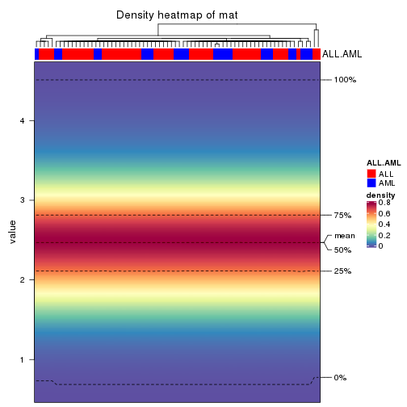


### Suggest the best k


Folowing table shows the best `k` (number of partitions) for each combination
of top-value methods and partition methods. Clicking on the method name in
the table goes to the section for a single combination of methods.

[The cola vignette](http://bioconductor.org/packages/devel/bioc/vignettes/cola/inst/doc/cola.html#toc_13)
explains the definition of the metrics used for determining the best
number of partitions.


```r
suggest_best_k(res_list)
```


|                            | The best k| 1-PAC| Mean silhouette| Concordance|   |Optional k |
|:---------------------------|----------:|-----:|---------------:|-----------:|:--|:----------|
|[ATC:kmeans](#ATC-kmeans)   |          2| 1.000|           0.982|       0.992|** |           |
|[ATC:NMF](#ATC-NMF)         |          2| 0.972|           0.927|       0.973|** |           |
|[ATC:skmeans](#ATC-skmeans) |          3| 0.961|           0.932|       0.973|** |2          |
|[MAD:skmeans](#MAD-skmeans) |          3| 0.866|           0.872|       0.946|   |           |
|[CV:skmeans](#CV-skmeans)   |          3| 0.837|           0.857|       0.938|   |           |
|[MAD:mclust](#MAD-mclust)   |          2| 0.824|           0.927|       0.932|   |           |
|[SD:skmeans](#SD-skmeans)   |          3| 0.745|           0.836|       0.918|   |           |
|[CV:kmeans](#CV-kmeans)     |          3| 0.739|           0.864|       0.901|   |           |
|[MAD:NMF](#MAD-NMF)         |          2| 0.680|           0.811|       0.925|   |           |
|[SD:kmeans](#SD-kmeans)     |          2| 0.662|           0.836|       0.911|   |           |
|[MAD:pam](#MAD-pam)         |          2| 0.651|           0.824|       0.925|   |           |
|[SD:mclust](#SD-mclust)     |          5| 0.634|           0.721|       0.790|   |           |
|[SD:NMF](#SD-NMF)           |          2| 0.633|           0.823|       0.928|   |           |
|[CV:NMF](#CV-NMF)           |          2| 0.633|           0.787|       0.916|   |           |
|[MAD:kmeans](#MAD-kmeans)   |          2| 0.623|           0.805|       0.904|   |           |
|[ATC:pam](#ATC-pam)         |          2| 0.597|           0.808|       0.918|   |           |
|[ATC:hclust](#ATC-hclust)   |          2| 0.574|           0.813|       0.911|   |           |
|[SD:pam](#SD-pam)           |          2| 0.548|           0.686|       0.876|   |           |
|[CV:pam](#CV-pam)           |          2| 0.546|           0.784|       0.904|   |           |
|[CV:mclust](#CV-mclust)     |          2| 0.489|           0.908|       0.895|   |           |
|[ATC:mclust](#ATC-mclust)   |          2| 0.360|           0.711|       0.828|   |           |
|[SD:hclust](#SD-hclust)     |          2| 0.236|           0.777|       0.851|   |           |
|[MAD:hclust](#MAD-hclust)   |          2| 0.227|           0.737|       0.838|   |           |
|[CV:hclust](#CV-hclust)     |          2| 0.214|           0.570|       0.805|   |           |

\*\*: 1-PAC > 0.95, \*: 1-PAC > 0.9


### CDF of consensus matrices

Cumulative distribution function curves of consensus matrix for all methods.


```r
collect_plots(res_list, fun = plot_ecdf)
```

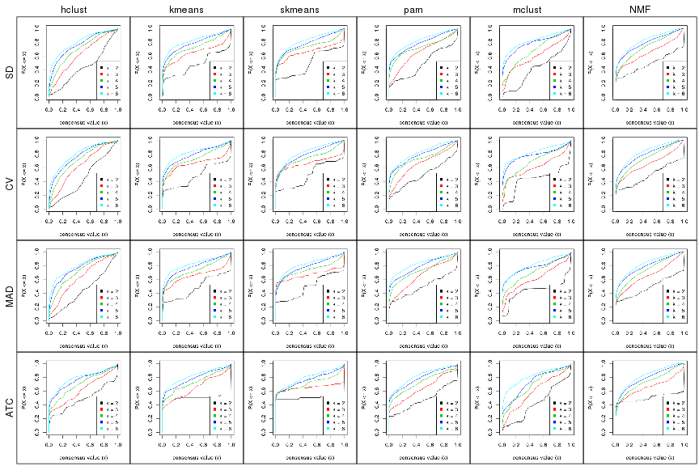


### Consensus heatmap

Consensus heatmaps for all methods. ([What is a consensus heatmap?](http://bioconductor.org/packages/devel/bioc/vignettes/cola/inst/doc/cola.html#toc_9))


<style type='text/css'>


.ui-helper-hidden {
	display: none;
}
.ui-helper-hidden-accessible {
	border: 0;
	clip: rect(0 0 0 0);
	height: 1px;
	margin: -1px;
	overflow: hidden;
	padding: 0;
	position: absolute;
	width: 1px;
}
.ui-helper-reset {
	margin: 0;
	padding: 0;
	border: 0;
	outline: 0;
	line-height: 1.3;
	text-decoration: none;
	font-size: 100%;
	list-style: none;
}
.ui-helper-clearfix:before,
.ui-helper-clearfix:after {
	content: "";
	display: table;
	border-collapse: collapse;
}
.ui-helper-clearfix:after {
	clear: both;
}
.ui-helper-zfix {
	width: 100%;
	height: 100%;
	top: 0;
	left: 0;
	position: absolute;
	opacity: 0;
	filter:Alpha(Opacity=0); 
}

.ui-front {
	z-index: 100;
}


.ui-state-disabled {
	cursor: default !important;
	pointer-events: none;
}


.ui-icon {
	display: inline-block;
	vertical-align: middle;
	margin-top: -.25em;
	position: relative;
	text-indent: -99999px;
	overflow: hidden;
	background-repeat: no-repeat;
}

.ui-widget-icon-block {
	left: 50%;
	margin-left: -8px;
	display: block;
}


.ui-widget-overlay {
	position: fixed;
	top: 0;
	left: 0;
	width: 100%;
	height: 100%;
}
.ui-accordion .ui-accordion-header {
	display: block;
	cursor: pointer;
	position: relative;
	margin: 2px 0 0 0;
	padding: .5em .5em .5em .7em;
	font-size: 100%;
}
.ui-accordion .ui-accordion-content {
	padding: 1em 2.2em;
	border-top: 0;
	overflow: auto;
}
.ui-autocomplete {
	position: absolute;
	top: 0;
	left: 0;
	cursor: default;
}
.ui-menu {
	list-style: none;
	padding: 0;
	margin: 0;
	display: block;
	outline: 0;
}
.ui-menu .ui-menu {
	position: absolute;
}
.ui-menu .ui-menu-item {
	margin: 0;
	cursor: pointer;
	
	list-style-image: url("data:image/gif;base64,R0lGODlhAQABAIAAAAAAAP///yH5BAEAAAAALAAAAAABAAEAAAIBRAA7");
}
.ui-menu .ui-menu-item-wrapper {
	position: relative;
	padding: 3px 1em 3px .4em;
}
.ui-menu .ui-menu-divider {
	margin: 5px 0;
	height: 0;
	font-size: 0;
	line-height: 0;
	border-width: 1px 0 0 0;
}
.ui-menu .ui-state-focus,
.ui-menu .ui-state-active {
	margin: -1px;
}


.ui-menu-icons {
	position: relative;
}
.ui-menu-icons .ui-menu-item-wrapper {
	padding-left: 2em;
}


.ui-menu .ui-icon {
	position: absolute;
	top: 0;
	bottom: 0;
	left: .2em;
	margin: auto 0;
}


.ui-menu .ui-menu-icon {
	left: auto;
	right: 0;
}
.ui-button {
	padding: .4em 1em;
	display: inline-block;
	position: relative;
	line-height: normal;
	margin-right: .1em;
	cursor: pointer;
	vertical-align: middle;
	text-align: center;
	-webkit-user-select: none;
	-moz-user-select: none;
	-ms-user-select: none;
	user-select: none;

	
	overflow: visible;
}

.ui-button,
.ui-button:link,
.ui-button:visited,
.ui-button:hover,
.ui-button:active {
	text-decoration: none;
}


.ui-button-icon-only {
	width: 2em;
	box-sizing: border-box;
	text-indent: -9999px;
	white-space: nowrap;
}


input.ui-button.ui-button-icon-only {
	text-indent: 0;
}


.ui-button-icon-only .ui-icon {
	position: absolute;
	top: 50%;
	left: 50%;
	margin-top: -8px;
	margin-left: -8px;
}

.ui-button.ui-icon-notext .ui-icon {
	padding: 0;
	width: 2.1em;
	height: 2.1em;
	text-indent: -9999px;
	white-space: nowrap;

}

input.ui-button.ui-icon-notext .ui-icon {
	width: auto;
	height: auto;
	text-indent: 0;
	white-space: normal;
	padding: .4em 1em;
}


input.ui-button::-moz-focus-inner,
button.ui-button::-moz-focus-inner {
	border: 0;
	padding: 0;
}
.ui-controlgroup {
	vertical-align: middle;
	display: inline-block;
}
.ui-controlgroup > .ui-controlgroup-item {
	float: left;
	margin-left: 0;
	margin-right: 0;
}
.ui-controlgroup > .ui-controlgroup-item:focus,
.ui-controlgroup > .ui-controlgroup-item.ui-visual-focus {
	z-index: 9999;
}
.ui-controlgroup-vertical > .ui-controlgroup-item {
	display: block;
	float: none;
	width: 100%;
	margin-top: 0;
	margin-bottom: 0;
	text-align: left;
}
.ui-controlgroup-vertical .ui-controlgroup-item {
	box-sizing: border-box;
}
.ui-controlgroup .ui-controlgroup-label {
	padding: .4em 1em;
}
.ui-controlgroup .ui-controlgroup-label span {
	font-size: 80%;
}
.ui-controlgroup-horizontal .ui-controlgroup-label + .ui-controlgroup-item {
	border-left: none;
}
.ui-controlgroup-vertical .ui-controlgroup-label + .ui-controlgroup-item {
	border-top: none;
}
.ui-controlgroup-horizontal .ui-controlgroup-label.ui-widget-content {
	border-right: none;
}
.ui-controlgroup-vertical .ui-controlgroup-label.ui-widget-content {
	border-bottom: none;
}


.ui-controlgroup-vertical .ui-spinner-input {

	
	width: 75%;
	width: calc( 100% - 2.4em );
}
.ui-controlgroup-vertical .ui-spinner .ui-spinner-up {
	border-top-style: solid;
}

.ui-checkboxradio-label .ui-icon-background {
	box-shadow: inset 1px 1px 1px #ccc;
	border-radius: .12em;
	border: none;
}
.ui-checkboxradio-radio-label .ui-icon-background {
	width: 16px;
	height: 16px;
	border-radius: 1em;
	overflow: visible;
	border: none;
}
.ui-checkboxradio-radio-label.ui-checkboxradio-checked .ui-icon,
.ui-checkboxradio-radio-label.ui-checkboxradio-checked:hover .ui-icon {
	background-image: none;
	width: 8px;
	height: 8px;
	border-width: 4px;
	border-style: solid;
}
.ui-checkboxradio-disabled {
	pointer-events: none;
}
.ui-datepicker {
	width: 17em;
	padding: .2em .2em 0;
	display: none;
}
.ui-datepicker .ui-datepicker-header {
	position: relative;
	padding: .2em 0;
}
.ui-datepicker .ui-datepicker-prev,
.ui-datepicker .ui-datepicker-next {
	position: absolute;
	top: 2px;
	width: 1.8em;
	height: 1.8em;
}
.ui-datepicker .ui-datepicker-prev-hover,
.ui-datepicker .ui-datepicker-next-hover {
	top: 1px;
}
.ui-datepicker .ui-datepicker-prev {
	left: 2px;
}
.ui-datepicker .ui-datepicker-next {
	right: 2px;
}
.ui-datepicker .ui-datepicker-prev-hover {
	left: 1px;
}
.ui-datepicker .ui-datepicker-next-hover {
	right: 1px;
}
.ui-datepicker .ui-datepicker-prev span,
.ui-datepicker .ui-datepicker-next span {
	display: block;
	position: absolute;
	left: 50%;
	margin-left: -8px;
	top: 50%;
	margin-top: -8px;
}
.ui-datepicker .ui-datepicker-title {
	margin: 0 2.3em;
	line-height: 1.8em;
	text-align: center;
}
.ui-datepicker .ui-datepicker-title select {
	font-size: 1em;
	margin: 1px 0;
}
.ui-datepicker select.ui-datepicker-month,
.ui-datepicker select.ui-datepicker-year {
	width: 45%;
}
.ui-datepicker table {
	width: 100%;
	font-size: .9em;
	border-collapse: collapse;
	margin: 0 0 .4em;
}
.ui-datepicker th {
	padding: .7em .3em;
	text-align: center;
	font-weight: bold;
	border: 0;
}
.ui-datepicker td {
	border: 0;
	padding: 1px;
}
.ui-datepicker td span,
.ui-datepicker td a {
	display: block;
	padding: .2em;
	text-align: right;
	text-decoration: none;
}
.ui-datepicker .ui-datepicker-buttonpane {
	background-image: none;
	margin: .7em 0 0 0;
	padding: 0 .2em;
	border-left: 0;
	border-right: 0;
	border-bottom: 0;
}
.ui-datepicker .ui-datepicker-buttonpane button {
	float: right;
	margin: .5em .2em .4em;
	cursor: pointer;
	padding: .2em .6em .3em .6em;
	width: auto;
	overflow: visible;
}
.ui-datepicker .ui-datepicker-buttonpane button.ui-datepicker-current {
	float: left;
}


.ui-datepicker.ui-datepicker-multi {
	width: auto;
}
.ui-datepicker-multi .ui-datepicker-group {
	float: left;
}
.ui-datepicker-multi .ui-datepicker-group table {
	width: 95%;
	margin: 0 auto .4em;
}
.ui-datepicker-multi-2 .ui-datepicker-group {
	width: 50%;
}
.ui-datepicker-multi-3 .ui-datepicker-group {
	width: 33.3%;
}
.ui-datepicker-multi-4 .ui-datepicker-group {
	width: 25%;
}
.ui-datepicker-multi .ui-datepicker-group-last .ui-datepicker-header,
.ui-datepicker-multi .ui-datepicker-group-middle .ui-datepicker-header {
	border-left-width: 0;
}
.ui-datepicker-multi .ui-datepicker-buttonpane {
	clear: left;
}
.ui-datepicker-row-break {
	clear: both;
	width: 100%;
	font-size: 0;
}


.ui-datepicker-rtl {
	direction: rtl;
}
.ui-datepicker-rtl .ui-datepicker-prev {
	right: 2px;
	left: auto;
}
.ui-datepicker-rtl .ui-datepicker-next {
	left: 2px;
	right: auto;
}
.ui-datepicker-rtl .ui-datepicker-prev:hover {
	right: 1px;
	left: auto;
}
.ui-datepicker-rtl .ui-datepicker-next:hover {
	left: 1px;
	right: auto;
}
.ui-datepicker-rtl .ui-datepicker-buttonpane {
	clear: right;
}
.ui-datepicker-rtl .ui-datepicker-buttonpane button {
	float: left;
}
.ui-datepicker-rtl .ui-datepicker-buttonpane button.ui-datepicker-current,
.ui-datepicker-rtl .ui-datepicker-group {
	float: right;
}
.ui-datepicker-rtl .ui-datepicker-group-last .ui-datepicker-header,
.ui-datepicker-rtl .ui-datepicker-group-middle .ui-datepicker-header {
	border-right-width: 0;
	border-left-width: 1px;
}


.ui-datepicker .ui-icon {
	display: block;
	text-indent: -99999px;
	overflow: hidden;
	background-repeat: no-repeat;
	left: .5em;
	top: .3em;
}
.ui-dialog {
	position: absolute;
	top: 0;
	left: 0;
	padding: .2em;
	outline: 0;
}
.ui-dialog .ui-dialog-titlebar {
	padding: .4em 1em;
	position: relative;
}
.ui-dialog .ui-dialog-title {
	float: left;
	margin: .1em 0;
	white-space: nowrap;
	width: 90%;
	overflow: hidden;
	text-overflow: ellipsis;
}
.ui-dialog .ui-dialog-titlebar-close {
	position: absolute;
	right: .3em;
	top: 50%;
	width: 20px;
	margin: -10px 0 0 0;
	padding: 1px;
	height: 20px;
}
.ui-dialog .ui-dialog-content {
	position: relative;
	border: 0;
	padding: .5em 1em;
	background: none;
	overflow: auto;
}
.ui-dialog .ui-dialog-buttonpane {
	text-align: left;
	border-width: 1px 0 0 0;
	background-image: none;
	margin-top: .5em;
	padding: .3em 1em .5em .4em;
}
.ui-dialog .ui-dialog-buttonpane .ui-dialog-buttonset {
	float: right;
}
.ui-dialog .ui-dialog-buttonpane button {
	margin: .5em .4em .5em 0;
	cursor: pointer;
}
.ui-dialog .ui-resizable-n {
	height: 2px;
	top: 0;
}
.ui-dialog .ui-resizable-e {
	width: 2px;
	right: 0;
}
.ui-dialog .ui-resizable-s {
	height: 2px;
	bottom: 0;
}
.ui-dialog .ui-resizable-w {
	width: 2px;
	left: 0;
}
.ui-dialog .ui-resizable-se,
.ui-dialog .ui-resizable-sw,
.ui-dialog .ui-resizable-ne,
.ui-dialog .ui-resizable-nw {
	width: 7px;
	height: 7px;
}
.ui-dialog .ui-resizable-se {
	right: 0;
	bottom: 0;
}
.ui-dialog .ui-resizable-sw {
	left: 0;
	bottom: 0;
}
.ui-dialog .ui-resizable-ne {
	right: 0;
	top: 0;
}
.ui-dialog .ui-resizable-nw {
	left: 0;
	top: 0;
}
.ui-draggable .ui-dialog-titlebar {
	cursor: move;
}
.ui-draggable-handle {
	-ms-touch-action: none;
	touch-action: none;
}
.ui-resizable {
	position: relative;
}
.ui-resizable-handle {
	position: absolute;
	font-size: 0.1px;
	display: block;
	-ms-touch-action: none;
	touch-action: none;
}
.ui-resizable-disabled .ui-resizable-handle,
.ui-resizable-autohide .ui-resizable-handle {
	display: none;
}
.ui-resizable-n {
	cursor: n-resize;
	height: 7px;
	width: 100%;
	top: -5px;
	left: 0;
}
.ui-resizable-s {
	cursor: s-resize;
	height: 7px;
	width: 100%;
	bottom: -5px;
	left: 0;
}
.ui-resizable-e {
	cursor: e-resize;
	width: 7px;
	right: -5px;
	top: 0;
	height: 100%;
}
.ui-resizable-w {
	cursor: w-resize;
	width: 7px;
	left: -5px;
	top: 0;
	height: 100%;
}
.ui-resizable-se {
	cursor: se-resize;
	width: 12px;
	height: 12px;
	right: 1px;
	bottom: 1px;
}
.ui-resizable-sw {
	cursor: sw-resize;
	width: 9px;
	height: 9px;
	left: -5px;
	bottom: -5px;
}
.ui-resizable-nw {
	cursor: nw-resize;
	width: 9px;
	height: 9px;
	left: -5px;
	top: -5px;
}
.ui-resizable-ne {
	cursor: ne-resize;
	width: 9px;
	height: 9px;
	right: -5px;
	top: -5px;
}
.ui-progressbar {
	height: 2em;
	text-align: left;
	overflow: hidden;
}
.ui-progressbar .ui-progressbar-value {
	margin: -1px;
	height: 100%;
}
.ui-progressbar .ui-progressbar-overlay {
	background: url("");
	height: 100%;
	filter: alpha(opacity=25); 
	opacity: 0.25;
}
.ui-progressbar-indeterminate .ui-progressbar-value {
	background-image: none;
}
.ui-selectable {
	-ms-touch-action: none;
	touch-action: none;
}
.ui-selectable-helper {
	position: absolute;
	z-index: 100;
	border: 1px dotted black;
}
.ui-selectmenu-menu {
	padding: 0;
	margin: 0;
	position: absolute;
	top: 0;
	left: 0;
	display: none;
}
.ui-selectmenu-menu .ui-menu {
	overflow: auto;
	overflow-x: hidden;
	padding-bottom: 1px;
}
.ui-selectmenu-menu .ui-menu .ui-selectmenu-optgroup {
	font-size: 1em;
	font-weight: bold;
	line-height: 1.5;
	padding: 2px 0.4em;
	margin: 0.5em 0 0 0;
	height: auto;
	border: 0;
}
.ui-selectmenu-open {
	display: block;
}
.ui-selectmenu-text {
	display: block;
	margin-right: 20px;
	overflow: hidden;
	text-overflow: ellipsis;
}
.ui-selectmenu-button.ui-button {
	text-align: left;
	white-space: nowrap;
	width: 14em;
}
.ui-selectmenu-icon.ui-icon {
	float: right;
	margin-top: 0;
}
.ui-slider {
	position: relative;
	text-align: left;
}
.ui-slider .ui-slider-handle {
	position: absolute;
	z-index: 2;
	width: 1.2em;
	height: 1.2em;
	cursor: default;
	-ms-touch-action: none;
	touch-action: none;
}
.ui-slider .ui-slider-range {
	position: absolute;
	z-index: 1;
	font-size: .7em;
	display: block;
	border: 0;
	background-position: 0 0;
}


.ui-slider.ui-state-disabled .ui-slider-handle,
.ui-slider.ui-state-disabled .ui-slider-range {
	filter: inherit;
}

.ui-slider-horizontal {
	height: .8em;
}
.ui-slider-horizontal .ui-slider-handle {
	top: -.3em;
	margin-left: -.6em;
}
.ui-slider-horizontal .ui-slider-range {
	top: 0;
	height: 100%;
}
.ui-slider-horizontal .ui-slider-range-min {
	left: 0;
}
.ui-slider-horizontal .ui-slider-range-max {
	right: 0;
}

.ui-slider-vertical {
	width: .8em;
	height: 100px;
}
.ui-slider-vertical .ui-slider-handle {
	left: -.3em;
	margin-left: 0;
	margin-bottom: -.6em;
}
.ui-slider-vertical .ui-slider-range {
	left: 0;
	width: 100%;
}
.ui-slider-vertical .ui-slider-range-min {
	bottom: 0;
}
.ui-slider-vertical .ui-slider-range-max {
	top: 0;
}
.ui-sortable-handle {
	-ms-touch-action: none;
	touch-action: none;
}
.ui-spinner {
	position: relative;
	display: inline-block;
	overflow: hidden;
	padding: 0;
	vertical-align: middle;
}
.ui-spinner-input {
	border: none;
	background: none;
	color: inherit;
	padding: .222em 0;
	margin: .2em 0;
	vertical-align: middle;
	margin-left: .4em;
	margin-right: 2em;
}
.ui-spinner-button {
	width: 1.6em;
	height: 50%;
	font-size: .5em;
	padding: 0;
	margin: 0;
	text-align: center;
	position: absolute;
	cursor: default;
	display: block;
	overflow: hidden;
	right: 0;
}

.ui-spinner a.ui-spinner-button {
	border-top-style: none;
	border-bottom-style: none;
	border-right-style: none;
}
.ui-spinner-up {
	top: 0;
}
.ui-spinner-down {
	bottom: 0;
}
.ui-tabs {
	position: relative;
	padding: .2em;
}
.ui-tabs .ui-tabs-nav {
	margin: 0;
	padding: .2em .2em 0;
}
.ui-tabs .ui-tabs-nav li {
	list-style: none;
	float: left;
	position: relative;
	top: 0;
	margin: 1px .2em 0 0;
	border-bottom-width: 0;
	padding: 0;
	white-space: nowrap;
}
.ui-tabs .ui-tabs-nav .ui-tabs-anchor {
	float: left;
	padding: .5em 1em;
	text-decoration: none;
}
.ui-tabs .ui-tabs-nav li.ui-tabs-active {
	margin-bottom: -1px;
	padding-bottom: 1px;
}
.ui-tabs .ui-tabs-nav li.ui-tabs-active .ui-tabs-anchor,
.ui-tabs .ui-tabs-nav li.ui-state-disabled .ui-tabs-anchor,
.ui-tabs .ui-tabs-nav li.ui-tabs-loading .ui-tabs-anchor {
	cursor: text;
}
.ui-tabs-collapsible .ui-tabs-nav li.ui-tabs-active .ui-tabs-anchor {
	cursor: pointer;
}
.ui-tabs .ui-tabs-panel {
	display: block;
	border-width: 0;
	padding: 1em 1.4em;
	background: none;
}
.ui-tooltip {
	padding: 8px;
	position: absolute;
	z-index: 9999;
	max-width: 300px;
}
body .ui-tooltip {
	border-width: 2px;
}

.ui-widget {
	font-family: Arial,Helvetica,sans-serif;
	font-size: 1em;
}
.ui-widget .ui-widget {
	font-size: 1em;
}
.ui-widget input,
.ui-widget select,
.ui-widget textarea,
.ui-widget button {
	font-family: Arial,Helvetica,sans-serif;
	font-size: 1em;
}
.ui-widget.ui-widget-content {
	border: 1px solid #c5c5c5;
}
.ui-widget-content {
	border: 1px solid #dddddd;
	background: #ffffff;
	color: #333333;
}
.ui-widget-content a {
	color: #333333;
}
.ui-widget-header {
	border: 1px solid #dddddd;
	background: #e9e9e9;
	color: #333333;
	font-weight: bold;
}
.ui-widget-header a {
	color: #333333;
}


.ui-state-default,
.ui-widget-content .ui-state-default,
.ui-widget-header .ui-state-default,
.ui-button,


html .ui-button.ui-state-disabled:hover,
html .ui-button.ui-state-disabled:active {
	border: 1px solid #c5c5c5;
	background: #f6f6f6;
	font-weight: normal;
	color: #454545;
}
.ui-state-default a,
.ui-state-default a:link,
.ui-state-default a:visited,
a.ui-button,
a:link.ui-button,
a:visited.ui-button,
.ui-button {
	color: #454545;
	text-decoration: none;
}
.ui-state-hover,
.ui-widget-content .ui-state-hover,
.ui-widget-header .ui-state-hover,
.ui-state-focus,
.ui-widget-content .ui-state-focus,
.ui-widget-header .ui-state-focus,
.ui-button:hover,
.ui-button:focus {
	border: 1px solid #cccccc;
	background: #ededed;
	font-weight: normal;
	color: #2b2b2b;
}
.ui-state-hover a,
.ui-state-hover a:hover,
.ui-state-hover a:link,
.ui-state-hover a:visited,
.ui-state-focus a,
.ui-state-focus a:hover,
.ui-state-focus a:link,
.ui-state-focus a:visited,
a.ui-button:hover,
a.ui-button:focus {
	color: #2b2b2b;
	text-decoration: none;
}

.ui-visual-focus {
	box-shadow: 0 0 3px 1px rgb(94, 158, 214);
}
.ui-state-active,
.ui-widget-content .ui-state-active,
.ui-widget-header .ui-state-active,
a.ui-button:active,
.ui-button:active,
.ui-button.ui-state-active:hover {
	border: 1px solid #003eff;
	background: #007fff;
	font-weight: normal;
	color: #ffffff;
}
.ui-icon-background,
.ui-state-active .ui-icon-background {
	border: #003eff;
	background-color: #ffffff;
}
.ui-state-active a,
.ui-state-active a:link,
.ui-state-active a:visited {
	color: #ffffff;
	text-decoration: none;
}


.ui-state-highlight,
.ui-widget-content .ui-state-highlight,
.ui-widget-header .ui-state-highlight {
	border: 1px solid #dad55e;
	background: #fffa90;
	color: #777620;
}
.ui-state-checked {
	border: 1px solid #dad55e;
	background: #fffa90;
}
.ui-state-highlight a,
.ui-widget-content .ui-state-highlight a,
.ui-widget-header .ui-state-highlight a {
	color: #777620;
}
.ui-state-error,
.ui-widget-content .ui-state-error,
.ui-widget-header .ui-state-error {
	border: 1px solid #f1a899;
	background: #fddfdf;
	color: #5f3f3f;
}
.ui-state-error a,
.ui-widget-content .ui-state-error a,
.ui-widget-header .ui-state-error a {
	color: #5f3f3f;
}
.ui-state-error-text,
.ui-widget-content .ui-state-error-text,
.ui-widget-header .ui-state-error-text {
	color: #5f3f3f;
}
.ui-priority-primary,
.ui-widget-content .ui-priority-primary,
.ui-widget-header .ui-priority-primary {
	font-weight: bold;
}
.ui-priority-secondary,
.ui-widget-content .ui-priority-secondary,
.ui-widget-header .ui-priority-secondary {
	opacity: .7;
	filter:Alpha(Opacity=70); 
	font-weight: normal;
}
.ui-state-disabled,
.ui-widget-content .ui-state-disabled,
.ui-widget-header .ui-state-disabled {
	opacity: .35;
	filter:Alpha(Opacity=35); 
	background-image: none;
}
.ui-state-disabled .ui-icon {
	filter:Alpha(Opacity=35); 
}


.ui-icon {
	width: 16px;
	height: 16px;
}
.ui-icon,
.ui-widget-content .ui-icon {
	background-image: url("images/ui-icons_444444_256x240.png");
}
.ui-widget-header .ui-icon {
	background-image: url("images/ui-icons_444444_256x240.png");
}
.ui-state-hover .ui-icon,
.ui-state-focus .ui-icon,
.ui-button:hover .ui-icon,
.ui-button:focus .ui-icon {
	background-image: url("images/ui-icons_555555_256x240.png");
}
.ui-state-active .ui-icon,
.ui-button:active .ui-icon {
	background-image: url("images/ui-icons_ffffff_256x240.png");
}
.ui-state-highlight .ui-icon,
.ui-button .ui-state-highlight.ui-icon {
	background-image: url("images/ui-icons_777620_256x240.png");
}
.ui-state-error .ui-icon,
.ui-state-error-text .ui-icon {
	background-image: url("images/ui-icons_cc0000_256x240.png");
}
.ui-button .ui-icon {
	background-image: url("images/ui-icons_777777_256x240.png");
}


.ui-icon-blank { background-position: 16px 16px; }
.ui-icon-caret-1-n { background-position: 0 0; }
.ui-icon-caret-1-ne { background-position: -16px 0; }
.ui-icon-caret-1-e { background-position: -32px 0; }
.ui-icon-caret-1-se { background-position: -48px 0; }
.ui-icon-caret-1-s { background-position: -65px 0; }
.ui-icon-caret-1-sw { background-position: -80px 0; }
.ui-icon-caret-1-w { background-position: -96px 0; }
.ui-icon-caret-1-nw { background-position: -112px 0; }
.ui-icon-caret-2-n-s { background-position: -128px 0; }
.ui-icon-caret-2-e-w { background-position: -144px 0; }
.ui-icon-triangle-1-n { background-position: 0 -16px; }
.ui-icon-triangle-1-ne { background-position: -16px -16px; }
.ui-icon-triangle-1-e { background-position: -32px -16px; }
.ui-icon-triangle-1-se { background-position: -48px -16px; }
.ui-icon-triangle-1-s { background-position: -65px -16px; }
.ui-icon-triangle-1-sw { background-position: -80px -16px; }
.ui-icon-triangle-1-w { background-position: -96px -16px; }
.ui-icon-triangle-1-nw { background-position: -112px -16px; }
.ui-icon-triangle-2-n-s { background-position: -128px -16px; }
.ui-icon-triangle-2-e-w { background-position: -144px -16px; }
.ui-icon-arrow-1-n { background-position: 0 -32px; }
.ui-icon-arrow-1-ne { background-position: -16px -32px; }
.ui-icon-arrow-1-e { background-position: -32px -32px; }
.ui-icon-arrow-1-se { background-position: -48px -32px; }
.ui-icon-arrow-1-s { background-position: -65px -32px; }
.ui-icon-arrow-1-sw { background-position: -80px -32px; }
.ui-icon-arrow-1-w { background-position: -96px -32px; }
.ui-icon-arrow-1-nw { background-position: -112px -32px; }
.ui-icon-arrow-2-n-s { background-position: -128px -32px; }
.ui-icon-arrow-2-ne-sw { background-position: -144px -32px; }
.ui-icon-arrow-2-e-w { background-position: -160px -32px; }
.ui-icon-arrow-2-se-nw { background-position: -176px -32px; }
.ui-icon-arrowstop-1-n { background-position: -192px -32px; }
.ui-icon-arrowstop-1-e { background-position: -208px -32px; }
.ui-icon-arrowstop-1-s { background-position: -224px -32px; }
.ui-icon-arrowstop-1-w { background-position: -240px -32px; }
.ui-icon-arrowthick-1-n { background-position: 1px -48px; }
.ui-icon-arrowthick-1-ne { background-position: -16px -48px; }
.ui-icon-arrowthick-1-e { background-position: -32px -48px; }
.ui-icon-arrowthick-1-se { background-position: -48px -48px; }
.ui-icon-arrowthick-1-s { background-position: -64px -48px; }
.ui-icon-arrowthick-1-sw { background-position: -80px -48px; }
.ui-icon-arrowthick-1-w { background-position: -96px -48px; }
.ui-icon-arrowthick-1-nw { background-position: -112px -48px; }
.ui-icon-arrowthick-2-n-s { background-position: -128px -48px; }
.ui-icon-arrowthick-2-ne-sw { background-position: -144px -48px; }
.ui-icon-arrowthick-2-e-w { background-position: -160px -48px; }
.ui-icon-arrowthick-2-se-nw { background-position: -176px -48px; }
.ui-icon-arrowthickstop-1-n { background-position: -192px -48px; }
.ui-icon-arrowthickstop-1-e { background-position: -208px -48px; }
.ui-icon-arrowthickstop-1-s { background-position: -224px -48px; }
.ui-icon-arrowthickstop-1-w { background-position: -240px -48px; }
.ui-icon-arrowreturnthick-1-w { background-position: 0 -64px; }
.ui-icon-arrowreturnthick-1-n { background-position: -16px -64px; }
.ui-icon-arrowreturnthick-1-e { background-position: -32px -64px; }
.ui-icon-arrowreturnthick-1-s { background-position: -48px -64px; }
.ui-icon-arrowreturn-1-w { background-position: -64px -64px; }
.ui-icon-arrowreturn-1-n { background-position: -80px -64px; }
.ui-icon-arrowreturn-1-e { background-position: -96px -64px; }
.ui-icon-arrowreturn-1-s { background-position: -112px -64px; }
.ui-icon-arrowrefresh-1-w { background-position: -128px -64px; }
.ui-icon-arrowrefresh-1-n { background-position: -144px -64px; }
.ui-icon-arrowrefresh-1-e { background-position: -160px -64px; }
.ui-icon-arrowrefresh-1-s { background-position: -176px -64px; }
.ui-icon-arrow-4 { background-position: 0 -80px; }
.ui-icon-arrow-4-diag { background-position: -16px -80px; }
.ui-icon-extlink { background-position: -32px -80px; }
.ui-icon-newwin { background-position: -48px -80px; }
.ui-icon-refresh { background-position: -64px -80px; }
.ui-icon-shuffle { background-position: -80px -80px; }
.ui-icon-transfer-e-w { background-position: -96px -80px; }
.ui-icon-transferthick-e-w { background-position: -112px -80px; }
.ui-icon-folder-collapsed { background-position: 0 -96px; }
.ui-icon-folder-open { background-position: -16px -96px; }
.ui-icon-document { background-position: -32px -96px; }
.ui-icon-document-b { background-position: -48px -96px; }
.ui-icon-note { background-position: -64px -96px; }
.ui-icon-mail-closed { background-position: -80px -96px; }
.ui-icon-mail-open { background-position: -96px -96px; }
.ui-icon-suitcase { background-position: -112px -96px; }
.ui-icon-comment { background-position: -128px -96px; }
.ui-icon-person { background-position: -144px -96px; }
.ui-icon-print { background-position: -160px -96px; }
.ui-icon-trash { background-position: -176px -96px; }
.ui-icon-locked { background-position: -192px -96px; }
.ui-icon-unlocked { background-position: -208px -96px; }
.ui-icon-bookmark { background-position: -224px -96px; }
.ui-icon-tag { background-position: -240px -96px; }
.ui-icon-home { background-position: 0 -112px; }
.ui-icon-flag { background-position: -16px -112px; }
.ui-icon-calendar { background-position: -32px -112px; }
.ui-icon-cart { background-position: -48px -112px; }
.ui-icon-pencil { background-position: -64px -112px; }
.ui-icon-clock { background-position: -80px -112px; }
.ui-icon-disk { background-position: -96px -112px; }
.ui-icon-calculator { background-position: -112px -112px; }
.ui-icon-zoomin { background-position: -128px -112px; }
.ui-icon-zoomout { background-position: -144px -112px; }
.ui-icon-search { background-position: -160px -112px; }
.ui-icon-wrench { background-position: -176px -112px; }
.ui-icon-gear { background-position: -192px -112px; }
.ui-icon-heart { background-position: -208px -112px; }
.ui-icon-star { background-position: -224px -112px; }
.ui-icon-link { background-position: -240px -112px; }
.ui-icon-cancel { background-position: 0 -128px; }
.ui-icon-plus { background-position: -16px -128px; }
.ui-icon-plusthick { background-position: -32px -128px; }
.ui-icon-minus { background-position: -48px -128px; }
.ui-icon-minusthick { background-position: -64px -128px; }
.ui-icon-close { background-position: -80px -128px; }
.ui-icon-closethick { background-position: -96px -128px; }
.ui-icon-key { background-position: -112px -128px; }
.ui-icon-lightbulb { background-position: -128px -128px; }
.ui-icon-scissors { background-position: -144px -128px; }
.ui-icon-clipboard { background-position: -160px -128px; }
.ui-icon-copy { background-position: -176px -128px; }
.ui-icon-contact { background-position: -192px -128px; }
.ui-icon-image { background-position: -208px -128px; }
.ui-icon-video { background-position: -224px -128px; }
.ui-icon-script { background-position: -240px -128px; }
.ui-icon-alert { background-position: 0 -144px; }
.ui-icon-info { background-position: -16px -144px; }
.ui-icon-notice { background-position: -32px -144px; }
.ui-icon-help { background-position: -48px -144px; }
.ui-icon-check { background-position: -64px -144px; }
.ui-icon-bullet { background-position: -80px -144px; }
.ui-icon-radio-on { background-position: -96px -144px; }
.ui-icon-radio-off { background-position: -112px -144px; }
.ui-icon-pin-w { background-position: -128px -144px; }
.ui-icon-pin-s { background-position: -144px -144px; }
.ui-icon-play { background-position: 0 -160px; }
.ui-icon-pause { background-position: -16px -160px; }
.ui-icon-seek-next { background-position: -32px -160px; }
.ui-icon-seek-prev { background-position: -48px -160px; }
.ui-icon-seek-end { background-position: -64px -160px; }
.ui-icon-seek-start { background-position: -80px -160px; }

.ui-icon-seek-first { background-position: -80px -160px; }
.ui-icon-stop { background-position: -96px -160px; }
.ui-icon-eject { background-position: -112px -160px; }
.ui-icon-volume-off { background-position: -128px -160px; }
.ui-icon-volume-on { background-position: -144px -160px; }
.ui-icon-power { background-position: 0 -176px; }
.ui-icon-signal-diag { background-position: -16px -176px; }
.ui-icon-signal { background-position: -32px -176px; }
.ui-icon-battery-0 { background-position: -48px -176px; }
.ui-icon-battery-1 { background-position: -64px -176px; }
.ui-icon-battery-2 { background-position: -80px -176px; }
.ui-icon-battery-3 { background-position: -96px -176px; }
.ui-icon-circle-plus { background-position: 0 -192px; }
.ui-icon-circle-minus { background-position: -16px -192px; }
.ui-icon-circle-close { background-position: -32px -192px; }
.ui-icon-circle-triangle-e { background-position: -48px -192px; }
.ui-icon-circle-triangle-s { background-position: -64px -192px; }
.ui-icon-circle-triangle-w { background-position: -80px -192px; }
.ui-icon-circle-triangle-n { background-position: -96px -192px; }
.ui-icon-circle-arrow-e { background-position: -112px -192px; }
.ui-icon-circle-arrow-s { background-position: -128px -192px; }
.ui-icon-circle-arrow-w { background-position: -144px -192px; }
.ui-icon-circle-arrow-n { background-position: -160px -192px; }
.ui-icon-circle-zoomin { background-position: -176px -192px; }
.ui-icon-circle-zoomout { background-position: -192px -192px; }
.ui-icon-circle-check { background-position: -208px -192px; }
.ui-icon-circlesmall-plus { background-position: 0 -208px; }
.ui-icon-circlesmall-minus { background-position: -16px -208px; }
.ui-icon-circlesmall-close { background-position: -32px -208px; }
.ui-icon-squaresmall-plus { background-position: -48px -208px; }
.ui-icon-squaresmall-minus { background-position: -64px -208px; }
.ui-icon-squaresmall-close { background-position: -80px -208px; }
.ui-icon-grip-dotted-vertical { background-position: 0 -224px; }
.ui-icon-grip-dotted-horizontal { background-position: -16px -224px; }
.ui-icon-grip-solid-vertical { background-position: -32px -224px; }
.ui-icon-grip-solid-horizontal { background-position: -48px -224px; }
.ui-icon-gripsmall-diagonal-se { background-position: -64px -224px; }
.ui-icon-grip-diagonal-se { background-position: -80px -224px; }


.ui-corner-all,
.ui-corner-top,
.ui-corner-left,
.ui-corner-tl {
	border-top-left-radius: 3px;
}
.ui-corner-all,
.ui-corner-top,
.ui-corner-right,
.ui-corner-tr {
	border-top-right-radius: 3px;
}
.ui-corner-all,
.ui-corner-bottom,
.ui-corner-left,
.ui-corner-bl {
	border-bottom-left-radius: 3px;
}
.ui-corner-all,
.ui-corner-bottom,
.ui-corner-right,
.ui-corner-br {
	border-bottom-right-radius: 3px;
}


.ui-widget-overlay {
	background: #aaaaaa;
	opacity: .3;
	filter: Alpha(Opacity=30); 
}
.ui-widget-shadow {
	-webkit-box-shadow: 0px 0px 5px #666666;
	box-shadow: 0px 0px 5px #666666;
} 
</style>
<script src='js/jquery-1.12.4.js'></script>
<script src='js/jquery-ui.js'></script>

<script>
$( function() {
	$( '#tabs-collect-consensus-heatmap' ).tabs();
} );
</script>
<div id='tabs-collect-consensus-heatmap'>
<ul>
<li><a href='#tab-collect-consensus-heatmap-1'>k = 2</a></li>
<li><a href='#tab-collect-consensus-heatmap-2'>k = 3</a></li>
<li><a href='#tab-collect-consensus-heatmap-3'>k = 4</a></li>
<li><a href='#tab-collect-consensus-heatmap-4'>k = 5</a></li>
<li><a href='#tab-collect-consensus-heatmap-5'>k = 6</a></li>
</ul>
<div id='tab-collect-consensus-heatmap-1'>
<pre><code class="r">collect_plots(res_list, k = 2, fun = consensus_heatmap, mc.cores = 4)
</code></pre>

<p>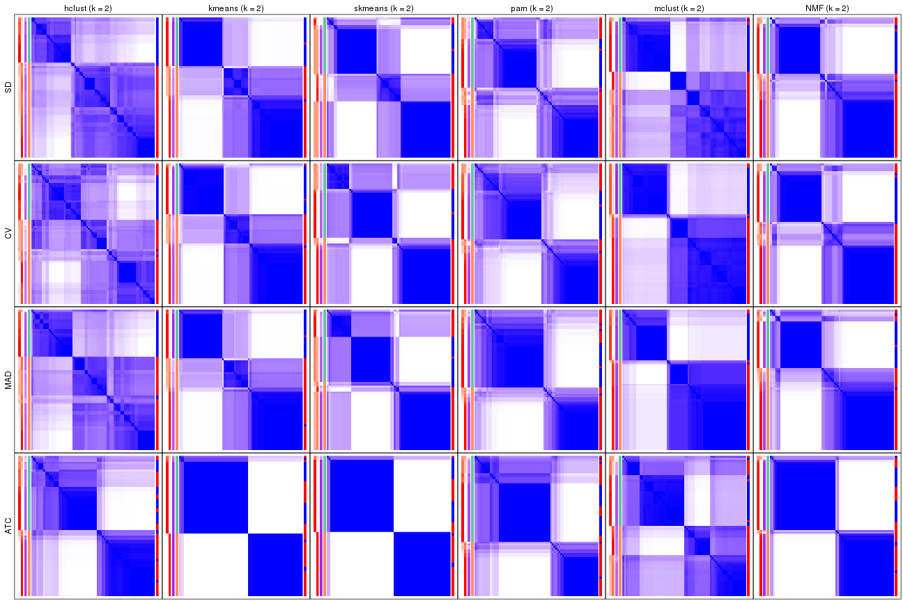</p>

</div>
<div id='tab-collect-consensus-heatmap-2'>
<pre><code class="r">collect_plots(res_list, k = 3, fun = consensus_heatmap, mc.cores = 4)
</code></pre>

<p>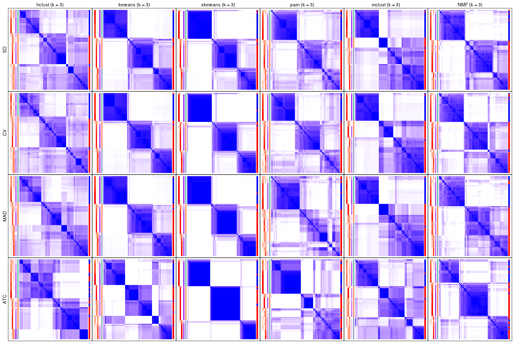</p>

</div>
<div id='tab-collect-consensus-heatmap-3'>
<pre><code class="r">collect_plots(res_list, k = 4, fun = consensus_heatmap, mc.cores = 4)
</code></pre>

<p>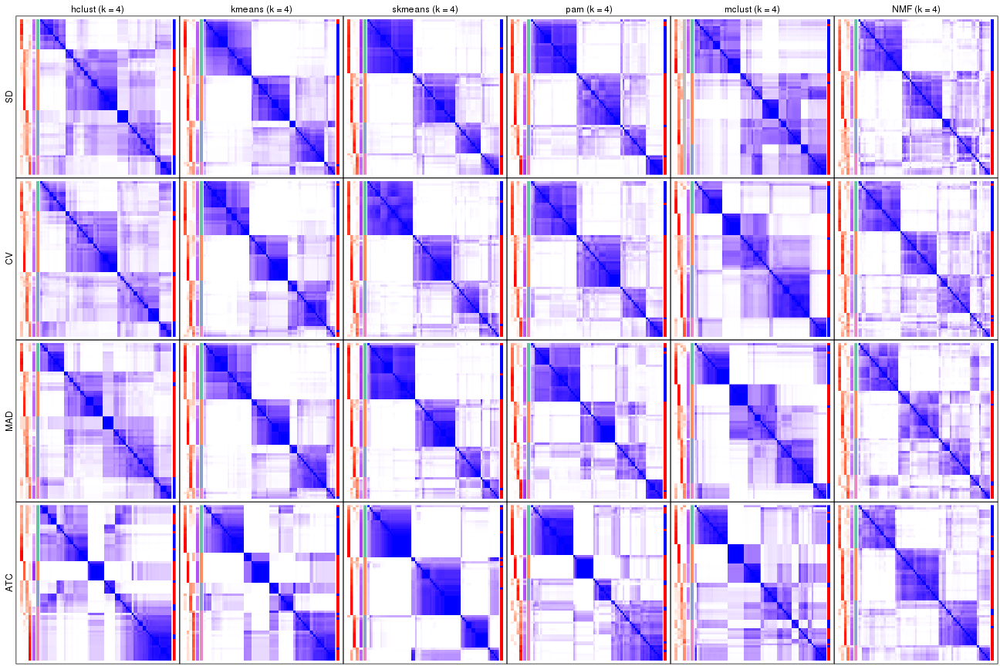</p>

</div>
<div id='tab-collect-consensus-heatmap-4'>
<pre><code class="r">collect_plots(res_list, k = 5, fun = consensus_heatmap, mc.cores = 4)
</code></pre>

<p>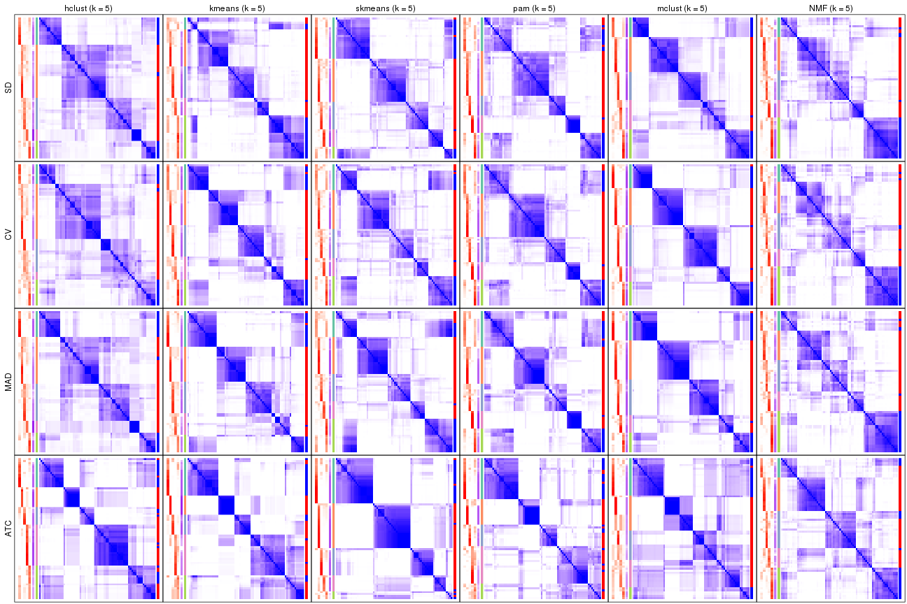</p>

</div>
<div id='tab-collect-consensus-heatmap-5'>
<pre><code class="r">collect_plots(res_list, k = 6, fun = consensus_heatmap, mc.cores = 4)
</code></pre>

<p>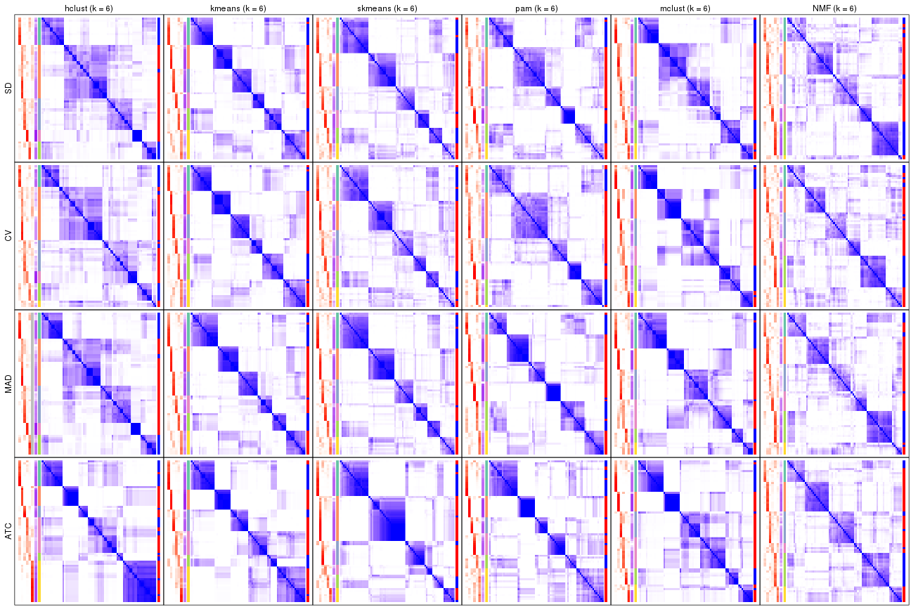</p>

</div>
</div>


### Membership heatmap

Membership heatmaps for all methods. ([What is a membership heatmap?](http://bioconductor.org/packages/devel/bioc/vignettes/cola/inst/doc/cola.html#toc_12))


<script>
$( function() {
	$( '#tabs-collect-membership-heatmap' ).tabs();
} );
</script>
<div id='tabs-collect-membership-heatmap'>
<ul>
<li><a href='#tab-collect-membership-heatmap-1'>k = 2</a></li>
<li><a href='#tab-collect-membership-heatmap-2'>k = 3</a></li>
<li><a href='#tab-collect-membership-heatmap-3'>k = 4</a></li>
<li><a href='#tab-collect-membership-heatmap-4'>k = 5</a></li>
<li><a href='#tab-collect-membership-heatmap-5'>k = 6</a></li>
</ul>
<div id='tab-collect-membership-heatmap-1'>
<pre><code class="r">collect_plots(res_list, k = 2, fun = membership_heatmap, mc.cores = 4)
</code></pre>

<p>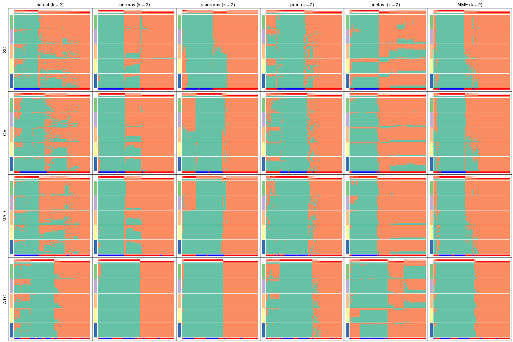</p>

</div>
<div id='tab-collect-membership-heatmap-2'>
<pre><code class="r">collect_plots(res_list, k = 3, fun = membership_heatmap, mc.cores = 4)
</code></pre>

<p>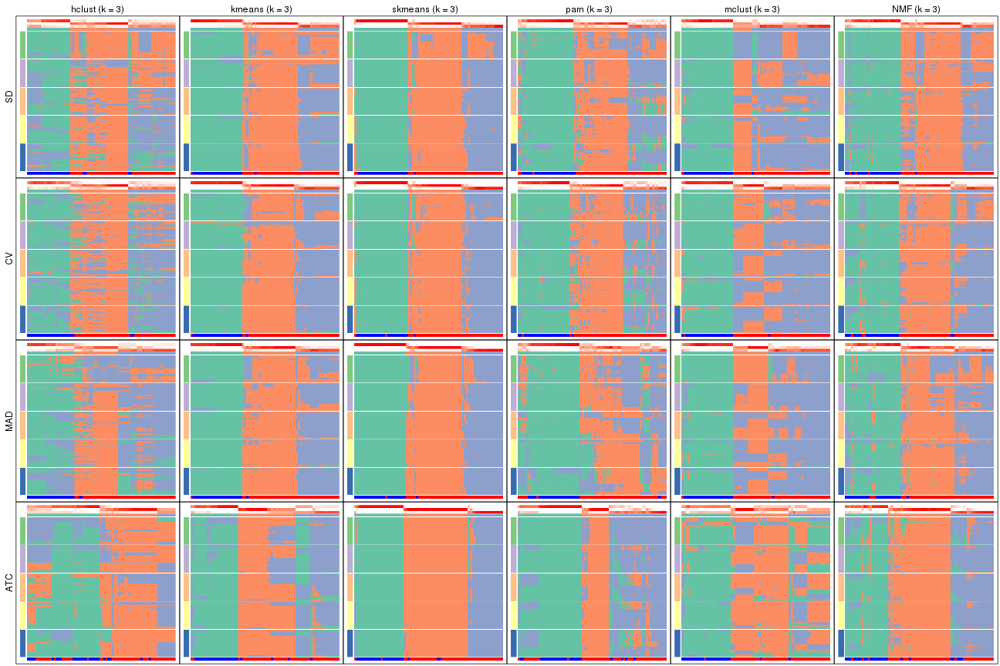</p>

</div>
<div id='tab-collect-membership-heatmap-3'>
<pre><code class="r">collect_plots(res_list, k = 4, fun = membership_heatmap, mc.cores = 4)
</code></pre>

<p>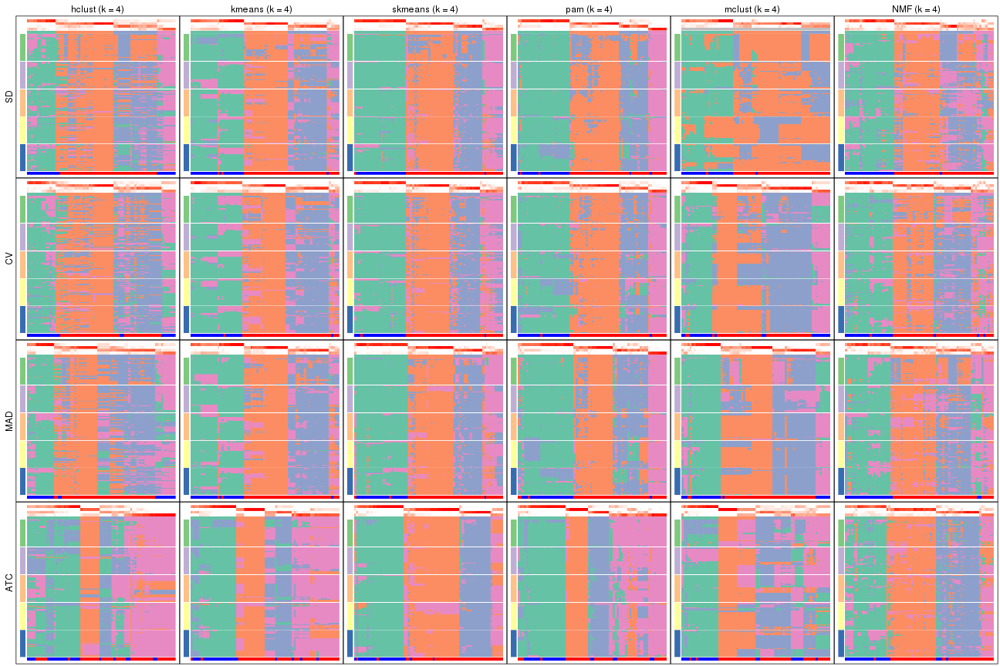</p>

</div>
<div id='tab-collect-membership-heatmap-4'>
<pre><code class="r">collect_plots(res_list, k = 5, fun = membership_heatmap, mc.cores = 4)
</code></pre>

<p>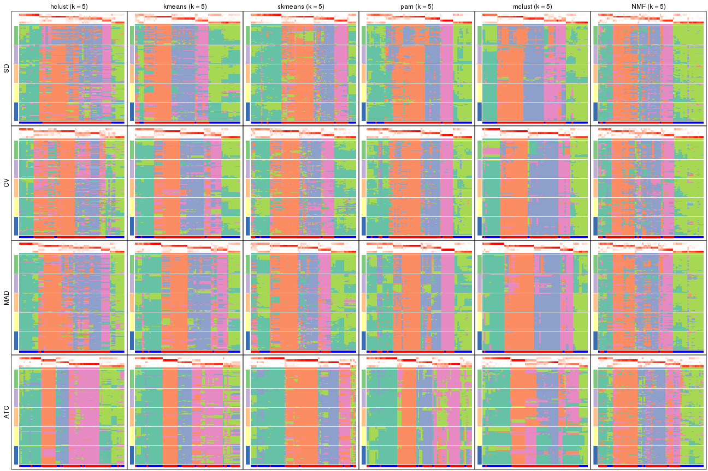</p>

</div>
<div id='tab-collect-membership-heatmap-5'>
<pre><code class="r">collect_plots(res_list, k = 6, fun = membership_heatmap, mc.cores = 4)
</code></pre>

<p>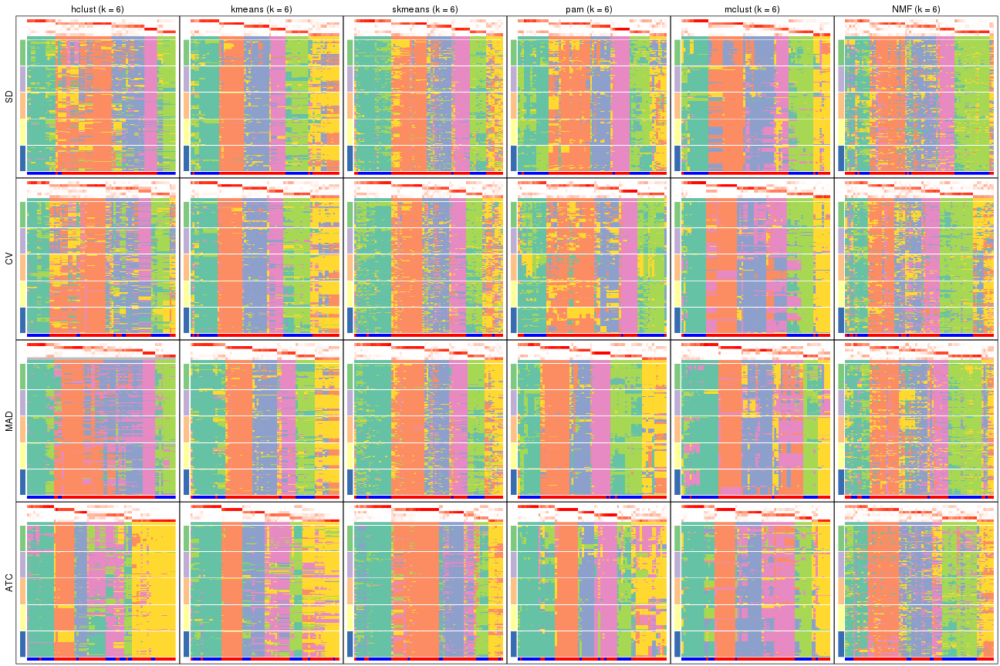</p>

</div>
</div>


### Signature heatmap

Signature heatmaps for all methods. ([What is a signature heatmap?](http://bioconductor.org/packages/devel/bioc/vignettes/cola/inst/doc/cola.html#toc_22))


Note in following heatmaps, rows are scaled.


<script>
$( function() {
	$( '#tabs-collect-get-signatures' ).tabs();
} );
</script>
<div id='tabs-collect-get-signatures'>
<ul>
<li><a href='#tab-collect-get-signatures-1'>k = 2</a></li>
<li><a href='#tab-collect-get-signatures-2'>k = 3</a></li>
<li><a href='#tab-collect-get-signatures-3'>k = 4</a></li>
<li><a href='#tab-collect-get-signatures-4'>k = 5</a></li>
<li><a href='#tab-collect-get-signatures-5'>k = 6</a></li>
</ul>
<div id='tab-collect-get-signatures-1'>
<pre><code class="r">collect_plots(res_list, k = 2, fun = get_signatures, mc.cores = 4)
</code></pre>

<p>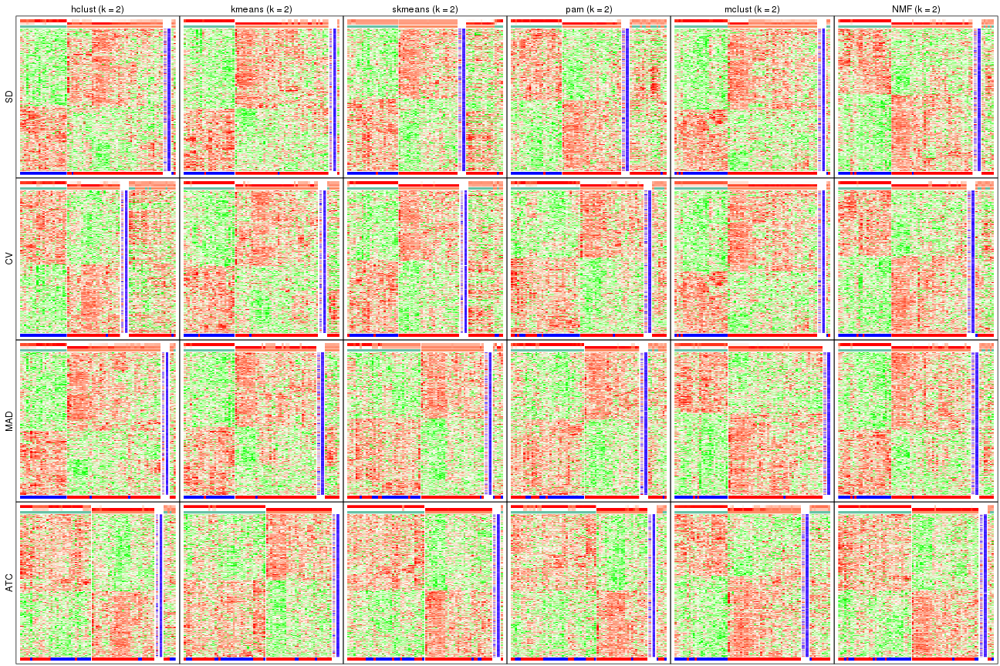</p>

</div>
<div id='tab-collect-get-signatures-2'>
<pre><code class="r">collect_plots(res_list, k = 3, fun = get_signatures, mc.cores = 4)
</code></pre>

<p>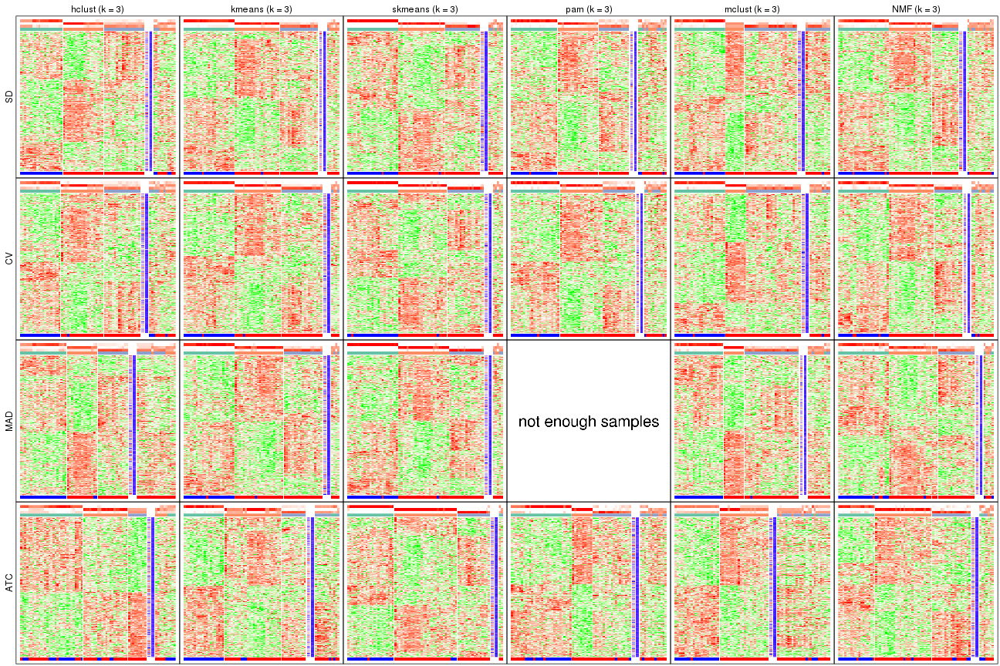</p>

</div>
<div id='tab-collect-get-signatures-3'>
<pre><code class="r">collect_plots(res_list, k = 4, fun = get_signatures, mc.cores = 4)
</code></pre>

<p>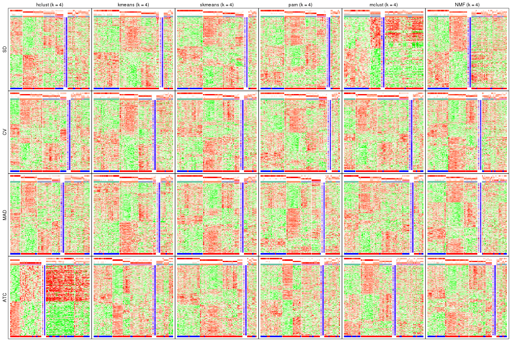</p>

</div>
<div id='tab-collect-get-signatures-4'>
<pre><code class="r">collect_plots(res_list, k = 5, fun = get_signatures, mc.cores = 4)
</code></pre>

<p>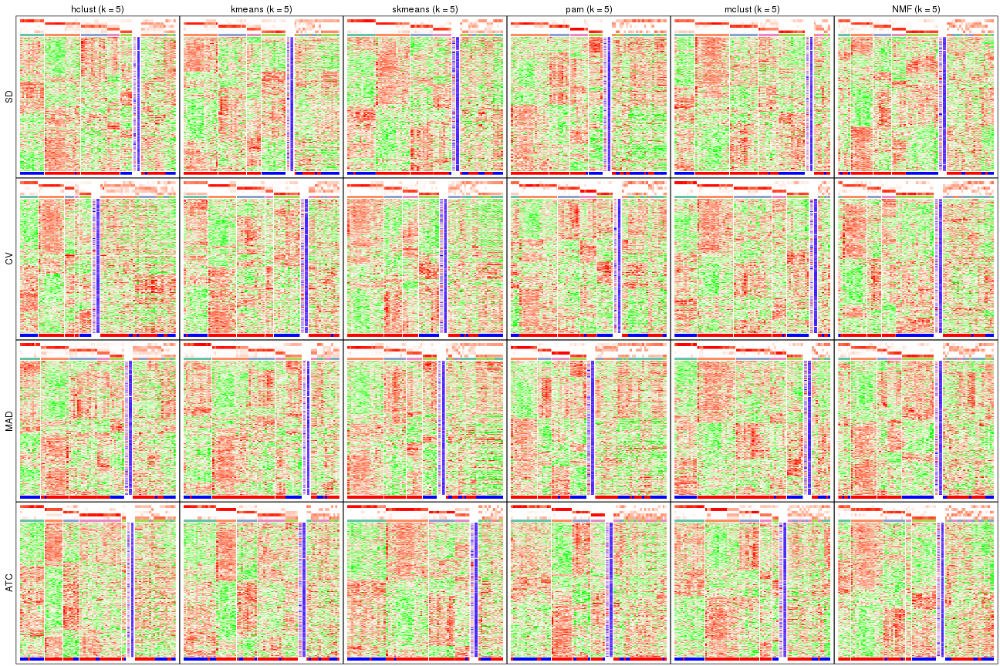</p>

</div>
<div id='tab-collect-get-signatures-5'>
<pre><code class="r">collect_plots(res_list, k = 6, fun = get_signatures, mc.cores = 4)
</code></pre>

<p>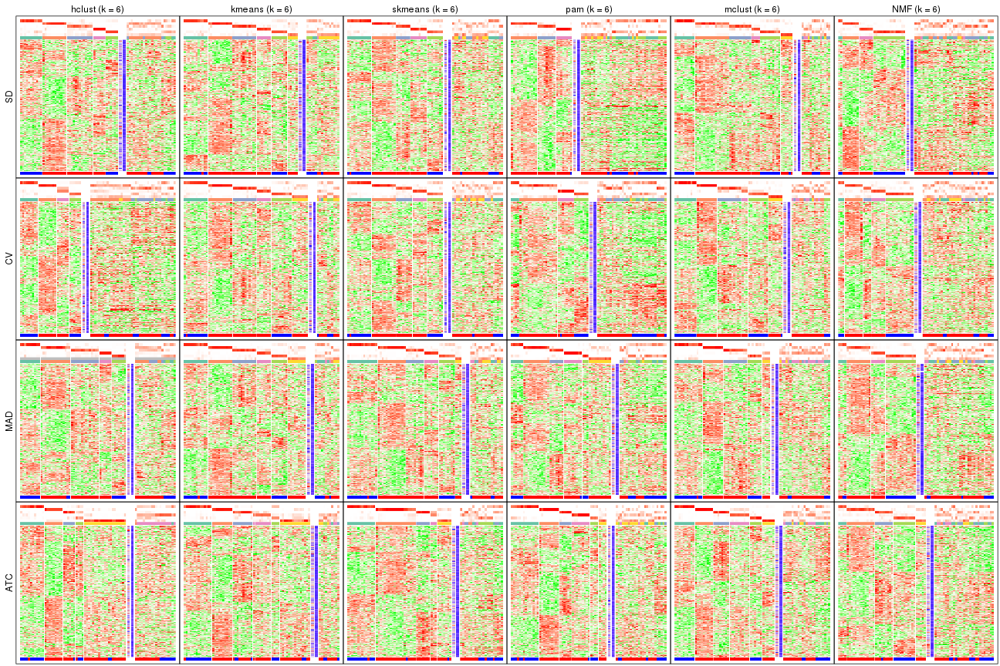</p>

</div>
</div>


### Statistics table

The statistics used for measuring the stability of consensus partitioning.
([How are they
defined?](http://bioconductor.org/packages/devel/bioc/vignettes/cola/inst/doc/cola.html#toc_13))


<script>
$( function() {
	$( '#tabs-get-stats-from-consensus-partition-list' ).tabs();
} );
</script>
<div id='tabs-get-stats-from-consensus-partition-list'>
<ul>
<li><a href='#tab-get-stats-from-consensus-partition-list-1'>k = 2</a></li>
<li><a href='#tab-get-stats-from-consensus-partition-list-2'>k = 3</a></li>
<li><a href='#tab-get-stats-from-consensus-partition-list-3'>k = 4</a></li>
<li><a href='#tab-get-stats-from-consensus-partition-list-4'>k = 5</a></li>
<li><a href='#tab-get-stats-from-consensus-partition-list-5'>k = 6</a></li>
</ul>
<div id='tab-get-stats-from-consensus-partition-list-1'>
<pre><code class="r">get_stats(res_list, k = 2)
</code></pre>

<pre><code>#&gt;             k 1-PAC mean_silhouette concordance area_increased  Rand Jaccard
#&gt; SD:NMF      2 0.633           0.823       0.927          0.489 0.512   0.512
#&gt; CV:NMF      2 0.633           0.787       0.916          0.491 0.507   0.507
#&gt; MAD:NMF     2 0.680           0.811       0.925          0.490 0.507   0.507
#&gt; ATC:NMF     2 0.972           0.927       0.973          0.505 0.495   0.495
#&gt; SD:skmeans  2 0.617           0.659       0.865          0.497 0.512   0.512
#&gt; CV:skmeans  2 0.629           0.748       0.890          0.497 0.495   0.495
#&gt; MAD:skmeans 2 0.640           0.728       0.884          0.497 0.493   0.493
#&gt; ATC:skmeans 2 1.000           0.977       0.991          0.505 0.496   0.496
#&gt; SD:mclust   2 0.373           0.801       0.818          0.410 0.518   0.518
#&gt; CV:mclust   2 0.489           0.908       0.895          0.431 0.532   0.532
#&gt; MAD:mclust  2 0.824           0.927       0.932          0.442 0.532   0.532
#&gt; ATC:mclust  2 0.360           0.711       0.828          0.426 0.493   0.493
#&gt; SD:kmeans   2 0.662           0.836       0.911          0.479 0.540   0.540
#&gt; CV:kmeans   2 0.653           0.806       0.905          0.484 0.532   0.532
#&gt; MAD:kmeans  2 0.623           0.805       0.904          0.483 0.540   0.540
#&gt; ATC:kmeans  2 1.000           0.982       0.992          0.503 0.499   0.499
#&gt; SD:pam      2 0.548           0.686       0.876          0.490 0.493   0.493
#&gt; CV:pam      2 0.546           0.784       0.904          0.496 0.496   0.496
#&gt; MAD:pam     2 0.651           0.824       0.925          0.496 0.499   0.499
#&gt; ATC:pam     2 0.597           0.808       0.918          0.475 0.518   0.518
#&gt; SD:hclust   2 0.236           0.777       0.851          0.435 0.559   0.559
#&gt; CV:hclust   2 0.214           0.570       0.805          0.454 0.512   0.512
#&gt; MAD:hclust  2 0.227           0.737       0.838          0.444 0.549   0.549
#&gt; ATC:hclust  2 0.574           0.813       0.911          0.486 0.495   0.495
</code></pre>

</div>
<div id='tab-get-stats-from-consensus-partition-list-2'>
<pre><code class="r">get_stats(res_list, k = 3)
</code></pre>

<pre><code>#&gt;             k 1-PAC mean_silhouette concordance area_increased  Rand Jaccard
#&gt; SD:NMF      3 0.582           0.651       0.826          0.337 0.809   0.635
#&gt; CV:NMF      3 0.555           0.703       0.837          0.344 0.737   0.521
#&gt; MAD:NMF     3 0.484           0.709       0.818          0.351 0.787   0.594
#&gt; ATC:NMF     3 0.642           0.776       0.885          0.309 0.782   0.584
#&gt; SD:skmeans  3 0.745           0.836       0.918          0.335 0.763   0.560
#&gt; CV:skmeans  3 0.837           0.857       0.938          0.347 0.743   0.525
#&gt; MAD:skmeans 3 0.866           0.872       0.946          0.346 0.734   0.511
#&gt; ATC:skmeans 3 0.961           0.932       0.973          0.292 0.823   0.652
#&gt; SD:mclust   3 0.518           0.704       0.795          0.454 0.806   0.654
#&gt; CV:mclust   3 0.641           0.708       0.817          0.423 0.796   0.625
#&gt; MAD:mclust  3 0.562           0.688       0.821          0.401 0.786   0.606
#&gt; ATC:mclust  3 0.376           0.532       0.683          0.400 0.718   0.490
#&gt; SD:kmeans   3 0.686           0.822       0.870          0.354 0.789   0.609
#&gt; CV:kmeans   3 0.739           0.864       0.901          0.366 0.774   0.583
#&gt; MAD:kmeans  3 0.721           0.848       0.896          0.361 0.786   0.605
#&gt; ATC:kmeans  3 0.553           0.621       0.800          0.302 0.777   0.575
#&gt; SD:pam      3 0.427           0.654       0.797          0.335 0.748   0.531
#&gt; CV:pam      3 0.462           0.713       0.835          0.326 0.754   0.539
#&gt; MAD:pam     3 0.448           0.417       0.706          0.317 0.716   0.503
#&gt; ATC:pam     3 0.525           0.658       0.843          0.345 0.690   0.478
#&gt; SD:hclust   3 0.245           0.570       0.676          0.432 0.737   0.543
#&gt; CV:hclust   3 0.226           0.635       0.734          0.393 0.723   0.505
#&gt; MAD:hclust  3 0.243           0.613       0.697          0.421 0.759   0.569
#&gt; ATC:hclust  3 0.479           0.645       0.709          0.277 0.842   0.698
</code></pre>

</div>
<div id='tab-get-stats-from-consensus-partition-list-3'>
<pre><code class="r">get_stats(res_list, k = 4)
</code></pre>

<pre><code>#&gt;             k 1-PAC mean_silhouette concordance area_increased  Rand Jaccard
#&gt; SD:NMF      4 0.517           0.454       0.690          0.130 0.863   0.632
#&gt; CV:NMF      4 0.497           0.556       0.731          0.127 0.869   0.633
#&gt; MAD:NMF     4 0.493           0.522       0.720          0.123 0.865   0.627
#&gt; ATC:NMF     4 0.558           0.673       0.788          0.118 0.900   0.717
#&gt; SD:skmeans  4 0.718           0.768       0.857          0.111 0.913   0.745
#&gt; CV:skmeans  4 0.655           0.698       0.828          0.107 0.896   0.700
#&gt; MAD:skmeans 4 0.735           0.726       0.847          0.102 0.886   0.681
#&gt; ATC:skmeans 4 0.789           0.740       0.857          0.102 0.925   0.789
#&gt; SD:mclust   4 0.414           0.463       0.587          0.144 0.784   0.560
#&gt; CV:mclust   4 0.550           0.668       0.806          0.133 0.768   0.457
#&gt; MAD:mclust  4 0.550           0.636       0.787          0.149 0.813   0.535
#&gt; ATC:mclust  4 0.424           0.471       0.640          0.161 0.733   0.362
#&gt; SD:kmeans   4 0.580           0.653       0.780          0.125 0.900   0.718
#&gt; CV:kmeans   4 0.615           0.639       0.792          0.115 0.957   0.869
#&gt; MAD:kmeans  4 0.646           0.655       0.796          0.119 0.938   0.817
#&gt; ATC:kmeans  4 0.620           0.644       0.808          0.118 0.818   0.526
#&gt; SD:pam      4 0.648           0.737       0.840          0.118 0.912   0.747
#&gt; CV:pam      4 0.608           0.723       0.822          0.116 0.937   0.812
#&gt; MAD:pam     4 0.644           0.662       0.813          0.123 0.824   0.565
#&gt; ATC:pam     4 0.619           0.692       0.842          0.143 0.861   0.645
#&gt; SD:hclust   4 0.388           0.570       0.714          0.134 0.940   0.820
#&gt; CV:hclust   4 0.370           0.544       0.706          0.132 0.962   0.883
#&gt; MAD:hclust  4 0.409           0.566       0.706          0.137 0.949   0.845
#&gt; ATC:hclust  4 0.495           0.470       0.695          0.138 0.869   0.676
</code></pre>

</div>
<div id='tab-get-stats-from-consensus-partition-list-4'>
<pre><code class="r">get_stats(res_list, k = 5)
</code></pre>

<pre><code>#&gt;             k 1-PAC mean_silhouette concordance area_increased  Rand Jaccard
#&gt; SD:NMF      5 0.608           0.548       0.765         0.0718 0.873   0.576
#&gt; CV:NMF      5 0.595           0.529       0.738         0.0700 0.874   0.573
#&gt; MAD:NMF     5 0.598           0.532       0.740         0.0694 0.876   0.575
#&gt; ATC:NMF     5 0.590           0.557       0.763         0.0700 0.876   0.587
#&gt; SD:skmeans  5 0.653           0.551       0.750         0.0682 0.929   0.750
#&gt; CV:skmeans  5 0.617           0.503       0.671         0.0677 0.887   0.609
#&gt; MAD:skmeans 5 0.679           0.465       0.693         0.0684 0.887   0.614
#&gt; ATC:skmeans 5 0.706           0.678       0.825         0.0633 0.941   0.804
#&gt; SD:mclust   5 0.634           0.721       0.790         0.1525 0.761   0.398
#&gt; CV:mclust   5 0.774           0.787       0.849         0.1273 0.905   0.670
#&gt; MAD:mclust  5 0.719           0.729       0.853         0.0984 0.885   0.615
#&gt; ATC:mclust  5 0.471           0.479       0.646         0.0578 0.910   0.666
#&gt; SD:kmeans   5 0.656           0.530       0.683         0.0757 0.922   0.732
#&gt; CV:kmeans   5 0.687           0.620       0.740         0.0721 0.862   0.553
#&gt; MAD:kmeans  5 0.683           0.605       0.761         0.0716 0.879   0.603
#&gt; ATC:kmeans  5 0.689           0.624       0.780         0.0746 0.857   0.530
#&gt; SD:pam      5 0.615           0.575       0.770         0.0794 0.889   0.631
#&gt; CV:pam      5 0.633           0.600       0.793         0.0736 0.892   0.635
#&gt; MAD:pam     5 0.661           0.486       0.746         0.0759 0.861   0.547
#&gt; ATC:pam     5 0.644           0.521       0.770         0.0768 0.896   0.653
#&gt; SD:hclust   5 0.526           0.612       0.703         0.0851 0.948   0.819
#&gt; CV:hclust   5 0.503           0.450       0.665         0.0734 0.922   0.748
#&gt; MAD:hclust  5 0.573           0.598       0.745         0.0754 0.901   0.674
#&gt; ATC:hclust  5 0.601           0.663       0.797         0.0839 0.832   0.492
</code></pre>

</div>
<div id='tab-get-stats-from-consensus-partition-list-5'>
<pre><code class="r">get_stats(res_list, k = 6)
</code></pre>

<pre><code>#&gt;             k 1-PAC mean_silhouette concordance area_increased  Rand Jaccard
#&gt; SD:NMF      6 0.623           0.415       0.697         0.0416 0.903   0.606
#&gt; CV:NMF      6 0.599           0.459       0.665         0.0441 0.895   0.558
#&gt; MAD:NMF     6 0.611           0.438       0.670         0.0424 0.885   0.530
#&gt; ATC:NMF     6 0.597           0.514       0.685         0.0426 0.942   0.734
#&gt; SD:skmeans  6 0.673           0.561       0.755         0.0479 0.922   0.675
#&gt; CV:skmeans  6 0.629           0.505       0.717         0.0443 0.884   0.524
#&gt; MAD:skmeans 6 0.708           0.641       0.797         0.0465 0.888   0.536
#&gt; ATC:skmeans 6 0.719           0.590       0.786         0.0431 0.914   0.681
#&gt; SD:mclust   6 0.694           0.612       0.778         0.0494 0.940   0.718
#&gt; CV:mclust   6 0.751           0.617       0.762         0.0509 0.922   0.653
#&gt; MAD:mclust  6 0.672           0.573       0.713         0.0392 0.886   0.543
#&gt; ATC:mclust  6 0.701           0.599       0.790         0.1118 0.869   0.485
#&gt; SD:kmeans   6 0.710           0.652       0.782         0.0496 0.852   0.445
#&gt; CV:kmeans   6 0.727           0.715       0.802         0.0472 0.915   0.614
#&gt; MAD:kmeans  6 0.745           0.692       0.795         0.0480 0.917   0.629
#&gt; ATC:kmeans  6 0.712           0.656       0.769         0.0471 0.926   0.674
#&gt; SD:pam      6 0.651           0.449       0.724         0.0473 0.878   0.524
#&gt; CV:pam      6 0.651           0.483       0.711         0.0433 0.962   0.830
#&gt; MAD:pam     6 0.731           0.602       0.801         0.0519 0.852   0.419
#&gt; ATC:pam     6 0.676           0.582       0.763         0.0422 0.856   0.458
#&gt; SD:hclust   6 0.591           0.587       0.716         0.0493 1.000   1.000
#&gt; CV:hclust   6 0.555           0.431       0.637         0.0435 0.918   0.708
#&gt; MAD:hclust  6 0.663           0.590       0.726         0.0402 1.000   1.000
#&gt; ATC:hclust  6 0.622           0.687       0.782         0.0352 0.975   0.882
</code></pre>

</div>
</div>

Following heatmap plots the partition for each combination of methods and the
lightness correspond to the silhouette scores for samples in each method. On
top the consensus subgroup is inferred from all methods by taking the mean
silhouette scores as weight.


<script>
$( function() {
	$( '#tabs-collect-stats-from-consensus-partition-list' ).tabs();
} );
</script>
<div id='tabs-collect-stats-from-consensus-partition-list'>
<ul>
<li><a href='#tab-collect-stats-from-consensus-partition-list-1'>k = 2</a></li>
<li><a href='#tab-collect-stats-from-consensus-partition-list-2'>k = 3</a></li>
<li><a href='#tab-collect-stats-from-consensus-partition-list-3'>k = 4</a></li>
<li><a href='#tab-collect-stats-from-consensus-partition-list-4'>k = 5</a></li>
<li><a href='#tab-collect-stats-from-consensus-partition-list-5'>k = 6</a></li>
</ul>
<div id='tab-collect-stats-from-consensus-partition-list-1'>
<pre><code class="r">collect_stats(res_list, k = 2)
</code></pre>

<p>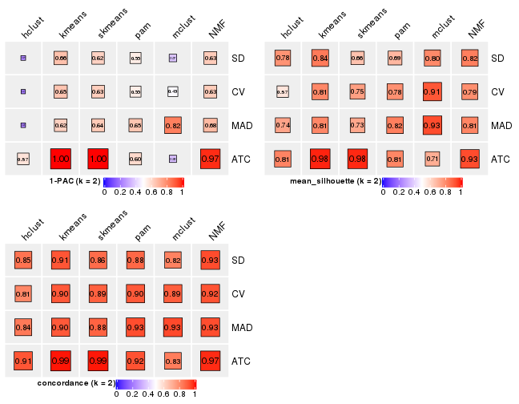</p>

</div>
<div id='tab-collect-stats-from-consensus-partition-list-2'>
<pre><code class="r">collect_stats(res_list, k = 3)
</code></pre>

<p>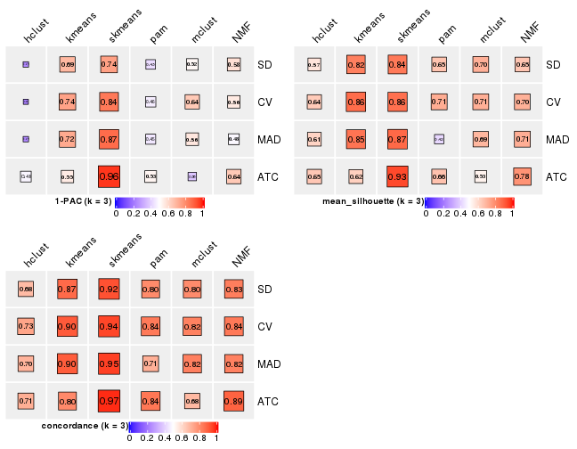</p>

</div>
<div id='tab-collect-stats-from-consensus-partition-list-3'>
<pre><code class="r">collect_stats(res_list, k = 4)
</code></pre>

<p>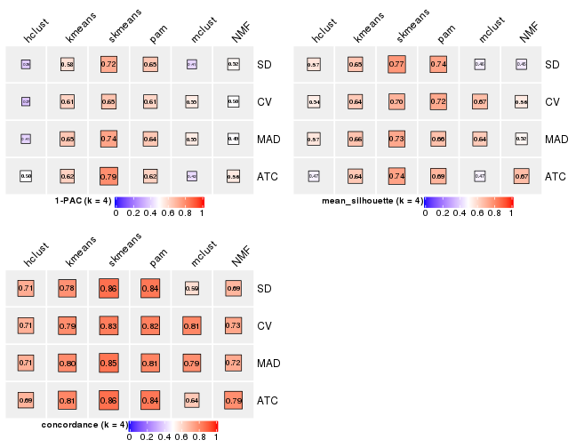</p>

</div>
<div id='tab-collect-stats-from-consensus-partition-list-4'>
<pre><code class="r">collect_stats(res_list, k = 5)
</code></pre>

<p>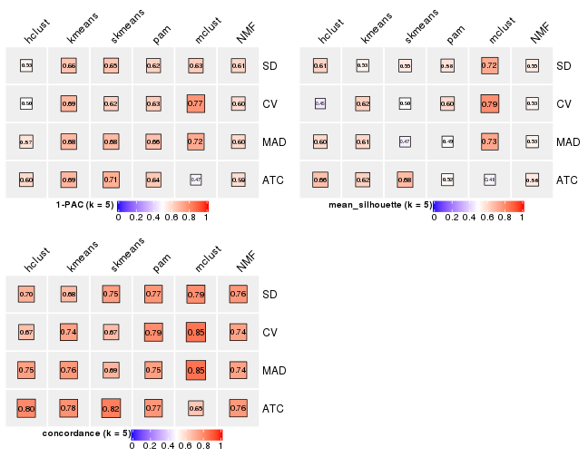</p>

</div>
<div id='tab-collect-stats-from-consensus-partition-list-5'>
<pre><code class="r">collect_stats(res_list, k = 6)
</code></pre>

<p>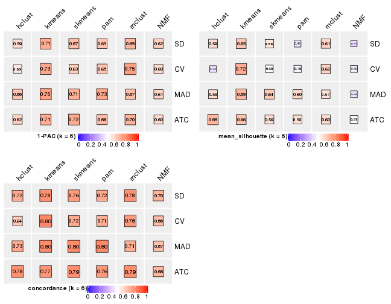</p>

</div>
</div>

### Partition from all methods


Collect partitions from all methods:


<script>
$( function() {
	$( '#tabs-collect-classes-from-consensus-partition-list' ).tabs();
} );
</script>
<div id='tabs-collect-classes-from-consensus-partition-list'>
<ul>
<li><a href='#tab-collect-classes-from-consensus-partition-list-1'>k = 2</a></li>
<li><a href='#tab-collect-classes-from-consensus-partition-list-2'>k = 3</a></li>
<li><a href='#tab-collect-classes-from-consensus-partition-list-3'>k = 4</a></li>
<li><a href='#tab-collect-classes-from-consensus-partition-list-4'>k = 5</a></li>
<li><a href='#tab-collect-classes-from-consensus-partition-list-5'>k = 6</a></li>
</ul>
<div id='tab-collect-classes-from-consensus-partition-list-1'>
<pre><code class="r">collect_classes(res_list, k = 2)
</code></pre>

<p>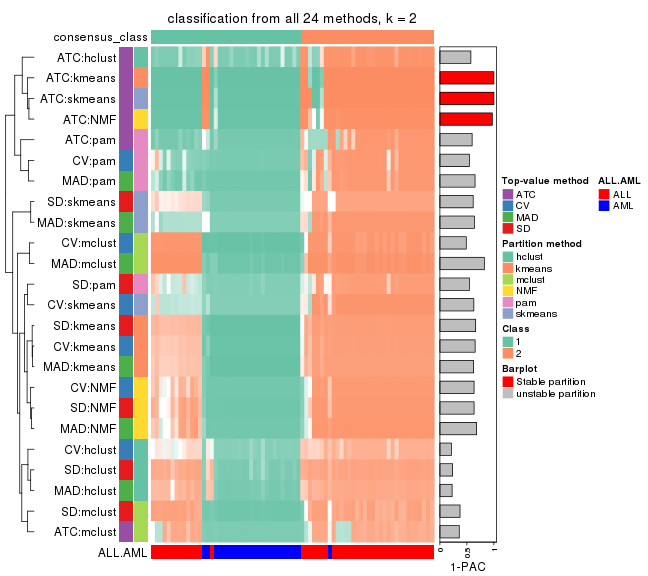</p>

</div>
<div id='tab-collect-classes-from-consensus-partition-list-2'>
<pre><code class="r">collect_classes(res_list, k = 3)
</code></pre>

<p>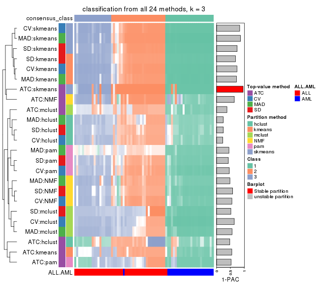</p>

</div>
<div id='tab-collect-classes-from-consensus-partition-list-3'>
<pre><code class="r">collect_classes(res_list, k = 4)
</code></pre>

<p>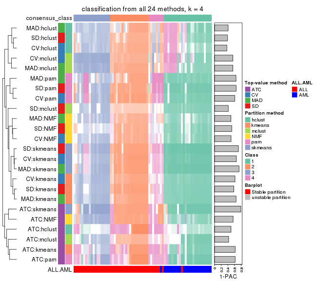</p>

</div>
<div id='tab-collect-classes-from-consensus-partition-list-4'>
<pre><code class="r">collect_classes(res_list, k = 5)
</code></pre>

<p>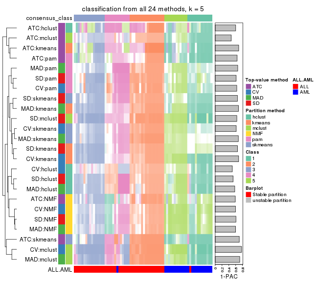</p>

</div>
<div id='tab-collect-classes-from-consensus-partition-list-5'>
<pre><code class="r">collect_classes(res_list, k = 6)
</code></pre>

<p>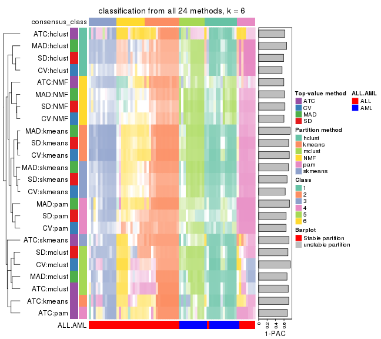</p>

</div>
</div>


### Top rows overlap


Overlap of top rows from different top-row methods:


<script>
$( function() {
	$( '#tabs-top-rows-overlap-by-euler' ).tabs();
} );
</script>
<div id='tabs-top-rows-overlap-by-euler'>
<ul>
<li><a href='#tab-top-rows-overlap-by-euler-1'>top_n = 412</a></li>
<li><a href='#tab-top-rows-overlap-by-euler-2'>top_n = 824</a></li>
<li><a href='#tab-top-rows-overlap-by-euler-3'>top_n = 1235</a></li>
<li><a href='#tab-top-rows-overlap-by-euler-4'>top_n = 1646</a></li>
<li><a href='#tab-top-rows-overlap-by-euler-5'>top_n = 2058</a></li>
</ul>
<div id='tab-top-rows-overlap-by-euler-1'>
<pre><code class="r">top_rows_overlap(res_list, top_n = 412, method = &quot;euler&quot;)
</code></pre>

<p>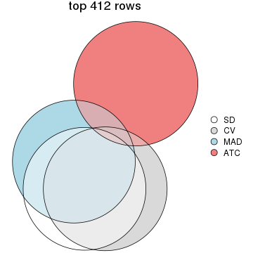</p>

</div>
<div id='tab-top-rows-overlap-by-euler-2'>
<pre><code class="r">top_rows_overlap(res_list, top_n = 824, method = &quot;euler&quot;)
</code></pre>

<p>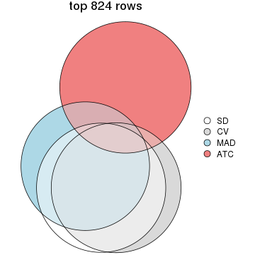</p>

</div>
<div id='tab-top-rows-overlap-by-euler-3'>
<pre><code class="r">top_rows_overlap(res_list, top_n = 1235, method = &quot;euler&quot;)
</code></pre>

<p>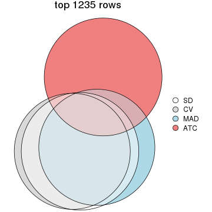</p>

</div>
<div id='tab-top-rows-overlap-by-euler-4'>
<pre><code class="r">top_rows_overlap(res_list, top_n = 1646, method = &quot;euler&quot;)
</code></pre>

<p>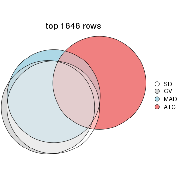</p>

</div>
<div id='tab-top-rows-overlap-by-euler-5'>
<pre><code class="r">top_rows_overlap(res_list, top_n = 2058, method = &quot;euler&quot;)
</code></pre>

<p>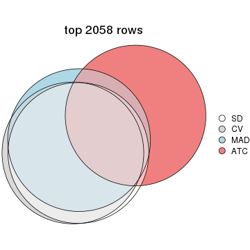</p>

</div>
</div>

Also visualize the correspondance of rankings between different top-row methods:


<script>
$( function() {
	$( '#tabs-top-rows-overlap-by-correspondance' ).tabs();
} );
</script>
<div id='tabs-top-rows-overlap-by-correspondance'>
<ul>
<li><a href='#tab-top-rows-overlap-by-correspondance-1'>top_n = 412</a></li>
<li><a href='#tab-top-rows-overlap-by-correspondance-2'>top_n = 824</a></li>
<li><a href='#tab-top-rows-overlap-by-correspondance-3'>top_n = 1235</a></li>
<li><a href='#tab-top-rows-overlap-by-correspondance-4'>top_n = 1646</a></li>
<li><a href='#tab-top-rows-overlap-by-correspondance-5'>top_n = 2058</a></li>
</ul>
<div id='tab-top-rows-overlap-by-correspondance-1'>
<pre><code class="r">top_rows_overlap(res_list, top_n = 412, method = &quot;correspondance&quot;)
</code></pre>

<p>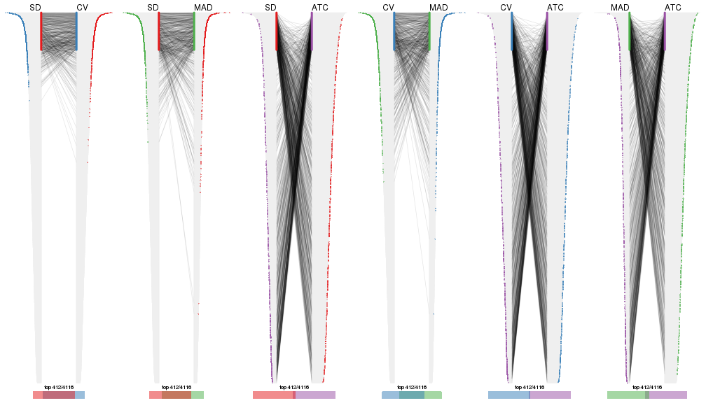</p>

</div>
<div id='tab-top-rows-overlap-by-correspondance-2'>
<pre><code class="r">top_rows_overlap(res_list, top_n = 824, method = &quot;correspondance&quot;)
</code></pre>

<p>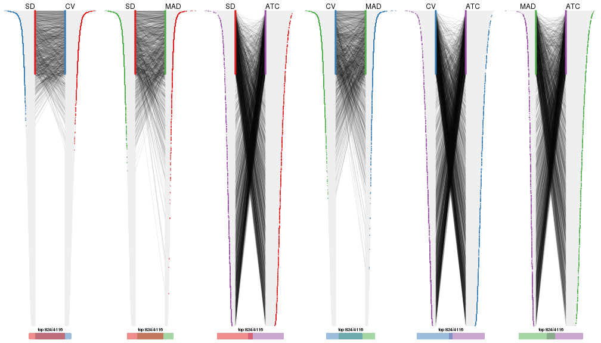</p>

</div>
<div id='tab-top-rows-overlap-by-correspondance-3'>
<pre><code class="r">top_rows_overlap(res_list, top_n = 1235, method = &quot;correspondance&quot;)
</code></pre>

<p>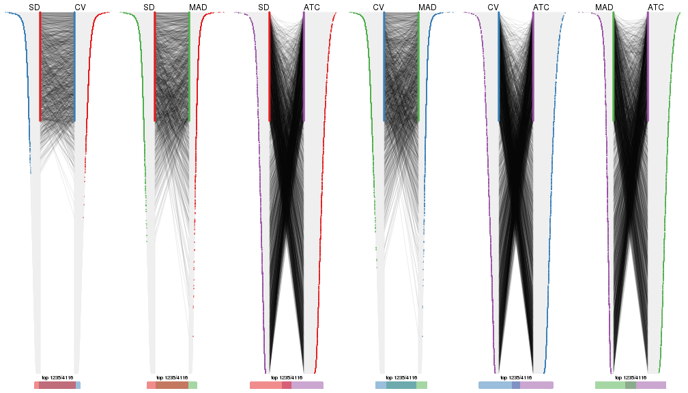</p>

</div>
<div id='tab-top-rows-overlap-by-correspondance-4'>
<pre><code class="r">top_rows_overlap(res_list, top_n = 1646, method = &quot;correspondance&quot;)
</code></pre>

<p>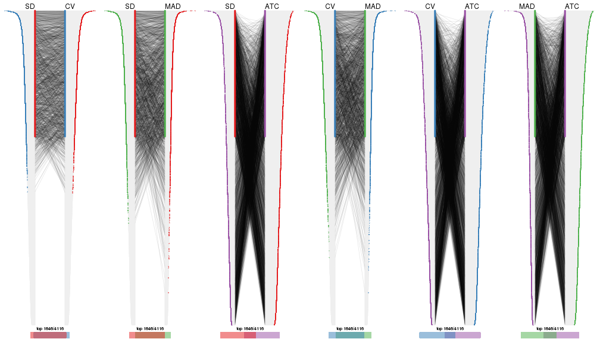</p>

</div>
<div id='tab-top-rows-overlap-by-correspondance-5'>
<pre><code class="r">top_rows_overlap(res_list, top_n = 2058, method = &quot;correspondance&quot;)
</code></pre>

<p>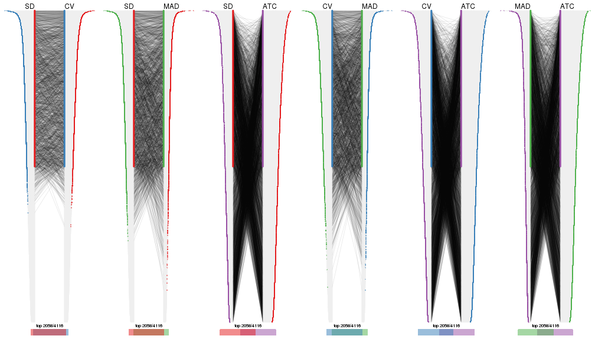</p>

</div>
</div>


Heatmaps of the top rows:


<script>
$( function() {
	$( '#tabs-top-rows-heatmap' ).tabs();
} );
</script>
<div id='tabs-top-rows-heatmap'>
<ul>
<li><a href='#tab-top-rows-heatmap-1'>top_n = 412</a></li>
<li><a href='#tab-top-rows-heatmap-2'>top_n = 824</a></li>
<li><a href='#tab-top-rows-heatmap-3'>top_n = 1235</a></li>
<li><a href='#tab-top-rows-heatmap-4'>top_n = 1646</a></li>
<li><a href='#tab-top-rows-heatmap-5'>top_n = 2058</a></li>
</ul>
<div id='tab-top-rows-heatmap-1'>
<pre><code class="r">top_rows_heatmap(res_list, top_n = 412)
</code></pre>

<p>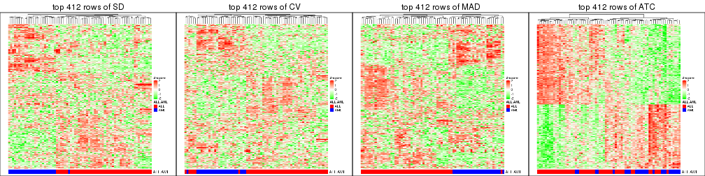</p>

</div>
<div id='tab-top-rows-heatmap-2'>
<pre><code class="r">top_rows_heatmap(res_list, top_n = 824)
</code></pre>

<p>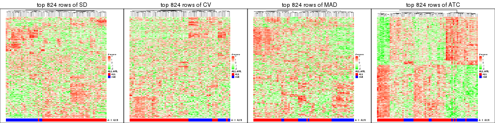</p>

</div>
<div id='tab-top-rows-heatmap-3'>
<pre><code class="r">top_rows_heatmap(res_list, top_n = 1235)
</code></pre>

<p>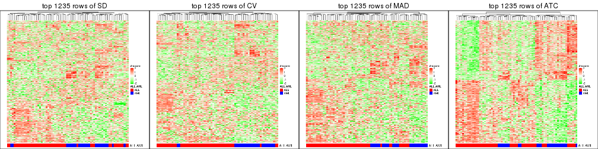</p>

</div>
<div id='tab-top-rows-heatmap-4'>
<pre><code class="r">top_rows_heatmap(res_list, top_n = 1646)
</code></pre>

<p>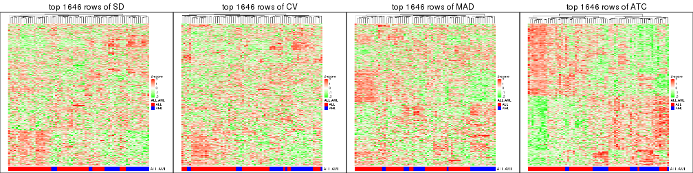</p>

</div>
<div id='tab-top-rows-heatmap-5'>
<pre><code class="r">top_rows_heatmap(res_list, top_n = 2058)
</code></pre>

<p>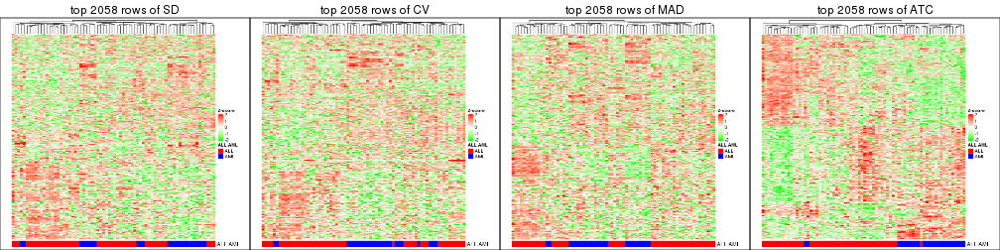</p>

</div>
</div>


### Test to known annotations


Test correlation between subgroups and known annotations. If the known
annotation is numeric, one-way ANOVA test is applied, and if the known
annotation is discrete, chi-squared contingency table test is applied.


<script>
$( function() {
	$( '#tabs-test-to-known-factors-from-consensus-partition-list' ).tabs();
} );
</script>
<div id='tabs-test-to-known-factors-from-consensus-partition-list'>
<ul>
<li><a href='#tab-test-to-known-factors-from-consensus-partition-list-1'>k = 2</a></li>
<li><a href='#tab-test-to-known-factors-from-consensus-partition-list-2'>k = 3</a></li>
<li><a href='#tab-test-to-known-factors-from-consensus-partition-list-3'>k = 4</a></li>
<li><a href='#tab-test-to-known-factors-from-consensus-partition-list-4'>k = 5</a></li>
<li><a href='#tab-test-to-known-factors-from-consensus-partition-list-5'>k = 6</a></li>
</ul>
<div id='tab-test-to-known-factors-from-consensus-partition-list-1'>
<pre><code class="r">test_to_known_factors(res_list, k = 2)
</code></pre>

<pre><code>#&gt;              n ALL.AML(p) k
#&gt; SD:NMF      66   1.35e-12 2
#&gt; CV:NMF      63   7.82e-13 2
#&gt; MAD:NMF     65   2.13e-12 2
#&gt; ATC:NMF     69   5.41e-05 2
#&gt; SD:skmeans  54   1.01e-11 2
#&gt; CV:skmeans  55   3.77e-11 2
#&gt; MAD:skmeans 67   2.39e-06 2
#&gt; ATC:skmeans 71   5.23e-05 2
#&gt; SD:mclust   70   2.94e-14 2
#&gt; CV:mclust   70   2.94e-14 2
#&gt; MAD:mclust  72   8.75e-14 2
#&gt; ATC:mclust  62   1.26e-12 2
#&gt; SD:kmeans   71   2.08e-14 2
#&gt; CV:kmeans   66   2.15e-13 2
#&gt; MAD:kmeans  65   3.43e-13 2
#&gt; ATC:kmeans  72   1.50e-04 2
#&gt; SD:pam      54   1.01e-11 2
#&gt; CV:pam      65   1.04e-07 2
#&gt; MAD:pam     63   2.89e-07 2
#&gt; ATC:pam     67   1.65e-04 2
#&gt; SD:hclust   70   4.70e-15 2
#&gt; CV:hclust   49   1.25e-10 2
#&gt; MAD:hclust  69   5.21e-14 2
#&gt; ATC:hclust  66   4.16e-05 2
</code></pre>

</div>
<div id='tab-test-to-known-factors-from-consensus-partition-list-2'>
<pre><code class="r">test_to_known_factors(res_list, k = 3)
</code></pre>

<pre><code>#&gt;              n ALL.AML(p) k
#&gt; SD:NMF      59   7.38e-12 3
#&gt; CV:NMF      61   1.74e-11 3
#&gt; MAD:NMF     67   8.26e-12 3
#&gt; ATC:NMF     65   2.97e-08 3
#&gt; SD:skmeans  65   4.40e-13 3
#&gt; CV:skmeans  67   1.71e-13 3
#&gt; MAD:skmeans 67   1.71e-13 3
#&gt; ATC:skmeans 70   1.85e-12 3
#&gt; SD:mclust   60   6.91e-13 3
#&gt; CV:mclust   62   2.60e-13 3
#&gt; MAD:mclust  61   4.15e-13 3
#&gt; ATC:mclust  46   5.78e-10 3
#&gt; SD:kmeans   66   2.72e-13 3
#&gt; CV:kmeans   68   1.06e-13 3
#&gt; MAD:kmeans  68   1.06e-13 3
#&gt; ATC:kmeans  60   2.70e-11 3
#&gt; SD:pam      58   1.94e-12 3
#&gt; CV:pam      61   4.37e-13 3
#&gt; MAD:pam     24         NA 3
#&gt; ATC:pam     59   3.74e-06 3
#&gt; SD:hclust   61   5.68e-14 3
#&gt; CV:hclust   59   1.23e-12 3
#&gt; MAD:hclust  53   1.00e-10 3
#&gt; ATC:hclust  62   3.04e-03 3
</code></pre>

</div>
<div id='tab-test-to-known-factors-from-consensus-partition-list-3'>
<pre><code class="r">test_to_known_factors(res_list, k = 4)
</code></pre>

<pre><code>#&gt;              n ALL.AML(p) k
#&gt; SD:NMF      38   5.34e-09 4
#&gt; CV:NMF      48   3.78e-11 4
#&gt; MAD:NMF     48   3.78e-11 4
#&gt; ATC:NMF     62   1.00e-09 4
#&gt; SD:skmeans  64   6.16e-13 4
#&gt; CV:skmeans  60   4.20e-12 4
#&gt; MAD:skmeans 60   4.20e-12 4
#&gt; ATC:skmeans 63   8.36e-12 4
#&gt; SD:mclust   35   2.99e-07 4
#&gt; CV:mclust   62   1.78e-12 4
#&gt; MAD:mclust  63   1.06e-12 4
#&gt; ATC:mclust  46   6.40e-09 4
#&gt; SD:kmeans   63   9.95e-13 4
#&gt; CV:kmeans   57   1.78e-11 4
#&gt; MAD:kmeans  60   4.20e-12 4
#&gt; ATC:kmeans  56   7.62e-09 4
#&gt; SD:pam      63   6.74e-12 4
#&gt; CV:pam      64   4.11e-12 4
#&gt; MAD:pam     58   6.37e-11 4
#&gt; ATC:pam     57   5.47e-07 4
#&gt; SD:hclust   51   3.35e-10 4
#&gt; CV:hclust   54   1.06e-10 4
#&gt; MAD:hclust  48   7.21e-09 4
#&gt; ATC:hclust  30   8.73e-01 4
</code></pre>

</div>
<div id='tab-test-to-known-factors-from-consensus-partition-list-4'>
<pre><code class="r">test_to_known_factors(res_list, k = 5)
</code></pre>

<pre><code>#&gt;              n ALL.AML(p) k
#&gt; SD:NMF      49   9.13e-09 5
#&gt; CV:NMF      47   4.06e-09 5
#&gt; MAD:NMF     47   2.27e-08 5
#&gt; ATC:NMF     48   4.17e-08 5
#&gt; SD:skmeans  51   4.27e-09 5
#&gt; CV:skmeans  45   9.25e-10 5
#&gt; MAD:skmeans 44   1.51e-09 5
#&gt; ATC:skmeans 60   2.60e-10 5
#&gt; SD:mclust   64   2.68e-12 5
#&gt; CV:mclust   66   9.88e-13 5
#&gt; MAD:mclust  63   4.79e-12 5
#&gt; ATC:mclust  51   1.68e-09 5
#&gt; SD:kmeans   50   7.99e-11 5
#&gt; CV:kmeans   57   7.59e-11 5
#&gt; MAD:kmeans  58   5.31e-11 5
#&gt; ATC:kmeans  56   9.68e-08 5
#&gt; SD:pam      45   1.81e-08 5
#&gt; CV:pam      50   3.20e-09 5
#&gt; MAD:pam     37   4.82e-07 5
#&gt; ATC:pam     46   1.05e-05 5
#&gt; SD:hclust   55   2.43e-10 5
#&gt; CV:hclust   35   4.65e-07 5
#&gt; MAD:hclust  51   1.57e-09 5
#&gt; ATC:hclust  52   8.51e-06 5
</code></pre>

</div>
<div id='tab-test-to-known-factors-from-consensus-partition-list-5'>
<pre><code class="r">test_to_known_factors(res_list, k = 6)
</code></pre>

<pre><code>#&gt;              n ALL.AML(p) k
#&gt; SD:NMF      33   3.22e-07 6
#&gt; CV:NMF      37   1.80e-07 6
#&gt; MAD:NMF     38   2.02e-07 6
#&gt; ATC:NMF     44   1.87e-07 6
#&gt; SD:skmeans  48   2.14e-08 6
#&gt; CV:skmeans  47   9.43e-09 6
#&gt; MAD:skmeans 56   5.18e-10 6
#&gt; ATC:skmeans 51   1.22e-07 6
#&gt; SD:mclust   58   1.74e-10 6
#&gt; CV:mclust   53   1.78e-09 6
#&gt; MAD:mclust  47   9.40e-09 6
#&gt; ATC:mclust  49   2.22e-09 6
#&gt; SD:kmeans   56   5.63e-10 6
#&gt; CV:kmeans   61   5.20e-11 6
#&gt; MAD:kmeans  60   9.09e-11 6
#&gt; ATC:kmeans  62   8.55e-08 6
#&gt; SD:pam      31   3.96e-01 6
#&gt; CV:pam      38   2.03e-07 6
#&gt; MAD:pam     49   2.89e-08 6
#&gt; ATC:pam     47   1.08e-06 6
#&gt; SD:hclust   48   9.44e-10 6
#&gt; CV:hclust   30   1.38e-06 6
#&gt; MAD:hclust  52   4.99e-09 6
#&gt; ATC:hclust  52   1.57e-06 6
</code></pre>

</div>
</div>


 
## Results for each method


---------------------------------------------------


### SD:hclust


The object with results only for a single top-value method and a single partition method 
can be extracted as:

```r
res = res_list["SD", "hclust"]
# you can also extract it by
# res = res_list["SD:hclust"]
```

A summary of `res` and all the functions that can be applied to it:

```r
res
```

```
#> A 'ConsensusPartition' object with k = 2, 3, 4, 5, 6.
#>   On a matrix with 4116 rows and 72 columns.
#>   Top rows (412, 824, 1235, 1646, 2058) are extracted by 'SD' method.
#>   Subgroups are detected by 'hclust' method.
#>   Performed in total 1250 partitions by row resampling.
#>   Best k for subgroups seems to be 2.
#> 
#> Following methods can be applied to this 'ConsensusPartition' object:
#>  [1] "cola_report"             "collect_classes"         "collect_plots"          
#>  [4] "collect_stats"           "colnames"                "compare_signatures"     
#>  [7] "consensus_heatmap"       "dimension_reduction"     "functional_enrichment"  
#> [10] "get_anno_col"            "get_anno"                "get_classes"            
#> [13] "get_consensus"           "get_matrix"              "get_membership"         
#> [16] "get_param"               "get_signatures"          "get_stats"              
#> [19] "is_best_k"               "is_stable_k"             "membership_heatmap"     
#> [22] "ncol"                    "nrow"                    "plot_ecdf"              
#> [25] "rownames"                "select_partition_number" "show"                   
#> [28] "suggest_best_k"          "test_to_known_factors"
```

`collect_plots()` function collects all the plots made from `res` for all `k` (number of partitions)
into one single page to provide an easy and fast comparison between different `k`.

```r
collect_plots(res)
```

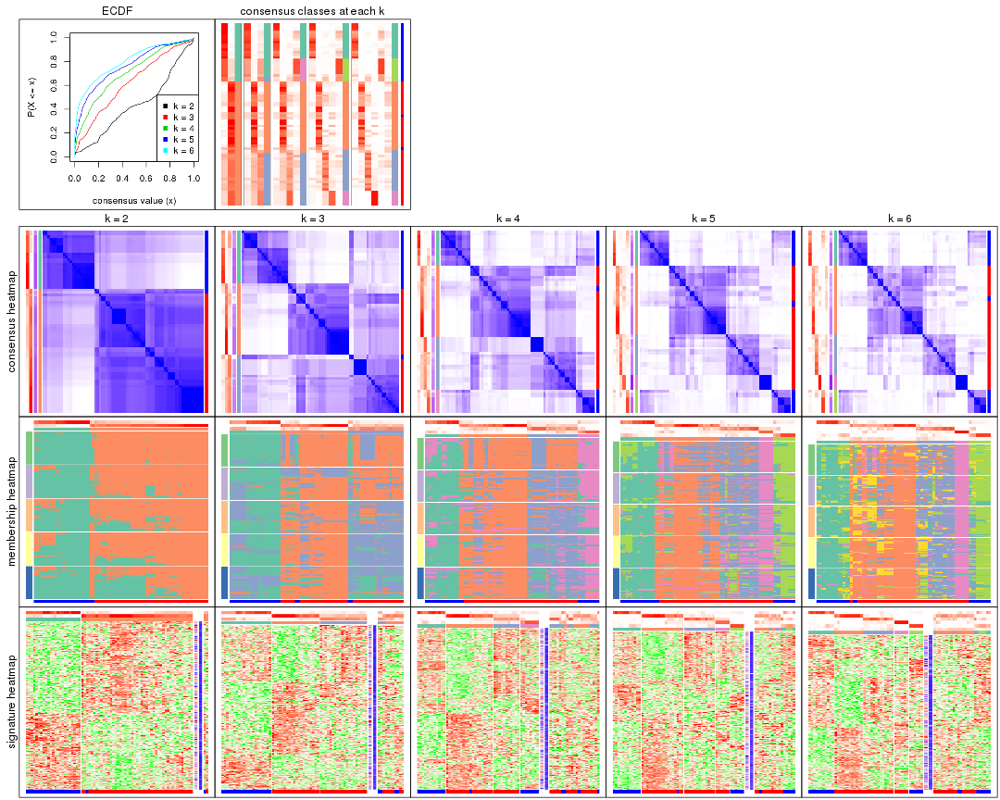

The plots are:

- The first row: a plot of the ECDF (empirical cumulative distribution
  function) curves of the consensus matrix for each `k` and the heatmap of
  predicted classes for each `k`.
- The second row: heatmaps of the consensus matrix for each `k`.
- The third row: heatmaps of the membership matrix for each `k`.
- The fouth row: heatmaps of the signatures for each `k`.

All the plots in panels can be made by individual functions and they are
plotted later in this section.

`select_partition_number()` produces several plots showing different
statistics for choosing "optimized" `k`. There are following statistics:

- ECDF curves of the consensus matrix for each `k`;
- 1-PAC. [The PAC
  score](https://en.wikipedia.org/wiki/Consensus_clustering#Over-interpretation_potential_of_consensus_clustering)
  measures the proportion of the ambiguous subgrouping.
- Mean silhouette score.
- Concordance. The mean probability of fiting the consensus class ids in all
  partitions.
- Area increased. Denote $A_k$ as the area under the ECDF curve for current
  `k`, the area increased is defined as $A_k - A_{k-1}$.
- Rand index. The percent of pairs of samples that are both in a same cluster
  or both are not in a same cluster in the partition of k and k-1.
- Jaccard index. The ratio of pairs of samples are both in a same cluster in
  the partition of k and k-1 and the pairs of samples are both in a same
  cluster in the partition k or k-1.

The detailed explanations of these statistics can be found in [the _cola_
vignette](http://bioconductor.org/packages/devel/bioc/vignettes/cola/inst/doc/cola.html#toc_13).

Generally speaking, lower PAC score, higher mean silhouette score or higher
concordance corresponds to better partition. Rand index and Jaccard index
measure how similar the current partition is compared to partition with `k-1`.
If they are too similar, we won't accept `k` is better than `k-1`.

```r
select_partition_number(res)
```

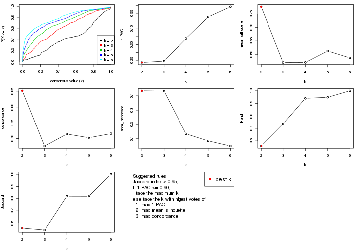

The numeric values for all these statistics can be obtained by `get_stats()`.

```r
get_stats(res)
```

```
#>   k 1-PAC mean_silhouette concordance area_increased  Rand Jaccard
#> 2 2 0.236           0.777       0.851         0.4348 0.559   0.559
#> 3 3 0.245           0.570       0.676         0.4324 0.737   0.543
#> 4 4 0.388           0.570       0.714         0.1342 0.940   0.820
#> 5 5 0.526           0.612       0.703         0.0851 0.948   0.819
#> 6 6 0.591           0.587       0.716         0.0493 1.000   1.000
```

`suggest_best_k()` suggests the best $k$ based on these statistics. The rules are as follows:

- All $k$ with Jaccard index larger than 0.95 are removed because increasing
  $k$ does not provide enough extra information. If all $k$ are removed, it is
  marked as no subgroup is detected.
- For all $k$ with 1-PAC score larger than 0.9, the maximal $k$ is taken as
  the best $k$, and other $k$ are marked as optional $k$.
- If it does not fit the second rule. The $k$ with the maximal vote of the
  highest 1-PAC score, highest mean silhouette, and highest concordance is
  taken as the best $k$.

```r
suggest_best_k(res)
```

```
#> [1] 2
```


Following shows the table of the partitions (You need to click the **show/hide
code output** link to see it). The membership matrix (columns with name `p*`)
is inferred by
[`clue::cl_consensus()`](https://www.rdocumentation.org/link/cl_consensus?package=clue)
function with the `SE` method. Basically the value in the membership matrix
represents the probability to belong to a certain group. The finall class
label for an item is determined with the group with highest probability it
belongs to.

In `get_classes()` function, the entropy is calculated from the membership
matrix and the silhouette score is calculated from the consensus matrix.


<script>
$( function() {
	$( '#tabs-SD-hclust-get-classes' ).tabs();
} );
</script>
<div id='tabs-SD-hclust-get-classes'>
<ul>
<li><a href='#tab-SD-hclust-get-classes-1'>k = 2</a></li>
<li><a href='#tab-SD-hclust-get-classes-2'>k = 3</a></li>
<li><a href='#tab-SD-hclust-get-classes-3'>k = 4</a></li>
<li><a href='#tab-SD-hclust-get-classes-4'>k = 5</a></li>
<li><a href='#tab-SD-hclust-get-classes-5'>k = 6</a></li>
</ul>

<div id='tab-SD-hclust-get-classes-1'>
<p><a id='tab-SD-hclust-get-classes-1-a' style='color:#0366d6' href='#'>show/hide code output</a></p>
<pre><code class="r">cbind(get_classes(res, k = 2), get_membership(res, k = 2))
</code></pre>

<pre><code>#&gt;           class entropy silhouette    p1    p2
#&gt; sample_39     2  0.8763      0.742 0.296 0.704
#&gt; sample_40     2  0.9866      0.489 0.432 0.568
#&gt; sample_42     2  0.5519      0.808 0.128 0.872
#&gt; sample_47     2  0.1843      0.804 0.028 0.972
#&gt; sample_48     2  0.0000      0.793 0.000 1.000
#&gt; sample_49     2  0.9358      0.682 0.352 0.648
#&gt; sample_41     2  0.0000      0.793 0.000 1.000
#&gt; sample_43     2  0.4562      0.810 0.096 0.904
#&gt; sample_44     2  0.5294      0.821 0.120 0.880
#&gt; sample_45     2  0.5294      0.821 0.120 0.880
#&gt; sample_46     2  0.5519      0.820 0.128 0.872
#&gt; sample_70     2  0.6048      0.818 0.148 0.852
#&gt; sample_71     2  0.7602      0.759 0.220 0.780
#&gt; sample_72     2  0.7602      0.759 0.220 0.780
#&gt; sample_68     2  0.0000      0.793 0.000 1.000
#&gt; sample_69     2  0.0000      0.793 0.000 1.000
#&gt; sample_67     2  0.7883      0.702 0.236 0.764
#&gt; sample_55     2  0.8713      0.744 0.292 0.708
#&gt; sample_56     2  0.8861      0.737 0.304 0.696
#&gt; sample_59     2  0.8443      0.766 0.272 0.728
#&gt; sample_52     1  0.7139      0.781 0.804 0.196
#&gt; sample_53     1  0.0376      0.866 0.996 0.004
#&gt; sample_51     1  0.0000      0.865 1.000 0.000
#&gt; sample_50     1  0.0000      0.865 1.000 0.000
#&gt; sample_54     1  0.7219      0.774 0.800 0.200
#&gt; sample_57     1  0.6973      0.789 0.812 0.188
#&gt; sample_58     1  0.0000      0.865 1.000 0.000
#&gt; sample_60     1  0.7219      0.774 0.800 0.200
#&gt; sample_61     1  0.0672      0.868 0.992 0.008
#&gt; sample_65     1  0.1184      0.869 0.984 0.016
#&gt; sample_66     2  0.8016      0.607 0.244 0.756
#&gt; sample_63     1  0.7139      0.781 0.804 0.196
#&gt; sample_64     1  0.8763      0.560 0.704 0.296
#&gt; sample_62     1  0.7139      0.781 0.804 0.196
#&gt; sample_1      2  0.8555      0.753 0.280 0.720
#&gt; sample_2      2  0.7453      0.727 0.212 0.788
#&gt; sample_3      2  0.7299      0.801 0.204 0.796
#&gt; sample_4      2  0.8499      0.757 0.276 0.724
#&gt; sample_5      2  0.0000      0.793 0.000 1.000
#&gt; sample_6      2  0.7299      0.801 0.204 0.796
#&gt; sample_7      2  0.8555      0.754 0.280 0.720
#&gt; sample_8      2  0.8661      0.750 0.288 0.712
#&gt; sample_9      2  0.7299      0.801 0.204 0.796
#&gt; sample_10     2  0.7299      0.801 0.204 0.796
#&gt; sample_11     2  0.7299      0.801 0.204 0.796
#&gt; sample_12     2  0.9522      0.640 0.372 0.628
#&gt; sample_13     2  0.0000      0.793 0.000 1.000
#&gt; sample_14     2  0.3274      0.803 0.060 0.940
#&gt; sample_15     2  0.0000      0.793 0.000 1.000
#&gt; sample_16     2  0.4161      0.819 0.084 0.916
#&gt; sample_17     2  0.2948      0.800 0.052 0.948
#&gt; sample_18     2  0.8081      0.791 0.248 0.752
#&gt; sample_19     2  0.4161      0.819 0.084 0.916
#&gt; sample_20     2  0.0000      0.793 0.000 1.000
#&gt; sample_21     2  0.0000      0.793 0.000 1.000
#&gt; sample_22     2  0.8861      0.737 0.304 0.696
#&gt; sample_23     2  0.7299      0.801 0.204 0.796
#&gt; sample_24     2  0.0000      0.793 0.000 1.000
#&gt; sample_25     2  0.9044      0.725 0.320 0.680
#&gt; sample_26     2  0.4298      0.820 0.088 0.912
#&gt; sample_27     2  0.9358      0.682 0.352 0.648
#&gt; sample_34     1  0.6247      0.814 0.844 0.156
#&gt; sample_35     1  0.8555      0.606 0.720 0.280
#&gt; sample_36     1  0.0672      0.867 0.992 0.008
#&gt; sample_37     1  0.0376      0.867 0.996 0.004
#&gt; sample_38     1  0.3584      0.853 0.932 0.068
#&gt; sample_28     1  0.4022      0.850 0.920 0.080
#&gt; sample_29     2  0.9248      0.365 0.340 0.660
#&gt; sample_30     1  0.0672      0.867 0.992 0.008
#&gt; sample_31     1  0.3584      0.863 0.932 0.068
#&gt; sample_32     1  0.2948      0.867 0.948 0.052
#&gt; sample_33     1  0.0000      0.865 1.000 0.000
</code></pre>

<script>
$('#tab-SD-hclust-get-classes-1-a').parent().next().next().hide();
$('#tab-SD-hclust-get-classes-1-a').click(function(){
  $('#tab-SD-hclust-get-classes-1-a').parent().next().next().toggle();
  return(false);
});
</script>
</div>

<div id='tab-SD-hclust-get-classes-2'>
<p><a id='tab-SD-hclust-get-classes-2-a' style='color:#0366d6' href='#'>show/hide code output</a></p>
<pre><code class="r">cbind(get_classes(res, k = 3), get_membership(res, k = 3))
</code></pre>

<pre><code>#&gt;           class entropy silhouette    p1    p2    p3
#&gt; sample_39     3  0.7828     0.6469 0.068 0.340 0.592
#&gt; sample_40     3  0.7596     0.5801 0.100 0.228 0.672
#&gt; sample_42     2  0.5757     0.6360 0.056 0.792 0.152
#&gt; sample_47     2  0.3116     0.6799 0.000 0.892 0.108
#&gt; sample_48     2  0.0237     0.7183 0.000 0.996 0.004
#&gt; sample_49     3  0.8875     0.6245 0.136 0.336 0.528
#&gt; sample_41     2  0.0424     0.7185 0.000 0.992 0.008
#&gt; sample_43     2  0.4748     0.6545 0.024 0.832 0.144
#&gt; sample_44     2  0.6126     0.1650 0.004 0.644 0.352
#&gt; sample_45     2  0.5929     0.2492 0.004 0.676 0.320
#&gt; sample_46     2  0.6228     0.0877 0.004 0.624 0.372
#&gt; sample_70     2  0.6587    -0.1208 0.008 0.568 0.424
#&gt; sample_71     2  0.7281     0.5634 0.148 0.712 0.140
#&gt; sample_72     2  0.7281     0.5634 0.148 0.712 0.140
#&gt; sample_68     2  0.0424     0.7185 0.000 0.992 0.008
#&gt; sample_69     2  0.0237     0.7183 0.000 0.996 0.004
#&gt; sample_67     2  0.8685     0.4351 0.192 0.596 0.212
#&gt; sample_55     3  0.8043     0.5980 0.072 0.372 0.556
#&gt; sample_56     3  0.7867     0.6207 0.068 0.348 0.584
#&gt; sample_59     3  0.7990     0.5380 0.064 0.404 0.532
#&gt; sample_52     1  0.7581     0.5308 0.496 0.040 0.464
#&gt; sample_53     1  0.1964     0.7555 0.944 0.000 0.056
#&gt; sample_51     1  0.1753     0.7617 0.952 0.000 0.048
#&gt; sample_50     1  0.2165     0.7650 0.936 0.000 0.064
#&gt; sample_54     1  0.7584     0.5254 0.488 0.040 0.472
#&gt; sample_57     1  0.7484     0.5387 0.504 0.036 0.460
#&gt; sample_58     1  0.3941     0.7552 0.844 0.000 0.156
#&gt; sample_60     1  0.7584     0.5254 0.488 0.040 0.472
#&gt; sample_61     1  0.3918     0.7627 0.856 0.004 0.140
#&gt; sample_65     1  0.3826     0.7662 0.868 0.008 0.124
#&gt; sample_66     2  0.7437     0.4972 0.200 0.692 0.108
#&gt; sample_63     1  0.7581     0.5308 0.496 0.040 0.464
#&gt; sample_64     3  0.7363    -0.2749 0.372 0.040 0.588
#&gt; sample_62     1  0.7581     0.5308 0.496 0.040 0.464
#&gt; sample_1      3  0.7676     0.6440 0.056 0.360 0.584
#&gt; sample_2      2  0.8578     0.4475 0.172 0.604 0.224
#&gt; sample_3      3  0.7697     0.5048 0.084 0.272 0.644
#&gt; sample_4      3  0.7589     0.6384 0.052 0.360 0.588
#&gt; sample_5      2  0.0424     0.7185 0.000 0.992 0.008
#&gt; sample_6      3  0.7697     0.5048 0.084 0.272 0.644
#&gt; sample_7      3  0.7676     0.6401 0.056 0.360 0.584
#&gt; sample_8      3  0.7600     0.6466 0.056 0.344 0.600
#&gt; sample_9      3  0.7697     0.5048 0.084 0.272 0.644
#&gt; sample_10     3  0.7697     0.5048 0.084 0.272 0.644
#&gt; sample_11     3  0.7697     0.5048 0.084 0.272 0.644
#&gt; sample_12     3  0.9633     0.5556 0.216 0.340 0.444
#&gt; sample_13     2  0.0237     0.7183 0.000 0.996 0.004
#&gt; sample_14     2  0.6355     0.5092 0.024 0.696 0.280
#&gt; sample_15     2  0.0424     0.7185 0.000 0.992 0.008
#&gt; sample_16     2  0.4861     0.5837 0.012 0.808 0.180
#&gt; sample_17     2  0.5384     0.6192 0.024 0.788 0.188
#&gt; sample_18     3  0.7839     0.3787 0.052 0.464 0.484
#&gt; sample_19     2  0.4805     0.5880 0.012 0.812 0.176
#&gt; sample_20     2  0.0237     0.7183 0.000 0.996 0.004
#&gt; sample_21     2  0.1031     0.7122 0.000 0.976 0.024
#&gt; sample_22     3  0.8546     0.6397 0.108 0.348 0.544
#&gt; sample_23     3  0.7697     0.5048 0.084 0.272 0.644
#&gt; sample_24     2  0.0592     0.7173 0.000 0.988 0.012
#&gt; sample_25     3  0.9141     0.5769 0.152 0.360 0.488
#&gt; sample_26     2  0.4915     0.5767 0.012 0.804 0.184
#&gt; sample_27     3  0.8875     0.6245 0.136 0.336 0.528
#&gt; sample_34     1  0.6529     0.6185 0.620 0.012 0.368
#&gt; sample_35     3  0.7091    -0.3436 0.416 0.024 0.560
#&gt; sample_36     1  0.3030     0.7715 0.904 0.004 0.092
#&gt; sample_37     1  0.2165     0.7534 0.936 0.000 0.064
#&gt; sample_38     1  0.4099     0.7107 0.852 0.008 0.140
#&gt; sample_28     1  0.4413     0.7209 0.860 0.036 0.104
#&gt; sample_29     2  0.8082     0.3748 0.296 0.608 0.096
#&gt; sample_30     1  0.3030     0.7715 0.904 0.004 0.092
#&gt; sample_31     1  0.5167     0.7522 0.792 0.016 0.192
#&gt; sample_32     1  0.4602     0.7650 0.852 0.040 0.108
#&gt; sample_33     1  0.1860     0.7561 0.948 0.000 0.052
</code></pre>

<script>
$('#tab-SD-hclust-get-classes-2-a').parent().next().next().hide();
$('#tab-SD-hclust-get-classes-2-a').click(function(){
  $('#tab-SD-hclust-get-classes-2-a').parent().next().next().toggle();
  return(false);
});
</script>
</div>

<div id='tab-SD-hclust-get-classes-3'>
<p><a id='tab-SD-hclust-get-classes-3-a' style='color:#0366d6' href='#'>show/hide code output</a></p>
<pre><code class="r">cbind(get_classes(res, k = 4), get_membership(res, k = 4))
</code></pre>

<pre><code>#&gt;           class entropy silhouette    p1    p2    p3    p4
#&gt; sample_39     3  0.7328      0.625 0.040 0.244 0.608 0.108
#&gt; sample_40     3  0.8260      0.378 0.036 0.160 0.416 0.388
#&gt; sample_42     2  0.6202      0.604 0.052 0.728 0.144 0.076
#&gt; sample_47     2  0.3674      0.659 0.000 0.848 0.116 0.036
#&gt; sample_48     2  0.0188      0.695 0.000 0.996 0.000 0.004
#&gt; sample_49     3  0.8442      0.609 0.112 0.244 0.532 0.112
#&gt; sample_41     2  0.0817      0.693 0.000 0.976 0.024 0.000
#&gt; sample_43     2  0.5481      0.618 0.024 0.764 0.140 0.072
#&gt; sample_44     2  0.6869      0.173 0.000 0.564 0.304 0.132
#&gt; sample_45     2  0.6592      0.289 0.000 0.612 0.260 0.128
#&gt; sample_46     2  0.6835      0.147 0.000 0.560 0.316 0.124
#&gt; sample_70     2  0.7192     -0.131 0.000 0.472 0.388 0.140
#&gt; sample_71     2  0.7227      0.544 0.140 0.652 0.152 0.056
#&gt; sample_72     2  0.7227      0.544 0.140 0.652 0.152 0.056
#&gt; sample_68     2  0.0336      0.695 0.000 0.992 0.008 0.000
#&gt; sample_69     2  0.0188      0.695 0.000 0.996 0.000 0.004
#&gt; sample_67     2  0.8327      0.409 0.180 0.520 0.244 0.056
#&gt; sample_55     3  0.8441      0.489 0.024 0.288 0.408 0.280
#&gt; sample_56     3  0.8174      0.533 0.020 0.248 0.464 0.268
#&gt; sample_59     3  0.8327      0.416 0.016 0.312 0.388 0.284
#&gt; sample_52     4  0.3940      0.774 0.152 0.020 0.004 0.824
#&gt; sample_53     1  0.0895      0.762 0.976 0.000 0.020 0.004
#&gt; sample_51     1  0.1109      0.768 0.968 0.000 0.004 0.028
#&gt; sample_50     1  0.1824      0.767 0.936 0.000 0.004 0.060
#&gt; sample_54     4  0.4020      0.772 0.128 0.020 0.016 0.836
#&gt; sample_57     4  0.4178      0.771 0.140 0.020 0.016 0.824
#&gt; sample_58     1  0.5510      0.403 0.600 0.000 0.024 0.376
#&gt; sample_60     4  0.4020      0.772 0.128 0.020 0.016 0.836
#&gt; sample_61     1  0.5497      0.569 0.672 0.000 0.044 0.284
#&gt; sample_65     1  0.5038      0.581 0.684 0.000 0.020 0.296
#&gt; sample_66     2  0.7557      0.516 0.172 0.632 0.104 0.092
#&gt; sample_63     4  0.3988      0.773 0.156 0.020 0.004 0.820
#&gt; sample_64     4  0.6854      0.543 0.136 0.004 0.260 0.600
#&gt; sample_62     4  0.3940      0.774 0.152 0.020 0.004 0.824
#&gt; sample_1      3  0.7960      0.617 0.040 0.272 0.536 0.152
#&gt; sample_2      2  0.8217      0.413 0.164 0.524 0.260 0.052
#&gt; sample_3      3  0.5216      0.497 0.100 0.120 0.772 0.008
#&gt; sample_4      3  0.7920      0.603 0.036 0.272 0.536 0.156
#&gt; sample_5      2  0.0469      0.695 0.000 0.988 0.012 0.000
#&gt; sample_6      3  0.5216      0.497 0.100 0.120 0.772 0.008
#&gt; sample_7      3  0.7955      0.604 0.036 0.272 0.532 0.160
#&gt; sample_8      3  0.7199      0.627 0.040 0.248 0.616 0.096
#&gt; sample_9      3  0.5216      0.497 0.100 0.120 0.772 0.008
#&gt; sample_10     3  0.5216      0.497 0.100 0.120 0.772 0.008
#&gt; sample_11     3  0.5216      0.497 0.100 0.120 0.772 0.008
#&gt; sample_12     3  0.8927      0.524 0.192 0.248 0.468 0.092
#&gt; sample_13     2  0.0188      0.695 0.000 0.996 0.000 0.004
#&gt; sample_14     2  0.6651      0.432 0.016 0.596 0.320 0.068
#&gt; sample_15     2  0.0469      0.695 0.000 0.988 0.012 0.000
#&gt; sample_16     2  0.5350      0.544 0.008 0.744 0.188 0.060
#&gt; sample_17     2  0.5872      0.563 0.012 0.704 0.216 0.068
#&gt; sample_18     3  0.8306      0.316 0.036 0.376 0.420 0.168
#&gt; sample_19     2  0.5310      0.548 0.008 0.748 0.184 0.060
#&gt; sample_20     2  0.0188      0.695 0.000 0.996 0.000 0.004
#&gt; sample_21     2  0.2036      0.677 0.000 0.936 0.032 0.032
#&gt; sample_22     3  0.7636      0.617 0.084 0.256 0.588 0.072
#&gt; sample_23     3  0.5216      0.497 0.100 0.120 0.772 0.008
#&gt; sample_24     2  0.1022      0.692 0.000 0.968 0.032 0.000
#&gt; sample_25     3  0.8509      0.549 0.136 0.264 0.512 0.088
#&gt; sample_26     2  0.5466      0.532 0.008 0.732 0.200 0.060
#&gt; sample_27     3  0.8442      0.609 0.112 0.244 0.532 0.112
#&gt; sample_34     4  0.7337      0.224 0.400 0.004 0.136 0.460
#&gt; sample_35     4  0.7135      0.509 0.200 0.000 0.240 0.560
#&gt; sample_36     1  0.3585      0.730 0.828 0.004 0.004 0.164
#&gt; sample_37     1  0.1109      0.756 0.968 0.000 0.028 0.004
#&gt; sample_38     1  0.3652      0.682 0.856 0.000 0.092 0.052
#&gt; sample_28     1  0.3840      0.698 0.860 0.012 0.076 0.052
#&gt; sample_29     2  0.7923      0.427 0.268 0.560 0.076 0.096
#&gt; sample_30     1  0.3631      0.728 0.824 0.004 0.004 0.168
#&gt; sample_31     1  0.6013      0.414 0.600 0.004 0.044 0.352
#&gt; sample_32     1  0.5364      0.651 0.720 0.016 0.028 0.236
#&gt; sample_33     1  0.0927      0.763 0.976 0.000 0.016 0.008
</code></pre>

<script>
$('#tab-SD-hclust-get-classes-3-a').parent().next().next().hide();
$('#tab-SD-hclust-get-classes-3-a').click(function(){
  $('#tab-SD-hclust-get-classes-3-a').parent().next().next().toggle();
  return(false);
});
</script>
</div>

<div id='tab-SD-hclust-get-classes-4'>
<p><a id='tab-SD-hclust-get-classes-4-a' style='color:#0366d6' href='#'>show/hide code output</a></p>
<pre><code class="r">cbind(get_classes(res, k = 5), get_membership(res, k = 5))
</code></pre>

<pre><code>#&gt;           class entropy silhouette    p1    p2    p3    p4    p5
#&gt; sample_39     3  0.3886     0.6632 0.000 0.084 0.828 0.068 0.020
#&gt; sample_40     3  0.5410     0.4043 0.000 0.040 0.644 0.028 0.288
#&gt; sample_42     2  0.6725     0.5607 0.032 0.644 0.160 0.116 0.048
#&gt; sample_47     2  0.3982     0.6570 0.000 0.816 0.088 0.084 0.012
#&gt; sample_48     2  0.1124     0.6870 0.000 0.960 0.036 0.004 0.000
#&gt; sample_49     3  0.4894     0.6534 0.040 0.084 0.792 0.040 0.044
#&gt; sample_41     2  0.1216     0.6820 0.000 0.960 0.020 0.020 0.000
#&gt; sample_43     2  0.6084     0.5737 0.012 0.684 0.144 0.116 0.044
#&gt; sample_44     2  0.7194     0.0156 0.000 0.440 0.372 0.132 0.056
#&gt; sample_45     2  0.6914     0.2459 0.000 0.544 0.268 0.132 0.056
#&gt; sample_46     2  0.7097     0.0927 0.000 0.492 0.320 0.132 0.056
#&gt; sample_70     3  0.7238     0.2063 0.000 0.360 0.444 0.140 0.056
#&gt; sample_71     2  0.8113     0.4712 0.120 0.520 0.196 0.120 0.044
#&gt; sample_72     2  0.8113     0.4712 0.120 0.520 0.196 0.120 0.044
#&gt; sample_68     2  0.0324     0.6856 0.000 0.992 0.004 0.004 0.000
#&gt; sample_69     2  0.0865     0.6860 0.000 0.972 0.024 0.004 0.000
#&gt; sample_67     2  0.7658     0.4456 0.164 0.496 0.024 0.268 0.048
#&gt; sample_55     3  0.7621     0.6150 0.004 0.144 0.524 0.132 0.196
#&gt; sample_56     3  0.6709     0.6434 0.004 0.088 0.624 0.116 0.168
#&gt; sample_59     3  0.7877     0.5478 0.004 0.168 0.492 0.148 0.188
#&gt; sample_52     5  0.2840     0.7569 0.108 0.012 0.004 0.004 0.872
#&gt; sample_53     1  0.0865     0.7522 0.972 0.000 0.000 0.024 0.004
#&gt; sample_51     1  0.1251     0.7581 0.956 0.000 0.000 0.008 0.036
#&gt; sample_50     1  0.1877     0.7562 0.924 0.000 0.000 0.012 0.064
#&gt; sample_54     5  0.3179     0.7575 0.072 0.012 0.012 0.028 0.876
#&gt; sample_57     5  0.3329     0.7567 0.088 0.012 0.012 0.024 0.864
#&gt; sample_58     1  0.5775     0.3136 0.520 0.000 0.048 0.020 0.412
#&gt; sample_60     5  0.3179     0.7575 0.072 0.012 0.012 0.028 0.876
#&gt; sample_61     1  0.5821     0.5082 0.600 0.000 0.072 0.020 0.308
#&gt; sample_65     1  0.5393     0.5261 0.620 0.000 0.040 0.020 0.320
#&gt; sample_66     2  0.7237     0.5515 0.160 0.604 0.028 0.124 0.084
#&gt; sample_63     5  0.2891     0.7553 0.112 0.012 0.004 0.004 0.868
#&gt; sample_64     5  0.6024     0.4888 0.084 0.000 0.348 0.016 0.552
#&gt; sample_62     5  0.2840     0.7569 0.108 0.012 0.004 0.004 0.872
#&gt; sample_1      3  0.5578     0.6751 0.004 0.128 0.724 0.068 0.076
#&gt; sample_2      2  0.7520     0.4380 0.144 0.496 0.020 0.292 0.048
#&gt; sample_3      4  0.4221     1.0000 0.044 0.000 0.188 0.764 0.004
#&gt; sample_4      3  0.6376     0.6385 0.000 0.192 0.636 0.080 0.092
#&gt; sample_5      2  0.0451     0.6856 0.000 0.988 0.004 0.008 0.000
#&gt; sample_6      4  0.4221     1.0000 0.044 0.000 0.188 0.764 0.004
#&gt; sample_7      3  0.6247     0.6472 0.000 0.176 0.652 0.076 0.096
#&gt; sample_8      3  0.3706     0.6408 0.000 0.064 0.840 0.076 0.020
#&gt; sample_9      4  0.4221     1.0000 0.044 0.000 0.188 0.764 0.004
#&gt; sample_10     4  0.4221     1.0000 0.044 0.000 0.188 0.764 0.004
#&gt; sample_11     4  0.4221     1.0000 0.044 0.000 0.188 0.764 0.004
#&gt; sample_12     3  0.8176     0.5101 0.176 0.144 0.520 0.112 0.048
#&gt; sample_13     2  0.1124     0.6870 0.000 0.960 0.036 0.004 0.000
#&gt; sample_14     2  0.5447     0.3753 0.000 0.532 0.008 0.416 0.044
#&gt; sample_15     2  0.0451     0.6856 0.000 0.988 0.004 0.008 0.000
#&gt; sample_16     2  0.5760     0.5018 0.004 0.644 0.252 0.084 0.016
#&gt; sample_17     2  0.5015     0.5544 0.000 0.652 0.004 0.296 0.048
#&gt; sample_18     3  0.8009     0.4658 0.008 0.256 0.448 0.192 0.096
#&gt; sample_19     2  0.5610     0.5249 0.004 0.668 0.228 0.084 0.016
#&gt; sample_20     2  0.1124     0.6870 0.000 0.960 0.036 0.004 0.000
#&gt; sample_21     2  0.3113     0.6438 0.000 0.872 0.048 0.068 0.012
#&gt; sample_22     3  0.5327     0.5983 0.060 0.068 0.748 0.116 0.008
#&gt; sample_23     4  0.4221     1.0000 0.044 0.000 0.188 0.764 0.004
#&gt; sample_24     2  0.1741     0.6802 0.000 0.936 0.040 0.024 0.000
#&gt; sample_25     3  0.7669     0.5574 0.116 0.156 0.568 0.128 0.032
#&gt; sample_26     2  0.5787     0.5052 0.004 0.648 0.240 0.092 0.016
#&gt; sample_27     3  0.4894     0.6534 0.040 0.084 0.792 0.040 0.044
#&gt; sample_34     5  0.6833     0.2094 0.356 0.004 0.168 0.012 0.460
#&gt; sample_35     5  0.6503     0.4989 0.148 0.000 0.304 0.016 0.532
#&gt; sample_36     1  0.3245     0.7151 0.824 0.004 0.004 0.004 0.164
#&gt; sample_37     1  0.1041     0.7481 0.964 0.000 0.000 0.032 0.004
#&gt; sample_38     1  0.3450     0.6843 0.848 0.000 0.008 0.084 0.060
#&gt; sample_28     1  0.3737     0.6983 0.852 0.008 0.040 0.040 0.060
#&gt; sample_29     2  0.7337     0.4842 0.252 0.544 0.012 0.104 0.088
#&gt; sample_30     1  0.3285     0.7127 0.820 0.004 0.004 0.004 0.168
#&gt; sample_31     1  0.5651     0.4029 0.572 0.004 0.056 0.008 0.360
#&gt; sample_32     1  0.5250     0.6274 0.696 0.016 0.016 0.036 0.236
#&gt; sample_33     1  0.0898     0.7524 0.972 0.000 0.000 0.020 0.008
</code></pre>

<script>
$('#tab-SD-hclust-get-classes-4-a').parent().next().next().hide();
$('#tab-SD-hclust-get-classes-4-a').click(function(){
  $('#tab-SD-hclust-get-classes-4-a').parent().next().next().toggle();
  return(false);
});
</script>
</div>

<div id='tab-SD-hclust-get-classes-5'>
<p><a id='tab-SD-hclust-get-classes-5-a' style='color:#0366d6' href='#'>show/hide code output</a></p>
<pre><code class="r">cbind(get_classes(res, k = 6), get_membership(res, k = 6))
</code></pre>

<pre><code>#&gt;           class entropy silhouette    p1    p2    p3    p4    p5    p6
#&gt; sample_39     3  0.3993     0.6747 0.000 0.040 0.800 0.108 0.004 0.048
#&gt; sample_40     3  0.5866     0.4010 0.000 0.028 0.624 0.028 0.228 0.092
#&gt; sample_42     2  0.6609     0.4571 0.032 0.512 0.104 0.020 0.012 0.320
#&gt; sample_47     2  0.4035     0.6186 0.000 0.788 0.048 0.028 0.004 0.132
#&gt; sample_48     2  0.1257     0.6487 0.000 0.952 0.028 0.000 0.000 0.020
#&gt; sample_49     3  0.3920     0.6497 0.008 0.020 0.824 0.048 0.020 0.080
#&gt; sample_41     2  0.2032     0.6408 0.000 0.920 0.024 0.020 0.000 0.036
#&gt; sample_43     2  0.5993     0.4790 0.008 0.548 0.104 0.012 0.012 0.316
#&gt; sample_44     2  0.6638     0.0334 0.000 0.380 0.340 0.012 0.012 0.256
#&gt; sample_45     2  0.6352     0.2579 0.000 0.488 0.204 0.012 0.012 0.284
#&gt; sample_46     2  0.6609     0.1420 0.000 0.440 0.252 0.012 0.016 0.280
#&gt; sample_70     3  0.6936     0.1542 0.000 0.284 0.404 0.028 0.016 0.268
#&gt; sample_71     2  0.7906     0.3907 0.112 0.428 0.184 0.044 0.004 0.228
#&gt; sample_72     2  0.7906     0.3907 0.112 0.428 0.184 0.044 0.004 0.228
#&gt; sample_68     2  0.1074     0.6454 0.000 0.960 0.012 0.000 0.000 0.028
#&gt; sample_69     2  0.1257     0.6487 0.000 0.952 0.020 0.000 0.000 0.028
#&gt; sample_67     2  0.7454     0.4222 0.156 0.432 0.000 0.184 0.008 0.220
#&gt; sample_55     3  0.6890     0.5711 0.000 0.076 0.524 0.020 0.148 0.232
#&gt; sample_56     3  0.5499     0.5955 0.000 0.020 0.644 0.008 0.128 0.200
#&gt; sample_59     3  0.7004     0.5029 0.000 0.100 0.472 0.008 0.140 0.280
#&gt; sample_52     5  0.2056     0.7356 0.080 0.004 0.000 0.000 0.904 0.012
#&gt; sample_53     1  0.1364     0.7507 0.952 0.000 0.000 0.012 0.020 0.016
#&gt; sample_51     1  0.1152     0.7555 0.952 0.000 0.000 0.004 0.044 0.000
#&gt; sample_50     1  0.1732     0.7535 0.920 0.000 0.000 0.004 0.072 0.004
#&gt; sample_54     5  0.2457     0.7368 0.044 0.004 0.016 0.000 0.900 0.036
#&gt; sample_57     5  0.2697     0.7349 0.064 0.004 0.016 0.000 0.884 0.032
#&gt; sample_58     1  0.5958     0.2821 0.460 0.000 0.036 0.000 0.408 0.096
#&gt; sample_60     5  0.2457     0.7368 0.044 0.004 0.016 0.000 0.900 0.036
#&gt; sample_61     1  0.6061     0.4722 0.536 0.000 0.060 0.000 0.312 0.092
#&gt; sample_65     1  0.5371     0.5108 0.576 0.000 0.024 0.000 0.328 0.072
#&gt; sample_66     2  0.6862     0.4917 0.156 0.500 0.000 0.040 0.032 0.272
#&gt; sample_63     5  0.2110     0.7342 0.084 0.004 0.000 0.000 0.900 0.012
#&gt; sample_64     5  0.6675     0.3969 0.060 0.000 0.312 0.016 0.496 0.116
#&gt; sample_62     5  0.2056     0.7356 0.080 0.004 0.000 0.000 0.904 0.012
#&gt; sample_1      3  0.5354     0.6679 0.000 0.076 0.728 0.080 0.060 0.056
#&gt; sample_2      2  0.7408     0.4152 0.136 0.436 0.000 0.212 0.008 0.208
#&gt; sample_3      4  0.0363     1.0000 0.012 0.000 0.000 0.988 0.000 0.000
#&gt; sample_4      3  0.6288     0.6238 0.000 0.124 0.648 0.084 0.068 0.076
#&gt; sample_5      2  0.1218     0.6454 0.000 0.956 0.012 0.004 0.000 0.028
#&gt; sample_6      4  0.0363     1.0000 0.012 0.000 0.000 0.988 0.000 0.000
#&gt; sample_7      3  0.6001     0.6317 0.000 0.100 0.676 0.084 0.068 0.072
#&gt; sample_8      3  0.2617     0.6580 0.000 0.012 0.872 0.100 0.000 0.016
#&gt; sample_9      4  0.0363     1.0000 0.012 0.000 0.000 0.988 0.000 0.000
#&gt; sample_10     4  0.0363     1.0000 0.012 0.000 0.000 0.988 0.000 0.000
#&gt; sample_11     4  0.0363     1.0000 0.012 0.000 0.000 0.988 0.000 0.000
#&gt; sample_12     3  0.8275     0.5131 0.168 0.096 0.472 0.108 0.028 0.128
#&gt; sample_13     2  0.1257     0.6487 0.000 0.952 0.028 0.000 0.000 0.020
#&gt; sample_14     2  0.5943     0.3436 0.000 0.500 0.000 0.360 0.032 0.108
#&gt; sample_15     2  0.1218     0.6454 0.000 0.956 0.012 0.004 0.000 0.028
#&gt; sample_16     2  0.5732     0.4398 0.000 0.580 0.264 0.016 0.004 0.136
#&gt; sample_17     2  0.5846     0.5099 0.000 0.604 0.008 0.244 0.036 0.108
#&gt; sample_18     3  0.8117     0.3973 0.000 0.196 0.412 0.120 0.076 0.196
#&gt; sample_19     2  0.5461     0.4869 0.000 0.632 0.212 0.016 0.004 0.136
#&gt; sample_20     2  0.1257     0.6487 0.000 0.952 0.028 0.000 0.000 0.020
#&gt; sample_21     2  0.4238     0.5391 0.000 0.724 0.028 0.016 0.004 0.228
#&gt; sample_22     3  0.4878     0.6298 0.060 0.012 0.732 0.152 0.000 0.044
#&gt; sample_23     4  0.0363     1.0000 0.012 0.000 0.000 0.988 0.000 0.000
#&gt; sample_24     2  0.2677     0.6363 0.000 0.884 0.056 0.024 0.000 0.036
#&gt; sample_25     3  0.7730     0.5432 0.112 0.104 0.520 0.120 0.008 0.136
#&gt; sample_26     2  0.5644     0.4706 0.000 0.612 0.224 0.020 0.004 0.140
#&gt; sample_27     3  0.3920     0.6497 0.008 0.020 0.824 0.048 0.020 0.080
#&gt; sample_34     5  0.6890     0.1595 0.328 0.000 0.164 0.016 0.444 0.048
#&gt; sample_35     5  0.6926     0.4207 0.120 0.000 0.300 0.020 0.484 0.076
#&gt; sample_36     1  0.2882     0.7116 0.812 0.000 0.000 0.000 0.180 0.008
#&gt; sample_37     1  0.1369     0.7472 0.952 0.000 0.000 0.016 0.016 0.016
#&gt; sample_38     1  0.3238     0.6795 0.848 0.000 0.000 0.056 0.024 0.072
#&gt; sample_28     1  0.3597     0.6957 0.844 0.004 0.024 0.028 0.028 0.072
#&gt; sample_29     2  0.6881     0.4313 0.248 0.444 0.000 0.016 0.032 0.260
#&gt; sample_30     1  0.2915     0.7093 0.808 0.000 0.000 0.000 0.184 0.008
#&gt; sample_31     1  0.5704     0.4120 0.540 0.000 0.048 0.004 0.356 0.052
#&gt; sample_32     1  0.4934     0.6332 0.672 0.012 0.000 0.008 0.240 0.068
#&gt; sample_33     1  0.1346     0.7510 0.952 0.000 0.000 0.008 0.024 0.016
</code></pre>

<script>
$('#tab-SD-hclust-get-classes-5-a').parent().next().next().hide();
$('#tab-SD-hclust-get-classes-5-a').click(function(){
  $('#tab-SD-hclust-get-classes-5-a').parent().next().next().toggle();
  return(false);
});
</script>
</div>
</div>

Heatmaps for the consensus matrix. It visualizes the probability of two
samples to be in a same group.


<script>
$( function() {
	$( '#tabs-SD-hclust-consensus-heatmap' ).tabs();
} );
</script>
<div id='tabs-SD-hclust-consensus-heatmap'>
<ul>
<li><a href='#tab-SD-hclust-consensus-heatmap-1'>k = 2</a></li>
<li><a href='#tab-SD-hclust-consensus-heatmap-2'>k = 3</a></li>
<li><a href='#tab-SD-hclust-consensus-heatmap-3'>k = 4</a></li>
<li><a href='#tab-SD-hclust-consensus-heatmap-4'>k = 5</a></li>
<li><a href='#tab-SD-hclust-consensus-heatmap-5'>k = 6</a></li>
</ul>
<div id='tab-SD-hclust-consensus-heatmap-1'>
<pre><code class="r">consensus_heatmap(res, k = 2)
</code></pre>

<p>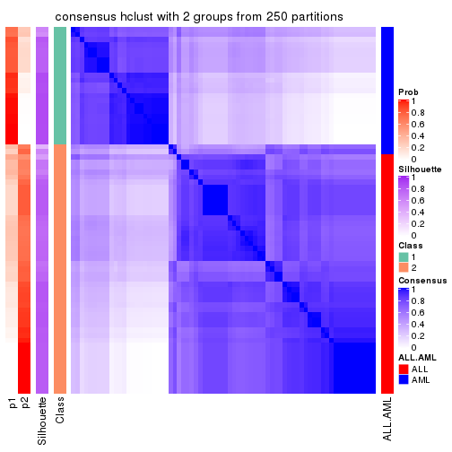</p>

</div>
<div id='tab-SD-hclust-consensus-heatmap-2'>
<pre><code class="r">consensus_heatmap(res, k = 3)
</code></pre>

<p>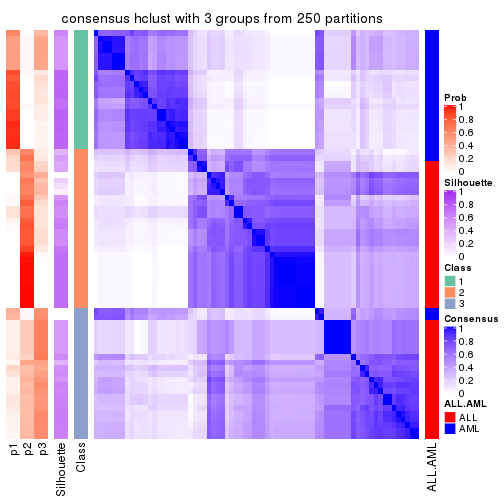</p>

</div>
<div id='tab-SD-hclust-consensus-heatmap-3'>
<pre><code class="r">consensus_heatmap(res, k = 4)
</code></pre>

<p>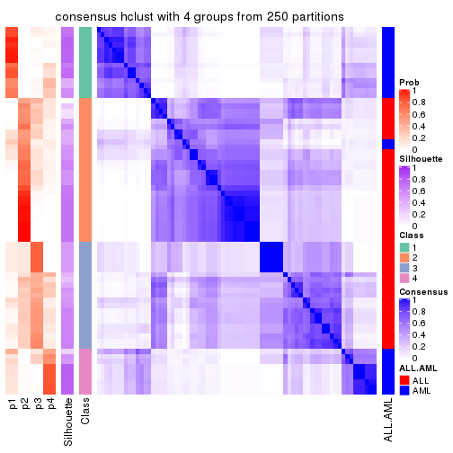</p>

</div>
<div id='tab-SD-hclust-consensus-heatmap-4'>
<pre><code class="r">consensus_heatmap(res, k = 5)
</code></pre>

<p>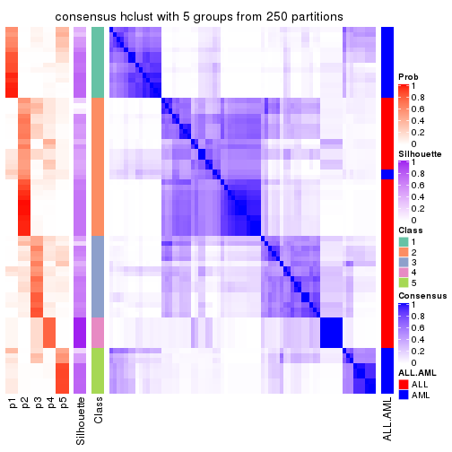</p>

</div>
<div id='tab-SD-hclust-consensus-heatmap-5'>
<pre><code class="r">consensus_heatmap(res, k = 6)
</code></pre>

<p>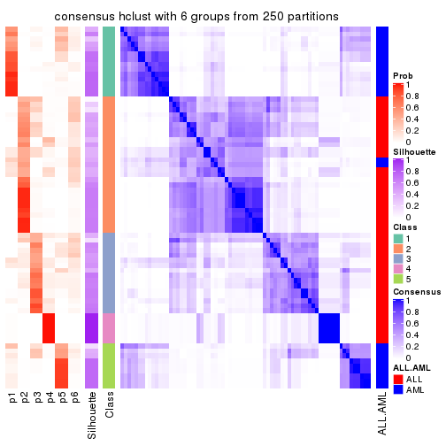</p>

</div>
</div>

Heatmaps for the membership of samples in all partitions to see how consistent they are:


<script>
$( function() {
	$( '#tabs-SD-hclust-membership-heatmap' ).tabs();
} );
</script>
<div id='tabs-SD-hclust-membership-heatmap'>
<ul>
<li><a href='#tab-SD-hclust-membership-heatmap-1'>k = 2</a></li>
<li><a href='#tab-SD-hclust-membership-heatmap-2'>k = 3</a></li>
<li><a href='#tab-SD-hclust-membership-heatmap-3'>k = 4</a></li>
<li><a href='#tab-SD-hclust-membership-heatmap-4'>k = 5</a></li>
<li><a href='#tab-SD-hclust-membership-heatmap-5'>k = 6</a></li>
</ul>
<div id='tab-SD-hclust-membership-heatmap-1'>
<pre><code class="r">membership_heatmap(res, k = 2)
</code></pre>

<p>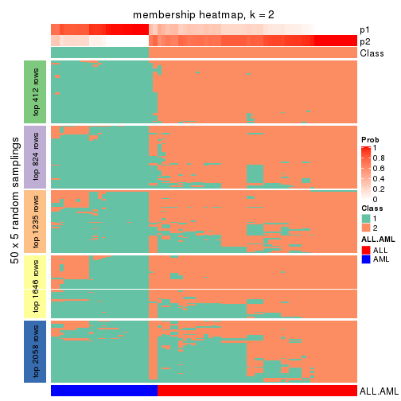</p>

</div>
<div id='tab-SD-hclust-membership-heatmap-2'>
<pre><code class="r">membership_heatmap(res, k = 3)
</code></pre>

<p>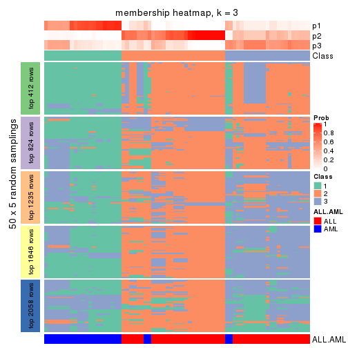</p>

</div>
<div id='tab-SD-hclust-membership-heatmap-3'>
<pre><code class="r">membership_heatmap(res, k = 4)
</code></pre>

<p>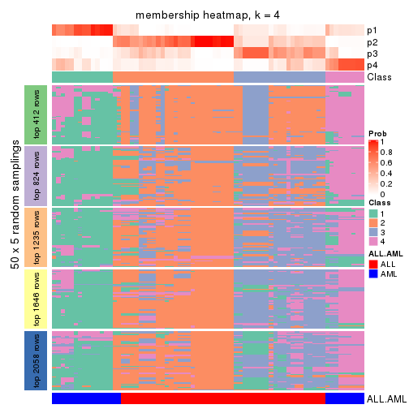</p>

</div>
<div id='tab-SD-hclust-membership-heatmap-4'>
<pre><code class="r">membership_heatmap(res, k = 5)
</code></pre>

<p>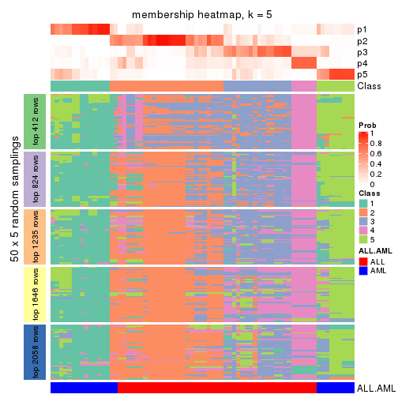</p>

</div>
<div id='tab-SD-hclust-membership-heatmap-5'>
<pre><code class="r">membership_heatmap(res, k = 6)
</code></pre>

<p>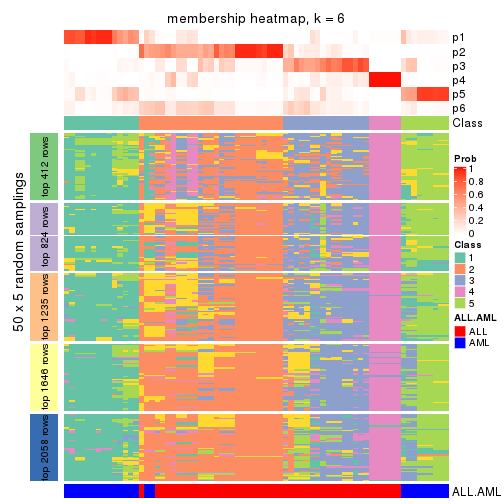</p>

</div>
</div>

As soon as we have had the classes for columns, we can look for signatures
which are significantly different between classes which can be candidate marks
for certain classes. Following are the heatmaps for signatures.


Signature heatmaps where rows are scaled:


<script>
$( function() {
	$( '#tabs-SD-hclust-get-signatures' ).tabs();
} );
</script>
<div id='tabs-SD-hclust-get-signatures'>
<ul>
<li><a href='#tab-SD-hclust-get-signatures-1'>k = 2</a></li>
<li><a href='#tab-SD-hclust-get-signatures-2'>k = 3</a></li>
<li><a href='#tab-SD-hclust-get-signatures-3'>k = 4</a></li>
<li><a href='#tab-SD-hclust-get-signatures-4'>k = 5</a></li>
<li><a href='#tab-SD-hclust-get-signatures-5'>k = 6</a></li>
</ul>
<div id='tab-SD-hclust-get-signatures-1'>
<pre><code class="r">get_signatures(res, k = 2)
</code></pre>

<p>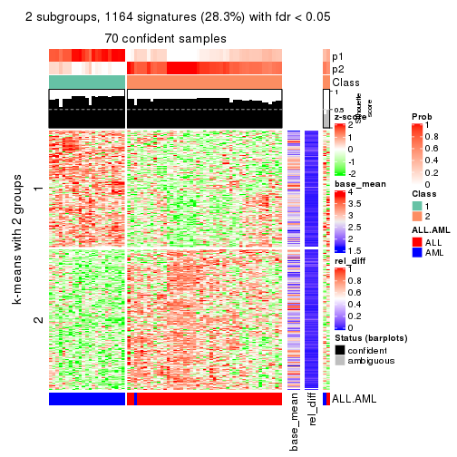</p>

</div>
<div id='tab-SD-hclust-get-signatures-2'>
<pre><code class="r">get_signatures(res, k = 3)
</code></pre>

<p>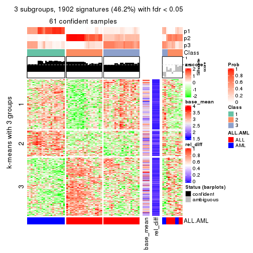</p>

</div>
<div id='tab-SD-hclust-get-signatures-3'>
<pre><code class="r">get_signatures(res, k = 4)
</code></pre>

<p>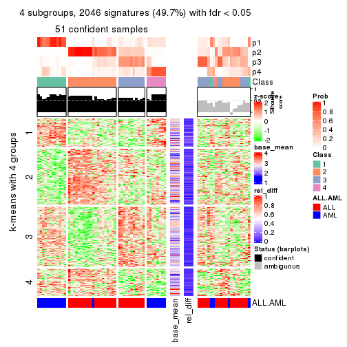</p>

</div>
<div id='tab-SD-hclust-get-signatures-4'>
<pre><code class="r">get_signatures(res, k = 5)
</code></pre>

<p>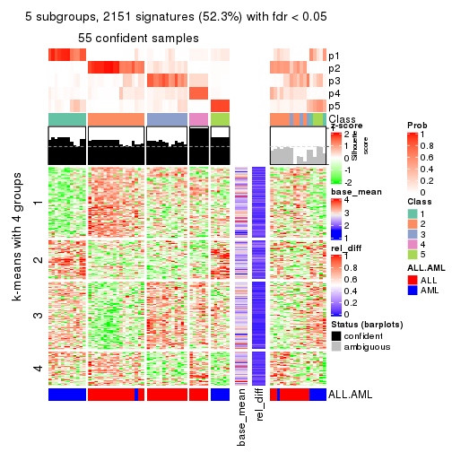</p>

</div>
<div id='tab-SD-hclust-get-signatures-5'>
<pre><code class="r">get_signatures(res, k = 6)
</code></pre>

<p>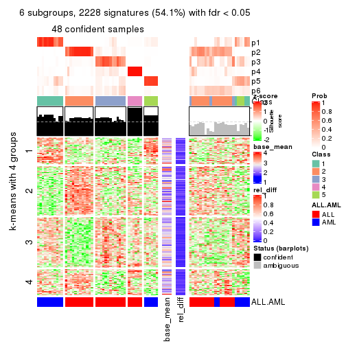</p>

</div>
</div>


Signature heatmaps where rows are not scaled:


<script>
$( function() {
	$( '#tabs-SD-hclust-get-signatures-no-scale' ).tabs();
} );
</script>
<div id='tabs-SD-hclust-get-signatures-no-scale'>
<ul>
<li><a href='#tab-SD-hclust-get-signatures-no-scale-1'>k = 2</a></li>
<li><a href='#tab-SD-hclust-get-signatures-no-scale-2'>k = 3</a></li>
<li><a href='#tab-SD-hclust-get-signatures-no-scale-3'>k = 4</a></li>
<li><a href='#tab-SD-hclust-get-signatures-no-scale-4'>k = 5</a></li>
<li><a href='#tab-SD-hclust-get-signatures-no-scale-5'>k = 6</a></li>
</ul>
<div id='tab-SD-hclust-get-signatures-no-scale-1'>
<pre><code class="r">get_signatures(res, k = 2, scale_rows = FALSE)
</code></pre>

<p>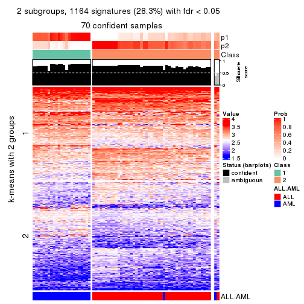</p>

</div>
<div id='tab-SD-hclust-get-signatures-no-scale-2'>
<pre><code class="r">get_signatures(res, k = 3, scale_rows = FALSE)
</code></pre>

<p>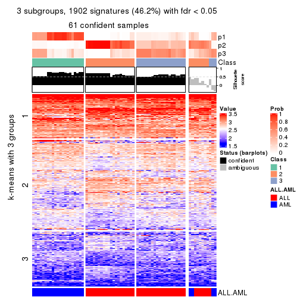</p>

</div>
<div id='tab-SD-hclust-get-signatures-no-scale-3'>
<pre><code class="r">get_signatures(res, k = 4, scale_rows = FALSE)
</code></pre>

<p>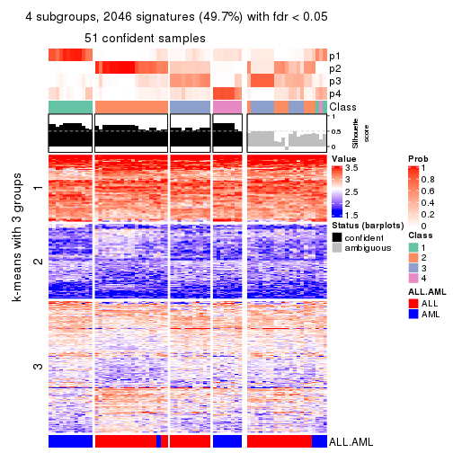</p>

</div>
<div id='tab-SD-hclust-get-signatures-no-scale-4'>
<pre><code class="r">get_signatures(res, k = 5, scale_rows = FALSE)
</code></pre>

<p>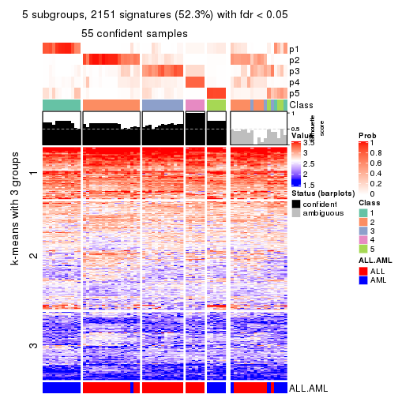</p>

</div>
<div id='tab-SD-hclust-get-signatures-no-scale-5'>
<pre><code class="r">get_signatures(res, k = 6, scale_rows = FALSE)
</code></pre>

<p>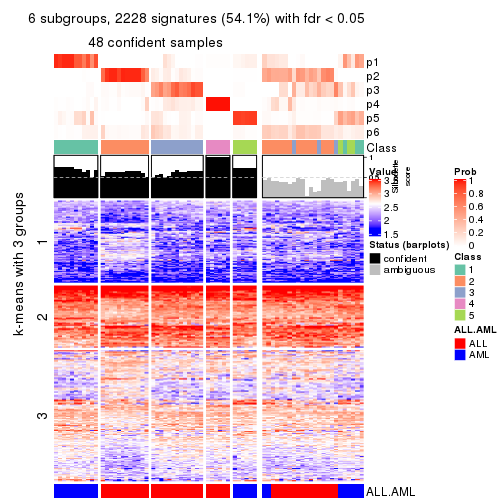</p>

</div>
</div>


Compare the overlap of signatures from different k:

```r
compare_signatures(res)
```

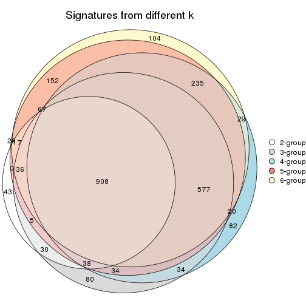

`get_signature()` returns a data frame invisibly. TO get the list of signatures, the function
call should be assigned to a variable explicitly. In following code, if `plot` argument is set
to `FALSE`, no heatmap is plotted while only the differential analysis is performed.

```r
# code only for demonstration
tb = get_signature(res, k = ..., plot = FALSE)
```

An example of the output of `tb` is:

```
#>   which_row         fdr    mean_1    mean_2 scaled_mean_1 scaled_mean_2 km
#> 1        38 0.042760348  8.373488  9.131774    -0.5533452     0.5164555  1
#> 2        40 0.018707592  7.106213  8.469186    -0.6173731     0.5762149  1
#> 3        55 0.019134737 10.221463 11.207825    -0.6159697     0.5749050  1
#> 4        59 0.006059896  5.921854  7.869574    -0.6899429     0.6439467  1
#> 5        60 0.018055526  8.928898 10.211722    -0.6204761     0.5791110  1
#> 6        98 0.009384629 15.714769 14.887706     0.6635654    -0.6193277  2
...
```

The columns in `tb` are:

1. `which_row`: row indices corresponding to the input matrix.
2. `fdr`: FDR for the differential test. 
3. `mean_x`: The mean value in group x.
4. `scaled_mean_x`: The mean value in group x after rows are scaled.
5. `km`: Row groups if k-means clustering is applied to rows.


UMAP plot which shows how samples are separated.


<script>
$( function() {
	$( '#tabs-SD-hclust-dimension-reduction' ).tabs();
} );
</script>
<div id='tabs-SD-hclust-dimension-reduction'>
<ul>
<li><a href='#tab-SD-hclust-dimension-reduction-1'>k = 2</a></li>
<li><a href='#tab-SD-hclust-dimension-reduction-2'>k = 3</a></li>
<li><a href='#tab-SD-hclust-dimension-reduction-3'>k = 4</a></li>
<li><a href='#tab-SD-hclust-dimension-reduction-4'>k = 5</a></li>
<li><a href='#tab-SD-hclust-dimension-reduction-5'>k = 6</a></li>
</ul>
<div id='tab-SD-hclust-dimension-reduction-1'>
<pre><code class="r">dimension_reduction(res, k = 2, method = &quot;UMAP&quot;)
</code></pre>

<p>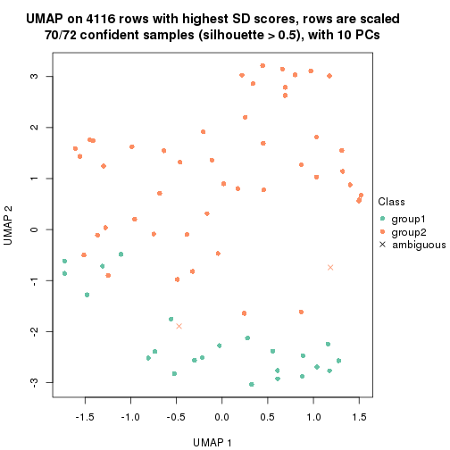</p>

</div>
<div id='tab-SD-hclust-dimension-reduction-2'>
<pre><code class="r">dimension_reduction(res, k = 3, method = &quot;UMAP&quot;)
</code></pre>

<p>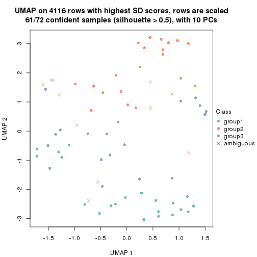</p>

</div>
<div id='tab-SD-hclust-dimension-reduction-3'>
<pre><code class="r">dimension_reduction(res, k = 4, method = &quot;UMAP&quot;)
</code></pre>

<p>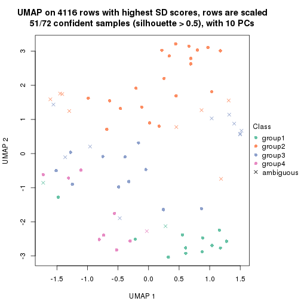</p>

</div>
<div id='tab-SD-hclust-dimension-reduction-4'>
<pre><code class="r">dimension_reduction(res, k = 5, method = &quot;UMAP&quot;)
</code></pre>

<p>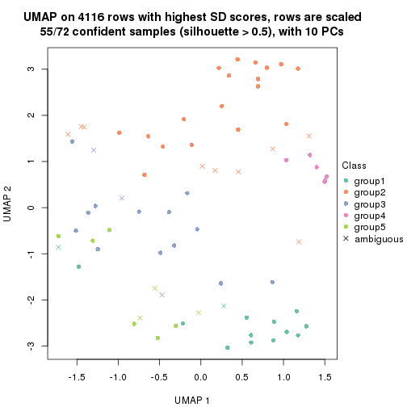</p>

</div>
<div id='tab-SD-hclust-dimension-reduction-5'>
<pre><code class="r">dimension_reduction(res, k = 6, method = &quot;UMAP&quot;)
</code></pre>

<p>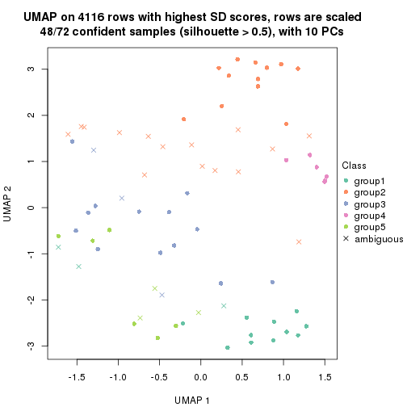</p>

</div>
</div>


Following heatmap shows how subgroups are split when increasing `k`:

```r
collect_classes(res)
```

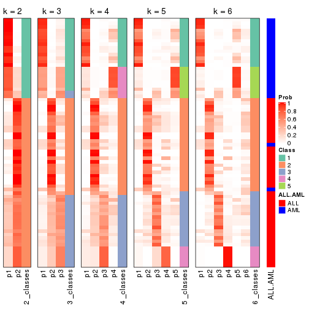


Test correlation between subgroups and known annotations. If the known
annotation is numeric, one-way ANOVA test is applied, and if the known
annotation is discrete, chi-squared contingency table test is applied.

```r
test_to_known_factors(res)
```

```
#>            n ALL.AML(p) k
#> SD:hclust 70   4.70e-15 2
#> SD:hclust 61   5.68e-14 3
#> SD:hclust 51   3.35e-10 4
#> SD:hclust 55   2.43e-10 5
#> SD:hclust 48   9.44e-10 6
```


If matrix rows can be associated to genes, consider to use `functional_enrichment(res,
...)` to perform function enrichment for the signature genes. See [this vignette](http://bioconductor.org/packages/devel/bioc/vignettes/cola/inst/doc/functional_enrichment.html) for more detailed explanations.


 

---------------------------------------------------


### SD:kmeans


The object with results only for a single top-value method and a single partition method 
can be extracted as:

```r
res = res_list["SD", "kmeans"]
# you can also extract it by
# res = res_list["SD:kmeans"]
```

A summary of `res` and all the functions that can be applied to it:

```r
res
```

```
#> A 'ConsensusPartition' object with k = 2, 3, 4, 5, 6.
#>   On a matrix with 4116 rows and 72 columns.
#>   Top rows (412, 824, 1235, 1646, 2058) are extracted by 'SD' method.
#>   Subgroups are detected by 'kmeans' method.
#>   Performed in total 1250 partitions by row resampling.
#>   Best k for subgroups seems to be 2.
#> 
#> Following methods can be applied to this 'ConsensusPartition' object:
#>  [1] "cola_report"             "collect_classes"         "collect_plots"          
#>  [4] "collect_stats"           "colnames"                "compare_signatures"     
#>  [7] "consensus_heatmap"       "dimension_reduction"     "functional_enrichment"  
#> [10] "get_anno_col"            "get_anno"                "get_classes"            
#> [13] "get_consensus"           "get_matrix"              "get_membership"         
#> [16] "get_param"               "get_signatures"          "get_stats"              
#> [19] "is_best_k"               "is_stable_k"             "membership_heatmap"     
#> [22] "ncol"                    "nrow"                    "plot_ecdf"              
#> [25] "rownames"                "select_partition_number" "show"                   
#> [28] "suggest_best_k"          "test_to_known_factors"
```

`collect_plots()` function collects all the plots made from `res` for all `k` (number of partitions)
into one single page to provide an easy and fast comparison between different `k`.

```r
collect_plots(res)
```

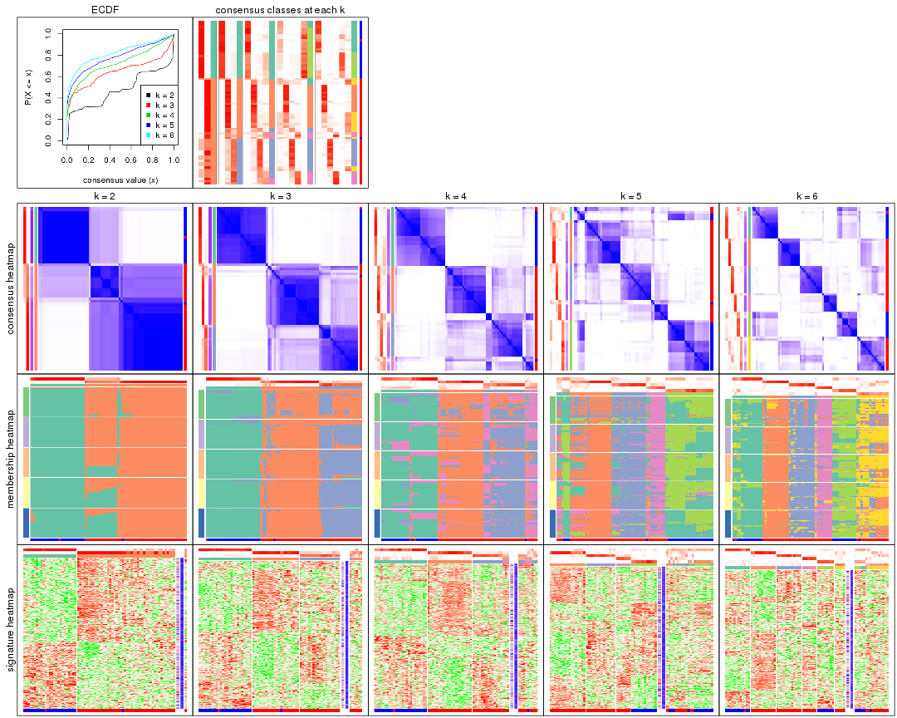

The plots are:

- The first row: a plot of the ECDF (empirical cumulative distribution
  function) curves of the consensus matrix for each `k` and the heatmap of
  predicted classes for each `k`.
- The second row: heatmaps of the consensus matrix for each `k`.
- The third row: heatmaps of the membership matrix for each `k`.
- The fouth row: heatmaps of the signatures for each `k`.

All the plots in panels can be made by individual functions and they are
plotted later in this section.

`select_partition_number()` produces several plots showing different
statistics for choosing "optimized" `k`. There are following statistics:

- ECDF curves of the consensus matrix for each `k`;
- 1-PAC. [The PAC
  score](https://en.wikipedia.org/wiki/Consensus_clustering#Over-interpretation_potential_of_consensus_clustering)
  measures the proportion of the ambiguous subgrouping.
- Mean silhouette score.
- Concordance. The mean probability of fiting the consensus class ids in all
  partitions.
- Area increased. Denote $A_k$ as the area under the ECDF curve for current
  `k`, the area increased is defined as $A_k - A_{k-1}$.
- Rand index. The percent of pairs of samples that are both in a same cluster
  or both are not in a same cluster in the partition of k and k-1.
- Jaccard index. The ratio of pairs of samples are both in a same cluster in
  the partition of k and k-1 and the pairs of samples are both in a same
  cluster in the partition k or k-1.

The detailed explanations of these statistics can be found in [the _cola_
vignette](http://bioconductor.org/packages/devel/bioc/vignettes/cola/inst/doc/cola.html#toc_13).

Generally speaking, lower PAC score, higher mean silhouette score or higher
concordance corresponds to better partition. Rand index and Jaccard index
measure how similar the current partition is compared to partition with `k-1`.
If they are too similar, we won't accept `k` is better than `k-1`.

```r
select_partition_number(res)
```

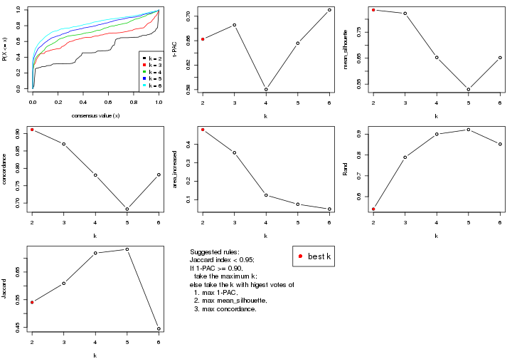

The numeric values for all these statistics can be obtained by `get_stats()`.

```r
get_stats(res)
```

```
#>   k 1-PAC mean_silhouette concordance area_increased  Rand Jaccard
#> 2 2 0.662           0.836       0.911         0.4793 0.540   0.540
#> 3 3 0.686           0.822       0.870         0.3544 0.789   0.609
#> 4 4 0.580           0.653       0.780         0.1247 0.900   0.718
#> 5 5 0.656           0.530       0.683         0.0757 0.922   0.732
#> 6 6 0.710           0.652       0.782         0.0496 0.852   0.445
```

`suggest_best_k()` suggests the best $k$ based on these statistics. The rules are as follows:

- All $k$ with Jaccard index larger than 0.95 are removed because increasing
  $k$ does not provide enough extra information. If all $k$ are removed, it is
  marked as no subgroup is detected.
- For all $k$ with 1-PAC score larger than 0.9, the maximal $k$ is taken as
  the best $k$, and other $k$ are marked as optional $k$.
- If it does not fit the second rule. The $k$ with the maximal vote of the
  highest 1-PAC score, highest mean silhouette, and highest concordance is
  taken as the best $k$.

```r
suggest_best_k(res)
```

```
#> [1] 2
```


Following shows the table of the partitions (You need to click the **show/hide
code output** link to see it). The membership matrix (columns with name `p*`)
is inferred by
[`clue::cl_consensus()`](https://www.rdocumentation.org/link/cl_consensus?package=clue)
function with the `SE` method. Basically the value in the membership matrix
represents the probability to belong to a certain group. The finall class
label for an item is determined with the group with highest probability it
belongs to.

In `get_classes()` function, the entropy is calculated from the membership
matrix and the silhouette score is calculated from the consensus matrix.


<script>
$( function() {
	$( '#tabs-SD-kmeans-get-classes' ).tabs();
} );
</script>
<div id='tabs-SD-kmeans-get-classes'>
<ul>
<li><a href='#tab-SD-kmeans-get-classes-1'>k = 2</a></li>
<li><a href='#tab-SD-kmeans-get-classes-2'>k = 3</a></li>
<li><a href='#tab-SD-kmeans-get-classes-3'>k = 4</a></li>
<li><a href='#tab-SD-kmeans-get-classes-4'>k = 5</a></li>
<li><a href='#tab-SD-kmeans-get-classes-5'>k = 6</a></li>
</ul>

<div id='tab-SD-kmeans-get-classes-1'>
<p><a id='tab-SD-kmeans-get-classes-1-a' style='color:#0366d6' href='#'>show/hide code output</a></p>
<pre><code class="r">cbind(get_classes(res, k = 2), get_membership(res, k = 2))
</code></pre>

<pre><code>#&gt;           class entropy silhouette    p1    p2
#&gt; sample_39     2  0.9286      0.614 0.344 0.656
#&gt; sample_40     2  0.9522      0.575 0.372 0.628
#&gt; sample_42     2  0.0376      0.858 0.004 0.996
#&gt; sample_47     2  0.0376      0.858 0.004 0.996
#&gt; sample_48     2  0.0376      0.858 0.004 0.996
#&gt; sample_49     2  0.9552      0.568 0.376 0.624
#&gt; sample_41     2  0.0376      0.858 0.004 0.996
#&gt; sample_43     2  0.0376      0.858 0.004 0.996
#&gt; sample_44     2  0.0376      0.858 0.004 0.996
#&gt; sample_45     2  0.0376      0.858 0.004 0.996
#&gt; sample_46     2  0.0376      0.858 0.004 0.996
#&gt; sample_70     2  0.0672      0.857 0.008 0.992
#&gt; sample_71     2  0.0000      0.856 0.000 1.000
#&gt; sample_72     2  0.0000      0.856 0.000 1.000
#&gt; sample_68     2  0.0376      0.858 0.004 0.996
#&gt; sample_69     2  0.0376      0.858 0.004 0.996
#&gt; sample_67     2  1.0000     -0.047 0.500 0.500
#&gt; sample_55     2  0.9393      0.599 0.356 0.644
#&gt; sample_56     2  0.9393      0.599 0.356 0.644
#&gt; sample_59     2  0.0376      0.858 0.004 0.996
#&gt; sample_52     1  0.0672      0.992 0.992 0.008
#&gt; sample_53     1  0.0938      0.988 0.988 0.012
#&gt; sample_51     1  0.0672      0.992 0.992 0.008
#&gt; sample_50     1  0.0672      0.992 0.992 0.008
#&gt; sample_54     1  0.4690      0.887 0.900 0.100
#&gt; sample_57     1  0.0672      0.992 0.992 0.008
#&gt; sample_58     1  0.0672      0.992 0.992 0.008
#&gt; sample_60     1  0.0672      0.992 0.992 0.008
#&gt; sample_61     1  0.0672      0.992 0.992 0.008
#&gt; sample_65     1  0.0672      0.992 0.992 0.008
#&gt; sample_66     2  0.2423      0.838 0.040 0.960
#&gt; sample_63     1  0.0672      0.992 0.992 0.008
#&gt; sample_64     1  0.0672      0.992 0.992 0.008
#&gt; sample_62     1  0.0672      0.992 0.992 0.008
#&gt; sample_1      2  0.0672      0.857 0.008 0.992
#&gt; sample_2      2  0.6148      0.744 0.152 0.848
#&gt; sample_3      2  0.9323      0.619 0.348 0.652
#&gt; sample_4      2  0.0672      0.857 0.008 0.992
#&gt; sample_5      2  0.0376      0.858 0.004 0.996
#&gt; sample_6      2  0.9323      0.619 0.348 0.652
#&gt; sample_7      2  0.9358      0.604 0.352 0.648
#&gt; sample_8      2  0.9580      0.562 0.380 0.620
#&gt; sample_9      2  0.1633      0.849 0.024 0.976
#&gt; sample_10     2  0.9323      0.619 0.348 0.652
#&gt; sample_11     2  0.1633      0.849 0.024 0.976
#&gt; sample_12     1  0.0672      0.992 0.992 0.008
#&gt; sample_13     2  0.0376      0.858 0.004 0.996
#&gt; sample_14     2  0.1633      0.849 0.024 0.976
#&gt; sample_15     2  0.0376      0.858 0.004 0.996
#&gt; sample_16     2  0.0376      0.858 0.004 0.996
#&gt; sample_17     2  0.1414      0.852 0.020 0.980
#&gt; sample_18     2  0.5842      0.788 0.140 0.860
#&gt; sample_19     2  0.0376      0.858 0.004 0.996
#&gt; sample_20     2  0.0376      0.858 0.004 0.996
#&gt; sample_21     2  0.0000      0.856 0.000 1.000
#&gt; sample_22     2  0.9552      0.562 0.376 0.624
#&gt; sample_23     2  0.9323      0.619 0.348 0.652
#&gt; sample_24     2  0.0376      0.858 0.004 0.996
#&gt; sample_25     2  0.8955      0.650 0.312 0.688
#&gt; sample_26     2  0.0376      0.858 0.004 0.996
#&gt; sample_27     2  0.9580      0.562 0.380 0.620
#&gt; sample_34     1  0.0672      0.992 0.992 0.008
#&gt; sample_35     1  0.0672      0.992 0.992 0.008
#&gt; sample_36     1  0.0672      0.992 0.992 0.008
#&gt; sample_37     1  0.0672      0.992 0.992 0.008
#&gt; sample_38     1  0.0938      0.988 0.988 0.012
#&gt; sample_28     1  0.0672      0.992 0.992 0.008
#&gt; sample_29     1  0.3431      0.928 0.936 0.064
#&gt; sample_30     1  0.0672      0.992 0.992 0.008
#&gt; sample_31     1  0.0672      0.992 0.992 0.008
#&gt; sample_32     1  0.0672      0.992 0.992 0.008
#&gt; sample_33     1  0.0672      0.992 0.992 0.008
</code></pre>

<script>
$('#tab-SD-kmeans-get-classes-1-a').parent().next().next().hide();
$('#tab-SD-kmeans-get-classes-1-a').click(function(){
  $('#tab-SD-kmeans-get-classes-1-a').parent().next().next().toggle();
  return(false);
});
</script>
</div>

<div id='tab-SD-kmeans-get-classes-2'>
<p><a id='tab-SD-kmeans-get-classes-2-a' style='color:#0366d6' href='#'>show/hide code output</a></p>
<pre><code class="r">cbind(get_classes(res, k = 3), get_membership(res, k = 3))
</code></pre>

<pre><code>#&gt;           class entropy silhouette    p1    p2    p3
#&gt; sample_39     3  0.6287     0.8560 0.024 0.272 0.704
#&gt; sample_40     3  0.6226     0.8634 0.028 0.252 0.720
#&gt; sample_42     2  0.0747     0.8499 0.000 0.984 0.016
#&gt; sample_47     2  0.0000     0.8528 0.000 1.000 0.000
#&gt; sample_48     2  0.0237     0.8529 0.000 0.996 0.004
#&gt; sample_49     3  0.6187     0.8644 0.028 0.248 0.724
#&gt; sample_41     2  0.1529     0.8440 0.000 0.960 0.040
#&gt; sample_43     2  0.0424     0.8515 0.000 0.992 0.008
#&gt; sample_44     2  0.0747     0.8507 0.000 0.984 0.016
#&gt; sample_45     2  0.0592     0.8516 0.000 0.988 0.012
#&gt; sample_46     2  0.0592     0.8516 0.000 0.988 0.012
#&gt; sample_70     3  0.5905     0.7804 0.000 0.352 0.648
#&gt; sample_71     2  0.2261     0.8079 0.000 0.932 0.068
#&gt; sample_72     2  0.2165     0.8120 0.000 0.936 0.064
#&gt; sample_68     2  0.1411     0.8461 0.000 0.964 0.036
#&gt; sample_69     2  0.0000     0.8528 0.000 1.000 0.000
#&gt; sample_67     2  0.7841     0.0517 0.472 0.476 0.052
#&gt; sample_55     3  0.5849     0.8599 0.028 0.216 0.756
#&gt; sample_56     3  0.6226     0.8634 0.028 0.252 0.720
#&gt; sample_59     2  0.6252    -0.3283 0.000 0.556 0.444
#&gt; sample_52     1  0.2625     0.9576 0.916 0.000 0.084
#&gt; sample_53     1  0.0747     0.9588 0.984 0.000 0.016
#&gt; sample_51     1  0.0747     0.9588 0.984 0.000 0.016
#&gt; sample_50     1  0.0592     0.9596 0.988 0.000 0.012
#&gt; sample_54     1  0.3112     0.9525 0.900 0.004 0.096
#&gt; sample_57     1  0.2878     0.9536 0.904 0.000 0.096
#&gt; sample_58     1  0.2796     0.9551 0.908 0.000 0.092
#&gt; sample_60     1  0.2878     0.9536 0.904 0.000 0.096
#&gt; sample_61     1  0.1643     0.9627 0.956 0.000 0.044
#&gt; sample_65     1  0.1643     0.9629 0.956 0.000 0.044
#&gt; sample_66     2  0.5680     0.6667 0.024 0.764 0.212
#&gt; sample_63     1  0.2711     0.9566 0.912 0.000 0.088
#&gt; sample_64     1  0.2796     0.9551 0.908 0.000 0.092
#&gt; sample_62     1  0.2711     0.9566 0.912 0.000 0.088
#&gt; sample_1      3  0.5678     0.8231 0.000 0.316 0.684
#&gt; sample_2      2  0.8616     0.4682 0.148 0.588 0.264
#&gt; sample_3      3  0.3112     0.7825 0.004 0.096 0.900
#&gt; sample_4      3  0.5327     0.8388 0.000 0.272 0.728
#&gt; sample_5      2  0.1411     0.8461 0.000 0.964 0.036
#&gt; sample_6      3  0.3112     0.7825 0.004 0.096 0.900
#&gt; sample_7      3  0.5894     0.8601 0.028 0.220 0.752
#&gt; sample_8      3  0.6264     0.8635 0.028 0.256 0.716
#&gt; sample_9      3  0.4399     0.7249 0.000 0.188 0.812
#&gt; sample_10     3  0.3112     0.7825 0.004 0.096 0.900
#&gt; sample_11     3  0.5988     0.3704 0.000 0.368 0.632
#&gt; sample_12     1  0.1647     0.9529 0.960 0.004 0.036
#&gt; sample_13     2  0.0237     0.8529 0.000 0.996 0.004
#&gt; sample_14     2  0.6244     0.2863 0.000 0.560 0.440
#&gt; sample_15     2  0.1411     0.8461 0.000 0.964 0.036
#&gt; sample_16     2  0.1163     0.8445 0.000 0.972 0.028
#&gt; sample_17     2  0.3752     0.7568 0.000 0.856 0.144
#&gt; sample_18     3  0.5692     0.8554 0.008 0.268 0.724
#&gt; sample_19     2  0.0592     0.8510 0.000 0.988 0.012
#&gt; sample_20     2  0.0000     0.8528 0.000 1.000 0.000
#&gt; sample_21     2  0.1411     0.8476 0.000 0.964 0.036
#&gt; sample_22     3  0.6596     0.8615 0.040 0.256 0.704
#&gt; sample_23     3  0.3112     0.7825 0.004 0.096 0.900
#&gt; sample_24     2  0.1529     0.8440 0.000 0.960 0.040
#&gt; sample_25     3  0.7222     0.7093 0.032 0.388 0.580
#&gt; sample_26     2  0.5138     0.4580 0.000 0.748 0.252
#&gt; sample_27     3  0.6187     0.8644 0.028 0.248 0.724
#&gt; sample_34     1  0.2261     0.9606 0.932 0.000 0.068
#&gt; sample_35     1  0.2796     0.9580 0.908 0.000 0.092
#&gt; sample_36     1  0.0424     0.9612 0.992 0.000 0.008
#&gt; sample_37     1  0.0747     0.9588 0.984 0.000 0.016
#&gt; sample_38     1  0.0983     0.9575 0.980 0.004 0.016
#&gt; sample_28     1  0.0983     0.9575 0.980 0.004 0.016
#&gt; sample_29     1  0.0983     0.9571 0.980 0.004 0.016
#&gt; sample_30     1  0.0237     0.9608 0.996 0.000 0.004
#&gt; sample_31     1  0.2165     0.9612 0.936 0.000 0.064
#&gt; sample_32     1  0.0424     0.9621 0.992 0.000 0.008
#&gt; sample_33     1  0.0747     0.9588 0.984 0.000 0.016
</code></pre>

<script>
$('#tab-SD-kmeans-get-classes-2-a').parent().next().next().hide();
$('#tab-SD-kmeans-get-classes-2-a').click(function(){
  $('#tab-SD-kmeans-get-classes-2-a').parent().next().next().toggle();
  return(false);
});
</script>
</div>

<div id='tab-SD-kmeans-get-classes-3'>
<p><a id='tab-SD-kmeans-get-classes-3-a' style='color:#0366d6' href='#'>show/hide code output</a></p>
<pre><code class="r">cbind(get_classes(res, k = 4), get_membership(res, k = 4))
</code></pre>

<pre><code>#&gt;           class entropy silhouette    p1    p2    p3    p4
#&gt; sample_39     3  0.4819    0.67129 0.004 0.152 0.784 0.060
#&gt; sample_40     3  0.2926    0.71108 0.004 0.096 0.888 0.012
#&gt; sample_42     2  0.6994    0.56098 0.012 0.604 0.128 0.256
#&gt; sample_47     2  0.2596    0.81643 0.000 0.908 0.024 0.068
#&gt; sample_48     2  0.0336    0.82986 0.000 0.992 0.008 0.000
#&gt; sample_49     3  0.2861    0.71000 0.004 0.092 0.892 0.012
#&gt; sample_41     2  0.1545    0.81601 0.000 0.952 0.040 0.008
#&gt; sample_43     2  0.4419    0.77663 0.000 0.812 0.104 0.084
#&gt; sample_44     2  0.4673    0.76617 0.000 0.792 0.132 0.076
#&gt; sample_45     2  0.3834    0.79510 0.000 0.848 0.076 0.076
#&gt; sample_46     2  0.4100    0.78716 0.000 0.832 0.092 0.076
#&gt; sample_70     3  0.5875    0.60802 0.000 0.204 0.692 0.104
#&gt; sample_71     2  0.7146    0.52216 0.016 0.596 0.132 0.256
#&gt; sample_72     2  0.7013    0.53504 0.012 0.604 0.132 0.252
#&gt; sample_68     2  0.1356    0.81813 0.000 0.960 0.032 0.008
#&gt; sample_69     2  0.0336    0.82955 0.000 0.992 0.008 0.000
#&gt; sample_67     1  0.8033   -0.02386 0.488 0.212 0.020 0.280
#&gt; sample_55     3  0.3619    0.66518 0.004 0.100 0.860 0.036
#&gt; sample_56     3  0.3221    0.71204 0.004 0.100 0.876 0.020
#&gt; sample_59     3  0.6280    0.50968 0.000 0.304 0.612 0.084
#&gt; sample_52     1  0.4836    0.76925 0.672 0.000 0.008 0.320
#&gt; sample_53     1  0.0336    0.79640 0.992 0.000 0.000 0.008
#&gt; sample_51     1  0.0188    0.79765 0.996 0.000 0.000 0.004
#&gt; sample_50     1  0.0188    0.79765 0.996 0.000 0.000 0.004
#&gt; sample_54     1  0.6825    0.70709 0.556 0.008 0.088 0.348
#&gt; sample_57     1  0.6439    0.72143 0.576 0.000 0.084 0.340
#&gt; sample_58     1  0.6135    0.74118 0.608 0.000 0.068 0.324
#&gt; sample_60     1  0.6523    0.71280 0.564 0.000 0.088 0.348
#&gt; sample_61     1  0.4782    0.79838 0.780 0.000 0.068 0.152
#&gt; sample_65     1  0.3808    0.80376 0.812 0.000 0.012 0.176
#&gt; sample_66     4  0.7782    0.00808 0.080 0.408 0.052 0.460
#&gt; sample_63     1  0.5173    0.76532 0.660 0.000 0.020 0.320
#&gt; sample_64     1  0.6338    0.73656 0.600 0.000 0.084 0.316
#&gt; sample_62     1  0.5271    0.76377 0.656 0.000 0.024 0.320
#&gt; sample_1      3  0.3910    0.69878 0.000 0.156 0.820 0.024
#&gt; sample_2      4  0.8174    0.49359 0.188 0.184 0.068 0.560
#&gt; sample_3      3  0.5614   -0.26529 0.008 0.012 0.568 0.412
#&gt; sample_4      3  0.3306    0.65895 0.000 0.156 0.840 0.004
#&gt; sample_5      2  0.1545    0.81601 0.000 0.952 0.040 0.008
#&gt; sample_6      3  0.5614   -0.26529 0.008 0.012 0.568 0.412
#&gt; sample_7      3  0.3172    0.67541 0.004 0.112 0.872 0.012
#&gt; sample_8      3  0.2466    0.70936 0.004 0.096 0.900 0.000
#&gt; sample_9      4  0.6407    0.52600 0.008 0.048 0.424 0.520
#&gt; sample_10     4  0.5577    0.45338 0.008 0.008 0.460 0.524
#&gt; sample_11     4  0.6965    0.61441 0.008 0.100 0.344 0.548
#&gt; sample_12     1  0.3916    0.72171 0.848 0.004 0.092 0.056
#&gt; sample_13     2  0.0336    0.82986 0.000 0.992 0.008 0.000
#&gt; sample_14     4  0.7178    0.60794 0.000 0.156 0.324 0.520
#&gt; sample_15     2  0.1545    0.81601 0.000 0.952 0.040 0.008
#&gt; sample_16     2  0.2408    0.80791 0.000 0.896 0.104 0.000
#&gt; sample_17     2  0.5705    0.52086 0.000 0.712 0.108 0.180
#&gt; sample_18     3  0.4046    0.70455 0.000 0.124 0.828 0.048
#&gt; sample_19     2  0.4458    0.77258 0.000 0.808 0.116 0.076
#&gt; sample_20     2  0.0188    0.82988 0.000 0.996 0.004 0.000
#&gt; sample_21     2  0.1610    0.81865 0.000 0.952 0.032 0.016
#&gt; sample_22     3  0.4821    0.66538 0.024 0.088 0.812 0.076
#&gt; sample_23     3  0.5614   -0.26529 0.008 0.012 0.568 0.412
#&gt; sample_24     2  0.1970    0.79947 0.000 0.932 0.060 0.008
#&gt; sample_25     3  0.7376    0.47043 0.016 0.236 0.580 0.168
#&gt; sample_26     3  0.6752    0.10797 0.000 0.440 0.468 0.092
#&gt; sample_27     3  0.2861    0.71000 0.004 0.092 0.892 0.012
#&gt; sample_34     1  0.4212    0.79874 0.772 0.000 0.012 0.216
#&gt; sample_35     1  0.5783    0.77430 0.692 0.000 0.088 0.220
#&gt; sample_36     1  0.0707    0.80135 0.980 0.000 0.000 0.020
#&gt; sample_37     1  0.0336    0.79640 0.992 0.000 0.000 0.008
#&gt; sample_38     1  0.2124    0.76243 0.924 0.000 0.008 0.068
#&gt; sample_28     1  0.1807    0.77306 0.940 0.000 0.008 0.052
#&gt; sample_29     1  0.2530    0.73173 0.888 0.000 0.000 0.112
#&gt; sample_30     1  0.0469    0.80077 0.988 0.000 0.000 0.012
#&gt; sample_31     1  0.3933    0.80105 0.792 0.000 0.008 0.200
#&gt; sample_32     1  0.0927    0.80175 0.976 0.000 0.008 0.016
#&gt; sample_33     1  0.0336    0.79640 0.992 0.000 0.000 0.008
</code></pre>

<script>
$('#tab-SD-kmeans-get-classes-3-a').parent().next().next().hide();
$('#tab-SD-kmeans-get-classes-3-a').click(function(){
  $('#tab-SD-kmeans-get-classes-3-a').parent().next().next().toggle();
  return(false);
});
</script>
</div>

<div id='tab-SD-kmeans-get-classes-4'>
<p><a id='tab-SD-kmeans-get-classes-4-a' style='color:#0366d6' href='#'>show/hide code output</a></p>
<pre><code class="r">cbind(get_classes(res, k = 5), get_membership(res, k = 5))
</code></pre>

<pre><code>#&gt;           class entropy silhouette    p1    p2    p3    p4    p5
#&gt; sample_39     3  0.3589    0.76090 0.084 0.032 0.848 0.036 0.000
#&gt; sample_40     3  0.2086    0.78722 0.000 0.028 0.928 0.016 0.028
#&gt; sample_42     1  0.8187   -0.28465 0.388 0.284 0.168 0.160 0.000
#&gt; sample_47     2  0.5495    0.64954 0.220 0.684 0.048 0.048 0.000
#&gt; sample_48     2  0.0912    0.76262 0.012 0.972 0.016 0.000 0.000
#&gt; sample_49     3  0.1729    0.78458 0.004 0.032 0.944 0.012 0.008
#&gt; sample_41     2  0.1095    0.75438 0.012 0.968 0.012 0.008 0.000
#&gt; sample_43     2  0.7095    0.53773 0.264 0.520 0.164 0.052 0.000
#&gt; sample_44     2  0.7328    0.48667 0.228 0.496 0.220 0.056 0.000
#&gt; sample_45     2  0.6027    0.63074 0.228 0.644 0.076 0.052 0.000
#&gt; sample_46     2  0.6513    0.60323 0.228 0.604 0.112 0.056 0.000
#&gt; sample_70     3  0.5802    0.62765 0.232 0.040 0.656 0.072 0.000
#&gt; sample_71     1  0.8380   -0.28127 0.324 0.308 0.164 0.204 0.000
#&gt; sample_72     2  0.8374    0.11846 0.316 0.320 0.168 0.196 0.000
#&gt; sample_68     2  0.0693    0.75718 0.012 0.980 0.000 0.008 0.000
#&gt; sample_69     2  0.1211    0.76119 0.024 0.960 0.016 0.000 0.000
#&gt; sample_67     1  0.8192    0.18424 0.416 0.088 0.012 0.240 0.244
#&gt; sample_55     3  0.3847    0.74394 0.056 0.064 0.844 0.028 0.008
#&gt; sample_56     3  0.1706    0.78787 0.012 0.016 0.948 0.016 0.008
#&gt; sample_59     3  0.6564    0.56616 0.256 0.092 0.588 0.064 0.000
#&gt; sample_52     5  0.3867    0.57094 0.144 0.000 0.004 0.048 0.804
#&gt; sample_53     5  0.4219    0.29396 0.416 0.000 0.000 0.000 0.584
#&gt; sample_51     5  0.4201    0.30913 0.408 0.000 0.000 0.000 0.592
#&gt; sample_50     5  0.4201    0.30913 0.408 0.000 0.000 0.000 0.592
#&gt; sample_54     5  0.5809    0.49726 0.212 0.000 0.052 0.068 0.668
#&gt; sample_57     5  0.5401    0.53295 0.184 0.000 0.044 0.064 0.708
#&gt; sample_58     5  0.4775    0.55573 0.160 0.000 0.032 0.052 0.756
#&gt; sample_60     5  0.5783    0.50833 0.200 0.000 0.056 0.068 0.676
#&gt; sample_61     5  0.3530    0.54640 0.104 0.000 0.028 0.024 0.844
#&gt; sample_65     5  0.1830    0.56053 0.068 0.000 0.000 0.008 0.924
#&gt; sample_66     4  0.7379    0.12455 0.344 0.224 0.016 0.404 0.012
#&gt; sample_63     5  0.3989    0.57051 0.144 0.000 0.008 0.048 0.800
#&gt; sample_64     5  0.4978    0.54686 0.140 0.000 0.068 0.040 0.752
#&gt; sample_62     5  0.4058    0.56953 0.144 0.000 0.008 0.052 0.796
#&gt; sample_1      3  0.1997    0.78867 0.016 0.028 0.932 0.024 0.000
#&gt; sample_2      4  0.6342    0.32452 0.320 0.088 0.012 0.564 0.016
#&gt; sample_3      4  0.3636    0.70975 0.000 0.000 0.272 0.728 0.000
#&gt; sample_4      3  0.3342    0.72663 0.008 0.136 0.836 0.020 0.000
#&gt; sample_5      2  0.0854    0.75620 0.012 0.976 0.004 0.008 0.000
#&gt; sample_6      4  0.3636    0.70975 0.000 0.000 0.272 0.728 0.000
#&gt; sample_7      3  0.2616    0.76792 0.008 0.068 0.900 0.016 0.008
#&gt; sample_8      3  0.1518    0.78845 0.012 0.020 0.952 0.016 0.000
#&gt; sample_9      4  0.3098    0.76669 0.000 0.016 0.148 0.836 0.000
#&gt; sample_10     4  0.2732    0.76298 0.000 0.000 0.160 0.840 0.000
#&gt; sample_11     4  0.3193    0.76182 0.004 0.032 0.112 0.852 0.000
#&gt; sample_12     5  0.6376   -0.00821 0.388 0.000 0.080 0.032 0.500
#&gt; sample_13     2  0.0912    0.76262 0.012 0.972 0.016 0.000 0.000
#&gt; sample_14     4  0.3476    0.74547 0.000 0.076 0.088 0.836 0.000
#&gt; sample_15     2  0.0854    0.75620 0.012 0.976 0.004 0.008 0.000
#&gt; sample_16     2  0.4514    0.62916 0.024 0.736 0.220 0.020 0.000
#&gt; sample_17     2  0.4859    0.53344 0.032 0.740 0.032 0.192 0.004
#&gt; sample_18     3  0.3716    0.76714 0.072 0.036 0.844 0.048 0.000
#&gt; sample_19     2  0.7105    0.52595 0.216 0.536 0.192 0.056 0.000
#&gt; sample_20     2  0.0798    0.76254 0.008 0.976 0.016 0.000 0.000
#&gt; sample_21     2  0.0740    0.75819 0.004 0.980 0.008 0.008 0.000
#&gt; sample_22     3  0.3514    0.74802 0.088 0.016 0.848 0.048 0.000
#&gt; sample_23     4  0.3636    0.70975 0.000 0.000 0.272 0.728 0.000
#&gt; sample_24     2  0.1095    0.75438 0.012 0.968 0.012 0.008 0.000
#&gt; sample_25     3  0.7512    0.38966 0.348 0.092 0.448 0.108 0.004
#&gt; sample_26     3  0.7167    0.47689 0.220 0.148 0.548 0.084 0.000
#&gt; sample_27     3  0.1729    0.78458 0.004 0.032 0.944 0.012 0.008
#&gt; sample_34     5  0.0798    0.57805 0.016 0.000 0.008 0.000 0.976
#&gt; sample_35     5  0.2756    0.55600 0.024 0.000 0.092 0.004 0.880
#&gt; sample_36     5  0.4530    0.34139 0.376 0.000 0.004 0.008 0.612
#&gt; sample_37     5  0.4227    0.28696 0.420 0.000 0.000 0.000 0.580
#&gt; sample_38     1  0.4430   -0.10635 0.540 0.000 0.000 0.004 0.456
#&gt; sample_28     1  0.4448   -0.16001 0.516 0.000 0.000 0.004 0.480
#&gt; sample_29     1  0.4882   -0.12385 0.532 0.000 0.000 0.024 0.444
#&gt; sample_30     5  0.4530    0.33769 0.376 0.000 0.004 0.008 0.612
#&gt; sample_31     5  0.1059    0.57677 0.020 0.000 0.008 0.004 0.968
#&gt; sample_32     5  0.4520    0.37971 0.296 0.000 0.008 0.016 0.680
#&gt; sample_33     5  0.4219    0.29396 0.416 0.000 0.000 0.000 0.584
</code></pre>

<script>
$('#tab-SD-kmeans-get-classes-4-a').parent().next().next().hide();
$('#tab-SD-kmeans-get-classes-4-a').click(function(){
  $('#tab-SD-kmeans-get-classes-4-a').parent().next().next().toggle();
  return(false);
});
</script>
</div>

<div id='tab-SD-kmeans-get-classes-5'>
<p><a id='tab-SD-kmeans-get-classes-5-a' style='color:#0366d6' href='#'>show/hide code output</a></p>
<pre><code class="r">cbind(get_classes(res, k = 6), get_membership(res, k = 6))
</code></pre>

<pre><code>#&gt;           class entropy silhouette    p1    p2    p3    p4    p5    p6
#&gt; sample_39     3  0.3276     0.7517 0.004 0.008 0.812 0.004 0.008 0.164
#&gt; sample_40     3  0.2650     0.8556 0.000 0.004 0.888 0.016 0.036 0.056
#&gt; sample_42     6  0.4976     0.5731 0.044 0.080 0.044 0.048 0.016 0.768
#&gt; sample_47     6  0.4928     0.2835 0.000 0.464 0.024 0.004 0.016 0.492
#&gt; sample_48     2  0.1500     0.8854 0.000 0.936 0.012 0.000 0.000 0.052
#&gt; sample_49     3  0.1198     0.8705 0.000 0.004 0.960 0.012 0.020 0.004
#&gt; sample_41     2  0.0665     0.8971 0.000 0.980 0.000 0.008 0.008 0.004
#&gt; sample_43     6  0.5687     0.5293 0.004 0.300 0.092 0.004 0.020 0.580
#&gt; sample_44     6  0.6106     0.4981 0.000 0.316 0.172 0.000 0.020 0.492
#&gt; sample_45     6  0.5328     0.4064 0.000 0.404 0.060 0.000 0.020 0.516
#&gt; sample_46     6  0.5410     0.4208 0.000 0.396 0.068 0.000 0.020 0.516
#&gt; sample_70     6  0.4642     0.1774 0.000 0.012 0.452 0.000 0.020 0.516
#&gt; sample_71     6  0.6180     0.5174 0.036 0.080 0.068 0.108 0.028 0.680
#&gt; sample_72     6  0.6467     0.5345 0.036 0.088 0.084 0.108 0.028 0.656
#&gt; sample_68     2  0.0520     0.8989 0.000 0.984 0.000 0.008 0.008 0.000
#&gt; sample_69     2  0.1701     0.8722 0.000 0.920 0.008 0.000 0.000 0.072
#&gt; sample_67     6  0.7288    -0.0366 0.372 0.048 0.000 0.144 0.048 0.388
#&gt; sample_55     3  0.4076     0.7915 0.000 0.084 0.800 0.004 0.064 0.048
#&gt; sample_56     3  0.1036     0.8684 0.000 0.004 0.964 0.000 0.024 0.008
#&gt; sample_59     6  0.5394     0.2297 0.000 0.036 0.412 0.000 0.044 0.508
#&gt; sample_52     5  0.2520     0.7676 0.152 0.004 0.000 0.000 0.844 0.000
#&gt; sample_53     1  0.1387     0.7832 0.932 0.000 0.000 0.000 0.068 0.000
#&gt; sample_51     1  0.1387     0.7832 0.932 0.000 0.000 0.000 0.068 0.000
#&gt; sample_50     1  0.1387     0.7832 0.932 0.000 0.000 0.000 0.068 0.000
#&gt; sample_54     5  0.3296     0.7399 0.056 0.000 0.040 0.008 0.856 0.040
#&gt; sample_57     5  0.3255     0.7557 0.076 0.000 0.040 0.004 0.852 0.028
#&gt; sample_58     5  0.3436     0.7713 0.108 0.000 0.028 0.004 0.832 0.028
#&gt; sample_60     5  0.3296     0.7399 0.056 0.000 0.040 0.008 0.856 0.040
#&gt; sample_61     1  0.6001    -0.1745 0.464 0.000 0.036 0.008 0.416 0.076
#&gt; sample_65     1  0.4983    -0.1871 0.484 0.000 0.000 0.008 0.460 0.048
#&gt; sample_66     6  0.6888     0.3290 0.108 0.088 0.000 0.196 0.044 0.564
#&gt; sample_63     5  0.2340     0.7701 0.148 0.000 0.000 0.000 0.852 0.000
#&gt; sample_64     5  0.4936     0.7289 0.100 0.004 0.060 0.016 0.752 0.068
#&gt; sample_62     5  0.2482     0.7701 0.148 0.004 0.000 0.000 0.848 0.000
#&gt; sample_1      3  0.1624     0.8615 0.000 0.008 0.936 0.012 0.000 0.044
#&gt; sample_2      4  0.7114     0.0846 0.148 0.024 0.004 0.396 0.048 0.380
#&gt; sample_3      4  0.2278     0.8297 0.000 0.004 0.128 0.868 0.000 0.000
#&gt; sample_4      3  0.3368     0.8074 0.000 0.124 0.828 0.016 0.004 0.028
#&gt; sample_5      2  0.0520     0.8989 0.000 0.984 0.000 0.008 0.008 0.000
#&gt; sample_6      4  0.2278     0.8297 0.000 0.004 0.128 0.868 0.000 0.000
#&gt; sample_7      3  0.2979     0.8408 0.000 0.080 0.868 0.016 0.012 0.024
#&gt; sample_8      3  0.1836     0.8644 0.000 0.004 0.928 0.012 0.008 0.048
#&gt; sample_9      4  0.1124     0.8533 0.000 0.008 0.036 0.956 0.000 0.000
#&gt; sample_10     4  0.1299     0.8533 0.004 0.004 0.036 0.952 0.004 0.000
#&gt; sample_11     4  0.1180     0.8483 0.004 0.008 0.024 0.960 0.004 0.000
#&gt; sample_12     1  0.5595     0.5130 0.632 0.000 0.028 0.016 0.080 0.244
#&gt; sample_13     2  0.1500     0.8854 0.000 0.936 0.012 0.000 0.000 0.052
#&gt; sample_14     4  0.1887     0.8348 0.000 0.024 0.020 0.932 0.016 0.008
#&gt; sample_15     2  0.0520     0.8989 0.000 0.984 0.000 0.008 0.008 0.000
#&gt; sample_16     2  0.4449     0.5167 0.000 0.696 0.216 0.000 0.000 0.088
#&gt; sample_17     2  0.4492     0.7035 0.020 0.784 0.012 0.112 0.044 0.028
#&gt; sample_18     3  0.4624     0.6378 0.000 0.004 0.724 0.024 0.060 0.188
#&gt; sample_19     6  0.5552     0.5141 0.000 0.328 0.108 0.004 0.008 0.552
#&gt; sample_20     2  0.1563     0.8825 0.000 0.932 0.012 0.000 0.000 0.056
#&gt; sample_21     2  0.1371     0.8927 0.000 0.948 0.004 0.004 0.004 0.040
#&gt; sample_22     3  0.3612     0.7648 0.016 0.000 0.804 0.012 0.016 0.152
#&gt; sample_23     4  0.2420     0.8294 0.000 0.004 0.128 0.864 0.004 0.000
#&gt; sample_24     2  0.0520     0.8989 0.000 0.984 0.000 0.008 0.008 0.000
#&gt; sample_25     6  0.5010     0.4766 0.024 0.020 0.224 0.024 0.012 0.696
#&gt; sample_26     6  0.5408     0.3514 0.000 0.080 0.384 0.004 0.008 0.524
#&gt; sample_27     3  0.1198     0.8705 0.000 0.004 0.960 0.012 0.020 0.004
#&gt; sample_34     5  0.5471     0.3041 0.408 0.004 0.004 0.016 0.512 0.056
#&gt; sample_35     5  0.6976     0.4355 0.292 0.004 0.112 0.016 0.492 0.084
#&gt; sample_36     1  0.1814     0.7656 0.900 0.000 0.000 0.000 0.100 0.000
#&gt; sample_37     1  0.1267     0.7819 0.940 0.000 0.000 0.000 0.060 0.000
#&gt; sample_38     1  0.1769     0.7206 0.924 0.000 0.000 0.004 0.012 0.060
#&gt; sample_28     1  0.1625     0.7338 0.928 0.000 0.000 0.000 0.012 0.060
#&gt; sample_29     1  0.3251     0.6699 0.828 0.000 0.000 0.008 0.040 0.124
#&gt; sample_30     1  0.1663     0.7734 0.912 0.000 0.000 0.000 0.088 0.000
#&gt; sample_31     5  0.5214     0.2145 0.444 0.004 0.004 0.012 0.496 0.040
#&gt; sample_32     1  0.4613     0.5409 0.700 0.000 0.000 0.008 0.204 0.088
#&gt; sample_33     1  0.1444     0.7830 0.928 0.000 0.000 0.000 0.072 0.000
</code></pre>

<script>
$('#tab-SD-kmeans-get-classes-5-a').parent().next().next().hide();
$('#tab-SD-kmeans-get-classes-5-a').click(function(){
  $('#tab-SD-kmeans-get-classes-5-a').parent().next().next().toggle();
  return(false);
});
</script>
</div>
</div>

Heatmaps for the consensus matrix. It visualizes the probability of two
samples to be in a same group.


<script>
$( function() {
	$( '#tabs-SD-kmeans-consensus-heatmap' ).tabs();
} );
</script>
<div id='tabs-SD-kmeans-consensus-heatmap'>
<ul>
<li><a href='#tab-SD-kmeans-consensus-heatmap-1'>k = 2</a></li>
<li><a href='#tab-SD-kmeans-consensus-heatmap-2'>k = 3</a></li>
<li><a href='#tab-SD-kmeans-consensus-heatmap-3'>k = 4</a></li>
<li><a href='#tab-SD-kmeans-consensus-heatmap-4'>k = 5</a></li>
<li><a href='#tab-SD-kmeans-consensus-heatmap-5'>k = 6</a></li>
</ul>
<div id='tab-SD-kmeans-consensus-heatmap-1'>
<pre><code class="r">consensus_heatmap(res, k = 2)
</code></pre>

<p>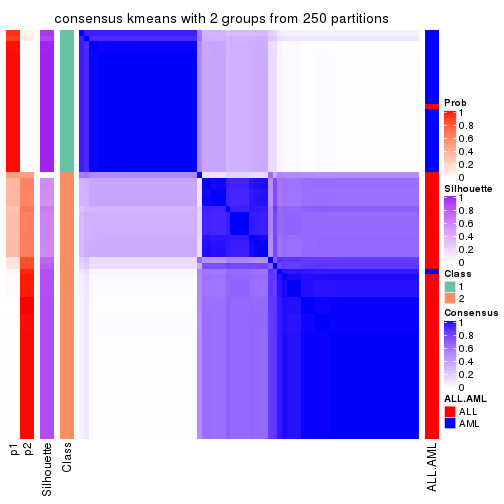</p>

</div>
<div id='tab-SD-kmeans-consensus-heatmap-2'>
<pre><code class="r">consensus_heatmap(res, k = 3)
</code></pre>

<p>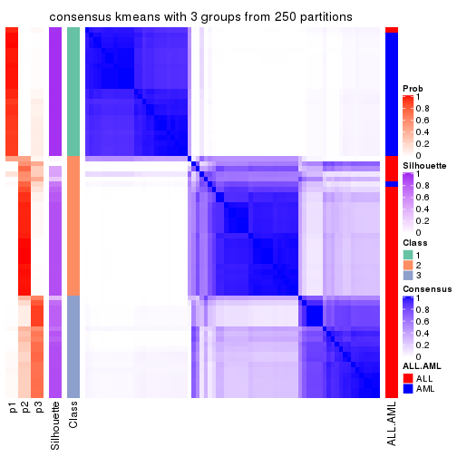</p>

</div>
<div id='tab-SD-kmeans-consensus-heatmap-3'>
<pre><code class="r">consensus_heatmap(res, k = 4)
</code></pre>

<p>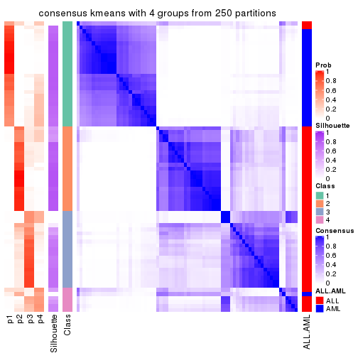</p>

</div>
<div id='tab-SD-kmeans-consensus-heatmap-4'>
<pre><code class="r">consensus_heatmap(res, k = 5)
</code></pre>

<p>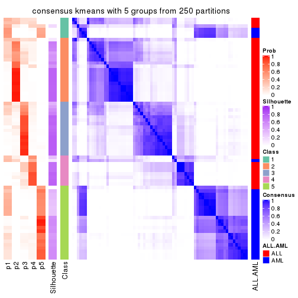</p>

</div>
<div id='tab-SD-kmeans-consensus-heatmap-5'>
<pre><code class="r">consensus_heatmap(res, k = 6)
</code></pre>

<p>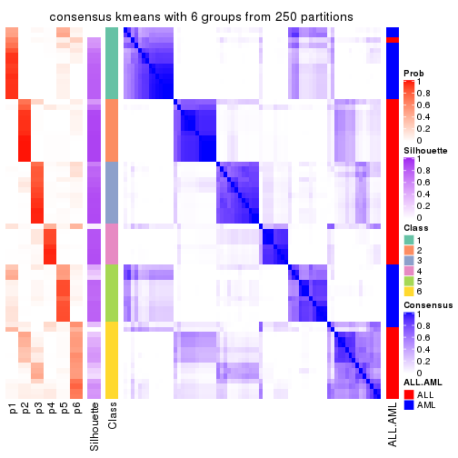</p>

</div>
</div>

Heatmaps for the membership of samples in all partitions to see how consistent they are:


<script>
$( function() {
	$( '#tabs-SD-kmeans-membership-heatmap' ).tabs();
} );
</script>
<div id='tabs-SD-kmeans-membership-heatmap'>
<ul>
<li><a href='#tab-SD-kmeans-membership-heatmap-1'>k = 2</a></li>
<li><a href='#tab-SD-kmeans-membership-heatmap-2'>k = 3</a></li>
<li><a href='#tab-SD-kmeans-membership-heatmap-3'>k = 4</a></li>
<li><a href='#tab-SD-kmeans-membership-heatmap-4'>k = 5</a></li>
<li><a href='#tab-SD-kmeans-membership-heatmap-5'>k = 6</a></li>
</ul>
<div id='tab-SD-kmeans-membership-heatmap-1'>
<pre><code class="r">membership_heatmap(res, k = 2)
</code></pre>

<p>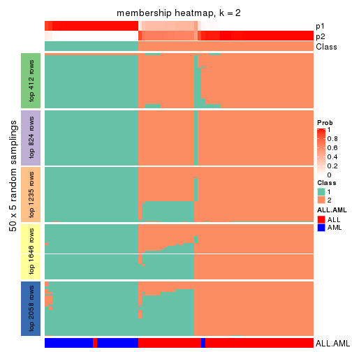</p>

</div>
<div id='tab-SD-kmeans-membership-heatmap-2'>
<pre><code class="r">membership_heatmap(res, k = 3)
</code></pre>

<p>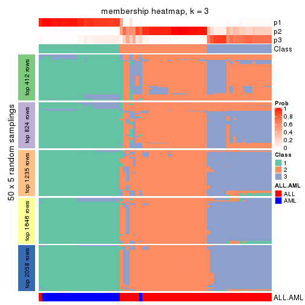</p>

</div>
<div id='tab-SD-kmeans-membership-heatmap-3'>
<pre><code class="r">membership_heatmap(res, k = 4)
</code></pre>

<p>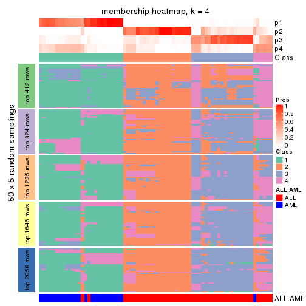</p>

</div>
<div id='tab-SD-kmeans-membership-heatmap-4'>
<pre><code class="r">membership_heatmap(res, k = 5)
</code></pre>

<p>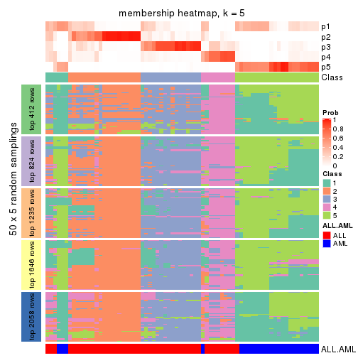</p>

</div>
<div id='tab-SD-kmeans-membership-heatmap-5'>
<pre><code class="r">membership_heatmap(res, k = 6)
</code></pre>

<p>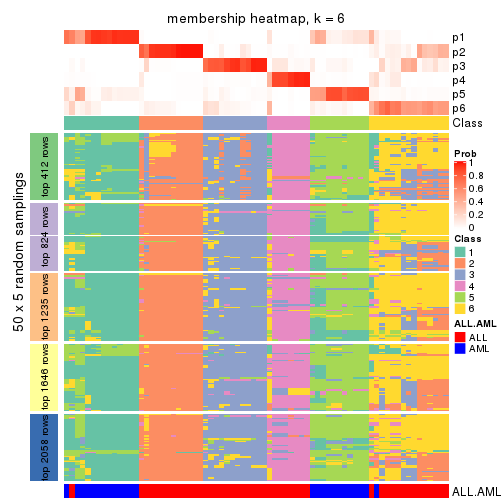</p>

</div>
</div>

As soon as we have had the classes for columns, we can look for signatures
which are significantly different between classes which can be candidate marks
for certain classes. Following are the heatmaps for signatures.


Signature heatmaps where rows are scaled:


<script>
$( function() {
	$( '#tabs-SD-kmeans-get-signatures' ).tabs();
} );
</script>
<div id='tabs-SD-kmeans-get-signatures'>
<ul>
<li><a href='#tab-SD-kmeans-get-signatures-1'>k = 2</a></li>
<li><a href='#tab-SD-kmeans-get-signatures-2'>k = 3</a></li>
<li><a href='#tab-SD-kmeans-get-signatures-3'>k = 4</a></li>
<li><a href='#tab-SD-kmeans-get-signatures-4'>k = 5</a></li>
<li><a href='#tab-SD-kmeans-get-signatures-5'>k = 6</a></li>
</ul>
<div id='tab-SD-kmeans-get-signatures-1'>
<pre><code class="r">get_signatures(res, k = 2)
</code></pre>

<p>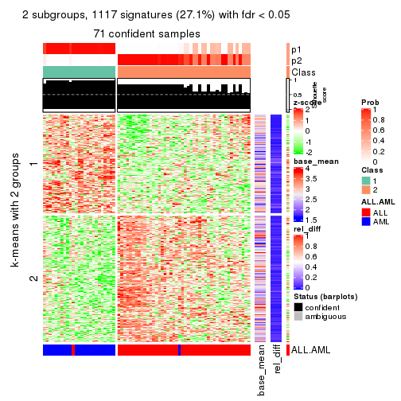</p>

</div>
<div id='tab-SD-kmeans-get-signatures-2'>
<pre><code class="r">get_signatures(res, k = 3)
</code></pre>

<p>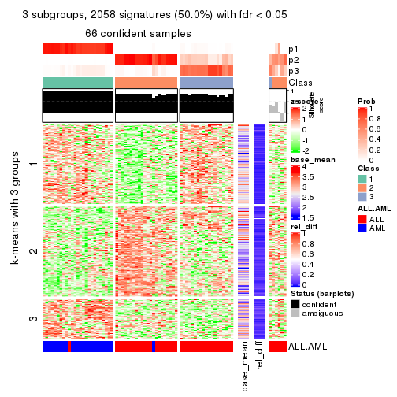</p>

</div>
<div id='tab-SD-kmeans-get-signatures-3'>
<pre><code class="r">get_signatures(res, k = 4)
</code></pre>

<p>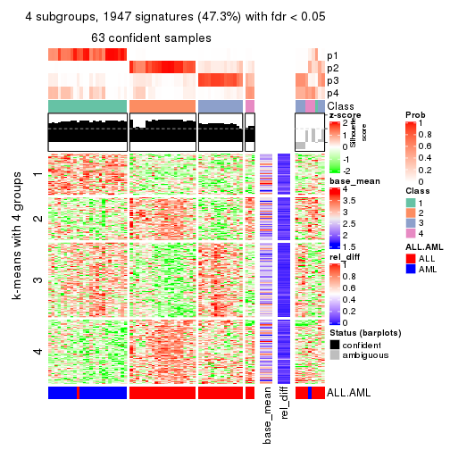</p>

</div>
<div id='tab-SD-kmeans-get-signatures-4'>
<pre><code class="r">get_signatures(res, k = 5)
</code></pre>

<p>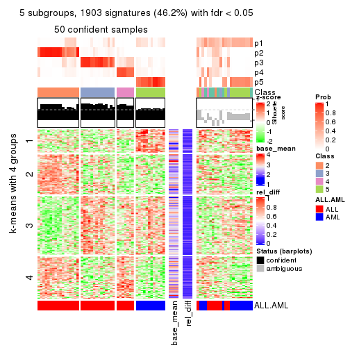</p>

</div>
<div id='tab-SD-kmeans-get-signatures-5'>
<pre><code class="r">get_signatures(res, k = 6)
</code></pre>

<p>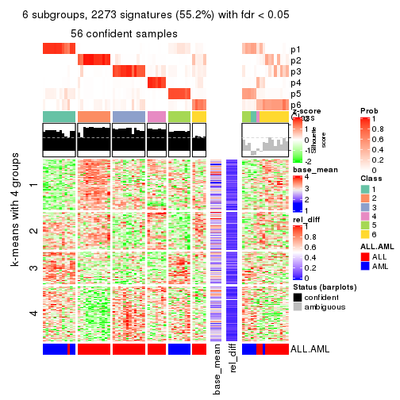</p>

</div>
</div>


Signature heatmaps where rows are not scaled:


<script>
$( function() {
	$( '#tabs-SD-kmeans-get-signatures-no-scale' ).tabs();
} );
</script>
<div id='tabs-SD-kmeans-get-signatures-no-scale'>
<ul>
<li><a href='#tab-SD-kmeans-get-signatures-no-scale-1'>k = 2</a></li>
<li><a href='#tab-SD-kmeans-get-signatures-no-scale-2'>k = 3</a></li>
<li><a href='#tab-SD-kmeans-get-signatures-no-scale-3'>k = 4</a></li>
<li><a href='#tab-SD-kmeans-get-signatures-no-scale-4'>k = 5</a></li>
<li><a href='#tab-SD-kmeans-get-signatures-no-scale-5'>k = 6</a></li>
</ul>
<div id='tab-SD-kmeans-get-signatures-no-scale-1'>
<pre><code class="r">get_signatures(res, k = 2, scale_rows = FALSE)
</code></pre>

<p>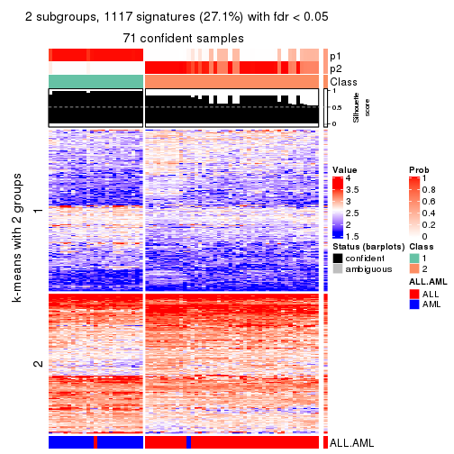</p>

</div>
<div id='tab-SD-kmeans-get-signatures-no-scale-2'>
<pre><code class="r">get_signatures(res, k = 3, scale_rows = FALSE)
</code></pre>

<p>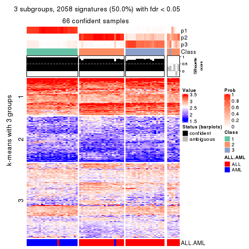</p>

</div>
<div id='tab-SD-kmeans-get-signatures-no-scale-3'>
<pre><code class="r">get_signatures(res, k = 4, scale_rows = FALSE)
</code></pre>

<p>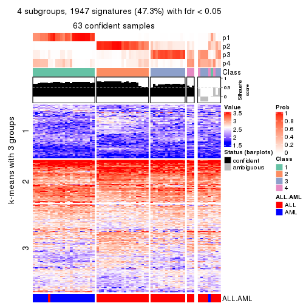</p>

</div>
<div id='tab-SD-kmeans-get-signatures-no-scale-4'>
<pre><code class="r">get_signatures(res, k = 5, scale_rows = FALSE)
</code></pre>

<p>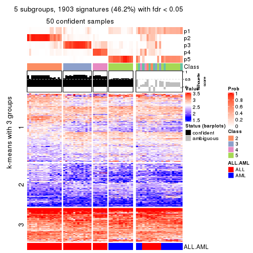</p>

</div>
<div id='tab-SD-kmeans-get-signatures-no-scale-5'>
<pre><code class="r">get_signatures(res, k = 6, scale_rows = FALSE)
</code></pre>

<p>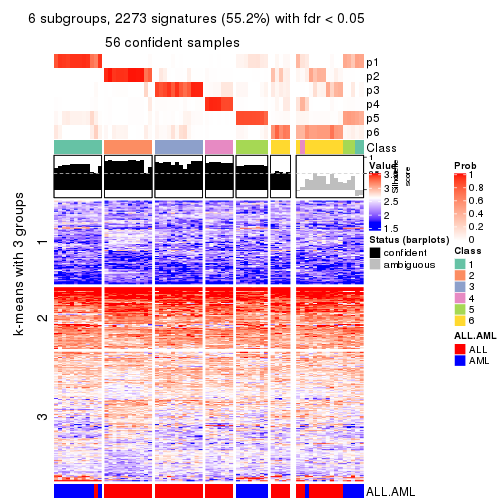</p>

</div>
</div>


Compare the overlap of signatures from different k:

```r
compare_signatures(res)
```

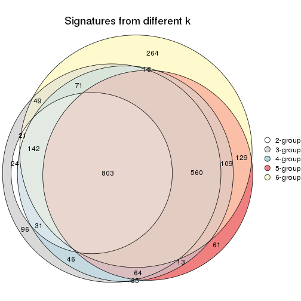

`get_signature()` returns a data frame invisibly. TO get the list of signatures, the function
call should be assigned to a variable explicitly. In following code, if `plot` argument is set
to `FALSE`, no heatmap is plotted while only the differential analysis is performed.

```r
# code only for demonstration
tb = get_signature(res, k = ..., plot = FALSE)
```

An example of the output of `tb` is:

```
#>   which_row         fdr    mean_1    mean_2 scaled_mean_1 scaled_mean_2 km
#> 1        38 0.042760348  8.373488  9.131774    -0.5533452     0.5164555  1
#> 2        40 0.018707592  7.106213  8.469186    -0.6173731     0.5762149  1
#> 3        55 0.019134737 10.221463 11.207825    -0.6159697     0.5749050  1
#> 4        59 0.006059896  5.921854  7.869574    -0.6899429     0.6439467  1
#> 5        60 0.018055526  8.928898 10.211722    -0.6204761     0.5791110  1
#> 6        98 0.009384629 15.714769 14.887706     0.6635654    -0.6193277  2
...
```

The columns in `tb` are:

1. `which_row`: row indices corresponding to the input matrix.
2. `fdr`: FDR for the differential test. 
3. `mean_x`: The mean value in group x.
4. `scaled_mean_x`: The mean value in group x after rows are scaled.
5. `km`: Row groups if k-means clustering is applied to rows.


UMAP plot which shows how samples are separated.


<script>
$( function() {
	$( '#tabs-SD-kmeans-dimension-reduction' ).tabs();
} );
</script>
<div id='tabs-SD-kmeans-dimension-reduction'>
<ul>
<li><a href='#tab-SD-kmeans-dimension-reduction-1'>k = 2</a></li>
<li><a href='#tab-SD-kmeans-dimension-reduction-2'>k = 3</a></li>
<li><a href='#tab-SD-kmeans-dimension-reduction-3'>k = 4</a></li>
<li><a href='#tab-SD-kmeans-dimension-reduction-4'>k = 5</a></li>
<li><a href='#tab-SD-kmeans-dimension-reduction-5'>k = 6</a></li>
</ul>
<div id='tab-SD-kmeans-dimension-reduction-1'>
<pre><code class="r">dimension_reduction(res, k = 2, method = &quot;UMAP&quot;)
</code></pre>

<p>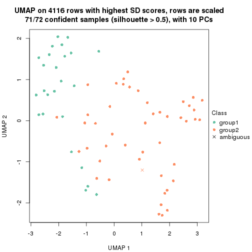</p>

</div>
<div id='tab-SD-kmeans-dimension-reduction-2'>
<pre><code class="r">dimension_reduction(res, k = 3, method = &quot;UMAP&quot;)
</code></pre>

<p>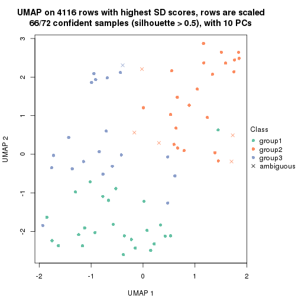</p>

</div>
<div id='tab-SD-kmeans-dimension-reduction-3'>
<pre><code class="r">dimension_reduction(res, k = 4, method = &quot;UMAP&quot;)
</code></pre>

<p>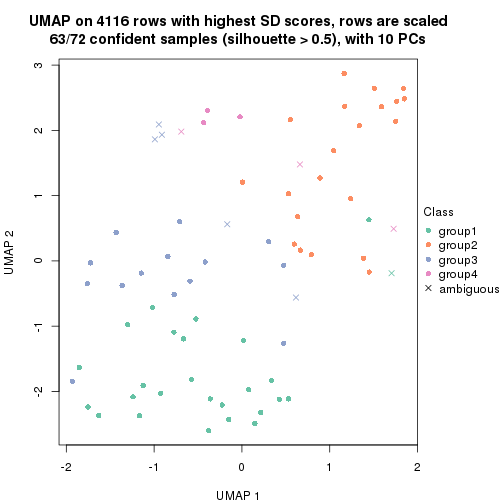</p>

</div>
<div id='tab-SD-kmeans-dimension-reduction-4'>
<pre><code class="r">dimension_reduction(res, k = 5, method = &quot;UMAP&quot;)
</code></pre>

<p>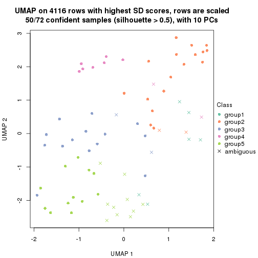</p>

</div>
<div id='tab-SD-kmeans-dimension-reduction-5'>
<pre><code class="r">dimension_reduction(res, k = 6, method = &quot;UMAP&quot;)
</code></pre>

<p>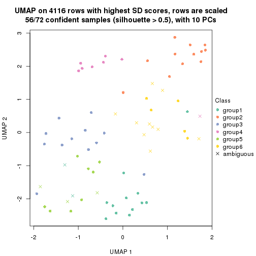</p>

</div>
</div>


Following heatmap shows how subgroups are split when increasing `k`:

```r
collect_classes(res)
```

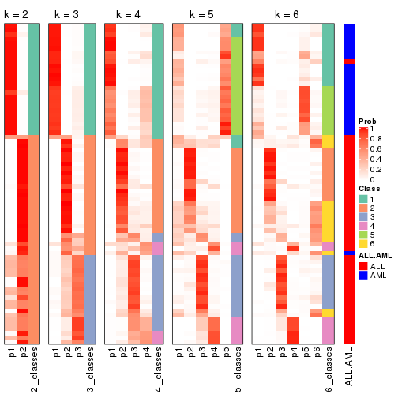


Test correlation between subgroups and known annotations. If the known
annotation is numeric, one-way ANOVA test is applied, and if the known
annotation is discrete, chi-squared contingency table test is applied.

```r
test_to_known_factors(res)
```

```
#>            n ALL.AML(p) k
#> SD:kmeans 71   2.08e-14 2
#> SD:kmeans 66   2.72e-13 3
#> SD:kmeans 63   9.95e-13 4
#> SD:kmeans 50   7.99e-11 5
#> SD:kmeans 56   5.63e-10 6
```


If matrix rows can be associated to genes, consider to use `functional_enrichment(res,
...)` to perform function enrichment for the signature genes. See [this vignette](http://bioconductor.org/packages/devel/bioc/vignettes/cola/inst/doc/functional_enrichment.html) for more detailed explanations.


 

---------------------------------------------------


### SD:skmeans


The object with results only for a single top-value method and a single partition method 
can be extracted as:

```r
res = res_list["SD", "skmeans"]
# you can also extract it by
# res = res_list["SD:skmeans"]
```

A summary of `res` and all the functions that can be applied to it:

```r
res
```

```
#> A 'ConsensusPartition' object with k = 2, 3, 4, 5, 6.
#>   On a matrix with 4116 rows and 72 columns.
#>   Top rows (412, 824, 1235, 1646, 2058) are extracted by 'SD' method.
#>   Subgroups are detected by 'skmeans' method.
#>   Performed in total 1250 partitions by row resampling.
#>   Best k for subgroups seems to be 3.
#> 
#> Following methods can be applied to this 'ConsensusPartition' object:
#>  [1] "cola_report"             "collect_classes"         "collect_plots"          
#>  [4] "collect_stats"           "colnames"                "compare_signatures"     
#>  [7] "consensus_heatmap"       "dimension_reduction"     "functional_enrichment"  
#> [10] "get_anno_col"            "get_anno"                "get_classes"            
#> [13] "get_consensus"           "get_matrix"              "get_membership"         
#> [16] "get_param"               "get_signatures"          "get_stats"              
#> [19] "is_best_k"               "is_stable_k"             "membership_heatmap"     
#> [22] "ncol"                    "nrow"                    "plot_ecdf"              
#> [25] "rownames"                "select_partition_number" "show"                   
#> [28] "suggest_best_k"          "test_to_known_factors"
```

`collect_plots()` function collects all the plots made from `res` for all `k` (number of partitions)
into one single page to provide an easy and fast comparison between different `k`.

```r
collect_plots(res)
```

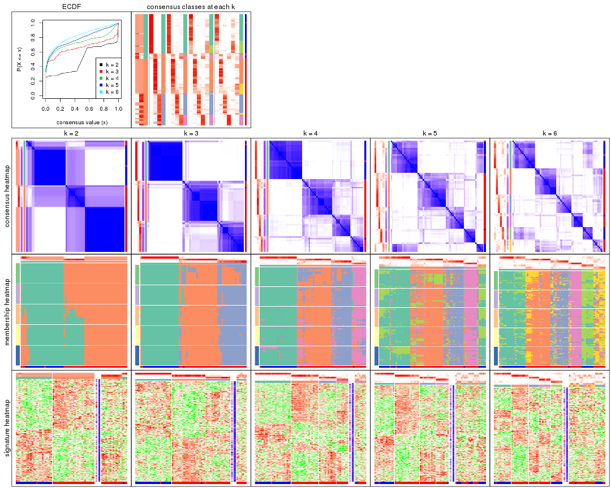

The plots are:

- The first row: a plot of the ECDF (empirical cumulative distribution
  function) curves of the consensus matrix for each `k` and the heatmap of
  predicted classes for each `k`.
- The second row: heatmaps of the consensus matrix for each `k`.
- The third row: heatmaps of the membership matrix for each `k`.
- The fouth row: heatmaps of the signatures for each `k`.

All the plots in panels can be made by individual functions and they are
plotted later in this section.

`select_partition_number()` produces several plots showing different
statistics for choosing "optimized" `k`. There are following statistics:

- ECDF curves of the consensus matrix for each `k`;
- 1-PAC. [The PAC
  score](https://en.wikipedia.org/wiki/Consensus_clustering#Over-interpretation_potential_of_consensus_clustering)
  measures the proportion of the ambiguous subgrouping.
- Mean silhouette score.
- Concordance. The mean probability of fiting the consensus class ids in all
  partitions.
- Area increased. Denote $A_k$ as the area under the ECDF curve for current
  `k`, the area increased is defined as $A_k - A_{k-1}$.
- Rand index. The percent of pairs of samples that are both in a same cluster
  or both are not in a same cluster in the partition of k and k-1.
- Jaccard index. The ratio of pairs of samples are both in a same cluster in
  the partition of k and k-1 and the pairs of samples are both in a same
  cluster in the partition k or k-1.

The detailed explanations of these statistics can be found in [the _cola_
vignette](http://bioconductor.org/packages/devel/bioc/vignettes/cola/inst/doc/cola.html#toc_13).

Generally speaking, lower PAC score, higher mean silhouette score or higher
concordance corresponds to better partition. Rand index and Jaccard index
measure how similar the current partition is compared to partition with `k-1`.
If they are too similar, we won't accept `k` is better than `k-1`.

```r
select_partition_number(res)
```

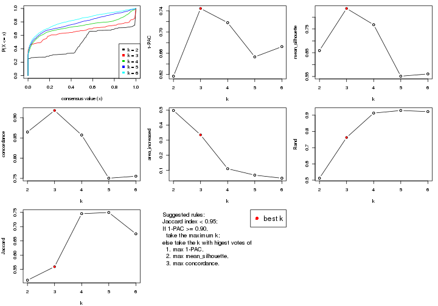

The numeric values for all these statistics can be obtained by `get_stats()`.

```r
get_stats(res)
```

```
#>   k 1-PAC mean_silhouette concordance area_increased  Rand Jaccard
#> 2 2 0.617           0.659       0.865         0.4970 0.512   0.512
#> 3 3 0.745           0.836       0.918         0.3352 0.763   0.560
#> 4 4 0.718           0.768       0.857         0.1107 0.913   0.745
#> 5 5 0.653           0.551       0.750         0.0682 0.929   0.750
#> 6 6 0.673           0.561       0.755         0.0479 0.922   0.675
```

`suggest_best_k()` suggests the best $k$ based on these statistics. The rules are as follows:

- All $k$ with Jaccard index larger than 0.95 are removed because increasing
  $k$ does not provide enough extra information. If all $k$ are removed, it is
  marked as no subgroup is detected.
- For all $k$ with 1-PAC score larger than 0.9, the maximal $k$ is taken as
  the best $k$, and other $k$ are marked as optional $k$.
- If it does not fit the second rule. The $k$ with the maximal vote of the
  highest 1-PAC score, highest mean silhouette, and highest concordance is
  taken as the best $k$.

```r
suggest_best_k(res)
```

```
#> [1] 3
```


Following shows the table of the partitions (You need to click the **show/hide
code output** link to see it). The membership matrix (columns with name `p*`)
is inferred by
[`clue::cl_consensus()`](https://www.rdocumentation.org/link/cl_consensus?package=clue)
function with the `SE` method. Basically the value in the membership matrix
represents the probability to belong to a certain group. The finall class
label for an item is determined with the group with highest probability it
belongs to.

In `get_classes()` function, the entropy is calculated from the membership
matrix and the silhouette score is calculated from the consensus matrix.


<script>
$( function() {
	$( '#tabs-SD-skmeans-get-classes' ).tabs();
} );
</script>
<div id='tabs-SD-skmeans-get-classes'>
<ul>
<li><a href='#tab-SD-skmeans-get-classes-1'>k = 2</a></li>
<li><a href='#tab-SD-skmeans-get-classes-2'>k = 3</a></li>
<li><a href='#tab-SD-skmeans-get-classes-3'>k = 4</a></li>
<li><a href='#tab-SD-skmeans-get-classes-4'>k = 5</a></li>
<li><a href='#tab-SD-skmeans-get-classes-5'>k = 6</a></li>
</ul>

<div id='tab-SD-skmeans-get-classes-1'>
<p><a id='tab-SD-skmeans-get-classes-1-a' style='color:#0366d6' href='#'>show/hide code output</a></p>
<pre><code class="r">cbind(get_classes(res, k = 2), get_membership(res, k = 2))
</code></pre>

<pre><code>#&gt;           class entropy silhouette    p1    p2
#&gt; sample_39     2  0.1184    0.28974 0.016 0.984
#&gt; sample_40     2  0.2236    0.20871 0.036 0.964
#&gt; sample_42     2  0.9996    0.79587 0.488 0.512
#&gt; sample_47     2  0.9996    0.79587 0.488 0.512
#&gt; sample_48     2  0.9996    0.79587 0.488 0.512
#&gt; sample_49     2  0.3274    0.14651 0.060 0.940
#&gt; sample_41     2  0.9996    0.79587 0.488 0.512
#&gt; sample_43     2  0.9996    0.79587 0.488 0.512
#&gt; sample_44     2  0.9996    0.79587 0.488 0.512
#&gt; sample_45     2  0.9996    0.79587 0.488 0.512
#&gt; sample_46     2  0.9996    0.79587 0.488 0.512
#&gt; sample_70     2  0.9996    0.79587 0.488 0.512
#&gt; sample_71     2  0.9996    0.79587 0.488 0.512
#&gt; sample_72     2  0.9996    0.79587 0.488 0.512
#&gt; sample_68     2  0.9996    0.79587 0.488 0.512
#&gt; sample_69     2  0.9996    0.79587 0.488 0.512
#&gt; sample_67     1  0.0376    0.11499 0.996 0.004
#&gt; sample_55     2  0.1184    0.25566 0.016 0.984
#&gt; sample_56     2  0.0000    0.28969 0.000 1.000
#&gt; sample_59     2  0.9996    0.79587 0.488 0.512
#&gt; sample_52     1  0.9996    0.87667 0.512 0.488
#&gt; sample_53     1  0.9996    0.87667 0.512 0.488
#&gt; sample_51     1  0.9996    0.87667 0.512 0.488
#&gt; sample_50     1  0.9996    0.87667 0.512 0.488
#&gt; sample_54     1  0.8713    0.65021 0.708 0.292
#&gt; sample_57     1  0.9996    0.87667 0.512 0.488
#&gt; sample_58     1  0.9996    0.87667 0.512 0.488
#&gt; sample_60     1  0.9996    0.87667 0.512 0.488
#&gt; sample_61     1  0.9996    0.87667 0.512 0.488
#&gt; sample_65     1  0.9996    0.87667 0.512 0.488
#&gt; sample_66     1  0.3733   -0.07760 0.928 0.072
#&gt; sample_63     1  0.9996    0.87667 0.512 0.488
#&gt; sample_64     1  0.9996    0.87667 0.512 0.488
#&gt; sample_62     1  0.9996    0.87667 0.512 0.488
#&gt; sample_1      2  0.9996    0.79587 0.488 0.512
#&gt; sample_2      1  0.2603   -0.00294 0.956 0.044
#&gt; sample_3      2  0.1633    0.33281 0.024 0.976
#&gt; sample_4      2  0.9996    0.79587 0.488 0.512
#&gt; sample_5      2  0.9996    0.79587 0.488 0.512
#&gt; sample_6      2  0.1633    0.33281 0.024 0.976
#&gt; sample_7      2  0.1414    0.31215 0.020 0.980
#&gt; sample_8      2  0.3584    0.12279 0.068 0.932
#&gt; sample_9      2  0.9996    0.79587 0.488 0.512
#&gt; sample_10     2  0.5629    0.03736 0.132 0.868
#&gt; sample_11     2  0.9996    0.79587 0.488 0.512
#&gt; sample_12     1  0.9996    0.87667 0.512 0.488
#&gt; sample_13     2  0.9996    0.79587 0.488 0.512
#&gt; sample_14     2  0.9996    0.79587 0.488 0.512
#&gt; sample_15     2  0.9996    0.79587 0.488 0.512
#&gt; sample_16     2  0.9996    0.79587 0.488 0.512
#&gt; sample_17     1  0.8555   -0.53149 0.720 0.280
#&gt; sample_18     2  0.9963    0.78087 0.464 0.536
#&gt; sample_19     2  0.9996    0.79587 0.488 0.512
#&gt; sample_20     2  0.9996    0.79587 0.488 0.512
#&gt; sample_21     2  0.9996    0.79587 0.488 0.512
#&gt; sample_22     2  0.3733    0.10999 0.072 0.928
#&gt; sample_23     2  0.1633    0.33281 0.024 0.976
#&gt; sample_24     2  0.9996    0.79587 0.488 0.512
#&gt; sample_25     2  0.7376    0.47066 0.208 0.792
#&gt; sample_26     2  0.9996    0.79587 0.488 0.512
#&gt; sample_27     2  0.3274    0.14651 0.060 0.940
#&gt; sample_34     1  0.9996    0.87667 0.512 0.488
#&gt; sample_35     1  0.9996    0.87667 0.512 0.488
#&gt; sample_36     1  0.9996    0.87667 0.512 0.488
#&gt; sample_37     1  0.9996    0.87667 0.512 0.488
#&gt; sample_38     1  0.9996    0.87667 0.512 0.488
#&gt; sample_28     1  0.9996    0.87667 0.512 0.488
#&gt; sample_29     1  0.9087    0.69508 0.676 0.324
#&gt; sample_30     1  0.9996    0.87667 0.512 0.488
#&gt; sample_31     1  0.9996    0.87667 0.512 0.488
#&gt; sample_32     1  0.9996    0.87667 0.512 0.488
#&gt; sample_33     1  0.9996    0.87667 0.512 0.488
</code></pre>

<script>
$('#tab-SD-skmeans-get-classes-1-a').parent().next().next().hide();
$('#tab-SD-skmeans-get-classes-1-a').click(function(){
  $('#tab-SD-skmeans-get-classes-1-a').parent().next().next().toggle();
  return(false);
});
</script>
</div>

<div id='tab-SD-skmeans-get-classes-2'>
<p><a id='tab-SD-skmeans-get-classes-2-a' style='color:#0366d6' href='#'>show/hide code output</a></p>
<pre><code class="r">cbind(get_classes(res, k = 3), get_membership(res, k = 3))
</code></pre>

<pre><code>#&gt;           class entropy silhouette    p1    p2    p3
#&gt; sample_39     3  0.4605     0.8219 0.000 0.204 0.796
#&gt; sample_40     3  0.4235     0.8393 0.000 0.176 0.824
#&gt; sample_42     2  0.0000     0.8952 0.000 1.000 0.000
#&gt; sample_47     2  0.0000     0.8952 0.000 1.000 0.000
#&gt; sample_48     2  0.0000     0.8952 0.000 1.000 0.000
#&gt; sample_49     3  0.4178     0.8404 0.000 0.172 0.828
#&gt; sample_41     2  0.1860     0.8779 0.000 0.948 0.052
#&gt; sample_43     2  0.0000     0.8952 0.000 1.000 0.000
#&gt; sample_44     2  0.0424     0.8915 0.000 0.992 0.008
#&gt; sample_45     2  0.0000     0.8952 0.000 1.000 0.000
#&gt; sample_46     2  0.0000     0.8952 0.000 1.000 0.000
#&gt; sample_70     3  0.6244     0.4315 0.000 0.440 0.560
#&gt; sample_71     2  0.1964     0.8626 0.000 0.944 0.056
#&gt; sample_72     2  0.0000     0.8952 0.000 1.000 0.000
#&gt; sample_68     2  0.1860     0.8779 0.000 0.948 0.052
#&gt; sample_69     2  0.0000     0.8952 0.000 1.000 0.000
#&gt; sample_67     1  0.7411     0.1689 0.548 0.416 0.036
#&gt; sample_55     3  0.2448     0.8305 0.000 0.076 0.924
#&gt; sample_56     3  0.4291     0.8376 0.000 0.180 0.820
#&gt; sample_59     2  0.5397     0.4612 0.000 0.720 0.280
#&gt; sample_52     1  0.0000     0.9777 1.000 0.000 0.000
#&gt; sample_53     1  0.0000     0.9777 1.000 0.000 0.000
#&gt; sample_51     1  0.0000     0.9777 1.000 0.000 0.000
#&gt; sample_50     1  0.0000     0.9777 1.000 0.000 0.000
#&gt; sample_54     1  0.1129     0.9580 0.976 0.020 0.004
#&gt; sample_57     1  0.0237     0.9763 0.996 0.000 0.004
#&gt; sample_58     1  0.0237     0.9763 0.996 0.000 0.004
#&gt; sample_60     1  0.0237     0.9763 0.996 0.000 0.004
#&gt; sample_61     1  0.0000     0.9777 1.000 0.000 0.000
#&gt; sample_65     1  0.0000     0.9777 1.000 0.000 0.000
#&gt; sample_66     2  0.7097     0.6524 0.128 0.724 0.148
#&gt; sample_63     1  0.0237     0.9763 0.996 0.000 0.004
#&gt; sample_64     1  0.0237     0.9763 0.996 0.000 0.004
#&gt; sample_62     1  0.0237     0.9763 0.996 0.000 0.004
#&gt; sample_1      3  0.4504     0.8290 0.000 0.196 0.804
#&gt; sample_2      2  0.8489     0.4667 0.268 0.596 0.136
#&gt; sample_3      3  0.0000     0.7996 0.000 0.000 1.000
#&gt; sample_4      3  0.3551     0.8389 0.000 0.132 0.868
#&gt; sample_5      2  0.1860     0.8779 0.000 0.948 0.052
#&gt; sample_6      3  0.0000     0.7996 0.000 0.000 1.000
#&gt; sample_7      3  0.3482     0.8390 0.000 0.128 0.872
#&gt; sample_8      3  0.4291     0.8376 0.000 0.180 0.820
#&gt; sample_9      3  0.4121     0.6843 0.000 0.168 0.832
#&gt; sample_10     3  0.0000     0.7996 0.000 0.000 1.000
#&gt; sample_11     3  0.5497     0.4843 0.000 0.292 0.708
#&gt; sample_12     1  0.0424     0.9717 0.992 0.000 0.008
#&gt; sample_13     2  0.0000     0.8952 0.000 1.000 0.000
#&gt; sample_14     3  0.6305    -0.0993 0.000 0.484 0.516
#&gt; sample_15     2  0.1860     0.8779 0.000 0.948 0.052
#&gt; sample_16     2  0.0424     0.8926 0.000 0.992 0.008
#&gt; sample_17     2  0.5268     0.7177 0.012 0.776 0.212
#&gt; sample_18     3  0.3340     0.8243 0.000 0.120 0.880
#&gt; sample_19     2  0.0000     0.8952 0.000 1.000 0.000
#&gt; sample_20     2  0.0000     0.8952 0.000 1.000 0.000
#&gt; sample_21     2  0.1643     0.8814 0.000 0.956 0.044
#&gt; sample_22     3  0.5008     0.8340 0.016 0.180 0.804
#&gt; sample_23     3  0.0000     0.7996 0.000 0.000 1.000
#&gt; sample_24     2  0.2165     0.8710 0.000 0.936 0.064
#&gt; sample_25     2  0.6969     0.0968 0.024 0.596 0.380
#&gt; sample_26     2  0.3116     0.7843 0.000 0.892 0.108
#&gt; sample_27     3  0.4178     0.8404 0.000 0.172 0.828
#&gt; sample_34     1  0.0000     0.9777 1.000 0.000 0.000
#&gt; sample_35     1  0.0237     0.9763 0.996 0.000 0.004
#&gt; sample_36     1  0.0000     0.9777 1.000 0.000 0.000
#&gt; sample_37     1  0.0000     0.9777 1.000 0.000 0.000
#&gt; sample_38     1  0.0000     0.9777 1.000 0.000 0.000
#&gt; sample_28     1  0.0000     0.9777 1.000 0.000 0.000
#&gt; sample_29     1  0.0000     0.9777 1.000 0.000 0.000
#&gt; sample_30     1  0.0000     0.9777 1.000 0.000 0.000
#&gt; sample_31     1  0.0000     0.9777 1.000 0.000 0.000
#&gt; sample_32     1  0.0000     0.9777 1.000 0.000 0.000
#&gt; sample_33     1  0.0000     0.9777 1.000 0.000 0.000
</code></pre>

<script>
$('#tab-SD-skmeans-get-classes-2-a').parent().next().next().hide();
$('#tab-SD-skmeans-get-classes-2-a').click(function(){
  $('#tab-SD-skmeans-get-classes-2-a').parent().next().next().toggle();
  return(false);
});
</script>
</div>

<div id='tab-SD-skmeans-get-classes-3'>
<p><a id='tab-SD-skmeans-get-classes-3-a' style='color:#0366d6' href='#'>show/hide code output</a></p>
<pre><code class="r">cbind(get_classes(res, k = 4), get_membership(res, k = 4))
</code></pre>

<pre><code>#&gt;           class entropy silhouette    p1    p2    p3    p4
#&gt; sample_39     3  0.3081      0.780 0.000 0.064 0.888 0.048
#&gt; sample_40     3  0.2039      0.800 0.016 0.036 0.940 0.008
#&gt; sample_42     2  0.6261      0.659 0.008 0.680 0.112 0.200
#&gt; sample_47     2  0.0895      0.823 0.000 0.976 0.004 0.020
#&gt; sample_48     2  0.0000      0.823 0.000 1.000 0.000 0.000
#&gt; sample_49     3  0.0657      0.799 0.000 0.012 0.984 0.004
#&gt; sample_41     2  0.1854      0.811 0.000 0.940 0.048 0.012
#&gt; sample_43     2  0.3398      0.793 0.000 0.872 0.060 0.068
#&gt; sample_44     2  0.4428      0.756 0.000 0.808 0.124 0.068
#&gt; sample_45     2  0.2623      0.805 0.000 0.908 0.028 0.064
#&gt; sample_46     2  0.3471      0.792 0.000 0.868 0.060 0.072
#&gt; sample_70     3  0.6403      0.558 0.000 0.232 0.640 0.128
#&gt; sample_71     2  0.7507      0.385 0.012 0.504 0.140 0.344
#&gt; sample_72     2  0.6777      0.568 0.004 0.624 0.164 0.208
#&gt; sample_68     2  0.1356      0.813 0.000 0.960 0.032 0.008
#&gt; sample_69     2  0.0336      0.824 0.000 0.992 0.008 0.000
#&gt; sample_67     4  0.6976      0.331 0.344 0.112 0.004 0.540
#&gt; sample_55     3  0.4318      0.719 0.000 0.116 0.816 0.068
#&gt; sample_56     3  0.1398      0.801 0.000 0.040 0.956 0.004
#&gt; sample_59     2  0.6326      0.269 0.000 0.556 0.376 0.068
#&gt; sample_52     1  0.1059      0.941 0.972 0.000 0.012 0.016
#&gt; sample_53     1  0.1211      0.942 0.960 0.000 0.000 0.040
#&gt; sample_51     1  0.1118      0.943 0.964 0.000 0.000 0.036
#&gt; sample_50     1  0.1118      0.943 0.964 0.000 0.000 0.036
#&gt; sample_54     1  0.4565      0.831 0.828 0.092 0.044 0.036
#&gt; sample_57     1  0.1975      0.929 0.936 0.000 0.048 0.016
#&gt; sample_58     1  0.2142      0.926 0.928 0.000 0.056 0.016
#&gt; sample_60     1  0.2465      0.925 0.924 0.012 0.044 0.020
#&gt; sample_61     1  0.2256      0.932 0.924 0.000 0.056 0.020
#&gt; sample_65     1  0.0657      0.944 0.984 0.000 0.012 0.004
#&gt; sample_66     4  0.5395      0.378 0.016 0.352 0.004 0.628
#&gt; sample_63     1  0.1182      0.941 0.968 0.000 0.016 0.016
#&gt; sample_64     1  0.2909      0.899 0.888 0.000 0.092 0.020
#&gt; sample_62     1  0.1182      0.941 0.968 0.000 0.016 0.016
#&gt; sample_1      3  0.2282      0.800 0.000 0.052 0.924 0.024
#&gt; sample_2      4  0.3670      0.696 0.044 0.092 0.004 0.860
#&gt; sample_3      4  0.4072      0.687 0.000 0.000 0.252 0.748
#&gt; sample_4      3  0.4989      0.675 0.000 0.164 0.764 0.072
#&gt; sample_5      2  0.1356      0.813 0.000 0.960 0.032 0.008
#&gt; sample_6      4  0.4103      0.684 0.000 0.000 0.256 0.744
#&gt; sample_7      3  0.3991      0.726 0.000 0.120 0.832 0.048
#&gt; sample_8      3  0.1398      0.801 0.000 0.040 0.956 0.004
#&gt; sample_9      4  0.4387      0.743 0.000 0.052 0.144 0.804
#&gt; sample_10     4  0.3219      0.729 0.000 0.000 0.164 0.836
#&gt; sample_11     4  0.3301      0.739 0.000 0.076 0.048 0.876
#&gt; sample_12     1  0.3198      0.894 0.880 0.000 0.040 0.080
#&gt; sample_13     2  0.0188      0.823 0.000 0.996 0.004 0.000
#&gt; sample_14     4  0.4088      0.723 0.000 0.140 0.040 0.820
#&gt; sample_15     2  0.1356      0.813 0.000 0.960 0.032 0.008
#&gt; sample_16     2  0.3402      0.769 0.000 0.832 0.164 0.004
#&gt; sample_17     2  0.5392      0.133 0.004 0.564 0.008 0.424
#&gt; sample_18     3  0.6781      0.438 0.000 0.148 0.596 0.256
#&gt; sample_19     2  0.3674      0.778 0.000 0.848 0.116 0.036
#&gt; sample_20     2  0.0336      0.824 0.000 0.992 0.008 0.000
#&gt; sample_21     2  0.2124      0.812 0.000 0.932 0.040 0.028
#&gt; sample_22     3  0.4649      0.735 0.048 0.036 0.824 0.092
#&gt; sample_23     4  0.4103      0.684 0.000 0.000 0.256 0.744
#&gt; sample_24     2  0.2048      0.804 0.000 0.928 0.064 0.008
#&gt; sample_25     3  0.8385      0.356 0.040 0.252 0.484 0.224
#&gt; sample_26     2  0.6292      0.232 0.000 0.524 0.416 0.060
#&gt; sample_27     3  0.0804      0.796 0.000 0.012 0.980 0.008
#&gt; sample_34     1  0.0927      0.943 0.976 0.000 0.016 0.008
#&gt; sample_35     1  0.2654      0.892 0.888 0.000 0.108 0.004
#&gt; sample_36     1  0.1118      0.943 0.964 0.000 0.000 0.036
#&gt; sample_37     1  0.1211      0.942 0.960 0.000 0.000 0.040
#&gt; sample_38     1  0.2334      0.916 0.908 0.000 0.004 0.088
#&gt; sample_28     1  0.1824      0.933 0.936 0.000 0.004 0.060
#&gt; sample_29     1  0.2011      0.924 0.920 0.000 0.000 0.080
#&gt; sample_30     1  0.1118      0.943 0.964 0.000 0.000 0.036
#&gt; sample_31     1  0.0937      0.944 0.976 0.000 0.012 0.012
#&gt; sample_32     1  0.0921      0.944 0.972 0.000 0.000 0.028
#&gt; sample_33     1  0.1118      0.943 0.964 0.000 0.000 0.036
</code></pre>

<script>
$('#tab-SD-skmeans-get-classes-3-a').parent().next().next().hide();
$('#tab-SD-skmeans-get-classes-3-a').click(function(){
  $('#tab-SD-skmeans-get-classes-3-a').parent().next().next().toggle();
  return(false);
});
</script>
</div>

<div id='tab-SD-skmeans-get-classes-4'>
<p><a id='tab-SD-skmeans-get-classes-4-a' style='color:#0366d6' href='#'>show/hide code output</a></p>
<pre><code class="r">cbind(get_classes(res, k = 5), get_membership(res, k = 5))
</code></pre>

<pre><code>#&gt;           class entropy silhouette    p1    p2    p3    p4    p5
#&gt; sample_39     3  0.3694    0.70732 0.000 0.020 0.824 0.024 0.132
#&gt; sample_40     3  0.2956    0.73851 0.000 0.012 0.872 0.020 0.096
#&gt; sample_42     2  0.8307    0.42771 0.056 0.428 0.112 0.080 0.324
#&gt; sample_47     2  0.2520    0.75564 0.000 0.888 0.012 0.004 0.096
#&gt; sample_48     2  0.1041    0.75974 0.000 0.964 0.004 0.000 0.032
#&gt; sample_49     3  0.1117    0.74882 0.000 0.000 0.964 0.016 0.020
#&gt; sample_41     2  0.0867    0.74987 0.000 0.976 0.008 0.008 0.008
#&gt; sample_43     2  0.5988    0.62679 0.000 0.604 0.056 0.044 0.296
#&gt; sample_44     2  0.6521    0.58585 0.000 0.592 0.152 0.036 0.220
#&gt; sample_45     2  0.5275    0.67368 0.000 0.692 0.044 0.036 0.228
#&gt; sample_46     2  0.5531    0.66588 0.000 0.676 0.060 0.036 0.228
#&gt; sample_70     3  0.7340    0.32888 0.000 0.184 0.500 0.064 0.252
#&gt; sample_71     2  0.9013    0.22659 0.040 0.328 0.144 0.192 0.296
#&gt; sample_72     2  0.7869    0.40268 0.008 0.468 0.172 0.092 0.260
#&gt; sample_68     2  0.0613    0.75278 0.000 0.984 0.004 0.004 0.008
#&gt; sample_69     2  0.2017    0.75697 0.000 0.912 0.008 0.000 0.080
#&gt; sample_67     1  0.7601    0.08544 0.480 0.084 0.008 0.300 0.128
#&gt; sample_55     3  0.6579    0.59284 0.000 0.120 0.604 0.060 0.216
#&gt; sample_56     3  0.1357    0.75154 0.000 0.000 0.948 0.004 0.048
#&gt; sample_59     2  0.7500    0.10424 0.000 0.376 0.300 0.036 0.288
#&gt; sample_52     1  0.4262   -0.23744 0.560 0.000 0.000 0.000 0.440
#&gt; sample_53     1  0.0290    0.67741 0.992 0.000 0.000 0.000 0.008
#&gt; sample_51     1  0.0000    0.67773 1.000 0.000 0.000 0.000 0.000
#&gt; sample_50     1  0.0404    0.67711 0.988 0.000 0.000 0.000 0.012
#&gt; sample_54     5  0.5517    0.45528 0.340 0.044 0.008 0.008 0.600
#&gt; sample_57     5  0.4517    0.42866 0.436 0.000 0.008 0.000 0.556
#&gt; sample_58     1  0.4826   -0.39762 0.508 0.000 0.020 0.000 0.472
#&gt; sample_60     5  0.5087    0.47023 0.364 0.004 0.028 0.004 0.600
#&gt; sample_61     1  0.4215    0.51921 0.772 0.000 0.052 0.004 0.172
#&gt; sample_65     1  0.3424    0.44690 0.760 0.000 0.000 0.000 0.240
#&gt; sample_66     4  0.6291    0.53611 0.040 0.248 0.000 0.608 0.104
#&gt; sample_63     1  0.4302   -0.36846 0.520 0.000 0.000 0.000 0.480
#&gt; sample_64     5  0.5238    0.34231 0.472 0.000 0.044 0.000 0.484
#&gt; sample_62     5  0.4306    0.30870 0.492 0.000 0.000 0.000 0.508
#&gt; sample_1      3  0.2591    0.74533 0.000 0.020 0.904 0.032 0.044
#&gt; sample_2      4  0.4873    0.75255 0.072 0.072 0.004 0.780 0.072
#&gt; sample_3      4  0.1965    0.85710 0.000 0.000 0.096 0.904 0.000
#&gt; sample_4      3  0.5617    0.59401 0.000 0.256 0.648 0.076 0.020
#&gt; sample_5      2  0.0613    0.75278 0.000 0.984 0.004 0.004 0.008
#&gt; sample_6      4  0.1965    0.85710 0.000 0.000 0.096 0.904 0.000
#&gt; sample_7      3  0.4861    0.67738 0.000 0.136 0.760 0.068 0.036
#&gt; sample_8      3  0.1471    0.74777 0.000 0.004 0.952 0.020 0.024
#&gt; sample_9      4  0.1997    0.87140 0.000 0.036 0.040 0.924 0.000
#&gt; sample_10     4  0.1331    0.86612 0.000 0.000 0.040 0.952 0.008
#&gt; sample_11     4  0.1526    0.86397 0.004 0.040 0.004 0.948 0.004
#&gt; sample_12     1  0.3451    0.53756 0.836 0.000 0.024 0.012 0.128
#&gt; sample_13     2  0.1041    0.75974 0.000 0.964 0.004 0.000 0.032
#&gt; sample_14     4  0.2011    0.84737 0.000 0.088 0.004 0.908 0.000
#&gt; sample_15     2  0.0613    0.75278 0.000 0.984 0.004 0.004 0.008
#&gt; sample_16     2  0.3399    0.68184 0.000 0.812 0.168 0.000 0.020
#&gt; sample_17     2  0.4857    0.31977 0.000 0.636 0.000 0.324 0.040
#&gt; sample_18     3  0.7937    0.41267 0.004 0.136 0.476 0.216 0.168
#&gt; sample_19     2  0.6138    0.61758 0.000 0.624 0.140 0.024 0.212
#&gt; sample_20     2  0.1205    0.75984 0.000 0.956 0.004 0.000 0.040
#&gt; sample_21     2  0.1393    0.75018 0.000 0.956 0.008 0.024 0.012
#&gt; sample_22     3  0.5354    0.65019 0.104 0.004 0.736 0.040 0.116
#&gt; sample_23     4  0.2020    0.85388 0.000 0.000 0.100 0.900 0.000
#&gt; sample_24     2  0.0981    0.74844 0.000 0.972 0.012 0.008 0.008
#&gt; sample_25     5  0.8884   -0.45187 0.112 0.120 0.344 0.076 0.348
#&gt; sample_26     3  0.7305   -0.00955 0.000 0.340 0.428 0.040 0.192
#&gt; sample_27     3  0.1310    0.74802 0.000 0.000 0.956 0.020 0.024
#&gt; sample_34     1  0.3661    0.36231 0.724 0.000 0.000 0.000 0.276
#&gt; sample_35     1  0.5714    0.00867 0.580 0.000 0.108 0.000 0.312
#&gt; sample_36     1  0.2074    0.63156 0.896 0.000 0.000 0.000 0.104
#&gt; sample_37     1  0.0290    0.67757 0.992 0.000 0.000 0.000 0.008
#&gt; sample_38     1  0.2196    0.63240 0.916 0.000 0.004 0.024 0.056
#&gt; sample_28     1  0.1285    0.66203 0.956 0.000 0.004 0.004 0.036
#&gt; sample_29     1  0.2104    0.63695 0.916 0.000 0.000 0.024 0.060
#&gt; sample_30     1  0.1270    0.66368 0.948 0.000 0.000 0.000 0.052
#&gt; sample_31     1  0.3074    0.51634 0.804 0.000 0.000 0.000 0.196
#&gt; sample_32     1  0.0703    0.67821 0.976 0.000 0.000 0.000 0.024
#&gt; sample_33     1  0.0510    0.67523 0.984 0.000 0.000 0.000 0.016
</code></pre>

<script>
$('#tab-SD-skmeans-get-classes-4-a').parent().next().next().hide();
$('#tab-SD-skmeans-get-classes-4-a').click(function(){
  $('#tab-SD-skmeans-get-classes-4-a').parent().next().next().toggle();
  return(false);
});
</script>
</div>

<div id='tab-SD-skmeans-get-classes-5'>
<p><a id='tab-SD-skmeans-get-classes-5-a' style='color:#0366d6' href='#'>show/hide code output</a></p>
<pre><code class="r">cbind(get_classes(res, k = 6), get_membership(res, k = 6))
</code></pre>

<pre><code>#&gt;           class entropy silhouette    p1    p2    p3    p4    p5    p6
#&gt; sample_39     3  0.4342    0.38794 0.000 0.000 0.656 0.008 0.028 0.308
#&gt; sample_40     3  0.3294    0.66940 0.000 0.012 0.856 0.024 0.060 0.048
#&gt; sample_42     6  0.5062    0.50041 0.028 0.168 0.020 0.020 0.036 0.728
#&gt; sample_47     2  0.3893    0.61847 0.000 0.744 0.020 0.000 0.016 0.220
#&gt; sample_48     2  0.1753    0.72226 0.000 0.912 0.004 0.000 0.000 0.084
#&gt; sample_49     3  0.1465    0.68104 0.000 0.004 0.948 0.004 0.024 0.020
#&gt; sample_41     2  0.0603    0.72083 0.000 0.980 0.000 0.000 0.004 0.016
#&gt; sample_43     6  0.6116   -0.00340 0.000 0.368 0.044 0.004 0.092 0.492
#&gt; sample_44     2  0.6260    0.01203 0.000 0.444 0.092 0.004 0.052 0.408
#&gt; sample_45     2  0.5137    0.18237 0.000 0.500 0.012 0.004 0.044 0.440
#&gt; sample_46     2  0.5648    0.11268 0.000 0.468 0.036 0.004 0.052 0.440
#&gt; sample_70     6  0.6591    0.23820 0.004 0.088 0.348 0.016 0.056 0.488
#&gt; sample_71     6  0.6418    0.45585 0.024 0.096 0.072 0.116 0.036 0.656
#&gt; sample_72     6  0.6135    0.48939 0.004 0.196 0.088 0.052 0.028 0.632
#&gt; sample_68     2  0.0146    0.72321 0.000 0.996 0.000 0.000 0.004 0.000
#&gt; sample_69     2  0.2278    0.70603 0.000 0.868 0.004 0.000 0.000 0.128
#&gt; sample_67     1  0.7557    0.03354 0.388 0.044 0.004 0.232 0.040 0.292
#&gt; sample_55     3  0.7631    0.35704 0.000 0.112 0.440 0.092 0.288 0.068
#&gt; sample_56     3  0.2328    0.66879 0.000 0.000 0.892 0.000 0.056 0.052
#&gt; sample_59     6  0.7716    0.29370 0.000 0.224 0.224 0.008 0.176 0.368
#&gt; sample_52     5  0.3756    0.65369 0.352 0.000 0.000 0.000 0.644 0.004
#&gt; sample_53     1  0.0767    0.72153 0.976 0.000 0.000 0.004 0.012 0.008
#&gt; sample_51     1  0.0937    0.72005 0.960 0.000 0.000 0.000 0.040 0.000
#&gt; sample_50     1  0.1204    0.71543 0.944 0.000 0.000 0.000 0.056 0.000
#&gt; sample_54     5  0.3723    0.71447 0.072 0.032 0.008 0.004 0.832 0.052
#&gt; sample_57     5  0.2520    0.78647 0.152 0.000 0.000 0.000 0.844 0.004
#&gt; sample_58     5  0.4117    0.73061 0.296 0.000 0.032 0.000 0.672 0.000
#&gt; sample_60     5  0.2963    0.74226 0.096 0.000 0.012 0.000 0.856 0.036
#&gt; sample_61     1  0.5556    0.42177 0.620 0.000 0.064 0.000 0.252 0.064
#&gt; sample_65     1  0.3864    0.34669 0.648 0.000 0.004 0.000 0.344 0.004
#&gt; sample_66     4  0.7950    0.15287 0.088 0.208 0.000 0.424 0.076 0.204
#&gt; sample_63     5  0.3534    0.76650 0.276 0.000 0.000 0.000 0.716 0.008
#&gt; sample_64     5  0.5277    0.68237 0.224 0.000 0.132 0.000 0.632 0.012
#&gt; sample_62     5  0.3240    0.78746 0.244 0.000 0.004 0.000 0.752 0.000
#&gt; sample_1      3  0.3764    0.63329 0.000 0.028 0.816 0.032 0.012 0.112
#&gt; sample_2      4  0.6093    0.50359 0.108 0.024 0.004 0.608 0.028 0.228
#&gt; sample_3      4  0.1387    0.83140 0.000 0.000 0.068 0.932 0.000 0.000
#&gt; sample_4      3  0.6258    0.35417 0.000 0.316 0.536 0.088 0.024 0.036
#&gt; sample_5      2  0.0291    0.72278 0.000 0.992 0.000 0.000 0.004 0.004
#&gt; sample_6      4  0.1411    0.83495 0.000 0.000 0.060 0.936 0.000 0.004
#&gt; sample_7      3  0.4628    0.61234 0.000 0.132 0.760 0.052 0.024 0.032
#&gt; sample_8      3  0.2025    0.67428 0.004 0.004 0.924 0.008 0.020 0.040
#&gt; sample_9      4  0.0909    0.84187 0.000 0.020 0.012 0.968 0.000 0.000
#&gt; sample_10     4  0.0725    0.84025 0.000 0.000 0.012 0.976 0.000 0.012
#&gt; sample_11     4  0.0951    0.83695 0.000 0.008 0.004 0.968 0.000 0.020
#&gt; sample_12     1  0.4249    0.64151 0.784 0.000 0.040 0.004 0.072 0.100
#&gt; sample_13     2  0.1806    0.72210 0.000 0.908 0.004 0.000 0.000 0.088
#&gt; sample_14     4  0.1371    0.83164 0.000 0.040 0.004 0.948 0.004 0.004
#&gt; sample_15     2  0.0291    0.72278 0.000 0.992 0.000 0.000 0.004 0.004
#&gt; sample_16     2  0.4452    0.53251 0.000 0.724 0.176 0.000 0.008 0.092
#&gt; sample_17     2  0.5312    0.37164 0.004 0.660 0.008 0.236 0.064 0.028
#&gt; sample_18     3  0.8719    0.08289 0.004 0.140 0.332 0.236 0.148 0.140
#&gt; sample_19     2  0.5533    0.19782 0.000 0.508 0.080 0.000 0.020 0.392
#&gt; sample_20     2  0.1970    0.71926 0.000 0.900 0.008 0.000 0.000 0.092
#&gt; sample_21     2  0.2085    0.71840 0.000 0.912 0.008 0.024 0.000 0.056
#&gt; sample_22     3  0.5992    0.39506 0.128 0.004 0.620 0.024 0.020 0.204
#&gt; sample_23     4  0.1327    0.83311 0.000 0.000 0.064 0.936 0.000 0.000
#&gt; sample_24     2  0.0551    0.72051 0.000 0.984 0.004 0.000 0.004 0.008
#&gt; sample_25     6  0.5811    0.39411 0.088 0.012 0.188 0.016 0.036 0.660
#&gt; sample_26     6  0.6573    0.38624 0.000 0.256 0.296 0.008 0.016 0.424
#&gt; sample_27     3  0.1768    0.68299 0.000 0.008 0.936 0.012 0.032 0.012
#&gt; sample_34     1  0.3887    0.32911 0.632 0.000 0.008 0.000 0.360 0.000
#&gt; sample_35     1  0.6136   -0.00568 0.476 0.000 0.200 0.004 0.312 0.008
#&gt; sample_36     1  0.2941    0.60536 0.780 0.000 0.000 0.000 0.220 0.000
#&gt; sample_37     1  0.0603    0.72158 0.980 0.000 0.000 0.004 0.016 0.000
#&gt; sample_38     1  0.2313    0.68499 0.904 0.000 0.004 0.016 0.016 0.060
#&gt; sample_28     1  0.1514    0.70564 0.944 0.000 0.004 0.004 0.012 0.036
#&gt; sample_29     1  0.3558    0.65145 0.812 0.000 0.000 0.008 0.108 0.072
#&gt; sample_30     1  0.2520    0.67033 0.844 0.000 0.000 0.000 0.152 0.004
#&gt; sample_31     1  0.3809    0.45167 0.684 0.000 0.004 0.000 0.304 0.008
#&gt; sample_32     1  0.3141    0.68835 0.832 0.000 0.004 0.000 0.124 0.040
#&gt; sample_33     1  0.0405    0.72157 0.988 0.000 0.000 0.004 0.008 0.000
</code></pre>

<script>
$('#tab-SD-skmeans-get-classes-5-a').parent().next().next().hide();
$('#tab-SD-skmeans-get-classes-5-a').click(function(){
  $('#tab-SD-skmeans-get-classes-5-a').parent().next().next().toggle();
  return(false);
});
</script>
</div>
</div>

Heatmaps for the consensus matrix. It visualizes the probability of two
samples to be in a same group.


<script>
$( function() {
	$( '#tabs-SD-skmeans-consensus-heatmap' ).tabs();
} );
</script>
<div id='tabs-SD-skmeans-consensus-heatmap'>
<ul>
<li><a href='#tab-SD-skmeans-consensus-heatmap-1'>k = 2</a></li>
<li><a href='#tab-SD-skmeans-consensus-heatmap-2'>k = 3</a></li>
<li><a href='#tab-SD-skmeans-consensus-heatmap-3'>k = 4</a></li>
<li><a href='#tab-SD-skmeans-consensus-heatmap-4'>k = 5</a></li>
<li><a href='#tab-SD-skmeans-consensus-heatmap-5'>k = 6</a></li>
</ul>
<div id='tab-SD-skmeans-consensus-heatmap-1'>
<pre><code class="r">consensus_heatmap(res, k = 2)
</code></pre>

<p>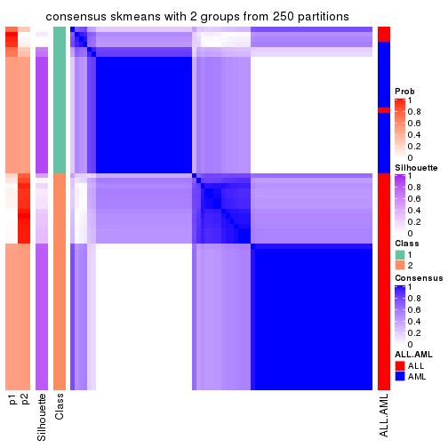</p>

</div>
<div id='tab-SD-skmeans-consensus-heatmap-2'>
<pre><code class="r">consensus_heatmap(res, k = 3)
</code></pre>

<p>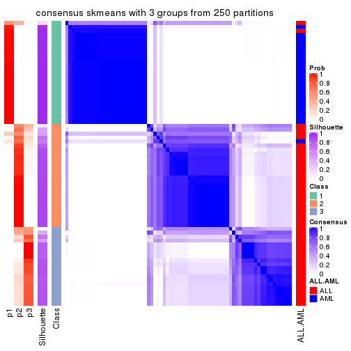</p>

</div>
<div id='tab-SD-skmeans-consensus-heatmap-3'>
<pre><code class="r">consensus_heatmap(res, k = 4)
</code></pre>

<p>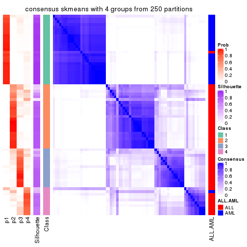</p>

</div>
<div id='tab-SD-skmeans-consensus-heatmap-4'>
<pre><code class="r">consensus_heatmap(res, k = 5)
</code></pre>

<p>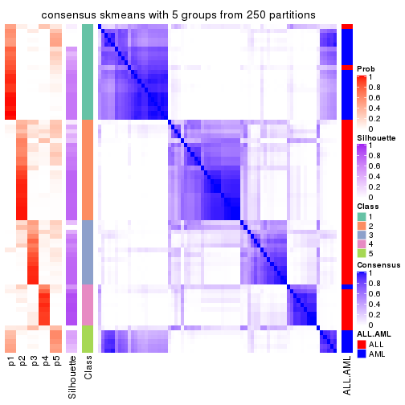</p>

</div>
<div id='tab-SD-skmeans-consensus-heatmap-5'>
<pre><code class="r">consensus_heatmap(res, k = 6)
</code></pre>

<p>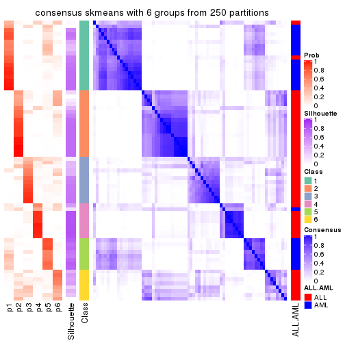</p>

</div>
</div>

Heatmaps for the membership of samples in all partitions to see how consistent they are:


<script>
$( function() {
	$( '#tabs-SD-skmeans-membership-heatmap' ).tabs();
} );
</script>
<div id='tabs-SD-skmeans-membership-heatmap'>
<ul>
<li><a href='#tab-SD-skmeans-membership-heatmap-1'>k = 2</a></li>
<li><a href='#tab-SD-skmeans-membership-heatmap-2'>k = 3</a></li>
<li><a href='#tab-SD-skmeans-membership-heatmap-3'>k = 4</a></li>
<li><a href='#tab-SD-skmeans-membership-heatmap-4'>k = 5</a></li>
<li><a href='#tab-SD-skmeans-membership-heatmap-5'>k = 6</a></li>
</ul>
<div id='tab-SD-skmeans-membership-heatmap-1'>
<pre><code class="r">membership_heatmap(res, k = 2)
</code></pre>

<p>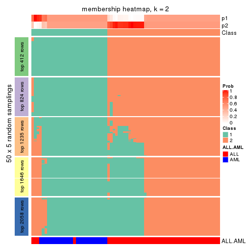</p>

</div>
<div id='tab-SD-skmeans-membership-heatmap-2'>
<pre><code class="r">membership_heatmap(res, k = 3)
</code></pre>

<p>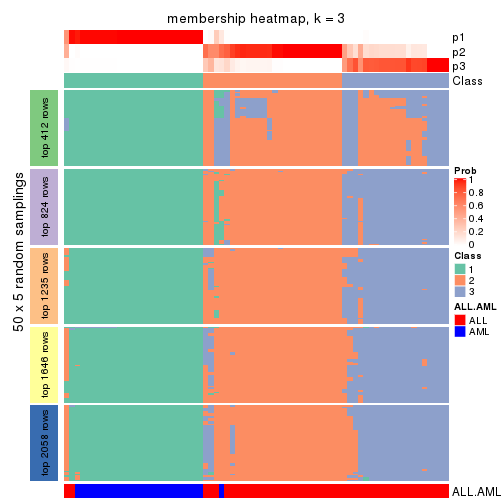</p>

</div>
<div id='tab-SD-skmeans-membership-heatmap-3'>
<pre><code class="r">membership_heatmap(res, k = 4)
</code></pre>

<p>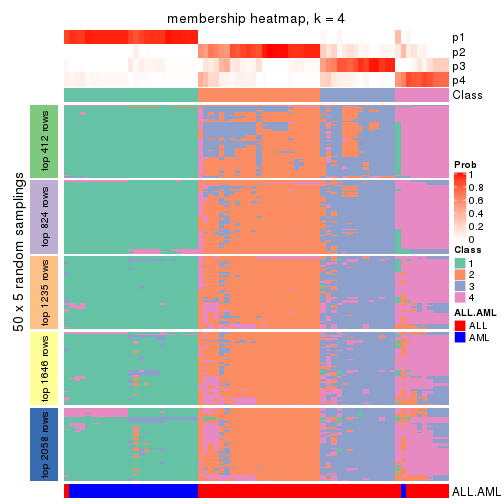</p>

</div>
<div id='tab-SD-skmeans-membership-heatmap-4'>
<pre><code class="r">membership_heatmap(res, k = 5)
</code></pre>

<p>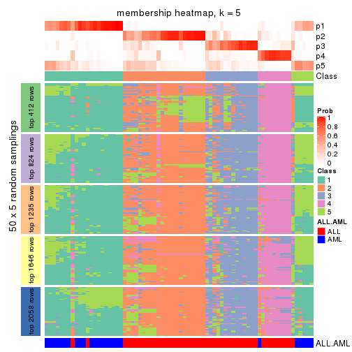</p>

</div>
<div id='tab-SD-skmeans-membership-heatmap-5'>
<pre><code class="r">membership_heatmap(res, k = 6)
</code></pre>

<p>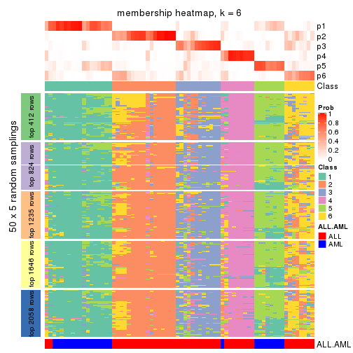</p>

</div>
</div>

As soon as we have had the classes for columns, we can look for signatures
which are significantly different between classes which can be candidate marks
for certain classes. Following are the heatmaps for signatures.


Signature heatmaps where rows are scaled:


<script>
$( function() {
	$( '#tabs-SD-skmeans-get-signatures' ).tabs();
} );
</script>
<div id='tabs-SD-skmeans-get-signatures'>
<ul>
<li><a href='#tab-SD-skmeans-get-signatures-1'>k = 2</a></li>
<li><a href='#tab-SD-skmeans-get-signatures-2'>k = 3</a></li>
<li><a href='#tab-SD-skmeans-get-signatures-3'>k = 4</a></li>
<li><a href='#tab-SD-skmeans-get-signatures-4'>k = 5</a></li>
<li><a href='#tab-SD-skmeans-get-signatures-5'>k = 6</a></li>
</ul>
<div id='tab-SD-skmeans-get-signatures-1'>
<pre><code class="r">get_signatures(res, k = 2)
</code></pre>

<p>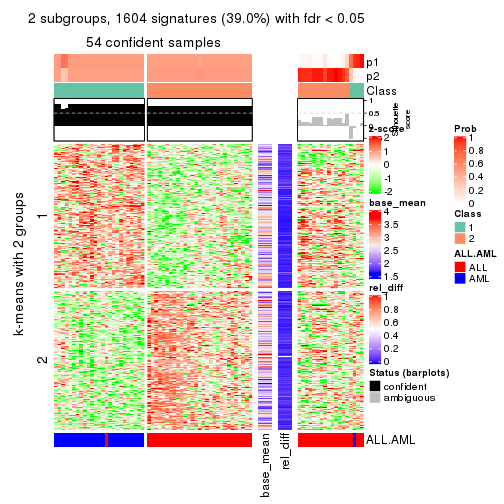</p>

</div>
<div id='tab-SD-skmeans-get-signatures-2'>
<pre><code class="r">get_signatures(res, k = 3)
</code></pre>

<p>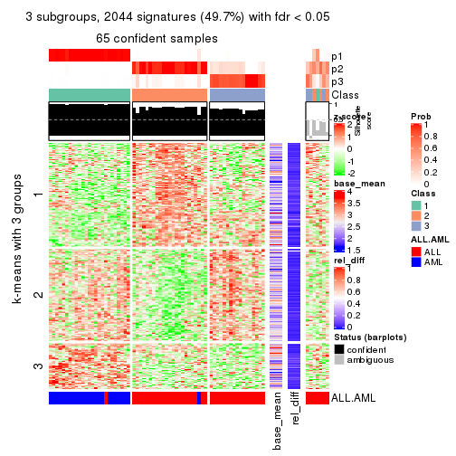</p>

</div>
<div id='tab-SD-skmeans-get-signatures-3'>
<pre><code class="r">get_signatures(res, k = 4)
</code></pre>

<p>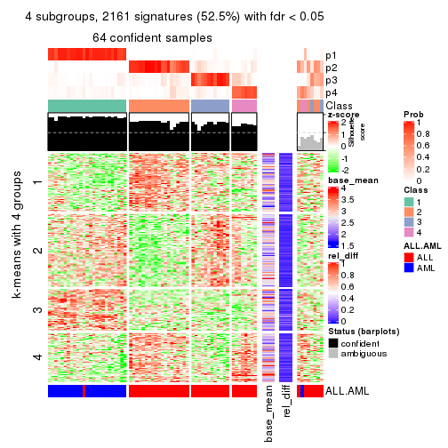</p>

</div>
<div id='tab-SD-skmeans-get-signatures-4'>
<pre><code class="r">get_signatures(res, k = 5)
</code></pre>

<p>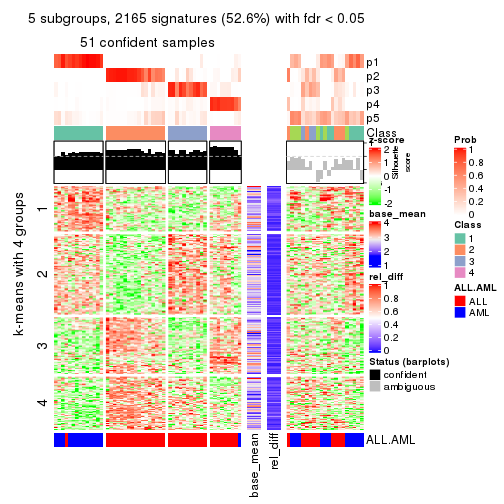</p>

</div>
<div id='tab-SD-skmeans-get-signatures-5'>
<pre><code class="r">get_signatures(res, k = 6)
</code></pre>

<p>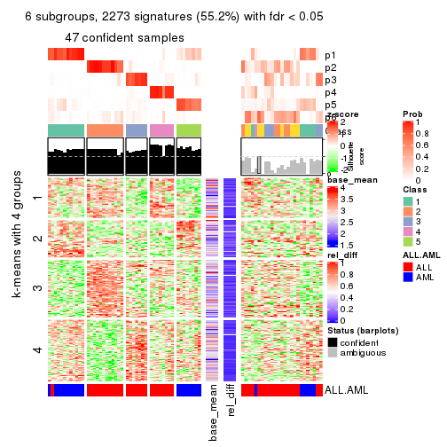</p>

</div>
</div>


Signature heatmaps where rows are not scaled:


<script>
$( function() {
	$( '#tabs-SD-skmeans-get-signatures-no-scale' ).tabs();
} );
</script>
<div id='tabs-SD-skmeans-get-signatures-no-scale'>
<ul>
<li><a href='#tab-SD-skmeans-get-signatures-no-scale-1'>k = 2</a></li>
<li><a href='#tab-SD-skmeans-get-signatures-no-scale-2'>k = 3</a></li>
<li><a href='#tab-SD-skmeans-get-signatures-no-scale-3'>k = 4</a></li>
<li><a href='#tab-SD-skmeans-get-signatures-no-scale-4'>k = 5</a></li>
<li><a href='#tab-SD-skmeans-get-signatures-no-scale-5'>k = 6</a></li>
</ul>
<div id='tab-SD-skmeans-get-signatures-no-scale-1'>
<pre><code class="r">get_signatures(res, k = 2, scale_rows = FALSE)
</code></pre>

<p>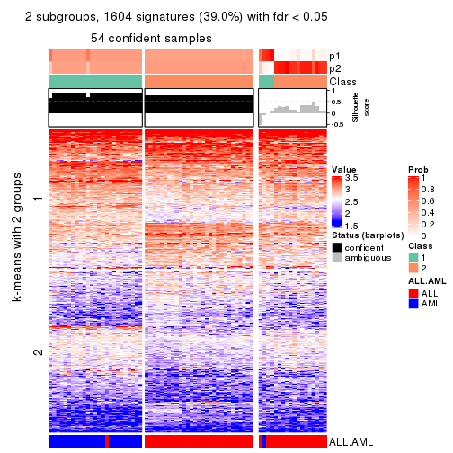</p>

</div>
<div id='tab-SD-skmeans-get-signatures-no-scale-2'>
<pre><code class="r">get_signatures(res, k = 3, scale_rows = FALSE)
</code></pre>

<p>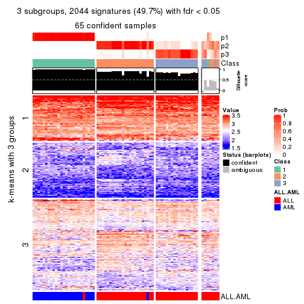</p>

</div>
<div id='tab-SD-skmeans-get-signatures-no-scale-3'>
<pre><code class="r">get_signatures(res, k = 4, scale_rows = FALSE)
</code></pre>

<p>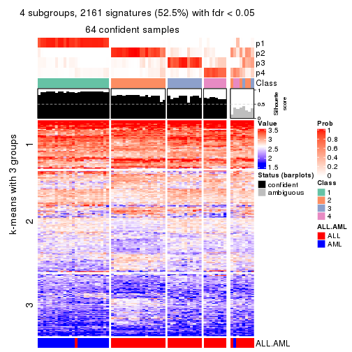</p>

</div>
<div id='tab-SD-skmeans-get-signatures-no-scale-4'>
<pre><code class="r">get_signatures(res, k = 5, scale_rows = FALSE)
</code></pre>

<p>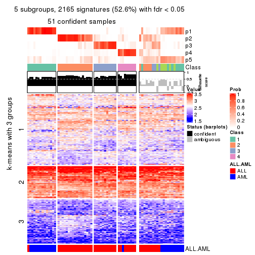</p>

</div>
<div id='tab-SD-skmeans-get-signatures-no-scale-5'>
<pre><code class="r">get_signatures(res, k = 6, scale_rows = FALSE)
</code></pre>

<p>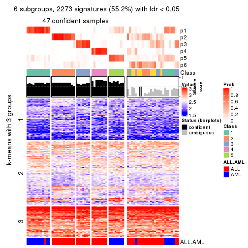</p>

</div>
</div>


Compare the overlap of signatures from different k:

```r
compare_signatures(res)
```

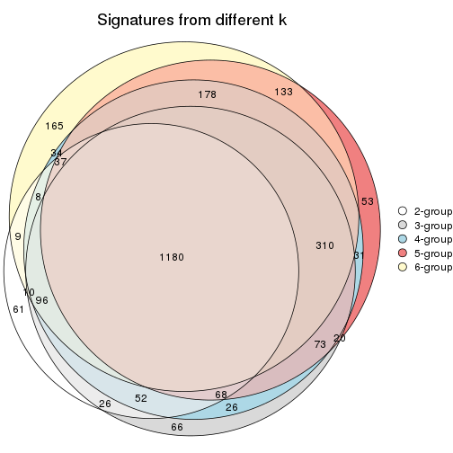

`get_signature()` returns a data frame invisibly. TO get the list of signatures, the function
call should be assigned to a variable explicitly. In following code, if `plot` argument is set
to `FALSE`, no heatmap is plotted while only the differential analysis is performed.

```r
# code only for demonstration
tb = get_signature(res, k = ..., plot = FALSE)
```

An example of the output of `tb` is:

```
#>   which_row         fdr    mean_1    mean_2 scaled_mean_1 scaled_mean_2 km
#> 1        38 0.042760348  8.373488  9.131774    -0.5533452     0.5164555  1
#> 2        40 0.018707592  7.106213  8.469186    -0.6173731     0.5762149  1
#> 3        55 0.019134737 10.221463 11.207825    -0.6159697     0.5749050  1
#> 4        59 0.006059896  5.921854  7.869574    -0.6899429     0.6439467  1
#> 5        60 0.018055526  8.928898 10.211722    -0.6204761     0.5791110  1
#> 6        98 0.009384629 15.714769 14.887706     0.6635654    -0.6193277  2
...
```

The columns in `tb` are:

1. `which_row`: row indices corresponding to the input matrix.
2. `fdr`: FDR for the differential test. 
3. `mean_x`: The mean value in group x.
4. `scaled_mean_x`: The mean value in group x after rows are scaled.
5. `km`: Row groups if k-means clustering is applied to rows.


UMAP plot which shows how samples are separated.


<script>
$( function() {
	$( '#tabs-SD-skmeans-dimension-reduction' ).tabs();
} );
</script>
<div id='tabs-SD-skmeans-dimension-reduction'>
<ul>
<li><a href='#tab-SD-skmeans-dimension-reduction-1'>k = 2</a></li>
<li><a href='#tab-SD-skmeans-dimension-reduction-2'>k = 3</a></li>
<li><a href='#tab-SD-skmeans-dimension-reduction-3'>k = 4</a></li>
<li><a href='#tab-SD-skmeans-dimension-reduction-4'>k = 5</a></li>
<li><a href='#tab-SD-skmeans-dimension-reduction-5'>k = 6</a></li>
</ul>
<div id='tab-SD-skmeans-dimension-reduction-1'>
<pre><code class="r">dimension_reduction(res, k = 2, method = &quot;UMAP&quot;)
</code></pre>

<p>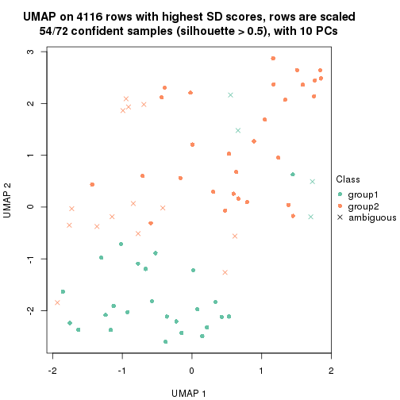</p>

</div>
<div id='tab-SD-skmeans-dimension-reduction-2'>
<pre><code class="r">dimension_reduction(res, k = 3, method = &quot;UMAP&quot;)
</code></pre>

<p>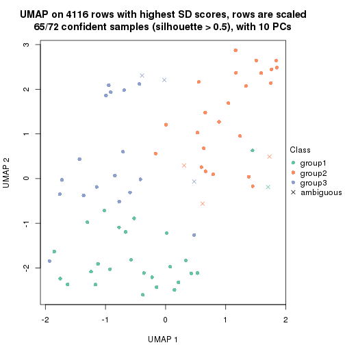</p>

</div>
<div id='tab-SD-skmeans-dimension-reduction-3'>
<pre><code class="r">dimension_reduction(res, k = 4, method = &quot;UMAP&quot;)
</code></pre>

<p>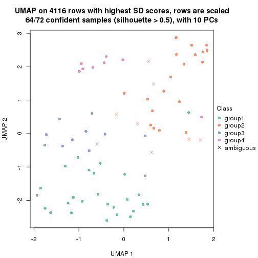</p>

</div>
<div id='tab-SD-skmeans-dimension-reduction-4'>
<pre><code class="r">dimension_reduction(res, k = 5, method = &quot;UMAP&quot;)
</code></pre>

<p>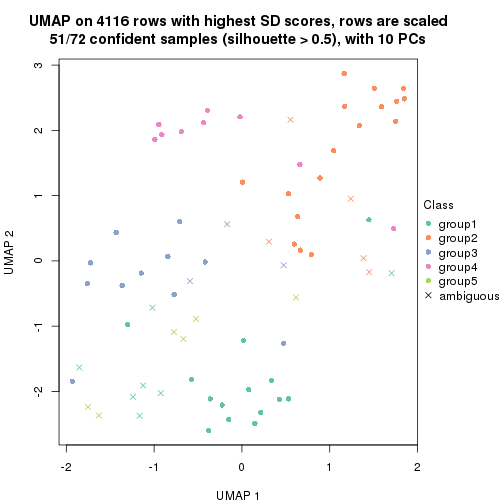</p>

</div>
<div id='tab-SD-skmeans-dimension-reduction-5'>
<pre><code class="r">dimension_reduction(res, k = 6, method = &quot;UMAP&quot;)
</code></pre>

<p>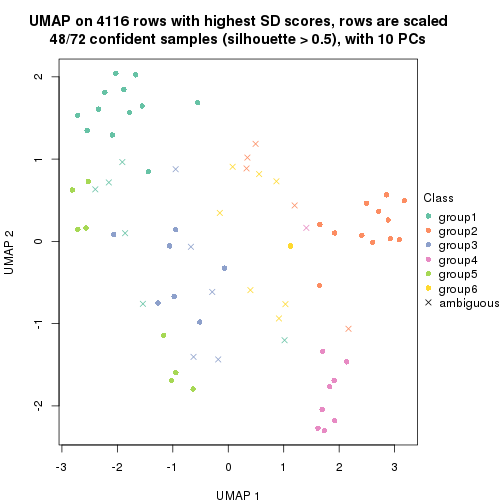</p>

</div>
</div>


Following heatmap shows how subgroups are split when increasing `k`:

```r
collect_classes(res)
```

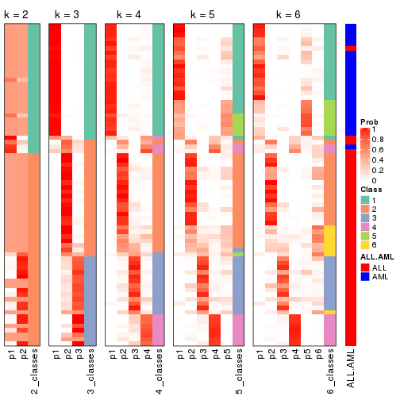


Test correlation between subgroups and known annotations. If the known
annotation is numeric, one-way ANOVA test is applied, and if the known
annotation is discrete, chi-squared contingency table test is applied.

```r
test_to_known_factors(res)
```

```
#>             n ALL.AML(p) k
#> SD:skmeans 54   1.01e-11 2
#> SD:skmeans 65   4.40e-13 3
#> SD:skmeans 64   6.16e-13 4
#> SD:skmeans 51   4.27e-09 5
#> SD:skmeans 48   2.14e-08 6
```


If matrix rows can be associated to genes, consider to use `functional_enrichment(res,
...)` to perform function enrichment for the signature genes. See [this vignette](http://bioconductor.org/packages/devel/bioc/vignettes/cola/inst/doc/functional_enrichment.html) for more detailed explanations.


 

---------------------------------------------------


### SD:pam


The object with results only for a single top-value method and a single partition method 
can be extracted as:

```r
res = res_list["SD", "pam"]
# you can also extract it by
# res = res_list["SD:pam"]
```

A summary of `res` and all the functions that can be applied to it:

```r
res
```

```
#> A 'ConsensusPartition' object with k = 2, 3, 4, 5, 6.
#>   On a matrix with 4116 rows and 72 columns.
#>   Top rows (412, 824, 1235, 1646, 2058) are extracted by 'SD' method.
#>   Subgroups are detected by 'pam' method.
#>   Performed in total 1250 partitions by row resampling.
#>   Best k for subgroups seems to be 2.
#> 
#> Following methods can be applied to this 'ConsensusPartition' object:
#>  [1] "cola_report"             "collect_classes"         "collect_plots"          
#>  [4] "collect_stats"           "colnames"                "compare_signatures"     
#>  [7] "consensus_heatmap"       "dimension_reduction"     "functional_enrichment"  
#> [10] "get_anno_col"            "get_anno"                "get_classes"            
#> [13] "get_consensus"           "get_matrix"              "get_membership"         
#> [16] "get_param"               "get_signatures"          "get_stats"              
#> [19] "is_best_k"               "is_stable_k"             "membership_heatmap"     
#> [22] "ncol"                    "nrow"                    "plot_ecdf"              
#> [25] "rownames"                "select_partition_number" "show"                   
#> [28] "suggest_best_k"          "test_to_known_factors"
```

`collect_plots()` function collects all the plots made from `res` for all `k` (number of partitions)
into one single page to provide an easy and fast comparison between different `k`.

```r
collect_plots(res)
```

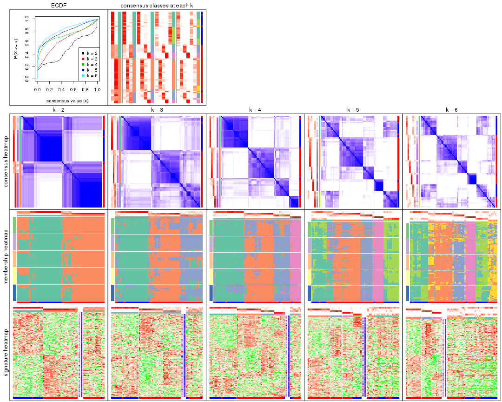

The plots are:

- The first row: a plot of the ECDF (empirical cumulative distribution
  function) curves of the consensus matrix for each `k` and the heatmap of
  predicted classes for each `k`.
- The second row: heatmaps of the consensus matrix for each `k`.
- The third row: heatmaps of the membership matrix for each `k`.
- The fouth row: heatmaps of the signatures for each `k`.

All the plots in panels can be made by individual functions and they are
plotted later in this section.

`select_partition_number()` produces several plots showing different
statistics for choosing "optimized" `k`. There are following statistics:

- ECDF curves of the consensus matrix for each `k`;
- 1-PAC. [The PAC
  score](https://en.wikipedia.org/wiki/Consensus_clustering#Over-interpretation_potential_of_consensus_clustering)
  measures the proportion of the ambiguous subgrouping.
- Mean silhouette score.
- Concordance. The mean probability of fiting the consensus class ids in all
  partitions.
- Area increased. Denote $A_k$ as the area under the ECDF curve for current
  `k`, the area increased is defined as $A_k - A_{k-1}$.
- Rand index. The percent of pairs of samples that are both in a same cluster
  or both are not in a same cluster in the partition of k and k-1.
- Jaccard index. The ratio of pairs of samples are both in a same cluster in
  the partition of k and k-1 and the pairs of samples are both in a same
  cluster in the partition k or k-1.

The detailed explanations of these statistics can be found in [the _cola_
vignette](http://bioconductor.org/packages/devel/bioc/vignettes/cola/inst/doc/cola.html#toc_13).

Generally speaking, lower PAC score, higher mean silhouette score or higher
concordance corresponds to better partition. Rand index and Jaccard index
measure how similar the current partition is compared to partition with `k-1`.
If they are too similar, we won't accept `k` is better than `k-1`.

```r
select_partition_number(res)
```

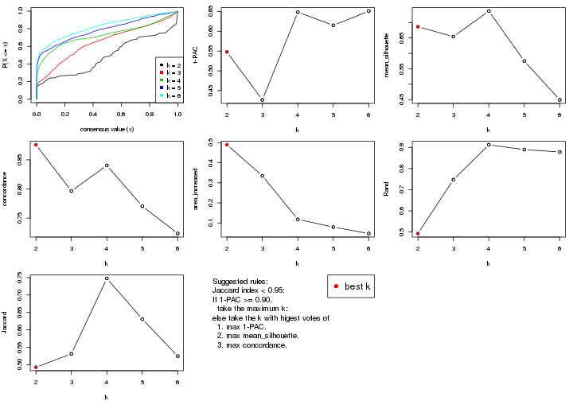

The numeric values for all these statistics can be obtained by `get_stats()`.

```r
get_stats(res)
```

```
#>   k 1-PAC mean_silhouette concordance area_increased  Rand Jaccard
#> 2 2 0.548           0.686       0.876         0.4897 0.493   0.493
#> 3 3 0.427           0.654       0.797         0.3349 0.748   0.531
#> 4 4 0.648           0.737       0.840         0.1178 0.912   0.747
#> 5 5 0.615           0.575       0.770         0.0794 0.889   0.631
#> 6 6 0.651           0.449       0.724         0.0473 0.878   0.524
```

`suggest_best_k()` suggests the best $k$ based on these statistics. The rules are as follows:

- All $k$ with Jaccard index larger than 0.95 are removed because increasing
  $k$ does not provide enough extra information. If all $k$ are removed, it is
  marked as no subgroup is detected.
- For all $k$ with 1-PAC score larger than 0.9, the maximal $k$ is taken as
  the best $k$, and other $k$ are marked as optional $k$.
- If it does not fit the second rule. The $k$ with the maximal vote of the
  highest 1-PAC score, highest mean silhouette, and highest concordance is
  taken as the best $k$.

```r
suggest_best_k(res)
```

```
#> [1] 2
```


Following shows the table of the partitions (You need to click the **show/hide
code output** link to see it). The membership matrix (columns with name `p*`)
is inferred by
[`clue::cl_consensus()`](https://www.rdocumentation.org/link/cl_consensus?package=clue)
function with the `SE` method. Basically the value in the membership matrix
represents the probability to belong to a certain group. The finall class
label for an item is determined with the group with highest probability it
belongs to.

In `get_classes()` function, the entropy is calculated from the membership
matrix and the silhouette score is calculated from the consensus matrix.


<script>
$( function() {
	$( '#tabs-SD-pam-get-classes' ).tabs();
} );
</script>
<div id='tabs-SD-pam-get-classes'>
<ul>
<li><a href='#tab-SD-pam-get-classes-1'>k = 2</a></li>
<li><a href='#tab-SD-pam-get-classes-2'>k = 3</a></li>
<li><a href='#tab-SD-pam-get-classes-3'>k = 4</a></li>
<li><a href='#tab-SD-pam-get-classes-4'>k = 5</a></li>
<li><a href='#tab-SD-pam-get-classes-5'>k = 6</a></li>
</ul>

<div id='tab-SD-pam-get-classes-1'>
<p><a id='tab-SD-pam-get-classes-1-a' style='color:#0366d6' href='#'>show/hide code output</a></p>
<pre><code class="r">cbind(get_classes(res, k = 2), get_membership(res, k = 2))
</code></pre>

<pre><code>#&gt;           class entropy silhouette    p1    p2
#&gt; sample_39     2  0.8713     0.5351 0.292 0.708
#&gt; sample_40     1  0.9732     0.3900 0.596 0.404
#&gt; sample_42     2  0.3274     0.8284 0.060 0.940
#&gt; sample_47     2  0.0000     0.8616 0.000 1.000
#&gt; sample_48     2  0.0000     0.8616 0.000 1.000
#&gt; sample_49     1  0.9795     0.3574 0.584 0.416
#&gt; sample_41     2  0.0000     0.8616 0.000 1.000
#&gt; sample_43     2  0.0000     0.8616 0.000 1.000
#&gt; sample_44     2  0.0000     0.8616 0.000 1.000
#&gt; sample_45     2  0.0000     0.8616 0.000 1.000
#&gt; sample_46     2  0.0000     0.8616 0.000 1.000
#&gt; sample_70     2  0.9944     0.0442 0.456 0.544
#&gt; sample_71     2  0.3733     0.8221 0.072 0.928
#&gt; sample_72     2  0.1414     0.8525 0.020 0.980
#&gt; sample_68     2  0.0000     0.8616 0.000 1.000
#&gt; sample_69     2  0.0000     0.8616 0.000 1.000
#&gt; sample_67     1  0.9608     0.2700 0.616 0.384
#&gt; sample_55     1  0.9833     0.3459 0.576 0.424
#&gt; sample_56     2  0.8608     0.5360 0.284 0.716
#&gt; sample_59     2  0.3879     0.8111 0.076 0.924
#&gt; sample_52     1  0.0000     0.8212 1.000 0.000
#&gt; sample_53     1  0.0000     0.8212 1.000 0.000
#&gt; sample_51     1  0.0000     0.8212 1.000 0.000
#&gt; sample_50     1  0.0000     0.8212 1.000 0.000
#&gt; sample_54     1  0.5842     0.7295 0.860 0.140
#&gt; sample_57     1  0.0000     0.8212 1.000 0.000
#&gt; sample_58     1  0.0000     0.8212 1.000 0.000
#&gt; sample_60     1  0.2948     0.8004 0.948 0.052
#&gt; sample_61     1  0.0376     0.8201 0.996 0.004
#&gt; sample_65     1  0.0000     0.8212 1.000 0.000
#&gt; sample_66     2  0.9970     0.0956 0.468 0.532
#&gt; sample_63     1  0.0000     0.8212 1.000 0.000
#&gt; sample_64     1  0.6247     0.7235 0.844 0.156
#&gt; sample_62     1  0.2236     0.8061 0.964 0.036
#&gt; sample_1      2  0.0000     0.8616 0.000 1.000
#&gt; sample_2      2  0.9963     0.1369 0.464 0.536
#&gt; sample_3      1  0.9815     0.3498 0.580 0.420
#&gt; sample_4      2  0.9775     0.1889 0.412 0.588
#&gt; sample_5      2  0.0000     0.8616 0.000 1.000
#&gt; sample_6      1  0.9635     0.4212 0.612 0.388
#&gt; sample_7      1  0.9944     0.2579 0.544 0.456
#&gt; sample_8      2  0.9983    -0.0322 0.476 0.524
#&gt; sample_9      2  0.9248     0.4058 0.340 0.660
#&gt; sample_10     1  0.9580     0.4254 0.620 0.380
#&gt; sample_11     2  0.2603     0.8416 0.044 0.956
#&gt; sample_12     1  0.0938     0.8173 0.988 0.012
#&gt; sample_13     2  0.0000     0.8616 0.000 1.000
#&gt; sample_14     2  0.1633     0.8502 0.024 0.976
#&gt; sample_15     2  0.0000     0.8616 0.000 1.000
#&gt; sample_16     2  0.0000     0.8616 0.000 1.000
#&gt; sample_17     2  0.0000     0.8616 0.000 1.000
#&gt; sample_18     2  0.3584     0.8267 0.068 0.932
#&gt; sample_19     2  0.0000     0.8616 0.000 1.000
#&gt; sample_20     2  0.0000     0.8616 0.000 1.000
#&gt; sample_21     2  0.0000     0.8616 0.000 1.000
#&gt; sample_22     1  0.9922     0.2323 0.552 0.448
#&gt; sample_23     1  0.9815     0.3513 0.580 0.420
#&gt; sample_24     2  0.0000     0.8616 0.000 1.000
#&gt; sample_25     2  0.9427     0.3790 0.360 0.640
#&gt; sample_26     2  0.0376     0.8599 0.004 0.996
#&gt; sample_27     1  0.9635     0.4182 0.612 0.388
#&gt; sample_34     1  0.0000     0.8212 1.000 0.000
#&gt; sample_35     1  0.4298     0.7750 0.912 0.088
#&gt; sample_36     1  0.0000     0.8212 1.000 0.000
#&gt; sample_37     1  0.0000     0.8212 1.000 0.000
#&gt; sample_38     1  0.0000     0.8212 1.000 0.000
#&gt; sample_28     1  0.0000     0.8212 1.000 0.000
#&gt; sample_29     1  0.0000     0.8212 1.000 0.000
#&gt; sample_30     1  0.0000     0.8212 1.000 0.000
#&gt; sample_31     1  0.0000     0.8212 1.000 0.000
#&gt; sample_32     1  0.0000     0.8212 1.000 0.000
#&gt; sample_33     1  0.0000     0.8212 1.000 0.000
</code></pre>

<script>
$('#tab-SD-pam-get-classes-1-a').parent().next().next().hide();
$('#tab-SD-pam-get-classes-1-a').click(function(){
  $('#tab-SD-pam-get-classes-1-a').parent().next().next().toggle();
  return(false);
});
</script>
</div>

<div id='tab-SD-pam-get-classes-2'>
<p><a id='tab-SD-pam-get-classes-2-a' style='color:#0366d6' href='#'>show/hide code output</a></p>
<pre><code class="r">cbind(get_classes(res, k = 3), get_membership(res, k = 3))
</code></pre>

<pre><code>#&gt;           class entropy silhouette    p1    p2    p3
#&gt; sample_39     3  0.8436    0.48446 0.160 0.224 0.616
#&gt; sample_40     3  0.7233    0.67132 0.264 0.064 0.672
#&gt; sample_42     2  0.5891    0.67687 0.036 0.764 0.200
#&gt; sample_47     2  0.2796    0.75873 0.000 0.908 0.092
#&gt; sample_48     2  0.0000    0.75757 0.000 1.000 0.000
#&gt; sample_49     3  0.7057    0.67645 0.264 0.056 0.680
#&gt; sample_41     2  0.5465    0.44859 0.000 0.712 0.288
#&gt; sample_43     2  0.3686    0.74830 0.000 0.860 0.140
#&gt; sample_44     2  0.6111    0.39243 0.000 0.604 0.396
#&gt; sample_45     2  0.3116    0.75390 0.000 0.892 0.108
#&gt; sample_46     2  0.2625    0.75827 0.000 0.916 0.084
#&gt; sample_70     3  0.7180    0.66995 0.196 0.096 0.708
#&gt; sample_71     2  0.7642    0.56561 0.092 0.660 0.248
#&gt; sample_72     2  0.4235    0.71888 0.000 0.824 0.176
#&gt; sample_68     2  0.0892    0.75526 0.000 0.980 0.020
#&gt; sample_69     2  0.0237    0.75804 0.000 0.996 0.004
#&gt; sample_67     1  0.9350    0.19255 0.488 0.328 0.184
#&gt; sample_55     3  0.8728    0.67197 0.288 0.144 0.568
#&gt; sample_56     3  0.7875    0.57542 0.136 0.200 0.664
#&gt; sample_59     2  0.7063    0.16839 0.020 0.516 0.464
#&gt; sample_52     1  0.0000    0.87326 1.000 0.000 0.000
#&gt; sample_53     1  0.1643    0.86524 0.956 0.000 0.044
#&gt; sample_51     1  0.0000    0.87326 1.000 0.000 0.000
#&gt; sample_50     1  0.0237    0.87387 0.996 0.000 0.004
#&gt; sample_54     1  0.5047    0.70690 0.824 0.140 0.036
#&gt; sample_57     1  0.0424    0.87032 0.992 0.000 0.008
#&gt; sample_58     1  0.0237    0.87261 0.996 0.000 0.004
#&gt; sample_60     1  0.2796    0.79881 0.908 0.000 0.092
#&gt; sample_61     1  0.2711    0.84762 0.912 0.000 0.088
#&gt; sample_65     1  0.0424    0.87294 0.992 0.000 0.008
#&gt; sample_66     2  0.9013    0.22751 0.152 0.524 0.324
#&gt; sample_63     1  0.0000    0.87326 1.000 0.000 0.000
#&gt; sample_64     1  0.7112    0.29347 0.648 0.044 0.308
#&gt; sample_62     1  0.2301    0.82362 0.936 0.004 0.060
#&gt; sample_1      3  0.6026    0.19052 0.000 0.376 0.624
#&gt; sample_2      1  0.9953    0.00369 0.380 0.300 0.320
#&gt; sample_3      3  0.5212    0.63786 0.108 0.064 0.828
#&gt; sample_4      3  0.8752    0.59684 0.144 0.292 0.564
#&gt; sample_5      2  0.1163    0.75356 0.000 0.972 0.028
#&gt; sample_6      3  0.5695    0.63400 0.120 0.076 0.804
#&gt; sample_7      3  0.9153    0.65444 0.308 0.172 0.520
#&gt; sample_8      3  0.7413    0.65510 0.204 0.104 0.692
#&gt; sample_9      3  0.6025    0.51198 0.028 0.232 0.740
#&gt; sample_10     3  0.5852    0.60479 0.180 0.044 0.776
#&gt; sample_11     3  0.7940    0.07116 0.060 0.416 0.524
#&gt; sample_12     1  0.3769    0.79833 0.880 0.016 0.104
#&gt; sample_13     2  0.0000    0.75757 0.000 1.000 0.000
#&gt; sample_14     3  0.5431    0.43648 0.000 0.284 0.716
#&gt; sample_15     2  0.1643    0.75068 0.000 0.956 0.044
#&gt; sample_16     2  0.5098    0.61180 0.000 0.752 0.248
#&gt; sample_17     2  0.2625    0.73844 0.000 0.916 0.084
#&gt; sample_18     2  0.8955    0.26014 0.140 0.516 0.344
#&gt; sample_19     2  0.4399    0.72188 0.000 0.812 0.188
#&gt; sample_20     2  0.0000    0.75757 0.000 1.000 0.000
#&gt; sample_21     2  0.1643    0.75554 0.000 0.956 0.044
#&gt; sample_22     3  0.7758    0.60299 0.280 0.084 0.636
#&gt; sample_23     3  0.5467    0.63638 0.112 0.072 0.816
#&gt; sample_24     2  0.5254    0.50036 0.000 0.736 0.264
#&gt; sample_25     2  0.9582    0.13025 0.228 0.472 0.300
#&gt; sample_26     2  0.4555    0.71087 0.000 0.800 0.200
#&gt; sample_27     3  0.6772    0.64197 0.304 0.032 0.664
#&gt; sample_34     1  0.0000    0.87326 1.000 0.000 0.000
#&gt; sample_35     1  0.5465    0.44178 0.712 0.000 0.288
#&gt; sample_36     1  0.1529    0.86647 0.960 0.000 0.040
#&gt; sample_37     1  0.1529    0.86647 0.960 0.000 0.040
#&gt; sample_38     1  0.2066    0.86096 0.940 0.000 0.060
#&gt; sample_28     1  0.1964    0.86236 0.944 0.000 0.056
#&gt; sample_29     1  0.1765    0.86542 0.956 0.004 0.040
#&gt; sample_30     1  0.0237    0.87386 0.996 0.000 0.004
#&gt; sample_31     1  0.0747    0.87063 0.984 0.000 0.016
#&gt; sample_32     1  0.0892    0.87275 0.980 0.000 0.020
#&gt; sample_33     1  0.1529    0.86647 0.960 0.000 0.040
</code></pre>

<script>
$('#tab-SD-pam-get-classes-2-a').parent().next().next().hide();
$('#tab-SD-pam-get-classes-2-a').click(function(){
  $('#tab-SD-pam-get-classes-2-a').parent().next().next().toggle();
  return(false);
});
</script>
</div>

<div id='tab-SD-pam-get-classes-3'>
<p><a id='tab-SD-pam-get-classes-3-a' style='color:#0366d6' href='#'>show/hide code output</a></p>
<pre><code class="r">cbind(get_classes(res, k = 4), get_membership(res, k = 4))
</code></pre>

<pre><code>#&gt;           class entropy silhouette    p1    p2    p3    p4
#&gt; sample_39     3  0.2586     0.6957 0.048 0.040 0.912 0.000
#&gt; sample_40     3  0.2859     0.7491 0.112 0.008 0.880 0.000
#&gt; sample_42     2  0.5310     0.6363 0.028 0.704 0.260 0.008
#&gt; sample_47     2  0.1940     0.7862 0.000 0.924 0.076 0.000
#&gt; sample_48     2  0.0000     0.7831 0.000 1.000 0.000 0.000
#&gt; sample_49     3  0.2593     0.7482 0.104 0.004 0.892 0.000
#&gt; sample_41     2  0.4072     0.5992 0.000 0.748 0.252 0.000
#&gt; sample_43     2  0.3266     0.7575 0.000 0.832 0.168 0.000
#&gt; sample_44     2  0.4907     0.4230 0.000 0.580 0.420 0.000
#&gt; sample_45     2  0.2760     0.7685 0.000 0.872 0.128 0.000
#&gt; sample_46     2  0.2408     0.7738 0.000 0.896 0.104 0.000
#&gt; sample_70     3  0.5010     0.7175 0.072 0.020 0.796 0.112
#&gt; sample_71     2  0.6580     0.4238 0.068 0.564 0.360 0.008
#&gt; sample_72     2  0.4018     0.6992 0.000 0.772 0.224 0.004
#&gt; sample_68     2  0.0707     0.7819 0.000 0.980 0.020 0.000
#&gt; sample_69     2  0.0336     0.7838 0.000 0.992 0.008 0.000
#&gt; sample_67     1  0.7170     0.4673 0.592 0.244 0.152 0.012
#&gt; sample_55     3  0.7280     0.6605 0.180 0.140 0.636 0.044
#&gt; sample_56     3  0.3781     0.7355 0.080 0.052 0.860 0.008
#&gt; sample_59     2  0.4994     0.2607 0.000 0.520 0.480 0.000
#&gt; sample_52     1  0.1388     0.8852 0.960 0.000 0.028 0.012
#&gt; sample_53     1  0.2345     0.8686 0.900 0.000 0.100 0.000
#&gt; sample_51     1  0.0336     0.8933 0.992 0.000 0.008 0.000
#&gt; sample_50     1  0.0469     0.8934 0.988 0.000 0.012 0.000
#&gt; sample_54     1  0.3467     0.8444 0.884 0.056 0.032 0.028
#&gt; sample_57     1  0.1388     0.8852 0.960 0.000 0.028 0.012
#&gt; sample_58     1  0.1488     0.8850 0.956 0.000 0.032 0.012
#&gt; sample_60     1  0.2255     0.8640 0.920 0.000 0.068 0.012
#&gt; sample_61     1  0.2999     0.8555 0.864 0.000 0.132 0.004
#&gt; sample_65     1  0.1109     0.8918 0.968 0.000 0.028 0.004
#&gt; sample_66     4  0.3380     0.8158 0.008 0.136 0.004 0.852
#&gt; sample_63     1  0.1388     0.8852 0.960 0.000 0.028 0.012
#&gt; sample_64     3  0.6738     0.1735 0.452 0.060 0.476 0.012
#&gt; sample_62     1  0.1677     0.8788 0.948 0.000 0.040 0.012
#&gt; sample_1      3  0.4072     0.4629 0.000 0.252 0.748 0.000
#&gt; sample_2      4  0.5614     0.7336 0.080 0.140 0.024 0.756
#&gt; sample_3      4  0.0592     0.9373 0.000 0.000 0.016 0.984
#&gt; sample_4      3  0.6732     0.5818 0.068 0.252 0.644 0.036
#&gt; sample_5      2  0.0817     0.7805 0.000 0.976 0.024 0.000
#&gt; sample_6      4  0.0707     0.9358 0.000 0.000 0.020 0.980
#&gt; sample_7      3  0.7019     0.6434 0.140 0.188 0.644 0.028
#&gt; sample_8      3  0.2214     0.7287 0.044 0.028 0.928 0.000
#&gt; sample_9      4  0.0524     0.9384 0.000 0.004 0.008 0.988
#&gt; sample_10     4  0.0469     0.9339 0.012 0.000 0.000 0.988
#&gt; sample_11     4  0.0524     0.9362 0.008 0.004 0.000 0.988
#&gt; sample_12     1  0.4018     0.7734 0.812 0.016 0.168 0.004
#&gt; sample_13     2  0.0000     0.7831 0.000 1.000 0.000 0.000
#&gt; sample_14     4  0.0657     0.9382 0.000 0.004 0.012 0.984
#&gt; sample_15     2  0.1302     0.7784 0.000 0.956 0.044 0.000
#&gt; sample_16     2  0.3528     0.7070 0.000 0.808 0.192 0.000
#&gt; sample_17     2  0.3198     0.7579 0.000 0.880 0.080 0.040
#&gt; sample_18     2  0.8457     0.1803 0.052 0.452 0.336 0.160
#&gt; sample_19     2  0.4040     0.7018 0.000 0.752 0.248 0.000
#&gt; sample_20     2  0.0000     0.7831 0.000 1.000 0.000 0.000
#&gt; sample_21     2  0.1389     0.7813 0.000 0.952 0.048 0.000
#&gt; sample_22     3  0.1890     0.7106 0.056 0.008 0.936 0.000
#&gt; sample_23     4  0.0707     0.9358 0.000 0.000 0.020 0.980
#&gt; sample_24     2  0.4072     0.6035 0.000 0.748 0.252 0.000
#&gt; sample_25     3  0.7030    -0.0105 0.080 0.380 0.524 0.016
#&gt; sample_26     2  0.4304     0.6635 0.000 0.716 0.284 0.000
#&gt; sample_27     3  0.3790     0.7481 0.132 0.004 0.840 0.024
#&gt; sample_34     1  0.0336     0.8920 0.992 0.000 0.008 0.000
#&gt; sample_35     1  0.5827     0.0713 0.568 0.000 0.396 0.036
#&gt; sample_36     1  0.2805     0.8808 0.888 0.000 0.100 0.012
#&gt; sample_37     1  0.2345     0.8686 0.900 0.000 0.100 0.000
#&gt; sample_38     1  0.2987     0.8611 0.880 0.000 0.104 0.016
#&gt; sample_28     1  0.2714     0.8652 0.884 0.000 0.112 0.004
#&gt; sample_29     1  0.2345     0.8686 0.900 0.000 0.100 0.000
#&gt; sample_30     1  0.1151     0.8894 0.968 0.000 0.024 0.008
#&gt; sample_31     1  0.0592     0.8919 0.984 0.000 0.016 0.000
#&gt; sample_32     1  0.0817     0.8923 0.976 0.000 0.024 0.000
#&gt; sample_33     1  0.2345     0.8686 0.900 0.000 0.100 0.000
</code></pre>

<script>
$('#tab-SD-pam-get-classes-3-a').parent().next().next().hide();
$('#tab-SD-pam-get-classes-3-a').click(function(){
  $('#tab-SD-pam-get-classes-3-a').parent().next().next().toggle();
  return(false);
});
</script>
</div>

<div id='tab-SD-pam-get-classes-4'>
<p><a id='tab-SD-pam-get-classes-4-a' style='color:#0366d6' href='#'>show/hide code output</a></p>
<pre><code class="r">cbind(get_classes(res, k = 5), get_membership(res, k = 5))
</code></pre>

<pre><code>#&gt;           class entropy silhouette    p1    p2    p3    p4    p5
#&gt; sample_39     1  0.4830    -0.0153 0.492 0.020 0.488 0.000 0.000
#&gt; sample_40     3  0.1682     0.8377 0.044 0.012 0.940 0.000 0.004
#&gt; sample_42     2  0.6054     0.4551 0.280 0.560 0.160 0.000 0.000
#&gt; sample_47     2  0.2331     0.7832 0.020 0.900 0.080 0.000 0.000
#&gt; sample_48     2  0.0162     0.7858 0.000 0.996 0.004 0.000 0.000
#&gt; sample_49     3  0.0000     0.8381 0.000 0.000 1.000 0.000 0.000
#&gt; sample_41     2  0.4000     0.6294 0.024 0.748 0.228 0.000 0.000
#&gt; sample_43     2  0.4028     0.7310 0.048 0.776 0.176 0.000 0.000
#&gt; sample_44     2  0.4898     0.4869 0.032 0.592 0.376 0.000 0.000
#&gt; sample_45     2  0.3267     0.7640 0.044 0.844 0.112 0.000 0.000
#&gt; sample_46     2  0.2824     0.7698 0.032 0.872 0.096 0.000 0.000
#&gt; sample_70     3  0.4515     0.7254 0.080 0.012 0.788 0.112 0.008
#&gt; sample_71     1  0.6442     0.1574 0.492 0.300 0.208 0.000 0.000
#&gt; sample_72     2  0.4850     0.6586 0.076 0.700 0.224 0.000 0.000
#&gt; sample_68     2  0.1281     0.7825 0.032 0.956 0.012 0.000 0.000
#&gt; sample_69     2  0.0963     0.7861 0.036 0.964 0.000 0.000 0.000
#&gt; sample_67     1  0.7045     0.1823 0.456 0.180 0.020 0.004 0.340
#&gt; sample_55     3  0.4899     0.7236 0.144 0.112 0.736 0.000 0.008
#&gt; sample_56     3  0.0324     0.8371 0.004 0.004 0.992 0.000 0.000
#&gt; sample_59     2  0.5071     0.3895 0.036 0.540 0.424 0.000 0.000
#&gt; sample_52     5  0.1043     0.6946 0.040 0.000 0.000 0.000 0.960
#&gt; sample_53     5  0.3661     0.4133 0.276 0.000 0.000 0.000 0.724
#&gt; sample_51     1  0.3508     0.4049 0.748 0.000 0.000 0.000 0.252
#&gt; sample_50     1  0.4302    -0.0328 0.520 0.000 0.000 0.000 0.480
#&gt; sample_54     5  0.1918     0.6637 0.048 0.004 0.012 0.004 0.932
#&gt; sample_57     5  0.3730     0.4905 0.288 0.000 0.000 0.000 0.712
#&gt; sample_58     5  0.2843     0.6351 0.144 0.000 0.008 0.000 0.848
#&gt; sample_60     5  0.4666     0.4655 0.284 0.000 0.040 0.000 0.676
#&gt; sample_61     1  0.2970     0.4512 0.828 0.000 0.004 0.000 0.168
#&gt; sample_65     5  0.4291     0.1700 0.464 0.000 0.000 0.000 0.536
#&gt; sample_66     4  0.3428     0.8255 0.052 0.092 0.008 0.848 0.000
#&gt; sample_63     5  0.0609     0.6924 0.020 0.000 0.000 0.000 0.980
#&gt; sample_64     1  0.6964    -0.0801 0.388 0.008 0.252 0.000 0.352
#&gt; sample_62     5  0.0703     0.6904 0.024 0.000 0.000 0.000 0.976
#&gt; sample_1      3  0.2707     0.7294 0.008 0.132 0.860 0.000 0.000
#&gt; sample_2      4  0.5909     0.6188 0.188 0.112 0.000 0.664 0.036
#&gt; sample_3      4  0.0000     0.9401 0.000 0.000 0.000 1.000 0.000
#&gt; sample_4      3  0.4356     0.7057 0.044 0.204 0.748 0.004 0.000
#&gt; sample_5      2  0.1211     0.7826 0.024 0.960 0.016 0.000 0.000
#&gt; sample_6      4  0.0000     0.9401 0.000 0.000 0.000 1.000 0.000
#&gt; sample_7      3  0.4599     0.7453 0.088 0.156 0.752 0.000 0.004
#&gt; sample_8      3  0.1493     0.8334 0.028 0.024 0.948 0.000 0.000
#&gt; sample_9      4  0.0000     0.9401 0.000 0.000 0.000 1.000 0.000
#&gt; sample_10     4  0.0000     0.9401 0.000 0.000 0.000 1.000 0.000
#&gt; sample_11     4  0.0000     0.9401 0.000 0.000 0.000 1.000 0.000
#&gt; sample_12     1  0.3550     0.4543 0.796 0.000 0.020 0.000 0.184
#&gt; sample_13     2  0.0162     0.7858 0.000 0.996 0.004 0.000 0.000
#&gt; sample_14     4  0.0324     0.9362 0.004 0.000 0.004 0.992 0.000
#&gt; sample_15     2  0.1568     0.7792 0.020 0.944 0.036 0.000 0.000
#&gt; sample_16     2  0.3355     0.7214 0.012 0.804 0.184 0.000 0.000
#&gt; sample_17     2  0.3009     0.7637 0.016 0.876 0.080 0.028 0.000
#&gt; sample_18     2  0.8299     0.0265 0.260 0.364 0.280 0.084 0.012
#&gt; sample_19     2  0.4054     0.6992 0.020 0.732 0.248 0.000 0.000
#&gt; sample_20     2  0.0451     0.7855 0.008 0.988 0.004 0.000 0.000
#&gt; sample_21     2  0.1331     0.7835 0.008 0.952 0.040 0.000 0.000
#&gt; sample_22     1  0.4449     0.0250 0.512 0.000 0.484 0.000 0.004
#&gt; sample_23     4  0.0000     0.9401 0.000 0.000 0.000 1.000 0.000
#&gt; sample_24     2  0.4054     0.6377 0.028 0.748 0.224 0.000 0.000
#&gt; sample_25     1  0.6001     0.2965 0.580 0.176 0.244 0.000 0.000
#&gt; sample_26     2  0.5087     0.6180 0.064 0.644 0.292 0.000 0.000
#&gt; sample_27     3  0.1924     0.8285 0.064 0.000 0.924 0.008 0.004
#&gt; sample_34     1  0.3684     0.3501 0.720 0.000 0.000 0.000 0.280
#&gt; sample_35     1  0.3579     0.4326 0.836 0.000 0.080 0.004 0.080
#&gt; sample_36     5  0.1270     0.6821 0.052 0.000 0.000 0.000 0.948
#&gt; sample_37     5  0.3816     0.3640 0.304 0.000 0.000 0.000 0.696
#&gt; sample_38     1  0.4420     0.1681 0.548 0.000 0.000 0.004 0.448
#&gt; sample_28     1  0.4235     0.2116 0.576 0.000 0.000 0.000 0.424
#&gt; sample_29     1  0.4101     0.2739 0.628 0.000 0.000 0.000 0.372
#&gt; sample_30     5  0.1410     0.6798 0.060 0.000 0.000 0.000 0.940
#&gt; sample_31     1  0.5046    -0.1589 0.500 0.000 0.032 0.000 0.468
#&gt; sample_32     1  0.3109     0.4405 0.800 0.000 0.000 0.000 0.200
#&gt; sample_33     5  0.4262    -0.0202 0.440 0.000 0.000 0.000 0.560
</code></pre>

<script>
$('#tab-SD-pam-get-classes-4-a').parent().next().next().hide();
$('#tab-SD-pam-get-classes-4-a').click(function(){
  $('#tab-SD-pam-get-classes-4-a').parent().next().next().toggle();
  return(false);
});
</script>
</div>

<div id='tab-SD-pam-get-classes-5'>
<p><a id='tab-SD-pam-get-classes-5-a' style='color:#0366d6' href='#'>show/hide code output</a></p>
<pre><code class="r">cbind(get_classes(res, k = 6), get_membership(res, k = 6))
</code></pre>

<pre><code>#&gt;           class entropy silhouette    p1    p2    p3    p4    p5    p6
#&gt; sample_39     6  0.4865   0.351041 0.096 0.004 0.248 0.000 0.000 0.652
#&gt; sample_40     3  0.1923   0.713010 0.000 0.004 0.916 0.000 0.016 0.064
#&gt; sample_42     6  0.6128   0.267513 0.084 0.336 0.056 0.000 0.004 0.520
#&gt; sample_47     2  0.3388   0.665928 0.000 0.804 0.036 0.000 0.004 0.156
#&gt; sample_48     2  0.1531   0.706545 0.000 0.928 0.000 0.000 0.004 0.068
#&gt; sample_49     3  0.1858   0.696202 0.000 0.004 0.904 0.000 0.000 0.092
#&gt; sample_41     2  0.2553   0.635913 0.000 0.848 0.144 0.000 0.000 0.008
#&gt; sample_43     2  0.5329   0.424026 0.000 0.556 0.108 0.000 0.004 0.332
#&gt; sample_44     2  0.5954   0.305600 0.000 0.468 0.204 0.000 0.004 0.324
#&gt; sample_45     2  0.4759   0.449432 0.000 0.556 0.044 0.000 0.004 0.396
#&gt; sample_46     2  0.4667   0.470687 0.000 0.576 0.040 0.000 0.004 0.380
#&gt; sample_70     6  0.5689  -0.000568 0.000 0.008 0.400 0.072 0.020 0.500
#&gt; sample_71     6  0.5030   0.510195 0.064 0.072 0.120 0.000 0.012 0.732
#&gt; sample_72     6  0.5639   0.416735 0.004 0.284 0.168 0.000 0.000 0.544
#&gt; sample_68     2  0.1866   0.685847 0.000 0.908 0.008 0.000 0.000 0.084
#&gt; sample_69     2  0.2320   0.679710 0.000 0.864 0.004 0.000 0.000 0.132
#&gt; sample_67     6  0.5952   0.308847 0.308 0.096 0.004 0.000 0.040 0.552
#&gt; sample_55     3  0.4308   0.634435 0.000 0.112 0.768 0.000 0.088 0.032
#&gt; sample_56     3  0.2212   0.683551 0.000 0.008 0.880 0.000 0.000 0.112
#&gt; sample_59     2  0.6029   0.236087 0.000 0.412 0.256 0.000 0.000 0.332
#&gt; sample_52     1  0.4067   0.384247 0.548 0.000 0.000 0.000 0.444 0.008
#&gt; sample_53     1  0.2454   0.435749 0.840 0.000 0.000 0.000 0.160 0.000
#&gt; sample_51     1  0.3993  -0.426792 0.520 0.000 0.000 0.000 0.476 0.004
#&gt; sample_50     1  0.4032  -0.163125 0.572 0.000 0.000 0.000 0.420 0.008
#&gt; sample_54     1  0.4650   0.347181 0.504 0.004 0.016 0.004 0.468 0.004
#&gt; sample_57     5  0.2006   0.286147 0.104 0.000 0.000 0.000 0.892 0.004
#&gt; sample_58     5  0.4006  -0.260496 0.392 0.000 0.004 0.000 0.600 0.004
#&gt; sample_60     5  0.3494   0.234103 0.160 0.004 0.032 0.000 0.800 0.004
#&gt; sample_61     5  0.4975   0.372027 0.444 0.000 0.008 0.000 0.500 0.048
#&gt; sample_65     5  0.3998   0.274680 0.340 0.000 0.000 0.000 0.644 0.016
#&gt; sample_66     4  0.4043   0.741528 0.008 0.104 0.016 0.808 0.016 0.048
#&gt; sample_63     1  0.3937   0.400667 0.572 0.000 0.000 0.000 0.424 0.004
#&gt; sample_64     5  0.3808   0.351934 0.028 0.004 0.208 0.000 0.756 0.004
#&gt; sample_62     1  0.3982   0.375254 0.536 0.000 0.000 0.000 0.460 0.004
#&gt; sample_1      3  0.3717   0.560856 0.000 0.148 0.780 0.000 0.000 0.072
#&gt; sample_2      4  0.6536   0.112660 0.060 0.064 0.000 0.448 0.028 0.400
#&gt; sample_3      4  0.0000   0.904715 0.000 0.000 0.000 1.000 0.000 0.000
#&gt; sample_4      3  0.3342   0.606339 0.000 0.228 0.760 0.000 0.000 0.012
#&gt; sample_5      2  0.1866   0.685724 0.000 0.908 0.008 0.000 0.000 0.084
#&gt; sample_6      4  0.0000   0.904715 0.000 0.000 0.000 1.000 0.000 0.000
#&gt; sample_7      3  0.3698   0.644514 0.000 0.164 0.788 0.000 0.028 0.020
#&gt; sample_8      3  0.1563   0.704781 0.000 0.012 0.932 0.000 0.000 0.056
#&gt; sample_9      4  0.0000   0.904715 0.000 0.000 0.000 1.000 0.000 0.000
#&gt; sample_10     4  0.0000   0.904715 0.000 0.000 0.000 1.000 0.000 0.000
#&gt; sample_11     4  0.0146   0.903380 0.000 0.000 0.000 0.996 0.000 0.004
#&gt; sample_12     1  0.5611  -0.414471 0.460 0.000 0.008 0.000 0.420 0.112
#&gt; sample_13     2  0.1531   0.705888 0.000 0.928 0.000 0.000 0.004 0.068
#&gt; sample_14     4  0.0508   0.897601 0.000 0.000 0.000 0.984 0.004 0.012
#&gt; sample_15     2  0.1088   0.699496 0.000 0.960 0.016 0.000 0.000 0.024
#&gt; sample_16     2  0.3125   0.658222 0.000 0.836 0.080 0.000 0.000 0.084
#&gt; sample_17     2  0.2103   0.696254 0.000 0.912 0.020 0.012 0.000 0.056
#&gt; sample_18     2  0.8344  -0.199513 0.192 0.400 0.140 0.056 0.012 0.200
#&gt; sample_19     2  0.5057   0.462107 0.000 0.652 0.164 0.000 0.004 0.180
#&gt; sample_20     2  0.2362   0.687176 0.000 0.860 0.000 0.000 0.004 0.136
#&gt; sample_21     2  0.1364   0.707432 0.000 0.944 0.004 0.000 0.004 0.048
#&gt; sample_22     3  0.6480  -0.263129 0.304 0.000 0.356 0.000 0.016 0.324
#&gt; sample_23     4  0.0000   0.904715 0.000 0.000 0.000 1.000 0.000 0.000
#&gt; sample_24     2  0.2750   0.637376 0.000 0.844 0.136 0.000 0.000 0.020
#&gt; sample_25     6  0.6993   0.345284 0.360 0.064 0.132 0.000 0.020 0.424
#&gt; sample_26     6  0.5925   0.127623 0.000 0.372 0.212 0.000 0.000 0.416
#&gt; sample_27     3  0.1346   0.712594 0.000 0.000 0.952 0.008 0.016 0.024
#&gt; sample_34     5  0.3993   0.430286 0.400 0.000 0.000 0.000 0.592 0.008
#&gt; sample_35     5  0.4714   0.427990 0.368 0.000 0.020 0.004 0.592 0.016
#&gt; sample_36     1  0.3819   0.423058 0.624 0.000 0.000 0.000 0.372 0.004
#&gt; sample_37     1  0.2135   0.430711 0.872 0.000 0.000 0.000 0.128 0.000
#&gt; sample_38     1  0.2506   0.289668 0.880 0.000 0.000 0.000 0.052 0.068
#&gt; sample_28     1  0.2506   0.280455 0.880 0.000 0.000 0.000 0.068 0.052
#&gt; sample_29     1  0.3253   0.069635 0.788 0.000 0.000 0.000 0.192 0.020
#&gt; sample_30     1  0.3769   0.426986 0.640 0.000 0.000 0.000 0.356 0.004
#&gt; sample_31     5  0.4449   0.412575 0.228 0.000 0.044 0.000 0.708 0.020
#&gt; sample_32     5  0.4783   0.389284 0.428 0.000 0.000 0.000 0.520 0.052
#&gt; sample_33     1  0.1151   0.383731 0.956 0.000 0.000 0.000 0.032 0.012
</code></pre>

<script>
$('#tab-SD-pam-get-classes-5-a').parent().next().next().hide();
$('#tab-SD-pam-get-classes-5-a').click(function(){
  $('#tab-SD-pam-get-classes-5-a').parent().next().next().toggle();
  return(false);
});
</script>
</div>
</div>

Heatmaps for the consensus matrix. It visualizes the probability of two
samples to be in a same group.


<script>
$( function() {
	$( '#tabs-SD-pam-consensus-heatmap' ).tabs();
} );
</script>
<div id='tabs-SD-pam-consensus-heatmap'>
<ul>
<li><a href='#tab-SD-pam-consensus-heatmap-1'>k = 2</a></li>
<li><a href='#tab-SD-pam-consensus-heatmap-2'>k = 3</a></li>
<li><a href='#tab-SD-pam-consensus-heatmap-3'>k = 4</a></li>
<li><a href='#tab-SD-pam-consensus-heatmap-4'>k = 5</a></li>
<li><a href='#tab-SD-pam-consensus-heatmap-5'>k = 6</a></li>
</ul>
<div id='tab-SD-pam-consensus-heatmap-1'>
<pre><code class="r">consensus_heatmap(res, k = 2)
</code></pre>

<p>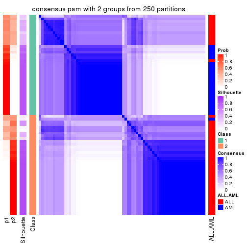</p>

</div>
<div id='tab-SD-pam-consensus-heatmap-2'>
<pre><code class="r">consensus_heatmap(res, k = 3)
</code></pre>

<p>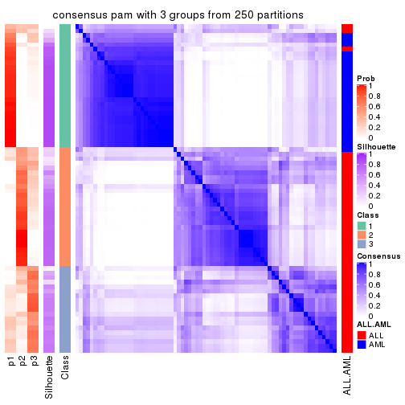</p>

</div>
<div id='tab-SD-pam-consensus-heatmap-3'>
<pre><code class="r">consensus_heatmap(res, k = 4)
</code></pre>

<p>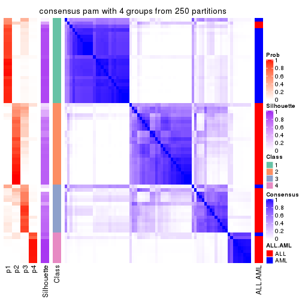</p>

</div>
<div id='tab-SD-pam-consensus-heatmap-4'>
<pre><code class="r">consensus_heatmap(res, k = 5)
</code></pre>

<p>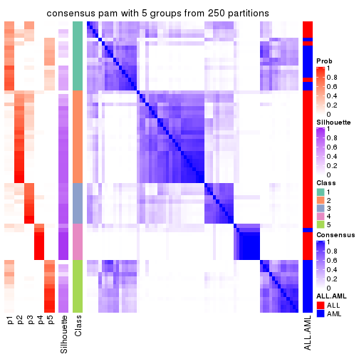</p>

</div>
<div id='tab-SD-pam-consensus-heatmap-5'>
<pre><code class="r">consensus_heatmap(res, k = 6)
</code></pre>

<p>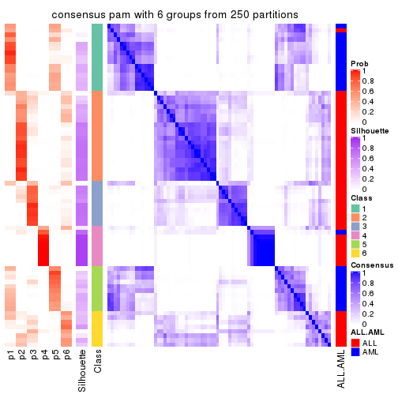</p>

</div>
</div>

Heatmaps for the membership of samples in all partitions to see how consistent they are:


<script>
$( function() {
	$( '#tabs-SD-pam-membership-heatmap' ).tabs();
} );
</script>
<div id='tabs-SD-pam-membership-heatmap'>
<ul>
<li><a href='#tab-SD-pam-membership-heatmap-1'>k = 2</a></li>
<li><a href='#tab-SD-pam-membership-heatmap-2'>k = 3</a></li>
<li><a href='#tab-SD-pam-membership-heatmap-3'>k = 4</a></li>
<li><a href='#tab-SD-pam-membership-heatmap-4'>k = 5</a></li>
<li><a href='#tab-SD-pam-membership-heatmap-5'>k = 6</a></li>
</ul>
<div id='tab-SD-pam-membership-heatmap-1'>
<pre><code class="r">membership_heatmap(res, k = 2)
</code></pre>

<p>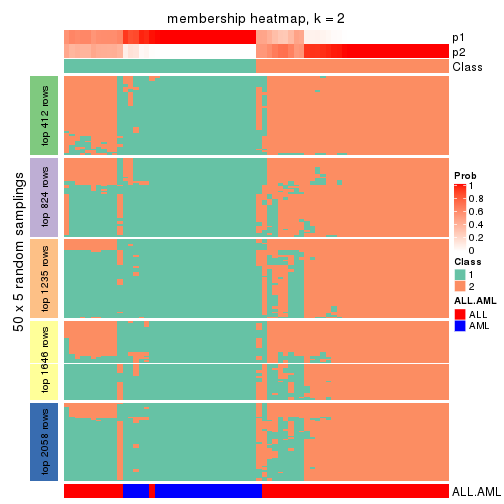</p>

</div>
<div id='tab-SD-pam-membership-heatmap-2'>
<pre><code class="r">membership_heatmap(res, k = 3)
</code></pre>

<p>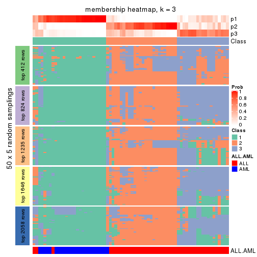</p>

</div>
<div id='tab-SD-pam-membership-heatmap-3'>
<pre><code class="r">membership_heatmap(res, k = 4)
</code></pre>

<p>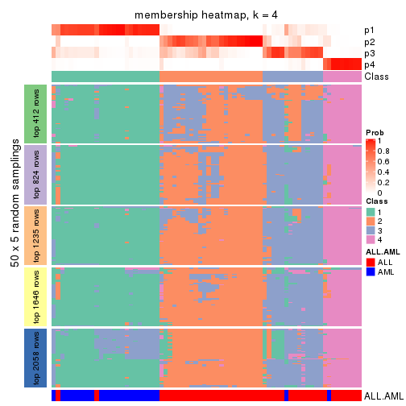</p>

</div>
<div id='tab-SD-pam-membership-heatmap-4'>
<pre><code class="r">membership_heatmap(res, k = 5)
</code></pre>

<p>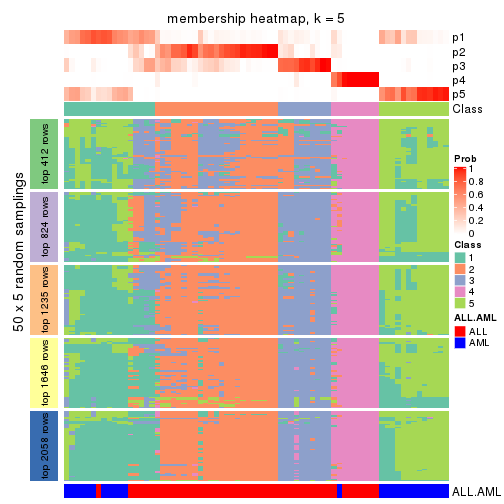</p>

</div>
<div id='tab-SD-pam-membership-heatmap-5'>
<pre><code class="r">membership_heatmap(res, k = 6)
</code></pre>

<p>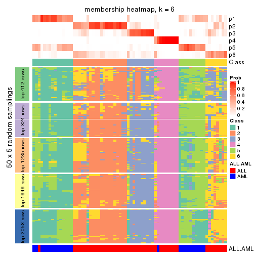</p>

</div>
</div>

As soon as we have had the classes for columns, we can look for signatures
which are significantly different between classes which can be candidate marks
for certain classes. Following are the heatmaps for signatures.


Signature heatmaps where rows are scaled:


<script>
$( function() {
	$( '#tabs-SD-pam-get-signatures' ).tabs();
} );
</script>
<div id='tabs-SD-pam-get-signatures'>
<ul>
<li><a href='#tab-SD-pam-get-signatures-1'>k = 2</a></li>
<li><a href='#tab-SD-pam-get-signatures-2'>k = 3</a></li>
<li><a href='#tab-SD-pam-get-signatures-3'>k = 4</a></li>
<li><a href='#tab-SD-pam-get-signatures-4'>k = 5</a></li>
<li><a href='#tab-SD-pam-get-signatures-5'>k = 6</a></li>
</ul>
<div id='tab-SD-pam-get-signatures-1'>
<pre><code class="r">get_signatures(res, k = 2)
</code></pre>

<p>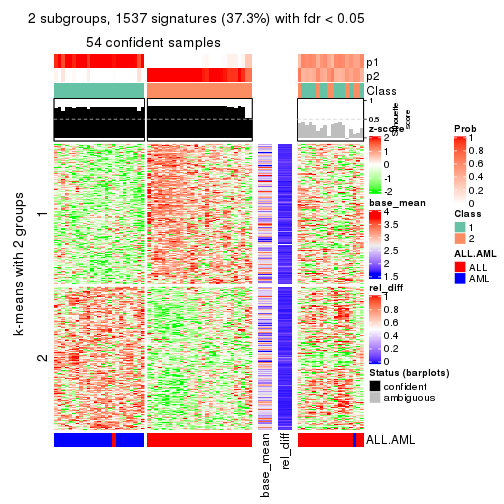</p>

</div>
<div id='tab-SD-pam-get-signatures-2'>
<pre><code class="r">get_signatures(res, k = 3)
</code></pre>

<p>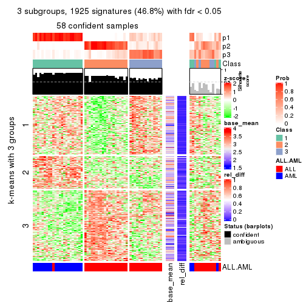</p>

</div>
<div id='tab-SD-pam-get-signatures-3'>
<pre><code class="r">get_signatures(res, k = 4)
</code></pre>

<p>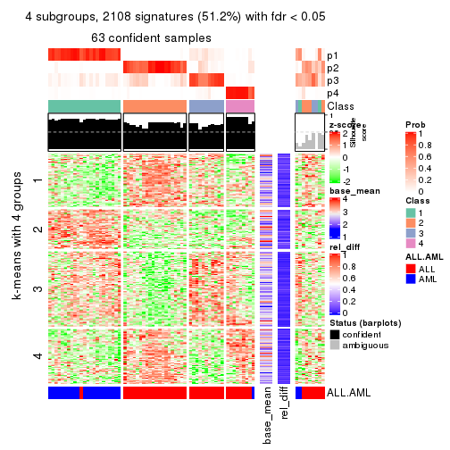</p>

</div>
<div id='tab-SD-pam-get-signatures-4'>
<pre><code class="r">get_signatures(res, k = 5)
</code></pre>

<p>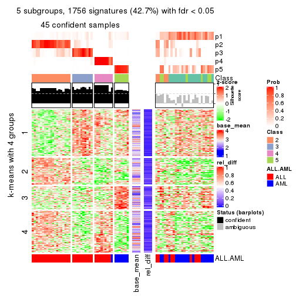</p>

</div>
<div id='tab-SD-pam-get-signatures-5'>
<pre><code class="r">get_signatures(res, k = 6)
</code></pre>

<p>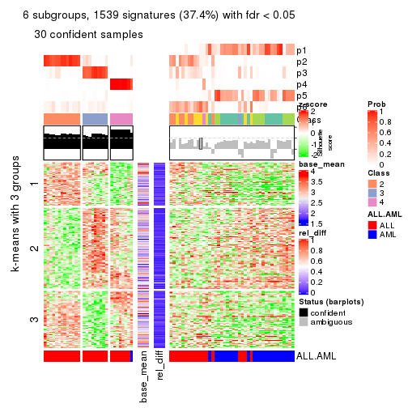</p>

</div>
</div>


Signature heatmaps where rows are not scaled:


<script>
$( function() {
	$( '#tabs-SD-pam-get-signatures-no-scale' ).tabs();
} );
</script>
<div id='tabs-SD-pam-get-signatures-no-scale'>
<ul>
<li><a href='#tab-SD-pam-get-signatures-no-scale-1'>k = 2</a></li>
<li><a href='#tab-SD-pam-get-signatures-no-scale-2'>k = 3</a></li>
<li><a href='#tab-SD-pam-get-signatures-no-scale-3'>k = 4</a></li>
<li><a href='#tab-SD-pam-get-signatures-no-scale-4'>k = 5</a></li>
<li><a href='#tab-SD-pam-get-signatures-no-scale-5'>k = 6</a></li>
</ul>
<div id='tab-SD-pam-get-signatures-no-scale-1'>
<pre><code class="r">get_signatures(res, k = 2, scale_rows = FALSE)
</code></pre>

<p>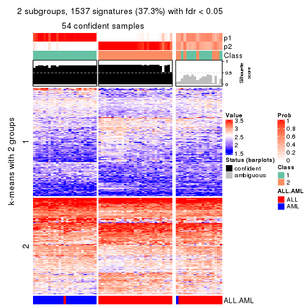</p>

</div>
<div id='tab-SD-pam-get-signatures-no-scale-2'>
<pre><code class="r">get_signatures(res, k = 3, scale_rows = FALSE)
</code></pre>

<p>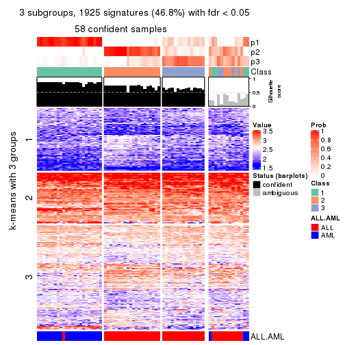</p>

</div>
<div id='tab-SD-pam-get-signatures-no-scale-3'>
<pre><code class="r">get_signatures(res, k = 4, scale_rows = FALSE)
</code></pre>

<p>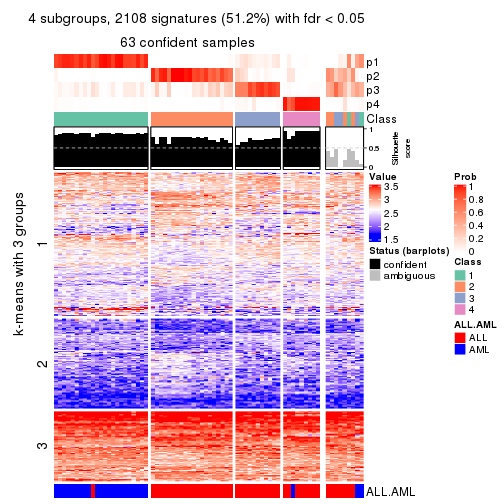</p>

</div>
<div id='tab-SD-pam-get-signatures-no-scale-4'>
<pre><code class="r">get_signatures(res, k = 5, scale_rows = FALSE)
</code></pre>

<p>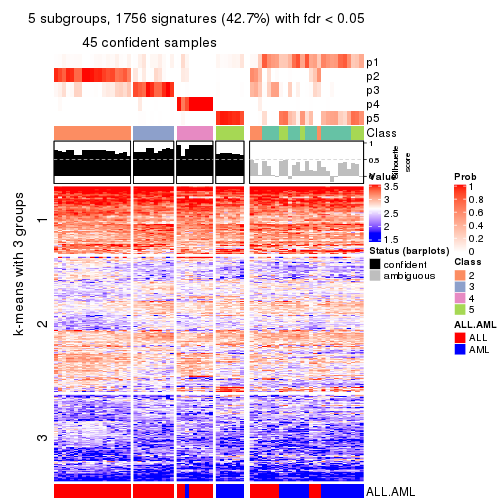</p>

</div>
<div id='tab-SD-pam-get-signatures-no-scale-5'>
<pre><code class="r">get_signatures(res, k = 6, scale_rows = FALSE)
</code></pre>

<p>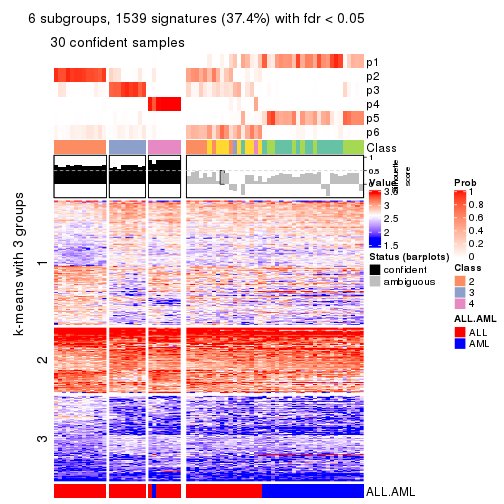</p>

</div>
</div>


Compare the overlap of signatures from different k:

```r
compare_signatures(res)
```

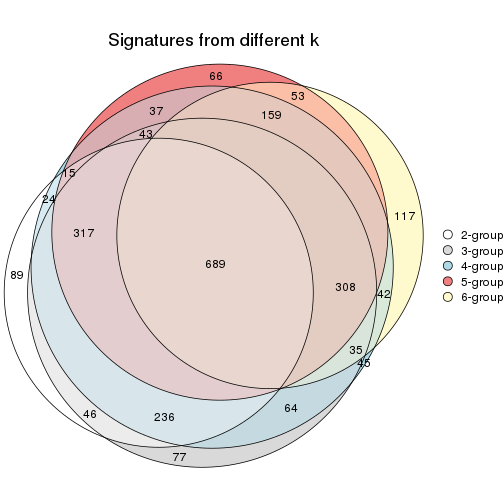

`get_signature()` returns a data frame invisibly. TO get the list of signatures, the function
call should be assigned to a variable explicitly. In following code, if `plot` argument is set
to `FALSE`, no heatmap is plotted while only the differential analysis is performed.

```r
# code only for demonstration
tb = get_signature(res, k = ..., plot = FALSE)
```

An example of the output of `tb` is:

```
#>   which_row         fdr    mean_1    mean_2 scaled_mean_1 scaled_mean_2 km
#> 1        38 0.042760348  8.373488  9.131774    -0.5533452     0.5164555  1
#> 2        40 0.018707592  7.106213  8.469186    -0.6173731     0.5762149  1
#> 3        55 0.019134737 10.221463 11.207825    -0.6159697     0.5749050  1
#> 4        59 0.006059896  5.921854  7.869574    -0.6899429     0.6439467  1
#> 5        60 0.018055526  8.928898 10.211722    -0.6204761     0.5791110  1
#> 6        98 0.009384629 15.714769 14.887706     0.6635654    -0.6193277  2
...
```

The columns in `tb` are:

1. `which_row`: row indices corresponding to the input matrix.
2. `fdr`: FDR for the differential test. 
3. `mean_x`: The mean value in group x.
4. `scaled_mean_x`: The mean value in group x after rows are scaled.
5. `km`: Row groups if k-means clustering is applied to rows.


UMAP plot which shows how samples are separated.


<script>
$( function() {
	$( '#tabs-SD-pam-dimension-reduction' ).tabs();
} );
</script>
<div id='tabs-SD-pam-dimension-reduction'>
<ul>
<li><a href='#tab-SD-pam-dimension-reduction-1'>k = 2</a></li>
<li><a href='#tab-SD-pam-dimension-reduction-2'>k = 3</a></li>
<li><a href='#tab-SD-pam-dimension-reduction-3'>k = 4</a></li>
<li><a href='#tab-SD-pam-dimension-reduction-4'>k = 5</a></li>
<li><a href='#tab-SD-pam-dimension-reduction-5'>k = 6</a></li>
</ul>
<div id='tab-SD-pam-dimension-reduction-1'>
<pre><code class="r">dimension_reduction(res, k = 2, method = &quot;UMAP&quot;)
</code></pre>

<p>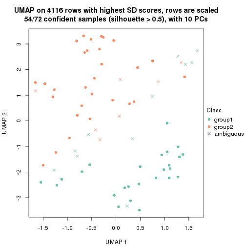</p>

</div>
<div id='tab-SD-pam-dimension-reduction-2'>
<pre><code class="r">dimension_reduction(res, k = 3, method = &quot;UMAP&quot;)
</code></pre>

<p>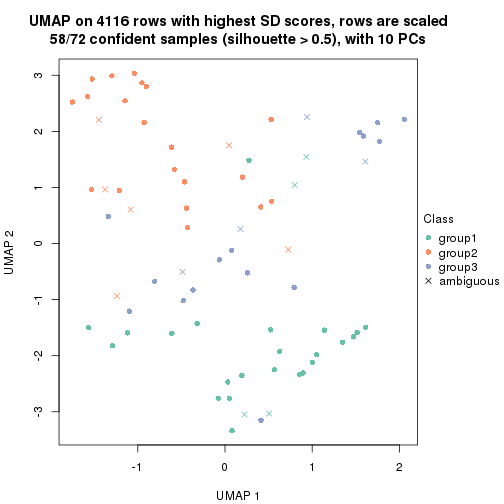</p>

</div>
<div id='tab-SD-pam-dimension-reduction-3'>
<pre><code class="r">dimension_reduction(res, k = 4, method = &quot;UMAP&quot;)
</code></pre>

<p>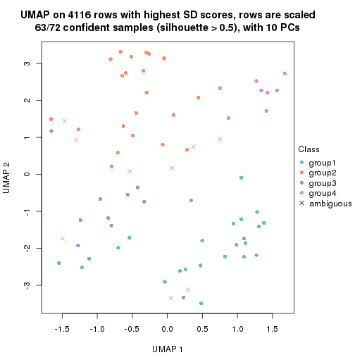</p>

</div>
<div id='tab-SD-pam-dimension-reduction-4'>
<pre><code class="r">dimension_reduction(res, k = 5, method = &quot;UMAP&quot;)
</code></pre>

<p>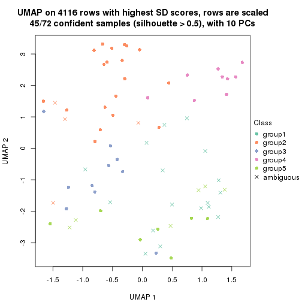</p>

</div>
<div id='tab-SD-pam-dimension-reduction-5'>
<pre><code class="r">dimension_reduction(res, k = 6, method = &quot;UMAP&quot;)
</code></pre>

<p>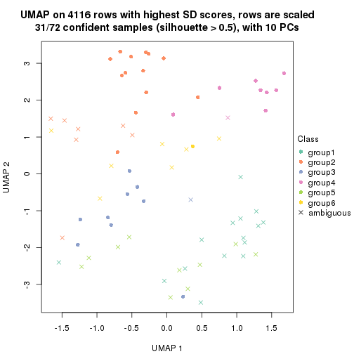</p>

</div>
</div>


Following heatmap shows how subgroups are split when increasing `k`:

```r
collect_classes(res)
```

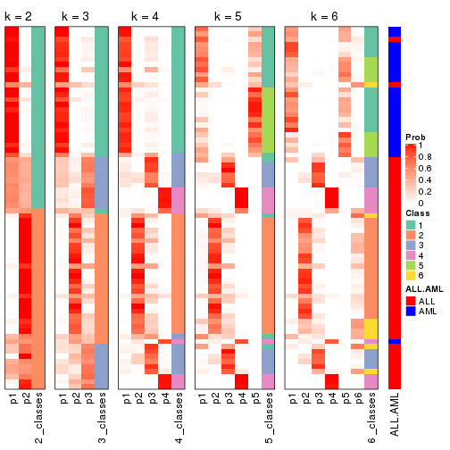


Test correlation between subgroups and known annotations. If the known
annotation is numeric, one-way ANOVA test is applied, and if the known
annotation is discrete, chi-squared contingency table test is applied.

```r
test_to_known_factors(res)
```

```
#>         n ALL.AML(p) k
#> SD:pam 54   1.01e-11 2
#> SD:pam 58   1.94e-12 3
#> SD:pam 63   6.74e-12 4
#> SD:pam 45   1.81e-08 5
#> SD:pam 31   3.96e-01 6
```


If matrix rows can be associated to genes, consider to use `functional_enrichment(res,
...)` to perform function enrichment for the signature genes. See [this vignette](http://bioconductor.org/packages/devel/bioc/vignettes/cola/inst/doc/functional_enrichment.html) for more detailed explanations.


 

---------------------------------------------------


### SD:mclust


The object with results only for a single top-value method and a single partition method 
can be extracted as:

```r
res = res_list["SD", "mclust"]
# you can also extract it by
# res = res_list["SD:mclust"]
```

A summary of `res` and all the functions that can be applied to it:

```r
res
```

```
#> A 'ConsensusPartition' object with k = 2, 3, 4, 5, 6.
#>   On a matrix with 4116 rows and 72 columns.
#>   Top rows (412, 824, 1235, 1646, 2058) are extracted by 'SD' method.
#>   Subgroups are detected by 'mclust' method.
#>   Performed in total 1250 partitions by row resampling.
#>   Best k for subgroups seems to be 5.
#> 
#> Following methods can be applied to this 'ConsensusPartition' object:
#>  [1] "cola_report"             "collect_classes"         "collect_plots"          
#>  [4] "collect_stats"           "colnames"                "compare_signatures"     
#>  [7] "consensus_heatmap"       "dimension_reduction"     "functional_enrichment"  
#> [10] "get_anno_col"            "get_anno"                "get_classes"            
#> [13] "get_consensus"           "get_matrix"              "get_membership"         
#> [16] "get_param"               "get_signatures"          "get_stats"              
#> [19] "is_best_k"               "is_stable_k"             "membership_heatmap"     
#> [22] "ncol"                    "nrow"                    "plot_ecdf"              
#> [25] "rownames"                "select_partition_number" "show"                   
#> [28] "suggest_best_k"          "test_to_known_factors"
```

`collect_plots()` function collects all the plots made from `res` for all `k` (number of partitions)
into one single page to provide an easy and fast comparison between different `k`.

```r
collect_plots(res)
```

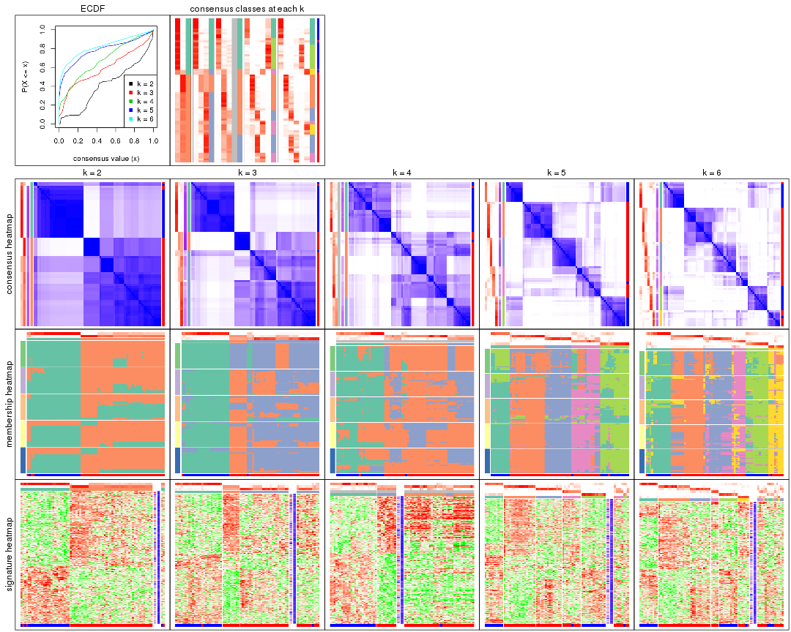

The plots are:

- The first row: a plot of the ECDF (empirical cumulative distribution
  function) curves of the consensus matrix for each `k` and the heatmap of
  predicted classes for each `k`.
- The second row: heatmaps of the consensus matrix for each `k`.
- The third row: heatmaps of the membership matrix for each `k`.
- The fouth row: heatmaps of the signatures for each `k`.

All the plots in panels can be made by individual functions and they are
plotted later in this section.

`select_partition_number()` produces several plots showing different
statistics for choosing "optimized" `k`. There are following statistics:

- ECDF curves of the consensus matrix for each `k`;
- 1-PAC. [The PAC
  score](https://en.wikipedia.org/wiki/Consensus_clustering#Over-interpretation_potential_of_consensus_clustering)
  measures the proportion of the ambiguous subgrouping.
- Mean silhouette score.
- Concordance. The mean probability of fiting the consensus class ids in all
  partitions.
- Area increased. Denote $A_k$ as the area under the ECDF curve for current
  `k`, the area increased is defined as $A_k - A_{k-1}$.
- Rand index. The percent of pairs of samples that are both in a same cluster
  or both are not in a same cluster in the partition of k and k-1.
- Jaccard index. The ratio of pairs of samples are both in a same cluster in
  the partition of k and k-1 and the pairs of samples are both in a same
  cluster in the partition k or k-1.

The detailed explanations of these statistics can be found in [the _cola_
vignette](http://bioconductor.org/packages/devel/bioc/vignettes/cola/inst/doc/cola.html#toc_13).

Generally speaking, lower PAC score, higher mean silhouette score or higher
concordance corresponds to better partition. Rand index and Jaccard index
measure how similar the current partition is compared to partition with `k-1`.
If they are too similar, we won't accept `k` is better than `k-1`.

```r
select_partition_number(res)
```

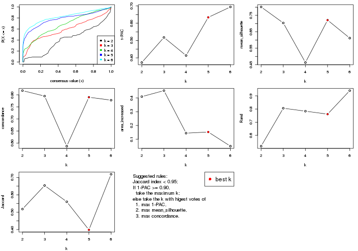

The numeric values for all these statistics can be obtained by `get_stats()`.

```r
get_stats(res)
```

```
#>   k 1-PAC mean_silhouette concordance area_increased  Rand Jaccard
#> 2 2 0.373           0.801       0.818         0.4100 0.518   0.518
#> 3 3 0.518           0.704       0.795         0.4537 0.806   0.654
#> 4 4 0.414           0.463       0.587         0.1442 0.784   0.560
#> 5 5 0.634           0.721       0.790         0.1525 0.761   0.398
#> 6 6 0.694           0.612       0.778         0.0494 0.940   0.718
```

`suggest_best_k()` suggests the best $k$ based on these statistics. The rules are as follows:

- All $k$ with Jaccard index larger than 0.95 are removed because increasing
  $k$ does not provide enough extra information. If all $k$ are removed, it is
  marked as no subgroup is detected.
- For all $k$ with 1-PAC score larger than 0.9, the maximal $k$ is taken as
  the best $k$, and other $k$ are marked as optional $k$.
- If it does not fit the second rule. The $k$ with the maximal vote of the
  highest 1-PAC score, highest mean silhouette, and highest concordance is
  taken as the best $k$.

```r
suggest_best_k(res)
```

```
#> [1] 5
```


Following shows the table of the partitions (You need to click the **show/hide
code output** link to see it). The membership matrix (columns with name `p*`)
is inferred by
[`clue::cl_consensus()`](https://www.rdocumentation.org/link/cl_consensus?package=clue)
function with the `SE` method. Basically the value in the membership matrix
represents the probability to belong to a certain group. The finall class
label for an item is determined with the group with highest probability it
belongs to.

In `get_classes()` function, the entropy is calculated from the membership
matrix and the silhouette score is calculated from the consensus matrix.


<script>
$( function() {
	$( '#tabs-SD-mclust-get-classes' ).tabs();
} );
</script>
<div id='tabs-SD-mclust-get-classes'>
<ul>
<li><a href='#tab-SD-mclust-get-classes-1'>k = 2</a></li>
<li><a href='#tab-SD-mclust-get-classes-2'>k = 3</a></li>
<li><a href='#tab-SD-mclust-get-classes-3'>k = 4</a></li>
<li><a href='#tab-SD-mclust-get-classes-4'>k = 5</a></li>
<li><a href='#tab-SD-mclust-get-classes-5'>k = 6</a></li>
</ul>

<div id='tab-SD-mclust-get-classes-1'>
<p><a id='tab-SD-mclust-get-classes-1-a' style='color:#0366d6' href='#'>show/hide code output</a></p>
<pre><code class="r">cbind(get_classes(res, k = 2), get_membership(res, k = 2))
</code></pre>

<pre><code>#&gt;           class entropy silhouette    p1    p2
#&gt; sample_39     2  0.8813   8.30e-01 0.300 0.700
#&gt; sample_40     2  0.8661   8.32e-01 0.288 0.712
#&gt; sample_42     2  0.9393   8.03e-01 0.356 0.644
#&gt; sample_47     2  0.7602   8.09e-01 0.220 0.780
#&gt; sample_48     2  0.1184   6.70e-01 0.016 0.984
#&gt; sample_49     2  0.8661   8.32e-01 0.288 0.712
#&gt; sample_41     2  0.1184   6.70e-01 0.016 0.984
#&gt; sample_43     2  0.8443   8.30e-01 0.272 0.728
#&gt; sample_44     2  0.8144   8.24e-01 0.252 0.748
#&gt; sample_45     2  0.7602   8.09e-01 0.220 0.780
#&gt; sample_46     2  0.7745   8.14e-01 0.228 0.772
#&gt; sample_70     2  0.8909   8.30e-01 0.308 0.692
#&gt; sample_71     2  0.9393   8.02e-01 0.356 0.644
#&gt; sample_72     2  0.9286   8.11e-01 0.344 0.656
#&gt; sample_68     2  0.1184   6.70e-01 0.016 0.984
#&gt; sample_69     2  0.1184   6.70e-01 0.016 0.984
#&gt; sample_67     1  0.4298   8.40e-01 0.912 0.088
#&gt; sample_55     2  0.9248   8.09e-01 0.340 0.660
#&gt; sample_56     2  0.8661   8.32e-01 0.288 0.712
#&gt; sample_59     2  0.8955   8.29e-01 0.312 0.688
#&gt; sample_52     1  0.0376   9.35e-01 0.996 0.004
#&gt; sample_53     1  0.0000   9.35e-01 1.000 0.000
#&gt; sample_51     1  0.0000   9.35e-01 1.000 0.000
#&gt; sample_50     1  0.0000   9.35e-01 1.000 0.000
#&gt; sample_54     1  0.2948   8.97e-01 0.948 0.052
#&gt; sample_57     1  0.0376   9.35e-01 0.996 0.004
#&gt; sample_58     1  0.0672   9.34e-01 0.992 0.008
#&gt; sample_60     1  0.2778   9.02e-01 0.952 0.048
#&gt; sample_61     1  0.0672   9.34e-01 0.992 0.008
#&gt; sample_65     1  0.0376   9.35e-01 0.996 0.004
#&gt; sample_66     1  0.9661  -1.94e-01 0.608 0.392
#&gt; sample_63     1  0.0376   9.35e-01 0.996 0.004
#&gt; sample_64     1  0.2043   9.17e-01 0.968 0.032
#&gt; sample_62     1  0.0376   9.35e-01 0.996 0.004
#&gt; sample_1      2  0.8813   8.31e-01 0.300 0.700
#&gt; sample_2      1  0.9393   9.53e-05 0.644 0.356
#&gt; sample_3      2  0.9815   7.07e-01 0.420 0.580
#&gt; sample_4      2  0.8763   8.32e-01 0.296 0.704
#&gt; sample_5      2  0.1184   6.70e-01 0.016 0.984
#&gt; sample_6      2  0.9815   7.07e-01 0.420 0.580
#&gt; sample_7      2  0.8713   8.32e-01 0.292 0.708
#&gt; sample_8      2  0.9000   8.22e-01 0.316 0.684
#&gt; sample_9      2  0.9815   7.07e-01 0.420 0.580
#&gt; sample_10     2  0.9815   7.07e-01 0.420 0.580
#&gt; sample_11     2  0.9815   7.07e-01 0.420 0.580
#&gt; sample_12     1  0.3879   8.60e-01 0.924 0.076
#&gt; sample_13     2  0.1184   6.70e-01 0.016 0.984
#&gt; sample_14     2  0.9815   7.07e-01 0.420 0.580
#&gt; sample_15     2  0.1184   6.70e-01 0.016 0.984
#&gt; sample_16     2  0.8386   8.29e-01 0.268 0.732
#&gt; sample_17     2  0.9732   7.45e-01 0.404 0.596
#&gt; sample_18     2  0.9129   8.22e-01 0.328 0.672
#&gt; sample_19     2  0.8016   8.21e-01 0.244 0.756
#&gt; sample_20     2  0.1184   6.70e-01 0.016 0.984
#&gt; sample_21     2  0.7745   8.04e-01 0.228 0.772
#&gt; sample_22     2  0.9460   7.94e-01 0.364 0.636
#&gt; sample_23     2  0.9815   7.07e-01 0.420 0.580
#&gt; sample_24     2  0.1184   6.70e-01 0.016 0.984
#&gt; sample_25     2  0.9393   8.03e-01 0.356 0.644
#&gt; sample_26     2  0.8608   8.32e-01 0.284 0.716
#&gt; sample_27     2  0.8661   8.32e-01 0.288 0.712
#&gt; sample_34     1  0.0000   9.35e-01 1.000 0.000
#&gt; sample_35     1  0.2423   9.10e-01 0.960 0.040
#&gt; sample_36     1  0.0000   9.35e-01 1.000 0.000
#&gt; sample_37     1  0.0000   9.35e-01 1.000 0.000
#&gt; sample_38     1  0.0376   9.34e-01 0.996 0.004
#&gt; sample_28     1  0.0000   9.35e-01 1.000 0.000
#&gt; sample_29     1  0.2423   9.08e-01 0.960 0.040
#&gt; sample_30     1  0.0000   9.35e-01 1.000 0.000
#&gt; sample_31     1  0.0000   9.35e-01 1.000 0.000
#&gt; sample_32     1  0.0376   9.35e-01 0.996 0.004
#&gt; sample_33     1  0.0000   9.35e-01 1.000 0.000
</code></pre>

<script>
$('#tab-SD-mclust-get-classes-1-a').parent().next().next().hide();
$('#tab-SD-mclust-get-classes-1-a').click(function(){
  $('#tab-SD-mclust-get-classes-1-a').parent().next().next().toggle();
  return(false);
});
</script>
</div>

<div id='tab-SD-mclust-get-classes-2'>
<p><a id='tab-SD-mclust-get-classes-2-a' style='color:#0366d6' href='#'>show/hide code output</a></p>
<pre><code class="r">cbind(get_classes(res, k = 3), get_membership(res, k = 3))
</code></pre>

<pre><code>#&gt;           class entropy silhouette    p1    p2    p3
#&gt; sample_39     3  0.2926      0.636 0.040 0.036 0.924
#&gt; sample_40     3  0.1647      0.629 0.036 0.004 0.960
#&gt; sample_42     3  0.6699      0.597 0.044 0.256 0.700
#&gt; sample_47     3  0.4047      0.460 0.004 0.148 0.848
#&gt; sample_48     2  0.6244      0.993 0.000 0.560 0.440
#&gt; sample_49     3  0.1647      0.629 0.036 0.004 0.960
#&gt; sample_41     2  0.6252      0.989 0.000 0.556 0.444
#&gt; sample_43     3  0.3500      0.506 0.004 0.116 0.880
#&gt; sample_44     3  0.4235      0.383 0.000 0.176 0.824
#&gt; sample_45     3  0.3816      0.453 0.000 0.148 0.852
#&gt; sample_46     3  0.3941      0.436 0.000 0.156 0.844
#&gt; sample_70     3  0.1267      0.620 0.024 0.004 0.972
#&gt; sample_71     3  0.6735      0.596 0.044 0.260 0.696
#&gt; sample_72     3  0.6805      0.592 0.044 0.268 0.688
#&gt; sample_68     2  0.6244      0.993 0.000 0.560 0.440
#&gt; sample_69     2  0.6252      0.989 0.000 0.556 0.444
#&gt; sample_67     3  0.9873      0.301 0.328 0.268 0.404
#&gt; sample_55     3  0.1529      0.631 0.040 0.000 0.960
#&gt; sample_56     3  0.2063      0.629 0.044 0.008 0.948
#&gt; sample_59     3  0.2031      0.599 0.016 0.032 0.952
#&gt; sample_52     1  0.1529      0.936 0.960 0.000 0.040
#&gt; sample_53     1  0.0237      0.921 0.996 0.004 0.000
#&gt; sample_51     1  0.0237      0.921 0.996 0.004 0.000
#&gt; sample_50     1  0.0237      0.921 0.996 0.004 0.000
#&gt; sample_54     1  0.4235      0.818 0.824 0.000 0.176
#&gt; sample_57     1  0.2165      0.928 0.936 0.000 0.064
#&gt; sample_58     1  0.1753      0.934 0.952 0.000 0.048
#&gt; sample_60     1  0.3941      0.845 0.844 0.000 0.156
#&gt; sample_61     1  0.2496      0.925 0.928 0.004 0.068
#&gt; sample_65     1  0.1529      0.936 0.960 0.000 0.040
#&gt; sample_66     3  0.9489      0.454 0.228 0.280 0.492
#&gt; sample_63     1  0.1643      0.935 0.956 0.000 0.044
#&gt; sample_64     1  0.2959      0.903 0.900 0.000 0.100
#&gt; sample_62     1  0.1753      0.934 0.952 0.000 0.048
#&gt; sample_1      3  0.3091      0.554 0.016 0.072 0.912
#&gt; sample_2      3  0.9793      0.398 0.280 0.284 0.436
#&gt; sample_3      3  0.7610      0.502 0.048 0.388 0.564
#&gt; sample_4      3  0.2584      0.557 0.008 0.064 0.928
#&gt; sample_5      2  0.6244      0.993 0.000 0.560 0.440
#&gt; sample_6      3  0.7597      0.503 0.048 0.384 0.568
#&gt; sample_7      3  0.1411      0.629 0.036 0.000 0.964
#&gt; sample_8      3  0.3947      0.636 0.040 0.076 0.884
#&gt; sample_9      3  0.7648      0.509 0.048 0.400 0.552
#&gt; sample_10     3  0.7685      0.507 0.052 0.384 0.564
#&gt; sample_11     3  0.7758      0.482 0.048 0.468 0.484
#&gt; sample_12     1  0.7129      0.701 0.716 0.104 0.180
#&gt; sample_13     2  0.6244      0.993 0.000 0.560 0.440
#&gt; sample_14     3  0.7597      0.517 0.048 0.384 0.568
#&gt; sample_15     2  0.6244      0.993 0.000 0.560 0.440
#&gt; sample_16     3  0.4235      0.383 0.000 0.176 0.824
#&gt; sample_17     3  0.3967      0.610 0.044 0.072 0.884
#&gt; sample_18     3  0.1411      0.629 0.036 0.000 0.964
#&gt; sample_19     3  0.3941      0.436 0.000 0.156 0.844
#&gt; sample_20     2  0.6244      0.993 0.000 0.560 0.440
#&gt; sample_21     3  0.7570     -0.538 0.044 0.404 0.552
#&gt; sample_22     3  0.6203      0.609 0.056 0.184 0.760
#&gt; sample_23     3  0.7610      0.502 0.048 0.388 0.564
#&gt; sample_24     2  0.6274      0.966 0.000 0.544 0.456
#&gt; sample_25     3  0.6159      0.612 0.048 0.196 0.756
#&gt; sample_26     3  0.3340      0.489 0.000 0.120 0.880
#&gt; sample_27     3  0.1832      0.630 0.036 0.008 0.956
#&gt; sample_34     1  0.1411      0.935 0.964 0.000 0.036
#&gt; sample_35     1  0.4280      0.873 0.856 0.020 0.124
#&gt; sample_36     1  0.0237      0.921 0.996 0.004 0.000
#&gt; sample_37     1  0.0237      0.921 0.996 0.004 0.000
#&gt; sample_38     1  0.2682      0.924 0.920 0.004 0.076
#&gt; sample_28     1  0.1647      0.934 0.960 0.004 0.036
#&gt; sample_29     1  0.7485      0.689 0.680 0.224 0.096
#&gt; sample_30     1  0.0237      0.921 0.996 0.004 0.000
#&gt; sample_31     1  0.1529      0.936 0.960 0.000 0.040
#&gt; sample_32     1  0.1765      0.936 0.956 0.004 0.040
#&gt; sample_33     1  0.0237      0.921 0.996 0.004 0.000
</code></pre>

<script>
$('#tab-SD-mclust-get-classes-2-a').parent().next().next().hide();
$('#tab-SD-mclust-get-classes-2-a').click(function(){
  $('#tab-SD-mclust-get-classes-2-a').parent().next().next().toggle();
  return(false);
});
</script>
</div>

<div id='tab-SD-mclust-get-classes-3'>
<p><a id='tab-SD-mclust-get-classes-3-a' style='color:#0366d6' href='#'>show/hide code output</a></p>
<pre><code class="r">cbind(get_classes(res, k = 4), get_membership(res, k = 4))
</code></pre>

<pre><code>#&gt;           class entropy silhouette    p1    p2    p3 p4
#&gt; sample_39     3  0.5702    0.65942 0.008 0.404 0.572 NA
#&gt; sample_40     3  0.5231    0.70139 0.012 0.384 0.604 NA
#&gt; sample_42     2  0.5770    0.30628 0.032 0.752 0.084 NA
#&gt; sample_47     2  0.0895    0.43567 0.000 0.976 0.020 NA
#&gt; sample_48     2  0.4661    0.45757 0.000 0.652 0.000 NA
#&gt; sample_49     3  0.5174    0.70389 0.012 0.368 0.620 NA
#&gt; sample_41     2  0.5898    0.44425 0.000 0.604 0.048 NA
#&gt; sample_43     2  0.1489    0.41626 0.000 0.952 0.044 NA
#&gt; sample_44     2  0.1109    0.43126 0.000 0.968 0.028 NA
#&gt; sample_45     2  0.0657    0.44043 0.000 0.984 0.012 NA
#&gt; sample_46     2  0.0376    0.44388 0.000 0.992 0.004 NA
#&gt; sample_70     2  0.5590   -0.61110 0.008 0.504 0.480 NA
#&gt; sample_71     2  0.5978    0.29108 0.028 0.732 0.088 NA
#&gt; sample_72     2  0.5932    0.29198 0.028 0.736 0.088 NA
#&gt; sample_68     2  0.4661    0.45757 0.000 0.652 0.000 NA
#&gt; sample_69     2  0.4661    0.45757 0.000 0.652 0.000 NA
#&gt; sample_67     2  0.8811    0.00896 0.328 0.384 0.048 NA
#&gt; sample_55     3  0.5878    0.70122 0.012 0.360 0.604 NA
#&gt; sample_56     3  0.5204    0.70399 0.012 0.376 0.612 NA
#&gt; sample_59     2  0.5172   -0.47194 0.008 0.588 0.404 NA
#&gt; sample_52     1  0.6958    0.75500 0.584 0.000 0.184 NA
#&gt; sample_53     1  0.0336    0.77997 0.992 0.000 0.000 NA
#&gt; sample_51     1  0.0336    0.77997 0.992 0.000 0.000 NA
#&gt; sample_50     1  0.0000    0.78224 1.000 0.000 0.000 NA
#&gt; sample_54     1  0.8654    0.70145 0.516 0.128 0.120 NA
#&gt; sample_57     1  0.7313    0.75737 0.580 0.012 0.176 NA
#&gt; sample_58     1  0.7359    0.77700 0.620 0.068 0.080 NA
#&gt; sample_60     1  0.8342    0.73120 0.520 0.056 0.188 NA
#&gt; sample_61     1  0.7153    0.72952 0.652 0.132 0.048 NA
#&gt; sample_65     1  0.5995    0.80041 0.732 0.060 0.044 NA
#&gt; sample_66     2  0.8426    0.17734 0.128 0.532 0.096 NA
#&gt; sample_63     1  0.6991    0.75342 0.580 0.000 0.188 NA
#&gt; sample_64     1  0.7903    0.75964 0.552 0.084 0.080 NA
#&gt; sample_62     1  0.6991    0.75342 0.580 0.000 0.188 NA
#&gt; sample_1      2  0.5277   -0.55378 0.008 0.532 0.460 NA
#&gt; sample_2      2  0.8645    0.12925 0.188 0.492 0.072 NA
#&gt; sample_3      3  0.7733    0.47346 0.008 0.236 0.504 NA
#&gt; sample_4      2  0.5438   -0.53558 0.008 0.536 0.452 NA
#&gt; sample_5      2  0.5203    0.45487 0.000 0.636 0.016 NA
#&gt; sample_6      3  0.7733    0.47346 0.008 0.236 0.504 NA
#&gt; sample_7      3  0.5391    0.70300 0.012 0.380 0.604 NA
#&gt; sample_8      3  0.5725    0.70284 0.012 0.372 0.600 NA
#&gt; sample_9      2  0.8084   -0.19417 0.008 0.404 0.328 NA
#&gt; sample_10     3  0.7796    0.46808 0.008 0.248 0.492 NA
#&gt; sample_11     2  0.7952   -0.05542 0.008 0.456 0.272 NA
#&gt; sample_12     1  0.8237    0.55718 0.572 0.176 0.100 NA
#&gt; sample_13     2  0.4661    0.45757 0.000 0.652 0.000 NA
#&gt; sample_14     2  0.7796    0.00883 0.008 0.492 0.248 NA
#&gt; sample_15     2  0.5403    0.45290 0.000 0.628 0.024 NA
#&gt; sample_16     2  0.2522    0.40927 0.000 0.908 0.076 NA
#&gt; sample_17     2  0.6538    0.24940 0.016 0.672 0.188 NA
#&gt; sample_18     3  0.5290    0.60232 0.008 0.476 0.516 NA
#&gt; sample_19     2  0.0376    0.44325 0.000 0.992 0.004 NA
#&gt; sample_20     2  0.4661    0.45757 0.000 0.652 0.000 NA
#&gt; sample_21     2  0.6366    0.43376 0.024 0.688 0.088 NA
#&gt; sample_22     3  0.7301    0.61142 0.024 0.396 0.496 NA
#&gt; sample_23     3  0.7733    0.47346 0.008 0.236 0.504 NA
#&gt; sample_24     2  0.6039    0.44139 0.000 0.596 0.056 NA
#&gt; sample_25     2  0.7850   -0.48078 0.040 0.484 0.368 NA
#&gt; sample_26     2  0.4164   -0.09981 0.000 0.736 0.264 NA
#&gt; sample_27     3  0.5174    0.70389 0.012 0.368 0.620 NA
#&gt; sample_34     1  0.5596    0.80304 0.756 0.048 0.040 NA
#&gt; sample_35     1  0.8640    0.61089 0.532 0.140 0.132 NA
#&gt; sample_36     1  0.0000    0.78224 1.000 0.000 0.000 NA
#&gt; sample_37     1  0.0336    0.77997 0.992 0.000 0.000 NA
#&gt; sample_38     1  0.6177    0.69982 0.704 0.108 0.016 NA
#&gt; sample_28     1  0.4341    0.73992 0.824 0.052 0.008 NA
#&gt; sample_29     1  0.4901    0.70560 0.792 0.144 0.020 NA
#&gt; sample_30     1  0.0000    0.78224 1.000 0.000 0.000 NA
#&gt; sample_31     1  0.6985    0.78186 0.644 0.080 0.048 NA
#&gt; sample_32     1  0.4549    0.77494 0.816 0.100 0.008 NA
#&gt; sample_33     1  0.0000    0.78224 1.000 0.000 0.000 NA
</code></pre>

<script>
$('#tab-SD-mclust-get-classes-3-a').parent().next().next().hide();
$('#tab-SD-mclust-get-classes-3-a').click(function(){
  $('#tab-SD-mclust-get-classes-3-a').parent().next().next().toggle();
  return(false);
});
</script>
</div>

<div id='tab-SD-mclust-get-classes-4'>
<p><a id='tab-SD-mclust-get-classes-4-a' style='color:#0366d6' href='#'>show/hide code output</a></p>
<pre><code class="r">cbind(get_classes(res, k = 5), get_membership(res, k = 5))
</code></pre>

<pre><code>#&gt;           class entropy silhouette    p1    p2    p3    p4    p5
#&gt; sample_39     3  0.3809      0.763 0.020 0.160 0.804 0.016 0.000
#&gt; sample_40     3  0.1124      0.879 0.004 0.036 0.960 0.000 0.000
#&gt; sample_42     4  0.6693      0.577 0.108 0.212 0.060 0.612 0.008
#&gt; sample_47     2  0.2829      0.855 0.052 0.892 0.032 0.024 0.000
#&gt; sample_48     2  0.0162      0.870 0.004 0.996 0.000 0.000 0.000
#&gt; sample_49     3  0.1525      0.877 0.012 0.036 0.948 0.004 0.000
#&gt; sample_41     2  0.2629      0.820 0.004 0.860 0.136 0.000 0.000
#&gt; sample_43     2  0.3880      0.813 0.052 0.828 0.096 0.024 0.000
#&gt; sample_44     2  0.3423      0.855 0.044 0.856 0.080 0.020 0.000
#&gt; sample_45     2  0.2829      0.852 0.052 0.892 0.032 0.024 0.000
#&gt; sample_46     2  0.2657      0.855 0.052 0.900 0.024 0.024 0.000
#&gt; sample_70     3  0.3496      0.825 0.040 0.124 0.832 0.004 0.000
#&gt; sample_71     4  0.6816      0.588 0.112 0.192 0.076 0.612 0.008
#&gt; sample_72     4  0.6615      0.570 0.092 0.220 0.072 0.612 0.004
#&gt; sample_68     2  0.0671      0.869 0.004 0.980 0.016 0.000 0.000
#&gt; sample_69     2  0.0451      0.868 0.004 0.988 0.008 0.000 0.000
#&gt; sample_67     4  0.5559      0.499 0.324 0.000 0.024 0.608 0.044
#&gt; sample_55     3  0.2053      0.872 0.016 0.040 0.928 0.016 0.000
#&gt; sample_56     3  0.1444      0.878 0.012 0.040 0.948 0.000 0.000
#&gt; sample_59     3  0.4347      0.729 0.040 0.212 0.744 0.004 0.000
#&gt; sample_52     5  0.0880      0.776 0.032 0.000 0.000 0.000 0.968
#&gt; sample_53     1  0.3689      0.909 0.740 0.000 0.000 0.004 0.256
#&gt; sample_51     1  0.3561      0.912 0.740 0.000 0.000 0.000 0.260
#&gt; sample_50     1  0.3636      0.916 0.728 0.000 0.000 0.000 0.272
#&gt; sample_54     5  0.1815      0.746 0.020 0.000 0.024 0.016 0.940
#&gt; sample_57     5  0.0000      0.772 0.000 0.000 0.000 0.000 1.000
#&gt; sample_58     5  0.1043      0.778 0.040 0.000 0.000 0.000 0.960
#&gt; sample_60     5  0.1372      0.754 0.004 0.000 0.024 0.016 0.956
#&gt; sample_61     5  0.4360      0.626 0.284 0.000 0.024 0.000 0.692
#&gt; sample_65     5  0.3424      0.634 0.240 0.000 0.000 0.000 0.760
#&gt; sample_66     4  0.6409      0.571 0.272 0.044 0.036 0.612 0.036
#&gt; sample_63     5  0.0880      0.779 0.032 0.000 0.000 0.000 0.968
#&gt; sample_64     5  0.1952      0.752 0.084 0.000 0.004 0.000 0.912
#&gt; sample_62     5  0.0404      0.776 0.012 0.000 0.000 0.000 0.988
#&gt; sample_1      3  0.2568      0.867 0.016 0.092 0.888 0.004 0.000
#&gt; sample_2      4  0.5570      0.535 0.304 0.004 0.032 0.628 0.032
#&gt; sample_3      4  0.4390      0.193 0.000 0.000 0.428 0.568 0.004
#&gt; sample_4      3  0.2605      0.869 0.016 0.060 0.900 0.024 0.000
#&gt; sample_5      2  0.1502      0.863 0.004 0.940 0.056 0.000 0.000
#&gt; sample_6      4  0.4390      0.193 0.000 0.000 0.428 0.568 0.004
#&gt; sample_7      3  0.1549      0.875 0.000 0.040 0.944 0.016 0.000
#&gt; sample_8      3  0.2693      0.846 0.016 0.060 0.896 0.028 0.000
#&gt; sample_9      4  0.4624      0.559 0.004 0.148 0.096 0.752 0.000
#&gt; sample_10     4  0.3437      0.561 0.012 0.000 0.176 0.808 0.004
#&gt; sample_11     4  0.1082      0.618 0.008 0.000 0.028 0.964 0.000
#&gt; sample_12     5  0.7510      0.158 0.348 0.000 0.056 0.188 0.408
#&gt; sample_13     2  0.0162      0.870 0.004 0.996 0.000 0.000 0.000
#&gt; sample_14     4  0.5652      0.504 0.052 0.224 0.052 0.672 0.000
#&gt; sample_15     2  0.1831      0.856 0.004 0.920 0.076 0.000 0.000
#&gt; sample_16     2  0.4156      0.806 0.028 0.784 0.168 0.020 0.000
#&gt; sample_17     2  0.8077      0.276 0.124 0.464 0.200 0.204 0.008
#&gt; sample_18     3  0.2409      0.873 0.028 0.044 0.912 0.016 0.000
#&gt; sample_19     2  0.2745      0.853 0.052 0.896 0.028 0.024 0.000
#&gt; sample_20     2  0.0324      0.870 0.004 0.992 0.004 0.000 0.000
#&gt; sample_21     2  0.3566      0.797 0.004 0.812 0.160 0.024 0.000
#&gt; sample_22     4  0.5858      0.355 0.008 0.048 0.412 0.520 0.012
#&gt; sample_23     4  0.4390      0.193 0.000 0.000 0.428 0.568 0.004
#&gt; sample_24     2  0.2763      0.813 0.004 0.848 0.148 0.000 0.000
#&gt; sample_25     4  0.7247      0.558 0.068 0.196 0.156 0.568 0.012
#&gt; sample_26     3  0.5437      0.531 0.052 0.328 0.608 0.012 0.000
#&gt; sample_27     3  0.1525      0.877 0.012 0.036 0.948 0.004 0.000
#&gt; sample_34     5  0.3561      0.621 0.260 0.000 0.000 0.000 0.740
#&gt; sample_35     5  0.5442      0.605 0.240 0.000 0.116 0.000 0.644
#&gt; sample_36     1  0.3636      0.916 0.728 0.000 0.000 0.000 0.272
#&gt; sample_37     1  0.3636      0.914 0.728 0.000 0.000 0.000 0.272
#&gt; sample_38     1  0.3573      0.755 0.832 0.000 0.012 0.032 0.124
#&gt; sample_28     1  0.3129      0.804 0.832 0.000 0.008 0.004 0.156
#&gt; sample_29     1  0.4554      0.817 0.736 0.000 0.016 0.032 0.216
#&gt; sample_30     1  0.3636      0.916 0.728 0.000 0.000 0.000 0.272
#&gt; sample_31     5  0.2648      0.734 0.152 0.000 0.000 0.000 0.848
#&gt; sample_32     5  0.4436      0.324 0.396 0.000 0.008 0.000 0.596
#&gt; sample_33     1  0.3636      0.916 0.728 0.000 0.000 0.000 0.272
</code></pre>

<script>
$('#tab-SD-mclust-get-classes-4-a').parent().next().next().hide();
$('#tab-SD-mclust-get-classes-4-a').click(function(){
  $('#tab-SD-mclust-get-classes-4-a').parent().next().next().toggle();
  return(false);
});
</script>
</div>

<div id='tab-SD-mclust-get-classes-5'>
<p><a id='tab-SD-mclust-get-classes-5-a' style='color:#0366d6' href='#'>show/hide code output</a></p>
<pre><code class="r">cbind(get_classes(res, k = 6), get_membership(res, k = 6))
</code></pre>

<pre><code>#&gt;           class entropy silhouette    p1    p2    p3    p4    p5    p6
#&gt; sample_39     3  0.6868     0.4117 0.000 0.132 0.480 0.304 0.016 0.068
#&gt; sample_40     3  0.2948     0.6622 0.000 0.000 0.804 0.188 0.008 0.000
#&gt; sample_42     6  0.2020     0.7149 0.000 0.096 0.008 0.000 0.000 0.896
#&gt; sample_47     2  0.4869     0.6952 0.004 0.692 0.224 0.012 0.008 0.060
#&gt; sample_48     2  0.0713     0.7637 0.000 0.972 0.028 0.000 0.000 0.000
#&gt; sample_49     3  0.3767     0.6152 0.000 0.000 0.720 0.260 0.016 0.004
#&gt; sample_41     2  0.2838     0.7080 0.000 0.808 0.188 0.000 0.000 0.004
#&gt; sample_43     2  0.4844     0.6829 0.000 0.688 0.228 0.016 0.008 0.060
#&gt; sample_44     2  0.5205     0.6170 0.000 0.572 0.356 0.012 0.008 0.052
#&gt; sample_45     2  0.4627     0.6890 0.000 0.712 0.208 0.012 0.008 0.060
#&gt; sample_46     2  0.4627     0.6890 0.000 0.712 0.208 0.012 0.008 0.060
#&gt; sample_70     3  0.4699     0.5748 0.004 0.136 0.744 0.048 0.000 0.068
#&gt; sample_71     6  0.1644     0.7200 0.000 0.076 0.004 0.000 0.000 0.920
#&gt; sample_72     6  0.2266     0.7043 0.000 0.108 0.012 0.000 0.000 0.880
#&gt; sample_68     2  0.1471     0.7615 0.000 0.932 0.064 0.000 0.000 0.004
#&gt; sample_69     2  0.0000     0.7554 0.000 1.000 0.000 0.000 0.000 0.000
#&gt; sample_67     6  0.3101     0.6298 0.104 0.000 0.004 0.008 0.036 0.848
#&gt; sample_55     3  0.2400     0.6813 0.000 0.000 0.872 0.116 0.008 0.004
#&gt; sample_56     3  0.3546     0.6586 0.000 0.012 0.776 0.196 0.016 0.000
#&gt; sample_59     3  0.2837     0.6339 0.000 0.056 0.876 0.008 0.008 0.052
#&gt; sample_52     5  0.2320     0.7808 0.132 0.000 0.004 0.000 0.864 0.000
#&gt; sample_53     1  0.0551     0.7968 0.984 0.000 0.004 0.000 0.008 0.004
#&gt; sample_51     1  0.0405     0.7982 0.988 0.000 0.004 0.000 0.008 0.000
#&gt; sample_50     1  0.0260     0.8008 0.992 0.000 0.000 0.000 0.008 0.000
#&gt; sample_54     5  0.2457     0.7378 0.032 0.000 0.036 0.012 0.904 0.016
#&gt; sample_57     5  0.1411     0.7834 0.060 0.000 0.004 0.000 0.936 0.000
#&gt; sample_58     5  0.3587     0.7539 0.188 0.000 0.000 0.040 0.772 0.000
#&gt; sample_60     5  0.1598     0.7684 0.040 0.000 0.008 0.004 0.940 0.008
#&gt; sample_61     5  0.6213     0.2574 0.420 0.000 0.004 0.104 0.432 0.040
#&gt; sample_65     1  0.5209    -0.2712 0.492 0.000 0.000 0.092 0.416 0.000
#&gt; sample_66     6  0.2694     0.6900 0.032 0.016 0.004 0.016 0.036 0.896
#&gt; sample_63     5  0.2491     0.7705 0.164 0.000 0.000 0.000 0.836 0.000
#&gt; sample_64     5  0.2747     0.7854 0.076 0.000 0.008 0.036 0.876 0.004
#&gt; sample_62     5  0.1444     0.7856 0.072 0.000 0.000 0.000 0.928 0.000
#&gt; sample_1      3  0.2252     0.6777 0.000 0.028 0.908 0.044 0.000 0.020
#&gt; sample_2      6  0.2074     0.6883 0.028 0.000 0.004 0.012 0.036 0.920
#&gt; sample_3      4  0.2563     0.7062 0.000 0.000 0.072 0.876 0.000 0.052
#&gt; sample_4      3  0.1490     0.6579 0.000 0.004 0.948 0.024 0.008 0.016
#&gt; sample_5      2  0.2482     0.7364 0.000 0.848 0.148 0.000 0.000 0.004
#&gt; sample_6      4  0.2563     0.7062 0.000 0.000 0.072 0.876 0.000 0.052
#&gt; sample_7      3  0.3078     0.6635 0.000 0.000 0.796 0.192 0.012 0.000
#&gt; sample_8      3  0.6551     0.3161 0.000 0.060 0.460 0.376 0.016 0.088
#&gt; sample_9      4  0.5463     0.4676 0.000 0.016 0.136 0.612 0.000 0.236
#&gt; sample_10     4  0.3614     0.6322 0.000 0.000 0.028 0.752 0.000 0.220
#&gt; sample_11     4  0.3857     0.1791 0.000 0.000 0.000 0.532 0.000 0.468
#&gt; sample_12     1  0.7087     0.1283 0.420 0.000 0.000 0.092 0.220 0.268
#&gt; sample_13     2  0.0363     0.7609 0.000 0.988 0.012 0.000 0.000 0.000
#&gt; sample_14     6  0.7096    -0.0108 0.000 0.112 0.164 0.316 0.000 0.408
#&gt; sample_15     2  0.2482     0.7360 0.000 0.848 0.148 0.000 0.000 0.004
#&gt; sample_16     2  0.5006     0.5298 0.000 0.504 0.448 0.012 0.008 0.028
#&gt; sample_17     3  0.6823    -0.2594 0.000 0.296 0.444 0.036 0.012 0.212
#&gt; sample_18     3  0.1552     0.6706 0.000 0.000 0.940 0.036 0.004 0.020
#&gt; sample_19     2  0.4627     0.6890 0.000 0.712 0.208 0.012 0.008 0.060
#&gt; sample_20     2  0.0146     0.7575 0.000 0.996 0.004 0.000 0.000 0.000
#&gt; sample_21     2  0.4046     0.6981 0.000 0.752 0.176 0.004 0.000 0.068
#&gt; sample_22     4  0.6964     0.2642 0.016 0.060 0.156 0.452 0.000 0.316
#&gt; sample_23     4  0.2563     0.7062 0.000 0.000 0.072 0.876 0.000 0.052
#&gt; sample_24     2  0.3043     0.6983 0.000 0.792 0.200 0.000 0.000 0.008
#&gt; sample_25     6  0.5690     0.4637 0.008 0.088 0.092 0.128 0.004 0.680
#&gt; sample_26     3  0.5318     0.2768 0.000 0.308 0.604 0.020 0.008 0.060
#&gt; sample_27     3  0.3767     0.6152 0.000 0.000 0.720 0.260 0.016 0.004
#&gt; sample_34     5  0.5310     0.4099 0.392 0.000 0.004 0.092 0.512 0.000
#&gt; sample_35     5  0.6689     0.5152 0.248 0.000 0.020 0.208 0.496 0.028
#&gt; sample_36     1  0.0260     0.8008 0.992 0.000 0.000 0.000 0.008 0.000
#&gt; sample_37     1  0.0260     0.8008 0.992 0.000 0.000 0.000 0.008 0.000
#&gt; sample_38     1  0.3234     0.7289 0.836 0.000 0.004 0.028 0.012 0.120
#&gt; sample_28     1  0.2312     0.7502 0.876 0.000 0.000 0.000 0.012 0.112
#&gt; sample_29     1  0.4102     0.5811 0.720 0.000 0.000 0.004 0.044 0.232
#&gt; sample_30     1  0.0260     0.8008 0.992 0.000 0.000 0.000 0.008 0.000
#&gt; sample_31     5  0.4731     0.6690 0.232 0.000 0.004 0.092 0.672 0.000
#&gt; sample_32     1  0.4856     0.4199 0.680 0.000 0.000 0.060 0.232 0.028
#&gt; sample_33     1  0.0363     0.7993 0.988 0.000 0.000 0.000 0.012 0.000
</code></pre>

<script>
$('#tab-SD-mclust-get-classes-5-a').parent().next().next().hide();
$('#tab-SD-mclust-get-classes-5-a').click(function(){
  $('#tab-SD-mclust-get-classes-5-a').parent().next().next().toggle();
  return(false);
});
</script>
</div>
</div>

Heatmaps for the consensus matrix. It visualizes the probability of two
samples to be in a same group.


<script>
$( function() {
	$( '#tabs-SD-mclust-consensus-heatmap' ).tabs();
} );
</script>
<div id='tabs-SD-mclust-consensus-heatmap'>
<ul>
<li><a href='#tab-SD-mclust-consensus-heatmap-1'>k = 2</a></li>
<li><a href='#tab-SD-mclust-consensus-heatmap-2'>k = 3</a></li>
<li><a href='#tab-SD-mclust-consensus-heatmap-3'>k = 4</a></li>
<li><a href='#tab-SD-mclust-consensus-heatmap-4'>k = 5</a></li>
<li><a href='#tab-SD-mclust-consensus-heatmap-5'>k = 6</a></li>
</ul>
<div id='tab-SD-mclust-consensus-heatmap-1'>
<pre><code class="r">consensus_heatmap(res, k = 2)
</code></pre>

<p>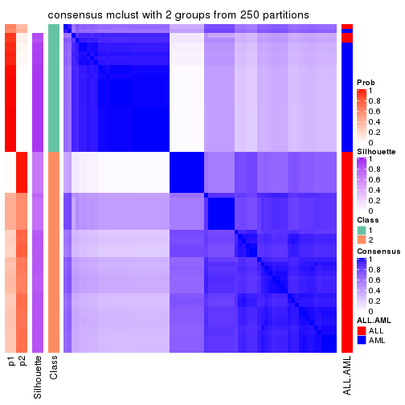</p>

</div>
<div id='tab-SD-mclust-consensus-heatmap-2'>
<pre><code class="r">consensus_heatmap(res, k = 3)
</code></pre>

<p>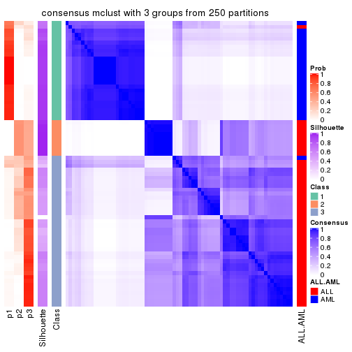</p>

</div>
<div id='tab-SD-mclust-consensus-heatmap-3'>
<pre><code class="r">consensus_heatmap(res, k = 4)
</code></pre>

<p>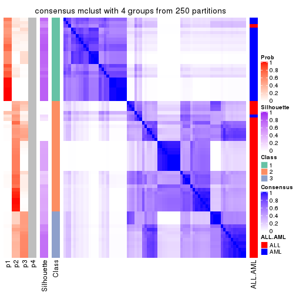</p>

</div>
<div id='tab-SD-mclust-consensus-heatmap-4'>
<pre><code class="r">consensus_heatmap(res, k = 5)
</code></pre>

<p>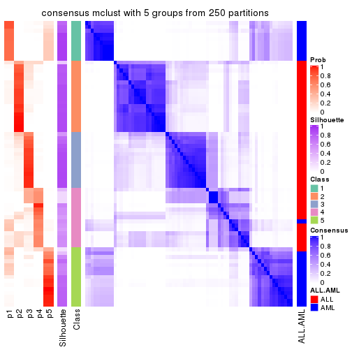</p>

</div>
<div id='tab-SD-mclust-consensus-heatmap-5'>
<pre><code class="r">consensus_heatmap(res, k = 6)
</code></pre>

<p>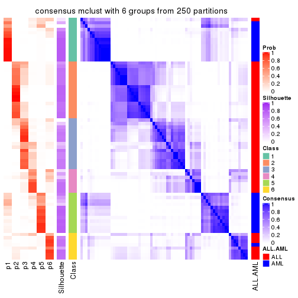</p>

</div>
</div>

Heatmaps for the membership of samples in all partitions to see how consistent they are:


<script>
$( function() {
	$( '#tabs-SD-mclust-membership-heatmap' ).tabs();
} );
</script>
<div id='tabs-SD-mclust-membership-heatmap'>
<ul>
<li><a href='#tab-SD-mclust-membership-heatmap-1'>k = 2</a></li>
<li><a href='#tab-SD-mclust-membership-heatmap-2'>k = 3</a></li>
<li><a href='#tab-SD-mclust-membership-heatmap-3'>k = 4</a></li>
<li><a href='#tab-SD-mclust-membership-heatmap-4'>k = 5</a></li>
<li><a href='#tab-SD-mclust-membership-heatmap-5'>k = 6</a></li>
</ul>
<div id='tab-SD-mclust-membership-heatmap-1'>
<pre><code class="r">membership_heatmap(res, k = 2)
</code></pre>

<p>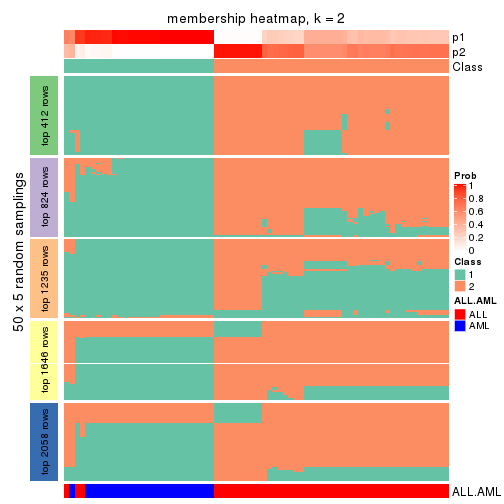</p>

</div>
<div id='tab-SD-mclust-membership-heatmap-2'>
<pre><code class="r">membership_heatmap(res, k = 3)
</code></pre>

<p>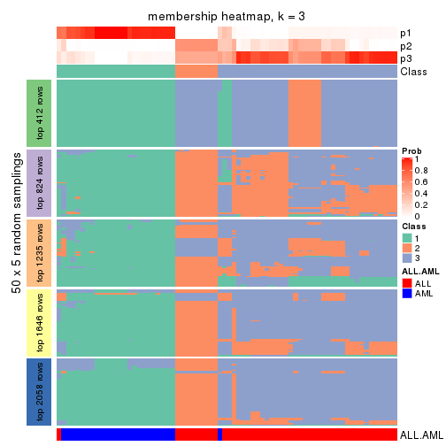</p>

</div>
<div id='tab-SD-mclust-membership-heatmap-3'>
<pre><code class="r">membership_heatmap(res, k = 4)
</code></pre>

<p>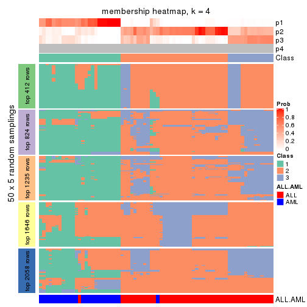</p>

</div>
<div id='tab-SD-mclust-membership-heatmap-4'>
<pre><code class="r">membership_heatmap(res, k = 5)
</code></pre>

<p>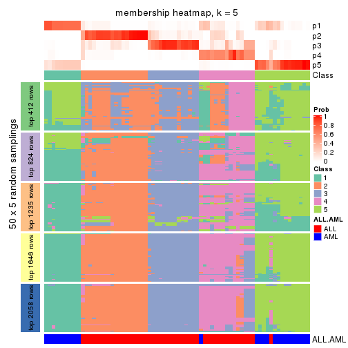</p>

</div>
<div id='tab-SD-mclust-membership-heatmap-5'>
<pre><code class="r">membership_heatmap(res, k = 6)
</code></pre>

<p>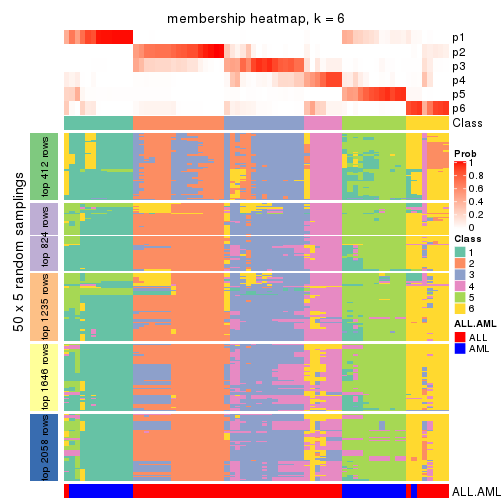</p>

</div>
</div>

As soon as we have had the classes for columns, we can look for signatures
which are significantly different between classes which can be candidate marks
for certain classes. Following are the heatmaps for signatures.


Signature heatmaps where rows are scaled:


<script>
$( function() {
	$( '#tabs-SD-mclust-get-signatures' ).tabs();
} );
</script>
<div id='tabs-SD-mclust-get-signatures'>
<ul>
<li><a href='#tab-SD-mclust-get-signatures-1'>k = 2</a></li>
<li><a href='#tab-SD-mclust-get-signatures-2'>k = 3</a></li>
<li><a href='#tab-SD-mclust-get-signatures-3'>k = 4</a></li>
<li><a href='#tab-SD-mclust-get-signatures-4'>k = 5</a></li>
<li><a href='#tab-SD-mclust-get-signatures-5'>k = 6</a></li>
</ul>
<div id='tab-SD-mclust-get-signatures-1'>
<pre><code class="r">get_signatures(res, k = 2)
</code></pre>

<p>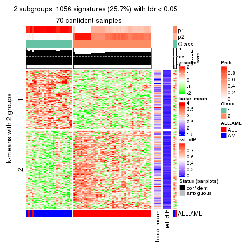</p>

</div>
<div id='tab-SD-mclust-get-signatures-2'>
<pre><code class="r">get_signatures(res, k = 3)
</code></pre>

<p>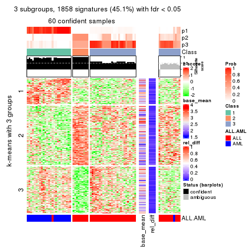</p>

</div>
<div id='tab-SD-mclust-get-signatures-3'>
<pre><code class="r">get_signatures(res, k = 4)
</code></pre>

<p>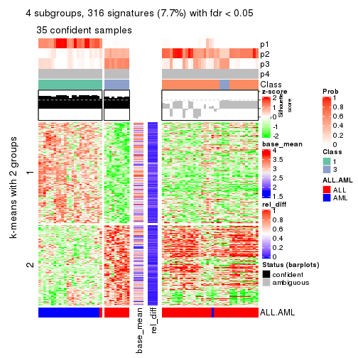</p>

</div>
<div id='tab-SD-mclust-get-signatures-4'>
<pre><code class="r">get_signatures(res, k = 5)
</code></pre>

<p>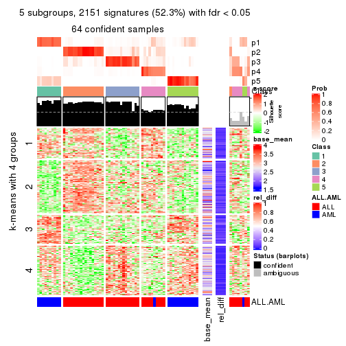</p>

</div>
<div id='tab-SD-mclust-get-signatures-5'>
<pre><code class="r">get_signatures(res, k = 6)
</code></pre>

<p>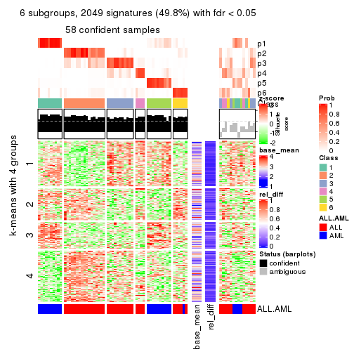</p>

</div>
</div>


Signature heatmaps where rows are not scaled:


<script>
$( function() {
	$( '#tabs-SD-mclust-get-signatures-no-scale' ).tabs();
} );
</script>
<div id='tabs-SD-mclust-get-signatures-no-scale'>
<ul>
<li><a href='#tab-SD-mclust-get-signatures-no-scale-1'>k = 2</a></li>
<li><a href='#tab-SD-mclust-get-signatures-no-scale-2'>k = 3</a></li>
<li><a href='#tab-SD-mclust-get-signatures-no-scale-3'>k = 4</a></li>
<li><a href='#tab-SD-mclust-get-signatures-no-scale-4'>k = 5</a></li>
<li><a href='#tab-SD-mclust-get-signatures-no-scale-5'>k = 6</a></li>
</ul>
<div id='tab-SD-mclust-get-signatures-no-scale-1'>
<pre><code class="r">get_signatures(res, k = 2, scale_rows = FALSE)
</code></pre>

<p>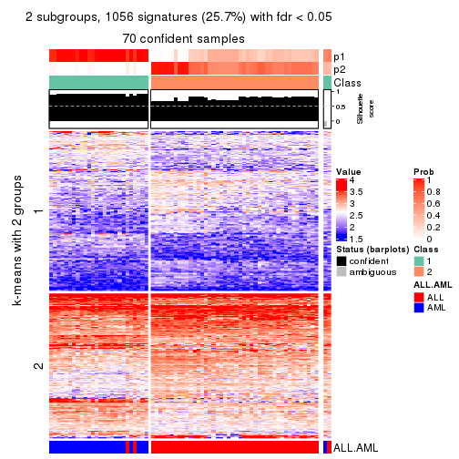</p>

</div>
<div id='tab-SD-mclust-get-signatures-no-scale-2'>
<pre><code class="r">get_signatures(res, k = 3, scale_rows = FALSE)
</code></pre>

<p>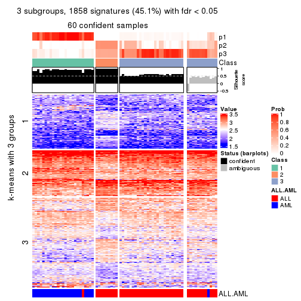</p>

</div>
<div id='tab-SD-mclust-get-signatures-no-scale-3'>
<pre><code class="r">get_signatures(res, k = 4, scale_rows = FALSE)
</code></pre>

<p>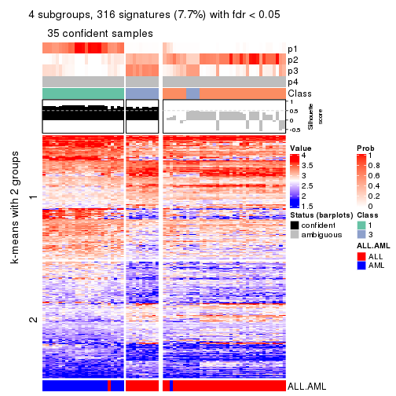</p>

</div>
<div id='tab-SD-mclust-get-signatures-no-scale-4'>
<pre><code class="r">get_signatures(res, k = 5, scale_rows = FALSE)
</code></pre>

<p>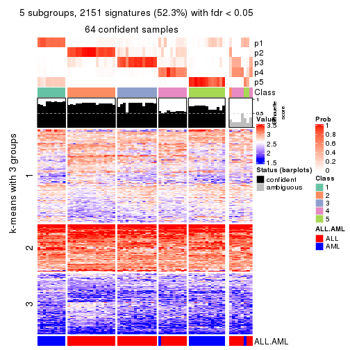</p>

</div>
<div id='tab-SD-mclust-get-signatures-no-scale-5'>
<pre><code class="r">get_signatures(res, k = 6, scale_rows = FALSE)
</code></pre>

<p>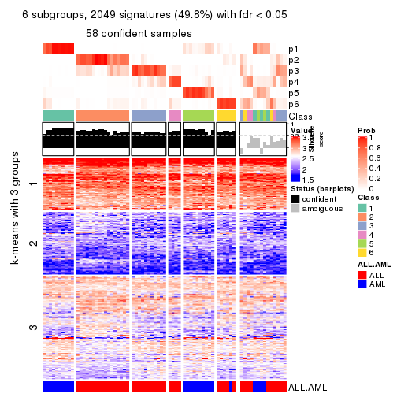</p>

</div>
</div>


Compare the overlap of signatures from different k:

```r
compare_signatures(res)
```

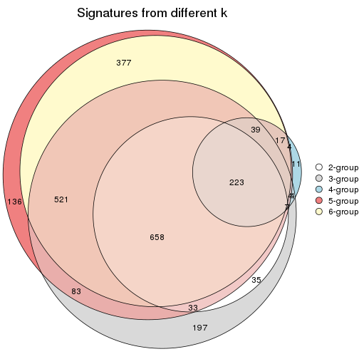

`get_signature()` returns a data frame invisibly. TO get the list of signatures, the function
call should be assigned to a variable explicitly. In following code, if `plot` argument is set
to `FALSE`, no heatmap is plotted while only the differential analysis is performed.

```r
# code only for demonstration
tb = get_signature(res, k = ..., plot = FALSE)
```

An example of the output of `tb` is:

```
#>   which_row         fdr    mean_1    mean_2 scaled_mean_1 scaled_mean_2 km
#> 1        38 0.042760348  8.373488  9.131774    -0.5533452     0.5164555  1
#> 2        40 0.018707592  7.106213  8.469186    -0.6173731     0.5762149  1
#> 3        55 0.019134737 10.221463 11.207825    -0.6159697     0.5749050  1
#> 4        59 0.006059896  5.921854  7.869574    -0.6899429     0.6439467  1
#> 5        60 0.018055526  8.928898 10.211722    -0.6204761     0.5791110  1
#> 6        98 0.009384629 15.714769 14.887706     0.6635654    -0.6193277  2
...
```

The columns in `tb` are:

1. `which_row`: row indices corresponding to the input matrix.
2. `fdr`: FDR for the differential test. 
3. `mean_x`: The mean value in group x.
4. `scaled_mean_x`: The mean value in group x after rows are scaled.
5. `km`: Row groups if k-means clustering is applied to rows.


UMAP plot which shows how samples are separated.


<script>
$( function() {
	$( '#tabs-SD-mclust-dimension-reduction' ).tabs();
} );
</script>
<div id='tabs-SD-mclust-dimension-reduction'>
<ul>
<li><a href='#tab-SD-mclust-dimension-reduction-1'>k = 2</a></li>
<li><a href='#tab-SD-mclust-dimension-reduction-2'>k = 3</a></li>
<li><a href='#tab-SD-mclust-dimension-reduction-3'>k = 4</a></li>
<li><a href='#tab-SD-mclust-dimension-reduction-4'>k = 5</a></li>
<li><a href='#tab-SD-mclust-dimension-reduction-5'>k = 6</a></li>
</ul>
<div id='tab-SD-mclust-dimension-reduction-1'>
<pre><code class="r">dimension_reduction(res, k = 2, method = &quot;UMAP&quot;)
</code></pre>

<p>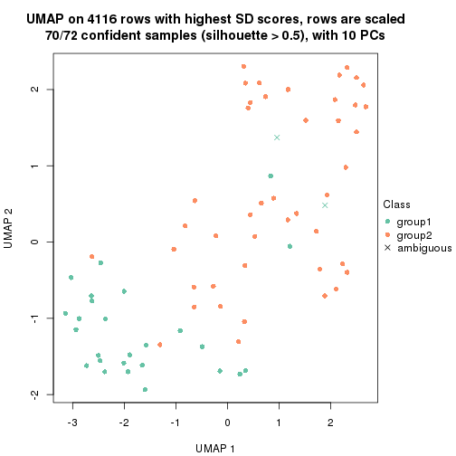</p>

</div>
<div id='tab-SD-mclust-dimension-reduction-2'>
<pre><code class="r">dimension_reduction(res, k = 3, method = &quot;UMAP&quot;)
</code></pre>

<p>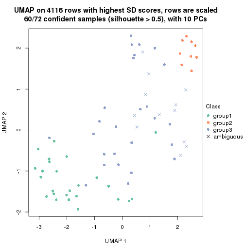</p>

</div>
<div id='tab-SD-mclust-dimension-reduction-3'>
<pre><code class="r">dimension_reduction(res, k = 4, method = &quot;UMAP&quot;)
</code></pre>

<p>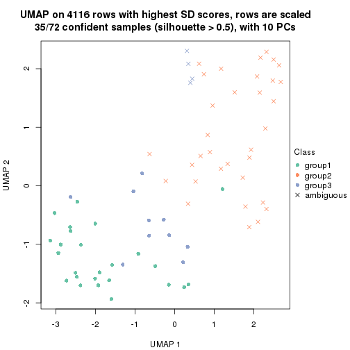</p>

</div>
<div id='tab-SD-mclust-dimension-reduction-4'>
<pre><code class="r">dimension_reduction(res, k = 5, method = &quot;UMAP&quot;)
</code></pre>

<p>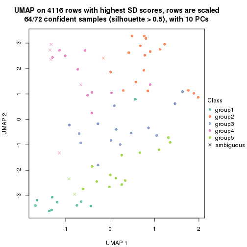</p>

</div>
<div id='tab-SD-mclust-dimension-reduction-5'>
<pre><code class="r">dimension_reduction(res, k = 6, method = &quot;UMAP&quot;)
</code></pre>

<p>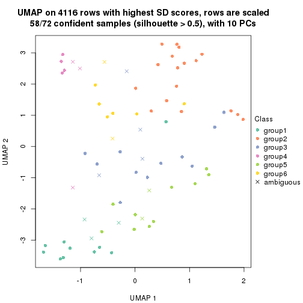</p>

</div>
</div>


Following heatmap shows how subgroups are split when increasing `k`:

```r
collect_classes(res)
```

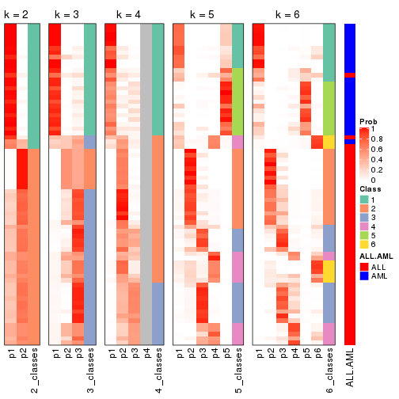


Test correlation between subgroups and known annotations. If the known
annotation is numeric, one-way ANOVA test is applied, and if the known
annotation is discrete, chi-squared contingency table test is applied.

```r
test_to_known_factors(res)
```

```
#>            n ALL.AML(p) k
#> SD:mclust 70   2.94e-14 2
#> SD:mclust 60   6.91e-13 3
#> SD:mclust 35   2.99e-07 4
#> SD:mclust 64   2.68e-12 5
#> SD:mclust 58   1.74e-10 6
```


If matrix rows can be associated to genes, consider to use `functional_enrichment(res,
...)` to perform function enrichment for the signature genes. See [this vignette](http://bioconductor.org/packages/devel/bioc/vignettes/cola/inst/doc/functional_enrichment.html) for more detailed explanations.


 

---------------------------------------------------


### SD:NMF


The object with results only for a single top-value method and a single partition method 
can be extracted as:

```r
res = res_list["SD", "NMF"]
# you can also extract it by
# res = res_list["SD:NMF"]
```

A summary of `res` and all the functions that can be applied to it:

```r
res
```

```
#> A 'ConsensusPartition' object with k = 2, 3, 4, 5, 6.
#>   On a matrix with 4116 rows and 72 columns.
#>   Top rows (412, 824, 1235, 1646, 2058) are extracted by 'SD' method.
#>   Subgroups are detected by 'NMF' method.
#>   Performed in total 1250 partitions by row resampling.
#>   Best k for subgroups seems to be 2.
#> 
#> Following methods can be applied to this 'ConsensusPartition' object:
#>  [1] "cola_report"             "collect_classes"         "collect_plots"          
#>  [4] "collect_stats"           "colnames"                "compare_signatures"     
#>  [7] "consensus_heatmap"       "dimension_reduction"     "functional_enrichment"  
#> [10] "get_anno_col"            "get_anno"                "get_classes"            
#> [13] "get_consensus"           "get_matrix"              "get_membership"         
#> [16] "get_param"               "get_signatures"          "get_stats"              
#> [19] "is_best_k"               "is_stable_k"             "membership_heatmap"     
#> [22] "ncol"                    "nrow"                    "plot_ecdf"              
#> [25] "rownames"                "select_partition_number" "show"                   
#> [28] "suggest_best_k"          "test_to_known_factors"
```

`collect_plots()` function collects all the plots made from `res` for all `k` (number of partitions)
into one single page to provide an easy and fast comparison between different `k`.

```r
collect_plots(res)
```

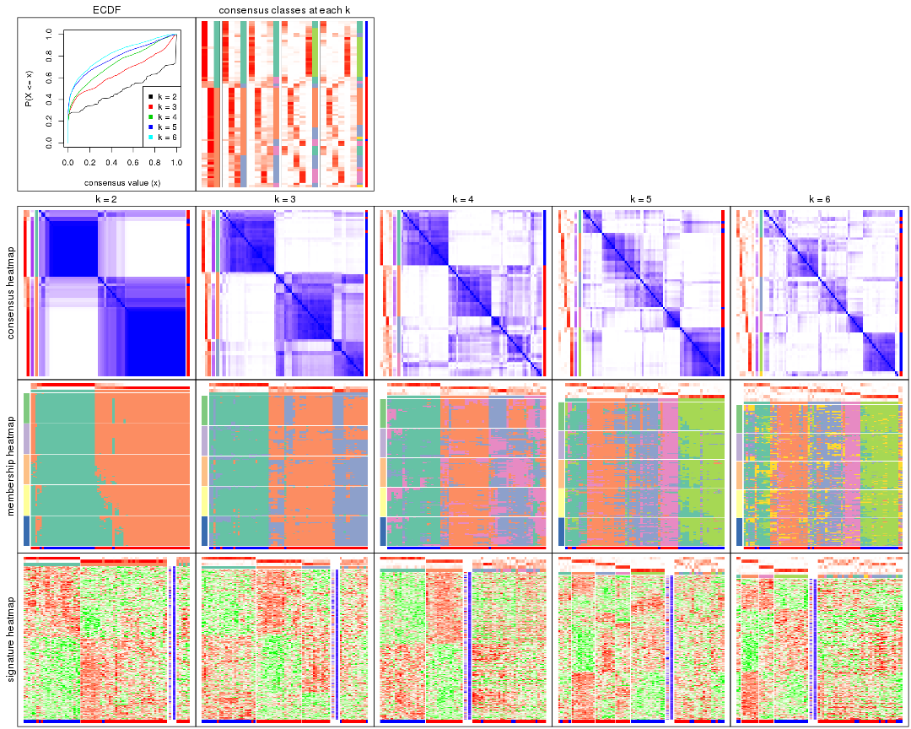

The plots are:

- The first row: a plot of the ECDF (empirical cumulative distribution
  function) curves of the consensus matrix for each `k` and the heatmap of
  predicted classes for each `k`.
- The second row: heatmaps of the consensus matrix for each `k`.
- The third row: heatmaps of the membership matrix for each `k`.
- The fouth row: heatmaps of the signatures for each `k`.

All the plots in panels can be made by individual functions and they are
plotted later in this section.

`select_partition_number()` produces several plots showing different
statistics for choosing "optimized" `k`. There are following statistics:

- ECDF curves of the consensus matrix for each `k`;
- 1-PAC. [The PAC
  score](https://en.wikipedia.org/wiki/Consensus_clustering#Over-interpretation_potential_of_consensus_clustering)
  measures the proportion of the ambiguous subgrouping.
- Mean silhouette score.
- Concordance. The mean probability of fiting the consensus class ids in all
  partitions.
- Area increased. Denote $A_k$ as the area under the ECDF curve for current
  `k`, the area increased is defined as $A_k - A_{k-1}$.
- Rand index. The percent of pairs of samples that are both in a same cluster
  or both are not in a same cluster in the partition of k and k-1.
- Jaccard index. The ratio of pairs of samples are both in a same cluster in
  the partition of k and k-1 and the pairs of samples are both in a same
  cluster in the partition k or k-1.

The detailed explanations of these statistics can be found in [the _cola_
vignette](http://bioconductor.org/packages/devel/bioc/vignettes/cola/inst/doc/cola.html#toc_13).

Generally speaking, lower PAC score, higher mean silhouette score or higher
concordance corresponds to better partition. Rand index and Jaccard index
measure how similar the current partition is compared to partition with `k-1`.
If they are too similar, we won't accept `k` is better than `k-1`.

```r
select_partition_number(res)
```

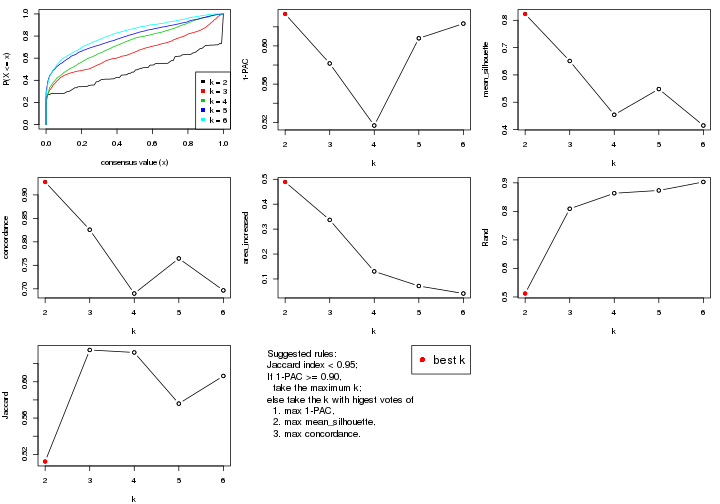

The numeric values for all these statistics can be obtained by `get_stats()`.

```r
get_stats(res)
```

```
#>   k 1-PAC mean_silhouette concordance area_increased  Rand Jaccard
#> 2 2 0.633           0.823       0.927         0.4892 0.512   0.512
#> 3 3 0.582           0.651       0.826         0.3369 0.809   0.635
#> 4 4 0.517           0.454       0.690         0.1303 0.863   0.632
#> 5 5 0.608           0.548       0.765         0.0718 0.873   0.576
#> 6 6 0.623           0.415       0.697         0.0416 0.903   0.606
```

`suggest_best_k()` suggests the best $k$ based on these statistics. The rules are as follows:

- All $k$ with Jaccard index larger than 0.95 are removed because increasing
  $k$ does not provide enough extra information. If all $k$ are removed, it is
  marked as no subgroup is detected.
- For all $k$ with 1-PAC score larger than 0.9, the maximal $k$ is taken as
  the best $k$, and other $k$ are marked as optional $k$.
- If it does not fit the second rule. The $k$ with the maximal vote of the
  highest 1-PAC score, highest mean silhouette, and highest concordance is
  taken as the best $k$.

```r
suggest_best_k(res)
```

```
#> [1] 2
```


Following shows the table of the partitions (You need to click the **show/hide
code output** link to see it). The membership matrix (columns with name `p*`)
is inferred by
[`clue::cl_consensus()`](https://www.rdocumentation.org/link/cl_consensus?package=clue)
function with the `SE` method. Basically the value in the membership matrix
represents the probability to belong to a certain group. The finall class
label for an item is determined with the group with highest probability it
belongs to.

In `get_classes()` function, the entropy is calculated from the membership
matrix and the silhouette score is calculated from the consensus matrix.


<script>
$( function() {
	$( '#tabs-SD-NMF-get-classes' ).tabs();
} );
</script>
<div id='tabs-SD-NMF-get-classes'>
<ul>
<li><a href='#tab-SD-NMF-get-classes-1'>k = 2</a></li>
<li><a href='#tab-SD-NMF-get-classes-2'>k = 3</a></li>
<li><a href='#tab-SD-NMF-get-classes-3'>k = 4</a></li>
<li><a href='#tab-SD-NMF-get-classes-4'>k = 5</a></li>
<li><a href='#tab-SD-NMF-get-classes-5'>k = 6</a></li>
</ul>

<div id='tab-SD-NMF-get-classes-1'>
<p><a id='tab-SD-NMF-get-classes-1-a' style='color:#0366d6' href='#'>show/hide code output</a></p>
<pre><code class="r">cbind(get_classes(res, k = 2), get_membership(res, k = 2))
</code></pre>

<pre><code>#&gt;           class entropy silhouette    p1    p2
#&gt; sample_39     2  0.7950     0.7094 0.240 0.760
#&gt; sample_40     2  0.8499     0.6610 0.276 0.724
#&gt; sample_42     2  0.0000     0.9065 0.000 1.000
#&gt; sample_47     2  0.0000     0.9065 0.000 1.000
#&gt; sample_48     2  0.0000     0.9065 0.000 1.000
#&gt; sample_49     2  0.9833     0.3568 0.424 0.576
#&gt; sample_41     2  0.0000     0.9065 0.000 1.000
#&gt; sample_43     2  0.0000     0.9065 0.000 1.000
#&gt; sample_44     2  0.0000     0.9065 0.000 1.000
#&gt; sample_45     2  0.0000     0.9065 0.000 1.000
#&gt; sample_46     2  0.0000     0.9065 0.000 1.000
#&gt; sample_70     2  0.0000     0.9065 0.000 1.000
#&gt; sample_71     2  0.0000     0.9065 0.000 1.000
#&gt; sample_72     2  0.0000     0.9065 0.000 1.000
#&gt; sample_68     2  0.0000     0.9065 0.000 1.000
#&gt; sample_69     2  0.0000     0.9065 0.000 1.000
#&gt; sample_67     1  0.5737     0.7989 0.864 0.136
#&gt; sample_55     2  0.6623     0.7837 0.172 0.828
#&gt; sample_56     2  0.4939     0.8391 0.108 0.892
#&gt; sample_59     2  0.0000     0.9065 0.000 1.000
#&gt; sample_52     1  0.0000     0.9319 1.000 0.000
#&gt; sample_53     1  0.0000     0.9319 1.000 0.000
#&gt; sample_51     1  0.0000     0.9319 1.000 0.000
#&gt; sample_50     1  0.0000     0.9319 1.000 0.000
#&gt; sample_54     1  0.6148     0.7786 0.848 0.152
#&gt; sample_57     1  0.0000     0.9319 1.000 0.000
#&gt; sample_58     1  0.0000     0.9319 1.000 0.000
#&gt; sample_60     1  0.0376     0.9288 0.996 0.004
#&gt; sample_61     1  0.0000     0.9319 1.000 0.000
#&gt; sample_65     1  0.0000     0.9319 1.000 0.000
#&gt; sample_66     2  0.8763     0.5365 0.296 0.704
#&gt; sample_63     1  0.0000     0.9319 1.000 0.000
#&gt; sample_64     1  0.0000     0.9319 1.000 0.000
#&gt; sample_62     1  0.0000     0.9319 1.000 0.000
#&gt; sample_1      2  0.0000     0.9065 0.000 1.000
#&gt; sample_2      1  0.9833     0.2446 0.576 0.424
#&gt; sample_3      2  0.5946     0.8097 0.144 0.856
#&gt; sample_4      2  0.0000     0.9065 0.000 1.000
#&gt; sample_5      2  0.0000     0.9065 0.000 1.000
#&gt; sample_6      2  0.8861     0.6154 0.304 0.696
#&gt; sample_7      2  0.5178     0.8332 0.116 0.884
#&gt; sample_8      2  1.0000     0.1290 0.496 0.504
#&gt; sample_9      2  0.0000     0.9065 0.000 1.000
#&gt; sample_10     2  0.9635     0.4449 0.388 0.612
#&gt; sample_11     2  0.0000     0.9065 0.000 1.000
#&gt; sample_12     1  0.0376     0.9287 0.996 0.004
#&gt; sample_13     2  0.0000     0.9065 0.000 1.000
#&gt; sample_14     2  0.0000     0.9065 0.000 1.000
#&gt; sample_15     2  0.0000     0.9065 0.000 1.000
#&gt; sample_16     2  0.0000     0.9065 0.000 1.000
#&gt; sample_17     2  0.1843     0.8879 0.028 0.972
#&gt; sample_18     2  0.0672     0.9026 0.008 0.992
#&gt; sample_19     2  0.0000     0.9065 0.000 1.000
#&gt; sample_20     2  0.0000     0.9065 0.000 1.000
#&gt; sample_21     2  0.0000     0.9065 0.000 1.000
#&gt; sample_22     1  0.9963    -0.0252 0.536 0.464
#&gt; sample_23     2  0.8499     0.6609 0.276 0.724
#&gt; sample_24     2  0.0000     0.9065 0.000 1.000
#&gt; sample_25     2  0.8555     0.6536 0.280 0.720
#&gt; sample_26     2  0.0000     0.9065 0.000 1.000
#&gt; sample_27     1  0.9988    -0.0885 0.520 0.480
#&gt; sample_34     1  0.0000     0.9319 1.000 0.000
#&gt; sample_35     1  0.0000     0.9319 1.000 0.000
#&gt; sample_36     1  0.0000     0.9319 1.000 0.000
#&gt; sample_37     1  0.0000     0.9319 1.000 0.000
#&gt; sample_38     1  0.0000     0.9319 1.000 0.000
#&gt; sample_28     1  0.0000     0.9319 1.000 0.000
#&gt; sample_29     1  0.0000     0.9319 1.000 0.000
#&gt; sample_30     1  0.0000     0.9319 1.000 0.000
#&gt; sample_31     1  0.0000     0.9319 1.000 0.000
#&gt; sample_32     1  0.0000     0.9319 1.000 0.000
#&gt; sample_33     1  0.0000     0.9319 1.000 0.000
</code></pre>

<script>
$('#tab-SD-NMF-get-classes-1-a').parent().next().next().hide();
$('#tab-SD-NMF-get-classes-1-a').click(function(){
  $('#tab-SD-NMF-get-classes-1-a').parent().next().next().toggle();
  return(false);
});
</script>
</div>

<div id='tab-SD-NMF-get-classes-2'>
<p><a id='tab-SD-NMF-get-classes-2-a' style='color:#0366d6' href='#'>show/hide code output</a></p>
<pre><code class="r">cbind(get_classes(res, k = 3), get_membership(res, k = 3))
</code></pre>

<pre><code>#&gt;           class entropy silhouette    p1    p2    p3
#&gt; sample_39     3  0.5785     0.7137 0.000 0.332 0.668
#&gt; sample_40     3  0.5902     0.7279 0.004 0.316 0.680
#&gt; sample_42     2  0.2663     0.7107 0.024 0.932 0.044
#&gt; sample_47     2  0.0592     0.7391 0.000 0.988 0.012
#&gt; sample_48     2  0.0592     0.7397 0.000 0.988 0.012
#&gt; sample_49     3  0.5953     0.7401 0.012 0.280 0.708
#&gt; sample_41     2  0.2066     0.7341 0.000 0.940 0.060
#&gt; sample_43     2  0.1031     0.7365 0.000 0.976 0.024
#&gt; sample_44     2  0.4555     0.5460 0.000 0.800 0.200
#&gt; sample_45     2  0.1529     0.7314 0.000 0.960 0.040
#&gt; sample_46     2  0.2356     0.7065 0.000 0.928 0.072
#&gt; sample_70     2  0.6307    -0.4148 0.000 0.512 0.488
#&gt; sample_71     2  0.5053     0.6175 0.024 0.812 0.164
#&gt; sample_72     2  0.1289     0.7362 0.000 0.968 0.032
#&gt; sample_68     2  0.0747     0.7412 0.000 0.984 0.016
#&gt; sample_69     2  0.0892     0.7375 0.000 0.980 0.020
#&gt; sample_67     1  0.6286     0.7432 0.772 0.092 0.136
#&gt; sample_55     3  0.5706     0.7230 0.000 0.320 0.680
#&gt; sample_56     3  0.5810     0.7151 0.000 0.336 0.664
#&gt; sample_59     2  0.6204    -0.1770 0.000 0.576 0.424
#&gt; sample_52     1  0.0747     0.8937 0.984 0.000 0.016
#&gt; sample_53     1  0.1031     0.8899 0.976 0.000 0.024
#&gt; sample_51     1  0.0424     0.8940 0.992 0.000 0.008
#&gt; sample_50     1  0.0424     0.8919 0.992 0.000 0.008
#&gt; sample_54     1  0.3947     0.8523 0.884 0.076 0.040
#&gt; sample_57     1  0.3340     0.8632 0.880 0.000 0.120
#&gt; sample_58     1  0.4974     0.7518 0.764 0.000 0.236
#&gt; sample_60     1  0.2446     0.8903 0.936 0.012 0.052
#&gt; sample_61     1  0.3879     0.8381 0.848 0.000 0.152
#&gt; sample_65     1  0.2165     0.8878 0.936 0.000 0.064
#&gt; sample_66     2  0.9901     0.1339 0.296 0.404 0.300
#&gt; sample_63     1  0.1031     0.8941 0.976 0.000 0.024
#&gt; sample_64     1  0.5948     0.5604 0.640 0.000 0.360
#&gt; sample_62     1  0.1031     0.8941 0.976 0.000 0.024
#&gt; sample_1      3  0.6307     0.4056 0.000 0.488 0.512
#&gt; sample_2      1  0.9425     0.3377 0.488 0.200 0.312
#&gt; sample_3      3  0.2448     0.6382 0.000 0.076 0.924
#&gt; sample_4      3  0.6280     0.4126 0.000 0.460 0.540
#&gt; sample_5      2  0.0892     0.7397 0.000 0.980 0.020
#&gt; sample_6      3  0.2599     0.6311 0.016 0.052 0.932
#&gt; sample_7      3  0.5678     0.7223 0.000 0.316 0.684
#&gt; sample_8      3  0.6027     0.7403 0.016 0.272 0.712
#&gt; sample_9      3  0.6192     0.0059 0.000 0.420 0.580
#&gt; sample_10     3  0.2947     0.6308 0.020 0.060 0.920
#&gt; sample_11     2  0.6298     0.3987 0.004 0.608 0.388
#&gt; sample_12     1  0.3454     0.8744 0.888 0.008 0.104
#&gt; sample_13     2  0.0424     0.7405 0.000 0.992 0.008
#&gt; sample_14     2  0.5948     0.4284 0.000 0.640 0.360
#&gt; sample_15     2  0.1163     0.7392 0.000 0.972 0.028
#&gt; sample_16     2  0.4654     0.5364 0.000 0.792 0.208
#&gt; sample_17     2  0.5480     0.5208 0.004 0.732 0.264
#&gt; sample_18     2  0.6307    -0.3756 0.000 0.512 0.488
#&gt; sample_19     2  0.2711     0.6928 0.000 0.912 0.088
#&gt; sample_20     2  0.0592     0.7410 0.000 0.988 0.012
#&gt; sample_21     2  0.2711     0.7163 0.000 0.912 0.088
#&gt; sample_22     3  0.6735     0.7172 0.044 0.260 0.696
#&gt; sample_23     3  0.2165     0.6372 0.000 0.064 0.936
#&gt; sample_24     2  0.2261     0.7282 0.000 0.932 0.068
#&gt; sample_25     2  0.7378    -0.1412 0.036 0.560 0.404
#&gt; sample_26     2  0.5291     0.3761 0.000 0.732 0.268
#&gt; sample_27     3  0.5992     0.7407 0.016 0.268 0.716
#&gt; sample_34     1  0.2448     0.8838 0.924 0.000 0.076
#&gt; sample_35     1  0.6295     0.3039 0.528 0.000 0.472
#&gt; sample_36     1  0.0747     0.8910 0.984 0.000 0.016
#&gt; sample_37     1  0.0892     0.8898 0.980 0.000 0.020
#&gt; sample_38     1  0.2537     0.8758 0.920 0.000 0.080
#&gt; sample_28     1  0.1765     0.8917 0.956 0.004 0.040
#&gt; sample_29     1  0.2810     0.8688 0.928 0.036 0.036
#&gt; sample_30     1  0.0892     0.8898 0.980 0.000 0.020
#&gt; sample_31     1  0.2878     0.8766 0.904 0.000 0.096
#&gt; sample_32     1  0.1643     0.8944 0.956 0.000 0.044
#&gt; sample_33     1  0.1529     0.8948 0.960 0.000 0.040
</code></pre>

<script>
$('#tab-SD-NMF-get-classes-2-a').parent().next().next().hide();
$('#tab-SD-NMF-get-classes-2-a').click(function(){
  $('#tab-SD-NMF-get-classes-2-a').parent().next().next().toggle();
  return(false);
});
</script>
</div>

<div id='tab-SD-NMF-get-classes-3'>
<p><a id='tab-SD-NMF-get-classes-3-a' style='color:#0366d6' href='#'>show/hide code output</a></p>
<pre><code class="r">cbind(get_classes(res, k = 4), get_membership(res, k = 4))
</code></pre>

<pre><code>#&gt;           class entropy silhouette    p1    p2    p3    p4
#&gt; sample_39     4  0.7480   -0.31525 0.000 0.180 0.376 0.444
#&gt; sample_40     3  0.7826    0.35310 0.004 0.220 0.432 0.344
#&gt; sample_42     4  0.5725    0.26530 0.016 0.372 0.012 0.600
#&gt; sample_47     2  0.2412    0.71787 0.000 0.908 0.008 0.084
#&gt; sample_48     2  0.0921    0.71930 0.000 0.972 0.000 0.028
#&gt; sample_49     3  0.7608    0.35783 0.000 0.216 0.456 0.328
#&gt; sample_41     2  0.2996    0.68380 0.000 0.892 0.044 0.064
#&gt; sample_43     2  0.3196    0.70982 0.000 0.856 0.008 0.136
#&gt; sample_44     2  0.5395    0.62126 0.000 0.736 0.092 0.172
#&gt; sample_45     2  0.3577    0.70107 0.000 0.832 0.012 0.156
#&gt; sample_46     2  0.4423    0.68205 0.000 0.788 0.036 0.176
#&gt; sample_70     2  0.7907   -0.15987 0.000 0.364 0.308 0.328
#&gt; sample_71     4  0.6799    0.34926 0.028 0.304 0.064 0.604
#&gt; sample_72     4  0.5816    0.22261 0.000 0.392 0.036 0.572
#&gt; sample_68     2  0.2255    0.69030 0.000 0.920 0.012 0.068
#&gt; sample_69     2  0.2704    0.68204 0.000 0.876 0.000 0.124
#&gt; sample_67     4  0.8350    0.00642 0.364 0.048 0.148 0.440
#&gt; sample_55     4  0.9726   -0.29997 0.144 0.256 0.276 0.324
#&gt; sample_56     3  0.7820    0.31036 0.000 0.256 0.384 0.360
#&gt; sample_59     2  0.6919    0.37411 0.004 0.600 0.152 0.244
#&gt; sample_52     1  0.1209    0.78103 0.964 0.000 0.004 0.032
#&gt; sample_53     1  0.4295    0.65254 0.752 0.000 0.008 0.240
#&gt; sample_51     1  0.2271    0.76622 0.916 0.000 0.008 0.076
#&gt; sample_50     1  0.0921    0.78211 0.972 0.000 0.000 0.028
#&gt; sample_54     1  0.4927    0.67806 0.800 0.100 0.016 0.084
#&gt; sample_57     1  0.3441    0.73973 0.856 0.000 0.024 0.120
#&gt; sample_58     1  0.4139    0.70026 0.816 0.000 0.040 0.144
#&gt; sample_60     1  0.4443    0.71213 0.820 0.048 0.012 0.120
#&gt; sample_61     1  0.5170    0.67389 0.724 0.000 0.048 0.228
#&gt; sample_65     1  0.1109    0.78652 0.968 0.000 0.004 0.028
#&gt; sample_66     3  0.9431   -0.17029 0.096 0.296 0.328 0.280
#&gt; sample_63     1  0.1398    0.78107 0.956 0.000 0.004 0.040
#&gt; sample_64     1  0.5070    0.64275 0.748 0.000 0.060 0.192
#&gt; sample_62     1  0.1661    0.77717 0.944 0.000 0.004 0.052
#&gt; sample_1      3  0.7869    0.19311 0.000 0.340 0.380 0.280
#&gt; sample_2      4  0.8623    0.14418 0.120 0.084 0.384 0.412
#&gt; sample_3      3  0.0712    0.38496 0.008 0.004 0.984 0.004
#&gt; sample_4      3  0.7345    0.22837 0.000 0.348 0.484 0.168
#&gt; sample_5      2  0.2949    0.67453 0.000 0.888 0.024 0.088
#&gt; sample_6      3  0.0524    0.38534 0.008 0.004 0.988 0.000
#&gt; sample_7      3  0.7247    0.39028 0.000 0.216 0.544 0.240
#&gt; sample_8      3  0.6783    0.25821 0.004 0.084 0.508 0.404
#&gt; sample_9      3  0.5226    0.27581 0.000 0.180 0.744 0.076
#&gt; sample_10     3  0.2542    0.32598 0.012 0.000 0.904 0.084
#&gt; sample_11     3  0.6391    0.04183 0.000 0.092 0.604 0.304
#&gt; sample_12     4  0.6277   -0.26475 0.468 0.000 0.056 0.476
#&gt; sample_13     2  0.1389    0.71880 0.000 0.952 0.000 0.048
#&gt; sample_14     3  0.6602    0.13740 0.000 0.356 0.552 0.092
#&gt; sample_15     2  0.2773    0.68404 0.000 0.900 0.028 0.072
#&gt; sample_16     2  0.4542    0.67432 0.000 0.804 0.088 0.108
#&gt; sample_17     2  0.6744    0.29526 0.012 0.612 0.280 0.096
#&gt; sample_18     2  0.7818   -0.15122 0.000 0.404 0.332 0.264
#&gt; sample_19     2  0.4832    0.67046 0.000 0.768 0.056 0.176
#&gt; sample_20     2  0.2676    0.69976 0.000 0.896 0.012 0.092
#&gt; sample_21     2  0.4840    0.59153 0.000 0.784 0.116 0.100
#&gt; sample_22     4  0.6521   -0.04327 0.008 0.056 0.412 0.524
#&gt; sample_23     3  0.1114    0.37852 0.008 0.004 0.972 0.016
#&gt; sample_24     2  0.3400    0.66637 0.000 0.872 0.064 0.064
#&gt; sample_25     4  0.6583    0.23943 0.016 0.164 0.148 0.672
#&gt; sample_26     2  0.6790    0.43614 0.000 0.576 0.128 0.296
#&gt; sample_27     3  0.7443    0.36646 0.000 0.196 0.492 0.312
#&gt; sample_34     1  0.0937    0.78587 0.976 0.000 0.012 0.012
#&gt; sample_35     1  0.7516    0.17176 0.472 0.000 0.328 0.200
#&gt; sample_36     1  0.0469    0.78372 0.988 0.000 0.000 0.012
#&gt; sample_37     1  0.4049    0.67995 0.780 0.000 0.008 0.212
#&gt; sample_38     1  0.7343    0.08370 0.428 0.000 0.156 0.416
#&gt; sample_28     1  0.5931    0.23479 0.504 0.000 0.036 0.460
#&gt; sample_29     1  0.3610    0.70082 0.800 0.000 0.000 0.200
#&gt; sample_30     1  0.1004    0.78363 0.972 0.000 0.004 0.024
#&gt; sample_31     1  0.1545    0.78164 0.952 0.000 0.008 0.040
#&gt; sample_32     1  0.3852    0.70680 0.808 0.000 0.012 0.180
#&gt; sample_33     1  0.4804    0.60727 0.708 0.000 0.016 0.276
</code></pre>

<script>
$('#tab-SD-NMF-get-classes-3-a').parent().next().next().hide();
$('#tab-SD-NMF-get-classes-3-a').click(function(){
  $('#tab-SD-NMF-get-classes-3-a').parent().next().next().toggle();
  return(false);
});
</script>
</div>

<div id='tab-SD-NMF-get-classes-4'>
<p><a id='tab-SD-NMF-get-classes-4-a' style='color:#0366d6' href='#'>show/hide code output</a></p>
<pre><code class="r">cbind(get_classes(res, k = 5), get_membership(res, k = 5))
</code></pre>

<pre><code>#&gt;           class entropy silhouette    p1    p2    p3    p4    p5
#&gt; sample_39     3  0.2707     0.6041 0.132 0.008 0.860 0.000 0.000
#&gt; sample_40     3  0.4232     0.6231 0.008 0.012 0.796 0.144 0.040
#&gt; sample_42     1  0.4049     0.5465 0.780 0.056 0.164 0.000 0.000
#&gt; sample_47     2  0.4096     0.6315 0.040 0.760 0.200 0.000 0.000
#&gt; sample_48     2  0.2561     0.6904 0.020 0.884 0.096 0.000 0.000
#&gt; sample_49     3  0.2464     0.6618 0.000 0.000 0.888 0.096 0.016
#&gt; sample_41     2  0.1877     0.6759 0.008 0.932 0.004 0.052 0.004
#&gt; sample_43     2  0.5342     0.4834 0.076 0.612 0.312 0.000 0.000
#&gt; sample_44     2  0.5364     0.2117 0.036 0.496 0.460 0.008 0.000
#&gt; sample_45     2  0.5535     0.4195 0.080 0.568 0.352 0.000 0.000
#&gt; sample_46     2  0.5778     0.1757 0.088 0.464 0.448 0.000 0.000
#&gt; sample_70     3  0.3798     0.5929 0.068 0.100 0.824 0.008 0.000
#&gt; sample_71     1  0.3576     0.5970 0.840 0.048 0.100 0.012 0.000
#&gt; sample_72     1  0.5309     0.4127 0.668 0.080 0.244 0.008 0.000
#&gt; sample_68     2  0.0451     0.6823 0.000 0.988 0.000 0.008 0.004
#&gt; sample_69     2  0.4455     0.6602 0.132 0.768 0.096 0.004 0.000
#&gt; sample_67     1  0.4194     0.5710 0.788 0.004 0.000 0.128 0.080
#&gt; sample_55     3  0.8245     0.2481 0.008 0.196 0.364 0.104 0.328
#&gt; sample_56     3  0.1975     0.6680 0.004 0.016 0.936 0.024 0.020
#&gt; sample_59     3  0.5623     0.3577 0.016 0.308 0.624 0.012 0.040
#&gt; sample_52     5  0.0727     0.7874 0.012 0.004 0.000 0.004 0.980
#&gt; sample_53     5  0.4510     0.3498 0.432 0.000 0.000 0.008 0.560
#&gt; sample_51     5  0.2852     0.7346 0.172 0.000 0.000 0.000 0.828
#&gt; sample_50     5  0.2471     0.7581 0.136 0.000 0.000 0.000 0.864
#&gt; sample_54     5  0.2437     0.7537 0.016 0.052 0.016 0.004 0.912
#&gt; sample_57     5  0.1856     0.7699 0.008 0.012 0.032 0.008 0.940
#&gt; sample_58     5  0.2338     0.7465 0.004 0.000 0.112 0.000 0.884
#&gt; sample_60     5  0.2325     0.7599 0.016 0.036 0.024 0.004 0.920
#&gt; sample_61     5  0.6490     0.1701 0.164 0.004 0.376 0.000 0.456
#&gt; sample_65     5  0.1764     0.7842 0.064 0.000 0.008 0.000 0.928
#&gt; sample_66     4  0.7098     0.1673 0.324 0.248 0.000 0.412 0.016
#&gt; sample_63     5  0.0486     0.7866 0.004 0.004 0.004 0.000 0.988
#&gt; sample_64     5  0.2679     0.7474 0.008 0.008 0.072 0.016 0.896
#&gt; sample_62     5  0.1016     0.7808 0.008 0.012 0.004 0.004 0.972
#&gt; sample_1      3  0.3568     0.6614 0.012 0.064 0.844 0.080 0.000
#&gt; sample_2      1  0.5140     0.0781 0.544 0.016 0.000 0.424 0.016
#&gt; sample_3      4  0.1430     0.7895 0.004 0.000 0.052 0.944 0.000
#&gt; sample_4      4  0.6916     0.2291 0.004 0.308 0.200 0.476 0.012
#&gt; sample_5      2  0.1704     0.6640 0.004 0.928 0.000 0.068 0.000
#&gt; sample_6      4  0.1282     0.7929 0.004 0.000 0.044 0.952 0.000
#&gt; sample_7      3  0.7406     0.0206 0.008 0.180 0.392 0.388 0.032
#&gt; sample_8      3  0.3291     0.6418 0.040 0.000 0.840 0.120 0.000
#&gt; sample_9      4  0.1569     0.7881 0.008 0.044 0.004 0.944 0.000
#&gt; sample_10     4  0.1493     0.7912 0.028 0.000 0.024 0.948 0.000
#&gt; sample_11     4  0.2149     0.7681 0.048 0.036 0.000 0.916 0.000
#&gt; sample_12     1  0.4924     0.6132 0.740 0.000 0.112 0.012 0.136
#&gt; sample_13     2  0.3035     0.6865 0.032 0.856 0.112 0.000 0.000
#&gt; sample_14     4  0.2873     0.7399 0.016 0.128 0.000 0.856 0.000
#&gt; sample_15     2  0.1928     0.6637 0.004 0.920 0.004 0.072 0.000
#&gt; sample_16     2  0.4538     0.4508 0.016 0.620 0.364 0.000 0.000
#&gt; sample_17     2  0.4182     0.1907 0.000 0.644 0.000 0.352 0.004
#&gt; sample_18     3  0.5471     0.6117 0.004 0.136 0.720 0.108 0.032
#&gt; sample_19     3  0.6012    -0.1161 0.116 0.400 0.484 0.000 0.000
#&gt; sample_20     2  0.3823     0.6837 0.060 0.820 0.112 0.008 0.000
#&gt; sample_21     2  0.4512     0.5150 0.040 0.744 0.012 0.204 0.000
#&gt; sample_22     3  0.5518     0.2435 0.348 0.000 0.580 0.068 0.004
#&gt; sample_23     4  0.1557     0.7884 0.008 0.000 0.052 0.940 0.000
#&gt; sample_24     2  0.2629     0.5942 0.000 0.860 0.000 0.136 0.004
#&gt; sample_25     1  0.5170     0.0808 0.524 0.032 0.440 0.004 0.000
#&gt; sample_26     3  0.5277     0.3880 0.108 0.228 0.664 0.000 0.000
#&gt; sample_27     3  0.3742     0.5868 0.004 0.000 0.788 0.188 0.020
#&gt; sample_34     5  0.1121     0.7870 0.044 0.000 0.000 0.000 0.956
#&gt; sample_35     5  0.6164     0.2733 0.000 0.000 0.328 0.152 0.520
#&gt; sample_36     5  0.1965     0.7743 0.096 0.000 0.000 0.000 0.904
#&gt; sample_37     5  0.4434     0.2831 0.460 0.000 0.000 0.004 0.536
#&gt; sample_38     1  0.4298     0.6083 0.788 0.000 0.008 0.096 0.108
#&gt; sample_28     1  0.3127     0.6172 0.848 0.000 0.004 0.020 0.128
#&gt; sample_29     5  0.4114     0.4820 0.376 0.000 0.000 0.000 0.624
#&gt; sample_30     5  0.2329     0.7637 0.124 0.000 0.000 0.000 0.876
#&gt; sample_31     5  0.0898     0.7888 0.020 0.000 0.000 0.008 0.972
#&gt; sample_32     5  0.4009     0.5784 0.312 0.000 0.004 0.000 0.684
#&gt; sample_33     1  0.4758    -0.0345 0.560 0.000 0.008 0.008 0.424
</code></pre>

<script>
$('#tab-SD-NMF-get-classes-4-a').parent().next().next().hide();
$('#tab-SD-NMF-get-classes-4-a').click(function(){
  $('#tab-SD-NMF-get-classes-4-a').parent().next().next().toggle();
  return(false);
});
</script>
</div>

<div id='tab-SD-NMF-get-classes-5'>
<p><a id='tab-SD-NMF-get-classes-5-a' style='color:#0366d6' href='#'>show/hide code output</a></p>
<pre><code class="r">cbind(get_classes(res, k = 6), get_membership(res, k = 6))
</code></pre>

<pre><code>#&gt;           class entropy silhouette    p1    p2    p3    p4    p5    p6
#&gt; sample_39     3  0.3654    0.38232 0.072 0.008 0.812 0.004 0.000 0.104
#&gt; sample_40     3  0.5403    0.32951 0.008 0.020 0.688 0.096 0.016 0.172
#&gt; sample_42     1  0.4633    0.44453 0.736 0.040 0.072 0.000 0.000 0.152
#&gt; sample_47     2  0.4791    0.37276 0.028 0.720 0.120 0.000 0.000 0.132
#&gt; sample_48     2  0.2407    0.53435 0.004 0.892 0.056 0.000 0.000 0.048
#&gt; sample_49     3  0.2846    0.41261 0.000 0.000 0.856 0.060 0.000 0.084
#&gt; sample_41     2  0.2364    0.53901 0.000 0.892 0.004 0.032 0.000 0.072
#&gt; sample_43     2  0.6999   -0.40954 0.060 0.392 0.156 0.008 0.004 0.380
#&gt; sample_44     2  0.6667   -0.44320 0.008 0.400 0.316 0.012 0.004 0.260
#&gt; sample_45     2  0.6372   -0.09837 0.028 0.496 0.284 0.004 0.000 0.188
#&gt; sample_46     3  0.6424   -0.24224 0.040 0.392 0.412 0.000 0.000 0.156
#&gt; sample_70     3  0.5837    0.05092 0.036 0.068 0.580 0.016 0.000 0.300
#&gt; sample_71     1  0.6888    0.32722 0.528 0.016 0.168 0.064 0.004 0.220
#&gt; sample_72     1  0.6979    0.04074 0.380 0.048 0.348 0.008 0.000 0.216
#&gt; sample_68     2  0.1088    0.55607 0.000 0.960 0.000 0.016 0.000 0.024
#&gt; sample_69     2  0.5679    0.38812 0.068 0.648 0.152 0.000 0.000 0.132
#&gt; sample_67     1  0.6971    0.31532 0.540 0.036 0.004 0.204 0.052 0.164
#&gt; sample_55     6  0.7781    0.38320 0.000 0.212 0.260 0.040 0.092 0.396
#&gt; sample_56     3  0.3713    0.29001 0.008 0.008 0.752 0.008 0.000 0.224
#&gt; sample_59     6  0.6724    0.38903 0.004 0.308 0.296 0.012 0.008 0.372
#&gt; sample_52     5  0.0692    0.82909 0.004 0.000 0.000 0.000 0.976 0.020
#&gt; sample_53     5  0.4627    0.16778 0.456 0.000 0.000 0.008 0.512 0.024
#&gt; sample_51     5  0.3853    0.56028 0.304 0.000 0.000 0.000 0.680 0.016
#&gt; sample_50     5  0.2737    0.76087 0.160 0.000 0.004 0.000 0.832 0.004
#&gt; sample_54     5  0.3098    0.75912 0.000 0.040 0.004 0.000 0.836 0.120
#&gt; sample_57     5  0.1801    0.82005 0.004 0.000 0.016 0.000 0.924 0.056
#&gt; sample_58     5  0.2658    0.78385 0.000 0.000 0.100 0.000 0.864 0.036
#&gt; sample_60     5  0.3491    0.72897 0.004 0.028 0.004 0.000 0.796 0.168
#&gt; sample_61     3  0.6645   -0.00222 0.116 0.000 0.412 0.000 0.388 0.084
#&gt; sample_65     5  0.1452    0.83088 0.020 0.000 0.020 0.000 0.948 0.012
#&gt; sample_66     1  0.7816    0.07534 0.332 0.172 0.000 0.172 0.016 0.308
#&gt; sample_63     5  0.1608    0.82559 0.004 0.004 0.016 0.000 0.940 0.036
#&gt; sample_64     5  0.4623    0.71481 0.012 0.020 0.088 0.020 0.776 0.084
#&gt; sample_62     5  0.2229    0.81275 0.004 0.012 0.008 0.004 0.908 0.064
#&gt; sample_1      3  0.4318    0.39367 0.004 0.064 0.784 0.080 0.000 0.068
#&gt; sample_2      4  0.6160    0.08042 0.388 0.040 0.000 0.468 0.004 0.100
#&gt; sample_3      4  0.2507    0.73517 0.004 0.000 0.072 0.884 0.000 0.040
#&gt; sample_4      2  0.7354   -0.13670 0.004 0.372 0.140 0.332 0.000 0.152
#&gt; sample_5      2  0.2106    0.55571 0.000 0.904 0.000 0.064 0.000 0.032
#&gt; sample_6      4  0.2954    0.72663 0.004 0.000 0.048 0.852 0.000 0.096
#&gt; sample_7      4  0.7755   -0.10331 0.012 0.184 0.304 0.336 0.000 0.164
#&gt; sample_8      3  0.5049    0.38920 0.048 0.004 0.716 0.100 0.000 0.132
#&gt; sample_9      4  0.1464    0.74263 0.000 0.036 0.004 0.944 0.000 0.016
#&gt; sample_10     4  0.1932    0.74762 0.016 0.000 0.020 0.924 0.000 0.040
#&gt; sample_11     4  0.1851    0.73552 0.012 0.036 0.000 0.928 0.000 0.024
#&gt; sample_12     1  0.5976    0.46530 0.640 0.000 0.140 0.008 0.084 0.128
#&gt; sample_13     2  0.3324    0.52218 0.004 0.824 0.112 0.000 0.000 0.060
#&gt; sample_14     4  0.2937    0.68831 0.004 0.100 0.000 0.852 0.000 0.044
#&gt; sample_15     2  0.2314    0.55886 0.000 0.900 0.008 0.056 0.000 0.036
#&gt; sample_16     2  0.5751    0.14034 0.008 0.508 0.384 0.020 0.000 0.080
#&gt; sample_17     2  0.5170    0.31247 0.000 0.592 0.000 0.312 0.008 0.088
#&gt; sample_18     3  0.6542    0.17144 0.000 0.044 0.564 0.172 0.024 0.196
#&gt; sample_19     3  0.6340   -0.09861 0.064 0.348 0.480 0.000 0.000 0.108
#&gt; sample_20     2  0.3438    0.54579 0.024 0.844 0.064 0.008 0.000 0.060
#&gt; sample_21     2  0.4164    0.48260 0.016 0.756 0.000 0.168 0.000 0.060
#&gt; sample_22     3  0.5647    0.35580 0.212 0.000 0.640 0.056 0.004 0.088
#&gt; sample_23     4  0.3049    0.72411 0.004 0.000 0.048 0.844 0.000 0.104
#&gt; sample_24     2  0.3465    0.52807 0.004 0.820 0.004 0.112 0.000 0.060
#&gt; sample_25     1  0.5878   -0.04652 0.440 0.020 0.424 0.000 0.000 0.116
#&gt; sample_26     3  0.5206    0.30467 0.060 0.108 0.696 0.000 0.000 0.136
#&gt; sample_27     3  0.4429    0.32885 0.000 0.000 0.716 0.140 0.000 0.144
#&gt; sample_34     5  0.1642    0.83157 0.032 0.000 0.004 0.000 0.936 0.028
#&gt; sample_35     3  0.8359   -0.04180 0.076 0.000 0.288 0.108 0.256 0.272
#&gt; sample_36     5  0.1333    0.82400 0.048 0.000 0.000 0.000 0.944 0.008
#&gt; sample_37     1  0.4941    0.21844 0.572 0.000 0.000 0.004 0.360 0.064
#&gt; sample_38     1  0.4261    0.52646 0.784 0.000 0.004 0.056 0.052 0.104
#&gt; sample_28     1  0.2169    0.55537 0.900 0.000 0.000 0.012 0.080 0.008
#&gt; sample_29     1  0.5415    0.32030 0.564 0.000 0.000 0.004 0.304 0.128
#&gt; sample_30     5  0.2165    0.79696 0.108 0.000 0.000 0.000 0.884 0.008
#&gt; sample_31     5  0.1710    0.83010 0.028 0.000 0.004 0.004 0.936 0.028
#&gt; sample_32     5  0.4522    0.66382 0.196 0.000 0.028 0.004 0.728 0.044
#&gt; sample_33     1  0.3940    0.25566 0.640 0.000 0.000 0.000 0.348 0.012
</code></pre>

<script>
$('#tab-SD-NMF-get-classes-5-a').parent().next().next().hide();
$('#tab-SD-NMF-get-classes-5-a').click(function(){
  $('#tab-SD-NMF-get-classes-5-a').parent().next().next().toggle();
  return(false);
});
</script>
</div>
</div>

Heatmaps for the consensus matrix. It visualizes the probability of two
samples to be in a same group.


<script>
$( function() {
	$( '#tabs-SD-NMF-consensus-heatmap' ).tabs();
} );
</script>
<div id='tabs-SD-NMF-consensus-heatmap'>
<ul>
<li><a href='#tab-SD-NMF-consensus-heatmap-1'>k = 2</a></li>
<li><a href='#tab-SD-NMF-consensus-heatmap-2'>k = 3</a></li>
<li><a href='#tab-SD-NMF-consensus-heatmap-3'>k = 4</a></li>
<li><a href='#tab-SD-NMF-consensus-heatmap-4'>k = 5</a></li>
<li><a href='#tab-SD-NMF-consensus-heatmap-5'>k = 6</a></li>
</ul>
<div id='tab-SD-NMF-consensus-heatmap-1'>
<pre><code class="r">consensus_heatmap(res, k = 2)
</code></pre>

<p>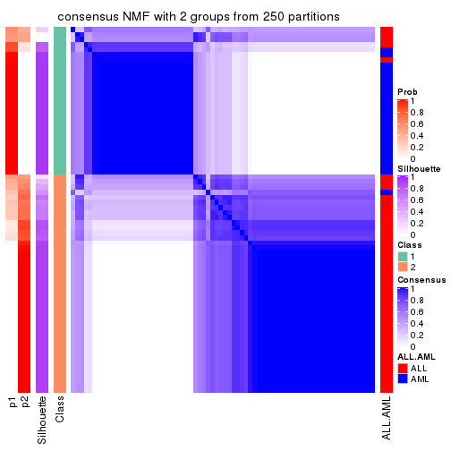</p>

</div>
<div id='tab-SD-NMF-consensus-heatmap-2'>
<pre><code class="r">consensus_heatmap(res, k = 3)
</code></pre>

<p>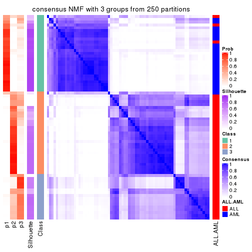</p>

</div>
<div id='tab-SD-NMF-consensus-heatmap-3'>
<pre><code class="r">consensus_heatmap(res, k = 4)
</code></pre>

<p>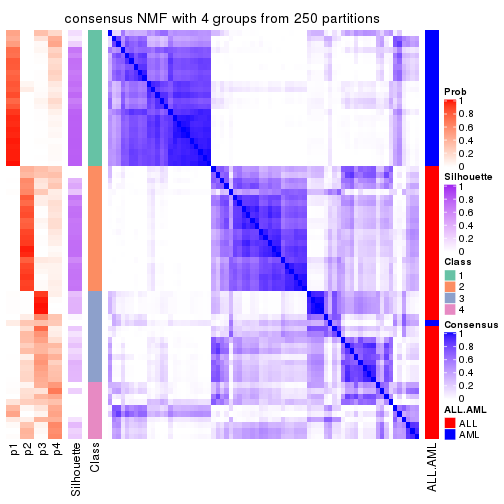</p>

</div>
<div id='tab-SD-NMF-consensus-heatmap-4'>
<pre><code class="r">consensus_heatmap(res, k = 5)
</code></pre>

<p>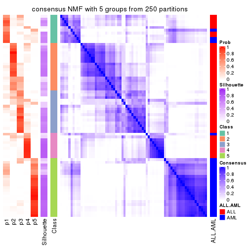</p>

</div>
<div id='tab-SD-NMF-consensus-heatmap-5'>
<pre><code class="r">consensus_heatmap(res, k = 6)
</code></pre>

<p>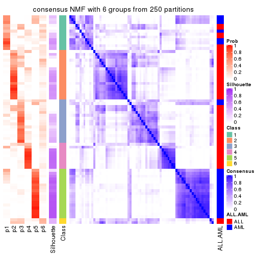</p>

</div>
</div>

Heatmaps for the membership of samples in all partitions to see how consistent they are:


<script>
$( function() {
	$( '#tabs-SD-NMF-membership-heatmap' ).tabs();
} );
</script>
<div id='tabs-SD-NMF-membership-heatmap'>
<ul>
<li><a href='#tab-SD-NMF-membership-heatmap-1'>k = 2</a></li>
<li><a href='#tab-SD-NMF-membership-heatmap-2'>k = 3</a></li>
<li><a href='#tab-SD-NMF-membership-heatmap-3'>k = 4</a></li>
<li><a href='#tab-SD-NMF-membership-heatmap-4'>k = 5</a></li>
<li><a href='#tab-SD-NMF-membership-heatmap-5'>k = 6</a></li>
</ul>
<div id='tab-SD-NMF-membership-heatmap-1'>
<pre><code class="r">membership_heatmap(res, k = 2)
</code></pre>

<p>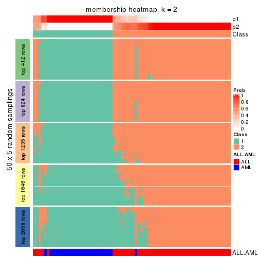</p>

</div>
<div id='tab-SD-NMF-membership-heatmap-2'>
<pre><code class="r">membership_heatmap(res, k = 3)
</code></pre>

<p>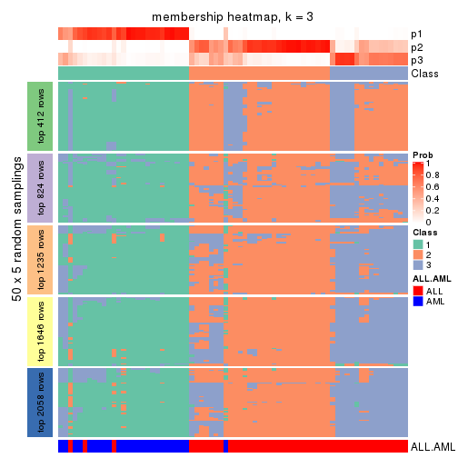</p>

</div>
<div id='tab-SD-NMF-membership-heatmap-3'>
<pre><code class="r">membership_heatmap(res, k = 4)
</code></pre>

<p>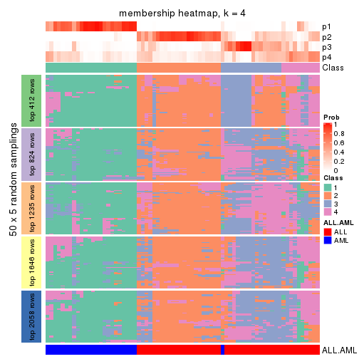</p>

</div>
<div id='tab-SD-NMF-membership-heatmap-4'>
<pre><code class="r">membership_heatmap(res, k = 5)
</code></pre>

<p>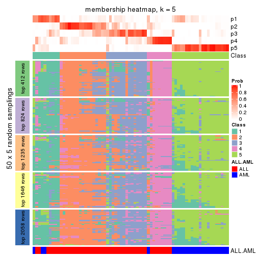</p>

</div>
<div id='tab-SD-NMF-membership-heatmap-5'>
<pre><code class="r">membership_heatmap(res, k = 6)
</code></pre>

<p>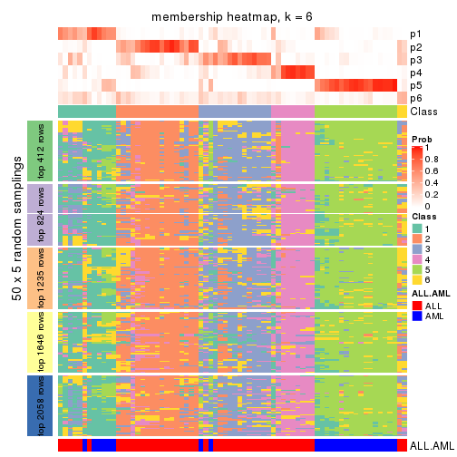</p>

</div>
</div>

As soon as we have had the classes for columns, we can look for signatures
which are significantly different between classes which can be candidate marks
for certain classes. Following are the heatmaps for signatures.


Signature heatmaps where rows are scaled:


<script>
$( function() {
	$( '#tabs-SD-NMF-get-signatures' ).tabs();
} );
</script>
<div id='tabs-SD-NMF-get-signatures'>
<ul>
<li><a href='#tab-SD-NMF-get-signatures-1'>k = 2</a></li>
<li><a href='#tab-SD-NMF-get-signatures-2'>k = 3</a></li>
<li><a href='#tab-SD-NMF-get-signatures-3'>k = 4</a></li>
<li><a href='#tab-SD-NMF-get-signatures-4'>k = 5</a></li>
<li><a href='#tab-SD-NMF-get-signatures-5'>k = 6</a></li>
</ul>
<div id='tab-SD-NMF-get-signatures-1'>
<pre><code class="r">get_signatures(res, k = 2)
</code></pre>

<p>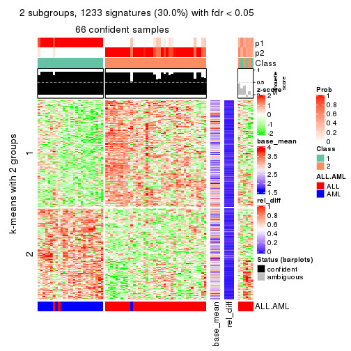</p>

</div>
<div id='tab-SD-NMF-get-signatures-2'>
<pre><code class="r">get_signatures(res, k = 3)
</code></pre>

<p>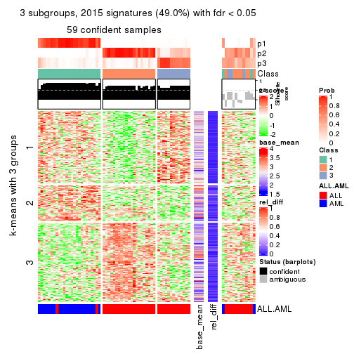</p>

</div>
<div id='tab-SD-NMF-get-signatures-3'>
<pre><code class="r">get_signatures(res, k = 4)
</code></pre>

<p>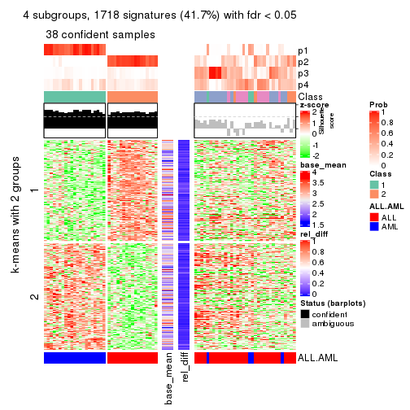</p>

</div>
<div id='tab-SD-NMF-get-signatures-4'>
<pre><code class="r">get_signatures(res, k = 5)
</code></pre>

<p>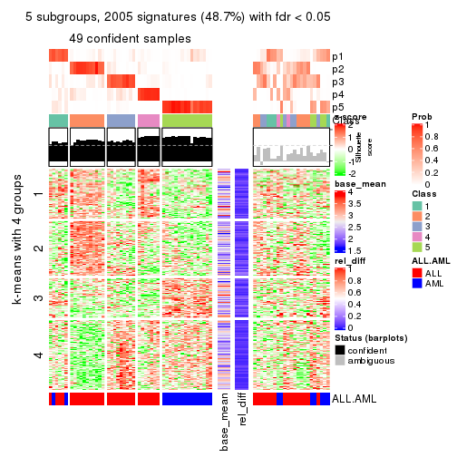</p>

</div>
<div id='tab-SD-NMF-get-signatures-5'>
<pre><code class="r">get_signatures(res, k = 6)
</code></pre>

<p>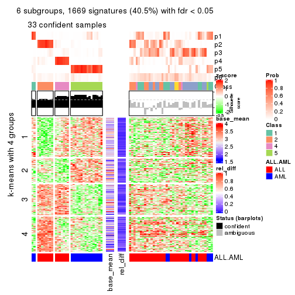</p>

</div>
</div>


Signature heatmaps where rows are not scaled:


<script>
$( function() {
	$( '#tabs-SD-NMF-get-signatures-no-scale' ).tabs();
} );
</script>
<div id='tabs-SD-NMF-get-signatures-no-scale'>
<ul>
<li><a href='#tab-SD-NMF-get-signatures-no-scale-1'>k = 2</a></li>
<li><a href='#tab-SD-NMF-get-signatures-no-scale-2'>k = 3</a></li>
<li><a href='#tab-SD-NMF-get-signatures-no-scale-3'>k = 4</a></li>
<li><a href='#tab-SD-NMF-get-signatures-no-scale-4'>k = 5</a></li>
<li><a href='#tab-SD-NMF-get-signatures-no-scale-5'>k = 6</a></li>
</ul>
<div id='tab-SD-NMF-get-signatures-no-scale-1'>
<pre><code class="r">get_signatures(res, k = 2, scale_rows = FALSE)
</code></pre>

<p>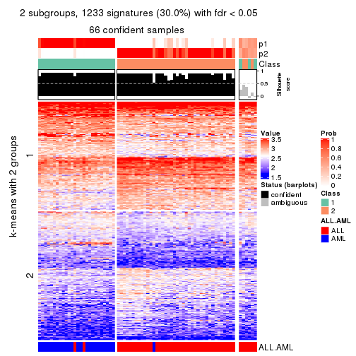</p>

</div>
<div id='tab-SD-NMF-get-signatures-no-scale-2'>
<pre><code class="r">get_signatures(res, k = 3, scale_rows = FALSE)
</code></pre>

<p>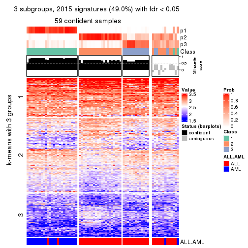</p>

</div>
<div id='tab-SD-NMF-get-signatures-no-scale-3'>
<pre><code class="r">get_signatures(res, k = 4, scale_rows = FALSE)
</code></pre>

<p>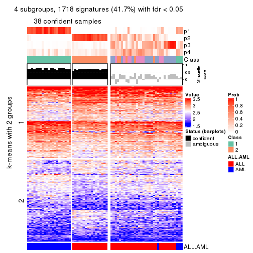</p>

</div>
<div id='tab-SD-NMF-get-signatures-no-scale-4'>
<pre><code class="r">get_signatures(res, k = 5, scale_rows = FALSE)
</code></pre>

<p>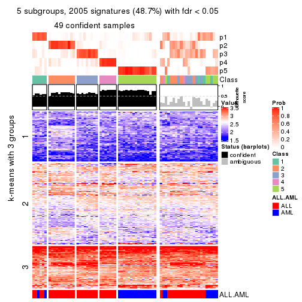</p>

</div>
<div id='tab-SD-NMF-get-signatures-no-scale-5'>
<pre><code class="r">get_signatures(res, k = 6, scale_rows = FALSE)
</code></pre>

<p>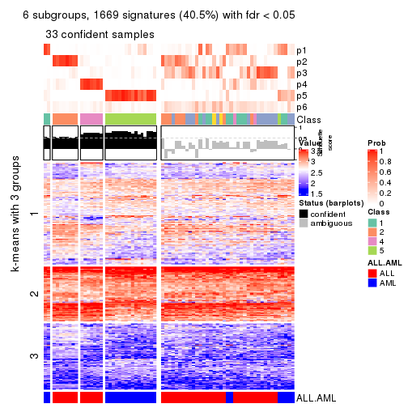</p>

</div>
</div>


Compare the overlap of signatures from different k:

```r
compare_signatures(res)
```

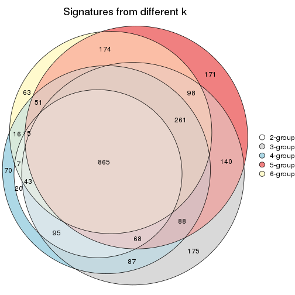

`get_signature()` returns a data frame invisibly. TO get the list of signatures, the function
call should be assigned to a variable explicitly. In following code, if `plot` argument is set
to `FALSE`, no heatmap is plotted while only the differential analysis is performed.

```r
# code only for demonstration
tb = get_signature(res, k = ..., plot = FALSE)
```

An example of the output of `tb` is:

```
#>   which_row         fdr    mean_1    mean_2 scaled_mean_1 scaled_mean_2 km
#> 1        38 0.042760348  8.373488  9.131774    -0.5533452     0.5164555  1
#> 2        40 0.018707592  7.106213  8.469186    -0.6173731     0.5762149  1
#> 3        55 0.019134737 10.221463 11.207825    -0.6159697     0.5749050  1
#> 4        59 0.006059896  5.921854  7.869574    -0.6899429     0.6439467  1
#> 5        60 0.018055526  8.928898 10.211722    -0.6204761     0.5791110  1
#> 6        98 0.009384629 15.714769 14.887706     0.6635654    -0.6193277  2
...
```

The columns in `tb` are:

1. `which_row`: row indices corresponding to the input matrix.
2. `fdr`: FDR for the differential test. 
3. `mean_x`: The mean value in group x.
4. `scaled_mean_x`: The mean value in group x after rows are scaled.
5. `km`: Row groups if k-means clustering is applied to rows.


UMAP plot which shows how samples are separated.


<script>
$( function() {
	$( '#tabs-SD-NMF-dimension-reduction' ).tabs();
} );
</script>
<div id='tabs-SD-NMF-dimension-reduction'>
<ul>
<li><a href='#tab-SD-NMF-dimension-reduction-1'>k = 2</a></li>
<li><a href='#tab-SD-NMF-dimension-reduction-2'>k = 3</a></li>
<li><a href='#tab-SD-NMF-dimension-reduction-3'>k = 4</a></li>
<li><a href='#tab-SD-NMF-dimension-reduction-4'>k = 5</a></li>
<li><a href='#tab-SD-NMF-dimension-reduction-5'>k = 6</a></li>
</ul>
<div id='tab-SD-NMF-dimension-reduction-1'>
<pre><code class="r">dimension_reduction(res, k = 2, method = &quot;UMAP&quot;)
</code></pre>

<p>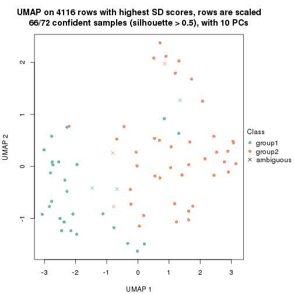</p>

</div>
<div id='tab-SD-NMF-dimension-reduction-2'>
<pre><code class="r">dimension_reduction(res, k = 3, method = &quot;UMAP&quot;)
</code></pre>

<p>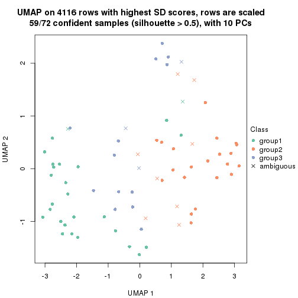</p>

</div>
<div id='tab-SD-NMF-dimension-reduction-3'>
<pre><code class="r">dimension_reduction(res, k = 4, method = &quot;UMAP&quot;)
</code></pre>

<p>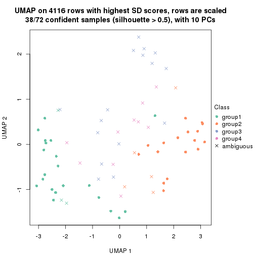</p>

</div>
<div id='tab-SD-NMF-dimension-reduction-4'>
<pre><code class="r">dimension_reduction(res, k = 5, method = &quot;UMAP&quot;)
</code></pre>

<p>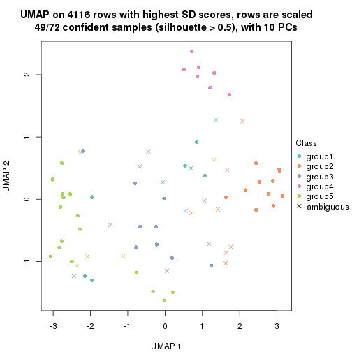</p>

</div>
<div id='tab-SD-NMF-dimension-reduction-5'>
<pre><code class="r">dimension_reduction(res, k = 6, method = &quot;UMAP&quot;)
</code></pre>

<p>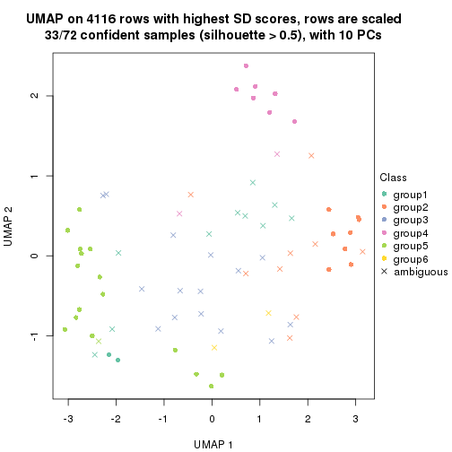</p>

</div>
</div>


Following heatmap shows how subgroups are split when increasing `k`:

```r
collect_classes(res)
```

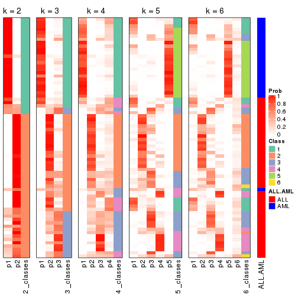


Test correlation between subgroups and known annotations. If the known
annotation is numeric, one-way ANOVA test is applied, and if the known
annotation is discrete, chi-squared contingency table test is applied.

```r
test_to_known_factors(res)
```

```
#>         n ALL.AML(p) k
#> SD:NMF 66   1.35e-12 2
#> SD:NMF 59   7.38e-12 3
#> SD:NMF 38   5.34e-09 4
#> SD:NMF 49   9.13e-09 5
#> SD:NMF 33   3.22e-07 6
```


If matrix rows can be associated to genes, consider to use `functional_enrichment(res,
...)` to perform function enrichment for the signature genes. See [this vignette](http://bioconductor.org/packages/devel/bioc/vignettes/cola/inst/doc/functional_enrichment.html) for more detailed explanations.


 

---------------------------------------------------


### CV:hclust


The object with results only for a single top-value method and a single partition method 
can be extracted as:

```r
res = res_list["CV", "hclust"]
# you can also extract it by
# res = res_list["CV:hclust"]
```

A summary of `res` and all the functions that can be applied to it:

```r
res
```

```
#> A 'ConsensusPartition' object with k = 2, 3, 4, 5, 6.
#>   On a matrix with 4116 rows and 72 columns.
#>   Top rows (412, 824, 1235, 1646, 2058) are extracted by 'CV' method.
#>   Subgroups are detected by 'hclust' method.
#>   Performed in total 1250 partitions by row resampling.
#>   Best k for subgroups seems to be 2.
#> 
#> Following methods can be applied to this 'ConsensusPartition' object:
#>  [1] "cola_report"             "collect_classes"         "collect_plots"          
#>  [4] "collect_stats"           "colnames"                "compare_signatures"     
#>  [7] "consensus_heatmap"       "dimension_reduction"     "functional_enrichment"  
#> [10] "get_anno_col"            "get_anno"                "get_classes"            
#> [13] "get_consensus"           "get_matrix"              "get_membership"         
#> [16] "get_param"               "get_signatures"          "get_stats"              
#> [19] "is_best_k"               "is_stable_k"             "membership_heatmap"     
#> [22] "ncol"                    "nrow"                    "plot_ecdf"              
#> [25] "rownames"                "select_partition_number" "show"                   
#> [28] "suggest_best_k"          "test_to_known_factors"
```

`collect_plots()` function collects all the plots made from `res` for all `k` (number of partitions)
into one single page to provide an easy and fast comparison between different `k`.

```r
collect_plots(res)
```

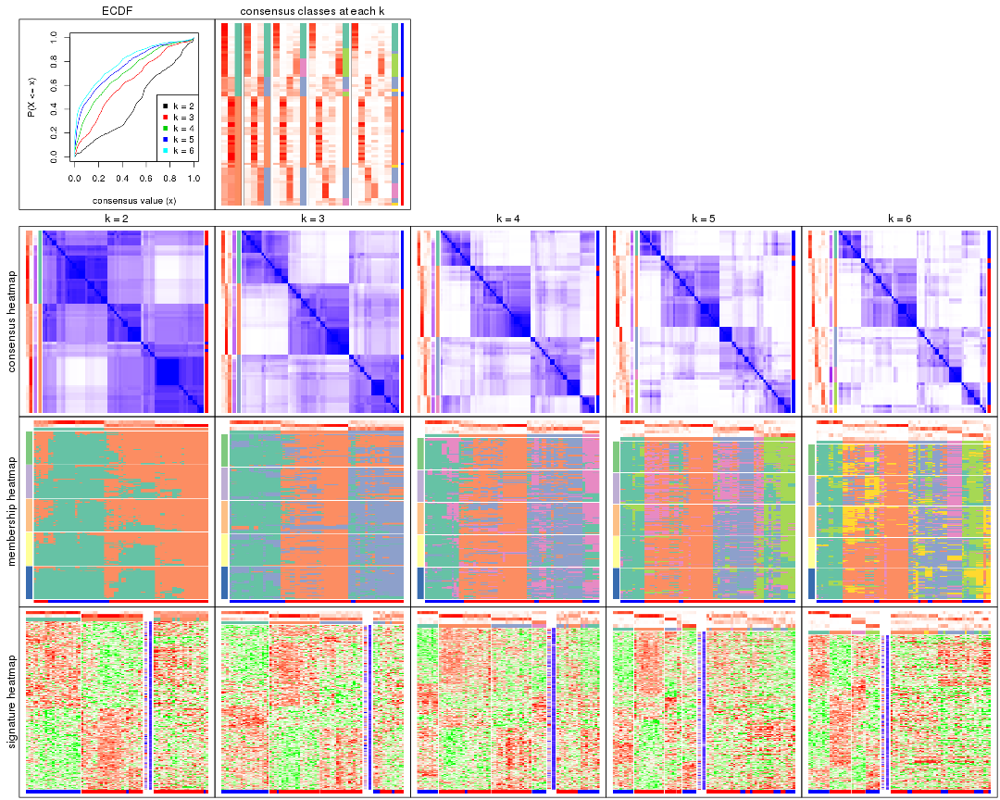

The plots are:

- The first row: a plot of the ECDF (empirical cumulative distribution
  function) curves of the consensus matrix for each `k` and the heatmap of
  predicted classes for each `k`.
- The second row: heatmaps of the consensus matrix for each `k`.
- The third row: heatmaps of the membership matrix for each `k`.
- The fouth row: heatmaps of the signatures for each `k`.

All the plots in panels can be made by individual functions and they are
plotted later in this section.

`select_partition_number()` produces several plots showing different
statistics for choosing "optimized" `k`. There are following statistics:

- ECDF curves of the consensus matrix for each `k`;
- 1-PAC. [The PAC
  score](https://en.wikipedia.org/wiki/Consensus_clustering#Over-interpretation_potential_of_consensus_clustering)
  measures the proportion of the ambiguous subgrouping.
- Mean silhouette score.
- Concordance. The mean probability of fiting the consensus class ids in all
  partitions.
- Area increased. Denote $A_k$ as the area under the ECDF curve for current
  `k`, the area increased is defined as $A_k - A_{k-1}$.
- Rand index. The percent of pairs of samples that are both in a same cluster
  or both are not in a same cluster in the partition of k and k-1.
- Jaccard index. The ratio of pairs of samples are both in a same cluster in
  the partition of k and k-1 and the pairs of samples are both in a same
  cluster in the partition k or k-1.

The detailed explanations of these statistics can be found in [the _cola_
vignette](http://bioconductor.org/packages/devel/bioc/vignettes/cola/inst/doc/cola.html#toc_13).

Generally speaking, lower PAC score, higher mean silhouette score or higher
concordance corresponds to better partition. Rand index and Jaccard index
measure how similar the current partition is compared to partition with `k-1`.
If they are too similar, we won't accept `k` is better than `k-1`.

```r
select_partition_number(res)
```

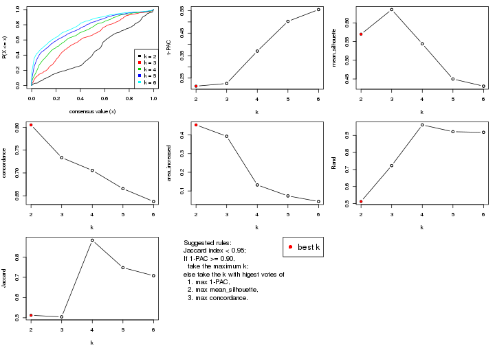

The numeric values for all these statistics can be obtained by `get_stats()`.

```r
get_stats(res)
```

```
#>   k 1-PAC mean_silhouette concordance area_increased  Rand Jaccard
#> 2 2 0.214           0.570       0.805         0.4538 0.512   0.512
#> 3 3 0.226           0.635       0.734         0.3928 0.723   0.505
#> 4 4 0.370           0.544       0.706         0.1323 0.962   0.883
#> 5 5 0.503           0.450       0.665         0.0734 0.922   0.748
#> 6 6 0.555           0.431       0.637         0.0435 0.918   0.708
```

`suggest_best_k()` suggests the best $k$ based on these statistics. The rules are as follows:

- All $k$ with Jaccard index larger than 0.95 are removed because increasing
  $k$ does not provide enough extra information. If all $k$ are removed, it is
  marked as no subgroup is detected.
- For all $k$ with 1-PAC score larger than 0.9, the maximal $k$ is taken as
  the best $k$, and other $k$ are marked as optional $k$.
- If it does not fit the second rule. The $k$ with the maximal vote of the
  highest 1-PAC score, highest mean silhouette, and highest concordance is
  taken as the best $k$.

```r
suggest_best_k(res)
```

```
#> [1] 2
```


Following shows the table of the partitions (You need to click the **show/hide
code output** link to see it). The membership matrix (columns with name `p*`)
is inferred by
[`clue::cl_consensus()`](https://www.rdocumentation.org/link/cl_consensus?package=clue)
function with the `SE` method. Basically the value in the membership matrix
represents the probability to belong to a certain group. The finall class
label for an item is determined with the group with highest probability it
belongs to.

In `get_classes()` function, the entropy is calculated from the membership
matrix and the silhouette score is calculated from the consensus matrix.


<script>
$( function() {
	$( '#tabs-CV-hclust-get-classes' ).tabs();
} );
</script>
<div id='tabs-CV-hclust-get-classes'>
<ul>
<li><a href='#tab-CV-hclust-get-classes-1'>k = 2</a></li>
<li><a href='#tab-CV-hclust-get-classes-2'>k = 3</a></li>
<li><a href='#tab-CV-hclust-get-classes-3'>k = 4</a></li>
<li><a href='#tab-CV-hclust-get-classes-4'>k = 5</a></li>
<li><a href='#tab-CV-hclust-get-classes-5'>k = 6</a></li>
</ul>

<div id='tab-CV-hclust-get-classes-1'>
<p><a id='tab-CV-hclust-get-classes-1-a' style='color:#0366d6' href='#'>show/hide code output</a></p>
<pre><code class="r">cbind(get_classes(res, k = 2), get_membership(res, k = 2))
</code></pre>

<pre><code>#&gt;           class entropy silhouette    p1    p2
#&gt; sample_39     1  1.0000     -0.189 0.504 0.496
#&gt; sample_40     1  0.9661      0.219 0.608 0.392
#&gt; sample_42     2  0.6247      0.685 0.156 0.844
#&gt; sample_47     2  0.3584      0.702 0.068 0.932
#&gt; sample_48     2  0.0000      0.693 0.000 1.000
#&gt; sample_49     1  0.9754      0.142 0.592 0.408
#&gt; sample_41     2  0.0000      0.693 0.000 1.000
#&gt; sample_43     2  0.4939      0.699 0.108 0.892
#&gt; sample_44     2  0.4690      0.704 0.100 0.900
#&gt; sample_45     2  0.4431      0.705 0.092 0.908
#&gt; sample_46     2  0.6247      0.688 0.156 0.844
#&gt; sample_70     2  0.6247      0.688 0.156 0.844
#&gt; sample_71     2  0.8499      0.597 0.276 0.724
#&gt; sample_72     2  0.8499      0.597 0.276 0.724
#&gt; sample_68     2  0.0000      0.693 0.000 1.000
#&gt; sample_69     2  0.0000      0.693 0.000 1.000
#&gt; sample_67     2  0.9170      0.474 0.332 0.668
#&gt; sample_55     1  0.9998     -0.167 0.508 0.492
#&gt; sample_56     2  1.0000      0.165 0.496 0.504
#&gt; sample_59     2  0.9850      0.360 0.428 0.572
#&gt; sample_52     1  0.3274      0.799 0.940 0.060
#&gt; sample_53     1  0.0672      0.787 0.992 0.008
#&gt; sample_51     1  0.0376      0.784 0.996 0.004
#&gt; sample_50     1  0.0376      0.784 0.996 0.004
#&gt; sample_54     1  0.4431      0.789 0.908 0.092
#&gt; sample_57     1  0.4022      0.794 0.920 0.080
#&gt; sample_58     1  0.1843      0.796 0.972 0.028
#&gt; sample_60     1  0.4298      0.790 0.912 0.088
#&gt; sample_61     1  0.5737      0.740 0.864 0.136
#&gt; sample_65     1  0.3114      0.800 0.944 0.056
#&gt; sample_66     2  0.8016      0.538 0.244 0.756
#&gt; sample_63     1  0.3431      0.799 0.936 0.064
#&gt; sample_64     1  0.8144      0.577 0.748 0.252
#&gt; sample_62     1  0.3431      0.799 0.936 0.064
#&gt; sample_1      2  0.9866      0.355 0.432 0.568
#&gt; sample_2      2  0.9000      0.508 0.316 0.684
#&gt; sample_3      2  0.9850      0.356 0.428 0.572
#&gt; sample_4      2  0.9815      0.370 0.420 0.580
#&gt; sample_5      2  0.0000      0.693 0.000 1.000
#&gt; sample_6      2  0.9850      0.356 0.428 0.572
#&gt; sample_7      2  0.9815      0.370 0.420 0.580
#&gt; sample_8      2  0.9998      0.181 0.492 0.508
#&gt; sample_9      2  0.9833      0.363 0.424 0.576
#&gt; sample_10     2  0.9850      0.356 0.428 0.572
#&gt; sample_11     2  0.9833      0.363 0.424 0.576
#&gt; sample_12     1  0.9815      0.102 0.580 0.420
#&gt; sample_13     2  0.0000      0.693 0.000 1.000
#&gt; sample_14     2  0.4939      0.699 0.108 0.892
#&gt; sample_15     2  0.0000      0.693 0.000 1.000
#&gt; sample_16     2  0.4562      0.705 0.096 0.904
#&gt; sample_17     2  0.4022      0.699 0.080 0.920
#&gt; sample_18     2  0.9661      0.447 0.392 0.608
#&gt; sample_19     2  0.4562      0.705 0.096 0.904
#&gt; sample_20     2  0.0000      0.693 0.000 1.000
#&gt; sample_21     2  0.0000      0.693 0.000 1.000
#&gt; sample_22     2  0.9998      0.187 0.492 0.508
#&gt; sample_23     2  0.9850      0.356 0.428 0.572
#&gt; sample_24     2  0.0000      0.693 0.000 1.000
#&gt; sample_25     2  0.9993      0.232 0.484 0.516
#&gt; sample_26     2  0.5178      0.703 0.116 0.884
#&gt; sample_27     1  0.9754      0.142 0.592 0.408
#&gt; sample_34     1  0.5408      0.757 0.876 0.124
#&gt; sample_35     1  0.7528      0.638 0.784 0.216
#&gt; sample_36     1  0.0938      0.787 0.988 0.012
#&gt; sample_37     1  0.0938      0.786 0.988 0.012
#&gt; sample_38     1  0.4690      0.758 0.900 0.100
#&gt; sample_28     1  0.2603      0.788 0.956 0.044
#&gt; sample_29     2  0.9896      0.205 0.440 0.560
#&gt; sample_30     1  0.0938      0.787 0.988 0.012
#&gt; sample_31     1  0.2948      0.799 0.948 0.052
#&gt; sample_32     1  0.3114      0.798 0.944 0.056
#&gt; sample_33     1  0.0376      0.784 0.996 0.004
</code></pre>

<script>
$('#tab-CV-hclust-get-classes-1-a').parent().next().next().hide();
$('#tab-CV-hclust-get-classes-1-a').click(function(){
  $('#tab-CV-hclust-get-classes-1-a').parent().next().next().toggle();
  return(false);
});
</script>
</div>

<div id='tab-CV-hclust-get-classes-2'>
<p><a id='tab-CV-hclust-get-classes-2-a' style='color:#0366d6' href='#'>show/hide code output</a></p>
<pre><code class="r">cbind(get_classes(res, k = 3), get_membership(res, k = 3))
</code></pre>

<pre><code>#&gt;           class entropy silhouette    p1    p2    p3
#&gt; sample_39     3  0.6488    0.71409 0.064 0.192 0.744
#&gt; sample_40     3  0.6775    0.61583 0.164 0.096 0.740
#&gt; sample_42     2  0.6922    0.62911 0.080 0.720 0.200
#&gt; sample_47     2  0.4063    0.72388 0.020 0.868 0.112
#&gt; sample_48     2  0.0424    0.73895 0.000 0.992 0.008
#&gt; sample_49     3  0.7926    0.59909 0.216 0.128 0.656
#&gt; sample_41     2  0.0747    0.73669 0.000 0.984 0.016
#&gt; sample_43     2  0.5891    0.66073 0.036 0.764 0.200
#&gt; sample_44     2  0.5902    0.52942 0.004 0.680 0.316
#&gt; sample_45     2  0.5325    0.60820 0.004 0.748 0.248
#&gt; sample_46     2  0.6473    0.47192 0.016 0.652 0.332
#&gt; sample_70     2  0.6648    0.41345 0.016 0.620 0.364
#&gt; sample_71     2  0.8779    0.44960 0.172 0.580 0.248
#&gt; sample_72     2  0.8779    0.44960 0.172 0.580 0.248
#&gt; sample_68     2  0.0592    0.73861 0.000 0.988 0.012
#&gt; sample_69     2  0.0424    0.73895 0.000 0.992 0.008
#&gt; sample_67     2  0.8652    0.42977 0.284 0.576 0.140
#&gt; sample_55     3  0.9208    0.57281 0.204 0.264 0.532
#&gt; sample_56     3  0.7485    0.70253 0.132 0.172 0.696
#&gt; sample_59     3  0.9105    0.45652 0.152 0.348 0.500
#&gt; sample_52     1  0.5956    0.72954 0.720 0.016 0.264
#&gt; sample_53     1  0.3412    0.76444 0.876 0.000 0.124
#&gt; sample_51     1  0.2711    0.77344 0.912 0.000 0.088
#&gt; sample_50     1  0.2625    0.77479 0.916 0.000 0.084
#&gt; sample_54     1  0.6867    0.66080 0.636 0.028 0.336
#&gt; sample_57     1  0.6497    0.67872 0.648 0.016 0.336
#&gt; sample_58     1  0.4473    0.75423 0.828 0.008 0.164
#&gt; sample_60     1  0.6750    0.66500 0.640 0.024 0.336
#&gt; sample_61     1  0.6641    0.44512 0.544 0.008 0.448
#&gt; sample_65     1  0.5020    0.77258 0.796 0.012 0.192
#&gt; sample_66     2  0.7287    0.56680 0.212 0.696 0.092
#&gt; sample_63     1  0.6053    0.72924 0.720 0.020 0.260
#&gt; sample_64     3  0.7150    0.13636 0.348 0.036 0.616
#&gt; sample_62     1  0.6090    0.72756 0.716 0.020 0.264
#&gt; sample_1      3  0.7446    0.67918 0.076 0.260 0.664
#&gt; sample_2      2  0.8733    0.45117 0.260 0.580 0.160
#&gt; sample_3      3  0.6981    0.69053 0.068 0.228 0.704
#&gt; sample_4      3  0.7997    0.64647 0.084 0.316 0.600
#&gt; sample_5      2  0.0747    0.73669 0.000 0.984 0.016
#&gt; sample_6      3  0.6981    0.69053 0.068 0.228 0.704
#&gt; sample_7      3  0.7997    0.64647 0.084 0.316 0.600
#&gt; sample_8      3  0.6599    0.71941 0.084 0.168 0.748
#&gt; sample_9      3  0.7101    0.68306 0.068 0.240 0.692
#&gt; sample_10     3  0.6981    0.69053 0.068 0.228 0.704
#&gt; sample_11     3  0.7022    0.68664 0.068 0.232 0.700
#&gt; sample_12     3  0.9514    0.49176 0.328 0.204 0.468
#&gt; sample_13     2  0.0424    0.73895 0.000 0.992 0.008
#&gt; sample_14     2  0.6059    0.64441 0.048 0.764 0.188
#&gt; sample_15     2  0.0747    0.73669 0.000 0.984 0.016
#&gt; sample_16     2  0.5325    0.61489 0.004 0.748 0.248
#&gt; sample_17     2  0.4931    0.69693 0.032 0.828 0.140
#&gt; sample_18     3  0.8836    0.41835 0.120 0.388 0.492
#&gt; sample_19     2  0.5244    0.61987 0.004 0.756 0.240
#&gt; sample_20     2  0.0424    0.73895 0.000 0.992 0.008
#&gt; sample_21     2  0.1289    0.73431 0.000 0.968 0.032
#&gt; sample_22     3  0.7653    0.72395 0.140 0.176 0.684
#&gt; sample_23     3  0.6981    0.69053 0.068 0.228 0.704
#&gt; sample_24     2  0.1031    0.73714 0.000 0.976 0.024
#&gt; sample_25     3  0.8994    0.60485 0.184 0.260 0.556
#&gt; sample_26     2  0.5443    0.59906 0.004 0.736 0.260
#&gt; sample_27     3  0.7926    0.59909 0.216 0.128 0.656
#&gt; sample_34     1  0.6849    0.57151 0.600 0.020 0.380
#&gt; sample_35     3  0.7083   -0.00526 0.380 0.028 0.592
#&gt; sample_36     1  0.2945    0.78279 0.908 0.004 0.088
#&gt; sample_37     1  0.3340    0.76241 0.880 0.000 0.120
#&gt; sample_38     1  0.5939    0.64194 0.748 0.028 0.224
#&gt; sample_28     1  0.4802    0.73231 0.824 0.020 0.156
#&gt; sample_29     2  0.8569    0.28731 0.392 0.508 0.100
#&gt; sample_30     1  0.2945    0.78279 0.908 0.004 0.088
#&gt; sample_31     1  0.5008    0.78039 0.804 0.016 0.180
#&gt; sample_32     1  0.4677    0.78455 0.840 0.028 0.132
#&gt; sample_33     1  0.3412    0.76410 0.876 0.000 0.124
</code></pre>

<script>
$('#tab-CV-hclust-get-classes-2-a').parent().next().next().hide();
$('#tab-CV-hclust-get-classes-2-a').click(function(){
  $('#tab-CV-hclust-get-classes-2-a').parent().next().next().toggle();
  return(false);
});
</script>
</div>

<div id='tab-CV-hclust-get-classes-3'>
<p><a id='tab-CV-hclust-get-classes-3-a' style='color:#0366d6' href='#'>show/hide code output</a></p>
<pre><code class="r">cbind(get_classes(res, k = 4), get_membership(res, k = 4))
</code></pre>

<pre><code>#&gt;           class entropy silhouette    p1    p2    p3    p4
#&gt; sample_39     3  0.4318     0.6702 0.016 0.088 0.836 0.060
#&gt; sample_40     3  0.6774     0.5016 0.040 0.048 0.608 0.304
#&gt; sample_42     2  0.7195     0.6433 0.060 0.656 0.160 0.124
#&gt; sample_47     2  0.4743     0.7123 0.024 0.812 0.112 0.052
#&gt; sample_48     2  0.0376     0.7294 0.000 0.992 0.004 0.004
#&gt; sample_49     3  0.6791     0.5558 0.132 0.036 0.676 0.156
#&gt; sample_41     2  0.0657     0.7274 0.000 0.984 0.012 0.004
#&gt; sample_43     2  0.6186     0.6565 0.016 0.700 0.184 0.100
#&gt; sample_44     2  0.6407     0.5199 0.000 0.584 0.332 0.084
#&gt; sample_45     2  0.5851     0.6107 0.000 0.680 0.236 0.084
#&gt; sample_46     2  0.6423     0.5035 0.000 0.580 0.336 0.084
#&gt; sample_70     2  0.6708     0.4286 0.000 0.528 0.376 0.096
#&gt; sample_71     2  0.8526     0.4566 0.156 0.512 0.252 0.080
#&gt; sample_72     2  0.8526     0.4566 0.156 0.512 0.252 0.080
#&gt; sample_68     2  0.0469     0.7291 0.000 0.988 0.012 0.000
#&gt; sample_69     2  0.0376     0.7294 0.000 0.992 0.004 0.004
#&gt; sample_67     2  0.8505     0.4510 0.256 0.520 0.116 0.108
#&gt; sample_55     3  0.8945     0.3608 0.080 0.176 0.408 0.336
#&gt; sample_56     3  0.6727     0.5688 0.036 0.060 0.632 0.272
#&gt; sample_59     3  0.8830     0.2509 0.044 0.272 0.364 0.320
#&gt; sample_52     4  0.5735     0.7445 0.348 0.012 0.020 0.620
#&gt; sample_53     1  0.1970     0.6402 0.932 0.000 0.060 0.008
#&gt; sample_51     1  0.1929     0.6375 0.940 0.000 0.024 0.036
#&gt; sample_50     1  0.2363     0.6342 0.920 0.000 0.024 0.056
#&gt; sample_54     4  0.6272     0.7599 0.276 0.024 0.048 0.652
#&gt; sample_57     4  0.5834     0.7681 0.288 0.008 0.044 0.660
#&gt; sample_58     1  0.6064    -0.2415 0.512 0.000 0.044 0.444
#&gt; sample_60     4  0.6198     0.7639 0.280 0.020 0.048 0.652
#&gt; sample_61     1  0.7913    -0.1015 0.360 0.000 0.324 0.316
#&gt; sample_65     1  0.6394    -0.1779 0.552 0.004 0.060 0.384
#&gt; sample_66     2  0.7243     0.5871 0.176 0.640 0.044 0.140
#&gt; sample_63     4  0.5683     0.7567 0.336 0.012 0.020 0.632
#&gt; sample_64     3  0.7292     0.0376 0.116 0.008 0.456 0.420
#&gt; sample_62     4  0.5664     0.7586 0.332 0.012 0.020 0.636
#&gt; sample_1      3  0.5810     0.6330 0.036 0.156 0.744 0.064
#&gt; sample_2      2  0.8517     0.4672 0.236 0.528 0.132 0.104
#&gt; sample_3      3  0.5363     0.6515 0.052 0.112 0.784 0.052
#&gt; sample_4      3  0.6754     0.5966 0.044 0.224 0.660 0.072
#&gt; sample_5      2  0.0657     0.7274 0.000 0.984 0.012 0.004
#&gt; sample_6      3  0.5283     0.6508 0.052 0.112 0.788 0.048
#&gt; sample_7      3  0.6754     0.5966 0.044 0.224 0.660 0.072
#&gt; sample_8      3  0.4092     0.6674 0.036 0.048 0.856 0.060
#&gt; sample_9      3  0.5447     0.6462 0.052 0.124 0.776 0.048
#&gt; sample_10     3  0.5283     0.6508 0.052 0.112 0.788 0.048
#&gt; sample_11     3  0.5394     0.6478 0.052 0.120 0.780 0.048
#&gt; sample_12     3  0.8578     0.4225 0.280 0.160 0.488 0.072
#&gt; sample_13     2  0.0376     0.7294 0.000 0.992 0.004 0.004
#&gt; sample_14     2  0.6040     0.5985 0.028 0.712 0.196 0.064
#&gt; sample_15     2  0.0657     0.7274 0.000 0.984 0.012 0.004
#&gt; sample_16     2  0.5624     0.5979 0.000 0.668 0.280 0.052
#&gt; sample_17     2  0.4758     0.6761 0.016 0.808 0.112 0.064
#&gt; sample_18     3  0.8572     0.2684 0.068 0.340 0.448 0.144
#&gt; sample_19     2  0.5416     0.6161 0.000 0.692 0.260 0.048
#&gt; sample_20     2  0.0376     0.7294 0.000 0.992 0.004 0.004
#&gt; sample_21     2  0.3070     0.6963 0.016 0.896 0.020 0.068
#&gt; sample_22     3  0.4581     0.6650 0.108 0.052 0.820 0.020
#&gt; sample_23     3  0.5283     0.6508 0.052 0.112 0.788 0.048
#&gt; sample_24     2  0.1209     0.7256 0.000 0.964 0.032 0.004
#&gt; sample_25     3  0.7843     0.5019 0.144 0.200 0.592 0.064
#&gt; sample_26     2  0.5599     0.5997 0.000 0.672 0.276 0.052
#&gt; sample_27     3  0.6791     0.5558 0.132 0.036 0.676 0.156
#&gt; sample_34     4  0.7891     0.2944 0.352 0.004 0.232 0.412
#&gt; sample_35     3  0.7415    -0.0568 0.144 0.004 0.436 0.416
#&gt; sample_36     1  0.3878     0.5704 0.824 0.004 0.016 0.156
#&gt; sample_37     1  0.1798     0.6378 0.944 0.000 0.040 0.016
#&gt; sample_38     1  0.5012     0.5054 0.772 0.000 0.116 0.112
#&gt; sample_28     1  0.3342     0.6035 0.868 0.000 0.100 0.032
#&gt; sample_29     2  0.7657     0.3354 0.372 0.480 0.020 0.128
#&gt; sample_30     1  0.3878     0.5704 0.824 0.004 0.016 0.156
#&gt; sample_31     1  0.5887     0.1361 0.616 0.004 0.040 0.340
#&gt; sample_32     1  0.5677     0.4058 0.708 0.016 0.044 0.232
#&gt; sample_33     1  0.1824     0.6397 0.936 0.000 0.060 0.004
</code></pre>

<script>
$('#tab-CV-hclust-get-classes-3-a').parent().next().next().hide();
$('#tab-CV-hclust-get-classes-3-a').click(function(){
  $('#tab-CV-hclust-get-classes-3-a').parent().next().next().toggle();
  return(false);
});
</script>
</div>

<div id='tab-CV-hclust-get-classes-4'>
<p><a id='tab-CV-hclust-get-classes-4-a' style='color:#0366d6' href='#'>show/hide code output</a></p>
<pre><code class="r">cbind(get_classes(res, k = 5), get_membership(res, k = 5))
</code></pre>

<pre><code>#&gt;           class entropy silhouette    p1    p2    p3    p4    p5
#&gt; sample_39     3  0.5343     0.3530 0.000 0.044 0.580 0.368 0.008
#&gt; sample_40     3  0.7526     0.0865 0.008 0.032 0.436 0.244 0.280
#&gt; sample_42     2  0.6620     0.4901 0.092 0.588 0.056 0.260 0.004
#&gt; sample_47     2  0.4628     0.6077 0.020 0.768 0.040 0.164 0.008
#&gt; sample_48     2  0.0794     0.6499 0.000 0.972 0.000 0.028 0.000
#&gt; sample_49     3  0.7261     0.2333 0.060 0.016 0.456 0.384 0.084
#&gt; sample_41     2  0.0807     0.6456 0.000 0.976 0.012 0.012 0.000
#&gt; sample_43     2  0.5731     0.5042 0.024 0.632 0.048 0.288 0.008
#&gt; sample_44     2  0.6399     0.3137 0.004 0.524 0.104 0.352 0.016
#&gt; sample_45     2  0.5782     0.4331 0.004 0.596 0.060 0.324 0.016
#&gt; sample_46     2  0.6254     0.2834 0.004 0.512 0.084 0.384 0.016
#&gt; sample_70     2  0.6626     0.1833 0.004 0.460 0.120 0.400 0.016
#&gt; sample_71     2  0.8073     0.3342 0.152 0.460 0.192 0.192 0.004
#&gt; sample_72     2  0.8073     0.3342 0.152 0.460 0.192 0.192 0.004
#&gt; sample_68     2  0.0404     0.6476 0.000 0.988 0.000 0.012 0.000
#&gt; sample_69     2  0.0794     0.6499 0.000 0.972 0.000 0.028 0.000
#&gt; sample_67     2  0.7943     0.3530 0.272 0.488 0.120 0.092 0.028
#&gt; sample_55     4  0.8634     0.5397 0.020 0.152 0.168 0.376 0.284
#&gt; sample_56     4  0.7173     0.2257 0.008 0.032 0.292 0.500 0.168
#&gt; sample_59     4  0.8159     0.5460 0.016 0.212 0.092 0.448 0.232
#&gt; sample_52     5  0.2352     0.5667 0.092 0.004 0.000 0.008 0.896
#&gt; sample_53     1  0.3012     0.8022 0.860 0.000 0.036 0.000 0.104
#&gt; sample_51     1  0.2732     0.7925 0.840 0.000 0.000 0.000 0.160
#&gt; sample_50     1  0.2929     0.7857 0.820 0.000 0.000 0.000 0.180
#&gt; sample_54     5  0.3782     0.5491 0.048 0.016 0.004 0.096 0.836
#&gt; sample_57     5  0.3439     0.5679 0.060 0.000 0.004 0.092 0.844
#&gt; sample_58     5  0.6039     0.3446 0.264 0.000 0.008 0.136 0.592
#&gt; sample_60     5  0.3680     0.5520 0.048 0.012 0.004 0.096 0.840
#&gt; sample_61     5  0.8591     0.2107 0.252 0.000 0.248 0.220 0.280
#&gt; sample_65     5  0.5696     0.2337 0.356 0.004 0.008 0.060 0.572
#&gt; sample_66     2  0.6779     0.4836 0.228 0.608 0.052 0.092 0.020
#&gt; sample_63     5  0.2228     0.5736 0.076 0.004 0.000 0.012 0.908
#&gt; sample_64     5  0.7306     0.0806 0.036 0.004 0.344 0.176 0.440
#&gt; sample_62     5  0.2054     0.5736 0.072 0.004 0.000 0.008 0.916
#&gt; sample_1      3  0.6683     0.2191 0.000 0.116 0.536 0.308 0.040
#&gt; sample_2      2  0.7951     0.3620 0.252 0.488 0.144 0.096 0.020
#&gt; sample_3      3  0.2125     0.5041 0.052 0.024 0.920 0.004 0.000
#&gt; sample_4      3  0.7459     0.1102 0.008 0.188 0.500 0.252 0.052
#&gt; sample_5      2  0.0566     0.6460 0.000 0.984 0.004 0.012 0.000
#&gt; sample_6      3  0.1965     0.5043 0.052 0.024 0.924 0.000 0.000
#&gt; sample_7      3  0.7459     0.1102 0.008 0.188 0.500 0.252 0.052
#&gt; sample_8      3  0.5264     0.3978 0.004 0.024 0.628 0.324 0.020
#&gt; sample_9      3  0.2300     0.4969 0.052 0.040 0.908 0.000 0.000
#&gt; sample_10     3  0.1965     0.5043 0.052 0.024 0.924 0.000 0.000
#&gt; sample_11     3  0.2299     0.5005 0.052 0.032 0.912 0.004 0.000
#&gt; sample_12     3  0.9034     0.0267 0.228 0.088 0.348 0.268 0.068
#&gt; sample_13     2  0.0794     0.6499 0.000 0.972 0.000 0.028 0.000
#&gt; sample_14     2  0.5606     0.4669 0.032 0.660 0.264 0.028 0.016
#&gt; sample_15     2  0.0566     0.6460 0.000 0.984 0.004 0.012 0.000
#&gt; sample_16     2  0.5832     0.4522 0.000 0.624 0.128 0.240 0.008
#&gt; sample_17     2  0.4575     0.5740 0.016 0.784 0.144 0.028 0.028
#&gt; sample_18     4  0.8440     0.2936 0.004 0.292 0.288 0.292 0.124
#&gt; sample_19     2  0.5634     0.4734 0.000 0.648 0.116 0.228 0.008
#&gt; sample_20     2  0.0794     0.6499 0.000 0.972 0.000 0.028 0.000
#&gt; sample_21     2  0.3629     0.5455 0.012 0.816 0.012 0.156 0.004
#&gt; sample_22     3  0.6324     0.3905 0.100 0.024 0.600 0.268 0.008
#&gt; sample_23     3  0.1965     0.5043 0.052 0.024 0.924 0.000 0.000
#&gt; sample_24     2  0.1403     0.6434 0.000 0.952 0.024 0.024 0.000
#&gt; sample_25     3  0.8088     0.0453 0.124 0.124 0.412 0.328 0.012
#&gt; sample_26     2  0.5792     0.4486 0.000 0.628 0.124 0.240 0.008
#&gt; sample_27     3  0.7261     0.2333 0.060 0.016 0.456 0.384 0.084
#&gt; sample_34     5  0.7191     0.4600 0.180 0.000 0.172 0.092 0.556
#&gt; sample_35     5  0.7417     0.1385 0.064 0.000 0.340 0.156 0.440
#&gt; sample_36     1  0.4199     0.6820 0.692 0.004 0.000 0.008 0.296
#&gt; sample_37     1  0.2293     0.7995 0.900 0.000 0.016 0.000 0.084
#&gt; sample_38     1  0.3023     0.6276 0.860 0.000 0.112 0.024 0.004
#&gt; sample_28     1  0.3397     0.7532 0.848 0.000 0.080 0.004 0.068
#&gt; sample_29     2  0.6628     0.2979 0.428 0.464 0.028 0.060 0.020
#&gt; sample_30     1  0.4199     0.6820 0.692 0.004 0.000 0.008 0.296
#&gt; sample_31     5  0.5467    -0.1404 0.456 0.004 0.012 0.028 0.500
#&gt; sample_32     1  0.5973     0.3564 0.548 0.016 0.020 0.036 0.380
#&gt; sample_33     1  0.3012     0.8011 0.860 0.000 0.036 0.000 0.104
</code></pre>

<script>
$('#tab-CV-hclust-get-classes-4-a').parent().next().next().hide();
$('#tab-CV-hclust-get-classes-4-a').click(function(){
  $('#tab-CV-hclust-get-classes-4-a').parent().next().next().toggle();
  return(false);
});
</script>
</div>

<div id='tab-CV-hclust-get-classes-5'>
<p><a id='tab-CV-hclust-get-classes-5-a' style='color:#0366d6' href='#'>show/hide code output</a></p>
<pre><code class="r">cbind(get_classes(res, k = 6), get_membership(res, k = 6))
</code></pre>

<pre><code>#&gt;           class entropy silhouette    p1    p2    p3    p4    p5    p6
#&gt; sample_39     3  0.3681   0.392947 0.000 0.016 0.808 0.064 0.000 0.112
#&gt; sample_40     3  0.5461   0.391224 0.008 0.024 0.648 0.032 0.256 0.032
#&gt; sample_42     2  0.6777   0.147541 0.036 0.444 0.048 0.060 0.012 0.400
#&gt; sample_47     2  0.4661   0.444723 0.012 0.704 0.020 0.036 0.000 0.228
#&gt; sample_48     2  0.1141   0.557186 0.000 0.948 0.000 0.000 0.000 0.052
#&gt; sample_49     3  0.4301   0.424605 0.016 0.000 0.784 0.032 0.052 0.116
#&gt; sample_41     2  0.0725   0.556001 0.000 0.976 0.000 0.012 0.000 0.012
#&gt; sample_43     2  0.5755   0.136789 0.004 0.488 0.048 0.032 0.008 0.420
#&gt; sample_44     2  0.6323  -0.178149 0.000 0.432 0.188 0.016 0.004 0.360
#&gt; sample_45     2  0.5695  -0.011604 0.000 0.476 0.088 0.016 0.004 0.416
#&gt; sample_46     2  0.6383  -0.235931 0.000 0.412 0.168 0.024 0.004 0.392
#&gt; sample_70     6  0.6634  -0.000463 0.000 0.368 0.216 0.028 0.004 0.384
#&gt; sample_71     2  0.8220   0.232134 0.076 0.408 0.072 0.184 0.016 0.244
#&gt; sample_72     2  0.8220   0.232134 0.076 0.408 0.072 0.184 0.016 0.244
#&gt; sample_68     2  0.0363   0.557500 0.000 0.988 0.000 0.000 0.000 0.012
#&gt; sample_69     2  0.1141   0.557186 0.000 0.948 0.000 0.000 0.000 0.052
#&gt; sample_67     2  0.8083   0.282157 0.152 0.420 0.008 0.224 0.044 0.152
#&gt; sample_55     6  0.8393   0.295948 0.008 0.132 0.236 0.048 0.248 0.328
#&gt; sample_56     3  0.6205   0.000183 0.000 0.012 0.552 0.028 0.144 0.264
#&gt; sample_59     6  0.7814   0.466812 0.000 0.156 0.180 0.036 0.196 0.432
#&gt; sample_52     5  0.3484   0.670767 0.188 0.000 0.000 0.012 0.784 0.016
#&gt; sample_53     1  0.1226   0.763084 0.952 0.000 0.004 0.040 0.004 0.000
#&gt; sample_51     1  0.1007   0.758887 0.956 0.000 0.000 0.000 0.044 0.000
#&gt; sample_50     1  0.1327   0.754078 0.936 0.000 0.000 0.000 0.064 0.000
#&gt; sample_54     5  0.5114   0.655646 0.120 0.016 0.008 0.016 0.720 0.120
#&gt; sample_57     5  0.4802   0.669882 0.132 0.000 0.008 0.016 0.724 0.120
#&gt; sample_58     5  0.7124   0.377837 0.268 0.000 0.072 0.028 0.484 0.148
#&gt; sample_60     5  0.5026   0.659019 0.120 0.012 0.008 0.016 0.724 0.120
#&gt; sample_61     3  0.7834  -0.008368 0.220 0.000 0.400 0.032 0.224 0.124
#&gt; sample_65     5  0.5941   0.185333 0.440 0.000 0.052 0.012 0.452 0.044
#&gt; sample_66     2  0.7348   0.346626 0.084 0.504 0.000 0.160 0.048 0.204
#&gt; sample_63     5  0.3436   0.678202 0.172 0.000 0.000 0.012 0.796 0.020
#&gt; sample_64     3  0.5902   0.106653 0.032 0.004 0.488 0.032 0.416 0.028
#&gt; sample_62     5  0.3317   0.678638 0.168 0.000 0.000 0.012 0.804 0.016
#&gt; sample_1      3  0.5469   0.358889 0.004 0.076 0.704 0.056 0.020 0.140
#&gt; sample_2      2  0.8033   0.290222 0.128 0.424 0.012 0.244 0.040 0.152
#&gt; sample_3      4  0.4180   0.984251 0.024 0.000 0.348 0.628 0.000 0.000
#&gt; sample_4      3  0.6554   0.276579 0.004 0.168 0.608 0.064 0.036 0.120
#&gt; sample_5      2  0.0508   0.556498 0.000 0.984 0.000 0.004 0.000 0.012
#&gt; sample_6      4  0.4167   0.987923 0.024 0.000 0.344 0.632 0.000 0.000
#&gt; sample_7      3  0.6554   0.276579 0.004 0.168 0.608 0.064 0.036 0.120
#&gt; sample_8      3  0.2832   0.364913 0.008 0.008 0.880 0.064 0.004 0.036
#&gt; sample_9      4  0.4556   0.968373 0.024 0.016 0.336 0.624 0.000 0.000
#&gt; sample_10     4  0.4167   0.987923 0.024 0.000 0.344 0.632 0.000 0.000
#&gt; sample_11     4  0.4379   0.977161 0.024 0.008 0.336 0.632 0.000 0.000
#&gt; sample_12     3  0.8760   0.215232 0.224 0.056 0.364 0.148 0.036 0.172
#&gt; sample_13     2  0.1141   0.557186 0.000 0.948 0.000 0.000 0.000 0.052
#&gt; sample_14     2  0.5325   0.381635 0.004 0.612 0.020 0.308 0.012 0.044
#&gt; sample_15     2  0.0508   0.556498 0.000 0.984 0.000 0.004 0.000 0.012
#&gt; sample_16     2  0.5977   0.248740 0.000 0.580 0.160 0.040 0.000 0.220
#&gt; sample_17     2  0.4362   0.480282 0.004 0.752 0.008 0.180 0.020 0.036
#&gt; sample_18     3  0.8381  -0.197604 0.008 0.260 0.356 0.076 0.096 0.204
#&gt; sample_19     2  0.5792   0.281720 0.000 0.604 0.136 0.040 0.000 0.220
#&gt; sample_20     2  0.1141   0.557186 0.000 0.948 0.000 0.000 0.000 0.052
#&gt; sample_21     2  0.4874   0.319071 0.000 0.684 0.000 0.168 0.008 0.140
#&gt; sample_22     3  0.5219   0.264804 0.104 0.008 0.700 0.148 0.000 0.040
#&gt; sample_23     4  0.4167   0.987923 0.024 0.000 0.344 0.632 0.000 0.000
#&gt; sample_24     2  0.1364   0.553959 0.000 0.952 0.020 0.016 0.000 0.012
#&gt; sample_25     3  0.8125   0.182240 0.088 0.096 0.428 0.172 0.004 0.212
#&gt; sample_26     2  0.5977   0.253460 0.000 0.584 0.152 0.044 0.000 0.220
#&gt; sample_27     3  0.4301   0.424605 0.016 0.000 0.784 0.032 0.052 0.116
#&gt; sample_34     5  0.6795   0.387207 0.252 0.000 0.248 0.016 0.456 0.028
#&gt; sample_35     3  0.6202   0.044266 0.060 0.000 0.452 0.036 0.424 0.028
#&gt; sample_36     1  0.3099   0.668367 0.808 0.000 0.000 0.008 0.176 0.008
#&gt; sample_37     1  0.1194   0.761676 0.956 0.000 0.004 0.032 0.008 0.000
#&gt; sample_38     1  0.4885   0.579967 0.724 0.000 0.008 0.164 0.044 0.060
#&gt; sample_28     1  0.2878   0.722717 0.876 0.000 0.020 0.068 0.028 0.008
#&gt; sample_29     2  0.7935   0.207758 0.288 0.388 0.000 0.128 0.052 0.144
#&gt; sample_30     1  0.3099   0.668367 0.808 0.000 0.000 0.008 0.176 0.008
#&gt; sample_31     1  0.5239   0.147862 0.564 0.000 0.036 0.008 0.368 0.024
#&gt; sample_32     1  0.5526   0.419350 0.644 0.008 0.032 0.024 0.256 0.036
#&gt; sample_33     1  0.1124   0.761991 0.956 0.000 0.008 0.036 0.000 0.000
</code></pre>

<script>
$('#tab-CV-hclust-get-classes-5-a').parent().next().next().hide();
$('#tab-CV-hclust-get-classes-5-a').click(function(){
  $('#tab-CV-hclust-get-classes-5-a').parent().next().next().toggle();
  return(false);
});
</script>
</div>
</div>

Heatmaps for the consensus matrix. It visualizes the probability of two
samples to be in a same group.


<script>
$( function() {
	$( '#tabs-CV-hclust-consensus-heatmap' ).tabs();
} );
</script>
<div id='tabs-CV-hclust-consensus-heatmap'>
<ul>
<li><a href='#tab-CV-hclust-consensus-heatmap-1'>k = 2</a></li>
<li><a href='#tab-CV-hclust-consensus-heatmap-2'>k = 3</a></li>
<li><a href='#tab-CV-hclust-consensus-heatmap-3'>k = 4</a></li>
<li><a href='#tab-CV-hclust-consensus-heatmap-4'>k = 5</a></li>
<li><a href='#tab-CV-hclust-consensus-heatmap-5'>k = 6</a></li>
</ul>
<div id='tab-CV-hclust-consensus-heatmap-1'>
<pre><code class="r">consensus_heatmap(res, k = 2)
</code></pre>

<p>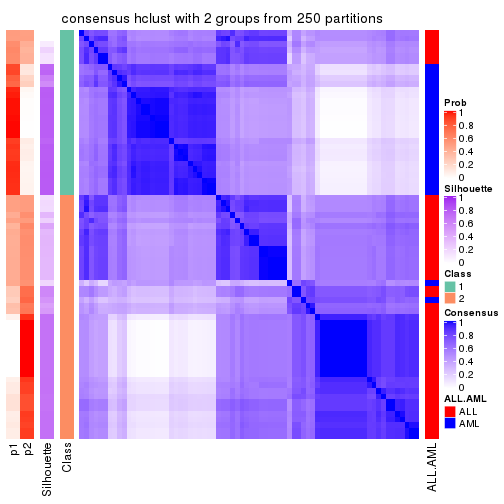</p>

</div>
<div id='tab-CV-hclust-consensus-heatmap-2'>
<pre><code class="r">consensus_heatmap(res, k = 3)
</code></pre>

<p>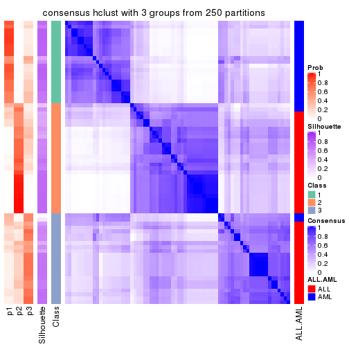</p>

</div>
<div id='tab-CV-hclust-consensus-heatmap-3'>
<pre><code class="r">consensus_heatmap(res, k = 4)
</code></pre>

<p>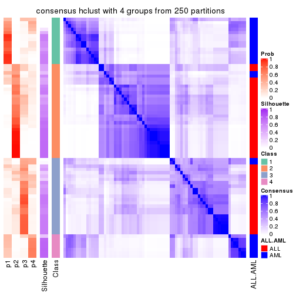</p>

</div>
<div id='tab-CV-hclust-consensus-heatmap-4'>
<pre><code class="r">consensus_heatmap(res, k = 5)
</code></pre>

<p>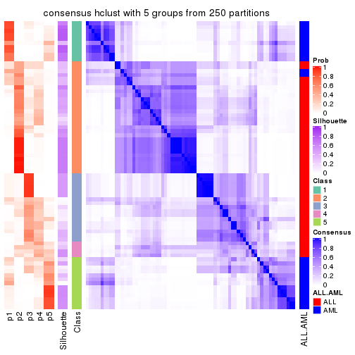</p>

</div>
<div id='tab-CV-hclust-consensus-heatmap-5'>
<pre><code class="r">consensus_heatmap(res, k = 6)
</code></pre>

<p>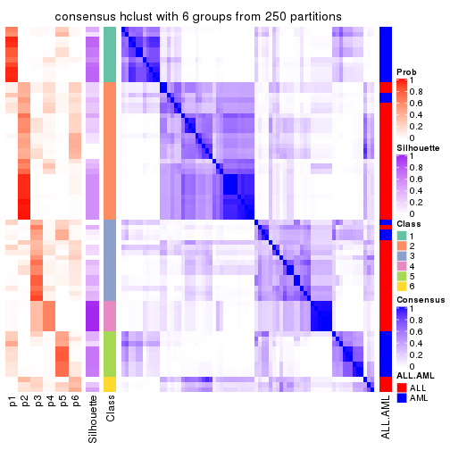</p>

</div>
</div>

Heatmaps for the membership of samples in all partitions to see how consistent they are:


<script>
$( function() {
	$( '#tabs-CV-hclust-membership-heatmap' ).tabs();
} );
</script>
<div id='tabs-CV-hclust-membership-heatmap'>
<ul>
<li><a href='#tab-CV-hclust-membership-heatmap-1'>k = 2</a></li>
<li><a href='#tab-CV-hclust-membership-heatmap-2'>k = 3</a></li>
<li><a href='#tab-CV-hclust-membership-heatmap-3'>k = 4</a></li>
<li><a href='#tab-CV-hclust-membership-heatmap-4'>k = 5</a></li>
<li><a href='#tab-CV-hclust-membership-heatmap-5'>k = 6</a></li>
</ul>
<div id='tab-CV-hclust-membership-heatmap-1'>
<pre><code class="r">membership_heatmap(res, k = 2)
</code></pre>

<p>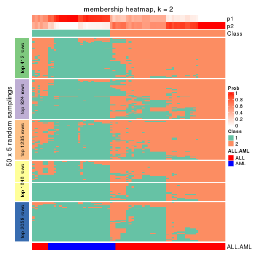</p>

</div>
<div id='tab-CV-hclust-membership-heatmap-2'>
<pre><code class="r">membership_heatmap(res, k = 3)
</code></pre>

<p>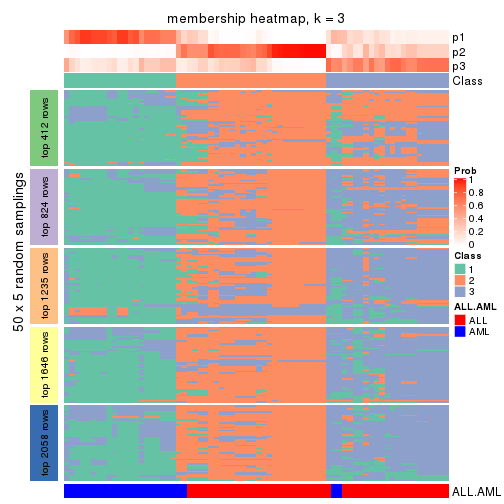</p>

</div>
<div id='tab-CV-hclust-membership-heatmap-3'>
<pre><code class="r">membership_heatmap(res, k = 4)
</code></pre>

<p>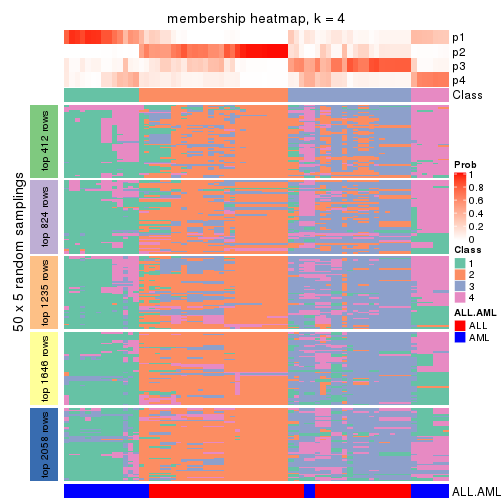</p>

</div>
<div id='tab-CV-hclust-membership-heatmap-4'>
<pre><code class="r">membership_heatmap(res, k = 5)
</code></pre>

<p>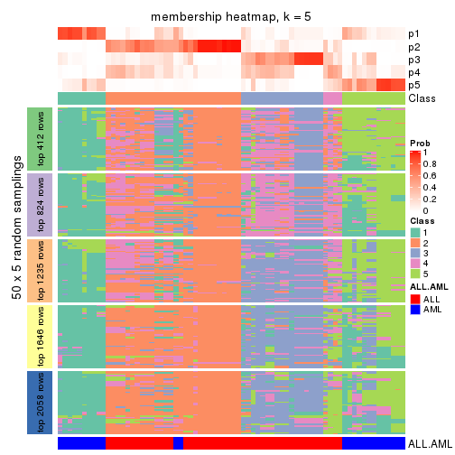</p>

</div>
<div id='tab-CV-hclust-membership-heatmap-5'>
<pre><code class="r">membership_heatmap(res, k = 6)
</code></pre>

<p>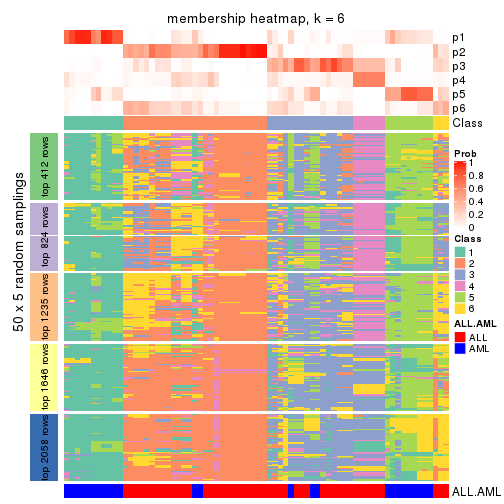</p>

</div>
</div>

As soon as we have had the classes for columns, we can look for signatures
which are significantly different between classes which can be candidate marks
for certain classes. Following are the heatmaps for signatures.


Signature heatmaps where rows are scaled:


<script>
$( function() {
	$( '#tabs-CV-hclust-get-signatures' ).tabs();
} );
</script>
<div id='tabs-CV-hclust-get-signatures'>
<ul>
<li><a href='#tab-CV-hclust-get-signatures-1'>k = 2</a></li>
<li><a href='#tab-CV-hclust-get-signatures-2'>k = 3</a></li>
<li><a href='#tab-CV-hclust-get-signatures-3'>k = 4</a></li>
<li><a href='#tab-CV-hclust-get-signatures-4'>k = 5</a></li>
<li><a href='#tab-CV-hclust-get-signatures-5'>k = 6</a></li>
</ul>
<div id='tab-CV-hclust-get-signatures-1'>
<pre><code class="r">get_signatures(res, k = 2)
</code></pre>

<p>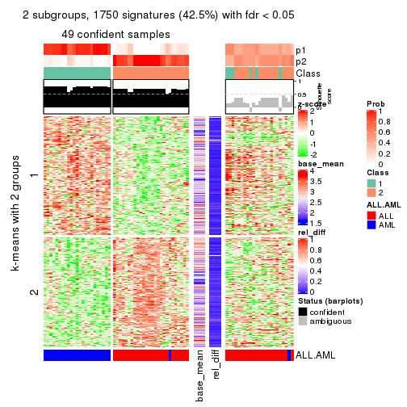</p>

</div>
<div id='tab-CV-hclust-get-signatures-2'>
<pre><code class="r">get_signatures(res, k = 3)
</code></pre>

<p>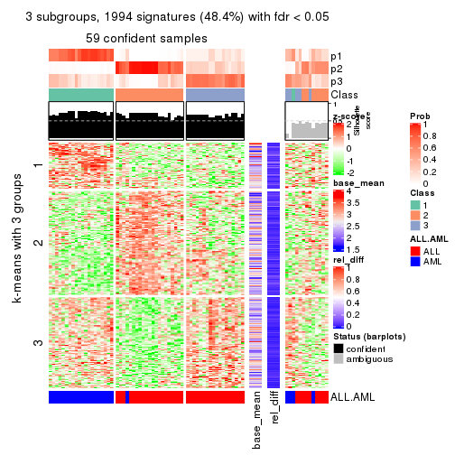</p>

</div>
<div id='tab-CV-hclust-get-signatures-3'>
<pre><code class="r">get_signatures(res, k = 4)
</code></pre>

<p>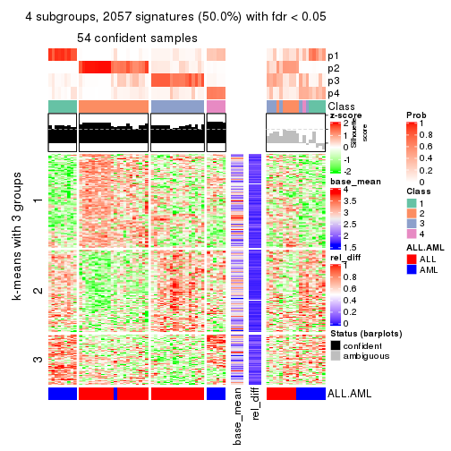</p>

</div>
<div id='tab-CV-hclust-get-signatures-4'>
<pre><code class="r">get_signatures(res, k = 5)
</code></pre>

<p>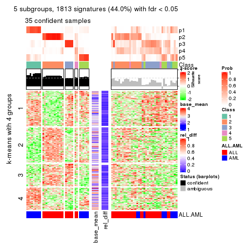</p>

</div>
<div id='tab-CV-hclust-get-signatures-5'>
<pre><code class="r">get_signatures(res, k = 6)
</code></pre>

<p>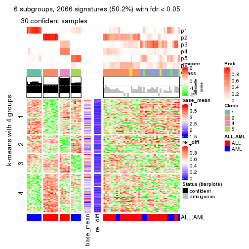</p>

</div>
</div>


Signature heatmaps where rows are not scaled:


<script>
$( function() {
	$( '#tabs-CV-hclust-get-signatures-no-scale' ).tabs();
} );
</script>
<div id='tabs-CV-hclust-get-signatures-no-scale'>
<ul>
<li><a href='#tab-CV-hclust-get-signatures-no-scale-1'>k = 2</a></li>
<li><a href='#tab-CV-hclust-get-signatures-no-scale-2'>k = 3</a></li>
<li><a href='#tab-CV-hclust-get-signatures-no-scale-3'>k = 4</a></li>
<li><a href='#tab-CV-hclust-get-signatures-no-scale-4'>k = 5</a></li>
<li><a href='#tab-CV-hclust-get-signatures-no-scale-5'>k = 6</a></li>
</ul>
<div id='tab-CV-hclust-get-signatures-no-scale-1'>
<pre><code class="r">get_signatures(res, k = 2, scale_rows = FALSE)
</code></pre>

<p>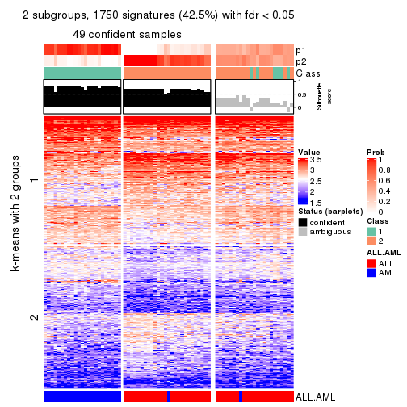</p>

</div>
<div id='tab-CV-hclust-get-signatures-no-scale-2'>
<pre><code class="r">get_signatures(res, k = 3, scale_rows = FALSE)
</code></pre>

<p>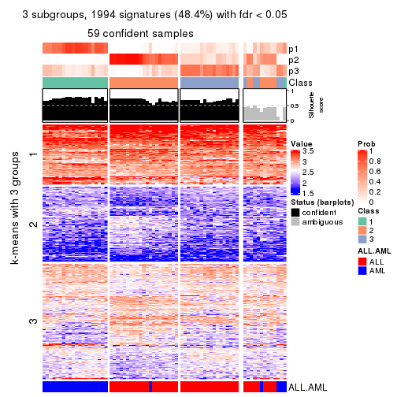</p>

</div>
<div id='tab-CV-hclust-get-signatures-no-scale-3'>
<pre><code class="r">get_signatures(res, k = 4, scale_rows = FALSE)
</code></pre>

<p>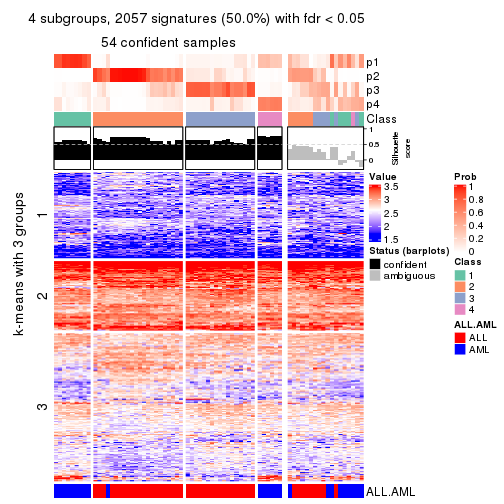</p>

</div>
<div id='tab-CV-hclust-get-signatures-no-scale-4'>
<pre><code class="r">get_signatures(res, k = 5, scale_rows = FALSE)
</code></pre>

<p>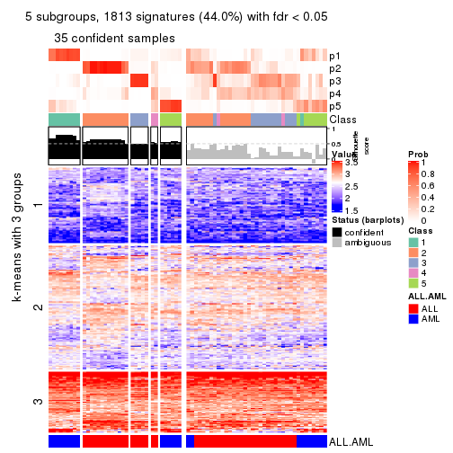</p>

</div>
<div id='tab-CV-hclust-get-signatures-no-scale-5'>
<pre><code class="r">get_signatures(res, k = 6, scale_rows = FALSE)
</code></pre>

<p>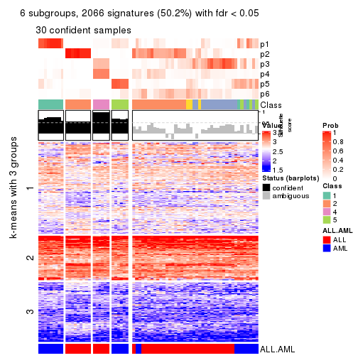</p>

</div>
</div>


Compare the overlap of signatures from different k:

```r
compare_signatures(res)
```

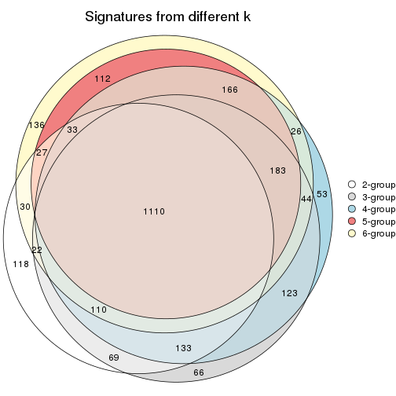

`get_signature()` returns a data frame invisibly. TO get the list of signatures, the function
call should be assigned to a variable explicitly. In following code, if `plot` argument is set
to `FALSE`, no heatmap is plotted while only the differential analysis is performed.

```r
# code only for demonstration
tb = get_signature(res, k = ..., plot = FALSE)
```

An example of the output of `tb` is:

```
#>   which_row         fdr    mean_1    mean_2 scaled_mean_1 scaled_mean_2 km
#> 1        38 0.042760348  8.373488  9.131774    -0.5533452     0.5164555  1
#> 2        40 0.018707592  7.106213  8.469186    -0.6173731     0.5762149  1
#> 3        55 0.019134737 10.221463 11.207825    -0.6159697     0.5749050  1
#> 4        59 0.006059896  5.921854  7.869574    -0.6899429     0.6439467  1
#> 5        60 0.018055526  8.928898 10.211722    -0.6204761     0.5791110  1
#> 6        98 0.009384629 15.714769 14.887706     0.6635654    -0.6193277  2
...
```

The columns in `tb` are:

1. `which_row`: row indices corresponding to the input matrix.
2. `fdr`: FDR for the differential test. 
3. `mean_x`: The mean value in group x.
4. `scaled_mean_x`: The mean value in group x after rows are scaled.
5. `km`: Row groups if k-means clustering is applied to rows.


UMAP plot which shows how samples are separated.


<script>
$( function() {
	$( '#tabs-CV-hclust-dimension-reduction' ).tabs();
} );
</script>
<div id='tabs-CV-hclust-dimension-reduction'>
<ul>
<li><a href='#tab-CV-hclust-dimension-reduction-1'>k = 2</a></li>
<li><a href='#tab-CV-hclust-dimension-reduction-2'>k = 3</a></li>
<li><a href='#tab-CV-hclust-dimension-reduction-3'>k = 4</a></li>
<li><a href='#tab-CV-hclust-dimension-reduction-4'>k = 5</a></li>
<li><a href='#tab-CV-hclust-dimension-reduction-5'>k = 6</a></li>
</ul>
<div id='tab-CV-hclust-dimension-reduction-1'>
<pre><code class="r">dimension_reduction(res, k = 2, method = &quot;UMAP&quot;)
</code></pre>

<p>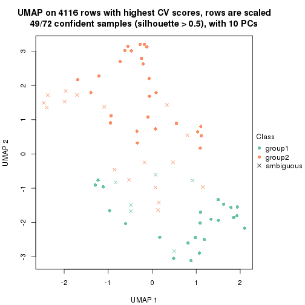</p>

</div>
<div id='tab-CV-hclust-dimension-reduction-2'>
<pre><code class="r">dimension_reduction(res, k = 3, method = &quot;UMAP&quot;)
</code></pre>

<p>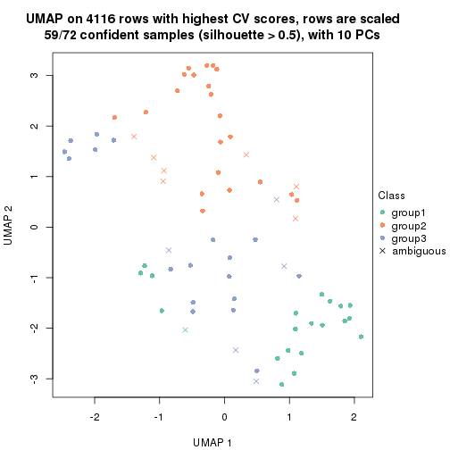</p>

</div>
<div id='tab-CV-hclust-dimension-reduction-3'>
<pre><code class="r">dimension_reduction(res, k = 4, method = &quot;UMAP&quot;)
</code></pre>

<p>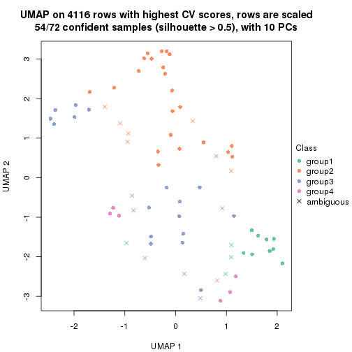</p>

</div>
<div id='tab-CV-hclust-dimension-reduction-4'>
<pre><code class="r">dimension_reduction(res, k = 5, method = &quot;UMAP&quot;)
</code></pre>

<p>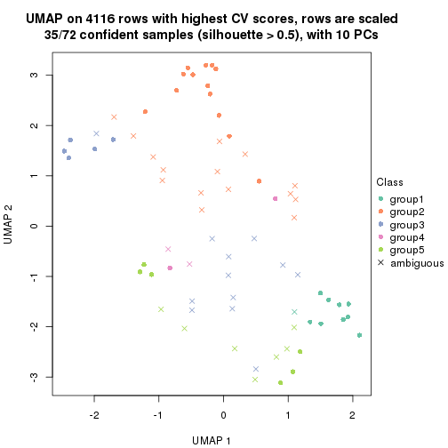</p>

</div>
<div id='tab-CV-hclust-dimension-reduction-5'>
<pre><code class="r">dimension_reduction(res, k = 6, method = &quot;UMAP&quot;)
</code></pre>

<p>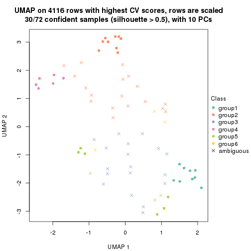</p>

</div>
</div>


Following heatmap shows how subgroups are split when increasing `k`:

```r
collect_classes(res)
```

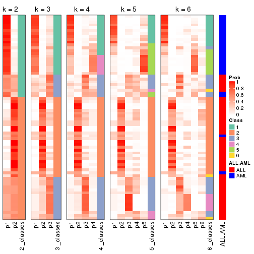


Test correlation between subgroups and known annotations. If the known
annotation is numeric, one-way ANOVA test is applied, and if the known
annotation is discrete, chi-squared contingency table test is applied.

```r
test_to_known_factors(res)
```

```
#>            n ALL.AML(p) k
#> CV:hclust 49   1.25e-10 2
#> CV:hclust 59   1.23e-12 3
#> CV:hclust 54   1.06e-10 4
#> CV:hclust 35   4.65e-07 5
#> CV:hclust 30   1.38e-06 6
```


If matrix rows can be associated to genes, consider to use `functional_enrichment(res,
...)` to perform function enrichment for the signature genes. See [this vignette](http://bioconductor.org/packages/devel/bioc/vignettes/cola/inst/doc/functional_enrichment.html) for more detailed explanations.


 

---------------------------------------------------


### CV:kmeans


The object with results only for a single top-value method and a single partition method 
can be extracted as:

```r
res = res_list["CV", "kmeans"]
# you can also extract it by
# res = res_list["CV:kmeans"]
```

A summary of `res` and all the functions that can be applied to it:

```r
res
```

```
#> A 'ConsensusPartition' object with k = 2, 3, 4, 5, 6.
#>   On a matrix with 4116 rows and 72 columns.
#>   Top rows (412, 824, 1235, 1646, 2058) are extracted by 'CV' method.
#>   Subgroups are detected by 'kmeans' method.
#>   Performed in total 1250 partitions by row resampling.
#>   Best k for subgroups seems to be 3.
#> 
#> Following methods can be applied to this 'ConsensusPartition' object:
#>  [1] "cola_report"             "collect_classes"         "collect_plots"          
#>  [4] "collect_stats"           "colnames"                "compare_signatures"     
#>  [7] "consensus_heatmap"       "dimension_reduction"     "functional_enrichment"  
#> [10] "get_anno_col"            "get_anno"                "get_classes"            
#> [13] "get_consensus"           "get_matrix"              "get_membership"         
#> [16] "get_param"               "get_signatures"          "get_stats"              
#> [19] "is_best_k"               "is_stable_k"             "membership_heatmap"     
#> [22] "ncol"                    "nrow"                    "plot_ecdf"              
#> [25] "rownames"                "select_partition_number" "show"                   
#> [28] "suggest_best_k"          "test_to_known_factors"
```

`collect_plots()` function collects all the plots made from `res` for all `k` (number of partitions)
into one single page to provide an easy and fast comparison between different `k`.

```r
collect_plots(res)
```

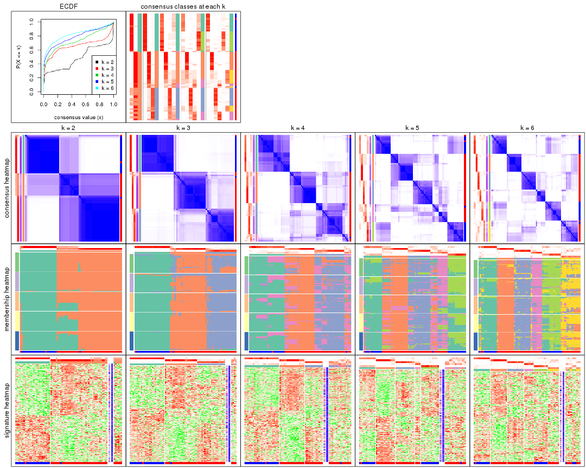

The plots are:

- The first row: a plot of the ECDF (empirical cumulative distribution
  function) curves of the consensus matrix for each `k` and the heatmap of
  predicted classes for each `k`.
- The second row: heatmaps of the consensus matrix for each `k`.
- The third row: heatmaps of the membership matrix for each `k`.
- The fouth row: heatmaps of the signatures for each `k`.

All the plots in panels can be made by individual functions and they are
plotted later in this section.

`select_partition_number()` produces several plots showing different
statistics for choosing "optimized" `k`. There are following statistics:

- ECDF curves of the consensus matrix for each `k`;
- 1-PAC. [The PAC
  score](https://en.wikipedia.org/wiki/Consensus_clustering#Over-interpretation_potential_of_consensus_clustering)
  measures the proportion of the ambiguous subgrouping.
- Mean silhouette score.
- Concordance. The mean probability of fiting the consensus class ids in all
  partitions.
- Area increased. Denote $A_k$ as the area under the ECDF curve for current
  `k`, the area increased is defined as $A_k - A_{k-1}$.
- Rand index. The percent of pairs of samples that are both in a same cluster
  or both are not in a same cluster in the partition of k and k-1.
- Jaccard index. The ratio of pairs of samples are both in a same cluster in
  the partition of k and k-1 and the pairs of samples are both in a same
  cluster in the partition k or k-1.

The detailed explanations of these statistics can be found in [the _cola_
vignette](http://bioconductor.org/packages/devel/bioc/vignettes/cola/inst/doc/cola.html#toc_13).

Generally speaking, lower PAC score, higher mean silhouette score or higher
concordance corresponds to better partition. Rand index and Jaccard index
measure how similar the current partition is compared to partition with `k-1`.
If they are too similar, we won't accept `k` is better than `k-1`.

```r
select_partition_number(res)
```

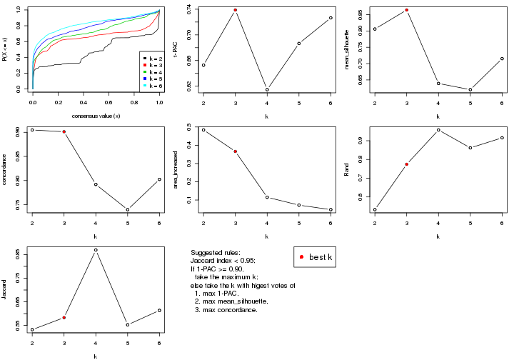

The numeric values for all these statistics can be obtained by `get_stats()`.

```r
get_stats(res)
```

```
#>   k 1-PAC mean_silhouette concordance area_increased  Rand Jaccard
#> 2 2 0.653           0.806       0.905         0.4836 0.532   0.532
#> 3 3 0.739           0.864       0.901         0.3661 0.774   0.583
#> 4 4 0.615           0.639       0.792         0.1150 0.957   0.869
#> 5 5 0.687           0.620       0.740         0.0721 0.862   0.553
#> 6 6 0.727           0.715       0.802         0.0472 0.915   0.614
```

`suggest_best_k()` suggests the best $k$ based on these statistics. The rules are as follows:

- All $k$ with Jaccard index larger than 0.95 are removed because increasing
  $k$ does not provide enough extra information. If all $k$ are removed, it is
  marked as no subgroup is detected.
- For all $k$ with 1-PAC score larger than 0.9, the maximal $k$ is taken as
  the best $k$, and other $k$ are marked as optional $k$.
- If it does not fit the second rule. The $k$ with the maximal vote of the
  highest 1-PAC score, highest mean silhouette, and highest concordance is
  taken as the best $k$.

```r
suggest_best_k(res)
```

```
#> [1] 3
```


Following shows the table of the partitions (You need to click the **show/hide
code output** link to see it). The membership matrix (columns with name `p*`)
is inferred by
[`clue::cl_consensus()`](https://www.rdocumentation.org/link/cl_consensus?package=clue)
function with the `SE` method. Basically the value in the membership matrix
represents the probability to belong to a certain group. The finall class
label for an item is determined with the group with highest probability it
belongs to.

In `get_classes()` function, the entropy is calculated from the membership
matrix and the silhouette score is calculated from the consensus matrix.


<script>
$( function() {
	$( '#tabs-CV-kmeans-get-classes' ).tabs();
} );
</script>
<div id='tabs-CV-kmeans-get-classes'>
<ul>
<li><a href='#tab-CV-kmeans-get-classes-1'>k = 2</a></li>
<li><a href='#tab-CV-kmeans-get-classes-2'>k = 3</a></li>
<li><a href='#tab-CV-kmeans-get-classes-3'>k = 4</a></li>
<li><a href='#tab-CV-kmeans-get-classes-4'>k = 5</a></li>
<li><a href='#tab-CV-kmeans-get-classes-5'>k = 6</a></li>
</ul>

<div id='tab-CV-kmeans-get-classes-1'>
<p><a id='tab-CV-kmeans-get-classes-1-a' style='color:#0366d6' href='#'>show/hide code output</a></p>
<pre><code class="r">cbind(get_classes(res, k = 2), get_membership(res, k = 2))
</code></pre>

<pre><code>#&gt;           class entropy silhouette    p1    p2
#&gt; sample_39     2  0.9754     0.5141 0.408 0.592
#&gt; sample_40     2  0.9850     0.4780 0.428 0.572
#&gt; sample_42     2  0.0000     0.8470 0.000 1.000
#&gt; sample_47     2  0.0000     0.8470 0.000 1.000
#&gt; sample_48     2  0.0000     0.8470 0.000 1.000
#&gt; sample_49     2  0.9896     0.4537 0.440 0.560
#&gt; sample_41     2  0.0000     0.8470 0.000 1.000
#&gt; sample_43     2  0.0000     0.8470 0.000 1.000
#&gt; sample_44     2  0.0376     0.8459 0.004 0.996
#&gt; sample_45     2  0.0000     0.8470 0.000 1.000
#&gt; sample_46     2  0.0000     0.8470 0.000 1.000
#&gt; sample_70     2  0.1184     0.8426 0.016 0.984
#&gt; sample_71     2  0.0000     0.8470 0.000 1.000
#&gt; sample_72     2  0.0000     0.8470 0.000 1.000
#&gt; sample_68     2  0.0000     0.8470 0.000 1.000
#&gt; sample_69     2  0.0000     0.8470 0.000 1.000
#&gt; sample_67     1  0.9988     0.0928 0.520 0.480
#&gt; sample_55     2  0.9635     0.5459 0.388 0.612
#&gt; sample_56     2  0.9775     0.5071 0.412 0.588
#&gt; sample_59     2  0.0376     0.8459 0.004 0.996
#&gt; sample_52     1  0.0376     0.9659 0.996 0.004
#&gt; sample_53     1  0.0376     0.9659 0.996 0.004
#&gt; sample_51     1  0.0376     0.9659 0.996 0.004
#&gt; sample_50     1  0.0376     0.9659 0.996 0.004
#&gt; sample_54     1  0.2603     0.9261 0.956 0.044
#&gt; sample_57     1  0.0000     0.9643 1.000 0.000
#&gt; sample_58     1  0.0000     0.9643 1.000 0.000
#&gt; sample_60     1  0.0376     0.9659 0.996 0.004
#&gt; sample_61     1  0.0000     0.9643 1.000 0.000
#&gt; sample_65     1  0.0000     0.9643 1.000 0.000
#&gt; sample_66     2  0.2603     0.8181 0.044 0.956
#&gt; sample_63     1  0.0376     0.9659 0.996 0.004
#&gt; sample_64     1  0.0000     0.9643 1.000 0.000
#&gt; sample_62     1  0.0376     0.9659 0.996 0.004
#&gt; sample_1      2  0.1843     0.8376 0.028 0.972
#&gt; sample_2      2  0.5059     0.7626 0.112 0.888
#&gt; sample_3      2  0.9580     0.5576 0.380 0.620
#&gt; sample_4      2  0.1414     0.8411 0.020 0.980
#&gt; sample_5      2  0.0000     0.8470 0.000 1.000
#&gt; sample_6      2  0.9580     0.5576 0.380 0.620
#&gt; sample_7      2  0.9580     0.5575 0.380 0.620
#&gt; sample_8      2  0.9881     0.4623 0.436 0.564
#&gt; sample_9      2  0.0376     0.8459 0.004 0.996
#&gt; sample_10     2  0.9580     0.5576 0.380 0.620
#&gt; sample_11     2  0.0000     0.8470 0.000 1.000
#&gt; sample_12     1  0.0376     0.9659 0.996 0.004
#&gt; sample_13     2  0.0000     0.8470 0.000 1.000
#&gt; sample_14     2  0.0000     0.8470 0.000 1.000
#&gt; sample_15     2  0.0000     0.8470 0.000 1.000
#&gt; sample_16     2  0.0376     0.8459 0.004 0.996
#&gt; sample_17     2  0.0000     0.8470 0.000 1.000
#&gt; sample_18     2  0.7883     0.6990 0.236 0.764
#&gt; sample_19     2  0.0000     0.8470 0.000 1.000
#&gt; sample_20     2  0.0000     0.8470 0.000 1.000
#&gt; sample_21     2  0.0000     0.8470 0.000 1.000
#&gt; sample_22     2  0.9881     0.4624 0.436 0.564
#&gt; sample_23     2  0.9580     0.5576 0.380 0.620
#&gt; sample_24     2  0.0000     0.8470 0.000 1.000
#&gt; sample_25     2  0.9460     0.5722 0.364 0.636
#&gt; sample_26     2  0.0376     0.8459 0.004 0.996
#&gt; sample_27     2  0.9896     0.4537 0.440 0.560
#&gt; sample_34     1  0.0000     0.9643 1.000 0.000
#&gt; sample_35     1  0.0000     0.9643 1.000 0.000
#&gt; sample_36     1  0.0376     0.9659 0.996 0.004
#&gt; sample_37     1  0.0376     0.9659 0.996 0.004
#&gt; sample_38     1  0.0376     0.9659 0.996 0.004
#&gt; sample_28     1  0.0376     0.9659 0.996 0.004
#&gt; sample_29     1  0.6531     0.7554 0.832 0.168
#&gt; sample_30     1  0.0376     0.9659 0.996 0.004
#&gt; sample_31     1  0.0000     0.9643 1.000 0.000
#&gt; sample_32     1  0.0376     0.9659 0.996 0.004
#&gt; sample_33     1  0.0376     0.9659 0.996 0.004
</code></pre>

<script>
$('#tab-CV-kmeans-get-classes-1-a').parent().next().next().hide();
$('#tab-CV-kmeans-get-classes-1-a').click(function(){
  $('#tab-CV-kmeans-get-classes-1-a').parent().next().next().toggle();
  return(false);
});
</script>
</div>

<div id='tab-CV-kmeans-get-classes-2'>
<p><a id='tab-CV-kmeans-get-classes-2-a' style='color:#0366d6' href='#'>show/hide code output</a></p>
<pre><code class="r">cbind(get_classes(res, k = 3), get_membership(res, k = 3))
</code></pre>

<pre><code>#&gt;           class entropy silhouette    p1    p2    p3
#&gt; sample_39     3  0.4741      0.884 0.020 0.152 0.828
#&gt; sample_40     3  0.4349      0.891 0.020 0.128 0.852
#&gt; sample_42     2  0.2096      0.874 0.004 0.944 0.052
#&gt; sample_47     2  0.0424      0.895 0.000 0.992 0.008
#&gt; sample_48     2  0.0000      0.896 0.000 1.000 0.000
#&gt; sample_49     3  0.4349      0.891 0.020 0.128 0.852
#&gt; sample_41     2  0.0592      0.894 0.000 0.988 0.012
#&gt; sample_43     2  0.0592      0.894 0.000 0.988 0.012
#&gt; sample_44     2  0.2537      0.841 0.000 0.920 0.080
#&gt; sample_45     2  0.0592      0.894 0.000 0.988 0.012
#&gt; sample_46     2  0.0592      0.894 0.000 0.988 0.012
#&gt; sample_70     3  0.4555      0.853 0.000 0.200 0.800
#&gt; sample_71     2  0.3573      0.828 0.004 0.876 0.120
#&gt; sample_72     2  0.3112      0.837 0.004 0.900 0.096
#&gt; sample_68     2  0.0592      0.894 0.000 0.988 0.012
#&gt; sample_69     2  0.0000      0.896 0.000 1.000 0.000
#&gt; sample_67     2  0.8671      0.187 0.416 0.480 0.104
#&gt; sample_55     3  0.4280      0.889 0.020 0.124 0.856
#&gt; sample_56     3  0.4418      0.890 0.020 0.132 0.848
#&gt; sample_59     3  0.5905      0.661 0.000 0.352 0.648
#&gt; sample_52     1  0.0747      0.975 0.984 0.000 0.016
#&gt; sample_53     1  0.1289      0.975 0.968 0.000 0.032
#&gt; sample_51     1  0.1289      0.975 0.968 0.000 0.032
#&gt; sample_50     1  0.1289      0.975 0.968 0.000 0.032
#&gt; sample_54     1  0.1525      0.969 0.964 0.004 0.032
#&gt; sample_57     1  0.1289      0.970 0.968 0.000 0.032
#&gt; sample_58     1  0.1163      0.972 0.972 0.000 0.028
#&gt; sample_60     1  0.1289      0.970 0.968 0.000 0.032
#&gt; sample_61     1  0.0892      0.973 0.980 0.000 0.020
#&gt; sample_65     1  0.0592      0.975 0.988 0.000 0.012
#&gt; sample_66     2  0.6511      0.723 0.072 0.748 0.180
#&gt; sample_63     1  0.0747      0.975 0.984 0.000 0.016
#&gt; sample_64     1  0.1753      0.960 0.952 0.000 0.048
#&gt; sample_62     1  0.0747      0.975 0.984 0.000 0.016
#&gt; sample_1      3  0.4293      0.881 0.004 0.164 0.832
#&gt; sample_2      2  0.8568      0.557 0.200 0.608 0.192
#&gt; sample_3      3  0.2550      0.852 0.012 0.056 0.932
#&gt; sample_4      3  0.4291      0.868 0.000 0.180 0.820
#&gt; sample_5      2  0.0592      0.894 0.000 0.988 0.012
#&gt; sample_6      3  0.2550      0.852 0.012 0.056 0.932
#&gt; sample_7      3  0.4349      0.889 0.020 0.128 0.852
#&gt; sample_8      3  0.4418      0.890 0.020 0.132 0.848
#&gt; sample_9      3  0.3192      0.831 0.000 0.112 0.888
#&gt; sample_10     3  0.2550      0.852 0.012 0.056 0.932
#&gt; sample_11     3  0.6460      0.126 0.004 0.440 0.556
#&gt; sample_12     1  0.1878      0.967 0.952 0.004 0.044
#&gt; sample_13     2  0.0000      0.896 0.000 1.000 0.000
#&gt; sample_14     2  0.6204      0.323 0.000 0.576 0.424
#&gt; sample_15     2  0.0592      0.894 0.000 0.988 0.012
#&gt; sample_16     2  0.1031      0.888 0.000 0.976 0.024
#&gt; sample_17     2  0.3619      0.811 0.000 0.864 0.136
#&gt; sample_18     3  0.4099      0.887 0.008 0.140 0.852
#&gt; sample_19     2  0.0592      0.894 0.000 0.988 0.012
#&gt; sample_20     2  0.0000      0.896 0.000 1.000 0.000
#&gt; sample_21     2  0.0892      0.893 0.000 0.980 0.020
#&gt; sample_22     3  0.4618      0.890 0.024 0.136 0.840
#&gt; sample_23     3  0.2550      0.852 0.012 0.056 0.932
#&gt; sample_24     2  0.1031      0.891 0.000 0.976 0.024
#&gt; sample_25     3  0.5763      0.802 0.016 0.244 0.740
#&gt; sample_26     3  0.6307      0.318 0.000 0.488 0.512
#&gt; sample_27     3  0.4349      0.891 0.020 0.128 0.852
#&gt; sample_34     1  0.0592      0.975 0.988 0.000 0.012
#&gt; sample_35     1  0.1753      0.958 0.952 0.000 0.048
#&gt; sample_36     1  0.1289      0.975 0.968 0.000 0.032
#&gt; sample_37     1  0.1289      0.975 0.968 0.000 0.032
#&gt; sample_38     1  0.1289      0.975 0.968 0.000 0.032
#&gt; sample_28     1  0.1289      0.975 0.968 0.000 0.032
#&gt; sample_29     1  0.1950      0.966 0.952 0.008 0.040
#&gt; sample_30     1  0.1289      0.975 0.968 0.000 0.032
#&gt; sample_31     1  0.0592      0.975 0.988 0.000 0.012
#&gt; sample_32     1  0.1163      0.976 0.972 0.000 0.028
#&gt; sample_33     1  0.1289      0.975 0.968 0.000 0.032
</code></pre>

<script>
$('#tab-CV-kmeans-get-classes-2-a').parent().next().next().hide();
$('#tab-CV-kmeans-get-classes-2-a').click(function(){
  $('#tab-CV-kmeans-get-classes-2-a').parent().next().next().toggle();
  return(false);
});
</script>
</div>

<div id='tab-CV-kmeans-get-classes-3'>
<p><a id='tab-CV-kmeans-get-classes-3-a' style='color:#0366d6' href='#'>show/hide code output</a></p>
<pre><code class="r">cbind(get_classes(res, k = 4), get_membership(res, k = 4))
</code></pre>

<pre><code>#&gt;           class entropy silhouette    p1    p2    p3    p4
#&gt; sample_39     3  0.3862     0.6979 0.004 0.060 0.852 0.084
#&gt; sample_40     3  0.2275     0.7284 0.004 0.048 0.928 0.020
#&gt; sample_42     2  0.6859     0.4052 0.000 0.512 0.108 0.380
#&gt; sample_47     2  0.4916     0.6973 0.000 0.760 0.056 0.184
#&gt; sample_48     2  0.0188     0.7704 0.000 0.996 0.004 0.000
#&gt; sample_49     3  0.2189     0.7273 0.004 0.044 0.932 0.020
#&gt; sample_41     2  0.0336     0.7695 0.000 0.992 0.008 0.000
#&gt; sample_43     2  0.5727     0.6630 0.000 0.704 0.096 0.200
#&gt; sample_44     2  0.6433     0.5985 0.000 0.648 0.164 0.188
#&gt; sample_45     2  0.5371     0.6837 0.000 0.732 0.080 0.188
#&gt; sample_46     2  0.5371     0.6834 0.000 0.732 0.080 0.188
#&gt; sample_70     3  0.5750     0.5693 0.000 0.088 0.696 0.216
#&gt; sample_71     2  0.7153     0.1473 0.000 0.444 0.132 0.424
#&gt; sample_72     2  0.7210     0.2852 0.000 0.492 0.148 0.360
#&gt; sample_68     2  0.0336     0.7695 0.000 0.992 0.008 0.000
#&gt; sample_69     2  0.0000     0.7699 0.000 1.000 0.000 0.000
#&gt; sample_67     4  0.7188     0.3021 0.260 0.156 0.008 0.576
#&gt; sample_55     3  0.2585     0.7225 0.004 0.048 0.916 0.032
#&gt; sample_56     3  0.2486     0.7269 0.004 0.048 0.920 0.028
#&gt; sample_59     3  0.6602     0.4641 0.000 0.164 0.628 0.208
#&gt; sample_52     1  0.2125     0.7785 0.920 0.000 0.004 0.076
#&gt; sample_53     1  0.3873     0.7780 0.772 0.000 0.000 0.228
#&gt; sample_51     1  0.3764     0.7833 0.784 0.000 0.000 0.216
#&gt; sample_50     1  0.3726     0.7848 0.788 0.000 0.000 0.212
#&gt; sample_54     1  0.4483     0.7277 0.808 0.000 0.088 0.104
#&gt; sample_57     1  0.4362     0.7330 0.816 0.000 0.088 0.096
#&gt; sample_58     1  0.4297     0.7363 0.820 0.000 0.084 0.096
#&gt; sample_60     1  0.4424     0.7306 0.812 0.000 0.088 0.100
#&gt; sample_61     1  0.4083     0.7680 0.832 0.000 0.100 0.068
#&gt; sample_65     1  0.0524     0.7961 0.988 0.000 0.004 0.008
#&gt; sample_66     4  0.6740     0.1799 0.028 0.336 0.052 0.584
#&gt; sample_63     1  0.2775     0.7722 0.896 0.000 0.020 0.084
#&gt; sample_64     1  0.4483     0.7260 0.808 0.000 0.104 0.088
#&gt; sample_62     1  0.2775     0.7722 0.896 0.000 0.020 0.084
#&gt; sample_1      3  0.2892     0.7246 0.000 0.068 0.896 0.036
#&gt; sample_2      4  0.5775     0.5531 0.056 0.144 0.048 0.752
#&gt; sample_3      3  0.4917     0.3512 0.000 0.008 0.656 0.336
#&gt; sample_4      3  0.2924     0.7125 0.000 0.100 0.884 0.016
#&gt; sample_5      2  0.0336     0.7695 0.000 0.992 0.008 0.000
#&gt; sample_6      3  0.4936     0.3457 0.000 0.008 0.652 0.340
#&gt; sample_7      3  0.2021     0.7288 0.000 0.056 0.932 0.012
#&gt; sample_8      3  0.1888     0.7313 0.000 0.044 0.940 0.016
#&gt; sample_9      3  0.5738     0.0635 0.000 0.028 0.540 0.432
#&gt; sample_10     3  0.5244     0.1210 0.000 0.008 0.556 0.436
#&gt; sample_11     4  0.6889     0.2147 0.000 0.108 0.396 0.496
#&gt; sample_12     1  0.5496     0.7253 0.704 0.000 0.064 0.232
#&gt; sample_13     2  0.0188     0.7704 0.000 0.996 0.004 0.000
#&gt; sample_14     4  0.7617     0.3447 0.000 0.216 0.332 0.452
#&gt; sample_15     2  0.0336     0.7695 0.000 0.992 0.008 0.000
#&gt; sample_16     2  0.2542     0.7303 0.000 0.904 0.084 0.012
#&gt; sample_17     2  0.4636     0.5673 0.000 0.792 0.068 0.140
#&gt; sample_18     3  0.3274     0.7259 0.004 0.056 0.884 0.056
#&gt; sample_19     2  0.5448     0.6790 0.000 0.724 0.080 0.196
#&gt; sample_20     2  0.0188     0.7704 0.000 0.996 0.004 0.000
#&gt; sample_21     2  0.0336     0.7695 0.000 0.992 0.008 0.000
#&gt; sample_22     3  0.3629     0.7130 0.008 0.048 0.868 0.076
#&gt; sample_23     3  0.4936     0.3457 0.000 0.008 0.652 0.340
#&gt; sample_24     2  0.0592     0.7638 0.000 0.984 0.016 0.000
#&gt; sample_25     3  0.6852     0.3729 0.000 0.124 0.556 0.320
#&gt; sample_26     3  0.7110     0.3599 0.000 0.236 0.564 0.200
#&gt; sample_27     3  0.2189     0.7273 0.004 0.044 0.932 0.020
#&gt; sample_34     1  0.0376     0.7946 0.992 0.000 0.004 0.004
#&gt; sample_35     1  0.3606     0.7352 0.844 0.000 0.132 0.024
#&gt; sample_36     1  0.3688     0.7874 0.792 0.000 0.000 0.208
#&gt; sample_37     1  0.3907     0.7759 0.768 0.000 0.000 0.232
#&gt; sample_38     1  0.4522     0.6999 0.680 0.000 0.000 0.320
#&gt; sample_28     1  0.4304     0.7371 0.716 0.000 0.000 0.284
#&gt; sample_29     1  0.4730     0.6386 0.636 0.000 0.000 0.364
#&gt; sample_30     1  0.3726     0.7865 0.788 0.000 0.000 0.212
#&gt; sample_31     1  0.0376     0.7957 0.992 0.000 0.004 0.004
#&gt; sample_32     1  0.3688     0.7862 0.792 0.000 0.000 0.208
#&gt; sample_33     1  0.3837     0.7798 0.776 0.000 0.000 0.224
</code></pre>

<script>
$('#tab-CV-kmeans-get-classes-3-a').parent().next().next().hide();
$('#tab-CV-kmeans-get-classes-3-a').click(function(){
  $('#tab-CV-kmeans-get-classes-3-a').parent().next().next().toggle();
  return(false);
});
</script>
</div>

<div id='tab-CV-kmeans-get-classes-4'>
<p><a id='tab-CV-kmeans-get-classes-4-a' style='color:#0366d6' href='#'>show/hide code output</a></p>
<pre><code class="r">cbind(get_classes(res, k = 5), get_membership(res, k = 5))
</code></pre>

<pre><code>#&gt;           class entropy silhouette    p1    p2    p3    p4    p5
#&gt; sample_39     3  0.3209     0.7389 0.076 0.004 0.860 0.060 0.000
#&gt; sample_40     3  0.1372     0.7812 0.000 0.004 0.956 0.024 0.016
#&gt; sample_42     4  0.8118    -0.0569 0.316 0.268 0.096 0.320 0.000
#&gt; sample_47     2  0.7058     0.5161 0.236 0.552 0.076 0.136 0.000
#&gt; sample_48     2  0.0451     0.7611 0.008 0.988 0.000 0.004 0.000
#&gt; sample_49     3  0.0968     0.7812 0.000 0.004 0.972 0.012 0.012
#&gt; sample_41     2  0.0290     0.7584 0.000 0.992 0.000 0.008 0.000
#&gt; sample_43     2  0.7623     0.4382 0.272 0.476 0.108 0.144 0.000
#&gt; sample_44     2  0.8027     0.3612 0.220 0.432 0.220 0.128 0.000
#&gt; sample_45     2  0.7086     0.5262 0.220 0.560 0.092 0.128 0.000
#&gt; sample_46     2  0.7163     0.5198 0.212 0.556 0.100 0.132 0.000
#&gt; sample_70     3  0.5869     0.5489 0.216 0.008 0.628 0.148 0.000
#&gt; sample_71     4  0.7943     0.1098 0.224 0.268 0.096 0.412 0.000
#&gt; sample_72     4  0.8150     0.0456 0.216 0.288 0.120 0.376 0.000
#&gt; sample_68     2  0.0290     0.7584 0.000 0.992 0.000 0.008 0.000
#&gt; sample_69     2  0.0613     0.7596 0.008 0.984 0.004 0.004 0.000
#&gt; sample_67     1  0.6532    -0.0737 0.492 0.064 0.004 0.396 0.044
#&gt; sample_55     3  0.3822     0.7498 0.032 0.024 0.852 0.060 0.032
#&gt; sample_56     3  0.1220     0.7883 0.004 0.004 0.964 0.020 0.008
#&gt; sample_59     3  0.7082     0.4977 0.224 0.032 0.564 0.160 0.020
#&gt; sample_52     5  0.0880     0.7775 0.032 0.000 0.000 0.000 0.968
#&gt; sample_53     1  0.4030     0.8121 0.648 0.000 0.000 0.000 0.352
#&gt; sample_51     1  0.4030     0.8121 0.648 0.000 0.000 0.000 0.352
#&gt; sample_50     1  0.4030     0.8121 0.648 0.000 0.000 0.000 0.352
#&gt; sample_54     5  0.2772     0.7412 0.044 0.000 0.028 0.032 0.896
#&gt; sample_57     5  0.1399     0.7784 0.000 0.000 0.028 0.020 0.952
#&gt; sample_58     5  0.1195     0.7803 0.000 0.000 0.028 0.012 0.960
#&gt; sample_60     5  0.2772     0.7412 0.044 0.000 0.028 0.032 0.896
#&gt; sample_61     5  0.5305     0.5282 0.248 0.000 0.052 0.024 0.676
#&gt; sample_65     5  0.3826     0.5470 0.236 0.000 0.004 0.008 0.752
#&gt; sample_66     4  0.6396     0.3114 0.256 0.172 0.012 0.560 0.000
#&gt; sample_63     5  0.0703     0.7807 0.024 0.000 0.000 0.000 0.976
#&gt; sample_64     5  0.2956     0.7492 0.020 0.000 0.096 0.012 0.872
#&gt; sample_62     5  0.0703     0.7807 0.024 0.000 0.000 0.000 0.976
#&gt; sample_1      3  0.0912     0.7860 0.000 0.012 0.972 0.016 0.000
#&gt; sample_2      4  0.5200     0.4249 0.296 0.060 0.004 0.640 0.000
#&gt; sample_3      4  0.4256     0.2750 0.000 0.000 0.436 0.564 0.000
#&gt; sample_4      3  0.2747     0.7442 0.004 0.060 0.888 0.048 0.000
#&gt; sample_5      2  0.0290     0.7584 0.000 0.992 0.000 0.008 0.000
#&gt; sample_6      4  0.4256     0.2750 0.000 0.000 0.436 0.564 0.000
#&gt; sample_7      3  0.1978     0.7712 0.004 0.024 0.928 0.044 0.000
#&gt; sample_8      3  0.0324     0.7884 0.000 0.004 0.992 0.004 0.000
#&gt; sample_9      4  0.3851     0.5185 0.004 0.016 0.212 0.768 0.000
#&gt; sample_10     4  0.3366     0.5048 0.000 0.000 0.232 0.768 0.000
#&gt; sample_11     4  0.3651     0.5369 0.004 0.028 0.160 0.808 0.000
#&gt; sample_12     1  0.5912     0.6656 0.584 0.000 0.068 0.024 0.324
#&gt; sample_13     2  0.0451     0.7611 0.008 0.988 0.000 0.004 0.000
#&gt; sample_14     4  0.4127     0.5363 0.004 0.100 0.100 0.796 0.000
#&gt; sample_15     2  0.0290     0.7584 0.000 0.992 0.000 0.008 0.000
#&gt; sample_16     2  0.3222     0.7014 0.028 0.864 0.088 0.020 0.000
#&gt; sample_17     2  0.4039     0.4807 0.008 0.720 0.004 0.268 0.000
#&gt; sample_18     3  0.4607     0.7164 0.060 0.024 0.796 0.104 0.016
#&gt; sample_19     2  0.7576     0.4716 0.220 0.508 0.128 0.144 0.000
#&gt; sample_20     2  0.0451     0.7611 0.008 0.988 0.000 0.004 0.000
#&gt; sample_21     2  0.0798     0.7575 0.008 0.976 0.000 0.016 0.000
#&gt; sample_22     3  0.1750     0.7732 0.028 0.000 0.936 0.036 0.000
#&gt; sample_23     4  0.4256     0.2750 0.000 0.000 0.436 0.564 0.000
#&gt; sample_24     2  0.0451     0.7565 0.000 0.988 0.004 0.008 0.000
#&gt; sample_25     3  0.6875     0.3827 0.288 0.032 0.516 0.164 0.000
#&gt; sample_26     3  0.6627     0.5105 0.188 0.056 0.604 0.152 0.000
#&gt; sample_27     3  0.0968     0.7812 0.000 0.004 0.972 0.012 0.012
#&gt; sample_34     5  0.3751     0.5919 0.212 0.000 0.004 0.012 0.772
#&gt; sample_35     5  0.5380     0.6363 0.132 0.000 0.160 0.012 0.696
#&gt; sample_36     1  0.4101     0.7998 0.628 0.000 0.000 0.000 0.372
#&gt; sample_37     1  0.4015     0.8129 0.652 0.000 0.000 0.000 0.348
#&gt; sample_38     1  0.3849     0.7400 0.752 0.000 0.000 0.016 0.232
#&gt; sample_28     1  0.3885     0.7720 0.724 0.000 0.000 0.008 0.268
#&gt; sample_29     1  0.4558     0.6924 0.724 0.000 0.000 0.060 0.216
#&gt; sample_30     1  0.4088     0.8040 0.632 0.000 0.000 0.000 0.368
#&gt; sample_31     5  0.3883     0.5293 0.244 0.000 0.004 0.008 0.744
#&gt; sample_32     1  0.4613     0.7227 0.580 0.000 0.004 0.008 0.408
#&gt; sample_33     1  0.4015     0.8129 0.652 0.000 0.000 0.000 0.348
</code></pre>

<script>
$('#tab-CV-kmeans-get-classes-4-a').parent().next().next().hide();
$('#tab-CV-kmeans-get-classes-4-a').click(function(){
  $('#tab-CV-kmeans-get-classes-4-a').parent().next().next().toggle();
  return(false);
});
</script>
</div>

<div id='tab-CV-kmeans-get-classes-5'>
<p><a id='tab-CV-kmeans-get-classes-5-a' style='color:#0366d6' href='#'>show/hide code output</a></p>
<pre><code class="r">cbind(get_classes(res, k = 6), get_membership(res, k = 6))
</code></pre>

<pre><code>#&gt;           class entropy silhouette    p1    p2    p3    p4    p5    p6
#&gt; sample_39     3  0.2892     0.7603 0.000 0.004 0.840 0.000 0.020 0.136
#&gt; sample_40     3  0.2198     0.8682 0.000 0.000 0.912 0.032 0.032 0.024
#&gt; sample_42     6  0.4432     0.6129 0.036 0.068 0.040 0.048 0.008 0.800
#&gt; sample_47     6  0.4680     0.6132 0.000 0.292 0.052 0.004 0.004 0.648
#&gt; sample_48     2  0.0713     0.9332 0.000 0.972 0.000 0.000 0.000 0.028
#&gt; sample_49     3  0.1476     0.8913 0.000 0.004 0.948 0.012 0.028 0.008
#&gt; sample_41     2  0.0291     0.9371 0.000 0.992 0.004 0.004 0.000 0.000
#&gt; sample_43     6  0.4516     0.6834 0.000 0.184 0.084 0.000 0.012 0.720
#&gt; sample_44     6  0.5457     0.6627 0.000 0.212 0.176 0.000 0.008 0.604
#&gt; sample_45     6  0.5093     0.6233 0.000 0.292 0.088 0.000 0.008 0.612
#&gt; sample_46     6  0.5076     0.6275 0.000 0.288 0.088 0.000 0.008 0.616
#&gt; sample_70     6  0.4512     0.4386 0.000 0.008 0.380 0.008 0.012 0.592
#&gt; sample_71     6  0.6837     0.4611 0.048 0.088 0.044 0.176 0.036 0.608
#&gt; sample_72     6  0.6961     0.4832 0.048 0.100 0.052 0.160 0.036 0.604
#&gt; sample_68     2  0.0291     0.9371 0.000 0.992 0.004 0.004 0.000 0.000
#&gt; sample_69     2  0.0865     0.9292 0.000 0.964 0.000 0.000 0.000 0.036
#&gt; sample_67     1  0.6975     0.0659 0.400 0.020 0.000 0.236 0.028 0.316
#&gt; sample_55     3  0.3855     0.8206 0.000 0.024 0.824 0.028 0.076 0.048
#&gt; sample_56     3  0.1223     0.8934 0.000 0.004 0.960 0.008 0.016 0.012
#&gt; sample_59     6  0.5026     0.4806 0.000 0.012 0.324 0.012 0.040 0.612
#&gt; sample_52     5  0.2924     0.7425 0.136 0.000 0.000 0.012 0.840 0.012
#&gt; sample_53     1  0.1606     0.8214 0.932 0.000 0.000 0.008 0.056 0.004
#&gt; sample_51     1  0.1204     0.8206 0.944 0.000 0.000 0.000 0.056 0.000
#&gt; sample_50     1  0.1204     0.8194 0.944 0.000 0.000 0.000 0.056 0.000
#&gt; sample_54     5  0.2768     0.7228 0.044 0.000 0.008 0.008 0.880 0.060
#&gt; sample_57     5  0.2594     0.7365 0.068 0.000 0.004 0.004 0.884 0.040
#&gt; sample_58     5  0.3318     0.7457 0.076 0.000 0.012 0.024 0.852 0.036
#&gt; sample_60     5  0.2656     0.7235 0.044 0.000 0.008 0.004 0.884 0.060
#&gt; sample_61     5  0.6624     0.4038 0.376 0.000 0.052 0.036 0.464 0.072
#&gt; sample_65     5  0.5554     0.4700 0.404 0.000 0.008 0.032 0.512 0.044
#&gt; sample_66     6  0.6614     0.2286 0.092 0.060 0.000 0.292 0.028 0.528
#&gt; sample_63     5  0.2784     0.7449 0.132 0.000 0.000 0.008 0.848 0.012
#&gt; sample_64     5  0.4755     0.7214 0.076 0.000 0.072 0.032 0.768 0.052
#&gt; sample_62     5  0.2742     0.7452 0.128 0.000 0.000 0.008 0.852 0.012
#&gt; sample_1      3  0.1425     0.8898 0.000 0.008 0.952 0.020 0.008 0.012
#&gt; sample_2      4  0.6657     0.2441 0.172 0.020 0.000 0.484 0.028 0.296
#&gt; sample_3      4  0.3101     0.7437 0.000 0.000 0.244 0.756 0.000 0.000
#&gt; sample_4      3  0.2334     0.8734 0.000 0.044 0.904 0.040 0.004 0.008
#&gt; sample_5      2  0.0291     0.9371 0.000 0.992 0.004 0.004 0.000 0.000
#&gt; sample_6      4  0.3101     0.7437 0.000 0.000 0.244 0.756 0.000 0.000
#&gt; sample_7      3  0.1932     0.8830 0.000 0.024 0.928 0.032 0.008 0.008
#&gt; sample_8      3  0.0810     0.8910 0.000 0.004 0.976 0.008 0.004 0.008
#&gt; sample_9      4  0.1700     0.8172 0.000 0.000 0.080 0.916 0.000 0.004
#&gt; sample_10     4  0.1644     0.8165 0.000 0.000 0.076 0.920 0.000 0.004
#&gt; sample_11     4  0.1889     0.8029 0.000 0.004 0.056 0.920 0.000 0.020
#&gt; sample_12     1  0.5211     0.6150 0.716 0.000 0.028 0.028 0.124 0.104
#&gt; sample_13     2  0.0713     0.9332 0.000 0.972 0.000 0.000 0.000 0.028
#&gt; sample_14     4  0.2063     0.8080 0.000 0.020 0.060 0.912 0.000 0.008
#&gt; sample_15     2  0.0291     0.9371 0.000 0.992 0.004 0.004 0.000 0.000
#&gt; sample_16     2  0.3612     0.6932 0.000 0.796 0.104 0.000 0.000 0.100
#&gt; sample_17     2  0.3304     0.7505 0.000 0.804 0.008 0.168 0.000 0.020
#&gt; sample_18     3  0.5720     0.5447 0.000 0.008 0.652 0.140 0.048 0.152
#&gt; sample_19     6  0.5127     0.6570 0.000 0.260 0.116 0.004 0.000 0.620
#&gt; sample_20     2  0.0713     0.9332 0.000 0.972 0.000 0.000 0.000 0.028
#&gt; sample_21     2  0.1049     0.9307 0.000 0.960 0.000 0.000 0.008 0.032
#&gt; sample_22     3  0.2196     0.8626 0.000 0.000 0.908 0.016 0.020 0.056
#&gt; sample_23     4  0.3101     0.7437 0.000 0.000 0.244 0.756 0.000 0.000
#&gt; sample_24     2  0.0291     0.9371 0.000 0.992 0.004 0.004 0.000 0.000
#&gt; sample_25     6  0.4863     0.5341 0.012 0.008 0.308 0.012 0.020 0.640
#&gt; sample_26     6  0.5107     0.3178 0.000 0.024 0.448 0.012 0.016 0.500
#&gt; sample_27     3  0.1457     0.8905 0.000 0.004 0.948 0.016 0.028 0.004
#&gt; sample_34     5  0.5734     0.5030 0.380 0.000 0.008 0.036 0.520 0.056
#&gt; sample_35     5  0.6952     0.5760 0.216 0.000 0.148 0.040 0.536 0.060
#&gt; sample_36     1  0.2076     0.8095 0.912 0.000 0.000 0.012 0.060 0.016
#&gt; sample_37     1  0.1578     0.8219 0.936 0.000 0.000 0.012 0.048 0.004
#&gt; sample_38     1  0.1801     0.7750 0.932 0.000 0.004 0.012 0.012 0.040
#&gt; sample_28     1  0.1596     0.7935 0.944 0.000 0.004 0.012 0.020 0.020
#&gt; sample_29     1  0.3903     0.6349 0.780 0.000 0.000 0.044 0.020 0.156
#&gt; sample_30     1  0.2076     0.8095 0.912 0.000 0.000 0.012 0.060 0.016
#&gt; sample_31     5  0.5459     0.4010 0.440 0.000 0.008 0.024 0.484 0.044
#&gt; sample_32     1  0.4057     0.6477 0.780 0.000 0.004 0.020 0.144 0.052
#&gt; sample_33     1  0.1429     0.8218 0.940 0.000 0.000 0.004 0.052 0.004
</code></pre>

<script>
$('#tab-CV-kmeans-get-classes-5-a').parent().next().next().hide();
$('#tab-CV-kmeans-get-classes-5-a').click(function(){
  $('#tab-CV-kmeans-get-classes-5-a').parent().next().next().toggle();
  return(false);
});
</script>
</div>
</div>

Heatmaps for the consensus matrix. It visualizes the probability of two
samples to be in a same group.


<script>
$( function() {
	$( '#tabs-CV-kmeans-consensus-heatmap' ).tabs();
} );
</script>
<div id='tabs-CV-kmeans-consensus-heatmap'>
<ul>
<li><a href='#tab-CV-kmeans-consensus-heatmap-1'>k = 2</a></li>
<li><a href='#tab-CV-kmeans-consensus-heatmap-2'>k = 3</a></li>
<li><a href='#tab-CV-kmeans-consensus-heatmap-3'>k = 4</a></li>
<li><a href='#tab-CV-kmeans-consensus-heatmap-4'>k = 5</a></li>
<li><a href='#tab-CV-kmeans-consensus-heatmap-5'>k = 6</a></li>
</ul>
<div id='tab-CV-kmeans-consensus-heatmap-1'>
<pre><code class="r">consensus_heatmap(res, k = 2)
</code></pre>

<p>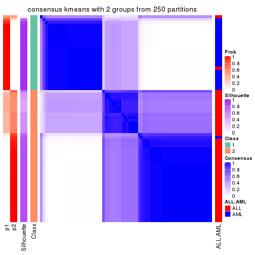</p>

</div>
<div id='tab-CV-kmeans-consensus-heatmap-2'>
<pre><code class="r">consensus_heatmap(res, k = 3)
</code></pre>

<p>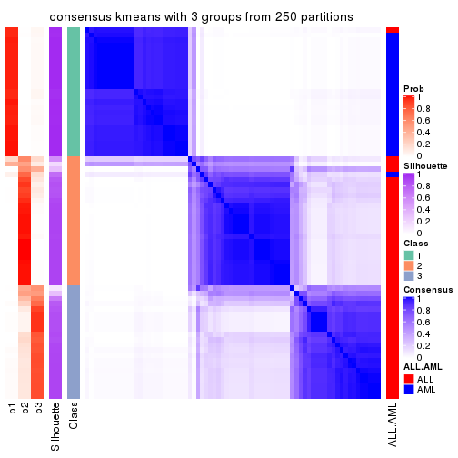</p>

</div>
<div id='tab-CV-kmeans-consensus-heatmap-3'>
<pre><code class="r">consensus_heatmap(res, k = 4)
</code></pre>

<p>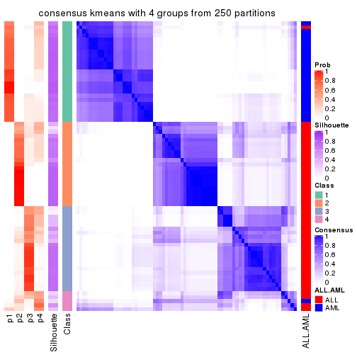</p>

</div>
<div id='tab-CV-kmeans-consensus-heatmap-4'>
<pre><code class="r">consensus_heatmap(res, k = 5)
</code></pre>

<p>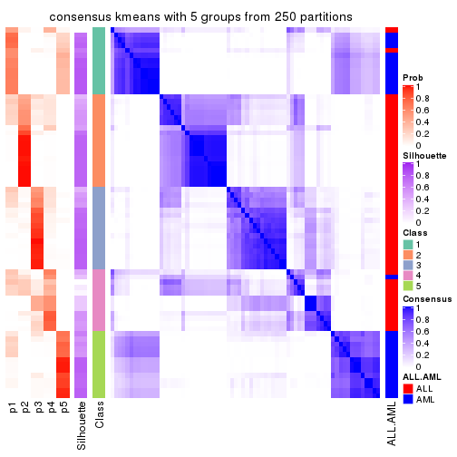</p>

</div>
<div id='tab-CV-kmeans-consensus-heatmap-5'>
<pre><code class="r">consensus_heatmap(res, k = 6)
</code></pre>

<p>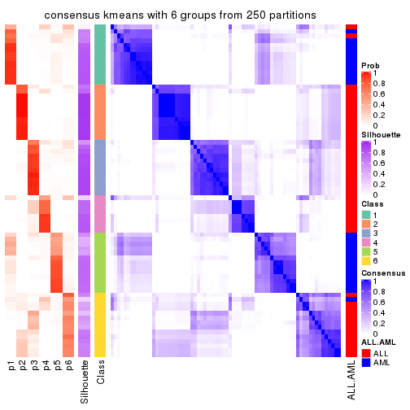</p>

</div>
</div>

Heatmaps for the membership of samples in all partitions to see how consistent they are:


<script>
$( function() {
	$( '#tabs-CV-kmeans-membership-heatmap' ).tabs();
} );
</script>
<div id='tabs-CV-kmeans-membership-heatmap'>
<ul>
<li><a href='#tab-CV-kmeans-membership-heatmap-1'>k = 2</a></li>
<li><a href='#tab-CV-kmeans-membership-heatmap-2'>k = 3</a></li>
<li><a href='#tab-CV-kmeans-membership-heatmap-3'>k = 4</a></li>
<li><a href='#tab-CV-kmeans-membership-heatmap-4'>k = 5</a></li>
<li><a href='#tab-CV-kmeans-membership-heatmap-5'>k = 6</a></li>
</ul>
<div id='tab-CV-kmeans-membership-heatmap-1'>
<pre><code class="r">membership_heatmap(res, k = 2)
</code></pre>

<p>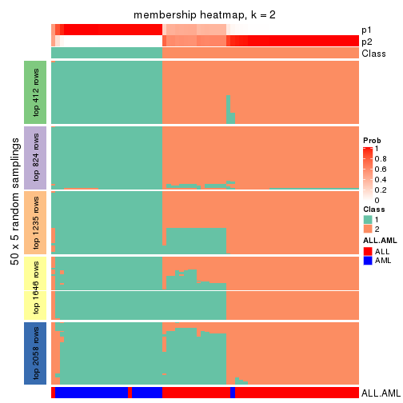</p>

</div>
<div id='tab-CV-kmeans-membership-heatmap-2'>
<pre><code class="r">membership_heatmap(res, k = 3)
</code></pre>

<p>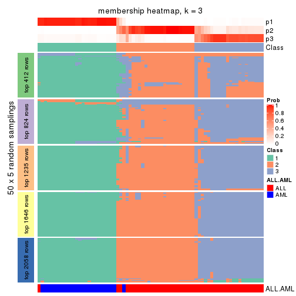</p>

</div>
<div id='tab-CV-kmeans-membership-heatmap-3'>
<pre><code class="r">membership_heatmap(res, k = 4)
</code></pre>

<p>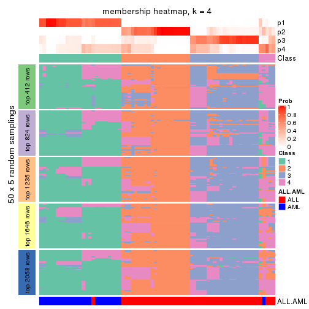</p>

</div>
<div id='tab-CV-kmeans-membership-heatmap-4'>
<pre><code class="r">membership_heatmap(res, k = 5)
</code></pre>

<p>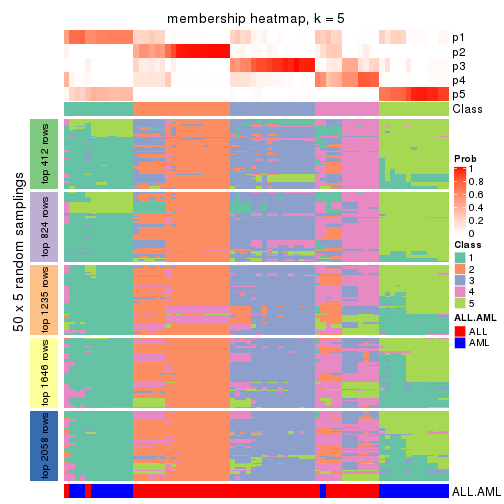</p>

</div>
<div id='tab-CV-kmeans-membership-heatmap-5'>
<pre><code class="r">membership_heatmap(res, k = 6)
</code></pre>

<p>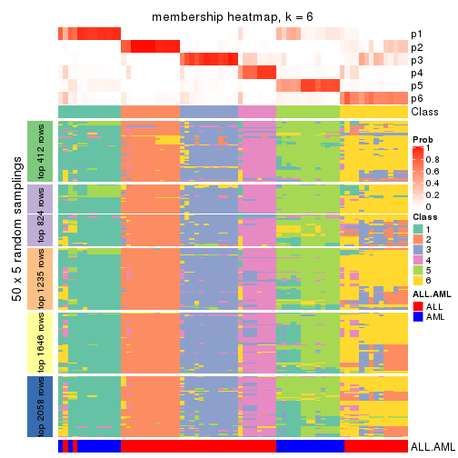</p>

</div>
</div>

As soon as we have had the classes for columns, we can look for signatures
which are significantly different between classes which can be candidate marks
for certain classes. Following are the heatmaps for signatures.


Signature heatmaps where rows are scaled:


<script>
$( function() {
	$( '#tabs-CV-kmeans-get-signatures' ).tabs();
} );
</script>
<div id='tabs-CV-kmeans-get-signatures'>
<ul>
<li><a href='#tab-CV-kmeans-get-signatures-1'>k = 2</a></li>
<li><a href='#tab-CV-kmeans-get-signatures-2'>k = 3</a></li>
<li><a href='#tab-CV-kmeans-get-signatures-3'>k = 4</a></li>
<li><a href='#tab-CV-kmeans-get-signatures-4'>k = 5</a></li>
<li><a href='#tab-CV-kmeans-get-signatures-5'>k = 6</a></li>
</ul>
<div id='tab-CV-kmeans-get-signatures-1'>
<pre><code class="r">get_signatures(res, k = 2)
</code></pre>

<p>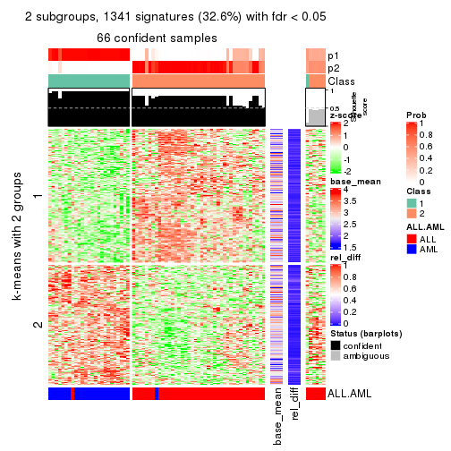</p>

</div>
<div id='tab-CV-kmeans-get-signatures-2'>
<pre><code class="r">get_signatures(res, k = 3)
</code></pre>

<p>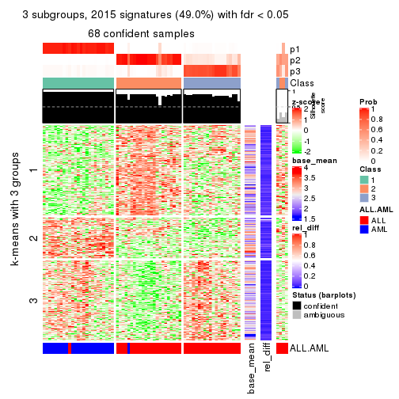</p>

</div>
<div id='tab-CV-kmeans-get-signatures-3'>
<pre><code class="r">get_signatures(res, k = 4)
</code></pre>

<p>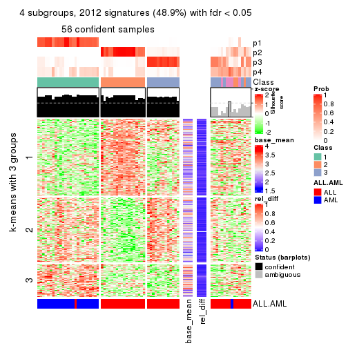</p>

</div>
<div id='tab-CV-kmeans-get-signatures-4'>
<pre><code class="r">get_signatures(res, k = 5)
</code></pre>

<p>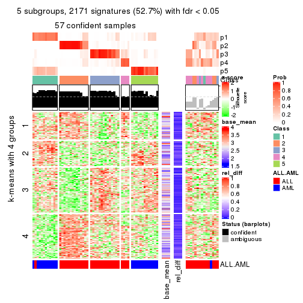</p>

</div>
<div id='tab-CV-kmeans-get-signatures-5'>
<pre><code class="r">get_signatures(res, k = 6)
</code></pre>

<p>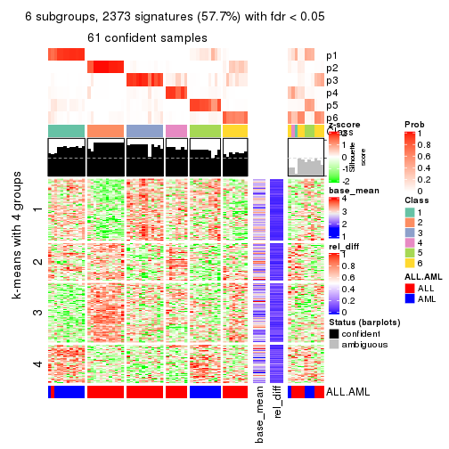</p>

</div>
</div>


Signature heatmaps where rows are not scaled:


<script>
$( function() {
	$( '#tabs-CV-kmeans-get-signatures-no-scale' ).tabs();
} );
</script>
<div id='tabs-CV-kmeans-get-signatures-no-scale'>
<ul>
<li><a href='#tab-CV-kmeans-get-signatures-no-scale-1'>k = 2</a></li>
<li><a href='#tab-CV-kmeans-get-signatures-no-scale-2'>k = 3</a></li>
<li><a href='#tab-CV-kmeans-get-signatures-no-scale-3'>k = 4</a></li>
<li><a href='#tab-CV-kmeans-get-signatures-no-scale-4'>k = 5</a></li>
<li><a href='#tab-CV-kmeans-get-signatures-no-scale-5'>k = 6</a></li>
</ul>
<div id='tab-CV-kmeans-get-signatures-no-scale-1'>
<pre><code class="r">get_signatures(res, k = 2, scale_rows = FALSE)
</code></pre>

<p>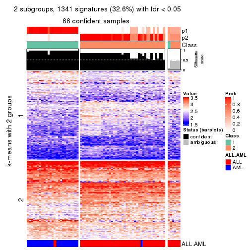</p>

</div>
<div id='tab-CV-kmeans-get-signatures-no-scale-2'>
<pre><code class="r">get_signatures(res, k = 3, scale_rows = FALSE)
</code></pre>

<p>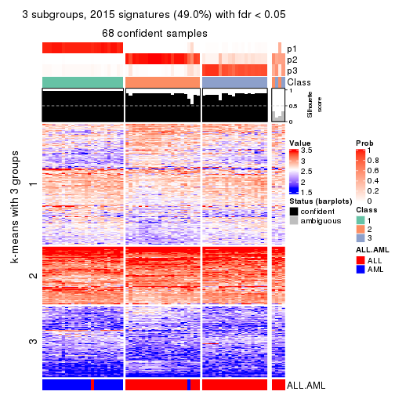</p>

</div>
<div id='tab-CV-kmeans-get-signatures-no-scale-3'>
<pre><code class="r">get_signatures(res, k = 4, scale_rows = FALSE)
</code></pre>

<p>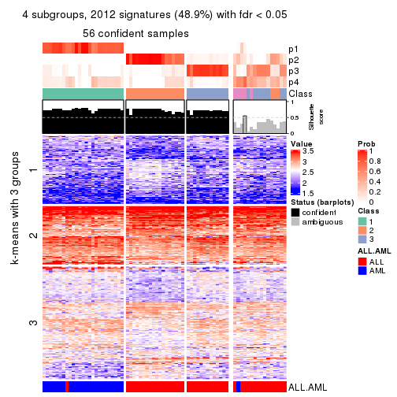</p>

</div>
<div id='tab-CV-kmeans-get-signatures-no-scale-4'>
<pre><code class="r">get_signatures(res, k = 5, scale_rows = FALSE)
</code></pre>

<p>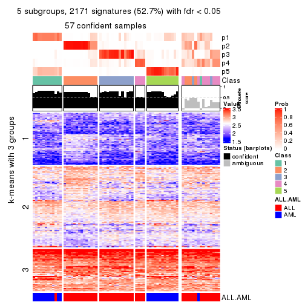</p>

</div>
<div id='tab-CV-kmeans-get-signatures-no-scale-5'>
<pre><code class="r">get_signatures(res, k = 6, scale_rows = FALSE)
</code></pre>

<p>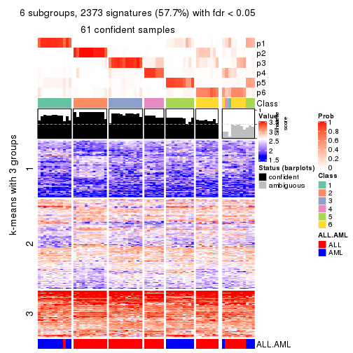</p>

</div>
</div>


Compare the overlap of signatures from different k:

```r
compare_signatures(res)
```

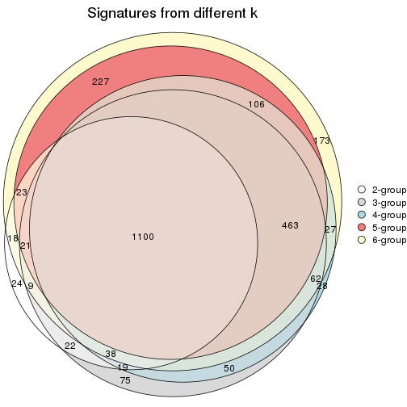

`get_signature()` returns a data frame invisibly. TO get the list of signatures, the function
call should be assigned to a variable explicitly. In following code, if `plot` argument is set
to `FALSE`, no heatmap is plotted while only the differential analysis is performed.

```r
# code only for demonstration
tb = get_signature(res, k = ..., plot = FALSE)
```

An example of the output of `tb` is:

```
#>   which_row         fdr    mean_1    mean_2 scaled_mean_1 scaled_mean_2 km
#> 1        38 0.042760348  8.373488  9.131774    -0.5533452     0.5164555  1
#> 2        40 0.018707592  7.106213  8.469186    -0.6173731     0.5762149  1
#> 3        55 0.019134737 10.221463 11.207825    -0.6159697     0.5749050  1
#> 4        59 0.006059896  5.921854  7.869574    -0.6899429     0.6439467  1
#> 5        60 0.018055526  8.928898 10.211722    -0.6204761     0.5791110  1
#> 6        98 0.009384629 15.714769 14.887706     0.6635654    -0.6193277  2
...
```

The columns in `tb` are:

1. `which_row`: row indices corresponding to the input matrix.
2. `fdr`: FDR for the differential test. 
3. `mean_x`: The mean value in group x.
4. `scaled_mean_x`: The mean value in group x after rows are scaled.
5. `km`: Row groups if k-means clustering is applied to rows.


UMAP plot which shows how samples are separated.


<script>
$( function() {
	$( '#tabs-CV-kmeans-dimension-reduction' ).tabs();
} );
</script>
<div id='tabs-CV-kmeans-dimension-reduction'>
<ul>
<li><a href='#tab-CV-kmeans-dimension-reduction-1'>k = 2</a></li>
<li><a href='#tab-CV-kmeans-dimension-reduction-2'>k = 3</a></li>
<li><a href='#tab-CV-kmeans-dimension-reduction-3'>k = 4</a></li>
<li><a href='#tab-CV-kmeans-dimension-reduction-4'>k = 5</a></li>
<li><a href='#tab-CV-kmeans-dimension-reduction-5'>k = 6</a></li>
</ul>
<div id='tab-CV-kmeans-dimension-reduction-1'>
<pre><code class="r">dimension_reduction(res, k = 2, method = &quot;UMAP&quot;)
</code></pre>

<p>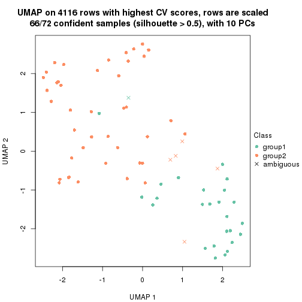</p>

</div>
<div id='tab-CV-kmeans-dimension-reduction-2'>
<pre><code class="r">dimension_reduction(res, k = 3, method = &quot;UMAP&quot;)
</code></pre>

<p>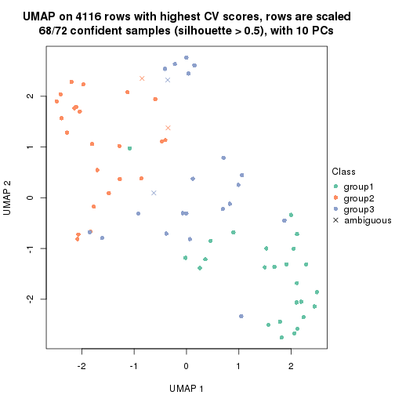</p>

</div>
<div id='tab-CV-kmeans-dimension-reduction-3'>
<pre><code class="r">dimension_reduction(res, k = 4, method = &quot;UMAP&quot;)
</code></pre>

<p>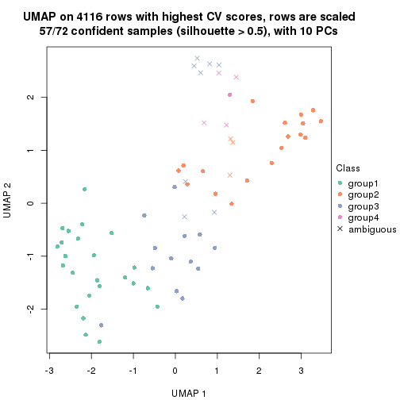</p>

</div>
<div id='tab-CV-kmeans-dimension-reduction-4'>
<pre><code class="r">dimension_reduction(res, k = 5, method = &quot;UMAP&quot;)
</code></pre>

<p>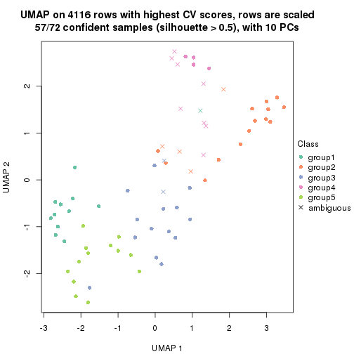</p>

</div>
<div id='tab-CV-kmeans-dimension-reduction-5'>
<pre><code class="r">dimension_reduction(res, k = 6, method = &quot;UMAP&quot;)
</code></pre>

<p>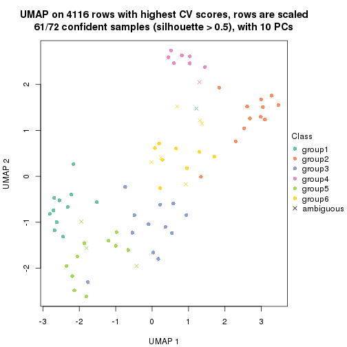</p>

</div>
</div>


Following heatmap shows how subgroups are split when increasing `k`:

```r
collect_classes(res)
```

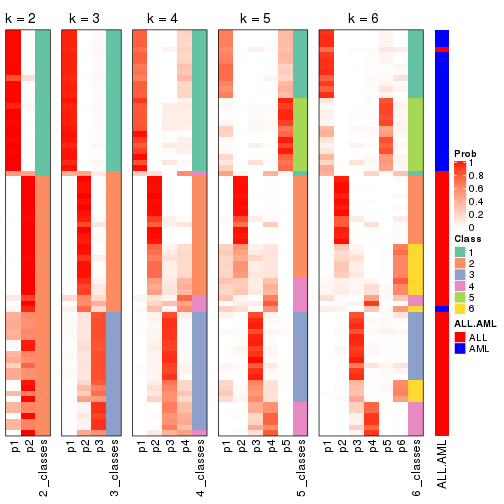


Test correlation between subgroups and known annotations. If the known
annotation is numeric, one-way ANOVA test is applied, and if the known
annotation is discrete, chi-squared contingency table test is applied.

```r
test_to_known_factors(res)
```

```
#>            n ALL.AML(p) k
#> CV:kmeans 66   2.15e-13 2
#> CV:kmeans 68   1.06e-13 3
#> CV:kmeans 57   1.78e-11 4
#> CV:kmeans 57   7.59e-11 5
#> CV:kmeans 61   5.20e-11 6
```


If matrix rows can be associated to genes, consider to use `functional_enrichment(res,
...)` to perform function enrichment for the signature genes. See [this vignette](http://bioconductor.org/packages/devel/bioc/vignettes/cola/inst/doc/functional_enrichment.html) for more detailed explanations.


 

---------------------------------------------------


### CV:skmeans


The object with results only for a single top-value method and a single partition method 
can be extracted as:

```r
res = res_list["CV", "skmeans"]
# you can also extract it by
# res = res_list["CV:skmeans"]
```

A summary of `res` and all the functions that can be applied to it:

```r
res
```

```
#> A 'ConsensusPartition' object with k = 2, 3, 4, 5, 6.
#>   On a matrix with 4116 rows and 72 columns.
#>   Top rows (412, 824, 1235, 1646, 2058) are extracted by 'CV' method.
#>   Subgroups are detected by 'skmeans' method.
#>   Performed in total 1250 partitions by row resampling.
#>   Best k for subgroups seems to be 3.
#> 
#> Following methods can be applied to this 'ConsensusPartition' object:
#>  [1] "cola_report"             "collect_classes"         "collect_plots"          
#>  [4] "collect_stats"           "colnames"                "compare_signatures"     
#>  [7] "consensus_heatmap"       "dimension_reduction"     "functional_enrichment"  
#> [10] "get_anno_col"            "get_anno"                "get_classes"            
#> [13] "get_consensus"           "get_matrix"              "get_membership"         
#> [16] "get_param"               "get_signatures"          "get_stats"              
#> [19] "is_best_k"               "is_stable_k"             "membership_heatmap"     
#> [22] "ncol"                    "nrow"                    "plot_ecdf"              
#> [25] "rownames"                "select_partition_number" "show"                   
#> [28] "suggest_best_k"          "test_to_known_factors"
```

`collect_plots()` function collects all the plots made from `res` for all `k` (number of partitions)
into one single page to provide an easy and fast comparison between different `k`.

```r
collect_plots(res)
```

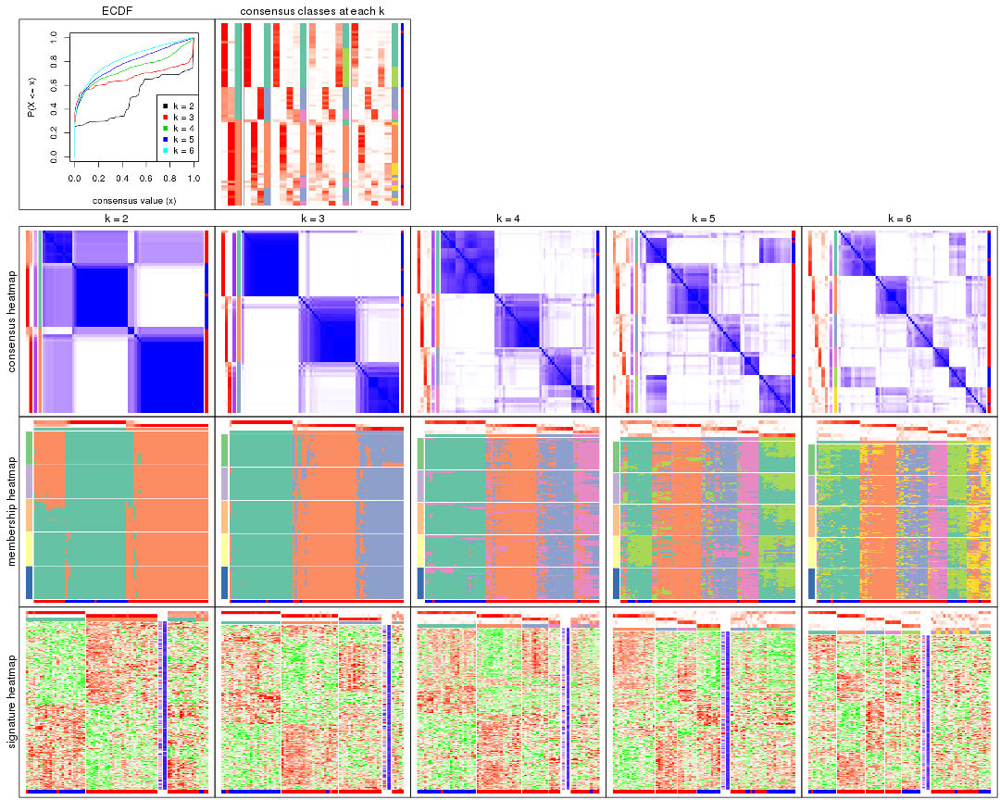

The plots are:

- The first row: a plot of the ECDF (empirical cumulative distribution
  function) curves of the consensus matrix for each `k` and the heatmap of
  predicted classes for each `k`.
- The second row: heatmaps of the consensus matrix for each `k`.
- The third row: heatmaps of the membership matrix for each `k`.
- The fouth row: heatmaps of the signatures for each `k`.

All the plots in panels can be made by individual functions and they are
plotted later in this section.

`select_partition_number()` produces several plots showing different
statistics for choosing "optimized" `k`. There are following statistics:

- ECDF curves of the consensus matrix for each `k`;
- 1-PAC. [The PAC
  score](https://en.wikipedia.org/wiki/Consensus_clustering#Over-interpretation_potential_of_consensus_clustering)
  measures the proportion of the ambiguous subgrouping.
- Mean silhouette score.
- Concordance. The mean probability of fiting the consensus class ids in all
  partitions.
- Area increased. Denote $A_k$ as the area under the ECDF curve for current
  `k`, the area increased is defined as $A_k - A_{k-1}$.
- Rand index. The percent of pairs of samples that are both in a same cluster
  or both are not in a same cluster in the partition of k and k-1.
- Jaccard index. The ratio of pairs of samples are both in a same cluster in
  the partition of k and k-1 and the pairs of samples are both in a same
  cluster in the partition k or k-1.

The detailed explanations of these statistics can be found in [the _cola_
vignette](http://bioconductor.org/packages/devel/bioc/vignettes/cola/inst/doc/cola.html#toc_13).

Generally speaking, lower PAC score, higher mean silhouette score or higher
concordance corresponds to better partition. Rand index and Jaccard index
measure how similar the current partition is compared to partition with `k-1`.
If they are too similar, we won't accept `k` is better than `k-1`.

```r
select_partition_number(res)
```

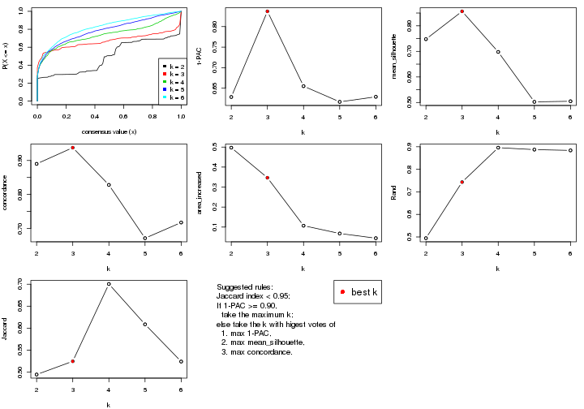

The numeric values for all these statistics can be obtained by `get_stats()`.

```r
get_stats(res)
```

```
#>   k 1-PAC mean_silhouette concordance area_increased  Rand Jaccard
#> 2 2 0.629           0.748       0.890         0.4970 0.495   0.495
#> 3 3 0.837           0.857       0.938         0.3466 0.743   0.525
#> 4 4 0.655           0.698       0.828         0.1068 0.896   0.700
#> 5 5 0.617           0.503       0.671         0.0677 0.887   0.609
#> 6 6 0.629           0.505       0.717         0.0443 0.884   0.524
```

`suggest_best_k()` suggests the best $k$ based on these statistics. The rules are as follows:

- All $k$ with Jaccard index larger than 0.95 are removed because increasing
  $k$ does not provide enough extra information. If all $k$ are removed, it is
  marked as no subgroup is detected.
- For all $k$ with 1-PAC score larger than 0.9, the maximal $k$ is taken as
  the best $k$, and other $k$ are marked as optional $k$.
- If it does not fit the second rule. The $k$ with the maximal vote of the
  highest 1-PAC score, highest mean silhouette, and highest concordance is
  taken as the best $k$.

```r
suggest_best_k(res)
```

```
#> [1] 3
```


Following shows the table of the partitions (You need to click the **show/hide
code output** link to see it). The membership matrix (columns with name `p*`)
is inferred by
[`clue::cl_consensus()`](https://www.rdocumentation.org/link/cl_consensus?package=clue)
function with the `SE` method. Basically the value in the membership matrix
represents the probability to belong to a certain group. The finall class
label for an item is determined with the group with highest probability it
belongs to.

In `get_classes()` function, the entropy is calculated from the membership
matrix and the silhouette score is calculated from the consensus matrix.


<script>
$( function() {
	$( '#tabs-CV-skmeans-get-classes' ).tabs();
} );
</script>
<div id='tabs-CV-skmeans-get-classes'>
<ul>
<li><a href='#tab-CV-skmeans-get-classes-1'>k = 2</a></li>
<li><a href='#tab-CV-skmeans-get-classes-2'>k = 3</a></li>
<li><a href='#tab-CV-skmeans-get-classes-3'>k = 4</a></li>
<li><a href='#tab-CV-skmeans-get-classes-4'>k = 5</a></li>
<li><a href='#tab-CV-skmeans-get-classes-5'>k = 6</a></li>
</ul>

<div id='tab-CV-skmeans-get-classes-1'>
<p><a id='tab-CV-skmeans-get-classes-1-a' style='color:#0366d6' href='#'>show/hide code output</a></p>
<pre><code class="r">cbind(get_classes(res, k = 2), get_membership(res, k = 2))
</code></pre>

<pre><code>#&gt;           class entropy silhouette    p1    p2
#&gt; sample_39     1   0.994      0.403 0.544 0.456
#&gt; sample_40     1   0.993      0.410 0.548 0.452
#&gt; sample_42     2   0.000      0.929 0.000 1.000
#&gt; sample_47     2   0.000      0.929 0.000 1.000
#&gt; sample_48     2   0.000      0.929 0.000 1.000
#&gt; sample_49     1   0.985      0.449 0.572 0.428
#&gt; sample_41     2   0.000      0.929 0.000 1.000
#&gt; sample_43     2   0.000      0.929 0.000 1.000
#&gt; sample_44     2   0.000      0.929 0.000 1.000
#&gt; sample_45     2   0.000      0.929 0.000 1.000
#&gt; sample_46     2   0.000      0.929 0.000 1.000
#&gt; sample_70     2   0.000      0.929 0.000 1.000
#&gt; sample_71     2   0.000      0.929 0.000 1.000
#&gt; sample_72     2   0.000      0.929 0.000 1.000
#&gt; sample_68     2   0.000      0.929 0.000 1.000
#&gt; sample_69     2   0.000      0.929 0.000 1.000
#&gt; sample_67     2   0.995      0.155 0.460 0.540
#&gt; sample_55     1   0.995      0.393 0.540 0.460
#&gt; sample_56     1   0.995      0.395 0.540 0.460
#&gt; sample_59     2   0.000      0.929 0.000 1.000
#&gt; sample_52     1   0.000      0.803 1.000 0.000
#&gt; sample_53     1   0.000      0.803 1.000 0.000
#&gt; sample_51     1   0.000      0.803 1.000 0.000
#&gt; sample_50     1   0.000      0.803 1.000 0.000
#&gt; sample_54     1   0.506      0.712 0.888 0.112
#&gt; sample_57     1   0.000      0.803 1.000 0.000
#&gt; sample_58     1   0.000      0.803 1.000 0.000
#&gt; sample_60     1   0.000      0.803 1.000 0.000
#&gt; sample_61     1   0.000      0.803 1.000 0.000
#&gt; sample_65     1   0.000      0.803 1.000 0.000
#&gt; sample_66     2   0.981      0.246 0.420 0.580
#&gt; sample_63     1   0.000      0.803 1.000 0.000
#&gt; sample_64     1   0.000      0.803 1.000 0.000
#&gt; sample_62     1   0.000      0.803 1.000 0.000
#&gt; sample_1      2   0.000      0.929 0.000 1.000
#&gt; sample_2      2   0.993      0.174 0.452 0.548
#&gt; sample_3      1   0.996      0.386 0.536 0.464
#&gt; sample_4      2   0.000      0.929 0.000 1.000
#&gt; sample_5      2   0.000      0.929 0.000 1.000
#&gt; sample_6      1   0.996      0.386 0.536 0.464
#&gt; sample_7      1   0.998      0.357 0.524 0.476
#&gt; sample_8      1   0.987      0.442 0.568 0.432
#&gt; sample_9      2   0.000      0.929 0.000 1.000
#&gt; sample_10     1   0.925      0.552 0.660 0.340
#&gt; sample_11     2   0.000      0.929 0.000 1.000
#&gt; sample_12     1   0.000      0.803 1.000 0.000
#&gt; sample_13     2   0.000      0.929 0.000 1.000
#&gt; sample_14     2   0.000      0.929 0.000 1.000
#&gt; sample_15     2   0.000      0.929 0.000 1.000
#&gt; sample_16     2   0.000      0.929 0.000 1.000
#&gt; sample_17     2   0.402      0.840 0.080 0.920
#&gt; sample_18     2   0.443      0.817 0.092 0.908
#&gt; sample_19     2   0.000      0.929 0.000 1.000
#&gt; sample_20     2   0.000      0.929 0.000 1.000
#&gt; sample_21     2   0.000      0.929 0.000 1.000
#&gt; sample_22     1   0.981      0.460 0.580 0.420
#&gt; sample_23     1   0.994      0.403 0.544 0.456
#&gt; sample_24     2   0.000      0.929 0.000 1.000
#&gt; sample_25     2   0.855      0.457 0.280 0.720
#&gt; sample_26     2   0.000      0.929 0.000 1.000
#&gt; sample_27     1   0.983      0.454 0.576 0.424
#&gt; sample_34     1   0.000      0.803 1.000 0.000
#&gt; sample_35     1   0.000      0.803 1.000 0.000
#&gt; sample_36     1   0.000      0.803 1.000 0.000
#&gt; sample_37     1   0.000      0.803 1.000 0.000
#&gt; sample_38     1   0.000      0.803 1.000 0.000
#&gt; sample_28     1   0.000      0.803 1.000 0.000
#&gt; sample_29     1   0.861      0.476 0.716 0.284
#&gt; sample_30     1   0.000      0.803 1.000 0.000
#&gt; sample_31     1   0.000      0.803 1.000 0.000
#&gt; sample_32     1   0.000      0.803 1.000 0.000
#&gt; sample_33     1   0.000      0.803 1.000 0.000
</code></pre>

<script>
$('#tab-CV-skmeans-get-classes-1-a').parent().next().next().hide();
$('#tab-CV-skmeans-get-classes-1-a').click(function(){
  $('#tab-CV-skmeans-get-classes-1-a').parent().next().next().toggle();
  return(false);
});
</script>
</div>

<div id='tab-CV-skmeans-get-classes-2'>
<p><a id='tab-CV-skmeans-get-classes-2-a' style='color:#0366d6' href='#'>show/hide code output</a></p>
<pre><code class="r">cbind(get_classes(res, k = 3), get_membership(res, k = 3))
</code></pre>

<pre><code>#&gt;           class entropy silhouette    p1    p2    p3
#&gt; sample_39     3  0.3038     0.8602 0.000 0.104 0.896
#&gt; sample_40     3  0.1411     0.9012 0.000 0.036 0.964
#&gt; sample_42     2  0.0000     0.9100 0.000 1.000 0.000
#&gt; sample_47     2  0.0000     0.9100 0.000 1.000 0.000
#&gt; sample_48     2  0.0000     0.9100 0.000 1.000 0.000
#&gt; sample_49     3  0.1163     0.9008 0.000 0.028 0.972
#&gt; sample_41     2  0.0237     0.9094 0.000 0.996 0.004
#&gt; sample_43     2  0.0000     0.9100 0.000 1.000 0.000
#&gt; sample_44     2  0.3412     0.8065 0.000 0.876 0.124
#&gt; sample_45     2  0.0000     0.9100 0.000 1.000 0.000
#&gt; sample_46     2  0.0000     0.9100 0.000 1.000 0.000
#&gt; sample_70     3  0.5327     0.6679 0.000 0.272 0.728
#&gt; sample_71     2  0.1289     0.8925 0.000 0.968 0.032
#&gt; sample_72     2  0.0237     0.9087 0.000 0.996 0.004
#&gt; sample_68     2  0.0237     0.9094 0.000 0.996 0.004
#&gt; sample_69     2  0.0000     0.9100 0.000 1.000 0.000
#&gt; sample_67     1  0.7184    -0.0186 0.504 0.472 0.024
#&gt; sample_55     3  0.1031     0.8999 0.000 0.024 0.976
#&gt; sample_56     3  0.1529     0.9001 0.000 0.040 0.960
#&gt; sample_59     2  0.6267     0.0253 0.000 0.548 0.452
#&gt; sample_52     1  0.0000     0.9753 1.000 0.000 0.000
#&gt; sample_53     1  0.0000     0.9753 1.000 0.000 0.000
#&gt; sample_51     1  0.0000     0.9753 1.000 0.000 0.000
#&gt; sample_50     1  0.0000     0.9753 1.000 0.000 0.000
#&gt; sample_54     1  0.0829     0.9632 0.984 0.012 0.004
#&gt; sample_57     1  0.0000     0.9753 1.000 0.000 0.000
#&gt; sample_58     1  0.0000     0.9753 1.000 0.000 0.000
#&gt; sample_60     1  0.0000     0.9753 1.000 0.000 0.000
#&gt; sample_61     1  0.0237     0.9725 0.996 0.000 0.004
#&gt; sample_65     1  0.0000     0.9753 1.000 0.000 0.000
#&gt; sample_66     2  0.5581     0.7289 0.168 0.792 0.040
#&gt; sample_63     1  0.0000     0.9753 1.000 0.000 0.000
#&gt; sample_64     1  0.0592     0.9666 0.988 0.000 0.012
#&gt; sample_62     1  0.0000     0.9753 1.000 0.000 0.000
#&gt; sample_1      3  0.1860     0.8954 0.000 0.052 0.948
#&gt; sample_2      2  0.6556     0.5876 0.276 0.692 0.032
#&gt; sample_3      3  0.0000     0.8905 0.000 0.000 1.000
#&gt; sample_4      3  0.1411     0.9009 0.000 0.036 0.964
#&gt; sample_5      2  0.0237     0.9094 0.000 0.996 0.004
#&gt; sample_6      3  0.0000     0.8905 0.000 0.000 1.000
#&gt; sample_7      3  0.1289     0.9010 0.000 0.032 0.968
#&gt; sample_8      3  0.1411     0.9006 0.000 0.036 0.964
#&gt; sample_9      3  0.4002     0.7630 0.000 0.160 0.840
#&gt; sample_10     3  0.0000     0.8905 0.000 0.000 1.000
#&gt; sample_11     3  0.6252     0.1259 0.000 0.444 0.556
#&gt; sample_12     1  0.0000     0.9753 1.000 0.000 0.000
#&gt; sample_13     2  0.0000     0.9100 0.000 1.000 0.000
#&gt; sample_14     2  0.5905     0.4764 0.000 0.648 0.352
#&gt; sample_15     2  0.0237     0.9094 0.000 0.996 0.004
#&gt; sample_16     2  0.2165     0.8764 0.000 0.936 0.064
#&gt; sample_17     2  0.3500     0.8349 0.004 0.880 0.116
#&gt; sample_18     3  0.3816     0.8149 0.000 0.148 0.852
#&gt; sample_19     2  0.0000     0.9100 0.000 1.000 0.000
#&gt; sample_20     2  0.0000     0.9100 0.000 1.000 0.000
#&gt; sample_21     2  0.0424     0.9082 0.000 0.992 0.008
#&gt; sample_22     3  0.1999     0.8981 0.012 0.036 0.952
#&gt; sample_23     3  0.0000     0.8905 0.000 0.000 1.000
#&gt; sample_24     2  0.1643     0.8882 0.000 0.956 0.044
#&gt; sample_25     3  0.6641     0.2694 0.008 0.448 0.544
#&gt; sample_26     2  0.4931     0.6393 0.000 0.768 0.232
#&gt; sample_27     3  0.1163     0.9008 0.000 0.028 0.972
#&gt; sample_34     1  0.0000     0.9753 1.000 0.000 0.000
#&gt; sample_35     1  0.1529     0.9392 0.960 0.000 0.040
#&gt; sample_36     1  0.0000     0.9753 1.000 0.000 0.000
#&gt; sample_37     1  0.0000     0.9753 1.000 0.000 0.000
#&gt; sample_38     1  0.0000     0.9753 1.000 0.000 0.000
#&gt; sample_28     1  0.0000     0.9753 1.000 0.000 0.000
#&gt; sample_29     1  0.0237     0.9722 0.996 0.004 0.000
#&gt; sample_30     1  0.0000     0.9753 1.000 0.000 0.000
#&gt; sample_31     1  0.0000     0.9753 1.000 0.000 0.000
#&gt; sample_32     1  0.0000     0.9753 1.000 0.000 0.000
#&gt; sample_33     1  0.0000     0.9753 1.000 0.000 0.000
</code></pre>

<script>
$('#tab-CV-skmeans-get-classes-2-a').parent().next().next().hide();
$('#tab-CV-skmeans-get-classes-2-a').click(function(){
  $('#tab-CV-skmeans-get-classes-2-a').parent().next().next().toggle();
  return(false);
});
</script>
</div>

<div id='tab-CV-skmeans-get-classes-3'>
<p><a id='tab-CV-skmeans-get-classes-3-a' style='color:#0366d6' href='#'>show/hide code output</a></p>
<pre><code class="r">cbind(get_classes(res, k = 4), get_membership(res, k = 4))
</code></pre>

<pre><code>#&gt;           class entropy silhouette    p1    p2    p3    p4
#&gt; sample_39     3  0.2125     0.7016 0.000 0.004 0.920 0.076
#&gt; sample_40     3  0.2463     0.7032 0.032 0.008 0.924 0.036
#&gt; sample_42     2  0.6980     0.5073 0.004 0.568 0.128 0.300
#&gt; sample_47     2  0.1833     0.8354 0.000 0.944 0.024 0.032
#&gt; sample_48     2  0.0000     0.8432 0.000 1.000 0.000 0.000
#&gt; sample_49     3  0.0804     0.7073 0.008 0.000 0.980 0.012
#&gt; sample_41     2  0.0376     0.8429 0.000 0.992 0.004 0.004
#&gt; sample_43     2  0.4426     0.7742 0.000 0.812 0.092 0.096
#&gt; sample_44     2  0.5809     0.6458 0.000 0.692 0.216 0.092
#&gt; sample_45     2  0.3198     0.8086 0.000 0.880 0.040 0.080
#&gt; sample_46     2  0.3732     0.7973 0.000 0.852 0.056 0.092
#&gt; sample_70     3  0.6418     0.4802 0.000 0.216 0.644 0.140
#&gt; sample_71     4  0.6386     0.0881 0.000 0.376 0.072 0.552
#&gt; sample_72     2  0.6827     0.4006 0.000 0.568 0.128 0.304
#&gt; sample_68     2  0.0188     0.8428 0.000 0.996 0.000 0.004
#&gt; sample_69     2  0.0188     0.8430 0.000 0.996 0.000 0.004
#&gt; sample_67     4  0.6359     0.4179 0.220 0.132 0.000 0.648
#&gt; sample_55     3  0.4795     0.6170 0.012 0.076 0.804 0.108
#&gt; sample_56     3  0.1114     0.7116 0.008 0.004 0.972 0.016
#&gt; sample_59     2  0.6963     0.0290 0.004 0.464 0.436 0.096
#&gt; sample_52     1  0.1042     0.9075 0.972 0.000 0.008 0.020
#&gt; sample_53     1  0.2216     0.9029 0.908 0.000 0.000 0.092
#&gt; sample_51     1  0.2011     0.9063 0.920 0.000 0.000 0.080
#&gt; sample_50     1  0.1940     0.9071 0.924 0.000 0.000 0.076
#&gt; sample_54     1  0.4419     0.8387 0.840 0.056 0.040 0.064
#&gt; sample_57     1  0.2408     0.8913 0.920 0.000 0.044 0.036
#&gt; sample_58     1  0.2408     0.8914 0.920 0.000 0.044 0.036
#&gt; sample_60     1  0.2944     0.8842 0.900 0.004 0.052 0.044
#&gt; sample_61     1  0.2773     0.8947 0.900 0.000 0.072 0.028
#&gt; sample_65     1  0.0927     0.9115 0.976 0.000 0.008 0.016
#&gt; sample_66     4  0.5482     0.2887 0.024 0.368 0.000 0.608
#&gt; sample_63     1  0.1584     0.9023 0.952 0.000 0.012 0.036
#&gt; sample_64     1  0.3435     0.8556 0.864 0.000 0.100 0.036
#&gt; sample_62     1  0.1584     0.9023 0.952 0.000 0.012 0.036
#&gt; sample_1      3  0.2871     0.6950 0.000 0.072 0.896 0.032
#&gt; sample_2      4  0.4336     0.5498 0.048 0.132 0.004 0.816
#&gt; sample_3      4  0.4961     0.3607 0.000 0.000 0.448 0.552
#&gt; sample_4      3  0.5180     0.5734 0.000 0.196 0.740 0.064
#&gt; sample_5      2  0.0336     0.8422 0.000 0.992 0.000 0.008
#&gt; sample_6      4  0.4925     0.3949 0.000 0.000 0.428 0.572
#&gt; sample_7      3  0.3966     0.6458 0.000 0.088 0.840 0.072
#&gt; sample_8      3  0.0895     0.7081 0.000 0.004 0.976 0.020
#&gt; sample_9      4  0.5873     0.5558 0.000 0.076 0.256 0.668
#&gt; sample_10     4  0.4608     0.5171 0.004 0.000 0.304 0.692
#&gt; sample_11     4  0.4931     0.5856 0.000 0.092 0.132 0.776
#&gt; sample_12     1  0.4015     0.8631 0.832 0.000 0.052 0.116
#&gt; sample_13     2  0.0000     0.8432 0.000 1.000 0.000 0.000
#&gt; sample_14     4  0.6022     0.5421 0.000 0.260 0.084 0.656
#&gt; sample_15     2  0.0336     0.8422 0.000 0.992 0.000 0.008
#&gt; sample_16     2  0.2741     0.7993 0.000 0.892 0.096 0.012
#&gt; sample_17     2  0.4343     0.5311 0.000 0.732 0.004 0.264
#&gt; sample_18     3  0.8049     0.0429 0.016 0.196 0.432 0.356
#&gt; sample_19     2  0.4274     0.7797 0.000 0.820 0.108 0.072
#&gt; sample_20     2  0.0188     0.8432 0.000 0.996 0.000 0.004
#&gt; sample_21     2  0.0817     0.8368 0.000 0.976 0.000 0.024
#&gt; sample_22     3  0.4425     0.6219 0.036 0.004 0.800 0.160
#&gt; sample_23     4  0.4941     0.3828 0.000 0.000 0.436 0.564
#&gt; sample_24     2  0.0672     0.8410 0.000 0.984 0.008 0.008
#&gt; sample_25     3  0.8007     0.2592 0.024 0.168 0.472 0.336
#&gt; sample_26     3  0.7154    -0.0693 0.000 0.428 0.440 0.132
#&gt; sample_27     3  0.1042     0.7041 0.008 0.000 0.972 0.020
#&gt; sample_34     1  0.0779     0.9092 0.980 0.000 0.004 0.016
#&gt; sample_35     1  0.4335     0.7984 0.796 0.000 0.168 0.036
#&gt; sample_36     1  0.1211     0.9115 0.960 0.000 0.000 0.040
#&gt; sample_37     1  0.2216     0.9026 0.908 0.000 0.000 0.092
#&gt; sample_38     1  0.3982     0.8039 0.776 0.000 0.004 0.220
#&gt; sample_28     1  0.3105     0.8762 0.856 0.000 0.004 0.140
#&gt; sample_29     1  0.3528     0.8363 0.808 0.000 0.000 0.192
#&gt; sample_30     1  0.1637     0.9098 0.940 0.000 0.000 0.060
#&gt; sample_31     1  0.0592     0.9117 0.984 0.000 0.000 0.016
#&gt; sample_32     1  0.2011     0.9067 0.920 0.000 0.000 0.080
#&gt; sample_33     1  0.2216     0.9026 0.908 0.000 0.000 0.092
</code></pre>

<script>
$('#tab-CV-skmeans-get-classes-3-a').parent().next().next().hide();
$('#tab-CV-skmeans-get-classes-3-a').click(function(){
  $('#tab-CV-skmeans-get-classes-3-a').parent().next().next().toggle();
  return(false);
});
</script>
</div>

<div id='tab-CV-skmeans-get-classes-4'>
<p><a id='tab-CV-skmeans-get-classes-4-a' style='color:#0366d6' href='#'>show/hide code output</a></p>
<pre><code class="r">cbind(get_classes(res, k = 5), get_membership(res, k = 5))
</code></pre>

<pre><code>#&gt;           class entropy silhouette    p1    p2    p3    p4    p5
#&gt; sample_39     3  0.2511     0.6520 0.088 0.000 0.892 0.016 0.004
#&gt; sample_40     3  0.4360     0.6511 0.016 0.008 0.804 0.080 0.092
#&gt; sample_42     1  0.7767    -0.4863 0.392 0.372 0.144 0.088 0.004
#&gt; sample_47     2  0.3730     0.7539 0.108 0.832 0.040 0.020 0.000
#&gt; sample_48     2  0.0000     0.7976 0.000 1.000 0.000 0.000 0.000
#&gt; sample_49     3  0.2053     0.6706 0.000 0.004 0.924 0.048 0.024
#&gt; sample_41     2  0.1285     0.7926 0.036 0.956 0.004 0.004 0.000
#&gt; sample_43     2  0.6765     0.5590 0.244 0.584 0.120 0.044 0.008
#&gt; sample_44     2  0.6768     0.5281 0.152 0.588 0.200 0.060 0.000
#&gt; sample_45     2  0.5292     0.6828 0.160 0.724 0.076 0.040 0.000
#&gt; sample_46     2  0.5682     0.6607 0.172 0.692 0.092 0.044 0.000
#&gt; sample_70     3  0.7796     0.4094 0.176 0.180 0.512 0.124 0.008
#&gt; sample_71     2  0.8307    -0.0377 0.292 0.300 0.124 0.284 0.000
#&gt; sample_72     2  0.7886     0.3247 0.216 0.468 0.164 0.152 0.000
#&gt; sample_68     2  0.0703     0.7953 0.024 0.976 0.000 0.000 0.000
#&gt; sample_69     2  0.0579     0.7973 0.008 0.984 0.008 0.000 0.000
#&gt; sample_67     1  0.6826    -0.0670 0.524 0.064 0.004 0.332 0.076
#&gt; sample_55     3  0.7644     0.4791 0.048 0.048 0.552 0.164 0.188
#&gt; sample_56     3  0.2472     0.6763 0.012 0.000 0.908 0.036 0.044
#&gt; sample_59     3  0.8787     0.0558 0.168 0.332 0.352 0.056 0.092
#&gt; sample_52     5  0.2424     0.6172 0.132 0.000 0.000 0.000 0.868
#&gt; sample_53     1  0.4268     0.3396 0.556 0.000 0.000 0.000 0.444
#&gt; sample_51     1  0.4294     0.2995 0.532 0.000 0.000 0.000 0.468
#&gt; sample_50     1  0.4302     0.2732 0.520 0.000 0.000 0.000 0.480
#&gt; sample_54     5  0.3672     0.5611 0.040 0.064 0.028 0.012 0.856
#&gt; sample_57     5  0.1538     0.6393 0.008 0.000 0.036 0.008 0.948
#&gt; sample_58     5  0.2122     0.6567 0.032 0.000 0.036 0.008 0.924
#&gt; sample_60     5  0.3159     0.5997 0.044 0.008 0.052 0.016 0.880
#&gt; sample_61     5  0.5781     0.4154 0.260 0.000 0.112 0.008 0.620
#&gt; sample_65     5  0.3730     0.4367 0.288 0.000 0.000 0.000 0.712
#&gt; sample_66     4  0.7286     0.1895 0.312 0.272 0.004 0.396 0.016
#&gt; sample_63     5  0.1571     0.6561 0.060 0.000 0.004 0.000 0.936
#&gt; sample_64     5  0.3589     0.5944 0.040 0.000 0.132 0.004 0.824
#&gt; sample_62     5  0.1041     0.6577 0.032 0.000 0.004 0.000 0.964
#&gt; sample_1      3  0.3756     0.6531 0.012 0.044 0.824 0.120 0.000
#&gt; sample_2      4  0.5271     0.5451 0.296 0.076 0.000 0.628 0.000
#&gt; sample_3      4  0.2852     0.7122 0.000 0.000 0.172 0.828 0.000
#&gt; sample_4      3  0.6756     0.4450 0.028 0.208 0.548 0.216 0.000
#&gt; sample_5      2  0.0794     0.7943 0.028 0.972 0.000 0.000 0.000
#&gt; sample_6      4  0.2852     0.7113 0.000 0.000 0.172 0.828 0.000
#&gt; sample_7      3  0.5173     0.5861 0.020 0.064 0.728 0.180 0.008
#&gt; sample_8      3  0.2244     0.6733 0.024 0.000 0.920 0.040 0.016
#&gt; sample_9      4  0.2661     0.7543 0.000 0.056 0.056 0.888 0.000
#&gt; sample_10     4  0.1894     0.7510 0.008 0.000 0.072 0.920 0.000
#&gt; sample_11     4  0.2591     0.7428 0.032 0.044 0.020 0.904 0.000
#&gt; sample_12     1  0.5674     0.3148 0.584 0.000 0.052 0.020 0.344
#&gt; sample_13     2  0.0579     0.7983 0.008 0.984 0.008 0.000 0.000
#&gt; sample_14     4  0.2597     0.7204 0.004 0.120 0.004 0.872 0.000
#&gt; sample_15     2  0.0880     0.7933 0.032 0.968 0.000 0.000 0.000
#&gt; sample_16     2  0.3582     0.7287 0.028 0.840 0.108 0.024 0.000
#&gt; sample_17     2  0.5052     0.5854 0.040 0.728 0.012 0.200 0.020
#&gt; sample_18     3  0.8869     0.1856 0.060 0.152 0.384 0.292 0.112
#&gt; sample_19     2  0.5504     0.6697 0.136 0.704 0.132 0.028 0.000
#&gt; sample_20     2  0.0324     0.7976 0.004 0.992 0.004 0.000 0.000
#&gt; sample_21     2  0.1579     0.7887 0.024 0.944 0.000 0.032 0.000
#&gt; sample_22     3  0.5213     0.5403 0.200 0.004 0.716 0.048 0.032
#&gt; sample_23     4  0.2852     0.7126 0.000 0.000 0.172 0.828 0.000
#&gt; sample_24     2  0.1329     0.7898 0.032 0.956 0.008 0.004 0.000
#&gt; sample_25     1  0.7433    -0.4064 0.436 0.092 0.372 0.096 0.004
#&gt; sample_26     3  0.6958     0.1751 0.120 0.340 0.496 0.040 0.004
#&gt; sample_27     3  0.2171     0.6661 0.000 0.000 0.912 0.064 0.024
#&gt; sample_34     5  0.3305     0.5418 0.224 0.000 0.000 0.000 0.776
#&gt; sample_35     5  0.5671     0.5081 0.180 0.000 0.144 0.012 0.664
#&gt; sample_36     5  0.4192     0.0362 0.404 0.000 0.000 0.000 0.596
#&gt; sample_37     1  0.4256     0.3521 0.564 0.000 0.000 0.000 0.436
#&gt; sample_38     1  0.4645     0.3812 0.672 0.000 0.012 0.016 0.300
#&gt; sample_28     1  0.4318     0.3857 0.644 0.000 0.004 0.004 0.348
#&gt; sample_29     1  0.5128     0.3305 0.640 0.016 0.000 0.032 0.312
#&gt; sample_30     5  0.4302    -0.2570 0.480 0.000 0.000 0.000 0.520
#&gt; sample_31     5  0.3707     0.4329 0.284 0.000 0.000 0.000 0.716
#&gt; sample_32     1  0.4300     0.2668 0.524 0.000 0.000 0.000 0.476
#&gt; sample_33     1  0.4256     0.3437 0.564 0.000 0.000 0.000 0.436
</code></pre>

<script>
$('#tab-CV-skmeans-get-classes-4-a').parent().next().next().hide();
$('#tab-CV-skmeans-get-classes-4-a').click(function(){
  $('#tab-CV-skmeans-get-classes-4-a').parent().next().next().toggle();
  return(false);
});
</script>
</div>

<div id='tab-CV-skmeans-get-classes-5'>
<p><a id='tab-CV-skmeans-get-classes-5-a' style='color:#0366d6' href='#'>show/hide code output</a></p>
<pre><code class="r">cbind(get_classes(res, k = 6), get_membership(res, k = 6))
</code></pre>

<pre><code>#&gt;           class entropy silhouette    p1    p2    p3    p4    p5    p6
#&gt; sample_39     3  0.4173    0.51666 0.000 0.000 0.732 0.032 0.020 0.216
#&gt; sample_40     3  0.4879    0.60706 0.000 0.008 0.740 0.060 0.120 0.072
#&gt; sample_42     6  0.5716    0.44865 0.040 0.132 0.032 0.052 0.036 0.708
#&gt; sample_47     2  0.4201    0.56912 0.000 0.708 0.004 0.008 0.028 0.252
#&gt; sample_48     2  0.1644    0.77334 0.000 0.920 0.000 0.004 0.000 0.076
#&gt; sample_49     3  0.2633    0.64006 0.000 0.000 0.888 0.044 0.040 0.028
#&gt; sample_41     2  0.1760    0.75768 0.000 0.936 0.012 0.004 0.020 0.028
#&gt; sample_43     6  0.5741    0.27976 0.004 0.332 0.044 0.012 0.040 0.568
#&gt; sample_44     6  0.6383    0.21534 0.000 0.384 0.136 0.016 0.020 0.444
#&gt; sample_45     2  0.5427   -0.05615 0.000 0.484 0.052 0.012 0.012 0.440
#&gt; sample_46     6  0.5375   -0.00158 0.000 0.460 0.056 0.004 0.016 0.464
#&gt; sample_70     6  0.6726    0.10779 0.000 0.092 0.344 0.044 0.040 0.480
#&gt; sample_71     6  0.7844    0.33640 0.020 0.164 0.076 0.148 0.084 0.508
#&gt; sample_72     6  0.7770    0.33657 0.008 0.256 0.112 0.088 0.072 0.464
#&gt; sample_68     2  0.0405    0.77767 0.000 0.988 0.000 0.000 0.008 0.004
#&gt; sample_69     2  0.2121    0.75926 0.000 0.892 0.000 0.000 0.012 0.096
#&gt; sample_67     1  0.8477   -0.08798 0.336 0.092 0.004 0.208 0.104 0.256
#&gt; sample_55     3  0.7589    0.40827 0.000 0.092 0.452 0.104 0.280 0.072
#&gt; sample_56     3  0.3070    0.63198 0.000 0.000 0.856 0.016 0.072 0.056
#&gt; sample_59     6  0.7353    0.19003 0.000 0.132 0.268 0.016 0.136 0.448
#&gt; sample_52     5  0.3923    0.54150 0.416 0.000 0.000 0.000 0.580 0.004
#&gt; sample_53     1  0.1059    0.66261 0.964 0.000 0.004 0.000 0.016 0.016
#&gt; sample_51     1  0.0865    0.65990 0.964 0.000 0.000 0.000 0.036 0.000
#&gt; sample_50     1  0.0865    0.65851 0.964 0.000 0.000 0.000 0.036 0.000
#&gt; sample_54     5  0.4227    0.70639 0.128 0.024 0.004 0.016 0.788 0.040
#&gt; sample_57     5  0.3231    0.75798 0.180 0.000 0.008 0.000 0.800 0.012
#&gt; sample_58     5  0.4838    0.68971 0.308 0.000 0.048 0.000 0.628 0.016
#&gt; sample_60     5  0.3764    0.73419 0.144 0.004 0.012 0.004 0.800 0.036
#&gt; sample_61     1  0.6367    0.01061 0.480 0.000 0.144 0.012 0.340 0.024
#&gt; sample_65     1  0.4358    0.19135 0.620 0.000 0.008 0.000 0.352 0.020
#&gt; sample_66     6  0.8546    0.10350 0.140 0.212 0.004 0.276 0.072 0.296
#&gt; sample_63     5  0.3563    0.70165 0.336 0.000 0.000 0.000 0.664 0.000
#&gt; sample_64     5  0.5978    0.60355 0.248 0.000 0.140 0.004 0.576 0.032
#&gt; sample_62     5  0.3555    0.74124 0.280 0.000 0.000 0.000 0.712 0.008
#&gt; sample_1      3  0.5427    0.56563 0.000 0.080 0.712 0.092 0.024 0.092
#&gt; sample_2      4  0.7185    0.38296 0.108 0.084 0.004 0.544 0.056 0.204
#&gt; sample_3      4  0.2278    0.79225 0.000 0.000 0.128 0.868 0.000 0.004
#&gt; sample_4      3  0.6963    0.33469 0.000 0.268 0.496 0.156 0.036 0.044
#&gt; sample_5      2  0.0260    0.77766 0.000 0.992 0.000 0.000 0.008 0.000
#&gt; sample_6      4  0.2146    0.80159 0.000 0.000 0.116 0.880 0.000 0.004
#&gt; sample_7      3  0.5768    0.57519 0.000 0.080 0.680 0.144 0.056 0.040
#&gt; sample_8      3  0.3087    0.62550 0.012 0.004 0.872 0.028 0.024 0.060
#&gt; sample_9      4  0.1788    0.82096 0.000 0.040 0.028 0.928 0.000 0.004
#&gt; sample_10     4  0.2119    0.81595 0.000 0.000 0.044 0.912 0.008 0.036
#&gt; sample_11     4  0.2635    0.79713 0.000 0.036 0.008 0.892 0.016 0.048
#&gt; sample_12     1  0.4995    0.56718 0.748 0.000 0.048 0.032 0.084 0.088
#&gt; sample_13     2  0.1444    0.77477 0.000 0.928 0.000 0.000 0.000 0.072
#&gt; sample_14     4  0.3530    0.72733 0.000 0.144 0.012 0.812 0.012 0.020
#&gt; sample_15     2  0.0260    0.77766 0.000 0.992 0.000 0.000 0.008 0.000
#&gt; sample_16     2  0.4911    0.54031 0.000 0.732 0.136 0.016 0.028 0.088
#&gt; sample_17     2  0.5042    0.44700 0.000 0.704 0.008 0.184 0.060 0.044
#&gt; sample_18     3  0.9146    0.14355 0.016 0.124 0.264 0.216 0.188 0.192
#&gt; sample_19     2  0.5653    0.09153 0.000 0.508 0.068 0.012 0.016 0.396
#&gt; sample_20     2  0.1387    0.77562 0.000 0.932 0.000 0.000 0.000 0.068
#&gt; sample_21     2  0.2058    0.77052 0.000 0.908 0.000 0.008 0.012 0.072
#&gt; sample_22     3  0.6615    0.43209 0.116 0.000 0.608 0.084 0.048 0.144
#&gt; sample_23     4  0.2003    0.80066 0.000 0.000 0.116 0.884 0.000 0.000
#&gt; sample_24     2  0.0508    0.77520 0.000 0.984 0.004 0.000 0.012 0.000
#&gt; sample_25     6  0.7069    0.14078 0.048 0.024 0.264 0.084 0.044 0.536
#&gt; sample_26     3  0.7260   -0.12612 0.000 0.196 0.384 0.020 0.060 0.340
#&gt; sample_27     3  0.3467    0.63853 0.000 0.000 0.832 0.068 0.076 0.024
#&gt; sample_34     1  0.4555   -0.03032 0.576 0.000 0.012 0.000 0.392 0.020
#&gt; sample_35     1  0.7126   -0.27301 0.388 0.000 0.200 0.032 0.348 0.032
#&gt; sample_36     1  0.2762    0.54871 0.804 0.000 0.000 0.000 0.196 0.000
#&gt; sample_37     1  0.0622    0.66220 0.980 0.000 0.000 0.000 0.012 0.008
#&gt; sample_38     1  0.3476    0.59234 0.844 0.000 0.016 0.020 0.048 0.072
#&gt; sample_28     1  0.1599    0.64926 0.940 0.000 0.008 0.000 0.024 0.028
#&gt; sample_29     1  0.4363    0.53584 0.756 0.000 0.004 0.012 0.116 0.112
#&gt; sample_30     1  0.2300    0.60239 0.856 0.000 0.000 0.000 0.144 0.000
#&gt; sample_31     1  0.4154    0.23913 0.652 0.000 0.004 0.000 0.324 0.020
#&gt; sample_32     1  0.2806    0.62370 0.844 0.000 0.000 0.004 0.136 0.016
#&gt; sample_33     1  0.0717    0.66304 0.976 0.000 0.000 0.000 0.016 0.008
</code></pre>

<script>
$('#tab-CV-skmeans-get-classes-5-a').parent().next().next().hide();
$('#tab-CV-skmeans-get-classes-5-a').click(function(){
  $('#tab-CV-skmeans-get-classes-5-a').parent().next().next().toggle();
  return(false);
});
</script>
</div>
</div>

Heatmaps for the consensus matrix. It visualizes the probability of two
samples to be in a same group.


<script>
$( function() {
	$( '#tabs-CV-skmeans-consensus-heatmap' ).tabs();
} );
</script>
<div id='tabs-CV-skmeans-consensus-heatmap'>
<ul>
<li><a href='#tab-CV-skmeans-consensus-heatmap-1'>k = 2</a></li>
<li><a href='#tab-CV-skmeans-consensus-heatmap-2'>k = 3</a></li>
<li><a href='#tab-CV-skmeans-consensus-heatmap-3'>k = 4</a></li>
<li><a href='#tab-CV-skmeans-consensus-heatmap-4'>k = 5</a></li>
<li><a href='#tab-CV-skmeans-consensus-heatmap-5'>k = 6</a></li>
</ul>
<div id='tab-CV-skmeans-consensus-heatmap-1'>
<pre><code class="r">consensus_heatmap(res, k = 2)
</code></pre>

<p>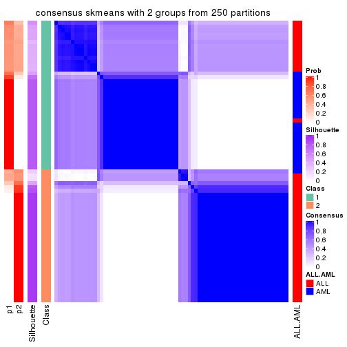</p>

</div>
<div id='tab-CV-skmeans-consensus-heatmap-2'>
<pre><code class="r">consensus_heatmap(res, k = 3)
</code></pre>

<p>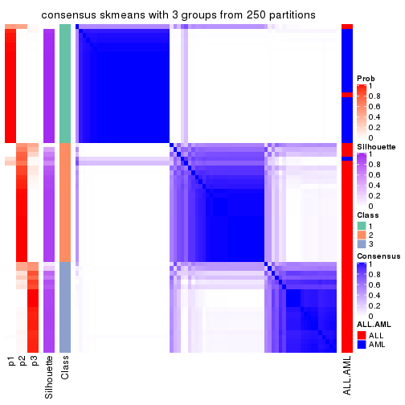</p>

</div>
<div id='tab-CV-skmeans-consensus-heatmap-3'>
<pre><code class="r">consensus_heatmap(res, k = 4)
</code></pre>

<p>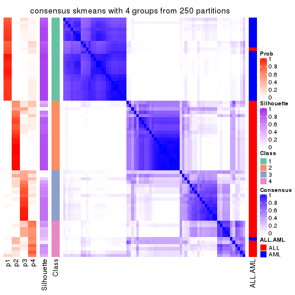</p>

</div>
<div id='tab-CV-skmeans-consensus-heatmap-4'>
<pre><code class="r">consensus_heatmap(res, k = 5)
</code></pre>

<p>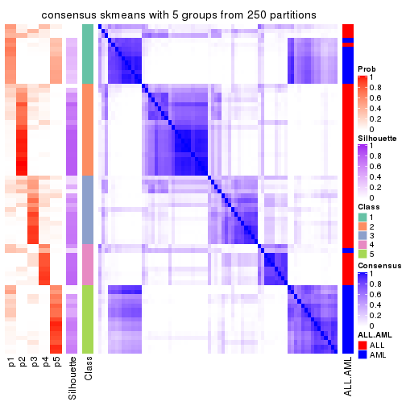</p>

</div>
<div id='tab-CV-skmeans-consensus-heatmap-5'>
<pre><code class="r">consensus_heatmap(res, k = 6)
</code></pre>

<p>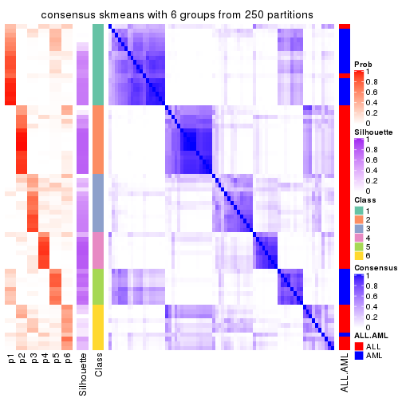</p>

</div>
</div>

Heatmaps for the membership of samples in all partitions to see how consistent they are:


<script>
$( function() {
	$( '#tabs-CV-skmeans-membership-heatmap' ).tabs();
} );
</script>
<div id='tabs-CV-skmeans-membership-heatmap'>
<ul>
<li><a href='#tab-CV-skmeans-membership-heatmap-1'>k = 2</a></li>
<li><a href='#tab-CV-skmeans-membership-heatmap-2'>k = 3</a></li>
<li><a href='#tab-CV-skmeans-membership-heatmap-3'>k = 4</a></li>
<li><a href='#tab-CV-skmeans-membership-heatmap-4'>k = 5</a></li>
<li><a href='#tab-CV-skmeans-membership-heatmap-5'>k = 6</a></li>
</ul>
<div id='tab-CV-skmeans-membership-heatmap-1'>
<pre><code class="r">membership_heatmap(res, k = 2)
</code></pre>

<p>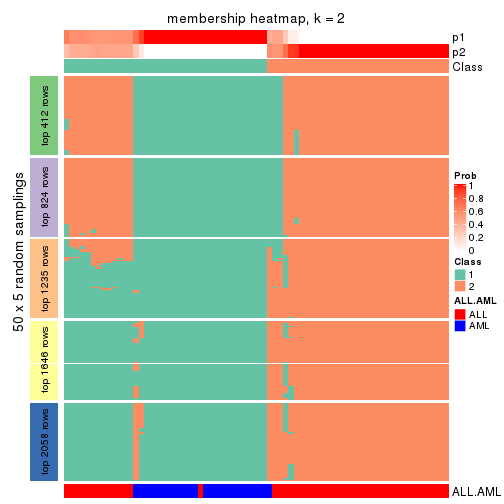</p>

</div>
<div id='tab-CV-skmeans-membership-heatmap-2'>
<pre><code class="r">membership_heatmap(res, k = 3)
</code></pre>

<p>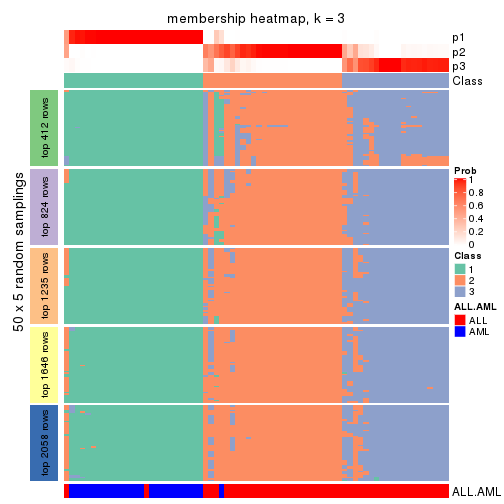</p>

</div>
<div id='tab-CV-skmeans-membership-heatmap-3'>
<pre><code class="r">membership_heatmap(res, k = 4)
</code></pre>

<p>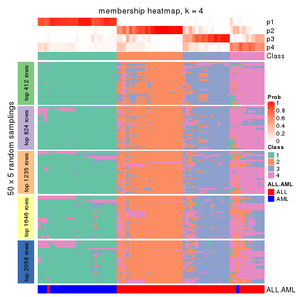</p>

</div>
<div id='tab-CV-skmeans-membership-heatmap-4'>
<pre><code class="r">membership_heatmap(res, k = 5)
</code></pre>

<p>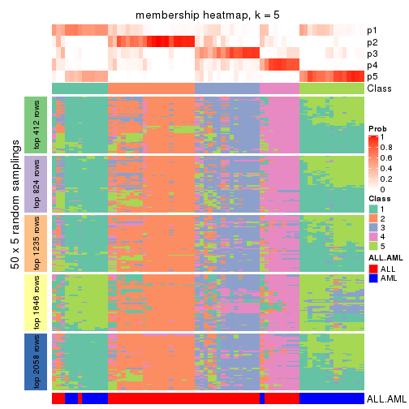</p>

</div>
<div id='tab-CV-skmeans-membership-heatmap-5'>
<pre><code class="r">membership_heatmap(res, k = 6)
</code></pre>

<p>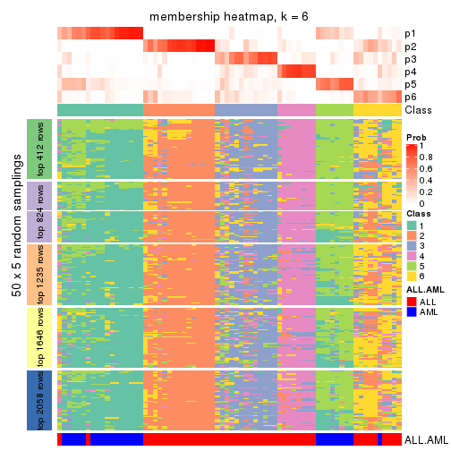</p>

</div>
</div>

As soon as we have had the classes for columns, we can look for signatures
which are significantly different between classes which can be candidate marks
for certain classes. Following are the heatmaps for signatures.


Signature heatmaps where rows are scaled:


<script>
$( function() {
	$( '#tabs-CV-skmeans-get-signatures' ).tabs();
} );
</script>
<div id='tabs-CV-skmeans-get-signatures'>
<ul>
<li><a href='#tab-CV-skmeans-get-signatures-1'>k = 2</a></li>
<li><a href='#tab-CV-skmeans-get-signatures-2'>k = 3</a></li>
<li><a href='#tab-CV-skmeans-get-signatures-3'>k = 4</a></li>
<li><a href='#tab-CV-skmeans-get-signatures-4'>k = 5</a></li>
<li><a href='#tab-CV-skmeans-get-signatures-5'>k = 6</a></li>
</ul>
<div id='tab-CV-skmeans-get-signatures-1'>
<pre><code class="r">get_signatures(res, k = 2)
</code></pre>

<p>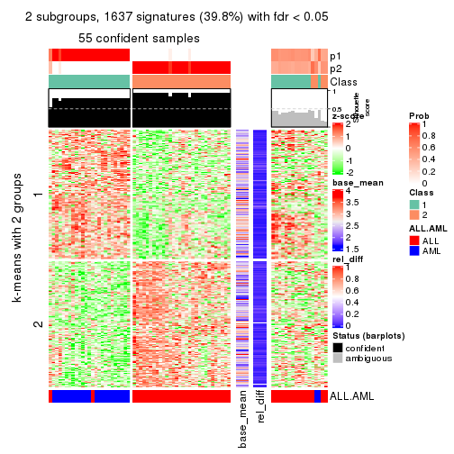</p>

</div>
<div id='tab-CV-skmeans-get-signatures-2'>
<pre><code class="r">get_signatures(res, k = 3)
</code></pre>

<p>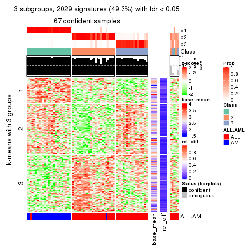</p>

</div>
<div id='tab-CV-skmeans-get-signatures-3'>
<pre><code class="r">get_signatures(res, k = 4)
</code></pre>

<p>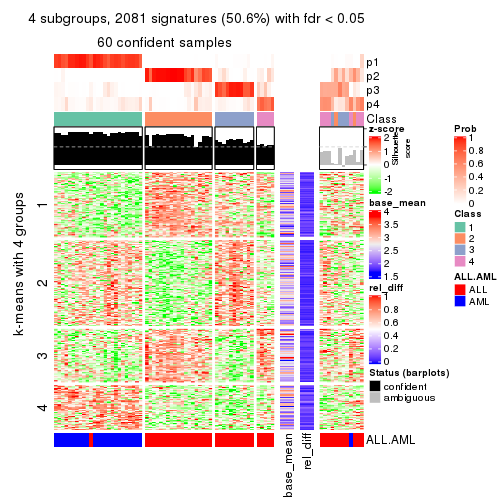</p>

</div>
<div id='tab-CV-skmeans-get-signatures-4'>
<pre><code class="r">get_signatures(res, k = 5)
</code></pre>

<p>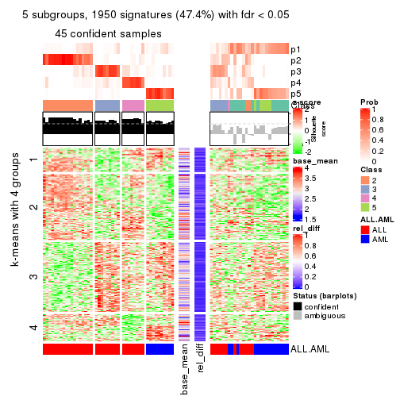</p>

</div>
<div id='tab-CV-skmeans-get-signatures-5'>
<pre><code class="r">get_signatures(res, k = 6)
</code></pre>

<p>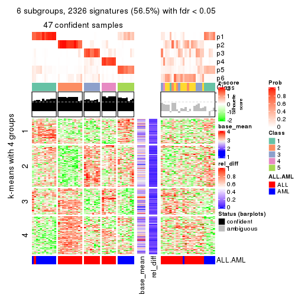</p>

</div>
</div>


Signature heatmaps where rows are not scaled:


<script>
$( function() {
	$( '#tabs-CV-skmeans-get-signatures-no-scale' ).tabs();
} );
</script>
<div id='tabs-CV-skmeans-get-signatures-no-scale'>
<ul>
<li><a href='#tab-CV-skmeans-get-signatures-no-scale-1'>k = 2</a></li>
<li><a href='#tab-CV-skmeans-get-signatures-no-scale-2'>k = 3</a></li>
<li><a href='#tab-CV-skmeans-get-signatures-no-scale-3'>k = 4</a></li>
<li><a href='#tab-CV-skmeans-get-signatures-no-scale-4'>k = 5</a></li>
<li><a href='#tab-CV-skmeans-get-signatures-no-scale-5'>k = 6</a></li>
</ul>
<div id='tab-CV-skmeans-get-signatures-no-scale-1'>
<pre><code class="r">get_signatures(res, k = 2, scale_rows = FALSE)
</code></pre>

<p>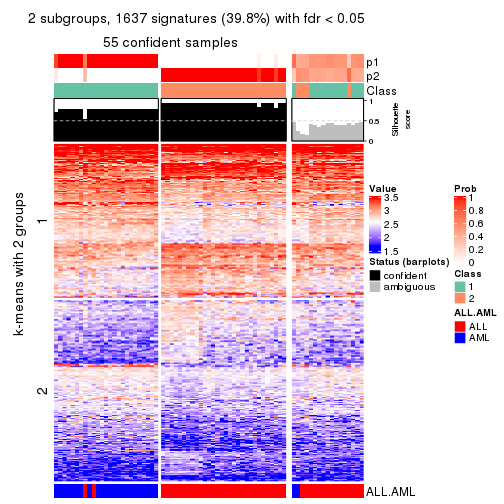</p>

</div>
<div id='tab-CV-skmeans-get-signatures-no-scale-2'>
<pre><code class="r">get_signatures(res, k = 3, scale_rows = FALSE)
</code></pre>

<p>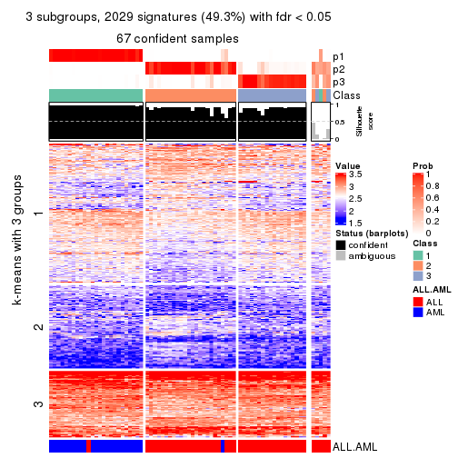</p>

</div>
<div id='tab-CV-skmeans-get-signatures-no-scale-3'>
<pre><code class="r">get_signatures(res, k = 4, scale_rows = FALSE)
</code></pre>

<p>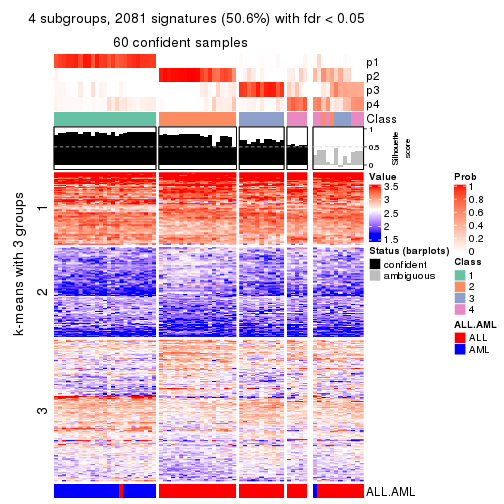</p>

</div>
<div id='tab-CV-skmeans-get-signatures-no-scale-4'>
<pre><code class="r">get_signatures(res, k = 5, scale_rows = FALSE)
</code></pre>

<p>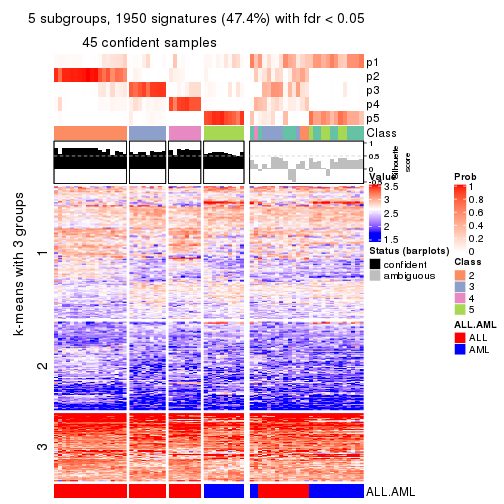</p>

</div>
<div id='tab-CV-skmeans-get-signatures-no-scale-5'>
<pre><code class="r">get_signatures(res, k = 6, scale_rows = FALSE)
</code></pre>

<p>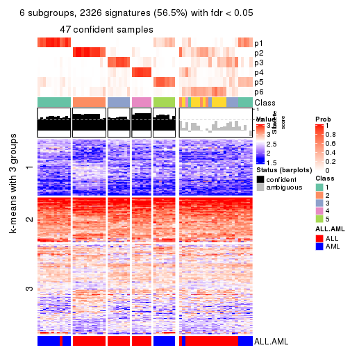</p>

</div>
</div>


Compare the overlap of signatures from different k:

```r
compare_signatures(res)
```

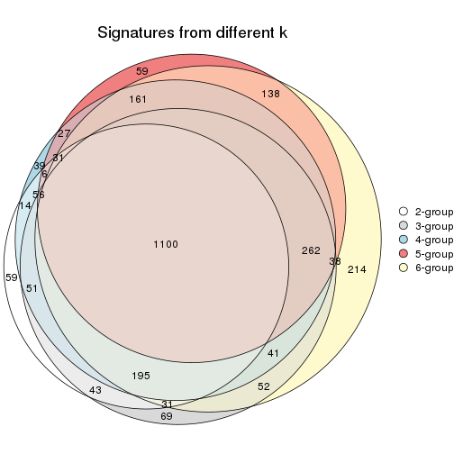

`get_signature()` returns a data frame invisibly. TO get the list of signatures, the function
call should be assigned to a variable explicitly. In following code, if `plot` argument is set
to `FALSE`, no heatmap is plotted while only the differential analysis is performed.

```r
# code only for demonstration
tb = get_signature(res, k = ..., plot = FALSE)
```

An example of the output of `tb` is:

```
#>   which_row         fdr    mean_1    mean_2 scaled_mean_1 scaled_mean_2 km
#> 1        38 0.042760348  8.373488  9.131774    -0.5533452     0.5164555  1
#> 2        40 0.018707592  7.106213  8.469186    -0.6173731     0.5762149  1
#> 3        55 0.019134737 10.221463 11.207825    -0.6159697     0.5749050  1
#> 4        59 0.006059896  5.921854  7.869574    -0.6899429     0.6439467  1
#> 5        60 0.018055526  8.928898 10.211722    -0.6204761     0.5791110  1
#> 6        98 0.009384629 15.714769 14.887706     0.6635654    -0.6193277  2
...
```

The columns in `tb` are:

1. `which_row`: row indices corresponding to the input matrix.
2. `fdr`: FDR for the differential test. 
3. `mean_x`: The mean value in group x.
4. `scaled_mean_x`: The mean value in group x after rows are scaled.
5. `km`: Row groups if k-means clustering is applied to rows.


UMAP plot which shows how samples are separated.


<script>
$( function() {
	$( '#tabs-CV-skmeans-dimension-reduction' ).tabs();
} );
</script>
<div id='tabs-CV-skmeans-dimension-reduction'>
<ul>
<li><a href='#tab-CV-skmeans-dimension-reduction-1'>k = 2</a></li>
<li><a href='#tab-CV-skmeans-dimension-reduction-2'>k = 3</a></li>
<li><a href='#tab-CV-skmeans-dimension-reduction-3'>k = 4</a></li>
<li><a href='#tab-CV-skmeans-dimension-reduction-4'>k = 5</a></li>
<li><a href='#tab-CV-skmeans-dimension-reduction-5'>k = 6</a></li>
</ul>
<div id='tab-CV-skmeans-dimension-reduction-1'>
<pre><code class="r">dimension_reduction(res, k = 2, method = &quot;UMAP&quot;)
</code></pre>

<p>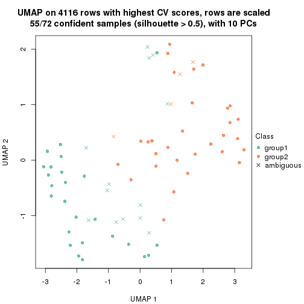</p>

</div>
<div id='tab-CV-skmeans-dimension-reduction-2'>
<pre><code class="r">dimension_reduction(res, k = 3, method = &quot;UMAP&quot;)
</code></pre>

<p>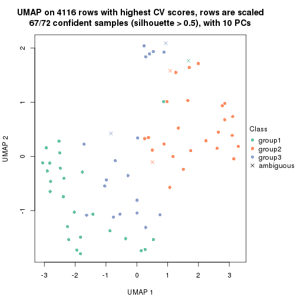</p>

</div>
<div id='tab-CV-skmeans-dimension-reduction-3'>
<pre><code class="r">dimension_reduction(res, k = 4, method = &quot;UMAP&quot;)
</code></pre>

<p>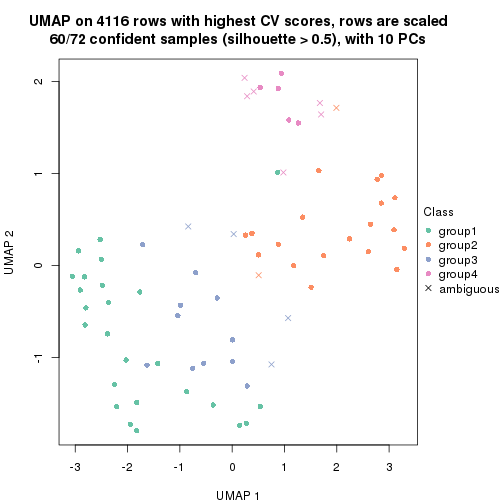</p>

</div>
<div id='tab-CV-skmeans-dimension-reduction-4'>
<pre><code class="r">dimension_reduction(res, k = 5, method = &quot;UMAP&quot;)
</code></pre>

<p>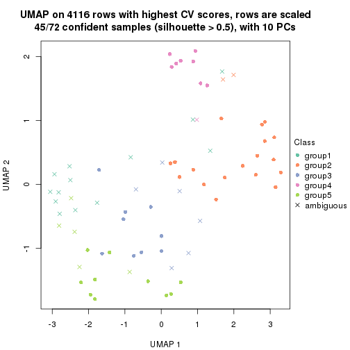</p>

</div>
<div id='tab-CV-skmeans-dimension-reduction-5'>
<pre><code class="r">dimension_reduction(res, k = 6, method = &quot;UMAP&quot;)
</code></pre>

<p>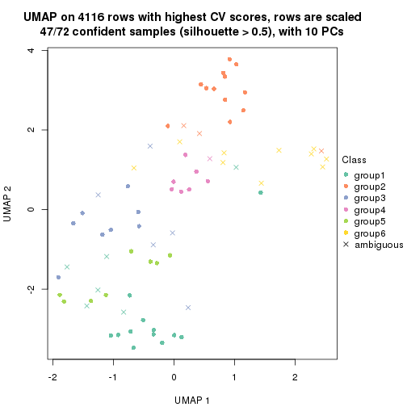</p>

</div>
</div>


Following heatmap shows how subgroups are split when increasing `k`:

```r
collect_classes(res)
```

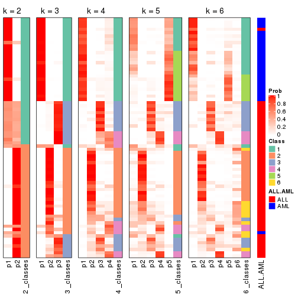


Test correlation between subgroups and known annotations. If the known
annotation is numeric, one-way ANOVA test is applied, and if the known
annotation is discrete, chi-squared contingency table test is applied.

```r
test_to_known_factors(res)
```

```
#>             n ALL.AML(p) k
#> CV:skmeans 55   3.77e-11 2
#> CV:skmeans 67   1.71e-13 3
#> CV:skmeans 60   4.20e-12 4
#> CV:skmeans 45   9.25e-10 5
#> CV:skmeans 47   9.43e-09 6
```


If matrix rows can be associated to genes, consider to use `functional_enrichment(res,
...)` to perform function enrichment for the signature genes. See [this vignette](http://bioconductor.org/packages/devel/bioc/vignettes/cola/inst/doc/functional_enrichment.html) for more detailed explanations.


 

---------------------------------------------------


### CV:pam


The object with results only for a single top-value method and a single partition method 
can be extracted as:

```r
res = res_list["CV", "pam"]
# you can also extract it by
# res = res_list["CV:pam"]
```

A summary of `res` and all the functions that can be applied to it:

```r
res
```

```
#> A 'ConsensusPartition' object with k = 2, 3, 4, 5, 6.
#>   On a matrix with 4116 rows and 72 columns.
#>   Top rows (412, 824, 1235, 1646, 2058) are extracted by 'CV' method.
#>   Subgroups are detected by 'pam' method.
#>   Performed in total 1250 partitions by row resampling.
#>   Best k for subgroups seems to be 2.
#> 
#> Following methods can be applied to this 'ConsensusPartition' object:
#>  [1] "cola_report"             "collect_classes"         "collect_plots"          
#>  [4] "collect_stats"           "colnames"                "compare_signatures"     
#>  [7] "consensus_heatmap"       "dimension_reduction"     "functional_enrichment"  
#> [10] "get_anno_col"            "get_anno"                "get_classes"            
#> [13] "get_consensus"           "get_matrix"              "get_membership"         
#> [16] "get_param"               "get_signatures"          "get_stats"              
#> [19] "is_best_k"               "is_stable_k"             "membership_heatmap"     
#> [22] "ncol"                    "nrow"                    "plot_ecdf"              
#> [25] "rownames"                "select_partition_number" "show"                   
#> [28] "suggest_best_k"          "test_to_known_factors"
```

`collect_plots()` function collects all the plots made from `res` for all `k` (number of partitions)
into one single page to provide an easy and fast comparison between different `k`.

```r
collect_plots(res)
```

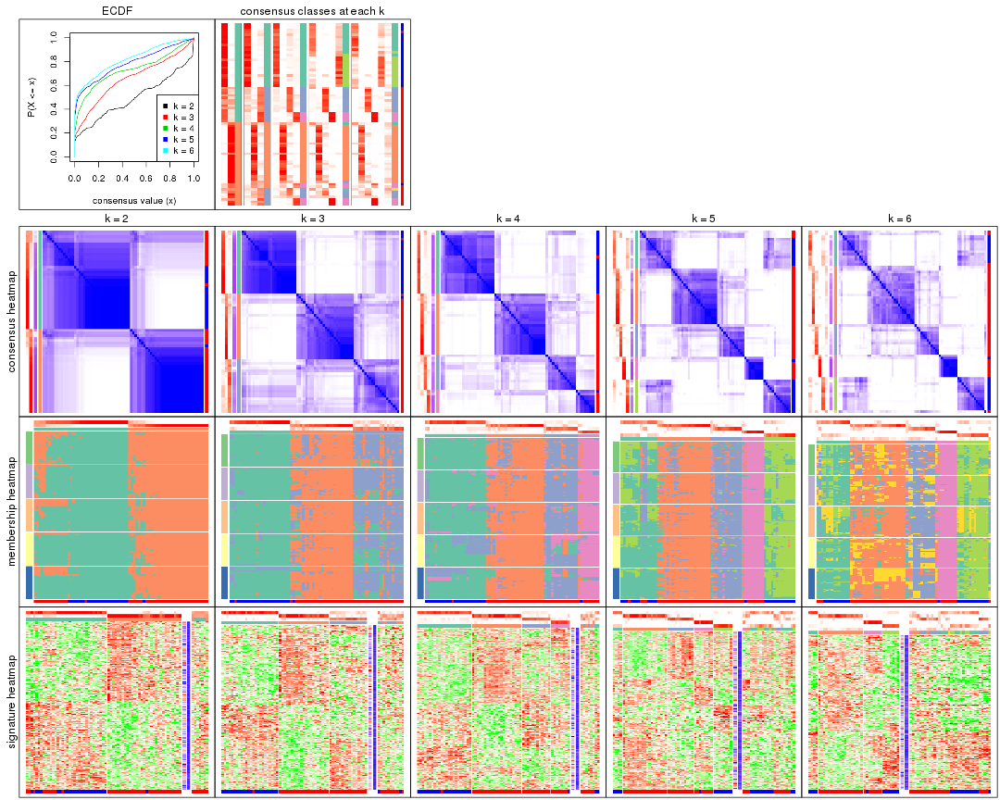

The plots are:

- The first row: a plot of the ECDF (empirical cumulative distribution
  function) curves of the consensus matrix for each `k` and the heatmap of
  predicted classes for each `k`.
- The second row: heatmaps of the consensus matrix for each `k`.
- The third row: heatmaps of the membership matrix for each `k`.
- The fouth row: heatmaps of the signatures for each `k`.

All the plots in panels can be made by individual functions and they are
plotted later in this section.

`select_partition_number()` produces several plots showing different
statistics for choosing "optimized" `k`. There are following statistics:

- ECDF curves of the consensus matrix for each `k`;
- 1-PAC. [The PAC
  score](https://en.wikipedia.org/wiki/Consensus_clustering#Over-interpretation_potential_of_consensus_clustering)
  measures the proportion of the ambiguous subgrouping.
- Mean silhouette score.
- Concordance. The mean probability of fiting the consensus class ids in all
  partitions.
- Area increased. Denote $A_k$ as the area under the ECDF curve for current
  `k`, the area increased is defined as $A_k - A_{k-1}$.
- Rand index. The percent of pairs of samples that are both in a same cluster
  or both are not in a same cluster in the partition of k and k-1.
- Jaccard index. The ratio of pairs of samples are both in a same cluster in
  the partition of k and k-1 and the pairs of samples are both in a same
  cluster in the partition k or k-1.

The detailed explanations of these statistics can be found in [the _cola_
vignette](http://bioconductor.org/packages/devel/bioc/vignettes/cola/inst/doc/cola.html#toc_13).

Generally speaking, lower PAC score, higher mean silhouette score or higher
concordance corresponds to better partition. Rand index and Jaccard index
measure how similar the current partition is compared to partition with `k-1`.
If they are too similar, we won't accept `k` is better than `k-1`.

```r
select_partition_number(res)
```

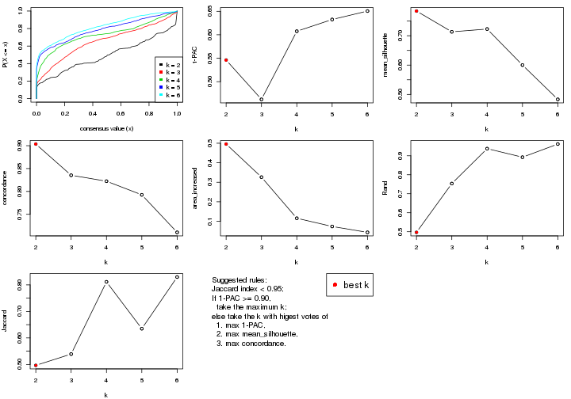

The numeric values for all these statistics can be obtained by `get_stats()`.

```r
get_stats(res)
```

```
#>   k 1-PAC mean_silhouette concordance area_increased  Rand Jaccard
#> 2 2 0.546           0.784       0.904         0.4958 0.496   0.496
#> 3 3 0.462           0.713       0.835         0.3262 0.754   0.539
#> 4 4 0.608           0.723       0.822         0.1157 0.937   0.812
#> 5 5 0.633           0.600       0.793         0.0736 0.892   0.635
#> 6 6 0.651           0.483       0.711         0.0433 0.962   0.830
```

`suggest_best_k()` suggests the best $k$ based on these statistics. The rules are as follows:

- All $k$ with Jaccard index larger than 0.95 are removed because increasing
  $k$ does not provide enough extra information. If all $k$ are removed, it is
  marked as no subgroup is detected.
- For all $k$ with 1-PAC score larger than 0.9, the maximal $k$ is taken as
  the best $k$, and other $k$ are marked as optional $k$.
- If it does not fit the second rule. The $k$ with the maximal vote of the
  highest 1-PAC score, highest mean silhouette, and highest concordance is
  taken as the best $k$.

```r
suggest_best_k(res)
```

```
#> [1] 2
```


Following shows the table of the partitions (You need to click the **show/hide
code output** link to see it). The membership matrix (columns with name `p*`)
is inferred by
[`clue::cl_consensus()`](https://www.rdocumentation.org/link/cl_consensus?package=clue)
function with the `SE` method. Basically the value in the membership matrix
represents the probability to belong to a certain group. The finall class
label for an item is determined with the group with highest probability it
belongs to.

In `get_classes()` function, the entropy is calculated from the membership
matrix and the silhouette score is calculated from the consensus matrix.


<script>
$( function() {
	$( '#tabs-CV-pam-get-classes' ).tabs();
} );
</script>
<div id='tabs-CV-pam-get-classes'>
<ul>
<li><a href='#tab-CV-pam-get-classes-1'>k = 2</a></li>
<li><a href='#tab-CV-pam-get-classes-2'>k = 3</a></li>
<li><a href='#tab-CV-pam-get-classes-3'>k = 4</a></li>
<li><a href='#tab-CV-pam-get-classes-4'>k = 5</a></li>
<li><a href='#tab-CV-pam-get-classes-5'>k = 6</a></li>
</ul>

<div id='tab-CV-pam-get-classes-1'>
<p><a id='tab-CV-pam-get-classes-1-a' style='color:#0366d6' href='#'>show/hide code output</a></p>
<pre><code class="r">cbind(get_classes(res, k = 2), get_membership(res, k = 2))
</code></pre>

<pre><code>#&gt;           class entropy silhouette    p1    p2
#&gt; sample_39     2  0.9909      0.103 0.444 0.556
#&gt; sample_40     1  0.7745      0.739 0.772 0.228
#&gt; sample_42     2  0.2603      0.886 0.044 0.956
#&gt; sample_47     2  0.0000      0.909 0.000 1.000
#&gt; sample_48     2  0.0000      0.909 0.000 1.000
#&gt; sample_49     1  0.6438      0.799 0.836 0.164
#&gt; sample_41     2  0.0000      0.909 0.000 1.000
#&gt; sample_43     2  0.0000      0.909 0.000 1.000
#&gt; sample_44     2  0.0000      0.909 0.000 1.000
#&gt; sample_45     2  0.0000      0.909 0.000 1.000
#&gt; sample_46     2  0.0000      0.909 0.000 1.000
#&gt; sample_70     1  0.9963      0.242 0.536 0.464
#&gt; sample_71     2  0.3584      0.868 0.068 0.932
#&gt; sample_72     2  0.0672      0.904 0.008 0.992
#&gt; sample_68     2  0.0000      0.909 0.000 1.000
#&gt; sample_69     2  0.0000      0.909 0.000 1.000
#&gt; sample_67     2  0.9170      0.545 0.332 0.668
#&gt; sample_55     1  0.6973      0.781 0.812 0.188
#&gt; sample_56     1  1.0000      0.134 0.500 0.500
#&gt; sample_59     2  0.8386      0.571 0.268 0.732
#&gt; sample_52     1  0.0000      0.872 1.000 0.000
#&gt; sample_53     1  0.0000      0.872 1.000 0.000
#&gt; sample_51     1  0.0000      0.872 1.000 0.000
#&gt; sample_50     1  0.0000      0.872 1.000 0.000
#&gt; sample_54     1  0.6148      0.779 0.848 0.152
#&gt; sample_57     1  0.0000      0.872 1.000 0.000
#&gt; sample_58     1  0.0000      0.872 1.000 0.000
#&gt; sample_60     1  0.2603      0.861 0.956 0.044
#&gt; sample_61     1  0.0000      0.872 1.000 0.000
#&gt; sample_65     1  0.0000      0.872 1.000 0.000
#&gt; sample_66     2  0.8386      0.653 0.268 0.732
#&gt; sample_63     1  0.0000      0.872 1.000 0.000
#&gt; sample_64     1  0.3274      0.855 0.940 0.060
#&gt; sample_62     1  0.1843      0.865 0.972 0.028
#&gt; sample_1      2  0.0938      0.903 0.012 0.988
#&gt; sample_2      2  0.8081      0.684 0.248 0.752
#&gt; sample_3      1  0.6712      0.791 0.824 0.176
#&gt; sample_4      1  0.9988      0.223 0.520 0.480
#&gt; sample_5      2  0.0000      0.909 0.000 1.000
#&gt; sample_6      1  0.6048      0.809 0.852 0.148
#&gt; sample_7      1  0.7139      0.774 0.804 0.196
#&gt; sample_8      1  0.9977      0.199 0.528 0.472
#&gt; sample_9      2  0.9833      0.124 0.424 0.576
#&gt; sample_10     1  0.6438      0.798 0.836 0.164
#&gt; sample_11     2  0.3431      0.872 0.064 0.936
#&gt; sample_12     1  0.0376      0.871 0.996 0.004
#&gt; sample_13     2  0.0000      0.909 0.000 1.000
#&gt; sample_14     2  0.1184      0.901 0.016 0.984
#&gt; sample_15     2  0.0000      0.909 0.000 1.000
#&gt; sample_16     2  0.0000      0.909 0.000 1.000
#&gt; sample_17     2  0.0000      0.909 0.000 1.000
#&gt; sample_18     2  0.4298      0.851 0.088 0.912
#&gt; sample_19     2  0.0000      0.909 0.000 1.000
#&gt; sample_20     2  0.0000      0.909 0.000 1.000
#&gt; sample_21     2  0.0000      0.909 0.000 1.000
#&gt; sample_22     1  0.9881      0.262 0.564 0.436
#&gt; sample_23     1  0.7745      0.735 0.772 0.228
#&gt; sample_24     2  0.0000      0.909 0.000 1.000
#&gt; sample_25     2  0.8499      0.616 0.276 0.724
#&gt; sample_26     2  0.0000      0.909 0.000 1.000
#&gt; sample_27     1  0.6148      0.807 0.848 0.152
#&gt; sample_34     1  0.0000      0.872 1.000 0.000
#&gt; sample_35     1  0.0376      0.871 0.996 0.004
#&gt; sample_36     1  0.0000      0.872 1.000 0.000
#&gt; sample_37     1  0.0000      0.872 1.000 0.000
#&gt; sample_38     1  0.0376      0.871 0.996 0.004
#&gt; sample_28     1  0.0000      0.872 1.000 0.000
#&gt; sample_29     1  0.4431      0.823 0.908 0.092
#&gt; sample_30     1  0.0000      0.872 1.000 0.000
#&gt; sample_31     1  0.0000      0.872 1.000 0.000
#&gt; sample_32     1  0.0000      0.872 1.000 0.000
#&gt; sample_33     1  0.0000      0.872 1.000 0.000
</code></pre>

<script>
$('#tab-CV-pam-get-classes-1-a').parent().next().next().hide();
$('#tab-CV-pam-get-classes-1-a').click(function(){
  $('#tab-CV-pam-get-classes-1-a').parent().next().next().toggle();
  return(false);
});
</script>
</div>

<div id='tab-CV-pam-get-classes-2'>
<p><a id='tab-CV-pam-get-classes-2-a' style='color:#0366d6' href='#'>show/hide code output</a></p>
<pre><code class="r">cbind(get_classes(res, k = 3), get_membership(res, k = 3))
</code></pre>

<pre><code>#&gt;           class entropy silhouette    p1    p2    p3
#&gt; sample_39     3  0.8638      0.622 0.216 0.184 0.600
#&gt; sample_40     3  0.6750      0.614 0.336 0.024 0.640
#&gt; sample_42     2  0.3375      0.788 0.008 0.892 0.100
#&gt; sample_47     2  0.1860      0.814 0.000 0.948 0.052
#&gt; sample_48     2  0.0000      0.815 0.000 1.000 0.000
#&gt; sample_49     3  0.5956      0.622 0.324 0.004 0.672
#&gt; sample_41     2  0.5058      0.614 0.000 0.756 0.244
#&gt; sample_43     2  0.3551      0.778 0.000 0.868 0.132
#&gt; sample_44     2  0.6225      0.238 0.000 0.568 0.432
#&gt; sample_45     2  0.0892      0.817 0.000 0.980 0.020
#&gt; sample_46     2  0.1163      0.815 0.000 0.972 0.028
#&gt; sample_70     3  0.6599      0.712 0.168 0.084 0.748
#&gt; sample_71     2  0.5816      0.699 0.056 0.788 0.156
#&gt; sample_72     2  0.2448      0.806 0.000 0.924 0.076
#&gt; sample_68     2  0.0000      0.815 0.000 1.000 0.000
#&gt; sample_69     2  0.0000      0.815 0.000 1.000 0.000
#&gt; sample_67     2  0.8069      0.450 0.244 0.636 0.120
#&gt; sample_55     3  0.6630      0.644 0.300 0.028 0.672
#&gt; sample_56     3  0.8061      0.679 0.192 0.156 0.652
#&gt; sample_59     3  0.8395      0.428 0.096 0.356 0.548
#&gt; sample_52     1  0.0000      0.919 1.000 0.000 0.000
#&gt; sample_53     1  0.1643      0.906 0.956 0.000 0.044
#&gt; sample_51     1  0.0000      0.919 1.000 0.000 0.000
#&gt; sample_50     1  0.0000      0.919 1.000 0.000 0.000
#&gt; sample_54     1  0.4413      0.767 0.852 0.124 0.024
#&gt; sample_57     1  0.0237      0.917 0.996 0.000 0.004
#&gt; sample_58     1  0.0000      0.919 1.000 0.000 0.000
#&gt; sample_60     1  0.2774      0.858 0.920 0.008 0.072
#&gt; sample_61     1  0.2625      0.891 0.916 0.000 0.084
#&gt; sample_65     1  0.1031      0.910 0.976 0.000 0.024
#&gt; sample_66     2  0.7806      0.412 0.064 0.584 0.352
#&gt; sample_63     1  0.0000      0.919 1.000 0.000 0.000
#&gt; sample_64     1  0.5529      0.442 0.704 0.000 0.296
#&gt; sample_62     1  0.1753      0.883 0.952 0.000 0.048
#&gt; sample_1      3  0.6565      0.271 0.008 0.416 0.576
#&gt; sample_2      2  0.8902      0.333 0.144 0.536 0.320
#&gt; sample_3      3  0.2537      0.680 0.080 0.000 0.920
#&gt; sample_4      3  0.6880      0.670 0.108 0.156 0.736
#&gt; sample_5      2  0.0000      0.815 0.000 1.000 0.000
#&gt; sample_6      3  0.3116      0.689 0.108 0.000 0.892
#&gt; sample_7      3  0.7037      0.622 0.328 0.036 0.636
#&gt; sample_8      3  0.8862      0.646 0.232 0.192 0.576
#&gt; sample_9      3  0.4945      0.638 0.056 0.104 0.840
#&gt; sample_10     3  0.3752      0.658 0.144 0.000 0.856
#&gt; sample_11     3  0.7566     -0.150 0.040 0.448 0.512
#&gt; sample_12     1  0.3784      0.818 0.864 0.004 0.132
#&gt; sample_13     2  0.0000      0.815 0.000 1.000 0.000
#&gt; sample_14     3  0.5291      0.414 0.000 0.268 0.732
#&gt; sample_15     2  0.2959      0.777 0.000 0.900 0.100
#&gt; sample_16     2  0.4654      0.676 0.000 0.792 0.208
#&gt; sample_17     2  0.3412      0.786 0.000 0.876 0.124
#&gt; sample_18     3  0.9223      0.308 0.172 0.324 0.504
#&gt; sample_19     2  0.2165      0.809 0.000 0.936 0.064
#&gt; sample_20     2  0.0000      0.815 0.000 1.000 0.000
#&gt; sample_21     2  0.1031      0.815 0.000 0.976 0.024
#&gt; sample_22     3  0.7565      0.646 0.256 0.084 0.660
#&gt; sample_23     3  0.2959      0.687 0.100 0.000 0.900
#&gt; sample_24     2  0.4974      0.621 0.000 0.764 0.236
#&gt; sample_25     2  0.8854      0.351 0.188 0.576 0.236
#&gt; sample_26     2  0.3816      0.753 0.000 0.852 0.148
#&gt; sample_27     3  0.5948      0.575 0.360 0.000 0.640
#&gt; sample_34     1  0.0000      0.919 1.000 0.000 0.000
#&gt; sample_35     1  0.4654      0.641 0.792 0.000 0.208
#&gt; sample_36     1  0.1529      0.908 0.960 0.000 0.040
#&gt; sample_37     1  0.1643      0.906 0.956 0.000 0.044
#&gt; sample_38     1  0.2860      0.881 0.912 0.004 0.084
#&gt; sample_28     1  0.2448      0.885 0.924 0.000 0.076
#&gt; sample_29     1  0.3742      0.858 0.892 0.036 0.072
#&gt; sample_30     1  0.0000      0.919 1.000 0.000 0.000
#&gt; sample_31     1  0.0237      0.917 0.996 0.000 0.004
#&gt; sample_32     1  0.0592      0.917 0.988 0.000 0.012
#&gt; sample_33     1  0.1643      0.906 0.956 0.000 0.044
</code></pre>

<script>
$('#tab-CV-pam-get-classes-2-a').parent().next().next().hide();
$('#tab-CV-pam-get-classes-2-a').click(function(){
  $('#tab-CV-pam-get-classes-2-a').parent().next().next().toggle();
  return(false);
});
</script>
</div>

<div id='tab-CV-pam-get-classes-3'>
<p><a id='tab-CV-pam-get-classes-3-a' style='color:#0366d6' href='#'>show/hide code output</a></p>
<pre><code class="r">cbind(get_classes(res, k = 4), get_membership(res, k = 4))
</code></pre>

<pre><code>#&gt;           class entropy silhouette    p1    p2    p3    p4
#&gt; sample_39     3  0.5250     0.6191 0.096 0.072 0.792 0.040
#&gt; sample_40     3  0.3351     0.7386 0.148 0.000 0.844 0.008
#&gt; sample_42     2  0.4370     0.7599 0.024 0.828 0.116 0.032
#&gt; sample_47     2  0.2048     0.8206 0.000 0.928 0.064 0.008
#&gt; sample_48     2  0.0000     0.8270 0.000 1.000 0.000 0.000
#&gt; sample_49     3  0.3300     0.7392 0.144 0.000 0.848 0.008
#&gt; sample_41     2  0.3975     0.6495 0.000 0.760 0.240 0.000
#&gt; sample_43     2  0.3266     0.7641 0.000 0.832 0.168 0.000
#&gt; sample_44     2  0.6483     0.2602 0.000 0.532 0.392 0.076
#&gt; sample_45     2  0.1302     0.8252 0.000 0.956 0.044 0.000
#&gt; sample_46     2  0.0817     0.8264 0.000 0.976 0.024 0.000
#&gt; sample_70     3  0.6376     0.6207 0.084 0.024 0.684 0.208
#&gt; sample_71     2  0.6323     0.6230 0.052 0.700 0.196 0.052
#&gt; sample_72     2  0.2198     0.8153 0.000 0.920 0.072 0.008
#&gt; sample_68     2  0.0000     0.8270 0.000 1.000 0.000 0.000
#&gt; sample_69     2  0.0000     0.8270 0.000 1.000 0.000 0.000
#&gt; sample_67     2  0.8144     0.3643 0.236 0.548 0.156 0.060
#&gt; sample_55     3  0.6192     0.7055 0.132 0.028 0.720 0.120
#&gt; sample_56     3  0.4807     0.7492 0.124 0.064 0.800 0.012
#&gt; sample_59     3  0.4635     0.5604 0.012 0.268 0.720 0.000
#&gt; sample_52     1  0.2578     0.8273 0.912 0.000 0.036 0.052
#&gt; sample_53     1  0.3694     0.8153 0.844 0.000 0.124 0.032
#&gt; sample_51     1  0.1624     0.8430 0.952 0.000 0.020 0.028
#&gt; sample_50     1  0.1833     0.8443 0.944 0.000 0.024 0.032
#&gt; sample_54     1  0.4578     0.7931 0.832 0.056 0.044 0.068
#&gt; sample_57     1  0.2670     0.8257 0.908 0.000 0.040 0.052
#&gt; sample_58     1  0.2494     0.8273 0.916 0.000 0.036 0.048
#&gt; sample_60     1  0.3734     0.7911 0.856 0.004 0.096 0.044
#&gt; sample_61     1  0.4735     0.7950 0.784 0.000 0.148 0.068
#&gt; sample_65     1  0.1677     0.8434 0.948 0.000 0.012 0.040
#&gt; sample_66     4  0.4632     0.6381 0.012 0.244 0.004 0.740
#&gt; sample_63     1  0.2578     0.8273 0.912 0.000 0.036 0.052
#&gt; sample_64     1  0.6488     0.0312 0.500 0.004 0.436 0.060
#&gt; sample_62     1  0.2928     0.8212 0.896 0.000 0.052 0.052
#&gt; sample_1      3  0.5057     0.4591 0.000 0.340 0.648 0.012
#&gt; sample_2      4  0.6810     0.4348 0.056 0.316 0.032 0.596
#&gt; sample_3      4  0.2589     0.8232 0.000 0.000 0.116 0.884
#&gt; sample_4      3  0.5781     0.6893 0.044 0.072 0.756 0.128
#&gt; sample_5      2  0.0000     0.8270 0.000 1.000 0.000 0.000
#&gt; sample_6      4  0.2976     0.8150 0.008 0.000 0.120 0.872
#&gt; sample_7      3  0.5723     0.7309 0.128 0.048 0.760 0.064
#&gt; sample_8      3  0.5701     0.6926 0.124 0.132 0.736 0.008
#&gt; sample_9      4  0.2450     0.8370 0.000 0.016 0.072 0.912
#&gt; sample_10     4  0.1635     0.8021 0.044 0.000 0.008 0.948
#&gt; sample_11     4  0.2269     0.8165 0.032 0.028 0.008 0.932
#&gt; sample_12     1  0.4254     0.8015 0.828 0.004 0.104 0.064
#&gt; sample_13     2  0.0000     0.8270 0.000 1.000 0.000 0.000
#&gt; sample_14     4  0.2670     0.8361 0.000 0.024 0.072 0.904
#&gt; sample_15     2  0.2647     0.7738 0.000 0.880 0.120 0.000
#&gt; sample_16     2  0.3801     0.6914 0.000 0.780 0.220 0.000
#&gt; sample_17     2  0.3962     0.7395 0.000 0.820 0.028 0.152
#&gt; sample_18     3  0.9562     0.1143 0.132 0.216 0.360 0.292
#&gt; sample_19     2  0.1940     0.8186 0.000 0.924 0.076 0.000
#&gt; sample_20     2  0.0000     0.8270 0.000 1.000 0.000 0.000
#&gt; sample_21     2  0.0592     0.8271 0.000 0.984 0.016 0.000
#&gt; sample_22     3  0.3607     0.6451 0.096 0.008 0.864 0.032
#&gt; sample_23     4  0.2918     0.8190 0.008 0.000 0.116 0.876
#&gt; sample_24     2  0.4331     0.5709 0.000 0.712 0.288 0.000
#&gt; sample_25     2  0.8453     0.2841 0.128 0.488 0.308 0.076
#&gt; sample_26     2  0.3074     0.7752 0.000 0.848 0.152 0.000
#&gt; sample_27     3  0.3962     0.7375 0.152 0.000 0.820 0.028
#&gt; sample_34     1  0.1837     0.8445 0.944 0.000 0.028 0.028
#&gt; sample_35     1  0.5364     0.3935 0.652 0.000 0.320 0.028
#&gt; sample_36     1  0.4274     0.8193 0.808 0.000 0.148 0.044
#&gt; sample_37     1  0.3749     0.8143 0.840 0.000 0.128 0.032
#&gt; sample_38     1  0.4867     0.7881 0.784 0.004 0.144 0.068
#&gt; sample_28     1  0.3999     0.8057 0.824 0.000 0.140 0.036
#&gt; sample_29     1  0.5215     0.7828 0.780 0.028 0.140 0.052
#&gt; sample_30     1  0.2408     0.8379 0.920 0.000 0.036 0.044
#&gt; sample_31     1  0.0927     0.8452 0.976 0.000 0.016 0.008
#&gt; sample_32     1  0.2256     0.8418 0.924 0.000 0.020 0.056
#&gt; sample_33     1  0.3999     0.8068 0.824 0.000 0.140 0.036
</code></pre>

<script>
$('#tab-CV-pam-get-classes-3-a').parent().next().next().hide();
$('#tab-CV-pam-get-classes-3-a').click(function(){
  $('#tab-CV-pam-get-classes-3-a').parent().next().next().toggle();
  return(false);
});
</script>
</div>

<div id='tab-CV-pam-get-classes-4'>
<p><a id='tab-CV-pam-get-classes-4-a' style='color:#0366d6' href='#'>show/hide code output</a></p>
<pre><code class="r">cbind(get_classes(res, k = 5), get_membership(res, k = 5))
</code></pre>

<pre><code>#&gt;           class entropy silhouette    p1    p2    p3    p4    p5
#&gt; sample_39     1  0.5529    0.03570 0.512 0.068 0.420 0.000 0.000
#&gt; sample_40     3  0.1106    0.76195 0.012 0.000 0.964 0.000 0.024
#&gt; sample_42     2  0.4418    0.68520 0.180 0.756 0.060 0.004 0.000
#&gt; sample_47     2  0.2136    0.80179 0.008 0.904 0.088 0.000 0.000
#&gt; sample_48     2  0.0290    0.81510 0.008 0.992 0.000 0.000 0.000
#&gt; sample_49     3  0.1331    0.76290 0.040 0.000 0.952 0.000 0.008
#&gt; sample_41     2  0.4173    0.51182 0.012 0.688 0.300 0.000 0.000
#&gt; sample_43     2  0.4192    0.66649 0.032 0.736 0.232 0.000 0.000
#&gt; sample_44     3  0.5481    0.00644 0.032 0.456 0.496 0.016 0.000
#&gt; sample_45     2  0.2036    0.80891 0.024 0.920 0.056 0.000 0.000
#&gt; sample_46     2  0.1195    0.81478 0.028 0.960 0.012 0.000 0.000
#&gt; sample_70     3  0.4911    0.68447 0.064 0.016 0.768 0.132 0.020
#&gt; sample_71     2  0.5618    0.47053 0.320 0.604 0.060 0.016 0.000
#&gt; sample_72     2  0.2473    0.79586 0.032 0.896 0.072 0.000 0.000
#&gt; sample_68     2  0.0404    0.81484 0.012 0.988 0.000 0.000 0.000
#&gt; sample_69     2  0.0000    0.81540 0.000 1.000 0.000 0.000 0.000
#&gt; sample_67     2  0.7184    0.11228 0.344 0.472 0.016 0.024 0.144
#&gt; sample_55     3  0.4210    0.72325 0.040 0.024 0.832 0.044 0.060
#&gt; sample_56     3  0.1911    0.76601 0.036 0.028 0.932 0.004 0.000
#&gt; sample_59     3  0.4404    0.54306 0.032 0.264 0.704 0.000 0.000
#&gt; sample_52     5  0.0794    0.70356 0.028 0.000 0.000 0.000 0.972
#&gt; sample_53     5  0.4307   -0.20279 0.496 0.000 0.000 0.000 0.504
#&gt; sample_51     1  0.3395    0.49886 0.764 0.000 0.000 0.000 0.236
#&gt; sample_50     1  0.3966    0.43097 0.664 0.000 0.000 0.000 0.336
#&gt; sample_54     5  0.1356    0.68760 0.004 0.028 0.000 0.012 0.956
#&gt; sample_57     5  0.2516    0.65047 0.140 0.000 0.000 0.000 0.860
#&gt; sample_58     5  0.1851    0.70177 0.088 0.000 0.000 0.000 0.912
#&gt; sample_60     5  0.2573    0.67228 0.104 0.000 0.016 0.000 0.880
#&gt; sample_61     1  0.3910    0.48954 0.720 0.000 0.000 0.008 0.272
#&gt; sample_65     5  0.3837    0.45809 0.308 0.000 0.000 0.000 0.692
#&gt; sample_66     4  0.3495    0.73942 0.032 0.152 0.000 0.816 0.000
#&gt; sample_63     5  0.0703    0.70220 0.024 0.000 0.000 0.000 0.976
#&gt; sample_64     5  0.5880    0.39036 0.172 0.000 0.228 0.000 0.600
#&gt; sample_62     5  0.0510    0.70534 0.016 0.000 0.000 0.000 0.984
#&gt; sample_1      3  0.3929    0.66886 0.028 0.208 0.764 0.000 0.000
#&gt; sample_2      4  0.6073    0.42290 0.124 0.296 0.000 0.572 0.008
#&gt; sample_3      4  0.0290    0.90406 0.000 0.000 0.008 0.992 0.000
#&gt; sample_4      3  0.2276    0.76216 0.008 0.076 0.908 0.004 0.004
#&gt; sample_5      2  0.0404    0.81484 0.012 0.988 0.000 0.000 0.000
#&gt; sample_6      4  0.0510    0.90002 0.000 0.000 0.016 0.984 0.000
#&gt; sample_7      3  0.2502    0.76359 0.020 0.040 0.912 0.004 0.024
#&gt; sample_8      3  0.3620    0.72433 0.032 0.128 0.828 0.000 0.012
#&gt; sample_9      4  0.0000    0.90606 0.000 0.000 0.000 1.000 0.000
#&gt; sample_10     4  0.0000    0.90606 0.000 0.000 0.000 1.000 0.000
#&gt; sample_11     4  0.0000    0.90606 0.000 0.000 0.000 1.000 0.000
#&gt; sample_12     1  0.4240    0.46375 0.684 0.000 0.008 0.004 0.304
#&gt; sample_13     2  0.0000    0.81540 0.000 1.000 0.000 0.000 0.000
#&gt; sample_14     4  0.0162    0.90477 0.004 0.000 0.000 0.996 0.000
#&gt; sample_15     2  0.2522    0.76222 0.012 0.880 0.108 0.000 0.000
#&gt; sample_16     2  0.4339    0.54248 0.020 0.684 0.296 0.000 0.000
#&gt; sample_17     2  0.4067    0.72173 0.016 0.804 0.048 0.132 0.000
#&gt; sample_18     3  0.8938    0.10351 0.264 0.232 0.284 0.204 0.016
#&gt; sample_19     2  0.2522    0.79276 0.012 0.880 0.108 0.000 0.000
#&gt; sample_20     2  0.0000    0.81540 0.000 1.000 0.000 0.000 0.000
#&gt; sample_21     2  0.1205    0.81201 0.004 0.956 0.040 0.000 0.000
#&gt; sample_22     1  0.4594    0.05033 0.508 0.004 0.484 0.000 0.004
#&gt; sample_23     4  0.0510    0.90002 0.000 0.000 0.016 0.984 0.000
#&gt; sample_24     2  0.4270    0.47904 0.012 0.668 0.320 0.000 0.000
#&gt; sample_25     1  0.6239    0.30000 0.580 0.256 0.152 0.012 0.000
#&gt; sample_26     2  0.3885    0.72783 0.040 0.784 0.176 0.000 0.000
#&gt; sample_27     3  0.2536    0.74416 0.044 0.000 0.900 0.004 0.052
#&gt; sample_34     1  0.4300    0.10196 0.524 0.000 0.000 0.000 0.476
#&gt; sample_35     1  0.4919    0.40817 0.652 0.000 0.040 0.004 0.304
#&gt; sample_36     5  0.3586    0.47889 0.264 0.000 0.000 0.000 0.736
#&gt; sample_37     1  0.4201    0.29705 0.592 0.000 0.000 0.000 0.408
#&gt; sample_38     1  0.3612    0.53247 0.764 0.000 0.000 0.008 0.228
#&gt; sample_28     1  0.3424    0.53256 0.760 0.000 0.000 0.000 0.240
#&gt; sample_29     1  0.3715    0.53625 0.736 0.004 0.000 0.000 0.260
#&gt; sample_30     5  0.3210    0.54926 0.212 0.000 0.000 0.000 0.788
#&gt; sample_31     5  0.4582    0.18273 0.416 0.000 0.012 0.000 0.572
#&gt; sample_32     1  0.3857    0.44663 0.688 0.000 0.000 0.000 0.312
#&gt; sample_33     1  0.3636    0.50272 0.728 0.000 0.000 0.000 0.272
</code></pre>

<script>
$('#tab-CV-pam-get-classes-4-a').parent().next().next().hide();
$('#tab-CV-pam-get-classes-4-a').click(function(){
  $('#tab-CV-pam-get-classes-4-a').parent().next().next().toggle();
  return(false);
});
</script>
</div>

<div id='tab-CV-pam-get-classes-5'>
<p><a id='tab-CV-pam-get-classes-5-a' style='color:#0366d6' href='#'>show/hide code output</a></p>
<pre><code class="r">cbind(get_classes(res, k = 6), get_membership(res, k = 6))
</code></pre>

<pre><code>#&gt;           class entropy silhouette    p1    p2    p3    p4    p5    p6
#&gt; sample_39     6  0.6274     0.0000 0.220 0.020 0.288 0.000 0.000 0.472
#&gt; sample_40     3  0.1636     0.4686 0.004 0.000 0.936 0.000 0.036 0.024
#&gt; sample_42     2  0.5101     0.6008 0.104 0.652 0.008 0.004 0.000 0.232
#&gt; sample_47     2  0.2901     0.7067 0.000 0.840 0.032 0.000 0.000 0.128
#&gt; sample_48     2  0.0458     0.7277 0.000 0.984 0.000 0.000 0.000 0.016
#&gt; sample_49     3  0.3309     0.2886 0.000 0.000 0.720 0.000 0.000 0.280
#&gt; sample_41     2  0.4377     0.5477 0.000 0.688 0.244 0.000 0.000 0.068
#&gt; sample_43     2  0.5102     0.5632 0.000 0.620 0.140 0.000 0.000 0.240
#&gt; sample_44     2  0.6076     0.0297 0.000 0.384 0.344 0.000 0.000 0.272
#&gt; sample_45     2  0.3665     0.6712 0.000 0.728 0.020 0.000 0.000 0.252
#&gt; sample_46     2  0.3558     0.6868 0.000 0.736 0.016 0.000 0.000 0.248
#&gt; sample_70     3  0.5597     0.0953 0.008 0.008 0.564 0.068 0.012 0.340
#&gt; sample_71     2  0.6620     0.2076 0.224 0.412 0.016 0.012 0.000 0.336
#&gt; sample_72     2  0.4045     0.6397 0.004 0.700 0.028 0.000 0.000 0.268
#&gt; sample_68     2  0.2278     0.7247 0.000 0.868 0.004 0.000 0.000 0.128
#&gt; sample_69     2  0.1765     0.7228 0.000 0.904 0.000 0.000 0.000 0.096
#&gt; sample_67     2  0.7104     0.0905 0.296 0.376 0.000 0.012 0.044 0.272
#&gt; sample_55     3  0.3546     0.4544 0.000 0.044 0.840 0.024 0.076 0.016
#&gt; sample_56     3  0.4292     0.2061 0.000 0.032 0.628 0.000 0.000 0.340
#&gt; sample_59     3  0.5948     0.0991 0.000 0.284 0.456 0.000 0.000 0.260
#&gt; sample_52     5  0.2562     0.6459 0.172 0.000 0.000 0.000 0.828 0.000
#&gt; sample_53     1  0.4224     0.2035 0.632 0.000 0.000 0.000 0.340 0.028
#&gt; sample_51     1  0.4918     0.4635 0.644 0.000 0.000 0.000 0.232 0.124
#&gt; sample_50     1  0.3645     0.4877 0.740 0.000 0.000 0.000 0.236 0.024
#&gt; sample_54     5  0.3073     0.6399 0.140 0.020 0.000 0.004 0.832 0.004
#&gt; sample_57     5  0.3163     0.5550 0.040 0.000 0.000 0.000 0.820 0.140
#&gt; sample_58     5  0.3062     0.6412 0.160 0.000 0.000 0.000 0.816 0.024
#&gt; sample_60     5  0.2462     0.6322 0.064 0.000 0.012 0.000 0.892 0.032
#&gt; sample_61     1  0.5644     0.4447 0.576 0.000 0.020 0.000 0.280 0.124
#&gt; sample_65     5  0.4455     0.4530 0.240 0.000 0.000 0.000 0.684 0.076
#&gt; sample_66     4  0.3300     0.6991 0.024 0.148 0.000 0.816 0.000 0.012
#&gt; sample_63     5  0.2491     0.6452 0.164 0.000 0.000 0.000 0.836 0.000
#&gt; sample_64     5  0.5634     0.3857 0.048 0.000 0.172 0.000 0.640 0.140
#&gt; sample_62     5  0.2178     0.6549 0.132 0.000 0.000 0.000 0.868 0.000
#&gt; sample_1      3  0.4545     0.3308 0.000 0.176 0.700 0.000 0.000 0.124
#&gt; sample_2      4  0.7109     0.1227 0.096 0.240 0.000 0.424 0.000 0.240
#&gt; sample_3      4  0.0291     0.8803 0.000 0.000 0.004 0.992 0.000 0.004
#&gt; sample_4      3  0.2325     0.4930 0.000 0.060 0.892 0.000 0.000 0.048
#&gt; sample_5      2  0.2178     0.7249 0.000 0.868 0.000 0.000 0.000 0.132
#&gt; sample_6      4  0.0363     0.8785 0.000 0.000 0.012 0.988 0.000 0.000
#&gt; sample_7      3  0.2295     0.4975 0.000 0.036 0.908 0.004 0.012 0.040
#&gt; sample_8      3  0.3795     0.4014 0.004 0.112 0.788 0.000 0.000 0.096
#&gt; sample_9      4  0.0000     0.8828 0.000 0.000 0.000 1.000 0.000 0.000
#&gt; sample_10     4  0.0000     0.8828 0.000 0.000 0.000 1.000 0.000 0.000
#&gt; sample_11     4  0.0000     0.8828 0.000 0.000 0.000 1.000 0.000 0.000
#&gt; sample_12     1  0.4555     0.4500 0.628 0.000 0.008 0.000 0.328 0.036
#&gt; sample_13     2  0.0260     0.7291 0.000 0.992 0.000 0.000 0.000 0.008
#&gt; sample_14     4  0.0146     0.8812 0.004 0.000 0.000 0.996 0.000 0.000
#&gt; sample_15     2  0.2966     0.7004 0.000 0.848 0.076 0.000 0.000 0.076
#&gt; sample_16     2  0.5095     0.5290 0.000 0.632 0.188 0.000 0.000 0.180
#&gt; sample_17     2  0.4656     0.6579 0.008 0.752 0.040 0.128 0.000 0.072
#&gt; sample_18     3  0.8918    -0.2594 0.236 0.212 0.244 0.192 0.004 0.112
#&gt; sample_19     2  0.3602     0.6852 0.000 0.784 0.056 0.000 0.000 0.160
#&gt; sample_20     2  0.1444     0.7266 0.000 0.928 0.000 0.000 0.000 0.072
#&gt; sample_21     2  0.2066     0.7164 0.000 0.904 0.024 0.000 0.000 0.072
#&gt; sample_22     1  0.5568    -0.4051 0.468 0.000 0.408 0.000 0.004 0.120
#&gt; sample_23     4  0.0363     0.8785 0.000 0.000 0.012 0.988 0.000 0.000
#&gt; sample_24     2  0.4652     0.4798 0.000 0.640 0.288 0.000 0.000 0.072
#&gt; sample_25     1  0.6518    -0.0800 0.528 0.144 0.056 0.008 0.000 0.264
#&gt; sample_26     2  0.5350     0.5575 0.000 0.564 0.140 0.000 0.000 0.296
#&gt; sample_27     3  0.3841     0.2945 0.000 0.000 0.716 0.000 0.028 0.256
#&gt; sample_34     5  0.5519    -0.0603 0.344 0.000 0.000 0.000 0.512 0.144
#&gt; sample_35     1  0.6257     0.2056 0.420 0.000 0.020 0.004 0.400 0.156
#&gt; sample_36     5  0.3756     0.4031 0.400 0.000 0.000 0.000 0.600 0.000
#&gt; sample_37     1  0.3050     0.3937 0.764 0.000 0.000 0.000 0.236 0.000
#&gt; sample_38     1  0.1196     0.5706 0.952 0.000 0.000 0.000 0.040 0.008
#&gt; sample_28     1  0.1858     0.5819 0.912 0.000 0.000 0.000 0.076 0.012
#&gt; sample_29     1  0.2400     0.5817 0.872 0.008 0.000 0.000 0.116 0.004
#&gt; sample_30     5  0.3706     0.4234 0.380 0.000 0.000 0.000 0.620 0.000
#&gt; sample_31     5  0.5488     0.1816 0.264 0.000 0.008 0.000 0.584 0.144
#&gt; sample_32     1  0.5294     0.3562 0.532 0.000 0.000 0.000 0.356 0.112
#&gt; sample_33     1  0.1387     0.5612 0.932 0.000 0.000 0.000 0.068 0.000
</code></pre>

<script>
$('#tab-CV-pam-get-classes-5-a').parent().next().next().hide();
$('#tab-CV-pam-get-classes-5-a').click(function(){
  $('#tab-CV-pam-get-classes-5-a').parent().next().next().toggle();
  return(false);
});
</script>
</div>
</div>

Heatmaps for the consensus matrix. It visualizes the probability of two
samples to be in a same group.


<script>
$( function() {
	$( '#tabs-CV-pam-consensus-heatmap' ).tabs();
} );
</script>
<div id='tabs-CV-pam-consensus-heatmap'>
<ul>
<li><a href='#tab-CV-pam-consensus-heatmap-1'>k = 2</a></li>
<li><a href='#tab-CV-pam-consensus-heatmap-2'>k = 3</a></li>
<li><a href='#tab-CV-pam-consensus-heatmap-3'>k = 4</a></li>
<li><a href='#tab-CV-pam-consensus-heatmap-4'>k = 5</a></li>
<li><a href='#tab-CV-pam-consensus-heatmap-5'>k = 6</a></li>
</ul>
<div id='tab-CV-pam-consensus-heatmap-1'>
<pre><code class="r">consensus_heatmap(res, k = 2)
</code></pre>

<p>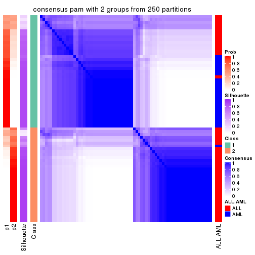</p>

</div>
<div id='tab-CV-pam-consensus-heatmap-2'>
<pre><code class="r">consensus_heatmap(res, k = 3)
</code></pre>

<p>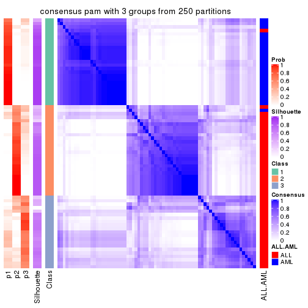</p>

</div>
<div id='tab-CV-pam-consensus-heatmap-3'>
<pre><code class="r">consensus_heatmap(res, k = 4)
</code></pre>

<p>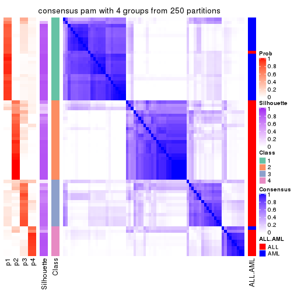</p>

</div>
<div id='tab-CV-pam-consensus-heatmap-4'>
<pre><code class="r">consensus_heatmap(res, k = 5)
</code></pre>

<p>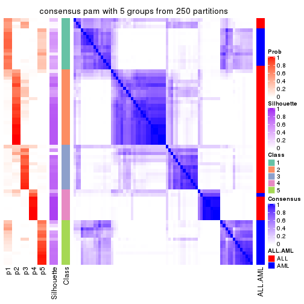</p>

</div>
<div id='tab-CV-pam-consensus-heatmap-5'>
<pre><code class="r">consensus_heatmap(res, k = 6)
</code></pre>

<p>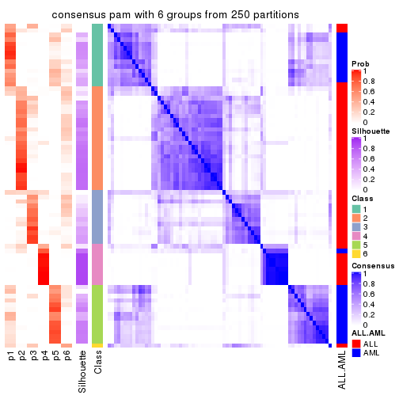</p>

</div>
</div>

Heatmaps for the membership of samples in all partitions to see how consistent they are:


<script>
$( function() {
	$( '#tabs-CV-pam-membership-heatmap' ).tabs();
} );
</script>
<div id='tabs-CV-pam-membership-heatmap'>
<ul>
<li><a href='#tab-CV-pam-membership-heatmap-1'>k = 2</a></li>
<li><a href='#tab-CV-pam-membership-heatmap-2'>k = 3</a></li>
<li><a href='#tab-CV-pam-membership-heatmap-3'>k = 4</a></li>
<li><a href='#tab-CV-pam-membership-heatmap-4'>k = 5</a></li>
<li><a href='#tab-CV-pam-membership-heatmap-5'>k = 6</a></li>
</ul>
<div id='tab-CV-pam-membership-heatmap-1'>
<pre><code class="r">membership_heatmap(res, k = 2)
</code></pre>

<p>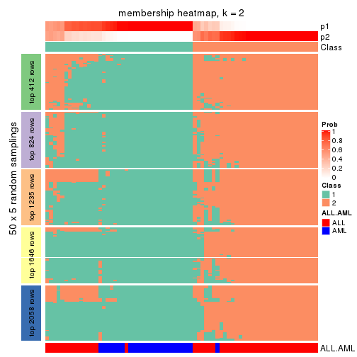</p>

</div>
<div id='tab-CV-pam-membership-heatmap-2'>
<pre><code class="r">membership_heatmap(res, k = 3)
</code></pre>

<p>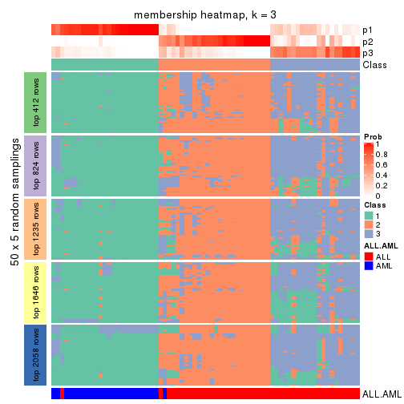</p>

</div>
<div id='tab-CV-pam-membership-heatmap-3'>
<pre><code class="r">membership_heatmap(res, k = 4)
</code></pre>

<p>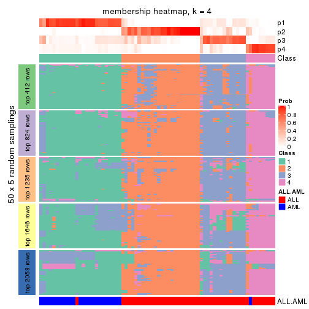</p>

</div>
<div id='tab-CV-pam-membership-heatmap-4'>
<pre><code class="r">membership_heatmap(res, k = 5)
</code></pre>

<p>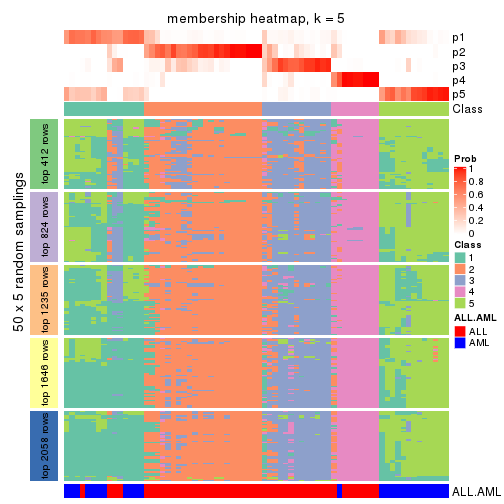</p>

</div>
<div id='tab-CV-pam-membership-heatmap-5'>
<pre><code class="r">membership_heatmap(res, k = 6)
</code></pre>

<p>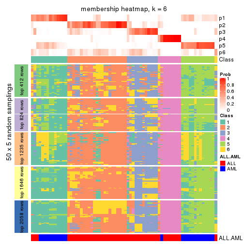</p>

</div>
</div>

As soon as we have had the classes for columns, we can look for signatures
which are significantly different between classes which can be candidate marks
for certain classes. Following are the heatmaps for signatures.


Signature heatmaps where rows are scaled:


<script>
$( function() {
	$( '#tabs-CV-pam-get-signatures' ).tabs();
} );
</script>
<div id='tabs-CV-pam-get-signatures'>
<ul>
<li><a href='#tab-CV-pam-get-signatures-1'>k = 2</a></li>
<li><a href='#tab-CV-pam-get-signatures-2'>k = 3</a></li>
<li><a href='#tab-CV-pam-get-signatures-3'>k = 4</a></li>
<li><a href='#tab-CV-pam-get-signatures-4'>k = 5</a></li>
<li><a href='#tab-CV-pam-get-signatures-5'>k = 6</a></li>
</ul>
<div id='tab-CV-pam-get-signatures-1'>
<pre><code class="r">get_signatures(res, k = 2)
</code></pre>

<p>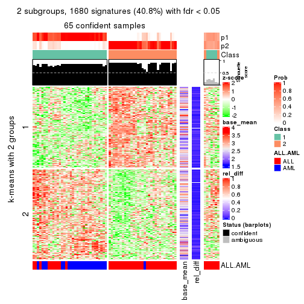</p>

</div>
<div id='tab-CV-pam-get-signatures-2'>
<pre><code class="r">get_signatures(res, k = 3)
</code></pre>

<p>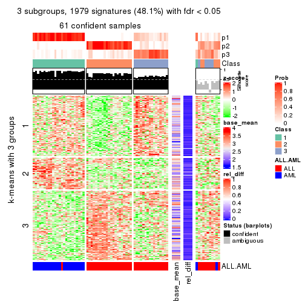</p>

</div>
<div id='tab-CV-pam-get-signatures-3'>
<pre><code class="r">get_signatures(res, k = 4)
</code></pre>

<p>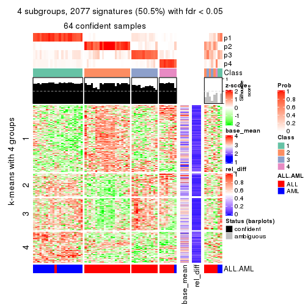</p>

</div>
<div id='tab-CV-pam-get-signatures-4'>
<pre><code class="r">get_signatures(res, k = 5)
</code></pre>

<p>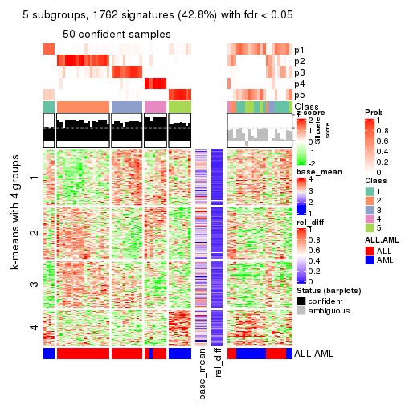</p>

</div>
<div id='tab-CV-pam-get-signatures-5'>
<pre><code class="r">get_signatures(res, k = 6)
</code></pre>

<p>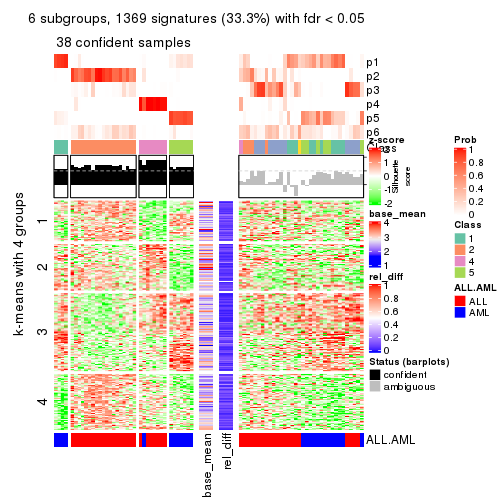</p>

</div>
</div>


Signature heatmaps where rows are not scaled:


<script>
$( function() {
	$( '#tabs-CV-pam-get-signatures-no-scale' ).tabs();
} );
</script>
<div id='tabs-CV-pam-get-signatures-no-scale'>
<ul>
<li><a href='#tab-CV-pam-get-signatures-no-scale-1'>k = 2</a></li>
<li><a href='#tab-CV-pam-get-signatures-no-scale-2'>k = 3</a></li>
<li><a href='#tab-CV-pam-get-signatures-no-scale-3'>k = 4</a></li>
<li><a href='#tab-CV-pam-get-signatures-no-scale-4'>k = 5</a></li>
<li><a href='#tab-CV-pam-get-signatures-no-scale-5'>k = 6</a></li>
</ul>
<div id='tab-CV-pam-get-signatures-no-scale-1'>
<pre><code class="r">get_signatures(res, k = 2, scale_rows = FALSE)
</code></pre>

<p>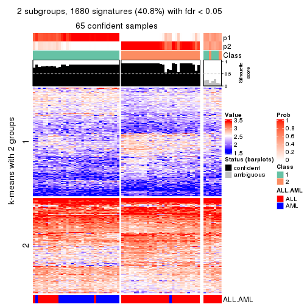</p>

</div>
<div id='tab-CV-pam-get-signatures-no-scale-2'>
<pre><code class="r">get_signatures(res, k = 3, scale_rows = FALSE)
</code></pre>

<p>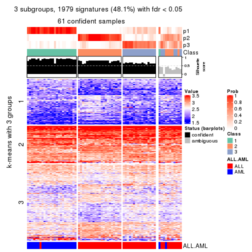</p>

</div>
<div id='tab-CV-pam-get-signatures-no-scale-3'>
<pre><code class="r">get_signatures(res, k = 4, scale_rows = FALSE)
</code></pre>

<p>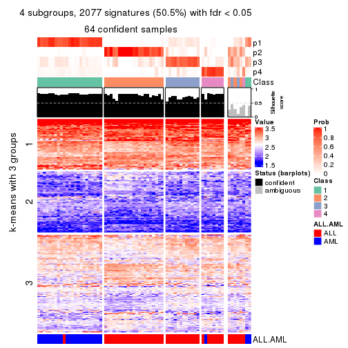</p>

</div>
<div id='tab-CV-pam-get-signatures-no-scale-4'>
<pre><code class="r">get_signatures(res, k = 5, scale_rows = FALSE)
</code></pre>

<p>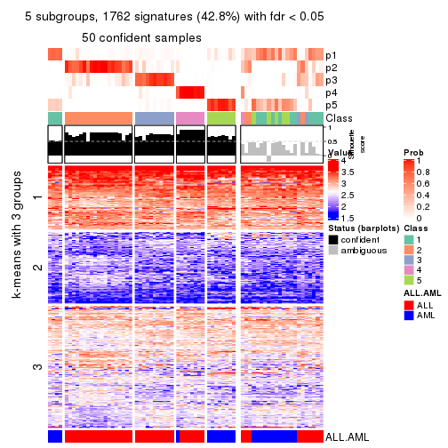</p>

</div>
<div id='tab-CV-pam-get-signatures-no-scale-5'>
<pre><code class="r">get_signatures(res, k = 6, scale_rows = FALSE)
</code></pre>

<p>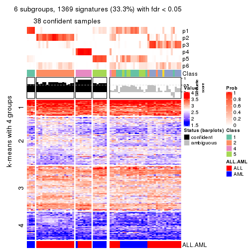</p>

</div>
</div>


Compare the overlap of signatures from different k:

```r
compare_signatures(res)
```

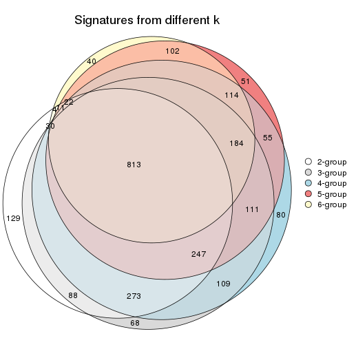

`get_signature()` returns a data frame invisibly. TO get the list of signatures, the function
call should be assigned to a variable explicitly. In following code, if `plot` argument is set
to `FALSE`, no heatmap is plotted while only the differential analysis is performed.

```r
# code only for demonstration
tb = get_signature(res, k = ..., plot = FALSE)
```

An example of the output of `tb` is:

```
#>   which_row         fdr    mean_1    mean_2 scaled_mean_1 scaled_mean_2 km
#> 1        38 0.042760348  8.373488  9.131774    -0.5533452     0.5164555  1
#> 2        40 0.018707592  7.106213  8.469186    -0.6173731     0.5762149  1
#> 3        55 0.019134737 10.221463 11.207825    -0.6159697     0.5749050  1
#> 4        59 0.006059896  5.921854  7.869574    -0.6899429     0.6439467  1
#> 5        60 0.018055526  8.928898 10.211722    -0.6204761     0.5791110  1
#> 6        98 0.009384629 15.714769 14.887706     0.6635654    -0.6193277  2
...
```

The columns in `tb` are:

1. `which_row`: row indices corresponding to the input matrix.
2. `fdr`: FDR for the differential test. 
3. `mean_x`: The mean value in group x.
4. `scaled_mean_x`: The mean value in group x after rows are scaled.
5. `km`: Row groups if k-means clustering is applied to rows.


UMAP plot which shows how samples are separated.


<script>
$( function() {
	$( '#tabs-CV-pam-dimension-reduction' ).tabs();
} );
</script>
<div id='tabs-CV-pam-dimension-reduction'>
<ul>
<li><a href='#tab-CV-pam-dimension-reduction-1'>k = 2</a></li>
<li><a href='#tab-CV-pam-dimension-reduction-2'>k = 3</a></li>
<li><a href='#tab-CV-pam-dimension-reduction-3'>k = 4</a></li>
<li><a href='#tab-CV-pam-dimension-reduction-4'>k = 5</a></li>
<li><a href='#tab-CV-pam-dimension-reduction-5'>k = 6</a></li>
</ul>
<div id='tab-CV-pam-dimension-reduction-1'>
<pre><code class="r">dimension_reduction(res, k = 2, method = &quot;UMAP&quot;)
</code></pre>

<p>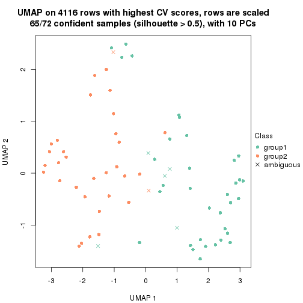</p>

</div>
<div id='tab-CV-pam-dimension-reduction-2'>
<pre><code class="r">dimension_reduction(res, k = 3, method = &quot;UMAP&quot;)
</code></pre>

<p>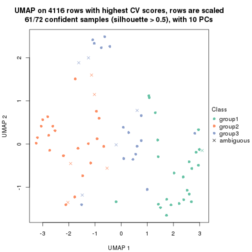</p>

</div>
<div id='tab-CV-pam-dimension-reduction-3'>
<pre><code class="r">dimension_reduction(res, k = 4, method = &quot;UMAP&quot;)
</code></pre>

<p>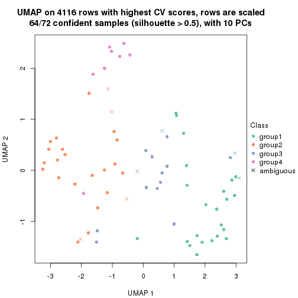</p>

</div>
<div id='tab-CV-pam-dimension-reduction-4'>
<pre><code class="r">dimension_reduction(res, k = 5, method = &quot;UMAP&quot;)
</code></pre>

<p>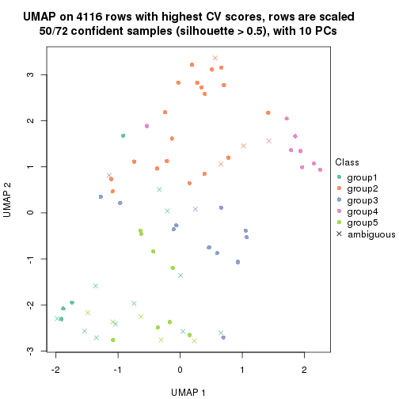</p>

</div>
<div id='tab-CV-pam-dimension-reduction-5'>
<pre><code class="r">dimension_reduction(res, k = 6, method = &quot;UMAP&quot;)
</code></pre>

<p>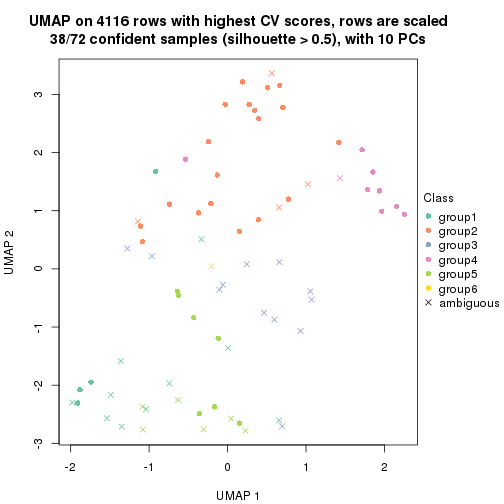</p>

</div>
</div>


Following heatmap shows how subgroups are split when increasing `k`:

```r
collect_classes(res)
```

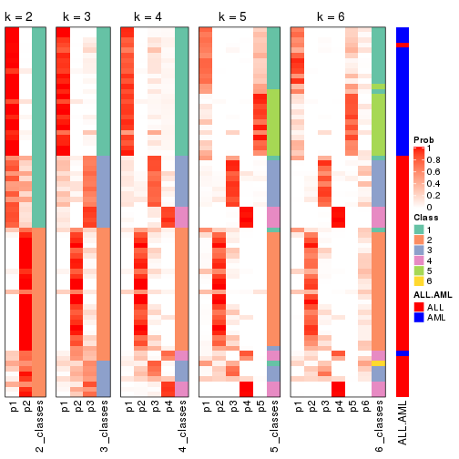


Test correlation between subgroups and known annotations. If the known
annotation is numeric, one-way ANOVA test is applied, and if the known
annotation is discrete, chi-squared contingency table test is applied.

```r
test_to_known_factors(res)
```

```
#>         n ALL.AML(p) k
#> CV:pam 65   1.04e-07 2
#> CV:pam 61   4.37e-13 3
#> CV:pam 64   4.11e-12 4
#> CV:pam 50   3.20e-09 5
#> CV:pam 38   2.03e-07 6
```


If matrix rows can be associated to genes, consider to use `functional_enrichment(res,
...)` to perform function enrichment for the signature genes. See [this vignette](http://bioconductor.org/packages/devel/bioc/vignettes/cola/inst/doc/functional_enrichment.html) for more detailed explanations.


 

---------------------------------------------------


### CV:mclust


The object with results only for a single top-value method and a single partition method 
can be extracted as:

```r
res = res_list["CV", "mclust"]
# you can also extract it by
# res = res_list["CV:mclust"]
```

A summary of `res` and all the functions that can be applied to it:

```r
res
```

```
#> A 'ConsensusPartition' object with k = 2, 3, 4, 5, 6.
#>   On a matrix with 4116 rows and 72 columns.
#>   Top rows (412, 824, 1235, 1646, 2058) are extracted by 'CV' method.
#>   Subgroups are detected by 'mclust' method.
#>   Performed in total 1250 partitions by row resampling.
#>   Best k for subgroups seems to be 2.
#> 
#> Following methods can be applied to this 'ConsensusPartition' object:
#>  [1] "cola_report"             "collect_classes"         "collect_plots"          
#>  [4] "collect_stats"           "colnames"                "compare_signatures"     
#>  [7] "consensus_heatmap"       "dimension_reduction"     "functional_enrichment"  
#> [10] "get_anno_col"            "get_anno"                "get_classes"            
#> [13] "get_consensus"           "get_matrix"              "get_membership"         
#> [16] "get_param"               "get_signatures"          "get_stats"              
#> [19] "is_best_k"               "is_stable_k"             "membership_heatmap"     
#> [22] "ncol"                    "nrow"                    "plot_ecdf"              
#> [25] "rownames"                "select_partition_number" "show"                   
#> [28] "suggest_best_k"          "test_to_known_factors"
```

`collect_plots()` function collects all the plots made from `res` for all `k` (number of partitions)
into one single page to provide an easy and fast comparison between different `k`.

```r
collect_plots(res)
```

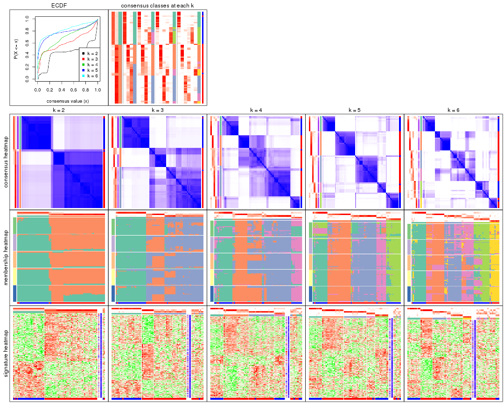

The plots are:

- The first row: a plot of the ECDF (empirical cumulative distribution
  function) curves of the consensus matrix for each `k` and the heatmap of
  predicted classes for each `k`.
- The second row: heatmaps of the consensus matrix for each `k`.
- The third row: heatmaps of the membership matrix for each `k`.
- The fouth row: heatmaps of the signatures for each `k`.

All the plots in panels can be made by individual functions and they are
plotted later in this section.

`select_partition_number()` produces several plots showing different
statistics for choosing "optimized" `k`. There are following statistics:

- ECDF curves of the consensus matrix for each `k`;
- 1-PAC. [The PAC
  score](https://en.wikipedia.org/wiki/Consensus_clustering#Over-interpretation_potential_of_consensus_clustering)
  measures the proportion of the ambiguous subgrouping.
- Mean silhouette score.
- Concordance. The mean probability of fiting the consensus class ids in all
  partitions.
- Area increased. Denote $A_k$ as the area under the ECDF curve for current
  `k`, the area increased is defined as $A_k - A_{k-1}$.
- Rand index. The percent of pairs of samples that are both in a same cluster
  or both are not in a same cluster in the partition of k and k-1.
- Jaccard index. The ratio of pairs of samples are both in a same cluster in
  the partition of k and k-1 and the pairs of samples are both in a same
  cluster in the partition k or k-1.

The detailed explanations of these statistics can be found in [the _cola_
vignette](http://bioconductor.org/packages/devel/bioc/vignettes/cola/inst/doc/cola.html#toc_13).

Generally speaking, lower PAC score, higher mean silhouette score or higher
concordance corresponds to better partition. Rand index and Jaccard index
measure how similar the current partition is compared to partition with `k-1`.
If they are too similar, we won't accept `k` is better than `k-1`.

```r
select_partition_number(res)
```

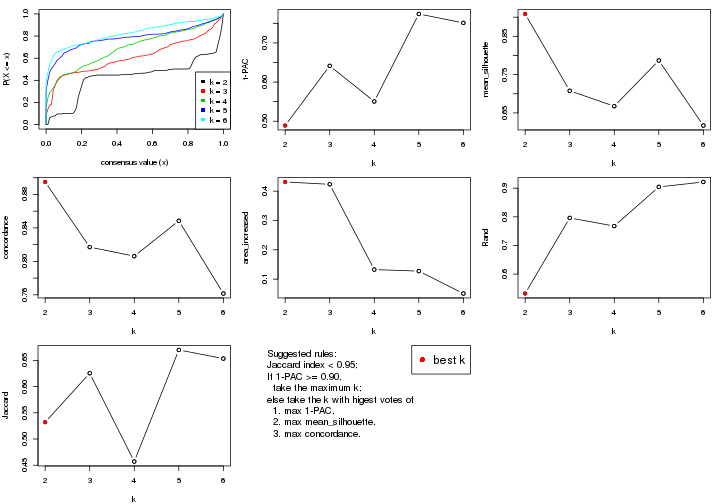

The numeric values for all these statistics can be obtained by `get_stats()`.

```r
get_stats(res)
```

```
#>   k 1-PAC mean_silhouette concordance area_increased  Rand Jaccard
#> 2 2 0.489           0.908       0.895         0.4313 0.532   0.532
#> 3 3 0.641           0.708       0.817         0.4234 0.796   0.625
#> 4 4 0.550           0.668       0.806         0.1326 0.768   0.457
#> 5 5 0.774           0.787       0.849         0.1273 0.905   0.670
#> 6 6 0.751           0.617       0.762         0.0509 0.922   0.653
```

`suggest_best_k()` suggests the best $k$ based on these statistics. The rules are as follows:

- All $k$ with Jaccard index larger than 0.95 are removed because increasing
  $k$ does not provide enough extra information. If all $k$ are removed, it is
  marked as no subgroup is detected.
- For all $k$ with 1-PAC score larger than 0.9, the maximal $k$ is taken as
  the best $k$, and other $k$ are marked as optional $k$.
- If it does not fit the second rule. The $k$ with the maximal vote of the
  highest 1-PAC score, highest mean silhouette, and highest concordance is
  taken as the best $k$.

```r
suggest_best_k(res)
```

```
#> [1] 2
```


Following shows the table of the partitions (You need to click the **show/hide
code output** link to see it). The membership matrix (columns with name `p*`)
is inferred by
[`clue::cl_consensus()`](https://www.rdocumentation.org/link/cl_consensus?package=clue)
function with the `SE` method. Basically the value in the membership matrix
represents the probability to belong to a certain group. The finall class
label for an item is determined with the group with highest probability it
belongs to.

In `get_classes()` function, the entropy is calculated from the membership
matrix and the silhouette score is calculated from the consensus matrix.


<script>
$( function() {
	$( '#tabs-CV-mclust-get-classes' ).tabs();
} );
</script>
<div id='tabs-CV-mclust-get-classes'>
<ul>
<li><a href='#tab-CV-mclust-get-classes-1'>k = 2</a></li>
<li><a href='#tab-CV-mclust-get-classes-2'>k = 3</a></li>
<li><a href='#tab-CV-mclust-get-classes-3'>k = 4</a></li>
<li><a href='#tab-CV-mclust-get-classes-4'>k = 5</a></li>
<li><a href='#tab-CV-mclust-get-classes-5'>k = 6</a></li>
</ul>

<div id='tab-CV-mclust-get-classes-1'>
<p><a id='tab-CV-mclust-get-classes-1-a' style='color:#0366d6' href='#'>show/hide code output</a></p>
<pre><code class="r">cbind(get_classes(res, k = 2), get_membership(res, k = 2))
</code></pre>

<pre><code>#&gt;           class entropy silhouette    p1    p2
#&gt; sample_39     2  0.0938     0.9237 0.012 0.988
#&gt; sample_40     2  0.0938     0.9237 0.012 0.988
#&gt; sample_42     2  0.1633     0.9172 0.024 0.976
#&gt; sample_47     2  0.1414     0.9207 0.020 0.980
#&gt; sample_48     2  0.6438     0.8294 0.164 0.836
#&gt; sample_49     2  0.1184     0.9225 0.016 0.984
#&gt; sample_41     2  0.6438     0.8294 0.164 0.836
#&gt; sample_43     2  0.0376     0.9242 0.004 0.996
#&gt; sample_44     2  0.0938     0.9233 0.012 0.988
#&gt; sample_45     2  0.1843     0.9169 0.028 0.972
#&gt; sample_46     2  0.1633     0.9189 0.024 0.976
#&gt; sample_70     2  0.0376     0.9242 0.004 0.996
#&gt; sample_71     2  0.2043     0.9117 0.032 0.968
#&gt; sample_72     2  0.1633     0.9172 0.024 0.976
#&gt; sample_68     2  0.6438     0.8294 0.164 0.836
#&gt; sample_69     2  0.6438     0.8294 0.164 0.836
#&gt; sample_67     1  0.8207     0.8977 0.744 0.256
#&gt; sample_55     2  0.1633     0.9178 0.024 0.976
#&gt; sample_56     2  0.1184     0.9225 0.016 0.984
#&gt; sample_59     2  0.0672     0.9238 0.008 0.992
#&gt; sample_52     1  0.6712     0.9874 0.824 0.176
#&gt; sample_53     1  0.6623     0.9851 0.828 0.172
#&gt; sample_51     1  0.6623     0.9851 0.828 0.172
#&gt; sample_50     1  0.6623     0.9851 0.828 0.172
#&gt; sample_54     1  0.6801     0.9858 0.820 0.180
#&gt; sample_57     1  0.6712     0.9874 0.824 0.176
#&gt; sample_58     1  0.6712     0.9874 0.824 0.176
#&gt; sample_60     1  0.7139     0.9735 0.804 0.196
#&gt; sample_61     1  0.6801     0.9858 0.820 0.180
#&gt; sample_65     1  0.6712     0.9874 0.824 0.176
#&gt; sample_66     2  0.8955     0.3909 0.312 0.688
#&gt; sample_63     1  0.6712     0.9874 0.824 0.176
#&gt; sample_64     1  0.7453     0.9577 0.788 0.212
#&gt; sample_62     1  0.6712     0.9874 0.824 0.176
#&gt; sample_1      2  0.0672     0.9238 0.008 0.992
#&gt; sample_2      2  0.9850    -0.0705 0.428 0.572
#&gt; sample_3      2  0.1633     0.9213 0.024 0.976
#&gt; sample_4      2  0.0672     0.9238 0.008 0.992
#&gt; sample_5      2  0.6438     0.8294 0.164 0.836
#&gt; sample_6      2  0.1633     0.9213 0.024 0.976
#&gt; sample_7      2  0.0672     0.9238 0.008 0.992
#&gt; sample_8      2  0.0938     0.9237 0.012 0.988
#&gt; sample_9      2  0.0938     0.9225 0.012 0.988
#&gt; sample_10     2  0.1843     0.9130 0.028 0.972
#&gt; sample_11     2  0.2043     0.9117 0.032 0.968
#&gt; sample_12     1  0.7376     0.9621 0.792 0.208
#&gt; sample_13     2  0.6438     0.8294 0.164 0.836
#&gt; sample_14     2  0.1184     0.9239 0.016 0.984
#&gt; sample_15     2  0.6438     0.8294 0.164 0.836
#&gt; sample_16     2  0.0376     0.9242 0.004 0.996
#&gt; sample_17     2  0.1414     0.9202 0.020 0.980
#&gt; sample_18     2  0.0672     0.9238 0.008 0.992
#&gt; sample_19     2  0.0938     0.9235 0.012 0.988
#&gt; sample_20     2  0.6438     0.8294 0.164 0.836
#&gt; sample_21     2  0.5519     0.8538 0.128 0.872
#&gt; sample_22     2  0.1633     0.9159 0.024 0.976
#&gt; sample_23     2  0.1633     0.9213 0.024 0.976
#&gt; sample_24     2  0.6438     0.8294 0.164 0.836
#&gt; sample_25     2  0.1843     0.9147 0.028 0.972
#&gt; sample_26     2  0.0672     0.9238 0.008 0.992
#&gt; sample_27     2  0.1184     0.9225 0.016 0.984
#&gt; sample_34     1  0.6712     0.9874 0.824 0.176
#&gt; sample_35     1  0.7453     0.9577 0.788 0.212
#&gt; sample_36     1  0.6623     0.9851 0.828 0.172
#&gt; sample_37     1  0.6623     0.9851 0.828 0.172
#&gt; sample_38     1  0.6801     0.9857 0.820 0.180
#&gt; sample_28     1  0.6712     0.9874 0.824 0.176
#&gt; sample_29     1  0.6973     0.9801 0.812 0.188
#&gt; sample_30     1  0.6623     0.9851 0.828 0.172
#&gt; sample_31     1  0.6712     0.9874 0.824 0.176
#&gt; sample_32     1  0.6712     0.9874 0.824 0.176
#&gt; sample_33     1  0.6712     0.9874 0.824 0.176
</code></pre>

<script>
$('#tab-CV-mclust-get-classes-1-a').parent().next().next().hide();
$('#tab-CV-mclust-get-classes-1-a').click(function(){
  $('#tab-CV-mclust-get-classes-1-a').parent().next().next().toggle();
  return(false);
});
</script>
</div>

<div id='tab-CV-mclust-get-classes-2'>
<p><a id='tab-CV-mclust-get-classes-2-a' style='color:#0366d6' href='#'>show/hide code output</a></p>
<pre><code class="r">cbind(get_classes(res, k = 3), get_membership(res, k = 3))
</code></pre>

<pre><code>#&gt;           class entropy silhouette    p1    p2    p3
#&gt; sample_39     3  0.5988     0.7194 0.008 0.304 0.688
#&gt; sample_40     3  0.5982     0.7073 0.004 0.328 0.668
#&gt; sample_42     3  0.3375     0.5534 0.008 0.100 0.892
#&gt; sample_47     3  0.6286     0.5162 0.000 0.464 0.536
#&gt; sample_48     2  0.0592     0.7534 0.000 0.988 0.012
#&gt; sample_49     3  0.5982     0.7071 0.004 0.328 0.668
#&gt; sample_41     2  0.0424     0.7525 0.000 0.992 0.008
#&gt; sample_43     3  0.6299     0.4728 0.000 0.476 0.524
#&gt; sample_44     2  0.6140    -0.0611 0.000 0.596 0.404
#&gt; sample_45     2  0.6204    -0.1760 0.000 0.576 0.424
#&gt; sample_46     2  0.5988     0.1018 0.000 0.632 0.368
#&gt; sample_70     3  0.5859     0.6987 0.000 0.344 0.656
#&gt; sample_71     3  0.2486     0.5533 0.008 0.060 0.932
#&gt; sample_72     3  0.3682     0.5495 0.008 0.116 0.876
#&gt; sample_68     2  0.0237     0.7499 0.000 0.996 0.004
#&gt; sample_69     2  0.0592     0.7534 0.000 0.988 0.012
#&gt; sample_67     3  0.5848     0.2916 0.268 0.012 0.720
#&gt; sample_55     3  0.6126     0.7034 0.004 0.352 0.644
#&gt; sample_56     3  0.6008     0.7046 0.004 0.332 0.664
#&gt; sample_59     3  0.6045     0.6623 0.000 0.380 0.620
#&gt; sample_52     1  0.1289     0.9597 0.968 0.000 0.032
#&gt; sample_53     1  0.1529     0.9493 0.960 0.000 0.040
#&gt; sample_51     1  0.1289     0.9474 0.968 0.000 0.032
#&gt; sample_50     1  0.1289     0.9474 0.968 0.000 0.032
#&gt; sample_54     1  0.1964     0.9499 0.944 0.000 0.056
#&gt; sample_57     1  0.1289     0.9597 0.968 0.000 0.032
#&gt; sample_58     1  0.1411     0.9602 0.964 0.000 0.036
#&gt; sample_60     1  0.1989     0.9532 0.948 0.004 0.048
#&gt; sample_61     1  0.2066     0.9544 0.940 0.000 0.060
#&gt; sample_65     1  0.1411     0.9602 0.964 0.000 0.036
#&gt; sample_66     3  0.4945     0.4865 0.104 0.056 0.840
#&gt; sample_63     1  0.1289     0.9597 0.968 0.000 0.032
#&gt; sample_64     1  0.2584     0.9441 0.928 0.008 0.064
#&gt; sample_62     1  0.1289     0.9597 0.968 0.000 0.032
#&gt; sample_1      3  0.6225     0.5679 0.000 0.432 0.568
#&gt; sample_2      3  0.4663     0.4321 0.156 0.016 0.828
#&gt; sample_3      3  0.5656     0.7127 0.008 0.264 0.728
#&gt; sample_4      3  0.6267     0.5551 0.000 0.452 0.548
#&gt; sample_5      2  0.0237     0.7499 0.000 0.996 0.004
#&gt; sample_6      3  0.5763     0.7151 0.008 0.276 0.716
#&gt; sample_7      3  0.6081     0.7055 0.004 0.344 0.652
#&gt; sample_8      3  0.5928     0.7204 0.008 0.296 0.696
#&gt; sample_9      3  0.5722     0.7154 0.004 0.292 0.704
#&gt; sample_10     3  0.5406     0.6938 0.012 0.224 0.764
#&gt; sample_11     3  0.2063     0.5599 0.008 0.044 0.948
#&gt; sample_12     1  0.4062     0.8813 0.836 0.000 0.164
#&gt; sample_13     2  0.0592     0.7534 0.000 0.988 0.012
#&gt; sample_14     3  0.5873     0.7062 0.004 0.312 0.684
#&gt; sample_15     2  0.0000     0.7511 0.000 1.000 0.000
#&gt; sample_16     2  0.5968     0.1230 0.000 0.636 0.364
#&gt; sample_17     3  0.6126     0.6886 0.004 0.352 0.644
#&gt; sample_18     3  0.6126     0.7034 0.004 0.352 0.644
#&gt; sample_19     2  0.6045     0.0463 0.000 0.620 0.380
#&gt; sample_20     2  0.0592     0.7534 0.000 0.988 0.012
#&gt; sample_21     2  0.1647     0.7288 0.004 0.960 0.036
#&gt; sample_22     3  0.3293     0.6109 0.012 0.088 0.900
#&gt; sample_23     3  0.5618     0.7118 0.008 0.260 0.732
#&gt; sample_24     2  0.0592     0.7509 0.000 0.988 0.012
#&gt; sample_25     3  0.3918     0.5982 0.012 0.120 0.868
#&gt; sample_26     3  0.6299     0.4782 0.000 0.476 0.524
#&gt; sample_27     3  0.5982     0.7071 0.004 0.328 0.668
#&gt; sample_34     1  0.1411     0.9602 0.964 0.000 0.036
#&gt; sample_35     1  0.2400     0.9502 0.932 0.004 0.064
#&gt; sample_36     1  0.1289     0.9474 0.968 0.000 0.032
#&gt; sample_37     1  0.1289     0.9474 0.968 0.000 0.032
#&gt; sample_38     1  0.2625     0.9516 0.916 0.000 0.084
#&gt; sample_28     1  0.2261     0.9567 0.932 0.000 0.068
#&gt; sample_29     1  0.5835     0.7025 0.660 0.000 0.340
#&gt; sample_30     1  0.1411     0.9466 0.964 0.000 0.036
#&gt; sample_31     1  0.1411     0.9602 0.964 0.000 0.036
#&gt; sample_32     1  0.1964     0.9587 0.944 0.000 0.056
#&gt; sample_33     1  0.1529     0.9540 0.960 0.000 0.040
</code></pre>

<script>
$('#tab-CV-mclust-get-classes-2-a').parent().next().next().hide();
$('#tab-CV-mclust-get-classes-2-a').click(function(){
  $('#tab-CV-mclust-get-classes-2-a').parent().next().next().toggle();
  return(false);
});
</script>
</div>

<div id='tab-CV-mclust-get-classes-3'>
<p><a id='tab-CV-mclust-get-classes-3-a' style='color:#0366d6' href='#'>show/hide code output</a></p>
<pre><code class="r">cbind(get_classes(res, k = 4), get_membership(res, k = 4))
</code></pre>

<pre><code>#&gt;           class entropy silhouette    p1    p2    p3    p4
#&gt; sample_39     3  0.0657     0.8586 0.004 0.000 0.984 0.012
#&gt; sample_40     3  0.0859     0.8579 0.004 0.008 0.980 0.008
#&gt; sample_42     2  0.7476     0.5513 0.040 0.508 0.376 0.076
#&gt; sample_47     2  0.5040     0.6352 0.000 0.628 0.364 0.008
#&gt; sample_48     2  0.0336     0.6843 0.000 0.992 0.008 0.000
#&gt; sample_49     3  0.0967     0.8584 0.004 0.004 0.976 0.016
#&gt; sample_41     2  0.0592     0.6876 0.000 0.984 0.016 0.000
#&gt; sample_43     2  0.5298     0.6252 0.000 0.612 0.372 0.016
#&gt; sample_44     2  0.5476     0.5778 0.000 0.584 0.396 0.020
#&gt; sample_45     2  0.4936     0.6631 0.000 0.672 0.316 0.012
#&gt; sample_46     2  0.4857     0.6731 0.000 0.700 0.284 0.016
#&gt; sample_70     3  0.0672     0.8565 0.000 0.008 0.984 0.008
#&gt; sample_71     2  0.7582     0.5378 0.028 0.496 0.372 0.104
#&gt; sample_72     2  0.7219     0.5401 0.028 0.508 0.392 0.072
#&gt; sample_68     2  0.0336     0.6843 0.000 0.992 0.008 0.000
#&gt; sample_69     2  0.0592     0.6874 0.000 0.984 0.016 0.000
#&gt; sample_67     1  0.8097     0.3982 0.584 0.124 0.188 0.104
#&gt; sample_55     3  0.1362     0.8584 0.004 0.012 0.964 0.020
#&gt; sample_56     3  0.1082     0.8579 0.004 0.004 0.972 0.020
#&gt; sample_59     3  0.2665     0.8038 0.004 0.088 0.900 0.008
#&gt; sample_52     4  0.3528     0.8665 0.192 0.000 0.000 0.808
#&gt; sample_53     1  0.0188     0.7646 0.996 0.000 0.000 0.004
#&gt; sample_51     1  0.0000     0.7646 1.000 0.000 0.000 0.000
#&gt; sample_50     1  0.0188     0.7639 0.996 0.000 0.000 0.004
#&gt; sample_54     4  0.4289     0.8603 0.172 0.000 0.032 0.796
#&gt; sample_57     4  0.3400     0.8700 0.180 0.000 0.000 0.820
#&gt; sample_58     4  0.5328     0.7964 0.248 0.000 0.048 0.704
#&gt; sample_60     4  0.3836     0.8671 0.168 0.000 0.016 0.816
#&gt; sample_61     3  0.7164     0.1813 0.320 0.000 0.524 0.156
#&gt; sample_65     1  0.6319    -0.2803 0.504 0.000 0.060 0.436
#&gt; sample_66     2  0.8979     0.4922 0.144 0.436 0.312 0.108
#&gt; sample_63     4  0.3400     0.8700 0.180 0.000 0.000 0.820
#&gt; sample_64     4  0.6497     0.5992 0.160 0.000 0.200 0.640
#&gt; sample_62     4  0.3400     0.8700 0.180 0.000 0.000 0.820
#&gt; sample_1      3  0.1890     0.8294 0.000 0.056 0.936 0.008
#&gt; sample_2      2  0.9416     0.3874 0.224 0.364 0.304 0.108
#&gt; sample_3      3  0.2530     0.8308 0.004 0.000 0.896 0.100
#&gt; sample_4      3  0.2489     0.8223 0.000 0.068 0.912 0.020
#&gt; sample_5      2  0.0336     0.6843 0.000 0.992 0.008 0.000
#&gt; sample_6      3  0.2401     0.8340 0.004 0.000 0.904 0.092
#&gt; sample_7      3  0.0927     0.8574 0.000 0.008 0.976 0.016
#&gt; sample_8      3  0.0524     0.8583 0.004 0.000 0.988 0.008
#&gt; sample_9      3  0.5904     0.4154 0.004 0.228 0.688 0.080
#&gt; sample_10     3  0.2329     0.8378 0.012 0.000 0.916 0.072
#&gt; sample_11     3  0.7482    -0.3222 0.016 0.396 0.472 0.116
#&gt; sample_12     1  0.6188     0.2470 0.548 0.000 0.396 0.056
#&gt; sample_13     2  0.0336     0.6843 0.000 0.992 0.008 0.000
#&gt; sample_14     2  0.6826     0.4027 0.004 0.456 0.456 0.084
#&gt; sample_15     2  0.0336     0.6843 0.000 0.992 0.008 0.000
#&gt; sample_16     2  0.5217     0.6056 0.000 0.608 0.380 0.012
#&gt; sample_17     2  0.6114     0.5249 0.000 0.524 0.428 0.048
#&gt; sample_18     3  0.1174     0.8563 0.000 0.012 0.968 0.020
#&gt; sample_19     2  0.4908     0.6703 0.000 0.692 0.292 0.016
#&gt; sample_20     2  0.0336     0.6843 0.000 0.992 0.008 0.000
#&gt; sample_21     2  0.2412     0.7022 0.008 0.908 0.084 0.000
#&gt; sample_22     3  0.1247     0.8540 0.012 0.004 0.968 0.016
#&gt; sample_23     3  0.2530     0.8308 0.004 0.000 0.896 0.100
#&gt; sample_24     2  0.1302     0.6921 0.000 0.956 0.044 0.000
#&gt; sample_25     3  0.3933     0.7847 0.020 0.064 0.860 0.056
#&gt; sample_26     3  0.3324     0.7487 0.000 0.136 0.852 0.012
#&gt; sample_27     3  0.0967     0.8584 0.004 0.004 0.976 0.016
#&gt; sample_34     1  0.5984    -0.0247 0.580 0.000 0.048 0.372
#&gt; sample_35     3  0.6019     0.5229 0.176 0.000 0.688 0.136
#&gt; sample_36     1  0.0336     0.7621 0.992 0.000 0.000 0.008
#&gt; sample_37     1  0.0000     0.7646 1.000 0.000 0.000 0.000
#&gt; sample_38     1  0.3667     0.7110 0.856 0.000 0.088 0.056
#&gt; sample_28     1  0.1833     0.7564 0.944 0.000 0.032 0.024
#&gt; sample_29     1  0.3279     0.7140 0.880 0.008 0.088 0.024
#&gt; sample_30     1  0.0188     0.7639 0.996 0.000 0.000 0.004
#&gt; sample_31     4  0.6158     0.5527 0.384 0.000 0.056 0.560
#&gt; sample_32     1  0.2797     0.7237 0.900 0.000 0.068 0.032
#&gt; sample_33     1  0.0188     0.7659 0.996 0.000 0.004 0.000
</code></pre>

<script>
$('#tab-CV-mclust-get-classes-3-a').parent().next().next().hide();
$('#tab-CV-mclust-get-classes-3-a').click(function(){
  $('#tab-CV-mclust-get-classes-3-a').parent().next().next().toggle();
  return(false);
});
</script>
</div>

<div id='tab-CV-mclust-get-classes-4'>
<p><a id='tab-CV-mclust-get-classes-4-a' style='color:#0366d6' href='#'>show/hide code output</a></p>
<pre><code class="r">cbind(get_classes(res, k = 5), get_membership(res, k = 5))
</code></pre>

<pre><code>#&gt;           class entropy silhouette    p1    p2    p3    p4    p5
#&gt; sample_39     3  0.1356      0.864 0.000 0.004 0.956 0.028 0.012
#&gt; sample_40     3  0.0324      0.864 0.000 0.000 0.992 0.004 0.004
#&gt; sample_42     4  0.3238      0.843 0.012 0.092 0.028 0.864 0.004
#&gt; sample_47     2  0.3244      0.851 0.000 0.860 0.048 0.084 0.008
#&gt; sample_48     2  0.0000      0.884 0.000 1.000 0.000 0.000 0.000
#&gt; sample_49     3  0.0671      0.864 0.000 0.000 0.980 0.004 0.016
#&gt; sample_41     2  0.0404      0.884 0.000 0.988 0.012 0.000 0.000
#&gt; sample_43     2  0.3536      0.839 0.000 0.840 0.052 0.100 0.008
#&gt; sample_44     2  0.4818      0.663 0.000 0.688 0.260 0.048 0.004
#&gt; sample_45     2  0.2929      0.861 0.000 0.880 0.044 0.068 0.008
#&gt; sample_46     2  0.2478      0.868 0.000 0.904 0.028 0.060 0.008
#&gt; sample_70     3  0.1443      0.860 0.000 0.004 0.948 0.044 0.004
#&gt; sample_71     4  0.2689      0.848 0.012 0.084 0.016 0.888 0.000
#&gt; sample_72     4  0.3101      0.843 0.012 0.100 0.024 0.864 0.000
#&gt; sample_68     2  0.0162      0.884 0.000 0.996 0.000 0.000 0.004
#&gt; sample_69     2  0.0162      0.884 0.000 0.996 0.000 0.000 0.004
#&gt; sample_67     4  0.3170      0.770 0.160 0.000 0.008 0.828 0.004
#&gt; sample_55     3  0.0902      0.865 0.004 0.004 0.976 0.008 0.008
#&gt; sample_56     3  0.0290      0.864 0.000 0.000 0.992 0.000 0.008
#&gt; sample_59     3  0.1990      0.845 0.000 0.028 0.928 0.040 0.004
#&gt; sample_52     5  0.2020      0.847 0.100 0.000 0.000 0.000 0.900
#&gt; sample_53     1  0.0162      0.907 0.996 0.000 0.000 0.000 0.004
#&gt; sample_51     1  0.0162      0.907 0.996 0.000 0.000 0.000 0.004
#&gt; sample_50     1  0.0162      0.907 0.996 0.000 0.000 0.000 0.004
#&gt; sample_54     5  0.2011      0.848 0.088 0.000 0.004 0.000 0.908
#&gt; sample_57     5  0.1851      0.848 0.088 0.000 0.000 0.000 0.912
#&gt; sample_58     5  0.2723      0.837 0.124 0.000 0.000 0.012 0.864
#&gt; sample_60     5  0.1851      0.848 0.088 0.000 0.000 0.000 0.912
#&gt; sample_61     5  0.7035      0.289 0.340 0.000 0.248 0.012 0.400
#&gt; sample_65     5  0.4620      0.552 0.392 0.000 0.000 0.016 0.592
#&gt; sample_66     4  0.4400      0.812 0.100 0.084 0.016 0.796 0.004
#&gt; sample_63     5  0.1908      0.848 0.092 0.000 0.000 0.000 0.908
#&gt; sample_64     5  0.2940      0.811 0.072 0.000 0.048 0.004 0.876
#&gt; sample_62     5  0.1851      0.848 0.088 0.000 0.000 0.000 0.912
#&gt; sample_1      3  0.0833      0.863 0.000 0.004 0.976 0.016 0.004
#&gt; sample_2      4  0.3093      0.810 0.120 0.004 0.016 0.856 0.004
#&gt; sample_3      3  0.3719      0.795 0.000 0.000 0.816 0.116 0.068
#&gt; sample_4      3  0.1243      0.861 0.000 0.004 0.960 0.028 0.008
#&gt; sample_5      2  0.0162      0.884 0.000 0.996 0.000 0.000 0.004
#&gt; sample_6      3  0.3719      0.795 0.000 0.000 0.816 0.116 0.068
#&gt; sample_7      3  0.0579      0.865 0.000 0.000 0.984 0.008 0.008
#&gt; sample_8      3  0.1549      0.857 0.000 0.000 0.944 0.040 0.016
#&gt; sample_9      3  0.6879      0.466 0.000 0.128 0.556 0.256 0.060
#&gt; sample_10     3  0.5052      0.674 0.012 0.000 0.696 0.232 0.060
#&gt; sample_11     4  0.2786      0.802 0.012 0.004 0.044 0.896 0.044
#&gt; sample_12     1  0.7270      0.369 0.556 0.000 0.176 0.144 0.124
#&gt; sample_13     2  0.0162      0.884 0.000 0.996 0.000 0.000 0.004
#&gt; sample_14     2  0.6555      0.408 0.000 0.532 0.120 0.320 0.028
#&gt; sample_15     2  0.0162      0.884 0.000 0.996 0.000 0.000 0.004
#&gt; sample_16     2  0.4096      0.753 0.000 0.760 0.200 0.040 0.000
#&gt; sample_17     2  0.5070      0.759 0.000 0.732 0.156 0.092 0.020
#&gt; sample_18     3  0.1455      0.858 0.000 0.008 0.952 0.032 0.008
#&gt; sample_19     2  0.2647      0.863 0.000 0.892 0.024 0.076 0.008
#&gt; sample_20     2  0.0162      0.884 0.000 0.996 0.000 0.000 0.004
#&gt; sample_21     2  0.0693      0.885 0.000 0.980 0.012 0.008 0.000
#&gt; sample_22     3  0.4669      0.614 0.012 0.000 0.692 0.272 0.024
#&gt; sample_23     3  0.3719      0.795 0.000 0.000 0.816 0.116 0.068
#&gt; sample_24     2  0.1544      0.861 0.000 0.932 0.068 0.000 0.000
#&gt; sample_25     4  0.5957      0.467 0.012 0.076 0.308 0.596 0.008
#&gt; sample_26     3  0.3087      0.808 0.000 0.064 0.868 0.064 0.004
#&gt; sample_27     3  0.0865      0.863 0.000 0.000 0.972 0.004 0.024
#&gt; sample_34     5  0.4806      0.519 0.408 0.000 0.004 0.016 0.572
#&gt; sample_35     3  0.6618     -0.169 0.136 0.000 0.428 0.016 0.420
#&gt; sample_36     1  0.0162      0.907 0.996 0.000 0.000 0.000 0.004
#&gt; sample_37     1  0.0162      0.907 0.996 0.000 0.000 0.000 0.004
#&gt; sample_38     1  0.1864      0.857 0.924 0.000 0.004 0.068 0.004
#&gt; sample_28     1  0.0833      0.894 0.976 0.000 0.004 0.016 0.004
#&gt; sample_29     1  0.3243      0.724 0.812 0.000 0.004 0.180 0.004
#&gt; sample_30     1  0.0162      0.907 0.996 0.000 0.000 0.000 0.004
#&gt; sample_31     5  0.4116      0.745 0.248 0.000 0.004 0.016 0.732
#&gt; sample_32     1  0.2389      0.773 0.880 0.000 0.004 0.000 0.116
#&gt; sample_33     1  0.0162      0.907 0.996 0.000 0.000 0.000 0.004
</code></pre>

<script>
$('#tab-CV-mclust-get-classes-4-a').parent().next().next().hide();
$('#tab-CV-mclust-get-classes-4-a').click(function(){
  $('#tab-CV-mclust-get-classes-4-a').parent().next().next().toggle();
  return(false);
});
</script>
</div>

<div id='tab-CV-mclust-get-classes-5'>
<p><a id='tab-CV-mclust-get-classes-5-a' style='color:#0366d6' href='#'>show/hide code output</a></p>
<pre><code class="r">cbind(get_classes(res, k = 6), get_membership(res, k = 6))
</code></pre>

<pre><code>#&gt;           class entropy silhouette    p1    p2    p3    p4    p5    p6
#&gt; sample_39     3  0.2859     0.7012 0.000 0.000 0.828 0.156 0.000 0.016
#&gt; sample_40     3  0.3710     0.6117 0.000 0.000 0.696 0.292 0.000 0.012
#&gt; sample_42     6  0.2302     0.8732 0.008 0.032 0.008 0.044 0.000 0.908
#&gt; sample_47     2  0.4644     0.2771 0.000 0.524 0.004 0.440 0.000 0.032
#&gt; sample_48     2  0.0000     0.7726 0.000 1.000 0.000 0.000 0.000 0.000
#&gt; sample_49     3  0.3171     0.6865 0.000 0.000 0.784 0.204 0.000 0.012
#&gt; sample_41     2  0.0146     0.7707 0.000 0.996 0.000 0.004 0.000 0.000
#&gt; sample_43     2  0.4805     0.2592 0.000 0.516 0.008 0.440 0.000 0.036
#&gt; sample_44     4  0.4595     0.4303 0.000 0.280 0.040 0.664 0.000 0.016
#&gt; sample_45     2  0.4555     0.3255 0.000 0.548 0.004 0.420 0.000 0.028
#&gt; sample_46     2  0.4355     0.3365 0.000 0.556 0.000 0.420 0.000 0.024
#&gt; sample_70     4  0.4026     0.4013 0.000 0.000 0.376 0.612 0.000 0.012
#&gt; sample_71     6  0.1036     0.8809 0.008 0.004 0.000 0.024 0.000 0.964
#&gt; sample_72     6  0.2263     0.8745 0.008 0.036 0.004 0.044 0.000 0.908
#&gt; sample_68     2  0.0000     0.7726 0.000 1.000 0.000 0.000 0.000 0.000
#&gt; sample_69     2  0.0146     0.7714 0.000 0.996 0.000 0.000 0.000 0.004
#&gt; sample_67     6  0.1785     0.8665 0.048 0.000 0.000 0.008 0.016 0.928
#&gt; sample_55     3  0.3950     0.3370 0.004 0.000 0.564 0.432 0.000 0.000
#&gt; sample_56     3  0.3541     0.6469 0.000 0.000 0.728 0.260 0.000 0.012
#&gt; sample_59     4  0.3684     0.5325 0.000 0.004 0.300 0.692 0.000 0.004
#&gt; sample_52     5  0.3672     0.7131 0.056 0.000 0.000 0.168 0.776 0.000
#&gt; sample_53     1  0.0146     0.8634 0.996 0.000 0.000 0.000 0.004 0.000
#&gt; sample_51     1  0.0000     0.8642 1.000 0.000 0.000 0.000 0.000 0.000
#&gt; sample_50     1  0.0291     0.8637 0.992 0.000 0.004 0.000 0.004 0.000
#&gt; sample_54     5  0.3096     0.7220 0.008 0.000 0.004 0.172 0.812 0.004
#&gt; sample_57     5  0.3003     0.7273 0.016 0.000 0.000 0.172 0.812 0.000
#&gt; sample_58     5  0.3249     0.6753 0.128 0.000 0.000 0.044 0.824 0.004
#&gt; sample_60     5  0.3096     0.7220 0.008 0.000 0.004 0.172 0.812 0.004
#&gt; sample_61     5  0.6397     0.4324 0.280 0.000 0.092 0.088 0.536 0.004
#&gt; sample_65     5  0.5512     0.4643 0.300 0.000 0.004 0.104 0.580 0.012
#&gt; sample_66     6  0.2441     0.8660 0.024 0.044 0.000 0.012 0.016 0.904
#&gt; sample_63     5  0.3210     0.7273 0.028 0.000 0.000 0.168 0.804 0.000
#&gt; sample_64     5  0.1871     0.7101 0.016 0.000 0.024 0.032 0.928 0.000
#&gt; sample_62     5  0.2955     0.7230 0.008 0.000 0.000 0.172 0.816 0.004
#&gt; sample_1      4  0.3807     0.4177 0.000 0.000 0.368 0.628 0.000 0.004
#&gt; sample_2      6  0.1679     0.8741 0.036 0.000 0.000 0.012 0.016 0.936
#&gt; sample_3      3  0.1065     0.6785 0.000 0.000 0.964 0.008 0.008 0.020
#&gt; sample_4      4  0.3409     0.5280 0.000 0.000 0.300 0.700 0.000 0.000
#&gt; sample_5      2  0.0000     0.7726 0.000 1.000 0.000 0.000 0.000 0.000
#&gt; sample_6      3  0.1350     0.6811 0.000 0.000 0.952 0.020 0.008 0.020
#&gt; sample_7      3  0.3899     0.5037 0.000 0.000 0.628 0.364 0.000 0.008
#&gt; sample_8      3  0.2445     0.7049 0.000 0.000 0.872 0.108 0.000 0.020
#&gt; sample_9      3  0.6503    -0.2212 0.000 0.044 0.456 0.364 0.008 0.128
#&gt; sample_10     3  0.3168     0.6123 0.008 0.000 0.840 0.024 0.008 0.120
#&gt; sample_11     6  0.3503     0.8139 0.008 0.000 0.124 0.040 0.008 0.820
#&gt; sample_12     1  0.7755    -0.0451 0.388 0.000 0.064 0.080 0.324 0.144
#&gt; sample_13     2  0.0000     0.7726 0.000 1.000 0.000 0.000 0.000 0.000
#&gt; sample_14     4  0.6881     0.2604 0.000 0.228 0.076 0.484 0.004 0.208
#&gt; sample_15     2  0.0000     0.7726 0.000 1.000 0.000 0.000 0.000 0.000
#&gt; sample_16     4  0.3969     0.3022 0.000 0.344 0.008 0.644 0.000 0.004
#&gt; sample_17     4  0.5545     0.2060 0.000 0.336 0.020 0.560 0.004 0.080
#&gt; sample_18     4  0.3684     0.3891 0.000 0.000 0.372 0.628 0.000 0.000
#&gt; sample_19     2  0.4488     0.3278 0.000 0.548 0.000 0.420 0.000 0.032
#&gt; sample_20     2  0.0000     0.7726 0.000 1.000 0.000 0.000 0.000 0.000
#&gt; sample_21     2  0.1007     0.7550 0.000 0.956 0.000 0.044 0.000 0.000
#&gt; sample_22     3  0.4693     0.5601 0.008 0.000 0.688 0.088 0.000 0.216
#&gt; sample_23     3  0.1065     0.6785 0.000 0.000 0.964 0.008 0.008 0.020
#&gt; sample_24     2  0.2092     0.6683 0.000 0.876 0.000 0.124 0.000 0.000
#&gt; sample_25     6  0.5101     0.4291 0.008 0.028 0.320 0.032 0.000 0.612
#&gt; sample_26     4  0.4812     0.5468 0.000 0.044 0.280 0.652 0.000 0.024
#&gt; sample_27     3  0.3078     0.6924 0.000 0.000 0.796 0.192 0.000 0.012
#&gt; sample_34     5  0.5269     0.5224 0.264 0.000 0.004 0.104 0.620 0.008
#&gt; sample_35     5  0.6865     0.4465 0.136 0.000 0.248 0.100 0.508 0.008
#&gt; sample_36     1  0.0291     0.8637 0.992 0.000 0.004 0.000 0.004 0.000
#&gt; sample_37     1  0.0000     0.8642 1.000 0.000 0.000 0.000 0.000 0.000
#&gt; sample_38     1  0.1745     0.8271 0.920 0.000 0.000 0.000 0.012 0.068
#&gt; sample_28     1  0.1225     0.8462 0.952 0.000 0.000 0.000 0.012 0.036
#&gt; sample_29     1  0.3652     0.5564 0.720 0.000 0.000 0.000 0.016 0.264
#&gt; sample_30     1  0.0291     0.8637 0.992 0.000 0.004 0.000 0.004 0.000
#&gt; sample_31     5  0.4843     0.6055 0.192 0.000 0.004 0.104 0.692 0.008
#&gt; sample_32     1  0.4901     0.5135 0.688 0.000 0.004 0.072 0.216 0.020
#&gt; sample_33     1  0.0000     0.8642 1.000 0.000 0.000 0.000 0.000 0.000
</code></pre>

<script>
$('#tab-CV-mclust-get-classes-5-a').parent().next().next().hide();
$('#tab-CV-mclust-get-classes-5-a').click(function(){
  $('#tab-CV-mclust-get-classes-5-a').parent().next().next().toggle();
  return(false);
});
</script>
</div>
</div>

Heatmaps for the consensus matrix. It visualizes the probability of two
samples to be in a same group.


<script>
$( function() {
	$( '#tabs-CV-mclust-consensus-heatmap' ).tabs();
} );
</script>
<div id='tabs-CV-mclust-consensus-heatmap'>
<ul>
<li><a href='#tab-CV-mclust-consensus-heatmap-1'>k = 2</a></li>
<li><a href='#tab-CV-mclust-consensus-heatmap-2'>k = 3</a></li>
<li><a href='#tab-CV-mclust-consensus-heatmap-3'>k = 4</a></li>
<li><a href='#tab-CV-mclust-consensus-heatmap-4'>k = 5</a></li>
<li><a href='#tab-CV-mclust-consensus-heatmap-5'>k = 6</a></li>
</ul>
<div id='tab-CV-mclust-consensus-heatmap-1'>
<pre><code class="r">consensus_heatmap(res, k = 2)
</code></pre>

<p>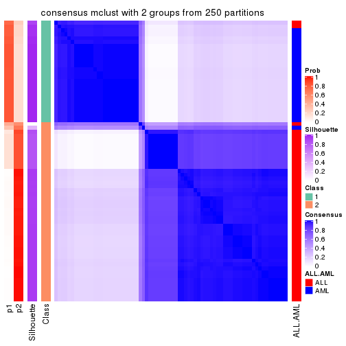</p>

</div>
<div id='tab-CV-mclust-consensus-heatmap-2'>
<pre><code class="r">consensus_heatmap(res, k = 3)
</code></pre>

<p>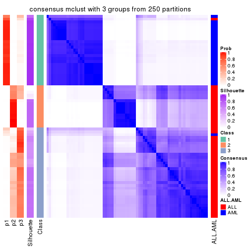</p>

</div>
<div id='tab-CV-mclust-consensus-heatmap-3'>
<pre><code class="r">consensus_heatmap(res, k = 4)
</code></pre>

<p>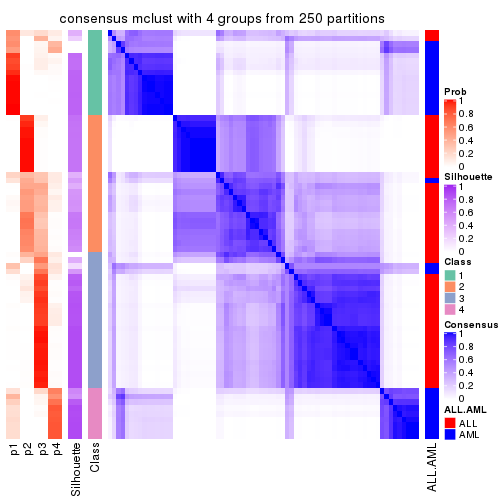</p>

</div>
<div id='tab-CV-mclust-consensus-heatmap-4'>
<pre><code class="r">consensus_heatmap(res, k = 5)
</code></pre>

<p>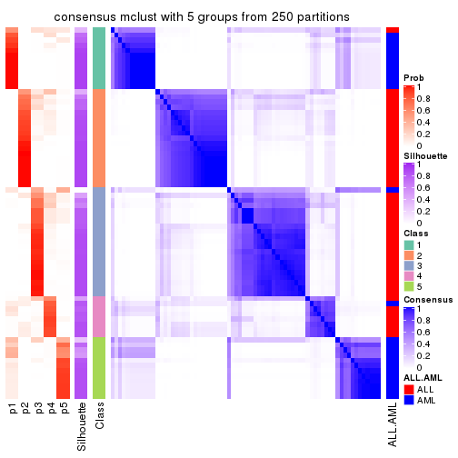</p>

</div>
<div id='tab-CV-mclust-consensus-heatmap-5'>
<pre><code class="r">consensus_heatmap(res, k = 6)
</code></pre>

<p>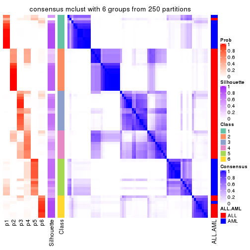</p>

</div>
</div>

Heatmaps for the membership of samples in all partitions to see how consistent they are:


<script>
$( function() {
	$( '#tabs-CV-mclust-membership-heatmap' ).tabs();
} );
</script>
<div id='tabs-CV-mclust-membership-heatmap'>
<ul>
<li><a href='#tab-CV-mclust-membership-heatmap-1'>k = 2</a></li>
<li><a href='#tab-CV-mclust-membership-heatmap-2'>k = 3</a></li>
<li><a href='#tab-CV-mclust-membership-heatmap-3'>k = 4</a></li>
<li><a href='#tab-CV-mclust-membership-heatmap-4'>k = 5</a></li>
<li><a href='#tab-CV-mclust-membership-heatmap-5'>k = 6</a></li>
</ul>
<div id='tab-CV-mclust-membership-heatmap-1'>
<pre><code class="r">membership_heatmap(res, k = 2)
</code></pre>

<p>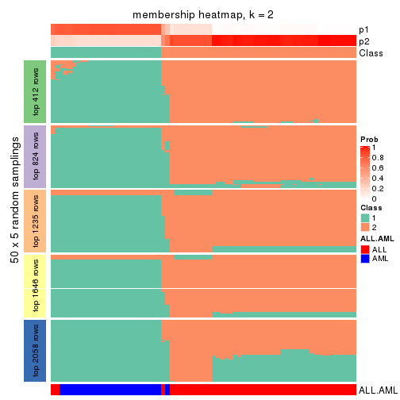</p>

</div>
<div id='tab-CV-mclust-membership-heatmap-2'>
<pre><code class="r">membership_heatmap(res, k = 3)
</code></pre>

<p>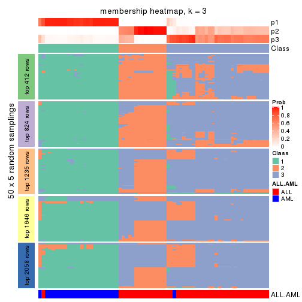</p>

</div>
<div id='tab-CV-mclust-membership-heatmap-3'>
<pre><code class="r">membership_heatmap(res, k = 4)
</code></pre>

<p>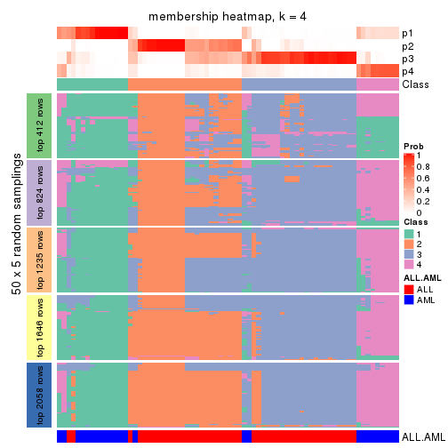</p>

</div>
<div id='tab-CV-mclust-membership-heatmap-4'>
<pre><code class="r">membership_heatmap(res, k = 5)
</code></pre>

<p>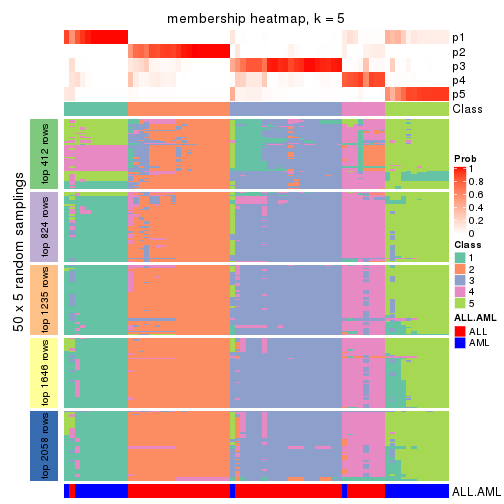</p>

</div>
<div id='tab-CV-mclust-membership-heatmap-5'>
<pre><code class="r">membership_heatmap(res, k = 6)
</code></pre>

<p></p>

</div>
</div>

As soon as we have had the classes for columns, we can look for signatures
which are significantly different between classes which can be candidate marks
for certain classes. Following are the heatmaps for signatures.


Signature heatmaps where rows are scaled:


<script>
$( function() {
	$( '#tabs-CV-mclust-get-signatures' ).tabs();
} );
</script>
<div id='tabs-CV-mclust-get-signatures'>
<ul>
<li><a href='#tab-CV-mclust-get-signatures-1'>k = 2</a></li>
<li><a href='#tab-CV-mclust-get-signatures-2'>k = 3</a></li>
<li><a href='#tab-CV-mclust-get-signatures-3'>k = 4</a></li>
<li><a href='#tab-CV-mclust-get-signatures-4'>k = 5</a></li>
<li><a href='#tab-CV-mclust-get-signatures-5'>k = 6</a></li>
</ul>
<div id='tab-CV-mclust-get-signatures-1'>
<pre><code class="r">get_signatures(res, k = 2)
</code></pre>

<p>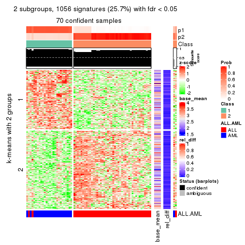</p>

</div>
<div id='tab-CV-mclust-get-signatures-2'>
<pre><code class="r">get_signatures(res, k = 3)
</code></pre>

<p>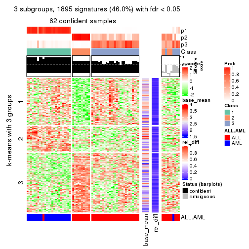</p>

</div>
<div id='tab-CV-mclust-get-signatures-3'>
<pre><code class="r">get_signatures(res, k = 4)
</code></pre>

<p>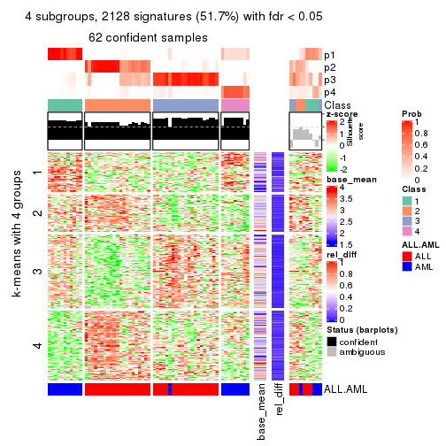</p>

</div>
<div id='tab-CV-mclust-get-signatures-4'>
<pre><code class="r">get_signatures(res, k = 5)
</code></pre>

<p>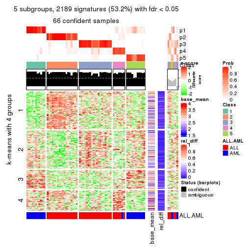</p>

</div>
<div id='tab-CV-mclust-get-signatures-5'>
<pre><code class="r">get_signatures(res, k = 6)
</code></pre>

<p>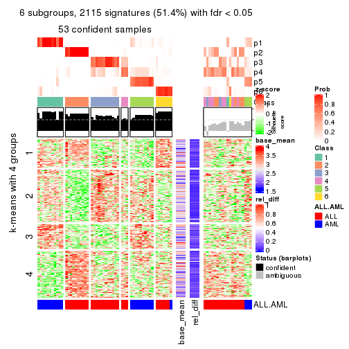</p>

</div>
</div>


Signature heatmaps where rows are not scaled:


<script>
$( function() {
	$( '#tabs-CV-mclust-get-signatures-no-scale' ).tabs();
} );
</script>
<div id='tabs-CV-mclust-get-signatures-no-scale'>
<ul>
<li><a href='#tab-CV-mclust-get-signatures-no-scale-1'>k = 2</a></li>
<li><a href='#tab-CV-mclust-get-signatures-no-scale-2'>k = 3</a></li>
<li><a href='#tab-CV-mclust-get-signatures-no-scale-3'>k = 4</a></li>
<li><a href='#tab-CV-mclust-get-signatures-no-scale-4'>k = 5</a></li>
<li><a href='#tab-CV-mclust-get-signatures-no-scale-5'>k = 6</a></li>
</ul>
<div id='tab-CV-mclust-get-signatures-no-scale-1'>
<pre><code class="r">get_signatures(res, k = 2, scale_rows = FALSE)
</code></pre>

<p>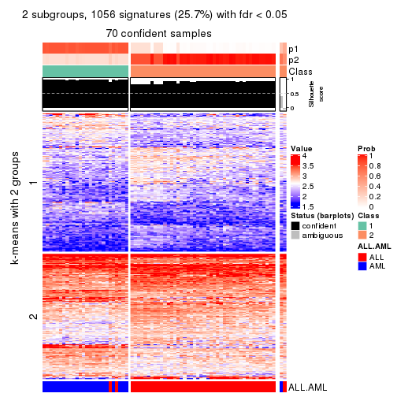</p>

</div>
<div id='tab-CV-mclust-get-signatures-no-scale-2'>
<pre><code class="r">get_signatures(res, k = 3, scale_rows = FALSE)
</code></pre>

<p>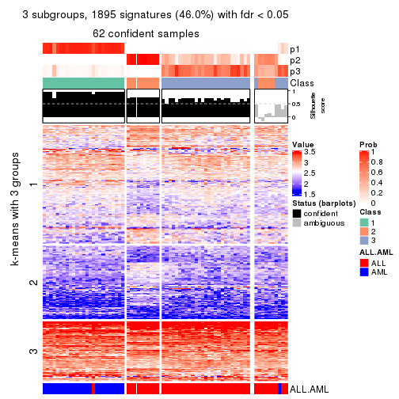</p>

</div>
<div id='tab-CV-mclust-get-signatures-no-scale-3'>
<pre><code class="r">get_signatures(res, k = 4, scale_rows = FALSE)
</code></pre>

<p>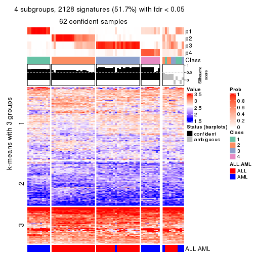</p>

</div>
<div id='tab-CV-mclust-get-signatures-no-scale-4'>
<pre><code class="r">get_signatures(res, k = 5, scale_rows = FALSE)
</code></pre>

<p>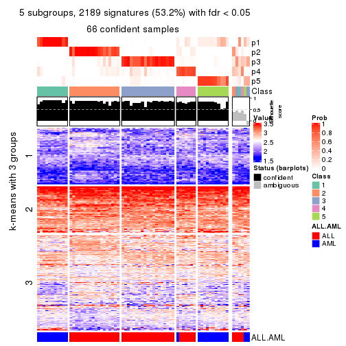</p>

</div>
<div id='tab-CV-mclust-get-signatures-no-scale-5'>
<pre><code class="r">get_signatures(res, k = 6, scale_rows = FALSE)
</code></pre>

<p>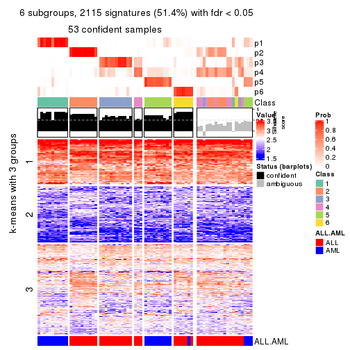</p>

</div>
</div>


Compare the overlap of signatures from different k:

```r
compare_signatures(res)
```

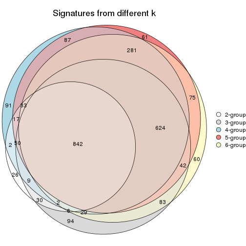

`get_signature()` returns a data frame invisibly. TO get the list of signatures, the function
call should be assigned to a variable explicitly. In following code, if `plot` argument is set
to `FALSE`, no heatmap is plotted while only the differential analysis is performed.

```r
# code only for demonstration
tb = get_signature(res, k = ..., plot = FALSE)
```

An example of the output of `tb` is:

```
#>   which_row         fdr    mean_1    mean_2 scaled_mean_1 scaled_mean_2 km
#> 1        38 0.042760348  8.373488  9.131774    -0.5533452     0.5164555  1
#> 2        40 0.018707592  7.106213  8.469186    -0.6173731     0.5762149  1
#> 3        55 0.019134737 10.221463 11.207825    -0.6159697     0.5749050  1
#> 4        59 0.006059896  5.921854  7.869574    -0.6899429     0.6439467  1
#> 5        60 0.018055526  8.928898 10.211722    -0.6204761     0.5791110  1
#> 6        98 0.009384629 15.714769 14.887706     0.6635654    -0.6193277  2
...
```

The columns in `tb` are:

1. `which_row`: row indices corresponding to the input matrix.
2. `fdr`: FDR for the differential test. 
3. `mean_x`: The mean value in group x.
4. `scaled_mean_x`: The mean value in group x after rows are scaled.
5. `km`: Row groups if k-means clustering is applied to rows.


UMAP plot which shows how samples are separated.


<script>
$( function() {
	$( '#tabs-CV-mclust-dimension-reduction' ).tabs();
} );
</script>
<div id='tabs-CV-mclust-dimension-reduction'>
<ul>
<li><a href='#tab-CV-mclust-dimension-reduction-1'>k = 2</a></li>
<li><a href='#tab-CV-mclust-dimension-reduction-2'>k = 3</a></li>
<li><a href='#tab-CV-mclust-dimension-reduction-3'>k = 4</a></li>
<li><a href='#tab-CV-mclust-dimension-reduction-4'>k = 5</a></li>
<li><a href='#tab-CV-mclust-dimension-reduction-5'>k = 6</a></li>
</ul>
<div id='tab-CV-mclust-dimension-reduction-1'>
<pre><code class="r">dimension_reduction(res, k = 2, method = &quot;UMAP&quot;)
</code></pre>

<p>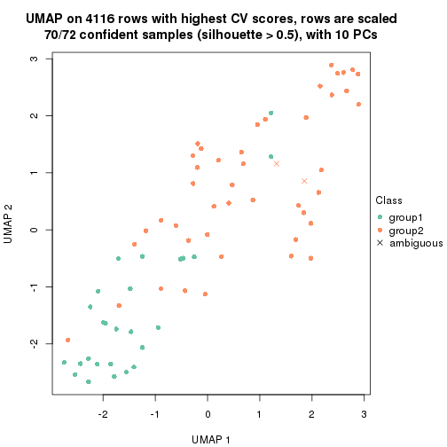</p>

</div>
<div id='tab-CV-mclust-dimension-reduction-2'>
<pre><code class="r">dimension_reduction(res, k = 3, method = &quot;UMAP&quot;)
</code></pre>

<p>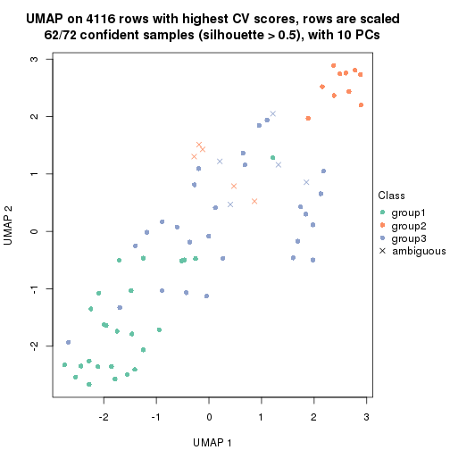</p>

</div>
<div id='tab-CV-mclust-dimension-reduction-3'>
<pre><code class="r">dimension_reduction(res, k = 4, method = &quot;UMAP&quot;)
</code></pre>

<p>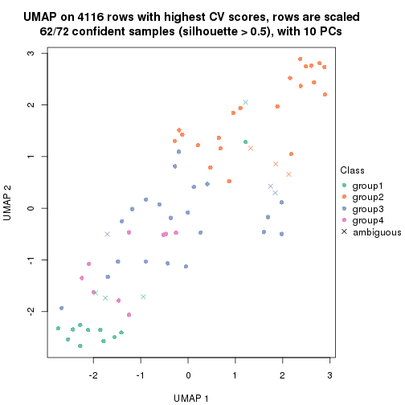</p>

</div>
<div id='tab-CV-mclust-dimension-reduction-4'>
<pre><code class="r">dimension_reduction(res, k = 5, method = &quot;UMAP&quot;)
</code></pre>

<p>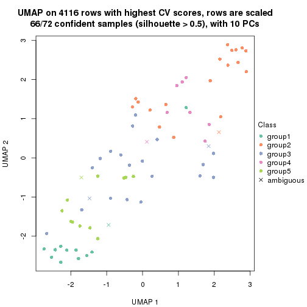</p>

</div>
<div id='tab-CV-mclust-dimension-reduction-5'>
<pre><code class="r">dimension_reduction(res, k = 6, method = &quot;UMAP&quot;)
</code></pre>

<p>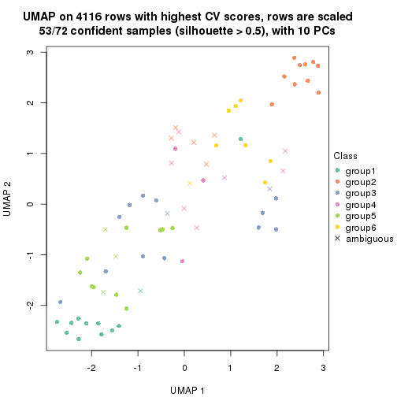</p>

</div>
</div>


Following heatmap shows how subgroups are split when increasing `k`:

```r
collect_classes(res)
```

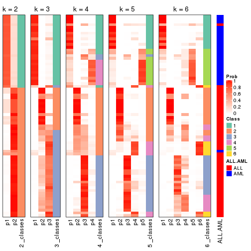


Test correlation between subgroups and known annotations. If the known
annotation is numeric, one-way ANOVA test is applied, and if the known
annotation is discrete, chi-squared contingency table test is applied.

```r
test_to_known_factors(res)
```

```
#>            n ALL.AML(p) k
#> CV:mclust 70   2.94e-14 2
#> CV:mclust 62   2.60e-13 3
#> CV:mclust 62   1.78e-12 4
#> CV:mclust 66   9.88e-13 5
#> CV:mclust 53   1.78e-09 6
```


If matrix rows can be associated to genes, consider to use `functional_enrichment(res,
...)` to perform function enrichment for the signature genes. See [this vignette](http://bioconductor.org/packages/devel/bioc/vignettes/cola/inst/doc/functional_enrichment.html) for more detailed explanations.


 

---------------------------------------------------


### CV:NMF


The object with results only for a single top-value method and a single partition method 
can be extracted as:

```r
res = res_list["CV", "NMF"]
# you can also extract it by
# res = res_list["CV:NMF"]
```

A summary of `res` and all the functions that can be applied to it:

```r
res
```

```
#> A 'ConsensusPartition' object with k = 2, 3, 4, 5, 6.
#>   On a matrix with 4116 rows and 72 columns.
#>   Top rows (412, 824, 1235, 1646, 2058) are extracted by 'CV' method.
#>   Subgroups are detected by 'NMF' method.
#>   Performed in total 1250 partitions by row resampling.
#>   Best k for subgroups seems to be 2.
#> 
#> Following methods can be applied to this 'ConsensusPartition' object:
#>  [1] "cola_report"             "collect_classes"         "collect_plots"          
#>  [4] "collect_stats"           "colnames"                "compare_signatures"     
#>  [7] "consensus_heatmap"       "dimension_reduction"     "functional_enrichment"  
#> [10] "get_anno_col"            "get_anno"                "get_classes"            
#> [13] "get_consensus"           "get_matrix"              "get_membership"         
#> [16] "get_param"               "get_signatures"          "get_stats"              
#> [19] "is_best_k"               "is_stable_k"             "membership_heatmap"     
#> [22] "ncol"                    "nrow"                    "plot_ecdf"              
#> [25] "rownames"                "select_partition_number" "show"                   
#> [28] "suggest_best_k"          "test_to_known_factors"
```

`collect_plots()` function collects all the plots made from `res` for all `k` (number of partitions)
into one single page to provide an easy and fast comparison between different `k`.

```r
collect_plots(res)
```

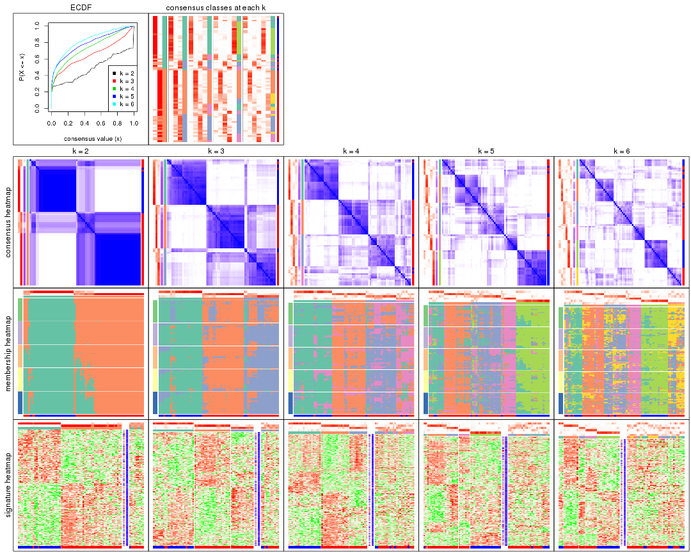

The plots are:

- The first row: a plot of the ECDF (empirical cumulative distribution
  function) curves of the consensus matrix for each `k` and the heatmap of
  predicted classes for each `k`.
- The second row: heatmaps of the consensus matrix for each `k`.
- The third row: heatmaps of the membership matrix for each `k`.
- The fouth row: heatmaps of the signatures for each `k`.

All the plots in panels can be made by individual functions and they are
plotted later in this section.

`select_partition_number()` produces several plots showing different
statistics for choosing "optimized" `k`. There are following statistics:

- ECDF curves of the consensus matrix for each `k`;
- 1-PAC. [The PAC
  score](https://en.wikipedia.org/wiki/Consensus_clustering#Over-interpretation_potential_of_consensus_clustering)
  measures the proportion of the ambiguous subgrouping.
- Mean silhouette score.
- Concordance. The mean probability of fiting the consensus class ids in all
  partitions.
- Area increased. Denote $A_k$ as the area under the ECDF curve for current
  `k`, the area increased is defined as $A_k - A_{k-1}$.
- Rand index. The percent of pairs of samples that are both in a same cluster
  or both are not in a same cluster in the partition of k and k-1.
- Jaccard index. The ratio of pairs of samples are both in a same cluster in
  the partition of k and k-1 and the pairs of samples are both in a same
  cluster in the partition k or k-1.

The detailed explanations of these statistics can be found in [the _cola_
vignette](http://bioconductor.org/packages/devel/bioc/vignettes/cola/inst/doc/cola.html#toc_13).

Generally speaking, lower PAC score, higher mean silhouette score or higher
concordance corresponds to better partition. Rand index and Jaccard index
measure how similar the current partition is compared to partition with `k-1`.
If they are too similar, we won't accept `k` is better than `k-1`.

```r
select_partition_number(res)
```

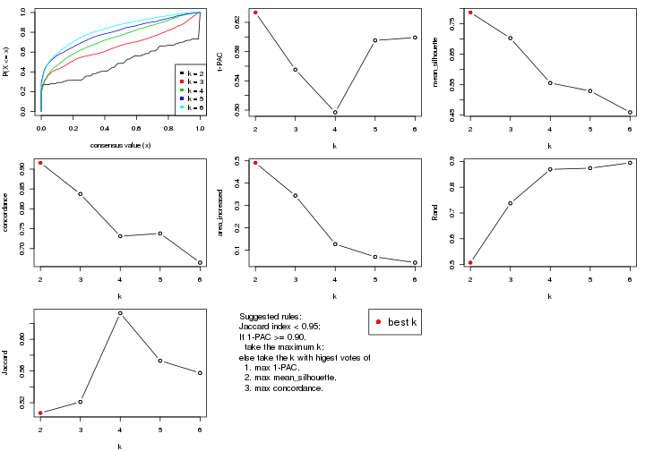

The numeric values for all these statistics can be obtained by `get_stats()`.

```r
get_stats(res)
```

```
#>   k 1-PAC mean_silhouette concordance area_increased  Rand Jaccard
#> 2 2 0.633           0.787       0.916         0.4909 0.507   0.507
#> 3 3 0.555           0.703       0.837         0.3442 0.737   0.521
#> 4 4 0.497           0.556       0.731         0.1269 0.869   0.633
#> 5 5 0.595           0.529       0.738         0.0700 0.874   0.573
#> 6 6 0.599           0.459       0.665         0.0441 0.895   0.558
```

`suggest_best_k()` suggests the best $k$ based on these statistics. The rules are as follows:

- All $k$ with Jaccard index larger than 0.95 are removed because increasing
  $k$ does not provide enough extra information. If all $k$ are removed, it is
  marked as no subgroup is detected.
- For all $k$ with 1-PAC score larger than 0.9, the maximal $k$ is taken as
  the best $k$, and other $k$ are marked as optional $k$.
- If it does not fit the second rule. The $k$ with the maximal vote of the
  highest 1-PAC score, highest mean silhouette, and highest concordance is
  taken as the best $k$.

```r
suggest_best_k(res)
```

```
#> [1] 2
```


Following shows the table of the partitions (You need to click the **show/hide
code output** link to see it). The membership matrix (columns with name `p*`)
is inferred by
[`clue::cl_consensus()`](https://www.rdocumentation.org/link/cl_consensus?package=clue)
function with the `SE` method. Basically the value in the membership matrix
represents the probability to belong to a certain group. The finall class
label for an item is determined with the group with highest probability it
belongs to.

In `get_classes()` function, the entropy is calculated from the membership
matrix and the silhouette score is calculated from the consensus matrix.


<script>
$( function() {
	$( '#tabs-CV-NMF-get-classes' ).tabs();
} );
</script>
<div id='tabs-CV-NMF-get-classes'>
<ul>
<li><a href='#tab-CV-NMF-get-classes-1'>k = 2</a></li>
<li><a href='#tab-CV-NMF-get-classes-2'>k = 3</a></li>
<li><a href='#tab-CV-NMF-get-classes-3'>k = 4</a></li>
<li><a href='#tab-CV-NMF-get-classes-4'>k = 5</a></li>
<li><a href='#tab-CV-NMF-get-classes-5'>k = 6</a></li>
</ul>

<div id='tab-CV-NMF-get-classes-1'>
<p><a id='tab-CV-NMF-get-classes-1-a' style='color:#0366d6' href='#'>show/hide code output</a></p>
<pre><code class="r">cbind(get_classes(res, k = 2), get_membership(res, k = 2))
</code></pre>

<pre><code>#&gt;           class entropy silhouette    p1    p2
#&gt; sample_39     2  0.9522    0.47506 0.372 0.628
#&gt; sample_40     2  0.9044    0.57502 0.320 0.680
#&gt; sample_42     2  0.0376    0.88613 0.004 0.996
#&gt; sample_47     2  0.0000    0.88809 0.000 1.000
#&gt; sample_48     2  0.0000    0.88809 0.000 1.000
#&gt; sample_49     2  0.9977    0.21342 0.472 0.528
#&gt; sample_41     2  0.0000    0.88809 0.000 1.000
#&gt; sample_43     2  0.0000    0.88809 0.000 1.000
#&gt; sample_44     2  0.0000    0.88809 0.000 1.000
#&gt; sample_45     2  0.0000    0.88809 0.000 1.000
#&gt; sample_46     2  0.0000    0.88809 0.000 1.000
#&gt; sample_70     2  0.0376    0.88616 0.004 0.996
#&gt; sample_71     2  0.0000    0.88809 0.000 1.000
#&gt; sample_72     2  0.0000    0.88809 0.000 1.000
#&gt; sample_68     2  0.0000    0.88809 0.000 1.000
#&gt; sample_69     2  0.0000    0.88809 0.000 1.000
#&gt; sample_67     1  0.5629    0.78714 0.868 0.132
#&gt; sample_55     2  0.8207    0.67159 0.256 0.744
#&gt; sample_56     2  0.8327    0.65857 0.264 0.736
#&gt; sample_59     2  0.0000    0.88809 0.000 1.000
#&gt; sample_52     1  0.0000    0.91740 1.000 0.000
#&gt; sample_53     1  0.0000    0.91740 1.000 0.000
#&gt; sample_51     1  0.0000    0.91740 1.000 0.000
#&gt; sample_50     1  0.0000    0.91740 1.000 0.000
#&gt; sample_54     1  0.4690    0.82332 0.900 0.100
#&gt; sample_57     1  0.0000    0.91740 1.000 0.000
#&gt; sample_58     1  0.0000    0.91740 1.000 0.000
#&gt; sample_60     1  0.0376    0.91468 0.996 0.004
#&gt; sample_61     1  0.0000    0.91740 1.000 0.000
#&gt; sample_65     1  0.0000    0.91740 1.000 0.000
#&gt; sample_66     2  0.9000    0.47555 0.316 0.684
#&gt; sample_63     1  0.0000    0.91740 1.000 0.000
#&gt; sample_64     1  0.0000    0.91740 1.000 0.000
#&gt; sample_62     1  0.0000    0.91740 1.000 0.000
#&gt; sample_1      2  0.0000    0.88809 0.000 1.000
#&gt; sample_2      1  0.9866    0.21416 0.568 0.432
#&gt; sample_3      2  0.8386    0.65292 0.268 0.732
#&gt; sample_4      2  0.0000    0.88809 0.000 1.000
#&gt; sample_5      2  0.0000    0.88809 0.000 1.000
#&gt; sample_6      2  0.9323    0.52371 0.348 0.652
#&gt; sample_7      2  0.6343    0.76990 0.160 0.840
#&gt; sample_8      1  0.9970   -0.03983 0.532 0.468
#&gt; sample_9      2  0.0000    0.88809 0.000 1.000
#&gt; sample_10     1  0.9954    0.00334 0.540 0.460
#&gt; sample_11     2  0.0000    0.88809 0.000 1.000
#&gt; sample_12     1  0.0376    0.91457 0.996 0.004
#&gt; sample_13     2  0.0000    0.88809 0.000 1.000
#&gt; sample_14     2  0.0000    0.88809 0.000 1.000
#&gt; sample_15     2  0.0000    0.88809 0.000 1.000
#&gt; sample_16     2  0.0000    0.88809 0.000 1.000
#&gt; sample_17     2  0.0376    0.88563 0.004 0.996
#&gt; sample_18     2  0.3114    0.85344 0.056 0.944
#&gt; sample_19     2  0.0000    0.88809 0.000 1.000
#&gt; sample_20     2  0.0000    0.88809 0.000 1.000
#&gt; sample_21     2  0.0000    0.88809 0.000 1.000
#&gt; sample_22     2  0.9983    0.19967 0.476 0.524
#&gt; sample_23     2  0.9909    0.29755 0.444 0.556
#&gt; sample_24     2  0.0000    0.88809 0.000 1.000
#&gt; sample_25     2  0.8499    0.64237 0.276 0.724
#&gt; sample_26     2  0.0000    0.88809 0.000 1.000
#&gt; sample_27     1  0.9833    0.13031 0.576 0.424
#&gt; sample_34     1  0.0000    0.91740 1.000 0.000
#&gt; sample_35     1  0.0000    0.91740 1.000 0.000
#&gt; sample_36     1  0.0000    0.91740 1.000 0.000
#&gt; sample_37     1  0.0000    0.91740 1.000 0.000
#&gt; sample_38     1  0.0000    0.91740 1.000 0.000
#&gt; sample_28     1  0.0000    0.91740 1.000 0.000
#&gt; sample_29     1  0.0376    0.91468 0.996 0.004
#&gt; sample_30     1  0.0000    0.91740 1.000 0.000
#&gt; sample_31     1  0.0000    0.91740 1.000 0.000
#&gt; sample_32     1  0.0000    0.91740 1.000 0.000
#&gt; sample_33     1  0.0000    0.91740 1.000 0.000
</code></pre>

<script>
$('#tab-CV-NMF-get-classes-1-a').parent().next().next().hide();
$('#tab-CV-NMF-get-classes-1-a').click(function(){
  $('#tab-CV-NMF-get-classes-1-a').parent().next().next().toggle();
  return(false);
});
</script>
</div>

<div id='tab-CV-NMF-get-classes-2'>
<p><a id='tab-CV-NMF-get-classes-2-a' style='color:#0366d6' href='#'>show/hide code output</a></p>
<pre><code class="r">cbind(get_classes(res, k = 3), get_membership(res, k = 3))
</code></pre>

<pre><code>#&gt;           class entropy silhouette    p1    p2    p3
#&gt; sample_39     3  0.4702     0.7376 0.000 0.212 0.788
#&gt; sample_40     3  0.4346     0.7445 0.000 0.184 0.816
#&gt; sample_42     2  0.3039     0.7974 0.036 0.920 0.044
#&gt; sample_47     2  0.1031     0.8487 0.000 0.976 0.024
#&gt; sample_48     2  0.0892     0.8482 0.000 0.980 0.020
#&gt; sample_49     3  0.4602     0.7462 0.016 0.152 0.832
#&gt; sample_41     2  0.2261     0.8374 0.000 0.932 0.068
#&gt; sample_43     2  0.1411     0.8466 0.000 0.964 0.036
#&gt; sample_44     2  0.5497     0.4880 0.000 0.708 0.292
#&gt; sample_45     2  0.1643     0.8430 0.000 0.956 0.044
#&gt; sample_46     2  0.2261     0.8324 0.000 0.932 0.068
#&gt; sample_70     3  0.6126     0.5207 0.000 0.400 0.600
#&gt; sample_71     2  0.4921     0.7151 0.020 0.816 0.164
#&gt; sample_72     2  0.1753     0.8376 0.000 0.952 0.048
#&gt; sample_68     2  0.0424     0.8428 0.000 0.992 0.008
#&gt; sample_69     2  0.1031     0.8321 0.000 0.976 0.024
#&gt; sample_67     1  0.7079     0.6882 0.720 0.104 0.176
#&gt; sample_55     3  0.5156     0.7337 0.008 0.216 0.776
#&gt; sample_56     3  0.4452     0.7419 0.000 0.192 0.808
#&gt; sample_59     3  0.6308     0.2822 0.000 0.492 0.508
#&gt; sample_52     1  0.0237     0.8737 0.996 0.000 0.004
#&gt; sample_53     1  0.1163     0.8713 0.972 0.000 0.028
#&gt; sample_51     1  0.0424     0.8740 0.992 0.000 0.008
#&gt; sample_50     1  0.0000     0.8734 1.000 0.000 0.000
#&gt; sample_54     1  0.2414     0.8647 0.940 0.040 0.020
#&gt; sample_57     1  0.4555     0.7822 0.800 0.000 0.200
#&gt; sample_58     1  0.5098     0.7243 0.752 0.000 0.248
#&gt; sample_60     1  0.1999     0.8739 0.952 0.012 0.036
#&gt; sample_61     1  0.5650     0.6249 0.688 0.000 0.312
#&gt; sample_65     1  0.3340     0.8412 0.880 0.000 0.120
#&gt; sample_66     1  0.9574     0.0771 0.412 0.392 0.196
#&gt; sample_63     1  0.1289     0.8748 0.968 0.000 0.032
#&gt; sample_64     3  0.6260    -0.0622 0.448 0.000 0.552
#&gt; sample_62     1  0.0747     0.8752 0.984 0.000 0.016
#&gt; sample_1      3  0.6154     0.4921 0.000 0.408 0.592
#&gt; sample_2      1  0.8527     0.5467 0.612 0.192 0.196
#&gt; sample_3      3  0.2200     0.7121 0.004 0.056 0.940
#&gt; sample_4      3  0.6225     0.4267 0.000 0.432 0.568
#&gt; sample_5      2  0.0592     0.8427 0.000 0.988 0.012
#&gt; sample_6      3  0.2031     0.7044 0.016 0.032 0.952
#&gt; sample_7      3  0.4974     0.7142 0.000 0.236 0.764
#&gt; sample_8      3  0.4782     0.7463 0.016 0.164 0.820
#&gt; sample_9      3  0.6267    -0.0560 0.000 0.452 0.548
#&gt; sample_10     3  0.2383     0.7032 0.016 0.044 0.940
#&gt; sample_11     2  0.5760     0.6228 0.000 0.672 0.328
#&gt; sample_12     1  0.4931     0.7950 0.784 0.004 0.212
#&gt; sample_13     2  0.0892     0.8482 0.000 0.980 0.020
#&gt; sample_14     2  0.5285     0.7159 0.004 0.752 0.244
#&gt; sample_15     2  0.1163     0.8492 0.000 0.972 0.028
#&gt; sample_16     2  0.5254     0.5568 0.000 0.736 0.264
#&gt; sample_17     2  0.3983     0.7589 0.004 0.852 0.144
#&gt; sample_18     3  0.6140     0.4956 0.000 0.404 0.596
#&gt; sample_19     2  0.2448     0.8262 0.000 0.924 0.076
#&gt; sample_20     2  0.0424     0.8456 0.000 0.992 0.008
#&gt; sample_21     2  0.3038     0.8303 0.000 0.896 0.104
#&gt; sample_22     3  0.4840     0.7421 0.016 0.168 0.816
#&gt; sample_23     3  0.1860     0.7128 0.000 0.052 0.948
#&gt; sample_24     2  0.2711     0.8361 0.000 0.912 0.088
#&gt; sample_25     2  0.7186    -0.2342 0.024 0.500 0.476
#&gt; sample_26     2  0.5859     0.3188 0.000 0.656 0.344
#&gt; sample_27     3  0.3987     0.7391 0.020 0.108 0.872
#&gt; sample_34     1  0.3752     0.8309 0.856 0.000 0.144
#&gt; sample_35     3  0.6008     0.2097 0.372 0.000 0.628
#&gt; sample_36     1  0.0000     0.8734 1.000 0.000 0.000
#&gt; sample_37     1  0.1289     0.8701 0.968 0.000 0.032
#&gt; sample_38     1  0.2959     0.8653 0.900 0.000 0.100
#&gt; sample_28     1  0.1878     0.8726 0.952 0.004 0.044
#&gt; sample_29     1  0.3155     0.8463 0.916 0.044 0.040
#&gt; sample_30     1  0.1129     0.8700 0.976 0.004 0.020
#&gt; sample_31     1  0.3879     0.8227 0.848 0.000 0.152
#&gt; sample_32     1  0.2448     0.8678 0.924 0.000 0.076
#&gt; sample_33     1  0.2356     0.8716 0.928 0.000 0.072
</code></pre>

<script>
$('#tab-CV-NMF-get-classes-2-a').parent().next().next().hide();
$('#tab-CV-NMF-get-classes-2-a').click(function(){
  $('#tab-CV-NMF-get-classes-2-a').parent().next().next().toggle();
  return(false);
});
</script>
</div>

<div id='tab-CV-NMF-get-classes-3'>
<p><a id='tab-CV-NMF-get-classes-3-a' style='color:#0366d6' href='#'>show/hide code output</a></p>
<pre><code class="r">cbind(get_classes(res, k = 4), get_membership(res, k = 4))
</code></pre>

<pre><code>#&gt;           class entropy silhouette    p1    p2    p3    p4
#&gt; sample_39     3  0.4939    0.62444 0.004 0.156 0.776 0.064
#&gt; sample_40     3  0.3877    0.66778 0.032 0.084 0.860 0.024
#&gt; sample_42     4  0.6965    0.15304 0.004 0.440 0.096 0.460
#&gt; sample_47     2  0.2542    0.73114 0.000 0.904 0.084 0.012
#&gt; sample_48     2  0.2021    0.74205 0.000 0.936 0.040 0.024
#&gt; sample_49     3  0.2234    0.67364 0.004 0.064 0.924 0.008
#&gt; sample_41     2  0.3697    0.70163 0.000 0.852 0.048 0.100
#&gt; sample_43     2  0.2737    0.72678 0.000 0.888 0.104 0.008
#&gt; sample_44     2  0.4957    0.53791 0.000 0.684 0.300 0.016
#&gt; sample_45     2  0.2988    0.72090 0.000 0.876 0.112 0.012
#&gt; sample_46     2  0.3876    0.69978 0.000 0.836 0.124 0.040
#&gt; sample_70     3  0.5168    0.57007 0.000 0.248 0.712 0.040
#&gt; sample_71     4  0.5868    0.43225 0.008 0.308 0.040 0.644
#&gt; sample_72     4  0.6797    0.18576 0.000 0.436 0.096 0.468
#&gt; sample_68     2  0.3245    0.70458 0.000 0.872 0.028 0.100
#&gt; sample_69     2  0.2610    0.70199 0.000 0.900 0.012 0.088
#&gt; sample_67     4  0.5848    0.21722 0.320 0.036 0.008 0.636
#&gt; sample_55     3  0.7266    0.51684 0.132 0.180 0.640 0.048
#&gt; sample_56     3  0.3774    0.65501 0.008 0.128 0.844 0.020
#&gt; sample_59     2  0.6999   -0.00477 0.032 0.464 0.456 0.048
#&gt; sample_52     1  0.0804    0.79323 0.980 0.000 0.012 0.008
#&gt; sample_53     1  0.3907    0.69479 0.768 0.000 0.000 0.232
#&gt; sample_51     1  0.2149    0.78317 0.912 0.000 0.000 0.088
#&gt; sample_50     1  0.1792    0.78782 0.932 0.000 0.000 0.068
#&gt; sample_54     1  0.5745    0.67218 0.768 0.080 0.076 0.076
#&gt; sample_57     1  0.4287    0.72439 0.808 0.004 0.156 0.032
#&gt; sample_58     1  0.3790    0.72933 0.820 0.000 0.164 0.016
#&gt; sample_60     1  0.5137    0.71371 0.796 0.040 0.108 0.056
#&gt; sample_61     1  0.6797    0.54739 0.608 0.012 0.280 0.100
#&gt; sample_65     1  0.1975    0.79454 0.936 0.000 0.048 0.016
#&gt; sample_66     4  0.7301    0.41389 0.120 0.272 0.024 0.584
#&gt; sample_63     1  0.1510    0.79206 0.956 0.000 0.028 0.016
#&gt; sample_64     1  0.5929    0.48691 0.620 0.004 0.332 0.044
#&gt; sample_62     1  0.2032    0.78799 0.936 0.000 0.036 0.028
#&gt; sample_1      3  0.4868    0.62047 0.000 0.212 0.748 0.040
#&gt; sample_2      4  0.5406    0.47166 0.148 0.068 0.020 0.764
#&gt; sample_3      3  0.5198    0.46706 0.004 0.008 0.628 0.360
#&gt; sample_4      3  0.7116    0.47737 0.004 0.264 0.572 0.160
#&gt; sample_5      2  0.3581    0.69417 0.000 0.852 0.032 0.116
#&gt; sample_6      3  0.5334    0.46131 0.012 0.004 0.620 0.364
#&gt; sample_7      3  0.5837    0.63840 0.024 0.120 0.744 0.112
#&gt; sample_8      3  0.4482    0.65808 0.004 0.088 0.816 0.092
#&gt; sample_9      4  0.7167   -0.19630 0.000 0.136 0.396 0.468
#&gt; sample_10     3  0.5666    0.31702 0.004 0.016 0.520 0.460
#&gt; sample_11     4  0.5747    0.25826 0.000 0.100 0.196 0.704
#&gt; sample_12     1  0.7600    0.34103 0.504 0.016 0.140 0.340
#&gt; sample_13     2  0.1297    0.73759 0.000 0.964 0.016 0.020
#&gt; sample_14     4  0.7044   -0.02528 0.000 0.428 0.120 0.452
#&gt; sample_15     2  0.3497    0.69725 0.000 0.860 0.036 0.104
#&gt; sample_16     2  0.4245    0.66582 0.000 0.784 0.196 0.020
#&gt; sample_17     2  0.5900    0.48057 0.004 0.680 0.072 0.244
#&gt; sample_18     3  0.5685    0.57252 0.004 0.252 0.688 0.056
#&gt; sample_19     2  0.4578    0.66233 0.000 0.788 0.160 0.052
#&gt; sample_20     2  0.2466    0.72674 0.000 0.916 0.028 0.056
#&gt; sample_21     2  0.4957    0.59190 0.000 0.748 0.048 0.204
#&gt; sample_22     3  0.6840    0.37393 0.004 0.104 0.560 0.332
#&gt; sample_23     3  0.5230    0.46181 0.004 0.008 0.620 0.368
#&gt; sample_24     2  0.4224    0.66791 0.000 0.812 0.044 0.144
#&gt; sample_25     4  0.8174    0.11584 0.016 0.228 0.332 0.424
#&gt; sample_26     2  0.6192    0.08998 0.000 0.512 0.436 0.052
#&gt; sample_27     3  0.3069    0.66173 0.008 0.036 0.896 0.060
#&gt; sample_34     1  0.1854    0.79528 0.940 0.000 0.048 0.012
#&gt; sample_35     3  0.6407    0.32340 0.332 0.000 0.584 0.084
#&gt; sample_36     1  0.1557    0.78921 0.944 0.000 0.000 0.056
#&gt; sample_37     1  0.3528    0.72825 0.808 0.000 0.000 0.192
#&gt; sample_38     4  0.5352   -0.03376 0.388 0.000 0.016 0.596
#&gt; sample_28     1  0.5472    0.32929 0.544 0.000 0.016 0.440
#&gt; sample_29     1  0.3945    0.70628 0.780 0.004 0.000 0.216
#&gt; sample_30     1  0.1940    0.78570 0.924 0.000 0.000 0.076
#&gt; sample_31     1  0.2635    0.77951 0.904 0.000 0.076 0.020
#&gt; sample_32     1  0.3377    0.76432 0.848 0.000 0.012 0.140
#&gt; sample_33     1  0.4420    0.68686 0.748 0.000 0.012 0.240
</code></pre>

<script>
$('#tab-CV-NMF-get-classes-3-a').parent().next().next().hide();
$('#tab-CV-NMF-get-classes-3-a').click(function(){
  $('#tab-CV-NMF-get-classes-3-a').parent().next().next().toggle();
  return(false);
});
</script>
</div>

<div id='tab-CV-NMF-get-classes-4'>
<p><a id='tab-CV-NMF-get-classes-4-a' style='color:#0366d6' href='#'>show/hide code output</a></p>
<pre><code class="r">cbind(get_classes(res, k = 5), get_membership(res, k = 5))
</code></pre>

<pre><code>#&gt;           class entropy silhouette    p1    p2    p3    p4    p5
#&gt; sample_39     3  0.3770    0.48883 0.188 0.008 0.788 0.016 0.000
#&gt; sample_40     3  0.4052    0.52288 0.008 0.008 0.796 0.160 0.028
#&gt; sample_42     1  0.4373    0.46993 0.760 0.080 0.160 0.000 0.000
#&gt; sample_47     2  0.5611    0.54277 0.152 0.636 0.212 0.000 0.000
#&gt; sample_48     2  0.2520    0.70415 0.056 0.896 0.048 0.000 0.000
#&gt; sample_49     3  0.2439    0.56256 0.000 0.000 0.876 0.120 0.004
#&gt; sample_41     2  0.1805    0.68548 0.004 0.936 0.004 0.048 0.008
#&gt; sample_43     2  0.6220    0.39087 0.168 0.524 0.308 0.000 0.000
#&gt; sample_44     3  0.5842   -0.11177 0.072 0.428 0.492 0.008 0.000
#&gt; sample_45     2  0.6517    0.33569 0.184 0.488 0.324 0.004 0.000
#&gt; sample_46     2  0.6751    0.22359 0.220 0.424 0.352 0.004 0.000
#&gt; sample_70     3  0.4569    0.50670 0.132 0.080 0.772 0.016 0.000
#&gt; sample_71     1  0.3394    0.57553 0.864 0.040 0.044 0.052 0.000
#&gt; sample_72     1  0.4940    0.42221 0.716 0.092 0.188 0.004 0.000
#&gt; sample_68     2  0.0955    0.69953 0.004 0.968 0.000 0.028 0.000
#&gt; sample_69     2  0.4457    0.65511 0.208 0.740 0.048 0.004 0.000
#&gt; sample_67     1  0.5578    0.45691 0.648 0.008 0.000 0.240 0.104
#&gt; sample_55     3  0.7525    0.30843 0.008 0.136 0.472 0.068 0.316
#&gt; sample_56     3  0.0932    0.58706 0.000 0.004 0.972 0.020 0.004
#&gt; sample_59     3  0.5073    0.42686 0.020 0.244 0.696 0.004 0.036
#&gt; sample_52     5  0.0162    0.80611 0.004 0.000 0.000 0.000 0.996
#&gt; sample_53     5  0.4804    0.55823 0.328 0.000 0.000 0.036 0.636
#&gt; sample_51     5  0.2970    0.75758 0.168 0.000 0.000 0.004 0.828
#&gt; sample_50     5  0.2230    0.78733 0.116 0.000 0.000 0.000 0.884
#&gt; sample_54     5  0.3415    0.74175 0.012 0.064 0.060 0.004 0.860
#&gt; sample_57     5  0.2789    0.75576 0.008 0.020 0.092 0.000 0.880
#&gt; sample_58     5  0.2997    0.73677 0.012 0.000 0.148 0.000 0.840
#&gt; sample_60     5  0.3412    0.74195 0.012 0.056 0.068 0.004 0.860
#&gt; sample_61     3  0.6295    0.19059 0.144 0.000 0.540 0.008 0.308
#&gt; sample_65     5  0.1281    0.80729 0.032 0.000 0.012 0.000 0.956
#&gt; sample_66     4  0.7642   -0.00489 0.300 0.224 0.000 0.416 0.060
#&gt; sample_63     5  0.0566    0.80486 0.004 0.000 0.012 0.000 0.984
#&gt; sample_64     5  0.4448    0.60453 0.008 0.012 0.224 0.016 0.740
#&gt; sample_62     5  0.1186    0.79697 0.008 0.008 0.020 0.000 0.964
#&gt; sample_1      3  0.4127    0.55959 0.028 0.024 0.792 0.156 0.000
#&gt; sample_2      1  0.5412    0.12098 0.512 0.024 0.000 0.444 0.020
#&gt; sample_3      4  0.2377    0.72335 0.000 0.000 0.128 0.872 0.000
#&gt; sample_4      4  0.7111    0.19702 0.004 0.280 0.264 0.440 0.012
#&gt; sample_5      2  0.1956    0.68200 0.008 0.916 0.000 0.076 0.000
#&gt; sample_6      4  0.2230    0.72974 0.000 0.000 0.116 0.884 0.000
#&gt; sample_7      3  0.6642   -0.04865 0.008 0.084 0.452 0.428 0.028
#&gt; sample_8      3  0.4138    0.55656 0.072 0.000 0.780 0.148 0.000
#&gt; sample_9      4  0.1569    0.72471 0.004 0.044 0.008 0.944 0.000
#&gt; sample_10     4  0.1774    0.73293 0.016 0.000 0.052 0.932 0.000
#&gt; sample_11     4  0.2209    0.69626 0.056 0.032 0.000 0.912 0.000
#&gt; sample_12     1  0.6051    0.46820 0.640 0.000 0.104 0.036 0.220
#&gt; sample_13     2  0.3384    0.69813 0.088 0.848 0.060 0.004 0.000
#&gt; sample_14     4  0.3048    0.64278 0.004 0.176 0.000 0.820 0.000
#&gt; sample_15     2  0.2017    0.67937 0.008 0.912 0.000 0.080 0.000
#&gt; sample_16     2  0.4691    0.52400 0.028 0.684 0.280 0.008 0.000
#&gt; sample_17     2  0.4464    0.39178 0.012 0.692 0.000 0.284 0.012
#&gt; sample_18     3  0.5966    0.44570 0.000 0.216 0.636 0.128 0.020
#&gt; sample_19     3  0.6853   -0.17778 0.248 0.360 0.388 0.004 0.000
#&gt; sample_20     2  0.3649    0.68876 0.152 0.808 0.040 0.000 0.000
#&gt; sample_21     2  0.4042    0.55663 0.032 0.756 0.000 0.212 0.000
#&gt; sample_22     3  0.6561    0.12983 0.332 0.000 0.452 0.216 0.000
#&gt; sample_23     4  0.2377    0.72080 0.000 0.000 0.128 0.872 0.000
#&gt; sample_24     2  0.2833    0.62472 0.004 0.852 0.000 0.140 0.004
#&gt; sample_25     1  0.5281    0.10185 0.564 0.044 0.388 0.004 0.000
#&gt; sample_26     3  0.5890    0.34717 0.232 0.152 0.612 0.004 0.000
#&gt; sample_27     3  0.2848    0.54366 0.000 0.000 0.840 0.156 0.004
#&gt; sample_34     5  0.0693    0.80721 0.012 0.000 0.008 0.000 0.980
#&gt; sample_35     3  0.6671    0.21779 0.008 0.000 0.492 0.208 0.292
#&gt; sample_36     5  0.1671    0.79846 0.076 0.000 0.000 0.000 0.924
#&gt; sample_37     5  0.4497    0.54757 0.352 0.000 0.000 0.016 0.632
#&gt; sample_38     1  0.4930    0.49810 0.696 0.000 0.000 0.220 0.084
#&gt; sample_28     1  0.4407    0.52716 0.760 0.000 0.004 0.064 0.172
#&gt; sample_29     5  0.4435    0.56819 0.336 0.000 0.000 0.016 0.648
#&gt; sample_30     5  0.2280    0.78526 0.120 0.000 0.000 0.000 0.880
#&gt; sample_31     5  0.0404    0.80537 0.000 0.000 0.012 0.000 0.988
#&gt; sample_32     5  0.3916    0.68117 0.256 0.000 0.000 0.012 0.732
#&gt; sample_33     5  0.4743    0.28661 0.472 0.000 0.000 0.016 0.512
</code></pre>

<script>
$('#tab-CV-NMF-get-classes-4-a').parent().next().next().hide();
$('#tab-CV-NMF-get-classes-4-a').click(function(){
  $('#tab-CV-NMF-get-classes-4-a').parent().next().next().toggle();
  return(false);
});
</script>
</div>

<div id='tab-CV-NMF-get-classes-5'>
<p><a id='tab-CV-NMF-get-classes-5-a' style='color:#0366d6' href='#'>show/hide code output</a></p>
<pre><code class="r">cbind(get_classes(res, k = 6), get_membership(res, k = 6))
</code></pre>

<pre><code>#&gt;           class entropy silhouette    p1    p2    p3    p4    p5    p6
#&gt; sample_39     3   0.451     0.1159 0.016 0.004 0.520 0.004 0.000 0.456
#&gt; sample_40     3   0.498     0.5393 0.016 0.000 0.732 0.140 0.056 0.056
#&gt; sample_42     1   0.542    -0.0462 0.468 0.036 0.044 0.000 0.000 0.452
#&gt; sample_47     2   0.508     0.0149 0.012 0.528 0.052 0.000 0.000 0.408
#&gt; sample_48     2   0.255     0.6105 0.000 0.848 0.008 0.000 0.000 0.144
#&gt; sample_49     3   0.414     0.5297 0.000 0.000 0.772 0.076 0.020 0.132
#&gt; sample_41     2   0.259     0.6427 0.004 0.892 0.008 0.032 0.004 0.060
#&gt; sample_43     6   0.684     0.2931 0.080 0.336 0.068 0.028 0.004 0.484
#&gt; sample_44     6   0.691     0.3397 0.016 0.352 0.172 0.044 0.000 0.416
#&gt; sample_45     6   0.534     0.2283 0.012 0.436 0.060 0.004 0.000 0.488
#&gt; sample_46     6   0.528     0.3622 0.008 0.348 0.088 0.000 0.000 0.556
#&gt; sample_70     6   0.639     0.0556 0.044 0.044 0.364 0.052 0.000 0.496
#&gt; sample_71     1   0.697     0.0654 0.432 0.016 0.072 0.108 0.004 0.368
#&gt; sample_72     6   0.654     0.1590 0.236 0.040 0.200 0.008 0.000 0.516
#&gt; sample_68     2   0.127     0.6655 0.000 0.952 0.000 0.008 0.004 0.036
#&gt; sample_69     2   0.469     0.4807 0.028 0.656 0.008 0.016 0.000 0.292
#&gt; sample_67     1   0.583     0.3675 0.648 0.032 0.004 0.212 0.036 0.068
#&gt; sample_55     3   0.834     0.2338 0.008 0.136 0.396 0.068 0.168 0.224
#&gt; sample_56     3   0.452     0.4132 0.004 0.004 0.696 0.016 0.028 0.252
#&gt; sample_59     6   0.752     0.2780 0.020 0.208 0.264 0.040 0.028 0.440
#&gt; sample_52     5   0.122     0.7750 0.048 0.000 0.000 0.000 0.948 0.004
#&gt; sample_53     1   0.519     0.1341 0.536 0.000 0.016 0.032 0.404 0.012
#&gt; sample_51     5   0.413     0.3530 0.400 0.000 0.008 0.000 0.588 0.004
#&gt; sample_50     5   0.389     0.5179 0.324 0.000 0.008 0.000 0.664 0.004
#&gt; sample_54     5   0.242     0.7454 0.004 0.032 0.032 0.000 0.904 0.028
#&gt; sample_57     5   0.169     0.7564 0.000 0.000 0.064 0.000 0.924 0.012
#&gt; sample_58     5   0.326     0.6773 0.008 0.000 0.184 0.000 0.796 0.012
#&gt; sample_60     5   0.271     0.7386 0.004 0.032 0.032 0.000 0.888 0.044
#&gt; sample_61     3   0.732     0.2821 0.096 0.000 0.452 0.016 0.196 0.240
#&gt; sample_65     5   0.217     0.7754 0.064 0.000 0.028 0.004 0.904 0.000
#&gt; sample_66     1   0.836     0.1615 0.376 0.136 0.020 0.256 0.040 0.172
#&gt; sample_63     5   0.134     0.7752 0.008 0.000 0.032 0.004 0.952 0.004
#&gt; sample_64     5   0.470     0.5308 0.012 0.016 0.272 0.016 0.676 0.008
#&gt; sample_62     5   0.201     0.7659 0.008 0.004 0.056 0.008 0.920 0.004
#&gt; sample_1      3   0.601     0.4399 0.004 0.040 0.584 0.136 0.000 0.236
#&gt; sample_2      4   0.621     0.1315 0.400 0.060 0.004 0.472 0.008 0.056
#&gt; sample_3      4   0.319     0.6756 0.016 0.016 0.144 0.824 0.000 0.000
#&gt; sample_4      4   0.774     0.0338 0.016 0.308 0.260 0.336 0.016 0.064
#&gt; sample_5      2   0.209     0.6710 0.004 0.900 0.000 0.088 0.004 0.004
#&gt; sample_6      4   0.324     0.6619 0.004 0.012 0.128 0.832 0.000 0.024
#&gt; sample_7      3   0.757     0.1301 0.020 0.124 0.436 0.320 0.032 0.068
#&gt; sample_8      3   0.461     0.5081 0.024 0.000 0.732 0.096 0.000 0.148
#&gt; sample_9      4   0.215     0.7014 0.008 0.060 0.024 0.908 0.000 0.000
#&gt; sample_10     4   0.254     0.6985 0.020 0.004 0.076 0.888 0.000 0.012
#&gt; sample_11     4   0.355     0.6767 0.080 0.052 0.020 0.836 0.000 0.012
#&gt; sample_12     1   0.609     0.4948 0.644 0.000 0.076 0.032 0.080 0.168
#&gt; sample_13     2   0.362     0.5870 0.008 0.772 0.016 0.004 0.000 0.200
#&gt; sample_14     4   0.384     0.6149 0.032 0.176 0.004 0.776 0.000 0.012
#&gt; sample_15     2   0.153     0.6777 0.000 0.928 0.004 0.068 0.000 0.000
#&gt; sample_16     2   0.663     0.1427 0.004 0.504 0.224 0.040 0.004 0.224
#&gt; sample_17     2   0.601     0.2088 0.012 0.528 0.012 0.360 0.064 0.024
#&gt; sample_18     3   0.765     0.3931 0.004 0.100 0.500 0.160 0.064 0.172
#&gt; sample_19     6   0.606     0.4156 0.032 0.264 0.160 0.000 0.000 0.544
#&gt; sample_20     2   0.364     0.6138 0.016 0.784 0.000 0.024 0.000 0.176
#&gt; sample_21     2   0.440     0.5961 0.020 0.732 0.008 0.204 0.000 0.036
#&gt; sample_22     3   0.680     0.2777 0.172 0.000 0.488 0.092 0.000 0.248
#&gt; sample_23     4   0.339     0.6404 0.016 0.000 0.148 0.812 0.000 0.024
#&gt; sample_24     2   0.354     0.6408 0.004 0.824 0.032 0.120 0.004 0.016
#&gt; sample_25     6   0.606     0.2056 0.284 0.012 0.208 0.000 0.000 0.496
#&gt; sample_26     6   0.525     0.0861 0.016 0.064 0.376 0.000 0.000 0.544
#&gt; sample_27     3   0.415     0.5487 0.000 0.000 0.760 0.152 0.012 0.076
#&gt; sample_34     5   0.289     0.7706 0.072 0.000 0.064 0.004 0.860 0.000
#&gt; sample_35     3   0.711     0.3914 0.040 0.000 0.540 0.160 0.168 0.092
#&gt; sample_36     5   0.256     0.7235 0.156 0.000 0.004 0.000 0.840 0.000
#&gt; sample_37     1   0.411     0.4590 0.688 0.000 0.004 0.004 0.284 0.020
#&gt; sample_38     1   0.372     0.5879 0.836 0.000 0.024 0.056 0.036 0.048
#&gt; sample_28     1   0.270     0.6058 0.876 0.000 0.004 0.016 0.088 0.016
#&gt; sample_29     1   0.494     0.4515 0.636 0.000 0.008 0.008 0.292 0.056
#&gt; sample_30     5   0.333     0.6438 0.236 0.000 0.004 0.000 0.756 0.004
#&gt; sample_31     5   0.237     0.7657 0.092 0.000 0.008 0.008 0.888 0.004
#&gt; sample_32     5   0.515     0.3656 0.368 0.000 0.020 0.020 0.572 0.020
#&gt; sample_33     1   0.402     0.5005 0.724 0.000 0.016 0.000 0.240 0.020
</code></pre>

<script>
$('#tab-CV-NMF-get-classes-5-a').parent().next().next().hide();
$('#tab-CV-NMF-get-classes-5-a').click(function(){
  $('#tab-CV-NMF-get-classes-5-a').parent().next().next().toggle();
  return(false);
});
</script>
</div>
</div>

Heatmaps for the consensus matrix. It visualizes the probability of two
samples to be in a same group.


<script>
$( function() {
	$( '#tabs-CV-NMF-consensus-heatmap' ).tabs();
} );
</script>
<div id='tabs-CV-NMF-consensus-heatmap'>
<ul>
<li><a href='#tab-CV-NMF-consensus-heatmap-1'>k = 2</a></li>
<li><a href='#tab-CV-NMF-consensus-heatmap-2'>k = 3</a></li>
<li><a href='#tab-CV-NMF-consensus-heatmap-3'>k = 4</a></li>
<li><a href='#tab-CV-NMF-consensus-heatmap-4'>k = 5</a></li>
<li><a href='#tab-CV-NMF-consensus-heatmap-5'>k = 6</a></li>
</ul>
<div id='tab-CV-NMF-consensus-heatmap-1'>
<pre><code class="r">consensus_heatmap(res, k = 2)
</code></pre>

<p>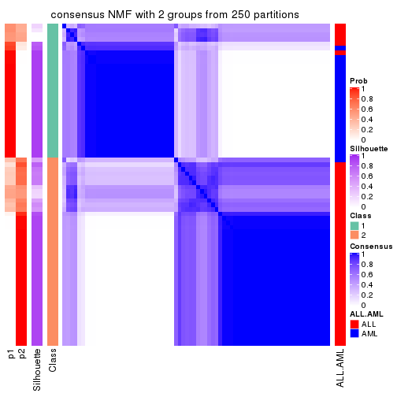</p>

</div>
<div id='tab-CV-NMF-consensus-heatmap-2'>
<pre><code class="r">consensus_heatmap(res, k = 3)
</code></pre>

<p>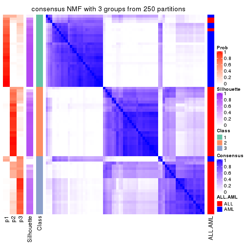</p>

</div>
<div id='tab-CV-NMF-consensus-heatmap-3'>
<pre><code class="r">consensus_heatmap(res, k = 4)
</code></pre>

<p>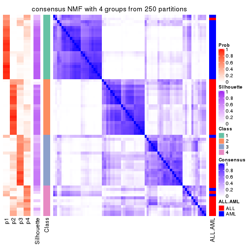</p>

</div>
<div id='tab-CV-NMF-consensus-heatmap-4'>
<pre><code class="r">consensus_heatmap(res, k = 5)
</code></pre>

<p>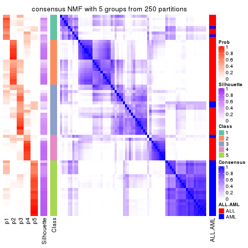</p>

</div>
<div id='tab-CV-NMF-consensus-heatmap-5'>
<pre><code class="r">consensus_heatmap(res, k = 6)
</code></pre>

<p>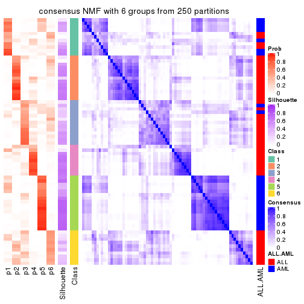</p>

</div>
</div>

Heatmaps for the membership of samples in all partitions to see how consistent they are:


<script>
$( function() {
	$( '#tabs-CV-NMF-membership-heatmap' ).tabs();
} );
</script>
<div id='tabs-CV-NMF-membership-heatmap'>
<ul>
<li><a href='#tab-CV-NMF-membership-heatmap-1'>k = 2</a></li>
<li><a href='#tab-CV-NMF-membership-heatmap-2'>k = 3</a></li>
<li><a href='#tab-CV-NMF-membership-heatmap-3'>k = 4</a></li>
<li><a href='#tab-CV-NMF-membership-heatmap-4'>k = 5</a></li>
<li><a href='#tab-CV-NMF-membership-heatmap-5'>k = 6</a></li>
</ul>
<div id='tab-CV-NMF-membership-heatmap-1'>
<pre><code class="r">membership_heatmap(res, k = 2)
</code></pre>

<p>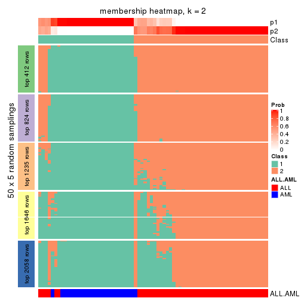</p>

</div>
<div id='tab-CV-NMF-membership-heatmap-2'>
<pre><code class="r">membership_heatmap(res, k = 3)
</code></pre>

<p>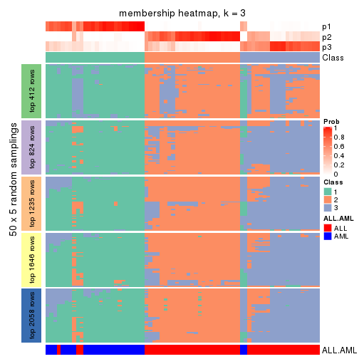</p>

</div>
<div id='tab-CV-NMF-membership-heatmap-3'>
<pre><code class="r">membership_heatmap(res, k = 4)
</code></pre>

<p>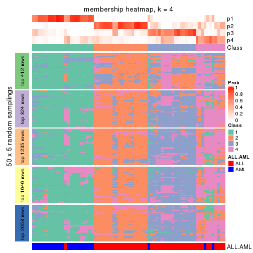</p>

</div>
<div id='tab-CV-NMF-membership-heatmap-4'>
<pre><code class="r">membership_heatmap(res, k = 5)
</code></pre>

<p>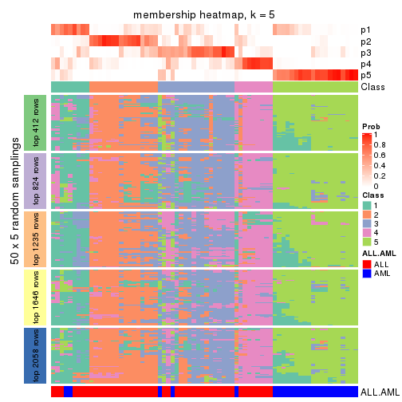</p>

</div>
<div id='tab-CV-NMF-membership-heatmap-5'>
<pre><code class="r">membership_heatmap(res, k = 6)
</code></pre>

<p>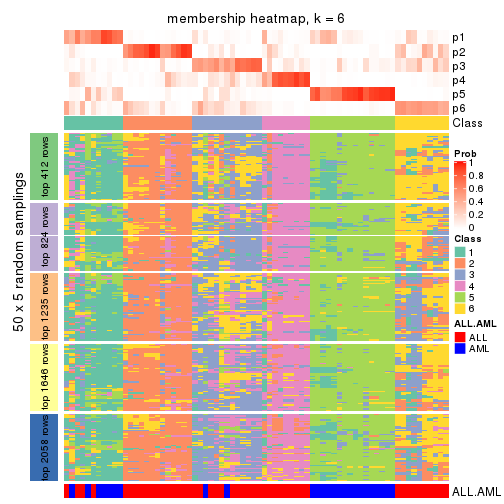</p>

</div>
</div>

As soon as we have had the classes for columns, we can look for signatures
which are significantly different between classes which can be candidate marks
for certain classes. Following are the heatmaps for signatures.


Signature heatmaps where rows are scaled:


<script>
$( function() {
	$( '#tabs-CV-NMF-get-signatures' ).tabs();
} );
</script>
<div id='tabs-CV-NMF-get-signatures'>
<ul>
<li><a href='#tab-CV-NMF-get-signatures-1'>k = 2</a></li>
<li><a href='#tab-CV-NMF-get-signatures-2'>k = 3</a></li>
<li><a href='#tab-CV-NMF-get-signatures-3'>k = 4</a></li>
<li><a href='#tab-CV-NMF-get-signatures-4'>k = 5</a></li>
<li><a href='#tab-CV-NMF-get-signatures-5'>k = 6</a></li>
</ul>
<div id='tab-CV-NMF-get-signatures-1'>
<pre><code class="r">get_signatures(res, k = 2)
</code></pre>

<p>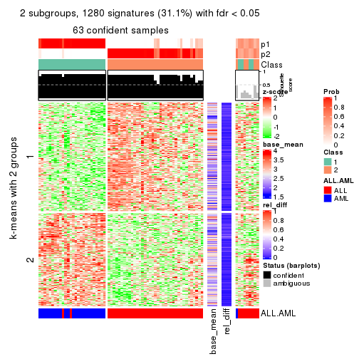</p>

</div>
<div id='tab-CV-NMF-get-signatures-2'>
<pre><code class="r">get_signatures(res, k = 3)
</code></pre>

<p>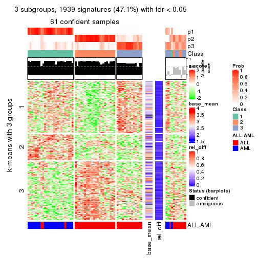</p>

</div>
<div id='tab-CV-NMF-get-signatures-3'>
<pre><code class="r">get_signatures(res, k = 4)
</code></pre>

<p>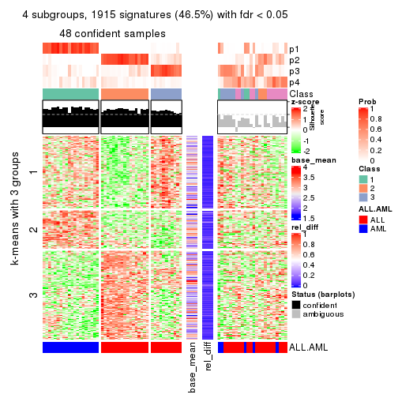</p>

</div>
<div id='tab-CV-NMF-get-signatures-4'>
<pre><code class="r">get_signatures(res, k = 5)
</code></pre>

<p>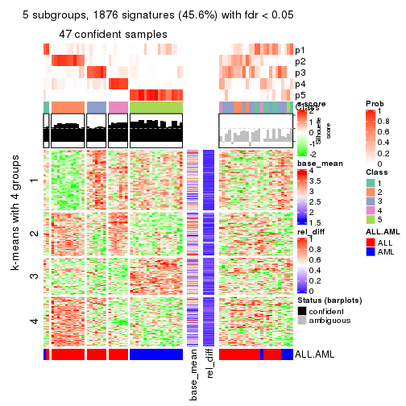</p>

</div>
<div id='tab-CV-NMF-get-signatures-5'>
<pre><code class="r">get_signatures(res, k = 6)
</code></pre>

<p>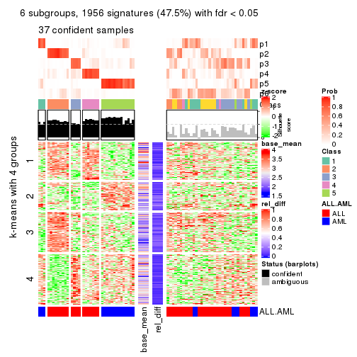</p>

</div>
</div>


Signature heatmaps where rows are not scaled:


<script>
$( function() {
	$( '#tabs-CV-NMF-get-signatures-no-scale' ).tabs();
} );
</script>
<div id='tabs-CV-NMF-get-signatures-no-scale'>
<ul>
<li><a href='#tab-CV-NMF-get-signatures-no-scale-1'>k = 2</a></li>
<li><a href='#tab-CV-NMF-get-signatures-no-scale-2'>k = 3</a></li>
<li><a href='#tab-CV-NMF-get-signatures-no-scale-3'>k = 4</a></li>
<li><a href='#tab-CV-NMF-get-signatures-no-scale-4'>k = 5</a></li>
<li><a href='#tab-CV-NMF-get-signatures-no-scale-5'>k = 6</a></li>
</ul>
<div id='tab-CV-NMF-get-signatures-no-scale-1'>
<pre><code class="r">get_signatures(res, k = 2, scale_rows = FALSE)
</code></pre>

<p>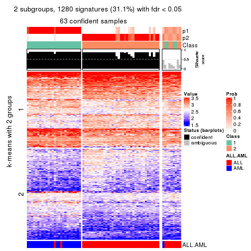</p>

</div>
<div id='tab-CV-NMF-get-signatures-no-scale-2'>
<pre><code class="r">get_signatures(res, k = 3, scale_rows = FALSE)
</code></pre>

<p>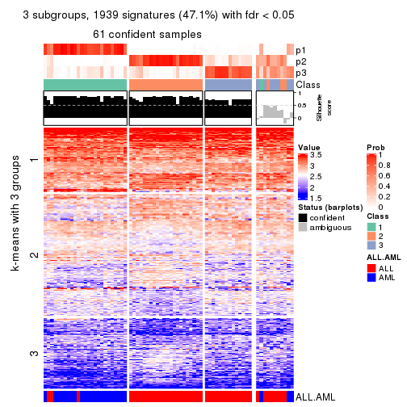</p>

</div>
<div id='tab-CV-NMF-get-signatures-no-scale-3'>
<pre><code class="r">get_signatures(res, k = 4, scale_rows = FALSE)
</code></pre>

<p>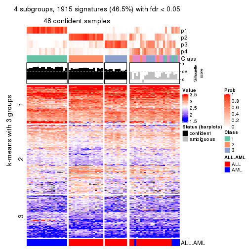</p>

</div>
<div id='tab-CV-NMF-get-signatures-no-scale-4'>
<pre><code class="r">get_signatures(res, k = 5, scale_rows = FALSE)
</code></pre>

<p>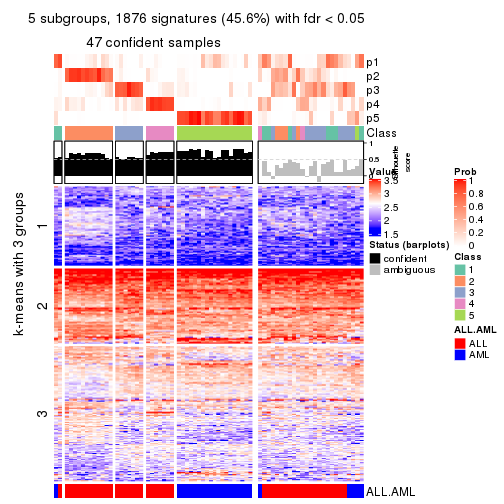</p>

</div>
<div id='tab-CV-NMF-get-signatures-no-scale-5'>
<pre><code class="r">get_signatures(res, k = 6, scale_rows = FALSE)
</code></pre>

<p>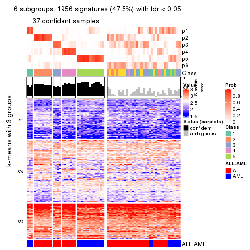</p>

</div>
</div>


Compare the overlap of signatures from different k:

```r
compare_signatures(res)
```

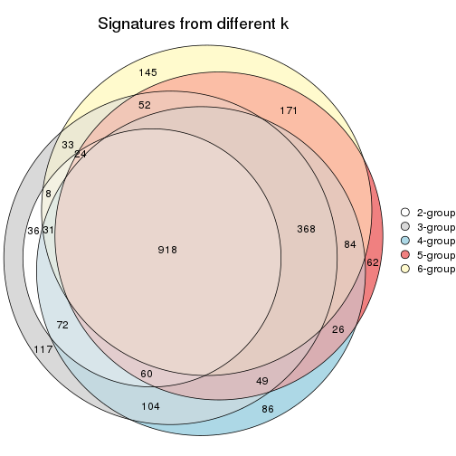

`get_signature()` returns a data frame invisibly. TO get the list of signatures, the function
call should be assigned to a variable explicitly. In following code, if `plot` argument is set
to `FALSE`, no heatmap is plotted while only the differential analysis is performed.

```r
# code only for demonstration
tb = get_signature(res, k = ..., plot = FALSE)
```

An example of the output of `tb` is:

```
#>   which_row         fdr    mean_1    mean_2 scaled_mean_1 scaled_mean_2 km
#> 1        38 0.042760348  8.373488  9.131774    -0.5533452     0.5164555  1
#> 2        40 0.018707592  7.106213  8.469186    -0.6173731     0.5762149  1
#> 3        55 0.019134737 10.221463 11.207825    -0.6159697     0.5749050  1
#> 4        59 0.006059896  5.921854  7.869574    -0.6899429     0.6439467  1
#> 5        60 0.018055526  8.928898 10.211722    -0.6204761     0.5791110  1
#> 6        98 0.009384629 15.714769 14.887706     0.6635654    -0.6193277  2
...
```

The columns in `tb` are:

1. `which_row`: row indices corresponding to the input matrix.
2. `fdr`: FDR for the differential test. 
3. `mean_x`: The mean value in group x.
4. `scaled_mean_x`: The mean value in group x after rows are scaled.
5. `km`: Row groups if k-means clustering is applied to rows.


UMAP plot which shows how samples are separated.


<script>
$( function() {
	$( '#tabs-CV-NMF-dimension-reduction' ).tabs();
} );
</script>
<div id='tabs-CV-NMF-dimension-reduction'>
<ul>
<li><a href='#tab-CV-NMF-dimension-reduction-1'>k = 2</a></li>
<li><a href='#tab-CV-NMF-dimension-reduction-2'>k = 3</a></li>
<li><a href='#tab-CV-NMF-dimension-reduction-3'>k = 4</a></li>
<li><a href='#tab-CV-NMF-dimension-reduction-4'>k = 5</a></li>
<li><a href='#tab-CV-NMF-dimension-reduction-5'>k = 6</a></li>
</ul>
<div id='tab-CV-NMF-dimension-reduction-1'>
<pre><code class="r">dimension_reduction(res, k = 2, method = &quot;UMAP&quot;)
</code></pre>

<p>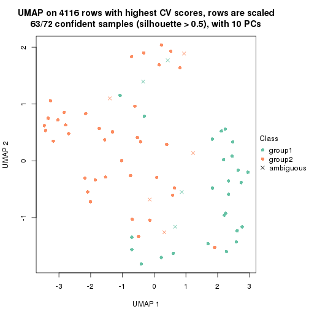</p>

</div>
<div id='tab-CV-NMF-dimension-reduction-2'>
<pre><code class="r">dimension_reduction(res, k = 3, method = &quot;UMAP&quot;)
</code></pre>

<p>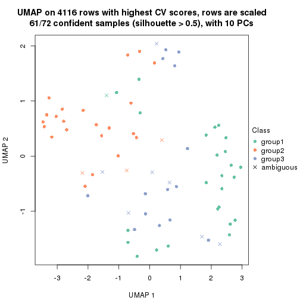</p>

</div>
<div id='tab-CV-NMF-dimension-reduction-3'>
<pre><code class="r">dimension_reduction(res, k = 4, method = &quot;UMAP&quot;)
</code></pre>

<p>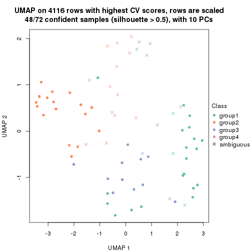</p>

</div>
<div id='tab-CV-NMF-dimension-reduction-4'>
<pre><code class="r">dimension_reduction(res, k = 5, method = &quot;UMAP&quot;)
</code></pre>

<p>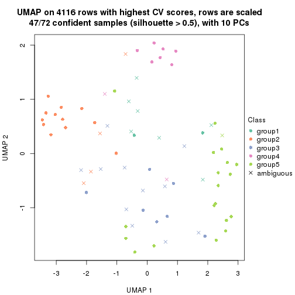</p>

</div>
<div id='tab-CV-NMF-dimension-reduction-5'>
<pre><code class="r">dimension_reduction(res, k = 6, method = &quot;UMAP&quot;)
</code></pre>

<p>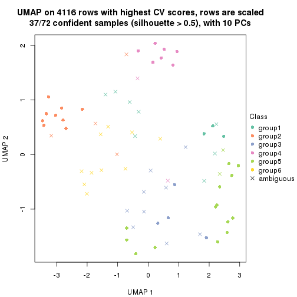</p>

</div>
</div>


Following heatmap shows how subgroups are split when increasing `k`:

```r
collect_classes(res)
```

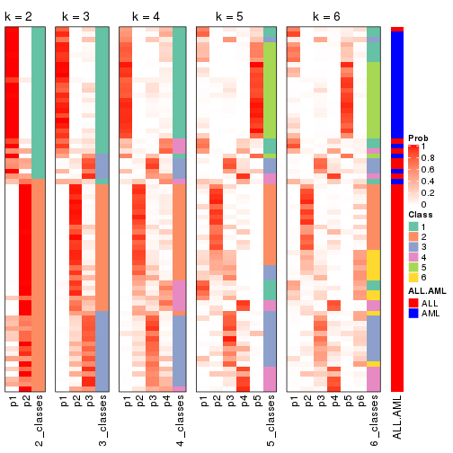


Test correlation between subgroups and known annotations. If the known
annotation is numeric, one-way ANOVA test is applied, and if the known
annotation is discrete, chi-squared contingency table test is applied.

```r
test_to_known_factors(res)
```

```
#>         n ALL.AML(p) k
#> CV:NMF 63   7.82e-13 2
#> CV:NMF 61   1.74e-11 3
#> CV:NMF 48   3.78e-11 4
#> CV:NMF 47   4.06e-09 5
#> CV:NMF 37   1.80e-07 6
```


If matrix rows can be associated to genes, consider to use `functional_enrichment(res,
...)` to perform function enrichment for the signature genes. See [this vignette](http://bioconductor.org/packages/devel/bioc/vignettes/cola/inst/doc/functional_enrichment.html) for more detailed explanations.


 

---------------------------------------------------


### MAD:hclust


The object with results only for a single top-value method and a single partition method 
can be extracted as:

```r
res = res_list["MAD", "hclust"]
# you can also extract it by
# res = res_list["MAD:hclust"]
```

A summary of `res` and all the functions that can be applied to it:

```r
res
```

```
#> A 'ConsensusPartition' object with k = 2, 3, 4, 5, 6.
#>   On a matrix with 4116 rows and 72 columns.
#>   Top rows (412, 824, 1235, 1646, 2058) are extracted by 'MAD' method.
#>   Subgroups are detected by 'hclust' method.
#>   Performed in total 1250 partitions by row resampling.
#>   Best k for subgroups seems to be 2.
#> 
#> Following methods can be applied to this 'ConsensusPartition' object:
#>  [1] "cola_report"             "collect_classes"         "collect_plots"          
#>  [4] "collect_stats"           "colnames"                "compare_signatures"     
#>  [7] "consensus_heatmap"       "dimension_reduction"     "functional_enrichment"  
#> [10] "get_anno_col"            "get_anno"                "get_classes"            
#> [13] "get_consensus"           "get_matrix"              "get_membership"         
#> [16] "get_param"               "get_signatures"          "get_stats"              
#> [19] "is_best_k"               "is_stable_k"             "membership_heatmap"     
#> [22] "ncol"                    "nrow"                    "plot_ecdf"              
#> [25] "rownames"                "select_partition_number" "show"                   
#> [28] "suggest_best_k"          "test_to_known_factors"
```

`collect_plots()` function collects all the plots made from `res` for all `k` (number of partitions)
into one single page to provide an easy and fast comparison between different `k`.

```r
collect_plots(res)
```

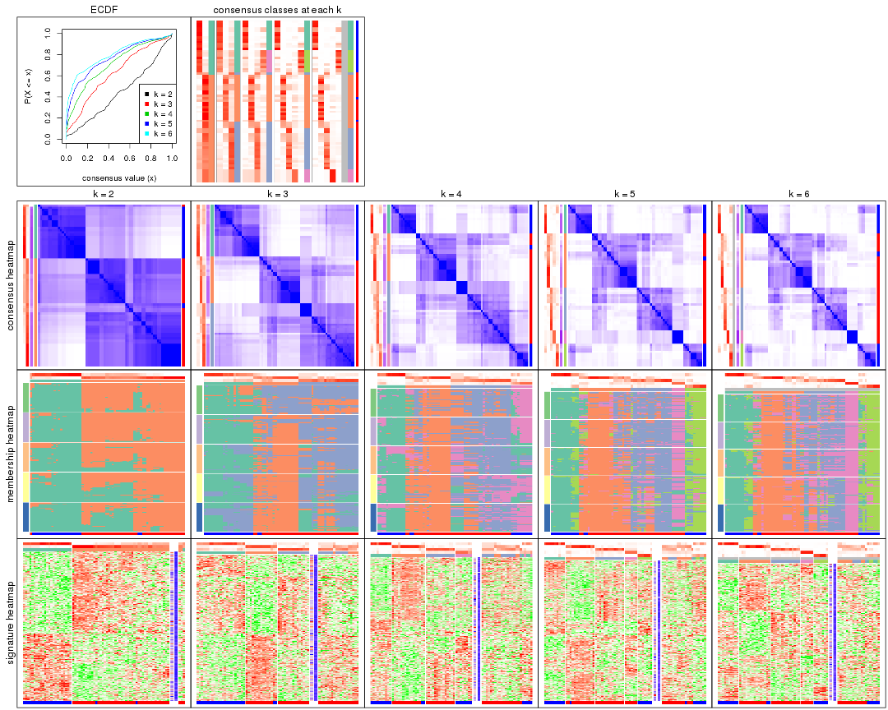

The plots are:

- The first row: a plot of the ECDF (empirical cumulative distribution
  function) curves of the consensus matrix for each `k` and the heatmap of
  predicted classes for each `k`.
- The second row: heatmaps of the consensus matrix for each `k`.
- The third row: heatmaps of the membership matrix for each `k`.
- The fouth row: heatmaps of the signatures for each `k`.

All the plots in panels can be made by individual functions and they are
plotted later in this section.

`select_partition_number()` produces several plots showing different
statistics for choosing "optimized" `k`. There are following statistics:

- ECDF curves of the consensus matrix for each `k`;
- 1-PAC. [The PAC
  score](https://en.wikipedia.org/wiki/Consensus_clustering#Over-interpretation_potential_of_consensus_clustering)
  measures the proportion of the ambiguous subgrouping.
- Mean silhouette score.
- Concordance. The mean probability of fiting the consensus class ids in all
  partitions.
- Area increased. Denote $A_k$ as the area under the ECDF curve for current
  `k`, the area increased is defined as $A_k - A_{k-1}$.
- Rand index. The percent of pairs of samples that are both in a same cluster
  or both are not in a same cluster in the partition of k and k-1.
- Jaccard index. The ratio of pairs of samples are both in a same cluster in
  the partition of k and k-1 and the pairs of samples are both in a same
  cluster in the partition k or k-1.

The detailed explanations of these statistics can be found in [the _cola_
vignette](http://bioconductor.org/packages/devel/bioc/vignettes/cola/inst/doc/cola.html#toc_13).

Generally speaking, lower PAC score, higher mean silhouette score or higher
concordance corresponds to better partition. Rand index and Jaccard index
measure how similar the current partition is compared to partition with `k-1`.
If they are too similar, we won't accept `k` is better than `k-1`.

```r
select_partition_number(res)
```

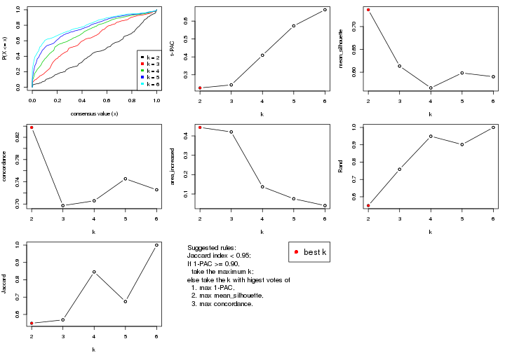

The numeric values for all these statistics can be obtained by `get_stats()`.

```r
get_stats(res)
```

```
#>   k 1-PAC mean_silhouette concordance area_increased  Rand Jaccard
#> 2 2 0.227           0.737       0.838         0.4437 0.549   0.549
#> 3 3 0.243           0.613       0.697         0.4206 0.759   0.569
#> 4 4 0.409           0.566       0.706         0.1373 0.949   0.845
#> 5 5 0.573           0.598       0.745         0.0754 0.901   0.674
#> 6 6 0.663           0.590       0.726         0.0402 1.000   1.000
```

`suggest_best_k()` suggests the best $k$ based on these statistics. The rules are as follows:

- All $k$ with Jaccard index larger than 0.95 are removed because increasing
  $k$ does not provide enough extra information. If all $k$ are removed, it is
  marked as no subgroup is detected.
- For all $k$ with 1-PAC score larger than 0.9, the maximal $k$ is taken as
  the best $k$, and other $k$ are marked as optional $k$.
- If it does not fit the second rule. The $k$ with the maximal vote of the
  highest 1-PAC score, highest mean silhouette, and highest concordance is
  taken as the best $k$.

```r
suggest_best_k(res)
```

```
#> [1] 2
```


Following shows the table of the partitions (You need to click the **show/hide
code output** link to see it). The membership matrix (columns with name `p*`)
is inferred by
[`clue::cl_consensus()`](https://www.rdocumentation.org/link/cl_consensus?package=clue)
function with the `SE` method. Basically the value in the membership matrix
represents the probability to belong to a certain group. The finall class
label for an item is determined with the group with highest probability it
belongs to.

In `get_classes()` function, the entropy is calculated from the membership
matrix and the silhouette score is calculated from the consensus matrix.


<script>
$( function() {
	$( '#tabs-MAD-hclust-get-classes' ).tabs();
} );
</script>
<div id='tabs-MAD-hclust-get-classes'>
<ul>
<li><a href='#tab-MAD-hclust-get-classes-1'>k = 2</a></li>
<li><a href='#tab-MAD-hclust-get-classes-2'>k = 3</a></li>
<li><a href='#tab-MAD-hclust-get-classes-3'>k = 4</a></li>
<li><a href='#tab-MAD-hclust-get-classes-4'>k = 5</a></li>
<li><a href='#tab-MAD-hclust-get-classes-5'>k = 6</a></li>
</ul>

<div id='tab-MAD-hclust-get-classes-1'>
<p><a id='tab-MAD-hclust-get-classes-1-a' style='color:#0366d6' href='#'>show/hide code output</a></p>
<pre><code class="r">cbind(get_classes(res, k = 2), get_membership(res, k = 2))
</code></pre>

<pre><code>#&gt;           class entropy silhouette    p1    p2
#&gt; sample_39     2  0.9754      0.591 0.408 0.592
#&gt; sample_40     1  0.9933     -0.217 0.548 0.452
#&gt; sample_42     2  0.3733      0.765 0.072 0.928
#&gt; sample_47     2  0.3733      0.770 0.072 0.928
#&gt; sample_48     2  0.0000      0.746 0.000 1.000
#&gt; sample_49     2  0.9754      0.589 0.408 0.592
#&gt; sample_41     2  0.0000      0.746 0.000 1.000
#&gt; sample_43     2  0.3114      0.765 0.056 0.944
#&gt; sample_44     2  0.5842      0.775 0.140 0.860
#&gt; sample_45     2  0.6438      0.773 0.164 0.836
#&gt; sample_46     2  0.6801      0.770 0.180 0.820
#&gt; sample_70     2  0.7453      0.762 0.212 0.788
#&gt; sample_71     2  0.6531      0.750 0.168 0.832
#&gt; sample_72     2  0.6531      0.750 0.168 0.832
#&gt; sample_68     2  0.0000      0.746 0.000 1.000
#&gt; sample_69     2  0.0000      0.746 0.000 1.000
#&gt; sample_67     2  0.9491      0.409 0.368 0.632
#&gt; sample_55     2  0.9427      0.659 0.360 0.640
#&gt; sample_56     2  0.9686      0.608 0.396 0.604
#&gt; sample_59     2  0.8608      0.729 0.284 0.716
#&gt; sample_52     1  0.4939      0.859 0.892 0.108
#&gt; sample_53     1  0.0938      0.892 0.988 0.012
#&gt; sample_51     1  0.0000      0.889 1.000 0.000
#&gt; sample_50     1  0.0000      0.889 1.000 0.000
#&gt; sample_54     1  0.6148      0.818 0.848 0.152
#&gt; sample_57     1  0.5842      0.826 0.860 0.140
#&gt; sample_58     1  0.0672      0.892 0.992 0.008
#&gt; sample_60     1  0.6148      0.818 0.848 0.152
#&gt; sample_61     1  0.0672      0.892 0.992 0.008
#&gt; sample_65     1  0.0672      0.892 0.992 0.008
#&gt; sample_66     2  0.7219      0.642 0.200 0.800
#&gt; sample_63     1  0.4939      0.859 0.892 0.108
#&gt; sample_64     1  0.6801      0.751 0.820 0.180
#&gt; sample_62     1  0.4939      0.859 0.892 0.108
#&gt; sample_1      2  0.9460      0.647 0.364 0.636
#&gt; sample_2      2  0.9427      0.441 0.360 0.640
#&gt; sample_3      2  0.8327      0.734 0.264 0.736
#&gt; sample_4      2  0.9522      0.639 0.372 0.628
#&gt; sample_5      2  0.0000      0.746 0.000 1.000
#&gt; sample_6      2  0.8327      0.734 0.264 0.736
#&gt; sample_7      2  0.9522      0.639 0.372 0.628
#&gt; sample_8      2  0.9710      0.602 0.400 0.600
#&gt; sample_9      2  0.8327      0.734 0.264 0.736
#&gt; sample_10     2  0.8327      0.734 0.264 0.736
#&gt; sample_11     2  0.8327      0.734 0.264 0.736
#&gt; sample_12     2  0.9866      0.551 0.432 0.568
#&gt; sample_13     2  0.0000      0.746 0.000 1.000
#&gt; sample_14     2  0.3879      0.752 0.076 0.924
#&gt; sample_15     2  0.0000      0.746 0.000 1.000
#&gt; sample_16     2  0.4939      0.776 0.108 0.892
#&gt; sample_17     2  0.3879      0.742 0.076 0.924
#&gt; sample_18     2  0.9248      0.681 0.340 0.660
#&gt; sample_19     2  0.4939      0.776 0.108 0.892
#&gt; sample_20     2  0.0000      0.746 0.000 1.000
#&gt; sample_21     2  0.0000      0.746 0.000 1.000
#&gt; sample_22     2  0.9710      0.604 0.400 0.600
#&gt; sample_23     2  0.8327      0.734 0.264 0.736
#&gt; sample_24     2  0.0000      0.746 0.000 1.000
#&gt; sample_25     2  0.9795      0.582 0.416 0.584
#&gt; sample_26     2  0.5408      0.776 0.124 0.876
#&gt; sample_27     2  0.9754      0.589 0.408 0.592
#&gt; sample_34     1  0.4690      0.865 0.900 0.100
#&gt; sample_35     1  0.4939      0.858 0.892 0.108
#&gt; sample_36     1  0.0000      0.889 1.000 0.000
#&gt; sample_37     1  0.0000      0.889 1.000 0.000
#&gt; sample_38     1  0.3274      0.884 0.940 0.060
#&gt; sample_28     1  0.1843      0.891 0.972 0.028
#&gt; sample_29     2  0.8555      0.513 0.280 0.720
#&gt; sample_30     1  0.0000      0.889 1.000 0.000
#&gt; sample_31     1  0.2043      0.893 0.968 0.032
#&gt; sample_32     1  0.2948      0.886 0.948 0.052
#&gt; sample_33     1  0.0000      0.889 1.000 0.000
</code></pre>

<script>
$('#tab-MAD-hclust-get-classes-1-a').parent().next().next().hide();
$('#tab-MAD-hclust-get-classes-1-a').click(function(){
  $('#tab-MAD-hclust-get-classes-1-a').parent().next().next().toggle();
  return(false);
});
</script>
</div>

<div id='tab-MAD-hclust-get-classes-2'>
<p><a id='tab-MAD-hclust-get-classes-2-a' style='color:#0366d6' href='#'>show/hide code output</a></p>
<pre><code class="r">cbind(get_classes(res, k = 3), get_membership(res, k = 3))
</code></pre>

<pre><code>#&gt;           class entropy silhouette    p1    p2    p3
#&gt; sample_39     3   0.406     0.6746 0.112 0.020 0.868
#&gt; sample_40     3   0.696     0.3973 0.184 0.092 0.724
#&gt; sample_42     2   0.700     0.3864 0.020 0.552 0.428
#&gt; sample_47     2   0.630     0.5278 0.008 0.640 0.352
#&gt; sample_48     2   0.382     0.7575 0.000 0.852 0.148
#&gt; sample_49     3   0.397     0.6677 0.132 0.008 0.860
#&gt; sample_41     2   0.369     0.7590 0.000 0.860 0.140
#&gt; sample_43     2   0.663     0.3822 0.008 0.552 0.440
#&gt; sample_44     3   0.596     0.3808 0.004 0.324 0.672
#&gt; sample_45     3   0.599     0.4059 0.008 0.304 0.688
#&gt; sample_46     3   0.576     0.4650 0.008 0.276 0.716
#&gt; sample_70     3   0.607     0.5309 0.028 0.236 0.736
#&gt; sample_71     2   0.855     0.3146 0.096 0.492 0.412
#&gt; sample_72     2   0.855     0.3146 0.096 0.492 0.412
#&gt; sample_68     2   0.369     0.7590 0.000 0.860 0.140
#&gt; sample_69     2   0.382     0.7575 0.000 0.852 0.148
#&gt; sample_67     2   0.852     0.4364 0.328 0.560 0.112
#&gt; sample_55     3   0.365     0.6960 0.068 0.036 0.896
#&gt; sample_56     3   0.369     0.6832 0.108 0.012 0.880
#&gt; sample_59     3   0.422     0.6631 0.032 0.100 0.868
#&gt; sample_52     1   0.825     0.6776 0.588 0.100 0.312
#&gt; sample_53     1   0.295     0.7450 0.908 0.004 0.088
#&gt; sample_51     1   0.259     0.7521 0.924 0.004 0.072
#&gt; sample_50     1   0.236     0.7512 0.928 0.000 0.072
#&gt; sample_54     1   0.863     0.6296 0.532 0.112 0.356
#&gt; sample_57     1   0.847     0.6372 0.540 0.100 0.360
#&gt; sample_58     1   0.630     0.7458 0.756 0.060 0.184
#&gt; sample_60     1   0.863     0.6296 0.532 0.112 0.356
#&gt; sample_61     1   0.457     0.7626 0.828 0.012 0.160
#&gt; sample_65     1   0.451     0.7633 0.832 0.012 0.156
#&gt; sample_66     2   0.778     0.6043 0.156 0.676 0.168
#&gt; sample_63     1   0.825     0.6776 0.588 0.100 0.312
#&gt; sample_64     1   0.859     0.5511 0.496 0.100 0.404
#&gt; sample_62     1   0.825     0.6776 0.588 0.100 0.312
#&gt; sample_1      3   0.469     0.6978 0.096 0.052 0.852
#&gt; sample_2      2   0.859     0.4476 0.300 0.572 0.128
#&gt; sample_3      3   0.815     0.4994 0.156 0.200 0.644
#&gt; sample_4      3   0.459     0.6966 0.096 0.048 0.856
#&gt; sample_5      2   0.369     0.7590 0.000 0.860 0.140
#&gt; sample_6      3   0.815     0.4994 0.156 0.200 0.644
#&gt; sample_7      3   0.459     0.6966 0.096 0.048 0.856
#&gt; sample_8      3   0.334     0.6746 0.120 0.000 0.880
#&gt; sample_9      3   0.815     0.4994 0.156 0.200 0.644
#&gt; sample_10     3   0.815     0.4994 0.156 0.200 0.644
#&gt; sample_11     3   0.815     0.4994 0.156 0.200 0.644
#&gt; sample_12     3   0.630     0.6268 0.192 0.056 0.752
#&gt; sample_13     2   0.382     0.7575 0.000 0.852 0.148
#&gt; sample_14     2   0.541     0.7092 0.032 0.796 0.172
#&gt; sample_15     2   0.369     0.7590 0.000 0.860 0.140
#&gt; sample_16     3   0.647     0.0146 0.004 0.444 0.552
#&gt; sample_17     2   0.500     0.7257 0.028 0.820 0.152
#&gt; sample_18     3   0.492     0.6846 0.072 0.084 0.844
#&gt; sample_19     3   0.646     0.0271 0.004 0.440 0.556
#&gt; sample_20     2   0.382     0.7575 0.000 0.852 0.148
#&gt; sample_21     2   0.394     0.7524 0.000 0.844 0.156
#&gt; sample_22     3   0.368     0.6808 0.116 0.008 0.876
#&gt; sample_23     3   0.815     0.4994 0.156 0.200 0.644
#&gt; sample_24     2   0.369     0.7590 0.000 0.860 0.140
#&gt; sample_25     3   0.623     0.6446 0.172 0.064 0.764
#&gt; sample_26     3   0.628     0.1695 0.004 0.384 0.612
#&gt; sample_27     3   0.397     0.6677 0.132 0.008 0.860
#&gt; sample_34     1   0.662     0.7054 0.660 0.024 0.316
#&gt; sample_35     1   0.771     0.6808 0.604 0.064 0.332
#&gt; sample_36     1   0.236     0.7512 0.928 0.000 0.072
#&gt; sample_37     1   0.216     0.7461 0.936 0.000 0.064
#&gt; sample_38     1   0.368     0.7220 0.876 0.008 0.116
#&gt; sample_28     1   0.338     0.7370 0.896 0.012 0.092
#&gt; sample_29     2   0.803     0.5350 0.240 0.640 0.120
#&gt; sample_30     1   0.236     0.7512 0.928 0.000 0.072
#&gt; sample_31     1   0.541     0.7613 0.780 0.020 0.200
#&gt; sample_32     1   0.515     0.7601 0.800 0.020 0.180
#&gt; sample_33     1   0.226     0.7488 0.932 0.000 0.068
</code></pre>

<script>
$('#tab-MAD-hclust-get-classes-2-a').parent().next().next().hide();
$('#tab-MAD-hclust-get-classes-2-a').click(function(){
  $('#tab-MAD-hclust-get-classes-2-a').parent().next().next().toggle();
  return(false);
});
</script>
</div>

<div id='tab-MAD-hclust-get-classes-3'>
<p><a id='tab-MAD-hclust-get-classes-3-a' style='color:#0366d6' href='#'>show/hide code output</a></p>
<pre><code class="r">cbind(get_classes(res, k = 4), get_membership(res, k = 4))
</code></pre>

<pre><code>#&gt;           class entropy silhouette    p1    p2    p3    p4
#&gt; sample_39     3  0.4053     0.5939 0.020 0.028 0.844 0.108
#&gt; sample_40     3  0.5527     0.2879 0.016 0.016 0.664 0.304
#&gt; sample_42     2  0.6286     0.3348 0.016 0.576 0.372 0.036
#&gt; sample_47     2  0.4748     0.5353 0.000 0.716 0.268 0.016
#&gt; sample_48     2  0.1474     0.7505 0.000 0.948 0.052 0.000
#&gt; sample_49     3  0.4335     0.5883 0.028 0.020 0.824 0.128
#&gt; sample_41     2  0.1209     0.7509 0.000 0.964 0.032 0.004
#&gt; sample_43     2  0.5832     0.3368 0.004 0.596 0.368 0.032
#&gt; sample_44     3  0.5954     0.3562 0.000 0.344 0.604 0.052
#&gt; sample_45     3  0.5786     0.3901 0.000 0.308 0.640 0.052
#&gt; sample_46     3  0.5943     0.4382 0.004 0.280 0.656 0.060
#&gt; sample_70     3  0.5767     0.4907 0.004 0.244 0.688 0.064
#&gt; sample_71     2  0.7744     0.2646 0.080 0.488 0.380 0.052
#&gt; sample_72     2  0.7744     0.2646 0.080 0.488 0.380 0.052
#&gt; sample_68     2  0.1305     0.7516 0.000 0.960 0.036 0.004
#&gt; sample_69     2  0.1474     0.7505 0.000 0.948 0.052 0.000
#&gt; sample_67     2  0.7887     0.4870 0.288 0.544 0.052 0.116
#&gt; sample_55     3  0.4749     0.6031 0.020 0.044 0.804 0.132
#&gt; sample_56     3  0.3985     0.5994 0.008 0.024 0.832 0.136
#&gt; sample_59     3  0.4901     0.6095 0.000 0.108 0.780 0.112
#&gt; sample_52     4  0.5701     0.7675 0.132 0.008 0.124 0.736
#&gt; sample_53     1  0.1042     0.8013 0.972 0.000 0.008 0.020
#&gt; sample_51     1  0.0779     0.8096 0.980 0.000 0.004 0.016
#&gt; sample_50     1  0.0376     0.8101 0.992 0.000 0.004 0.004
#&gt; sample_54     4  0.5926     0.7519 0.112 0.016 0.144 0.728
#&gt; sample_57     4  0.5896     0.7565 0.128 0.008 0.144 0.720
#&gt; sample_58     4  0.6060     0.2702 0.440 0.000 0.044 0.516
#&gt; sample_60     4  0.5926     0.7519 0.112 0.016 0.144 0.728
#&gt; sample_61     1  0.5955     0.2657 0.616 0.000 0.056 0.328
#&gt; sample_65     1  0.5884     0.2735 0.620 0.000 0.052 0.328
#&gt; sample_66     2  0.7521     0.6199 0.100 0.640 0.108 0.152
#&gt; sample_63     4  0.5701     0.7675 0.132 0.008 0.124 0.736
#&gt; sample_64     4  0.7585     0.6014 0.172 0.012 0.288 0.528
#&gt; sample_62     4  0.5701     0.7675 0.132 0.008 0.124 0.736
#&gt; sample_1      3  0.4472     0.6203 0.016 0.072 0.828 0.084
#&gt; sample_2      2  0.8090     0.5089 0.260 0.544 0.060 0.136
#&gt; sample_3      3  0.9002     0.4176 0.176 0.188 0.492 0.144
#&gt; sample_4      3  0.4931     0.5972 0.016 0.096 0.800 0.088
#&gt; sample_5      2  0.1305     0.7516 0.000 0.960 0.036 0.004
#&gt; sample_6      3  0.9002     0.4176 0.176 0.188 0.492 0.144
#&gt; sample_7      3  0.4931     0.5972 0.016 0.096 0.800 0.088
#&gt; sample_8      3  0.3965     0.5915 0.016 0.020 0.840 0.124
#&gt; sample_9      3  0.9002     0.4176 0.176 0.188 0.492 0.144
#&gt; sample_10     3  0.9002     0.4176 0.176 0.188 0.492 0.144
#&gt; sample_11     3  0.9002     0.4176 0.176 0.188 0.492 0.144
#&gt; sample_12     3  0.6638     0.5600 0.116 0.060 0.704 0.120
#&gt; sample_13     2  0.1474     0.7505 0.000 0.948 0.052 0.000
#&gt; sample_14     2  0.4683     0.7004 0.012 0.812 0.080 0.096
#&gt; sample_15     2  0.1305     0.7516 0.000 0.960 0.036 0.004
#&gt; sample_16     3  0.5409     0.0228 0.000 0.492 0.496 0.012
#&gt; sample_17     2  0.4292     0.7194 0.008 0.832 0.072 0.088
#&gt; sample_18     3  0.5635     0.6192 0.032 0.096 0.764 0.108
#&gt; sample_19     3  0.5406     0.0519 0.000 0.480 0.508 0.012
#&gt; sample_20     2  0.1474     0.7505 0.000 0.948 0.052 0.000
#&gt; sample_21     2  0.3256     0.7164 0.004 0.884 0.044 0.068
#&gt; sample_22     3  0.4322     0.6016 0.032 0.020 0.828 0.120
#&gt; sample_23     3  0.9002     0.4176 0.176 0.188 0.492 0.144
#&gt; sample_24     2  0.1209     0.7509 0.000 0.964 0.032 0.004
#&gt; sample_25     3  0.6502     0.5741 0.096 0.068 0.716 0.120
#&gt; sample_26     3  0.5320     0.1998 0.000 0.416 0.572 0.012
#&gt; sample_27     3  0.4335     0.5883 0.028 0.020 0.824 0.128
#&gt; sample_34     4  0.7701     0.3729 0.388 0.000 0.220 0.392
#&gt; sample_35     4  0.7598     0.5467 0.284 0.000 0.240 0.476
#&gt; sample_36     1  0.0895     0.8094 0.976 0.000 0.004 0.020
#&gt; sample_37     1  0.0376     0.8091 0.992 0.000 0.004 0.004
#&gt; sample_38     1  0.2335     0.7535 0.920 0.000 0.020 0.060
#&gt; sample_28     1  0.1486     0.7914 0.960 0.008 0.024 0.008
#&gt; sample_29     2  0.7850     0.5781 0.188 0.596 0.068 0.148
#&gt; sample_30     1  0.0895     0.8094 0.976 0.000 0.004 0.020
#&gt; sample_31     1  0.6497     0.2065 0.596 0.000 0.100 0.304
#&gt; sample_32     1  0.6084     0.5100 0.692 0.016 0.072 0.220
#&gt; sample_33     1  0.0188     0.8098 0.996 0.000 0.004 0.000
</code></pre>

<script>
$('#tab-MAD-hclust-get-classes-3-a').parent().next().next().hide();
$('#tab-MAD-hclust-get-classes-3-a').click(function(){
  $('#tab-MAD-hclust-get-classes-3-a').parent().next().next().toggle();
  return(false);
});
</script>
</div>

<div id='tab-MAD-hclust-get-classes-4'>
<p><a id='tab-MAD-hclust-get-classes-4-a' style='color:#0366d6' href='#'>show/hide code output</a></p>
<pre><code class="r">cbind(get_classes(res, k = 5), get_membership(res, k = 5))
</code></pre>

<pre><code>#&gt;           class entropy silhouette    p1    p2    p3    p4    p5
#&gt; sample_39     3  0.2268     0.6675 0.012 0.028 0.924 0.028 0.008
#&gt; sample_40     3  0.4988     0.3900 0.000 0.000 0.656 0.060 0.284
#&gt; sample_42     2  0.6673     0.4184 0.012 0.576 0.248 0.144 0.020
#&gt; sample_47     2  0.5090     0.5575 0.000 0.732 0.160 0.084 0.024
#&gt; sample_48     2  0.0510     0.6893 0.000 0.984 0.016 0.000 0.000
#&gt; sample_49     3  0.2330     0.6645 0.020 0.004 0.920 0.036 0.020
#&gt; sample_41     2  0.1682     0.6831 0.000 0.940 0.012 0.044 0.004
#&gt; sample_43     2  0.6200     0.4236 0.000 0.600 0.248 0.132 0.020
#&gt; sample_44     3  0.7327     0.2178 0.000 0.344 0.428 0.184 0.044
#&gt; sample_45     3  0.7322     0.2851 0.000 0.308 0.452 0.196 0.044
#&gt; sample_46     3  0.7574     0.3478 0.004 0.280 0.460 0.200 0.056
#&gt; sample_70     3  0.7470     0.4239 0.004 0.244 0.496 0.196 0.060
#&gt; sample_71     2  0.7893     0.3067 0.080 0.456 0.300 0.148 0.016
#&gt; sample_72     2  0.7893     0.3067 0.080 0.456 0.300 0.148 0.016
#&gt; sample_68     2  0.1710     0.6847 0.000 0.940 0.016 0.040 0.004
#&gt; sample_69     2  0.0510     0.6893 0.000 0.984 0.016 0.000 0.000
#&gt; sample_67     2  0.7573     0.3794 0.284 0.464 0.004 0.188 0.060
#&gt; sample_55     3  0.5810     0.6181 0.004 0.024 0.680 0.156 0.136
#&gt; sample_56     3  0.3757     0.6682 0.004 0.004 0.828 0.104 0.060
#&gt; sample_59     3  0.6811     0.5666 0.000 0.100 0.600 0.188 0.112
#&gt; sample_52     5  0.1742     0.7509 0.032 0.008 0.008 0.008 0.944
#&gt; sample_53     1  0.0771     0.8017 0.976 0.000 0.000 0.020 0.004
#&gt; sample_51     1  0.0609     0.8092 0.980 0.000 0.000 0.000 0.020
#&gt; sample_50     1  0.0290     0.8092 0.992 0.000 0.000 0.000 0.008
#&gt; sample_54     5  0.3273     0.7353 0.032 0.012 0.008 0.080 0.868
#&gt; sample_57     5  0.3075     0.7385 0.040 0.004 0.008 0.072 0.876
#&gt; sample_58     5  0.4491     0.3145 0.364 0.000 0.008 0.004 0.624
#&gt; sample_60     5  0.3273     0.7353 0.032 0.012 0.008 0.080 0.868
#&gt; sample_61     1  0.5146     0.2777 0.564 0.000 0.028 0.008 0.400
#&gt; sample_65     1  0.5070     0.2828 0.568 0.000 0.024 0.008 0.400
#&gt; sample_66     2  0.7323     0.5219 0.084 0.572 0.028 0.228 0.088
#&gt; sample_63     5  0.1742     0.7509 0.032 0.008 0.008 0.008 0.944
#&gt; sample_64     5  0.6858     0.5398 0.116 0.000 0.264 0.064 0.556
#&gt; sample_62     5  0.1742     0.7509 0.032 0.008 0.008 0.008 0.944
#&gt; sample_1      3  0.4308     0.6727 0.004 0.068 0.816 0.052 0.060
#&gt; sample_2      2  0.7816     0.3800 0.252 0.456 0.008 0.216 0.068
#&gt; sample_3      4  0.5123     1.0000 0.072 0.036 0.156 0.736 0.000
#&gt; sample_4      3  0.4502     0.6508 0.004 0.068 0.804 0.068 0.056
#&gt; sample_5      2  0.1710     0.6847 0.000 0.940 0.016 0.040 0.004
#&gt; sample_6      4  0.5123     1.0000 0.072 0.036 0.156 0.736 0.000
#&gt; sample_7      3  0.4502     0.6508 0.004 0.068 0.804 0.068 0.056
#&gt; sample_8      3  0.1699     0.6613 0.004 0.008 0.944 0.036 0.008
#&gt; sample_9      4  0.5123     1.0000 0.072 0.036 0.156 0.736 0.000
#&gt; sample_10     4  0.5123     1.0000 0.072 0.036 0.156 0.736 0.000
#&gt; sample_11     4  0.5123     1.0000 0.072 0.036 0.156 0.736 0.000
#&gt; sample_12     3  0.5836     0.5646 0.104 0.028 0.716 0.120 0.032
#&gt; sample_13     2  0.0510     0.6893 0.000 0.984 0.016 0.000 0.000
#&gt; sample_14     2  0.4997     0.5639 0.000 0.672 0.012 0.276 0.040
#&gt; sample_15     2  0.1710     0.6847 0.000 0.940 0.016 0.040 0.004
#&gt; sample_16     2  0.6770     0.1490 0.000 0.496 0.336 0.140 0.028
#&gt; sample_17     2  0.4929     0.6103 0.004 0.716 0.012 0.220 0.048
#&gt; sample_18     3  0.6711     0.5642 0.008 0.064 0.616 0.200 0.112
#&gt; sample_19     2  0.6750     0.1138 0.000 0.484 0.356 0.132 0.028
#&gt; sample_20     2  0.0510     0.6893 0.000 0.984 0.016 0.000 0.000
#&gt; sample_21     2  0.3010     0.6291 0.000 0.860 0.016 0.116 0.008
#&gt; sample_22     3  0.2806     0.6518 0.020 0.012 0.896 0.060 0.012
#&gt; sample_23     4  0.5123     1.0000 0.072 0.036 0.156 0.736 0.000
#&gt; sample_24     2  0.1757     0.6826 0.000 0.936 0.012 0.048 0.004
#&gt; sample_25     3  0.5819     0.5752 0.088 0.040 0.724 0.116 0.032
#&gt; sample_26     2  0.6781    -0.0647 0.000 0.424 0.420 0.128 0.028
#&gt; sample_27     3  0.2330     0.6645 0.020 0.004 0.920 0.036 0.020
#&gt; sample_34     5  0.6735     0.3000 0.340 0.000 0.180 0.012 0.468
#&gt; sample_35     5  0.6792     0.4765 0.232 0.000 0.212 0.024 0.532
#&gt; sample_36     1  0.0963     0.8053 0.964 0.000 0.000 0.000 0.036
#&gt; sample_37     1  0.0324     0.8085 0.992 0.000 0.000 0.004 0.004
#&gt; sample_38     1  0.2077     0.7531 0.908 0.000 0.000 0.084 0.008
#&gt; sample_28     1  0.1211     0.7929 0.960 0.000 0.016 0.024 0.000
#&gt; sample_29     2  0.7555     0.4711 0.168 0.528 0.008 0.208 0.088
#&gt; sample_30     1  0.0963     0.8053 0.964 0.000 0.000 0.000 0.036
#&gt; sample_31     1  0.5498     0.2469 0.556 0.000 0.060 0.004 0.380
#&gt; sample_32     1  0.5721     0.5408 0.668 0.004 0.040 0.056 0.232
#&gt; sample_33     1  0.0000     0.8080 1.000 0.000 0.000 0.000 0.000
</code></pre>

<script>
$('#tab-MAD-hclust-get-classes-4-a').parent().next().next().hide();
$('#tab-MAD-hclust-get-classes-4-a').click(function(){
  $('#tab-MAD-hclust-get-classes-4-a').parent().next().next().toggle();
  return(false);
});
</script>
</div>

<div id='tab-MAD-hclust-get-classes-5'>
<p><a id='tab-MAD-hclust-get-classes-5-a' style='color:#0366d6' href='#'>show/hide code output</a></p>
<pre><code class="r">cbind(get_classes(res, k = 6), get_membership(res, k = 6))
</code></pre>

<pre><code>#&gt;           class entropy silhouette    p1    p2    p3    p4    p5 p6
#&gt; sample_39     3  0.2722    0.66706 0.000 0.004 0.872 0.032 0.004 NA
#&gt; sample_40     3  0.5598    0.34150 0.000 0.004 0.612 0.016 0.224 NA
#&gt; sample_42     2  0.6674    0.41733 0.008 0.492 0.200 0.044 0.000 NA
#&gt; sample_47     2  0.5527    0.54675 0.000 0.664 0.128 0.024 0.016 NA
#&gt; sample_48     2  0.1643    0.67448 0.000 0.924 0.008 0.000 0.000 NA
#&gt; sample_49     3  0.2400    0.66190 0.004 0.000 0.900 0.048 0.008 NA
#&gt; sample_41     2  0.0291    0.67285 0.000 0.992 0.000 0.004 0.000 NA
#&gt; sample_43     2  0.6341    0.42926 0.000 0.516 0.200 0.040 0.000 NA
#&gt; sample_44     3  0.7265    0.15240 0.000 0.312 0.348 0.044 0.020 NA
#&gt; sample_45     3  0.7089    0.20354 0.000 0.256 0.368 0.032 0.020 NA
#&gt; sample_46     3  0.7351    0.26660 0.000 0.228 0.376 0.044 0.032 NA
#&gt; sample_70     3  0.7328    0.34206 0.000 0.192 0.404 0.048 0.036 NA
#&gt; sample_71     2  0.7857    0.32489 0.076 0.424 0.260 0.084 0.000 NA
#&gt; sample_72     2  0.7857    0.32489 0.076 0.424 0.260 0.084 0.000 NA
#&gt; sample_68     2  0.0146    0.67305 0.000 0.996 0.000 0.000 0.000 NA
#&gt; sample_69     2  0.1643    0.67448 0.000 0.924 0.008 0.000 0.000 NA
#&gt; sample_67     2  0.7686    0.39436 0.288 0.440 0.004 0.092 0.056 NA
#&gt; sample_55     3  0.6102    0.61802 0.000 0.020 0.620 0.056 0.104 NA
#&gt; sample_56     3  0.4100    0.66519 0.000 0.000 0.772 0.036 0.040 NA
#&gt; sample_59     3  0.7061    0.54302 0.000 0.100 0.516 0.052 0.072 NA
#&gt; sample_52     5  0.0862    0.74097 0.016 0.004 0.000 0.000 0.972 NA
#&gt; sample_53     1  0.0881    0.79702 0.972 0.000 0.000 0.008 0.008 NA
#&gt; sample_51     1  0.0632    0.80246 0.976 0.000 0.000 0.000 0.024 NA
#&gt; sample_50     1  0.0363    0.80284 0.988 0.000 0.000 0.000 0.012 NA
#&gt; sample_54     5  0.2959    0.72502 0.012 0.012 0.000 0.020 0.864 NA
#&gt; sample_57     5  0.2824    0.72755 0.020 0.004 0.000 0.020 0.872 NA
#&gt; sample_58     5  0.5140    0.36719 0.296 0.000 0.004 0.004 0.608 NA
#&gt; sample_60     5  0.2959    0.72502 0.012 0.012 0.000 0.020 0.864 NA
#&gt; sample_61     1  0.5862    0.19516 0.500 0.000 0.024 0.008 0.384 NA
#&gt; sample_65     1  0.5716    0.20484 0.508 0.000 0.020 0.008 0.388 NA
#&gt; sample_66     2  0.7462    0.54984 0.080 0.532 0.016 0.080 0.080 NA
#&gt; sample_63     5  0.0862    0.74097 0.016 0.004 0.000 0.000 0.972 NA
#&gt; sample_64     5  0.7120    0.51027 0.084 0.004 0.236 0.012 0.492 NA
#&gt; sample_62     5  0.0862    0.74097 0.016 0.004 0.000 0.000 0.972 NA
#&gt; sample_1      3  0.4719    0.67440 0.000 0.056 0.772 0.036 0.060 NA
#&gt; sample_2      2  0.7939    0.41672 0.256 0.432 0.004 0.116 0.064 NA
#&gt; sample_3      4  0.0777    1.00000 0.004 0.000 0.024 0.972 0.000 NA
#&gt; sample_4      3  0.4207    0.64630 0.000 0.096 0.796 0.036 0.056 NA
#&gt; sample_5      2  0.0146    0.67305 0.000 0.996 0.000 0.000 0.000 NA
#&gt; sample_6      4  0.0777    1.00000 0.004 0.000 0.024 0.972 0.000 NA
#&gt; sample_7      3  0.4207    0.64630 0.000 0.096 0.796 0.036 0.056 NA
#&gt; sample_8      3  0.2290    0.65364 0.000 0.004 0.904 0.044 0.004 NA
#&gt; sample_9      4  0.0777    1.00000 0.004 0.000 0.024 0.972 0.000 NA
#&gt; sample_10     4  0.0777    1.00000 0.004 0.000 0.024 0.972 0.000 NA
#&gt; sample_11     4  0.0777    1.00000 0.004 0.000 0.024 0.972 0.000 NA
#&gt; sample_12     3  0.6323    0.59471 0.096 0.016 0.648 0.076 0.024 NA
#&gt; sample_13     2  0.1643    0.67448 0.000 0.924 0.008 0.000 0.000 NA
#&gt; sample_14     2  0.5044    0.55826 0.000 0.688 0.008 0.212 0.032 NA
#&gt; sample_15     2  0.0146    0.67305 0.000 0.996 0.000 0.000 0.000 NA
#&gt; sample_16     2  0.6903    0.17165 0.000 0.468 0.268 0.052 0.012 NA
#&gt; sample_17     2  0.4707    0.62242 0.000 0.748 0.008 0.132 0.044 NA
#&gt; sample_18     3  0.7176    0.57853 0.000 0.056 0.540 0.156 0.080 NA
#&gt; sample_19     2  0.6842    0.14441 0.000 0.452 0.288 0.040 0.012 NA
#&gt; sample_20     2  0.1643    0.67448 0.000 0.924 0.008 0.000 0.000 NA
#&gt; sample_21     2  0.3767    0.51183 0.000 0.708 0.004 0.012 0.000 NA
#&gt; sample_22     3  0.3430    0.64721 0.012 0.004 0.840 0.080 0.004 NA
#&gt; sample_23     4  0.0777    1.00000 0.004 0.000 0.024 0.972 0.000 NA
#&gt; sample_24     2  0.0436    0.67263 0.000 0.988 0.004 0.004 0.000 NA
#&gt; sample_25     3  0.6209    0.60241 0.080 0.020 0.660 0.072 0.024 NA
#&gt; sample_26     2  0.6971    0.00302 0.000 0.388 0.340 0.040 0.012 NA
#&gt; sample_27     3  0.2400    0.66190 0.004 0.000 0.900 0.048 0.008 NA
#&gt; sample_34     5  0.6775    0.30264 0.308 0.000 0.164 0.000 0.452 NA
#&gt; sample_35     5  0.7056    0.45516 0.200 0.000 0.196 0.008 0.492 NA
#&gt; sample_36     1  0.1010    0.79907 0.960 0.000 0.000 0.000 0.036 NA
#&gt; sample_37     1  0.0146    0.80213 0.996 0.000 0.000 0.000 0.004 NA
#&gt; sample_38     1  0.2251    0.75294 0.904 0.000 0.000 0.036 0.008 NA
#&gt; sample_28     1  0.1317    0.78854 0.956 0.000 0.008 0.016 0.004 NA
#&gt; sample_29     2  0.7468    0.52002 0.164 0.504 0.000 0.068 0.080 NA
#&gt; sample_30     1  0.1010    0.79907 0.960 0.000 0.000 0.000 0.036 NA
#&gt; sample_31     1  0.5560    0.22451 0.528 0.000 0.044 0.000 0.376 NA
#&gt; sample_32     1  0.5495    0.52165 0.652 0.000 0.036 0.020 0.232 NA
#&gt; sample_33     1  0.0146    0.80196 0.996 0.000 0.000 0.000 0.004 NA
</code></pre>

<script>
$('#tab-MAD-hclust-get-classes-5-a').parent().next().next().hide();
$('#tab-MAD-hclust-get-classes-5-a').click(function(){
  $('#tab-MAD-hclust-get-classes-5-a').parent().next().next().toggle();
  return(false);
});
</script>
</div>
</div>

Heatmaps for the consensus matrix. It visualizes the probability of two
samples to be in a same group.


<script>
$( function() {
	$( '#tabs-MAD-hclust-consensus-heatmap' ).tabs();
} );
</script>
<div id='tabs-MAD-hclust-consensus-heatmap'>
<ul>
<li><a href='#tab-MAD-hclust-consensus-heatmap-1'>k = 2</a></li>
<li><a href='#tab-MAD-hclust-consensus-heatmap-2'>k = 3</a></li>
<li><a href='#tab-MAD-hclust-consensus-heatmap-3'>k = 4</a></li>
<li><a href='#tab-MAD-hclust-consensus-heatmap-4'>k = 5</a></li>
<li><a href='#tab-MAD-hclust-consensus-heatmap-5'>k = 6</a></li>
</ul>
<div id='tab-MAD-hclust-consensus-heatmap-1'>
<pre><code class="r">consensus_heatmap(res, k = 2)
</code></pre>

<p>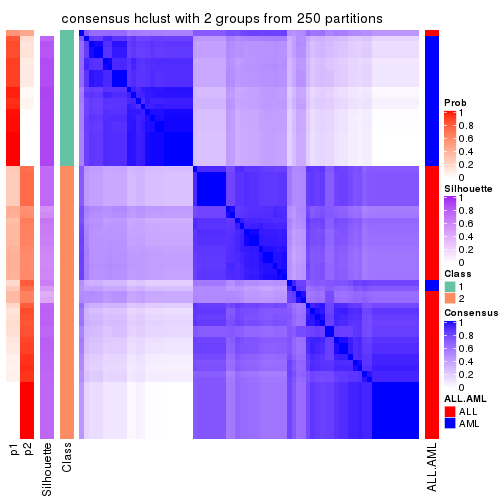</p>

</div>
<div id='tab-MAD-hclust-consensus-heatmap-2'>
<pre><code class="r">consensus_heatmap(res, k = 3)
</code></pre>

<p>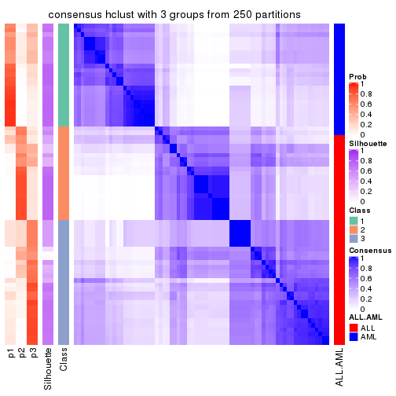</p>

</div>
<div id='tab-MAD-hclust-consensus-heatmap-3'>
<pre><code class="r">consensus_heatmap(res, k = 4)
</code></pre>

<p>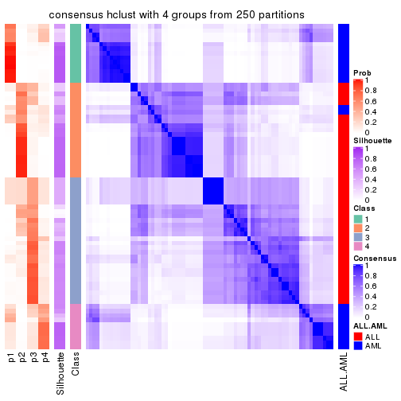</p>

</div>
<div id='tab-MAD-hclust-consensus-heatmap-4'>
<pre><code class="r">consensus_heatmap(res, k = 5)
</code></pre>

<p>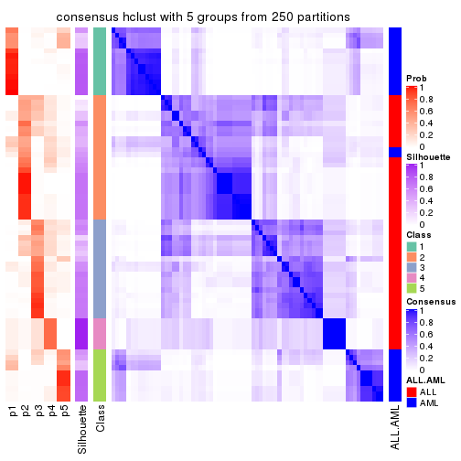</p>

</div>
<div id='tab-MAD-hclust-consensus-heatmap-5'>
<pre><code class="r">consensus_heatmap(res, k = 6)
</code></pre>

<p>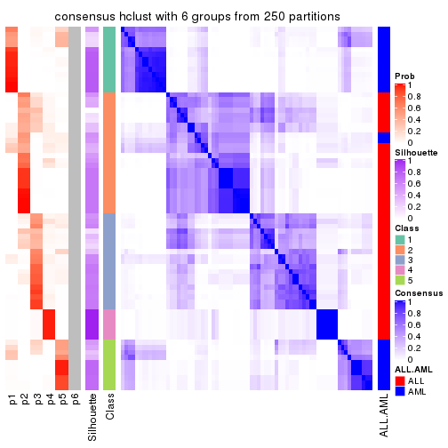</p>

</div>
</div>

Heatmaps for the membership of samples in all partitions to see how consistent they are:


<script>
$( function() {
	$( '#tabs-MAD-hclust-membership-heatmap' ).tabs();
} );
</script>
<div id='tabs-MAD-hclust-membership-heatmap'>
<ul>
<li><a href='#tab-MAD-hclust-membership-heatmap-1'>k = 2</a></li>
<li><a href='#tab-MAD-hclust-membership-heatmap-2'>k = 3</a></li>
<li><a href='#tab-MAD-hclust-membership-heatmap-3'>k = 4</a></li>
<li><a href='#tab-MAD-hclust-membership-heatmap-4'>k = 5</a></li>
<li><a href='#tab-MAD-hclust-membership-heatmap-5'>k = 6</a></li>
</ul>
<div id='tab-MAD-hclust-membership-heatmap-1'>
<pre><code class="r">membership_heatmap(res, k = 2)
</code></pre>

<p>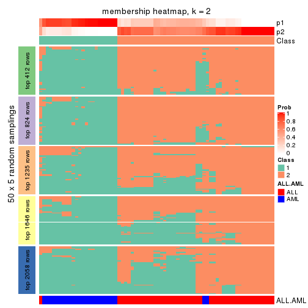</p>

</div>
<div id='tab-MAD-hclust-membership-heatmap-2'>
<pre><code class="r">membership_heatmap(res, k = 3)
</code></pre>

<p>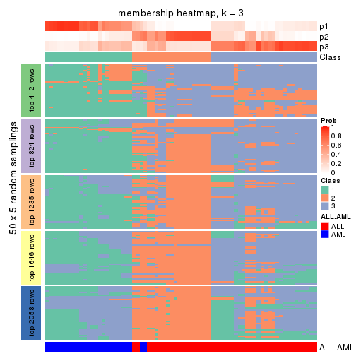</p>

</div>
<div id='tab-MAD-hclust-membership-heatmap-3'>
<pre><code class="r">membership_heatmap(res, k = 4)
</code></pre>

<p>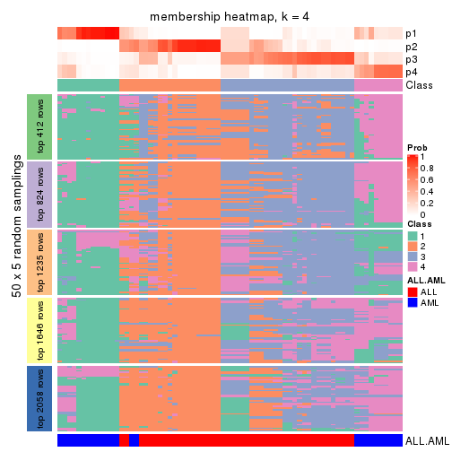</p>

</div>
<div id='tab-MAD-hclust-membership-heatmap-4'>
<pre><code class="r">membership_heatmap(res, k = 5)
</code></pre>

<p>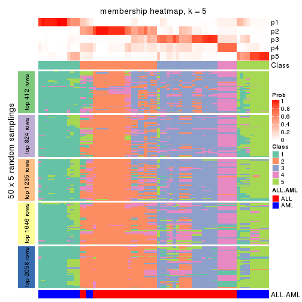</p>

</div>
<div id='tab-MAD-hclust-membership-heatmap-5'>
<pre><code class="r">membership_heatmap(res, k = 6)
</code></pre>

<p>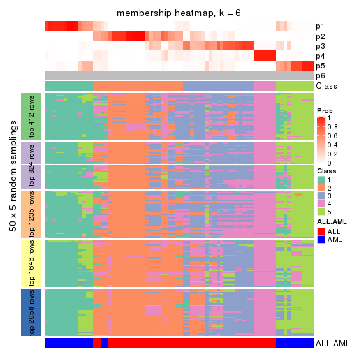</p>

</div>
</div>

As soon as we have had the classes for columns, we can look for signatures
which are significantly different between classes which can be candidate marks
for certain classes. Following are the heatmaps for signatures.


Signature heatmaps where rows are scaled:


<script>
$( function() {
	$( '#tabs-MAD-hclust-get-signatures' ).tabs();
} );
</script>
<div id='tabs-MAD-hclust-get-signatures'>
<ul>
<li><a href='#tab-MAD-hclust-get-signatures-1'>k = 2</a></li>
<li><a href='#tab-MAD-hclust-get-signatures-2'>k = 3</a></li>
<li><a href='#tab-MAD-hclust-get-signatures-3'>k = 4</a></li>
<li><a href='#tab-MAD-hclust-get-signatures-4'>k = 5</a></li>
<li><a href='#tab-MAD-hclust-get-signatures-5'>k = 6</a></li>
</ul>
<div id='tab-MAD-hclust-get-signatures-1'>
<pre><code class="r">get_signatures(res, k = 2)
</code></pre>

<p>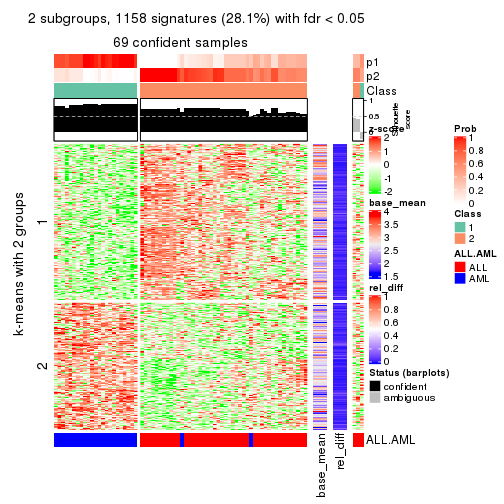</p>

</div>
<div id='tab-MAD-hclust-get-signatures-2'>
<pre><code class="r">get_signatures(res, k = 3)
</code></pre>

<p>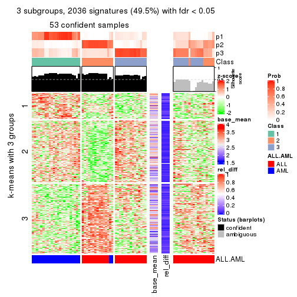</p>

</div>
<div id='tab-MAD-hclust-get-signatures-3'>
<pre><code class="r">get_signatures(res, k = 4)
</code></pre>

<p>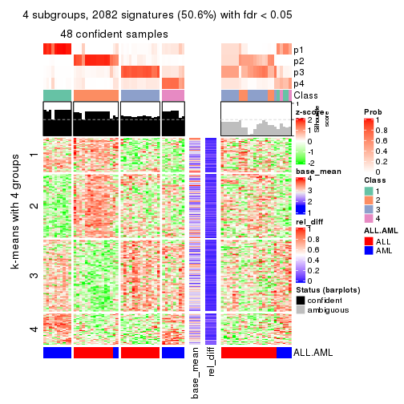</p>

</div>
<div id='tab-MAD-hclust-get-signatures-4'>
<pre><code class="r">get_signatures(res, k = 5)
</code></pre>

<p>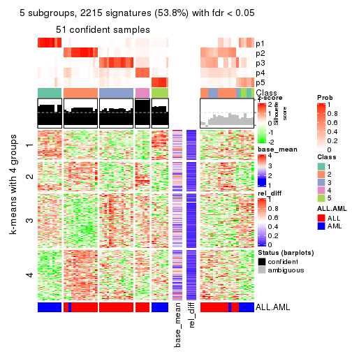</p>

</div>
<div id='tab-MAD-hclust-get-signatures-5'>
<pre><code class="r">get_signatures(res, k = 6)
</code></pre>

<p>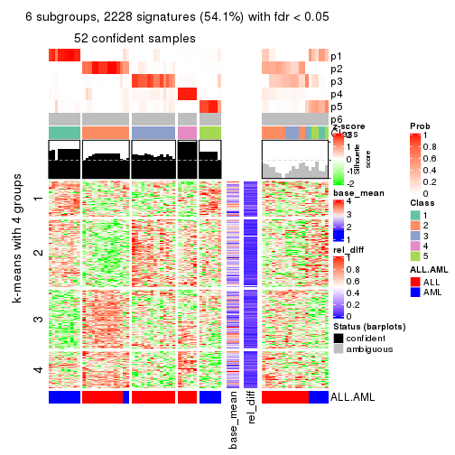</p>

</div>
</div>


Signature heatmaps where rows are not scaled:


<script>
$( function() {
	$( '#tabs-MAD-hclust-get-signatures-no-scale' ).tabs();
} );
</script>
<div id='tabs-MAD-hclust-get-signatures-no-scale'>
<ul>
<li><a href='#tab-MAD-hclust-get-signatures-no-scale-1'>k = 2</a></li>
<li><a href='#tab-MAD-hclust-get-signatures-no-scale-2'>k = 3</a></li>
<li><a href='#tab-MAD-hclust-get-signatures-no-scale-3'>k = 4</a></li>
<li><a href='#tab-MAD-hclust-get-signatures-no-scale-4'>k = 5</a></li>
<li><a href='#tab-MAD-hclust-get-signatures-no-scale-5'>k = 6</a></li>
</ul>
<div id='tab-MAD-hclust-get-signatures-no-scale-1'>
<pre><code class="r">get_signatures(res, k = 2, scale_rows = FALSE)
</code></pre>

<p>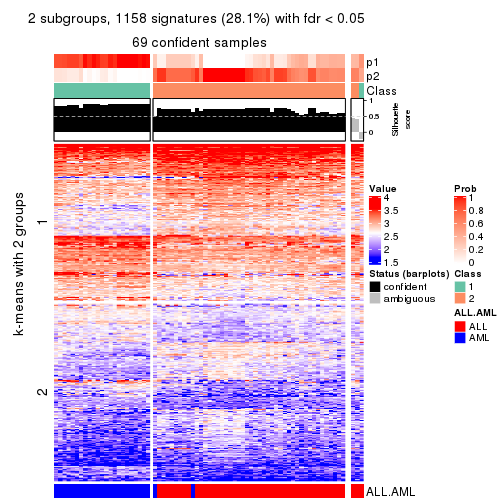</p>

</div>
<div id='tab-MAD-hclust-get-signatures-no-scale-2'>
<pre><code class="r">get_signatures(res, k = 3, scale_rows = FALSE)
</code></pre>

<p>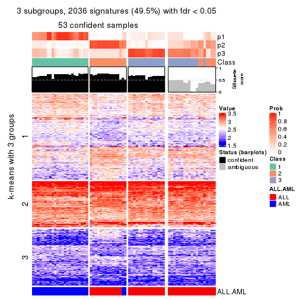</p>

</div>
<div id='tab-MAD-hclust-get-signatures-no-scale-3'>
<pre><code class="r">get_signatures(res, k = 4, scale_rows = FALSE)
</code></pre>

<p>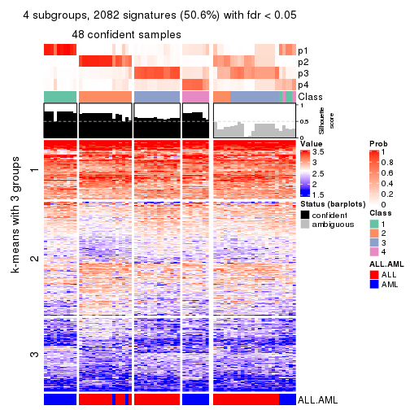</p>

</div>
<div id='tab-MAD-hclust-get-signatures-no-scale-4'>
<pre><code class="r">get_signatures(res, k = 5, scale_rows = FALSE)
</code></pre>

<p>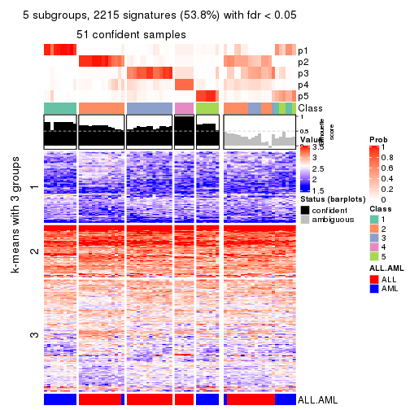</p>

</div>
<div id='tab-MAD-hclust-get-signatures-no-scale-5'>
<pre><code class="r">get_signatures(res, k = 6, scale_rows = FALSE)
</code></pre>

<p>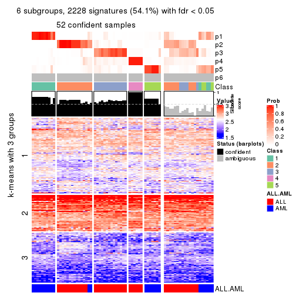</p>

</div>
</div>


Compare the overlap of signatures from different k:

```r
compare_signatures(res)
```

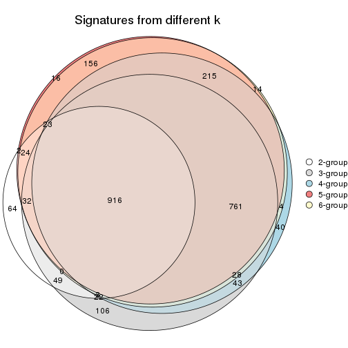

`get_signature()` returns a data frame invisibly. TO get the list of signatures, the function
call should be assigned to a variable explicitly. In following code, if `plot` argument is set
to `FALSE`, no heatmap is plotted while only the differential analysis is performed.

```r
# code only for demonstration
tb = get_signature(res, k = ..., plot = FALSE)
```

An example of the output of `tb` is:

```
#>   which_row         fdr    mean_1    mean_2 scaled_mean_1 scaled_mean_2 km
#> 1        38 0.042760348  8.373488  9.131774    -0.5533452     0.5164555  1
#> 2        40 0.018707592  7.106213  8.469186    -0.6173731     0.5762149  1
#> 3        55 0.019134737 10.221463 11.207825    -0.6159697     0.5749050  1
#> 4        59 0.006059896  5.921854  7.869574    -0.6899429     0.6439467  1
#> 5        60 0.018055526  8.928898 10.211722    -0.6204761     0.5791110  1
#> 6        98 0.009384629 15.714769 14.887706     0.6635654    -0.6193277  2
...
```

The columns in `tb` are:

1. `which_row`: row indices corresponding to the input matrix.
2. `fdr`: FDR for the differential test. 
3. `mean_x`: The mean value in group x.
4. `scaled_mean_x`: The mean value in group x after rows are scaled.
5. `km`: Row groups if k-means clustering is applied to rows.


UMAP plot which shows how samples are separated.


<script>
$( function() {
	$( '#tabs-MAD-hclust-dimension-reduction' ).tabs();
} );
</script>
<div id='tabs-MAD-hclust-dimension-reduction'>
<ul>
<li><a href='#tab-MAD-hclust-dimension-reduction-1'>k = 2</a></li>
<li><a href='#tab-MAD-hclust-dimension-reduction-2'>k = 3</a></li>
<li><a href='#tab-MAD-hclust-dimension-reduction-3'>k = 4</a></li>
<li><a href='#tab-MAD-hclust-dimension-reduction-4'>k = 5</a></li>
<li><a href='#tab-MAD-hclust-dimension-reduction-5'>k = 6</a></li>
</ul>
<div id='tab-MAD-hclust-dimension-reduction-1'>
<pre><code class="r">dimension_reduction(res, k = 2, method = &quot;UMAP&quot;)
</code></pre>

<p>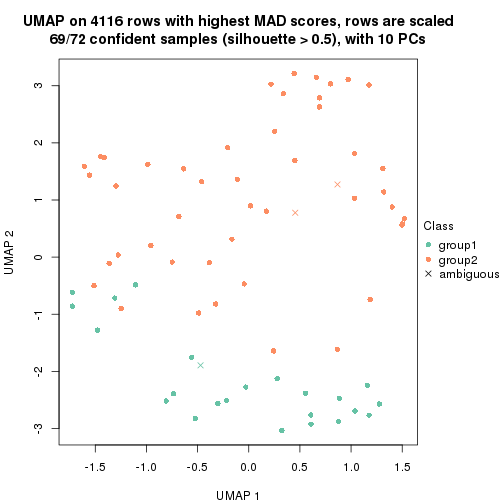</p>

</div>
<div id='tab-MAD-hclust-dimension-reduction-2'>
<pre><code class="r">dimension_reduction(res, k = 3, method = &quot;UMAP&quot;)
</code></pre>

<p>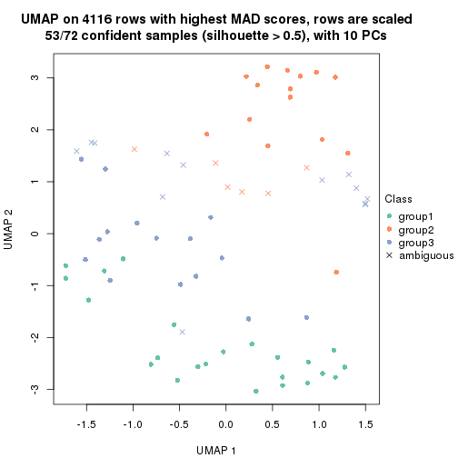</p>

</div>
<div id='tab-MAD-hclust-dimension-reduction-3'>
<pre><code class="r">dimension_reduction(res, k = 4, method = &quot;UMAP&quot;)
</code></pre>

<p>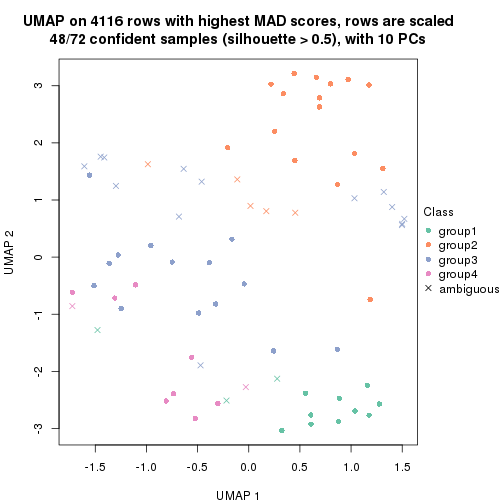</p>

</div>
<div id='tab-MAD-hclust-dimension-reduction-4'>
<pre><code class="r">dimension_reduction(res, k = 5, method = &quot;UMAP&quot;)
</code></pre>

<p>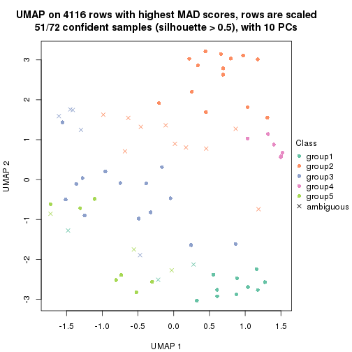</p>

</div>
<div id='tab-MAD-hclust-dimension-reduction-5'>
<pre><code class="r">dimension_reduction(res, k = 6, method = &quot;UMAP&quot;)
</code></pre>

<p>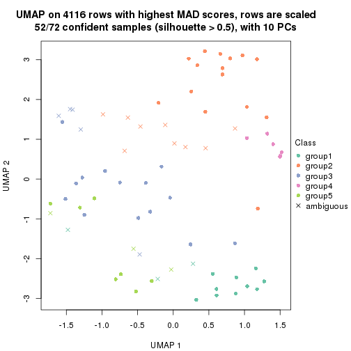</p>

</div>
</div>


Following heatmap shows how subgroups are split when increasing `k`:

```r
collect_classes(res)
```

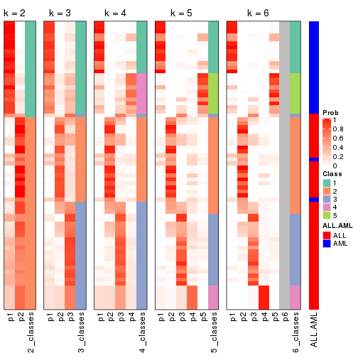


Test correlation between subgroups and known annotations. If the known
annotation is numeric, one-way ANOVA test is applied, and if the known
annotation is discrete, chi-squared contingency table test is applied.

```r
test_to_known_factors(res)
```

```
#>             n ALL.AML(p) k
#> MAD:hclust 69   5.21e-14 2
#> MAD:hclust 53   1.00e-10 3
#> MAD:hclust 48   7.21e-09 4
#> MAD:hclust 51   1.57e-09 5
#> MAD:hclust 52   4.99e-09 6
```


If matrix rows can be associated to genes, consider to use `functional_enrichment(res,
...)` to perform function enrichment for the signature genes. See [this vignette](http://bioconductor.org/packages/devel/bioc/vignettes/cola/inst/doc/functional_enrichment.html) for more detailed explanations.


 

---------------------------------------------------


### MAD:kmeans


The object with results only for a single top-value method and a single partition method 
can be extracted as:

```r
res = res_list["MAD", "kmeans"]
# you can also extract it by
# res = res_list["MAD:kmeans"]
```

A summary of `res` and all the functions that can be applied to it:

```r
res
```

```
#> A 'ConsensusPartition' object with k = 2, 3, 4, 5, 6.
#>   On a matrix with 4116 rows and 72 columns.
#>   Top rows (412, 824, 1235, 1646, 2058) are extracted by 'MAD' method.
#>   Subgroups are detected by 'kmeans' method.
#>   Performed in total 1250 partitions by row resampling.
#>   Best k for subgroups seems to be 2.
#> 
#> Following methods can be applied to this 'ConsensusPartition' object:
#>  [1] "cola_report"             "collect_classes"         "collect_plots"          
#>  [4] "collect_stats"           "colnames"                "compare_signatures"     
#>  [7] "consensus_heatmap"       "dimension_reduction"     "functional_enrichment"  
#> [10] "get_anno_col"            "get_anno"                "get_classes"            
#> [13] "get_consensus"           "get_matrix"              "get_membership"         
#> [16] "get_param"               "get_signatures"          "get_stats"              
#> [19] "is_best_k"               "is_stable_k"             "membership_heatmap"     
#> [22] "ncol"                    "nrow"                    "plot_ecdf"              
#> [25] "rownames"                "select_partition_number" "show"                   
#> [28] "suggest_best_k"          "test_to_known_factors"
```

`collect_plots()` function collects all the plots made from `res` for all `k` (number of partitions)
into one single page to provide an easy and fast comparison between different `k`.

```r
collect_plots(res)
```

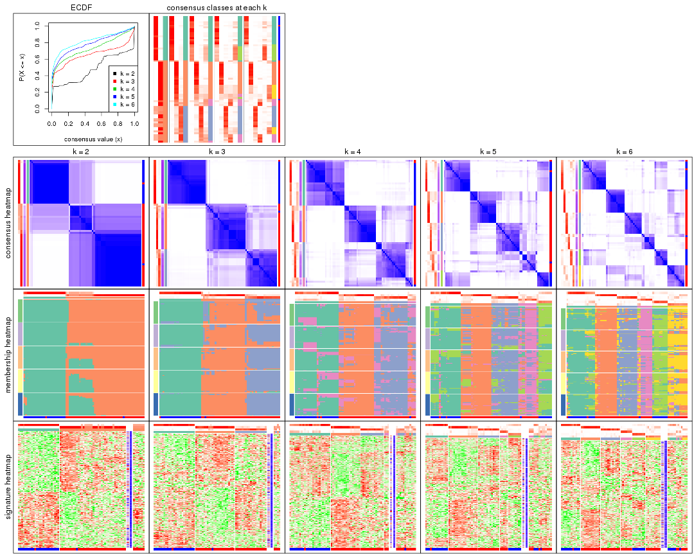

The plots are:

- The first row: a plot of the ECDF (empirical cumulative distribution
  function) curves of the consensus matrix for each `k` and the heatmap of
  predicted classes for each `k`.
- The second row: heatmaps of the consensus matrix for each `k`.
- The third row: heatmaps of the membership matrix for each `k`.
- The fouth row: heatmaps of the signatures for each `k`.

All the plots in panels can be made by individual functions and they are
plotted later in this section.

`select_partition_number()` produces several plots showing different
statistics for choosing "optimized" `k`. There are following statistics:

- ECDF curves of the consensus matrix for each `k`;
- 1-PAC. [The PAC
  score](https://en.wikipedia.org/wiki/Consensus_clustering#Over-interpretation_potential_of_consensus_clustering)
  measures the proportion of the ambiguous subgrouping.
- Mean silhouette score.
- Concordance. The mean probability of fiting the consensus class ids in all
  partitions.
- Area increased. Denote $A_k$ as the area under the ECDF curve for current
  `k`, the area increased is defined as $A_k - A_{k-1}$.
- Rand index. The percent of pairs of samples that are both in a same cluster
  or both are not in a same cluster in the partition of k and k-1.
- Jaccard index. The ratio of pairs of samples are both in a same cluster in
  the partition of k and k-1 and the pairs of samples are both in a same
  cluster in the partition k or k-1.

The detailed explanations of these statistics can be found in [the _cola_
vignette](http://bioconductor.org/packages/devel/bioc/vignettes/cola/inst/doc/cola.html#toc_13).

Generally speaking, lower PAC score, higher mean silhouette score or higher
concordance corresponds to better partition. Rand index and Jaccard index
measure how similar the current partition is compared to partition with `k-1`.
If they are too similar, we won't accept `k` is better than `k-1`.

```r
select_partition_number(res)
```

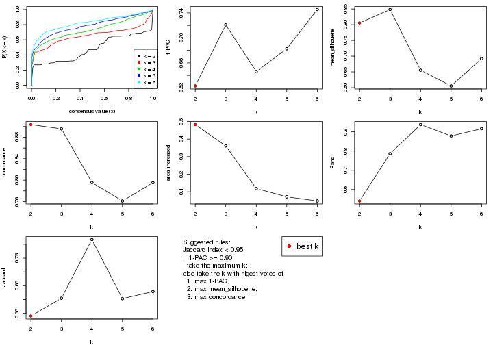

The numeric values for all these statistics can be obtained by `get_stats()`.

```r
get_stats(res)
```

```
#>   k 1-PAC mean_silhouette concordance area_increased  Rand Jaccard
#> 2 2 0.623           0.805       0.904         0.4828 0.540   0.540
#> 3 3 0.721           0.848       0.896         0.3612 0.786   0.605
#> 4 4 0.646           0.655       0.796         0.1188 0.938   0.817
#> 5 5 0.683           0.605       0.761         0.0716 0.879   0.603
#> 6 6 0.745           0.692       0.795         0.0480 0.917   0.629
```

`suggest_best_k()` suggests the best $k$ based on these statistics. The rules are as follows:

- All $k$ with Jaccard index larger than 0.95 are removed because increasing
  $k$ does not provide enough extra information. If all $k$ are removed, it is
  marked as no subgroup is detected.
- For all $k$ with 1-PAC score larger than 0.9, the maximal $k$ is taken as
  the best $k$, and other $k$ are marked as optional $k$.
- If it does not fit the second rule. The $k$ with the maximal vote of the
  highest 1-PAC score, highest mean silhouette, and highest concordance is
  taken as the best $k$.

```r
suggest_best_k(res)
```

```
#> [1] 2
```


Following shows the table of the partitions (You need to click the **show/hide
code output** link to see it). The membership matrix (columns with name `p*`)
is inferred by
[`clue::cl_consensus()`](https://www.rdocumentation.org/link/cl_consensus?package=clue)
function with the `SE` method. Basically the value in the membership matrix
represents the probability to belong to a certain group. The finall class
label for an item is determined with the group with highest probability it
belongs to.

In `get_classes()` function, the entropy is calculated from the membership
matrix and the silhouette score is calculated from the consensus matrix.


<script>
$( function() {
	$( '#tabs-MAD-kmeans-get-classes' ).tabs();
} );
</script>
<div id='tabs-MAD-kmeans-get-classes'>
<ul>
<li><a href='#tab-MAD-kmeans-get-classes-1'>k = 2</a></li>
<li><a href='#tab-MAD-kmeans-get-classes-2'>k = 3</a></li>
<li><a href='#tab-MAD-kmeans-get-classes-3'>k = 4</a></li>
<li><a href='#tab-MAD-kmeans-get-classes-4'>k = 5</a></li>
<li><a href='#tab-MAD-kmeans-get-classes-5'>k = 6</a></li>
</ul>

<div id='tab-MAD-kmeans-get-classes-1'>
<p><a id='tab-MAD-kmeans-get-classes-1-a' style='color:#0366d6' href='#'>show/hide code output</a></p>
<pre><code class="r">cbind(get_classes(res, k = 2), get_membership(res, k = 2))
</code></pre>

<pre><code>#&gt;           class entropy silhouette    p1    p2
#&gt; sample_39     2  0.9866      0.452 0.432 0.568
#&gt; sample_40     2  0.9922      0.421 0.448 0.552
#&gt; sample_42     2  0.0000      0.840 0.000 1.000
#&gt; sample_47     2  0.0000      0.840 0.000 1.000
#&gt; sample_48     2  0.0000      0.840 0.000 1.000
#&gt; sample_49     2  0.9933      0.412 0.452 0.548
#&gt; sample_41     2  0.0000      0.840 0.000 1.000
#&gt; sample_43     2  0.0000      0.840 0.000 1.000
#&gt; sample_44     2  0.0000      0.840 0.000 1.000
#&gt; sample_45     2  0.0000      0.840 0.000 1.000
#&gt; sample_46     2  0.0000      0.840 0.000 1.000
#&gt; sample_70     2  0.1184      0.834 0.016 0.984
#&gt; sample_71     2  0.0000      0.840 0.000 1.000
#&gt; sample_72     2  0.0000      0.840 0.000 1.000
#&gt; sample_68     2  0.0000      0.840 0.000 1.000
#&gt; sample_69     2  0.0000      0.840 0.000 1.000
#&gt; sample_67     2  0.9896      0.176 0.440 0.560
#&gt; sample_55     2  0.9686      0.515 0.396 0.604
#&gt; sample_56     2  0.9732      0.502 0.404 0.596
#&gt; sample_59     2  0.0376      0.839 0.004 0.996
#&gt; sample_52     1  0.0376      0.988 0.996 0.004
#&gt; sample_53     1  0.0376      0.988 0.996 0.004
#&gt; sample_51     1  0.0376      0.988 0.996 0.004
#&gt; sample_50     1  0.0376      0.988 0.996 0.004
#&gt; sample_54     1  0.6048      0.806 0.852 0.148
#&gt; sample_57     1  0.0376      0.988 0.996 0.004
#&gt; sample_58     1  0.0376      0.988 0.996 0.004
#&gt; sample_60     1  0.0938      0.980 0.988 0.012
#&gt; sample_61     1  0.0376      0.988 0.996 0.004
#&gt; sample_65     1  0.0376      0.988 0.996 0.004
#&gt; sample_66     2  0.0000      0.840 0.000 1.000
#&gt; sample_63     1  0.0376      0.988 0.996 0.004
#&gt; sample_64     1  0.0376      0.988 0.996 0.004
#&gt; sample_62     1  0.0376      0.988 0.996 0.004
#&gt; sample_1      2  0.0672      0.838 0.008 0.992
#&gt; sample_2      2  0.6887      0.676 0.184 0.816
#&gt; sample_3      2  0.9552      0.549 0.376 0.624
#&gt; sample_4      2  0.0672      0.838 0.008 0.992
#&gt; sample_5      2  0.0000      0.840 0.000 1.000
#&gt; sample_6      2  0.9580      0.544 0.380 0.620
#&gt; sample_7      2  0.9686      0.515 0.396 0.604
#&gt; sample_8      2  0.9933      0.412 0.452 0.548
#&gt; sample_9      2  0.0376      0.838 0.004 0.996
#&gt; sample_10     2  0.9580      0.544 0.380 0.620
#&gt; sample_11     2  0.0376      0.838 0.004 0.996
#&gt; sample_12     1  0.0376      0.988 0.996 0.004
#&gt; sample_13     2  0.0000      0.840 0.000 1.000
#&gt; sample_14     2  0.0376      0.838 0.004 0.996
#&gt; sample_15     2  0.0000      0.840 0.000 1.000
#&gt; sample_16     2  0.0000      0.840 0.000 1.000
#&gt; sample_17     2  0.0000      0.840 0.000 1.000
#&gt; sample_18     2  0.6973      0.727 0.188 0.812
#&gt; sample_19     2  0.0000      0.840 0.000 1.000
#&gt; sample_20     2  0.0000      0.840 0.000 1.000
#&gt; sample_21     2  0.0000      0.840 0.000 1.000
#&gt; sample_22     2  0.9944      0.403 0.456 0.544
#&gt; sample_23     2  0.9580      0.544 0.380 0.620
#&gt; sample_24     2  0.0000      0.840 0.000 1.000
#&gt; sample_25     2  0.9248      0.588 0.340 0.660
#&gt; sample_26     2  0.0000      0.840 0.000 1.000
#&gt; sample_27     2  0.9933      0.412 0.452 0.548
#&gt; sample_34     1  0.0376      0.988 0.996 0.004
#&gt; sample_35     1  0.0376      0.988 0.996 0.004
#&gt; sample_36     1  0.0376      0.988 0.996 0.004
#&gt; sample_37     1  0.0376      0.988 0.996 0.004
#&gt; sample_38     1  0.0376      0.988 0.996 0.004
#&gt; sample_28     1  0.0376      0.988 0.996 0.004
#&gt; sample_29     1  0.4298      0.887 0.912 0.088
#&gt; sample_30     1  0.0376      0.988 0.996 0.004
#&gt; sample_31     1  0.0376      0.988 0.996 0.004
#&gt; sample_32     1  0.0376      0.988 0.996 0.004
#&gt; sample_33     1  0.0376      0.988 0.996 0.004
</code></pre>

<script>
$('#tab-MAD-kmeans-get-classes-1-a').parent().next().next().hide();
$('#tab-MAD-kmeans-get-classes-1-a').click(function(){
  $('#tab-MAD-kmeans-get-classes-1-a').parent().next().next().toggle();
  return(false);
});
</script>
</div>

<div id='tab-MAD-kmeans-get-classes-2'>
<p><a id='tab-MAD-kmeans-get-classes-2-a' style='color:#0366d6' href='#'>show/hide code output</a></p>
<pre><code class="r">cbind(get_classes(res, k = 3), get_membership(res, k = 3))
</code></pre>

<pre><code>#&gt;           class entropy silhouette    p1    p2    p3
#&gt; sample_39     3  0.5503      0.852 0.020 0.208 0.772
#&gt; sample_40     3  0.4679      0.879 0.020 0.148 0.832
#&gt; sample_42     2  0.3272      0.816 0.004 0.892 0.104
#&gt; sample_47     2  0.0237      0.872 0.000 0.996 0.004
#&gt; sample_48     2  0.0237      0.872 0.000 0.996 0.004
#&gt; sample_49     3  0.4418      0.877 0.020 0.132 0.848
#&gt; sample_41     2  0.0424      0.871 0.000 0.992 0.008
#&gt; sample_43     2  0.1964      0.853 0.000 0.944 0.056
#&gt; sample_44     2  0.1964      0.853 0.000 0.944 0.056
#&gt; sample_45     2  0.1289      0.866 0.000 0.968 0.032
#&gt; sample_46     2  0.1964      0.853 0.000 0.944 0.056
#&gt; sample_70     3  0.4796      0.847 0.000 0.220 0.780
#&gt; sample_71     2  0.4233      0.752 0.004 0.836 0.160
#&gt; sample_72     2  0.4233      0.752 0.004 0.836 0.160
#&gt; sample_68     2  0.0237      0.872 0.000 0.996 0.004
#&gt; sample_69     2  0.0237      0.872 0.000 0.996 0.004
#&gt; sample_67     2  0.7072      0.132 0.476 0.504 0.020
#&gt; sample_55     3  0.4068      0.874 0.016 0.120 0.864
#&gt; sample_56     3  0.4602      0.879 0.016 0.152 0.832
#&gt; sample_59     3  0.5882      0.701 0.000 0.348 0.652
#&gt; sample_52     1  0.1964      0.969 0.944 0.000 0.056
#&gt; sample_53     1  0.0000      0.978 1.000 0.000 0.000
#&gt; sample_51     1  0.0000      0.978 1.000 0.000 0.000
#&gt; sample_50     1  0.0000      0.978 1.000 0.000 0.000
#&gt; sample_54     1  0.2845      0.957 0.920 0.012 0.068
#&gt; sample_57     1  0.2066      0.968 0.940 0.000 0.060
#&gt; sample_58     1  0.2066      0.968 0.940 0.000 0.060
#&gt; sample_60     1  0.2261      0.964 0.932 0.000 0.068
#&gt; sample_61     1  0.0592      0.978 0.988 0.000 0.012
#&gt; sample_65     1  0.0424      0.978 0.992 0.000 0.008
#&gt; sample_66     2  0.4842      0.709 0.000 0.776 0.224
#&gt; sample_63     1  0.1964      0.969 0.944 0.000 0.056
#&gt; sample_64     1  0.2066      0.968 0.940 0.000 0.060
#&gt; sample_62     1  0.1964      0.969 0.944 0.000 0.056
#&gt; sample_1      3  0.5254      0.807 0.000 0.264 0.736
#&gt; sample_2      2  0.7975      0.599 0.160 0.660 0.180
#&gt; sample_3      3  0.2384      0.827 0.008 0.056 0.936
#&gt; sample_4      3  0.4399      0.866 0.000 0.188 0.812
#&gt; sample_5      2  0.0424      0.871 0.000 0.992 0.008
#&gt; sample_6      3  0.2384      0.827 0.008 0.056 0.936
#&gt; sample_7      3  0.4741      0.879 0.020 0.152 0.828
#&gt; sample_8      3  0.4802      0.878 0.020 0.156 0.824
#&gt; sample_9      3  0.6180      0.184 0.000 0.416 0.584
#&gt; sample_10     3  0.2384      0.827 0.008 0.056 0.936
#&gt; sample_11     2  0.6295      0.204 0.000 0.528 0.472
#&gt; sample_12     1  0.2356      0.916 0.928 0.000 0.072
#&gt; sample_13     2  0.0237      0.872 0.000 0.996 0.004
#&gt; sample_14     2  0.5621      0.601 0.000 0.692 0.308
#&gt; sample_15     2  0.0424      0.871 0.000 0.992 0.008
#&gt; sample_16     2  0.1411      0.866 0.000 0.964 0.036
#&gt; sample_17     2  0.2711      0.822 0.000 0.912 0.088
#&gt; sample_18     3  0.3686      0.875 0.000 0.140 0.860
#&gt; sample_19     2  0.1411      0.864 0.000 0.964 0.036
#&gt; sample_20     2  0.0237      0.872 0.000 0.996 0.004
#&gt; sample_21     2  0.0747      0.869 0.000 0.984 0.016
#&gt; sample_22     3  0.4999      0.877 0.028 0.152 0.820
#&gt; sample_23     3  0.2384      0.827 0.008 0.056 0.936
#&gt; sample_24     2  0.0424      0.871 0.000 0.992 0.008
#&gt; sample_25     3  0.6096      0.783 0.016 0.280 0.704
#&gt; sample_26     3  0.6291      0.412 0.000 0.468 0.532
#&gt; sample_27     3  0.4349      0.876 0.020 0.128 0.852
#&gt; sample_34     1  0.0892      0.977 0.980 0.000 0.020
#&gt; sample_35     1  0.1411      0.975 0.964 0.000 0.036
#&gt; sample_36     1  0.0000      0.978 1.000 0.000 0.000
#&gt; sample_37     1  0.0000      0.978 1.000 0.000 0.000
#&gt; sample_38     1  0.0000      0.978 1.000 0.000 0.000
#&gt; sample_28     1  0.0000      0.978 1.000 0.000 0.000
#&gt; sample_29     1  0.0237      0.976 0.996 0.000 0.004
#&gt; sample_30     1  0.0000      0.978 1.000 0.000 0.000
#&gt; sample_31     1  0.1289      0.975 0.968 0.000 0.032
#&gt; sample_32     1  0.0000      0.978 1.000 0.000 0.000
#&gt; sample_33     1  0.0000      0.978 1.000 0.000 0.000
</code></pre>

<script>
$('#tab-MAD-kmeans-get-classes-2-a').parent().next().next().hide();
$('#tab-MAD-kmeans-get-classes-2-a').click(function(){
  $('#tab-MAD-kmeans-get-classes-2-a').parent().next().next().toggle();
  return(false);
});
</script>
</div>

<div id='tab-MAD-kmeans-get-classes-3'>
<p><a id='tab-MAD-kmeans-get-classes-3-a' style='color:#0366d6' href='#'>show/hide code output</a></p>
<pre><code class="r">cbind(get_classes(res, k = 4), get_membership(res, k = 4))
</code></pre>

<pre><code>#&gt;           class entropy silhouette    p1    p2    p3    p4
#&gt; sample_39     3  0.3634     0.7118 0.000 0.048 0.856 0.096
#&gt; sample_40     3  0.1733     0.7422 0.000 0.028 0.948 0.024
#&gt; sample_42     2  0.7708     0.2996 0.012 0.512 0.188 0.288
#&gt; sample_47     2  0.2197     0.7574 0.000 0.916 0.004 0.080
#&gt; sample_48     2  0.0000     0.7804 0.000 1.000 0.000 0.000
#&gt; sample_49     3  0.1624     0.7407 0.000 0.020 0.952 0.028
#&gt; sample_41     2  0.0524     0.7773 0.000 0.988 0.004 0.008
#&gt; sample_43     2  0.5332     0.6580 0.000 0.748 0.124 0.128
#&gt; sample_44     2  0.5531     0.6432 0.000 0.732 0.140 0.128
#&gt; sample_45     2  0.4992     0.6835 0.000 0.772 0.096 0.132
#&gt; sample_46     2  0.5160     0.6735 0.000 0.760 0.104 0.136
#&gt; sample_70     3  0.4685     0.6448 0.000 0.060 0.784 0.156
#&gt; sample_71     2  0.8098     0.1639 0.016 0.460 0.236 0.288
#&gt; sample_72     2  0.7997     0.1730 0.012 0.464 0.236 0.288
#&gt; sample_68     2  0.0524     0.7773 0.000 0.988 0.004 0.008
#&gt; sample_69     2  0.0188     0.7797 0.000 0.996 0.004 0.000
#&gt; sample_67     1  0.7776    -0.0255 0.496 0.252 0.008 0.244
#&gt; sample_55     3  0.2124     0.7268 0.000 0.008 0.924 0.068
#&gt; sample_56     3  0.2032     0.7412 0.000 0.028 0.936 0.036
#&gt; sample_59     3  0.6352     0.5046 0.000 0.188 0.656 0.156
#&gt; sample_52     1  0.4800     0.7678 0.656 0.000 0.004 0.340
#&gt; sample_53     1  0.0336     0.8052 0.992 0.000 0.000 0.008
#&gt; sample_51     1  0.0000     0.8076 1.000 0.000 0.000 0.000
#&gt; sample_50     1  0.0000     0.8076 1.000 0.000 0.000 0.000
#&gt; sample_54     1  0.5989     0.7066 0.556 0.000 0.044 0.400
#&gt; sample_57     1  0.5793     0.7404 0.600 0.000 0.040 0.360
#&gt; sample_58     1  0.5527     0.7508 0.616 0.000 0.028 0.356
#&gt; sample_60     1  0.5989     0.7066 0.556 0.000 0.044 0.400
#&gt; sample_61     1  0.4290     0.8076 0.800 0.000 0.036 0.164
#&gt; sample_65     1  0.3257     0.8122 0.844 0.000 0.004 0.152
#&gt; sample_66     4  0.6748     0.3239 0.000 0.432 0.092 0.476
#&gt; sample_63     1  0.4936     0.7664 0.652 0.000 0.008 0.340
#&gt; sample_64     1  0.5762     0.7455 0.608 0.000 0.040 0.352
#&gt; sample_62     1  0.4955     0.7652 0.648 0.000 0.008 0.344
#&gt; sample_1      3  0.2924     0.7152 0.000 0.100 0.884 0.016
#&gt; sample_2      4  0.8069     0.5248 0.156 0.272 0.044 0.528
#&gt; sample_3      3  0.4855     0.2915 0.000 0.004 0.644 0.352
#&gt; sample_4      3  0.3464     0.6920 0.000 0.108 0.860 0.032
#&gt; sample_5      2  0.0524     0.7773 0.000 0.988 0.004 0.008
#&gt; sample_6      3  0.4855     0.2915 0.000 0.004 0.644 0.352
#&gt; sample_7      3  0.2722     0.7168 0.000 0.064 0.904 0.032
#&gt; sample_8      3  0.1629     0.7412 0.000 0.024 0.952 0.024
#&gt; sample_9      4  0.7151     0.3347 0.000 0.132 0.420 0.448
#&gt; sample_10     3  0.5155    -0.0285 0.000 0.004 0.528 0.468
#&gt; sample_11     4  0.7596     0.5538 0.004 0.192 0.316 0.488
#&gt; sample_12     1  0.4297     0.7018 0.820 0.000 0.096 0.084
#&gt; sample_13     2  0.0000     0.7804 0.000 1.000 0.000 0.000
#&gt; sample_14     4  0.7495     0.6037 0.000 0.368 0.184 0.448
#&gt; sample_15     2  0.0524     0.7773 0.000 0.988 0.004 0.008
#&gt; sample_16     2  0.1733     0.7722 0.000 0.948 0.028 0.024
#&gt; sample_17     2  0.3547     0.6252 0.000 0.840 0.016 0.144
#&gt; sample_18     3  0.2376     0.7349 0.000 0.016 0.916 0.068
#&gt; sample_19     2  0.4827     0.6909 0.000 0.784 0.092 0.124
#&gt; sample_20     2  0.0000     0.7804 0.000 1.000 0.000 0.000
#&gt; sample_21     2  0.0657     0.7756 0.000 0.984 0.004 0.012
#&gt; sample_22     3  0.3421     0.7040 0.016 0.020 0.876 0.088
#&gt; sample_23     3  0.4855     0.2915 0.000 0.004 0.644 0.352
#&gt; sample_24     2  0.0524     0.7773 0.000 0.988 0.004 0.008
#&gt; sample_25     3  0.6664     0.4887 0.016 0.120 0.656 0.208
#&gt; sample_26     3  0.6855     0.3011 0.000 0.276 0.580 0.144
#&gt; sample_27     3  0.1624     0.7407 0.000 0.020 0.952 0.028
#&gt; sample_34     1  0.3726     0.8067 0.788 0.000 0.000 0.212
#&gt; sample_35     1  0.5386     0.7859 0.708 0.000 0.056 0.236
#&gt; sample_36     1  0.0000     0.8076 1.000 0.000 0.000 0.000
#&gt; sample_37     1  0.0336     0.8052 0.992 0.000 0.000 0.008
#&gt; sample_38     1  0.1661     0.7815 0.944 0.000 0.004 0.052
#&gt; sample_28     1  0.1743     0.7790 0.940 0.000 0.004 0.056
#&gt; sample_29     1  0.1867     0.7698 0.928 0.000 0.000 0.072
#&gt; sample_30     1  0.0000     0.8076 1.000 0.000 0.000 0.000
#&gt; sample_31     1  0.3831     0.8069 0.792 0.000 0.004 0.204
#&gt; sample_32     1  0.1302     0.8116 0.956 0.000 0.000 0.044
#&gt; sample_33     1  0.0336     0.8052 0.992 0.000 0.000 0.008
</code></pre>

<script>
$('#tab-MAD-kmeans-get-classes-3-a').parent().next().next().hide();
$('#tab-MAD-kmeans-get-classes-3-a').click(function(){
  $('#tab-MAD-kmeans-get-classes-3-a').parent().next().next().toggle();
  return(false);
});
</script>
</div>

<div id='tab-MAD-kmeans-get-classes-4'>
<p><a id='tab-MAD-kmeans-get-classes-4-a' style='color:#0366d6' href='#'>show/hide code output</a></p>
<pre><code class="r">cbind(get_classes(res, k = 5), get_membership(res, k = 5))
</code></pre>

<pre><code>#&gt;           class entropy silhouette    p1    p2    p3    p4    p5
#&gt; sample_39     3  0.3866     0.7092 0.000 0.008 0.820 0.076 0.096
#&gt; sample_40     3  0.1605     0.7528 0.000 0.004 0.944 0.012 0.040
#&gt; sample_42     5  0.8502    -0.4126 0.000 0.216 0.192 0.288 0.304
#&gt; sample_47     2  0.4107     0.7273 0.000 0.808 0.032 0.036 0.124
#&gt; sample_48     2  0.0486     0.8050 0.000 0.988 0.004 0.004 0.004
#&gt; sample_49     3  0.1461     0.7545 0.000 0.004 0.952 0.016 0.028
#&gt; sample_41     2  0.0671     0.8008 0.000 0.980 0.004 0.016 0.000
#&gt; sample_43     2  0.7192     0.5308 0.000 0.552 0.128 0.104 0.216
#&gt; sample_44     2  0.7242     0.5249 0.000 0.552 0.148 0.104 0.196
#&gt; sample_45     2  0.6991     0.5591 0.000 0.580 0.120 0.104 0.196
#&gt; sample_46     2  0.7030     0.5545 0.000 0.576 0.124 0.104 0.196
#&gt; sample_70     3  0.5805     0.5752 0.000 0.016 0.652 0.132 0.200
#&gt; sample_71     4  0.8438     0.1047 0.000 0.184 0.224 0.348 0.244
#&gt; sample_72     4  0.8454     0.1017 0.000 0.188 0.224 0.344 0.244
#&gt; sample_68     2  0.0671     0.8008 0.000 0.980 0.004 0.016 0.000
#&gt; sample_69     2  0.0613     0.8043 0.000 0.984 0.008 0.004 0.004
#&gt; sample_67     1  0.7586     0.0751 0.444 0.064 0.008 0.340 0.144
#&gt; sample_55     3  0.3122     0.7124 0.000 0.004 0.852 0.024 0.120
#&gt; sample_56     3  0.1618     0.7582 0.000 0.008 0.944 0.008 0.040
#&gt; sample_59     3  0.7213     0.4917 0.000 0.112 0.540 0.108 0.240
#&gt; sample_52     5  0.4595     0.6162 0.400 0.000 0.004 0.008 0.588
#&gt; sample_53     1  0.0000     0.7636 1.000 0.000 0.000 0.000 0.000
#&gt; sample_51     1  0.0000     0.7636 1.000 0.000 0.000 0.000 0.000
#&gt; sample_50     1  0.0000     0.7636 1.000 0.000 0.000 0.000 0.000
#&gt; sample_54     5  0.5270     0.6302 0.224 0.000 0.060 0.024 0.692
#&gt; sample_57     5  0.4984     0.6669 0.308 0.000 0.036 0.008 0.648
#&gt; sample_58     5  0.4817     0.6546 0.368 0.000 0.016 0.008 0.608
#&gt; sample_60     5  0.5212     0.6332 0.228 0.000 0.060 0.020 0.692
#&gt; sample_61     1  0.4505     0.5495 0.736 0.000 0.016 0.028 0.220
#&gt; sample_65     1  0.3687     0.5803 0.792 0.000 0.000 0.028 0.180
#&gt; sample_66     4  0.6161     0.4701 0.004 0.168 0.016 0.628 0.184
#&gt; sample_63     5  0.4689     0.6319 0.392 0.000 0.008 0.008 0.592
#&gt; sample_64     5  0.5425     0.6554 0.328 0.000 0.040 0.020 0.612
#&gt; sample_62     5  0.4679     0.6377 0.388 0.000 0.008 0.008 0.596
#&gt; sample_1      3  0.2188     0.7574 0.000 0.024 0.924 0.024 0.028
#&gt; sample_2      4  0.6239     0.5077 0.144 0.052 0.008 0.668 0.128
#&gt; sample_3      4  0.4392     0.4266 0.000 0.008 0.380 0.612 0.000
#&gt; sample_4      3  0.3357     0.6708 0.000 0.136 0.836 0.012 0.016
#&gt; sample_5      2  0.0671     0.8008 0.000 0.980 0.004 0.016 0.000
#&gt; sample_6      4  0.4392     0.4266 0.000 0.008 0.380 0.612 0.000
#&gt; sample_7      3  0.3079     0.6984 0.000 0.092 0.868 0.012 0.028
#&gt; sample_8      3  0.1471     0.7581 0.000 0.004 0.952 0.020 0.024
#&gt; sample_9      4  0.3460     0.6211 0.000 0.044 0.128 0.828 0.000
#&gt; sample_10     4  0.3211     0.6035 0.000 0.008 0.164 0.824 0.004
#&gt; sample_11     4  0.3202     0.6254 0.000 0.056 0.080 0.860 0.004
#&gt; sample_12     1  0.4858     0.6276 0.772 0.000 0.064 0.064 0.100
#&gt; sample_13     2  0.0486     0.8050 0.000 0.988 0.004 0.004 0.004
#&gt; sample_14     4  0.4011     0.6111 0.000 0.124 0.056 0.808 0.012
#&gt; sample_15     2  0.0671     0.8008 0.000 0.980 0.004 0.016 0.000
#&gt; sample_16     2  0.1815     0.7933 0.000 0.940 0.016 0.024 0.020
#&gt; sample_17     2  0.4245     0.5725 0.000 0.744 0.008 0.224 0.024
#&gt; sample_18     3  0.3359     0.7377 0.000 0.004 0.848 0.052 0.096
#&gt; sample_19     2  0.6951     0.5627 0.000 0.584 0.116 0.104 0.196
#&gt; sample_20     2  0.0854     0.8046 0.000 0.976 0.008 0.012 0.004
#&gt; sample_21     2  0.1267     0.7940 0.000 0.960 0.004 0.024 0.012
#&gt; sample_22     3  0.3520     0.7139 0.000 0.004 0.840 0.076 0.080
#&gt; sample_23     4  0.4392     0.4266 0.000 0.008 0.380 0.612 0.000
#&gt; sample_24     2  0.0671     0.8008 0.000 0.980 0.004 0.016 0.000
#&gt; sample_25     3  0.7321     0.3720 0.000 0.060 0.496 0.184 0.260
#&gt; sample_26     3  0.7009     0.4831 0.000 0.092 0.576 0.136 0.196
#&gt; sample_27     3  0.1461     0.7545 0.000 0.004 0.952 0.016 0.028
#&gt; sample_34     1  0.4445     0.3169 0.676 0.000 0.000 0.024 0.300
#&gt; sample_35     1  0.6131    -0.2947 0.488 0.000 0.068 0.024 0.420
#&gt; sample_36     1  0.0324     0.7624 0.992 0.000 0.000 0.004 0.004
#&gt; sample_37     1  0.0000     0.7636 1.000 0.000 0.000 0.000 0.000
#&gt; sample_38     1  0.2189     0.7140 0.904 0.000 0.000 0.012 0.084
#&gt; sample_28     1  0.2110     0.7227 0.912 0.000 0.000 0.016 0.072
#&gt; sample_29     1  0.2694     0.6955 0.884 0.000 0.000 0.040 0.076
#&gt; sample_30     1  0.0324     0.7624 0.992 0.000 0.000 0.004 0.004
#&gt; sample_31     1  0.4382     0.3500 0.688 0.000 0.000 0.024 0.288
#&gt; sample_32     1  0.2104     0.7304 0.916 0.000 0.000 0.024 0.060
#&gt; sample_33     1  0.0000     0.7636 1.000 0.000 0.000 0.000 0.000
</code></pre>

<script>
$('#tab-MAD-kmeans-get-classes-4-a').parent().next().next().hide();
$('#tab-MAD-kmeans-get-classes-4-a').click(function(){
  $('#tab-MAD-kmeans-get-classes-4-a').parent().next().next().toggle();
  return(false);
});
</script>
</div>

<div id='tab-MAD-kmeans-get-classes-5'>
<p><a id='tab-MAD-kmeans-get-classes-5-a' style='color:#0366d6' href='#'>show/hide code output</a></p>
<pre><code class="r">cbind(get_classes(res, k = 6), get_membership(res, k = 6))
</code></pre>

<pre><code>#&gt;           class entropy silhouette    p1    p2    p3    p4    p5    p6
#&gt; sample_39     3  0.3831      0.554 0.000 0.000 0.712 0.008 0.012 0.268
#&gt; sample_40     3  0.2796      0.849 0.000 0.008 0.884 0.024 0.052 0.032
#&gt; sample_42     6  0.4896      0.608 0.032 0.096 0.040 0.068 0.004 0.760
#&gt; sample_47     2  0.4732      0.187 0.000 0.620 0.016 0.000 0.036 0.328
#&gt; sample_48     2  0.0820      0.905 0.000 0.972 0.000 0.000 0.012 0.016
#&gt; sample_49     3  0.1230      0.876 0.000 0.008 0.956 0.008 0.028 0.000
#&gt; sample_41     2  0.0767      0.908 0.000 0.976 0.000 0.012 0.004 0.008
#&gt; sample_43     6  0.5399      0.600 0.000 0.316 0.044 0.000 0.052 0.588
#&gt; sample_44     6  0.5875      0.608 0.000 0.296 0.100 0.000 0.044 0.560
#&gt; sample_45     6  0.5121      0.602 0.000 0.320 0.040 0.000 0.036 0.604
#&gt; sample_46     6  0.5166      0.606 0.000 0.316 0.044 0.000 0.036 0.604
#&gt; sample_70     6  0.4502      0.459 0.000 0.000 0.364 0.004 0.032 0.600
#&gt; sample_71     6  0.5952      0.547 0.040 0.080 0.068 0.120 0.008 0.684
#&gt; sample_72     6  0.5832      0.561 0.032 0.080 0.072 0.116 0.008 0.692
#&gt; sample_68     2  0.0508      0.910 0.000 0.984 0.000 0.012 0.000 0.004
#&gt; sample_69     2  0.0972      0.903 0.000 0.964 0.000 0.000 0.008 0.028
#&gt; sample_67     1  0.7365      0.124 0.412 0.044 0.012 0.180 0.024 0.328
#&gt; sample_55     3  0.3475      0.818 0.000 0.008 0.828 0.008 0.104 0.052
#&gt; sample_56     3  0.1553      0.876 0.000 0.008 0.944 0.004 0.032 0.012
#&gt; sample_59     6  0.5574      0.477 0.000 0.032 0.296 0.004 0.076 0.592
#&gt; sample_52     5  0.3142      0.826 0.156 0.000 0.004 0.004 0.820 0.016
#&gt; sample_53     1  0.1010      0.761 0.960 0.000 0.000 0.000 0.036 0.004
#&gt; sample_51     1  0.0937      0.761 0.960 0.000 0.000 0.000 0.040 0.000
#&gt; sample_50     1  0.1082      0.761 0.956 0.000 0.000 0.000 0.040 0.004
#&gt; sample_54     5  0.2990      0.799 0.052 0.000 0.020 0.008 0.872 0.048
#&gt; sample_57     5  0.3334      0.819 0.084 0.000 0.020 0.004 0.844 0.048
#&gt; sample_58     5  0.3623      0.824 0.124 0.000 0.008 0.016 0.816 0.036
#&gt; sample_60     5  0.2941      0.802 0.056 0.000 0.020 0.004 0.872 0.048
#&gt; sample_61     1  0.5962      0.432 0.580 0.000 0.020 0.036 0.288 0.076
#&gt; sample_65     1  0.5434      0.480 0.628 0.000 0.004 0.036 0.260 0.072
#&gt; sample_66     4  0.6744      0.103 0.036 0.080 0.004 0.448 0.044 0.388
#&gt; sample_63     5  0.3142      0.826 0.156 0.000 0.004 0.004 0.820 0.016
#&gt; sample_64     5  0.4668      0.782 0.092 0.000 0.024 0.040 0.768 0.076
#&gt; sample_62     5  0.2975      0.830 0.148 0.000 0.004 0.004 0.832 0.012
#&gt; sample_1      3  0.1734      0.859 0.000 0.008 0.932 0.008 0.004 0.048
#&gt; sample_2      4  0.6796      0.340 0.136 0.036 0.008 0.496 0.020 0.304
#&gt; sample_3      4  0.3023      0.693 0.000 0.000 0.232 0.768 0.000 0.000
#&gt; sample_4      3  0.2983      0.833 0.000 0.088 0.864 0.016 0.024 0.008
#&gt; sample_5      2  0.0508      0.910 0.000 0.984 0.000 0.012 0.000 0.004
#&gt; sample_6      4  0.3023      0.693 0.000 0.000 0.232 0.768 0.000 0.000
#&gt; sample_7      3  0.2622      0.855 0.000 0.056 0.892 0.020 0.024 0.008
#&gt; sample_8      3  0.1346      0.873 0.000 0.000 0.952 0.008 0.024 0.016
#&gt; sample_9      4  0.1895      0.770 0.000 0.016 0.072 0.912 0.000 0.000
#&gt; sample_10     4  0.1663      0.767 0.000 0.000 0.088 0.912 0.000 0.000
#&gt; sample_11     4  0.2001      0.760 0.000 0.020 0.044 0.920 0.000 0.016
#&gt; sample_12     1  0.5416      0.586 0.660 0.000 0.036 0.044 0.028 0.232
#&gt; sample_13     2  0.0820      0.905 0.000 0.972 0.000 0.000 0.012 0.016
#&gt; sample_14     4  0.2458      0.735 0.000 0.068 0.024 0.892 0.016 0.000
#&gt; sample_15     2  0.0508      0.910 0.000 0.984 0.000 0.012 0.000 0.004
#&gt; sample_16     2  0.2216      0.841 0.000 0.908 0.024 0.000 0.016 0.052
#&gt; sample_17     2  0.3307      0.745 0.000 0.812 0.004 0.156 0.024 0.004
#&gt; sample_18     3  0.4145      0.737 0.000 0.008 0.776 0.012 0.068 0.136
#&gt; sample_19     6  0.5235      0.516 0.000 0.384 0.036 0.000 0.036 0.544
#&gt; sample_20     2  0.0806      0.905 0.000 0.972 0.000 0.000 0.008 0.020
#&gt; sample_21     2  0.1059      0.897 0.000 0.964 0.000 0.016 0.004 0.016
#&gt; sample_22     3  0.3590      0.777 0.020 0.000 0.824 0.024 0.016 0.116
#&gt; sample_23     4  0.3023      0.693 0.000 0.000 0.232 0.768 0.000 0.000
#&gt; sample_24     2  0.0767      0.908 0.000 0.976 0.000 0.012 0.004 0.008
#&gt; sample_25     6  0.4897      0.559 0.032 0.012 0.200 0.028 0.012 0.716
#&gt; sample_26     6  0.4777      0.473 0.000 0.016 0.364 0.004 0.024 0.592
#&gt; sample_27     3  0.1230      0.876 0.000 0.008 0.956 0.008 0.028 0.000
#&gt; sample_34     1  0.5984      0.239 0.512 0.000 0.004 0.044 0.360 0.080
#&gt; sample_35     5  0.7145      0.218 0.320 0.000 0.084 0.044 0.464 0.088
#&gt; sample_36     1  0.1434      0.759 0.940 0.000 0.000 0.000 0.048 0.012
#&gt; sample_37     1  0.1082      0.762 0.956 0.000 0.000 0.000 0.040 0.004
#&gt; sample_38     1  0.1429      0.730 0.940 0.000 0.000 0.004 0.004 0.052
#&gt; sample_28     1  0.1931      0.732 0.916 0.000 0.004 0.008 0.004 0.068
#&gt; sample_29     1  0.2969      0.691 0.860 0.000 0.000 0.020 0.032 0.088
#&gt; sample_30     1  0.1434      0.759 0.940 0.000 0.000 0.000 0.048 0.012
#&gt; sample_31     1  0.5601      0.298 0.552 0.000 0.004 0.032 0.348 0.064
#&gt; sample_32     1  0.4499      0.673 0.760 0.000 0.004 0.032 0.108 0.096
#&gt; sample_33     1  0.1082      0.762 0.956 0.000 0.000 0.000 0.040 0.004
</code></pre>

<script>
$('#tab-MAD-kmeans-get-classes-5-a').parent().next().next().hide();
$('#tab-MAD-kmeans-get-classes-5-a').click(function(){
  $('#tab-MAD-kmeans-get-classes-5-a').parent().next().next().toggle();
  return(false);
});
</script>
</div>
</div>

Heatmaps for the consensus matrix. It visualizes the probability of two
samples to be in a same group.


<script>
$( function() {
	$( '#tabs-MAD-kmeans-consensus-heatmap' ).tabs();
} );
</script>
<div id='tabs-MAD-kmeans-consensus-heatmap'>
<ul>
<li><a href='#tab-MAD-kmeans-consensus-heatmap-1'>k = 2</a></li>
<li><a href='#tab-MAD-kmeans-consensus-heatmap-2'>k = 3</a></li>
<li><a href='#tab-MAD-kmeans-consensus-heatmap-3'>k = 4</a></li>
<li><a href='#tab-MAD-kmeans-consensus-heatmap-4'>k = 5</a></li>
<li><a href='#tab-MAD-kmeans-consensus-heatmap-5'>k = 6</a></li>
</ul>
<div id='tab-MAD-kmeans-consensus-heatmap-1'>
<pre><code class="r">consensus_heatmap(res, k = 2)
</code></pre>

<p>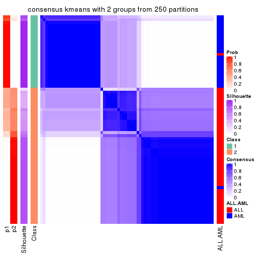</p>

</div>
<div id='tab-MAD-kmeans-consensus-heatmap-2'>
<pre><code class="r">consensus_heatmap(res, k = 3)
</code></pre>

<p>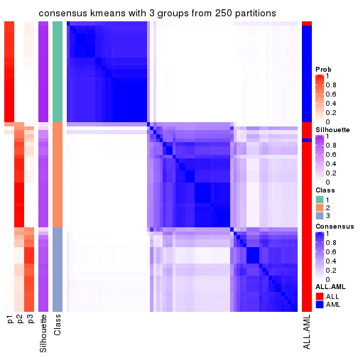</p>

</div>
<div id='tab-MAD-kmeans-consensus-heatmap-3'>
<pre><code class="r">consensus_heatmap(res, k = 4)
</code></pre>

<p>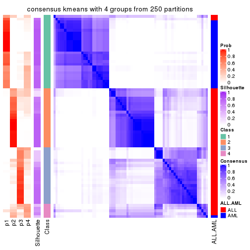</p>

</div>
<div id='tab-MAD-kmeans-consensus-heatmap-4'>
<pre><code class="r">consensus_heatmap(res, k = 5)
</code></pre>

<p>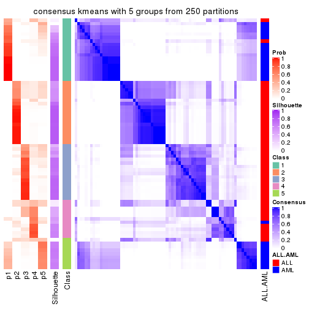</p>

</div>
<div id='tab-MAD-kmeans-consensus-heatmap-5'>
<pre><code class="r">consensus_heatmap(res, k = 6)
</code></pre>

<p>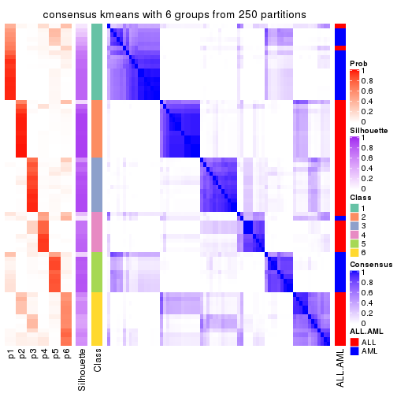</p>

</div>
</div>

Heatmaps for the membership of samples in all partitions to see how consistent they are:


<script>
$( function() {
	$( '#tabs-MAD-kmeans-membership-heatmap' ).tabs();
} );
</script>
<div id='tabs-MAD-kmeans-membership-heatmap'>
<ul>
<li><a href='#tab-MAD-kmeans-membership-heatmap-1'>k = 2</a></li>
<li><a href='#tab-MAD-kmeans-membership-heatmap-2'>k = 3</a></li>
<li><a href='#tab-MAD-kmeans-membership-heatmap-3'>k = 4</a></li>
<li><a href='#tab-MAD-kmeans-membership-heatmap-4'>k = 5</a></li>
<li><a href='#tab-MAD-kmeans-membership-heatmap-5'>k = 6</a></li>
</ul>
<div id='tab-MAD-kmeans-membership-heatmap-1'>
<pre><code class="r">membership_heatmap(res, k = 2)
</code></pre>

<p>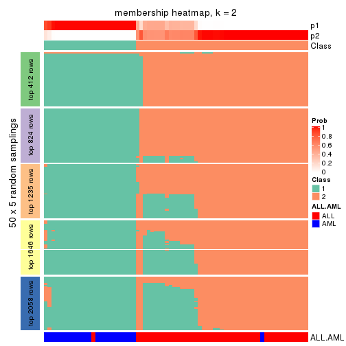</p>

</div>
<div id='tab-MAD-kmeans-membership-heatmap-2'>
<pre><code class="r">membership_heatmap(res, k = 3)
</code></pre>

<p>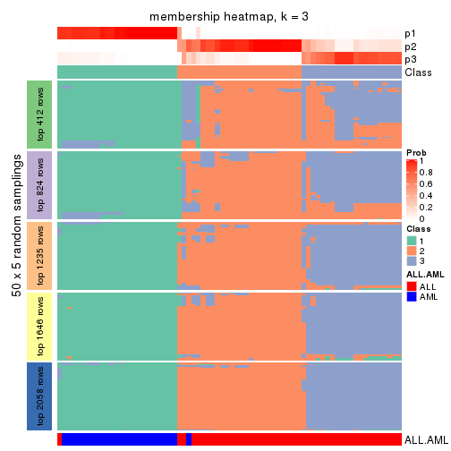</p>

</div>
<div id='tab-MAD-kmeans-membership-heatmap-3'>
<pre><code class="r">membership_heatmap(res, k = 4)
</code></pre>

<p>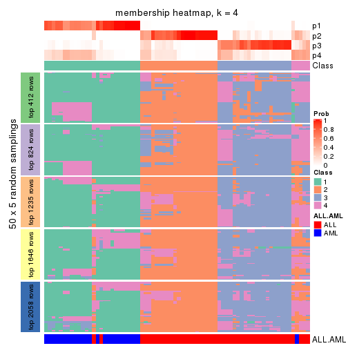</p>

</div>
<div id='tab-MAD-kmeans-membership-heatmap-4'>
<pre><code class="r">membership_heatmap(res, k = 5)
</code></pre>

<p>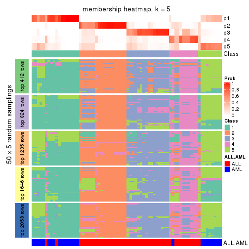</p>

</div>
<div id='tab-MAD-kmeans-membership-heatmap-5'>
<pre><code class="r">membership_heatmap(res, k = 6)
</code></pre>

<p>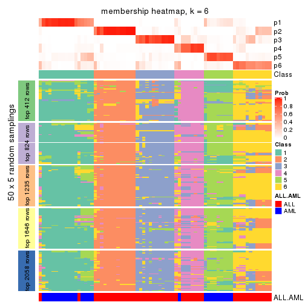</p>

</div>
</div>

As soon as we have had the classes for columns, we can look for signatures
which are significantly different between classes which can be candidate marks
for certain classes. Following are the heatmaps for signatures.


Signature heatmaps where rows are scaled:


<script>
$( function() {
	$( '#tabs-MAD-kmeans-get-signatures' ).tabs();
} );
</script>
<div id='tabs-MAD-kmeans-get-signatures'>
<ul>
<li><a href='#tab-MAD-kmeans-get-signatures-1'>k = 2</a></li>
<li><a href='#tab-MAD-kmeans-get-signatures-2'>k = 3</a></li>
<li><a href='#tab-MAD-kmeans-get-signatures-3'>k = 4</a></li>
<li><a href='#tab-MAD-kmeans-get-signatures-4'>k = 5</a></li>
<li><a href='#tab-MAD-kmeans-get-signatures-5'>k = 6</a></li>
</ul>
<div id='tab-MAD-kmeans-get-signatures-1'>
<pre><code class="r">get_signatures(res, k = 2)
</code></pre>

<p>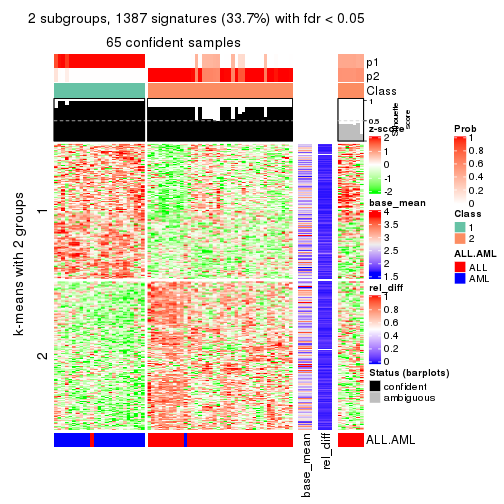</p>

</div>
<div id='tab-MAD-kmeans-get-signatures-2'>
<pre><code class="r">get_signatures(res, k = 3)
</code></pre>

<p>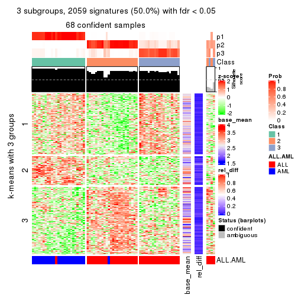</p>

</div>
<div id='tab-MAD-kmeans-get-signatures-3'>
<pre><code class="r">get_signatures(res, k = 4)
</code></pre>

<p>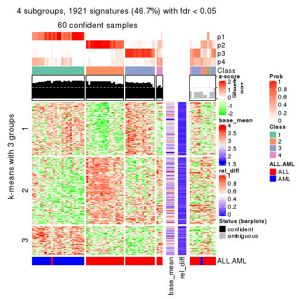</p>

</div>
<div id='tab-MAD-kmeans-get-signatures-4'>
<pre><code class="r">get_signatures(res, k = 5)
</code></pre>

<p>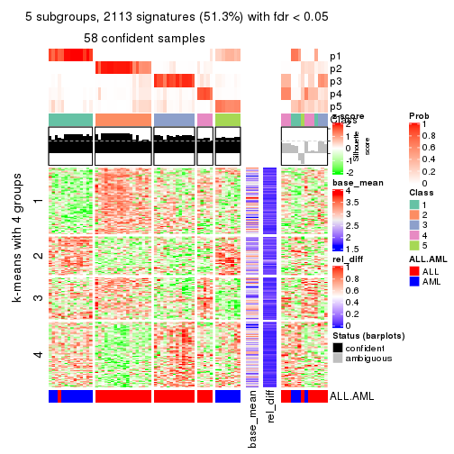</p>

</div>
<div id='tab-MAD-kmeans-get-signatures-5'>
<pre><code class="r">get_signatures(res, k = 6)
</code></pre>

<p>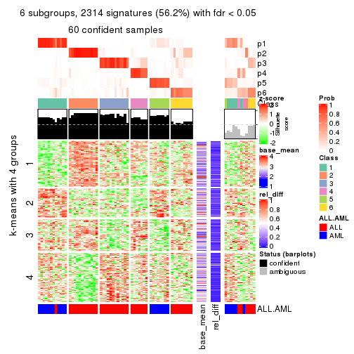</p>

</div>
</div>


Signature heatmaps where rows are not scaled:


<script>
$( function() {
	$( '#tabs-MAD-kmeans-get-signatures-no-scale' ).tabs();
} );
</script>
<div id='tabs-MAD-kmeans-get-signatures-no-scale'>
<ul>
<li><a href='#tab-MAD-kmeans-get-signatures-no-scale-1'>k = 2</a></li>
<li><a href='#tab-MAD-kmeans-get-signatures-no-scale-2'>k = 3</a></li>
<li><a href='#tab-MAD-kmeans-get-signatures-no-scale-3'>k = 4</a></li>
<li><a href='#tab-MAD-kmeans-get-signatures-no-scale-4'>k = 5</a></li>
<li><a href='#tab-MAD-kmeans-get-signatures-no-scale-5'>k = 6</a></li>
</ul>
<div id='tab-MAD-kmeans-get-signatures-no-scale-1'>
<pre><code class="r">get_signatures(res, k = 2, scale_rows = FALSE)
</code></pre>

<p>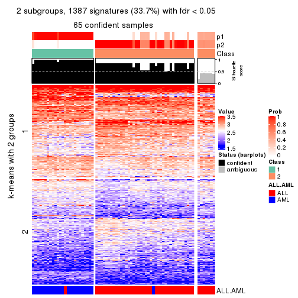</p>

</div>
<div id='tab-MAD-kmeans-get-signatures-no-scale-2'>
<pre><code class="r">get_signatures(res, k = 3, scale_rows = FALSE)
</code></pre>

<p>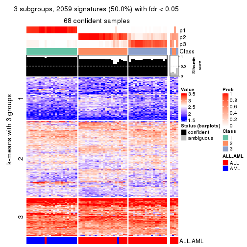</p>

</div>
<div id='tab-MAD-kmeans-get-signatures-no-scale-3'>
<pre><code class="r">get_signatures(res, k = 4, scale_rows = FALSE)
</code></pre>

<p>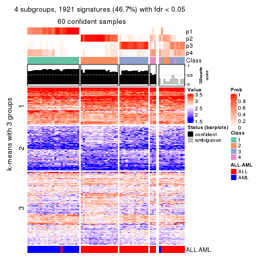</p>

</div>
<div id='tab-MAD-kmeans-get-signatures-no-scale-4'>
<pre><code class="r">get_signatures(res, k = 5, scale_rows = FALSE)
</code></pre>

<p>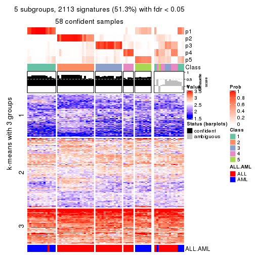</p>

</div>
<div id='tab-MAD-kmeans-get-signatures-no-scale-5'>
<pre><code class="r">get_signatures(res, k = 6, scale_rows = FALSE)
</code></pre>

<p>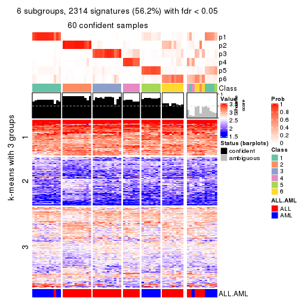</p>

</div>
</div>


Compare the overlap of signatures from different k:

```r
compare_signatures(res)
```

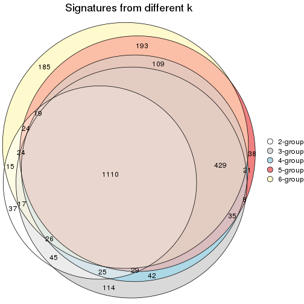

`get_signature()` returns a data frame invisibly. TO get the list of signatures, the function
call should be assigned to a variable explicitly. In following code, if `plot` argument is set
to `FALSE`, no heatmap is plotted while only the differential analysis is performed.

```r
# code only for demonstration
tb = get_signature(res, k = ..., plot = FALSE)
```

An example of the output of `tb` is:

```
#>   which_row         fdr    mean_1    mean_2 scaled_mean_1 scaled_mean_2 km
#> 1        38 0.042760348  8.373488  9.131774    -0.5533452     0.5164555  1
#> 2        40 0.018707592  7.106213  8.469186    -0.6173731     0.5762149  1
#> 3        55 0.019134737 10.221463 11.207825    -0.6159697     0.5749050  1
#> 4        59 0.006059896  5.921854  7.869574    -0.6899429     0.6439467  1
#> 5        60 0.018055526  8.928898 10.211722    -0.6204761     0.5791110  1
#> 6        98 0.009384629 15.714769 14.887706     0.6635654    -0.6193277  2
...
```

The columns in `tb` are:

1. `which_row`: row indices corresponding to the input matrix.
2. `fdr`: FDR for the differential test. 
3. `mean_x`: The mean value in group x.
4. `scaled_mean_x`: The mean value in group x after rows are scaled.
5. `km`: Row groups if k-means clustering is applied to rows.


UMAP plot which shows how samples are separated.


<script>
$( function() {
	$( '#tabs-MAD-kmeans-dimension-reduction' ).tabs();
} );
</script>
<div id='tabs-MAD-kmeans-dimension-reduction'>
<ul>
<li><a href='#tab-MAD-kmeans-dimension-reduction-1'>k = 2</a></li>
<li><a href='#tab-MAD-kmeans-dimension-reduction-2'>k = 3</a></li>
<li><a href='#tab-MAD-kmeans-dimension-reduction-3'>k = 4</a></li>
<li><a href='#tab-MAD-kmeans-dimension-reduction-4'>k = 5</a></li>
<li><a href='#tab-MAD-kmeans-dimension-reduction-5'>k = 6</a></li>
</ul>
<div id='tab-MAD-kmeans-dimension-reduction-1'>
<pre><code class="r">dimension_reduction(res, k = 2, method = &quot;UMAP&quot;)
</code></pre>

<p>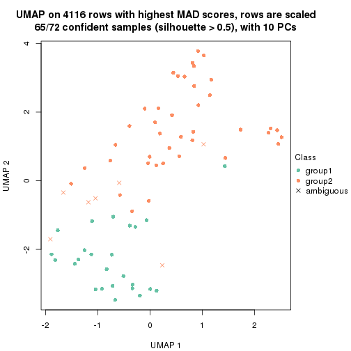</p>

</div>
<div id='tab-MAD-kmeans-dimension-reduction-2'>
<pre><code class="r">dimension_reduction(res, k = 3, method = &quot;UMAP&quot;)
</code></pre>

<p>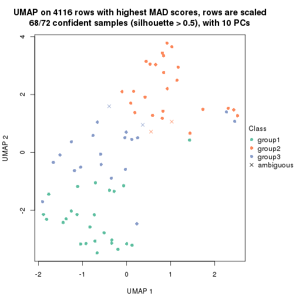</p>

</div>
<div id='tab-MAD-kmeans-dimension-reduction-3'>
<pre><code class="r">dimension_reduction(res, k = 4, method = &quot;UMAP&quot;)
</code></pre>

<p>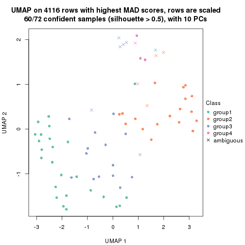</p>

</div>
<div id='tab-MAD-kmeans-dimension-reduction-4'>
<pre><code class="r">dimension_reduction(res, k = 5, method = &quot;UMAP&quot;)
</code></pre>

<p>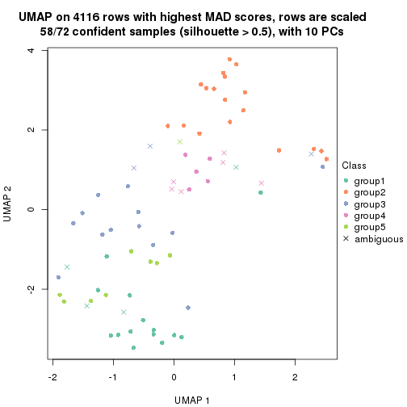</p>

</div>
<div id='tab-MAD-kmeans-dimension-reduction-5'>
<pre><code class="r">dimension_reduction(res, k = 6, method = &quot;UMAP&quot;)
</code></pre>

<p>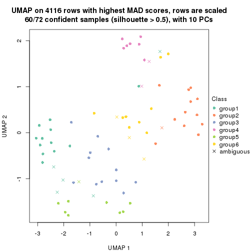</p>

</div>
</div>


Following heatmap shows how subgroups are split when increasing `k`:

```r
collect_classes(res)
```

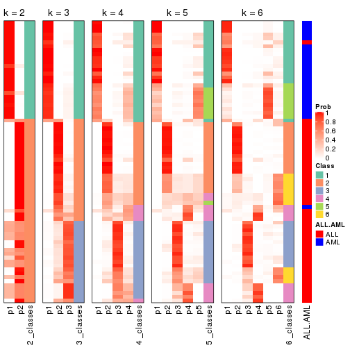


Test correlation between subgroups and known annotations. If the known
annotation is numeric, one-way ANOVA test is applied, and if the known
annotation is discrete, chi-squared contingency table test is applied.

```r
test_to_known_factors(res)
```

```
#>             n ALL.AML(p) k
#> MAD:kmeans 65   3.43e-13 2
#> MAD:kmeans 68   1.06e-13 3
#> MAD:kmeans 60   4.20e-12 4
#> MAD:kmeans 58   5.31e-11 5
#> MAD:kmeans 60   9.09e-11 6
```


If matrix rows can be associated to genes, consider to use `functional_enrichment(res,
...)` to perform function enrichment for the signature genes. See [this vignette](http://bioconductor.org/packages/devel/bioc/vignettes/cola/inst/doc/functional_enrichment.html) for more detailed explanations.


 

---------------------------------------------------


### MAD:skmeans


The object with results only for a single top-value method and a single partition method 
can be extracted as:

```r
res = res_list["MAD", "skmeans"]
# you can also extract it by
# res = res_list["MAD:skmeans"]
```

A summary of `res` and all the functions that can be applied to it:

```r
res
```

```
#> A 'ConsensusPartition' object with k = 2, 3, 4, 5, 6.
#>   On a matrix with 4116 rows and 72 columns.
#>   Top rows (412, 824, 1235, 1646, 2058) are extracted by 'MAD' method.
#>   Subgroups are detected by 'skmeans' method.
#>   Performed in total 1250 partitions by row resampling.
#>   Best k for subgroups seems to be 3.
#> 
#> Following methods can be applied to this 'ConsensusPartition' object:
#>  [1] "cola_report"             "collect_classes"         "collect_plots"          
#>  [4] "collect_stats"           "colnames"                "compare_signatures"     
#>  [7] "consensus_heatmap"       "dimension_reduction"     "functional_enrichment"  
#> [10] "get_anno_col"            "get_anno"                "get_classes"            
#> [13] "get_consensus"           "get_matrix"              "get_membership"         
#> [16] "get_param"               "get_signatures"          "get_stats"              
#> [19] "is_best_k"               "is_stable_k"             "membership_heatmap"     
#> [22] "ncol"                    "nrow"                    "plot_ecdf"              
#> [25] "rownames"                "select_partition_number" "show"                   
#> [28] "suggest_best_k"          "test_to_known_factors"
```

`collect_plots()` function collects all the plots made from `res` for all `k` (number of partitions)
into one single page to provide an easy and fast comparison between different `k`.

```r
collect_plots(res)
```

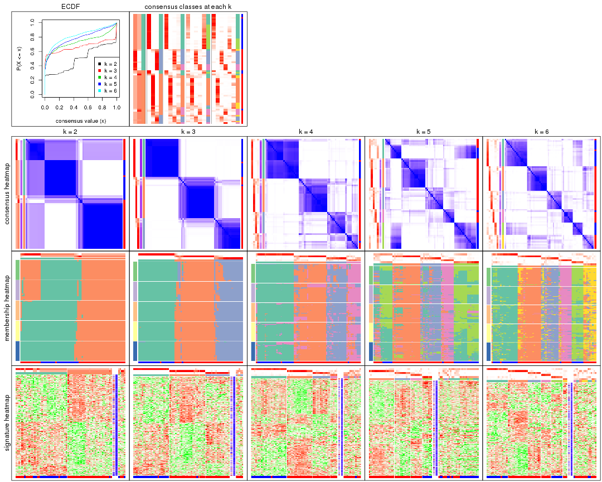

The plots are:

- The first row: a plot of the ECDF (empirical cumulative distribution
  function) curves of the consensus matrix for each `k` and the heatmap of
  predicted classes for each `k`.
- The second row: heatmaps of the consensus matrix for each `k`.
- The third row: heatmaps of the membership matrix for each `k`.
- The fouth row: heatmaps of the signatures for each `k`.

All the plots in panels can be made by individual functions and they are
plotted later in this section.

`select_partition_number()` produces several plots showing different
statistics for choosing "optimized" `k`. There are following statistics:

- ECDF curves of the consensus matrix for each `k`;
- 1-PAC. [The PAC
  score](https://en.wikipedia.org/wiki/Consensus_clustering#Over-interpretation_potential_of_consensus_clustering)
  measures the proportion of the ambiguous subgrouping.
- Mean silhouette score.
- Concordance. The mean probability of fiting the consensus class ids in all
  partitions.
- Area increased. Denote $A_k$ as the area under the ECDF curve for current
  `k`, the area increased is defined as $A_k - A_{k-1}$.
- Rand index. The percent of pairs of samples that are both in a same cluster
  or both are not in a same cluster in the partition of k and k-1.
- Jaccard index. The ratio of pairs of samples are both in a same cluster in
  the partition of k and k-1 and the pairs of samples are both in a same
  cluster in the partition k or k-1.

The detailed explanations of these statistics can be found in [the _cola_
vignette](http://bioconductor.org/packages/devel/bioc/vignettes/cola/inst/doc/cola.html#toc_13).

Generally speaking, lower PAC score, higher mean silhouette score or higher
concordance corresponds to better partition. Rand index and Jaccard index
measure how similar the current partition is compared to partition with `k-1`.
If they are too similar, we won't accept `k` is better than `k-1`.

```r
select_partition_number(res)
```

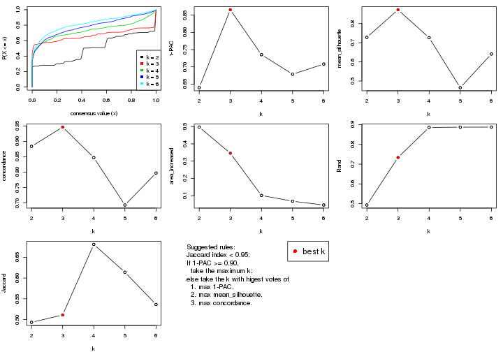

The numeric values for all these statistics can be obtained by `get_stats()`.

```r
get_stats(res)
```

```
#>   k 1-PAC mean_silhouette concordance area_increased  Rand Jaccard
#> 2 2 0.640           0.728       0.884         0.4967 0.493   0.493
#> 3 3 0.866           0.872       0.946         0.3456 0.734   0.511
#> 4 4 0.735           0.726       0.847         0.1017 0.886   0.681
#> 5 5 0.679           0.465       0.693         0.0684 0.887   0.614
#> 6 6 0.708           0.641       0.797         0.0465 0.888   0.536
```

`suggest_best_k()` suggests the best $k$ based on these statistics. The rules are as follows:

- All $k$ with Jaccard index larger than 0.95 are removed because increasing
  $k$ does not provide enough extra information. If all $k$ are removed, it is
  marked as no subgroup is detected.
- For all $k$ with 1-PAC score larger than 0.9, the maximal $k$ is taken as
  the best $k$, and other $k$ are marked as optional $k$.
- If it does not fit the second rule. The $k$ with the maximal vote of the
  highest 1-PAC score, highest mean silhouette, and highest concordance is
  taken as the best $k$.

```r
suggest_best_k(res)
```

```
#> [1] 3
```


Following shows the table of the partitions (You need to click the **show/hide
code output** link to see it). The membership matrix (columns with name `p*`)
is inferred by
[`clue::cl_consensus()`](https://www.rdocumentation.org/link/cl_consensus?package=clue)
function with the `SE` method. Basically the value in the membership matrix
represents the probability to belong to a certain group. The finall class
label for an item is determined with the group with highest probability it
belongs to.

In `get_classes()` function, the entropy is calculated from the membership
matrix and the silhouette score is calculated from the consensus matrix.


<script>
$( function() {
	$( '#tabs-MAD-skmeans-get-classes' ).tabs();
} );
</script>
<div id='tabs-MAD-skmeans-get-classes'>
<ul>
<li><a href='#tab-MAD-skmeans-get-classes-1'>k = 2</a></li>
<li><a href='#tab-MAD-skmeans-get-classes-2'>k = 3</a></li>
<li><a href='#tab-MAD-skmeans-get-classes-3'>k = 4</a></li>
<li><a href='#tab-MAD-skmeans-get-classes-4'>k = 5</a></li>
<li><a href='#tab-MAD-skmeans-get-classes-5'>k = 6</a></li>
</ul>

<div id='tab-MAD-skmeans-get-classes-1'>
<p><a id='tab-MAD-skmeans-get-classes-1-a' style='color:#0366d6' href='#'>show/hide code output</a></p>
<pre><code class="r">cbind(get_classes(res, k = 2), get_membership(res, k = 2))
</code></pre>

<pre><code>#&gt;           class entropy silhouette    p1    p2
#&gt; sample_39     1  0.0376      0.520 0.996 0.004
#&gt; sample_40     1  0.0000      0.526 1.000 0.000
#&gt; sample_42     2  0.9710      0.906 0.400 0.600
#&gt; sample_47     2  0.9710      0.906 0.400 0.600
#&gt; sample_48     2  0.9710      0.906 0.400 0.600
#&gt; sample_49     1  0.0000      0.526 1.000 0.000
#&gt; sample_41     2  0.9710      0.906 0.400 0.600
#&gt; sample_43     2  0.9710      0.906 0.400 0.600
#&gt; sample_44     2  0.9710      0.906 0.400 0.600
#&gt; sample_45     2  0.9710      0.906 0.400 0.600
#&gt; sample_46     2  0.9710      0.906 0.400 0.600
#&gt; sample_70     2  0.9710      0.906 0.400 0.600
#&gt; sample_71     2  0.9686      0.902 0.396 0.604
#&gt; sample_72     2  0.9710      0.906 0.400 0.600
#&gt; sample_68     2  0.9710      0.906 0.400 0.600
#&gt; sample_69     2  0.9710      0.906 0.400 0.600
#&gt; sample_67     2  0.0672      0.296 0.008 0.992
#&gt; sample_55     1  0.0000      0.526 1.000 0.000
#&gt; sample_56     1  0.0672      0.514 0.992 0.008
#&gt; sample_59     2  0.9710      0.906 0.400 0.600
#&gt; sample_52     1  0.9710      0.810 0.600 0.400
#&gt; sample_53     1  0.9710      0.810 0.600 0.400
#&gt; sample_51     1  0.9710      0.810 0.600 0.400
#&gt; sample_50     1  0.9710      0.810 0.600 0.400
#&gt; sample_54     2  0.9248     -0.527 0.340 0.660
#&gt; sample_57     1  0.9710      0.810 0.600 0.400
#&gt; sample_58     1  0.9710      0.810 0.600 0.400
#&gt; sample_60     1  0.9710      0.810 0.600 0.400
#&gt; sample_61     1  0.9710      0.810 0.600 0.400
#&gt; sample_65     1  0.9710      0.810 0.600 0.400
#&gt; sample_66     2  0.6712      0.621 0.176 0.824
#&gt; sample_63     1  0.9710      0.810 0.600 0.400
#&gt; sample_64     1  0.9710      0.810 0.600 0.400
#&gt; sample_62     1  0.9710      0.810 0.600 0.400
#&gt; sample_1      2  0.9710      0.906 0.400 0.600
#&gt; sample_2      2  0.0672      0.327 0.008 0.992
#&gt; sample_3      1  0.0938      0.507 0.988 0.012
#&gt; sample_4      2  0.9710      0.906 0.400 0.600
#&gt; sample_5      2  0.9710      0.906 0.400 0.600
#&gt; sample_6      1  0.0938      0.507 0.988 0.012
#&gt; sample_7      1  0.0672      0.514 0.992 0.008
#&gt; sample_8      1  0.0000      0.526 1.000 0.000
#&gt; sample_9      2  0.9710      0.906 0.400 0.600
#&gt; sample_10     1  0.4022      0.581 0.920 0.080
#&gt; sample_11     2  0.9710      0.906 0.400 0.600
#&gt; sample_12     1  0.9710      0.810 0.600 0.400
#&gt; sample_13     2  0.9710      0.906 0.400 0.600
#&gt; sample_14     2  0.9710      0.906 0.400 0.600
#&gt; sample_15     2  0.9710      0.906 0.400 0.600
#&gt; sample_16     2  0.9710      0.906 0.400 0.600
#&gt; sample_17     2  0.9710      0.906 0.400 0.600
#&gt; sample_18     2  0.9944      0.842 0.456 0.544
#&gt; sample_19     2  0.9710      0.906 0.400 0.600
#&gt; sample_20     2  0.9710      0.906 0.400 0.600
#&gt; sample_21     2  0.9710      0.906 0.400 0.600
#&gt; sample_22     1  0.5842      0.652 0.860 0.140
#&gt; sample_23     1  0.0938      0.507 0.988 0.012
#&gt; sample_24     2  0.9710      0.906 0.400 0.600
#&gt; sample_25     1  0.8499     -0.328 0.724 0.276
#&gt; sample_26     2  0.9710      0.906 0.400 0.600
#&gt; sample_27     1  0.0000      0.526 1.000 0.000
#&gt; sample_34     1  0.9710      0.810 0.600 0.400
#&gt; sample_35     1  0.9710      0.810 0.600 0.400
#&gt; sample_36     1  0.9710      0.810 0.600 0.400
#&gt; sample_37     1  0.9710      0.810 0.600 0.400
#&gt; sample_38     1  0.9710      0.810 0.600 0.400
#&gt; sample_28     1  0.9710      0.810 0.600 0.400
#&gt; sample_29     2  0.9795     -0.641 0.416 0.584
#&gt; sample_30     1  0.9710      0.810 0.600 0.400
#&gt; sample_31     1  0.9710      0.810 0.600 0.400
#&gt; sample_32     1  0.9710      0.810 0.600 0.400
#&gt; sample_33     1  0.9710      0.810 0.600 0.400
</code></pre>

<script>
$('#tab-MAD-skmeans-get-classes-1-a').parent().next().next().hide();
$('#tab-MAD-skmeans-get-classes-1-a').click(function(){
  $('#tab-MAD-skmeans-get-classes-1-a').parent().next().next().toggle();
  return(false);
});
</script>
</div>

<div id='tab-MAD-skmeans-get-classes-2'>
<p><a id='tab-MAD-skmeans-get-classes-2-a' style='color:#0366d6' href='#'>show/hide code output</a></p>
<pre><code class="r">cbind(get_classes(res, k = 3), get_membership(res, k = 3))
</code></pre>

<pre><code>#&gt;           class entropy silhouette    p1    p2    p3
#&gt; sample_39     3  0.4121      0.782 0.000 0.168 0.832
#&gt; sample_40     3  0.0747      0.884 0.000 0.016 0.984
#&gt; sample_42     2  0.0000      0.917 0.000 1.000 0.000
#&gt; sample_47     2  0.0000      0.917 0.000 1.000 0.000
#&gt; sample_48     2  0.0000      0.917 0.000 1.000 0.000
#&gt; sample_49     3  0.0000      0.887 0.000 0.000 1.000
#&gt; sample_41     2  0.0000      0.917 0.000 1.000 0.000
#&gt; sample_43     2  0.0000      0.917 0.000 1.000 0.000
#&gt; sample_44     2  0.0000      0.917 0.000 1.000 0.000
#&gt; sample_45     2  0.0000      0.917 0.000 1.000 0.000
#&gt; sample_46     2  0.0000      0.917 0.000 1.000 0.000
#&gt; sample_70     3  0.4887      0.722 0.000 0.228 0.772
#&gt; sample_71     2  0.0000      0.917 0.000 1.000 0.000
#&gt; sample_72     2  0.0000      0.917 0.000 1.000 0.000
#&gt; sample_68     2  0.0000      0.917 0.000 1.000 0.000
#&gt; sample_69     2  0.0000      0.917 0.000 1.000 0.000
#&gt; sample_67     2  0.6305      0.115 0.484 0.516 0.000
#&gt; sample_55     3  0.0000      0.887 0.000 0.000 1.000
#&gt; sample_56     3  0.0000      0.887 0.000 0.000 1.000
#&gt; sample_59     3  0.6302      0.224 0.000 0.480 0.520
#&gt; sample_52     1  0.0000      0.998 1.000 0.000 0.000
#&gt; sample_53     1  0.0000      0.998 1.000 0.000 0.000
#&gt; sample_51     1  0.0000      0.998 1.000 0.000 0.000
#&gt; sample_50     1  0.0000      0.998 1.000 0.000 0.000
#&gt; sample_54     1  0.0661      0.990 0.988 0.004 0.008
#&gt; sample_57     1  0.0424      0.993 0.992 0.000 0.008
#&gt; sample_58     1  0.0000      0.998 1.000 0.000 0.000
#&gt; sample_60     1  0.0424      0.993 0.992 0.000 0.008
#&gt; sample_61     1  0.0000      0.998 1.000 0.000 0.000
#&gt; sample_65     1  0.0000      0.998 1.000 0.000 0.000
#&gt; sample_66     2  0.5331      0.769 0.076 0.824 0.100
#&gt; sample_63     1  0.0000      0.998 1.000 0.000 0.000
#&gt; sample_64     1  0.0424      0.993 0.992 0.000 0.008
#&gt; sample_62     1  0.0000      0.998 1.000 0.000 0.000
#&gt; sample_1      3  0.4504      0.756 0.000 0.196 0.804
#&gt; sample_2      2  0.5058      0.660 0.244 0.756 0.000
#&gt; sample_3      3  0.0000      0.887 0.000 0.000 1.000
#&gt; sample_4      3  0.1643      0.871 0.000 0.044 0.956
#&gt; sample_5      2  0.0000      0.917 0.000 1.000 0.000
#&gt; sample_6      3  0.0000      0.887 0.000 0.000 1.000
#&gt; sample_7      3  0.0424      0.887 0.000 0.008 0.992
#&gt; sample_8      3  0.0592      0.886 0.000 0.012 0.988
#&gt; sample_9      3  0.6204      0.207 0.000 0.424 0.576
#&gt; sample_10     3  0.0237      0.886 0.004 0.000 0.996
#&gt; sample_11     2  0.6140      0.320 0.000 0.596 0.404
#&gt; sample_12     1  0.0000      0.998 1.000 0.000 0.000
#&gt; sample_13     2  0.0000      0.917 0.000 1.000 0.000
#&gt; sample_14     2  0.5216      0.626 0.000 0.740 0.260
#&gt; sample_15     2  0.0000      0.917 0.000 1.000 0.000
#&gt; sample_16     2  0.0424      0.912 0.000 0.992 0.008
#&gt; sample_17     2  0.0747      0.906 0.000 0.984 0.016
#&gt; sample_18     3  0.0237      0.886 0.000 0.004 0.996
#&gt; sample_19     2  0.0000      0.917 0.000 1.000 0.000
#&gt; sample_20     2  0.0000      0.917 0.000 1.000 0.000
#&gt; sample_21     2  0.0000      0.917 0.000 1.000 0.000
#&gt; sample_22     3  0.0848      0.885 0.008 0.008 0.984
#&gt; sample_23     3  0.0000      0.887 0.000 0.000 1.000
#&gt; sample_24     2  0.0000      0.917 0.000 1.000 0.000
#&gt; sample_25     3  0.6498      0.442 0.008 0.396 0.596
#&gt; sample_26     2  0.4796      0.630 0.000 0.780 0.220
#&gt; sample_27     3  0.0000      0.887 0.000 0.000 1.000
#&gt; sample_34     1  0.0000      0.998 1.000 0.000 0.000
#&gt; sample_35     1  0.0747      0.985 0.984 0.000 0.016
#&gt; sample_36     1  0.0000      0.998 1.000 0.000 0.000
#&gt; sample_37     1  0.0000      0.998 1.000 0.000 0.000
#&gt; sample_38     1  0.0000      0.998 1.000 0.000 0.000
#&gt; sample_28     1  0.0000      0.998 1.000 0.000 0.000
#&gt; sample_29     1  0.0000      0.998 1.000 0.000 0.000
#&gt; sample_30     1  0.0000      0.998 1.000 0.000 0.000
#&gt; sample_31     1  0.0000      0.998 1.000 0.000 0.000
#&gt; sample_32     1  0.0000      0.998 1.000 0.000 0.000
#&gt; sample_33     1  0.0000      0.998 1.000 0.000 0.000
</code></pre>

<script>
$('#tab-MAD-skmeans-get-classes-2-a').parent().next().next().hide();
$('#tab-MAD-skmeans-get-classes-2-a').click(function(){
  $('#tab-MAD-skmeans-get-classes-2-a').parent().next().next().toggle();
  return(false);
});
</script>
</div>

<div id='tab-MAD-skmeans-get-classes-3'>
<p><a id='tab-MAD-skmeans-get-classes-3-a' style='color:#0366d6' href='#'>show/hide code output</a></p>
<pre><code class="r">cbind(get_classes(res, k = 4), get_membership(res, k = 4))
</code></pre>

<pre><code>#&gt;           class entropy silhouette    p1    p2    p3    p4
#&gt; sample_39     3  0.3196      0.719 0.000 0.008 0.856 0.136
#&gt; sample_40     3  0.1975      0.775 0.016 0.028 0.944 0.012
#&gt; sample_42     2  0.6682      0.486 0.000 0.576 0.112 0.312
#&gt; sample_47     2  0.0592      0.833 0.000 0.984 0.000 0.016
#&gt; sample_48     2  0.0000      0.834 0.000 1.000 0.000 0.000
#&gt; sample_49     3  0.0707      0.774 0.000 0.000 0.980 0.020
#&gt; sample_41     2  0.0469      0.832 0.000 0.988 0.000 0.012
#&gt; sample_43     2  0.3249      0.781 0.000 0.852 0.008 0.140
#&gt; sample_44     2  0.3856      0.774 0.000 0.832 0.032 0.136
#&gt; sample_45     2  0.3763      0.771 0.000 0.832 0.024 0.144
#&gt; sample_46     2  0.4105      0.758 0.000 0.812 0.032 0.156
#&gt; sample_70     3  0.5874      0.574 0.000 0.112 0.696 0.192
#&gt; sample_71     4  0.7442     -0.165 0.000 0.368 0.176 0.456
#&gt; sample_72     2  0.7414      0.266 0.000 0.460 0.172 0.368
#&gt; sample_68     2  0.0336      0.832 0.000 0.992 0.000 0.008
#&gt; sample_69     2  0.0469      0.833 0.000 0.988 0.000 0.012
#&gt; sample_67     1  0.7387      0.059 0.444 0.164 0.000 0.392
#&gt; sample_55     3  0.4258      0.668 0.012 0.020 0.812 0.156
#&gt; sample_56     3  0.0707      0.777 0.000 0.000 0.980 0.020
#&gt; sample_59     2  0.6740      0.484 0.000 0.600 0.256 0.144
#&gt; sample_52     1  0.1356      0.923 0.960 0.000 0.008 0.032
#&gt; sample_53     1  0.1474      0.924 0.948 0.000 0.000 0.052
#&gt; sample_51     1  0.1389      0.926 0.952 0.000 0.000 0.048
#&gt; sample_50     1  0.1302      0.926 0.956 0.000 0.000 0.044
#&gt; sample_54     1  0.4807      0.774 0.800 0.124 0.012 0.064
#&gt; sample_57     1  0.1356      0.923 0.960 0.000 0.008 0.032
#&gt; sample_58     1  0.1356      0.923 0.960 0.000 0.008 0.032
#&gt; sample_60     1  0.2307      0.909 0.928 0.008 0.016 0.048
#&gt; sample_61     1  0.0927      0.930 0.976 0.000 0.008 0.016
#&gt; sample_65     1  0.0336      0.929 0.992 0.000 0.000 0.008
#&gt; sample_66     4  0.5712      0.350 0.008 0.408 0.016 0.568
#&gt; sample_63     1  0.1356      0.923 0.960 0.000 0.008 0.032
#&gt; sample_64     1  0.1833      0.917 0.944 0.000 0.024 0.032
#&gt; sample_62     1  0.1356      0.923 0.960 0.000 0.008 0.032
#&gt; sample_1      3  0.2722      0.769 0.000 0.064 0.904 0.032
#&gt; sample_2      4  0.5056      0.560 0.076 0.164 0.000 0.760
#&gt; sample_3      4  0.4941      0.354 0.000 0.000 0.436 0.564
#&gt; sample_4      3  0.4552      0.642 0.000 0.172 0.784 0.044
#&gt; sample_5      2  0.0336      0.832 0.000 0.992 0.000 0.008
#&gt; sample_6      4  0.4916      0.375 0.000 0.000 0.424 0.576
#&gt; sample_7      3  0.3978      0.704 0.000 0.108 0.836 0.056
#&gt; sample_8      3  0.0469      0.776 0.000 0.000 0.988 0.012
#&gt; sample_9      4  0.6119      0.605 0.000 0.168 0.152 0.680
#&gt; sample_10     4  0.4483      0.505 0.000 0.004 0.284 0.712
#&gt; sample_11     4  0.5062      0.610 0.000 0.184 0.064 0.752
#&gt; sample_12     1  0.3486      0.874 0.864 0.000 0.044 0.092
#&gt; sample_13     2  0.0000      0.834 0.000 1.000 0.000 0.000
#&gt; sample_14     4  0.5535      0.569 0.000 0.304 0.040 0.656
#&gt; sample_15     2  0.0336      0.832 0.000 0.992 0.000 0.008
#&gt; sample_16     2  0.1042      0.828 0.000 0.972 0.020 0.008
#&gt; sample_17     2  0.3873      0.542 0.000 0.772 0.000 0.228
#&gt; sample_18     3  0.5707      0.475 0.008 0.044 0.680 0.268
#&gt; sample_19     2  0.2542      0.808 0.000 0.904 0.012 0.084
#&gt; sample_20     2  0.0000      0.834 0.000 1.000 0.000 0.000
#&gt; sample_21     2  0.0592      0.830 0.000 0.984 0.000 0.016
#&gt; sample_22     3  0.3853      0.689 0.020 0.000 0.820 0.160
#&gt; sample_23     4  0.4948      0.345 0.000 0.000 0.440 0.560
#&gt; sample_24     2  0.0336      0.832 0.000 0.992 0.000 0.008
#&gt; sample_25     3  0.8128      0.298 0.040 0.148 0.488 0.324
#&gt; sample_26     2  0.7442      0.215 0.000 0.456 0.368 0.176
#&gt; sample_27     3  0.0707      0.774 0.000 0.000 0.980 0.020
#&gt; sample_34     1  0.0779      0.928 0.980 0.000 0.004 0.016
#&gt; sample_35     1  0.2224      0.911 0.928 0.000 0.040 0.032
#&gt; sample_36     1  0.1118      0.928 0.964 0.000 0.000 0.036
#&gt; sample_37     1  0.1474      0.924 0.948 0.000 0.000 0.052
#&gt; sample_38     1  0.2345      0.901 0.900 0.000 0.000 0.100
#&gt; sample_28     1  0.1867      0.916 0.928 0.000 0.000 0.072
#&gt; sample_29     1  0.2469      0.895 0.892 0.000 0.000 0.108
#&gt; sample_30     1  0.1211      0.927 0.960 0.000 0.000 0.040
#&gt; sample_31     1  0.0779      0.927 0.980 0.000 0.004 0.016
#&gt; sample_32     1  0.1022      0.928 0.968 0.000 0.000 0.032
#&gt; sample_33     1  0.1389      0.926 0.952 0.000 0.000 0.048
</code></pre>

<script>
$('#tab-MAD-skmeans-get-classes-3-a').parent().next().next().hide();
$('#tab-MAD-skmeans-get-classes-3-a').click(function(){
  $('#tab-MAD-skmeans-get-classes-3-a').parent().next().next().toggle();
  return(false);
});
</script>
</div>

<div id='tab-MAD-skmeans-get-classes-4'>
<p><a id='tab-MAD-skmeans-get-classes-4-a' style='color:#0366d6' href='#'>show/hide code output</a></p>
<pre><code class="r">cbind(get_classes(res, k = 5), get_membership(res, k = 5))
</code></pre>

<pre><code>#&gt;           class entropy silhouette    p1    p2    p3    p4    p5
#&gt; sample_39     3  0.4707     0.6173 0.212 0.000 0.716 0.072 0.000
#&gt; sample_40     3  0.3099     0.6925 0.004 0.004 0.872 0.048 0.072
#&gt; sample_42     1  0.7864    -0.3367 0.380 0.360 0.124 0.136 0.000
#&gt; sample_47     2  0.1116     0.8593 0.028 0.964 0.004 0.004 0.000
#&gt; sample_48     2  0.0000     0.8624 0.000 1.000 0.000 0.000 0.000
#&gt; sample_49     3  0.0960     0.7100 0.004 0.000 0.972 0.016 0.008
#&gt; sample_41     2  0.0807     0.8609 0.012 0.976 0.000 0.012 0.000
#&gt; sample_43     2  0.5354     0.7006 0.208 0.696 0.028 0.068 0.000
#&gt; sample_44     2  0.5248     0.7216 0.160 0.728 0.044 0.068 0.000
#&gt; sample_45     2  0.5216     0.7012 0.212 0.700 0.020 0.068 0.000
#&gt; sample_46     2  0.5693     0.6698 0.216 0.672 0.040 0.072 0.000
#&gt; sample_70     3  0.7578     0.4693 0.244 0.100 0.508 0.144 0.004
#&gt; sample_71     1  0.8240    -0.2290 0.404 0.228 0.184 0.184 0.000
#&gt; sample_72     1  0.8309    -0.2500 0.364 0.276 0.204 0.156 0.000
#&gt; sample_68     2  0.0693     0.8604 0.008 0.980 0.000 0.012 0.000
#&gt; sample_69     2  0.1059     0.8584 0.020 0.968 0.004 0.008 0.000
#&gt; sample_67     1  0.7529     0.0344 0.520 0.120 0.000 0.180 0.180
#&gt; sample_55     3  0.6086     0.5063 0.056 0.000 0.648 0.084 0.212
#&gt; sample_56     3  0.1471     0.7122 0.024 0.000 0.952 0.020 0.004
#&gt; sample_59     2  0.8333     0.3209 0.216 0.472 0.188 0.076 0.048
#&gt; sample_52     5  0.0703     0.5751 0.024 0.000 0.000 0.000 0.976
#&gt; sample_53     1  0.4306    -0.1581 0.508 0.000 0.000 0.000 0.492
#&gt; sample_51     1  0.4306    -0.1581 0.508 0.000 0.000 0.000 0.492
#&gt; sample_50     5  0.4307     0.0553 0.500 0.000 0.000 0.000 0.500
#&gt; sample_54     5  0.5366     0.4140 0.084 0.056 0.060 0.036 0.764
#&gt; sample_57     5  0.3086     0.5171 0.048 0.000 0.060 0.016 0.876
#&gt; sample_58     5  0.1728     0.5719 0.020 0.000 0.036 0.004 0.940
#&gt; sample_60     5  0.4471     0.4623 0.076 0.016 0.076 0.024 0.808
#&gt; sample_61     5  0.5466     0.2816 0.424 0.000 0.052 0.004 0.520
#&gt; sample_65     5  0.4211     0.3568 0.360 0.000 0.004 0.000 0.636
#&gt; sample_66     4  0.5245     0.4323 0.064 0.328 0.000 0.608 0.000
#&gt; sample_63     5  0.0693     0.5763 0.012 0.000 0.008 0.000 0.980
#&gt; sample_64     5  0.2270     0.5495 0.016 0.000 0.072 0.004 0.908
#&gt; sample_62     5  0.0798     0.5731 0.016 0.000 0.008 0.000 0.976
#&gt; sample_1      3  0.3820     0.6997 0.048 0.052 0.840 0.060 0.000
#&gt; sample_2      4  0.5500     0.5645 0.268 0.084 0.000 0.640 0.008
#&gt; sample_3      4  0.3074     0.7302 0.000 0.000 0.196 0.804 0.000
#&gt; sample_4      3  0.6074     0.5053 0.032 0.228 0.632 0.108 0.000
#&gt; sample_5      2  0.0693     0.8604 0.008 0.980 0.000 0.012 0.000
#&gt; sample_6      4  0.3074     0.7302 0.000 0.000 0.196 0.804 0.000
#&gt; sample_7      3  0.5107     0.6049 0.024 0.120 0.752 0.096 0.008
#&gt; sample_8      3  0.1830     0.7046 0.040 0.000 0.932 0.028 0.000
#&gt; sample_9      4  0.2903     0.7758 0.000 0.080 0.048 0.872 0.000
#&gt; sample_10     4  0.2919     0.7586 0.024 0.000 0.104 0.868 0.004
#&gt; sample_11     4  0.2673     0.7653 0.016 0.076 0.016 0.892 0.000
#&gt; sample_12     1  0.5041    -0.0719 0.588 0.000 0.012 0.020 0.380
#&gt; sample_13     2  0.0000     0.8624 0.000 1.000 0.000 0.000 0.000
#&gt; sample_14     4  0.2890     0.7381 0.004 0.160 0.000 0.836 0.000
#&gt; sample_15     2  0.0693     0.8604 0.008 0.980 0.000 0.012 0.000
#&gt; sample_16     2  0.1507     0.8519 0.012 0.952 0.024 0.012 0.000
#&gt; sample_17     2  0.4001     0.6208 0.020 0.768 0.000 0.204 0.008
#&gt; sample_18     3  0.7822     0.3786 0.084 0.060 0.532 0.244 0.080
#&gt; sample_19     2  0.4238     0.7816 0.104 0.808 0.040 0.048 0.000
#&gt; sample_20     2  0.0290     0.8620 0.000 0.992 0.000 0.008 0.000
#&gt; sample_21     2  0.1012     0.8569 0.012 0.968 0.000 0.020 0.000
#&gt; sample_22     3  0.5168     0.5890 0.240 0.000 0.688 0.052 0.020
#&gt; sample_23     4  0.3109     0.7254 0.000 0.000 0.200 0.800 0.000
#&gt; sample_24     2  0.0693     0.8604 0.008 0.980 0.000 0.012 0.000
#&gt; sample_25     1  0.7841    -0.3994 0.424 0.072 0.348 0.140 0.016
#&gt; sample_26     3  0.7914     0.1996 0.260 0.272 0.388 0.080 0.000
#&gt; sample_27     3  0.1153     0.7074 0.004 0.000 0.964 0.024 0.008
#&gt; sample_34     5  0.3730     0.4517 0.288 0.000 0.000 0.000 0.712
#&gt; sample_35     5  0.4747     0.5067 0.196 0.000 0.084 0.000 0.720
#&gt; sample_36     5  0.4294     0.1255 0.468 0.000 0.000 0.000 0.532
#&gt; sample_37     1  0.4307    -0.1678 0.504 0.000 0.000 0.000 0.496
#&gt; sample_38     1  0.4415    -0.1069 0.552 0.000 0.000 0.004 0.444
#&gt; sample_28     1  0.4283    -0.1138 0.544 0.000 0.000 0.000 0.456
#&gt; sample_29     1  0.4882    -0.1422 0.532 0.000 0.000 0.024 0.444
#&gt; sample_30     5  0.4307     0.0591 0.496 0.000 0.000 0.000 0.504
#&gt; sample_31     5  0.3837     0.4325 0.308 0.000 0.000 0.000 0.692
#&gt; sample_32     5  0.4306     0.0828 0.492 0.000 0.000 0.000 0.508
#&gt; sample_33     1  0.4305    -0.1537 0.512 0.000 0.000 0.000 0.488
</code></pre>

<script>
$('#tab-MAD-skmeans-get-classes-4-a').parent().next().next().hide();
$('#tab-MAD-skmeans-get-classes-4-a').click(function(){
  $('#tab-MAD-skmeans-get-classes-4-a').parent().next().next().toggle();
  return(false);
});
</script>
</div>

<div id='tab-MAD-skmeans-get-classes-5'>
<p><a id='tab-MAD-skmeans-get-classes-5-a' style='color:#0366d6' href='#'>show/hide code output</a></p>
<pre><code class="r">cbind(get_classes(res, k = 6), get_membership(res, k = 6))
</code></pre>

<pre><code>#&gt;           class entropy silhouette    p1    p2    p3    p4    p5    p6
#&gt; sample_39     3  0.4026     0.3188 0.000 0.000 0.612 0.012 0.000 0.376
#&gt; sample_40     3  0.2582     0.7246 0.000 0.000 0.888 0.020 0.060 0.032
#&gt; sample_42     6  0.3876     0.5940 0.008 0.120 0.004 0.020 0.040 0.808
#&gt; sample_47     2  0.2633     0.7631 0.000 0.864 0.000 0.004 0.020 0.112
#&gt; sample_48     2  0.0458     0.8386 0.000 0.984 0.000 0.000 0.000 0.016
#&gt; sample_49     3  0.1536     0.7322 0.000 0.000 0.944 0.020 0.012 0.024
#&gt; sample_41     2  0.0779     0.8382 0.000 0.976 0.000 0.008 0.008 0.008
#&gt; sample_43     6  0.4999     0.0751 0.000 0.460 0.020 0.000 0.032 0.488
#&gt; sample_44     2  0.5448     0.0714 0.000 0.536 0.076 0.000 0.020 0.368
#&gt; sample_45     2  0.4413    -0.1334 0.000 0.496 0.012 0.000 0.008 0.484
#&gt; sample_46     6  0.4665     0.2413 0.000 0.412 0.024 0.000 0.012 0.552
#&gt; sample_70     6  0.6190     0.3924 0.004 0.064 0.256 0.052 0.028 0.596
#&gt; sample_71     6  0.5190     0.5262 0.024 0.064 0.036 0.076 0.044 0.756
#&gt; sample_72     6  0.5610     0.5384 0.012 0.144 0.044 0.060 0.036 0.704
#&gt; sample_68     2  0.0405     0.8392 0.000 0.988 0.000 0.008 0.004 0.000
#&gt; sample_69     2  0.1007     0.8276 0.000 0.956 0.000 0.000 0.000 0.044
#&gt; sample_67     1  0.7778     0.1854 0.456 0.092 0.000 0.132 0.084 0.236
#&gt; sample_55     3  0.5424     0.5726 0.000 0.008 0.628 0.072 0.264 0.028
#&gt; sample_56     3  0.2123     0.7267 0.000 0.000 0.912 0.012 0.052 0.024
#&gt; sample_59     6  0.7411     0.3665 0.000 0.268 0.188 0.000 0.160 0.384
#&gt; sample_52     5  0.3584     0.7675 0.308 0.000 0.000 0.004 0.688 0.000
#&gt; sample_53     1  0.0146     0.7953 0.996 0.000 0.000 0.000 0.004 0.000
#&gt; sample_51     1  0.0632     0.7950 0.976 0.000 0.000 0.000 0.024 0.000
#&gt; sample_50     1  0.0632     0.7950 0.976 0.000 0.000 0.000 0.024 0.000
#&gt; sample_54     5  0.2973     0.7626 0.060 0.036 0.012 0.004 0.876 0.012
#&gt; sample_57     5  0.3010     0.8312 0.148 0.000 0.020 0.000 0.828 0.004
#&gt; sample_58     5  0.4532     0.7823 0.292 0.000 0.044 0.000 0.656 0.008
#&gt; sample_60     5  0.2763     0.7892 0.084 0.000 0.016 0.008 0.876 0.016
#&gt; sample_61     1  0.4311     0.6463 0.760 0.000 0.056 0.000 0.148 0.036
#&gt; sample_65     1  0.3359     0.6520 0.784 0.000 0.008 0.000 0.196 0.012
#&gt; sample_66     4  0.6779     0.3371 0.008 0.240 0.000 0.524 0.108 0.120
#&gt; sample_63     5  0.3722     0.8230 0.260 0.000 0.008 0.004 0.724 0.004
#&gt; sample_64     5  0.4837     0.7947 0.248 0.000 0.076 0.000 0.664 0.012
#&gt; sample_62     5  0.3674     0.8411 0.220 0.000 0.012 0.004 0.756 0.008
#&gt; sample_1      3  0.4793     0.6489 0.000 0.088 0.748 0.052 0.008 0.104
#&gt; sample_2      4  0.6995     0.4248 0.156 0.052 0.000 0.552 0.064 0.176
#&gt; sample_3      4  0.2101     0.7914 0.000 0.000 0.100 0.892 0.004 0.004
#&gt; sample_4      3  0.6061     0.5461 0.000 0.188 0.628 0.116 0.036 0.032
#&gt; sample_5      2  0.0520     0.8394 0.000 0.984 0.000 0.008 0.008 0.000
#&gt; sample_6      4  0.2149     0.7893 0.000 0.000 0.104 0.888 0.004 0.004
#&gt; sample_7      3  0.4640     0.6795 0.000 0.080 0.768 0.092 0.040 0.020
#&gt; sample_8      3  0.1367     0.7271 0.000 0.000 0.944 0.012 0.000 0.044
#&gt; sample_9      4  0.1003     0.8134 0.000 0.020 0.016 0.964 0.000 0.000
#&gt; sample_10     4  0.1230     0.8105 0.000 0.000 0.028 0.956 0.008 0.008
#&gt; sample_11     4  0.1237     0.8059 0.000 0.020 0.004 0.956 0.000 0.020
#&gt; sample_12     1  0.3351     0.7279 0.840 0.000 0.020 0.004 0.040 0.096
#&gt; sample_13     2  0.0547     0.8382 0.000 0.980 0.000 0.000 0.000 0.020
#&gt; sample_14     4  0.2122     0.7820 0.000 0.084 0.008 0.900 0.008 0.000
#&gt; sample_15     2  0.0520     0.8394 0.000 0.984 0.000 0.008 0.008 0.000
#&gt; sample_16     2  0.2214     0.7954 0.000 0.912 0.028 0.004 0.012 0.044
#&gt; sample_17     2  0.4029     0.6347 0.000 0.784 0.000 0.124 0.068 0.024
#&gt; sample_18     3  0.8015     0.3225 0.000 0.084 0.436 0.212 0.148 0.120
#&gt; sample_19     2  0.4057     0.5111 0.000 0.704 0.016 0.004 0.008 0.268
#&gt; sample_20     2  0.0547     0.8382 0.000 0.980 0.000 0.000 0.000 0.020
#&gt; sample_21     2  0.0767     0.8333 0.000 0.976 0.000 0.008 0.004 0.012
#&gt; sample_22     3  0.5881     0.4110 0.080 0.000 0.584 0.024 0.024 0.288
#&gt; sample_23     4  0.2196     0.7853 0.000 0.000 0.108 0.884 0.004 0.004
#&gt; sample_24     2  0.0520     0.8394 0.000 0.984 0.000 0.008 0.008 0.000
#&gt; sample_25     6  0.4872     0.4704 0.076 0.004 0.132 0.024 0.020 0.744
#&gt; sample_26     6  0.6109     0.4756 0.000 0.188 0.228 0.008 0.020 0.556
#&gt; sample_27     3  0.1542     0.7336 0.000 0.000 0.944 0.024 0.016 0.016
#&gt; sample_34     1  0.3895     0.4718 0.700 0.000 0.012 0.000 0.280 0.008
#&gt; sample_35     1  0.5813    -0.2309 0.464 0.000 0.144 0.000 0.384 0.008
#&gt; sample_36     1  0.1908     0.7665 0.900 0.000 0.000 0.004 0.096 0.000
#&gt; sample_37     1  0.0603     0.7962 0.980 0.000 0.000 0.000 0.016 0.004
#&gt; sample_38     1  0.1642     0.7789 0.936 0.000 0.004 0.000 0.028 0.032
#&gt; sample_28     1  0.1168     0.7847 0.956 0.000 0.000 0.000 0.028 0.016
#&gt; sample_29     1  0.3401     0.7171 0.824 0.000 0.000 0.008 0.104 0.064
#&gt; sample_30     1  0.1349     0.7889 0.940 0.000 0.000 0.004 0.056 0.000
#&gt; sample_31     1  0.3659     0.5200 0.720 0.000 0.004 0.004 0.268 0.004
#&gt; sample_32     1  0.1672     0.7918 0.932 0.000 0.000 0.004 0.048 0.016
#&gt; sample_33     1  0.0146     0.7959 0.996 0.000 0.000 0.000 0.004 0.000
</code></pre>

<script>
$('#tab-MAD-skmeans-get-classes-5-a').parent().next().next().hide();
$('#tab-MAD-skmeans-get-classes-5-a').click(function(){
  $('#tab-MAD-skmeans-get-classes-5-a').parent().next().next().toggle();
  return(false);
});
</script>
</div>
</div>

Heatmaps for the consensus matrix. It visualizes the probability of two
samples to be in a same group.


<script>
$( function() {
	$( '#tabs-MAD-skmeans-consensus-heatmap' ).tabs();
} );
</script>
<div id='tabs-MAD-skmeans-consensus-heatmap'>
<ul>
<li><a href='#tab-MAD-skmeans-consensus-heatmap-1'>k = 2</a></li>
<li><a href='#tab-MAD-skmeans-consensus-heatmap-2'>k = 3</a></li>
<li><a href='#tab-MAD-skmeans-consensus-heatmap-3'>k = 4</a></li>
<li><a href='#tab-MAD-skmeans-consensus-heatmap-4'>k = 5</a></li>
<li><a href='#tab-MAD-skmeans-consensus-heatmap-5'>k = 6</a></li>
</ul>
<div id='tab-MAD-skmeans-consensus-heatmap-1'>
<pre><code class="r">consensus_heatmap(res, k = 2)
</code></pre>

<p>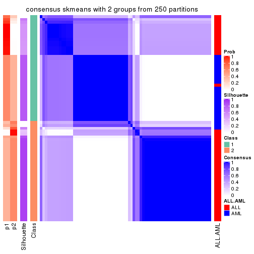</p>

</div>
<div id='tab-MAD-skmeans-consensus-heatmap-2'>
<pre><code class="r">consensus_heatmap(res, k = 3)
</code></pre>

<p>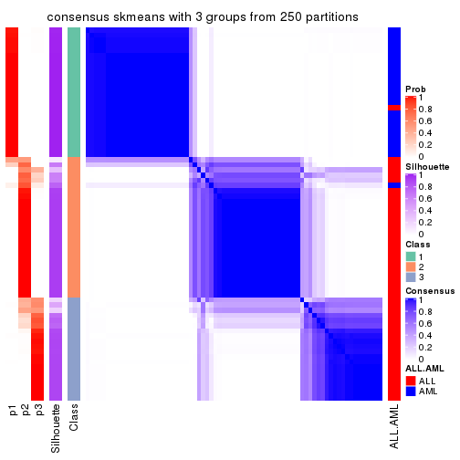</p>

</div>
<div id='tab-MAD-skmeans-consensus-heatmap-3'>
<pre><code class="r">consensus_heatmap(res, k = 4)
</code></pre>

<p>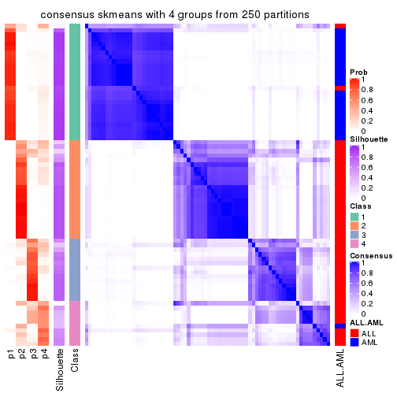</p>

</div>
<div id='tab-MAD-skmeans-consensus-heatmap-4'>
<pre><code class="r">consensus_heatmap(res, k = 5)
</code></pre>

<p>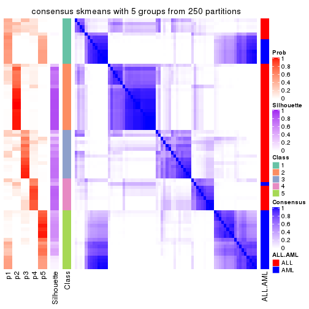</p>

</div>
<div id='tab-MAD-skmeans-consensus-heatmap-5'>
<pre><code class="r">consensus_heatmap(res, k = 6)
</code></pre>

<p>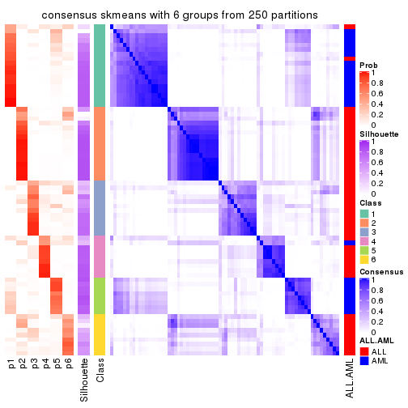</p>

</div>
</div>

Heatmaps for the membership of samples in all partitions to see how consistent they are:


<script>
$( function() {
	$( '#tabs-MAD-skmeans-membership-heatmap' ).tabs();
} );
</script>
<div id='tabs-MAD-skmeans-membership-heatmap'>
<ul>
<li><a href='#tab-MAD-skmeans-membership-heatmap-1'>k = 2</a></li>
<li><a href='#tab-MAD-skmeans-membership-heatmap-2'>k = 3</a></li>
<li><a href='#tab-MAD-skmeans-membership-heatmap-3'>k = 4</a></li>
<li><a href='#tab-MAD-skmeans-membership-heatmap-4'>k = 5</a></li>
<li><a href='#tab-MAD-skmeans-membership-heatmap-5'>k = 6</a></li>
</ul>
<div id='tab-MAD-skmeans-membership-heatmap-1'>
<pre><code class="r">membership_heatmap(res, k = 2)
</code></pre>

<p>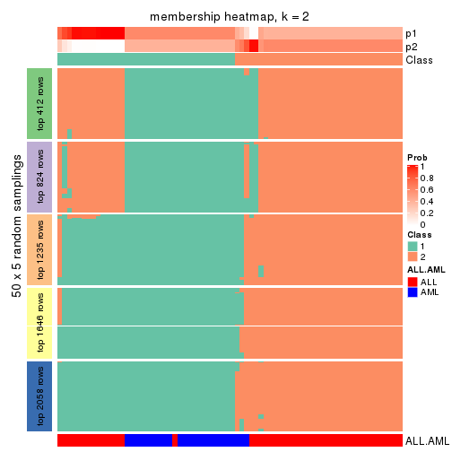</p>

</div>
<div id='tab-MAD-skmeans-membership-heatmap-2'>
<pre><code class="r">membership_heatmap(res, k = 3)
</code></pre>

<p>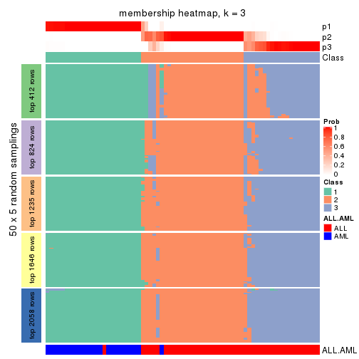</p>

</div>
<div id='tab-MAD-skmeans-membership-heatmap-3'>
<pre><code class="r">membership_heatmap(res, k = 4)
</code></pre>

<p>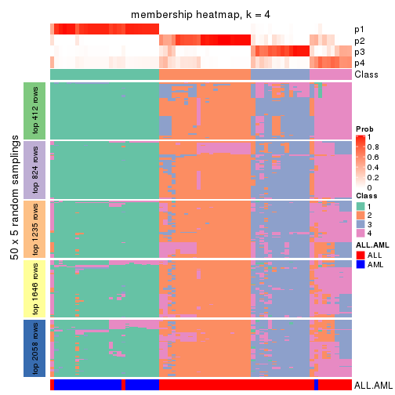</p>

</div>
<div id='tab-MAD-skmeans-membership-heatmap-4'>
<pre><code class="r">membership_heatmap(res, k = 5)
</code></pre>

<p>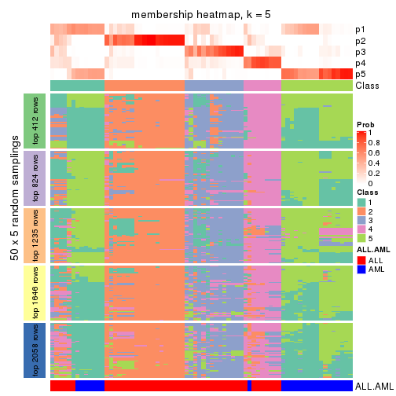</p>

</div>
<div id='tab-MAD-skmeans-membership-heatmap-5'>
<pre><code class="r">membership_heatmap(res, k = 6)
</code></pre>

<p>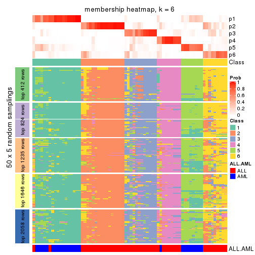</p>

</div>
</div>

As soon as we have had the classes for columns, we can look for signatures
which are significantly different between classes which can be candidate marks
for certain classes. Following are the heatmaps for signatures.


Signature heatmaps where rows are scaled:


<script>
$( function() {
	$( '#tabs-MAD-skmeans-get-signatures' ).tabs();
} );
</script>
<div id='tabs-MAD-skmeans-get-signatures'>
<ul>
<li><a href='#tab-MAD-skmeans-get-signatures-1'>k = 2</a></li>
<li><a href='#tab-MAD-skmeans-get-signatures-2'>k = 3</a></li>
<li><a href='#tab-MAD-skmeans-get-signatures-3'>k = 4</a></li>
<li><a href='#tab-MAD-skmeans-get-signatures-4'>k = 5</a></li>
<li><a href='#tab-MAD-skmeans-get-signatures-5'>k = 6</a></li>
</ul>
<div id='tab-MAD-skmeans-get-signatures-1'>
<pre><code class="r">get_signatures(res, k = 2)
</code></pre>

<p>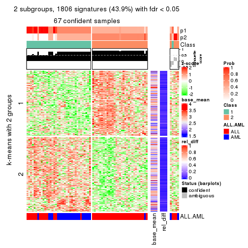</p>

</div>
<div id='tab-MAD-skmeans-get-signatures-2'>
<pre><code class="r">get_signatures(res, k = 3)
</code></pre>

<p>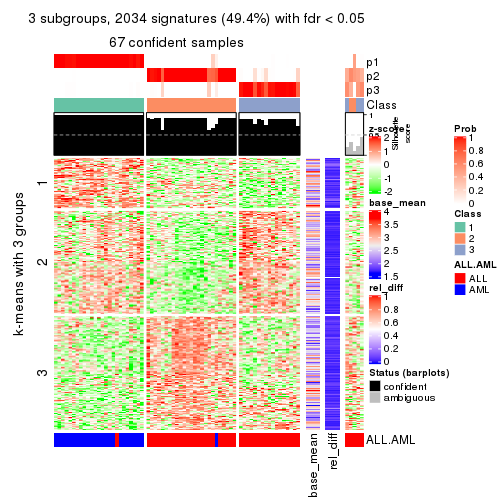</p>

</div>
<div id='tab-MAD-skmeans-get-signatures-3'>
<pre><code class="r">get_signatures(res, k = 4)
</code></pre>

<p>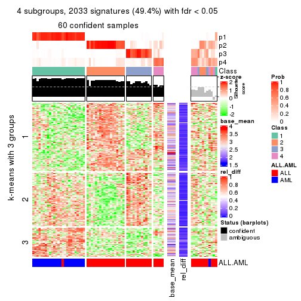</p>

</div>
<div id='tab-MAD-skmeans-get-signatures-4'>
<pre><code class="r">get_signatures(res, k = 5)
</code></pre>

<p>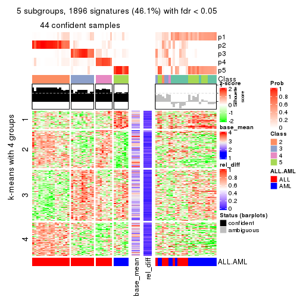</p>

</div>
<div id='tab-MAD-skmeans-get-signatures-5'>
<pre><code class="r">get_signatures(res, k = 6)
</code></pre>

<p>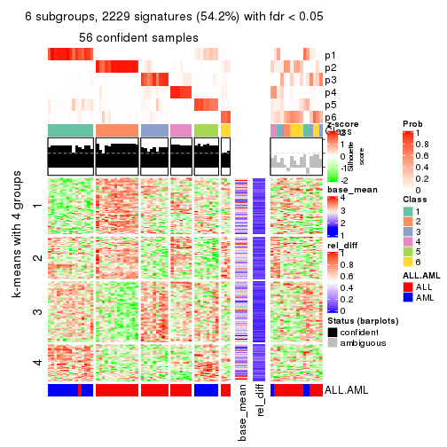</p>

</div>
</div>


Signature heatmaps where rows are not scaled:


<script>
$( function() {
	$( '#tabs-MAD-skmeans-get-signatures-no-scale' ).tabs();
} );
</script>
<div id='tabs-MAD-skmeans-get-signatures-no-scale'>
<ul>
<li><a href='#tab-MAD-skmeans-get-signatures-no-scale-1'>k = 2</a></li>
<li><a href='#tab-MAD-skmeans-get-signatures-no-scale-2'>k = 3</a></li>
<li><a href='#tab-MAD-skmeans-get-signatures-no-scale-3'>k = 4</a></li>
<li><a href='#tab-MAD-skmeans-get-signatures-no-scale-4'>k = 5</a></li>
<li><a href='#tab-MAD-skmeans-get-signatures-no-scale-5'>k = 6</a></li>
</ul>
<div id='tab-MAD-skmeans-get-signatures-no-scale-1'>
<pre><code class="r">get_signatures(res, k = 2, scale_rows = FALSE)
</code></pre>

<p>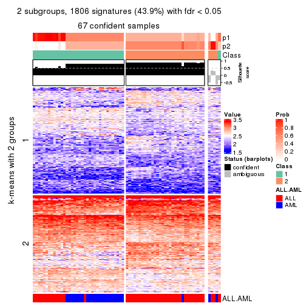</p>

</div>
<div id='tab-MAD-skmeans-get-signatures-no-scale-2'>
<pre><code class="r">get_signatures(res, k = 3, scale_rows = FALSE)
</code></pre>

<p>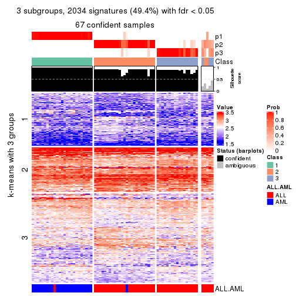</p>

</div>
<div id='tab-MAD-skmeans-get-signatures-no-scale-3'>
<pre><code class="r">get_signatures(res, k = 4, scale_rows = FALSE)
</code></pre>

<p>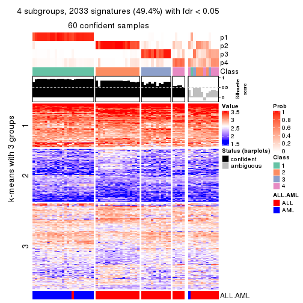</p>

</div>
<div id='tab-MAD-skmeans-get-signatures-no-scale-4'>
<pre><code class="r">get_signatures(res, k = 5, scale_rows = FALSE)
</code></pre>

<p>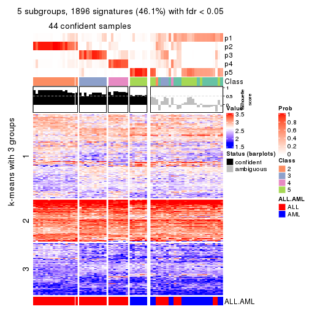</p>

</div>
<div id='tab-MAD-skmeans-get-signatures-no-scale-5'>
<pre><code class="r">get_signatures(res, k = 6, scale_rows = FALSE)
</code></pre>

<p>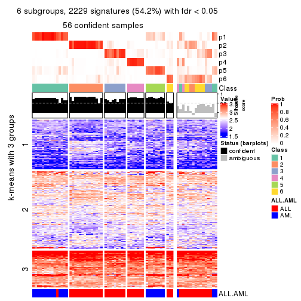</p>

</div>
</div>


Compare the overlap of signatures from different k:

```r
compare_signatures(res)
```

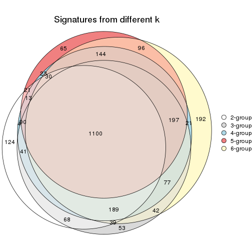

`get_signature()` returns a data frame invisibly. TO get the list of signatures, the function
call should be assigned to a variable explicitly. In following code, if `plot` argument is set
to `FALSE`, no heatmap is plotted while only the differential analysis is performed.

```r
# code only for demonstration
tb = get_signature(res, k = ..., plot = FALSE)
```

An example of the output of `tb` is:

```
#>   which_row         fdr    mean_1    mean_2 scaled_mean_1 scaled_mean_2 km
#> 1        38 0.042760348  8.373488  9.131774    -0.5533452     0.5164555  1
#> 2        40 0.018707592  7.106213  8.469186    -0.6173731     0.5762149  1
#> 3        55 0.019134737 10.221463 11.207825    -0.6159697     0.5749050  1
#> 4        59 0.006059896  5.921854  7.869574    -0.6899429     0.6439467  1
#> 5        60 0.018055526  8.928898 10.211722    -0.6204761     0.5791110  1
#> 6        98 0.009384629 15.714769 14.887706     0.6635654    -0.6193277  2
...
```

The columns in `tb` are:

1. `which_row`: row indices corresponding to the input matrix.
2. `fdr`: FDR for the differential test. 
3. `mean_x`: The mean value in group x.
4. `scaled_mean_x`: The mean value in group x after rows are scaled.
5. `km`: Row groups if k-means clustering is applied to rows.


UMAP plot which shows how samples are separated.


<script>
$( function() {
	$( '#tabs-MAD-skmeans-dimension-reduction' ).tabs();
} );
</script>
<div id='tabs-MAD-skmeans-dimension-reduction'>
<ul>
<li><a href='#tab-MAD-skmeans-dimension-reduction-1'>k = 2</a></li>
<li><a href='#tab-MAD-skmeans-dimension-reduction-2'>k = 3</a></li>
<li><a href='#tab-MAD-skmeans-dimension-reduction-3'>k = 4</a></li>
<li><a href='#tab-MAD-skmeans-dimension-reduction-4'>k = 5</a></li>
<li><a href='#tab-MAD-skmeans-dimension-reduction-5'>k = 6</a></li>
</ul>
<div id='tab-MAD-skmeans-dimension-reduction-1'>
<pre><code class="r">dimension_reduction(res, k = 2, method = &quot;UMAP&quot;)
</code></pre>

<p>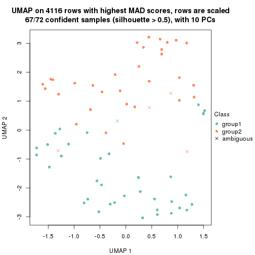</p>

</div>
<div id='tab-MAD-skmeans-dimension-reduction-2'>
<pre><code class="r">dimension_reduction(res, k = 3, method = &quot;UMAP&quot;)
</code></pre>

<p>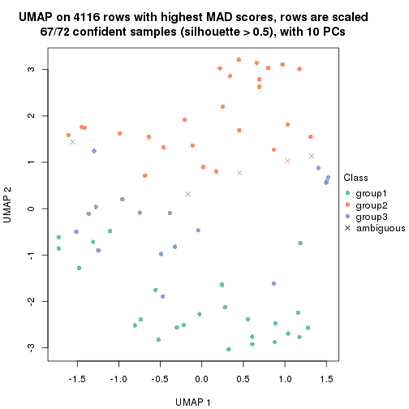</p>

</div>
<div id='tab-MAD-skmeans-dimension-reduction-3'>
<pre><code class="r">dimension_reduction(res, k = 4, method = &quot;UMAP&quot;)
</code></pre>

<p>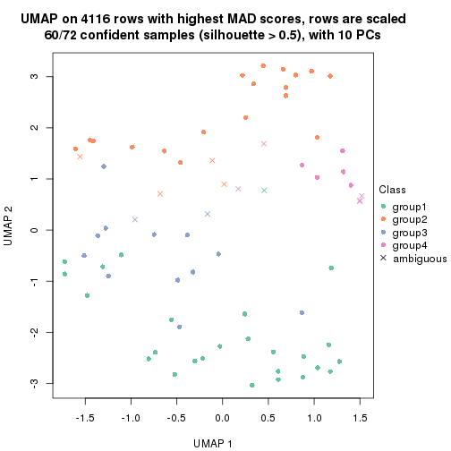</p>

</div>
<div id='tab-MAD-skmeans-dimension-reduction-4'>
<pre><code class="r">dimension_reduction(res, k = 5, method = &quot;UMAP&quot;)
</code></pre>

<p>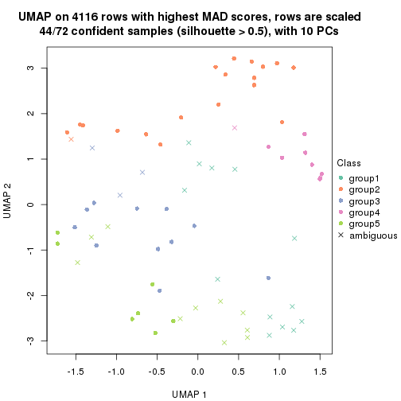</p>

</div>
<div id='tab-MAD-skmeans-dimension-reduction-5'>
<pre><code class="r">dimension_reduction(res, k = 6, method = &quot;UMAP&quot;)
</code></pre>

<p>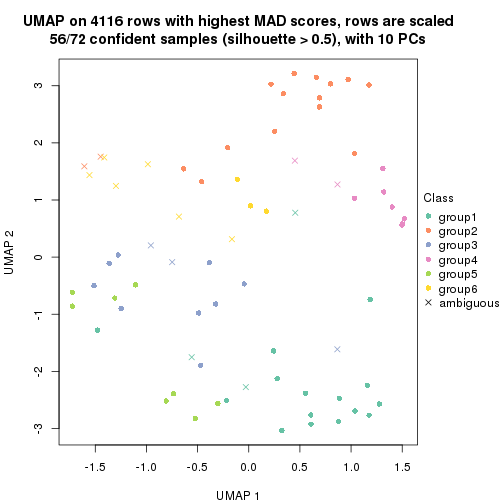</p>

</div>
</div>


Following heatmap shows how subgroups are split when increasing `k`:

```r
collect_classes(res)
```

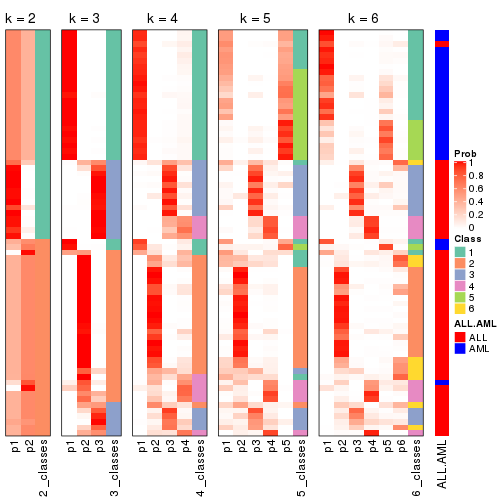


Test correlation between subgroups and known annotations. If the known
annotation is numeric, one-way ANOVA test is applied, and if the known
annotation is discrete, chi-squared contingency table test is applied.

```r
test_to_known_factors(res)
```

```
#>              n ALL.AML(p) k
#> MAD:skmeans 67   2.39e-06 2
#> MAD:skmeans 67   1.71e-13 3
#> MAD:skmeans 60   4.20e-12 4
#> MAD:skmeans 44   1.51e-09 5
#> MAD:skmeans 56   5.18e-10 6
```


If matrix rows can be associated to genes, consider to use `functional_enrichment(res,
...)` to perform function enrichment for the signature genes. See [this vignette](http://bioconductor.org/packages/devel/bioc/vignettes/cola/inst/doc/functional_enrichment.html) for more detailed explanations.


 

---------------------------------------------------


### MAD:pam


The object with results only for a single top-value method and a single partition method 
can be extracted as:

```r
res = res_list["MAD", "pam"]
# you can also extract it by
# res = res_list["MAD:pam"]
```

A summary of `res` and all the functions that can be applied to it:

```r
res
```

```
#> A 'ConsensusPartition' object with k = 2, 3, 4, 5, 6.
#>   On a matrix with 4116 rows and 72 columns.
#>   Top rows (412, 824, 1235, 1646, 2058) are extracted by 'MAD' method.
#>   Subgroups are detected by 'pam' method.
#>   Performed in total 1250 partitions by row resampling.
#>   Best k for subgroups seems to be 2.
#> 
#> Following methods can be applied to this 'ConsensusPartition' object:
#>  [1] "cola_report"             "collect_classes"         "collect_plots"          
#>  [4] "collect_stats"           "colnames"                "compare_signatures"     
#>  [7] "consensus_heatmap"       "dimension_reduction"     "functional_enrichment"  
#> [10] "get_anno_col"            "get_anno"                "get_classes"            
#> [13] "get_consensus"           "get_matrix"              "get_membership"         
#> [16] "get_param"               "get_signatures"          "get_stats"              
#> [19] "is_best_k"               "is_stable_k"             "membership_heatmap"     
#> [22] "ncol"                    "nrow"                    "plot_ecdf"              
#> [25] "rownames"                "select_partition_number" "show"                   
#> [28] "suggest_best_k"          "test_to_known_factors"
```

`collect_plots()` function collects all the plots made from `res` for all `k` (number of partitions)
into one single page to provide an easy and fast comparison between different `k`.

```r
collect_plots(res)
```

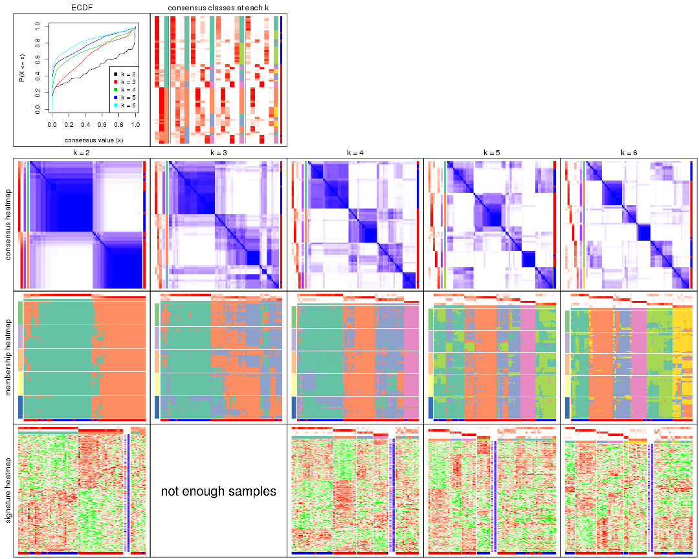

The plots are:

- The first row: a plot of the ECDF (empirical cumulative distribution
  function) curves of the consensus matrix for each `k` and the heatmap of
  predicted classes for each `k`.
- The second row: heatmaps of the consensus matrix for each `k`.
- The third row: heatmaps of the membership matrix for each `k`.
- The fouth row: heatmaps of the signatures for each `k`.

All the plots in panels can be made by individual functions and they are
plotted later in this section.

`select_partition_number()` produces several plots showing different
statistics for choosing "optimized" `k`. There are following statistics:

- ECDF curves of the consensus matrix for each `k`;
- 1-PAC. [The PAC
  score](https://en.wikipedia.org/wiki/Consensus_clustering#Over-interpretation_potential_of_consensus_clustering)
  measures the proportion of the ambiguous subgrouping.
- Mean silhouette score.
- Concordance. The mean probability of fiting the consensus class ids in all
  partitions.
- Area increased. Denote $A_k$ as the area under the ECDF curve for current
  `k`, the area increased is defined as $A_k - A_{k-1}$.
- Rand index. The percent of pairs of samples that are both in a same cluster
  or both are not in a same cluster in the partition of k and k-1.
- Jaccard index. The ratio of pairs of samples are both in a same cluster in
  the partition of k and k-1 and the pairs of samples are both in a same
  cluster in the partition k or k-1.

The detailed explanations of these statistics can be found in [the _cola_
vignette](http://bioconductor.org/packages/devel/bioc/vignettes/cola/inst/doc/cola.html#toc_13).

Generally speaking, lower PAC score, higher mean silhouette score or higher
concordance corresponds to better partition. Rand index and Jaccard index
measure how similar the current partition is compared to partition with `k-1`.
If they are too similar, we won't accept `k` is better than `k-1`.

```r
select_partition_number(res)
```

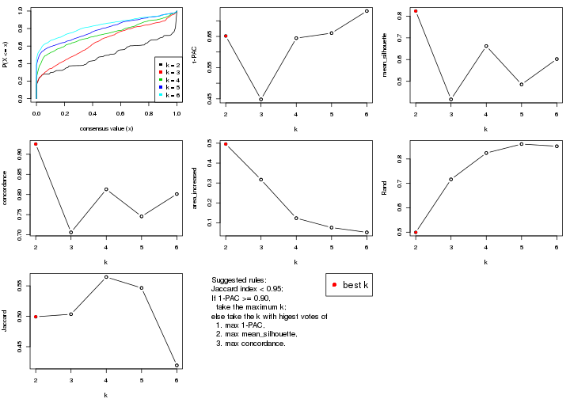

The numeric values for all these statistics can be obtained by `get_stats()`.

```r
get_stats(res)
```

```
#>   k 1-PAC mean_silhouette concordance area_increased  Rand Jaccard
#> 2 2 0.651           0.824       0.925         0.4957 0.499   0.499
#> 3 3 0.448           0.417       0.706         0.3170 0.716   0.503
#> 4 4 0.644           0.662       0.813         0.1232 0.824   0.565
#> 5 5 0.661           0.486       0.746         0.0759 0.861   0.547
#> 6 6 0.731           0.602       0.801         0.0519 0.852   0.419
```

`suggest_best_k()` suggests the best $k$ based on these statistics. The rules are as follows:

- All $k$ with Jaccard index larger than 0.95 are removed because increasing
  $k$ does not provide enough extra information. If all $k$ are removed, it is
  marked as no subgroup is detected.
- For all $k$ with 1-PAC score larger than 0.9, the maximal $k$ is taken as
  the best $k$, and other $k$ are marked as optional $k$.
- If it does not fit the second rule. The $k$ with the maximal vote of the
  highest 1-PAC score, highest mean silhouette, and highest concordance is
  taken as the best $k$.

```r
suggest_best_k(res)
```

```
#> [1] 2
```


Following shows the table of the partitions (You need to click the **show/hide
code output** link to see it). The membership matrix (columns with name `p*`)
is inferred by
[`clue::cl_consensus()`](https://www.rdocumentation.org/link/cl_consensus?package=clue)
function with the `SE` method. Basically the value in the membership matrix
represents the probability to belong to a certain group. The finall class
label for an item is determined with the group with highest probability it
belongs to.

In `get_classes()` function, the entropy is calculated from the membership
matrix and the silhouette score is calculated from the consensus matrix.


<script>
$( function() {
	$( '#tabs-MAD-pam-get-classes' ).tabs();
} );
</script>
<div id='tabs-MAD-pam-get-classes'>
<ul>
<li><a href='#tab-MAD-pam-get-classes-1'>k = 2</a></li>
<li><a href='#tab-MAD-pam-get-classes-2'>k = 3</a></li>
<li><a href='#tab-MAD-pam-get-classes-3'>k = 4</a></li>
<li><a href='#tab-MAD-pam-get-classes-4'>k = 5</a></li>
<li><a href='#tab-MAD-pam-get-classes-5'>k = 6</a></li>
</ul>

<div id='tab-MAD-pam-get-classes-1'>
<p><a id='tab-MAD-pam-get-classes-1-a' style='color:#0366d6' href='#'>show/hide code output</a></p>
<pre><code class="r">cbind(get_classes(res, k = 2), get_membership(res, k = 2))
</code></pre>

<pre><code>#&gt;           class entropy silhouette    p1    p2
#&gt; sample_39     1  0.9427      0.464 0.640 0.360
#&gt; sample_40     1  0.5629      0.824 0.868 0.132
#&gt; sample_42     2  0.2603      0.881 0.044 0.956
#&gt; sample_47     2  0.0000      0.906 0.000 1.000
#&gt; sample_48     2  0.0000      0.906 0.000 1.000
#&gt; sample_49     1  0.0938      0.918 0.988 0.012
#&gt; sample_41     2  0.0000      0.906 0.000 1.000
#&gt; sample_43     2  0.0000      0.906 0.000 1.000
#&gt; sample_44     2  0.0000      0.906 0.000 1.000
#&gt; sample_45     2  0.0000      0.906 0.000 1.000
#&gt; sample_46     2  0.0000      0.906 0.000 1.000
#&gt; sample_70     1  0.9491      0.445 0.632 0.368
#&gt; sample_71     2  0.1414      0.896 0.020 0.980
#&gt; sample_72     2  0.0672      0.903 0.008 0.992
#&gt; sample_68     2  0.0000      0.906 0.000 1.000
#&gt; sample_69     2  0.0000      0.906 0.000 1.000
#&gt; sample_67     2  0.9993      0.126 0.484 0.516
#&gt; sample_55     1  0.2236      0.907 0.964 0.036
#&gt; sample_56     1  0.9833      0.296 0.576 0.424
#&gt; sample_59     2  0.7219      0.723 0.200 0.800
#&gt; sample_52     1  0.0000      0.922 1.000 0.000
#&gt; sample_53     1  0.0000      0.922 1.000 0.000
#&gt; sample_51     1  0.0000      0.922 1.000 0.000
#&gt; sample_50     1  0.0000      0.922 1.000 0.000
#&gt; sample_54     1  0.4562      0.852 0.904 0.096
#&gt; sample_57     1  0.0000      0.922 1.000 0.000
#&gt; sample_58     1  0.0000      0.922 1.000 0.000
#&gt; sample_60     1  0.1633      0.913 0.976 0.024
#&gt; sample_61     1  0.0000      0.922 1.000 0.000
#&gt; sample_65     1  0.0000      0.922 1.000 0.000
#&gt; sample_66     2  0.9248      0.483 0.340 0.660
#&gt; sample_63     1  0.0000      0.922 1.000 0.000
#&gt; sample_64     1  0.0000      0.922 1.000 0.000
#&gt; sample_62     1  0.0672      0.919 0.992 0.008
#&gt; sample_1      2  0.0376      0.904 0.004 0.996
#&gt; sample_2      2  0.9866      0.291 0.432 0.568
#&gt; sample_3      1  0.2236      0.906 0.964 0.036
#&gt; sample_4      2  0.9881      0.207 0.436 0.564
#&gt; sample_5      2  0.0000      0.906 0.000 1.000
#&gt; sample_6      1  0.0938      0.918 0.988 0.012
#&gt; sample_7      1  0.7674      0.713 0.776 0.224
#&gt; sample_8      1  0.7674      0.711 0.776 0.224
#&gt; sample_9      2  0.9427      0.435 0.360 0.640
#&gt; sample_10     1  0.0938      0.918 0.988 0.012
#&gt; sample_11     2  0.4690      0.835 0.100 0.900
#&gt; sample_12     1  0.0000      0.922 1.000 0.000
#&gt; sample_13     2  0.0000      0.906 0.000 1.000
#&gt; sample_14     2  0.0000      0.906 0.000 1.000
#&gt; sample_15     2  0.0000      0.906 0.000 1.000
#&gt; sample_16     2  0.0000      0.906 0.000 1.000
#&gt; sample_17     2  0.0000      0.906 0.000 1.000
#&gt; sample_18     2  0.7453      0.710 0.212 0.788
#&gt; sample_19     2  0.0000      0.906 0.000 1.000
#&gt; sample_20     2  0.0000      0.906 0.000 1.000
#&gt; sample_21     2  0.0000      0.906 0.000 1.000
#&gt; sample_22     1  0.6973      0.759 0.812 0.188
#&gt; sample_23     1  0.5408      0.832 0.876 0.124
#&gt; sample_24     2  0.0000      0.906 0.000 1.000
#&gt; sample_25     1  0.9850      0.286 0.572 0.428
#&gt; sample_26     2  0.0672      0.903 0.008 0.992
#&gt; sample_27     1  0.0938      0.918 0.988 0.012
#&gt; sample_34     1  0.0000      0.922 1.000 0.000
#&gt; sample_35     1  0.0000      0.922 1.000 0.000
#&gt; sample_36     1  0.0000      0.922 1.000 0.000
#&gt; sample_37     1  0.0000      0.922 1.000 0.000
#&gt; sample_38     1  0.0000      0.922 1.000 0.000
#&gt; sample_28     1  0.0000      0.922 1.000 0.000
#&gt; sample_29     1  0.0376      0.921 0.996 0.004
#&gt; sample_30     1  0.0000      0.922 1.000 0.000
#&gt; sample_31     1  0.0000      0.922 1.000 0.000
#&gt; sample_32     1  0.0000      0.922 1.000 0.000
#&gt; sample_33     1  0.0000      0.922 1.000 0.000
</code></pre>

<script>
$('#tab-MAD-pam-get-classes-1-a').parent().next().next().hide();
$('#tab-MAD-pam-get-classes-1-a').click(function(){
  $('#tab-MAD-pam-get-classes-1-a').parent().next().next().toggle();
  return(false);
});
</script>
</div>

<div id='tab-MAD-pam-get-classes-2'>
<p><a id='tab-MAD-pam-get-classes-2-a' style='color:#0366d6' href='#'>show/hide code output</a></p>
<pre><code class="r">cbind(get_classes(res, k = 3), get_membership(res, k = 3))
</code></pre>

<pre><code>#&gt;           class entropy silhouette    p1    p2    p3
#&gt; sample_39     2  0.9433    0.14687 0.236 0.504 0.260
#&gt; sample_40     1  0.9690    0.06631 0.408 0.376 0.216
#&gt; sample_42     2  0.3310    0.38154 0.028 0.908 0.064
#&gt; sample_47     2  0.5254    0.31702 0.000 0.736 0.264
#&gt; sample_48     2  0.6267    0.15971 0.000 0.548 0.452
#&gt; sample_49     2  0.9824   -0.00617 0.348 0.404 0.248
#&gt; sample_41     3  0.6299   -0.16325 0.000 0.476 0.524
#&gt; sample_43     2  0.5254    0.32761 0.000 0.736 0.264
#&gt; sample_44     2  0.4974    0.36270 0.000 0.764 0.236
#&gt; sample_45     2  0.3619    0.39336 0.000 0.864 0.136
#&gt; sample_46     2  0.3816    0.38716 0.000 0.852 0.148
#&gt; sample_70     2  0.9447    0.08927 0.188 0.464 0.348
#&gt; sample_71     2  0.5004    0.34374 0.072 0.840 0.088
#&gt; sample_72     2  0.0592    0.41152 0.000 0.988 0.012
#&gt; sample_68     2  0.6267    0.15971 0.000 0.548 0.452
#&gt; sample_69     2  0.6260    0.16195 0.000 0.552 0.448
#&gt; sample_67     3  0.9842    0.16802 0.368 0.248 0.384
#&gt; sample_55     1  0.8517    0.40919 0.584 0.128 0.288
#&gt; sample_56     2  0.9100    0.17799 0.204 0.548 0.248
#&gt; sample_59     2  0.4873    0.37936 0.024 0.824 0.152
#&gt; sample_52     1  0.0000    0.85418 1.000 0.000 0.000
#&gt; sample_53     1  0.1647    0.84374 0.960 0.004 0.036
#&gt; sample_51     1  0.0592    0.85513 0.988 0.000 0.012
#&gt; sample_50     1  0.0237    0.85473 0.996 0.004 0.000
#&gt; sample_54     1  0.6894    0.47630 0.692 0.052 0.256
#&gt; sample_57     1  0.0237    0.85437 0.996 0.000 0.004
#&gt; sample_58     1  0.0237    0.85437 0.996 0.000 0.004
#&gt; sample_60     1  0.3678    0.79022 0.892 0.028 0.080
#&gt; sample_61     1  0.2636    0.84227 0.932 0.020 0.048
#&gt; sample_65     1  0.0661    0.85489 0.988 0.008 0.004
#&gt; sample_66     3  0.6894    0.30341 0.052 0.256 0.692
#&gt; sample_63     1  0.0000    0.85418 1.000 0.000 0.000
#&gt; sample_64     1  0.2860    0.80880 0.912 0.004 0.084
#&gt; sample_62     1  0.1643    0.83126 0.956 0.000 0.044
#&gt; sample_1      2  0.4796    0.34648 0.000 0.780 0.220
#&gt; sample_2      3  0.8105    0.29095 0.156 0.196 0.648
#&gt; sample_3      3  0.7460   -0.10103 0.440 0.036 0.524
#&gt; sample_4      3  0.6834    0.26341 0.148 0.112 0.740
#&gt; sample_5      2  0.6267    0.15971 0.000 0.548 0.452
#&gt; sample_6      3  0.7571   -0.13197 0.452 0.040 0.508
#&gt; sample_7      1  0.8226    0.31011 0.584 0.096 0.320
#&gt; sample_8      2  0.9581    0.11868 0.288 0.476 0.236
#&gt; sample_9      3  0.3695    0.34522 0.012 0.108 0.880
#&gt; sample_10     1  0.8339    0.14296 0.472 0.080 0.448
#&gt; sample_11     3  0.4531    0.33283 0.008 0.168 0.824
#&gt; sample_12     1  0.3009    0.83640 0.920 0.028 0.052
#&gt; sample_13     2  0.6267    0.15971 0.000 0.548 0.452
#&gt; sample_14     3  0.3752    0.32440 0.000 0.144 0.856
#&gt; sample_15     2  0.6267    0.15971 0.000 0.548 0.452
#&gt; sample_16     2  0.6225    0.18857 0.000 0.568 0.432
#&gt; sample_17     3  0.6295   -0.13730 0.000 0.472 0.528
#&gt; sample_18     2  0.8370    0.08089 0.084 0.500 0.416
#&gt; sample_19     2  0.2878    0.40300 0.000 0.904 0.096
#&gt; sample_20     2  0.6267    0.15971 0.000 0.548 0.452
#&gt; sample_21     2  0.6267    0.15971 0.000 0.548 0.452
#&gt; sample_22     2  0.9641    0.09229 0.316 0.456 0.228
#&gt; sample_23     3  0.7597    0.03911 0.384 0.048 0.568
#&gt; sample_24     3  0.6299   -0.16084 0.000 0.476 0.524
#&gt; sample_25     2  0.8435    0.15854 0.284 0.592 0.124
#&gt; sample_26     2  0.1289    0.40525 0.000 0.968 0.032
#&gt; sample_27     1  0.9680    0.20949 0.456 0.300 0.244
#&gt; sample_34     1  0.0000    0.85418 1.000 0.000 0.000
#&gt; sample_35     1  0.2496    0.82384 0.928 0.004 0.068
#&gt; sample_36     1  0.0829    0.85277 0.984 0.004 0.012
#&gt; sample_37     1  0.1832    0.84309 0.956 0.008 0.036
#&gt; sample_38     1  0.2743    0.83658 0.928 0.020 0.052
#&gt; sample_28     1  0.2806    0.83546 0.928 0.032 0.040
#&gt; sample_29     1  0.2200    0.83530 0.940 0.004 0.056
#&gt; sample_30     1  0.0000    0.85418 1.000 0.000 0.000
#&gt; sample_31     1  0.0661    0.85417 0.988 0.004 0.008
#&gt; sample_32     1  0.0661    0.85489 0.988 0.008 0.004
#&gt; sample_33     1  0.1832    0.84309 0.956 0.008 0.036
</code></pre>

<script>
$('#tab-MAD-pam-get-classes-2-a').parent().next().next().hide();
$('#tab-MAD-pam-get-classes-2-a').click(function(){
  $('#tab-MAD-pam-get-classes-2-a').parent().next().next().toggle();
  return(false);
});
</script>
</div>

<div id='tab-MAD-pam-get-classes-3'>
<p><a id='tab-MAD-pam-get-classes-3-a' style='color:#0366d6' href='#'>show/hide code output</a></p>
<pre><code class="r">cbind(get_classes(res, k = 4), get_membership(res, k = 4))
</code></pre>

<pre><code>#&gt;           class entropy silhouette    p1    p2    p3    p4
#&gt; sample_39     3  0.0657    0.63106 0.012 0.000 0.984 0.004
#&gt; sample_40     3  0.5618    0.58842 0.288 0.004 0.668 0.040
#&gt; sample_42     3  0.4540    0.50079 0.008 0.248 0.740 0.004
#&gt; sample_47     2  0.3831    0.64477 0.000 0.792 0.204 0.004
#&gt; sample_48     2  0.0000    0.79017 0.000 1.000 0.000 0.000
#&gt; sample_49     3  0.5927    0.59339 0.264 0.000 0.660 0.076
#&gt; sample_41     2  0.1584    0.77080 0.000 0.952 0.036 0.012
#&gt; sample_43     2  0.4770    0.53545 0.000 0.700 0.288 0.012
#&gt; sample_44     2  0.5313    0.38343 0.000 0.608 0.376 0.016
#&gt; sample_45     2  0.4776    0.34595 0.000 0.624 0.376 0.000
#&gt; sample_46     2  0.4790    0.33129 0.000 0.620 0.380 0.000
#&gt; sample_70     3  0.5979    0.60629 0.136 0.000 0.692 0.172
#&gt; sample_71     3  0.3891    0.60006 0.036 0.100 0.852 0.012
#&gt; sample_72     3  0.5050    0.24323 0.000 0.408 0.588 0.004
#&gt; sample_68     2  0.0000    0.79017 0.000 1.000 0.000 0.000
#&gt; sample_69     2  0.0188    0.78927 0.000 0.996 0.004 0.000
#&gt; sample_67     3  0.7848   -0.14852 0.384 0.128 0.460 0.028
#&gt; sample_55     1  0.8050    0.03164 0.500 0.036 0.312 0.152
#&gt; sample_56     3  0.5922    0.61807 0.164 0.044 0.736 0.056
#&gt; sample_59     3  0.6186    0.04481 0.016 0.444 0.516 0.024
#&gt; sample_52     1  0.0188    0.81793 0.996 0.000 0.000 0.004
#&gt; sample_53     1  0.4606    0.72793 0.724 0.000 0.264 0.012
#&gt; sample_51     1  0.2198    0.82180 0.920 0.000 0.072 0.008
#&gt; sample_50     1  0.1722    0.82474 0.944 0.000 0.048 0.008
#&gt; sample_54     1  0.5811    0.60184 0.708 0.076 0.008 0.208
#&gt; sample_57     1  0.0524    0.81624 0.988 0.000 0.008 0.004
#&gt; sample_58     1  0.0657    0.81587 0.984 0.000 0.012 0.004
#&gt; sample_60     1  0.2739    0.77270 0.912 0.044 0.036 0.008
#&gt; sample_61     1  0.4343    0.73812 0.732 0.000 0.264 0.004
#&gt; sample_65     1  0.1302    0.82495 0.956 0.000 0.044 0.000
#&gt; sample_66     4  0.2142    0.94271 0.000 0.056 0.016 0.928
#&gt; sample_63     1  0.0188    0.81793 0.996 0.000 0.000 0.004
#&gt; sample_64     1  0.1909    0.79480 0.940 0.004 0.048 0.008
#&gt; sample_62     1  0.0657    0.81358 0.984 0.000 0.012 0.004
#&gt; sample_1      3  0.5358    0.45978 0.000 0.252 0.700 0.048
#&gt; sample_2      4  0.3257    0.90966 0.008 0.052 0.052 0.888
#&gt; sample_3      4  0.0672    0.95126 0.008 0.000 0.008 0.984
#&gt; sample_4      2  0.8185    0.31456 0.092 0.568 0.132 0.208
#&gt; sample_5      2  0.0000    0.79017 0.000 1.000 0.000 0.000
#&gt; sample_6      4  0.0779    0.95194 0.016 0.000 0.004 0.980
#&gt; sample_7      1  0.8956    0.01742 0.436 0.316 0.140 0.108
#&gt; sample_8      3  0.3731    0.64706 0.120 0.000 0.844 0.036
#&gt; sample_9      4  0.0921    0.95618 0.000 0.028 0.000 0.972
#&gt; sample_10     4  0.1584    0.93720 0.012 0.000 0.036 0.952
#&gt; sample_11     4  0.1398    0.95341 0.000 0.040 0.004 0.956
#&gt; sample_12     1  0.4372    0.73404 0.728 0.000 0.268 0.004
#&gt; sample_13     2  0.0000    0.79017 0.000 1.000 0.000 0.000
#&gt; sample_14     4  0.1389    0.94885 0.000 0.048 0.000 0.952
#&gt; sample_15     2  0.0000    0.79017 0.000 1.000 0.000 0.000
#&gt; sample_16     2  0.3224    0.72960 0.000 0.864 0.120 0.016
#&gt; sample_17     2  0.2469    0.72872 0.000 0.892 0.000 0.108
#&gt; sample_18     3  0.7417    0.44338 0.016 0.200 0.580 0.204
#&gt; sample_19     2  0.5155   -0.00421 0.000 0.528 0.468 0.004
#&gt; sample_20     2  0.0000    0.79017 0.000 1.000 0.000 0.000
#&gt; sample_21     2  0.0000    0.79017 0.000 1.000 0.000 0.000
#&gt; sample_22     3  0.1109    0.62937 0.028 0.000 0.968 0.004
#&gt; sample_23     4  0.0779    0.95194 0.016 0.000 0.004 0.980
#&gt; sample_24     2  0.1798    0.76675 0.000 0.944 0.040 0.016
#&gt; sample_25     3  0.3285    0.60915 0.020 0.080 0.884 0.016
#&gt; sample_26     3  0.4936    0.31910 0.000 0.372 0.624 0.004
#&gt; sample_27     3  0.6549    0.42142 0.356 0.000 0.556 0.088
#&gt; sample_34     1  0.1557    0.82409 0.944 0.000 0.056 0.000
#&gt; sample_35     1  0.2593    0.80550 0.892 0.000 0.104 0.004
#&gt; sample_36     1  0.1584    0.82351 0.952 0.000 0.036 0.012
#&gt; sample_37     1  0.4606    0.72793 0.724 0.000 0.264 0.012
#&gt; sample_38     1  0.5169    0.71325 0.696 0.000 0.272 0.032
#&gt; sample_28     1  0.4744    0.71750 0.704 0.000 0.284 0.012
#&gt; sample_29     1  0.4813    0.72424 0.716 0.004 0.268 0.012
#&gt; sample_30     1  0.0937    0.82235 0.976 0.000 0.012 0.012
#&gt; sample_31     1  0.1302    0.82523 0.956 0.000 0.044 0.000
#&gt; sample_32     1  0.1637    0.82318 0.940 0.000 0.060 0.000
#&gt; sample_33     1  0.4606    0.72793 0.724 0.000 0.264 0.012
</code></pre>

<script>
$('#tab-MAD-pam-get-classes-3-a').parent().next().next().hide();
$('#tab-MAD-pam-get-classes-3-a').click(function(){
  $('#tab-MAD-pam-get-classes-3-a').parent().next().next().toggle();
  return(false);
});
</script>
</div>

<div id='tab-MAD-pam-get-classes-4'>
<p><a id='tab-MAD-pam-get-classes-4-a' style='color:#0366d6' href='#'>show/hide code output</a></p>
<pre><code class="r">cbind(get_classes(res, k = 5), get_membership(res, k = 5))
</code></pre>

<pre><code>#&gt;           class entropy silhouette    p1    p2    p3    p4    p5
#&gt; sample_39     1  0.4307   -0.18885 0.504 0.000 0.496 0.000 0.000
#&gt; sample_40     3  0.2589    0.60686 0.012 0.008 0.888 0.000 0.092
#&gt; sample_42     1  0.6584   -0.29372 0.412 0.208 0.380 0.000 0.000
#&gt; sample_47     2  0.3930    0.65080 0.056 0.792 0.152 0.000 0.000
#&gt; sample_48     2  0.0000    0.78214 0.000 1.000 0.000 0.000 0.000
#&gt; sample_49     3  0.1682    0.62153 0.004 0.000 0.940 0.012 0.044
#&gt; sample_41     2  0.1197    0.76086 0.000 0.952 0.048 0.000 0.000
#&gt; sample_43     2  0.5758    0.41852 0.124 0.592 0.284 0.000 0.000
#&gt; sample_44     2  0.5714    0.39364 0.108 0.580 0.312 0.000 0.000
#&gt; sample_45     2  0.5776    0.37059 0.124 0.588 0.288 0.000 0.000
#&gt; sample_46     2  0.5827    0.34120 0.124 0.576 0.300 0.000 0.000
#&gt; sample_70     3  0.5462    0.54641 0.132 0.000 0.704 0.140 0.024
#&gt; sample_71     1  0.5443   -0.17326 0.504 0.060 0.436 0.000 0.000
#&gt; sample_72     3  0.6322    0.00934 0.156 0.408 0.436 0.000 0.000
#&gt; sample_68     2  0.0000    0.78214 0.000 1.000 0.000 0.000 0.000
#&gt; sample_69     2  0.0404    0.77950 0.012 0.988 0.000 0.000 0.000
#&gt; sample_67     1  0.7076    0.32113 0.548 0.092 0.076 0.008 0.276
#&gt; sample_55     3  0.6414    0.29970 0.084 0.028 0.616 0.020 0.252
#&gt; sample_56     3  0.0955    0.62530 0.000 0.000 0.968 0.004 0.028
#&gt; sample_59     3  0.6416   -0.00161 0.136 0.388 0.468 0.000 0.008
#&gt; sample_52     5  0.1965    0.68967 0.096 0.000 0.000 0.000 0.904
#&gt; sample_53     1  0.4030    0.34116 0.648 0.000 0.000 0.000 0.352
#&gt; sample_51     1  0.3816    0.25811 0.696 0.000 0.000 0.000 0.304
#&gt; sample_50     1  0.4088    0.21065 0.632 0.000 0.000 0.000 0.368
#&gt; sample_54     5  0.2713    0.64037 0.020 0.008 0.008 0.068 0.896
#&gt; sample_57     5  0.2929    0.65019 0.152 0.000 0.008 0.000 0.840
#&gt; sample_58     5  0.1845    0.69106 0.056 0.000 0.016 0.000 0.928
#&gt; sample_60     5  0.2818    0.66154 0.132 0.000 0.012 0.000 0.856
#&gt; sample_61     1  0.4958    0.16162 0.592 0.000 0.036 0.000 0.372
#&gt; sample_65     5  0.4182    0.34159 0.400 0.000 0.000 0.000 0.600
#&gt; sample_66     4  0.0162    0.98291 0.000 0.004 0.000 0.996 0.000
#&gt; sample_63     5  0.1478    0.68375 0.064 0.000 0.000 0.000 0.936
#&gt; sample_64     5  0.4670    0.59732 0.200 0.000 0.076 0.000 0.724
#&gt; sample_62     5  0.1341    0.68756 0.056 0.000 0.000 0.000 0.944
#&gt; sample_1      3  0.2388    0.60619 0.072 0.028 0.900 0.000 0.000
#&gt; sample_2      4  0.2451    0.89998 0.056 0.036 0.004 0.904 0.000
#&gt; sample_3      4  0.0000    0.98556 0.000 0.000 0.000 1.000 0.000
#&gt; sample_4      2  0.5556    0.01669 0.004 0.496 0.456 0.028 0.016
#&gt; sample_5      2  0.0000    0.78214 0.000 1.000 0.000 0.000 0.000
#&gt; sample_6      4  0.0000    0.98556 0.000 0.000 0.000 1.000 0.000
#&gt; sample_7      3  0.7796    0.28379 0.116 0.216 0.504 0.008 0.156
#&gt; sample_8      3  0.1216    0.62288 0.020 0.000 0.960 0.000 0.020
#&gt; sample_9      4  0.0000    0.98556 0.000 0.000 0.000 1.000 0.000
#&gt; sample_10     4  0.0000    0.98556 0.000 0.000 0.000 1.000 0.000
#&gt; sample_11     4  0.0000    0.98556 0.000 0.000 0.000 1.000 0.000
#&gt; sample_12     1  0.4538    0.21813 0.636 0.000 0.004 0.012 0.348
#&gt; sample_13     2  0.0000    0.78214 0.000 1.000 0.000 0.000 0.000
#&gt; sample_14     4  0.0404    0.97579 0.000 0.012 0.000 0.988 0.000
#&gt; sample_15     2  0.0000    0.78214 0.000 1.000 0.000 0.000 0.000
#&gt; sample_16     2  0.2230    0.73267 0.000 0.884 0.116 0.000 0.000
#&gt; sample_17     2  0.2179    0.71275 0.000 0.888 0.000 0.112 0.000
#&gt; sample_18     3  0.9318    0.29351 0.176 0.176 0.336 0.248 0.064
#&gt; sample_19     2  0.5229    0.36447 0.064 0.612 0.324 0.000 0.000
#&gt; sample_20     2  0.0000    0.78214 0.000 1.000 0.000 0.000 0.000
#&gt; sample_21     2  0.0000    0.78214 0.000 1.000 0.000 0.000 0.000
#&gt; sample_22     3  0.4249    0.08897 0.432 0.000 0.568 0.000 0.000
#&gt; sample_23     4  0.0000    0.98556 0.000 0.000 0.000 1.000 0.000
#&gt; sample_24     2  0.1341    0.75691 0.000 0.944 0.056 0.000 0.000
#&gt; sample_25     1  0.4860   -0.13223 0.540 0.016 0.440 0.004 0.000
#&gt; sample_26     3  0.6285    0.04977 0.152 0.392 0.456 0.000 0.000
#&gt; sample_27     3  0.3346    0.58067 0.036 0.000 0.856 0.016 0.092
#&gt; sample_34     1  0.4302   -0.01784 0.520 0.000 0.000 0.000 0.480
#&gt; sample_35     1  0.5271   -0.00624 0.520 0.000 0.048 0.000 0.432
#&gt; sample_36     5  0.3816    0.42973 0.304 0.000 0.000 0.000 0.696
#&gt; sample_37     1  0.3949    0.35372 0.668 0.000 0.000 0.000 0.332
#&gt; sample_38     1  0.3756    0.39524 0.744 0.000 0.000 0.008 0.248
#&gt; sample_28     1  0.3707    0.39138 0.716 0.000 0.000 0.000 0.284
#&gt; sample_29     1  0.3508    0.38918 0.748 0.000 0.000 0.000 0.252
#&gt; sample_30     5  0.3966    0.37126 0.336 0.000 0.000 0.000 0.664
#&gt; sample_31     5  0.4425    0.13955 0.452 0.000 0.004 0.000 0.544
#&gt; sample_32     1  0.4294    0.00493 0.532 0.000 0.000 0.000 0.468
#&gt; sample_33     1  0.3913    0.36198 0.676 0.000 0.000 0.000 0.324
</code></pre>

<script>
$('#tab-MAD-pam-get-classes-4-a').parent().next().next().hide();
$('#tab-MAD-pam-get-classes-4-a').click(function(){
  $('#tab-MAD-pam-get-classes-4-a').parent().next().next().toggle();
  return(false);
});
</script>
</div>

<div id='tab-MAD-pam-get-classes-5'>
<p><a id='tab-MAD-pam-get-classes-5-a' style='color:#0366d6' href='#'>show/hide code output</a></p>
<pre><code class="r">cbind(get_classes(res, k = 6), get_membership(res, k = 6))
</code></pre>

<pre><code>#&gt;           class entropy silhouette    p1    p2    p3    p4    p5    p6
#&gt; sample_39     6  0.3041      0.590 0.040 0.000 0.128 0.000 0.000 0.832
#&gt; sample_40     3  0.1408      0.747 0.000 0.000 0.944 0.000 0.036 0.020
#&gt; sample_42     6  0.3286      0.615 0.116 0.036 0.016 0.000 0.000 0.832
#&gt; sample_47     2  0.3808      0.534 0.000 0.736 0.036 0.000 0.000 0.228
#&gt; sample_48     2  0.0000      0.916 0.000 1.000 0.000 0.000 0.000 0.000
#&gt; sample_49     3  0.1349      0.741 0.000 0.000 0.940 0.000 0.004 0.056
#&gt; sample_41     2  0.0547      0.908 0.000 0.980 0.020 0.000 0.000 0.000
#&gt; sample_43     6  0.4151      0.636 0.000 0.276 0.040 0.000 0.000 0.684
#&gt; sample_44     6  0.4045      0.590 0.000 0.312 0.024 0.000 0.000 0.664
#&gt; sample_45     6  0.3508      0.627 0.000 0.292 0.004 0.000 0.000 0.704
#&gt; sample_46     6  0.3547      0.617 0.000 0.300 0.004 0.000 0.000 0.696
#&gt; sample_70     6  0.4290      0.537 0.000 0.004 0.164 0.084 0.004 0.744
#&gt; sample_71     6  0.2704      0.610 0.020 0.012 0.100 0.000 0.000 0.868
#&gt; sample_72     6  0.4954      0.553 0.020 0.196 0.100 0.000 0.000 0.684
#&gt; sample_68     2  0.0363      0.914 0.000 0.988 0.000 0.000 0.000 0.012
#&gt; sample_69     2  0.0632      0.909 0.000 0.976 0.000 0.000 0.000 0.024
#&gt; sample_67     1  0.6537      0.310 0.560 0.084 0.020 0.008 0.060 0.268
#&gt; sample_55     3  0.2135      0.701 0.000 0.000 0.872 0.000 0.128 0.000
#&gt; sample_56     3  0.1285      0.742 0.000 0.000 0.944 0.000 0.004 0.052
#&gt; sample_59     6  0.4628      0.643 0.000 0.204 0.112 0.000 0.000 0.684
#&gt; sample_52     5  0.3221      0.416 0.264 0.000 0.000 0.000 0.736 0.000
#&gt; sample_53     1  0.1007      0.633 0.956 0.000 0.000 0.000 0.044 0.000
#&gt; sample_51     1  0.3717      0.251 0.616 0.000 0.000 0.000 0.384 0.000
#&gt; sample_50     1  0.3515      0.371 0.676 0.000 0.000 0.000 0.324 0.000
#&gt; sample_54     5  0.5442      0.379 0.196 0.044 0.048 0.032 0.680 0.000
#&gt; sample_57     5  0.0458      0.523 0.000 0.000 0.016 0.000 0.984 0.000
#&gt; sample_58     5  0.2902      0.456 0.196 0.000 0.004 0.000 0.800 0.000
#&gt; sample_60     5  0.2066      0.515 0.040 0.000 0.052 0.000 0.908 0.000
#&gt; sample_61     5  0.4853      0.259 0.392 0.000 0.044 0.000 0.556 0.008
#&gt; sample_65     5  0.3240      0.453 0.244 0.000 0.000 0.000 0.752 0.004
#&gt; sample_66     4  0.0000      0.915 0.000 0.000 0.000 1.000 0.000 0.000
#&gt; sample_63     5  0.3619      0.345 0.316 0.000 0.004 0.000 0.680 0.000
#&gt; sample_64     5  0.1779      0.513 0.016 0.000 0.064 0.000 0.920 0.000
#&gt; sample_62     5  0.3653      0.362 0.300 0.000 0.008 0.000 0.692 0.000
#&gt; sample_1      3  0.3879      0.409 0.000 0.020 0.688 0.000 0.000 0.292
#&gt; sample_2      4  0.2434      0.836 0.036 0.008 0.000 0.892 0.000 0.064
#&gt; sample_3      4  0.0000      0.915 0.000 0.000 0.000 1.000 0.000 0.000
#&gt; sample_4      3  0.3975      0.219 0.000 0.452 0.544 0.000 0.004 0.000
#&gt; sample_5      2  0.0363      0.914 0.000 0.988 0.000 0.000 0.000 0.012
#&gt; sample_6      4  0.0000      0.915 0.000 0.000 0.000 1.000 0.000 0.000
#&gt; sample_7      3  0.4846      0.584 0.000 0.188 0.676 0.000 0.132 0.004
#&gt; sample_8      3  0.1007      0.738 0.000 0.000 0.956 0.000 0.000 0.044
#&gt; sample_9      4  0.0000      0.915 0.000 0.000 0.000 1.000 0.000 0.000
#&gt; sample_10     4  0.0000      0.915 0.000 0.000 0.000 1.000 0.000 0.000
#&gt; sample_11     4  0.0000      0.915 0.000 0.000 0.000 1.000 0.000 0.000
#&gt; sample_12     5  0.5065      0.134 0.464 0.000 0.004 0.004 0.476 0.052
#&gt; sample_13     2  0.0000      0.916 0.000 1.000 0.000 0.000 0.000 0.000
#&gt; sample_14     4  0.0146      0.912 0.000 0.004 0.000 0.996 0.000 0.000
#&gt; sample_15     2  0.0000      0.916 0.000 1.000 0.000 0.000 0.000 0.000
#&gt; sample_16     2  0.1713      0.871 0.000 0.928 0.044 0.000 0.000 0.028
#&gt; sample_17     2  0.1765      0.836 0.000 0.904 0.000 0.096 0.000 0.000
#&gt; sample_18     4  0.9390     -0.113 0.128 0.172 0.236 0.292 0.064 0.108
#&gt; sample_19     2  0.4539      0.464 0.000 0.688 0.096 0.000 0.000 0.216
#&gt; sample_20     2  0.0260      0.915 0.000 0.992 0.000 0.000 0.000 0.008
#&gt; sample_21     2  0.0000      0.916 0.000 1.000 0.000 0.000 0.000 0.000
#&gt; sample_22     3  0.5822      0.224 0.276 0.000 0.492 0.000 0.000 0.232
#&gt; sample_23     4  0.0000      0.915 0.000 0.000 0.000 1.000 0.000 0.000
#&gt; sample_24     2  0.0865      0.897 0.000 0.964 0.036 0.000 0.000 0.000
#&gt; sample_25     6  0.5094      0.361 0.336 0.000 0.096 0.000 0.000 0.568
#&gt; sample_26     6  0.4825      0.564 0.012 0.184 0.112 0.000 0.000 0.692
#&gt; sample_27     3  0.1401      0.746 0.000 0.000 0.948 0.004 0.028 0.020
#&gt; sample_34     5  0.3717      0.313 0.384 0.000 0.000 0.000 0.616 0.000
#&gt; sample_35     5  0.4648      0.334 0.340 0.000 0.056 0.000 0.604 0.000
#&gt; sample_36     1  0.3765      0.131 0.596 0.000 0.000 0.000 0.404 0.000
#&gt; sample_37     1  0.0632      0.636 0.976 0.000 0.000 0.000 0.024 0.000
#&gt; sample_38     1  0.2048      0.620 0.880 0.000 0.000 0.000 0.120 0.000
#&gt; sample_28     1  0.2442      0.607 0.852 0.000 0.000 0.000 0.144 0.004
#&gt; sample_29     1  0.2664      0.565 0.816 0.000 0.000 0.000 0.184 0.000
#&gt; sample_30     1  0.3578      0.259 0.660 0.000 0.000 0.000 0.340 0.000
#&gt; sample_31     5  0.3619      0.382 0.316 0.000 0.004 0.000 0.680 0.000
#&gt; sample_32     5  0.3841      0.316 0.380 0.000 0.000 0.000 0.616 0.004
#&gt; sample_33     1  0.0363      0.637 0.988 0.000 0.000 0.000 0.012 0.000
</code></pre>

<script>
$('#tab-MAD-pam-get-classes-5-a').parent().next().next().hide();
$('#tab-MAD-pam-get-classes-5-a').click(function(){
  $('#tab-MAD-pam-get-classes-5-a').parent().next().next().toggle();
  return(false);
});
</script>
</div>
</div>

Heatmaps for the consensus matrix. It visualizes the probability of two
samples to be in a same group.


<script>
$( function() {
	$( '#tabs-MAD-pam-consensus-heatmap' ).tabs();
} );
</script>
<div id='tabs-MAD-pam-consensus-heatmap'>
<ul>
<li><a href='#tab-MAD-pam-consensus-heatmap-1'>k = 2</a></li>
<li><a href='#tab-MAD-pam-consensus-heatmap-2'>k = 3</a></li>
<li><a href='#tab-MAD-pam-consensus-heatmap-3'>k = 4</a></li>
<li><a href='#tab-MAD-pam-consensus-heatmap-4'>k = 5</a></li>
<li><a href='#tab-MAD-pam-consensus-heatmap-5'>k = 6</a></li>
</ul>
<div id='tab-MAD-pam-consensus-heatmap-1'>
<pre><code class="r">consensus_heatmap(res, k = 2)
</code></pre>

<p>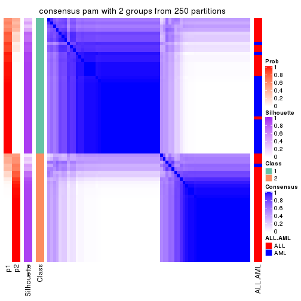</p>

</div>
<div id='tab-MAD-pam-consensus-heatmap-2'>
<pre><code class="r">consensus_heatmap(res, k = 3)
</code></pre>

<p>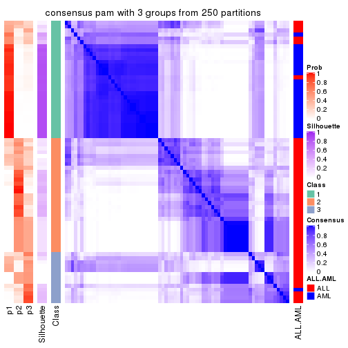</p>

</div>
<div id='tab-MAD-pam-consensus-heatmap-3'>
<pre><code class="r">consensus_heatmap(res, k = 4)
</code></pre>

<p>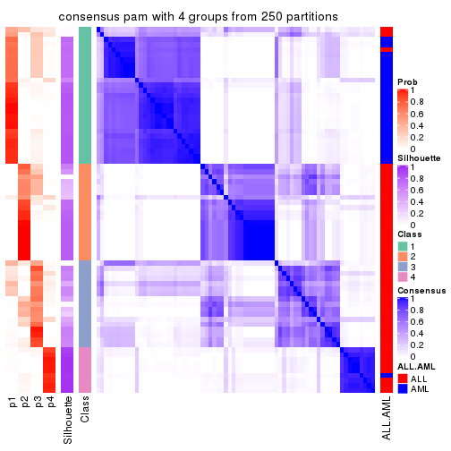</p>

</div>
<div id='tab-MAD-pam-consensus-heatmap-4'>
<pre><code class="r">consensus_heatmap(res, k = 5)
</code></pre>

<p>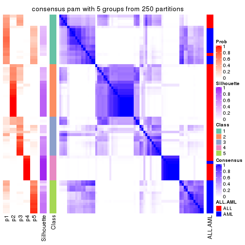</p>

</div>
<div id='tab-MAD-pam-consensus-heatmap-5'>
<pre><code class="r">consensus_heatmap(res, k = 6)
</code></pre>

<p>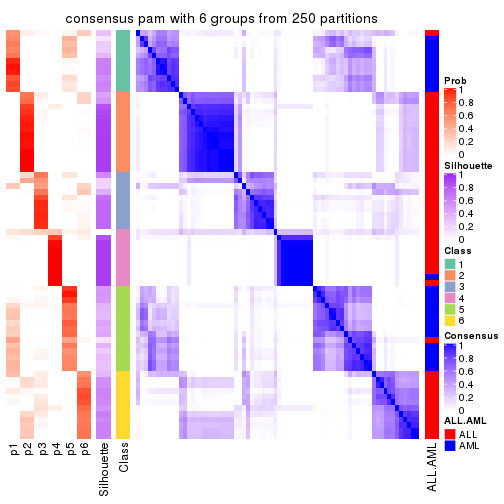</p>

</div>
</div>

Heatmaps for the membership of samples in all partitions to see how consistent they are:


<script>
$( function() {
	$( '#tabs-MAD-pam-membership-heatmap' ).tabs();
} );
</script>
<div id='tabs-MAD-pam-membership-heatmap'>
<ul>
<li><a href='#tab-MAD-pam-membership-heatmap-1'>k = 2</a></li>
<li><a href='#tab-MAD-pam-membership-heatmap-2'>k = 3</a></li>
<li><a href='#tab-MAD-pam-membership-heatmap-3'>k = 4</a></li>
<li><a href='#tab-MAD-pam-membership-heatmap-4'>k = 5</a></li>
<li><a href='#tab-MAD-pam-membership-heatmap-5'>k = 6</a></li>
</ul>
<div id='tab-MAD-pam-membership-heatmap-1'>
<pre><code class="r">membership_heatmap(res, k = 2)
</code></pre>

<p>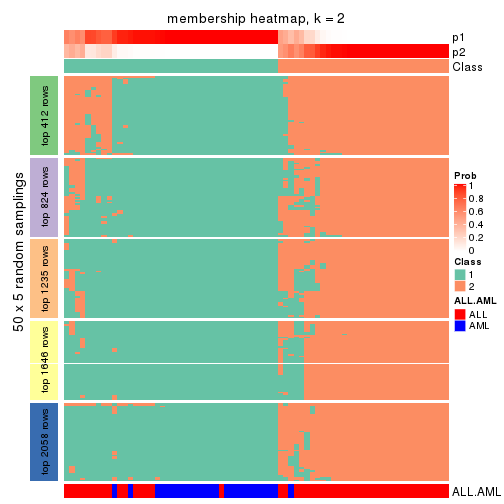</p>

</div>
<div id='tab-MAD-pam-membership-heatmap-2'>
<pre><code class="r">membership_heatmap(res, k = 3)
</code></pre>

<p>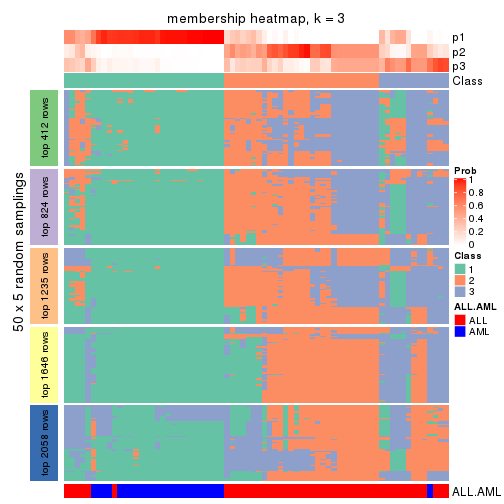</p>

</div>
<div id='tab-MAD-pam-membership-heatmap-3'>
<pre><code class="r">membership_heatmap(res, k = 4)
</code></pre>

<p>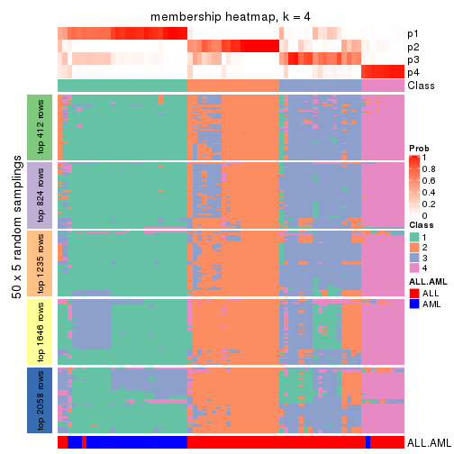</p>

</div>
<div id='tab-MAD-pam-membership-heatmap-4'>
<pre><code class="r">membership_heatmap(res, k = 5)
</code></pre>

<p>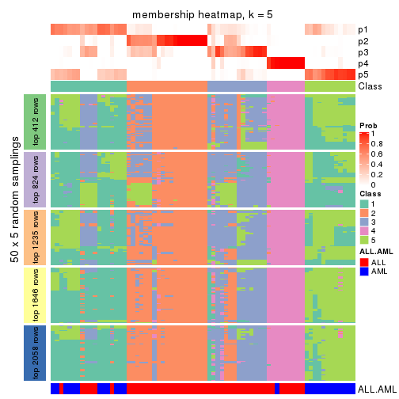</p>

</div>
<div id='tab-MAD-pam-membership-heatmap-5'>
<pre><code class="r">membership_heatmap(res, k = 6)
</code></pre>

<p>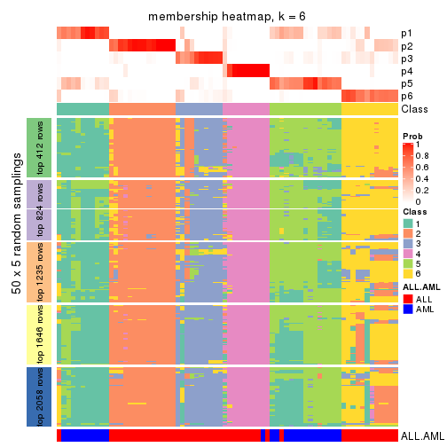</p>

</div>
</div>

As soon as we have had the classes for columns, we can look for signatures
which are significantly different between classes which can be candidate marks
for certain classes. Following are the heatmaps for signatures.


Signature heatmaps where rows are scaled:


<script>
$( function() {
	$( '#tabs-MAD-pam-get-signatures' ).tabs();
} );
</script>
<div id='tabs-MAD-pam-get-signatures'>
<ul>
<li><a href='#tab-MAD-pam-get-signatures-1'>k = 2</a></li>
<li><a href='#tab-MAD-pam-get-signatures-2'>k = 3</a></li>
<li><a href='#tab-MAD-pam-get-signatures-3'>k = 4</a></li>
<li><a href='#tab-MAD-pam-get-signatures-4'>k = 5</a></li>
<li><a href='#tab-MAD-pam-get-signatures-5'>k = 6</a></li>
</ul>
<div id='tab-MAD-pam-get-signatures-1'>
<pre><code class="r">get_signatures(res, k = 2)
</code></pre>

<p>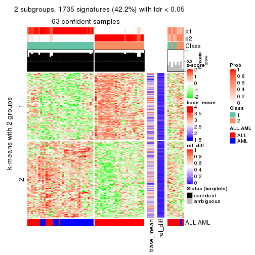</p>

</div>
<div id='tab-MAD-pam-get-signatures-2'>
<pre><code class="r">get_signatures(res, k = 3)
</code></pre>

<p></p>

</div>
<div id='tab-MAD-pam-get-signatures-3'>
<pre><code class="r">get_signatures(res, k = 4)
</code></pre>

<p>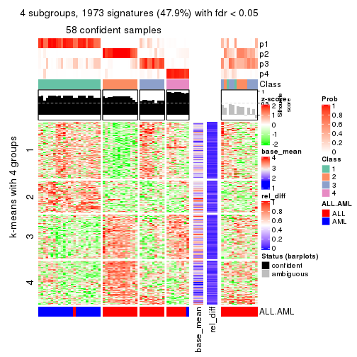</p>

</div>
<div id='tab-MAD-pam-get-signatures-4'>
<pre><code class="r">get_signatures(res, k = 5)
</code></pre>

<p>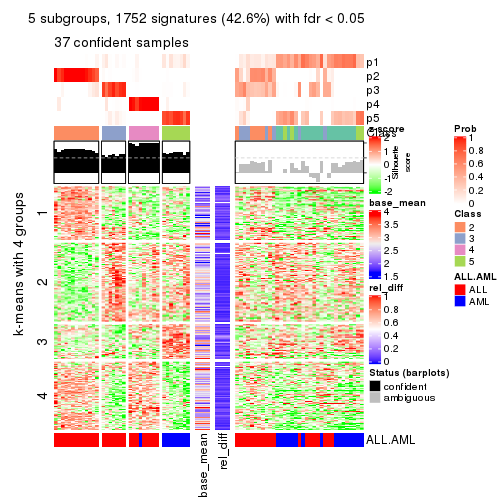</p>

</div>
<div id='tab-MAD-pam-get-signatures-5'>
<pre><code class="r">get_signatures(res, k = 6)
</code></pre>

<p>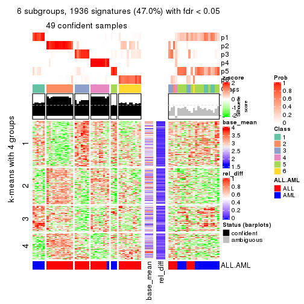</p>

</div>
</div>


Signature heatmaps where rows are not scaled:


<script>
$( function() {
	$( '#tabs-MAD-pam-get-signatures-no-scale' ).tabs();
} );
</script>
<div id='tabs-MAD-pam-get-signatures-no-scale'>
<ul>
<li><a href='#tab-MAD-pam-get-signatures-no-scale-1'>k = 2</a></li>
<li><a href='#tab-MAD-pam-get-signatures-no-scale-2'>k = 3</a></li>
<li><a href='#tab-MAD-pam-get-signatures-no-scale-3'>k = 4</a></li>
<li><a href='#tab-MAD-pam-get-signatures-no-scale-4'>k = 5</a></li>
<li><a href='#tab-MAD-pam-get-signatures-no-scale-5'>k = 6</a></li>
</ul>
<div id='tab-MAD-pam-get-signatures-no-scale-1'>
<pre><code class="r">get_signatures(res, k = 2, scale_rows = FALSE)
</code></pre>

<p>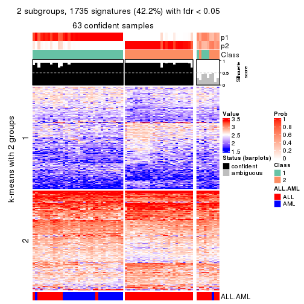</p>

</div>
<div id='tab-MAD-pam-get-signatures-no-scale-2'>
<pre><code class="r">get_signatures(res, k = 3, scale_rows = FALSE)
</code></pre>

<p></p>

</div>
<div id='tab-MAD-pam-get-signatures-no-scale-3'>
<pre><code class="r">get_signatures(res, k = 4, scale_rows = FALSE)
</code></pre>

<p>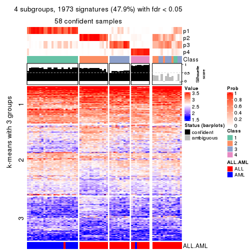</p>

</div>
<div id='tab-MAD-pam-get-signatures-no-scale-4'>
<pre><code class="r">get_signatures(res, k = 5, scale_rows = FALSE)
</code></pre>

<p>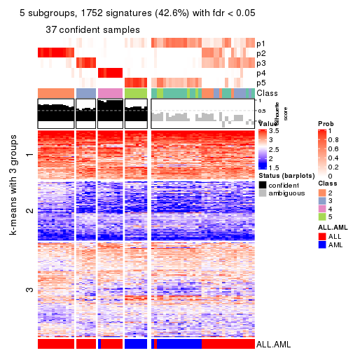</p>

</div>
<div id='tab-MAD-pam-get-signatures-no-scale-5'>
<pre><code class="r">get_signatures(res, k = 6, scale_rows = FALSE)
</code></pre>

<p>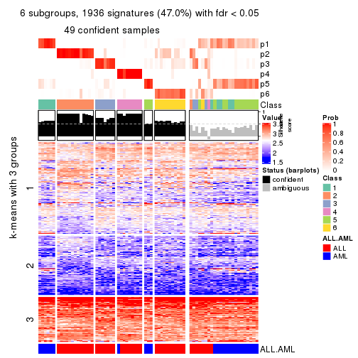</p>

</div>
</div>


Compare the overlap of signatures from different k:

```r
compare_signatures(res)
```

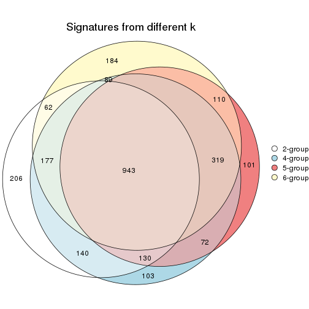

`get_signature()` returns a data frame invisibly. TO get the list of signatures, the function
call should be assigned to a variable explicitly. In following code, if `plot` argument is set
to `FALSE`, no heatmap is plotted while only the differential analysis is performed.

```r
# code only for demonstration
tb = get_signature(res, k = ..., plot = FALSE)
```

An example of the output of `tb` is:

```
#>   which_row         fdr    mean_1    mean_2 scaled_mean_1 scaled_mean_2 km
#> 1        38 0.042760348  8.373488  9.131774    -0.5533452     0.5164555  1
#> 2        40 0.018707592  7.106213  8.469186    -0.6173731     0.5762149  1
#> 3        55 0.019134737 10.221463 11.207825    -0.6159697     0.5749050  1
#> 4        59 0.006059896  5.921854  7.869574    -0.6899429     0.6439467  1
#> 5        60 0.018055526  8.928898 10.211722    -0.6204761     0.5791110  1
#> 6        98 0.009384629 15.714769 14.887706     0.6635654    -0.6193277  2
...
```

The columns in `tb` are:

1. `which_row`: row indices corresponding to the input matrix.
2. `fdr`: FDR for the differential test. 
3. `mean_x`: The mean value in group x.
4. `scaled_mean_x`: The mean value in group x after rows are scaled.
5. `km`: Row groups if k-means clustering is applied to rows.


UMAP plot which shows how samples are separated.


<script>
$( function() {
	$( '#tabs-MAD-pam-dimension-reduction' ).tabs();
} );
</script>
<div id='tabs-MAD-pam-dimension-reduction'>
<ul>
<li><a href='#tab-MAD-pam-dimension-reduction-1'>k = 2</a></li>
<li><a href='#tab-MAD-pam-dimension-reduction-2'>k = 3</a></li>
<li><a href='#tab-MAD-pam-dimension-reduction-3'>k = 4</a></li>
<li><a href='#tab-MAD-pam-dimension-reduction-4'>k = 5</a></li>
<li><a href='#tab-MAD-pam-dimension-reduction-5'>k = 6</a></li>
</ul>
<div id='tab-MAD-pam-dimension-reduction-1'>
<pre><code class="r">dimension_reduction(res, k = 2, method = &quot;UMAP&quot;)
</code></pre>

<p>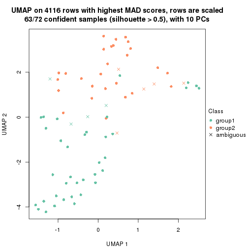</p>

</div>
<div id='tab-MAD-pam-dimension-reduction-2'>
<pre><code class="r">dimension_reduction(res, k = 3, method = &quot;UMAP&quot;)
</code></pre>

<p>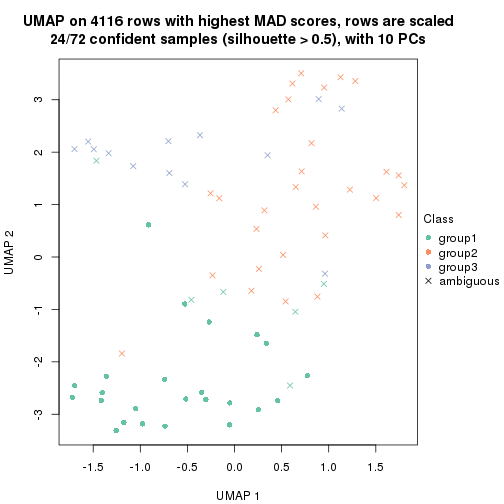</p>

</div>
<div id='tab-MAD-pam-dimension-reduction-3'>
<pre><code class="r">dimension_reduction(res, k = 4, method = &quot;UMAP&quot;)
</code></pre>

<p>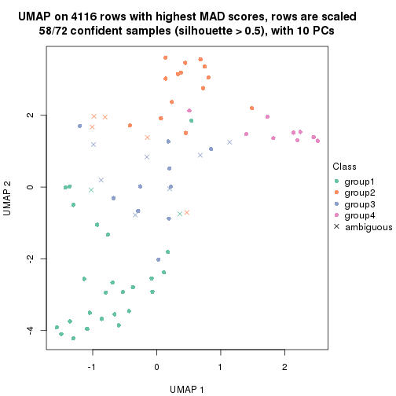</p>

</div>
<div id='tab-MAD-pam-dimension-reduction-4'>
<pre><code class="r">dimension_reduction(res, k = 5, method = &quot;UMAP&quot;)
</code></pre>

<p>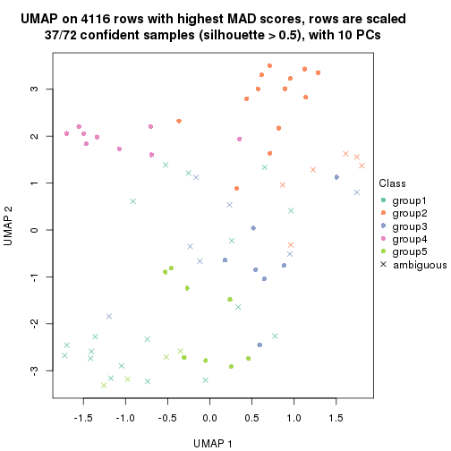</p>

</div>
<div id='tab-MAD-pam-dimension-reduction-5'>
<pre><code class="r">dimension_reduction(res, k = 6, method = &quot;UMAP&quot;)
</code></pre>

<p>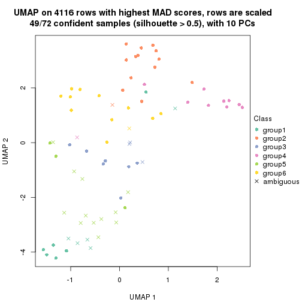</p>

</div>
</div>


Following heatmap shows how subgroups are split when increasing `k`:

```r
collect_classes(res)
```

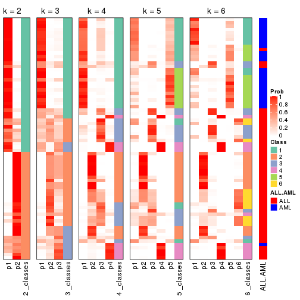


Test correlation between subgroups and known annotations. If the known
annotation is numeric, one-way ANOVA test is applied, and if the known
annotation is discrete, chi-squared contingency table test is applied.

```r
test_to_known_factors(res)
```

```
#>          n ALL.AML(p) k
#> MAD:pam 63   2.89e-07 2
#> MAD:pam 24         NA 3
#> MAD:pam 58   6.37e-11 4
#> MAD:pam 37   4.82e-07 5
#> MAD:pam 49   2.89e-08 6
```


If matrix rows can be associated to genes, consider to use `functional_enrichment(res,
...)` to perform function enrichment for the signature genes. See [this vignette](http://bioconductor.org/packages/devel/bioc/vignettes/cola/inst/doc/functional_enrichment.html) for more detailed explanations.


 

---------------------------------------------------


### MAD:mclust


The object with results only for a single top-value method and a single partition method 
can be extracted as:

```r
res = res_list["MAD", "mclust"]
# you can also extract it by
# res = res_list["MAD:mclust"]
```

A summary of `res` and all the functions that can be applied to it:

```r
res
```

```
#> A 'ConsensusPartition' object with k = 2, 3, 4, 5, 6.
#>   On a matrix with 4116 rows and 72 columns.
#>   Top rows (412, 824, 1235, 1646, 2058) are extracted by 'MAD' method.
#>   Subgroups are detected by 'mclust' method.
#>   Performed in total 1250 partitions by row resampling.
#>   Best k for subgroups seems to be 2.
#> 
#> Following methods can be applied to this 'ConsensusPartition' object:
#>  [1] "cola_report"             "collect_classes"         "collect_plots"          
#>  [4] "collect_stats"           "colnames"                "compare_signatures"     
#>  [7] "consensus_heatmap"       "dimension_reduction"     "functional_enrichment"  
#> [10] "get_anno_col"            "get_anno"                "get_classes"            
#> [13] "get_consensus"           "get_matrix"              "get_membership"         
#> [16] "get_param"               "get_signatures"          "get_stats"              
#> [19] "is_best_k"               "is_stable_k"             "membership_heatmap"     
#> [22] "ncol"                    "nrow"                    "plot_ecdf"              
#> [25] "rownames"                "select_partition_number" "show"                   
#> [28] "suggest_best_k"          "test_to_known_factors"
```

`collect_plots()` function collects all the plots made from `res` for all `k` (number of partitions)
into one single page to provide an easy and fast comparison between different `k`.

```r
collect_plots(res)
```

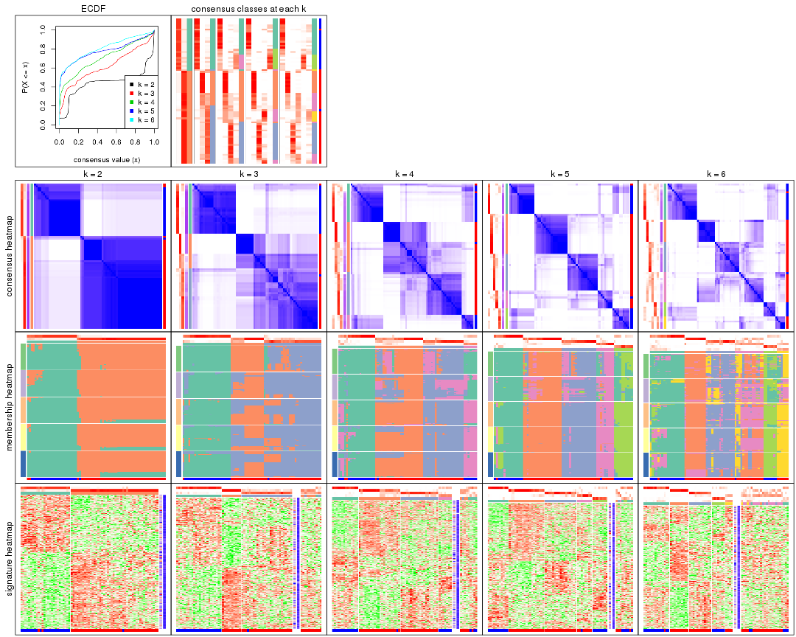

The plots are:

- The first row: a plot of the ECDF (empirical cumulative distribution
  function) curves of the consensus matrix for each `k` and the heatmap of
  predicted classes for each `k`.
- The second row: heatmaps of the consensus matrix for each `k`.
- The third row: heatmaps of the membership matrix for each `k`.
- The fouth row: heatmaps of the signatures for each `k`.

All the plots in panels can be made by individual functions and they are
plotted later in this section.

`select_partition_number()` produces several plots showing different
statistics for choosing "optimized" `k`. There are following statistics:

- ECDF curves of the consensus matrix for each `k`;
- 1-PAC. [The PAC
  score](https://en.wikipedia.org/wiki/Consensus_clustering#Over-interpretation_potential_of_consensus_clustering)
  measures the proportion of the ambiguous subgrouping.
- Mean silhouette score.
- Concordance. The mean probability of fiting the consensus class ids in all
  partitions.
- Area increased. Denote $A_k$ as the area under the ECDF curve for current
  `k`, the area increased is defined as $A_k - A_{k-1}$.
- Rand index. The percent of pairs of samples that are both in a same cluster
  or both are not in a same cluster in the partition of k and k-1.
- Jaccard index. The ratio of pairs of samples are both in a same cluster in
  the partition of k and k-1 and the pairs of samples are both in a same
  cluster in the partition k or k-1.

The detailed explanations of these statistics can be found in [the _cola_
vignette](http://bioconductor.org/packages/devel/bioc/vignettes/cola/inst/doc/cola.html#toc_13).

Generally speaking, lower PAC score, higher mean silhouette score or higher
concordance corresponds to better partition. Rand index and Jaccard index
measure how similar the current partition is compared to partition with `k-1`.
If they are too similar, we won't accept `k` is better than `k-1`.

```r
select_partition_number(res)
```

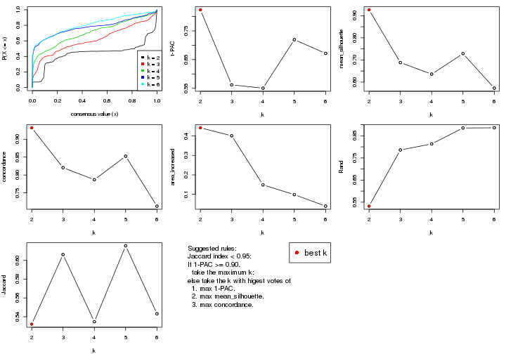

The numeric values for all these statistics can be obtained by `get_stats()`.

```r
get_stats(res)
```

```
#>   k 1-PAC mean_silhouette concordance area_increased  Rand Jaccard
#> 2 2 0.824           0.927       0.932         0.4416 0.532   0.532
#> 3 3 0.562           0.688       0.821         0.4007 0.786   0.606
#> 4 4 0.550           0.636       0.787         0.1485 0.813   0.535
#> 5 5 0.719           0.729       0.853         0.0984 0.885   0.615
#> 6 6 0.672           0.573       0.713         0.0392 0.886   0.543
```

`suggest_best_k()` suggests the best $k$ based on these statistics. The rules are as follows:

- All $k$ with Jaccard index larger than 0.95 are removed because increasing
  $k$ does not provide enough extra information. If all $k$ are removed, it is
  marked as no subgroup is detected.
- For all $k$ with 1-PAC score larger than 0.9, the maximal $k$ is taken as
  the best $k$, and other $k$ are marked as optional $k$.
- If it does not fit the second rule. The $k$ with the maximal vote of the
  highest 1-PAC score, highest mean silhouette, and highest concordance is
  taken as the best $k$.

```r
suggest_best_k(res)
```

```
#> [1] 2
```


Following shows the table of the partitions (You need to click the **show/hide
code output** link to see it). The membership matrix (columns with name `p*`)
is inferred by
[`clue::cl_consensus()`](https://www.rdocumentation.org/link/cl_consensus?package=clue)
function with the `SE` method. Basically the value in the membership matrix
represents the probability to belong to a certain group. The finall class
label for an item is determined with the group with highest probability it
belongs to.

In `get_classes()` function, the entropy is calculated from the membership
matrix and the silhouette score is calculated from the consensus matrix.


<script>
$( function() {
	$( '#tabs-MAD-mclust-get-classes' ).tabs();
} );
</script>
<div id='tabs-MAD-mclust-get-classes'>
<ul>
<li><a href='#tab-MAD-mclust-get-classes-1'>k = 2</a></li>
<li><a href='#tab-MAD-mclust-get-classes-2'>k = 3</a></li>
<li><a href='#tab-MAD-mclust-get-classes-3'>k = 4</a></li>
<li><a href='#tab-MAD-mclust-get-classes-4'>k = 5</a></li>
<li><a href='#tab-MAD-mclust-get-classes-5'>k = 6</a></li>
</ul>

<div id='tab-MAD-mclust-get-classes-1'>
<p><a id='tab-MAD-mclust-get-classes-1-a' style='color:#0366d6' href='#'>show/hide code output</a></p>
<pre><code class="r">cbind(get_classes(res, k = 2), get_membership(res, k = 2))
</code></pre>

<pre><code>#&gt;           class entropy silhouette    p1    p2
#&gt; sample_39     2  0.1633      0.959 0.024 0.976
#&gt; sample_40     2  0.1633      0.959 0.024 0.976
#&gt; sample_42     2  0.1633      0.959 0.024 0.976
#&gt; sample_47     2  0.1184      0.942 0.016 0.984
#&gt; sample_48     2  0.3733      0.907 0.072 0.928
#&gt; sample_49     2  0.1633      0.959 0.024 0.976
#&gt; sample_41     2  0.3733      0.907 0.072 0.928
#&gt; sample_43     2  0.0938      0.956 0.012 0.988
#&gt; sample_44     2  0.0672      0.954 0.008 0.992
#&gt; sample_45     2  0.0672      0.951 0.008 0.992
#&gt; sample_46     2  0.1184      0.957 0.016 0.984
#&gt; sample_70     2  0.1633      0.959 0.024 0.976
#&gt; sample_71     2  0.1633      0.959 0.024 0.976
#&gt; sample_72     2  0.1633      0.959 0.024 0.976
#&gt; sample_68     2  0.3733      0.907 0.072 0.928
#&gt; sample_69     2  0.3733      0.907 0.072 0.928
#&gt; sample_67     1  0.8661      0.738 0.712 0.288
#&gt; sample_55     2  0.1633      0.959 0.024 0.976
#&gt; sample_56     2  0.1633      0.959 0.024 0.976
#&gt; sample_59     2  0.1633      0.959 0.024 0.976
#&gt; sample_52     1  0.3733      0.950 0.928 0.072
#&gt; sample_53     1  0.3733      0.950 0.928 0.072
#&gt; sample_51     1  0.3733      0.950 0.928 0.072
#&gt; sample_50     1  0.3733      0.950 0.928 0.072
#&gt; sample_54     1  0.8081      0.806 0.752 0.248
#&gt; sample_57     1  0.6247      0.902 0.844 0.156
#&gt; sample_58     1  0.3733      0.950 0.928 0.072
#&gt; sample_60     1  0.8144      0.800 0.748 0.252
#&gt; sample_61     1  0.3733      0.950 0.928 0.072
#&gt; sample_65     1  0.3733      0.950 0.928 0.072
#&gt; sample_66     2  0.6531      0.784 0.168 0.832
#&gt; sample_63     1  0.3733      0.950 0.928 0.072
#&gt; sample_64     1  0.6623      0.889 0.828 0.172
#&gt; sample_62     1  0.4022      0.946 0.920 0.080
#&gt; sample_1      2  0.1633      0.959 0.024 0.976
#&gt; sample_2      2  0.8763      0.527 0.296 0.704
#&gt; sample_3      2  0.1633      0.959 0.024 0.976
#&gt; sample_4      2  0.1633      0.959 0.024 0.976
#&gt; sample_5      2  0.3733      0.907 0.072 0.928
#&gt; sample_6      2  0.1633      0.959 0.024 0.976
#&gt; sample_7      2  0.1633      0.959 0.024 0.976
#&gt; sample_8      2  0.1633      0.959 0.024 0.976
#&gt; sample_9      2  0.1633      0.959 0.024 0.976
#&gt; sample_10     2  0.1633      0.959 0.024 0.976
#&gt; sample_11     2  0.1633      0.959 0.024 0.976
#&gt; sample_12     1  0.8081      0.804 0.752 0.248
#&gt; sample_13     2  0.3733      0.907 0.072 0.928
#&gt; sample_14     2  0.2043      0.951 0.032 0.968
#&gt; sample_15     2  0.3733      0.907 0.072 0.928
#&gt; sample_16     2  0.0376      0.953 0.004 0.996
#&gt; sample_17     2  0.3431      0.923 0.064 0.936
#&gt; sample_18     2  0.1633      0.959 0.024 0.976
#&gt; sample_19     2  0.0376      0.953 0.004 0.996
#&gt; sample_20     2  0.3733      0.907 0.072 0.928
#&gt; sample_21     2  0.3733      0.907 0.072 0.928
#&gt; sample_22     2  0.1633      0.959 0.024 0.976
#&gt; sample_23     2  0.1633      0.959 0.024 0.976
#&gt; sample_24     2  0.3733      0.907 0.072 0.928
#&gt; sample_25     2  0.1633      0.959 0.024 0.976
#&gt; sample_26     2  0.1633      0.959 0.024 0.976
#&gt; sample_27     2  0.1633      0.959 0.024 0.976
#&gt; sample_34     1  0.3733      0.950 0.928 0.072
#&gt; sample_35     1  0.6887      0.878 0.816 0.184
#&gt; sample_36     1  0.3733      0.950 0.928 0.072
#&gt; sample_37     1  0.3733      0.950 0.928 0.072
#&gt; sample_38     1  0.3733      0.950 0.928 0.072
#&gt; sample_28     1  0.3733      0.950 0.928 0.072
#&gt; sample_29     1  0.5946      0.910 0.856 0.144
#&gt; sample_30     1  0.3733      0.950 0.928 0.072
#&gt; sample_31     1  0.3733      0.950 0.928 0.072
#&gt; sample_32     1  0.3733      0.950 0.928 0.072
#&gt; sample_33     1  0.3733      0.950 0.928 0.072
</code></pre>

<script>
$('#tab-MAD-mclust-get-classes-1-a').parent().next().next().hide();
$('#tab-MAD-mclust-get-classes-1-a').click(function(){
  $('#tab-MAD-mclust-get-classes-1-a').parent().next().next().toggle();
  return(false);
});
</script>
</div>

<div id='tab-MAD-mclust-get-classes-2'>
<p><a id='tab-MAD-mclust-get-classes-2-a' style='color:#0366d6' href='#'>show/hide code output</a></p>
<pre><code class="r">cbind(get_classes(res, k = 3), get_membership(res, k = 3))
</code></pre>

<pre><code>#&gt;           class entropy silhouette    p1    p2    p3
#&gt; sample_39     3  0.4172      0.757 0.004 0.156 0.840
#&gt; sample_40     3  0.4409      0.761 0.004 0.172 0.824
#&gt; sample_42     3  0.5156      0.553 0.008 0.216 0.776
#&gt; sample_47     2  0.6330      0.172 0.004 0.600 0.396
#&gt; sample_48     2  0.0424      0.719 0.000 0.992 0.008
#&gt; sample_49     3  0.4409      0.760 0.004 0.172 0.824
#&gt; sample_41     2  0.0424      0.719 0.000 0.992 0.008
#&gt; sample_43     2  0.6302     -0.194 0.000 0.520 0.480
#&gt; sample_44     2  0.5948      0.299 0.000 0.640 0.360
#&gt; sample_45     2  0.6180      0.116 0.000 0.584 0.416
#&gt; sample_46     2  0.6140      0.167 0.000 0.596 0.404
#&gt; sample_70     3  0.4702      0.747 0.000 0.212 0.788
#&gt; sample_71     3  0.5156      0.553 0.008 0.216 0.776
#&gt; sample_72     3  0.5156      0.553 0.008 0.216 0.776
#&gt; sample_68     2  0.0424      0.719 0.000 0.992 0.008
#&gt; sample_69     2  0.0747      0.715 0.000 0.984 0.016
#&gt; sample_67     3  0.8286      0.281 0.308 0.104 0.588
#&gt; sample_55     3  0.4409      0.761 0.004 0.172 0.824
#&gt; sample_56     3  0.4409      0.760 0.004 0.172 0.824
#&gt; sample_59     3  0.6104      0.585 0.004 0.348 0.648
#&gt; sample_52     1  0.1643      0.926 0.956 0.000 0.044
#&gt; sample_53     1  0.0424      0.910 0.992 0.000 0.008
#&gt; sample_51     1  0.0424      0.910 0.992 0.000 0.008
#&gt; sample_50     1  0.0424      0.910 0.992 0.000 0.008
#&gt; sample_54     1  0.5919      0.649 0.724 0.016 0.260
#&gt; sample_57     1  0.2165      0.918 0.936 0.000 0.064
#&gt; sample_58     1  0.1753      0.925 0.952 0.000 0.048
#&gt; sample_60     1  0.5919      0.652 0.724 0.016 0.260
#&gt; sample_61     1  0.2537      0.917 0.920 0.000 0.080
#&gt; sample_65     1  0.1529      0.926 0.960 0.000 0.040
#&gt; sample_66     3  0.6887      0.539 0.060 0.236 0.704
#&gt; sample_63     1  0.1643      0.926 0.956 0.000 0.044
#&gt; sample_64     1  0.2537      0.909 0.920 0.000 0.080
#&gt; sample_62     1  0.1860      0.924 0.948 0.000 0.052
#&gt; sample_1      3  0.5733      0.614 0.000 0.324 0.676
#&gt; sample_2      3  0.8156      0.380 0.196 0.160 0.644
#&gt; sample_3      3  0.4409      0.760 0.004 0.172 0.824
#&gt; sample_4      3  0.5873      0.623 0.004 0.312 0.684
#&gt; sample_5      2  0.0424      0.719 0.000 0.992 0.008
#&gt; sample_6      3  0.4409      0.760 0.004 0.172 0.824
#&gt; sample_7      3  0.4682      0.755 0.004 0.192 0.804
#&gt; sample_8      3  0.4575      0.762 0.004 0.184 0.812
#&gt; sample_9      3  0.5529      0.673 0.000 0.296 0.704
#&gt; sample_10     3  0.3500      0.743 0.004 0.116 0.880
#&gt; sample_11     3  0.4291      0.609 0.008 0.152 0.840
#&gt; sample_12     1  0.6295      0.355 0.528 0.000 0.472
#&gt; sample_13     2  0.0424      0.719 0.000 0.992 0.008
#&gt; sample_14     3  0.6033      0.624 0.004 0.336 0.660
#&gt; sample_15     2  0.0424      0.719 0.000 0.992 0.008
#&gt; sample_16     2  0.5948      0.299 0.000 0.640 0.360
#&gt; sample_17     3  0.6359      0.507 0.004 0.404 0.592
#&gt; sample_18     3  0.4409      0.761 0.004 0.172 0.824
#&gt; sample_19     2  0.6026      0.258 0.000 0.624 0.376
#&gt; sample_20     2  0.0424      0.719 0.000 0.992 0.008
#&gt; sample_21     2  0.0592      0.717 0.000 0.988 0.012
#&gt; sample_22     3  0.1170      0.661 0.008 0.016 0.976
#&gt; sample_23     3  0.4351      0.761 0.004 0.168 0.828
#&gt; sample_24     2  0.0424      0.719 0.000 0.992 0.008
#&gt; sample_25     3  0.3043      0.657 0.008 0.084 0.908
#&gt; sample_26     3  0.6140      0.493 0.000 0.404 0.596
#&gt; sample_27     3  0.4409      0.760 0.004 0.172 0.824
#&gt; sample_34     1  0.1643      0.926 0.956 0.000 0.044
#&gt; sample_35     1  0.2796      0.904 0.908 0.000 0.092
#&gt; sample_36     1  0.0237      0.909 0.996 0.000 0.004
#&gt; sample_37     1  0.0424      0.910 0.992 0.000 0.008
#&gt; sample_38     1  0.2261      0.923 0.932 0.000 0.068
#&gt; sample_28     1  0.1753      0.921 0.952 0.000 0.048
#&gt; sample_29     1  0.4974      0.799 0.764 0.000 0.236
#&gt; sample_30     1  0.0892      0.908 0.980 0.000 0.020
#&gt; sample_31     1  0.1643      0.926 0.956 0.000 0.044
#&gt; sample_32     1  0.1753      0.926 0.952 0.000 0.048
#&gt; sample_33     1  0.1163      0.920 0.972 0.000 0.028
</code></pre>

<script>
$('#tab-MAD-mclust-get-classes-2-a').parent().next().next().hide();
$('#tab-MAD-mclust-get-classes-2-a').click(function(){
  $('#tab-MAD-mclust-get-classes-2-a').parent().next().next().toggle();
  return(false);
});
</script>
</div>

<div id='tab-MAD-mclust-get-classes-3'>
<p><a id='tab-MAD-mclust-get-classes-3-a' style='color:#0366d6' href='#'>show/hide code output</a></p>
<pre><code class="r">cbind(get_classes(res, k = 4), get_membership(res, k = 4))
</code></pre>

<pre><code>#&gt;           class entropy silhouette    p1    p2    p3    p4
#&gt; sample_39     3  0.4567      0.724 0.000 0.008 0.716 0.276
#&gt; sample_40     3  0.1389      0.827 0.000 0.000 0.952 0.048
#&gt; sample_42     2  0.7838      0.525 0.008 0.476 0.224 0.292
#&gt; sample_47     2  0.4079      0.734 0.000 0.800 0.180 0.020
#&gt; sample_48     2  0.0188      0.744 0.000 0.996 0.004 0.000
#&gt; sample_49     3  0.1022      0.829 0.000 0.000 0.968 0.032
#&gt; sample_41     2  0.0376      0.743 0.000 0.992 0.004 0.004
#&gt; sample_43     2  0.5929      0.697 0.000 0.688 0.204 0.108
#&gt; sample_44     2  0.4361      0.726 0.000 0.772 0.208 0.020
#&gt; sample_45     2  0.6908      0.646 0.000 0.592 0.188 0.220
#&gt; sample_46     2  0.6457      0.679 0.000 0.644 0.200 0.156
#&gt; sample_70     3  0.4452      0.735 0.000 0.008 0.732 0.260
#&gt; sample_71     2  0.7838      0.525 0.008 0.476 0.224 0.292
#&gt; sample_72     2  0.7838      0.525 0.008 0.476 0.224 0.292
#&gt; sample_68     2  0.0188      0.744 0.000 0.996 0.004 0.000
#&gt; sample_69     2  0.0592      0.746 0.000 0.984 0.016 0.000
#&gt; sample_67     1  0.8753     -0.147 0.428 0.328 0.180 0.064
#&gt; sample_55     3  0.1211      0.822 0.000 0.000 0.960 0.040
#&gt; sample_56     3  0.1211      0.829 0.000 0.000 0.960 0.040
#&gt; sample_59     3  0.4500      0.678 0.000 0.192 0.776 0.032
#&gt; sample_52     4  0.4991      0.766 0.388 0.000 0.004 0.608
#&gt; sample_53     1  0.0000      0.732 1.000 0.000 0.000 0.000
#&gt; sample_51     1  0.0000      0.732 1.000 0.000 0.000 0.000
#&gt; sample_50     1  0.0000      0.732 1.000 0.000 0.000 0.000
#&gt; sample_54     4  0.6714      0.686 0.208 0.000 0.176 0.616
#&gt; sample_57     4  0.5339      0.788 0.356 0.000 0.020 0.624
#&gt; sample_58     1  0.6060     -0.538 0.516 0.000 0.044 0.440
#&gt; sample_60     4  0.6617      0.682 0.196 0.000 0.176 0.628
#&gt; sample_61     1  0.3674      0.611 0.852 0.000 0.104 0.044
#&gt; sample_65     1  0.1854      0.701 0.940 0.000 0.012 0.048
#&gt; sample_66     2  0.7014      0.520 0.036 0.520 0.396 0.048
#&gt; sample_63     4  0.5080      0.723 0.420 0.000 0.004 0.576
#&gt; sample_64     4  0.6840      0.694 0.372 0.000 0.108 0.520
#&gt; sample_62     4  0.5055      0.781 0.368 0.000 0.008 0.624
#&gt; sample_1      3  0.4261      0.758 0.000 0.112 0.820 0.068
#&gt; sample_2      2  0.9083      0.483 0.216 0.464 0.208 0.112
#&gt; sample_3      3  0.1557      0.816 0.000 0.000 0.944 0.056
#&gt; sample_4      3  0.2174      0.806 0.000 0.052 0.928 0.020
#&gt; sample_5      2  0.0188      0.744 0.000 0.996 0.004 0.000
#&gt; sample_6      3  0.1557      0.816 0.000 0.000 0.944 0.056
#&gt; sample_7      3  0.1743      0.817 0.000 0.004 0.940 0.056
#&gt; sample_8      3  0.3837      0.766 0.000 0.000 0.776 0.224
#&gt; sample_9      3  0.5497     -0.392 0.000 0.460 0.524 0.016
#&gt; sample_10     3  0.1339      0.814 0.004 0.024 0.964 0.008
#&gt; sample_11     2  0.5902      0.418 0.008 0.492 0.480 0.020
#&gt; sample_12     1  0.5256      0.402 0.732 0.000 0.204 0.064
#&gt; sample_13     2  0.0188      0.744 0.000 0.996 0.004 0.000
#&gt; sample_14     2  0.5678      0.479 0.000 0.524 0.452 0.024
#&gt; sample_15     2  0.0188      0.744 0.000 0.996 0.004 0.000
#&gt; sample_16     2  0.4323      0.727 0.000 0.776 0.204 0.020
#&gt; sample_17     2  0.5344      0.664 0.000 0.668 0.300 0.032
#&gt; sample_18     3  0.0895      0.820 0.000 0.004 0.976 0.020
#&gt; sample_19     2  0.5062      0.727 0.000 0.752 0.184 0.064
#&gt; sample_20     2  0.0188      0.744 0.000 0.996 0.004 0.000
#&gt; sample_21     2  0.0336      0.745 0.000 0.992 0.008 0.000
#&gt; sample_22     3  0.5034      0.714 0.008 0.012 0.700 0.280
#&gt; sample_23     3  0.1557      0.816 0.000 0.000 0.944 0.056
#&gt; sample_24     2  0.0376      0.743 0.000 0.992 0.004 0.004
#&gt; sample_25     3  0.5672      0.687 0.008 0.036 0.668 0.288
#&gt; sample_26     3  0.5966      0.658 0.000 0.072 0.648 0.280
#&gt; sample_27     3  0.0921      0.828 0.000 0.000 0.972 0.028
#&gt; sample_34     1  0.2334      0.655 0.908 0.000 0.004 0.088
#&gt; sample_35     1  0.7602     -0.233 0.420 0.000 0.380 0.200
#&gt; sample_36     1  0.0000      0.732 1.000 0.000 0.000 0.000
#&gt; sample_37     1  0.0000      0.732 1.000 0.000 0.000 0.000
#&gt; sample_38     1  0.1256      0.718 0.964 0.000 0.028 0.008
#&gt; sample_28     1  0.0779      0.726 0.980 0.000 0.004 0.016
#&gt; sample_29     1  0.1675      0.698 0.948 0.004 0.044 0.004
#&gt; sample_30     1  0.0000      0.732 1.000 0.000 0.000 0.000
#&gt; sample_31     1  0.5800     -0.447 0.548 0.000 0.032 0.420
#&gt; sample_32     1  0.1452      0.718 0.956 0.000 0.008 0.036
#&gt; sample_33     1  0.0000      0.732 1.000 0.000 0.000 0.000
</code></pre>

<script>
$('#tab-MAD-mclust-get-classes-3-a').parent().next().next().hide();
$('#tab-MAD-mclust-get-classes-3-a').click(function(){
  $('#tab-MAD-mclust-get-classes-3-a').parent().next().next().toggle();
  return(false);
});
</script>
</div>

<div id='tab-MAD-mclust-get-classes-4'>
<p><a id='tab-MAD-mclust-get-classes-4-a' style='color:#0366d6' href='#'>show/hide code output</a></p>
<pre><code class="r">cbind(get_classes(res, k = 5), get_membership(res, k = 5))
</code></pre>

<pre><code>#&gt;           class entropy silhouette    p1    p2    p3    p4    p5
#&gt; sample_39     3  0.4384      0.642 0.000 0.000 0.660 0.324 0.016
#&gt; sample_40     3  0.0932      0.842 0.000 0.004 0.972 0.020 0.004
#&gt; sample_42     4  0.0290      0.773 0.000 0.008 0.000 0.992 0.000
#&gt; sample_47     2  0.1704      0.863 0.000 0.928 0.000 0.068 0.004
#&gt; sample_48     2  0.0000      0.878 0.000 1.000 0.000 0.000 0.000
#&gt; sample_49     3  0.1845      0.843 0.000 0.000 0.928 0.056 0.016
#&gt; sample_41     2  0.0162      0.878 0.000 0.996 0.000 0.000 0.004
#&gt; sample_43     2  0.3048      0.802 0.000 0.820 0.004 0.176 0.000
#&gt; sample_44     2  0.2474      0.854 0.000 0.896 0.012 0.084 0.008
#&gt; sample_45     2  0.3814      0.698 0.000 0.720 0.000 0.276 0.004
#&gt; sample_46     2  0.3790      0.728 0.000 0.744 0.004 0.248 0.004
#&gt; sample_70     3  0.3895      0.660 0.000 0.000 0.680 0.320 0.000
#&gt; sample_71     4  0.0290      0.773 0.000 0.008 0.000 0.992 0.000
#&gt; sample_72     4  0.0290      0.773 0.000 0.008 0.000 0.992 0.000
#&gt; sample_68     2  0.0000      0.878 0.000 1.000 0.000 0.000 0.000
#&gt; sample_69     2  0.0404      0.877 0.000 0.988 0.000 0.012 0.000
#&gt; sample_67     4  0.4081      0.459 0.296 0.004 0.000 0.696 0.004
#&gt; sample_55     3  0.0451      0.839 0.000 0.004 0.988 0.008 0.000
#&gt; sample_56     3  0.1914      0.843 0.000 0.000 0.924 0.060 0.016
#&gt; sample_59     3  0.4835      0.684 0.000 0.188 0.724 0.084 0.004
#&gt; sample_52     5  0.3395      0.732 0.236 0.000 0.000 0.000 0.764
#&gt; sample_53     1  0.0000      0.832 1.000 0.000 0.000 0.000 0.000
#&gt; sample_51     1  0.0000      0.832 1.000 0.000 0.000 0.000 0.000
#&gt; sample_50     1  0.0000      0.832 1.000 0.000 0.000 0.000 0.000
#&gt; sample_54     5  0.1179      0.648 0.004 0.000 0.016 0.016 0.964
#&gt; sample_57     5  0.2516      0.744 0.140 0.000 0.000 0.000 0.860
#&gt; sample_58     5  0.4367      0.509 0.416 0.000 0.000 0.004 0.580
#&gt; sample_60     5  0.1278      0.644 0.004 0.000 0.020 0.016 0.960
#&gt; sample_61     1  0.4199      0.433 0.692 0.000 0.004 0.008 0.296
#&gt; sample_65     1  0.3969      0.425 0.692 0.000 0.000 0.004 0.304
#&gt; sample_66     4  0.7002      0.517 0.004 0.224 0.116 0.576 0.080
#&gt; sample_63     5  0.3983      0.640 0.340 0.000 0.000 0.000 0.660
#&gt; sample_64     5  0.3475      0.752 0.180 0.000 0.004 0.012 0.804
#&gt; sample_62     5  0.2813      0.751 0.168 0.000 0.000 0.000 0.832
#&gt; sample_1      3  0.4294      0.770 0.000 0.112 0.788 0.092 0.008
#&gt; sample_2      4  0.3828      0.640 0.184 0.008 0.000 0.788 0.020
#&gt; sample_3      3  0.0000      0.833 0.000 0.000 1.000 0.000 0.000
#&gt; sample_4      3  0.3085      0.820 0.000 0.060 0.868 0.068 0.004
#&gt; sample_5      2  0.0000      0.878 0.000 1.000 0.000 0.000 0.000
#&gt; sample_6      3  0.0000      0.833 0.000 0.000 1.000 0.000 0.000
#&gt; sample_7      3  0.0324      0.834 0.000 0.004 0.992 0.000 0.004
#&gt; sample_8      3  0.3596      0.773 0.000 0.000 0.784 0.200 0.016
#&gt; sample_9      2  0.6741      0.196 0.000 0.456 0.396 0.116 0.032
#&gt; sample_10     3  0.4009      0.489 0.000 0.004 0.684 0.312 0.000
#&gt; sample_11     4  0.4805      0.570 0.000 0.032 0.268 0.688 0.012
#&gt; sample_12     1  0.4639      0.420 0.636 0.000 0.008 0.344 0.012
#&gt; sample_13     2  0.0000      0.878 0.000 1.000 0.000 0.000 0.000
#&gt; sample_14     2  0.5971      0.647 0.000 0.676 0.168 0.068 0.088
#&gt; sample_15     2  0.0000      0.878 0.000 1.000 0.000 0.000 0.000
#&gt; sample_16     2  0.1983      0.864 0.000 0.924 0.008 0.060 0.008
#&gt; sample_17     2  0.4523      0.792 0.000 0.796 0.056 0.068 0.080
#&gt; sample_18     3  0.1544      0.837 0.000 0.000 0.932 0.068 0.000
#&gt; sample_19     2  0.2719      0.827 0.000 0.852 0.000 0.144 0.004
#&gt; sample_20     2  0.0000      0.878 0.000 1.000 0.000 0.000 0.000
#&gt; sample_21     2  0.0162      0.878 0.000 0.996 0.000 0.000 0.004
#&gt; sample_22     4  0.3883      0.553 0.000 0.004 0.216 0.764 0.016
#&gt; sample_23     3  0.0162      0.836 0.000 0.000 0.996 0.004 0.000
#&gt; sample_24     2  0.0162      0.878 0.000 0.996 0.000 0.000 0.004
#&gt; sample_25     4  0.1768      0.733 0.000 0.004 0.072 0.924 0.000
#&gt; sample_26     3  0.5168      0.542 0.000 0.052 0.592 0.356 0.000
#&gt; sample_27     3  0.1845      0.843 0.000 0.000 0.928 0.056 0.016
#&gt; sample_34     1  0.4066      0.368 0.672 0.000 0.000 0.004 0.324
#&gt; sample_35     5  0.6696      0.424 0.328 0.000 0.216 0.004 0.452
#&gt; sample_36     1  0.0000      0.832 1.000 0.000 0.000 0.000 0.000
#&gt; sample_37     1  0.0000      0.832 1.000 0.000 0.000 0.000 0.000
#&gt; sample_38     1  0.0324      0.830 0.992 0.000 0.000 0.004 0.004
#&gt; sample_28     1  0.0324      0.830 0.992 0.000 0.000 0.004 0.004
#&gt; sample_29     1  0.2130      0.756 0.908 0.000 0.000 0.080 0.012
#&gt; sample_30     1  0.0000      0.832 1.000 0.000 0.000 0.000 0.000
#&gt; sample_31     5  0.4383      0.492 0.424 0.000 0.000 0.004 0.572
#&gt; sample_32     1  0.3074      0.635 0.804 0.000 0.000 0.000 0.196
#&gt; sample_33     1  0.0000      0.832 1.000 0.000 0.000 0.000 0.000
</code></pre>

<script>
$('#tab-MAD-mclust-get-classes-4-a').parent().next().next().hide();
$('#tab-MAD-mclust-get-classes-4-a').click(function(){
  $('#tab-MAD-mclust-get-classes-4-a').parent().next().next().toggle();
  return(false);
});
</script>
</div>

<div id='tab-MAD-mclust-get-classes-5'>
<p><a id='tab-MAD-mclust-get-classes-5-a' style='color:#0366d6' href='#'>show/hide code output</a></p>
<pre><code class="r">cbind(get_classes(res, k = 6), get_membership(res, k = 6))
</code></pre>

<pre><code>#&gt;           class entropy silhouette    p1    p2    p3    p4    p5    p6
#&gt; sample_39     3  0.5197     0.6276 0.000 0.000 0.632 0.168 0.004 0.196
#&gt; sample_40     3  0.2408     0.7669 0.000 0.004 0.892 0.076 0.004 0.024
#&gt; sample_42     6  0.3851     0.7282 0.000 0.000 0.000 0.460 0.000 0.540
#&gt; sample_47     2  0.3991    -0.3136 0.000 0.524 0.000 0.472 0.000 0.004
#&gt; sample_48     2  0.0547     0.9036 0.000 0.980 0.000 0.020 0.000 0.000
#&gt; sample_49     3  0.3123     0.7550 0.000 0.000 0.824 0.040 0.000 0.136
#&gt; sample_41     2  0.0547     0.8971 0.000 0.980 0.000 0.020 0.000 0.000
#&gt; sample_43     4  0.3950     0.3629 0.000 0.432 0.000 0.564 0.000 0.004
#&gt; sample_44     4  0.4127     0.2979 0.000 0.484 0.004 0.508 0.000 0.004
#&gt; sample_45     4  0.4473     0.4077 0.000 0.380 0.000 0.584 0.000 0.036
#&gt; sample_46     4  0.4437     0.4001 0.000 0.392 0.000 0.576 0.000 0.032
#&gt; sample_70     3  0.5844     0.2844 0.000 0.024 0.448 0.436 0.004 0.088
#&gt; sample_71     6  0.3851     0.7282 0.000 0.000 0.000 0.460 0.000 0.540
#&gt; sample_72     6  0.3851     0.7282 0.000 0.000 0.000 0.460 0.000 0.540
#&gt; sample_68     2  0.0000     0.9078 0.000 1.000 0.000 0.000 0.000 0.000
#&gt; sample_69     2  0.0713     0.8977 0.000 0.972 0.000 0.028 0.000 0.000
#&gt; sample_67     6  0.6827     0.4710 0.268 0.000 0.000 0.248 0.056 0.428
#&gt; sample_55     3  0.2504     0.7241 0.000 0.004 0.856 0.136 0.000 0.004
#&gt; sample_56     3  0.3252     0.7658 0.000 0.000 0.824 0.068 0.000 0.108
#&gt; sample_59     4  0.5515     0.2445 0.000 0.152 0.320 0.528 0.000 0.000
#&gt; sample_52     5  0.3290     0.7673 0.252 0.000 0.000 0.000 0.744 0.004
#&gt; sample_53     1  0.0458     0.7732 0.984 0.000 0.000 0.000 0.016 0.000
#&gt; sample_51     1  0.0146     0.7737 0.996 0.000 0.000 0.000 0.004 0.000
#&gt; sample_50     1  0.0363     0.7726 0.988 0.000 0.000 0.000 0.012 0.000
#&gt; sample_54     5  0.1121     0.6817 0.004 0.000 0.008 0.016 0.964 0.008
#&gt; sample_57     5  0.2703     0.8014 0.172 0.000 0.000 0.000 0.824 0.004
#&gt; sample_58     1  0.5538     0.1468 0.512 0.000 0.000 0.000 0.340 0.148
#&gt; sample_60     5  0.1026     0.6853 0.004 0.000 0.008 0.012 0.968 0.008
#&gt; sample_61     1  0.4127     0.6794 0.684 0.000 0.004 0.000 0.028 0.284
#&gt; sample_65     1  0.3834     0.6936 0.732 0.000 0.000 0.000 0.036 0.232
#&gt; sample_66     4  0.8230    -0.4875 0.024 0.108 0.076 0.356 0.088 0.348
#&gt; sample_63     5  0.3699     0.6287 0.336 0.000 0.000 0.000 0.660 0.004
#&gt; sample_64     5  0.4787     0.7285 0.212 0.000 0.004 0.004 0.684 0.096
#&gt; sample_62     5  0.2854     0.7983 0.208 0.000 0.000 0.000 0.792 0.000
#&gt; sample_1      3  0.5777     0.0575 0.000 0.112 0.440 0.432 0.000 0.016
#&gt; sample_2      6  0.6970     0.6473 0.148 0.020 0.000 0.308 0.060 0.464
#&gt; sample_3      3  0.0146     0.7653 0.000 0.000 0.996 0.004 0.000 0.000
#&gt; sample_4      4  0.5546     0.0590 0.000 0.092 0.396 0.500 0.008 0.004
#&gt; sample_5      2  0.0000     0.9078 0.000 1.000 0.000 0.000 0.000 0.000
#&gt; sample_6      3  0.0146     0.7653 0.000 0.000 0.996 0.004 0.000 0.000
#&gt; sample_7      3  0.1843     0.7559 0.000 0.004 0.912 0.080 0.000 0.004
#&gt; sample_8      3  0.4778     0.6812 0.000 0.000 0.680 0.116 0.004 0.200
#&gt; sample_9      4  0.6567     0.4302 0.000 0.192 0.280 0.488 0.012 0.028
#&gt; sample_10     3  0.4287     0.5791 0.008 0.000 0.728 0.216 0.008 0.040
#&gt; sample_11     6  0.6887     0.4751 0.000 0.028 0.248 0.344 0.012 0.368
#&gt; sample_12     1  0.5634     0.6294 0.664 0.000 0.052 0.096 0.012 0.176
#&gt; sample_13     2  0.0547     0.9036 0.000 0.980 0.000 0.020 0.000 0.000
#&gt; sample_14     4  0.6949     0.4485 0.000 0.292 0.128 0.488 0.068 0.024
#&gt; sample_15     2  0.0000     0.9078 0.000 1.000 0.000 0.000 0.000 0.000
#&gt; sample_16     4  0.4468     0.2980 0.000 0.484 0.020 0.492 0.000 0.004
#&gt; sample_17     4  0.6501     0.4171 0.000 0.356 0.076 0.480 0.076 0.012
#&gt; sample_18     3  0.4374     0.4665 0.000 0.016 0.632 0.340 0.008 0.004
#&gt; sample_19     4  0.4076     0.3324 0.000 0.452 0.000 0.540 0.000 0.008
#&gt; sample_20     2  0.0547     0.9036 0.000 0.980 0.000 0.020 0.000 0.000
#&gt; sample_21     2  0.0363     0.9019 0.000 0.988 0.000 0.012 0.000 0.000
#&gt; sample_22     4  0.6635    -0.3592 0.020 0.000 0.336 0.368 0.004 0.272
#&gt; sample_23     3  0.0692     0.7675 0.000 0.000 0.976 0.020 0.000 0.004
#&gt; sample_24     2  0.0547     0.8971 0.000 0.980 0.000 0.020 0.000 0.000
#&gt; sample_25     4  0.5877    -0.5955 0.004 0.000 0.172 0.444 0.000 0.380
#&gt; sample_26     4  0.5456     0.2776 0.000 0.064 0.216 0.648 0.000 0.072
#&gt; sample_27     3  0.2983     0.7542 0.000 0.000 0.832 0.032 0.000 0.136
#&gt; sample_34     1  0.4305     0.6559 0.708 0.000 0.000 0.000 0.076 0.216
#&gt; sample_35     1  0.7194     0.2767 0.440 0.000 0.196 0.000 0.136 0.228
#&gt; sample_36     1  0.0363     0.7726 0.988 0.000 0.000 0.000 0.012 0.000
#&gt; sample_37     1  0.0363     0.7726 0.988 0.000 0.000 0.000 0.012 0.000
#&gt; sample_38     1  0.1701     0.7641 0.920 0.000 0.000 0.000 0.008 0.072
#&gt; sample_28     1  0.1812     0.7619 0.912 0.000 0.000 0.000 0.008 0.080
#&gt; sample_29     1  0.5160     0.4802 0.672 0.000 0.000 0.040 0.080 0.208
#&gt; sample_30     1  0.0363     0.7726 0.988 0.000 0.000 0.000 0.012 0.000
#&gt; sample_31     1  0.5643     0.3611 0.536 0.000 0.000 0.000 0.248 0.216
#&gt; sample_32     1  0.3269     0.7327 0.792 0.000 0.000 0.000 0.024 0.184
#&gt; sample_33     1  0.0000     0.7740 1.000 0.000 0.000 0.000 0.000 0.000
</code></pre>

<script>
$('#tab-MAD-mclust-get-classes-5-a').parent().next().next().hide();
$('#tab-MAD-mclust-get-classes-5-a').click(function(){
  $('#tab-MAD-mclust-get-classes-5-a').parent().next().next().toggle();
  return(false);
});
</script>
</div>
</div>

Heatmaps for the consensus matrix. It visualizes the probability of two
samples to be in a same group.


<script>
$( function() {
	$( '#tabs-MAD-mclust-consensus-heatmap' ).tabs();
} );
</script>
<div id='tabs-MAD-mclust-consensus-heatmap'>
<ul>
<li><a href='#tab-MAD-mclust-consensus-heatmap-1'>k = 2</a></li>
<li><a href='#tab-MAD-mclust-consensus-heatmap-2'>k = 3</a></li>
<li><a href='#tab-MAD-mclust-consensus-heatmap-3'>k = 4</a></li>
<li><a href='#tab-MAD-mclust-consensus-heatmap-4'>k = 5</a></li>
<li><a href='#tab-MAD-mclust-consensus-heatmap-5'>k = 6</a></li>
</ul>
<div id='tab-MAD-mclust-consensus-heatmap-1'>
<pre><code class="r">consensus_heatmap(res, k = 2)
</code></pre>

<p>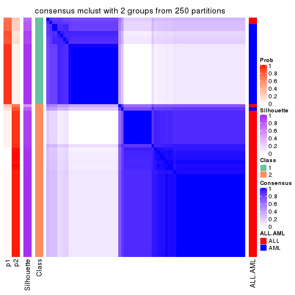</p>

</div>
<div id='tab-MAD-mclust-consensus-heatmap-2'>
<pre><code class="r">consensus_heatmap(res, k = 3)
</code></pre>

<p>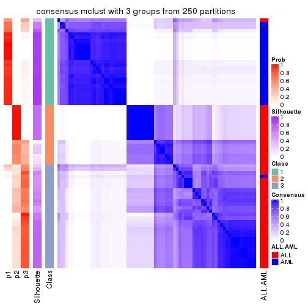</p>

</div>
<div id='tab-MAD-mclust-consensus-heatmap-3'>
<pre><code class="r">consensus_heatmap(res, k = 4)
</code></pre>

<p>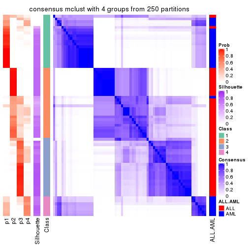</p>

</div>
<div id='tab-MAD-mclust-consensus-heatmap-4'>
<pre><code class="r">consensus_heatmap(res, k = 5)
</code></pre>

<p>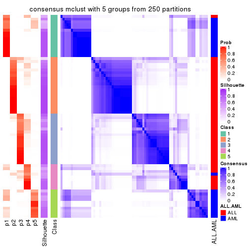</p>

</div>
<div id='tab-MAD-mclust-consensus-heatmap-5'>
<pre><code class="r">consensus_heatmap(res, k = 6)
</code></pre>

<p>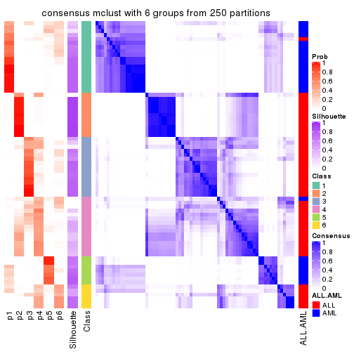</p>

</div>
</div>

Heatmaps for the membership of samples in all partitions to see how consistent they are:


<script>
$( function() {
	$( '#tabs-MAD-mclust-membership-heatmap' ).tabs();
} );
</script>
<div id='tabs-MAD-mclust-membership-heatmap'>
<ul>
<li><a href='#tab-MAD-mclust-membership-heatmap-1'>k = 2</a></li>
<li><a href='#tab-MAD-mclust-membership-heatmap-2'>k = 3</a></li>
<li><a href='#tab-MAD-mclust-membership-heatmap-3'>k = 4</a></li>
<li><a href='#tab-MAD-mclust-membership-heatmap-4'>k = 5</a></li>
<li><a href='#tab-MAD-mclust-membership-heatmap-5'>k = 6</a></li>
</ul>
<div id='tab-MAD-mclust-membership-heatmap-1'>
<pre><code class="r">membership_heatmap(res, k = 2)
</code></pre>

<p>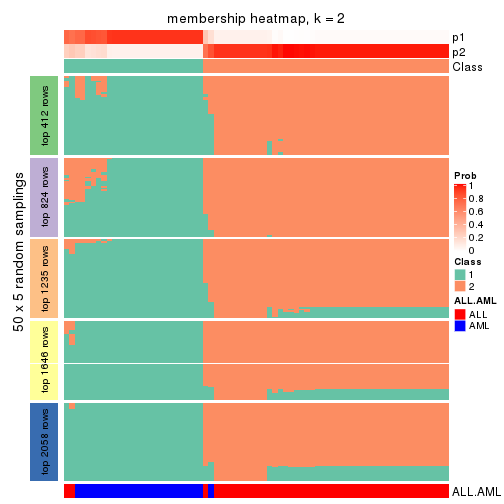</p>

</div>
<div id='tab-MAD-mclust-membership-heatmap-2'>
<pre><code class="r">membership_heatmap(res, k = 3)
</code></pre>

<p>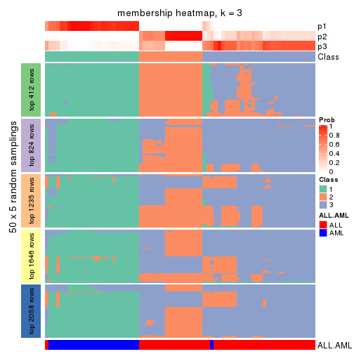</p>

</div>
<div id='tab-MAD-mclust-membership-heatmap-3'>
<pre><code class="r">membership_heatmap(res, k = 4)
</code></pre>

<p>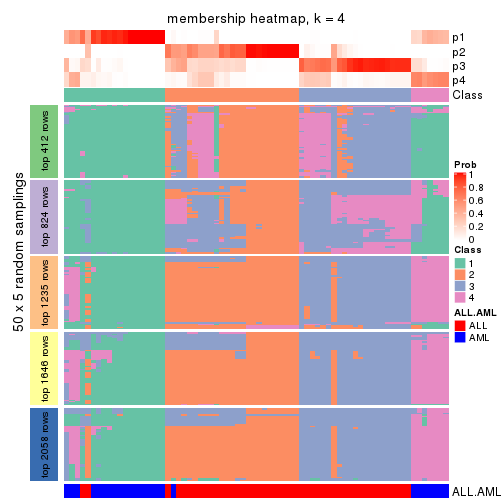</p>

</div>
<div id='tab-MAD-mclust-membership-heatmap-4'>
<pre><code class="r">membership_heatmap(res, k = 5)
</code></pre>

<p>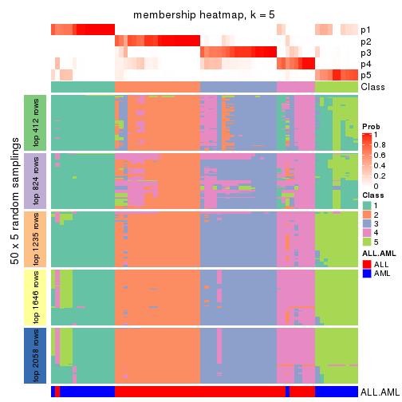</p>

</div>
<div id='tab-MAD-mclust-membership-heatmap-5'>
<pre><code class="r">membership_heatmap(res, k = 6)
</code></pre>

<p>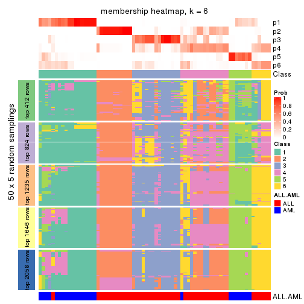</p>

</div>
</div>

As soon as we have had the classes for columns, we can look for signatures
which are significantly different between classes which can be candidate marks
for certain classes. Following are the heatmaps for signatures.


Signature heatmaps where rows are scaled:


<script>
$( function() {
	$( '#tabs-MAD-mclust-get-signatures' ).tabs();
} );
</script>
<div id='tabs-MAD-mclust-get-signatures'>
<ul>
<li><a href='#tab-MAD-mclust-get-signatures-1'>k = 2</a></li>
<li><a href='#tab-MAD-mclust-get-signatures-2'>k = 3</a></li>
<li><a href='#tab-MAD-mclust-get-signatures-3'>k = 4</a></li>
<li><a href='#tab-MAD-mclust-get-signatures-4'>k = 5</a></li>
<li><a href='#tab-MAD-mclust-get-signatures-5'>k = 6</a></li>
</ul>
<div id='tab-MAD-mclust-get-signatures-1'>
<pre><code class="r">get_signatures(res, k = 2)
</code></pre>

<p>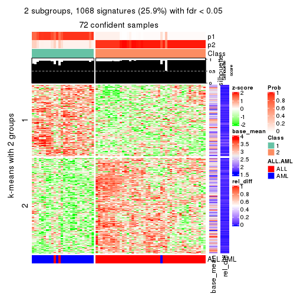</p>

</div>
<div id='tab-MAD-mclust-get-signatures-2'>
<pre><code class="r">get_signatures(res, k = 3)
</code></pre>

<p>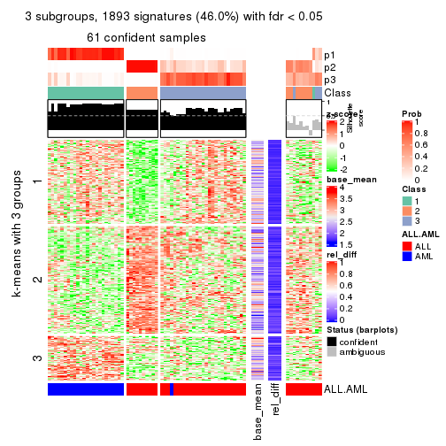</p>

</div>
<div id='tab-MAD-mclust-get-signatures-3'>
<pre><code class="r">get_signatures(res, k = 4)
</code></pre>

<p>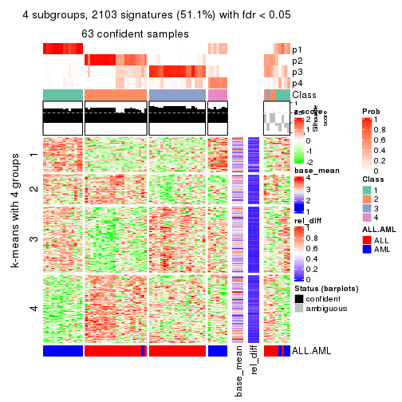</p>

</div>
<div id='tab-MAD-mclust-get-signatures-4'>
<pre><code class="r">get_signatures(res, k = 5)
</code></pre>

<p>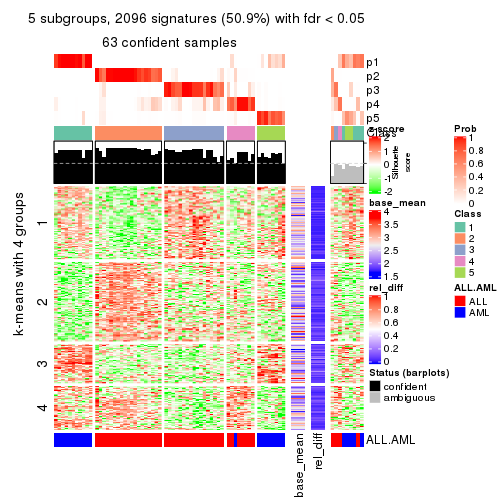</p>

</div>
<div id='tab-MAD-mclust-get-signatures-5'>
<pre><code class="r">get_signatures(res, k = 6)
</code></pre>

<p>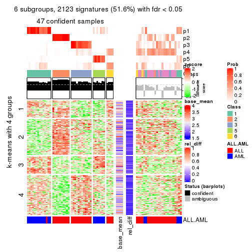</p>

</div>
</div>


Signature heatmaps where rows are not scaled:


<script>
$( function() {
	$( '#tabs-MAD-mclust-get-signatures-no-scale' ).tabs();
} );
</script>
<div id='tabs-MAD-mclust-get-signatures-no-scale'>
<ul>
<li><a href='#tab-MAD-mclust-get-signatures-no-scale-1'>k = 2</a></li>
<li><a href='#tab-MAD-mclust-get-signatures-no-scale-2'>k = 3</a></li>
<li><a href='#tab-MAD-mclust-get-signatures-no-scale-3'>k = 4</a></li>
<li><a href='#tab-MAD-mclust-get-signatures-no-scale-4'>k = 5</a></li>
<li><a href='#tab-MAD-mclust-get-signatures-no-scale-5'>k = 6</a></li>
</ul>
<div id='tab-MAD-mclust-get-signatures-no-scale-1'>
<pre><code class="r">get_signatures(res, k = 2, scale_rows = FALSE)
</code></pre>

<p>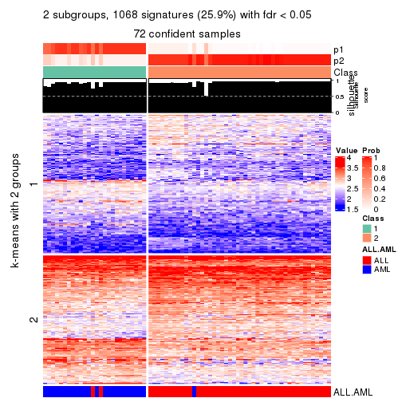</p>

</div>
<div id='tab-MAD-mclust-get-signatures-no-scale-2'>
<pre><code class="r">get_signatures(res, k = 3, scale_rows = FALSE)
</code></pre>

<p>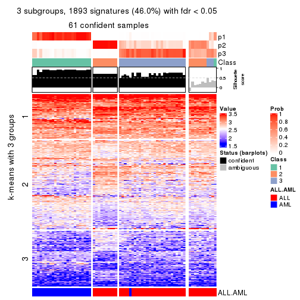</p>

</div>
<div id='tab-MAD-mclust-get-signatures-no-scale-3'>
<pre><code class="r">get_signatures(res, k = 4, scale_rows = FALSE)
</code></pre>

<p>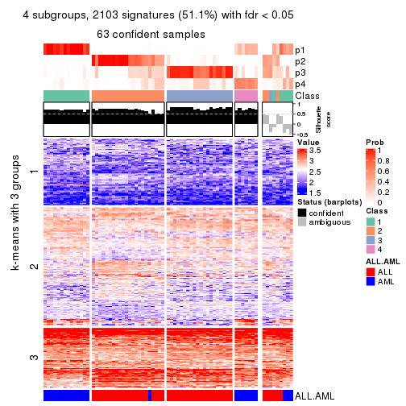</p>

</div>
<div id='tab-MAD-mclust-get-signatures-no-scale-4'>
<pre><code class="r">get_signatures(res, k = 5, scale_rows = FALSE)
</code></pre>

<p>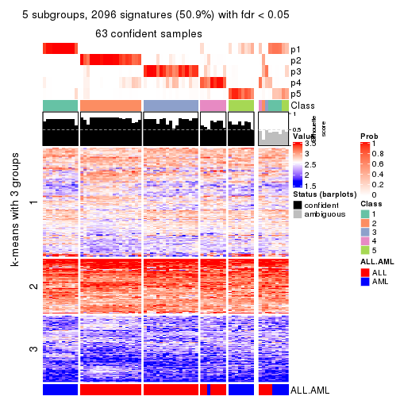</p>

</div>
<div id='tab-MAD-mclust-get-signatures-no-scale-5'>
<pre><code class="r">get_signatures(res, k = 6, scale_rows = FALSE)
</code></pre>

<p>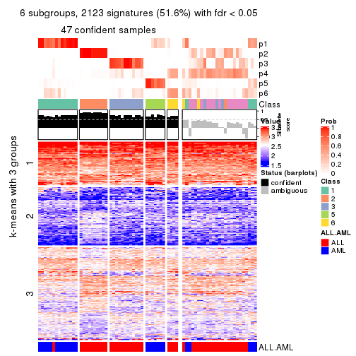</p>

</div>
</div>


Compare the overlap of signatures from different k:

```r
compare_signatures(res)
```

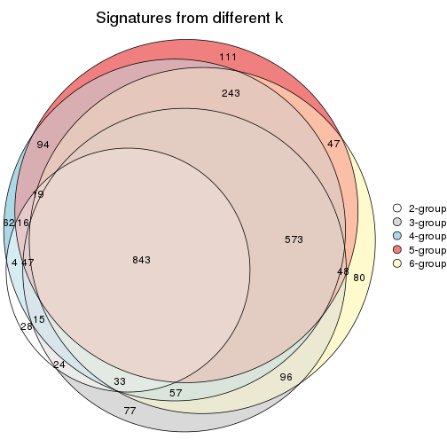

`get_signature()` returns a data frame invisibly. TO get the list of signatures, the function
call should be assigned to a variable explicitly. In following code, if `plot` argument is set
to `FALSE`, no heatmap is plotted while only the differential analysis is performed.

```r
# code only for demonstration
tb = get_signature(res, k = ..., plot = FALSE)
```

An example of the output of `tb` is:

```
#>   which_row         fdr    mean_1    mean_2 scaled_mean_1 scaled_mean_2 km
#> 1        38 0.042760348  8.373488  9.131774    -0.5533452     0.5164555  1
#> 2        40 0.018707592  7.106213  8.469186    -0.6173731     0.5762149  1
#> 3        55 0.019134737 10.221463 11.207825    -0.6159697     0.5749050  1
#> 4        59 0.006059896  5.921854  7.869574    -0.6899429     0.6439467  1
#> 5        60 0.018055526  8.928898 10.211722    -0.6204761     0.5791110  1
#> 6        98 0.009384629 15.714769 14.887706     0.6635654    -0.6193277  2
...
```

The columns in `tb` are:

1. `which_row`: row indices corresponding to the input matrix.
2. `fdr`: FDR for the differential test. 
3. `mean_x`: The mean value in group x.
4. `scaled_mean_x`: The mean value in group x after rows are scaled.
5. `km`: Row groups if k-means clustering is applied to rows.


UMAP plot which shows how samples are separated.


<script>
$( function() {
	$( '#tabs-MAD-mclust-dimension-reduction' ).tabs();
} );
</script>
<div id='tabs-MAD-mclust-dimension-reduction'>
<ul>
<li><a href='#tab-MAD-mclust-dimension-reduction-1'>k = 2</a></li>
<li><a href='#tab-MAD-mclust-dimension-reduction-2'>k = 3</a></li>
<li><a href='#tab-MAD-mclust-dimension-reduction-3'>k = 4</a></li>
<li><a href='#tab-MAD-mclust-dimension-reduction-4'>k = 5</a></li>
<li><a href='#tab-MAD-mclust-dimension-reduction-5'>k = 6</a></li>
</ul>
<div id='tab-MAD-mclust-dimension-reduction-1'>
<pre><code class="r">dimension_reduction(res, k = 2, method = &quot;UMAP&quot;)
</code></pre>

<p>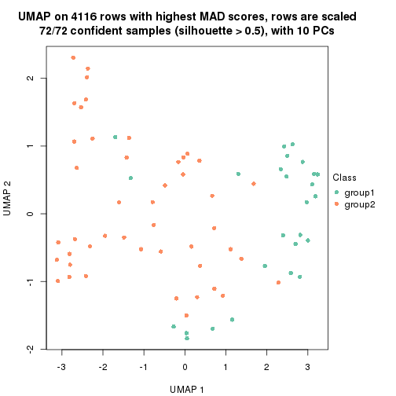</p>

</div>
<div id='tab-MAD-mclust-dimension-reduction-2'>
<pre><code class="r">dimension_reduction(res, k = 3, method = &quot;UMAP&quot;)
</code></pre>

<p>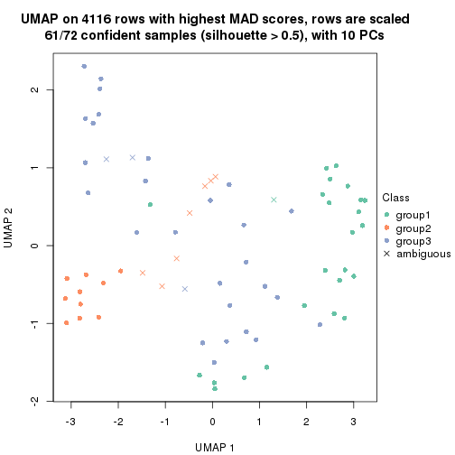</p>

</div>
<div id='tab-MAD-mclust-dimension-reduction-3'>
<pre><code class="r">dimension_reduction(res, k = 4, method = &quot;UMAP&quot;)
</code></pre>

<p>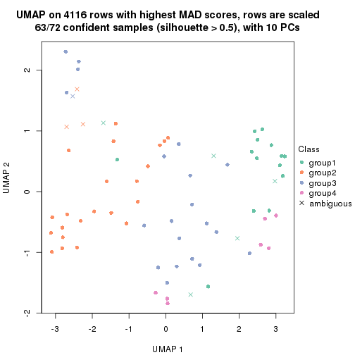</p>

</div>
<div id='tab-MAD-mclust-dimension-reduction-4'>
<pre><code class="r">dimension_reduction(res, k = 5, method = &quot;UMAP&quot;)
</code></pre>

<p>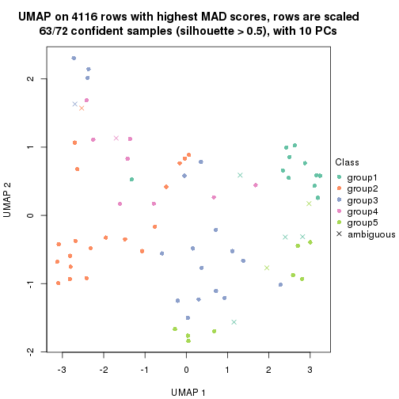</p>

</div>
<div id='tab-MAD-mclust-dimension-reduction-5'>
<pre><code class="r">dimension_reduction(res, k = 6, method = &quot;UMAP&quot;)
</code></pre>

<p>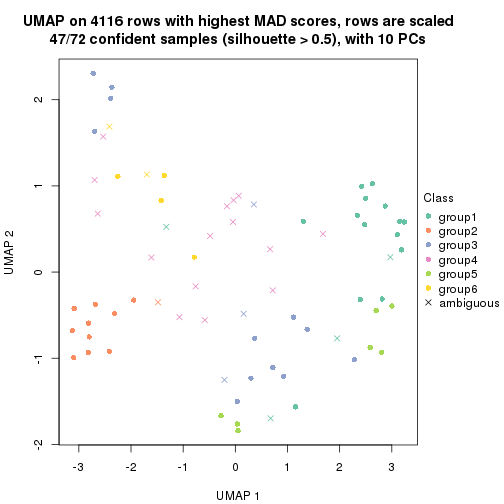</p>

</div>
</div>


Following heatmap shows how subgroups are split when increasing `k`:

```r
collect_classes(res)
```

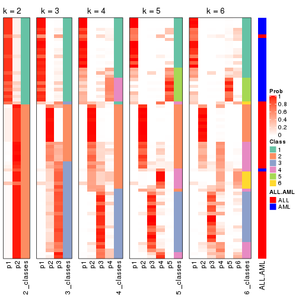


Test correlation between subgroups and known annotations. If the known
annotation is numeric, one-way ANOVA test is applied, and if the known
annotation is discrete, chi-squared contingency table test is applied.

```r
test_to_known_factors(res)
```

```
#>             n ALL.AML(p) k
#> MAD:mclust 72   8.75e-14 2
#> MAD:mclust 61   4.15e-13 3
#> MAD:mclust 63   1.06e-12 4
#> MAD:mclust 63   4.79e-12 5
#> MAD:mclust 47   9.40e-09 6
```


If matrix rows can be associated to genes, consider to use `functional_enrichment(res,
...)` to perform function enrichment for the signature genes. See [this vignette](http://bioconductor.org/packages/devel/bioc/vignettes/cola/inst/doc/functional_enrichment.html) for more detailed explanations.


 

---------------------------------------------------


### MAD:NMF


The object with results only for a single top-value method and a single partition method 
can be extracted as:

```r
res = res_list["MAD", "NMF"]
# you can also extract it by
# res = res_list["MAD:NMF"]
```

A summary of `res` and all the functions that can be applied to it:

```r
res
```

```
#> A 'ConsensusPartition' object with k = 2, 3, 4, 5, 6.
#>   On a matrix with 4116 rows and 72 columns.
#>   Top rows (412, 824, 1235, 1646, 2058) are extracted by 'MAD' method.
#>   Subgroups are detected by 'NMF' method.
#>   Performed in total 1250 partitions by row resampling.
#>   Best k for subgroups seems to be 2.
#> 
#> Following methods can be applied to this 'ConsensusPartition' object:
#>  [1] "cola_report"             "collect_classes"         "collect_plots"          
#>  [4] "collect_stats"           "colnames"                "compare_signatures"     
#>  [7] "consensus_heatmap"       "dimension_reduction"     "functional_enrichment"  
#> [10] "get_anno_col"            "get_anno"                "get_classes"            
#> [13] "get_consensus"           "get_matrix"              "get_membership"         
#> [16] "get_param"               "get_signatures"          "get_stats"              
#> [19] "is_best_k"               "is_stable_k"             "membership_heatmap"     
#> [22] "ncol"                    "nrow"                    "plot_ecdf"              
#> [25] "rownames"                "select_partition_number" "show"                   
#> [28] "suggest_best_k"          "test_to_known_factors"
```

`collect_plots()` function collects all the plots made from `res` for all `k` (number of partitions)
into one single page to provide an easy and fast comparison between different `k`.

```r
collect_plots(res)
```

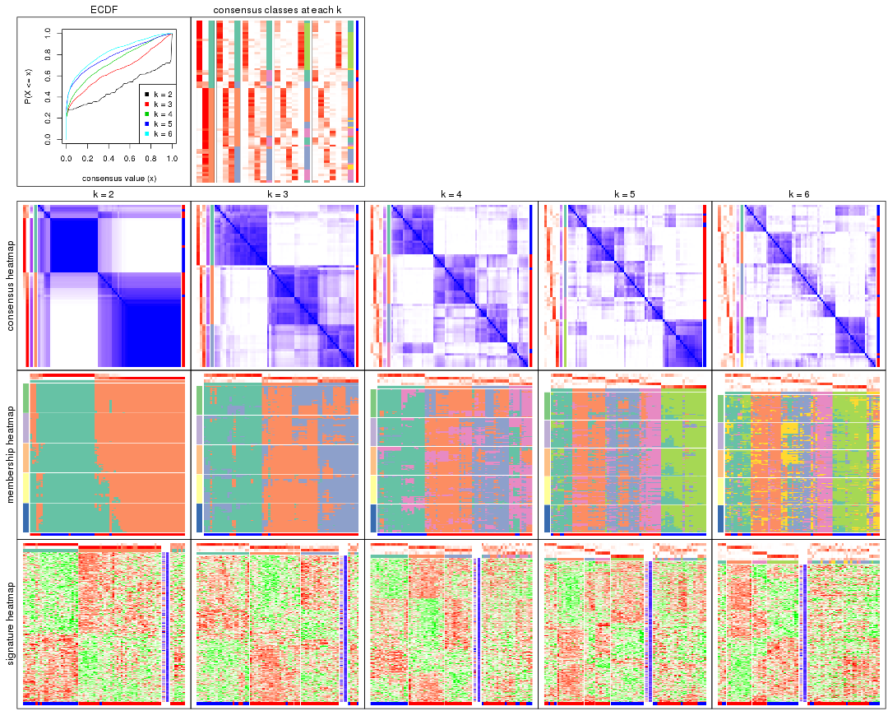

The plots are:

- The first row: a plot of the ECDF (empirical cumulative distribution
  function) curves of the consensus matrix for each `k` and the heatmap of
  predicted classes for each `k`.
- The second row: heatmaps of the consensus matrix for each `k`.
- The third row: heatmaps of the membership matrix for each `k`.
- The fouth row: heatmaps of the signatures for each `k`.

All the plots in panels can be made by individual functions and they are
plotted later in this section.

`select_partition_number()` produces several plots showing different
statistics for choosing "optimized" `k`. There are following statistics:

- ECDF curves of the consensus matrix for each `k`;
- 1-PAC. [The PAC
  score](https://en.wikipedia.org/wiki/Consensus_clustering#Over-interpretation_potential_of_consensus_clustering)
  measures the proportion of the ambiguous subgrouping.
- Mean silhouette score.
- Concordance. The mean probability of fiting the consensus class ids in all
  partitions.
- Area increased. Denote $A_k$ as the area under the ECDF curve for current
  `k`, the area increased is defined as $A_k - A_{k-1}$.
- Rand index. The percent of pairs of samples that are both in a same cluster
  or both are not in a same cluster in the partition of k and k-1.
- Jaccard index. The ratio of pairs of samples are both in a same cluster in
  the partition of k and k-1 and the pairs of samples are both in a same
  cluster in the partition k or k-1.

The detailed explanations of these statistics can be found in [the _cola_
vignette](http://bioconductor.org/packages/devel/bioc/vignettes/cola/inst/doc/cola.html#toc_13).

Generally speaking, lower PAC score, higher mean silhouette score or higher
concordance corresponds to better partition. Rand index and Jaccard index
measure how similar the current partition is compared to partition with `k-1`.
If they are too similar, we won't accept `k` is better than `k-1`.

```r
select_partition_number(res)
```

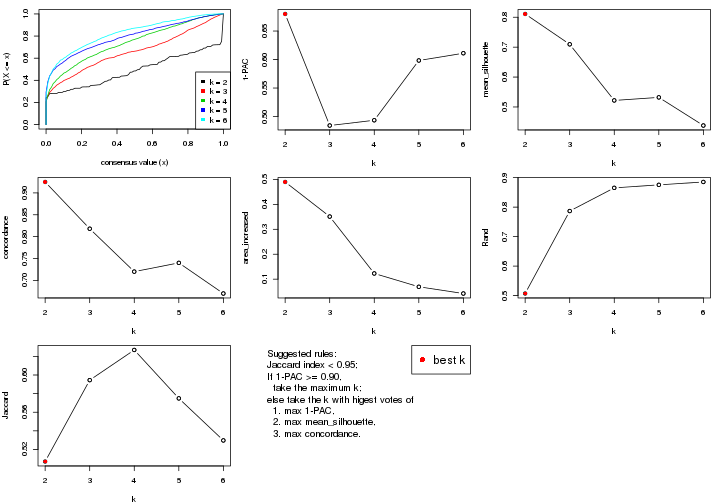

The numeric values for all these statistics can be obtained by `get_stats()`.

```r
get_stats(res)
```

```
#>   k 1-PAC mean_silhouette concordance area_increased  Rand Jaccard
#> 2 2 0.680           0.811       0.925         0.4899 0.507   0.507
#> 3 3 0.484           0.709       0.818         0.3511 0.787   0.594
#> 4 4 0.493           0.522       0.720         0.1228 0.865   0.627
#> 5 5 0.598           0.532       0.740         0.0694 0.876   0.575
#> 6 6 0.611           0.438       0.670         0.0424 0.885   0.530
```

`suggest_best_k()` suggests the best $k$ based on these statistics. The rules are as follows:

- All $k$ with Jaccard index larger than 0.95 are removed because increasing
  $k$ does not provide enough extra information. If all $k$ are removed, it is
  marked as no subgroup is detected.
- For all $k$ with 1-PAC score larger than 0.9, the maximal $k$ is taken as
  the best $k$, and other $k$ are marked as optional $k$.
- If it does not fit the second rule. The $k$ with the maximal vote of the
  highest 1-PAC score, highest mean silhouette, and highest concordance is
  taken as the best $k$.

```r
suggest_best_k(res)
```

```
#> [1] 2
```


Following shows the table of the partitions (You need to click the **show/hide
code output** link to see it). The membership matrix (columns with name `p*`)
is inferred by
[`clue::cl_consensus()`](https://www.rdocumentation.org/link/cl_consensus?package=clue)
function with the `SE` method. Basically the value in the membership matrix
represents the probability to belong to a certain group. The finall class
label for an item is determined with the group with highest probability it
belongs to.

In `get_classes()` function, the entropy is calculated from the membership
matrix and the silhouette score is calculated from the consensus matrix.


<script>
$( function() {
	$( '#tabs-MAD-NMF-get-classes' ).tabs();
} );
</script>
<div id='tabs-MAD-NMF-get-classes'>
<ul>
<li><a href='#tab-MAD-NMF-get-classes-1'>k = 2</a></li>
<li><a href='#tab-MAD-NMF-get-classes-2'>k = 3</a></li>
<li><a href='#tab-MAD-NMF-get-classes-3'>k = 4</a></li>
<li><a href='#tab-MAD-NMF-get-classes-4'>k = 5</a></li>
<li><a href='#tab-MAD-NMF-get-classes-5'>k = 6</a></li>
</ul>

<div id='tab-MAD-NMF-get-classes-1'>
<p><a id='tab-MAD-NMF-get-classes-1-a' style='color:#0366d6' href='#'>show/hide code output</a></p>
<pre><code class="r">cbind(get_classes(res, k = 2), get_membership(res, k = 2))
</code></pre>

<pre><code>#&gt;           class entropy silhouette    p1    p2
#&gt; sample_39     2  0.9460    0.47355 0.364 0.636
#&gt; sample_40     2  0.9323    0.50751 0.348 0.652
#&gt; sample_42     2  0.0000    0.91217 0.000 1.000
#&gt; sample_47     2  0.0000    0.91217 0.000 1.000
#&gt; sample_48     2  0.0000    0.91217 0.000 1.000
#&gt; sample_49     2  0.9944    0.22386 0.456 0.544
#&gt; sample_41     2  0.0000    0.91217 0.000 1.000
#&gt; sample_43     2  0.0000    0.91217 0.000 1.000
#&gt; sample_44     2  0.0000    0.91217 0.000 1.000
#&gt; sample_45     2  0.0000    0.91217 0.000 1.000
#&gt; sample_46     2  0.0000    0.91217 0.000 1.000
#&gt; sample_70     2  0.0376    0.91020 0.004 0.996
#&gt; sample_71     2  0.0938    0.90644 0.012 0.988
#&gt; sample_72     2  0.0000    0.91217 0.000 1.000
#&gt; sample_68     2  0.0000    0.91217 0.000 1.000
#&gt; sample_69     2  0.0000    0.91217 0.000 1.000
#&gt; sample_67     1  0.7139    0.71548 0.804 0.196
#&gt; sample_55     2  0.6148    0.79467 0.152 0.848
#&gt; sample_56     2  0.5629    0.81495 0.132 0.868
#&gt; sample_59     2  0.0000    0.91217 0.000 1.000
#&gt; sample_52     1  0.0000    0.91389 1.000 0.000
#&gt; sample_53     1  0.0000    0.91389 1.000 0.000
#&gt; sample_51     1  0.0000    0.91389 1.000 0.000
#&gt; sample_50     1  0.0000    0.91389 1.000 0.000
#&gt; sample_54     1  0.8016    0.64617 0.756 0.244
#&gt; sample_57     1  0.0000    0.91389 1.000 0.000
#&gt; sample_58     1  0.0000    0.91389 1.000 0.000
#&gt; sample_60     1  0.0938    0.90467 0.988 0.012
#&gt; sample_61     1  0.0000    0.91389 1.000 0.000
#&gt; sample_65     1  0.0000    0.91389 1.000 0.000
#&gt; sample_66     2  0.4431    0.83337 0.092 0.908
#&gt; sample_63     1  0.0000    0.91389 1.000 0.000
#&gt; sample_64     1  0.0000    0.91389 1.000 0.000
#&gt; sample_62     1  0.0000    0.91389 1.000 0.000
#&gt; sample_1      2  0.0000    0.91217 0.000 1.000
#&gt; sample_2      1  0.9833    0.27353 0.576 0.424
#&gt; sample_3      2  0.3584    0.86847 0.068 0.932
#&gt; sample_4      2  0.0000    0.91217 0.000 1.000
#&gt; sample_5      2  0.0000    0.91217 0.000 1.000
#&gt; sample_6      2  0.9129    0.54748 0.328 0.672
#&gt; sample_7      2  0.5294    0.82590 0.120 0.880
#&gt; sample_8      1  0.9977   -0.00368 0.528 0.472
#&gt; sample_9      2  0.0000    0.91217 0.000 1.000
#&gt; sample_10     2  0.9996    0.09922 0.488 0.512
#&gt; sample_11     2  0.0000    0.91217 0.000 1.000
#&gt; sample_12     1  0.0000    0.91389 1.000 0.000
#&gt; sample_13     2  0.0000    0.91217 0.000 1.000
#&gt; sample_14     2  0.0000    0.91217 0.000 1.000
#&gt; sample_15     2  0.0000    0.91217 0.000 1.000
#&gt; sample_16     2  0.0000    0.91217 0.000 1.000
#&gt; sample_17     2  0.0000    0.91217 0.000 1.000
#&gt; sample_18     2  0.1414    0.90124 0.020 0.980
#&gt; sample_19     2  0.0000    0.91217 0.000 1.000
#&gt; sample_20     2  0.0000    0.91217 0.000 1.000
#&gt; sample_21     2  0.0000    0.91217 0.000 1.000
#&gt; sample_22     1  0.9491    0.34331 0.632 0.368
#&gt; sample_23     2  0.8909    0.58335 0.308 0.692
#&gt; sample_24     2  0.0000    0.91217 0.000 1.000
#&gt; sample_25     2  0.9044    0.56124 0.320 0.680
#&gt; sample_26     2  0.0000    0.91217 0.000 1.000
#&gt; sample_27     1  0.9970    0.01229 0.532 0.468
#&gt; sample_34     1  0.0000    0.91389 1.000 0.000
#&gt; sample_35     1  0.0000    0.91389 1.000 0.000
#&gt; sample_36     1  0.0000    0.91389 1.000 0.000
#&gt; sample_37     1  0.0000    0.91389 1.000 0.000
#&gt; sample_38     1  0.0000    0.91389 1.000 0.000
#&gt; sample_28     1  0.0000    0.91389 1.000 0.000
#&gt; sample_29     1  0.0000    0.91389 1.000 0.000
#&gt; sample_30     1  0.0000    0.91389 1.000 0.000
#&gt; sample_31     1  0.0000    0.91389 1.000 0.000
#&gt; sample_32     1  0.0000    0.91389 1.000 0.000
#&gt; sample_33     1  0.0000    0.91389 1.000 0.000
</code></pre>

<script>
$('#tab-MAD-NMF-get-classes-1-a').parent().next().next().hide();
$('#tab-MAD-NMF-get-classes-1-a').click(function(){
  $('#tab-MAD-NMF-get-classes-1-a').parent().next().next().toggle();
  return(false);
});
</script>
</div>

<div id='tab-MAD-NMF-get-classes-2'>
<p><a id='tab-MAD-NMF-get-classes-2-a' style='color:#0366d6' href='#'>show/hide code output</a></p>
<pre><code class="r">cbind(get_classes(res, k = 3), get_membership(res, k = 3))
</code></pre>

<pre><code>#&gt;           class entropy silhouette    p1    p2    p3
#&gt; sample_39     3  0.2063      0.728 0.008 0.044 0.948
#&gt; sample_40     3  0.4172      0.779 0.004 0.156 0.840
#&gt; sample_42     2  0.6570      0.651 0.028 0.680 0.292
#&gt; sample_47     2  0.3340      0.787 0.000 0.880 0.120
#&gt; sample_48     2  0.3551      0.785 0.000 0.868 0.132
#&gt; sample_49     3  0.3454      0.771 0.008 0.104 0.888
#&gt; sample_41     2  0.1411      0.773 0.000 0.964 0.036
#&gt; sample_43     2  0.4796      0.743 0.000 0.780 0.220
#&gt; sample_44     2  0.5988      0.407 0.000 0.632 0.368
#&gt; sample_45     2  0.4796      0.744 0.000 0.780 0.220
#&gt; sample_46     2  0.5397      0.683 0.000 0.720 0.280
#&gt; sample_70     3  0.5178      0.664 0.000 0.256 0.744
#&gt; sample_71     2  0.7308      0.613 0.056 0.648 0.296
#&gt; sample_72     2  0.5953      0.680 0.012 0.708 0.280
#&gt; sample_68     2  0.0592      0.778 0.000 0.988 0.012
#&gt; sample_69     2  0.3482      0.778 0.000 0.872 0.128
#&gt; sample_67     1  0.6098      0.717 0.768 0.176 0.056
#&gt; sample_55     3  0.5812      0.744 0.012 0.264 0.724
#&gt; sample_56     3  0.3551      0.774 0.000 0.132 0.868
#&gt; sample_59     3  0.6045      0.514 0.000 0.380 0.620
#&gt; sample_52     1  0.1289      0.856 0.968 0.000 0.032
#&gt; sample_53     1  0.0747      0.854 0.984 0.000 0.016
#&gt; sample_51     1  0.0592      0.857 0.988 0.000 0.012
#&gt; sample_50     1  0.0424      0.856 0.992 0.000 0.008
#&gt; sample_54     1  0.7492      0.496 0.608 0.340 0.052
#&gt; sample_57     1  0.4912      0.788 0.796 0.008 0.196
#&gt; sample_58     1  0.5678      0.665 0.684 0.000 0.316
#&gt; sample_60     1  0.5710      0.782 0.804 0.116 0.080
#&gt; sample_61     1  0.5529      0.729 0.704 0.000 0.296
#&gt; sample_65     1  0.2796      0.851 0.908 0.000 0.092
#&gt; sample_66     2  0.6188      0.513 0.216 0.744 0.040
#&gt; sample_63     1  0.2066      0.855 0.940 0.000 0.060
#&gt; sample_64     1  0.6062      0.553 0.616 0.000 0.384
#&gt; sample_62     1  0.1753      0.856 0.952 0.000 0.048
#&gt; sample_1      3  0.5497      0.640 0.000 0.292 0.708
#&gt; sample_2      1  0.7775      0.506 0.620 0.304 0.076
#&gt; sample_3      3  0.5650      0.734 0.000 0.312 0.688
#&gt; sample_4      2  0.6307     -0.453 0.000 0.512 0.488
#&gt; sample_5      2  0.0424      0.772 0.000 0.992 0.008
#&gt; sample_6      3  0.5404      0.743 0.004 0.256 0.740
#&gt; sample_7      3  0.5560      0.745 0.000 0.300 0.700
#&gt; sample_8      3  0.2584      0.745 0.008 0.064 0.928
#&gt; sample_9      2  0.3482      0.695 0.000 0.872 0.128
#&gt; sample_10     3  0.6473      0.734 0.020 0.312 0.668
#&gt; sample_11     2  0.1860      0.777 0.000 0.948 0.052
#&gt; sample_12     1  0.5591      0.718 0.696 0.000 0.304
#&gt; sample_13     2  0.3551      0.784 0.000 0.868 0.132
#&gt; sample_14     2  0.1950      0.762 0.008 0.952 0.040
#&gt; sample_15     2  0.0892      0.776 0.000 0.980 0.020
#&gt; sample_16     2  0.5363      0.553 0.000 0.724 0.276
#&gt; sample_17     2  0.1163      0.771 0.000 0.972 0.028
#&gt; sample_18     3  0.6204      0.565 0.000 0.424 0.576
#&gt; sample_19     2  0.5216      0.707 0.000 0.740 0.260
#&gt; sample_20     2  0.3686      0.779 0.000 0.860 0.140
#&gt; sample_21     2  0.1643      0.787 0.000 0.956 0.044
#&gt; sample_22     3  0.3237      0.683 0.056 0.032 0.912
#&gt; sample_23     3  0.5254      0.752 0.000 0.264 0.736
#&gt; sample_24     2  0.1529      0.775 0.000 0.960 0.040
#&gt; sample_25     3  0.6007      0.614 0.048 0.184 0.768
#&gt; sample_26     3  0.6235      0.154 0.000 0.436 0.564
#&gt; sample_27     3  0.3845      0.773 0.012 0.116 0.872
#&gt; sample_34     1  0.2878      0.847 0.904 0.000 0.096
#&gt; sample_35     1  0.6280      0.377 0.540 0.000 0.460
#&gt; sample_36     1  0.0747      0.856 0.984 0.000 0.016
#&gt; sample_37     1  0.0747      0.855 0.984 0.000 0.016
#&gt; sample_38     1  0.2537      0.846 0.920 0.000 0.080
#&gt; sample_28     1  0.2625      0.841 0.916 0.000 0.084
#&gt; sample_29     1  0.2599      0.838 0.932 0.052 0.016
#&gt; sample_30     1  0.0829      0.854 0.984 0.004 0.012
#&gt; sample_31     1  0.3116      0.844 0.892 0.000 0.108
#&gt; sample_32     1  0.2796      0.854 0.908 0.000 0.092
#&gt; sample_33     1  0.2261      0.857 0.932 0.000 0.068
</code></pre>

<script>
$('#tab-MAD-NMF-get-classes-2-a').parent().next().next().hide();
$('#tab-MAD-NMF-get-classes-2-a').click(function(){
  $('#tab-MAD-NMF-get-classes-2-a').parent().next().next().toggle();
  return(false);
});
</script>
</div>

<div id='tab-MAD-NMF-get-classes-3'>
<p><a id='tab-MAD-NMF-get-classes-3-a' style='color:#0366d6' href='#'>show/hide code output</a></p>
<pre><code class="r">cbind(get_classes(res, k = 4), get_membership(res, k = 4))
</code></pre>

<pre><code>#&gt;           class entropy silhouette    p1    p2    p3    p4
#&gt; sample_39     3   0.592    0.53779 0.008 0.036 0.620 0.336
#&gt; sample_40     3   0.507    0.68690 0.024 0.164 0.776 0.036
#&gt; sample_42     4   0.395    0.41028 0.000 0.168 0.020 0.812
#&gt; sample_47     2   0.400    0.68605 0.000 0.824 0.036 0.140
#&gt; sample_48     2   0.328    0.69450 0.000 0.872 0.032 0.096
#&gt; sample_49     3   0.513    0.69374 0.008 0.132 0.776 0.084
#&gt; sample_41     2   0.141    0.67095 0.000 0.960 0.024 0.016
#&gt; sample_43     2   0.597    0.60501 0.000 0.668 0.088 0.244
#&gt; sample_44     2   0.714    0.37361 0.000 0.556 0.256 0.188
#&gt; sample_45     2   0.622    0.57706 0.000 0.624 0.084 0.292
#&gt; sample_46     2   0.690    0.50260 0.000 0.556 0.132 0.312
#&gt; sample_70     3   0.654    0.59577 0.000 0.140 0.628 0.232
#&gt; sample_71     4   0.310    0.47034 0.000 0.120 0.012 0.868
#&gt; sample_72     4   0.460    0.34990 0.000 0.184 0.040 0.776
#&gt; sample_68     2   0.139    0.68979 0.000 0.960 0.012 0.028
#&gt; sample_69     2   0.505    0.65361 0.000 0.704 0.028 0.268
#&gt; sample_67     4   0.639    0.25684 0.368 0.032 0.024 0.576
#&gt; sample_55     3   0.803    0.47222 0.184 0.248 0.532 0.036
#&gt; sample_56     3   0.588    0.67685 0.012 0.160 0.724 0.104
#&gt; sample_59     2   0.761   -0.14871 0.016 0.452 0.404 0.128
#&gt; sample_52     1   0.141    0.73421 0.960 0.000 0.020 0.020
#&gt; sample_53     1   0.451    0.55538 0.708 0.000 0.004 0.288
#&gt; sample_51     1   0.292    0.70990 0.860 0.000 0.000 0.140
#&gt; sample_50     1   0.253    0.72440 0.888 0.000 0.000 0.112
#&gt; sample_54     1   0.616    0.42347 0.664 0.268 0.040 0.028
#&gt; sample_57     1   0.354    0.69305 0.868 0.008 0.092 0.032
#&gt; sample_58     1   0.396    0.66007 0.820 0.000 0.152 0.028
#&gt; sample_60     1   0.565    0.55981 0.748 0.164 0.060 0.028
#&gt; sample_61     1   0.668    0.19951 0.524 0.000 0.092 0.384
#&gt; sample_65     1   0.293    0.73300 0.880 0.000 0.012 0.108
#&gt; sample_66     2   0.806    0.32614 0.064 0.568 0.164 0.204
#&gt; sample_63     1   0.130    0.73515 0.964 0.000 0.020 0.016
#&gt; sample_64     1   0.504    0.58191 0.748 0.012 0.212 0.028
#&gt; sample_62     1   0.163    0.73055 0.952 0.000 0.024 0.024
#&gt; sample_1      3   0.622    0.61974 0.000 0.188 0.668 0.144
#&gt; sample_2      4   0.765    0.40406 0.224 0.060 0.116 0.600
#&gt; sample_3      3   0.422    0.56239 0.004 0.080 0.832 0.084
#&gt; sample_4      3   0.616    0.34470 0.004 0.448 0.508 0.040
#&gt; sample_5      2   0.104    0.68140 0.000 0.972 0.020 0.008
#&gt; sample_6      3   0.422    0.56386 0.004 0.080 0.832 0.084
#&gt; sample_7      3   0.486    0.66034 0.020 0.228 0.744 0.008
#&gt; sample_8      3   0.557    0.64779 0.008 0.064 0.724 0.204
#&gt; sample_9      2   0.713    0.32344 0.000 0.532 0.312 0.156
#&gt; sample_10     3   0.639    0.36473 0.012 0.100 0.668 0.220
#&gt; sample_11     4   0.776    0.04145 0.000 0.316 0.256 0.428
#&gt; sample_12     4   0.616    0.09656 0.416 0.000 0.052 0.532
#&gt; sample_13     2   0.401    0.68891 0.000 0.816 0.028 0.156
#&gt; sample_14     2   0.576    0.49453 0.004 0.708 0.204 0.084
#&gt; sample_15     2   0.117    0.68089 0.000 0.968 0.020 0.012
#&gt; sample_16     2   0.516    0.59983 0.000 0.756 0.156 0.088
#&gt; sample_17     2   0.447    0.57140 0.004 0.796 0.164 0.036
#&gt; sample_18     3   0.542    0.63184 0.008 0.240 0.712 0.040
#&gt; sample_19     2   0.666    0.53878 0.000 0.580 0.112 0.308
#&gt; sample_20     2   0.477    0.66993 0.000 0.740 0.028 0.232
#&gt; sample_21     2   0.427    0.64654 0.000 0.820 0.072 0.108
#&gt; sample_22     4   0.517    0.00127 0.008 0.004 0.352 0.636
#&gt; sample_23     3   0.408    0.55727 0.000 0.068 0.832 0.100
#&gt; sample_24     2   0.128    0.67582 0.000 0.964 0.024 0.012
#&gt; sample_25     4   0.500    0.32557 0.000 0.052 0.200 0.748
#&gt; sample_26     3   0.805    0.13505 0.004 0.316 0.376 0.304
#&gt; sample_27     3   0.489    0.69549 0.008 0.140 0.788 0.064
#&gt; sample_34     1   0.202    0.74043 0.936 0.000 0.024 0.040
#&gt; sample_35     1   0.594    0.09502 0.488 0.000 0.476 0.036
#&gt; sample_36     1   0.194    0.73430 0.924 0.000 0.000 0.076
#&gt; sample_37     1   0.407    0.61021 0.748 0.000 0.000 0.252
#&gt; sample_38     4   0.556    0.09888 0.436 0.000 0.020 0.544
#&gt; sample_28     4   0.527    0.06349 0.452 0.000 0.008 0.540
#&gt; sample_29     1   0.373    0.65356 0.788 0.000 0.000 0.212
#&gt; sample_30     1   0.253    0.72377 0.888 0.000 0.000 0.112
#&gt; sample_31     1   0.158    0.73585 0.952 0.000 0.036 0.012
#&gt; sample_32     1   0.425    0.58025 0.724 0.000 0.000 0.276
#&gt; sample_33     1   0.456    0.49384 0.672 0.000 0.000 0.328
</code></pre>

<script>
$('#tab-MAD-NMF-get-classes-3-a').parent().next().next().hide();
$('#tab-MAD-NMF-get-classes-3-a').click(function(){
  $('#tab-MAD-NMF-get-classes-3-a').parent().next().next().toggle();
  return(false);
});
</script>
</div>

<div id='tab-MAD-NMF-get-classes-4'>
<p><a id='tab-MAD-NMF-get-classes-4-a' style='color:#0366d6' href='#'>show/hide code output</a></p>
<pre><code class="r">cbind(get_classes(res, k = 5), get_membership(res, k = 5))
</code></pre>

<pre><code>#&gt;           class entropy silhouette    p1    p2    p3    p4    p5
#&gt; sample_39     3  0.3167     0.5260 0.148 0.008 0.836 0.008 0.000
#&gt; sample_40     3  0.5021     0.3938 0.008 0.008 0.692 0.252 0.040
#&gt; sample_42     1  0.3735     0.5808 0.816 0.048 0.132 0.000 0.004
#&gt; sample_47     2  0.3566     0.6777 0.024 0.812 0.160 0.000 0.004
#&gt; sample_48     2  0.2452     0.7195 0.016 0.896 0.084 0.004 0.000
#&gt; sample_49     3  0.3455     0.4696 0.000 0.000 0.784 0.208 0.008
#&gt; sample_41     2  0.2408     0.6859 0.004 0.892 0.008 0.096 0.000
#&gt; sample_43     2  0.5684     0.2943 0.096 0.564 0.340 0.000 0.000
#&gt; sample_44     3  0.5352    -0.0835 0.052 0.468 0.480 0.000 0.000
#&gt; sample_45     2  0.6072     0.1085 0.124 0.484 0.392 0.000 0.000
#&gt; sample_46     3  0.6060     0.0878 0.124 0.384 0.492 0.000 0.000
#&gt; sample_70     3  0.3913     0.5652 0.084 0.064 0.828 0.024 0.000
#&gt; sample_71     1  0.2844     0.6151 0.876 0.028 0.092 0.004 0.000
#&gt; sample_72     1  0.4793     0.4317 0.700 0.068 0.232 0.000 0.000
#&gt; sample_68     2  0.1205     0.7219 0.004 0.956 0.000 0.040 0.000
#&gt; sample_69     2  0.4998     0.6268 0.172 0.716 0.108 0.004 0.000
#&gt; sample_67     1  0.3968     0.6367 0.816 0.016 0.000 0.056 0.112
#&gt; sample_55     3  0.8210     0.1203 0.012 0.112 0.412 0.164 0.300
#&gt; sample_56     3  0.1518     0.5834 0.000 0.016 0.952 0.020 0.012
#&gt; sample_59     3  0.5458     0.2179 0.008 0.380 0.568 0.004 0.040
#&gt; sample_52     5  0.0404     0.7723 0.012 0.000 0.000 0.000 0.988
#&gt; sample_53     5  0.4803     0.2988 0.444 0.000 0.000 0.020 0.536
#&gt; sample_51     5  0.3353     0.7007 0.196 0.000 0.000 0.008 0.796
#&gt; sample_50     5  0.2280     0.7534 0.120 0.000 0.000 0.000 0.880
#&gt; sample_54     5  0.3552     0.6797 0.012 0.116 0.028 0.004 0.840
#&gt; sample_57     5  0.2333     0.7419 0.012 0.020 0.040 0.008 0.920
#&gt; sample_58     5  0.2672     0.7209 0.008 0.000 0.116 0.004 0.872
#&gt; sample_60     5  0.3483     0.6882 0.012 0.104 0.032 0.004 0.848
#&gt; sample_61     1  0.6786     0.2537 0.384 0.000 0.292 0.000 0.324
#&gt; sample_65     5  0.1892     0.7683 0.080 0.000 0.004 0.000 0.916
#&gt; sample_66     4  0.6936     0.2760 0.200 0.344 0.000 0.440 0.016
#&gt; sample_63     5  0.0162     0.7705 0.000 0.004 0.000 0.000 0.996
#&gt; sample_64     5  0.2746     0.7127 0.008 0.000 0.112 0.008 0.872
#&gt; sample_62     5  0.1362     0.7601 0.008 0.016 0.012 0.004 0.960
#&gt; sample_1      3  0.3596     0.5913 0.036 0.060 0.852 0.052 0.000
#&gt; sample_2      1  0.4766     0.4664 0.708 0.020 0.000 0.244 0.028
#&gt; sample_3      4  0.1270     0.7076 0.000 0.000 0.052 0.948 0.000
#&gt; sample_4      4  0.6672     0.3695 0.008 0.368 0.140 0.476 0.008
#&gt; sample_5      2  0.1671     0.7061 0.000 0.924 0.000 0.076 0.000
#&gt; sample_6      4  0.1205     0.7116 0.000 0.000 0.040 0.956 0.004
#&gt; sample_7      4  0.6968     0.2068 0.004 0.188 0.320 0.472 0.016
#&gt; sample_8      3  0.4060     0.5294 0.052 0.004 0.788 0.156 0.000
#&gt; sample_9      4  0.2575     0.7127 0.012 0.100 0.004 0.884 0.000
#&gt; sample_10     4  0.1743     0.7131 0.028 0.004 0.028 0.940 0.000
#&gt; sample_11     4  0.3421     0.6846 0.080 0.080 0.000 0.840 0.000
#&gt; sample_12     1  0.5576     0.5688 0.688 0.000 0.072 0.040 0.200
#&gt; sample_13     2  0.3506     0.6938 0.044 0.824 0.132 0.000 0.000
#&gt; sample_14     4  0.4003     0.5757 0.008 0.288 0.000 0.704 0.000
#&gt; sample_15     2  0.1704     0.7106 0.004 0.928 0.000 0.068 0.000
#&gt; sample_16     2  0.3989     0.5834 0.008 0.728 0.260 0.004 0.000
#&gt; sample_17     2  0.3611     0.5244 0.008 0.780 0.000 0.208 0.004
#&gt; sample_18     3  0.5802     0.2735 0.008 0.052 0.612 0.308 0.020
#&gt; sample_19     3  0.6037    -0.0650 0.116 0.436 0.448 0.000 0.000
#&gt; sample_20     2  0.4498     0.6788 0.108 0.772 0.112 0.008 0.000
#&gt; sample_21     2  0.4622     0.5830 0.084 0.748 0.004 0.164 0.000
#&gt; sample_22     3  0.5458     0.1630 0.380 0.000 0.552 0.068 0.000
#&gt; sample_23     4  0.2077     0.6827 0.008 0.000 0.084 0.908 0.000
#&gt; sample_24     2  0.2497     0.6746 0.004 0.880 0.004 0.112 0.000
#&gt; sample_25     1  0.5068     0.2205 0.572 0.040 0.388 0.000 0.000
#&gt; sample_26     3  0.5472     0.4263 0.140 0.208 0.652 0.000 0.000
#&gt; sample_27     3  0.3957     0.3850 0.000 0.000 0.712 0.280 0.008
#&gt; sample_34     5  0.0955     0.7730 0.028 0.000 0.000 0.004 0.968
#&gt; sample_35     5  0.6658     0.1540 0.004 0.000 0.328 0.208 0.460
#&gt; sample_36     5  0.1792     0.7664 0.084 0.000 0.000 0.000 0.916
#&gt; sample_37     5  0.4403     0.4603 0.384 0.000 0.000 0.008 0.608
#&gt; sample_38     1  0.4487     0.6197 0.756 0.000 0.000 0.104 0.140
#&gt; sample_28     1  0.3650     0.5987 0.796 0.000 0.000 0.028 0.176
#&gt; sample_29     5  0.4276     0.4663 0.380 0.000 0.000 0.004 0.616
#&gt; sample_30     5  0.2329     0.7516 0.124 0.000 0.000 0.000 0.876
#&gt; sample_31     5  0.0693     0.7727 0.012 0.000 0.000 0.008 0.980
#&gt; sample_32     5  0.4102     0.5905 0.300 0.000 0.004 0.004 0.692
#&gt; sample_33     5  0.4727     0.3992 0.408 0.000 0.008 0.008 0.576
</code></pre>

<script>
$('#tab-MAD-NMF-get-classes-4-a').parent().next().next().hide();
$('#tab-MAD-NMF-get-classes-4-a').click(function(){
  $('#tab-MAD-NMF-get-classes-4-a').parent().next().next().toggle();
  return(false);
});
</script>
</div>

<div id='tab-MAD-NMF-get-classes-5'>
<p><a id='tab-MAD-NMF-get-classes-5-a' style='color:#0366d6' href='#'>show/hide code output</a></p>
<pre><code class="r">cbind(get_classes(res, k = 6), get_membership(res, k = 6))
</code></pre>

<pre><code>#&gt;           class entropy silhouette    p1    p2    p3    p4    p5    p6
#&gt; sample_39     3  0.2829     0.3892 0.024 0.000 0.864 0.016 0.000 0.096
#&gt; sample_40     6  0.6805    -0.2676 0.000 0.020 0.368 0.192 0.024 0.396
#&gt; sample_42     1  0.4943     0.2240 0.652 0.028 0.268 0.000 0.000 0.052
#&gt; sample_47     2  0.5948     0.4276 0.028 0.604 0.188 0.004 0.004 0.172
#&gt; sample_48     2  0.3165     0.6866 0.008 0.836 0.116 0.000 0.000 0.040
#&gt; sample_49     3  0.5509     0.2481 0.000 0.000 0.512 0.120 0.004 0.364
#&gt; sample_41     2  0.2883     0.6793 0.008 0.860 0.000 0.040 0.000 0.092
#&gt; sample_43     6  0.7040     0.1898 0.032 0.308 0.296 0.008 0.004 0.352
#&gt; sample_44     6  0.7121     0.1855 0.016 0.288 0.324 0.036 0.000 0.336
#&gt; sample_45     3  0.6891    -0.1594 0.048 0.320 0.424 0.000 0.008 0.200
#&gt; sample_46     3  0.5481     0.0846 0.024 0.224 0.624 0.000 0.000 0.128
#&gt; sample_70     3  0.5897     0.1429 0.016 0.020 0.552 0.092 0.000 0.320
#&gt; sample_71     1  0.5351     0.2365 0.624 0.036 0.292 0.012 0.004 0.032
#&gt; sample_72     3  0.5459     0.1499 0.392 0.080 0.512 0.000 0.000 0.016
#&gt; sample_68     2  0.1772     0.7182 0.004 0.936 0.008 0.012 0.004 0.036
#&gt; sample_69     2  0.4783     0.6004 0.060 0.684 0.232 0.000 0.000 0.024
#&gt; sample_67     1  0.6374     0.5394 0.668 0.060 0.024 0.084 0.100 0.064
#&gt; sample_55     6  0.7478     0.1940 0.008 0.052 0.124 0.128 0.156 0.532
#&gt; sample_56     3  0.3993     0.3007 0.000 0.000 0.676 0.024 0.000 0.300
#&gt; sample_59     6  0.7592     0.2434 0.008 0.228 0.300 0.032 0.048 0.384
#&gt; sample_52     5  0.0713     0.7827 0.000 0.000 0.000 0.000 0.972 0.028
#&gt; sample_53     1  0.4527     0.1394 0.516 0.004 0.000 0.000 0.456 0.024
#&gt; sample_51     5  0.4153     0.3848 0.340 0.000 0.000 0.000 0.636 0.024
#&gt; sample_50     5  0.3201     0.6591 0.208 0.000 0.000 0.000 0.780 0.012
#&gt; sample_54     5  0.3390     0.6885 0.016 0.028 0.000 0.000 0.816 0.140
#&gt; sample_57     5  0.2110     0.7547 0.012 0.004 0.000 0.000 0.900 0.084
#&gt; sample_58     5  0.2752     0.7451 0.004 0.000 0.036 0.000 0.864 0.096
#&gt; sample_60     5  0.3893     0.6415 0.016 0.040 0.000 0.000 0.772 0.172
#&gt; sample_61     1  0.7346     0.2303 0.320 0.000 0.288 0.012 0.316 0.064
#&gt; sample_65     5  0.2350     0.7618 0.100 0.000 0.000 0.000 0.880 0.020
#&gt; sample_66     4  0.8345     0.0454 0.172 0.192 0.016 0.320 0.024 0.276
#&gt; sample_63     5  0.1141     0.7796 0.000 0.000 0.000 0.000 0.948 0.052
#&gt; sample_64     5  0.5392     0.5264 0.012 0.024 0.036 0.024 0.664 0.240
#&gt; sample_62     5  0.1753     0.7705 0.000 0.004 0.000 0.000 0.912 0.084
#&gt; sample_1      3  0.5717     0.3191 0.000 0.060 0.624 0.100 0.000 0.216
#&gt; sample_2      1  0.5481     0.3826 0.660 0.052 0.004 0.228 0.016 0.040
#&gt; sample_3      4  0.2420     0.6435 0.000 0.008 0.008 0.876 0.000 0.108
#&gt; sample_4      2  0.6778    -0.1956 0.000 0.372 0.048 0.360 0.000 0.220
#&gt; sample_5      2  0.0964     0.7238 0.000 0.968 0.000 0.012 0.004 0.016
#&gt; sample_6      4  0.2405     0.6570 0.000 0.016 0.004 0.880 0.000 0.100
#&gt; sample_7      4  0.7255     0.0956 0.004 0.216 0.088 0.368 0.000 0.324
#&gt; sample_8      3  0.6290     0.2473 0.020 0.012 0.488 0.144 0.000 0.336
#&gt; sample_9      4  0.2365     0.6550 0.012 0.068 0.000 0.896 0.000 0.024
#&gt; sample_10     4  0.2767     0.6555 0.016 0.024 0.004 0.876 0.000 0.080
#&gt; sample_11     4  0.2784     0.6502 0.032 0.064 0.004 0.880 0.000 0.020
#&gt; sample_12     1  0.5700     0.5315 0.672 0.000 0.136 0.012 0.108 0.072
#&gt; sample_13     2  0.3852     0.6575 0.020 0.764 0.192 0.000 0.000 0.024
#&gt; sample_14     4  0.4675     0.5208 0.012 0.232 0.000 0.692 0.004 0.060
#&gt; sample_15     2  0.1218     0.7245 0.000 0.956 0.004 0.028 0.000 0.012
#&gt; sample_16     2  0.4809     0.5152 0.000 0.628 0.308 0.012 0.000 0.052
#&gt; sample_17     2  0.4330     0.6037 0.004 0.748 0.004 0.164 0.004 0.076
#&gt; sample_18     4  0.7104    -0.0324 0.004 0.028 0.340 0.352 0.016 0.260
#&gt; sample_19     3  0.5068     0.1742 0.032 0.280 0.636 0.000 0.000 0.052
#&gt; sample_20     2  0.4176     0.6757 0.052 0.760 0.164 0.000 0.000 0.024
#&gt; sample_21     2  0.3763     0.6687 0.028 0.808 0.008 0.128 0.000 0.028
#&gt; sample_22     3  0.6679     0.3080 0.240 0.008 0.512 0.056 0.000 0.184
#&gt; sample_23     4  0.2504     0.6365 0.000 0.004 0.004 0.856 0.000 0.136
#&gt; sample_24     2  0.2760     0.7062 0.000 0.872 0.008 0.052 0.000 0.068
#&gt; sample_25     3  0.4715     0.1707 0.416 0.008 0.544 0.000 0.000 0.032
#&gt; sample_26     3  0.2282     0.3667 0.012 0.068 0.900 0.000 0.000 0.020
#&gt; sample_27     3  0.5961     0.1697 0.000 0.000 0.420 0.188 0.004 0.388
#&gt; sample_34     5  0.2907     0.7656 0.064 0.000 0.004 0.008 0.868 0.056
#&gt; sample_35     6  0.7084    -0.0140 0.012 0.000 0.092 0.128 0.360 0.408
#&gt; sample_36     5  0.2357     0.7488 0.116 0.000 0.000 0.000 0.872 0.012
#&gt; sample_37     1  0.4402     0.2896 0.564 0.000 0.000 0.004 0.412 0.020
#&gt; sample_38     1  0.2812     0.5955 0.872 0.000 0.000 0.016 0.072 0.040
#&gt; sample_28     1  0.1897     0.5991 0.908 0.000 0.004 0.004 0.084 0.000
#&gt; sample_29     1  0.4906     0.2854 0.544 0.004 0.000 0.004 0.404 0.044
#&gt; sample_30     5  0.2814     0.7026 0.172 0.000 0.000 0.000 0.820 0.008
#&gt; sample_31     5  0.1003     0.7838 0.020 0.000 0.000 0.000 0.964 0.016
#&gt; sample_32     5  0.4486     0.5157 0.272 0.000 0.008 0.008 0.680 0.032
#&gt; sample_33     1  0.4437     0.3101 0.576 0.000 0.000 0.000 0.392 0.032
</code></pre>

<script>
$('#tab-MAD-NMF-get-classes-5-a').parent().next().next().hide();
$('#tab-MAD-NMF-get-classes-5-a').click(function(){
  $('#tab-MAD-NMF-get-classes-5-a').parent().next().next().toggle();
  return(false);
});
</script>
</div>
</div>

Heatmaps for the consensus matrix. It visualizes the probability of two
samples to be in a same group.


<script>
$( function() {
	$( '#tabs-MAD-NMF-consensus-heatmap' ).tabs();
} );
</script>
<div id='tabs-MAD-NMF-consensus-heatmap'>
<ul>
<li><a href='#tab-MAD-NMF-consensus-heatmap-1'>k = 2</a></li>
<li><a href='#tab-MAD-NMF-consensus-heatmap-2'>k = 3</a></li>
<li><a href='#tab-MAD-NMF-consensus-heatmap-3'>k = 4</a></li>
<li><a href='#tab-MAD-NMF-consensus-heatmap-4'>k = 5</a></li>
<li><a href='#tab-MAD-NMF-consensus-heatmap-5'>k = 6</a></li>
</ul>
<div id='tab-MAD-NMF-consensus-heatmap-1'>
<pre><code class="r">consensus_heatmap(res, k = 2)
</code></pre>

<p>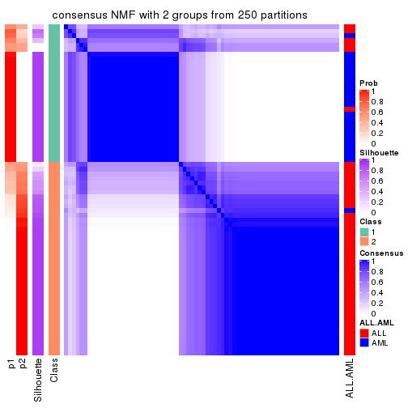</p>

</div>
<div id='tab-MAD-NMF-consensus-heatmap-2'>
<pre><code class="r">consensus_heatmap(res, k = 3)
</code></pre>

<p>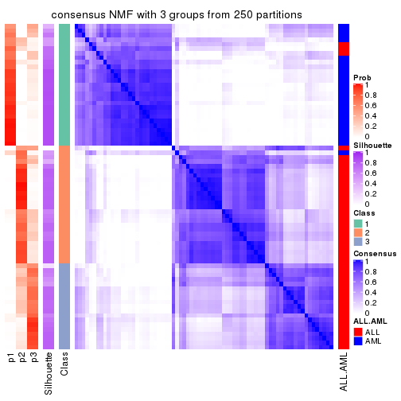</p>

</div>
<div id='tab-MAD-NMF-consensus-heatmap-3'>
<pre><code class="r">consensus_heatmap(res, k = 4)
</code></pre>

<p>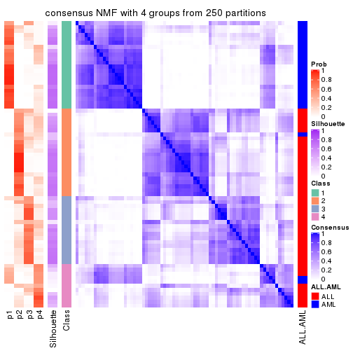</p>

</div>
<div id='tab-MAD-NMF-consensus-heatmap-4'>
<pre><code class="r">consensus_heatmap(res, k = 5)
</code></pre>

<p>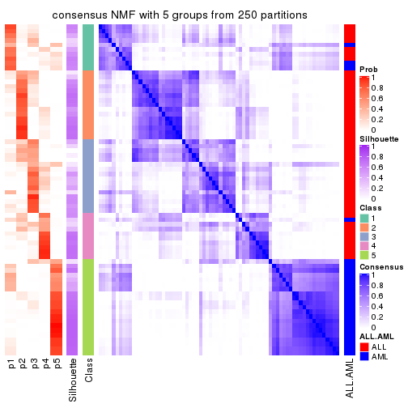</p>

</div>
<div id='tab-MAD-NMF-consensus-heatmap-5'>
<pre><code class="r">consensus_heatmap(res, k = 6)
</code></pre>

<p>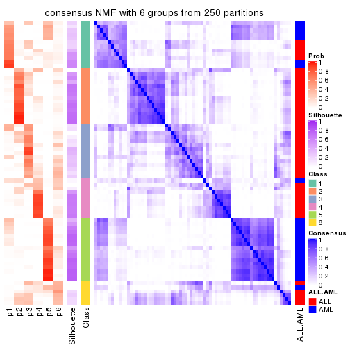</p>

</div>
</div>

Heatmaps for the membership of samples in all partitions to see how consistent they are:


<script>
$( function() {
	$( '#tabs-MAD-NMF-membership-heatmap' ).tabs();
} );
</script>
<div id='tabs-MAD-NMF-membership-heatmap'>
<ul>
<li><a href='#tab-MAD-NMF-membership-heatmap-1'>k = 2</a></li>
<li><a href='#tab-MAD-NMF-membership-heatmap-2'>k = 3</a></li>
<li><a href='#tab-MAD-NMF-membership-heatmap-3'>k = 4</a></li>
<li><a href='#tab-MAD-NMF-membership-heatmap-4'>k = 5</a></li>
<li><a href='#tab-MAD-NMF-membership-heatmap-5'>k = 6</a></li>
</ul>
<div id='tab-MAD-NMF-membership-heatmap-1'>
<pre><code class="r">membership_heatmap(res, k = 2)
</code></pre>

<p>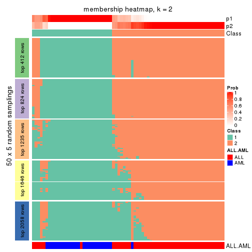</p>

</div>
<div id='tab-MAD-NMF-membership-heatmap-2'>
<pre><code class="r">membership_heatmap(res, k = 3)
</code></pre>

<p>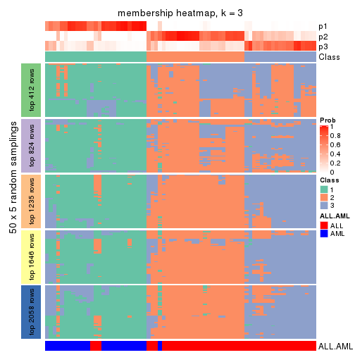</p>

</div>
<div id='tab-MAD-NMF-membership-heatmap-3'>
<pre><code class="r">membership_heatmap(res, k = 4)
</code></pre>

<p>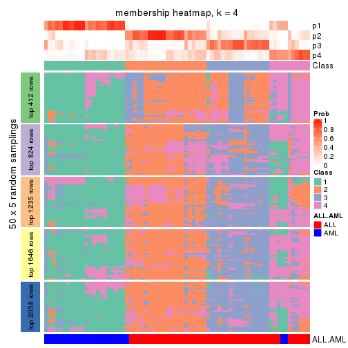</p>

</div>
<div id='tab-MAD-NMF-membership-heatmap-4'>
<pre><code class="r">membership_heatmap(res, k = 5)
</code></pre>

<p>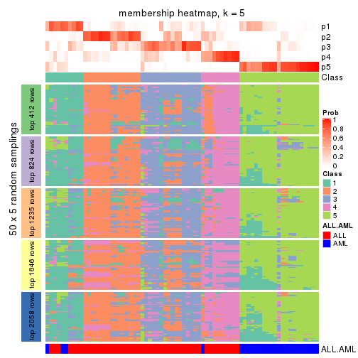</p>

</div>
<div id='tab-MAD-NMF-membership-heatmap-5'>
<pre><code class="r">membership_heatmap(res, k = 6)
</code></pre>

<p>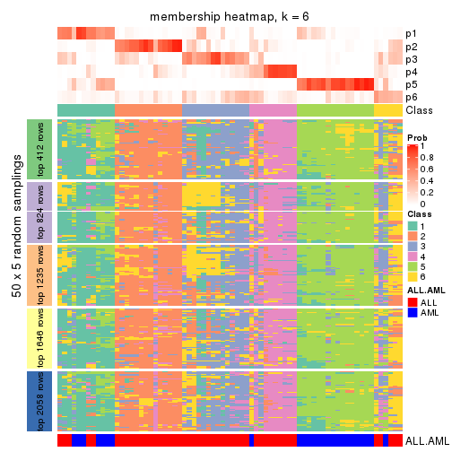</p>

</div>
</div>

As soon as we have had the classes for columns, we can look for signatures
which are significantly different between classes which can be candidate marks
for certain classes. Following are the heatmaps for signatures.


Signature heatmaps where rows are scaled:


<script>
$( function() {
	$( '#tabs-MAD-NMF-get-signatures' ).tabs();
} );
</script>
<div id='tabs-MAD-NMF-get-signatures'>
<ul>
<li><a href='#tab-MAD-NMF-get-signatures-1'>k = 2</a></li>
<li><a href='#tab-MAD-NMF-get-signatures-2'>k = 3</a></li>
<li><a href='#tab-MAD-NMF-get-signatures-3'>k = 4</a></li>
<li><a href='#tab-MAD-NMF-get-signatures-4'>k = 5</a></li>
<li><a href='#tab-MAD-NMF-get-signatures-5'>k = 6</a></li>
</ul>
<div id='tab-MAD-NMF-get-signatures-1'>
<pre><code class="r">get_signatures(res, k = 2)
</code></pre>

<p>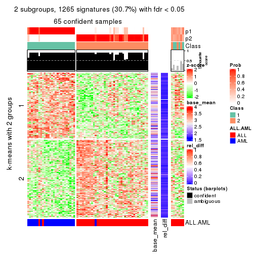</p>

</div>
<div id='tab-MAD-NMF-get-signatures-2'>
<pre><code class="r">get_signatures(res, k = 3)
</code></pre>

<p>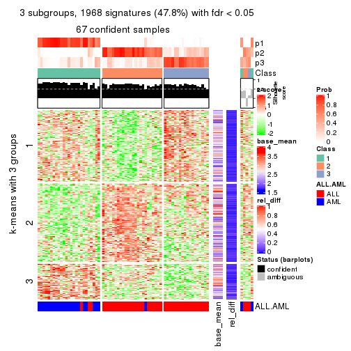</p>

</div>
<div id='tab-MAD-NMF-get-signatures-3'>
<pre><code class="r">get_signatures(res, k = 4)
</code></pre>

<p>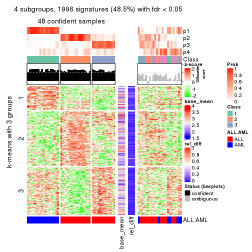</p>

</div>
<div id='tab-MAD-NMF-get-signatures-4'>
<pre><code class="r">get_signatures(res, k = 5)
</code></pre>

<p>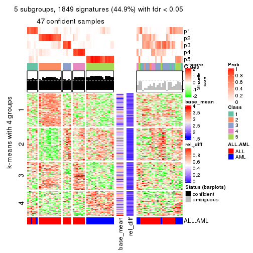</p>

</div>
<div id='tab-MAD-NMF-get-signatures-5'>
<pre><code class="r">get_signatures(res, k = 6)
</code></pre>

<p>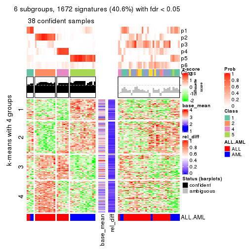</p>

</div>
</div>


Signature heatmaps where rows are not scaled:


<script>
$( function() {
	$( '#tabs-MAD-NMF-get-signatures-no-scale' ).tabs();
} );
</script>
<div id='tabs-MAD-NMF-get-signatures-no-scale'>
<ul>
<li><a href='#tab-MAD-NMF-get-signatures-no-scale-1'>k = 2</a></li>
<li><a href='#tab-MAD-NMF-get-signatures-no-scale-2'>k = 3</a></li>
<li><a href='#tab-MAD-NMF-get-signatures-no-scale-3'>k = 4</a></li>
<li><a href='#tab-MAD-NMF-get-signatures-no-scale-4'>k = 5</a></li>
<li><a href='#tab-MAD-NMF-get-signatures-no-scale-5'>k = 6</a></li>
</ul>
<div id='tab-MAD-NMF-get-signatures-no-scale-1'>
<pre><code class="r">get_signatures(res, k = 2, scale_rows = FALSE)
</code></pre>

<p>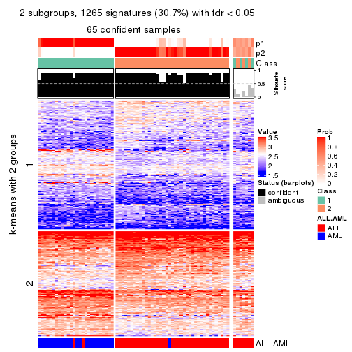</p>

</div>
<div id='tab-MAD-NMF-get-signatures-no-scale-2'>
<pre><code class="r">get_signatures(res, k = 3, scale_rows = FALSE)
</code></pre>

<p>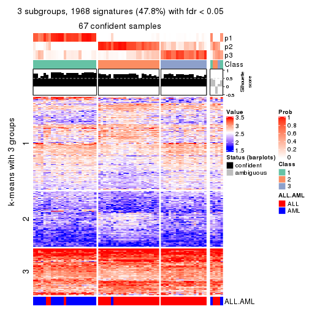</p>

</div>
<div id='tab-MAD-NMF-get-signatures-no-scale-3'>
<pre><code class="r">get_signatures(res, k = 4, scale_rows = FALSE)
</code></pre>

<p>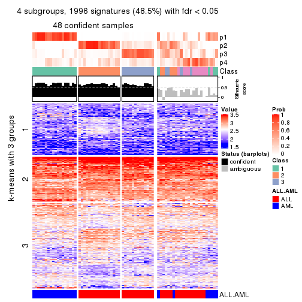</p>

</div>
<div id='tab-MAD-NMF-get-signatures-no-scale-4'>
<pre><code class="r">get_signatures(res, k = 5, scale_rows = FALSE)
</code></pre>

<p>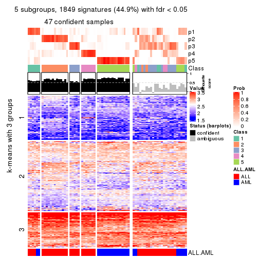</p>

</div>
<div id='tab-MAD-NMF-get-signatures-no-scale-5'>
<pre><code class="r">get_signatures(res, k = 6, scale_rows = FALSE)
</code></pre>

<p>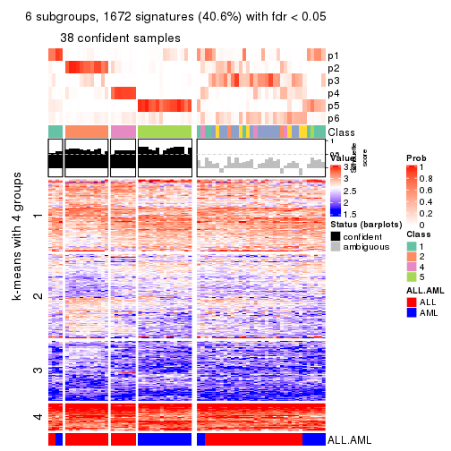</p>

</div>
</div>


Compare the overlap of signatures from different k:

```r
compare_signatures(res)
```

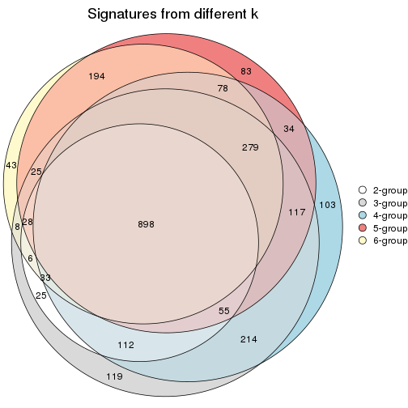

`get_signature()` returns a data frame invisibly. TO get the list of signatures, the function
call should be assigned to a variable explicitly. In following code, if `plot` argument is set
to `FALSE`, no heatmap is plotted while only the differential analysis is performed.

```r
# code only for demonstration
tb = get_signature(res, k = ..., plot = FALSE)
```

An example of the output of `tb` is:

```
#>   which_row         fdr    mean_1    mean_2 scaled_mean_1 scaled_mean_2 km
#> 1        38 0.042760348  8.373488  9.131774    -0.5533452     0.5164555  1
#> 2        40 0.018707592  7.106213  8.469186    -0.6173731     0.5762149  1
#> 3        55 0.019134737 10.221463 11.207825    -0.6159697     0.5749050  1
#> 4        59 0.006059896  5.921854  7.869574    -0.6899429     0.6439467  1
#> 5        60 0.018055526  8.928898 10.211722    -0.6204761     0.5791110  1
#> 6        98 0.009384629 15.714769 14.887706     0.6635654    -0.6193277  2
...
```

The columns in `tb` are:

1. `which_row`: row indices corresponding to the input matrix.
2. `fdr`: FDR for the differential test. 
3. `mean_x`: The mean value in group x.
4. `scaled_mean_x`: The mean value in group x after rows are scaled.
5. `km`: Row groups if k-means clustering is applied to rows.


UMAP plot which shows how samples are separated.


<script>
$( function() {
	$( '#tabs-MAD-NMF-dimension-reduction' ).tabs();
} );
</script>
<div id='tabs-MAD-NMF-dimension-reduction'>
<ul>
<li><a href='#tab-MAD-NMF-dimension-reduction-1'>k = 2</a></li>
<li><a href='#tab-MAD-NMF-dimension-reduction-2'>k = 3</a></li>
<li><a href='#tab-MAD-NMF-dimension-reduction-3'>k = 4</a></li>
<li><a href='#tab-MAD-NMF-dimension-reduction-4'>k = 5</a></li>
<li><a href='#tab-MAD-NMF-dimension-reduction-5'>k = 6</a></li>
</ul>
<div id='tab-MAD-NMF-dimension-reduction-1'>
<pre><code class="r">dimension_reduction(res, k = 2, method = &quot;UMAP&quot;)
</code></pre>

<p>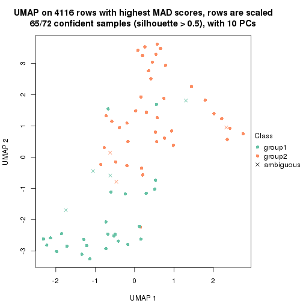</p>

</div>
<div id='tab-MAD-NMF-dimension-reduction-2'>
<pre><code class="r">dimension_reduction(res, k = 3, method = &quot;UMAP&quot;)
</code></pre>

<p>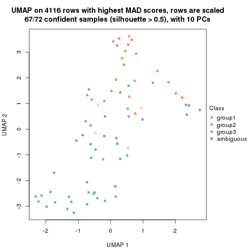</p>

</div>
<div id='tab-MAD-NMF-dimension-reduction-3'>
<pre><code class="r">dimension_reduction(res, k = 4, method = &quot;UMAP&quot;)
</code></pre>

<p>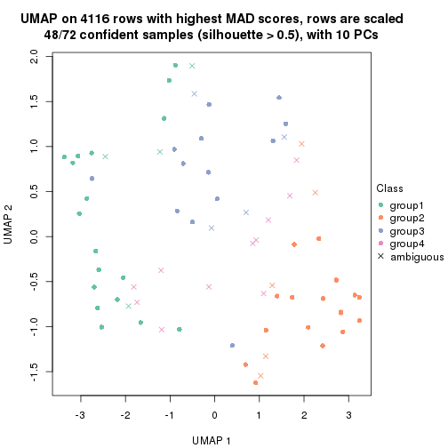</p>

</div>
<div id='tab-MAD-NMF-dimension-reduction-4'>
<pre><code class="r">dimension_reduction(res, k = 5, method = &quot;UMAP&quot;)
</code></pre>

<p>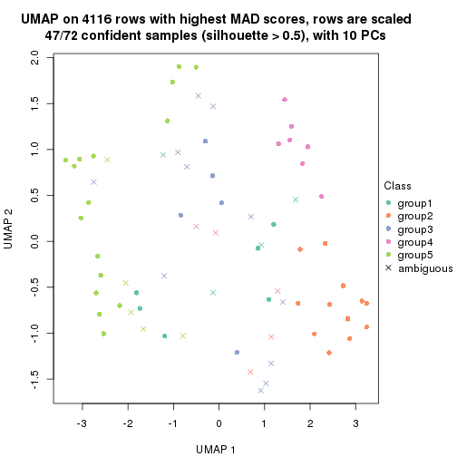</p>

</div>
<div id='tab-MAD-NMF-dimension-reduction-5'>
<pre><code class="r">dimension_reduction(res, k = 6, method = &quot;UMAP&quot;)
</code></pre>

<p>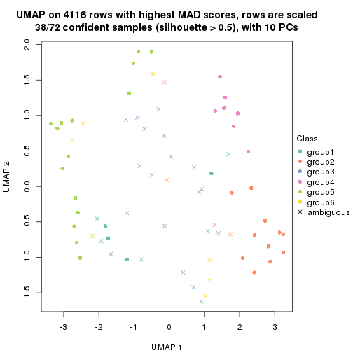</p>

</div>
</div>


Following heatmap shows how subgroups are split when increasing `k`:

```r
collect_classes(res)
```

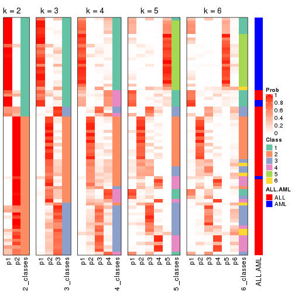


Test correlation between subgroups and known annotations. If the known
annotation is numeric, one-way ANOVA test is applied, and if the known
annotation is discrete, chi-squared contingency table test is applied.

```r
test_to_known_factors(res)
```

```
#>          n ALL.AML(p) k
#> MAD:NMF 65   2.13e-12 2
#> MAD:NMF 67   8.26e-12 3
#> MAD:NMF 48   3.78e-11 4
#> MAD:NMF 47   2.27e-08 5
#> MAD:NMF 38   2.02e-07 6
```


If matrix rows can be associated to genes, consider to use `functional_enrichment(res,
...)` to perform function enrichment for the signature genes. See [this vignette](http://bioconductor.org/packages/devel/bioc/vignettes/cola/inst/doc/functional_enrichment.html) for more detailed explanations.


 

---------------------------------------------------


### ATC:hclust


The object with results only for a single top-value method and a single partition method 
can be extracted as:

```r
res = res_list["ATC", "hclust"]
# you can also extract it by
# res = res_list["ATC:hclust"]
```

A summary of `res` and all the functions that can be applied to it:

```r
res
```

```
#> A 'ConsensusPartition' object with k = 2, 3, 4, 5, 6.
#>   On a matrix with 4116 rows and 72 columns.
#>   Top rows (412, 824, 1235, 1646, 2058) are extracted by 'ATC' method.
#>   Subgroups are detected by 'hclust' method.
#>   Performed in total 1250 partitions by row resampling.
#>   Best k for subgroups seems to be 2.
#> 
#> Following methods can be applied to this 'ConsensusPartition' object:
#>  [1] "cola_report"             "collect_classes"         "collect_plots"          
#>  [4] "collect_stats"           "colnames"                "compare_signatures"     
#>  [7] "consensus_heatmap"       "dimension_reduction"     "functional_enrichment"  
#> [10] "get_anno_col"            "get_anno"                "get_classes"            
#> [13] "get_consensus"           "get_matrix"              "get_membership"         
#> [16] "get_param"               "get_signatures"          "get_stats"              
#> [19] "is_best_k"               "is_stable_k"             "membership_heatmap"     
#> [22] "ncol"                    "nrow"                    "plot_ecdf"              
#> [25] "rownames"                "select_partition_number" "show"                   
#> [28] "suggest_best_k"          "test_to_known_factors"
```

`collect_plots()` function collects all the plots made from `res` for all `k` (number of partitions)
into one single page to provide an easy and fast comparison between different `k`.

```r
collect_plots(res)
```

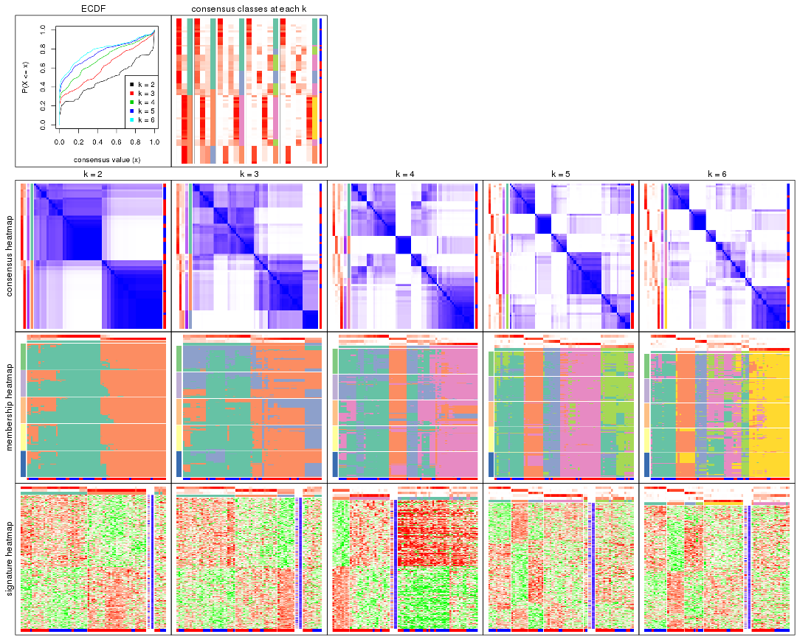

The plots are:

- The first row: a plot of the ECDF (empirical cumulative distribution
  function) curves of the consensus matrix for each `k` and the heatmap of
  predicted classes for each `k`.
- The second row: heatmaps of the consensus matrix for each `k`.
- The third row: heatmaps of the membership matrix for each `k`.
- The fouth row: heatmaps of the signatures for each `k`.

All the plots in panels can be made by individual functions and they are
plotted later in this section.

`select_partition_number()` produces several plots showing different
statistics for choosing "optimized" `k`. There are following statistics:

- ECDF curves of the consensus matrix for each `k`;
- 1-PAC. [The PAC
  score](https://en.wikipedia.org/wiki/Consensus_clustering#Over-interpretation_potential_of_consensus_clustering)
  measures the proportion of the ambiguous subgrouping.
- Mean silhouette score.
- Concordance. The mean probability of fiting the consensus class ids in all
  partitions.
- Area increased. Denote $A_k$ as the area under the ECDF curve for current
  `k`, the area increased is defined as $A_k - A_{k-1}$.
- Rand index. The percent of pairs of samples that are both in a same cluster
  or both are not in a same cluster in the partition of k and k-1.
- Jaccard index. The ratio of pairs of samples are both in a same cluster in
  the partition of k and k-1 and the pairs of samples are both in a same
  cluster in the partition k or k-1.

The detailed explanations of these statistics can be found in [the _cola_
vignette](http://bioconductor.org/packages/devel/bioc/vignettes/cola/inst/doc/cola.html#toc_13).

Generally speaking, lower PAC score, higher mean silhouette score or higher
concordance corresponds to better partition. Rand index and Jaccard index
measure how similar the current partition is compared to partition with `k-1`.
If they are too similar, we won't accept `k` is better than `k-1`.

```r
select_partition_number(res)
```

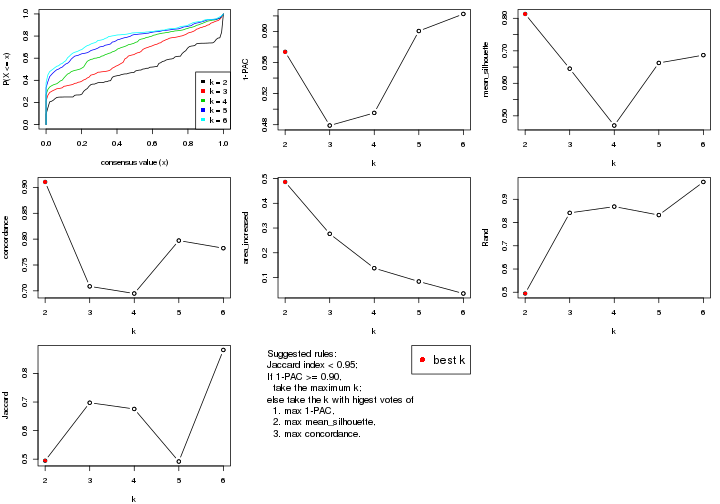

The numeric values for all these statistics can be obtained by `get_stats()`.

```r
get_stats(res)
```

```
#>   k 1-PAC mean_silhouette concordance area_increased  Rand Jaccard
#> 2 2 0.574           0.813       0.911         0.4864 0.495   0.495
#> 3 3 0.479           0.645       0.709         0.2767 0.842   0.698
#> 4 4 0.495           0.470       0.695         0.1376 0.869   0.676
#> 5 5 0.601           0.663       0.797         0.0839 0.832   0.492
#> 6 6 0.622           0.687       0.782         0.0352 0.975   0.882
```

`suggest_best_k()` suggests the best $k$ based on these statistics. The rules are as follows:

- All $k$ with Jaccard index larger than 0.95 are removed because increasing
  $k$ does not provide enough extra information. If all $k$ are removed, it is
  marked as no subgroup is detected.
- For all $k$ with 1-PAC score larger than 0.9, the maximal $k$ is taken as
  the best $k$, and other $k$ are marked as optional $k$.
- If it does not fit the second rule. The $k$ with the maximal vote of the
  highest 1-PAC score, highest mean silhouette, and highest concordance is
  taken as the best $k$.

```r
suggest_best_k(res)
```

```
#> [1] 2
```


Following shows the table of the partitions (You need to click the **show/hide
code output** link to see it). The membership matrix (columns with name `p*`)
is inferred by
[`clue::cl_consensus()`](https://www.rdocumentation.org/link/cl_consensus?package=clue)
function with the `SE` method. Basically the value in the membership matrix
represents the probability to belong to a certain group. The finall class
label for an item is determined with the group with highest probability it
belongs to.

In `get_classes()` function, the entropy is calculated from the membership
matrix and the silhouette score is calculated from the consensus matrix.


<script>
$( function() {
	$( '#tabs-ATC-hclust-get-classes' ).tabs();
} );
</script>
<div id='tabs-ATC-hclust-get-classes'>
<ul>
<li><a href='#tab-ATC-hclust-get-classes-1'>k = 2</a></li>
<li><a href='#tab-ATC-hclust-get-classes-2'>k = 3</a></li>
<li><a href='#tab-ATC-hclust-get-classes-3'>k = 4</a></li>
<li><a href='#tab-ATC-hclust-get-classes-4'>k = 5</a></li>
<li><a href='#tab-ATC-hclust-get-classes-5'>k = 6</a></li>
</ul>

<div id='tab-ATC-hclust-get-classes-1'>
<p><a id='tab-ATC-hclust-get-classes-1-a' style='color:#0366d6' href='#'>show/hide code output</a></p>
<pre><code class="r">cbind(get_classes(res, k = 2), get_membership(res, k = 2))
</code></pre>

<pre><code>#&gt;           class entropy silhouette    p1    p2
#&gt; sample_39     1  0.0000      0.856 1.000 0.000
#&gt; sample_40     1  0.0376      0.855 0.996 0.004
#&gt; sample_42     2  0.0672      0.939 0.008 0.992
#&gt; sample_47     2  0.0000      0.940 0.000 1.000
#&gt; sample_48     2  0.0000      0.940 0.000 1.000
#&gt; sample_49     1  0.0000      0.856 1.000 0.000
#&gt; sample_41     2  0.0000      0.940 0.000 1.000
#&gt; sample_43     2  0.0672      0.939 0.008 0.992
#&gt; sample_44     2  0.0000      0.940 0.000 1.000
#&gt; sample_45     2  0.0000      0.940 0.000 1.000
#&gt; sample_46     2  0.0672      0.939 0.008 0.992
#&gt; sample_70     2  0.1184      0.935 0.016 0.984
#&gt; sample_71     2  0.0938      0.937 0.012 0.988
#&gt; sample_72     2  0.0938      0.937 0.012 0.988
#&gt; sample_68     2  0.0000      0.940 0.000 1.000
#&gt; sample_69     2  0.0000      0.940 0.000 1.000
#&gt; sample_67     2  0.0938      0.937 0.012 0.988
#&gt; sample_55     1  0.9963      0.307 0.536 0.464
#&gt; sample_56     1  0.0000      0.856 1.000 0.000
#&gt; sample_59     2  0.7139      0.709 0.196 0.804
#&gt; sample_52     1  0.9491      0.540 0.632 0.368
#&gt; sample_53     1  0.0000      0.856 1.000 0.000
#&gt; sample_51     1  0.0000      0.856 1.000 0.000
#&gt; sample_50     1  0.0000      0.856 1.000 0.000
#&gt; sample_54     2  0.9129      0.420 0.328 0.672
#&gt; sample_57     1  1.0000      0.193 0.500 0.500
#&gt; sample_58     1  0.0000      0.856 1.000 0.000
#&gt; sample_60     2  0.9358      0.351 0.352 0.648
#&gt; sample_61     1  0.0000      0.856 1.000 0.000
#&gt; sample_65     1  0.2043      0.851 0.968 0.032
#&gt; sample_66     2  0.0000      0.940 0.000 1.000
#&gt; sample_63     1  0.9491      0.540 0.632 0.368
#&gt; sample_64     1  0.0000      0.856 1.000 0.000
#&gt; sample_62     1  0.9491      0.540 0.632 0.368
#&gt; sample_1      1  0.7815      0.748 0.768 0.232
#&gt; sample_2      2  0.0376      0.940 0.004 0.996
#&gt; sample_3      1  0.7950      0.739 0.760 0.240
#&gt; sample_4      1  0.7376      0.766 0.792 0.208
#&gt; sample_5      2  0.0000      0.940 0.000 1.000
#&gt; sample_6      1  0.7950      0.739 0.760 0.240
#&gt; sample_7      1  0.7376      0.766 0.792 0.208
#&gt; sample_8      1  0.0000      0.856 1.000 0.000
#&gt; sample_9      2  0.0376      0.940 0.004 0.996
#&gt; sample_10     1  0.9833      0.419 0.576 0.424
#&gt; sample_11     2  0.0376      0.940 0.004 0.996
#&gt; sample_12     1  0.7299      0.771 0.796 0.204
#&gt; sample_13     2  0.0000      0.940 0.000 1.000
#&gt; sample_14     2  0.0000      0.940 0.000 1.000
#&gt; sample_15     2  0.0000      0.940 0.000 1.000
#&gt; sample_16     2  0.2778      0.907 0.048 0.952
#&gt; sample_17     2  0.1184      0.934 0.016 0.984
#&gt; sample_18     2  0.9491      0.303 0.368 0.632
#&gt; sample_19     2  0.2778      0.907 0.048 0.952
#&gt; sample_20     2  0.0000      0.940 0.000 1.000
#&gt; sample_21     2  0.0000      0.940 0.000 1.000
#&gt; sample_22     1  0.0672      0.855 0.992 0.008
#&gt; sample_23     1  0.7950      0.739 0.760 0.240
#&gt; sample_24     2  0.0000      0.940 0.000 1.000
#&gt; sample_25     1  0.7528      0.763 0.784 0.216
#&gt; sample_26     2  0.6247      0.774 0.156 0.844
#&gt; sample_27     1  0.0000      0.856 1.000 0.000
#&gt; sample_34     1  0.0000      0.856 1.000 0.000
#&gt; sample_35     1  0.0000      0.856 1.000 0.000
#&gt; sample_36     1  0.6148      0.785 0.848 0.152
#&gt; sample_37     1  0.0000      0.856 1.000 0.000
#&gt; sample_38     1  0.0000      0.856 1.000 0.000
#&gt; sample_28     1  0.2948      0.844 0.948 0.052
#&gt; sample_29     2  0.0376      0.940 0.004 0.996
#&gt; sample_30     1  0.8555      0.680 0.720 0.280
#&gt; sample_31     1  0.1184      0.854 0.984 0.016
#&gt; sample_32     1  0.0938      0.855 0.988 0.012
#&gt; sample_33     1  0.0000      0.856 1.000 0.000
</code></pre>

<script>
$('#tab-ATC-hclust-get-classes-1-a').parent().next().next().hide();
$('#tab-ATC-hclust-get-classes-1-a').click(function(){
  $('#tab-ATC-hclust-get-classes-1-a').parent().next().next().toggle();
  return(false);
});
</script>
</div>

<div id='tab-ATC-hclust-get-classes-2'>
<p><a id='tab-ATC-hclust-get-classes-2-a' style='color:#0366d6' href='#'>show/hide code output</a></p>
<pre><code class="r">cbind(get_classes(res, k = 3), get_membership(res, k = 3))
</code></pre>

<pre><code>#&gt;           class entropy silhouette    p1    p2    p3
#&gt; sample_39     1  0.4842     0.7072 0.776 0.000 0.224
#&gt; sample_40     1  0.4784     0.7476 0.796 0.004 0.200
#&gt; sample_42     2  0.0237     0.7097 0.004 0.996 0.000
#&gt; sample_47     2  0.3482     0.4739 0.000 0.872 0.128
#&gt; sample_48     3  0.6260     0.9974 0.000 0.448 0.552
#&gt; sample_49     1  0.4750     0.6977 0.784 0.000 0.216
#&gt; sample_41     3  0.6267     0.9907 0.000 0.452 0.548
#&gt; sample_43     2  0.0475     0.7109 0.004 0.992 0.004
#&gt; sample_44     2  0.2711     0.5752 0.000 0.912 0.088
#&gt; sample_45     2  0.2711     0.5752 0.000 0.912 0.088
#&gt; sample_46     2  0.0475     0.7109 0.004 0.992 0.004
#&gt; sample_70     2  0.0829     0.7112 0.004 0.984 0.012
#&gt; sample_71     2  0.0661     0.7105 0.004 0.988 0.008
#&gt; sample_72     2  0.0661     0.7105 0.004 0.988 0.008
#&gt; sample_68     3  0.6260     0.9974 0.000 0.448 0.552
#&gt; sample_69     3  0.6260     0.9974 0.000 0.448 0.552
#&gt; sample_67     2  0.0661     0.7105 0.004 0.988 0.008
#&gt; sample_55     2  0.9615     0.0641 0.324 0.456 0.220
#&gt; sample_56     1  0.4842     0.7031 0.776 0.000 0.224
#&gt; sample_59     2  0.5696     0.6059 0.056 0.796 0.148
#&gt; sample_52     1  0.9483     0.2474 0.448 0.364 0.188
#&gt; sample_53     1  0.0424     0.7618 0.992 0.000 0.008
#&gt; sample_51     1  0.0424     0.7622 0.992 0.000 0.008
#&gt; sample_50     1  0.0424     0.7622 0.992 0.000 0.008
#&gt; sample_54     2  0.7917     0.5188 0.152 0.664 0.184
#&gt; sample_57     2  0.9442     0.1696 0.288 0.496 0.216
#&gt; sample_58     1  0.4605     0.6998 0.796 0.000 0.204
#&gt; sample_60     2  0.8216     0.5008 0.172 0.640 0.188
#&gt; sample_61     1  0.2448     0.7591 0.924 0.000 0.076
#&gt; sample_65     1  0.3832     0.7494 0.888 0.036 0.076
#&gt; sample_66     2  0.0892     0.6922 0.000 0.980 0.020
#&gt; sample_63     1  0.9451     0.2544 0.452 0.364 0.184
#&gt; sample_64     1  0.4178     0.7159 0.828 0.000 0.172
#&gt; sample_62     1  0.9451     0.2544 0.452 0.364 0.184
#&gt; sample_1      1  0.9086     0.5342 0.552 0.228 0.220
#&gt; sample_2      2  0.0592     0.7004 0.000 0.988 0.012
#&gt; sample_3      1  0.9081     0.5173 0.552 0.236 0.212
#&gt; sample_4      1  0.8876     0.5634 0.576 0.204 0.220
#&gt; sample_5      3  0.6260     0.9974 0.000 0.448 0.552
#&gt; sample_6      1  0.9081     0.5173 0.552 0.236 0.212
#&gt; sample_7      1  0.8876     0.5634 0.576 0.204 0.220
#&gt; sample_8      1  0.4555     0.7074 0.800 0.000 0.200
#&gt; sample_9      2  0.0592     0.7004 0.000 0.988 0.012
#&gt; sample_10     2  0.9491    -0.1617 0.396 0.420 0.184
#&gt; sample_11     2  0.0592     0.7004 0.000 0.988 0.012
#&gt; sample_12     1  0.8568     0.5810 0.608 0.200 0.192
#&gt; sample_13     3  0.6260     0.9974 0.000 0.448 0.552
#&gt; sample_14     2  0.1860     0.6466 0.000 0.948 0.052
#&gt; sample_15     3  0.6260     0.9974 0.000 0.448 0.552
#&gt; sample_16     2  0.2550     0.6949 0.012 0.932 0.056
#&gt; sample_17     2  0.1315     0.7104 0.008 0.972 0.020
#&gt; sample_18     2  0.8399     0.4741 0.188 0.624 0.188
#&gt; sample_19     2  0.2550     0.6949 0.012 0.932 0.056
#&gt; sample_20     3  0.6260     0.9974 0.000 0.448 0.552
#&gt; sample_21     3  0.6244     0.9862 0.000 0.440 0.560
#&gt; sample_22     1  0.1170     0.7631 0.976 0.008 0.016
#&gt; sample_23     1  0.9081     0.5173 0.552 0.236 0.212
#&gt; sample_24     2  0.6095    -0.6202 0.000 0.608 0.392
#&gt; sample_25     1  0.8643     0.5714 0.600 0.212 0.188
#&gt; sample_26     2  0.4964     0.6329 0.048 0.836 0.116
#&gt; sample_27     1  0.4750     0.6977 0.784 0.000 0.216
#&gt; sample_34     1  0.4110     0.7527 0.844 0.004 0.152
#&gt; sample_35     1  0.4121     0.7213 0.832 0.000 0.168
#&gt; sample_36     1  0.6431     0.6595 0.760 0.156 0.084
#&gt; sample_37     1  0.0237     0.7620 0.996 0.000 0.004
#&gt; sample_38     1  0.0424     0.7618 0.992 0.000 0.008
#&gt; sample_28     1  0.4689     0.7314 0.852 0.052 0.096
#&gt; sample_29     2  0.0424     0.7027 0.000 0.992 0.008
#&gt; sample_30     1  0.9042     0.4503 0.544 0.280 0.176
#&gt; sample_31     1  0.3325     0.7528 0.904 0.020 0.076
#&gt; sample_32     1  0.2703     0.7570 0.928 0.016 0.056
#&gt; sample_33     1  0.1643     0.7581 0.956 0.000 0.044
</code></pre>

<script>
$('#tab-ATC-hclust-get-classes-2-a').parent().next().next().hide();
$('#tab-ATC-hclust-get-classes-2-a').click(function(){
  $('#tab-ATC-hclust-get-classes-2-a').parent().next().next().toggle();
  return(false);
});
</script>
</div>

<div id='tab-ATC-hclust-get-classes-3'>
<p><a id='tab-ATC-hclust-get-classes-3-a' style='color:#0366d6' href='#'>show/hide code output</a></p>
<pre><code class="r">cbind(get_classes(res, k = 4), get_membership(res, k = 4))
</code></pre>

<pre><code>#&gt;           class entropy silhouette    p1    p2    p3    p4
#&gt; sample_39     3  0.6253     0.2380 0.372 0.064 0.564 0.000
#&gt; sample_40     1  0.6143     0.0361 0.496 0.048 0.456 0.000
#&gt; sample_42     4  0.0000     0.8201 0.000 0.000 0.000 1.000
#&gt; sample_47     4  0.3528     0.6400 0.000 0.192 0.000 0.808
#&gt; sample_48     2  0.3764     0.9796 0.000 0.784 0.000 0.216
#&gt; sample_49     3  0.6398     0.2664 0.344 0.080 0.576 0.000
#&gt; sample_41     2  0.3873     0.9646 0.000 0.772 0.000 0.228
#&gt; sample_43     4  0.0188     0.8206 0.000 0.000 0.004 0.996
#&gt; sample_44     4  0.3172     0.6935 0.000 0.160 0.000 0.840
#&gt; sample_45     4  0.3123     0.6987 0.000 0.156 0.000 0.844
#&gt; sample_46     4  0.0188     0.8206 0.000 0.000 0.004 0.996
#&gt; sample_70     4  0.0469     0.8206 0.000 0.000 0.012 0.988
#&gt; sample_71     4  0.0376     0.8208 0.000 0.004 0.004 0.992
#&gt; sample_72     4  0.0376     0.8208 0.000 0.004 0.004 0.992
#&gt; sample_68     2  0.3764     0.9796 0.000 0.784 0.000 0.216
#&gt; sample_69     2  0.3764     0.9796 0.000 0.784 0.000 0.216
#&gt; sample_67     4  0.0376     0.8208 0.000 0.004 0.004 0.992
#&gt; sample_55     3  0.8486    -0.0410 0.244 0.028 0.400 0.328
#&gt; sample_56     3  0.6324     0.2639 0.340 0.076 0.584 0.000
#&gt; sample_59     4  0.4476     0.6999 0.008 0.032 0.160 0.800
#&gt; sample_52     1  0.8453     0.1450 0.392 0.028 0.352 0.228
#&gt; sample_53     1  0.0188     0.4915 0.996 0.000 0.004 0.000
#&gt; sample_51     1  0.0188     0.4950 0.996 0.000 0.004 0.000
#&gt; sample_50     1  0.0188     0.4950 0.996 0.000 0.004 0.000
#&gt; sample_54     4  0.7414     0.3395 0.100 0.032 0.308 0.560
#&gt; sample_57     3  0.8391    -0.0318 0.212 0.028 0.400 0.360
#&gt; sample_58     3  0.6474     0.2241 0.388 0.076 0.536 0.000
#&gt; sample_60     4  0.7720     0.2566 0.120 0.032 0.328 0.520
#&gt; sample_61     1  0.3142     0.4112 0.860 0.008 0.132 0.000
#&gt; sample_65     1  0.3324     0.4898 0.852 0.000 0.136 0.012
#&gt; sample_66     4  0.1022     0.8099 0.000 0.032 0.000 0.968
#&gt; sample_63     1  0.8450     0.1489 0.396 0.028 0.348 0.228
#&gt; sample_64     1  0.6120    -0.1603 0.520 0.048 0.432 0.000
#&gt; sample_62     1  0.8450     0.1489 0.396 0.028 0.348 0.228
#&gt; sample_1      3  0.6926    -0.1876 0.400 0.004 0.500 0.096
#&gt; sample_2      4  0.0592     0.8168 0.000 0.016 0.000 0.984
#&gt; sample_3      1  0.6845     0.1598 0.452 0.000 0.448 0.100
#&gt; sample_4      3  0.6650    -0.2058 0.424 0.004 0.500 0.072
#&gt; sample_5      2  0.3764     0.9796 0.000 0.784 0.000 0.216
#&gt; sample_6      1  0.6845     0.1598 0.452 0.000 0.448 0.100
#&gt; sample_7      3  0.6650    -0.2058 0.424 0.004 0.500 0.072
#&gt; sample_8      3  0.6499     0.2206 0.400 0.076 0.524 0.000
#&gt; sample_9      4  0.0707     0.8160 0.000 0.020 0.000 0.980
#&gt; sample_10     3  0.8066    -0.0789 0.328 0.004 0.360 0.308
#&gt; sample_11     4  0.0592     0.8168 0.000 0.016 0.000 0.984
#&gt; sample_12     1  0.6592     0.2303 0.524 0.000 0.392 0.084
#&gt; sample_13     2  0.3764     0.9796 0.000 0.784 0.000 0.216
#&gt; sample_14     4  0.2281     0.7628 0.000 0.096 0.000 0.904
#&gt; sample_15     2  0.3764     0.9796 0.000 0.784 0.000 0.216
#&gt; sample_16     4  0.2984     0.7840 0.000 0.028 0.084 0.888
#&gt; sample_17     4  0.1543     0.8150 0.004 0.008 0.032 0.956
#&gt; sample_18     4  0.7816     0.2456 0.132 0.032 0.320 0.516
#&gt; sample_19     4  0.2984     0.7840 0.000 0.028 0.084 0.888
#&gt; sample_20     2  0.3764     0.9796 0.000 0.784 0.000 0.216
#&gt; sample_21     2  0.2530     0.8613 0.000 0.888 0.000 0.112
#&gt; sample_22     1  0.1339     0.4865 0.964 0.008 0.024 0.004
#&gt; sample_23     1  0.6845     0.1598 0.452 0.000 0.448 0.100
#&gt; sample_24     4  0.4989    -0.3169 0.000 0.472 0.000 0.528
#&gt; sample_25     1  0.6804     0.2236 0.520 0.000 0.376 0.104
#&gt; sample_26     4  0.4568     0.6773 0.024 0.004 0.200 0.772
#&gt; sample_27     3  0.6398     0.2664 0.344 0.080 0.576 0.000
#&gt; sample_34     1  0.5827     0.0495 0.568 0.036 0.396 0.000
#&gt; sample_35     1  0.6187    -0.1563 0.516 0.052 0.432 0.000
#&gt; sample_36     1  0.5912     0.3961 0.724 0.012 0.148 0.116
#&gt; sample_37     1  0.0000     0.4936 1.000 0.000 0.000 0.000
#&gt; sample_38     1  0.0188     0.4915 0.996 0.000 0.004 0.000
#&gt; sample_28     1  0.3743     0.4687 0.824 0.000 0.160 0.016
#&gt; sample_29     4  0.0469     0.8180 0.000 0.012 0.000 0.988
#&gt; sample_30     1  0.7822     0.2421 0.492 0.024 0.340 0.144
#&gt; sample_31     1  0.2814     0.4920 0.868 0.000 0.132 0.000
#&gt; sample_32     1  0.2281     0.4968 0.904 0.000 0.096 0.000
#&gt; sample_33     1  0.1716     0.4421 0.936 0.000 0.064 0.000
</code></pre>

<script>
$('#tab-ATC-hclust-get-classes-3-a').parent().next().next().hide();
$('#tab-ATC-hclust-get-classes-3-a').click(function(){
  $('#tab-ATC-hclust-get-classes-3-a').parent().next().next().toggle();
  return(false);
});
</script>
</div>

<div id='tab-ATC-hclust-get-classes-4'>
<p><a id='tab-ATC-hclust-get-classes-4-a' style='color:#0366d6' href='#'>show/hide code output</a></p>
<pre><code class="r">cbind(get_classes(res, k = 5), get_membership(res, k = 5))
</code></pre>

<pre><code>#&gt;           class entropy silhouette    p1    p2    p3    p4    p5
#&gt; sample_39     3  0.2519      0.764 0.100 0.000 0.884 0.000 0.016
#&gt; sample_40     3  0.6830      0.211 0.380 0.016 0.432 0.000 0.172
#&gt; sample_42     4  0.0000      0.896 0.000 0.000 0.000 1.000 0.000
#&gt; sample_47     4  0.3720      0.676 0.000 0.228 0.000 0.760 0.012
#&gt; sample_48     2  0.2377      0.929 0.000 0.872 0.000 0.128 0.000
#&gt; sample_49     3  0.1121      0.768 0.044 0.000 0.956 0.000 0.000
#&gt; sample_41     2  0.2561      0.915 0.000 0.856 0.000 0.144 0.000
#&gt; sample_43     4  0.0162      0.896 0.000 0.000 0.000 0.996 0.004
#&gt; sample_44     4  0.2852      0.766 0.000 0.172 0.000 0.828 0.000
#&gt; sample_45     4  0.2813      0.771 0.000 0.168 0.000 0.832 0.000
#&gt; sample_46     4  0.0162      0.896 0.000 0.000 0.000 0.996 0.004
#&gt; sample_70     4  0.0404      0.895 0.000 0.000 0.000 0.988 0.012
#&gt; sample_71     4  0.0451      0.897 0.000 0.004 0.000 0.988 0.008
#&gt; sample_72     4  0.0451      0.897 0.000 0.004 0.000 0.988 0.008
#&gt; sample_68     2  0.2377      0.929 0.000 0.872 0.000 0.128 0.000
#&gt; sample_69     2  0.2377      0.929 0.000 0.872 0.000 0.128 0.000
#&gt; sample_67     4  0.0324      0.897 0.000 0.004 0.000 0.992 0.004
#&gt; sample_55     5  0.4688      0.569 0.092 0.000 0.016 0.128 0.764
#&gt; sample_56     3  0.1444      0.766 0.040 0.000 0.948 0.000 0.012
#&gt; sample_59     4  0.3461      0.695 0.004 0.000 0.000 0.772 0.224
#&gt; sample_52     5  0.3424      0.454 0.240 0.000 0.000 0.000 0.760
#&gt; sample_53     1  0.0162      0.772 0.996 0.000 0.004 0.000 0.000
#&gt; sample_51     1  0.0566      0.774 0.984 0.000 0.004 0.000 0.012
#&gt; sample_50     1  0.0566      0.774 0.984 0.000 0.004 0.000 0.012
#&gt; sample_54     5  0.3707      0.423 0.000 0.000 0.000 0.284 0.716
#&gt; sample_57     5  0.3572      0.557 0.064 0.000 0.008 0.088 0.840
#&gt; sample_58     3  0.3182      0.739 0.124 0.000 0.844 0.000 0.032
#&gt; sample_60     5  0.3607      0.489 0.004 0.000 0.000 0.244 0.752
#&gt; sample_61     1  0.3812      0.599 0.772 0.000 0.204 0.000 0.024
#&gt; sample_65     1  0.3039      0.696 0.836 0.000 0.012 0.000 0.152
#&gt; sample_66     4  0.0880      0.888 0.000 0.032 0.000 0.968 0.000
#&gt; sample_63     5  0.3452      0.452 0.244 0.000 0.000 0.000 0.756
#&gt; sample_64     3  0.5790      0.511 0.392 0.012 0.532 0.000 0.064
#&gt; sample_62     5  0.3452      0.452 0.244 0.000 0.000 0.000 0.756
#&gt; sample_1      5  0.6847      0.459 0.300 0.004 0.136 0.032 0.528
#&gt; sample_2      4  0.0510      0.895 0.000 0.016 0.000 0.984 0.000
#&gt; sample_3      5  0.6086      0.448 0.364 0.000 0.072 0.024 0.540
#&gt; sample_4      5  0.6526      0.442 0.324 0.004 0.136 0.012 0.524
#&gt; sample_5      2  0.2377      0.929 0.000 0.872 0.000 0.128 0.000
#&gt; sample_6      5  0.6096      0.446 0.368 0.000 0.072 0.024 0.536
#&gt; sample_7      5  0.6526      0.442 0.324 0.004 0.136 0.012 0.524
#&gt; sample_8      3  0.3881      0.723 0.180 0.008 0.788 0.000 0.024
#&gt; sample_9      4  0.0609      0.895 0.000 0.020 0.000 0.980 0.000
#&gt; sample_10     5  0.7474      0.413 0.280 0.000 0.044 0.248 0.428
#&gt; sample_11     4  0.0510      0.895 0.000 0.016 0.000 0.984 0.000
#&gt; sample_12     5  0.5813      0.280 0.460 0.000 0.048 0.020 0.472
#&gt; sample_13     2  0.2377      0.929 0.000 0.872 0.000 0.128 0.000
#&gt; sample_14     4  0.2127      0.838 0.000 0.108 0.000 0.892 0.000
#&gt; sample_15     2  0.2377      0.929 0.000 0.872 0.000 0.128 0.000
#&gt; sample_16     4  0.3351      0.809 0.000 0.028 0.004 0.836 0.132
#&gt; sample_17     4  0.2136      0.859 0.000 0.008 0.000 0.904 0.088
#&gt; sample_18     5  0.4380      0.443 0.016 0.000 0.004 0.292 0.688
#&gt; sample_19     4  0.3351      0.809 0.000 0.028 0.004 0.836 0.132
#&gt; sample_20     2  0.2377      0.929 0.000 0.872 0.000 0.128 0.000
#&gt; sample_21     2  0.0510      0.787 0.000 0.984 0.000 0.016 0.000
#&gt; sample_22     1  0.1750      0.756 0.936 0.000 0.036 0.000 0.028
#&gt; sample_23     5  0.6096      0.446 0.368 0.000 0.072 0.024 0.536
#&gt; sample_24     2  0.4302      0.211 0.000 0.520 0.000 0.480 0.000
#&gt; sample_25     1  0.6155     -0.366 0.456 0.000 0.048 0.040 0.456
#&gt; sample_26     4  0.4230      0.586 0.008 0.000 0.008 0.704 0.280
#&gt; sample_27     3  0.1121      0.768 0.044 0.000 0.956 0.000 0.000
#&gt; sample_34     1  0.6040     -0.253 0.496 0.004 0.396 0.000 0.104
#&gt; sample_35     3  0.5696      0.508 0.400 0.012 0.532 0.000 0.056
#&gt; sample_36     1  0.4196      0.371 0.640 0.000 0.004 0.000 0.356
#&gt; sample_37     1  0.0451      0.773 0.988 0.000 0.004 0.000 0.008
#&gt; sample_38     1  0.0162      0.772 0.996 0.000 0.004 0.000 0.000
#&gt; sample_28     1  0.3282      0.610 0.804 0.000 0.008 0.000 0.188
#&gt; sample_29     4  0.0404      0.895 0.000 0.012 0.000 0.988 0.000
#&gt; sample_30     5  0.4074      0.309 0.364 0.000 0.000 0.000 0.636
#&gt; sample_31     1  0.2771      0.713 0.860 0.000 0.012 0.000 0.128
#&gt; sample_32     1  0.2248      0.742 0.900 0.000 0.012 0.000 0.088
#&gt; sample_33     1  0.1725      0.730 0.936 0.000 0.044 0.000 0.020
</code></pre>

<script>
$('#tab-ATC-hclust-get-classes-4-a').parent().next().next().hide();
$('#tab-ATC-hclust-get-classes-4-a').click(function(){
  $('#tab-ATC-hclust-get-classes-4-a').parent().next().next().toggle();
  return(false);
});
</script>
</div>

<div id='tab-ATC-hclust-get-classes-5'>
<p><a id='tab-ATC-hclust-get-classes-5-a' style='color:#0366d6' href='#'>show/hide code output</a></p>
<pre><code class="r">cbind(get_classes(res, k = 6), get_membership(res, k = 6))
</code></pre>

<pre><code>#&gt;           class entropy silhouette    p1    p2    p3    p4    p5    p6
#&gt; sample_39     3  0.2344      0.766 0.052 0.000 0.896 0.004 0.048 0.000
#&gt; sample_40     5  0.4754      0.508 0.108 0.000 0.180 0.012 0.700 0.000
#&gt; sample_42     6  0.0146      0.893 0.000 0.000 0.000 0.004 0.000 0.996
#&gt; sample_47     6  0.3431      0.683 0.000 0.228 0.000 0.016 0.000 0.756
#&gt; sample_48     2  0.1957      0.920 0.000 0.888 0.000 0.000 0.000 0.112
#&gt; sample_49     3  0.0000      0.834 0.000 0.000 1.000 0.000 0.000 0.000
#&gt; sample_41     2  0.2219      0.898 0.000 0.864 0.000 0.000 0.000 0.136
#&gt; sample_43     6  0.0458      0.892 0.000 0.000 0.000 0.016 0.000 0.984
#&gt; sample_44     6  0.2912      0.766 0.000 0.172 0.000 0.012 0.000 0.816
#&gt; sample_45     6  0.2877      0.772 0.000 0.168 0.000 0.012 0.000 0.820
#&gt; sample_46     6  0.0458      0.892 0.000 0.000 0.000 0.016 0.000 0.984
#&gt; sample_70     6  0.0692      0.892 0.000 0.000 0.000 0.020 0.004 0.976
#&gt; sample_71     6  0.0665      0.893 0.000 0.004 0.000 0.008 0.008 0.980
#&gt; sample_72     6  0.0665      0.893 0.000 0.004 0.000 0.008 0.008 0.980
#&gt; sample_68     2  0.1957      0.920 0.000 0.888 0.000 0.000 0.000 0.112
#&gt; sample_69     2  0.1957      0.920 0.000 0.888 0.000 0.000 0.000 0.112
#&gt; sample_67     6  0.0551      0.893 0.000 0.004 0.000 0.004 0.008 0.984
#&gt; sample_55     4  0.5478      0.490 0.068 0.000 0.004 0.680 0.144 0.104
#&gt; sample_56     3  0.0777      0.828 0.000 0.000 0.972 0.004 0.024 0.000
#&gt; sample_59     6  0.3445      0.678 0.000 0.000 0.000 0.244 0.012 0.744
#&gt; sample_52     4  0.3558      0.340 0.212 0.000 0.000 0.760 0.028 0.000
#&gt; sample_53     1  0.0405      0.842 0.988 0.000 0.000 0.004 0.008 0.000
#&gt; sample_51     1  0.0146      0.846 0.996 0.000 0.000 0.004 0.000 0.000
#&gt; sample_50     1  0.0146      0.846 0.996 0.000 0.000 0.004 0.000 0.000
#&gt; sample_54     4  0.3290      0.384 0.000 0.000 0.000 0.744 0.004 0.252
#&gt; sample_57     4  0.3724      0.450 0.056 0.000 0.000 0.820 0.052 0.072
#&gt; sample_58     3  0.3307      0.669 0.044 0.000 0.808 0.000 0.148 0.000
#&gt; sample_60     4  0.3163      0.407 0.004 0.000 0.000 0.780 0.004 0.212
#&gt; sample_61     1  0.4049      0.623 0.740 0.000 0.208 0.008 0.044 0.000
#&gt; sample_65     1  0.3346      0.774 0.816 0.000 0.008 0.140 0.036 0.000
#&gt; sample_66     6  0.0790      0.888 0.000 0.032 0.000 0.000 0.000 0.968
#&gt; sample_63     4  0.3586      0.337 0.216 0.000 0.000 0.756 0.028 0.000
#&gt; sample_64     5  0.5470      0.619 0.136 0.000 0.348 0.000 0.516 0.000
#&gt; sample_62     4  0.3586      0.337 0.216 0.000 0.000 0.756 0.028 0.000
#&gt; sample_1      4  0.7499      0.434 0.184 0.000 0.092 0.368 0.336 0.020
#&gt; sample_2      6  0.0603      0.893 0.000 0.016 0.000 0.004 0.000 0.980
#&gt; sample_3      4  0.6923      0.447 0.280 0.000 0.044 0.424 0.244 0.008
#&gt; sample_4      4  0.7149      0.436 0.208 0.000 0.092 0.356 0.344 0.000
#&gt; sample_5      2  0.1957      0.920 0.000 0.888 0.000 0.000 0.000 0.112
#&gt; sample_6      4  0.6920      0.445 0.284 0.000 0.044 0.424 0.240 0.008
#&gt; sample_7      4  0.7149      0.436 0.208 0.000 0.092 0.356 0.344 0.000
#&gt; sample_8      3  0.3766      0.544 0.040 0.000 0.748 0.000 0.212 0.000
#&gt; sample_9      6  0.0692      0.893 0.000 0.020 0.000 0.004 0.000 0.976
#&gt; sample_10     4  0.7951      0.412 0.232 0.000 0.036 0.380 0.128 0.224
#&gt; sample_11     6  0.0603      0.893 0.000 0.016 0.000 0.004 0.000 0.980
#&gt; sample_12     4  0.6578      0.267 0.396 0.000 0.040 0.412 0.144 0.008
#&gt; sample_13     2  0.1957      0.920 0.000 0.888 0.000 0.000 0.000 0.112
#&gt; sample_14     6  0.1910      0.839 0.000 0.108 0.000 0.000 0.000 0.892
#&gt; sample_15     2  0.1957      0.920 0.000 0.888 0.000 0.000 0.000 0.112
#&gt; sample_16     6  0.3435      0.804 0.000 0.028 0.000 0.128 0.024 0.820
#&gt; sample_17     6  0.2163      0.855 0.000 0.008 0.000 0.096 0.004 0.892
#&gt; sample_18     4  0.4708      0.409 0.016 0.000 0.000 0.672 0.056 0.256
#&gt; sample_19     6  0.3435      0.804 0.000 0.028 0.000 0.128 0.024 0.820
#&gt; sample_20     2  0.1957      0.920 0.000 0.888 0.000 0.000 0.000 0.112
#&gt; sample_21     2  0.0146      0.758 0.000 0.996 0.000 0.000 0.004 0.000
#&gt; sample_22     1  0.2401      0.795 0.900 0.000 0.028 0.024 0.048 0.000
#&gt; sample_23     4  0.6920      0.445 0.284 0.000 0.044 0.424 0.240 0.008
#&gt; sample_24     2  0.3860      0.205 0.000 0.528 0.000 0.000 0.000 0.472
#&gt; sample_25     4  0.6907      0.287 0.388 0.000 0.040 0.404 0.140 0.028
#&gt; sample_26     6  0.4351      0.589 0.008 0.000 0.000 0.256 0.044 0.692
#&gt; sample_27     3  0.0000      0.834 0.000 0.000 1.000 0.000 0.000 0.000
#&gt; sample_34     5  0.6810      0.538 0.312 0.000 0.244 0.048 0.396 0.000
#&gt; sample_35     5  0.5536      0.634 0.144 0.000 0.352 0.000 0.504 0.000
#&gt; sample_36     1  0.3992      0.412 0.624 0.000 0.000 0.364 0.012 0.000
#&gt; sample_37     1  0.0146      0.846 0.996 0.000 0.000 0.004 0.000 0.000
#&gt; sample_38     1  0.0405      0.842 0.988 0.000 0.000 0.004 0.008 0.000
#&gt; sample_28     1  0.3628      0.697 0.784 0.000 0.004 0.168 0.044 0.000
#&gt; sample_29     6  0.0363      0.894 0.000 0.012 0.000 0.000 0.000 0.988
#&gt; sample_30     4  0.4278      0.163 0.336 0.000 0.000 0.632 0.032 0.000
#&gt; sample_31     1  0.2949      0.797 0.848 0.000 0.008 0.116 0.028 0.000
#&gt; sample_32     1  0.2401      0.823 0.892 0.000 0.008 0.072 0.028 0.000
#&gt; sample_33     1  0.1644      0.802 0.932 0.000 0.040 0.000 0.028 0.000
</code></pre>

<script>
$('#tab-ATC-hclust-get-classes-5-a').parent().next().next().hide();
$('#tab-ATC-hclust-get-classes-5-a').click(function(){
  $('#tab-ATC-hclust-get-classes-5-a').parent().next().next().toggle();
  return(false);
});
</script>
</div>
</div>

Heatmaps for the consensus matrix. It visualizes the probability of two
samples to be in a same group.


<script>
$( function() {
	$( '#tabs-ATC-hclust-consensus-heatmap' ).tabs();
} );
</script>
<div id='tabs-ATC-hclust-consensus-heatmap'>
<ul>
<li><a href='#tab-ATC-hclust-consensus-heatmap-1'>k = 2</a></li>
<li><a href='#tab-ATC-hclust-consensus-heatmap-2'>k = 3</a></li>
<li><a href='#tab-ATC-hclust-consensus-heatmap-3'>k = 4</a></li>
<li><a href='#tab-ATC-hclust-consensus-heatmap-4'>k = 5</a></li>
<li><a href='#tab-ATC-hclust-consensus-heatmap-5'>k = 6</a></li>
</ul>
<div id='tab-ATC-hclust-consensus-heatmap-1'>
<pre><code class="r">consensus_heatmap(res, k = 2)
</code></pre>

<p>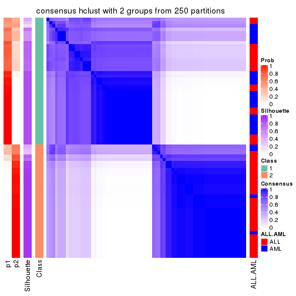</p>

</div>
<div id='tab-ATC-hclust-consensus-heatmap-2'>
<pre><code class="r">consensus_heatmap(res, k = 3)
</code></pre>

<p>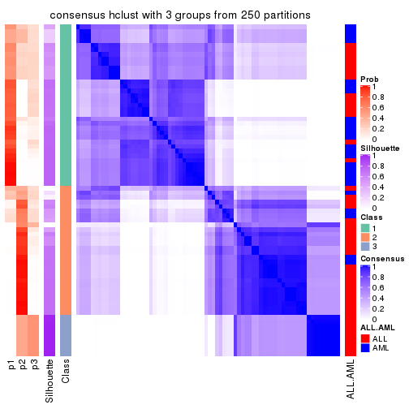</p>

</div>
<div id='tab-ATC-hclust-consensus-heatmap-3'>
<pre><code class="r">consensus_heatmap(res, k = 4)
</code></pre>

<p>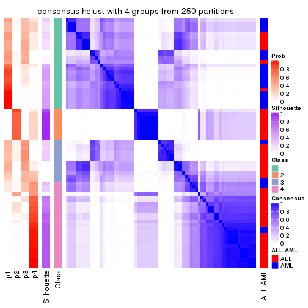</p>

</div>
<div id='tab-ATC-hclust-consensus-heatmap-4'>
<pre><code class="r">consensus_heatmap(res, k = 5)
</code></pre>

<p>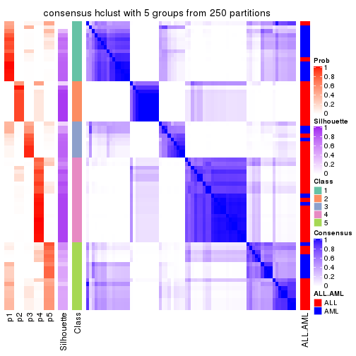</p>

</div>
<div id='tab-ATC-hclust-consensus-heatmap-5'>
<pre><code class="r">consensus_heatmap(res, k = 6)
</code></pre>

<p>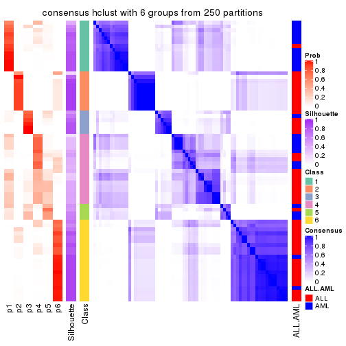</p>

</div>
</div>

Heatmaps for the membership of samples in all partitions to see how consistent they are:


<script>
$( function() {
	$( '#tabs-ATC-hclust-membership-heatmap' ).tabs();
} );
</script>
<div id='tabs-ATC-hclust-membership-heatmap'>
<ul>
<li><a href='#tab-ATC-hclust-membership-heatmap-1'>k = 2</a></li>
<li><a href='#tab-ATC-hclust-membership-heatmap-2'>k = 3</a></li>
<li><a href='#tab-ATC-hclust-membership-heatmap-3'>k = 4</a></li>
<li><a href='#tab-ATC-hclust-membership-heatmap-4'>k = 5</a></li>
<li><a href='#tab-ATC-hclust-membership-heatmap-5'>k = 6</a></li>
</ul>
<div id='tab-ATC-hclust-membership-heatmap-1'>
<pre><code class="r">membership_heatmap(res, k = 2)
</code></pre>

<p>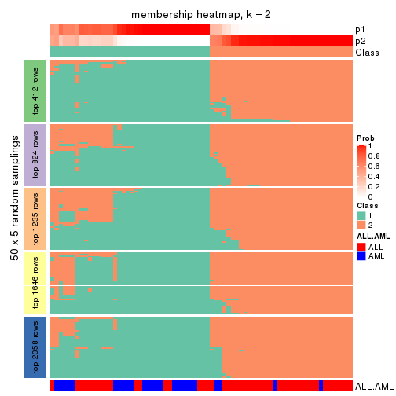</p>

</div>
<div id='tab-ATC-hclust-membership-heatmap-2'>
<pre><code class="r">membership_heatmap(res, k = 3)
</code></pre>

<p>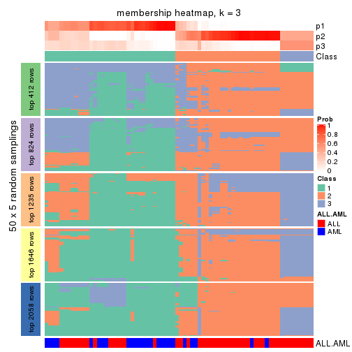</p>

</div>
<div id='tab-ATC-hclust-membership-heatmap-3'>
<pre><code class="r">membership_heatmap(res, k = 4)
</code></pre>

<p>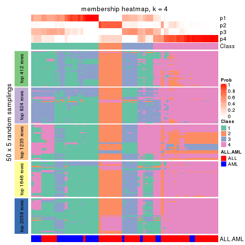</p>

</div>
<div id='tab-ATC-hclust-membership-heatmap-4'>
<pre><code class="r">membership_heatmap(res, k = 5)
</code></pre>

<p>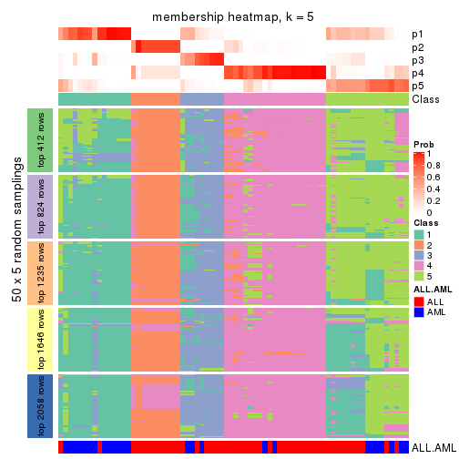</p>

</div>
<div id='tab-ATC-hclust-membership-heatmap-5'>
<pre><code class="r">membership_heatmap(res, k = 6)
</code></pre>

<p>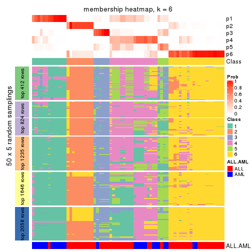</p>

</div>
</div>

As soon as we have had the classes for columns, we can look for signatures
which are significantly different between classes which can be candidate marks
for certain classes. Following are the heatmaps for signatures.


Signature heatmaps where rows are scaled:


<script>
$( function() {
	$( '#tabs-ATC-hclust-get-signatures' ).tabs();
} );
</script>
<div id='tabs-ATC-hclust-get-signatures'>
<ul>
<li><a href='#tab-ATC-hclust-get-signatures-1'>k = 2</a></li>
<li><a href='#tab-ATC-hclust-get-signatures-2'>k = 3</a></li>
<li><a href='#tab-ATC-hclust-get-signatures-3'>k = 4</a></li>
<li><a href='#tab-ATC-hclust-get-signatures-4'>k = 5</a></li>
<li><a href='#tab-ATC-hclust-get-signatures-5'>k = 6</a></li>
</ul>
<div id='tab-ATC-hclust-get-signatures-1'>
<pre><code class="r">get_signatures(res, k = 2)
</code></pre>

<p>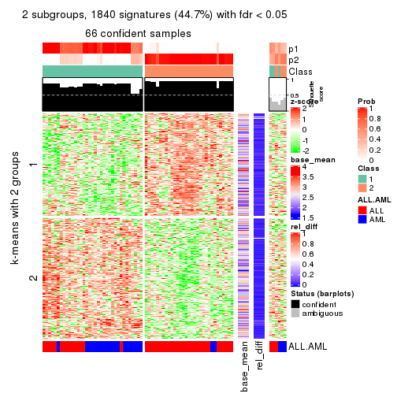</p>

</div>
<div id='tab-ATC-hclust-get-signatures-2'>
<pre><code class="r">get_signatures(res, k = 3)
</code></pre>

<p>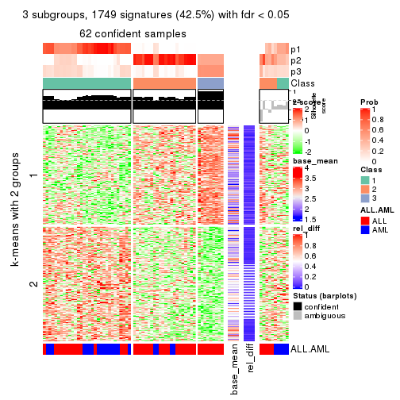</p>

</div>
<div id='tab-ATC-hclust-get-signatures-3'>
<pre><code class="r">get_signatures(res, k = 4)
</code></pre>

<p>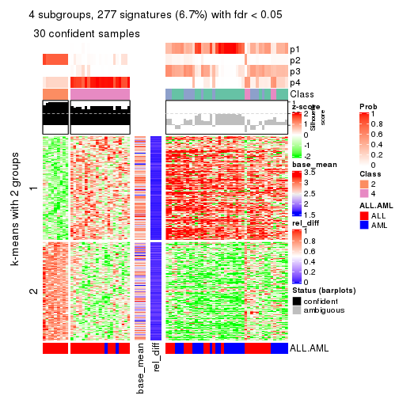</p>

</div>
<div id='tab-ATC-hclust-get-signatures-4'>
<pre><code class="r">get_signatures(res, k = 5)
</code></pre>

<p>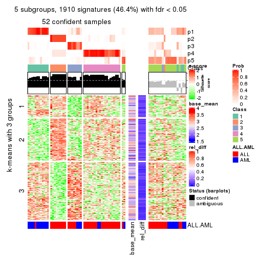</p>

</div>
<div id='tab-ATC-hclust-get-signatures-5'>
<pre><code class="r">get_signatures(res, k = 6)
</code></pre>

<p>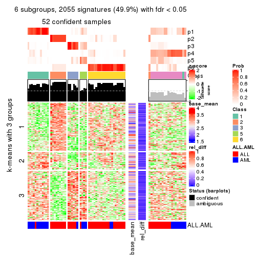</p>

</div>
</div>


Signature heatmaps where rows are not scaled:


<script>
$( function() {
	$( '#tabs-ATC-hclust-get-signatures-no-scale' ).tabs();
} );
</script>
<div id='tabs-ATC-hclust-get-signatures-no-scale'>
<ul>
<li><a href='#tab-ATC-hclust-get-signatures-no-scale-1'>k = 2</a></li>
<li><a href='#tab-ATC-hclust-get-signatures-no-scale-2'>k = 3</a></li>
<li><a href='#tab-ATC-hclust-get-signatures-no-scale-3'>k = 4</a></li>
<li><a href='#tab-ATC-hclust-get-signatures-no-scale-4'>k = 5</a></li>
<li><a href='#tab-ATC-hclust-get-signatures-no-scale-5'>k = 6</a></li>
</ul>
<div id='tab-ATC-hclust-get-signatures-no-scale-1'>
<pre><code class="r">get_signatures(res, k = 2, scale_rows = FALSE)
</code></pre>

<p>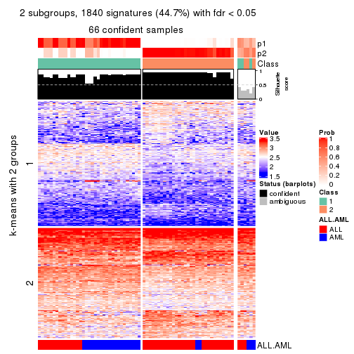</p>

</div>
<div id='tab-ATC-hclust-get-signatures-no-scale-2'>
<pre><code class="r">get_signatures(res, k = 3, scale_rows = FALSE)
</code></pre>

<p>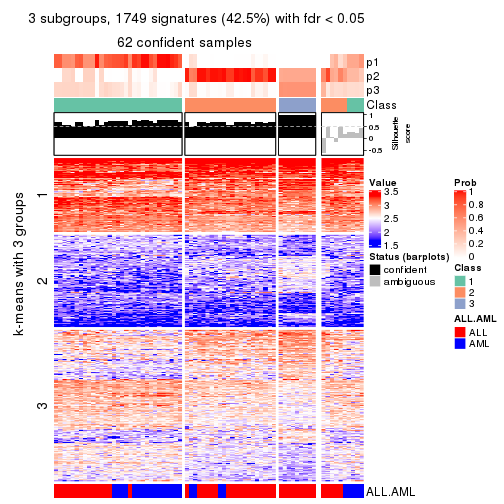</p>

</div>
<div id='tab-ATC-hclust-get-signatures-no-scale-3'>
<pre><code class="r">get_signatures(res, k = 4, scale_rows = FALSE)
</code></pre>

<p>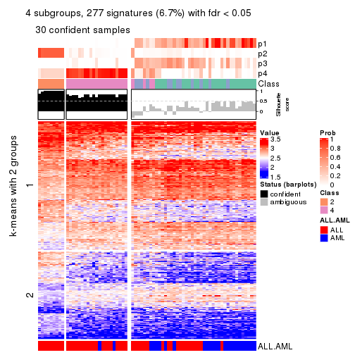</p>

</div>
<div id='tab-ATC-hclust-get-signatures-no-scale-4'>
<pre><code class="r">get_signatures(res, k = 5, scale_rows = FALSE)
</code></pre>

<p>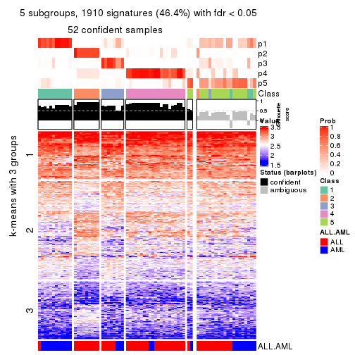</p>

</div>
<div id='tab-ATC-hclust-get-signatures-no-scale-5'>
<pre><code class="r">get_signatures(res, k = 6, scale_rows = FALSE)
</code></pre>

<p>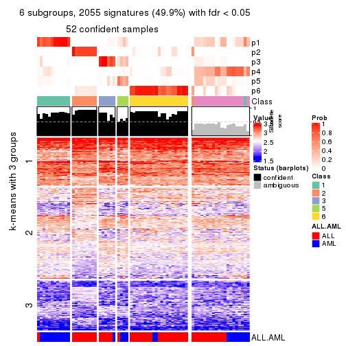</p>

</div>
</div>


Compare the overlap of signatures from different k:

```r
compare_signatures(res)
```

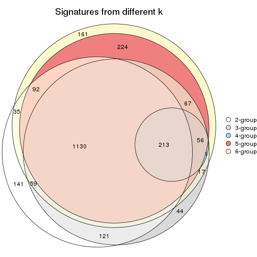

`get_signature()` returns a data frame invisibly. TO get the list of signatures, the function
call should be assigned to a variable explicitly. In following code, if `plot` argument is set
to `FALSE`, no heatmap is plotted while only the differential analysis is performed.

```r
# code only for demonstration
tb = get_signature(res, k = ..., plot = FALSE)
```

An example of the output of `tb` is:

```
#>   which_row         fdr    mean_1    mean_2 scaled_mean_1 scaled_mean_2 km
#> 1        38 0.042760348  8.373488  9.131774    -0.5533452     0.5164555  1
#> 2        40 0.018707592  7.106213  8.469186    -0.6173731     0.5762149  1
#> 3        55 0.019134737 10.221463 11.207825    -0.6159697     0.5749050  1
#> 4        59 0.006059896  5.921854  7.869574    -0.6899429     0.6439467  1
#> 5        60 0.018055526  8.928898 10.211722    -0.6204761     0.5791110  1
#> 6        98 0.009384629 15.714769 14.887706     0.6635654    -0.6193277  2
...
```

The columns in `tb` are:

1. `which_row`: row indices corresponding to the input matrix.
2. `fdr`: FDR for the differential test. 
3. `mean_x`: The mean value in group x.
4. `scaled_mean_x`: The mean value in group x after rows are scaled.
5. `km`: Row groups if k-means clustering is applied to rows.


UMAP plot which shows how samples are separated.


<script>
$( function() {
	$( '#tabs-ATC-hclust-dimension-reduction' ).tabs();
} );
</script>
<div id='tabs-ATC-hclust-dimension-reduction'>
<ul>
<li><a href='#tab-ATC-hclust-dimension-reduction-1'>k = 2</a></li>
<li><a href='#tab-ATC-hclust-dimension-reduction-2'>k = 3</a></li>
<li><a href='#tab-ATC-hclust-dimension-reduction-3'>k = 4</a></li>
<li><a href='#tab-ATC-hclust-dimension-reduction-4'>k = 5</a></li>
<li><a href='#tab-ATC-hclust-dimension-reduction-5'>k = 6</a></li>
</ul>
<div id='tab-ATC-hclust-dimension-reduction-1'>
<pre><code class="r">dimension_reduction(res, k = 2, method = &quot;UMAP&quot;)
</code></pre>

<p>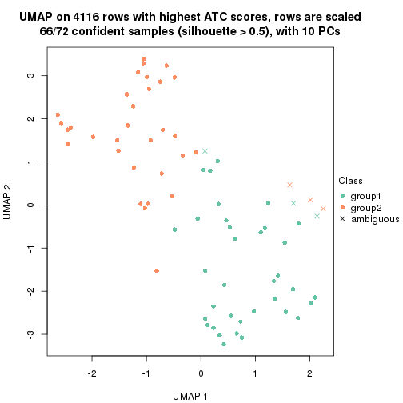</p>

</div>
<div id='tab-ATC-hclust-dimension-reduction-2'>
<pre><code class="r">dimension_reduction(res, k = 3, method = &quot;UMAP&quot;)
</code></pre>

<p>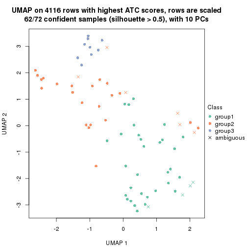</p>

</div>
<div id='tab-ATC-hclust-dimension-reduction-3'>
<pre><code class="r">dimension_reduction(res, k = 4, method = &quot;UMAP&quot;)
</code></pre>

<p>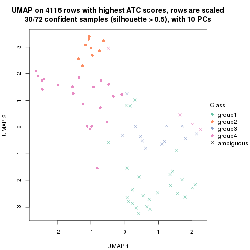</p>

</div>
<div id='tab-ATC-hclust-dimension-reduction-4'>
<pre><code class="r">dimension_reduction(res, k = 5, method = &quot;UMAP&quot;)
</code></pre>

<p>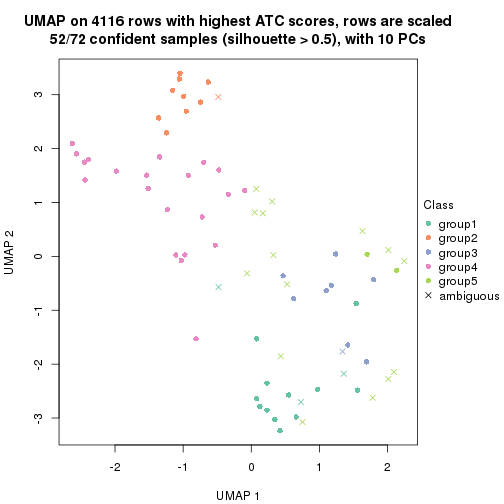</p>

</div>
<div id='tab-ATC-hclust-dimension-reduction-5'>
<pre><code class="r">dimension_reduction(res, k = 6, method = &quot;UMAP&quot;)
</code></pre>

<p>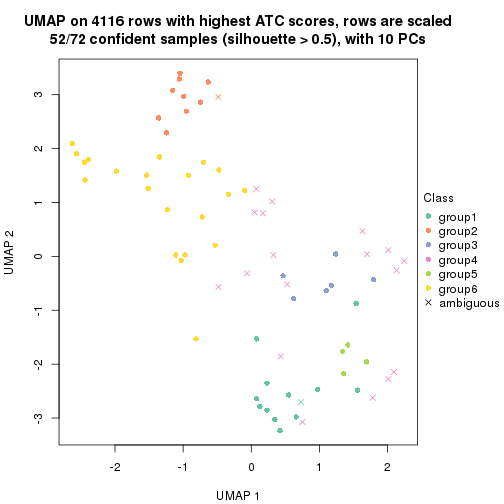</p>

</div>
</div>


Following heatmap shows how subgroups are split when increasing `k`:

```r
collect_classes(res)
```

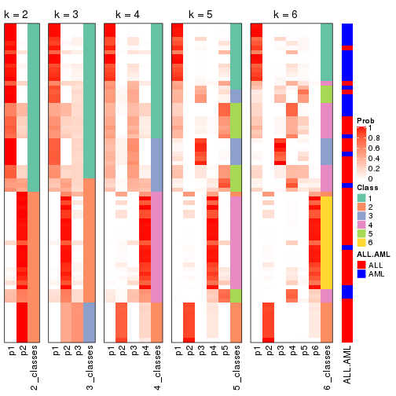


Test correlation between subgroups and known annotations. If the known
annotation is numeric, one-way ANOVA test is applied, and if the known
annotation is discrete, chi-squared contingency table test is applied.

```r
test_to_known_factors(res)
```

```
#>             n ALL.AML(p) k
#> ATC:hclust 66   4.16e-05 2
#> ATC:hclust 62   3.04e-03 3
#> ATC:hclust 30   8.73e-01 4
#> ATC:hclust 52   8.51e-06 5
#> ATC:hclust 52   1.57e-06 6
```


If matrix rows can be associated to genes, consider to use `functional_enrichment(res,
...)` to perform function enrichment for the signature genes. See [this vignette](http://bioconductor.org/packages/devel/bioc/vignettes/cola/inst/doc/functional_enrichment.html) for more detailed explanations.


 

---------------------------------------------------


### ATC:kmeans**


The object with results only for a single top-value method and a single partition method 
can be extracted as:

```r
res = res_list["ATC", "kmeans"]
# you can also extract it by
# res = res_list["ATC:kmeans"]
```

A summary of `res` and all the functions that can be applied to it:

```r
res
```

```
#> A 'ConsensusPartition' object with k = 2, 3, 4, 5, 6.
#>   On a matrix with 4116 rows and 72 columns.
#>   Top rows (412, 824, 1235, 1646, 2058) are extracted by 'ATC' method.
#>   Subgroups are detected by 'kmeans' method.
#>   Performed in total 1250 partitions by row resampling.
#>   Best k for subgroups seems to be 2.
#> 
#> Following methods can be applied to this 'ConsensusPartition' object:
#>  [1] "cola_report"             "collect_classes"         "collect_plots"          
#>  [4] "collect_stats"           "colnames"                "compare_signatures"     
#>  [7] "consensus_heatmap"       "dimension_reduction"     "functional_enrichment"  
#> [10] "get_anno_col"            "get_anno"                "get_classes"            
#> [13] "get_consensus"           "get_matrix"              "get_membership"         
#> [16] "get_param"               "get_signatures"          "get_stats"              
#> [19] "is_best_k"               "is_stable_k"             "membership_heatmap"     
#> [22] "ncol"                    "nrow"                    "plot_ecdf"              
#> [25] "rownames"                "select_partition_number" "show"                   
#> [28] "suggest_best_k"          "test_to_known_factors"
```

`collect_plots()` function collects all the plots made from `res` for all `k` (number of partitions)
into one single page to provide an easy and fast comparison between different `k`.

```r
collect_plots(res)
```

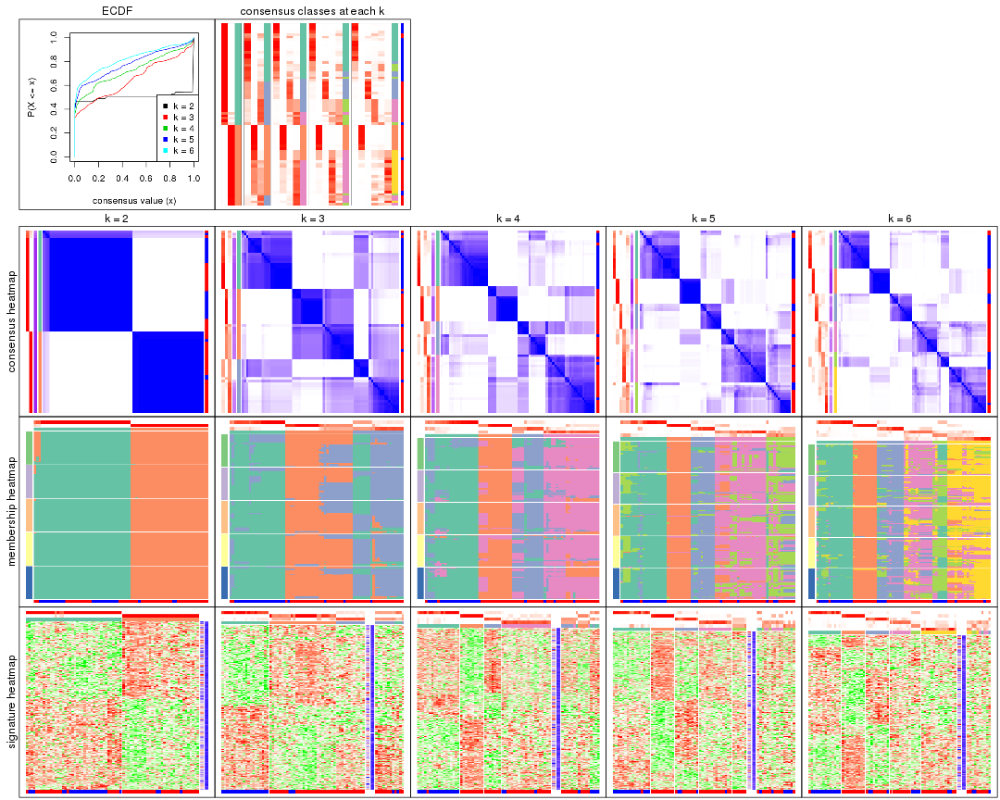

The plots are:

- The first row: a plot of the ECDF (empirical cumulative distribution
  function) curves of the consensus matrix for each `k` and the heatmap of
  predicted classes for each `k`.
- The second row: heatmaps of the consensus matrix for each `k`.
- The third row: heatmaps of the membership matrix for each `k`.
- The fouth row: heatmaps of the signatures for each `k`.

All the plots in panels can be made by individual functions and they are
plotted later in this section.

`select_partition_number()` produces several plots showing different
statistics for choosing "optimized" `k`. There are following statistics:

- ECDF curves of the consensus matrix for each `k`;
- 1-PAC. [The PAC
  score](https://en.wikipedia.org/wiki/Consensus_clustering#Over-interpretation_potential_of_consensus_clustering)
  measures the proportion of the ambiguous subgrouping.
- Mean silhouette score.
- Concordance. The mean probability of fiting the consensus class ids in all
  partitions.
- Area increased. Denote $A_k$ as the area under the ECDF curve for current
  `k`, the area increased is defined as $A_k - A_{k-1}$.
- Rand index. The percent of pairs of samples that are both in a same cluster
  or both are not in a same cluster in the partition of k and k-1.
- Jaccard index. The ratio of pairs of samples are both in a same cluster in
  the partition of k and k-1 and the pairs of samples are both in a same
  cluster in the partition k or k-1.

The detailed explanations of these statistics can be found in [the _cola_
vignette](http://bioconductor.org/packages/devel/bioc/vignettes/cola/inst/doc/cola.html#toc_13).

Generally speaking, lower PAC score, higher mean silhouette score or higher
concordance corresponds to better partition. Rand index and Jaccard index
measure how similar the current partition is compared to partition with `k-1`.
If they are too similar, we won't accept `k` is better than `k-1`.

```r
select_partition_number(res)
```

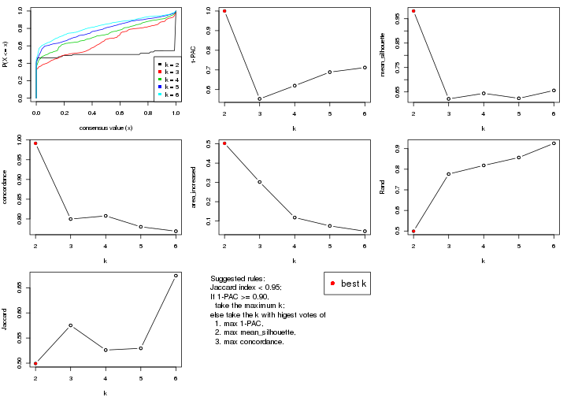

The numeric values for all these statistics can be obtained by `get_stats()`.

```r
get_stats(res)
```

```
#>   k 1-PAC mean_silhouette concordance area_increased  Rand Jaccard
#> 2 2 1.000           0.982       0.992         0.5025 0.499   0.499
#> 3 3 0.553           0.621       0.800         0.3021 0.777   0.575
#> 4 4 0.620           0.644       0.808         0.1179 0.818   0.526
#> 5 5 0.689           0.624       0.780         0.0746 0.857   0.530
#> 6 6 0.712           0.656       0.769         0.0471 0.926   0.674
```

`suggest_best_k()` suggests the best $k$ based on these statistics. The rules are as follows:

- All $k$ with Jaccard index larger than 0.95 are removed because increasing
  $k$ does not provide enough extra information. If all $k$ are removed, it is
  marked as no subgroup is detected.
- For all $k$ with 1-PAC score larger than 0.9, the maximal $k$ is taken as
  the best $k$, and other $k$ are marked as optional $k$.
- If it does not fit the second rule. The $k$ with the maximal vote of the
  highest 1-PAC score, highest mean silhouette, and highest concordance is
  taken as the best $k$.

```r
suggest_best_k(res)
```

```
#> [1] 2
```


Following shows the table of the partitions (You need to click the **show/hide
code output** link to see it). The membership matrix (columns with name `p*`)
is inferred by
[`clue::cl_consensus()`](https://www.rdocumentation.org/link/cl_consensus?package=clue)
function with the `SE` method. Basically the value in the membership matrix
represents the probability to belong to a certain group. The finall class
label for an item is determined with the group with highest probability it
belongs to.

In `get_classes()` function, the entropy is calculated from the membership
matrix and the silhouette score is calculated from the consensus matrix.


<script>
$( function() {
	$( '#tabs-ATC-kmeans-get-classes' ).tabs();
} );
</script>
<div id='tabs-ATC-kmeans-get-classes'>
<ul>
<li><a href='#tab-ATC-kmeans-get-classes-1'>k = 2</a></li>
<li><a href='#tab-ATC-kmeans-get-classes-2'>k = 3</a></li>
<li><a href='#tab-ATC-kmeans-get-classes-3'>k = 4</a></li>
<li><a href='#tab-ATC-kmeans-get-classes-4'>k = 5</a></li>
<li><a href='#tab-ATC-kmeans-get-classes-5'>k = 6</a></li>
</ul>

<div id='tab-ATC-kmeans-get-classes-1'>
<p><a id='tab-ATC-kmeans-get-classes-1-a' style='color:#0366d6' href='#'>show/hide code output</a></p>
<pre><code class="r">cbind(get_classes(res, k = 2), get_membership(res, k = 2))
</code></pre>

<pre><code>#&gt;           class entropy silhouette    p1    p2
#&gt; sample_39     1  0.0000      0.985 1.000 0.000
#&gt; sample_40     1  0.0000      0.985 1.000 0.000
#&gt; sample_42     2  0.0000      1.000 0.000 1.000
#&gt; sample_47     2  0.0000      1.000 0.000 1.000
#&gt; sample_48     2  0.0000      1.000 0.000 1.000
#&gt; sample_49     1  0.0000      0.985 1.000 0.000
#&gt; sample_41     2  0.0000      1.000 0.000 1.000
#&gt; sample_43     2  0.0000      1.000 0.000 1.000
#&gt; sample_44     2  0.0000      1.000 0.000 1.000
#&gt; sample_45     2  0.0000      1.000 0.000 1.000
#&gt; sample_46     2  0.0000      1.000 0.000 1.000
#&gt; sample_70     2  0.0000      1.000 0.000 1.000
#&gt; sample_71     2  0.0376      0.996 0.004 0.996
#&gt; sample_72     2  0.0000      1.000 0.000 1.000
#&gt; sample_68     2  0.0000      1.000 0.000 1.000
#&gt; sample_69     2  0.0000      1.000 0.000 1.000
#&gt; sample_67     2  0.0000      1.000 0.000 1.000
#&gt; sample_55     1  0.0000      0.985 1.000 0.000
#&gt; sample_56     1  0.0000      0.985 1.000 0.000
#&gt; sample_59     2  0.0376      0.996 0.004 0.996
#&gt; sample_52     1  0.0000      0.985 1.000 0.000
#&gt; sample_53     1  0.0000      0.985 1.000 0.000
#&gt; sample_51     1  0.0000      0.985 1.000 0.000
#&gt; sample_50     1  0.0000      0.985 1.000 0.000
#&gt; sample_54     2  0.0000      1.000 0.000 1.000
#&gt; sample_57     1  0.0000      0.985 1.000 0.000
#&gt; sample_58     1  0.0000      0.985 1.000 0.000
#&gt; sample_60     1  0.6887      0.783 0.816 0.184
#&gt; sample_61     1  0.0000      0.985 1.000 0.000
#&gt; sample_65     1  0.0000      0.985 1.000 0.000
#&gt; sample_66     2  0.0000      1.000 0.000 1.000
#&gt; sample_63     1  0.0000      0.985 1.000 0.000
#&gt; sample_64     1  0.0000      0.985 1.000 0.000
#&gt; sample_62     1  0.0000      0.985 1.000 0.000
#&gt; sample_1      1  0.0000      0.985 1.000 0.000
#&gt; sample_2      2  0.0000      1.000 0.000 1.000
#&gt; sample_3      1  0.0000      0.985 1.000 0.000
#&gt; sample_4      1  0.0000      0.985 1.000 0.000
#&gt; sample_5      2  0.0000      1.000 0.000 1.000
#&gt; sample_6      1  0.0000      0.985 1.000 0.000
#&gt; sample_7      1  0.0000      0.985 1.000 0.000
#&gt; sample_8      1  0.0000      0.985 1.000 0.000
#&gt; sample_9      2  0.0000      1.000 0.000 1.000
#&gt; sample_10     1  0.8267      0.664 0.740 0.260
#&gt; sample_11     2  0.0000      1.000 0.000 1.000
#&gt; sample_12     1  0.0000      0.985 1.000 0.000
#&gt; sample_13     2  0.0000      1.000 0.000 1.000
#&gt; sample_14     2  0.0000      1.000 0.000 1.000
#&gt; sample_15     2  0.0000      1.000 0.000 1.000
#&gt; sample_16     2  0.0000      1.000 0.000 1.000
#&gt; sample_17     2  0.0000      1.000 0.000 1.000
#&gt; sample_18     1  0.6247      0.820 0.844 0.156
#&gt; sample_19     2  0.0000      1.000 0.000 1.000
#&gt; sample_20     2  0.0000      1.000 0.000 1.000
#&gt; sample_21     2  0.0000      1.000 0.000 1.000
#&gt; sample_22     1  0.0000      0.985 1.000 0.000
#&gt; sample_23     1  0.0000      0.985 1.000 0.000
#&gt; sample_24     2  0.0000      1.000 0.000 1.000
#&gt; sample_25     1  0.0000      0.985 1.000 0.000
#&gt; sample_26     2  0.0376      0.996 0.004 0.996
#&gt; sample_27     1  0.0000      0.985 1.000 0.000
#&gt; sample_34     1  0.0000      0.985 1.000 0.000
#&gt; sample_35     1  0.0000      0.985 1.000 0.000
#&gt; sample_36     1  0.0000      0.985 1.000 0.000
#&gt; sample_37     1  0.0000      0.985 1.000 0.000
#&gt; sample_38     1  0.0000      0.985 1.000 0.000
#&gt; sample_28     1  0.0000      0.985 1.000 0.000
#&gt; sample_29     2  0.0000      1.000 0.000 1.000
#&gt; sample_30     1  0.0000      0.985 1.000 0.000
#&gt; sample_31     1  0.0000      0.985 1.000 0.000
#&gt; sample_32     1  0.0000      0.985 1.000 0.000
#&gt; sample_33     1  0.0000      0.985 1.000 0.000
</code></pre>

<script>
$('#tab-ATC-kmeans-get-classes-1-a').parent().next().next().hide();
$('#tab-ATC-kmeans-get-classes-1-a').click(function(){
  $('#tab-ATC-kmeans-get-classes-1-a').parent().next().next().toggle();
  return(false);
});
</script>
</div>

<div id='tab-ATC-kmeans-get-classes-2'>
<p><a id='tab-ATC-kmeans-get-classes-2-a' style='color:#0366d6' href='#'>show/hide code output</a></p>
<pre><code class="r">cbind(get_classes(res, k = 3), get_membership(res, k = 3))
</code></pre>

<pre><code>#&gt;           class entropy silhouette    p1    p2    p3
#&gt; sample_39     3  0.6307    -0.0172 0.488 0.000 0.512
#&gt; sample_40     3  0.6291     0.0191 0.468 0.000 0.532
#&gt; sample_42     2  0.6180     0.6793 0.000 0.584 0.416
#&gt; sample_47     2  0.2165     0.7677 0.000 0.936 0.064
#&gt; sample_48     2  0.0000     0.7584 0.000 1.000 0.000
#&gt; sample_49     3  0.6307    -0.0172 0.488 0.000 0.512
#&gt; sample_41     2  0.0000     0.7584 0.000 1.000 0.000
#&gt; sample_43     2  0.5591     0.7304 0.000 0.696 0.304
#&gt; sample_44     2  0.2356     0.7677 0.000 0.928 0.072
#&gt; sample_45     2  0.2356     0.7677 0.000 0.928 0.072
#&gt; sample_46     2  0.4887     0.7478 0.000 0.772 0.228
#&gt; sample_70     3  0.5650     0.5032 0.084 0.108 0.808
#&gt; sample_71     3  0.8627    -0.3232 0.104 0.392 0.504
#&gt; sample_72     2  0.6180     0.6781 0.000 0.584 0.416
#&gt; sample_68     2  0.0000     0.7584 0.000 1.000 0.000
#&gt; sample_69     2  0.0000     0.7584 0.000 1.000 0.000
#&gt; sample_67     2  0.6126     0.6936 0.000 0.600 0.400
#&gt; sample_55     3  0.4121     0.6488 0.168 0.000 0.832
#&gt; sample_56     3  0.6295     0.0185 0.472 0.000 0.528
#&gt; sample_59     3  0.5889     0.5233 0.108 0.096 0.796
#&gt; sample_52     1  0.5178     0.4491 0.744 0.000 0.256
#&gt; sample_53     1  0.0000     0.8560 1.000 0.000 0.000
#&gt; sample_51     1  0.0000     0.8560 1.000 0.000 0.000
#&gt; sample_50     1  0.0000     0.8560 1.000 0.000 0.000
#&gt; sample_54     2  0.7396     0.5178 0.032 0.488 0.480
#&gt; sample_57     1  0.2356     0.8075 0.928 0.000 0.072
#&gt; sample_58     1  0.3482     0.7853 0.872 0.000 0.128
#&gt; sample_60     3  0.6713     0.3145 0.416 0.012 0.572
#&gt; sample_61     1  0.3412     0.7874 0.876 0.000 0.124
#&gt; sample_65     1  0.0237     0.8544 0.996 0.000 0.004
#&gt; sample_66     2  0.2165     0.7677 0.000 0.936 0.064
#&gt; sample_63     1  0.2066     0.8144 0.940 0.000 0.060
#&gt; sample_64     1  0.3482     0.7853 0.872 0.000 0.128
#&gt; sample_62     1  0.2537     0.7931 0.920 0.000 0.080
#&gt; sample_1      3  0.3879     0.6530 0.152 0.000 0.848
#&gt; sample_2      2  0.6126     0.6936 0.000 0.600 0.400
#&gt; sample_3      3  0.4121     0.6499 0.168 0.000 0.832
#&gt; sample_4      3  0.3752     0.6507 0.144 0.000 0.856
#&gt; sample_5      2  0.0000     0.7584 0.000 1.000 0.000
#&gt; sample_6      3  0.4235     0.6459 0.176 0.000 0.824
#&gt; sample_7      3  0.6280     0.0365 0.460 0.000 0.540
#&gt; sample_8      3  0.6307    -0.0172 0.488 0.000 0.512
#&gt; sample_9      2  0.6140     0.6909 0.000 0.596 0.404
#&gt; sample_10     3  0.3989     0.6275 0.124 0.012 0.864
#&gt; sample_11     2  0.6126     0.6936 0.000 0.600 0.400
#&gt; sample_12     1  0.6235    -0.0104 0.564 0.000 0.436
#&gt; sample_13     2  0.0000     0.7584 0.000 1.000 0.000
#&gt; sample_14     2  0.5859     0.7177 0.000 0.656 0.344
#&gt; sample_15     2  0.0000     0.7584 0.000 1.000 0.000
#&gt; sample_16     2  0.6180     0.6793 0.000 0.584 0.416
#&gt; sample_17     2  0.6180     0.6793 0.000 0.584 0.416
#&gt; sample_18     3  0.3989     0.6275 0.124 0.012 0.864
#&gt; sample_19     2  0.6140     0.6909 0.000 0.596 0.404
#&gt; sample_20     2  0.0000     0.7584 0.000 1.000 0.000
#&gt; sample_21     2  0.0424     0.7536 0.000 0.992 0.008
#&gt; sample_22     1  0.5905     0.2518 0.648 0.000 0.352
#&gt; sample_23     3  0.4452     0.6342 0.192 0.000 0.808
#&gt; sample_24     2  0.0000     0.7584 0.000 1.000 0.000
#&gt; sample_25     3  0.4178     0.6497 0.172 0.000 0.828
#&gt; sample_26     3  0.4558     0.5926 0.100 0.044 0.856
#&gt; sample_27     3  0.6307    -0.0172 0.488 0.000 0.512
#&gt; sample_34     1  0.3192     0.7939 0.888 0.000 0.112
#&gt; sample_35     1  0.3752     0.7749 0.856 0.000 0.144
#&gt; sample_36     1  0.0237     0.8544 0.996 0.000 0.004
#&gt; sample_37     1  0.0000     0.8560 1.000 0.000 0.000
#&gt; sample_38     1  0.0000     0.8560 1.000 0.000 0.000
#&gt; sample_28     1  0.0000     0.8560 1.000 0.000 0.000
#&gt; sample_29     2  0.6126     0.6936 0.000 0.600 0.400
#&gt; sample_30     1  0.3412     0.7238 0.876 0.000 0.124
#&gt; sample_31     1  0.0000     0.8560 1.000 0.000 0.000
#&gt; sample_32     1  0.0000     0.8560 1.000 0.000 0.000
#&gt; sample_33     1  0.3192     0.7939 0.888 0.000 0.112
</code></pre>

<script>
$('#tab-ATC-kmeans-get-classes-2-a').parent().next().next().hide();
$('#tab-ATC-kmeans-get-classes-2-a').click(function(){
  $('#tab-ATC-kmeans-get-classes-2-a').parent().next().next().toggle();
  return(false);
});
</script>
</div>

<div id='tab-ATC-kmeans-get-classes-3'>
<p><a id='tab-ATC-kmeans-get-classes-3-a' style='color:#0366d6' href='#'>show/hide code output</a></p>
<pre><code class="r">cbind(get_classes(res, k = 4), get_membership(res, k = 4))
</code></pre>

<pre><code>#&gt;           class entropy silhouette    p1    p2    p3    p4
#&gt; sample_39     3  0.3400     0.6000 0.180 0.000 0.820 0.000
#&gt; sample_40     3  0.2976     0.6128 0.120 0.000 0.872 0.008
#&gt; sample_42     4  0.4452     0.7741 0.000 0.156 0.048 0.796
#&gt; sample_47     2  0.4790     0.4191 0.000 0.620 0.000 0.380
#&gt; sample_48     2  0.0188     0.8498 0.000 0.996 0.000 0.004
#&gt; sample_49     3  0.3400     0.6000 0.180 0.000 0.820 0.000
#&gt; sample_41     2  0.0188     0.8498 0.000 0.996 0.000 0.004
#&gt; sample_43     4  0.4891     0.5724 0.000 0.308 0.012 0.680
#&gt; sample_44     2  0.4964     0.4142 0.000 0.616 0.004 0.380
#&gt; sample_45     2  0.4964     0.4142 0.000 0.616 0.004 0.380
#&gt; sample_46     4  0.5217     0.3861 0.000 0.380 0.012 0.608
#&gt; sample_70     4  0.2342     0.7294 0.008 0.000 0.080 0.912
#&gt; sample_71     4  0.3994     0.7845 0.008 0.088 0.056 0.848
#&gt; sample_72     4  0.4532     0.7754 0.000 0.156 0.052 0.792
#&gt; sample_68     2  0.0188     0.8498 0.000 0.996 0.000 0.004
#&gt; sample_69     2  0.0188     0.8498 0.000 0.996 0.000 0.004
#&gt; sample_67     4  0.4452     0.7741 0.000 0.156 0.048 0.796
#&gt; sample_55     4  0.5407    -0.2407 0.012 0.000 0.484 0.504
#&gt; sample_56     3  0.3306     0.6106 0.156 0.000 0.840 0.004
#&gt; sample_59     4  0.2799     0.7017 0.008 0.000 0.108 0.884
#&gt; sample_52     1  0.5763     0.6578 0.712 0.000 0.132 0.156
#&gt; sample_53     1  0.0000     0.8237 1.000 0.000 0.000 0.000
#&gt; sample_51     1  0.0000     0.8237 1.000 0.000 0.000 0.000
#&gt; sample_50     1  0.0188     0.8240 0.996 0.000 0.000 0.004
#&gt; sample_54     4  0.1639     0.7408 0.004 0.008 0.036 0.952
#&gt; sample_57     1  0.5266     0.7012 0.752 0.000 0.108 0.140
#&gt; sample_58     1  0.5387     0.3476 0.584 0.000 0.400 0.016
#&gt; sample_60     4  0.4359     0.6183 0.084 0.000 0.100 0.816
#&gt; sample_61     1  0.4814     0.4982 0.676 0.000 0.316 0.008
#&gt; sample_65     1  0.0657     0.8227 0.984 0.000 0.004 0.012
#&gt; sample_66     2  0.5298     0.4095 0.000 0.612 0.016 0.372
#&gt; sample_63     1  0.4646     0.7353 0.796 0.000 0.084 0.120
#&gt; sample_64     1  0.5586     0.2198 0.528 0.000 0.452 0.020
#&gt; sample_62     1  0.4888     0.7240 0.780 0.000 0.096 0.124
#&gt; sample_1      3  0.5378     0.2594 0.012 0.000 0.540 0.448
#&gt; sample_2      4  0.4452     0.7741 0.000 0.156 0.048 0.796
#&gt; sample_3      3  0.5378     0.2592 0.012 0.000 0.540 0.448
#&gt; sample_4      3  0.5383     0.2491 0.012 0.000 0.536 0.452
#&gt; sample_5      2  0.0188     0.8498 0.000 0.996 0.000 0.004
#&gt; sample_6      3  0.5478     0.2653 0.016 0.000 0.540 0.444
#&gt; sample_7      3  0.2831     0.6131 0.120 0.000 0.876 0.004
#&gt; sample_8      3  0.3444     0.5960 0.184 0.000 0.816 0.000
#&gt; sample_9      4  0.3479     0.7858 0.000 0.148 0.012 0.840
#&gt; sample_10     4  0.3196     0.6874 0.008 0.000 0.136 0.856
#&gt; sample_11     4  0.4197     0.7764 0.000 0.156 0.036 0.808
#&gt; sample_12     1  0.5902     0.6307 0.700 0.000 0.160 0.140
#&gt; sample_13     2  0.0188     0.8498 0.000 0.996 0.000 0.004
#&gt; sample_14     4  0.3831     0.7506 0.000 0.204 0.004 0.792
#&gt; sample_15     2  0.0188     0.8498 0.000 0.996 0.000 0.004
#&gt; sample_16     4  0.3529     0.7845 0.000 0.152 0.012 0.836
#&gt; sample_17     4  0.3695     0.7841 0.000 0.156 0.016 0.828
#&gt; sample_18     4  0.3529     0.6634 0.012 0.000 0.152 0.836
#&gt; sample_19     4  0.3591     0.7781 0.000 0.168 0.008 0.824
#&gt; sample_20     2  0.0188     0.8498 0.000 0.996 0.000 0.004
#&gt; sample_21     2  0.0707     0.8352 0.000 0.980 0.020 0.000
#&gt; sample_22     1  0.4992     0.0174 0.524 0.000 0.476 0.000
#&gt; sample_23     3  0.5478     0.2653 0.016 0.000 0.540 0.444
#&gt; sample_24     2  0.0336     0.8480 0.000 0.992 0.000 0.008
#&gt; sample_25     4  0.4253     0.6135 0.016 0.000 0.208 0.776
#&gt; sample_26     4  0.2773     0.7074 0.004 0.000 0.116 0.880
#&gt; sample_27     3  0.3400     0.6000 0.180 0.000 0.820 0.000
#&gt; sample_34     1  0.1388     0.8110 0.960 0.000 0.028 0.012
#&gt; sample_35     3  0.5310     0.0810 0.412 0.000 0.576 0.012
#&gt; sample_36     1  0.0188     0.8240 0.996 0.000 0.000 0.004
#&gt; sample_37     1  0.0188     0.8240 0.996 0.000 0.000 0.004
#&gt; sample_38     1  0.0000     0.8237 1.000 0.000 0.000 0.000
#&gt; sample_28     1  0.0592     0.8214 0.984 0.000 0.016 0.000
#&gt; sample_29     4  0.5596     0.7486 0.040 0.156 0.048 0.756
#&gt; sample_30     1  0.3099     0.7698 0.876 0.000 0.104 0.020
#&gt; sample_31     1  0.1677     0.8126 0.948 0.000 0.040 0.012
#&gt; sample_32     1  0.0000     0.8237 1.000 0.000 0.000 0.000
#&gt; sample_33     1  0.0707     0.8148 0.980 0.000 0.020 0.000
</code></pre>

<script>
$('#tab-ATC-kmeans-get-classes-3-a').parent().next().next().hide();
$('#tab-ATC-kmeans-get-classes-3-a').click(function(){
  $('#tab-ATC-kmeans-get-classes-3-a').parent().next().next().toggle();
  return(false);
});
</script>
</div>

<div id='tab-ATC-kmeans-get-classes-4'>
<p><a id='tab-ATC-kmeans-get-classes-4-a' style='color:#0366d6' href='#'>show/hide code output</a></p>
<pre><code class="r">cbind(get_classes(res, k = 5), get_membership(res, k = 5))
</code></pre>

<pre><code>#&gt;           class entropy silhouette    p1    p2    p3    p4    p5
#&gt; sample_39     3  0.1430     0.8525 0.052 0.000 0.944 0.000 0.004
#&gt; sample_40     3  0.2054     0.8166 0.028 0.000 0.920 0.000 0.052
#&gt; sample_42     4  0.1612     0.6418 0.000 0.024 0.016 0.948 0.012
#&gt; sample_47     4  0.6470     0.3917 0.000 0.388 0.016 0.476 0.120
#&gt; sample_48     2  0.0162     0.9941 0.000 0.996 0.000 0.004 0.000
#&gt; sample_49     3  0.1270     0.8526 0.052 0.000 0.948 0.000 0.000
#&gt; sample_41     2  0.0162     0.9941 0.000 0.996 0.000 0.004 0.000
#&gt; sample_43     4  0.5979     0.5582 0.000 0.212 0.020 0.636 0.132
#&gt; sample_44     4  0.6639     0.3825 0.000 0.380 0.020 0.468 0.132
#&gt; sample_45     4  0.6639     0.3825 0.000 0.380 0.020 0.468 0.132
#&gt; sample_46     4  0.6155     0.5441 0.000 0.240 0.020 0.608 0.132
#&gt; sample_70     4  0.4714     0.3411 0.000 0.000 0.032 0.644 0.324
#&gt; sample_71     4  0.1756     0.6169 0.000 0.008 0.016 0.940 0.036
#&gt; sample_72     4  0.2082     0.6286 0.000 0.024 0.016 0.928 0.032
#&gt; sample_68     2  0.0162     0.9941 0.000 0.996 0.000 0.004 0.000
#&gt; sample_69     2  0.0162     0.9941 0.000 0.996 0.000 0.004 0.000
#&gt; sample_67     4  0.1386     0.6412 0.000 0.032 0.016 0.952 0.000
#&gt; sample_55     5  0.5775     0.5623 0.008 0.000 0.188 0.160 0.644
#&gt; sample_56     3  0.1408     0.8480 0.044 0.000 0.948 0.000 0.008
#&gt; sample_59     5  0.4696     0.1690 0.000 0.004 0.012 0.400 0.584
#&gt; sample_52     1  0.4557     0.4715 0.516 0.000 0.000 0.008 0.476
#&gt; sample_53     1  0.0324     0.8148 0.992 0.000 0.004 0.000 0.004
#&gt; sample_51     1  0.0324     0.8148 0.992 0.000 0.004 0.000 0.004
#&gt; sample_50     1  0.0771     0.8181 0.976 0.000 0.004 0.000 0.020
#&gt; sample_54     5  0.4621    -0.0712 0.000 0.004 0.008 0.412 0.576
#&gt; sample_57     5  0.4304    -0.4898 0.484 0.000 0.000 0.000 0.516
#&gt; sample_58     3  0.5304     0.5689 0.292 0.000 0.628 0.000 0.080
#&gt; sample_60     5  0.3527     0.3490 0.016 0.000 0.000 0.192 0.792
#&gt; sample_61     1  0.5431    -0.0631 0.516 0.000 0.424 0.000 0.060
#&gt; sample_65     1  0.2127     0.8029 0.892 0.000 0.000 0.000 0.108
#&gt; sample_66     4  0.6010     0.4263 0.000 0.360 0.016 0.544 0.080
#&gt; sample_63     1  0.4268     0.5348 0.556 0.000 0.000 0.000 0.444
#&gt; sample_64     3  0.5167     0.6538 0.248 0.000 0.664 0.000 0.088
#&gt; sample_62     1  0.4434     0.5080 0.536 0.000 0.000 0.004 0.460
#&gt; sample_1      5  0.6882     0.5995 0.008 0.000 0.304 0.248 0.440
#&gt; sample_2      4  0.1547     0.6404 0.000 0.032 0.016 0.948 0.004
#&gt; sample_3      5  0.6887     0.5995 0.008 0.000 0.300 0.252 0.440
#&gt; sample_4      5  0.6873     0.6012 0.008 0.000 0.300 0.248 0.444
#&gt; sample_5      2  0.0162     0.9941 0.000 0.996 0.000 0.004 0.000
#&gt; sample_6      5  0.6957     0.6016 0.012 0.000 0.296 0.248 0.444
#&gt; sample_7      3  0.3257     0.7409 0.024 0.000 0.852 0.012 0.112
#&gt; sample_8      3  0.1845     0.8504 0.056 0.000 0.928 0.000 0.016
#&gt; sample_9      4  0.3124     0.5932 0.000 0.016 0.004 0.844 0.136
#&gt; sample_10     4  0.4390    -0.1941 0.000 0.000 0.004 0.568 0.428
#&gt; sample_11     4  0.1891     0.6355 0.000 0.032 0.016 0.936 0.016
#&gt; sample_12     1  0.4858     0.5774 0.656 0.000 0.012 0.024 0.308
#&gt; sample_13     2  0.0162     0.9941 0.000 0.996 0.000 0.004 0.000
#&gt; sample_14     4  0.3570     0.6327 0.000 0.048 0.008 0.836 0.108
#&gt; sample_15     2  0.0162     0.9941 0.000 0.996 0.000 0.004 0.000
#&gt; sample_16     4  0.4148     0.5297 0.000 0.028 0.004 0.752 0.216
#&gt; sample_17     4  0.3988     0.5504 0.000 0.036 0.000 0.768 0.196
#&gt; sample_18     5  0.4787     0.3255 0.000 0.000 0.020 0.432 0.548
#&gt; sample_19     4  0.3602     0.6174 0.000 0.036 0.004 0.820 0.140
#&gt; sample_20     2  0.0162     0.9941 0.000 0.996 0.000 0.004 0.000
#&gt; sample_21     2  0.1364     0.9559 0.000 0.952 0.012 0.000 0.036
#&gt; sample_22     1  0.4716     0.3623 0.656 0.000 0.308 0.000 0.036
#&gt; sample_23     5  0.6967     0.6003 0.012 0.000 0.300 0.248 0.440
#&gt; sample_24     2  0.0404     0.9869 0.000 0.988 0.000 0.012 0.000
#&gt; sample_25     5  0.5920     0.3576 0.020 0.000 0.056 0.448 0.476
#&gt; sample_26     4  0.4557    -0.0341 0.000 0.000 0.012 0.584 0.404
#&gt; sample_27     3  0.1270     0.8526 0.052 0.000 0.948 0.000 0.000
#&gt; sample_34     1  0.1914     0.7951 0.924 0.000 0.016 0.000 0.060
#&gt; sample_35     3  0.4558     0.7213 0.216 0.000 0.724 0.000 0.060
#&gt; sample_36     1  0.0703     0.8180 0.976 0.000 0.000 0.000 0.024
#&gt; sample_37     1  0.0771     0.8181 0.976 0.000 0.004 0.000 0.020
#&gt; sample_38     1  0.0324     0.8148 0.992 0.000 0.004 0.000 0.004
#&gt; sample_28     1  0.0794     0.8173 0.972 0.000 0.000 0.000 0.028
#&gt; sample_29     4  0.3531     0.6190 0.020 0.040 0.016 0.864 0.060
#&gt; sample_30     1  0.2536     0.7834 0.868 0.000 0.000 0.004 0.128
#&gt; sample_31     1  0.2020     0.8052 0.900 0.000 0.000 0.000 0.100
#&gt; sample_32     1  0.0162     0.8157 0.996 0.000 0.004 0.000 0.000
#&gt; sample_33     1  0.1403     0.7952 0.952 0.000 0.024 0.000 0.024
</code></pre>

<script>
$('#tab-ATC-kmeans-get-classes-4-a').parent().next().next().hide();
$('#tab-ATC-kmeans-get-classes-4-a').click(function(){
  $('#tab-ATC-kmeans-get-classes-4-a').parent().next().next().toggle();
  return(false);
});
</script>
</div>

<div id='tab-ATC-kmeans-get-classes-5'>
<p><a id='tab-ATC-kmeans-get-classes-5-a' style='color:#0366d6' href='#'>show/hide code output</a></p>
<pre><code class="r">cbind(get_classes(res, k = 6), get_membership(res, k = 6))
</code></pre>

<pre><code>#&gt;           class entropy silhouette    p1    p2    p3    p4    p5    p6
#&gt; sample_39     3  0.0951     0.8075 0.020 0.000 0.968 0.008 0.004 0.000
#&gt; sample_40     3  0.2483     0.7717 0.004 0.004 0.892 0.056 0.044 0.000
#&gt; sample_42     6  0.0405     0.6454 0.000 0.000 0.000 0.008 0.004 0.988
#&gt; sample_47     6  0.7289     0.5309 0.000 0.204 0.000 0.148 0.224 0.424
#&gt; sample_48     2  0.0508     0.9852 0.000 0.984 0.000 0.000 0.004 0.012
#&gt; sample_49     3  0.0547     0.8086 0.020 0.000 0.980 0.000 0.000 0.000
#&gt; sample_41     2  0.0363     0.9857 0.000 0.988 0.000 0.000 0.000 0.012
#&gt; sample_43     6  0.6679     0.5712 0.000 0.096 0.000 0.160 0.228 0.516
#&gt; sample_44     6  0.7261     0.5306 0.000 0.184 0.000 0.156 0.228 0.432
#&gt; sample_45     6  0.7261     0.5306 0.000 0.184 0.000 0.156 0.228 0.432
#&gt; sample_46     6  0.6885     0.5621 0.000 0.120 0.000 0.160 0.228 0.492
#&gt; sample_70     4  0.6107    -0.2853 0.000 0.000 0.004 0.384 0.228 0.384
#&gt; sample_71     6  0.1760     0.6215 0.000 0.000 0.004 0.048 0.020 0.928
#&gt; sample_72     6  0.1760     0.6236 0.000 0.000 0.004 0.048 0.020 0.928
#&gt; sample_68     2  0.0363     0.9857 0.000 0.988 0.000 0.000 0.000 0.012
#&gt; sample_69     2  0.0363     0.9857 0.000 0.988 0.000 0.000 0.000 0.012
#&gt; sample_67     6  0.0767     0.6425 0.000 0.000 0.004 0.008 0.012 0.976
#&gt; sample_55     4  0.4813     0.5918 0.000 0.000 0.116 0.708 0.156 0.020
#&gt; sample_56     3  0.0603     0.8067 0.016 0.000 0.980 0.004 0.000 0.000
#&gt; sample_59     4  0.5814     0.2250 0.000 0.000 0.004 0.516 0.280 0.200
#&gt; sample_52     5  0.5094     0.6007 0.348 0.000 0.004 0.080 0.568 0.000
#&gt; sample_53     1  0.0820     0.8328 0.972 0.000 0.000 0.016 0.012 0.000
#&gt; sample_51     1  0.0146     0.8385 0.996 0.000 0.000 0.000 0.004 0.000
#&gt; sample_50     1  0.0260     0.8381 0.992 0.000 0.000 0.000 0.008 0.000
#&gt; sample_54     5  0.5148     0.0303 0.000 0.000 0.000 0.196 0.624 0.180
#&gt; sample_57     5  0.5214     0.6127 0.308 0.000 0.004 0.104 0.584 0.000
#&gt; sample_58     3  0.5239     0.6830 0.120 0.004 0.700 0.052 0.124 0.000
#&gt; sample_60     5  0.4609     0.1675 0.008 0.000 0.000 0.344 0.612 0.036
#&gt; sample_61     3  0.6542     0.3037 0.344 0.004 0.468 0.060 0.124 0.000
#&gt; sample_65     1  0.3650     0.6409 0.756 0.000 0.004 0.024 0.216 0.000
#&gt; sample_66     6  0.6010     0.5974 0.000 0.144 0.000 0.072 0.176 0.608
#&gt; sample_63     5  0.4945     0.6018 0.344 0.000 0.004 0.068 0.584 0.000
#&gt; sample_64     3  0.5653     0.6893 0.108 0.008 0.664 0.060 0.160 0.000
#&gt; sample_62     5  0.4945     0.6018 0.344 0.000 0.004 0.068 0.584 0.000
#&gt; sample_1      4  0.4447     0.6920 0.000 0.000 0.224 0.704 0.008 0.064
#&gt; sample_2      6  0.0458     0.6420 0.000 0.000 0.000 0.016 0.000 0.984
#&gt; sample_3      4  0.4500     0.6896 0.000 0.000 0.224 0.700 0.008 0.068
#&gt; sample_4      4  0.4447     0.6920 0.000 0.000 0.224 0.704 0.008 0.064
#&gt; sample_5      2  0.0363     0.9857 0.000 0.988 0.000 0.000 0.000 0.012
#&gt; sample_6      4  0.4629     0.6854 0.000 0.000 0.224 0.696 0.016 0.064
#&gt; sample_7      3  0.3705     0.5600 0.004 0.000 0.748 0.224 0.024 0.000
#&gt; sample_8      3  0.1536     0.8031 0.020 0.000 0.944 0.012 0.024 0.000
#&gt; sample_9      6  0.4939     0.4574 0.000 0.000 0.000 0.292 0.096 0.612
#&gt; sample_10     4  0.3855     0.5672 0.000 0.000 0.000 0.704 0.024 0.272
#&gt; sample_11     6  0.1625     0.6172 0.000 0.000 0.000 0.060 0.012 0.928
#&gt; sample_12     1  0.5916     0.0832 0.524 0.000 0.012 0.312 0.148 0.004
#&gt; sample_13     2  0.0508     0.9852 0.000 0.984 0.000 0.000 0.004 0.012
#&gt; sample_14     6  0.5075     0.5894 0.000 0.016 0.000 0.180 0.132 0.672
#&gt; sample_15     2  0.0363     0.9857 0.000 0.988 0.000 0.000 0.000 0.012
#&gt; sample_16     6  0.5863     0.2759 0.000 0.008 0.000 0.384 0.152 0.456
#&gt; sample_17     6  0.5024     0.3583 0.000 0.000 0.000 0.340 0.088 0.572
#&gt; sample_18     4  0.4297     0.6328 0.000 0.000 0.016 0.756 0.096 0.132
#&gt; sample_19     6  0.5384     0.5636 0.000 0.008 0.000 0.200 0.176 0.616
#&gt; sample_20     2  0.0508     0.9852 0.000 0.984 0.000 0.000 0.004 0.012
#&gt; sample_21     2  0.2534     0.9198 0.000 0.896 0.012 0.032 0.052 0.008
#&gt; sample_22     1  0.4540     0.5856 0.732 0.000 0.168 0.076 0.024 0.000
#&gt; sample_23     4  0.4629     0.6854 0.000 0.000 0.224 0.696 0.016 0.064
#&gt; sample_24     2  0.1511     0.9557 0.000 0.940 0.000 0.004 0.044 0.012
#&gt; sample_25     4  0.4851     0.6377 0.012 0.000 0.036 0.728 0.060 0.164
#&gt; sample_26     4  0.5125     0.3779 0.000 0.000 0.004 0.612 0.108 0.276
#&gt; sample_27     3  0.0547     0.8086 0.020 0.000 0.980 0.000 0.000 0.000
#&gt; sample_34     1  0.4325     0.6718 0.768 0.008 0.024 0.060 0.140 0.000
#&gt; sample_35     3  0.5471     0.7078 0.100 0.008 0.684 0.060 0.148 0.000
#&gt; sample_36     1  0.0363     0.8374 0.988 0.000 0.000 0.000 0.012 0.000
#&gt; sample_37     1  0.0260     0.8381 0.992 0.000 0.000 0.000 0.008 0.000
#&gt; sample_38     1  0.0820     0.8328 0.972 0.000 0.000 0.016 0.012 0.000
#&gt; sample_28     1  0.0717     0.8391 0.976 0.000 0.000 0.008 0.016 0.000
#&gt; sample_29     6  0.0622     0.6457 0.000 0.000 0.000 0.008 0.012 0.980
#&gt; sample_30     1  0.2636     0.7331 0.860 0.000 0.004 0.016 0.120 0.000
#&gt; sample_31     1  0.3329     0.6856 0.792 0.000 0.004 0.020 0.184 0.000
#&gt; sample_32     1  0.0520     0.8389 0.984 0.000 0.000 0.008 0.008 0.000
#&gt; sample_33     1  0.1700     0.8112 0.936 0.000 0.012 0.024 0.028 0.000
</code></pre>

<script>
$('#tab-ATC-kmeans-get-classes-5-a').parent().next().next().hide();
$('#tab-ATC-kmeans-get-classes-5-a').click(function(){
  $('#tab-ATC-kmeans-get-classes-5-a').parent().next().next().toggle();
  return(false);
});
</script>
</div>
</div>

Heatmaps for the consensus matrix. It visualizes the probability of two
samples to be in a same group.


<script>
$( function() {
	$( '#tabs-ATC-kmeans-consensus-heatmap' ).tabs();
} );
</script>
<div id='tabs-ATC-kmeans-consensus-heatmap'>
<ul>
<li><a href='#tab-ATC-kmeans-consensus-heatmap-1'>k = 2</a></li>
<li><a href='#tab-ATC-kmeans-consensus-heatmap-2'>k = 3</a></li>
<li><a href='#tab-ATC-kmeans-consensus-heatmap-3'>k = 4</a></li>
<li><a href='#tab-ATC-kmeans-consensus-heatmap-4'>k = 5</a></li>
<li><a href='#tab-ATC-kmeans-consensus-heatmap-5'>k = 6</a></li>
</ul>
<div id='tab-ATC-kmeans-consensus-heatmap-1'>
<pre><code class="r">consensus_heatmap(res, k = 2)
</code></pre>

<p>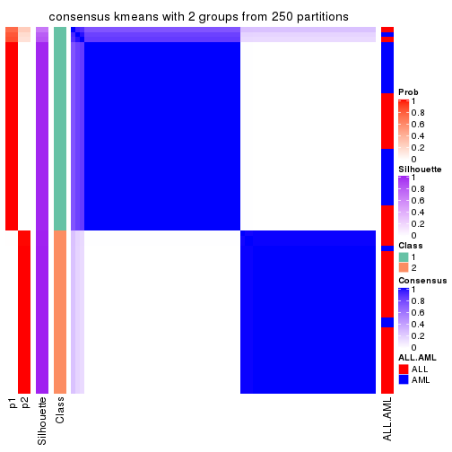</p>

</div>
<div id='tab-ATC-kmeans-consensus-heatmap-2'>
<pre><code class="r">consensus_heatmap(res, k = 3)
</code></pre>

<p>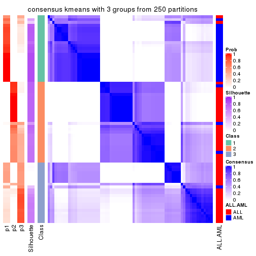</p>

</div>
<div id='tab-ATC-kmeans-consensus-heatmap-3'>
<pre><code class="r">consensus_heatmap(res, k = 4)
</code></pre>

<p>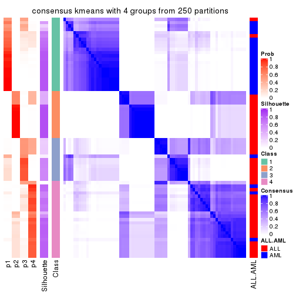</p>

</div>
<div id='tab-ATC-kmeans-consensus-heatmap-4'>
<pre><code class="r">consensus_heatmap(res, k = 5)
</code></pre>

<p>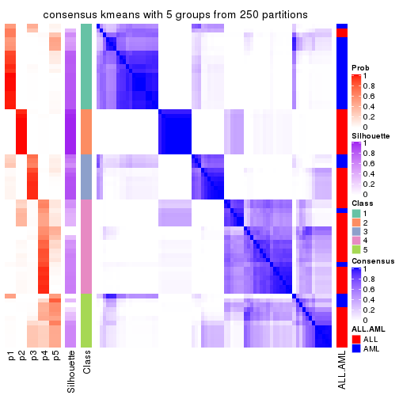</p>

</div>
<div id='tab-ATC-kmeans-consensus-heatmap-5'>
<pre><code class="r">consensus_heatmap(res, k = 6)
</code></pre>

<p>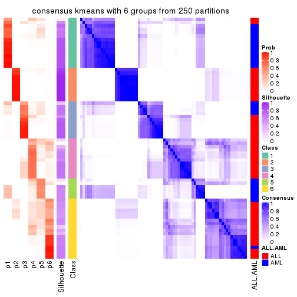</p>

</div>
</div>

Heatmaps for the membership of samples in all partitions to see how consistent they are:


<script>
$( function() {
	$( '#tabs-ATC-kmeans-membership-heatmap' ).tabs();
} );
</script>
<div id='tabs-ATC-kmeans-membership-heatmap'>
<ul>
<li><a href='#tab-ATC-kmeans-membership-heatmap-1'>k = 2</a></li>
<li><a href='#tab-ATC-kmeans-membership-heatmap-2'>k = 3</a></li>
<li><a href='#tab-ATC-kmeans-membership-heatmap-3'>k = 4</a></li>
<li><a href='#tab-ATC-kmeans-membership-heatmap-4'>k = 5</a></li>
<li><a href='#tab-ATC-kmeans-membership-heatmap-5'>k = 6</a></li>
</ul>
<div id='tab-ATC-kmeans-membership-heatmap-1'>
<pre><code class="r">membership_heatmap(res, k = 2)
</code></pre>

<p>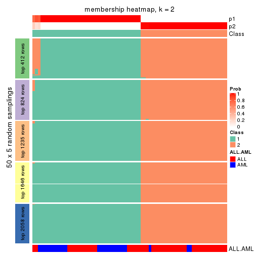</p>

</div>
<div id='tab-ATC-kmeans-membership-heatmap-2'>
<pre><code class="r">membership_heatmap(res, k = 3)
</code></pre>

<p>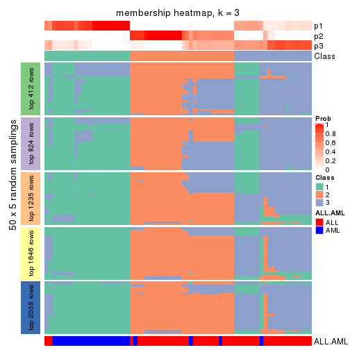</p>

</div>
<div id='tab-ATC-kmeans-membership-heatmap-3'>
<pre><code class="r">membership_heatmap(res, k = 4)
</code></pre>

<p>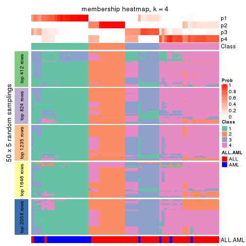</p>

</div>
<div id='tab-ATC-kmeans-membership-heatmap-4'>
<pre><code class="r">membership_heatmap(res, k = 5)
</code></pre>

<p>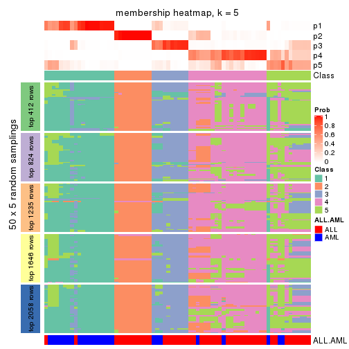</p>

</div>
<div id='tab-ATC-kmeans-membership-heatmap-5'>
<pre><code class="r">membership_heatmap(res, k = 6)
</code></pre>

<p>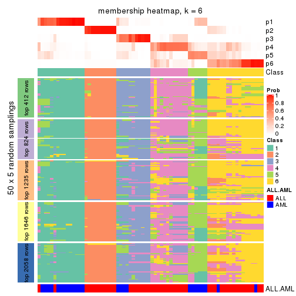</p>

</div>
</div>

As soon as we have had the classes for columns, we can look for signatures
which are significantly different between classes which can be candidate marks
for certain classes. Following are the heatmaps for signatures.


Signature heatmaps where rows are scaled:


<script>
$( function() {
	$( '#tabs-ATC-kmeans-get-signatures' ).tabs();
} );
</script>
<div id='tabs-ATC-kmeans-get-signatures'>
<ul>
<li><a href='#tab-ATC-kmeans-get-signatures-1'>k = 2</a></li>
<li><a href='#tab-ATC-kmeans-get-signatures-2'>k = 3</a></li>
<li><a href='#tab-ATC-kmeans-get-signatures-3'>k = 4</a></li>
<li><a href='#tab-ATC-kmeans-get-signatures-4'>k = 5</a></li>
<li><a href='#tab-ATC-kmeans-get-signatures-5'>k = 6</a></li>
</ul>
<div id='tab-ATC-kmeans-get-signatures-1'>
<pre><code class="r">get_signatures(res, k = 2)
</code></pre>

<p>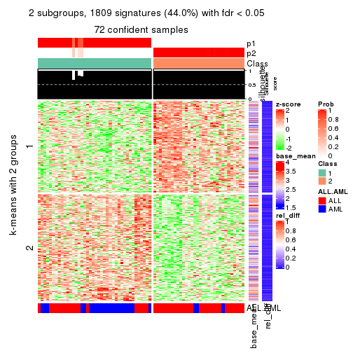</p>

</div>
<div id='tab-ATC-kmeans-get-signatures-2'>
<pre><code class="r">get_signatures(res, k = 3)
</code></pre>

<p>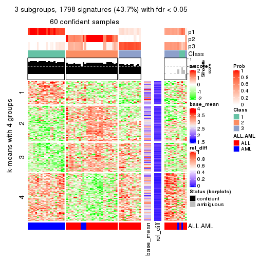</p>

</div>
<div id='tab-ATC-kmeans-get-signatures-3'>
<pre><code class="r">get_signatures(res, k = 4)
</code></pre>

<p>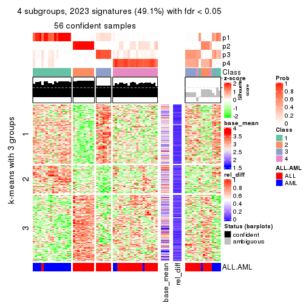</p>

</div>
<div id='tab-ATC-kmeans-get-signatures-4'>
<pre><code class="r">get_signatures(res, k = 5)
</code></pre>

<p>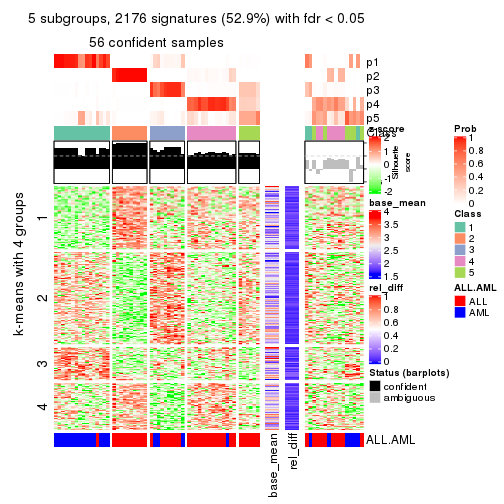</p>

</div>
<div id='tab-ATC-kmeans-get-signatures-5'>
<pre><code class="r">get_signatures(res, k = 6)
</code></pre>

<p>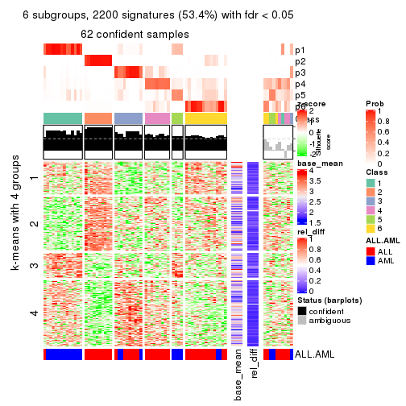</p>

</div>
</div>


Signature heatmaps where rows are not scaled:


<script>
$( function() {
	$( '#tabs-ATC-kmeans-get-signatures-no-scale' ).tabs();
} );
</script>
<div id='tabs-ATC-kmeans-get-signatures-no-scale'>
<ul>
<li><a href='#tab-ATC-kmeans-get-signatures-no-scale-1'>k = 2</a></li>
<li><a href='#tab-ATC-kmeans-get-signatures-no-scale-2'>k = 3</a></li>
<li><a href='#tab-ATC-kmeans-get-signatures-no-scale-3'>k = 4</a></li>
<li><a href='#tab-ATC-kmeans-get-signatures-no-scale-4'>k = 5</a></li>
<li><a href='#tab-ATC-kmeans-get-signatures-no-scale-5'>k = 6</a></li>
</ul>
<div id='tab-ATC-kmeans-get-signatures-no-scale-1'>
<pre><code class="r">get_signatures(res, k = 2, scale_rows = FALSE)
</code></pre>

<p>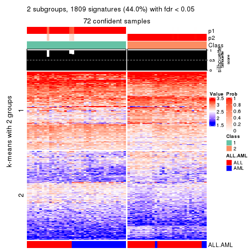</p>

</div>
<div id='tab-ATC-kmeans-get-signatures-no-scale-2'>
<pre><code class="r">get_signatures(res, k = 3, scale_rows = FALSE)
</code></pre>

<p>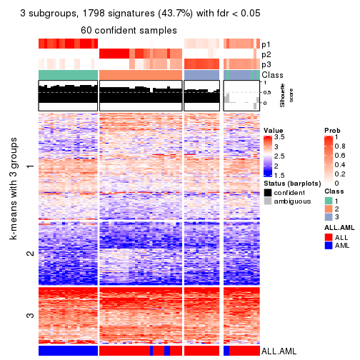</p>

</div>
<div id='tab-ATC-kmeans-get-signatures-no-scale-3'>
<pre><code class="r">get_signatures(res, k = 4, scale_rows = FALSE)
</code></pre>

<p>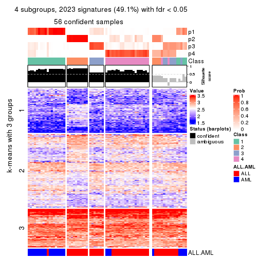</p>

</div>
<div id='tab-ATC-kmeans-get-signatures-no-scale-4'>
<pre><code class="r">get_signatures(res, k = 5, scale_rows = FALSE)
</code></pre>

<p>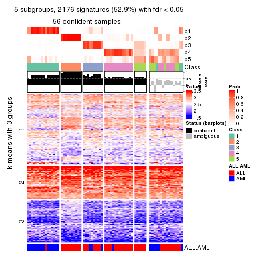</p>

</div>
<div id='tab-ATC-kmeans-get-signatures-no-scale-5'>
<pre><code class="r">get_signatures(res, k = 6, scale_rows = FALSE)
</code></pre>

<p>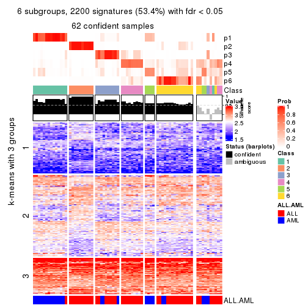</p>

</div>
</div>


Compare the overlap of signatures from different k:

```r
compare_signatures(res)
```

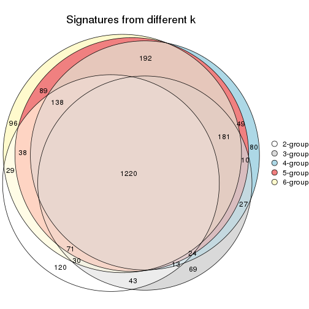

`get_signature()` returns a data frame invisibly. TO get the list of signatures, the function
call should be assigned to a variable explicitly. In following code, if `plot` argument is set
to `FALSE`, no heatmap is plotted while only the differential analysis is performed.

```r
# code only for demonstration
tb = get_signature(res, k = ..., plot = FALSE)
```

An example of the output of `tb` is:

```
#>   which_row         fdr    mean_1    mean_2 scaled_mean_1 scaled_mean_2 km
#> 1        38 0.042760348  8.373488  9.131774    -0.5533452     0.5164555  1
#> 2        40 0.018707592  7.106213  8.469186    -0.6173731     0.5762149  1
#> 3        55 0.019134737 10.221463 11.207825    -0.6159697     0.5749050  1
#> 4        59 0.006059896  5.921854  7.869574    -0.6899429     0.6439467  1
#> 5        60 0.018055526  8.928898 10.211722    -0.6204761     0.5791110  1
#> 6        98 0.009384629 15.714769 14.887706     0.6635654    -0.6193277  2
...
```

The columns in `tb` are:

1. `which_row`: row indices corresponding to the input matrix.
2. `fdr`: FDR for the differential test. 
3. `mean_x`: The mean value in group x.
4. `scaled_mean_x`: The mean value in group x after rows are scaled.
5. `km`: Row groups if k-means clustering is applied to rows.


UMAP plot which shows how samples are separated.


<script>
$( function() {
	$( '#tabs-ATC-kmeans-dimension-reduction' ).tabs();
} );
</script>
<div id='tabs-ATC-kmeans-dimension-reduction'>
<ul>
<li><a href='#tab-ATC-kmeans-dimension-reduction-1'>k = 2</a></li>
<li><a href='#tab-ATC-kmeans-dimension-reduction-2'>k = 3</a></li>
<li><a href='#tab-ATC-kmeans-dimension-reduction-3'>k = 4</a></li>
<li><a href='#tab-ATC-kmeans-dimension-reduction-4'>k = 5</a></li>
<li><a href='#tab-ATC-kmeans-dimension-reduction-5'>k = 6</a></li>
</ul>
<div id='tab-ATC-kmeans-dimension-reduction-1'>
<pre><code class="r">dimension_reduction(res, k = 2, method = &quot;UMAP&quot;)
</code></pre>

<p>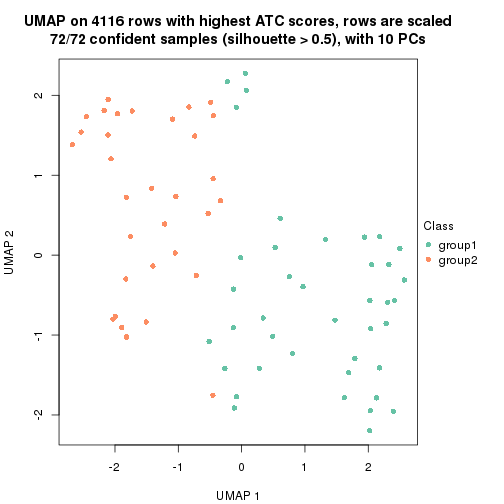</p>

</div>
<div id='tab-ATC-kmeans-dimension-reduction-2'>
<pre><code class="r">dimension_reduction(res, k = 3, method = &quot;UMAP&quot;)
</code></pre>

<p>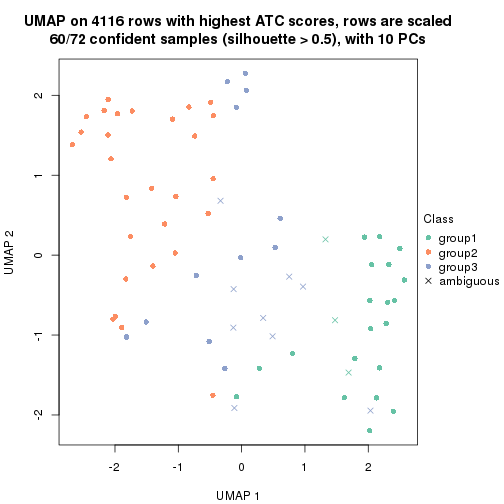</p>

</div>
<div id='tab-ATC-kmeans-dimension-reduction-3'>
<pre><code class="r">dimension_reduction(res, k = 4, method = &quot;UMAP&quot;)
</code></pre>

<p>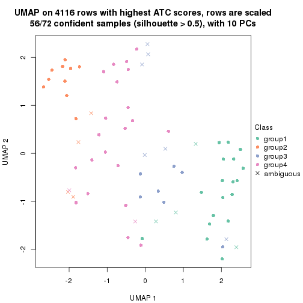</p>

</div>
<div id='tab-ATC-kmeans-dimension-reduction-4'>
<pre><code class="r">dimension_reduction(res, k = 5, method = &quot;UMAP&quot;)
</code></pre>

<p>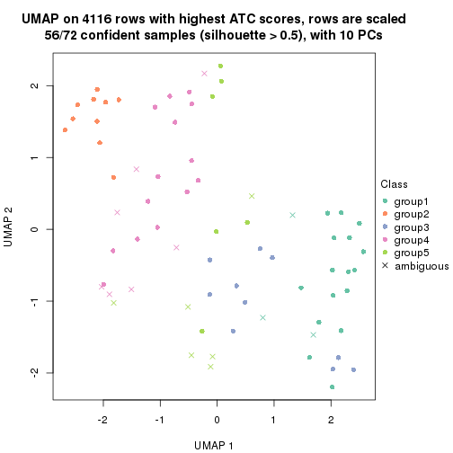</p>

</div>
<div id='tab-ATC-kmeans-dimension-reduction-5'>
<pre><code class="r">dimension_reduction(res, k = 6, method = &quot;UMAP&quot;)
</code></pre>

<p>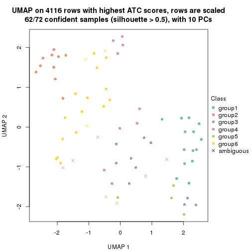</p>

</div>
</div>


Following heatmap shows how subgroups are split when increasing `k`:

```r
collect_classes(res)
```

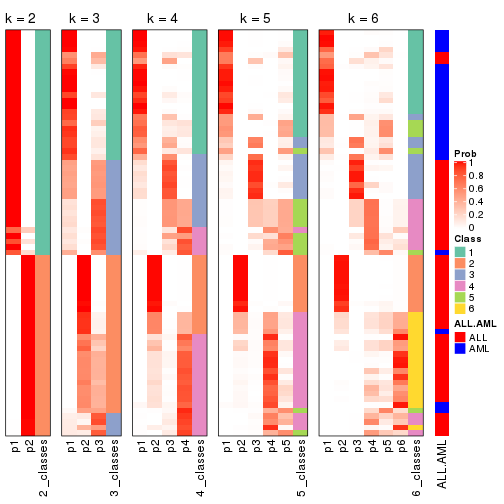


Test correlation between subgroups and known annotations. If the known
annotation is numeric, one-way ANOVA test is applied, and if the known
annotation is discrete, chi-squared contingency table test is applied.

```r
test_to_known_factors(res)
```

```
#>             n ALL.AML(p) k
#> ATC:kmeans 72   1.50e-04 2
#> ATC:kmeans 60   2.70e-11 3
#> ATC:kmeans 56   7.62e-09 4
#> ATC:kmeans 56   9.68e-08 5
#> ATC:kmeans 62   8.55e-08 6
```


If matrix rows can be associated to genes, consider to use `functional_enrichment(res,
...)` to perform function enrichment for the signature genes. See [this vignette](http://bioconductor.org/packages/devel/bioc/vignettes/cola/inst/doc/functional_enrichment.html) for more detailed explanations.


 

---------------------------------------------------


### ATC:skmeans**


The object with results only for a single top-value method and a single partition method 
can be extracted as:

```r
res = res_list["ATC", "skmeans"]
# you can also extract it by
# res = res_list["ATC:skmeans"]
```

A summary of `res` and all the functions that can be applied to it:

```r
res
```

```
#> A 'ConsensusPartition' object with k = 2, 3, 4, 5, 6.
#>   On a matrix with 4116 rows and 72 columns.
#>   Top rows (412, 824, 1235, 1646, 2058) are extracted by 'ATC' method.
#>   Subgroups are detected by 'skmeans' method.
#>   Performed in total 1250 partitions by row resampling.
#>   Best k for subgroups seems to be 3.
#> 
#> Following methods can be applied to this 'ConsensusPartition' object:
#>  [1] "cola_report"             "collect_classes"         "collect_plots"          
#>  [4] "collect_stats"           "colnames"                "compare_signatures"     
#>  [7] "consensus_heatmap"       "dimension_reduction"     "functional_enrichment"  
#> [10] "get_anno_col"            "get_anno"                "get_classes"            
#> [13] "get_consensus"           "get_matrix"              "get_membership"         
#> [16] "get_param"               "get_signatures"          "get_stats"              
#> [19] "is_best_k"               "is_stable_k"             "membership_heatmap"     
#> [22] "ncol"                    "nrow"                    "plot_ecdf"              
#> [25] "rownames"                "select_partition_number" "show"                   
#> [28] "suggest_best_k"          "test_to_known_factors"
```

`collect_plots()` function collects all the plots made from `res` for all `k` (number of partitions)
into one single page to provide an easy and fast comparison between different `k`.

```r
collect_plots(res)
```

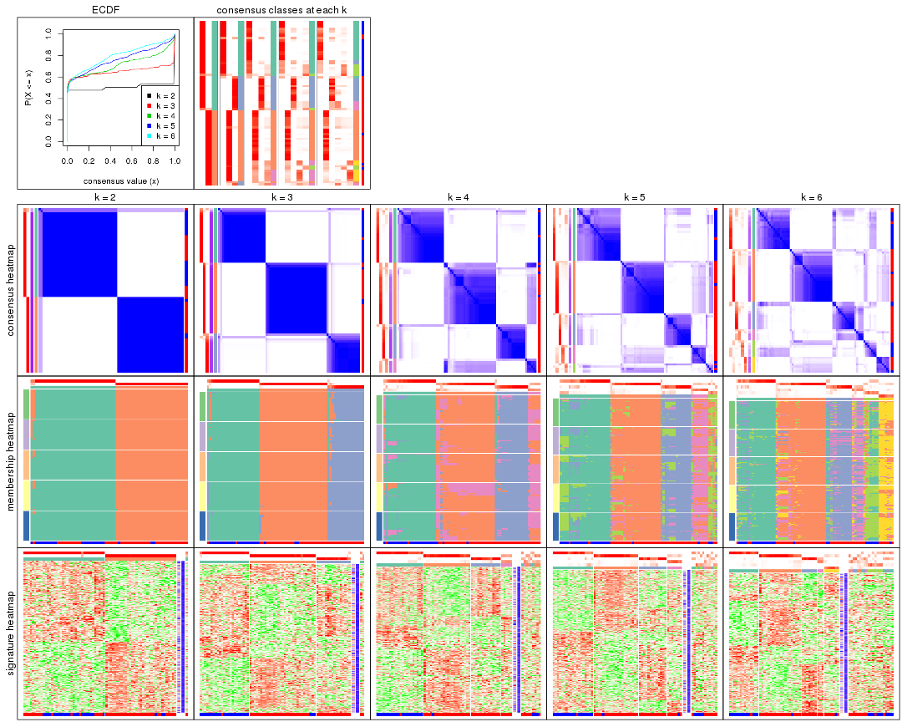

The plots are:

- The first row: a plot of the ECDF (empirical cumulative distribution
  function) curves of the consensus matrix for each `k` and the heatmap of
  predicted classes for each `k`.
- The second row: heatmaps of the consensus matrix for each `k`.
- The third row: heatmaps of the membership matrix for each `k`.
- The fouth row: heatmaps of the signatures for each `k`.

All the plots in panels can be made by individual functions and they are
plotted later in this section.

`select_partition_number()` produces several plots showing different
statistics for choosing "optimized" `k`. There are following statistics:

- ECDF curves of the consensus matrix for each `k`;
- 1-PAC. [The PAC
  score](https://en.wikipedia.org/wiki/Consensus_clustering#Over-interpretation_potential_of_consensus_clustering)
  measures the proportion of the ambiguous subgrouping.
- Mean silhouette score.
- Concordance. The mean probability of fiting the consensus class ids in all
  partitions.
- Area increased. Denote $A_k$ as the area under the ECDF curve for current
  `k`, the area increased is defined as $A_k - A_{k-1}$.
- Rand index. The percent of pairs of samples that are both in a same cluster
  or both are not in a same cluster in the partition of k and k-1.
- Jaccard index. The ratio of pairs of samples are both in a same cluster in
  the partition of k and k-1 and the pairs of samples are both in a same
  cluster in the partition k or k-1.

The detailed explanations of these statistics can be found in [the _cola_
vignette](http://bioconductor.org/packages/devel/bioc/vignettes/cola/inst/doc/cola.html#toc_13).

Generally speaking, lower PAC score, higher mean silhouette score or higher
concordance corresponds to better partition. Rand index and Jaccard index
measure how similar the current partition is compared to partition with `k-1`.
If they are too similar, we won't accept `k` is better than `k-1`.

```r
select_partition_number(res)
```

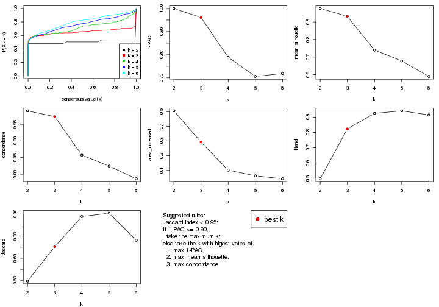

The numeric values for all these statistics can be obtained by `get_stats()`.

```r
get_stats(res)
```

```
#>   k 1-PAC mean_silhouette concordance area_increased  Rand Jaccard
#> 2 2 1.000           0.977       0.991         0.5052 0.496   0.496
#> 3 3 0.961           0.932       0.973         0.2923 0.823   0.652
#> 4 4 0.789           0.740       0.857         0.1018 0.925   0.789
#> 5 5 0.706           0.678       0.825         0.0633 0.941   0.804
#> 6 6 0.719           0.590       0.786         0.0431 0.914   0.681
```

`suggest_best_k()` suggests the best $k$ based on these statistics. The rules are as follows:

- All $k$ with Jaccard index larger than 0.95 are removed because increasing
  $k$ does not provide enough extra information. If all $k$ are removed, it is
  marked as no subgroup is detected.
- For all $k$ with 1-PAC score larger than 0.9, the maximal $k$ is taken as
  the best $k$, and other $k$ are marked as optional $k$.
- If it does not fit the second rule. The $k$ with the maximal vote of the
  highest 1-PAC score, highest mean silhouette, and highest concordance is
  taken as the best $k$.

```r
suggest_best_k(res)
```

```
#> [1] 3
#> attr(,"optional")
#> [1] 2
```

There is also optional best $k$ = 2 that is worth to check.

Following shows the table of the partitions (You need to click the **show/hide
code output** link to see it). The membership matrix (columns with name `p*`)
is inferred by
[`clue::cl_consensus()`](https://www.rdocumentation.org/link/cl_consensus?package=clue)
function with the `SE` method. Basically the value in the membership matrix
represents the probability to belong to a certain group. The finall class
label for an item is determined with the group with highest probability it
belongs to.

In `get_classes()` function, the entropy is calculated from the membership
matrix and the silhouette score is calculated from the consensus matrix.


<script>
$( function() {
	$( '#tabs-ATC-skmeans-get-classes' ).tabs();
} );
</script>
<div id='tabs-ATC-skmeans-get-classes'>
<ul>
<li><a href='#tab-ATC-skmeans-get-classes-1'>k = 2</a></li>
<li><a href='#tab-ATC-skmeans-get-classes-2'>k = 3</a></li>
<li><a href='#tab-ATC-skmeans-get-classes-3'>k = 4</a></li>
<li><a href='#tab-ATC-skmeans-get-classes-4'>k = 5</a></li>
<li><a href='#tab-ATC-skmeans-get-classes-5'>k = 6</a></li>
</ul>

<div id='tab-ATC-skmeans-get-classes-1'>
<p><a id='tab-ATC-skmeans-get-classes-1-a' style='color:#0366d6' href='#'>show/hide code output</a></p>
<pre><code class="r">cbind(get_classes(res, k = 2), get_membership(res, k = 2))
</code></pre>

<pre><code>#&gt;           class entropy silhouette    p1    p2
#&gt; sample_39     1  0.0000      0.982 1.000 0.000
#&gt; sample_40     1  0.0000      0.982 1.000 0.000
#&gt; sample_42     2  0.0000      1.000 0.000 1.000
#&gt; sample_47     2  0.0000      1.000 0.000 1.000
#&gt; sample_48     2  0.0000      1.000 0.000 1.000
#&gt; sample_49     1  0.0000      0.982 1.000 0.000
#&gt; sample_41     2  0.0000      1.000 0.000 1.000
#&gt; sample_43     2  0.0000      1.000 0.000 1.000
#&gt; sample_44     2  0.0000      1.000 0.000 1.000
#&gt; sample_45     2  0.0000      1.000 0.000 1.000
#&gt; sample_46     2  0.0000      1.000 0.000 1.000
#&gt; sample_70     2  0.0000      1.000 0.000 1.000
#&gt; sample_71     2  0.0000      1.000 0.000 1.000
#&gt; sample_72     2  0.0000      1.000 0.000 1.000
#&gt; sample_68     2  0.0000      1.000 0.000 1.000
#&gt; sample_69     2  0.0000      1.000 0.000 1.000
#&gt; sample_67     2  0.0000      1.000 0.000 1.000
#&gt; sample_55     1  0.0000      0.982 1.000 0.000
#&gt; sample_56     1  0.0000      0.982 1.000 0.000
#&gt; sample_59     2  0.0000      1.000 0.000 1.000
#&gt; sample_52     1  0.0000      0.982 1.000 0.000
#&gt; sample_53     1  0.0000      0.982 1.000 0.000
#&gt; sample_51     1  0.0000      0.982 1.000 0.000
#&gt; sample_50     1  0.0000      0.982 1.000 0.000
#&gt; sample_54     2  0.0000      1.000 0.000 1.000
#&gt; sample_57     1  0.0000      0.982 1.000 0.000
#&gt; sample_58     1  0.0000      0.982 1.000 0.000
#&gt; sample_60     1  0.9170      0.515 0.668 0.332
#&gt; sample_61     1  0.0000      0.982 1.000 0.000
#&gt; sample_65     1  0.0000      0.982 1.000 0.000
#&gt; sample_66     2  0.0000      1.000 0.000 1.000
#&gt; sample_63     1  0.0000      0.982 1.000 0.000
#&gt; sample_64     1  0.0000      0.982 1.000 0.000
#&gt; sample_62     1  0.0000      0.982 1.000 0.000
#&gt; sample_1      1  0.0000      0.982 1.000 0.000
#&gt; sample_2      2  0.0000      1.000 0.000 1.000
#&gt; sample_3      1  0.0000      0.982 1.000 0.000
#&gt; sample_4      1  0.0000      0.982 1.000 0.000
#&gt; sample_5      2  0.0000      1.000 0.000 1.000
#&gt; sample_6      1  0.0000      0.982 1.000 0.000
#&gt; sample_7      1  0.0000      0.982 1.000 0.000
#&gt; sample_8      1  0.0000      0.982 1.000 0.000
#&gt; sample_9      2  0.0000      1.000 0.000 1.000
#&gt; sample_10     2  0.0672      0.992 0.008 0.992
#&gt; sample_11     2  0.0000      1.000 0.000 1.000
#&gt; sample_12     1  0.0000      0.982 1.000 0.000
#&gt; sample_13     2  0.0000      1.000 0.000 1.000
#&gt; sample_14     2  0.0000      1.000 0.000 1.000
#&gt; sample_15     2  0.0000      1.000 0.000 1.000
#&gt; sample_16     2  0.0000      1.000 0.000 1.000
#&gt; sample_17     2  0.0000      1.000 0.000 1.000
#&gt; sample_18     1  0.9286      0.489 0.656 0.344
#&gt; sample_19     2  0.0000      1.000 0.000 1.000
#&gt; sample_20     2  0.0000      1.000 0.000 1.000
#&gt; sample_21     2  0.0000      1.000 0.000 1.000
#&gt; sample_22     1  0.0000      0.982 1.000 0.000
#&gt; sample_23     1  0.0000      0.982 1.000 0.000
#&gt; sample_24     2  0.0000      1.000 0.000 1.000
#&gt; sample_25     1  0.0000      0.982 1.000 0.000
#&gt; sample_26     2  0.0000      1.000 0.000 1.000
#&gt; sample_27     1  0.0000      0.982 1.000 0.000
#&gt; sample_34     1  0.0000      0.982 1.000 0.000
#&gt; sample_35     1  0.0000      0.982 1.000 0.000
#&gt; sample_36     1  0.0000      0.982 1.000 0.000
#&gt; sample_37     1  0.0000      0.982 1.000 0.000
#&gt; sample_38     1  0.0000      0.982 1.000 0.000
#&gt; sample_28     1  0.0000      0.982 1.000 0.000
#&gt; sample_29     2  0.0000      1.000 0.000 1.000
#&gt; sample_30     1  0.0000      0.982 1.000 0.000
#&gt; sample_31     1  0.0000      0.982 1.000 0.000
#&gt; sample_32     1  0.0000      0.982 1.000 0.000
#&gt; sample_33     1  0.0000      0.982 1.000 0.000
</code></pre>

<script>
$('#tab-ATC-skmeans-get-classes-1-a').parent().next().next().hide();
$('#tab-ATC-skmeans-get-classes-1-a').click(function(){
  $('#tab-ATC-skmeans-get-classes-1-a').parent().next().next().toggle();
  return(false);
});
</script>
</div>

<div id='tab-ATC-skmeans-get-classes-2'>
<p><a id='tab-ATC-skmeans-get-classes-2-a' style='color:#0366d6' href='#'>show/hide code output</a></p>
<pre><code class="r">cbind(get_classes(res, k = 3), get_membership(res, k = 3))
</code></pre>

<pre><code>#&gt;           class entropy silhouette    p1    p2    p3
#&gt; sample_39     3  0.0592      0.922 0.012 0.000 0.988
#&gt; sample_40     3  0.0237      0.927 0.004 0.000 0.996
#&gt; sample_42     2  0.0000      0.994 0.000 1.000 0.000
#&gt; sample_47     2  0.0000      0.994 0.000 1.000 0.000
#&gt; sample_48     2  0.0000      0.994 0.000 1.000 0.000
#&gt; sample_49     3  0.0237      0.927 0.004 0.000 0.996
#&gt; sample_41     2  0.0000      0.994 0.000 1.000 0.000
#&gt; sample_43     2  0.0000      0.994 0.000 1.000 0.000
#&gt; sample_44     2  0.0000      0.994 0.000 1.000 0.000
#&gt; sample_45     2  0.0000      0.994 0.000 1.000 0.000
#&gt; sample_46     2  0.0000      0.994 0.000 1.000 0.000
#&gt; sample_70     2  0.3752      0.819 0.000 0.856 0.144
#&gt; sample_71     2  0.0000      0.994 0.000 1.000 0.000
#&gt; sample_72     2  0.0000      0.994 0.000 1.000 0.000
#&gt; sample_68     2  0.0000      0.994 0.000 1.000 0.000
#&gt; sample_69     2  0.0000      0.994 0.000 1.000 0.000
#&gt; sample_67     2  0.0000      0.994 0.000 1.000 0.000
#&gt; sample_55     3  0.0000      0.927 0.000 0.000 1.000
#&gt; sample_56     3  0.0237      0.927 0.004 0.000 0.996
#&gt; sample_59     2  0.1411      0.958 0.000 0.964 0.036
#&gt; sample_52     1  0.0000      0.967 1.000 0.000 0.000
#&gt; sample_53     1  0.0000      0.967 1.000 0.000 0.000
#&gt; sample_51     1  0.0000      0.967 1.000 0.000 0.000
#&gt; sample_50     1  0.0000      0.967 1.000 0.000 0.000
#&gt; sample_54     2  0.0000      0.994 0.000 1.000 0.000
#&gt; sample_57     1  0.0000      0.967 1.000 0.000 0.000
#&gt; sample_58     1  0.0000      0.967 1.000 0.000 0.000
#&gt; sample_60     1  0.5680      0.670 0.764 0.212 0.024
#&gt; sample_61     1  0.0000      0.967 1.000 0.000 0.000
#&gt; sample_65     1  0.0000      0.967 1.000 0.000 0.000
#&gt; sample_66     2  0.0000      0.994 0.000 1.000 0.000
#&gt; sample_63     1  0.0000      0.967 1.000 0.000 0.000
#&gt; sample_64     1  0.0237      0.964 0.996 0.000 0.004
#&gt; sample_62     1  0.0000      0.967 1.000 0.000 0.000
#&gt; sample_1      3  0.0000      0.927 0.000 0.000 1.000
#&gt; sample_2      2  0.0000      0.994 0.000 1.000 0.000
#&gt; sample_3      3  0.0000      0.927 0.000 0.000 1.000
#&gt; sample_4      3  0.0000      0.927 0.000 0.000 1.000
#&gt; sample_5      2  0.0000      0.994 0.000 1.000 0.000
#&gt; sample_6      3  0.0000      0.927 0.000 0.000 1.000
#&gt; sample_7      3  0.0000      0.927 0.000 0.000 1.000
#&gt; sample_8      3  0.0592      0.922 0.012 0.000 0.988
#&gt; sample_9      2  0.0000      0.994 0.000 1.000 0.000
#&gt; sample_10     3  0.4399      0.756 0.000 0.188 0.812
#&gt; sample_11     2  0.0000      0.994 0.000 1.000 0.000
#&gt; sample_12     1  0.0000      0.967 1.000 0.000 0.000
#&gt; sample_13     2  0.0000      0.994 0.000 1.000 0.000
#&gt; sample_14     2  0.0000      0.994 0.000 1.000 0.000
#&gt; sample_15     2  0.0000      0.994 0.000 1.000 0.000
#&gt; sample_16     2  0.0000      0.994 0.000 1.000 0.000
#&gt; sample_17     2  0.0000      0.994 0.000 1.000 0.000
#&gt; sample_18     3  0.1860      0.890 0.000 0.052 0.948
#&gt; sample_19     2  0.0000      0.994 0.000 1.000 0.000
#&gt; sample_20     2  0.0000      0.994 0.000 1.000 0.000
#&gt; sample_21     2  0.0000      0.994 0.000 1.000 0.000
#&gt; sample_22     1  0.6180      0.242 0.584 0.000 0.416
#&gt; sample_23     3  0.0237      0.927 0.004 0.000 0.996
#&gt; sample_24     2  0.0000      0.994 0.000 1.000 0.000
#&gt; sample_25     3  0.5678      0.520 0.316 0.000 0.684
#&gt; sample_26     3  0.6291      0.144 0.000 0.468 0.532
#&gt; sample_27     3  0.0237      0.927 0.004 0.000 0.996
#&gt; sample_34     1  0.0000      0.967 1.000 0.000 0.000
#&gt; sample_35     1  0.1163      0.942 0.972 0.000 0.028
#&gt; sample_36     1  0.0000      0.967 1.000 0.000 0.000
#&gt; sample_37     1  0.0000      0.967 1.000 0.000 0.000
#&gt; sample_38     1  0.0000      0.967 1.000 0.000 0.000
#&gt; sample_28     1  0.0000      0.967 1.000 0.000 0.000
#&gt; sample_29     2  0.0000      0.994 0.000 1.000 0.000
#&gt; sample_30     1  0.0000      0.967 1.000 0.000 0.000
#&gt; sample_31     1  0.0000      0.967 1.000 0.000 0.000
#&gt; sample_32     1  0.0000      0.967 1.000 0.000 0.000
#&gt; sample_33     1  0.0000      0.967 1.000 0.000 0.000
</code></pre>

<script>
$('#tab-ATC-skmeans-get-classes-2-a').parent().next().next().hide();
$('#tab-ATC-skmeans-get-classes-2-a').click(function(){
  $('#tab-ATC-skmeans-get-classes-2-a').parent().next().next().toggle();
  return(false);
});
</script>
</div>

<div id='tab-ATC-skmeans-get-classes-3'>
<p><a id='tab-ATC-skmeans-get-classes-3-a' style='color:#0366d6' href='#'>show/hide code output</a></p>
<pre><code class="r">cbind(get_classes(res, k = 4), get_membership(res, k = 4))
</code></pre>

<pre><code>#&gt;           class entropy silhouette    p1    p2    p3    p4
#&gt; sample_39     3  0.0000     0.9246 0.000 0.000 1.000 0.000
#&gt; sample_40     3  0.0188     0.9230 0.000 0.000 0.996 0.004
#&gt; sample_42     4  0.4992     0.7177 0.000 0.476 0.000 0.524
#&gt; sample_47     2  0.0469     0.8039 0.000 0.988 0.000 0.012
#&gt; sample_48     2  0.0000     0.8048 0.000 1.000 0.000 0.000
#&gt; sample_49     3  0.0000     0.9246 0.000 0.000 1.000 0.000
#&gt; sample_41     2  0.0469     0.8039 0.000 0.988 0.000 0.012
#&gt; sample_43     2  0.2216     0.7632 0.000 0.908 0.000 0.092
#&gt; sample_44     2  0.2216     0.7632 0.000 0.908 0.000 0.092
#&gt; sample_45     2  0.2149     0.7649 0.000 0.912 0.000 0.088
#&gt; sample_46     2  0.2281     0.7602 0.000 0.904 0.000 0.096
#&gt; sample_70     2  0.4418     0.6225 0.000 0.784 0.032 0.184
#&gt; sample_71     4  0.5050     0.7465 0.004 0.408 0.000 0.588
#&gt; sample_72     4  0.4941     0.7571 0.000 0.436 0.000 0.564
#&gt; sample_68     2  0.0000     0.8048 0.000 1.000 0.000 0.000
#&gt; sample_69     2  0.0000     0.8048 0.000 1.000 0.000 0.000
#&gt; sample_67     4  0.4989     0.7451 0.000 0.472 0.000 0.528
#&gt; sample_55     3  0.2647     0.8625 0.000 0.000 0.880 0.120
#&gt; sample_56     3  0.0000     0.9246 0.000 0.000 1.000 0.000
#&gt; sample_59     2  0.4964     0.3751 0.000 0.616 0.004 0.380
#&gt; sample_52     1  0.3219     0.8384 0.836 0.000 0.000 0.164
#&gt; sample_53     1  0.0000     0.9132 1.000 0.000 0.000 0.000
#&gt; sample_51     1  0.0000     0.9132 1.000 0.000 0.000 0.000
#&gt; sample_50     1  0.0000     0.9132 1.000 0.000 0.000 0.000
#&gt; sample_54     2  0.4564     0.4369 0.000 0.672 0.000 0.328
#&gt; sample_57     1  0.4365     0.8113 0.784 0.000 0.028 0.188
#&gt; sample_58     1  0.2214     0.8936 0.928 0.000 0.044 0.028
#&gt; sample_60     1  0.7834     0.2702 0.444 0.196 0.008 0.352
#&gt; sample_61     1  0.1452     0.9013 0.956 0.000 0.036 0.008
#&gt; sample_65     1  0.0524     0.9110 0.988 0.000 0.004 0.008
#&gt; sample_66     2  0.0707     0.7992 0.000 0.980 0.000 0.020
#&gt; sample_63     1  0.3300     0.8493 0.848 0.000 0.008 0.144
#&gt; sample_64     1  0.2909     0.8659 0.888 0.000 0.092 0.020
#&gt; sample_62     1  0.3157     0.8503 0.852 0.000 0.004 0.144
#&gt; sample_1      3  0.0921     0.9198 0.000 0.000 0.972 0.028
#&gt; sample_2      2  0.5000    -0.7479 0.000 0.504 0.000 0.496
#&gt; sample_3      3  0.1792     0.9073 0.000 0.000 0.932 0.068
#&gt; sample_4      3  0.1022     0.9188 0.000 0.000 0.968 0.032
#&gt; sample_5      2  0.0000     0.8048 0.000 1.000 0.000 0.000
#&gt; sample_6      3  0.1716     0.9090 0.000 0.000 0.936 0.064
#&gt; sample_7      3  0.0000     0.9246 0.000 0.000 1.000 0.000
#&gt; sample_8      3  0.0000     0.9246 0.000 0.000 1.000 0.000
#&gt; sample_9      2  0.1716     0.7620 0.000 0.936 0.000 0.064
#&gt; sample_10     4  0.6013     0.1072 0.000 0.064 0.312 0.624
#&gt; sample_11     4  0.4994     0.7231 0.000 0.480 0.000 0.520
#&gt; sample_12     1  0.0376     0.9110 0.992 0.000 0.004 0.004
#&gt; sample_13     2  0.0000     0.8048 0.000 1.000 0.000 0.000
#&gt; sample_14     2  0.0817     0.7924 0.000 0.976 0.000 0.024
#&gt; sample_15     2  0.0000     0.8048 0.000 1.000 0.000 0.000
#&gt; sample_16     2  0.1637     0.7766 0.000 0.940 0.000 0.060
#&gt; sample_17     2  0.2081     0.7481 0.000 0.916 0.000 0.084
#&gt; sample_18     3  0.4910     0.7176 0.000 0.020 0.704 0.276
#&gt; sample_19     2  0.0921     0.8006 0.000 0.972 0.000 0.028
#&gt; sample_20     2  0.0000     0.8048 0.000 1.000 0.000 0.000
#&gt; sample_21     2  0.0000     0.8048 0.000 1.000 0.000 0.000
#&gt; sample_22     1  0.5097     0.2297 0.568 0.000 0.428 0.004
#&gt; sample_23     3  0.1716     0.9090 0.000 0.000 0.936 0.064
#&gt; sample_24     2  0.0000     0.8048 0.000 1.000 0.000 0.000
#&gt; sample_25     3  0.6176     0.3528 0.368 0.000 0.572 0.060
#&gt; sample_26     2  0.7717    -0.0682 0.000 0.448 0.288 0.264
#&gt; sample_27     3  0.0000     0.9246 0.000 0.000 1.000 0.000
#&gt; sample_34     1  0.1151     0.9058 0.968 0.000 0.024 0.008
#&gt; sample_35     1  0.4086     0.7318 0.776 0.000 0.216 0.008
#&gt; sample_36     1  0.0000     0.9132 1.000 0.000 0.000 0.000
#&gt; sample_37     1  0.0000     0.9132 1.000 0.000 0.000 0.000
#&gt; sample_38     1  0.0000     0.9132 1.000 0.000 0.000 0.000
#&gt; sample_28     1  0.0000     0.9132 1.000 0.000 0.000 0.000
#&gt; sample_29     2  0.5167    -0.7191 0.004 0.508 0.000 0.488
#&gt; sample_30     1  0.0000     0.9132 1.000 0.000 0.000 0.000
#&gt; sample_31     1  0.0188     0.9125 0.996 0.000 0.000 0.004
#&gt; sample_32     1  0.0000     0.9132 1.000 0.000 0.000 0.000
#&gt; sample_33     1  0.0000     0.9132 1.000 0.000 0.000 0.000
</code></pre>

<script>
$('#tab-ATC-skmeans-get-classes-3-a').parent().next().next().hide();
$('#tab-ATC-skmeans-get-classes-3-a').click(function(){
  $('#tab-ATC-skmeans-get-classes-3-a').parent().next().next().toggle();
  return(false);
});
</script>
</div>

<div id='tab-ATC-skmeans-get-classes-4'>
<p><a id='tab-ATC-skmeans-get-classes-4-a' style='color:#0366d6' href='#'>show/hide code output</a></p>
<pre><code class="r">cbind(get_classes(res, k = 5), get_membership(res, k = 5))
</code></pre>

<pre><code>#&gt;           class entropy silhouette    p1    p2    p3    p4    p5
#&gt; sample_39     3  0.0324     0.8073 0.004 0.000 0.992 0.000 0.004
#&gt; sample_40     3  0.0510     0.8003 0.000 0.000 0.984 0.000 0.016
#&gt; sample_42     4  0.4157     0.7685 0.000 0.264 0.000 0.716 0.020
#&gt; sample_47     2  0.0566     0.8652 0.000 0.984 0.000 0.012 0.004
#&gt; sample_48     2  0.0000     0.8676 0.000 1.000 0.000 0.000 0.000
#&gt; sample_49     3  0.0162     0.8090 0.000 0.000 0.996 0.000 0.004
#&gt; sample_41     2  0.0451     0.8652 0.000 0.988 0.000 0.008 0.004
#&gt; sample_43     2  0.3526     0.7496 0.000 0.832 0.000 0.072 0.096
#&gt; sample_44     2  0.3234     0.7683 0.000 0.852 0.000 0.064 0.084
#&gt; sample_45     2  0.3110     0.7745 0.000 0.860 0.000 0.060 0.080
#&gt; sample_46     2  0.3517     0.7479 0.000 0.832 0.000 0.068 0.100
#&gt; sample_70     2  0.5782     0.4295 0.000 0.644 0.012 0.128 0.216
#&gt; sample_71     4  0.3006     0.7504 0.004 0.156 0.000 0.836 0.004
#&gt; sample_72     4  0.3123     0.7713 0.000 0.184 0.000 0.812 0.004
#&gt; sample_68     2  0.0000     0.8676 0.000 1.000 0.000 0.000 0.000
#&gt; sample_69     2  0.0000     0.8676 0.000 1.000 0.000 0.000 0.000
#&gt; sample_67     4  0.3398     0.7868 0.000 0.216 0.000 0.780 0.004
#&gt; sample_55     3  0.4491     0.5410 0.000 0.000 0.652 0.020 0.328
#&gt; sample_56     3  0.0162     0.8090 0.000 0.000 0.996 0.000 0.004
#&gt; sample_59     5  0.6162     0.1140 0.000 0.436 0.012 0.092 0.460
#&gt; sample_52     1  0.4597     0.4845 0.564 0.000 0.000 0.012 0.424
#&gt; sample_53     1  0.0000     0.8138 1.000 0.000 0.000 0.000 0.000
#&gt; sample_51     1  0.0000     0.8138 1.000 0.000 0.000 0.000 0.000
#&gt; sample_50     1  0.0000     0.8138 1.000 0.000 0.000 0.000 0.000
#&gt; sample_54     5  0.4560     0.1341 0.000 0.484 0.000 0.008 0.508
#&gt; sample_57     1  0.6092     0.4178 0.480 0.000 0.108 0.004 0.408
#&gt; sample_58     1  0.5205     0.6580 0.672 0.000 0.224 0.000 0.104
#&gt; sample_60     5  0.4718     0.2605 0.168 0.072 0.012 0.000 0.748
#&gt; sample_61     1  0.4298     0.7121 0.756 0.000 0.184 0.000 0.060
#&gt; sample_65     1  0.2233     0.7941 0.904 0.000 0.016 0.000 0.080
#&gt; sample_66     2  0.1195     0.8506 0.000 0.960 0.000 0.028 0.012
#&gt; sample_63     1  0.5076     0.5513 0.600 0.000 0.024 0.012 0.364
#&gt; sample_64     1  0.5652     0.5217 0.564 0.000 0.344 0.000 0.092
#&gt; sample_62     1  0.4975     0.5246 0.584 0.000 0.016 0.012 0.388
#&gt; sample_1      3  0.2628     0.7800 0.000 0.000 0.884 0.028 0.088
#&gt; sample_2      4  0.4046     0.7765 0.000 0.296 0.000 0.696 0.008
#&gt; sample_3      3  0.5120     0.6720 0.000 0.000 0.684 0.104 0.212
#&gt; sample_4      3  0.3608     0.7510 0.000 0.000 0.812 0.040 0.148
#&gt; sample_5      2  0.0000     0.8676 0.000 1.000 0.000 0.000 0.000
#&gt; sample_6      3  0.5060     0.6785 0.000 0.000 0.692 0.104 0.204
#&gt; sample_7      3  0.0451     0.8086 0.000 0.000 0.988 0.004 0.008
#&gt; sample_8      3  0.0000     0.8089 0.000 0.000 1.000 0.000 0.000
#&gt; sample_9      2  0.4266     0.6275 0.000 0.776 0.000 0.120 0.104
#&gt; sample_10     4  0.7086     0.2233 0.000 0.048 0.156 0.504 0.292
#&gt; sample_11     4  0.4748     0.7385 0.000 0.300 0.000 0.660 0.040
#&gt; sample_12     1  0.0960     0.8096 0.972 0.000 0.008 0.004 0.016
#&gt; sample_13     2  0.0000     0.8676 0.000 1.000 0.000 0.000 0.000
#&gt; sample_14     2  0.1310     0.8466 0.000 0.956 0.000 0.020 0.024
#&gt; sample_15     2  0.0000     0.8676 0.000 1.000 0.000 0.000 0.000
#&gt; sample_16     2  0.1725     0.8353 0.000 0.936 0.000 0.020 0.044
#&gt; sample_17     2  0.2595     0.7856 0.000 0.888 0.000 0.032 0.080
#&gt; sample_18     5  0.5613    -0.3478 0.000 0.004 0.412 0.064 0.520
#&gt; sample_19     2  0.0703     0.8620 0.000 0.976 0.000 0.024 0.000
#&gt; sample_20     2  0.0000     0.8676 0.000 1.000 0.000 0.000 0.000
#&gt; sample_21     2  0.0290     0.8646 0.000 0.992 0.000 0.008 0.000
#&gt; sample_22     1  0.4504     0.3341 0.564 0.000 0.428 0.008 0.000
#&gt; sample_23     3  0.5060     0.6785 0.000 0.000 0.692 0.104 0.204
#&gt; sample_24     2  0.0000     0.8676 0.000 1.000 0.000 0.000 0.000
#&gt; sample_25     3  0.7185     0.0147 0.396 0.000 0.424 0.116 0.064
#&gt; sample_26     2  0.8598    -0.4169 0.000 0.276 0.256 0.228 0.240
#&gt; sample_27     3  0.0162     0.8090 0.000 0.000 0.996 0.000 0.004
#&gt; sample_34     1  0.2922     0.7827 0.872 0.000 0.072 0.000 0.056
#&gt; sample_35     1  0.5414     0.4138 0.528 0.000 0.412 0.000 0.060
#&gt; sample_36     1  0.0290     0.8128 0.992 0.000 0.000 0.000 0.008
#&gt; sample_37     1  0.0000     0.8138 1.000 0.000 0.000 0.000 0.000
#&gt; sample_38     1  0.0162     0.8141 0.996 0.000 0.004 0.000 0.000
#&gt; sample_28     1  0.0162     0.8141 0.996 0.000 0.004 0.000 0.000
#&gt; sample_29     4  0.4806     0.7335 0.012 0.336 0.000 0.636 0.016
#&gt; sample_30     1  0.0955     0.8057 0.968 0.000 0.000 0.004 0.028
#&gt; sample_31     1  0.1282     0.8064 0.952 0.000 0.000 0.004 0.044
#&gt; sample_32     1  0.0162     0.8141 0.996 0.000 0.004 0.000 0.000
#&gt; sample_33     1  0.0162     0.8141 0.996 0.000 0.004 0.000 0.000
</code></pre>

<script>
$('#tab-ATC-skmeans-get-classes-4-a').parent().next().next().hide();
$('#tab-ATC-skmeans-get-classes-4-a').click(function(){
  $('#tab-ATC-skmeans-get-classes-4-a').parent().next().next().toggle();
  return(false);
});
</script>
</div>

<div id='tab-ATC-skmeans-get-classes-5'>
<p><a id='tab-ATC-skmeans-get-classes-5-a' style='color:#0366d6' href='#'>show/hide code output</a></p>
<pre><code class="r">cbind(get_classes(res, k = 6), get_membership(res, k = 6))
</code></pre>

<pre><code>#&gt;           class entropy silhouette    p1    p2    p3    p4    p5    p6
#&gt; sample_39     3  0.0810    0.65026 0.004 0.000 0.976 0.008 0.004 0.008
#&gt; sample_40     3  0.1546    0.63483 0.004 0.000 0.944 0.028 0.020 0.004
#&gt; sample_42     6  0.4280    0.77106 0.000 0.212 0.000 0.040 0.020 0.728
#&gt; sample_47     2  0.0520    0.81819 0.000 0.984 0.000 0.008 0.008 0.000
#&gt; sample_48     2  0.0000    0.82147 0.000 1.000 0.000 0.000 0.000 0.000
#&gt; sample_49     3  0.0000    0.65447 0.000 0.000 1.000 0.000 0.000 0.000
#&gt; sample_41     2  0.0260    0.82023 0.000 0.992 0.000 0.000 0.000 0.008
#&gt; sample_43     2  0.5305    0.61397 0.000 0.684 0.000 0.160 0.084 0.072
#&gt; sample_44     2  0.4933    0.64434 0.000 0.716 0.000 0.152 0.072 0.060
#&gt; sample_45     2  0.4900    0.64817 0.000 0.720 0.000 0.148 0.068 0.064
#&gt; sample_46     2  0.5414    0.60120 0.000 0.672 0.000 0.168 0.088 0.072
#&gt; sample_70     2  0.7213    0.21823 0.000 0.408 0.012 0.340 0.136 0.104
#&gt; sample_71     6  0.2238    0.74163 0.008 0.068 0.000 0.016 0.004 0.904
#&gt; sample_72     6  0.2163    0.77001 0.000 0.096 0.000 0.008 0.004 0.892
#&gt; sample_68     2  0.0000    0.82147 0.000 1.000 0.000 0.000 0.000 0.000
#&gt; sample_69     2  0.0000    0.82147 0.000 1.000 0.000 0.000 0.000 0.000
#&gt; sample_67     6  0.2773    0.80868 0.000 0.152 0.000 0.008 0.004 0.836
#&gt; sample_55     3  0.5497    0.08140 0.000 0.000 0.608 0.172 0.208 0.012
#&gt; sample_56     3  0.0146    0.65434 0.000 0.000 0.996 0.004 0.000 0.000
#&gt; sample_59     5  0.7451    0.00521 0.000 0.280 0.008 0.268 0.352 0.092
#&gt; sample_52     5  0.3804    0.45019 0.336 0.000 0.000 0.008 0.656 0.000
#&gt; sample_53     1  0.0260    0.78130 0.992 0.000 0.000 0.000 0.008 0.000
#&gt; sample_51     1  0.0000    0.78109 1.000 0.000 0.000 0.000 0.000 0.000
#&gt; sample_50     1  0.0508    0.77863 0.984 0.000 0.000 0.004 0.012 0.000
#&gt; sample_54     5  0.4769    0.21572 0.000 0.336 0.000 0.056 0.604 0.004
#&gt; sample_57     5  0.5546    0.34916 0.336 0.000 0.120 0.008 0.536 0.000
#&gt; sample_58     1  0.5954    0.27331 0.492 0.000 0.372 0.016 0.112 0.008
#&gt; sample_60     5  0.3842    0.37365 0.044 0.040 0.008 0.080 0.824 0.004
#&gt; sample_61     1  0.5224    0.45833 0.620 0.000 0.288 0.012 0.072 0.008
#&gt; sample_65     1  0.4044    0.64604 0.784 0.000 0.052 0.016 0.140 0.008
#&gt; sample_66     2  0.2095    0.78581 0.000 0.916 0.000 0.028 0.016 0.040
#&gt; sample_63     5  0.4968    0.39733 0.360 0.000 0.048 0.004 0.580 0.008
#&gt; sample_64     3  0.5941    0.01201 0.364 0.000 0.500 0.016 0.112 0.008
#&gt; sample_62     5  0.4585    0.45347 0.336 0.000 0.028 0.004 0.624 0.008
#&gt; sample_1      3  0.3518    0.36759 0.000 0.000 0.784 0.184 0.024 0.008
#&gt; sample_2      6  0.4026    0.80468 0.000 0.252 0.000 0.032 0.004 0.712
#&gt; sample_3      4  0.3695    0.65184 0.000 0.000 0.376 0.624 0.000 0.000
#&gt; sample_4      3  0.4216    0.06796 0.000 0.000 0.676 0.288 0.032 0.004
#&gt; sample_5      2  0.0000    0.82147 0.000 1.000 0.000 0.000 0.000 0.000
#&gt; sample_6      4  0.3890    0.64083 0.000 0.000 0.400 0.596 0.000 0.004
#&gt; sample_7      3  0.1674    0.59106 0.000 0.000 0.924 0.068 0.004 0.004
#&gt; sample_8      3  0.0508    0.65191 0.012 0.000 0.984 0.004 0.000 0.000
#&gt; sample_9      2  0.4538    0.38127 0.000 0.612 0.000 0.340 0.000 0.048
#&gt; sample_10     4  0.5404    0.39948 0.000 0.016 0.076 0.668 0.032 0.208
#&gt; sample_11     6  0.5214    0.71827 0.000 0.216 0.000 0.172 0.000 0.612
#&gt; sample_12     1  0.3067    0.71211 0.860 0.000 0.012 0.060 0.064 0.004
#&gt; sample_13     2  0.0000    0.82147 0.000 1.000 0.000 0.000 0.000 0.000
#&gt; sample_14     2  0.1594    0.78828 0.000 0.932 0.000 0.052 0.000 0.016
#&gt; sample_15     2  0.0000    0.82147 0.000 1.000 0.000 0.000 0.000 0.000
#&gt; sample_16     2  0.2245    0.77907 0.000 0.908 0.000 0.040 0.016 0.036
#&gt; sample_17     2  0.3308    0.71418 0.000 0.848 0.000 0.048 0.056 0.048
#&gt; sample_18     4  0.7109    0.24033 0.000 0.008 0.340 0.348 0.252 0.052
#&gt; sample_19     2  0.1167    0.81176 0.000 0.960 0.000 0.020 0.008 0.012
#&gt; sample_20     2  0.0000    0.82147 0.000 1.000 0.000 0.000 0.000 0.000
#&gt; sample_21     2  0.0000    0.82147 0.000 1.000 0.000 0.000 0.000 0.000
#&gt; sample_22     1  0.4394    0.34199 0.584 0.000 0.392 0.012 0.012 0.000
#&gt; sample_23     4  0.3747    0.64619 0.000 0.000 0.396 0.604 0.000 0.000
#&gt; sample_24     2  0.0000    0.82147 0.000 1.000 0.000 0.000 0.000 0.000
#&gt; sample_25     1  0.7789    0.02085 0.392 0.000 0.300 0.136 0.040 0.132
#&gt; sample_26     2  0.8848   -0.24391 0.000 0.260 0.196 0.168 0.140 0.236
#&gt; sample_27     3  0.0000    0.65447 0.000 0.000 1.000 0.000 0.000 0.000
#&gt; sample_34     1  0.4326    0.62648 0.764 0.000 0.140 0.016 0.072 0.008
#&gt; sample_35     3  0.5694   -0.06860 0.404 0.000 0.496 0.020 0.072 0.008
#&gt; sample_36     1  0.0858    0.77415 0.968 0.000 0.000 0.004 0.028 0.000
#&gt; sample_37     1  0.0692    0.77689 0.976 0.000 0.000 0.004 0.020 0.000
#&gt; sample_38     1  0.0436    0.78076 0.988 0.000 0.004 0.004 0.004 0.000
#&gt; sample_28     1  0.0520    0.77863 0.984 0.000 0.000 0.008 0.008 0.000
#&gt; sample_29     6  0.4860    0.76633 0.008 0.296 0.000 0.032 0.020 0.644
#&gt; sample_30     1  0.2302    0.70012 0.872 0.000 0.000 0.008 0.120 0.000
#&gt; sample_31     1  0.2339    0.74125 0.896 0.000 0.020 0.012 0.072 0.000
#&gt; sample_32     1  0.1065    0.77752 0.964 0.000 0.008 0.008 0.020 0.000
#&gt; sample_33     1  0.0291    0.78092 0.992 0.000 0.004 0.000 0.004 0.000
</code></pre>

<script>
$('#tab-ATC-skmeans-get-classes-5-a').parent().next().next().hide();
$('#tab-ATC-skmeans-get-classes-5-a').click(function(){
  $('#tab-ATC-skmeans-get-classes-5-a').parent().next().next().toggle();
  return(false);
});
</script>
</div>
</div>

Heatmaps for the consensus matrix. It visualizes the probability of two
samples to be in a same group.


<script>
$( function() {
	$( '#tabs-ATC-skmeans-consensus-heatmap' ).tabs();
} );
</script>
<div id='tabs-ATC-skmeans-consensus-heatmap'>
<ul>
<li><a href='#tab-ATC-skmeans-consensus-heatmap-1'>k = 2</a></li>
<li><a href='#tab-ATC-skmeans-consensus-heatmap-2'>k = 3</a></li>
<li><a href='#tab-ATC-skmeans-consensus-heatmap-3'>k = 4</a></li>
<li><a href='#tab-ATC-skmeans-consensus-heatmap-4'>k = 5</a></li>
<li><a href='#tab-ATC-skmeans-consensus-heatmap-5'>k = 6</a></li>
</ul>
<div id='tab-ATC-skmeans-consensus-heatmap-1'>
<pre><code class="r">consensus_heatmap(res, k = 2)
</code></pre>

<p>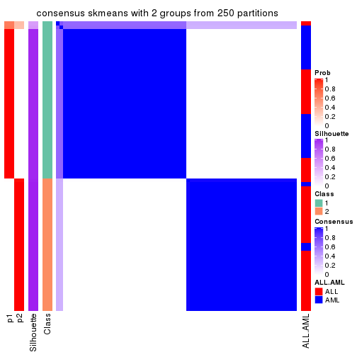</p>

</div>
<div id='tab-ATC-skmeans-consensus-heatmap-2'>
<pre><code class="r">consensus_heatmap(res, k = 3)
</code></pre>

<p>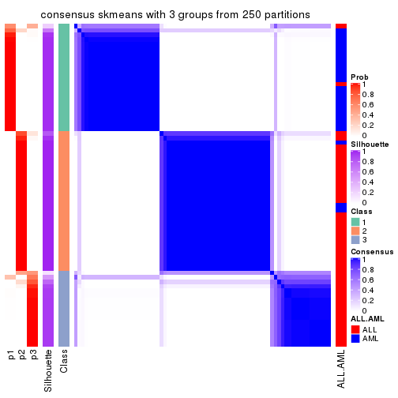</p>

</div>
<div id='tab-ATC-skmeans-consensus-heatmap-3'>
<pre><code class="r">consensus_heatmap(res, k = 4)
</code></pre>

<p>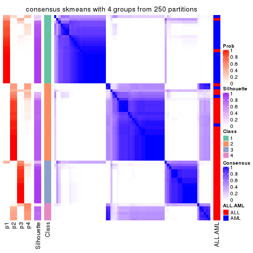</p>

</div>
<div id='tab-ATC-skmeans-consensus-heatmap-4'>
<pre><code class="r">consensus_heatmap(res, k = 5)
</code></pre>

<p>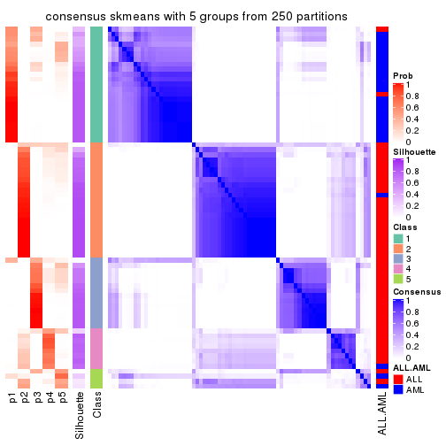</p>

</div>
<div id='tab-ATC-skmeans-consensus-heatmap-5'>
<pre><code class="r">consensus_heatmap(res, k = 6)
</code></pre>

<p>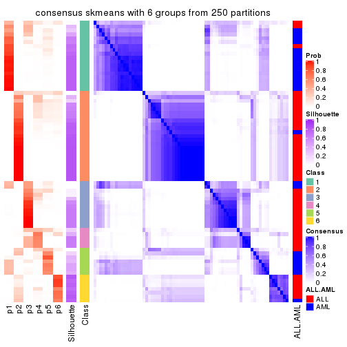</p>

</div>
</div>

Heatmaps for the membership of samples in all partitions to see how consistent they are:


<script>
$( function() {
	$( '#tabs-ATC-skmeans-membership-heatmap' ).tabs();
} );
</script>
<div id='tabs-ATC-skmeans-membership-heatmap'>
<ul>
<li><a href='#tab-ATC-skmeans-membership-heatmap-1'>k = 2</a></li>
<li><a href='#tab-ATC-skmeans-membership-heatmap-2'>k = 3</a></li>
<li><a href='#tab-ATC-skmeans-membership-heatmap-3'>k = 4</a></li>
<li><a href='#tab-ATC-skmeans-membership-heatmap-4'>k = 5</a></li>
<li><a href='#tab-ATC-skmeans-membership-heatmap-5'>k = 6</a></li>
</ul>
<div id='tab-ATC-skmeans-membership-heatmap-1'>
<pre><code class="r">membership_heatmap(res, k = 2)
</code></pre>

<p>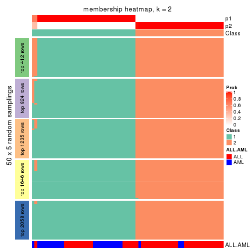</p>

</div>
<div id='tab-ATC-skmeans-membership-heatmap-2'>
<pre><code class="r">membership_heatmap(res, k = 3)
</code></pre>

<p>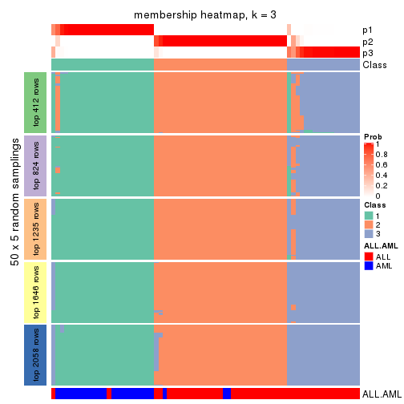</p>

</div>
<div id='tab-ATC-skmeans-membership-heatmap-3'>
<pre><code class="r">membership_heatmap(res, k = 4)
</code></pre>

<p>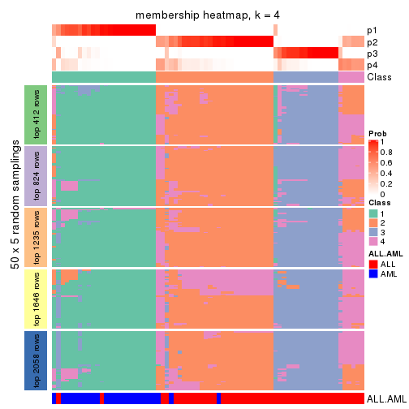</p>

</div>
<div id='tab-ATC-skmeans-membership-heatmap-4'>
<pre><code class="r">membership_heatmap(res, k = 5)
</code></pre>

<p>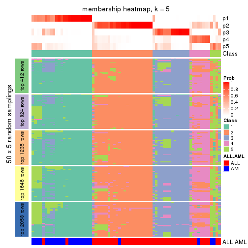</p>

</div>
<div id='tab-ATC-skmeans-membership-heatmap-5'>
<pre><code class="r">membership_heatmap(res, k = 6)
</code></pre>

<p>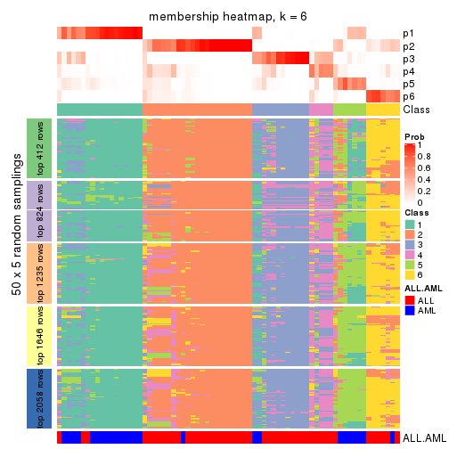</p>

</div>
</div>

As soon as we have had the classes for columns, we can look for signatures
which are significantly different between classes which can be candidate marks
for certain classes. Following are the heatmaps for signatures.


Signature heatmaps where rows are scaled:


<script>
$( function() {
	$( '#tabs-ATC-skmeans-get-signatures' ).tabs();
} );
</script>
<div id='tabs-ATC-skmeans-get-signatures'>
<ul>
<li><a href='#tab-ATC-skmeans-get-signatures-1'>k = 2</a></li>
<li><a href='#tab-ATC-skmeans-get-signatures-2'>k = 3</a></li>
<li><a href='#tab-ATC-skmeans-get-signatures-3'>k = 4</a></li>
<li><a href='#tab-ATC-skmeans-get-signatures-4'>k = 5</a></li>
<li><a href='#tab-ATC-skmeans-get-signatures-5'>k = 6</a></li>
</ul>
<div id='tab-ATC-skmeans-get-signatures-1'>
<pre><code class="r">get_signatures(res, k = 2)
</code></pre>

<p>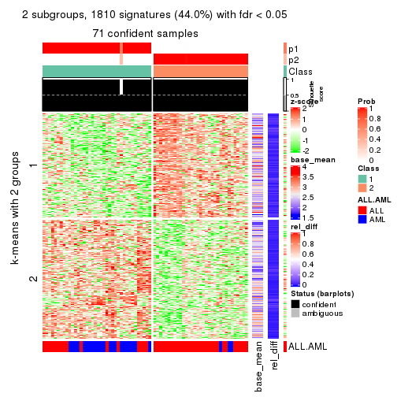</p>

</div>
<div id='tab-ATC-skmeans-get-signatures-2'>
<pre><code class="r">get_signatures(res, k = 3)
</code></pre>

<p>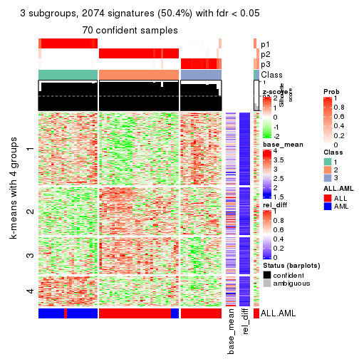</p>

</div>
<div id='tab-ATC-skmeans-get-signatures-3'>
<pre><code class="r">get_signatures(res, k = 4)
</code></pre>

<p>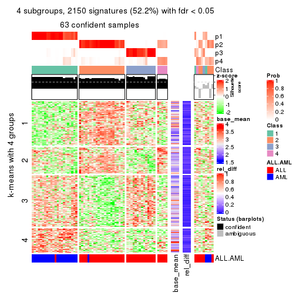</p>

</div>
<div id='tab-ATC-skmeans-get-signatures-4'>
<pre><code class="r">get_signatures(res, k = 5)
</code></pre>

<p>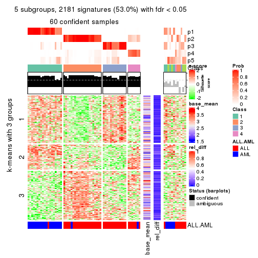</p>

</div>
<div id='tab-ATC-skmeans-get-signatures-5'>
<pre><code class="r">get_signatures(res, k = 6)
</code></pre>

<p>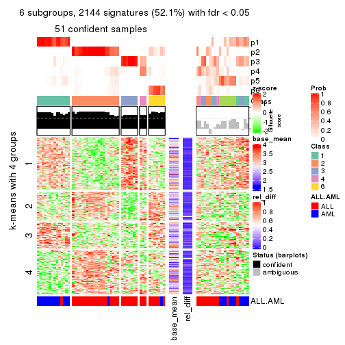</p>

</div>
</div>


Signature heatmaps where rows are not scaled:


<script>
$( function() {
	$( '#tabs-ATC-skmeans-get-signatures-no-scale' ).tabs();
} );
</script>
<div id='tabs-ATC-skmeans-get-signatures-no-scale'>
<ul>
<li><a href='#tab-ATC-skmeans-get-signatures-no-scale-1'>k = 2</a></li>
<li><a href='#tab-ATC-skmeans-get-signatures-no-scale-2'>k = 3</a></li>
<li><a href='#tab-ATC-skmeans-get-signatures-no-scale-3'>k = 4</a></li>
<li><a href='#tab-ATC-skmeans-get-signatures-no-scale-4'>k = 5</a></li>
<li><a href='#tab-ATC-skmeans-get-signatures-no-scale-5'>k = 6</a></li>
</ul>
<div id='tab-ATC-skmeans-get-signatures-no-scale-1'>
<pre><code class="r">get_signatures(res, k = 2, scale_rows = FALSE)
</code></pre>

<p>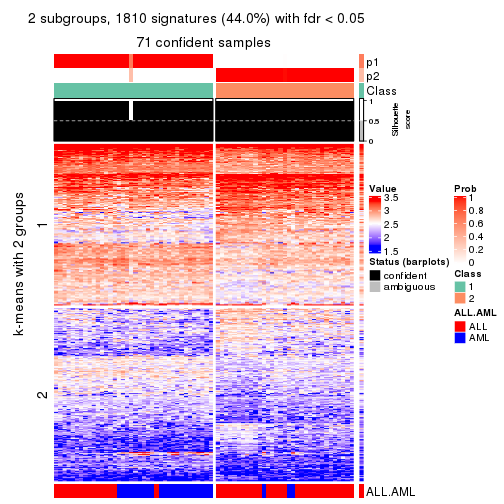</p>

</div>
<div id='tab-ATC-skmeans-get-signatures-no-scale-2'>
<pre><code class="r">get_signatures(res, k = 3, scale_rows = FALSE)
</code></pre>

<p>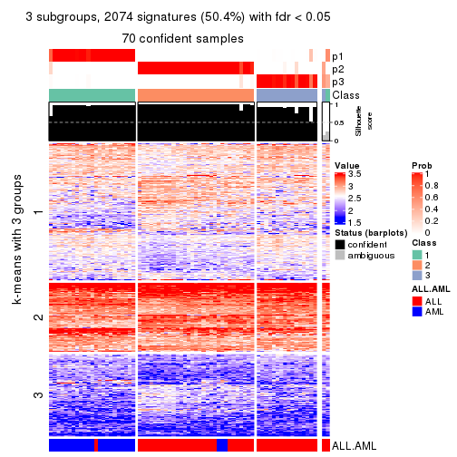</p>

</div>
<div id='tab-ATC-skmeans-get-signatures-no-scale-3'>
<pre><code class="r">get_signatures(res, k = 4, scale_rows = FALSE)
</code></pre>

<p>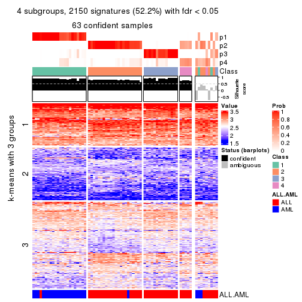</p>

</div>
<div id='tab-ATC-skmeans-get-signatures-no-scale-4'>
<pre><code class="r">get_signatures(res, k = 5, scale_rows = FALSE)
</code></pre>

<p>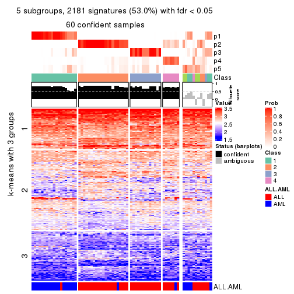</p>

</div>
<div id='tab-ATC-skmeans-get-signatures-no-scale-5'>
<pre><code class="r">get_signatures(res, k = 6, scale_rows = FALSE)
</code></pre>

<p>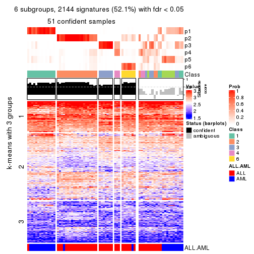</p>

</div>
</div>


Compare the overlap of signatures from different k:

```r
compare_signatures(res)
```

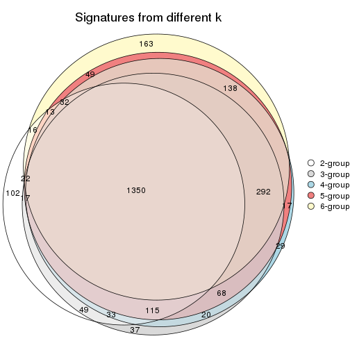

`get_signature()` returns a data frame invisibly. TO get the list of signatures, the function
call should be assigned to a variable explicitly. In following code, if `plot` argument is set
to `FALSE`, no heatmap is plotted while only the differential analysis is performed.

```r
# code only for demonstration
tb = get_signature(res, k = ..., plot = FALSE)
```

An example of the output of `tb` is:

```
#>   which_row         fdr    mean_1    mean_2 scaled_mean_1 scaled_mean_2 km
#> 1        38 0.042760348  8.373488  9.131774    -0.5533452     0.5164555  1
#> 2        40 0.018707592  7.106213  8.469186    -0.6173731     0.5762149  1
#> 3        55 0.019134737 10.221463 11.207825    -0.6159697     0.5749050  1
#> 4        59 0.006059896  5.921854  7.869574    -0.6899429     0.6439467  1
#> 5        60 0.018055526  8.928898 10.211722    -0.6204761     0.5791110  1
#> 6        98 0.009384629 15.714769 14.887706     0.6635654    -0.6193277  2
...
```

The columns in `tb` are:

1. `which_row`: row indices corresponding to the input matrix.
2. `fdr`: FDR for the differential test. 
3. `mean_x`: The mean value in group x.
4. `scaled_mean_x`: The mean value in group x after rows are scaled.
5. `km`: Row groups if k-means clustering is applied to rows.


UMAP plot which shows how samples are separated.


<script>
$( function() {
	$( '#tabs-ATC-skmeans-dimension-reduction' ).tabs();
} );
</script>
<div id='tabs-ATC-skmeans-dimension-reduction'>
<ul>
<li><a href='#tab-ATC-skmeans-dimension-reduction-1'>k = 2</a></li>
<li><a href='#tab-ATC-skmeans-dimension-reduction-2'>k = 3</a></li>
<li><a href='#tab-ATC-skmeans-dimension-reduction-3'>k = 4</a></li>
<li><a href='#tab-ATC-skmeans-dimension-reduction-4'>k = 5</a></li>
<li><a href='#tab-ATC-skmeans-dimension-reduction-5'>k = 6</a></li>
</ul>
<div id='tab-ATC-skmeans-dimension-reduction-1'>
<pre><code class="r">dimension_reduction(res, k = 2, method = &quot;UMAP&quot;)
</code></pre>

<p>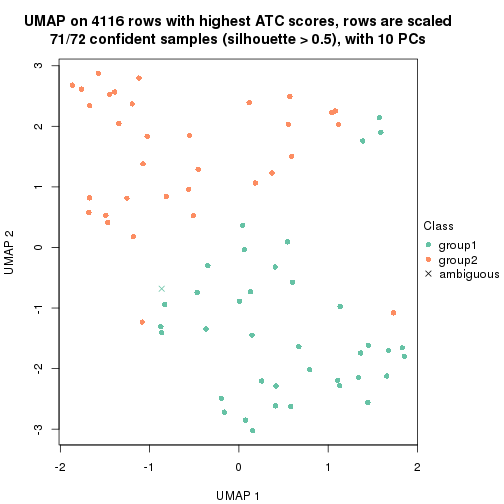</p>

</div>
<div id='tab-ATC-skmeans-dimension-reduction-2'>
<pre><code class="r">dimension_reduction(res, k = 3, method = &quot;UMAP&quot;)
</code></pre>

<p>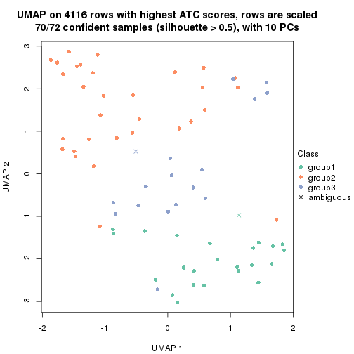</p>

</div>
<div id='tab-ATC-skmeans-dimension-reduction-3'>
<pre><code class="r">dimension_reduction(res, k = 4, method = &quot;UMAP&quot;)
</code></pre>

<p>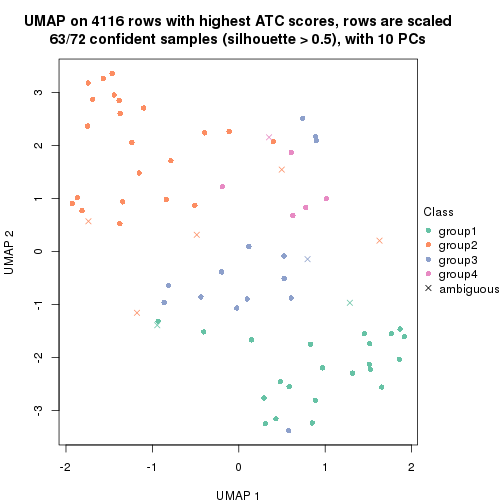</p>

</div>
<div id='tab-ATC-skmeans-dimension-reduction-4'>
<pre><code class="r">dimension_reduction(res, k = 5, method = &quot;UMAP&quot;)
</code></pre>

<p>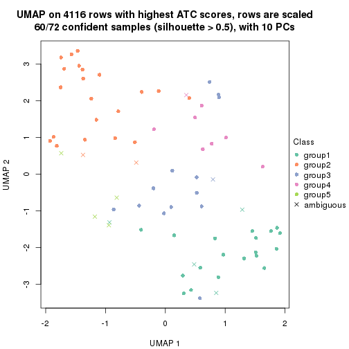</p>

</div>
<div id='tab-ATC-skmeans-dimension-reduction-5'>
<pre><code class="r">dimension_reduction(res, k = 6, method = &quot;UMAP&quot;)
</code></pre>

<p>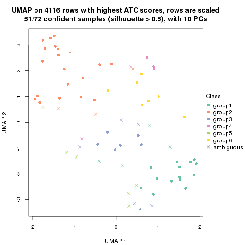</p>

</div>
</div>


Following heatmap shows how subgroups are split when increasing `k`:

```r
collect_classes(res)
```

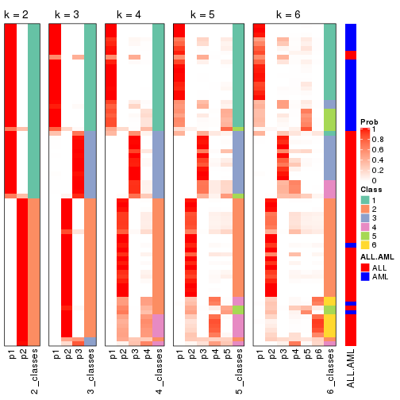


Test correlation between subgroups and known annotations. If the known
annotation is numeric, one-way ANOVA test is applied, and if the known
annotation is discrete, chi-squared contingency table test is applied.

```r
test_to_known_factors(res)
```

```
#>              n ALL.AML(p) k
#> ATC:skmeans 71   5.23e-05 2
#> ATC:skmeans 70   1.85e-12 3
#> ATC:skmeans 63   8.36e-12 4
#> ATC:skmeans 60   2.60e-10 5
#> ATC:skmeans 51   1.22e-07 6
```


If matrix rows can be associated to genes, consider to use `functional_enrichment(res,
...)` to perform function enrichment for the signature genes. See [this vignette](http://bioconductor.org/packages/devel/bioc/vignettes/cola/inst/doc/functional_enrichment.html) for more detailed explanations.


 

---------------------------------------------------


### ATC:pam


The object with results only for a single top-value method and a single partition method 
can be extracted as:

```r
res = res_list["ATC", "pam"]
# you can also extract it by
# res = res_list["ATC:pam"]
```

A summary of `res` and all the functions that can be applied to it:

```r
res
```

```
#> A 'ConsensusPartition' object with k = 2, 3, 4, 5, 6.
#>   On a matrix with 4116 rows and 72 columns.
#>   Top rows (412, 824, 1235, 1646, 2058) are extracted by 'ATC' method.
#>   Subgroups are detected by 'pam' method.
#>   Performed in total 1250 partitions by row resampling.
#>   Best k for subgroups seems to be 2.
#> 
#> Following methods can be applied to this 'ConsensusPartition' object:
#>  [1] "cola_report"             "collect_classes"         "collect_plots"          
#>  [4] "collect_stats"           "colnames"                "compare_signatures"     
#>  [7] "consensus_heatmap"       "dimension_reduction"     "functional_enrichment"  
#> [10] "get_anno_col"            "get_anno"                "get_classes"            
#> [13] "get_consensus"           "get_matrix"              "get_membership"         
#> [16] "get_param"               "get_signatures"          "get_stats"              
#> [19] "is_best_k"               "is_stable_k"             "membership_heatmap"     
#> [22] "ncol"                    "nrow"                    "plot_ecdf"              
#> [25] "rownames"                "select_partition_number" "show"                   
#> [28] "suggest_best_k"          "test_to_known_factors"
```

`collect_plots()` function collects all the plots made from `res` for all `k` (number of partitions)
into one single page to provide an easy and fast comparison between different `k`.

```r
collect_plots(res)
```

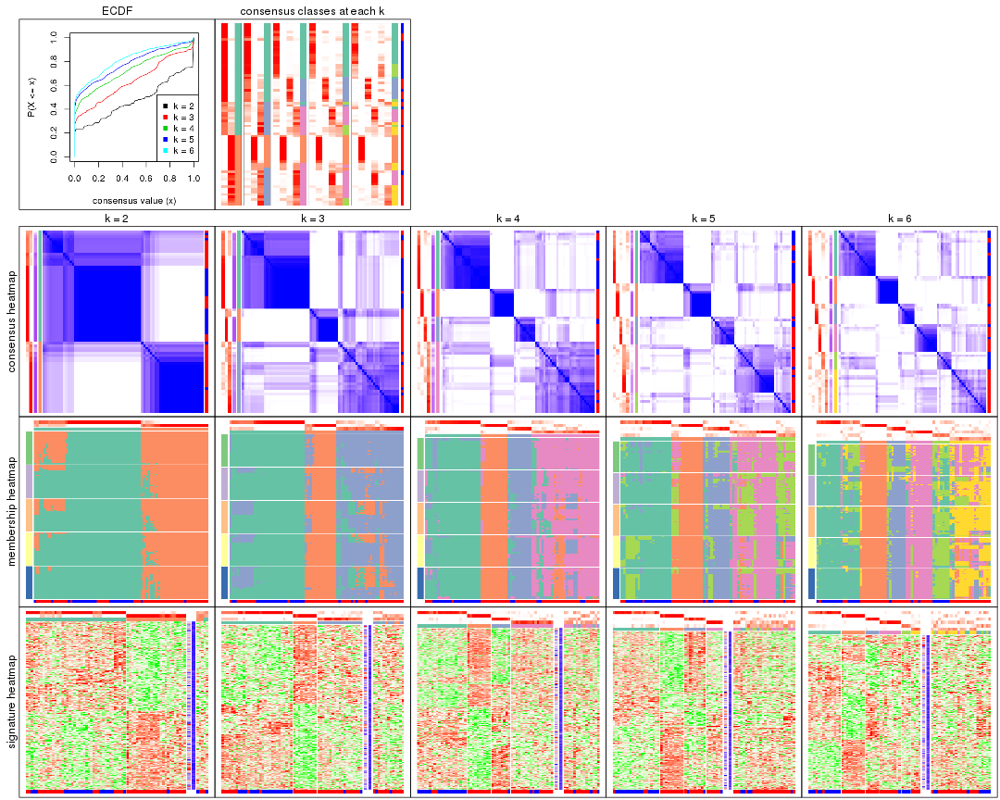

The plots are:

- The first row: a plot of the ECDF (empirical cumulative distribution
  function) curves of the consensus matrix for each `k` and the heatmap of
  predicted classes for each `k`.
- The second row: heatmaps of the consensus matrix for each `k`.
- The third row: heatmaps of the membership matrix for each `k`.
- The fouth row: heatmaps of the signatures for each `k`.

All the plots in panels can be made by individual functions and they are
plotted later in this section.

`select_partition_number()` produces several plots showing different
statistics for choosing "optimized" `k`. There are following statistics:

- ECDF curves of the consensus matrix for each `k`;
- 1-PAC. [The PAC
  score](https://en.wikipedia.org/wiki/Consensus_clustering#Over-interpretation_potential_of_consensus_clustering)
  measures the proportion of the ambiguous subgrouping.
- Mean silhouette score.
- Concordance. The mean probability of fiting the consensus class ids in all
  partitions.
- Area increased. Denote $A_k$ as the area under the ECDF curve for current
  `k`, the area increased is defined as $A_k - A_{k-1}$.
- Rand index. The percent of pairs of samples that are both in a same cluster
  or both are not in a same cluster in the partition of k and k-1.
- Jaccard index. The ratio of pairs of samples are both in a same cluster in
  the partition of k and k-1 and the pairs of samples are both in a same
  cluster in the partition k or k-1.

The detailed explanations of these statistics can be found in [the _cola_
vignette](http://bioconductor.org/packages/devel/bioc/vignettes/cola/inst/doc/cola.html#toc_13).

Generally speaking, lower PAC score, higher mean silhouette score or higher
concordance corresponds to better partition. Rand index and Jaccard index
measure how similar the current partition is compared to partition with `k-1`.
If they are too similar, we won't accept `k` is better than `k-1`.

```r
select_partition_number(res)
```

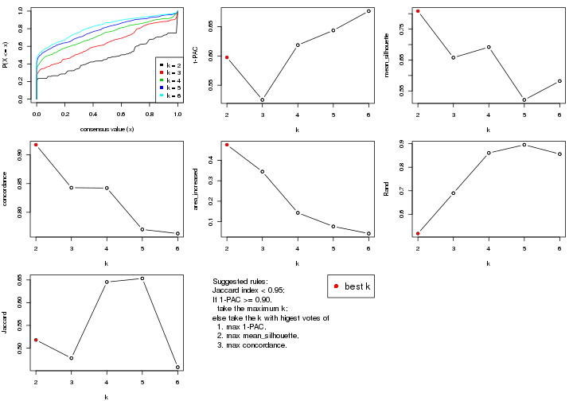

The numeric values for all these statistics can be obtained by `get_stats()`.

```r
get_stats(res)
```

```
#>   k 1-PAC mean_silhouette concordance area_increased  Rand Jaccard
#> 2 2 0.597           0.808       0.918         0.4755 0.518   0.518
#> 3 3 0.525           0.658       0.843         0.3445 0.690   0.478
#> 4 4 0.619           0.692       0.842         0.1433 0.861   0.645
#> 5 5 0.644           0.521       0.770         0.0768 0.896   0.653
#> 6 6 0.676           0.582       0.763         0.0422 0.856   0.458
```

`suggest_best_k()` suggests the best $k$ based on these statistics. The rules are as follows:

- All $k$ with Jaccard index larger than 0.95 are removed because increasing
  $k$ does not provide enough extra information. If all $k$ are removed, it is
  marked as no subgroup is detected.
- For all $k$ with 1-PAC score larger than 0.9, the maximal $k$ is taken as
  the best $k$, and other $k$ are marked as optional $k$.
- If it does not fit the second rule. The $k$ with the maximal vote of the
  highest 1-PAC score, highest mean silhouette, and highest concordance is
  taken as the best $k$.

```r
suggest_best_k(res)
```

```
#> [1] 2
```


Following shows the table of the partitions (You need to click the **show/hide
code output** link to see it). The membership matrix (columns with name `p*`)
is inferred by
[`clue::cl_consensus()`](https://www.rdocumentation.org/link/cl_consensus?package=clue)
function with the `SE` method. Basically the value in the membership matrix
represents the probability to belong to a certain group. The finall class
label for an item is determined with the group with highest probability it
belongs to.

In `get_classes()` function, the entropy is calculated from the membership
matrix and the silhouette score is calculated from the consensus matrix.


<script>
$( function() {
	$( '#tabs-ATC-pam-get-classes' ).tabs();
} );
</script>
<div id='tabs-ATC-pam-get-classes'>
<ul>
<li><a href='#tab-ATC-pam-get-classes-1'>k = 2</a></li>
<li><a href='#tab-ATC-pam-get-classes-2'>k = 3</a></li>
<li><a href='#tab-ATC-pam-get-classes-3'>k = 4</a></li>
<li><a href='#tab-ATC-pam-get-classes-4'>k = 5</a></li>
<li><a href='#tab-ATC-pam-get-classes-5'>k = 6</a></li>
</ul>

<div id='tab-ATC-pam-get-classes-1'>
<p><a id='tab-ATC-pam-get-classes-1-a' style='color:#0366d6' href='#'>show/hide code output</a></p>
<pre><code class="r">cbind(get_classes(res, k = 2), get_membership(res, k = 2))
</code></pre>

<pre><code>#&gt;           class entropy silhouette    p1    p2
#&gt; sample_39     1  0.0000     0.8929 1.000 0.000
#&gt; sample_40     1  0.0000     0.8929 1.000 0.000
#&gt; sample_42     2  0.9491     0.3684 0.368 0.632
#&gt; sample_47     2  0.0000     0.9141 0.000 1.000
#&gt; sample_48     2  0.0000     0.9141 0.000 1.000
#&gt; sample_49     1  0.0000     0.8929 1.000 0.000
#&gt; sample_41     2  0.0000     0.9141 0.000 1.000
#&gt; sample_43     2  0.0000     0.9141 0.000 1.000
#&gt; sample_44     2  0.0000     0.9141 0.000 1.000
#&gt; sample_45     2  0.0000     0.9141 0.000 1.000
#&gt; sample_46     2  0.0000     0.9141 0.000 1.000
#&gt; sample_70     1  0.8909     0.6109 0.692 0.308
#&gt; sample_71     1  0.9170     0.5669 0.668 0.332
#&gt; sample_72     2  0.3879     0.8601 0.076 0.924
#&gt; sample_68     2  0.0000     0.9141 0.000 1.000
#&gt; sample_69     2  0.0000     0.9141 0.000 1.000
#&gt; sample_67     2  0.8327     0.6100 0.264 0.736
#&gt; sample_55     1  0.7376     0.7403 0.792 0.208
#&gt; sample_56     1  0.0376     0.8908 0.996 0.004
#&gt; sample_59     2  0.7299     0.7095 0.204 0.796
#&gt; sample_52     1  0.0376     0.8910 0.996 0.004
#&gt; sample_53     1  0.0000     0.8929 1.000 0.000
#&gt; sample_51     1  0.0000     0.8929 1.000 0.000
#&gt; sample_50     1  0.0000     0.8929 1.000 0.000
#&gt; sample_54     2  0.9977    -0.0261 0.472 0.528
#&gt; sample_57     1  0.0000     0.8929 1.000 0.000
#&gt; sample_58     1  0.0000     0.8929 1.000 0.000
#&gt; sample_60     1  0.8555     0.6527 0.720 0.280
#&gt; sample_61     1  0.0000     0.8929 1.000 0.000
#&gt; sample_65     1  0.0000     0.8929 1.000 0.000
#&gt; sample_66     2  0.0000     0.9141 0.000 1.000
#&gt; sample_63     1  0.0000     0.8929 1.000 0.000
#&gt; sample_64     1  0.0000     0.8929 1.000 0.000
#&gt; sample_62     1  0.0000     0.8929 1.000 0.000
#&gt; sample_1      1  0.8909     0.6109 0.692 0.308
#&gt; sample_2      1  1.0000     0.0788 0.500 0.500
#&gt; sample_3      1  0.7602     0.7278 0.780 0.220
#&gt; sample_4      1  0.8909     0.6109 0.692 0.308
#&gt; sample_5      2  0.0000     0.9141 0.000 1.000
#&gt; sample_6      1  0.6438     0.7817 0.836 0.164
#&gt; sample_7      1  0.0000     0.8929 1.000 0.000
#&gt; sample_8      1  0.0000     0.8929 1.000 0.000
#&gt; sample_9      2  0.3733     0.8624 0.072 0.928
#&gt; sample_10     1  0.8813     0.6236 0.700 0.300
#&gt; sample_11     2  0.6148     0.7802 0.152 0.848
#&gt; sample_12     1  0.0000     0.8929 1.000 0.000
#&gt; sample_13     2  0.0000     0.9141 0.000 1.000
#&gt; sample_14     2  0.0000     0.9141 0.000 1.000
#&gt; sample_15     2  0.0000     0.9141 0.000 1.000
#&gt; sample_16     2  0.0000     0.9141 0.000 1.000
#&gt; sample_17     2  0.0376     0.9118 0.004 0.996
#&gt; sample_18     1  0.8861     0.6173 0.696 0.304
#&gt; sample_19     2  0.0000     0.9141 0.000 1.000
#&gt; sample_20     2  0.0000     0.9141 0.000 1.000
#&gt; sample_21     2  0.0000     0.9141 0.000 1.000
#&gt; sample_22     1  0.0000     0.8929 1.000 0.000
#&gt; sample_23     1  0.4815     0.8285 0.896 0.104
#&gt; sample_24     2  0.0000     0.9141 0.000 1.000
#&gt; sample_25     1  0.7528     0.7317 0.784 0.216
#&gt; sample_26     2  0.9358     0.4048 0.352 0.648
#&gt; sample_27     1  0.0000     0.8929 1.000 0.000
#&gt; sample_34     1  0.0000     0.8929 1.000 0.000
#&gt; sample_35     1  0.0000     0.8929 1.000 0.000
#&gt; sample_36     1  0.0000     0.8929 1.000 0.000
#&gt; sample_37     1  0.0000     0.8929 1.000 0.000
#&gt; sample_38     1  0.0000     0.8929 1.000 0.000
#&gt; sample_28     1  0.0000     0.8929 1.000 0.000
#&gt; sample_29     1  0.9754     0.3881 0.592 0.408
#&gt; sample_30     1  0.0000     0.8929 1.000 0.000
#&gt; sample_31     1  0.0000     0.8929 1.000 0.000
#&gt; sample_32     1  0.0000     0.8929 1.000 0.000
#&gt; sample_33     1  0.0000     0.8929 1.000 0.000
</code></pre>

<script>
$('#tab-ATC-pam-get-classes-1-a').parent().next().next().hide();
$('#tab-ATC-pam-get-classes-1-a').click(function(){
  $('#tab-ATC-pam-get-classes-1-a').parent().next().next().toggle();
  return(false);
});
</script>
</div>

<div id='tab-ATC-pam-get-classes-2'>
<p><a id='tab-ATC-pam-get-classes-2-a' style='color:#0366d6' href='#'>show/hide code output</a></p>
<pre><code class="r">cbind(get_classes(res, k = 3), get_membership(res, k = 3))
</code></pre>

<pre><code>#&gt;           class entropy silhouette    p1    p2    p3
#&gt; sample_39     1  0.5178     0.7208 0.744 0.000 0.256
#&gt; sample_40     1  0.5650     0.6674 0.688 0.000 0.312
#&gt; sample_42     3  0.7875     0.5796 0.176 0.156 0.668
#&gt; sample_47     2  0.5926     0.3646 0.000 0.644 0.356
#&gt; sample_48     2  0.0000     0.8430 0.000 1.000 0.000
#&gt; sample_49     1  0.5560     0.6815 0.700 0.000 0.300
#&gt; sample_41     2  0.0000     0.8430 0.000 1.000 0.000
#&gt; sample_43     3  0.6008     0.3418 0.000 0.372 0.628
#&gt; sample_44     3  0.6062     0.3327 0.000 0.384 0.616
#&gt; sample_45     2  0.6308    -0.0714 0.000 0.508 0.492
#&gt; sample_46     2  0.6295     0.0198 0.000 0.528 0.472
#&gt; sample_70     3  0.0000     0.6692 0.000 0.000 1.000
#&gt; sample_71     3  0.5016     0.6374 0.240 0.000 0.760
#&gt; sample_72     3  0.5956     0.3783 0.004 0.324 0.672
#&gt; sample_68     2  0.0000     0.8430 0.000 1.000 0.000
#&gt; sample_69     2  0.0000     0.8430 0.000 1.000 0.000
#&gt; sample_67     3  0.7216     0.6089 0.176 0.112 0.712
#&gt; sample_55     3  0.6308    -0.1998 0.492 0.000 0.508
#&gt; sample_56     1  0.5733     0.6522 0.676 0.000 0.324
#&gt; sample_59     3  0.0983     0.6694 0.004 0.016 0.980
#&gt; sample_52     1  0.0424     0.8711 0.992 0.000 0.008
#&gt; sample_53     1  0.0000     0.8765 1.000 0.000 0.000
#&gt; sample_51     1  0.0000     0.8765 1.000 0.000 0.000
#&gt; sample_50     1  0.0000     0.8765 1.000 0.000 0.000
#&gt; sample_54     3  0.5243     0.6672 0.100 0.072 0.828
#&gt; sample_57     1  0.0000     0.8765 1.000 0.000 0.000
#&gt; sample_58     1  0.0592     0.8722 0.988 0.000 0.012
#&gt; sample_60     3  0.6045     0.4507 0.380 0.000 0.620
#&gt; sample_61     1  0.0000     0.8765 1.000 0.000 0.000
#&gt; sample_65     1  0.0000     0.8765 1.000 0.000 0.000
#&gt; sample_66     3  0.6204     0.2561 0.000 0.424 0.576
#&gt; sample_63     1  0.0237     0.8753 0.996 0.000 0.004
#&gt; sample_64     1  0.4796     0.7461 0.780 0.000 0.220
#&gt; sample_62     1  0.5016     0.7273 0.760 0.000 0.240
#&gt; sample_1      3  0.0000     0.6692 0.000 0.000 1.000
#&gt; sample_2      3  0.7233     0.5906 0.264 0.064 0.672
#&gt; sample_3      3  0.4346     0.5944 0.184 0.000 0.816
#&gt; sample_4      3  0.0000     0.6692 0.000 0.000 1.000
#&gt; sample_5      2  0.0000     0.8430 0.000 1.000 0.000
#&gt; sample_6      3  0.5138     0.5096 0.252 0.000 0.748
#&gt; sample_7      1  0.5650     0.6674 0.688 0.000 0.312
#&gt; sample_8      1  0.5560     0.6815 0.700 0.000 0.300
#&gt; sample_9      3  0.1751     0.6744 0.012 0.028 0.960
#&gt; sample_10     3  0.5882     0.5781 0.348 0.000 0.652
#&gt; sample_11     3  0.6882     0.5977 0.096 0.172 0.732
#&gt; sample_12     1  0.0000     0.8765 1.000 0.000 0.000
#&gt; sample_13     2  0.0000     0.8430 0.000 1.000 0.000
#&gt; sample_14     3  0.5465     0.4763 0.000 0.288 0.712
#&gt; sample_15     2  0.0000     0.8430 0.000 1.000 0.000
#&gt; sample_16     3  0.1860     0.6664 0.000 0.052 0.948
#&gt; sample_17     3  0.3816     0.6261 0.000 0.148 0.852
#&gt; sample_18     3  0.4178     0.6639 0.172 0.000 0.828
#&gt; sample_19     3  0.6299     0.0495 0.000 0.476 0.524
#&gt; sample_20     2  0.0000     0.8430 0.000 1.000 0.000
#&gt; sample_21     2  0.0000     0.8430 0.000 1.000 0.000
#&gt; sample_22     1  0.1964     0.8480 0.944 0.000 0.056
#&gt; sample_23     3  0.5948     0.2387 0.360 0.000 0.640
#&gt; sample_24     2  0.3267     0.7385 0.000 0.884 0.116
#&gt; sample_25     1  0.6267    -0.0884 0.548 0.000 0.452
#&gt; sample_26     3  0.1163     0.6700 0.000 0.028 0.972
#&gt; sample_27     1  0.5560     0.6815 0.700 0.000 0.300
#&gt; sample_34     1  0.0000     0.8765 1.000 0.000 0.000
#&gt; sample_35     1  0.0892     0.8698 0.980 0.000 0.020
#&gt; sample_36     1  0.0000     0.8765 1.000 0.000 0.000
#&gt; sample_37     1  0.0000     0.8765 1.000 0.000 0.000
#&gt; sample_38     1  0.0000     0.8765 1.000 0.000 0.000
#&gt; sample_28     1  0.0000     0.8765 1.000 0.000 0.000
#&gt; sample_29     3  0.7660     0.5579 0.324 0.064 0.612
#&gt; sample_30     1  0.0000     0.8765 1.000 0.000 0.000
#&gt; sample_31     1  0.0000     0.8765 1.000 0.000 0.000
#&gt; sample_32     1  0.0000     0.8765 1.000 0.000 0.000
#&gt; sample_33     1  0.0000     0.8765 1.000 0.000 0.000
</code></pre>

<script>
$('#tab-ATC-pam-get-classes-2-a').parent().next().next().hide();
$('#tab-ATC-pam-get-classes-2-a').click(function(){
  $('#tab-ATC-pam-get-classes-2-a').parent().next().next().toggle();
  return(false);
});
</script>
</div>

<div id='tab-ATC-pam-get-classes-3'>
<p><a id='tab-ATC-pam-get-classes-3-a' style='color:#0366d6' href='#'>show/hide code output</a></p>
<pre><code class="r">cbind(get_classes(res, k = 4), get_membership(res, k = 4))
</code></pre>

<pre><code>#&gt;           class entropy silhouette    p1    p2    p3    p4
#&gt; sample_39     3  0.1118     0.8490 0.036 0.000 0.964 0.000
#&gt; sample_40     3  0.1474     0.8491 0.052 0.000 0.948 0.000
#&gt; sample_42     4  0.4015     0.6916 0.116 0.052 0.000 0.832
#&gt; sample_47     2  0.4679     0.3282 0.000 0.648 0.000 0.352
#&gt; sample_48     2  0.0000     0.9390 0.000 1.000 0.000 0.000
#&gt; sample_49     3  0.1211     0.8513 0.040 0.000 0.960 0.000
#&gt; sample_41     2  0.0000     0.9390 0.000 1.000 0.000 0.000
#&gt; sample_43     4  0.4072     0.5818 0.000 0.252 0.000 0.748
#&gt; sample_44     4  0.3400     0.6515 0.000 0.180 0.000 0.820
#&gt; sample_45     4  0.4933     0.3025 0.000 0.432 0.000 0.568
#&gt; sample_46     4  0.4989     0.1728 0.000 0.472 0.000 0.528
#&gt; sample_70     4  0.1474     0.7055 0.000 0.000 0.052 0.948
#&gt; sample_71     1  0.7521     0.1381 0.488 0.000 0.220 0.292
#&gt; sample_72     4  0.7761     0.3136 0.008 0.340 0.188 0.464
#&gt; sample_68     2  0.0000     0.9390 0.000 1.000 0.000 0.000
#&gt; sample_69     2  0.0000     0.9390 0.000 1.000 0.000 0.000
#&gt; sample_67     4  0.1284     0.7120 0.024 0.012 0.000 0.964
#&gt; sample_55     3  0.6423     0.3840 0.336 0.000 0.580 0.084
#&gt; sample_56     3  0.0592     0.8407 0.016 0.000 0.984 0.000
#&gt; sample_59     4  0.5268     0.5449 0.012 0.004 0.348 0.636
#&gt; sample_52     1  0.1510     0.8737 0.956 0.000 0.016 0.028
#&gt; sample_53     1  0.0336     0.8872 0.992 0.000 0.008 0.000
#&gt; sample_51     1  0.0336     0.8872 0.992 0.000 0.008 0.000
#&gt; sample_50     1  0.0188     0.8874 0.996 0.000 0.004 0.000
#&gt; sample_54     4  0.0000     0.7089 0.000 0.000 0.000 1.000
#&gt; sample_57     1  0.1256     0.8782 0.964 0.000 0.008 0.028
#&gt; sample_58     3  0.5587     0.4137 0.372 0.000 0.600 0.028
#&gt; sample_60     4  0.5791     0.5254 0.284 0.000 0.060 0.656
#&gt; sample_61     1  0.3486     0.6893 0.812 0.000 0.188 0.000
#&gt; sample_65     1  0.1151     0.8801 0.968 0.000 0.008 0.024
#&gt; sample_66     4  0.3024     0.6593 0.000 0.148 0.000 0.852
#&gt; sample_63     1  0.1256     0.8782 0.964 0.000 0.008 0.028
#&gt; sample_64     3  0.4365     0.7220 0.188 0.000 0.784 0.028
#&gt; sample_62     1  0.4410     0.7251 0.808 0.000 0.128 0.064
#&gt; sample_1      4  0.4925     0.4477 0.000 0.000 0.428 0.572
#&gt; sample_2      4  0.2530     0.6886 0.112 0.000 0.000 0.888
#&gt; sample_3      4  0.6267     0.5686 0.148 0.000 0.188 0.664
#&gt; sample_4      4  0.4925     0.4477 0.000 0.000 0.428 0.572
#&gt; sample_5      2  0.0000     0.9390 0.000 1.000 0.000 0.000
#&gt; sample_6      4  0.6813     0.4144 0.292 0.000 0.132 0.576
#&gt; sample_7      3  0.0592     0.8407 0.016 0.000 0.984 0.000
#&gt; sample_8      3  0.0921     0.8485 0.028 0.000 0.972 0.000
#&gt; sample_9      4  0.0921     0.7078 0.000 0.000 0.028 0.972
#&gt; sample_10     4  0.3266     0.6546 0.168 0.000 0.000 0.832
#&gt; sample_11     4  0.1004     0.7078 0.004 0.024 0.000 0.972
#&gt; sample_12     1  0.0707     0.8798 0.980 0.000 0.020 0.000
#&gt; sample_13     2  0.0000     0.9390 0.000 1.000 0.000 0.000
#&gt; sample_14     4  0.1118     0.7061 0.000 0.036 0.000 0.964
#&gt; sample_15     2  0.0000     0.9390 0.000 1.000 0.000 0.000
#&gt; sample_16     4  0.4888     0.6404 0.000 0.036 0.224 0.740
#&gt; sample_17     4  0.1042     0.7088 0.000 0.020 0.008 0.972
#&gt; sample_18     4  0.7717     0.3445 0.304 0.000 0.252 0.444
#&gt; sample_19     4  0.4972     0.2259 0.000 0.456 0.000 0.544
#&gt; sample_20     2  0.0000     0.9390 0.000 1.000 0.000 0.000
#&gt; sample_21     2  0.0000     0.9390 0.000 1.000 0.000 0.000
#&gt; sample_22     1  0.3837     0.6535 0.776 0.000 0.224 0.000
#&gt; sample_23     4  0.7281     0.1179 0.412 0.000 0.148 0.440
#&gt; sample_24     2  0.2589     0.8004 0.000 0.884 0.000 0.116
#&gt; sample_25     1  0.5466     0.5823 0.712 0.000 0.220 0.068
#&gt; sample_26     4  0.4103     0.6233 0.000 0.000 0.256 0.744
#&gt; sample_27     3  0.1716     0.8444 0.064 0.000 0.936 0.000
#&gt; sample_34     1  0.0336     0.8872 0.992 0.000 0.008 0.000
#&gt; sample_35     1  0.4933     0.0984 0.568 0.000 0.432 0.000
#&gt; sample_36     1  0.0188     0.8874 0.996 0.000 0.004 0.000
#&gt; sample_37     1  0.0592     0.8812 0.984 0.000 0.016 0.000
#&gt; sample_38     1  0.0188     0.8874 0.996 0.000 0.004 0.000
#&gt; sample_28     1  0.0592     0.8812 0.984 0.000 0.016 0.000
#&gt; sample_29     4  0.4916     0.3220 0.424 0.000 0.000 0.576
#&gt; sample_30     1  0.1182     0.8789 0.968 0.000 0.016 0.016
#&gt; sample_31     1  0.0188     0.8875 0.996 0.000 0.004 0.000
#&gt; sample_32     1  0.0336     0.8872 0.992 0.000 0.008 0.000
#&gt; sample_33     1  0.0336     0.8872 0.992 0.000 0.008 0.000
</code></pre>

<script>
$('#tab-ATC-pam-get-classes-3-a').parent().next().next().hide();
$('#tab-ATC-pam-get-classes-3-a').click(function(){
  $('#tab-ATC-pam-get-classes-3-a').parent().next().next().toggle();
  return(false);
});
</script>
</div>

<div id='tab-ATC-pam-get-classes-4'>
<p><a id='tab-ATC-pam-get-classes-4-a' style='color:#0366d6' href='#'>show/hide code output</a></p>
<pre><code class="r">cbind(get_classes(res, k = 5), get_membership(res, k = 5))
</code></pre>

<pre><code>#&gt;           class entropy silhouette    p1    p2    p3    p4    p5
#&gt; sample_39     3  0.0880    0.72718 0.000 0.000 0.968 0.000 0.032
#&gt; sample_40     3  0.3734    0.67285 0.036 0.000 0.796 0.000 0.168
#&gt; sample_42     4  0.6644   -0.06468 0.132 0.020 0.000 0.464 0.384
#&gt; sample_47     2  0.6172    0.09988 0.000 0.500 0.000 0.144 0.356
#&gt; sample_48     2  0.0000    0.81558 0.000 1.000 0.000 0.000 0.000
#&gt; sample_49     3  0.0510    0.72742 0.000 0.000 0.984 0.000 0.016
#&gt; sample_41     2  0.0000    0.81558 0.000 1.000 0.000 0.000 0.000
#&gt; sample_43     4  0.6545    0.01906 0.000 0.180 0.004 0.468 0.348
#&gt; sample_44     4  0.5785    0.17396 0.000 0.112 0.000 0.568 0.320
#&gt; sample_45     4  0.6455    0.05457 0.000 0.352 0.000 0.460 0.188
#&gt; sample_46     2  0.6751   -0.07919 0.000 0.408 0.000 0.296 0.296
#&gt; sample_70     4  0.4283    0.22180 0.000 0.000 0.008 0.644 0.348
#&gt; sample_71     5  0.5916    0.41533 0.268 0.000 0.056 0.048 0.628
#&gt; sample_72     5  0.6313    0.36311 0.004 0.260 0.052 0.072 0.612
#&gt; sample_68     2  0.0000    0.81558 0.000 1.000 0.000 0.000 0.000
#&gt; sample_69     2  0.0000    0.81558 0.000 1.000 0.000 0.000 0.000
#&gt; sample_67     4  0.4446    0.04571 0.004 0.000 0.000 0.520 0.476
#&gt; sample_55     3  0.7420   -0.06603 0.256 0.000 0.364 0.032 0.348
#&gt; sample_56     3  0.1732    0.70265 0.000 0.000 0.920 0.000 0.080
#&gt; sample_59     5  0.6605    0.44213 0.004 0.016 0.156 0.276 0.548
#&gt; sample_52     1  0.3932    0.63891 0.672 0.000 0.000 0.000 0.328
#&gt; sample_53     1  0.0451    0.82978 0.988 0.000 0.008 0.000 0.004
#&gt; sample_51     1  0.0510    0.82881 0.984 0.000 0.000 0.000 0.016
#&gt; sample_50     1  0.0000    0.82815 1.000 0.000 0.000 0.000 0.000
#&gt; sample_54     4  0.4210    0.19762 0.000 0.000 0.000 0.588 0.412
#&gt; sample_57     1  0.5505    0.59669 0.588 0.000 0.084 0.000 0.328
#&gt; sample_58     3  0.4026    0.59474 0.020 0.000 0.736 0.000 0.244
#&gt; sample_60     5  0.4400    0.23804 0.052 0.000 0.000 0.212 0.736
#&gt; sample_61     1  0.4905    0.44891 0.624 0.000 0.336 0.000 0.040
#&gt; sample_65     1  0.5066    0.69001 0.676 0.000 0.084 0.000 0.240
#&gt; sample_66     4  0.0880    0.54854 0.000 0.032 0.000 0.968 0.000
#&gt; sample_63     1  0.4890    0.62256 0.628 0.000 0.040 0.000 0.332
#&gt; sample_64     3  0.4491    0.54162 0.020 0.000 0.652 0.000 0.328
#&gt; sample_62     1  0.5131    0.53594 0.540 0.000 0.040 0.000 0.420
#&gt; sample_1      5  0.6667    0.39604 0.000 0.000 0.244 0.328 0.428
#&gt; sample_2      4  0.0162    0.56108 0.004 0.000 0.000 0.996 0.000
#&gt; sample_3      4  0.3308    0.41611 0.004 0.000 0.020 0.832 0.144
#&gt; sample_4      5  0.6700    0.35821 0.000 0.000 0.244 0.356 0.400
#&gt; sample_5      2  0.0000    0.81558 0.000 1.000 0.000 0.000 0.000
#&gt; sample_6      4  0.4358    0.39223 0.100 0.000 0.012 0.788 0.100
#&gt; sample_7      3  0.2732    0.64112 0.000 0.000 0.840 0.000 0.160
#&gt; sample_8      3  0.1121    0.72440 0.000 0.000 0.956 0.000 0.044
#&gt; sample_9      4  0.0000    0.56117 0.000 0.000 0.000 1.000 0.000
#&gt; sample_10     4  0.0162    0.56108 0.004 0.000 0.000 0.996 0.000
#&gt; sample_11     4  0.0000    0.56117 0.000 0.000 0.000 1.000 0.000
#&gt; sample_12     1  0.0794    0.82890 0.972 0.000 0.000 0.000 0.028
#&gt; sample_13     2  0.0000    0.81558 0.000 1.000 0.000 0.000 0.000
#&gt; sample_14     4  0.0290    0.56073 0.000 0.008 0.000 0.992 0.000
#&gt; sample_15     2  0.0000    0.81558 0.000 1.000 0.000 0.000 0.000
#&gt; sample_16     4  0.6298   -0.16017 0.000 0.028 0.076 0.476 0.420
#&gt; sample_17     4  0.0290    0.55949 0.000 0.000 0.000 0.992 0.008
#&gt; sample_18     5  0.7896    0.30142 0.340 0.000 0.076 0.236 0.348
#&gt; sample_19     2  0.6729   -0.17462 0.000 0.376 0.000 0.252 0.372
#&gt; sample_20     2  0.0000    0.81558 0.000 1.000 0.000 0.000 0.000
#&gt; sample_21     2  0.0000    0.81558 0.000 1.000 0.000 0.000 0.000
#&gt; sample_22     1  0.3821    0.70811 0.800 0.000 0.052 0.000 0.148
#&gt; sample_23     4  0.6229    0.15543 0.240 0.000 0.020 0.600 0.140
#&gt; sample_24     2  0.2470    0.71773 0.000 0.884 0.000 0.104 0.012
#&gt; sample_25     1  0.4628    0.52225 0.688 0.000 0.032 0.004 0.276
#&gt; sample_26     5  0.5342    0.37233 0.000 0.000 0.076 0.312 0.612
#&gt; sample_27     3  0.0000    0.72318 0.000 0.000 1.000 0.000 0.000
#&gt; sample_34     1  0.2813    0.80025 0.876 0.000 0.084 0.000 0.040
#&gt; sample_35     3  0.5173   -0.05379 0.460 0.000 0.500 0.000 0.040
#&gt; sample_36     1  0.0290    0.82898 0.992 0.000 0.000 0.000 0.008
#&gt; sample_37     1  0.0162    0.82734 0.996 0.000 0.000 0.000 0.004
#&gt; sample_38     1  0.0000    0.82815 1.000 0.000 0.000 0.000 0.000
#&gt; sample_28     1  0.0290    0.82849 0.992 0.000 0.000 0.000 0.008
#&gt; sample_29     4  0.5042    0.00192 0.460 0.000 0.000 0.508 0.032
#&gt; sample_30     1  0.2329    0.78694 0.876 0.000 0.000 0.000 0.124
#&gt; sample_31     1  0.2770    0.80366 0.880 0.000 0.076 0.000 0.044
#&gt; sample_32     1  0.2228    0.81442 0.912 0.000 0.048 0.000 0.040
#&gt; sample_33     1  0.0404    0.82890 0.988 0.000 0.000 0.000 0.012
</code></pre>

<script>
$('#tab-ATC-pam-get-classes-4-a').parent().next().next().hide();
$('#tab-ATC-pam-get-classes-4-a').click(function(){
  $('#tab-ATC-pam-get-classes-4-a').parent().next().next().toggle();
  return(false);
});
</script>
</div>

<div id='tab-ATC-pam-get-classes-5'>
<p><a id='tab-ATC-pam-get-classes-5-a' style='color:#0366d6' href='#'>show/hide code output</a></p>
<pre><code class="r">cbind(get_classes(res, k = 6), get_membership(res, k = 6))
</code></pre>

<pre><code>#&gt;           class entropy silhouette    p1    p2    p3    p4    p5    p6
#&gt; sample_39     3  0.0260     0.8238 0.000 0.000 0.992 0.000 0.008 0.000
#&gt; sample_40     3  0.5042     0.2355 0.016 0.000 0.484 0.000 0.460 0.040
#&gt; sample_42     6  0.6163     0.4178 0.088 0.012 0.000 0.344 0.040 0.516
#&gt; sample_47     2  0.5595    -0.2086 0.000 0.468 0.000 0.124 0.004 0.404
#&gt; sample_48     2  0.0000     0.9194 0.000 1.000 0.000 0.000 0.000 0.000
#&gt; sample_49     3  0.0458     0.8214 0.000 0.000 0.984 0.000 0.016 0.000
#&gt; sample_41     2  0.0000     0.9194 0.000 1.000 0.000 0.000 0.000 0.000
#&gt; sample_43     6  0.5165     0.5073 0.000 0.108 0.000 0.244 0.012 0.636
#&gt; sample_44     6  0.4799     0.4737 0.000 0.048 0.000 0.320 0.012 0.620
#&gt; sample_45     6  0.6148     0.3731 0.000 0.212 0.000 0.312 0.012 0.464
#&gt; sample_46     6  0.5969     0.4486 0.000 0.228 0.000 0.236 0.012 0.524
#&gt; sample_70     6  0.3940     0.4565 0.000 0.000 0.000 0.348 0.012 0.640
#&gt; sample_71     6  0.5663     0.4910 0.096 0.000 0.048 0.024 0.156 0.676
#&gt; sample_72     6  0.6256     0.5166 0.000 0.132 0.040 0.044 0.160 0.624
#&gt; sample_68     2  0.0000     0.9194 0.000 1.000 0.000 0.000 0.000 0.000
#&gt; sample_69     2  0.0000     0.9194 0.000 1.000 0.000 0.000 0.000 0.000
#&gt; sample_67     6  0.5601     0.3639 0.004 0.000 0.000 0.348 0.136 0.512
#&gt; sample_55     6  0.7742     0.0180 0.204 0.000 0.332 0.028 0.100 0.336
#&gt; sample_56     3  0.0000     0.8217 0.000 0.000 1.000 0.000 0.000 0.000
#&gt; sample_59     6  0.3108     0.5382 0.004 0.004 0.008 0.136 0.012 0.836
#&gt; sample_52     5  0.4057     0.5502 0.388 0.000 0.000 0.000 0.600 0.012
#&gt; sample_53     1  0.0790     0.7234 0.968 0.000 0.000 0.000 0.032 0.000
#&gt; sample_51     1  0.1501     0.7097 0.924 0.000 0.000 0.000 0.076 0.000
#&gt; sample_50     1  0.0000     0.7202 1.000 0.000 0.000 0.000 0.000 0.000
#&gt; sample_54     4  0.5160     0.2276 0.000 0.000 0.000 0.564 0.332 0.104
#&gt; sample_57     5  0.3373     0.6202 0.248 0.000 0.000 0.000 0.744 0.008
#&gt; sample_58     3  0.4045     0.3046 0.008 0.000 0.564 0.000 0.428 0.000
#&gt; sample_60     5  0.6307     0.1398 0.032 0.000 0.020 0.204 0.576 0.168
#&gt; sample_61     1  0.5366     0.4135 0.568 0.000 0.148 0.000 0.284 0.000
#&gt; sample_65     5  0.3797     0.1146 0.420 0.000 0.000 0.000 0.580 0.000
#&gt; sample_66     4  0.0547     0.7980 0.000 0.020 0.000 0.980 0.000 0.000
#&gt; sample_63     5  0.3482     0.6220 0.316 0.000 0.000 0.000 0.684 0.000
#&gt; sample_64     5  0.3564     0.2365 0.012 0.000 0.264 0.000 0.724 0.000
#&gt; sample_62     5  0.4091     0.6424 0.224 0.000 0.000 0.000 0.720 0.056
#&gt; sample_1      6  0.6755     0.3692 0.000 0.000 0.240 0.268 0.052 0.440
#&gt; sample_2      4  0.0260     0.8054 0.000 0.000 0.000 0.992 0.000 0.008
#&gt; sample_3      4  0.3291     0.6653 0.000 0.000 0.040 0.840 0.024 0.096
#&gt; sample_4      6  0.6538     0.3062 0.000 0.000 0.240 0.316 0.028 0.416
#&gt; sample_5      2  0.0000     0.9194 0.000 1.000 0.000 0.000 0.000 0.000
#&gt; sample_6      4  0.4227     0.6365 0.076 0.000 0.012 0.796 0.044 0.072
#&gt; sample_7      3  0.2618     0.7157 0.000 0.000 0.860 0.000 0.024 0.116
#&gt; sample_8      3  0.0146     0.8235 0.000 0.000 0.996 0.000 0.004 0.000
#&gt; sample_9      4  0.0000     0.8074 0.000 0.000 0.000 1.000 0.000 0.000
#&gt; sample_10     4  0.0000     0.8074 0.000 0.000 0.000 1.000 0.000 0.000
#&gt; sample_11     4  0.0146     0.8059 0.000 0.000 0.000 0.996 0.000 0.004
#&gt; sample_12     1  0.2266     0.6778 0.880 0.000 0.000 0.000 0.108 0.012
#&gt; sample_13     2  0.0000     0.9194 0.000 1.000 0.000 0.000 0.000 0.000
#&gt; sample_14     4  0.0291     0.8060 0.000 0.004 0.000 0.992 0.000 0.004
#&gt; sample_15     2  0.0000     0.9194 0.000 1.000 0.000 0.000 0.000 0.000
#&gt; sample_16     6  0.5953     0.3749 0.000 0.008 0.056 0.436 0.048 0.452
#&gt; sample_17     4  0.1152     0.7693 0.000 0.000 0.000 0.952 0.004 0.044
#&gt; sample_18     6  0.7708     0.2937 0.316 0.000 0.060 0.208 0.052 0.364
#&gt; sample_19     6  0.6497     0.4592 0.000 0.288 0.000 0.244 0.028 0.440
#&gt; sample_20     2  0.0000     0.9194 0.000 1.000 0.000 0.000 0.000 0.000
#&gt; sample_21     2  0.0000     0.9194 0.000 1.000 0.000 0.000 0.000 0.000
#&gt; sample_22     1  0.4774     0.5910 0.736 0.000 0.060 0.000 0.124 0.080
#&gt; sample_23     4  0.6154     0.3924 0.212 0.000 0.032 0.616 0.048 0.092
#&gt; sample_24     2  0.2218     0.7812 0.000 0.884 0.000 0.104 0.000 0.012
#&gt; sample_25     1  0.5367     0.4620 0.656 0.000 0.052 0.012 0.044 0.236
#&gt; sample_26     6  0.4617     0.5388 0.000 0.000 0.060 0.088 0.100 0.752
#&gt; sample_27     3  0.0790     0.8111 0.000 0.000 0.968 0.000 0.032 0.000
#&gt; sample_34     1  0.3547     0.5393 0.668 0.000 0.000 0.000 0.332 0.000
#&gt; sample_35     1  0.6069     0.1117 0.404 0.000 0.288 0.000 0.308 0.000
#&gt; sample_36     1  0.0260     0.7183 0.992 0.000 0.000 0.000 0.008 0.000
#&gt; sample_37     1  0.0000     0.7202 1.000 0.000 0.000 0.000 0.000 0.000
#&gt; sample_38     1  0.0146     0.7217 0.996 0.000 0.000 0.000 0.004 0.000
#&gt; sample_28     1  0.0909     0.7186 0.968 0.000 0.000 0.000 0.020 0.012
#&gt; sample_29     1  0.4651     0.0144 0.484 0.000 0.000 0.476 0.000 0.040
#&gt; sample_30     1  0.2572     0.5652 0.852 0.000 0.000 0.000 0.136 0.012
#&gt; sample_31     1  0.3547     0.5680 0.696 0.000 0.000 0.000 0.300 0.004
#&gt; sample_32     1  0.3151     0.6098 0.748 0.000 0.000 0.000 0.252 0.000
#&gt; sample_33     1  0.0937     0.7201 0.960 0.000 0.000 0.000 0.040 0.000
</code></pre>

<script>
$('#tab-ATC-pam-get-classes-5-a').parent().next().next().hide();
$('#tab-ATC-pam-get-classes-5-a').click(function(){
  $('#tab-ATC-pam-get-classes-5-a').parent().next().next().toggle();
  return(false);
});
</script>
</div>
</div>

Heatmaps for the consensus matrix. It visualizes the probability of two
samples to be in a same group.


<script>
$( function() {
	$( '#tabs-ATC-pam-consensus-heatmap' ).tabs();
} );
</script>
<div id='tabs-ATC-pam-consensus-heatmap'>
<ul>
<li><a href='#tab-ATC-pam-consensus-heatmap-1'>k = 2</a></li>
<li><a href='#tab-ATC-pam-consensus-heatmap-2'>k = 3</a></li>
<li><a href='#tab-ATC-pam-consensus-heatmap-3'>k = 4</a></li>
<li><a href='#tab-ATC-pam-consensus-heatmap-4'>k = 5</a></li>
<li><a href='#tab-ATC-pam-consensus-heatmap-5'>k = 6</a></li>
</ul>
<div id='tab-ATC-pam-consensus-heatmap-1'>
<pre><code class="r">consensus_heatmap(res, k = 2)
</code></pre>

<p>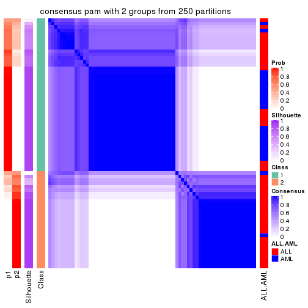</p>

</div>
<div id='tab-ATC-pam-consensus-heatmap-2'>
<pre><code class="r">consensus_heatmap(res, k = 3)
</code></pre>

<p>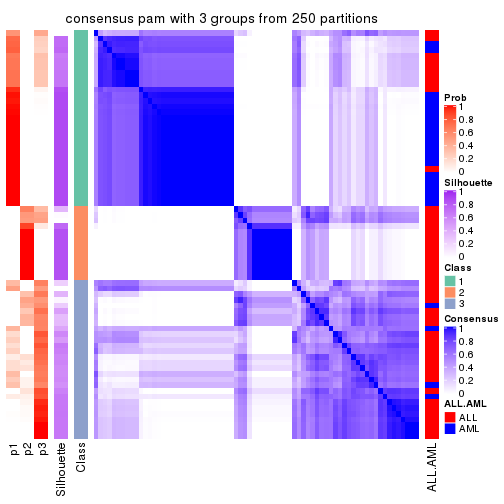</p>

</div>
<div id='tab-ATC-pam-consensus-heatmap-3'>
<pre><code class="r">consensus_heatmap(res, k = 4)
</code></pre>

<p>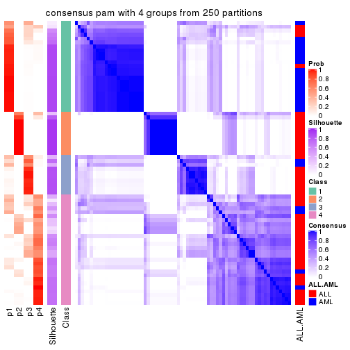</p>

</div>
<div id='tab-ATC-pam-consensus-heatmap-4'>
<pre><code class="r">consensus_heatmap(res, k = 5)
</code></pre>

<p>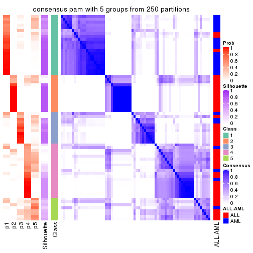</p>

</div>
<div id='tab-ATC-pam-consensus-heatmap-5'>
<pre><code class="r">consensus_heatmap(res, k = 6)
</code></pre>

<p>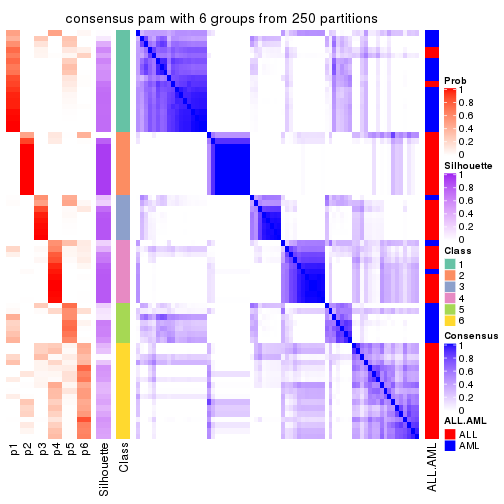</p>

</div>
</div>

Heatmaps for the membership of samples in all partitions to see how consistent they are:


<script>
$( function() {
	$( '#tabs-ATC-pam-membership-heatmap' ).tabs();
} );
</script>
<div id='tabs-ATC-pam-membership-heatmap'>
<ul>
<li><a href='#tab-ATC-pam-membership-heatmap-1'>k = 2</a></li>
<li><a href='#tab-ATC-pam-membership-heatmap-2'>k = 3</a></li>
<li><a href='#tab-ATC-pam-membership-heatmap-3'>k = 4</a></li>
<li><a href='#tab-ATC-pam-membership-heatmap-4'>k = 5</a></li>
<li><a href='#tab-ATC-pam-membership-heatmap-5'>k = 6</a></li>
</ul>
<div id='tab-ATC-pam-membership-heatmap-1'>
<pre><code class="r">membership_heatmap(res, k = 2)
</code></pre>

<p>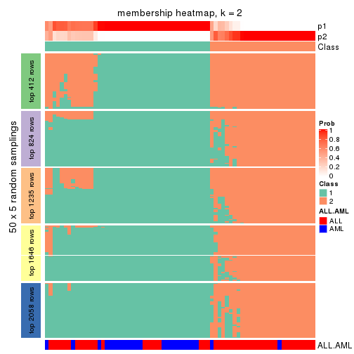</p>

</div>
<div id='tab-ATC-pam-membership-heatmap-2'>
<pre><code class="r">membership_heatmap(res, k = 3)
</code></pre>

<p>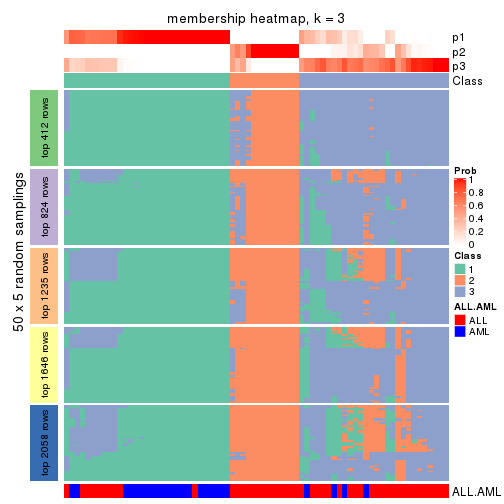</p>

</div>
<div id='tab-ATC-pam-membership-heatmap-3'>
<pre><code class="r">membership_heatmap(res, k = 4)
</code></pre>

<p>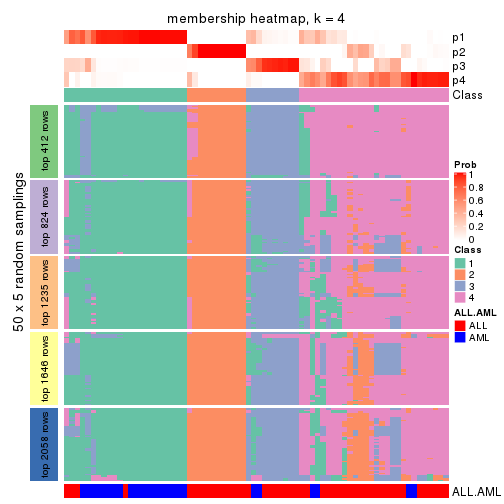</p>

</div>
<div id='tab-ATC-pam-membership-heatmap-4'>
<pre><code class="r">membership_heatmap(res, k = 5)
</code></pre>

<p>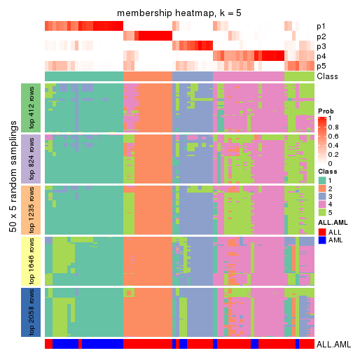</p>

</div>
<div id='tab-ATC-pam-membership-heatmap-5'>
<pre><code class="r">membership_heatmap(res, k = 6)
</code></pre>

<p>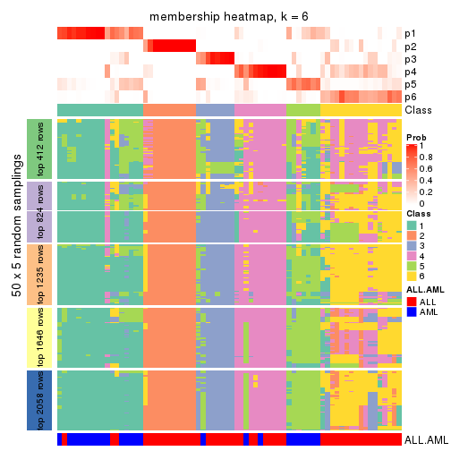</p>

</div>
</div>

As soon as we have had the classes for columns, we can look for signatures
which are significantly different between classes which can be candidate marks
for certain classes. Following are the heatmaps for signatures.


Signature heatmaps where rows are scaled:


<script>
$( function() {
	$( '#tabs-ATC-pam-get-signatures' ).tabs();
} );
</script>
<div id='tabs-ATC-pam-get-signatures'>
<ul>
<li><a href='#tab-ATC-pam-get-signatures-1'>k = 2</a></li>
<li><a href='#tab-ATC-pam-get-signatures-2'>k = 3</a></li>
<li><a href='#tab-ATC-pam-get-signatures-3'>k = 4</a></li>
<li><a href='#tab-ATC-pam-get-signatures-4'>k = 5</a></li>
<li><a href='#tab-ATC-pam-get-signatures-5'>k = 6</a></li>
</ul>
<div id='tab-ATC-pam-get-signatures-1'>
<pre><code class="r">get_signatures(res, k = 2)
</code></pre>

<p>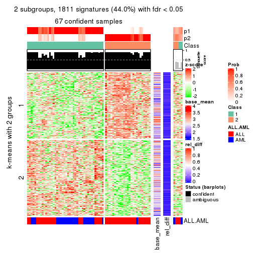</p>

</div>
<div id='tab-ATC-pam-get-signatures-2'>
<pre><code class="r">get_signatures(res, k = 3)
</code></pre>

<p>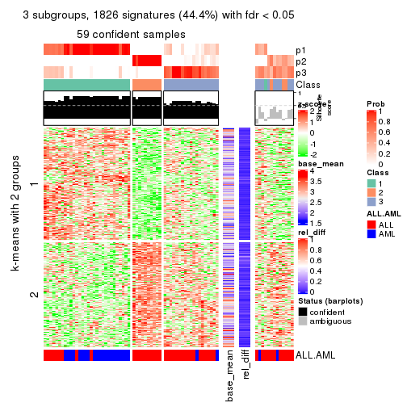</p>

</div>
<div id='tab-ATC-pam-get-signatures-3'>
<pre><code class="r">get_signatures(res, k = 4)
</code></pre>

<p>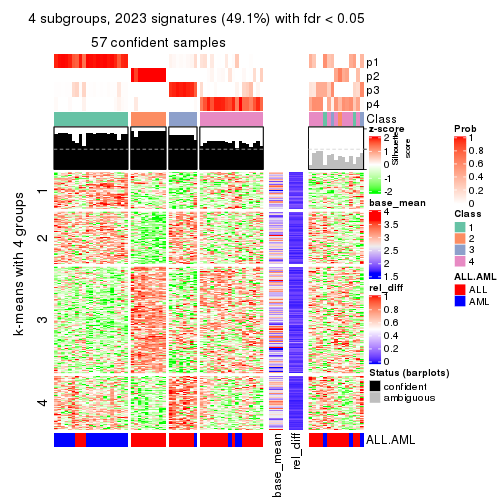</p>

</div>
<div id='tab-ATC-pam-get-signatures-4'>
<pre><code class="r">get_signatures(res, k = 5)
</code></pre>

<p>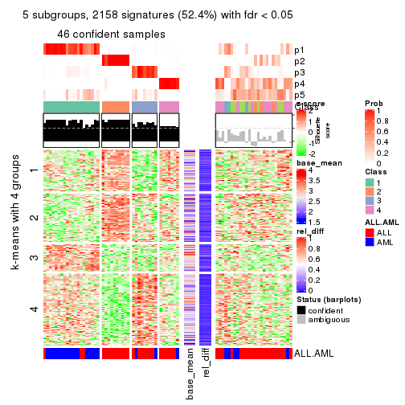</p>

</div>
<div id='tab-ATC-pam-get-signatures-5'>
<pre><code class="r">get_signatures(res, k = 6)
</code></pre>

<p>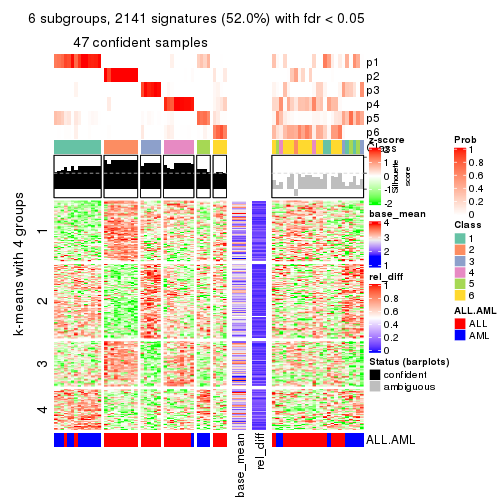</p>

</div>
</div>


Signature heatmaps where rows are not scaled:


<script>
$( function() {
	$( '#tabs-ATC-pam-get-signatures-no-scale' ).tabs();
} );
</script>
<div id='tabs-ATC-pam-get-signatures-no-scale'>
<ul>
<li><a href='#tab-ATC-pam-get-signatures-no-scale-1'>k = 2</a></li>
<li><a href='#tab-ATC-pam-get-signatures-no-scale-2'>k = 3</a></li>
<li><a href='#tab-ATC-pam-get-signatures-no-scale-3'>k = 4</a></li>
<li><a href='#tab-ATC-pam-get-signatures-no-scale-4'>k = 5</a></li>
<li><a href='#tab-ATC-pam-get-signatures-no-scale-5'>k = 6</a></li>
</ul>
<div id='tab-ATC-pam-get-signatures-no-scale-1'>
<pre><code class="r">get_signatures(res, k = 2, scale_rows = FALSE)
</code></pre>

<p>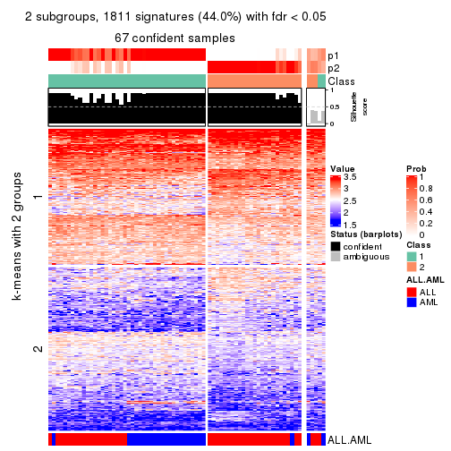</p>

</div>
<div id='tab-ATC-pam-get-signatures-no-scale-2'>
<pre><code class="r">get_signatures(res, k = 3, scale_rows = FALSE)
</code></pre>

<p>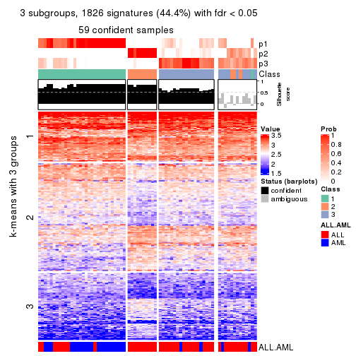</p>

</div>
<div id='tab-ATC-pam-get-signatures-no-scale-3'>
<pre><code class="r">get_signatures(res, k = 4, scale_rows = FALSE)
</code></pre>

<p>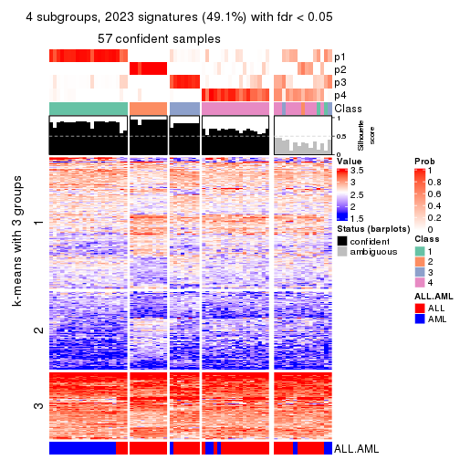</p>

</div>
<div id='tab-ATC-pam-get-signatures-no-scale-4'>
<pre><code class="r">get_signatures(res, k = 5, scale_rows = FALSE)
</code></pre>

<p>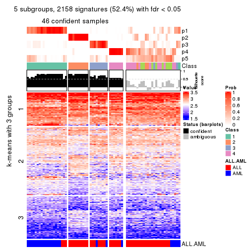</p>

</div>
<div id='tab-ATC-pam-get-signatures-no-scale-5'>
<pre><code class="r">get_signatures(res, k = 6, scale_rows = FALSE)
</code></pre>

<p>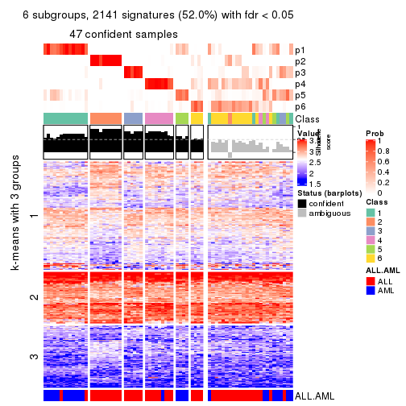</p>

</div>
</div>


Compare the overlap of signatures from different k:

```r
compare_signatures(res)
```

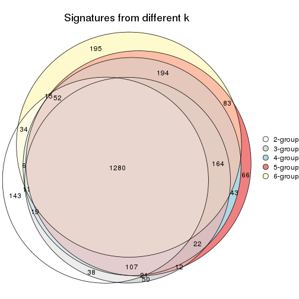

`get_signature()` returns a data frame invisibly. TO get the list of signatures, the function
call should be assigned to a variable explicitly. In following code, if `plot` argument is set
to `FALSE`, no heatmap is plotted while only the differential analysis is performed.

```r
# code only for demonstration
tb = get_signature(res, k = ..., plot = FALSE)
```

An example of the output of `tb` is:

```
#>   which_row         fdr    mean_1    mean_2 scaled_mean_1 scaled_mean_2 km
#> 1        38 0.042760348  8.373488  9.131774    -0.5533452     0.5164555  1
#> 2        40 0.018707592  7.106213  8.469186    -0.6173731     0.5762149  1
#> 3        55 0.019134737 10.221463 11.207825    -0.6159697     0.5749050  1
#> 4        59 0.006059896  5.921854  7.869574    -0.6899429     0.6439467  1
#> 5        60 0.018055526  8.928898 10.211722    -0.6204761     0.5791110  1
#> 6        98 0.009384629 15.714769 14.887706     0.6635654    -0.6193277  2
...
```

The columns in `tb` are:

1. `which_row`: row indices corresponding to the input matrix.
2. `fdr`: FDR for the differential test. 
3. `mean_x`: The mean value in group x.
4. `scaled_mean_x`: The mean value in group x after rows are scaled.
5. `km`: Row groups if k-means clustering is applied to rows.


UMAP plot which shows how samples are separated.


<script>
$( function() {
	$( '#tabs-ATC-pam-dimension-reduction' ).tabs();
} );
</script>
<div id='tabs-ATC-pam-dimension-reduction'>
<ul>
<li><a href='#tab-ATC-pam-dimension-reduction-1'>k = 2</a></li>
<li><a href='#tab-ATC-pam-dimension-reduction-2'>k = 3</a></li>
<li><a href='#tab-ATC-pam-dimension-reduction-3'>k = 4</a></li>
<li><a href='#tab-ATC-pam-dimension-reduction-4'>k = 5</a></li>
<li><a href='#tab-ATC-pam-dimension-reduction-5'>k = 6</a></li>
</ul>
<div id='tab-ATC-pam-dimension-reduction-1'>
<pre><code class="r">dimension_reduction(res, k = 2, method = &quot;UMAP&quot;)
</code></pre>

<p>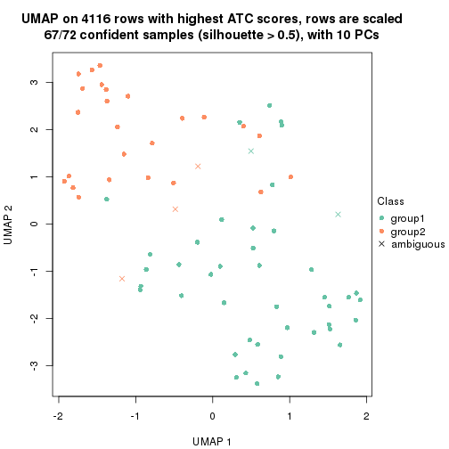</p>

</div>
<div id='tab-ATC-pam-dimension-reduction-2'>
<pre><code class="r">dimension_reduction(res, k = 3, method = &quot;UMAP&quot;)
</code></pre>

<p>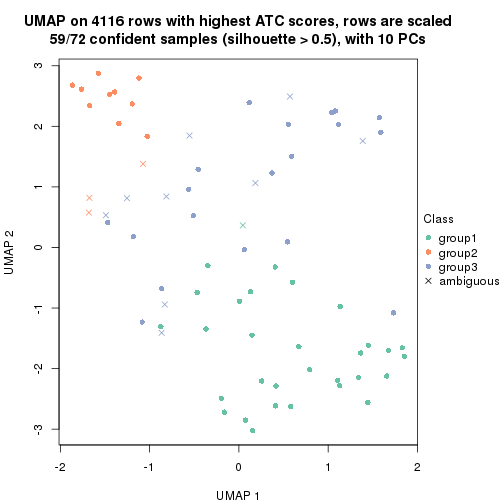</p>

</div>
<div id='tab-ATC-pam-dimension-reduction-3'>
<pre><code class="r">dimension_reduction(res, k = 4, method = &quot;UMAP&quot;)
</code></pre>

<p>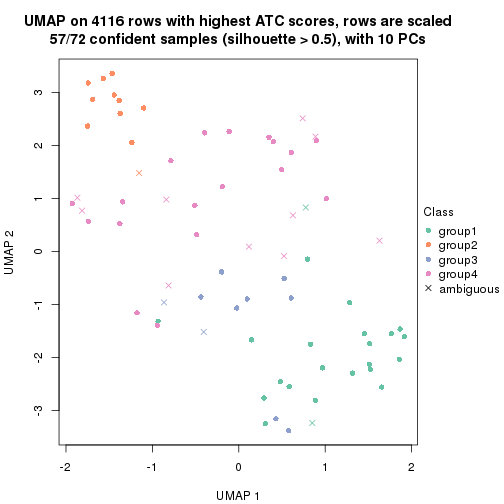</p>

</div>
<div id='tab-ATC-pam-dimension-reduction-4'>
<pre><code class="r">dimension_reduction(res, k = 5, method = &quot;UMAP&quot;)
</code></pre>

<p>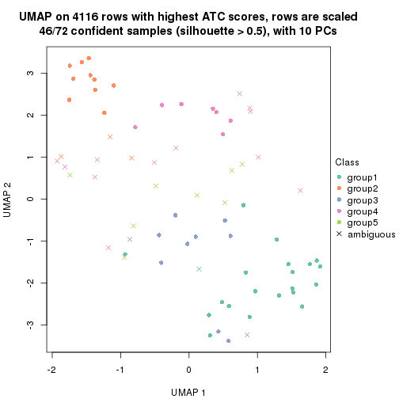</p>

</div>
<div id='tab-ATC-pam-dimension-reduction-5'>
<pre><code class="r">dimension_reduction(res, k = 6, method = &quot;UMAP&quot;)
</code></pre>

<p>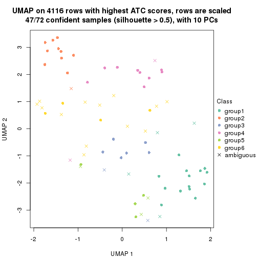</p>

</div>
</div>


Following heatmap shows how subgroups are split when increasing `k`:

```r
collect_classes(res)
```

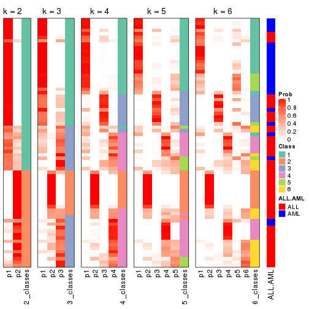


Test correlation between subgroups and known annotations. If the known
annotation is numeric, one-way ANOVA test is applied, and if the known
annotation is discrete, chi-squared contingency table test is applied.

```r
test_to_known_factors(res)
```

```
#>          n ALL.AML(p) k
#> ATC:pam 67   1.65e-04 2
#> ATC:pam 59   3.74e-06 3
#> ATC:pam 57   5.47e-07 4
#> ATC:pam 46   1.05e-05 5
#> ATC:pam 47   1.08e-06 6
```


If matrix rows can be associated to genes, consider to use `functional_enrichment(res,
...)` to perform function enrichment for the signature genes. See [this vignette](http://bioconductor.org/packages/devel/bioc/vignettes/cola/inst/doc/functional_enrichment.html) for more detailed explanations.


 

---------------------------------------------------


### ATC:mclust


The object with results only for a single top-value method and a single partition method 
can be extracted as:

```r
res = res_list["ATC", "mclust"]
# you can also extract it by
# res = res_list["ATC:mclust"]
```

A summary of `res` and all the functions that can be applied to it:

```r
res
```

```
#> A 'ConsensusPartition' object with k = 2, 3, 4, 5, 6.
#>   On a matrix with 4116 rows and 72 columns.
#>   Top rows (412, 824, 1235, 1646, 2058) are extracted by 'ATC' method.
#>   Subgroups are detected by 'mclust' method.
#>   Performed in total 1250 partitions by row resampling.
#>   Best k for subgroups seems to be 2.
#> 
#> Following methods can be applied to this 'ConsensusPartition' object:
#>  [1] "cola_report"             "collect_classes"         "collect_plots"          
#>  [4] "collect_stats"           "colnames"                "compare_signatures"     
#>  [7] "consensus_heatmap"       "dimension_reduction"     "functional_enrichment"  
#> [10] "get_anno_col"            "get_anno"                "get_classes"            
#> [13] "get_consensus"           "get_matrix"              "get_membership"         
#> [16] "get_param"               "get_signatures"          "get_stats"              
#> [19] "is_best_k"               "is_stable_k"             "membership_heatmap"     
#> [22] "ncol"                    "nrow"                    "plot_ecdf"              
#> [25] "rownames"                "select_partition_number" "show"                   
#> [28] "suggest_best_k"          "test_to_known_factors"
```

`collect_plots()` function collects all the plots made from `res` for all `k` (number of partitions)
into one single page to provide an easy and fast comparison between different `k`.

```r
collect_plots(res)
```

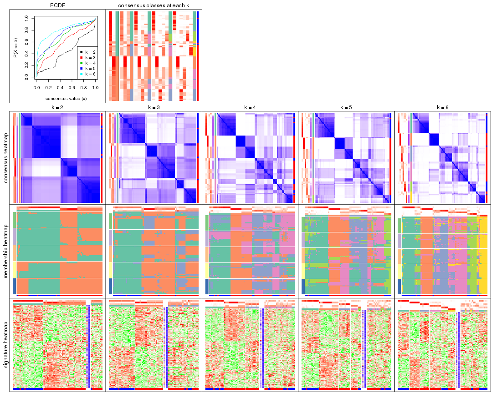

The plots are:

- The first row: a plot of the ECDF (empirical cumulative distribution
  function) curves of the consensus matrix for each `k` and the heatmap of
  predicted classes for each `k`.
- The second row: heatmaps of the consensus matrix for each `k`.
- The third row: heatmaps of the membership matrix for each `k`.
- The fouth row: heatmaps of the signatures for each `k`.

All the plots in panels can be made by individual functions and they are
plotted later in this section.

`select_partition_number()` produces several plots showing different
statistics for choosing "optimized" `k`. There are following statistics:

- ECDF curves of the consensus matrix for each `k`;
- 1-PAC. [The PAC
  score](https://en.wikipedia.org/wiki/Consensus_clustering#Over-interpretation_potential_of_consensus_clustering)
  measures the proportion of the ambiguous subgrouping.
- Mean silhouette score.
- Concordance. The mean probability of fiting the consensus class ids in all
  partitions.
- Area increased. Denote $A_k$ as the area under the ECDF curve for current
  `k`, the area increased is defined as $A_k - A_{k-1}$.
- Rand index. The percent of pairs of samples that are both in a same cluster
  or both are not in a same cluster in the partition of k and k-1.
- Jaccard index. The ratio of pairs of samples are both in a same cluster in
  the partition of k and k-1 and the pairs of samples are both in a same
  cluster in the partition k or k-1.

The detailed explanations of these statistics can be found in [the _cola_
vignette](http://bioconductor.org/packages/devel/bioc/vignettes/cola/inst/doc/cola.html#toc_13).

Generally speaking, lower PAC score, higher mean silhouette score or higher
concordance corresponds to better partition. Rand index and Jaccard index
measure how similar the current partition is compared to partition with `k-1`.
If they are too similar, we won't accept `k` is better than `k-1`.

```r
select_partition_number(res)
```

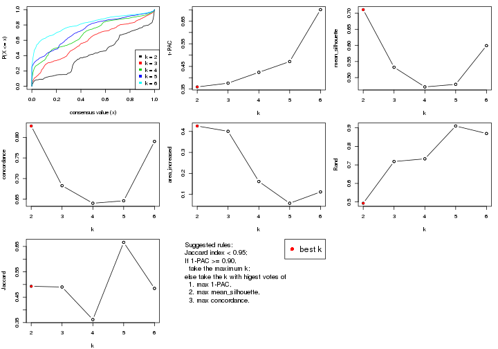

The numeric values for all these statistics can be obtained by `get_stats()`.

```r
get_stats(res)
```

```
#>   k 1-PAC mean_silhouette concordance area_increased  Rand Jaccard
#> 2 2 0.360           0.711       0.828         0.4257 0.493   0.493
#> 3 3 0.376           0.532       0.683         0.4004 0.718   0.490
#> 4 4 0.424           0.471       0.640         0.1614 0.733   0.362
#> 5 5 0.471           0.479       0.646         0.0578 0.910   0.666
#> 6 6 0.701           0.599       0.790         0.1118 0.869   0.485
```

`suggest_best_k()` suggests the best $k$ based on these statistics. The rules are as follows:

- All $k$ with Jaccard index larger than 0.95 are removed because increasing
  $k$ does not provide enough extra information. If all $k$ are removed, it is
  marked as no subgroup is detected.
- For all $k$ with 1-PAC score larger than 0.9, the maximal $k$ is taken as
  the best $k$, and other $k$ are marked as optional $k$.
- If it does not fit the second rule. The $k$ with the maximal vote of the
  highest 1-PAC score, highest mean silhouette, and highest concordance is
  taken as the best $k$.

```r
suggest_best_k(res)
```

```
#> [1] 2
```


Following shows the table of the partitions (You need to click the **show/hide
code output** link to see it). The membership matrix (columns with name `p*`)
is inferred by
[`clue::cl_consensus()`](https://www.rdocumentation.org/link/cl_consensus?package=clue)
function with the `SE` method. Basically the value in the membership matrix
represents the probability to belong to a certain group. The finall class
label for an item is determined with the group with highest probability it
belongs to.

In `get_classes()` function, the entropy is calculated from the membership
matrix and the silhouette score is calculated from the consensus matrix.


<script>
$( function() {
	$( '#tabs-ATC-mclust-get-classes' ).tabs();
} );
</script>
<div id='tabs-ATC-mclust-get-classes'>
<ul>
<li><a href='#tab-ATC-mclust-get-classes-1'>k = 2</a></li>
<li><a href='#tab-ATC-mclust-get-classes-2'>k = 3</a></li>
<li><a href='#tab-ATC-mclust-get-classes-3'>k = 4</a></li>
<li><a href='#tab-ATC-mclust-get-classes-4'>k = 5</a></li>
<li><a href='#tab-ATC-mclust-get-classes-5'>k = 6</a></li>
</ul>

<div id='tab-ATC-mclust-get-classes-1'>
<p><a id='tab-ATC-mclust-get-classes-1-a' style='color:#0366d6' href='#'>show/hide code output</a></p>
<pre><code class="r">cbind(get_classes(res, k = 2), get_membership(res, k = 2))
</code></pre>

<pre><code>#&gt;           class entropy silhouette    p1    p2
#&gt; sample_39     1  1.0000     -0.361 0.504 0.496
#&gt; sample_40     2  0.9209      0.748 0.336 0.664
#&gt; sample_42     1  0.8713      0.475 0.708 0.292
#&gt; sample_47     2  0.5408      0.745 0.124 0.876
#&gt; sample_48     2  0.0000      0.692 0.000 1.000
#&gt; sample_49     2  0.9044      0.766 0.320 0.680
#&gt; sample_41     2  0.0672      0.697 0.008 0.992
#&gt; sample_43     2  0.9460      0.697 0.364 0.636
#&gt; sample_44     2  0.4431      0.736 0.092 0.908
#&gt; sample_45     2  0.4431      0.736 0.092 0.908
#&gt; sample_46     2  0.7056      0.759 0.192 0.808
#&gt; sample_70     2  0.9044      0.765 0.320 0.680
#&gt; sample_71     1  0.8713      0.475 0.708 0.292
#&gt; sample_72     1  0.8713      0.475 0.708 0.292
#&gt; sample_68     2  0.0000      0.692 0.000 1.000
#&gt; sample_69     2  0.0000      0.692 0.000 1.000
#&gt; sample_67     1  0.1633      0.844 0.976 0.024
#&gt; sample_55     2  0.9209      0.749 0.336 0.664
#&gt; sample_56     2  0.9044      0.766 0.320 0.680
#&gt; sample_59     2  0.9795      0.596 0.416 0.584
#&gt; sample_52     1  0.0938      0.851 0.988 0.012
#&gt; sample_53     1  0.0376      0.850 0.996 0.004
#&gt; sample_51     1  0.0376      0.850 0.996 0.004
#&gt; sample_50     1  0.0000      0.846 1.000 0.000
#&gt; sample_54     1  0.2948      0.822 0.948 0.052
#&gt; sample_57     1  0.1633      0.845 0.976 0.024
#&gt; sample_58     1  0.1184      0.849 0.984 0.016
#&gt; sample_60     1  0.2948      0.822 0.948 0.052
#&gt; sample_61     1  0.0672      0.852 0.992 0.008
#&gt; sample_65     1  0.0672      0.852 0.992 0.008
#&gt; sample_66     1  0.9963      0.108 0.536 0.464
#&gt; sample_63     1  0.1414      0.847 0.980 0.020
#&gt; sample_64     1  0.1414      0.847 0.980 0.020
#&gt; sample_62     1  0.1414      0.847 0.980 0.020
#&gt; sample_1      2  0.9044      0.766 0.320 0.680
#&gt; sample_2      1  0.8713      0.475 0.708 0.292
#&gt; sample_3      2  0.9358      0.728 0.352 0.648
#&gt; sample_4      2  0.9044      0.766 0.320 0.680
#&gt; sample_5      2  0.0000      0.692 0.000 1.000
#&gt; sample_6      2  0.9129      0.760 0.328 0.672
#&gt; sample_7      2  0.9044      0.766 0.320 0.680
#&gt; sample_8      2  0.9933      0.500 0.452 0.548
#&gt; sample_9      2  0.9129      0.760 0.328 0.672
#&gt; sample_10     1  0.9608      0.157 0.616 0.384
#&gt; sample_11     1  0.8813      0.455 0.700 0.300
#&gt; sample_12     1  0.0672      0.852 0.992 0.008
#&gt; sample_13     2  0.0000      0.692 0.000 1.000
#&gt; sample_14     2  0.6438      0.754 0.164 0.836
#&gt; sample_15     2  0.0000      0.692 0.000 1.000
#&gt; sample_16     2  0.9044      0.766 0.320 0.680
#&gt; sample_17     2  0.8955      0.768 0.312 0.688
#&gt; sample_18     2  0.9087      0.763 0.324 0.676
#&gt; sample_19     2  0.8955      0.768 0.312 0.688
#&gt; sample_20     2  0.0000      0.692 0.000 1.000
#&gt; sample_21     2  0.1184      0.701 0.016 0.984
#&gt; sample_22     1  0.8713      0.475 0.708 0.292
#&gt; sample_23     2  0.9922      0.520 0.448 0.552
#&gt; sample_24     2  0.4690      0.738 0.100 0.900
#&gt; sample_25     1  0.8713      0.475 0.708 0.292
#&gt; sample_26     2  0.9044      0.766 0.320 0.680
#&gt; sample_27     2  0.9044      0.766 0.320 0.680
#&gt; sample_34     1  0.0672      0.852 0.992 0.008
#&gt; sample_35     1  0.0672      0.852 0.992 0.008
#&gt; sample_36     1  0.0000      0.846 1.000 0.000
#&gt; sample_37     1  0.0000      0.846 1.000 0.000
#&gt; sample_38     1  0.0376      0.850 0.996 0.004
#&gt; sample_28     1  0.0672      0.852 0.992 0.008
#&gt; sample_29     1  0.0672      0.852 0.992 0.008
#&gt; sample_30     1  0.0376      0.850 0.996 0.004
#&gt; sample_31     1  0.0672      0.852 0.992 0.008
#&gt; sample_32     1  0.0672      0.852 0.992 0.008
#&gt; sample_33     1  0.0672      0.852 0.992 0.008
</code></pre>

<script>
$('#tab-ATC-mclust-get-classes-1-a').parent().next().next().hide();
$('#tab-ATC-mclust-get-classes-1-a').click(function(){
  $('#tab-ATC-mclust-get-classes-1-a').parent().next().next().toggle();
  return(false);
});
</script>
</div>

<div id='tab-ATC-mclust-get-classes-2'>
<p><a id='tab-ATC-mclust-get-classes-2-a' style='color:#0366d6' href='#'>show/hide code output</a></p>
<pre><code class="r">cbind(get_classes(res, k = 3), get_membership(res, k = 3))
</code></pre>

<pre><code>#&gt;           class entropy silhouette    p1    p2    p3
#&gt; sample_39     3  0.7029      0.303 0.020 0.440 0.540
#&gt; sample_40     3  0.6819      0.252 0.012 0.476 0.512
#&gt; sample_42     3  0.8338      0.249 0.400 0.084 0.516
#&gt; sample_47     2  0.6522      0.705 0.272 0.696 0.032
#&gt; sample_48     2  0.0237      0.615 0.000 0.996 0.004
#&gt; sample_49     3  0.6489      0.284 0.004 0.456 0.540
#&gt; sample_41     2  0.0000      0.613 0.000 1.000 0.000
#&gt; sample_43     2  0.6556      0.704 0.276 0.692 0.032
#&gt; sample_44     2  0.6161      0.704 0.272 0.708 0.020
#&gt; sample_45     2  0.6522      0.705 0.272 0.696 0.032
#&gt; sample_46     2  0.6522      0.705 0.272 0.696 0.032
#&gt; sample_70     2  0.7587      0.651 0.288 0.640 0.072
#&gt; sample_71     3  0.7940      0.266 0.416 0.060 0.524
#&gt; sample_72     3  0.8140      0.258 0.404 0.072 0.524
#&gt; sample_68     2  0.0000      0.613 0.000 1.000 0.000
#&gt; sample_69     2  0.0237      0.610 0.000 0.996 0.004
#&gt; sample_67     3  0.7940      0.266 0.416 0.060 0.524
#&gt; sample_55     2  0.6955     -0.272 0.016 0.496 0.488
#&gt; sample_56     3  0.6489      0.284 0.004 0.456 0.540
#&gt; sample_59     2  0.7872      0.632 0.296 0.620 0.084
#&gt; sample_52     1  0.7512      0.790 0.656 0.076 0.268
#&gt; sample_53     1  0.5760      0.834 0.672 0.000 0.328
#&gt; sample_51     1  0.5760      0.834 0.672 0.000 0.328
#&gt; sample_50     1  0.5785      0.833 0.668 0.000 0.332
#&gt; sample_54     1  0.4489      0.379 0.856 0.108 0.036
#&gt; sample_57     1  0.7208      0.793 0.644 0.048 0.308
#&gt; sample_58     1  0.6079      0.786 0.612 0.000 0.388
#&gt; sample_60     1  0.6250      0.547 0.776 0.104 0.120
#&gt; sample_61     1  0.5650      0.837 0.688 0.000 0.312
#&gt; sample_65     1  0.5465      0.839 0.712 0.000 0.288
#&gt; sample_66     2  0.9228      0.464 0.316 0.508 0.176
#&gt; sample_63     1  0.7512      0.790 0.656 0.076 0.268
#&gt; sample_64     1  0.6079      0.786 0.612 0.000 0.388
#&gt; sample_62     1  0.7512      0.790 0.656 0.076 0.268
#&gt; sample_1      3  0.6941      0.268 0.016 0.464 0.520
#&gt; sample_2      3  0.8140      0.258 0.404 0.072 0.524
#&gt; sample_3      3  0.6735      0.302 0.012 0.424 0.564
#&gt; sample_4      2  0.9082      0.111 0.140 0.468 0.392
#&gt; sample_5      2  0.0000      0.613 0.000 1.000 0.000
#&gt; sample_6      3  0.7063      0.276 0.020 0.464 0.516
#&gt; sample_7      3  0.6500      0.274 0.004 0.464 0.532
#&gt; sample_8      3  0.6779      0.299 0.012 0.444 0.544
#&gt; sample_9      2  0.7851      0.673 0.256 0.644 0.100
#&gt; sample_10     2  0.9162      0.411 0.368 0.480 0.152
#&gt; sample_11     3  0.8201      0.254 0.400 0.076 0.524
#&gt; sample_12     1  0.6318      0.812 0.636 0.008 0.356
#&gt; sample_13     2  0.0237      0.615 0.000 0.996 0.004
#&gt; sample_14     2  0.6632      0.704 0.272 0.692 0.036
#&gt; sample_15     2  0.0000      0.613 0.000 1.000 0.000
#&gt; sample_16     2  0.7979      0.674 0.272 0.628 0.100
#&gt; sample_17     2  0.7911      0.673 0.272 0.632 0.096
#&gt; sample_18     2  0.9178      0.526 0.240 0.540 0.220
#&gt; sample_19     2  0.7124      0.694 0.272 0.672 0.056
#&gt; sample_20     2  0.0000      0.613 0.000 1.000 0.000
#&gt; sample_21     2  0.0475      0.616 0.004 0.992 0.004
#&gt; sample_22     3  0.4121     -0.106 0.168 0.000 0.832
#&gt; sample_23     3  0.7438      0.306 0.040 0.392 0.568
#&gt; sample_24     2  0.5884      0.702 0.272 0.716 0.012
#&gt; sample_25     3  0.9229      0.299 0.168 0.336 0.496
#&gt; sample_26     2  0.8966      0.583 0.256 0.560 0.184
#&gt; sample_27     3  0.6489      0.284 0.004 0.456 0.540
#&gt; sample_34     1  0.5497      0.839 0.708 0.000 0.292
#&gt; sample_35     1  0.6079      0.785 0.612 0.000 0.388
#&gt; sample_36     1  0.5733      0.837 0.676 0.000 0.324
#&gt; sample_37     1  0.5785      0.833 0.668 0.000 0.332
#&gt; sample_38     1  0.5760      0.835 0.672 0.000 0.328
#&gt; sample_28     3  0.6291     -0.631 0.468 0.000 0.532
#&gt; sample_29     1  0.6309     -0.170 0.504 0.000 0.496
#&gt; sample_30     1  0.6299      0.688 0.524 0.000 0.476
#&gt; sample_31     1  0.6570      0.829 0.668 0.024 0.308
#&gt; sample_32     1  0.5591      0.839 0.696 0.000 0.304
#&gt; sample_33     1  0.5733      0.835 0.676 0.000 0.324
</code></pre>

<script>
$('#tab-ATC-mclust-get-classes-2-a').parent().next().next().hide();
$('#tab-ATC-mclust-get-classes-2-a').click(function(){
  $('#tab-ATC-mclust-get-classes-2-a').parent().next().next().toggle();
  return(false);
});
</script>
</div>

<div id='tab-ATC-mclust-get-classes-3'>
<p><a id='tab-ATC-mclust-get-classes-3-a' style='color:#0366d6' href='#'>show/hide code output</a></p>
<pre><code class="r">cbind(get_classes(res, k = 4), get_membership(res, k = 4))
</code></pre>

<pre><code>#&gt;           class entropy silhouette    p1    p2    p3    p4
#&gt; sample_39     3  0.5701     0.6449 0.124 0.132 0.736 0.008
#&gt; sample_40     3  0.4740     0.6208 0.132 0.080 0.788 0.000
#&gt; sample_42     4  0.5680     0.3581 0.392 0.012 0.012 0.584
#&gt; sample_47     2  0.5417     0.5639 0.000 0.572 0.016 0.412
#&gt; sample_48     2  0.0000     0.6676 0.000 1.000 0.000 0.000
#&gt; sample_49     3  0.4898     0.6450 0.116 0.104 0.780 0.000
#&gt; sample_41     2  0.0000     0.6676 0.000 1.000 0.000 0.000
#&gt; sample_43     2  0.5589     0.5600 0.004 0.568 0.016 0.412
#&gt; sample_44     2  0.5408     0.5661 0.000 0.576 0.016 0.408
#&gt; sample_45     2  0.5417     0.5639 0.000 0.572 0.016 0.412
#&gt; sample_46     2  0.5589     0.5600 0.004 0.568 0.016 0.412
#&gt; sample_70     4  0.8224    -0.0651 0.016 0.308 0.252 0.424
#&gt; sample_71     4  0.5300     0.3421 0.408 0.000 0.012 0.580
#&gt; sample_72     4  0.5584     0.3525 0.400 0.008 0.012 0.580
#&gt; sample_68     2  0.0000     0.6676 0.000 1.000 0.000 0.000
#&gt; sample_69     2  0.0000     0.6676 0.000 1.000 0.000 0.000
#&gt; sample_67     4  0.5097     0.3286 0.428 0.000 0.004 0.568
#&gt; sample_55     3  0.7972     0.5455 0.108 0.084 0.576 0.232
#&gt; sample_56     3  0.4469     0.6252 0.112 0.080 0.808 0.000
#&gt; sample_59     4  0.8358    -0.0773 0.044 0.160 0.352 0.444
#&gt; sample_52     4  0.7749    -0.0982 0.348 0.004 0.204 0.444
#&gt; sample_53     1  0.0336     0.8468 0.992 0.000 0.000 0.008
#&gt; sample_51     1  0.0000     0.8481 1.000 0.000 0.000 0.000
#&gt; sample_50     1  0.0188     0.8479 0.996 0.000 0.004 0.000
#&gt; sample_54     4  0.4644     0.2391 0.028 0.028 0.136 0.808
#&gt; sample_57     4  0.7868    -0.1614 0.404 0.012 0.176 0.408
#&gt; sample_58     3  0.6354     0.0821 0.416 0.000 0.520 0.064
#&gt; sample_60     4  0.6166     0.2175 0.104 0.028 0.148 0.720
#&gt; sample_61     1  0.4426     0.6524 0.772 0.000 0.204 0.024
#&gt; sample_65     1  0.2111     0.8396 0.932 0.000 0.044 0.024
#&gt; sample_66     4  0.7695     0.2876 0.292 0.184 0.012 0.512
#&gt; sample_63     4  0.7611    -0.1644 0.400 0.004 0.172 0.424
#&gt; sample_64     3  0.6179     0.1636 0.392 0.000 0.552 0.056
#&gt; sample_62     4  0.7772    -0.1243 0.364 0.004 0.204 0.428
#&gt; sample_1      3  0.8046     0.5343 0.060 0.136 0.552 0.252
#&gt; sample_2      4  0.5595     0.3493 0.404 0.008 0.012 0.576
#&gt; sample_3      3  0.7943     0.5394 0.060 0.124 0.560 0.256
#&gt; sample_4      3  0.7965     0.4088 0.032 0.144 0.492 0.332
#&gt; sample_5      2  0.0000     0.6676 0.000 1.000 0.000 0.000
#&gt; sample_6      3  0.8412     0.5596 0.096 0.136 0.540 0.228
#&gt; sample_7      3  0.5067     0.6463 0.116 0.116 0.768 0.000
#&gt; sample_8      3  0.5596     0.6458 0.116 0.132 0.744 0.008
#&gt; sample_9      4  0.7604    -0.2611 0.004 0.388 0.172 0.436
#&gt; sample_10     4  0.8997     0.0359 0.116 0.160 0.256 0.468
#&gt; sample_11     4  0.6036     0.3684 0.380 0.028 0.012 0.580
#&gt; sample_12     1  0.2565     0.8325 0.912 0.000 0.056 0.032
#&gt; sample_13     2  0.0000     0.6676 0.000 1.000 0.000 0.000
#&gt; sample_14     2  0.5589     0.5600 0.004 0.568 0.016 0.412
#&gt; sample_15     2  0.0000     0.6676 0.000 1.000 0.000 0.000
#&gt; sample_16     4  0.7838    -0.2004 0.004 0.220 0.352 0.424
#&gt; sample_17     2  0.6134     0.5039 0.004 0.532 0.040 0.424
#&gt; sample_18     3  0.7704     0.2654 0.008 0.168 0.432 0.392
#&gt; sample_19     2  0.5714     0.5280 0.004 0.552 0.020 0.424
#&gt; sample_20     2  0.0000     0.6676 0.000 1.000 0.000 0.000
#&gt; sample_21     2  0.0188     0.6653 0.004 0.996 0.000 0.000
#&gt; sample_22     1  0.3873     0.7715 0.844 0.000 0.060 0.096
#&gt; sample_23     3  0.8603     0.5801 0.148 0.116 0.532 0.204
#&gt; sample_24     2  0.5223     0.5656 0.004 0.584 0.004 0.408
#&gt; sample_25     4  0.8938    -0.0262 0.328 0.056 0.244 0.372
#&gt; sample_26     3  0.7648     0.2797 0.008 0.160 0.440 0.392
#&gt; sample_27     3  0.4898     0.6450 0.116 0.104 0.780 0.000
#&gt; sample_34     1  0.2546     0.8316 0.912 0.000 0.060 0.028
#&gt; sample_35     1  0.5510    -0.0868 0.504 0.000 0.480 0.016
#&gt; sample_36     1  0.0469     0.8506 0.988 0.000 0.012 0.000
#&gt; sample_37     1  0.0188     0.8479 0.996 0.000 0.004 0.000
#&gt; sample_38     1  0.0336     0.8468 0.992 0.000 0.000 0.008
#&gt; sample_28     1  0.0804     0.8515 0.980 0.000 0.012 0.008
#&gt; sample_29     1  0.5000    -0.3041 0.504 0.000 0.000 0.496
#&gt; sample_30     1  0.1356     0.8487 0.960 0.000 0.032 0.008
#&gt; sample_31     1  0.3611     0.7876 0.860 0.000 0.060 0.080
#&gt; sample_32     1  0.1042     0.8507 0.972 0.000 0.020 0.008
#&gt; sample_33     1  0.1389     0.8439 0.952 0.000 0.048 0.000
</code></pre>

<script>
$('#tab-ATC-mclust-get-classes-3-a').parent().next().next().hide();
$('#tab-ATC-mclust-get-classes-3-a').click(function(){
  $('#tab-ATC-mclust-get-classes-3-a').parent().next().next().toggle();
  return(false);
});
</script>
</div>

<div id='tab-ATC-mclust-get-classes-4'>
<p><a id='tab-ATC-mclust-get-classes-4-a' style='color:#0366d6' href='#'>show/hide code output</a></p>
<pre><code class="r">cbind(get_classes(res, k = 5), get_membership(res, k = 5))
</code></pre>

<pre><code>#&gt;           class entropy silhouette    p1    p2    p3    p4    p5
#&gt; sample_39     3  0.1270     0.5318 0.000 0.000 0.948 0.052 0.000
#&gt; sample_40     3  0.4199     0.5715 0.180 0.000 0.772 0.008 0.040
#&gt; sample_42     4  0.4428     0.5263 0.268 0.000 0.000 0.700 0.032
#&gt; sample_47     2  0.6458     0.5570 0.000 0.452 0.008 0.400 0.140
#&gt; sample_48     2  0.0000     0.6664 0.000 1.000 0.000 0.000 0.000
#&gt; sample_49     3  0.0000     0.5416 0.000 0.000 1.000 0.000 0.000
#&gt; sample_41     2  0.0162     0.6660 0.000 0.996 0.000 0.004 0.000
#&gt; sample_43     2  0.6879     0.5229 0.000 0.424 0.036 0.416 0.124
#&gt; sample_44     2  0.6150     0.5598 0.000 0.464 0.000 0.404 0.132
#&gt; sample_45     2  0.6639     0.5529 0.000 0.444 0.016 0.400 0.140
#&gt; sample_46     2  0.6863     0.5430 0.000 0.432 0.028 0.400 0.140
#&gt; sample_70     4  0.8905     0.2251 0.220 0.304 0.140 0.308 0.028
#&gt; sample_71     4  0.4780     0.5166 0.280 0.000 0.000 0.672 0.048
#&gt; sample_72     4  0.4452     0.5263 0.272 0.000 0.000 0.696 0.032
#&gt; sample_68     2  0.0000     0.6664 0.000 1.000 0.000 0.000 0.000
#&gt; sample_69     2  0.0000     0.6664 0.000 1.000 0.000 0.000 0.000
#&gt; sample_67     4  0.4288     0.5004 0.324 0.000 0.000 0.664 0.012
#&gt; sample_55     3  0.7333     0.5100 0.220 0.000 0.532 0.152 0.096
#&gt; sample_56     3  0.0000     0.5416 0.000 0.000 1.000 0.000 0.000
#&gt; sample_59     4  0.9757     0.0681 0.220 0.112 0.176 0.276 0.216
#&gt; sample_52     5  0.3695     0.5909 0.164 0.000 0.000 0.036 0.800
#&gt; sample_53     1  0.0703     0.7642 0.976 0.000 0.000 0.024 0.000
#&gt; sample_51     1  0.0000     0.7667 1.000 0.000 0.000 0.000 0.000
#&gt; sample_50     1  0.0000     0.7667 1.000 0.000 0.000 0.000 0.000
#&gt; sample_54     5  0.7184     0.2965 0.252 0.008 0.020 0.236 0.484
#&gt; sample_57     5  0.4696     0.3421 0.428 0.000 0.016 0.000 0.556
#&gt; sample_58     1  0.6244    -0.1526 0.480 0.000 0.128 0.004 0.388
#&gt; sample_60     5  0.6679     0.4799 0.220 0.012 0.020 0.164 0.584
#&gt; sample_61     1  0.4628     0.6435 0.772 0.000 0.124 0.020 0.084
#&gt; sample_65     1  0.2389     0.7204 0.880 0.000 0.000 0.004 0.116
#&gt; sample_66     2  0.8004    -0.4243 0.292 0.328 0.020 0.324 0.036
#&gt; sample_63     5  0.4066     0.5484 0.324 0.000 0.004 0.000 0.672
#&gt; sample_64     1  0.6244    -0.2576 0.444 0.000 0.144 0.000 0.412
#&gt; sample_62     5  0.3427     0.5746 0.192 0.000 0.000 0.012 0.796
#&gt; sample_1      3  0.6998     0.5266 0.216 0.004 0.564 0.164 0.052
#&gt; sample_2      4  0.4227     0.5194 0.292 0.000 0.000 0.692 0.016
#&gt; sample_3      3  0.7537     0.4450 0.220 0.004 0.468 0.256 0.052
#&gt; sample_4      3  0.7022     0.5022 0.216 0.000 0.544 0.188 0.052
#&gt; sample_5      2  0.0000     0.6664 0.000 1.000 0.000 0.000 0.000
#&gt; sample_6      3  0.7605     0.4764 0.220 0.012 0.492 0.224 0.052
#&gt; sample_7      3  0.3454     0.5875 0.156 0.000 0.816 0.000 0.028
#&gt; sample_8      3  0.1043     0.5363 0.000 0.000 0.960 0.040 0.000
#&gt; sample_9      4  0.6558    -0.1813 0.056 0.336 0.032 0.552 0.024
#&gt; sample_10     4  0.8174     0.3578 0.260 0.120 0.088 0.484 0.048
#&gt; sample_11     4  0.4404     0.5251 0.264 0.000 0.000 0.704 0.032
#&gt; sample_12     1  0.4726     0.5993 0.752 0.000 0.008 0.108 0.132
#&gt; sample_13     2  0.0000     0.6664 0.000 1.000 0.000 0.000 0.000
#&gt; sample_14     2  0.6692     0.5484 0.000 0.440 0.020 0.404 0.136
#&gt; sample_15     2  0.0000     0.6664 0.000 1.000 0.000 0.000 0.000
#&gt; sample_16     4  0.6455    -0.3557 0.000 0.352 0.108 0.516 0.024
#&gt; sample_17     4  0.7606    -0.4484 0.000 0.340 0.120 0.432 0.108
#&gt; sample_18     3  0.8388     0.3446 0.224 0.052 0.428 0.244 0.052
#&gt; sample_19     2  0.6556     0.5470 0.000 0.444 0.016 0.412 0.128
#&gt; sample_20     2  0.0000     0.6664 0.000 1.000 0.000 0.000 0.000
#&gt; sample_21     2  0.0162     0.6637 0.000 0.996 0.000 0.004 0.000
#&gt; sample_22     4  0.5564     0.0884 0.456 0.000 0.032 0.492 0.020
#&gt; sample_23     3  0.7557     0.3415 0.220 0.000 0.412 0.316 0.052
#&gt; sample_24     2  0.5812     0.5431 0.000 0.476 0.000 0.432 0.092
#&gt; sample_25     4  0.6264     0.4581 0.324 0.024 0.028 0.580 0.044
#&gt; sample_26     3  0.8678     0.2090 0.216 0.088 0.380 0.276 0.040
#&gt; sample_27     3  0.0000     0.5416 0.000 0.000 1.000 0.000 0.000
#&gt; sample_34     1  0.3023     0.7152 0.860 0.000 0.024 0.004 0.112
#&gt; sample_35     1  0.6061     0.3563 0.600 0.004 0.248 0.004 0.144
#&gt; sample_36     1  0.0290     0.7664 0.992 0.000 0.000 0.000 0.008
#&gt; sample_37     1  0.0000     0.7667 1.000 0.000 0.000 0.000 0.000
#&gt; sample_38     1  0.1792     0.7259 0.916 0.000 0.000 0.084 0.000
#&gt; sample_28     1  0.1216     0.7687 0.960 0.000 0.000 0.020 0.020
#&gt; sample_29     1  0.4161     0.3190 0.704 0.000 0.000 0.280 0.016
#&gt; sample_30     1  0.0609     0.7660 0.980 0.000 0.000 0.000 0.020
#&gt; sample_31     1  0.3333     0.6199 0.788 0.000 0.000 0.004 0.208
#&gt; sample_32     1  0.1469     0.7648 0.948 0.000 0.000 0.016 0.036
#&gt; sample_33     1  0.0703     0.7657 0.976 0.000 0.024 0.000 0.000
</code></pre>

<script>
$('#tab-ATC-mclust-get-classes-4-a').parent().next().next().hide();
$('#tab-ATC-mclust-get-classes-4-a').click(function(){
  $('#tab-ATC-mclust-get-classes-4-a').parent().next().next().toggle();
  return(false);
});
</script>
</div>

<div id='tab-ATC-mclust-get-classes-5'>
<p><a id='tab-ATC-mclust-get-classes-5-a' style='color:#0366d6' href='#'>show/hide code output</a></p>
<pre><code class="r">cbind(get_classes(res, k = 6), get_membership(res, k = 6))
</code></pre>

<pre><code>#&gt;           class entropy silhouette    p1    p2    p3    p4    p5    p6
#&gt; sample_39     3  0.2569     0.6805 0.008 0.000 0.892 0.056 0.008 0.036
#&gt; sample_40     3  0.1816     0.6885 0.004 0.000 0.928 0.048 0.016 0.004
#&gt; sample_42     6  0.0914     0.7687 0.016 0.000 0.000 0.016 0.000 0.968
#&gt; sample_47     4  0.3215     0.6636 0.000 0.240 0.000 0.756 0.000 0.004
#&gt; sample_48     2  0.0000     0.9495 0.000 1.000 0.000 0.000 0.000 0.000
#&gt; sample_49     3  0.0146     0.6868 0.000 0.000 0.996 0.004 0.000 0.000
#&gt; sample_41     2  0.0000     0.9495 0.000 1.000 0.000 0.000 0.000 0.000
#&gt; sample_43     4  0.3104     0.7015 0.000 0.184 0.000 0.800 0.000 0.016
#&gt; sample_44     4  0.3915     0.3596 0.000 0.412 0.000 0.584 0.000 0.004
#&gt; sample_45     4  0.3189     0.6698 0.000 0.236 0.000 0.760 0.000 0.004
#&gt; sample_46     4  0.2980     0.6958 0.000 0.192 0.000 0.800 0.000 0.008
#&gt; sample_70     4  0.5992     0.6435 0.008 0.120 0.092 0.680 0.044 0.056
#&gt; sample_71     6  0.1065     0.7665 0.020 0.000 0.000 0.008 0.008 0.964
#&gt; sample_72     6  0.0820     0.7673 0.016 0.000 0.000 0.012 0.000 0.972
#&gt; sample_68     2  0.0146     0.9477 0.000 0.996 0.000 0.004 0.000 0.000
#&gt; sample_69     2  0.0146     0.9477 0.000 0.996 0.000 0.004 0.000 0.000
#&gt; sample_67     6  0.1728     0.7432 0.064 0.000 0.000 0.008 0.004 0.924
#&gt; sample_55     3  0.4950     0.5507 0.008 0.000 0.680 0.232 0.060 0.020
#&gt; sample_56     3  0.0458     0.6885 0.000 0.000 0.984 0.016 0.000 0.000
#&gt; sample_59     4  0.7012     0.4423 0.008 0.056 0.184 0.560 0.148 0.044
#&gt; sample_52     5  0.0458     0.7680 0.016 0.000 0.000 0.000 0.984 0.000
#&gt; sample_53     1  0.0146     0.7692 0.996 0.000 0.000 0.000 0.000 0.004
#&gt; sample_51     1  0.0000     0.7691 1.000 0.000 0.000 0.000 0.000 0.000
#&gt; sample_50     1  0.0000     0.7691 1.000 0.000 0.000 0.000 0.000 0.000
#&gt; sample_54     5  0.3610     0.6757 0.008 0.000 0.008 0.116 0.816 0.052
#&gt; sample_57     5  0.2255     0.7413 0.028 0.000 0.080 0.000 0.892 0.000
#&gt; sample_58     5  0.6771     0.2853 0.116 0.000 0.364 0.060 0.444 0.016
#&gt; sample_60     5  0.2442     0.7340 0.004 0.012 0.008 0.064 0.900 0.012
#&gt; sample_61     1  0.7410     0.0383 0.376 0.000 0.268 0.092 0.256 0.008
#&gt; sample_65     1  0.5285     0.4918 0.628 0.000 0.016 0.076 0.272 0.008
#&gt; sample_66     6  0.6657     0.0446 0.036 0.176 0.004 0.324 0.004 0.456
#&gt; sample_63     5  0.0547     0.7679 0.020 0.000 0.000 0.000 0.980 0.000
#&gt; sample_64     5  0.6101     0.3150 0.068 0.000 0.380 0.040 0.496 0.016
#&gt; sample_62     5  0.0458     0.7680 0.016 0.000 0.000 0.000 0.984 0.000
#&gt; sample_1      3  0.5631     0.3505 0.008 0.004 0.540 0.372 0.044 0.032
#&gt; sample_2      6  0.0914     0.7687 0.016 0.000 0.000 0.016 0.000 0.968
#&gt; sample_3      3  0.6112     0.3840 0.008 0.004 0.520 0.352 0.044 0.072
#&gt; sample_4      4  0.5793    -0.1051 0.008 0.000 0.416 0.484 0.044 0.048
#&gt; sample_5      2  0.0000     0.9495 0.000 1.000 0.000 0.000 0.000 0.000
#&gt; sample_6      3  0.6021     0.3634 0.008 0.004 0.508 0.376 0.044 0.060
#&gt; sample_7      3  0.1198     0.6931 0.004 0.000 0.960 0.020 0.012 0.004
#&gt; sample_8      3  0.1261     0.6868 0.004 0.000 0.956 0.028 0.008 0.004
#&gt; sample_9      4  0.3493     0.6982 0.000 0.112 0.000 0.812 0.004 0.072
#&gt; sample_10     4  0.6965     0.1545 0.012 0.012 0.220 0.488 0.036 0.232
#&gt; sample_11     6  0.1151     0.7625 0.012 0.000 0.000 0.032 0.000 0.956
#&gt; sample_12     1  0.8004     0.0862 0.388 0.000 0.188 0.064 0.264 0.096
#&gt; sample_13     2  0.0000     0.9495 0.000 1.000 0.000 0.000 0.000 0.000
#&gt; sample_14     4  0.3043     0.6933 0.000 0.200 0.000 0.792 0.000 0.008
#&gt; sample_15     2  0.0000     0.9495 0.000 1.000 0.000 0.000 0.000 0.000
#&gt; sample_16     4  0.4168     0.7002 0.000 0.184 0.012 0.752 0.004 0.048
#&gt; sample_17     4  0.3368     0.7129 0.000 0.124 0.016 0.828 0.004 0.028
#&gt; sample_18     4  0.5839     0.1917 0.008 0.008 0.324 0.568 0.040 0.052
#&gt; sample_19     4  0.3134     0.7155 0.000 0.168 0.000 0.808 0.000 0.024
#&gt; sample_20     2  0.0000     0.9495 0.000 1.000 0.000 0.000 0.000 0.000
#&gt; sample_21     2  0.0260     0.9454 0.000 0.992 0.000 0.008 0.000 0.000
#&gt; sample_22     6  0.5824     0.3283 0.140 0.000 0.260 0.004 0.020 0.576
#&gt; sample_23     3  0.6314     0.3919 0.008 0.000 0.496 0.344 0.044 0.108
#&gt; sample_24     2  0.4180     0.3460 0.000 0.628 0.000 0.348 0.000 0.024
#&gt; sample_25     6  0.7387     0.0359 0.040 0.000 0.228 0.256 0.048 0.428
#&gt; sample_26     4  0.6044     0.3774 0.008 0.040 0.256 0.612 0.040 0.044
#&gt; sample_27     3  0.0146     0.6868 0.000 0.000 0.996 0.004 0.000 0.000
#&gt; sample_34     1  0.5562     0.4658 0.604 0.000 0.028 0.076 0.284 0.008
#&gt; sample_35     3  0.7192    -0.2237 0.176 0.000 0.420 0.080 0.312 0.012
#&gt; sample_36     1  0.0291     0.7685 0.992 0.000 0.000 0.004 0.004 0.000
#&gt; sample_37     1  0.0000     0.7691 1.000 0.000 0.000 0.000 0.000 0.000
#&gt; sample_38     1  0.0458     0.7665 0.984 0.000 0.000 0.000 0.000 0.016
#&gt; sample_28     1  0.1630     0.7577 0.940 0.000 0.000 0.020 0.024 0.016
#&gt; sample_29     1  0.4602     0.2813 0.608 0.000 0.004 0.016 0.016 0.356
#&gt; sample_30     1  0.0363     0.7662 0.988 0.000 0.000 0.000 0.012 0.000
#&gt; sample_31     1  0.6052     0.2972 0.512 0.000 0.048 0.072 0.360 0.008
#&gt; sample_32     1  0.2737     0.7170 0.868 0.000 0.000 0.044 0.084 0.004
#&gt; sample_33     1  0.0508     0.7665 0.984 0.000 0.012 0.000 0.004 0.000
</code></pre>

<script>
$('#tab-ATC-mclust-get-classes-5-a').parent().next().next().hide();
$('#tab-ATC-mclust-get-classes-5-a').click(function(){
  $('#tab-ATC-mclust-get-classes-5-a').parent().next().next().toggle();
  return(false);
});
</script>
</div>
</div>

Heatmaps for the consensus matrix. It visualizes the probability of two
samples to be in a same group.


<script>
$( function() {
	$( '#tabs-ATC-mclust-consensus-heatmap' ).tabs();
} );
</script>
<div id='tabs-ATC-mclust-consensus-heatmap'>
<ul>
<li><a href='#tab-ATC-mclust-consensus-heatmap-1'>k = 2</a></li>
<li><a href='#tab-ATC-mclust-consensus-heatmap-2'>k = 3</a></li>
<li><a href='#tab-ATC-mclust-consensus-heatmap-3'>k = 4</a></li>
<li><a href='#tab-ATC-mclust-consensus-heatmap-4'>k = 5</a></li>
<li><a href='#tab-ATC-mclust-consensus-heatmap-5'>k = 6</a></li>
</ul>
<div id='tab-ATC-mclust-consensus-heatmap-1'>
<pre><code class="r">consensus_heatmap(res, k = 2)
</code></pre>

<p>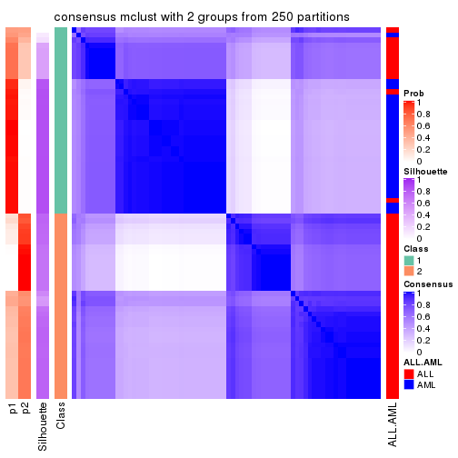</p>

</div>
<div id='tab-ATC-mclust-consensus-heatmap-2'>
<pre><code class="r">consensus_heatmap(res, k = 3)
</code></pre>

<p>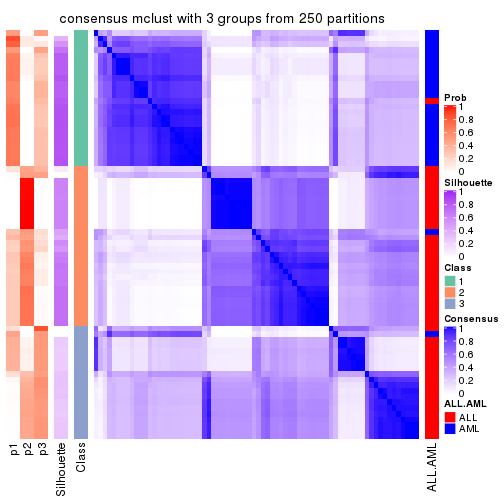</p>

</div>
<div id='tab-ATC-mclust-consensus-heatmap-3'>
<pre><code class="r">consensus_heatmap(res, k = 4)
</code></pre>

<p>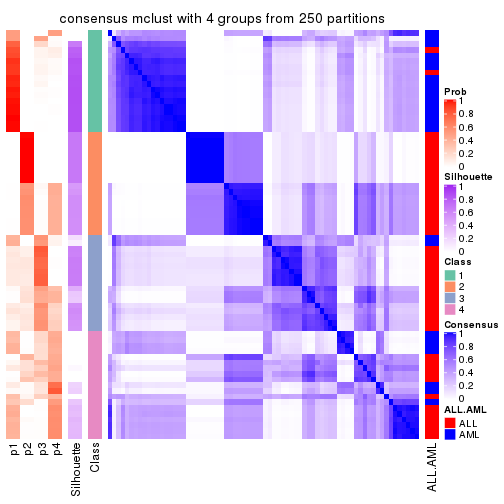</p>

</div>
<div id='tab-ATC-mclust-consensus-heatmap-4'>
<pre><code class="r">consensus_heatmap(res, k = 5)
</code></pre>

<p>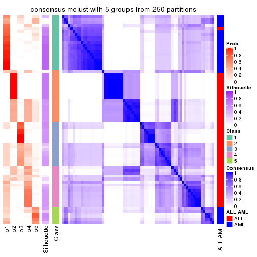</p>

</div>
<div id='tab-ATC-mclust-consensus-heatmap-5'>
<pre><code class="r">consensus_heatmap(res, k = 6)
</code></pre>

<p>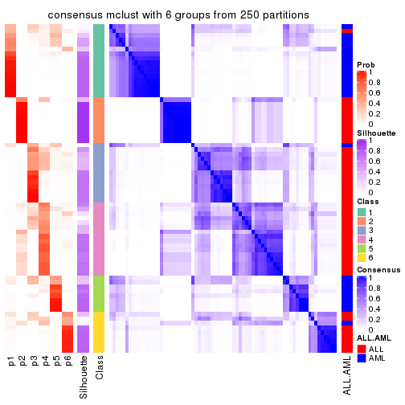</p>

</div>
</div>

Heatmaps for the membership of samples in all partitions to see how consistent they are:


<script>
$( function() {
	$( '#tabs-ATC-mclust-membership-heatmap' ).tabs();
} );
</script>
<div id='tabs-ATC-mclust-membership-heatmap'>
<ul>
<li><a href='#tab-ATC-mclust-membership-heatmap-1'>k = 2</a></li>
<li><a href='#tab-ATC-mclust-membership-heatmap-2'>k = 3</a></li>
<li><a href='#tab-ATC-mclust-membership-heatmap-3'>k = 4</a></li>
<li><a href='#tab-ATC-mclust-membership-heatmap-4'>k = 5</a></li>
<li><a href='#tab-ATC-mclust-membership-heatmap-5'>k = 6</a></li>
</ul>
<div id='tab-ATC-mclust-membership-heatmap-1'>
<pre><code class="r">membership_heatmap(res, k = 2)
</code></pre>

<p>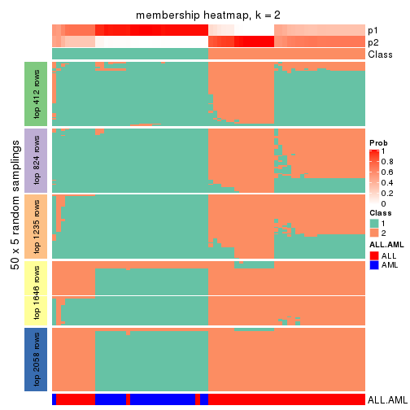</p>

</div>
<div id='tab-ATC-mclust-membership-heatmap-2'>
<pre><code class="r">membership_heatmap(res, k = 3)
</code></pre>

<p>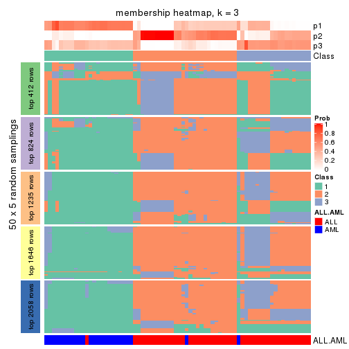</p>

</div>
<div id='tab-ATC-mclust-membership-heatmap-3'>
<pre><code class="r">membership_heatmap(res, k = 4)
</code></pre>

<p>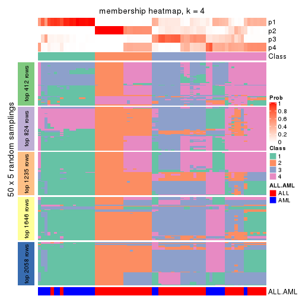</p>

</div>
<div id='tab-ATC-mclust-membership-heatmap-4'>
<pre><code class="r">membership_heatmap(res, k = 5)
</code></pre>

<p>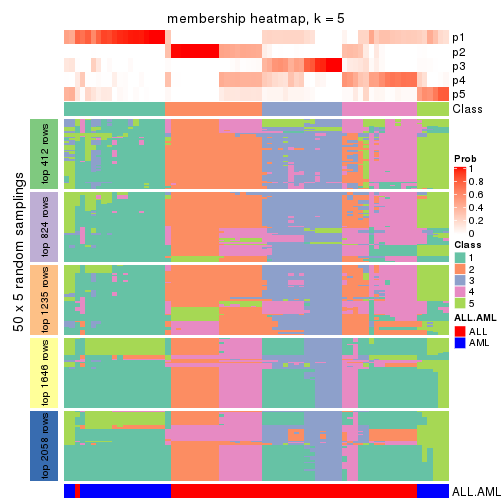</p>

</div>
<div id='tab-ATC-mclust-membership-heatmap-5'>
<pre><code class="r">membership_heatmap(res, k = 6)
</code></pre>

<p>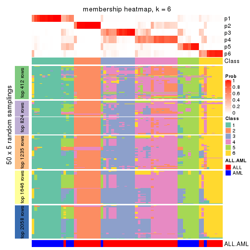</p>

</div>
</div>

As soon as we have had the classes for columns, we can look for signatures
which are significantly different between classes which can be candidate marks
for certain classes. Following are the heatmaps for signatures.


Signature heatmaps where rows are scaled:


<script>
$( function() {
	$( '#tabs-ATC-mclust-get-signatures' ).tabs();
} );
</script>
<div id='tabs-ATC-mclust-get-signatures'>
<ul>
<li><a href='#tab-ATC-mclust-get-signatures-1'>k = 2</a></li>
<li><a href='#tab-ATC-mclust-get-signatures-2'>k = 3</a></li>
<li><a href='#tab-ATC-mclust-get-signatures-3'>k = 4</a></li>
<li><a href='#tab-ATC-mclust-get-signatures-4'>k = 5</a></li>
<li><a href='#tab-ATC-mclust-get-signatures-5'>k = 6</a></li>
</ul>
<div id='tab-ATC-mclust-get-signatures-1'>
<pre><code class="r">get_signatures(res, k = 2)
</code></pre>

<p>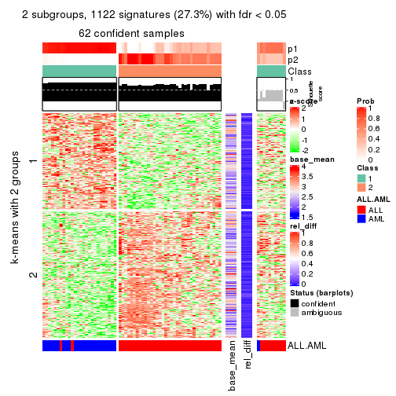</p>

</div>
<div id='tab-ATC-mclust-get-signatures-2'>
<pre><code class="r">get_signatures(res, k = 3)
</code></pre>

<p>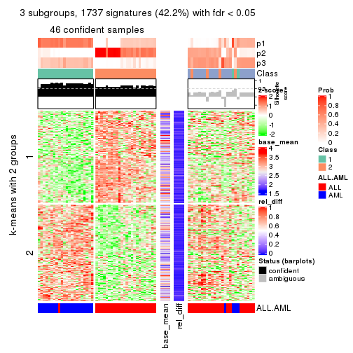</p>

</div>
<div id='tab-ATC-mclust-get-signatures-3'>
<pre><code class="r">get_signatures(res, k = 4)
</code></pre>

<p>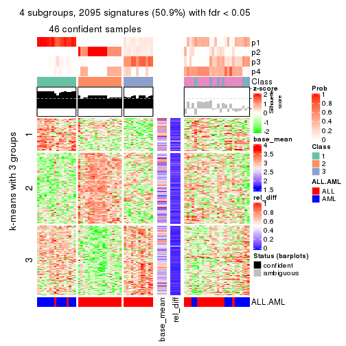</p>

</div>
<div id='tab-ATC-mclust-get-signatures-4'>
<pre><code class="r">get_signatures(res, k = 5)
</code></pre>

<p>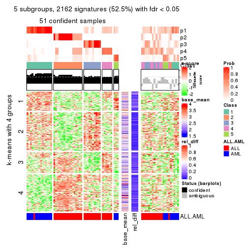</p>

</div>
<div id='tab-ATC-mclust-get-signatures-5'>
<pre><code class="r">get_signatures(res, k = 6)
</code></pre>

<p>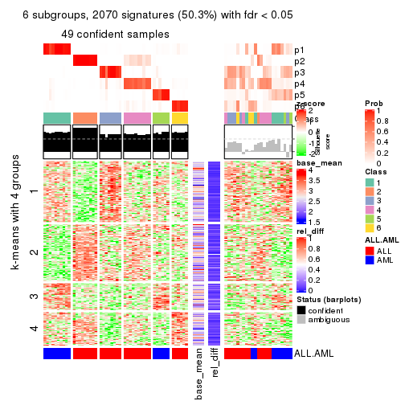</p>

</div>
</div>


Signature heatmaps where rows are not scaled:


<script>
$( function() {
	$( '#tabs-ATC-mclust-get-signatures-no-scale' ).tabs();
} );
</script>
<div id='tabs-ATC-mclust-get-signatures-no-scale'>
<ul>
<li><a href='#tab-ATC-mclust-get-signatures-no-scale-1'>k = 2</a></li>
<li><a href='#tab-ATC-mclust-get-signatures-no-scale-2'>k = 3</a></li>
<li><a href='#tab-ATC-mclust-get-signatures-no-scale-3'>k = 4</a></li>
<li><a href='#tab-ATC-mclust-get-signatures-no-scale-4'>k = 5</a></li>
<li><a href='#tab-ATC-mclust-get-signatures-no-scale-5'>k = 6</a></li>
</ul>
<div id='tab-ATC-mclust-get-signatures-no-scale-1'>
<pre><code class="r">get_signatures(res, k = 2, scale_rows = FALSE)
</code></pre>

<p>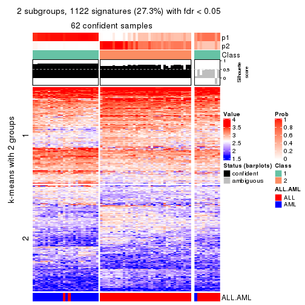</p>

</div>
<div id='tab-ATC-mclust-get-signatures-no-scale-2'>
<pre><code class="r">get_signatures(res, k = 3, scale_rows = FALSE)
</code></pre>

<p>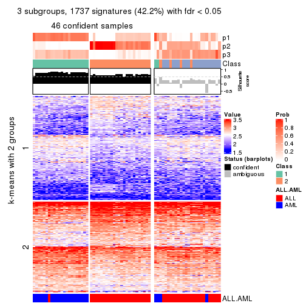</p>

</div>
<div id='tab-ATC-mclust-get-signatures-no-scale-3'>
<pre><code class="r">get_signatures(res, k = 4, scale_rows = FALSE)
</code></pre>

<p>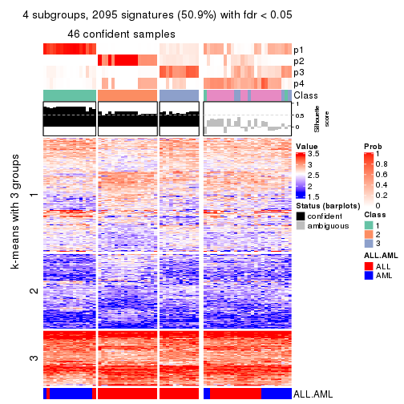</p>

</div>
<div id='tab-ATC-mclust-get-signatures-no-scale-4'>
<pre><code class="r">get_signatures(res, k = 5, scale_rows = FALSE)
</code></pre>

<p>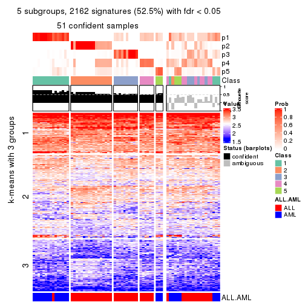</p>

</div>
<div id='tab-ATC-mclust-get-signatures-no-scale-5'>
<pre><code class="r">get_signatures(res, k = 6, scale_rows = FALSE)
</code></pre>

<p>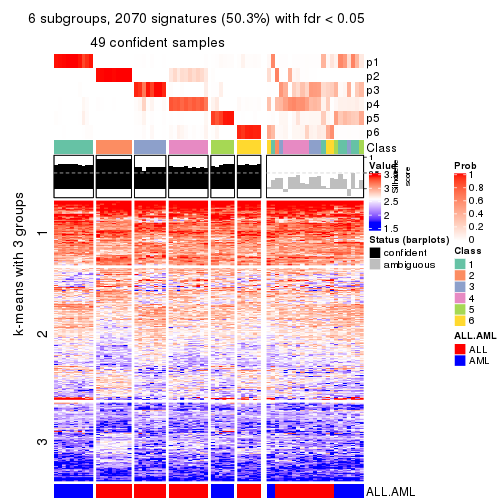</p>

</div>
</div>


Compare the overlap of signatures from different k:

```r
compare_signatures(res)
```

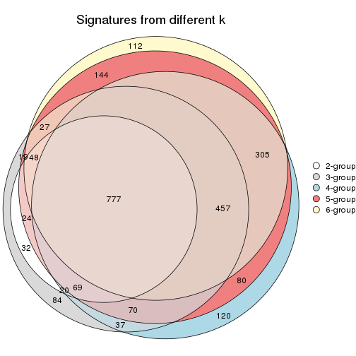

`get_signature()` returns a data frame invisibly. TO get the list of signatures, the function
call should be assigned to a variable explicitly. In following code, if `plot` argument is set
to `FALSE`, no heatmap is plotted while only the differential analysis is performed.

```r
# code only for demonstration
tb = get_signature(res, k = ..., plot = FALSE)
```

An example of the output of `tb` is:

```
#>   which_row         fdr    mean_1    mean_2 scaled_mean_1 scaled_mean_2 km
#> 1        38 0.042760348  8.373488  9.131774    -0.5533452     0.5164555  1
#> 2        40 0.018707592  7.106213  8.469186    -0.6173731     0.5762149  1
#> 3        55 0.019134737 10.221463 11.207825    -0.6159697     0.5749050  1
#> 4        59 0.006059896  5.921854  7.869574    -0.6899429     0.6439467  1
#> 5        60 0.018055526  8.928898 10.211722    -0.6204761     0.5791110  1
#> 6        98 0.009384629 15.714769 14.887706     0.6635654    -0.6193277  2
...
```

The columns in `tb` are:

1. `which_row`: row indices corresponding to the input matrix.
2. `fdr`: FDR for the differential test. 
3. `mean_x`: The mean value in group x.
4. `scaled_mean_x`: The mean value in group x after rows are scaled.
5. `km`: Row groups if k-means clustering is applied to rows.


UMAP plot which shows how samples are separated.


<script>
$( function() {
	$( '#tabs-ATC-mclust-dimension-reduction' ).tabs();
} );
</script>
<div id='tabs-ATC-mclust-dimension-reduction'>
<ul>
<li><a href='#tab-ATC-mclust-dimension-reduction-1'>k = 2</a></li>
<li><a href='#tab-ATC-mclust-dimension-reduction-2'>k = 3</a></li>
<li><a href='#tab-ATC-mclust-dimension-reduction-3'>k = 4</a></li>
<li><a href='#tab-ATC-mclust-dimension-reduction-4'>k = 5</a></li>
<li><a href='#tab-ATC-mclust-dimension-reduction-5'>k = 6</a></li>
</ul>
<div id='tab-ATC-mclust-dimension-reduction-1'>
<pre><code class="r">dimension_reduction(res, k = 2, method = &quot;UMAP&quot;)
</code></pre>

<p>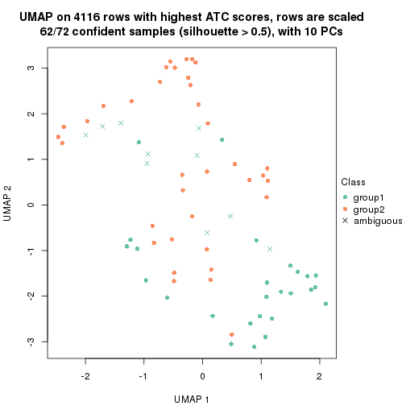</p>

</div>
<div id='tab-ATC-mclust-dimension-reduction-2'>
<pre><code class="r">dimension_reduction(res, k = 3, method = &quot;UMAP&quot;)
</code></pre>

<p>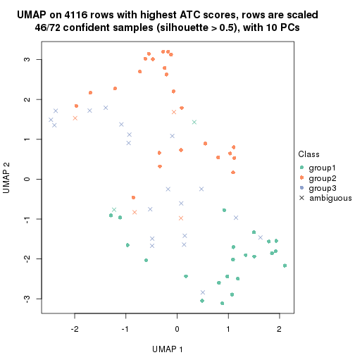</p>

</div>
<div id='tab-ATC-mclust-dimension-reduction-3'>
<pre><code class="r">dimension_reduction(res, k = 4, method = &quot;UMAP&quot;)
</code></pre>

<p>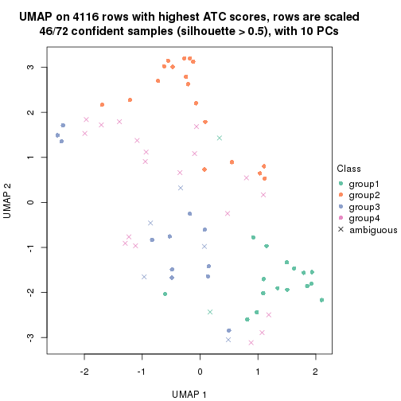</p>

</div>
<div id='tab-ATC-mclust-dimension-reduction-4'>
<pre><code class="r">dimension_reduction(res, k = 5, method = &quot;UMAP&quot;)
</code></pre>

<p>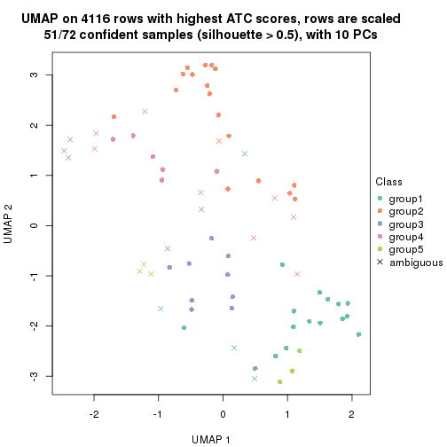</p>

</div>
<div id='tab-ATC-mclust-dimension-reduction-5'>
<pre><code class="r">dimension_reduction(res, k = 6, method = &quot;UMAP&quot;)
</code></pre>

<p>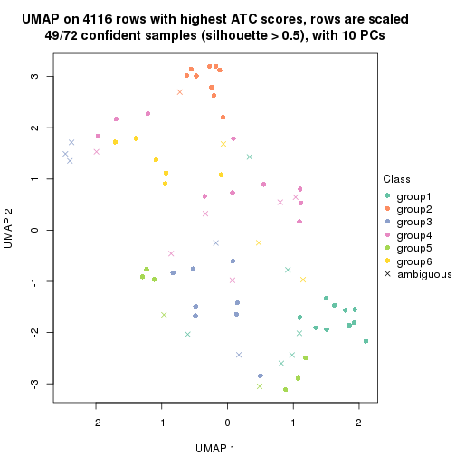</p>

</div>
</div>


Following heatmap shows how subgroups are split when increasing `k`:

```r
collect_classes(res)
```

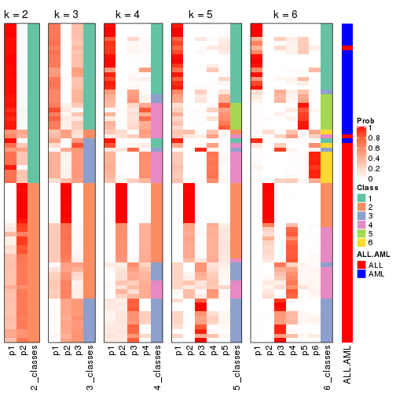


Test correlation between subgroups and known annotations. If the known
annotation is numeric, one-way ANOVA test is applied, and if the known
annotation is discrete, chi-squared contingency table test is applied.

```r
test_to_known_factors(res)
```

```
#>             n ALL.AML(p) k
#> ATC:mclust 62   1.26e-12 2
#> ATC:mclust 46   5.78e-10 3
#> ATC:mclust 46   6.40e-09 4
#> ATC:mclust 51   1.68e-09 5
#> ATC:mclust 49   2.22e-09 6
```


If matrix rows can be associated to genes, consider to use `functional_enrichment(res,
...)` to perform function enrichment for the signature genes. See [this vignette](http://bioconductor.org/packages/devel/bioc/vignettes/cola/inst/doc/functional_enrichment.html) for more detailed explanations.


 

---------------------------------------------------


### ATC:NMF**


The object with results only for a single top-value method and a single partition method 
can be extracted as:

```r
res = res_list["ATC", "NMF"]
# you can also extract it by
# res = res_list["ATC:NMF"]
```

A summary of `res` and all the functions that can be applied to it:

```r
res
```

```
#> A 'ConsensusPartition' object with k = 2, 3, 4, 5, 6.
#>   On a matrix with 4116 rows and 72 columns.
#>   Top rows (412, 824, 1235, 1646, 2058) are extracted by 'ATC' method.
#>   Subgroups are detected by 'NMF' method.
#>   Performed in total 1250 partitions by row resampling.
#>   Best k for subgroups seems to be 2.
#> 
#> Following methods can be applied to this 'ConsensusPartition' object:
#>  [1] "cola_report"             "collect_classes"         "collect_plots"          
#>  [4] "collect_stats"           "colnames"                "compare_signatures"     
#>  [7] "consensus_heatmap"       "dimension_reduction"     "functional_enrichment"  
#> [10] "get_anno_col"            "get_anno"                "get_classes"            
#> [13] "get_consensus"           "get_matrix"              "get_membership"         
#> [16] "get_param"               "get_signatures"          "get_stats"              
#> [19] "is_best_k"               "is_stable_k"             "membership_heatmap"     
#> [22] "ncol"                    "nrow"                    "plot_ecdf"              
#> [25] "rownames"                "select_partition_number" "show"                   
#> [28] "suggest_best_k"          "test_to_known_factors"
```

`collect_plots()` function collects all the plots made from `res` for all `k` (number of partitions)
into one single page to provide an easy and fast comparison between different `k`.

```r
collect_plots(res)
```

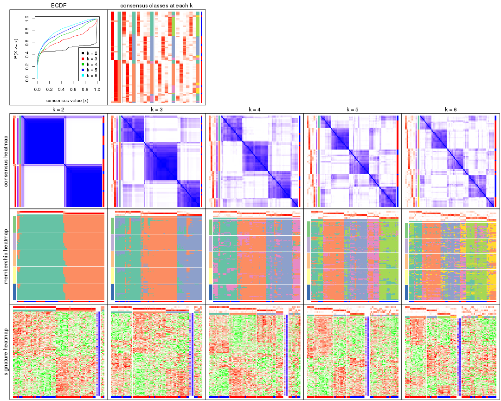

The plots are:

- The first row: a plot of the ECDF (empirical cumulative distribution
  function) curves of the consensus matrix for each `k` and the heatmap of
  predicted classes for each `k`.
- The second row: heatmaps of the consensus matrix for each `k`.
- The third row: heatmaps of the membership matrix for each `k`.
- The fouth row: heatmaps of the signatures for each `k`.

All the plots in panels can be made by individual functions and they are
plotted later in this section.

`select_partition_number()` produces several plots showing different
statistics for choosing "optimized" `k`. There are following statistics:

- ECDF curves of the consensus matrix for each `k`;
- 1-PAC. [The PAC
  score](https://en.wikipedia.org/wiki/Consensus_clustering#Over-interpretation_potential_of_consensus_clustering)
  measures the proportion of the ambiguous subgrouping.
- Mean silhouette score.
- Concordance. The mean probability of fiting the consensus class ids in all
  partitions.
- Area increased. Denote $A_k$ as the area under the ECDF curve for current
  `k`, the area increased is defined as $A_k - A_{k-1}$.
- Rand index. The percent of pairs of samples that are both in a same cluster
  or both are not in a same cluster in the partition of k and k-1.
- Jaccard index. The ratio of pairs of samples are both in a same cluster in
  the partition of k and k-1 and the pairs of samples are both in a same
  cluster in the partition k or k-1.

The detailed explanations of these statistics can be found in [the _cola_
vignette](http://bioconductor.org/packages/devel/bioc/vignettes/cola/inst/doc/cola.html#toc_13).

Generally speaking, lower PAC score, higher mean silhouette score or higher
concordance corresponds to better partition. Rand index and Jaccard index
measure how similar the current partition is compared to partition with `k-1`.
If they are too similar, we won't accept `k` is better than `k-1`.

```r
select_partition_number(res)
```

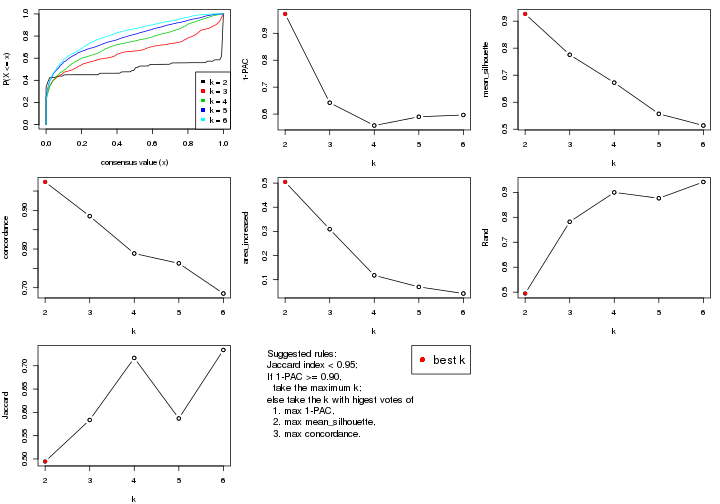

The numeric values for all these statistics can be obtained by `get_stats()`.

```r
get_stats(res)
```

```
#>   k 1-PAC mean_silhouette concordance area_increased  Rand Jaccard
#> 2 2 0.972           0.927       0.973         0.5047 0.495   0.495
#> 3 3 0.642           0.776       0.885         0.3090 0.782   0.584
#> 4 4 0.558           0.673       0.788         0.1178 0.900   0.717
#> 5 5 0.590           0.557       0.763         0.0700 0.876   0.587
#> 6 6 0.597           0.514       0.685         0.0426 0.942   0.734
```

`suggest_best_k()` suggests the best $k$ based on these statistics. The rules are as follows:

- All $k$ with Jaccard index larger than 0.95 are removed because increasing
  $k$ does not provide enough extra information. If all $k$ are removed, it is
  marked as no subgroup is detected.
- For all $k$ with 1-PAC score larger than 0.9, the maximal $k$ is taken as
  the best $k$, and other $k$ are marked as optional $k$.
- If it does not fit the second rule. The $k$ with the maximal vote of the
  highest 1-PAC score, highest mean silhouette, and highest concordance is
  taken as the best $k$.

```r
suggest_best_k(res)
```

```
#> [1] 2
```


Following shows the table of the partitions (You need to click the **show/hide
code output** link to see it). The membership matrix (columns with name `p*`)
is inferred by
[`clue::cl_consensus()`](https://www.rdocumentation.org/link/cl_consensus?package=clue)
function with the `SE` method. Basically the value in the membership matrix
represents the probability to belong to a certain group. The finall class
label for an item is determined with the group with highest probability it
belongs to.

In `get_classes()` function, the entropy is calculated from the membership
matrix and the silhouette score is calculated from the consensus matrix.


<script>
$( function() {
	$( '#tabs-ATC-NMF-get-classes' ).tabs();
} );
</script>
<div id='tabs-ATC-NMF-get-classes'>
<ul>
<li><a href='#tab-ATC-NMF-get-classes-1'>k = 2</a></li>
<li><a href='#tab-ATC-NMF-get-classes-2'>k = 3</a></li>
<li><a href='#tab-ATC-NMF-get-classes-3'>k = 4</a></li>
<li><a href='#tab-ATC-NMF-get-classes-4'>k = 5</a></li>
<li><a href='#tab-ATC-NMF-get-classes-5'>k = 6</a></li>
</ul>

<div id='tab-ATC-NMF-get-classes-1'>
<p><a id='tab-ATC-NMF-get-classes-1-a' style='color:#0366d6' href='#'>show/hide code output</a></p>
<pre><code class="r">cbind(get_classes(res, k = 2), get_membership(res, k = 2))
</code></pre>

<pre><code>#&gt;           class entropy silhouette    p1    p2
#&gt; sample_39     1  0.0000     0.9711 1.000 0.000
#&gt; sample_40     1  0.0000     0.9711 1.000 0.000
#&gt; sample_42     2  0.0000     0.9719 0.000 1.000
#&gt; sample_47     2  0.0000     0.9719 0.000 1.000
#&gt; sample_48     2  0.0000     0.9719 0.000 1.000
#&gt; sample_49     1  0.0000     0.9711 1.000 0.000
#&gt; sample_41     2  0.0000     0.9719 0.000 1.000
#&gt; sample_43     2  0.0000     0.9719 0.000 1.000
#&gt; sample_44     2  0.0000     0.9719 0.000 1.000
#&gt; sample_45     2  0.0000     0.9719 0.000 1.000
#&gt; sample_46     2  0.0000     0.9719 0.000 1.000
#&gt; sample_70     2  0.1184     0.9594 0.016 0.984
#&gt; sample_71     2  0.3114     0.9196 0.056 0.944
#&gt; sample_72     2  0.0000     0.9719 0.000 1.000
#&gt; sample_68     2  0.0000     0.9719 0.000 1.000
#&gt; sample_69     2  0.0000     0.9719 0.000 1.000
#&gt; sample_67     2  0.0000     0.9719 0.000 1.000
#&gt; sample_55     1  0.0376     0.9679 0.996 0.004
#&gt; sample_56     1  0.0000     0.9711 1.000 0.000
#&gt; sample_59     2  0.0376     0.9691 0.004 0.996
#&gt; sample_52     1  0.0000     0.9711 1.000 0.000
#&gt; sample_53     1  0.0000     0.9711 1.000 0.000
#&gt; sample_51     1  0.0000     0.9711 1.000 0.000
#&gt; sample_50     1  0.0000     0.9711 1.000 0.000
#&gt; sample_54     2  0.0376     0.9691 0.004 0.996
#&gt; sample_57     1  0.0000     0.9711 1.000 0.000
#&gt; sample_58     1  0.0000     0.9711 1.000 0.000
#&gt; sample_60     1  0.9833     0.2488 0.576 0.424
#&gt; sample_61     1  0.0000     0.9711 1.000 0.000
#&gt; sample_65     1  0.0000     0.9711 1.000 0.000
#&gt; sample_66     2  0.0000     0.9719 0.000 1.000
#&gt; sample_63     1  0.0000     0.9711 1.000 0.000
#&gt; sample_64     1  0.0000     0.9711 1.000 0.000
#&gt; sample_62     1  0.0000     0.9711 1.000 0.000
#&gt; sample_1      1  0.4690     0.8683 0.900 0.100
#&gt; sample_2      2  0.0000     0.9719 0.000 1.000
#&gt; sample_3      1  0.0376     0.9679 0.996 0.004
#&gt; sample_4      2  1.0000    -0.0262 0.500 0.500
#&gt; sample_5      2  0.0000     0.9719 0.000 1.000
#&gt; sample_6      1  0.0000     0.9711 1.000 0.000
#&gt; sample_7      1  0.0000     0.9711 1.000 0.000
#&gt; sample_8      1  0.0000     0.9711 1.000 0.000
#&gt; sample_9      2  0.0000     0.9719 0.000 1.000
#&gt; sample_10     2  0.8763     0.5652 0.296 0.704
#&gt; sample_11     2  0.0000     0.9719 0.000 1.000
#&gt; sample_12     1  0.0000     0.9711 1.000 0.000
#&gt; sample_13     2  0.0000     0.9719 0.000 1.000
#&gt; sample_14     2  0.0000     0.9719 0.000 1.000
#&gt; sample_15     2  0.0000     0.9719 0.000 1.000
#&gt; sample_16     2  0.0000     0.9719 0.000 1.000
#&gt; sample_17     2  0.0000     0.9719 0.000 1.000
#&gt; sample_18     1  0.9983     0.0707 0.524 0.476
#&gt; sample_19     2  0.0000     0.9719 0.000 1.000
#&gt; sample_20     2  0.0000     0.9719 0.000 1.000
#&gt; sample_21     2  0.0000     0.9719 0.000 1.000
#&gt; sample_22     1  0.0000     0.9711 1.000 0.000
#&gt; sample_23     1  0.0000     0.9711 1.000 0.000
#&gt; sample_24     2  0.0000     0.9719 0.000 1.000
#&gt; sample_25     1  0.1184     0.9572 0.984 0.016
#&gt; sample_26     2  0.0938     0.9629 0.012 0.988
#&gt; sample_27     1  0.0000     0.9711 1.000 0.000
#&gt; sample_34     1  0.0000     0.9711 1.000 0.000
#&gt; sample_35     1  0.0000     0.9711 1.000 0.000
#&gt; sample_36     1  0.0000     0.9711 1.000 0.000
#&gt; sample_37     1  0.0000     0.9711 1.000 0.000
#&gt; sample_38     1  0.0000     0.9711 1.000 0.000
#&gt; sample_28     1  0.0000     0.9711 1.000 0.000
#&gt; sample_29     2  0.0000     0.9719 0.000 1.000
#&gt; sample_30     1  0.0000     0.9711 1.000 0.000
#&gt; sample_31     1  0.0000     0.9711 1.000 0.000
#&gt; sample_32     1  0.0000     0.9711 1.000 0.000
#&gt; sample_33     1  0.0000     0.9711 1.000 0.000
</code></pre>

<script>
$('#tab-ATC-NMF-get-classes-1-a').parent().next().next().hide();
$('#tab-ATC-NMF-get-classes-1-a').click(function(){
  $('#tab-ATC-NMF-get-classes-1-a').parent().next().next().toggle();
  return(false);
});
</script>
</div>

<div id='tab-ATC-NMF-get-classes-2'>
<p><a id='tab-ATC-NMF-get-classes-2-a' style='color:#0366d6' href='#'>show/hide code output</a></p>
<pre><code class="r">cbind(get_classes(res, k = 3), get_membership(res, k = 3))
</code></pre>

<pre><code>#&gt;           class entropy silhouette    p1    p2    p3
#&gt; sample_39     3  0.1315      0.839 0.020 0.008 0.972
#&gt; sample_40     3  0.1170      0.839 0.008 0.016 0.976
#&gt; sample_42     2  0.2550      0.888 0.056 0.932 0.012
#&gt; sample_47     2  0.0592      0.919 0.000 0.988 0.012
#&gt; sample_48     2  0.0747      0.919 0.000 0.984 0.016
#&gt; sample_49     3  0.0829      0.839 0.012 0.004 0.984
#&gt; sample_41     2  0.0237      0.919 0.004 0.996 0.000
#&gt; sample_43     2  0.0237      0.920 0.000 0.996 0.004
#&gt; sample_44     2  0.0747      0.919 0.000 0.984 0.016
#&gt; sample_45     2  0.0237      0.920 0.000 0.996 0.004
#&gt; sample_46     2  0.0424      0.920 0.000 0.992 0.008
#&gt; sample_70     2  0.3816      0.808 0.000 0.852 0.148
#&gt; sample_71     2  0.6735      0.273 0.424 0.564 0.012
#&gt; sample_72     2  0.1877      0.902 0.032 0.956 0.012
#&gt; sample_68     2  0.1015      0.914 0.008 0.980 0.012
#&gt; sample_69     2  0.0424      0.918 0.000 0.992 0.008
#&gt; sample_67     1  0.4692      0.685 0.820 0.168 0.012
#&gt; sample_55     3  0.2537      0.800 0.000 0.080 0.920
#&gt; sample_56     3  0.0747      0.837 0.000 0.016 0.984
#&gt; sample_59     2  0.4504      0.755 0.000 0.804 0.196
#&gt; sample_52     1  0.1399      0.824 0.968 0.004 0.028
#&gt; sample_53     1  0.0892      0.824 0.980 0.000 0.020
#&gt; sample_51     1  0.1529      0.827 0.960 0.000 0.040
#&gt; sample_50     1  0.1289      0.826 0.968 0.000 0.032
#&gt; sample_54     2  0.1525      0.905 0.032 0.964 0.004
#&gt; sample_57     3  0.5621      0.506 0.308 0.000 0.692
#&gt; sample_58     3  0.4062      0.741 0.164 0.000 0.836
#&gt; sample_60     1  0.6865      0.357 0.596 0.384 0.020
#&gt; sample_61     3  0.6062      0.308 0.384 0.000 0.616
#&gt; sample_65     1  0.4346      0.770 0.816 0.000 0.184
#&gt; sample_66     2  0.5220      0.731 0.208 0.780 0.012
#&gt; sample_63     1  0.4931      0.724 0.768 0.000 0.232
#&gt; sample_64     3  0.2165      0.823 0.064 0.000 0.936
#&gt; sample_62     1  0.4346      0.766 0.816 0.000 0.184
#&gt; sample_1      3  0.4291      0.710 0.000 0.180 0.820
#&gt; sample_2      1  0.6647      0.242 0.592 0.396 0.012
#&gt; sample_3      3  0.2651      0.822 0.012 0.060 0.928
#&gt; sample_4      3  0.5397      0.565 0.000 0.280 0.720
#&gt; sample_5      2  0.0424      0.918 0.000 0.992 0.008
#&gt; sample_6      3  0.1774      0.840 0.016 0.024 0.960
#&gt; sample_7      3  0.0983      0.838 0.004 0.016 0.980
#&gt; sample_8      3  0.1163      0.837 0.028 0.000 0.972
#&gt; sample_9      2  0.0000      0.920 0.000 1.000 0.000
#&gt; sample_10     2  0.6100      0.781 0.120 0.784 0.096
#&gt; sample_11     2  0.3771      0.840 0.112 0.876 0.012
#&gt; sample_12     1  0.4172      0.787 0.840 0.004 0.156
#&gt; sample_13     2  0.0747      0.919 0.000 0.984 0.016
#&gt; sample_14     2  0.0000      0.920 0.000 1.000 0.000
#&gt; sample_15     2  0.0000      0.920 0.000 1.000 0.000
#&gt; sample_16     2  0.3752      0.817 0.000 0.856 0.144
#&gt; sample_17     2  0.1163      0.914 0.000 0.972 0.028
#&gt; sample_18     3  0.6168      0.275 0.000 0.412 0.588
#&gt; sample_19     2  0.0892      0.917 0.000 0.980 0.020
#&gt; sample_20     2  0.0592      0.919 0.000 0.988 0.012
#&gt; sample_21     2  0.0475      0.918 0.004 0.992 0.004
#&gt; sample_22     3  0.5138      0.642 0.252 0.000 0.748
#&gt; sample_23     3  0.3091      0.827 0.072 0.016 0.912
#&gt; sample_24     2  0.0747      0.919 0.000 0.984 0.016
#&gt; sample_25     3  0.4397      0.797 0.116 0.028 0.856
#&gt; sample_26     2  0.6260      0.206 0.000 0.552 0.448
#&gt; sample_27     3  0.1163      0.837 0.028 0.000 0.972
#&gt; sample_34     1  0.5948      0.500 0.640 0.000 0.360
#&gt; sample_35     3  0.3686      0.773 0.140 0.000 0.860
#&gt; sample_36     1  0.1643      0.826 0.956 0.000 0.044
#&gt; sample_37     1  0.0892      0.824 0.980 0.000 0.020
#&gt; sample_38     1  0.1163      0.826 0.972 0.000 0.028
#&gt; sample_28     1  0.1964      0.825 0.944 0.000 0.056
#&gt; sample_29     1  0.3377      0.751 0.896 0.092 0.012
#&gt; sample_30     1  0.1182      0.802 0.976 0.012 0.012
#&gt; sample_31     1  0.4291      0.772 0.820 0.000 0.180
#&gt; sample_32     1  0.4654      0.749 0.792 0.000 0.208
#&gt; sample_33     1  0.5178      0.691 0.744 0.000 0.256
</code></pre>

<script>
$('#tab-ATC-NMF-get-classes-2-a').parent().next().next().hide();
$('#tab-ATC-NMF-get-classes-2-a').click(function(){
  $('#tab-ATC-NMF-get-classes-2-a').parent().next().next().toggle();
  return(false);
});
</script>
</div>

<div id='tab-ATC-NMF-get-classes-3'>
<p><a id='tab-ATC-NMF-get-classes-3-a' style='color:#0366d6' href='#'>show/hide code output</a></p>
<pre><code class="r">cbind(get_classes(res, k = 4), get_membership(res, k = 4))
</code></pre>

<pre><code>#&gt;           class entropy silhouette    p1    p2    p3    p4
#&gt; sample_39     3  0.0657      0.785 0.004 0.000 0.984 0.012
#&gt; sample_40     3  0.2400      0.782 0.028 0.004 0.924 0.044
#&gt; sample_42     4  0.4720      0.710 0.000 0.324 0.004 0.672
#&gt; sample_47     2  0.1867      0.791 0.000 0.928 0.000 0.072
#&gt; sample_48     2  0.1940      0.790 0.000 0.924 0.000 0.076
#&gt; sample_49     3  0.0336      0.786 0.008 0.000 0.992 0.000
#&gt; sample_41     2  0.2088      0.792 0.004 0.928 0.004 0.064
#&gt; sample_43     2  0.3544      0.756 0.008 0.852 0.012 0.128
#&gt; sample_44     2  0.3703      0.751 0.012 0.840 0.008 0.140
#&gt; sample_45     2  0.3317      0.767 0.008 0.868 0.012 0.112
#&gt; sample_46     2  0.3134      0.776 0.008 0.880 0.012 0.100
#&gt; sample_70     2  0.7326      0.517 0.036 0.620 0.140 0.204
#&gt; sample_71     4  0.5487      0.769 0.048 0.228 0.008 0.716
#&gt; sample_72     4  0.5060      0.749 0.004 0.288 0.016 0.692
#&gt; sample_68     2  0.1661      0.802 0.000 0.944 0.004 0.052
#&gt; sample_69     2  0.3311      0.703 0.000 0.828 0.000 0.172
#&gt; sample_67     4  0.5982      0.572 0.204 0.112 0.000 0.684
#&gt; sample_55     3  0.7397      0.577 0.056 0.152 0.636 0.156
#&gt; sample_56     3  0.0712      0.785 0.004 0.004 0.984 0.008
#&gt; sample_59     2  0.6845      0.538 0.020 0.640 0.116 0.224
#&gt; sample_52     1  0.2675      0.714 0.892 0.008 0.000 0.100
#&gt; sample_53     1  0.5686      0.511 0.592 0.000 0.032 0.376
#&gt; sample_51     1  0.3105      0.742 0.868 0.000 0.012 0.120
#&gt; sample_50     1  0.2048      0.754 0.928 0.000 0.008 0.064
#&gt; sample_54     2  0.7760      0.141 0.352 0.456 0.008 0.184
#&gt; sample_57     1  0.6586      0.559 0.656 0.008 0.152 0.184
#&gt; sample_58     3  0.5558      0.378 0.364 0.000 0.608 0.028
#&gt; sample_60     1  0.7858      0.301 0.536 0.232 0.024 0.208
#&gt; sample_61     3  0.5970      0.338 0.348 0.000 0.600 0.052
#&gt; sample_65     1  0.1724      0.754 0.948 0.000 0.032 0.020
#&gt; sample_66     2  0.5192      0.692 0.076 0.760 0.004 0.160
#&gt; sample_63     1  0.3828      0.722 0.848 0.000 0.068 0.084
#&gt; sample_64     3  0.5298      0.593 0.244 0.000 0.708 0.048
#&gt; sample_62     1  0.4093      0.713 0.832 0.000 0.072 0.096
#&gt; sample_1      3  0.1510      0.783 0.000 0.016 0.956 0.028
#&gt; sample_2      4  0.5952      0.715 0.124 0.184 0.000 0.692
#&gt; sample_3      3  0.3325      0.764 0.012 0.012 0.872 0.104
#&gt; sample_4      3  0.4513      0.680 0.004 0.160 0.796 0.040
#&gt; sample_5      2  0.1389      0.801 0.000 0.952 0.000 0.048
#&gt; sample_6      3  0.5079      0.724 0.048 0.020 0.780 0.152
#&gt; sample_7      3  0.0895      0.787 0.020 0.004 0.976 0.000
#&gt; sample_8      3  0.1109      0.784 0.004 0.000 0.968 0.028
#&gt; sample_9      2  0.4334      0.752 0.008 0.808 0.028 0.156
#&gt; sample_10     4  0.9200      0.185 0.072 0.292 0.292 0.344
#&gt; sample_11     4  0.4663      0.756 0.012 0.272 0.000 0.716
#&gt; sample_12     1  0.4798      0.707 0.768 0.000 0.052 0.180
#&gt; sample_13     2  0.2654      0.773 0.000 0.888 0.004 0.108
#&gt; sample_14     2  0.1489      0.807 0.000 0.952 0.004 0.044
#&gt; sample_15     2  0.0657      0.804 0.000 0.984 0.004 0.012
#&gt; sample_16     2  0.4245      0.702 0.000 0.820 0.116 0.064
#&gt; sample_17     2  0.3621      0.749 0.000 0.860 0.068 0.072
#&gt; sample_18     3  0.5426      0.469 0.004 0.316 0.656 0.024
#&gt; sample_19     2  0.2048      0.796 0.000 0.928 0.008 0.064
#&gt; sample_20     2  0.3024      0.735 0.000 0.852 0.000 0.148
#&gt; sample_21     2  0.2266      0.791 0.000 0.912 0.004 0.084
#&gt; sample_22     3  0.6037      0.492 0.068 0.000 0.628 0.304
#&gt; sample_23     3  0.4551      0.730 0.044 0.004 0.796 0.156
#&gt; sample_24     2  0.1807      0.800 0.000 0.940 0.008 0.052
#&gt; sample_25     3  0.4962      0.699 0.032 0.020 0.776 0.172
#&gt; sample_26     3  0.6123      0.292 0.000 0.372 0.572 0.056
#&gt; sample_27     3  0.0804      0.786 0.012 0.000 0.980 0.008
#&gt; sample_34     1  0.4679      0.690 0.772 0.000 0.184 0.044
#&gt; sample_35     3  0.3495      0.733 0.140 0.000 0.844 0.016
#&gt; sample_36     1  0.1722      0.755 0.944 0.000 0.008 0.048
#&gt; sample_37     1  0.3196      0.736 0.856 0.000 0.008 0.136
#&gt; sample_38     1  0.6270      0.437 0.536 0.000 0.060 0.404
#&gt; sample_28     1  0.5478      0.548 0.628 0.000 0.028 0.344
#&gt; sample_29     1  0.5326      0.424 0.604 0.016 0.000 0.380
#&gt; sample_30     1  0.2466      0.746 0.900 0.000 0.004 0.096
#&gt; sample_31     1  0.2256      0.741 0.924 0.000 0.020 0.056
#&gt; sample_32     1  0.6078      0.673 0.684 0.000 0.152 0.164
#&gt; sample_33     1  0.6155      0.664 0.676 0.000 0.176 0.148
</code></pre>

<script>
$('#tab-ATC-NMF-get-classes-3-a').parent().next().next().hide();
$('#tab-ATC-NMF-get-classes-3-a').click(function(){
  $('#tab-ATC-NMF-get-classes-3-a').parent().next().next().toggle();
  return(false);
});
</script>
</div>

<div id='tab-ATC-NMF-get-classes-4'>
<p><a id='tab-ATC-NMF-get-classes-4-a' style='color:#0366d6' href='#'>show/hide code output</a></p>
<pre><code class="r">cbind(get_classes(res, k = 5), get_membership(res, k = 5))
</code></pre>

<pre><code>#&gt;           class entropy silhouette    p1    p2    p3    p4    p5
#&gt; sample_39     3  0.2179    0.68252 0.004 0.000 0.896 0.100 0.000
#&gt; sample_40     3  0.2214    0.69501 0.004 0.000 0.916 0.028 0.052
#&gt; sample_42     1  0.3437    0.61434 0.808 0.176 0.004 0.012 0.000
#&gt; sample_47     2  0.2305    0.81621 0.028 0.916 0.000 0.044 0.012
#&gt; sample_48     2  0.0693    0.82996 0.012 0.980 0.000 0.008 0.000
#&gt; sample_49     3  0.1197    0.69955 0.000 0.000 0.952 0.048 0.000
#&gt; sample_41     2  0.3944    0.69725 0.020 0.764 0.000 0.212 0.004
#&gt; sample_43     2  0.4317    0.53424 0.008 0.668 0.000 0.320 0.004
#&gt; sample_44     4  0.4147    0.44458 0.000 0.316 0.008 0.676 0.000
#&gt; sample_45     4  0.4287    0.07093 0.000 0.460 0.000 0.540 0.000
#&gt; sample_46     4  0.4473    0.24822 0.000 0.412 0.008 0.580 0.000
#&gt; sample_70     4  0.3205    0.61689 0.000 0.072 0.056 0.864 0.008
#&gt; sample_71     1  0.3584    0.63811 0.828 0.132 0.028 0.012 0.000
#&gt; sample_72     1  0.5252    0.53552 0.704 0.208 0.056 0.032 0.000
#&gt; sample_68     2  0.2005    0.82871 0.016 0.924 0.000 0.056 0.004
#&gt; sample_69     2  0.2707    0.75544 0.132 0.860 0.000 0.008 0.000
#&gt; sample_67     1  0.2577    0.66637 0.892 0.084 0.000 0.008 0.016
#&gt; sample_55     3  0.5510    0.36219 0.000 0.020 0.588 0.352 0.040
#&gt; sample_56     3  0.1041    0.70240 0.000 0.000 0.964 0.032 0.004
#&gt; sample_59     2  0.6732    0.00615 0.012 0.496 0.056 0.384 0.052
#&gt; sample_52     5  0.1928    0.70331 0.004 0.004 0.000 0.072 0.920
#&gt; sample_53     1  0.4807    0.00253 0.532 0.000 0.020 0.000 0.448
#&gt; sample_51     5  0.3870    0.59256 0.260 0.000 0.004 0.004 0.732
#&gt; sample_50     5  0.2806    0.69344 0.152 0.000 0.004 0.000 0.844
#&gt; sample_54     5  0.6593    0.26496 0.036 0.324 0.008 0.084 0.548
#&gt; sample_57     5  0.3423    0.69651 0.016 0.000 0.068 0.060 0.856
#&gt; sample_58     3  0.4800    0.05984 0.004 0.000 0.508 0.012 0.476
#&gt; sample_60     5  0.4849    0.59498 0.028 0.120 0.012 0.064 0.776
#&gt; sample_61     3  0.5035    0.50446 0.044 0.000 0.696 0.020 0.240
#&gt; sample_65     5  0.3362    0.72623 0.064 0.000 0.032 0.040 0.864
#&gt; sample_66     4  0.6292    0.29856 0.068 0.332 0.000 0.556 0.044
#&gt; sample_63     5  0.2478    0.70784 0.008 0.000 0.060 0.028 0.904
#&gt; sample_64     3  0.5221    0.39018 0.004 0.004 0.612 0.040 0.340
#&gt; sample_62     5  0.2737    0.70556 0.020 0.000 0.052 0.032 0.896
#&gt; sample_1      3  0.2026    0.69665 0.008 0.012 0.924 0.056 0.000
#&gt; sample_2      1  0.2541    0.66235 0.900 0.068 0.000 0.020 0.012
#&gt; sample_3      3  0.4874    0.18333 0.016 0.000 0.528 0.452 0.004
#&gt; sample_4      3  0.5415    0.47722 0.000 0.092 0.648 0.256 0.004
#&gt; sample_5      2  0.1798    0.82627 0.004 0.928 0.000 0.064 0.004
#&gt; sample_6      4  0.3937    0.43472 0.000 0.004 0.252 0.736 0.008
#&gt; sample_7      3  0.2694    0.69835 0.000 0.000 0.884 0.076 0.040
#&gt; sample_8      3  0.0955    0.70090 0.000 0.000 0.968 0.028 0.004
#&gt; sample_9      4  0.5168    0.58813 0.036 0.188 0.056 0.720 0.000
#&gt; sample_10     4  0.5011    0.57057 0.072 0.040 0.104 0.772 0.012
#&gt; sample_11     1  0.4359    0.57520 0.776 0.092 0.000 0.128 0.004
#&gt; sample_12     4  0.6610    0.32973 0.132 0.000 0.072 0.616 0.180
#&gt; sample_13     2  0.1310    0.81505 0.024 0.956 0.000 0.020 0.000
#&gt; sample_14     2  0.4317    0.52597 0.008 0.668 0.004 0.320 0.000
#&gt; sample_15     2  0.2286    0.80590 0.004 0.888 0.000 0.108 0.000
#&gt; sample_16     2  0.1399    0.82253 0.000 0.952 0.020 0.028 0.000
#&gt; sample_17     2  0.2967    0.82255 0.032 0.884 0.024 0.060 0.000
#&gt; sample_18     3  0.4318    0.57054 0.004 0.176 0.772 0.040 0.008
#&gt; sample_19     2  0.0992    0.82623 0.008 0.968 0.000 0.024 0.000
#&gt; sample_20     2  0.1845    0.80329 0.056 0.928 0.000 0.016 0.000
#&gt; sample_21     2  0.3803    0.77152 0.056 0.804 0.000 0.140 0.000
#&gt; sample_22     3  0.5318    0.33486 0.364 0.004 0.592 0.016 0.024
#&gt; sample_23     4  0.5175    0.14710 0.040 0.000 0.372 0.584 0.004
#&gt; sample_24     2  0.1205    0.83314 0.004 0.956 0.000 0.040 0.000
#&gt; sample_25     3  0.6227    0.46564 0.128 0.024 0.624 0.220 0.004
#&gt; sample_26     3  0.5612    0.21534 0.012 0.420 0.520 0.048 0.000
#&gt; sample_27     3  0.1341    0.69805 0.000 0.000 0.944 0.056 0.000
#&gt; sample_34     5  0.4982    0.64517 0.076 0.000 0.180 0.016 0.728
#&gt; sample_35     3  0.3970    0.60636 0.000 0.000 0.752 0.024 0.224
#&gt; sample_36     5  0.2127    0.71408 0.108 0.000 0.000 0.000 0.892
#&gt; sample_37     5  0.4518    0.47142 0.320 0.000 0.004 0.016 0.660
#&gt; sample_38     1  0.5329    0.29339 0.608 0.000 0.032 0.020 0.340
#&gt; sample_28     1  0.6306    0.32871 0.576 0.000 0.048 0.072 0.304
#&gt; sample_29     1  0.5499    0.19344 0.532 0.000 0.000 0.068 0.400
#&gt; sample_30     5  0.3616    0.68095 0.164 0.000 0.000 0.032 0.804
#&gt; sample_31     5  0.3923    0.68357 0.040 0.000 0.016 0.132 0.812
#&gt; sample_32     5  0.5702    0.43224 0.320 0.000 0.104 0.000 0.576
#&gt; sample_33     5  0.5982    0.47934 0.276 0.000 0.136 0.004 0.584
</code></pre>

<script>
$('#tab-ATC-NMF-get-classes-4-a').parent().next().next().hide();
$('#tab-ATC-NMF-get-classes-4-a').click(function(){
  $('#tab-ATC-NMF-get-classes-4-a').parent().next().next().toggle();
  return(false);
});
</script>
</div>

<div id='tab-ATC-NMF-get-classes-5'>
<p><a id='tab-ATC-NMF-get-classes-5-a' style='color:#0366d6' href='#'>show/hide code output</a></p>
<pre><code class="r">cbind(get_classes(res, k = 6), get_membership(res, k = 6))
</code></pre>

<pre><code>#&gt;           class entropy silhouette    p1    p2    p3    p4    p5    p6
#&gt; sample_39     3  0.4964     0.3946 0.012 0.000 0.596 0.056 0.000 0.336
#&gt; sample_40     3  0.4447     0.6211 0.008 0.000 0.764 0.136 0.036 0.056
#&gt; sample_42     1  0.4614     0.4707 0.720 0.120 0.000 0.012 0.000 0.148
#&gt; sample_47     2  0.2610     0.7989 0.004 0.884 0.000 0.060 0.004 0.048
#&gt; sample_48     2  0.1933     0.8180 0.032 0.924 0.000 0.012 0.000 0.032
#&gt; sample_49     3  0.1552     0.6484 0.000 0.000 0.940 0.020 0.004 0.036
#&gt; sample_41     2  0.3516     0.7409 0.004 0.812 0.000 0.088 0.000 0.096
#&gt; sample_43     6  0.5423     0.5205 0.012 0.316 0.008 0.060 0.008 0.596
#&gt; sample_44     6  0.3998     0.5856 0.000 0.248 0.000 0.040 0.000 0.712
#&gt; sample_45     6  0.3957     0.5810 0.000 0.280 0.004 0.020 0.000 0.696
#&gt; sample_46     6  0.3657     0.5993 0.012 0.204 0.004 0.012 0.000 0.768
#&gt; sample_70     6  0.4334     0.3512 0.000 0.048 0.052 0.136 0.000 0.764
#&gt; sample_71     1  0.3532     0.5555 0.836 0.032 0.004 0.056 0.000 0.072
#&gt; sample_72     1  0.4932     0.5153 0.752 0.096 0.028 0.068 0.000 0.056
#&gt; sample_68     2  0.1794     0.8237 0.028 0.932 0.000 0.024 0.000 0.016
#&gt; sample_69     2  0.5533     0.6379 0.172 0.660 0.000 0.072 0.000 0.096
#&gt; sample_67     1  0.2507     0.5769 0.892 0.072 0.000 0.008 0.016 0.012
#&gt; sample_55     3  0.6852     0.3717 0.004 0.020 0.524 0.120 0.068 0.264
#&gt; sample_56     3  0.4089     0.5891 0.000 0.000 0.752 0.052 0.012 0.184
#&gt; sample_59     6  0.5670     0.5689 0.004 0.216 0.056 0.076 0.004 0.644
#&gt; sample_52     5  0.2494     0.6530 0.000 0.000 0.000 0.120 0.864 0.016
#&gt; sample_53     1  0.5688     0.1852 0.536 0.000 0.016 0.056 0.368 0.024
#&gt; sample_51     5  0.5345     0.5002 0.200 0.000 0.016 0.052 0.680 0.052
#&gt; sample_50     5  0.4167     0.5954 0.124 0.000 0.004 0.044 0.784 0.044
#&gt; sample_54     5  0.6041     0.3699 0.004 0.236 0.000 0.156 0.572 0.032
#&gt; sample_57     5  0.3708     0.6435 0.008 0.000 0.052 0.116 0.812 0.012
#&gt; sample_58     5  0.5424     0.0516 0.004 0.000 0.432 0.068 0.484 0.012
#&gt; sample_60     5  0.4913     0.5831 0.004 0.104 0.012 0.128 0.732 0.020
#&gt; sample_61     3  0.5382     0.4496 0.028 0.000 0.644 0.052 0.256 0.020
#&gt; sample_65     5  0.3583     0.6624 0.020 0.000 0.036 0.096 0.832 0.016
#&gt; sample_66     4  0.7056     0.2840 0.040 0.308 0.000 0.440 0.028 0.184
#&gt; sample_63     5  0.2403     0.6597 0.008 0.000 0.032 0.044 0.904 0.012
#&gt; sample_64     3  0.6883     0.2059 0.008 0.012 0.448 0.152 0.340 0.040
#&gt; sample_62     5  0.3082     0.6529 0.008 0.004 0.036 0.068 0.868 0.016
#&gt; sample_1      3  0.2948     0.6459 0.012 0.000 0.868 0.060 0.004 0.056
#&gt; sample_2      1  0.3587     0.5252 0.804 0.132 0.000 0.056 0.008 0.000
#&gt; sample_3      3  0.6129     0.1589 0.020 0.020 0.556 0.280 0.000 0.124
#&gt; sample_4      3  0.5746     0.4755 0.000 0.100 0.648 0.148 0.000 0.104
#&gt; sample_5      2  0.2278     0.8103 0.032 0.904 0.000 0.052 0.000 0.012
#&gt; sample_6      4  0.6357     0.4146 0.004 0.016 0.192 0.396 0.000 0.392
#&gt; sample_7      3  0.4038     0.6268 0.004 0.000 0.796 0.100 0.028 0.072
#&gt; sample_8      3  0.2830     0.6465 0.008 0.000 0.872 0.072 0.004 0.044
#&gt; sample_9      4  0.7035     0.4703 0.016 0.288 0.044 0.428 0.000 0.224
#&gt; sample_10     4  0.7644     0.5279 0.052 0.104 0.116 0.500 0.012 0.216
#&gt; sample_11     1  0.6149     0.1456 0.548 0.180 0.016 0.244 0.000 0.012
#&gt; sample_12     6  0.6997    -0.0306 0.076 0.000 0.024 0.228 0.156 0.516
#&gt; sample_13     2  0.3036     0.8006 0.052 0.864 0.000 0.032 0.000 0.052
#&gt; sample_14     2  0.4621     0.3815 0.012 0.632 0.012 0.328 0.000 0.016
#&gt; sample_15     2  0.1464     0.8150 0.004 0.944 0.000 0.036 0.000 0.016
#&gt; sample_16     2  0.3103     0.8020 0.020 0.868 0.064 0.024 0.000 0.024
#&gt; sample_17     2  0.4909     0.6919 0.064 0.756 0.076 0.084 0.004 0.016
#&gt; sample_18     3  0.5490     0.5426 0.000 0.108 0.704 0.108 0.032 0.048
#&gt; sample_19     2  0.4484     0.6797 0.036 0.752 0.000 0.080 0.000 0.132
#&gt; sample_20     2  0.3399     0.7833 0.132 0.820 0.000 0.024 0.000 0.024
#&gt; sample_21     2  0.3457     0.7927 0.084 0.832 0.000 0.060 0.000 0.024
#&gt; sample_22     1  0.6144     0.1146 0.488 0.000 0.392 0.052 0.036 0.032
#&gt; sample_23     4  0.6816     0.3431 0.024 0.008 0.320 0.348 0.000 0.300
#&gt; sample_24     2  0.2145     0.8055 0.020 0.912 0.004 0.056 0.000 0.008
#&gt; sample_25     6  0.6012     0.1512 0.088 0.004 0.300 0.052 0.000 0.556
#&gt; sample_26     3  0.7654     0.1070 0.016 0.156 0.440 0.136 0.008 0.244
#&gt; sample_27     3  0.0909     0.6501 0.000 0.000 0.968 0.012 0.000 0.020
#&gt; sample_34     5  0.5580     0.4467 0.024 0.000 0.268 0.068 0.620 0.020
#&gt; sample_35     3  0.4492     0.5929 0.004 0.000 0.744 0.088 0.148 0.016
#&gt; sample_36     5  0.3168     0.6328 0.092 0.000 0.004 0.028 0.852 0.024
#&gt; sample_37     5  0.5695     0.3859 0.264 0.000 0.004 0.056 0.608 0.068
#&gt; sample_38     1  0.6278     0.3716 0.588 0.000 0.052 0.068 0.252 0.040
#&gt; sample_28     1  0.7157     0.2797 0.492 0.000 0.052 0.108 0.280 0.068
#&gt; sample_29     1  0.6156     0.2097 0.508 0.004 0.000 0.084 0.348 0.056
#&gt; sample_30     5  0.4017     0.6280 0.104 0.000 0.000 0.072 0.792 0.032
#&gt; sample_31     5  0.4508     0.6134 0.012 0.000 0.012 0.172 0.740 0.064
#&gt; sample_32     5  0.6637     0.3935 0.244 0.000 0.112 0.052 0.556 0.036
#&gt; sample_33     5  0.7239     0.2974 0.264 0.000 0.124 0.060 0.492 0.060
</code></pre>

<script>
$('#tab-ATC-NMF-get-classes-5-a').parent().next().next().hide();
$('#tab-ATC-NMF-get-classes-5-a').click(function(){
  $('#tab-ATC-NMF-get-classes-5-a').parent().next().next().toggle();
  return(false);
});
</script>
</div>
</div>

Heatmaps for the consensus matrix. It visualizes the probability of two
samples to be in a same group.


<script>
$( function() {
	$( '#tabs-ATC-NMF-consensus-heatmap' ).tabs();
} );
</script>
<div id='tabs-ATC-NMF-consensus-heatmap'>
<ul>
<li><a href='#tab-ATC-NMF-consensus-heatmap-1'>k = 2</a></li>
<li><a href='#tab-ATC-NMF-consensus-heatmap-2'>k = 3</a></li>
<li><a href='#tab-ATC-NMF-consensus-heatmap-3'>k = 4</a></li>
<li><a href='#tab-ATC-NMF-consensus-heatmap-4'>k = 5</a></li>
<li><a href='#tab-ATC-NMF-consensus-heatmap-5'>k = 6</a></li>
</ul>
<div id='tab-ATC-NMF-consensus-heatmap-1'>
<pre><code class="r">consensus_heatmap(res, k = 2)
</code></pre>

<p>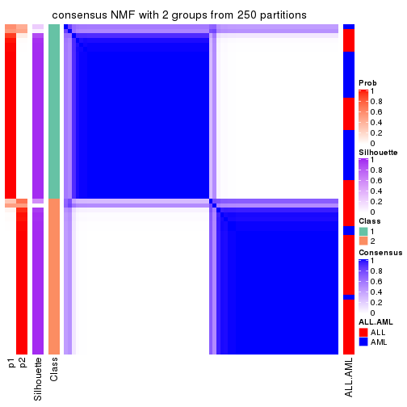</p>

</div>
<div id='tab-ATC-NMF-consensus-heatmap-2'>
<pre><code class="r">consensus_heatmap(res, k = 3)
</code></pre>

<p>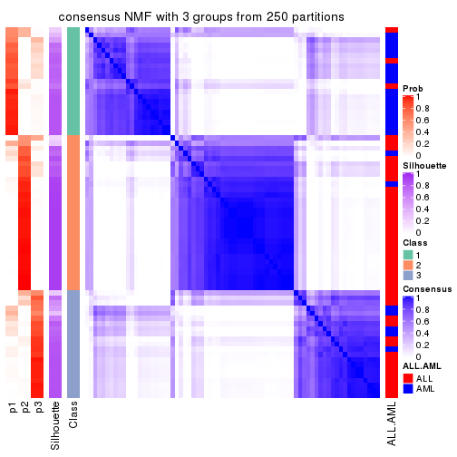</p>

</div>
<div id='tab-ATC-NMF-consensus-heatmap-3'>
<pre><code class="r">consensus_heatmap(res, k = 4)
</code></pre>

<p>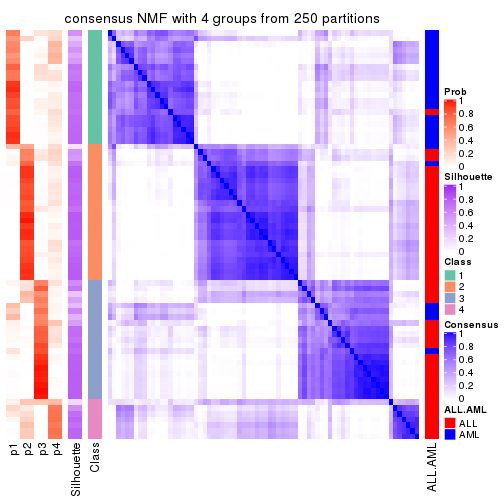</p>

</div>
<div id='tab-ATC-NMF-consensus-heatmap-4'>
<pre><code class="r">consensus_heatmap(res, k = 5)
</code></pre>

<p>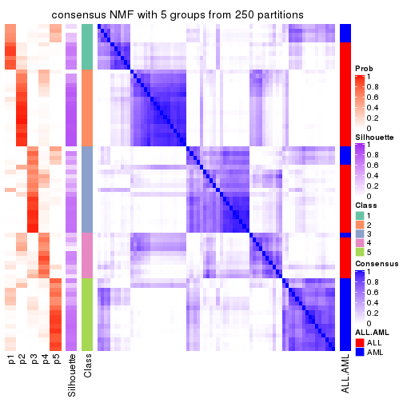</p>

</div>
<div id='tab-ATC-NMF-consensus-heatmap-5'>
<pre><code class="r">consensus_heatmap(res, k = 6)
</code></pre>

<p>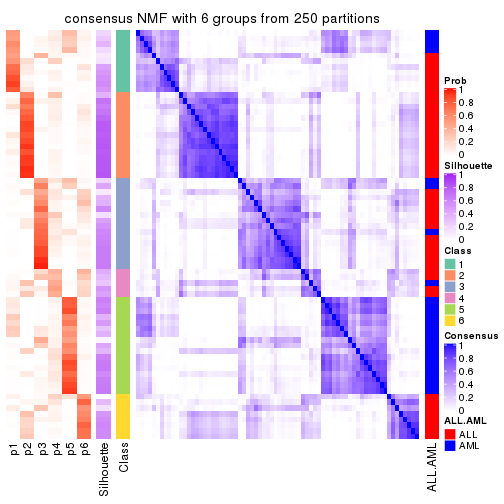</p>

</div>
</div>

Heatmaps for the membership of samples in all partitions to see how consistent they are:


<script>
$( function() {
	$( '#tabs-ATC-NMF-membership-heatmap' ).tabs();
} );
</script>
<div id='tabs-ATC-NMF-membership-heatmap'>
<ul>
<li><a href='#tab-ATC-NMF-membership-heatmap-1'>k = 2</a></li>
<li><a href='#tab-ATC-NMF-membership-heatmap-2'>k = 3</a></li>
<li><a href='#tab-ATC-NMF-membership-heatmap-3'>k = 4</a></li>
<li><a href='#tab-ATC-NMF-membership-heatmap-4'>k = 5</a></li>
<li><a href='#tab-ATC-NMF-membership-heatmap-5'>k = 6</a></li>
</ul>
<div id='tab-ATC-NMF-membership-heatmap-1'>
<pre><code class="r">membership_heatmap(res, k = 2)
</code></pre>

<p>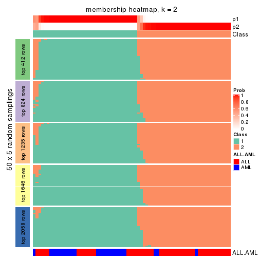</p>

</div>
<div id='tab-ATC-NMF-membership-heatmap-2'>
<pre><code class="r">membership_heatmap(res, k = 3)
</code></pre>

<p>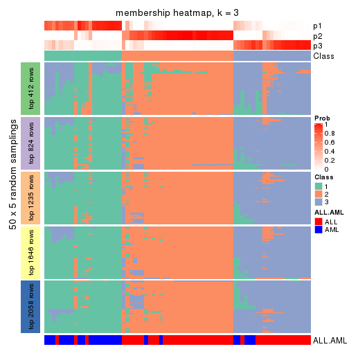</p>

</div>
<div id='tab-ATC-NMF-membership-heatmap-3'>
<pre><code class="r">membership_heatmap(res, k = 4)
</code></pre>

<p>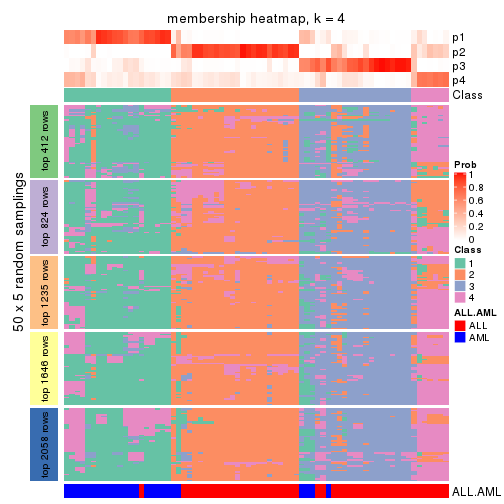</p>

</div>
<div id='tab-ATC-NMF-membership-heatmap-4'>
<pre><code class="r">membership_heatmap(res, k = 5)
</code></pre>

<p>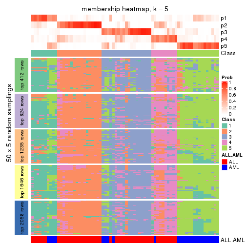</p>

</div>
<div id='tab-ATC-NMF-membership-heatmap-5'>
<pre><code class="r">membership_heatmap(res, k = 6)
</code></pre>

<p>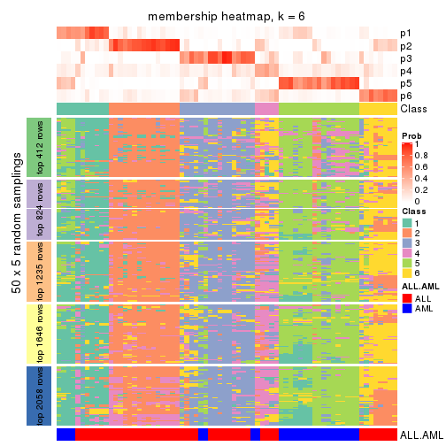</p>

</div>
</div>

As soon as we have had the classes for columns, we can look for signatures
which are significantly different between classes which can be candidate marks
for certain classes. Following are the heatmaps for signatures.


Signature heatmaps where rows are scaled:


<script>
$( function() {
	$( '#tabs-ATC-NMF-get-signatures' ).tabs();
} );
</script>
<div id='tabs-ATC-NMF-get-signatures'>
<ul>
<li><a href='#tab-ATC-NMF-get-signatures-1'>k = 2</a></li>
<li><a href='#tab-ATC-NMF-get-signatures-2'>k = 3</a></li>
<li><a href='#tab-ATC-NMF-get-signatures-3'>k = 4</a></li>
<li><a href='#tab-ATC-NMF-get-signatures-4'>k = 5</a></li>
<li><a href='#tab-ATC-NMF-get-signatures-5'>k = 6</a></li>
</ul>
<div id='tab-ATC-NMF-get-signatures-1'>
<pre><code class="r">get_signatures(res, k = 2)
</code></pre>

<p>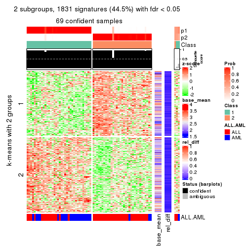</p>

</div>
<div id='tab-ATC-NMF-get-signatures-2'>
<pre><code class="r">get_signatures(res, k = 3)
</code></pre>

<p>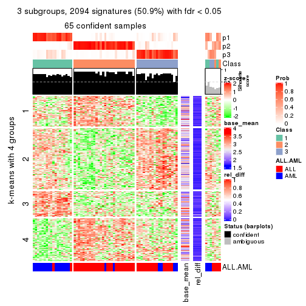</p>

</div>
<div id='tab-ATC-NMF-get-signatures-3'>
<pre><code class="r">get_signatures(res, k = 4)
</code></pre>

<p>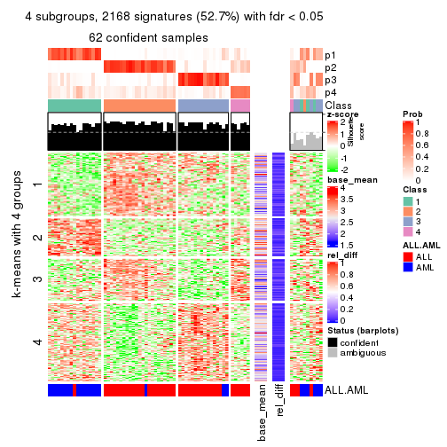</p>

</div>
<div id='tab-ATC-NMF-get-signatures-4'>
<pre><code class="r">get_signatures(res, k = 5)
</code></pre>

<p>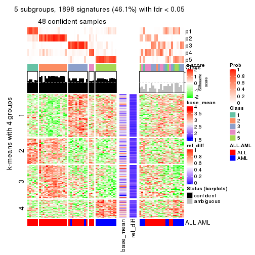</p>

</div>
<div id='tab-ATC-NMF-get-signatures-5'>
<pre><code class="r">get_signatures(res, k = 6)
</code></pre>

<p>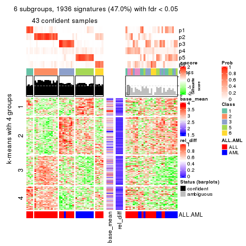</p>

</div>
</div>


Signature heatmaps where rows are not scaled:


<script>
$( function() {
	$( '#tabs-ATC-NMF-get-signatures-no-scale' ).tabs();
} );
</script>
<div id='tabs-ATC-NMF-get-signatures-no-scale'>
<ul>
<li><a href='#tab-ATC-NMF-get-signatures-no-scale-1'>k = 2</a></li>
<li><a href='#tab-ATC-NMF-get-signatures-no-scale-2'>k = 3</a></li>
<li><a href='#tab-ATC-NMF-get-signatures-no-scale-3'>k = 4</a></li>
<li><a href='#tab-ATC-NMF-get-signatures-no-scale-4'>k = 5</a></li>
<li><a href='#tab-ATC-NMF-get-signatures-no-scale-5'>k = 6</a></li>
</ul>
<div id='tab-ATC-NMF-get-signatures-no-scale-1'>
<pre><code class="r">get_signatures(res, k = 2, scale_rows = FALSE)
</code></pre>

<p>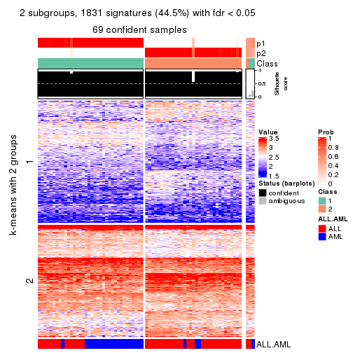</p>

</div>
<div id='tab-ATC-NMF-get-signatures-no-scale-2'>
<pre><code class="r">get_signatures(res, k = 3, scale_rows = FALSE)
</code></pre>

<p>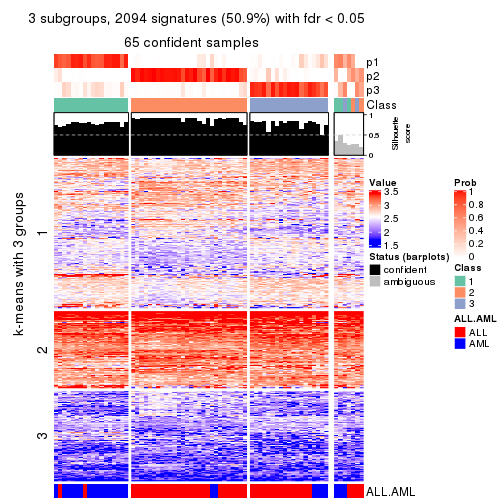</p>

</div>
<div id='tab-ATC-NMF-get-signatures-no-scale-3'>
<pre><code class="r">get_signatures(res, k = 4, scale_rows = FALSE)
</code></pre>

<p>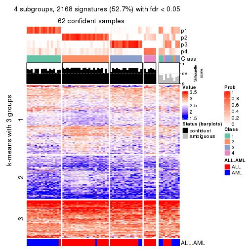</p>

</div>
<div id='tab-ATC-NMF-get-signatures-no-scale-4'>
<pre><code class="r">get_signatures(res, k = 5, scale_rows = FALSE)
</code></pre>

<p>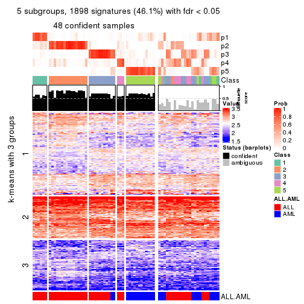</p>

</div>
<div id='tab-ATC-NMF-get-signatures-no-scale-5'>
<pre><code class="r">get_signatures(res, k = 6, scale_rows = FALSE)
</code></pre>

<p>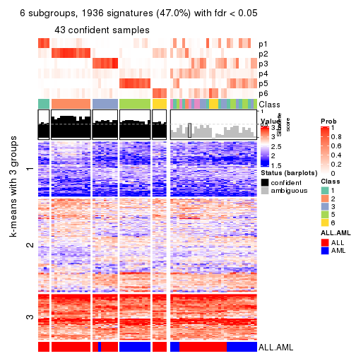</p>

</div>
</div>


Compare the overlap of signatures from different k:

```r
compare_signatures(res)
```

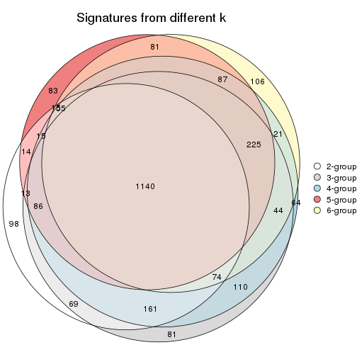

`get_signature()` returns a data frame invisibly. TO get the list of signatures, the function
call should be assigned to a variable explicitly. In following code, if `plot` argument is set
to `FALSE`, no heatmap is plotted while only the differential analysis is performed.

```r
# code only for demonstration
tb = get_signature(res, k = ..., plot = FALSE)
```

An example of the output of `tb` is:

```
#>   which_row         fdr    mean_1    mean_2 scaled_mean_1 scaled_mean_2 km
#> 1        38 0.042760348  8.373488  9.131774    -0.5533452     0.5164555  1
#> 2        40 0.018707592  7.106213  8.469186    -0.6173731     0.5762149  1
#> 3        55 0.019134737 10.221463 11.207825    -0.6159697     0.5749050  1
#> 4        59 0.006059896  5.921854  7.869574    -0.6899429     0.6439467  1
#> 5        60 0.018055526  8.928898 10.211722    -0.6204761     0.5791110  1
#> 6        98 0.009384629 15.714769 14.887706     0.6635654    -0.6193277  2
...
```

The columns in `tb` are:

1. `which_row`: row indices corresponding to the input matrix.
2. `fdr`: FDR for the differential test. 
3. `mean_x`: The mean value in group x.
4. `scaled_mean_x`: The mean value in group x after rows are scaled.
5. `km`: Row groups if k-means clustering is applied to rows.


UMAP plot which shows how samples are separated.


<script>
$( function() {
	$( '#tabs-ATC-NMF-dimension-reduction' ).tabs();
} );
</script>
<div id='tabs-ATC-NMF-dimension-reduction'>
<ul>
<li><a href='#tab-ATC-NMF-dimension-reduction-1'>k = 2</a></li>
<li><a href='#tab-ATC-NMF-dimension-reduction-2'>k = 3</a></li>
<li><a href='#tab-ATC-NMF-dimension-reduction-3'>k = 4</a></li>
<li><a href='#tab-ATC-NMF-dimension-reduction-4'>k = 5</a></li>
<li><a href='#tab-ATC-NMF-dimension-reduction-5'>k = 6</a></li>
</ul>
<div id='tab-ATC-NMF-dimension-reduction-1'>
<pre><code class="r">dimension_reduction(res, k = 2, method = &quot;UMAP&quot;)
</code></pre>

<p>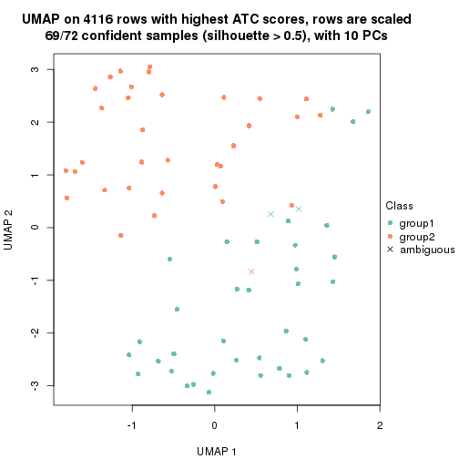</p>

</div>
<div id='tab-ATC-NMF-dimension-reduction-2'>
<pre><code class="r">dimension_reduction(res, k = 3, method = &quot;UMAP&quot;)
</code></pre>

<p>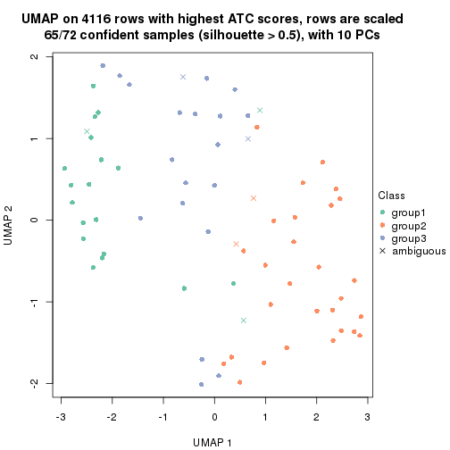</p>

</div>
<div id='tab-ATC-NMF-dimension-reduction-3'>
<pre><code class="r">dimension_reduction(res, k = 4, method = &quot;UMAP&quot;)
</code></pre>

<p>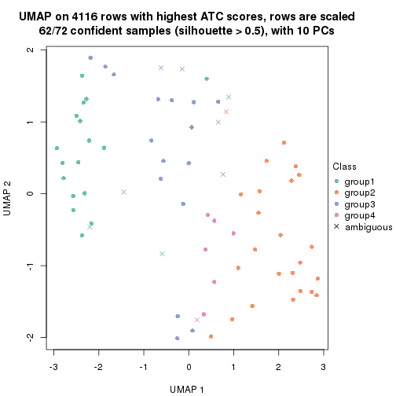</p>

</div>
<div id='tab-ATC-NMF-dimension-reduction-4'>
<pre><code class="r">dimension_reduction(res, k = 5, method = &quot;UMAP&quot;)
</code></pre>

<p>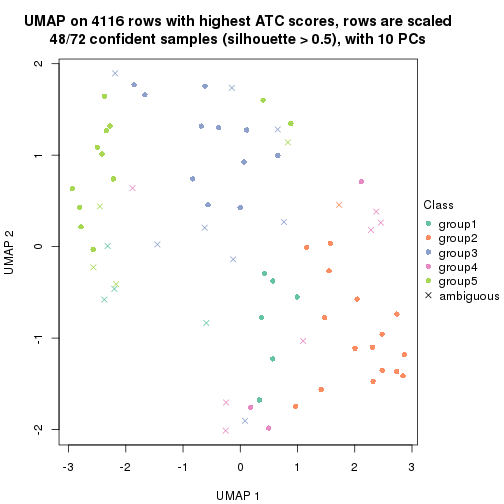</p>

</div>
<div id='tab-ATC-NMF-dimension-reduction-5'>
<pre><code class="r">dimension_reduction(res, k = 6, method = &quot;UMAP&quot;)
</code></pre>

<p>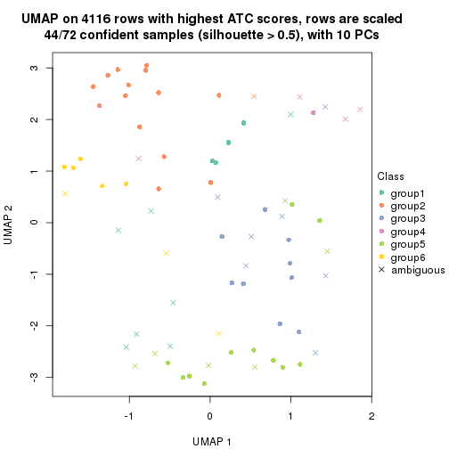</p>

</div>
</div>


Following heatmap shows how subgroups are split when increasing `k`:

```r
collect_classes(res)
```

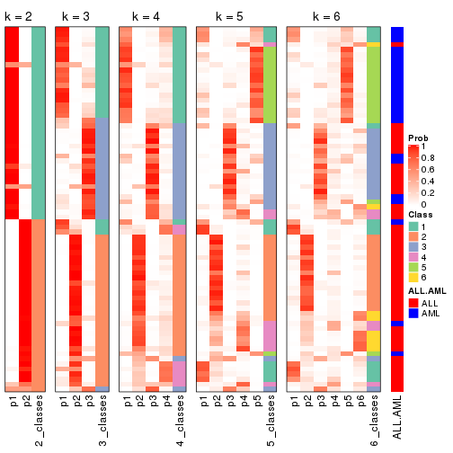


Test correlation between subgroups and known annotations. If the known
annotation is numeric, one-way ANOVA test is applied, and if the known
annotation is discrete, chi-squared contingency table test is applied.

```r
test_to_known_factors(res)
```

```
#>          n ALL.AML(p) k
#> ATC:NMF 69   5.41e-05 2
#> ATC:NMF 65   2.97e-08 3
#> ATC:NMF 62   1.00e-09 4
#> ATC:NMF 48   4.17e-08 5
#> ATC:NMF 44   1.87e-07 6
```


If matrix rows can be associated to genes, consider to use `functional_enrichment(res,
...)` to perform function enrichment for the signature genes. See [this vignette](http://bioconductor.org/packages/devel/bioc/vignettes/cola/inst/doc/functional_enrichment.html) for more detailed explanations.


 

## Session info


```r
sessionInfo()
```

```
#> R version 3.6.0 (2019-04-26)
#> Platform: x86_64-pc-linux-gnu (64-bit)
#> Running under: CentOS Linux 7 (Core)
#> 
#> Matrix products: default
#> BLAS:   /usr/lib64/libblas.so.3.4.2
#> LAPACK: /usr/lib64/liblapack.so.3.4.2
#> 
#> locale:
#>  [1] LC_CTYPE=en_GB.UTF-8       LC_NUMERIC=C               LC_TIME=en_GB.UTF-8       
#>  [4] LC_COLLATE=en_GB.UTF-8     LC_MONETARY=en_GB.UTF-8    LC_MESSAGES=en_GB.UTF-8   
#>  [7] LC_PAPER=en_GB.UTF-8       LC_NAME=C                  LC_ADDRESS=C              
#> [10] LC_TELEPHONE=C             LC_MEASUREMENT=en_GB.UTF-8 LC_IDENTIFICATION=C       
#> 
#> attached base packages:
#> [1] grid      stats     graphics  grDevices utils     datasets  methods   base     
#> 
#> other attached packages:
#> [1] genefilter_1.66.0    ComplexHeatmap_2.3.1 markdown_1.1         knitr_1.26          
#> [5] GetoptLong_0.1.7     cola_1.3.2          
#> 
#> loaded via a namespace (and not attached):
#>  [1] circlize_0.4.8       shape_1.4.4          xfun_0.11            slam_0.1-46         
#>  [5] lattice_0.20-38      splines_3.6.0        colorspace_1.4-1     vctrs_0.2.0         
#>  [9] stats4_3.6.0         blob_1.2.0           XML_3.98-1.20        survival_2.44-1.1   
#> [13] rlang_0.4.2          pillar_1.4.2         DBI_1.0.0            BiocGenerics_0.30.0 
#> [17] bit64_0.9-7          RColorBrewer_1.1-2   matrixStats_0.55.0   stringr_1.4.0       
#> [21] GlobalOptions_0.1.1  evaluate_0.14        memoise_1.1.0        Biobase_2.44.0      
#> [25] IRanges_2.18.3       parallel_3.6.0       AnnotationDbi_1.46.1 highr_0.8           
#> [29] Rcpp_1.0.3           xtable_1.8-4         backports_1.1.5      S4Vectors_0.22.1    
#> [33] annotate_1.62.0      skmeans_0.2-11       bit_1.1-14           microbenchmark_1.4-7
#> [37] brew_1.0-6           impute_1.58.0        rjson_0.2.20         png_0.1-7           
#> [41] digest_0.6.23        stringi_1.4.3        polyclip_1.10-0      clue_0.3-57         
#> [45] tools_3.6.0          bitops_1.0-6         magrittr_1.5         eulerr_6.0.0        
#> [49] RCurl_1.95-4.12      RSQLite_2.1.4        tibble_2.1.3         cluster_2.1.0       
#> [53] crayon_1.3.4         pkgconfig_2.0.3      zeallot_0.1.0        Matrix_1.2-17       
#> [57] xml2_1.2.2           httr_1.4.1           R6_2.4.1             mclust_5.4.5        
#> [61] compiler_3.6.0
```


