cola Report for Consensus Partitioning
==================

**Date**: 2019-12-03 01:50:06 CET, **cola version**: 1.3.2

----------------------------------------------------------------

<style type='text/css'>

body, td, th {
   font-family: Arial,Helvetica,sans-serif;
   background-color: white;
   font-size: 13px;
  max-width: 800px;
  margin: auto;
  margin-left:210px;
  padding: 0px 10px 0px 10px;
  border-left: 1px solid #EEEEEE;
  line-height: 150%;
}

tt, code, pre {
   font-family: 'DejaVu Sans Mono', 'Droid Sans Mono', 'Lucida Console', Consolas, Monaco, 

monospace;
}

h1 {
   font-size:2.2em;
}

h2 {
   font-size:1.8em;
}

h3 {
   font-size:1.4em;
}

h4 {
   font-size:1.0em;
}

h5 {
   font-size:0.9em;
}

h6 {
   font-size:0.8em;
}

a {
  text-decoration: none;
  color: #0366d6;
}

a:hover {
  text-decoration: underline;
}

a:visited {
   color: #0366d6;
}

pre, img {
  max-width: 100%;
}
pre {
  overflow-x: auto;
}
pre code {
   display: block; padding: 0.5em;
}

code {
  font-size: 92%;
  border: 1px solid #ccc;
}

code[class] {
  background-color: #F8F8F8;
}

table, td, th {
  border: 1px solid #ccc;
}

blockquote {
   color:#666666;
   margin:0;
   padding-left: 1em;
   border-left: 0.5em #EEE solid;
}

hr {
   height: 0px;
   border-bottom: none;
   border-top-width: thin;
   border-top-style: dotted;
   border-top-color: #999999;
}

@media print {
   * {
      background: transparent !important;
      color: black !important;
      filter:none !important;
      -ms-filter: none !important;
   }

   body {
      font-size:12pt;
      max-width:100%;
   }

   a, a:visited {
      text-decoration: underline;
   }

   hr {
      visibility: hidden;
      page-break-before: always;
   }

   pre, blockquote {
      padding-right: 1em;
      page-break-inside: avoid;
   }

   tr, img {
      page-break-inside: avoid;
   }

   img {
      max-width: 100% !important;
   }

   @page :left {
      margin: 15mm 20mm 15mm 10mm;
   }

   @page :right {
      margin: 15mm 10mm 15mm 20mm;
   }

   p, h2, h3 {
      orphans: 3; widows: 3;
   }

   h2, h3 {
      page-break-after: avoid;
   }
}
</style>


## Summary


First the variable is renamed to `res_list`.


```r
res_list = rl
```


All available functions which can be applied to this `res_list` object:


```r
res_list
```

```
#> A 'ConsensusPartitionList' object with 24 methods.
#>   On a matrix with 12016 rows and 271 columns.
#>   Top rows are extracted by 'SD, CV, MAD, ATC' methods.
#>   Subgroups are detected by 'hclust, kmeans, skmeans, pam, mclust, NMF' method.
#>   Number of partitions are tried for k = 2, 3, 4, 5, 6.
#>   Performed in total 30000 partitions by row resampling.
#> 
#> Following methods can be applied to this 'ConsensusPartitionList' object:
#>  [1] "cola_report"           "collect_classes"       "collect_plots"         "collect_stats"        
#>  [5] "colnames"              "functional_enrichment" "get_anno_col"          "get_anno"             
#>  [9] "get_classes"           "get_matrix"            "get_membership"        "get_stats"            
#> [13] "is_best_k"             "is_stable_k"           "ncol"                  "nrow"                 
#> [17] "rownames"              "show"                  "suggest_best_k"        "test_to_known_factors"
#> [21] "top_rows_heatmap"      "top_rows_overlap"     
#> 
#> You can get result for a single method by, e.g. object["SD", "hclust"] or object["SD:hclust"]
#> or a subset of methods by object[c("SD", "CV")], c("hclust", "kmeans")]
```

The call of `run_all_consensus_partition_methods()` was:


```
#> run_all_consensus_partition_methods(data = m, mc.cores = 4, anno = anno, anno_col = anno_col)
```

Dimension of the input matrix:


```r
mat = get_matrix(res_list)
dim(mat)
```

```
#> [1] 12016   271
```

### Density distribution

The density distribution for each sample is visualized as in one column in the
following heatmap. The clustering is based on the distance which is the
Kolmogorov-Smirnov statistic between two distributions.


```r
library(ComplexHeatmap)
densityHeatmap(mat, top_annotation = HeatmapAnnotation(df = get_anno(res_list), 
    col = get_anno_col(res_list)), ylab = "value", cluster_columns = TRUE, show_column_names = FALSE,
    mc.cores = 4)
```


### Suggest the best k


Folowing table shows the best `k` (number of partitions) for each combination
of top-value methods and partition methods. Clicking on the method name in
the table goes to the section for a single combination of methods.

[The cola vignette](http://bioconductor.org/packages/devel/bioc/vignettes/cola/inst/doc/cola.html#toc_13)
explains the definition of the metrics used for determining the best
number of partitions.


```r
suggest_best_k(res_list)
```


|                            | The best k| 1-PAC| Mean silhouette| Concordance|   |Optional k |
|:---------------------------|----------:|-----:|---------------:|-----------:|:--|:----------|
|[ATC:NMF](#ATC-NMF)         |          4| 1.000|           0.966|       0.986|** |           |
|[SD:NMF](#SD-NMF)           |          3| 1.000|           0.961|       0.984|** |2          |
|[CV:hclust](#CV-hclust)     |          2| 0.999|           0.957|       0.981|** |           |
|[SD:kmeans](#SD-kmeans)     |          2| 0.978|           0.953|       0.975|** |           |
|[SD:mclust](#SD-mclust)     |          3| 0.957|           0.930|       0.970|** |           |
|[MAD:skmeans](#MAD-skmeans) |          2| 0.950|           0.936|       0.972|*  |           |
|[SD:skmeans](#SD-skmeans)   |          3| 0.948|           0.938|       0.974|*  |2          |
|[CV:mclust](#CV-mclust)     |          2| 0.931|           0.948|       0.978|*  |           |
|[CV:NMF](#CV-NMF)           |          3| 0.925|           0.927|       0.971|*  |           |
|[MAD:NMF](#MAD-NMF)         |          2| 0.924|           0.936|       0.973|*  |           |
|[MAD:mclust](#MAD-mclust)   |          3| 0.903|           0.904|       0.956|*  |2          |
|[ATC:skmeans](#ATC-skmeans) |          6| 0.900|           0.850|       0.920|*  |2,3,4,5    |
|[MAD:kmeans](#MAD-kmeans)   |          2| 0.866|           0.901|       0.949|   |           |
|[CV:skmeans](#CV-skmeans)   |          3| 0.863|           0.882|       0.951|   |           |
|[ATC:kmeans](#ATC-kmeans)   |          4| 0.862|           0.916|       0.929|   |           |
|[ATC:mclust](#ATC-mclust)   |          4| 0.858|           0.857|       0.934|   |           |
|[ATC:pam](#ATC-pam)         |          4| 0.759|           0.775|       0.892|   |           |
|[CV:kmeans](#CV-kmeans)     |          3| 0.623|           0.781|       0.885|   |           |
|[SD:pam](#SD-pam)           |          2| 0.589|           0.843|       0.924|   |           |
|[MAD:pam](#MAD-pam)         |          2| 0.432|           0.730|       0.881|   |           |
|[ATC:hclust](#ATC-hclust)   |          2| 0.372|           0.752|       0.827|   |           |
|[SD:hclust](#SD-hclust)     |          3| 0.214|           0.653|       0.812|   |           |
|[MAD:hclust](#MAD-hclust)   |          3| 0.181|           0.522|       0.639|   |           |
|[CV:pam](#CV-pam)           |         NA|    NA|              NA|          NA|   |           |

\*\*: 1-PAC > 0.95, \*: 1-PAC > 0.9


### CDF of consensus matrices

Cumulative distribution function curves of consensus matrix for all methods.


```r
collect_plots(res_list, fun = plot_ecdf)
```


### Consensus heatmap

Consensus heatmaps for all methods. ([What is a consensus heatmap?](http://bioconductor.org/packages/devel/bioc/vignettes/cola/inst/doc/cola.html#toc_9))


<style type='text/css'>


.ui-helper-hidden {
	display: none;
}
.ui-helper-hidden-accessible {
	border: 0;
	clip: rect(0 0 0 0);
	height: 1px;
	margin: -1px;
	overflow: hidden;
	padding: 0;
	position: absolute;
	width: 1px;
}
.ui-helper-reset {
	margin: 0;
	padding: 0;
	border: 0;
	outline: 0;
	line-height: 1.3;
	text-decoration: none;
	font-size: 100%;
	list-style: none;
}
.ui-helper-clearfix:before,
.ui-helper-clearfix:after {
	content: "";
	display: table;
	border-collapse: collapse;
}
.ui-helper-clearfix:after {
	clear: both;
}
.ui-helper-zfix {
	width: 100%;
	height: 100%;
	top: 0;
	left: 0;
	position: absolute;
	opacity: 0;
	filter:Alpha(Opacity=0); 
}

.ui-front {
	z-index: 100;
}


.ui-state-disabled {
	cursor: default !important;
	pointer-events: none;
}


.ui-icon {
	display: inline-block;
	vertical-align: middle;
	margin-top: -.25em;
	position: relative;
	text-indent: -99999px;
	overflow: hidden;
	background-repeat: no-repeat;
}

.ui-widget-icon-block {
	left: 50%;
	margin-left: -8px;
	display: block;
}


.ui-widget-overlay {
	position: fixed;
	top: 0;
	left: 0;
	width: 100%;
	height: 100%;
}
.ui-accordion .ui-accordion-header {
	display: block;
	cursor: pointer;
	position: relative;
	margin: 2px 0 0 0;
	padding: .5em .5em .5em .7em;
	font-size: 100%;
}
.ui-accordion .ui-accordion-content {
	padding: 1em 2.2em;
	border-top: 0;
	overflow: auto;
}
.ui-autocomplete {
	position: absolute;
	top: 0;
	left: 0;
	cursor: default;
}
.ui-menu {
	list-style: none;
	padding: 0;
	margin: 0;
	display: block;
	outline: 0;
}
.ui-menu .ui-menu {
	position: absolute;
}
.ui-menu .ui-menu-item {
	margin: 0;
	cursor: pointer;
	
	list-style-image: url("data:image/gif;base64,R0lGODlhAQABAIAAAAAAAP///yH5BAEAAAAALAAAAAABAAEAAAIBRAA7");
}
.ui-menu .ui-menu-item-wrapper {
	position: relative;
	padding: 3px 1em 3px .4em;
}
.ui-menu .ui-menu-divider {
	margin: 5px 0;
	height: 0;
	font-size: 0;
	line-height: 0;
	border-width: 1px 0 0 0;
}
.ui-menu .ui-state-focus,
.ui-menu .ui-state-active {
	margin: -1px;
}


.ui-menu-icons {
	position: relative;
}
.ui-menu-icons .ui-menu-item-wrapper {
	padding-left: 2em;
}


.ui-menu .ui-icon {
	position: absolute;
	top: 0;
	bottom: 0;
	left: .2em;
	margin: auto 0;
}


.ui-menu .ui-menu-icon {
	left: auto;
	right: 0;
}
.ui-button {
	padding: .4em 1em;
	display: inline-block;
	position: relative;
	line-height: normal;
	margin-right: .1em;
	cursor: pointer;
	vertical-align: middle;
	text-align: center;
	-webkit-user-select: none;
	-moz-user-select: none;
	-ms-user-select: none;
	user-select: none;

	
	overflow: visible;
}

.ui-button,
.ui-button:link,
.ui-button:visited,
.ui-button:hover,
.ui-button:active {
	text-decoration: none;
}


.ui-button-icon-only {
	width: 2em;
	box-sizing: border-box;
	text-indent: -9999px;
	white-space: nowrap;
}


input.ui-button.ui-button-icon-only {
	text-indent: 0;
}


.ui-button-icon-only .ui-icon {
	position: absolute;
	top: 50%;
	left: 50%;
	margin-top: -8px;
	margin-left: -8px;
}

.ui-button.ui-icon-notext .ui-icon {
	padding: 0;
	width: 2.1em;
	height: 2.1em;
	text-indent: -9999px;
	white-space: nowrap;

}

input.ui-button.ui-icon-notext .ui-icon {
	width: auto;
	height: auto;
	text-indent: 0;
	white-space: normal;
	padding: .4em 1em;
}


input.ui-button::-moz-focus-inner,
button.ui-button::-moz-focus-inner {
	border: 0;
	padding: 0;
}
.ui-controlgroup {
	vertical-align: middle;
	display: inline-block;
}
.ui-controlgroup > .ui-controlgroup-item {
	float: left;
	margin-left: 0;
	margin-right: 0;
}
.ui-controlgroup > .ui-controlgroup-item:focus,
.ui-controlgroup > .ui-controlgroup-item.ui-visual-focus {
	z-index: 9999;
}
.ui-controlgroup-vertical > .ui-controlgroup-item {
	display: block;
	float: none;
	width: 100%;
	margin-top: 0;
	margin-bottom: 0;
	text-align: left;
}
.ui-controlgroup-vertical .ui-controlgroup-item {
	box-sizing: border-box;
}
.ui-controlgroup .ui-controlgroup-label {
	padding: .4em 1em;
}
.ui-controlgroup .ui-controlgroup-label span {
	font-size: 80%;
}
.ui-controlgroup-horizontal .ui-controlgroup-label + .ui-controlgroup-item {
	border-left: none;
}
.ui-controlgroup-vertical .ui-controlgroup-label + .ui-controlgroup-item {
	border-top: none;
}
.ui-controlgroup-horizontal .ui-controlgroup-label.ui-widget-content {
	border-right: none;
}
.ui-controlgroup-vertical .ui-controlgroup-label.ui-widget-content {
	border-bottom: none;
}


.ui-controlgroup-vertical .ui-spinner-input {

	
	width: 75%;
	width: calc( 100% - 2.4em );
}
.ui-controlgroup-vertical .ui-spinner .ui-spinner-up {
	border-top-style: solid;
}

.ui-checkboxradio-label .ui-icon-background {
	box-shadow: inset 1px 1px 1px #ccc;
	border-radius: .12em;
	border: none;
}
.ui-checkboxradio-radio-label .ui-icon-background {
	width: 16px;
	height: 16px;
	border-radius: 1em;
	overflow: visible;
	border: none;
}
.ui-checkboxradio-radio-label.ui-checkboxradio-checked .ui-icon,
.ui-checkboxradio-radio-label.ui-checkboxradio-checked:hover .ui-icon {
	background-image: none;
	width: 8px;
	height: 8px;
	border-width: 4px;
	border-style: solid;
}
.ui-checkboxradio-disabled {
	pointer-events: none;
}
.ui-datepicker {
	width: 17em;
	padding: .2em .2em 0;
	display: none;
}
.ui-datepicker .ui-datepicker-header {
	position: relative;
	padding: .2em 0;
}
.ui-datepicker .ui-datepicker-prev,
.ui-datepicker .ui-datepicker-next {
	position: absolute;
	top: 2px;
	width: 1.8em;
	height: 1.8em;
}
.ui-datepicker .ui-datepicker-prev-hover,
.ui-datepicker .ui-datepicker-next-hover {
	top: 1px;
}
.ui-datepicker .ui-datepicker-prev {
	left: 2px;
}
.ui-datepicker .ui-datepicker-next {
	right: 2px;
}
.ui-datepicker .ui-datepicker-prev-hover {
	left: 1px;
}
.ui-datepicker .ui-datepicker-next-hover {
	right: 1px;
}
.ui-datepicker .ui-datepicker-prev span,
.ui-datepicker .ui-datepicker-next span {
	display: block;
	position: absolute;
	left: 50%;
	margin-left: -8px;
	top: 50%;
	margin-top: -8px;
}
.ui-datepicker .ui-datepicker-title {
	margin: 0 2.3em;
	line-height: 1.8em;
	text-align: center;
}
.ui-datepicker .ui-datepicker-title select {
	font-size: 1em;
	margin: 1px 0;
}
.ui-datepicker select.ui-datepicker-month,
.ui-datepicker select.ui-datepicker-year {
	width: 45%;
}
.ui-datepicker table {
	width: 100%;
	font-size: .9em;
	border-collapse: collapse;
	margin: 0 0 .4em;
}
.ui-datepicker th {
	padding: .7em .3em;
	text-align: center;
	font-weight: bold;
	border: 0;
}
.ui-datepicker td {
	border: 0;
	padding: 1px;
}
.ui-datepicker td span,
.ui-datepicker td a {
	display: block;
	padding: .2em;
	text-align: right;
	text-decoration: none;
}
.ui-datepicker .ui-datepicker-buttonpane {
	background-image: none;
	margin: .7em 0 0 0;
	padding: 0 .2em;
	border-left: 0;
	border-right: 0;
	border-bottom: 0;
}
.ui-datepicker .ui-datepicker-buttonpane button {
	float: right;
	margin: .5em .2em .4em;
	cursor: pointer;
	padding: .2em .6em .3em .6em;
	width: auto;
	overflow: visible;
}
.ui-datepicker .ui-datepicker-buttonpane button.ui-datepicker-current {
	float: left;
}


.ui-datepicker.ui-datepicker-multi {
	width: auto;
}
.ui-datepicker-multi .ui-datepicker-group {
	float: left;
}
.ui-datepicker-multi .ui-datepicker-group table {
	width: 95%;
	margin: 0 auto .4em;
}
.ui-datepicker-multi-2 .ui-datepicker-group {
	width: 50%;
}
.ui-datepicker-multi-3 .ui-datepicker-group {
	width: 33.3%;
}
.ui-datepicker-multi-4 .ui-datepicker-group {
	width: 25%;
}
.ui-datepicker-multi .ui-datepicker-group-last .ui-datepicker-header,
.ui-datepicker-multi .ui-datepicker-group-middle .ui-datepicker-header {
	border-left-width: 0;
}
.ui-datepicker-multi .ui-datepicker-buttonpane {
	clear: left;
}
.ui-datepicker-row-break {
	clear: both;
	width: 100%;
	font-size: 0;
}


.ui-datepicker-rtl {
	direction: rtl;
}
.ui-datepicker-rtl .ui-datepicker-prev {
	right: 2px;
	left: auto;
}
.ui-datepicker-rtl .ui-datepicker-next {
	left: 2px;
	right: auto;
}
.ui-datepicker-rtl .ui-datepicker-prev:hover {
	right: 1px;
	left: auto;
}
.ui-datepicker-rtl .ui-datepicker-next:hover {
	left: 1px;
	right: auto;
}
.ui-datepicker-rtl .ui-datepicker-buttonpane {
	clear: right;
}
.ui-datepicker-rtl .ui-datepicker-buttonpane button {
	float: left;
}
.ui-datepicker-rtl .ui-datepicker-buttonpane button.ui-datepicker-current,
.ui-datepicker-rtl .ui-datepicker-group {
	float: right;
}
.ui-datepicker-rtl .ui-datepicker-group-last .ui-datepicker-header,
.ui-datepicker-rtl .ui-datepicker-group-middle .ui-datepicker-header {
	border-right-width: 0;
	border-left-width: 1px;
}


.ui-datepicker .ui-icon {
	display: block;
	text-indent: -99999px;
	overflow: hidden;
	background-repeat: no-repeat;
	left: .5em;
	top: .3em;
}
.ui-dialog {
	position: absolute;
	top: 0;
	left: 0;
	padding: .2em;
	outline: 0;
}
.ui-dialog .ui-dialog-titlebar {
	padding: .4em 1em;
	position: relative;
}
.ui-dialog .ui-dialog-title {
	float: left;
	margin: .1em 0;
	white-space: nowrap;
	width: 90%;
	overflow: hidden;
	text-overflow: ellipsis;
}
.ui-dialog .ui-dialog-titlebar-close {
	position: absolute;
	right: .3em;
	top: 50%;
	width: 20px;
	margin: -10px 0 0 0;
	padding: 1px;
	height: 20px;
}
.ui-dialog .ui-dialog-content {
	position: relative;
	border: 0;
	padding: .5em 1em;
	background: none;
	overflow: auto;
}
.ui-dialog .ui-dialog-buttonpane {
	text-align: left;
	border-width: 1px 0 0 0;
	background-image: none;
	margin-top: .5em;
	padding: .3em 1em .5em .4em;
}
.ui-dialog .ui-dialog-buttonpane .ui-dialog-buttonset {
	float: right;
}
.ui-dialog .ui-dialog-buttonpane button {
	margin: .5em .4em .5em 0;
	cursor: pointer;
}
.ui-dialog .ui-resizable-n {
	height: 2px;
	top: 0;
}
.ui-dialog .ui-resizable-e {
	width: 2px;
	right: 0;
}
.ui-dialog .ui-resizable-s {
	height: 2px;
	bottom: 0;
}
.ui-dialog .ui-resizable-w {
	width: 2px;
	left: 0;
}
.ui-dialog .ui-resizable-se,
.ui-dialog .ui-resizable-sw,
.ui-dialog .ui-resizable-ne,
.ui-dialog .ui-resizable-nw {
	width: 7px;
	height: 7px;
}
.ui-dialog .ui-resizable-se {
	right: 0;
	bottom: 0;
}
.ui-dialog .ui-resizable-sw {
	left: 0;
	bottom: 0;
}
.ui-dialog .ui-resizable-ne {
	right: 0;
	top: 0;
}
.ui-dialog .ui-resizable-nw {
	left: 0;
	top: 0;
}
.ui-draggable .ui-dialog-titlebar {
	cursor: move;
}
.ui-draggable-handle {
	-ms-touch-action: none;
	touch-action: none;
}
.ui-resizable {
	position: relative;
}
.ui-resizable-handle {
	position: absolute;
	font-size: 0.1px;
	display: block;
	-ms-touch-action: none;
	touch-action: none;
}
.ui-resizable-disabled .ui-resizable-handle,
.ui-resizable-autohide .ui-resizable-handle {
	display: none;
}
.ui-resizable-n {
	cursor: n-resize;
	height: 7px;
	width: 100%;
	top: -5px;
	left: 0;
}
.ui-resizable-s {
	cursor: s-resize;
	height: 7px;
	width: 100%;
	bottom: -5px;
	left: 0;
}
.ui-resizable-e {
	cursor: e-resize;
	width: 7px;
	right: -5px;
	top: 0;
	height: 100%;
}
.ui-resizable-w {
	cursor: w-resize;
	width: 7px;
	left: -5px;
	top: 0;
	height: 100%;
}
.ui-resizable-se {
	cursor: se-resize;
	width: 12px;
	height: 12px;
	right: 1px;
	bottom: 1px;
}
.ui-resizable-sw {
	cursor: sw-resize;
	width: 9px;
	height: 9px;
	left: -5px;
	bottom: -5px;
}
.ui-resizable-nw {
	cursor: nw-resize;
	width: 9px;
	height: 9px;
	left: -5px;
	top: -5px;
}
.ui-resizable-ne {
	cursor: ne-resize;
	width: 9px;
	height: 9px;
	right: -5px;
	top: -5px;
}
.ui-progressbar {
	height: 2em;
	text-align: left;
	overflow: hidden;
}
.ui-progressbar .ui-progressbar-value {
	margin: -1px;
	height: 100%;
}
.ui-progressbar .ui-progressbar-overlay {
	background: url("data:image/gif;base64,R0lGODlhKAAoAIABAAAAAP///yH/C05FVFNDQVBFMi4wAwEAAAAh+QQJAQABACwAAAAAKAAoAAACkYwNqXrdC52DS06a7MFZI+4FHBCKoDeWKXqymPqGqxvJrXZbMx7Ttc+w9XgU2FB3lOyQRWET2IFGiU9m1frDVpxZZc6bfHwv4c1YXP6k1Vdy292Fb6UkuvFtXpvWSzA+HycXJHUXiGYIiMg2R6W459gnWGfHNdjIqDWVqemH2ekpObkpOlppWUqZiqr6edqqWQAAIfkECQEAAQAsAAAAACgAKAAAApSMgZnGfaqcg1E2uuzDmmHUBR8Qil95hiPKqWn3aqtLsS18y7G1SzNeowWBENtQd+T1JktP05nzPTdJZlR6vUxNWWjV+vUWhWNkWFwxl9VpZRedYcflIOLafaa28XdsH/ynlcc1uPVDZxQIR0K25+cICCmoqCe5mGhZOfeYSUh5yJcJyrkZWWpaR8doJ2o4NYq62lAAACH5BAkBAAEALAAAAAAoACgAAAKVDI4Yy22ZnINRNqosw0Bv7i1gyHUkFj7oSaWlu3ovC8GxNso5fluz3qLVhBVeT/Lz7ZTHyxL5dDalQWPVOsQWtRnuwXaFTj9jVVh8pma9JjZ4zYSj5ZOyma7uuolffh+IR5aW97cHuBUXKGKXlKjn+DiHWMcYJah4N0lYCMlJOXipGRr5qdgoSTrqWSq6WFl2ypoaUAAAIfkECQEAAQAsAAAAACgAKAAAApaEb6HLgd/iO7FNWtcFWe+ufODGjRfoiJ2akShbueb0wtI50zm02pbvwfWEMWBQ1zKGlLIhskiEPm9R6vRXxV4ZzWT2yHOGpWMyorblKlNp8HmHEb/lCXjcW7bmtXP8Xt229OVWR1fod2eWqNfHuMjXCPkIGNileOiImVmCOEmoSfn3yXlJWmoHGhqp6ilYuWYpmTqKUgAAIfkECQEAAQAsAAAAACgAKAAAApiEH6kb58biQ3FNWtMFWW3eNVcojuFGfqnZqSebuS06w5V80/X02pKe8zFwP6EFWOT1lDFk8rGERh1TTNOocQ61Hm4Xm2VexUHpzjymViHrFbiELsefVrn6XKfnt2Q9G/+Xdie499XHd2g4h7ioOGhXGJboGAnXSBnoBwKYyfioubZJ2Hn0RuRZaflZOil56Zp6iioKSXpUAAAh+QQJAQABACwAAAAAKAAoAAACkoQRqRvnxuI7kU1a1UU5bd5tnSeOZXhmn5lWK3qNTWvRdQxP8qvaC+/yaYQzXO7BMvaUEmJRd3TsiMAgswmNYrSgZdYrTX6tSHGZO73ezuAw2uxuQ+BbeZfMxsexY35+/Qe4J1inV0g4x3WHuMhIl2jXOKT2Q+VU5fgoSUI52VfZyfkJGkha6jmY+aaYdirq+lQAACH5BAkBAAEALAAAAAAoACgAAAKWBIKpYe0L3YNKToqswUlvznigd4wiR4KhZrKt9Upqip61i9E3vMvxRdHlbEFiEXfk9YARYxOZZD6VQ2pUunBmtRXo1Lf8hMVVcNl8JafV38aM2/Fu5V16Bn63r6xt97j09+MXSFi4BniGFae3hzbH9+hYBzkpuUh5aZmHuanZOZgIuvbGiNeomCnaxxap2upaCZsq+1kAACH5BAkBAAEALAAAAAAoACgAAAKXjI8By5zf4kOxTVrXNVlv1X0d8IGZGKLnNpYtm8Lr9cqVeuOSvfOW79D9aDHizNhDJidFZhNydEahOaDH6nomtJjp1tutKoNWkvA6JqfRVLHU/QUfau9l2x7G54d1fl995xcIGAdXqMfBNadoYrhH+Mg2KBlpVpbluCiXmMnZ2Sh4GBqJ+ckIOqqJ6LmKSllZmsoq6wpQAAAh+QQJAQABACwAAAAAKAAoAAAClYx/oLvoxuJDkU1a1YUZbJ59nSd2ZXhWqbRa2/gF8Gu2DY3iqs7yrq+xBYEkYvFSM8aSSObE+ZgRl1BHFZNr7pRCavZ5BW2142hY3AN/zWtsmf12p9XxxFl2lpLn1rseztfXZjdIWIf2s5dItwjYKBgo9yg5pHgzJXTEeGlZuenpyPmpGQoKOWkYmSpaSnqKileI2FAAACH5BAkBAAEALAAAAAAoACgAAAKVjB+gu+jG4kORTVrVhRlsnn2dJ3ZleFaptFrb+CXmO9OozeL5VfP99HvAWhpiUdcwkpBH3825AwYdU8xTqlLGhtCosArKMpvfa1mMRae9VvWZfeB2XfPkeLmm18lUcBj+p5dnN8jXZ3YIGEhYuOUn45aoCDkp16hl5IjYJvjWKcnoGQpqyPlpOhr3aElaqrq56Bq7VAAAOw==");
	height: 100%;
	filter: alpha(opacity=25); 
	opacity: 0.25;
}
.ui-progressbar-indeterminate .ui-progressbar-value {
	background-image: none;
}
.ui-selectable {
	-ms-touch-action: none;
	touch-action: none;
}
.ui-selectable-helper {
	position: absolute;
	z-index: 100;
	border: 1px dotted black;
}
.ui-selectmenu-menu {
	padding: 0;
	margin: 0;
	position: absolute;
	top: 0;
	left: 0;
	display: none;
}
.ui-selectmenu-menu .ui-menu {
	overflow: auto;
	overflow-x: hidden;
	padding-bottom: 1px;
}
.ui-selectmenu-menu .ui-menu .ui-selectmenu-optgroup {
	font-size: 1em;
	font-weight: bold;
	line-height: 1.5;
	padding: 2px 0.4em;
	margin: 0.5em 0 0 0;
	height: auto;
	border: 0;
}
.ui-selectmenu-open {
	display: block;
}
.ui-selectmenu-text {
	display: block;
	margin-right: 20px;
	overflow: hidden;
	text-overflow: ellipsis;
}
.ui-selectmenu-button.ui-button {
	text-align: left;
	white-space: nowrap;
	width: 14em;
}
.ui-selectmenu-icon.ui-icon {
	float: right;
	margin-top: 0;
}
.ui-slider {
	position: relative;
	text-align: left;
}
.ui-slider .ui-slider-handle {
	position: absolute;
	z-index: 2;
	width: 1.2em;
	height: 1.2em;
	cursor: default;
	-ms-touch-action: none;
	touch-action: none;
}
.ui-slider .ui-slider-range {
	position: absolute;
	z-index: 1;
	font-size: .7em;
	display: block;
	border: 0;
	background-position: 0 0;
}


.ui-slider.ui-state-disabled .ui-slider-handle,
.ui-slider.ui-state-disabled .ui-slider-range {
	filter: inherit;
}

.ui-slider-horizontal {
	height: .8em;
}
.ui-slider-horizontal .ui-slider-handle {
	top: -.3em;
	margin-left: -.6em;
}
.ui-slider-horizontal .ui-slider-range {
	top: 0;
	height: 100%;
}
.ui-slider-horizontal .ui-slider-range-min {
	left: 0;
}
.ui-slider-horizontal .ui-slider-range-max {
	right: 0;
}

.ui-slider-vertical {
	width: .8em;
	height: 100px;
}
.ui-slider-vertical .ui-slider-handle {
	left: -.3em;
	margin-left: 0;
	margin-bottom: -.6em;
}
.ui-slider-vertical .ui-slider-range {
	left: 0;
	width: 100%;
}
.ui-slider-vertical .ui-slider-range-min {
	bottom: 0;
}
.ui-slider-vertical .ui-slider-range-max {
	top: 0;
}
.ui-sortable-handle {
	-ms-touch-action: none;
	touch-action: none;
}
.ui-spinner {
	position: relative;
	display: inline-block;
	overflow: hidden;
	padding: 0;
	vertical-align: middle;
}
.ui-spinner-input {
	border: none;
	background: none;
	color: inherit;
	padding: .222em 0;
	margin: .2em 0;
	vertical-align: middle;
	margin-left: .4em;
	margin-right: 2em;
}
.ui-spinner-button {
	width: 1.6em;
	height: 50%;
	font-size: .5em;
	padding: 0;
	margin: 0;
	text-align: center;
	position: absolute;
	cursor: default;
	display: block;
	overflow: hidden;
	right: 0;
}

.ui-spinner a.ui-spinner-button {
	border-top-style: none;
	border-bottom-style: none;
	border-right-style: none;
}
.ui-spinner-up {
	top: 0;
}
.ui-spinner-down {
	bottom: 0;
}
.ui-tabs {
	position: relative;
	padding: .2em;
}
.ui-tabs .ui-tabs-nav {
	margin: 0;
	padding: .2em .2em 0;
}
.ui-tabs .ui-tabs-nav li {
	list-style: none;
	float: left;
	position: relative;
	top: 0;
	margin: 1px .2em 0 0;
	border-bottom-width: 0;
	padding: 0;
	white-space: nowrap;
}
.ui-tabs .ui-tabs-nav .ui-tabs-anchor {
	float: left;
	padding: .5em 1em;
	text-decoration: none;
}
.ui-tabs .ui-tabs-nav li.ui-tabs-active {
	margin-bottom: -1px;
	padding-bottom: 1px;
}
.ui-tabs .ui-tabs-nav li.ui-tabs-active .ui-tabs-anchor,
.ui-tabs .ui-tabs-nav li.ui-state-disabled .ui-tabs-anchor,
.ui-tabs .ui-tabs-nav li.ui-tabs-loading .ui-tabs-anchor {
	cursor: text;
}
.ui-tabs-collapsible .ui-tabs-nav li.ui-tabs-active .ui-tabs-anchor {
	cursor: pointer;
}
.ui-tabs .ui-tabs-panel {
	display: block;
	border-width: 0;
	padding: 1em 1.4em;
	background: none;
}
.ui-tooltip {
	padding: 8px;
	position: absolute;
	z-index: 9999;
	max-width: 300px;
}
body .ui-tooltip {
	border-width: 2px;
}

.ui-widget {
	font-family: Arial,Helvetica,sans-serif;
	font-size: 1em;
}
.ui-widget .ui-widget {
	font-size: 1em;
}
.ui-widget input,
.ui-widget select,
.ui-widget textarea,
.ui-widget button {
	font-family: Arial,Helvetica,sans-serif;
	font-size: 1em;
}
.ui-widget.ui-widget-content {
	border: 1px solid #c5c5c5;
}
.ui-widget-content {
	border: 1px solid #dddddd;
	background: #ffffff;
	color: #333333;
}
.ui-widget-content a {
	color: #333333;
}
.ui-widget-header {
	border: 1px solid #dddddd;
	background: #e9e9e9;
	color: #333333;
	font-weight: bold;
}
.ui-widget-header a {
	color: #333333;
}


.ui-state-default,
.ui-widget-content .ui-state-default,
.ui-widget-header .ui-state-default,
.ui-button,


html .ui-button.ui-state-disabled:hover,
html .ui-button.ui-state-disabled:active {
	border: 1px solid #c5c5c5;
	background: #f6f6f6;
	font-weight: normal;
	color: #454545;
}
.ui-state-default a,
.ui-state-default a:link,
.ui-state-default a:visited,
a.ui-button,
a:link.ui-button,
a:visited.ui-button,
.ui-button {
	color: #454545;
	text-decoration: none;
}
.ui-state-hover,
.ui-widget-content .ui-state-hover,
.ui-widget-header .ui-state-hover,
.ui-state-focus,
.ui-widget-content .ui-state-focus,
.ui-widget-header .ui-state-focus,
.ui-button:hover,
.ui-button:focus {
	border: 1px solid #cccccc;
	background: #ededed;
	font-weight: normal;
	color: #2b2b2b;
}
.ui-state-hover a,
.ui-state-hover a:hover,
.ui-state-hover a:link,
.ui-state-hover a:visited,
.ui-state-focus a,
.ui-state-focus a:hover,
.ui-state-focus a:link,
.ui-state-focus a:visited,
a.ui-button:hover,
a.ui-button:focus {
	color: #2b2b2b;
	text-decoration: none;
}

.ui-visual-focus {
	box-shadow: 0 0 3px 1px rgb(94, 158, 214);
}
.ui-state-active,
.ui-widget-content .ui-state-active,
.ui-widget-header .ui-state-active,
a.ui-button:active,
.ui-button:active,
.ui-button.ui-state-active:hover {
	border: 1px solid #003eff;
	background: #007fff;
	font-weight: normal;
	color: #ffffff;
}
.ui-icon-background,
.ui-state-active .ui-icon-background {
	border: #003eff;
	background-color: #ffffff;
}
.ui-state-active a,
.ui-state-active a:link,
.ui-state-active a:visited {
	color: #ffffff;
	text-decoration: none;
}


.ui-state-highlight,
.ui-widget-content .ui-state-highlight,
.ui-widget-header .ui-state-highlight {
	border: 1px solid #dad55e;
	background: #fffa90;
	color: #777620;
}
.ui-state-checked {
	border: 1px solid #dad55e;
	background: #fffa90;
}
.ui-state-highlight a,
.ui-widget-content .ui-state-highlight a,
.ui-widget-header .ui-state-highlight a {
	color: #777620;
}
.ui-state-error,
.ui-widget-content .ui-state-error,
.ui-widget-header .ui-state-error {
	border: 1px solid #f1a899;
	background: #fddfdf;
	color: #5f3f3f;
}
.ui-state-error a,
.ui-widget-content .ui-state-error a,
.ui-widget-header .ui-state-error a {
	color: #5f3f3f;
}
.ui-state-error-text,
.ui-widget-content .ui-state-error-text,
.ui-widget-header .ui-state-error-text {
	color: #5f3f3f;
}
.ui-priority-primary,
.ui-widget-content .ui-priority-primary,
.ui-widget-header .ui-priority-primary {
	font-weight: bold;
}
.ui-priority-secondary,
.ui-widget-content .ui-priority-secondary,
.ui-widget-header .ui-priority-secondary {
	opacity: .7;
	filter:Alpha(Opacity=70); 
	font-weight: normal;
}
.ui-state-disabled,
.ui-widget-content .ui-state-disabled,
.ui-widget-header .ui-state-disabled {
	opacity: .35;
	filter:Alpha(Opacity=35); 
	background-image: none;
}
.ui-state-disabled .ui-icon {
	filter:Alpha(Opacity=35); 
}


.ui-icon {
	width: 16px;
	height: 16px;
}
.ui-icon,
.ui-widget-content .ui-icon {
	background-image: url("images/ui-icons_444444_256x240.png");
}
.ui-widget-header .ui-icon {
	background-image: url("images/ui-icons_444444_256x240.png");
}
.ui-state-hover .ui-icon,
.ui-state-focus .ui-icon,
.ui-button:hover .ui-icon,
.ui-button:focus .ui-icon {
	background-image: url("images/ui-icons_555555_256x240.png");
}
.ui-state-active .ui-icon,
.ui-button:active .ui-icon {
	background-image: url("images/ui-icons_ffffff_256x240.png");
}
.ui-state-highlight .ui-icon,
.ui-button .ui-state-highlight.ui-icon {
	background-image: url("images/ui-icons_777620_256x240.png");
}
.ui-state-error .ui-icon,
.ui-state-error-text .ui-icon {
	background-image: url("images/ui-icons_cc0000_256x240.png");
}
.ui-button .ui-icon {
	background-image: url("images/ui-icons_777777_256x240.png");
}


.ui-icon-blank { background-position: 16px 16px; }
.ui-icon-caret-1-n { background-position: 0 0; }
.ui-icon-caret-1-ne { background-position: -16px 0; }
.ui-icon-caret-1-e { background-position: -32px 0; }
.ui-icon-caret-1-se { background-position: -48px 0; }
.ui-icon-caret-1-s { background-position: -65px 0; }
.ui-icon-caret-1-sw { background-position: -80px 0; }
.ui-icon-caret-1-w { background-position: -96px 0; }
.ui-icon-caret-1-nw { background-position: -112px 0; }
.ui-icon-caret-2-n-s { background-position: -128px 0; }
.ui-icon-caret-2-e-w { background-position: -144px 0; }
.ui-icon-triangle-1-n { background-position: 0 -16px; }
.ui-icon-triangle-1-ne { background-position: -16px -16px; }
.ui-icon-triangle-1-e { background-position: -32px -16px; }
.ui-icon-triangle-1-se { background-position: -48px -16px; }
.ui-icon-triangle-1-s { background-position: -65px -16px; }
.ui-icon-triangle-1-sw { background-position: -80px -16px; }
.ui-icon-triangle-1-w { background-position: -96px -16px; }
.ui-icon-triangle-1-nw { background-position: -112px -16px; }
.ui-icon-triangle-2-n-s { background-position: -128px -16px; }
.ui-icon-triangle-2-e-w { background-position: -144px -16px; }
.ui-icon-arrow-1-n { background-position: 0 -32px; }
.ui-icon-arrow-1-ne { background-position: -16px -32px; }
.ui-icon-arrow-1-e { background-position: -32px -32px; }
.ui-icon-arrow-1-se { background-position: -48px -32px; }
.ui-icon-arrow-1-s { background-position: -65px -32px; }
.ui-icon-arrow-1-sw { background-position: -80px -32px; }
.ui-icon-arrow-1-w { background-position: -96px -32px; }
.ui-icon-arrow-1-nw { background-position: -112px -32px; }
.ui-icon-arrow-2-n-s { background-position: -128px -32px; }
.ui-icon-arrow-2-ne-sw { background-position: -144px -32px; }
.ui-icon-arrow-2-e-w { background-position: -160px -32px; }
.ui-icon-arrow-2-se-nw { background-position: -176px -32px; }
.ui-icon-arrowstop-1-n { background-position: -192px -32px; }
.ui-icon-arrowstop-1-e { background-position: -208px -32px; }
.ui-icon-arrowstop-1-s { background-position: -224px -32px; }
.ui-icon-arrowstop-1-w { background-position: -240px -32px; }
.ui-icon-arrowthick-1-n { background-position: 1px -48px; }
.ui-icon-arrowthick-1-ne { background-position: -16px -48px; }
.ui-icon-arrowthick-1-e { background-position: -32px -48px; }
.ui-icon-arrowthick-1-se { background-position: -48px -48px; }
.ui-icon-arrowthick-1-s { background-position: -64px -48px; }
.ui-icon-arrowthick-1-sw { background-position: -80px -48px; }
.ui-icon-arrowthick-1-w { background-position: -96px -48px; }
.ui-icon-arrowthick-1-nw { background-position: -112px -48px; }
.ui-icon-arrowthick-2-n-s { background-position: -128px -48px; }
.ui-icon-arrowthick-2-ne-sw { background-position: -144px -48px; }
.ui-icon-arrowthick-2-e-w { background-position: -160px -48px; }
.ui-icon-arrowthick-2-se-nw { background-position: -176px -48px; }
.ui-icon-arrowthickstop-1-n { background-position: -192px -48px; }
.ui-icon-arrowthickstop-1-e { background-position: -208px -48px; }
.ui-icon-arrowthickstop-1-s { background-position: -224px -48px; }
.ui-icon-arrowthickstop-1-w { background-position: -240px -48px; }
.ui-icon-arrowreturnthick-1-w { background-position: 0 -64px; }
.ui-icon-arrowreturnthick-1-n { background-position: -16px -64px; }
.ui-icon-arrowreturnthick-1-e { background-position: -32px -64px; }
.ui-icon-arrowreturnthick-1-s { background-position: -48px -64px; }
.ui-icon-arrowreturn-1-w { background-position: -64px -64px; }
.ui-icon-arrowreturn-1-n { background-position: -80px -64px; }
.ui-icon-arrowreturn-1-e { background-position: -96px -64px; }
.ui-icon-arrowreturn-1-s { background-position: -112px -64px; }
.ui-icon-arrowrefresh-1-w { background-position: -128px -64px; }
.ui-icon-arrowrefresh-1-n { background-position: -144px -64px; }
.ui-icon-arrowrefresh-1-e { background-position: -160px -64px; }
.ui-icon-arrowrefresh-1-s { background-position: -176px -64px; }
.ui-icon-arrow-4 { background-position: 0 -80px; }
.ui-icon-arrow-4-diag { background-position: -16px -80px; }
.ui-icon-extlink { background-position: -32px -80px; }
.ui-icon-newwin { background-position: -48px -80px; }
.ui-icon-refresh { background-position: -64px -80px; }
.ui-icon-shuffle { background-position: -80px -80px; }
.ui-icon-transfer-e-w { background-position: -96px -80px; }
.ui-icon-transferthick-e-w { background-position: -112px -80px; }
.ui-icon-folder-collapsed { background-position: 0 -96px; }
.ui-icon-folder-open { background-position: -16px -96px; }
.ui-icon-document { background-position: -32px -96px; }
.ui-icon-document-b { background-position: -48px -96px; }
.ui-icon-note { background-position: -64px -96px; }
.ui-icon-mail-closed { background-position: -80px -96px; }
.ui-icon-mail-open { background-position: -96px -96px; }
.ui-icon-suitcase { background-position: -112px -96px; }
.ui-icon-comment { background-position: -128px -96px; }
.ui-icon-person { background-position: -144px -96px; }
.ui-icon-print { background-position: -160px -96px; }
.ui-icon-trash { background-position: -176px -96px; }
.ui-icon-locked { background-position: -192px -96px; }
.ui-icon-unlocked { background-position: -208px -96px; }
.ui-icon-bookmark { background-position: -224px -96px; }
.ui-icon-tag { background-position: -240px -96px; }
.ui-icon-home { background-position: 0 -112px; }
.ui-icon-flag { background-position: -16px -112px; }
.ui-icon-calendar { background-position: -32px -112px; }
.ui-icon-cart { background-position: -48px -112px; }
.ui-icon-pencil { background-position: -64px -112px; }
.ui-icon-clock { background-position: -80px -112px; }
.ui-icon-disk { background-position: -96px -112px; }
.ui-icon-calculator { background-position: -112px -112px; }
.ui-icon-zoomin { background-position: -128px -112px; }
.ui-icon-zoomout { background-position: -144px -112px; }
.ui-icon-search { background-position: -160px -112px; }
.ui-icon-wrench { background-position: -176px -112px; }
.ui-icon-gear { background-position: -192px -112px; }
.ui-icon-heart { background-position: -208px -112px; }
.ui-icon-star { background-position: -224px -112px; }
.ui-icon-link { background-position: -240px -112px; }
.ui-icon-cancel { background-position: 0 -128px; }
.ui-icon-plus { background-position: -16px -128px; }
.ui-icon-plusthick { background-position: -32px -128px; }
.ui-icon-minus { background-position: -48px -128px; }
.ui-icon-minusthick { background-position: -64px -128px; }
.ui-icon-close { background-position: -80px -128px; }
.ui-icon-closethick { background-position: -96px -128px; }
.ui-icon-key { background-position: -112px -128px; }
.ui-icon-lightbulb { background-position: -128px -128px; }
.ui-icon-scissors { background-position: -144px -128px; }
.ui-icon-clipboard { background-position: -160px -128px; }
.ui-icon-copy { background-position: -176px -128px; }
.ui-icon-contact { background-position: -192px -128px; }
.ui-icon-image { background-position: -208px -128px; }
.ui-icon-video { background-position: -224px -128px; }
.ui-icon-script { background-position: -240px -128px; }
.ui-icon-alert { background-position: 0 -144px; }
.ui-icon-info { background-position: -16px -144px; }
.ui-icon-notice { background-position: -32px -144px; }
.ui-icon-help { background-position: -48px -144px; }
.ui-icon-check { background-position: -64px -144px; }
.ui-icon-bullet { background-position: -80px -144px; }
.ui-icon-radio-on { background-position: -96px -144px; }
.ui-icon-radio-off { background-position: -112px -144px; }
.ui-icon-pin-w { background-position: -128px -144px; }
.ui-icon-pin-s { background-position: -144px -144px; }
.ui-icon-play { background-position: 0 -160px; }
.ui-icon-pause { background-position: -16px -160px; }
.ui-icon-seek-next { background-position: -32px -160px; }
.ui-icon-seek-prev { background-position: -48px -160px; }
.ui-icon-seek-end { background-position: -64px -160px; }
.ui-icon-seek-start { background-position: -80px -160px; }

.ui-icon-seek-first { background-position: -80px -160px; }
.ui-icon-stop { background-position: -96px -160px; }
.ui-icon-eject { background-position: -112px -160px; }
.ui-icon-volume-off { background-position: -128px -160px; }
.ui-icon-volume-on { background-position: -144px -160px; }
.ui-icon-power { background-position: 0 -176px; }
.ui-icon-signal-diag { background-position: -16px -176px; }
.ui-icon-signal { background-position: -32px -176px; }
.ui-icon-battery-0 { background-position: -48px -176px; }
.ui-icon-battery-1 { background-position: -64px -176px; }
.ui-icon-battery-2 { background-position: -80px -176px; }
.ui-icon-battery-3 { background-position: -96px -176px; }
.ui-icon-circle-plus { background-position: 0 -192px; }
.ui-icon-circle-minus { background-position: -16px -192px; }
.ui-icon-circle-close { background-position: -32px -192px; }
.ui-icon-circle-triangle-e { background-position: -48px -192px; }
.ui-icon-circle-triangle-s { background-position: -64px -192px; }
.ui-icon-circle-triangle-w { background-position: -80px -192px; }
.ui-icon-circle-triangle-n { background-position: -96px -192px; }
.ui-icon-circle-arrow-e { background-position: -112px -192px; }
.ui-icon-circle-arrow-s { background-position: -128px -192px; }
.ui-icon-circle-arrow-w { background-position: -144px -192px; }
.ui-icon-circle-arrow-n { background-position: -160px -192px; }
.ui-icon-circle-zoomin { background-position: -176px -192px; }
.ui-icon-circle-zoomout { background-position: -192px -192px; }
.ui-icon-circle-check { background-position: -208px -192px; }
.ui-icon-circlesmall-plus { background-position: 0 -208px; }
.ui-icon-circlesmall-minus { background-position: -16px -208px; }
.ui-icon-circlesmall-close { background-position: -32px -208px; }
.ui-icon-squaresmall-plus { background-position: -48px -208px; }
.ui-icon-squaresmall-minus { background-position: -64px -208px; }
.ui-icon-squaresmall-close { background-position: -80px -208px; }
.ui-icon-grip-dotted-vertical { background-position: 0 -224px; }
.ui-icon-grip-dotted-horizontal { background-position: -16px -224px; }
.ui-icon-grip-solid-vertical { background-position: -32px -224px; }
.ui-icon-grip-solid-horizontal { background-position: -48px -224px; }
.ui-icon-gripsmall-diagonal-se { background-position: -64px -224px; }
.ui-icon-grip-diagonal-se { background-position: -80px -224px; }


.ui-corner-all,
.ui-corner-top,
.ui-corner-left,
.ui-corner-tl {
	border-top-left-radius: 3px;
}
.ui-corner-all,
.ui-corner-top,
.ui-corner-right,
.ui-corner-tr {
	border-top-right-radius: 3px;
}
.ui-corner-all,
.ui-corner-bottom,
.ui-corner-left,
.ui-corner-bl {
	border-bottom-left-radius: 3px;
}
.ui-corner-all,
.ui-corner-bottom,
.ui-corner-right,
.ui-corner-br {
	border-bottom-right-radius: 3px;
}


.ui-widget-overlay {
	background: #aaaaaa;
	opacity: .3;
	filter: Alpha(Opacity=30); 
}
.ui-widget-shadow {
	-webkit-box-shadow: 0px 0px 5px #666666;
	box-shadow: 0px 0px 5px #666666;
} 
</style>
<script src='js/jquery-1.12.4.js'></script>
<script src='js/jquery-ui.js'></script>

<script>
$( function() {
	$( '#tabs-collect-consensus-heatmap' ).tabs();
} );
</script>
<div id='tabs-collect-consensus-heatmap'>
<ul>
<li><a href='#tab-collect-consensus-heatmap-1'>k = 2</a></li>
<li><a href='#tab-collect-consensus-heatmap-2'>k = 3</a></li>
<li><a href='#tab-collect-consensus-heatmap-3'>k = 4</a></li>
<li><a href='#tab-collect-consensus-heatmap-4'>k = 5</a></li>
<li><a href='#tab-collect-consensus-heatmap-5'>k = 6</a></li>
</ul>
<div id='tab-collect-consensus-heatmap-1'>
<pre><code class="r">collect_plots(res_list, k = 2, fun = consensus_heatmap, mc.cores = 4)
</code></pre>

<p></p>

</div>
<div id='tab-collect-consensus-heatmap-2'>
<pre><code class="r">collect_plots(res_list, k = 3, fun = consensus_heatmap, mc.cores = 4)
</code></pre>

<p></p>

</div>
<div id='tab-collect-consensus-heatmap-3'>
<pre><code class="r">collect_plots(res_list, k = 4, fun = consensus_heatmap, mc.cores = 4)
</code></pre>

<p></p>

</div>
<div id='tab-collect-consensus-heatmap-4'>
<pre><code class="r">collect_plots(res_list, k = 5, fun = consensus_heatmap, mc.cores = 4)
</code></pre>

<p></p>

</div>
<div id='tab-collect-consensus-heatmap-5'>
<pre><code class="r">collect_plots(res_list, k = 6, fun = consensus_heatmap, mc.cores = 4)
</code></pre>

<p></p>

</div>
</div>


### Membership heatmap

Membership heatmaps for all methods. ([What is a membership heatmap?](http://bioconductor.org/packages/devel/bioc/vignettes/cola/inst/doc/cola.html#toc_12))


<script>
$( function() {
	$( '#tabs-collect-membership-heatmap' ).tabs();
} );
</script>
<div id='tabs-collect-membership-heatmap'>
<ul>
<li><a href='#tab-collect-membership-heatmap-1'>k = 2</a></li>
<li><a href='#tab-collect-membership-heatmap-2'>k = 3</a></li>
<li><a href='#tab-collect-membership-heatmap-3'>k = 4</a></li>
<li><a href='#tab-collect-membership-heatmap-4'>k = 5</a></li>
<li><a href='#tab-collect-membership-heatmap-5'>k = 6</a></li>
</ul>
<div id='tab-collect-membership-heatmap-1'>
<pre><code class="r">collect_plots(res_list, k = 2, fun = membership_heatmap, mc.cores = 4)
</code></pre>

<p></p>

</div>
<div id='tab-collect-membership-heatmap-2'>
<pre><code class="r">collect_plots(res_list, k = 3, fun = membership_heatmap, mc.cores = 4)
</code></pre>

<p></p>

</div>
<div id='tab-collect-membership-heatmap-3'>
<pre><code class="r">collect_plots(res_list, k = 4, fun = membership_heatmap, mc.cores = 4)
</code></pre>

<p></p>

</div>
<div id='tab-collect-membership-heatmap-4'>
<pre><code class="r">collect_plots(res_list, k = 5, fun = membership_heatmap, mc.cores = 4)
</code></pre>

<p></p>

</div>
<div id='tab-collect-membership-heatmap-5'>
<pre><code class="r">collect_plots(res_list, k = 6, fun = membership_heatmap, mc.cores = 4)
</code></pre>

<p></p>

</div>
</div>


### Signature heatmap

Signature heatmaps for all methods. ([What is a signature heatmap?](http://bioconductor.org/packages/devel/bioc/vignettes/cola/inst/doc/cola.html#toc_22))


Note in following heatmaps, rows are scaled.


<script>
$( function() {
	$( '#tabs-collect-get-signatures' ).tabs();
} );
</script>
<div id='tabs-collect-get-signatures'>
<ul>
<li><a href='#tab-collect-get-signatures-1'>k = 2</a></li>
<li><a href='#tab-collect-get-signatures-2'>k = 3</a></li>
<li><a href='#tab-collect-get-signatures-3'>k = 4</a></li>
<li><a href='#tab-collect-get-signatures-4'>k = 5</a></li>
<li><a href='#tab-collect-get-signatures-5'>k = 6</a></li>
</ul>
<div id='tab-collect-get-signatures-1'>
<pre><code class="r">collect_plots(res_list, k = 2, fun = get_signatures, mc.cores = 4)
</code></pre>

<p></p>

</div>
<div id='tab-collect-get-signatures-2'>
<pre><code class="r">collect_plots(res_list, k = 3, fun = get_signatures, mc.cores = 4)
</code></pre>

<p></p>

</div>
<div id='tab-collect-get-signatures-3'>
<pre><code class="r">collect_plots(res_list, k = 4, fun = get_signatures, mc.cores = 4)
</code></pre>

<p></p>

</div>
<div id='tab-collect-get-signatures-4'>
<pre><code class="r">collect_plots(res_list, k = 5, fun = get_signatures, mc.cores = 4)
</code></pre>

<p></p>

</div>
<div id='tab-collect-get-signatures-5'>
<pre><code class="r">collect_plots(res_list, k = 6, fun = get_signatures, mc.cores = 4)
</code></pre>

<p></p>

</div>
</div>


### Statistics table

The statistics used for measuring the stability of consensus partitioning.
([How are they
defined?](http://bioconductor.org/packages/devel/bioc/vignettes/cola/inst/doc/cola.html#toc_13))


<script>
$( function() {
	$( '#tabs-get-stats-from-consensus-partition-list' ).tabs();
} );
</script>
<div id='tabs-get-stats-from-consensus-partition-list'>
<ul>
<li><a href='#tab-get-stats-from-consensus-partition-list-1'>k = 2</a></li>
<li><a href='#tab-get-stats-from-consensus-partition-list-2'>k = 3</a></li>
<li><a href='#tab-get-stats-from-consensus-partition-list-3'>k = 4</a></li>
<li><a href='#tab-get-stats-from-consensus-partition-list-4'>k = 5</a></li>
<li><a href='#tab-get-stats-from-consensus-partition-list-5'>k = 6</a></li>
</ul>
<div id='tab-get-stats-from-consensus-partition-list-1'>
<pre><code class="r">get_stats(res_list, k = 2)
</code></pre>

<pre><code>#&gt;             k 1-PAC mean_silhouette concordance area_increased  Rand Jaccard
#&gt; SD:NMF      2 1.000           0.960       0.984        0.47688 0.522   0.522
#&gt; CV:NMF      2 0.283           0.457       0.676        0.44873 0.498   0.498
#&gt; MAD:NMF     2 0.924           0.936       0.973        0.47824 0.524   0.524
#&gt; ATC:NMF     2 0.587           0.901       0.945        0.48505 0.519   0.519
#&gt; SD:skmeans  2 0.924           0.936       0.973        0.49472 0.510   0.510
#&gt; CV:skmeans  2 0.489           0.779       0.896        0.47581 0.501   0.501
#&gt; MAD:skmeans 2 0.950           0.936       0.972        0.49644 0.506   0.506
#&gt; ATC:skmeans 2 1.000           0.978       0.991        0.48565 0.516   0.516
#&gt; SD:mclust   2 0.599           0.864       0.913        0.45354 0.552   0.552
#&gt; CV:mclust   2 0.931           0.948       0.978        0.36452 0.634   0.634
#&gt; MAD:mclust  2 0.950           0.939       0.961        0.46926 0.524   0.524
#&gt; ATC:mclust  2 0.276           0.550       0.732        0.40020 0.585   0.585
#&gt; SD:kmeans   2 0.978           0.953       0.975        0.46598 0.535   0.535
#&gt; CV:kmeans   2 0.496           0.888       0.899        0.31047 0.727   0.727
#&gt; MAD:kmeans  2 0.866           0.901       0.949        0.46620 0.525   0.525
#&gt; ATC:kmeans  2 0.298           0.761       0.787        0.39735 0.539   0.539
#&gt; SD:pam      2 0.589           0.843       0.924        0.48483 0.508   0.508
#&gt; CV:pam      2 0.971           0.000       0.996        0.00917 1.000   1.000
#&gt; MAD:pam     2 0.432           0.730       0.881        0.49732 0.500   0.500
#&gt; ATC:pam     2 0.208           0.705       0.815        0.45306 0.513   0.513
#&gt; SD:hclust   2 0.709           0.858       0.933        0.14244 0.929   0.929
#&gt; CV:hclust   2 0.999           0.957       0.981        0.24425 0.753   0.753
#&gt; MAD:hclust  2 0.981           0.959       0.977        0.08198 0.957   0.957
#&gt; ATC:hclust  2 0.372           0.752       0.827        0.30574 0.742   0.742
</code></pre>

</div>
<div id='tab-get-stats-from-consensus-partition-list-2'>
<pre><code class="r">get_stats(res_list, k = 3)
</code></pre>

<pre><code>#&gt;             k 1-PAC mean_silhouette concordance area_increased  Rand Jaccard
#&gt; SD:NMF      3 1.000           0.961       0.984         0.3716 0.774   0.588
#&gt; CV:NMF      3 0.925           0.927       0.971         0.4244 0.795   0.613
#&gt; MAD:NMF     3 0.697           0.801       0.909         0.3827 0.731   0.522
#&gt; ATC:NMF     3 0.784           0.836       0.912         0.3327 0.694   0.479
#&gt; SD:skmeans  3 0.948           0.938       0.974         0.3258 0.784   0.597
#&gt; CV:skmeans  3 0.863           0.882       0.951         0.3534 0.703   0.486
#&gt; MAD:skmeans 3 0.852           0.889       0.945         0.3287 0.770   0.573
#&gt; ATC:skmeans 3 0.990           0.955       0.981         0.3613 0.756   0.555
#&gt; SD:mclust   3 0.957           0.930       0.970         0.4130 0.808   0.653
#&gt; CV:mclust   3 0.660           0.767       0.900         0.7195 0.705   0.542
#&gt; MAD:mclust  3 0.903           0.904       0.956         0.3218 0.827   0.678
#&gt; ATC:mclust  3 0.665           0.811       0.903         0.6372 0.702   0.514
#&gt; SD:kmeans   3 0.723           0.849       0.888         0.3578 0.786   0.612
#&gt; CV:kmeans   3 0.623           0.781       0.885         0.7670 0.675   0.553
#&gt; MAD:kmeans  3 0.535           0.715       0.801         0.2610 0.910   0.835
#&gt; ATC:kmeans  3 0.512           0.807       0.841         0.5163 0.797   0.633
#&gt; SD:pam      3 0.552           0.664       0.845         0.2027 0.853   0.722
#&gt; CV:pam      3 0.956           0.000       0.992         0.8695 1.000   1.000
#&gt; MAD:pam     3 0.453           0.693       0.867         0.0663 0.915   0.839
#&gt; ATC:pam     3 0.616           0.743       0.872         0.4033 0.764   0.572
#&gt; SD:hclust   3 0.214           0.653       0.812         1.6086 0.771   0.754
#&gt; CV:hclust   3 0.825           0.877       0.946         0.2102 0.987   0.983
#&gt; MAD:hclust  3 0.181           0.522       0.639         3.7266 0.528   0.507
#&gt; ATC:hclust  3 0.362           0.495       0.814         0.3931 0.972   0.962
</code></pre>

</div>
<div id='tab-get-stats-from-consensus-partition-list-3'>
<pre><code class="r">get_stats(res_list, k = 4)
</code></pre>

<pre><code>#&gt;             k 1-PAC mean_silhouette concordance area_increased  Rand Jaccard
#&gt; SD:NMF      4 0.845           0.837       0.923          0.111 0.889   0.697
#&gt; CV:NMF      4 0.805           0.861       0.919          0.136 0.850   0.618
#&gt; MAD:NMF     4 0.687           0.740       0.850          0.100 0.787   0.481
#&gt; ATC:NMF     4 1.000           0.966       0.986          0.117 0.854   0.622
#&gt; SD:skmeans  4 0.855           0.851       0.926          0.133 0.858   0.618
#&gt; CV:skmeans  4 0.637           0.671       0.842          0.154 0.811   0.527
#&gt; MAD:skmeans 4 0.819           0.821       0.915          0.128 0.854   0.608
#&gt; ATC:skmeans 4 0.969           0.939       0.974          0.117 0.873   0.651
#&gt; SD:mclust   4 0.821           0.801       0.898          0.102 0.930   0.808
#&gt; CV:mclust   4 0.583           0.690       0.804          0.125 0.925   0.795
#&gt; MAD:mclust  4 0.705           0.491       0.674          0.110 0.744   0.454
#&gt; ATC:mclust  4 0.858           0.857       0.934          0.115 0.884   0.680
#&gt; SD:kmeans   4 0.807           0.812       0.884          0.111 0.939   0.831
#&gt; CV:kmeans   4 0.526           0.614       0.754          0.205 0.756   0.493
#&gt; MAD:kmeans  4 0.680           0.814       0.881          0.171 0.811   0.615
#&gt; ATC:kmeans  4 0.862           0.916       0.929          0.170 0.889   0.710
#&gt; SD:pam      4 0.655           0.666       0.859          0.122 0.913   0.798
#&gt; CV:pam      4 1.000           0.962       0.991          0.504 0.985   0.985
#&gt; MAD:pam     4 0.449           0.650       0.813          0.263 0.778   0.567
#&gt; ATC:pam     4 0.759           0.775       0.892          0.127 0.898   0.724
#&gt; SD:hclust   4 0.210           0.477       0.706          0.453 0.664   0.557
#&gt; CV:hclust   4 0.566           0.822       0.898          0.200 0.994   0.991
#&gt; MAD:hclust  4 0.114           0.469       0.665          0.276 0.633   0.459
#&gt; ATC:hclust  4 0.422           0.606       0.813          0.259 0.750   0.654
</code></pre>

</div>
<div id='tab-get-stats-from-consensus-partition-list-4'>
<pre><code class="r">get_stats(res_list, k = 5)
</code></pre>

<pre><code>#&gt;             k 1-PAC mean_silhouette concordance area_increased  Rand Jaccard
#&gt; SD:NMF      5 0.737           0.678       0.840         0.0613 0.943   0.812
#&gt; CV:NMF      5 0.691           0.675       0.804         0.0757 0.946   0.810
#&gt; MAD:NMF     5 0.653           0.625       0.792         0.0592 0.949   0.828
#&gt; ATC:NMF     5 0.844           0.843       0.920         0.0826 0.900   0.665
#&gt; SD:skmeans  5 0.725           0.721       0.841         0.0709 0.920   0.701
#&gt; CV:skmeans  5 0.621           0.587       0.764         0.0709 0.885   0.597
#&gt; MAD:skmeans 5 0.716           0.672       0.821         0.0721 0.906   0.659
#&gt; ATC:skmeans 5 0.921           0.876       0.936         0.0619 0.940   0.778
#&gt; SD:mclust   5 0.745           0.703       0.816         0.0620 0.934   0.786
#&gt; CV:mclust   5 0.635           0.670       0.803         0.0967 0.850   0.544
#&gt; MAD:mclust  5 0.795           0.807       0.888         0.0649 0.902   0.707
#&gt; ATC:mclust  5 0.758           0.730       0.854         0.0611 0.883   0.612
#&gt; SD:kmeans   5 0.777           0.757       0.850         0.0852 0.885   0.651
#&gt; CV:kmeans   5 0.566           0.554       0.690         0.1007 0.813   0.496
#&gt; MAD:kmeans  5 0.726           0.706       0.822         0.0981 0.889   0.666
#&gt; ATC:kmeans  5 0.798           0.732       0.844         0.0787 0.965   0.878
#&gt; SD:pam      5 0.680           0.674       0.853         0.0770 0.866   0.665
#&gt; CV:pam      5 1.000           0.965       0.991         0.3256 0.985   0.985
#&gt; MAD:pam     5 0.496           0.604       0.764         0.1110 0.891   0.684
#&gt; ATC:pam     5 0.755           0.726       0.867         0.0848 0.900   0.670
#&gt; SD:hclust   5 0.278           0.559       0.692         0.1632 0.770   0.569
#&gt; CV:hclust   5 0.495           0.650       0.868         0.1105 0.923   0.895
#&gt; MAD:hclust  5 0.111           0.539       0.662         0.1365 0.769   0.609
#&gt; ATC:hclust  5 0.521           0.631       0.824         0.1068 0.914   0.822
</code></pre>

</div>
<div id='tab-get-stats-from-consensus-partition-list-5'>
<pre><code class="r">get_stats(res_list, k = 6)
</code></pre>

<pre><code>#&gt;             k 1-PAC mean_silhouette concordance area_increased  Rand Jaccard
#&gt; SD:NMF      6 0.702           0.553       0.758         0.0485 0.911   0.688
#&gt; CV:NMF      6 0.686           0.617       0.761         0.0540 0.920   0.681
#&gt; MAD:NMF     6 0.658           0.574       0.729         0.0368 0.946   0.806
#&gt; ATC:NMF     6 0.829           0.713       0.855         0.0454 0.952   0.791
#&gt; SD:skmeans  6 0.698           0.623       0.778         0.0374 0.976   0.886
#&gt; CV:skmeans  6 0.631           0.537       0.694         0.0396 0.957   0.796
#&gt; MAD:skmeans 6 0.697           0.625       0.782         0.0390 0.912   0.619
#&gt; ATC:skmeans 6 0.900           0.850       0.920         0.0512 0.937   0.724
#&gt; SD:mclust   6 0.725           0.728       0.817         0.0376 0.920   0.715
#&gt; CV:mclust   6 0.623           0.575       0.733         0.0316 0.954   0.790
#&gt; MAD:mclust  6 0.848           0.750       0.879         0.0443 0.918   0.720
#&gt; ATC:mclust  6 0.713           0.689       0.814         0.0411 0.936   0.722
#&gt; SD:kmeans   6 0.772           0.701       0.805         0.0520 0.898   0.614
#&gt; CV:kmeans   6 0.547           0.490       0.716         0.0507 0.914   0.693
#&gt; MAD:kmeans  6 0.786           0.655       0.802         0.0579 0.885   0.582
#&gt; ATC:kmeans  6 0.788           0.768       0.821         0.0527 0.902   0.635
#&gt; SD:pam      6 0.683           0.612       0.812         0.0429 0.963   0.880
#&gt; CV:pam      6 0.985           0.976       0.994         0.2744 0.986   0.985
#&gt; MAD:pam     6 0.522           0.544       0.742         0.0413 0.964   0.862
#&gt; ATC:pam     6 0.770           0.758       0.863         0.0438 0.944   0.761
#&gt; SD:hclust   6 0.327           0.540       0.657         0.0698 0.934   0.819
#&gt; CV:hclust   6 0.418           0.682       0.847         0.1070 0.946   0.918
#&gt; MAD:hclust  6 0.130           0.482       0.675         0.0811 0.949   0.888
#&gt; ATC:hclust  6 0.527           0.614       0.822         0.0960 0.909   0.781
</code></pre>

</div>
</div>

Following heatmap plots the partition for each combination of methods and the
lightness correspond to the silhouette scores for samples in each method. On
top the consensus subgroup is inferred from all methods by taking the mean
silhouette scores as weight.


<script>
$( function() {
	$( '#tabs-collect-stats-from-consensus-partition-list' ).tabs();
} );
</script>
<div id='tabs-collect-stats-from-consensus-partition-list'>
<ul>
<li><a href='#tab-collect-stats-from-consensus-partition-list-1'>k = 2</a></li>
<li><a href='#tab-collect-stats-from-consensus-partition-list-2'>k = 3</a></li>
<li><a href='#tab-collect-stats-from-consensus-partition-list-3'>k = 4</a></li>
<li><a href='#tab-collect-stats-from-consensus-partition-list-4'>k = 5</a></li>
<li><a href='#tab-collect-stats-from-consensus-partition-list-5'>k = 6</a></li>
</ul>
<div id='tab-collect-stats-from-consensus-partition-list-1'>
<pre><code class="r">collect_stats(res_list, k = 2)
</code></pre>

<p></p>

</div>
<div id='tab-collect-stats-from-consensus-partition-list-2'>
<pre><code class="r">collect_stats(res_list, k = 3)
</code></pre>

<p></p>

</div>
<div id='tab-collect-stats-from-consensus-partition-list-3'>
<pre><code class="r">collect_stats(res_list, k = 4)
</code></pre>

<p></p>

</div>
<div id='tab-collect-stats-from-consensus-partition-list-4'>
<pre><code class="r">collect_stats(res_list, k = 5)
</code></pre>

<p></p>

</div>
<div id='tab-collect-stats-from-consensus-partition-list-5'>
<pre><code class="r">collect_stats(res_list, k = 6)
</code></pre>

<p></p>

</div>
</div>

### Partition from all methods


Collect partitions from all methods:


<script>
$( function() {
	$( '#tabs-collect-classes-from-consensus-partition-list' ).tabs();
} );
</script>
<div id='tabs-collect-classes-from-consensus-partition-list'>
<ul>
<li><a href='#tab-collect-classes-from-consensus-partition-list-1'>k = 2</a></li>
<li><a href='#tab-collect-classes-from-consensus-partition-list-2'>k = 3</a></li>
<li><a href='#tab-collect-classes-from-consensus-partition-list-3'>k = 4</a></li>
<li><a href='#tab-collect-classes-from-consensus-partition-list-4'>k = 5</a></li>
<li><a href='#tab-collect-classes-from-consensus-partition-list-5'>k = 6</a></li>
</ul>
<div id='tab-collect-classes-from-consensus-partition-list-1'>
<pre><code class="r">collect_classes(res_list, k = 2)
</code></pre>

<p></p>

</div>
<div id='tab-collect-classes-from-consensus-partition-list-2'>
<pre><code class="r">collect_classes(res_list, k = 3)
</code></pre>

<p></p>

</div>
<div id='tab-collect-classes-from-consensus-partition-list-3'>
<pre><code class="r">collect_classes(res_list, k = 4)
</code></pre>

<p></p>

</div>
<div id='tab-collect-classes-from-consensus-partition-list-4'>
<pre><code class="r">collect_classes(res_list, k = 5)
</code></pre>

<p></p>

</div>
<div id='tab-collect-classes-from-consensus-partition-list-5'>
<pre><code class="r">collect_classes(res_list, k = 6)
</code></pre>

<p></p>

</div>
</div>


### Top rows overlap


Overlap of top rows from different top-row methods:


<script>
$( function() {
	$( '#tabs-top-rows-overlap-by-euler' ).tabs();
} );
</script>
<div id='tabs-top-rows-overlap-by-euler'>
<ul>
<li><a href='#tab-top-rows-overlap-by-euler-1'>top_n = 1000</a></li>
<li><a href='#tab-top-rows-overlap-by-euler-2'>top_n = 2000</a></li>
<li><a href='#tab-top-rows-overlap-by-euler-3'>top_n = 3000</a></li>
<li><a href='#tab-top-rows-overlap-by-euler-4'>top_n = 4000</a></li>
<li><a href='#tab-top-rows-overlap-by-euler-5'>top_n = 5000</a></li>
</ul>
<div id='tab-top-rows-overlap-by-euler-1'>
<pre><code class="r">top_rows_overlap(res_list, top_n = 1000, method = &quot;euler&quot;)
</code></pre>

<p></p>

</div>
<div id='tab-top-rows-overlap-by-euler-2'>
<pre><code class="r">top_rows_overlap(res_list, top_n = 2000, method = &quot;euler&quot;)
</code></pre>

<p></p>

</div>
<div id='tab-top-rows-overlap-by-euler-3'>
<pre><code class="r">top_rows_overlap(res_list, top_n = 3000, method = &quot;euler&quot;)
</code></pre>

<p></p>

</div>
<div id='tab-top-rows-overlap-by-euler-4'>
<pre><code class="r">top_rows_overlap(res_list, top_n = 4000, method = &quot;euler&quot;)
</code></pre>

<p>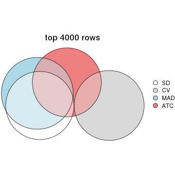</p>

</div>
<div id='tab-top-rows-overlap-by-euler-5'>
<pre><code class="r">top_rows_overlap(res_list, top_n = 5000, method = &quot;euler&quot;)
</code></pre>

<p></p>

</div>
</div>

Also visualize the correspondance of rankings between different top-row methods:


<script>
$( function() {
	$( '#tabs-top-rows-overlap-by-correspondance' ).tabs();
} );
</script>
<div id='tabs-top-rows-overlap-by-correspondance'>
<ul>
<li><a href='#tab-top-rows-overlap-by-correspondance-1'>top_n = 1000</a></li>
<li><a href='#tab-top-rows-overlap-by-correspondance-2'>top_n = 2000</a></li>
<li><a href='#tab-top-rows-overlap-by-correspondance-3'>top_n = 3000</a></li>
<li><a href='#tab-top-rows-overlap-by-correspondance-4'>top_n = 4000</a></li>
<li><a href='#tab-top-rows-overlap-by-correspondance-5'>top_n = 5000</a></li>
</ul>
<div id='tab-top-rows-overlap-by-correspondance-1'>
<pre><code class="r">top_rows_overlap(res_list, top_n = 1000, method = &quot;correspondance&quot;)
</code></pre>

<p>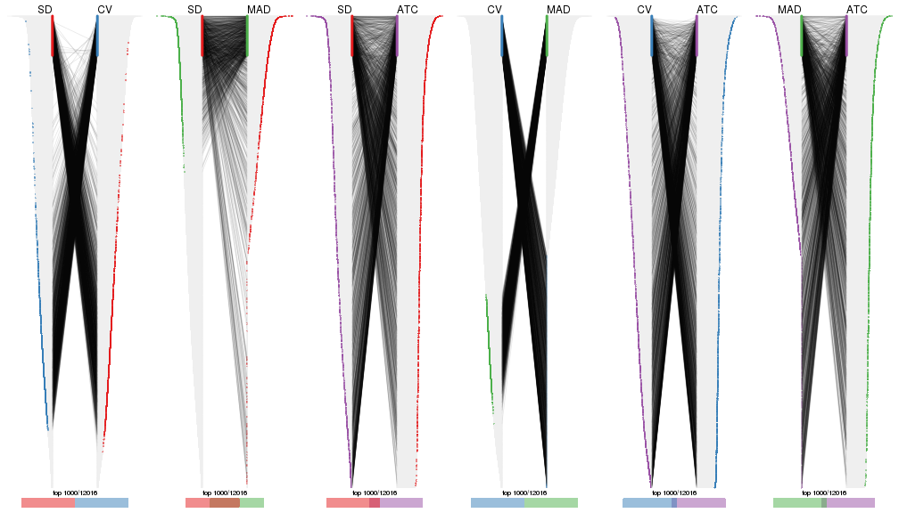</p>

</div>
<div id='tab-top-rows-overlap-by-correspondance-2'>
<pre><code class="r">top_rows_overlap(res_list, top_n = 2000, method = &quot;correspondance&quot;)
</code></pre>

<p></p>

</div>
<div id='tab-top-rows-overlap-by-correspondance-3'>
<pre><code class="r">top_rows_overlap(res_list, top_n = 3000, method = &quot;correspondance&quot;)
</code></pre>

<p></p>

</div>
<div id='tab-top-rows-overlap-by-correspondance-4'>
<pre><code class="r">top_rows_overlap(res_list, top_n = 4000, method = &quot;correspondance&quot;)
</code></pre>

<p></p>

</div>
<div id='tab-top-rows-overlap-by-correspondance-5'>
<pre><code class="r">top_rows_overlap(res_list, top_n = 5000, method = &quot;correspondance&quot;)
</code></pre>

<p></p>

</div>
</div>


Heatmaps of the top rows:


<script>
$( function() {
	$( '#tabs-top-rows-heatmap' ).tabs();
} );
</script>
<div id='tabs-top-rows-heatmap'>
<ul>
<li><a href='#tab-top-rows-heatmap-1'>top_n = 1000</a></li>
<li><a href='#tab-top-rows-heatmap-2'>top_n = 2000</a></li>
<li><a href='#tab-top-rows-heatmap-3'>top_n = 3000</a></li>
<li><a href='#tab-top-rows-heatmap-4'>top_n = 4000</a></li>
<li><a href='#tab-top-rows-heatmap-5'>top_n = 5000</a></li>
</ul>
<div id='tab-top-rows-heatmap-1'>
<pre><code class="r">top_rows_heatmap(res_list, top_n = 1000)
</code></pre>

<p></p>

</div>
<div id='tab-top-rows-heatmap-2'>
<pre><code class="r">top_rows_heatmap(res_list, top_n = 2000)
</code></pre>

<p></p>

</div>
<div id='tab-top-rows-heatmap-3'>
<pre><code class="r">top_rows_heatmap(res_list, top_n = 3000)
</code></pre>

<p></p>

</div>
<div id='tab-top-rows-heatmap-4'>
<pre><code class="r">top_rows_heatmap(res_list, top_n = 4000)
</code></pre>

<p></p>

</div>
<div id='tab-top-rows-heatmap-5'>
<pre><code class="r">top_rows_heatmap(res_list, top_n = 5000)
</code></pre>

<p></p>

</div>
</div>


### Test to known annotations


Test correlation between subgroups and known annotations. If the known
annotation is numeric, one-way ANOVA test is applied, and if the known
annotation is discrete, chi-squared contingency table test is applied.


<script>
$( function() {
	$( '#tabs-test-to-known-factors-from-consensus-partition-list' ).tabs();
} );
</script>
<div id='tabs-test-to-known-factors-from-consensus-partition-list'>
<ul>
<li><a href='#tab-test-to-known-factors-from-consensus-partition-list-1'>k = 2</a></li>
<li><a href='#tab-test-to-known-factors-from-consensus-partition-list-2'>k = 3</a></li>
<li><a href='#tab-test-to-known-factors-from-consensus-partition-list-3'>k = 4</a></li>
<li><a href='#tab-test-to-known-factors-from-consensus-partition-list-4'>k = 5</a></li>
<li><a href='#tab-test-to-known-factors-from-consensus-partition-list-5'>k = 6</a></li>
</ul>
<div id='tab-test-to-known-factors-from-consensus-partition-list-1'>
<pre><code class="r">test_to_known_factors(res_list, k = 2)
</code></pre>

<pre><code>#&gt;               n Hours(p) Media(p) State(p) k
#&gt; SD:NMF      265 1.58e-05 5.27e-06 1.18e-28 2
#&gt; CV:NMF      158 1.16e-01 3.03e-01 1.24e-18 2
#&gt; MAD:NMF     263 6.78e-06 2.31e-06 1.25e-27 2
#&gt; ATC:NMF     265 6.72e-11 9.62e-11 8.58e-39 2
#&gt; SD:skmeans  265 5.15e-03 3.65e-03 8.95e-23 2
#&gt; CV:skmeans  242 8.65e-06 7.71e-05 5.38e-20 2
#&gt; MAD:skmeans 266 1.71e-02 2.51e-02 1.45e-20 2
#&gt; ATC:skmeans 268 2.23e-09 2.42e-10 4.22e-39 2
#&gt; SD:mclust   269 5.26e-05 5.40e-06 1.01e-24 2
#&gt; CV:mclust   266 4.35e-23 4.90e-24 9.22e-31 2
#&gt; MAD:mclust  268 4.41e-02 1.77e-02 4.17e-23 2
#&gt; ATC:mclust  232 6.93e-06 5.89e-04 1.49e-29 2
#&gt; SD:kmeans   268 1.41e-06 4.16e-07 6.50e-30 2
#&gt; CV:kmeans   271 1.50e-13 1.66e-14 1.52e-20 2
#&gt; MAD:kmeans  258 4.89e-05 3.67e-05 4.15e-26 2
#&gt; ATC:kmeans  269 3.06e-08 3.10e-09 1.33e-35 2
#&gt; SD:pam      252 1.57e-12 1.01e-11 1.86e-11 2
#&gt; CV:pam        0       NA       NA       NA 2
#&gt; MAD:pam     232 3.01e-14 2.29e-13 3.79e-16 2
#&gt; ATC:pam     249 3.47e-13 3.91e-13 5.57e-18 2
#&gt; SD:hclust   259 3.92e-01 3.85e-01 5.36e-01 2
#&gt; CV:hclust   265 8.89e-11 1.03e-11 6.38e-17 2
#&gt; MAD:hclust  269 3.72e-01 3.64e-01 5.27e-01 2
#&gt; ATC:hclust  231 5.61e-47 2.26e-03 3.96e-02 2
</code></pre>

</div>
<div id='tab-test-to-known-factors-from-consensus-partition-list-2'>
<pre><code class="r">test_to_known_factors(res_list, k = 3)
</code></pre>

<pre><code>#&gt;               n Hours(p) Media(p) State(p) k
#&gt; SD:NMF      265 1.76e-31 2.11e-34 1.05e-52 3
#&gt; CV:NMF      261 3.91e-21 2.00e-23 4.10e-46 3
#&gt; MAD:NMF     251 1.98e-28 1.28e-25 7.53e-51 3
#&gt; ATC:NMF     250 6.33e-32 1.94e-33 4.12e-49 3
#&gt; SD:skmeans  264 9.42e-29 2.51e-31 3.85e-51 3
#&gt; CV:skmeans  256 7.06e-21 2.78e-23 9.05e-48 3
#&gt; MAD:skmeans 261 2.74e-36 7.23e-39 1.58e-50 3
#&gt; ATC:skmeans 266 5.91e-36 6.46e-39 4.62e-59 3
#&gt; SD:mclust   264 2.90e-24 2.30e-27 2.28e-56 3
#&gt; CV:mclust   236 3.63e-22 7.03e-21 2.10e-62 3
#&gt; MAD:mclust  263 6.94e-29 6.43e-32 2.71e-47 3
#&gt; ATC:mclust  252 7.00e-35 3.65e-12 3.03e-49 3
#&gt; SD:kmeans   257 3.93e-30 6.91e-33 8.23e-52 3
#&gt; CV:kmeans   248 2.04e-14 1.06e-16 4.25e-40 3
#&gt; MAD:kmeans  243 7.06e-07 4.77e-08 1.06e-26 3
#&gt; ATC:kmeans  247 1.05e-21 2.39e-22 5.77e-51 3
#&gt; SD:pam      221 1.84e-23 8.70e-26 1.12e-30 3
#&gt; CV:pam        0       NA       NA       NA 3
#&gt; MAD:pam     223 1.36e-13 3.07e-13 1.46e-15 3
#&gt; ATC:pam     230 1.25e-30 7.04e-33 3.28e-49 3
#&gt; SD:hclust   235 2.59e-03 3.40e-03 6.09e-10 3
#&gt; CV:hclust   259 3.45e-10 8.80e-11 1.95e-15 3
#&gt; MAD:hclust  186 2.48e-03 2.25e-03 1.69e-10 3
#&gt; ATC:hclust  184 1.21e-39 1.00e-02 4.36e-03 3
</code></pre>

</div>
<div id='tab-test-to-known-factors-from-consensus-partition-list-3'>
<pre><code class="r">test_to_known_factors(res_list, k = 4)
</code></pre>

<pre><code>#&gt;               n Hours(p) Media(p) State(p) k
#&gt; SD:NMF      250 3.52e-26 2.82e-29 3.40e-47 4
#&gt; CV:NMF      263 1.43e-17 7.01e-21 1.34e-42 4
#&gt; MAD:NMF     247 7.22e-33 6.98e-36 5.28e-53 4
#&gt; ATC:NMF     267 9.99e-61 1.60e-25 4.15e-48 4
#&gt; SD:skmeans  253 2.58e-31 2.16e-30 2.45e-48 4
#&gt; CV:skmeans  213 3.67e-23 2.96e-20 7.35e-41 4
#&gt; MAD:skmeans 248 4.08e-37 7.20e-37 1.20e-43 4
#&gt; ATC:skmeans 265 9.94e-77 2.91e-36 1.88e-54 4
#&gt; SD:mclust   245 5.58e-24 1.30e-26 3.28e-52 4
#&gt; CV:mclust   226 2.33e-33 3.40e-26 1.53e-65 4
#&gt; MAD:mclust  171 1.08e-03 1.64e-02 8.47e-23 4
#&gt; ATC:mclust  253 3.67e-78 5.71e-35 7.51e-60 4
#&gt; SD:kmeans   259 3.55e-27 4.20e-30 7.01e-46 4
#&gt; CV:kmeans   214 1.11e-20 9.00e-15 1.49e-26 4
#&gt; MAD:kmeans  251 3.35e-34 7.64e-38 3.00e-45 4
#&gt; ATC:kmeans  268 3.68e-58 3.11e-24 3.79e-48 4
#&gt; SD:pam      217 2.41e-22 2.06e-25 1.16e-33 4
#&gt; CV:pam      265       NA       NA       NA 4
#&gt; MAD:pam     215 5.30e-18 6.66e-17 2.84e-32 4
#&gt; ATC:pam     240 1.29e-59 4.34e-32 2.36e-48 4
#&gt; SD:hclust   134 5.70e-02 2.01e-01 1.36e-04 4
#&gt; CV:hclust   259 3.94e-10 8.80e-11 3.53e-15 4
#&gt; MAD:hclust  173 1.80e-02 1.11e-02 4.74e-11 4
#&gt; ATC:hclust  210 1.67e-52 5.36e-16 1.11e-19 4
</code></pre>

</div>
<div id='tab-test-to-known-factors-from-consensus-partition-list-4'>
<pre><code class="r">test_to_known_factors(res_list, k = 5)
</code></pre>

<pre><code>#&gt;               n Hours(p) Media(p) State(p) k
#&gt; SD:NMF      228 1.40e-22 1.59e-25 3.11e-45 5
#&gt; CV:NMF      226 2.78e-25 4.40e-27 6.20e-43 5
#&gt; MAD:NMF     209 2.37e-29 4.35e-32 4.64e-45 5
#&gt; ATC:NMF     255 5.05e-54 8.49e-24 4.41e-46 5
#&gt; SD:skmeans  244 9.12e-31 3.10e-28 1.37e-48 5
#&gt; CV:skmeans  175 6.31e-22 4.09e-18 1.23e-36 5
#&gt; MAD:skmeans 225 2.59e-36 7.98e-33 3.56e-44 5
#&gt; ATC:skmeans 257 2.32e-77 2.28e-38 9.24e-61 5
#&gt; SD:mclust   208 2.56e-20 1.61e-23 4.13e-41 5
#&gt; CV:mclust   217 3.91e-30 5.71e-20 1.52e-50 5
#&gt; MAD:mclust  252 3.32e-26 4.78e-29 2.55e-46 5
#&gt; ATC:mclust  216 3.14e-64 4.93e-25 4.90e-51 5
#&gt; SD:kmeans   243 8.73e-22 2.21e-24 2.54e-41 5
#&gt; CV:kmeans   192 3.50e-28 2.41e-18 1.26e-39 5
#&gt; MAD:kmeans  231 1.79e-29 2.03e-31 1.23e-41 5
#&gt; ATC:kmeans  238 2.31e-68 1.12e-36 7.82e-58 5
#&gt; SD:pam      213 1.82e-20 3.37e-22 5.79e-33 5
#&gt; CV:pam      264       NA       NA       NA 5
#&gt; MAD:pam     211 5.46e-20 7.82e-17 3.87e-39 5
#&gt; ATC:pam     230 4.90e-64 1.03e-37 2.69e-52 5
#&gt; SD:hclust   166 1.94e-09 9.09e-12 4.83e-17 5
#&gt; CV:hclust   232 1.47e-09 1.27e-08 8.53e-15 5
#&gt; MAD:hclust  169 6.94e-04 2.12e-04 1.76e-05 5
#&gt; ATC:hclust  201 8.85e-44 1.37e-12 1.67e-17 5
</code></pre>

</div>
<div id='tab-test-to-known-factors-from-consensus-partition-list-5'>
<pre><code class="r">test_to_known_factors(res_list, k = 6)
</code></pre>

<pre><code>#&gt;               n Hours(p) Media(p) State(p) k
#&gt; SD:NMF      156 3.45e-20 8.26e-24 2.74e-36 6
#&gt; CV:NMF      205 1.02e-23 9.59e-25 3.80e-47 6
#&gt; MAD:NMF     185 1.09e-23 7.68e-27 3.76e-42 6
#&gt; ATC:NMF     224 1.65e-58 4.21e-31 2.86e-49 6
#&gt; SD:skmeans  220 1.81e-29 2.63e-26 2.68e-47 6
#&gt; CV:skmeans  178 2.38e-24 1.68e-16 5.80e-34 6
#&gt; MAD:skmeans 213 2.08e-37 2.80e-33 4.35e-44 6
#&gt; ATC:skmeans 254 1.69e-72 1.20e-36 1.67e-60 6
#&gt; SD:mclust   240 1.31e-20 1.75e-24 5.35e-43 6
#&gt; CV:mclust   194 6.43e-32 1.84e-22 3.05e-48 6
#&gt; MAD:mclust  238 6.20e-31 3.63e-35 5.99e-51 6
#&gt; ATC:mclust  217 1.88e-62 1.82e-24 6.00e-50 6
#&gt; SD:kmeans   226 3.91e-24 1.08e-22 1.31e-44 6
#&gt; CV:kmeans   182 4.15e-16 2.70e-05 2.07e-19 6
#&gt; MAD:kmeans  219 3.81e-33 6.87e-32 2.22e-46 6
#&gt; ATC:kmeans  248 5.22e-69 1.84e-39 6.41e-59 6
#&gt; SD:pam      196 1.39e-24 3.08e-22 1.46e-30 6
#&gt; CV:pam      266 1.18e-01 1.08e-01 1.73e-01 6
#&gt; MAD:pam     178 2.82e-19 3.70e-17 3.38e-33 6
#&gt; ATC:pam     242 6.44e-64 4.82e-34 4.61e-48 6
#&gt; SD:hclust   180 1.17e-17 3.63e-20 1.96e-25 6
#&gt; CV:hclust   237 2.59e-10 7.02e-10 4.91e-18 6
#&gt; MAD:hclust  121 6.93e-02 8.45e-02 5.16e-03 6
#&gt; ATC:hclust  198 1.24e-48 8.37e-14 2.66e-19 6
</code></pre>

</div>
</div>


 
## Results for each method


---------------------------------------------------


### SD:hclust


The object with results only for a single top-value method and a single partition method 
can be extracted as:

```r
res = res_list["SD", "hclust"]
# you can also extract it by
# res = res_list["SD:hclust"]
```

A summary of `res` and all the functions that can be applied to it:

```r
res
```

```
#> A 'ConsensusPartition' object with k = 2, 3, 4, 5, 6.
#>   On a matrix with 12016 rows and 271 columns.
#>   Top rows (1000, 2000, 3000, 4000, 5000) are extracted by 'SD' method.
#>   Subgroups are detected by 'hclust' method.
#>   Performed in total 1250 partitions by row resampling.
#>   Best k for subgroups seems to be 3.
#> 
#> Following methods can be applied to this 'ConsensusPartition' object:
#>  [1] "cola_report"             "collect_classes"         "collect_plots"          
#>  [4] "collect_stats"           "colnames"                "compare_signatures"     
#>  [7] "consensus_heatmap"       "dimension_reduction"     "functional_enrichment"  
#> [10] "get_anno_col"            "get_anno"                "get_classes"            
#> [13] "get_consensus"           "get_matrix"              "get_membership"         
#> [16] "get_param"               "get_signatures"          "get_stats"              
#> [19] "is_best_k"               "is_stable_k"             "membership_heatmap"     
#> [22] "ncol"                    "nrow"                    "plot_ecdf"              
#> [25] "rownames"                "select_partition_number" "show"                   
#> [28] "suggest_best_k"          "test_to_known_factors"
```

`collect_plots()` function collects all the plots made from `res` for all `k` (number of partitions)
into one single page to provide an easy and fast comparison between different `k`.

```r
collect_plots(res)
```


The plots are:

- The first row: a plot of the ECDF (Empirical cumulative distribution
  function) curves of the consensus matrix for each `k` and the heatmap of
  predicted classes for each `k`.
- The second row: heatmaps of the consensus matrix for each `k`.
- The third row: heatmaps of the membership matrix for each `k`.
- The fouth row: heatmaps of the signatures for each `k`.

All the plots in panels can be made by individual functions and they are
plotted later in this section.

`select_partition_number()` produces several plots showing different
statistics for choosing "optimized" `k`. There are following statistics:

- ECDF curves of the consensus matrix for each `k`;
- 1-PAC. [The PAC
  score](https://en.wikipedia.org/wiki/Consensus_clustering#Over-interpretation_potential_of_consensus_clustering)
  measures the proportion of the ambiguous subgrouping.
- Mean silhouette score.
- Concordance. The mean probability of fiting the consensus class ids in all
  partitions.
- Area increased. Denote $A_k$ as the area under the ECDF curve for current
  `k`, the area increased is defined as $A_k - A_{k-1}$.
- Rand index. The percent of pairs of samples that are both in a same cluster
  or both are not in a same cluster in the partition of k and k-1.
- Jaccard index. The ratio of pairs of samples are both in a same cluster in
  the partition of k and k-1 and the pairs of samples are both in a same
  cluster in the partition k or k-1.

The detailed explanations of these statistics can be found in [the cola
vignette](http://bioconductor.org/packages/devel/bioc/vignettes/cola/inst/doc/cola.html#toc_13).

Generally speaking, lower PAC score, higher mean silhouette score or higher
concordance corresponds to better partition. Rand index and Jaccard index
measure how similar the current partition is compared to partition with `k-1`.
If they are too similar, we won't accept `k` is better than `k-1`.

```r
select_partition_number(res)
```


The numeric values for all these statistics can be obtained by `get_stats()`.

```r
get_stats(res)
```

```
#>   k 1-PAC mean_silhouette concordance area_increased  Rand Jaccard
#> 2 2 0.709           0.858       0.933         0.1424 0.929   0.929
#> 3 3 0.214           0.653       0.812         1.6086 0.771   0.754
#> 4 4 0.210           0.477       0.706         0.4533 0.664   0.557
#> 5 5 0.278           0.559       0.692         0.1632 0.770   0.569
#> 6 6 0.327           0.540       0.657         0.0698 0.934   0.819
```

`suggest_best_k()` suggests the best $k$ based on these statistics. The rules are as follows:

- All $k$ with Jaccard index larger than 0.95 are removed because the increase of
  the partition number does not provides enough extra information. If all $k$ are removed,
  the best $k$ is assigned by `NA`.
- For $k$ with 1-PAC larger than 0.9, the maximal $k$ is taken as the "best k". Other $k$ is called "optional k".
- If it does not fit the second rule. The $k$ with the highest vote of highest
  1-PAC, mean silhouette and concordance is taken as the "best k".

```r
suggest_best_k(res)
```

```
#> [1] 3
```


Following shows the table of the partitions (You need to click the **show/hide
code output** link to see it). The membership matrix (columns with name `p*`)
is inferred by
[`clue::cl_consensus()`](https://www.rdocumentation.org/link/cl_consensus?package=clue)
function with the `SE` method. Basically the value in the membership matrix
represents the probability to belong to a certain group. The finall class
label for an item is determined with the group with highest probability it
belongs to.

In `get_classes()` function, the entropy is calculated from the membership
matrix and the silhouette score is calculated from the consensus matrix.


<script>
$( function() {
	$( '#tabs-SD-hclust-get-classes' ).tabs();
} );
</script>
<div id='tabs-SD-hclust-get-classes'>
<ul>
<li><a href='#tab-SD-hclust-get-classes-1'>k = 2</a></li>
<li><a href='#tab-SD-hclust-get-classes-2'>k = 3</a></li>
<li><a href='#tab-SD-hclust-get-classes-3'>k = 4</a></li>
<li><a href='#tab-SD-hclust-get-classes-4'>k = 5</a></li>
<li><a href='#tab-SD-hclust-get-classes-5'>k = 6</a></li>
</ul>

<div id='tab-SD-hclust-get-classes-1'>
<p><a id='tab-SD-hclust-get-classes-1-a' style='color:#0366d6' href='#'>show/hide code output</a></p>
<pre><code class="r">cbind(get_classes(res, k = 2), get_membership(res, k = 2))
</code></pre>

<pre><code>#&gt;            class entropy silhouette    p1    p2
#&gt; T0_CT_A01      2  0.1184     0.9266 0.016 0.984
#&gt; T0_CT_A03      2  0.1414     0.9256 0.020 0.980
#&gt; T0_CT_A05      2  0.1414     0.9256 0.020 0.980
#&gt; T0_CT_A06      2  0.1633     0.9256 0.024 0.976
#&gt; T0_CT_A07      2  0.1414     0.9256 0.020 0.980
#&gt; T0_CT_A08      2  0.7219     0.7453 0.200 0.800
#&gt; T0_CT_A10      2  0.1633     0.9256 0.024 0.976
#&gt; T0_CT_A11      1  0.0000     0.7152 1.000 0.000
#&gt; T0_CT_B01      2  0.1843     0.9249 0.028 0.972
#&gt; T0_CT_B03      2  0.0000     0.9265 0.000 1.000
#&gt; T0_CT_B05      2  0.1633     0.9264 0.024 0.976
#&gt; T0_CT_B07      2  0.1843     0.9248 0.028 0.972
#&gt; T0_CT_B08      2  0.0376     0.9272 0.004 0.996
#&gt; T0_CT_B09      2  0.1414     0.9256 0.020 0.980
#&gt; T0_CT_C02      2  0.0000     0.9265 0.000 1.000
#&gt; T0_CT_C03      2  0.3431     0.9065 0.064 0.936
#&gt; T0_CT_C05      2  0.0938     0.9266 0.012 0.988
#&gt; T0_CT_C06      2  0.2043     0.9245 0.032 0.968
#&gt; T0_CT_C07      2  0.1843     0.9249 0.028 0.972
#&gt; T0_CT_C08      2  0.1414     0.9256 0.020 0.980
#&gt; T0_CT_C09      1  0.0000     0.7152 1.000 0.000
#&gt; T0_CT_C11      2  0.1184     0.9253 0.016 0.984
#&gt; T0_CT_C12      2  0.1414     0.9256 0.020 0.980
#&gt; T0_CT_D01      2  0.0672     0.9274 0.008 0.992
#&gt; T0_CT_D02      2  0.1843     0.9249 0.028 0.972
#&gt; T0_CT_D03      2  0.1414     0.9256 0.020 0.980
#&gt; T0_CT_D05      2  0.1843     0.9249 0.028 0.972
#&gt; T0_CT_D06      2  0.0000     0.9265 0.000 1.000
#&gt; T0_CT_D07      2  0.1414     0.9256 0.020 0.980
#&gt; T0_CT_D08      2  0.0000     0.9265 0.000 1.000
#&gt; T0_CT_D09      2  0.0000     0.9265 0.000 1.000
#&gt; T0_CT_D11      2  0.0938     0.9266 0.012 0.988
#&gt; T0_CT_D12      2  0.1414     0.9256 0.020 0.980
#&gt; T0_CT_E01      2  0.1414     0.9256 0.020 0.980
#&gt; T0_CT_E03      2  0.1843     0.9256 0.028 0.972
#&gt; T0_CT_E04      2  0.0672     0.9268 0.008 0.992
#&gt; T0_CT_E05      2  0.9970    -0.1701 0.468 0.532
#&gt; T0_CT_E06      2  0.1843     0.9249 0.028 0.972
#&gt; T0_CT_E07      2  0.1843     0.9249 0.028 0.972
#&gt; T0_CT_E08      2  0.0000     0.9265 0.000 1.000
#&gt; T0_CT_E09      2  0.0938     0.9270 0.012 0.988
#&gt; T0_CT_E10      1  0.0000     0.7152 1.000 0.000
#&gt; T0_CT_E11      2  0.1843     0.9249 0.028 0.972
#&gt; T0_CT_E12      2  0.1843     0.9249 0.028 0.972
#&gt; T0_CT_F01      2  0.1414     0.9256 0.020 0.980
#&gt; T0_CT_F02      2  0.1843     0.9249 0.028 0.972
#&gt; T0_CT_F03      2  0.1414     0.9256 0.020 0.980
#&gt; T0_CT_F04      2  0.1843     0.9249 0.028 0.972
#&gt; T0_CT_F05      2  0.0672     0.9268 0.008 0.992
#&gt; T0_CT_F06      2  0.1414     0.9256 0.020 0.980
#&gt; T0_CT_F07      2  0.1633     0.9254 0.024 0.976
#&gt; T0_CT_F09      2  0.1184     0.9253 0.016 0.984
#&gt; T0_CT_F11      2  0.1843     0.9249 0.028 0.972
#&gt; T0_CT_F12      2  0.1843     0.9249 0.028 0.972
#&gt; T0_CT_G01      2  0.1414     0.9256 0.020 0.980
#&gt; T0_CT_G02      2  0.2043     0.9237 0.032 0.968
#&gt; T0_CT_G03      2  0.1843     0.9249 0.028 0.972
#&gt; T0_CT_G04      2  0.0000     0.9265 0.000 1.000
#&gt; T0_CT_G07      2  0.0000     0.9265 0.000 1.000
#&gt; T0_CT_G08      2  0.0000     0.9265 0.000 1.000
#&gt; T0_CT_G09      2  0.1633     0.9238 0.024 0.976
#&gt; T0_CT_G11      2  0.2423     0.9229 0.040 0.960
#&gt; T0_CT_H01      2  0.1633     0.9261 0.024 0.976
#&gt; T0_CT_H02      2  0.0376     0.9268 0.004 0.996
#&gt; T0_CT_H04      2  0.1633     0.9256 0.024 0.976
#&gt; T0_CT_H05      2  0.1843     0.9249 0.028 0.972
#&gt; T0_CT_H08      2  0.1633     0.9261 0.024 0.976
#&gt; T0_CT_H09      2  0.1843     0.9259 0.028 0.972
#&gt; T0_CT_H12      2  0.1843     0.9249 0.028 0.972
#&gt; T24_CT_A01     2  0.2236     0.9224 0.036 0.964
#&gt; T24_CT_A03     2  0.0000     0.9265 0.000 1.000
#&gt; T24_CT_A04     2  0.0672     0.9272 0.008 0.992
#&gt; T24_CT_A05     2  0.3431     0.9067 0.064 0.936
#&gt; T24_CT_A07     2  0.1184     0.9261 0.016 0.984
#&gt; T24_CT_A08     2  0.6438     0.7968 0.164 0.836
#&gt; T24_CT_A09     2  0.7950     0.6735 0.240 0.760
#&gt; T24_CT_A10     2  0.2043     0.9225 0.032 0.968
#&gt; T24_CT_B01     2  0.5408     0.8513 0.124 0.876
#&gt; T24_CT_B02     2  0.8016     0.6552 0.244 0.756
#&gt; T24_CT_B03     2  0.0000     0.9265 0.000 1.000
#&gt; T24_CT_B05     2  0.0376     0.9266 0.004 0.996
#&gt; T24_CT_B06     2  0.0672     0.9262 0.008 0.992
#&gt; T24_CT_B07     2  0.8016     0.6642 0.244 0.756
#&gt; T24_CT_B08     2  0.3114     0.9078 0.056 0.944
#&gt; T24_CT_B09     2  0.7528     0.7145 0.216 0.784
#&gt; T24_CT_B11     2  0.1414     0.9256 0.020 0.980
#&gt; T24_CT_C01     2  0.8144     0.6447 0.252 0.748
#&gt; T24_CT_C02     2  0.7528     0.7005 0.216 0.784
#&gt; T24_CT_C03     2  0.9954    -0.1283 0.460 0.540
#&gt; T24_CT_C05     2  0.3879     0.8894 0.076 0.924
#&gt; T24_CT_C07     2  0.1633     0.9254 0.024 0.976
#&gt; T24_CT_C08     2  0.0376     0.9271 0.004 0.996
#&gt; T24_CT_C09     2  0.9866     0.0556 0.432 0.568
#&gt; T24_CT_C10     2  0.4690     0.8774 0.100 0.900
#&gt; T24_CT_C11     2  0.2778     0.9193 0.048 0.952
#&gt; T24_CT_C12     2  0.0000     0.9265 0.000 1.000
#&gt; T24_CT_D01     2  0.1633     0.9248 0.024 0.976
#&gt; T24_CT_D02     2  0.0000     0.9265 0.000 1.000
#&gt; T24_CT_D03     2  0.0672     0.9267 0.008 0.992
#&gt; T24_CT_D04     2  0.5842     0.8336 0.140 0.860
#&gt; T24_CT_D05     2  0.1414     0.9285 0.020 0.980
#&gt; T24_CT_D06     2  0.4022     0.8941 0.080 0.920
#&gt; T24_CT_D07     2  0.2948     0.9171 0.052 0.948
#&gt; T24_CT_D08     2  0.1184     0.9255 0.016 0.984
#&gt; T24_CT_D09     2  0.0000     0.9265 0.000 1.000
#&gt; T24_CT_D10     2  0.0376     0.9267 0.004 0.996
#&gt; T24_CT_D11     2  0.0672     0.9269 0.008 0.992
#&gt; T24_CT_E01     2  0.2043     0.9220 0.032 0.968
#&gt; T24_CT_E02     2  0.6623     0.7884 0.172 0.828
#&gt; T24_CT_E04     2  0.1184     0.9273 0.016 0.984
#&gt; T24_CT_E05     2  0.9087     0.4657 0.324 0.676
#&gt; T24_CT_E07     2  0.0000     0.9265 0.000 1.000
#&gt; T24_CT_E09     2  0.7528     0.7151 0.216 0.784
#&gt; T24_CT_E11     2  0.3879     0.8972 0.076 0.924
#&gt; T24_CT_E12     2  0.1633     0.9235 0.024 0.976
#&gt; T24_CT_F01     2  0.2043     0.9227 0.032 0.968
#&gt; T24_CT_F02     2  0.0000     0.9265 0.000 1.000
#&gt; T24_CT_F03     2  0.1843     0.9226 0.028 0.972
#&gt; T24_CT_F04     1  0.9998     0.2433 0.508 0.492
#&gt; T24_CT_F05     2  0.1843     0.9226 0.028 0.972
#&gt; T24_CT_F07     1  1.0000     0.2346 0.504 0.496
#&gt; T24_CT_F08     2  0.8909     0.5152 0.308 0.692
#&gt; T24_CT_F09     2  0.0000     0.9265 0.000 1.000
#&gt; T24_CT_F10     2  0.0000     0.9265 0.000 1.000
#&gt; T24_CT_F11     2  0.1843     0.9226 0.028 0.972
#&gt; T24_CT_F12     2  0.0376     0.9267 0.004 0.996
#&gt; T24_CT_G01     2  0.0376     0.9269 0.004 0.996
#&gt; T24_CT_G02     2  0.8016     0.6644 0.244 0.756
#&gt; T24_CT_G03     2  0.8608     0.5709 0.284 0.716
#&gt; T24_CT_G04     2  0.0000     0.9265 0.000 1.000
#&gt; T24_CT_G05     2  0.5059     0.8525 0.112 0.888
#&gt; T24_CT_G06     2  0.4939     0.8687 0.108 0.892
#&gt; T24_CT_G08     2  0.8207     0.6368 0.256 0.744
#&gt; T24_CT_G10     2  0.0000     0.9265 0.000 1.000
#&gt; T24_CT_G11     2  0.9000     0.4862 0.316 0.684
#&gt; T24_CT_G12     2  0.4298     0.8878 0.088 0.912
#&gt; T24_CT_H01     2  0.1414     0.9256 0.020 0.980
#&gt; T24_CT_H02     2  0.4562     0.8796 0.096 0.904
#&gt; T24_CT_H03     2  0.2778     0.9091 0.048 0.952
#&gt; T24_CT_H05     2  0.4562     0.8782 0.096 0.904
#&gt; T24_CT_H07     2  0.3584     0.9038 0.068 0.932
#&gt; T24_CT_H09     2  0.8327     0.6180 0.264 0.736
#&gt; T24_CT_H12     2  0.4298     0.8878 0.088 0.912
#&gt; T48_CT_A01     2  0.0000     0.9265 0.000 1.000
#&gt; T48_CT_A02     2  0.0376     0.9266 0.004 0.996
#&gt; T48_CT_A03     2  0.7815     0.6871 0.232 0.768
#&gt; T48_CT_A04     2  0.1843     0.9210 0.028 0.972
#&gt; T48_CT_A05     2  0.0000     0.9265 0.000 1.000
#&gt; T48_CT_A06     2  0.7883     0.6792 0.236 0.764
#&gt; T48_CT_A07     2  0.0000     0.9265 0.000 1.000
#&gt; T48_CT_A08     2  0.0000     0.9265 0.000 1.000
#&gt; T48_CT_A09     2  0.2948     0.9121 0.052 0.948
#&gt; T48_CT_A10     2  0.1414     0.9243 0.020 0.980
#&gt; T48_CT_A11     2  0.0000     0.9265 0.000 1.000
#&gt; T48_CT_A12     2  0.3584     0.9007 0.068 0.932
#&gt; T48_CT_B01     2  0.2603     0.9144 0.044 0.956
#&gt; T48_CT_B02     2  0.4022     0.8881 0.080 0.920
#&gt; T48_CT_B03     2  0.8016     0.6642 0.244 0.756
#&gt; T48_CT_B04     2  0.8081     0.6558 0.248 0.752
#&gt; T48_CT_B06     2  0.0938     0.9273 0.012 0.988
#&gt; T48_CT_B08     2  0.4690     0.8790 0.100 0.900
#&gt; T48_CT_B10     2  0.2603     0.9144 0.044 0.956
#&gt; T48_CT_B11     2  0.0376     0.9269 0.004 0.996
#&gt; T48_CT_B12     2  0.3431     0.9076 0.064 0.936
#&gt; T48_CT_C01     2  0.1184     0.9259 0.016 0.984
#&gt; T48_CT_C02     1  0.5519     0.7124 0.872 0.128
#&gt; T48_CT_C03     2  0.2778     0.9117 0.048 0.952
#&gt; T48_CT_C04     2  0.8016     0.6642 0.244 0.756
#&gt; T48_CT_C05     2  0.0000     0.9265 0.000 1.000
#&gt; T48_CT_C06     2  0.0000     0.9265 0.000 1.000
#&gt; T48_CT_C07     2  0.3431     0.9077 0.064 0.936
#&gt; T48_CT_C09     2  0.0000     0.9265 0.000 1.000
#&gt; T48_CT_C10     2  0.4431     0.8838 0.092 0.908
#&gt; T48_CT_C11     2  0.0672     0.9272 0.008 0.992
#&gt; T48_CT_D01     2  0.5842     0.8213 0.140 0.860
#&gt; T48_CT_D02     2  0.9552     0.2873 0.376 0.624
#&gt; T48_CT_D03     2  0.4939     0.8681 0.108 0.892
#&gt; T48_CT_D04     2  0.0376     0.9269 0.004 0.996
#&gt; T48_CT_D06     2  0.0000     0.9265 0.000 1.000
#&gt; T48_CT_D07     2  0.1414     0.9259 0.020 0.980
#&gt; T48_CT_D08     2  0.3274     0.9082 0.060 0.940
#&gt; T48_CT_D09     2  0.8016     0.6345 0.244 0.756
#&gt; T48_CT_D10     2  0.9635     0.2437 0.388 0.612
#&gt; T48_CT_D11     2  0.0000     0.9265 0.000 1.000
#&gt; T48_CT_D12     2  0.8499     0.5938 0.276 0.724
#&gt; T48_CT_E01     2  0.0376     0.9272 0.004 0.996
#&gt; T48_CT_E02     2  0.2603     0.9171 0.044 0.956
#&gt; T48_CT_E03     2  0.0000     0.9265 0.000 1.000
#&gt; T48_CT_E04     2  0.0938     0.9268 0.012 0.988
#&gt; T48_CT_E05     2  0.0672     0.9267 0.008 0.992
#&gt; T48_CT_E06     1  0.9963     0.3114 0.536 0.464
#&gt; T48_CT_E07     2  0.6887     0.7684 0.184 0.816
#&gt; T48_CT_E08     2  0.1184     0.9260 0.016 0.984
#&gt; T48_CT_E10     2  0.4815     0.8723 0.104 0.896
#&gt; T48_CT_E11     2  0.3114     0.9121 0.056 0.944
#&gt; T48_CT_E12     2  0.0672     0.9274 0.008 0.992
#&gt; T48_CT_F01     2  0.2423     0.9164 0.040 0.960
#&gt; T48_CT_F02     2  0.2603     0.9184 0.044 0.956
#&gt; T48_CT_F03     2  0.4815     0.8589 0.104 0.896
#&gt; T48_CT_F05     2  0.3879     0.8944 0.076 0.924
#&gt; T48_CT_F07     2  0.2603     0.9166 0.044 0.956
#&gt; T48_CT_F09     2  0.0672     0.9271 0.008 0.992
#&gt; T48_CT_F10     1  0.9996     0.2533 0.512 0.488
#&gt; T48_CT_F11     2  0.5178     0.8609 0.116 0.884
#&gt; T48_CT_G01     2  0.4298     0.8902 0.088 0.912
#&gt; T48_CT_G02     2  0.0376     0.9269 0.004 0.996
#&gt; T48_CT_G03     2  0.0938     0.9266 0.012 0.988
#&gt; T48_CT_G07     2  0.1843     0.9227 0.028 0.972
#&gt; T48_CT_G08     2  0.0000     0.9265 0.000 1.000
#&gt; T48_CT_G09     2  0.0000     0.9265 0.000 1.000
#&gt; T48_CT_G10     2  0.2778     0.9169 0.048 0.952
#&gt; T48_CT_G11     2  0.2236     0.9231 0.036 0.964
#&gt; T48_CT_G12     2  0.1843     0.9216 0.028 0.972
#&gt; T48_CT_H01     2  0.5059     0.8474 0.112 0.888
#&gt; T48_CT_H02     2  0.0000     0.9265 0.000 1.000
#&gt; T48_CT_H04     1  0.2043     0.7195 0.968 0.032
#&gt; T48_CT_H05     2  0.2603     0.9111 0.044 0.956
#&gt; T48_CT_H06     2  0.1633     0.9242 0.024 0.976
#&gt; T48_CT_H07     2  0.9393     0.3512 0.356 0.644
#&gt; T48_CT_H08     2  0.0000     0.9265 0.000 1.000
#&gt; T48_CT_H11     2  0.3879     0.8979 0.076 0.924
#&gt; T48_CT_H12     2  0.1633     0.9243 0.024 0.976
#&gt; T72_CT_A01     2  0.0376     0.9269 0.004 0.996
#&gt; T72_CT_A05     2  0.0000     0.9265 0.000 1.000
#&gt; T72_CT_A08     2  0.2948     0.9124 0.052 0.948
#&gt; T72_CT_A09     2  0.0000     0.9265 0.000 1.000
#&gt; T72_CT_A11     2  0.0000     0.9265 0.000 1.000
#&gt; T72_CT_B01     2  0.0000     0.9265 0.000 1.000
#&gt; T72_CT_B02     2  0.7219     0.7455 0.200 0.800
#&gt; T72_CT_B03     2  0.2603     0.9170 0.044 0.956
#&gt; T72_CT_B04     2  0.7745     0.6905 0.228 0.772
#&gt; T72_CT_B05     2  0.0376     0.9272 0.004 0.996
#&gt; T72_CT_B06     2  0.7674     0.7007 0.224 0.776
#&gt; T72_CT_B08     2  0.0000     0.9265 0.000 1.000
#&gt; T72_CT_B09     1  0.6438     0.6981 0.836 0.164
#&gt; T72_CT_B11     2  0.1633     0.9238 0.024 0.976
#&gt; T72_CT_B12     2  0.0000     0.9265 0.000 1.000
#&gt; T72_CT_C04     2  0.0000     0.9265 0.000 1.000
#&gt; T72_CT_C06     2  0.1414     0.9252 0.020 0.980
#&gt; T72_CT_C07     2  0.0000     0.9265 0.000 1.000
#&gt; T72_CT_C09     2  0.1633     0.9245 0.024 0.976
#&gt; T72_CT_C11     2  0.0000     0.9265 0.000 1.000
#&gt; T72_CT_D01     2  0.0000     0.9265 0.000 1.000
#&gt; T72_CT_D03     2  0.3274     0.9077 0.060 0.940
#&gt; T72_CT_D04     2  0.0000     0.9265 0.000 1.000
#&gt; T72_CT_D05     2  0.1843     0.9232 0.028 0.972
#&gt; T72_CT_D07     2  0.3431     0.9061 0.064 0.936
#&gt; T72_CT_D10     2  0.0000     0.9265 0.000 1.000
#&gt; T72_CT_D11     2  0.6623     0.7872 0.172 0.828
#&gt; T72_CT_E04     2  0.1843     0.9234 0.028 0.972
#&gt; T72_CT_E05     2  0.0376     0.9269 0.004 0.996
#&gt; T72_CT_E07     2  0.0376     0.9277 0.004 0.996
#&gt; T72_CT_F01     2  0.0000     0.9265 0.000 1.000
#&gt; T72_CT_F05     2  0.0672     0.9272 0.008 0.992
#&gt; T72_CT_F07     2  0.2043     0.9220 0.032 0.968
#&gt; T72_CT_F10     2  0.0000     0.9265 0.000 1.000
#&gt; T72_CT_F11     2  0.0000     0.9265 0.000 1.000
#&gt; T72_CT_G03     2  0.7139     0.7519 0.196 0.804
#&gt; T72_CT_G04     2  0.4939     0.8662 0.108 0.892
#&gt; T72_CT_G06     2  0.0376     0.9272 0.004 0.996
#&gt; T72_CT_G08     2  0.0938     0.9276 0.012 0.988
#&gt; T72_CT_G10     2  0.0376     0.9269 0.004 0.996
#&gt; T72_CT_G11     2  0.3879     0.8894 0.076 0.924
#&gt; T72_CT_H01     2  0.0000     0.9265 0.000 1.000
#&gt; T72_CT_H03     2  0.0376     0.9269 0.004 0.996
#&gt; T72_CT_H05     2  0.0000     0.9265 0.000 1.000
#&gt; T72_CT_H08     2  0.0376     0.9266 0.004 0.996
#&gt; T72_CT_H09     2  0.1184     0.9278 0.016 0.984
#&gt; T72_CT_H10     2  0.2423     0.9208 0.040 0.960
#&gt; T72_CT_H11     2  0.1843     0.9226 0.028 0.972
#&gt; T72_CT_H12     2  0.0376     0.9269 0.004 0.996
</code></pre>

<script>
$('#tab-SD-hclust-get-classes-1-a').parent().next().next().hide();
$('#tab-SD-hclust-get-classes-1-a').click(function(){
  $('#tab-SD-hclust-get-classes-1-a').parent().next().next().toggle();
  return(false);
});
</script>
</div>

<div id='tab-SD-hclust-get-classes-2'>
<p><a id='tab-SD-hclust-get-classes-2-a' style='color:#0366d6' href='#'>show/hide code output</a></p>
<pre><code class="r">cbind(get_classes(res, k = 3), get_membership(res, k = 3))
</code></pre>

<pre><code>#&gt;            class entropy silhouette    p1    p2    p3
#&gt; T0_CT_A01      2  0.2959     0.7878 0.100 0.900 0.000
#&gt; T0_CT_A03      2  0.5115     0.6922 0.228 0.768 0.004
#&gt; T0_CT_A05      2  0.5115     0.6922 0.228 0.768 0.004
#&gt; T0_CT_A06      2  0.4521     0.7404 0.180 0.816 0.004
#&gt; T0_CT_A07      2  0.5404     0.6687 0.256 0.740 0.004
#&gt; T0_CT_A08      1  0.5848     0.7218 0.720 0.268 0.012
#&gt; T0_CT_A10      2  0.4575     0.7306 0.184 0.812 0.004
#&gt; T0_CT_A11      3  0.1411     0.6285 0.036 0.000 0.964
#&gt; T0_CT_B01      2  0.4531     0.7466 0.168 0.824 0.008
#&gt; T0_CT_B03      2  0.2356     0.7908 0.072 0.928 0.000
#&gt; T0_CT_B05      2  0.4784     0.7269 0.200 0.796 0.004
#&gt; T0_CT_B07      2  0.4784     0.7254 0.200 0.796 0.004
#&gt; T0_CT_B08      2  0.2711     0.7878 0.088 0.912 0.000
#&gt; T0_CT_B09      2  0.5158     0.6913 0.232 0.764 0.004
#&gt; T0_CT_C02      2  0.2356     0.7908 0.072 0.928 0.000
#&gt; T0_CT_C03      2  0.5588     0.6234 0.276 0.720 0.004
#&gt; T0_CT_C05      2  0.1751     0.7850 0.028 0.960 0.012
#&gt; T0_CT_C06      2  0.4805     0.7496 0.176 0.812 0.012
#&gt; T0_CT_C07      2  0.4755     0.7291 0.184 0.808 0.008
#&gt; T0_CT_C08      2  0.5115     0.6922 0.228 0.768 0.004
#&gt; T0_CT_C09      3  0.1411     0.6285 0.036 0.000 0.964
#&gt; T0_CT_C11      2  0.1774     0.7813 0.024 0.960 0.016
#&gt; T0_CT_C12      2  0.5070     0.6988 0.224 0.772 0.004
#&gt; T0_CT_D01      2  0.2448     0.7946 0.076 0.924 0.000
#&gt; T0_CT_D02      2  0.4700     0.7317 0.180 0.812 0.008
#&gt; T0_CT_D03      2  0.4883     0.7129 0.208 0.788 0.004
#&gt; T0_CT_D05      2  0.4413     0.7512 0.160 0.832 0.008
#&gt; T0_CT_D06      2  0.2448     0.7906 0.076 0.924 0.000
#&gt; T0_CT_D07      2  0.4733     0.7288 0.196 0.800 0.004
#&gt; T0_CT_D08      2  0.2356     0.7908 0.072 0.928 0.000
#&gt; T0_CT_D09      2  0.1289     0.7948 0.032 0.968 0.000
#&gt; T0_CT_D11      2  0.1751     0.7850 0.028 0.960 0.012
#&gt; T0_CT_D12      2  0.5115     0.6922 0.228 0.768 0.004
#&gt; T0_CT_E01      2  0.4733     0.7252 0.196 0.800 0.004
#&gt; T0_CT_E03      2  0.4733     0.7300 0.196 0.800 0.004
#&gt; T0_CT_E04      2  0.1482     0.7868 0.020 0.968 0.012
#&gt; T0_CT_E05      3  0.9904     0.2345 0.284 0.316 0.400
#&gt; T0_CT_E06      2  0.4808     0.7278 0.188 0.804 0.008
#&gt; T0_CT_E07      2  0.4912     0.7188 0.196 0.796 0.008
#&gt; T0_CT_E08      2  0.2625     0.7884 0.084 0.916 0.000
#&gt; T0_CT_E09      2  0.4521     0.7413 0.180 0.816 0.004
#&gt; T0_CT_E10      3  0.1411     0.6285 0.036 0.000 0.964
#&gt; T0_CT_E11      2  0.4755     0.7289 0.184 0.808 0.008
#&gt; T0_CT_E12      2  0.4808     0.7262 0.188 0.804 0.008
#&gt; T0_CT_F01      2  0.4733     0.7252 0.196 0.800 0.004
#&gt; T0_CT_F02      2  0.4912     0.7188 0.196 0.796 0.008
#&gt; T0_CT_F03      2  0.5115     0.6922 0.228 0.768 0.004
#&gt; T0_CT_F04      2  0.5012     0.7118 0.204 0.788 0.008
#&gt; T0_CT_F05      2  0.2229     0.7961 0.044 0.944 0.012
#&gt; T0_CT_F06      2  0.4834     0.7172 0.204 0.792 0.004
#&gt; T0_CT_F07      2  0.4629     0.7367 0.188 0.808 0.004
#&gt; T0_CT_F09      2  0.2031     0.7858 0.032 0.952 0.016
#&gt; T0_CT_F11      2  0.4755     0.7289 0.184 0.808 0.008
#&gt; T0_CT_F12      2  0.5335     0.6900 0.232 0.760 0.008
#&gt; T0_CT_G01      2  0.5115     0.6922 0.228 0.768 0.004
#&gt; T0_CT_G02      2  0.4963     0.7246 0.200 0.792 0.008
#&gt; T0_CT_G03      2  0.4861     0.7258 0.192 0.800 0.008
#&gt; T0_CT_G04      2  0.2356     0.7908 0.072 0.928 0.000
#&gt; T0_CT_G07      2  0.2356     0.7908 0.072 0.928 0.000
#&gt; T0_CT_G08      2  0.2448     0.7906 0.076 0.924 0.000
#&gt; T0_CT_G09      2  0.5763     0.6669 0.244 0.740 0.016
#&gt; T0_CT_G11      2  0.5450     0.6997 0.228 0.760 0.012
#&gt; T0_CT_H01      2  0.4291     0.7603 0.152 0.840 0.008
#&gt; T0_CT_H02      2  0.1585     0.7901 0.028 0.964 0.008
#&gt; T0_CT_H04      2  0.4521     0.7355 0.180 0.816 0.004
#&gt; T0_CT_H05      2  0.4589     0.7490 0.172 0.820 0.008
#&gt; T0_CT_H08      2  0.4473     0.7514 0.164 0.828 0.008
#&gt; T0_CT_H09      2  0.4749     0.7529 0.172 0.816 0.012
#&gt; T0_CT_H12      2  0.4589     0.7433 0.172 0.820 0.008
#&gt; T24_CT_A01     2  0.6754     0.1824 0.432 0.556 0.012
#&gt; T24_CT_A03     2  0.0892     0.7912 0.020 0.980 0.000
#&gt; T24_CT_A04     2  0.1620     0.7811 0.024 0.964 0.012
#&gt; T24_CT_A05     2  0.6783     0.3123 0.396 0.588 0.016
#&gt; T24_CT_A07     2  0.1919     0.7805 0.024 0.956 0.020
#&gt; T24_CT_A08     1  0.5884     0.7250 0.716 0.272 0.012
#&gt; T24_CT_A09     1  0.6506     0.7220 0.720 0.236 0.044
#&gt; T24_CT_A10     2  0.5928     0.5862 0.296 0.696 0.008
#&gt; T24_CT_B01     2  0.6948    -0.0961 0.472 0.512 0.016
#&gt; T24_CT_B02     1  0.6742     0.7034 0.708 0.240 0.052
#&gt; T24_CT_B03     2  0.2496     0.7967 0.068 0.928 0.004
#&gt; T24_CT_B05     2  0.1482     0.7843 0.020 0.968 0.012
#&gt; T24_CT_B06     2  0.1482     0.7839 0.020 0.968 0.012
#&gt; T24_CT_B07     1  0.5036     0.7021 0.808 0.172 0.020
#&gt; T24_CT_B08     2  0.3484     0.7551 0.048 0.904 0.048
#&gt; T24_CT_B09     1  0.5551     0.7326 0.768 0.212 0.020
#&gt; T24_CT_B11     2  0.6255     0.5466 0.320 0.668 0.012
#&gt; T24_CT_C01     1  0.7222     0.6803 0.684 0.244 0.072
#&gt; T24_CT_C02     2  0.7918     0.3746 0.136 0.660 0.204
#&gt; T24_CT_C03     1  0.9896    -0.2901 0.376 0.264 0.360
#&gt; T24_CT_C05     2  0.4966     0.7002 0.100 0.840 0.060
#&gt; T24_CT_C07     2  0.2434     0.7818 0.036 0.940 0.024
#&gt; T24_CT_C08     2  0.1015     0.7861 0.012 0.980 0.008
#&gt; T24_CT_C09     2  0.9334    -0.3102 0.164 0.428 0.408
#&gt; T24_CT_C10     2  0.6505     0.0135 0.468 0.528 0.004
#&gt; T24_CT_C11     2  0.6126     0.5802 0.268 0.712 0.020
#&gt; T24_CT_C12     2  0.0892     0.7912 0.020 0.980 0.000
#&gt; T24_CT_D01     2  0.2663     0.7727 0.044 0.932 0.024
#&gt; T24_CT_D02     2  0.1170     0.7844 0.016 0.976 0.008
#&gt; T24_CT_D03     2  0.1482     0.7828 0.020 0.968 0.012
#&gt; T24_CT_D04     1  0.6421     0.4527 0.572 0.424 0.004
#&gt; T24_CT_D05     2  0.4277     0.7778 0.132 0.852 0.016
#&gt; T24_CT_D06     1  0.6948     0.3035 0.512 0.472 0.016
#&gt; T24_CT_D07     2  0.6016     0.6486 0.256 0.724 0.020
#&gt; T24_CT_D08     2  0.1919     0.7814 0.024 0.956 0.020
#&gt; T24_CT_D09     2  0.0829     0.7862 0.012 0.984 0.004
#&gt; T24_CT_D10     2  0.1267     0.7848 0.024 0.972 0.004
#&gt; T24_CT_D11     2  0.1170     0.7887 0.016 0.976 0.008
#&gt; T24_CT_E01     2  0.5848     0.6314 0.268 0.720 0.012
#&gt; T24_CT_E02     1  0.8108     0.5408 0.536 0.392 0.072
#&gt; T24_CT_E04     2  0.1774     0.7828 0.024 0.960 0.016
#&gt; T24_CT_E05     1  0.6324     0.6091 0.764 0.160 0.076
#&gt; T24_CT_E07     2  0.2680     0.7958 0.068 0.924 0.008
#&gt; T24_CT_E09     1  0.5633     0.7275 0.768 0.208 0.024
#&gt; T24_CT_E11     2  0.6925     0.0213 0.452 0.532 0.016
#&gt; T24_CT_E12     2  0.2903     0.7673 0.048 0.924 0.028
#&gt; T24_CT_F01     2  0.2564     0.7743 0.036 0.936 0.028
#&gt; T24_CT_F02     2  0.1315     0.7859 0.020 0.972 0.008
#&gt; T24_CT_F03     2  0.5619     0.6562 0.244 0.744 0.012
#&gt; T24_CT_F04     3  0.9704     0.3656 0.280 0.264 0.456
#&gt; T24_CT_F05     2  0.5578     0.6660 0.240 0.748 0.012
#&gt; T24_CT_F07     3  0.9759     0.3607 0.284 0.272 0.444
#&gt; T24_CT_F08     1  0.6794     0.6569 0.728 0.196 0.076
#&gt; T24_CT_F09     2  0.0829     0.7862 0.012 0.984 0.004
#&gt; T24_CT_F10     2  0.3459     0.7907 0.096 0.892 0.012
#&gt; T24_CT_F11     2  0.5698     0.6495 0.252 0.736 0.012
#&gt; T24_CT_F12     2  0.1878     0.7978 0.044 0.952 0.004
#&gt; T24_CT_G01     2  0.0892     0.7904 0.020 0.980 0.000
#&gt; T24_CT_G02     1  0.4840     0.6990 0.816 0.168 0.016
#&gt; T24_CT_G03     1  0.6438     0.6850 0.748 0.188 0.064
#&gt; T24_CT_G04     2  0.3207     0.7947 0.084 0.904 0.012
#&gt; T24_CT_G05     2  0.6438     0.5830 0.136 0.764 0.100
#&gt; T24_CT_G06     2  0.6813    -0.0567 0.468 0.520 0.012
#&gt; T24_CT_G08     1  0.6348     0.7047 0.740 0.212 0.048
#&gt; T24_CT_G10     2  0.1399     0.7890 0.028 0.968 0.004
#&gt; T24_CT_G11     1  0.6757     0.6317 0.736 0.180 0.084
#&gt; T24_CT_G12     2  0.6247     0.3707 0.376 0.620 0.004
#&gt; T24_CT_H01     2  0.6200     0.5620 0.312 0.676 0.012
#&gt; T24_CT_H02     1  0.6804     0.3418 0.528 0.460 0.012
#&gt; T24_CT_H03     2  0.3947     0.7351 0.076 0.884 0.040
#&gt; T24_CT_H05     2  0.7597     0.2396 0.384 0.568 0.048
#&gt; T24_CT_H07     2  0.6617     0.3289 0.388 0.600 0.012
#&gt; T24_CT_H09     1  0.6059     0.6971 0.764 0.188 0.048
#&gt; T24_CT_H12     2  0.6247     0.3707 0.376 0.620 0.004
#&gt; T48_CT_A01     2  0.0747     0.7933 0.016 0.984 0.000
#&gt; T48_CT_A02     2  0.1337     0.7899 0.016 0.972 0.012
#&gt; T48_CT_A03     1  0.5200     0.7155 0.796 0.184 0.020
#&gt; T48_CT_A04     2  0.2443     0.7700 0.028 0.940 0.032
#&gt; T48_CT_A05     2  0.2400     0.7934 0.064 0.932 0.004
#&gt; T48_CT_A06     1  0.5147     0.7117 0.800 0.180 0.020
#&gt; T48_CT_A07     2  0.1753     0.7972 0.048 0.952 0.000
#&gt; T48_CT_A08     2  0.1031     0.7894 0.024 0.976 0.000
#&gt; T48_CT_A09     2  0.6172     0.5656 0.308 0.680 0.012
#&gt; T48_CT_A10     2  0.2187     0.7754 0.028 0.948 0.024
#&gt; T48_CT_A11     2  0.0592     0.7928 0.012 0.988 0.000
#&gt; T48_CT_A12     2  0.7230     0.3846 0.344 0.616 0.040
#&gt; T48_CT_B01     2  0.3742     0.7385 0.072 0.892 0.036
#&gt; T48_CT_B02     2  0.5243     0.6728 0.100 0.828 0.072
#&gt; T48_CT_B03     1  0.5036     0.7021 0.808 0.172 0.020
#&gt; T48_CT_B04     1  0.4979     0.6952 0.812 0.168 0.020
#&gt; T48_CT_B06     2  0.1905     0.7789 0.028 0.956 0.016
#&gt; T48_CT_B08     2  0.6518    -0.0995 0.484 0.512 0.004
#&gt; T48_CT_B10     2  0.3649     0.7409 0.068 0.896 0.036
#&gt; T48_CT_B11     2  0.1129     0.7847 0.020 0.976 0.004
#&gt; T48_CT_B12     2  0.6258     0.6866 0.196 0.752 0.052
#&gt; T48_CT_C01     2  0.1620     0.7822 0.024 0.964 0.012
#&gt; T48_CT_C02     3  0.6584     0.5262 0.380 0.012 0.608
#&gt; T48_CT_C03     2  0.4316     0.7205 0.088 0.868 0.044
#&gt; T48_CT_C04     1  0.4979     0.6949 0.812 0.168 0.020
#&gt; T48_CT_C05     2  0.1878     0.7941 0.044 0.952 0.004
#&gt; T48_CT_C06     2  0.1529     0.7942 0.040 0.960 0.000
#&gt; T48_CT_C07     2  0.6596     0.6140 0.256 0.704 0.040
#&gt; T48_CT_C09     2  0.0892     0.7939 0.020 0.980 0.000
#&gt; T48_CT_C10     2  0.6632     0.3272 0.392 0.596 0.012
#&gt; T48_CT_C11     2  0.1315     0.7842 0.020 0.972 0.008
#&gt; T48_CT_D01     2  0.6644     0.5582 0.140 0.752 0.108
#&gt; T48_CT_D02     2  0.9892    -0.3812 0.268 0.392 0.340
#&gt; T48_CT_D03     1  0.6973     0.4957 0.564 0.416 0.020
#&gt; T48_CT_D04     2  0.1585     0.7935 0.028 0.964 0.008
#&gt; T48_CT_D06     2  0.0747     0.7933 0.016 0.984 0.000
#&gt; T48_CT_D07     2  0.1919     0.7801 0.024 0.956 0.020
#&gt; T48_CT_D08     2  0.6724     0.1666 0.420 0.568 0.012
#&gt; T48_CT_D09     2  0.8614     0.2070 0.172 0.600 0.228
#&gt; T48_CT_D10     2  0.9928    -0.4287 0.276 0.372 0.352
#&gt; T48_CT_D11     2  0.0747     0.7919 0.016 0.984 0.000
#&gt; T48_CT_D12     1  0.5407     0.6545 0.804 0.156 0.040
#&gt; T48_CT_E01     2  0.2774     0.7926 0.072 0.920 0.008
#&gt; T48_CT_E02     2  0.6217     0.6116 0.264 0.712 0.024
#&gt; T48_CT_E03     2  0.2955     0.7894 0.080 0.912 0.008
#&gt; T48_CT_E04     2  0.4209     0.7698 0.128 0.856 0.016
#&gt; T48_CT_E05     2  0.1620     0.7817 0.024 0.964 0.012
#&gt; T48_CT_E06     1  0.5737    -0.1656 0.732 0.012 0.256
#&gt; T48_CT_E07     1  0.5623     0.7144 0.716 0.280 0.004
#&gt; T48_CT_E08     2  0.2050     0.7778 0.028 0.952 0.020
#&gt; T48_CT_E10     2  0.6825    -0.1733 0.492 0.496 0.012
#&gt; T48_CT_E11     2  0.6527     0.5242 0.320 0.660 0.020
#&gt; T48_CT_E12     2  0.2096     0.7982 0.052 0.944 0.004
#&gt; T48_CT_F01     2  0.3554     0.7460 0.064 0.900 0.036
#&gt; T48_CT_F02     2  0.6066     0.6442 0.248 0.728 0.024
#&gt; T48_CT_F03     2  0.8034     0.2690 0.336 0.584 0.080
#&gt; T48_CT_F05     2  0.4921     0.7013 0.084 0.844 0.072
#&gt; T48_CT_F07     2  0.6282     0.5199 0.324 0.664 0.012
#&gt; T48_CT_F09     2  0.1585     0.7821 0.028 0.964 0.008
#&gt; T48_CT_F10     3  0.9647     0.3696 0.264 0.268 0.468
#&gt; T48_CT_F11     1  0.6647     0.5479 0.592 0.396 0.012
#&gt; T48_CT_G01     1  0.6822     0.2367 0.508 0.480 0.012
#&gt; T48_CT_G02     2  0.1399     0.7924 0.028 0.968 0.004
#&gt; T48_CT_G03     2  0.1905     0.7803 0.028 0.956 0.016
#&gt; T48_CT_G07     2  0.2918     0.7687 0.044 0.924 0.032
#&gt; T48_CT_G08     2  0.1765     0.7980 0.040 0.956 0.004
#&gt; T48_CT_G09     2  0.2945     0.7882 0.088 0.908 0.004
#&gt; T48_CT_G10     2  0.6721     0.3822 0.380 0.604 0.016
#&gt; T48_CT_G11     2  0.6143     0.5823 0.304 0.684 0.012
#&gt; T48_CT_G12     2  0.3181     0.7589 0.064 0.912 0.024
#&gt; T48_CT_H01     2  0.6511     0.5814 0.136 0.760 0.104
#&gt; T48_CT_H02     2  0.2860     0.7893 0.084 0.912 0.004
#&gt; T48_CT_H04     3  0.5465     0.5685 0.288 0.000 0.712
#&gt; T48_CT_H05     2  0.4295     0.7184 0.104 0.864 0.032
#&gt; T48_CT_H06     2  0.2918     0.7665 0.044 0.924 0.032
#&gt; T48_CT_H07     2  0.9852    -0.3204 0.272 0.416 0.312
#&gt; T48_CT_H08     2  0.0892     0.7930 0.020 0.980 0.000
#&gt; T48_CT_H11     2  0.6950     0.6003 0.252 0.692 0.056
#&gt; T48_CT_H12     2  0.2564     0.7720 0.036 0.936 0.028
#&gt; T72_CT_A01     2  0.1129     0.7937 0.020 0.976 0.004
#&gt; T72_CT_A05     2  0.0892     0.7922 0.020 0.980 0.000
#&gt; T72_CT_A08     2  0.6282     0.5159 0.324 0.664 0.012
#&gt; T72_CT_A09     2  0.1163     0.7937 0.028 0.972 0.000
#&gt; T72_CT_A11     2  0.0747     0.7930 0.016 0.984 0.000
#&gt; T72_CT_B01     2  0.0747     0.7927 0.016 0.984 0.000
#&gt; T72_CT_B02     1  0.5812     0.7239 0.724 0.264 0.012
#&gt; T72_CT_B03     2  0.5728     0.6282 0.272 0.720 0.008
#&gt; T72_CT_B04     1  0.5200     0.7139 0.796 0.184 0.020
#&gt; T72_CT_B05     2  0.2384     0.7961 0.056 0.936 0.008
#&gt; T72_CT_B06     1  0.5486     0.7242 0.780 0.196 0.024
#&gt; T72_CT_B08     2  0.1163     0.7965 0.028 0.972 0.000
#&gt; T72_CT_B09     3  0.6735     0.5009 0.424 0.012 0.564
#&gt; T72_CT_B11     2  0.5578     0.6715 0.240 0.748 0.012
#&gt; T72_CT_B12     2  0.1031     0.7928 0.024 0.976 0.000
#&gt; T72_CT_C04     2  0.1031     0.7930 0.024 0.976 0.000
#&gt; T72_CT_C06     2  0.5360     0.6984 0.220 0.768 0.012
#&gt; T72_CT_C07     2  0.0892     0.7922 0.020 0.980 0.000
#&gt; T72_CT_C09     2  0.5219     0.7187 0.196 0.788 0.016
#&gt; T72_CT_C11     2  0.1031     0.7939 0.024 0.976 0.000
#&gt; T72_CT_D01     2  0.1031     0.7928 0.024 0.976 0.000
#&gt; T72_CT_D03     2  0.5201     0.6764 0.236 0.760 0.004
#&gt; T72_CT_D04     2  0.0892     0.7929 0.020 0.980 0.000
#&gt; T72_CT_D05     2  0.5956     0.6419 0.264 0.720 0.016
#&gt; T72_CT_D07     2  0.6333     0.5125 0.332 0.656 0.012
#&gt; T72_CT_D10     2  0.2774     0.7914 0.072 0.920 0.008
#&gt; T72_CT_D11     1  0.6448     0.6431 0.636 0.352 0.012
#&gt; T72_CT_E04     2  0.6082     0.5943 0.296 0.692 0.012
#&gt; T72_CT_E05     2  0.1031     0.7934 0.024 0.976 0.000
#&gt; T72_CT_E07     2  0.1878     0.7969 0.044 0.952 0.004
#&gt; T72_CT_F01     2  0.0892     0.7945 0.020 0.980 0.000
#&gt; T72_CT_F05     2  0.1129     0.7940 0.020 0.976 0.004
#&gt; T72_CT_F07     2  0.5812     0.6438 0.264 0.724 0.012
#&gt; T72_CT_F10     2  0.1031     0.7928 0.024 0.976 0.000
#&gt; T72_CT_F11     2  0.1031     0.7939 0.024 0.976 0.000
#&gt; T72_CT_G03     1  0.5692     0.7214 0.724 0.268 0.008
#&gt; T72_CT_G04     1  0.6763     0.4186 0.552 0.436 0.012
#&gt; T72_CT_G06     2  0.1399     0.7916 0.028 0.968 0.004
#&gt; T72_CT_G08     2  0.4059     0.7785 0.128 0.860 0.012
#&gt; T72_CT_G10     2  0.1031     0.7934 0.024 0.976 0.000
#&gt; T72_CT_G11     2  0.7337     0.4632 0.300 0.644 0.056
#&gt; T72_CT_H01     2  0.0747     0.7927 0.016 0.984 0.000
#&gt; T72_CT_H03     2  0.1163     0.7937 0.028 0.972 0.000
#&gt; T72_CT_H05     2  0.2066     0.7982 0.060 0.940 0.000
#&gt; T72_CT_H08     2  0.1989     0.7976 0.048 0.948 0.004
#&gt; T72_CT_H09     2  0.4164     0.7672 0.144 0.848 0.008
#&gt; T72_CT_H10     2  0.5803     0.6606 0.248 0.736 0.016
#&gt; T72_CT_H11     2  0.5881     0.6499 0.256 0.728 0.016
#&gt; T72_CT_H12     2  0.1031     0.7934 0.024 0.976 0.000
</code></pre>

<script>
$('#tab-SD-hclust-get-classes-2-a').parent().next().next().hide();
$('#tab-SD-hclust-get-classes-2-a').click(function(){
  $('#tab-SD-hclust-get-classes-2-a').parent().next().next().toggle();
  return(false);
});
</script>
</div>

<div id='tab-SD-hclust-get-classes-3'>
<p><a id='tab-SD-hclust-get-classes-3-a' style='color:#0366d6' href='#'>show/hide code output</a></p>
<pre><code class="r">cbind(get_classes(res, k = 4), get_membership(res, k = 4))
</code></pre>

<pre><code>#&gt;            class entropy silhouette    p1    p2    p3    p4
#&gt; T0_CT_A01      2  0.4675     0.6329 0.244 0.736 0.000 0.020
#&gt; T0_CT_A03      1  0.5435     0.1518 0.564 0.420 0.000 0.016
#&gt; T0_CT_A05      1  0.5435     0.1518 0.564 0.420 0.000 0.016
#&gt; T0_CT_A06      2  0.5337     0.2917 0.424 0.564 0.000 0.012
#&gt; T0_CT_A07      1  0.5614     0.3530 0.628 0.336 0.000 0.036
#&gt; T0_CT_A08      1  0.5985     0.3022 0.596 0.052 0.000 0.352
#&gt; T0_CT_A10      2  0.5263     0.2306 0.448 0.544 0.000 0.008
#&gt; T0_CT_A11      3  0.0376     0.4031 0.004 0.000 0.992 0.004
#&gt; T0_CT_B01      2  0.5517     0.2965 0.412 0.568 0.000 0.020
#&gt; T0_CT_B03      2  0.3486     0.6813 0.188 0.812 0.000 0.000
#&gt; T0_CT_B05      2  0.5865     0.2393 0.412 0.552 0.000 0.036
#&gt; T0_CT_B07      2  0.5865     0.2433 0.412 0.552 0.000 0.036
#&gt; T0_CT_B08      2  0.3688     0.6641 0.208 0.792 0.000 0.000
#&gt; T0_CT_B09      1  0.5671     0.2027 0.572 0.400 0.000 0.028
#&gt; T0_CT_C02      2  0.3528     0.6786 0.192 0.808 0.000 0.000
#&gt; T0_CT_C03      2  0.6926    -0.1373 0.432 0.460 0.000 0.108
#&gt; T0_CT_C05      2  0.1510     0.7512 0.016 0.956 0.000 0.028
#&gt; T0_CT_C06      2  0.5476     0.3357 0.396 0.584 0.000 0.020
#&gt; T0_CT_C07      2  0.5459     0.2551 0.432 0.552 0.000 0.016
#&gt; T0_CT_C08      1  0.5427     0.1627 0.568 0.416 0.000 0.016
#&gt; T0_CT_C09      3  0.0376     0.4031 0.004 0.000 0.992 0.004
#&gt; T0_CT_C11      2  0.1305     0.7455 0.000 0.960 0.004 0.036
#&gt; T0_CT_C12      1  0.5427     0.1648 0.568 0.416 0.000 0.016
#&gt; T0_CT_D01      2  0.4253     0.6758 0.208 0.776 0.000 0.016
#&gt; T0_CT_D02      2  0.5360     0.2611 0.436 0.552 0.000 0.012
#&gt; T0_CT_D03      1  0.5408    -0.0778 0.500 0.488 0.000 0.012
#&gt; T0_CT_D05      2  0.5376     0.3353 0.396 0.588 0.000 0.016
#&gt; T0_CT_D06      2  0.3528     0.6774 0.192 0.808 0.000 0.000
#&gt; T0_CT_D07      2  0.5738     0.2106 0.432 0.540 0.000 0.028
#&gt; T0_CT_D08      2  0.3528     0.6774 0.192 0.808 0.000 0.000
#&gt; T0_CT_D09      2  0.2053     0.7566 0.072 0.924 0.000 0.004
#&gt; T0_CT_D11      2  0.1109     0.7492 0.004 0.968 0.000 0.028
#&gt; T0_CT_D12      1  0.5427     0.1627 0.568 0.416 0.000 0.016
#&gt; T0_CT_E01      1  0.5407    -0.0665 0.504 0.484 0.000 0.012
#&gt; T0_CT_E03      2  0.5288     0.1709 0.472 0.520 0.000 0.008
#&gt; T0_CT_E04      2  0.1406     0.7534 0.016 0.960 0.000 0.024
#&gt; T0_CT_E05      4  0.8899     0.4388 0.084 0.160 0.344 0.412
#&gt; T0_CT_E06      2  0.5378     0.2347 0.448 0.540 0.000 0.012
#&gt; T0_CT_E07      2  0.5500     0.1742 0.464 0.520 0.000 0.016
#&gt; T0_CT_E08      2  0.3726     0.6623 0.212 0.788 0.000 0.000
#&gt; T0_CT_E09      2  0.5366     0.2347 0.440 0.548 0.000 0.012
#&gt; T0_CT_E10      3  0.0376     0.4031 0.004 0.000 0.992 0.004
#&gt; T0_CT_E11      2  0.5372     0.2422 0.444 0.544 0.000 0.012
#&gt; T0_CT_E12      2  0.5466     0.2454 0.436 0.548 0.000 0.016
#&gt; T0_CT_F01      1  0.5407    -0.0665 0.504 0.484 0.000 0.012
#&gt; T0_CT_F02      2  0.5497     0.1869 0.460 0.524 0.000 0.016
#&gt; T0_CT_F03      1  0.5435     0.1518 0.564 0.420 0.000 0.016
#&gt; T0_CT_F04      2  0.5510     0.1276 0.480 0.504 0.000 0.016
#&gt; T0_CT_F05      2  0.2843     0.7399 0.088 0.892 0.000 0.020
#&gt; T0_CT_F06      2  0.5407     0.1192 0.484 0.504 0.000 0.012
#&gt; T0_CT_F07      2  0.5700     0.2760 0.412 0.560 0.000 0.028
#&gt; T0_CT_F09      2  0.1543     0.7510 0.008 0.956 0.004 0.032
#&gt; T0_CT_F11      2  0.5366     0.2463 0.440 0.548 0.000 0.012
#&gt; T0_CT_F12      1  0.5673     0.0499 0.528 0.448 0.000 0.024
#&gt; T0_CT_G01      1  0.5435     0.1518 0.564 0.420 0.000 0.016
#&gt; T0_CT_G02      2  0.5865     0.2473 0.412 0.552 0.000 0.036
#&gt; T0_CT_G03      2  0.5402     0.1661 0.472 0.516 0.000 0.012
#&gt; T0_CT_G04      2  0.3400     0.6873 0.180 0.820 0.000 0.000
#&gt; T0_CT_G07      2  0.3528     0.6786 0.192 0.808 0.000 0.000
#&gt; T0_CT_G08      2  0.3569     0.6731 0.196 0.804 0.000 0.000
#&gt; T0_CT_G09      1  0.6607     0.2849 0.516 0.400 0.000 0.084
#&gt; T0_CT_G11      2  0.5996     0.1462 0.448 0.512 0.000 0.040
#&gt; T0_CT_H01      2  0.5339     0.3558 0.384 0.600 0.000 0.016
#&gt; T0_CT_H02      2  0.1724     0.7565 0.032 0.948 0.000 0.020
#&gt; T0_CT_H04      2  0.5244     0.2714 0.436 0.556 0.000 0.008
#&gt; T0_CT_H05      2  0.5465     0.3294 0.392 0.588 0.000 0.020
#&gt; T0_CT_H08      2  0.5376     0.3334 0.396 0.588 0.000 0.016
#&gt; T0_CT_H09      2  0.5326     0.3714 0.380 0.604 0.000 0.016
#&gt; T0_CT_H12      2  0.5417     0.3004 0.412 0.572 0.000 0.016
#&gt; T24_CT_A01     1  0.5613     0.5243 0.724 0.188 0.004 0.084
#&gt; T24_CT_A03     2  0.1545     0.7570 0.040 0.952 0.000 0.008
#&gt; T24_CT_A04     2  0.1209     0.7482 0.004 0.964 0.000 0.032
#&gt; T24_CT_A05     1  0.6135     0.5205 0.688 0.204 0.008 0.100
#&gt; T24_CT_A07     2  0.1443     0.7477 0.004 0.960 0.008 0.028
#&gt; T24_CT_A08     1  0.6077     0.3161 0.612 0.052 0.004 0.332
#&gt; T24_CT_A09     1  0.7273     0.2528 0.548 0.068 0.040 0.344
#&gt; T24_CT_A10     1  0.6299     0.4701 0.600 0.320 0.000 0.080
#&gt; T24_CT_B01     1  0.7241     0.5132 0.592 0.212 0.012 0.184
#&gt; T24_CT_B02     1  0.7383     0.2294 0.536 0.064 0.048 0.352
#&gt; T24_CT_B03     2  0.4163     0.6798 0.188 0.792 0.000 0.020
#&gt; T24_CT_B05     2  0.0712     0.7517 0.008 0.984 0.004 0.004
#&gt; T24_CT_B06     2  0.1082     0.7507 0.004 0.972 0.004 0.020
#&gt; T24_CT_B07     1  0.5337     0.2002 0.564 0.012 0.000 0.424
#&gt; T24_CT_B08     2  0.2797     0.7280 0.008 0.908 0.028 0.056
#&gt; T24_CT_B09     1  0.5977     0.2552 0.572 0.036 0.004 0.388
#&gt; T24_CT_B11     1  0.5445     0.5034 0.708 0.240 0.004 0.048
#&gt; T24_CT_C01     1  0.7505     0.2098 0.532 0.064 0.056 0.348
#&gt; T24_CT_C02     2  0.7302     0.1575 0.020 0.600 0.164 0.216
#&gt; T24_CT_C03     4  0.8932     0.3336 0.108 0.136 0.320 0.436
#&gt; T24_CT_C05     2  0.4669     0.6293 0.016 0.808 0.048 0.128
#&gt; T24_CT_C07     2  0.1877     0.7477 0.012 0.948 0.020 0.020
#&gt; T24_CT_C08     2  0.0672     0.7533 0.008 0.984 0.000 0.008
#&gt; T24_CT_C09     3  0.8397    -0.3874 0.024 0.368 0.376 0.232
#&gt; T24_CT_C10     1  0.6881     0.5276 0.592 0.236 0.000 0.172
#&gt; T24_CT_C11     2  0.7241    -0.1720 0.428 0.460 0.012 0.100
#&gt; T24_CT_C12     2  0.1545     0.7570 0.040 0.952 0.000 0.008
#&gt; T24_CT_D01     2  0.2039     0.7433 0.008 0.940 0.016 0.036
#&gt; T24_CT_D02     2  0.1059     0.7539 0.012 0.972 0.000 0.016
#&gt; T24_CT_D03     2  0.0779     0.7495 0.000 0.980 0.004 0.016
#&gt; T24_CT_D04     1  0.6492     0.4710 0.636 0.144 0.000 0.220
#&gt; T24_CT_D05     2  0.5082     0.5823 0.248 0.720 0.004 0.028
#&gt; T24_CT_D06     1  0.6033     0.4981 0.700 0.160 0.004 0.136
#&gt; T24_CT_D07     2  0.6447     0.1133 0.380 0.552 0.004 0.064
#&gt; T24_CT_D08     2  0.1443     0.7472 0.004 0.960 0.008 0.028
#&gt; T24_CT_D09     2  0.0779     0.7543 0.016 0.980 0.000 0.004
#&gt; T24_CT_D10     2  0.1042     0.7530 0.008 0.972 0.000 0.020
#&gt; T24_CT_D11     2  0.1406     0.7573 0.024 0.960 0.000 0.016
#&gt; T24_CT_E01     1  0.6698     0.3746 0.532 0.372 0.000 0.096
#&gt; T24_CT_E02     1  0.8035     0.3206 0.564 0.132 0.068 0.236
#&gt; T24_CT_E04     2  0.1059     0.7486 0.000 0.972 0.012 0.016
#&gt; T24_CT_E05     1  0.6863     0.1104 0.468 0.032 0.040 0.460
#&gt; T24_CT_E07     2  0.4348     0.6705 0.196 0.780 0.000 0.024
#&gt; T24_CT_E09     1  0.5863     0.2425 0.608 0.024 0.012 0.356
#&gt; T24_CT_E11     1  0.6215     0.5201 0.668 0.192 0.000 0.140
#&gt; T24_CT_E12     2  0.2040     0.7357 0.004 0.936 0.012 0.048
#&gt; T24_CT_F01     2  0.1854     0.7462 0.008 0.948 0.024 0.020
#&gt; T24_CT_F02     2  0.1042     0.7526 0.008 0.972 0.000 0.020
#&gt; T24_CT_F03     1  0.6554     0.3642 0.540 0.376 0.000 0.084
#&gt; T24_CT_F04     3  0.8494    -0.5033 0.056 0.148 0.400 0.396
#&gt; T24_CT_F05     1  0.6574     0.3392 0.532 0.384 0.000 0.084
#&gt; T24_CT_F07     4  0.8492     0.3592 0.056 0.148 0.388 0.408
#&gt; T24_CT_F08     1  0.7409     0.1253 0.492 0.040 0.068 0.400
#&gt; T24_CT_F09     2  0.0779     0.7543 0.016 0.980 0.000 0.004
#&gt; T24_CT_F10     2  0.4576     0.6286 0.232 0.748 0.000 0.020
#&gt; T24_CT_F11     1  0.6658     0.3587 0.532 0.376 0.000 0.092
#&gt; T24_CT_F12     2  0.3161     0.7322 0.124 0.864 0.000 0.012
#&gt; T24_CT_G01     2  0.1411     0.7531 0.020 0.960 0.000 0.020
#&gt; T24_CT_G02     1  0.5345     0.1964 0.560 0.012 0.000 0.428
#&gt; T24_CT_G03     1  0.6974     0.1660 0.500 0.032 0.048 0.420
#&gt; T24_CT_G04     2  0.4059     0.6697 0.200 0.788 0.000 0.012
#&gt; T24_CT_G05     2  0.5882     0.4339 0.016 0.708 0.064 0.212
#&gt; T24_CT_G06     1  0.6943     0.5131 0.604 0.220 0.004 0.172
#&gt; T24_CT_G08     1  0.7102     0.2123 0.536 0.052 0.040 0.372
#&gt; T24_CT_G10     2  0.0707     0.7550 0.020 0.980 0.000 0.000
#&gt; T24_CT_G11     1  0.7298     0.1238 0.484 0.036 0.064 0.416
#&gt; T24_CT_G12     1  0.7136     0.4119 0.488 0.376 0.000 0.136
#&gt; T24_CT_H01     1  0.5315     0.4962 0.712 0.244 0.004 0.040
#&gt; T24_CT_H02     1  0.6604     0.4743 0.644 0.160 0.004 0.192
#&gt; T24_CT_H03     2  0.3617     0.6821 0.012 0.852 0.012 0.124
#&gt; T24_CT_H05     1  0.7715     0.4983 0.568 0.248 0.036 0.148
#&gt; T24_CT_H07     1  0.6248     0.5461 0.640 0.260 0.000 0.100
#&gt; T24_CT_H09     1  0.6577     0.1854 0.532 0.028 0.032 0.408
#&gt; T24_CT_H12     1  0.7136     0.4119 0.488 0.376 0.000 0.136
#&gt; T48_CT_A01     2  0.2335     0.7522 0.060 0.920 0.000 0.020
#&gt; T48_CT_A02     2  0.1229     0.7554 0.020 0.968 0.004 0.008
#&gt; T48_CT_A03     1  0.5329     0.2065 0.568 0.012 0.000 0.420
#&gt; T48_CT_A04     2  0.1767     0.7386 0.000 0.944 0.012 0.044
#&gt; T48_CT_A05     2  0.4655     0.6610 0.208 0.760 0.000 0.032
#&gt; T48_CT_A06     1  0.5329     0.2034 0.568 0.012 0.000 0.420
#&gt; T48_CT_A07     2  0.3757     0.7150 0.152 0.828 0.000 0.020
#&gt; T48_CT_A08     2  0.1677     0.7595 0.040 0.948 0.000 0.012
#&gt; T48_CT_A09     1  0.6653     0.4517 0.568 0.328 0.000 0.104
#&gt; T48_CT_A10     2  0.1722     0.7377 0.000 0.944 0.008 0.048
#&gt; T48_CT_A11     2  0.2002     0.7562 0.044 0.936 0.000 0.020
#&gt; T48_CT_A12     1  0.7904     0.3997 0.500 0.272 0.016 0.212
#&gt; T48_CT_B01     2  0.3510     0.6925 0.008 0.868 0.028 0.096
#&gt; T48_CT_B02     2  0.4923     0.6034 0.016 0.788 0.048 0.148
#&gt; T48_CT_B03     1  0.5345     0.1948 0.560 0.012 0.000 0.428
#&gt; T48_CT_B04     1  0.5353     0.1906 0.556 0.012 0.000 0.432
#&gt; T48_CT_B06     2  0.1398     0.7417 0.000 0.956 0.004 0.040
#&gt; T48_CT_B08     1  0.6320     0.5196 0.660 0.180 0.000 0.160
#&gt; T48_CT_B10     2  0.3236     0.6998 0.004 0.880 0.028 0.088
#&gt; T48_CT_B11     2  0.0779     0.7504 0.004 0.980 0.000 0.016
#&gt; T48_CT_B12     2  0.7903     0.0139 0.372 0.464 0.028 0.136
#&gt; T48_CT_C01     2  0.1114     0.7497 0.004 0.972 0.008 0.016
#&gt; T48_CT_C02     3  0.6531     0.3223 0.064 0.008 0.564 0.364
#&gt; T48_CT_C03     2  0.3997     0.6624 0.012 0.840 0.028 0.120
#&gt; T48_CT_C04     1  0.5229     0.1869 0.564 0.008 0.000 0.428
#&gt; T48_CT_C05     2  0.3803     0.7238 0.132 0.836 0.000 0.032
#&gt; T48_CT_C06     2  0.3013     0.7476 0.080 0.888 0.000 0.032
#&gt; T48_CT_C07     1  0.7450     0.3871 0.520 0.356 0.028 0.096
#&gt; T48_CT_C09     2  0.2450     0.7517 0.072 0.912 0.000 0.016
#&gt; T48_CT_C10     1  0.7079     0.5316 0.556 0.276 0.000 0.168
#&gt; T48_CT_C11     2  0.0844     0.7510 0.004 0.980 0.004 0.012
#&gt; T48_CT_D01     2  0.6312     0.4372 0.028 0.692 0.076 0.204
#&gt; T48_CT_D02     4  0.8951     0.4974 0.068 0.232 0.276 0.424
#&gt; T48_CT_D03     1  0.6692     0.4469 0.656 0.128 0.016 0.200
#&gt; T48_CT_D04     2  0.2111     0.7572 0.044 0.932 0.000 0.024
#&gt; T48_CT_D06     2  0.2256     0.7521 0.056 0.924 0.000 0.020
#&gt; T48_CT_D07     2  0.1297     0.7453 0.000 0.964 0.016 0.020
#&gt; T48_CT_D08     1  0.6265     0.5261 0.656 0.220 0.000 0.124
#&gt; T48_CT_D09     2  0.7849    -0.2093 0.020 0.512 0.180 0.288
#&gt; T48_CT_D10     4  0.8831     0.4942 0.056 0.232 0.292 0.420
#&gt; T48_CT_D11     2  0.2060     0.7534 0.052 0.932 0.000 0.016
#&gt; T48_CT_D12     1  0.5443     0.1486 0.532 0.008 0.004 0.456
#&gt; T48_CT_E01     2  0.4706     0.6463 0.224 0.748 0.000 0.028
#&gt; T48_CT_E02     1  0.7240     0.4337 0.536 0.336 0.012 0.116
#&gt; T48_CT_E03     2  0.4775     0.6332 0.232 0.740 0.000 0.028
#&gt; T48_CT_E04     2  0.6226     0.4531 0.320 0.612 0.004 0.064
#&gt; T48_CT_E05     2  0.1004     0.7449 0.000 0.972 0.004 0.024
#&gt; T48_CT_E06     4  0.7425    -0.2068 0.280 0.000 0.212 0.508
#&gt; T48_CT_E07     1  0.6041     0.3226 0.608 0.060 0.000 0.332
#&gt; T48_CT_E08     2  0.1489     0.7399 0.000 0.952 0.004 0.044
#&gt; T48_CT_E10     1  0.6580     0.5161 0.632 0.196 0.000 0.172
#&gt; T48_CT_E11     1  0.6799     0.4972 0.584 0.300 0.004 0.112
#&gt; T48_CT_E12     2  0.3324     0.7267 0.136 0.852 0.000 0.012
#&gt; T48_CT_F01     2  0.3232     0.7073 0.012 0.888 0.028 0.072
#&gt; T48_CT_F02     1  0.7140     0.3904 0.524 0.364 0.012 0.100
#&gt; T48_CT_F03     1  0.8590     0.2645 0.452 0.260 0.044 0.244
#&gt; T48_CT_F05     2  0.4669     0.6370 0.016 0.808 0.048 0.128
#&gt; T48_CT_F07     1  0.6415     0.5132 0.612 0.288 0.000 0.100
#&gt; T48_CT_F09     2  0.0921     0.7463 0.000 0.972 0.000 0.028
#&gt; T48_CT_F10     3  0.8303    -0.4864 0.036 0.168 0.424 0.372
#&gt; T48_CT_F11     1  0.6281     0.4077 0.660 0.104 0.004 0.232
#&gt; T48_CT_G01     1  0.6255     0.4943 0.696 0.148 0.012 0.144
#&gt; T48_CT_G02     2  0.1913     0.7559 0.040 0.940 0.000 0.020
#&gt; T48_CT_G03     2  0.1302     0.7423 0.000 0.956 0.000 0.044
#&gt; T48_CT_G07     2  0.2353     0.7296 0.008 0.924 0.012 0.056
#&gt; T48_CT_G08     2  0.3335     0.7318 0.128 0.856 0.000 0.016
#&gt; T48_CT_G09     2  0.4900     0.6313 0.236 0.732 0.000 0.032
#&gt; T48_CT_G10     1  0.5810     0.5233 0.708 0.196 0.004 0.092
#&gt; T48_CT_G11     1  0.6500     0.4494 0.580 0.328 0.000 0.092
#&gt; T48_CT_G12     2  0.3006     0.7038 0.008 0.888 0.012 0.092
#&gt; T48_CT_H01     2  0.5980     0.4579 0.020 0.712 0.072 0.196
#&gt; T48_CT_H02     2  0.4932     0.6241 0.240 0.728 0.000 0.032
#&gt; T48_CT_H04     3  0.4720     0.3731 0.004 0.000 0.672 0.324
#&gt; T48_CT_H05     2  0.4000     0.6512 0.016 0.828 0.012 0.144
#&gt; T48_CT_H06     2  0.2587     0.7232 0.008 0.916 0.020 0.056
#&gt; T48_CT_H07     4  0.8876     0.4528 0.056 0.280 0.252 0.412
#&gt; T48_CT_H08     2  0.2222     0.7513 0.060 0.924 0.000 0.016
#&gt; T48_CT_H11     1  0.7668     0.3755 0.504 0.360 0.036 0.100
#&gt; T48_CT_H12     2  0.2700     0.7396 0.020 0.916 0.020 0.044
#&gt; T72_CT_A01     2  0.2300     0.7544 0.048 0.924 0.000 0.028
#&gt; T72_CT_A05     2  0.2101     0.7531 0.060 0.928 0.000 0.012
#&gt; T72_CT_A08     1  0.6528     0.5063 0.596 0.300 0.000 0.104
#&gt; T72_CT_A09     2  0.2635     0.7489 0.076 0.904 0.000 0.020
#&gt; T72_CT_A11     2  0.2089     0.7538 0.048 0.932 0.000 0.020
#&gt; T72_CT_B01     2  0.2060     0.7524 0.052 0.932 0.000 0.016
#&gt; T72_CT_B02     1  0.5755     0.3020 0.624 0.044 0.000 0.332
#&gt; T72_CT_B03     1  0.6605     0.2291 0.480 0.440 0.000 0.080
#&gt; T72_CT_B04     1  0.5427     0.2081 0.568 0.016 0.000 0.416
#&gt; T72_CT_B05     2  0.4139     0.6998 0.176 0.800 0.000 0.024
#&gt; T72_CT_B06     1  0.5387     0.2176 0.584 0.016 0.000 0.400
#&gt; T72_CT_B08     2  0.2867     0.7452 0.104 0.884 0.000 0.012
#&gt; T72_CT_B09     3  0.6882     0.2907 0.084 0.008 0.520 0.388
#&gt; T72_CT_B11     1  0.6607     0.2875 0.516 0.400 0.000 0.084
#&gt; T72_CT_B12     2  0.2256     0.7507 0.056 0.924 0.000 0.020
#&gt; T72_CT_C04     2  0.2060     0.7529 0.052 0.932 0.000 0.016
#&gt; T72_CT_C06     1  0.6438     0.1993 0.496 0.436 0.000 0.068
#&gt; T72_CT_C07     2  0.2101     0.7531 0.060 0.928 0.000 0.012
#&gt; T72_CT_C09     2  0.6276    -0.0413 0.464 0.480 0.000 0.056
#&gt; T72_CT_C11     2  0.2563     0.7510 0.072 0.908 0.000 0.020
#&gt; T72_CT_D01     2  0.2413     0.7500 0.064 0.916 0.000 0.020
#&gt; T72_CT_D03     2  0.6806     0.1854 0.344 0.544 0.000 0.112
#&gt; T72_CT_D04     2  0.2256     0.7517 0.056 0.924 0.000 0.020
#&gt; T72_CT_D05     1  0.6574     0.3350 0.532 0.384 0.000 0.084
#&gt; T72_CT_D07     1  0.7225     0.4463 0.496 0.352 0.000 0.152
#&gt; T72_CT_D10     2  0.4706     0.6431 0.224 0.748 0.000 0.028
#&gt; T72_CT_D11     1  0.6558     0.3892 0.596 0.108 0.000 0.296
#&gt; T72_CT_E04     1  0.6554     0.4022 0.540 0.376 0.000 0.084
#&gt; T72_CT_E05     2  0.2282     0.7522 0.052 0.924 0.000 0.024
#&gt; T72_CT_E07     2  0.3335     0.7380 0.120 0.860 0.000 0.020
#&gt; T72_CT_F01     2  0.1820     0.7562 0.036 0.944 0.000 0.020
#&gt; T72_CT_F05     2  0.2131     0.7548 0.036 0.932 0.000 0.032
#&gt; T72_CT_F07     1  0.6727     0.3320 0.520 0.384 0.000 0.096
#&gt; T72_CT_F10     2  0.2335     0.7499 0.060 0.920 0.000 0.020
#&gt; T72_CT_F11     2  0.2563     0.7510 0.072 0.908 0.000 0.020
#&gt; T72_CT_G03     1  0.5970     0.3069 0.600 0.052 0.000 0.348
#&gt; T72_CT_G04     1  0.6205     0.4535 0.668 0.136 0.000 0.196
#&gt; T72_CT_G06     2  0.1854     0.7555 0.048 0.940 0.000 0.012
#&gt; T72_CT_G08     2  0.5026     0.4857 0.312 0.672 0.000 0.016
#&gt; T72_CT_G10     2  0.2111     0.7529 0.044 0.932 0.000 0.024
#&gt; T72_CT_G11     1  0.8108     0.4140 0.496 0.296 0.032 0.176
#&gt; T72_CT_H01     2  0.2060     0.7524 0.052 0.932 0.000 0.016
#&gt; T72_CT_H03     2  0.2111     0.7537 0.044 0.932 0.000 0.024
#&gt; T72_CT_H05     2  0.3356     0.7089 0.176 0.824 0.000 0.000
#&gt; T72_CT_H08     2  0.3249     0.7249 0.140 0.852 0.000 0.008
#&gt; T72_CT_H09     2  0.5756     0.4160 0.348 0.616 0.004 0.032
#&gt; T72_CT_H10     1  0.6653     0.3195 0.528 0.392 0.004 0.076
#&gt; T72_CT_H11     1  0.6510     0.3333 0.540 0.380 0.000 0.080
#&gt; T72_CT_H12     2  0.2282     0.7522 0.052 0.924 0.000 0.024
</code></pre>

<script>
$('#tab-SD-hclust-get-classes-3-a').parent().next().next().hide();
$('#tab-SD-hclust-get-classes-3-a').click(function(){
  $('#tab-SD-hclust-get-classes-3-a').parent().next().next().toggle();
  return(false);
});
</script>
</div>

<div id='tab-SD-hclust-get-classes-4'>
<p><a id='tab-SD-hclust-get-classes-4-a' style='color:#0366d6' href='#'>show/hide code output</a></p>
<pre><code class="r">cbind(get_classes(res, k = 5), get_membership(res, k = 5))
</code></pre>

<pre><code>#&gt;            class entropy silhouette    p1    p2    p3    p4    p5
#&gt; T0_CT_A01      2  0.5192    0.49232 0.028 0.664 0.284 0.012 0.012
#&gt; T0_CT_A03      3  0.6384    0.53341 0.088 0.252 0.616 0.024 0.020
#&gt; T0_CT_A05      3  0.6384    0.53341 0.088 0.252 0.616 0.024 0.020
#&gt; T0_CT_A06      3  0.6011    0.42073 0.052 0.416 0.508 0.016 0.008
#&gt; T0_CT_A07      3  0.6276    0.39275 0.116 0.120 0.688 0.036 0.040
#&gt; T0_CT_A08      1  0.4511    0.80295 0.708 0.020 0.260 0.000 0.012
#&gt; T0_CT_A10      3  0.6166    0.44353 0.060 0.412 0.500 0.024 0.004
#&gt; T0_CT_A11      4  0.3779    0.64033 0.012 0.000 0.000 0.752 0.236
#&gt; T0_CT_B01      3  0.6271    0.37788 0.056 0.440 0.472 0.016 0.016
#&gt; T0_CT_B03      2  0.4240    0.56045 0.036 0.736 0.228 0.000 0.000
#&gt; T0_CT_B05      3  0.6441    0.42298 0.072 0.408 0.488 0.012 0.020
#&gt; T0_CT_B07      3  0.6436    0.43272 0.072 0.404 0.492 0.012 0.020
#&gt; T0_CT_B08      2  0.4622    0.52063 0.044 0.712 0.240 0.000 0.004
#&gt; T0_CT_B09      3  0.6444    0.51561 0.092 0.228 0.628 0.032 0.020
#&gt; T0_CT_C02      2  0.4269    0.55475 0.036 0.732 0.232 0.000 0.000
#&gt; T0_CT_C03      3  0.7064    0.49237 0.176 0.324 0.472 0.004 0.024
#&gt; T0_CT_C05      2  0.1579    0.80321 0.000 0.944 0.024 0.000 0.032
#&gt; T0_CT_C06      3  0.6222    0.33533 0.052 0.456 0.460 0.016 0.016
#&gt; T0_CT_C07      3  0.6308    0.42811 0.068 0.420 0.484 0.020 0.008
#&gt; T0_CT_C08      3  0.6361    0.53174 0.088 0.248 0.620 0.024 0.020
#&gt; T0_CT_C09      4  0.3779    0.64033 0.012 0.000 0.000 0.752 0.236
#&gt; T0_CT_C11      2  0.1525    0.79939 0.000 0.948 0.012 0.004 0.036
#&gt; T0_CT_C12      3  0.6368    0.53098 0.084 0.244 0.624 0.028 0.020
#&gt; T0_CT_D01      2  0.4917    0.59979 0.024 0.712 0.236 0.016 0.012
#&gt; T0_CT_D02      3  0.6258    0.42576 0.064 0.420 0.488 0.020 0.008
#&gt; T0_CT_D03      3  0.6380    0.52192 0.072 0.340 0.552 0.024 0.012
#&gt; T0_CT_D05      3  0.6188    0.35199 0.056 0.456 0.460 0.016 0.012
#&gt; T0_CT_D06      2  0.4210    0.56169 0.036 0.740 0.224 0.000 0.000
#&gt; T0_CT_D07      3  0.6305    0.44165 0.068 0.404 0.500 0.016 0.012
#&gt; T0_CT_D08      2  0.4269    0.55176 0.036 0.732 0.232 0.000 0.000
#&gt; T0_CT_D09      2  0.2458    0.80653 0.012 0.912 0.052 0.008 0.016
#&gt; T0_CT_D11      2  0.1281    0.80259 0.000 0.956 0.012 0.000 0.032
#&gt; T0_CT_D12      3  0.6361    0.53174 0.088 0.248 0.620 0.024 0.020
#&gt; T0_CT_E01      3  0.6392    0.53351 0.076 0.328 0.560 0.024 0.012
#&gt; T0_CT_E03      3  0.6214    0.49854 0.060 0.364 0.544 0.016 0.016
#&gt; T0_CT_E04      2  0.1399    0.80375 0.000 0.952 0.020 0.000 0.028
#&gt; T0_CT_E05      5  0.5610    0.50653 0.048 0.032 0.080 0.096 0.744
#&gt; T0_CT_E06      3  0.6188    0.44913 0.060 0.404 0.508 0.020 0.008
#&gt; T0_CT_E07      3  0.6300    0.47062 0.064 0.392 0.512 0.024 0.008
#&gt; T0_CT_E08      2  0.4547    0.50976 0.044 0.704 0.252 0.000 0.000
#&gt; T0_CT_E09      3  0.6478    0.39991 0.068 0.416 0.480 0.024 0.012
#&gt; T0_CT_E10      4  0.3779    0.64033 0.012 0.000 0.000 0.752 0.236
#&gt; T0_CT_E11      3  0.6168    0.43967 0.064 0.412 0.500 0.016 0.008
#&gt; T0_CT_E12      3  0.6222    0.43665 0.068 0.416 0.492 0.016 0.008
#&gt; T0_CT_F01      3  0.6392    0.53351 0.076 0.328 0.560 0.024 0.012
#&gt; T0_CT_F02      3  0.6306    0.46398 0.064 0.396 0.508 0.024 0.008
#&gt; T0_CT_F03      3  0.6406    0.53654 0.088 0.256 0.612 0.024 0.020
#&gt; T0_CT_F04      3  0.6304    0.49380 0.068 0.368 0.532 0.024 0.008
#&gt; T0_CT_F05      2  0.3018    0.75908 0.024 0.876 0.080 0.000 0.020
#&gt; T0_CT_F06      3  0.6374    0.50081 0.068 0.356 0.540 0.024 0.012
#&gt; T0_CT_F07      3  0.6485    0.40863 0.068 0.412 0.484 0.020 0.016
#&gt; T0_CT_F09      2  0.1708    0.80463 0.004 0.944 0.016 0.004 0.032
#&gt; T0_CT_F11      3  0.6172    0.43670 0.064 0.416 0.496 0.016 0.008
#&gt; T0_CT_F12      3  0.6590    0.55060 0.092 0.284 0.580 0.024 0.020
#&gt; T0_CT_G01      3  0.6384    0.53341 0.088 0.252 0.616 0.024 0.020
#&gt; T0_CT_G02      3  0.6529    0.42110 0.072 0.408 0.484 0.016 0.020
#&gt; T0_CT_G03      3  0.6371    0.48993 0.072 0.376 0.520 0.024 0.008
#&gt; T0_CT_G04      2  0.4054    0.57763 0.028 0.748 0.224 0.000 0.000
#&gt; T0_CT_G07      2  0.4269    0.55475 0.036 0.732 0.232 0.000 0.000
#&gt; T0_CT_G08      2  0.4150    0.57279 0.036 0.748 0.216 0.000 0.000
#&gt; T0_CT_G09      3  0.6546    0.47321 0.040 0.212 0.616 0.008 0.124
#&gt; T0_CT_G11      3  0.6758    0.48103 0.076 0.380 0.496 0.016 0.032
#&gt; T0_CT_H01      3  0.6458    0.35248 0.052 0.448 0.456 0.024 0.020
#&gt; T0_CT_H02      2  0.1822    0.80427 0.000 0.936 0.036 0.004 0.024
#&gt; T0_CT_H04      3  0.5837    0.43600 0.048 0.412 0.520 0.016 0.004
#&gt; T0_CT_H05      3  0.6325    0.37046 0.060 0.444 0.464 0.016 0.016
#&gt; T0_CT_H08      3  0.6155    0.37310 0.048 0.440 0.480 0.020 0.012
#&gt; T0_CT_H09      2  0.6124   -0.26550 0.052 0.488 0.432 0.012 0.016
#&gt; T0_CT_H12      3  0.6232    0.39520 0.060 0.432 0.480 0.016 0.012
#&gt; T24_CT_A01     3  0.5681    0.03409 0.276 0.032 0.648 0.024 0.020
#&gt; T24_CT_A03     2  0.1699    0.80674 0.004 0.944 0.036 0.008 0.008
#&gt; T24_CT_A04     2  0.1399    0.80291 0.000 0.952 0.020 0.000 0.028
#&gt; T24_CT_A05     3  0.6154    0.04443 0.232 0.024 0.652 0.044 0.048
#&gt; T24_CT_A07     2  0.1596    0.79990 0.000 0.948 0.012 0.012 0.028
#&gt; T24_CT_A08     1  0.4594    0.80539 0.692 0.012 0.280 0.004 0.012
#&gt; T24_CT_A09     1  0.5172    0.80755 0.708 0.012 0.224 0.024 0.032
#&gt; T24_CT_A10     3  0.6828    0.40399 0.104 0.140 0.632 0.012 0.112
#&gt; T24_CT_B01     3  0.7026   -0.04258 0.300 0.072 0.544 0.016 0.068
#&gt; T24_CT_B02     1  0.5445    0.78213 0.688 0.012 0.232 0.024 0.044
#&gt; T24_CT_B03     2  0.5741    0.54845 0.032 0.676 0.232 0.032 0.028
#&gt; T24_CT_B05     2  0.0854    0.80376 0.000 0.976 0.008 0.004 0.012
#&gt; T24_CT_B06     2  0.1059    0.80347 0.000 0.968 0.008 0.004 0.020
#&gt; T24_CT_B07     1  0.3086    0.82208 0.816 0.004 0.180 0.000 0.000
#&gt; T24_CT_B08     2  0.2887    0.77761 0.000 0.884 0.016 0.028 0.072
#&gt; T24_CT_B09     1  0.3873    0.82707 0.768 0.012 0.212 0.000 0.008
#&gt; T24_CT_B11     3  0.5568    0.21151 0.148 0.032 0.732 0.044 0.044
#&gt; T24_CT_C01     1  0.6057    0.75514 0.652 0.008 0.228 0.044 0.068
#&gt; T24_CT_C02     2  0.6796    0.16370 0.012 0.568 0.040 0.104 0.276
#&gt; T24_CT_C03     5  0.7090    0.34372 0.140 0.028 0.080 0.132 0.620
#&gt; T24_CT_C05     2  0.4442    0.67756 0.004 0.788 0.032 0.036 0.140
#&gt; T24_CT_C07     2  0.2401    0.80135 0.012 0.920 0.020 0.020 0.028
#&gt; T24_CT_C08     2  0.0693    0.80464 0.000 0.980 0.008 0.000 0.012
#&gt; T24_CT_C09     5  0.7645    0.33111 0.012 0.340 0.040 0.192 0.416
#&gt; T24_CT_C10     3  0.6619    0.09221 0.256 0.084 0.592 0.004 0.064
#&gt; T24_CT_C11     3  0.7943    0.39415 0.152 0.348 0.400 0.008 0.092
#&gt; T24_CT_C12     2  0.1699    0.80674 0.004 0.944 0.036 0.008 0.008
#&gt; T24_CT_D01     2  0.2213    0.79389 0.004 0.924 0.016 0.016 0.040
#&gt; T24_CT_D02     2  0.1117    0.80554 0.000 0.964 0.020 0.000 0.016
#&gt; T24_CT_D03     2  0.1059    0.80272 0.000 0.968 0.008 0.004 0.020
#&gt; T24_CT_D04     3  0.6172   -0.43095 0.456 0.048 0.460 0.004 0.032
#&gt; T24_CT_D05     2  0.6450    0.31652 0.064 0.588 0.296 0.028 0.024
#&gt; T24_CT_D06     3  0.6194   -0.30352 0.408 0.036 0.508 0.008 0.040
#&gt; T24_CT_D07     2  0.7030   -0.21793 0.116 0.468 0.372 0.008 0.036
#&gt; T24_CT_D08     2  0.1547    0.80281 0.000 0.948 0.016 0.004 0.032
#&gt; T24_CT_D09     2  0.0833    0.80482 0.004 0.976 0.016 0.000 0.004
#&gt; T24_CT_D10     2  0.1117    0.80379 0.000 0.964 0.016 0.000 0.020
#&gt; T24_CT_D11     2  0.1173    0.80859 0.004 0.964 0.012 0.000 0.020
#&gt; T24_CT_E01     3  0.6673    0.44657 0.052 0.168 0.628 0.012 0.140
#&gt; T24_CT_E02     1  0.7459    0.49903 0.412 0.024 0.376 0.020 0.168
#&gt; T24_CT_E04     2  0.1306    0.80334 0.000 0.960 0.008 0.016 0.016
#&gt; T24_CT_E05     1  0.4319    0.75969 0.796 0.008 0.140 0.032 0.024
#&gt; T24_CT_E07     2  0.5787    0.51819 0.032 0.660 0.252 0.032 0.024
#&gt; T24_CT_E09     1  0.4546    0.81275 0.736 0.008 0.224 0.016 0.016
#&gt; T24_CT_E11     3  0.6490   -0.08940 0.320 0.064 0.552 0.000 0.064
#&gt; T24_CT_E12     2  0.2069    0.78988 0.000 0.924 0.012 0.012 0.052
#&gt; T24_CT_F01     2  0.2015    0.79840 0.004 0.932 0.008 0.020 0.036
#&gt; T24_CT_F02     2  0.1117    0.80443 0.000 0.964 0.020 0.000 0.016
#&gt; T24_CT_F03     3  0.6444    0.45281 0.036 0.168 0.640 0.012 0.144
#&gt; T24_CT_F04     5  0.5096    0.50808 0.036 0.032 0.040 0.124 0.768
#&gt; T24_CT_F05     3  0.6479    0.45848 0.032 0.168 0.644 0.020 0.136
#&gt; T24_CT_F07     5  0.5003    0.50749 0.036 0.032 0.040 0.116 0.776
#&gt; T24_CT_F08     1  0.5679    0.75636 0.700 0.004 0.176 0.052 0.068
#&gt; T24_CT_F09     2  0.0833    0.80482 0.004 0.976 0.016 0.000 0.004
#&gt; T24_CT_F10     2  0.5834    0.45456 0.036 0.640 0.276 0.028 0.020
#&gt; T24_CT_F11     3  0.6509    0.46206 0.036 0.176 0.632 0.012 0.144
#&gt; T24_CT_F12     2  0.3741    0.72488 0.020 0.816 0.148 0.004 0.012
#&gt; T24_CT_G01     2  0.1498    0.80732 0.000 0.952 0.024 0.008 0.016
#&gt; T24_CT_G02     1  0.3128    0.81598 0.824 0.004 0.168 0.004 0.000
#&gt; T24_CT_G03     1  0.4138    0.79497 0.788 0.004 0.168 0.020 0.020
#&gt; T24_CT_G04     2  0.5363    0.54235 0.032 0.688 0.240 0.028 0.012
#&gt; T24_CT_G05     2  0.5735    0.48552 0.012 0.680 0.040 0.048 0.220
#&gt; T24_CT_G06     3  0.6986   -0.03046 0.292 0.080 0.540 0.004 0.084
#&gt; T24_CT_G08     1  0.4830    0.79710 0.732 0.004 0.208 0.028 0.028
#&gt; T24_CT_G10     2  0.1116    0.80754 0.004 0.964 0.028 0.000 0.004
#&gt; T24_CT_G11     1  0.5136    0.75833 0.740 0.004 0.160 0.060 0.036
#&gt; T24_CT_G12     3  0.7511    0.37155 0.252 0.260 0.444 0.004 0.040
#&gt; T24_CT_H01     3  0.5563    0.23078 0.140 0.036 0.736 0.044 0.044
#&gt; T24_CT_H02     3  0.6476   -0.44804 0.428 0.032 0.472 0.012 0.056
#&gt; T24_CT_H03     2  0.3849    0.72845 0.012 0.828 0.024 0.016 0.120
#&gt; T24_CT_H05     3  0.7544    0.13433 0.216 0.072 0.536 0.016 0.160
#&gt; T24_CT_H07     3  0.6808    0.23420 0.212 0.100 0.600 0.004 0.084
#&gt; T24_CT_H09     1  0.4171    0.80509 0.784 0.004 0.172 0.016 0.024
#&gt; T24_CT_H12     3  0.7511    0.37155 0.252 0.260 0.444 0.004 0.040
#&gt; T48_CT_A01     2  0.2872    0.79449 0.020 0.892 0.064 0.012 0.012
#&gt; T48_CT_A02     2  0.1202    0.80832 0.004 0.960 0.032 0.004 0.000
#&gt; T48_CT_A03     1  0.3160    0.82414 0.808 0.004 0.188 0.000 0.000
#&gt; T48_CT_A04     2  0.1921    0.79222 0.000 0.932 0.012 0.012 0.044
#&gt; T48_CT_A05     2  0.6300    0.51432 0.040 0.640 0.240 0.036 0.044
#&gt; T48_CT_A06     1  0.3123    0.82287 0.812 0.004 0.184 0.000 0.000
#&gt; T48_CT_A07     2  0.4279    0.67995 0.028 0.772 0.184 0.008 0.008
#&gt; T48_CT_A08     2  0.2199    0.80617 0.000 0.916 0.060 0.008 0.016
#&gt; T48_CT_A09     3  0.6481    0.41416 0.080 0.136 0.656 0.008 0.120
#&gt; T48_CT_A10     2  0.1843    0.79165 0.000 0.932 0.008 0.008 0.052
#&gt; T48_CT_A11     2  0.2242    0.80381 0.012 0.920 0.052 0.008 0.008
#&gt; T48_CT_A12     3  0.7192    0.17047 0.108 0.068 0.548 0.012 0.264
#&gt; T48_CT_B01     2  0.3634    0.73974 0.008 0.844 0.024 0.020 0.104
#&gt; T48_CT_B02     2  0.4880    0.63914 0.008 0.756 0.040 0.032 0.164
#&gt; T48_CT_B03     1  0.3048    0.81950 0.820 0.004 0.176 0.000 0.000
#&gt; T48_CT_B04     1  0.3010    0.81715 0.824 0.004 0.172 0.000 0.000
#&gt; T48_CT_B06     2  0.1569    0.79809 0.000 0.944 0.008 0.004 0.044
#&gt; T48_CT_B08     3  0.6305   -0.17417 0.344 0.060 0.552 0.004 0.040
#&gt; T48_CT_B10     2  0.3382    0.75271 0.008 0.860 0.020 0.020 0.092
#&gt; T48_CT_B11     2  0.0932    0.80291 0.000 0.972 0.004 0.004 0.020
#&gt; T48_CT_B12     3  0.8108    0.23119 0.048 0.260 0.444 0.036 0.212
#&gt; T48_CT_C01     2  0.1082    0.80328 0.000 0.964 0.000 0.008 0.028
#&gt; T48_CT_C02     4  0.4999    0.62397 0.348 0.000 0.008 0.616 0.028
#&gt; T48_CT_C03     2  0.4328    0.69926 0.012 0.804 0.036 0.024 0.124
#&gt; T48_CT_C04     1  0.3010    0.81981 0.824 0.004 0.172 0.000 0.000
#&gt; T48_CT_C05     2  0.5356    0.67630 0.036 0.736 0.164 0.032 0.032
#&gt; T48_CT_C06     2  0.3788    0.76785 0.032 0.840 0.096 0.008 0.024
#&gt; T48_CT_C07     3  0.6357    0.42914 0.036 0.148 0.632 0.004 0.180
#&gt; T48_CT_C09     2  0.3053    0.79179 0.020 0.880 0.076 0.008 0.016
#&gt; T48_CT_C10     3  0.6975    0.27799 0.184 0.104 0.596 0.004 0.112
#&gt; T48_CT_C11     2  0.1059    0.80640 0.000 0.968 0.008 0.004 0.020
#&gt; T48_CT_D01     2  0.6141    0.42419 0.024 0.628 0.052 0.028 0.268
#&gt; T48_CT_D02     5  0.4514    0.58642 0.012 0.080 0.076 0.028 0.804
#&gt; T48_CT_D03     1  0.6358    0.50855 0.472 0.028 0.436 0.012 0.052
#&gt; T48_CT_D04     2  0.2260    0.80840 0.004 0.920 0.048 0.012 0.016
#&gt; T48_CT_D06     2  0.2694    0.79655 0.020 0.900 0.060 0.008 0.012
#&gt; T48_CT_D07     2  0.1300    0.80130 0.000 0.956 0.000 0.016 0.028
#&gt; T48_CT_D08     3  0.6776   -0.01121 0.288 0.072 0.560 0.004 0.076
#&gt; T48_CT_D09     5  0.6608    0.20591 0.012 0.444 0.040 0.056 0.448
#&gt; T48_CT_D10     5  0.4543    0.58277 0.004 0.080 0.068 0.048 0.800
#&gt; T48_CT_D11     2  0.2560    0.79542 0.012 0.904 0.064 0.008 0.012
#&gt; T48_CT_D12     1  0.3111    0.78952 0.840 0.004 0.144 0.012 0.000
#&gt; T48_CT_E01     2  0.6289    0.46788 0.040 0.624 0.264 0.028 0.044
#&gt; T48_CT_E02     3  0.6758    0.39282 0.064 0.128 0.616 0.008 0.184
#&gt; T48_CT_E03     2  0.6152    0.47817 0.040 0.632 0.264 0.036 0.028
#&gt; T48_CT_E04     2  0.7875   -0.10983 0.052 0.416 0.380 0.048 0.104
#&gt; T48_CT_E05     2  0.1026    0.80050 0.000 0.968 0.004 0.004 0.024
#&gt; T48_CT_E06     1  0.3858    0.18548 0.760 0.000 0.008 0.224 0.008
#&gt; T48_CT_E07     1  0.4726    0.78610 0.684 0.020 0.280 0.000 0.016
#&gt; T48_CT_E08     2  0.1569    0.79650 0.000 0.944 0.008 0.004 0.044
#&gt; T48_CT_E10     3  0.6651   -0.19925 0.364 0.076 0.504 0.000 0.056
#&gt; T48_CT_E11     3  0.6429    0.37426 0.092 0.112 0.656 0.004 0.136
#&gt; T48_CT_E12     2  0.3905    0.70766 0.020 0.800 0.164 0.004 0.012
#&gt; T48_CT_F01     2  0.3238    0.75727 0.004 0.864 0.012 0.028 0.092
#&gt; T48_CT_F02     3  0.6691    0.44685 0.056 0.168 0.612 0.004 0.160
#&gt; T48_CT_F03     3  0.7822    0.14545 0.096 0.092 0.480 0.028 0.304
#&gt; T48_CT_F05     2  0.4912    0.66913 0.012 0.772 0.040 0.048 0.128
#&gt; T48_CT_F07     3  0.6651    0.33380 0.140 0.104 0.636 0.004 0.116
#&gt; T48_CT_F09     2  0.1116    0.80273 0.000 0.964 0.004 0.004 0.028
#&gt; T48_CT_F10     5  0.4969    0.50956 0.004 0.052 0.036 0.156 0.752
#&gt; T48_CT_F11     1  0.6041    0.56245 0.504 0.028 0.412 0.000 0.056
#&gt; T48_CT_G01     3  0.6514   -0.27326 0.384 0.036 0.516 0.028 0.036
#&gt; T48_CT_G02     2  0.2043    0.80688 0.004 0.928 0.048 0.008 0.012
#&gt; T48_CT_G03     2  0.1492    0.79892 0.000 0.948 0.008 0.004 0.040
#&gt; T48_CT_G07     2  0.2451    0.78034 0.004 0.904 0.012 0.008 0.072
#&gt; T48_CT_G08     2  0.4389    0.72583 0.024 0.792 0.144 0.012 0.028
#&gt; T48_CT_G09     2  0.6987    0.39695 0.056 0.576 0.272 0.052 0.044
#&gt; T48_CT_G10     3  0.5967    0.06677 0.224 0.024 0.668 0.040 0.044
#&gt; T48_CT_G11     3  0.6013    0.44558 0.068 0.140 0.688 0.004 0.100
#&gt; T48_CT_G12     2  0.3025    0.75644 0.004 0.868 0.024 0.004 0.100
#&gt; T48_CT_H01     2  0.5707    0.47719 0.012 0.672 0.040 0.040 0.236
#&gt; T48_CT_H02     2  0.6478    0.44650 0.040 0.608 0.272 0.036 0.044
#&gt; T48_CT_H04     4  0.3976    0.66810 0.216 0.000 0.004 0.760 0.020
#&gt; T48_CT_H05     2  0.4206    0.69514 0.012 0.800 0.028 0.016 0.144
#&gt; T48_CT_H06     2  0.2760    0.77572 0.008 0.896 0.020 0.012 0.064
#&gt; T48_CT_H07     5  0.5284    0.56213 0.044 0.100 0.076 0.020 0.760
#&gt; T48_CT_H08     2  0.2775    0.79340 0.016 0.896 0.064 0.012 0.012
#&gt; T48_CT_H11     3  0.6486    0.42229 0.028 0.156 0.616 0.008 0.192
#&gt; T48_CT_H12     2  0.3415    0.77726 0.016 0.872 0.024 0.040 0.048
#&gt; T72_CT_A01     2  0.2728    0.80034 0.016 0.896 0.068 0.008 0.012
#&gt; T72_CT_A05     2  0.2728    0.79412 0.016 0.896 0.068 0.008 0.012
#&gt; T72_CT_A08     3  0.6780    0.35596 0.140 0.120 0.624 0.004 0.112
#&gt; T72_CT_A09     2  0.3292    0.78373 0.028 0.868 0.080 0.008 0.016
#&gt; T72_CT_A11     2  0.2471    0.79808 0.016 0.908 0.060 0.004 0.012
#&gt; T72_CT_B01     2  0.2458    0.79805 0.016 0.912 0.052 0.008 0.012
#&gt; T72_CT_B02     1  0.4583    0.79956 0.696 0.020 0.272 0.000 0.012
#&gt; T72_CT_B03     3  0.7665    0.48596 0.148 0.272 0.488 0.008 0.084
#&gt; T72_CT_B04     1  0.3352    0.82132 0.800 0.004 0.192 0.004 0.000
#&gt; T72_CT_B05     2  0.5538    0.61351 0.028 0.704 0.204 0.028 0.036
#&gt; T72_CT_B06     1  0.3700    0.82432 0.784 0.004 0.200 0.004 0.008
#&gt; T72_CT_B08     2  0.3561    0.76438 0.016 0.840 0.120 0.012 0.012
#&gt; T72_CT_B09     4  0.5283    0.58634 0.384 0.000 0.012 0.572 0.032
#&gt; T72_CT_B11     3  0.6754    0.47368 0.048 0.212 0.600 0.008 0.132
#&gt; T72_CT_B12     2  0.2760    0.79249 0.020 0.896 0.064 0.008 0.012
#&gt; T72_CT_C04     2  0.2354    0.79957 0.012 0.916 0.052 0.008 0.012
#&gt; T72_CT_C06     3  0.6662    0.48107 0.044 0.240 0.596 0.008 0.112
#&gt; T72_CT_C07     2  0.2728    0.79412 0.016 0.896 0.068 0.008 0.012
#&gt; T72_CT_C09     3  0.7136    0.44500 0.044 0.280 0.544 0.020 0.112
#&gt; T72_CT_C11     2  0.3137    0.78843 0.028 0.872 0.084 0.008 0.008
#&gt; T72_CT_D01     2  0.3068    0.78759 0.028 0.880 0.072 0.008 0.012
#&gt; T72_CT_D03     2  0.7193   -0.31050 0.160 0.416 0.388 0.004 0.032
#&gt; T72_CT_D04     2  0.2694    0.79461 0.020 0.900 0.060 0.008 0.012
#&gt; T72_CT_D05     3  0.6780    0.47260 0.068 0.196 0.612 0.008 0.116
#&gt; T72_CT_D07     3  0.7519    0.38746 0.192 0.204 0.508 0.000 0.096
#&gt; T72_CT_D10     2  0.6057    0.49734 0.040 0.640 0.260 0.032 0.028
#&gt; T72_CT_D11     1  0.5579    0.66480 0.588 0.040 0.348 0.000 0.024
#&gt; T72_CT_E04     3  0.6978    0.45728 0.116 0.188 0.600 0.008 0.088
#&gt; T72_CT_E05     2  0.2562    0.79965 0.016 0.908 0.052 0.008 0.016
#&gt; T72_CT_E07     2  0.4541    0.73416 0.020 0.784 0.148 0.024 0.024
#&gt; T72_CT_F01     2  0.2470    0.80476 0.020 0.916 0.036 0.012 0.016
#&gt; T72_CT_F05     2  0.2264    0.80724 0.012 0.924 0.032 0.008 0.024
#&gt; T72_CT_F07     3  0.6768    0.47037 0.056 0.196 0.608 0.008 0.132
#&gt; T72_CT_F10     2  0.2917    0.78923 0.024 0.888 0.068 0.008 0.012
#&gt; T72_CT_F11     2  0.3137    0.78843 0.028 0.872 0.084 0.008 0.008
#&gt; T72_CT_G03     1  0.4536    0.80187 0.704 0.020 0.264 0.000 0.012
#&gt; T72_CT_G04     1  0.6127    0.49552 0.496 0.036 0.416 0.000 0.052
#&gt; T72_CT_G06     2  0.1970    0.79277 0.004 0.924 0.060 0.000 0.012
#&gt; T72_CT_G08     2  0.6165    0.01513 0.036 0.556 0.360 0.028 0.020
#&gt; T72_CT_G10     2  0.2451    0.80311 0.016 0.916 0.040 0.012 0.016
#&gt; T72_CT_G11     3  0.7273    0.30947 0.056 0.100 0.564 0.032 0.248
#&gt; T72_CT_H01     2  0.2458    0.79805 0.016 0.912 0.052 0.008 0.012
#&gt; T72_CT_H03     2  0.2771    0.80186 0.016 0.900 0.052 0.012 0.020
#&gt; T72_CT_H05     2  0.4483    0.64981 0.032 0.752 0.200 0.004 0.012
#&gt; T72_CT_H08     2  0.3885    0.70617 0.024 0.800 0.164 0.004 0.008
#&gt; T72_CT_H09     2  0.6498    0.00904 0.052 0.532 0.364 0.032 0.020
#&gt; T72_CT_H10     3  0.6145    0.47859 0.020 0.184 0.652 0.012 0.132
#&gt; T72_CT_H11     3  0.6112    0.46604 0.024 0.168 0.668 0.016 0.124
#&gt; T72_CT_H12     2  0.2562    0.79965 0.016 0.908 0.052 0.008 0.016
</code></pre>

<script>
$('#tab-SD-hclust-get-classes-4-a').parent().next().next().hide();
$('#tab-SD-hclust-get-classes-4-a').click(function(){
  $('#tab-SD-hclust-get-classes-4-a').parent().next().next().toggle();
  return(false);
});
</script>
</div>

<div id='tab-SD-hclust-get-classes-5'>
<p><a id='tab-SD-hclust-get-classes-5-a' style='color:#0366d6' href='#'>show/hide code output</a></p>
<pre><code class="r">cbind(get_classes(res, k = 6), get_membership(res, k = 6))
</code></pre>

<pre><code>#&gt;            class entropy silhouette    p1    p2    p3    p4    p5    p6
#&gt; T0_CT_A01      2  0.5342     0.4376 0.008 0.624 0.264 0.012 0.092 0.000
#&gt; T0_CT_A03      3  0.3481     0.4825 0.012 0.228 0.756 0.004 0.000 0.000
#&gt; T0_CT_A05      3  0.3481     0.4825 0.012 0.228 0.756 0.004 0.000 0.000
#&gt; T0_CT_A06      3  0.4379     0.5213 0.004 0.400 0.576 0.000 0.020 0.000
#&gt; T0_CT_A07      3  0.3605     0.2879 0.040 0.104 0.824 0.004 0.028 0.000
#&gt; T0_CT_A08      1  0.4818     0.7860 0.648 0.008 0.272 0.000 0.072 0.000
#&gt; T0_CT_A10      3  0.4368     0.5422 0.008 0.384 0.592 0.000 0.016 0.000
#&gt; T0_CT_A11      6  0.3979     0.6462 0.008 0.000 0.000 0.264 0.020 0.708
#&gt; T0_CT_B01      3  0.4942     0.4884 0.012 0.420 0.532 0.004 0.032 0.000
#&gt; T0_CT_B03      2  0.3586     0.4947 0.004 0.712 0.280 0.000 0.000 0.004
#&gt; T0_CT_B05      3  0.5879     0.4420 0.028 0.380 0.488 0.000 0.104 0.000
#&gt; T0_CT_B07      3  0.5873     0.4505 0.028 0.376 0.492 0.000 0.104 0.000
#&gt; T0_CT_B08      2  0.3791     0.4496 0.008 0.688 0.300 0.000 0.000 0.004
#&gt; T0_CT_B09      3  0.3560     0.4511 0.012 0.204 0.772 0.004 0.008 0.000
#&gt; T0_CT_C02      2  0.3606     0.4889 0.004 0.708 0.284 0.000 0.000 0.004
#&gt; T0_CT_C03      3  0.7374     0.1251 0.152 0.288 0.380 0.000 0.180 0.000
#&gt; T0_CT_C05      2  0.1950     0.7773 0.000 0.924 0.032 0.028 0.016 0.000
#&gt; T0_CT_C06      3  0.5080     0.4531 0.012 0.432 0.516 0.012 0.028 0.000
#&gt; T0_CT_C07      3  0.4619     0.5277 0.012 0.396 0.572 0.004 0.016 0.000
#&gt; T0_CT_C08      3  0.3454     0.4783 0.012 0.224 0.760 0.004 0.000 0.000
#&gt; T0_CT_C09      6  0.3979     0.6462 0.008 0.000 0.000 0.264 0.020 0.708
#&gt; T0_CT_C11      2  0.1911     0.7740 0.004 0.928 0.012 0.036 0.020 0.000
#&gt; T0_CT_C12      3  0.3566     0.4690 0.012 0.220 0.760 0.004 0.004 0.000
#&gt; T0_CT_D01      2  0.5092     0.5554 0.008 0.676 0.212 0.008 0.092 0.004
#&gt; T0_CT_D02      3  0.4529     0.5258 0.008 0.396 0.576 0.004 0.016 0.000
#&gt; T0_CT_D03      3  0.4042     0.5164 0.016 0.316 0.664 0.004 0.000 0.000
#&gt; T0_CT_D05      3  0.4932     0.4619 0.008 0.436 0.516 0.004 0.036 0.000
#&gt; T0_CT_D06      2  0.3565     0.4959 0.004 0.716 0.276 0.000 0.000 0.004
#&gt; T0_CT_D07      3  0.5578     0.4788 0.024 0.376 0.520 0.000 0.080 0.000
#&gt; T0_CT_D08      2  0.3606     0.4840 0.004 0.708 0.284 0.000 0.000 0.004
#&gt; T0_CT_D09      2  0.2720     0.7821 0.004 0.884 0.036 0.008 0.064 0.004
#&gt; T0_CT_D11      2  0.1710     0.7779 0.000 0.936 0.020 0.028 0.016 0.000
#&gt; T0_CT_D12      3  0.3357     0.4784 0.008 0.224 0.764 0.004 0.000 0.000
#&gt; T0_CT_E01      3  0.3990     0.5164 0.016 0.304 0.676 0.004 0.000 0.000
#&gt; T0_CT_E03      3  0.4274     0.5404 0.004 0.336 0.636 0.000 0.024 0.000
#&gt; T0_CT_E04      2  0.1794     0.7784 0.000 0.932 0.028 0.024 0.016 0.000
#&gt; T0_CT_E05      4  0.5807     0.4546 0.060 0.000 0.032 0.672 0.152 0.084
#&gt; T0_CT_E06      3  0.4305     0.5408 0.004 0.380 0.600 0.004 0.012 0.000
#&gt; T0_CT_E07      3  0.4285     0.5432 0.008 0.368 0.612 0.004 0.008 0.000
#&gt; T0_CT_E08      2  0.3928     0.4425 0.008 0.684 0.300 0.004 0.000 0.004
#&gt; T0_CT_E09      3  0.4284     0.4861 0.016 0.392 0.588 0.004 0.000 0.000
#&gt; T0_CT_E10      6  0.3979     0.6462 0.008 0.000 0.000 0.264 0.020 0.708
#&gt; T0_CT_E11      3  0.4428     0.5363 0.008 0.388 0.588 0.004 0.012 0.000
#&gt; T0_CT_E12      3  0.4528     0.5338 0.012 0.392 0.580 0.004 0.012 0.000
#&gt; T0_CT_F01      3  0.3990     0.5164 0.016 0.304 0.676 0.004 0.000 0.000
#&gt; T0_CT_F02      3  0.4296     0.5428 0.008 0.372 0.608 0.004 0.008 0.000
#&gt; T0_CT_F03      3  0.3507     0.4850 0.012 0.232 0.752 0.004 0.000 0.000
#&gt; T0_CT_F04      3  0.4076     0.5430 0.004 0.336 0.648 0.004 0.008 0.000
#&gt; T0_CT_F05      2  0.3264     0.7228 0.004 0.840 0.116 0.020 0.016 0.004
#&gt; T0_CT_F06      3  0.4105     0.5140 0.016 0.332 0.648 0.004 0.000 0.000
#&gt; T0_CT_F07      3  0.5747     0.4528 0.024 0.384 0.496 0.000 0.096 0.000
#&gt; T0_CT_F09      2  0.1966     0.7799 0.000 0.924 0.024 0.028 0.024 0.000
#&gt; T0_CT_F11      3  0.4437     0.5331 0.008 0.392 0.584 0.004 0.012 0.000
#&gt; T0_CT_F12      3  0.3914     0.5105 0.008 0.256 0.720 0.008 0.008 0.000
#&gt; T0_CT_G01      3  0.3481     0.4825 0.012 0.228 0.756 0.004 0.000 0.000
#&gt; T0_CT_G02      3  0.5973     0.4512 0.028 0.380 0.488 0.004 0.100 0.000
#&gt; T0_CT_G03      3  0.4296     0.5440 0.004 0.348 0.628 0.004 0.016 0.000
#&gt; T0_CT_G04      2  0.3521     0.5132 0.004 0.724 0.268 0.000 0.000 0.004
#&gt; T0_CT_G07      2  0.3606     0.4889 0.004 0.708 0.284 0.000 0.000 0.004
#&gt; T0_CT_G08      2  0.3521     0.5092 0.004 0.724 0.268 0.000 0.000 0.004
#&gt; T0_CT_G09      5  0.5922     0.7343 0.012 0.116 0.320 0.008 0.540 0.004
#&gt; T0_CT_G11      3  0.6186     0.4659 0.044 0.352 0.504 0.008 0.092 0.000
#&gt; T0_CT_H01      3  0.5239     0.4641 0.008 0.424 0.504 0.004 0.060 0.000
#&gt; T0_CT_H02      2  0.2076     0.7794 0.000 0.920 0.040 0.020 0.016 0.004
#&gt; T0_CT_H04      3  0.4353     0.5335 0.004 0.388 0.588 0.000 0.020 0.000
#&gt; T0_CT_H05      3  0.5028     0.4835 0.016 0.424 0.524 0.004 0.032 0.000
#&gt; T0_CT_H08      3  0.4853     0.4877 0.008 0.420 0.536 0.004 0.032 0.000
#&gt; T0_CT_H09      3  0.5035     0.3779 0.012 0.464 0.488 0.012 0.024 0.000
#&gt; T0_CT_H12      3  0.4808     0.5070 0.016 0.412 0.548 0.004 0.020 0.000
#&gt; T24_CT_A01     3  0.3776    -0.0148 0.196 0.016 0.768 0.004 0.016 0.000
#&gt; T24_CT_A03     2  0.2006     0.7822 0.000 0.916 0.016 0.004 0.060 0.004
#&gt; T24_CT_A04     2  0.1718     0.7778 0.000 0.936 0.020 0.024 0.020 0.000
#&gt; T24_CT_A05     3  0.3972     0.0355 0.144 0.012 0.792 0.004 0.036 0.012
#&gt; T24_CT_A07     2  0.1911     0.7746 0.004 0.928 0.012 0.036 0.020 0.000
#&gt; T24_CT_A08     1  0.4740     0.7946 0.644 0.008 0.288 0.000 0.060 0.000
#&gt; T24_CT_A09     1  0.5026     0.8004 0.672 0.004 0.252 0.020 0.036 0.016
#&gt; T24_CT_A10     5  0.6363     0.6939 0.080 0.056 0.388 0.012 0.464 0.000
#&gt; T24_CT_B01     3  0.7073    -0.3024 0.256 0.024 0.464 0.036 0.216 0.004
#&gt; T24_CT_B02     1  0.5726     0.7723 0.628 0.004 0.252 0.020 0.064 0.032
#&gt; T24_CT_B03     2  0.6144     0.4016 0.004 0.556 0.096 0.016 0.300 0.028
#&gt; T24_CT_B05     2  0.1325     0.7815 0.000 0.956 0.012 0.012 0.016 0.004
#&gt; T24_CT_B06     2  0.1078     0.7804 0.000 0.964 0.008 0.016 0.012 0.000
#&gt; T24_CT_B07     1  0.3388     0.8149 0.764 0.004 0.224 0.000 0.004 0.004
#&gt; T24_CT_B08     2  0.3060     0.7503 0.000 0.860 0.020 0.084 0.032 0.004
#&gt; T24_CT_B09     1  0.3875     0.8206 0.716 0.008 0.260 0.000 0.016 0.000
#&gt; T24_CT_B11     3  0.2823     0.1351 0.068 0.016 0.880 0.004 0.028 0.004
#&gt; T24_CT_C01     1  0.5814     0.7555 0.652 0.008 0.200 0.020 0.088 0.032
#&gt; T24_CT_C02     2  0.6299     0.2551 0.000 0.552 0.024 0.296 0.072 0.056
#&gt; T24_CT_C03     4  0.6666     0.2929 0.152 0.000 0.052 0.604 0.100 0.092
#&gt; T24_CT_C05     2  0.4252     0.6729 0.000 0.776 0.016 0.136 0.056 0.016
#&gt; T24_CT_C07     2  0.2356     0.7772 0.004 0.900 0.004 0.044 0.048 0.000
#&gt; T24_CT_C08     2  0.1065     0.7799 0.000 0.964 0.020 0.008 0.008 0.000
#&gt; T24_CT_C09     4  0.6999     0.1645 0.000 0.336 0.016 0.444 0.080 0.124
#&gt; T24_CT_C10     3  0.6913    -0.4347 0.252 0.040 0.412 0.008 0.288 0.000
#&gt; T24_CT_C11     3  0.8118    -0.1220 0.112 0.300 0.340 0.044 0.200 0.004
#&gt; T24_CT_C12     2  0.2006     0.7822 0.000 0.916 0.016 0.004 0.060 0.004
#&gt; T24_CT_D01     2  0.2500     0.7693 0.004 0.900 0.012 0.048 0.032 0.004
#&gt; T24_CT_D02     2  0.1364     0.7824 0.000 0.952 0.020 0.012 0.016 0.000
#&gt; T24_CT_D03     2  0.1364     0.7782 0.000 0.952 0.016 0.012 0.020 0.000
#&gt; T24_CT_D04     1  0.6391     0.4448 0.416 0.020 0.404 0.012 0.148 0.000
#&gt; T24_CT_D05     2  0.7083     0.1404 0.040 0.488 0.180 0.012 0.260 0.020
#&gt; T24_CT_D06     3  0.6143    -0.4054 0.336 0.020 0.508 0.012 0.124 0.000
#&gt; T24_CT_D07     2  0.7359    -0.2207 0.092 0.412 0.280 0.012 0.204 0.000
#&gt; T24_CT_D08     2  0.1699     0.7790 0.000 0.936 0.016 0.032 0.016 0.000
#&gt; T24_CT_D09     2  0.1138     0.7798 0.000 0.960 0.024 0.004 0.012 0.000
#&gt; T24_CT_D10     2  0.1262     0.7787 0.000 0.956 0.020 0.016 0.008 0.000
#&gt; T24_CT_D11     2  0.1690     0.7873 0.004 0.940 0.016 0.020 0.020 0.000
#&gt; T24_CT_E01     5  0.6157     0.7538 0.048 0.072 0.332 0.016 0.532 0.000
#&gt; T24_CT_E02     1  0.7712     0.3993 0.368 0.008 0.332 0.116 0.160 0.016
#&gt; T24_CT_E04     2  0.1292     0.7830 0.004 0.956 0.004 0.028 0.004 0.004
#&gt; T24_CT_E05     1  0.4360     0.7617 0.760 0.008 0.164 0.012 0.008 0.048
#&gt; T24_CT_E07     2  0.6270     0.3686 0.004 0.540 0.108 0.016 0.304 0.028
#&gt; T24_CT_E09     1  0.4363     0.7974 0.684 0.008 0.280 0.004 0.016 0.008
#&gt; T24_CT_E11     3  0.6726    -0.3772 0.284 0.024 0.412 0.008 0.272 0.000
#&gt; T24_CT_E12     2  0.2329     0.7661 0.004 0.904 0.012 0.056 0.024 0.000
#&gt; T24_CT_F01     2  0.2244     0.7750 0.004 0.912 0.008 0.048 0.024 0.004
#&gt; T24_CT_F02     2  0.1448     0.7798 0.000 0.948 0.024 0.012 0.016 0.000
#&gt; T24_CT_F03     5  0.5680     0.7526 0.020 0.072 0.348 0.012 0.548 0.000
#&gt; T24_CT_F04     4  0.4927     0.4521 0.044 0.000 0.008 0.732 0.124 0.092
#&gt; T24_CT_F05     5  0.5790     0.7531 0.016 0.076 0.352 0.012 0.540 0.004
#&gt; T24_CT_F07     4  0.4933     0.4506 0.044 0.000 0.008 0.732 0.120 0.096
#&gt; T24_CT_F08     1  0.5839     0.7421 0.660 0.004 0.192 0.044 0.036 0.064
#&gt; T24_CT_F09     2  0.1138     0.7798 0.000 0.960 0.024 0.004 0.012 0.000
#&gt; T24_CT_F10     2  0.6598     0.2895 0.012 0.524 0.160 0.016 0.268 0.020
#&gt; T24_CT_F11     5  0.5899     0.7537 0.024 0.072 0.344 0.020 0.540 0.000
#&gt; T24_CT_F12     2  0.3896     0.6855 0.000 0.780 0.156 0.008 0.052 0.004
#&gt; T24_CT_G01     2  0.1628     0.7854 0.000 0.940 0.008 0.012 0.036 0.004
#&gt; T24_CT_G02     1  0.3081     0.8101 0.776 0.004 0.220 0.000 0.000 0.000
#&gt; T24_CT_G03     1  0.4123     0.7914 0.748 0.004 0.204 0.004 0.012 0.028
#&gt; T24_CT_G04     2  0.6248     0.4072 0.016 0.592 0.148 0.012 0.212 0.020
#&gt; T24_CT_G05     2  0.5553     0.5209 0.004 0.660 0.024 0.220 0.064 0.028
#&gt; T24_CT_G06     3  0.6959    -0.4206 0.268 0.040 0.392 0.008 0.292 0.000
#&gt; T24_CT_G08     1  0.4444     0.7935 0.704 0.004 0.248 0.008 0.024 0.012
#&gt; T24_CT_G10     2  0.1225     0.7867 0.004 0.956 0.004 0.004 0.032 0.000
#&gt; T24_CT_G11     1  0.5126     0.7546 0.704 0.004 0.188 0.016 0.028 0.060
#&gt; T24_CT_G12     3  0.7650    -0.1922 0.224 0.216 0.328 0.000 0.232 0.000
#&gt; T24_CT_H01     3  0.2714     0.1441 0.060 0.020 0.888 0.004 0.024 0.004
#&gt; T24_CT_H02     3  0.6337    -0.5344 0.388 0.012 0.432 0.016 0.152 0.000
#&gt; T24_CT_H03     2  0.3859     0.7000 0.004 0.800 0.020 0.124 0.052 0.000
#&gt; T24_CT_H05     3  0.7522    -0.4563 0.188 0.024 0.436 0.072 0.272 0.008
#&gt; T24_CT_H07     3  0.6936    -0.5022 0.176 0.052 0.424 0.012 0.336 0.000
#&gt; T24_CT_H09     1  0.4487     0.7943 0.724 0.004 0.216 0.008 0.020 0.028
#&gt; T24_CT_H12     3  0.7650    -0.1922 0.224 0.216 0.328 0.000 0.232 0.000
#&gt; T48_CT_A01     2  0.3104     0.7621 0.000 0.852 0.020 0.012 0.104 0.012
#&gt; T48_CT_A02     2  0.1605     0.7880 0.000 0.936 0.016 0.004 0.044 0.000
#&gt; T48_CT_A03     1  0.3384     0.8175 0.760 0.004 0.228 0.000 0.008 0.000
#&gt; T48_CT_A04     2  0.1932     0.7728 0.000 0.924 0.020 0.040 0.016 0.000
#&gt; T48_CT_A05     2  0.6194     0.3612 0.004 0.520 0.080 0.020 0.348 0.028
#&gt; T48_CT_A06     1  0.3163     0.8160 0.764 0.004 0.232 0.000 0.000 0.000
#&gt; T48_CT_A07     2  0.4194     0.6356 0.004 0.744 0.196 0.004 0.048 0.004
#&gt; T48_CT_A08     2  0.2631     0.7807 0.000 0.884 0.020 0.016 0.076 0.004
#&gt; T48_CT_A09     5  0.6284     0.7249 0.076 0.064 0.356 0.008 0.496 0.000
#&gt; T48_CT_A10     2  0.2228     0.7654 0.004 0.908 0.008 0.056 0.024 0.000
#&gt; T48_CT_A11     2  0.2238     0.7795 0.000 0.900 0.016 0.004 0.076 0.004
#&gt; T48_CT_A12     3  0.7358    -0.5423 0.080 0.016 0.388 0.160 0.352 0.004
#&gt; T48_CT_B01     2  0.3668     0.7104 0.004 0.816 0.020 0.112 0.048 0.000
#&gt; T48_CT_B02     2  0.4830     0.6148 0.004 0.720 0.024 0.176 0.072 0.004
#&gt; T48_CT_B03     1  0.3248     0.8141 0.768 0.004 0.224 0.000 0.000 0.004
#&gt; T48_CT_B04     1  0.3221     0.8122 0.772 0.004 0.220 0.000 0.000 0.004
#&gt; T48_CT_B06     2  0.1963     0.7789 0.000 0.924 0.016 0.044 0.012 0.004
#&gt; T48_CT_B08     3  0.6651    -0.3517 0.312 0.024 0.400 0.004 0.260 0.000
#&gt; T48_CT_B10     2  0.3219     0.7278 0.000 0.840 0.016 0.104 0.040 0.000
#&gt; T48_CT_B11     2  0.0964     0.7815 0.000 0.968 0.000 0.016 0.012 0.004
#&gt; T48_CT_B12     5  0.6101     0.4579 0.004 0.112 0.136 0.100 0.640 0.008
#&gt; T48_CT_C01     2  0.1036     0.7820 0.000 0.964 0.004 0.024 0.008 0.000
#&gt; T48_CT_C02     6  0.3555     0.6140 0.280 0.000 0.000 0.008 0.000 0.712
#&gt; T48_CT_C03     2  0.4154     0.6679 0.004 0.776 0.020 0.136 0.064 0.000
#&gt; T48_CT_C04     1  0.3192     0.8131 0.776 0.004 0.216 0.000 0.004 0.000
#&gt; T48_CT_C05     2  0.5646     0.5503 0.004 0.628 0.060 0.020 0.260 0.028
#&gt; T48_CT_C06     2  0.4037     0.7106 0.004 0.776 0.036 0.016 0.164 0.004
#&gt; T48_CT_C07     5  0.6168     0.7455 0.024 0.068 0.340 0.040 0.528 0.000
#&gt; T48_CT_C09     2  0.3143     0.7607 0.004 0.848 0.028 0.008 0.108 0.004
#&gt; T48_CT_C10     5  0.6584     0.5828 0.176 0.036 0.364 0.004 0.420 0.000
#&gt; T48_CT_C11     2  0.1096     0.7849 0.000 0.964 0.004 0.020 0.008 0.004
#&gt; T48_CT_D01     2  0.5999     0.4110 0.008 0.588 0.028 0.252 0.120 0.004
#&gt; T48_CT_D02     4  0.4625     0.4761 0.016 0.008 0.028 0.740 0.184 0.024
#&gt; T48_CT_D03     1  0.6495     0.4831 0.416 0.012 0.408 0.016 0.140 0.008
#&gt; T48_CT_D04     2  0.2345     0.7850 0.000 0.904 0.028 0.012 0.052 0.004
#&gt; T48_CT_D06     2  0.2698     0.7691 0.000 0.872 0.020 0.008 0.096 0.004
#&gt; T48_CT_D07     2  0.1457     0.7815 0.000 0.948 0.004 0.028 0.016 0.004
#&gt; T48_CT_D08     3  0.6926    -0.4275 0.252 0.028 0.404 0.016 0.300 0.000
#&gt; T48_CT_D09     4  0.6475     0.1706 0.008 0.396 0.016 0.444 0.116 0.020
#&gt; T48_CT_D10     4  0.4187     0.4686 0.020 0.008 0.012 0.780 0.152 0.028
#&gt; T48_CT_D11     2  0.2758     0.7700 0.000 0.872 0.028 0.008 0.088 0.004
#&gt; T48_CT_D12     1  0.3534     0.7913 0.772 0.004 0.200 0.000 0.000 0.024
#&gt; T48_CT_E01     2  0.6262     0.3422 0.004 0.524 0.132 0.012 0.308 0.020
#&gt; T48_CT_E02     5  0.6469     0.7185 0.044 0.044 0.356 0.060 0.496 0.000
#&gt; T48_CT_E03     2  0.6513     0.3335 0.004 0.516 0.128 0.020 0.304 0.028
#&gt; T48_CT_E04     5  0.6468     0.3023 0.004 0.264 0.132 0.032 0.548 0.020
#&gt; T48_CT_E05     2  0.1294     0.7783 0.004 0.956 0.008 0.024 0.008 0.000
#&gt; T48_CT_E06     1  0.3073     0.2436 0.788 0.000 0.008 0.000 0.000 0.204
#&gt; T48_CT_E07     1  0.5041     0.7696 0.624 0.008 0.280 0.000 0.088 0.000
#&gt; T48_CT_E08     2  0.1806     0.7729 0.000 0.928 0.008 0.044 0.020 0.000
#&gt; T48_CT_E10     3  0.6863    -0.3850 0.324 0.028 0.392 0.012 0.244 0.000
#&gt; T48_CT_E11     5  0.6188     0.6839 0.084 0.040 0.380 0.012 0.484 0.000
#&gt; T48_CT_E12     2  0.3892     0.6672 0.000 0.772 0.168 0.004 0.052 0.004
#&gt; T48_CT_F01     2  0.3164     0.7329 0.000 0.844 0.012 0.096 0.048 0.000
#&gt; T48_CT_F02     5  0.6435     0.7470 0.040 0.068 0.348 0.040 0.504 0.000
#&gt; T48_CT_F03     3  0.8142    -0.4879 0.068 0.044 0.348 0.216 0.304 0.020
#&gt; T48_CT_F05     2  0.4776     0.6345 0.000 0.740 0.024 0.140 0.080 0.016
#&gt; T48_CT_F07     5  0.6558     0.6270 0.100 0.044 0.412 0.020 0.424 0.000
#&gt; T48_CT_F09     2  0.1167     0.7806 0.000 0.960 0.012 0.020 0.008 0.000
#&gt; T48_CT_F10     4  0.4791     0.4113 0.012 0.004 0.016 0.740 0.104 0.124
#&gt; T48_CT_F11     1  0.6276     0.5090 0.460 0.020 0.348 0.004 0.168 0.000
#&gt; T48_CT_G01     3  0.5898    -0.3425 0.316 0.016 0.556 0.012 0.096 0.004
#&gt; T48_CT_G02     2  0.2245     0.7829 0.000 0.908 0.028 0.008 0.052 0.004
#&gt; T48_CT_G03     2  0.1586     0.7775 0.004 0.940 0.012 0.040 0.004 0.000
#&gt; T48_CT_G07     2  0.2792     0.7577 0.004 0.884 0.020 0.060 0.028 0.004
#&gt; T48_CT_G08     2  0.4798     0.6258 0.000 0.692 0.036 0.020 0.236 0.016
#&gt; T48_CT_G09     5  0.6430    -0.0989 0.004 0.412 0.076 0.024 0.448 0.036
#&gt; T48_CT_G10     3  0.3804     0.0263 0.144 0.012 0.800 0.004 0.032 0.008
#&gt; T48_CT_G11     3  0.6344    -0.6725 0.060 0.064 0.436 0.016 0.424 0.000
#&gt; T48_CT_G12     2  0.3031     0.7357 0.000 0.852 0.016 0.100 0.032 0.000
#&gt; T48_CT_H01     2  0.5564     0.4855 0.004 0.644 0.020 0.232 0.084 0.016
#&gt; T48_CT_H02     2  0.6302     0.2474 0.004 0.476 0.084 0.020 0.388 0.028
#&gt; T48_CT_H04     6  0.2623     0.6566 0.132 0.000 0.000 0.016 0.000 0.852
#&gt; T48_CT_H05     2  0.4212     0.6665 0.004 0.768 0.020 0.148 0.060 0.000
#&gt; T48_CT_H06     2  0.2970     0.7497 0.004 0.872 0.016 0.068 0.036 0.004
#&gt; T48_CT_H07     4  0.5451     0.3609 0.060 0.004 0.012 0.604 0.304 0.016
#&gt; T48_CT_H08     2  0.2858     0.7628 0.000 0.864 0.028 0.008 0.096 0.004
#&gt; T48_CT_H11     5  0.6235     0.7392 0.024 0.060 0.320 0.056 0.540 0.000
#&gt; T48_CT_H12     2  0.3707     0.7471 0.000 0.828 0.020 0.056 0.080 0.016
#&gt; T72_CT_A01     2  0.2753     0.7756 0.000 0.876 0.028 0.012 0.080 0.004
#&gt; T72_CT_A05     2  0.3026     0.7653 0.004 0.860 0.032 0.008 0.092 0.004
#&gt; T72_CT_A08     5  0.6704     0.6312 0.104 0.048 0.404 0.024 0.420 0.000
#&gt; T72_CT_A09     2  0.3394     0.7474 0.004 0.828 0.032 0.008 0.124 0.004
#&gt; T72_CT_A11     2  0.2637     0.7674 0.000 0.872 0.024 0.008 0.096 0.000
#&gt; T72_CT_B01     2  0.2516     0.7735 0.000 0.884 0.024 0.004 0.084 0.004
#&gt; T72_CT_B02     1  0.4925     0.7882 0.648 0.008 0.256 0.000 0.088 0.000
#&gt; T72_CT_B03     5  0.7598     0.3574 0.124 0.208 0.328 0.004 0.332 0.004
#&gt; T72_CT_B04     1  0.3763     0.8116 0.752 0.004 0.220 0.000 0.016 0.008
#&gt; T72_CT_B05     2  0.5795     0.5222 0.004 0.624 0.132 0.008 0.208 0.024
#&gt; T72_CT_B06     1  0.3979     0.8150 0.736 0.004 0.228 0.000 0.024 0.008
#&gt; T72_CT_B08     2  0.3869     0.7351 0.004 0.808 0.092 0.008 0.080 0.008
#&gt; T72_CT_B09     6  0.3922     0.5726 0.320 0.000 0.000 0.016 0.000 0.664
#&gt; T72_CT_B11     5  0.6055     0.7355 0.020 0.116 0.312 0.008 0.540 0.004
#&gt; T72_CT_B12     2  0.2828     0.7618 0.000 0.864 0.024 0.008 0.100 0.004
#&gt; T72_CT_C04     2  0.2408     0.7746 0.000 0.896 0.024 0.008 0.068 0.004
#&gt; T72_CT_C06     5  0.6297     0.6944 0.020 0.140 0.296 0.008 0.528 0.008
#&gt; T72_CT_C07     2  0.3026     0.7653 0.004 0.860 0.032 0.008 0.092 0.004
#&gt; T72_CT_C09     5  0.6217     0.6062 0.012 0.172 0.260 0.012 0.540 0.004
#&gt; T72_CT_C11     2  0.3345     0.7595 0.008 0.844 0.044 0.008 0.092 0.004
#&gt; T72_CT_D01     2  0.3188     0.7548 0.004 0.844 0.028 0.008 0.112 0.004
#&gt; T72_CT_D03     2  0.7736    -0.2969 0.148 0.368 0.276 0.004 0.196 0.008
#&gt; T72_CT_D04     2  0.2780     0.7648 0.000 0.868 0.024 0.008 0.096 0.004
#&gt; T72_CT_D05     5  0.6466     0.7283 0.044 0.116 0.324 0.008 0.504 0.004
#&gt; T72_CT_D07     5  0.7424     0.6408 0.156 0.120 0.296 0.008 0.416 0.004
#&gt; T72_CT_D10     2  0.6469     0.3516 0.004 0.524 0.124 0.020 0.300 0.028
#&gt; T72_CT_D11     1  0.5977     0.6340 0.524 0.020 0.320 0.004 0.132 0.000
#&gt; T72_CT_E04     5  0.6826     0.6364 0.088 0.120 0.372 0.004 0.416 0.000
#&gt; T72_CT_E05     2  0.2728     0.7705 0.000 0.876 0.024 0.012 0.084 0.004
#&gt; T72_CT_E07     2  0.4749     0.6795 0.008 0.740 0.068 0.008 0.156 0.020
#&gt; T72_CT_F01     2  0.1988     0.7820 0.000 0.912 0.008 0.004 0.072 0.004
#&gt; T72_CT_F05     2  0.2458     0.7840 0.000 0.892 0.016 0.024 0.068 0.000
#&gt; T72_CT_F07     5  0.6165     0.7440 0.032 0.104 0.316 0.008 0.536 0.004
#&gt; T72_CT_F10     2  0.2954     0.7580 0.000 0.856 0.028 0.008 0.104 0.004
#&gt; T72_CT_F11     2  0.3345     0.7595 0.008 0.844 0.044 0.008 0.092 0.004
#&gt; T72_CT_G03     1  0.4867     0.7834 0.644 0.008 0.272 0.000 0.076 0.000
#&gt; T72_CT_G04     1  0.6369     0.4661 0.432 0.012 0.352 0.008 0.196 0.000
#&gt; T72_CT_G06     2  0.2302     0.7649 0.000 0.900 0.072 0.012 0.012 0.004
#&gt; T72_CT_G08     2  0.5110    -0.1481 0.004 0.528 0.396 0.000 0.072 0.000
#&gt; T72_CT_G10     2  0.2338     0.7800 0.000 0.900 0.016 0.012 0.068 0.004
#&gt; T72_CT_G11     5  0.7441     0.5900 0.044 0.036 0.368 0.140 0.396 0.016
#&gt; T72_CT_H01     2  0.2516     0.7735 0.000 0.884 0.024 0.004 0.084 0.004
#&gt; T72_CT_H03     2  0.2610     0.7744 0.000 0.880 0.016 0.012 0.088 0.004
#&gt; T72_CT_H05     2  0.4333     0.6038 0.012 0.724 0.224 0.004 0.032 0.004
#&gt; T72_CT_H08     2  0.3998     0.6660 0.004 0.772 0.164 0.004 0.052 0.004
#&gt; T72_CT_H09     2  0.5655    -0.0856 0.024 0.504 0.396 0.004 0.072 0.000
#&gt; T72_CT_H10     5  0.5849     0.7355 0.016 0.092 0.364 0.012 0.516 0.000
#&gt; T72_CT_H11     5  0.5650     0.7469 0.020 0.072 0.360 0.004 0.540 0.004
#&gt; T72_CT_H12     2  0.2675     0.7718 0.000 0.880 0.024 0.012 0.080 0.004
</code></pre>

<script>
$('#tab-SD-hclust-get-classes-5-a').parent().next().next().hide();
$('#tab-SD-hclust-get-classes-5-a').click(function(){
  $('#tab-SD-hclust-get-classes-5-a').parent().next().next().toggle();
  return(false);
});
</script>
</div>
</div>

Heatmaps for the consensus matrix. It visualizes the probability of two
samples to be in a same group.


<script>
$( function() {
	$( '#tabs-SD-hclust-consensus-heatmap' ).tabs();
} );
</script>
<div id='tabs-SD-hclust-consensus-heatmap'>
<ul>
<li><a href='#tab-SD-hclust-consensus-heatmap-1'>k = 2</a></li>
<li><a href='#tab-SD-hclust-consensus-heatmap-2'>k = 3</a></li>
<li><a href='#tab-SD-hclust-consensus-heatmap-3'>k = 4</a></li>
<li><a href='#tab-SD-hclust-consensus-heatmap-4'>k = 5</a></li>
<li><a href='#tab-SD-hclust-consensus-heatmap-5'>k = 6</a></li>
</ul>
<div id='tab-SD-hclust-consensus-heatmap-1'>
<pre><code class="r">consensus_heatmap(res, k = 2)
</code></pre>

<p></p>

</div>
<div id='tab-SD-hclust-consensus-heatmap-2'>
<pre><code class="r">consensus_heatmap(res, k = 3)
</code></pre>

<p></p>

</div>
<div id='tab-SD-hclust-consensus-heatmap-3'>
<pre><code class="r">consensus_heatmap(res, k = 4)
</code></pre>

<p></p>

</div>
<div id='tab-SD-hclust-consensus-heatmap-4'>
<pre><code class="r">consensus_heatmap(res, k = 5)
</code></pre>

<p></p>

</div>
<div id='tab-SD-hclust-consensus-heatmap-5'>
<pre><code class="r">consensus_heatmap(res, k = 6)
</code></pre>

<p></p>

</div>
</div>

Heatmaps for the membership of samples in all partitions to see how consistent they are:


<script>
$( function() {
	$( '#tabs-SD-hclust-membership-heatmap' ).tabs();
} );
</script>
<div id='tabs-SD-hclust-membership-heatmap'>
<ul>
<li><a href='#tab-SD-hclust-membership-heatmap-1'>k = 2</a></li>
<li><a href='#tab-SD-hclust-membership-heatmap-2'>k = 3</a></li>
<li><a href='#tab-SD-hclust-membership-heatmap-3'>k = 4</a></li>
<li><a href='#tab-SD-hclust-membership-heatmap-4'>k = 5</a></li>
<li><a href='#tab-SD-hclust-membership-heatmap-5'>k = 6</a></li>
</ul>
<div id='tab-SD-hclust-membership-heatmap-1'>
<pre><code class="r">membership_heatmap(res, k = 2)
</code></pre>

<p></p>

</div>
<div id='tab-SD-hclust-membership-heatmap-2'>
<pre><code class="r">membership_heatmap(res, k = 3)
</code></pre>

<p></p>

</div>
<div id='tab-SD-hclust-membership-heatmap-3'>
<pre><code class="r">membership_heatmap(res, k = 4)
</code></pre>

<p></p>

</div>
<div id='tab-SD-hclust-membership-heatmap-4'>
<pre><code class="r">membership_heatmap(res, k = 5)
</code></pre>

<p></p>

</div>
<div id='tab-SD-hclust-membership-heatmap-5'>
<pre><code class="r">membership_heatmap(res, k = 6)
</code></pre>

<p>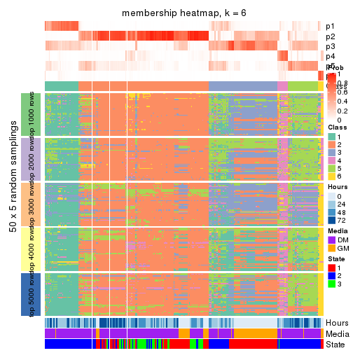</p>

</div>
</div>

As soon as we have had the classes for columns, we can look for signatures
which are significantly different between classes which can be candidate marks
for certain classes. Following are the heatmaps for signatures.


Signature heatmaps where rows are scaled:


<script>
$( function() {
	$( '#tabs-SD-hclust-get-signatures' ).tabs();
} );
</script>
<div id='tabs-SD-hclust-get-signatures'>
<ul>
<li><a href='#tab-SD-hclust-get-signatures-1'>k = 2</a></li>
<li><a href='#tab-SD-hclust-get-signatures-2'>k = 3</a></li>
<li><a href='#tab-SD-hclust-get-signatures-3'>k = 4</a></li>
<li><a href='#tab-SD-hclust-get-signatures-4'>k = 5</a></li>
<li><a href='#tab-SD-hclust-get-signatures-5'>k = 6</a></li>
</ul>
<div id='tab-SD-hclust-get-signatures-1'>
<pre><code class="r">get_signatures(res, k = 2)
</code></pre>

<p></p>

</div>
<div id='tab-SD-hclust-get-signatures-2'>
<pre><code class="r">get_signatures(res, k = 3)
</code></pre>

<p></p>

</div>
<div id='tab-SD-hclust-get-signatures-3'>
<pre><code class="r">get_signatures(res, k = 4)
</code></pre>

<p></p>

</div>
<div id='tab-SD-hclust-get-signatures-4'>
<pre><code class="r">get_signatures(res, k = 5)
</code></pre>

<p></p>

</div>
<div id='tab-SD-hclust-get-signatures-5'>
<pre><code class="r">get_signatures(res, k = 6)
</code></pre>

<p></p>

</div>
</div>


Signature heatmaps where rows are not scaled:


<script>
$( function() {
	$( '#tabs-SD-hclust-get-signatures-no-scale' ).tabs();
} );
</script>
<div id='tabs-SD-hclust-get-signatures-no-scale'>
<ul>
<li><a href='#tab-SD-hclust-get-signatures-no-scale-1'>k = 2</a></li>
<li><a href='#tab-SD-hclust-get-signatures-no-scale-2'>k = 3</a></li>
<li><a href='#tab-SD-hclust-get-signatures-no-scale-3'>k = 4</a></li>
<li><a href='#tab-SD-hclust-get-signatures-no-scale-4'>k = 5</a></li>
<li><a href='#tab-SD-hclust-get-signatures-no-scale-5'>k = 6</a></li>
</ul>
<div id='tab-SD-hclust-get-signatures-no-scale-1'>
<pre><code class="r">get_signatures(res, k = 2, scale_rows = FALSE)
</code></pre>

<p></p>

</div>
<div id='tab-SD-hclust-get-signatures-no-scale-2'>
<pre><code class="r">get_signatures(res, k = 3, scale_rows = FALSE)
</code></pre>

<p></p>

</div>
<div id='tab-SD-hclust-get-signatures-no-scale-3'>
<pre><code class="r">get_signatures(res, k = 4, scale_rows = FALSE)
</code></pre>

<p></p>

</div>
<div id='tab-SD-hclust-get-signatures-no-scale-4'>
<pre><code class="r">get_signatures(res, k = 5, scale_rows = FALSE)
</code></pre>

<p></p>

</div>
<div id='tab-SD-hclust-get-signatures-no-scale-5'>
<pre><code class="r">get_signatures(res, k = 6, scale_rows = FALSE)
</code></pre>

<p></p>

</div>
</div>


Compare the overlap of signatures from different k:

```r
compare_signatures(res)
```


`get_signature()` returns a data frame invisibly. TO get the list of signatures, the function
call should be assigned to a variable explicitly. In following code, if `plot` argument is set
to `FALSE`, no heatmap is plotted while only the differential analysis is performed.

```r
# code only for demonstration
tb = get_signature(res, k = ..., plot = FALSE)
```

An example of the output of `tb` is:

```
#>   which_row         fdr    mean_1    mean_2 scaled_mean_1 scaled_mean_2 km
#> 1        38 0.042760348  8.373488  9.131774    -0.5533452     0.5164555  1
#> 2        40 0.018707592  7.106213  8.469186    -0.6173731     0.5762149  1
#> 3        55 0.019134737 10.221463 11.207825    -0.6159697     0.5749050  1
#> 4        59 0.006059896  5.921854  7.869574    -0.6899429     0.6439467  1
#> 5        60 0.018055526  8.928898 10.211722    -0.6204761     0.5791110  1
#> 6        98 0.009384629 15.714769 14.887706     0.6635654    -0.6193277  2
...
```

The columns in `tb` are:

1. `which_row`: row indices corresponding to the input matrix.
2. `fdr`: FDR for the differential test. 
3. `mean_x`: The mean value in group x.
4. `scaled_mean_x`: The mean value in group x after rows are scaled.
5. `km`: Row groups if k-means clustering is applied to rows.


UMAP plot which shows how samples are separated.


<script>
$( function() {
	$( '#tabs-SD-hclust-dimension-reduction' ).tabs();
} );
</script>
<div id='tabs-SD-hclust-dimension-reduction'>
<ul>
<li><a href='#tab-SD-hclust-dimension-reduction-1'>k = 2</a></li>
<li><a href='#tab-SD-hclust-dimension-reduction-2'>k = 3</a></li>
<li><a href='#tab-SD-hclust-dimension-reduction-3'>k = 4</a></li>
<li><a href='#tab-SD-hclust-dimension-reduction-4'>k = 5</a></li>
<li><a href='#tab-SD-hclust-dimension-reduction-5'>k = 6</a></li>
</ul>
<div id='tab-SD-hclust-dimension-reduction-1'>
<pre><code class="r">dimension_reduction(res, k = 2, method = &quot;UMAP&quot;)
</code></pre>

<p></p>

</div>
<div id='tab-SD-hclust-dimension-reduction-2'>
<pre><code class="r">dimension_reduction(res, k = 3, method = &quot;UMAP&quot;)
</code></pre>

<p>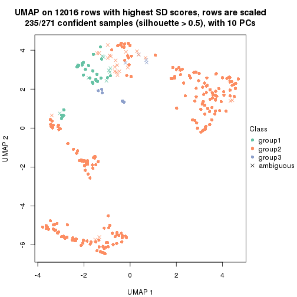</p>

</div>
<div id='tab-SD-hclust-dimension-reduction-3'>
<pre><code class="r">dimension_reduction(res, k = 4, method = &quot;UMAP&quot;)
</code></pre>

<p></p>

</div>
<div id='tab-SD-hclust-dimension-reduction-4'>
<pre><code class="r">dimension_reduction(res, k = 5, method = &quot;UMAP&quot;)
</code></pre>

<p></p>

</div>
<div id='tab-SD-hclust-dimension-reduction-5'>
<pre><code class="r">dimension_reduction(res, k = 6, method = &quot;UMAP&quot;)
</code></pre>

<p></p>

</div>
</div>


Following heatmap shows how subgroups are split when increasing `k`:

```r
collect_classes(res)
```


Test correlation between subgroups and known annotations. If the known
annotation is numeric, one-way ANOVA test is applied, and if the known
annotation is discrete, chi-squared contingency table test is applied.

```r
test_to_known_factors(res)
```

```
#>             n Hours(p) Media(p) State(p) k
#> SD:hclust 259 3.92e-01 3.85e-01 5.36e-01 2
#> SD:hclust 235 2.59e-03 3.40e-03 6.09e-10 3
#> SD:hclust 134 5.70e-02 2.01e-01 1.36e-04 4
#> SD:hclust 166 1.94e-09 9.09e-12 4.83e-17 5
#> SD:hclust 180 1.17e-17 3.63e-20 1.96e-25 6
```


If matrix rows can be associated to genes, consider to use `GO_Enrichment(res,
...)` to perform function enrichment for the signature genes.


 

---------------------------------------------------


### SD:kmeans**


The object with results only for a single top-value method and a single partition method 
can be extracted as:

```r
res = res_list["SD", "kmeans"]
# you can also extract it by
# res = res_list["SD:kmeans"]
```

A summary of `res` and all the functions that can be applied to it:

```r
res
```

```
#> A 'ConsensusPartition' object with k = 2, 3, 4, 5, 6.
#>   On a matrix with 12016 rows and 271 columns.
#>   Top rows (1000, 2000, 3000, 4000, 5000) are extracted by 'SD' method.
#>   Subgroups are detected by 'kmeans' method.
#>   Performed in total 1250 partitions by row resampling.
#>   Best k for subgroups seems to be 2.
#> 
#> Following methods can be applied to this 'ConsensusPartition' object:
#>  [1] "cola_report"             "collect_classes"         "collect_plots"          
#>  [4] "collect_stats"           "colnames"                "compare_signatures"     
#>  [7] "consensus_heatmap"       "dimension_reduction"     "functional_enrichment"  
#> [10] "get_anno_col"            "get_anno"                "get_classes"            
#> [13] "get_consensus"           "get_matrix"              "get_membership"         
#> [16] "get_param"               "get_signatures"          "get_stats"              
#> [19] "is_best_k"               "is_stable_k"             "membership_heatmap"     
#> [22] "ncol"                    "nrow"                    "plot_ecdf"              
#> [25] "rownames"                "select_partition_number" "show"                   
#> [28] "suggest_best_k"          "test_to_known_factors"
```

`collect_plots()` function collects all the plots made from `res` for all `k` (number of partitions)
into one single page to provide an easy and fast comparison between different `k`.

```r
collect_plots(res)
```


The plots are:

- The first row: a plot of the ECDF (Empirical cumulative distribution
  function) curves of the consensus matrix for each `k` and the heatmap of
  predicted classes for each `k`.
- The second row: heatmaps of the consensus matrix for each `k`.
- The third row: heatmaps of the membership matrix for each `k`.
- The fouth row: heatmaps of the signatures for each `k`.

All the plots in panels can be made by individual functions and they are
plotted later in this section.

`select_partition_number()` produces several plots showing different
statistics for choosing "optimized" `k`. There are following statistics:

- ECDF curves of the consensus matrix for each `k`;
- 1-PAC. [The PAC
  score](https://en.wikipedia.org/wiki/Consensus_clustering#Over-interpretation_potential_of_consensus_clustering)
  measures the proportion of the ambiguous subgrouping.
- Mean silhouette score.
- Concordance. The mean probability of fiting the consensus class ids in all
  partitions.
- Area increased. Denote $A_k$ as the area under the ECDF curve for current
  `k`, the area increased is defined as $A_k - A_{k-1}$.
- Rand index. The percent of pairs of samples that are both in a same cluster
  or both are not in a same cluster in the partition of k and k-1.
- Jaccard index. The ratio of pairs of samples are both in a same cluster in
  the partition of k and k-1 and the pairs of samples are both in a same
  cluster in the partition k or k-1.

The detailed explanations of these statistics can be found in [the cola
vignette](http://bioconductor.org/packages/devel/bioc/vignettes/cola/inst/doc/cola.html#toc_13).

Generally speaking, lower PAC score, higher mean silhouette score or higher
concordance corresponds to better partition. Rand index and Jaccard index
measure how similar the current partition is compared to partition with `k-1`.
If they are too similar, we won't accept `k` is better than `k-1`.

```r
select_partition_number(res)
```


The numeric values for all these statistics can be obtained by `get_stats()`.

```r
get_stats(res)
```

```
#>   k 1-PAC mean_silhouette concordance area_increased  Rand Jaccard
#> 2 2 0.978           0.953       0.975         0.4660 0.535   0.535
#> 3 3 0.723           0.849       0.888         0.3578 0.786   0.612
#> 4 4 0.807           0.812       0.884         0.1114 0.939   0.831
#> 5 5 0.777           0.757       0.850         0.0852 0.885   0.651
#> 6 6 0.772           0.701       0.805         0.0520 0.898   0.614
```

`suggest_best_k()` suggests the best $k$ based on these statistics. The rules are as follows:

- All $k$ with Jaccard index larger than 0.95 are removed because the increase of
  the partition number does not provides enough extra information. If all $k$ are removed,
  the best $k$ is assigned by `NA`.
- For $k$ with 1-PAC larger than 0.9, the maximal $k$ is taken as the "best k". Other $k$ is called "optional k".
- If it does not fit the second rule. The $k$ with the highest vote of highest
  1-PAC, mean silhouette and concordance is taken as the "best k".

```r
suggest_best_k(res)
```

```
#> [1] 2
```


Following shows the table of the partitions (You need to click the **show/hide
code output** link to see it). The membership matrix (columns with name `p*`)
is inferred by
[`clue::cl_consensus()`](https://www.rdocumentation.org/link/cl_consensus?package=clue)
function with the `SE` method. Basically the value in the membership matrix
represents the probability to belong to a certain group. The finall class
label for an item is determined with the group with highest probability it
belongs to.

In `get_classes()` function, the entropy is calculated from the membership
matrix and the silhouette score is calculated from the consensus matrix.


<script>
$( function() {
	$( '#tabs-SD-kmeans-get-classes' ).tabs();
} );
</script>
<div id='tabs-SD-kmeans-get-classes'>
<ul>
<li><a href='#tab-SD-kmeans-get-classes-1'>k = 2</a></li>
<li><a href='#tab-SD-kmeans-get-classes-2'>k = 3</a></li>
<li><a href='#tab-SD-kmeans-get-classes-3'>k = 4</a></li>
<li><a href='#tab-SD-kmeans-get-classes-4'>k = 5</a></li>
<li><a href='#tab-SD-kmeans-get-classes-5'>k = 6</a></li>
</ul>

<div id='tab-SD-kmeans-get-classes-1'>
<p><a id='tab-SD-kmeans-get-classes-1-a' style='color:#0366d6' href='#'>show/hide code output</a></p>
<pre><code class="r">cbind(get_classes(res, k = 2), get_membership(res, k = 2))
</code></pre>

<pre><code>#&gt;            class entropy silhouette    p1    p2
#&gt; T0_CT_A01      2  0.0000     0.9718 0.000 1.000
#&gt; T0_CT_A03      2  0.0000     0.9718 0.000 1.000
#&gt; T0_CT_A05      2  0.0000     0.9718 0.000 1.000
#&gt; T0_CT_A06      2  0.0000     0.9718 0.000 1.000
#&gt; T0_CT_A07      2  0.0000     0.9718 0.000 1.000
#&gt; T0_CT_A08      1  0.0000     0.9794 1.000 0.000
#&gt; T0_CT_A10      2  0.0376     0.9711 0.004 0.996
#&gt; T0_CT_A11      1  0.0000     0.9794 1.000 0.000
#&gt; T0_CT_B01      2  0.6973     0.7913 0.188 0.812
#&gt; T0_CT_B03      2  0.0000     0.9718 0.000 1.000
#&gt; T0_CT_B05      2  0.0672     0.9698 0.008 0.992
#&gt; T0_CT_B07      2  0.0000     0.9718 0.000 1.000
#&gt; T0_CT_B08      2  0.0000     0.9718 0.000 1.000
#&gt; T0_CT_B09      2  0.0000     0.9718 0.000 1.000
#&gt; T0_CT_C02      2  0.0000     0.9718 0.000 1.000
#&gt; T0_CT_C03      1  0.0376     0.9759 0.996 0.004
#&gt; T0_CT_C05      2  0.0376     0.9728 0.004 0.996
#&gt; T0_CT_C06      2  0.8909     0.5875 0.308 0.692
#&gt; T0_CT_C07      2  0.1414     0.9631 0.020 0.980
#&gt; T0_CT_C08      2  0.0000     0.9718 0.000 1.000
#&gt; T0_CT_C09      1  0.9087     0.5065 0.676 0.324
#&gt; T0_CT_C11      2  0.1414     0.9753 0.020 0.980
#&gt; T0_CT_C12      2  0.0000     0.9718 0.000 1.000
#&gt; T0_CT_D01      2  0.0000     0.9718 0.000 1.000
#&gt; T0_CT_D02      2  0.8555     0.6128 0.280 0.720
#&gt; T0_CT_D03      2  0.0000     0.9718 0.000 1.000
#&gt; T0_CT_D05      2  0.1414     0.9753 0.020 0.980
#&gt; T0_CT_D06      2  0.0000     0.9718 0.000 1.000
#&gt; T0_CT_D07      2  0.0000     0.9718 0.000 1.000
#&gt; T0_CT_D08      2  0.0000     0.9718 0.000 1.000
#&gt; T0_CT_D09      2  0.0000     0.9718 0.000 1.000
#&gt; T0_CT_D11      2  0.0672     0.9736 0.008 0.992
#&gt; T0_CT_D12      2  0.0000     0.9718 0.000 1.000
#&gt; T0_CT_E01      2  0.0000     0.9718 0.000 1.000
#&gt; T0_CT_E03      2  0.0376     0.9711 0.004 0.996
#&gt; T0_CT_E04      2  0.1414     0.9753 0.020 0.980
#&gt; T0_CT_E05      1  0.0000     0.9794 1.000 0.000
#&gt; T0_CT_E06      2  0.0000     0.9718 0.000 1.000
#&gt; T0_CT_E07      2  0.0000     0.9718 0.000 1.000
#&gt; T0_CT_E08      2  0.0000     0.9718 0.000 1.000
#&gt; T0_CT_E09      2  0.0000     0.9718 0.000 1.000
#&gt; T0_CT_E10      1  0.9044     0.5155 0.680 0.320
#&gt; T0_CT_E11      2  0.0000     0.9718 0.000 1.000
#&gt; T0_CT_E12      2  0.9608     0.3721 0.384 0.616
#&gt; T0_CT_F01      2  0.0000     0.9718 0.000 1.000
#&gt; T0_CT_F02      2  0.0000     0.9718 0.000 1.000
#&gt; T0_CT_F03      2  0.0000     0.9718 0.000 1.000
#&gt; T0_CT_F04      2  0.0376     0.9711 0.004 0.996
#&gt; T0_CT_F05      2  0.0000     0.9718 0.000 1.000
#&gt; T0_CT_F06      2  0.0000     0.9718 0.000 1.000
#&gt; T0_CT_F07      2  0.0000     0.9718 0.000 1.000
#&gt; T0_CT_F09      2  0.1414     0.9753 0.020 0.980
#&gt; T0_CT_F11      2  0.2603     0.9432 0.044 0.956
#&gt; T0_CT_F12      2  0.0376     0.9711 0.004 0.996
#&gt; T0_CT_G01      2  0.0000     0.9718 0.000 1.000
#&gt; T0_CT_G02      2  0.4939     0.8932 0.108 0.892
#&gt; T0_CT_G03      2  0.0376     0.9711 0.004 0.996
#&gt; T0_CT_G04      2  0.0000     0.9718 0.000 1.000
#&gt; T0_CT_G07      2  0.0000     0.9718 0.000 1.000
#&gt; T0_CT_G08      2  0.0000     0.9718 0.000 1.000
#&gt; T0_CT_G09      1  0.0000     0.9794 1.000 0.000
#&gt; T0_CT_G11      2  0.4690     0.9025 0.100 0.900
#&gt; T0_CT_H01      2  0.3879     0.9280 0.076 0.924
#&gt; T0_CT_H02      2  0.0000     0.9718 0.000 1.000
#&gt; T0_CT_H04      2  0.0000     0.9718 0.000 1.000
#&gt; T0_CT_H05      2  0.1843     0.9703 0.028 0.972
#&gt; T0_CT_H08      2  0.0000     0.9718 0.000 1.000
#&gt; T0_CT_H09      2  0.1414     0.9753 0.020 0.980
#&gt; T0_CT_H12      2  0.5946     0.8503 0.144 0.856
#&gt; T24_CT_A01     1  0.0000     0.9794 1.000 0.000
#&gt; T24_CT_A03     2  0.1414     0.9753 0.020 0.980
#&gt; T24_CT_A04     2  0.1414     0.9753 0.020 0.980
#&gt; T24_CT_A05     1  0.1414     0.9609 0.980 0.020
#&gt; T24_CT_A07     2  0.1414     0.9753 0.020 0.980
#&gt; T24_CT_A08     1  0.0000     0.9794 1.000 0.000
#&gt; T24_CT_A09     1  0.0000     0.9794 1.000 0.000
#&gt; T24_CT_A10     1  0.0000     0.9794 1.000 0.000
#&gt; T24_CT_B01     1  0.0000     0.9794 1.000 0.000
#&gt; T24_CT_B02     1  0.0000     0.9794 1.000 0.000
#&gt; T24_CT_B03     2  0.1414     0.9753 0.020 0.980
#&gt; T24_CT_B05     2  0.1414     0.9753 0.020 0.980
#&gt; T24_CT_B06     2  0.1414     0.9753 0.020 0.980
#&gt; T24_CT_B07     1  0.0000     0.9794 1.000 0.000
#&gt; T24_CT_B08     2  0.1414     0.9753 0.020 0.980
#&gt; T24_CT_B09     1  0.0000     0.9794 1.000 0.000
#&gt; T24_CT_B11     1  0.5737     0.8505 0.864 0.136
#&gt; T24_CT_C01     1  0.0000     0.9794 1.000 0.000
#&gt; T24_CT_C02     2  0.4690     0.9022 0.100 0.900
#&gt; T24_CT_C03     1  0.0000     0.9794 1.000 0.000
#&gt; T24_CT_C05     2  0.1414     0.9753 0.020 0.980
#&gt; T24_CT_C07     2  0.1414     0.9753 0.020 0.980
#&gt; T24_CT_C08     2  0.1414     0.9753 0.020 0.980
#&gt; T24_CT_C09     2  0.4022     0.9234 0.080 0.920
#&gt; T24_CT_C10     1  0.0000     0.9794 1.000 0.000
#&gt; T24_CT_C11     1  0.3274     0.9210 0.940 0.060
#&gt; T24_CT_C12     2  0.1414     0.9753 0.020 0.980
#&gt; T24_CT_D01     2  0.1414     0.9753 0.020 0.980
#&gt; T24_CT_D02     2  0.0000     0.9718 0.000 1.000
#&gt; T24_CT_D03     2  0.1414     0.9753 0.020 0.980
#&gt; T24_CT_D04     1  0.0000     0.9794 1.000 0.000
#&gt; T24_CT_D05     1  0.0000     0.9794 1.000 0.000
#&gt; T24_CT_D06     1  0.0000     0.9794 1.000 0.000
#&gt; T24_CT_D07     2  0.8861     0.5861 0.304 0.696
#&gt; T24_CT_D08     2  0.1414     0.9753 0.020 0.980
#&gt; T24_CT_D09     2  0.0672     0.9736 0.008 0.992
#&gt; T24_CT_D10     2  0.1414     0.9753 0.020 0.980
#&gt; T24_CT_D11     2  0.1414     0.9753 0.020 0.980
#&gt; T24_CT_E01     1  0.0000     0.9794 1.000 0.000
#&gt; T24_CT_E02     1  0.0000     0.9794 1.000 0.000
#&gt; T24_CT_E04     2  0.1414     0.9753 0.020 0.980
#&gt; T24_CT_E05     1  0.0000     0.9794 1.000 0.000
#&gt; T24_CT_E07     2  0.1414     0.9753 0.020 0.980
#&gt; T24_CT_E09     1  0.0000     0.9794 1.000 0.000
#&gt; T24_CT_E11     1  0.0000     0.9794 1.000 0.000
#&gt; T24_CT_E12     2  0.1414     0.9753 0.020 0.980
#&gt; T24_CT_F01     2  0.1414     0.9753 0.020 0.980
#&gt; T24_CT_F02     2  0.1414     0.9753 0.020 0.980
#&gt; T24_CT_F03     1  0.0000     0.9794 1.000 0.000
#&gt; T24_CT_F04     1  0.0000     0.9794 1.000 0.000
#&gt; T24_CT_F05     1  0.0000     0.9794 1.000 0.000
#&gt; T24_CT_F07     1  0.0000     0.9794 1.000 0.000
#&gt; T24_CT_F08     1  0.0000     0.9794 1.000 0.000
#&gt; T24_CT_F09     2  0.0000     0.9718 0.000 1.000
#&gt; T24_CT_F10     2  0.1414     0.9753 0.020 0.980
#&gt; T24_CT_F11     1  0.0000     0.9794 1.000 0.000
#&gt; T24_CT_F12     2  0.0000     0.9718 0.000 1.000
#&gt; T24_CT_G01     2  0.1414     0.9753 0.020 0.980
#&gt; T24_CT_G02     1  0.0000     0.9794 1.000 0.000
#&gt; T24_CT_G03     1  0.0000     0.9794 1.000 0.000
#&gt; T24_CT_G04     2  0.1414     0.9753 0.020 0.980
#&gt; T24_CT_G05     2  0.1414     0.9753 0.020 0.980
#&gt; T24_CT_G06     1  0.0000     0.9794 1.000 0.000
#&gt; T24_CT_G08     1  0.0000     0.9794 1.000 0.000
#&gt; T24_CT_G10     2  0.1414     0.9753 0.020 0.980
#&gt; T24_CT_G11     1  0.0000     0.9794 1.000 0.000
#&gt; T24_CT_G12     1  0.0000     0.9794 1.000 0.000
#&gt; T24_CT_H01     2  0.0376     0.9711 0.004 0.996
#&gt; T24_CT_H02     1  0.0000     0.9794 1.000 0.000
#&gt; T24_CT_H03     2  0.1414     0.9753 0.020 0.980
#&gt; T24_CT_H05     1  0.0000     0.9794 1.000 0.000
#&gt; T24_CT_H07     1  0.0000     0.9794 1.000 0.000
#&gt; T24_CT_H09     1  0.0000     0.9794 1.000 0.000
#&gt; T24_CT_H12     1  0.0000     0.9794 1.000 0.000
#&gt; T48_CT_A01     2  0.0938     0.9742 0.012 0.988
#&gt; T48_CT_A02     2  0.1414     0.9753 0.020 0.980
#&gt; T48_CT_A03     1  0.0000     0.9794 1.000 0.000
#&gt; T48_CT_A04     2  0.1414     0.9753 0.020 0.980
#&gt; T48_CT_A05     2  0.1414     0.9753 0.020 0.980
#&gt; T48_CT_A06     1  0.0000     0.9794 1.000 0.000
#&gt; T48_CT_A07     2  0.0000     0.9718 0.000 1.000
#&gt; T48_CT_A08     2  0.1414     0.9753 0.020 0.980
#&gt; T48_CT_A09     1  0.0000     0.9794 1.000 0.000
#&gt; T48_CT_A10     2  0.1414     0.9753 0.020 0.980
#&gt; T48_CT_A11     2  0.1414     0.9753 0.020 0.980
#&gt; T48_CT_A12     1  0.0000     0.9794 1.000 0.000
#&gt; T48_CT_B01     2  0.1414     0.9753 0.020 0.980
#&gt; T48_CT_B02     2  0.1414     0.9753 0.020 0.980
#&gt; T48_CT_B03     1  0.0000     0.9794 1.000 0.000
#&gt; T48_CT_B04     1  0.0000     0.9794 1.000 0.000
#&gt; T48_CT_B06     2  0.1414     0.9753 0.020 0.980
#&gt; T48_CT_B08     1  0.0000     0.9794 1.000 0.000
#&gt; T48_CT_B10     2  0.1414     0.9753 0.020 0.980
#&gt; T48_CT_B11     2  0.1414     0.9753 0.020 0.980
#&gt; T48_CT_B12     1  0.0000     0.9794 1.000 0.000
#&gt; T48_CT_C01     2  0.1414     0.9753 0.020 0.980
#&gt; T48_CT_C02     1  0.0000     0.9794 1.000 0.000
#&gt; T48_CT_C03     2  0.1414     0.9753 0.020 0.980
#&gt; T48_CT_C04     1  0.0000     0.9794 1.000 0.000
#&gt; T48_CT_C05     2  0.1414     0.9753 0.020 0.980
#&gt; T48_CT_C06     2  0.1414     0.9753 0.020 0.980
#&gt; T48_CT_C07     1  0.0000     0.9794 1.000 0.000
#&gt; T48_CT_C09     2  0.0000     0.9718 0.000 1.000
#&gt; T48_CT_C10     1  0.0000     0.9794 1.000 0.000
#&gt; T48_CT_C11     2  0.1414     0.9753 0.020 0.980
#&gt; T48_CT_D01     1  0.9963     0.0992 0.536 0.464
#&gt; T48_CT_D02     1  0.0000     0.9794 1.000 0.000
#&gt; T48_CT_D03     1  0.0000     0.9794 1.000 0.000
#&gt; T48_CT_D04     2  0.1414     0.9753 0.020 0.980
#&gt; T48_CT_D06     2  0.0000     0.9718 0.000 1.000
#&gt; T48_CT_D07     2  0.1414     0.9753 0.020 0.980
#&gt; T48_CT_D08     1  0.0000     0.9794 1.000 0.000
#&gt; T48_CT_D09     2  0.1414     0.9753 0.020 0.980
#&gt; T48_CT_D10     1  0.0000     0.9794 1.000 0.000
#&gt; T48_CT_D11     2  0.0000     0.9718 0.000 1.000
#&gt; T48_CT_D12     1  0.0000     0.9794 1.000 0.000
#&gt; T48_CT_E01     2  0.1414     0.9753 0.020 0.980
#&gt; T48_CT_E02     1  0.0000     0.9794 1.000 0.000
#&gt; T48_CT_E03     2  0.1414     0.9753 0.020 0.980
#&gt; T48_CT_E04     2  0.9896     0.2419 0.440 0.560
#&gt; T48_CT_E05     2  0.1414     0.9753 0.020 0.980
#&gt; T48_CT_E06     1  0.0000     0.9794 1.000 0.000
#&gt; T48_CT_E07     1  0.0000     0.9794 1.000 0.000
#&gt; T48_CT_E08     2  0.1414     0.9753 0.020 0.980
#&gt; T48_CT_E10     1  0.0000     0.9794 1.000 0.000
#&gt; T48_CT_E11     1  0.0000     0.9794 1.000 0.000
#&gt; T48_CT_E12     2  0.0000     0.9718 0.000 1.000
#&gt; T48_CT_F01     2  0.1414     0.9753 0.020 0.980
#&gt; T48_CT_F02     1  0.0000     0.9794 1.000 0.000
#&gt; T48_CT_F03     1  0.0000     0.9794 1.000 0.000
#&gt; T48_CT_F05     2  0.1414     0.9753 0.020 0.980
#&gt; T48_CT_F07     1  0.0000     0.9794 1.000 0.000
#&gt; T48_CT_F09     2  0.1414     0.9753 0.020 0.980
#&gt; T48_CT_F10     1  0.0000     0.9794 1.000 0.000
#&gt; T48_CT_F11     1  0.0000     0.9794 1.000 0.000
#&gt; T48_CT_G01     1  0.0000     0.9794 1.000 0.000
#&gt; T48_CT_G02     2  0.1414     0.9753 0.020 0.980
#&gt; T48_CT_G03     2  0.1414     0.9753 0.020 0.980
#&gt; T48_CT_G07     2  0.1414     0.9753 0.020 0.980
#&gt; T48_CT_G08     2  0.1414     0.9753 0.020 0.980
#&gt; T48_CT_G09     2  0.1414     0.9753 0.020 0.980
#&gt; T48_CT_G10     1  0.1414     0.9609 0.980 0.020
#&gt; T48_CT_G11     1  0.0000     0.9794 1.000 0.000
#&gt; T48_CT_G12     2  0.1414     0.9753 0.020 0.980
#&gt; T48_CT_H01     2  0.4161     0.9193 0.084 0.916
#&gt; T48_CT_H02     2  0.1184     0.9748 0.016 0.984
#&gt; T48_CT_H04     1  0.0000     0.9794 1.000 0.000
#&gt; T48_CT_H05     2  0.1414     0.9753 0.020 0.980
#&gt; T48_CT_H06     2  0.1414     0.9753 0.020 0.980
#&gt; T48_CT_H07     1  0.0000     0.9794 1.000 0.000
#&gt; T48_CT_H08     2  0.1414     0.9753 0.020 0.980
#&gt; T48_CT_H11     1  0.0000     0.9794 1.000 0.000
#&gt; T48_CT_H12     2  0.1414     0.9753 0.020 0.980
#&gt; T72_CT_A01     2  0.1414     0.9753 0.020 0.980
#&gt; T72_CT_A05     2  0.0000     0.9718 0.000 1.000
#&gt; T72_CT_A08     1  0.0000     0.9794 1.000 0.000
#&gt; T72_CT_A09     2  0.0000     0.9718 0.000 1.000
#&gt; T72_CT_A11     2  0.1414     0.9753 0.020 0.980
#&gt; T72_CT_B01     2  0.1414     0.9753 0.020 0.980
#&gt; T72_CT_B02     1  0.0000     0.9794 1.000 0.000
#&gt; T72_CT_B03     1  0.5519     0.8441 0.872 0.128
#&gt; T72_CT_B04     1  0.0000     0.9794 1.000 0.000
#&gt; T72_CT_B05     2  0.1414     0.9753 0.020 0.980
#&gt; T72_CT_B06     1  0.0000     0.9794 1.000 0.000
#&gt; T72_CT_B08     2  0.0000     0.9718 0.000 1.000
#&gt; T72_CT_B09     1  0.0000     0.9794 1.000 0.000
#&gt; T72_CT_B11     1  0.0000     0.9794 1.000 0.000
#&gt; T72_CT_B12     2  0.1414     0.9753 0.020 0.980
#&gt; T72_CT_C04     2  0.1414     0.9753 0.020 0.980
#&gt; T72_CT_C06     1  0.7815     0.6939 0.768 0.232
#&gt; T72_CT_C07     2  0.0000     0.9718 0.000 1.000
#&gt; T72_CT_C09     1  0.7815     0.6933 0.768 0.232
#&gt; T72_CT_C11     2  0.0000     0.9718 0.000 1.000
#&gt; T72_CT_D01     2  0.1414     0.9753 0.020 0.980
#&gt; T72_CT_D03     2  0.8499     0.6401 0.276 0.724
#&gt; T72_CT_D04     2  0.0672     0.9736 0.008 0.992
#&gt; T72_CT_D05     1  0.0000     0.9794 1.000 0.000
#&gt; T72_CT_D07     1  0.0000     0.9794 1.000 0.000
#&gt; T72_CT_D10     2  0.1414     0.9753 0.020 0.980
#&gt; T72_CT_D11     1  0.0000     0.9794 1.000 0.000
#&gt; T72_CT_E04     1  0.0000     0.9794 1.000 0.000
#&gt; T72_CT_E05     2  0.1414     0.9753 0.020 0.980
#&gt; T72_CT_E07     2  0.1414     0.9753 0.020 0.980
#&gt; T72_CT_F01     2  0.1414     0.9753 0.020 0.980
#&gt; T72_CT_F05     2  0.1414     0.9753 0.020 0.980
#&gt; T72_CT_F07     1  0.0000     0.9794 1.000 0.000
#&gt; T72_CT_F10     2  0.1414     0.9753 0.020 0.980
#&gt; T72_CT_F11     2  0.0000     0.9718 0.000 1.000
#&gt; T72_CT_G03     1  0.0000     0.9794 1.000 0.000
#&gt; T72_CT_G04     1  0.0000     0.9794 1.000 0.000
#&gt; T72_CT_G06     2  0.0000     0.9718 0.000 1.000
#&gt; T72_CT_G08     2  0.1414     0.9753 0.020 0.980
#&gt; T72_CT_G10     2  0.1414     0.9753 0.020 0.980
#&gt; T72_CT_G11     1  0.0000     0.9794 1.000 0.000
#&gt; T72_CT_H01     2  0.1414     0.9753 0.020 0.980
#&gt; T72_CT_H03     2  0.1414     0.9753 0.020 0.980
#&gt; T72_CT_H05     2  0.0000     0.9718 0.000 1.000
#&gt; T72_CT_H08     2  0.0000     0.9718 0.000 1.000
#&gt; T72_CT_H09     2  0.0000     0.9718 0.000 1.000
#&gt; T72_CT_H10     1  0.0000     0.9794 1.000 0.000
#&gt; T72_CT_H11     1  0.0000     0.9794 1.000 0.000
#&gt; T72_CT_H12     2  0.1414     0.9753 0.020 0.980
</code></pre>

<script>
$('#tab-SD-kmeans-get-classes-1-a').parent().next().next().hide();
$('#tab-SD-kmeans-get-classes-1-a').click(function(){
  $('#tab-SD-kmeans-get-classes-1-a').parent().next().next().toggle();
  return(false);
});
</script>
</div>

<div id='tab-SD-kmeans-get-classes-2'>
<p><a id='tab-SD-kmeans-get-classes-2-a' style='color:#0366d6' href='#'>show/hide code output</a></p>
<pre><code class="r">cbind(get_classes(res, k = 3), get_membership(res, k = 3))
</code></pre>

<pre><code>#&gt;            class entropy silhouette    p1    p2    p3
#&gt; T0_CT_A01      3  0.4555     0.9095 0.000 0.200 0.800
#&gt; T0_CT_A03      3  0.5634     0.9288 0.056 0.144 0.800
#&gt; T0_CT_A05      3  0.5634     0.9288 0.056 0.144 0.800
#&gt; T0_CT_A06      3  0.5558     0.9282 0.048 0.152 0.800
#&gt; T0_CT_A07      3  0.5598     0.9289 0.052 0.148 0.800
#&gt; T0_CT_A08      1  0.0424     0.9354 0.992 0.000 0.008
#&gt; T0_CT_A10      3  0.5634     0.9288 0.056 0.144 0.800
#&gt; T0_CT_A11      1  0.7227     0.7590 0.704 0.096 0.200
#&gt; T0_CT_B01      2  0.8436     0.3211 0.324 0.568 0.108
#&gt; T0_CT_B03      3  0.4555     0.9095 0.000 0.200 0.800
#&gt; T0_CT_B05      3  0.5667     0.9254 0.060 0.140 0.800
#&gt; T0_CT_B07      3  0.5634     0.9288 0.056 0.144 0.800
#&gt; T0_CT_B08      3  0.4555     0.9095 0.000 0.200 0.800
#&gt; T0_CT_B09      3  0.5634     0.9288 0.056 0.144 0.800
#&gt; T0_CT_C02      3  0.4555     0.9095 0.000 0.200 0.800
#&gt; T0_CT_C03      1  0.0424     0.9355 0.992 0.000 0.008
#&gt; T0_CT_C05      2  0.1411     0.8786 0.000 0.964 0.036
#&gt; T0_CT_C06      2  0.7145     0.1187 0.440 0.536 0.024
#&gt; T0_CT_C07      3  0.5507     0.9219 0.056 0.136 0.808
#&gt; T0_CT_C08      3  0.5598     0.9289 0.052 0.148 0.800
#&gt; T0_CT_C09      2  0.9520     0.0485 0.340 0.460 0.200
#&gt; T0_CT_C11      2  0.0000     0.8770 0.000 1.000 0.000
#&gt; T0_CT_C12      3  0.5598     0.9289 0.052 0.148 0.800
#&gt; T0_CT_D01      3  0.4555     0.9095 0.000 0.200 0.800
#&gt; T0_CT_D02      3  0.5810     0.9097 0.072 0.132 0.796
#&gt; T0_CT_D03      3  0.4555     0.9095 0.000 0.200 0.800
#&gt; T0_CT_D05      2  0.7207     0.2142 0.032 0.584 0.384
#&gt; T0_CT_D06      3  0.4555     0.9095 0.000 0.200 0.800
#&gt; T0_CT_D07      3  0.5634     0.9288 0.056 0.144 0.800
#&gt; T0_CT_D08      3  0.4555     0.9095 0.000 0.200 0.800
#&gt; T0_CT_D09      2  0.2796     0.8695 0.000 0.908 0.092
#&gt; T0_CT_D11      2  0.0237     0.8779 0.000 0.996 0.004
#&gt; T0_CT_D12      3  0.5634     0.9288 0.056 0.144 0.800
#&gt; T0_CT_E01      3  0.4555     0.9095 0.000 0.200 0.800
#&gt; T0_CT_E03      3  0.5634     0.9288 0.056 0.144 0.800
#&gt; T0_CT_E04      2  0.0237     0.8779 0.000 0.996 0.004
#&gt; T0_CT_E05      1  0.7107     0.7633 0.712 0.092 0.196
#&gt; T0_CT_E06      3  0.5558     0.9282 0.048 0.152 0.800
#&gt; T0_CT_E07      3  0.5634     0.9288 0.056 0.144 0.800
#&gt; T0_CT_E08      3  0.4555     0.9095 0.000 0.200 0.800
#&gt; T0_CT_E09      3  0.4555     0.9095 0.000 0.200 0.800
#&gt; T0_CT_E10      2  0.9531     0.0337 0.344 0.456 0.200
#&gt; T0_CT_E11      3  0.5558     0.9282 0.048 0.152 0.800
#&gt; T0_CT_E12      3  0.4121     0.7174 0.024 0.108 0.868
#&gt; T0_CT_F01      3  0.5634     0.9288 0.056 0.144 0.800
#&gt; T0_CT_F02      3  0.5634     0.9288 0.056 0.144 0.800
#&gt; T0_CT_F03      3  0.5634     0.9288 0.056 0.144 0.800
#&gt; T0_CT_F04      3  0.5634     0.9288 0.056 0.144 0.800
#&gt; T0_CT_F05      2  0.5291     0.4691 0.000 0.732 0.268
#&gt; T0_CT_F06      3  0.4555     0.9095 0.000 0.200 0.800
#&gt; T0_CT_F07      3  0.5988     0.9162 0.056 0.168 0.776
#&gt; T0_CT_F09      2  0.0237     0.8779 0.000 0.996 0.004
#&gt; T0_CT_F11      3  0.4270     0.7333 0.024 0.116 0.860
#&gt; T0_CT_F12      3  0.5634     0.9288 0.056 0.144 0.800
#&gt; T0_CT_G01      3  0.5634     0.9288 0.056 0.144 0.800
#&gt; T0_CT_G02      3  0.8690     0.5983 0.308 0.132 0.560
#&gt; T0_CT_G03      3  0.5634     0.9288 0.056 0.144 0.800
#&gt; T0_CT_G04      3  0.4555     0.9095 0.000 0.200 0.800
#&gt; T0_CT_G07      3  0.4555     0.9095 0.000 0.200 0.800
#&gt; T0_CT_G08      3  0.4555     0.9095 0.000 0.200 0.800
#&gt; T0_CT_G09      1  0.0424     0.9355 0.992 0.000 0.008
#&gt; T0_CT_G11      1  0.9125     0.2249 0.540 0.268 0.192
#&gt; T0_CT_H01      2  0.8050     0.1334 0.436 0.500 0.064
#&gt; T0_CT_H02      2  0.2796     0.8695 0.000 0.908 0.092
#&gt; T0_CT_H04      3  0.5598     0.9289 0.052 0.148 0.800
#&gt; T0_CT_H05      3  0.8120     0.7803 0.136 0.224 0.640
#&gt; T0_CT_H08      3  0.5634     0.9288 0.056 0.144 0.800
#&gt; T0_CT_H09      2  0.1337     0.8622 0.012 0.972 0.016
#&gt; T0_CT_H12      3  0.7413     0.8047 0.104 0.204 0.692
#&gt; T24_CT_A01     1  0.0424     0.9355 0.992 0.000 0.008
#&gt; T24_CT_A03     2  0.2796     0.8695 0.000 0.908 0.092
#&gt; T24_CT_A04     2  0.0747     0.8793 0.000 0.984 0.016
#&gt; T24_CT_A05     3  0.6308    -0.1243 0.492 0.000 0.508
#&gt; T24_CT_A07     2  0.0000     0.8770 0.000 1.000 0.000
#&gt; T24_CT_A08     1  0.0424     0.9354 0.992 0.000 0.008
#&gt; T24_CT_A09     1  0.1529     0.9273 0.960 0.000 0.040
#&gt; T24_CT_A10     1  0.0424     0.9355 0.992 0.000 0.008
#&gt; T24_CT_B01     1  0.0892     0.9341 0.980 0.000 0.020
#&gt; T24_CT_B02     1  0.2261     0.9133 0.932 0.000 0.068
#&gt; T24_CT_B03     2  0.2796     0.8695 0.000 0.908 0.092
#&gt; T24_CT_B05     2  0.0237     0.8779 0.000 0.996 0.004
#&gt; T24_CT_B06     2  0.0237     0.8779 0.000 0.996 0.004
#&gt; T24_CT_B07     1  0.0424     0.9354 0.992 0.000 0.008
#&gt; T24_CT_B08     2  0.0000     0.8770 0.000 1.000 0.000
#&gt; T24_CT_B09     1  0.0424     0.9354 0.992 0.000 0.008
#&gt; T24_CT_B11     3  0.5008     0.7638 0.180 0.016 0.804
#&gt; T24_CT_C01     1  0.2261     0.9133 0.932 0.000 0.068
#&gt; T24_CT_C02     2  0.4452     0.7045 0.000 0.808 0.192
#&gt; T24_CT_C03     1  0.6922     0.7752 0.720 0.080 0.200
#&gt; T24_CT_C05     2  0.1643     0.8447 0.000 0.956 0.044
#&gt; T24_CT_C07     2  0.0000     0.8770 0.000 1.000 0.000
#&gt; T24_CT_C08     2  0.0237     0.8779 0.000 0.996 0.004
#&gt; T24_CT_C09     2  0.4452     0.7045 0.000 0.808 0.192
#&gt; T24_CT_C10     1  0.0000     0.9354 1.000 0.000 0.000
#&gt; T24_CT_C11     1  0.6719     0.7205 0.728 0.204 0.068
#&gt; T24_CT_C12     2  0.2796     0.8695 0.000 0.908 0.092
#&gt; T24_CT_D01     2  0.0000     0.8770 0.000 1.000 0.000
#&gt; T24_CT_D02     2  0.2796     0.8695 0.000 0.908 0.092
#&gt; T24_CT_D03     2  0.0000     0.8770 0.000 1.000 0.000
#&gt; T24_CT_D04     1  0.0424     0.9354 0.992 0.000 0.008
#&gt; T24_CT_D05     1  0.0424     0.9355 0.992 0.000 0.008
#&gt; T24_CT_D06     1  0.0237     0.9356 0.996 0.000 0.004
#&gt; T24_CT_D07     2  0.8489     0.2550 0.412 0.496 0.092
#&gt; T24_CT_D08     2  0.0000     0.8770 0.000 1.000 0.000
#&gt; T24_CT_D09     2  0.2796     0.8695 0.000 0.908 0.092
#&gt; T24_CT_D10     2  0.2261     0.8751 0.000 0.932 0.068
#&gt; T24_CT_D11     2  0.0237     0.8779 0.000 0.996 0.004
#&gt; T24_CT_E01     1  0.0424     0.9355 0.992 0.000 0.008
#&gt; T24_CT_E02     1  0.2356     0.9151 0.928 0.000 0.072
#&gt; T24_CT_E04     2  0.0000     0.8770 0.000 1.000 0.000
#&gt; T24_CT_E05     1  0.2261     0.9133 0.932 0.000 0.068
#&gt; T24_CT_E07     2  0.3670     0.8621 0.020 0.888 0.092
#&gt; T24_CT_E09     1  0.0424     0.9354 0.992 0.000 0.008
#&gt; T24_CT_E11     1  0.1529     0.9283 0.960 0.000 0.040
#&gt; T24_CT_E12     2  0.0000     0.8770 0.000 1.000 0.000
#&gt; T24_CT_F01     2  0.0000     0.8770 0.000 1.000 0.000
#&gt; T24_CT_F02     2  0.2796     0.8695 0.000 0.908 0.092
#&gt; T24_CT_F03     1  0.0592     0.9355 0.988 0.000 0.012
#&gt; T24_CT_F04     1  0.7107     0.7633 0.712 0.092 0.196
#&gt; T24_CT_F05     1  0.0424     0.9355 0.992 0.000 0.008
#&gt; T24_CT_F07     1  0.7153     0.7631 0.708 0.092 0.200
#&gt; T24_CT_F08     1  0.3482     0.8827 0.872 0.000 0.128
#&gt; T24_CT_F09     2  0.2796     0.8695 0.000 0.908 0.092
#&gt; T24_CT_F10     2  0.6546     0.6166 0.044 0.716 0.240
#&gt; T24_CT_F11     1  0.0424     0.9355 0.992 0.000 0.008
#&gt; T24_CT_F12     2  0.2796     0.8695 0.000 0.908 0.092
#&gt; T24_CT_G01     2  0.2796     0.8695 0.000 0.908 0.092
#&gt; T24_CT_G02     1  0.0424     0.9354 0.992 0.000 0.008
#&gt; T24_CT_G03     1  0.1964     0.9198 0.944 0.000 0.056
#&gt; T24_CT_G04     2  0.2796     0.8695 0.000 0.908 0.092
#&gt; T24_CT_G05     2  0.4178     0.7240 0.000 0.828 0.172
#&gt; T24_CT_G06     1  0.0424     0.9354 0.992 0.000 0.008
#&gt; T24_CT_G08     1  0.1529     0.9272 0.960 0.000 0.040
#&gt; T24_CT_G10     2  0.2796     0.8695 0.000 0.908 0.092
#&gt; T24_CT_G11     1  0.3038     0.8962 0.896 0.000 0.104
#&gt; T24_CT_G12     1  0.0237     0.9356 0.996 0.000 0.004
#&gt; T24_CT_H01     3  0.5634     0.9288 0.056 0.144 0.800
#&gt; T24_CT_H02     1  0.0424     0.9354 0.992 0.000 0.008
#&gt; T24_CT_H03     2  0.0000     0.8770 0.000 1.000 0.000
#&gt; T24_CT_H05     1  0.2448     0.9113 0.924 0.000 0.076
#&gt; T24_CT_H07     1  0.0424     0.9355 0.992 0.000 0.008
#&gt; T24_CT_H09     1  0.0747     0.9342 0.984 0.000 0.016
#&gt; T24_CT_H12     1  0.0000     0.9354 1.000 0.000 0.000
#&gt; T48_CT_A01     2  0.2796     0.8695 0.000 0.908 0.092
#&gt; T48_CT_A02     2  0.1529     0.8783 0.000 0.960 0.040
#&gt; T48_CT_A03     1  0.0424     0.9354 0.992 0.000 0.008
#&gt; T48_CT_A04     2  0.0000     0.8770 0.000 1.000 0.000
#&gt; T48_CT_A05     2  0.3030     0.8688 0.004 0.904 0.092
#&gt; T48_CT_A06     1  0.0424     0.9354 0.992 0.000 0.008
#&gt; T48_CT_A07     3  0.4555     0.9095 0.000 0.200 0.800
#&gt; T48_CT_A08     2  0.2796     0.8695 0.000 0.908 0.092
#&gt; T48_CT_A09     1  0.0424     0.9355 0.992 0.000 0.008
#&gt; T48_CT_A10     2  0.0237     0.8747 0.000 0.996 0.004
#&gt; T48_CT_A11     2  0.0237     0.8779 0.000 0.996 0.004
#&gt; T48_CT_A12     1  0.2356     0.9122 0.928 0.000 0.072
#&gt; T48_CT_B01     2  0.1860     0.8379 0.000 0.948 0.052
#&gt; T48_CT_B02     2  0.1529     0.8482 0.000 0.960 0.040
#&gt; T48_CT_B03     1  0.0424     0.9354 0.992 0.000 0.008
#&gt; T48_CT_B04     1  0.0592     0.9350 0.988 0.000 0.012
#&gt; T48_CT_B06     2  0.0000     0.8770 0.000 1.000 0.000
#&gt; T48_CT_B08     1  0.0237     0.9354 0.996 0.000 0.004
#&gt; T48_CT_B10     2  0.0747     0.8666 0.000 0.984 0.016
#&gt; T48_CT_B11     2  0.0747     0.8790 0.000 0.984 0.016
#&gt; T48_CT_B12     1  0.0424     0.9355 0.992 0.000 0.008
#&gt; T48_CT_C01     2  0.0000     0.8770 0.000 1.000 0.000
#&gt; T48_CT_C02     1  0.5167     0.8299 0.792 0.016 0.192
#&gt; T48_CT_C03     2  0.0000     0.8770 0.000 1.000 0.000
#&gt; T48_CT_C04     1  0.0424     0.9354 0.992 0.000 0.008
#&gt; T48_CT_C05     2  0.2796     0.8695 0.000 0.908 0.092
#&gt; T48_CT_C06     2  0.2625     0.8719 0.000 0.916 0.084
#&gt; T48_CT_C07     1  0.0424     0.9355 0.992 0.000 0.008
#&gt; T48_CT_C09     2  0.3038     0.8605 0.000 0.896 0.104
#&gt; T48_CT_C10     1  0.0000     0.9354 1.000 0.000 0.000
#&gt; T48_CT_C11     2  0.0237     0.8779 0.000 0.996 0.004
#&gt; T48_CT_D01     2  0.4805     0.7114 0.012 0.812 0.176
#&gt; T48_CT_D02     1  0.6458     0.7963 0.752 0.072 0.176
#&gt; T48_CT_D03     1  0.0424     0.9354 0.992 0.000 0.008
#&gt; T48_CT_D04     2  0.0237     0.8779 0.000 0.996 0.004
#&gt; T48_CT_D06     2  0.2796     0.8695 0.000 0.908 0.092
#&gt; T48_CT_D07     2  0.0000     0.8770 0.000 1.000 0.000
#&gt; T48_CT_D08     1  0.2356     0.9138 0.928 0.000 0.072
#&gt; T48_CT_D09     2  0.4346     0.7122 0.000 0.816 0.184
#&gt; T48_CT_D10     1  0.6860     0.7771 0.732 0.092 0.176
#&gt; T48_CT_D11     2  0.2878     0.8667 0.000 0.904 0.096
#&gt; T48_CT_D12     1  0.0747     0.9342 0.984 0.000 0.016
#&gt; T48_CT_E01     2  0.3528     0.8642 0.016 0.892 0.092
#&gt; T48_CT_E02     1  0.1860     0.9213 0.948 0.000 0.052
#&gt; T48_CT_E03     2  0.5285     0.7809 0.040 0.812 0.148
#&gt; T48_CT_E04     2  0.6779     0.2535 0.444 0.544 0.012
#&gt; T48_CT_E05     2  0.0000     0.8770 0.000 1.000 0.000
#&gt; T48_CT_E06     1  0.2711     0.9043 0.912 0.000 0.088
#&gt; T48_CT_E07     1  0.0237     0.9354 0.996 0.000 0.004
#&gt; T48_CT_E08     2  0.0000     0.8770 0.000 1.000 0.000
#&gt; T48_CT_E10     1  0.0424     0.9354 0.992 0.000 0.008
#&gt; T48_CT_E11     1  0.0237     0.9356 0.996 0.000 0.004
#&gt; T48_CT_E12     3  0.4555     0.9095 0.000 0.200 0.800
#&gt; T48_CT_F01     2  0.0000     0.8770 0.000 1.000 0.000
#&gt; T48_CT_F02     1  0.0424     0.9355 0.992 0.000 0.008
#&gt; T48_CT_F03     1  0.6447     0.7939 0.744 0.060 0.196
#&gt; T48_CT_F05     2  0.3619     0.7598 0.000 0.864 0.136
#&gt; T48_CT_F07     1  0.0424     0.9355 0.992 0.000 0.008
#&gt; T48_CT_F09     2  0.0592     0.8788 0.000 0.988 0.012
#&gt; T48_CT_F10     1  0.7107     0.7633 0.712 0.092 0.196
#&gt; T48_CT_F11     1  0.0424     0.9354 0.992 0.000 0.008
#&gt; T48_CT_G01     1  0.0424     0.9355 0.992 0.000 0.008
#&gt; T48_CT_G02     2  0.2796     0.8695 0.000 0.908 0.092
#&gt; T48_CT_G03     2  0.0000     0.8770 0.000 1.000 0.000
#&gt; T48_CT_G07     2  0.0000     0.8770 0.000 1.000 0.000
#&gt; T48_CT_G08     2  0.2625     0.8720 0.000 0.916 0.084
#&gt; T48_CT_G09     2  0.3030     0.8688 0.004 0.904 0.092
#&gt; T48_CT_G10     1  0.5760     0.4801 0.672 0.000 0.328
#&gt; T48_CT_G11     1  0.0424     0.9355 0.992 0.000 0.008
#&gt; T48_CT_G12     2  0.0000     0.8770 0.000 1.000 0.000
#&gt; T48_CT_H01     2  0.4452     0.7045 0.000 0.808 0.192
#&gt; T48_CT_H02     2  0.4519     0.8291 0.032 0.852 0.116
#&gt; T48_CT_H04     1  0.5167     0.8299 0.792 0.016 0.192
#&gt; T48_CT_H05     2  0.0000     0.8770 0.000 1.000 0.000
#&gt; T48_CT_H06     2  0.0000     0.8770 0.000 1.000 0.000
#&gt; T48_CT_H07     1  0.6807     0.7805 0.736 0.092 0.172
#&gt; T48_CT_H08     2  0.2796     0.8695 0.000 0.908 0.092
#&gt; T48_CT_H11     1  0.0747     0.9350 0.984 0.000 0.016
#&gt; T48_CT_H12     2  0.0000     0.8770 0.000 1.000 0.000
#&gt; T72_CT_A01     2  0.2796     0.8695 0.000 0.908 0.092
#&gt; T72_CT_A05     2  0.2878     0.8667 0.000 0.904 0.096
#&gt; T72_CT_A08     1  0.0424     0.9355 0.992 0.000 0.008
#&gt; T72_CT_A09     2  0.2796     0.8695 0.000 0.908 0.092
#&gt; T72_CT_A11     2  0.2796     0.8695 0.000 0.908 0.092
#&gt; T72_CT_B01     2  0.2537     0.8729 0.000 0.920 0.080
#&gt; T72_CT_B02     1  0.0424     0.9354 0.992 0.000 0.008
#&gt; T72_CT_B03     1  0.0424     0.9355 0.992 0.000 0.008
#&gt; T72_CT_B04     1  0.0424     0.9354 0.992 0.000 0.008
#&gt; T72_CT_B05     2  0.4056     0.8509 0.032 0.876 0.092
#&gt; T72_CT_B06     1  0.0237     0.9354 0.996 0.000 0.004
#&gt; T72_CT_B08     3  0.4555     0.9095 0.000 0.200 0.800
#&gt; T72_CT_B09     1  0.4452     0.8410 0.808 0.000 0.192
#&gt; T72_CT_B11     1  0.0424     0.9355 0.992 0.000 0.008
#&gt; T72_CT_B12     2  0.2796     0.8695 0.000 0.908 0.092
#&gt; T72_CT_C04     2  0.2796     0.8695 0.000 0.908 0.092
#&gt; T72_CT_C06     1  0.2774     0.8750 0.920 0.072 0.008
#&gt; T72_CT_C07     2  0.3412     0.8419 0.000 0.876 0.124
#&gt; T72_CT_C09     1  0.2866     0.8706 0.916 0.076 0.008
#&gt; T72_CT_C11     3  0.4555     0.9095 0.000 0.200 0.800
#&gt; T72_CT_D01     2  0.2796     0.8695 0.000 0.908 0.092
#&gt; T72_CT_D03     1  0.8582    -0.1664 0.452 0.452 0.096
#&gt; T72_CT_D04     2  0.2796     0.8695 0.000 0.908 0.092
#&gt; T72_CT_D05     1  0.0237     0.9356 0.996 0.000 0.004
#&gt; T72_CT_D07     1  0.0000     0.9354 1.000 0.000 0.000
#&gt; T72_CT_D10     2  0.4399     0.8396 0.044 0.864 0.092
#&gt; T72_CT_D11     1  0.0424     0.9354 0.992 0.000 0.008
#&gt; T72_CT_E04     1  0.0424     0.9355 0.992 0.000 0.008
#&gt; T72_CT_E05     2  0.2796     0.8695 0.000 0.908 0.092
#&gt; T72_CT_E07     2  0.2796     0.8695 0.000 0.908 0.092
#&gt; T72_CT_F01     2  0.0747     0.8790 0.000 0.984 0.016
#&gt; T72_CT_F05     2  0.0747     0.8790 0.000 0.984 0.016
#&gt; T72_CT_F07     1  0.0424     0.9355 0.992 0.000 0.008
#&gt; T72_CT_F10     2  0.2796     0.8695 0.000 0.908 0.092
#&gt; T72_CT_F11     2  0.3192     0.8535 0.000 0.888 0.112
#&gt; T72_CT_G03     1  0.0424     0.9354 0.992 0.000 0.008
#&gt; T72_CT_G04     1  0.0424     0.9354 0.992 0.000 0.008
#&gt; T72_CT_G06     2  0.2796     0.8695 0.000 0.908 0.092
#&gt; T72_CT_G08     2  0.7826     0.3857 0.076 0.612 0.312
#&gt; T72_CT_G10     2  0.0747     0.8790 0.000 0.984 0.016
#&gt; T72_CT_G11     1  0.1411     0.9285 0.964 0.000 0.036
#&gt; T72_CT_H01     2  0.2796     0.8695 0.000 0.908 0.092
#&gt; T72_CT_H03     2  0.2625     0.8719 0.000 0.916 0.084
#&gt; T72_CT_H05     3  0.4555     0.9095 0.000 0.200 0.800
#&gt; T72_CT_H08     3  0.4555     0.9095 0.000 0.200 0.800
#&gt; T72_CT_H09     3  0.5634     0.9288 0.056 0.144 0.800
#&gt; T72_CT_H10     1  0.0424     0.9355 0.992 0.000 0.008
#&gt; T72_CT_H11     1  0.0424     0.9355 0.992 0.000 0.008
#&gt; T72_CT_H12     2  0.1860     0.8772 0.000 0.948 0.052
</code></pre>

<script>
$('#tab-SD-kmeans-get-classes-2-a').parent().next().next().hide();
$('#tab-SD-kmeans-get-classes-2-a').click(function(){
  $('#tab-SD-kmeans-get-classes-2-a').parent().next().next().toggle();
  return(false);
});
</script>
</div>

<div id='tab-SD-kmeans-get-classes-3'>
<p><a id='tab-SD-kmeans-get-classes-3-a' style='color:#0366d6' href='#'>show/hide code output</a></p>
<pre><code class="r">cbind(get_classes(res, k = 4), get_membership(res, k = 4))
</code></pre>

<pre><code>#&gt;            class entropy silhouette    p1    p2    p3    p4
#&gt; T0_CT_A01      3  0.1867     0.9540 0.000 0.072 0.928 0.000
#&gt; T0_CT_A03      3  0.1867     0.9540 0.000 0.072 0.928 0.000
#&gt; T0_CT_A05      3  0.1867     0.9540 0.000 0.072 0.928 0.000
#&gt; T0_CT_A06      3  0.1867     0.9540 0.000 0.072 0.928 0.000
#&gt; T0_CT_A07      3  0.1867     0.9540 0.000 0.072 0.928 0.000
#&gt; T0_CT_A08      1  0.5033     0.8154 0.760 0.000 0.072 0.168
#&gt; T0_CT_A10      3  0.1867     0.9540 0.000 0.072 0.928 0.000
#&gt; T0_CT_A11      4  0.3307     0.7652 0.028 0.104 0.000 0.868
#&gt; T0_CT_B01      2  0.7962     0.1082 0.248 0.476 0.012 0.264
#&gt; T0_CT_B03      3  0.1867     0.9540 0.000 0.072 0.928 0.000
#&gt; T0_CT_B05      3  0.4698     0.8151 0.120 0.068 0.804 0.008
#&gt; T0_CT_B07      3  0.1867     0.9540 0.000 0.072 0.928 0.000
#&gt; T0_CT_B08      3  0.1867     0.9540 0.000 0.072 0.928 0.000
#&gt; T0_CT_B09      3  0.1867     0.9540 0.000 0.072 0.928 0.000
#&gt; T0_CT_C02      3  0.1867     0.9540 0.000 0.072 0.928 0.000
#&gt; T0_CT_C03      1  0.0188     0.7988 0.996 0.000 0.000 0.004
#&gt; T0_CT_C05      2  0.0817     0.8985 0.000 0.976 0.000 0.024
#&gt; T0_CT_C06      2  0.7463     0.0993 0.364 0.456 0.000 0.180
#&gt; T0_CT_C07      3  0.1978     0.9493 0.004 0.068 0.928 0.000
#&gt; T0_CT_C08      3  0.1867     0.9540 0.000 0.072 0.928 0.000
#&gt; T0_CT_C09      4  0.3707     0.7661 0.028 0.132 0.000 0.840
#&gt; T0_CT_C11      2  0.2216     0.8620 0.000 0.908 0.000 0.092
#&gt; T0_CT_C12      3  0.1867     0.9540 0.000 0.072 0.928 0.000
#&gt; T0_CT_D01      3  0.1867     0.9540 0.000 0.072 0.928 0.000
#&gt; T0_CT_D02      3  0.2234     0.9428 0.008 0.064 0.924 0.004
#&gt; T0_CT_D03      3  0.1867     0.9540 0.000 0.072 0.928 0.000
#&gt; T0_CT_D05      2  0.6788     0.4513 0.132 0.624 0.236 0.008
#&gt; T0_CT_D06      3  0.1867     0.9540 0.000 0.072 0.928 0.000
#&gt; T0_CT_D07      3  0.1867     0.9540 0.000 0.072 0.928 0.000
#&gt; T0_CT_D08      3  0.1867     0.9540 0.000 0.072 0.928 0.000
#&gt; T0_CT_D09      2  0.0000     0.9023 0.000 1.000 0.000 0.000
#&gt; T0_CT_D11      2  0.1389     0.8892 0.000 0.952 0.000 0.048
#&gt; T0_CT_D12      3  0.1867     0.9540 0.000 0.072 0.928 0.000
#&gt; T0_CT_E01      3  0.1867     0.9540 0.000 0.072 0.928 0.000
#&gt; T0_CT_E03      3  0.1867     0.9540 0.000 0.072 0.928 0.000
#&gt; T0_CT_E04      2  0.1211     0.8926 0.000 0.960 0.000 0.040
#&gt; T0_CT_E05      4  0.3444     0.7465 0.184 0.000 0.000 0.816
#&gt; T0_CT_E06      3  0.1867     0.9540 0.000 0.072 0.928 0.000
#&gt; T0_CT_E07      3  0.1867     0.9540 0.000 0.072 0.928 0.000
#&gt; T0_CT_E08      3  0.1867     0.9540 0.000 0.072 0.928 0.000
#&gt; T0_CT_E09      3  0.1867     0.9540 0.000 0.072 0.928 0.000
#&gt; T0_CT_E10      4  0.3707     0.7661 0.028 0.132 0.000 0.840
#&gt; T0_CT_E11      3  0.1867     0.9540 0.000 0.072 0.928 0.000
#&gt; T0_CT_E12      3  0.3462     0.8366 0.004 0.020 0.860 0.116
#&gt; T0_CT_F01      3  0.1867     0.9540 0.000 0.072 0.928 0.000
#&gt; T0_CT_F02      3  0.1867     0.9540 0.000 0.072 0.928 0.000
#&gt; T0_CT_F03      3  0.1867     0.9540 0.000 0.072 0.928 0.000
#&gt; T0_CT_F04      3  0.1867     0.9540 0.000 0.072 0.928 0.000
#&gt; T0_CT_F05      3  0.7021     0.2153 0.000 0.400 0.480 0.120
#&gt; T0_CT_F06      3  0.1867     0.9540 0.000 0.072 0.928 0.000
#&gt; T0_CT_F07      3  0.2983     0.9056 0.008 0.108 0.880 0.004
#&gt; T0_CT_F09      2  0.1022     0.8959 0.000 0.968 0.000 0.032
#&gt; T0_CT_F11      3  0.3367     0.8506 0.000 0.028 0.864 0.108
#&gt; T0_CT_F12      3  0.1867     0.9540 0.000 0.072 0.928 0.000
#&gt; T0_CT_G01      3  0.1867     0.9540 0.000 0.072 0.928 0.000
#&gt; T0_CT_G02      3  0.6489     0.3431 0.396 0.056 0.540 0.008
#&gt; T0_CT_G03      3  0.1867     0.9540 0.000 0.072 0.928 0.000
#&gt; T0_CT_G04      3  0.1867     0.9540 0.000 0.072 0.928 0.000
#&gt; T0_CT_G07      3  0.1867     0.9540 0.000 0.072 0.928 0.000
#&gt; T0_CT_G08      3  0.1867     0.9540 0.000 0.072 0.928 0.000
#&gt; T0_CT_G09      1  0.0188     0.7988 0.996 0.000 0.000 0.004
#&gt; T0_CT_G11      1  0.7674     0.0362 0.564 0.244 0.164 0.028
#&gt; T0_CT_H01      2  0.6541     0.1709 0.444 0.500 0.024 0.032
#&gt; T0_CT_H02      2  0.0188     0.9022 0.000 0.996 0.000 0.004
#&gt; T0_CT_H04      3  0.1867     0.9540 0.000 0.072 0.928 0.000
#&gt; T0_CT_H05      3  0.7145     0.5738 0.212 0.100 0.640 0.048
#&gt; T0_CT_H08      3  0.2053     0.9513 0.000 0.072 0.924 0.004
#&gt; T0_CT_H09      2  0.4875     0.7242 0.068 0.772 0.000 0.160
#&gt; T0_CT_H12      3  0.5766     0.7748 0.104 0.060 0.764 0.072
#&gt; T24_CT_A01     1  0.3088     0.8226 0.888 0.000 0.060 0.052
#&gt; T24_CT_A03     2  0.0000     0.9023 0.000 1.000 0.000 0.000
#&gt; T24_CT_A04     2  0.0921     0.8972 0.000 0.972 0.000 0.028
#&gt; T24_CT_A05     3  0.4829     0.5912 0.068 0.000 0.776 0.156
#&gt; T24_CT_A07     2  0.1211     0.8926 0.000 0.960 0.000 0.040
#&gt; T24_CT_A08     1  0.4944     0.8171 0.768 0.000 0.072 0.160
#&gt; T24_CT_A09     1  0.5565     0.7890 0.700 0.000 0.068 0.232
#&gt; T24_CT_A10     1  0.0188     0.7988 0.996 0.000 0.000 0.004
#&gt; T24_CT_B01     1  0.1022     0.7989 0.968 0.000 0.000 0.032
#&gt; T24_CT_B02     1  0.5590     0.7831 0.692 0.000 0.064 0.244
#&gt; T24_CT_B03     2  0.2048     0.8536 0.064 0.928 0.000 0.008
#&gt; T24_CT_B05     2  0.0188     0.9023 0.000 0.996 0.000 0.004
#&gt; T24_CT_B06     2  0.0469     0.9012 0.000 0.988 0.000 0.012
#&gt; T24_CT_B07     1  0.5429     0.8003 0.720 0.000 0.072 0.208
#&gt; T24_CT_B08     2  0.2149     0.8651 0.000 0.912 0.000 0.088
#&gt; T24_CT_B09     1  0.5392     0.8024 0.724 0.000 0.072 0.204
#&gt; T24_CT_B11     3  0.0672     0.8692 0.008 0.008 0.984 0.000
#&gt; T24_CT_C01     1  0.5723     0.7784 0.684 0.000 0.072 0.244
#&gt; T24_CT_C02     4  0.4387     0.6939 0.012 0.236 0.000 0.752
#&gt; T24_CT_C03     4  0.3219     0.7444 0.164 0.000 0.000 0.836
#&gt; T24_CT_C05     2  0.2973     0.8133 0.000 0.856 0.000 0.144
#&gt; T24_CT_C07     2  0.0817     0.8991 0.000 0.976 0.000 0.024
#&gt; T24_CT_C08     2  0.0336     0.9020 0.000 0.992 0.000 0.008
#&gt; T24_CT_C09     4  0.4137     0.7192 0.012 0.208 0.000 0.780
#&gt; T24_CT_C10     1  0.3754     0.8244 0.852 0.000 0.064 0.084
#&gt; T24_CT_C11     1  0.7189    -0.1128 0.532 0.300 0.000 0.168
#&gt; T24_CT_C12     2  0.0000     0.9023 0.000 1.000 0.000 0.000
#&gt; T24_CT_D01     2  0.2149     0.8651 0.000 0.912 0.000 0.088
#&gt; T24_CT_D02     2  0.0000     0.9023 0.000 1.000 0.000 0.000
#&gt; T24_CT_D03     2  0.1637     0.8834 0.000 0.940 0.000 0.060
#&gt; T24_CT_D04     1  0.5392     0.8024 0.724 0.000 0.072 0.204
#&gt; T24_CT_D05     1  0.0524     0.7958 0.988 0.004 0.000 0.008
#&gt; T24_CT_D06     1  0.3323     0.8234 0.876 0.000 0.064 0.060
#&gt; T24_CT_D07     2  0.5294     0.1610 0.484 0.508 0.000 0.008
#&gt; T24_CT_D08     2  0.1940     0.8737 0.000 0.924 0.000 0.076
#&gt; T24_CT_D09     2  0.0000     0.9023 0.000 1.000 0.000 0.000
#&gt; T24_CT_D10     2  0.0000     0.9023 0.000 1.000 0.000 0.000
#&gt; T24_CT_D11     2  0.0469     0.9012 0.000 0.988 0.000 0.012
#&gt; T24_CT_E01     1  0.0000     0.8008 1.000 0.000 0.000 0.000
#&gt; T24_CT_E02     1  0.5218     0.8031 0.736 0.000 0.064 0.200
#&gt; T24_CT_E04     2  0.0592     0.9005 0.000 0.984 0.000 0.016
#&gt; T24_CT_E05     1  0.5723     0.7784 0.684 0.000 0.072 0.244
#&gt; T24_CT_E07     2  0.4360     0.6340 0.248 0.744 0.000 0.008
#&gt; T24_CT_E09     1  0.5429     0.8003 0.720 0.000 0.072 0.208
#&gt; T24_CT_E11     1  0.5218     0.8077 0.736 0.000 0.064 0.200
#&gt; T24_CT_E12     2  0.2149     0.8651 0.000 0.912 0.000 0.088
#&gt; T24_CT_F01     2  0.2081     0.8681 0.000 0.916 0.000 0.084
#&gt; T24_CT_F02     2  0.0000     0.9023 0.000 1.000 0.000 0.000
#&gt; T24_CT_F03     1  0.0000     0.8008 1.000 0.000 0.000 0.000
#&gt; T24_CT_F04     4  0.3172     0.7542 0.160 0.000 0.000 0.840
#&gt; T24_CT_F05     1  0.0000     0.8008 1.000 0.000 0.000 0.000
#&gt; T24_CT_F07     4  0.2973     0.7536 0.144 0.000 0.000 0.856
#&gt; T24_CT_F08     1  0.6278     0.5711 0.532 0.000 0.060 0.408
#&gt; T24_CT_F09     2  0.0000     0.9023 0.000 1.000 0.000 0.000
#&gt; T24_CT_F10     2  0.4673     0.6456 0.232 0.748 0.012 0.008
#&gt; T24_CT_F11     1  0.0000     0.8008 1.000 0.000 0.000 0.000
#&gt; T24_CT_F12     2  0.0000     0.9023 0.000 1.000 0.000 0.000
#&gt; T24_CT_G01     2  0.0000     0.9023 0.000 1.000 0.000 0.000
#&gt; T24_CT_G02     1  0.5429     0.8003 0.720 0.000 0.072 0.208
#&gt; T24_CT_G03     1  0.5662     0.7841 0.692 0.000 0.072 0.236
#&gt; T24_CT_G04     2  0.2342     0.8404 0.080 0.912 0.000 0.008
#&gt; T24_CT_G05     4  0.4722     0.6032 0.008 0.300 0.000 0.692
#&gt; T24_CT_G06     1  0.4893     0.8174 0.768 0.000 0.064 0.168
#&gt; T24_CT_G08     1  0.5662     0.7841 0.692 0.000 0.072 0.236
#&gt; T24_CT_G10     2  0.0000     0.9023 0.000 1.000 0.000 0.000
#&gt; T24_CT_G11     1  0.6350     0.6367 0.564 0.000 0.072 0.364
#&gt; T24_CT_G12     1  0.2816     0.8196 0.900 0.000 0.064 0.036
#&gt; T24_CT_H01     3  0.1867     0.9540 0.000 0.072 0.928 0.000
#&gt; T24_CT_H02     1  0.5180     0.8088 0.740 0.000 0.064 0.196
#&gt; T24_CT_H03     2  0.1118     0.8943 0.000 0.964 0.000 0.036
#&gt; T24_CT_H05     1  0.2831     0.7384 0.876 0.000 0.004 0.120
#&gt; T24_CT_H07     1  0.0000     0.8008 1.000 0.000 0.000 0.000
#&gt; T24_CT_H09     1  0.5429     0.8003 0.720 0.000 0.072 0.208
#&gt; T24_CT_H12     1  0.4130     0.8234 0.828 0.000 0.064 0.108
#&gt; T48_CT_A01     2  0.0188     0.9019 0.000 0.996 0.000 0.004
#&gt; T48_CT_A02     2  0.0188     0.9022 0.000 0.996 0.000 0.004
#&gt; T48_CT_A03     1  0.5429     0.8003 0.720 0.000 0.072 0.208
#&gt; T48_CT_A04     2  0.1716     0.8810 0.000 0.936 0.000 0.064
#&gt; T48_CT_A05     2  0.4158     0.6692 0.224 0.768 0.000 0.008
#&gt; T48_CT_A06     1  0.5429     0.8003 0.720 0.000 0.072 0.208
#&gt; T48_CT_A07     3  0.2011     0.9475 0.000 0.080 0.920 0.000
#&gt; T48_CT_A08     2  0.0188     0.9019 0.000 0.996 0.000 0.004
#&gt; T48_CT_A09     1  0.0000     0.8008 1.000 0.000 0.000 0.000
#&gt; T48_CT_A10     2  0.2216     0.8625 0.000 0.908 0.000 0.092
#&gt; T48_CT_A11     2  0.0000     0.9023 0.000 1.000 0.000 0.000
#&gt; T48_CT_A12     1  0.0707     0.7919 0.980 0.000 0.000 0.020
#&gt; T48_CT_B01     2  0.3172     0.7946 0.000 0.840 0.000 0.160
#&gt; T48_CT_B02     2  0.2469     0.8495 0.000 0.892 0.000 0.108
#&gt; T48_CT_B03     1  0.5429     0.8003 0.720 0.000 0.072 0.208
#&gt; T48_CT_B04     1  0.5429     0.8003 0.720 0.000 0.072 0.208
#&gt; T48_CT_B06     2  0.1118     0.8943 0.000 0.964 0.000 0.036
#&gt; T48_CT_B08     1  0.4758     0.8188 0.780 0.000 0.064 0.156
#&gt; T48_CT_B10     2  0.2216     0.8625 0.000 0.908 0.000 0.092
#&gt; T48_CT_B11     2  0.0188     0.9019 0.000 0.996 0.000 0.004
#&gt; T48_CT_B12     1  0.0188     0.7988 0.996 0.000 0.000 0.004
#&gt; T48_CT_C01     2  0.0592     0.9006 0.000 0.984 0.000 0.016
#&gt; T48_CT_C02     4  0.2589     0.6160 0.116 0.000 0.000 0.884
#&gt; T48_CT_C03     2  0.2149     0.8651 0.000 0.912 0.000 0.088
#&gt; T48_CT_C04     1  0.5429     0.8003 0.720 0.000 0.072 0.208
#&gt; T48_CT_C05     2  0.1042     0.8911 0.020 0.972 0.000 0.008
#&gt; T48_CT_C06     2  0.1661     0.8641 0.052 0.944 0.000 0.004
#&gt; T48_CT_C07     1  0.0188     0.7988 0.996 0.000 0.000 0.004
#&gt; T48_CT_C09     2  0.0927     0.8932 0.000 0.976 0.016 0.008
#&gt; T48_CT_C10     1  0.2345     0.8198 0.900 0.000 0.000 0.100
#&gt; T48_CT_C11     2  0.0188     0.9019 0.000 0.996 0.000 0.004
#&gt; T48_CT_D01     4  0.6926     0.2204 0.108 0.432 0.000 0.460
#&gt; T48_CT_D02     4  0.4730     0.6068 0.364 0.000 0.000 0.636
#&gt; T48_CT_D03     1  0.5180     0.8095 0.740 0.000 0.064 0.196
#&gt; T48_CT_D04     2  0.0188     0.9019 0.000 0.996 0.000 0.004
#&gt; T48_CT_D06     2  0.0188     0.9019 0.000 0.996 0.000 0.004
#&gt; T48_CT_D07     2  0.1792     0.8787 0.000 0.932 0.000 0.068
#&gt; T48_CT_D08     1  0.3521     0.8047 0.864 0.000 0.052 0.084
#&gt; T48_CT_D09     4  0.4792     0.5820 0.008 0.312 0.000 0.680
#&gt; T48_CT_D10     4  0.4624     0.6382 0.340 0.000 0.000 0.660
#&gt; T48_CT_D11     2  0.0188     0.9019 0.000 0.996 0.000 0.004
#&gt; T48_CT_D12     1  0.5429     0.8003 0.720 0.000 0.072 0.208
#&gt; T48_CT_E01     2  0.4360     0.6340 0.248 0.744 0.000 0.008
#&gt; T48_CT_E02     1  0.0188     0.7988 0.996 0.000 0.000 0.004
#&gt; T48_CT_E03     2  0.4262     0.6522 0.236 0.756 0.000 0.008
#&gt; T48_CT_E04     2  0.5407     0.1301 0.484 0.504 0.000 0.012
#&gt; T48_CT_E05     2  0.1256     0.8882 0.028 0.964 0.000 0.008
#&gt; T48_CT_E06     1  0.6249     0.6776 0.592 0.000 0.072 0.336
#&gt; T48_CT_E07     1  0.4944     0.8171 0.768 0.000 0.072 0.160
#&gt; T48_CT_E08     2  0.1022     0.8964 0.000 0.968 0.000 0.032
#&gt; T48_CT_E10     1  0.4944     0.8171 0.768 0.000 0.072 0.160
#&gt; T48_CT_E11     1  0.1389     0.8130 0.952 0.000 0.000 0.048
#&gt; T48_CT_E12     3  0.2149     0.9397 0.000 0.088 0.912 0.000
#&gt; T48_CT_F01     2  0.2216     0.8625 0.000 0.908 0.000 0.092
#&gt; T48_CT_F02     1  0.0336     0.7965 0.992 0.000 0.000 0.008
#&gt; T48_CT_F03     4  0.3873     0.7074 0.228 0.000 0.000 0.772
#&gt; T48_CT_F05     2  0.3942     0.6864 0.000 0.764 0.000 0.236
#&gt; T48_CT_F07     1  0.0000     0.8008 1.000 0.000 0.000 0.000
#&gt; T48_CT_F09     2  0.0188     0.9022 0.000 0.996 0.000 0.004
#&gt; T48_CT_F10     4  0.3219     0.7526 0.164 0.000 0.000 0.836
#&gt; T48_CT_F11     1  0.4989     0.8162 0.764 0.000 0.072 0.164
#&gt; T48_CT_G01     1  0.3810     0.8252 0.848 0.000 0.060 0.092
#&gt; T48_CT_G02     2  0.0188     0.9019 0.000 0.996 0.000 0.004
#&gt; T48_CT_G03     2  0.0921     0.8976 0.000 0.972 0.000 0.028
#&gt; T48_CT_G07     2  0.1302     0.8910 0.000 0.956 0.000 0.044
#&gt; T48_CT_G08     2  0.1489     0.8717 0.044 0.952 0.000 0.004
#&gt; T48_CT_G09     2  0.4228     0.6581 0.232 0.760 0.000 0.008
#&gt; T48_CT_G10     1  0.6482     0.6980 0.640 0.000 0.208 0.152
#&gt; T48_CT_G11     1  0.0188     0.7988 0.996 0.000 0.000 0.004
#&gt; T48_CT_G12     2  0.1389     0.8892 0.000 0.952 0.000 0.048
#&gt; T48_CT_H01     4  0.4387     0.6939 0.012 0.236 0.000 0.752
#&gt; T48_CT_H02     2  0.4295     0.6465 0.240 0.752 0.000 0.008
#&gt; T48_CT_H04     4  0.2589     0.6160 0.116 0.000 0.000 0.884
#&gt; T48_CT_H05     2  0.2081     0.8681 0.000 0.916 0.000 0.084
#&gt; T48_CT_H06     2  0.2011     0.8709 0.000 0.920 0.000 0.080
#&gt; T48_CT_H07     4  0.4877     0.5423 0.408 0.000 0.000 0.592
#&gt; T48_CT_H08     2  0.0188     0.9019 0.000 0.996 0.000 0.004
#&gt; T48_CT_H11     1  0.0707     0.7876 0.980 0.000 0.000 0.020
#&gt; T48_CT_H12     2  0.1792     0.8788 0.000 0.932 0.000 0.068
#&gt; T72_CT_A01     2  0.0188     0.9019 0.000 0.996 0.000 0.004
#&gt; T72_CT_A05     2  0.0336     0.9008 0.000 0.992 0.000 0.008
#&gt; T72_CT_A08     1  0.0336     0.8038 0.992 0.000 0.000 0.008
#&gt; T72_CT_A09     2  0.0336     0.9008 0.000 0.992 0.000 0.008
#&gt; T72_CT_A11     2  0.0188     0.9019 0.000 0.996 0.000 0.004
#&gt; T72_CT_B01     2  0.0188     0.9019 0.000 0.996 0.000 0.004
#&gt; T72_CT_B02     1  0.5033     0.8154 0.760 0.000 0.072 0.168
#&gt; T72_CT_B03     1  0.0188     0.7988 0.996 0.000 0.000 0.004
#&gt; T72_CT_B04     1  0.5033     0.8154 0.760 0.000 0.072 0.168
#&gt; T72_CT_B05     2  0.4328     0.6404 0.244 0.748 0.000 0.008
#&gt; T72_CT_B06     1  0.4944     0.8171 0.768 0.000 0.072 0.160
#&gt; T72_CT_B08     3  0.1940     0.9508 0.000 0.076 0.924 0.000
#&gt; T72_CT_B09     4  0.2647     0.6103 0.120 0.000 0.000 0.880
#&gt; T72_CT_B11     1  0.0000     0.8008 1.000 0.000 0.000 0.000
#&gt; T72_CT_B12     2  0.0188     0.9019 0.000 0.996 0.000 0.004
#&gt; T72_CT_C04     2  0.0188     0.9019 0.000 0.996 0.000 0.004
#&gt; T72_CT_C06     1  0.1151     0.7776 0.968 0.024 0.000 0.008
#&gt; T72_CT_C07     2  0.0927     0.8932 0.000 0.976 0.016 0.008
#&gt; T72_CT_C09     1  0.1042     0.7787 0.972 0.020 0.000 0.008
#&gt; T72_CT_C11     3  0.2973     0.8749 0.000 0.144 0.856 0.000
#&gt; T72_CT_D01     2  0.0188     0.9019 0.000 0.996 0.000 0.004
#&gt; T72_CT_D03     1  0.5282     0.3931 0.688 0.276 0.000 0.036
#&gt; T72_CT_D04     2  0.0188     0.9019 0.000 0.996 0.000 0.004
#&gt; T72_CT_D05     1  0.0188     0.8024 0.996 0.000 0.000 0.004
#&gt; T72_CT_D07     1  0.0336     0.8033 0.992 0.000 0.000 0.008
#&gt; T72_CT_D10     2  0.4360     0.6344 0.248 0.744 0.000 0.008
#&gt; T72_CT_D11     1  0.5033     0.8154 0.760 0.000 0.072 0.168
#&gt; T72_CT_E04     1  0.0000     0.8008 1.000 0.000 0.000 0.000
#&gt; T72_CT_E05     2  0.0188     0.9019 0.000 0.996 0.000 0.004
#&gt; T72_CT_E07     2  0.2048     0.8549 0.064 0.928 0.000 0.008
#&gt; T72_CT_F01     2  0.0188     0.9019 0.000 0.996 0.000 0.004
#&gt; T72_CT_F05     2  0.0000     0.9023 0.000 1.000 0.000 0.000
#&gt; T72_CT_F07     1  0.0000     0.8008 1.000 0.000 0.000 0.000
#&gt; T72_CT_F10     2  0.0188     0.9019 0.000 0.996 0.000 0.004
#&gt; T72_CT_F11     2  0.0895     0.8922 0.000 0.976 0.020 0.004
#&gt; T72_CT_G03     1  0.5118     0.8131 0.752 0.000 0.072 0.176
#&gt; T72_CT_G04     1  0.5118     0.8131 0.752 0.000 0.072 0.176
#&gt; T72_CT_G06     2  0.0000     0.9023 0.000 1.000 0.000 0.000
#&gt; T72_CT_G08     2  0.6281     0.5343 0.236 0.664 0.092 0.008
#&gt; T72_CT_G10     2  0.0469     0.9012 0.000 0.988 0.000 0.012
#&gt; T72_CT_G11     1  0.0000     0.8008 1.000 0.000 0.000 0.000
#&gt; T72_CT_H01     2  0.0000     0.9023 0.000 1.000 0.000 0.000
#&gt; T72_CT_H03     2  0.0000     0.9023 0.000 1.000 0.000 0.000
#&gt; T72_CT_H05     3  0.1867     0.9540 0.000 0.072 0.928 0.000
#&gt; T72_CT_H08     3  0.2149     0.9397 0.000 0.088 0.912 0.000
#&gt; T72_CT_H09     3  0.1867     0.9540 0.000 0.072 0.928 0.000
#&gt; T72_CT_H10     1  0.0000     0.8008 1.000 0.000 0.000 0.000
#&gt; T72_CT_H11     1  0.0000     0.8008 1.000 0.000 0.000 0.000
#&gt; T72_CT_H12     2  0.0000     0.9023 0.000 1.000 0.000 0.000
</code></pre>

<script>
$('#tab-SD-kmeans-get-classes-3-a').parent().next().next().hide();
$('#tab-SD-kmeans-get-classes-3-a').click(function(){
  $('#tab-SD-kmeans-get-classes-3-a').parent().next().next().toggle();
  return(false);
});
</script>
</div>

<div id='tab-SD-kmeans-get-classes-4'>
<p><a id='tab-SD-kmeans-get-classes-4-a' style='color:#0366d6' href='#'>show/hide code output</a></p>
<pre><code class="r">cbind(get_classes(res, k = 5), get_membership(res, k = 5))
</code></pre>

<pre><code>#&gt;            class entropy silhouette    p1    p2    p3    p4    p5
#&gt; T0_CT_A01      3  0.0771     0.9488 0.000 0.004 0.976 0.000 0.020
#&gt; T0_CT_A03      3  0.0162     0.9520 0.000 0.004 0.996 0.000 0.000
#&gt; T0_CT_A05      3  0.0162     0.9520 0.000 0.004 0.996 0.000 0.000
#&gt; T0_CT_A06      3  0.0566     0.9504 0.000 0.004 0.984 0.000 0.012
#&gt; T0_CT_A07      3  0.0162     0.9520 0.000 0.004 0.996 0.000 0.000
#&gt; T0_CT_A08      1  0.0162     0.9058 0.996 0.000 0.000 0.000 0.004
#&gt; T0_CT_A10      3  0.0566     0.9504 0.000 0.004 0.984 0.000 0.012
#&gt; T0_CT_A11      4  0.0693     0.7815 0.000 0.008 0.000 0.980 0.012
#&gt; T0_CT_B01      5  0.4746     0.5090 0.000 0.152 0.028 0.060 0.760
#&gt; T0_CT_B03      3  0.1412     0.9404 0.000 0.004 0.952 0.008 0.036
#&gt; T0_CT_B05      3  0.4619     0.3064 0.004 0.004 0.592 0.004 0.396
#&gt; T0_CT_B07      3  0.0566     0.9504 0.000 0.004 0.984 0.000 0.012
#&gt; T0_CT_B08      3  0.1412     0.9404 0.000 0.004 0.952 0.008 0.036
#&gt; T0_CT_B09      3  0.0162     0.9520 0.000 0.004 0.996 0.000 0.000
#&gt; T0_CT_C02      3  0.1412     0.9404 0.000 0.004 0.952 0.008 0.036
#&gt; T0_CT_C03      5  0.3935     0.7180 0.220 0.000 0.012 0.008 0.760
#&gt; T0_CT_C05      2  0.2438     0.8188 0.000 0.900 0.000 0.060 0.040
#&gt; T0_CT_C06      5  0.4025     0.5444 0.000 0.156 0.016 0.032 0.796
#&gt; T0_CT_C07      3  0.0404     0.9480 0.000 0.000 0.988 0.000 0.012
#&gt; T0_CT_C08      3  0.0162     0.9520 0.000 0.004 0.996 0.000 0.000
#&gt; T0_CT_C09      4  0.0671     0.7824 0.000 0.016 0.000 0.980 0.004
#&gt; T0_CT_C11      2  0.2964     0.7832 0.000 0.856 0.000 0.120 0.024
#&gt; T0_CT_C12      3  0.0162     0.9520 0.000 0.004 0.996 0.000 0.000
#&gt; T0_CT_D01      3  0.1412     0.9404 0.000 0.004 0.952 0.008 0.036
#&gt; T0_CT_D02      3  0.0510     0.9462 0.000 0.000 0.984 0.000 0.016
#&gt; T0_CT_D03      3  0.1041     0.9449 0.000 0.004 0.964 0.000 0.032
#&gt; T0_CT_D05      5  0.5330     0.4498 0.000 0.132 0.180 0.004 0.684
#&gt; T0_CT_D06      3  0.1412     0.9404 0.000 0.004 0.952 0.008 0.036
#&gt; T0_CT_D07      3  0.0566     0.9504 0.000 0.004 0.984 0.000 0.012
#&gt; T0_CT_D08      3  0.1412     0.9404 0.000 0.004 0.952 0.008 0.036
#&gt; T0_CT_D09      2  0.3328     0.8175 0.000 0.812 0.004 0.008 0.176
#&gt; T0_CT_D11      2  0.2769     0.8028 0.000 0.876 0.000 0.092 0.032
#&gt; T0_CT_D12      3  0.0162     0.9520 0.000 0.004 0.996 0.000 0.000
#&gt; T0_CT_E01      3  0.0865     0.9476 0.000 0.004 0.972 0.000 0.024
#&gt; T0_CT_E03      3  0.0566     0.9504 0.000 0.004 0.984 0.000 0.012
#&gt; T0_CT_E04      2  0.2754     0.8067 0.000 0.880 0.000 0.080 0.040
#&gt; T0_CT_E05      4  0.4809     0.5286 0.036 0.000 0.004 0.664 0.296
#&gt; T0_CT_E06      3  0.0566     0.9504 0.000 0.004 0.984 0.000 0.012
#&gt; T0_CT_E07      3  0.0451     0.9512 0.000 0.004 0.988 0.000 0.008
#&gt; T0_CT_E08      3  0.1412     0.9404 0.000 0.004 0.952 0.008 0.036
#&gt; T0_CT_E09      3  0.0566     0.9506 0.000 0.004 0.984 0.000 0.012
#&gt; T0_CT_E10      4  0.0671     0.7824 0.000 0.016 0.000 0.980 0.004
#&gt; T0_CT_E11      3  0.0566     0.9504 0.000 0.004 0.984 0.000 0.012
#&gt; T0_CT_E12      3  0.0912     0.9404 0.000 0.000 0.972 0.012 0.016
#&gt; T0_CT_F01      3  0.0324     0.9518 0.000 0.004 0.992 0.000 0.004
#&gt; T0_CT_F02      3  0.0566     0.9504 0.000 0.004 0.984 0.000 0.012
#&gt; T0_CT_F03      3  0.0162     0.9520 0.000 0.004 0.996 0.000 0.000
#&gt; T0_CT_F04      3  0.0451     0.9512 0.000 0.004 0.988 0.000 0.008
#&gt; T0_CT_F05      2  0.7222    -0.0114 0.000 0.436 0.380 0.116 0.068
#&gt; T0_CT_F06      3  0.0771     0.9488 0.000 0.004 0.976 0.000 0.020
#&gt; T0_CT_F07      3  0.2570     0.8460 0.000 0.008 0.880 0.004 0.108
#&gt; T0_CT_F09      2  0.2331     0.8115 0.000 0.900 0.000 0.080 0.020
#&gt; T0_CT_F11      3  0.0807     0.9430 0.000 0.000 0.976 0.012 0.012
#&gt; T0_CT_F12      3  0.0324     0.9517 0.000 0.004 0.992 0.000 0.004
#&gt; T0_CT_G01      3  0.0162     0.9520 0.000 0.004 0.996 0.000 0.000
#&gt; T0_CT_G02      5  0.4888     0.5321 0.064 0.000 0.232 0.004 0.700
#&gt; T0_CT_G03      3  0.0566     0.9504 0.000 0.004 0.984 0.000 0.012
#&gt; T0_CT_G04      3  0.1412     0.9404 0.000 0.004 0.952 0.008 0.036
#&gt; T0_CT_G07      3  0.1412     0.9404 0.000 0.004 0.952 0.008 0.036
#&gt; T0_CT_G08      3  0.1412     0.9404 0.000 0.004 0.952 0.008 0.036
#&gt; T0_CT_G09      5  0.3607     0.7169 0.244 0.000 0.000 0.004 0.752
#&gt; T0_CT_G11      5  0.4774     0.6227 0.052 0.060 0.084 0.012 0.792
#&gt; T0_CT_H01      5  0.4357     0.6364 0.056 0.072 0.048 0.008 0.816
#&gt; T0_CT_H02      2  0.2464     0.8370 0.000 0.892 0.004 0.012 0.092
#&gt; T0_CT_H04      3  0.0566     0.9504 0.000 0.004 0.984 0.000 0.012
#&gt; T0_CT_H05      5  0.4866     0.4815 0.000 0.044 0.216 0.020 0.720
#&gt; T0_CT_H08      3  0.0833     0.9473 0.000 0.004 0.976 0.004 0.016
#&gt; T0_CT_H09      2  0.6362     0.0486 0.000 0.484 0.004 0.148 0.364
#&gt; T0_CT_H12      3  0.4658     0.5354 0.000 0.016 0.684 0.016 0.284
#&gt; T24_CT_A01     1  0.4781     0.2440 0.592 0.000 0.012 0.008 0.388
#&gt; T24_CT_A03     2  0.2424     0.8385 0.000 0.868 0.000 0.000 0.132
#&gt; T24_CT_A04     2  0.2569     0.8189 0.000 0.892 0.000 0.068 0.040
#&gt; T24_CT_A05     3  0.3477     0.8208 0.088 0.000 0.852 0.036 0.024
#&gt; T24_CT_A07     2  0.2012     0.8200 0.000 0.920 0.000 0.060 0.020
#&gt; T24_CT_A08     1  0.0290     0.9056 0.992 0.000 0.000 0.000 0.008
#&gt; T24_CT_A09     1  0.0727     0.9016 0.980 0.000 0.004 0.004 0.012
#&gt; T24_CT_A10     5  0.3690     0.7239 0.224 0.000 0.000 0.012 0.764
#&gt; T24_CT_B01     5  0.3875     0.7170 0.228 0.000 0.004 0.012 0.756
#&gt; T24_CT_B02     1  0.1569     0.8868 0.944 0.000 0.004 0.008 0.044
#&gt; T24_CT_B03     2  0.3123     0.8066 0.000 0.812 0.000 0.004 0.184
#&gt; T24_CT_B05     2  0.0703     0.8368 0.000 0.976 0.000 0.024 0.000
#&gt; T24_CT_B06     2  0.1469     0.8306 0.000 0.948 0.000 0.036 0.016
#&gt; T24_CT_B07     1  0.0162     0.9058 0.996 0.000 0.000 0.000 0.004
#&gt; T24_CT_B08     2  0.2873     0.7869 0.000 0.860 0.000 0.120 0.020
#&gt; T24_CT_B09     1  0.0162     0.9058 0.996 0.000 0.000 0.000 0.004
#&gt; T24_CT_B11     3  0.0290     0.9499 0.000 0.000 0.992 0.000 0.008
#&gt; T24_CT_C01     1  0.1356     0.8808 0.956 0.000 0.004 0.028 0.012
#&gt; T24_CT_C02     4  0.4224     0.6974 0.000 0.216 0.000 0.744 0.040
#&gt; T24_CT_C03     4  0.3292     0.7527 0.032 0.000 0.004 0.844 0.120
#&gt; T24_CT_C05     2  0.3099     0.7757 0.000 0.848 0.000 0.124 0.028
#&gt; T24_CT_C07     2  0.1628     0.8278 0.000 0.936 0.000 0.056 0.008
#&gt; T24_CT_C08     2  0.2209     0.8267 0.000 0.912 0.000 0.056 0.032
#&gt; T24_CT_C09     4  0.3267     0.7520 0.000 0.112 0.000 0.844 0.044
#&gt; T24_CT_C10     1  0.4029     0.4497 0.680 0.000 0.000 0.004 0.316
#&gt; T24_CT_C11     5  0.5314     0.5794 0.068 0.120 0.004 0.064 0.744
#&gt; T24_CT_C12     2  0.2424     0.8385 0.000 0.868 0.000 0.000 0.132
#&gt; T24_CT_D01     2  0.2773     0.7934 0.000 0.868 0.000 0.112 0.020
#&gt; T24_CT_D02     2  0.3013     0.8286 0.000 0.832 0.000 0.008 0.160
#&gt; T24_CT_D03     2  0.2669     0.7992 0.000 0.876 0.000 0.104 0.020
#&gt; T24_CT_D04     1  0.0727     0.9042 0.980 0.000 0.004 0.004 0.012
#&gt; T24_CT_D05     5  0.3700     0.7156 0.240 0.000 0.000 0.008 0.752
#&gt; T24_CT_D06     1  0.4142     0.4789 0.684 0.000 0.004 0.004 0.308
#&gt; T24_CT_D07     5  0.5745     0.4252 0.096 0.288 0.000 0.008 0.608
#&gt; T24_CT_D08     2  0.2669     0.7992 0.000 0.876 0.000 0.104 0.020
#&gt; T24_CT_D09     2  0.2471     0.8373 0.000 0.864 0.000 0.000 0.136
#&gt; T24_CT_D10     2  0.1478     0.8460 0.000 0.936 0.000 0.000 0.064
#&gt; T24_CT_D11     2  0.1364     0.8317 0.000 0.952 0.000 0.036 0.012
#&gt; T24_CT_E01     5  0.3607     0.7174 0.244 0.000 0.000 0.004 0.752
#&gt; T24_CT_E02     1  0.3023     0.8163 0.860 0.000 0.004 0.024 0.112
#&gt; T24_CT_E04     2  0.1444     0.8310 0.000 0.948 0.000 0.040 0.012
#&gt; T24_CT_E05     1  0.1012     0.8847 0.968 0.000 0.000 0.020 0.012
#&gt; T24_CT_E07     5  0.4375     0.0444 0.000 0.420 0.000 0.004 0.576
#&gt; T24_CT_E09     1  0.0613     0.9017 0.984 0.000 0.004 0.004 0.008
#&gt; T24_CT_E11     1  0.2052     0.8569 0.912 0.000 0.004 0.004 0.080
#&gt; T24_CT_E12     2  0.2722     0.7961 0.000 0.872 0.000 0.108 0.020
#&gt; T24_CT_F01     2  0.2722     0.7961 0.000 0.872 0.000 0.108 0.020
#&gt; T24_CT_F02     2  0.2136     0.8449 0.000 0.904 0.000 0.008 0.088
#&gt; T24_CT_F03     5  0.3707     0.7238 0.220 0.000 0.004 0.008 0.768
#&gt; T24_CT_F04     4  0.2837     0.7739 0.004 0.016 0.004 0.876 0.100
#&gt; T24_CT_F05     5  0.3491     0.7238 0.228 0.000 0.000 0.004 0.768
#&gt; T24_CT_F07     4  0.2358     0.7647 0.008 0.000 0.000 0.888 0.104
#&gt; T24_CT_F08     1  0.3433     0.7417 0.832 0.000 0.004 0.132 0.032
#&gt; T24_CT_F09     2  0.3013     0.8287 0.000 0.832 0.000 0.008 0.160
#&gt; T24_CT_F10     5  0.4822     0.0453 0.000 0.416 0.016 0.004 0.564
#&gt; T24_CT_F11     5  0.3491     0.7238 0.228 0.000 0.000 0.004 0.768
#&gt; T24_CT_F12     2  0.2462     0.8419 0.000 0.880 0.000 0.008 0.112
#&gt; T24_CT_G01     2  0.1671     0.8462 0.000 0.924 0.000 0.000 0.076
#&gt; T24_CT_G02     1  0.0162     0.9058 0.996 0.000 0.000 0.000 0.004
#&gt; T24_CT_G03     1  0.0613     0.9017 0.984 0.000 0.004 0.004 0.008
#&gt; T24_CT_G04     2  0.4047     0.6244 0.000 0.676 0.000 0.004 0.320
#&gt; T24_CT_G05     4  0.4527     0.6559 0.000 0.260 0.000 0.700 0.040
#&gt; T24_CT_G06     1  0.1502     0.8814 0.940 0.000 0.000 0.004 0.056
#&gt; T24_CT_G08     1  0.0613     0.9017 0.984 0.000 0.004 0.004 0.008
#&gt; T24_CT_G10     2  0.2424     0.8385 0.000 0.868 0.000 0.000 0.132
#&gt; T24_CT_G11     1  0.2629     0.7822 0.880 0.000 0.004 0.104 0.012
#&gt; T24_CT_G12     1  0.4530     0.2671 0.612 0.000 0.004 0.008 0.376
#&gt; T24_CT_H01     3  0.0324     0.9519 0.000 0.004 0.992 0.000 0.004
#&gt; T24_CT_H02     1  0.1991     0.8637 0.916 0.000 0.004 0.004 0.076
#&gt; T24_CT_H03     2  0.2270     0.8133 0.000 0.904 0.000 0.076 0.020
#&gt; T24_CT_H05     5  0.3914     0.7195 0.220 0.000 0.004 0.016 0.760
#&gt; T24_CT_H07     5  0.3676     0.7218 0.232 0.000 0.004 0.004 0.760
#&gt; T24_CT_H09     1  0.0613     0.9017 0.984 0.000 0.004 0.004 0.008
#&gt; T24_CT_H12     1  0.3797     0.6321 0.756 0.000 0.004 0.008 0.232
#&gt; T48_CT_A01     2  0.2909     0.8314 0.000 0.848 0.000 0.012 0.140
#&gt; T48_CT_A02     2  0.2136     0.8458 0.000 0.904 0.000 0.008 0.088
#&gt; T48_CT_A03     1  0.0162     0.9058 0.996 0.000 0.000 0.000 0.004
#&gt; T48_CT_A04     2  0.2616     0.8009 0.000 0.880 0.000 0.100 0.020
#&gt; T48_CT_A05     2  0.4452     0.2094 0.000 0.500 0.000 0.004 0.496
#&gt; T48_CT_A06     1  0.0162     0.9058 0.996 0.000 0.000 0.000 0.004
#&gt; T48_CT_A07     3  0.2131     0.9151 0.000 0.016 0.920 0.008 0.056
#&gt; T48_CT_A08     2  0.2516     0.8358 0.000 0.860 0.000 0.000 0.140
#&gt; T48_CT_A09     5  0.3607     0.7174 0.244 0.000 0.000 0.004 0.752
#&gt; T48_CT_A10     2  0.2824     0.7900 0.000 0.864 0.000 0.116 0.020
#&gt; T48_CT_A11     2  0.1732     0.8461 0.000 0.920 0.000 0.000 0.080
#&gt; T48_CT_A12     5  0.3914     0.7198 0.220 0.000 0.004 0.016 0.760
#&gt; T48_CT_B01     2  0.3106     0.7730 0.000 0.844 0.000 0.132 0.024
#&gt; T48_CT_B02     2  0.3370     0.7535 0.000 0.824 0.000 0.148 0.028
#&gt; T48_CT_B03     1  0.0162     0.9058 0.996 0.000 0.000 0.000 0.004
#&gt; T48_CT_B04     1  0.0000     0.9043 1.000 0.000 0.000 0.000 0.000
#&gt; T48_CT_B06     2  0.2270     0.8131 0.000 0.904 0.000 0.076 0.020
#&gt; T48_CT_B08     1  0.1732     0.8597 0.920 0.000 0.000 0.000 0.080
#&gt; T48_CT_B10     2  0.3012     0.7795 0.000 0.852 0.000 0.124 0.024
#&gt; T48_CT_B11     2  0.2377     0.8397 0.000 0.872 0.000 0.000 0.128
#&gt; T48_CT_B12     5  0.3398     0.7256 0.216 0.000 0.000 0.004 0.780
#&gt; T48_CT_C01     2  0.1386     0.8318 0.000 0.952 0.000 0.032 0.016
#&gt; T48_CT_C02     4  0.3635     0.6094 0.248 0.000 0.000 0.748 0.004
#&gt; T48_CT_C03     2  0.3002     0.7836 0.000 0.856 0.000 0.116 0.028
#&gt; T48_CT_C04     1  0.0162     0.9058 0.996 0.000 0.000 0.000 0.004
#&gt; T48_CT_C05     2  0.2970     0.8183 0.000 0.828 0.000 0.004 0.168
#&gt; T48_CT_C06     2  0.2561     0.8343 0.000 0.856 0.000 0.000 0.144
#&gt; T48_CT_C07     5  0.3690     0.7239 0.224 0.000 0.000 0.012 0.764
#&gt; T48_CT_C09     2  0.3437     0.8152 0.000 0.808 0.004 0.012 0.176
#&gt; T48_CT_C10     5  0.4437     0.3290 0.464 0.000 0.000 0.004 0.532
#&gt; T48_CT_C11     2  0.1965     0.8459 0.000 0.904 0.000 0.000 0.096
#&gt; T48_CT_D01     5  0.6695    -0.1734 0.000 0.204 0.004 0.364 0.428
#&gt; T48_CT_D02     5  0.5699    -0.0473 0.068 0.000 0.004 0.452 0.476
#&gt; T48_CT_D03     1  0.1518     0.8846 0.944 0.000 0.004 0.004 0.048
#&gt; T48_CT_D04     2  0.1732     0.8465 0.000 0.920 0.000 0.000 0.080
#&gt; T48_CT_D06     2  0.2798     0.8331 0.000 0.852 0.000 0.008 0.140
#&gt; T48_CT_D07     2  0.2616     0.8009 0.000 0.880 0.000 0.100 0.020
#&gt; T48_CT_D08     5  0.4871     0.4805 0.368 0.000 0.004 0.024 0.604
#&gt; T48_CT_D09     4  0.4990     0.4454 0.000 0.360 0.000 0.600 0.040
#&gt; T48_CT_D10     5  0.5843    -0.1736 0.012 0.052 0.004 0.460 0.472
#&gt; T48_CT_D11     2  0.3132     0.8222 0.000 0.820 0.000 0.008 0.172
#&gt; T48_CT_D12     1  0.0000     0.9043 1.000 0.000 0.000 0.000 0.000
#&gt; T48_CT_E01     5  0.4331     0.1217 0.000 0.400 0.000 0.004 0.596
#&gt; T48_CT_E02     5  0.3628     0.7235 0.216 0.000 0.000 0.012 0.772
#&gt; T48_CT_E03     5  0.4730     0.0508 0.000 0.416 0.012 0.004 0.568
#&gt; T48_CT_E04     5  0.2670     0.5949 0.028 0.080 0.000 0.004 0.888
#&gt; T48_CT_E05     2  0.1399     0.8316 0.000 0.952 0.000 0.028 0.020
#&gt; T48_CT_E06     1  0.2248     0.8006 0.900 0.000 0.000 0.088 0.012
#&gt; T48_CT_E07     1  0.0290     0.9056 0.992 0.000 0.000 0.000 0.008
#&gt; T48_CT_E08     2  0.2561     0.8033 0.000 0.884 0.000 0.096 0.020
#&gt; T48_CT_E10     1  0.0703     0.9004 0.976 0.000 0.000 0.000 0.024
#&gt; T48_CT_E11     5  0.4088     0.6485 0.304 0.000 0.000 0.008 0.688
#&gt; T48_CT_E12     3  0.2297     0.9064 0.000 0.020 0.912 0.008 0.060
#&gt; T48_CT_F01     2  0.2873     0.7869 0.000 0.860 0.000 0.120 0.020
#&gt; T48_CT_F02     5  0.3659     0.7240 0.220 0.000 0.000 0.012 0.768
#&gt; T48_CT_F03     4  0.4037     0.6493 0.020 0.000 0.004 0.752 0.224
#&gt; T48_CT_F05     2  0.4254     0.6429 0.000 0.740 0.000 0.220 0.040
#&gt; T48_CT_F07     5  0.3807     0.7182 0.240 0.000 0.000 0.012 0.748
#&gt; T48_CT_F09     2  0.1469     0.8433 0.000 0.948 0.000 0.016 0.036
#&gt; T48_CT_F10     4  0.2753     0.7408 0.008 0.000 0.000 0.856 0.136
#&gt; T48_CT_F11     1  0.0404     0.9047 0.988 0.000 0.000 0.000 0.012
#&gt; T48_CT_G01     1  0.4575     0.2289 0.596 0.000 0.004 0.008 0.392
#&gt; T48_CT_G02     2  0.2516     0.8358 0.000 0.860 0.000 0.000 0.140
#&gt; T48_CT_G03     2  0.1485     0.8303 0.000 0.948 0.000 0.032 0.020
#&gt; T48_CT_G07     2  0.2270     0.8133 0.000 0.904 0.000 0.076 0.020
#&gt; T48_CT_G08     2  0.2561     0.8343 0.000 0.856 0.000 0.000 0.144
#&gt; T48_CT_G09     2  0.4449     0.2483 0.000 0.512 0.000 0.004 0.484
#&gt; T48_CT_G10     1  0.1331     0.8630 0.952 0.000 0.040 0.000 0.008
#&gt; T48_CT_G11     5  0.3305     0.7248 0.224 0.000 0.000 0.000 0.776
#&gt; T48_CT_G12     2  0.2561     0.8034 0.000 0.884 0.000 0.096 0.020
#&gt; T48_CT_H01     4  0.4233     0.7028 0.000 0.208 0.000 0.748 0.044
#&gt; T48_CT_H02     5  0.4562    -0.0347 0.004 0.444 0.000 0.004 0.548
#&gt; T48_CT_H04     4  0.3635     0.6094 0.248 0.000 0.000 0.748 0.004
#&gt; T48_CT_H05     2  0.2773     0.7931 0.000 0.868 0.000 0.112 0.020
#&gt; T48_CT_H06     2  0.2669     0.7985 0.000 0.876 0.000 0.104 0.020
#&gt; T48_CT_H07     5  0.5953     0.0959 0.052 0.020 0.004 0.396 0.528
#&gt; T48_CT_H08     2  0.2516     0.8358 0.000 0.860 0.000 0.000 0.140
#&gt; T48_CT_H11     5  0.3696     0.7239 0.212 0.000 0.000 0.016 0.772
#&gt; T48_CT_H12     2  0.2561     0.8042 0.000 0.884 0.000 0.096 0.020
#&gt; T72_CT_A01     2  0.2516     0.8358 0.000 0.860 0.000 0.000 0.140
#&gt; T72_CT_A05     2  0.3203     0.8210 0.000 0.820 0.000 0.012 0.168
#&gt; T72_CT_A08     5  0.3835     0.7040 0.260 0.000 0.000 0.008 0.732
#&gt; T72_CT_A09     2  0.2909     0.8314 0.000 0.848 0.000 0.012 0.140
#&gt; T72_CT_A11     2  0.2516     0.8358 0.000 0.860 0.000 0.000 0.140
#&gt; T72_CT_B01     2  0.2516     0.8358 0.000 0.860 0.000 0.000 0.140
#&gt; T72_CT_B02     1  0.0162     0.9058 0.996 0.000 0.000 0.000 0.004
#&gt; T72_CT_B03     5  0.3607     0.7169 0.244 0.000 0.000 0.004 0.752
#&gt; T72_CT_B04     1  0.0162     0.9058 0.996 0.000 0.000 0.000 0.004
#&gt; T72_CT_B05     5  0.4397     0.0123 0.000 0.432 0.000 0.004 0.564
#&gt; T72_CT_B06     1  0.0404     0.9047 0.988 0.000 0.000 0.000 0.012
#&gt; T72_CT_B08     3  0.1913     0.9260 0.000 0.016 0.932 0.008 0.044
#&gt; T72_CT_B09     4  0.4009     0.5151 0.312 0.000 0.000 0.684 0.004
#&gt; T72_CT_B11     5  0.3607     0.7174 0.244 0.000 0.000 0.004 0.752
#&gt; T72_CT_B12     2  0.2516     0.8358 0.000 0.860 0.000 0.000 0.140
#&gt; T72_CT_C04     2  0.2516     0.8358 0.000 0.860 0.000 0.000 0.140
#&gt; T72_CT_C06     5  0.3538     0.7048 0.176 0.016 0.000 0.004 0.804
#&gt; T72_CT_C07     2  0.3437     0.8152 0.000 0.808 0.004 0.012 0.176
#&gt; T72_CT_C09     5  0.3343     0.7043 0.172 0.016 0.000 0.000 0.812
#&gt; T72_CT_C11     3  0.5057     0.6228 0.000 0.100 0.716 0.008 0.176
#&gt; T72_CT_D01     2  0.2516     0.8358 0.000 0.860 0.000 0.000 0.140
#&gt; T72_CT_D03     5  0.6393     0.3046 0.180 0.292 0.000 0.004 0.524
#&gt; T72_CT_D04     2  0.2516     0.8358 0.000 0.860 0.000 0.000 0.140
#&gt; T72_CT_D05     5  0.3607     0.7174 0.244 0.000 0.000 0.004 0.752
#&gt; T72_CT_D07     5  0.3480     0.7152 0.248 0.000 0.000 0.000 0.752
#&gt; T72_CT_D10     5  0.4397     0.0146 0.000 0.432 0.000 0.004 0.564
#&gt; T72_CT_D11     1  0.0290     0.9056 0.992 0.000 0.000 0.000 0.008
#&gt; T72_CT_E04     5  0.3491     0.7238 0.228 0.000 0.000 0.004 0.768
#&gt; T72_CT_E05     2  0.2516     0.8358 0.000 0.860 0.000 0.000 0.140
#&gt; T72_CT_E07     2  0.3521     0.7568 0.000 0.764 0.000 0.004 0.232
#&gt; T72_CT_F01     2  0.2230     0.8421 0.000 0.884 0.000 0.000 0.116
#&gt; T72_CT_F05     2  0.1251     0.8453 0.000 0.956 0.000 0.008 0.036
#&gt; T72_CT_F07     5  0.3607     0.7174 0.244 0.000 0.000 0.004 0.752
#&gt; T72_CT_F10     2  0.2516     0.8358 0.000 0.860 0.000 0.000 0.140
#&gt; T72_CT_F11     2  0.3437     0.8152 0.000 0.808 0.004 0.012 0.176
#&gt; T72_CT_G03     1  0.0162     0.9058 0.996 0.000 0.000 0.000 0.004
#&gt; T72_CT_G04     1  0.0290     0.9056 0.992 0.000 0.000 0.000 0.008
#&gt; T72_CT_G06     2  0.2452     0.8370 0.000 0.896 0.004 0.016 0.084
#&gt; T72_CT_G08     5  0.3457     0.5650 0.004 0.108 0.040 0.004 0.844
#&gt; T72_CT_G10     2  0.2144     0.8453 0.000 0.912 0.000 0.020 0.068
#&gt; T72_CT_G11     5  0.3659     0.7240 0.220 0.000 0.000 0.012 0.768
#&gt; T72_CT_H01     2  0.2516     0.8358 0.000 0.860 0.000 0.000 0.140
#&gt; T72_CT_H03     2  0.2516     0.8358 0.000 0.860 0.000 0.000 0.140
#&gt; T72_CT_H05     3  0.1412     0.9404 0.000 0.004 0.952 0.008 0.036
#&gt; T72_CT_H08     3  0.2060     0.9188 0.000 0.016 0.924 0.008 0.052
#&gt; T72_CT_H09     3  0.0324     0.9519 0.000 0.004 0.992 0.000 0.004
#&gt; T72_CT_H10     5  0.3521     0.7233 0.232 0.000 0.000 0.004 0.764
#&gt; T72_CT_H11     5  0.3607     0.7174 0.244 0.000 0.000 0.004 0.752
#&gt; T72_CT_H12     2  0.2377     0.8398 0.000 0.872 0.000 0.000 0.128
</code></pre>

<script>
$('#tab-SD-kmeans-get-classes-4-a').parent().next().next().hide();
$('#tab-SD-kmeans-get-classes-4-a').click(function(){
  $('#tab-SD-kmeans-get-classes-4-a').parent().next().next().toggle();
  return(false);
});
</script>
</div>

<div id='tab-SD-kmeans-get-classes-5'>
<p><a id='tab-SD-kmeans-get-classes-5-a' style='color:#0366d6' href='#'>show/hide code output</a></p>
<pre><code class="r">cbind(get_classes(res, k = 6), get_membership(res, k = 6))
</code></pre>

<pre><code>#&gt;            class entropy silhouette    p1    p2    p3    p4    p5    p6
#&gt; T0_CT_A01      3  0.0748     0.9223 0.004 0.016 0.976 0.000 0.000 0.004
#&gt; T0_CT_A03      3  0.0000     0.9247 0.000 0.000 1.000 0.000 0.000 0.000
#&gt; T0_CT_A05      3  0.0000     0.9247 0.000 0.000 1.000 0.000 0.000 0.000
#&gt; T0_CT_A06      3  0.1976     0.9022 0.000 0.008 0.916 0.000 0.016 0.060
#&gt; T0_CT_A07      3  0.0000     0.9247 0.000 0.000 1.000 0.000 0.000 0.000
#&gt; T0_CT_A08      1  0.0458     0.8425 0.984 0.000 0.000 0.000 0.016 0.000
#&gt; T0_CT_A10      3  0.1801     0.9063 0.000 0.004 0.924 0.000 0.016 0.056
#&gt; T0_CT_A11      6  0.3607     0.7144 0.000 0.348 0.000 0.000 0.000 0.652
#&gt; T0_CT_B01      5  0.5088     0.5822 0.000 0.124 0.008 0.000 0.648 0.220
#&gt; T0_CT_B03      3  0.1734     0.9108 0.004 0.028 0.940 0.008 0.008 0.012
#&gt; T0_CT_B05      3  0.5316     0.4573 0.000 0.016 0.600 0.004 0.304 0.076
#&gt; T0_CT_B07      3  0.2136     0.8979 0.000 0.012 0.908 0.000 0.016 0.064
#&gt; T0_CT_B08      3  0.1621     0.9122 0.004 0.028 0.944 0.004 0.008 0.012
#&gt; T0_CT_B09      3  0.0000     0.9247 0.000 0.000 1.000 0.000 0.000 0.000
#&gt; T0_CT_C02      3  0.1734     0.9108 0.004 0.028 0.940 0.008 0.008 0.012
#&gt; T0_CT_C03      5  0.3147     0.7561 0.036 0.016 0.004 0.000 0.852 0.092
#&gt; T0_CT_C05      2  0.4702     0.7731 0.008 0.532 0.000 0.436 0.012 0.012
#&gt; T0_CT_C06      5  0.4309     0.6594 0.000 0.104 0.000 0.000 0.724 0.172
#&gt; T0_CT_C07      3  0.2252     0.8934 0.000 0.012 0.900 0.000 0.016 0.072
#&gt; T0_CT_C08      3  0.0000     0.9247 0.000 0.000 1.000 0.000 0.000 0.000
#&gt; T0_CT_C09      6  0.3659     0.7100 0.000 0.364 0.000 0.000 0.000 0.636
#&gt; T0_CT_C11      2  0.4296     0.8577 0.008 0.608 0.000 0.372 0.008 0.004
#&gt; T0_CT_C12      3  0.0000     0.9247 0.000 0.000 1.000 0.000 0.000 0.000
#&gt; T0_CT_D01      3  0.1734     0.9117 0.004 0.028 0.940 0.008 0.008 0.012
#&gt; T0_CT_D02      3  0.2758     0.8629 0.000 0.012 0.860 0.000 0.016 0.112
#&gt; T0_CT_D03      3  0.1180     0.9178 0.004 0.024 0.960 0.000 0.004 0.008
#&gt; T0_CT_D05      5  0.6525     0.3929 0.008 0.056 0.212 0.024 0.592 0.108
#&gt; T0_CT_D06      3  0.1734     0.9108 0.004 0.028 0.940 0.008 0.008 0.012
#&gt; T0_CT_D07      3  0.2076     0.9003 0.000 0.012 0.912 0.000 0.016 0.060
#&gt; T0_CT_D08      3  0.1734     0.9108 0.004 0.028 0.940 0.008 0.008 0.012
#&gt; T0_CT_D09      4  0.1963     0.7136 0.012 0.032 0.000 0.928 0.016 0.012
#&gt; T0_CT_D11      2  0.4355     0.8500 0.008 0.584 0.000 0.396 0.008 0.004
#&gt; T0_CT_D12      3  0.0146     0.9246 0.000 0.000 0.996 0.000 0.000 0.004
#&gt; T0_CT_E01      3  0.0837     0.9215 0.004 0.020 0.972 0.000 0.000 0.004
#&gt; T0_CT_E03      3  0.1707     0.9080 0.000 0.004 0.928 0.000 0.012 0.056
#&gt; T0_CT_E04      2  0.4705     0.8306 0.008 0.576 0.000 0.388 0.012 0.016
#&gt; T0_CT_E05      6  0.5808     0.1000 0.004 0.156 0.000 0.000 0.416 0.424
#&gt; T0_CT_E06      3  0.1644     0.9096 0.000 0.004 0.932 0.000 0.012 0.052
#&gt; T0_CT_E07      3  0.0935     0.9200 0.000 0.004 0.964 0.000 0.000 0.032
#&gt; T0_CT_E08      3  0.1621     0.9122 0.004 0.028 0.944 0.004 0.008 0.012
#&gt; T0_CT_E09      3  0.0508     0.9235 0.004 0.012 0.984 0.000 0.000 0.000
#&gt; T0_CT_E10      6  0.3659     0.7100 0.000 0.364 0.000 0.000 0.000 0.636
#&gt; T0_CT_E11      3  0.1542     0.9112 0.000 0.004 0.936 0.000 0.008 0.052
#&gt; T0_CT_E12      3  0.2517     0.8755 0.000 0.008 0.876 0.000 0.016 0.100
#&gt; T0_CT_F01      3  0.0146     0.9245 0.004 0.000 0.996 0.000 0.000 0.000
#&gt; T0_CT_F02      3  0.1082     0.9179 0.000 0.004 0.956 0.000 0.000 0.040
#&gt; T0_CT_F03      3  0.0146     0.9247 0.000 0.000 0.996 0.000 0.000 0.004
#&gt; T0_CT_F04      3  0.0858     0.9209 0.000 0.004 0.968 0.000 0.000 0.028
#&gt; T0_CT_F05      2  0.6220     0.6098 0.008 0.616 0.120 0.196 0.016 0.044
#&gt; T0_CT_F06      3  0.0748     0.9222 0.004 0.016 0.976 0.000 0.000 0.004
#&gt; T0_CT_F07      3  0.3459     0.8325 0.000 0.012 0.832 0.004 0.080 0.072
#&gt; T0_CT_F09      2  0.4246     0.8421 0.008 0.576 0.000 0.408 0.008 0.000
#&gt; T0_CT_F11      3  0.2367     0.8846 0.000 0.008 0.888 0.000 0.016 0.088
#&gt; T0_CT_F12      3  0.0603     0.9230 0.000 0.004 0.980 0.000 0.000 0.016
#&gt; T0_CT_G01      3  0.0000     0.9247 0.000 0.000 1.000 0.000 0.000 0.000
#&gt; T0_CT_G02      5  0.5848     0.4084 0.012 0.020 0.252 0.000 0.592 0.124
#&gt; T0_CT_G03      3  0.1707     0.9080 0.000 0.004 0.928 0.000 0.012 0.056
#&gt; T0_CT_G04      3  0.1734     0.9108 0.004 0.028 0.940 0.008 0.008 0.012
#&gt; T0_CT_G07      3  0.1734     0.9108 0.004 0.028 0.940 0.008 0.008 0.012
#&gt; T0_CT_G08      3  0.1734     0.9108 0.004 0.028 0.940 0.008 0.008 0.012
#&gt; T0_CT_G09      5  0.1738     0.7867 0.052 0.004 0.000 0.000 0.928 0.016
#&gt; T0_CT_G11      5  0.3833     0.7282 0.012 0.040 0.020 0.000 0.808 0.120
#&gt; T0_CT_H01      5  0.3575     0.7283 0.004 0.040 0.008 0.004 0.816 0.128
#&gt; T0_CT_H02      4  0.4869    -0.2883 0.012 0.384 0.000 0.572 0.016 0.016
#&gt; T0_CT_H04      3  0.1882     0.9043 0.000 0.008 0.920 0.000 0.012 0.060
#&gt; T0_CT_H05      5  0.6163     0.3849 0.000 0.060 0.232 0.000 0.568 0.140
#&gt; T0_CT_H08      3  0.2308     0.8915 0.000 0.012 0.896 0.000 0.016 0.076
#&gt; T0_CT_H09      2  0.6262     0.5268 0.008 0.612 0.000 0.140 0.108 0.132
#&gt; T0_CT_H12      3  0.5941     0.4258 0.000 0.048 0.592 0.000 0.220 0.140
#&gt; T24_CT_A01     5  0.6416     0.0715 0.336 0.012 0.008 0.000 0.432 0.212
#&gt; T24_CT_A03     4  0.0603     0.7241 0.004 0.016 0.000 0.980 0.000 0.000
#&gt; T24_CT_A04     2  0.4679     0.8009 0.008 0.544 0.000 0.424 0.016 0.008
#&gt; T24_CT_A05     3  0.4901     0.6537 0.040 0.012 0.688 0.000 0.028 0.232
#&gt; T24_CT_A07     2  0.4246     0.8428 0.008 0.576 0.000 0.408 0.008 0.000
#&gt; T24_CT_A08     1  0.0547     0.8421 0.980 0.000 0.000 0.000 0.020 0.000
#&gt; T24_CT_A09     1  0.3455     0.7786 0.784 0.000 0.000 0.000 0.036 0.180
#&gt; T24_CT_A10     5  0.2509     0.7860 0.036 0.000 0.000 0.000 0.876 0.088
#&gt; T24_CT_B01     5  0.4504     0.6716 0.040 0.032 0.000 0.000 0.716 0.212
#&gt; T24_CT_B02     1  0.4261     0.7285 0.720 0.004 0.000 0.000 0.064 0.212
#&gt; T24_CT_B03     4  0.3048     0.6317 0.000 0.004 0.000 0.824 0.152 0.020
#&gt; T24_CT_B05     2  0.4274     0.8241 0.008 0.560 0.000 0.424 0.008 0.000
#&gt; T24_CT_B06     2  0.4158     0.8357 0.008 0.572 0.000 0.416 0.004 0.000
#&gt; T24_CT_B07     1  0.0458     0.8425 0.984 0.000 0.000 0.000 0.016 0.000
#&gt; T24_CT_B08     2  0.4046     0.8578 0.000 0.620 0.000 0.368 0.008 0.004
#&gt; T24_CT_B09     1  0.0458     0.8425 0.984 0.000 0.000 0.000 0.016 0.000
#&gt; T24_CT_B11     3  0.0837     0.9231 0.000 0.004 0.972 0.000 0.004 0.020
#&gt; T24_CT_C01     1  0.2859     0.7930 0.828 0.000 0.000 0.000 0.016 0.156
#&gt; T24_CT_C02     2  0.2134     0.3681 0.000 0.904 0.000 0.044 0.000 0.052
#&gt; T24_CT_C03     6  0.5008     0.5910 0.016 0.128 0.000 0.000 0.176 0.680
#&gt; T24_CT_C05     2  0.4053     0.8522 0.004 0.628 0.000 0.360 0.004 0.004
#&gt; T24_CT_C07     2  0.3747     0.8557 0.000 0.604 0.000 0.396 0.000 0.000
#&gt; T24_CT_C08     4  0.4325    -0.6816 0.008 0.480 0.000 0.504 0.008 0.000
#&gt; T24_CT_C09     2  0.3265    -0.2322 0.000 0.748 0.000 0.004 0.000 0.248
#&gt; T24_CT_C10     1  0.4948     0.1732 0.476 0.000 0.000 0.000 0.460 0.064
#&gt; T24_CT_C11     5  0.5984     0.3493 0.008 0.280 0.000 0.008 0.532 0.172
#&gt; T24_CT_C12     4  0.0692     0.7213 0.004 0.020 0.000 0.976 0.000 0.000
#&gt; T24_CT_D01     2  0.3830     0.8609 0.004 0.620 0.000 0.376 0.000 0.000
#&gt; T24_CT_D02     4  0.1553     0.7201 0.004 0.032 0.000 0.944 0.012 0.008
#&gt; T24_CT_D03     2  0.4327     0.8562 0.008 0.596 0.000 0.384 0.008 0.004
#&gt; T24_CT_D04     1  0.2066     0.8314 0.904 0.000 0.000 0.000 0.024 0.072
#&gt; T24_CT_D05     5  0.2934     0.7654 0.060 0.012 0.000 0.008 0.872 0.048
#&gt; T24_CT_D06     1  0.5753     0.3429 0.484 0.004 0.000 0.000 0.356 0.156
#&gt; T24_CT_D07     5  0.4487     0.5206 0.004 0.028 0.000 0.200 0.728 0.040
#&gt; T24_CT_D08     2  0.4346     0.8547 0.008 0.588 0.000 0.392 0.008 0.004
#&gt; T24_CT_D09     4  0.0976     0.7189 0.008 0.016 0.000 0.968 0.008 0.000
#&gt; T24_CT_D10     4  0.4000    -0.1413 0.008 0.324 0.000 0.660 0.008 0.000
#&gt; T24_CT_D11     2  0.4063     0.8327 0.004 0.572 0.000 0.420 0.004 0.000
#&gt; T24_CT_E01     5  0.1141     0.7909 0.052 0.000 0.000 0.000 0.948 0.000
#&gt; T24_CT_E02     1  0.6015     0.4174 0.496 0.008 0.000 0.000 0.256 0.240
#&gt; T24_CT_E04     2  0.3782     0.8441 0.000 0.588 0.000 0.412 0.000 0.000
#&gt; T24_CT_E05     1  0.2199     0.8176 0.892 0.000 0.000 0.000 0.020 0.088
#&gt; T24_CT_E07     4  0.4345     0.4032 0.000 0.008 0.000 0.624 0.348 0.020
#&gt; T24_CT_E09     1  0.2872     0.8064 0.836 0.000 0.000 0.000 0.024 0.140
#&gt; T24_CT_E11     1  0.4964     0.6341 0.648 0.000 0.000 0.000 0.200 0.152
#&gt; T24_CT_E12     2  0.3695     0.8602 0.000 0.624 0.000 0.376 0.000 0.000
#&gt; T24_CT_F01     2  0.3695     0.8608 0.000 0.624 0.000 0.376 0.000 0.000
#&gt; T24_CT_F02     4  0.3925     0.1797 0.008 0.260 0.000 0.716 0.012 0.004
#&gt; T24_CT_F03     5  0.2863     0.7771 0.036 0.008 0.000 0.000 0.860 0.096
#&gt; T24_CT_F04     6  0.5299     0.6584 0.004 0.228 0.000 0.000 0.156 0.612
#&gt; T24_CT_F05     5  0.1434     0.7938 0.048 0.000 0.000 0.000 0.940 0.012
#&gt; T24_CT_F07     6  0.4770     0.7100 0.004 0.264 0.000 0.000 0.080 0.652
#&gt; T24_CT_F08     1  0.4619     0.6301 0.652 0.020 0.000 0.000 0.032 0.296
#&gt; T24_CT_F09     4  0.1741     0.7172 0.008 0.036 0.000 0.936 0.012 0.008
#&gt; T24_CT_F10     4  0.4228     0.4463 0.000 0.008 0.000 0.656 0.316 0.020
#&gt; T24_CT_F11     5  0.1333     0.7930 0.048 0.000 0.000 0.000 0.944 0.008
#&gt; T24_CT_F12     4  0.3728     0.3605 0.004 0.228 0.000 0.748 0.012 0.008
#&gt; T24_CT_G01     4  0.3410     0.3348 0.008 0.216 0.000 0.768 0.008 0.000
#&gt; T24_CT_G02     1  0.0603     0.8415 0.980 0.000 0.000 0.000 0.016 0.004
#&gt; T24_CT_G03     1  0.2949     0.8031 0.832 0.000 0.000 0.000 0.028 0.140
#&gt; T24_CT_G04     4  0.2989     0.6603 0.004 0.012 0.000 0.848 0.120 0.016
#&gt; T24_CT_G05     2  0.2706     0.5691 0.000 0.852 0.000 0.124 0.000 0.024
#&gt; T24_CT_G06     1  0.4003     0.7604 0.760 0.000 0.000 0.000 0.124 0.116
#&gt; T24_CT_G08     1  0.3139     0.7947 0.812 0.000 0.000 0.000 0.028 0.160
#&gt; T24_CT_G10     4  0.0692     0.7219 0.004 0.020 0.000 0.976 0.000 0.000
#&gt; T24_CT_G11     1  0.3200     0.7651 0.788 0.000 0.000 0.000 0.016 0.196
#&gt; T24_CT_G12     1  0.5738     0.1801 0.464 0.008 0.008 0.000 0.420 0.100
#&gt; T24_CT_H01     3  0.0653     0.9242 0.000 0.004 0.980 0.000 0.004 0.012
#&gt; T24_CT_H02     1  0.4877     0.6606 0.660 0.000 0.000 0.000 0.192 0.148
#&gt; T24_CT_H03     2  0.4127     0.8505 0.004 0.588 0.000 0.400 0.008 0.000
#&gt; T24_CT_H05     5  0.4588     0.6756 0.040 0.044 0.000 0.000 0.720 0.196
#&gt; T24_CT_H07     5  0.2583     0.7927 0.052 0.008 0.000 0.000 0.884 0.056
#&gt; T24_CT_H09     1  0.2988     0.8014 0.828 0.000 0.000 0.000 0.028 0.144
#&gt; T24_CT_H12     1  0.5065     0.4939 0.588 0.004 0.000 0.000 0.324 0.084
#&gt; T48_CT_A01     4  0.0000     0.7323 0.000 0.000 0.000 1.000 0.000 0.000
#&gt; T48_CT_A02     4  0.3023     0.3499 0.000 0.232 0.000 0.768 0.000 0.000
#&gt; T48_CT_A03     1  0.0458     0.8425 0.984 0.000 0.000 0.000 0.016 0.000
#&gt; T48_CT_A04     2  0.3706     0.8606 0.000 0.620 0.000 0.380 0.000 0.000
#&gt; T48_CT_A05     4  0.4211     0.4508 0.000 0.008 0.000 0.660 0.312 0.020
#&gt; T48_CT_A06     1  0.0458     0.8425 0.984 0.000 0.000 0.000 0.016 0.000
#&gt; T48_CT_A07     3  0.2725     0.8683 0.004 0.028 0.888 0.060 0.008 0.012
#&gt; T48_CT_A08     4  0.0000     0.7323 0.000 0.000 0.000 1.000 0.000 0.000
#&gt; T48_CT_A09     5  0.1398     0.7890 0.052 0.000 0.000 0.000 0.940 0.008
#&gt; T48_CT_A10     2  0.3695     0.8602 0.000 0.624 0.000 0.376 0.000 0.000
#&gt; T48_CT_A11     4  0.3405     0.1818 0.000 0.272 0.000 0.724 0.004 0.000
#&gt; T48_CT_A12     5  0.4120     0.7163 0.040 0.044 0.000 0.000 0.776 0.140
#&gt; T48_CT_B01     2  0.3634     0.8491 0.000 0.644 0.000 0.356 0.000 0.000
#&gt; T48_CT_B02     2  0.3714     0.8316 0.000 0.656 0.000 0.340 0.000 0.004
#&gt; T48_CT_B03     1  0.0458     0.8425 0.984 0.000 0.000 0.000 0.016 0.000
#&gt; T48_CT_B04     1  0.0458     0.8425 0.984 0.000 0.000 0.000 0.016 0.000
#&gt; T48_CT_B06     2  0.3765     0.8513 0.000 0.596 0.000 0.404 0.000 0.000
#&gt; T48_CT_B08     1  0.3245     0.7305 0.800 0.000 0.000 0.000 0.172 0.028
#&gt; T48_CT_B10     2  0.3672     0.8573 0.000 0.632 0.000 0.368 0.000 0.000
#&gt; T48_CT_B11     4  0.1732     0.6705 0.004 0.072 0.000 0.920 0.004 0.000
#&gt; T48_CT_B12     5  0.2129     0.7889 0.040 0.000 0.000 0.000 0.904 0.056
#&gt; T48_CT_C01     2  0.3804     0.8318 0.000 0.576 0.000 0.424 0.000 0.000
#&gt; T48_CT_C02     6  0.5362     0.6172 0.184 0.228 0.000 0.000 0.000 0.588
#&gt; T48_CT_C03     2  0.3684     0.8592 0.000 0.628 0.000 0.372 0.000 0.000
#&gt; T48_CT_C04     1  0.0458     0.8425 0.984 0.000 0.000 0.000 0.016 0.000
#&gt; T48_CT_C05     4  0.1401     0.7177 0.000 0.004 0.000 0.948 0.028 0.020
#&gt; T48_CT_C06     4  0.1350     0.7237 0.000 0.020 0.000 0.952 0.020 0.008
#&gt; T48_CT_C07     5  0.2350     0.7856 0.036 0.000 0.000 0.000 0.888 0.076
#&gt; T48_CT_C09     4  0.1622     0.7150 0.000 0.028 0.016 0.940 0.000 0.016
#&gt; T48_CT_C10     5  0.3457     0.6354 0.232 0.000 0.000 0.000 0.752 0.016
#&gt; T48_CT_C11     4  0.2420     0.5860 0.004 0.128 0.000 0.864 0.004 0.000
#&gt; T48_CT_D01     2  0.5583     0.1386 0.000 0.636 0.000 0.036 0.168 0.160
#&gt; T48_CT_D02     5  0.5700     0.2557 0.012 0.132 0.000 0.000 0.532 0.324
#&gt; T48_CT_D03     1  0.4352     0.7335 0.724 0.000 0.000 0.000 0.128 0.148
#&gt; T48_CT_D04     4  0.3104     0.3868 0.004 0.204 0.000 0.788 0.004 0.000
#&gt; T48_CT_D06     4  0.0000     0.7323 0.000 0.000 0.000 1.000 0.000 0.000
#&gt; T48_CT_D07     2  0.3706     0.8606 0.000 0.620 0.000 0.380 0.000 0.000
#&gt; T48_CT_D08     5  0.5102     0.6302 0.092 0.040 0.000 0.000 0.688 0.180
#&gt; T48_CT_D09     2  0.3422     0.6429 0.000 0.792 0.000 0.168 0.000 0.040
#&gt; T48_CT_D10     5  0.5554     0.2663 0.004 0.144 0.000 0.000 0.544 0.308
#&gt; T48_CT_D11     4  0.1553     0.7203 0.004 0.032 0.000 0.944 0.012 0.008
#&gt; T48_CT_D12     1  0.0508     0.8404 0.984 0.000 0.000 0.000 0.012 0.004
#&gt; T48_CT_E01     4  0.4289     0.4173 0.000 0.008 0.000 0.640 0.332 0.020
#&gt; T48_CT_E02     5  0.3603     0.7520 0.036 0.032 0.000 0.000 0.816 0.116
#&gt; T48_CT_E03     4  0.4259     0.4373 0.000 0.008 0.000 0.648 0.324 0.020
#&gt; T48_CT_E04     5  0.2113     0.7443 0.000 0.004 0.000 0.060 0.908 0.028
#&gt; T48_CT_E05     2  0.3797     0.8360 0.000 0.580 0.000 0.420 0.000 0.000
#&gt; T48_CT_E06     1  0.2494     0.7906 0.864 0.000 0.000 0.000 0.016 0.120
#&gt; T48_CT_E07     1  0.0547     0.8421 0.980 0.000 0.000 0.000 0.020 0.000
#&gt; T48_CT_E08     2  0.3717     0.8601 0.000 0.616 0.000 0.384 0.000 0.000
#&gt; T48_CT_E10     1  0.1649     0.8371 0.932 0.000 0.000 0.000 0.032 0.036
#&gt; T48_CT_E11     5  0.2605     0.7694 0.108 0.000 0.000 0.000 0.864 0.028
#&gt; T48_CT_E12     3  0.2898     0.8546 0.004 0.028 0.876 0.072 0.008 0.012
#&gt; T48_CT_F01     2  0.3684     0.8592 0.000 0.628 0.000 0.372 0.000 0.000
#&gt; T48_CT_F02     5  0.2933     0.7726 0.032 0.008 0.000 0.000 0.852 0.108
#&gt; T48_CT_F03     6  0.5985     0.1563 0.008 0.172 0.000 0.000 0.404 0.416
#&gt; T48_CT_F05     2  0.3690     0.7751 0.000 0.700 0.000 0.288 0.000 0.012
#&gt; T48_CT_F07     5  0.2563     0.7909 0.052 0.000 0.000 0.000 0.876 0.072
#&gt; T48_CT_F09     2  0.4322     0.7358 0.008 0.512 0.000 0.472 0.008 0.000
#&gt; T48_CT_F10     6  0.5491     0.6466 0.004 0.232 0.000 0.000 0.180 0.584
#&gt; T48_CT_F11     1  0.0632     0.8411 0.976 0.000 0.000 0.000 0.024 0.000
#&gt; T48_CT_G01     5  0.5832    -0.0580 0.384 0.000 0.000 0.000 0.428 0.188
#&gt; T48_CT_G02     4  0.0146     0.7314 0.000 0.004 0.000 0.996 0.000 0.000
#&gt; T48_CT_G03     2  0.3789     0.8404 0.000 0.584 0.000 0.416 0.000 0.000
#&gt; T48_CT_G07     2  0.3737     0.8577 0.000 0.608 0.000 0.392 0.000 0.000
#&gt; T48_CT_G08     4  0.0665     0.7305 0.000 0.008 0.000 0.980 0.004 0.008
#&gt; T48_CT_G09     4  0.4071     0.4683 0.000 0.004 0.000 0.672 0.304 0.020
#&gt; T48_CT_G10     1  0.1198     0.8356 0.960 0.004 0.004 0.000 0.020 0.012
#&gt; T48_CT_G11     5  0.1546     0.7933 0.028 0.004 0.000 0.004 0.944 0.020
#&gt; T48_CT_G12     2  0.3717     0.8604 0.000 0.616 0.000 0.384 0.000 0.000
#&gt; T48_CT_H01     2  0.2258     0.4199 0.000 0.896 0.000 0.060 0.000 0.044
#&gt; T48_CT_H02     4  0.4244     0.4420 0.000 0.008 0.000 0.652 0.320 0.020
#&gt; T48_CT_H04     6  0.5362     0.6172 0.184 0.228 0.000 0.000 0.000 0.588
#&gt; T48_CT_H05     2  0.4100     0.8601 0.004 0.612 0.000 0.376 0.004 0.004
#&gt; T48_CT_H06     2  0.3706     0.8606 0.000 0.620 0.000 0.380 0.000 0.000
#&gt; T48_CT_H07     5  0.5539     0.3432 0.012 0.120 0.000 0.000 0.564 0.304
#&gt; T48_CT_H08     4  0.0000     0.7323 0.000 0.000 0.000 1.000 0.000 0.000
#&gt; T48_CT_H11     5  0.2883     0.7774 0.040 0.008 0.000 0.000 0.860 0.092
#&gt; T48_CT_H12     2  0.3717     0.8601 0.000 0.616 0.000 0.384 0.000 0.000
#&gt; T72_CT_A01     4  0.0436     0.7293 0.004 0.004 0.000 0.988 0.004 0.000
#&gt; T72_CT_A05     4  0.0972     0.7250 0.000 0.028 0.000 0.964 0.000 0.008
#&gt; T72_CT_A08     5  0.2948     0.7842 0.060 0.000 0.000 0.000 0.848 0.092
#&gt; T72_CT_A09     4  0.0260     0.7319 0.000 0.000 0.000 0.992 0.000 0.008
#&gt; T72_CT_A11     4  0.0000     0.7323 0.000 0.000 0.000 1.000 0.000 0.000
#&gt; T72_CT_B01     4  0.0551     0.7283 0.004 0.008 0.000 0.984 0.004 0.000
#&gt; T72_CT_B02     1  0.0458     0.8425 0.984 0.000 0.000 0.000 0.016 0.000
#&gt; T72_CT_B03     5  0.1757     0.7856 0.052 0.008 0.000 0.000 0.928 0.012
#&gt; T72_CT_B04     1  0.0603     0.8415 0.980 0.000 0.000 0.000 0.016 0.004
#&gt; T72_CT_B05     4  0.4275     0.4300 0.000 0.008 0.000 0.644 0.328 0.020
#&gt; T72_CT_B06     1  0.0603     0.8415 0.980 0.000 0.000 0.000 0.016 0.004
#&gt; T72_CT_B08     3  0.2725     0.8689 0.004 0.028 0.888 0.060 0.008 0.012
#&gt; T72_CT_B09     6  0.5398     0.5923 0.204 0.212 0.000 0.000 0.000 0.584
#&gt; T72_CT_B11     5  0.1500     0.7878 0.052 0.000 0.000 0.000 0.936 0.012
#&gt; T72_CT_B12     4  0.0000     0.7323 0.000 0.000 0.000 1.000 0.000 0.000
#&gt; T72_CT_C04     4  0.0146     0.7314 0.000 0.004 0.000 0.996 0.000 0.000
#&gt; T72_CT_C06     5  0.2007     0.7790 0.040 0.008 0.000 0.016 0.924 0.012
#&gt; T72_CT_C07     4  0.1434     0.7184 0.000 0.028 0.012 0.948 0.000 0.012
#&gt; T72_CT_C09     5  0.1924     0.7722 0.028 0.004 0.000 0.028 0.928 0.012
#&gt; T72_CT_C11     4  0.5079     0.1322 0.004 0.028 0.400 0.548 0.008 0.012
#&gt; T72_CT_D01     4  0.0146     0.7314 0.000 0.004 0.000 0.996 0.000 0.000
#&gt; T72_CT_D03     4  0.6086     0.2109 0.108 0.008 0.000 0.508 0.348 0.028
#&gt; T72_CT_D04     4  0.0000     0.7323 0.000 0.000 0.000 1.000 0.000 0.000
#&gt; T72_CT_D05     5  0.1542     0.7880 0.052 0.004 0.000 0.000 0.936 0.008
#&gt; T72_CT_D07     5  0.2002     0.7803 0.076 0.004 0.000 0.000 0.908 0.012
#&gt; T72_CT_D10     4  0.4259     0.4351 0.000 0.008 0.000 0.648 0.324 0.020
#&gt; T72_CT_D11     1  0.0458     0.8425 0.984 0.000 0.000 0.000 0.016 0.000
#&gt; T72_CT_E04     5  0.2209     0.7943 0.052 0.004 0.000 0.000 0.904 0.040
#&gt; T72_CT_E05     4  0.0146     0.7314 0.000 0.004 0.000 0.996 0.000 0.000
#&gt; T72_CT_E07     4  0.2239     0.6900 0.000 0.008 0.000 0.900 0.072 0.020
#&gt; T72_CT_F01     4  0.1957     0.6191 0.000 0.112 0.000 0.888 0.000 0.000
#&gt; T72_CT_F05     4  0.4107    -0.5791 0.004 0.452 0.000 0.540 0.004 0.000
#&gt; T72_CT_F07     5  0.1398     0.7890 0.052 0.000 0.000 0.000 0.940 0.008
#&gt; T72_CT_F10     4  0.0146     0.7314 0.000 0.004 0.000 0.996 0.000 0.000
#&gt; T72_CT_F11     4  0.1874     0.7088 0.000 0.028 0.020 0.932 0.008 0.012
#&gt; T72_CT_G03     1  0.0458     0.8425 0.984 0.000 0.000 0.000 0.016 0.000
#&gt; T72_CT_G04     1  0.0547     0.8421 0.980 0.000 0.000 0.000 0.020 0.000
#&gt; T72_CT_G06     4  0.5006    -0.5035 0.012 0.440 0.004 0.516 0.016 0.012
#&gt; T72_CT_G08     5  0.4872     0.6744 0.000 0.040 0.036 0.068 0.756 0.100
#&gt; T72_CT_G10     4  0.3668    -0.0652 0.000 0.328 0.000 0.668 0.004 0.000
#&gt; T72_CT_G11     5  0.2963     0.7749 0.036 0.012 0.000 0.000 0.856 0.096
#&gt; T72_CT_H01     4  0.0436     0.7295 0.004 0.004 0.000 0.988 0.004 0.000
#&gt; T72_CT_H03     4  0.0260     0.7300 0.000 0.008 0.000 0.992 0.000 0.000
#&gt; T72_CT_H05     3  0.1836     0.9086 0.004 0.028 0.936 0.012 0.008 0.012
#&gt; T72_CT_H08     3  0.2725     0.8683 0.004 0.028 0.888 0.060 0.008 0.012
#&gt; T72_CT_H09     3  0.0436     0.9241 0.000 0.004 0.988 0.000 0.004 0.004
#&gt; T72_CT_H10     5  0.1594     0.7926 0.052 0.000 0.000 0.000 0.932 0.016
#&gt; T72_CT_H11     5  0.1500     0.7917 0.052 0.000 0.000 0.000 0.936 0.012
#&gt; T72_CT_H12     4  0.1663     0.6561 0.000 0.088 0.000 0.912 0.000 0.000
</code></pre>

<script>
$('#tab-SD-kmeans-get-classes-5-a').parent().next().next().hide();
$('#tab-SD-kmeans-get-classes-5-a').click(function(){
  $('#tab-SD-kmeans-get-classes-5-a').parent().next().next().toggle();
  return(false);
});
</script>
</div>
</div>

Heatmaps for the consensus matrix. It visualizes the probability of two
samples to be in a same group.


<script>
$( function() {
	$( '#tabs-SD-kmeans-consensus-heatmap' ).tabs();
} );
</script>
<div id='tabs-SD-kmeans-consensus-heatmap'>
<ul>
<li><a href='#tab-SD-kmeans-consensus-heatmap-1'>k = 2</a></li>
<li><a href='#tab-SD-kmeans-consensus-heatmap-2'>k = 3</a></li>
<li><a href='#tab-SD-kmeans-consensus-heatmap-3'>k = 4</a></li>
<li><a href='#tab-SD-kmeans-consensus-heatmap-4'>k = 5</a></li>
<li><a href='#tab-SD-kmeans-consensus-heatmap-5'>k = 6</a></li>
</ul>
<div id='tab-SD-kmeans-consensus-heatmap-1'>
<pre><code class="r">consensus_heatmap(res, k = 2)
</code></pre>

<p></p>

</div>
<div id='tab-SD-kmeans-consensus-heatmap-2'>
<pre><code class="r">consensus_heatmap(res, k = 3)
</code></pre>

<p></p>

</div>
<div id='tab-SD-kmeans-consensus-heatmap-3'>
<pre><code class="r">consensus_heatmap(res, k = 4)
</code></pre>

<p></p>

</div>
<div id='tab-SD-kmeans-consensus-heatmap-4'>
<pre><code class="r">consensus_heatmap(res, k = 5)
</code></pre>

<p></p>

</div>
<div id='tab-SD-kmeans-consensus-heatmap-5'>
<pre><code class="r">consensus_heatmap(res, k = 6)
</code></pre>

<p></p>

</div>
</div>

Heatmaps for the membership of samples in all partitions to see how consistent they are:


<script>
$( function() {
	$( '#tabs-SD-kmeans-membership-heatmap' ).tabs();
} );
</script>
<div id='tabs-SD-kmeans-membership-heatmap'>
<ul>
<li><a href='#tab-SD-kmeans-membership-heatmap-1'>k = 2</a></li>
<li><a href='#tab-SD-kmeans-membership-heatmap-2'>k = 3</a></li>
<li><a href='#tab-SD-kmeans-membership-heatmap-3'>k = 4</a></li>
<li><a href='#tab-SD-kmeans-membership-heatmap-4'>k = 5</a></li>
<li><a href='#tab-SD-kmeans-membership-heatmap-5'>k = 6</a></li>
</ul>
<div id='tab-SD-kmeans-membership-heatmap-1'>
<pre><code class="r">membership_heatmap(res, k = 2)
</code></pre>

<p></p>

</div>
<div id='tab-SD-kmeans-membership-heatmap-2'>
<pre><code class="r">membership_heatmap(res, k = 3)
</code></pre>

<p></p>

</div>
<div id='tab-SD-kmeans-membership-heatmap-3'>
<pre><code class="r">membership_heatmap(res, k = 4)
</code></pre>

<p></p>

</div>
<div id='tab-SD-kmeans-membership-heatmap-4'>
<pre><code class="r">membership_heatmap(res, k = 5)
</code></pre>

<p></p>

</div>
<div id='tab-SD-kmeans-membership-heatmap-5'>
<pre><code class="r">membership_heatmap(res, k = 6)
</code></pre>

<p></p>

</div>
</div>

As soon as we have had the classes for columns, we can look for signatures
which are significantly different between classes which can be candidate marks
for certain classes. Following are the heatmaps for signatures.


Signature heatmaps where rows are scaled:


<script>
$( function() {
	$( '#tabs-SD-kmeans-get-signatures' ).tabs();
} );
</script>
<div id='tabs-SD-kmeans-get-signatures'>
<ul>
<li><a href='#tab-SD-kmeans-get-signatures-1'>k = 2</a></li>
<li><a href='#tab-SD-kmeans-get-signatures-2'>k = 3</a></li>
<li><a href='#tab-SD-kmeans-get-signatures-3'>k = 4</a></li>
<li><a href='#tab-SD-kmeans-get-signatures-4'>k = 5</a></li>
<li><a href='#tab-SD-kmeans-get-signatures-5'>k = 6</a></li>
</ul>
<div id='tab-SD-kmeans-get-signatures-1'>
<pre><code class="r">get_signatures(res, k = 2)
</code></pre>

<p></p>

</div>
<div id='tab-SD-kmeans-get-signatures-2'>
<pre><code class="r">get_signatures(res, k = 3)
</code></pre>

<p></p>

</div>
<div id='tab-SD-kmeans-get-signatures-3'>
<pre><code class="r">get_signatures(res, k = 4)
</code></pre>

<p></p>

</div>
<div id='tab-SD-kmeans-get-signatures-4'>
<pre><code class="r">get_signatures(res, k = 5)
</code></pre>

<p></p>

</div>
<div id='tab-SD-kmeans-get-signatures-5'>
<pre><code class="r">get_signatures(res, k = 6)
</code></pre>

<p></p>

</div>
</div>


Signature heatmaps where rows are not scaled:


<script>
$( function() {
	$( '#tabs-SD-kmeans-get-signatures-no-scale' ).tabs();
} );
</script>
<div id='tabs-SD-kmeans-get-signatures-no-scale'>
<ul>
<li><a href='#tab-SD-kmeans-get-signatures-no-scale-1'>k = 2</a></li>
<li><a href='#tab-SD-kmeans-get-signatures-no-scale-2'>k = 3</a></li>
<li><a href='#tab-SD-kmeans-get-signatures-no-scale-3'>k = 4</a></li>
<li><a href='#tab-SD-kmeans-get-signatures-no-scale-4'>k = 5</a></li>
<li><a href='#tab-SD-kmeans-get-signatures-no-scale-5'>k = 6</a></li>
</ul>
<div id='tab-SD-kmeans-get-signatures-no-scale-1'>
<pre><code class="r">get_signatures(res, k = 2, scale_rows = FALSE)
</code></pre>

<p></p>

</div>
<div id='tab-SD-kmeans-get-signatures-no-scale-2'>
<pre><code class="r">get_signatures(res, k = 3, scale_rows = FALSE)
</code></pre>

<p></p>

</div>
<div id='tab-SD-kmeans-get-signatures-no-scale-3'>
<pre><code class="r">get_signatures(res, k = 4, scale_rows = FALSE)
</code></pre>

<p></p>

</div>
<div id='tab-SD-kmeans-get-signatures-no-scale-4'>
<pre><code class="r">get_signatures(res, k = 5, scale_rows = FALSE)
</code></pre>

<p></p>

</div>
<div id='tab-SD-kmeans-get-signatures-no-scale-5'>
<pre><code class="r">get_signatures(res, k = 6, scale_rows = FALSE)
</code></pre>

<p></p>

</div>
</div>


Compare the overlap of signatures from different k:

```r
compare_signatures(res)
```


`get_signature()` returns a data frame invisibly. TO get the list of signatures, the function
call should be assigned to a variable explicitly. In following code, if `plot` argument is set
to `FALSE`, no heatmap is plotted while only the differential analysis is performed.

```r
# code only for demonstration
tb = get_signature(res, k = ..., plot = FALSE)
```

An example of the output of `tb` is:

```
#>   which_row         fdr    mean_1    mean_2 scaled_mean_1 scaled_mean_2 km
#> 1        38 0.042760348  8.373488  9.131774    -0.5533452     0.5164555  1
#> 2        40 0.018707592  7.106213  8.469186    -0.6173731     0.5762149  1
#> 3        55 0.019134737 10.221463 11.207825    -0.6159697     0.5749050  1
#> 4        59 0.006059896  5.921854  7.869574    -0.6899429     0.6439467  1
#> 5        60 0.018055526  8.928898 10.211722    -0.6204761     0.5791110  1
#> 6        98 0.009384629 15.714769 14.887706     0.6635654    -0.6193277  2
...
```

The columns in `tb` are:

1. `which_row`: row indices corresponding to the input matrix.
2. `fdr`: FDR for the differential test. 
3. `mean_x`: The mean value in group x.
4. `scaled_mean_x`: The mean value in group x after rows are scaled.
5. `km`: Row groups if k-means clustering is applied to rows.


UMAP plot which shows how samples are separated.


<script>
$( function() {
	$( '#tabs-SD-kmeans-dimension-reduction' ).tabs();
} );
</script>
<div id='tabs-SD-kmeans-dimension-reduction'>
<ul>
<li><a href='#tab-SD-kmeans-dimension-reduction-1'>k = 2</a></li>
<li><a href='#tab-SD-kmeans-dimension-reduction-2'>k = 3</a></li>
<li><a href='#tab-SD-kmeans-dimension-reduction-3'>k = 4</a></li>
<li><a href='#tab-SD-kmeans-dimension-reduction-4'>k = 5</a></li>
<li><a href='#tab-SD-kmeans-dimension-reduction-5'>k = 6</a></li>
</ul>
<div id='tab-SD-kmeans-dimension-reduction-1'>
<pre><code class="r">dimension_reduction(res, k = 2, method = &quot;UMAP&quot;)
</code></pre>

<p></p>

</div>
<div id='tab-SD-kmeans-dimension-reduction-2'>
<pre><code class="r">dimension_reduction(res, k = 3, method = &quot;UMAP&quot;)
</code></pre>

<p></p>

</div>
<div id='tab-SD-kmeans-dimension-reduction-3'>
<pre><code class="r">dimension_reduction(res, k = 4, method = &quot;UMAP&quot;)
</code></pre>

<p></p>

</div>
<div id='tab-SD-kmeans-dimension-reduction-4'>
<pre><code class="r">dimension_reduction(res, k = 5, method = &quot;UMAP&quot;)
</code></pre>

<p></p>

</div>
<div id='tab-SD-kmeans-dimension-reduction-5'>
<pre><code class="r">dimension_reduction(res, k = 6, method = &quot;UMAP&quot;)
</code></pre>

<p></p>

</div>
</div>


Following heatmap shows how subgroups are split when increasing `k`:

```r
collect_classes(res)
```

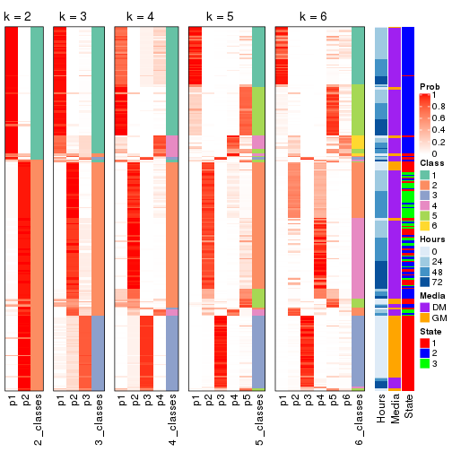


Test correlation between subgroups and known annotations. If the known
annotation is numeric, one-way ANOVA test is applied, and if the known
annotation is discrete, chi-squared contingency table test is applied.

```r
test_to_known_factors(res)
```

```
#>             n Hours(p) Media(p) State(p) k
#> SD:kmeans 268 1.41e-06 4.16e-07 6.50e-30 2
#> SD:kmeans 257 3.93e-30 6.91e-33 8.23e-52 3
#> SD:kmeans 259 3.55e-27 4.20e-30 7.01e-46 4
#> SD:kmeans 243 8.73e-22 2.21e-24 2.54e-41 5
#> SD:kmeans 226 3.91e-24 1.08e-22 1.31e-44 6
```


If matrix rows can be associated to genes, consider to use `GO_Enrichment(res,
...)` to perform function enrichment for the signature genes.


 

---------------------------------------------------


### SD:skmeans*


The object with results only for a single top-value method and a single partition method 
can be extracted as:

```r
res = res_list["SD", "skmeans"]
# you can also extract it by
# res = res_list["SD:skmeans"]
```

A summary of `res` and all the functions that can be applied to it:

```r
res
```

```
#> A 'ConsensusPartition' object with k = 2, 3, 4, 5, 6.
#>   On a matrix with 12016 rows and 271 columns.
#>   Top rows (1000, 2000, 3000, 4000, 5000) are extracted by 'SD' method.
#>   Subgroups are detected by 'skmeans' method.
#>   Performed in total 1250 partitions by row resampling.
#>   Best k for subgroups seems to be 3.
#> 
#> Following methods can be applied to this 'ConsensusPartition' object:
#>  [1] "cola_report"             "collect_classes"         "collect_plots"          
#>  [4] "collect_stats"           "colnames"                "compare_signatures"     
#>  [7] "consensus_heatmap"       "dimension_reduction"     "functional_enrichment"  
#> [10] "get_anno_col"            "get_anno"                "get_classes"            
#> [13] "get_consensus"           "get_matrix"              "get_membership"         
#> [16] "get_param"               "get_signatures"          "get_stats"              
#> [19] "is_best_k"               "is_stable_k"             "membership_heatmap"     
#> [22] "ncol"                    "nrow"                    "plot_ecdf"              
#> [25] "rownames"                "select_partition_number" "show"                   
#> [28] "suggest_best_k"          "test_to_known_factors"
```

`collect_plots()` function collects all the plots made from `res` for all `k` (number of partitions)
into one single page to provide an easy and fast comparison between different `k`.

```r
collect_plots(res)
```


The plots are:

- The first row: a plot of the ECDF (Empirical cumulative distribution
  function) curves of the consensus matrix for each `k` and the heatmap of
  predicted classes for each `k`.
- The second row: heatmaps of the consensus matrix for each `k`.
- The third row: heatmaps of the membership matrix for each `k`.
- The fouth row: heatmaps of the signatures for each `k`.

All the plots in panels can be made by individual functions and they are
plotted later in this section.

`select_partition_number()` produces several plots showing different
statistics for choosing "optimized" `k`. There are following statistics:

- ECDF curves of the consensus matrix for each `k`;
- 1-PAC. [The PAC
  score](https://en.wikipedia.org/wiki/Consensus_clustering#Over-interpretation_potential_of_consensus_clustering)
  measures the proportion of the ambiguous subgrouping.
- Mean silhouette score.
- Concordance. The mean probability of fiting the consensus class ids in all
  partitions.
- Area increased. Denote $A_k$ as the area under the ECDF curve for current
  `k`, the area increased is defined as $A_k - A_{k-1}$.
- Rand index. The percent of pairs of samples that are both in a same cluster
  or both are not in a same cluster in the partition of k and k-1.
- Jaccard index. The ratio of pairs of samples are both in a same cluster in
  the partition of k and k-1 and the pairs of samples are both in a same
  cluster in the partition k or k-1.

The detailed explanations of these statistics can be found in [the cola
vignette](http://bioconductor.org/packages/devel/bioc/vignettes/cola/inst/doc/cola.html#toc_13).

Generally speaking, lower PAC score, higher mean silhouette score or higher
concordance corresponds to better partition. Rand index and Jaccard index
measure how similar the current partition is compared to partition with `k-1`.
If they are too similar, we won't accept `k` is better than `k-1`.

```r
select_partition_number(res)
```


The numeric values for all these statistics can be obtained by `get_stats()`.

```r
get_stats(res)
```

```
#>   k 1-PAC mean_silhouette concordance area_increased  Rand Jaccard
#> 2 2 0.924           0.936       0.973         0.4947 0.510   0.510
#> 3 3 0.948           0.938       0.974         0.3258 0.784   0.597
#> 4 4 0.855           0.851       0.926         0.1327 0.858   0.618
#> 5 5 0.725           0.721       0.841         0.0709 0.920   0.701
#> 6 6 0.698           0.623       0.778         0.0374 0.976   0.886
```

`suggest_best_k()` suggests the best $k$ based on these statistics. The rules are as follows:

- All $k$ with Jaccard index larger than 0.95 are removed because the increase of
  the partition number does not provides enough extra information. If all $k$ are removed,
  the best $k$ is assigned by `NA`.
- For $k$ with 1-PAC larger than 0.9, the maximal $k$ is taken as the "best k". Other $k$ is called "optional k".
- If it does not fit the second rule. The $k$ with the highest vote of highest
  1-PAC, mean silhouette and concordance is taken as the "best k".

```r
suggest_best_k(res)
```

```
#> [1] 3
#> attr(,"optional")
#> [1] 2
```

There is also optional best $k$ = 2 that is worth to check.

Following shows the table of the partitions (You need to click the **show/hide
code output** link to see it). The membership matrix (columns with name `p*`)
is inferred by
[`clue::cl_consensus()`](https://www.rdocumentation.org/link/cl_consensus?package=clue)
function with the `SE` method. Basically the value in the membership matrix
represents the probability to belong to a certain group. The finall class
label for an item is determined with the group with highest probability it
belongs to.

In `get_classes()` function, the entropy is calculated from the membership
matrix and the silhouette score is calculated from the consensus matrix.


<script>
$( function() {
	$( '#tabs-SD-skmeans-get-classes' ).tabs();
} );
</script>
<div id='tabs-SD-skmeans-get-classes'>
<ul>
<li><a href='#tab-SD-skmeans-get-classes-1'>k = 2</a></li>
<li><a href='#tab-SD-skmeans-get-classes-2'>k = 3</a></li>
<li><a href='#tab-SD-skmeans-get-classes-3'>k = 4</a></li>
<li><a href='#tab-SD-skmeans-get-classes-4'>k = 5</a></li>
<li><a href='#tab-SD-skmeans-get-classes-5'>k = 6</a></li>
</ul>

<div id='tab-SD-skmeans-get-classes-1'>
<p><a id='tab-SD-skmeans-get-classes-1-a' style='color:#0366d6' href='#'>show/hide code output</a></p>
<pre><code class="r">cbind(get_classes(res, k = 2), get_membership(res, k = 2))
</code></pre>

<pre><code>#&gt;            class entropy silhouette    p1    p2
#&gt; T0_CT_A01      2  0.0000      0.962 0.000 1.000
#&gt; T0_CT_A03      2  0.0000      0.962 0.000 1.000
#&gt; T0_CT_A05      2  0.6148      0.819 0.152 0.848
#&gt; T0_CT_A06      2  0.0000      0.962 0.000 1.000
#&gt; T0_CT_A07      2  0.0000      0.962 0.000 1.000
#&gt; T0_CT_A08      1  0.0000      0.984 1.000 0.000
#&gt; T0_CT_A10      2  0.8608      0.630 0.284 0.716
#&gt; T0_CT_A11      1  0.0000      0.984 1.000 0.000
#&gt; T0_CT_B01      1  0.2423      0.947 0.960 0.040
#&gt; T0_CT_B03      2  0.0000      0.962 0.000 1.000
#&gt; T0_CT_B05      2  0.9000      0.573 0.316 0.684
#&gt; T0_CT_B07      2  0.5946      0.827 0.144 0.856
#&gt; T0_CT_B08      2  0.0000      0.962 0.000 1.000
#&gt; T0_CT_B09      2  0.0938      0.954 0.012 0.988
#&gt; T0_CT_C02      2  0.0000      0.962 0.000 1.000
#&gt; T0_CT_C03      1  0.0000      0.984 1.000 0.000
#&gt; T0_CT_C05      2  0.0000      0.962 0.000 1.000
#&gt; T0_CT_C06      1  0.0000      0.984 1.000 0.000
#&gt; T0_CT_C07      1  0.0000      0.984 1.000 0.000
#&gt; T0_CT_C08      2  0.0000      0.962 0.000 1.000
#&gt; T0_CT_C09      1  0.7219      0.751 0.800 0.200
#&gt; T0_CT_C11      2  0.0000      0.962 0.000 1.000
#&gt; T0_CT_C12      2  0.0000      0.962 0.000 1.000
#&gt; T0_CT_D01      2  0.0000      0.962 0.000 1.000
#&gt; T0_CT_D02      1  0.0000      0.984 1.000 0.000
#&gt; T0_CT_D03      2  0.0000      0.962 0.000 1.000
#&gt; T0_CT_D05      2  0.0000      0.962 0.000 1.000
#&gt; T0_CT_D06      2  0.0000      0.962 0.000 1.000
#&gt; T0_CT_D07      2  0.2043      0.939 0.032 0.968
#&gt; T0_CT_D08      2  0.0000      0.962 0.000 1.000
#&gt; T0_CT_D09      2  0.0000      0.962 0.000 1.000
#&gt; T0_CT_D11      2  0.0000      0.962 0.000 1.000
#&gt; T0_CT_D12      2  0.0672      0.957 0.008 0.992
#&gt; T0_CT_E01      2  0.0000      0.962 0.000 1.000
#&gt; T0_CT_E03      2  0.8207      0.677 0.256 0.744
#&gt; T0_CT_E04      2  0.0000      0.962 0.000 1.000
#&gt; T0_CT_E05      1  0.0000      0.984 1.000 0.000
#&gt; T0_CT_E06      2  0.0000      0.962 0.000 1.000
#&gt; T0_CT_E07      2  0.0000      0.962 0.000 1.000
#&gt; T0_CT_E08      2  0.0000      0.962 0.000 1.000
#&gt; T0_CT_E09      2  0.0000      0.962 0.000 1.000
#&gt; T0_CT_E10      1  0.7219      0.751 0.800 0.200
#&gt; T0_CT_E11      2  0.0376      0.959 0.004 0.996
#&gt; T0_CT_E12      1  0.0672      0.977 0.992 0.008
#&gt; T0_CT_F01      2  0.0000      0.962 0.000 1.000
#&gt; T0_CT_F02      2  0.6712      0.789 0.176 0.824
#&gt; T0_CT_F03      2  0.0672      0.957 0.008 0.992
#&gt; T0_CT_F04      2  0.9522      0.454 0.372 0.628
#&gt; T0_CT_F05      2  0.0000      0.962 0.000 1.000
#&gt; T0_CT_F06      2  0.0000      0.962 0.000 1.000
#&gt; T0_CT_F07      2  0.4298      0.888 0.088 0.912
#&gt; T0_CT_F09      2  0.0000      0.962 0.000 1.000
#&gt; T0_CT_F11      1  0.2948      0.935 0.948 0.052
#&gt; T0_CT_F12      2  0.6973      0.773 0.188 0.812
#&gt; T0_CT_G01      2  0.0000      0.962 0.000 1.000
#&gt; T0_CT_G02      1  0.0000      0.984 1.000 0.000
#&gt; T0_CT_G03      2  0.9977      0.169 0.472 0.528
#&gt; T0_CT_G04      2  0.0000      0.962 0.000 1.000
#&gt; T0_CT_G07      2  0.0000      0.962 0.000 1.000
#&gt; T0_CT_G08      2  0.0000      0.962 0.000 1.000
#&gt; T0_CT_G09      1  0.0000      0.984 1.000 0.000
#&gt; T0_CT_G11      1  0.0000      0.984 1.000 0.000
#&gt; T0_CT_H01      1  0.0000      0.984 1.000 0.000
#&gt; T0_CT_H02      2  0.0000      0.962 0.000 1.000
#&gt; T0_CT_H04      2  0.0000      0.962 0.000 1.000
#&gt; T0_CT_H05      1  0.1184      0.970 0.984 0.016
#&gt; T0_CT_H08      2  0.2603      0.928 0.044 0.956
#&gt; T0_CT_H09      2  0.9977      0.103 0.472 0.528
#&gt; T0_CT_H12      1  0.0000      0.984 1.000 0.000
#&gt; T24_CT_A01     1  0.0000      0.984 1.000 0.000
#&gt; T24_CT_A03     2  0.0000      0.962 0.000 1.000
#&gt; T24_CT_A04     2  0.0000      0.962 0.000 1.000
#&gt; T24_CT_A05     1  0.0000      0.984 1.000 0.000
#&gt; T24_CT_A07     2  0.0000      0.962 0.000 1.000
#&gt; T24_CT_A08     1  0.0000      0.984 1.000 0.000
#&gt; T24_CT_A09     1  0.0000      0.984 1.000 0.000
#&gt; T24_CT_A10     1  0.0000      0.984 1.000 0.000
#&gt; T24_CT_B01     1  0.0000      0.984 1.000 0.000
#&gt; T24_CT_B02     1  0.0000      0.984 1.000 0.000
#&gt; T24_CT_B03     2  0.0000      0.962 0.000 1.000
#&gt; T24_CT_B05     2  0.0000      0.962 0.000 1.000
#&gt; T24_CT_B06     2  0.0000      0.962 0.000 1.000
#&gt; T24_CT_B07     1  0.0000      0.984 1.000 0.000
#&gt; T24_CT_B08     2  0.0000      0.962 0.000 1.000
#&gt; T24_CT_B09     1  0.0000      0.984 1.000 0.000
#&gt; T24_CT_B11     1  0.0000      0.984 1.000 0.000
#&gt; T24_CT_C01     1  0.0000      0.984 1.000 0.000
#&gt; T24_CT_C02     1  0.9000      0.544 0.684 0.316
#&gt; T24_CT_C03     1  0.0000      0.984 1.000 0.000
#&gt; T24_CT_C05     2  0.0000      0.962 0.000 1.000
#&gt; T24_CT_C07     2  0.0000      0.962 0.000 1.000
#&gt; T24_CT_C08     2  0.0000      0.962 0.000 1.000
#&gt; T24_CT_C09     1  0.8386      0.638 0.732 0.268
#&gt; T24_CT_C10     1  0.0000      0.984 1.000 0.000
#&gt; T24_CT_C11     1  0.0000      0.984 1.000 0.000
#&gt; T24_CT_C12     2  0.0000      0.962 0.000 1.000
#&gt; T24_CT_D01     2  0.0000      0.962 0.000 1.000
#&gt; T24_CT_D02     2  0.0000      0.962 0.000 1.000
#&gt; T24_CT_D03     2  0.0000      0.962 0.000 1.000
#&gt; T24_CT_D04     1  0.0000      0.984 1.000 0.000
#&gt; T24_CT_D05     1  0.0000      0.984 1.000 0.000
#&gt; T24_CT_D06     1  0.0000      0.984 1.000 0.000
#&gt; T24_CT_D07     1  0.5178      0.857 0.884 0.116
#&gt; T24_CT_D08     2  0.0000      0.962 0.000 1.000
#&gt; T24_CT_D09     2  0.0000      0.962 0.000 1.000
#&gt; T24_CT_D10     2  0.0000      0.962 0.000 1.000
#&gt; T24_CT_D11     2  0.0000      0.962 0.000 1.000
#&gt; T24_CT_E01     1  0.0000      0.984 1.000 0.000
#&gt; T24_CT_E02     1  0.0000      0.984 1.000 0.000
#&gt; T24_CT_E04     2  0.0000      0.962 0.000 1.000
#&gt; T24_CT_E05     1  0.0000      0.984 1.000 0.000
#&gt; T24_CT_E07     2  0.3879      0.900 0.076 0.924
#&gt; T24_CT_E09     1  0.0000      0.984 1.000 0.000
#&gt; T24_CT_E11     1  0.0000      0.984 1.000 0.000
#&gt; T24_CT_E12     2  0.0000      0.962 0.000 1.000
#&gt; T24_CT_F01     2  0.0000      0.962 0.000 1.000
#&gt; T24_CT_F02     2  0.0000      0.962 0.000 1.000
#&gt; T24_CT_F03     1  0.0000      0.984 1.000 0.000
#&gt; T24_CT_F04     1  0.0000      0.984 1.000 0.000
#&gt; T24_CT_F05     1  0.0000      0.984 1.000 0.000
#&gt; T24_CT_F07     1  0.0000      0.984 1.000 0.000
#&gt; T24_CT_F08     1  0.0000      0.984 1.000 0.000
#&gt; T24_CT_F09     2  0.0000      0.962 0.000 1.000
#&gt; T24_CT_F10     2  0.1843      0.942 0.028 0.972
#&gt; T24_CT_F11     1  0.0000      0.984 1.000 0.000
#&gt; T24_CT_F12     2  0.0000      0.962 0.000 1.000
#&gt; T24_CT_G01     2  0.0000      0.962 0.000 1.000
#&gt; T24_CT_G02     1  0.0000      0.984 1.000 0.000
#&gt; T24_CT_G03     1  0.0000      0.984 1.000 0.000
#&gt; T24_CT_G04     2  0.0000      0.962 0.000 1.000
#&gt; T24_CT_G05     2  0.8443      0.625 0.272 0.728
#&gt; T24_CT_G06     1  0.0000      0.984 1.000 0.000
#&gt; T24_CT_G08     1  0.0000      0.984 1.000 0.000
#&gt; T24_CT_G10     2  0.0000      0.962 0.000 1.000
#&gt; T24_CT_G11     1  0.0000      0.984 1.000 0.000
#&gt; T24_CT_G12     1  0.0000      0.984 1.000 0.000
#&gt; T24_CT_H01     2  0.8499      0.645 0.276 0.724
#&gt; T24_CT_H02     1  0.0000      0.984 1.000 0.000
#&gt; T24_CT_H03     2  0.0000      0.962 0.000 1.000
#&gt; T24_CT_H05     1  0.0000      0.984 1.000 0.000
#&gt; T24_CT_H07     1  0.0000      0.984 1.000 0.000
#&gt; T24_CT_H09     1  0.0000      0.984 1.000 0.000
#&gt; T24_CT_H12     1  0.0000      0.984 1.000 0.000
#&gt; T48_CT_A01     2  0.0000      0.962 0.000 1.000
#&gt; T48_CT_A02     2  0.0000      0.962 0.000 1.000
#&gt; T48_CT_A03     1  0.0000      0.984 1.000 0.000
#&gt; T48_CT_A04     2  0.0000      0.962 0.000 1.000
#&gt; T48_CT_A05     2  0.0000      0.962 0.000 1.000
#&gt; T48_CT_A06     1  0.0000      0.984 1.000 0.000
#&gt; T48_CT_A07     2  0.0000      0.962 0.000 1.000
#&gt; T48_CT_A08     2  0.0000      0.962 0.000 1.000
#&gt; T48_CT_A09     1  0.0000      0.984 1.000 0.000
#&gt; T48_CT_A10     2  0.0000      0.962 0.000 1.000
#&gt; T48_CT_A11     2  0.0000      0.962 0.000 1.000
#&gt; T48_CT_A12     1  0.0000      0.984 1.000 0.000
#&gt; T48_CT_B01     2  0.0000      0.962 0.000 1.000
#&gt; T48_CT_B02     2  0.0000      0.962 0.000 1.000
#&gt; T48_CT_B03     1  0.0000      0.984 1.000 0.000
#&gt; T48_CT_B04     1  0.0000      0.984 1.000 0.000
#&gt; T48_CT_B06     2  0.0000      0.962 0.000 1.000
#&gt; T48_CT_B08     1  0.0000      0.984 1.000 0.000
#&gt; T48_CT_B10     2  0.0000      0.962 0.000 1.000
#&gt; T48_CT_B11     2  0.0000      0.962 0.000 1.000
#&gt; T48_CT_B12     1  0.0000      0.984 1.000 0.000
#&gt; T48_CT_C01     2  0.0000      0.962 0.000 1.000
#&gt; T48_CT_C02     1  0.0000      0.984 1.000 0.000
#&gt; T48_CT_C03     2  0.0000      0.962 0.000 1.000
#&gt; T48_CT_C04     1  0.0000      0.984 1.000 0.000
#&gt; T48_CT_C05     2  0.0000      0.962 0.000 1.000
#&gt; T48_CT_C06     2  0.0000      0.962 0.000 1.000
#&gt; T48_CT_C07     1  0.0000      0.984 1.000 0.000
#&gt; T48_CT_C09     2  0.0000      0.962 0.000 1.000
#&gt; T48_CT_C10     1  0.0000      0.984 1.000 0.000
#&gt; T48_CT_C11     2  0.0000      0.962 0.000 1.000
#&gt; T48_CT_D01     1  0.7219      0.751 0.800 0.200
#&gt; T48_CT_D02     1  0.0000      0.984 1.000 0.000
#&gt; T48_CT_D03     1  0.0000      0.984 1.000 0.000
#&gt; T48_CT_D04     2  0.0000      0.962 0.000 1.000
#&gt; T48_CT_D06     2  0.0000      0.962 0.000 1.000
#&gt; T48_CT_D07     2  0.0000      0.962 0.000 1.000
#&gt; T48_CT_D08     1  0.0000      0.984 1.000 0.000
#&gt; T48_CT_D09     2  0.9896      0.214 0.440 0.560
#&gt; T48_CT_D10     1  0.0000      0.984 1.000 0.000
#&gt; T48_CT_D11     2  0.0000      0.962 0.000 1.000
#&gt; T48_CT_D12     1  0.0000      0.984 1.000 0.000
#&gt; T48_CT_E01     2  0.1633      0.945 0.024 0.976
#&gt; T48_CT_E02     1  0.0000      0.984 1.000 0.000
#&gt; T48_CT_E03     2  0.1843      0.942 0.028 0.972
#&gt; T48_CT_E04     1  0.0000      0.984 1.000 0.000
#&gt; T48_CT_E05     2  0.0000      0.962 0.000 1.000
#&gt; T48_CT_E06     1  0.0000      0.984 1.000 0.000
#&gt; T48_CT_E07     1  0.0000      0.984 1.000 0.000
#&gt; T48_CT_E08     2  0.0000      0.962 0.000 1.000
#&gt; T48_CT_E10     1  0.0000      0.984 1.000 0.000
#&gt; T48_CT_E11     1  0.0000      0.984 1.000 0.000
#&gt; T48_CT_E12     2  0.0000      0.962 0.000 1.000
#&gt; T48_CT_F01     2  0.0000      0.962 0.000 1.000
#&gt; T48_CT_F02     1  0.0000      0.984 1.000 0.000
#&gt; T48_CT_F03     1  0.0000      0.984 1.000 0.000
#&gt; T48_CT_F05     2  0.7056      0.756 0.192 0.808
#&gt; T48_CT_F07     1  0.0000      0.984 1.000 0.000
#&gt; T48_CT_F09     2  0.0000      0.962 0.000 1.000
#&gt; T48_CT_F10     1  0.0000      0.984 1.000 0.000
#&gt; T48_CT_F11     1  0.0000      0.984 1.000 0.000
#&gt; T48_CT_G01     1  0.0000      0.984 1.000 0.000
#&gt; T48_CT_G02     2  0.0000      0.962 0.000 1.000
#&gt; T48_CT_G03     2  0.0000      0.962 0.000 1.000
#&gt; T48_CT_G07     2  0.0000      0.962 0.000 1.000
#&gt; T48_CT_G08     2  0.0000      0.962 0.000 1.000
#&gt; T48_CT_G09     2  0.0376      0.959 0.004 0.996
#&gt; T48_CT_G10     1  0.0000      0.984 1.000 0.000
#&gt; T48_CT_G11     1  0.0000      0.984 1.000 0.000
#&gt; T48_CT_G12     2  0.0000      0.962 0.000 1.000
#&gt; T48_CT_H01     1  0.8661      0.601 0.712 0.288
#&gt; T48_CT_H02     2  0.2948      0.922 0.052 0.948
#&gt; T48_CT_H04     1  0.0000      0.984 1.000 0.000
#&gt; T48_CT_H05     2  0.0000      0.962 0.000 1.000
#&gt; T48_CT_H06     2  0.0000      0.962 0.000 1.000
#&gt; T48_CT_H07     1  0.0000      0.984 1.000 0.000
#&gt; T48_CT_H08     2  0.0000      0.962 0.000 1.000
#&gt; T48_CT_H11     1  0.0000      0.984 1.000 0.000
#&gt; T48_CT_H12     2  0.0000      0.962 0.000 1.000
#&gt; T72_CT_A01     2  0.0000      0.962 0.000 1.000
#&gt; T72_CT_A05     2  0.0000      0.962 0.000 1.000
#&gt; T72_CT_A08     1  0.0000      0.984 1.000 0.000
#&gt; T72_CT_A09     2  0.0000      0.962 0.000 1.000
#&gt; T72_CT_A11     2  0.0000      0.962 0.000 1.000
#&gt; T72_CT_B01     2  0.0000      0.962 0.000 1.000
#&gt; T72_CT_B02     1  0.0000      0.984 1.000 0.000
#&gt; T72_CT_B03     1  0.0000      0.984 1.000 0.000
#&gt; T72_CT_B04     1  0.0000      0.984 1.000 0.000
#&gt; T72_CT_B05     2  0.2423      0.932 0.040 0.960
#&gt; T72_CT_B06     1  0.0000      0.984 1.000 0.000
#&gt; T72_CT_B08     2  0.0000      0.962 0.000 1.000
#&gt; T72_CT_B09     1  0.0000      0.984 1.000 0.000
#&gt; T72_CT_B11     1  0.0000      0.984 1.000 0.000
#&gt; T72_CT_B12     2  0.0000      0.962 0.000 1.000
#&gt; T72_CT_C04     2  0.0000      0.962 0.000 1.000
#&gt; T72_CT_C06     1  0.0376      0.981 0.996 0.004
#&gt; T72_CT_C07     2  0.0000      0.962 0.000 1.000
#&gt; T72_CT_C09     1  0.0000      0.984 1.000 0.000
#&gt; T72_CT_C11     2  0.0000      0.962 0.000 1.000
#&gt; T72_CT_D01     2  0.0000      0.962 0.000 1.000
#&gt; T72_CT_D03     2  0.9710      0.386 0.400 0.600
#&gt; T72_CT_D04     2  0.0000      0.962 0.000 1.000
#&gt; T72_CT_D05     1  0.0000      0.984 1.000 0.000
#&gt; T72_CT_D07     1  0.0000      0.984 1.000 0.000
#&gt; T72_CT_D10     2  0.2423      0.933 0.040 0.960
#&gt; T72_CT_D11     1  0.0000      0.984 1.000 0.000
#&gt; T72_CT_E04     1  0.0000      0.984 1.000 0.000
#&gt; T72_CT_E05     2  0.0000      0.962 0.000 1.000
#&gt; T72_CT_E07     2  0.3733      0.904 0.072 0.928
#&gt; T72_CT_F01     2  0.0000      0.962 0.000 1.000
#&gt; T72_CT_F05     2  0.0000      0.962 0.000 1.000
#&gt; T72_CT_F07     1  0.0000      0.984 1.000 0.000
#&gt; T72_CT_F10     2  0.0000      0.962 0.000 1.000
#&gt; T72_CT_F11     2  0.0000      0.962 0.000 1.000
#&gt; T72_CT_G03     1  0.0000      0.984 1.000 0.000
#&gt; T72_CT_G04     1  0.0000      0.984 1.000 0.000
#&gt; T72_CT_G06     2  0.0000      0.962 0.000 1.000
#&gt; T72_CT_G08     2  0.9983      0.111 0.476 0.524
#&gt; T72_CT_G10     2  0.0000      0.962 0.000 1.000
#&gt; T72_CT_G11     1  0.0000      0.984 1.000 0.000
#&gt; T72_CT_H01     2  0.0000      0.962 0.000 1.000
#&gt; T72_CT_H03     2  0.0000      0.962 0.000 1.000
#&gt; T72_CT_H05     2  0.0000      0.962 0.000 1.000
#&gt; T72_CT_H08     2  0.0000      0.962 0.000 1.000
#&gt; T72_CT_H09     2  0.8144      0.684 0.252 0.748
#&gt; T72_CT_H10     1  0.0000      0.984 1.000 0.000
#&gt; T72_CT_H11     1  0.0000      0.984 1.000 0.000
#&gt; T72_CT_H12     2  0.0000      0.962 0.000 1.000
</code></pre>

<script>
$('#tab-SD-skmeans-get-classes-1-a').parent().next().next().hide();
$('#tab-SD-skmeans-get-classes-1-a').click(function(){
  $('#tab-SD-skmeans-get-classes-1-a').parent().next().next().toggle();
  return(false);
});
</script>
</div>

<div id='tab-SD-skmeans-get-classes-2'>
<p><a id='tab-SD-skmeans-get-classes-2-a' style='color:#0366d6' href='#'>show/hide code output</a></p>
<pre><code class="r">cbind(get_classes(res, k = 3), get_membership(res, k = 3))
</code></pre>

<pre><code>#&gt;            class entropy silhouette    p1    p2    p3
#&gt; T0_CT_A01      3  0.0000     0.9815 0.000 0.000 1.000
#&gt; T0_CT_A03      3  0.0000     0.9815 0.000 0.000 1.000
#&gt; T0_CT_A05      3  0.0000     0.9815 0.000 0.000 1.000
#&gt; T0_CT_A06      3  0.0000     0.9815 0.000 0.000 1.000
#&gt; T0_CT_A07      3  0.0000     0.9815 0.000 0.000 1.000
#&gt; T0_CT_A08      1  0.0000     0.9694 1.000 0.000 0.000
#&gt; T0_CT_A10      3  0.0000     0.9815 0.000 0.000 1.000
#&gt; T0_CT_A11      1  0.1031     0.9463 0.976 0.024 0.000
#&gt; T0_CT_B01      1  0.7523     0.5470 0.660 0.080 0.260
#&gt; T0_CT_B03      3  0.0000     0.9815 0.000 0.000 1.000
#&gt; T0_CT_B05      3  0.0000     0.9815 0.000 0.000 1.000
#&gt; T0_CT_B07      3  0.0000     0.9815 0.000 0.000 1.000
#&gt; T0_CT_B08      3  0.0000     0.9815 0.000 0.000 1.000
#&gt; T0_CT_B09      3  0.0000     0.9815 0.000 0.000 1.000
#&gt; T0_CT_C02      3  0.0000     0.9815 0.000 0.000 1.000
#&gt; T0_CT_C03      1  0.1289     0.9408 0.968 0.000 0.032
#&gt; T0_CT_C05      2  0.0237     0.9682 0.000 0.996 0.004
#&gt; T0_CT_C06      1  0.0661     0.9598 0.988 0.008 0.004
#&gt; T0_CT_C07      3  0.0000     0.9815 0.000 0.000 1.000
#&gt; T0_CT_C08      3  0.0000     0.9815 0.000 0.000 1.000
#&gt; T0_CT_C09      1  0.6062     0.3847 0.616 0.384 0.000
#&gt; T0_CT_C11      2  0.0000     0.9711 0.000 1.000 0.000
#&gt; T0_CT_C12      3  0.0000     0.9815 0.000 0.000 1.000
#&gt; T0_CT_D01      3  0.0000     0.9815 0.000 0.000 1.000
#&gt; T0_CT_D02      3  0.0237     0.9782 0.004 0.000 0.996
#&gt; T0_CT_D03      3  0.0000     0.9815 0.000 0.000 1.000
#&gt; T0_CT_D05      3  0.1753     0.9350 0.000 0.048 0.952
#&gt; T0_CT_D06      3  0.0000     0.9815 0.000 0.000 1.000
#&gt; T0_CT_D07      3  0.0000     0.9815 0.000 0.000 1.000
#&gt; T0_CT_D08      3  0.0000     0.9815 0.000 0.000 1.000
#&gt; T0_CT_D09      2  0.3941     0.8252 0.000 0.844 0.156
#&gt; T0_CT_D11      2  0.0000     0.9711 0.000 1.000 0.000
#&gt; T0_CT_D12      3  0.0000     0.9815 0.000 0.000 1.000
#&gt; T0_CT_E01      3  0.0000     0.9815 0.000 0.000 1.000
#&gt; T0_CT_E03      3  0.0000     0.9815 0.000 0.000 1.000
#&gt; T0_CT_E04      2  0.0000     0.9711 0.000 1.000 0.000
#&gt; T0_CT_E05      1  0.0000     0.9694 1.000 0.000 0.000
#&gt; T0_CT_E06      3  0.0000     0.9815 0.000 0.000 1.000
#&gt; T0_CT_E07      3  0.0000     0.9815 0.000 0.000 1.000
#&gt; T0_CT_E08      3  0.0000     0.9815 0.000 0.000 1.000
#&gt; T0_CT_E09      3  0.0000     0.9815 0.000 0.000 1.000
#&gt; T0_CT_E10      1  0.6062     0.3847 0.616 0.384 0.000
#&gt; T0_CT_E11      3  0.0000     0.9815 0.000 0.000 1.000
#&gt; T0_CT_E12      3  0.0000     0.9815 0.000 0.000 1.000
#&gt; T0_CT_F01      3  0.0000     0.9815 0.000 0.000 1.000
#&gt; T0_CT_F02      3  0.0000     0.9815 0.000 0.000 1.000
#&gt; T0_CT_F03      3  0.0000     0.9815 0.000 0.000 1.000
#&gt; T0_CT_F04      3  0.0000     0.9815 0.000 0.000 1.000
#&gt; T0_CT_F05      3  0.4235     0.7759 0.000 0.176 0.824
#&gt; T0_CT_F06      3  0.0000     0.9815 0.000 0.000 1.000
#&gt; T0_CT_F07      3  0.0000     0.9815 0.000 0.000 1.000
#&gt; T0_CT_F09      2  0.0000     0.9711 0.000 1.000 0.000
#&gt; T0_CT_F11      3  0.0000     0.9815 0.000 0.000 1.000
#&gt; T0_CT_F12      3  0.0000     0.9815 0.000 0.000 1.000
#&gt; T0_CT_G01      3  0.0000     0.9815 0.000 0.000 1.000
#&gt; T0_CT_G02      3  0.1289     0.9522 0.032 0.000 0.968
#&gt; T0_CT_G03      3  0.0000     0.9815 0.000 0.000 1.000
#&gt; T0_CT_G04      3  0.0000     0.9815 0.000 0.000 1.000
#&gt; T0_CT_G07      3  0.0000     0.9815 0.000 0.000 1.000
#&gt; T0_CT_G08      3  0.0000     0.9815 0.000 0.000 1.000
#&gt; T0_CT_G09      1  0.0000     0.9694 1.000 0.000 0.000
#&gt; T0_CT_G11      1  0.6291     0.1324 0.532 0.000 0.468
#&gt; T0_CT_H01      1  0.3551     0.8330 0.868 0.000 0.132
#&gt; T0_CT_H02      2  0.4121     0.8072 0.000 0.832 0.168
#&gt; T0_CT_H04      3  0.0000     0.9815 0.000 0.000 1.000
#&gt; T0_CT_H05      3  0.0237     0.9782 0.004 0.000 0.996
#&gt; T0_CT_H08      3  0.0000     0.9815 0.000 0.000 1.000
#&gt; T0_CT_H09      2  0.6586     0.6652 0.056 0.728 0.216
#&gt; T0_CT_H12      3  0.0424     0.9749 0.008 0.000 0.992
#&gt; T24_CT_A01     1  0.0000     0.9694 1.000 0.000 0.000
#&gt; T24_CT_A03     2  0.0000     0.9711 0.000 1.000 0.000
#&gt; T24_CT_A04     2  0.0000     0.9711 0.000 1.000 0.000
#&gt; T24_CT_A05     3  0.5905     0.4404 0.352 0.000 0.648
#&gt; T24_CT_A07     2  0.0000     0.9711 0.000 1.000 0.000
#&gt; T24_CT_A08     1  0.0000     0.9694 1.000 0.000 0.000
#&gt; T24_CT_A09     1  0.0000     0.9694 1.000 0.000 0.000
#&gt; T24_CT_A10     1  0.0000     0.9694 1.000 0.000 0.000
#&gt; T24_CT_B01     1  0.0000     0.9694 1.000 0.000 0.000
#&gt; T24_CT_B02     1  0.0000     0.9694 1.000 0.000 0.000
#&gt; T24_CT_B03     2  0.0000     0.9711 0.000 1.000 0.000
#&gt; T24_CT_B05     2  0.0000     0.9711 0.000 1.000 0.000
#&gt; T24_CT_B06     2  0.0000     0.9711 0.000 1.000 0.000
#&gt; T24_CT_B07     1  0.0000     0.9694 1.000 0.000 0.000
#&gt; T24_CT_B08     2  0.0000     0.9711 0.000 1.000 0.000
#&gt; T24_CT_B09     1  0.0000     0.9694 1.000 0.000 0.000
#&gt; T24_CT_B11     3  0.0000     0.9815 0.000 0.000 1.000
#&gt; T24_CT_C01     1  0.0000     0.9694 1.000 0.000 0.000
#&gt; T24_CT_C02     2  0.0000     0.9711 0.000 1.000 0.000
#&gt; T24_CT_C03     1  0.0000     0.9694 1.000 0.000 0.000
#&gt; T24_CT_C05     2  0.0000     0.9711 0.000 1.000 0.000
#&gt; T24_CT_C07     2  0.0000     0.9711 0.000 1.000 0.000
#&gt; T24_CT_C08     2  0.0000     0.9711 0.000 1.000 0.000
#&gt; T24_CT_C09     2  0.0000     0.9711 0.000 1.000 0.000
#&gt; T24_CT_C10     1  0.0000     0.9694 1.000 0.000 0.000
#&gt; T24_CT_C11     1  0.0237     0.9658 0.996 0.004 0.000
#&gt; T24_CT_C12     2  0.0000     0.9711 0.000 1.000 0.000
#&gt; T24_CT_D01     2  0.0000     0.9711 0.000 1.000 0.000
#&gt; T24_CT_D02     2  0.0000     0.9711 0.000 1.000 0.000
#&gt; T24_CT_D03     2  0.0000     0.9711 0.000 1.000 0.000
#&gt; T24_CT_D04     1  0.0000     0.9694 1.000 0.000 0.000
#&gt; T24_CT_D05     1  0.0000     0.9694 1.000 0.000 0.000
#&gt; T24_CT_D06     1  0.0000     0.9694 1.000 0.000 0.000
#&gt; T24_CT_D07     1  0.4974     0.6842 0.764 0.236 0.000
#&gt; T24_CT_D08     2  0.0000     0.9711 0.000 1.000 0.000
#&gt; T24_CT_D09     2  0.0000     0.9711 0.000 1.000 0.000
#&gt; T24_CT_D10     2  0.0000     0.9711 0.000 1.000 0.000
#&gt; T24_CT_D11     2  0.0000     0.9711 0.000 1.000 0.000
#&gt; T24_CT_E01     1  0.0000     0.9694 1.000 0.000 0.000
#&gt; T24_CT_E02     1  0.0000     0.9694 1.000 0.000 0.000
#&gt; T24_CT_E04     2  0.0000     0.9711 0.000 1.000 0.000
#&gt; T24_CT_E05     1  0.0000     0.9694 1.000 0.000 0.000
#&gt; T24_CT_E07     2  0.1753     0.9273 0.048 0.952 0.000
#&gt; T24_CT_E09     1  0.0000     0.9694 1.000 0.000 0.000
#&gt; T24_CT_E11     1  0.0000     0.9694 1.000 0.000 0.000
#&gt; T24_CT_E12     2  0.0000     0.9711 0.000 1.000 0.000
#&gt; T24_CT_F01     2  0.0000     0.9711 0.000 1.000 0.000
#&gt; T24_CT_F02     2  0.0000     0.9711 0.000 1.000 0.000
#&gt; T24_CT_F03     1  0.0000     0.9694 1.000 0.000 0.000
#&gt; T24_CT_F04     1  0.0000     0.9694 1.000 0.000 0.000
#&gt; T24_CT_F05     1  0.0000     0.9694 1.000 0.000 0.000
#&gt; T24_CT_F07     1  0.0000     0.9694 1.000 0.000 0.000
#&gt; T24_CT_F08     1  0.0000     0.9694 1.000 0.000 0.000
#&gt; T24_CT_F09     2  0.0000     0.9711 0.000 1.000 0.000
#&gt; T24_CT_F10     3  0.6079     0.3338 0.000 0.388 0.612
#&gt; T24_CT_F11     1  0.0000     0.9694 1.000 0.000 0.000
#&gt; T24_CT_F12     2  0.4452     0.7745 0.000 0.808 0.192
#&gt; T24_CT_G01     2  0.0000     0.9711 0.000 1.000 0.000
#&gt; T24_CT_G02     1  0.0000     0.9694 1.000 0.000 0.000
#&gt; T24_CT_G03     1  0.0000     0.9694 1.000 0.000 0.000
#&gt; T24_CT_G04     2  0.0000     0.9711 0.000 1.000 0.000
#&gt; T24_CT_G05     2  0.0000     0.9711 0.000 1.000 0.000
#&gt; T24_CT_G06     1  0.0000     0.9694 1.000 0.000 0.000
#&gt; T24_CT_G08     1  0.0000     0.9694 1.000 0.000 0.000
#&gt; T24_CT_G10     2  0.0000     0.9711 0.000 1.000 0.000
#&gt; T24_CT_G11     1  0.0000     0.9694 1.000 0.000 0.000
#&gt; T24_CT_G12     1  0.0000     0.9694 1.000 0.000 0.000
#&gt; T24_CT_H01     3  0.0000     0.9815 0.000 0.000 1.000
#&gt; T24_CT_H02     1  0.0000     0.9694 1.000 0.000 0.000
#&gt; T24_CT_H03     2  0.0000     0.9711 0.000 1.000 0.000
#&gt; T24_CT_H05     1  0.0000     0.9694 1.000 0.000 0.000
#&gt; T24_CT_H07     1  0.0000     0.9694 1.000 0.000 0.000
#&gt; T24_CT_H09     1  0.0000     0.9694 1.000 0.000 0.000
#&gt; T24_CT_H12     1  0.0000     0.9694 1.000 0.000 0.000
#&gt; T48_CT_A01     2  0.0000     0.9711 0.000 1.000 0.000
#&gt; T48_CT_A02     2  0.0000     0.9711 0.000 1.000 0.000
#&gt; T48_CT_A03     1  0.0000     0.9694 1.000 0.000 0.000
#&gt; T48_CT_A04     2  0.0000     0.9711 0.000 1.000 0.000
#&gt; T48_CT_A05     2  0.0000     0.9711 0.000 1.000 0.000
#&gt; T48_CT_A06     1  0.0000     0.9694 1.000 0.000 0.000
#&gt; T48_CT_A07     3  0.0000     0.9815 0.000 0.000 1.000
#&gt; T48_CT_A08     2  0.0000     0.9711 0.000 1.000 0.000
#&gt; T48_CT_A09     1  0.0000     0.9694 1.000 0.000 0.000
#&gt; T48_CT_A10     2  0.0000     0.9711 0.000 1.000 0.000
#&gt; T48_CT_A11     2  0.0000     0.9711 0.000 1.000 0.000
#&gt; T48_CT_A12     1  0.0000     0.9694 1.000 0.000 0.000
#&gt; T48_CT_B01     2  0.0000     0.9711 0.000 1.000 0.000
#&gt; T48_CT_B02     2  0.0000     0.9711 0.000 1.000 0.000
#&gt; T48_CT_B03     1  0.0000     0.9694 1.000 0.000 0.000
#&gt; T48_CT_B04     1  0.0000     0.9694 1.000 0.000 0.000
#&gt; T48_CT_B06     2  0.0000     0.9711 0.000 1.000 0.000
#&gt; T48_CT_B08     1  0.0000     0.9694 1.000 0.000 0.000
#&gt; T48_CT_B10     2  0.0000     0.9711 0.000 1.000 0.000
#&gt; T48_CT_B11     2  0.0000     0.9711 0.000 1.000 0.000
#&gt; T48_CT_B12     1  0.0000     0.9694 1.000 0.000 0.000
#&gt; T48_CT_C01     2  0.0000     0.9711 0.000 1.000 0.000
#&gt; T48_CT_C02     1  0.0000     0.9694 1.000 0.000 0.000
#&gt; T48_CT_C03     2  0.0000     0.9711 0.000 1.000 0.000
#&gt; T48_CT_C04     1  0.0000     0.9694 1.000 0.000 0.000
#&gt; T48_CT_C05     2  0.0000     0.9711 0.000 1.000 0.000
#&gt; T48_CT_C06     2  0.0000     0.9711 0.000 1.000 0.000
#&gt; T48_CT_C07     1  0.0000     0.9694 1.000 0.000 0.000
#&gt; T48_CT_C09     2  0.3340     0.8651 0.000 0.880 0.120
#&gt; T48_CT_C10     1  0.0000     0.9694 1.000 0.000 0.000
#&gt; T48_CT_C11     2  0.0000     0.9711 0.000 1.000 0.000
#&gt; T48_CT_D01     2  0.5138     0.6563 0.252 0.748 0.000
#&gt; T48_CT_D02     1  0.0000     0.9694 1.000 0.000 0.000
#&gt; T48_CT_D03     1  0.0000     0.9694 1.000 0.000 0.000
#&gt; T48_CT_D04     2  0.0000     0.9711 0.000 1.000 0.000
#&gt; T48_CT_D06     2  0.0000     0.9711 0.000 1.000 0.000
#&gt; T48_CT_D07     2  0.0000     0.9711 0.000 1.000 0.000
#&gt; T48_CT_D08     1  0.0000     0.9694 1.000 0.000 0.000
#&gt; T48_CT_D09     2  0.0000     0.9711 0.000 1.000 0.000
#&gt; T48_CT_D10     1  0.0000     0.9694 1.000 0.000 0.000
#&gt; T48_CT_D11     2  0.3038     0.8825 0.000 0.896 0.104
#&gt; T48_CT_D12     1  0.0000     0.9694 1.000 0.000 0.000
#&gt; T48_CT_E01     2  0.0592     0.9609 0.012 0.988 0.000
#&gt; T48_CT_E02     1  0.0000     0.9694 1.000 0.000 0.000
#&gt; T48_CT_E03     2  0.6308     0.0635 0.000 0.508 0.492
#&gt; T48_CT_E04     1  0.3340     0.8412 0.880 0.120 0.000
#&gt; T48_CT_E05     2  0.0000     0.9711 0.000 1.000 0.000
#&gt; T48_CT_E06     1  0.0000     0.9694 1.000 0.000 0.000
#&gt; T48_CT_E07     1  0.0000     0.9694 1.000 0.000 0.000
#&gt; T48_CT_E08     2  0.0000     0.9711 0.000 1.000 0.000
#&gt; T48_CT_E10     1  0.0000     0.9694 1.000 0.000 0.000
#&gt; T48_CT_E11     1  0.0000     0.9694 1.000 0.000 0.000
#&gt; T48_CT_E12     3  0.0000     0.9815 0.000 0.000 1.000
#&gt; T48_CT_F01     2  0.0000     0.9711 0.000 1.000 0.000
#&gt; T48_CT_F02     1  0.0000     0.9694 1.000 0.000 0.000
#&gt; T48_CT_F03     1  0.0000     0.9694 1.000 0.000 0.000
#&gt; T48_CT_F05     2  0.0000     0.9711 0.000 1.000 0.000
#&gt; T48_CT_F07     1  0.0000     0.9694 1.000 0.000 0.000
#&gt; T48_CT_F09     2  0.0000     0.9711 0.000 1.000 0.000
#&gt; T48_CT_F10     1  0.0000     0.9694 1.000 0.000 0.000
#&gt; T48_CT_F11     1  0.0000     0.9694 1.000 0.000 0.000
#&gt; T48_CT_G01     1  0.0000     0.9694 1.000 0.000 0.000
#&gt; T48_CT_G02     2  0.0000     0.9711 0.000 1.000 0.000
#&gt; T48_CT_G03     2  0.0000     0.9711 0.000 1.000 0.000
#&gt; T48_CT_G07     2  0.0000     0.9711 0.000 1.000 0.000
#&gt; T48_CT_G08     2  0.0000     0.9711 0.000 1.000 0.000
#&gt; T48_CT_G09     2  0.0000     0.9711 0.000 1.000 0.000
#&gt; T48_CT_G10     1  0.6309     0.0210 0.504 0.000 0.496
#&gt; T48_CT_G11     1  0.0000     0.9694 1.000 0.000 0.000
#&gt; T48_CT_G12     2  0.0000     0.9711 0.000 1.000 0.000
#&gt; T48_CT_H01     2  0.0237     0.9677 0.004 0.996 0.000
#&gt; T48_CT_H02     2  0.6894     0.6127 0.052 0.692 0.256
#&gt; T48_CT_H04     1  0.0000     0.9694 1.000 0.000 0.000
#&gt; T48_CT_H05     2  0.0000     0.9711 0.000 1.000 0.000
#&gt; T48_CT_H06     2  0.0000     0.9711 0.000 1.000 0.000
#&gt; T48_CT_H07     1  0.0000     0.9694 1.000 0.000 0.000
#&gt; T48_CT_H08     2  0.0000     0.9711 0.000 1.000 0.000
#&gt; T48_CT_H11     1  0.0000     0.9694 1.000 0.000 0.000
#&gt; T48_CT_H12     2  0.0000     0.9711 0.000 1.000 0.000
#&gt; T72_CT_A01     2  0.0000     0.9711 0.000 1.000 0.000
#&gt; T72_CT_A05     2  0.2356     0.9121 0.000 0.928 0.072
#&gt; T72_CT_A08     1  0.0000     0.9694 1.000 0.000 0.000
#&gt; T72_CT_A09     2  0.0000     0.9711 0.000 1.000 0.000
#&gt; T72_CT_A11     2  0.0000     0.9711 0.000 1.000 0.000
#&gt; T72_CT_B01     2  0.0000     0.9711 0.000 1.000 0.000
#&gt; T72_CT_B02     1  0.0000     0.9694 1.000 0.000 0.000
#&gt; T72_CT_B03     1  0.0000     0.9694 1.000 0.000 0.000
#&gt; T72_CT_B04     1  0.0000     0.9694 1.000 0.000 0.000
#&gt; T72_CT_B05     2  0.4370     0.8641 0.056 0.868 0.076
#&gt; T72_CT_B06     1  0.0000     0.9694 1.000 0.000 0.000
#&gt; T72_CT_B08     3  0.0000     0.9815 0.000 0.000 1.000
#&gt; T72_CT_B09     1  0.0000     0.9694 1.000 0.000 0.000
#&gt; T72_CT_B11     1  0.0000     0.9694 1.000 0.000 0.000
#&gt; T72_CT_B12     2  0.0000     0.9711 0.000 1.000 0.000
#&gt; T72_CT_C04     2  0.0000     0.9711 0.000 1.000 0.000
#&gt; T72_CT_C06     1  0.0000     0.9694 1.000 0.000 0.000
#&gt; T72_CT_C07     2  0.4399     0.7821 0.000 0.812 0.188
#&gt; T72_CT_C09     1  0.0237     0.9658 0.996 0.004 0.000
#&gt; T72_CT_C11     3  0.0000     0.9815 0.000 0.000 1.000
#&gt; T72_CT_D01     2  0.0000     0.9711 0.000 1.000 0.000
#&gt; T72_CT_D03     1  0.7927     0.5769 0.664 0.160 0.176
#&gt; T72_CT_D04     2  0.0000     0.9711 0.000 1.000 0.000
#&gt; T72_CT_D05     1  0.0000     0.9694 1.000 0.000 0.000
#&gt; T72_CT_D07     1  0.0000     0.9694 1.000 0.000 0.000
#&gt; T72_CT_D10     2  0.4505     0.8564 0.048 0.860 0.092
#&gt; T72_CT_D11     1  0.0000     0.9694 1.000 0.000 0.000
#&gt; T72_CT_E04     1  0.0000     0.9694 1.000 0.000 0.000
#&gt; T72_CT_E05     2  0.0000     0.9711 0.000 1.000 0.000
#&gt; T72_CT_E07     2  0.4281     0.8652 0.072 0.872 0.056
#&gt; T72_CT_F01     2  0.0000     0.9711 0.000 1.000 0.000
#&gt; T72_CT_F05     2  0.0000     0.9711 0.000 1.000 0.000
#&gt; T72_CT_F07     1  0.0000     0.9694 1.000 0.000 0.000
#&gt; T72_CT_F10     2  0.0000     0.9711 0.000 1.000 0.000
#&gt; T72_CT_F11     2  0.3752     0.8384 0.000 0.856 0.144
#&gt; T72_CT_G03     1  0.0000     0.9694 1.000 0.000 0.000
#&gt; T72_CT_G04     1  0.0000     0.9694 1.000 0.000 0.000
#&gt; T72_CT_G06     2  0.2448     0.9098 0.000 0.924 0.076
#&gt; T72_CT_G08     3  0.2845     0.9093 0.068 0.012 0.920
#&gt; T72_CT_G10     2  0.0000     0.9711 0.000 1.000 0.000
#&gt; T72_CT_G11     1  0.0000     0.9694 1.000 0.000 0.000
#&gt; T72_CT_H01     2  0.0000     0.9711 0.000 1.000 0.000
#&gt; T72_CT_H03     2  0.0000     0.9711 0.000 1.000 0.000
#&gt; T72_CT_H05     3  0.0000     0.9815 0.000 0.000 1.000
#&gt; T72_CT_H08     3  0.0000     0.9815 0.000 0.000 1.000
#&gt; T72_CT_H09     3  0.0000     0.9815 0.000 0.000 1.000
#&gt; T72_CT_H10     1  0.0000     0.9694 1.000 0.000 0.000
#&gt; T72_CT_H11     1  0.0000     0.9694 1.000 0.000 0.000
#&gt; T72_CT_H12     2  0.0000     0.9711 0.000 1.000 0.000
</code></pre>

<script>
$('#tab-SD-skmeans-get-classes-2-a').parent().next().next().hide();
$('#tab-SD-skmeans-get-classes-2-a').click(function(){
  $('#tab-SD-skmeans-get-classes-2-a').parent().next().next().toggle();
  return(false);
});
</script>
</div>

<div id='tab-SD-skmeans-get-classes-3'>
<p><a id='tab-SD-skmeans-get-classes-3-a' style='color:#0366d6' href='#'>show/hide code output</a></p>
<pre><code class="r">cbind(get_classes(res, k = 4), get_membership(res, k = 4))
</code></pre>

<pre><code>#&gt;            class entropy silhouette    p1    p2    p3    p4
#&gt; T0_CT_A01      3  0.0000     0.9628 0.000 0.000 1.000 0.000
#&gt; T0_CT_A03      3  0.0000     0.9628 0.000 0.000 1.000 0.000
#&gt; T0_CT_A05      3  0.0000     0.9628 0.000 0.000 1.000 0.000
#&gt; T0_CT_A06      3  0.0000     0.9628 0.000 0.000 1.000 0.000
#&gt; T0_CT_A07      3  0.0000     0.9628 0.000 0.000 1.000 0.000
#&gt; T0_CT_A08      1  0.0000     0.9520 1.000 0.000 0.000 0.000
#&gt; T0_CT_A10      3  0.0000     0.9628 0.000 0.000 1.000 0.000
#&gt; T0_CT_A11      2  0.0524     0.8382 0.008 0.988 0.000 0.004
#&gt; T0_CT_B01      2  0.1109     0.8234 0.000 0.968 0.028 0.004
#&gt; T0_CT_B03      3  0.0000     0.9628 0.000 0.000 1.000 0.000
#&gt; T0_CT_B05      3  0.0188     0.9599 0.004 0.000 0.996 0.000
#&gt; T0_CT_B07      3  0.0000     0.9628 0.000 0.000 1.000 0.000
#&gt; T0_CT_B08      3  0.0000     0.9628 0.000 0.000 1.000 0.000
#&gt; T0_CT_B09      3  0.0000     0.9628 0.000 0.000 1.000 0.000
#&gt; T0_CT_C02      3  0.0000     0.9628 0.000 0.000 1.000 0.000
#&gt; T0_CT_C03      1  0.0707     0.9413 0.980 0.000 0.020 0.000
#&gt; T0_CT_C05      2  0.4767     0.6757 0.000 0.724 0.020 0.256
#&gt; T0_CT_C06      2  0.2125     0.7902 0.076 0.920 0.000 0.004
#&gt; T0_CT_C07      3  0.0000     0.9628 0.000 0.000 1.000 0.000
#&gt; T0_CT_C08      3  0.0000     0.9628 0.000 0.000 1.000 0.000
#&gt; T0_CT_C09      2  0.0469     0.8422 0.000 0.988 0.000 0.012
#&gt; T0_CT_C11      2  0.1118     0.8488 0.000 0.964 0.000 0.036
#&gt; T0_CT_C12      3  0.0000     0.9628 0.000 0.000 1.000 0.000
#&gt; T0_CT_D01      3  0.0000     0.9628 0.000 0.000 1.000 0.000
#&gt; T0_CT_D02      3  0.0592     0.9527 0.000 0.016 0.984 0.000
#&gt; T0_CT_D03      3  0.0000     0.9628 0.000 0.000 1.000 0.000
#&gt; T0_CT_D05      3  0.4188     0.8079 0.000 0.064 0.824 0.112
#&gt; T0_CT_D06      3  0.0000     0.9628 0.000 0.000 1.000 0.000
#&gt; T0_CT_D07      3  0.0000     0.9628 0.000 0.000 1.000 0.000
#&gt; T0_CT_D08      3  0.0000     0.9628 0.000 0.000 1.000 0.000
#&gt; T0_CT_D09      4  0.2944     0.8068 0.000 0.004 0.128 0.868
#&gt; T0_CT_D11      2  0.2676     0.8324 0.000 0.896 0.012 0.092
#&gt; T0_CT_D12      3  0.0000     0.9628 0.000 0.000 1.000 0.000
#&gt; T0_CT_E01      3  0.0000     0.9628 0.000 0.000 1.000 0.000
#&gt; T0_CT_E03      3  0.0000     0.9628 0.000 0.000 1.000 0.000
#&gt; T0_CT_E04      2  0.1716     0.8470 0.000 0.936 0.000 0.064
#&gt; T0_CT_E05      2  0.5132     0.0904 0.448 0.548 0.000 0.004
#&gt; T0_CT_E06      3  0.0000     0.9628 0.000 0.000 1.000 0.000
#&gt; T0_CT_E07      3  0.0000     0.9628 0.000 0.000 1.000 0.000
#&gt; T0_CT_E08      3  0.0000     0.9628 0.000 0.000 1.000 0.000
#&gt; T0_CT_E09      3  0.0000     0.9628 0.000 0.000 1.000 0.000
#&gt; T0_CT_E10      2  0.0469     0.8422 0.000 0.988 0.000 0.012
#&gt; T0_CT_E11      3  0.0000     0.9628 0.000 0.000 1.000 0.000
#&gt; T0_CT_E12      3  0.1389     0.9300 0.000 0.048 0.952 0.000
#&gt; T0_CT_F01      3  0.0000     0.9628 0.000 0.000 1.000 0.000
#&gt; T0_CT_F02      3  0.0000     0.9628 0.000 0.000 1.000 0.000
#&gt; T0_CT_F03      3  0.0000     0.9628 0.000 0.000 1.000 0.000
#&gt; T0_CT_F04      3  0.0000     0.9628 0.000 0.000 1.000 0.000
#&gt; T0_CT_F05      2  0.2002     0.8333 0.000 0.936 0.044 0.020
#&gt; T0_CT_F06      3  0.0000     0.9628 0.000 0.000 1.000 0.000
#&gt; T0_CT_F07      3  0.0000     0.9628 0.000 0.000 1.000 0.000
#&gt; T0_CT_F09      2  0.3400     0.7710 0.000 0.820 0.000 0.180
#&gt; T0_CT_F11      3  0.1792     0.9136 0.000 0.068 0.932 0.000
#&gt; T0_CT_F12      3  0.0000     0.9628 0.000 0.000 1.000 0.000
#&gt; T0_CT_G01      3  0.0000     0.9628 0.000 0.000 1.000 0.000
#&gt; T0_CT_G02      3  0.1474     0.9187 0.052 0.000 0.948 0.000
#&gt; T0_CT_G03      3  0.0000     0.9628 0.000 0.000 1.000 0.000
#&gt; T0_CT_G04      3  0.0000     0.9628 0.000 0.000 1.000 0.000
#&gt; T0_CT_G07      3  0.0000     0.9628 0.000 0.000 1.000 0.000
#&gt; T0_CT_G08      3  0.0000     0.9628 0.000 0.000 1.000 0.000
#&gt; T0_CT_G09      1  0.0779     0.9484 0.980 0.016 0.000 0.004
#&gt; T0_CT_G11      3  0.7577     0.2681 0.328 0.184 0.484 0.004
#&gt; T0_CT_H01      1  0.8564     0.2948 0.480 0.200 0.264 0.056
#&gt; T0_CT_H02      4  0.7581     0.2234 0.000 0.200 0.360 0.440
#&gt; T0_CT_H04      3  0.0000     0.9628 0.000 0.000 1.000 0.000
#&gt; T0_CT_H05      3  0.2216     0.8922 0.000 0.092 0.908 0.000
#&gt; T0_CT_H08      3  0.0000     0.9628 0.000 0.000 1.000 0.000
#&gt; T0_CT_H09      2  0.0469     0.8422 0.000 0.988 0.000 0.012
#&gt; T0_CT_H12      3  0.2345     0.8823 0.000 0.100 0.900 0.000
#&gt; T24_CT_A01     1  0.0336     0.9509 0.992 0.008 0.000 0.000
#&gt; T24_CT_A03     4  0.0188     0.9101 0.000 0.004 0.000 0.996
#&gt; T24_CT_A04     2  0.4567     0.6912 0.000 0.740 0.016 0.244
#&gt; T24_CT_A05     3  0.4963     0.5814 0.284 0.020 0.696 0.000
#&gt; T24_CT_A07     2  0.3942     0.7110 0.000 0.764 0.000 0.236
#&gt; T24_CT_A08     1  0.0000     0.9520 1.000 0.000 0.000 0.000
#&gt; T24_CT_A09     1  0.0469     0.9498 0.988 0.012 0.000 0.000
#&gt; T24_CT_A10     1  0.0895     0.9484 0.976 0.020 0.000 0.004
#&gt; T24_CT_B01     1  0.0707     0.9475 0.980 0.020 0.000 0.000
#&gt; T24_CT_B02     1  0.0817     0.9455 0.976 0.024 0.000 0.000
#&gt; T24_CT_B03     4  0.0188     0.9101 0.000 0.004 0.000 0.996
#&gt; T24_CT_B05     4  0.4564     0.4707 0.000 0.328 0.000 0.672
#&gt; T24_CT_B06     2  0.4961     0.2752 0.000 0.552 0.000 0.448
#&gt; T24_CT_B07     1  0.0000     0.9520 1.000 0.000 0.000 0.000
#&gt; T24_CT_B08     2  0.1118     0.8492 0.000 0.964 0.000 0.036
#&gt; T24_CT_B09     1  0.0000     0.9520 1.000 0.000 0.000 0.000
#&gt; T24_CT_B11     3  0.0000     0.9628 0.000 0.000 1.000 0.000
#&gt; T24_CT_C01     1  0.0336     0.9507 0.992 0.008 0.000 0.000
#&gt; T24_CT_C02     2  0.0592     0.8439 0.000 0.984 0.000 0.016
#&gt; T24_CT_C03     1  0.4830     0.3882 0.608 0.392 0.000 0.000
#&gt; T24_CT_C05     2  0.1022     0.8484 0.000 0.968 0.000 0.032
#&gt; T24_CT_C07     2  0.4624     0.5503 0.000 0.660 0.000 0.340
#&gt; T24_CT_C08     2  0.4790     0.4711 0.000 0.620 0.000 0.380
#&gt; T24_CT_C09     2  0.0592     0.8439 0.000 0.984 0.000 0.016
#&gt; T24_CT_C10     1  0.0000     0.9520 1.000 0.000 0.000 0.000
#&gt; T24_CT_C11     2  0.4277     0.5481 0.280 0.720 0.000 0.000
#&gt; T24_CT_C12     4  0.0469     0.9082 0.000 0.012 0.000 0.988
#&gt; T24_CT_D01     2  0.1716     0.8460 0.000 0.936 0.000 0.064
#&gt; T24_CT_D02     4  0.0895     0.9058 0.000 0.020 0.004 0.976
#&gt; T24_CT_D03     2  0.1389     0.8490 0.000 0.952 0.000 0.048
#&gt; T24_CT_D04     1  0.0000     0.9520 1.000 0.000 0.000 0.000
#&gt; T24_CT_D05     1  0.0336     0.9490 0.992 0.000 0.000 0.008
#&gt; T24_CT_D06     1  0.0000     0.9520 1.000 0.000 0.000 0.000
#&gt; T24_CT_D07     1  0.5371     0.3952 0.616 0.020 0.000 0.364
#&gt; T24_CT_D08     2  0.2011     0.8408 0.000 0.920 0.000 0.080
#&gt; T24_CT_D09     4  0.0592     0.9067 0.000 0.016 0.000 0.984
#&gt; T24_CT_D10     4  0.3801     0.6858 0.000 0.220 0.000 0.780
#&gt; T24_CT_D11     2  0.4967     0.2670 0.000 0.548 0.000 0.452
#&gt; T24_CT_E01     1  0.0779     0.9484 0.980 0.016 0.000 0.004
#&gt; T24_CT_E02     1  0.0707     0.9484 0.980 0.020 0.000 0.000
#&gt; T24_CT_E04     2  0.4761     0.4819 0.000 0.628 0.000 0.372
#&gt; T24_CT_E05     1  0.0188     0.9515 0.996 0.004 0.000 0.000
#&gt; T24_CT_E07     4  0.0804     0.9004 0.008 0.012 0.000 0.980
#&gt; T24_CT_E09     1  0.0000     0.9520 1.000 0.000 0.000 0.000
#&gt; T24_CT_E11     1  0.0469     0.9501 0.988 0.012 0.000 0.000
#&gt; T24_CT_E12     2  0.1867     0.8440 0.000 0.928 0.000 0.072
#&gt; T24_CT_F01     2  0.2814     0.8115 0.000 0.868 0.000 0.132
#&gt; T24_CT_F02     4  0.2704     0.8197 0.000 0.124 0.000 0.876
#&gt; T24_CT_F03     1  0.1004     0.9476 0.972 0.024 0.000 0.004
#&gt; T24_CT_F04     2  0.3400     0.7016 0.180 0.820 0.000 0.000
#&gt; T24_CT_F05     1  0.0779     0.9489 0.980 0.016 0.000 0.004
#&gt; T24_CT_F07     2  0.4916     0.1974 0.424 0.576 0.000 0.000
#&gt; T24_CT_F08     1  0.0921     0.9433 0.972 0.028 0.000 0.000
#&gt; T24_CT_F09     4  0.0592     0.9070 0.000 0.016 0.000 0.984
#&gt; T24_CT_F10     4  0.1492     0.8863 0.004 0.004 0.036 0.956
#&gt; T24_CT_F11     1  0.1004     0.9469 0.972 0.024 0.000 0.004
#&gt; T24_CT_F12     4  0.5759     0.6141 0.000 0.080 0.232 0.688
#&gt; T24_CT_G01     4  0.1792     0.8741 0.000 0.068 0.000 0.932
#&gt; T24_CT_G02     1  0.0000     0.9520 1.000 0.000 0.000 0.000
#&gt; T24_CT_G03     1  0.0469     0.9498 0.988 0.012 0.000 0.000
#&gt; T24_CT_G04     4  0.0469     0.9084 0.000 0.012 0.000 0.988
#&gt; T24_CT_G05     2  0.0921     0.8475 0.000 0.972 0.000 0.028
#&gt; T24_CT_G06     1  0.0000     0.9520 1.000 0.000 0.000 0.000
#&gt; T24_CT_G08     1  0.0707     0.9468 0.980 0.020 0.000 0.000
#&gt; T24_CT_G10     4  0.0336     0.9093 0.000 0.008 0.000 0.992
#&gt; T24_CT_G11     1  0.0592     0.9485 0.984 0.016 0.000 0.000
#&gt; T24_CT_G12     1  0.0188     0.9510 0.996 0.000 0.004 0.000
#&gt; T24_CT_H01     3  0.0000     0.9628 0.000 0.000 1.000 0.000
#&gt; T24_CT_H02     1  0.0000     0.9520 1.000 0.000 0.000 0.000
#&gt; T24_CT_H03     2  0.2704     0.8183 0.000 0.876 0.000 0.124
#&gt; T24_CT_H05     1  0.1743     0.9278 0.940 0.056 0.000 0.004
#&gt; T24_CT_H07     1  0.0657     0.9502 0.984 0.012 0.000 0.004
#&gt; T24_CT_H09     1  0.0188     0.9515 0.996 0.004 0.000 0.000
#&gt; T24_CT_H12     1  0.0000     0.9520 1.000 0.000 0.000 0.000
#&gt; T48_CT_A01     4  0.0188     0.9101 0.000 0.004 0.000 0.996
#&gt; T48_CT_A02     4  0.3569     0.7249 0.000 0.196 0.000 0.804
#&gt; T48_CT_A03     1  0.0000     0.9520 1.000 0.000 0.000 0.000
#&gt; T48_CT_A04     2  0.1940     0.8428 0.000 0.924 0.000 0.076
#&gt; T48_CT_A05     4  0.0657     0.9016 0.004 0.012 0.000 0.984
#&gt; T48_CT_A06     1  0.0000     0.9520 1.000 0.000 0.000 0.000
#&gt; T48_CT_A07     3  0.2814     0.8402 0.000 0.000 0.868 0.132
#&gt; T48_CT_A08     4  0.0188     0.9101 0.000 0.004 0.000 0.996
#&gt; T48_CT_A09     1  0.0657     0.9493 0.984 0.012 0.000 0.004
#&gt; T48_CT_A10     2  0.1118     0.8488 0.000 0.964 0.000 0.036
#&gt; T48_CT_A11     4  0.1867     0.8698 0.000 0.072 0.000 0.928
#&gt; T48_CT_A12     1  0.1398     0.9403 0.956 0.040 0.000 0.004
#&gt; T48_CT_B01     2  0.1022     0.8484 0.000 0.968 0.000 0.032
#&gt; T48_CT_B02     2  0.1118     0.8488 0.000 0.964 0.000 0.036
#&gt; T48_CT_B03     1  0.0000     0.9520 1.000 0.000 0.000 0.000
#&gt; T48_CT_B04     1  0.0000     0.9520 1.000 0.000 0.000 0.000
#&gt; T48_CT_B06     2  0.2530     0.8258 0.000 0.888 0.000 0.112
#&gt; T48_CT_B08     1  0.0000     0.9520 1.000 0.000 0.000 0.000
#&gt; T48_CT_B10     2  0.1022     0.8484 0.000 0.968 0.000 0.032
#&gt; T48_CT_B11     4  0.1302     0.8918 0.000 0.044 0.000 0.956
#&gt; T48_CT_B12     1  0.1004     0.9469 0.972 0.024 0.000 0.004
#&gt; T48_CT_C01     2  0.4605     0.5625 0.000 0.664 0.000 0.336
#&gt; T48_CT_C02     1  0.3486     0.7724 0.812 0.188 0.000 0.000
#&gt; T48_CT_C03     2  0.1211     0.8490 0.000 0.960 0.000 0.040
#&gt; T48_CT_C04     1  0.0000     0.9520 1.000 0.000 0.000 0.000
#&gt; T48_CT_C05     4  0.0000     0.9090 0.000 0.000 0.000 1.000
#&gt; T48_CT_C06     4  0.0336     0.9093 0.000 0.008 0.000 0.992
#&gt; T48_CT_C07     1  0.1004     0.9469 0.972 0.024 0.000 0.004
#&gt; T48_CT_C09     4  0.0707     0.9012 0.000 0.000 0.020 0.980
#&gt; T48_CT_C10     1  0.0000     0.9520 1.000 0.000 0.000 0.000
#&gt; T48_CT_C11     4  0.2149     0.8568 0.000 0.088 0.000 0.912
#&gt; T48_CT_D01     2  0.0469     0.8422 0.000 0.988 0.000 0.012
#&gt; T48_CT_D02     2  0.5112     0.1378 0.436 0.560 0.000 0.004
#&gt; T48_CT_D03     1  0.0000     0.9520 1.000 0.000 0.000 0.000
#&gt; T48_CT_D04     4  0.1867     0.8698 0.000 0.072 0.000 0.928
#&gt; T48_CT_D06     4  0.0188     0.9101 0.000 0.004 0.000 0.996
#&gt; T48_CT_D07     2  0.2149     0.8384 0.000 0.912 0.000 0.088
#&gt; T48_CT_D08     1  0.1109     0.9455 0.968 0.028 0.000 0.004
#&gt; T48_CT_D09     2  0.0921     0.8475 0.000 0.972 0.000 0.028
#&gt; T48_CT_D10     2  0.3710     0.6808 0.192 0.804 0.000 0.004
#&gt; T48_CT_D11     4  0.0376     0.9091 0.000 0.004 0.004 0.992
#&gt; T48_CT_D12     1  0.0000     0.9520 1.000 0.000 0.000 0.000
#&gt; T48_CT_E01     4  0.0937     0.8968 0.012 0.012 0.000 0.976
#&gt; T48_CT_E02     1  0.1398     0.9401 0.956 0.040 0.000 0.004
#&gt; T48_CT_E03     4  0.1271     0.8934 0.008 0.012 0.012 0.968
#&gt; T48_CT_E04     4  0.5213     0.4698 0.328 0.020 0.000 0.652
#&gt; T48_CT_E05     2  0.4500     0.5971 0.000 0.684 0.000 0.316
#&gt; T48_CT_E06     1  0.0469     0.9498 0.988 0.012 0.000 0.000
#&gt; T48_CT_E07     1  0.0000     0.9520 1.000 0.000 0.000 0.000
#&gt; T48_CT_E08     2  0.2647     0.8211 0.000 0.880 0.000 0.120
#&gt; T48_CT_E10     1  0.0000     0.9520 1.000 0.000 0.000 0.000
#&gt; T48_CT_E11     1  0.0188     0.9518 0.996 0.004 0.000 0.000
#&gt; T48_CT_E12     3  0.2408     0.8732 0.000 0.000 0.896 0.104
#&gt; T48_CT_F01     2  0.1302     0.8493 0.000 0.956 0.000 0.044
#&gt; T48_CT_F02     1  0.1305     0.9419 0.960 0.036 0.000 0.004
#&gt; T48_CT_F03     1  0.4608     0.5974 0.692 0.304 0.000 0.004
#&gt; T48_CT_F05     2  0.1022     0.8484 0.000 0.968 0.000 0.032
#&gt; T48_CT_F07     1  0.0657     0.9498 0.984 0.012 0.000 0.004
#&gt; T48_CT_F09     4  0.4277     0.5820 0.000 0.280 0.000 0.720
#&gt; T48_CT_F10     1  0.5161     0.1483 0.520 0.476 0.000 0.004
#&gt; T48_CT_F11     1  0.0000     0.9520 1.000 0.000 0.000 0.000
#&gt; T48_CT_G01     1  0.0336     0.9517 0.992 0.008 0.000 0.000
#&gt; T48_CT_G02     4  0.0188     0.9101 0.000 0.004 0.000 0.996
#&gt; T48_CT_G03     2  0.4356     0.6382 0.000 0.708 0.000 0.292
#&gt; T48_CT_G07     2  0.1792     0.8458 0.000 0.932 0.000 0.068
#&gt; T48_CT_G08     4  0.0188     0.9101 0.000 0.004 0.000 0.996
#&gt; T48_CT_G09     4  0.0469     0.9035 0.000 0.012 0.000 0.988
#&gt; T48_CT_G10     1  0.3219     0.7880 0.836 0.000 0.164 0.000
#&gt; T48_CT_G11     1  0.0895     0.9476 0.976 0.020 0.000 0.004
#&gt; T48_CT_G12     2  0.1637     0.8477 0.000 0.940 0.000 0.060
#&gt; T48_CT_H01     2  0.0592     0.8439 0.000 0.984 0.000 0.016
#&gt; T48_CT_H02     4  0.1139     0.8960 0.008 0.012 0.008 0.972
#&gt; T48_CT_H04     1  0.3764     0.7327 0.784 0.216 0.000 0.000
#&gt; T48_CT_H05     2  0.1118     0.8488 0.000 0.964 0.000 0.036
#&gt; T48_CT_H06     2  0.1867     0.8437 0.000 0.928 0.000 0.072
#&gt; T48_CT_H07     2  0.5155     0.0168 0.468 0.528 0.000 0.004
#&gt; T48_CT_H08     4  0.0188     0.9101 0.000 0.004 0.000 0.996
#&gt; T48_CT_H11     1  0.1109     0.9455 0.968 0.028 0.000 0.004
#&gt; T48_CT_H12     2  0.3528     0.7606 0.000 0.808 0.000 0.192
#&gt; T72_CT_A01     4  0.0188     0.9101 0.000 0.004 0.000 0.996
#&gt; T72_CT_A05     4  0.0376     0.9091 0.000 0.004 0.004 0.992
#&gt; T72_CT_A08     1  0.0657     0.9506 0.984 0.012 0.000 0.004
#&gt; T72_CT_A09     4  0.0188     0.9101 0.000 0.004 0.000 0.996
#&gt; T72_CT_A11     4  0.0188     0.9101 0.000 0.004 0.000 0.996
#&gt; T72_CT_B01     4  0.0188     0.9101 0.000 0.004 0.000 0.996
#&gt; T72_CT_B02     1  0.0000     0.9520 1.000 0.000 0.000 0.000
#&gt; T72_CT_B03     1  0.1584     0.9273 0.952 0.012 0.000 0.036
#&gt; T72_CT_B04     1  0.0000     0.9520 1.000 0.000 0.000 0.000
#&gt; T72_CT_B05     4  0.0937     0.8968 0.012 0.012 0.000 0.976
#&gt; T72_CT_B06     1  0.0000     0.9520 1.000 0.000 0.000 0.000
#&gt; T72_CT_B08     3  0.2081     0.8945 0.000 0.000 0.916 0.084
#&gt; T72_CT_B09     1  0.1118     0.9372 0.964 0.036 0.000 0.000
#&gt; T72_CT_B11     1  0.0657     0.9493 0.984 0.012 0.000 0.004
#&gt; T72_CT_B12     4  0.0188     0.9101 0.000 0.004 0.000 0.996
#&gt; T72_CT_C04     4  0.0188     0.9101 0.000 0.004 0.000 0.996
#&gt; T72_CT_C06     1  0.4630     0.6541 0.732 0.016 0.000 0.252
#&gt; T72_CT_C07     4  0.0817     0.8984 0.000 0.000 0.024 0.976
#&gt; T72_CT_C09     1  0.4720     0.6319 0.720 0.016 0.000 0.264
#&gt; T72_CT_C11     4  0.2760     0.8057 0.000 0.000 0.128 0.872
#&gt; T72_CT_D01     4  0.0188     0.9101 0.000 0.004 0.000 0.996
#&gt; T72_CT_D03     4  0.4967     0.1735 0.452 0.000 0.000 0.548
#&gt; T72_CT_D04     4  0.0188     0.9101 0.000 0.004 0.000 0.996
#&gt; T72_CT_D05     1  0.0657     0.9493 0.984 0.012 0.000 0.004
#&gt; T72_CT_D07     1  0.0524     0.9503 0.988 0.008 0.000 0.004
#&gt; T72_CT_D10     4  0.1059     0.8939 0.016 0.012 0.000 0.972
#&gt; T72_CT_D11     1  0.0000     0.9520 1.000 0.000 0.000 0.000
#&gt; T72_CT_E04     1  0.0895     0.9476 0.976 0.020 0.000 0.004
#&gt; T72_CT_E05     4  0.0188     0.9101 0.000 0.004 0.000 0.996
#&gt; T72_CT_E07     4  0.1256     0.8921 0.028 0.000 0.008 0.964
#&gt; T72_CT_F01     4  0.1716     0.8767 0.000 0.064 0.000 0.936
#&gt; T72_CT_F05     4  0.3569     0.7266 0.000 0.196 0.000 0.804
#&gt; T72_CT_F07     1  0.0657     0.9493 0.984 0.012 0.000 0.004
#&gt; T72_CT_F10     4  0.0188     0.9101 0.000 0.004 0.000 0.996
#&gt; T72_CT_F11     4  0.0592     0.9036 0.000 0.000 0.016 0.984
#&gt; T72_CT_G03     1  0.0000     0.9520 1.000 0.000 0.000 0.000
#&gt; T72_CT_G04     1  0.0000     0.9520 1.000 0.000 0.000 0.000
#&gt; T72_CT_G06     4  0.7198     0.3492 0.000 0.256 0.196 0.548
#&gt; T72_CT_G08     3  0.7468     0.5970 0.096 0.096 0.640 0.168
#&gt; T72_CT_G10     4  0.4406     0.5361 0.000 0.300 0.000 0.700
#&gt; T72_CT_G11     1  0.1576     0.9355 0.948 0.048 0.000 0.004
#&gt; T72_CT_H01     4  0.0188     0.9101 0.000 0.004 0.000 0.996
#&gt; T72_CT_H03     4  0.0188     0.9101 0.000 0.004 0.000 0.996
#&gt; T72_CT_H05     3  0.0469     0.9545 0.000 0.000 0.988 0.012
#&gt; T72_CT_H08     3  0.2345     0.8776 0.000 0.000 0.900 0.100
#&gt; T72_CT_H09     3  0.0000     0.9628 0.000 0.000 1.000 0.000
#&gt; T72_CT_H10     1  0.0895     0.9476 0.976 0.020 0.000 0.004
#&gt; T72_CT_H11     1  0.0779     0.9484 0.980 0.016 0.000 0.004
#&gt; T72_CT_H12     4  0.1211     0.8940 0.000 0.040 0.000 0.960
</code></pre>

<script>
$('#tab-SD-skmeans-get-classes-3-a').parent().next().next().hide();
$('#tab-SD-skmeans-get-classes-3-a').click(function(){
  $('#tab-SD-skmeans-get-classes-3-a').parent().next().next().toggle();
  return(false);
});
</script>
</div>

<div id='tab-SD-skmeans-get-classes-4'>
<p><a id='tab-SD-skmeans-get-classes-4-a' style='color:#0366d6' href='#'>show/hide code output</a></p>
<pre><code class="r">cbind(get_classes(res, k = 5), get_membership(res, k = 5))
</code></pre>

<pre><code>#&gt;            class entropy silhouette    p1    p2    p3    p4    p5
#&gt; T0_CT_A01      3  0.0000     0.9383 0.000 0.000 1.000 0.000 0.000
#&gt; T0_CT_A03      3  0.0000     0.9383 0.000 0.000 1.000 0.000 0.000
#&gt; T0_CT_A05      3  0.0000     0.9383 0.000 0.000 1.000 0.000 0.000
#&gt; T0_CT_A06      3  0.0162     0.9376 0.000 0.000 0.996 0.000 0.004
#&gt; T0_CT_A07      3  0.0000     0.9383 0.000 0.000 1.000 0.000 0.000
#&gt; T0_CT_A08      1  0.0162     0.7996 0.996 0.000 0.000 0.000 0.004
#&gt; T0_CT_A10      3  0.0000     0.9383 0.000 0.000 1.000 0.000 0.000
#&gt; T0_CT_A11      4  0.3452     0.5235 0.000 0.000 0.000 0.756 0.244
#&gt; T0_CT_B01      5  0.4659     0.1262 0.000 0.000 0.012 0.488 0.500
#&gt; T0_CT_B03      3  0.1195     0.9256 0.000 0.012 0.960 0.000 0.028
#&gt; T0_CT_B05      3  0.1885     0.9008 0.020 0.004 0.932 0.000 0.044
#&gt; T0_CT_B07      3  0.0290     0.9366 0.000 0.000 0.992 0.000 0.008
#&gt; T0_CT_B08      3  0.1082     0.9273 0.000 0.008 0.964 0.000 0.028
#&gt; T0_CT_B09      3  0.0000     0.9383 0.000 0.000 1.000 0.000 0.000
#&gt; T0_CT_C02      3  0.1195     0.9256 0.000 0.012 0.960 0.000 0.028
#&gt; T0_CT_C03      1  0.3016     0.7011 0.848 0.000 0.020 0.000 0.132
#&gt; T0_CT_C05      4  0.4429     0.7328 0.000 0.256 0.004 0.712 0.028
#&gt; T0_CT_C06      5  0.4101     0.4800 0.000 0.000 0.004 0.332 0.664
#&gt; T0_CT_C07      3  0.0609     0.9314 0.000 0.000 0.980 0.000 0.020
#&gt; T0_CT_C08      3  0.0000     0.9383 0.000 0.000 1.000 0.000 0.000
#&gt; T0_CT_C09      4  0.3109     0.5894 0.000 0.000 0.000 0.800 0.200
#&gt; T0_CT_C11      4  0.1608     0.8364 0.000 0.072 0.000 0.928 0.000
#&gt; T0_CT_C12      3  0.0000     0.9383 0.000 0.000 1.000 0.000 0.000
#&gt; T0_CT_D01      3  0.1399     0.9223 0.000 0.020 0.952 0.000 0.028
#&gt; T0_CT_D02      3  0.3525     0.8298 0.040 0.000 0.852 0.028 0.080
#&gt; T0_CT_D03      3  0.0162     0.9377 0.000 0.000 0.996 0.000 0.004
#&gt; T0_CT_D05      3  0.6216     0.5920 0.008 0.100 0.660 0.048 0.184
#&gt; T0_CT_D06      3  0.1195     0.9256 0.000 0.012 0.960 0.000 0.028
#&gt; T0_CT_D07      3  0.0162     0.9377 0.000 0.000 0.996 0.000 0.004
#&gt; T0_CT_D08      3  0.1300     0.9235 0.000 0.016 0.956 0.000 0.028
#&gt; T0_CT_D09      2  0.3424     0.7763 0.000 0.852 0.096 0.024 0.028
#&gt; T0_CT_D11      4  0.3606     0.8188 0.000 0.164 0.004 0.808 0.024
#&gt; T0_CT_D12      3  0.0000     0.9383 0.000 0.000 1.000 0.000 0.000
#&gt; T0_CT_E01      3  0.0404     0.9356 0.000 0.000 0.988 0.000 0.012
#&gt; T0_CT_E03      3  0.0000     0.9383 0.000 0.000 1.000 0.000 0.000
#&gt; T0_CT_E04      4  0.3218     0.8351 0.000 0.128 0.004 0.844 0.024
#&gt; T0_CT_E05      5  0.5285     0.5287 0.080 0.000 0.000 0.288 0.632
#&gt; T0_CT_E06      3  0.0162     0.9376 0.000 0.000 0.996 0.000 0.004
#&gt; T0_CT_E07      3  0.0162     0.9376 0.000 0.000 0.996 0.000 0.004
#&gt; T0_CT_E08      3  0.1082     0.9273 0.000 0.008 0.964 0.000 0.028
#&gt; T0_CT_E09      3  0.0162     0.9377 0.000 0.000 0.996 0.000 0.004
#&gt; T0_CT_E10      4  0.3074     0.5952 0.000 0.000 0.000 0.804 0.196
#&gt; T0_CT_E11      3  0.0162     0.9376 0.000 0.000 0.996 0.000 0.004
#&gt; T0_CT_E12      3  0.4436     0.7304 0.004 0.000 0.768 0.088 0.140
#&gt; T0_CT_F01      3  0.0000     0.9383 0.000 0.000 1.000 0.000 0.000
#&gt; T0_CT_F02      3  0.0162     0.9376 0.000 0.000 0.996 0.000 0.004
#&gt; T0_CT_F03      3  0.0000     0.9383 0.000 0.000 1.000 0.000 0.000
#&gt; T0_CT_F04      3  0.0000     0.9383 0.000 0.000 1.000 0.000 0.000
#&gt; T0_CT_F05      4  0.3340     0.7349 0.000 0.008 0.096 0.852 0.044
#&gt; T0_CT_F06      3  0.0000     0.9383 0.000 0.000 1.000 0.000 0.000
#&gt; T0_CT_F07      3  0.0290     0.9366 0.000 0.000 0.992 0.000 0.008
#&gt; T0_CT_F09      4  0.3266     0.8004 0.000 0.200 0.000 0.796 0.004
#&gt; T0_CT_F11      3  0.4117     0.7554 0.000 0.000 0.788 0.096 0.116
#&gt; T0_CT_F12      3  0.0000     0.9383 0.000 0.000 1.000 0.000 0.000
#&gt; T0_CT_G01      3  0.0000     0.9383 0.000 0.000 1.000 0.000 0.000
#&gt; T0_CT_G02      3  0.5267     0.6529 0.156 0.000 0.712 0.016 0.116
#&gt; T0_CT_G03      3  0.0162     0.9376 0.000 0.000 0.996 0.000 0.004
#&gt; T0_CT_G04      3  0.1082     0.9273 0.000 0.008 0.964 0.000 0.028
#&gt; T0_CT_G07      3  0.1195     0.9256 0.000 0.012 0.960 0.000 0.028
#&gt; T0_CT_G08      3  0.1195     0.9256 0.000 0.012 0.960 0.000 0.028
#&gt; T0_CT_G09      5  0.4084     0.6283 0.328 0.004 0.000 0.000 0.668
#&gt; T0_CT_G11      5  0.5518     0.5618 0.040 0.000 0.156 0.096 0.708
#&gt; T0_CT_H01      5  0.4437     0.6318 0.048 0.000 0.064 0.088 0.800
#&gt; T0_CT_H02      2  0.7298     0.0776 0.000 0.420 0.264 0.288 0.028
#&gt; T0_CT_H04      3  0.0162     0.9376 0.000 0.000 0.996 0.000 0.004
#&gt; T0_CT_H05      3  0.6021     0.4482 0.008 0.000 0.584 0.124 0.284
#&gt; T0_CT_H08      3  0.0290     0.9366 0.000 0.000 0.992 0.000 0.008
#&gt; T0_CT_H09      4  0.2690     0.6495 0.000 0.000 0.000 0.844 0.156
#&gt; T0_CT_H12      3  0.6121     0.5299 0.020 0.000 0.624 0.160 0.196
#&gt; T24_CT_A01     1  0.2284     0.7844 0.896 0.000 0.004 0.004 0.096
#&gt; T24_CT_A03     2  0.0794     0.8350 0.000 0.972 0.000 0.028 0.000
#&gt; T24_CT_A04     4  0.4024     0.7747 0.000 0.220 0.000 0.752 0.028
#&gt; T24_CT_A05     1  0.6909     0.2517 0.480 0.000 0.340 0.032 0.148
#&gt; T24_CT_A07     4  0.3395     0.7708 0.000 0.236 0.000 0.764 0.000
#&gt; T24_CT_A08     1  0.0290     0.7988 0.992 0.000 0.000 0.000 0.008
#&gt; T24_CT_A09     1  0.2719     0.7532 0.852 0.000 0.000 0.004 0.144
#&gt; T24_CT_A10     5  0.3430     0.6822 0.220 0.000 0.000 0.004 0.776
#&gt; T24_CT_B01     1  0.4863     0.5447 0.656 0.000 0.000 0.048 0.296
#&gt; T24_CT_B02     1  0.3988     0.6832 0.768 0.000 0.000 0.036 0.196
#&gt; T24_CT_B03     2  0.1544     0.8101 0.000 0.932 0.000 0.000 0.068
#&gt; T24_CT_B05     4  0.4283     0.3312 0.000 0.456 0.000 0.544 0.000
#&gt; T24_CT_B06     4  0.3966     0.6367 0.000 0.336 0.000 0.664 0.000
#&gt; T24_CT_B07     1  0.0162     0.8007 0.996 0.000 0.000 0.000 0.004
#&gt; T24_CT_B08     4  0.1892     0.8384 0.000 0.080 0.000 0.916 0.004
#&gt; T24_CT_B09     1  0.0000     0.7997 1.000 0.000 0.000 0.000 0.000
#&gt; T24_CT_B11     3  0.0404     0.9332 0.012 0.000 0.988 0.000 0.000
#&gt; T24_CT_C01     1  0.2971     0.7419 0.836 0.000 0.000 0.008 0.156
#&gt; T24_CT_C02     4  0.0566     0.7866 0.000 0.004 0.000 0.984 0.012
#&gt; T24_CT_C03     1  0.6555     0.1695 0.460 0.000 0.000 0.220 0.320
#&gt; T24_CT_C05     4  0.0880     0.8146 0.000 0.032 0.000 0.968 0.000
#&gt; T24_CT_C07     4  0.4009     0.6652 0.000 0.312 0.000 0.684 0.004
#&gt; T24_CT_C08     4  0.4135     0.6307 0.000 0.340 0.000 0.656 0.004
#&gt; T24_CT_C09     4  0.1121     0.7593 0.000 0.000 0.000 0.956 0.044
#&gt; T24_CT_C10     1  0.1792     0.7582 0.916 0.000 0.000 0.000 0.084
#&gt; T24_CT_C11     4  0.6097    -0.2587 0.124 0.000 0.000 0.456 0.420
#&gt; T24_CT_C12     2  0.0794     0.8337 0.000 0.972 0.000 0.028 0.000
#&gt; T24_CT_D01     4  0.2230     0.8414 0.000 0.116 0.000 0.884 0.000
#&gt; T24_CT_D02     2  0.1772     0.8324 0.000 0.940 0.008 0.032 0.020
#&gt; T24_CT_D03     4  0.2329     0.8421 0.000 0.124 0.000 0.876 0.000
#&gt; T24_CT_D04     1  0.0404     0.8017 0.988 0.000 0.000 0.000 0.012
#&gt; T24_CT_D05     1  0.3462     0.6337 0.792 0.012 0.000 0.000 0.196
#&gt; T24_CT_D06     1  0.1544     0.7976 0.932 0.000 0.000 0.000 0.068
#&gt; T24_CT_D07     1  0.6732     0.1815 0.516 0.204 0.000 0.016 0.264
#&gt; T24_CT_D08     4  0.2516     0.8373 0.000 0.140 0.000 0.860 0.000
#&gt; T24_CT_D09     2  0.1549     0.8295 0.000 0.944 0.000 0.040 0.016
#&gt; T24_CT_D10     2  0.4366     0.4442 0.000 0.664 0.000 0.320 0.016
#&gt; T24_CT_D11     4  0.3837     0.6818 0.000 0.308 0.000 0.692 0.000
#&gt; T24_CT_E01     5  0.4029     0.6420 0.316 0.004 0.000 0.000 0.680
#&gt; T24_CT_E02     1  0.4114     0.6523 0.732 0.000 0.000 0.024 0.244
#&gt; T24_CT_E04     4  0.3983     0.6233 0.000 0.340 0.000 0.660 0.000
#&gt; T24_CT_E05     1  0.2329     0.7689 0.876 0.000 0.000 0.000 0.124
#&gt; T24_CT_E07     2  0.3774     0.5826 0.000 0.704 0.000 0.000 0.296
#&gt; T24_CT_E09     1  0.1792     0.7884 0.916 0.000 0.000 0.000 0.084
#&gt; T24_CT_E11     1  0.2424     0.7764 0.868 0.000 0.000 0.000 0.132
#&gt; T24_CT_E12     4  0.2230     0.8412 0.000 0.116 0.000 0.884 0.000
#&gt; T24_CT_F01     4  0.2690     0.8330 0.000 0.156 0.000 0.844 0.000
#&gt; T24_CT_F02     2  0.4141     0.6159 0.000 0.736 0.000 0.236 0.028
#&gt; T24_CT_F03     5  0.4100     0.6798 0.192 0.000 0.000 0.044 0.764
#&gt; T24_CT_F04     5  0.5501     0.2446 0.064 0.000 0.000 0.444 0.492
#&gt; T24_CT_F05     5  0.3861     0.6647 0.284 0.004 0.000 0.000 0.712
#&gt; T24_CT_F07     5  0.6474     0.3547 0.200 0.000 0.000 0.328 0.472
#&gt; T24_CT_F08     1  0.4224     0.6573 0.744 0.000 0.000 0.040 0.216
#&gt; T24_CT_F09     2  0.2236     0.8135 0.000 0.908 0.000 0.068 0.024
#&gt; T24_CT_F10     2  0.3278     0.7383 0.000 0.824 0.020 0.000 0.156
#&gt; T24_CT_F11     5  0.3508     0.6800 0.252 0.000 0.000 0.000 0.748
#&gt; T24_CT_F12     2  0.6608     0.4066 0.000 0.540 0.288 0.148 0.024
#&gt; T24_CT_G01     2  0.3203     0.7269 0.000 0.820 0.000 0.168 0.012
#&gt; T24_CT_G02     1  0.0000     0.7997 1.000 0.000 0.000 0.000 0.000
#&gt; T24_CT_G03     1  0.2583     0.7617 0.864 0.000 0.000 0.004 0.132
#&gt; T24_CT_G04     2  0.2595     0.8068 0.000 0.888 0.000 0.032 0.080
#&gt; T24_CT_G05     4  0.0912     0.7926 0.000 0.012 0.000 0.972 0.016
#&gt; T24_CT_G06     1  0.1270     0.7871 0.948 0.000 0.000 0.000 0.052
#&gt; T24_CT_G08     1  0.2929     0.7448 0.840 0.000 0.000 0.008 0.152
#&gt; T24_CT_G10     2  0.1357     0.8278 0.000 0.948 0.000 0.048 0.004
#&gt; T24_CT_G11     1  0.3343     0.7221 0.812 0.000 0.000 0.016 0.172
#&gt; T24_CT_G12     1  0.0992     0.7933 0.968 0.000 0.008 0.000 0.024
#&gt; T24_CT_H01     3  0.0000     0.9383 0.000 0.000 1.000 0.000 0.000
#&gt; T24_CT_H02     1  0.1608     0.7939 0.928 0.000 0.000 0.000 0.072
#&gt; T24_CT_H03     4  0.2648     0.8366 0.000 0.152 0.000 0.848 0.000
#&gt; T24_CT_H05     5  0.5277     0.5058 0.228 0.000 0.000 0.108 0.664
#&gt; T24_CT_H07     1  0.4658    -0.2545 0.504 0.000 0.000 0.012 0.484
#&gt; T24_CT_H09     1  0.1732     0.7898 0.920 0.000 0.000 0.000 0.080
#&gt; T24_CT_H12     1  0.0404     0.7989 0.988 0.000 0.000 0.000 0.012
#&gt; T48_CT_A01     2  0.0162     0.8357 0.000 0.996 0.000 0.004 0.000
#&gt; T48_CT_A02     2  0.3730     0.5410 0.000 0.712 0.000 0.288 0.000
#&gt; T48_CT_A03     1  0.0162     0.7994 0.996 0.000 0.000 0.000 0.004
#&gt; T48_CT_A04     4  0.2377     0.8397 0.000 0.128 0.000 0.872 0.000
#&gt; T48_CT_A05     2  0.2648     0.7561 0.000 0.848 0.000 0.000 0.152
#&gt; T48_CT_A06     1  0.0162     0.8007 0.996 0.000 0.000 0.000 0.004
#&gt; T48_CT_A07     3  0.2450     0.8756 0.000 0.076 0.896 0.000 0.028
#&gt; T48_CT_A08     2  0.0290     0.8360 0.000 0.992 0.000 0.008 0.000
#&gt; T48_CT_A09     5  0.4060     0.5976 0.360 0.000 0.000 0.000 0.640
#&gt; T48_CT_A10     4  0.1792     0.8388 0.000 0.084 0.000 0.916 0.000
#&gt; T48_CT_A11     2  0.3274     0.6654 0.000 0.780 0.000 0.220 0.000
#&gt; T48_CT_A12     5  0.4258     0.6383 0.160 0.000 0.000 0.072 0.768
#&gt; T48_CT_B01     4  0.1478     0.8327 0.000 0.064 0.000 0.936 0.000
#&gt; T48_CT_B02     4  0.1732     0.8383 0.000 0.080 0.000 0.920 0.000
#&gt; T48_CT_B03     1  0.0000     0.7997 1.000 0.000 0.000 0.000 0.000
#&gt; T48_CT_B04     1  0.0162     0.8007 0.996 0.000 0.000 0.000 0.004
#&gt; T48_CT_B06     4  0.2929     0.8194 0.000 0.180 0.000 0.820 0.000
#&gt; T48_CT_B08     1  0.1608     0.7678 0.928 0.000 0.000 0.000 0.072
#&gt; T48_CT_B10     4  0.1608     0.8361 0.000 0.072 0.000 0.928 0.000
#&gt; T48_CT_B11     2  0.2773     0.7388 0.000 0.836 0.000 0.164 0.000
#&gt; T48_CT_B12     5  0.3196     0.6927 0.192 0.004 0.000 0.000 0.804
#&gt; T48_CT_C01     4  0.3913     0.6558 0.000 0.324 0.000 0.676 0.000
#&gt; T48_CT_C02     1  0.5277     0.5543 0.664 0.000 0.000 0.108 0.228
#&gt; T48_CT_C03     4  0.2127     0.8413 0.000 0.108 0.000 0.892 0.000
#&gt; T48_CT_C04     1  0.0162     0.8007 0.996 0.000 0.000 0.000 0.004
#&gt; T48_CT_C05     2  0.1121     0.8226 0.000 0.956 0.000 0.000 0.044
#&gt; T48_CT_C06     2  0.2325     0.8168 0.000 0.904 0.000 0.028 0.068
#&gt; T48_CT_C07     5  0.3582     0.6906 0.224 0.000 0.000 0.008 0.768
#&gt; T48_CT_C09     2  0.0854     0.8336 0.000 0.976 0.012 0.004 0.008
#&gt; T48_CT_C10     1  0.4138     0.1127 0.616 0.000 0.000 0.000 0.384
#&gt; T48_CT_C11     2  0.3039     0.7045 0.000 0.808 0.000 0.192 0.000
#&gt; T48_CT_D01     4  0.3266     0.5993 0.000 0.004 0.000 0.796 0.200
#&gt; T48_CT_D02     5  0.4254     0.5949 0.040 0.000 0.000 0.220 0.740
#&gt; T48_CT_D03     1  0.1792     0.7943 0.916 0.000 0.000 0.000 0.084
#&gt; T48_CT_D04     2  0.3177     0.6764 0.000 0.792 0.000 0.208 0.000
#&gt; T48_CT_D06     2  0.0290     0.8360 0.000 0.992 0.000 0.008 0.000
#&gt; T48_CT_D07     4  0.2605     0.8358 0.000 0.148 0.000 0.852 0.000
#&gt; T48_CT_D08     1  0.5159     0.2837 0.556 0.000 0.000 0.044 0.400
#&gt; T48_CT_D09     4  0.0693     0.7958 0.000 0.012 0.000 0.980 0.008
#&gt; T48_CT_D10     5  0.3992     0.5754 0.012 0.000 0.000 0.268 0.720
#&gt; T48_CT_D11     2  0.1588     0.8324 0.000 0.948 0.008 0.016 0.028
#&gt; T48_CT_D12     1  0.0290     0.8011 0.992 0.000 0.000 0.000 0.008
#&gt; T48_CT_E01     2  0.3561     0.6341 0.000 0.740 0.000 0.000 0.260
#&gt; T48_CT_E02     5  0.3531     0.6898 0.148 0.000 0.000 0.036 0.816
#&gt; T48_CT_E03     2  0.3585     0.6773 0.004 0.772 0.004 0.000 0.220
#&gt; T48_CT_E04     5  0.4844     0.5993 0.108 0.172 0.000 0.000 0.720
#&gt; T48_CT_E05     4  0.3983     0.6246 0.000 0.340 0.000 0.660 0.000
#&gt; T48_CT_E06     1  0.2798     0.7556 0.852 0.000 0.000 0.008 0.140
#&gt; T48_CT_E07     1  0.0510     0.7961 0.984 0.000 0.000 0.000 0.016
#&gt; T48_CT_E08     4  0.2648     0.8326 0.000 0.152 0.000 0.848 0.000
#&gt; T48_CT_E10     1  0.0510     0.7961 0.984 0.000 0.000 0.000 0.016
#&gt; T48_CT_E11     1  0.4201    -0.0155 0.592 0.000 0.000 0.000 0.408
#&gt; T48_CT_E12     3  0.3099     0.8237 0.000 0.124 0.848 0.000 0.028
#&gt; T48_CT_F01     4  0.2074     0.8409 0.000 0.104 0.000 0.896 0.000
#&gt; T48_CT_F02     5  0.2966     0.6919 0.136 0.000 0.000 0.016 0.848
#&gt; T48_CT_F03     5  0.5934     0.4755 0.176 0.000 0.000 0.232 0.592
#&gt; T48_CT_F05     4  0.0693     0.7960 0.000 0.012 0.000 0.980 0.008
#&gt; T48_CT_F07     5  0.4430     0.4273 0.456 0.000 0.000 0.004 0.540
#&gt; T48_CT_F09     2  0.4287    -0.0262 0.000 0.540 0.000 0.460 0.000
#&gt; T48_CT_F10     5  0.5289     0.5457 0.096 0.000 0.000 0.252 0.652
#&gt; T48_CT_F11     1  0.2179     0.7229 0.888 0.000 0.000 0.000 0.112
#&gt; T48_CT_G01     1  0.2471     0.7742 0.864 0.000 0.000 0.000 0.136
#&gt; T48_CT_G02     2  0.0404     0.8361 0.000 0.988 0.000 0.012 0.000
#&gt; T48_CT_G03     4  0.3508     0.7583 0.000 0.252 0.000 0.748 0.000
#&gt; T48_CT_G07     4  0.2471     0.8395 0.000 0.136 0.000 0.864 0.000
#&gt; T48_CT_G08     2  0.1117     0.8354 0.000 0.964 0.000 0.016 0.020
#&gt; T48_CT_G09     2  0.2813     0.7408 0.000 0.832 0.000 0.000 0.168
#&gt; T48_CT_G10     1  0.1792     0.7502 0.916 0.000 0.084 0.000 0.000
#&gt; T48_CT_G11     5  0.3700     0.6834 0.240 0.008 0.000 0.000 0.752
#&gt; T48_CT_G12     4  0.2561     0.8369 0.000 0.144 0.000 0.856 0.000
#&gt; T48_CT_H01     4  0.1478     0.7444 0.000 0.000 0.000 0.936 0.064
#&gt; T48_CT_H02     2  0.2891     0.7315 0.000 0.824 0.000 0.000 0.176
#&gt; T48_CT_H04     1  0.5250     0.5598 0.668 0.000 0.000 0.108 0.224
#&gt; T48_CT_H05     4  0.1732     0.8381 0.000 0.080 0.000 0.920 0.000
#&gt; T48_CT_H06     4  0.2377     0.8397 0.000 0.128 0.000 0.872 0.000
#&gt; T48_CT_H07     5  0.4305     0.6017 0.052 0.000 0.000 0.200 0.748
#&gt; T48_CT_H08     2  0.0451     0.8361 0.000 0.988 0.000 0.008 0.004
#&gt; T48_CT_H11     5  0.3194     0.6947 0.148 0.000 0.000 0.020 0.832
#&gt; T48_CT_H12     4  0.3177     0.7999 0.000 0.208 0.000 0.792 0.000
#&gt; T72_CT_A01     2  0.0671     0.8362 0.000 0.980 0.000 0.016 0.004
#&gt; T72_CT_A05     2  0.0324     0.8361 0.000 0.992 0.000 0.004 0.004
#&gt; T72_CT_A08     1  0.4549    -0.2547 0.528 0.000 0.000 0.008 0.464
#&gt; T72_CT_A09     2  0.0162     0.8357 0.000 0.996 0.000 0.004 0.000
#&gt; T72_CT_A11     2  0.0404     0.8361 0.000 0.988 0.000 0.012 0.000
#&gt; T72_CT_B01     2  0.0963     0.8334 0.000 0.964 0.000 0.036 0.000
#&gt; T72_CT_B02     1  0.0510     0.7961 0.984 0.000 0.000 0.000 0.016
#&gt; T72_CT_B03     5  0.4196     0.5908 0.356 0.004 0.000 0.000 0.640
#&gt; T72_CT_B04     1  0.0404     0.7977 0.988 0.000 0.000 0.000 0.012
#&gt; T72_CT_B05     2  0.3074     0.7096 0.000 0.804 0.000 0.000 0.196
#&gt; T72_CT_B06     1  0.1671     0.7603 0.924 0.000 0.000 0.000 0.076
#&gt; T72_CT_B08     3  0.2193     0.8920 0.000 0.060 0.912 0.000 0.028
#&gt; T72_CT_B09     1  0.4588     0.6270 0.720 0.000 0.000 0.060 0.220
#&gt; T72_CT_B11     5  0.4015     0.6106 0.348 0.000 0.000 0.000 0.652
#&gt; T72_CT_B12     2  0.0290     0.8360 0.000 0.992 0.000 0.008 0.000
#&gt; T72_CT_C04     2  0.0510     0.8357 0.000 0.984 0.000 0.016 0.000
#&gt; T72_CT_C06     5  0.4863     0.6392 0.272 0.056 0.000 0.000 0.672
#&gt; T72_CT_C07     2  0.1179     0.8315 0.000 0.964 0.016 0.004 0.016
#&gt; T72_CT_C09     5  0.4847     0.6490 0.240 0.068 0.000 0.000 0.692
#&gt; T72_CT_C11     2  0.4484     0.5102 0.000 0.668 0.308 0.000 0.024
#&gt; T72_CT_D01     2  0.0510     0.8357 0.000 0.984 0.000 0.016 0.000
#&gt; T72_CT_D03     1  0.5126     0.3686 0.636 0.300 0.000 0.000 0.064
#&gt; T72_CT_D04     2  0.0290     0.8360 0.000 0.992 0.000 0.008 0.000
#&gt; T72_CT_D05     5  0.4126     0.5611 0.380 0.000 0.000 0.000 0.620
#&gt; T72_CT_D07     5  0.4307     0.2935 0.500 0.000 0.000 0.000 0.500
#&gt; T72_CT_D10     2  0.3177     0.6973 0.000 0.792 0.000 0.000 0.208
#&gt; T72_CT_D11     1  0.0404     0.7977 0.988 0.000 0.000 0.000 0.012
#&gt; T72_CT_E04     5  0.4063     0.6671 0.280 0.000 0.000 0.012 0.708
#&gt; T72_CT_E05     2  0.0510     0.8359 0.000 0.984 0.000 0.016 0.000
#&gt; T72_CT_E07     2  0.2514     0.8004 0.060 0.896 0.000 0.000 0.044
#&gt; T72_CT_F01     2  0.2605     0.7552 0.000 0.852 0.000 0.148 0.000
#&gt; T72_CT_F05     2  0.4192     0.2201 0.000 0.596 0.000 0.404 0.000
#&gt; T72_CT_F07     5  0.4150     0.5598 0.388 0.000 0.000 0.000 0.612
#&gt; T72_CT_F10     2  0.0510     0.8357 0.000 0.984 0.000 0.016 0.000
#&gt; T72_CT_F11     2  0.1471     0.8280 0.000 0.952 0.024 0.004 0.020
#&gt; T72_CT_G03     1  0.0290     0.7988 0.992 0.000 0.000 0.000 0.008
#&gt; T72_CT_G04     1  0.0510     0.7961 0.984 0.000 0.000 0.000 0.016
#&gt; T72_CT_G06     2  0.7126     0.0892 0.000 0.448 0.200 0.324 0.028
#&gt; T72_CT_G08     3  0.7690     0.1215 0.032 0.096 0.452 0.064 0.356
#&gt; T72_CT_G10     2  0.4242     0.1063 0.000 0.572 0.000 0.428 0.000
#&gt; T72_CT_G11     5  0.4010     0.6768 0.136 0.000 0.000 0.072 0.792
#&gt; T72_CT_H01     2  0.1732     0.8098 0.000 0.920 0.000 0.080 0.000
#&gt; T72_CT_H03     2  0.1121     0.8297 0.000 0.956 0.000 0.044 0.000
#&gt; T72_CT_H05     3  0.1399     0.9213 0.000 0.020 0.952 0.000 0.028
#&gt; T72_CT_H08     3  0.2260     0.8868 0.000 0.064 0.908 0.000 0.028
#&gt; T72_CT_H09     3  0.0000     0.9383 0.000 0.000 1.000 0.000 0.000
#&gt; T72_CT_H10     5  0.3790     0.6709 0.272 0.004 0.000 0.000 0.724
#&gt; T72_CT_H11     5  0.3796     0.6546 0.300 0.000 0.000 0.000 0.700
#&gt; T72_CT_H12     2  0.2230     0.7856 0.000 0.884 0.000 0.116 0.000
</code></pre>

<script>
$('#tab-SD-skmeans-get-classes-4-a').parent().next().next().hide();
$('#tab-SD-skmeans-get-classes-4-a').click(function(){
  $('#tab-SD-skmeans-get-classes-4-a').parent().next().next().toggle();
  return(false);
});
</script>
</div>

<div id='tab-SD-skmeans-get-classes-5'>
<p><a id='tab-SD-skmeans-get-classes-5-a' style='color:#0366d6' href='#'>show/hide code output</a></p>
<pre><code class="r">cbind(get_classes(res, k = 6), get_membership(res, k = 6))
</code></pre>

<pre><code>#&gt;            class entropy silhouette    p1    p2    p3    p4    p5    p6
#&gt; T0_CT_A01      3  0.2250    0.80913 0.000 0.000 0.888 0.020 0.000 0.092
#&gt; T0_CT_A03      3  0.0146    0.82820 0.000 0.000 0.996 0.000 0.000 0.004
#&gt; T0_CT_A05      3  0.0000    0.82788 0.000 0.000 1.000 0.000 0.000 0.000
#&gt; T0_CT_A06      3  0.1814    0.81468 0.000 0.000 0.900 0.000 0.000 0.100
#&gt; T0_CT_A07      3  0.0458    0.82810 0.000 0.000 0.984 0.000 0.000 0.016
#&gt; T0_CT_A08      1  0.0146    0.81336 0.996 0.000 0.000 0.000 0.004 0.000
#&gt; T0_CT_A10      3  0.1327    0.81938 0.000 0.000 0.936 0.000 0.000 0.064
#&gt; T0_CT_A11      2  0.5243   -0.18617 0.004 0.460 0.000 0.000 0.080 0.456
#&gt; T0_CT_B01      6  0.6208    0.60083 0.004 0.168 0.040 0.000 0.228 0.560
#&gt; T0_CT_B03      3  0.3699    0.74711 0.000 0.000 0.752 0.036 0.000 0.212
#&gt; T0_CT_B05      3  0.4465    0.70110 0.024 0.000 0.756 0.004 0.088 0.128
#&gt; T0_CT_B07      3  0.1910    0.80227 0.000 0.000 0.892 0.000 0.000 0.108
#&gt; T0_CT_B08      3  0.3602    0.75093 0.000 0.000 0.760 0.032 0.000 0.208
#&gt; T0_CT_B09      3  0.0260    0.82765 0.000 0.000 0.992 0.000 0.000 0.008
#&gt; T0_CT_C02      3  0.3699    0.74711 0.000 0.000 0.752 0.036 0.000 0.212
#&gt; T0_CT_C03      1  0.4948    0.60353 0.728 0.000 0.040 0.008 0.128 0.096
#&gt; T0_CT_C05      2  0.5751    0.51282 0.000 0.596 0.020 0.148 0.004 0.232
#&gt; T0_CT_C06      6  0.5519    0.52763 0.000 0.112 0.004 0.000 0.432 0.452
#&gt; T0_CT_C07      3  0.2491    0.76670 0.000 0.000 0.836 0.000 0.000 0.164
#&gt; T0_CT_C08      3  0.0363    0.82810 0.000 0.000 0.988 0.000 0.000 0.012
#&gt; T0_CT_C09      2  0.5155   -0.09289 0.004 0.488 0.000 0.000 0.072 0.436
#&gt; T0_CT_C11      2  0.1757    0.76820 0.000 0.916 0.000 0.008 0.000 0.076
#&gt; T0_CT_C12      3  0.0146    0.82812 0.000 0.000 0.996 0.000 0.000 0.004
#&gt; T0_CT_D01      3  0.4223    0.72515 0.000 0.000 0.720 0.076 0.000 0.204
#&gt; T0_CT_D02      3  0.4045    0.62419 0.028 0.000 0.700 0.000 0.004 0.268
#&gt; T0_CT_D03      3  0.1910    0.80820 0.000 0.000 0.892 0.000 0.000 0.108
#&gt; T0_CT_D05      3  0.7358    0.35164 0.004 0.040 0.504 0.076 0.168 0.208
#&gt; T0_CT_D06      3  0.3699    0.74711 0.000 0.000 0.752 0.036 0.000 0.212
#&gt; T0_CT_D07      3  0.1501    0.81604 0.000 0.000 0.924 0.000 0.000 0.076
#&gt; T0_CT_D08      3  0.3699    0.74711 0.000 0.000 0.752 0.036 0.000 0.212
#&gt; T0_CT_D09      4  0.5940    0.53721 0.000 0.032 0.148 0.588 0.004 0.228
#&gt; T0_CT_D11      2  0.3997    0.71050 0.000 0.772 0.004 0.072 0.004 0.148
#&gt; T0_CT_D12      3  0.0458    0.82767 0.000 0.000 0.984 0.000 0.000 0.016
#&gt; T0_CT_E01      3  0.1556    0.81664 0.000 0.000 0.920 0.000 0.000 0.080
#&gt; T0_CT_E03      3  0.1204    0.82089 0.000 0.000 0.944 0.000 0.000 0.056
#&gt; T0_CT_E04      2  0.4437    0.67026 0.000 0.728 0.004 0.088 0.004 0.176
#&gt; T0_CT_E05      6  0.5895    0.62877 0.024 0.112 0.000 0.000 0.392 0.472
#&gt; T0_CT_E06      3  0.1444    0.82110 0.000 0.000 0.928 0.000 0.000 0.072
#&gt; T0_CT_E07      3  0.1141    0.82369 0.000 0.000 0.948 0.000 0.000 0.052
#&gt; T0_CT_E08      3  0.3671    0.74872 0.000 0.000 0.756 0.036 0.000 0.208
#&gt; T0_CT_E09      3  0.1327    0.82220 0.000 0.000 0.936 0.000 0.000 0.064
#&gt; T0_CT_E10      2  0.5155   -0.09289 0.004 0.488 0.000 0.000 0.072 0.436
#&gt; T0_CT_E11      3  0.1714    0.81823 0.000 0.000 0.908 0.000 0.000 0.092
#&gt; T0_CT_E12      3  0.4189    0.37410 0.004 0.004 0.572 0.000 0.004 0.416
#&gt; T0_CT_F01      3  0.0458    0.82784 0.000 0.000 0.984 0.000 0.000 0.016
#&gt; T0_CT_F02      3  0.1387    0.81762 0.000 0.000 0.932 0.000 0.000 0.068
#&gt; T0_CT_F03      3  0.0146    0.82795 0.000 0.000 0.996 0.000 0.000 0.004
#&gt; T0_CT_F04      3  0.1141    0.82226 0.000 0.000 0.948 0.000 0.000 0.052
#&gt; T0_CT_F05      2  0.6030    0.37275 0.000 0.536 0.108 0.036 0.004 0.316
#&gt; T0_CT_F06      3  0.1387    0.81993 0.000 0.000 0.932 0.000 0.000 0.068
#&gt; T0_CT_F07      3  0.2112    0.81558 0.000 0.000 0.896 0.000 0.016 0.088
#&gt; T0_CT_F09      2  0.3633    0.74928 0.000 0.800 0.000 0.120 0.004 0.076
#&gt; T0_CT_F11      3  0.3923    0.49456 0.000 0.008 0.620 0.000 0.000 0.372
#&gt; T0_CT_F12      3  0.0865    0.82515 0.000 0.000 0.964 0.000 0.000 0.036
#&gt; T0_CT_G01      3  0.0146    0.82795 0.000 0.000 0.996 0.000 0.000 0.004
#&gt; T0_CT_G02      3  0.6385    0.40370 0.128 0.000 0.552 0.000 0.088 0.232
#&gt; T0_CT_G03      3  0.1714    0.80895 0.000 0.000 0.908 0.000 0.000 0.092
#&gt; T0_CT_G04      3  0.3699    0.74711 0.000 0.000 0.752 0.036 0.000 0.212
#&gt; T0_CT_G07      3  0.3699    0.74711 0.000 0.000 0.752 0.036 0.000 0.212
#&gt; T0_CT_G08      3  0.3727    0.74705 0.000 0.000 0.748 0.036 0.000 0.216
#&gt; T0_CT_G09      5  0.3444    0.63317 0.140 0.000 0.000 0.012 0.812 0.036
#&gt; T0_CT_G11      6  0.6608    0.18980 0.024 0.012 0.180 0.000 0.368 0.416
#&gt; T0_CT_H01      5  0.6150    0.00669 0.044 0.012 0.064 0.008 0.544 0.328
#&gt; T0_CT_H02      4  0.7833    0.12946 0.000 0.220 0.244 0.276 0.004 0.256
#&gt; T0_CT_H04      3  0.1765    0.81496 0.000 0.000 0.904 0.000 0.000 0.096
#&gt; T0_CT_H05      3  0.5605    0.08336 0.000 0.012 0.444 0.000 0.100 0.444
#&gt; T0_CT_H08      3  0.2212    0.79588 0.000 0.000 0.880 0.000 0.008 0.112
#&gt; T0_CT_H09      2  0.5112    0.06705 0.000 0.516 0.000 0.000 0.084 0.400
#&gt; T0_CT_H12      3  0.4830    0.17309 0.004 0.008 0.480 0.000 0.028 0.480
#&gt; T24_CT_A01     1  0.3512    0.76798 0.808 0.000 0.012 0.000 0.040 0.140
#&gt; T24_CT_A03     4  0.3000    0.74390 0.000 0.124 0.000 0.840 0.004 0.032
#&gt; T24_CT_A04     2  0.5042    0.60391 0.000 0.668 0.004 0.160 0.004 0.164
#&gt; T24_CT_A05     1  0.6457    0.07442 0.416 0.000 0.276 0.000 0.020 0.288
#&gt; T24_CT_A07     2  0.2882    0.75118 0.000 0.848 0.000 0.120 0.004 0.028
#&gt; T24_CT_A08     1  0.0405    0.81291 0.988 0.000 0.000 0.000 0.008 0.004
#&gt; T24_CT_A09     1  0.3190    0.75643 0.820 0.000 0.000 0.000 0.044 0.136
#&gt; T24_CT_A10     5  0.3650    0.57382 0.116 0.000 0.000 0.000 0.792 0.092
#&gt; T24_CT_B01     1  0.5750    0.33859 0.536 0.004 0.000 0.000 0.208 0.252
#&gt; T24_CT_B02     1  0.4117    0.65156 0.716 0.000 0.000 0.000 0.056 0.228
#&gt; T24_CT_B03     4  0.3230    0.72773 0.000 0.016 0.000 0.844 0.084 0.056
#&gt; T24_CT_B05     2  0.3991    0.51252 0.000 0.680 0.000 0.300 0.008 0.012
#&gt; T24_CT_B06     2  0.3559    0.62502 0.000 0.744 0.000 0.240 0.004 0.012
#&gt; T24_CT_B07     1  0.0000    0.81403 1.000 0.000 0.000 0.000 0.000 0.000
#&gt; T24_CT_B08     2  0.1728    0.77167 0.000 0.924 0.000 0.008 0.004 0.064
#&gt; T24_CT_B09     1  0.0260    0.81452 0.992 0.000 0.000 0.000 0.000 0.008
#&gt; T24_CT_B11     3  0.0777    0.82691 0.004 0.000 0.972 0.000 0.000 0.024
#&gt; T24_CT_C01     1  0.3319    0.73700 0.800 0.000 0.000 0.000 0.036 0.164
#&gt; T24_CT_C02     2  0.2730    0.68818 0.000 0.836 0.000 0.000 0.012 0.152
#&gt; T24_CT_C03     6  0.6885    0.31939 0.344 0.084 0.000 0.000 0.160 0.412
#&gt; T24_CT_C05     2  0.1471    0.76218 0.000 0.932 0.000 0.000 0.004 0.064
#&gt; T24_CT_C07     2  0.3441    0.69525 0.000 0.784 0.000 0.188 0.004 0.024
#&gt; T24_CT_C08     2  0.4428    0.55809 0.000 0.676 0.000 0.268 0.004 0.052
#&gt; T24_CT_C09     2  0.3539    0.58496 0.000 0.756 0.000 0.000 0.024 0.220
#&gt; T24_CT_C10     1  0.2790    0.73038 0.840 0.000 0.000 0.000 0.140 0.020
#&gt; T24_CT_C11     6  0.7238    0.55775 0.096 0.232 0.000 0.000 0.332 0.340
#&gt; T24_CT_C12     4  0.2745    0.75093 0.000 0.112 0.000 0.860 0.008 0.020
#&gt; T24_CT_D01     2  0.0922    0.78079 0.000 0.968 0.000 0.024 0.004 0.004
#&gt; T24_CT_D02     4  0.5306    0.62479 0.000 0.112 0.028 0.652 0.000 0.208
#&gt; T24_CT_D03     2  0.1693    0.78015 0.000 0.932 0.000 0.020 0.004 0.044
#&gt; T24_CT_D04     1  0.0891    0.81767 0.968 0.000 0.000 0.000 0.008 0.024
#&gt; T24_CT_D05     1  0.4856    0.60094 0.708 0.004 0.000 0.020 0.176 0.092
#&gt; T24_CT_D06     1  0.2350    0.80753 0.888 0.000 0.000 0.000 0.076 0.036
#&gt; T24_CT_D07     1  0.8293   -0.03953 0.360 0.044 0.008 0.188 0.256 0.144
#&gt; T24_CT_D08     2  0.1624    0.78177 0.000 0.936 0.000 0.044 0.008 0.012
#&gt; T24_CT_D09     4  0.3718    0.72787 0.000 0.132 0.000 0.784 0.000 0.084
#&gt; T24_CT_D10     4  0.5124    0.16008 0.000 0.444 0.000 0.488 0.008 0.060
#&gt; T24_CT_D11     2  0.3732    0.63901 0.000 0.744 0.000 0.228 0.004 0.024
#&gt; T24_CT_E01     5  0.2520    0.64707 0.152 0.000 0.000 0.000 0.844 0.004
#&gt; T24_CT_E02     1  0.5162    0.52574 0.620 0.000 0.000 0.000 0.168 0.212
#&gt; T24_CT_E04     2  0.3678    0.65928 0.000 0.752 0.000 0.220 0.004 0.024
#&gt; T24_CT_E05     1  0.2309    0.79298 0.888 0.000 0.000 0.000 0.028 0.084
#&gt; T24_CT_E07     4  0.5424    0.42492 0.000 0.020 0.000 0.560 0.340 0.080
#&gt; T24_CT_E09     1  0.2176    0.80055 0.896 0.000 0.000 0.000 0.024 0.080
#&gt; T24_CT_E11     1  0.3862    0.73330 0.772 0.000 0.000 0.000 0.096 0.132
#&gt; T24_CT_E12     2  0.1088    0.78153 0.000 0.960 0.000 0.024 0.000 0.016
#&gt; T24_CT_F01     2  0.1801    0.78549 0.000 0.924 0.000 0.056 0.004 0.016
#&gt; T24_CT_F02     4  0.5535    0.32712 0.000 0.360 0.000 0.520 0.008 0.112
#&gt; T24_CT_F03     5  0.4364    0.48340 0.112 0.004 0.000 0.000 0.732 0.152
#&gt; T24_CT_F04     6  0.6388    0.65495 0.036 0.188 0.000 0.000 0.292 0.484
#&gt; T24_CT_F05     5  0.2890    0.64748 0.128 0.000 0.000 0.004 0.844 0.024
#&gt; T24_CT_F07     6  0.6607    0.66172 0.080 0.136 0.000 0.000 0.296 0.488
#&gt; T24_CT_F08     1  0.4809    0.53572 0.644 0.004 0.000 0.000 0.080 0.272
#&gt; T24_CT_F09     4  0.4478    0.67277 0.000 0.104 0.000 0.716 0.004 0.176
#&gt; T24_CT_F10     4  0.5161    0.61339 0.000 0.000 0.044 0.688 0.168 0.100
#&gt; T24_CT_F11     5  0.2237    0.62498 0.068 0.000 0.000 0.000 0.896 0.036
#&gt; T24_CT_F12     4  0.7576    0.22315 0.000 0.144 0.268 0.384 0.008 0.196
#&gt; T24_CT_G01     4  0.4777    0.49852 0.000 0.324 0.000 0.616 0.008 0.052
#&gt; T24_CT_G02     1  0.0000    0.81403 1.000 0.000 0.000 0.000 0.000 0.000
#&gt; T24_CT_G03     1  0.2680    0.77866 0.860 0.000 0.000 0.000 0.032 0.108
#&gt; T24_CT_G04     4  0.5537    0.65811 0.000 0.120 0.000 0.672 0.108 0.100
#&gt; T24_CT_G05     2  0.2346    0.72150 0.000 0.868 0.000 0.000 0.008 0.124
#&gt; T24_CT_G06     1  0.2094    0.79856 0.900 0.000 0.000 0.000 0.080 0.020
#&gt; T24_CT_G08     1  0.3062    0.75627 0.824 0.000 0.000 0.000 0.032 0.144
#&gt; T24_CT_G10     4  0.3277    0.70725 0.000 0.188 0.000 0.792 0.004 0.016
#&gt; T24_CT_G11     1  0.3487    0.72528 0.788 0.000 0.000 0.000 0.044 0.168
#&gt; T24_CT_G12     1  0.2282    0.78838 0.904 0.000 0.004 0.004 0.036 0.052
#&gt; T24_CT_H01     3  0.0260    0.82821 0.000 0.000 0.992 0.000 0.000 0.008
#&gt; T24_CT_H02     1  0.1984    0.81262 0.912 0.000 0.000 0.000 0.056 0.032
#&gt; T24_CT_H03     2  0.2282    0.77900 0.000 0.888 0.000 0.088 0.000 0.024
#&gt; T24_CT_H05     5  0.5808   -0.33046 0.144 0.008 0.000 0.000 0.468 0.380
#&gt; T24_CT_H07     5  0.5058    0.32677 0.424 0.000 0.000 0.000 0.500 0.076
#&gt; T24_CT_H09     1  0.1549    0.81087 0.936 0.000 0.000 0.000 0.020 0.044
#&gt; T24_CT_H12     1  0.1168    0.80957 0.956 0.000 0.000 0.000 0.016 0.028
#&gt; T48_CT_A01     4  0.1088    0.76013 0.000 0.024 0.000 0.960 0.000 0.016
#&gt; T48_CT_A02     4  0.4302    0.44658 0.000 0.368 0.000 0.608 0.004 0.020
#&gt; T48_CT_A03     1  0.0000    0.81403 1.000 0.000 0.000 0.000 0.000 0.000
#&gt; T48_CT_A04     2  0.1633    0.78406 0.000 0.932 0.000 0.044 0.000 0.024
#&gt; T48_CT_A05     4  0.3784    0.69162 0.000 0.008 0.000 0.792 0.124 0.076
#&gt; T48_CT_A06     1  0.0146    0.81458 0.996 0.000 0.000 0.000 0.000 0.004
#&gt; T48_CT_A07     3  0.4396    0.70966 0.000 0.000 0.704 0.088 0.000 0.208
#&gt; T48_CT_A08     4  0.1787    0.75829 0.000 0.068 0.000 0.920 0.004 0.008
#&gt; T48_CT_A09     5  0.3514    0.62014 0.228 0.000 0.000 0.000 0.752 0.020
#&gt; T48_CT_A10     2  0.1168    0.77663 0.000 0.956 0.000 0.016 0.000 0.028
#&gt; T48_CT_A11     4  0.4121    0.41966 0.000 0.380 0.000 0.604 0.000 0.016
#&gt; T48_CT_A12     5  0.4741    0.19053 0.060 0.016 0.000 0.000 0.672 0.252
#&gt; T48_CT_B01     2  0.1075    0.76604 0.000 0.952 0.000 0.000 0.000 0.048
#&gt; T48_CT_B02     2  0.1082    0.76817 0.000 0.956 0.000 0.004 0.000 0.040
#&gt; T48_CT_B03     1  0.0000    0.81403 1.000 0.000 0.000 0.000 0.000 0.000
#&gt; T48_CT_B04     1  0.0260    0.81469 0.992 0.000 0.000 0.000 0.000 0.008
#&gt; T48_CT_B06     2  0.2575    0.78028 0.000 0.872 0.000 0.100 0.004 0.024
#&gt; T48_CT_B08     1  0.2191    0.74565 0.876 0.000 0.000 0.000 0.120 0.004
#&gt; T48_CT_B10     2  0.1152    0.76713 0.000 0.952 0.000 0.004 0.000 0.044
#&gt; T48_CT_B11     4  0.3608    0.64413 0.000 0.248 0.000 0.736 0.004 0.012
#&gt; T48_CT_B12     5  0.1921    0.60546 0.052 0.000 0.000 0.000 0.916 0.032
#&gt; T48_CT_C01     2  0.3766    0.60272 0.000 0.720 0.000 0.256 0.000 0.024
#&gt; T48_CT_C02     1  0.5078    0.40226 0.584 0.012 0.000 0.000 0.064 0.340
#&gt; T48_CT_C03     2  0.1232    0.77804 0.000 0.956 0.000 0.016 0.004 0.024
#&gt; T48_CT_C04     1  0.0000    0.81403 1.000 0.000 0.000 0.000 0.000 0.000
#&gt; T48_CT_C05     4  0.1977    0.74880 0.000 0.008 0.000 0.920 0.032 0.040
#&gt; T48_CT_C06     4  0.3666    0.74420 0.000 0.084 0.000 0.820 0.064 0.032
#&gt; T48_CT_C07     5  0.2629    0.62346 0.092 0.000 0.000 0.000 0.868 0.040
#&gt; T48_CT_C09     4  0.1958    0.74099 0.000 0.000 0.004 0.896 0.000 0.100
#&gt; T48_CT_C10     1  0.4147   -0.02109 0.552 0.000 0.000 0.000 0.436 0.012
#&gt; T48_CT_C11     4  0.3997    0.57708 0.000 0.288 0.000 0.688 0.004 0.020
#&gt; T48_CT_D01     2  0.5531    0.09763 0.000 0.552 0.000 0.000 0.184 0.264
#&gt; T48_CT_D02     5  0.5566   -0.49416 0.016 0.092 0.000 0.000 0.508 0.384
#&gt; T48_CT_D03     1  0.2448    0.80707 0.884 0.000 0.000 0.000 0.052 0.064
#&gt; T48_CT_D04     4  0.4477    0.47057 0.000 0.344 0.000 0.620 0.008 0.028
#&gt; T48_CT_D06     4  0.1003    0.75787 0.000 0.016 0.000 0.964 0.000 0.020
#&gt; T48_CT_D07     2  0.2282    0.78203 0.000 0.888 0.000 0.088 0.000 0.024
#&gt; T48_CT_D08     1  0.6156   -0.14388 0.400 0.004 0.000 0.000 0.344 0.252
#&gt; T48_CT_D09     2  0.1958    0.73823 0.000 0.896 0.000 0.000 0.004 0.100
#&gt; T48_CT_D10     5  0.5423   -0.48649 0.004 0.108 0.000 0.000 0.516 0.372
#&gt; T48_CT_D11     4  0.3457    0.70662 0.000 0.016 0.020 0.800 0.000 0.164
#&gt; T48_CT_D12     1  0.0363    0.81526 0.988 0.000 0.000 0.000 0.000 0.012
#&gt; T48_CT_E01     4  0.4798    0.46178 0.000 0.000 0.000 0.612 0.312 0.076
#&gt; T48_CT_E02     5  0.3617    0.45583 0.044 0.012 0.000 0.000 0.800 0.144
#&gt; T48_CT_E03     4  0.4853    0.58387 0.000 0.000 0.016 0.680 0.220 0.084
#&gt; T48_CT_E04     5  0.3487    0.55151 0.024 0.004 0.000 0.080 0.836 0.056
#&gt; T48_CT_E05     2  0.3735    0.65518 0.000 0.748 0.000 0.224 0.008 0.020
#&gt; T48_CT_E06     1  0.2680    0.77985 0.860 0.000 0.000 0.000 0.032 0.108
#&gt; T48_CT_E07     1  0.0713    0.80925 0.972 0.000 0.000 0.000 0.028 0.000
#&gt; T48_CT_E08     2  0.2056    0.78084 0.000 0.904 0.000 0.080 0.004 0.012
#&gt; T48_CT_E10     1  0.0363    0.81478 0.988 0.000 0.000 0.000 0.012 0.000
#&gt; T48_CT_E11     5  0.4338    0.25793 0.484 0.000 0.000 0.000 0.496 0.020
#&gt; T48_CT_E12     3  0.4513    0.70059 0.000 0.000 0.692 0.096 0.000 0.212
#&gt; T48_CT_F01     2  0.0891    0.77358 0.000 0.968 0.000 0.008 0.000 0.024
#&gt; T48_CT_F02     5  0.3165    0.51652 0.040 0.008 0.000 0.000 0.836 0.116
#&gt; T48_CT_F03     6  0.6137    0.58231 0.084 0.060 0.000 0.000 0.388 0.468
#&gt; T48_CT_F05     2  0.2355    0.73568 0.000 0.876 0.000 0.008 0.004 0.112
#&gt; T48_CT_F07     5  0.4482    0.51175 0.324 0.000 0.000 0.000 0.628 0.048
#&gt; T48_CT_F09     2  0.4797    0.08386 0.000 0.524 0.000 0.432 0.008 0.036
#&gt; T48_CT_F10     6  0.5942    0.60643 0.040 0.088 0.000 0.000 0.408 0.464
#&gt; T48_CT_F11     1  0.2100    0.75585 0.884 0.000 0.000 0.000 0.112 0.004
#&gt; T48_CT_G01     1  0.3514    0.77117 0.804 0.000 0.000 0.000 0.088 0.108
#&gt; T48_CT_G02     4  0.2069    0.75839 0.000 0.068 0.000 0.908 0.004 0.020
#&gt; T48_CT_G03     2  0.3121    0.69228 0.000 0.796 0.000 0.192 0.004 0.008
#&gt; T48_CT_G07     2  0.1867    0.78493 0.000 0.916 0.000 0.064 0.000 0.020
#&gt; T48_CT_G08     4  0.2903    0.75430 0.000 0.084 0.000 0.864 0.016 0.036
#&gt; T48_CT_G09     4  0.4259    0.64999 0.000 0.008 0.000 0.740 0.176 0.076
#&gt; T48_CT_G10     1  0.1327    0.78834 0.936 0.000 0.064 0.000 0.000 0.000
#&gt; T48_CT_G11     5  0.2538    0.60577 0.040 0.000 0.000 0.020 0.892 0.048
#&gt; T48_CT_G12     2  0.1926    0.78578 0.000 0.912 0.000 0.068 0.000 0.020
#&gt; T48_CT_H01     2  0.3320    0.61308 0.000 0.772 0.000 0.000 0.016 0.212
#&gt; T48_CT_H02     4  0.3979    0.64844 0.000 0.000 0.000 0.752 0.172 0.076
#&gt; T48_CT_H04     1  0.5102    0.38502 0.576 0.012 0.000 0.000 0.064 0.348
#&gt; T48_CT_H05     2  0.1218    0.77712 0.000 0.956 0.000 0.012 0.004 0.028
#&gt; T48_CT_H06     2  0.1649    0.78285 0.000 0.932 0.000 0.036 0.000 0.032
#&gt; T48_CT_H07     5  0.5500   -0.47560 0.016 0.084 0.000 0.000 0.508 0.392
#&gt; T48_CT_H08     4  0.1578    0.75772 0.000 0.048 0.000 0.936 0.004 0.012
#&gt; T48_CT_H11     5  0.2702    0.54828 0.036 0.004 0.000 0.000 0.868 0.092
#&gt; T48_CT_H12     2  0.2872    0.75593 0.000 0.836 0.000 0.140 0.000 0.024
#&gt; T72_CT_A01     4  0.2393    0.75911 0.000 0.064 0.000 0.892 0.004 0.040
#&gt; T72_CT_A05     4  0.1644    0.74644 0.000 0.000 0.004 0.920 0.000 0.076
#&gt; T72_CT_A08     5  0.4697    0.39786 0.404 0.000 0.000 0.000 0.548 0.048
#&gt; T72_CT_A09     4  0.0725    0.75764 0.000 0.012 0.000 0.976 0.000 0.012
#&gt; T72_CT_A11     4  0.1563    0.75920 0.000 0.056 0.000 0.932 0.000 0.012
#&gt; T72_CT_B01     4  0.3048    0.72862 0.000 0.152 0.000 0.824 0.004 0.020
#&gt; T72_CT_B02     1  0.0713    0.80882 0.972 0.000 0.000 0.000 0.028 0.000
#&gt; T72_CT_B03     5  0.4455    0.60086 0.184 0.000 0.000 0.016 0.728 0.072
#&gt; T72_CT_B04     1  0.0405    0.81230 0.988 0.000 0.000 0.000 0.008 0.004
#&gt; T72_CT_B05     4  0.4172    0.61734 0.000 0.000 0.000 0.724 0.204 0.072
#&gt; T72_CT_B06     1  0.1970    0.77395 0.900 0.000 0.000 0.000 0.092 0.008
#&gt; T72_CT_B08     3  0.4823    0.66752 0.000 0.000 0.660 0.124 0.000 0.216
#&gt; T72_CT_B09     1  0.4291    0.59139 0.680 0.000 0.000 0.000 0.052 0.268
#&gt; T72_CT_B11     5  0.3758    0.63072 0.192 0.000 0.000 0.004 0.764 0.040
#&gt; T72_CT_B12     4  0.1367    0.75907 0.000 0.044 0.000 0.944 0.000 0.012
#&gt; T72_CT_C04     4  0.2203    0.75622 0.000 0.084 0.000 0.896 0.004 0.016
#&gt; T72_CT_C06     5  0.4521    0.58815 0.120 0.000 0.000 0.056 0.756 0.068
#&gt; T72_CT_C07     4  0.2212    0.73547 0.000 0.000 0.008 0.880 0.000 0.112
#&gt; T72_CT_C09     5  0.4135    0.59899 0.100 0.000 0.000 0.056 0.788 0.056
#&gt; T72_CT_C11     4  0.5509    0.30583 0.000 0.000 0.300 0.540 0.000 0.160
#&gt; T72_CT_D01     4  0.1982    0.75770 0.000 0.068 0.000 0.912 0.004 0.016
#&gt; T72_CT_D03     1  0.5973    0.35047 0.580 0.000 0.004 0.272 0.080 0.064
#&gt; T72_CT_D04     4  0.1367    0.75864 0.000 0.044 0.000 0.944 0.000 0.012
#&gt; T72_CT_D05     5  0.4045    0.58048 0.268 0.000 0.000 0.004 0.700 0.028
#&gt; T72_CT_D07     5  0.4493    0.37064 0.424 0.000 0.000 0.004 0.548 0.024
#&gt; T72_CT_D10     4  0.4407    0.58421 0.000 0.000 0.000 0.692 0.232 0.076
#&gt; T72_CT_D11     1  0.0632    0.80995 0.976 0.000 0.000 0.000 0.024 0.000
#&gt; T72_CT_E04     5  0.3307    0.63920 0.148 0.000 0.000 0.000 0.808 0.044
#&gt; T72_CT_E05     4  0.1745    0.75802 0.000 0.068 0.000 0.920 0.000 0.012
#&gt; T72_CT_E07     4  0.3440    0.73971 0.048 0.008 0.004 0.852 0.052 0.036
#&gt; T72_CT_F01     4  0.3702    0.62656 0.000 0.264 0.000 0.720 0.004 0.012
#&gt; T72_CT_F05     4  0.4461    0.13290 0.000 0.464 0.000 0.512 0.004 0.020
#&gt; T72_CT_F07     5  0.3641    0.60795 0.248 0.000 0.000 0.000 0.732 0.020
#&gt; T72_CT_F10     4  0.1890    0.76122 0.000 0.060 0.000 0.916 0.000 0.024
#&gt; T72_CT_F11     4  0.3025    0.70577 0.000 0.000 0.024 0.820 0.000 0.156
#&gt; T72_CT_G03     1  0.0260    0.81339 0.992 0.000 0.000 0.000 0.008 0.000
#&gt; T72_CT_G04     1  0.0777    0.81198 0.972 0.000 0.000 0.000 0.024 0.004
#&gt; T72_CT_G06     4  0.7658    0.14599 0.000 0.236 0.204 0.320 0.000 0.240
#&gt; T72_CT_G08     3  0.8612   -0.13176 0.020 0.068 0.344 0.108 0.248 0.212
#&gt; T72_CT_G10     2  0.4314   -0.06618 0.000 0.500 0.000 0.484 0.004 0.012
#&gt; T72_CT_G11     5  0.4379    0.38453 0.064 0.016 0.000 0.000 0.732 0.188
#&gt; T72_CT_H01     4  0.2963    0.73140 0.000 0.152 0.000 0.828 0.004 0.016
#&gt; T72_CT_H03     4  0.3219    0.70063 0.000 0.192 0.000 0.792 0.004 0.012
#&gt; T72_CT_H05     3  0.3766    0.74413 0.000 0.000 0.748 0.040 0.000 0.212
#&gt; T72_CT_H08     3  0.4148    0.72611 0.000 0.000 0.724 0.068 0.000 0.208
#&gt; T72_CT_H09     3  0.0260    0.82813 0.000 0.000 0.992 0.000 0.000 0.008
#&gt; T72_CT_H10     5  0.2784    0.64609 0.124 0.000 0.000 0.000 0.848 0.028
#&gt; T72_CT_H11     5  0.2446    0.64681 0.124 0.000 0.000 0.000 0.864 0.012
#&gt; T72_CT_H12     4  0.3437    0.65818 0.000 0.236 0.000 0.752 0.004 0.008
</code></pre>

<script>
$('#tab-SD-skmeans-get-classes-5-a').parent().next().next().hide();
$('#tab-SD-skmeans-get-classes-5-a').click(function(){
  $('#tab-SD-skmeans-get-classes-5-a').parent().next().next().toggle();
  return(false);
});
</script>
</div>
</div>

Heatmaps for the consensus matrix. It visualizes the probability of two
samples to be in a same group.


<script>
$( function() {
	$( '#tabs-SD-skmeans-consensus-heatmap' ).tabs();
} );
</script>
<div id='tabs-SD-skmeans-consensus-heatmap'>
<ul>
<li><a href='#tab-SD-skmeans-consensus-heatmap-1'>k = 2</a></li>
<li><a href='#tab-SD-skmeans-consensus-heatmap-2'>k = 3</a></li>
<li><a href='#tab-SD-skmeans-consensus-heatmap-3'>k = 4</a></li>
<li><a href='#tab-SD-skmeans-consensus-heatmap-4'>k = 5</a></li>
<li><a href='#tab-SD-skmeans-consensus-heatmap-5'>k = 6</a></li>
</ul>
<div id='tab-SD-skmeans-consensus-heatmap-1'>
<pre><code class="r">consensus_heatmap(res, k = 2)
</code></pre>

<p></p>

</div>
<div id='tab-SD-skmeans-consensus-heatmap-2'>
<pre><code class="r">consensus_heatmap(res, k = 3)
</code></pre>

<p></p>

</div>
<div id='tab-SD-skmeans-consensus-heatmap-3'>
<pre><code class="r">consensus_heatmap(res, k = 4)
</code></pre>

<p></p>

</div>
<div id='tab-SD-skmeans-consensus-heatmap-4'>
<pre><code class="r">consensus_heatmap(res, k = 5)
</code></pre>

<p></p>

</div>
<div id='tab-SD-skmeans-consensus-heatmap-5'>
<pre><code class="r">consensus_heatmap(res, k = 6)
</code></pre>

<p></p>

</div>
</div>

Heatmaps for the membership of samples in all partitions to see how consistent they are:


<script>
$( function() {
	$( '#tabs-SD-skmeans-membership-heatmap' ).tabs();
} );
</script>
<div id='tabs-SD-skmeans-membership-heatmap'>
<ul>
<li><a href='#tab-SD-skmeans-membership-heatmap-1'>k = 2</a></li>
<li><a href='#tab-SD-skmeans-membership-heatmap-2'>k = 3</a></li>
<li><a href='#tab-SD-skmeans-membership-heatmap-3'>k = 4</a></li>
<li><a href='#tab-SD-skmeans-membership-heatmap-4'>k = 5</a></li>
<li><a href='#tab-SD-skmeans-membership-heatmap-5'>k = 6</a></li>
</ul>
<div id='tab-SD-skmeans-membership-heatmap-1'>
<pre><code class="r">membership_heatmap(res, k = 2)
</code></pre>

<p></p>

</div>
<div id='tab-SD-skmeans-membership-heatmap-2'>
<pre><code class="r">membership_heatmap(res, k = 3)
</code></pre>

<p></p>

</div>
<div id='tab-SD-skmeans-membership-heatmap-3'>
<pre><code class="r">membership_heatmap(res, k = 4)
</code></pre>

<p></p>

</div>
<div id='tab-SD-skmeans-membership-heatmap-4'>
<pre><code class="r">membership_heatmap(res, k = 5)
</code></pre>

<p></p>

</div>
<div id='tab-SD-skmeans-membership-heatmap-5'>
<pre><code class="r">membership_heatmap(res, k = 6)
</code></pre>

<p></p>

</div>
</div>

As soon as we have had the classes for columns, we can look for signatures
which are significantly different between classes which can be candidate marks
for certain classes. Following are the heatmaps for signatures.


Signature heatmaps where rows are scaled:


<script>
$( function() {
	$( '#tabs-SD-skmeans-get-signatures' ).tabs();
} );
</script>
<div id='tabs-SD-skmeans-get-signatures'>
<ul>
<li><a href='#tab-SD-skmeans-get-signatures-1'>k = 2</a></li>
<li><a href='#tab-SD-skmeans-get-signatures-2'>k = 3</a></li>
<li><a href='#tab-SD-skmeans-get-signatures-3'>k = 4</a></li>
<li><a href='#tab-SD-skmeans-get-signatures-4'>k = 5</a></li>
<li><a href='#tab-SD-skmeans-get-signatures-5'>k = 6</a></li>
</ul>
<div id='tab-SD-skmeans-get-signatures-1'>
<pre><code class="r">get_signatures(res, k = 2)
</code></pre>

<p></p>

</div>
<div id='tab-SD-skmeans-get-signatures-2'>
<pre><code class="r">get_signatures(res, k = 3)
</code></pre>

<p></p>

</div>
<div id='tab-SD-skmeans-get-signatures-3'>
<pre><code class="r">get_signatures(res, k = 4)
</code></pre>

<p></p>

</div>
<div id='tab-SD-skmeans-get-signatures-4'>
<pre><code class="r">get_signatures(res, k = 5)
</code></pre>

<p></p>

</div>
<div id='tab-SD-skmeans-get-signatures-5'>
<pre><code class="r">get_signatures(res, k = 6)
</code></pre>

<p></p>

</div>
</div>


Signature heatmaps where rows are not scaled:


<script>
$( function() {
	$( '#tabs-SD-skmeans-get-signatures-no-scale' ).tabs();
} );
</script>
<div id='tabs-SD-skmeans-get-signatures-no-scale'>
<ul>
<li><a href='#tab-SD-skmeans-get-signatures-no-scale-1'>k = 2</a></li>
<li><a href='#tab-SD-skmeans-get-signatures-no-scale-2'>k = 3</a></li>
<li><a href='#tab-SD-skmeans-get-signatures-no-scale-3'>k = 4</a></li>
<li><a href='#tab-SD-skmeans-get-signatures-no-scale-4'>k = 5</a></li>
<li><a href='#tab-SD-skmeans-get-signatures-no-scale-5'>k = 6</a></li>
</ul>
<div id='tab-SD-skmeans-get-signatures-no-scale-1'>
<pre><code class="r">get_signatures(res, k = 2, scale_rows = FALSE)
</code></pre>

<p></p>

</div>
<div id='tab-SD-skmeans-get-signatures-no-scale-2'>
<pre><code class="r">get_signatures(res, k = 3, scale_rows = FALSE)
</code></pre>

<p></p>

</div>
<div id='tab-SD-skmeans-get-signatures-no-scale-3'>
<pre><code class="r">get_signatures(res, k = 4, scale_rows = FALSE)
</code></pre>

<p></p>

</div>
<div id='tab-SD-skmeans-get-signatures-no-scale-4'>
<pre><code class="r">get_signatures(res, k = 5, scale_rows = FALSE)
</code></pre>

<p></p>

</div>
<div id='tab-SD-skmeans-get-signatures-no-scale-5'>
<pre><code class="r">get_signatures(res, k = 6, scale_rows = FALSE)
</code></pre>

<p></p>

</div>
</div>


Compare the overlap of signatures from different k:

```r
compare_signatures(res)
```


`get_signature()` returns a data frame invisibly. TO get the list of signatures, the function
call should be assigned to a variable explicitly. In following code, if `plot` argument is set
to `FALSE`, no heatmap is plotted while only the differential analysis is performed.

```r
# code only for demonstration
tb = get_signature(res, k = ..., plot = FALSE)
```

An example of the output of `tb` is:

```
#>   which_row         fdr    mean_1    mean_2 scaled_mean_1 scaled_mean_2 km
#> 1        38 0.042760348  8.373488  9.131774    -0.5533452     0.5164555  1
#> 2        40 0.018707592  7.106213  8.469186    -0.6173731     0.5762149  1
#> 3        55 0.019134737 10.221463 11.207825    -0.6159697     0.5749050  1
#> 4        59 0.006059896  5.921854  7.869574    -0.6899429     0.6439467  1
#> 5        60 0.018055526  8.928898 10.211722    -0.6204761     0.5791110  1
#> 6        98 0.009384629 15.714769 14.887706     0.6635654    -0.6193277  2
...
```

The columns in `tb` are:

1. `which_row`: row indices corresponding to the input matrix.
2. `fdr`: FDR for the differential test. 
3. `mean_x`: The mean value in group x.
4. `scaled_mean_x`: The mean value in group x after rows are scaled.
5. `km`: Row groups if k-means clustering is applied to rows.


UMAP plot which shows how samples are separated.


<script>
$( function() {
	$( '#tabs-SD-skmeans-dimension-reduction' ).tabs();
} );
</script>
<div id='tabs-SD-skmeans-dimension-reduction'>
<ul>
<li><a href='#tab-SD-skmeans-dimension-reduction-1'>k = 2</a></li>
<li><a href='#tab-SD-skmeans-dimension-reduction-2'>k = 3</a></li>
<li><a href='#tab-SD-skmeans-dimension-reduction-3'>k = 4</a></li>
<li><a href='#tab-SD-skmeans-dimension-reduction-4'>k = 5</a></li>
<li><a href='#tab-SD-skmeans-dimension-reduction-5'>k = 6</a></li>
</ul>
<div id='tab-SD-skmeans-dimension-reduction-1'>
<pre><code class="r">dimension_reduction(res, k = 2, method = &quot;UMAP&quot;)
</code></pre>

<p></p>

</div>
<div id='tab-SD-skmeans-dimension-reduction-2'>
<pre><code class="r">dimension_reduction(res, k = 3, method = &quot;UMAP&quot;)
</code></pre>

<p></p>

</div>
<div id='tab-SD-skmeans-dimension-reduction-3'>
<pre><code class="r">dimension_reduction(res, k = 4, method = &quot;UMAP&quot;)
</code></pre>

<p></p>

</div>
<div id='tab-SD-skmeans-dimension-reduction-4'>
<pre><code class="r">dimension_reduction(res, k = 5, method = &quot;UMAP&quot;)
</code></pre>

<p></p>

</div>
<div id='tab-SD-skmeans-dimension-reduction-5'>
<pre><code class="r">dimension_reduction(res, k = 6, method = &quot;UMAP&quot;)
</code></pre>

<p></p>

</div>
</div>


Following heatmap shows how subgroups are split when increasing `k`:

```r
collect_classes(res)
```


Test correlation between subgroups and known annotations. If the known
annotation is numeric, one-way ANOVA test is applied, and if the known
annotation is discrete, chi-squared contingency table test is applied.

```r
test_to_known_factors(res)
```

```
#>              n Hours(p) Media(p) State(p) k
#> SD:skmeans 265 5.15e-03 3.65e-03 8.95e-23 2
#> SD:skmeans 264 9.42e-29 2.51e-31 3.85e-51 3
#> SD:skmeans 253 2.58e-31 2.16e-30 2.45e-48 4
#> SD:skmeans 244 9.12e-31 3.10e-28 1.37e-48 5
#> SD:skmeans 220 1.81e-29 2.63e-26 2.68e-47 6
```


If matrix rows can be associated to genes, consider to use `GO_Enrichment(res,
...)` to perform function enrichment for the signature genes.


 

---------------------------------------------------


### SD:pam


The object with results only for a single top-value method and a single partition method 
can be extracted as:

```r
res = res_list["SD", "pam"]
# you can also extract it by
# res = res_list["SD:pam"]
```

A summary of `res` and all the functions that can be applied to it:

```r
res
```

```
#> A 'ConsensusPartition' object with k = 2, 3, 4, 5, 6.
#>   On a matrix with 12016 rows and 271 columns.
#>   Top rows (1000, 2000, 3000, 4000, 5000) are extracted by 'SD' method.
#>   Subgroups are detected by 'pam' method.
#>   Performed in total 1250 partitions by row resampling.
#>   Best k for subgroups seems to be 2.
#> 
#> Following methods can be applied to this 'ConsensusPartition' object:
#>  [1] "cola_report"             "collect_classes"         "collect_plots"          
#>  [4] "collect_stats"           "colnames"                "compare_signatures"     
#>  [7] "consensus_heatmap"       "dimension_reduction"     "functional_enrichment"  
#> [10] "get_anno_col"            "get_anno"                "get_classes"            
#> [13] "get_consensus"           "get_matrix"              "get_membership"         
#> [16] "get_param"               "get_signatures"          "get_stats"              
#> [19] "is_best_k"               "is_stable_k"             "membership_heatmap"     
#> [22] "ncol"                    "nrow"                    "plot_ecdf"              
#> [25] "rownames"                "select_partition_number" "show"                   
#> [28] "suggest_best_k"          "test_to_known_factors"
```

`collect_plots()` function collects all the plots made from `res` for all `k` (number of partitions)
into one single page to provide an easy and fast comparison between different `k`.

```r
collect_plots(res)
```


The plots are:

- The first row: a plot of the ECDF (Empirical cumulative distribution
  function) curves of the consensus matrix for each `k` and the heatmap of
  predicted classes for each `k`.
- The second row: heatmaps of the consensus matrix for each `k`.
- The third row: heatmaps of the membership matrix for each `k`.
- The fouth row: heatmaps of the signatures for each `k`.

All the plots in panels can be made by individual functions and they are
plotted later in this section.

`select_partition_number()` produces several plots showing different
statistics for choosing "optimized" `k`. There are following statistics:

- ECDF curves of the consensus matrix for each `k`;
- 1-PAC. [The PAC
  score](https://en.wikipedia.org/wiki/Consensus_clustering#Over-interpretation_potential_of_consensus_clustering)
  measures the proportion of the ambiguous subgrouping.
- Mean silhouette score.
- Concordance. The mean probability of fiting the consensus class ids in all
  partitions.
- Area increased. Denote $A_k$ as the area under the ECDF curve for current
  `k`, the area increased is defined as $A_k - A_{k-1}$.
- Rand index. The percent of pairs of samples that are both in a same cluster
  or both are not in a same cluster in the partition of k and k-1.
- Jaccard index. The ratio of pairs of samples are both in a same cluster in
  the partition of k and k-1 and the pairs of samples are both in a same
  cluster in the partition k or k-1.

The detailed explanations of these statistics can be found in [the cola
vignette](http://bioconductor.org/packages/devel/bioc/vignettes/cola/inst/doc/cola.html#toc_13).

Generally speaking, lower PAC score, higher mean silhouette score or higher
concordance corresponds to better partition. Rand index and Jaccard index
measure how similar the current partition is compared to partition with `k-1`.
If they are too similar, we won't accept `k` is better than `k-1`.

```r
select_partition_number(res)
```


The numeric values for all these statistics can be obtained by `get_stats()`.

```r
get_stats(res)
```

```
#>   k 1-PAC mean_silhouette concordance area_increased  Rand Jaccard
#> 2 2 0.589           0.843       0.924         0.4848 0.508   0.508
#> 3 3 0.552           0.664       0.845         0.2027 0.853   0.722
#> 4 4 0.655           0.666       0.859         0.1217 0.913   0.798
#> 5 5 0.680           0.674       0.853         0.0770 0.866   0.665
#> 6 6 0.683           0.612       0.812         0.0429 0.963   0.880
```

`suggest_best_k()` suggests the best $k$ based on these statistics. The rules are as follows:

- All $k$ with Jaccard index larger than 0.95 are removed because the increase of
  the partition number does not provides enough extra information. If all $k$ are removed,
  the best $k$ is assigned by `NA`.
- For $k$ with 1-PAC larger than 0.9, the maximal $k$ is taken as the "best k". Other $k$ is called "optional k".
- If it does not fit the second rule. The $k$ with the highest vote of highest
  1-PAC, mean silhouette and concordance is taken as the "best k".

```r
suggest_best_k(res)
```

```
#> [1] 2
```


Following shows the table of the partitions (You need to click the **show/hide
code output** link to see it). The membership matrix (columns with name `p*`)
is inferred by
[`clue::cl_consensus()`](https://www.rdocumentation.org/link/cl_consensus?package=clue)
function with the `SE` method. Basically the value in the membership matrix
represents the probability to belong to a certain group. The finall class
label for an item is determined with the group with highest probability it
belongs to.

In `get_classes()` function, the entropy is calculated from the membership
matrix and the silhouette score is calculated from the consensus matrix.


<script>
$( function() {
	$( '#tabs-SD-pam-get-classes' ).tabs();
} );
</script>
<div id='tabs-SD-pam-get-classes'>
<ul>
<li><a href='#tab-SD-pam-get-classes-1'>k = 2</a></li>
<li><a href='#tab-SD-pam-get-classes-2'>k = 3</a></li>
<li><a href='#tab-SD-pam-get-classes-3'>k = 4</a></li>
<li><a href='#tab-SD-pam-get-classes-4'>k = 5</a></li>
<li><a href='#tab-SD-pam-get-classes-5'>k = 6</a></li>
</ul>

<div id='tab-SD-pam-get-classes-1'>
<p><a id='tab-SD-pam-get-classes-1-a' style='color:#0366d6' href='#'>show/hide code output</a></p>
<pre><code class="r">cbind(get_classes(res, k = 2), get_membership(res, k = 2))
</code></pre>

<pre><code>#&gt;            class entropy silhouette    p1    p2
#&gt; T0_CT_A01      1  0.0000    0.89068 1.000 0.000
#&gt; T0_CT_A03      1  0.0000    0.89068 1.000 0.000
#&gt; T0_CT_A05      1  0.0000    0.89068 1.000 0.000
#&gt; T0_CT_A06      1  0.0000    0.89068 1.000 0.000
#&gt; T0_CT_A07      1  0.0376    0.89069 0.996 0.004
#&gt; T0_CT_A08      1  0.5294    0.84566 0.880 0.120
#&gt; T0_CT_A10      1  0.0000    0.89068 1.000 0.000
#&gt; T0_CT_A11      2  0.7453    0.70994 0.212 0.788
#&gt; T0_CT_B01      2  0.7602    0.70464 0.220 0.780
#&gt; T0_CT_B03      1  0.0938    0.88934 0.988 0.012
#&gt; T0_CT_B05      1  0.0000    0.89068 1.000 0.000
#&gt; T0_CT_B07      1  0.0000    0.89068 1.000 0.000
#&gt; T0_CT_B08      1  0.0938    0.88934 0.988 0.012
#&gt; T0_CT_B09      1  0.0000    0.89068 1.000 0.000
#&gt; T0_CT_C02      1  0.0938    0.88934 0.988 0.012
#&gt; T0_CT_C03      1  0.0376    0.89093 0.996 0.004
#&gt; T0_CT_C05      2  0.0938    0.93341 0.012 0.988
#&gt; T0_CT_C06      2  0.1414    0.92970 0.020 0.980
#&gt; T0_CT_C07      1  0.0000    0.89068 1.000 0.000
#&gt; T0_CT_C08      1  0.0376    0.89069 0.996 0.004
#&gt; T0_CT_C09      2  0.5629    0.82562 0.132 0.868
#&gt; T0_CT_C11      2  0.0000    0.93720 0.000 1.000
#&gt; T0_CT_C12      1  0.0376    0.89069 0.996 0.004
#&gt; T0_CT_D01      1  0.0938    0.88934 0.988 0.012
#&gt; T0_CT_D02      1  0.0000    0.89068 1.000 0.000
#&gt; T0_CT_D03      1  0.0376    0.89069 0.996 0.004
#&gt; T0_CT_D05      1  0.1184    0.89001 0.984 0.016
#&gt; T0_CT_D06      1  0.0938    0.88934 0.988 0.012
#&gt; T0_CT_D07      1  0.0000    0.89068 1.000 0.000
#&gt; T0_CT_D08      1  0.2948    0.87576 0.948 0.052
#&gt; T0_CT_D09      2  0.4939    0.86102 0.108 0.892
#&gt; T0_CT_D11      2  0.1633    0.92690 0.024 0.976
#&gt; T0_CT_D12      1  0.0376    0.89069 0.996 0.004
#&gt; T0_CT_E01      1  0.0376    0.89069 0.996 0.004
#&gt; T0_CT_E03      1  0.0000    0.89068 1.000 0.000
#&gt; T0_CT_E04      2  0.0376    0.93587 0.004 0.996
#&gt; T0_CT_E05      2  0.7674    0.69712 0.224 0.776
#&gt; T0_CT_E06      1  0.0376    0.89064 0.996 0.004
#&gt; T0_CT_E07      1  0.0000    0.89068 1.000 0.000
#&gt; T0_CT_E08      1  0.0938    0.88934 0.988 0.012
#&gt; T0_CT_E09      1  0.0376    0.89069 0.996 0.004
#&gt; T0_CT_E10      2  0.4431    0.86987 0.092 0.908
#&gt; T0_CT_E11      1  0.0000    0.89068 1.000 0.000
#&gt; T0_CT_E12      1  0.0000    0.89068 1.000 0.000
#&gt; T0_CT_F01      1  0.0376    0.89069 0.996 0.004
#&gt; T0_CT_F02      1  0.0000    0.89068 1.000 0.000
#&gt; T0_CT_F03      1  0.0000    0.89068 1.000 0.000
#&gt; T0_CT_F04      1  0.0000    0.89068 1.000 0.000
#&gt; T0_CT_F05      1  0.9815    0.32957 0.580 0.420
#&gt; T0_CT_F06      1  0.0376    0.89069 0.996 0.004
#&gt; T0_CT_F07      1  0.0000    0.89068 1.000 0.000
#&gt; T0_CT_F09      2  0.0000    0.93720 0.000 1.000
#&gt; T0_CT_F11      1  0.0000    0.89068 1.000 0.000
#&gt; T0_CT_F12      1  0.0376    0.89069 0.996 0.004
#&gt; T0_CT_G01      1  0.0000    0.89068 1.000 0.000
#&gt; T0_CT_G02      1  0.1843    0.88766 0.972 0.028
#&gt; T0_CT_G03      1  0.0000    0.89068 1.000 0.000
#&gt; T0_CT_G04      1  0.0938    0.88934 0.988 0.012
#&gt; T0_CT_G07      1  0.0938    0.88934 0.988 0.012
#&gt; T0_CT_G08      1  0.0938    0.88934 0.988 0.012
#&gt; T0_CT_G09      1  0.2236    0.88425 0.964 0.036
#&gt; T0_CT_G11      1  0.9933    0.24900 0.548 0.452
#&gt; T0_CT_H01      1  0.6712    0.80990 0.824 0.176
#&gt; T0_CT_H02      2  0.6148    0.81421 0.152 0.848
#&gt; T0_CT_H04      1  0.0000    0.89068 1.000 0.000
#&gt; T0_CT_H05      1  0.9881    0.27956 0.564 0.436
#&gt; T0_CT_H08      1  0.0000    0.89068 1.000 0.000
#&gt; T0_CT_H09      2  0.3879    0.88765 0.076 0.924
#&gt; T0_CT_H12      1  0.0000    0.89068 1.000 0.000
#&gt; T24_CT_A01     1  0.0938    0.89050 0.988 0.012
#&gt; T24_CT_A03     2  0.0000    0.93720 0.000 1.000
#&gt; T24_CT_A04     2  0.9635    0.32699 0.388 0.612
#&gt; T24_CT_A05     1  0.0000    0.89068 1.000 0.000
#&gt; T24_CT_A07     2  0.0000    0.93720 0.000 1.000
#&gt; T24_CT_A08     1  0.4431    0.86274 0.908 0.092
#&gt; T24_CT_A09     1  0.8081    0.73035 0.752 0.248
#&gt; T24_CT_A10     2  0.9983   -0.01850 0.476 0.524
#&gt; T24_CT_B01     1  0.2423    0.88418 0.960 0.040
#&gt; T24_CT_B02     1  0.6973    0.79829 0.812 0.188
#&gt; T24_CT_B03     2  0.0000    0.93720 0.000 1.000
#&gt; T24_CT_B05     2  0.0000    0.93720 0.000 1.000
#&gt; T24_CT_B06     2  0.0000    0.93720 0.000 1.000
#&gt; T24_CT_B07     1  0.3431    0.87364 0.936 0.064
#&gt; T24_CT_B08     2  0.0000    0.93720 0.000 1.000
#&gt; T24_CT_B09     1  0.0000    0.89068 1.000 0.000
#&gt; T24_CT_B11     1  0.0000    0.89068 1.000 0.000
#&gt; T24_CT_C01     1  0.8909    0.63777 0.692 0.308
#&gt; T24_CT_C02     2  0.0000    0.93720 0.000 1.000
#&gt; T24_CT_C03     1  0.8144    0.73198 0.748 0.252
#&gt; T24_CT_C05     2  0.0000    0.93720 0.000 1.000
#&gt; T24_CT_C07     2  0.0000    0.93720 0.000 1.000
#&gt; T24_CT_C08     2  0.0000    0.93720 0.000 1.000
#&gt; T24_CT_C09     2  0.0000    0.93720 0.000 1.000
#&gt; T24_CT_C10     1  0.0938    0.89019 0.988 0.012
#&gt; T24_CT_C11     2  0.0376    0.93596 0.004 0.996
#&gt; T24_CT_C12     2  0.0000    0.93720 0.000 1.000
#&gt; T24_CT_D01     2  0.0000    0.93720 0.000 1.000
#&gt; T24_CT_D02     2  0.1843    0.92296 0.028 0.972
#&gt; T24_CT_D03     2  0.0000    0.93720 0.000 1.000
#&gt; T24_CT_D04     1  0.0672    0.89095 0.992 0.008
#&gt; T24_CT_D05     1  0.7139    0.79426 0.804 0.196
#&gt; T24_CT_D06     1  0.9393    0.53791 0.644 0.356
#&gt; T24_CT_D07     1  0.8608    0.66551 0.716 0.284
#&gt; T24_CT_D08     2  0.0000    0.93720 0.000 1.000
#&gt; T24_CT_D09     2  0.0000    0.93720 0.000 1.000
#&gt; T24_CT_D10     2  0.0000    0.93720 0.000 1.000
#&gt; T24_CT_D11     2  0.0000    0.93720 0.000 1.000
#&gt; T24_CT_E01     2  0.2948    0.91056 0.052 0.948
#&gt; T24_CT_E02     2  0.5737    0.82715 0.136 0.864
#&gt; T24_CT_E04     2  0.0000    0.93720 0.000 1.000
#&gt; T24_CT_E05     1  0.6343    0.82257 0.840 0.160
#&gt; T24_CT_E07     2  0.0938    0.93327 0.012 0.988
#&gt; T24_CT_E09     1  0.0672    0.89088 0.992 0.008
#&gt; T24_CT_E11     2  0.9393    0.42213 0.356 0.644
#&gt; T24_CT_E12     2  0.0000    0.93720 0.000 1.000
#&gt; T24_CT_F01     2  0.0000    0.93720 0.000 1.000
#&gt; T24_CT_F02     2  0.2778    0.90901 0.048 0.952
#&gt; T24_CT_F03     2  0.8144    0.65829 0.252 0.748
#&gt; T24_CT_F04     2  0.1633    0.92801 0.024 0.976
#&gt; T24_CT_F05     2  0.2423    0.91910 0.040 0.960
#&gt; T24_CT_F07     2  0.2236    0.91980 0.036 0.964
#&gt; T24_CT_F08     1  0.6048    0.82997 0.852 0.148
#&gt; T24_CT_F09     2  0.0376    0.93572 0.004 0.996
#&gt; T24_CT_F10     1  0.6148    0.81441 0.848 0.152
#&gt; T24_CT_F11     2  0.0672    0.93462 0.008 0.992
#&gt; T24_CT_F12     1  0.7674    0.74728 0.776 0.224
#&gt; T24_CT_G01     2  0.0000    0.93720 0.000 1.000
#&gt; T24_CT_G02     1  0.9552    0.48244 0.624 0.376
#&gt; T24_CT_G03     1  0.3114    0.87700 0.944 0.056
#&gt; T24_CT_G04     2  0.2603    0.91537 0.044 0.956
#&gt; T24_CT_G05     2  0.0000    0.93720 0.000 1.000
#&gt; T24_CT_G06     1  0.2423    0.88333 0.960 0.040
#&gt; T24_CT_G08     1  0.5178    0.84793 0.884 0.116
#&gt; T24_CT_G10     2  0.0000    0.93720 0.000 1.000
#&gt; T24_CT_G11     1  0.6048    0.83012 0.852 0.148
#&gt; T24_CT_G12     1  0.0000    0.89068 1.000 0.000
#&gt; T24_CT_H01     1  0.0000    0.89068 1.000 0.000
#&gt; T24_CT_H02     1  0.7139    0.76546 0.804 0.196
#&gt; T24_CT_H03     2  0.0672    0.93454 0.008 0.992
#&gt; T24_CT_H05     1  0.9552    0.50012 0.624 0.376
#&gt; T24_CT_H07     2  0.9983    0.00279 0.476 0.524
#&gt; T24_CT_H09     2  0.9775    0.23451 0.412 0.588
#&gt; T24_CT_H12     1  0.0000    0.89068 1.000 0.000
#&gt; T48_CT_A01     2  0.0000    0.93720 0.000 1.000
#&gt; T48_CT_A02     2  0.0000    0.93720 0.000 1.000
#&gt; T48_CT_A03     1  0.6801    0.80705 0.820 0.180
#&gt; T48_CT_A04     2  0.0000    0.93720 0.000 1.000
#&gt; T48_CT_A05     2  0.0000    0.93720 0.000 1.000
#&gt; T48_CT_A06     1  0.2603    0.88150 0.956 0.044
#&gt; T48_CT_A07     1  0.1633    0.88674 0.976 0.024
#&gt; T48_CT_A08     2  0.0000    0.93720 0.000 1.000
#&gt; T48_CT_A09     2  0.8016    0.68030 0.244 0.756
#&gt; T48_CT_A10     2  0.0000    0.93720 0.000 1.000
#&gt; T48_CT_A11     2  0.0000    0.93720 0.000 1.000
#&gt; T48_CT_A12     2  0.2423    0.91910 0.040 0.960
#&gt; T48_CT_B01     2  0.0000    0.93720 0.000 1.000
#&gt; T48_CT_B02     2  0.0000    0.93720 0.000 1.000
#&gt; T48_CT_B03     1  0.4939    0.85227 0.892 0.108
#&gt; T48_CT_B04     1  0.6148    0.82746 0.848 0.152
#&gt; T48_CT_B06     2  0.0000    0.93720 0.000 1.000
#&gt; T48_CT_B08     1  0.9850    0.36266 0.572 0.428
#&gt; T48_CT_B10     2  0.0000    0.93720 0.000 1.000
#&gt; T48_CT_B11     2  0.0000    0.93720 0.000 1.000
#&gt; T48_CT_B12     2  0.0938    0.93217 0.012 0.988
#&gt; T48_CT_C01     2  0.0000    0.93720 0.000 1.000
#&gt; T48_CT_C02     1  0.7745    0.76057 0.772 0.228
#&gt; T48_CT_C03     2  0.0000    0.93720 0.000 1.000
#&gt; T48_CT_C04     1  0.6531    0.81669 0.832 0.168
#&gt; T48_CT_C05     2  0.0000    0.93720 0.000 1.000
#&gt; T48_CT_C06     2  0.0000    0.93720 0.000 1.000
#&gt; T48_CT_C07     2  0.1633    0.92802 0.024 0.976
#&gt; T48_CT_C09     2  0.2236    0.91669 0.036 0.964
#&gt; T48_CT_C10     2  0.8443    0.61307 0.272 0.728
#&gt; T48_CT_C11     2  0.0000    0.93720 0.000 1.000
#&gt; T48_CT_D01     2  0.0000    0.93720 0.000 1.000
#&gt; T48_CT_D02     2  0.0000    0.93720 0.000 1.000
#&gt; T48_CT_D03     1  0.5629    0.83973 0.868 0.132
#&gt; T48_CT_D04     2  0.0000    0.93720 0.000 1.000
#&gt; T48_CT_D06     2  0.0000    0.93720 0.000 1.000
#&gt; T48_CT_D07     2  0.0000    0.93720 0.000 1.000
#&gt; T48_CT_D08     2  0.2603    0.91555 0.044 0.956
#&gt; T48_CT_D09     2  0.0000    0.93720 0.000 1.000
#&gt; T48_CT_D10     2  0.0672    0.93411 0.008 0.992
#&gt; T48_CT_D11     2  0.2948    0.90846 0.052 0.948
#&gt; T48_CT_D12     1  0.9993    0.19040 0.516 0.484
#&gt; T48_CT_E01     2  0.0672    0.93516 0.008 0.992
#&gt; T48_CT_E02     2  0.0376    0.93573 0.004 0.996
#&gt; T48_CT_E03     1  0.9754    0.35811 0.592 0.408
#&gt; T48_CT_E04     2  0.3114    0.90973 0.056 0.944
#&gt; T48_CT_E05     2  0.0000    0.93720 0.000 1.000
#&gt; T48_CT_E06     1  0.9922    0.31793 0.552 0.448
#&gt; T48_CT_E07     1  0.6048    0.82995 0.852 0.148
#&gt; T48_CT_E08     2  0.0000    0.93720 0.000 1.000
#&gt; T48_CT_E10     2  0.5178    0.85716 0.116 0.884
#&gt; T48_CT_E11     1  0.6887    0.80592 0.816 0.184
#&gt; T48_CT_E12     1  0.1843    0.88568 0.972 0.028
#&gt; T48_CT_F01     2  0.0000    0.93720 0.000 1.000
#&gt; T48_CT_F02     2  0.4161    0.88664 0.084 0.916
#&gt; T48_CT_F03     2  0.3274    0.90212 0.060 0.940
#&gt; T48_CT_F05     2  0.0000    0.93720 0.000 1.000
#&gt; T48_CT_F07     2  0.6623    0.78627 0.172 0.828
#&gt; T48_CT_F09     2  0.0000    0.93720 0.000 1.000
#&gt; T48_CT_F10     2  0.0376    0.93559 0.004 0.996
#&gt; T48_CT_F11     2  0.8661    0.58829 0.288 0.712
#&gt; T48_CT_G01     1  0.0000    0.89068 1.000 0.000
#&gt; T48_CT_G02     2  0.0000    0.93720 0.000 1.000
#&gt; T48_CT_G03     2  0.0000    0.93720 0.000 1.000
#&gt; T48_CT_G07     2  0.0000    0.93720 0.000 1.000
#&gt; T48_CT_G08     2  0.0000    0.93720 0.000 1.000
#&gt; T48_CT_G09     2  0.0000    0.93720 0.000 1.000
#&gt; T48_CT_G10     1  0.0000    0.89068 1.000 0.000
#&gt; T48_CT_G11     1  0.9970    0.25085 0.532 0.468
#&gt; T48_CT_G12     2  0.0000    0.93720 0.000 1.000
#&gt; T48_CT_H01     2  0.1414    0.92888 0.020 0.980
#&gt; T48_CT_H02     2  0.5946    0.82752 0.144 0.856
#&gt; T48_CT_H04     1  0.7056    0.80037 0.808 0.192
#&gt; T48_CT_H05     2  0.0000    0.93720 0.000 1.000
#&gt; T48_CT_H06     2  0.0000    0.93720 0.000 1.000
#&gt; T48_CT_H07     2  0.0938    0.93361 0.012 0.988
#&gt; T48_CT_H08     2  0.0000    0.93720 0.000 1.000
#&gt; T48_CT_H11     2  0.0672    0.93399 0.008 0.992
#&gt; T48_CT_H12     2  0.0000    0.93720 0.000 1.000
#&gt; T72_CT_A01     2  0.0000    0.93720 0.000 1.000
#&gt; T72_CT_A05     2  0.0376    0.93577 0.004 0.996
#&gt; T72_CT_A08     2  0.5294    0.85226 0.120 0.880
#&gt; T72_CT_A09     2  0.0000    0.93720 0.000 1.000
#&gt; T72_CT_A11     2  0.0000    0.93720 0.000 1.000
#&gt; T72_CT_B01     2  0.0000    0.93720 0.000 1.000
#&gt; T72_CT_B02     1  0.6623    0.81319 0.828 0.172
#&gt; T72_CT_B03     2  0.9323    0.44129 0.348 0.652
#&gt; T72_CT_B04     1  0.8608    0.68137 0.716 0.284
#&gt; T72_CT_B05     2  0.1633    0.92852 0.024 0.976
#&gt; T72_CT_B06     1  0.8081    0.73213 0.752 0.248
#&gt; T72_CT_B08     1  0.9522    0.44588 0.628 0.372
#&gt; T72_CT_B09     1  0.8813    0.65971 0.700 0.300
#&gt; T72_CT_B11     2  0.9710    0.28776 0.400 0.600
#&gt; T72_CT_B12     2  0.0000    0.93720 0.000 1.000
#&gt; T72_CT_C04     2  0.0000    0.93720 0.000 1.000
#&gt; T72_CT_C06     2  0.3114    0.90723 0.056 0.944
#&gt; T72_CT_C07     2  0.4939    0.85461 0.108 0.892
#&gt; T72_CT_C09     2  0.6048    0.81210 0.148 0.852
#&gt; T72_CT_C11     1  0.6887    0.78048 0.816 0.184
#&gt; T72_CT_D01     2  0.0000    0.93720 0.000 1.000
#&gt; T72_CT_D03     2  0.5946    0.82080 0.144 0.856
#&gt; T72_CT_D04     2  0.0000    0.93720 0.000 1.000
#&gt; T72_CT_D05     2  0.9323    0.45711 0.348 0.652
#&gt; T72_CT_D07     2  0.3733    0.89578 0.072 0.928
#&gt; T72_CT_D10     2  0.0376    0.93595 0.004 0.996
#&gt; T72_CT_D11     1  0.7139    0.79368 0.804 0.196
#&gt; T72_CT_E04     2  0.1843    0.92583 0.028 0.972
#&gt; T72_CT_E05     2  0.0000    0.93720 0.000 1.000
#&gt; T72_CT_E07     2  0.3114    0.90720 0.056 0.944
#&gt; T72_CT_F01     2  0.0000    0.93720 0.000 1.000
#&gt; T72_CT_F05     2  0.0000    0.93720 0.000 1.000
#&gt; T72_CT_F07     2  0.1843    0.92589 0.028 0.972
#&gt; T72_CT_F10     2  0.0000    0.93720 0.000 1.000
#&gt; T72_CT_F11     2  0.4690    0.85808 0.100 0.900
#&gt; T72_CT_G03     1  0.4939    0.85244 0.892 0.108
#&gt; T72_CT_G04     1  0.7602    0.76706 0.780 0.220
#&gt; T72_CT_G06     2  0.5946    0.81500 0.144 0.856
#&gt; T72_CT_G08     2  0.8267    0.66341 0.260 0.740
#&gt; T72_CT_G10     2  0.0000    0.93720 0.000 1.000
#&gt; T72_CT_G11     2  0.9491    0.36447 0.368 0.632
#&gt; T72_CT_H01     2  0.0000    0.93720 0.000 1.000
#&gt; T72_CT_H03     2  0.0000    0.93720 0.000 1.000
#&gt; T72_CT_H05     1  0.1184    0.88881 0.984 0.016
#&gt; T72_CT_H08     1  0.2423    0.88221 0.960 0.040
#&gt; T72_CT_H09     1  0.0000    0.89068 1.000 0.000
#&gt; T72_CT_H10     2  0.0000    0.93720 0.000 1.000
#&gt; T72_CT_H11     2  0.1184    0.93157 0.016 0.984
#&gt; T72_CT_H12     2  0.0000    0.93720 0.000 1.000
</code></pre>

<script>
$('#tab-SD-pam-get-classes-1-a').parent().next().next().hide();
$('#tab-SD-pam-get-classes-1-a').click(function(){
  $('#tab-SD-pam-get-classes-1-a').parent().next().next().toggle();
  return(false);
});
</script>
</div>

<div id='tab-SD-pam-get-classes-2'>
<p><a id='tab-SD-pam-get-classes-2-a' style='color:#0366d6' href='#'>show/hide code output</a></p>
<pre><code class="r">cbind(get_classes(res, k = 3), get_membership(res, k = 3))
</code></pre>

<pre><code>#&gt;            class entropy silhouette    p1    p2    p3
#&gt; T0_CT_A01      3  0.0000     0.7889 0.000 0.000 1.000
#&gt; T0_CT_A03      3  0.0000     0.7889 0.000 0.000 1.000
#&gt; T0_CT_A05      3  0.0000     0.7889 0.000 0.000 1.000
#&gt; T0_CT_A06      3  0.0000     0.7889 0.000 0.000 1.000
#&gt; T0_CT_A07      3  0.0000     0.7889 0.000 0.000 1.000
#&gt; T0_CT_A08      1  0.6204     0.6066 0.576 0.000 0.424
#&gt; T0_CT_A10      3  0.0000     0.7889 0.000 0.000 1.000
#&gt; T0_CT_A11      1  0.6192    -0.0903 0.580 0.420 0.000
#&gt; T0_CT_B01      2  0.6496     0.5812 0.056 0.736 0.208
#&gt; T0_CT_B03      3  0.0000     0.7889 0.000 0.000 1.000
#&gt; T0_CT_B05      3  0.1964     0.7313 0.056 0.000 0.944
#&gt; T0_CT_B07      3  0.0000     0.7889 0.000 0.000 1.000
#&gt; T0_CT_B08      3  0.0000     0.7889 0.000 0.000 1.000
#&gt; T0_CT_B09      3  0.0000     0.7889 0.000 0.000 1.000
#&gt; T0_CT_C02      3  0.0000     0.7889 0.000 0.000 1.000
#&gt; T0_CT_C03      3  0.4047     0.5942 0.148 0.004 0.848
#&gt; T0_CT_C05      2  0.1529     0.8606 0.000 0.960 0.040
#&gt; T0_CT_C06      2  0.2584     0.8407 0.064 0.928 0.008
#&gt; T0_CT_C07      3  0.0000     0.7889 0.000 0.000 1.000
#&gt; T0_CT_C08      3  0.0000     0.7889 0.000 0.000 1.000
#&gt; T0_CT_C09      2  0.6745     0.3768 0.428 0.560 0.012
#&gt; T0_CT_C11      2  0.0000     0.8797 0.000 1.000 0.000
#&gt; T0_CT_C12      3  0.0000     0.7889 0.000 0.000 1.000
#&gt; T0_CT_D01      3  0.0000     0.7889 0.000 0.000 1.000
#&gt; T0_CT_D02      3  0.0000     0.7889 0.000 0.000 1.000
#&gt; T0_CT_D03      3  0.0000     0.7889 0.000 0.000 1.000
#&gt; T0_CT_D05      3  0.0983     0.7720 0.004 0.016 0.980
#&gt; T0_CT_D06      3  0.0000     0.7889 0.000 0.000 1.000
#&gt; T0_CT_D07      3  0.0000     0.7889 0.000 0.000 1.000
#&gt; T0_CT_D08      3  0.0000     0.7889 0.000 0.000 1.000
#&gt; T0_CT_D09      2  0.4796     0.6865 0.000 0.780 0.220
#&gt; T0_CT_D11      2  0.1289     0.8634 0.000 0.968 0.032
#&gt; T0_CT_D12      3  0.0000     0.7889 0.000 0.000 1.000
#&gt; T0_CT_E01      3  0.0000     0.7889 0.000 0.000 1.000
#&gt; T0_CT_E03      3  0.0000     0.7889 0.000 0.000 1.000
#&gt; T0_CT_E04      2  0.0424     0.8763 0.000 0.992 0.008
#&gt; T0_CT_E05      2  0.7726     0.5048 0.132 0.676 0.192
#&gt; T0_CT_E06      3  0.0000     0.7889 0.000 0.000 1.000
#&gt; T0_CT_E07      3  0.0000     0.7889 0.000 0.000 1.000
#&gt; T0_CT_E08      3  0.0000     0.7889 0.000 0.000 1.000
#&gt; T0_CT_E09      3  0.0000     0.7889 0.000 0.000 1.000
#&gt; T0_CT_E10      2  0.6421     0.3968 0.424 0.572 0.004
#&gt; T0_CT_E11      3  0.0000     0.7889 0.000 0.000 1.000
#&gt; T0_CT_E12      3  0.0424     0.7820 0.008 0.000 0.992
#&gt; T0_CT_F01      3  0.0000     0.7889 0.000 0.000 1.000
#&gt; T0_CT_F02      3  0.0000     0.7889 0.000 0.000 1.000
#&gt; T0_CT_F03      3  0.0000     0.7889 0.000 0.000 1.000
#&gt; T0_CT_F04      3  0.0000     0.7889 0.000 0.000 1.000
#&gt; T0_CT_F05      3  0.4291     0.5270 0.000 0.180 0.820
#&gt; T0_CT_F06      3  0.0000     0.7889 0.000 0.000 1.000
#&gt; T0_CT_F07      3  0.0000     0.7889 0.000 0.000 1.000
#&gt; T0_CT_F09      2  0.0000     0.8797 0.000 1.000 0.000
#&gt; T0_CT_F11      3  0.0000     0.7889 0.000 0.000 1.000
#&gt; T0_CT_F12      3  0.0000     0.7889 0.000 0.000 1.000
#&gt; T0_CT_G01      3  0.0000     0.7889 0.000 0.000 1.000
#&gt; T0_CT_G02      3  0.4370     0.6498 0.076 0.056 0.868
#&gt; T0_CT_G03      3  0.0000     0.7889 0.000 0.000 1.000
#&gt; T0_CT_G04      3  0.0000     0.7889 0.000 0.000 1.000
#&gt; T0_CT_G07      3  0.0000     0.7889 0.000 0.000 1.000
#&gt; T0_CT_G08      3  0.0000     0.7889 0.000 0.000 1.000
#&gt; T0_CT_G09      3  0.6126     0.2981 0.268 0.020 0.712
#&gt; T0_CT_G11      2  0.8852    -0.0246 0.120 0.484 0.396
#&gt; T0_CT_H01      3  0.8432     0.0870 0.112 0.312 0.576
#&gt; T0_CT_H02      2  0.6095     0.3914 0.000 0.608 0.392
#&gt; T0_CT_H04      3  0.0000     0.7889 0.000 0.000 1.000
#&gt; T0_CT_H05      3  0.6701     0.1248 0.012 0.412 0.576
#&gt; T0_CT_H08      3  0.0000     0.7889 0.000 0.000 1.000
#&gt; T0_CT_H09      2  0.2955     0.8204 0.008 0.912 0.080
#&gt; T0_CT_H12      3  0.2066     0.7262 0.060 0.000 0.940
#&gt; T24_CT_A01     3  0.4861     0.5083 0.192 0.008 0.800
#&gt; T24_CT_A03     2  0.0000     0.8797 0.000 1.000 0.000
#&gt; T24_CT_A04     3  0.6308     0.0254 0.000 0.492 0.508
#&gt; T24_CT_A05     3  0.0424     0.7821 0.008 0.000 0.992
#&gt; T24_CT_A07     2  0.0000     0.8797 0.000 1.000 0.000
#&gt; T24_CT_A08     1  0.6410     0.6118 0.576 0.004 0.420
#&gt; T24_CT_A09     1  0.6235     0.5854 0.564 0.000 0.436
#&gt; T24_CT_A10     3  0.9885    -0.2657 0.260 0.368 0.372
#&gt; T24_CT_B01     3  0.7815     0.1442 0.260 0.096 0.644
#&gt; T24_CT_B02     1  0.7903     0.6327 0.576 0.068 0.356
#&gt; T24_CT_B03     2  0.0000     0.8797 0.000 1.000 0.000
#&gt; T24_CT_B05     2  0.0000     0.8797 0.000 1.000 0.000
#&gt; T24_CT_B06     2  0.0000     0.8797 0.000 1.000 0.000
#&gt; T24_CT_B07     1  0.6204     0.6066 0.576 0.000 0.424
#&gt; T24_CT_B08     2  0.0000     0.8797 0.000 1.000 0.000
#&gt; T24_CT_B09     1  0.6204     0.6066 0.576 0.000 0.424
#&gt; T24_CT_B11     3  0.0000     0.7889 0.000 0.000 1.000
#&gt; T24_CT_C01     1  0.7710     0.6328 0.576 0.056 0.368
#&gt; T24_CT_C02     2  0.6204     0.4036 0.424 0.576 0.000
#&gt; T24_CT_C03     3  0.8239     0.0250 0.080 0.388 0.532
#&gt; T24_CT_C05     2  0.0000     0.8797 0.000 1.000 0.000
#&gt; T24_CT_C07     2  0.0000     0.8797 0.000 1.000 0.000
#&gt; T24_CT_C08     2  0.0000     0.8797 0.000 1.000 0.000
#&gt; T24_CT_C09     2  0.6204     0.4036 0.424 0.576 0.000
#&gt; T24_CT_C10     3  0.6359    -0.1667 0.404 0.004 0.592
#&gt; T24_CT_C11     2  0.0424     0.8766 0.008 0.992 0.000
#&gt; T24_CT_C12     2  0.0000     0.8797 0.000 1.000 0.000
#&gt; T24_CT_D01     2  0.0000     0.8797 0.000 1.000 0.000
#&gt; T24_CT_D02     2  0.3941     0.7601 0.000 0.844 0.156
#&gt; T24_CT_D03     2  0.0000     0.8797 0.000 1.000 0.000
#&gt; T24_CT_D04     3  0.6225    -0.2573 0.432 0.000 0.568
#&gt; T24_CT_D05     3  0.8097     0.0435 0.072 0.388 0.540
#&gt; T24_CT_D06     3  0.9231    -0.0698 0.180 0.308 0.512
#&gt; T24_CT_D07     3  0.7551     0.1354 0.048 0.372 0.580
#&gt; T24_CT_D08     2  0.0000     0.8797 0.000 1.000 0.000
#&gt; T24_CT_D09     2  0.0000     0.8797 0.000 1.000 0.000
#&gt; T24_CT_D10     2  0.0424     0.8762 0.000 0.992 0.008
#&gt; T24_CT_D11     2  0.0000     0.8797 0.000 1.000 0.000
#&gt; T24_CT_E01     2  0.5327     0.6153 0.272 0.728 0.000
#&gt; T24_CT_E02     1  0.8175     0.4479 0.576 0.336 0.088
#&gt; T24_CT_E04     2  0.0000     0.8797 0.000 1.000 0.000
#&gt; T24_CT_E05     1  0.6204     0.6066 0.576 0.000 0.424
#&gt; T24_CT_E07     2  0.0237     0.8782 0.004 0.996 0.000
#&gt; T24_CT_E09     3  0.5988    -0.0223 0.368 0.000 0.632
#&gt; T24_CT_E11     1  0.9208     0.5584 0.532 0.204 0.264
#&gt; T24_CT_E12     2  0.0000     0.8797 0.000 1.000 0.000
#&gt; T24_CT_F01     2  0.0000     0.8797 0.000 1.000 0.000
#&gt; T24_CT_F02     2  0.2261     0.8410 0.000 0.932 0.068
#&gt; T24_CT_F03     2  0.8265     0.4280 0.184 0.636 0.180
#&gt; T24_CT_F04     2  0.4128     0.7969 0.132 0.856 0.012
#&gt; T24_CT_F05     2  0.4978     0.6937 0.216 0.780 0.004
#&gt; T24_CT_F07     1  0.5529     0.2228 0.704 0.296 0.000
#&gt; T24_CT_F08     3  0.6274    -0.3304 0.456 0.000 0.544
#&gt; T24_CT_F09     2  0.1163     0.8666 0.000 0.972 0.028
#&gt; T24_CT_F10     3  0.5253     0.5094 0.020 0.188 0.792
#&gt; T24_CT_F11     2  0.2711     0.8269 0.088 0.912 0.000
#&gt; T24_CT_F12     3  0.3340     0.6374 0.000 0.120 0.880
#&gt; T24_CT_G01     2  0.0237     0.8783 0.000 0.996 0.004
#&gt; T24_CT_G02     1  0.8810     0.5394 0.576 0.252 0.172
#&gt; T24_CT_G03     1  0.6204     0.6066 0.576 0.000 0.424
#&gt; T24_CT_G04     2  0.1163     0.8652 0.000 0.972 0.028
#&gt; T24_CT_G05     2  0.1163     0.8667 0.028 0.972 0.000
#&gt; T24_CT_G06     1  0.6225     0.5934 0.568 0.000 0.432
#&gt; T24_CT_G08     3  0.7056    -0.2206 0.404 0.024 0.572
#&gt; T24_CT_G10     2  0.0000     0.8797 0.000 1.000 0.000
#&gt; T24_CT_G11     1  0.6701     0.6193 0.576 0.012 0.412
#&gt; T24_CT_G12     3  0.3686     0.6143 0.140 0.000 0.860
#&gt; T24_CT_H01     3  0.0000     0.7889 0.000 0.000 1.000
#&gt; T24_CT_H02     1  0.9174     0.5440 0.504 0.164 0.332
#&gt; T24_CT_H03     2  0.0424     0.8762 0.000 0.992 0.008
#&gt; T24_CT_H05     3  0.9894    -0.2656 0.276 0.324 0.400
#&gt; T24_CT_H07     2  0.9500    -0.1371 0.196 0.460 0.344
#&gt; T24_CT_H09     1  0.9174     0.5124 0.532 0.276 0.192
#&gt; T24_CT_H12     3  0.6529    -0.0525 0.368 0.012 0.620
#&gt; T48_CT_A01     2  0.0000     0.8797 0.000 1.000 0.000
#&gt; T48_CT_A02     2  0.0000     0.8797 0.000 1.000 0.000
#&gt; T48_CT_A03     1  0.6701     0.6194 0.576 0.012 0.412
#&gt; T48_CT_A04     2  0.0000     0.8797 0.000 1.000 0.000
#&gt; T48_CT_A05     2  0.0000     0.8797 0.000 1.000 0.000
#&gt; T48_CT_A06     1  0.6204     0.6066 0.576 0.000 0.424
#&gt; T48_CT_A07     3  0.0000     0.7889 0.000 0.000 1.000
#&gt; T48_CT_A08     2  0.0000     0.8797 0.000 1.000 0.000
#&gt; T48_CT_A09     2  0.7489     0.5143 0.256 0.664 0.080
#&gt; T48_CT_A10     2  0.0000     0.8797 0.000 1.000 0.000
#&gt; T48_CT_A11     2  0.0000     0.8797 0.000 1.000 0.000
#&gt; T48_CT_A12     2  0.6625     0.4952 0.316 0.660 0.024
#&gt; T48_CT_B01     2  0.0000     0.8797 0.000 1.000 0.000
#&gt; T48_CT_B02     2  0.0000     0.8797 0.000 1.000 0.000
#&gt; T48_CT_B03     1  0.6204     0.6066 0.576 0.000 0.424
#&gt; T48_CT_B04     1  0.6204     0.6066 0.576 0.000 0.424
#&gt; T48_CT_B06     2  0.0000     0.8797 0.000 1.000 0.000
#&gt; T48_CT_B08     1  0.8019     0.6309 0.576 0.076 0.348
#&gt; T48_CT_B10     2  0.0000     0.8797 0.000 1.000 0.000
#&gt; T48_CT_B11     2  0.0000     0.8797 0.000 1.000 0.000
#&gt; T48_CT_B12     2  0.2878     0.8217 0.096 0.904 0.000
#&gt; T48_CT_C01     2  0.0000     0.8797 0.000 1.000 0.000
#&gt; T48_CT_C02     1  0.0000     0.4579 1.000 0.000 0.000
#&gt; T48_CT_C03     2  0.0000     0.8797 0.000 1.000 0.000
#&gt; T48_CT_C04     1  0.6204     0.6066 0.576 0.000 0.424
#&gt; T48_CT_C05     2  0.0000     0.8797 0.000 1.000 0.000
#&gt; T48_CT_C06     2  0.0000     0.8797 0.000 1.000 0.000
#&gt; T48_CT_C07     2  0.3921     0.7997 0.112 0.872 0.016
#&gt; T48_CT_C09     2  0.4346     0.7294 0.000 0.816 0.184
#&gt; T48_CT_C10     1  0.8652     0.5217 0.576 0.284 0.140
#&gt; T48_CT_C11     2  0.0000     0.8797 0.000 1.000 0.000
#&gt; T48_CT_D01     2  0.0000     0.8797 0.000 1.000 0.000
#&gt; T48_CT_D02     2  0.2878     0.8216 0.096 0.904 0.000
#&gt; T48_CT_D03     3  0.6521    -0.4447 0.492 0.004 0.504
#&gt; T48_CT_D04     2  0.0000     0.8797 0.000 1.000 0.000
#&gt; T48_CT_D06     2  0.0000     0.8797 0.000 1.000 0.000
#&gt; T48_CT_D07     2  0.0000     0.8797 0.000 1.000 0.000
#&gt; T48_CT_D08     2  0.5497     0.5833 0.292 0.708 0.000
#&gt; T48_CT_D09     2  0.0000     0.8797 0.000 1.000 0.000
#&gt; T48_CT_D10     2  0.1643     0.8570 0.044 0.956 0.000
#&gt; T48_CT_D11     2  0.4654     0.6975 0.000 0.792 0.208
#&gt; T48_CT_D12     1  0.8125     0.6282 0.576 0.084 0.340
#&gt; T48_CT_E01     2  0.0983     0.8724 0.016 0.980 0.004
#&gt; T48_CT_E02     2  0.4002     0.7645 0.160 0.840 0.000
#&gt; T48_CT_E03     3  0.8070    -0.0127 0.064 0.464 0.472
#&gt; T48_CT_E04     2  0.3528     0.8176 0.092 0.892 0.016
#&gt; T48_CT_E05     2  0.0000     0.8797 0.000 1.000 0.000
#&gt; T48_CT_E06     1  0.8567     0.6113 0.576 0.128 0.296
#&gt; T48_CT_E07     1  0.6565     0.6157 0.576 0.008 0.416
#&gt; T48_CT_E08     2  0.0000     0.8797 0.000 1.000 0.000
#&gt; T48_CT_E10     2  0.7353     0.1478 0.436 0.532 0.032
#&gt; T48_CT_E11     1  0.7043     0.6250 0.576 0.024 0.400
#&gt; T48_CT_E12     3  0.0000     0.7889 0.000 0.000 1.000
#&gt; T48_CT_F01     2  0.0000     0.8797 0.000 1.000 0.000
#&gt; T48_CT_F02     2  0.4291     0.7670 0.152 0.840 0.008
#&gt; T48_CT_F03     2  0.7054     0.2984 0.456 0.524 0.020
#&gt; T48_CT_F05     2  0.0000     0.8797 0.000 1.000 0.000
#&gt; T48_CT_F07     2  0.7600     0.3585 0.344 0.600 0.056
#&gt; T48_CT_F09     2  0.0000     0.8797 0.000 1.000 0.000
#&gt; T48_CT_F10     1  0.6307    -0.2881 0.512 0.488 0.000
#&gt; T48_CT_F11     1  0.8432     0.5013 0.576 0.312 0.112
#&gt; T48_CT_G01     3  0.5891     0.4469 0.200 0.036 0.764
#&gt; T48_CT_G02     2  0.0000     0.8797 0.000 1.000 0.000
#&gt; T48_CT_G03     2  0.0000     0.8797 0.000 1.000 0.000
#&gt; T48_CT_G07     2  0.0000     0.8797 0.000 1.000 0.000
#&gt; T48_CT_G08     2  0.0000     0.8797 0.000 1.000 0.000
#&gt; T48_CT_G09     2  0.0000     0.8797 0.000 1.000 0.000
#&gt; T48_CT_G10     3  0.1860     0.7394 0.052 0.000 0.948
#&gt; T48_CT_G11     2  0.8261     0.0427 0.080 0.524 0.396
#&gt; T48_CT_G12     2  0.0000     0.8797 0.000 1.000 0.000
#&gt; T48_CT_H01     2  0.6204     0.4036 0.424 0.576 0.000
#&gt; T48_CT_H02     2  0.5775     0.6129 0.012 0.728 0.260
#&gt; T48_CT_H04     1  0.2165     0.4332 0.936 0.064 0.000
#&gt; T48_CT_H05     2  0.0000     0.8797 0.000 1.000 0.000
#&gt; T48_CT_H06     2  0.0000     0.8797 0.000 1.000 0.000
#&gt; T48_CT_H07     2  0.3112     0.8211 0.096 0.900 0.004
#&gt; T48_CT_H08     2  0.0000     0.8797 0.000 1.000 0.000
#&gt; T48_CT_H11     2  0.3192     0.8091 0.112 0.888 0.000
#&gt; T48_CT_H12     2  0.0000     0.8797 0.000 1.000 0.000
#&gt; T72_CT_A01     2  0.0000     0.8797 0.000 1.000 0.000
#&gt; T72_CT_A05     2  0.2261     0.8393 0.000 0.932 0.068
#&gt; T72_CT_A08     1  0.7410     0.3185 0.576 0.384 0.040
#&gt; T72_CT_A09     2  0.0000     0.8797 0.000 1.000 0.000
#&gt; T72_CT_A11     2  0.0000     0.8797 0.000 1.000 0.000
#&gt; T72_CT_B01     2  0.0000     0.8797 0.000 1.000 0.000
#&gt; T72_CT_B02     1  0.7043     0.6252 0.576 0.024 0.400
#&gt; T72_CT_B03     2  0.8810     0.2643 0.172 0.576 0.252
#&gt; T72_CT_B04     1  0.7903     0.6323 0.576 0.068 0.356
#&gt; T72_CT_B05     2  0.1267     0.8682 0.024 0.972 0.004
#&gt; T72_CT_B06     1  0.8125     0.6285 0.576 0.084 0.340
#&gt; T72_CT_B08     3  0.5465     0.3293 0.000 0.288 0.712
#&gt; T72_CT_B09     1  0.0000     0.4579 1.000 0.000 0.000
#&gt; T72_CT_B11     2  0.9598    -0.0744 0.248 0.476 0.276
#&gt; T72_CT_B12     2  0.0000     0.8797 0.000 1.000 0.000
#&gt; T72_CT_C04     2  0.0000     0.8797 0.000 1.000 0.000
#&gt; T72_CT_C06     2  0.3340     0.8038 0.120 0.880 0.000
#&gt; T72_CT_C07     2  0.5835     0.4956 0.000 0.660 0.340
#&gt; T72_CT_C09     2  0.4423     0.7956 0.088 0.864 0.048
#&gt; T72_CT_C11     3  0.2356     0.7010 0.000 0.072 0.928
#&gt; T72_CT_D01     2  0.0000     0.8797 0.000 1.000 0.000
#&gt; T72_CT_D03     2  0.4075     0.8066 0.048 0.880 0.072
#&gt; T72_CT_D04     2  0.0000     0.8797 0.000 1.000 0.000
#&gt; T72_CT_D05     1  0.9136     0.3047 0.456 0.400 0.144
#&gt; T72_CT_D07     2  0.6229     0.4786 0.340 0.652 0.008
#&gt; T72_CT_D10     2  0.0000     0.8797 0.000 1.000 0.000
#&gt; T72_CT_D11     1  0.6565     0.6159 0.576 0.008 0.416
#&gt; T72_CT_E04     2  0.3769     0.8058 0.104 0.880 0.016
#&gt; T72_CT_E05     2  0.0000     0.8797 0.000 1.000 0.000
#&gt; T72_CT_E07     2  0.5639     0.6474 0.016 0.752 0.232
#&gt; T72_CT_F01     2  0.0000     0.8797 0.000 1.000 0.000
#&gt; T72_CT_F05     2  0.0000     0.8797 0.000 1.000 0.000
#&gt; T72_CT_F07     2  0.3918     0.7813 0.140 0.856 0.004
#&gt; T72_CT_F10     2  0.0000     0.8797 0.000 1.000 0.000
#&gt; T72_CT_F11     2  0.5397     0.6022 0.000 0.720 0.280
#&gt; T72_CT_G03     1  0.6204     0.6066 0.576 0.000 0.424
#&gt; T72_CT_G04     1  0.6824     0.6218 0.576 0.016 0.408
#&gt; T72_CT_G06     2  0.6192     0.3453 0.000 0.580 0.420
#&gt; T72_CT_G08     2  0.5497     0.5781 0.000 0.708 0.292
#&gt; T72_CT_G10     2  0.0000     0.8797 0.000 1.000 0.000
#&gt; T72_CT_G11     2  0.9046     0.0772 0.160 0.528 0.312
#&gt; T72_CT_H01     2  0.0000     0.8797 0.000 1.000 0.000
#&gt; T72_CT_H03     2  0.0000     0.8797 0.000 1.000 0.000
#&gt; T72_CT_H05     3  0.0000     0.7889 0.000 0.000 1.000
#&gt; T72_CT_H08     3  0.0000     0.7889 0.000 0.000 1.000
#&gt; T72_CT_H09     3  0.0000     0.7889 0.000 0.000 1.000
#&gt; T72_CT_H10     2  0.0592     0.8748 0.012 0.988 0.000
#&gt; T72_CT_H11     2  0.4504     0.7226 0.196 0.804 0.000
#&gt; T72_CT_H12     2  0.0000     0.8797 0.000 1.000 0.000
</code></pre>

<script>
$('#tab-SD-pam-get-classes-2-a').parent().next().next().hide();
$('#tab-SD-pam-get-classes-2-a').click(function(){
  $('#tab-SD-pam-get-classes-2-a').parent().next().next().toggle();
  return(false);
});
</script>
</div>

<div id='tab-SD-pam-get-classes-3'>
<p><a id='tab-SD-pam-get-classes-3-a' style='color:#0366d6' href='#'>show/hide code output</a></p>
<pre><code class="r">cbind(get_classes(res, k = 4), get_membership(res, k = 4))
</code></pre>

<pre><code>#&gt;            class entropy silhouette    p1    p2    p3    p4
#&gt; T0_CT_A01      3  0.0000    0.82978 0.000 0.000 1.000 0.000
#&gt; T0_CT_A03      3  0.0000    0.82978 0.000 0.000 1.000 0.000
#&gt; T0_CT_A05      3  0.0000    0.82978 0.000 0.000 1.000 0.000
#&gt; T0_CT_A06      3  0.0000    0.82978 0.000 0.000 1.000 0.000
#&gt; T0_CT_A07      3  0.0000    0.82978 0.000 0.000 1.000 0.000
#&gt; T0_CT_A08      1  0.0927    0.79347 0.976 0.000 0.008 0.016
#&gt; T0_CT_A10      3  0.0000    0.82978 0.000 0.000 1.000 0.000
#&gt; T0_CT_A11      4  0.3764    0.76831 0.000 0.216 0.000 0.784
#&gt; T0_CT_B01      2  0.7037    0.39511 0.200 0.624 0.160 0.016
#&gt; T0_CT_B03      3  0.0000    0.82978 0.000 0.000 1.000 0.000
#&gt; T0_CT_B05      3  0.3899    0.71283 0.052 0.000 0.840 0.108
#&gt; T0_CT_B07      3  0.1733    0.79822 0.028 0.000 0.948 0.024
#&gt; T0_CT_B08      3  0.0000    0.82978 0.000 0.000 1.000 0.000
#&gt; T0_CT_B09      3  0.0000    0.82978 0.000 0.000 1.000 0.000
#&gt; T0_CT_C02      3  0.0000    0.82978 0.000 0.000 1.000 0.000
#&gt; T0_CT_C03      3  0.7564    0.28717 0.212 0.016 0.560 0.212
#&gt; T0_CT_C05      2  0.1302    0.79964 0.000 0.956 0.044 0.000
#&gt; T0_CT_C06      2  0.4644    0.61443 0.208 0.764 0.004 0.024
#&gt; T0_CT_C07      3  0.0524    0.82399 0.008 0.000 0.988 0.004
#&gt; T0_CT_C08      3  0.0000    0.82978 0.000 0.000 1.000 0.000
#&gt; T0_CT_C09      4  0.3764    0.76831 0.000 0.216 0.000 0.784
#&gt; T0_CT_C11      2  0.0000    0.82598 0.000 1.000 0.000 0.000
#&gt; T0_CT_C12      3  0.0000    0.82978 0.000 0.000 1.000 0.000
#&gt; T0_CT_D01      3  0.0000    0.82978 0.000 0.000 1.000 0.000
#&gt; T0_CT_D02      3  0.0000    0.82978 0.000 0.000 1.000 0.000
#&gt; T0_CT_D03      3  0.0000    0.82978 0.000 0.000 1.000 0.000
#&gt; T0_CT_D05      3  0.3080    0.76746 0.052 0.028 0.900 0.020
#&gt; T0_CT_D06      3  0.0000    0.82978 0.000 0.000 1.000 0.000
#&gt; T0_CT_D07      3  0.1297    0.80894 0.016 0.000 0.964 0.020
#&gt; T0_CT_D08      3  0.0000    0.82978 0.000 0.000 1.000 0.000
#&gt; T0_CT_D09      2  0.4697    0.39318 0.000 0.644 0.356 0.000
#&gt; T0_CT_D11      2  0.1022    0.80597 0.000 0.968 0.032 0.000
#&gt; T0_CT_D12      3  0.0000    0.82978 0.000 0.000 1.000 0.000
#&gt; T0_CT_E01      3  0.0000    0.82978 0.000 0.000 1.000 0.000
#&gt; T0_CT_E03      3  0.0188    0.82786 0.000 0.000 0.996 0.004
#&gt; T0_CT_E04      2  0.0921    0.80936 0.000 0.972 0.028 0.000
#&gt; T0_CT_E05      2  0.8505    0.31896 0.184 0.548 0.144 0.124
#&gt; T0_CT_E06      3  0.0000    0.82978 0.000 0.000 1.000 0.000
#&gt; T0_CT_E07      3  0.0000    0.82978 0.000 0.000 1.000 0.000
#&gt; T0_CT_E08      3  0.0000    0.82978 0.000 0.000 1.000 0.000
#&gt; T0_CT_E09      3  0.0000    0.82978 0.000 0.000 1.000 0.000
#&gt; T0_CT_E10      4  0.3764    0.76831 0.000 0.216 0.000 0.784
#&gt; T0_CT_E11      3  0.0000    0.82978 0.000 0.000 1.000 0.000
#&gt; T0_CT_E12      3  0.0336    0.82531 0.008 0.000 0.992 0.000
#&gt; T0_CT_F01      3  0.0000    0.82978 0.000 0.000 1.000 0.000
#&gt; T0_CT_F02      3  0.0000    0.82978 0.000 0.000 1.000 0.000
#&gt; T0_CT_F03      3  0.0000    0.82978 0.000 0.000 1.000 0.000
#&gt; T0_CT_F04      3  0.0000    0.82978 0.000 0.000 1.000 0.000
#&gt; T0_CT_F05      3  0.2704    0.69349 0.000 0.124 0.876 0.000
#&gt; T0_CT_F06      3  0.0000    0.82978 0.000 0.000 1.000 0.000
#&gt; T0_CT_F07      3  0.0000    0.82978 0.000 0.000 1.000 0.000
#&gt; T0_CT_F09      2  0.0000    0.82598 0.000 1.000 0.000 0.000
#&gt; T0_CT_F11      3  0.0000    0.82978 0.000 0.000 1.000 0.000
#&gt; T0_CT_F12      3  0.0000    0.82978 0.000 0.000 1.000 0.000
#&gt; T0_CT_G01      3  0.0000    0.82978 0.000 0.000 1.000 0.000
#&gt; T0_CT_G02      3  0.6297    0.59228 0.100 0.048 0.724 0.128
#&gt; T0_CT_G03      3  0.0000    0.82978 0.000 0.000 1.000 0.000
#&gt; T0_CT_G04      3  0.0000    0.82978 0.000 0.000 1.000 0.000
#&gt; T0_CT_G07      3  0.0000    0.82978 0.000 0.000 1.000 0.000
#&gt; T0_CT_G08      3  0.0000    0.82978 0.000 0.000 1.000 0.000
#&gt; T0_CT_G09      3  0.7886    0.09186 0.308 0.016 0.488 0.188
#&gt; T0_CT_G11      2  0.9106    0.07171 0.148 0.428 0.304 0.120
#&gt; T0_CT_H01      3  0.9378    0.08116 0.208 0.268 0.404 0.120
#&gt; T0_CT_H02      3  0.4972    0.08786 0.000 0.456 0.544 0.000
#&gt; T0_CT_H04      3  0.0000    0.82978 0.000 0.000 1.000 0.000
#&gt; T0_CT_H05      3  0.7292    0.04789 0.080 0.440 0.456 0.024
#&gt; T0_CT_H08      3  0.0376    0.82597 0.004 0.000 0.992 0.004
#&gt; T0_CT_H09      2  0.3168    0.74604 0.056 0.884 0.060 0.000
#&gt; T0_CT_H12      3  0.4795    0.60079 0.196 0.012 0.768 0.024
#&gt; T24_CT_A01     3  0.7317    0.19101 0.268 0.000 0.528 0.204
#&gt; T24_CT_A03     2  0.0000    0.82598 0.000 1.000 0.000 0.000
#&gt; T24_CT_A04     3  0.4977    0.11700 0.000 0.460 0.540 0.000
#&gt; T24_CT_A05     3  0.0336    0.82570 0.000 0.000 0.992 0.008
#&gt; T24_CT_A07     2  0.0000    0.82598 0.000 1.000 0.000 0.000
#&gt; T24_CT_A08     1  0.0817    0.79219 0.976 0.000 0.000 0.024
#&gt; T24_CT_A09     1  0.7236    0.50370 0.568 0.004 0.220 0.208
#&gt; T24_CT_A10     2  0.9964   -0.19603 0.240 0.284 0.260 0.216
#&gt; T24_CT_B01     3  0.8833   -0.11142 0.328 0.056 0.400 0.216
#&gt; T24_CT_B02     1  0.3401    0.72706 0.840 0.000 0.008 0.152
#&gt; T24_CT_B03     2  0.0000    0.82598 0.000 1.000 0.000 0.000
#&gt; T24_CT_B05     2  0.0000    0.82598 0.000 1.000 0.000 0.000
#&gt; T24_CT_B06     2  0.0000    0.82598 0.000 1.000 0.000 0.000
#&gt; T24_CT_B07     1  0.0188    0.79765 0.996 0.000 0.000 0.004
#&gt; T24_CT_B08     2  0.0000    0.82598 0.000 1.000 0.000 0.000
#&gt; T24_CT_B09     1  0.0376    0.79745 0.992 0.000 0.004 0.004
#&gt; T24_CT_B11     3  0.0000    0.82978 0.000 0.000 1.000 0.000
#&gt; T24_CT_C01     1  0.0188    0.79765 0.996 0.000 0.000 0.004
#&gt; T24_CT_C02     4  0.3907    0.75698 0.000 0.232 0.000 0.768
#&gt; T24_CT_C03     2  0.7746   -0.06897 0.196 0.416 0.384 0.004
#&gt; T24_CT_C05     2  0.0000    0.82598 0.000 1.000 0.000 0.000
#&gt; T24_CT_C07     2  0.0000    0.82598 0.000 1.000 0.000 0.000
#&gt; T24_CT_C08     2  0.0000    0.82598 0.000 1.000 0.000 0.000
#&gt; T24_CT_C09     4  0.3764    0.76831 0.000 0.216 0.000 0.784
#&gt; T24_CT_C10     3  0.7965   -0.18763 0.380 0.008 0.396 0.216
#&gt; T24_CT_C11     2  0.0592    0.81954 0.000 0.984 0.000 0.016
#&gt; T24_CT_C12     2  0.0000    0.82598 0.000 1.000 0.000 0.000
#&gt; T24_CT_D01     2  0.0000    0.82598 0.000 1.000 0.000 0.000
#&gt; T24_CT_D02     2  0.3649    0.62779 0.000 0.796 0.204 0.000
#&gt; T24_CT_D03     2  0.0000    0.82598 0.000 1.000 0.000 0.000
#&gt; T24_CT_D04     1  0.6020    0.32103 0.568 0.000 0.384 0.048
#&gt; T24_CT_D05     2  0.7820    0.00815 0.040 0.448 0.412 0.100
#&gt; T24_CT_D06     3  0.9837   -0.06179 0.232 0.208 0.344 0.216
#&gt; T24_CT_D07     3  0.6979    0.14599 0.080 0.408 0.500 0.012
#&gt; T24_CT_D08     2  0.0000    0.82598 0.000 1.000 0.000 0.000
#&gt; T24_CT_D09     2  0.0000    0.82598 0.000 1.000 0.000 0.000
#&gt; T24_CT_D10     2  0.0469    0.81986 0.000 0.988 0.012 0.000
#&gt; T24_CT_D11     2  0.0000    0.82598 0.000 1.000 0.000 0.000
#&gt; T24_CT_E01     2  0.7224    0.35130 0.236 0.548 0.000 0.216
#&gt; T24_CT_E02     1  0.3208    0.72819 0.848 0.004 0.000 0.148
#&gt; T24_CT_E04     2  0.0000    0.82598 0.000 1.000 0.000 0.000
#&gt; T24_CT_E05     1  0.0000    0.79743 1.000 0.000 0.000 0.000
#&gt; T24_CT_E07     2  0.0469    0.82127 0.000 0.988 0.000 0.012
#&gt; T24_CT_E09     3  0.5281    0.07883 0.464 0.000 0.528 0.008
#&gt; T24_CT_E11     1  0.6989    0.56094 0.660 0.088 0.056 0.196
#&gt; T24_CT_E12     2  0.0000    0.82598 0.000 1.000 0.000 0.000
#&gt; T24_CT_F01     2  0.0000    0.82598 0.000 1.000 0.000 0.000
#&gt; T24_CT_F02     2  0.1867    0.77894 0.000 0.928 0.072 0.000
#&gt; T24_CT_F03     2  0.9274    0.17302 0.200 0.448 0.140 0.212
#&gt; T24_CT_F04     2  0.6795    0.36711 0.188 0.624 0.004 0.184
#&gt; T24_CT_F05     2  0.6739    0.45813 0.172 0.612 0.000 0.216
#&gt; T24_CT_F07     4  0.3858    0.68472 0.056 0.100 0.000 0.844
#&gt; T24_CT_F08     1  0.6873    0.49004 0.580 0.000 0.272 0.148
#&gt; T24_CT_F09     2  0.1940    0.76983 0.000 0.924 0.076 0.000
#&gt; T24_CT_F10     3  0.5504    0.50229 0.044 0.240 0.708 0.008
#&gt; T24_CT_F11     2  0.4054    0.67989 0.016 0.796 0.000 0.188
#&gt; T24_CT_F12     3  0.2281    0.73704 0.000 0.096 0.904 0.000
#&gt; T24_CT_G01     2  0.0188    0.82423 0.000 0.996 0.004 0.000
#&gt; T24_CT_G02     1  0.0000    0.79743 1.000 0.000 0.000 0.000
#&gt; T24_CT_G03     1  0.0000    0.79743 1.000 0.000 0.000 0.000
#&gt; T24_CT_G04     2  0.1151    0.80952 0.000 0.968 0.024 0.008
#&gt; T24_CT_G05     2  0.1022    0.80625 0.000 0.968 0.000 0.032
#&gt; T24_CT_G06     1  0.5728    0.64126 0.708 0.000 0.104 0.188
#&gt; T24_CT_G08     1  0.7988    0.18102 0.408 0.016 0.396 0.180
#&gt; T24_CT_G10     2  0.0000    0.82598 0.000 1.000 0.000 0.000
#&gt; T24_CT_G11     1  0.0336    0.79112 0.992 0.008 0.000 0.000
#&gt; T24_CT_G12     3  0.6404    0.42458 0.220 0.000 0.644 0.136
#&gt; T24_CT_H01     3  0.0000    0.82978 0.000 0.000 1.000 0.000
#&gt; T24_CT_H02     1  0.4171    0.72661 0.824 0.000 0.060 0.116
#&gt; T24_CT_H03     2  0.0188    0.82393 0.000 0.996 0.004 0.000
#&gt; T24_CT_H05     3  0.9902   -0.15428 0.276 0.212 0.304 0.208
#&gt; T24_CT_H07     2  0.9944   -0.18128 0.244 0.296 0.252 0.208
#&gt; T24_CT_H09     1  0.4576    0.71947 0.812 0.020 0.036 0.132
#&gt; T24_CT_H12     1  0.7629    0.17792 0.400 0.000 0.396 0.204
#&gt; T48_CT_A01     2  0.0000    0.82598 0.000 1.000 0.000 0.000
#&gt; T48_CT_A02     2  0.0000    0.82598 0.000 1.000 0.000 0.000
#&gt; T48_CT_A03     1  0.0188    0.79508 0.996 0.004 0.000 0.000
#&gt; T48_CT_A04     2  0.0000    0.82598 0.000 1.000 0.000 0.000
#&gt; T48_CT_A05     2  0.0336    0.82252 0.000 0.992 0.000 0.008
#&gt; T48_CT_A06     1  0.0000    0.79743 1.000 0.000 0.000 0.000
#&gt; T48_CT_A07     3  0.0000    0.82978 0.000 0.000 1.000 0.000
#&gt; T48_CT_A08     2  0.0000    0.82598 0.000 1.000 0.000 0.000
#&gt; T48_CT_A09     2  0.8405    0.32390 0.188 0.528 0.068 0.216
#&gt; T48_CT_A10     2  0.0000    0.82598 0.000 1.000 0.000 0.000
#&gt; T48_CT_A11     2  0.0000    0.82598 0.000 1.000 0.000 0.000
#&gt; T48_CT_A12     2  0.7803    0.31332 0.248 0.532 0.020 0.200
#&gt; T48_CT_B01     2  0.0000    0.82598 0.000 1.000 0.000 0.000
#&gt; T48_CT_B02     2  0.0000    0.82598 0.000 1.000 0.000 0.000
#&gt; T48_CT_B03     1  0.0188    0.79635 0.996 0.000 0.004 0.000
#&gt; T48_CT_B04     1  0.0000    0.79743 1.000 0.000 0.000 0.000
#&gt; T48_CT_B06     2  0.0000    0.82598 0.000 1.000 0.000 0.000
#&gt; T48_CT_B08     1  0.3610    0.69640 0.800 0.000 0.000 0.200
#&gt; T48_CT_B10     2  0.0000    0.82598 0.000 1.000 0.000 0.000
#&gt; T48_CT_B11     2  0.0000    0.82598 0.000 1.000 0.000 0.000
#&gt; T48_CT_B12     2  0.4544    0.67842 0.048 0.788 0.000 0.164
#&gt; T48_CT_C01     2  0.0000    0.82598 0.000 1.000 0.000 0.000
#&gt; T48_CT_C02     4  0.3764    0.55808 0.216 0.000 0.000 0.784
#&gt; T48_CT_C03     2  0.0000    0.82598 0.000 1.000 0.000 0.000
#&gt; T48_CT_C04     1  0.0188    0.79643 0.996 0.004 0.000 0.000
#&gt; T48_CT_C05     2  0.0188    0.82422 0.000 0.996 0.000 0.004
#&gt; T48_CT_C06     2  0.0000    0.82598 0.000 1.000 0.000 0.000
#&gt; T48_CT_C07     2  0.5364    0.63539 0.052 0.744 0.012 0.192
#&gt; T48_CT_C09     2  0.4543    0.44093 0.000 0.676 0.324 0.000
#&gt; T48_CT_C10     1  0.0469    0.79049 0.988 0.012 0.000 0.000
#&gt; T48_CT_C11     2  0.0000    0.82598 0.000 1.000 0.000 0.000
#&gt; T48_CT_D01     2  0.0000    0.82598 0.000 1.000 0.000 0.000
#&gt; T48_CT_D02     2  0.4423    0.67896 0.040 0.792 0.000 0.168
#&gt; T48_CT_D03     1  0.7058    0.50857 0.572 0.000 0.228 0.200
#&gt; T48_CT_D04     2  0.0000    0.82598 0.000 1.000 0.000 0.000
#&gt; T48_CT_D06     2  0.0000    0.82598 0.000 1.000 0.000 0.000
#&gt; T48_CT_D07     2  0.0000    0.82598 0.000 1.000 0.000 0.000
#&gt; T48_CT_D08     2  0.7064    0.38630 0.220 0.572 0.000 0.208
#&gt; T48_CT_D09     2  0.0000    0.82598 0.000 1.000 0.000 0.000
#&gt; T48_CT_D10     2  0.1637    0.79371 0.000 0.940 0.000 0.060
#&gt; T48_CT_D11     2  0.4522    0.44037 0.000 0.680 0.320 0.000
#&gt; T48_CT_D12     1  0.0657    0.78632 0.984 0.012 0.004 0.000
#&gt; T48_CT_E01     2  0.1109    0.81252 0.000 0.968 0.004 0.028
#&gt; T48_CT_E02     2  0.6508    0.49317 0.168 0.640 0.000 0.192
#&gt; T48_CT_E03     2  0.7803    0.17425 0.016 0.480 0.340 0.164
#&gt; T48_CT_E04     2  0.4562    0.65217 0.028 0.764 0.000 0.208
#&gt; T48_CT_E05     2  0.0000    0.82598 0.000 1.000 0.000 0.000
#&gt; T48_CT_E06     1  0.0188    0.79495 0.996 0.004 0.000 0.000
#&gt; T48_CT_E07     1  0.0000    0.79743 1.000 0.000 0.000 0.000
#&gt; T48_CT_E08     2  0.0000    0.82598 0.000 1.000 0.000 0.000
#&gt; T48_CT_E10     1  0.6886    0.10883 0.544 0.368 0.016 0.072
#&gt; T48_CT_E11     1  0.5008    0.69895 0.780 0.008 0.068 0.144
#&gt; T48_CT_E12     3  0.0000    0.82978 0.000 0.000 1.000 0.000
#&gt; T48_CT_F01     2  0.0000    0.82598 0.000 1.000 0.000 0.000
#&gt; T48_CT_F02     2  0.5867    0.57753 0.084 0.696 0.004 0.216
#&gt; T48_CT_F03     2  0.8023   -0.10987 0.232 0.396 0.008 0.364
#&gt; T48_CT_F05     2  0.0000    0.82598 0.000 1.000 0.000 0.000
#&gt; T48_CT_F07     2  0.8553    0.18025 0.288 0.460 0.048 0.204
#&gt; T48_CT_F09     2  0.0000    0.82598 0.000 1.000 0.000 0.000
#&gt; T48_CT_F10     4  0.6690    0.36113 0.144 0.248 0.000 0.608
#&gt; T48_CT_F11     1  0.0000    0.79743 1.000 0.000 0.000 0.000
#&gt; T48_CT_G01     3  0.7476    0.35654 0.176 0.024 0.588 0.212
#&gt; T48_CT_G02     2  0.0000    0.82598 0.000 1.000 0.000 0.000
#&gt; T48_CT_G03     2  0.0000    0.82598 0.000 1.000 0.000 0.000
#&gt; T48_CT_G07     2  0.0000    0.82598 0.000 1.000 0.000 0.000
#&gt; T48_CT_G08     2  0.0000    0.82598 0.000 1.000 0.000 0.000
#&gt; T48_CT_G09     2  0.0000    0.82598 0.000 1.000 0.000 0.000
#&gt; T48_CT_G10     3  0.1302    0.80207 0.044 0.000 0.956 0.000
#&gt; T48_CT_G11     2  0.8111    0.19114 0.028 0.492 0.288 0.192
#&gt; T48_CT_G12     2  0.0000    0.82598 0.000 1.000 0.000 0.000
#&gt; T48_CT_H01     4  0.4843    0.52404 0.000 0.396 0.000 0.604
#&gt; T48_CT_H02     2  0.6375    0.38289 0.020 0.620 0.312 0.048
#&gt; T48_CT_H04     4  0.3801    0.55526 0.220 0.000 0.000 0.780
#&gt; T48_CT_H05     2  0.0000    0.82598 0.000 1.000 0.000 0.000
#&gt; T48_CT_H06     2  0.0000    0.82598 0.000 1.000 0.000 0.000
#&gt; T48_CT_H07     2  0.4651    0.69178 0.080 0.804 0.004 0.112
#&gt; T48_CT_H08     2  0.0000    0.82598 0.000 1.000 0.000 0.000
#&gt; T48_CT_H11     2  0.4877    0.64011 0.044 0.752 0.000 0.204
#&gt; T48_CT_H12     2  0.0000    0.82598 0.000 1.000 0.000 0.000
#&gt; T72_CT_A01     2  0.0000    0.82598 0.000 1.000 0.000 0.000
#&gt; T72_CT_A05     2  0.3024    0.69445 0.000 0.852 0.148 0.000
#&gt; T72_CT_A08     1  0.5391    0.62579 0.736 0.068 0.004 0.192
#&gt; T72_CT_A09     2  0.0000    0.82598 0.000 1.000 0.000 0.000
#&gt; T72_CT_A11     2  0.0000    0.82598 0.000 1.000 0.000 0.000
#&gt; T72_CT_B01     2  0.0000    0.82598 0.000 1.000 0.000 0.000
#&gt; T72_CT_B02     1  0.0000    0.79743 1.000 0.000 0.000 0.000
#&gt; T72_CT_B03     2  0.9629    0.06545 0.216 0.392 0.176 0.216
#&gt; T72_CT_B04     1  0.0000    0.79743 1.000 0.000 0.000 0.000
#&gt; T72_CT_B05     2  0.2197    0.77989 0.004 0.916 0.000 0.080
#&gt; T72_CT_B06     1  0.0188    0.79512 0.996 0.004 0.000 0.000
#&gt; T72_CT_B08     3  0.3649    0.56585 0.000 0.204 0.796 0.000
#&gt; T72_CT_B09     4  0.4916    0.26928 0.424 0.000 0.000 0.576
#&gt; T72_CT_B11     2  0.9581    0.05167 0.168 0.400 0.216 0.216
#&gt; T72_CT_B12     2  0.0000    0.82598 0.000 1.000 0.000 0.000
#&gt; T72_CT_C04     2  0.0000    0.82598 0.000 1.000 0.000 0.000
#&gt; T72_CT_C06     2  0.4635    0.64438 0.028 0.756 0.000 0.216
#&gt; T72_CT_C07     3  0.5000   -0.06966 0.000 0.496 0.504 0.000
#&gt; T72_CT_C09     2  0.5499    0.61630 0.028 0.728 0.028 0.216
#&gt; T72_CT_C11     3  0.1557    0.77656 0.000 0.056 0.944 0.000
#&gt; T72_CT_D01     2  0.0000    0.82598 0.000 1.000 0.000 0.000
#&gt; T72_CT_D03     2  0.4250    0.72682 0.052 0.848 0.064 0.036
#&gt; T72_CT_D04     2  0.0000    0.82598 0.000 1.000 0.000 0.000
#&gt; T72_CT_D05     1  0.7770    0.41263 0.576 0.168 0.040 0.216
#&gt; T72_CT_D07     2  0.7223    0.40497 0.204 0.584 0.008 0.204
#&gt; T72_CT_D10     2  0.0469    0.82127 0.000 0.988 0.000 0.012
#&gt; T72_CT_D11     1  0.0657    0.78654 0.984 0.004 0.012 0.000
#&gt; T72_CT_E04     2  0.5195    0.62939 0.028 0.740 0.016 0.216
#&gt; T72_CT_E05     2  0.0000    0.82598 0.000 1.000 0.000 0.000
#&gt; T72_CT_E07     2  0.5108    0.43449 0.000 0.672 0.308 0.020
#&gt; T72_CT_F01     2  0.0000    0.82598 0.000 1.000 0.000 0.000
#&gt; T72_CT_F05     2  0.0000    0.82598 0.000 1.000 0.000 0.000
#&gt; T72_CT_F07     2  0.4908    0.63598 0.032 0.748 0.004 0.216
#&gt; T72_CT_F10     2  0.0000    0.82598 0.000 1.000 0.000 0.000
#&gt; T72_CT_F11     2  0.4697    0.40518 0.000 0.644 0.356 0.000
#&gt; T72_CT_G03     1  0.0000    0.79743 1.000 0.000 0.000 0.000
#&gt; T72_CT_G04     1  0.0657    0.79637 0.984 0.000 0.004 0.012
#&gt; T72_CT_G06     3  0.4985    0.02796 0.000 0.468 0.532 0.000
#&gt; T72_CT_G08     2  0.4331    0.52276 0.000 0.712 0.288 0.000
#&gt; T72_CT_G10     2  0.0000    0.82598 0.000 1.000 0.000 0.000
#&gt; T72_CT_G11     2  0.9666   -0.00289 0.212 0.380 0.236 0.172
#&gt; T72_CT_H01     2  0.0000    0.82598 0.000 1.000 0.000 0.000
#&gt; T72_CT_H03     2  0.0000    0.82598 0.000 1.000 0.000 0.000
#&gt; T72_CT_H05     3  0.0000    0.82978 0.000 0.000 1.000 0.000
#&gt; T72_CT_H08     3  0.0000    0.82978 0.000 0.000 1.000 0.000
#&gt; T72_CT_H09     3  0.0000    0.82978 0.000 0.000 1.000 0.000
#&gt; T72_CT_H10     2  0.0707    0.81721 0.000 0.980 0.000 0.020
#&gt; T72_CT_H11     2  0.5473    0.61055 0.084 0.724 0.000 0.192
#&gt; T72_CT_H12     2  0.0000    0.82598 0.000 1.000 0.000 0.000
</code></pre>

<script>
$('#tab-SD-pam-get-classes-3-a').parent().next().next().hide();
$('#tab-SD-pam-get-classes-3-a').click(function(){
  $('#tab-SD-pam-get-classes-3-a').parent().next().next().toggle();
  return(false);
});
</script>
</div>

<div id='tab-SD-pam-get-classes-4'>
<p><a id='tab-SD-pam-get-classes-4-a' style='color:#0366d6' href='#'>show/hide code output</a></p>
<pre><code class="r">cbind(get_classes(res, k = 5), get_membership(res, k = 5))
</code></pre>

<pre><code>#&gt;            class entropy silhouette    p1    p2    p3    p4    p5
#&gt; T0_CT_A01      3  0.0000    0.84131 0.000 0.000 1.000 0.000 0.000
#&gt; T0_CT_A03      3  0.0000    0.84131 0.000 0.000 1.000 0.000 0.000
#&gt; T0_CT_A05      3  0.0404    0.84213 0.000 0.000 0.988 0.000 0.012
#&gt; T0_CT_A06      3  0.1965    0.82922 0.000 0.000 0.904 0.000 0.096
#&gt; T0_CT_A07      3  0.0000    0.84131 0.000 0.000 1.000 0.000 0.000
#&gt; T0_CT_A08      1  0.3949    0.45770 0.668 0.000 0.000 0.000 0.332
#&gt; T0_CT_A10      3  0.3074    0.78050 0.000 0.000 0.804 0.000 0.196
#&gt; T0_CT_A11      4  0.0162    0.76827 0.000 0.004 0.000 0.996 0.000
#&gt; T0_CT_B01      2  0.5764   -0.11152 0.036 0.504 0.028 0.000 0.432
#&gt; T0_CT_B03      3  0.0000    0.84131 0.000 0.000 1.000 0.000 0.000
#&gt; T0_CT_B05      5  0.3966    0.33145 0.000 0.000 0.336 0.000 0.664
#&gt; T0_CT_B07      3  0.4235    0.25686 0.000 0.000 0.576 0.000 0.424
#&gt; T0_CT_B08      3  0.0000    0.84131 0.000 0.000 1.000 0.000 0.000
#&gt; T0_CT_B09      3  0.1965    0.82960 0.000 0.000 0.904 0.000 0.096
#&gt; T0_CT_C02      3  0.0000    0.84131 0.000 0.000 1.000 0.000 0.000
#&gt; T0_CT_C03      5  0.4196    0.57001 0.036 0.012 0.176 0.000 0.776
#&gt; T0_CT_C05      2  0.1205    0.85238 0.000 0.956 0.040 0.000 0.004
#&gt; T0_CT_C06      2  0.4946    0.21716 0.036 0.596 0.000 0.000 0.368
#&gt; T0_CT_C07      3  0.3366    0.74265 0.000 0.000 0.768 0.000 0.232
#&gt; T0_CT_C08      3  0.0290    0.84204 0.000 0.000 0.992 0.000 0.008
#&gt; T0_CT_C09      4  0.0162    0.76827 0.000 0.004 0.000 0.996 0.000
#&gt; T0_CT_C11      2  0.0000    0.88258 0.000 1.000 0.000 0.000 0.000
#&gt; T0_CT_C12      3  0.0000    0.84131 0.000 0.000 1.000 0.000 0.000
#&gt; T0_CT_D01      3  0.0000    0.84131 0.000 0.000 1.000 0.000 0.000
#&gt; T0_CT_D02      3  0.3274    0.75862 0.000 0.000 0.780 0.000 0.220
#&gt; T0_CT_D03      3  0.0000    0.84131 0.000 0.000 1.000 0.000 0.000
#&gt; T0_CT_D05      5  0.4774    0.01786 0.004 0.012 0.444 0.000 0.540
#&gt; T0_CT_D06      3  0.0000    0.84131 0.000 0.000 1.000 0.000 0.000
#&gt; T0_CT_D07      5  0.4305   -0.12549 0.000 0.000 0.488 0.000 0.512
#&gt; T0_CT_D08      3  0.0290    0.84202 0.000 0.000 0.992 0.000 0.008
#&gt; T0_CT_D09      3  0.4262    0.17896 0.000 0.440 0.560 0.000 0.000
#&gt; T0_CT_D11      2  0.1211    0.85570 0.000 0.960 0.024 0.000 0.016
#&gt; T0_CT_D12      3  0.2424    0.81662 0.000 0.000 0.868 0.000 0.132
#&gt; T0_CT_E01      3  0.3074    0.78050 0.000 0.000 0.804 0.000 0.196
#&gt; T0_CT_E03      3  0.3039    0.78334 0.000 0.000 0.808 0.000 0.192
#&gt; T0_CT_E04      2  0.1121    0.85207 0.000 0.956 0.044 0.000 0.000
#&gt; T0_CT_E05      2  0.5354    0.46386 0.036 0.656 0.032 0.000 0.276
#&gt; T0_CT_E06      3  0.1410    0.83820 0.000 0.000 0.940 0.000 0.060
#&gt; T0_CT_E07      3  0.2690    0.80384 0.000 0.000 0.844 0.000 0.156
#&gt; T0_CT_E08      3  0.0000    0.84131 0.000 0.000 1.000 0.000 0.000
#&gt; T0_CT_E09      3  0.0000    0.84131 0.000 0.000 1.000 0.000 0.000
#&gt; T0_CT_E10      4  0.0162    0.76827 0.000 0.004 0.000 0.996 0.000
#&gt; T0_CT_E11      3  0.3039    0.78322 0.000 0.000 0.808 0.000 0.192
#&gt; T0_CT_E12      3  0.3109    0.77746 0.000 0.000 0.800 0.000 0.200
#&gt; T0_CT_F01      3  0.3074    0.78050 0.000 0.000 0.804 0.000 0.196
#&gt; T0_CT_F02      3  0.3039    0.78322 0.000 0.000 0.808 0.000 0.192
#&gt; T0_CT_F03      3  0.1478    0.83734 0.000 0.000 0.936 0.000 0.064
#&gt; T0_CT_F04      3  0.1965    0.82958 0.000 0.000 0.904 0.000 0.096
#&gt; T0_CT_F05      3  0.0703    0.82788 0.000 0.024 0.976 0.000 0.000
#&gt; T0_CT_F06      3  0.0000    0.84131 0.000 0.000 1.000 0.000 0.000
#&gt; T0_CT_F07      3  0.2773    0.80086 0.000 0.000 0.836 0.000 0.164
#&gt; T0_CT_F09      2  0.0000    0.88258 0.000 1.000 0.000 0.000 0.000
#&gt; T0_CT_F11      3  0.2127    0.82504 0.000 0.000 0.892 0.000 0.108
#&gt; T0_CT_F12      3  0.3074    0.78050 0.000 0.000 0.804 0.000 0.196
#&gt; T0_CT_G01      3  0.0000    0.84131 0.000 0.000 1.000 0.000 0.000
#&gt; T0_CT_G02      5  0.4888    0.43629 0.008 0.028 0.320 0.000 0.644
#&gt; T0_CT_G03      3  0.3074    0.78050 0.000 0.000 0.804 0.000 0.196
#&gt; T0_CT_G04      3  0.0000    0.84131 0.000 0.000 1.000 0.000 0.000
#&gt; T0_CT_G07      3  0.0000    0.84131 0.000 0.000 1.000 0.000 0.000
#&gt; T0_CT_G08      3  0.1270    0.83914 0.000 0.000 0.948 0.000 0.052
#&gt; T0_CT_G09      5  0.4660    0.56487 0.064 0.016 0.164 0.000 0.756
#&gt; T0_CT_G11      5  0.6064    0.53210 0.020 0.252 0.116 0.000 0.612
#&gt; T0_CT_H01      5  0.5555    0.56055 0.020 0.168 0.124 0.000 0.688
#&gt; T0_CT_H02      3  0.3274    0.57326 0.000 0.220 0.780 0.000 0.000
#&gt; T0_CT_H04      3  0.0703    0.84211 0.000 0.000 0.976 0.000 0.024
#&gt; T0_CT_H05      5  0.6330    0.43278 0.000 0.236 0.236 0.000 0.528
#&gt; T0_CT_H08      3  0.2690    0.72840 0.000 0.000 0.844 0.000 0.156
#&gt; T0_CT_H09      2  0.2331    0.81414 0.016 0.908 0.008 0.000 0.068
#&gt; T0_CT_H12      5  0.4697    0.23038 0.020 0.000 0.388 0.000 0.592
#&gt; T24_CT_A01     5  0.2929    0.56120 0.012 0.000 0.128 0.004 0.856
#&gt; T24_CT_A03     2  0.0000    0.88258 0.000 1.000 0.000 0.000 0.000
#&gt; T24_CT_A04     3  0.5818    0.12731 0.000 0.448 0.460 0.000 0.092
#&gt; T24_CT_A05     3  0.3143    0.77512 0.000 0.000 0.796 0.000 0.204
#&gt; T24_CT_A07     2  0.0000    0.88258 0.000 1.000 0.000 0.000 0.000
#&gt; T24_CT_A08     5  0.4449   -0.17514 0.484 0.000 0.000 0.004 0.512
#&gt; T24_CT_A09     5  0.2338    0.51655 0.112 0.000 0.000 0.004 0.884
#&gt; T24_CT_A10     5  0.3992    0.60095 0.036 0.108 0.036 0.000 0.820
#&gt; T24_CT_B01     5  0.3821    0.59694 0.044 0.036 0.084 0.000 0.836
#&gt; T24_CT_B02     5  0.4446   -0.21257 0.476 0.004 0.000 0.000 0.520
#&gt; T24_CT_B03     2  0.0000    0.88258 0.000 1.000 0.000 0.000 0.000
#&gt; T24_CT_B05     2  0.0000    0.88258 0.000 1.000 0.000 0.000 0.000
#&gt; T24_CT_B06     2  0.0000    0.88258 0.000 1.000 0.000 0.000 0.000
#&gt; T24_CT_B07     1  0.0162    0.84606 0.996 0.000 0.000 0.000 0.004
#&gt; T24_CT_B08     2  0.0000    0.88258 0.000 1.000 0.000 0.000 0.000
#&gt; T24_CT_B09     1  0.4101    0.50747 0.664 0.000 0.000 0.004 0.332
#&gt; T24_CT_B11     3  0.1121    0.84009 0.000 0.000 0.956 0.000 0.044
#&gt; T24_CT_C01     1  0.3086    0.75094 0.816 0.000 0.000 0.004 0.180
#&gt; T24_CT_C02     4  0.1965    0.71673 0.000 0.096 0.000 0.904 0.000
#&gt; T24_CT_C03     2  0.7175    0.18521 0.096 0.548 0.128 0.000 0.228
#&gt; T24_CT_C05     2  0.0000    0.88258 0.000 1.000 0.000 0.000 0.000
#&gt; T24_CT_C07     2  0.0000    0.88258 0.000 1.000 0.000 0.000 0.000
#&gt; T24_CT_C08     2  0.0000    0.88258 0.000 1.000 0.000 0.000 0.000
#&gt; T24_CT_C09     4  0.0162    0.76827 0.000 0.004 0.000 0.996 0.000
#&gt; T24_CT_C10     5  0.3289    0.54522 0.096 0.000 0.048 0.004 0.852
#&gt; T24_CT_C11     2  0.0510    0.87393 0.000 0.984 0.000 0.000 0.016
#&gt; T24_CT_C12     2  0.0000    0.88258 0.000 1.000 0.000 0.000 0.000
#&gt; T24_CT_D01     2  0.0000    0.88258 0.000 1.000 0.000 0.000 0.000
#&gt; T24_CT_D02     2  0.3636    0.56745 0.000 0.728 0.272 0.000 0.000
#&gt; T24_CT_D03     2  0.0000    0.88258 0.000 1.000 0.000 0.000 0.000
#&gt; T24_CT_D04     5  0.3652    0.39731 0.200 0.000 0.012 0.004 0.784
#&gt; T24_CT_D05     2  0.6068   -0.17546 0.000 0.452 0.120 0.000 0.428
#&gt; T24_CT_D06     5  0.2067    0.58700 0.028 0.032 0.012 0.000 0.928
#&gt; T24_CT_D07     2  0.6609    0.02700 0.004 0.480 0.308 0.000 0.208
#&gt; T24_CT_D08     2  0.0000    0.88258 0.000 1.000 0.000 0.000 0.000
#&gt; T24_CT_D09     2  0.0000    0.88258 0.000 1.000 0.000 0.000 0.000
#&gt; T24_CT_D10     2  0.0703    0.86739 0.000 0.976 0.024 0.000 0.000
#&gt; T24_CT_D11     2  0.0000    0.88258 0.000 1.000 0.000 0.000 0.000
#&gt; T24_CT_E01     5  0.5069    0.47196 0.052 0.328 0.000 0.000 0.620
#&gt; T24_CT_E02     1  0.4150    0.46471 0.612 0.000 0.000 0.000 0.388
#&gt; T24_CT_E04     2  0.0000    0.88258 0.000 1.000 0.000 0.000 0.000
#&gt; T24_CT_E05     1  0.0404    0.84369 0.988 0.000 0.000 0.000 0.012
#&gt; T24_CT_E07     2  0.0404    0.87654 0.000 0.988 0.000 0.000 0.012
#&gt; T24_CT_E09     5  0.6004    0.08328 0.372 0.000 0.120 0.000 0.508
#&gt; T24_CT_E11     5  0.4208    0.36184 0.248 0.020 0.000 0.004 0.728
#&gt; T24_CT_E12     2  0.0000    0.88258 0.000 1.000 0.000 0.000 0.000
#&gt; T24_CT_F01     2  0.0000    0.88258 0.000 1.000 0.000 0.000 0.000
#&gt; T24_CT_F02     2  0.1732    0.82050 0.000 0.920 0.080 0.000 0.000
#&gt; T24_CT_F03     5  0.5695    0.52738 0.036 0.276 0.052 0.000 0.636
#&gt; T24_CT_F04     2  0.6280    0.10634 0.048 0.508 0.000 0.392 0.052
#&gt; T24_CT_F05     5  0.5039    0.20563 0.032 0.456 0.000 0.000 0.512
#&gt; T24_CT_F07     4  0.1731    0.75304 0.008 0.012 0.000 0.940 0.040
#&gt; T24_CT_F08     5  0.4911    0.21676 0.356 0.000 0.028 0.004 0.612
#&gt; T24_CT_F09     2  0.2929    0.70444 0.000 0.820 0.180 0.000 0.000
#&gt; T24_CT_F10     3  0.6287    0.26588 0.000 0.312 0.512 0.000 0.176
#&gt; T24_CT_F11     2  0.3336    0.65001 0.000 0.772 0.000 0.000 0.228
#&gt; T24_CT_F12     3  0.1549    0.81965 0.000 0.040 0.944 0.000 0.016
#&gt; T24_CT_G01     2  0.0162    0.88040 0.000 0.996 0.004 0.000 0.000
#&gt; T24_CT_G02     1  0.0290    0.84637 0.992 0.000 0.000 0.000 0.008
#&gt; T24_CT_G03     1  0.3491    0.71611 0.768 0.000 0.000 0.004 0.228
#&gt; T24_CT_G04     2  0.0955    0.86412 0.000 0.968 0.004 0.000 0.028
#&gt; T24_CT_G05     2  0.1121    0.85584 0.000 0.956 0.000 0.044 0.000
#&gt; T24_CT_G06     5  0.4161    0.06574 0.392 0.000 0.000 0.000 0.608
#&gt; T24_CT_G08     5  0.2642    0.54742 0.084 0.000 0.024 0.004 0.888
#&gt; T24_CT_G10     2  0.0162    0.88025 0.000 0.996 0.004 0.000 0.000
#&gt; T24_CT_G11     1  0.0794    0.84088 0.972 0.000 0.000 0.000 0.028
#&gt; T24_CT_G12     5  0.2339    0.53751 0.004 0.000 0.100 0.004 0.892
#&gt; T24_CT_H01     3  0.0290    0.84195 0.000 0.000 0.992 0.000 0.008
#&gt; T24_CT_H02     5  0.4059    0.29031 0.292 0.000 0.004 0.004 0.700
#&gt; T24_CT_H03     2  0.0162    0.88021 0.000 0.996 0.000 0.000 0.004
#&gt; T24_CT_H05     5  0.2067    0.56946 0.044 0.028 0.000 0.004 0.924
#&gt; T24_CT_H07     5  0.2950    0.58166 0.040 0.072 0.004 0.004 0.880
#&gt; T24_CT_H09     1  0.4704    0.14180 0.508 0.008 0.000 0.004 0.480
#&gt; T24_CT_H12     5  0.1731    0.54800 0.060 0.000 0.004 0.004 0.932
#&gt; T48_CT_A01     2  0.0000    0.88258 0.000 1.000 0.000 0.000 0.000
#&gt; T48_CT_A02     2  0.0000    0.88258 0.000 1.000 0.000 0.000 0.000
#&gt; T48_CT_A03     1  0.0000    0.84556 1.000 0.000 0.000 0.000 0.000
#&gt; T48_CT_A04     2  0.0000    0.88258 0.000 1.000 0.000 0.000 0.000
#&gt; T48_CT_A05     2  0.0290    0.87834 0.000 0.992 0.000 0.000 0.008
#&gt; T48_CT_A06     1  0.0162    0.84561 0.996 0.000 0.000 0.000 0.004
#&gt; T48_CT_A07     3  0.0000    0.84131 0.000 0.000 1.000 0.000 0.000
#&gt; T48_CT_A08     2  0.0000    0.88258 0.000 1.000 0.000 0.000 0.000
#&gt; T48_CT_A09     5  0.5045    0.47107 0.032 0.340 0.008 0.000 0.620
#&gt; T48_CT_A10     2  0.0000    0.88258 0.000 1.000 0.000 0.000 0.000
#&gt; T48_CT_A11     2  0.0000    0.88258 0.000 1.000 0.000 0.000 0.000
#&gt; T48_CT_A12     2  0.6393    0.06655 0.140 0.512 0.004 0.004 0.340
#&gt; T48_CT_B01     2  0.0000    0.88258 0.000 1.000 0.000 0.000 0.000
#&gt; T48_CT_B02     2  0.0000    0.88258 0.000 1.000 0.000 0.000 0.000
#&gt; T48_CT_B03     1  0.1121    0.83021 0.956 0.000 0.000 0.000 0.044
#&gt; T48_CT_B04     1  0.0162    0.84402 0.996 0.000 0.000 0.000 0.004
#&gt; T48_CT_B06     2  0.0000    0.88258 0.000 1.000 0.000 0.000 0.000
#&gt; T48_CT_B08     5  0.4375    0.13115 0.420 0.000 0.000 0.004 0.576
#&gt; T48_CT_B10     2  0.0000    0.88258 0.000 1.000 0.000 0.000 0.000
#&gt; T48_CT_B11     2  0.0000    0.88258 0.000 1.000 0.000 0.000 0.000
#&gt; T48_CT_B12     2  0.3849    0.62604 0.016 0.752 0.000 0.000 0.232
#&gt; T48_CT_C01     2  0.0000    0.88258 0.000 1.000 0.000 0.000 0.000
#&gt; T48_CT_C02     4  0.2852    0.64684 0.172 0.000 0.000 0.828 0.000
#&gt; T48_CT_C03     2  0.0000    0.88258 0.000 1.000 0.000 0.000 0.000
#&gt; T48_CT_C04     1  0.0404    0.84597 0.988 0.000 0.000 0.000 0.012
#&gt; T48_CT_C05     2  0.0162    0.88041 0.000 0.996 0.000 0.000 0.004
#&gt; T48_CT_C06     2  0.0000    0.88258 0.000 1.000 0.000 0.000 0.000
#&gt; T48_CT_C07     2  0.3696    0.65466 0.016 0.772 0.000 0.000 0.212
#&gt; T48_CT_C09     3  0.4273    0.15857 0.000 0.448 0.552 0.000 0.000
#&gt; T48_CT_C10     1  0.2471    0.77521 0.864 0.000 0.000 0.000 0.136
#&gt; T48_CT_C11     2  0.0000    0.88258 0.000 1.000 0.000 0.000 0.000
#&gt; T48_CT_D01     2  0.0000    0.88258 0.000 1.000 0.000 0.000 0.000
#&gt; T48_CT_D02     2  0.3621    0.67341 0.020 0.788 0.000 0.000 0.192
#&gt; T48_CT_D03     5  0.3944    0.50708 0.200 0.000 0.032 0.000 0.768
#&gt; T48_CT_D04     2  0.0000    0.88258 0.000 1.000 0.000 0.000 0.000
#&gt; T48_CT_D06     2  0.0000    0.88258 0.000 1.000 0.000 0.000 0.000
#&gt; T48_CT_D07     2  0.0000    0.88258 0.000 1.000 0.000 0.000 0.000
#&gt; T48_CT_D08     2  0.5708    0.10525 0.088 0.528 0.000 0.000 0.384
#&gt; T48_CT_D09     2  0.0162    0.88077 0.000 0.996 0.000 0.004 0.000
#&gt; T48_CT_D10     2  0.1544    0.83393 0.000 0.932 0.000 0.000 0.068
#&gt; T48_CT_D11     2  0.4448    0.06807 0.000 0.516 0.480 0.000 0.004
#&gt; T48_CT_D12     1  0.0000    0.84556 1.000 0.000 0.000 0.000 0.000
#&gt; T48_CT_E01     2  0.0955    0.86468 0.000 0.968 0.004 0.000 0.028
#&gt; T48_CT_E02     2  0.4572    0.50550 0.036 0.684 0.000 0.000 0.280
#&gt; T48_CT_E03     2  0.6289   -0.13752 0.000 0.452 0.152 0.000 0.396
#&gt; T48_CT_E04     2  0.4235    0.19401 0.000 0.576 0.000 0.000 0.424
#&gt; T48_CT_E05     2  0.0000    0.88258 0.000 1.000 0.000 0.000 0.000
#&gt; T48_CT_E06     1  0.0703    0.84144 0.976 0.000 0.000 0.000 0.024
#&gt; T48_CT_E07     1  0.0404    0.84176 0.988 0.000 0.000 0.000 0.012
#&gt; T48_CT_E08     2  0.0000    0.88258 0.000 1.000 0.000 0.000 0.000
#&gt; T48_CT_E10     5  0.6554    0.41267 0.264 0.200 0.004 0.004 0.528
#&gt; T48_CT_E11     1  0.4305    0.59509 0.688 0.000 0.012 0.004 0.296
#&gt; T48_CT_E12     3  0.3048    0.79205 0.000 0.004 0.820 0.000 0.176
#&gt; T48_CT_F01     2  0.0000    0.88258 0.000 1.000 0.000 0.000 0.000
#&gt; T48_CT_F02     5  0.4604    0.36541 0.008 0.404 0.004 0.000 0.584
#&gt; T48_CT_F03     5  0.7126    0.43739 0.052 0.228 0.004 0.172 0.544
#&gt; T48_CT_F05     2  0.0000    0.88258 0.000 1.000 0.000 0.000 0.000
#&gt; T48_CT_F07     5  0.5790    0.49974 0.076 0.296 0.012 0.004 0.612
#&gt; T48_CT_F09     2  0.0000    0.88258 0.000 1.000 0.000 0.000 0.000
#&gt; T48_CT_F10     4  0.7244    0.18994 0.032 0.252 0.000 0.456 0.260
#&gt; T48_CT_F11     1  0.0162    0.84561 0.996 0.000 0.000 0.000 0.004
#&gt; T48_CT_G01     5  0.4342    0.55936 0.032 0.008 0.196 0.004 0.760
#&gt; T48_CT_G02     2  0.0000    0.88258 0.000 1.000 0.000 0.000 0.000
#&gt; T48_CT_G03     2  0.0000    0.88258 0.000 1.000 0.000 0.000 0.000
#&gt; T48_CT_G07     2  0.0000    0.88258 0.000 1.000 0.000 0.000 0.000
#&gt; T48_CT_G08     2  0.0000    0.88258 0.000 1.000 0.000 0.000 0.000
#&gt; T48_CT_G09     2  0.0000    0.88258 0.000 1.000 0.000 0.000 0.000
#&gt; T48_CT_G10     3  0.3897    0.75637 0.028 0.000 0.768 0.000 0.204
#&gt; T48_CT_G11     5  0.5199    0.49911 0.000 0.292 0.072 0.000 0.636
#&gt; T48_CT_G12     2  0.0000    0.88258 0.000 1.000 0.000 0.000 0.000
#&gt; T48_CT_H01     4  0.4310    0.36011 0.000 0.392 0.000 0.604 0.004
#&gt; T48_CT_H02     3  0.6671   -0.14675 0.000 0.372 0.396 0.000 0.232
#&gt; T48_CT_H04     4  0.3039    0.62183 0.192 0.000 0.000 0.808 0.000
#&gt; T48_CT_H05     2  0.0000    0.88258 0.000 1.000 0.000 0.000 0.000
#&gt; T48_CT_H06     2  0.0000    0.88258 0.000 1.000 0.000 0.000 0.000
#&gt; T48_CT_H07     2  0.3193    0.74504 0.028 0.840 0.000 0.000 0.132
#&gt; T48_CT_H08     2  0.0000    0.88258 0.000 1.000 0.000 0.000 0.000
#&gt; T48_CT_H11     2  0.4252    0.41982 0.008 0.652 0.000 0.000 0.340
#&gt; T48_CT_H12     2  0.0000    0.88258 0.000 1.000 0.000 0.000 0.000
#&gt; T72_CT_A01     2  0.0000    0.88258 0.000 1.000 0.000 0.000 0.000
#&gt; T72_CT_A05     2  0.3730    0.54360 0.000 0.712 0.288 0.000 0.000
#&gt; T72_CT_A08     1  0.5288    0.18701 0.544 0.052 0.000 0.000 0.404
#&gt; T72_CT_A09     2  0.0000    0.88258 0.000 1.000 0.000 0.000 0.000
#&gt; T72_CT_A11     2  0.0000    0.88258 0.000 1.000 0.000 0.000 0.000
#&gt; T72_CT_B01     2  0.0000    0.88258 0.000 1.000 0.000 0.000 0.000
#&gt; T72_CT_B02     1  0.0000    0.84556 1.000 0.000 0.000 0.000 0.000
#&gt; T72_CT_B03     5  0.4922    0.56698 0.036 0.220 0.028 0.000 0.716
#&gt; T72_CT_B04     1  0.0000    0.84556 1.000 0.000 0.000 0.000 0.000
#&gt; T72_CT_B05     2  0.3003    0.69872 0.000 0.812 0.000 0.000 0.188
#&gt; T72_CT_B06     1  0.0324    0.84312 0.992 0.004 0.000 0.000 0.004
#&gt; T72_CT_B08     3  0.1341    0.79214 0.000 0.056 0.944 0.000 0.000
#&gt; T72_CT_B09     1  0.4403    0.17499 0.560 0.000 0.000 0.436 0.004
#&gt; T72_CT_B11     5  0.5433    0.56886 0.032 0.216 0.064 0.000 0.688
#&gt; T72_CT_B12     2  0.0000    0.88258 0.000 1.000 0.000 0.000 0.000
#&gt; T72_CT_C04     2  0.0000    0.88258 0.000 1.000 0.000 0.000 0.000
#&gt; T72_CT_C06     2  0.4084    0.45580 0.004 0.668 0.000 0.000 0.328
#&gt; T72_CT_C07     3  0.3143    0.59354 0.000 0.204 0.796 0.000 0.000
#&gt; T72_CT_C09     5  0.4235    0.32037 0.000 0.424 0.000 0.000 0.576
#&gt; T72_CT_C11     3  0.0290    0.83713 0.000 0.008 0.992 0.000 0.000
#&gt; T72_CT_D01     2  0.0000    0.88258 0.000 1.000 0.000 0.000 0.000
#&gt; T72_CT_D03     2  0.2635    0.80223 0.008 0.888 0.016 0.000 0.088
#&gt; T72_CT_D04     2  0.0000    0.88258 0.000 1.000 0.000 0.000 0.000
#&gt; T72_CT_D05     5  0.6125    0.37418 0.332 0.116 0.008 0.000 0.544
#&gt; T72_CT_D07     5  0.5052    0.34406 0.036 0.412 0.000 0.000 0.552
#&gt; T72_CT_D10     2  0.0404    0.87654 0.000 0.988 0.000 0.000 0.012
#&gt; T72_CT_D11     1  0.0703    0.82509 0.976 0.000 0.000 0.000 0.024
#&gt; T72_CT_E04     2  0.4443    0.00825 0.000 0.524 0.004 0.000 0.472
#&gt; T72_CT_E05     2  0.0000    0.88258 0.000 1.000 0.000 0.000 0.000
#&gt; T72_CT_E07     2  0.4767    0.23778 0.000 0.560 0.420 0.000 0.020
#&gt; T72_CT_F01     2  0.0000    0.88258 0.000 1.000 0.000 0.000 0.000
#&gt; T72_CT_F05     2  0.0000    0.88258 0.000 1.000 0.000 0.000 0.000
#&gt; T72_CT_F07     2  0.4450   -0.06325 0.000 0.508 0.000 0.004 0.488
#&gt; T72_CT_F10     2  0.0000    0.88258 0.000 1.000 0.000 0.000 0.000
#&gt; T72_CT_F11     2  0.4302    0.08589 0.000 0.520 0.480 0.000 0.000
#&gt; T72_CT_G03     1  0.0404    0.84180 0.988 0.000 0.000 0.000 0.012
#&gt; T72_CT_G04     1  0.0510    0.84453 0.984 0.000 0.000 0.000 0.016
#&gt; T72_CT_G06     3  0.3876    0.42521 0.000 0.316 0.684 0.000 0.000
#&gt; T72_CT_G08     2  0.4315    0.52126 0.000 0.700 0.276 0.000 0.024
#&gt; T72_CT_G10     2  0.0000    0.88258 0.000 1.000 0.000 0.000 0.000
#&gt; T72_CT_G11     5  0.5962    0.51699 0.040 0.280 0.064 0.000 0.616
#&gt; T72_CT_H01     2  0.0000    0.88258 0.000 1.000 0.000 0.000 0.000
#&gt; T72_CT_H03     2  0.0000    0.88258 0.000 1.000 0.000 0.000 0.000
#&gt; T72_CT_H05     3  0.0000    0.84131 0.000 0.000 1.000 0.000 0.000
#&gt; T72_CT_H08     3  0.0162    0.84163 0.000 0.000 0.996 0.000 0.004
#&gt; T72_CT_H09     3  0.2773    0.80079 0.000 0.000 0.836 0.000 0.164
#&gt; T72_CT_H10     2  0.0703    0.86825 0.000 0.976 0.000 0.000 0.024
#&gt; T72_CT_H11     2  0.3961    0.60641 0.016 0.736 0.000 0.000 0.248
#&gt; T72_CT_H12     2  0.0000    0.88258 0.000 1.000 0.000 0.000 0.000
</code></pre>

<script>
$('#tab-SD-pam-get-classes-4-a').parent().next().next().hide();
$('#tab-SD-pam-get-classes-4-a').click(function(){
  $('#tab-SD-pam-get-classes-4-a').parent().next().next().toggle();
  return(false);
});
</script>
</div>

<div id='tab-SD-pam-get-classes-5'>
<p><a id='tab-SD-pam-get-classes-5-a' style='color:#0366d6' href='#'>show/hide code output</a></p>
<pre><code class="r">cbind(get_classes(res, k = 6), get_membership(res, k = 6))
</code></pre>

<pre><code>#&gt;            class entropy silhouette    p1    p2    p3    p4    p5    p6
#&gt; T0_CT_A01      3  0.0000    0.75979 0.000 0.000 1.000 0.000 0.000 0.000
#&gt; T0_CT_A03      3  0.0458    0.75924 0.000 0.000 0.984 0.016 0.000 0.000
#&gt; T0_CT_A05      3  0.1257    0.76189 0.000 0.000 0.952 0.028 0.020 0.000
#&gt; T0_CT_A06      3  0.3341    0.73631 0.000 0.000 0.816 0.068 0.116 0.000
#&gt; T0_CT_A07      3  0.0000    0.75979 0.000 0.000 1.000 0.000 0.000 0.000
#&gt; T0_CT_A08      1  0.3699    0.36675 0.660 0.000 0.000 0.004 0.336 0.000
#&gt; T0_CT_A10      3  0.5548    0.59206 0.000 0.000 0.548 0.184 0.268 0.000
#&gt; T0_CT_A11      6  0.0000    0.71605 0.000 0.000 0.000 0.000 0.000 1.000
#&gt; T0_CT_B01      5  0.4157    0.34378 0.000 0.444 0.000 0.012 0.544 0.000
#&gt; T0_CT_B03      3  0.0000    0.75979 0.000 0.000 1.000 0.000 0.000 0.000
#&gt; T0_CT_B05      5  0.4343    0.22300 0.000 0.000 0.156 0.120 0.724 0.000
#&gt; T0_CT_B07      3  0.5151    0.15443 0.000 0.000 0.472 0.084 0.444 0.000
#&gt; T0_CT_B08      3  0.0000    0.75979 0.000 0.000 1.000 0.000 0.000 0.000
#&gt; T0_CT_B09      3  0.3834    0.72675 0.000 0.000 0.776 0.108 0.116 0.000
#&gt; T0_CT_C02      3  0.0000    0.75979 0.000 0.000 1.000 0.000 0.000 0.000
#&gt; T0_CT_C03      5  0.1865    0.28969 0.000 0.000 0.040 0.040 0.920 0.000
#&gt; T0_CT_C05      2  0.1124    0.84715 0.000 0.956 0.036 0.000 0.008 0.000
#&gt; T0_CT_C06      2  0.4224    0.00824 0.000 0.552 0.000 0.016 0.432 0.000
#&gt; T0_CT_C07      3  0.5507    0.56390 0.000 0.000 0.536 0.156 0.308 0.000
#&gt; T0_CT_C08      3  0.1723    0.76258 0.000 0.000 0.928 0.036 0.036 0.000
#&gt; T0_CT_C09      6  0.0000    0.71605 0.000 0.000 0.000 0.000 0.000 1.000
#&gt; T0_CT_C11      2  0.0000    0.87049 0.000 1.000 0.000 0.000 0.000 0.000
#&gt; T0_CT_C12      3  0.0547    0.75877 0.000 0.000 0.980 0.020 0.000 0.000
#&gt; T0_CT_D01      3  0.0146    0.75982 0.000 0.000 0.996 0.004 0.000 0.000
#&gt; T0_CT_D02      3  0.5600    0.56589 0.000 0.000 0.528 0.176 0.296 0.000
#&gt; T0_CT_D03      3  0.0000    0.75979 0.000 0.000 1.000 0.000 0.000 0.000
#&gt; T0_CT_D05      5  0.5351    0.19427 0.000 0.020 0.248 0.108 0.624 0.000
#&gt; T0_CT_D06      3  0.0000    0.75979 0.000 0.000 1.000 0.000 0.000 0.000
#&gt; T0_CT_D07      5  0.5341    0.04050 0.000 0.000 0.312 0.132 0.556 0.000
#&gt; T0_CT_D08      3  0.1196    0.76379 0.000 0.000 0.952 0.008 0.040 0.000
#&gt; T0_CT_D09      3  0.3874    0.28691 0.000 0.356 0.636 0.008 0.000 0.000
#&gt; T0_CT_D11      2  0.1350    0.84535 0.000 0.952 0.020 0.008 0.020 0.000
#&gt; T0_CT_D12      3  0.4680    0.68110 0.000 0.000 0.684 0.132 0.184 0.000
#&gt; T0_CT_E01      3  0.5417    0.60091 0.000 0.000 0.568 0.164 0.268 0.000
#&gt; T0_CT_E03      3  0.5490    0.60220 0.000 0.000 0.560 0.180 0.260 0.000
#&gt; T0_CT_E04      2  0.1152    0.84375 0.000 0.952 0.044 0.004 0.000 0.000
#&gt; T0_CT_E05      2  0.5304    0.18119 0.000 0.556 0.004 0.104 0.336 0.000
#&gt; T0_CT_E06      3  0.2499    0.75558 0.000 0.000 0.880 0.072 0.048 0.000
#&gt; T0_CT_E07      3  0.4468    0.68062 0.000 0.000 0.696 0.092 0.212 0.000
#&gt; T0_CT_E08      3  0.0000    0.75979 0.000 0.000 1.000 0.000 0.000 0.000
#&gt; T0_CT_E09      3  0.0000    0.75979 0.000 0.000 1.000 0.000 0.000 0.000
#&gt; T0_CT_E10      6  0.0000    0.71605 0.000 0.000 0.000 0.000 0.000 1.000
#&gt; T0_CT_E11      3  0.5383    0.60682 0.000 0.000 0.576 0.164 0.260 0.000
#&gt; T0_CT_E12      3  0.5578    0.58454 0.000 0.000 0.540 0.184 0.276 0.000
#&gt; T0_CT_F01      3  0.5417    0.60091 0.000 0.000 0.568 0.164 0.268 0.000
#&gt; T0_CT_F02      3  0.5400    0.60414 0.000 0.000 0.572 0.164 0.264 0.000
#&gt; T0_CT_F03      3  0.2908    0.74632 0.000 0.000 0.848 0.048 0.104 0.000
#&gt; T0_CT_F04      3  0.3567    0.73472 0.000 0.000 0.800 0.100 0.100 0.000
#&gt; T0_CT_F05      3  0.0363    0.75523 0.000 0.012 0.988 0.000 0.000 0.000
#&gt; T0_CT_F06      3  0.0000    0.75979 0.000 0.000 1.000 0.000 0.000 0.000
#&gt; T0_CT_F07      3  0.5217    0.63922 0.000 0.000 0.608 0.160 0.232 0.000
#&gt; T0_CT_F09      2  0.0000    0.87049 0.000 1.000 0.000 0.000 0.000 0.000
#&gt; T0_CT_F11      3  0.4475    0.68696 0.000 0.000 0.700 0.100 0.200 0.000
#&gt; T0_CT_F12      3  0.5515    0.59981 0.000 0.000 0.556 0.184 0.260 0.000
#&gt; T0_CT_G01      3  0.0547    0.75877 0.000 0.000 0.980 0.020 0.000 0.000
#&gt; T0_CT_G02      5  0.5061    0.23295 0.000 0.028 0.232 0.076 0.664 0.000
#&gt; T0_CT_G03      3  0.5455    0.60087 0.000 0.000 0.564 0.172 0.264 0.000
#&gt; T0_CT_G04      3  0.0000    0.75979 0.000 0.000 1.000 0.000 0.000 0.000
#&gt; T0_CT_G07      3  0.0000    0.75979 0.000 0.000 1.000 0.000 0.000 0.000
#&gt; T0_CT_G08      3  0.2361    0.75472 0.000 0.000 0.884 0.028 0.088 0.000
#&gt; T0_CT_G09      5  0.2892    0.26234 0.020 0.000 0.004 0.136 0.840 0.000
#&gt; T0_CT_G11      5  0.5022    0.43737 0.000 0.208 0.044 0.064 0.684 0.000
#&gt; T0_CT_H01      5  0.3716    0.34787 0.000 0.064 0.032 0.088 0.816 0.000
#&gt; T0_CT_H02      3  0.2300    0.62974 0.000 0.144 0.856 0.000 0.000 0.000
#&gt; T0_CT_H04      3  0.1713    0.76279 0.000 0.000 0.928 0.028 0.044 0.000
#&gt; T0_CT_H05      5  0.6193    0.35385 0.000 0.204 0.128 0.084 0.584 0.000
#&gt; T0_CT_H08      3  0.3139    0.67295 0.000 0.000 0.812 0.028 0.160 0.000
#&gt; T0_CT_H09      2  0.2218    0.78068 0.000 0.884 0.000 0.012 0.104 0.000
#&gt; T0_CT_H12      5  0.4176    0.20483 0.000 0.000 0.220 0.064 0.716 0.000
#&gt; T24_CT_A01     4  0.4093    0.30635 0.000 0.000 0.008 0.516 0.476 0.000
#&gt; T24_CT_A03     2  0.0632    0.86654 0.000 0.976 0.000 0.024 0.000 0.000
#&gt; T24_CT_A04     2  0.6422   -0.15079 0.000 0.428 0.392 0.056 0.124 0.000
#&gt; T24_CT_A05     3  0.5676    0.57068 0.000 0.000 0.524 0.204 0.272 0.000
#&gt; T24_CT_A07     2  0.0146    0.87033 0.000 0.996 0.000 0.004 0.000 0.000
#&gt; T24_CT_A08     4  0.5672    0.55812 0.212 0.000 0.000 0.528 0.260 0.000
#&gt; T24_CT_A09     4  0.3984    0.55391 0.008 0.000 0.000 0.596 0.396 0.000
#&gt; T24_CT_A10     5  0.3790    0.26013 0.000 0.072 0.000 0.156 0.772 0.000
#&gt; T24_CT_B01     5  0.1668    0.27126 0.000 0.008 0.004 0.060 0.928 0.000
#&gt; T24_CT_B02     4  0.5842    0.56009 0.228 0.000 0.000 0.484 0.288 0.000
#&gt; T24_CT_B03     2  0.1418    0.85120 0.000 0.944 0.000 0.032 0.024 0.000
#&gt; T24_CT_B05     2  0.0260    0.86996 0.000 0.992 0.000 0.008 0.000 0.000
#&gt; T24_CT_B06     2  0.0547    0.86766 0.000 0.980 0.000 0.020 0.000 0.000
#&gt; T24_CT_B07     1  0.0000    0.80940 1.000 0.000 0.000 0.000 0.000 0.000
#&gt; T24_CT_B08     2  0.0000    0.87049 0.000 1.000 0.000 0.000 0.000 0.000
#&gt; T24_CT_B09     1  0.5648    0.11613 0.512 0.000 0.000 0.176 0.312 0.000
#&gt; T24_CT_B11     3  0.2856    0.75097 0.000 0.000 0.856 0.068 0.076 0.000
#&gt; T24_CT_C01     4  0.4727    0.30994 0.368 0.000 0.000 0.576 0.056 0.000
#&gt; T24_CT_C02     6  0.1765    0.65068 0.000 0.096 0.000 0.000 0.000 0.904
#&gt; T24_CT_C03     2  0.7139   -0.09611 0.068 0.476 0.032 0.140 0.284 0.000
#&gt; T24_CT_C05     2  0.0000    0.87049 0.000 1.000 0.000 0.000 0.000 0.000
#&gt; T24_CT_C07     2  0.0000    0.87049 0.000 1.000 0.000 0.000 0.000 0.000
#&gt; T24_CT_C08     2  0.0000    0.87049 0.000 1.000 0.000 0.000 0.000 0.000
#&gt; T24_CT_C09     6  0.0000    0.71605 0.000 0.000 0.000 0.000 0.000 1.000
#&gt; T24_CT_C10     4  0.3878    0.55205 0.004 0.000 0.004 0.644 0.348 0.000
#&gt; T24_CT_C11     2  0.0806    0.86148 0.000 0.972 0.000 0.008 0.020 0.000
#&gt; T24_CT_C12     2  0.0713    0.86498 0.000 0.972 0.000 0.028 0.000 0.000
#&gt; T24_CT_D01     2  0.0000    0.87049 0.000 1.000 0.000 0.000 0.000 0.000
#&gt; T24_CT_D02     2  0.3799    0.52386 0.000 0.704 0.276 0.020 0.000 0.000
#&gt; T24_CT_D03     2  0.0000    0.87049 0.000 1.000 0.000 0.000 0.000 0.000
#&gt; T24_CT_D04     4  0.4350    0.58071 0.048 0.000 0.000 0.660 0.292 0.000
#&gt; T24_CT_D05     5  0.6278    0.25233 0.000 0.296 0.028 0.188 0.488 0.000
#&gt; T24_CT_D06     5  0.4146    0.05919 0.000 0.028 0.004 0.288 0.680 0.000
#&gt; T24_CT_D07     2  0.7330   -0.21581 0.000 0.404 0.176 0.156 0.264 0.000
#&gt; T24_CT_D08     2  0.0146    0.86984 0.000 0.996 0.000 0.004 0.000 0.000
#&gt; T24_CT_D09     2  0.0458    0.86870 0.000 0.984 0.000 0.016 0.000 0.000
#&gt; T24_CT_D10     2  0.0777    0.86048 0.000 0.972 0.024 0.004 0.000 0.000
#&gt; T24_CT_D11     2  0.0000    0.87049 0.000 1.000 0.000 0.000 0.000 0.000
#&gt; T24_CT_E01     5  0.4035    0.42673 0.016 0.256 0.000 0.016 0.712 0.000
#&gt; T24_CT_E02     1  0.5848   -0.05712 0.480 0.000 0.000 0.224 0.296 0.000
#&gt; T24_CT_E04     2  0.0000    0.87049 0.000 1.000 0.000 0.000 0.000 0.000
#&gt; T24_CT_E05     1  0.0405    0.80606 0.988 0.000 0.000 0.008 0.004 0.000
#&gt; T24_CT_E07     2  0.2145    0.81191 0.000 0.900 0.000 0.028 0.072 0.000
#&gt; T24_CT_E09     5  0.6413   -0.23599 0.232 0.000 0.020 0.336 0.412 0.000
#&gt; T24_CT_E11     4  0.3865    0.66841 0.032 0.000 0.000 0.720 0.248 0.000
#&gt; T24_CT_E12     2  0.0000    0.87049 0.000 1.000 0.000 0.000 0.000 0.000
#&gt; T24_CT_F01     2  0.0000    0.87049 0.000 1.000 0.000 0.000 0.000 0.000
#&gt; T24_CT_F02     2  0.1556    0.81562 0.000 0.920 0.080 0.000 0.000 0.000
#&gt; T24_CT_F03     5  0.3052    0.45462 0.000 0.216 0.000 0.004 0.780 0.000
#&gt; T24_CT_F04     2  0.5656    0.07320 0.016 0.488 0.000 0.000 0.100 0.396
#&gt; T24_CT_F05     5  0.4051    0.28723 0.000 0.432 0.000 0.008 0.560 0.000
#&gt; T24_CT_F07     6  0.1442    0.69380 0.004 0.012 0.000 0.000 0.040 0.944
#&gt; T24_CT_F08     4  0.5873    0.55758 0.172 0.000 0.004 0.448 0.376 0.000
#&gt; T24_CT_F09     2  0.2664    0.68425 0.000 0.816 0.184 0.000 0.000 0.000
#&gt; T24_CT_F10     3  0.7557    0.03836 0.000 0.268 0.320 0.152 0.260 0.000
#&gt; T24_CT_F11     2  0.2941    0.65721 0.000 0.780 0.000 0.000 0.220 0.000
#&gt; T24_CT_F12     3  0.2277    0.75067 0.000 0.032 0.908 0.028 0.032 0.000
#&gt; T24_CT_G01     2  0.0508    0.86912 0.000 0.984 0.004 0.012 0.000 0.000
#&gt; T24_CT_G02     1  0.0547    0.80044 0.980 0.000 0.000 0.000 0.020 0.000
#&gt; T24_CT_G03     4  0.4577    0.48847 0.272 0.000 0.000 0.656 0.072 0.000
#&gt; T24_CT_G04     2  0.2328    0.81169 0.000 0.892 0.000 0.052 0.056 0.000
#&gt; T24_CT_G05     2  0.1007    0.85000 0.000 0.956 0.000 0.000 0.000 0.044
#&gt; T24_CT_G06     4  0.5425    0.63985 0.148 0.000 0.000 0.552 0.300 0.000
#&gt; T24_CT_G08     4  0.3619    0.62833 0.004 0.000 0.000 0.680 0.316 0.000
#&gt; T24_CT_G10     2  0.0858    0.86399 0.000 0.968 0.004 0.028 0.000 0.000
#&gt; T24_CT_G11     1  0.2846    0.70505 0.856 0.000 0.000 0.084 0.060 0.000
#&gt; T24_CT_G12     4  0.1003    0.58009 0.000 0.000 0.016 0.964 0.020 0.000
#&gt; T24_CT_H01     3  0.1492    0.76292 0.000 0.000 0.940 0.024 0.036 0.000
#&gt; T24_CT_H02     4  0.3683    0.68315 0.044 0.000 0.000 0.764 0.192 0.000
#&gt; T24_CT_H03     2  0.0405    0.86799 0.000 0.988 0.000 0.008 0.004 0.000
#&gt; T24_CT_H05     5  0.3883   -0.08930 0.000 0.012 0.000 0.332 0.656 0.000
#&gt; T24_CT_H07     5  0.3905   -0.02508 0.000 0.016 0.000 0.316 0.668 0.000
#&gt; T24_CT_H09     1  0.6284   -0.33643 0.368 0.008 0.000 0.360 0.264 0.000
#&gt; T24_CT_H12     4  0.2838    0.67909 0.004 0.000 0.000 0.808 0.188 0.000
#&gt; T48_CT_A01     2  0.0632    0.86592 0.000 0.976 0.000 0.024 0.000 0.000
#&gt; T48_CT_A02     2  0.0000    0.87049 0.000 1.000 0.000 0.000 0.000 0.000
#&gt; T48_CT_A03     1  0.0000    0.80940 1.000 0.000 0.000 0.000 0.000 0.000
#&gt; T48_CT_A04     2  0.0146    0.86984 0.000 0.996 0.000 0.004 0.000 0.000
#&gt; T48_CT_A05     2  0.2058    0.82501 0.000 0.908 0.000 0.036 0.056 0.000
#&gt; T48_CT_A06     1  0.0000    0.80940 1.000 0.000 0.000 0.000 0.000 0.000
#&gt; T48_CT_A07     3  0.0000    0.75979 0.000 0.000 1.000 0.000 0.000 0.000
#&gt; T48_CT_A08     2  0.0260    0.86979 0.000 0.992 0.000 0.008 0.000 0.000
#&gt; T48_CT_A09     5  0.3748    0.43219 0.000 0.300 0.000 0.012 0.688 0.000
#&gt; T48_CT_A10     2  0.0000    0.87049 0.000 1.000 0.000 0.000 0.000 0.000
#&gt; T48_CT_A11     2  0.0632    0.86592 0.000 0.976 0.000 0.024 0.000 0.000
#&gt; T48_CT_A12     2  0.6343   -0.10644 0.096 0.472 0.000 0.072 0.360 0.000
#&gt; T48_CT_B01     2  0.0000    0.87049 0.000 1.000 0.000 0.000 0.000 0.000
#&gt; T48_CT_B02     2  0.0000    0.87049 0.000 1.000 0.000 0.000 0.000 0.000
#&gt; T48_CT_B03     1  0.1007    0.78363 0.956 0.000 0.000 0.000 0.044 0.000
#&gt; T48_CT_B04     1  0.0000    0.80940 1.000 0.000 0.000 0.000 0.000 0.000
#&gt; T48_CT_B06     2  0.0000    0.87049 0.000 1.000 0.000 0.000 0.000 0.000
#&gt; T48_CT_B08     5  0.5744   -0.28915 0.344 0.000 0.000 0.180 0.476 0.000
#&gt; T48_CT_B10     2  0.0000    0.87049 0.000 1.000 0.000 0.000 0.000 0.000
#&gt; T48_CT_B11     2  0.0000    0.87049 0.000 1.000 0.000 0.000 0.000 0.000
#&gt; T48_CT_B12     2  0.3879    0.51855 0.000 0.688 0.000 0.020 0.292 0.000
#&gt; T48_CT_C01     2  0.0000    0.87049 0.000 1.000 0.000 0.000 0.000 0.000
#&gt; T48_CT_C02     6  0.2631    0.61430 0.180 0.000 0.000 0.000 0.000 0.820
#&gt; T48_CT_C03     2  0.0000    0.87049 0.000 1.000 0.000 0.000 0.000 0.000
#&gt; T48_CT_C04     1  0.0363    0.80556 0.988 0.000 0.000 0.000 0.012 0.000
#&gt; T48_CT_C05     2  0.0858    0.86360 0.000 0.968 0.000 0.028 0.004 0.000
#&gt; T48_CT_C06     2  0.0713    0.86498 0.000 0.972 0.000 0.028 0.000 0.000
#&gt; T48_CT_C07     2  0.3745    0.60095 0.000 0.732 0.000 0.028 0.240 0.000
#&gt; T48_CT_C09     3  0.4289    0.25141 0.000 0.360 0.612 0.028 0.000 0.000
#&gt; T48_CT_C10     1  0.3730    0.60559 0.772 0.000 0.000 0.060 0.168 0.000
#&gt; T48_CT_C11     2  0.0000    0.87049 0.000 1.000 0.000 0.000 0.000 0.000
#&gt; T48_CT_D01     2  0.0000    0.87049 0.000 1.000 0.000 0.000 0.000 0.000
#&gt; T48_CT_D02     2  0.2912    0.66278 0.000 0.784 0.000 0.000 0.216 0.000
#&gt; T48_CT_D03     5  0.4041    0.12801 0.136 0.000 0.004 0.096 0.764 0.000
#&gt; T48_CT_D04     2  0.0000    0.87049 0.000 1.000 0.000 0.000 0.000 0.000
#&gt; T48_CT_D06     2  0.0632    0.86592 0.000 0.976 0.000 0.024 0.000 0.000
#&gt; T48_CT_D07     2  0.0000    0.87049 0.000 1.000 0.000 0.000 0.000 0.000
#&gt; T48_CT_D08     2  0.6100   -0.14365 0.032 0.464 0.000 0.124 0.380 0.000
#&gt; T48_CT_D09     2  0.0146    0.86997 0.000 0.996 0.000 0.000 0.000 0.004
#&gt; T48_CT_D10     2  0.1531    0.82766 0.000 0.928 0.000 0.004 0.068 0.000
#&gt; T48_CT_D11     3  0.4128   -0.00726 0.000 0.492 0.500 0.004 0.004 0.000
#&gt; T48_CT_D12     1  0.0000    0.80940 1.000 0.000 0.000 0.000 0.000 0.000
#&gt; T48_CT_E01     2  0.2579    0.79251 0.000 0.872 0.000 0.040 0.088 0.000
#&gt; T48_CT_E02     2  0.3871    0.48303 0.000 0.676 0.000 0.016 0.308 0.000
#&gt; T48_CT_E03     2  0.6944   -0.27224 0.000 0.400 0.088 0.164 0.348 0.000
#&gt; T48_CT_E04     2  0.4681    0.03507 0.000 0.524 0.000 0.044 0.432 0.000
#&gt; T48_CT_E05     2  0.0000    0.87049 0.000 1.000 0.000 0.000 0.000 0.000
#&gt; T48_CT_E06     1  0.1219    0.77888 0.948 0.000 0.000 0.004 0.048 0.000
#&gt; T48_CT_E07     1  0.0000    0.80940 1.000 0.000 0.000 0.000 0.000 0.000
#&gt; T48_CT_E08     2  0.0000    0.87049 0.000 1.000 0.000 0.000 0.000 0.000
#&gt; T48_CT_E10     5  0.6966    0.14252 0.132 0.164 0.000 0.220 0.484 0.000
#&gt; T48_CT_E11     1  0.5879   -0.13401 0.464 0.000 0.000 0.316 0.220 0.000
#&gt; T48_CT_E12     3  0.4990    0.64916 0.000 0.000 0.636 0.132 0.232 0.000
#&gt; T48_CT_F01     2  0.0000    0.87049 0.000 1.000 0.000 0.000 0.000 0.000
#&gt; T48_CT_F02     5  0.4118    0.41330 0.000 0.352 0.000 0.020 0.628 0.000
#&gt; T48_CT_F03     5  0.5592    0.35845 0.012 0.216 0.000 0.004 0.608 0.160
#&gt; T48_CT_F05     2  0.0000    0.87049 0.000 1.000 0.000 0.000 0.000 0.000
#&gt; T48_CT_F07     5  0.4281    0.43020 0.028 0.244 0.000 0.020 0.708 0.000
#&gt; T48_CT_F09     2  0.0146    0.87031 0.000 0.996 0.000 0.004 0.000 0.000
#&gt; T48_CT_F10     6  0.7256    0.09968 0.000 0.244 0.000 0.112 0.244 0.400
#&gt; T48_CT_F11     1  0.0000    0.80940 1.000 0.000 0.000 0.000 0.000 0.000
#&gt; T48_CT_G01     5  0.3252    0.24508 0.000 0.012 0.032 0.128 0.828 0.000
#&gt; T48_CT_G02     2  0.0000    0.87049 0.000 1.000 0.000 0.000 0.000 0.000
#&gt; T48_CT_G03     2  0.0000    0.87049 0.000 1.000 0.000 0.000 0.000 0.000
#&gt; T48_CT_G07     2  0.0000    0.87049 0.000 1.000 0.000 0.000 0.000 0.000
#&gt; T48_CT_G08     2  0.0713    0.86498 0.000 0.972 0.000 0.028 0.000 0.000
#&gt; T48_CT_G09     2  0.1219    0.84556 0.000 0.948 0.000 0.004 0.048 0.000
#&gt; T48_CT_G10     3  0.6034    0.55375 0.016 0.000 0.516 0.196 0.272 0.000
#&gt; T48_CT_G11     5  0.4738    0.42238 0.000 0.200 0.004 0.112 0.684 0.000
#&gt; T48_CT_G12     2  0.0146    0.86984 0.000 0.996 0.000 0.004 0.000 0.000
#&gt; T48_CT_H01     6  0.3872    0.29125 0.000 0.392 0.000 0.000 0.004 0.604
#&gt; T48_CT_H02     3  0.6977   -0.22807 0.000 0.272 0.376 0.060 0.292 0.000
#&gt; T48_CT_H04     6  0.2793    0.59583 0.200 0.000 0.000 0.000 0.000 0.800
#&gt; T48_CT_H05     2  0.0000    0.87049 0.000 1.000 0.000 0.000 0.000 0.000
#&gt; T48_CT_H06     2  0.0363    0.86922 0.000 0.988 0.000 0.012 0.000 0.000
#&gt; T48_CT_H07     2  0.2491    0.73618 0.000 0.836 0.000 0.000 0.164 0.000
#&gt; T48_CT_H08     2  0.0632    0.86592 0.000 0.976 0.000 0.024 0.000 0.000
#&gt; T48_CT_H11     2  0.3706    0.33662 0.000 0.620 0.000 0.000 0.380 0.000
#&gt; T48_CT_H12     2  0.0000    0.87049 0.000 1.000 0.000 0.000 0.000 0.000
#&gt; T72_CT_A01     2  0.0000    0.87049 0.000 1.000 0.000 0.000 0.000 0.000
#&gt; T72_CT_A05     2  0.4124    0.41794 0.000 0.644 0.332 0.024 0.000 0.000
#&gt; T72_CT_A08     1  0.4966    0.09018 0.512 0.048 0.000 0.008 0.432 0.000
#&gt; T72_CT_A09     2  0.0713    0.86498 0.000 0.972 0.000 0.028 0.000 0.000
#&gt; T72_CT_A11     2  0.0363    0.86936 0.000 0.988 0.000 0.012 0.000 0.000
#&gt; T72_CT_B01     2  0.0713    0.86498 0.000 0.972 0.000 0.028 0.000 0.000
#&gt; T72_CT_B02     1  0.0000    0.80940 1.000 0.000 0.000 0.000 0.000 0.000
#&gt; T72_CT_B03     5  0.2454    0.44293 0.000 0.160 0.000 0.000 0.840 0.000
#&gt; T72_CT_B04     1  0.0000    0.80940 1.000 0.000 0.000 0.000 0.000 0.000
#&gt; T72_CT_B05     2  0.3920    0.61489 0.000 0.736 0.000 0.048 0.216 0.000
#&gt; T72_CT_B06     1  0.0260    0.80628 0.992 0.000 0.000 0.000 0.008 0.000
#&gt; T72_CT_B08     3  0.0146    0.75850 0.000 0.004 0.996 0.000 0.000 0.000
#&gt; T72_CT_B09     1  0.3810    0.20883 0.572 0.000 0.000 0.000 0.000 0.428
#&gt; T72_CT_B11     5  0.3098    0.45299 0.000 0.164 0.000 0.024 0.812 0.000
#&gt; T72_CT_B12     2  0.0632    0.86592 0.000 0.976 0.000 0.024 0.000 0.000
#&gt; T72_CT_C04     2  0.0000    0.87049 0.000 1.000 0.000 0.000 0.000 0.000
#&gt; T72_CT_C06     2  0.3887    0.37597 0.000 0.632 0.000 0.008 0.360 0.000
#&gt; T72_CT_C07     3  0.2558    0.65502 0.000 0.104 0.868 0.028 0.000 0.000
#&gt; T72_CT_C09     5  0.4230    0.41202 0.000 0.364 0.000 0.024 0.612 0.000
#&gt; T72_CT_C11     3  0.0260    0.75740 0.000 0.000 0.992 0.008 0.000 0.000
#&gt; T72_CT_D01     2  0.0000    0.87049 0.000 1.000 0.000 0.000 0.000 0.000
#&gt; T72_CT_D03     2  0.3856    0.69358 0.000 0.788 0.012 0.068 0.132 0.000
#&gt; T72_CT_D04     2  0.0260    0.86979 0.000 0.992 0.000 0.008 0.000 0.000
#&gt; T72_CT_D05     5  0.5414    0.15754 0.280 0.092 0.000 0.024 0.604 0.000
#&gt; T72_CT_D07     5  0.4528    0.39581 0.020 0.380 0.000 0.012 0.588 0.000
#&gt; T72_CT_D10     2  0.2365    0.80749 0.000 0.888 0.000 0.040 0.072 0.000
#&gt; T72_CT_D11     1  0.0000    0.80940 1.000 0.000 0.000 0.000 0.000 0.000
#&gt; T72_CT_E04     5  0.3862    0.16701 0.000 0.476 0.000 0.000 0.524 0.000
#&gt; T72_CT_E05     2  0.0000    0.87049 0.000 1.000 0.000 0.000 0.000 0.000
#&gt; T72_CT_E07     2  0.4432    0.17160 0.000 0.544 0.432 0.004 0.020 0.000
#&gt; T72_CT_F01     2  0.0000    0.87049 0.000 1.000 0.000 0.000 0.000 0.000
#&gt; T72_CT_F05     2  0.0713    0.86498 0.000 0.972 0.000 0.028 0.000 0.000
#&gt; T72_CT_F07     2  0.4535   -0.18861 0.000 0.488 0.000 0.032 0.480 0.000
#&gt; T72_CT_F10     2  0.0363    0.86946 0.000 0.988 0.000 0.012 0.000 0.000
#&gt; T72_CT_F11     2  0.4403    0.10938 0.000 0.508 0.468 0.024 0.000 0.000
#&gt; T72_CT_G03     1  0.0000    0.80940 1.000 0.000 0.000 0.000 0.000 0.000
#&gt; T72_CT_G04     1  0.0291    0.80669 0.992 0.000 0.000 0.004 0.004 0.000
#&gt; T72_CT_G06     3  0.3834    0.43251 0.000 0.268 0.708 0.024 0.000 0.000
#&gt; T72_CT_G08     2  0.4920    0.44504 0.000 0.668 0.248 0.040 0.044 0.000
#&gt; T72_CT_G10     2  0.0000    0.87049 0.000 1.000 0.000 0.000 0.000 0.000
#&gt; T72_CT_G11     5  0.3559    0.42507 0.012 0.240 0.000 0.004 0.744 0.000
#&gt; T72_CT_H01     2  0.0458    0.86830 0.000 0.984 0.000 0.016 0.000 0.000
#&gt; T72_CT_H03     2  0.0632    0.86592 0.000 0.976 0.000 0.024 0.000 0.000
#&gt; T72_CT_H05     3  0.0000    0.75979 0.000 0.000 1.000 0.000 0.000 0.000
#&gt; T72_CT_H08     3  0.0363    0.76186 0.000 0.000 0.988 0.000 0.012 0.000
#&gt; T72_CT_H09     3  0.5208    0.63962 0.000 0.000 0.608 0.156 0.236 0.000
#&gt; T72_CT_H10     2  0.0547    0.86319 0.000 0.980 0.000 0.000 0.020 0.000
#&gt; T72_CT_H11     2  0.4749    0.45148 0.000 0.648 0.000 0.092 0.260 0.000
#&gt; T72_CT_H12     2  0.0458    0.86864 0.000 0.984 0.000 0.016 0.000 0.000
</code></pre>

<script>
$('#tab-SD-pam-get-classes-5-a').parent().next().next().hide();
$('#tab-SD-pam-get-classes-5-a').click(function(){
  $('#tab-SD-pam-get-classes-5-a').parent().next().next().toggle();
  return(false);
});
</script>
</div>
</div>

Heatmaps for the consensus matrix. It visualizes the probability of two
samples to be in a same group.


<script>
$( function() {
	$( '#tabs-SD-pam-consensus-heatmap' ).tabs();
} );
</script>
<div id='tabs-SD-pam-consensus-heatmap'>
<ul>
<li><a href='#tab-SD-pam-consensus-heatmap-1'>k = 2</a></li>
<li><a href='#tab-SD-pam-consensus-heatmap-2'>k = 3</a></li>
<li><a href='#tab-SD-pam-consensus-heatmap-3'>k = 4</a></li>
<li><a href='#tab-SD-pam-consensus-heatmap-4'>k = 5</a></li>
<li><a href='#tab-SD-pam-consensus-heatmap-5'>k = 6</a></li>
</ul>
<div id='tab-SD-pam-consensus-heatmap-1'>
<pre><code class="r">consensus_heatmap(res, k = 2)
</code></pre>

<p></p>

</div>
<div id='tab-SD-pam-consensus-heatmap-2'>
<pre><code class="r">consensus_heatmap(res, k = 3)
</code></pre>

<p></p>

</div>
<div id='tab-SD-pam-consensus-heatmap-3'>
<pre><code class="r">consensus_heatmap(res, k = 4)
</code></pre>

<p></p>

</div>
<div id='tab-SD-pam-consensus-heatmap-4'>
<pre><code class="r">consensus_heatmap(res, k = 5)
</code></pre>

<p></p>

</div>
<div id='tab-SD-pam-consensus-heatmap-5'>
<pre><code class="r">consensus_heatmap(res, k = 6)
</code></pre>

<p></p>

</div>
</div>

Heatmaps for the membership of samples in all partitions to see how consistent they are:


<script>
$( function() {
	$( '#tabs-SD-pam-membership-heatmap' ).tabs();
} );
</script>
<div id='tabs-SD-pam-membership-heatmap'>
<ul>
<li><a href='#tab-SD-pam-membership-heatmap-1'>k = 2</a></li>
<li><a href='#tab-SD-pam-membership-heatmap-2'>k = 3</a></li>
<li><a href='#tab-SD-pam-membership-heatmap-3'>k = 4</a></li>
<li><a href='#tab-SD-pam-membership-heatmap-4'>k = 5</a></li>
<li><a href='#tab-SD-pam-membership-heatmap-5'>k = 6</a></li>
</ul>
<div id='tab-SD-pam-membership-heatmap-1'>
<pre><code class="r">membership_heatmap(res, k = 2)
</code></pre>

<p></p>

</div>
<div id='tab-SD-pam-membership-heatmap-2'>
<pre><code class="r">membership_heatmap(res, k = 3)
</code></pre>

<p></p>

</div>
<div id='tab-SD-pam-membership-heatmap-3'>
<pre><code class="r">membership_heatmap(res, k = 4)
</code></pre>

<p></p>

</div>
<div id='tab-SD-pam-membership-heatmap-4'>
<pre><code class="r">membership_heatmap(res, k = 5)
</code></pre>

<p></p>

</div>
<div id='tab-SD-pam-membership-heatmap-5'>
<pre><code class="r">membership_heatmap(res, k = 6)
</code></pre>

<p></p>

</div>
</div>

As soon as we have had the classes for columns, we can look for signatures
which are significantly different between classes which can be candidate marks
for certain classes. Following are the heatmaps for signatures.


Signature heatmaps where rows are scaled:


<script>
$( function() {
	$( '#tabs-SD-pam-get-signatures' ).tabs();
} );
</script>
<div id='tabs-SD-pam-get-signatures'>
<ul>
<li><a href='#tab-SD-pam-get-signatures-1'>k = 2</a></li>
<li><a href='#tab-SD-pam-get-signatures-2'>k = 3</a></li>
<li><a href='#tab-SD-pam-get-signatures-3'>k = 4</a></li>
<li><a href='#tab-SD-pam-get-signatures-4'>k = 5</a></li>
<li><a href='#tab-SD-pam-get-signatures-5'>k = 6</a></li>
</ul>
<div id='tab-SD-pam-get-signatures-1'>
<pre><code class="r">get_signatures(res, k = 2)
</code></pre>

<p></p>

</div>
<div id='tab-SD-pam-get-signatures-2'>
<pre><code class="r">get_signatures(res, k = 3)
</code></pre>

<p></p>

</div>
<div id='tab-SD-pam-get-signatures-3'>
<pre><code class="r">get_signatures(res, k = 4)
</code></pre>

<p></p>

</div>
<div id='tab-SD-pam-get-signatures-4'>
<pre><code class="r">get_signatures(res, k = 5)
</code></pre>

<p></p>

</div>
<div id='tab-SD-pam-get-signatures-5'>
<pre><code class="r">get_signatures(res, k = 6)
</code></pre>

<p></p>

</div>
</div>


Signature heatmaps where rows are not scaled:


<script>
$( function() {
	$( '#tabs-SD-pam-get-signatures-no-scale' ).tabs();
} );
</script>
<div id='tabs-SD-pam-get-signatures-no-scale'>
<ul>
<li><a href='#tab-SD-pam-get-signatures-no-scale-1'>k = 2</a></li>
<li><a href='#tab-SD-pam-get-signatures-no-scale-2'>k = 3</a></li>
<li><a href='#tab-SD-pam-get-signatures-no-scale-3'>k = 4</a></li>
<li><a href='#tab-SD-pam-get-signatures-no-scale-4'>k = 5</a></li>
<li><a href='#tab-SD-pam-get-signatures-no-scale-5'>k = 6</a></li>
</ul>
<div id='tab-SD-pam-get-signatures-no-scale-1'>
<pre><code class="r">get_signatures(res, k = 2, scale_rows = FALSE)
</code></pre>

<p></p>

</div>
<div id='tab-SD-pam-get-signatures-no-scale-2'>
<pre><code class="r">get_signatures(res, k = 3, scale_rows = FALSE)
</code></pre>

<p></p>

</div>
<div id='tab-SD-pam-get-signatures-no-scale-3'>
<pre><code class="r">get_signatures(res, k = 4, scale_rows = FALSE)
</code></pre>

<p></p>

</div>
<div id='tab-SD-pam-get-signatures-no-scale-4'>
<pre><code class="r">get_signatures(res, k = 5, scale_rows = FALSE)
</code></pre>

<p>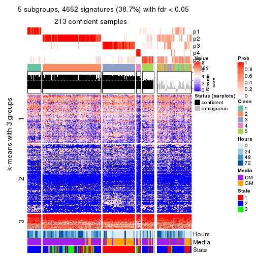</p>

</div>
<div id='tab-SD-pam-get-signatures-no-scale-5'>
<pre><code class="r">get_signatures(res, k = 6, scale_rows = FALSE)
</code></pre>

<p>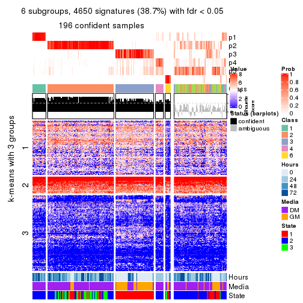</p>

</div>
</div>


Compare the overlap of signatures from different k:

```r
compare_signatures(res)
```


`get_signature()` returns a data frame invisibly. TO get the list of signatures, the function
call should be assigned to a variable explicitly. In following code, if `plot` argument is set
to `FALSE`, no heatmap is plotted while only the differential analysis is performed.

```r
# code only for demonstration
tb = get_signature(res, k = ..., plot = FALSE)
```

An example of the output of `tb` is:

```
#>   which_row         fdr    mean_1    mean_2 scaled_mean_1 scaled_mean_2 km
#> 1        38 0.042760348  8.373488  9.131774    -0.5533452     0.5164555  1
#> 2        40 0.018707592  7.106213  8.469186    -0.6173731     0.5762149  1
#> 3        55 0.019134737 10.221463 11.207825    -0.6159697     0.5749050  1
#> 4        59 0.006059896  5.921854  7.869574    -0.6899429     0.6439467  1
#> 5        60 0.018055526  8.928898 10.211722    -0.6204761     0.5791110  1
#> 6        98 0.009384629 15.714769 14.887706     0.6635654    -0.6193277  2
...
```

The columns in `tb` are:

1. `which_row`: row indices corresponding to the input matrix.
2. `fdr`: FDR for the differential test. 
3. `mean_x`: The mean value in group x.
4. `scaled_mean_x`: The mean value in group x after rows are scaled.
5. `km`: Row groups if k-means clustering is applied to rows.


UMAP plot which shows how samples are separated.


<script>
$( function() {
	$( '#tabs-SD-pam-dimension-reduction' ).tabs();
} );
</script>
<div id='tabs-SD-pam-dimension-reduction'>
<ul>
<li><a href='#tab-SD-pam-dimension-reduction-1'>k = 2</a></li>
<li><a href='#tab-SD-pam-dimension-reduction-2'>k = 3</a></li>
<li><a href='#tab-SD-pam-dimension-reduction-3'>k = 4</a></li>
<li><a href='#tab-SD-pam-dimension-reduction-4'>k = 5</a></li>
<li><a href='#tab-SD-pam-dimension-reduction-5'>k = 6</a></li>
</ul>
<div id='tab-SD-pam-dimension-reduction-1'>
<pre><code class="r">dimension_reduction(res, k = 2, method = &quot;UMAP&quot;)
</code></pre>

<p></p>

</div>
<div id='tab-SD-pam-dimension-reduction-2'>
<pre><code class="r">dimension_reduction(res, k = 3, method = &quot;UMAP&quot;)
</code></pre>

<p></p>

</div>
<div id='tab-SD-pam-dimension-reduction-3'>
<pre><code class="r">dimension_reduction(res, k = 4, method = &quot;UMAP&quot;)
</code></pre>

<p></p>

</div>
<div id='tab-SD-pam-dimension-reduction-4'>
<pre><code class="r">dimension_reduction(res, k = 5, method = &quot;UMAP&quot;)
</code></pre>

<p></p>

</div>
<div id='tab-SD-pam-dimension-reduction-5'>
<pre><code class="r">dimension_reduction(res, k = 6, method = &quot;UMAP&quot;)
</code></pre>

<p></p>

</div>
</div>


Following heatmap shows how subgroups are split when increasing `k`:

```r
collect_classes(res)
```


Test correlation between subgroups and known annotations. If the known
annotation is numeric, one-way ANOVA test is applied, and if the known
annotation is discrete, chi-squared contingency table test is applied.

```r
test_to_known_factors(res)
```

```
#>          n Hours(p) Media(p) State(p) k
#> SD:pam 252 1.57e-12 1.01e-11 1.86e-11 2
#> SD:pam 221 1.84e-23 8.70e-26 1.12e-30 3
#> SD:pam 217 2.41e-22 2.06e-25 1.16e-33 4
#> SD:pam 213 1.82e-20 3.37e-22 5.79e-33 5
#> SD:pam 196 1.39e-24 3.08e-22 1.46e-30 6
```


If matrix rows can be associated to genes, consider to use `GO_Enrichment(res,
...)` to perform function enrichment for the signature genes.


 

---------------------------------------------------


### SD:mclust**


The object with results only for a single top-value method and a single partition method 
can be extracted as:

```r
res = res_list["SD", "mclust"]
# you can also extract it by
# res = res_list["SD:mclust"]
```

A summary of `res` and all the functions that can be applied to it:

```r
res
```

```
#> A 'ConsensusPartition' object with k = 2, 3, 4, 5, 6.
#>   On a matrix with 12016 rows and 271 columns.
#>   Top rows (1000, 2000, 3000, 4000, 5000) are extracted by 'SD' method.
#>   Subgroups are detected by 'mclust' method.
#>   Performed in total 1250 partitions by row resampling.
#>   Best k for subgroups seems to be 3.
#> 
#> Following methods can be applied to this 'ConsensusPartition' object:
#>  [1] "cola_report"             "collect_classes"         "collect_plots"          
#>  [4] "collect_stats"           "colnames"                "compare_signatures"     
#>  [7] "consensus_heatmap"       "dimension_reduction"     "functional_enrichment"  
#> [10] "get_anno_col"            "get_anno"                "get_classes"            
#> [13] "get_consensus"           "get_matrix"              "get_membership"         
#> [16] "get_param"               "get_signatures"          "get_stats"              
#> [19] "is_best_k"               "is_stable_k"             "membership_heatmap"     
#> [22] "ncol"                    "nrow"                    "plot_ecdf"              
#> [25] "rownames"                "select_partition_number" "show"                   
#> [28] "suggest_best_k"          "test_to_known_factors"
```

`collect_plots()` function collects all the plots made from `res` for all `k` (number of partitions)
into one single page to provide an easy and fast comparison between different `k`.

```r
collect_plots(res)
```


The plots are:

- The first row: a plot of the ECDF (Empirical cumulative distribution
  function) curves of the consensus matrix for each `k` and the heatmap of
  predicted classes for each `k`.
- The second row: heatmaps of the consensus matrix for each `k`.
- The third row: heatmaps of the membership matrix for each `k`.
- The fouth row: heatmaps of the signatures for each `k`.

All the plots in panels can be made by individual functions and they are
plotted later in this section.

`select_partition_number()` produces several plots showing different
statistics for choosing "optimized" `k`. There are following statistics:

- ECDF curves of the consensus matrix for each `k`;
- 1-PAC. [The PAC
  score](https://en.wikipedia.org/wiki/Consensus_clustering#Over-interpretation_potential_of_consensus_clustering)
  measures the proportion of the ambiguous subgrouping.
- Mean silhouette score.
- Concordance. The mean probability of fiting the consensus class ids in all
  partitions.
- Area increased. Denote $A_k$ as the area under the ECDF curve for current
  `k`, the area increased is defined as $A_k - A_{k-1}$.
- Rand index. The percent of pairs of samples that are both in a same cluster
  or both are not in a same cluster in the partition of k and k-1.
- Jaccard index. The ratio of pairs of samples are both in a same cluster in
  the partition of k and k-1 and the pairs of samples are both in a same
  cluster in the partition k or k-1.

The detailed explanations of these statistics can be found in [the cola
vignette](http://bioconductor.org/packages/devel/bioc/vignettes/cola/inst/doc/cola.html#toc_13).

Generally speaking, lower PAC score, higher mean silhouette score or higher
concordance corresponds to better partition. Rand index and Jaccard index
measure how similar the current partition is compared to partition with `k-1`.
If they are too similar, we won't accept `k` is better than `k-1`.

```r
select_partition_number(res)
```


The numeric values for all these statistics can be obtained by `get_stats()`.

```r
get_stats(res)
```

```
#>   k 1-PAC mean_silhouette concordance area_increased  Rand Jaccard
#> 2 2 0.599           0.864       0.913         0.4535 0.552   0.552
#> 3 3 0.957           0.930       0.970         0.4130 0.808   0.653
#> 4 4 0.821           0.801       0.898         0.1021 0.930   0.808
#> 5 5 0.745           0.703       0.816         0.0620 0.934   0.786
#> 6 6 0.725           0.728       0.817         0.0376 0.920   0.715
```

`suggest_best_k()` suggests the best $k$ based on these statistics. The rules are as follows:

- All $k$ with Jaccard index larger than 0.95 are removed because the increase of
  the partition number does not provides enough extra information. If all $k$ are removed,
  the best $k$ is assigned by `NA`.
- For $k$ with 1-PAC larger than 0.9, the maximal $k$ is taken as the "best k". Other $k$ is called "optional k".
- If it does not fit the second rule. The $k$ with the highest vote of highest
  1-PAC, mean silhouette and concordance is taken as the "best k".

```r
suggest_best_k(res)
```

```
#> [1] 3
```


Following shows the table of the partitions (You need to click the **show/hide
code output** link to see it). The membership matrix (columns with name `p*`)
is inferred by
[`clue::cl_consensus()`](https://www.rdocumentation.org/link/cl_consensus?package=clue)
function with the `SE` method. Basically the value in the membership matrix
represents the probability to belong to a certain group. The finall class
label for an item is determined with the group with highest probability it
belongs to.

In `get_classes()` function, the entropy is calculated from the membership
matrix and the silhouette score is calculated from the consensus matrix.


<script>
$( function() {
	$( '#tabs-SD-mclust-get-classes' ).tabs();
} );
</script>
<div id='tabs-SD-mclust-get-classes'>
<ul>
<li><a href='#tab-SD-mclust-get-classes-1'>k = 2</a></li>
<li><a href='#tab-SD-mclust-get-classes-2'>k = 3</a></li>
<li><a href='#tab-SD-mclust-get-classes-3'>k = 4</a></li>
<li><a href='#tab-SD-mclust-get-classes-4'>k = 5</a></li>
<li><a href='#tab-SD-mclust-get-classes-5'>k = 6</a></li>
</ul>

<div id='tab-SD-mclust-get-classes-1'>
<p><a id='tab-SD-mclust-get-classes-1-a' style='color:#0366d6' href='#'>show/hide code output</a></p>
<pre><code class="r">cbind(get_classes(res, k = 2), get_membership(res, k = 2))
</code></pre>

<pre><code>#&gt;            class entropy silhouette    p1    p2
#&gt; T0_CT_A01      1  0.8763      0.746 0.704 0.296
#&gt; T0_CT_A03      1  0.8763      0.746 0.704 0.296
#&gt; T0_CT_A05      1  0.8763      0.746 0.704 0.296
#&gt; T0_CT_A06      1  0.8763      0.746 0.704 0.296
#&gt; T0_CT_A07      1  0.8763      0.746 0.704 0.296
#&gt; T0_CT_A08      1  0.0000      0.872 1.000 0.000
#&gt; T0_CT_A10      1  0.8763      0.746 0.704 0.296
#&gt; T0_CT_A11      1  0.5059      0.834 0.888 0.112
#&gt; T0_CT_B01      1  0.8386      0.754 0.732 0.268
#&gt; T0_CT_B03      1  0.8763      0.746 0.704 0.296
#&gt; T0_CT_B05      1  0.7602      0.788 0.780 0.220
#&gt; T0_CT_B07      1  0.8763      0.746 0.704 0.296
#&gt; T0_CT_B08      1  0.8763      0.746 0.704 0.296
#&gt; T0_CT_B09      1  0.8763      0.746 0.704 0.296
#&gt; T0_CT_C02      1  0.8763      0.746 0.704 0.296
#&gt; T0_CT_C03      1  0.0376      0.870 0.996 0.004
#&gt; T0_CT_C05      2  0.1184      0.966 0.016 0.984
#&gt; T0_CT_C06      1  0.5178      0.833 0.884 0.116
#&gt; T0_CT_C07      1  0.8763      0.746 0.704 0.296
#&gt; T0_CT_C08      1  0.8763      0.746 0.704 0.296
#&gt; T0_CT_C09      1  0.5842      0.822 0.860 0.140
#&gt; T0_CT_C11      2  0.1184      0.974 0.016 0.984
#&gt; T0_CT_C12      1  0.8763      0.746 0.704 0.296
#&gt; T0_CT_D01      1  0.8763      0.746 0.704 0.296
#&gt; T0_CT_D02      1  0.8763      0.746 0.704 0.296
#&gt; T0_CT_D03      1  0.8763      0.746 0.704 0.296
#&gt; T0_CT_D05      1  0.8661      0.745 0.712 0.288
#&gt; T0_CT_D06      1  0.8763      0.746 0.704 0.296
#&gt; T0_CT_D07      1  0.8763      0.746 0.704 0.296
#&gt; T0_CT_D08      1  0.8763      0.746 0.704 0.296
#&gt; T0_CT_D09      2  0.2778      0.937 0.048 0.952
#&gt; T0_CT_D11      2  0.1184      0.966 0.016 0.984
#&gt; T0_CT_D12      1  0.8763      0.746 0.704 0.296
#&gt; T0_CT_E01      1  0.8763      0.746 0.704 0.296
#&gt; T0_CT_E03      1  0.8763      0.746 0.704 0.296
#&gt; T0_CT_E04      2  0.1184      0.966 0.016 0.984
#&gt; T0_CT_E05      1  0.0000      0.872 1.000 0.000
#&gt; T0_CT_E06      1  0.8763      0.746 0.704 0.296
#&gt; T0_CT_E07      1  0.8763      0.746 0.704 0.296
#&gt; T0_CT_E08      1  0.8763      0.746 0.704 0.296
#&gt; T0_CT_E09      1  0.8763      0.746 0.704 0.296
#&gt; T0_CT_E10      1  0.5842      0.822 0.860 0.140
#&gt; T0_CT_E11      1  0.8763      0.746 0.704 0.296
#&gt; T0_CT_E12      1  0.8763      0.746 0.704 0.296
#&gt; T0_CT_F01      1  0.8763      0.746 0.704 0.296
#&gt; T0_CT_F02      1  0.8763      0.746 0.704 0.296
#&gt; T0_CT_F03      1  0.8763      0.746 0.704 0.296
#&gt; T0_CT_F04      1  0.8763      0.746 0.704 0.296
#&gt; T0_CT_F05      1  0.8713      0.745 0.708 0.292
#&gt; T0_CT_F06      1  0.8763      0.746 0.704 0.296
#&gt; T0_CT_F07      1  0.8661      0.745 0.712 0.288
#&gt; T0_CT_F09      2  0.1184      0.974 0.016 0.984
#&gt; T0_CT_F11      1  0.8763      0.746 0.704 0.296
#&gt; T0_CT_F12      1  0.8763      0.746 0.704 0.296
#&gt; T0_CT_G01      1  0.8763      0.746 0.704 0.296
#&gt; T0_CT_G02      1  0.8608      0.748 0.716 0.284
#&gt; T0_CT_G03      1  0.8763      0.746 0.704 0.296
#&gt; T0_CT_G04      1  0.8763      0.746 0.704 0.296
#&gt; T0_CT_G07      1  0.8763      0.746 0.704 0.296
#&gt; T0_CT_G08      1  0.8763      0.746 0.704 0.296
#&gt; T0_CT_G09      1  0.0000      0.872 1.000 0.000
#&gt; T0_CT_G11      1  0.7528      0.788 0.784 0.216
#&gt; T0_CT_H01      1  0.1184      0.868 0.984 0.016
#&gt; T0_CT_H02      2  0.2603      0.942 0.044 0.956
#&gt; T0_CT_H04      1  0.8763      0.746 0.704 0.296
#&gt; T0_CT_H05      1  0.8661      0.745 0.712 0.288
#&gt; T0_CT_H08      1  0.8661      0.745 0.712 0.288
#&gt; T0_CT_H09      1  0.8555      0.744 0.720 0.280
#&gt; T0_CT_H12      1  0.8661      0.745 0.712 0.288
#&gt; T24_CT_A01     1  0.0938      0.867 0.988 0.012
#&gt; T24_CT_A03     2  0.1184      0.974 0.016 0.984
#&gt; T24_CT_A04     2  0.1184      0.966 0.016 0.984
#&gt; T24_CT_A05     1  0.8763      0.746 0.704 0.296
#&gt; T24_CT_A07     2  0.1414      0.974 0.020 0.980
#&gt; T24_CT_A08     1  0.0000      0.872 1.000 0.000
#&gt; T24_CT_A09     1  0.0000      0.872 1.000 0.000
#&gt; T24_CT_A10     1  0.0000      0.872 1.000 0.000
#&gt; T24_CT_B01     1  0.0000      0.872 1.000 0.000
#&gt; T24_CT_B02     1  0.0000      0.872 1.000 0.000
#&gt; T24_CT_B03     1  0.5059      0.835 0.888 0.112
#&gt; T24_CT_B05     2  0.1184      0.974 0.016 0.984
#&gt; T24_CT_B06     2  0.1414      0.974 0.020 0.980
#&gt; T24_CT_B07     1  0.0000      0.872 1.000 0.000
#&gt; T24_CT_B08     2  0.1633      0.972 0.024 0.976
#&gt; T24_CT_B09     1  0.0000      0.872 1.000 0.000
#&gt; T24_CT_B11     1  0.8763      0.746 0.704 0.296
#&gt; T24_CT_C01     1  0.0000      0.872 1.000 0.000
#&gt; T24_CT_C02     2  0.2236      0.959 0.036 0.964
#&gt; T24_CT_C03     1  0.0000      0.872 1.000 0.000
#&gt; T24_CT_C05     2  0.1184      0.974 0.016 0.984
#&gt; T24_CT_C07     2  0.1414      0.974 0.020 0.980
#&gt; T24_CT_C08     2  0.1184      0.974 0.016 0.984
#&gt; T24_CT_C09     2  0.3879      0.923 0.076 0.924
#&gt; T24_CT_C10     1  0.0000      0.872 1.000 0.000
#&gt; T24_CT_C11     1  0.0000      0.872 1.000 0.000
#&gt; T24_CT_C12     2  0.1414      0.974 0.020 0.980
#&gt; T24_CT_D01     2  0.1414      0.974 0.020 0.980
#&gt; T24_CT_D02     2  0.0938      0.967 0.012 0.988
#&gt; T24_CT_D03     2  0.1184      0.974 0.016 0.984
#&gt; T24_CT_D04     1  0.0000      0.872 1.000 0.000
#&gt; T24_CT_D05     1  0.0000      0.872 1.000 0.000
#&gt; T24_CT_D06     1  0.0000      0.872 1.000 0.000
#&gt; T24_CT_D07     1  0.0000      0.872 1.000 0.000
#&gt; T24_CT_D08     2  0.1414      0.974 0.020 0.980
#&gt; T24_CT_D09     2  0.1184      0.974 0.016 0.984
#&gt; T24_CT_D10     2  0.1184      0.974 0.016 0.984
#&gt; T24_CT_D11     2  0.1184      0.974 0.016 0.984
#&gt; T24_CT_E01     1  0.0000      0.872 1.000 0.000
#&gt; T24_CT_E02     1  0.0000      0.872 1.000 0.000
#&gt; T24_CT_E04     2  0.1184      0.974 0.016 0.984
#&gt; T24_CT_E05     1  0.0000      0.872 1.000 0.000
#&gt; T24_CT_E07     1  0.0000      0.872 1.000 0.000
#&gt; T24_CT_E09     1  0.0000      0.872 1.000 0.000
#&gt; T24_CT_E11     1  0.0000      0.872 1.000 0.000
#&gt; T24_CT_E12     2  0.1414      0.974 0.020 0.980
#&gt; T24_CT_F01     2  0.1414      0.974 0.020 0.980
#&gt; T24_CT_F02     2  0.1184      0.966 0.016 0.984
#&gt; T24_CT_F03     1  0.0000      0.872 1.000 0.000
#&gt; T24_CT_F04     1  0.0376      0.871 0.996 0.004
#&gt; T24_CT_F05     1  0.0000      0.872 1.000 0.000
#&gt; T24_CT_F07     1  0.0000      0.872 1.000 0.000
#&gt; T24_CT_F08     1  0.0000      0.872 1.000 0.000
#&gt; T24_CT_F09     2  0.1184      0.966 0.016 0.984
#&gt; T24_CT_F10     1  0.3431      0.852 0.936 0.064
#&gt; T24_CT_F11     1  0.0000      0.872 1.000 0.000
#&gt; T24_CT_F12     2  0.8016      0.612 0.244 0.756
#&gt; T24_CT_G01     2  0.1184      0.974 0.016 0.984
#&gt; T24_CT_G02     1  0.0000      0.872 1.000 0.000
#&gt; T24_CT_G03     1  0.0000      0.872 1.000 0.000
#&gt; T24_CT_G04     1  0.8081      0.766 0.752 0.248
#&gt; T24_CT_G05     2  0.1843      0.967 0.028 0.972
#&gt; T24_CT_G06     1  0.0000      0.872 1.000 0.000
#&gt; T24_CT_G08     1  0.0000      0.872 1.000 0.000
#&gt; T24_CT_G10     2  0.1184      0.974 0.016 0.984
#&gt; T24_CT_G11     1  0.0000      0.872 1.000 0.000
#&gt; T24_CT_G12     1  0.0672      0.868 0.992 0.008
#&gt; T24_CT_H01     1  0.8763      0.746 0.704 0.296
#&gt; T24_CT_H02     1  0.0000      0.872 1.000 0.000
#&gt; T24_CT_H03     2  0.9358      0.332 0.352 0.648
#&gt; T24_CT_H05     1  0.0000      0.872 1.000 0.000
#&gt; T24_CT_H07     1  0.0000      0.872 1.000 0.000
#&gt; T24_CT_H09     1  0.0000      0.872 1.000 0.000
#&gt; T24_CT_H12     1  0.0000      0.872 1.000 0.000
#&gt; T48_CT_A01     2  0.1414      0.974 0.020 0.980
#&gt; T48_CT_A02     2  0.1414      0.974 0.020 0.980
#&gt; T48_CT_A03     1  0.0000      0.872 1.000 0.000
#&gt; T48_CT_A04     2  0.1414      0.974 0.020 0.980
#&gt; T48_CT_A05     1  0.0376      0.871 0.996 0.004
#&gt; T48_CT_A06     1  0.0000      0.872 1.000 0.000
#&gt; T48_CT_A07     1  0.8763      0.746 0.704 0.296
#&gt; T48_CT_A08     2  0.1414      0.974 0.020 0.980
#&gt; T48_CT_A09     1  0.0000      0.872 1.000 0.000
#&gt; T48_CT_A10     2  0.1414      0.974 0.020 0.980
#&gt; T48_CT_A11     2  0.1414      0.974 0.020 0.980
#&gt; T48_CT_A12     1  0.0000      0.872 1.000 0.000
#&gt; T48_CT_B01     2  0.1414      0.974 0.020 0.980
#&gt; T48_CT_B02     2  0.1414      0.974 0.020 0.980
#&gt; T48_CT_B03     1  0.0000      0.872 1.000 0.000
#&gt; T48_CT_B04     1  0.0000      0.872 1.000 0.000
#&gt; T48_CT_B06     2  0.1414      0.974 0.020 0.980
#&gt; T48_CT_B08     1  0.0000      0.872 1.000 0.000
#&gt; T48_CT_B10     2  0.1414      0.974 0.020 0.980
#&gt; T48_CT_B11     2  0.1414      0.974 0.020 0.980
#&gt; T48_CT_B12     1  0.0000      0.872 1.000 0.000
#&gt; T48_CT_C01     2  0.1414      0.974 0.020 0.980
#&gt; T48_CT_C02     1  0.0000      0.872 1.000 0.000
#&gt; T48_CT_C03     2  0.1414      0.974 0.020 0.980
#&gt; T48_CT_C04     1  0.0000      0.872 1.000 0.000
#&gt; T48_CT_C05     1  0.5408      0.829 0.876 0.124
#&gt; T48_CT_C06     1  0.8763      0.723 0.704 0.296
#&gt; T48_CT_C07     1  0.0000      0.872 1.000 0.000
#&gt; T48_CT_C09     2  0.1184      0.966 0.016 0.984
#&gt; T48_CT_C10     1  0.0000      0.872 1.000 0.000
#&gt; T48_CT_C11     2  0.1414      0.974 0.020 0.980
#&gt; T48_CT_D01     1  0.6801      0.804 0.820 0.180
#&gt; T48_CT_D02     1  0.0000      0.872 1.000 0.000
#&gt; T48_CT_D03     1  0.0000      0.872 1.000 0.000
#&gt; T48_CT_D04     1  0.8016      0.769 0.756 0.244
#&gt; T48_CT_D06     2  0.1184      0.974 0.016 0.984
#&gt; T48_CT_D07     2  0.1414      0.974 0.020 0.980
#&gt; T48_CT_D08     1  0.0000      0.872 1.000 0.000
#&gt; T48_CT_D09     2  0.1414      0.974 0.020 0.980
#&gt; T48_CT_D10     1  0.0000      0.872 1.000 0.000
#&gt; T48_CT_D11     2  0.1414      0.964 0.020 0.980
#&gt; T48_CT_D12     1  0.0000      0.872 1.000 0.000
#&gt; T48_CT_E01     1  0.0000      0.872 1.000 0.000
#&gt; T48_CT_E02     1  0.0000      0.872 1.000 0.000
#&gt; T48_CT_E03     1  0.1633      0.865 0.976 0.024
#&gt; T48_CT_E04     1  0.0000      0.872 1.000 0.000
#&gt; T48_CT_E05     2  0.1414      0.974 0.020 0.980
#&gt; T48_CT_E06     1  0.0000      0.872 1.000 0.000
#&gt; T48_CT_E07     1  0.0000      0.872 1.000 0.000
#&gt; T48_CT_E08     2  0.1184      0.974 0.016 0.984
#&gt; T48_CT_E10     1  0.0000      0.872 1.000 0.000
#&gt; T48_CT_E11     1  0.0000      0.872 1.000 0.000
#&gt; T48_CT_E12     1  0.9552      0.617 0.624 0.376
#&gt; T48_CT_F01     2  0.1414      0.974 0.020 0.980
#&gt; T48_CT_F02     1  0.0000      0.872 1.000 0.000
#&gt; T48_CT_F03     1  0.0000      0.872 1.000 0.000
#&gt; T48_CT_F05     2  0.6048      0.816 0.148 0.852
#&gt; T48_CT_F07     1  0.0000      0.872 1.000 0.000
#&gt; T48_CT_F09     2  0.1184      0.974 0.016 0.984
#&gt; T48_CT_F10     1  0.0000      0.872 1.000 0.000
#&gt; T48_CT_F11     1  0.0000      0.872 1.000 0.000
#&gt; T48_CT_G01     1  0.0000      0.872 1.000 0.000
#&gt; T48_CT_G02     2  0.1184      0.974 0.016 0.984
#&gt; T48_CT_G03     2  0.1414      0.974 0.020 0.980
#&gt; T48_CT_G07     2  0.1414      0.974 0.020 0.980
#&gt; T48_CT_G08     2  0.2603      0.956 0.044 0.956
#&gt; T48_CT_G09     1  0.0000      0.872 1.000 0.000
#&gt; T48_CT_G10     1  0.2236      0.862 0.964 0.036
#&gt; T48_CT_G11     1  0.0000      0.872 1.000 0.000
#&gt; T48_CT_G12     2  0.1414      0.974 0.020 0.980
#&gt; T48_CT_H01     2  0.6048      0.824 0.148 0.852
#&gt; T48_CT_H02     1  0.0000      0.872 1.000 0.000
#&gt; T48_CT_H04     1  0.0000      0.872 1.000 0.000
#&gt; T48_CT_H05     2  0.1414      0.974 0.020 0.980
#&gt; T48_CT_H06     2  0.1414      0.974 0.020 0.980
#&gt; T48_CT_H07     1  0.0000      0.872 1.000 0.000
#&gt; T48_CT_H08     2  0.1414      0.974 0.020 0.980
#&gt; T48_CT_H11     1  0.0000      0.872 1.000 0.000
#&gt; T48_CT_H12     2  0.1414      0.974 0.020 0.980
#&gt; T72_CT_A01     2  0.1633      0.970 0.024 0.976
#&gt; T72_CT_A05     2  0.7139      0.720 0.196 0.804
#&gt; T72_CT_A08     1  0.0000      0.872 1.000 0.000
#&gt; T72_CT_A09     2  0.1414      0.974 0.020 0.980
#&gt; T72_CT_A11     2  0.1414      0.974 0.020 0.980
#&gt; T72_CT_B01     2  0.1184      0.974 0.016 0.984
#&gt; T72_CT_B02     1  0.0000      0.872 1.000 0.000
#&gt; T72_CT_B03     1  0.0000      0.872 1.000 0.000
#&gt; T72_CT_B04     1  0.0000      0.872 1.000 0.000
#&gt; T72_CT_B05     1  0.0000      0.872 1.000 0.000
#&gt; T72_CT_B06     1  0.0000      0.872 1.000 0.000
#&gt; T72_CT_B08     1  0.8813      0.741 0.700 0.300
#&gt; T72_CT_B09     1  0.0000      0.872 1.000 0.000
#&gt; T72_CT_B11     1  0.0000      0.872 1.000 0.000
#&gt; T72_CT_B12     2  0.1414      0.974 0.020 0.980
#&gt; T72_CT_C04     2  0.1184      0.974 0.016 0.984
#&gt; T72_CT_C06     1  0.0000      0.872 1.000 0.000
#&gt; T72_CT_C07     2  0.1843      0.958 0.028 0.972
#&gt; T72_CT_C09     1  0.0000      0.872 1.000 0.000
#&gt; T72_CT_C11     2  0.9427      0.266 0.360 0.640
#&gt; T72_CT_D01     2  0.1184      0.974 0.016 0.984
#&gt; T72_CT_D03     1  0.0000      0.872 1.000 0.000
#&gt; T72_CT_D04     2  0.1184      0.974 0.016 0.984
#&gt; T72_CT_D05     1  0.0000      0.872 1.000 0.000
#&gt; T72_CT_D07     1  0.0000      0.872 1.000 0.000
#&gt; T72_CT_D10     1  0.0000      0.872 1.000 0.000
#&gt; T72_CT_D11     1  0.0000      0.872 1.000 0.000
#&gt; T72_CT_E04     1  0.0000      0.872 1.000 0.000
#&gt; T72_CT_E05     2  0.1184      0.974 0.016 0.984
#&gt; T72_CT_E07     1  0.6712      0.805 0.824 0.176
#&gt; T72_CT_F01     2  0.2236      0.962 0.036 0.964
#&gt; T72_CT_F05     2  0.1184      0.974 0.016 0.984
#&gt; T72_CT_F07     1  0.0000      0.872 1.000 0.000
#&gt; T72_CT_F10     2  0.1184      0.974 0.016 0.984
#&gt; T72_CT_F11     2  0.1184      0.966 0.016 0.984
#&gt; T72_CT_G03     1  0.0000      0.872 1.000 0.000
#&gt; T72_CT_G04     1  0.0000      0.872 1.000 0.000
#&gt; T72_CT_G06     2  0.2423      0.946 0.040 0.960
#&gt; T72_CT_G08     1  0.8499      0.754 0.724 0.276
#&gt; T72_CT_G10     2  0.1184      0.974 0.016 0.984
#&gt; T72_CT_G11     1  0.0000      0.872 1.000 0.000
#&gt; T72_CT_H01     2  0.1414      0.973 0.020 0.980
#&gt; T72_CT_H03     2  0.1184      0.974 0.016 0.984
#&gt; T72_CT_H05     1  0.8763      0.746 0.704 0.296
#&gt; T72_CT_H08     1  0.8763      0.746 0.704 0.296
#&gt; T72_CT_H09     1  0.8763      0.746 0.704 0.296
#&gt; T72_CT_H10     1  0.0000      0.872 1.000 0.000
#&gt; T72_CT_H11     1  0.0000      0.872 1.000 0.000
#&gt; T72_CT_H12     2  0.1184      0.974 0.016 0.984
</code></pre>

<script>
$('#tab-SD-mclust-get-classes-1-a').parent().next().next().hide();
$('#tab-SD-mclust-get-classes-1-a').click(function(){
  $('#tab-SD-mclust-get-classes-1-a').parent().next().next().toggle();
  return(false);
});
</script>
</div>

<div id='tab-SD-mclust-get-classes-2'>
<p><a id='tab-SD-mclust-get-classes-2-a' style='color:#0366d6' href='#'>show/hide code output</a></p>
<pre><code class="r">cbind(get_classes(res, k = 3), get_membership(res, k = 3))
</code></pre>

<pre><code>#&gt;            class entropy silhouette    p1    p2    p3
#&gt; T0_CT_A01      3  0.0237    0.96248 0.004 0.000 0.996
#&gt; T0_CT_A03      3  0.0000    0.96475 0.000 0.000 1.000
#&gt; T0_CT_A05      3  0.0000    0.96475 0.000 0.000 1.000
#&gt; T0_CT_A06      3  0.0237    0.96248 0.004 0.000 0.996
#&gt; T0_CT_A07      3  0.0000    0.96475 0.000 0.000 1.000
#&gt; T0_CT_A08      1  0.0000    0.96968 1.000 0.000 0.000
#&gt; T0_CT_A10      3  0.0000    0.96475 0.000 0.000 1.000
#&gt; T0_CT_A11      1  0.5859    0.52147 0.656 0.000 0.344
#&gt; T0_CT_B01      1  0.1529    0.95182 0.960 0.000 0.040
#&gt; T0_CT_B03      3  0.0000    0.96475 0.000 0.000 1.000
#&gt; T0_CT_B05      3  0.5810    0.48428 0.336 0.000 0.664
#&gt; T0_CT_B07      3  0.1031    0.94600 0.024 0.000 0.976
#&gt; T0_CT_B08      3  0.0000    0.96475 0.000 0.000 1.000
#&gt; T0_CT_B09      3  0.0000    0.96475 0.000 0.000 1.000
#&gt; T0_CT_C02      3  0.0000    0.96475 0.000 0.000 1.000
#&gt; T0_CT_C03      1  0.1289    0.95713 0.968 0.000 0.032
#&gt; T0_CT_C05      2  0.0000    0.96640 0.000 1.000 0.000
#&gt; T0_CT_C06      1  0.1411    0.95475 0.964 0.000 0.036
#&gt; T0_CT_C07      3  0.0237    0.96248 0.004 0.000 0.996
#&gt; T0_CT_C08      3  0.0000    0.96475 0.000 0.000 1.000
#&gt; T0_CT_C09      1  0.8700    0.30394 0.536 0.120 0.344
#&gt; T0_CT_C11      2  0.0000    0.96640 0.000 1.000 0.000
#&gt; T0_CT_C12      3  0.0000    0.96475 0.000 0.000 1.000
#&gt; T0_CT_D01      3  0.0237    0.96225 0.000 0.004 0.996
#&gt; T0_CT_D02      3  0.0237    0.96248 0.004 0.000 0.996
#&gt; T0_CT_D03      3  0.0000    0.96475 0.000 0.000 1.000
#&gt; T0_CT_D05      1  0.4887    0.72899 0.772 0.000 0.228
#&gt; T0_CT_D06      3  0.0000    0.96475 0.000 0.000 1.000
#&gt; T0_CT_D07      3  0.0237    0.96248 0.004 0.000 0.996
#&gt; T0_CT_D08      3  0.0000    0.96475 0.000 0.000 1.000
#&gt; T0_CT_D09      2  0.0747    0.95452 0.000 0.984 0.016
#&gt; T0_CT_D11      2  0.0000    0.96640 0.000 1.000 0.000
#&gt; T0_CT_D12      3  0.0000    0.96475 0.000 0.000 1.000
#&gt; T0_CT_E01      3  0.0000    0.96475 0.000 0.000 1.000
#&gt; T0_CT_E03      3  0.0237    0.96248 0.004 0.000 0.996
#&gt; T0_CT_E04      2  0.0000    0.96640 0.000 1.000 0.000
#&gt; T0_CT_E05      1  0.0237    0.96823 0.996 0.000 0.004
#&gt; T0_CT_E06      3  0.0000    0.96475 0.000 0.000 1.000
#&gt; T0_CT_E07      3  0.0000    0.96475 0.000 0.000 1.000
#&gt; T0_CT_E08      3  0.0000    0.96475 0.000 0.000 1.000
#&gt; T0_CT_E09      3  0.0000    0.96475 0.000 0.000 1.000
#&gt; T0_CT_E10      1  0.8700    0.30394 0.536 0.120 0.344
#&gt; T0_CT_E11      3  0.0000    0.96475 0.000 0.000 1.000
#&gt; T0_CT_E12      3  0.0000    0.96475 0.000 0.000 1.000
#&gt; T0_CT_F01      3  0.0000    0.96475 0.000 0.000 1.000
#&gt; T0_CT_F02      3  0.0000    0.96475 0.000 0.000 1.000
#&gt; T0_CT_F03      3  0.0000    0.96475 0.000 0.000 1.000
#&gt; T0_CT_F04      3  0.0000    0.96475 0.000 0.000 1.000
#&gt; T0_CT_F05      3  0.6308    0.02113 0.000 0.492 0.508
#&gt; T0_CT_F06      3  0.0000    0.96475 0.000 0.000 1.000
#&gt; T0_CT_F07      3  0.4235    0.77878 0.176 0.000 0.824
#&gt; T0_CT_F09      2  0.0000    0.96640 0.000 1.000 0.000
#&gt; T0_CT_F11      3  0.0000    0.96475 0.000 0.000 1.000
#&gt; T0_CT_F12      3  0.0000    0.96475 0.000 0.000 1.000
#&gt; T0_CT_G01      3  0.0000    0.96475 0.000 0.000 1.000
#&gt; T0_CT_G02      1  0.5835    0.51978 0.660 0.000 0.340
#&gt; T0_CT_G03      3  0.0000    0.96475 0.000 0.000 1.000
#&gt; T0_CT_G04      3  0.0000    0.96475 0.000 0.000 1.000
#&gt; T0_CT_G07      3  0.0000    0.96475 0.000 0.000 1.000
#&gt; T0_CT_G08      3  0.0000    0.96475 0.000 0.000 1.000
#&gt; T0_CT_G09      1  0.0000    0.96968 1.000 0.000 0.000
#&gt; T0_CT_G11      1  0.1860    0.94282 0.948 0.000 0.052
#&gt; T0_CT_H01      1  0.1289    0.95687 0.968 0.000 0.032
#&gt; T0_CT_H02      2  0.0747    0.95454 0.000 0.984 0.016
#&gt; T0_CT_H04      3  0.0000    0.96475 0.000 0.000 1.000
#&gt; T0_CT_H05      1  0.5591    0.59643 0.696 0.000 0.304
#&gt; T0_CT_H08      3  0.2165    0.90945 0.064 0.000 0.936
#&gt; T0_CT_H09      1  0.3454    0.88620 0.888 0.008 0.104
#&gt; T0_CT_H12      3  0.3816    0.81342 0.148 0.000 0.852
#&gt; T24_CT_A01     1  0.2448    0.92077 0.924 0.000 0.076
#&gt; T24_CT_A03     2  0.0000    0.96640 0.000 1.000 0.000
#&gt; T24_CT_A04     2  0.0000    0.96640 0.000 1.000 0.000
#&gt; T24_CT_A05     3  0.0000    0.96475 0.000 0.000 1.000
#&gt; T24_CT_A07     2  0.0000    0.96640 0.000 1.000 0.000
#&gt; T24_CT_A08     1  0.0000    0.96968 1.000 0.000 0.000
#&gt; T24_CT_A09     1  0.0000    0.96968 1.000 0.000 0.000
#&gt; T24_CT_A10     1  0.0000    0.96968 1.000 0.000 0.000
#&gt; T24_CT_B01     1  0.0000    0.96968 1.000 0.000 0.000
#&gt; T24_CT_B02     1  0.0000    0.96968 1.000 0.000 0.000
#&gt; T24_CT_B03     1  0.1411    0.95450 0.964 0.000 0.036
#&gt; T24_CT_B05     2  0.0000    0.96640 0.000 1.000 0.000
#&gt; T24_CT_B06     2  0.0000    0.96640 0.000 1.000 0.000
#&gt; T24_CT_B07     1  0.0000    0.96968 1.000 0.000 0.000
#&gt; T24_CT_B08     2  0.0237    0.96339 0.004 0.996 0.000
#&gt; T24_CT_B09     1  0.0000    0.96968 1.000 0.000 0.000
#&gt; T24_CT_B11     3  0.0000    0.96475 0.000 0.000 1.000
#&gt; T24_CT_C01     1  0.0000    0.96968 1.000 0.000 0.000
#&gt; T24_CT_C02     2  0.3816    0.79598 0.148 0.852 0.000
#&gt; T24_CT_C03     1  0.1163    0.95925 0.972 0.000 0.028
#&gt; T24_CT_C05     2  0.0000    0.96640 0.000 1.000 0.000
#&gt; T24_CT_C07     2  0.0000    0.96640 0.000 1.000 0.000
#&gt; T24_CT_C08     2  0.0000    0.96640 0.000 1.000 0.000
#&gt; T24_CT_C09     2  0.4228    0.79075 0.148 0.844 0.008
#&gt; T24_CT_C10     1  0.0000    0.96968 1.000 0.000 0.000
#&gt; T24_CT_C11     1  0.1163    0.95881 0.972 0.000 0.028
#&gt; T24_CT_C12     2  0.0000    0.96640 0.000 1.000 0.000
#&gt; T24_CT_D01     2  0.0000    0.96640 0.000 1.000 0.000
#&gt; T24_CT_D02     2  0.0237    0.96354 0.000 0.996 0.004
#&gt; T24_CT_D03     2  0.0000    0.96640 0.000 1.000 0.000
#&gt; T24_CT_D04     1  0.0000    0.96968 1.000 0.000 0.000
#&gt; T24_CT_D05     1  0.0424    0.96718 0.992 0.000 0.008
#&gt; T24_CT_D06     1  0.0000    0.96968 1.000 0.000 0.000
#&gt; T24_CT_D07     1  0.1163    0.95881 0.972 0.000 0.028
#&gt; T24_CT_D08     2  0.0000    0.96640 0.000 1.000 0.000
#&gt; T24_CT_D09     2  0.0000    0.96640 0.000 1.000 0.000
#&gt; T24_CT_D10     2  0.0000    0.96640 0.000 1.000 0.000
#&gt; T24_CT_D11     2  0.0000    0.96640 0.000 1.000 0.000
#&gt; T24_CT_E01     1  0.0000    0.96968 1.000 0.000 0.000
#&gt; T24_CT_E02     1  0.0000    0.96968 1.000 0.000 0.000
#&gt; T24_CT_E04     2  0.0000    0.96640 0.000 1.000 0.000
#&gt; T24_CT_E05     1  0.0000    0.96968 1.000 0.000 0.000
#&gt; T24_CT_E07     1  0.1289    0.95678 0.968 0.000 0.032
#&gt; T24_CT_E09     1  0.0592    0.96613 0.988 0.000 0.012
#&gt; T24_CT_E11     1  0.0000    0.96968 1.000 0.000 0.000
#&gt; T24_CT_E12     2  0.0000    0.96640 0.000 1.000 0.000
#&gt; T24_CT_F01     2  0.0000    0.96640 0.000 1.000 0.000
#&gt; T24_CT_F02     2  0.0000    0.96640 0.000 1.000 0.000
#&gt; T24_CT_F03     1  0.0000    0.96968 1.000 0.000 0.000
#&gt; T24_CT_F04     1  0.0892    0.96292 0.980 0.000 0.020
#&gt; T24_CT_F05     1  0.0000    0.96968 1.000 0.000 0.000
#&gt; T24_CT_F07     1  0.0747    0.96464 0.984 0.000 0.016
#&gt; T24_CT_F08     1  0.0000    0.96968 1.000 0.000 0.000
#&gt; T24_CT_F09     2  0.0000    0.96640 0.000 1.000 0.000
#&gt; T24_CT_F10     1  0.1411    0.95450 0.964 0.000 0.036
#&gt; T24_CT_F11     1  0.0000    0.96968 1.000 0.000 0.000
#&gt; T24_CT_F12     2  0.2383    0.91664 0.016 0.940 0.044
#&gt; T24_CT_G01     2  0.0000    0.96640 0.000 1.000 0.000
#&gt; T24_CT_G02     1  0.0000    0.96968 1.000 0.000 0.000
#&gt; T24_CT_G03     1  0.0000    0.96968 1.000 0.000 0.000
#&gt; T24_CT_G04     1  0.1411    0.95450 0.964 0.000 0.036
#&gt; T24_CT_G05     2  0.0000    0.96640 0.000 1.000 0.000
#&gt; T24_CT_G06     1  0.0000    0.96968 1.000 0.000 0.000
#&gt; T24_CT_G08     1  0.0000    0.96968 1.000 0.000 0.000
#&gt; T24_CT_G10     2  0.0000    0.96640 0.000 1.000 0.000
#&gt; T24_CT_G11     1  0.0000    0.96968 1.000 0.000 0.000
#&gt; T24_CT_G12     1  0.1643    0.94943 0.956 0.000 0.044
#&gt; T24_CT_H01     3  0.0000    0.96475 0.000 0.000 1.000
#&gt; T24_CT_H02     1  0.0000    0.96968 1.000 0.000 0.000
#&gt; T24_CT_H03     2  0.6672    0.08557 0.472 0.520 0.008
#&gt; T24_CT_H05     1  0.0000    0.96968 1.000 0.000 0.000
#&gt; T24_CT_H07     1  0.0000    0.96968 1.000 0.000 0.000
#&gt; T24_CT_H09     1  0.0000    0.96968 1.000 0.000 0.000
#&gt; T24_CT_H12     1  0.0000    0.96968 1.000 0.000 0.000
#&gt; T48_CT_A01     2  0.0000    0.96640 0.000 1.000 0.000
#&gt; T48_CT_A02     2  0.0000    0.96640 0.000 1.000 0.000
#&gt; T48_CT_A03     1  0.0000    0.96968 1.000 0.000 0.000
#&gt; T48_CT_A04     2  0.0000    0.96640 0.000 1.000 0.000
#&gt; T48_CT_A05     1  0.1411    0.95450 0.964 0.000 0.036
#&gt; T48_CT_A06     1  0.0000    0.96968 1.000 0.000 0.000
#&gt; T48_CT_A07     3  0.1753    0.92392 0.000 0.048 0.952
#&gt; T48_CT_A08     2  0.0237    0.96336 0.004 0.996 0.000
#&gt; T48_CT_A09     1  0.0000    0.96968 1.000 0.000 0.000
#&gt; T48_CT_A10     2  0.0000    0.96640 0.000 1.000 0.000
#&gt; T48_CT_A11     2  0.0000    0.96640 0.000 1.000 0.000
#&gt; T48_CT_A12     1  0.0000    0.96968 1.000 0.000 0.000
#&gt; T48_CT_B01     2  0.0000    0.96640 0.000 1.000 0.000
#&gt; T48_CT_B02     2  0.0000    0.96640 0.000 1.000 0.000
#&gt; T48_CT_B03     1  0.0000    0.96968 1.000 0.000 0.000
#&gt; T48_CT_B04     1  0.0000    0.96968 1.000 0.000 0.000
#&gt; T48_CT_B06     2  0.0237    0.96339 0.004 0.996 0.000
#&gt; T48_CT_B08     1  0.0000    0.96968 1.000 0.000 0.000
#&gt; T48_CT_B10     2  0.0000    0.96640 0.000 1.000 0.000
#&gt; T48_CT_B11     2  0.0000    0.96640 0.000 1.000 0.000
#&gt; T48_CT_B12     1  0.0592    0.96583 0.988 0.000 0.012
#&gt; T48_CT_C01     2  0.0000    0.96640 0.000 1.000 0.000
#&gt; T48_CT_C02     1  0.3267    0.87392 0.884 0.000 0.116
#&gt; T48_CT_C03     2  0.0000    0.96640 0.000 1.000 0.000
#&gt; T48_CT_C04     1  0.0000    0.96968 1.000 0.000 0.000
#&gt; T48_CT_C05     1  0.1411    0.95450 0.964 0.000 0.036
#&gt; T48_CT_C06     1  0.2689    0.93085 0.932 0.036 0.032
#&gt; T48_CT_C07     1  0.0000    0.96968 1.000 0.000 0.000
#&gt; T48_CT_C09     2  0.0237    0.96354 0.000 0.996 0.004
#&gt; T48_CT_C10     1  0.0000    0.96968 1.000 0.000 0.000
#&gt; T48_CT_C11     2  0.0000    0.96640 0.000 1.000 0.000
#&gt; T48_CT_D01     1  0.1289    0.95678 0.968 0.000 0.032
#&gt; T48_CT_D02     1  0.0237    0.96847 0.996 0.000 0.004
#&gt; T48_CT_D03     1  0.0000    0.96968 1.000 0.000 0.000
#&gt; T48_CT_D04     1  0.1411    0.95450 0.964 0.000 0.036
#&gt; T48_CT_D06     2  0.0000    0.96640 0.000 1.000 0.000
#&gt; T48_CT_D07     2  0.0000    0.96640 0.000 1.000 0.000
#&gt; T48_CT_D08     1  0.0000    0.96968 1.000 0.000 0.000
#&gt; T48_CT_D09     2  0.0000    0.96640 0.000 1.000 0.000
#&gt; T48_CT_D10     1  0.0592    0.96581 0.988 0.000 0.012
#&gt; T48_CT_D11     2  0.0592    0.95750 0.000 0.988 0.012
#&gt; T48_CT_D12     1  0.0000    0.96968 1.000 0.000 0.000
#&gt; T48_CT_E01     1  0.1289    0.95678 0.968 0.000 0.032
#&gt; T48_CT_E02     1  0.0000    0.96968 1.000 0.000 0.000
#&gt; T48_CT_E03     1  0.1411    0.95450 0.964 0.000 0.036
#&gt; T48_CT_E04     1  0.0000    0.96968 1.000 0.000 0.000
#&gt; T48_CT_E05     2  0.0237    0.96340 0.004 0.996 0.000
#&gt; T48_CT_E06     1  0.0000    0.96968 1.000 0.000 0.000
#&gt; T48_CT_E07     1  0.0000    0.96968 1.000 0.000 0.000
#&gt; T48_CT_E08     2  0.0000    0.96640 0.000 1.000 0.000
#&gt; T48_CT_E10     1  0.0000    0.96968 1.000 0.000 0.000
#&gt; T48_CT_E11     1  0.0000    0.96968 1.000 0.000 0.000
#&gt; T48_CT_E12     3  0.4796    0.71008 0.000 0.220 0.780
#&gt; T48_CT_F01     2  0.0000    0.96640 0.000 1.000 0.000
#&gt; T48_CT_F02     1  0.0000    0.96968 1.000 0.000 0.000
#&gt; T48_CT_F03     1  0.0747    0.96424 0.984 0.000 0.016
#&gt; T48_CT_F05     2  0.6129    0.50875 0.324 0.668 0.008
#&gt; T48_CT_F07     1  0.0000    0.96968 1.000 0.000 0.000
#&gt; T48_CT_F09     2  0.0000    0.96640 0.000 1.000 0.000
#&gt; T48_CT_F10     1  0.0747    0.96464 0.984 0.000 0.016
#&gt; T48_CT_F11     1  0.0000    0.96968 1.000 0.000 0.000
#&gt; T48_CT_G01     1  0.0892    0.96311 0.980 0.000 0.020
#&gt; T48_CT_G02     2  0.0000    0.96640 0.000 1.000 0.000
#&gt; T48_CT_G03     2  0.0747    0.95238 0.016 0.984 0.000
#&gt; T48_CT_G07     2  0.0000    0.96640 0.000 1.000 0.000
#&gt; T48_CT_G08     2  0.1860    0.91384 0.052 0.948 0.000
#&gt; T48_CT_G09     1  0.1411    0.95450 0.964 0.000 0.036
#&gt; T48_CT_G10     3  0.4062    0.79604 0.164 0.000 0.836
#&gt; T48_CT_G11     1  0.0000    0.96968 1.000 0.000 0.000
#&gt; T48_CT_G12     2  0.0000    0.96640 0.000 1.000 0.000
#&gt; T48_CT_H01     2  0.7075   -0.00664 0.488 0.492 0.020
#&gt; T48_CT_H02     1  0.1411    0.95450 0.964 0.000 0.036
#&gt; T48_CT_H04     1  0.4178    0.80603 0.828 0.000 0.172
#&gt; T48_CT_H05     2  0.0000    0.96640 0.000 1.000 0.000
#&gt; T48_CT_H06     2  0.0000    0.96640 0.000 1.000 0.000
#&gt; T48_CT_H07     1  0.0000    0.96968 1.000 0.000 0.000
#&gt; T48_CT_H08     2  0.0000    0.96640 0.000 1.000 0.000
#&gt; T48_CT_H11     1  0.0000    0.96968 1.000 0.000 0.000
#&gt; T48_CT_H12     2  0.0000    0.96640 0.000 1.000 0.000
#&gt; T72_CT_A01     2  0.0000    0.96640 0.000 1.000 0.000
#&gt; T72_CT_A05     2  0.5492    0.77811 0.104 0.816 0.080
#&gt; T72_CT_A08     1  0.0000    0.96968 1.000 0.000 0.000
#&gt; T72_CT_A09     2  0.0000    0.96640 0.000 1.000 0.000
#&gt; T72_CT_A11     2  0.0000    0.96640 0.000 1.000 0.000
#&gt; T72_CT_B01     2  0.0000    0.96640 0.000 1.000 0.000
#&gt; T72_CT_B02     1  0.0000    0.96968 1.000 0.000 0.000
#&gt; T72_CT_B03     1  0.0747    0.96442 0.984 0.000 0.016
#&gt; T72_CT_B04     1  0.0000    0.96968 1.000 0.000 0.000
#&gt; T72_CT_B05     1  0.1411    0.95450 0.964 0.000 0.036
#&gt; T72_CT_B06     1  0.0000    0.96968 1.000 0.000 0.000
#&gt; T72_CT_B08     3  0.2796    0.87985 0.000 0.092 0.908
#&gt; T72_CT_B09     1  0.0000    0.96968 1.000 0.000 0.000
#&gt; T72_CT_B11     1  0.0000    0.96968 1.000 0.000 0.000
#&gt; T72_CT_B12     2  0.0000    0.96640 0.000 1.000 0.000
#&gt; T72_CT_C04     2  0.0000    0.96640 0.000 1.000 0.000
#&gt; T72_CT_C06     1  0.0000    0.96968 1.000 0.000 0.000
#&gt; T72_CT_C07     2  0.0892    0.95097 0.000 0.980 0.020
#&gt; T72_CT_C09     1  0.0000    0.96968 1.000 0.000 0.000
#&gt; T72_CT_C11     2  0.6305    0.03776 0.000 0.516 0.484
#&gt; T72_CT_D01     2  0.0000    0.96640 0.000 1.000 0.000
#&gt; T72_CT_D03     1  0.1411    0.95450 0.964 0.000 0.036
#&gt; T72_CT_D04     2  0.0000    0.96640 0.000 1.000 0.000
#&gt; T72_CT_D05     1  0.0000    0.96968 1.000 0.000 0.000
#&gt; T72_CT_D07     1  0.0000    0.96968 1.000 0.000 0.000
#&gt; T72_CT_D10     1  0.1411    0.95450 0.964 0.000 0.036
#&gt; T72_CT_D11     1  0.0000    0.96968 1.000 0.000 0.000
#&gt; T72_CT_E04     1  0.0000    0.96968 1.000 0.000 0.000
#&gt; T72_CT_E05     2  0.0000    0.96640 0.000 1.000 0.000
#&gt; T72_CT_E07     1  0.1411    0.95450 0.964 0.000 0.036
#&gt; T72_CT_F01     2  0.1989    0.91581 0.048 0.948 0.004
#&gt; T72_CT_F05     2  0.0000    0.96640 0.000 1.000 0.000
#&gt; T72_CT_F07     1  0.0000    0.96968 1.000 0.000 0.000
#&gt; T72_CT_F10     2  0.0000    0.96640 0.000 1.000 0.000
#&gt; T72_CT_F11     2  0.0424    0.96042 0.000 0.992 0.008
#&gt; T72_CT_G03     1  0.0000    0.96968 1.000 0.000 0.000
#&gt; T72_CT_G04     1  0.0000    0.96968 1.000 0.000 0.000
#&gt; T72_CT_G06     2  0.1163    0.94378 0.000 0.972 0.028
#&gt; T72_CT_G08     1  0.1753    0.94600 0.952 0.000 0.048
#&gt; T72_CT_G10     2  0.0000    0.96640 0.000 1.000 0.000
#&gt; T72_CT_G11     1  0.0000    0.96968 1.000 0.000 0.000
#&gt; T72_CT_H01     2  0.0237    0.96338 0.004 0.996 0.000
#&gt; T72_CT_H03     2  0.0000    0.96640 0.000 1.000 0.000
#&gt; T72_CT_H05     3  0.0000    0.96475 0.000 0.000 1.000
#&gt; T72_CT_H08     3  0.1411    0.93551 0.000 0.036 0.964
#&gt; T72_CT_H09     3  0.0000    0.96475 0.000 0.000 1.000
#&gt; T72_CT_H10     1  0.0000    0.96968 1.000 0.000 0.000
#&gt; T72_CT_H11     1  0.0000    0.96968 1.000 0.000 0.000
#&gt; T72_CT_H12     2  0.0000    0.96640 0.000 1.000 0.000
</code></pre>

<script>
$('#tab-SD-mclust-get-classes-2-a').parent().next().next().hide();
$('#tab-SD-mclust-get-classes-2-a').click(function(){
  $('#tab-SD-mclust-get-classes-2-a').parent().next().next().toggle();
  return(false);
});
</script>
</div>

<div id='tab-SD-mclust-get-classes-3'>
<p><a id='tab-SD-mclust-get-classes-3-a' style='color:#0366d6' href='#'>show/hide code output</a></p>
<pre><code class="r">cbind(get_classes(res, k = 4), get_membership(res, k = 4))
</code></pre>

<pre><code>#&gt;            class entropy silhouette    p1    p2    p3    p4
#&gt; T0_CT_A01      3  0.2125     0.9107 0.004 0.000 0.920 0.076
#&gt; T0_CT_A03      3  0.0336     0.9416 0.000 0.000 0.992 0.008
#&gt; T0_CT_A05      3  0.0336     0.9416 0.000 0.000 0.992 0.008
#&gt; T0_CT_A06      3  0.1302     0.9298 0.000 0.000 0.956 0.044
#&gt; T0_CT_A07      3  0.0592     0.9409 0.000 0.000 0.984 0.016
#&gt; T0_CT_A08      1  0.0188     0.8285 0.996 0.000 0.000 0.004
#&gt; T0_CT_A10      3  0.0000     0.9431 0.000 0.000 1.000 0.000
#&gt; T0_CT_A11      4  0.4100     0.6430 0.092 0.000 0.076 0.832
#&gt; T0_CT_B01      1  0.5400     0.2734 0.608 0.000 0.020 0.372
#&gt; T0_CT_B03      3  0.0817     0.9387 0.000 0.000 0.976 0.024
#&gt; T0_CT_B05      3  0.5784     0.5858 0.200 0.000 0.700 0.100
#&gt; T0_CT_B07      3  0.2124     0.9126 0.008 0.000 0.924 0.068
#&gt; T0_CT_B08      3  0.0469     0.9418 0.000 0.000 0.988 0.012
#&gt; T0_CT_B09      3  0.0336     0.9416 0.000 0.000 0.992 0.008
#&gt; T0_CT_C02      3  0.0707     0.9399 0.000 0.000 0.980 0.020
#&gt; T0_CT_C03      1  0.3464     0.7628 0.860 0.000 0.032 0.108
#&gt; T0_CT_C05      2  0.1211     0.9454 0.000 0.960 0.000 0.040
#&gt; T0_CT_C06      1  0.5143     0.3275 0.628 0.000 0.012 0.360
#&gt; T0_CT_C07      3  0.1118     0.9338 0.000 0.000 0.964 0.036
#&gt; T0_CT_C08      3  0.0188     0.9431 0.000 0.000 0.996 0.004
#&gt; T0_CT_C09      4  0.4407     0.6349 0.076 0.016 0.076 0.832
#&gt; T0_CT_C11      2  0.0592     0.9537 0.000 0.984 0.000 0.016
#&gt; T0_CT_C12      3  0.0188     0.9431 0.000 0.000 0.996 0.004
#&gt; T0_CT_D01      3  0.1938     0.9236 0.000 0.012 0.936 0.052
#&gt; T0_CT_D02      3  0.1489     0.9280 0.004 0.000 0.952 0.044
#&gt; T0_CT_D03      3  0.0188     0.9426 0.000 0.000 0.996 0.004
#&gt; T0_CT_D05      1  0.6750     0.3312 0.612 0.000 0.180 0.208
#&gt; T0_CT_D06      3  0.0707     0.9399 0.000 0.000 0.980 0.020
#&gt; T0_CT_D07      3  0.1474     0.9267 0.000 0.000 0.948 0.052
#&gt; T0_CT_D08      3  0.0817     0.9387 0.000 0.000 0.976 0.024
#&gt; T0_CT_D09      2  0.1545     0.9416 0.000 0.952 0.008 0.040
#&gt; T0_CT_D11      2  0.1118     0.9471 0.000 0.964 0.000 0.036
#&gt; T0_CT_D12      3  0.0000     0.9431 0.000 0.000 1.000 0.000
#&gt; T0_CT_E01      3  0.0817     0.9386 0.000 0.000 0.976 0.024
#&gt; T0_CT_E03      3  0.1474     0.9268 0.000 0.000 0.948 0.052
#&gt; T0_CT_E04      2  0.1118     0.9471 0.000 0.964 0.000 0.036
#&gt; T0_CT_E05      4  0.4877     0.6523 0.408 0.000 0.000 0.592
#&gt; T0_CT_E06      3  0.0188     0.9425 0.000 0.000 0.996 0.004
#&gt; T0_CT_E07      3  0.0817     0.9405 0.000 0.000 0.976 0.024
#&gt; T0_CT_E08      3  0.1022     0.9389 0.000 0.000 0.968 0.032
#&gt; T0_CT_E09      3  0.0336     0.9424 0.000 0.000 0.992 0.008
#&gt; T0_CT_E10      4  0.4407     0.6349 0.076 0.016 0.076 0.832
#&gt; T0_CT_E11      3  0.0469     0.9430 0.000 0.000 0.988 0.012
#&gt; T0_CT_E12      3  0.0469     0.9426 0.000 0.000 0.988 0.012
#&gt; T0_CT_F01      3  0.0188     0.9426 0.000 0.000 0.996 0.004
#&gt; T0_CT_F02      3  0.0592     0.9426 0.000 0.000 0.984 0.016
#&gt; T0_CT_F03      3  0.0188     0.9425 0.000 0.000 0.996 0.004
#&gt; T0_CT_F04      3  0.0336     0.9433 0.000 0.000 0.992 0.008
#&gt; T0_CT_F05      2  0.4937     0.7357 0.000 0.764 0.172 0.064
#&gt; T0_CT_F06      3  0.0336     0.9432 0.000 0.000 0.992 0.008
#&gt; T0_CT_F07      3  0.6167     0.4644 0.248 0.000 0.652 0.100
#&gt; T0_CT_F09      2  0.0188     0.9557 0.000 0.996 0.000 0.004
#&gt; T0_CT_F11      3  0.0469     0.9426 0.000 0.000 0.988 0.012
#&gt; T0_CT_F12      3  0.0469     0.9430 0.000 0.000 0.988 0.012
#&gt; T0_CT_G01      3  0.0000     0.9431 0.000 0.000 1.000 0.000
#&gt; T0_CT_G02      1  0.6474     0.3113 0.624 0.000 0.256 0.120
#&gt; T0_CT_G03      3  0.0336     0.9416 0.000 0.000 0.992 0.008
#&gt; T0_CT_G04      3  0.0592     0.9411 0.000 0.000 0.984 0.016
#&gt; T0_CT_G07      3  0.0707     0.9399 0.000 0.000 0.980 0.020
#&gt; T0_CT_G08      3  0.0707     0.9399 0.000 0.000 0.980 0.020
#&gt; T0_CT_G09      1  0.1637     0.8237 0.940 0.000 0.000 0.060
#&gt; T0_CT_G11      1  0.4793     0.6491 0.756 0.000 0.040 0.204
#&gt; T0_CT_H01      1  0.4049     0.6747 0.780 0.000 0.008 0.212
#&gt; T0_CT_H02      2  0.1211     0.9454 0.000 0.960 0.000 0.040
#&gt; T0_CT_H04      3  0.0469     0.9430 0.000 0.000 0.988 0.012
#&gt; T0_CT_H05      1  0.6646     0.3505 0.624 0.000 0.204 0.172
#&gt; T0_CT_H08      3  0.2843     0.8875 0.020 0.000 0.892 0.088
#&gt; T0_CT_H09      1  0.5865     0.0609 0.552 0.000 0.036 0.412
#&gt; T0_CT_H12      3  0.6140     0.4700 0.252 0.000 0.652 0.096
#&gt; T24_CT_A01     1  0.3474     0.7302 0.868 0.000 0.064 0.068
#&gt; T24_CT_A03     2  0.0188     0.9553 0.000 0.996 0.000 0.004
#&gt; T24_CT_A04     2  0.1118     0.9471 0.000 0.964 0.000 0.036
#&gt; T24_CT_A05     3  0.0804     0.9402 0.008 0.000 0.980 0.012
#&gt; T24_CT_A07     2  0.0188     0.9557 0.000 0.996 0.000 0.004
#&gt; T24_CT_A08     1  0.0000     0.8292 1.000 0.000 0.000 0.000
#&gt; T24_CT_A09     1  0.0000     0.8292 1.000 0.000 0.000 0.000
#&gt; T24_CT_A10     1  0.1389     0.8263 0.952 0.000 0.000 0.048
#&gt; T24_CT_B01     1  0.1474     0.8278 0.948 0.000 0.000 0.052
#&gt; T24_CT_B02     1  0.1792     0.8045 0.932 0.000 0.000 0.068
#&gt; T24_CT_B03     4  0.4722     0.7523 0.300 0.000 0.008 0.692
#&gt; T24_CT_B05     2  0.0188     0.9557 0.000 0.996 0.000 0.004
#&gt; T24_CT_B06     2  0.0000     0.9555 0.000 1.000 0.000 0.000
#&gt; T24_CT_B07     1  0.0188     0.8285 0.996 0.000 0.000 0.004
#&gt; T24_CT_B08     2  0.1302     0.9404 0.000 0.956 0.000 0.044
#&gt; T24_CT_B09     1  0.0188     0.8285 0.996 0.000 0.000 0.004
#&gt; T24_CT_B11     3  0.0188     0.9425 0.000 0.000 0.996 0.004
#&gt; T24_CT_C01     1  0.2149     0.7783 0.912 0.000 0.000 0.088
#&gt; T24_CT_C02     2  0.5268     0.3816 0.012 0.592 0.000 0.396
#&gt; T24_CT_C03     1  0.5168    -0.4037 0.504 0.000 0.004 0.492
#&gt; T24_CT_C05     2  0.0707     0.9517 0.000 0.980 0.000 0.020
#&gt; T24_CT_C07     2  0.0188     0.9557 0.000 0.996 0.000 0.004
#&gt; T24_CT_C08     2  0.0188     0.9557 0.000 0.996 0.000 0.004
#&gt; T24_CT_C09     2  0.5650     0.2620 0.024 0.544 0.000 0.432
#&gt; T24_CT_C10     1  0.0000     0.8292 1.000 0.000 0.000 0.000
#&gt; T24_CT_C11     1  0.4343     0.5364 0.732 0.000 0.004 0.264
#&gt; T24_CT_C12     2  0.0000     0.9555 0.000 1.000 0.000 0.000
#&gt; T24_CT_D01     2  0.0188     0.9557 0.000 0.996 0.000 0.004
#&gt; T24_CT_D02     2  0.1211     0.9454 0.000 0.960 0.000 0.040
#&gt; T24_CT_D03     2  0.0336     0.9553 0.000 0.992 0.000 0.008
#&gt; T24_CT_D04     1  0.1022     0.8142 0.968 0.000 0.000 0.032
#&gt; T24_CT_D05     1  0.2530     0.7926 0.888 0.000 0.000 0.112
#&gt; T24_CT_D06     1  0.0469     0.8258 0.988 0.000 0.000 0.012
#&gt; T24_CT_D07     1  0.3791     0.6913 0.796 0.000 0.004 0.200
#&gt; T24_CT_D08     2  0.0336     0.9553 0.000 0.992 0.000 0.008
#&gt; T24_CT_D09     2  0.0592     0.9531 0.000 0.984 0.000 0.016
#&gt; T24_CT_D10     2  0.0921     0.9502 0.000 0.972 0.000 0.028
#&gt; T24_CT_D11     2  0.0188     0.9557 0.000 0.996 0.000 0.004
#&gt; T24_CT_E01     1  0.1474     0.8261 0.948 0.000 0.000 0.052
#&gt; T24_CT_E02     1  0.2647     0.7483 0.880 0.000 0.000 0.120
#&gt; T24_CT_E04     2  0.0188     0.9557 0.000 0.996 0.000 0.004
#&gt; T24_CT_E05     1  0.1792     0.7969 0.932 0.000 0.000 0.068
#&gt; T24_CT_E07     4  0.4877     0.7353 0.328 0.000 0.008 0.664
#&gt; T24_CT_E09     1  0.1118     0.8138 0.964 0.000 0.000 0.036
#&gt; T24_CT_E11     1  0.0469     0.8296 0.988 0.000 0.000 0.012
#&gt; T24_CT_E12     2  0.0188     0.9557 0.000 0.996 0.000 0.004
#&gt; T24_CT_F01     2  0.0188     0.9557 0.000 0.996 0.000 0.004
#&gt; T24_CT_F02     2  0.1118     0.9471 0.000 0.964 0.000 0.036
#&gt; T24_CT_F03     1  0.1389     0.8257 0.952 0.000 0.000 0.048
#&gt; T24_CT_F04     4  0.4830     0.6711 0.392 0.000 0.000 0.608
#&gt; T24_CT_F05     1  0.1474     0.8261 0.948 0.000 0.000 0.052
#&gt; T24_CT_F07     4  0.4877     0.6610 0.408 0.000 0.000 0.592
#&gt; T24_CT_F08     1  0.4103     0.5275 0.744 0.000 0.000 0.256
#&gt; T24_CT_F09     2  0.1118     0.9471 0.000 0.964 0.000 0.036
#&gt; T24_CT_F10     1  0.5018     0.4215 0.656 0.000 0.012 0.332
#&gt; T24_CT_F11     1  0.1557     0.8239 0.944 0.000 0.000 0.056
#&gt; T24_CT_F12     2  0.2221     0.9289 0.008 0.932 0.016 0.044
#&gt; T24_CT_G01     2  0.0817     0.9512 0.000 0.976 0.000 0.024
#&gt; T24_CT_G02     1  0.0188     0.8285 0.996 0.000 0.000 0.004
#&gt; T24_CT_G03     1  0.0188     0.8291 0.996 0.000 0.000 0.004
#&gt; T24_CT_G04     1  0.4917     0.3863 0.656 0.000 0.008 0.336
#&gt; T24_CT_G05     2  0.0336     0.9553 0.000 0.992 0.000 0.008
#&gt; T24_CT_G06     1  0.0188     0.8285 0.996 0.000 0.000 0.004
#&gt; T24_CT_G08     1  0.0336     0.8275 0.992 0.000 0.000 0.008
#&gt; T24_CT_G10     2  0.0188     0.9557 0.000 0.996 0.000 0.004
#&gt; T24_CT_G11     1  0.3528     0.6361 0.808 0.000 0.000 0.192
#&gt; T24_CT_G12     1  0.2751     0.7735 0.904 0.000 0.040 0.056
#&gt; T24_CT_H01     3  0.0469     0.9431 0.000 0.000 0.988 0.012
#&gt; T24_CT_H02     1  0.0000     0.8292 1.000 0.000 0.000 0.000
#&gt; T24_CT_H03     2  0.7851    -0.1154 0.248 0.480 0.008 0.264
#&gt; T24_CT_H05     1  0.2408     0.7935 0.896 0.000 0.000 0.104
#&gt; T24_CT_H07     1  0.1118     0.8275 0.964 0.000 0.000 0.036
#&gt; T24_CT_H09     1  0.0336     0.8275 0.992 0.000 0.000 0.008
#&gt; T24_CT_H12     1  0.0336     0.8275 0.992 0.000 0.000 0.008
#&gt; T48_CT_A01     2  0.0817     0.9517 0.000 0.976 0.000 0.024
#&gt; T48_CT_A02     2  0.0188     0.9557 0.000 0.996 0.000 0.004
#&gt; T48_CT_A03     1  0.0188     0.8285 0.996 0.000 0.000 0.004
#&gt; T48_CT_A04     2  0.0188     0.9557 0.000 0.996 0.000 0.004
#&gt; T48_CT_A05     4  0.4697     0.7541 0.296 0.000 0.008 0.696
#&gt; T48_CT_A06     1  0.0188     0.8285 0.996 0.000 0.000 0.004
#&gt; T48_CT_A07     3  0.3239     0.8672 0.000 0.068 0.880 0.052
#&gt; T48_CT_A08     2  0.1022     0.9494 0.000 0.968 0.000 0.032
#&gt; T48_CT_A09     1  0.1557     0.8243 0.944 0.000 0.000 0.056
#&gt; T48_CT_A10     2  0.0188     0.9557 0.000 0.996 0.000 0.004
#&gt; T48_CT_A11     2  0.0188     0.9557 0.000 0.996 0.000 0.004
#&gt; T48_CT_A12     1  0.3074     0.7591 0.848 0.000 0.000 0.152
#&gt; T48_CT_B01     2  0.0188     0.9557 0.000 0.996 0.000 0.004
#&gt; T48_CT_B02     2  0.0188     0.9557 0.000 0.996 0.000 0.004
#&gt; T48_CT_B03     1  0.0188     0.8285 0.996 0.000 0.000 0.004
#&gt; T48_CT_B04     1  0.0188     0.8285 0.996 0.000 0.000 0.004
#&gt; T48_CT_B06     2  0.0921     0.9438 0.000 0.972 0.000 0.028
#&gt; T48_CT_B08     1  0.0000     0.8292 1.000 0.000 0.000 0.000
#&gt; T48_CT_B10     2  0.0188     0.9557 0.000 0.996 0.000 0.004
#&gt; T48_CT_B11     2  0.0188     0.9557 0.000 0.996 0.000 0.004
#&gt; T48_CT_B12     1  0.3172     0.7560 0.840 0.000 0.000 0.160
#&gt; T48_CT_C01     2  0.0336     0.9557 0.000 0.992 0.000 0.008
#&gt; T48_CT_C02     4  0.4716     0.6754 0.196 0.000 0.040 0.764
#&gt; T48_CT_C03     2  0.0188     0.9557 0.000 0.996 0.000 0.004
#&gt; T48_CT_C04     1  0.0188     0.8285 0.996 0.000 0.000 0.004
#&gt; T48_CT_C05     4  0.4857     0.7263 0.324 0.000 0.008 0.668
#&gt; T48_CT_C06     4  0.5628     0.7363 0.320 0.032 0.004 0.644
#&gt; T48_CT_C07     1  0.2149     0.8090 0.912 0.000 0.000 0.088
#&gt; T48_CT_C09     2  0.1975     0.9307 0.000 0.936 0.016 0.048
#&gt; T48_CT_C10     1  0.0817     0.8301 0.976 0.000 0.000 0.024
#&gt; T48_CT_C11     2  0.0188     0.9557 0.000 0.996 0.000 0.004
#&gt; T48_CT_D01     4  0.4866     0.6646 0.404 0.000 0.000 0.596
#&gt; T48_CT_D02     1  0.4996    -0.3721 0.516 0.000 0.000 0.484
#&gt; T48_CT_D03     1  0.0000     0.8292 1.000 0.000 0.000 0.000
#&gt; T48_CT_D04     1  0.5268     0.1349 0.592 0.000 0.012 0.396
#&gt; T48_CT_D06     2  0.0817     0.9512 0.000 0.976 0.000 0.024
#&gt; T48_CT_D07     2  0.0188     0.9557 0.000 0.996 0.000 0.004
#&gt; T48_CT_D08     1  0.1637     0.8230 0.940 0.000 0.000 0.060
#&gt; T48_CT_D09     2  0.0336     0.9547 0.000 0.992 0.000 0.008
#&gt; T48_CT_D10     1  0.4981    -0.2753 0.536 0.000 0.000 0.464
#&gt; T48_CT_D11     2  0.1211     0.9454 0.000 0.960 0.000 0.040
#&gt; T48_CT_D12     1  0.0188     0.8285 0.996 0.000 0.000 0.004
#&gt; T48_CT_E01     4  0.4792     0.7470 0.312 0.000 0.008 0.680
#&gt; T48_CT_E02     1  0.2589     0.7944 0.884 0.000 0.000 0.116
#&gt; T48_CT_E03     1  0.5250    -0.0311 0.552 0.000 0.008 0.440
#&gt; T48_CT_E04     4  0.5294     0.4262 0.484 0.000 0.008 0.508
#&gt; T48_CT_E05     2  0.0657     0.9488 0.004 0.984 0.000 0.012
#&gt; T48_CT_E06     1  0.3837     0.5720 0.776 0.000 0.000 0.224
#&gt; T48_CT_E07     1  0.0000     0.8292 1.000 0.000 0.000 0.000
#&gt; T48_CT_E08     2  0.0188     0.9557 0.000 0.996 0.000 0.004
#&gt; T48_CT_E10     1  0.0000     0.8292 1.000 0.000 0.000 0.000
#&gt; T48_CT_E11     1  0.0336     0.8286 0.992 0.000 0.000 0.008
#&gt; T48_CT_E12     3  0.6042     0.3632 0.000 0.368 0.580 0.052
#&gt; T48_CT_F01     2  0.0188     0.9557 0.000 0.996 0.000 0.004
#&gt; T48_CT_F02     1  0.2081     0.8118 0.916 0.000 0.000 0.084
#&gt; T48_CT_F03     4  0.4907     0.6433 0.420 0.000 0.000 0.580
#&gt; T48_CT_F05     2  0.6709     0.0932 0.092 0.508 0.000 0.400
#&gt; T48_CT_F07     1  0.1302     0.8273 0.956 0.000 0.000 0.044
#&gt; T48_CT_F09     2  0.0000     0.9555 0.000 1.000 0.000 0.000
#&gt; T48_CT_F10     4  0.4916     0.6354 0.424 0.000 0.000 0.576
#&gt; T48_CT_F11     1  0.0336     0.8286 0.992 0.000 0.000 0.008
#&gt; T48_CT_G01     1  0.1938     0.7977 0.936 0.000 0.012 0.052
#&gt; T48_CT_G02     2  0.0707     0.9522 0.000 0.980 0.000 0.020
#&gt; T48_CT_G03     2  0.2048     0.9072 0.008 0.928 0.000 0.064
#&gt; T48_CT_G07     2  0.0000     0.9555 0.000 1.000 0.000 0.000
#&gt; T48_CT_G08     2  0.1854     0.9196 0.012 0.940 0.000 0.048
#&gt; T48_CT_G09     4  0.4594     0.7573 0.280 0.000 0.008 0.712
#&gt; T48_CT_G10     3  0.3810     0.7132 0.188 0.000 0.804 0.008
#&gt; T48_CT_G11     1  0.2345     0.7993 0.900 0.000 0.000 0.100
#&gt; T48_CT_G12     2  0.0188     0.9557 0.000 0.996 0.000 0.004
#&gt; T48_CT_H01     4  0.6097     0.2922 0.056 0.364 0.000 0.580
#&gt; T48_CT_H02     4  0.4673     0.7580 0.292 0.000 0.008 0.700
#&gt; T48_CT_H04     4  0.4746     0.6654 0.168 0.000 0.056 0.776
#&gt; T48_CT_H05     2  0.0188     0.9557 0.000 0.996 0.000 0.004
#&gt; T48_CT_H06     2  0.0188     0.9557 0.000 0.996 0.000 0.004
#&gt; T48_CT_H07     1  0.4877     0.0206 0.592 0.000 0.000 0.408
#&gt; T48_CT_H08     2  0.0336     0.9547 0.000 0.992 0.000 0.008
#&gt; T48_CT_H11     1  0.3400     0.7136 0.820 0.000 0.000 0.180
#&gt; T48_CT_H12     2  0.0188     0.9557 0.000 0.996 0.000 0.004
#&gt; T72_CT_A01     2  0.0707     0.9522 0.000 0.980 0.000 0.020
#&gt; T72_CT_A05     2  0.4254     0.8368 0.036 0.848 0.060 0.056
#&gt; T72_CT_A08     1  0.0707     0.8301 0.980 0.000 0.000 0.020
#&gt; T72_CT_A09     2  0.0817     0.9517 0.000 0.976 0.000 0.024
#&gt; T72_CT_A11     2  0.0188     0.9553 0.000 0.996 0.000 0.004
#&gt; T72_CT_B01     2  0.0336     0.9548 0.000 0.992 0.000 0.008
#&gt; T72_CT_B02     1  0.0000     0.8292 1.000 0.000 0.000 0.000
#&gt; T72_CT_B03     1  0.2149     0.8114 0.912 0.000 0.000 0.088
#&gt; T72_CT_B04     1  0.0000     0.8292 1.000 0.000 0.000 0.000
#&gt; T72_CT_B05     4  0.4594     0.7573 0.280 0.000 0.008 0.712
#&gt; T72_CT_B06     1  0.0469     0.8280 0.988 0.000 0.000 0.012
#&gt; T72_CT_B08     3  0.4370     0.7586 0.000 0.156 0.800 0.044
#&gt; T72_CT_B09     4  0.4830     0.6780 0.392 0.000 0.000 0.608
#&gt; T72_CT_B11     1  0.1302     0.8272 0.956 0.000 0.000 0.044
#&gt; T72_CT_B12     2  0.0707     0.9522 0.000 0.980 0.000 0.020
#&gt; T72_CT_C04     2  0.0707     0.9522 0.000 0.980 0.000 0.020
#&gt; T72_CT_C06     1  0.4830     0.1091 0.608 0.000 0.000 0.392
#&gt; T72_CT_C07     2  0.1722     0.9367 0.000 0.944 0.008 0.048
#&gt; T72_CT_C09     1  0.4564     0.3792 0.672 0.000 0.000 0.328
#&gt; T72_CT_C11     2  0.6069     0.3627 0.000 0.588 0.356 0.056
#&gt; T72_CT_D01     2  0.0469     0.9540 0.000 0.988 0.000 0.012
#&gt; T72_CT_D03     1  0.3626     0.7099 0.812 0.000 0.004 0.184
#&gt; T72_CT_D04     2  0.0707     0.9522 0.000 0.980 0.000 0.020
#&gt; T72_CT_D05     1  0.2011     0.8153 0.920 0.000 0.000 0.080
#&gt; T72_CT_D07     1  0.1302     0.8272 0.956 0.000 0.000 0.044
#&gt; T72_CT_D10     4  0.4594     0.7573 0.280 0.000 0.008 0.712
#&gt; T72_CT_D11     1  0.0000     0.8292 1.000 0.000 0.000 0.000
#&gt; T72_CT_E04     1  0.1557     0.8234 0.944 0.000 0.000 0.056
#&gt; T72_CT_E05     2  0.0000     0.9555 0.000 1.000 0.000 0.000
#&gt; T72_CT_E07     1  0.4663     0.5553 0.716 0.000 0.012 0.272
#&gt; T72_CT_F01     2  0.3224     0.8435 0.016 0.864 0.000 0.120
#&gt; T72_CT_F05     2  0.0336     0.9547 0.000 0.992 0.000 0.008
#&gt; T72_CT_F07     1  0.1211     0.8282 0.960 0.000 0.000 0.040
#&gt; T72_CT_F10     2  0.0707     0.9522 0.000 0.980 0.000 0.020
#&gt; T72_CT_F11     2  0.1767     0.9365 0.000 0.944 0.012 0.044
#&gt; T72_CT_G03     1  0.0188     0.8285 0.996 0.000 0.000 0.004
#&gt; T72_CT_G04     1  0.0000     0.8292 1.000 0.000 0.000 0.000
#&gt; T72_CT_G06     2  0.1211     0.9454 0.000 0.960 0.000 0.040
#&gt; T72_CT_G08     1  0.4995     0.5872 0.720 0.000 0.032 0.248
#&gt; T72_CT_G10     2  0.0188     0.9557 0.000 0.996 0.000 0.004
#&gt; T72_CT_G11     1  0.2469     0.7931 0.892 0.000 0.000 0.108
#&gt; T72_CT_H01     2  0.0336     0.9547 0.000 0.992 0.000 0.008
#&gt; T72_CT_H03     2  0.0188     0.9557 0.000 0.996 0.000 0.004
#&gt; T72_CT_H05     3  0.0817     0.9403 0.000 0.000 0.976 0.024
#&gt; T72_CT_H08     3  0.3009     0.8860 0.000 0.052 0.892 0.056
#&gt; T72_CT_H09     3  0.0921     0.9375 0.000 0.000 0.972 0.028
#&gt; T72_CT_H10     1  0.2081     0.8118 0.916 0.000 0.000 0.084
#&gt; T72_CT_H11     1  0.1637     0.8226 0.940 0.000 0.000 0.060
#&gt; T72_CT_H12     2  0.0188     0.9557 0.000 0.996 0.000 0.004
</code></pre>

<script>
$('#tab-SD-mclust-get-classes-3-a').parent().next().next().hide();
$('#tab-SD-mclust-get-classes-3-a').click(function(){
  $('#tab-SD-mclust-get-classes-3-a').parent().next().next().toggle();
  return(false);
});
</script>
</div>

<div id='tab-SD-mclust-get-classes-4'>
<p><a id='tab-SD-mclust-get-classes-4-a' style='color:#0366d6' href='#'>show/hide code output</a></p>
<pre><code class="r">cbind(get_classes(res, k = 5), get_membership(res, k = 5))
</code></pre>

<pre><code>#&gt;            class entropy silhouette    p1    p2    p3    p4    p5
#&gt; T0_CT_A01      3  0.4192    0.80925 0.000 0.028 0.800 0.132 0.040
#&gt; T0_CT_A03      3  0.0000    0.89358 0.000 0.000 1.000 0.000 0.000
#&gt; T0_CT_A05      3  0.0000    0.89358 0.000 0.000 1.000 0.000 0.000
#&gt; T0_CT_A06      3  0.2959    0.84435 0.000 0.000 0.864 0.100 0.036
#&gt; T0_CT_A07      3  0.0000    0.89358 0.000 0.000 1.000 0.000 0.000
#&gt; T0_CT_A08      1  0.0000    0.68449 1.000 0.000 0.000 0.000 0.000
#&gt; T0_CT_A10      3  0.0000    0.89358 0.000 0.000 1.000 0.000 0.000
#&gt; T0_CT_A11      5  0.2932    0.40162 0.000 0.032 0.000 0.104 0.864
#&gt; T0_CT_B01      4  0.5090    0.61763 0.172 0.000 0.004 0.708 0.116
#&gt; T0_CT_B03      3  0.2766    0.85223 0.000 0.056 0.892 0.012 0.040
#&gt; T0_CT_B05      3  0.6421    0.41167 0.060 0.000 0.560 0.316 0.064
#&gt; T0_CT_B07      3  0.3691    0.80393 0.000 0.000 0.804 0.156 0.040
#&gt; T0_CT_B08      3  0.2424    0.85837 0.000 0.052 0.908 0.008 0.032
#&gt; T0_CT_B09      3  0.0000    0.89358 0.000 0.000 1.000 0.000 0.000
#&gt; T0_CT_C02      3  0.2688    0.85208 0.000 0.056 0.896 0.012 0.036
#&gt; T0_CT_C03      1  0.5533    0.23298 0.536 0.000 0.012 0.408 0.044
#&gt; T0_CT_C05      2  0.1914    0.90878 0.000 0.924 0.000 0.016 0.060
#&gt; T0_CT_C06      4  0.5182    0.56470 0.208 0.000 0.000 0.680 0.112
#&gt; T0_CT_C07      3  0.3771    0.79780 0.000 0.000 0.796 0.164 0.040
#&gt; T0_CT_C08      3  0.0000    0.89358 0.000 0.000 1.000 0.000 0.000
#&gt; T0_CT_C09      5  0.3012    0.40199 0.000 0.036 0.000 0.104 0.860
#&gt; T0_CT_C11      2  0.1725    0.92860 0.000 0.936 0.000 0.020 0.044
#&gt; T0_CT_C12      3  0.0000    0.89358 0.000 0.000 1.000 0.000 0.000
#&gt; T0_CT_D01      3  0.5191    0.75878 0.000 0.124 0.740 0.096 0.040
#&gt; T0_CT_D02      3  0.3919    0.77661 0.000 0.000 0.776 0.188 0.036
#&gt; T0_CT_D03      3  0.0162    0.89308 0.000 0.004 0.996 0.000 0.000
#&gt; T0_CT_D05      4  0.6177    0.53311 0.116 0.004 0.164 0.664 0.052
#&gt; T0_CT_D06      3  0.2688    0.85208 0.000 0.056 0.896 0.012 0.036
#&gt; T0_CT_D07      3  0.3521    0.81618 0.000 0.000 0.820 0.140 0.040
#&gt; T0_CT_D08      3  0.2756    0.84863 0.000 0.060 0.892 0.012 0.036
#&gt; T0_CT_D09      2  0.1981    0.90641 0.000 0.920 0.000 0.016 0.064
#&gt; T0_CT_D11      2  0.1845    0.91114 0.000 0.928 0.000 0.016 0.056
#&gt; T0_CT_D12      3  0.0000    0.89358 0.000 0.000 1.000 0.000 0.000
#&gt; T0_CT_E01      3  0.1082    0.88954 0.000 0.000 0.964 0.028 0.008
#&gt; T0_CT_E03      3  0.3432    0.82219 0.000 0.000 0.828 0.132 0.040
#&gt; T0_CT_E04      2  0.1981    0.90641 0.000 0.920 0.000 0.016 0.064
#&gt; T0_CT_E05      5  0.6701    0.47608 0.272 0.000 0.000 0.300 0.428
#&gt; T0_CT_E06      3  0.0162    0.89374 0.000 0.000 0.996 0.000 0.004
#&gt; T0_CT_E07      3  0.1211    0.88848 0.000 0.000 0.960 0.024 0.016
#&gt; T0_CT_E08      3  0.2888    0.85483 0.000 0.056 0.888 0.020 0.036
#&gt; T0_CT_E09      3  0.0000    0.89358 0.000 0.000 1.000 0.000 0.000
#&gt; T0_CT_E10      5  0.3012    0.40199 0.000 0.036 0.000 0.104 0.860
#&gt; T0_CT_E11      3  0.0671    0.89207 0.000 0.000 0.980 0.016 0.004
#&gt; T0_CT_E12      3  0.1774    0.87993 0.000 0.000 0.932 0.052 0.016
#&gt; T0_CT_F01      3  0.0000    0.89358 0.000 0.000 1.000 0.000 0.000
#&gt; T0_CT_F02      3  0.1195    0.88821 0.000 0.000 0.960 0.028 0.012
#&gt; T0_CT_F03      3  0.0000    0.89358 0.000 0.000 1.000 0.000 0.000
#&gt; T0_CT_F04      3  0.0000    0.89358 0.000 0.000 1.000 0.000 0.000
#&gt; T0_CT_F05      2  0.3847    0.82613 0.000 0.828 0.088 0.016 0.068
#&gt; T0_CT_F06      3  0.0000    0.89358 0.000 0.000 1.000 0.000 0.000
#&gt; T0_CT_F07      3  0.6009    0.49874 0.052 0.000 0.600 0.300 0.048
#&gt; T0_CT_F09      2  0.1493    0.93149 0.000 0.948 0.000 0.028 0.024
#&gt; T0_CT_F11      3  0.1195    0.88895 0.000 0.000 0.960 0.028 0.012
#&gt; T0_CT_F12      3  0.0000    0.89358 0.000 0.000 1.000 0.000 0.000
#&gt; T0_CT_G01      3  0.0000    0.89358 0.000 0.000 1.000 0.000 0.000
#&gt; T0_CT_G02      4  0.7400    0.28392 0.160 0.000 0.344 0.436 0.060
#&gt; T0_CT_G03      3  0.0162    0.89373 0.000 0.000 0.996 0.004 0.000
#&gt; T0_CT_G04      3  0.2618    0.85498 0.000 0.052 0.900 0.012 0.036
#&gt; T0_CT_G07      3  0.2688    0.85208 0.000 0.056 0.896 0.012 0.036
#&gt; T0_CT_G08      3  0.2688    0.85208 0.000 0.056 0.896 0.012 0.036
#&gt; T0_CT_G09      1  0.5211    0.27478 0.524 0.000 0.000 0.432 0.044
#&gt; T0_CT_G11      4  0.5249    0.60248 0.224 0.000 0.040 0.696 0.040
#&gt; T0_CT_H01      4  0.4673    0.61322 0.228 0.000 0.004 0.716 0.052
#&gt; T0_CT_H02      2  0.2074    0.90631 0.000 0.920 0.004 0.016 0.060
#&gt; T0_CT_H04      3  0.0324    0.89363 0.000 0.000 0.992 0.004 0.004
#&gt; T0_CT_H05      4  0.6699    0.45293 0.136 0.000 0.220 0.588 0.056
#&gt; T0_CT_H08      3  0.4256    0.76350 0.004 0.000 0.760 0.192 0.044
#&gt; T0_CT_H09      4  0.6592    0.55590 0.120 0.056 0.032 0.664 0.128
#&gt; T0_CT_H12      3  0.5742    0.56361 0.040 0.000 0.628 0.284 0.048
#&gt; T24_CT_A01     1  0.5917    0.38475 0.620 0.000 0.048 0.280 0.052
#&gt; T24_CT_A03     2  0.0912    0.93267 0.000 0.972 0.000 0.012 0.016
#&gt; T24_CT_A04     2  0.1914    0.90878 0.000 0.924 0.000 0.016 0.060
#&gt; T24_CT_A05     3  0.2208    0.86670 0.000 0.000 0.908 0.072 0.020
#&gt; T24_CT_A07     2  0.1117    0.93004 0.000 0.964 0.000 0.020 0.016
#&gt; T24_CT_A08     1  0.0000    0.68449 1.000 0.000 0.000 0.000 0.000
#&gt; T24_CT_A09     1  0.0162    0.68509 0.996 0.000 0.000 0.004 0.000
#&gt; T24_CT_A10     1  0.5373    0.49066 0.620 0.000 0.000 0.296 0.084
#&gt; T24_CT_B01     1  0.5472    0.46079 0.604 0.000 0.004 0.320 0.072
#&gt; T24_CT_B02     1  0.1557    0.66291 0.940 0.000 0.000 0.008 0.052
#&gt; T24_CT_B03     4  0.2221    0.65290 0.052 0.000 0.000 0.912 0.036
#&gt; T24_CT_B05     2  0.1117    0.93168 0.000 0.964 0.000 0.020 0.016
#&gt; T24_CT_B06     2  0.0290    0.93151 0.000 0.992 0.000 0.000 0.008
#&gt; T24_CT_B07     1  0.0000    0.68449 1.000 0.000 0.000 0.000 0.000
#&gt; T24_CT_B08     2  0.0693    0.93183 0.000 0.980 0.000 0.008 0.012
#&gt; T24_CT_B09     1  0.0000    0.68449 1.000 0.000 0.000 0.000 0.000
#&gt; T24_CT_B11     3  0.0162    0.89352 0.000 0.000 0.996 0.000 0.004
#&gt; T24_CT_C01     1  0.2270    0.64046 0.904 0.000 0.000 0.020 0.076
#&gt; T24_CT_C02     2  0.4990    0.49051 0.000 0.628 0.000 0.048 0.324
#&gt; T24_CT_C03     1  0.6767   -0.15104 0.392 0.000 0.000 0.328 0.280
#&gt; T24_CT_C05     2  0.0671    0.93369 0.000 0.980 0.000 0.004 0.016
#&gt; T24_CT_C07     2  0.1216    0.93059 0.000 0.960 0.000 0.020 0.020
#&gt; T24_CT_C08     2  0.1117    0.93261 0.000 0.964 0.000 0.020 0.016
#&gt; T24_CT_C09     2  0.5826    0.21327 0.000 0.500 0.000 0.096 0.404
#&gt; T24_CT_C10     1  0.0404    0.68645 0.988 0.000 0.000 0.012 0.000
#&gt; T24_CT_C11     4  0.6523    0.12506 0.332 0.000 0.000 0.460 0.208
#&gt; T24_CT_C12     2  0.0324    0.93234 0.000 0.992 0.000 0.004 0.004
#&gt; T24_CT_D01     2  0.1117    0.93004 0.000 0.964 0.000 0.020 0.016
#&gt; T24_CT_D02     2  0.1877    0.90884 0.000 0.924 0.000 0.012 0.064
#&gt; T24_CT_D03     2  0.0693    0.93325 0.000 0.980 0.000 0.012 0.008
#&gt; T24_CT_D04     1  0.2582    0.63929 0.892 0.000 0.004 0.080 0.024
#&gt; T24_CT_D05     1  0.5114    0.15705 0.492 0.000 0.000 0.472 0.036
#&gt; T24_CT_D06     1  0.3023    0.64821 0.860 0.000 0.004 0.112 0.024
#&gt; T24_CT_D07     4  0.4520    0.53974 0.284 0.000 0.000 0.684 0.032
#&gt; T24_CT_D08     2  0.0566    0.93293 0.000 0.984 0.000 0.012 0.004
#&gt; T24_CT_D09     2  0.1195    0.92764 0.000 0.960 0.000 0.012 0.028
#&gt; T24_CT_D10     2  0.1041    0.92613 0.000 0.964 0.000 0.004 0.032
#&gt; T24_CT_D11     2  0.1117    0.93138 0.000 0.964 0.000 0.020 0.016
#&gt; T24_CT_E01     1  0.5343    0.46955 0.592 0.000 0.000 0.340 0.068
#&gt; T24_CT_E02     1  0.3012    0.60737 0.852 0.000 0.000 0.024 0.124
#&gt; T24_CT_E04     2  0.1117    0.93187 0.000 0.964 0.000 0.016 0.020
#&gt; T24_CT_E05     1  0.2036    0.65579 0.920 0.000 0.000 0.024 0.056
#&gt; T24_CT_E07     4  0.2344    0.66049 0.064 0.000 0.000 0.904 0.032
#&gt; T24_CT_E09     1  0.2670    0.63260 0.888 0.000 0.004 0.080 0.028
#&gt; T24_CT_E11     1  0.2325    0.67299 0.904 0.000 0.000 0.068 0.028
#&gt; T24_CT_E12     2  0.1117    0.93004 0.000 0.964 0.000 0.020 0.016
#&gt; T24_CT_F01     2  0.1012    0.93067 0.000 0.968 0.000 0.020 0.012
#&gt; T24_CT_F02     2  0.1502    0.91680 0.000 0.940 0.000 0.004 0.056
#&gt; T24_CT_F03     1  0.5087    0.50825 0.644 0.000 0.000 0.292 0.064
#&gt; T24_CT_F04     5  0.6487    0.45955 0.208 0.000 0.000 0.316 0.476
#&gt; T24_CT_F05     1  0.5080    0.49288 0.628 0.000 0.000 0.316 0.056
#&gt; T24_CT_F07     5  0.6748    0.48192 0.284 0.000 0.000 0.308 0.408
#&gt; T24_CT_F08     1  0.4755    0.33454 0.696 0.000 0.000 0.060 0.244
#&gt; T24_CT_F09     2  0.1981    0.90641 0.000 0.920 0.000 0.016 0.064
#&gt; T24_CT_F10     4  0.3945    0.66323 0.112 0.000 0.024 0.820 0.044
#&gt; T24_CT_F11     1  0.5002    0.45787 0.612 0.000 0.000 0.344 0.044
#&gt; T24_CT_F12     2  0.1571    0.91514 0.000 0.936 0.000 0.004 0.060
#&gt; T24_CT_G01     2  0.0771    0.92920 0.000 0.976 0.000 0.004 0.020
#&gt; T24_CT_G02     1  0.0000    0.68449 1.000 0.000 0.000 0.000 0.000
#&gt; T24_CT_G03     1  0.0162    0.68275 0.996 0.000 0.000 0.000 0.004
#&gt; T24_CT_G04     4  0.3898    0.66111 0.116 0.000 0.000 0.804 0.080
#&gt; T24_CT_G05     2  0.1216    0.92941 0.000 0.960 0.000 0.020 0.020
#&gt; T24_CT_G06     1  0.0451    0.68430 0.988 0.000 0.000 0.008 0.004
#&gt; T24_CT_G08     1  0.2236    0.64572 0.908 0.000 0.000 0.068 0.024
#&gt; T24_CT_G10     2  0.1012    0.93262 0.000 0.968 0.000 0.020 0.012
#&gt; T24_CT_G11     1  0.3634    0.55812 0.820 0.000 0.004 0.040 0.136
#&gt; T24_CT_G12     1  0.5443    0.44746 0.684 0.000 0.056 0.224 0.036
#&gt; T24_CT_H01     3  0.0290    0.89320 0.000 0.000 0.992 0.008 0.000
#&gt; T24_CT_H02     1  0.0000    0.68449 1.000 0.000 0.000 0.000 0.000
#&gt; T24_CT_H03     2  0.5400    0.48728 0.056 0.656 0.000 0.268 0.020
#&gt; T24_CT_H05     1  0.5516    0.49742 0.644 0.000 0.000 0.220 0.136
#&gt; T24_CT_H07     1  0.4626    0.46388 0.616 0.000 0.000 0.364 0.020
#&gt; T24_CT_H09     1  0.0162    0.68425 0.996 0.000 0.000 0.004 0.000
#&gt; T24_CT_H12     1  0.1934    0.66971 0.928 0.000 0.004 0.052 0.016
#&gt; T48_CT_A01     2  0.0771    0.92900 0.000 0.976 0.000 0.004 0.020
#&gt; T48_CT_A02     2  0.1117    0.93138 0.000 0.964 0.000 0.020 0.016
#&gt; T48_CT_A03     1  0.0000    0.68449 1.000 0.000 0.000 0.000 0.000
#&gt; T48_CT_A04     2  0.1117    0.93004 0.000 0.964 0.000 0.020 0.016
#&gt; T48_CT_A05     4  0.2139    0.65363 0.052 0.000 0.000 0.916 0.032
#&gt; T48_CT_A06     1  0.0000    0.68449 1.000 0.000 0.000 0.000 0.000
#&gt; T48_CT_A07     3  0.5946    0.70810 0.000 0.148 0.684 0.096 0.072
#&gt; T48_CT_A08     2  0.0693    0.93132 0.000 0.980 0.000 0.012 0.008
#&gt; T48_CT_A09     1  0.4972    0.48086 0.620 0.000 0.000 0.336 0.044
#&gt; T48_CT_A10     2  0.1117    0.93004 0.000 0.964 0.000 0.020 0.016
#&gt; T48_CT_A11     2  0.1012    0.93191 0.000 0.968 0.000 0.020 0.012
#&gt; T48_CT_A12     1  0.6670   -0.04935 0.436 0.000 0.000 0.308 0.256
#&gt; T48_CT_B01     2  0.1012    0.93067 0.000 0.968 0.000 0.020 0.012
#&gt; T48_CT_B02     2  0.1117    0.93004 0.000 0.964 0.000 0.020 0.016
#&gt; T48_CT_B03     1  0.0000    0.68449 1.000 0.000 0.000 0.000 0.000
#&gt; T48_CT_B04     1  0.2514    0.65288 0.896 0.000 0.000 0.060 0.044
#&gt; T48_CT_B06     2  0.0798    0.92880 0.000 0.976 0.000 0.008 0.016
#&gt; T48_CT_B08     1  0.0566    0.68624 0.984 0.000 0.000 0.012 0.004
#&gt; T48_CT_B10     2  0.1117    0.93004 0.000 0.964 0.000 0.020 0.016
#&gt; T48_CT_B11     2  0.0898    0.93244 0.000 0.972 0.000 0.020 0.008
#&gt; T48_CT_B12     1  0.6367    0.16868 0.460 0.000 0.000 0.372 0.168
#&gt; T48_CT_C01     2  0.0510    0.93244 0.000 0.984 0.000 0.000 0.016
#&gt; T48_CT_C02     5  0.3634    0.43499 0.088 0.000 0.004 0.076 0.832
#&gt; T48_CT_C03     2  0.1117    0.93004 0.000 0.964 0.000 0.020 0.016
#&gt; T48_CT_C04     1  0.0000    0.68449 1.000 0.000 0.000 0.000 0.000
#&gt; T48_CT_C05     4  0.2209    0.65856 0.056 0.000 0.000 0.912 0.032
#&gt; T48_CT_C06     4  0.5701    0.44900 0.060 0.100 0.000 0.704 0.136
#&gt; T48_CT_C07     1  0.5470    0.44008 0.588 0.000 0.000 0.332 0.080
#&gt; T48_CT_C09     2  0.3634    0.84243 0.000 0.840 0.012 0.076 0.072
#&gt; T48_CT_C10     1  0.4134    0.61762 0.744 0.000 0.000 0.224 0.032
#&gt; T48_CT_C11     2  0.0451    0.93281 0.000 0.988 0.000 0.008 0.004
#&gt; T48_CT_D01     5  0.7009    0.36895 0.168 0.028 0.000 0.360 0.444
#&gt; T48_CT_D02     5  0.6773    0.46241 0.300 0.000 0.000 0.304 0.396
#&gt; T48_CT_D03     1  0.0162    0.68496 0.996 0.000 0.000 0.004 0.000
#&gt; T48_CT_D04     4  0.4394    0.63501 0.136 0.000 0.000 0.764 0.100
#&gt; T48_CT_D06     2  0.0955    0.92721 0.000 0.968 0.000 0.004 0.028
#&gt; T48_CT_D07     2  0.1117    0.93004 0.000 0.964 0.000 0.020 0.016
#&gt; T48_CT_D08     1  0.5572    0.49021 0.628 0.000 0.000 0.248 0.124
#&gt; T48_CT_D09     2  0.1012    0.93067 0.000 0.968 0.000 0.020 0.012
#&gt; T48_CT_D10     5  0.6778    0.41838 0.280 0.000 0.000 0.340 0.380
#&gt; T48_CT_D11     2  0.1809    0.91094 0.000 0.928 0.000 0.012 0.060
#&gt; T48_CT_D12     1  0.1568    0.67007 0.944 0.000 0.000 0.036 0.020
#&gt; T48_CT_E01     4  0.2054    0.65577 0.052 0.000 0.000 0.920 0.028
#&gt; T48_CT_E02     1  0.6454    0.18153 0.488 0.000 0.000 0.304 0.208
#&gt; T48_CT_E03     4  0.2894    0.66783 0.084 0.000 0.004 0.876 0.036
#&gt; T48_CT_E04     4  0.5562    0.35990 0.200 0.000 0.000 0.644 0.156
#&gt; T48_CT_E05     2  0.0912    0.92865 0.000 0.972 0.000 0.016 0.012
#&gt; T48_CT_E06     1  0.4563    0.36244 0.708 0.000 0.000 0.048 0.244
#&gt; T48_CT_E07     1  0.0000    0.68449 1.000 0.000 0.000 0.000 0.000
#&gt; T48_CT_E08     2  0.1117    0.93004 0.000 0.964 0.000 0.020 0.016
#&gt; T48_CT_E10     1  0.0290    0.68619 0.992 0.000 0.000 0.008 0.000
#&gt; T48_CT_E11     1  0.3326    0.65476 0.824 0.000 0.000 0.152 0.024
#&gt; T48_CT_E12     2  0.6975    0.00368 0.000 0.460 0.384 0.080 0.076
#&gt; T48_CT_F01     2  0.1117    0.93004 0.000 0.964 0.000 0.020 0.016
#&gt; T48_CT_F02     1  0.5566    0.42791 0.580 0.000 0.000 0.332 0.088
#&gt; T48_CT_F03     5  0.6656    0.44869 0.252 0.000 0.000 0.308 0.440
#&gt; T48_CT_F05     2  0.5913    0.47649 0.012 0.628 0.000 0.136 0.224
#&gt; T48_CT_F07     1  0.4866    0.53109 0.664 0.000 0.000 0.284 0.052
#&gt; T48_CT_F09     2  0.1012    0.93191 0.000 0.968 0.000 0.020 0.012
#&gt; T48_CT_F10     5  0.6772    0.47255 0.296 0.000 0.000 0.308 0.396
#&gt; T48_CT_F11     1  0.2754    0.65090 0.880 0.000 0.000 0.080 0.040
#&gt; T48_CT_G01     1  0.3607    0.60783 0.820 0.000 0.008 0.144 0.028
#&gt; T48_CT_G02     2  0.0566    0.93000 0.000 0.984 0.000 0.004 0.012
#&gt; T48_CT_G03     2  0.1469    0.91528 0.000 0.948 0.000 0.036 0.016
#&gt; T48_CT_G07     2  0.0798    0.93199 0.000 0.976 0.000 0.016 0.008
#&gt; T48_CT_G08     2  0.2570    0.85037 0.004 0.880 0.000 0.108 0.008
#&gt; T48_CT_G09     4  0.2770    0.62152 0.044 0.000 0.000 0.880 0.076
#&gt; T48_CT_G10     3  0.3010    0.80361 0.116 0.000 0.860 0.016 0.008
#&gt; T48_CT_G11     1  0.5048    0.20219 0.492 0.000 0.000 0.476 0.032
#&gt; T48_CT_G12     2  0.1117    0.93004 0.000 0.964 0.000 0.020 0.016
#&gt; T48_CT_H01     2  0.5591    0.23173 0.000 0.528 0.000 0.076 0.396
#&gt; T48_CT_H02     4  0.2719    0.63990 0.048 0.000 0.000 0.884 0.068
#&gt; T48_CT_H04     5  0.3577    0.43474 0.084 0.000 0.004 0.076 0.836
#&gt; T48_CT_H05     2  0.1012    0.93067 0.000 0.968 0.000 0.020 0.012
#&gt; T48_CT_H06     2  0.1117    0.93004 0.000 0.964 0.000 0.020 0.016
#&gt; T48_CT_H07     5  0.6820    0.36381 0.312 0.000 0.000 0.344 0.344
#&gt; T48_CT_H08     2  0.0510    0.93058 0.000 0.984 0.000 0.000 0.016
#&gt; T48_CT_H11     1  0.6589    0.03175 0.448 0.000 0.000 0.328 0.224
#&gt; T48_CT_H12     2  0.1117    0.93004 0.000 0.964 0.000 0.020 0.016
#&gt; T72_CT_A01     2  0.0671    0.92954 0.000 0.980 0.000 0.004 0.016
#&gt; T72_CT_A05     2  0.4886    0.74195 0.000 0.764 0.080 0.116 0.040
#&gt; T72_CT_A08     1  0.4224    0.59586 0.744 0.000 0.000 0.216 0.040
#&gt; T72_CT_A09     2  0.2209    0.89292 0.000 0.912 0.000 0.056 0.032
#&gt; T72_CT_A11     2  0.0290    0.93129 0.000 0.992 0.000 0.000 0.008
#&gt; T72_CT_B01     2  0.0798    0.93084 0.000 0.976 0.000 0.008 0.016
#&gt; T72_CT_B02     1  0.0000    0.68449 1.000 0.000 0.000 0.000 0.000
#&gt; T72_CT_B03     1  0.5232    0.19469 0.500 0.000 0.000 0.456 0.044
#&gt; T72_CT_B04     1  0.0566    0.68120 0.984 0.000 0.000 0.012 0.004
#&gt; T72_CT_B05     4  0.2376    0.64363 0.044 0.000 0.000 0.904 0.052
#&gt; T72_CT_B06     1  0.1750    0.66973 0.936 0.000 0.000 0.028 0.036
#&gt; T72_CT_B08     3  0.6643    0.55369 0.000 0.252 0.584 0.096 0.068
#&gt; T72_CT_B09     5  0.5767    0.34042 0.416 0.000 0.004 0.076 0.504
#&gt; T72_CT_B11     1  0.4608    0.49253 0.640 0.000 0.000 0.336 0.024
#&gt; T72_CT_B12     2  0.0566    0.93000 0.000 0.984 0.000 0.004 0.012
#&gt; T72_CT_C04     2  0.0671    0.92959 0.000 0.980 0.000 0.004 0.016
#&gt; T72_CT_C06     4  0.5125    0.04316 0.416 0.000 0.000 0.544 0.040
#&gt; T72_CT_C07     2  0.3584    0.84233 0.000 0.840 0.008 0.076 0.076
#&gt; T72_CT_C09     4  0.5256    0.05598 0.420 0.000 0.000 0.532 0.048
#&gt; T72_CT_C11     2  0.6784    0.42740 0.000 0.580 0.240 0.092 0.088
#&gt; T72_CT_D01     2  0.0566    0.93000 0.000 0.984 0.000 0.004 0.012
#&gt; T72_CT_D03     4  0.5394    0.36163 0.364 0.000 0.008 0.580 0.048
#&gt; T72_CT_D04     2  0.0771    0.92890 0.000 0.976 0.000 0.004 0.020
#&gt; T72_CT_D05     1  0.4718    0.49141 0.628 0.000 0.000 0.344 0.028
#&gt; T72_CT_D07     1  0.4418    0.51964 0.652 0.000 0.000 0.332 0.016
#&gt; T72_CT_D10     4  0.2830    0.62333 0.044 0.000 0.000 0.876 0.080
#&gt; T72_CT_D11     1  0.0162    0.68428 0.996 0.000 0.000 0.004 0.000
#&gt; T72_CT_E04     1  0.5154    0.40496 0.580 0.000 0.000 0.372 0.048
#&gt; T72_CT_E05     2  0.0912    0.93317 0.000 0.972 0.000 0.016 0.012
#&gt; T72_CT_E07     4  0.4113    0.65925 0.156 0.000 0.008 0.788 0.048
#&gt; T72_CT_F01     2  0.2701    0.84943 0.012 0.884 0.000 0.092 0.012
#&gt; T72_CT_F05     2  0.0771    0.93054 0.000 0.976 0.000 0.004 0.020
#&gt; T72_CT_F07     1  0.4503    0.52290 0.664 0.000 0.000 0.312 0.024
#&gt; T72_CT_F10     2  0.0566    0.93000 0.000 0.984 0.000 0.004 0.012
#&gt; T72_CT_F11     2  0.2664    0.88874 0.000 0.892 0.004 0.040 0.064
#&gt; T72_CT_G03     1  0.0000    0.68449 1.000 0.000 0.000 0.000 0.000
#&gt; T72_CT_G04     1  0.0000    0.68449 1.000 0.000 0.000 0.000 0.000
#&gt; T72_CT_G06     2  0.2074    0.90631 0.000 0.920 0.004 0.016 0.060
#&gt; T72_CT_G08     4  0.4828    0.64296 0.164 0.000 0.040 0.752 0.044
#&gt; T72_CT_G10     2  0.0693    0.93280 0.000 0.980 0.000 0.008 0.012
#&gt; T72_CT_G11     1  0.6145    0.31256 0.532 0.000 0.000 0.312 0.156
#&gt; T72_CT_H01     2  0.1106    0.93293 0.000 0.964 0.000 0.024 0.012
#&gt; T72_CT_H03     2  0.1012    0.93262 0.000 0.968 0.000 0.020 0.012
#&gt; T72_CT_H05     3  0.3931    0.84402 0.000 0.056 0.832 0.072 0.040
#&gt; T72_CT_H08     3  0.6092    0.68601 0.000 0.164 0.668 0.096 0.072
#&gt; T72_CT_H09     3  0.0898    0.89113 0.000 0.000 0.972 0.020 0.008
#&gt; T72_CT_H10     1  0.5068    0.39338 0.572 0.000 0.000 0.388 0.040
#&gt; T72_CT_H11     1  0.5099    0.46328 0.612 0.000 0.000 0.336 0.052
#&gt; T72_CT_H12     2  0.0898    0.93243 0.000 0.972 0.000 0.020 0.008
</code></pre>

<script>
$('#tab-SD-mclust-get-classes-4-a').parent().next().next().hide();
$('#tab-SD-mclust-get-classes-4-a').click(function(){
  $('#tab-SD-mclust-get-classes-4-a').parent().next().next().toggle();
  return(false);
});
</script>
</div>

<div id='tab-SD-mclust-get-classes-5'>
<p><a id='tab-SD-mclust-get-classes-5-a' style='color:#0366d6' href='#'>show/hide code output</a></p>
<pre><code class="r">cbind(get_classes(res, k = 6), get_membership(res, k = 6))
</code></pre>

<pre><code>#&gt;            class entropy silhouette    p1    p2    p3    p4    p5    p6
#&gt; T0_CT_A01      3  0.7151    0.46486 0.036 0.076 0.544 0.192 0.008 0.144
#&gt; T0_CT_A03      3  0.0146    0.74243 0.000 0.000 0.996 0.000 0.000 0.004
#&gt; T0_CT_A05      3  0.0291    0.74239 0.000 0.000 0.992 0.004 0.000 0.004
#&gt; T0_CT_A06      3  0.3698    0.59702 0.028 0.000 0.756 0.212 0.000 0.004
#&gt; T0_CT_A07      3  0.0146    0.74243 0.000 0.000 0.996 0.000 0.000 0.004
#&gt; T0_CT_A08      1  0.0405    0.89460 0.988 0.000 0.000 0.004 0.008 0.000
#&gt; T0_CT_A10      3  0.0508    0.74028 0.000 0.000 0.984 0.012 0.000 0.004
#&gt; T0_CT_A11      6  0.5398    0.75148 0.000 0.020 0.000 0.284 0.096 0.600
#&gt; T0_CT_B01      4  0.4380    0.70868 0.032 0.004 0.008 0.684 0.272 0.000
#&gt; T0_CT_B03      3  0.5767    0.35211 0.000 0.192 0.484 0.000 0.000 0.324
#&gt; T0_CT_B05      3  0.6036    0.00522 0.052 0.000 0.448 0.428 0.068 0.004
#&gt; T0_CT_B07      3  0.4614    0.42314 0.036 0.000 0.620 0.336 0.004 0.004
#&gt; T0_CT_B08      3  0.5593    0.40200 0.000 0.184 0.536 0.000 0.000 0.280
#&gt; T0_CT_B09      3  0.0146    0.74243 0.000 0.000 0.996 0.000 0.000 0.004
#&gt; T0_CT_C02      3  0.5767    0.35211 0.000 0.192 0.484 0.000 0.000 0.324
#&gt; T0_CT_C03      1  0.5638    0.05894 0.548 0.000 0.016 0.116 0.320 0.000
#&gt; T0_CT_C05      2  0.2883    0.79379 0.000 0.788 0.000 0.000 0.000 0.212
#&gt; T0_CT_C06      4  0.4493    0.67893 0.052 0.000 0.000 0.636 0.312 0.000
#&gt; T0_CT_C07      3  0.4088    0.49348 0.020 0.000 0.668 0.308 0.000 0.004
#&gt; T0_CT_C08      3  0.0146    0.74243 0.000 0.000 0.996 0.000 0.000 0.004
#&gt; T0_CT_C09      6  0.5441    0.75425 0.000 0.028 0.000 0.280 0.088 0.604
#&gt; T0_CT_C11      2  0.1410    0.88572 0.000 0.944 0.000 0.008 0.004 0.044
#&gt; T0_CT_C12      3  0.0146    0.74243 0.000 0.000 0.996 0.000 0.000 0.004
#&gt; T0_CT_D01      2  0.6399    0.05453 0.008 0.444 0.344 0.016 0.000 0.188
#&gt; T0_CT_D02      3  0.4053    0.50276 0.020 0.000 0.676 0.300 0.000 0.004
#&gt; T0_CT_D03      3  0.3083    0.65677 0.000 0.040 0.828 0.000 0.000 0.132
#&gt; T0_CT_D05      4  0.5795    0.67352 0.032 0.032 0.084 0.644 0.208 0.000
#&gt; T0_CT_D06      3  0.5757    0.35596 0.000 0.192 0.488 0.000 0.000 0.320
#&gt; T0_CT_D07      3  0.4586    0.43892 0.036 0.000 0.628 0.328 0.004 0.004
#&gt; T0_CT_D08      3  0.5767    0.35211 0.000 0.192 0.484 0.000 0.000 0.324
#&gt; T0_CT_D09      2  0.3265    0.76602 0.000 0.748 0.004 0.000 0.000 0.248
#&gt; T0_CT_D11      2  0.2823    0.79819 0.000 0.796 0.000 0.000 0.000 0.204
#&gt; T0_CT_D12      3  0.0000    0.74254 0.000 0.000 1.000 0.000 0.000 0.000
#&gt; T0_CT_E01      3  0.1918    0.70935 0.000 0.000 0.904 0.008 0.000 0.088
#&gt; T0_CT_E03      3  0.4191    0.51651 0.024 0.000 0.684 0.284 0.004 0.004
#&gt; T0_CT_E04      2  0.2883    0.79379 0.000 0.788 0.000 0.000 0.000 0.212
#&gt; T0_CT_E05      5  0.1605    0.72107 0.032 0.000 0.000 0.012 0.940 0.016
#&gt; T0_CT_E06      3  0.0000    0.74254 0.000 0.000 1.000 0.000 0.000 0.000
#&gt; T0_CT_E07      3  0.0146    0.74245 0.000 0.000 0.996 0.004 0.000 0.000
#&gt; T0_CT_E08      3  0.5748    0.36025 0.000 0.192 0.492 0.000 0.000 0.316
#&gt; T0_CT_E09      3  0.1863    0.69920 0.000 0.000 0.896 0.000 0.000 0.104
#&gt; T0_CT_E10      6  0.5441    0.75425 0.000 0.028 0.000 0.280 0.088 0.604
#&gt; T0_CT_E11      3  0.0146    0.74245 0.000 0.000 0.996 0.004 0.000 0.000
#&gt; T0_CT_E12      3  0.1858    0.70651 0.000 0.000 0.904 0.092 0.000 0.004
#&gt; T0_CT_F01      3  0.0146    0.74243 0.000 0.000 0.996 0.000 0.000 0.004
#&gt; T0_CT_F02      3  0.0458    0.74014 0.000 0.000 0.984 0.016 0.000 0.000
#&gt; T0_CT_F03      3  0.0146    0.74243 0.000 0.000 0.996 0.000 0.000 0.004
#&gt; T0_CT_F04      3  0.0000    0.74254 0.000 0.000 1.000 0.000 0.000 0.000
#&gt; T0_CT_F05      2  0.4450    0.60688 0.000 0.620 0.024 0.004 0.004 0.348
#&gt; T0_CT_F06      3  0.1714    0.70636 0.000 0.000 0.908 0.000 0.000 0.092
#&gt; T0_CT_F07      4  0.5695   -0.02592 0.056 0.000 0.436 0.468 0.036 0.004
#&gt; T0_CT_F09      2  0.1152    0.88441 0.000 0.952 0.000 0.004 0.000 0.044
#&gt; T0_CT_F11      3  0.2333    0.68960 0.004 0.000 0.872 0.120 0.000 0.004
#&gt; T0_CT_F12      3  0.0000    0.74254 0.000 0.000 1.000 0.000 0.000 0.000
#&gt; T0_CT_G01      3  0.0291    0.74239 0.000 0.000 0.992 0.004 0.000 0.004
#&gt; T0_CT_G02      4  0.6140    0.15516 0.060 0.000 0.376 0.492 0.064 0.008
#&gt; T0_CT_G03      3  0.0508    0.74042 0.000 0.000 0.984 0.012 0.000 0.004
#&gt; T0_CT_G04      3  0.5644    0.39051 0.000 0.188 0.524 0.000 0.000 0.288
#&gt; T0_CT_G07      3  0.5767    0.35211 0.000 0.192 0.484 0.000 0.000 0.324
#&gt; T0_CT_G08      3  0.5767    0.35211 0.000 0.192 0.484 0.000 0.000 0.324
#&gt; T0_CT_G09      5  0.4265    0.73132 0.172 0.000 0.000 0.100 0.728 0.000
#&gt; T0_CT_G11      4  0.4919    0.69133 0.036 0.000 0.040 0.652 0.272 0.000
#&gt; T0_CT_H01      4  0.4456    0.68087 0.064 0.000 0.000 0.668 0.268 0.000
#&gt; T0_CT_H02      2  0.3244    0.74533 0.000 0.732 0.000 0.000 0.000 0.268
#&gt; T0_CT_H04      3  0.0146    0.74277 0.000 0.000 0.996 0.004 0.000 0.000
#&gt; T0_CT_H05      4  0.5780    0.46988 0.036 0.000 0.244 0.604 0.112 0.004
#&gt; T0_CT_H08      3  0.5019    0.25413 0.044 0.000 0.532 0.412 0.008 0.004
#&gt; T0_CT_H09      4  0.6575    0.46569 0.020 0.200 0.028 0.592 0.132 0.028
#&gt; T0_CT_H12      3  0.4791    0.14606 0.032 0.000 0.496 0.464 0.004 0.004
#&gt; T24_CT_A01     1  0.3674    0.74696 0.820 0.000 0.024 0.052 0.100 0.004
#&gt; T24_CT_A03     2  0.0937    0.88411 0.000 0.960 0.000 0.000 0.000 0.040
#&gt; T24_CT_A04     2  0.2883    0.79379 0.000 0.788 0.000 0.000 0.000 0.212
#&gt; T24_CT_A05     3  0.0653    0.73985 0.004 0.000 0.980 0.012 0.000 0.004
#&gt; T24_CT_A07     2  0.0547    0.88215 0.000 0.980 0.000 0.000 0.000 0.020
#&gt; T24_CT_A08     1  0.0777    0.90186 0.972 0.000 0.000 0.004 0.024 0.000
#&gt; T24_CT_A09     1  0.1204    0.90274 0.944 0.000 0.000 0.000 0.056 0.000
#&gt; T24_CT_A10     5  0.2454    0.80475 0.160 0.000 0.000 0.000 0.840 0.000
#&gt; T24_CT_B01     5  0.3819    0.65183 0.316 0.000 0.000 0.012 0.672 0.000
#&gt; T24_CT_B02     1  0.1910    0.87759 0.892 0.000 0.000 0.000 0.108 0.000
#&gt; T24_CT_B03     4  0.6107    0.60603 0.000 0.128 0.000 0.536 0.292 0.044
#&gt; T24_CT_B05     2  0.0632    0.88252 0.000 0.976 0.000 0.000 0.000 0.024
#&gt; T24_CT_B06     2  0.0858    0.88269 0.000 0.968 0.000 0.004 0.000 0.028
#&gt; T24_CT_B07     1  0.0291    0.89661 0.992 0.000 0.000 0.004 0.004 0.000
#&gt; T24_CT_B08     2  0.1542    0.87485 0.000 0.936 0.000 0.004 0.008 0.052
#&gt; T24_CT_B09     1  0.0405    0.89666 0.988 0.000 0.000 0.004 0.008 0.000
#&gt; T24_CT_B11     3  0.0363    0.74128 0.000 0.000 0.988 0.012 0.000 0.000
#&gt; T24_CT_C01     1  0.1556    0.89640 0.920 0.000 0.000 0.000 0.080 0.000
#&gt; T24_CT_C02     2  0.3804    0.71224 0.000 0.768 0.000 0.008 0.040 0.184
#&gt; T24_CT_C03     5  0.4566    0.63299 0.220 0.000 0.000 0.084 0.692 0.004
#&gt; T24_CT_C05     2  0.1080    0.88193 0.000 0.960 0.000 0.004 0.004 0.032
#&gt; T24_CT_C07     2  0.0790    0.88451 0.000 0.968 0.000 0.000 0.000 0.032
#&gt; T24_CT_C08     2  0.1010    0.88571 0.000 0.960 0.000 0.004 0.000 0.036
#&gt; T24_CT_C09     2  0.4468    0.65045 0.000 0.712 0.000 0.008 0.076 0.204
#&gt; T24_CT_C10     1  0.1663    0.88864 0.912 0.000 0.000 0.000 0.088 0.000
#&gt; T24_CT_C11     5  0.5310   -0.17216 0.092 0.000 0.000 0.392 0.512 0.004
#&gt; T24_CT_C12     2  0.0937    0.88403 0.000 0.960 0.000 0.000 0.000 0.040
#&gt; T24_CT_D01     2  0.0922    0.87967 0.000 0.968 0.000 0.004 0.004 0.024
#&gt; T24_CT_D02     2  0.3023    0.79641 0.000 0.784 0.004 0.000 0.000 0.212
#&gt; T24_CT_D03     2  0.0603    0.88546 0.000 0.980 0.000 0.000 0.004 0.016
#&gt; T24_CT_D04     1  0.0713    0.88701 0.972 0.000 0.000 0.000 0.028 0.000
#&gt; T24_CT_D05     5  0.4603    0.66571 0.148 0.000 0.000 0.156 0.696 0.000
#&gt; T24_CT_D06     1  0.1327    0.88809 0.936 0.000 0.000 0.000 0.064 0.000
#&gt; T24_CT_D07     4  0.5166    0.51893 0.096 0.000 0.000 0.540 0.364 0.000
#&gt; T24_CT_D08     2  0.0603    0.88380 0.000 0.980 0.000 0.000 0.004 0.016
#&gt; T24_CT_D09     2  0.2003    0.85707 0.000 0.884 0.000 0.000 0.000 0.116
#&gt; T24_CT_D10     2  0.1501    0.87469 0.000 0.924 0.000 0.000 0.000 0.076
#&gt; T24_CT_D11     2  0.0632    0.88454 0.000 0.976 0.000 0.000 0.000 0.024
#&gt; T24_CT_E01     5  0.2527    0.80022 0.168 0.000 0.000 0.000 0.832 0.000
#&gt; T24_CT_E02     1  0.2597    0.81643 0.824 0.000 0.000 0.000 0.176 0.000
#&gt; T24_CT_E04     2  0.0865    0.88505 0.000 0.964 0.000 0.000 0.000 0.036
#&gt; T24_CT_E05     1  0.1141    0.90354 0.948 0.000 0.000 0.000 0.052 0.000
#&gt; T24_CT_E07     4  0.4419    0.64472 0.000 0.016 0.000 0.568 0.408 0.008
#&gt; T24_CT_E09     1  0.0858    0.87980 0.968 0.000 0.000 0.004 0.028 0.000
#&gt; T24_CT_E11     1  0.2762    0.76800 0.804 0.000 0.000 0.000 0.196 0.000
#&gt; T24_CT_E12     2  0.0692    0.88130 0.000 0.976 0.000 0.000 0.004 0.020
#&gt; T24_CT_F01     2  0.0777    0.88270 0.000 0.972 0.000 0.000 0.004 0.024
#&gt; T24_CT_F02     2  0.2416    0.83678 0.000 0.844 0.000 0.000 0.000 0.156
#&gt; T24_CT_F03     5  0.2454    0.80558 0.160 0.000 0.000 0.000 0.840 0.000
#&gt; T24_CT_F04     5  0.1875    0.71150 0.032 0.000 0.000 0.020 0.928 0.020
#&gt; T24_CT_F05     5  0.2416    0.80448 0.156 0.000 0.000 0.000 0.844 0.000
#&gt; T24_CT_F07     5  0.1483    0.72616 0.036 0.000 0.000 0.008 0.944 0.012
#&gt; T24_CT_F08     1  0.3109    0.75041 0.772 0.000 0.000 0.000 0.224 0.004
#&gt; T24_CT_F09     2  0.2823    0.79854 0.000 0.796 0.000 0.000 0.000 0.204
#&gt; T24_CT_F10     4  0.3758    0.70464 0.008 0.000 0.000 0.668 0.324 0.000
#&gt; T24_CT_F11     5  0.2219    0.80631 0.136 0.000 0.000 0.000 0.864 0.000
#&gt; T24_CT_F12     2  0.2196    0.86170 0.000 0.884 0.000 0.004 0.004 0.108
#&gt; T24_CT_G01     2  0.1556    0.87354 0.000 0.920 0.000 0.000 0.000 0.080
#&gt; T24_CT_G02     1  0.0692    0.90056 0.976 0.000 0.000 0.004 0.020 0.000
#&gt; T24_CT_G03     1  0.0458    0.89996 0.984 0.000 0.000 0.000 0.016 0.000
#&gt; T24_CT_G04     4  0.4362    0.72101 0.012 0.036 0.000 0.688 0.264 0.000
#&gt; T24_CT_G05     2  0.2362    0.79993 0.000 0.860 0.000 0.000 0.004 0.136
#&gt; T24_CT_G06     1  0.1556    0.89277 0.920 0.000 0.000 0.000 0.080 0.000
#&gt; T24_CT_G08     1  0.0713    0.88701 0.972 0.000 0.000 0.000 0.028 0.000
#&gt; T24_CT_G10     2  0.0632    0.88507 0.000 0.976 0.000 0.000 0.000 0.024
#&gt; T24_CT_G11     1  0.1327    0.89042 0.936 0.000 0.000 0.000 0.064 0.000
#&gt; T24_CT_G12     1  0.3176    0.78584 0.860 0.000 0.036 0.040 0.060 0.004
#&gt; T24_CT_H01     3  0.0405    0.74230 0.000 0.000 0.988 0.008 0.000 0.004
#&gt; T24_CT_H02     1  0.1007    0.90370 0.956 0.000 0.000 0.000 0.044 0.000
#&gt; T24_CT_H03     2  0.4832    0.69136 0.008 0.736 0.000 0.052 0.060 0.144
#&gt; T24_CT_H05     5  0.3699    0.63138 0.336 0.000 0.000 0.000 0.660 0.004
#&gt; T24_CT_H07     5  0.3464    0.68159 0.312 0.000 0.000 0.000 0.688 0.000
#&gt; T24_CT_H09     1  0.0363    0.90036 0.988 0.000 0.000 0.000 0.012 0.000
#&gt; T24_CT_H12     1  0.0547    0.89168 0.980 0.000 0.000 0.000 0.020 0.000
#&gt; T48_CT_A01     2  0.1663    0.87186 0.000 0.912 0.000 0.000 0.000 0.088
#&gt; T48_CT_A02     2  0.0260    0.88371 0.000 0.992 0.000 0.000 0.000 0.008
#&gt; T48_CT_A03     1  0.0603    0.89974 0.980 0.000 0.000 0.004 0.016 0.000
#&gt; T48_CT_A04     2  0.0692    0.88130 0.000 0.976 0.000 0.000 0.004 0.020
#&gt; T48_CT_A05     4  0.5526    0.64466 0.000 0.092 0.000 0.556 0.332 0.020
#&gt; T48_CT_A06     1  0.0146    0.89405 0.996 0.000 0.000 0.004 0.000 0.000
#&gt; T48_CT_A07     2  0.6000    0.32973 0.004 0.476 0.184 0.004 0.000 0.332
#&gt; T48_CT_A08     2  0.1949    0.86502 0.000 0.904 0.000 0.004 0.004 0.088
#&gt; T48_CT_A09     5  0.2340    0.80572 0.148 0.000 0.000 0.000 0.852 0.000
#&gt; T48_CT_A10     2  0.0837    0.88052 0.000 0.972 0.000 0.004 0.004 0.020
#&gt; T48_CT_A11     2  0.0547    0.88296 0.000 0.980 0.000 0.000 0.000 0.020
#&gt; T48_CT_A12     5  0.1556    0.77880 0.080 0.000 0.000 0.000 0.920 0.000
#&gt; T48_CT_B01     2  0.1155    0.87606 0.000 0.956 0.000 0.004 0.004 0.036
#&gt; T48_CT_B02     2  0.0922    0.87967 0.000 0.968 0.000 0.004 0.004 0.024
#&gt; T48_CT_B03     1  0.0146    0.89405 0.996 0.000 0.000 0.004 0.000 0.000
#&gt; T48_CT_B04     1  0.0458    0.90058 0.984 0.000 0.000 0.000 0.016 0.000
#&gt; T48_CT_B06     2  0.2809    0.79668 0.000 0.824 0.000 0.004 0.004 0.168
#&gt; T48_CT_B08     1  0.1714    0.88558 0.908 0.000 0.000 0.000 0.092 0.000
#&gt; T48_CT_B10     2  0.0922    0.88199 0.000 0.968 0.000 0.004 0.004 0.024
#&gt; T48_CT_B11     2  0.0547    0.88491 0.000 0.980 0.000 0.000 0.000 0.020
#&gt; T48_CT_B12     5  0.2934    0.78803 0.112 0.000 0.000 0.044 0.844 0.000
#&gt; T48_CT_C01     2  0.1493    0.86994 0.000 0.936 0.000 0.004 0.004 0.056
#&gt; T48_CT_C02     6  0.7352    0.58049 0.300 0.000 0.000 0.136 0.192 0.372
#&gt; T48_CT_C03     2  0.0777    0.88263 0.000 0.972 0.000 0.000 0.004 0.024
#&gt; T48_CT_C04     1  0.0405    0.89620 0.988 0.000 0.000 0.004 0.008 0.000
#&gt; T48_CT_C05     4  0.5627    0.64427 0.000 0.104 0.000 0.568 0.304 0.024
#&gt; T48_CT_C06     2  0.7644   -0.43660 0.000 0.292 0.000 0.268 0.264 0.176
#&gt; T48_CT_C07     5  0.2135    0.80541 0.128 0.000 0.000 0.000 0.872 0.000
#&gt; T48_CT_C09     2  0.3248    0.78391 0.000 0.768 0.004 0.004 0.000 0.224
#&gt; T48_CT_C10     1  0.3428    0.53745 0.696 0.000 0.000 0.000 0.304 0.000
#&gt; T48_CT_C11     2  0.1152    0.88385 0.000 0.952 0.000 0.004 0.000 0.044
#&gt; T48_CT_D01     5  0.7538   -0.26875 0.020 0.160 0.000 0.220 0.448 0.152
#&gt; T48_CT_D02     5  0.1370    0.73086 0.036 0.000 0.000 0.004 0.948 0.012
#&gt; T48_CT_D03     1  0.1267    0.90094 0.940 0.000 0.000 0.000 0.060 0.000
#&gt; T48_CT_D04     4  0.5667    0.64386 0.020 0.124 0.000 0.636 0.204 0.016
#&gt; T48_CT_D06     2  0.1957    0.86241 0.000 0.888 0.000 0.000 0.000 0.112
#&gt; T48_CT_D07     2  0.0837    0.88052 0.000 0.972 0.000 0.004 0.004 0.020
#&gt; T48_CT_D08     5  0.2562    0.80126 0.172 0.000 0.000 0.000 0.828 0.000
#&gt; T48_CT_D09     2  0.0820    0.88344 0.000 0.972 0.000 0.000 0.012 0.016
#&gt; T48_CT_D10     5  0.2358    0.68348 0.028 0.000 0.000 0.056 0.900 0.016
#&gt; T48_CT_D11     2  0.2941    0.79312 0.000 0.780 0.000 0.000 0.000 0.220
#&gt; T48_CT_D12     1  0.1007    0.90366 0.956 0.000 0.000 0.000 0.044 0.000
#&gt; T48_CT_E01     4  0.4242    0.64222 0.000 0.012 0.000 0.572 0.412 0.004
#&gt; T48_CT_E02     5  0.2100    0.79829 0.112 0.000 0.000 0.004 0.884 0.000
#&gt; T48_CT_E03     4  0.3684    0.67522 0.000 0.000 0.000 0.628 0.372 0.000
#&gt; T48_CT_E04     5  0.4146    0.30951 0.028 0.000 0.000 0.288 0.680 0.004
#&gt; T48_CT_E05     2  0.2213    0.85223 0.000 0.888 0.000 0.004 0.008 0.100
#&gt; T48_CT_E06     1  0.2135    0.83431 0.872 0.000 0.000 0.000 0.128 0.000
#&gt; T48_CT_E07     1  0.1471    0.89936 0.932 0.000 0.000 0.004 0.064 0.000
#&gt; T48_CT_E08     2  0.0692    0.88130 0.000 0.976 0.000 0.000 0.004 0.020
#&gt; T48_CT_E10     1  0.1556    0.89451 0.920 0.000 0.000 0.000 0.080 0.000
#&gt; T48_CT_E11     1  0.2854    0.73822 0.792 0.000 0.000 0.000 0.208 0.000
#&gt; T48_CT_E12     2  0.4798    0.57044 0.004 0.592 0.044 0.004 0.000 0.356
#&gt; T48_CT_F01     2  0.0692    0.88130 0.000 0.976 0.000 0.000 0.004 0.020
#&gt; T48_CT_F02     5  0.2260    0.80724 0.140 0.000 0.000 0.000 0.860 0.000
#&gt; T48_CT_F03     5  0.1728    0.74183 0.064 0.000 0.000 0.008 0.924 0.004
#&gt; T48_CT_F05     2  0.4196    0.68868 0.000 0.736 0.000 0.024 0.032 0.208
#&gt; T48_CT_F07     5  0.2491    0.80473 0.164 0.000 0.000 0.000 0.836 0.000
#&gt; T48_CT_F09     2  0.0458    0.88454 0.000 0.984 0.000 0.000 0.000 0.016
#&gt; T48_CT_F10     5  0.1483    0.72616 0.036 0.000 0.000 0.008 0.944 0.012
#&gt; T48_CT_F11     1  0.1714    0.88495 0.908 0.000 0.000 0.000 0.092 0.000
#&gt; T48_CT_G01     1  0.1196    0.87945 0.952 0.000 0.000 0.008 0.040 0.000
#&gt; T48_CT_G02     2  0.1471    0.87995 0.000 0.932 0.000 0.004 0.000 0.064
#&gt; T48_CT_G03     2  0.3018    0.78733 0.000 0.816 0.000 0.004 0.012 0.168
#&gt; T48_CT_G07     2  0.0508    0.88232 0.000 0.984 0.000 0.000 0.004 0.012
#&gt; T48_CT_G08     2  0.3263    0.80116 0.000 0.832 0.000 0.012 0.040 0.116
#&gt; T48_CT_G09     4  0.6252    0.60455 0.000 0.128 0.000 0.528 0.288 0.056
#&gt; T48_CT_G10     3  0.4528    0.24051 0.364 0.000 0.604 0.020 0.008 0.004
#&gt; T48_CT_G11     5  0.3822    0.75559 0.128 0.000 0.000 0.096 0.776 0.000
#&gt; T48_CT_G12     2  0.0692    0.88224 0.000 0.976 0.000 0.000 0.004 0.020
#&gt; T48_CT_H01     2  0.4605    0.65921 0.000 0.708 0.000 0.012 0.084 0.196
#&gt; T48_CT_H02     4  0.3817    0.61599 0.000 0.000 0.000 0.568 0.432 0.000
#&gt; T48_CT_H04     6  0.7335    0.61132 0.284 0.000 0.000 0.140 0.188 0.388
#&gt; T48_CT_H05     2  0.0837    0.88077 0.000 0.972 0.000 0.004 0.004 0.020
#&gt; T48_CT_H06     2  0.0837    0.88052 0.000 0.972 0.000 0.004 0.004 0.020
#&gt; T48_CT_H07     5  0.1542    0.74995 0.052 0.000 0.000 0.004 0.936 0.008
#&gt; T48_CT_H08     2  0.0632    0.88414 0.000 0.976 0.000 0.000 0.000 0.024
#&gt; T48_CT_H11     5  0.1806    0.78647 0.088 0.000 0.000 0.004 0.908 0.000
#&gt; T48_CT_H12     2  0.0748    0.88188 0.000 0.976 0.000 0.004 0.004 0.016
#&gt; T72_CT_A01     2  0.1327    0.87968 0.000 0.936 0.000 0.000 0.000 0.064
#&gt; T72_CT_A05     2  0.3403    0.84202 0.000 0.844 0.024 0.032 0.012 0.088
#&gt; T72_CT_A08     5  0.3563    0.63776 0.336 0.000 0.000 0.000 0.664 0.000
#&gt; T72_CT_A09     2  0.1863    0.86537 0.000 0.896 0.000 0.000 0.000 0.104
#&gt; T72_CT_A11     2  0.1075    0.88388 0.000 0.952 0.000 0.000 0.000 0.048
#&gt; T72_CT_B01     2  0.0865    0.88362 0.000 0.964 0.000 0.000 0.000 0.036
#&gt; T72_CT_B02     1  0.1471    0.89971 0.932 0.000 0.000 0.004 0.064 0.000
#&gt; T72_CT_B03     5  0.4459    0.69309 0.156 0.000 0.000 0.132 0.712 0.000
#&gt; T72_CT_B04     1  0.1387    0.89777 0.932 0.000 0.000 0.000 0.068 0.000
#&gt; T72_CT_B05     4  0.3810    0.62211 0.000 0.000 0.000 0.572 0.428 0.000
#&gt; T72_CT_B06     1  0.1610    0.89323 0.916 0.000 0.000 0.000 0.084 0.000
#&gt; T72_CT_B08     2  0.5421    0.50716 0.004 0.560 0.092 0.008 0.000 0.336
#&gt; T72_CT_B09     1  0.4261    0.65437 0.748 0.000 0.000 0.028 0.180 0.044
#&gt; T72_CT_B11     5  0.2527    0.80055 0.168 0.000 0.000 0.000 0.832 0.000
#&gt; T72_CT_B12     2  0.1007    0.88306 0.000 0.956 0.000 0.000 0.000 0.044
#&gt; T72_CT_C04     2  0.1204    0.88047 0.000 0.944 0.000 0.000 0.000 0.056
#&gt; T72_CT_C06     5  0.3657    0.74413 0.108 0.000 0.000 0.100 0.792 0.000
#&gt; T72_CT_C07     2  0.3276    0.78055 0.000 0.764 0.004 0.004 0.000 0.228
#&gt; T72_CT_C09     5  0.3352    0.77115 0.112 0.000 0.000 0.072 0.816 0.000
#&gt; T72_CT_C11     2  0.4264    0.63549 0.000 0.636 0.032 0.000 0.000 0.332
#&gt; T72_CT_D01     2  0.1075    0.88221 0.000 0.952 0.000 0.000 0.000 0.048
#&gt; T72_CT_D03     5  0.5621   -0.12121 0.128 0.000 0.004 0.400 0.468 0.000
#&gt; T72_CT_D04     2  0.1663    0.87179 0.000 0.912 0.000 0.000 0.000 0.088
#&gt; T72_CT_D05     5  0.3499    0.65447 0.320 0.000 0.000 0.000 0.680 0.000
#&gt; T72_CT_D07     5  0.3351    0.69805 0.288 0.000 0.000 0.000 0.712 0.000
#&gt; T72_CT_D10     4  0.3838    0.58548 0.000 0.000 0.000 0.552 0.448 0.000
#&gt; T72_CT_D11     1  0.1588    0.89713 0.924 0.000 0.000 0.004 0.072 0.000
#&gt; T72_CT_E04     5  0.2416    0.80643 0.156 0.000 0.000 0.000 0.844 0.000
#&gt; T72_CT_E05     2  0.0865    0.88493 0.000 0.964 0.000 0.000 0.000 0.036
#&gt; T72_CT_E07     4  0.3799    0.71262 0.020 0.000 0.000 0.704 0.276 0.000
#&gt; T72_CT_F01     2  0.3790    0.74473 0.000 0.772 0.000 0.020 0.024 0.184
#&gt; T72_CT_F05     2  0.0790    0.88470 0.000 0.968 0.000 0.000 0.000 0.032
#&gt; T72_CT_F07     5  0.3531    0.65256 0.328 0.000 0.000 0.000 0.672 0.000
#&gt; T72_CT_F10     2  0.1327    0.87946 0.000 0.936 0.000 0.000 0.000 0.064
#&gt; T72_CT_F11     2  0.3248    0.78391 0.000 0.768 0.004 0.004 0.000 0.224
#&gt; T72_CT_G03     1  0.0508    0.89833 0.984 0.000 0.000 0.004 0.012 0.000
#&gt; T72_CT_G04     1  0.1267    0.90063 0.940 0.000 0.000 0.000 0.060 0.000
#&gt; T72_CT_G06     2  0.3126    0.76861 0.000 0.752 0.000 0.000 0.000 0.248
#&gt; T72_CT_G08     4  0.4742    0.69957 0.028 0.000 0.044 0.676 0.252 0.000
#&gt; T72_CT_G10     2  0.0692    0.88433 0.000 0.976 0.000 0.004 0.000 0.020
#&gt; T72_CT_G11     5  0.2178    0.80479 0.132 0.000 0.000 0.000 0.868 0.000
#&gt; T72_CT_H01     2  0.0692    0.88550 0.000 0.976 0.000 0.004 0.000 0.020
#&gt; T72_CT_H03     2  0.0363    0.88422 0.000 0.988 0.000 0.000 0.000 0.012
#&gt; T72_CT_H05     3  0.5828    0.38230 0.000 0.208 0.516 0.004 0.000 0.272
#&gt; T72_CT_H08     2  0.6012    0.39077 0.004 0.500 0.156 0.012 0.000 0.328
#&gt; T72_CT_H09     3  0.2157    0.70782 0.008 0.000 0.904 0.076 0.004 0.008
#&gt; T72_CT_H10     5  0.2300    0.80584 0.144 0.000 0.000 0.000 0.856 0.000
#&gt; T72_CT_H11     5  0.2219    0.80608 0.136 0.000 0.000 0.000 0.864 0.000
#&gt; T72_CT_H12     2  0.0508    0.88439 0.000 0.984 0.000 0.004 0.000 0.012
</code></pre>

<script>
$('#tab-SD-mclust-get-classes-5-a').parent().next().next().hide();
$('#tab-SD-mclust-get-classes-5-a').click(function(){
  $('#tab-SD-mclust-get-classes-5-a').parent().next().next().toggle();
  return(false);
});
</script>
</div>
</div>

Heatmaps for the consensus matrix. It visualizes the probability of two
samples to be in a same group.


<script>
$( function() {
	$( '#tabs-SD-mclust-consensus-heatmap' ).tabs();
} );
</script>
<div id='tabs-SD-mclust-consensus-heatmap'>
<ul>
<li><a href='#tab-SD-mclust-consensus-heatmap-1'>k = 2</a></li>
<li><a href='#tab-SD-mclust-consensus-heatmap-2'>k = 3</a></li>
<li><a href='#tab-SD-mclust-consensus-heatmap-3'>k = 4</a></li>
<li><a href='#tab-SD-mclust-consensus-heatmap-4'>k = 5</a></li>
<li><a href='#tab-SD-mclust-consensus-heatmap-5'>k = 6</a></li>
</ul>
<div id='tab-SD-mclust-consensus-heatmap-1'>
<pre><code class="r">consensus_heatmap(res, k = 2)
</code></pre>

<p></p>

</div>
<div id='tab-SD-mclust-consensus-heatmap-2'>
<pre><code class="r">consensus_heatmap(res, k = 3)
</code></pre>

<p></p>

</div>
<div id='tab-SD-mclust-consensus-heatmap-3'>
<pre><code class="r">consensus_heatmap(res, k = 4)
</code></pre>

<p></p>

</div>
<div id='tab-SD-mclust-consensus-heatmap-4'>
<pre><code class="r">consensus_heatmap(res, k = 5)
</code></pre>

<p></p>

</div>
<div id='tab-SD-mclust-consensus-heatmap-5'>
<pre><code class="r">consensus_heatmap(res, k = 6)
</code></pre>

<p></p>

</div>
</div>

Heatmaps for the membership of samples in all partitions to see how consistent they are:


<script>
$( function() {
	$( '#tabs-SD-mclust-membership-heatmap' ).tabs();
} );
</script>
<div id='tabs-SD-mclust-membership-heatmap'>
<ul>
<li><a href='#tab-SD-mclust-membership-heatmap-1'>k = 2</a></li>
<li><a href='#tab-SD-mclust-membership-heatmap-2'>k = 3</a></li>
<li><a href='#tab-SD-mclust-membership-heatmap-3'>k = 4</a></li>
<li><a href='#tab-SD-mclust-membership-heatmap-4'>k = 5</a></li>
<li><a href='#tab-SD-mclust-membership-heatmap-5'>k = 6</a></li>
</ul>
<div id='tab-SD-mclust-membership-heatmap-1'>
<pre><code class="r">membership_heatmap(res, k = 2)
</code></pre>

<p></p>

</div>
<div id='tab-SD-mclust-membership-heatmap-2'>
<pre><code class="r">membership_heatmap(res, k = 3)
</code></pre>

<p></p>

</div>
<div id='tab-SD-mclust-membership-heatmap-3'>
<pre><code class="r">membership_heatmap(res, k = 4)
</code></pre>

<p></p>

</div>
<div id='tab-SD-mclust-membership-heatmap-4'>
<pre><code class="r">membership_heatmap(res, k = 5)
</code></pre>

<p></p>

</div>
<div id='tab-SD-mclust-membership-heatmap-5'>
<pre><code class="r">membership_heatmap(res, k = 6)
</code></pre>

<p></p>

</div>
</div>

As soon as we have had the classes for columns, we can look for signatures
which are significantly different between classes which can be candidate marks
for certain classes. Following are the heatmaps for signatures.


Signature heatmaps where rows are scaled:


<script>
$( function() {
	$( '#tabs-SD-mclust-get-signatures' ).tabs();
} );
</script>
<div id='tabs-SD-mclust-get-signatures'>
<ul>
<li><a href='#tab-SD-mclust-get-signatures-1'>k = 2</a></li>
<li><a href='#tab-SD-mclust-get-signatures-2'>k = 3</a></li>
<li><a href='#tab-SD-mclust-get-signatures-3'>k = 4</a></li>
<li><a href='#tab-SD-mclust-get-signatures-4'>k = 5</a></li>
<li><a href='#tab-SD-mclust-get-signatures-5'>k = 6</a></li>
</ul>
<div id='tab-SD-mclust-get-signatures-1'>
<pre><code class="r">get_signatures(res, k = 2)
</code></pre>

<p></p>

</div>
<div id='tab-SD-mclust-get-signatures-2'>
<pre><code class="r">get_signatures(res, k = 3)
</code></pre>

<p></p>

</div>
<div id='tab-SD-mclust-get-signatures-3'>
<pre><code class="r">get_signatures(res, k = 4)
</code></pre>

<p></p>

</div>
<div id='tab-SD-mclust-get-signatures-4'>
<pre><code class="r">get_signatures(res, k = 5)
</code></pre>

<p></p>

</div>
<div id='tab-SD-mclust-get-signatures-5'>
<pre><code class="r">get_signatures(res, k = 6)
</code></pre>

<p></p>

</div>
</div>


Signature heatmaps where rows are not scaled:


<script>
$( function() {
	$( '#tabs-SD-mclust-get-signatures-no-scale' ).tabs();
} );
</script>
<div id='tabs-SD-mclust-get-signatures-no-scale'>
<ul>
<li><a href='#tab-SD-mclust-get-signatures-no-scale-1'>k = 2</a></li>
<li><a href='#tab-SD-mclust-get-signatures-no-scale-2'>k = 3</a></li>
<li><a href='#tab-SD-mclust-get-signatures-no-scale-3'>k = 4</a></li>
<li><a href='#tab-SD-mclust-get-signatures-no-scale-4'>k = 5</a></li>
<li><a href='#tab-SD-mclust-get-signatures-no-scale-5'>k = 6</a></li>
</ul>
<div id='tab-SD-mclust-get-signatures-no-scale-1'>
<pre><code class="r">get_signatures(res, k = 2, scale_rows = FALSE)
</code></pre>

<p></p>

</div>
<div id='tab-SD-mclust-get-signatures-no-scale-2'>
<pre><code class="r">get_signatures(res, k = 3, scale_rows = FALSE)
</code></pre>

<p></p>

</div>
<div id='tab-SD-mclust-get-signatures-no-scale-3'>
<pre><code class="r">get_signatures(res, k = 4, scale_rows = FALSE)
</code></pre>

<p></p>

</div>
<div id='tab-SD-mclust-get-signatures-no-scale-4'>
<pre><code class="r">get_signatures(res, k = 5, scale_rows = FALSE)
</code></pre>

<p></p>

</div>
<div id='tab-SD-mclust-get-signatures-no-scale-5'>
<pre><code class="r">get_signatures(res, k = 6, scale_rows = FALSE)
</code></pre>

<p></p>

</div>
</div>


Compare the overlap of signatures from different k:

```r
compare_signatures(res)
```


`get_signature()` returns a data frame invisibly. TO get the list of signatures, the function
call should be assigned to a variable explicitly. In following code, if `plot` argument is set
to `FALSE`, no heatmap is plotted while only the differential analysis is performed.

```r
# code only for demonstration
tb = get_signature(res, k = ..., plot = FALSE)
```

An example of the output of `tb` is:

```
#>   which_row         fdr    mean_1    mean_2 scaled_mean_1 scaled_mean_2 km
#> 1        38 0.042760348  8.373488  9.131774    -0.5533452     0.5164555  1
#> 2        40 0.018707592  7.106213  8.469186    -0.6173731     0.5762149  1
#> 3        55 0.019134737 10.221463 11.207825    -0.6159697     0.5749050  1
#> 4        59 0.006059896  5.921854  7.869574    -0.6899429     0.6439467  1
#> 5        60 0.018055526  8.928898 10.211722    -0.6204761     0.5791110  1
#> 6        98 0.009384629 15.714769 14.887706     0.6635654    -0.6193277  2
...
```

The columns in `tb` are:

1. `which_row`: row indices corresponding to the input matrix.
2. `fdr`: FDR for the differential test. 
3. `mean_x`: The mean value in group x.
4. `scaled_mean_x`: The mean value in group x after rows are scaled.
5. `km`: Row groups if k-means clustering is applied to rows.


UMAP plot which shows how samples are separated.


<script>
$( function() {
	$( '#tabs-SD-mclust-dimension-reduction' ).tabs();
} );
</script>
<div id='tabs-SD-mclust-dimension-reduction'>
<ul>
<li><a href='#tab-SD-mclust-dimension-reduction-1'>k = 2</a></li>
<li><a href='#tab-SD-mclust-dimension-reduction-2'>k = 3</a></li>
<li><a href='#tab-SD-mclust-dimension-reduction-3'>k = 4</a></li>
<li><a href='#tab-SD-mclust-dimension-reduction-4'>k = 5</a></li>
<li><a href='#tab-SD-mclust-dimension-reduction-5'>k = 6</a></li>
</ul>
<div id='tab-SD-mclust-dimension-reduction-1'>
<pre><code class="r">dimension_reduction(res, k = 2, method = &quot;UMAP&quot;)
</code></pre>

<p></p>

</div>
<div id='tab-SD-mclust-dimension-reduction-2'>
<pre><code class="r">dimension_reduction(res, k = 3, method = &quot;UMAP&quot;)
</code></pre>

<p></p>

</div>
<div id='tab-SD-mclust-dimension-reduction-3'>
<pre><code class="r">dimension_reduction(res, k = 4, method = &quot;UMAP&quot;)
</code></pre>

<p></p>

</div>
<div id='tab-SD-mclust-dimension-reduction-4'>
<pre><code class="r">dimension_reduction(res, k = 5, method = &quot;UMAP&quot;)
</code></pre>

<p></p>

</div>
<div id='tab-SD-mclust-dimension-reduction-5'>
<pre><code class="r">dimension_reduction(res, k = 6, method = &quot;UMAP&quot;)
</code></pre>

<p></p>

</div>
</div>


Following heatmap shows how subgroups are split when increasing `k`:

```r
collect_classes(res)
```


Test correlation between subgroups and known annotations. If the known
annotation is numeric, one-way ANOVA test is applied, and if the known
annotation is discrete, chi-squared contingency table test is applied.

```r
test_to_known_factors(res)
```

```
#>             n Hours(p) Media(p) State(p) k
#> SD:mclust 269 5.26e-05 5.40e-06 1.01e-24 2
#> SD:mclust 264 2.90e-24 2.30e-27 2.28e-56 3
#> SD:mclust 245 5.58e-24 1.30e-26 3.28e-52 4
#> SD:mclust 208 2.56e-20 1.61e-23 4.13e-41 5
#> SD:mclust 240 1.31e-20 1.75e-24 5.35e-43 6
```


If matrix rows can be associated to genes, consider to use `GO_Enrichment(res,
...)` to perform function enrichment for the signature genes.


 

---------------------------------------------------


### SD:NMF**


The object with results only for a single top-value method and a single partition method 
can be extracted as:

```r
res = res_list["SD", "NMF"]
# you can also extract it by
# res = res_list["SD:NMF"]
```

A summary of `res` and all the functions that can be applied to it:

```r
res
```

```
#> A 'ConsensusPartition' object with k = 2, 3, 4, 5, 6.
#>   On a matrix with 12016 rows and 271 columns.
#>   Top rows (1000, 2000, 3000, 4000, 5000) are extracted by 'SD' method.
#>   Subgroups are detected by 'NMF' method.
#>   Performed in total 1250 partitions by row resampling.
#>   Best k for subgroups seems to be 3.
#> 
#> Following methods can be applied to this 'ConsensusPartition' object:
#>  [1] "cola_report"             "collect_classes"         "collect_plots"          
#>  [4] "collect_stats"           "colnames"                "compare_signatures"     
#>  [7] "consensus_heatmap"       "dimension_reduction"     "functional_enrichment"  
#> [10] "get_anno_col"            "get_anno"                "get_classes"            
#> [13] "get_consensus"           "get_matrix"              "get_membership"         
#> [16] "get_param"               "get_signatures"          "get_stats"              
#> [19] "is_best_k"               "is_stable_k"             "membership_heatmap"     
#> [22] "ncol"                    "nrow"                    "plot_ecdf"              
#> [25] "rownames"                "select_partition_number" "show"                   
#> [28] "suggest_best_k"          "test_to_known_factors"
```

`collect_plots()` function collects all the plots made from `res` for all `k` (number of partitions)
into one single page to provide an easy and fast comparison between different `k`.

```r
collect_plots(res)
```


The plots are:

- The first row: a plot of the ECDF (Empirical cumulative distribution
  function) curves of the consensus matrix for each `k` and the heatmap of
  predicted classes for each `k`.
- The second row: heatmaps of the consensus matrix for each `k`.
- The third row: heatmaps of the membership matrix for each `k`.
- The fouth row: heatmaps of the signatures for each `k`.

All the plots in panels can be made by individual functions and they are
plotted later in this section.

`select_partition_number()` produces several plots showing different
statistics for choosing "optimized" `k`. There are following statistics:

- ECDF curves of the consensus matrix for each `k`;
- 1-PAC. [The PAC
  score](https://en.wikipedia.org/wiki/Consensus_clustering#Over-interpretation_potential_of_consensus_clustering)
  measures the proportion of the ambiguous subgrouping.
- Mean silhouette score.
- Concordance. The mean probability of fiting the consensus class ids in all
  partitions.
- Area increased. Denote $A_k$ as the area under the ECDF curve for current
  `k`, the area increased is defined as $A_k - A_{k-1}$.
- Rand index. The percent of pairs of samples that are both in a same cluster
  or both are not in a same cluster in the partition of k and k-1.
- Jaccard index. The ratio of pairs of samples are both in a same cluster in
  the partition of k and k-1 and the pairs of samples are both in a same
  cluster in the partition k or k-1.

The detailed explanations of these statistics can be found in [the cola
vignette](http://bioconductor.org/packages/devel/bioc/vignettes/cola/inst/doc/cola.html#toc_13).

Generally speaking, lower PAC score, higher mean silhouette score or higher
concordance corresponds to better partition. Rand index and Jaccard index
measure how similar the current partition is compared to partition with `k-1`.
If they are too similar, we won't accept `k` is better than `k-1`.

```r
select_partition_number(res)
```


The numeric values for all these statistics can be obtained by `get_stats()`.

```r
get_stats(res)
```

```
#>   k 1-PAC mean_silhouette concordance area_increased  Rand Jaccard
#> 2 2 1.000           0.960       0.984         0.4769 0.522   0.522
#> 3 3 1.000           0.961       0.984         0.3716 0.774   0.588
#> 4 4 0.845           0.837       0.923         0.1112 0.889   0.697
#> 5 5 0.737           0.678       0.840         0.0613 0.943   0.812
#> 6 6 0.702           0.553       0.758         0.0485 0.911   0.688
```

`suggest_best_k()` suggests the best $k$ based on these statistics. The rules are as follows:

- All $k$ with Jaccard index larger than 0.95 are removed because the increase of
  the partition number does not provides enough extra information. If all $k$ are removed,
  the best $k$ is assigned by `NA`.
- For $k$ with 1-PAC larger than 0.9, the maximal $k$ is taken as the "best k". Other $k$ is called "optional k".
- If it does not fit the second rule. The $k$ with the highest vote of highest
  1-PAC, mean silhouette and concordance is taken as the "best k".

```r
suggest_best_k(res)
```

```
#> [1] 3
#> attr(,"optional")
#> [1] 2
```

There is also optional best $k$ = 2 that is worth to check.

Following shows the table of the partitions (You need to click the **show/hide
code output** link to see it). The membership matrix (columns with name `p*`)
is inferred by
[`clue::cl_consensus()`](https://www.rdocumentation.org/link/cl_consensus?package=clue)
function with the `SE` method. Basically the value in the membership matrix
represents the probability to belong to a certain group. The finall class
label for an item is determined with the group with highest probability it
belongs to.

In `get_classes()` function, the entropy is calculated from the membership
matrix and the silhouette score is calculated from the consensus matrix.


<script>
$( function() {
	$( '#tabs-SD-NMF-get-classes' ).tabs();
} );
</script>
<div id='tabs-SD-NMF-get-classes'>
<ul>
<li><a href='#tab-SD-NMF-get-classes-1'>k = 2</a></li>
<li><a href='#tab-SD-NMF-get-classes-2'>k = 3</a></li>
<li><a href='#tab-SD-NMF-get-classes-3'>k = 4</a></li>
<li><a href='#tab-SD-NMF-get-classes-4'>k = 5</a></li>
<li><a href='#tab-SD-NMF-get-classes-5'>k = 6</a></li>
</ul>

<div id='tab-SD-NMF-get-classes-1'>
<p><a id='tab-SD-NMF-get-classes-1-a' style='color:#0366d6' href='#'>show/hide code output</a></p>
<pre><code class="r">cbind(get_classes(res, k = 2), get_membership(res, k = 2))
</code></pre>

<pre><code>#&gt;            class entropy silhouette    p1    p2
#&gt; T0_CT_A01      2  0.0000     0.9889 0.000 1.000
#&gt; T0_CT_A03      2  0.0000     0.9889 0.000 1.000
#&gt; T0_CT_A05      2  0.1184     0.9749 0.016 0.984
#&gt; T0_CT_A06      2  0.0000     0.9889 0.000 1.000
#&gt; T0_CT_A07      2  0.0000     0.9889 0.000 1.000
#&gt; T0_CT_A08      1  0.0000     0.9748 1.000 0.000
#&gt; T0_CT_A10      2  0.4690     0.8867 0.100 0.900
#&gt; T0_CT_A11      1  0.6712     0.7842 0.824 0.176
#&gt; T0_CT_B01      2  0.0000     0.9889 0.000 1.000
#&gt; T0_CT_B03      2  0.0000     0.9889 0.000 1.000
#&gt; T0_CT_B05      1  0.1184     0.9612 0.984 0.016
#&gt; T0_CT_B07      2  0.1633     0.9677 0.024 0.976
#&gt; T0_CT_B08      2  0.0000     0.9889 0.000 1.000
#&gt; T0_CT_B09      2  0.0000     0.9889 0.000 1.000
#&gt; T0_CT_C02      2  0.0000     0.9889 0.000 1.000
#&gt; T0_CT_C03      1  0.0000     0.9748 1.000 0.000
#&gt; T0_CT_C05      2  0.0000     0.9889 0.000 1.000
#&gt; T0_CT_C06      1  0.9993     0.0811 0.516 0.484
#&gt; T0_CT_C07      2  0.9661     0.3476 0.392 0.608
#&gt; T0_CT_C08      2  0.0000     0.9889 0.000 1.000
#&gt; T0_CT_C09      2  0.0000     0.9889 0.000 1.000
#&gt; T0_CT_C11      2  0.0000     0.9889 0.000 1.000
#&gt; T0_CT_C12      2  0.0000     0.9889 0.000 1.000
#&gt; T0_CT_D01      2  0.0000     0.9889 0.000 1.000
#&gt; T0_CT_D02      1  0.5178     0.8585 0.884 0.116
#&gt; T0_CT_D03      2  0.0000     0.9889 0.000 1.000
#&gt; T0_CT_D05      2  0.0000     0.9889 0.000 1.000
#&gt; T0_CT_D06      2  0.0000     0.9889 0.000 1.000
#&gt; T0_CT_D07      2  0.0000     0.9889 0.000 1.000
#&gt; T0_CT_D08      2  0.0000     0.9889 0.000 1.000
#&gt; T0_CT_D09      2  0.0000     0.9889 0.000 1.000
#&gt; T0_CT_D11      2  0.0000     0.9889 0.000 1.000
#&gt; T0_CT_D12      2  0.0000     0.9889 0.000 1.000
#&gt; T0_CT_E01      2  0.0000     0.9889 0.000 1.000
#&gt; T0_CT_E03      2  0.2948     0.9398 0.052 0.948
#&gt; T0_CT_E04      2  0.0000     0.9889 0.000 1.000
#&gt; T0_CT_E05      1  0.0000     0.9748 1.000 0.000
#&gt; T0_CT_E06      2  0.0000     0.9889 0.000 1.000
#&gt; T0_CT_E07      2  0.0000     0.9889 0.000 1.000
#&gt; T0_CT_E08      2  0.0000     0.9889 0.000 1.000
#&gt; T0_CT_E09      2  0.0000     0.9889 0.000 1.000
#&gt; T0_CT_E10      2  0.0000     0.9889 0.000 1.000
#&gt; T0_CT_E11      2  0.0000     0.9889 0.000 1.000
#&gt; T0_CT_E12      2  0.2423     0.9523 0.040 0.960
#&gt; T0_CT_F01      2  0.0000     0.9889 0.000 1.000
#&gt; T0_CT_F02      2  0.0000     0.9889 0.000 1.000
#&gt; T0_CT_F03      2  0.0000     0.9889 0.000 1.000
#&gt; T0_CT_F04      2  0.5842     0.8360 0.140 0.860
#&gt; T0_CT_F05      2  0.0000     0.9889 0.000 1.000
#&gt; T0_CT_F06      2  0.0000     0.9889 0.000 1.000
#&gt; T0_CT_F07      2  0.0000     0.9889 0.000 1.000
#&gt; T0_CT_F09      2  0.0000     0.9889 0.000 1.000
#&gt; T0_CT_F11      2  0.0000     0.9889 0.000 1.000
#&gt; T0_CT_F12      2  0.0000     0.9889 0.000 1.000
#&gt; T0_CT_G01      2  0.0000     0.9889 0.000 1.000
#&gt; T0_CT_G02      1  0.1184     0.9614 0.984 0.016
#&gt; T0_CT_G03      2  0.4161     0.9049 0.084 0.916
#&gt; T0_CT_G04      2  0.0000     0.9889 0.000 1.000
#&gt; T0_CT_G07      2  0.0000     0.9889 0.000 1.000
#&gt; T0_CT_G08      2  0.0000     0.9889 0.000 1.000
#&gt; T0_CT_G09      1  0.0000     0.9748 1.000 0.000
#&gt; T0_CT_G11      1  0.9977     0.1173 0.528 0.472
#&gt; T0_CT_H01      1  0.7745     0.7058 0.772 0.228
#&gt; T0_CT_H02      2  0.0000     0.9889 0.000 1.000
#&gt; T0_CT_H04      2  0.0000     0.9889 0.000 1.000
#&gt; T0_CT_H05      2  0.4298     0.9003 0.088 0.912
#&gt; T0_CT_H08      2  0.0000     0.9889 0.000 1.000
#&gt; T0_CT_H09      2  0.0000     0.9889 0.000 1.000
#&gt; T0_CT_H12      1  0.9998     0.0458 0.508 0.492
#&gt; T24_CT_A01     1  0.0000     0.9748 1.000 0.000
#&gt; T24_CT_A03     2  0.0000     0.9889 0.000 1.000
#&gt; T24_CT_A04     2  0.0000     0.9889 0.000 1.000
#&gt; T24_CT_A05     1  0.0000     0.9748 1.000 0.000
#&gt; T24_CT_A07     2  0.0000     0.9889 0.000 1.000
#&gt; T24_CT_A08     1  0.0000     0.9748 1.000 0.000
#&gt; T24_CT_A09     1  0.0000     0.9748 1.000 0.000
#&gt; T24_CT_A10     1  0.0000     0.9748 1.000 0.000
#&gt; T24_CT_B01     1  0.0000     0.9748 1.000 0.000
#&gt; T24_CT_B02     1  0.0000     0.9748 1.000 0.000
#&gt; T24_CT_B03     2  0.0000     0.9889 0.000 1.000
#&gt; T24_CT_B05     2  0.0000     0.9889 0.000 1.000
#&gt; T24_CT_B06     2  0.0000     0.9889 0.000 1.000
#&gt; T24_CT_B07     1  0.0000     0.9748 1.000 0.000
#&gt; T24_CT_B08     2  0.0000     0.9889 0.000 1.000
#&gt; T24_CT_B09     1  0.0000     0.9748 1.000 0.000
#&gt; T24_CT_B11     1  0.2043     0.9467 0.968 0.032
#&gt; T24_CT_C01     1  0.0000     0.9748 1.000 0.000
#&gt; T24_CT_C02     2  0.0000     0.9889 0.000 1.000
#&gt; T24_CT_C03     1  0.0000     0.9748 1.000 0.000
#&gt; T24_CT_C05     2  0.0000     0.9889 0.000 1.000
#&gt; T24_CT_C07     2  0.0000     0.9889 0.000 1.000
#&gt; T24_CT_C08     2  0.0000     0.9889 0.000 1.000
#&gt; T24_CT_C09     2  0.0000     0.9889 0.000 1.000
#&gt; T24_CT_C10     1  0.0000     0.9748 1.000 0.000
#&gt; T24_CT_C11     1  0.6438     0.8009 0.836 0.164
#&gt; T24_CT_C12     2  0.0000     0.9889 0.000 1.000
#&gt; T24_CT_D01     2  0.0000     0.9889 0.000 1.000
#&gt; T24_CT_D02     2  0.0000     0.9889 0.000 1.000
#&gt; T24_CT_D03     2  0.0000     0.9889 0.000 1.000
#&gt; T24_CT_D04     1  0.0000     0.9748 1.000 0.000
#&gt; T24_CT_D05     1  0.0000     0.9748 1.000 0.000
#&gt; T24_CT_D06     1  0.0000     0.9748 1.000 0.000
#&gt; T24_CT_D07     1  0.9460     0.4351 0.636 0.364
#&gt; T24_CT_D08     2  0.0000     0.9889 0.000 1.000
#&gt; T24_CT_D09     2  0.0000     0.9889 0.000 1.000
#&gt; T24_CT_D10     2  0.0000     0.9889 0.000 1.000
#&gt; T24_CT_D11     2  0.0000     0.9889 0.000 1.000
#&gt; T24_CT_E01     1  0.0000     0.9748 1.000 0.000
#&gt; T24_CT_E02     1  0.0000     0.9748 1.000 0.000
#&gt; T24_CT_E04     2  0.0000     0.9889 0.000 1.000
#&gt; T24_CT_E05     1  0.0000     0.9748 1.000 0.000
#&gt; T24_CT_E07     2  0.0000     0.9889 0.000 1.000
#&gt; T24_CT_E09     1  0.0000     0.9748 1.000 0.000
#&gt; T24_CT_E11     1  0.0000     0.9748 1.000 0.000
#&gt; T24_CT_E12     2  0.0000     0.9889 0.000 1.000
#&gt; T24_CT_F01     2  0.0000     0.9889 0.000 1.000
#&gt; T24_CT_F02     2  0.0000     0.9889 0.000 1.000
#&gt; T24_CT_F03     1  0.0000     0.9748 1.000 0.000
#&gt; T24_CT_F04     1  0.0000     0.9748 1.000 0.000
#&gt; T24_CT_F05     1  0.0000     0.9748 1.000 0.000
#&gt; T24_CT_F07     1  0.0000     0.9748 1.000 0.000
#&gt; T24_CT_F08     1  0.0000     0.9748 1.000 0.000
#&gt; T24_CT_F09     2  0.0000     0.9889 0.000 1.000
#&gt; T24_CT_F10     2  0.0376     0.9855 0.004 0.996
#&gt; T24_CT_F11     1  0.0000     0.9748 1.000 0.000
#&gt; T24_CT_F12     2  0.0000     0.9889 0.000 1.000
#&gt; T24_CT_G01     2  0.0000     0.9889 0.000 1.000
#&gt; T24_CT_G02     1  0.0000     0.9748 1.000 0.000
#&gt; T24_CT_G03     1  0.0000     0.9748 1.000 0.000
#&gt; T24_CT_G04     2  0.0000     0.9889 0.000 1.000
#&gt; T24_CT_G05     2  0.0000     0.9889 0.000 1.000
#&gt; T24_CT_G06     1  0.0000     0.9748 1.000 0.000
#&gt; T24_CT_G08     1  0.0000     0.9748 1.000 0.000
#&gt; T24_CT_G10     2  0.0000     0.9889 0.000 1.000
#&gt; T24_CT_G11     1  0.0000     0.9748 1.000 0.000
#&gt; T24_CT_G12     1  0.0000     0.9748 1.000 0.000
#&gt; T24_CT_H01     2  0.9710     0.3240 0.400 0.600
#&gt; T24_CT_H02     1  0.0000     0.9748 1.000 0.000
#&gt; T24_CT_H03     2  0.0000     0.9889 0.000 1.000
#&gt; T24_CT_H05     1  0.0000     0.9748 1.000 0.000
#&gt; T24_CT_H07     1  0.0000     0.9748 1.000 0.000
#&gt; T24_CT_H09     1  0.0000     0.9748 1.000 0.000
#&gt; T24_CT_H12     1  0.0000     0.9748 1.000 0.000
#&gt; T48_CT_A01     2  0.0000     0.9889 0.000 1.000
#&gt; T48_CT_A02     2  0.0000     0.9889 0.000 1.000
#&gt; T48_CT_A03     1  0.0000     0.9748 1.000 0.000
#&gt; T48_CT_A04     2  0.0000     0.9889 0.000 1.000
#&gt; T48_CT_A05     2  0.0000     0.9889 0.000 1.000
#&gt; T48_CT_A06     1  0.0000     0.9748 1.000 0.000
#&gt; T48_CT_A07     2  0.0000     0.9889 0.000 1.000
#&gt; T48_CT_A08     2  0.0000     0.9889 0.000 1.000
#&gt; T48_CT_A09     1  0.0000     0.9748 1.000 0.000
#&gt; T48_CT_A10     2  0.0000     0.9889 0.000 1.000
#&gt; T48_CT_A11     2  0.0000     0.9889 0.000 1.000
#&gt; T48_CT_A12     1  0.0000     0.9748 1.000 0.000
#&gt; T48_CT_B01     2  0.0000     0.9889 0.000 1.000
#&gt; T48_CT_B02     2  0.0000     0.9889 0.000 1.000
#&gt; T48_CT_B03     1  0.0000     0.9748 1.000 0.000
#&gt; T48_CT_B04     1  0.0000     0.9748 1.000 0.000
#&gt; T48_CT_B06     2  0.0000     0.9889 0.000 1.000
#&gt; T48_CT_B08     1  0.0000     0.9748 1.000 0.000
#&gt; T48_CT_B10     2  0.0000     0.9889 0.000 1.000
#&gt; T48_CT_B11     2  0.0000     0.9889 0.000 1.000
#&gt; T48_CT_B12     1  0.0000     0.9748 1.000 0.000
#&gt; T48_CT_C01     2  0.0000     0.9889 0.000 1.000
#&gt; T48_CT_C02     1  0.0000     0.9748 1.000 0.000
#&gt; T48_CT_C03     2  0.0000     0.9889 0.000 1.000
#&gt; T48_CT_C04     1  0.0000     0.9748 1.000 0.000
#&gt; T48_CT_C05     2  0.0000     0.9889 0.000 1.000
#&gt; T48_CT_C06     2  0.0000     0.9889 0.000 1.000
#&gt; T48_CT_C07     1  0.0000     0.9748 1.000 0.000
#&gt; T48_CT_C09     2  0.0000     0.9889 0.000 1.000
#&gt; T48_CT_C10     1  0.0000     0.9748 1.000 0.000
#&gt; T48_CT_C11     2  0.0000     0.9889 0.000 1.000
#&gt; T48_CT_D01     2  0.0000     0.9889 0.000 1.000
#&gt; T48_CT_D02     1  0.0000     0.9748 1.000 0.000
#&gt; T48_CT_D03     1  0.0000     0.9748 1.000 0.000
#&gt; T48_CT_D04     2  0.0000     0.9889 0.000 1.000
#&gt; T48_CT_D06     2  0.0000     0.9889 0.000 1.000
#&gt; T48_CT_D07     2  0.0000     0.9889 0.000 1.000
#&gt; T48_CT_D08     1  0.0000     0.9748 1.000 0.000
#&gt; T48_CT_D09     2  0.0000     0.9889 0.000 1.000
#&gt; T48_CT_D10     1  0.0000     0.9748 1.000 0.000
#&gt; T48_CT_D11     2  0.0000     0.9889 0.000 1.000
#&gt; T48_CT_D12     1  0.0000     0.9748 1.000 0.000
#&gt; T48_CT_E01     2  0.0376     0.9856 0.004 0.996
#&gt; T48_CT_E02     1  0.0000     0.9748 1.000 0.000
#&gt; T48_CT_E03     2  0.0000     0.9889 0.000 1.000
#&gt; T48_CT_E04     1  0.2603     0.9356 0.956 0.044
#&gt; T48_CT_E05     2  0.0000     0.9889 0.000 1.000
#&gt; T48_CT_E06     1  0.0000     0.9748 1.000 0.000
#&gt; T48_CT_E07     1  0.0000     0.9748 1.000 0.000
#&gt; T48_CT_E08     2  0.0000     0.9889 0.000 1.000
#&gt; T48_CT_E10     1  0.0000     0.9748 1.000 0.000
#&gt; T48_CT_E11     1  0.0000     0.9748 1.000 0.000
#&gt; T48_CT_E12     2  0.0000     0.9889 0.000 1.000
#&gt; T48_CT_F01     2  0.0000     0.9889 0.000 1.000
#&gt; T48_CT_F02     1  0.0000     0.9748 1.000 0.000
#&gt; T48_CT_F03     1  0.0000     0.9748 1.000 0.000
#&gt; T48_CT_F05     2  0.0000     0.9889 0.000 1.000
#&gt; T48_CT_F07     1  0.0000     0.9748 1.000 0.000
#&gt; T48_CT_F09     2  0.0000     0.9889 0.000 1.000
#&gt; T48_CT_F10     1  0.0000     0.9748 1.000 0.000
#&gt; T48_CT_F11     1  0.0000     0.9748 1.000 0.000
#&gt; T48_CT_G01     1  0.0000     0.9748 1.000 0.000
#&gt; T48_CT_G02     2  0.0000     0.9889 0.000 1.000
#&gt; T48_CT_G03     2  0.0000     0.9889 0.000 1.000
#&gt; T48_CT_G07     2  0.0000     0.9889 0.000 1.000
#&gt; T48_CT_G08     2  0.0000     0.9889 0.000 1.000
#&gt; T48_CT_G09     2  0.0000     0.9889 0.000 1.000
#&gt; T48_CT_G10     1  0.0000     0.9748 1.000 0.000
#&gt; T48_CT_G11     1  0.0000     0.9748 1.000 0.000
#&gt; T48_CT_G12     2  0.0000     0.9889 0.000 1.000
#&gt; T48_CT_H01     2  0.0000     0.9889 0.000 1.000
#&gt; T48_CT_H02     2  0.1633     0.9677 0.024 0.976
#&gt; T48_CT_H04     1  0.0000     0.9748 1.000 0.000
#&gt; T48_CT_H05     2  0.0000     0.9889 0.000 1.000
#&gt; T48_CT_H06     2  0.0000     0.9889 0.000 1.000
#&gt; T48_CT_H07     1  0.0000     0.9748 1.000 0.000
#&gt; T48_CT_H08     2  0.0000     0.9889 0.000 1.000
#&gt; T48_CT_H11     1  0.0000     0.9748 1.000 0.000
#&gt; T48_CT_H12     2  0.0000     0.9889 0.000 1.000
#&gt; T72_CT_A01     2  0.0000     0.9889 0.000 1.000
#&gt; T72_CT_A05     2  0.0000     0.9889 0.000 1.000
#&gt; T72_CT_A08     1  0.0000     0.9748 1.000 0.000
#&gt; T72_CT_A09     2  0.0000     0.9889 0.000 1.000
#&gt; T72_CT_A11     2  0.0000     0.9889 0.000 1.000
#&gt; T72_CT_B01     2  0.0000     0.9889 0.000 1.000
#&gt; T72_CT_B02     1  0.0000     0.9748 1.000 0.000
#&gt; T72_CT_B03     1  0.0000     0.9748 1.000 0.000
#&gt; T72_CT_B04     1  0.0000     0.9748 1.000 0.000
#&gt; T72_CT_B05     2  0.0938     0.9786 0.012 0.988
#&gt; T72_CT_B06     1  0.0000     0.9748 1.000 0.000
#&gt; T72_CT_B08     2  0.0000     0.9889 0.000 1.000
#&gt; T72_CT_B09     1  0.0000     0.9748 1.000 0.000
#&gt; T72_CT_B11     1  0.0000     0.9748 1.000 0.000
#&gt; T72_CT_B12     2  0.0000     0.9889 0.000 1.000
#&gt; T72_CT_C04     2  0.0000     0.9889 0.000 1.000
#&gt; T72_CT_C06     1  0.0000     0.9748 1.000 0.000
#&gt; T72_CT_C07     2  0.0000     0.9889 0.000 1.000
#&gt; T72_CT_C09     1  0.0000     0.9748 1.000 0.000
#&gt; T72_CT_C11     2  0.0000     0.9889 0.000 1.000
#&gt; T72_CT_D01     2  0.0000     0.9889 0.000 1.000
#&gt; T72_CT_D03     1  0.0000     0.9748 1.000 0.000
#&gt; T72_CT_D04     2  0.0000     0.9889 0.000 1.000
#&gt; T72_CT_D05     1  0.0000     0.9748 1.000 0.000
#&gt; T72_CT_D07     1  0.0000     0.9748 1.000 0.000
#&gt; T72_CT_D10     2  0.6887     0.7727 0.184 0.816
#&gt; T72_CT_D11     1  0.0000     0.9748 1.000 0.000
#&gt; T72_CT_E04     1  0.0000     0.9748 1.000 0.000
#&gt; T72_CT_E05     2  0.0000     0.9889 0.000 1.000
#&gt; T72_CT_E07     2  0.1633     0.9676 0.024 0.976
#&gt; T72_CT_F01     2  0.0000     0.9889 0.000 1.000
#&gt; T72_CT_F05     2  0.0000     0.9889 0.000 1.000
#&gt; T72_CT_F07     1  0.0000     0.9748 1.000 0.000
#&gt; T72_CT_F10     2  0.0000     0.9889 0.000 1.000
#&gt; T72_CT_F11     2  0.0000     0.9889 0.000 1.000
#&gt; T72_CT_G03     1  0.0000     0.9748 1.000 0.000
#&gt; T72_CT_G04     1  0.0000     0.9748 1.000 0.000
#&gt; T72_CT_G06     2  0.0000     0.9889 0.000 1.000
#&gt; T72_CT_G08     2  0.0376     0.9856 0.004 0.996
#&gt; T72_CT_G10     2  0.0000     0.9889 0.000 1.000
#&gt; T72_CT_G11     1  0.0000     0.9748 1.000 0.000
#&gt; T72_CT_H01     2  0.0000     0.9889 0.000 1.000
#&gt; T72_CT_H03     2  0.0000     0.9889 0.000 1.000
#&gt; T72_CT_H05     2  0.0000     0.9889 0.000 1.000
#&gt; T72_CT_H08     2  0.0000     0.9889 0.000 1.000
#&gt; T72_CT_H09     2  0.6712     0.7862 0.176 0.824
#&gt; T72_CT_H10     1  0.0000     0.9748 1.000 0.000
#&gt; T72_CT_H11     1  0.0000     0.9748 1.000 0.000
#&gt; T72_CT_H12     2  0.0000     0.9889 0.000 1.000
</code></pre>

<script>
$('#tab-SD-NMF-get-classes-1-a').parent().next().next().hide();
$('#tab-SD-NMF-get-classes-1-a').click(function(){
  $('#tab-SD-NMF-get-classes-1-a').parent().next().next().toggle();
  return(false);
});
</script>
</div>

<div id='tab-SD-NMF-get-classes-2'>
<p><a id='tab-SD-NMF-get-classes-2-a' style='color:#0366d6' href='#'>show/hide code output</a></p>
<pre><code class="r">cbind(get_classes(res, k = 3), get_membership(res, k = 3))
</code></pre>

<pre><code>#&gt;            class entropy silhouette    p1    p2    p3
#&gt; T0_CT_A01      3  0.0000      0.987 0.000 0.000 1.000
#&gt; T0_CT_A03      3  0.0000      0.987 0.000 0.000 1.000
#&gt; T0_CT_A05      3  0.0000      0.987 0.000 0.000 1.000
#&gt; T0_CT_A06      3  0.0000      0.987 0.000 0.000 1.000
#&gt; T0_CT_A07      3  0.0000      0.987 0.000 0.000 1.000
#&gt; T0_CT_A08      1  0.0000      0.988 1.000 0.000 0.000
#&gt; T0_CT_A10      3  0.0000      0.987 0.000 0.000 1.000
#&gt; T0_CT_A11      3  0.0424      0.980 0.008 0.000 0.992
#&gt; T0_CT_B01      2  0.5884      0.617 0.012 0.716 0.272
#&gt; T0_CT_B03      3  0.0000      0.987 0.000 0.000 1.000
#&gt; T0_CT_B05      3  0.4002      0.805 0.160 0.000 0.840
#&gt; T0_CT_B07      3  0.0000      0.987 0.000 0.000 1.000
#&gt; T0_CT_B08      3  0.0000      0.987 0.000 0.000 1.000
#&gt; T0_CT_B09      3  0.0000      0.987 0.000 0.000 1.000
#&gt; T0_CT_C02      3  0.0000      0.987 0.000 0.000 1.000
#&gt; T0_CT_C03      1  0.0000      0.988 1.000 0.000 0.000
#&gt; T0_CT_C05      2  0.1411      0.944 0.000 0.964 0.036
#&gt; T0_CT_C06      2  0.4796      0.717 0.220 0.780 0.000
#&gt; T0_CT_C07      3  0.0000      0.987 0.000 0.000 1.000
#&gt; T0_CT_C08      3  0.0000      0.987 0.000 0.000 1.000
#&gt; T0_CT_C09      3  0.0000      0.987 0.000 0.000 1.000
#&gt; T0_CT_C11      2  0.0000      0.976 0.000 1.000 0.000
#&gt; T0_CT_C12      3  0.0000      0.987 0.000 0.000 1.000
#&gt; T0_CT_D01      3  0.0000      0.987 0.000 0.000 1.000
#&gt; T0_CT_D02      3  0.0000      0.987 0.000 0.000 1.000
#&gt; T0_CT_D03      3  0.0000      0.987 0.000 0.000 1.000
#&gt; T0_CT_D05      2  0.6079      0.382 0.000 0.612 0.388
#&gt; T0_CT_D06      3  0.0000      0.987 0.000 0.000 1.000
#&gt; T0_CT_D07      3  0.0000      0.987 0.000 0.000 1.000
#&gt; T0_CT_D08      3  0.0000      0.987 0.000 0.000 1.000
#&gt; T0_CT_D09      3  0.5859      0.475 0.000 0.344 0.656
#&gt; T0_CT_D11      2  0.0237      0.972 0.000 0.996 0.004
#&gt; T0_CT_D12      3  0.0000      0.987 0.000 0.000 1.000
#&gt; T0_CT_E01      3  0.0000      0.987 0.000 0.000 1.000
#&gt; T0_CT_E03      3  0.0000      0.987 0.000 0.000 1.000
#&gt; T0_CT_E04      2  0.1031      0.955 0.000 0.976 0.024
#&gt; T0_CT_E05      1  0.0000      0.988 1.000 0.000 0.000
#&gt; T0_CT_E06      3  0.0000      0.987 0.000 0.000 1.000
#&gt; T0_CT_E07      3  0.0000      0.987 0.000 0.000 1.000
#&gt; T0_CT_E08      3  0.0000      0.987 0.000 0.000 1.000
#&gt; T0_CT_E09      3  0.0000      0.987 0.000 0.000 1.000
#&gt; T0_CT_E10      3  0.0237      0.984 0.000 0.004 0.996
#&gt; T0_CT_E11      3  0.0000      0.987 0.000 0.000 1.000
#&gt; T0_CT_E12      3  0.0000      0.987 0.000 0.000 1.000
#&gt; T0_CT_F01      3  0.0000      0.987 0.000 0.000 1.000
#&gt; T0_CT_F02      3  0.0000      0.987 0.000 0.000 1.000
#&gt; T0_CT_F03      3  0.0000      0.987 0.000 0.000 1.000
#&gt; T0_CT_F04      3  0.0000      0.987 0.000 0.000 1.000
#&gt; T0_CT_F05      3  0.0000      0.987 0.000 0.000 1.000
#&gt; T0_CT_F06      3  0.0000      0.987 0.000 0.000 1.000
#&gt; T0_CT_F07      3  0.0000      0.987 0.000 0.000 1.000
#&gt; T0_CT_F09      2  0.0000      0.976 0.000 1.000 0.000
#&gt; T0_CT_F11      3  0.0000      0.987 0.000 0.000 1.000
#&gt; T0_CT_F12      3  0.0000      0.987 0.000 0.000 1.000
#&gt; T0_CT_G01      3  0.0000      0.987 0.000 0.000 1.000
#&gt; T0_CT_G02      3  0.1753      0.941 0.048 0.000 0.952
#&gt; T0_CT_G03      3  0.0000      0.987 0.000 0.000 1.000
#&gt; T0_CT_G04      3  0.0000      0.987 0.000 0.000 1.000
#&gt; T0_CT_G07      3  0.0000      0.987 0.000 0.000 1.000
#&gt; T0_CT_G08      3  0.0000      0.987 0.000 0.000 1.000
#&gt; T0_CT_G09      1  0.0000      0.988 1.000 0.000 0.000
#&gt; T0_CT_G11      1  0.8321      0.494 0.620 0.140 0.240
#&gt; T0_CT_H01      1  0.4796      0.717 0.780 0.220 0.000
#&gt; T0_CT_H02      3  0.4062      0.801 0.000 0.164 0.836
#&gt; T0_CT_H04      3  0.0000      0.987 0.000 0.000 1.000
#&gt; T0_CT_H05      3  0.0000      0.987 0.000 0.000 1.000
#&gt; T0_CT_H08      3  0.0000      0.987 0.000 0.000 1.000
#&gt; T0_CT_H09      2  0.1964      0.925 0.000 0.944 0.056
#&gt; T0_CT_H12      3  0.0000      0.987 0.000 0.000 1.000
#&gt; T24_CT_A01     1  0.1163      0.962 0.972 0.000 0.028
#&gt; T24_CT_A03     2  0.0000      0.976 0.000 1.000 0.000
#&gt; T24_CT_A04     2  0.0424      0.969 0.000 0.992 0.008
#&gt; T24_CT_A05     3  0.0000      0.987 0.000 0.000 1.000
#&gt; T24_CT_A07     2  0.0000      0.976 0.000 1.000 0.000
#&gt; T24_CT_A08     1  0.0000      0.988 1.000 0.000 0.000
#&gt; T24_CT_A09     1  0.0000      0.988 1.000 0.000 0.000
#&gt; T24_CT_A10     1  0.0000      0.988 1.000 0.000 0.000
#&gt; T24_CT_B01     1  0.0000      0.988 1.000 0.000 0.000
#&gt; T24_CT_B02     1  0.0000      0.988 1.000 0.000 0.000
#&gt; T24_CT_B03     2  0.0000      0.976 0.000 1.000 0.000
#&gt; T24_CT_B05     2  0.0000      0.976 0.000 1.000 0.000
#&gt; T24_CT_B06     2  0.0000      0.976 0.000 1.000 0.000
#&gt; T24_CT_B07     1  0.0000      0.988 1.000 0.000 0.000
#&gt; T24_CT_B08     2  0.0000      0.976 0.000 1.000 0.000
#&gt; T24_CT_B09     1  0.0000      0.988 1.000 0.000 0.000
#&gt; T24_CT_B11     3  0.0000      0.987 0.000 0.000 1.000
#&gt; T24_CT_C01     1  0.0000      0.988 1.000 0.000 0.000
#&gt; T24_CT_C02     2  0.0000      0.976 0.000 1.000 0.000
#&gt; T24_CT_C03     1  0.0000      0.988 1.000 0.000 0.000
#&gt; T24_CT_C05     2  0.0000      0.976 0.000 1.000 0.000
#&gt; T24_CT_C07     2  0.0000      0.976 0.000 1.000 0.000
#&gt; T24_CT_C08     2  0.0000      0.976 0.000 1.000 0.000
#&gt; T24_CT_C09     2  0.0000      0.976 0.000 1.000 0.000
#&gt; T24_CT_C10     1  0.0000      0.988 1.000 0.000 0.000
#&gt; T24_CT_C11     2  0.1643      0.934 0.044 0.956 0.000
#&gt; T24_CT_C12     2  0.0000      0.976 0.000 1.000 0.000
#&gt; T24_CT_D01     2  0.0000      0.976 0.000 1.000 0.000
#&gt; T24_CT_D02     2  0.0000      0.976 0.000 1.000 0.000
#&gt; T24_CT_D03     2  0.0000      0.976 0.000 1.000 0.000
#&gt; T24_CT_D04     1  0.0000      0.988 1.000 0.000 0.000
#&gt; T24_CT_D05     1  0.0237      0.985 0.996 0.004 0.000
#&gt; T24_CT_D06     1  0.0000      0.988 1.000 0.000 0.000
#&gt; T24_CT_D07     2  0.5882      0.475 0.348 0.652 0.000
#&gt; T24_CT_D08     2  0.0000      0.976 0.000 1.000 0.000
#&gt; T24_CT_D09     2  0.0000      0.976 0.000 1.000 0.000
#&gt; T24_CT_D10     2  0.0000      0.976 0.000 1.000 0.000
#&gt; T24_CT_D11     2  0.0000      0.976 0.000 1.000 0.000
#&gt; T24_CT_E01     1  0.0000      0.988 1.000 0.000 0.000
#&gt; T24_CT_E02     1  0.0000      0.988 1.000 0.000 0.000
#&gt; T24_CT_E04     2  0.0000      0.976 0.000 1.000 0.000
#&gt; T24_CT_E05     1  0.0000      0.988 1.000 0.000 0.000
#&gt; T24_CT_E07     2  0.0000      0.976 0.000 1.000 0.000
#&gt; T24_CT_E09     1  0.0000      0.988 1.000 0.000 0.000
#&gt; T24_CT_E11     1  0.0000      0.988 1.000 0.000 0.000
#&gt; T24_CT_E12     2  0.0000      0.976 0.000 1.000 0.000
#&gt; T24_CT_F01     2  0.0000      0.976 0.000 1.000 0.000
#&gt; T24_CT_F02     2  0.0000      0.976 0.000 1.000 0.000
#&gt; T24_CT_F03     1  0.0000      0.988 1.000 0.000 0.000
#&gt; T24_CT_F04     1  0.0892      0.969 0.980 0.020 0.000
#&gt; T24_CT_F05     1  0.0000      0.988 1.000 0.000 0.000
#&gt; T24_CT_F07     1  0.0000      0.988 1.000 0.000 0.000
#&gt; T24_CT_F08     1  0.0000      0.988 1.000 0.000 0.000
#&gt; T24_CT_F09     2  0.0000      0.976 0.000 1.000 0.000
#&gt; T24_CT_F10     2  0.0892      0.958 0.020 0.980 0.000
#&gt; T24_CT_F11     1  0.0000      0.988 1.000 0.000 0.000
#&gt; T24_CT_F12     2  0.0592      0.966 0.000 0.988 0.012
#&gt; T24_CT_G01     2  0.0000      0.976 0.000 1.000 0.000
#&gt; T24_CT_G02     1  0.0000      0.988 1.000 0.000 0.000
#&gt; T24_CT_G03     1  0.0000      0.988 1.000 0.000 0.000
#&gt; T24_CT_G04     2  0.0000      0.976 0.000 1.000 0.000
#&gt; T24_CT_G05     2  0.0000      0.976 0.000 1.000 0.000
#&gt; T24_CT_G06     1  0.0000      0.988 1.000 0.000 0.000
#&gt; T24_CT_G08     1  0.0000      0.988 1.000 0.000 0.000
#&gt; T24_CT_G10     2  0.0000      0.976 0.000 1.000 0.000
#&gt; T24_CT_G11     1  0.0000      0.988 1.000 0.000 0.000
#&gt; T24_CT_G12     1  0.0000      0.988 1.000 0.000 0.000
#&gt; T24_CT_H01     3  0.0000      0.987 0.000 0.000 1.000
#&gt; T24_CT_H02     1  0.0000      0.988 1.000 0.000 0.000
#&gt; T24_CT_H03     2  0.0000      0.976 0.000 1.000 0.000
#&gt; T24_CT_H05     1  0.0000      0.988 1.000 0.000 0.000
#&gt; T24_CT_H07     1  0.0000      0.988 1.000 0.000 0.000
#&gt; T24_CT_H09     1  0.0000      0.988 1.000 0.000 0.000
#&gt; T24_CT_H12     1  0.0000      0.988 1.000 0.000 0.000
#&gt; T48_CT_A01     2  0.0000      0.976 0.000 1.000 0.000
#&gt; T48_CT_A02     2  0.0000      0.976 0.000 1.000 0.000
#&gt; T48_CT_A03     1  0.0000      0.988 1.000 0.000 0.000
#&gt; T48_CT_A04     2  0.0000      0.976 0.000 1.000 0.000
#&gt; T48_CT_A05     2  0.0000      0.976 0.000 1.000 0.000
#&gt; T48_CT_A06     1  0.0000      0.988 1.000 0.000 0.000
#&gt; T48_CT_A07     3  0.0000      0.987 0.000 0.000 1.000
#&gt; T48_CT_A08     2  0.0000      0.976 0.000 1.000 0.000
#&gt; T48_CT_A09     1  0.0000      0.988 1.000 0.000 0.000
#&gt; T48_CT_A10     2  0.0000      0.976 0.000 1.000 0.000
#&gt; T48_CT_A11     2  0.0000      0.976 0.000 1.000 0.000
#&gt; T48_CT_A12     1  0.0000      0.988 1.000 0.000 0.000
#&gt; T48_CT_B01     2  0.0000      0.976 0.000 1.000 0.000
#&gt; T48_CT_B02     2  0.0000      0.976 0.000 1.000 0.000
#&gt; T48_CT_B03     1  0.0000      0.988 1.000 0.000 0.000
#&gt; T48_CT_B04     1  0.0000      0.988 1.000 0.000 0.000
#&gt; T48_CT_B06     2  0.0000      0.976 0.000 1.000 0.000
#&gt; T48_CT_B08     1  0.0000      0.988 1.000 0.000 0.000
#&gt; T48_CT_B10     2  0.0000      0.976 0.000 1.000 0.000
#&gt; T48_CT_B11     2  0.0000      0.976 0.000 1.000 0.000
#&gt; T48_CT_B12     1  0.0424      0.981 0.992 0.008 0.000
#&gt; T48_CT_C01     2  0.0000      0.976 0.000 1.000 0.000
#&gt; T48_CT_C02     1  0.0000      0.988 1.000 0.000 0.000
#&gt; T48_CT_C03     2  0.0000      0.976 0.000 1.000 0.000
#&gt; T48_CT_C04     1  0.0000      0.988 1.000 0.000 0.000
#&gt; T48_CT_C05     2  0.0000      0.976 0.000 1.000 0.000
#&gt; T48_CT_C06     2  0.0000      0.976 0.000 1.000 0.000
#&gt; T48_CT_C07     1  0.0000      0.988 1.000 0.000 0.000
#&gt; T48_CT_C09     2  0.0000      0.976 0.000 1.000 0.000
#&gt; T48_CT_C10     1  0.0000      0.988 1.000 0.000 0.000
#&gt; T48_CT_C11     2  0.0000      0.976 0.000 1.000 0.000
#&gt; T48_CT_D01     2  0.0000      0.976 0.000 1.000 0.000
#&gt; T48_CT_D02     1  0.0000      0.988 1.000 0.000 0.000
#&gt; T48_CT_D03     1  0.0000      0.988 1.000 0.000 0.000
#&gt; T48_CT_D04     2  0.0000      0.976 0.000 1.000 0.000
#&gt; T48_CT_D06     2  0.0000      0.976 0.000 1.000 0.000
#&gt; T48_CT_D07     2  0.0000      0.976 0.000 1.000 0.000
#&gt; T48_CT_D08     1  0.0000      0.988 1.000 0.000 0.000
#&gt; T48_CT_D09     2  0.0000      0.976 0.000 1.000 0.000
#&gt; T48_CT_D10     2  0.6192      0.281 0.420 0.580 0.000
#&gt; T48_CT_D11     2  0.0000      0.976 0.000 1.000 0.000
#&gt; T48_CT_D12     1  0.0000      0.988 1.000 0.000 0.000
#&gt; T48_CT_E01     2  0.0000      0.976 0.000 1.000 0.000
#&gt; T48_CT_E02     1  0.0000      0.988 1.000 0.000 0.000
#&gt; T48_CT_E03     2  0.0237      0.972 0.004 0.996 0.000
#&gt; T48_CT_E04     2  0.1860      0.926 0.052 0.948 0.000
#&gt; T48_CT_E05     2  0.0000      0.976 0.000 1.000 0.000
#&gt; T48_CT_E06     1  0.0000      0.988 1.000 0.000 0.000
#&gt; T48_CT_E07     1  0.0000      0.988 1.000 0.000 0.000
#&gt; T48_CT_E08     2  0.0000      0.976 0.000 1.000 0.000
#&gt; T48_CT_E10     1  0.0000      0.988 1.000 0.000 0.000
#&gt; T48_CT_E11     1  0.0000      0.988 1.000 0.000 0.000
#&gt; T48_CT_E12     3  0.0000      0.987 0.000 0.000 1.000
#&gt; T48_CT_F01     2  0.0000      0.976 0.000 1.000 0.000
#&gt; T48_CT_F02     1  0.0000      0.988 1.000 0.000 0.000
#&gt; T48_CT_F03     1  0.0000      0.988 1.000 0.000 0.000
#&gt; T48_CT_F05     2  0.0000      0.976 0.000 1.000 0.000
#&gt; T48_CT_F07     1  0.0000      0.988 1.000 0.000 0.000
#&gt; T48_CT_F09     2  0.0000      0.976 0.000 1.000 0.000
#&gt; T48_CT_F10     1  0.0000      0.988 1.000 0.000 0.000
#&gt; T48_CT_F11     1  0.0000      0.988 1.000 0.000 0.000
#&gt; T48_CT_G01     1  0.0000      0.988 1.000 0.000 0.000
#&gt; T48_CT_G02     2  0.0000      0.976 0.000 1.000 0.000
#&gt; T48_CT_G03     2  0.0000      0.976 0.000 1.000 0.000
#&gt; T48_CT_G07     2  0.0000      0.976 0.000 1.000 0.000
#&gt; T48_CT_G08     2  0.0000      0.976 0.000 1.000 0.000
#&gt; T48_CT_G09     2  0.0000      0.976 0.000 1.000 0.000
#&gt; T48_CT_G10     1  0.1031      0.967 0.976 0.000 0.024
#&gt; T48_CT_G11     1  0.0237      0.985 0.996 0.004 0.000
#&gt; T48_CT_G12     2  0.0000      0.976 0.000 1.000 0.000
#&gt; T48_CT_H01     2  0.0000      0.976 0.000 1.000 0.000
#&gt; T48_CT_H02     2  0.0000      0.976 0.000 1.000 0.000
#&gt; T48_CT_H04     1  0.0000      0.988 1.000 0.000 0.000
#&gt; T48_CT_H05     2  0.0000      0.976 0.000 1.000 0.000
#&gt; T48_CT_H06     2  0.0000      0.976 0.000 1.000 0.000
#&gt; T48_CT_H07     1  0.5058      0.676 0.756 0.244 0.000
#&gt; T48_CT_H08     2  0.0000      0.976 0.000 1.000 0.000
#&gt; T48_CT_H11     1  0.0892      0.969 0.980 0.020 0.000
#&gt; T48_CT_H12     2  0.0000      0.976 0.000 1.000 0.000
#&gt; T72_CT_A01     2  0.0000      0.976 0.000 1.000 0.000
#&gt; T72_CT_A05     2  0.0000      0.976 0.000 1.000 0.000
#&gt; T72_CT_A08     1  0.0000      0.988 1.000 0.000 0.000
#&gt; T72_CT_A09     2  0.0000      0.976 0.000 1.000 0.000
#&gt; T72_CT_A11     2  0.0000      0.976 0.000 1.000 0.000
#&gt; T72_CT_B01     2  0.0000      0.976 0.000 1.000 0.000
#&gt; T72_CT_B02     1  0.0000      0.988 1.000 0.000 0.000
#&gt; T72_CT_B03     1  0.0000      0.988 1.000 0.000 0.000
#&gt; T72_CT_B04     1  0.0000      0.988 1.000 0.000 0.000
#&gt; T72_CT_B05     2  0.0000      0.976 0.000 1.000 0.000
#&gt; T72_CT_B06     1  0.0000      0.988 1.000 0.000 0.000
#&gt; T72_CT_B08     3  0.0000      0.987 0.000 0.000 1.000
#&gt; T72_CT_B09     1  0.0000      0.988 1.000 0.000 0.000
#&gt; T72_CT_B11     1  0.0000      0.988 1.000 0.000 0.000
#&gt; T72_CT_B12     2  0.0000      0.976 0.000 1.000 0.000
#&gt; T72_CT_C04     2  0.0000      0.976 0.000 1.000 0.000
#&gt; T72_CT_C06     1  0.0000      0.988 1.000 0.000 0.000
#&gt; T72_CT_C07     2  0.0237      0.972 0.000 0.996 0.004
#&gt; T72_CT_C09     1  0.1860      0.934 0.948 0.052 0.000
#&gt; T72_CT_C11     3  0.1411      0.953 0.000 0.036 0.964
#&gt; T72_CT_D01     2  0.0000      0.976 0.000 1.000 0.000
#&gt; T72_CT_D03     1  0.0592      0.977 0.988 0.012 0.000
#&gt; T72_CT_D04     2  0.0000      0.976 0.000 1.000 0.000
#&gt; T72_CT_D05     1  0.0000      0.988 1.000 0.000 0.000
#&gt; T72_CT_D07     1  0.0000      0.988 1.000 0.000 0.000
#&gt; T72_CT_D10     2  0.0000      0.976 0.000 1.000 0.000
#&gt; T72_CT_D11     1  0.0000      0.988 1.000 0.000 0.000
#&gt; T72_CT_E04     1  0.0000      0.988 1.000 0.000 0.000
#&gt; T72_CT_E05     2  0.0000      0.976 0.000 1.000 0.000
#&gt; T72_CT_E07     2  0.0592      0.965 0.012 0.988 0.000
#&gt; T72_CT_F01     2  0.0000      0.976 0.000 1.000 0.000
#&gt; T72_CT_F05     2  0.0000      0.976 0.000 1.000 0.000
#&gt; T72_CT_F07     1  0.0000      0.988 1.000 0.000 0.000
#&gt; T72_CT_F10     2  0.0000      0.976 0.000 1.000 0.000
#&gt; T72_CT_F11     2  0.0000      0.976 0.000 1.000 0.000
#&gt; T72_CT_G03     1  0.0000      0.988 1.000 0.000 0.000
#&gt; T72_CT_G04     1  0.0000      0.988 1.000 0.000 0.000
#&gt; T72_CT_G06     2  0.6267      0.191 0.000 0.548 0.452
#&gt; T72_CT_G08     2  0.6447      0.693 0.060 0.744 0.196
#&gt; T72_CT_G10     2  0.0000      0.976 0.000 1.000 0.000
#&gt; T72_CT_G11     1  0.0000      0.988 1.000 0.000 0.000
#&gt; T72_CT_H01     2  0.0000      0.976 0.000 1.000 0.000
#&gt; T72_CT_H03     2  0.0000      0.976 0.000 1.000 0.000
#&gt; T72_CT_H05     3  0.0000      0.987 0.000 0.000 1.000
#&gt; T72_CT_H08     3  0.0000      0.987 0.000 0.000 1.000
#&gt; T72_CT_H09     3  0.0000      0.987 0.000 0.000 1.000
#&gt; T72_CT_H10     1  0.0747      0.973 0.984 0.016 0.000
#&gt; T72_CT_H11     1  0.0000      0.988 1.000 0.000 0.000
#&gt; T72_CT_H12     2  0.0000      0.976 0.000 1.000 0.000
</code></pre>

<script>
$('#tab-SD-NMF-get-classes-2-a').parent().next().next().hide();
$('#tab-SD-NMF-get-classes-2-a').click(function(){
  $('#tab-SD-NMF-get-classes-2-a').parent().next().next().toggle();
  return(false);
});
</script>
</div>

<div id='tab-SD-NMF-get-classes-3'>
<p><a id='tab-SD-NMF-get-classes-3-a' style='color:#0366d6' href='#'>show/hide code output</a></p>
<pre><code class="r">cbind(get_classes(res, k = 4), get_membership(res, k = 4))
</code></pre>

<pre><code>#&gt;            class entropy silhouette    p1    p2    p3    p4
#&gt; T0_CT_A01      3  0.0000     0.9610 0.000 0.000 1.000 0.000
#&gt; T0_CT_A03      3  0.0000     0.9610 0.000 0.000 1.000 0.000
#&gt; T0_CT_A05      3  0.0000     0.9610 0.000 0.000 1.000 0.000
#&gt; T0_CT_A06      3  0.0000     0.9610 0.000 0.000 1.000 0.000
#&gt; T0_CT_A07      3  0.0000     0.9610 0.000 0.000 1.000 0.000
#&gt; T0_CT_A08      1  0.0336     0.8987 0.992 0.000 0.000 0.008
#&gt; T0_CT_A10      3  0.0000     0.9610 0.000 0.000 1.000 0.000
#&gt; T0_CT_A11      3  0.5870     0.6973 0.148 0.028 0.740 0.084
#&gt; T0_CT_B01      4  0.3946     0.7192 0.000 0.020 0.168 0.812
#&gt; T0_CT_B03      3  0.0000     0.9610 0.000 0.000 1.000 0.000
#&gt; T0_CT_B05      3  0.4789     0.7081 0.056 0.000 0.772 0.172
#&gt; T0_CT_B07      3  0.0000     0.9610 0.000 0.000 1.000 0.000
#&gt; T0_CT_B08      3  0.0000     0.9610 0.000 0.000 1.000 0.000
#&gt; T0_CT_B09      3  0.0000     0.9610 0.000 0.000 1.000 0.000
#&gt; T0_CT_C02      3  0.0000     0.9610 0.000 0.000 1.000 0.000
#&gt; T0_CT_C03      1  0.4072     0.6629 0.748 0.000 0.000 0.252
#&gt; T0_CT_C05      2  0.0336     0.9401 0.000 0.992 0.000 0.008
#&gt; T0_CT_C06      4  0.1443     0.8011 0.004 0.028 0.008 0.960
#&gt; T0_CT_C07      3  0.0000     0.9610 0.000 0.000 1.000 0.000
#&gt; T0_CT_C08      3  0.0000     0.9610 0.000 0.000 1.000 0.000
#&gt; T0_CT_C09      3  0.4769     0.5542 0.000 0.308 0.684 0.008
#&gt; T0_CT_C11      2  0.0000     0.9421 0.000 1.000 0.000 0.000
#&gt; T0_CT_C12      3  0.0000     0.9610 0.000 0.000 1.000 0.000
#&gt; T0_CT_D01      3  0.0000     0.9610 0.000 0.000 1.000 0.000
#&gt; T0_CT_D02      3  0.0000     0.9610 0.000 0.000 1.000 0.000
#&gt; T0_CT_D03      3  0.0000     0.9610 0.000 0.000 1.000 0.000
#&gt; T0_CT_D05      4  0.5173     0.5046 0.000 0.020 0.320 0.660
#&gt; T0_CT_D06      3  0.0000     0.9610 0.000 0.000 1.000 0.000
#&gt; T0_CT_D07      3  0.0000     0.9610 0.000 0.000 1.000 0.000
#&gt; T0_CT_D08      3  0.0000     0.9610 0.000 0.000 1.000 0.000
#&gt; T0_CT_D09      2  0.1520     0.9185 0.000 0.956 0.020 0.024
#&gt; T0_CT_D11      2  0.0376     0.9401 0.000 0.992 0.004 0.004
#&gt; T0_CT_D12      3  0.0000     0.9610 0.000 0.000 1.000 0.000
#&gt; T0_CT_E01      3  0.0000     0.9610 0.000 0.000 1.000 0.000
#&gt; T0_CT_E03      3  0.0000     0.9610 0.000 0.000 1.000 0.000
#&gt; T0_CT_E04      2  0.0188     0.9413 0.000 0.996 0.000 0.004
#&gt; T0_CT_E05      4  0.1022     0.8160 0.032 0.000 0.000 0.968
#&gt; T0_CT_E06      3  0.0000     0.9610 0.000 0.000 1.000 0.000
#&gt; T0_CT_E07      3  0.0000     0.9610 0.000 0.000 1.000 0.000
#&gt; T0_CT_E08      3  0.0000     0.9610 0.000 0.000 1.000 0.000
#&gt; T0_CT_E09      3  0.0000     0.9610 0.000 0.000 1.000 0.000
#&gt; T0_CT_E10      3  0.5386     0.4215 0.000 0.368 0.612 0.020
#&gt; T0_CT_E11      3  0.0000     0.9610 0.000 0.000 1.000 0.000
#&gt; T0_CT_E12      3  0.0000     0.9610 0.000 0.000 1.000 0.000
#&gt; T0_CT_F01      3  0.0000     0.9610 0.000 0.000 1.000 0.000
#&gt; T0_CT_F02      3  0.0000     0.9610 0.000 0.000 1.000 0.000
#&gt; T0_CT_F03      3  0.0000     0.9610 0.000 0.000 1.000 0.000
#&gt; T0_CT_F04      3  0.0000     0.9610 0.000 0.000 1.000 0.000
#&gt; T0_CT_F05      3  0.1716     0.8937 0.000 0.064 0.936 0.000
#&gt; T0_CT_F06      3  0.0000     0.9610 0.000 0.000 1.000 0.000
#&gt; T0_CT_F07      3  0.0000     0.9610 0.000 0.000 1.000 0.000
#&gt; T0_CT_F09      2  0.0000     0.9421 0.000 1.000 0.000 0.000
#&gt; T0_CT_F11      3  0.0000     0.9610 0.000 0.000 1.000 0.000
#&gt; T0_CT_F12      3  0.0000     0.9610 0.000 0.000 1.000 0.000
#&gt; T0_CT_G01      3  0.0000     0.9610 0.000 0.000 1.000 0.000
#&gt; T0_CT_G02      3  0.3383     0.8401 0.052 0.000 0.872 0.076
#&gt; T0_CT_G03      3  0.0000     0.9610 0.000 0.000 1.000 0.000
#&gt; T0_CT_G04      3  0.0000     0.9610 0.000 0.000 1.000 0.000
#&gt; T0_CT_G07      3  0.0000     0.9610 0.000 0.000 1.000 0.000
#&gt; T0_CT_G08      3  0.0000     0.9610 0.000 0.000 1.000 0.000
#&gt; T0_CT_G09      4  0.2704     0.7864 0.124 0.000 0.000 0.876
#&gt; T0_CT_G11      4  0.4290     0.7219 0.036 0.000 0.164 0.800
#&gt; T0_CT_H01      4  0.1639     0.8172 0.036 0.008 0.004 0.952
#&gt; T0_CT_H02      2  0.2450     0.8738 0.000 0.912 0.072 0.016
#&gt; T0_CT_H04      3  0.0000     0.9610 0.000 0.000 1.000 0.000
#&gt; T0_CT_H05      3  0.4679     0.4162 0.000 0.000 0.648 0.352
#&gt; T0_CT_H08      3  0.0000     0.9610 0.000 0.000 1.000 0.000
#&gt; T0_CT_H09      4  0.6245     0.5337 0.000 0.096 0.268 0.636
#&gt; T0_CT_H12      3  0.0707     0.9439 0.000 0.000 0.980 0.020
#&gt; T24_CT_A01     1  0.6163     0.5961 0.676 0.000 0.160 0.164
#&gt; T24_CT_A03     2  0.0000     0.9421 0.000 1.000 0.000 0.000
#&gt; T24_CT_A04     2  0.0188     0.9413 0.000 0.996 0.000 0.004
#&gt; T24_CT_A05     3  0.0000     0.9610 0.000 0.000 1.000 0.000
#&gt; T24_CT_A07     2  0.0000     0.9421 0.000 1.000 0.000 0.000
#&gt; T24_CT_A08     1  0.0336     0.8930 0.992 0.000 0.000 0.008
#&gt; T24_CT_A09     1  0.0469     0.8991 0.988 0.000 0.000 0.012
#&gt; T24_CT_A10     4  0.2647     0.7892 0.120 0.000 0.000 0.880
#&gt; T24_CT_B01     4  0.4804     0.3867 0.384 0.000 0.000 0.616
#&gt; T24_CT_B02     1  0.0921     0.8957 0.972 0.000 0.000 0.028
#&gt; T24_CT_B03     2  0.1211     0.9263 0.000 0.960 0.000 0.040
#&gt; T24_CT_B05     2  0.0469     0.9403 0.000 0.988 0.000 0.012
#&gt; T24_CT_B06     2  0.0000     0.9421 0.000 1.000 0.000 0.000
#&gt; T24_CT_B07     1  0.0336     0.8930 0.992 0.000 0.000 0.008
#&gt; T24_CT_B08     2  0.0000     0.9421 0.000 1.000 0.000 0.000
#&gt; T24_CT_B09     1  0.0000     0.8968 1.000 0.000 0.000 0.000
#&gt; T24_CT_B11     3  0.0000     0.9610 0.000 0.000 1.000 0.000
#&gt; T24_CT_C01     1  0.0592     0.8987 0.984 0.000 0.000 0.016
#&gt; T24_CT_C02     2  0.0188     0.9419 0.000 0.996 0.000 0.004
#&gt; T24_CT_C03     1  0.3266     0.7825 0.832 0.000 0.000 0.168
#&gt; T24_CT_C05     2  0.0000     0.9421 0.000 1.000 0.000 0.000
#&gt; T24_CT_C07     2  0.3356     0.8051 0.000 0.824 0.000 0.176
#&gt; T24_CT_C08     2  0.0188     0.9413 0.000 0.996 0.000 0.004
#&gt; T24_CT_C09     2  0.0000     0.9421 0.000 1.000 0.000 0.000
#&gt; T24_CT_C10     1  0.4103     0.6582 0.744 0.000 0.000 0.256
#&gt; T24_CT_C11     2  0.6439     0.3714 0.084 0.576 0.000 0.340
#&gt; T24_CT_C12     2  0.0336     0.9412 0.000 0.992 0.000 0.008
#&gt; T24_CT_D01     2  0.0817     0.9351 0.000 0.976 0.000 0.024
#&gt; T24_CT_D02     2  0.0469     0.9402 0.000 0.988 0.000 0.012
#&gt; T24_CT_D03     2  0.0336     0.9401 0.000 0.992 0.000 0.008
#&gt; T24_CT_D04     1  0.0592     0.8987 0.984 0.000 0.000 0.016
#&gt; T24_CT_D05     1  0.1042     0.8956 0.972 0.008 0.000 0.020
#&gt; T24_CT_D06     1  0.2921     0.8113 0.860 0.000 0.000 0.140
#&gt; T24_CT_D07     2  0.7530     0.1661 0.308 0.480 0.000 0.212
#&gt; T24_CT_D08     2  0.0000     0.9421 0.000 1.000 0.000 0.000
#&gt; T24_CT_D09     2  0.0336     0.9402 0.000 0.992 0.000 0.008
#&gt; T24_CT_D10     2  0.0000     0.9421 0.000 1.000 0.000 0.000
#&gt; T24_CT_D11     2  0.0188     0.9419 0.000 0.996 0.000 0.004
#&gt; T24_CT_E01     4  0.2868     0.7778 0.136 0.000 0.000 0.864
#&gt; T24_CT_E02     1  0.4072     0.6669 0.748 0.000 0.000 0.252
#&gt; T24_CT_E04     2  0.1792     0.9075 0.000 0.932 0.000 0.068
#&gt; T24_CT_E05     1  0.0000     0.8968 1.000 0.000 0.000 0.000
#&gt; T24_CT_E07     4  0.4998    -0.1143 0.000 0.488 0.000 0.512
#&gt; T24_CT_E09     1  0.0707     0.8979 0.980 0.000 0.000 0.020
#&gt; T24_CT_E11     1  0.0817     0.8969 0.976 0.000 0.000 0.024
#&gt; T24_CT_E12     2  0.2469     0.8745 0.000 0.892 0.000 0.108
#&gt; T24_CT_F01     2  0.2814     0.8530 0.000 0.868 0.000 0.132
#&gt; T24_CT_F02     2  0.0000     0.9421 0.000 1.000 0.000 0.000
#&gt; T24_CT_F03     4  0.2704     0.7862 0.124 0.000 0.000 0.876
#&gt; T24_CT_F04     4  0.1151     0.8136 0.024 0.008 0.000 0.968
#&gt; T24_CT_F05     4  0.2589     0.7911 0.116 0.000 0.000 0.884
#&gt; T24_CT_F07     4  0.3311     0.7519 0.172 0.000 0.000 0.828
#&gt; T24_CT_F08     1  0.0707     0.8979 0.980 0.000 0.000 0.020
#&gt; T24_CT_F09     2  0.0592     0.9369 0.000 0.984 0.000 0.016
#&gt; T24_CT_F10     2  0.5279     0.3853 0.012 0.588 0.000 0.400
#&gt; T24_CT_F11     4  0.1474     0.8150 0.052 0.000 0.000 0.948
#&gt; T24_CT_F12     2  0.4122     0.6939 0.000 0.760 0.236 0.004
#&gt; T24_CT_G01     2  0.0188     0.9413 0.000 0.996 0.000 0.004
#&gt; T24_CT_G02     1  0.0000     0.8968 1.000 0.000 0.000 0.000
#&gt; T24_CT_G03     1  0.0188     0.8980 0.996 0.000 0.000 0.004
#&gt; T24_CT_G04     2  0.0921     0.9331 0.000 0.972 0.000 0.028
#&gt; T24_CT_G05     2  0.0000     0.9421 0.000 1.000 0.000 0.000
#&gt; T24_CT_G06     1  0.2281     0.8508 0.904 0.000 0.000 0.096
#&gt; T24_CT_G08     1  0.0469     0.8990 0.988 0.000 0.000 0.012
#&gt; T24_CT_G10     2  0.0336     0.9412 0.000 0.992 0.000 0.008
#&gt; T24_CT_G11     1  0.0336     0.8987 0.992 0.000 0.000 0.008
#&gt; T24_CT_G12     1  0.6176     0.1674 0.524 0.000 0.052 0.424
#&gt; T24_CT_H01     3  0.0000     0.9610 0.000 0.000 1.000 0.000
#&gt; T24_CT_H02     1  0.1637     0.8785 0.940 0.000 0.000 0.060
#&gt; T24_CT_H03     2  0.0188     0.9413 0.000 0.996 0.000 0.004
#&gt; T24_CT_H05     4  0.4605     0.5003 0.336 0.000 0.000 0.664
#&gt; T24_CT_H07     1  0.4977     0.1503 0.540 0.000 0.000 0.460
#&gt; T24_CT_H09     1  0.0592     0.8987 0.984 0.000 0.000 0.016
#&gt; T24_CT_H12     1  0.0921     0.8954 0.972 0.000 0.000 0.028
#&gt; T48_CT_A01     2  0.0469     0.9387 0.000 0.988 0.000 0.012
#&gt; T48_CT_A02     2  0.0921     0.9336 0.000 0.972 0.000 0.028
#&gt; T48_CT_A03     1  0.0188     0.8951 0.996 0.000 0.000 0.004
#&gt; T48_CT_A04     2  0.0188     0.9419 0.000 0.996 0.000 0.004
#&gt; T48_CT_A05     2  0.2868     0.8490 0.000 0.864 0.000 0.136
#&gt; T48_CT_A06     1  0.0707     0.8853 0.980 0.000 0.000 0.020
#&gt; T48_CT_A07     3  0.0188     0.9572 0.000 0.004 0.996 0.000
#&gt; T48_CT_A08     2  0.0188     0.9419 0.000 0.996 0.000 0.004
#&gt; T48_CT_A09     4  0.3837     0.6910 0.224 0.000 0.000 0.776
#&gt; T48_CT_A10     2  0.0336     0.9412 0.000 0.992 0.000 0.008
#&gt; T48_CT_A11     2  0.0336     0.9412 0.000 0.992 0.000 0.008
#&gt; T48_CT_A12     4  0.1302     0.8163 0.044 0.000 0.000 0.956
#&gt; T48_CT_B01     2  0.0000     0.9421 0.000 1.000 0.000 0.000
#&gt; T48_CT_B02     2  0.1792     0.9071 0.000 0.932 0.000 0.068
#&gt; T48_CT_B03     1  0.0592     0.8880 0.984 0.000 0.000 0.016
#&gt; T48_CT_B04     1  0.0336     0.8969 0.992 0.000 0.000 0.008
#&gt; T48_CT_B06     2  0.0336     0.9412 0.000 0.992 0.000 0.008
#&gt; T48_CT_B08     1  0.0817     0.8969 0.976 0.000 0.000 0.024
#&gt; T48_CT_B10     2  0.1118     0.9290 0.000 0.964 0.000 0.036
#&gt; T48_CT_B11     2  0.0188     0.9415 0.000 0.996 0.000 0.004
#&gt; T48_CT_B12     4  0.1151     0.8136 0.024 0.008 0.000 0.968
#&gt; T48_CT_C01     2  0.0469     0.9402 0.000 0.988 0.000 0.012
#&gt; T48_CT_C02     1  0.0817     0.8823 0.976 0.000 0.000 0.024
#&gt; T48_CT_C03     2  0.3123     0.8285 0.000 0.844 0.000 0.156
#&gt; T48_CT_C04     1  0.0336     0.8930 0.992 0.000 0.000 0.008
#&gt; T48_CT_C05     2  0.0188     0.9415 0.000 0.996 0.000 0.004
#&gt; T48_CT_C06     2  0.4331     0.6485 0.000 0.712 0.000 0.288
#&gt; T48_CT_C07     4  0.1022     0.8160 0.032 0.000 0.000 0.968
#&gt; T48_CT_C09     2  0.0000     0.9421 0.000 1.000 0.000 0.000
#&gt; T48_CT_C10     1  0.4830     0.3469 0.608 0.000 0.000 0.392
#&gt; T48_CT_C11     2  0.0469     0.9407 0.000 0.988 0.000 0.012
#&gt; T48_CT_D01     4  0.4477     0.4479 0.000 0.312 0.000 0.688
#&gt; T48_CT_D02     4  0.1022     0.8160 0.032 0.000 0.000 0.968
#&gt; T48_CT_D03     1  0.1118     0.8921 0.964 0.000 0.000 0.036
#&gt; T48_CT_D04     2  0.0469     0.9392 0.000 0.988 0.000 0.012
#&gt; T48_CT_D06     2  0.0000     0.9421 0.000 1.000 0.000 0.000
#&gt; T48_CT_D07     2  0.1118     0.9291 0.000 0.964 0.000 0.036
#&gt; T48_CT_D08     1  0.3172     0.7905 0.840 0.000 0.000 0.160
#&gt; T48_CT_D09     2  0.4522     0.5930 0.000 0.680 0.000 0.320
#&gt; T48_CT_D10     4  0.1174     0.8072 0.012 0.020 0.000 0.968
#&gt; T48_CT_D11     2  0.0469     0.9387 0.000 0.988 0.000 0.012
#&gt; T48_CT_D12     1  0.0188     0.8980 0.996 0.000 0.000 0.004
#&gt; T48_CT_E01     2  0.4989     0.2225 0.000 0.528 0.000 0.472
#&gt; T48_CT_E02     4  0.1118     0.8161 0.036 0.000 0.000 0.964
#&gt; T48_CT_E03     4  0.3444     0.6624 0.000 0.184 0.000 0.816
#&gt; T48_CT_E04     4  0.1022     0.7969 0.000 0.032 0.000 0.968
#&gt; T48_CT_E05     2  0.2704     0.8601 0.000 0.876 0.000 0.124
#&gt; T48_CT_E06     1  0.0188     0.8980 0.996 0.000 0.000 0.004
#&gt; T48_CT_E07     1  0.0336     0.8987 0.992 0.000 0.000 0.008
#&gt; T48_CT_E08     2  0.0469     0.9404 0.000 0.988 0.000 0.012
#&gt; T48_CT_E10     1  0.0592     0.8987 0.984 0.000 0.000 0.016
#&gt; T48_CT_E11     4  0.4730     0.4463 0.364 0.000 0.000 0.636
#&gt; T48_CT_E12     3  0.1716     0.8918 0.000 0.064 0.936 0.000
#&gt; T48_CT_F01     2  0.1022     0.9311 0.000 0.968 0.000 0.032
#&gt; T48_CT_F02     4  0.1022     0.8160 0.032 0.000 0.000 0.968
#&gt; T48_CT_F03     4  0.4730     0.4476 0.364 0.000 0.000 0.636
#&gt; T48_CT_F05     2  0.0707     0.9390 0.000 0.980 0.000 0.020
#&gt; T48_CT_F07     1  0.4916     0.2567 0.576 0.000 0.000 0.424
#&gt; T48_CT_F09     2  0.0000     0.9421 0.000 1.000 0.000 0.000
#&gt; T48_CT_F10     4  0.1022     0.8160 0.032 0.000 0.000 0.968
#&gt; T48_CT_F11     1  0.1389     0.8855 0.952 0.000 0.000 0.048
#&gt; T48_CT_G01     1  0.4222     0.6332 0.728 0.000 0.000 0.272
#&gt; T48_CT_G02     2  0.0188     0.9415 0.000 0.996 0.000 0.004
#&gt; T48_CT_G03     2  0.1474     0.9184 0.000 0.948 0.000 0.052
#&gt; T48_CT_G07     2  0.0188     0.9415 0.000 0.996 0.000 0.004
#&gt; T48_CT_G08     2  0.2530     0.8713 0.000 0.888 0.000 0.112
#&gt; T48_CT_G09     4  0.5000    -0.1441 0.000 0.496 0.000 0.504
#&gt; T48_CT_G10     1  0.3402     0.7232 0.832 0.000 0.164 0.004
#&gt; T48_CT_G11     4  0.1389     0.8163 0.048 0.000 0.000 0.952
#&gt; T48_CT_G12     2  0.0000     0.9421 0.000 1.000 0.000 0.000
#&gt; T48_CT_H01     2  0.0592     0.9404 0.000 0.984 0.000 0.016
#&gt; T48_CT_H02     2  0.0657     0.9403 0.004 0.984 0.000 0.012
#&gt; T48_CT_H04     1  0.0707     0.8853 0.980 0.000 0.000 0.020
#&gt; T48_CT_H05     2  0.0000     0.9421 0.000 1.000 0.000 0.000
#&gt; T48_CT_H06     2  0.0469     0.9405 0.000 0.988 0.000 0.012
#&gt; T48_CT_H07     4  0.1151     0.8045 0.008 0.024 0.000 0.968
#&gt; T48_CT_H08     2  0.0000     0.9421 0.000 1.000 0.000 0.000
#&gt; T48_CT_H11     4  0.1022     0.8160 0.032 0.000 0.000 0.968
#&gt; T48_CT_H12     2  0.0188     0.9415 0.000 0.996 0.000 0.004
#&gt; T72_CT_A01     2  0.0817     0.9324 0.000 0.976 0.000 0.024
#&gt; T72_CT_A05     2  0.0469     0.9387 0.000 0.988 0.000 0.012
#&gt; T72_CT_A08     1  0.4998     0.0282 0.512 0.000 0.000 0.488
#&gt; T72_CT_A09     2  0.0000     0.9421 0.000 1.000 0.000 0.000
#&gt; T72_CT_A11     2  0.0000     0.9421 0.000 1.000 0.000 0.000
#&gt; T72_CT_B01     2  0.0000     0.9421 0.000 1.000 0.000 0.000
#&gt; T72_CT_B02     1  0.0592     0.8987 0.984 0.000 0.000 0.016
#&gt; T72_CT_B03     4  0.4933     0.2474 0.432 0.000 0.000 0.568
#&gt; T72_CT_B04     1  0.0000     0.8968 1.000 0.000 0.000 0.000
#&gt; T72_CT_B05     2  0.4008     0.7182 0.000 0.756 0.000 0.244
#&gt; T72_CT_B06     1  0.0707     0.8979 0.980 0.000 0.000 0.020
#&gt; T72_CT_B08     3  0.3569     0.7183 0.000 0.196 0.804 0.000
#&gt; T72_CT_B09     1  0.0188     0.8951 0.996 0.000 0.000 0.004
#&gt; T72_CT_B11     4  0.4040     0.6546 0.248 0.000 0.000 0.752
#&gt; T72_CT_B12     2  0.0188     0.9415 0.000 0.996 0.000 0.004
#&gt; T72_CT_C04     2  0.0000     0.9421 0.000 1.000 0.000 0.000
#&gt; T72_CT_C06     4  0.2081     0.8066 0.084 0.000 0.000 0.916
#&gt; T72_CT_C07     2  0.0817     0.9324 0.000 0.976 0.000 0.024
#&gt; T72_CT_C09     4  0.1042     0.8123 0.020 0.008 0.000 0.972
#&gt; T72_CT_C11     2  0.4994     0.1161 0.000 0.520 0.480 0.000
#&gt; T72_CT_D01     2  0.0000     0.9421 0.000 1.000 0.000 0.000
#&gt; T72_CT_D03     1  0.1297     0.8743 0.964 0.016 0.000 0.020
#&gt; T72_CT_D04     2  0.0336     0.9412 0.000 0.992 0.000 0.008
#&gt; T72_CT_D05     1  0.3764     0.7206 0.784 0.000 0.000 0.216
#&gt; T72_CT_D07     1  0.1474     0.8821 0.948 0.000 0.000 0.052
#&gt; T72_CT_D10     2  0.4977     0.2619 0.000 0.540 0.000 0.460
#&gt; T72_CT_D11     1  0.0469     0.8990 0.988 0.000 0.000 0.012
#&gt; T72_CT_E04     4  0.3649     0.7133 0.204 0.000 0.000 0.796
#&gt; T72_CT_E05     2  0.0336     0.9412 0.000 0.992 0.000 0.008
#&gt; T72_CT_E07     2  0.2198     0.8829 0.072 0.920 0.000 0.008
#&gt; T72_CT_F01     2  0.1302     0.9268 0.000 0.956 0.000 0.044
#&gt; T72_CT_F05     2  0.0000     0.9421 0.000 1.000 0.000 0.000
#&gt; T72_CT_F07     4  0.4916     0.2724 0.424 0.000 0.000 0.576
#&gt; T72_CT_F10     2  0.0000     0.9421 0.000 1.000 0.000 0.000
#&gt; T72_CT_F11     2  0.0000     0.9421 0.000 1.000 0.000 0.000
#&gt; T72_CT_G03     1  0.0000     0.8968 1.000 0.000 0.000 0.000
#&gt; T72_CT_G04     1  0.0469     0.8991 0.988 0.000 0.000 0.012
#&gt; T72_CT_G06     2  0.2281     0.8598 0.000 0.904 0.096 0.000
#&gt; T72_CT_G08     4  0.3501     0.7448 0.000 0.020 0.132 0.848
#&gt; T72_CT_G10     2  0.0469     0.9406 0.000 0.988 0.000 0.012
#&gt; T72_CT_G11     4  0.2814     0.7814 0.132 0.000 0.000 0.868
#&gt; T72_CT_H01     2  0.0000     0.9421 0.000 1.000 0.000 0.000
#&gt; T72_CT_H03     2  0.0336     0.9412 0.000 0.992 0.000 0.008
#&gt; T72_CT_H05     3  0.0000     0.9610 0.000 0.000 1.000 0.000
#&gt; T72_CT_H08     3  0.0336     0.9533 0.000 0.008 0.992 0.000
#&gt; T72_CT_H09     3  0.0000     0.9610 0.000 0.000 1.000 0.000
#&gt; T72_CT_H10     4  0.1474     0.8159 0.052 0.000 0.000 0.948
#&gt; T72_CT_H11     4  0.1940     0.8080 0.076 0.000 0.000 0.924
#&gt; T72_CT_H12     2  0.0336     0.9412 0.000 0.992 0.000 0.008
</code></pre>

<script>
$('#tab-SD-NMF-get-classes-3-a').parent().next().next().hide();
$('#tab-SD-NMF-get-classes-3-a').click(function(){
  $('#tab-SD-NMF-get-classes-3-a').parent().next().next().toggle();
  return(false);
});
</script>
</div>

<div id='tab-SD-NMF-get-classes-4'>
<p><a id='tab-SD-NMF-get-classes-4-a' style='color:#0366d6' href='#'>show/hide code output</a></p>
<pre><code class="r">cbind(get_classes(res, k = 5), get_membership(res, k = 5))
</code></pre>

<pre><code>#&gt;            class entropy silhouette    p1    p2    p3    p4    p5
#&gt; T0_CT_A01      3  0.2452     0.8624 0.000 0.004 0.896 0.084 0.016
#&gt; T0_CT_A03      3  0.0000     0.9299 0.000 0.000 1.000 0.000 0.000
#&gt; T0_CT_A05      3  0.0000     0.9299 0.000 0.000 1.000 0.000 0.000
#&gt; T0_CT_A06      3  0.4801     0.6959 0.000 0.004 0.732 0.172 0.092
#&gt; T0_CT_A07      3  0.0000     0.9299 0.000 0.000 1.000 0.000 0.000
#&gt; T0_CT_A08      1  0.0000     0.8856 1.000 0.000 0.000 0.000 0.000
#&gt; T0_CT_A10      3  0.0451     0.9252 0.000 0.000 0.988 0.004 0.008
#&gt; T0_CT_A11      4  0.8211    -0.2637 0.072 0.020 0.200 0.388 0.320
#&gt; T0_CT_B01      5  0.2519     0.6775 0.000 0.000 0.016 0.100 0.884
#&gt; T0_CT_B03      3  0.1124     0.9067 0.000 0.004 0.960 0.036 0.000
#&gt; T0_CT_B05      5  0.6195     0.2884 0.000 0.000 0.240 0.208 0.552
#&gt; T0_CT_B07      3  0.6133     0.3577 0.000 0.000 0.540 0.160 0.300
#&gt; T0_CT_B08      3  0.0000     0.9299 0.000 0.000 1.000 0.000 0.000
#&gt; T0_CT_B09      3  0.0000     0.9299 0.000 0.000 1.000 0.000 0.000
#&gt; T0_CT_C02      3  0.0771     0.9180 0.000 0.004 0.976 0.020 0.000
#&gt; T0_CT_C03      5  0.4623     0.4879 0.304 0.000 0.000 0.032 0.664
#&gt; T0_CT_C05      2  0.3242     0.6436 0.000 0.784 0.000 0.216 0.000
#&gt; T0_CT_C06      5  0.2516     0.6808 0.000 0.000 0.000 0.140 0.860
#&gt; T0_CT_C07      3  0.3488     0.7604 0.000 0.000 0.808 0.024 0.168
#&gt; T0_CT_C08      3  0.0000     0.9299 0.000 0.000 1.000 0.000 0.000
#&gt; T0_CT_C09      2  0.6749    -0.0889 0.000 0.408 0.288 0.304 0.000
#&gt; T0_CT_C11      2  0.2424     0.7219 0.000 0.868 0.000 0.132 0.000
#&gt; T0_CT_C12      3  0.0000     0.9299 0.000 0.000 1.000 0.000 0.000
#&gt; T0_CT_D01      3  0.3994     0.7329 0.000 0.068 0.792 0.140 0.000
#&gt; T0_CT_D02      3  0.3958     0.7217 0.000 0.000 0.776 0.040 0.184
#&gt; T0_CT_D03      3  0.0000     0.9299 0.000 0.000 1.000 0.000 0.000
#&gt; T0_CT_D05      5  0.5025     0.5442 0.000 0.008 0.116 0.152 0.724
#&gt; T0_CT_D06      3  0.0000     0.9299 0.000 0.000 1.000 0.000 0.000
#&gt; T0_CT_D07      3  0.3993     0.6943 0.000 0.000 0.756 0.028 0.216
#&gt; T0_CT_D08      3  0.0324     0.9268 0.000 0.004 0.992 0.004 0.000
#&gt; T0_CT_D09      2  0.5080     0.4118 0.000 0.628 0.056 0.316 0.000
#&gt; T0_CT_D11      2  0.3177     0.6520 0.000 0.792 0.000 0.208 0.000
#&gt; T0_CT_D12      3  0.0000     0.9299 0.000 0.000 1.000 0.000 0.000
#&gt; T0_CT_E01      3  0.0000     0.9299 0.000 0.000 1.000 0.000 0.000
#&gt; T0_CT_E03      3  0.1571     0.8892 0.000 0.000 0.936 0.004 0.060
#&gt; T0_CT_E04      2  0.3607     0.6078 0.000 0.752 0.004 0.244 0.000
#&gt; T0_CT_E05      5  0.3491     0.6555 0.000 0.004 0.000 0.228 0.768
#&gt; T0_CT_E06      3  0.0000     0.9299 0.000 0.000 1.000 0.000 0.000
#&gt; T0_CT_E07      3  0.0000     0.9299 0.000 0.000 1.000 0.000 0.000
#&gt; T0_CT_E08      3  0.0000     0.9299 0.000 0.000 1.000 0.000 0.000
#&gt; T0_CT_E09      3  0.0000     0.9299 0.000 0.000 1.000 0.000 0.000
#&gt; T0_CT_E10      2  0.6954    -0.1013 0.000 0.400 0.252 0.340 0.008
#&gt; T0_CT_E11      3  0.0000     0.9299 0.000 0.000 1.000 0.000 0.000
#&gt; T0_CT_E12      3  0.0865     0.9155 0.000 0.000 0.972 0.004 0.024
#&gt; T0_CT_F01      3  0.0000     0.9299 0.000 0.000 1.000 0.000 0.000
#&gt; T0_CT_F02      3  0.0000     0.9299 0.000 0.000 1.000 0.000 0.000
#&gt; T0_CT_F03      3  0.0000     0.9299 0.000 0.000 1.000 0.000 0.000
#&gt; T0_CT_F04      3  0.0000     0.9299 0.000 0.000 1.000 0.000 0.000
#&gt; T0_CT_F05      3  0.3798     0.7203 0.000 0.128 0.808 0.064 0.000
#&gt; T0_CT_F06      3  0.0000     0.9299 0.000 0.000 1.000 0.000 0.000
#&gt; T0_CT_F07      3  0.6607     0.2816 0.000 0.008 0.496 0.188 0.308
#&gt; T0_CT_F09      2  0.3143     0.6567 0.000 0.796 0.000 0.204 0.000
#&gt; T0_CT_F11      3  0.1942     0.8765 0.000 0.000 0.920 0.012 0.068
#&gt; T0_CT_F12      3  0.0000     0.9299 0.000 0.000 1.000 0.000 0.000
#&gt; T0_CT_G01      3  0.0000     0.9299 0.000 0.000 1.000 0.000 0.000
#&gt; T0_CT_G02      5  0.6703     0.0945 0.000 0.000 0.312 0.264 0.424
#&gt; T0_CT_G03      3  0.0162     0.9286 0.000 0.000 0.996 0.000 0.004
#&gt; T0_CT_G04      3  0.0000     0.9299 0.000 0.000 1.000 0.000 0.000
#&gt; T0_CT_G07      3  0.0451     0.9248 0.000 0.004 0.988 0.008 0.000
#&gt; T0_CT_G08      3  0.0162     0.9286 0.000 0.000 0.996 0.004 0.000
#&gt; T0_CT_G09      5  0.2338     0.6933 0.004 0.000 0.000 0.112 0.884
#&gt; T0_CT_G11      5  0.2046     0.6850 0.000 0.000 0.016 0.068 0.916
#&gt; T0_CT_H01      5  0.2011     0.6854 0.000 0.004 0.000 0.088 0.908
#&gt; T0_CT_H02      2  0.4445     0.4963 0.000 0.676 0.024 0.300 0.000
#&gt; T0_CT_H04      3  0.0693     0.9209 0.000 0.000 0.980 0.008 0.012
#&gt; T0_CT_H05      5  0.5006     0.5138 0.000 0.000 0.156 0.136 0.708
#&gt; T0_CT_H08      3  0.6691     0.1416 0.000 0.000 0.428 0.260 0.312
#&gt; T0_CT_H09      5  0.6118     0.3078 0.000 0.064 0.040 0.316 0.580
#&gt; T0_CT_H12      5  0.5770     0.2364 0.000 0.000 0.372 0.096 0.532
#&gt; T24_CT_A01     5  0.6285     0.4683 0.272 0.000 0.072 0.056 0.600
#&gt; T24_CT_A03     2  0.0963     0.7709 0.000 0.964 0.000 0.036 0.000
#&gt; T24_CT_A04     2  0.2561     0.7168 0.000 0.856 0.000 0.144 0.000
#&gt; T24_CT_A05     3  0.0162     0.9282 0.000 0.000 0.996 0.000 0.004
#&gt; T24_CT_A07     2  0.0880     0.7702 0.000 0.968 0.000 0.032 0.000
#&gt; T24_CT_A08     1  0.0000     0.8856 1.000 0.000 0.000 0.000 0.000
#&gt; T24_CT_A09     1  0.1942     0.8417 0.920 0.000 0.000 0.012 0.068
#&gt; T24_CT_A10     5  0.2358     0.6962 0.008 0.000 0.000 0.104 0.888
#&gt; T24_CT_B01     5  0.3620     0.6650 0.068 0.000 0.000 0.108 0.824
#&gt; T24_CT_B02     1  0.3496     0.7304 0.788 0.000 0.000 0.012 0.200
#&gt; T24_CT_B03     2  0.1792     0.7496 0.000 0.916 0.000 0.084 0.000
#&gt; T24_CT_B05     2  0.0963     0.7705 0.000 0.964 0.000 0.036 0.000
#&gt; T24_CT_B06     2  0.0162     0.7691 0.000 0.996 0.000 0.004 0.000
#&gt; T24_CT_B07     1  0.0000     0.8856 1.000 0.000 0.000 0.000 0.000
#&gt; T24_CT_B08     2  0.1410     0.7703 0.000 0.940 0.000 0.060 0.000
#&gt; T24_CT_B09     1  0.0000     0.8856 1.000 0.000 0.000 0.000 0.000
#&gt; T24_CT_B11     3  0.0451     0.9236 0.000 0.000 0.988 0.008 0.004
#&gt; T24_CT_C01     1  0.0162     0.8846 0.996 0.000 0.000 0.000 0.004
#&gt; T24_CT_C02     2  0.0880     0.7704 0.000 0.968 0.000 0.032 0.000
#&gt; T24_CT_C03     1  0.5690     0.5272 0.624 0.000 0.000 0.152 0.224
#&gt; T24_CT_C05     2  0.1197     0.7698 0.000 0.952 0.000 0.048 0.000
#&gt; T24_CT_C07     2  0.4268     0.3298 0.000 0.648 0.000 0.344 0.008
#&gt; T24_CT_C08     2  0.2648     0.7082 0.000 0.848 0.000 0.152 0.000
#&gt; T24_CT_C09     2  0.1908     0.7544 0.000 0.908 0.000 0.092 0.000
#&gt; T24_CT_C10     1  0.4844     0.5673 0.668 0.000 0.000 0.052 0.280
#&gt; T24_CT_C11     2  0.5990     0.1731 0.028 0.612 0.000 0.276 0.084
#&gt; T24_CT_C12     2  0.1043     0.7707 0.000 0.960 0.000 0.040 0.000
#&gt; T24_CT_D01     2  0.2074     0.7369 0.000 0.896 0.000 0.104 0.000
#&gt; T24_CT_D02     2  0.1908     0.7501 0.000 0.908 0.000 0.092 0.000
#&gt; T24_CT_D03     2  0.2561     0.7146 0.000 0.856 0.000 0.144 0.000
#&gt; T24_CT_D04     1  0.0000     0.8856 1.000 0.000 0.000 0.000 0.000
#&gt; T24_CT_D05     1  0.3160     0.7945 0.872 0.072 0.000 0.032 0.024
#&gt; T24_CT_D06     1  0.5295     0.0869 0.488 0.000 0.000 0.048 0.464
#&gt; T24_CT_D07     2  0.7271    -0.1702 0.100 0.496 0.000 0.304 0.100
#&gt; T24_CT_D08     2  0.1121     0.7700 0.000 0.956 0.000 0.044 0.000
#&gt; T24_CT_D09     2  0.2732     0.7034 0.000 0.840 0.000 0.160 0.000
#&gt; T24_CT_D10     2  0.1270     0.7658 0.000 0.948 0.000 0.052 0.000
#&gt; T24_CT_D11     2  0.0703     0.7695 0.000 0.976 0.000 0.024 0.000
#&gt; T24_CT_E01     5  0.2462     0.7022 0.008 0.000 0.000 0.112 0.880
#&gt; T24_CT_E02     1  0.4718     0.4559 0.628 0.000 0.000 0.028 0.344
#&gt; T24_CT_E04     2  0.2674     0.7245 0.000 0.856 0.000 0.140 0.004
#&gt; T24_CT_E05     1  0.0000     0.8856 1.000 0.000 0.000 0.000 0.000
#&gt; T24_CT_E07     2  0.5682    -0.1041 0.000 0.540 0.000 0.372 0.088
#&gt; T24_CT_E09     1  0.0566     0.8811 0.984 0.000 0.000 0.004 0.012
#&gt; T24_CT_E11     1  0.2280     0.8114 0.880 0.000 0.000 0.000 0.120
#&gt; T24_CT_E12     2  0.2813     0.6738 0.000 0.832 0.000 0.168 0.000
#&gt; T24_CT_F01     2  0.3838     0.4790 0.000 0.716 0.000 0.280 0.004
#&gt; T24_CT_F02     2  0.1341     0.7698 0.000 0.944 0.000 0.056 0.000
#&gt; T24_CT_F03     5  0.0865     0.7014 0.004 0.000 0.000 0.024 0.972
#&gt; T24_CT_F04     5  0.4639     0.5113 0.000 0.020 0.000 0.368 0.612
#&gt; T24_CT_F05     5  0.2179     0.7001 0.004 0.000 0.000 0.100 0.896
#&gt; T24_CT_F07     5  0.6692     0.4284 0.188 0.012 0.000 0.304 0.496
#&gt; T24_CT_F08     1  0.2554     0.8299 0.892 0.000 0.000 0.036 0.072
#&gt; T24_CT_F09     2  0.3612     0.5792 0.000 0.732 0.000 0.268 0.000
#&gt; T24_CT_F10     2  0.6487    -0.2406 0.004 0.488 0.000 0.332 0.176
#&gt; T24_CT_F11     5  0.1851     0.7039 0.000 0.000 0.000 0.088 0.912
#&gt; T24_CT_F12     2  0.5459     0.2049 0.000 0.600 0.316 0.084 0.000
#&gt; T24_CT_G01     2  0.1732     0.7569 0.000 0.920 0.000 0.080 0.000
#&gt; T24_CT_G02     1  0.0000     0.8856 1.000 0.000 0.000 0.000 0.000
#&gt; T24_CT_G03     1  0.0000     0.8856 1.000 0.000 0.000 0.000 0.000
#&gt; T24_CT_G04     2  0.1408     0.7714 0.000 0.948 0.000 0.044 0.008
#&gt; T24_CT_G05     2  0.1197     0.7702 0.000 0.952 0.000 0.048 0.000
#&gt; T24_CT_G06     1  0.3492     0.7364 0.796 0.000 0.000 0.016 0.188
#&gt; T24_CT_G08     1  0.0566     0.8803 0.984 0.000 0.000 0.004 0.012
#&gt; T24_CT_G10     2  0.1121     0.7681 0.000 0.956 0.000 0.044 0.000
#&gt; T24_CT_G11     1  0.0000     0.8856 1.000 0.000 0.000 0.000 0.000
#&gt; T24_CT_G12     5  0.4405     0.6336 0.132 0.000 0.028 0.052 0.788
#&gt; T24_CT_H01     3  0.0000     0.9299 0.000 0.000 1.000 0.000 0.000
#&gt; T24_CT_H02     1  0.4467     0.4701 0.640 0.000 0.000 0.016 0.344
#&gt; T24_CT_H03     2  0.1908     0.7581 0.000 0.908 0.000 0.092 0.000
#&gt; T24_CT_H05     5  0.1830     0.6912 0.028 0.000 0.000 0.040 0.932
#&gt; T24_CT_H07     5  0.3590     0.6737 0.080 0.000 0.000 0.092 0.828
#&gt; T24_CT_H09     1  0.0451     0.8825 0.988 0.000 0.000 0.008 0.004
#&gt; T24_CT_H12     1  0.4484     0.5371 0.668 0.000 0.000 0.024 0.308
#&gt; T48_CT_A01     2  0.3857     0.5678 0.000 0.688 0.000 0.312 0.000
#&gt; T48_CT_A02     2  0.1410     0.7615 0.000 0.940 0.000 0.060 0.000
#&gt; T48_CT_A03     1  0.0000     0.8856 1.000 0.000 0.000 0.000 0.000
#&gt; T48_CT_A04     2  0.1197     0.7660 0.000 0.952 0.000 0.048 0.000
#&gt; T48_CT_A05     2  0.3462     0.6505 0.000 0.792 0.000 0.196 0.012
#&gt; T48_CT_A06     1  0.0162     0.8843 0.996 0.000 0.000 0.004 0.000
#&gt; T48_CT_A07     3  0.0162     0.9277 0.000 0.004 0.996 0.000 0.000
#&gt; T48_CT_A08     2  0.2471     0.7358 0.000 0.864 0.000 0.136 0.000
#&gt; T48_CT_A09     5  0.3476     0.6958 0.088 0.000 0.000 0.076 0.836
#&gt; T48_CT_A10     2  0.1197     0.7649 0.000 0.952 0.000 0.048 0.000
#&gt; T48_CT_A11     2  0.0963     0.7668 0.000 0.964 0.000 0.036 0.000
#&gt; T48_CT_A12     5  0.4152     0.6338 0.012 0.000 0.000 0.296 0.692
#&gt; T48_CT_B01     2  0.1270     0.7643 0.000 0.948 0.000 0.052 0.000
#&gt; T48_CT_B02     2  0.3143     0.6476 0.000 0.796 0.000 0.204 0.000
#&gt; T48_CT_B03     1  0.0000     0.8856 1.000 0.000 0.000 0.000 0.000
#&gt; T48_CT_B04     1  0.0000     0.8856 1.000 0.000 0.000 0.000 0.000
#&gt; T48_CT_B06     2  0.1792     0.7629 0.000 0.916 0.000 0.084 0.000
#&gt; T48_CT_B08     1  0.0703     0.8755 0.976 0.000 0.000 0.000 0.024
#&gt; T48_CT_B10     2  0.2329     0.7385 0.000 0.876 0.000 0.124 0.000
#&gt; T48_CT_B11     2  0.3774     0.5731 0.000 0.704 0.000 0.296 0.000
#&gt; T48_CT_B12     5  0.3796     0.6251 0.000 0.000 0.000 0.300 0.700
#&gt; T48_CT_C01     2  0.1608     0.7594 0.000 0.928 0.000 0.072 0.000
#&gt; T48_CT_C02     1  0.0000     0.8856 1.000 0.000 0.000 0.000 0.000
#&gt; T48_CT_C03     2  0.3809     0.5600 0.000 0.736 0.000 0.256 0.008
#&gt; T48_CT_C04     1  0.0000     0.8856 1.000 0.000 0.000 0.000 0.000
#&gt; T48_CT_C05     2  0.0880     0.7693 0.000 0.968 0.000 0.032 0.000
#&gt; T48_CT_C06     2  0.5371    -0.1074 0.000 0.524 0.000 0.420 0.056
#&gt; T48_CT_C07     5  0.3636     0.6355 0.000 0.000 0.000 0.272 0.728
#&gt; T48_CT_C09     2  0.0880     0.7692 0.000 0.968 0.000 0.032 0.000
#&gt; T48_CT_C10     1  0.4674     0.2424 0.568 0.000 0.000 0.016 0.416
#&gt; T48_CT_C11     2  0.2773     0.7120 0.000 0.836 0.000 0.164 0.000
#&gt; T48_CT_D01     2  0.6588    -0.4291 0.000 0.400 0.000 0.392 0.208
#&gt; T48_CT_D02     5  0.3452     0.6591 0.000 0.000 0.000 0.244 0.756
#&gt; T48_CT_D03     1  0.2516     0.7935 0.860 0.000 0.000 0.000 0.140
#&gt; T48_CT_D04     2  0.1965     0.7584 0.000 0.904 0.000 0.096 0.000
#&gt; T48_CT_D06     2  0.1671     0.7688 0.000 0.924 0.000 0.076 0.000
#&gt; T48_CT_D07     2  0.3980     0.5562 0.000 0.708 0.000 0.284 0.008
#&gt; T48_CT_D08     1  0.4339     0.4503 0.652 0.000 0.000 0.012 0.336
#&gt; T48_CT_D09     2  0.4825     0.0747 0.000 0.568 0.000 0.408 0.024
#&gt; T48_CT_D10     5  0.4067     0.6111 0.000 0.008 0.000 0.300 0.692
#&gt; T48_CT_D11     2  0.4101     0.5297 0.000 0.664 0.004 0.332 0.000
#&gt; T48_CT_D12     1  0.0000     0.8856 1.000 0.000 0.000 0.000 0.000
#&gt; T48_CT_E01     4  0.6456     0.3322 0.000 0.368 0.000 0.448 0.184
#&gt; T48_CT_E02     5  0.3074     0.6870 0.000 0.000 0.000 0.196 0.804
#&gt; T48_CT_E03     5  0.5909     0.3266 0.000 0.164 0.000 0.244 0.592
#&gt; T48_CT_E04     5  0.3730     0.6458 0.000 0.000 0.000 0.288 0.712
#&gt; T48_CT_E05     2  0.3143     0.6419 0.000 0.796 0.000 0.204 0.000
#&gt; T48_CT_E06     1  0.0000     0.8856 1.000 0.000 0.000 0.000 0.000
#&gt; T48_CT_E07     1  0.0000     0.8856 1.000 0.000 0.000 0.000 0.000
#&gt; T48_CT_E08     2  0.0880     0.7672 0.000 0.968 0.000 0.032 0.000
#&gt; T48_CT_E10     1  0.0290     0.8834 0.992 0.000 0.000 0.000 0.008
#&gt; T48_CT_E11     5  0.5026     0.5312 0.280 0.000 0.000 0.064 0.656
#&gt; T48_CT_E12     3  0.0000     0.9299 0.000 0.000 1.000 0.000 0.000
#&gt; T48_CT_F01     2  0.1965     0.7474 0.000 0.904 0.000 0.096 0.000
#&gt; T48_CT_F02     5  0.1908     0.7027 0.000 0.000 0.000 0.092 0.908
#&gt; T48_CT_F03     5  0.4885     0.5837 0.056 0.000 0.000 0.276 0.668
#&gt; T48_CT_F05     2  0.4418     0.4524 0.000 0.652 0.000 0.332 0.016
#&gt; T48_CT_F07     5  0.5264     0.3293 0.392 0.000 0.000 0.052 0.556
#&gt; T48_CT_F09     2  0.1608     0.7576 0.000 0.928 0.000 0.072 0.000
#&gt; T48_CT_F10     5  0.3231     0.6824 0.004 0.000 0.000 0.196 0.800
#&gt; T48_CT_F11     1  0.0510     0.8806 0.984 0.000 0.000 0.000 0.016
#&gt; T48_CT_G01     5  0.4978    -0.0344 0.476 0.000 0.000 0.028 0.496
#&gt; T48_CT_G02     2  0.2020     0.7556 0.000 0.900 0.000 0.100 0.000
#&gt; T48_CT_G03     2  0.1544     0.7565 0.000 0.932 0.000 0.068 0.000
#&gt; T48_CT_G07     2  0.2127     0.7554 0.000 0.892 0.000 0.108 0.000
#&gt; T48_CT_G08     2  0.3835     0.5561 0.000 0.732 0.000 0.260 0.008
#&gt; T48_CT_G09     4  0.5562     0.2116 0.000 0.408 0.000 0.520 0.072
#&gt; T48_CT_G10     1  0.3586     0.6000 0.736 0.000 0.264 0.000 0.000
#&gt; T48_CT_G11     5  0.1952     0.6933 0.004 0.000 0.000 0.084 0.912
#&gt; T48_CT_G12     2  0.0609     0.7714 0.000 0.980 0.000 0.020 0.000
#&gt; T48_CT_H01     2  0.3861     0.5761 0.000 0.728 0.000 0.264 0.008
#&gt; T48_CT_H02     2  0.2773     0.7505 0.020 0.868 0.000 0.112 0.000
#&gt; T48_CT_H04     1  0.0162     0.8843 0.996 0.000 0.000 0.004 0.000
#&gt; T48_CT_H05     2  0.0880     0.7701 0.000 0.968 0.000 0.032 0.000
#&gt; T48_CT_H06     2  0.1851     0.7509 0.000 0.912 0.000 0.088 0.000
#&gt; T48_CT_H07     5  0.5369     0.4198 0.000 0.060 0.000 0.388 0.552
#&gt; T48_CT_H08     2  0.1121     0.7676 0.000 0.956 0.000 0.044 0.000
#&gt; T48_CT_H11     5  0.4538     0.5634 0.000 0.016 0.000 0.364 0.620
#&gt; T48_CT_H12     2  0.4252     0.4734 0.000 0.652 0.000 0.340 0.008
#&gt; T72_CT_A01     2  0.3913     0.5113 0.000 0.676 0.000 0.324 0.000
#&gt; T72_CT_A05     2  0.3586     0.6074 0.000 0.736 0.000 0.264 0.000
#&gt; T72_CT_A08     5  0.3882     0.6168 0.224 0.000 0.000 0.020 0.756
#&gt; T72_CT_A09     2  0.0510     0.7697 0.000 0.984 0.000 0.016 0.000
#&gt; T72_CT_A11     2  0.1197     0.7711 0.000 0.952 0.000 0.048 0.000
#&gt; T72_CT_B01     2  0.1478     0.7633 0.000 0.936 0.000 0.064 0.000
#&gt; T72_CT_B02     1  0.0000     0.8856 1.000 0.000 0.000 0.000 0.000
#&gt; T72_CT_B03     5  0.2726     0.6933 0.064 0.000 0.000 0.052 0.884
#&gt; T72_CT_B04     1  0.0000     0.8856 1.000 0.000 0.000 0.000 0.000
#&gt; T72_CT_B05     2  0.5845    -0.0319 0.000 0.540 0.000 0.352 0.108
#&gt; T72_CT_B06     1  0.0290     0.8834 0.992 0.000 0.000 0.000 0.008
#&gt; T72_CT_B08     3  0.1121     0.8881 0.000 0.044 0.956 0.000 0.000
#&gt; T72_CT_B09     1  0.0000     0.8856 1.000 0.000 0.000 0.000 0.000
#&gt; T72_CT_B11     5  0.3697     0.6986 0.080 0.000 0.000 0.100 0.820
#&gt; T72_CT_B12     2  0.3143     0.6909 0.000 0.796 0.000 0.204 0.000
#&gt; T72_CT_C04     2  0.1043     0.7720 0.000 0.960 0.000 0.040 0.000
#&gt; T72_CT_C06     5  0.4356     0.5641 0.000 0.012 0.000 0.340 0.648
#&gt; T72_CT_C07     2  0.3480     0.6113 0.000 0.752 0.000 0.248 0.000
#&gt; T72_CT_C09     5  0.4402     0.5479 0.004 0.004 0.000 0.372 0.620
#&gt; T72_CT_C11     3  0.2471     0.7403 0.000 0.136 0.864 0.000 0.000
#&gt; T72_CT_D01     2  0.0963     0.7716 0.000 0.964 0.000 0.036 0.000
#&gt; T72_CT_D03     1  0.0162     0.8832 0.996 0.004 0.000 0.000 0.000
#&gt; T72_CT_D04     2  0.2280     0.7457 0.000 0.880 0.000 0.120 0.000
#&gt; T72_CT_D05     1  0.5579     0.2308 0.552 0.000 0.000 0.080 0.368
#&gt; T72_CT_D07     1  0.5827     0.3335 0.576 0.000 0.000 0.124 0.300
#&gt; T72_CT_D10     2  0.5779    -0.2194 0.000 0.508 0.000 0.400 0.092
#&gt; T72_CT_D11     1  0.0000     0.8856 1.000 0.000 0.000 0.000 0.000
#&gt; T72_CT_E04     5  0.3999     0.6479 0.020 0.000 0.000 0.240 0.740
#&gt; T72_CT_E05     2  0.1197     0.7677 0.000 0.952 0.000 0.048 0.000
#&gt; T72_CT_E07     2  0.4240     0.5162 0.228 0.736 0.000 0.036 0.000
#&gt; T72_CT_F01     2  0.4130     0.5230 0.000 0.696 0.000 0.292 0.012
#&gt; T72_CT_F05     2  0.0963     0.7686 0.000 0.964 0.000 0.036 0.000
#&gt; T72_CT_F07     5  0.5612     0.5563 0.248 0.000 0.000 0.128 0.624
#&gt; T72_CT_F10     2  0.1792     0.7645 0.000 0.916 0.000 0.084 0.000
#&gt; T72_CT_F11     2  0.0404     0.7699 0.000 0.988 0.000 0.012 0.000
#&gt; T72_CT_G03     1  0.0000     0.8856 1.000 0.000 0.000 0.000 0.000
#&gt; T72_CT_G04     1  0.0162     0.8843 0.996 0.000 0.000 0.004 0.000
#&gt; T72_CT_G06     2  0.4310     0.2018 0.000 0.604 0.392 0.004 0.000
#&gt; T72_CT_G08     5  0.5266     0.6182 0.000 0.020 0.060 0.236 0.684
#&gt; T72_CT_G10     2  0.3074     0.6715 0.000 0.804 0.000 0.196 0.000
#&gt; T72_CT_G11     5  0.4138     0.6094 0.016 0.000 0.000 0.276 0.708
#&gt; T72_CT_H01     2  0.1043     0.7675 0.000 0.960 0.000 0.040 0.000
#&gt; T72_CT_H03     2  0.1197     0.7659 0.000 0.952 0.000 0.048 0.000
#&gt; T72_CT_H05     3  0.0000     0.9299 0.000 0.000 1.000 0.000 0.000
#&gt; T72_CT_H08     3  0.0290     0.9249 0.000 0.008 0.992 0.000 0.000
#&gt; T72_CT_H09     3  0.0000     0.9299 0.000 0.000 1.000 0.000 0.000
#&gt; T72_CT_H10     5  0.3430     0.6794 0.004 0.000 0.000 0.220 0.776
#&gt; T72_CT_H11     5  0.3861     0.6501 0.004 0.000 0.000 0.284 0.712
#&gt; T72_CT_H12     2  0.2377     0.7352 0.000 0.872 0.000 0.128 0.000
</code></pre>

<script>
$('#tab-SD-NMF-get-classes-4-a').parent().next().next().hide();
$('#tab-SD-NMF-get-classes-4-a').click(function(){
  $('#tab-SD-NMF-get-classes-4-a').parent().next().next().toggle();
  return(false);
});
</script>
</div>

<div id='tab-SD-NMF-get-classes-5'>
<p><a id='tab-SD-NMF-get-classes-5-a' style='color:#0366d6' href='#'>show/hide code output</a></p>
<pre><code class="r">cbind(get_classes(res, k = 6), get_membership(res, k = 6))
</code></pre>

<pre><code>#&gt;            class entropy silhouette    p1    p2    p3    p4    p5    p6
#&gt; T0_CT_A01      3  0.4436    0.52988 0.000 0.000 0.640 0.000 0.048 0.312
#&gt; T0_CT_A03      3  0.0000    0.93696 0.000 0.000 1.000 0.000 0.000 0.000
#&gt; T0_CT_A05      3  0.0363    0.93382 0.000 0.000 0.988 0.000 0.012 0.000
#&gt; T0_CT_A06      6  0.5824    0.04914 0.000 0.000 0.356 0.000 0.192 0.452
#&gt; T0_CT_A07      3  0.0146    0.93671 0.000 0.000 0.996 0.000 0.000 0.004
#&gt; T0_CT_A08      1  0.0000    0.89265 1.000 0.000 0.000 0.000 0.000 0.000
#&gt; T0_CT_A10      3  0.2053    0.86455 0.000 0.000 0.888 0.000 0.108 0.004
#&gt; T0_CT_A11      6  0.4904   -0.07637 0.016 0.004 0.000 0.028 0.388 0.564
#&gt; T0_CT_B01      5  0.2772    0.46423 0.000 0.000 0.000 0.004 0.816 0.180
#&gt; T0_CT_B03      3  0.2048    0.85282 0.000 0.000 0.880 0.000 0.000 0.120
#&gt; T0_CT_B05      5  0.3984    0.35281 0.000 0.000 0.000 0.008 0.596 0.396
#&gt; T0_CT_B07      5  0.5523    0.24285 0.000 0.000 0.140 0.000 0.500 0.360
#&gt; T0_CT_B08      3  0.0260    0.93597 0.000 0.000 0.992 0.000 0.000 0.008
#&gt; T0_CT_B09      3  0.0260    0.93525 0.000 0.000 0.992 0.000 0.008 0.000
#&gt; T0_CT_C02      3  0.0937    0.92266 0.000 0.000 0.960 0.000 0.000 0.040
#&gt; T0_CT_C03      5  0.2401    0.48634 0.060 0.000 0.000 0.004 0.892 0.044
#&gt; T0_CT_C05      2  0.4093   -0.27316 0.000 0.516 0.000 0.008 0.000 0.476
#&gt; T0_CT_C06      5  0.3229    0.45050 0.000 0.000 0.000 0.044 0.816 0.140
#&gt; T0_CT_C07      3  0.4264    0.13105 0.000 0.000 0.500 0.000 0.484 0.016
#&gt; T0_CT_C08      3  0.0000    0.93696 0.000 0.000 1.000 0.000 0.000 0.000
#&gt; T0_CT_C09      6  0.4593    0.56168 0.000 0.276 0.044 0.008 0.004 0.668
#&gt; T0_CT_C11      2  0.3887    0.17619 0.000 0.632 0.000 0.008 0.000 0.360
#&gt; T0_CT_C12      3  0.0000    0.93696 0.000 0.000 1.000 0.000 0.000 0.000
#&gt; T0_CT_D01      6  0.5549    0.04897 0.000 0.100 0.432 0.004 0.004 0.460
#&gt; T0_CT_D02      5  0.5187    0.27432 0.000 0.000 0.336 0.004 0.568 0.092
#&gt; T0_CT_D03      3  0.0146    0.93671 0.000 0.000 0.996 0.000 0.000 0.004
#&gt; T0_CT_D05      5  0.4199    0.39082 0.000 0.000 0.004 0.016 0.620 0.360
#&gt; T0_CT_D06      3  0.0547    0.93232 0.000 0.000 0.980 0.000 0.000 0.020
#&gt; T0_CT_D07      5  0.5034   -0.06408 0.000 0.000 0.456 0.000 0.472 0.072
#&gt; T0_CT_D08      3  0.0937    0.92144 0.000 0.000 0.960 0.000 0.000 0.040
#&gt; T0_CT_D09      6  0.3827    0.55645 0.000 0.308 0.008 0.004 0.000 0.680
#&gt; T0_CT_D11      6  0.4093    0.35420 0.000 0.476 0.000 0.008 0.000 0.516
#&gt; T0_CT_D12      3  0.0000    0.93696 0.000 0.000 1.000 0.000 0.000 0.000
#&gt; T0_CT_E01      3  0.0146    0.93671 0.000 0.000 0.996 0.000 0.000 0.004
#&gt; T0_CT_E03      3  0.2257    0.85393 0.000 0.000 0.876 0.000 0.116 0.008
#&gt; T0_CT_E04      6  0.3966    0.42739 0.000 0.444 0.000 0.004 0.000 0.552
#&gt; T0_CT_E05      5  0.5185    0.27883 0.004 0.000 0.000 0.300 0.592 0.104
#&gt; T0_CT_E06      3  0.0000    0.93696 0.000 0.000 1.000 0.000 0.000 0.000
#&gt; T0_CT_E07      3  0.0000    0.93696 0.000 0.000 1.000 0.000 0.000 0.000
#&gt; T0_CT_E08      3  0.0146    0.93671 0.000 0.000 0.996 0.000 0.000 0.004
#&gt; T0_CT_E09      3  0.0937    0.92261 0.000 0.000 0.960 0.000 0.000 0.040
#&gt; T0_CT_E10      6  0.4056    0.56372 0.000 0.264 0.008 0.000 0.024 0.704
#&gt; T0_CT_E11      3  0.0000    0.93696 0.000 0.000 1.000 0.000 0.000 0.000
#&gt; T0_CT_E12      3  0.1714    0.87447 0.000 0.000 0.908 0.000 0.092 0.000
#&gt; T0_CT_F01      3  0.0000    0.93696 0.000 0.000 1.000 0.000 0.000 0.000
#&gt; T0_CT_F02      3  0.0000    0.93696 0.000 0.000 1.000 0.000 0.000 0.000
#&gt; T0_CT_F03      3  0.0000    0.93696 0.000 0.000 1.000 0.000 0.000 0.000
#&gt; T0_CT_F04      3  0.0000    0.93696 0.000 0.000 1.000 0.000 0.000 0.000
#&gt; T0_CT_F05      3  0.5399    0.30972 0.000 0.148 0.588 0.004 0.000 0.260
#&gt; T0_CT_F06      3  0.0146    0.93671 0.000 0.000 0.996 0.000 0.000 0.004
#&gt; T0_CT_F07      5  0.4757    0.15310 0.000 0.000 0.048 0.000 0.484 0.468
#&gt; T0_CT_F09      6  0.4097    0.31403 0.000 0.492 0.000 0.008 0.000 0.500
#&gt; T0_CT_F11      3  0.3017    0.78375 0.000 0.000 0.816 0.000 0.164 0.020
#&gt; T0_CT_F12      3  0.0000    0.93696 0.000 0.000 1.000 0.000 0.000 0.000
#&gt; T0_CT_G01      3  0.0717    0.93059 0.000 0.000 0.976 0.000 0.016 0.008
#&gt; T0_CT_G02      5  0.4062    0.28211 0.000 0.000 0.000 0.008 0.552 0.440
#&gt; T0_CT_G03      3  0.1075    0.91313 0.000 0.000 0.952 0.000 0.048 0.000
#&gt; T0_CT_G04      3  0.0547    0.93141 0.000 0.000 0.980 0.000 0.000 0.020
#&gt; T0_CT_G07      3  0.1007    0.91929 0.000 0.000 0.956 0.000 0.000 0.044
#&gt; T0_CT_G08      3  0.0865    0.92408 0.000 0.000 0.964 0.000 0.000 0.036
#&gt; T0_CT_G09      5  0.4180    0.08321 0.000 0.000 0.000 0.348 0.628 0.024
#&gt; T0_CT_G11      5  0.2431    0.47157 0.000 0.000 0.000 0.008 0.860 0.132
#&gt; T0_CT_H01      5  0.2070    0.48193 0.000 0.000 0.000 0.044 0.908 0.048
#&gt; T0_CT_H02      6  0.3942    0.51787 0.000 0.368 0.004 0.004 0.000 0.624
#&gt; T0_CT_H04      3  0.2685    0.85331 0.000 0.000 0.868 0.000 0.072 0.060
#&gt; T0_CT_H05      5  0.3464    0.41505 0.000 0.000 0.000 0.000 0.688 0.312
#&gt; T0_CT_H08      6  0.4591   -0.16788 0.000 0.000 0.028 0.004 0.452 0.516
#&gt; T0_CT_H09      6  0.4350   -0.06305 0.000 0.016 0.000 0.004 0.428 0.552
#&gt; T0_CT_H12      5  0.3790    0.42508 0.000 0.000 0.016 0.004 0.716 0.264
#&gt; T24_CT_A01     5  0.3269    0.47006 0.104 0.000 0.004 0.012 0.840 0.040
#&gt; T24_CT_A03     2  0.2450    0.62422 0.000 0.868 0.000 0.016 0.000 0.116
#&gt; T24_CT_A04     2  0.3738    0.41468 0.000 0.704 0.000 0.016 0.000 0.280
#&gt; T24_CT_A05     3  0.0291    0.93494 0.000 0.000 0.992 0.000 0.004 0.004
#&gt; T24_CT_A07     2  0.2748    0.61312 0.000 0.848 0.000 0.024 0.000 0.128
#&gt; T24_CT_A08     1  0.0000    0.89265 1.000 0.000 0.000 0.000 0.000 0.000
#&gt; T24_CT_A09     1  0.3992    0.61887 0.708 0.000 0.000 0.012 0.264 0.016
#&gt; T24_CT_A10     5  0.3229    0.43480 0.000 0.000 0.000 0.140 0.816 0.044
#&gt; T24_CT_B01     5  0.3164    0.46139 0.012 0.000 0.000 0.096 0.844 0.048
#&gt; T24_CT_B02     1  0.4278    0.46812 0.624 0.000 0.000 0.008 0.352 0.016
#&gt; T24_CT_B03     2  0.3268    0.63569 0.000 0.824 0.000 0.100 0.000 0.076
#&gt; T24_CT_B05     2  0.2009    0.66274 0.000 0.908 0.000 0.024 0.000 0.068
#&gt; T24_CT_B06     2  0.1204    0.67250 0.000 0.944 0.000 0.000 0.000 0.056
#&gt; T24_CT_B07     1  0.0000    0.89265 1.000 0.000 0.000 0.000 0.000 0.000
#&gt; T24_CT_B08     2  0.3681    0.56678 0.000 0.780 0.000 0.064 0.000 0.156
#&gt; T24_CT_B09     1  0.0146    0.89198 0.996 0.000 0.000 0.000 0.004 0.000
#&gt; T24_CT_B11     3  0.0000    0.93696 0.000 0.000 1.000 0.000 0.000 0.000
#&gt; T24_CT_C01     1  0.0146    0.89198 0.996 0.000 0.000 0.000 0.004 0.000
#&gt; T24_CT_C02     2  0.1765    0.66967 0.000 0.924 0.000 0.024 0.000 0.052
#&gt; T24_CT_C03     1  0.7591    0.18053 0.436 0.024 0.000 0.244 0.160 0.136
#&gt; T24_CT_C05     2  0.3213    0.59194 0.000 0.808 0.000 0.032 0.000 0.160
#&gt; T24_CT_C07     2  0.4503    0.52590 0.000 0.700 0.000 0.192 0.000 0.108
#&gt; T24_CT_C08     2  0.3699    0.28899 0.000 0.660 0.000 0.004 0.000 0.336
#&gt; T24_CT_C09     2  0.3450    0.56477 0.000 0.780 0.000 0.032 0.000 0.188
#&gt; T24_CT_C10     1  0.6137    0.31229 0.528 0.000 0.000 0.100 0.312 0.060
#&gt; T24_CT_C11     2  0.5385    0.47146 0.008 0.668 0.000 0.184 0.028 0.112
#&gt; T24_CT_C12     2  0.2106    0.65345 0.000 0.904 0.000 0.032 0.000 0.064
#&gt; T24_CT_D01     2  0.3372    0.62662 0.000 0.816 0.000 0.084 0.000 0.100
#&gt; T24_CT_D02     2  0.3464    0.61725 0.000 0.808 0.000 0.084 0.000 0.108
#&gt; T24_CT_D03     2  0.3734    0.43711 0.000 0.716 0.000 0.020 0.000 0.264
#&gt; T24_CT_D04     1  0.0405    0.89090 0.988 0.000 0.000 0.004 0.008 0.000
#&gt; T24_CT_D05     1  0.5443    0.67182 0.720 0.068 0.000 0.080 0.048 0.084
#&gt; T24_CT_D06     5  0.4156    0.39750 0.224 0.000 0.000 0.028 0.728 0.020
#&gt; T24_CT_D07     2  0.6830    0.27685 0.048 0.528 0.000 0.248 0.036 0.140
#&gt; T24_CT_D08     2  0.2527    0.63938 0.000 0.868 0.000 0.024 0.000 0.108
#&gt; T24_CT_D09     2  0.3728    0.26002 0.000 0.652 0.000 0.004 0.000 0.344
#&gt; T24_CT_D10     2  0.2981    0.58470 0.000 0.820 0.000 0.020 0.000 0.160
#&gt; T24_CT_D11     2  0.1297    0.66915 0.000 0.948 0.000 0.012 0.000 0.040
#&gt; T24_CT_E01     5  0.3915    0.02112 0.000 0.000 0.000 0.412 0.584 0.004
#&gt; T24_CT_E02     1  0.5372    0.48358 0.624 0.000 0.000 0.128 0.232 0.016
#&gt; T24_CT_E04     2  0.4252    0.59397 0.000 0.728 0.000 0.176 0.000 0.096
#&gt; T24_CT_E05     1  0.0000    0.89265 1.000 0.000 0.000 0.000 0.000 0.000
#&gt; T24_CT_E07     2  0.5535    0.29193 0.000 0.520 0.000 0.360 0.008 0.112
#&gt; T24_CT_E09     1  0.0984    0.88296 0.968 0.000 0.000 0.008 0.012 0.012
#&gt; T24_CT_E11     1  0.2955    0.75321 0.816 0.000 0.000 0.008 0.172 0.004
#&gt; T24_CT_E12     2  0.3413    0.63618 0.000 0.812 0.000 0.108 0.000 0.080
#&gt; T24_CT_F01     2  0.4456    0.53285 0.000 0.708 0.000 0.180 0.000 0.112
#&gt; T24_CT_F02     2  0.3202    0.59770 0.000 0.816 0.000 0.040 0.000 0.144
#&gt; T24_CT_F03     5  0.3426    0.33904 0.004 0.000 0.000 0.220 0.764 0.012
#&gt; T24_CT_F04     5  0.6922    0.03763 0.004 0.084 0.000 0.384 0.388 0.140
#&gt; T24_CT_F05     5  0.4045    0.30451 0.004 0.000 0.000 0.268 0.700 0.028
#&gt; T24_CT_F07     5  0.7281    0.08576 0.104 0.016 0.000 0.372 0.376 0.132
#&gt; T24_CT_F08     1  0.3133    0.81454 0.856 0.000 0.000 0.040 0.072 0.032
#&gt; T24_CT_F09     6  0.3982    0.38549 0.000 0.460 0.000 0.004 0.000 0.536
#&gt; T24_CT_F10     2  0.6776    0.16745 0.000 0.464 0.000 0.300 0.088 0.148
#&gt; T24_CT_F11     5  0.3784    0.22047 0.000 0.000 0.000 0.308 0.680 0.012
#&gt; T24_CT_F12     2  0.5077    0.14529 0.000 0.536 0.404 0.036 0.000 0.024
#&gt; T24_CT_G01     2  0.3345    0.55084 0.000 0.776 0.000 0.020 0.000 0.204
#&gt; T24_CT_G02     1  0.0000    0.89265 1.000 0.000 0.000 0.000 0.000 0.000
#&gt; T24_CT_G03     1  0.0653    0.88739 0.980 0.000 0.000 0.004 0.012 0.004
#&gt; T24_CT_G04     2  0.3699    0.56700 0.000 0.772 0.000 0.032 0.008 0.188
#&gt; T24_CT_G05     2  0.2201    0.65719 0.000 0.896 0.000 0.028 0.000 0.076
#&gt; T24_CT_G06     1  0.3281    0.77851 0.828 0.000 0.000 0.036 0.124 0.012
#&gt; T24_CT_G08     1  0.2207    0.84097 0.900 0.000 0.000 0.008 0.076 0.016
#&gt; T24_CT_G10     2  0.2384    0.66042 0.000 0.884 0.000 0.032 0.000 0.084
#&gt; T24_CT_G11     1  0.0665    0.88730 0.980 0.000 0.000 0.004 0.008 0.008
#&gt; T24_CT_G12     5  0.1611    0.48442 0.024 0.000 0.008 0.012 0.944 0.012
#&gt; T24_CT_H01     3  0.0146    0.93612 0.000 0.000 0.996 0.000 0.004 0.000
#&gt; T24_CT_H02     5  0.4264    0.24747 0.376 0.000 0.000 0.008 0.604 0.012
#&gt; T24_CT_H03     2  0.3374    0.54411 0.000 0.772 0.000 0.020 0.000 0.208
#&gt; T24_CT_H05     5  0.0260    0.47537 0.000 0.000 0.000 0.000 0.992 0.008
#&gt; T24_CT_H07     5  0.3000    0.45607 0.024 0.000 0.000 0.064 0.864 0.048
#&gt; T24_CT_H09     1  0.1218    0.87675 0.956 0.000 0.000 0.004 0.028 0.012
#&gt; T24_CT_H12     5  0.4478    0.19204 0.392 0.000 0.000 0.012 0.580 0.016
#&gt; T48_CT_A01     2  0.5976    0.10773 0.000 0.432 0.000 0.240 0.000 0.328
#&gt; T48_CT_A02     2  0.1780    0.68787 0.000 0.924 0.000 0.028 0.000 0.048
#&gt; T48_CT_A03     1  0.0000    0.89265 1.000 0.000 0.000 0.000 0.000 0.000
#&gt; T48_CT_A04     2  0.1334    0.68466 0.000 0.948 0.000 0.020 0.000 0.032
#&gt; T48_CT_A05     2  0.4207    0.61486 0.000 0.744 0.000 0.176 0.008 0.072
#&gt; T48_CT_A06     1  0.0146    0.89175 0.996 0.000 0.000 0.000 0.000 0.004
#&gt; T48_CT_A07     3  0.0000    0.93696 0.000 0.000 1.000 0.000 0.000 0.000
#&gt; T48_CT_A08     2  0.5102    0.48613 0.000 0.620 0.000 0.240 0.000 0.140
#&gt; T48_CT_A09     5  0.5087    0.23687 0.072 0.000 0.000 0.292 0.620 0.016
#&gt; T48_CT_A10     2  0.1176    0.68460 0.000 0.956 0.000 0.020 0.000 0.024
#&gt; T48_CT_A11     2  0.0622    0.68023 0.000 0.980 0.000 0.012 0.000 0.008
#&gt; T48_CT_A12     4  0.4485    0.30657 0.012 0.000 0.000 0.624 0.340 0.024
#&gt; T48_CT_B01     2  0.2001    0.68555 0.000 0.912 0.000 0.048 0.000 0.040
#&gt; T48_CT_B02     2  0.3063    0.64708 0.000 0.840 0.000 0.092 0.000 0.068
#&gt; T48_CT_B03     1  0.0000    0.89265 1.000 0.000 0.000 0.000 0.000 0.000
#&gt; T48_CT_B04     1  0.0000    0.89265 1.000 0.000 0.000 0.000 0.000 0.000
#&gt; T48_CT_B06     2  0.4079    0.60952 0.000 0.744 0.000 0.172 0.000 0.084
#&gt; T48_CT_B08     1  0.0508    0.88954 0.984 0.000 0.000 0.012 0.004 0.000
#&gt; T48_CT_B10     2  0.3252    0.65789 0.000 0.824 0.000 0.108 0.000 0.068
#&gt; T48_CT_B11     2  0.5871    0.25426 0.000 0.468 0.000 0.312 0.000 0.220
#&gt; T48_CT_B12     4  0.4144    0.28763 0.000 0.000 0.000 0.620 0.360 0.020
#&gt; T48_CT_C01     2  0.2999    0.66630 0.000 0.840 0.000 0.112 0.000 0.048
#&gt; T48_CT_C02     1  0.0000    0.89265 1.000 0.000 0.000 0.000 0.000 0.000
#&gt; T48_CT_C03     2  0.4536    0.57988 0.000 0.700 0.000 0.180 0.000 0.120
#&gt; T48_CT_C04     1  0.0000    0.89265 1.000 0.000 0.000 0.000 0.000 0.000
#&gt; T48_CT_C05     2  0.2787    0.67606 0.012 0.872 0.000 0.044 0.000 0.072
#&gt; T48_CT_C06     4  0.4950    0.18155 0.000 0.344 0.000 0.576 0.000 0.080
#&gt; T48_CT_C07     5  0.5614   -0.00388 0.004 0.004 0.000 0.428 0.456 0.108
#&gt; T48_CT_C09     2  0.2052    0.67926 0.000 0.912 0.004 0.028 0.000 0.056
#&gt; T48_CT_C10     1  0.5552    0.30826 0.576 0.000 0.000 0.200 0.220 0.004
#&gt; T48_CT_C11     2  0.4954    0.50518 0.000 0.640 0.000 0.232 0.000 0.128
#&gt; T48_CT_D01     2  0.6137    0.09720 0.000 0.436 0.000 0.416 0.044 0.104
#&gt; T48_CT_D02     5  0.4584   -0.09560 0.000 0.000 0.000 0.452 0.512 0.036
#&gt; T48_CT_D03     1  0.2833    0.77273 0.836 0.000 0.000 0.012 0.148 0.004
#&gt; T48_CT_D04     2  0.3196    0.63891 0.016 0.840 0.000 0.036 0.000 0.108
#&gt; T48_CT_D06     2  0.3607    0.64132 0.000 0.796 0.000 0.092 0.000 0.112
#&gt; T48_CT_D07     2  0.5582    0.30506 0.000 0.476 0.000 0.380 0.000 0.144
#&gt; T48_CT_D08     1  0.5218    0.41704 0.628 0.000 0.000 0.164 0.204 0.004
#&gt; T48_CT_D09     2  0.5048    0.44374 0.000 0.612 0.000 0.272 0.000 0.116
#&gt; T48_CT_D10     4  0.4658    0.16997 0.000 0.000 0.000 0.568 0.384 0.048
#&gt; T48_CT_D11     6  0.5120    0.27798 0.000 0.380 0.000 0.088 0.000 0.532
#&gt; T48_CT_D12     1  0.0000    0.89265 1.000 0.000 0.000 0.000 0.000 0.000
#&gt; T48_CT_E01     4  0.4462    0.39261 0.000 0.248 0.000 0.692 0.012 0.048
#&gt; T48_CT_E02     5  0.4260   -0.10828 0.000 0.000 0.000 0.472 0.512 0.016
#&gt; T48_CT_E03     5  0.7000   -0.09958 0.000 0.228 0.000 0.300 0.400 0.072
#&gt; T48_CT_E04     4  0.4569    0.29847 0.000 0.000 0.000 0.564 0.396 0.040
#&gt; T48_CT_E05     2  0.3044    0.65725 0.000 0.836 0.000 0.116 0.000 0.048
#&gt; T48_CT_E06     1  0.0000    0.89265 1.000 0.000 0.000 0.000 0.000 0.000
#&gt; T48_CT_E07     1  0.0146    0.89196 0.996 0.000 0.000 0.004 0.000 0.000
#&gt; T48_CT_E08     2  0.1088    0.68346 0.000 0.960 0.000 0.024 0.000 0.016
#&gt; T48_CT_E10     1  0.0146    0.89198 0.996 0.000 0.000 0.000 0.004 0.000
#&gt; T48_CT_E11     5  0.6406    0.07574 0.224 0.000 0.000 0.308 0.444 0.024
#&gt; T48_CT_E12     3  0.0260    0.93373 0.000 0.008 0.992 0.000 0.000 0.000
#&gt; T48_CT_F01     2  0.2179    0.68207 0.000 0.900 0.000 0.064 0.000 0.036
#&gt; T48_CT_F02     5  0.3841    0.05287 0.000 0.000 0.000 0.380 0.616 0.004
#&gt; T48_CT_F03     4  0.6135    0.32087 0.032 0.000 0.000 0.504 0.320 0.144
#&gt; T48_CT_F05     2  0.5737    0.24089 0.000 0.440 0.000 0.392 0.000 0.168
#&gt; T48_CT_F07     5  0.6406   -0.06972 0.340 0.000 0.000 0.296 0.352 0.012
#&gt; T48_CT_F09     2  0.2513    0.63117 0.000 0.852 0.000 0.008 0.000 0.140
#&gt; T48_CT_F10     4  0.3867    0.15246 0.000 0.000 0.000 0.512 0.488 0.000
#&gt; T48_CT_F11     1  0.0865    0.87818 0.964 0.000 0.000 0.036 0.000 0.000
#&gt; T48_CT_G01     5  0.4509    0.31909 0.316 0.000 0.000 0.036 0.640 0.008
#&gt; T48_CT_G02     2  0.4003    0.60078 0.000 0.756 0.000 0.092 0.000 0.152
#&gt; T48_CT_G03     2  0.1934    0.67769 0.000 0.916 0.000 0.044 0.000 0.040
#&gt; T48_CT_G07     2  0.4043    0.62053 0.000 0.756 0.000 0.128 0.000 0.116
#&gt; T48_CT_G08     2  0.3991    0.61648 0.000 0.756 0.000 0.156 0.000 0.088
#&gt; T48_CT_G09     4  0.5449   -0.06752 0.000 0.424 0.000 0.456 0.000 0.120
#&gt; T48_CT_G10     1  0.3847    0.17006 0.544 0.000 0.456 0.000 0.000 0.000
#&gt; T48_CT_G11     5  0.2491    0.44771 0.000 0.000 0.000 0.112 0.868 0.020
#&gt; T48_CT_G12     2  0.1434    0.67100 0.000 0.940 0.000 0.012 0.000 0.048
#&gt; T48_CT_H01     2  0.5547    0.33627 0.000 0.508 0.000 0.344 0.000 0.148
#&gt; T48_CT_H02     2  0.5437    0.45953 0.020 0.620 0.000 0.236 0.000 0.124
#&gt; T48_CT_H04     1  0.0405    0.88931 0.988 0.000 0.000 0.008 0.000 0.004
#&gt; T48_CT_H05     2  0.2573    0.63892 0.000 0.864 0.000 0.024 0.000 0.112
#&gt; T48_CT_H06     2  0.1700    0.68451 0.000 0.928 0.000 0.048 0.000 0.024
#&gt; T48_CT_H07     4  0.6858   -0.00363 0.004 0.092 0.000 0.452 0.324 0.128
#&gt; T48_CT_H08     2  0.3175    0.66136 0.000 0.832 0.000 0.088 0.000 0.080
#&gt; T48_CT_H11     4  0.4147    0.37849 0.000 0.016 0.000 0.660 0.316 0.008
#&gt; T48_CT_H12     2  0.6093    0.07896 0.000 0.388 0.000 0.316 0.000 0.296
#&gt; T72_CT_A01     6  0.4467    0.35542 0.000 0.464 0.000 0.028 0.000 0.508
#&gt; T72_CT_A05     6  0.4671    0.35433 0.000 0.424 0.000 0.044 0.000 0.532
#&gt; T72_CT_A08     5  0.5615    0.12915 0.152 0.000 0.000 0.280 0.560 0.008
#&gt; T72_CT_A09     2  0.1531    0.67376 0.000 0.928 0.000 0.004 0.000 0.068
#&gt; T72_CT_A11     2  0.2712    0.66477 0.000 0.864 0.000 0.048 0.000 0.088
#&gt; T72_CT_B01     2  0.3003    0.60036 0.000 0.812 0.000 0.016 0.000 0.172
#&gt; T72_CT_B02     1  0.0260    0.89081 0.992 0.000 0.000 0.008 0.000 0.000
#&gt; T72_CT_B03     5  0.3184    0.41291 0.028 0.000 0.000 0.120 0.836 0.016
#&gt; T72_CT_B04     1  0.0000    0.89265 1.000 0.000 0.000 0.000 0.000 0.000
#&gt; T72_CT_B05     4  0.4891    0.28812 0.000 0.312 0.000 0.616 0.008 0.064
#&gt; T72_CT_B06     1  0.0547    0.88752 0.980 0.000 0.000 0.020 0.000 0.000
#&gt; T72_CT_B08     3  0.0458    0.92783 0.000 0.016 0.984 0.000 0.000 0.000
#&gt; T72_CT_B09     1  0.0000    0.89265 1.000 0.000 0.000 0.000 0.000 0.000
#&gt; T72_CT_B11     5  0.4936   -0.07827 0.064 0.000 0.000 0.436 0.500 0.000
#&gt; T72_CT_B12     2  0.5630    0.35076 0.000 0.540 0.000 0.232 0.000 0.228
#&gt; T72_CT_C04     2  0.2888    0.66606 0.000 0.852 0.000 0.056 0.000 0.092
#&gt; T72_CT_C06     4  0.5519    0.40401 0.000 0.020 0.000 0.604 0.252 0.124
#&gt; T72_CT_C07     6  0.4467    0.32926 0.000 0.464 0.000 0.028 0.000 0.508
#&gt; T72_CT_C09     4  0.5551    0.40656 0.000 0.028 0.000 0.624 0.212 0.136
#&gt; T72_CT_C11     3  0.1267    0.87976 0.000 0.060 0.940 0.000 0.000 0.000
#&gt; T72_CT_D01     2  0.1719    0.67185 0.000 0.924 0.000 0.016 0.000 0.060
#&gt; T72_CT_D03     1  0.0146    0.89175 0.996 0.000 0.000 0.000 0.000 0.004
#&gt; T72_CT_D04     2  0.4348    0.59394 0.000 0.724 0.000 0.152 0.000 0.124
#&gt; T72_CT_D05     4  0.5784    0.14658 0.424 0.000 0.000 0.432 0.136 0.008
#&gt; T72_CT_D07     4  0.6251    0.20210 0.392 0.004 0.000 0.456 0.104 0.044
#&gt; T72_CT_D10     4  0.5015   -0.03845 0.000 0.424 0.000 0.504 0.000 0.072
#&gt; T72_CT_D11     1  0.0363    0.89004 0.988 0.000 0.000 0.012 0.000 0.000
#&gt; T72_CT_E04     4  0.5239    0.30960 0.012 0.000 0.000 0.504 0.420 0.064
#&gt; T72_CT_E05     2  0.2740    0.67856 0.000 0.864 0.000 0.076 0.000 0.060
#&gt; T72_CT_E07     2  0.6026    0.14309 0.364 0.500 0.000 0.064 0.000 0.072
#&gt; T72_CT_F01     2  0.5517    0.29593 0.000 0.472 0.000 0.396 0.000 0.132
#&gt; T72_CT_F05     2  0.3227    0.66425 0.000 0.828 0.000 0.088 0.000 0.084
#&gt; T72_CT_F07     4  0.6072    0.28510 0.192 0.000 0.000 0.520 0.268 0.020
#&gt; T72_CT_F10     2  0.4121    0.60196 0.000 0.748 0.000 0.116 0.000 0.136
#&gt; T72_CT_F11     2  0.1802    0.66771 0.000 0.916 0.000 0.012 0.000 0.072
#&gt; T72_CT_G03     1  0.0146    0.89196 0.996 0.000 0.000 0.004 0.000 0.000
#&gt; T72_CT_G04     1  0.0363    0.89003 0.988 0.000 0.000 0.012 0.000 0.000
#&gt; T72_CT_G06     3  0.4048    0.42409 0.000 0.292 0.684 0.012 0.000 0.012
#&gt; T72_CT_G08     4  0.6719    0.21689 0.000 0.024 0.076 0.436 0.392 0.072
#&gt; T72_CT_G10     2  0.5272    0.44266 0.000 0.584 0.000 0.276 0.000 0.140
#&gt; T72_CT_G11     4  0.5444    0.33348 0.008 0.000 0.000 0.524 0.368 0.100
#&gt; T72_CT_H01     2  0.1806    0.66125 0.000 0.908 0.000 0.004 0.000 0.088
#&gt; T72_CT_H03     2  0.2801    0.67221 0.000 0.860 0.000 0.072 0.000 0.068
#&gt; T72_CT_H05     3  0.0146    0.93671 0.000 0.000 0.996 0.000 0.000 0.004
#&gt; T72_CT_H08     3  0.0260    0.93367 0.000 0.008 0.992 0.000 0.000 0.000
#&gt; T72_CT_H09     3  0.0000    0.93696 0.000 0.000 1.000 0.000 0.000 0.000
#&gt; T72_CT_H10     4  0.4136    0.27488 0.000 0.000 0.000 0.560 0.428 0.012
#&gt; T72_CT_H11     4  0.4088    0.33210 0.000 0.000 0.000 0.616 0.368 0.016
#&gt; T72_CT_H12     2  0.4131    0.61237 0.000 0.744 0.000 0.156 0.000 0.100
</code></pre>

<script>
$('#tab-SD-NMF-get-classes-5-a').parent().next().next().hide();
$('#tab-SD-NMF-get-classes-5-a').click(function(){
  $('#tab-SD-NMF-get-classes-5-a').parent().next().next().toggle();
  return(false);
});
</script>
</div>
</div>

Heatmaps for the consensus matrix. It visualizes the probability of two
samples to be in a same group.


<script>
$( function() {
	$( '#tabs-SD-NMF-consensus-heatmap' ).tabs();
} );
</script>
<div id='tabs-SD-NMF-consensus-heatmap'>
<ul>
<li><a href='#tab-SD-NMF-consensus-heatmap-1'>k = 2</a></li>
<li><a href='#tab-SD-NMF-consensus-heatmap-2'>k = 3</a></li>
<li><a href='#tab-SD-NMF-consensus-heatmap-3'>k = 4</a></li>
<li><a href='#tab-SD-NMF-consensus-heatmap-4'>k = 5</a></li>
<li><a href='#tab-SD-NMF-consensus-heatmap-5'>k = 6</a></li>
</ul>
<div id='tab-SD-NMF-consensus-heatmap-1'>
<pre><code class="r">consensus_heatmap(res, k = 2)
</code></pre>

<p></p>

</div>
<div id='tab-SD-NMF-consensus-heatmap-2'>
<pre><code class="r">consensus_heatmap(res, k = 3)
</code></pre>

<p></p>

</div>
<div id='tab-SD-NMF-consensus-heatmap-3'>
<pre><code class="r">consensus_heatmap(res, k = 4)
</code></pre>

<p></p>

</div>
<div id='tab-SD-NMF-consensus-heatmap-4'>
<pre><code class="r">consensus_heatmap(res, k = 5)
</code></pre>

<p></p>

</div>
<div id='tab-SD-NMF-consensus-heatmap-5'>
<pre><code class="r">consensus_heatmap(res, k = 6)
</code></pre>

<p></p>

</div>
</div>

Heatmaps for the membership of samples in all partitions to see how consistent they are:


<script>
$( function() {
	$( '#tabs-SD-NMF-membership-heatmap' ).tabs();
} );
</script>
<div id='tabs-SD-NMF-membership-heatmap'>
<ul>
<li><a href='#tab-SD-NMF-membership-heatmap-1'>k = 2</a></li>
<li><a href='#tab-SD-NMF-membership-heatmap-2'>k = 3</a></li>
<li><a href='#tab-SD-NMF-membership-heatmap-3'>k = 4</a></li>
<li><a href='#tab-SD-NMF-membership-heatmap-4'>k = 5</a></li>
<li><a href='#tab-SD-NMF-membership-heatmap-5'>k = 6</a></li>
</ul>
<div id='tab-SD-NMF-membership-heatmap-1'>
<pre><code class="r">membership_heatmap(res, k = 2)
</code></pre>

<p></p>

</div>
<div id='tab-SD-NMF-membership-heatmap-2'>
<pre><code class="r">membership_heatmap(res, k = 3)
</code></pre>

<p></p>

</div>
<div id='tab-SD-NMF-membership-heatmap-3'>
<pre><code class="r">membership_heatmap(res, k = 4)
</code></pre>

<p></p>

</div>
<div id='tab-SD-NMF-membership-heatmap-4'>
<pre><code class="r">membership_heatmap(res, k = 5)
</code></pre>

<p></p>

</div>
<div id='tab-SD-NMF-membership-heatmap-5'>
<pre><code class="r">membership_heatmap(res, k = 6)
</code></pre>

<p></p>

</div>
</div>

As soon as we have had the classes for columns, we can look for signatures
which are significantly different between classes which can be candidate marks
for certain classes. Following are the heatmaps for signatures.


Signature heatmaps where rows are scaled:


<script>
$( function() {
	$( '#tabs-SD-NMF-get-signatures' ).tabs();
} );
</script>
<div id='tabs-SD-NMF-get-signatures'>
<ul>
<li><a href='#tab-SD-NMF-get-signatures-1'>k = 2</a></li>
<li><a href='#tab-SD-NMF-get-signatures-2'>k = 3</a></li>
<li><a href='#tab-SD-NMF-get-signatures-3'>k = 4</a></li>
<li><a href='#tab-SD-NMF-get-signatures-4'>k = 5</a></li>
<li><a href='#tab-SD-NMF-get-signatures-5'>k = 6</a></li>
</ul>
<div id='tab-SD-NMF-get-signatures-1'>
<pre><code class="r">get_signatures(res, k = 2)
</code></pre>

<p></p>

</div>
<div id='tab-SD-NMF-get-signatures-2'>
<pre><code class="r">get_signatures(res, k = 3)
</code></pre>

<p></p>

</div>
<div id='tab-SD-NMF-get-signatures-3'>
<pre><code class="r">get_signatures(res, k = 4)
</code></pre>

<p></p>

</div>
<div id='tab-SD-NMF-get-signatures-4'>
<pre><code class="r">get_signatures(res, k = 5)
</code></pre>

<p></p>

</div>
<div id='tab-SD-NMF-get-signatures-5'>
<pre><code class="r">get_signatures(res, k = 6)
</code></pre>

<p></p>

</div>
</div>


Signature heatmaps where rows are not scaled:


<script>
$( function() {
	$( '#tabs-SD-NMF-get-signatures-no-scale' ).tabs();
} );
</script>
<div id='tabs-SD-NMF-get-signatures-no-scale'>
<ul>
<li><a href='#tab-SD-NMF-get-signatures-no-scale-1'>k = 2</a></li>
<li><a href='#tab-SD-NMF-get-signatures-no-scale-2'>k = 3</a></li>
<li><a href='#tab-SD-NMF-get-signatures-no-scale-3'>k = 4</a></li>
<li><a href='#tab-SD-NMF-get-signatures-no-scale-4'>k = 5</a></li>
<li><a href='#tab-SD-NMF-get-signatures-no-scale-5'>k = 6</a></li>
</ul>
<div id='tab-SD-NMF-get-signatures-no-scale-1'>
<pre><code class="r">get_signatures(res, k = 2, scale_rows = FALSE)
</code></pre>

<p></p>

</div>
<div id='tab-SD-NMF-get-signatures-no-scale-2'>
<pre><code class="r">get_signatures(res, k = 3, scale_rows = FALSE)
</code></pre>

<p></p>

</div>
<div id='tab-SD-NMF-get-signatures-no-scale-3'>
<pre><code class="r">get_signatures(res, k = 4, scale_rows = FALSE)
</code></pre>

<p></p>

</div>
<div id='tab-SD-NMF-get-signatures-no-scale-4'>
<pre><code class="r">get_signatures(res, k = 5, scale_rows = FALSE)
</code></pre>

<p></p>

</div>
<div id='tab-SD-NMF-get-signatures-no-scale-5'>
<pre><code class="r">get_signatures(res, k = 6, scale_rows = FALSE)
</code></pre>

<p></p>

</div>
</div>


Compare the overlap of signatures from different k:

```r
compare_signatures(res)
```


`get_signature()` returns a data frame invisibly. TO get the list of signatures, the function
call should be assigned to a variable explicitly. In following code, if `plot` argument is set
to `FALSE`, no heatmap is plotted while only the differential analysis is performed.

```r
# code only for demonstration
tb = get_signature(res, k = ..., plot = FALSE)
```

An example of the output of `tb` is:

```
#>   which_row         fdr    mean_1    mean_2 scaled_mean_1 scaled_mean_2 km
#> 1        38 0.042760348  8.373488  9.131774    -0.5533452     0.5164555  1
#> 2        40 0.018707592  7.106213  8.469186    -0.6173731     0.5762149  1
#> 3        55 0.019134737 10.221463 11.207825    -0.6159697     0.5749050  1
#> 4        59 0.006059896  5.921854  7.869574    -0.6899429     0.6439467  1
#> 5        60 0.018055526  8.928898 10.211722    -0.6204761     0.5791110  1
#> 6        98 0.009384629 15.714769 14.887706     0.6635654    -0.6193277  2
...
```

The columns in `tb` are:

1. `which_row`: row indices corresponding to the input matrix.
2. `fdr`: FDR for the differential test. 
3. `mean_x`: The mean value in group x.
4. `scaled_mean_x`: The mean value in group x after rows are scaled.
5. `km`: Row groups if k-means clustering is applied to rows.


UMAP plot which shows how samples are separated.


<script>
$( function() {
	$( '#tabs-SD-NMF-dimension-reduction' ).tabs();
} );
</script>
<div id='tabs-SD-NMF-dimension-reduction'>
<ul>
<li><a href='#tab-SD-NMF-dimension-reduction-1'>k = 2</a></li>
<li><a href='#tab-SD-NMF-dimension-reduction-2'>k = 3</a></li>
<li><a href='#tab-SD-NMF-dimension-reduction-3'>k = 4</a></li>
<li><a href='#tab-SD-NMF-dimension-reduction-4'>k = 5</a></li>
<li><a href='#tab-SD-NMF-dimension-reduction-5'>k = 6</a></li>
</ul>
<div id='tab-SD-NMF-dimension-reduction-1'>
<pre><code class="r">dimension_reduction(res, k = 2, method = &quot;UMAP&quot;)
</code></pre>

<p></p>

</div>
<div id='tab-SD-NMF-dimension-reduction-2'>
<pre><code class="r">dimension_reduction(res, k = 3, method = &quot;UMAP&quot;)
</code></pre>

<p></p>

</div>
<div id='tab-SD-NMF-dimension-reduction-3'>
<pre><code class="r">dimension_reduction(res, k = 4, method = &quot;UMAP&quot;)
</code></pre>

<p></p>

</div>
<div id='tab-SD-NMF-dimension-reduction-4'>
<pre><code class="r">dimension_reduction(res, k = 5, method = &quot;UMAP&quot;)
</code></pre>

<p></p>

</div>
<div id='tab-SD-NMF-dimension-reduction-5'>
<pre><code class="r">dimension_reduction(res, k = 6, method = &quot;UMAP&quot;)
</code></pre>

<p></p>

</div>
</div>


Following heatmap shows how subgroups are split when increasing `k`:

```r
collect_classes(res)
```


Test correlation between subgroups and known annotations. If the known
annotation is numeric, one-way ANOVA test is applied, and if the known
annotation is discrete, chi-squared contingency table test is applied.

```r
test_to_known_factors(res)
```

```
#>          n Hours(p) Media(p) State(p) k
#> SD:NMF 265 1.58e-05 5.27e-06 1.18e-28 2
#> SD:NMF 265 1.76e-31 2.11e-34 1.05e-52 3
#> SD:NMF 250 3.52e-26 2.82e-29 3.40e-47 4
#> SD:NMF 228 1.40e-22 1.59e-25 3.11e-45 5
#> SD:NMF 156 3.45e-20 8.26e-24 2.74e-36 6
```


If matrix rows can be associated to genes, consider to use `GO_Enrichment(res,
...)` to perform function enrichment for the signature genes.


 

---------------------------------------------------


### CV:hclust**


The object with results only for a single top-value method and a single partition method 
can be extracted as:

```r
res = res_list["CV", "hclust"]
# you can also extract it by
# res = res_list["CV:hclust"]
```

A summary of `res` and all the functions that can be applied to it:

```r
res
```

```
#> A 'ConsensusPartition' object with k = 2, 3, 4, 5, 6.
#>   On a matrix with 12016 rows and 271 columns.
#>   Top rows (1000, 2000, 3000, 4000, 5000) are extracted by 'CV' method.
#>   Subgroups are detected by 'hclust' method.
#>   Performed in total 1250 partitions by row resampling.
#>   Best k for subgroups seems to be 2.
#> 
#> Following methods can be applied to this 'ConsensusPartition' object:
#>  [1] "cola_report"             "collect_classes"         "collect_plots"          
#>  [4] "collect_stats"           "colnames"                "compare_signatures"     
#>  [7] "consensus_heatmap"       "dimension_reduction"     "functional_enrichment"  
#> [10] "get_anno_col"            "get_anno"                "get_classes"            
#> [13] "get_consensus"           "get_matrix"              "get_membership"         
#> [16] "get_param"               "get_signatures"          "get_stats"              
#> [19] "is_best_k"               "is_stable_k"             "membership_heatmap"     
#> [22] "ncol"                    "nrow"                    "plot_ecdf"              
#> [25] "rownames"                "select_partition_number" "show"                   
#> [28] "suggest_best_k"          "test_to_known_factors"
```

`collect_plots()` function collects all the plots made from `res` for all `k` (number of partitions)
into one single page to provide an easy and fast comparison between different `k`.

```r
collect_plots(res)
```


The plots are:

- The first row: a plot of the ECDF (Empirical cumulative distribution
  function) curves of the consensus matrix for each `k` and the heatmap of
  predicted classes for each `k`.
- The second row: heatmaps of the consensus matrix for each `k`.
- The third row: heatmaps of the membership matrix for each `k`.
- The fouth row: heatmaps of the signatures for each `k`.

All the plots in panels can be made by individual functions and they are
plotted later in this section.

`select_partition_number()` produces several plots showing different
statistics for choosing "optimized" `k`. There are following statistics:

- ECDF curves of the consensus matrix for each `k`;
- 1-PAC. [The PAC
  score](https://en.wikipedia.org/wiki/Consensus_clustering#Over-interpretation_potential_of_consensus_clustering)
  measures the proportion of the ambiguous subgrouping.
- Mean silhouette score.
- Concordance. The mean probability of fiting the consensus class ids in all
  partitions.
- Area increased. Denote $A_k$ as the area under the ECDF curve for current
  `k`, the area increased is defined as $A_k - A_{k-1}$.
- Rand index. The percent of pairs of samples that are both in a same cluster
  or both are not in a same cluster in the partition of k and k-1.
- Jaccard index. The ratio of pairs of samples are both in a same cluster in
  the partition of k and k-1 and the pairs of samples are both in a same
  cluster in the partition k or k-1.

The detailed explanations of these statistics can be found in [the cola
vignette](http://bioconductor.org/packages/devel/bioc/vignettes/cola/inst/doc/cola.html#toc_13).

Generally speaking, lower PAC score, higher mean silhouette score or higher
concordance corresponds to better partition. Rand index and Jaccard index
measure how similar the current partition is compared to partition with `k-1`.
If they are too similar, we won't accept `k` is better than `k-1`.

```r
select_partition_number(res)
```


The numeric values for all these statistics can be obtained by `get_stats()`.

```r
get_stats(res)
```

```
#>   k 1-PAC mean_silhouette concordance area_increased  Rand Jaccard
#> 2 2 0.999           0.957       0.981          0.244 0.753   0.753
#> 3 3 0.825           0.877       0.946          0.210 0.987   0.983
#> 4 4 0.566           0.822       0.898          0.200 0.994   0.991
#> 5 5 0.495           0.650       0.868          0.110 0.923   0.895
#> 6 6 0.418           0.682       0.847          0.107 0.946   0.918
```

`suggest_best_k()` suggests the best $k$ based on these statistics. The rules are as follows:

- All $k$ with Jaccard index larger than 0.95 are removed because the increase of
  the partition number does not provides enough extra information. If all $k$ are removed,
  the best $k$ is assigned by `NA`.
- For $k$ with 1-PAC larger than 0.9, the maximal $k$ is taken as the "best k". Other $k$ is called "optional k".
- If it does not fit the second rule. The $k$ with the highest vote of highest
  1-PAC, mean silhouette and concordance is taken as the "best k".

```r
suggest_best_k(res)
```

```
#> [1] 2
```


Following shows the table of the partitions (You need to click the **show/hide
code output** link to see it). The membership matrix (columns with name `p*`)
is inferred by
[`clue::cl_consensus()`](https://www.rdocumentation.org/link/cl_consensus?package=clue)
function with the `SE` method. Basically the value in the membership matrix
represents the probability to belong to a certain group. The finall class
label for an item is determined with the group with highest probability it
belongs to.

In `get_classes()` function, the entropy is calculated from the membership
matrix and the silhouette score is calculated from the consensus matrix.


<script>
$( function() {
	$( '#tabs-CV-hclust-get-classes' ).tabs();
} );
</script>
<div id='tabs-CV-hclust-get-classes'>
<ul>
<li><a href='#tab-CV-hclust-get-classes-1'>k = 2</a></li>
<li><a href='#tab-CV-hclust-get-classes-2'>k = 3</a></li>
<li><a href='#tab-CV-hclust-get-classes-3'>k = 4</a></li>
<li><a href='#tab-CV-hclust-get-classes-4'>k = 5</a></li>
<li><a href='#tab-CV-hclust-get-classes-5'>k = 6</a></li>
</ul>

<div id='tab-CV-hclust-get-classes-1'>
<p><a id='tab-CV-hclust-get-classes-1-a' style='color:#0366d6' href='#'>show/hide code output</a></p>
<pre><code class="r">cbind(get_classes(res, k = 2), get_membership(res, k = 2))
</code></pre>

<pre><code>#&gt;            class entropy silhouette    p1    p2
#&gt; T0_CT_A01      1  0.3879      0.891 0.924 0.076
#&gt; T0_CT_A03      1  0.0000      0.925 1.000 0.000
#&gt; T0_CT_A05      1  0.0000      0.925 1.000 0.000
#&gt; T0_CT_A06      2  0.2603      0.946 0.044 0.956
#&gt; T0_CT_A07      1  0.0376      0.926 0.996 0.004
#&gt; T0_CT_A08      2  0.0000      0.989 0.000 1.000
#&gt; T0_CT_A10      1  0.9963      0.236 0.536 0.464
#&gt; T0_CT_A11      2  0.0000      0.989 0.000 1.000
#&gt; T0_CT_B01      2  0.0376      0.987 0.004 0.996
#&gt; T0_CT_B03      1  0.0376      0.927 0.996 0.004
#&gt; T0_CT_B05      2  0.0000      0.989 0.000 1.000
#&gt; T0_CT_B07      2  0.0376      0.987 0.004 0.996
#&gt; T0_CT_B08      1  0.0376      0.927 0.996 0.004
#&gt; T0_CT_B09      1  0.0376      0.927 0.996 0.004
#&gt; T0_CT_C02      1  0.0376      0.927 0.996 0.004
#&gt; T0_CT_C03      2  0.0000      0.989 0.000 1.000
#&gt; T0_CT_C05      2  0.0000      0.989 0.000 1.000
#&gt; T0_CT_C06      2  0.0376      0.987 0.004 0.996
#&gt; T0_CT_C07      2  0.1184      0.976 0.016 0.984
#&gt; T0_CT_C08      1  0.0672      0.926 0.992 0.008
#&gt; T0_CT_C09      2  0.0000      0.989 0.000 1.000
#&gt; T0_CT_C11      2  0.0000      0.989 0.000 1.000
#&gt; T0_CT_C12      1  0.0000      0.925 1.000 0.000
#&gt; T0_CT_D01      2  0.0672      0.984 0.008 0.992
#&gt; T0_CT_D02      2  0.1414      0.972 0.020 0.980
#&gt; T0_CT_D03      1  0.0376      0.927 0.996 0.004
#&gt; T0_CT_D05      2  0.0376      0.987 0.004 0.996
#&gt; T0_CT_D06      1  0.9661      0.437 0.608 0.392
#&gt; T0_CT_D07      2  0.0672      0.984 0.008 0.992
#&gt; T0_CT_D08      1  0.0376      0.927 0.996 0.004
#&gt; T0_CT_D09      2  0.1184      0.975 0.016 0.984
#&gt; T0_CT_D11      2  0.0000      0.989 0.000 1.000
#&gt; T0_CT_D12      1  0.0672      0.926 0.992 0.008
#&gt; T0_CT_E01      1  0.7453      0.756 0.788 0.212
#&gt; T0_CT_E03      2  0.3274      0.928 0.060 0.940
#&gt; T0_CT_E04      2  0.0000      0.989 0.000 1.000
#&gt; T0_CT_E05      2  0.0376      0.987 0.004 0.996
#&gt; T0_CT_E06      2  0.8813      0.529 0.300 0.700
#&gt; T0_CT_E07      1  0.9933      0.275 0.548 0.452
#&gt; T0_CT_E08      1  0.0376      0.927 0.996 0.004
#&gt; T0_CT_E09      2  0.9866      0.138 0.432 0.568
#&gt; T0_CT_E10      2  0.0000      0.989 0.000 1.000
#&gt; T0_CT_E11      1  0.6343      0.816 0.840 0.160
#&gt; T0_CT_E12      2  0.1414      0.972 0.020 0.980
#&gt; T0_CT_F01      1  0.7453      0.756 0.788 0.212
#&gt; T0_CT_F02      1  0.3431      0.900 0.936 0.064
#&gt; T0_CT_F03      1  0.0672      0.926 0.992 0.008
#&gt; T0_CT_F04      1  0.1414      0.922 0.980 0.020
#&gt; T0_CT_F05      2  0.3274      0.928 0.060 0.940
#&gt; T0_CT_F06      1  0.0672      0.926 0.992 0.008
#&gt; T0_CT_F07      2  0.0000      0.989 0.000 1.000
#&gt; T0_CT_F09      2  0.0000      0.989 0.000 1.000
#&gt; T0_CT_F11      2  0.1414      0.972 0.020 0.980
#&gt; T0_CT_F12      1  0.0376      0.927 0.996 0.004
#&gt; T0_CT_G01      1  0.0376      0.927 0.996 0.004
#&gt; T0_CT_G02      2  0.0376      0.987 0.004 0.996
#&gt; T0_CT_G03      2  0.8713      0.548 0.292 0.708
#&gt; T0_CT_G04      1  0.9686      0.429 0.604 0.396
#&gt; T0_CT_G07      1  0.3431      0.900 0.936 0.064
#&gt; T0_CT_G08      1  0.3431      0.899 0.936 0.064
#&gt; T0_CT_G09      2  0.0000      0.989 0.000 1.000
#&gt; T0_CT_G11      2  0.0672      0.984 0.008 0.992
#&gt; T0_CT_H01      2  0.0376      0.987 0.004 0.996
#&gt; T0_CT_H02      2  0.0000      0.989 0.000 1.000
#&gt; T0_CT_H04      2  0.4431      0.888 0.092 0.908
#&gt; T0_CT_H05      2  0.0376      0.987 0.004 0.996
#&gt; T0_CT_H08      2  0.0376      0.987 0.004 0.996
#&gt; T0_CT_H09      2  0.0376      0.987 0.004 0.996
#&gt; T0_CT_H12      2  0.0376      0.987 0.004 0.996
#&gt; T24_CT_A01     2  0.0376      0.987 0.004 0.996
#&gt; T24_CT_A03     2  0.0376      0.987 0.004 0.996
#&gt; T24_CT_A04     2  0.0000      0.989 0.000 1.000
#&gt; T24_CT_A05     1  0.4939      0.865 0.892 0.108
#&gt; T24_CT_A07     2  0.0000      0.989 0.000 1.000
#&gt; T24_CT_A08     2  0.0000      0.989 0.000 1.000
#&gt; T24_CT_A09     2  0.0000      0.989 0.000 1.000
#&gt; T24_CT_A10     2  0.0000      0.989 0.000 1.000
#&gt; T24_CT_B01     2  0.0376      0.987 0.004 0.996
#&gt; T24_CT_B02     2  0.0000      0.989 0.000 1.000
#&gt; T24_CT_B03     2  0.0000      0.989 0.000 1.000
#&gt; T24_CT_B05     2  0.0000      0.989 0.000 1.000
#&gt; T24_CT_B06     2  0.0000      0.989 0.000 1.000
#&gt; T24_CT_B07     2  0.0000      0.989 0.000 1.000
#&gt; T24_CT_B08     2  0.0000      0.989 0.000 1.000
#&gt; T24_CT_B09     2  0.0000      0.989 0.000 1.000
#&gt; T24_CT_B11     1  0.0000      0.925 1.000 0.000
#&gt; T24_CT_C01     2  0.0000      0.989 0.000 1.000
#&gt; T24_CT_C02     2  0.0376      0.987 0.004 0.996
#&gt; T24_CT_C03     2  0.0000      0.989 0.000 1.000
#&gt; T24_CT_C05     2  0.0000      0.989 0.000 1.000
#&gt; T24_CT_C07     2  0.0000      0.989 0.000 1.000
#&gt; T24_CT_C08     2  0.0000      0.989 0.000 1.000
#&gt; T24_CT_C09     2  0.0376      0.987 0.004 0.996
#&gt; T24_CT_C10     2  0.0000      0.989 0.000 1.000
#&gt; T24_CT_C11     2  0.0000      0.989 0.000 1.000
#&gt; T24_CT_C12     2  0.0000      0.989 0.000 1.000
#&gt; T24_CT_D01     2  0.0000      0.989 0.000 1.000
#&gt; T24_CT_D02     2  0.0000      0.989 0.000 1.000
#&gt; T24_CT_D03     2  0.0000      0.989 0.000 1.000
#&gt; T24_CT_D04     2  0.0000      0.989 0.000 1.000
#&gt; T24_CT_D05     2  0.0000      0.989 0.000 1.000
#&gt; T24_CT_D06     2  0.0000      0.989 0.000 1.000
#&gt; T24_CT_D07     2  0.0000      0.989 0.000 1.000
#&gt; T24_CT_D08     2  0.0376      0.987 0.004 0.996
#&gt; T24_CT_D09     2  0.0000      0.989 0.000 1.000
#&gt; T24_CT_D10     2  0.0000      0.989 0.000 1.000
#&gt; T24_CT_D11     2  0.0000      0.989 0.000 1.000
#&gt; T24_CT_E01     2  0.0000      0.989 0.000 1.000
#&gt; T24_CT_E02     2  0.0000      0.989 0.000 1.000
#&gt; T24_CT_E04     2  0.0000      0.989 0.000 1.000
#&gt; T24_CT_E05     2  0.0000      0.989 0.000 1.000
#&gt; T24_CT_E07     2  0.0000      0.989 0.000 1.000
#&gt; T24_CT_E09     2  0.0000      0.989 0.000 1.000
#&gt; T24_CT_E11     2  0.0000      0.989 0.000 1.000
#&gt; T24_CT_E12     2  0.0000      0.989 0.000 1.000
#&gt; T24_CT_F01     2  0.0000      0.989 0.000 1.000
#&gt; T24_CT_F02     2  0.0000      0.989 0.000 1.000
#&gt; T24_CT_F03     2  0.0000      0.989 0.000 1.000
#&gt; T24_CT_F04     2  0.0376      0.987 0.004 0.996
#&gt; T24_CT_F05     2  0.0000      0.989 0.000 1.000
#&gt; T24_CT_F07     2  0.0000      0.989 0.000 1.000
#&gt; T24_CT_F08     2  0.0000      0.989 0.000 1.000
#&gt; T24_CT_F09     2  0.0000      0.989 0.000 1.000
#&gt; T24_CT_F10     2  0.0000      0.989 0.000 1.000
#&gt; T24_CT_F11     2  0.0000      0.989 0.000 1.000
#&gt; T24_CT_F12     2  0.9522      0.347 0.372 0.628
#&gt; T24_CT_G01     2  0.0000      0.989 0.000 1.000
#&gt; T24_CT_G02     2  0.0000      0.989 0.000 1.000
#&gt; T24_CT_G03     2  0.0000      0.989 0.000 1.000
#&gt; T24_CT_G04     2  0.0000      0.989 0.000 1.000
#&gt; T24_CT_G05     2  0.0376      0.987 0.004 0.996
#&gt; T24_CT_G06     2  0.0000      0.989 0.000 1.000
#&gt; T24_CT_G08     2  0.0000      0.989 0.000 1.000
#&gt; T24_CT_G10     2  0.0000      0.989 0.000 1.000
#&gt; T24_CT_G11     2  0.0000      0.989 0.000 1.000
#&gt; T24_CT_G12     2  0.0000      0.989 0.000 1.000
#&gt; T24_CT_H01     1  0.0376      0.927 0.996 0.004
#&gt; T24_CT_H02     2  0.0000      0.989 0.000 1.000
#&gt; T24_CT_H03     2  0.0000      0.989 0.000 1.000
#&gt; T24_CT_H05     2  0.0000      0.989 0.000 1.000
#&gt; T24_CT_H07     2  0.0000      0.989 0.000 1.000
#&gt; T24_CT_H09     2  0.0000      0.989 0.000 1.000
#&gt; T24_CT_H12     2  0.0000      0.989 0.000 1.000
#&gt; T48_CT_A01     2  0.0376      0.987 0.004 0.996
#&gt; T48_CT_A02     2  0.0376      0.987 0.004 0.996
#&gt; T48_CT_A03     2  0.0000      0.989 0.000 1.000
#&gt; T48_CT_A04     2  0.0000      0.989 0.000 1.000
#&gt; T48_CT_A05     2  0.0000      0.989 0.000 1.000
#&gt; T48_CT_A06     2  0.0000      0.989 0.000 1.000
#&gt; T48_CT_A07     1  0.0000      0.925 1.000 0.000
#&gt; T48_CT_A08     2  0.0376      0.987 0.004 0.996
#&gt; T48_CT_A09     2  0.0000      0.989 0.000 1.000
#&gt; T48_CT_A10     2  0.0000      0.989 0.000 1.000
#&gt; T48_CT_A11     2  0.0000      0.989 0.000 1.000
#&gt; T48_CT_A12     2  0.0000      0.989 0.000 1.000
#&gt; T48_CT_B01     2  0.0000      0.989 0.000 1.000
#&gt; T48_CT_B02     2  0.0000      0.989 0.000 1.000
#&gt; T48_CT_B03     2  0.0000      0.989 0.000 1.000
#&gt; T48_CT_B04     2  0.0000      0.989 0.000 1.000
#&gt; T48_CT_B06     2  0.0000      0.989 0.000 1.000
#&gt; T48_CT_B08     2  0.0000      0.989 0.000 1.000
#&gt; T48_CT_B10     2  0.0000      0.989 0.000 1.000
#&gt; T48_CT_B11     2  0.0000      0.989 0.000 1.000
#&gt; T48_CT_B12     2  0.0000      0.989 0.000 1.000
#&gt; T48_CT_C01     2  0.0000      0.989 0.000 1.000
#&gt; T48_CT_C02     2  0.0000      0.989 0.000 1.000
#&gt; T48_CT_C03     2  0.0000      0.989 0.000 1.000
#&gt; T48_CT_C04     2  0.0000      0.989 0.000 1.000
#&gt; T48_CT_C05     2  0.0000      0.989 0.000 1.000
#&gt; T48_CT_C06     2  0.0000      0.989 0.000 1.000
#&gt; T48_CT_C07     2  0.0000      0.989 0.000 1.000
#&gt; T48_CT_C09     2  0.1633      0.969 0.024 0.976
#&gt; T48_CT_C10     2  0.0000      0.989 0.000 1.000
#&gt; T48_CT_C11     2  0.0000      0.989 0.000 1.000
#&gt; T48_CT_D01     2  0.0000      0.989 0.000 1.000
#&gt; T48_CT_D02     2  0.0000      0.989 0.000 1.000
#&gt; T48_CT_D03     2  0.0000      0.989 0.000 1.000
#&gt; T48_CT_D04     2  0.0000      0.989 0.000 1.000
#&gt; T48_CT_D06     2  0.0000      0.989 0.000 1.000
#&gt; T48_CT_D07     2  0.0000      0.989 0.000 1.000
#&gt; T48_CT_D08     2  0.0000      0.989 0.000 1.000
#&gt; T48_CT_D09     2  0.0000      0.989 0.000 1.000
#&gt; T48_CT_D10     2  0.0000      0.989 0.000 1.000
#&gt; T48_CT_D11     2  0.0000      0.989 0.000 1.000
#&gt; T48_CT_D12     2  0.0000      0.989 0.000 1.000
#&gt; T48_CT_E01     2  0.0000      0.989 0.000 1.000
#&gt; T48_CT_E02     2  0.0000      0.989 0.000 1.000
#&gt; T48_CT_E03     2  0.0000      0.989 0.000 1.000
#&gt; T48_CT_E04     2  0.0000      0.989 0.000 1.000
#&gt; T48_CT_E05     2  0.0000      0.989 0.000 1.000
#&gt; T48_CT_E06     2  0.0000      0.989 0.000 1.000
#&gt; T48_CT_E07     2  0.0000      0.989 0.000 1.000
#&gt; T48_CT_E08     2  0.0000      0.989 0.000 1.000
#&gt; T48_CT_E10     2  0.0000      0.989 0.000 1.000
#&gt; T48_CT_E11     2  0.0000      0.989 0.000 1.000
#&gt; T48_CT_E12     1  0.0376      0.927 0.996 0.004
#&gt; T48_CT_F01     2  0.0000      0.989 0.000 1.000
#&gt; T48_CT_F02     2  0.0000      0.989 0.000 1.000
#&gt; T48_CT_F03     2  0.0000      0.989 0.000 1.000
#&gt; T48_CT_F05     2  0.0000      0.989 0.000 1.000
#&gt; T48_CT_F07     2  0.0000      0.989 0.000 1.000
#&gt; T48_CT_F09     2  0.0000      0.989 0.000 1.000
#&gt; T48_CT_F10     2  0.0000      0.989 0.000 1.000
#&gt; T48_CT_F11     2  0.0000      0.989 0.000 1.000
#&gt; T48_CT_G01     2  0.0000      0.989 0.000 1.000
#&gt; T48_CT_G02     2  0.0376      0.987 0.004 0.996
#&gt; T48_CT_G03     2  0.0000      0.989 0.000 1.000
#&gt; T48_CT_G07     2  0.0000      0.989 0.000 1.000
#&gt; T48_CT_G08     2  0.0000      0.989 0.000 1.000
#&gt; T48_CT_G09     2  0.0000      0.989 0.000 1.000
#&gt; T48_CT_G10     1  0.0000      0.925 1.000 0.000
#&gt; T48_CT_G11     2  0.0000      0.989 0.000 1.000
#&gt; T48_CT_G12     2  0.0000      0.989 0.000 1.000
#&gt; T48_CT_H01     2  0.0000      0.989 0.000 1.000
#&gt; T48_CT_H02     2  0.0000      0.989 0.000 1.000
#&gt; T48_CT_H04     2  0.0000      0.989 0.000 1.000
#&gt; T48_CT_H05     2  0.0000      0.989 0.000 1.000
#&gt; T48_CT_H06     2  0.0000      0.989 0.000 1.000
#&gt; T48_CT_H07     2  0.0000      0.989 0.000 1.000
#&gt; T48_CT_H08     2  0.0000      0.989 0.000 1.000
#&gt; T48_CT_H11     2  0.0000      0.989 0.000 1.000
#&gt; T48_CT_H12     2  0.0000      0.989 0.000 1.000
#&gt; T72_CT_A01     2  0.0376      0.987 0.004 0.996
#&gt; T72_CT_A05     2  0.0938      0.980 0.012 0.988
#&gt; T72_CT_A08     2  0.0000      0.989 0.000 1.000
#&gt; T72_CT_A09     2  0.0000      0.989 0.000 1.000
#&gt; T72_CT_A11     2  0.0376      0.987 0.004 0.996
#&gt; T72_CT_B01     2  0.0000      0.989 0.000 1.000
#&gt; T72_CT_B02     2  0.0000      0.989 0.000 1.000
#&gt; T72_CT_B03     2  0.0000      0.989 0.000 1.000
#&gt; T72_CT_B04     2  0.0000      0.989 0.000 1.000
#&gt; T72_CT_B05     2  0.0000      0.989 0.000 1.000
#&gt; T72_CT_B06     2  0.0000      0.989 0.000 1.000
#&gt; T72_CT_B08     2  0.8207      0.628 0.256 0.744
#&gt; T72_CT_B09     2  0.0000      0.989 0.000 1.000
#&gt; T72_CT_B11     2  0.0000      0.989 0.000 1.000
#&gt; T72_CT_B12     2  0.0376      0.987 0.004 0.996
#&gt; T72_CT_C04     2  0.0000      0.989 0.000 1.000
#&gt; T72_CT_C06     2  0.0000      0.989 0.000 1.000
#&gt; T72_CT_C07     2  0.1184      0.976 0.016 0.984
#&gt; T72_CT_C09     2  0.0000      0.989 0.000 1.000
#&gt; T72_CT_C11     1  0.0938      0.925 0.988 0.012
#&gt; T72_CT_D01     2  0.0376      0.987 0.004 0.996
#&gt; T72_CT_D03     2  0.0000      0.989 0.000 1.000
#&gt; T72_CT_D04     2  0.1184      0.977 0.016 0.984
#&gt; T72_CT_D05     2  0.0000      0.989 0.000 1.000
#&gt; T72_CT_D07     2  0.0000      0.989 0.000 1.000
#&gt; T72_CT_D10     2  0.0000      0.989 0.000 1.000
#&gt; T72_CT_D11     2  0.0000      0.989 0.000 1.000
#&gt; T72_CT_E04     2  0.0000      0.989 0.000 1.000
#&gt; T72_CT_E05     2  0.0376      0.987 0.004 0.996
#&gt; T72_CT_E07     2  0.0000      0.989 0.000 1.000
#&gt; T72_CT_F01     2  0.0376      0.987 0.004 0.996
#&gt; T72_CT_F05     2  0.0000      0.989 0.000 1.000
#&gt; T72_CT_F07     2  0.0000      0.989 0.000 1.000
#&gt; T72_CT_F10     2  0.0000      0.989 0.000 1.000
#&gt; T72_CT_F11     2  0.2043      0.960 0.032 0.968
#&gt; T72_CT_G03     2  0.0000      0.989 0.000 1.000
#&gt; T72_CT_G04     2  0.0000      0.989 0.000 1.000
#&gt; T72_CT_G06     2  0.0000      0.989 0.000 1.000
#&gt; T72_CT_G08     2  0.0000      0.989 0.000 1.000
#&gt; T72_CT_G10     2  0.0376      0.987 0.004 0.996
#&gt; T72_CT_G11     2  0.0000      0.989 0.000 1.000
#&gt; T72_CT_H01     2  0.0376      0.987 0.004 0.996
#&gt; T72_CT_H03     2  0.0376      0.987 0.004 0.996
#&gt; T72_CT_H05     1  0.1843      0.918 0.972 0.028
#&gt; T72_CT_H08     1  0.0376      0.927 0.996 0.004
#&gt; T72_CT_H09     1  0.0000      0.925 1.000 0.000
#&gt; T72_CT_H10     2  0.0000      0.989 0.000 1.000
#&gt; T72_CT_H11     2  0.0000      0.989 0.000 1.000
#&gt; T72_CT_H12     2  0.0376      0.987 0.004 0.996
</code></pre>

<script>
$('#tab-CV-hclust-get-classes-1-a').parent().next().next().hide();
$('#tab-CV-hclust-get-classes-1-a').click(function(){
  $('#tab-CV-hclust-get-classes-1-a').parent().next().next().toggle();
  return(false);
});
</script>
</div>

<div id='tab-CV-hclust-get-classes-2'>
<p><a id='tab-CV-hclust-get-classes-2-a' style='color:#0366d6' href='#'>show/hide code output</a></p>
<pre><code class="r">cbind(get_classes(res, k = 3), get_membership(res, k = 3))
</code></pre>

<pre><code>#&gt;            class entropy silhouette    p1    p2    p3
#&gt; T0_CT_A01      3  0.2448     0.7517 0.000 0.076 0.924
#&gt; T0_CT_A03      3  0.0000     0.8398 0.000 0.000 1.000
#&gt; T0_CT_A05      3  0.0000     0.8398 0.000 0.000 1.000
#&gt; T0_CT_A06      2  0.1878     0.9148 0.004 0.952 0.044
#&gt; T0_CT_A07      3  0.0237     0.8422 0.000 0.004 0.996
#&gt; T0_CT_A08      2  0.4002     0.8267 0.160 0.840 0.000
#&gt; T0_CT_A10      3  0.6654    -0.1585 0.008 0.456 0.536
#&gt; T0_CT_A11      2  0.1529     0.9401 0.040 0.960 0.000
#&gt; T0_CT_B01      2  0.0983     0.9446 0.016 0.980 0.004
#&gt; T0_CT_B03      3  0.0237     0.8437 0.000 0.004 0.996
#&gt; T0_CT_B05      2  0.1289     0.9435 0.032 0.968 0.000
#&gt; T0_CT_B07      2  0.1647     0.9412 0.036 0.960 0.004
#&gt; T0_CT_B08      3  0.0237     0.8437 0.000 0.004 0.996
#&gt; T0_CT_B09      3  0.0237     0.8437 0.000 0.004 0.996
#&gt; T0_CT_C02      3  0.0237     0.8437 0.000 0.004 0.996
#&gt; T0_CT_C03      2  0.1643     0.9388 0.044 0.956 0.000
#&gt; T0_CT_C05      2  0.0424     0.9419 0.008 0.992 0.000
#&gt; T0_CT_C06      2  0.1399     0.9433 0.028 0.968 0.004
#&gt; T0_CT_C07      2  0.1337     0.9430 0.012 0.972 0.016
#&gt; T0_CT_C08      3  0.0424     0.8419 0.000 0.008 0.992
#&gt; T0_CT_C09      2  0.1529     0.9401 0.040 0.960 0.000
#&gt; T0_CT_C11      2  0.0424     0.9419 0.008 0.992 0.000
#&gt; T0_CT_C12      3  0.0000     0.8398 0.000 0.000 1.000
#&gt; T0_CT_D01      2  0.1170     0.9373 0.016 0.976 0.008
#&gt; T0_CT_D02      2  0.1781     0.9396 0.020 0.960 0.020
#&gt; T0_CT_D03      3  0.0237     0.8437 0.000 0.004 0.996
#&gt; T0_CT_D05      2  0.0475     0.9446 0.004 0.992 0.004
#&gt; T0_CT_D06      3  0.6451    -0.0286 0.008 0.384 0.608
#&gt; T0_CT_D07      2  0.0848     0.9423 0.008 0.984 0.008
#&gt; T0_CT_D08      3  0.0237     0.8431 0.000 0.004 0.996
#&gt; T0_CT_D09      2  0.1337     0.9345 0.012 0.972 0.016
#&gt; T0_CT_D11      2  0.0424     0.9419 0.008 0.992 0.000
#&gt; T0_CT_D12      3  0.0424     0.8419 0.000 0.008 0.992
#&gt; T0_CT_E01      3  0.4883     0.4466 0.004 0.208 0.788
#&gt; T0_CT_E03      2  0.2947     0.8922 0.020 0.920 0.060
#&gt; T0_CT_E04      2  0.0424     0.9419 0.008 0.992 0.000
#&gt; T0_CT_E05      2  0.1129     0.9438 0.020 0.976 0.004
#&gt; T0_CT_E06      2  0.6113     0.3675 0.012 0.688 0.300
#&gt; T0_CT_E07      3  0.6633    -0.1433 0.008 0.444 0.548
#&gt; T0_CT_E08      3  0.0237     0.8431 0.000 0.004 0.996
#&gt; T0_CT_E09      2  0.6608    -0.0937 0.008 0.560 0.432
#&gt; T0_CT_E10      2  0.1529     0.9401 0.040 0.960 0.000
#&gt; T0_CT_E11      3  0.4172     0.5844 0.004 0.156 0.840
#&gt; T0_CT_E12      2  0.1636     0.9402 0.016 0.964 0.020
#&gt; T0_CT_F01      3  0.4883     0.4466 0.004 0.208 0.788
#&gt; T0_CT_F02      3  0.2165     0.7750 0.000 0.064 0.936
#&gt; T0_CT_F03      3  0.0424     0.8422 0.000 0.008 0.992
#&gt; T0_CT_F04      3  0.0892     0.8310 0.000 0.020 0.980
#&gt; T0_CT_F05      2  0.2301     0.8960 0.004 0.936 0.060
#&gt; T0_CT_F06      3  0.0661     0.8413 0.004 0.008 0.988
#&gt; T0_CT_F07      2  0.0892     0.9451 0.020 0.980 0.000
#&gt; T0_CT_F09      2  0.0424     0.9419 0.008 0.992 0.000
#&gt; T0_CT_F11      2  0.1636     0.9394 0.016 0.964 0.020
#&gt; T0_CT_F12      3  0.0237     0.8437 0.000 0.004 0.996
#&gt; T0_CT_G01      3  0.0237     0.8437 0.000 0.004 0.996
#&gt; T0_CT_G02      2  0.1267     0.9430 0.024 0.972 0.004
#&gt; T0_CT_G03      2  0.6051     0.3883 0.012 0.696 0.292
#&gt; T0_CT_G04      3  0.6467    -0.0383 0.008 0.388 0.604
#&gt; T0_CT_G07      3  0.2301     0.7814 0.004 0.060 0.936
#&gt; T0_CT_G08      3  0.2301     0.7771 0.004 0.060 0.936
#&gt; T0_CT_G09      2  0.1964     0.9335 0.056 0.944 0.000
#&gt; T0_CT_G11      2  0.1315     0.9441 0.020 0.972 0.008
#&gt; T0_CT_H01      2  0.1267     0.9437 0.024 0.972 0.004
#&gt; T0_CT_H02      2  0.0424     0.9419 0.008 0.992 0.000
#&gt; T0_CT_H04      2  0.3213     0.8535 0.008 0.900 0.092
#&gt; T0_CT_H05      2  0.1129     0.9438 0.020 0.976 0.004
#&gt; T0_CT_H08      2  0.1129     0.9457 0.020 0.976 0.004
#&gt; T0_CT_H09      2  0.0829     0.9449 0.012 0.984 0.004
#&gt; T0_CT_H12      2  0.0983     0.9443 0.016 0.980 0.004
#&gt; T24_CT_A01     2  0.1399     0.9423 0.028 0.968 0.004
#&gt; T24_CT_A03     2  0.0592     0.9421 0.012 0.988 0.000
#&gt; T24_CT_A04     2  0.0237     0.9429 0.004 0.996 0.000
#&gt; T24_CT_A05     3  0.3272     0.7004 0.004 0.104 0.892
#&gt; T24_CT_A07     2  0.0237     0.9429 0.004 0.996 0.000
#&gt; T24_CT_A08     2  0.3551     0.8628 0.132 0.868 0.000
#&gt; T24_CT_A09     2  0.1289     0.9412 0.032 0.968 0.000
#&gt; T24_CT_A10     2  0.1289     0.9414 0.032 0.968 0.000
#&gt; T24_CT_B01     2  0.1399     0.9423 0.028 0.968 0.004
#&gt; T24_CT_B02     2  0.1289     0.9411 0.032 0.968 0.000
#&gt; T24_CT_B03     2  0.1031     0.9424 0.024 0.976 0.000
#&gt; T24_CT_B05     2  0.0424     0.9419 0.008 0.992 0.000
#&gt; T24_CT_B06     2  0.0237     0.9429 0.004 0.996 0.000
#&gt; T24_CT_B07     2  0.3412     0.8729 0.124 0.876 0.000
#&gt; T24_CT_B08     2  0.0424     0.9444 0.008 0.992 0.000
#&gt; T24_CT_B09     2  0.3192     0.8864 0.112 0.888 0.000
#&gt; T24_CT_B11     3  0.0000     0.8398 0.000 0.000 1.000
#&gt; T24_CT_C01     2  0.1753     0.9368 0.048 0.952 0.000
#&gt; T24_CT_C02     2  0.0829     0.9446 0.012 0.984 0.004
#&gt; T24_CT_C03     2  0.1411     0.9402 0.036 0.964 0.000
#&gt; T24_CT_C05     2  0.0237     0.9429 0.004 0.996 0.000
#&gt; T24_CT_C07     2  0.0424     0.9419 0.008 0.992 0.000
#&gt; T24_CT_C08     2  0.0424     0.9439 0.008 0.992 0.000
#&gt; T24_CT_C09     2  0.0829     0.9446 0.012 0.984 0.004
#&gt; T24_CT_C10     2  0.1753     0.9370 0.048 0.952 0.000
#&gt; T24_CT_C11     2  0.0747     0.9439 0.016 0.984 0.000
#&gt; T24_CT_C12     2  0.0592     0.9414 0.012 0.988 0.000
#&gt; T24_CT_D01     2  0.0237     0.9429 0.004 0.996 0.000
#&gt; T24_CT_D02     2  0.0592     0.9432 0.012 0.988 0.000
#&gt; T24_CT_D03     2  0.0237     0.9429 0.004 0.996 0.000
#&gt; T24_CT_D04     2  0.1860     0.9352 0.052 0.948 0.000
#&gt; T24_CT_D05     2  0.1031     0.9424 0.024 0.976 0.000
#&gt; T24_CT_D06     2  0.1163     0.9418 0.028 0.972 0.000
#&gt; T24_CT_D07     2  0.0892     0.9437 0.020 0.980 0.000
#&gt; T24_CT_D08     2  0.0661     0.9449 0.008 0.988 0.004
#&gt; T24_CT_D09     2  0.0592     0.9414 0.012 0.988 0.000
#&gt; T24_CT_D10     2  0.0237     0.9429 0.004 0.996 0.000
#&gt; T24_CT_D11     2  0.0237     0.9429 0.004 0.996 0.000
#&gt; T24_CT_E01     2  0.2261     0.9250 0.068 0.932 0.000
#&gt; T24_CT_E02     2  0.1529     0.9389 0.040 0.960 0.000
#&gt; T24_CT_E04     2  0.0237     0.9429 0.004 0.996 0.000
#&gt; T24_CT_E05     2  0.2356     0.9228 0.072 0.928 0.000
#&gt; T24_CT_E07     2  0.0892     0.9445 0.020 0.980 0.000
#&gt; T24_CT_E09     2  0.1643     0.9393 0.044 0.956 0.000
#&gt; T24_CT_E11     2  0.1643     0.9378 0.044 0.956 0.000
#&gt; T24_CT_E12     2  0.0592     0.9414 0.012 0.988 0.000
#&gt; T24_CT_F01     2  0.0592     0.9414 0.012 0.988 0.000
#&gt; T24_CT_F02     2  0.0424     0.9419 0.008 0.992 0.000
#&gt; T24_CT_F03     2  0.1643     0.9384 0.044 0.956 0.000
#&gt; T24_CT_F04     2  0.1399     0.9423 0.028 0.968 0.004
#&gt; T24_CT_F05     2  0.1529     0.9390 0.040 0.960 0.000
#&gt; T24_CT_F07     2  0.0892     0.9444 0.020 0.980 0.000
#&gt; T24_CT_F08     2  0.1163     0.9423 0.028 0.972 0.000
#&gt; T24_CT_F09     2  0.0424     0.9419 0.008 0.992 0.000
#&gt; T24_CT_F10     2  0.0592     0.9428 0.012 0.988 0.000
#&gt; T24_CT_F11     2  0.1643     0.9386 0.044 0.956 0.000
#&gt; T24_CT_F12     2  0.6667     0.1110 0.016 0.616 0.368
#&gt; T24_CT_G01     2  0.0237     0.9429 0.004 0.996 0.000
#&gt; T24_CT_G02     2  0.3752     0.8484 0.144 0.856 0.000
#&gt; T24_CT_G03     2  0.1860     0.9353 0.052 0.948 0.000
#&gt; T24_CT_G04     2  0.0237     0.9429 0.004 0.996 0.000
#&gt; T24_CT_G05     2  0.0829     0.9446 0.012 0.984 0.004
#&gt; T24_CT_G06     2  0.1964     0.9331 0.056 0.944 0.000
#&gt; T24_CT_G08     2  0.1529     0.9389 0.040 0.960 0.000
#&gt; T24_CT_G10     2  0.0424     0.9419 0.008 0.992 0.000
#&gt; T24_CT_G11     2  0.1753     0.9368 0.048 0.952 0.000
#&gt; T24_CT_G12     2  0.1860     0.9350 0.052 0.948 0.000
#&gt; T24_CT_H01     3  0.0237     0.8437 0.000 0.004 0.996
#&gt; T24_CT_H02     2  0.1031     0.9428 0.024 0.976 0.000
#&gt; T24_CT_H03     2  0.0424     0.9444 0.008 0.992 0.000
#&gt; T24_CT_H05     2  0.0747     0.9439 0.016 0.984 0.000
#&gt; T24_CT_H07     2  0.1753     0.9375 0.048 0.952 0.000
#&gt; T24_CT_H09     2  0.1411     0.9415 0.036 0.964 0.000
#&gt; T24_CT_H12     2  0.1860     0.9350 0.052 0.948 0.000
#&gt; T48_CT_A01     2  0.0829     0.9406 0.012 0.984 0.004
#&gt; T48_CT_A02     2  0.0661     0.9418 0.008 0.988 0.004
#&gt; T48_CT_A03     2  0.4002     0.8267 0.160 0.840 0.000
#&gt; T48_CT_A04     2  0.0237     0.9429 0.004 0.996 0.000
#&gt; T48_CT_A05     2  0.0747     0.9436 0.016 0.984 0.000
#&gt; T48_CT_A06     2  0.3879     0.8378 0.152 0.848 0.000
#&gt; T48_CT_A07     3  0.0000     0.8398 0.000 0.000 1.000
#&gt; T48_CT_A08     2  0.0661     0.9418 0.008 0.988 0.004
#&gt; T48_CT_A09     2  0.1411     0.9443 0.036 0.964 0.000
#&gt; T48_CT_A10     2  0.0424     0.9437 0.008 0.992 0.000
#&gt; T48_CT_A11     2  0.0424     0.9419 0.008 0.992 0.000
#&gt; T48_CT_A12     2  0.1753     0.9358 0.048 0.952 0.000
#&gt; T48_CT_B01     2  0.0592     0.9442 0.012 0.988 0.000
#&gt; T48_CT_B02     2  0.0237     0.9429 0.004 0.996 0.000
#&gt; T48_CT_B03     2  0.3879     0.8378 0.152 0.848 0.000
#&gt; T48_CT_B04     2  0.3686     0.8535 0.140 0.860 0.000
#&gt; T48_CT_B06     2  0.0000     0.9435 0.000 1.000 0.000
#&gt; T48_CT_B08     2  0.3267     0.8807 0.116 0.884 0.000
#&gt; T48_CT_B10     2  0.0237     0.9429 0.004 0.996 0.000
#&gt; T48_CT_B11     2  0.0237     0.9429 0.004 0.996 0.000
#&gt; T48_CT_B12     2  0.1529     0.9398 0.040 0.960 0.000
#&gt; T48_CT_C01     2  0.0424     0.9419 0.008 0.992 0.000
#&gt; T48_CT_C02     2  0.1860     0.9348 0.052 0.948 0.000
#&gt; T48_CT_C03     2  0.0237     0.9429 0.004 0.996 0.000
#&gt; T48_CT_C04     2  0.2448     0.9196 0.076 0.924 0.000
#&gt; T48_CT_C05     2  0.1031     0.9446 0.024 0.976 0.000
#&gt; T48_CT_C06     2  0.0892     0.9428 0.020 0.980 0.000
#&gt; T48_CT_C07     2  0.1289     0.9423 0.032 0.968 0.000
#&gt; T48_CT_C09     2  0.2414     0.9138 0.040 0.940 0.020
#&gt; T48_CT_C10     2  0.2878     0.8992 0.096 0.904 0.000
#&gt; T48_CT_C11     2  0.0424     0.9419 0.008 0.992 0.000
#&gt; T48_CT_D01     2  0.0237     0.9429 0.004 0.996 0.000
#&gt; T48_CT_D02     2  0.0892     0.9437 0.020 0.980 0.000
#&gt; T48_CT_D03     2  0.1964     0.9321 0.056 0.944 0.000
#&gt; T48_CT_D04     2  0.2165     0.9277 0.064 0.936 0.000
#&gt; T48_CT_D06     2  0.0424     0.9419 0.008 0.992 0.000
#&gt; T48_CT_D07     2  0.0000     0.9435 0.000 1.000 0.000
#&gt; T48_CT_D08     2  0.1860     0.9348 0.052 0.948 0.000
#&gt; T48_CT_D09     2  0.0000     0.9435 0.000 1.000 0.000
#&gt; T48_CT_D10     2  0.1753     0.9358 0.048 0.952 0.000
#&gt; T48_CT_D11     2  0.0424     0.9419 0.008 0.992 0.000
#&gt; T48_CT_D12     2  0.3619     0.8586 0.136 0.864 0.000
#&gt; T48_CT_E01     2  0.1031     0.9437 0.024 0.976 0.000
#&gt; T48_CT_E02     2  0.1411     0.9404 0.036 0.964 0.000
#&gt; T48_CT_E03     2  0.0747     0.9448 0.016 0.984 0.000
#&gt; T48_CT_E04     2  0.1529     0.9398 0.040 0.960 0.000
#&gt; T48_CT_E05     2  0.0424     0.9419 0.008 0.992 0.000
#&gt; T48_CT_E06     2  0.3686     0.8537 0.140 0.860 0.000
#&gt; T48_CT_E07     2  0.3879     0.8379 0.152 0.848 0.000
#&gt; T48_CT_E08     2  0.0237     0.9429 0.004 0.996 0.000
#&gt; T48_CT_E10     2  0.2959     0.8982 0.100 0.900 0.000
#&gt; T48_CT_E11     2  0.2165     0.9266 0.064 0.936 0.000
#&gt; T48_CT_E12     3  0.0237     0.8431 0.000 0.004 0.996
#&gt; T48_CT_F01     2  0.0424     0.9439 0.008 0.992 0.000
#&gt; T48_CT_F02     2  0.1529     0.9400 0.040 0.960 0.000
#&gt; T48_CT_F03     2  0.0592     0.9440 0.012 0.988 0.000
#&gt; T48_CT_F05     2  0.0424     0.9440 0.008 0.992 0.000
#&gt; T48_CT_F07     2  0.1753     0.9360 0.048 0.952 0.000
#&gt; T48_CT_F09     2  0.0237     0.9429 0.004 0.996 0.000
#&gt; T48_CT_F10     2  0.0592     0.9440 0.012 0.988 0.000
#&gt; T48_CT_F11     2  0.4002     0.8272 0.160 0.840 0.000
#&gt; T48_CT_G01     2  0.1289     0.9414 0.032 0.968 0.000
#&gt; T48_CT_G02     2  0.0661     0.9418 0.008 0.988 0.004
#&gt; T48_CT_G03     2  0.0237     0.9429 0.004 0.996 0.000
#&gt; T48_CT_G07     2  0.0237     0.9438 0.004 0.996 0.000
#&gt; T48_CT_G08     2  0.0747     0.9442 0.016 0.984 0.000
#&gt; T48_CT_G09     2  0.3192     0.8461 0.112 0.888 0.000
#&gt; T48_CT_G10     3  0.0000     0.8398 0.000 0.000 1.000
#&gt; T48_CT_G11     2  0.1289     0.9424 0.032 0.968 0.000
#&gt; T48_CT_G12     2  0.0000     0.9435 0.000 1.000 0.000
#&gt; T48_CT_H01     2  0.0592     0.9442 0.012 0.988 0.000
#&gt; T48_CT_H02     2  0.0892     0.9444 0.020 0.980 0.000
#&gt; T48_CT_H04     2  0.1860     0.9348 0.052 0.948 0.000
#&gt; T48_CT_H05     2  0.0237     0.9438 0.004 0.996 0.000
#&gt; T48_CT_H06     2  0.0000     0.9435 0.000 1.000 0.000
#&gt; T48_CT_H07     2  0.1411     0.9425 0.036 0.964 0.000
#&gt; T48_CT_H08     2  0.0747     0.9404 0.016 0.984 0.000
#&gt; T48_CT_H11     2  0.1753     0.9361 0.048 0.952 0.000
#&gt; T48_CT_H12     2  0.0424     0.9419 0.008 0.992 0.000
#&gt; T72_CT_A01     2  0.0829     0.9434 0.012 0.984 0.004
#&gt; T72_CT_A05     2  0.2584     0.9000 0.064 0.928 0.008
#&gt; T72_CT_A08     2  0.2448     0.9171 0.076 0.924 0.000
#&gt; T72_CT_A09     1  0.3752     0.5092 0.856 0.144 0.000
#&gt; T72_CT_A11     2  0.0983     0.9415 0.016 0.980 0.004
#&gt; T72_CT_B01     2  0.0747     0.9404 0.016 0.984 0.000
#&gt; T72_CT_B02     2  0.4002     0.8269 0.160 0.840 0.000
#&gt; T72_CT_B03     2  0.3116     0.8877 0.108 0.892 0.000
#&gt; T72_CT_B04     2  0.4235     0.8027 0.176 0.824 0.000
#&gt; T72_CT_B05     1  0.5706     0.5777 0.680 0.320 0.000
#&gt; T72_CT_B06     2  0.4235     0.8027 0.176 0.824 0.000
#&gt; T72_CT_B08     2  0.6143     0.4529 0.024 0.720 0.256
#&gt; T72_CT_B09     2  0.1860     0.9348 0.052 0.948 0.000
#&gt; T72_CT_B11     2  0.3192     0.8879 0.112 0.888 0.000
#&gt; T72_CT_B12     2  0.0829     0.9412 0.012 0.984 0.004
#&gt; T72_CT_C04     2  0.0592     0.9414 0.012 0.988 0.000
#&gt; T72_CT_C06     2  0.3551     0.8625 0.132 0.868 0.000
#&gt; T72_CT_C07     2  0.2229     0.9160 0.044 0.944 0.012
#&gt; T72_CT_C09     2  0.3816     0.8427 0.148 0.852 0.000
#&gt; T72_CT_C11     3  0.0661     0.8398 0.008 0.004 0.988
#&gt; T72_CT_D01     2  0.0829     0.9412 0.012 0.984 0.004
#&gt; T72_CT_D03     2  0.3686     0.8488 0.140 0.860 0.000
#&gt; T72_CT_D04     2  0.1491     0.9355 0.016 0.968 0.016
#&gt; T72_CT_D05     2  0.3619     0.8584 0.136 0.864 0.000
#&gt; T72_CT_D07     2  0.3551     0.8633 0.132 0.868 0.000
#&gt; T72_CT_D10     2  0.6225    -0.1368 0.432 0.568 0.000
#&gt; T72_CT_D11     2  0.3941     0.8325 0.156 0.844 0.000
#&gt; T72_CT_E04     2  0.1643     0.9381 0.044 0.956 0.000
#&gt; T72_CT_E05     2  0.1525     0.9375 0.032 0.964 0.004
#&gt; T72_CT_E07     2  0.1860     0.9328 0.052 0.948 0.000
#&gt; T72_CT_F01     2  0.0983     0.9415 0.016 0.980 0.004
#&gt; T72_CT_F05     2  0.0237     0.9429 0.004 0.996 0.000
#&gt; T72_CT_F07     2  0.2261     0.9239 0.068 0.932 0.000
#&gt; T72_CT_F10     2  0.0747     0.9404 0.016 0.984 0.000
#&gt; T72_CT_F11     2  0.2176     0.9195 0.020 0.948 0.032
#&gt; T72_CT_G03     2  0.4002     0.8267 0.160 0.840 0.000
#&gt; T72_CT_G04     2  0.2711     0.9094 0.088 0.912 0.000
#&gt; T72_CT_G06     2  0.0237     0.9432 0.004 0.996 0.000
#&gt; T72_CT_G08     2  0.0592     0.9431 0.012 0.988 0.000
#&gt; T72_CT_G10     2  0.0829     0.9406 0.012 0.984 0.004
#&gt; T72_CT_G11     2  0.1643     0.9390 0.044 0.956 0.000
#&gt; T72_CT_H01     2  0.0983     0.9401 0.016 0.980 0.004
#&gt; T72_CT_H03     2  0.0983     0.9415 0.016 0.980 0.004
#&gt; T72_CT_H05     3  0.1453     0.8280 0.024 0.008 0.968
#&gt; T72_CT_H08     3  0.0237     0.8431 0.000 0.004 0.996
#&gt; T72_CT_H09     3  0.0000     0.8398 0.000 0.000 1.000
#&gt; T72_CT_H10     2  0.1860     0.9336 0.052 0.948 0.000
#&gt; T72_CT_H11     2  0.2261     0.9233 0.068 0.932 0.000
#&gt; T72_CT_H12     2  0.0983     0.9415 0.016 0.980 0.004
</code></pre>

<script>
$('#tab-CV-hclust-get-classes-2-a').parent().next().next().hide();
$('#tab-CV-hclust-get-classes-2-a').click(function(){
  $('#tab-CV-hclust-get-classes-2-a').parent().next().next().toggle();
  return(false);
});
</script>
</div>

<div id='tab-CV-hclust-get-classes-3'>
<p><a id='tab-CV-hclust-get-classes-3-a' style='color:#0366d6' href='#'>show/hide code output</a></p>
<pre><code class="r">cbind(get_classes(res, k = 4), get_membership(res, k = 4))
</code></pre>

<pre><code>#&gt;            class entropy silhouette p1    p2    p3    p4
#&gt; T0_CT_A01      3  0.2125    0.74698 NA 0.076 0.920 0.000
#&gt; T0_CT_A03      3  0.0336    0.83386 NA 0.000 0.992 0.000
#&gt; T0_CT_A05      3  0.0336    0.83386 NA 0.000 0.992 0.000
#&gt; T0_CT_A06      2  0.1953    0.87979 NA 0.940 0.044 0.004
#&gt; T0_CT_A07      3  0.0376    0.83674 NA 0.004 0.992 0.000
#&gt; T0_CT_A08      2  0.4761    0.56960 NA 0.628 0.000 0.000
#&gt; T0_CT_A10      3  0.5273   -0.00711 NA 0.456 0.536 0.000
#&gt; T0_CT_A11      2  0.2647    0.87554 NA 0.880 0.000 0.000
#&gt; T0_CT_B01      2  0.1492    0.89909 NA 0.956 0.004 0.004
#&gt; T0_CT_B03      3  0.0188    0.83742 NA 0.004 0.996 0.000
#&gt; T0_CT_B05      2  0.1743    0.89887 NA 0.940 0.000 0.004
#&gt; T0_CT_B07      2  0.1978    0.89518 NA 0.928 0.004 0.000
#&gt; T0_CT_B08      3  0.0188    0.83742 NA 0.004 0.996 0.000
#&gt; T0_CT_B09      3  0.0376    0.83719 NA 0.004 0.992 0.000
#&gt; T0_CT_C02      3  0.0188    0.83742 NA 0.004 0.996 0.000
#&gt; T0_CT_C03      2  0.2081    0.89123 NA 0.916 0.000 0.000
#&gt; T0_CT_C05      2  0.0592    0.89360 NA 0.984 0.000 0.000
#&gt; T0_CT_C06      2  0.2010    0.89823 NA 0.932 0.004 0.004
#&gt; T0_CT_C07      2  0.2075    0.89902 NA 0.936 0.016 0.004
#&gt; T0_CT_C08      3  0.0524    0.83634 NA 0.008 0.988 0.000
#&gt; T0_CT_C09      2  0.2647    0.87554 NA 0.880 0.000 0.000
#&gt; T0_CT_C11      2  0.0707    0.89234 NA 0.980 0.000 0.000
#&gt; T0_CT_C12      3  0.0188    0.83394 NA 0.000 0.996 0.000
#&gt; T0_CT_D01      2  0.1786    0.88883 NA 0.948 0.008 0.008
#&gt; T0_CT_D02      2  0.2174    0.89674 NA 0.928 0.020 0.000
#&gt; T0_CT_D03      3  0.0376    0.83719 NA 0.004 0.992 0.000
#&gt; T0_CT_D05      2  0.1492    0.90087 NA 0.956 0.004 0.004
#&gt; T0_CT_D06      3  0.5112    0.10899 NA 0.384 0.608 0.000
#&gt; T0_CT_D07      2  0.1229    0.89772 NA 0.968 0.008 0.004
#&gt; T0_CT_D08      3  0.0376    0.83679 NA 0.004 0.992 0.000
#&gt; T0_CT_D09      2  0.1510    0.88704 NA 0.956 0.016 0.000
#&gt; T0_CT_D11      2  0.0707    0.89234 NA 0.980 0.000 0.000
#&gt; T0_CT_D12      3  0.0804    0.83494 NA 0.008 0.980 0.000
#&gt; T0_CT_E01      3  0.3870    0.48587 NA 0.208 0.788 0.000
#&gt; T0_CT_E03      2  0.2731    0.86454 NA 0.908 0.060 0.004
#&gt; T0_CT_E04      2  0.0707    0.89234 NA 0.980 0.000 0.000
#&gt; T0_CT_E05      2  0.1847    0.89732 NA 0.940 0.004 0.004
#&gt; T0_CT_E06      2  0.4957    0.48029 NA 0.684 0.300 0.000
#&gt; T0_CT_E07      3  0.5257    0.00688 NA 0.444 0.548 0.000
#&gt; T0_CT_E08      3  0.0376    0.83705 NA 0.004 0.992 0.000
#&gt; T0_CT_E09      2  0.5236    0.10924 NA 0.560 0.432 0.000
#&gt; T0_CT_E10      2  0.2647    0.87554 NA 0.880 0.000 0.000
#&gt; T0_CT_E11      3  0.3306    0.59642 NA 0.156 0.840 0.000
#&gt; T0_CT_E12      2  0.1624    0.89993 NA 0.952 0.020 0.000
#&gt; T0_CT_F01      3  0.3870    0.48587 NA 0.208 0.788 0.000
#&gt; T0_CT_F02      3  0.1902    0.77490 NA 0.064 0.932 0.000
#&gt; T0_CT_F03      3  0.0336    0.83674 NA 0.008 0.992 0.000
#&gt; T0_CT_F04      3  0.1174    0.82717 NA 0.020 0.968 0.000
#&gt; T0_CT_F05      2  0.2222    0.87314 NA 0.924 0.060 0.000
#&gt; T0_CT_F06      3  0.0672    0.83532 NA 0.008 0.984 0.000
#&gt; T0_CT_F07      2  0.1474    0.90088 NA 0.948 0.000 0.000
#&gt; T0_CT_F09      2  0.0592    0.89404 NA 0.984 0.000 0.000
#&gt; T0_CT_F11      2  0.1724    0.89907 NA 0.948 0.020 0.000
#&gt; T0_CT_F12      3  0.0376    0.83719 NA 0.004 0.992 0.000
#&gt; T0_CT_G01      3  0.0376    0.83719 NA 0.004 0.992 0.000
#&gt; T0_CT_G02      2  0.2010    0.89715 NA 0.932 0.004 0.004
#&gt; T0_CT_G03      2  0.4908    0.49562 NA 0.692 0.292 0.000
#&gt; T0_CT_G04      3  0.5125    0.10099 NA 0.388 0.604 0.000
#&gt; T0_CT_G07      3  0.1824    0.78091 NA 0.060 0.936 0.000
#&gt; T0_CT_G08      3  0.1970    0.77400 NA 0.060 0.932 0.000
#&gt; T0_CT_G09      2  0.3024    0.86172 NA 0.852 0.000 0.000
#&gt; T0_CT_G11      2  0.1994    0.89753 NA 0.936 0.008 0.004
#&gt; T0_CT_H01      2  0.1743    0.89808 NA 0.940 0.004 0.000
#&gt; T0_CT_H02      2  0.0707    0.89234 NA 0.980 0.000 0.000
#&gt; T0_CT_H04      2  0.3308    0.84829 NA 0.872 0.092 0.000
#&gt; T0_CT_H05      2  0.1930    0.89844 NA 0.936 0.004 0.004
#&gt; T0_CT_H08      2  0.1398    0.90146 NA 0.956 0.004 0.000
#&gt; T0_CT_H09      2  0.1398    0.89851 NA 0.956 0.004 0.000
#&gt; T0_CT_H12      2  0.1209    0.89874 NA 0.964 0.004 0.000
#&gt; T24_CT_A01     2  0.1576    0.89757 NA 0.948 0.004 0.000
#&gt; T24_CT_A03     2  0.1118    0.89211 NA 0.964 0.000 0.000
#&gt; T24_CT_A04     2  0.0592    0.89387 NA 0.984 0.000 0.000
#&gt; T24_CT_A05     3  0.2737    0.70298 NA 0.104 0.888 0.000
#&gt; T24_CT_A07     2  0.0592    0.89387 NA 0.984 0.000 0.000
#&gt; T24_CT_A08     2  0.4304    0.71213 NA 0.716 0.000 0.000
#&gt; T24_CT_A09     2  0.2345    0.88392 NA 0.900 0.000 0.000
#&gt; T24_CT_A10     2  0.1867    0.89235 NA 0.928 0.000 0.000
#&gt; T24_CT_B01     2  0.2197    0.88994 NA 0.916 0.004 0.000
#&gt; T24_CT_B02     2  0.2011    0.89155 NA 0.920 0.000 0.000
#&gt; T24_CT_B03     2  0.2345    0.85543 NA 0.900 0.000 0.000
#&gt; T24_CT_B05     2  0.0469    0.89409 NA 0.988 0.000 0.000
#&gt; T24_CT_B06     2  0.0469    0.89467 NA 0.988 0.000 0.000
#&gt; T24_CT_B07     2  0.4382    0.70128 NA 0.704 0.000 0.000
#&gt; T24_CT_B08     2  0.0592    0.89838 NA 0.984 0.000 0.000
#&gt; T24_CT_B09     2  0.4250    0.72875 NA 0.724 0.000 0.000
#&gt; T24_CT_B11     3  0.0188    0.83415 NA 0.000 0.996 0.000
#&gt; T24_CT_C01     2  0.2921    0.86327 NA 0.860 0.000 0.000
#&gt; T24_CT_C02     2  0.1004    0.89978 NA 0.972 0.004 0.000
#&gt; T24_CT_C03     2  0.2081    0.88978 NA 0.916 0.000 0.000
#&gt; T24_CT_C05     2  0.0592    0.89631 NA 0.984 0.000 0.000
#&gt; T24_CT_C07     2  0.0707    0.89293 NA 0.980 0.000 0.000
#&gt; T24_CT_C08     2  0.0469    0.89682 NA 0.988 0.000 0.000
#&gt; T24_CT_C09     2  0.1004    0.89978 NA 0.972 0.004 0.000
#&gt; T24_CT_C10     2  0.2530    0.88030 NA 0.888 0.000 0.000
#&gt; T24_CT_C11     2  0.1302    0.89968 NA 0.956 0.000 0.000
#&gt; T24_CT_C12     2  0.1022    0.89197 NA 0.968 0.000 0.000
#&gt; T24_CT_D01     2  0.0336    0.89535 NA 0.992 0.000 0.000
#&gt; T24_CT_D02     2  0.1118    0.89458 NA 0.964 0.000 0.000
#&gt; T24_CT_D03     2  0.0707    0.89752 NA 0.980 0.000 0.000
#&gt; T24_CT_D04     2  0.2647    0.87744 NA 0.880 0.000 0.000
#&gt; T24_CT_D05     2  0.1716    0.89679 NA 0.936 0.000 0.000
#&gt; T24_CT_D06     2  0.2281    0.88557 NA 0.904 0.000 0.000
#&gt; T24_CT_D07     2  0.1716    0.89764 NA 0.936 0.000 0.000
#&gt; T24_CT_D08     2  0.0895    0.89958 NA 0.976 0.004 0.000
#&gt; T24_CT_D09     2  0.0921    0.89186 NA 0.972 0.000 0.000
#&gt; T24_CT_D10     2  0.0469    0.89467 NA 0.988 0.000 0.000
#&gt; T24_CT_D11     2  0.0336    0.89535 NA 0.992 0.000 0.000
#&gt; T24_CT_E01     2  0.3123    0.85020 NA 0.844 0.000 0.000
#&gt; T24_CT_E02     2  0.2469    0.88083 NA 0.892 0.000 0.000
#&gt; T24_CT_E04     2  0.0336    0.89536 NA 0.992 0.000 0.000
#&gt; T24_CT_E05     2  0.3764    0.80021 NA 0.784 0.000 0.000
#&gt; T24_CT_E07     2  0.1867    0.88642 NA 0.928 0.000 0.000
#&gt; T24_CT_E09     2  0.2469    0.88234 NA 0.892 0.000 0.000
#&gt; T24_CT_E11     2  0.2408    0.88299 NA 0.896 0.000 0.000
#&gt; T24_CT_E12     2  0.0592    0.89421 NA 0.984 0.000 0.000
#&gt; T24_CT_F01     2  0.0592    0.89421 NA 0.984 0.000 0.000
#&gt; T24_CT_F02     2  0.0921    0.89307 NA 0.972 0.000 0.000
#&gt; T24_CT_F03     2  0.2345    0.88462 NA 0.900 0.000 0.000
#&gt; T24_CT_F04     2  0.2053    0.89495 NA 0.924 0.004 0.000
#&gt; T24_CT_F05     2  0.2216    0.88778 NA 0.908 0.000 0.000
#&gt; T24_CT_F07     2  0.1118    0.89974 NA 0.964 0.000 0.000
#&gt; T24_CT_F08     2  0.2011    0.89317 NA 0.920 0.000 0.000
#&gt; T24_CT_F09     2  0.0707    0.89234 NA 0.980 0.000 0.000
#&gt; T24_CT_F10     2  0.1389    0.89739 NA 0.952 0.000 0.000
#&gt; T24_CT_F11     2  0.2216    0.88916 NA 0.908 0.000 0.000
#&gt; T24_CT_F12     2  0.5818    0.24314 NA 0.600 0.364 0.004
#&gt; T24_CT_G01     2  0.0469    0.89499 NA 0.988 0.000 0.000
#&gt; T24_CT_G02     2  0.4624    0.63009 NA 0.660 0.000 0.000
#&gt; T24_CT_G03     2  0.2973    0.86208 NA 0.856 0.000 0.000
#&gt; T24_CT_G04     2  0.0469    0.89640 NA 0.988 0.000 0.000
#&gt; T24_CT_G05     2  0.1004    0.89978 NA 0.972 0.004 0.000
#&gt; T24_CT_G06     2  0.2921    0.86584 NA 0.860 0.000 0.000
#&gt; T24_CT_G08     2  0.2530    0.87842 NA 0.888 0.000 0.000
#&gt; T24_CT_G10     2  0.0707    0.89234 NA 0.980 0.000 0.000
#&gt; T24_CT_G11     2  0.2921    0.86327 NA 0.860 0.000 0.000
#&gt; T24_CT_G12     2  0.2647    0.87636 NA 0.880 0.000 0.000
#&gt; T24_CT_H01     3  0.0188    0.83742 NA 0.004 0.996 0.000
#&gt; T24_CT_H02     2  0.2081    0.89010 NA 0.916 0.000 0.000
#&gt; T24_CT_H03     2  0.0707    0.89925 NA 0.980 0.000 0.000
#&gt; T24_CT_H05     2  0.1211    0.89803 NA 0.960 0.000 0.000
#&gt; T24_CT_H07     2  0.2216    0.88963 NA 0.908 0.000 0.000
#&gt; T24_CT_H09     2  0.2469    0.88226 NA 0.892 0.000 0.000
#&gt; T24_CT_H12     2  0.2647    0.87636 NA 0.880 0.000 0.000
#&gt; T48_CT_A01     2  0.1109    0.89065 NA 0.968 0.004 0.000
#&gt; T48_CT_A02     2  0.0895    0.89222 NA 0.976 0.004 0.000
#&gt; T48_CT_A03     2  0.4761    0.56960 NA 0.628 0.000 0.000
#&gt; T48_CT_A04     2  0.0592    0.89387 NA 0.984 0.000 0.000
#&gt; T48_CT_A05     2  0.0921    0.89562 NA 0.972 0.000 0.000
#&gt; T48_CT_A06     2  0.4730    0.58551 NA 0.636 0.000 0.000
#&gt; T48_CT_A07     3  0.0336    0.83372 NA 0.000 0.992 0.000
#&gt; T48_CT_A08     2  0.0895    0.89222 NA 0.976 0.004 0.000
#&gt; T48_CT_A09     2  0.3024    0.86066 NA 0.852 0.000 0.000
#&gt; T48_CT_A10     2  0.0469    0.89652 NA 0.988 0.000 0.000
#&gt; T48_CT_A11     2  0.0592    0.89360 NA 0.984 0.000 0.000
#&gt; T48_CT_A12     2  0.2345    0.88488 NA 0.900 0.000 0.000
#&gt; T48_CT_B01     2  0.0707    0.89852 NA 0.980 0.000 0.000
#&gt; T48_CT_B02     2  0.0469    0.89499 NA 0.988 0.000 0.000
#&gt; T48_CT_B03     2  0.4730    0.58551 NA 0.636 0.000 0.000
#&gt; T48_CT_B04     2  0.4624    0.63017 NA 0.660 0.000 0.000
#&gt; T48_CT_B06     2  0.0188    0.89620 NA 0.996 0.000 0.000
#&gt; T48_CT_B08     2  0.4072    0.75789 NA 0.748 0.000 0.000
#&gt; T48_CT_B10     2  0.0469    0.89467 NA 0.988 0.000 0.000
#&gt; T48_CT_B11     2  0.0469    0.89467 NA 0.988 0.000 0.000
#&gt; T48_CT_B12     2  0.2216    0.88889 NA 0.908 0.000 0.000
#&gt; T48_CT_C01     2  0.0592    0.89404 NA 0.984 0.000 0.000
#&gt; T48_CT_C02     2  0.3311    0.83991 NA 0.828 0.000 0.000
#&gt; T48_CT_C03     2  0.0336    0.89501 NA 0.992 0.000 0.000
#&gt; T48_CT_C04     2  0.3610    0.81539 NA 0.800 0.000 0.000
#&gt; T48_CT_C05     2  0.1389    0.90082 NA 0.952 0.000 0.000
#&gt; T48_CT_C06     2  0.1389    0.89362 NA 0.952 0.000 0.000
#&gt; T48_CT_C07     2  0.1867    0.89577 NA 0.928 0.000 0.000
#&gt; T48_CT_C09     2  0.2780    0.86650 NA 0.912 0.016 0.024
#&gt; T48_CT_C10     2  0.3942    0.77500 NA 0.764 0.000 0.000
#&gt; T48_CT_C11     2  0.0592    0.89360 NA 0.984 0.000 0.000
#&gt; T48_CT_D01     2  0.0592    0.89660 NA 0.984 0.000 0.000
#&gt; T48_CT_D02     2  0.1211    0.89770 NA 0.960 0.000 0.000
#&gt; T48_CT_D03     2  0.2921    0.86468 NA 0.860 0.000 0.000
#&gt; T48_CT_D04     2  0.3123    0.85670 NA 0.844 0.000 0.000
#&gt; T48_CT_D06     2  0.0817    0.89388 NA 0.976 0.000 0.000
#&gt; T48_CT_D07     2  0.0188    0.89620 NA 0.996 0.000 0.000
#&gt; T48_CT_D08     2  0.2589    0.87875 NA 0.884 0.000 0.000
#&gt; T48_CT_D09     2  0.0469    0.89800 NA 0.988 0.000 0.000
#&gt; T48_CT_D10     2  0.2408    0.88272 NA 0.896 0.000 0.000
#&gt; T48_CT_D11     2  0.0592    0.89306 NA 0.984 0.000 0.000
#&gt; T48_CT_D12     2  0.4477    0.67648 NA 0.688 0.000 0.000
#&gt; T48_CT_E01     2  0.1474    0.89898 NA 0.948 0.000 0.000
#&gt; T48_CT_E02     2  0.2149    0.88868 NA 0.912 0.000 0.000
#&gt; T48_CT_E03     2  0.1867    0.88348 NA 0.928 0.000 0.000
#&gt; T48_CT_E04     2  0.2216    0.88916 NA 0.908 0.000 0.000
#&gt; T48_CT_E05     2  0.0592    0.89404 NA 0.984 0.000 0.000
#&gt; T48_CT_E06     2  0.4543    0.65720 NA 0.676 0.000 0.000
#&gt; T48_CT_E07     2  0.4730    0.58467 NA 0.636 0.000 0.000
#&gt; T48_CT_E08     2  0.0469    0.89499 NA 0.988 0.000 0.000
#&gt; T48_CT_E10     2  0.3764    0.79958 NA 0.784 0.000 0.000
#&gt; T48_CT_E11     2  0.3123    0.85298 NA 0.844 0.000 0.000
#&gt; T48_CT_E12     3  0.0657    0.83553 NA 0.004 0.984 0.000
#&gt; T48_CT_F01     2  0.0707    0.89777 NA 0.980 0.000 0.000
#&gt; T48_CT_F02     2  0.2345    0.88614 NA 0.900 0.000 0.000
#&gt; T48_CT_F03     2  0.0817    0.89816 NA 0.976 0.000 0.000
#&gt; T48_CT_F05     2  0.0592    0.89797 NA 0.984 0.000 0.000
#&gt; T48_CT_F07     2  0.2408    0.88253 NA 0.896 0.000 0.000
#&gt; T48_CT_F09     2  0.0469    0.89499 NA 0.988 0.000 0.000
#&gt; T48_CT_F10     2  0.0817    0.89816 NA 0.976 0.000 0.000
#&gt; T48_CT_F11     2  0.4790    0.55368 NA 0.620 0.000 0.000
#&gt; T48_CT_G01     2  0.2081    0.89000 NA 0.916 0.000 0.000
#&gt; T48_CT_G02     2  0.1004    0.89290 NA 0.972 0.004 0.000
#&gt; T48_CT_G03     2  0.0469    0.89467 NA 0.988 0.000 0.000
#&gt; T48_CT_G07     2  0.0336    0.89703 NA 0.992 0.000 0.000
#&gt; T48_CT_G08     2  0.1211    0.89366 NA 0.960 0.000 0.000
#&gt; T48_CT_G09     2  0.5038    0.33834 NA 0.652 0.000 0.012
#&gt; T48_CT_G10     3  0.0469    0.83293 NA 0.000 0.988 0.000
#&gt; T48_CT_G11     2  0.2149    0.89299 NA 0.912 0.000 0.000
#&gt; T48_CT_G12     2  0.0469    0.89802 NA 0.988 0.000 0.000
#&gt; T48_CT_H01     2  0.0707    0.89852 NA 0.980 0.000 0.000
#&gt; T48_CT_H02     2  0.1474    0.89802 NA 0.948 0.000 0.000
#&gt; T48_CT_H04     2  0.3311    0.83991 NA 0.828 0.000 0.000
#&gt; T48_CT_H05     2  0.0469    0.89755 NA 0.988 0.000 0.000
#&gt; T48_CT_H06     2  0.0188    0.89620 NA 0.996 0.000 0.000
#&gt; T48_CT_H07     2  0.1867    0.89882 NA 0.928 0.000 0.000
#&gt; T48_CT_H08     2  0.1256    0.89044 NA 0.964 0.000 0.008
#&gt; T48_CT_H11     2  0.2281    0.88829 NA 0.904 0.000 0.000
#&gt; T48_CT_H12     2  0.0469    0.89409 NA 0.988 0.000 0.000
#&gt; T72_CT_A01     2  0.1209    0.89726 NA 0.964 0.004 0.000
#&gt; T72_CT_A05     2  0.3824    0.83065 NA 0.852 0.008 0.036
#&gt; T72_CT_A08     2  0.3400    0.83211 NA 0.820 0.000 0.000
#&gt; T72_CT_A09     4  0.0592    0.44760 NA 0.016 0.000 0.984
#&gt; T72_CT_A11     2  0.1443    0.89487 NA 0.960 0.004 0.008
#&gt; T72_CT_B01     2  0.1109    0.89390 NA 0.968 0.000 0.004
#&gt; T72_CT_B02     2  0.4697    0.60067 NA 0.644 0.000 0.000
#&gt; T72_CT_B03     2  0.4250    0.71623 NA 0.724 0.000 0.000
#&gt; T72_CT_B04     2  0.4843    0.51806 NA 0.604 0.000 0.000
#&gt; T72_CT_B05     4  0.7227    0.63411 NA 0.148 0.000 0.484
#&gt; T72_CT_B06     2  0.4843    0.51806 NA 0.604 0.000 0.000
#&gt; T72_CT_B08     2  0.5578    0.50987 NA 0.700 0.252 0.016
#&gt; T72_CT_B09     2  0.3311    0.83991 NA 0.828 0.000 0.000
#&gt; T72_CT_B11     2  0.4103    0.75255 NA 0.744 0.000 0.000
#&gt; T72_CT_B12     2  0.1732    0.89513 NA 0.948 0.004 0.008
#&gt; T72_CT_C04     2  0.0921    0.89372 NA 0.972 0.000 0.000
#&gt; T72_CT_C06     2  0.4500    0.66657 NA 0.684 0.000 0.000
#&gt; T72_CT_C07     2  0.3540    0.84509 NA 0.872 0.012 0.032
#&gt; T72_CT_C09     2  0.4406    0.67278 NA 0.700 0.000 0.000
#&gt; T72_CT_C11     3  0.1388    0.82298 NA 0.000 0.960 0.012
#&gt; T72_CT_D01     2  0.1339    0.89433 NA 0.964 0.004 0.008
#&gt; T72_CT_D03     2  0.4722    0.66382 NA 0.692 0.000 0.008
#&gt; T72_CT_D04     2  0.1871    0.89304 NA 0.948 0.016 0.012
#&gt; T72_CT_D05     2  0.4500    0.66745 NA 0.684 0.000 0.000
#&gt; T72_CT_D07     2  0.4454    0.68024 NA 0.692 0.000 0.000
#&gt; T72_CT_D10     4  0.7525    0.55568 NA 0.276 0.000 0.492
#&gt; T72_CT_D11     2  0.4713    0.58908 NA 0.640 0.000 0.000
#&gt; T72_CT_E04     2  0.2647    0.87578 NA 0.880 0.000 0.000
#&gt; T72_CT_E05     2  0.2207    0.88411 NA 0.928 0.004 0.012
#&gt; T72_CT_E07     2  0.2611    0.88336 NA 0.896 0.000 0.008
#&gt; T72_CT_F01     2  0.1575    0.89441 NA 0.956 0.004 0.012
#&gt; T72_CT_F05     2  0.0592    0.89387 NA 0.984 0.000 0.000
#&gt; T72_CT_F07     2  0.3266    0.84372 NA 0.832 0.000 0.000
#&gt; T72_CT_F10     2  0.1151    0.89455 NA 0.968 0.000 0.008
#&gt; T72_CT_F11     2  0.2463    0.87656 NA 0.924 0.032 0.008
#&gt; T72_CT_G03     2  0.4776    0.56166 NA 0.624 0.000 0.000
#&gt; T72_CT_G04     2  0.3975    0.77321 NA 0.760 0.000 0.000
#&gt; T72_CT_G06     2  0.0469    0.89825 NA 0.988 0.000 0.000
#&gt; T72_CT_G08     2  0.1118    0.90130 NA 0.964 0.000 0.000
#&gt; T72_CT_G10     2  0.1191    0.89413 NA 0.968 0.004 0.004
#&gt; T72_CT_G11     2  0.2530    0.88166 NA 0.888 0.000 0.000
#&gt; T72_CT_H01     2  0.1443    0.89386 NA 0.960 0.004 0.008
#&gt; T72_CT_H03     2  0.1339    0.89548 NA 0.964 0.004 0.008
#&gt; T72_CT_H05     3  0.1520    0.81615 NA 0.000 0.956 0.020
#&gt; T72_CT_H08     3  0.0657    0.83553 NA 0.004 0.984 0.000
#&gt; T72_CT_H09     3  0.0592    0.83191 NA 0.000 0.984 0.000
#&gt; T72_CT_H10     2  0.2921    0.86282 NA 0.860 0.000 0.000
#&gt; T72_CT_H11     2  0.3311    0.83872 NA 0.828 0.000 0.000
#&gt; T72_CT_H12     2  0.1443    0.89459 NA 0.960 0.004 0.008
</code></pre>

<script>
$('#tab-CV-hclust-get-classes-3-a').parent().next().next().hide();
$('#tab-CV-hclust-get-classes-3-a').click(function(){
  $('#tab-CV-hclust-get-classes-3-a').parent().next().next().toggle();
  return(false);
});
</script>
</div>

<div id='tab-CV-hclust-get-classes-4'>
<p><a id='tab-CV-hclust-get-classes-4-a' style='color:#0366d6' href='#'>show/hide code output</a></p>
<pre><code class="r">cbind(get_classes(res, k = 5), get_membership(res, k = 5))
</code></pre>

<pre><code>#&gt;            class entropy silhouette    p1    p2    p3    p4    p5
#&gt; T0_CT_A01      3  0.2166    0.74139 0.004 0.072 0.912 0.000 0.012
#&gt; T0_CT_A03      3  0.0671    0.81311 0.004 0.000 0.980 0.000 0.016
#&gt; T0_CT_A05      3  0.0865    0.81268 0.004 0.000 0.972 0.000 0.024
#&gt; T0_CT_A06      2  0.1870    0.77728 0.016 0.936 0.040 0.004 0.004
#&gt; T0_CT_A07      3  0.1243    0.81163 0.008 0.004 0.960 0.000 0.028
#&gt; T0_CT_A08      1  0.4294    0.94675 0.532 0.468 0.000 0.000 0.000
#&gt; T0_CT_A10      3  0.4538   -0.19283 0.008 0.452 0.540 0.000 0.000
#&gt; T0_CT_A11      2  0.2516    0.70920 0.140 0.860 0.000 0.000 0.000
#&gt; T0_CT_B01      2  0.1365    0.80257 0.040 0.952 0.004 0.004 0.000
#&gt; T0_CT_B03      3  0.0290    0.81287 0.000 0.000 0.992 0.000 0.008
#&gt; T0_CT_B05      2  0.1571    0.80174 0.060 0.936 0.000 0.004 0.000
#&gt; T0_CT_B07      2  0.1768    0.79147 0.072 0.924 0.004 0.000 0.000
#&gt; T0_CT_B08      3  0.0324    0.81304 0.004 0.000 0.992 0.000 0.004
#&gt; T0_CT_B09      3  0.0898    0.81085 0.008 0.000 0.972 0.000 0.020
#&gt; T0_CT_C02      3  0.0162    0.81312 0.000 0.000 0.996 0.000 0.004
#&gt; T0_CT_C03      2  0.2179    0.75653 0.112 0.888 0.000 0.000 0.000
#&gt; T0_CT_C05      2  0.0609    0.80452 0.020 0.980 0.000 0.000 0.000
#&gt; T0_CT_C06      2  0.1864    0.79474 0.068 0.924 0.004 0.004 0.000
#&gt; T0_CT_C07      2  0.1787    0.80188 0.044 0.936 0.016 0.004 0.000
#&gt; T0_CT_C08      3  0.0992    0.81299 0.000 0.008 0.968 0.000 0.024
#&gt; T0_CT_C09      2  0.2516    0.70920 0.140 0.860 0.000 0.000 0.000
#&gt; T0_CT_C11      2  0.0609    0.80019 0.020 0.980 0.000 0.000 0.000
#&gt; T0_CT_C12      3  0.0992    0.81114 0.008 0.000 0.968 0.000 0.024
#&gt; T0_CT_D01      2  0.1651    0.79270 0.036 0.944 0.012 0.008 0.000
#&gt; T0_CT_D02      2  0.2012    0.79297 0.060 0.920 0.020 0.000 0.000
#&gt; T0_CT_D03      3  0.0798    0.81161 0.008 0.000 0.976 0.000 0.016
#&gt; T0_CT_D05      2  0.1443    0.80834 0.044 0.948 0.004 0.004 0.000
#&gt; T0_CT_D06      3  0.4541   -0.03405 0.008 0.380 0.608 0.000 0.004
#&gt; T0_CT_D07      2  0.1243    0.80713 0.028 0.960 0.008 0.004 0.000
#&gt; T0_CT_D08      3  0.0771    0.81538 0.000 0.004 0.976 0.000 0.020
#&gt; T0_CT_D09      2  0.1485    0.78567 0.032 0.948 0.020 0.000 0.000
#&gt; T0_CT_D11      2  0.0609    0.80019 0.020 0.980 0.000 0.000 0.000
#&gt; T0_CT_D12      3  0.1251    0.80998 0.000 0.008 0.956 0.000 0.036
#&gt; T0_CT_E01      3  0.3578    0.49742 0.004 0.204 0.784 0.000 0.008
#&gt; T0_CT_E03      2  0.2597    0.74647 0.032 0.900 0.060 0.004 0.004
#&gt; T0_CT_E04      2  0.0609    0.80019 0.020 0.980 0.000 0.000 0.000
#&gt; T0_CT_E05      2  0.1662    0.79554 0.056 0.936 0.004 0.004 0.000
#&gt; T0_CT_E06      2  0.4401    0.10708 0.016 0.684 0.296 0.000 0.004
#&gt; T0_CT_E07      3  0.4782   -0.17801 0.008 0.440 0.544 0.000 0.008
#&gt; T0_CT_E08      3  0.0865    0.81266 0.000 0.004 0.972 0.000 0.024
#&gt; T0_CT_E09      2  0.4517   -0.18675 0.008 0.556 0.436 0.000 0.000
#&gt; T0_CT_E10      2  0.2516    0.70920 0.140 0.860 0.000 0.000 0.000
#&gt; T0_CT_E11      3  0.3087    0.60585 0.004 0.152 0.836 0.000 0.008
#&gt; T0_CT_E12      2  0.1648    0.80329 0.040 0.940 0.020 0.000 0.000
#&gt; T0_CT_F01      3  0.3578    0.49742 0.004 0.204 0.784 0.000 0.008
#&gt; T0_CT_F02      3  0.1697    0.76528 0.000 0.060 0.932 0.000 0.008
#&gt; T0_CT_F03      3  0.0932    0.81315 0.004 0.004 0.972 0.000 0.020
#&gt; T0_CT_F04      3  0.1386    0.80916 0.000 0.016 0.952 0.000 0.032
#&gt; T0_CT_F05      2  0.1914    0.76305 0.016 0.924 0.060 0.000 0.000
#&gt; T0_CT_F06      3  0.1267    0.80994 0.012 0.004 0.960 0.000 0.024
#&gt; T0_CT_F07      2  0.1410    0.80733 0.060 0.940 0.000 0.000 0.000
#&gt; T0_CT_F09      2  0.0510    0.80263 0.016 0.984 0.000 0.000 0.000
#&gt; T0_CT_F11      2  0.1818    0.79811 0.044 0.932 0.024 0.000 0.000
#&gt; T0_CT_F12      3  0.0898    0.81085 0.008 0.000 0.972 0.000 0.020
#&gt; T0_CT_G01      3  0.0898    0.81085 0.008 0.000 0.972 0.000 0.020
#&gt; T0_CT_G02      2  0.1731    0.79717 0.060 0.932 0.004 0.004 0.000
#&gt; T0_CT_G03      2  0.4359    0.12535 0.016 0.692 0.288 0.000 0.004
#&gt; T0_CT_G04      3  0.4770   -0.04963 0.008 0.384 0.596 0.000 0.012
#&gt; T0_CT_G07      3  0.1662    0.77081 0.004 0.056 0.936 0.000 0.004
#&gt; T0_CT_G08      3  0.2243    0.76460 0.012 0.056 0.916 0.000 0.016
#&gt; T0_CT_G09      2  0.3266    0.58914 0.200 0.796 0.000 0.000 0.004
#&gt; T0_CT_G11      2  0.1857    0.79590 0.060 0.928 0.008 0.004 0.000
#&gt; T0_CT_H01      2  0.1704    0.79680 0.068 0.928 0.004 0.000 0.000
#&gt; T0_CT_H02      2  0.0609    0.80019 0.020 0.980 0.000 0.000 0.000
#&gt; T0_CT_H04      2  0.2983    0.69625 0.040 0.864 0.096 0.000 0.000
#&gt; T0_CT_H05      2  0.1731    0.79769 0.060 0.932 0.004 0.004 0.000
#&gt; T0_CT_H08      2  0.1357    0.80966 0.048 0.948 0.004 0.000 0.000
#&gt; T0_CT_H09      2  0.1282    0.80103 0.044 0.952 0.004 0.000 0.000
#&gt; T0_CT_H12      2  0.1205    0.80199 0.040 0.956 0.004 0.000 0.000
#&gt; T24_CT_A01     2  0.1638    0.79460 0.064 0.932 0.004 0.000 0.000
#&gt; T24_CT_A03     2  0.1121    0.79372 0.044 0.956 0.000 0.000 0.000
#&gt; T24_CT_A04     2  0.0510    0.80235 0.016 0.984 0.000 0.000 0.000
#&gt; T24_CT_A05     3  0.2828    0.69116 0.004 0.104 0.872 0.000 0.020
#&gt; T24_CT_A07     2  0.0510    0.80235 0.016 0.984 0.000 0.000 0.000
#&gt; T24_CT_A08     2  0.4150   -0.47129 0.388 0.612 0.000 0.000 0.000
#&gt; T24_CT_A09     2  0.2179    0.75197 0.112 0.888 0.000 0.000 0.000
#&gt; T24_CT_A10     2  0.1851    0.77709 0.088 0.912 0.000 0.000 0.000
#&gt; T24_CT_B01     2  0.2179    0.76663 0.100 0.896 0.004 0.000 0.000
#&gt; T24_CT_B02     2  0.1908    0.77234 0.092 0.908 0.000 0.000 0.000
#&gt; T24_CT_B03     2  0.3222    0.63421 0.108 0.852 0.000 0.004 0.036
#&gt; T24_CT_B05     2  0.0510    0.80362 0.016 0.984 0.000 0.000 0.000
#&gt; T24_CT_B06     2  0.0510    0.80368 0.016 0.984 0.000 0.000 0.000
#&gt; T24_CT_B07     2  0.4262   -0.68701 0.440 0.560 0.000 0.000 0.000
#&gt; T24_CT_B08     2  0.0510    0.80653 0.016 0.984 0.000 0.000 0.000
#&gt; T24_CT_B09     2  0.4126   -0.39877 0.380 0.620 0.000 0.000 0.000
#&gt; T24_CT_B11     3  0.0865    0.81240 0.004 0.000 0.972 0.000 0.024
#&gt; T24_CT_C01     2  0.3074    0.59718 0.196 0.804 0.000 0.000 0.000
#&gt; T24_CT_C02     2  0.0865    0.80738 0.024 0.972 0.004 0.000 0.000
#&gt; T24_CT_C03     2  0.1908    0.76974 0.092 0.908 0.000 0.000 0.000
#&gt; T24_CT_C05     2  0.0609    0.80732 0.020 0.980 0.000 0.000 0.000
#&gt; T24_CT_C07     2  0.0880    0.80030 0.032 0.968 0.000 0.000 0.000
#&gt; T24_CT_C08     2  0.0404    0.80645 0.012 0.988 0.000 0.000 0.000
#&gt; T24_CT_C09     2  0.0865    0.80738 0.024 0.972 0.004 0.000 0.000
#&gt; T24_CT_C10     2  0.2605    0.70825 0.148 0.852 0.000 0.000 0.000
#&gt; T24_CT_C11     2  0.1197    0.80344 0.048 0.952 0.000 0.000 0.000
#&gt; T24_CT_C12     2  0.1043    0.79435 0.040 0.960 0.000 0.000 0.000
#&gt; T24_CT_D01     2  0.0404    0.80609 0.012 0.988 0.000 0.000 0.000
#&gt; T24_CT_D02     2  0.0963    0.80340 0.036 0.964 0.000 0.000 0.000
#&gt; T24_CT_D03     2  0.0703    0.80844 0.024 0.976 0.000 0.000 0.000
#&gt; T24_CT_D04     2  0.2966    0.63691 0.184 0.816 0.000 0.000 0.000
#&gt; T24_CT_D05     2  0.1851    0.78601 0.088 0.912 0.000 0.000 0.000
#&gt; T24_CT_D06     2  0.2020    0.76228 0.100 0.900 0.000 0.000 0.000
#&gt; T24_CT_D07     2  0.1792    0.79102 0.084 0.916 0.000 0.000 0.000
#&gt; T24_CT_D08     2  0.0771    0.80852 0.020 0.976 0.004 0.000 0.000
#&gt; T24_CT_D09     2  0.0963    0.79496 0.036 0.964 0.000 0.000 0.000
#&gt; T24_CT_D10     2  0.0510    0.80413 0.016 0.984 0.000 0.000 0.000
#&gt; T24_CT_D11     2  0.0404    0.80609 0.012 0.988 0.000 0.000 0.000
#&gt; T24_CT_E01     2  0.3305    0.48434 0.224 0.776 0.000 0.000 0.000
#&gt; T24_CT_E02     2  0.2471    0.72008 0.136 0.864 0.000 0.000 0.000
#&gt; T24_CT_E04     2  0.0404    0.80483 0.012 0.988 0.000 0.000 0.000
#&gt; T24_CT_E05     2  0.3895    0.00985 0.320 0.680 0.000 0.000 0.000
#&gt; T24_CT_E07     2  0.2574    0.71304 0.112 0.876 0.000 0.000 0.012
#&gt; T24_CT_E09     2  0.2424    0.73047 0.132 0.868 0.000 0.000 0.000
#&gt; T24_CT_E11     2  0.2561    0.71362 0.144 0.856 0.000 0.000 0.000
#&gt; T24_CT_E12     2  0.0609    0.80398 0.020 0.980 0.000 0.000 0.000
#&gt; T24_CT_F01     2  0.0609    0.80398 0.020 0.980 0.000 0.000 0.000
#&gt; T24_CT_F02     2  0.0880    0.80147 0.032 0.968 0.000 0.000 0.000
#&gt; T24_CT_F03     2  0.2329    0.74094 0.124 0.876 0.000 0.000 0.000
#&gt; T24_CT_F04     2  0.1831    0.79004 0.076 0.920 0.004 0.000 0.000
#&gt; T24_CT_F05     2  0.2230    0.75214 0.116 0.884 0.000 0.000 0.000
#&gt; T24_CT_F07     2  0.1270    0.80150 0.052 0.948 0.000 0.000 0.000
#&gt; T24_CT_F08     2  0.1908    0.77725 0.092 0.908 0.000 0.000 0.000
#&gt; T24_CT_F09     2  0.0703    0.80143 0.024 0.976 0.000 0.000 0.000
#&gt; T24_CT_F10     2  0.1544    0.79603 0.068 0.932 0.000 0.000 0.000
#&gt; T24_CT_F11     2  0.2179    0.76026 0.112 0.888 0.000 0.000 0.000
#&gt; T24_CT_F12     2  0.5083   -0.13345 0.036 0.596 0.364 0.004 0.000
#&gt; T24_CT_G01     2  0.0404    0.80384 0.012 0.988 0.000 0.000 0.000
#&gt; T24_CT_G02     1  0.4307    0.88889 0.500 0.500 0.000 0.000 0.000
#&gt; T24_CT_G03     2  0.3039    0.61133 0.192 0.808 0.000 0.000 0.000
#&gt; T24_CT_G04     2  0.0703    0.80794 0.024 0.976 0.000 0.000 0.000
#&gt; T24_CT_G05     2  0.0865    0.80738 0.024 0.972 0.004 0.000 0.000
#&gt; T24_CT_G06     2  0.3074    0.60104 0.196 0.804 0.000 0.000 0.000
#&gt; T24_CT_G08     2  0.2424    0.72937 0.132 0.868 0.000 0.000 0.000
#&gt; T24_CT_G10     2  0.0794    0.80093 0.028 0.972 0.000 0.000 0.000
#&gt; T24_CT_G11     2  0.2891    0.64421 0.176 0.824 0.000 0.000 0.000
#&gt; T24_CT_G12     2  0.2424    0.72841 0.132 0.868 0.000 0.000 0.000
#&gt; T24_CT_H01     3  0.0771    0.81156 0.004 0.000 0.976 0.000 0.020
#&gt; T24_CT_H02     2  0.1965    0.76844 0.096 0.904 0.000 0.000 0.000
#&gt; T24_CT_H03     2  0.0609    0.80738 0.020 0.980 0.000 0.000 0.000
#&gt; T24_CT_H05     2  0.1270    0.79856 0.052 0.948 0.000 0.000 0.000
#&gt; T24_CT_H07     2  0.2280    0.74910 0.120 0.880 0.000 0.000 0.000
#&gt; T24_CT_H09     2  0.2561    0.71847 0.144 0.856 0.000 0.000 0.000
#&gt; T24_CT_H12     2  0.2424    0.72841 0.132 0.868 0.000 0.000 0.000
#&gt; T48_CT_A01     2  0.1205    0.79651 0.040 0.956 0.004 0.000 0.000
#&gt; T48_CT_A02     2  0.0865    0.80351 0.024 0.972 0.004 0.000 0.000
#&gt; T48_CT_A03     1  0.4287    0.94692 0.540 0.460 0.000 0.000 0.000
#&gt; T48_CT_A04     2  0.0609    0.80465 0.020 0.980 0.000 0.000 0.000
#&gt; T48_CT_A05     2  0.1270    0.79444 0.052 0.948 0.000 0.000 0.000
#&gt; T48_CT_A06     1  0.4294    0.94733 0.532 0.468 0.000 0.000 0.000
#&gt; T48_CT_A07     3  0.0609    0.81167 0.000 0.000 0.980 0.000 0.020
#&gt; T48_CT_A08     2  0.1041    0.80018 0.032 0.964 0.004 0.000 0.000
#&gt; T48_CT_A09     2  0.3750    0.46114 0.232 0.756 0.000 0.000 0.012
#&gt; T48_CT_A10     2  0.0404    0.80572 0.012 0.988 0.000 0.000 0.000
#&gt; T48_CT_A11     2  0.0609    0.80321 0.020 0.980 0.000 0.000 0.000
#&gt; T48_CT_A12     2  0.2471    0.72062 0.136 0.864 0.000 0.000 0.000
#&gt; T48_CT_B01     2  0.0609    0.80614 0.020 0.980 0.000 0.000 0.000
#&gt; T48_CT_B02     2  0.0510    0.80408 0.016 0.984 0.000 0.000 0.000
#&gt; T48_CT_B03     1  0.4302    0.93591 0.520 0.480 0.000 0.000 0.000
#&gt; T48_CT_B04     2  0.4307   -0.89795 0.500 0.500 0.000 0.000 0.000
#&gt; T48_CT_B06     2  0.0162    0.80527 0.004 0.996 0.000 0.000 0.000
#&gt; T48_CT_B08     2  0.4074   -0.32048 0.364 0.636 0.000 0.000 0.000
#&gt; T48_CT_B10     2  0.0510    0.80368 0.016 0.984 0.000 0.000 0.000
#&gt; T48_CT_B11     2  0.0510    0.80549 0.016 0.984 0.000 0.000 0.000
#&gt; T48_CT_B12     2  0.2329    0.73966 0.124 0.876 0.000 0.000 0.000
#&gt; T48_CT_C01     2  0.0609    0.80384 0.020 0.980 0.000 0.000 0.000
#&gt; T48_CT_C02     2  0.3508    0.39228 0.252 0.748 0.000 0.000 0.000
#&gt; T48_CT_C03     2  0.0510    0.80637 0.016 0.984 0.000 0.000 0.000
#&gt; T48_CT_C04     2  0.3837    0.07223 0.308 0.692 0.000 0.000 0.000
#&gt; T48_CT_C05     2  0.1410    0.80713 0.060 0.940 0.000 0.000 0.000
#&gt; T48_CT_C06     2  0.1502    0.79770 0.056 0.940 0.000 0.000 0.004
#&gt; T48_CT_C07     2  0.1851    0.78646 0.088 0.912 0.000 0.000 0.000
#&gt; T48_CT_C09     2  0.2713    0.74058 0.068 0.896 0.020 0.008 0.008
#&gt; T48_CT_C10     2  0.3999   -0.21985 0.344 0.656 0.000 0.000 0.000
#&gt; T48_CT_C11     2  0.0510    0.80210 0.016 0.984 0.000 0.000 0.000
#&gt; T48_CT_D01     2  0.0510    0.80616 0.016 0.984 0.000 0.000 0.000
#&gt; T48_CT_D02     2  0.1197    0.79850 0.048 0.952 0.000 0.000 0.000
#&gt; T48_CT_D03     2  0.3039    0.61804 0.192 0.808 0.000 0.000 0.000
#&gt; T48_CT_D04     2  0.3336    0.50264 0.228 0.772 0.000 0.000 0.000
#&gt; T48_CT_D06     2  0.0794    0.80321 0.028 0.972 0.000 0.000 0.000
#&gt; T48_CT_D07     2  0.0162    0.80527 0.004 0.996 0.000 0.000 0.000
#&gt; T48_CT_D08     2  0.2648    0.69859 0.152 0.848 0.000 0.000 0.000
#&gt; T48_CT_D09     2  0.0404    0.80653 0.012 0.988 0.000 0.000 0.000
#&gt; T48_CT_D10     2  0.2516    0.71361 0.140 0.860 0.000 0.000 0.000
#&gt; T48_CT_D11     2  0.0510    0.80125 0.016 0.984 0.000 0.000 0.000
#&gt; T48_CT_D12     2  0.4297   -0.80851 0.472 0.528 0.000 0.000 0.000
#&gt; T48_CT_E01     2  0.1768    0.79470 0.072 0.924 0.000 0.000 0.004
#&gt; T48_CT_E02     2  0.2230    0.75170 0.116 0.884 0.000 0.000 0.000
#&gt; T48_CT_E03     2  0.2416    0.72735 0.100 0.888 0.000 0.000 0.012
#&gt; T48_CT_E04     2  0.2329    0.73476 0.124 0.876 0.000 0.000 0.000
#&gt; T48_CT_E05     2  0.0609    0.80504 0.020 0.980 0.000 0.000 0.000
#&gt; T48_CT_E06     2  0.4297   -0.80775 0.472 0.528 0.000 0.000 0.000
#&gt; T48_CT_E07     1  0.4302    0.93415 0.520 0.480 0.000 0.000 0.000
#&gt; T48_CT_E08     2  0.0404    0.80384 0.012 0.988 0.000 0.000 0.000
#&gt; T48_CT_E10     2  0.3774    0.15891 0.296 0.704 0.000 0.000 0.000
#&gt; T48_CT_E11     2  0.3003    0.61473 0.188 0.812 0.000 0.000 0.000
#&gt; T48_CT_E12     3  0.1282    0.80735 0.000 0.004 0.952 0.000 0.044
#&gt; T48_CT_F01     2  0.0703    0.80881 0.024 0.976 0.000 0.000 0.000
#&gt; T48_CT_F02     2  0.2230    0.75409 0.116 0.884 0.000 0.000 0.000
#&gt; T48_CT_F03     2  0.0880    0.80412 0.032 0.968 0.000 0.000 0.000
#&gt; T48_CT_F05     2  0.0609    0.80658 0.020 0.980 0.000 0.000 0.000
#&gt; T48_CT_F07     2  0.2377    0.73341 0.128 0.872 0.000 0.000 0.000
#&gt; T48_CT_F09     2  0.0404    0.80384 0.012 0.988 0.000 0.000 0.000
#&gt; T48_CT_F10     2  0.0880    0.80412 0.032 0.968 0.000 0.000 0.000
#&gt; T48_CT_F11     1  0.4273    0.93282 0.552 0.448 0.000 0.000 0.000
#&gt; T48_CT_G01     2  0.2127    0.76331 0.108 0.892 0.000 0.000 0.000
#&gt; T48_CT_G02     2  0.1124    0.80029 0.036 0.960 0.004 0.000 0.000
#&gt; T48_CT_G03     2  0.0510    0.80413 0.016 0.984 0.000 0.000 0.000
#&gt; T48_CT_G07     2  0.0290    0.80613 0.008 0.992 0.000 0.000 0.000
#&gt; T48_CT_G08     2  0.1197    0.80128 0.048 0.952 0.000 0.000 0.000
#&gt; T48_CT_G09     5  0.5641    0.18129 0.076 0.436 0.000 0.000 0.488
#&gt; T48_CT_G10     3  0.1121    0.80507 0.000 0.000 0.956 0.000 0.044
#&gt; T48_CT_G11     2  0.2127    0.76981 0.108 0.892 0.000 0.000 0.000
#&gt; T48_CT_G12     2  0.0404    0.80730 0.012 0.988 0.000 0.000 0.000
#&gt; T48_CT_H01     2  0.0609    0.80614 0.020 0.980 0.000 0.000 0.000
#&gt; T48_CT_H02     2  0.1671    0.79515 0.076 0.924 0.000 0.000 0.000
#&gt; T48_CT_H04     2  0.3508    0.39228 0.252 0.748 0.000 0.000 0.000
#&gt; T48_CT_H05     2  0.0404    0.80652 0.012 0.988 0.000 0.000 0.000
#&gt; T48_CT_H06     2  0.0162    0.80527 0.004 0.996 0.000 0.000 0.000
#&gt; T48_CT_H07     2  0.1851    0.79459 0.088 0.912 0.000 0.000 0.000
#&gt; T48_CT_H08     2  0.1331    0.79310 0.040 0.952 0.000 0.008 0.000
#&gt; T48_CT_H11     2  0.2280    0.75174 0.120 0.880 0.000 0.000 0.000
#&gt; T48_CT_H12     2  0.0510    0.80286 0.016 0.984 0.000 0.000 0.000
#&gt; T72_CT_A01     2  0.1041    0.80722 0.032 0.964 0.004 0.000 0.000
#&gt; T72_CT_A05     2  0.4391    0.55522 0.116 0.800 0.008 0.056 0.020
#&gt; T72_CT_A08     2  0.3424    0.43042 0.240 0.760 0.000 0.000 0.000
#&gt; T72_CT_A09     4  0.6327    0.65032 0.220 0.004 0.000 0.552 0.224
#&gt; T72_CT_A11     2  0.1569    0.79865 0.044 0.944 0.004 0.008 0.000
#&gt; T72_CT_B01     2  0.1357    0.79828 0.048 0.948 0.000 0.004 0.000
#&gt; T72_CT_B02     1  0.4307    0.89447 0.504 0.496 0.000 0.000 0.000
#&gt; T72_CT_B03     2  0.4150   -0.45386 0.388 0.612 0.000 0.000 0.000
#&gt; T72_CT_B04     1  0.4242    0.88973 0.572 0.428 0.000 0.000 0.000
#&gt; T72_CT_B05     4  0.3710    0.57630 0.144 0.048 0.000 0.808 0.000
#&gt; T72_CT_B06     1  0.4242    0.88973 0.572 0.428 0.000 0.000 0.000
#&gt; T72_CT_B08     2  0.5280    0.13846 0.044 0.692 0.236 0.008 0.020
#&gt; T72_CT_B09     2  0.3508    0.39228 0.252 0.748 0.000 0.000 0.000
#&gt; T72_CT_B11     2  0.4015   -0.21590 0.348 0.652 0.000 0.000 0.000
#&gt; T72_CT_B12     2  0.1644    0.80070 0.048 0.940 0.004 0.008 0.000
#&gt; T72_CT_C04     2  0.0963    0.80296 0.036 0.964 0.000 0.000 0.000
#&gt; T72_CT_C06     2  0.4227   -0.60215 0.420 0.580 0.000 0.000 0.000
#&gt; T72_CT_C07     2  0.3868    0.63812 0.096 0.836 0.008 0.036 0.024
#&gt; T72_CT_C09     2  0.4138   -0.46202 0.384 0.616 0.000 0.000 0.000
#&gt; T72_CT_C11     3  0.2408    0.76594 0.008 0.000 0.892 0.004 0.096
#&gt; T72_CT_D01     2  0.1492    0.80049 0.040 0.948 0.004 0.008 0.000
#&gt; T72_CT_D03     2  0.4542   -0.78452 0.456 0.536 0.000 0.008 0.000
#&gt; T72_CT_D04     2  0.1869    0.79410 0.036 0.936 0.016 0.012 0.000
#&gt; T72_CT_D05     2  0.4256   -0.66598 0.436 0.564 0.000 0.000 0.000
#&gt; T72_CT_D07     2  0.4227   -0.59475 0.420 0.580 0.000 0.000 0.000
#&gt; T72_CT_D10     5  0.8245   -0.43195 0.204 0.156 0.000 0.248 0.392
#&gt; T72_CT_D11     1  0.4297    0.94544 0.528 0.472 0.000 0.000 0.000
#&gt; T72_CT_E04     2  0.2471    0.72428 0.136 0.864 0.000 0.000 0.000
#&gt; T72_CT_E05     2  0.2166    0.76793 0.072 0.912 0.004 0.012 0.000
#&gt; T72_CT_E07     2  0.3053    0.63806 0.164 0.828 0.000 0.008 0.000
#&gt; T72_CT_F01     2  0.1605    0.79905 0.040 0.944 0.004 0.012 0.000
#&gt; T72_CT_F05     2  0.0510    0.80235 0.016 0.984 0.000 0.000 0.000
#&gt; T72_CT_F07     2  0.3274    0.51813 0.220 0.780 0.000 0.000 0.000
#&gt; T72_CT_F10     2  0.1251    0.80232 0.036 0.956 0.000 0.008 0.000
#&gt; T72_CT_F11     2  0.2353    0.76847 0.044 0.916 0.028 0.008 0.004
#&gt; T72_CT_G03     1  0.4283    0.94344 0.544 0.456 0.000 0.000 0.000
#&gt; T72_CT_G04     2  0.3932   -0.07966 0.328 0.672 0.000 0.000 0.000
#&gt; T72_CT_G06     2  0.0404    0.80805 0.012 0.988 0.000 0.000 0.000
#&gt; T72_CT_G08     2  0.1121    0.81081 0.044 0.956 0.000 0.000 0.000
#&gt; T72_CT_G10     2  0.1202    0.80398 0.032 0.960 0.004 0.004 0.000
#&gt; T72_CT_G11     2  0.2561    0.71623 0.144 0.856 0.000 0.000 0.000
#&gt; T72_CT_H01     2  0.1526    0.79786 0.040 0.948 0.004 0.004 0.004
#&gt; T72_CT_H03     2  0.1492    0.80075 0.040 0.948 0.004 0.008 0.000
#&gt; T72_CT_H05     3  0.2112    0.77718 0.004 0.000 0.908 0.004 0.084
#&gt; T72_CT_H08     3  0.1282    0.80735 0.000 0.004 0.952 0.000 0.044
#&gt; T72_CT_H09     3  0.1430    0.79957 0.004 0.000 0.944 0.000 0.052
#&gt; T72_CT_H10     2  0.3003    0.59416 0.188 0.812 0.000 0.000 0.000
#&gt; T72_CT_H11     2  0.3452    0.41680 0.244 0.756 0.000 0.000 0.000
#&gt; T72_CT_H12     2  0.1492    0.80024 0.040 0.948 0.004 0.008 0.000
</code></pre>

<script>
$('#tab-CV-hclust-get-classes-4-a').parent().next().next().hide();
$('#tab-CV-hclust-get-classes-4-a').click(function(){
  $('#tab-CV-hclust-get-classes-4-a').parent().next().next().toggle();
  return(false);
});
</script>
</div>

<div id='tab-CV-hclust-get-classes-5'>
<p><a id='tab-CV-hclust-get-classes-5-a' style='color:#0366d6' href='#'>show/hide code output</a></p>
<pre><code class="r">cbind(get_classes(res, k = 6), get_membership(res, k = 6))
</code></pre>

<pre><code>#&gt;            class entropy silhouette    p1    p2    p3    p4    p5    p6
#&gt; T0_CT_A01      3  0.2382    0.73303 0.004 0.072 0.896 0.008 0.000 0.020
#&gt; T0_CT_A03      3  0.1080    0.78790 0.004 0.000 0.960 0.004 0.000 0.032
#&gt; T0_CT_A05      3  0.1836    0.78483 0.008 0.000 0.928 0.012 0.004 0.048
#&gt; T0_CT_A06      2  0.2075    0.81225 0.028 0.920 0.040 0.004 0.004 0.004
#&gt; T0_CT_A07      3  0.1824    0.78100 0.012 0.004 0.936 0.024 0.004 0.020
#&gt; T0_CT_A08      1  0.3584    0.81857 0.688 0.308 0.000 0.000 0.004 0.000
#&gt; T0_CT_A10      3  0.4335   -0.20480 0.008 0.448 0.536 0.000 0.004 0.004
#&gt; T0_CT_A11      2  0.2805    0.70526 0.184 0.812 0.000 0.000 0.004 0.000
#&gt; T0_CT_B01      2  0.1573    0.82111 0.052 0.936 0.004 0.000 0.004 0.004
#&gt; T0_CT_B03      3  0.0632    0.78781 0.000 0.000 0.976 0.000 0.000 0.024
#&gt; T0_CT_B05      2  0.1845    0.81601 0.072 0.916 0.000 0.000 0.008 0.004
#&gt; T0_CT_B07      2  0.2163    0.80384 0.096 0.892 0.004 0.000 0.008 0.000
#&gt; T0_CT_B08      3  0.0508    0.78827 0.004 0.000 0.984 0.000 0.000 0.012
#&gt; T0_CT_B09      3  0.1251    0.78362 0.012 0.000 0.956 0.024 0.000 0.008
#&gt; T0_CT_C02      3  0.0547    0.78798 0.000 0.000 0.980 0.000 0.000 0.020
#&gt; T0_CT_C03      2  0.2593    0.76235 0.148 0.844 0.000 0.000 0.008 0.000
#&gt; T0_CT_C05      2  0.0458    0.82312 0.016 0.984 0.000 0.000 0.000 0.000
#&gt; T0_CT_C06      2  0.2099    0.81217 0.080 0.904 0.004 0.000 0.008 0.004
#&gt; T0_CT_C07      2  0.2058    0.81909 0.056 0.916 0.016 0.000 0.008 0.004
#&gt; T0_CT_C08      3  0.1918    0.77984 0.000 0.008 0.904 0.000 0.000 0.088
#&gt; T0_CT_C09      2  0.2805    0.70526 0.184 0.812 0.000 0.000 0.004 0.000
#&gt; T0_CT_C11      2  0.0458    0.81954 0.016 0.984 0.000 0.000 0.000 0.000
#&gt; T0_CT_C12      3  0.1396    0.78296 0.012 0.000 0.952 0.024 0.004 0.008
#&gt; T0_CT_D01      2  0.1757    0.80767 0.052 0.928 0.008 0.000 0.000 0.012
#&gt; T0_CT_D02      2  0.2349    0.80676 0.080 0.892 0.020 0.000 0.008 0.000
#&gt; T0_CT_D03      3  0.1282    0.78413 0.012 0.000 0.956 0.024 0.004 0.004
#&gt; T0_CT_D05      2  0.1637    0.82580 0.056 0.932 0.004 0.000 0.004 0.004
#&gt; T0_CT_D06      3  0.4203   -0.07850 0.008 0.376 0.608 0.000 0.004 0.004
#&gt; T0_CT_D07      2  0.1554    0.82824 0.044 0.940 0.008 0.000 0.004 0.004
#&gt; T0_CT_D08      3  0.0951    0.79113 0.000 0.004 0.968 0.008 0.000 0.020
#&gt; T0_CT_D09      2  0.1605    0.80717 0.044 0.936 0.016 0.004 0.000 0.000
#&gt; T0_CT_D11      2  0.0547    0.82190 0.020 0.980 0.000 0.000 0.000 0.000
#&gt; T0_CT_D12      3  0.2165    0.77264 0.000 0.008 0.884 0.000 0.000 0.108
#&gt; T0_CT_E01      3  0.3480    0.45893 0.008 0.200 0.776 0.016 0.000 0.000
#&gt; T0_CT_E03      2  0.2865    0.77362 0.048 0.876 0.060 0.008 0.004 0.004
#&gt; T0_CT_E04      2  0.0458    0.81954 0.016 0.984 0.000 0.000 0.000 0.000
#&gt; T0_CT_E05      2  0.1988    0.81194 0.072 0.912 0.004 0.000 0.008 0.004
#&gt; T0_CT_E06      2  0.4172    0.27959 0.020 0.676 0.296 0.004 0.004 0.000
#&gt; T0_CT_E07      3  0.4454   -0.18406 0.008 0.436 0.544 0.004 0.004 0.004
#&gt; T0_CT_E08      3  0.1644    0.78147 0.000 0.004 0.920 0.000 0.000 0.076
#&gt; T0_CT_E09      2  0.4189   -0.09548 0.008 0.552 0.436 0.000 0.004 0.000
#&gt; T0_CT_E10      2  0.2805    0.70526 0.184 0.812 0.000 0.000 0.004 0.000
#&gt; T0_CT_E11      3  0.3374    0.58530 0.004 0.148 0.816 0.004 0.004 0.024
#&gt; T0_CT_E12      2  0.1616    0.82346 0.048 0.932 0.020 0.000 0.000 0.000
#&gt; T0_CT_F01      3  0.3480    0.45893 0.008 0.200 0.776 0.016 0.000 0.000
#&gt; T0_CT_F02      3  0.2263    0.75330 0.000 0.060 0.900 0.004 0.000 0.036
#&gt; T0_CT_F03      3  0.1121    0.78872 0.008 0.004 0.964 0.016 0.000 0.008
#&gt; T0_CT_F04      3  0.2203    0.78096 0.000 0.016 0.896 0.004 0.000 0.084
#&gt; T0_CT_F05      2  0.1863    0.80000 0.016 0.920 0.060 0.000 0.004 0.000
#&gt; T0_CT_F06      3  0.1887    0.77741 0.024 0.004 0.932 0.028 0.004 0.008
#&gt; T0_CT_F07      2  0.1700    0.82130 0.080 0.916 0.000 0.000 0.004 0.000
#&gt; T0_CT_F09      2  0.0363    0.82124 0.012 0.988 0.000 0.000 0.000 0.000
#&gt; T0_CT_F11      2  0.1829    0.81958 0.056 0.920 0.024 0.000 0.000 0.000
#&gt; T0_CT_F12      3  0.1232    0.78274 0.016 0.000 0.956 0.024 0.000 0.004
#&gt; T0_CT_G01      3  0.1138    0.78313 0.012 0.000 0.960 0.024 0.000 0.004
#&gt; T0_CT_G02      2  0.2044    0.81247 0.076 0.908 0.004 0.000 0.008 0.004
#&gt; T0_CT_G03      2  0.4211    0.29674 0.024 0.680 0.288 0.004 0.004 0.000
#&gt; T0_CT_G04      3  0.4543   -0.09395 0.008 0.380 0.592 0.012 0.004 0.004
#&gt; T0_CT_G07      3  0.1889    0.75791 0.004 0.056 0.920 0.000 0.000 0.020
#&gt; T0_CT_G08      3  0.2408    0.74889 0.012 0.056 0.900 0.028 0.004 0.000
#&gt; T0_CT_G09      2  0.3691    0.53975 0.260 0.724 0.000 0.008 0.008 0.000
#&gt; T0_CT_G11      2  0.2157    0.81157 0.076 0.904 0.008 0.000 0.008 0.004
#&gt; T0_CT_H01      2  0.1949    0.81171 0.088 0.904 0.004 0.000 0.004 0.000
#&gt; T0_CT_H02      2  0.0547    0.82214 0.020 0.980 0.000 0.000 0.000 0.000
#&gt; T0_CT_H04      2  0.3189    0.74126 0.056 0.840 0.096 0.000 0.008 0.000
#&gt; T0_CT_H05      2  0.1988    0.81589 0.072 0.912 0.004 0.000 0.008 0.004
#&gt; T0_CT_H08      2  0.1615    0.82453 0.064 0.928 0.004 0.000 0.004 0.000
#&gt; T0_CT_H09      2  0.1429    0.82082 0.052 0.940 0.004 0.000 0.004 0.000
#&gt; T0_CT_H12      2  0.1285    0.82036 0.052 0.944 0.004 0.000 0.000 0.000
#&gt; T24_CT_A01     2  0.1901    0.81281 0.076 0.912 0.004 0.000 0.008 0.000
#&gt; T24_CT_A03     2  0.1141    0.81366 0.052 0.948 0.000 0.000 0.000 0.000
#&gt; T24_CT_A04     2  0.0363    0.82095 0.012 0.988 0.000 0.000 0.000 0.000
#&gt; T24_CT_A05     3  0.3442    0.67584 0.004 0.100 0.824 0.000 0.004 0.068
#&gt; T24_CT_A07     2  0.0458    0.82115 0.016 0.984 0.000 0.000 0.000 0.000
#&gt; T24_CT_A08     2  0.3868   -0.55072 0.496 0.504 0.000 0.000 0.000 0.000
#&gt; T24_CT_A09     2  0.2553    0.76166 0.144 0.848 0.000 0.000 0.008 0.000
#&gt; T24_CT_A10     2  0.2302    0.78529 0.120 0.872 0.000 0.000 0.008 0.000
#&gt; T24_CT_B01     2  0.2531    0.77672 0.128 0.860 0.004 0.000 0.008 0.000
#&gt; T24_CT_B02     2  0.2278    0.77998 0.128 0.868 0.000 0.000 0.004 0.000
#&gt; T24_CT_B03     2  0.3817    0.61011 0.136 0.796 0.000 0.008 0.052 0.008
#&gt; T24_CT_B05     2  0.0547    0.82164 0.020 0.980 0.000 0.000 0.000 0.000
#&gt; T24_CT_B06     2  0.0458    0.82231 0.016 0.984 0.000 0.000 0.000 0.000
#&gt; T24_CT_B07     1  0.3937    0.75194 0.572 0.424 0.000 0.000 0.004 0.000
#&gt; T24_CT_B08     2  0.0790    0.82528 0.032 0.968 0.000 0.000 0.000 0.000
#&gt; T24_CT_B09     1  0.4185    0.55752 0.496 0.492 0.000 0.000 0.012 0.000
#&gt; T24_CT_B11     3  0.1262    0.78555 0.008 0.000 0.956 0.020 0.000 0.016
#&gt; T24_CT_C01     2  0.3468    0.54317 0.264 0.728 0.000 0.000 0.008 0.000
#&gt; T24_CT_C02     2  0.1082    0.82548 0.040 0.956 0.004 0.000 0.000 0.000
#&gt; T24_CT_C03     2  0.2257    0.78468 0.116 0.876 0.000 0.000 0.008 0.000
#&gt; T24_CT_C05     2  0.0458    0.82512 0.016 0.984 0.000 0.000 0.000 0.000
#&gt; T24_CT_C07     2  0.1007    0.81750 0.044 0.956 0.000 0.000 0.000 0.000
#&gt; T24_CT_C08     2  0.0363    0.82490 0.012 0.988 0.000 0.000 0.000 0.000
#&gt; T24_CT_C09     2  0.1082    0.82548 0.040 0.956 0.004 0.000 0.000 0.000
#&gt; T24_CT_C10     2  0.2915    0.71833 0.184 0.808 0.000 0.000 0.008 0.000
#&gt; T24_CT_C11     2  0.1387    0.82297 0.068 0.932 0.000 0.000 0.000 0.000
#&gt; T24_CT_C12     2  0.1349    0.81027 0.056 0.940 0.000 0.000 0.004 0.000
#&gt; T24_CT_D01     2  0.0260    0.82379 0.008 0.992 0.000 0.000 0.000 0.000
#&gt; T24_CT_D02     2  0.1141    0.82105 0.052 0.948 0.000 0.000 0.000 0.000
#&gt; T24_CT_D03     2  0.0632    0.82704 0.024 0.976 0.000 0.000 0.000 0.000
#&gt; T24_CT_D04     2  0.3398    0.58725 0.252 0.740 0.000 0.000 0.008 0.000
#&gt; T24_CT_D05     2  0.2165    0.80359 0.108 0.884 0.000 0.000 0.008 0.000
#&gt; T24_CT_D06     2  0.2346    0.77818 0.124 0.868 0.000 0.000 0.008 0.000
#&gt; T24_CT_D07     2  0.1908    0.81194 0.096 0.900 0.000 0.000 0.004 0.000
#&gt; T24_CT_D08     2  0.1003    0.82697 0.028 0.964 0.004 0.000 0.004 0.000
#&gt; T24_CT_D09     2  0.1075    0.81706 0.048 0.952 0.000 0.000 0.000 0.000
#&gt; T24_CT_D10     2  0.0363    0.82276 0.012 0.988 0.000 0.000 0.000 0.000
#&gt; T24_CT_D11     2  0.0363    0.82414 0.012 0.988 0.000 0.000 0.000 0.000
#&gt; T24_CT_E01     2  0.3653    0.39067 0.300 0.692 0.000 0.000 0.008 0.000
#&gt; T24_CT_E02     2  0.2814    0.72921 0.172 0.820 0.000 0.000 0.008 0.000
#&gt; T24_CT_E04     2  0.0363    0.82249 0.012 0.988 0.000 0.000 0.000 0.000
#&gt; T24_CT_E05     2  0.4129   -0.25302 0.424 0.564 0.000 0.000 0.012 0.000
#&gt; T24_CT_E07     2  0.3239    0.69747 0.164 0.808 0.000 0.004 0.024 0.000
#&gt; T24_CT_E09     2  0.2814    0.73232 0.172 0.820 0.000 0.000 0.008 0.000
#&gt; T24_CT_E11     2  0.2902    0.70049 0.196 0.800 0.000 0.000 0.004 0.000
#&gt; T24_CT_E12     2  0.0632    0.82143 0.024 0.976 0.000 0.000 0.000 0.000
#&gt; T24_CT_F01     2  0.0632    0.82143 0.024 0.976 0.000 0.000 0.000 0.000
#&gt; T24_CT_F02     2  0.0937    0.82243 0.040 0.960 0.000 0.000 0.000 0.000
#&gt; T24_CT_F03     2  0.2848    0.72706 0.176 0.816 0.000 0.000 0.008 0.000
#&gt; T24_CT_F04     2  0.2213    0.80293 0.100 0.888 0.004 0.000 0.008 0.000
#&gt; T24_CT_F05     2  0.2631    0.75691 0.152 0.840 0.000 0.000 0.008 0.000
#&gt; T24_CT_F07     2  0.1700    0.81452 0.080 0.916 0.000 0.000 0.004 0.000
#&gt; T24_CT_F08     2  0.2146    0.79424 0.116 0.880 0.000 0.000 0.004 0.000
#&gt; T24_CT_F09     2  0.0713    0.82144 0.028 0.972 0.000 0.000 0.000 0.000
#&gt; T24_CT_F10     2  0.1806    0.80862 0.088 0.908 0.000 0.000 0.004 0.000
#&gt; T24_CT_F11     2  0.2593    0.76374 0.148 0.844 0.000 0.000 0.008 0.000
#&gt; T24_CT_F12     2  0.5442   -0.00742 0.052 0.580 0.336 0.008 0.004 0.020
#&gt; T24_CT_G01     2  0.0260    0.82190 0.008 0.992 0.000 0.000 0.000 0.000
#&gt; T24_CT_G02     1  0.3714    0.83176 0.656 0.340 0.000 0.000 0.004 0.000
#&gt; T24_CT_G03     2  0.3494    0.56996 0.252 0.736 0.000 0.000 0.012 0.000
#&gt; T24_CT_G04     2  0.0713    0.82548 0.028 0.972 0.000 0.000 0.000 0.000
#&gt; T24_CT_G05     2  0.1082    0.82548 0.040 0.956 0.004 0.000 0.000 0.000
#&gt; T24_CT_G06     2  0.3490    0.53698 0.268 0.724 0.000 0.000 0.008 0.000
#&gt; T24_CT_G08     2  0.2814    0.73171 0.172 0.820 0.000 0.000 0.008 0.000
#&gt; T24_CT_G10     2  0.0937    0.82149 0.040 0.960 0.000 0.000 0.000 0.000
#&gt; T24_CT_G11     2  0.3323    0.60277 0.240 0.752 0.000 0.000 0.008 0.000
#&gt; T24_CT_G12     2  0.2706    0.74369 0.160 0.832 0.000 0.000 0.008 0.000
#&gt; T24_CT_H01     3  0.1332    0.78483 0.008 0.000 0.952 0.028 0.000 0.012
#&gt; T24_CT_H02     2  0.2234    0.78356 0.124 0.872 0.000 0.000 0.004 0.000
#&gt; T24_CT_H03     2  0.0713    0.82546 0.028 0.972 0.000 0.000 0.000 0.000
#&gt; T24_CT_H05     2  0.1387    0.81651 0.068 0.932 0.000 0.000 0.000 0.000
#&gt; T24_CT_H07     2  0.2669    0.75147 0.156 0.836 0.000 0.000 0.008 0.000
#&gt; T24_CT_H09     2  0.2882    0.72597 0.180 0.812 0.000 0.000 0.008 0.000
#&gt; T24_CT_H12     2  0.2706    0.74369 0.160 0.832 0.000 0.000 0.008 0.000
#&gt; T48_CT_A01     2  0.1285    0.81459 0.052 0.944 0.000 0.000 0.000 0.004
#&gt; T48_CT_A02     2  0.0692    0.82305 0.020 0.976 0.000 0.000 0.000 0.004
#&gt; T48_CT_A03     1  0.3547    0.80787 0.696 0.300 0.000 0.000 0.004 0.000
#&gt; T48_CT_A04     2  0.0458    0.82312 0.016 0.984 0.000 0.000 0.000 0.000
#&gt; T48_CT_A05     2  0.1745    0.81374 0.056 0.924 0.000 0.000 0.020 0.000
#&gt; T48_CT_A06     1  0.3584    0.81932 0.688 0.308 0.000 0.000 0.004 0.000
#&gt; T48_CT_A07     3  0.1444    0.78184 0.000 0.000 0.928 0.000 0.000 0.072
#&gt; T48_CT_A08     2  0.1010    0.81767 0.036 0.960 0.000 0.000 0.000 0.004
#&gt; T48_CT_A09     2  0.4211    0.34261 0.312 0.660 0.000 0.008 0.020 0.000
#&gt; T48_CT_A10     2  0.0458    0.82444 0.016 0.984 0.000 0.000 0.000 0.000
#&gt; T48_CT_A11     2  0.0777    0.82273 0.024 0.972 0.000 0.000 0.004 0.000
#&gt; T48_CT_A12     2  0.2980    0.69866 0.192 0.800 0.000 0.000 0.008 0.000
#&gt; T48_CT_B01     2  0.0632    0.82446 0.024 0.976 0.000 0.000 0.000 0.000
#&gt; T48_CT_B02     2  0.0363    0.82243 0.012 0.988 0.000 0.000 0.000 0.000
#&gt; T48_CT_B03     1  0.3636    0.82748 0.676 0.320 0.000 0.000 0.004 0.000
#&gt; T48_CT_B04     1  0.3714    0.83185 0.656 0.340 0.000 0.000 0.004 0.000
#&gt; T48_CT_B06     2  0.0363    0.82403 0.012 0.988 0.000 0.000 0.000 0.000
#&gt; T48_CT_B08     2  0.3993   -0.47779 0.476 0.520 0.000 0.000 0.004 0.000
#&gt; T48_CT_B10     2  0.0363    0.82212 0.012 0.988 0.000 0.000 0.000 0.000
#&gt; T48_CT_B11     2  0.0363    0.82357 0.012 0.988 0.000 0.000 0.000 0.000
#&gt; T48_CT_B12     2  0.2734    0.75253 0.148 0.840 0.000 0.004 0.008 0.000
#&gt; T48_CT_C01     2  0.0458    0.82240 0.016 0.984 0.000 0.000 0.000 0.000
#&gt; T48_CT_C02     2  0.3742    0.21171 0.348 0.648 0.000 0.000 0.004 0.000
#&gt; T48_CT_C03     2  0.0458    0.82420 0.016 0.984 0.000 0.000 0.000 0.000
#&gt; T48_CT_C04     2  0.3915   -0.17069 0.412 0.584 0.000 0.000 0.004 0.000
#&gt; T48_CT_C05     2  0.1411    0.82789 0.060 0.936 0.000 0.000 0.004 0.000
#&gt; T48_CT_C06     2  0.1900    0.81071 0.068 0.916 0.000 0.008 0.008 0.000
#&gt; T48_CT_C07     2  0.2212    0.79782 0.112 0.880 0.000 0.000 0.008 0.000
#&gt; T48_CT_C09     2  0.2710    0.75608 0.080 0.880 0.008 0.000 0.016 0.016
#&gt; T48_CT_C10     2  0.4165   -0.42624 0.452 0.536 0.000 0.000 0.012 0.000
#&gt; T48_CT_C11     2  0.0547    0.81942 0.020 0.980 0.000 0.000 0.000 0.000
#&gt; T48_CT_D01     2  0.0632    0.82632 0.024 0.976 0.000 0.000 0.000 0.000
#&gt; T48_CT_D02     2  0.1471    0.81712 0.064 0.932 0.000 0.000 0.004 0.000
#&gt; T48_CT_D03     2  0.3290    0.58904 0.252 0.744 0.000 0.000 0.004 0.000
#&gt; T48_CT_D04     2  0.3528    0.44584 0.296 0.700 0.000 0.000 0.004 0.000
#&gt; T48_CT_D06     2  0.0865    0.82225 0.036 0.964 0.000 0.000 0.000 0.000
#&gt; T48_CT_D07     2  0.0458    0.82423 0.016 0.984 0.000 0.000 0.000 0.000
#&gt; T48_CT_D08     2  0.2994    0.67925 0.208 0.788 0.000 0.000 0.004 0.000
#&gt; T48_CT_D09     2  0.0632    0.82587 0.024 0.976 0.000 0.000 0.000 0.000
#&gt; T48_CT_D10     2  0.2948    0.70263 0.188 0.804 0.000 0.000 0.008 0.000
#&gt; T48_CT_D11     2  0.0547    0.82264 0.020 0.980 0.000 0.000 0.000 0.000
#&gt; T48_CT_D12     1  0.3852    0.80444 0.612 0.384 0.000 0.000 0.004 0.000
#&gt; T48_CT_E01     2  0.1845    0.81408 0.072 0.916 0.000 0.008 0.004 0.000
#&gt; T48_CT_E02     2  0.2513    0.76724 0.140 0.852 0.000 0.000 0.008 0.000
#&gt; T48_CT_E03     2  0.3031    0.73754 0.116 0.848 0.000 0.012 0.020 0.004
#&gt; T48_CT_E04     2  0.2593    0.75062 0.148 0.844 0.000 0.000 0.008 0.000
#&gt; T48_CT_E05     2  0.0547    0.82271 0.020 0.980 0.000 0.000 0.000 0.000
#&gt; T48_CT_E06     1  0.3841    0.80716 0.616 0.380 0.000 0.000 0.004 0.000
#&gt; T48_CT_E07     1  0.3515    0.82918 0.676 0.324 0.000 0.000 0.000 0.000
#&gt; T48_CT_E08     2  0.0260    0.82190 0.008 0.992 0.000 0.000 0.000 0.000
#&gt; T48_CT_E10     2  0.3907   -0.13680 0.408 0.588 0.000 0.000 0.004 0.000
#&gt; T48_CT_E11     2  0.3349    0.58282 0.244 0.748 0.000 0.000 0.008 0.000
#&gt; T48_CT_E12     3  0.2400    0.76574 0.008 0.004 0.872 0.000 0.000 0.116
#&gt; T48_CT_F01     2  0.0632    0.82685 0.024 0.976 0.000 0.000 0.000 0.000
#&gt; T48_CT_F02     2  0.2695    0.76440 0.144 0.844 0.000 0.004 0.008 0.000
#&gt; T48_CT_F03     2  0.1075    0.82282 0.048 0.952 0.000 0.000 0.000 0.000
#&gt; T48_CT_F05     2  0.0790    0.82559 0.032 0.968 0.000 0.000 0.000 0.000
#&gt; T48_CT_F07     2  0.2882    0.71863 0.180 0.812 0.000 0.000 0.008 0.000
#&gt; T48_CT_F09     2  0.0363    0.82156 0.012 0.988 0.000 0.000 0.000 0.000
#&gt; T48_CT_F10     2  0.1141    0.82155 0.052 0.948 0.000 0.000 0.000 0.000
#&gt; T48_CT_F11     1  0.3489    0.78462 0.708 0.288 0.000 0.000 0.004 0.000
#&gt; T48_CT_G01     2  0.2473    0.77562 0.136 0.856 0.000 0.000 0.008 0.000
#&gt; T48_CT_G02     2  0.1082    0.81788 0.040 0.956 0.000 0.000 0.000 0.004
#&gt; T48_CT_G03     2  0.0458    0.82171 0.016 0.984 0.000 0.000 0.000 0.000
#&gt; T48_CT_G07     2  0.0363    0.82356 0.012 0.988 0.000 0.000 0.000 0.000
#&gt; T48_CT_G08     2  0.1219    0.81826 0.048 0.948 0.000 0.000 0.004 0.000
#&gt; T48_CT_G09     5  0.6084    0.00000 0.064 0.272 0.000 0.104 0.560 0.000
#&gt; T48_CT_G10     3  0.1910    0.76893 0.000 0.000 0.892 0.000 0.000 0.108
#&gt; T48_CT_G11     2  0.2553    0.77539 0.144 0.848 0.000 0.000 0.008 0.000
#&gt; T48_CT_G12     2  0.0458    0.82479 0.016 0.984 0.000 0.000 0.000 0.000
#&gt; T48_CT_H01     2  0.0865    0.82463 0.036 0.964 0.000 0.000 0.000 0.000
#&gt; T48_CT_H02     2  0.1897    0.80867 0.084 0.908 0.000 0.004 0.004 0.000
#&gt; T48_CT_H04     2  0.3742    0.21171 0.348 0.648 0.000 0.000 0.004 0.000
#&gt; T48_CT_H05     2  0.0458    0.82404 0.016 0.984 0.000 0.000 0.000 0.000
#&gt; T48_CT_H06     2  0.0363    0.82340 0.012 0.988 0.000 0.000 0.000 0.000
#&gt; T48_CT_H07     2  0.2165    0.81048 0.108 0.884 0.000 0.000 0.008 0.000
#&gt; T48_CT_H08     2  0.1542    0.80877 0.052 0.936 0.000 0.000 0.004 0.008
#&gt; T48_CT_H11     2  0.2669    0.75503 0.156 0.836 0.000 0.000 0.008 0.000
#&gt; T48_CT_H12     2  0.0547    0.82030 0.020 0.980 0.000 0.000 0.000 0.000
#&gt; T72_CT_A01     2  0.0935    0.82702 0.032 0.964 0.000 0.000 0.000 0.004
#&gt; T72_CT_A05     2  0.4193    0.58770 0.136 0.764 0.000 0.000 0.016 0.084
#&gt; T72_CT_A08     2  0.3668    0.30803 0.328 0.668 0.000 0.000 0.004 0.000
#&gt; T72_CT_A09     4  0.7017   -0.35172 0.060 0.004 0.000 0.412 0.276 0.248
#&gt; T72_CT_A11     2  0.1367    0.82013 0.044 0.944 0.000 0.000 0.000 0.012
#&gt; T72_CT_B01     2  0.1285    0.81662 0.052 0.944 0.000 0.000 0.000 0.004
#&gt; T72_CT_B02     1  0.3756    0.82111 0.644 0.352 0.000 0.000 0.004 0.000
#&gt; T72_CT_B03     2  0.4227   -0.56893 0.488 0.500 0.000 0.004 0.008 0.000
#&gt; T72_CT_B04     1  0.3383    0.72876 0.728 0.268 0.000 0.000 0.004 0.000
#&gt; T72_CT_B05     6  0.5125    0.00000 0.100 0.012 0.000 0.084 0.076 0.728
#&gt; T72_CT_B06     1  0.3383    0.72876 0.728 0.268 0.000 0.000 0.004 0.000
#&gt; T72_CT_B08     2  0.5476    0.29345 0.060 0.680 0.200 0.024 0.008 0.028
#&gt; T72_CT_B09     2  0.3742    0.21171 0.348 0.648 0.000 0.000 0.004 0.000
#&gt; T72_CT_B11     2  0.3851   -0.39982 0.460 0.540 0.000 0.000 0.000 0.000
#&gt; T72_CT_B12     2  0.1500    0.82227 0.052 0.936 0.000 0.000 0.000 0.012
#&gt; T72_CT_C04     2  0.1152    0.82294 0.044 0.952 0.000 0.000 0.004 0.000
#&gt; T72_CT_C06     1  0.3857    0.65387 0.532 0.468 0.000 0.000 0.000 0.000
#&gt; T72_CT_C07     2  0.3602    0.67535 0.108 0.812 0.000 0.000 0.012 0.068
#&gt; T72_CT_C09     2  0.3860   -0.49783 0.472 0.528 0.000 0.000 0.000 0.000
#&gt; T72_CT_C11     3  0.4410    0.64245 0.020 0.000 0.740 0.000 0.072 0.168
#&gt; T72_CT_D01     2  0.1367    0.81848 0.044 0.944 0.000 0.000 0.000 0.012
#&gt; T72_CT_D03     1  0.4226    0.73247 0.580 0.404 0.000 0.000 0.004 0.012
#&gt; T72_CT_D04     2  0.2002    0.81004 0.056 0.916 0.008 0.000 0.000 0.020
#&gt; T72_CT_D05     1  0.3838    0.70105 0.552 0.448 0.000 0.000 0.000 0.000
#&gt; T72_CT_D07     1  0.3860    0.64533 0.528 0.472 0.000 0.000 0.000 0.000
#&gt; T72_CT_D10     4  0.3062   -0.03842 0.052 0.112 0.000 0.836 0.000 0.000
#&gt; T72_CT_D11     1  0.3601    0.81938 0.684 0.312 0.000 0.000 0.004 0.000
#&gt; T72_CT_E04     2  0.2743    0.73917 0.164 0.828 0.000 0.000 0.008 0.000
#&gt; T72_CT_E05     2  0.2237    0.78555 0.080 0.896 0.000 0.000 0.004 0.020
#&gt; T72_CT_E07     2  0.3171    0.63653 0.204 0.784 0.000 0.000 0.000 0.012
#&gt; T72_CT_F01     2  0.1605    0.81658 0.044 0.936 0.000 0.000 0.004 0.016
#&gt; T72_CT_F05     2  0.0547    0.81961 0.020 0.980 0.000 0.000 0.000 0.000
#&gt; T72_CT_F07     2  0.3575    0.46868 0.284 0.708 0.000 0.000 0.008 0.000
#&gt; T72_CT_F10     2  0.1265    0.82014 0.044 0.948 0.000 0.000 0.000 0.008
#&gt; T72_CT_F11     2  0.2196    0.79148 0.056 0.908 0.016 0.000 0.000 0.020
#&gt; T72_CT_G03     1  0.3528    0.80085 0.700 0.296 0.000 0.000 0.004 0.000
#&gt; T72_CT_G04     2  0.4010   -0.18866 0.408 0.584 0.000 0.000 0.008 0.000
#&gt; T72_CT_G06     2  0.0713    0.82816 0.028 0.972 0.000 0.000 0.000 0.000
#&gt; T72_CT_G08     2  0.1471    0.82743 0.064 0.932 0.000 0.000 0.004 0.000
#&gt; T72_CT_G10     2  0.1340    0.82509 0.040 0.948 0.000 0.000 0.004 0.008
#&gt; T72_CT_G11     2  0.2882    0.72423 0.180 0.812 0.000 0.000 0.008 0.000
#&gt; T72_CT_H01     2  0.1410    0.81642 0.044 0.944 0.000 0.000 0.004 0.008
#&gt; T72_CT_H03     2  0.1367    0.81900 0.044 0.944 0.000 0.000 0.000 0.012
#&gt; T72_CT_H05     3  0.3589    0.69645 0.012 0.000 0.800 0.000 0.040 0.148
#&gt; T72_CT_H08     3  0.2243    0.76876 0.004 0.004 0.880 0.000 0.000 0.112
#&gt; T72_CT_H09     3  0.2358    0.76163 0.000 0.000 0.876 0.000 0.016 0.108
#&gt; T72_CT_H10     2  0.3240    0.56679 0.244 0.752 0.000 0.000 0.004 0.000
#&gt; T72_CT_H11     2  0.3578    0.25632 0.340 0.660 0.000 0.000 0.000 0.000
#&gt; T72_CT_H12     2  0.1367    0.81843 0.044 0.944 0.000 0.000 0.000 0.012
</code></pre>

<script>
$('#tab-CV-hclust-get-classes-5-a').parent().next().next().hide();
$('#tab-CV-hclust-get-classes-5-a').click(function(){
  $('#tab-CV-hclust-get-classes-5-a').parent().next().next().toggle();
  return(false);
});
</script>
</div>
</div>

Heatmaps for the consensus matrix. It visualizes the probability of two
samples to be in a same group.


<script>
$( function() {
	$( '#tabs-CV-hclust-consensus-heatmap' ).tabs();
} );
</script>
<div id='tabs-CV-hclust-consensus-heatmap'>
<ul>
<li><a href='#tab-CV-hclust-consensus-heatmap-1'>k = 2</a></li>
<li><a href='#tab-CV-hclust-consensus-heatmap-2'>k = 3</a></li>
<li><a href='#tab-CV-hclust-consensus-heatmap-3'>k = 4</a></li>
<li><a href='#tab-CV-hclust-consensus-heatmap-4'>k = 5</a></li>
<li><a href='#tab-CV-hclust-consensus-heatmap-5'>k = 6</a></li>
</ul>
<div id='tab-CV-hclust-consensus-heatmap-1'>
<pre><code class="r">consensus_heatmap(res, k = 2)
</code></pre>

<p></p>

</div>
<div id='tab-CV-hclust-consensus-heatmap-2'>
<pre><code class="r">consensus_heatmap(res, k = 3)
</code></pre>

<p></p>

</div>
<div id='tab-CV-hclust-consensus-heatmap-3'>
<pre><code class="r">consensus_heatmap(res, k = 4)
</code></pre>

<p></p>

</div>
<div id='tab-CV-hclust-consensus-heatmap-4'>
<pre><code class="r">consensus_heatmap(res, k = 5)
</code></pre>

<p></p>

</div>
<div id='tab-CV-hclust-consensus-heatmap-5'>
<pre><code class="r">consensus_heatmap(res, k = 6)
</code></pre>

<p></p>

</div>
</div>

Heatmaps for the membership of samples in all partitions to see how consistent they are:


<script>
$( function() {
	$( '#tabs-CV-hclust-membership-heatmap' ).tabs();
} );
</script>
<div id='tabs-CV-hclust-membership-heatmap'>
<ul>
<li><a href='#tab-CV-hclust-membership-heatmap-1'>k = 2</a></li>
<li><a href='#tab-CV-hclust-membership-heatmap-2'>k = 3</a></li>
<li><a href='#tab-CV-hclust-membership-heatmap-3'>k = 4</a></li>
<li><a href='#tab-CV-hclust-membership-heatmap-4'>k = 5</a></li>
<li><a href='#tab-CV-hclust-membership-heatmap-5'>k = 6</a></li>
</ul>
<div id='tab-CV-hclust-membership-heatmap-1'>
<pre><code class="r">membership_heatmap(res, k = 2)
</code></pre>

<p></p>

</div>
<div id='tab-CV-hclust-membership-heatmap-2'>
<pre><code class="r">membership_heatmap(res, k = 3)
</code></pre>

<p></p>

</div>
<div id='tab-CV-hclust-membership-heatmap-3'>
<pre><code class="r">membership_heatmap(res, k = 4)
</code></pre>

<p></p>

</div>
<div id='tab-CV-hclust-membership-heatmap-4'>
<pre><code class="r">membership_heatmap(res, k = 5)
</code></pre>

<p></p>

</div>
<div id='tab-CV-hclust-membership-heatmap-5'>
<pre><code class="r">membership_heatmap(res, k = 6)
</code></pre>

<p></p>

</div>
</div>

As soon as we have had the classes for columns, we can look for signatures
which are significantly different between classes which can be candidate marks
for certain classes. Following are the heatmaps for signatures.


Signature heatmaps where rows are scaled:


<script>
$( function() {
	$( '#tabs-CV-hclust-get-signatures' ).tabs();
} );
</script>
<div id='tabs-CV-hclust-get-signatures'>
<ul>
<li><a href='#tab-CV-hclust-get-signatures-1'>k = 2</a></li>
<li><a href='#tab-CV-hclust-get-signatures-2'>k = 3</a></li>
<li><a href='#tab-CV-hclust-get-signatures-3'>k = 4</a></li>
<li><a href='#tab-CV-hclust-get-signatures-4'>k = 5</a></li>
<li><a href='#tab-CV-hclust-get-signatures-5'>k = 6</a></li>
</ul>
<div id='tab-CV-hclust-get-signatures-1'>
<pre><code class="r">get_signatures(res, k = 2)
</code></pre>

<p></p>

</div>
<div id='tab-CV-hclust-get-signatures-2'>
<pre><code class="r">get_signatures(res, k = 3)
</code></pre>

<p></p>

</div>
<div id='tab-CV-hclust-get-signatures-3'>
<pre><code class="r">get_signatures(res, k = 4)
</code></pre>

<p></p>

</div>
<div id='tab-CV-hclust-get-signatures-4'>
<pre><code class="r">get_signatures(res, k = 5)
</code></pre>

<p></p>

</div>
<div id='tab-CV-hclust-get-signatures-5'>
<pre><code class="r">get_signatures(res, k = 6)
</code></pre>

<p></p>

</div>
</div>


Signature heatmaps where rows are not scaled:


<script>
$( function() {
	$( '#tabs-CV-hclust-get-signatures-no-scale' ).tabs();
} );
</script>
<div id='tabs-CV-hclust-get-signatures-no-scale'>
<ul>
<li><a href='#tab-CV-hclust-get-signatures-no-scale-1'>k = 2</a></li>
<li><a href='#tab-CV-hclust-get-signatures-no-scale-2'>k = 3</a></li>
<li><a href='#tab-CV-hclust-get-signatures-no-scale-3'>k = 4</a></li>
<li><a href='#tab-CV-hclust-get-signatures-no-scale-4'>k = 5</a></li>
<li><a href='#tab-CV-hclust-get-signatures-no-scale-5'>k = 6</a></li>
</ul>
<div id='tab-CV-hclust-get-signatures-no-scale-1'>
<pre><code class="r">get_signatures(res, k = 2, scale_rows = FALSE)
</code></pre>

<p></p>

</div>
<div id='tab-CV-hclust-get-signatures-no-scale-2'>
<pre><code class="r">get_signatures(res, k = 3, scale_rows = FALSE)
</code></pre>

<p></p>

</div>
<div id='tab-CV-hclust-get-signatures-no-scale-3'>
<pre><code class="r">get_signatures(res, k = 4, scale_rows = FALSE)
</code></pre>

<p></p>

</div>
<div id='tab-CV-hclust-get-signatures-no-scale-4'>
<pre><code class="r">get_signatures(res, k = 5, scale_rows = FALSE)
</code></pre>

<p></p>

</div>
<div id='tab-CV-hclust-get-signatures-no-scale-5'>
<pre><code class="r">get_signatures(res, k = 6, scale_rows = FALSE)
</code></pre>

<p></p>

</div>
</div>


Compare the overlap of signatures from different k:

```r
compare_signatures(res)
```


`get_signature()` returns a data frame invisibly. TO get the list of signatures, the function
call should be assigned to a variable explicitly. In following code, if `plot` argument is set
to `FALSE`, no heatmap is plotted while only the differential analysis is performed.

```r
# code only for demonstration
tb = get_signature(res, k = ..., plot = FALSE)
```

An example of the output of `tb` is:

```
#>   which_row         fdr    mean_1    mean_2 scaled_mean_1 scaled_mean_2 km
#> 1        38 0.042760348  8.373488  9.131774    -0.5533452     0.5164555  1
#> 2        40 0.018707592  7.106213  8.469186    -0.6173731     0.5762149  1
#> 3        55 0.019134737 10.221463 11.207825    -0.6159697     0.5749050  1
#> 4        59 0.006059896  5.921854  7.869574    -0.6899429     0.6439467  1
#> 5        60 0.018055526  8.928898 10.211722    -0.6204761     0.5791110  1
#> 6        98 0.009384629 15.714769 14.887706     0.6635654    -0.6193277  2
...
```

The columns in `tb` are:

1. `which_row`: row indices corresponding to the input matrix.
2. `fdr`: FDR for the differential test. 
3. `mean_x`: The mean value in group x.
4. `scaled_mean_x`: The mean value in group x after rows are scaled.
5. `km`: Row groups if k-means clustering is applied to rows.


UMAP plot which shows how samples are separated.


<script>
$( function() {
	$( '#tabs-CV-hclust-dimension-reduction' ).tabs();
} );
</script>
<div id='tabs-CV-hclust-dimension-reduction'>
<ul>
<li><a href='#tab-CV-hclust-dimension-reduction-1'>k = 2</a></li>
<li><a href='#tab-CV-hclust-dimension-reduction-2'>k = 3</a></li>
<li><a href='#tab-CV-hclust-dimension-reduction-3'>k = 4</a></li>
<li><a href='#tab-CV-hclust-dimension-reduction-4'>k = 5</a></li>
<li><a href='#tab-CV-hclust-dimension-reduction-5'>k = 6</a></li>
</ul>
<div id='tab-CV-hclust-dimension-reduction-1'>
<pre><code class="r">dimension_reduction(res, k = 2, method = &quot;UMAP&quot;)
</code></pre>

<p></p>

</div>
<div id='tab-CV-hclust-dimension-reduction-2'>
<pre><code class="r">dimension_reduction(res, k = 3, method = &quot;UMAP&quot;)
</code></pre>

<p></p>

</div>
<div id='tab-CV-hclust-dimension-reduction-3'>
<pre><code class="r">dimension_reduction(res, k = 4, method = &quot;UMAP&quot;)
</code></pre>

<p></p>

</div>
<div id='tab-CV-hclust-dimension-reduction-4'>
<pre><code class="r">dimension_reduction(res, k = 5, method = &quot;UMAP&quot;)
</code></pre>

<p></p>

</div>
<div id='tab-CV-hclust-dimension-reduction-5'>
<pre><code class="r">dimension_reduction(res, k = 6, method = &quot;UMAP&quot;)
</code></pre>

<p></p>

</div>
</div>


Following heatmap shows how subgroups are split when increasing `k`:

```r
collect_classes(res)
```


Test correlation between subgroups and known annotations. If the known
annotation is numeric, one-way ANOVA test is applied, and if the known
annotation is discrete, chi-squared contingency table test is applied.

```r
test_to_known_factors(res)
```

```
#>             n Hours(p) Media(p) State(p) k
#> CV:hclust 265 8.89e-11 1.03e-11 6.38e-17 2
#> CV:hclust 259 3.45e-10 8.80e-11 1.95e-15 3
#> CV:hclust 259 3.94e-10 8.80e-11 3.53e-15 4
#> CV:hclust 232 1.47e-09 1.27e-08 8.53e-15 5
#> CV:hclust 237 2.59e-10 7.02e-10 4.91e-18 6
```


If matrix rows can be associated to genes, consider to use `GO_Enrichment(res,
...)` to perform function enrichment for the signature genes.


 

---------------------------------------------------


### CV:kmeans


The object with results only for a single top-value method and a single partition method 
can be extracted as:

```r
res = res_list["CV", "kmeans"]
# you can also extract it by
# res = res_list["CV:kmeans"]
```

A summary of `res` and all the functions that can be applied to it:

```r
res
```

```
#> A 'ConsensusPartition' object with k = 2, 3, 4, 5, 6.
#>   On a matrix with 12016 rows and 271 columns.
#>   Top rows (1000, 2000, 3000, 4000, 5000) are extracted by 'CV' method.
#>   Subgroups are detected by 'kmeans' method.
#>   Performed in total 1250 partitions by row resampling.
#>   Best k for subgroups seems to be 3.
#> 
#> Following methods can be applied to this 'ConsensusPartition' object:
#>  [1] "cola_report"             "collect_classes"         "collect_plots"          
#>  [4] "collect_stats"           "colnames"                "compare_signatures"     
#>  [7] "consensus_heatmap"       "dimension_reduction"     "functional_enrichment"  
#> [10] "get_anno_col"            "get_anno"                "get_classes"            
#> [13] "get_consensus"           "get_matrix"              "get_membership"         
#> [16] "get_param"               "get_signatures"          "get_stats"              
#> [19] "is_best_k"               "is_stable_k"             "membership_heatmap"     
#> [22] "ncol"                    "nrow"                    "plot_ecdf"              
#> [25] "rownames"                "select_partition_number" "show"                   
#> [28] "suggest_best_k"          "test_to_known_factors"
```

`collect_plots()` function collects all the plots made from `res` for all `k` (number of partitions)
into one single page to provide an easy and fast comparison between different `k`.

```r
collect_plots(res)
```


The plots are:

- The first row: a plot of the ECDF (Empirical cumulative distribution
  function) curves of the consensus matrix for each `k` and the heatmap of
  predicted classes for each `k`.
- The second row: heatmaps of the consensus matrix for each `k`.
- The third row: heatmaps of the membership matrix for each `k`.
- The fouth row: heatmaps of the signatures for each `k`.

All the plots in panels can be made by individual functions and they are
plotted later in this section.

`select_partition_number()` produces several plots showing different
statistics for choosing "optimized" `k`. There are following statistics:

- ECDF curves of the consensus matrix for each `k`;
- 1-PAC. [The PAC
  score](https://en.wikipedia.org/wiki/Consensus_clustering#Over-interpretation_potential_of_consensus_clustering)
  measures the proportion of the ambiguous subgrouping.
- Mean silhouette score.
- Concordance. The mean probability of fiting the consensus class ids in all
  partitions.
- Area increased. Denote $A_k$ as the area under the ECDF curve for current
  `k`, the area increased is defined as $A_k - A_{k-1}$.
- Rand index. The percent of pairs of samples that are both in a same cluster
  or both are not in a same cluster in the partition of k and k-1.
- Jaccard index. The ratio of pairs of samples are both in a same cluster in
  the partition of k and k-1 and the pairs of samples are both in a same
  cluster in the partition k or k-1.

The detailed explanations of these statistics can be found in [the cola
vignette](http://bioconductor.org/packages/devel/bioc/vignettes/cola/inst/doc/cola.html#toc_13).

Generally speaking, lower PAC score, higher mean silhouette score or higher
concordance corresponds to better partition. Rand index and Jaccard index
measure how similar the current partition is compared to partition with `k-1`.
If they are too similar, we won't accept `k` is better than `k-1`.

```r
select_partition_number(res)
```


The numeric values for all these statistics can be obtained by `get_stats()`.

```r
get_stats(res)
```

```
#>   k 1-PAC mean_silhouette concordance area_increased  Rand Jaccard
#> 2 2 0.496           0.888       0.899         0.3105 0.727   0.727
#> 3 3 0.623           0.781       0.885         0.7670 0.675   0.553
#> 4 4 0.526           0.614       0.754         0.2054 0.756   0.493
#> 5 5 0.566           0.554       0.690         0.1007 0.813   0.496
#> 6 6 0.547           0.490       0.716         0.0507 0.914   0.693
```

`suggest_best_k()` suggests the best $k$ based on these statistics. The rules are as follows:

- All $k$ with Jaccard index larger than 0.95 are removed because the increase of
  the partition number does not provides enough extra information. If all $k$ are removed,
  the best $k$ is assigned by `NA`.
- For $k$ with 1-PAC larger than 0.9, the maximal $k$ is taken as the "best k". Other $k$ is called "optional k".
- If it does not fit the second rule. The $k$ with the highest vote of highest
  1-PAC, mean silhouette and concordance is taken as the "best k".

```r
suggest_best_k(res)
```

```
#> [1] 3
```


Following shows the table of the partitions (You need to click the **show/hide
code output** link to see it). The membership matrix (columns with name `p*`)
is inferred by
[`clue::cl_consensus()`](https://www.rdocumentation.org/link/cl_consensus?package=clue)
function with the `SE` method. Basically the value in the membership matrix
represents the probability to belong to a certain group. The finall class
label for an item is determined with the group with highest probability it
belongs to.

In `get_classes()` function, the entropy is calculated from the membership
matrix and the silhouette score is calculated from the consensus matrix.


<script>
$( function() {
	$( '#tabs-CV-kmeans-get-classes' ).tabs();
} );
</script>
<div id='tabs-CV-kmeans-get-classes'>
<ul>
<li><a href='#tab-CV-kmeans-get-classes-1'>k = 2</a></li>
<li><a href='#tab-CV-kmeans-get-classes-2'>k = 3</a></li>
<li><a href='#tab-CV-kmeans-get-classes-3'>k = 4</a></li>
<li><a href='#tab-CV-kmeans-get-classes-4'>k = 5</a></li>
<li><a href='#tab-CV-kmeans-get-classes-5'>k = 6</a></li>
</ul>

<div id='tab-CV-kmeans-get-classes-1'>
<p><a id='tab-CV-kmeans-get-classes-1-a' style='color:#0366d6' href='#'>show/hide code output</a></p>
<pre><code class="r">cbind(get_classes(res, k = 2), get_membership(res, k = 2))
</code></pre>

<pre><code>#&gt;            class entropy silhouette    p1    p2
#&gt; T0_CT_A01      2  0.1414      0.970 0.020 0.980
#&gt; T0_CT_A03      2  0.1843      0.977 0.028 0.972
#&gt; T0_CT_A05      2  0.1843      0.977 0.028 0.972
#&gt; T0_CT_A06      1  0.7139      0.882 0.804 0.196
#&gt; T0_CT_A07      2  0.1843      0.977 0.028 0.972
#&gt; T0_CT_A08      1  0.1843      0.858 0.972 0.028
#&gt; T0_CT_A10      2  0.1843      0.977 0.028 0.972
#&gt; T0_CT_A11      1  0.2423      0.876 0.960 0.040
#&gt; T0_CT_B01      1  0.5842      0.887 0.860 0.140
#&gt; T0_CT_B03      2  0.1843      0.977 0.028 0.972
#&gt; T0_CT_B05      1  0.2236      0.876 0.964 0.036
#&gt; T0_CT_B07      1  0.5946      0.887 0.856 0.144
#&gt; T0_CT_B08      2  0.1843      0.977 0.028 0.972
#&gt; T0_CT_B09      2  0.1843      0.977 0.028 0.972
#&gt; T0_CT_C02      2  0.1843      0.977 0.028 0.972
#&gt; T0_CT_C03      1  0.1184      0.865 0.984 0.016
#&gt; T0_CT_C05      1  0.6973      0.883 0.812 0.188
#&gt; T0_CT_C06      1  0.4022      0.882 0.920 0.080
#&gt; T0_CT_C07      1  0.6343      0.887 0.840 0.160
#&gt; T0_CT_C08      2  0.1843      0.977 0.028 0.972
#&gt; T0_CT_C09      1  0.6438      0.887 0.836 0.164
#&gt; T0_CT_C11      1  0.6973      0.883 0.812 0.188
#&gt; T0_CT_C12      2  0.1843      0.977 0.028 0.972
#&gt; T0_CT_D01      1  0.7139      0.882 0.804 0.196
#&gt; T0_CT_D02      1  0.5408      0.886 0.876 0.124
#&gt; T0_CT_D03      2  0.1843      0.977 0.028 0.972
#&gt; T0_CT_D05      1  0.6712      0.887 0.824 0.176
#&gt; T0_CT_D06      2  0.1843      0.977 0.028 0.972
#&gt; T0_CT_D07      1  0.7139      0.882 0.804 0.196
#&gt; T0_CT_D08      2  0.1843      0.977 0.028 0.972
#&gt; T0_CT_D09      1  0.6973      0.883 0.812 0.188
#&gt; T0_CT_D11      1  0.6973      0.883 0.812 0.188
#&gt; T0_CT_D12      2  0.1843      0.977 0.028 0.972
#&gt; T0_CT_E01      2  0.1843      0.977 0.028 0.972
#&gt; T0_CT_E03      1  0.7453      0.872 0.788 0.212
#&gt; T0_CT_E04      1  0.6973      0.883 0.812 0.188
#&gt; T0_CT_E05      1  0.1633      0.873 0.976 0.024
#&gt; T0_CT_E06      2  0.8016      0.647 0.244 0.756
#&gt; T0_CT_E07      2  0.1843      0.977 0.028 0.972
#&gt; T0_CT_E08      2  0.1843      0.977 0.028 0.972
#&gt; T0_CT_E09      2  0.6801      0.777 0.180 0.820
#&gt; T0_CT_E10      1  0.5629      0.887 0.868 0.132
#&gt; T0_CT_E11      2  0.1843      0.977 0.028 0.972
#&gt; T0_CT_E12      1  0.7139      0.882 0.804 0.196
#&gt; T0_CT_F01      2  0.1843      0.977 0.028 0.972
#&gt; T0_CT_F02      2  0.1843      0.977 0.028 0.972
#&gt; T0_CT_F03      2  0.1843      0.977 0.028 0.972
#&gt; T0_CT_F04      2  0.1843      0.977 0.028 0.972
#&gt; T0_CT_F05      1  0.7056      0.883 0.808 0.192
#&gt; T0_CT_F06      2  0.1843      0.977 0.028 0.972
#&gt; T0_CT_F07      1  0.6801      0.886 0.820 0.180
#&gt; T0_CT_F09      1  0.6973      0.883 0.812 0.188
#&gt; T0_CT_F11      1  0.7139      0.882 0.804 0.196
#&gt; T0_CT_F12      2  0.1843      0.977 0.028 0.972
#&gt; T0_CT_G01      2  0.1843      0.977 0.028 0.972
#&gt; T0_CT_G02      1  0.3431      0.880 0.936 0.064
#&gt; T0_CT_G03      2  0.6801      0.777 0.180 0.820
#&gt; T0_CT_G04      2  0.1843      0.977 0.028 0.972
#&gt; T0_CT_G07      2  0.1843      0.977 0.028 0.972
#&gt; T0_CT_G08      2  0.1843      0.977 0.028 0.972
#&gt; T0_CT_G09      1  0.0672      0.868 0.992 0.008
#&gt; T0_CT_G11      1  0.5519      0.886 0.872 0.128
#&gt; T0_CT_H01      1  0.5842      0.887 0.860 0.140
#&gt; T0_CT_H02      1  0.6973      0.883 0.812 0.188
#&gt; T0_CT_H04      1  0.7139      0.882 0.804 0.196
#&gt; T0_CT_H05      1  0.5408      0.886 0.876 0.124
#&gt; T0_CT_H08      1  0.7139      0.882 0.804 0.196
#&gt; T0_CT_H09      1  0.6247      0.887 0.844 0.156
#&gt; T0_CT_H12      1  0.3733      0.881 0.928 0.072
#&gt; T24_CT_A01     1  0.0938      0.870 0.988 0.012
#&gt; T24_CT_A03     1  0.7139      0.882 0.804 0.196
#&gt; T24_CT_A04     1  0.6973      0.883 0.812 0.188
#&gt; T24_CT_A05     2  0.1843      0.977 0.028 0.972
#&gt; T24_CT_A07     1  0.6973      0.883 0.812 0.188
#&gt; T24_CT_A08     1  0.1843      0.858 0.972 0.028
#&gt; T24_CT_A09     1  0.0672      0.868 0.992 0.008
#&gt; T24_CT_A10     1  0.0672      0.868 0.992 0.008
#&gt; T24_CT_B01     1  0.0672      0.868 0.992 0.008
#&gt; T24_CT_B02     1  0.0672      0.868 0.992 0.008
#&gt; T24_CT_B03     1  0.7139      0.882 0.804 0.196
#&gt; T24_CT_B05     1  0.7056      0.883 0.808 0.192
#&gt; T24_CT_B06     1  0.6973      0.883 0.812 0.188
#&gt; T24_CT_B07     1  0.1843      0.858 0.972 0.028
#&gt; T24_CT_B08     1  0.6973      0.883 0.812 0.188
#&gt; T24_CT_B09     1  0.1843      0.858 0.972 0.028
#&gt; T24_CT_B11     2  0.1843      0.977 0.028 0.972
#&gt; T24_CT_C01     1  0.1843      0.858 0.972 0.028
#&gt; T24_CT_C02     1  0.6438      0.887 0.836 0.164
#&gt; T24_CT_C03     1  0.0672      0.868 0.992 0.008
#&gt; T24_CT_C05     1  0.6973      0.883 0.812 0.188
#&gt; T24_CT_C07     1  0.7056      0.883 0.808 0.192
#&gt; T24_CT_C08     1  0.6973      0.883 0.812 0.188
#&gt; T24_CT_C09     1  0.6712      0.886 0.824 0.176
#&gt; T24_CT_C10     1  0.1633      0.861 0.976 0.024
#&gt; T24_CT_C11     1  0.1843      0.877 0.972 0.028
#&gt; T24_CT_C12     1  0.7139      0.882 0.804 0.196
#&gt; T24_CT_D01     1  0.6973      0.883 0.812 0.188
#&gt; T24_CT_D02     1  0.7056      0.883 0.808 0.192
#&gt; T24_CT_D03     1  0.6973      0.883 0.812 0.188
#&gt; T24_CT_D04     1  0.1633      0.861 0.976 0.024
#&gt; T24_CT_D05     1  0.0672      0.868 0.992 0.008
#&gt; T24_CT_D06     1  0.1184      0.871 0.984 0.016
#&gt; T24_CT_D07     1  0.0938      0.870 0.988 0.012
#&gt; T24_CT_D08     1  0.6973      0.883 0.812 0.188
#&gt; T24_CT_D09     1  0.6973      0.883 0.812 0.188
#&gt; T24_CT_D10     1  0.6973      0.883 0.812 0.188
#&gt; T24_CT_D11     1  0.6973      0.883 0.812 0.188
#&gt; T24_CT_E01     1  0.1184      0.865 0.984 0.016
#&gt; T24_CT_E02     1  0.1843      0.858 0.972 0.028
#&gt; T24_CT_E04     1  0.6973      0.883 0.812 0.188
#&gt; T24_CT_E05     1  0.1843      0.858 0.972 0.028
#&gt; T24_CT_E07     1  0.4161      0.884 0.916 0.084
#&gt; T24_CT_E09     1  0.1633      0.861 0.976 0.024
#&gt; T24_CT_E11     1  0.1843      0.858 0.972 0.028
#&gt; T24_CT_E12     1  0.6973      0.883 0.812 0.188
#&gt; T24_CT_F01     1  0.7056      0.883 0.808 0.192
#&gt; T24_CT_F02     1  0.6973      0.883 0.812 0.188
#&gt; T24_CT_F03     1  0.0938      0.867 0.988 0.012
#&gt; T24_CT_F04     1  0.1414      0.872 0.980 0.020
#&gt; T24_CT_F05     1  0.0672      0.868 0.992 0.008
#&gt; T24_CT_F07     1  0.0672      0.868 0.992 0.008
#&gt; T24_CT_F08     1  0.0672      0.868 0.992 0.008
#&gt; T24_CT_F09     1  0.6973      0.883 0.812 0.188
#&gt; T24_CT_F10     1  0.6343      0.888 0.840 0.160
#&gt; T24_CT_F11     1  0.1184      0.871 0.984 0.016
#&gt; T24_CT_F12     2  0.2603      0.965 0.044 0.956
#&gt; T24_CT_G01     1  0.6973      0.883 0.812 0.188
#&gt; T24_CT_G02     1  0.1843      0.858 0.972 0.028
#&gt; T24_CT_G03     1  0.1414      0.863 0.980 0.020
#&gt; T24_CT_G04     1  0.6973      0.883 0.812 0.188
#&gt; T24_CT_G05     1  0.6973      0.883 0.812 0.188
#&gt; T24_CT_G06     1  0.1843      0.858 0.972 0.028
#&gt; T24_CT_G08     1  0.0672      0.868 0.992 0.008
#&gt; T24_CT_G10     1  0.7056      0.883 0.808 0.192
#&gt; T24_CT_G11     1  0.1843      0.858 0.972 0.028
#&gt; T24_CT_G12     1  0.0672      0.868 0.992 0.008
#&gt; T24_CT_H01     2  0.1843      0.977 0.028 0.972
#&gt; T24_CT_H02     1  0.0672      0.868 0.992 0.008
#&gt; T24_CT_H03     1  0.6887      0.885 0.816 0.184
#&gt; T24_CT_H05     1  0.1184      0.871 0.984 0.016
#&gt; T24_CT_H07     1  0.0672      0.868 0.992 0.008
#&gt; T24_CT_H09     1  0.1633      0.861 0.976 0.024
#&gt; T24_CT_H12     1  0.0672      0.868 0.992 0.008
#&gt; T48_CT_A01     1  0.7139      0.882 0.804 0.196
#&gt; T48_CT_A02     1  0.7056      0.883 0.808 0.192
#&gt; T48_CT_A03     1  0.1843      0.858 0.972 0.028
#&gt; T48_CT_A04     1  0.7056      0.883 0.808 0.192
#&gt; T48_CT_A05     1  0.7139      0.882 0.804 0.196
#&gt; T48_CT_A06     1  0.1843      0.858 0.972 0.028
#&gt; T48_CT_A07     2  0.1843      0.977 0.028 0.972
#&gt; T48_CT_A08     1  0.7139      0.882 0.804 0.196
#&gt; T48_CT_A09     1  0.1843      0.858 0.972 0.028
#&gt; T48_CT_A10     1  0.6887      0.885 0.816 0.184
#&gt; T48_CT_A11     1  0.7056      0.883 0.808 0.192
#&gt; T48_CT_A12     1  0.0672      0.868 0.992 0.008
#&gt; T48_CT_B01     1  0.6973      0.883 0.812 0.188
#&gt; T48_CT_B02     1  0.6973      0.883 0.812 0.188
#&gt; T48_CT_B03     1  0.1843      0.858 0.972 0.028
#&gt; T48_CT_B04     1  0.1843      0.858 0.972 0.028
#&gt; T48_CT_B06     1  0.6973      0.883 0.812 0.188
#&gt; T48_CT_B08     1  0.1843      0.858 0.972 0.028
#&gt; T48_CT_B10     1  0.6973      0.883 0.812 0.188
#&gt; T48_CT_B11     1  0.6973      0.883 0.812 0.188
#&gt; T48_CT_B12     1  0.0672      0.872 0.992 0.008
#&gt; T48_CT_C01     1  0.6973      0.883 0.812 0.188
#&gt; T48_CT_C02     1  0.1843      0.858 0.972 0.028
#&gt; T48_CT_C03     1  0.6973      0.883 0.812 0.188
#&gt; T48_CT_C04     1  0.1843      0.858 0.972 0.028
#&gt; T48_CT_C05     1  0.6623      0.886 0.828 0.172
#&gt; T48_CT_C06     1  0.7139      0.882 0.804 0.196
#&gt; T48_CT_C07     1  0.1633      0.876 0.976 0.024
#&gt; T48_CT_C09     1  0.7139      0.882 0.804 0.196
#&gt; T48_CT_C10     1  0.1843      0.858 0.972 0.028
#&gt; T48_CT_C11     1  0.7056      0.883 0.808 0.192
#&gt; T48_CT_D01     1  0.4815      0.886 0.896 0.104
#&gt; T48_CT_D02     1  0.0938      0.870 0.988 0.012
#&gt; T48_CT_D03     1  0.1843      0.858 0.972 0.028
#&gt; T48_CT_D04     1  0.4161      0.882 0.916 0.084
#&gt; T48_CT_D06     1  0.7139      0.882 0.804 0.196
#&gt; T48_CT_D07     1  0.6973      0.883 0.812 0.188
#&gt; T48_CT_D08     1  0.1633      0.861 0.976 0.024
#&gt; T48_CT_D09     1  0.6438      0.887 0.836 0.164
#&gt; T48_CT_D10     1  0.0000      0.870 1.000 0.000
#&gt; T48_CT_D11     1  0.6973      0.883 0.812 0.188
#&gt; T48_CT_D12     1  0.1843      0.858 0.972 0.028
#&gt; T48_CT_E01     1  0.7056      0.883 0.808 0.192
#&gt; T48_CT_E02     1  0.0938      0.870 0.988 0.012
#&gt; T48_CT_E03     1  0.7139      0.882 0.804 0.196
#&gt; T48_CT_E04     1  0.1414      0.875 0.980 0.020
#&gt; T48_CT_E05     1  0.6973      0.883 0.812 0.188
#&gt; T48_CT_E06     1  0.1843      0.858 0.972 0.028
#&gt; T48_CT_E07     1  0.1843      0.858 0.972 0.028
#&gt; T48_CT_E08     1  0.7056      0.883 0.808 0.192
#&gt; T48_CT_E10     1  0.1843      0.858 0.972 0.028
#&gt; T48_CT_E11     1  0.1843      0.858 0.972 0.028
#&gt; T48_CT_E12     2  0.1843      0.977 0.028 0.972
#&gt; T48_CT_F01     1  0.6973      0.883 0.812 0.188
#&gt; T48_CT_F02     1  0.0672      0.868 0.992 0.008
#&gt; T48_CT_F03     1  0.0672      0.868 0.992 0.008
#&gt; T48_CT_F05     1  0.5737      0.888 0.864 0.136
#&gt; T48_CT_F07     1  0.1633      0.861 0.976 0.024
#&gt; T48_CT_F09     1  0.6973      0.883 0.812 0.188
#&gt; T48_CT_F10     1  0.0672      0.868 0.992 0.008
#&gt; T48_CT_F11     1  0.1843      0.858 0.972 0.028
#&gt; T48_CT_G01     1  0.0672      0.868 0.992 0.008
#&gt; T48_CT_G02     1  0.7139      0.882 0.804 0.196
#&gt; T48_CT_G03     1  0.7056      0.883 0.808 0.192
#&gt; T48_CT_G07     1  0.6887      0.885 0.816 0.184
#&gt; T48_CT_G08     1  0.7139      0.882 0.804 0.196
#&gt; T48_CT_G09     1  0.7139      0.882 0.804 0.196
#&gt; T48_CT_G10     2  0.3584      0.918 0.068 0.932
#&gt; T48_CT_G11     1  0.0938      0.870 0.988 0.012
#&gt; T48_CT_G12     1  0.6973      0.883 0.812 0.188
#&gt; T48_CT_H01     1  0.6712      0.886 0.824 0.176
#&gt; T48_CT_H02     1  0.7139      0.882 0.804 0.196
#&gt; T48_CT_H04     1  0.1843      0.858 0.972 0.028
#&gt; T48_CT_H05     1  0.6973      0.883 0.812 0.188
#&gt; T48_CT_H06     1  0.6973      0.883 0.812 0.188
#&gt; T48_CT_H07     1  0.2236      0.878 0.964 0.036
#&gt; T48_CT_H08     1  0.7139      0.882 0.804 0.196
#&gt; T48_CT_H11     1  0.1843      0.874 0.972 0.028
#&gt; T48_CT_H12     1  0.6973      0.883 0.812 0.188
#&gt; T72_CT_A01     1  0.7139      0.882 0.804 0.196
#&gt; T72_CT_A05     1  0.7139      0.882 0.804 0.196
#&gt; T72_CT_A08     1  0.1633      0.864 0.976 0.024
#&gt; T72_CT_A09     1  0.7139      0.882 0.804 0.196
#&gt; T72_CT_A11     1  0.7139      0.882 0.804 0.196
#&gt; T72_CT_B01     1  0.7139      0.882 0.804 0.196
#&gt; T72_CT_B02     1  0.2236      0.856 0.964 0.036
#&gt; T72_CT_B03     1  0.1414      0.865 0.980 0.020
#&gt; T72_CT_B04     1  0.2236      0.856 0.964 0.036
#&gt; T72_CT_B05     1  0.6438      0.885 0.836 0.164
#&gt; T72_CT_B06     1  0.2236      0.856 0.964 0.036
#&gt; T72_CT_B08     2  0.6801      0.777 0.180 0.820
#&gt; T72_CT_B09     1  0.1843      0.858 0.972 0.028
#&gt; T72_CT_B11     1  0.1184      0.868 0.984 0.016
#&gt; T72_CT_B12     1  0.7139      0.882 0.804 0.196
#&gt; T72_CT_C04     1  0.7139      0.882 0.804 0.196
#&gt; T72_CT_C06     1  0.0938      0.867 0.988 0.012
#&gt; T72_CT_C07     1  0.7139      0.882 0.804 0.196
#&gt; T72_CT_C09     1  0.0672      0.869 0.992 0.008
#&gt; T72_CT_C11     2  0.1843      0.964 0.028 0.972
#&gt; T72_CT_D01     1  0.7139      0.882 0.804 0.196
#&gt; T72_CT_D03     1  0.1843      0.858 0.972 0.028
#&gt; T72_CT_D04     1  0.7139      0.882 0.804 0.196
#&gt; T72_CT_D05     1  0.1633      0.864 0.976 0.024
#&gt; T72_CT_D07     1  0.2236      0.856 0.964 0.036
#&gt; T72_CT_D10     1  0.7139      0.882 0.804 0.196
#&gt; T72_CT_D11     1  0.2236      0.856 0.964 0.036
#&gt; T72_CT_E04     1  0.1414      0.866 0.980 0.020
#&gt; T72_CT_E05     1  0.7139      0.882 0.804 0.196
#&gt; T72_CT_E07     1  0.5629      0.887 0.868 0.132
#&gt; T72_CT_F01     1  0.7139      0.882 0.804 0.196
#&gt; T72_CT_F05     1  0.7139      0.882 0.804 0.196
#&gt; T72_CT_F07     1  0.1414      0.866 0.980 0.020
#&gt; T72_CT_F10     1  0.7139      0.882 0.804 0.196
#&gt; T72_CT_F11     1  0.7139      0.882 0.804 0.196
#&gt; T72_CT_G03     1  0.2236      0.856 0.964 0.036
#&gt; T72_CT_G04     1  0.1843      0.858 0.972 0.028
#&gt; T72_CT_G06     1  0.7056      0.883 0.808 0.192
#&gt; T72_CT_G08     1  0.7139      0.882 0.804 0.196
#&gt; T72_CT_G10     1  0.7139      0.882 0.804 0.196
#&gt; T72_CT_G11     1  0.0672      0.868 0.992 0.008
#&gt; T72_CT_H01     1  0.7139      0.882 0.804 0.196
#&gt; T72_CT_H03     1  0.7139      0.882 0.804 0.196
#&gt; T72_CT_H05     2  0.1414      0.970 0.020 0.980
#&gt; T72_CT_H08     2  0.1414      0.970 0.020 0.980
#&gt; T72_CT_H09     2  0.1414      0.970 0.020 0.980
#&gt; T72_CT_H10     1  0.1414      0.873 0.980 0.020
#&gt; T72_CT_H11     1  0.1414      0.866 0.980 0.020
#&gt; T72_CT_H12     1  0.7139      0.882 0.804 0.196
</code></pre>

<script>
$('#tab-CV-kmeans-get-classes-1-a').parent().next().next().hide();
$('#tab-CV-kmeans-get-classes-1-a').click(function(){
  $('#tab-CV-kmeans-get-classes-1-a').parent().next().next().toggle();
  return(false);
});
</script>
</div>

<div id='tab-CV-kmeans-get-classes-2'>
<p><a id='tab-CV-kmeans-get-classes-2-a' style='color:#0366d6' href='#'>show/hide code output</a></p>
<pre><code class="r">cbind(get_classes(res, k = 3), get_membership(res, k = 3))
</code></pre>

<pre><code>#&gt;            class entropy silhouette    p1    p2    p3
#&gt; T0_CT_A01      3  0.0424      0.946 0.008 0.000 0.992
#&gt; T0_CT_A03      3  0.1529      0.947 0.040 0.000 0.960
#&gt; T0_CT_A05      3  0.1964      0.945 0.056 0.000 0.944
#&gt; T0_CT_A06      2  0.1620      0.869 0.012 0.964 0.024
#&gt; T0_CT_A07      3  0.1031      0.943 0.024 0.000 0.976
#&gt; T0_CT_A08      1  0.2537      0.778 0.920 0.080 0.000
#&gt; T0_CT_A10      3  0.0424      0.946 0.008 0.000 0.992
#&gt; T0_CT_A11      2  0.5560      0.406 0.300 0.700 0.000
#&gt; T0_CT_B01      2  0.3192      0.789 0.112 0.888 0.000
#&gt; T0_CT_B03      3  0.1411      0.947 0.036 0.000 0.964
#&gt; T0_CT_B05      2  0.6235     -0.165 0.436 0.564 0.000
#&gt; T0_CT_B07      2  0.5291      0.495 0.268 0.732 0.000
#&gt; T0_CT_B08      3  0.1411      0.947 0.036 0.000 0.964
#&gt; T0_CT_B09      3  0.1031      0.943 0.024 0.000 0.976
#&gt; T0_CT_C02      3  0.1411      0.947 0.036 0.000 0.964
#&gt; T0_CT_C03      1  0.4654      0.793 0.792 0.208 0.000
#&gt; T0_CT_C05      2  0.0000      0.904 0.000 1.000 0.000
#&gt; T0_CT_C06      2  0.5016      0.563 0.240 0.760 0.000
#&gt; T0_CT_C07      2  0.5363      0.474 0.276 0.724 0.000
#&gt; T0_CT_C08      3  0.1411      0.947 0.036 0.000 0.964
#&gt; T0_CT_C09      2  0.3619      0.756 0.136 0.864 0.000
#&gt; T0_CT_C11      2  0.0000      0.904 0.000 1.000 0.000
#&gt; T0_CT_C12      3  0.1031      0.943 0.024 0.000 0.976
#&gt; T0_CT_D01      2  0.0983      0.894 0.016 0.980 0.004
#&gt; T0_CT_D02      2  0.5431      0.452 0.284 0.716 0.000
#&gt; T0_CT_D03      3  0.1031      0.943 0.024 0.000 0.976
#&gt; T0_CT_D05      2  0.1031      0.886 0.024 0.976 0.000
#&gt; T0_CT_D06      3  0.0237      0.946 0.004 0.000 0.996
#&gt; T0_CT_D07      2  0.0747      0.893 0.016 0.984 0.000
#&gt; T0_CT_D08      3  0.0592      0.947 0.012 0.000 0.988
#&gt; T0_CT_D09      2  0.0592      0.901 0.012 0.988 0.000
#&gt; T0_CT_D11      2  0.0000      0.904 0.000 1.000 0.000
#&gt; T0_CT_D12      3  0.1411      0.947 0.036 0.000 0.964
#&gt; T0_CT_E01      3  0.0237      0.946 0.004 0.000 0.996
#&gt; T0_CT_E03      2  0.7750      0.505 0.184 0.676 0.140
#&gt; T0_CT_E04      2  0.0000      0.904 0.000 1.000 0.000
#&gt; T0_CT_E05      2  0.6308     -0.380 0.492 0.508 0.000
#&gt; T0_CT_E06      3  0.6482      0.498 0.024 0.296 0.680
#&gt; T0_CT_E07      3  0.0592      0.945 0.012 0.000 0.988
#&gt; T0_CT_E08      3  0.1411      0.947 0.036 0.000 0.964
#&gt; T0_CT_E09      3  0.5845      0.510 0.004 0.308 0.688
#&gt; T0_CT_E10      2  0.3816      0.738 0.148 0.852 0.000
#&gt; T0_CT_E11      3  0.1289      0.947 0.032 0.000 0.968
#&gt; T0_CT_E12      2  0.5138      0.535 0.252 0.748 0.000
#&gt; T0_CT_F01      3  0.0237      0.946 0.004 0.000 0.996
#&gt; T0_CT_F02      3  0.1289      0.947 0.032 0.000 0.968
#&gt; T0_CT_F03      3  0.1163      0.945 0.028 0.000 0.972
#&gt; T0_CT_F04      3  0.1411      0.947 0.036 0.000 0.964
#&gt; T0_CT_F05      2  0.0000      0.904 0.000 1.000 0.000
#&gt; T0_CT_F06      3  0.1031      0.943 0.024 0.000 0.976
#&gt; T0_CT_F07      2  0.3038      0.800 0.104 0.896 0.000
#&gt; T0_CT_F09      2  0.0000      0.904 0.000 1.000 0.000
#&gt; T0_CT_F11      2  0.4452      0.662 0.192 0.808 0.000
#&gt; T0_CT_F12      3  0.1031      0.943 0.024 0.000 0.976
#&gt; T0_CT_G01      3  0.1031      0.943 0.024 0.000 0.976
#&gt; T0_CT_G02      2  0.5760      0.313 0.328 0.672 0.000
#&gt; T0_CT_G03      3  0.5726      0.649 0.024 0.216 0.760
#&gt; T0_CT_G04      3  0.0237      0.946 0.004 0.000 0.996
#&gt; T0_CT_G07      3  0.1411      0.947 0.036 0.000 0.964
#&gt; T0_CT_G08      3  0.0592      0.945 0.012 0.000 0.988
#&gt; T0_CT_G09      1  0.6215      0.587 0.572 0.428 0.000
#&gt; T0_CT_G11      2  0.4452      0.662 0.192 0.808 0.000
#&gt; T0_CT_H01      2  0.3686      0.750 0.140 0.860 0.000
#&gt; T0_CT_H02      2  0.0000      0.904 0.000 1.000 0.000
#&gt; T0_CT_H04      2  0.3112      0.806 0.096 0.900 0.004
#&gt; T0_CT_H05      2  0.3879      0.732 0.152 0.848 0.000
#&gt; T0_CT_H08      2  0.0237      0.902 0.004 0.996 0.000
#&gt; T0_CT_H09      2  0.0592      0.896 0.012 0.988 0.000
#&gt; T0_CT_H12      2  0.5178      0.526 0.256 0.744 0.000
#&gt; T24_CT_A01     2  0.6308     -0.380 0.492 0.508 0.000
#&gt; T24_CT_A03     2  0.0592      0.901 0.012 0.988 0.000
#&gt; T24_CT_A04     2  0.0000      0.904 0.000 1.000 0.000
#&gt; T24_CT_A05     3  0.1289      0.947 0.032 0.000 0.968
#&gt; T24_CT_A07     2  0.0000      0.904 0.000 1.000 0.000
#&gt; T24_CT_A08     1  0.2537      0.778 0.920 0.080 0.000
#&gt; T24_CT_A09     1  0.5706      0.733 0.680 0.320 0.000
#&gt; T24_CT_A10     1  0.6291      0.492 0.532 0.468 0.000
#&gt; T24_CT_B01     1  0.6252      0.553 0.556 0.444 0.000
#&gt; T24_CT_B02     1  0.5560      0.748 0.700 0.300 0.000
#&gt; T24_CT_B03     2  0.0592      0.901 0.012 0.988 0.000
#&gt; T24_CT_B05     2  0.0000      0.904 0.000 1.000 0.000
#&gt; T24_CT_B06     2  0.0000      0.904 0.000 1.000 0.000
#&gt; T24_CT_B07     1  0.2537      0.778 0.920 0.080 0.000
#&gt; T24_CT_B08     2  0.0000      0.904 0.000 1.000 0.000
#&gt; T24_CT_B09     1  0.2537      0.778 0.920 0.080 0.000
#&gt; T24_CT_B11     3  0.0892      0.944 0.020 0.000 0.980
#&gt; T24_CT_C01     1  0.2537      0.778 0.920 0.080 0.000
#&gt; T24_CT_C02     2  0.0000      0.904 0.000 1.000 0.000
#&gt; T24_CT_C03     1  0.6026      0.673 0.624 0.376 0.000
#&gt; T24_CT_C05     2  0.0000      0.904 0.000 1.000 0.000
#&gt; T24_CT_C07     2  0.0237      0.903 0.004 0.996 0.000
#&gt; T24_CT_C08     2  0.0000      0.904 0.000 1.000 0.000
#&gt; T24_CT_C09     2  0.0000      0.904 0.000 1.000 0.000
#&gt; T24_CT_C10     1  0.4654      0.793 0.792 0.208 0.000
#&gt; T24_CT_C11     2  0.4002      0.719 0.160 0.840 0.000
#&gt; T24_CT_C12     2  0.0592      0.901 0.012 0.988 0.000
#&gt; T24_CT_D01     2  0.0000      0.904 0.000 1.000 0.000
#&gt; T24_CT_D02     2  0.0592      0.901 0.012 0.988 0.000
#&gt; T24_CT_D03     2  0.0000      0.904 0.000 1.000 0.000
#&gt; T24_CT_D04     1  0.3340      0.792 0.880 0.120 0.000
#&gt; T24_CT_D05     2  0.6274     -0.247 0.456 0.544 0.000
#&gt; T24_CT_D06     1  0.6235      0.571 0.564 0.436 0.000
#&gt; T24_CT_D07     2  0.5529      0.419 0.296 0.704 0.000
#&gt; T24_CT_D08     2  0.0000      0.904 0.000 1.000 0.000
#&gt; T24_CT_D09     2  0.0000      0.904 0.000 1.000 0.000
#&gt; T24_CT_D10     2  0.0000      0.904 0.000 1.000 0.000
#&gt; T24_CT_D11     2  0.0000      0.904 0.000 1.000 0.000
#&gt; T24_CT_E01     1  0.5397      0.761 0.720 0.280 0.000
#&gt; T24_CT_E02     1  0.4399      0.796 0.812 0.188 0.000
#&gt; T24_CT_E04     2  0.0000      0.904 0.000 1.000 0.000
#&gt; T24_CT_E05     1  0.2537      0.778 0.920 0.080 0.000
#&gt; T24_CT_E07     2  0.1289      0.891 0.032 0.968 0.000
#&gt; T24_CT_E09     1  0.4750      0.790 0.784 0.216 0.000
#&gt; T24_CT_E11     1  0.3686      0.797 0.860 0.140 0.000
#&gt; T24_CT_E12     2  0.0000      0.904 0.000 1.000 0.000
#&gt; T24_CT_F01     2  0.0000      0.904 0.000 1.000 0.000
#&gt; T24_CT_F02     2  0.0000      0.904 0.000 1.000 0.000
#&gt; T24_CT_F03     1  0.5431      0.759 0.716 0.284 0.000
#&gt; T24_CT_F04     1  0.6308      0.422 0.508 0.492 0.000
#&gt; T24_CT_F05     1  0.6126      0.638 0.600 0.400 0.000
#&gt; T24_CT_F07     1  0.6140      0.631 0.596 0.404 0.000
#&gt; T24_CT_F08     1  0.5363      0.764 0.724 0.276 0.000
#&gt; T24_CT_F09     2  0.0000      0.904 0.000 1.000 0.000
#&gt; T24_CT_F10     2  0.0424      0.902 0.008 0.992 0.000
#&gt; T24_CT_F11     2  0.6274     -0.248 0.456 0.544 0.000
#&gt; T24_CT_F12     3  0.1878      0.912 0.004 0.044 0.952
#&gt; T24_CT_G01     2  0.0000      0.904 0.000 1.000 0.000
#&gt; T24_CT_G02     1  0.2537      0.778 0.920 0.080 0.000
#&gt; T24_CT_G03     1  0.4654      0.792 0.792 0.208 0.000
#&gt; T24_CT_G04     2  0.0000      0.904 0.000 1.000 0.000
#&gt; T24_CT_G05     2  0.0000      0.904 0.000 1.000 0.000
#&gt; T24_CT_G06     1  0.2537      0.778 0.920 0.080 0.000
#&gt; T24_CT_G08     1  0.5178      0.774 0.744 0.256 0.000
#&gt; T24_CT_G10     2  0.0424      0.902 0.008 0.992 0.000
#&gt; T24_CT_G11     1  0.2711      0.782 0.912 0.088 0.000
#&gt; T24_CT_G12     1  0.5835      0.715 0.660 0.340 0.000
#&gt; T24_CT_H01     3  0.0892      0.944 0.020 0.000 0.980
#&gt; T24_CT_H02     1  0.6026      0.673 0.624 0.376 0.000
#&gt; T24_CT_H03     2  0.0000      0.904 0.000 1.000 0.000
#&gt; T24_CT_H05     2  0.6308     -0.380 0.492 0.508 0.000
#&gt; T24_CT_H07     1  0.6204      0.595 0.576 0.424 0.000
#&gt; T24_CT_H09     1  0.4452      0.796 0.808 0.192 0.000
#&gt; T24_CT_H12     1  0.5835      0.715 0.660 0.340 0.000
#&gt; T48_CT_A01     2  0.0592      0.901 0.012 0.988 0.000
#&gt; T48_CT_A02     2  0.0424      0.902 0.008 0.992 0.000
#&gt; T48_CT_A03     1  0.2537      0.778 0.920 0.080 0.000
#&gt; T48_CT_A04     2  0.0000      0.904 0.000 1.000 0.000
#&gt; T48_CT_A05     2  0.0592      0.901 0.012 0.988 0.000
#&gt; T48_CT_A06     1  0.2537      0.778 0.920 0.080 0.000
#&gt; T48_CT_A07     3  0.1411      0.947 0.036 0.000 0.964
#&gt; T48_CT_A08     2  0.0592      0.901 0.012 0.988 0.000
#&gt; T48_CT_A09     1  0.2959      0.786 0.900 0.100 0.000
#&gt; T48_CT_A10     2  0.0000      0.904 0.000 1.000 0.000
#&gt; T48_CT_A11     2  0.0000      0.904 0.000 1.000 0.000
#&gt; T48_CT_A12     1  0.5810      0.719 0.664 0.336 0.000
#&gt; T48_CT_B01     2  0.0000      0.904 0.000 1.000 0.000
#&gt; T48_CT_B02     2  0.0000      0.904 0.000 1.000 0.000
#&gt; T48_CT_B03     1  0.2537      0.778 0.920 0.080 0.000
#&gt; T48_CT_B04     1  0.2537      0.778 0.920 0.080 0.000
#&gt; T48_CT_B06     2  0.0000      0.904 0.000 1.000 0.000
#&gt; T48_CT_B08     1  0.2537      0.778 0.920 0.080 0.000
#&gt; T48_CT_B10     2  0.0000      0.904 0.000 1.000 0.000
#&gt; T48_CT_B11     2  0.0000      0.904 0.000 1.000 0.000
#&gt; T48_CT_B12     2  0.6267     -0.233 0.452 0.548 0.000
#&gt; T48_CT_C01     2  0.0000      0.904 0.000 1.000 0.000
#&gt; T48_CT_C02     1  0.2537      0.778 0.920 0.080 0.000
#&gt; T48_CT_C03     2  0.0000      0.904 0.000 1.000 0.000
#&gt; T48_CT_C04     1  0.2537      0.778 0.920 0.080 0.000
#&gt; T48_CT_C05     2  0.0237      0.903 0.004 0.996 0.000
#&gt; T48_CT_C06     2  0.0592      0.901 0.012 0.988 0.000
#&gt; T48_CT_C07     2  0.5835      0.269 0.340 0.660 0.000
#&gt; T48_CT_C09     2  0.0747      0.898 0.016 0.984 0.000
#&gt; T48_CT_C10     1  0.2537      0.778 0.920 0.080 0.000
#&gt; T48_CT_C11     2  0.0000      0.904 0.000 1.000 0.000
#&gt; T48_CT_D01     2  0.0000      0.904 0.000 1.000 0.000
#&gt; T48_CT_D02     2  0.6305     -0.353 0.484 0.516 0.000
#&gt; T48_CT_D03     1  0.3619      0.796 0.864 0.136 0.000
#&gt; T48_CT_D04     2  0.1031      0.888 0.024 0.976 0.000
#&gt; T48_CT_D06     2  0.0592      0.901 0.012 0.988 0.000
#&gt; T48_CT_D07     2  0.0000      0.904 0.000 1.000 0.000
#&gt; T48_CT_D08     1  0.4605      0.794 0.796 0.204 0.000
#&gt; T48_CT_D09     2  0.0000      0.904 0.000 1.000 0.000
#&gt; T48_CT_D10     1  0.6302      0.458 0.520 0.480 0.000
#&gt; T48_CT_D11     2  0.0000      0.904 0.000 1.000 0.000
#&gt; T48_CT_D12     1  0.2537      0.778 0.920 0.080 0.000
#&gt; T48_CT_E01     2  0.0592      0.901 0.012 0.988 0.000
#&gt; T48_CT_E02     1  0.6274      0.524 0.544 0.456 0.000
#&gt; T48_CT_E03     2  0.0592      0.901 0.012 0.988 0.000
#&gt; T48_CT_E04     2  0.3816      0.738 0.148 0.852 0.000
#&gt; T48_CT_E05     2  0.0000      0.904 0.000 1.000 0.000
#&gt; T48_CT_E06     1  0.2537      0.778 0.920 0.080 0.000
#&gt; T48_CT_E07     1  0.2537      0.778 0.920 0.080 0.000
#&gt; T48_CT_E08     2  0.0000      0.904 0.000 1.000 0.000
#&gt; T48_CT_E10     1  0.2537      0.778 0.920 0.080 0.000
#&gt; T48_CT_E11     1  0.2796      0.784 0.908 0.092 0.000
#&gt; T48_CT_E12     3  0.1411      0.947 0.036 0.000 0.964
#&gt; T48_CT_F01     2  0.0000      0.904 0.000 1.000 0.000
#&gt; T48_CT_F02     1  0.6244      0.563 0.560 0.440 0.000
#&gt; T48_CT_F03     1  0.6235      0.571 0.564 0.436 0.000
#&gt; T48_CT_F05     2  0.1753      0.863 0.048 0.952 0.000
#&gt; T48_CT_F07     1  0.5835      0.715 0.660 0.340 0.000
#&gt; T48_CT_F09     2  0.0000      0.904 0.000 1.000 0.000
#&gt; T48_CT_F10     1  0.6309      0.396 0.500 0.500 0.000
#&gt; T48_CT_F11     1  0.2537      0.778 0.920 0.080 0.000
#&gt; T48_CT_G01     1  0.6026      0.672 0.624 0.376 0.000
#&gt; T48_CT_G02     2  0.0592      0.901 0.012 0.988 0.000
#&gt; T48_CT_G03     2  0.0000      0.904 0.000 1.000 0.000
#&gt; T48_CT_G07     2  0.0000      0.904 0.000 1.000 0.000
#&gt; T48_CT_G08     2  0.0592      0.901 0.012 0.988 0.000
#&gt; T48_CT_G09     2  0.0592      0.901 0.012 0.988 0.000
#&gt; T48_CT_G10     3  0.1411      0.947 0.036 0.000 0.964
#&gt; T48_CT_G11     1  0.6235      0.572 0.564 0.436 0.000
#&gt; T48_CT_G12     2  0.0000      0.904 0.000 1.000 0.000
#&gt; T48_CT_H01     2  0.0000      0.904 0.000 1.000 0.000
#&gt; T48_CT_H02     2  0.0592      0.901 0.012 0.988 0.000
#&gt; T48_CT_H04     1  0.2537      0.778 0.920 0.080 0.000
#&gt; T48_CT_H05     2  0.0000      0.904 0.000 1.000 0.000
#&gt; T48_CT_H06     2  0.0000      0.904 0.000 1.000 0.000
#&gt; T48_CT_H07     2  0.3551      0.762 0.132 0.868 0.000
#&gt; T48_CT_H08     2  0.0592      0.901 0.012 0.988 0.000
#&gt; T48_CT_H11     1  0.6309      0.396 0.500 0.500 0.000
#&gt; T48_CT_H12     2  0.0000      0.904 0.000 1.000 0.000
#&gt; T72_CT_A01     2  0.0592      0.901 0.012 0.988 0.000
#&gt; T72_CT_A05     2  0.0592      0.901 0.012 0.988 0.000
#&gt; T72_CT_A08     1  0.5016      0.776 0.760 0.240 0.000
#&gt; T72_CT_A09     2  0.0892      0.895 0.020 0.980 0.000
#&gt; T72_CT_A11     2  0.0592      0.901 0.012 0.988 0.000
#&gt; T72_CT_B01     2  0.0592      0.901 0.012 0.988 0.000
#&gt; T72_CT_B02     1  0.2261      0.770 0.932 0.068 0.000
#&gt; T72_CT_B03     1  0.6026      0.656 0.624 0.376 0.000
#&gt; T72_CT_B04     1  0.2261      0.770 0.932 0.068 0.000
#&gt; T72_CT_B05     2  0.0892      0.895 0.020 0.980 0.000
#&gt; T72_CT_B06     1  0.2261      0.770 0.932 0.068 0.000
#&gt; T72_CT_B08     3  0.7337      0.231 0.032 0.428 0.540
#&gt; T72_CT_B09     1  0.2537      0.778 0.920 0.080 0.000
#&gt; T72_CT_B11     1  0.5678      0.727 0.684 0.316 0.000
#&gt; T72_CT_B12     2  0.0592      0.901 0.012 0.988 0.000
#&gt; T72_CT_C04     2  0.0592      0.901 0.012 0.988 0.000
#&gt; T72_CT_C06     1  0.6180      0.587 0.584 0.416 0.000
#&gt; T72_CT_C07     2  0.0592      0.901 0.012 0.988 0.000
#&gt; T72_CT_C09     1  0.6252      0.524 0.556 0.444 0.000
#&gt; T72_CT_C11     3  0.1411      0.947 0.036 0.000 0.964
#&gt; T72_CT_D01     2  0.0592      0.901 0.012 0.988 0.000
#&gt; T72_CT_D03     1  0.2711      0.765 0.912 0.088 0.000
#&gt; T72_CT_D04     2  0.0592      0.901 0.012 0.988 0.000
#&gt; T72_CT_D05     1  0.4796      0.784 0.780 0.220 0.000
#&gt; T72_CT_D07     1  0.3412      0.793 0.876 0.124 0.000
#&gt; T72_CT_D10     2  0.0892      0.895 0.020 0.980 0.000
#&gt; T72_CT_D11     1  0.2261      0.770 0.932 0.068 0.000
#&gt; T72_CT_E04     1  0.6126      0.618 0.600 0.400 0.000
#&gt; T72_CT_E05     2  0.0592      0.901 0.012 0.988 0.000
#&gt; T72_CT_E07     2  0.1289      0.886 0.032 0.968 0.000
#&gt; T72_CT_F01     2  0.0592      0.901 0.012 0.988 0.000
#&gt; T72_CT_F05     2  0.0592      0.901 0.012 0.988 0.000
#&gt; T72_CT_F07     1  0.5706      0.723 0.680 0.320 0.000
#&gt; T72_CT_F10     2  0.0592      0.901 0.012 0.988 0.000
#&gt; T72_CT_F11     2  0.1337      0.886 0.016 0.972 0.012
#&gt; T72_CT_G03     1  0.2356      0.773 0.928 0.072 0.000
#&gt; T72_CT_G04     1  0.2537      0.778 0.920 0.080 0.000
#&gt; T72_CT_G06     2  0.0592      0.901 0.012 0.988 0.000
#&gt; T72_CT_G08     2  0.0592      0.901 0.012 0.988 0.000
#&gt; T72_CT_G10     2  0.0592      0.901 0.012 0.988 0.000
#&gt; T72_CT_G11     1  0.6140      0.631 0.596 0.404 0.000
#&gt; T72_CT_H01     2  0.0592      0.901 0.012 0.988 0.000
#&gt; T72_CT_H03     2  0.0592      0.901 0.012 0.988 0.000
#&gt; T72_CT_H05     3  0.1529      0.947 0.040 0.000 0.960
#&gt; T72_CT_H08     3  0.1411      0.947 0.036 0.000 0.964
#&gt; T72_CT_H09     3  0.1411      0.947 0.036 0.000 0.964
#&gt; T72_CT_H10     2  0.6062      0.137 0.384 0.616 0.000
#&gt; T72_CT_H11     1  0.5706      0.724 0.680 0.320 0.000
#&gt; T72_CT_H12     2  0.0592      0.901 0.012 0.988 0.000
</code></pre>

<script>
$('#tab-CV-kmeans-get-classes-2-a').parent().next().next().hide();
$('#tab-CV-kmeans-get-classes-2-a').click(function(){
  $('#tab-CV-kmeans-get-classes-2-a').parent().next().next().toggle();
  return(false);
});
</script>
</div>

<div id='tab-CV-kmeans-get-classes-3'>
<p><a id='tab-CV-kmeans-get-classes-3-a' style='color:#0366d6' href='#'>show/hide code output</a></p>
<pre><code class="r">cbind(get_classes(res, k = 4), get_membership(res, k = 4))
</code></pre>

<pre><code>#&gt;            class entropy silhouette    p1    p2    p3    p4
#&gt; T0_CT_A01      3  0.3123    0.90435 0.000 0.000 0.844 0.156
#&gt; T0_CT_A03      3  0.0336    0.91110 0.000 0.000 0.992 0.008
#&gt; T0_CT_A05      3  0.1867    0.90517 0.000 0.000 0.928 0.072
#&gt; T0_CT_A06      2  0.3088    0.54902 0.000 0.864 0.008 0.128
#&gt; T0_CT_A07      3  0.3688    0.89232 0.000 0.000 0.792 0.208
#&gt; T0_CT_A08      1  0.0000    0.78358 1.000 0.000 0.000 0.000
#&gt; T0_CT_A10      3  0.3392    0.90318 0.000 0.020 0.856 0.124
#&gt; T0_CT_A11      2  0.1716    0.60936 0.064 0.936 0.000 0.000
#&gt; T0_CT_B01      2  0.0592    0.61564 0.016 0.984 0.000 0.000
#&gt; T0_CT_B03      3  0.0469    0.91199 0.000 0.000 0.988 0.012
#&gt; T0_CT_B05      2  0.2408    0.59174 0.104 0.896 0.000 0.000
#&gt; T0_CT_B07      2  0.1716    0.60936 0.064 0.936 0.000 0.000
#&gt; T0_CT_B08      3  0.1118    0.91187 0.000 0.000 0.964 0.036
#&gt; T0_CT_B09      3  0.3649    0.89357 0.000 0.000 0.796 0.204
#&gt; T0_CT_C02      3  0.0188    0.91064 0.000 0.000 0.996 0.004
#&gt; T0_CT_C03      1  0.4697    0.67044 0.644 0.356 0.000 0.000
#&gt; T0_CT_C05      2  0.4008    0.51696 0.000 0.756 0.000 0.244
#&gt; T0_CT_C06      2  0.1557    0.61142 0.056 0.944 0.000 0.000
#&gt; T0_CT_C07      2  0.1902    0.60870 0.064 0.932 0.000 0.004
#&gt; T0_CT_C08      3  0.0188    0.91085 0.000 0.000 0.996 0.004
#&gt; T0_CT_C09      2  0.0592    0.61564 0.016 0.984 0.000 0.000
#&gt; T0_CT_C11      2  0.4164    0.48809 0.000 0.736 0.000 0.264
#&gt; T0_CT_C12      3  0.3649    0.89357 0.000 0.000 0.796 0.204
#&gt; T0_CT_D01      4  0.4713    0.73066 0.000 0.360 0.000 0.640
#&gt; T0_CT_D02      2  0.1978    0.60727 0.068 0.928 0.000 0.004
#&gt; T0_CT_D03      3  0.3688    0.89379 0.000 0.000 0.792 0.208
#&gt; T0_CT_D05      2  0.0000    0.61368 0.000 1.000 0.000 0.000
#&gt; T0_CT_D06      3  0.2647    0.90938 0.000 0.000 0.880 0.120
#&gt; T0_CT_D07      2  0.0524    0.61417 0.004 0.988 0.000 0.008
#&gt; T0_CT_D08      3  0.1637    0.91330 0.000 0.000 0.940 0.060
#&gt; T0_CT_D09      2  0.4933   -0.09505 0.000 0.568 0.000 0.432
#&gt; T0_CT_D11      2  0.4040    0.51262 0.000 0.752 0.000 0.248
#&gt; T0_CT_D12      3  0.0188    0.91085 0.000 0.000 0.996 0.004
#&gt; T0_CT_E01      3  0.2760    0.90827 0.000 0.000 0.872 0.128
#&gt; T0_CT_E03      2  0.4750    0.49502 0.016 0.804 0.052 0.128
#&gt; T0_CT_E04      2  0.4072    0.50730 0.000 0.748 0.000 0.252
#&gt; T0_CT_E05      2  0.2281    0.59555 0.096 0.904 0.000 0.000
#&gt; T0_CT_E06      3  0.7589    0.32297 0.000 0.396 0.408 0.196
#&gt; T0_CT_E07      3  0.3545    0.90129 0.000 0.008 0.828 0.164
#&gt; T0_CT_E08      3  0.0336    0.91049 0.000 0.000 0.992 0.008
#&gt; T0_CT_E09      3  0.6942    0.59394 0.000 0.240 0.584 0.176
#&gt; T0_CT_E10      2  0.0592    0.61564 0.016 0.984 0.000 0.000
#&gt; T0_CT_E11      3  0.0336    0.91166 0.000 0.000 0.992 0.008
#&gt; T0_CT_E12      2  0.2275    0.60718 0.048 0.928 0.004 0.020
#&gt; T0_CT_F01      3  0.2760    0.90827 0.000 0.000 0.872 0.128
#&gt; T0_CT_F02      3  0.0188    0.91085 0.000 0.000 0.996 0.004
#&gt; T0_CT_F03      3  0.3569    0.89581 0.000 0.000 0.804 0.196
#&gt; T0_CT_F04      3  0.0188    0.91085 0.000 0.000 0.996 0.004
#&gt; T0_CT_F05      2  0.3907    0.52819 0.000 0.768 0.000 0.232
#&gt; T0_CT_F06      3  0.3726    0.89251 0.000 0.000 0.788 0.212
#&gt; T0_CT_F07      2  0.0592    0.61589 0.016 0.984 0.000 0.000
#&gt; T0_CT_F09      2  0.4040    0.51255 0.000 0.752 0.000 0.248
#&gt; T0_CT_F11      2  0.1892    0.61114 0.036 0.944 0.004 0.016
#&gt; T0_CT_F12      3  0.3688    0.89232 0.000 0.000 0.792 0.208
#&gt; T0_CT_G01      3  0.3688    0.89232 0.000 0.000 0.792 0.208
#&gt; T0_CT_G02      2  0.1940    0.60479 0.076 0.924 0.000 0.000
#&gt; T0_CT_G03      3  0.7489    0.49942 0.000 0.296 0.492 0.212
#&gt; T0_CT_G04      3  0.3024    0.90519 0.000 0.000 0.852 0.148
#&gt; T0_CT_G07      3  0.0336    0.91049 0.000 0.000 0.992 0.008
#&gt; T0_CT_G08      3  0.3486    0.89856 0.000 0.000 0.812 0.188
#&gt; T0_CT_G09      2  0.4857    0.19824 0.324 0.668 0.000 0.008
#&gt; T0_CT_G11      2  0.1211    0.61410 0.040 0.960 0.000 0.000
#&gt; T0_CT_H01      2  0.0707    0.61574 0.020 0.980 0.000 0.000
#&gt; T0_CT_H02      2  0.4072    0.50730 0.000 0.748 0.000 0.252
#&gt; T0_CT_H04      2  0.1174    0.61319 0.012 0.968 0.000 0.020
#&gt; T0_CT_H05      2  0.0921    0.61531 0.028 0.972 0.000 0.000
#&gt; T0_CT_H08      2  0.0188    0.61358 0.000 0.996 0.000 0.004
#&gt; T0_CT_H09      2  0.0000    0.61368 0.000 1.000 0.000 0.000
#&gt; T0_CT_H12      2  0.1557    0.61142 0.056 0.944 0.000 0.000
#&gt; T24_CT_A01     2  0.2704    0.57997 0.124 0.876 0.000 0.000
#&gt; T24_CT_A03     4  0.4643    0.77366 0.000 0.344 0.000 0.656
#&gt; T24_CT_A04     2  0.4008    0.51711 0.000 0.756 0.000 0.244
#&gt; T24_CT_A05     3  0.0188    0.91085 0.000 0.000 0.996 0.004
#&gt; T24_CT_A07     2  0.4103    0.50119 0.000 0.744 0.000 0.256
#&gt; T24_CT_A08     1  0.0707    0.78752 0.980 0.020 0.000 0.000
#&gt; T24_CT_A09     2  0.4955   -0.22268 0.444 0.556 0.000 0.000
#&gt; T24_CT_A10     2  0.4428    0.33789 0.276 0.720 0.000 0.004
#&gt; T24_CT_B01     2  0.3942    0.43089 0.236 0.764 0.000 0.000
#&gt; T24_CT_B02     2  0.4955   -0.22513 0.444 0.556 0.000 0.000
#&gt; T24_CT_B03     4  0.4193    0.85465 0.000 0.268 0.000 0.732
#&gt; T24_CT_B05     2  0.4830    0.10073 0.000 0.608 0.000 0.392
#&gt; T24_CT_B06     2  0.3975    0.52108 0.000 0.760 0.000 0.240
#&gt; T24_CT_B07     1  0.0188    0.78443 0.996 0.004 0.000 0.000
#&gt; T24_CT_B08     2  0.2814    0.57714 0.000 0.868 0.000 0.132
#&gt; T24_CT_B09     1  0.0592    0.78725 0.984 0.016 0.000 0.000
#&gt; T24_CT_B11     3  0.3649    0.89357 0.000 0.000 0.796 0.204
#&gt; T24_CT_C01     1  0.2081    0.78592 0.916 0.084 0.000 0.000
#&gt; T24_CT_C02     2  0.0921    0.60935 0.000 0.972 0.000 0.028
#&gt; T24_CT_C03     2  0.4103    0.38106 0.256 0.744 0.000 0.000
#&gt; T24_CT_C05     2  0.3975    0.52108 0.000 0.760 0.000 0.240
#&gt; T24_CT_C07     2  0.4992   -0.28414 0.000 0.524 0.000 0.476
#&gt; T24_CT_C08     2  0.4103    0.50119 0.000 0.744 0.000 0.256
#&gt; T24_CT_C09     2  0.2760    0.57931 0.000 0.872 0.000 0.128
#&gt; T24_CT_C10     1  0.4543    0.70694 0.676 0.324 0.000 0.000
#&gt; T24_CT_C11     2  0.2730    0.59810 0.016 0.896 0.000 0.088
#&gt; T24_CT_C12     4  0.4543    0.80371 0.000 0.324 0.000 0.676
#&gt; T24_CT_D01     2  0.3975    0.52108 0.000 0.760 0.000 0.240
#&gt; T24_CT_D02     4  0.4925    0.58555 0.000 0.428 0.000 0.572
#&gt; T24_CT_D03     2  0.3975    0.52108 0.000 0.760 0.000 0.240
#&gt; T24_CT_D04     1  0.4222    0.74984 0.728 0.272 0.000 0.000
#&gt; T24_CT_D05     2  0.2345    0.59508 0.100 0.900 0.000 0.000
#&gt; T24_CT_D06     2  0.4134    0.38027 0.260 0.740 0.000 0.000
#&gt; T24_CT_D07     2  0.1637    0.61067 0.060 0.940 0.000 0.000
#&gt; T24_CT_D08     2  0.3942    0.52446 0.000 0.764 0.000 0.236
#&gt; T24_CT_D09     2  0.4730    0.21383 0.000 0.636 0.000 0.364
#&gt; T24_CT_D10     2  0.3975    0.52108 0.000 0.760 0.000 0.240
#&gt; T24_CT_D11     2  0.4277    0.45815 0.000 0.720 0.000 0.280
#&gt; T24_CT_E01     1  0.5161    0.58014 0.592 0.400 0.000 0.008
#&gt; T24_CT_E02     1  0.4477    0.71815 0.688 0.312 0.000 0.000
#&gt; T24_CT_E04     2  0.4040    0.51255 0.000 0.752 0.000 0.248
#&gt; T24_CT_E05     1  0.0336    0.78495 0.992 0.008 0.000 0.000
#&gt; T24_CT_E07     2  0.5093    0.00807 0.012 0.640 0.000 0.348
#&gt; T24_CT_E09     1  0.4790    0.63460 0.620 0.380 0.000 0.000
#&gt; T24_CT_E11     1  0.4382    0.73442 0.704 0.296 0.000 0.000
#&gt; T24_CT_E12     2  0.4222    0.47366 0.000 0.728 0.000 0.272
#&gt; T24_CT_F01     2  0.4406    0.41512 0.000 0.700 0.000 0.300
#&gt; T24_CT_F02     2  0.4134    0.49506 0.000 0.740 0.000 0.260
#&gt; T24_CT_F03     1  0.5295    0.40427 0.504 0.488 0.000 0.008
#&gt; T24_CT_F04     2  0.2469    0.58946 0.108 0.892 0.000 0.000
#&gt; T24_CT_F05     2  0.4990    0.10249 0.352 0.640 0.000 0.008
#&gt; T24_CT_F07     2  0.3448    0.53616 0.168 0.828 0.000 0.004
#&gt; T24_CT_F08     2  0.4998   -0.36342 0.488 0.512 0.000 0.000
#&gt; T24_CT_F09     2  0.4543    0.34617 0.000 0.676 0.000 0.324
#&gt; T24_CT_F10     2  0.4981   -0.33723 0.000 0.536 0.000 0.464
#&gt; T24_CT_F11     2  0.2675    0.59037 0.100 0.892 0.000 0.008
#&gt; T24_CT_F12     3  0.3806    0.89086 0.000 0.020 0.824 0.156
#&gt; T24_CT_G01     2  0.4331    0.43993 0.000 0.712 0.000 0.288
#&gt; T24_CT_G02     1  0.0000    0.78358 1.000 0.000 0.000 0.000
#&gt; T24_CT_G03     1  0.4624    0.68540 0.660 0.340 0.000 0.000
#&gt; T24_CT_G04     2  0.4072    0.50740 0.000 0.748 0.000 0.252
#&gt; T24_CT_G05     2  0.3873    0.53068 0.000 0.772 0.000 0.228
#&gt; T24_CT_G06     1  0.3837    0.77139 0.776 0.224 0.000 0.000
#&gt; T24_CT_G08     1  0.4948    0.52397 0.560 0.440 0.000 0.000
#&gt; T24_CT_G10     2  0.4855    0.06374 0.000 0.600 0.000 0.400
#&gt; T24_CT_G11     1  0.2868    0.78394 0.864 0.136 0.000 0.000
#&gt; T24_CT_G12     2  0.4955   -0.21854 0.444 0.556 0.000 0.000
#&gt; T24_CT_H01     3  0.3486    0.89754 0.000 0.000 0.812 0.188
#&gt; T24_CT_H02     2  0.4624    0.15954 0.340 0.660 0.000 0.000
#&gt; T24_CT_H03     2  0.3764    0.53751 0.000 0.784 0.000 0.216
#&gt; T24_CT_H05     2  0.2345    0.59350 0.100 0.900 0.000 0.000
#&gt; T24_CT_H07     2  0.4713    0.09793 0.360 0.640 0.000 0.000
#&gt; T24_CT_H09     1  0.4543    0.70704 0.676 0.324 0.000 0.000
#&gt; T24_CT_H12     2  0.4955   -0.21854 0.444 0.556 0.000 0.000
#&gt; T48_CT_A01     4  0.4250    0.85862 0.000 0.276 0.000 0.724
#&gt; T48_CT_A02     2  0.4500    0.37686 0.000 0.684 0.000 0.316
#&gt; T48_CT_A03     1  0.0000    0.78358 1.000 0.000 0.000 0.000
#&gt; T48_CT_A04     2  0.4250    0.46571 0.000 0.724 0.000 0.276
#&gt; T48_CT_A05     4  0.4222    0.85685 0.000 0.272 0.000 0.728
#&gt; T48_CT_A06     1  0.0000    0.78358 1.000 0.000 0.000 0.000
#&gt; T48_CT_A07     3  0.0469    0.90982 0.000 0.000 0.988 0.012
#&gt; T48_CT_A08     4  0.4866    0.66214 0.000 0.404 0.000 0.596
#&gt; T48_CT_A09     1  0.4262    0.76558 0.756 0.236 0.000 0.008
#&gt; T48_CT_A10     2  0.4103    0.50115 0.000 0.744 0.000 0.256
#&gt; T48_CT_A11     2  0.4679    0.25997 0.000 0.648 0.000 0.352
#&gt; T48_CT_A12     2  0.5250   -0.22573 0.440 0.552 0.000 0.008
#&gt; T48_CT_B01     2  0.3907    0.52756 0.000 0.768 0.000 0.232
#&gt; T48_CT_B02     2  0.4103    0.50133 0.000 0.744 0.000 0.256
#&gt; T48_CT_B03     1  0.0000    0.78358 1.000 0.000 0.000 0.000
#&gt; T48_CT_B04     1  0.0000    0.78358 1.000 0.000 0.000 0.000
#&gt; T48_CT_B06     2  0.4040    0.51243 0.000 0.752 0.000 0.248
#&gt; T48_CT_B08     1  0.3791    0.77488 0.796 0.200 0.000 0.004
#&gt; T48_CT_B10     2  0.4072    0.50705 0.000 0.748 0.000 0.252
#&gt; T48_CT_B11     2  0.4040    0.51243 0.000 0.752 0.000 0.248
#&gt; T48_CT_B12     2  0.2675    0.59099 0.100 0.892 0.000 0.008
#&gt; T48_CT_C01     2  0.4008    0.51700 0.000 0.756 0.000 0.244
#&gt; T48_CT_C02     1  0.0921    0.78422 0.972 0.028 0.000 0.000
#&gt; T48_CT_C03     2  0.4356    0.43187 0.000 0.708 0.000 0.292
#&gt; T48_CT_C04     1  0.0000    0.78358 1.000 0.000 0.000 0.000
#&gt; T48_CT_C05     4  0.5000    0.39275 0.000 0.500 0.000 0.500
#&gt; T48_CT_C06     4  0.4356    0.84264 0.000 0.292 0.000 0.708
#&gt; T48_CT_C07     2  0.1902    0.60862 0.064 0.932 0.000 0.004
#&gt; T48_CT_C09     4  0.4222    0.85638 0.000 0.272 0.000 0.728
#&gt; T48_CT_C10     1  0.0376    0.78475 0.992 0.004 0.000 0.004
#&gt; T48_CT_C11     2  0.4382    0.42446 0.000 0.704 0.000 0.296
#&gt; T48_CT_D01     2  0.3610    0.54598 0.000 0.800 0.000 0.200
#&gt; T48_CT_D02     2  0.2345    0.59350 0.100 0.900 0.000 0.000
#&gt; T48_CT_D03     1  0.4356    0.73743 0.708 0.292 0.000 0.000
#&gt; T48_CT_D04     2  0.3695    0.56486 0.016 0.828 0.000 0.156
#&gt; T48_CT_D06     4  0.4643    0.77480 0.000 0.344 0.000 0.656
#&gt; T48_CT_D07     2  0.3975    0.52108 0.000 0.760 0.000 0.240
#&gt; T48_CT_D08     1  0.5007    0.66872 0.636 0.356 0.000 0.008
#&gt; T48_CT_D09     2  0.3837    0.53327 0.000 0.776 0.000 0.224
#&gt; T48_CT_D10     2  0.2918    0.57997 0.116 0.876 0.000 0.008
#&gt; T48_CT_D11     2  0.4643    0.28676 0.000 0.656 0.000 0.344
#&gt; T48_CT_D12     1  0.0000    0.78358 1.000 0.000 0.000 0.000
#&gt; T48_CT_E01     4  0.4277    0.83894 0.000 0.280 0.000 0.720
#&gt; T48_CT_E02     2  0.3450    0.55170 0.156 0.836 0.000 0.008
#&gt; T48_CT_E03     4  0.4222    0.85685 0.000 0.272 0.000 0.728
#&gt; T48_CT_E04     2  0.1936    0.60691 0.032 0.940 0.000 0.028
#&gt; T48_CT_E05     2  0.4164    0.48816 0.000 0.736 0.000 0.264
#&gt; T48_CT_E06     1  0.0000    0.78358 1.000 0.000 0.000 0.000
#&gt; T48_CT_E07     1  0.0000    0.78358 1.000 0.000 0.000 0.000
#&gt; T48_CT_E08     2  0.4382    0.42320 0.000 0.704 0.000 0.296
#&gt; T48_CT_E10     1  0.3801    0.77342 0.780 0.220 0.000 0.000
#&gt; T48_CT_E11     1  0.4155    0.76615 0.756 0.240 0.000 0.004
#&gt; T48_CT_E12     3  0.0469    0.90977 0.000 0.000 0.988 0.012
#&gt; T48_CT_F01     2  0.3975    0.52108 0.000 0.760 0.000 0.240
#&gt; T48_CT_F02     2  0.3591    0.53485 0.168 0.824 0.000 0.008
#&gt; T48_CT_F03     2  0.2647    0.58183 0.120 0.880 0.000 0.000
#&gt; T48_CT_F05     2  0.0524    0.61402 0.004 0.988 0.000 0.008
#&gt; T48_CT_F07     1  0.5288    0.44506 0.520 0.472 0.000 0.008
#&gt; T48_CT_F09     2  0.4072    0.50730 0.000 0.748 0.000 0.252
#&gt; T48_CT_F10     2  0.2408    0.59156 0.104 0.896 0.000 0.000
#&gt; T48_CT_F11     1  0.0000    0.78358 1.000 0.000 0.000 0.000
#&gt; T48_CT_G01     2  0.4888   -0.10761 0.412 0.588 0.000 0.000
#&gt; T48_CT_G02     4  0.4916    0.60776 0.000 0.424 0.000 0.576
#&gt; T48_CT_G03     2  0.4222    0.47322 0.000 0.728 0.000 0.272
#&gt; T48_CT_G07     2  0.3907    0.52756 0.000 0.768 0.000 0.232
#&gt; T48_CT_G08     4  0.4250    0.85862 0.000 0.276 0.000 0.724
#&gt; T48_CT_G09     4  0.4103    0.84484 0.000 0.256 0.000 0.744
#&gt; T48_CT_G10     3  0.0336    0.91011 0.000 0.000 0.992 0.008
#&gt; T48_CT_G11     2  0.3945    0.46053 0.216 0.780 0.000 0.004
#&gt; T48_CT_G12     2  0.4164    0.48816 0.000 0.736 0.000 0.264
#&gt; T48_CT_H01     2  0.3486    0.55140 0.000 0.812 0.000 0.188
#&gt; T48_CT_H02     4  0.4250    0.85160 0.000 0.276 0.000 0.724
#&gt; T48_CT_H04     1  0.1118    0.78431 0.964 0.036 0.000 0.000
#&gt; T48_CT_H05     2  0.3975    0.52108 0.000 0.760 0.000 0.240
#&gt; T48_CT_H06     2  0.4072    0.50730 0.000 0.748 0.000 0.252
#&gt; T48_CT_H07     2  0.2483    0.61320 0.032 0.916 0.000 0.052
#&gt; T48_CT_H08     4  0.4250    0.85862 0.000 0.276 0.000 0.724
#&gt; T48_CT_H11     2  0.3450    0.55179 0.156 0.836 0.000 0.008
#&gt; T48_CT_H12     2  0.4454    0.39216 0.000 0.692 0.000 0.308
#&gt; T72_CT_A01     4  0.4406    0.83584 0.000 0.300 0.000 0.700
#&gt; T72_CT_A05     4  0.4250    0.85862 0.000 0.276 0.000 0.724
#&gt; T72_CT_A08     1  0.4999    0.68225 0.660 0.328 0.000 0.012
#&gt; T72_CT_A09     4  0.3907    0.81895 0.000 0.232 0.000 0.768
#&gt; T72_CT_A11     4  0.4250    0.85862 0.000 0.276 0.000 0.724
#&gt; T72_CT_B01     4  0.4250    0.85862 0.000 0.276 0.000 0.724
#&gt; T72_CT_B02     1  0.0336    0.78074 0.992 0.000 0.000 0.008
#&gt; T72_CT_B03     4  0.7442    0.18967 0.176 0.368 0.000 0.456
#&gt; T72_CT_B04     1  0.0188    0.78116 0.996 0.000 0.000 0.004
#&gt; T72_CT_B05     4  0.4644    0.79510 0.024 0.228 0.000 0.748
#&gt; T72_CT_B06     1  0.0336    0.78074 0.992 0.000 0.000 0.008
#&gt; T72_CT_B08     4  0.4152    0.29950 0.000 0.032 0.160 0.808
#&gt; T72_CT_B09     1  0.0336    0.78495 0.992 0.008 0.000 0.000
#&gt; T72_CT_B11     1  0.7529    0.49550 0.472 0.324 0.000 0.204
#&gt; T72_CT_B12     4  0.4250    0.85862 0.000 0.276 0.000 0.724
#&gt; T72_CT_C04     4  0.4250    0.85862 0.000 0.276 0.000 0.724
#&gt; T72_CT_C06     4  0.7307    0.26989 0.156 0.376 0.000 0.468
#&gt; T72_CT_C07     4  0.4250    0.85862 0.000 0.276 0.000 0.724
#&gt; T72_CT_C09     4  0.7213    0.24172 0.140 0.408 0.000 0.452
#&gt; T72_CT_C11     3  0.0592    0.90892 0.000 0.000 0.984 0.016
#&gt; T72_CT_D01     4  0.4250    0.85862 0.000 0.276 0.000 0.724
#&gt; T72_CT_D03     1  0.4193    0.53246 0.732 0.000 0.000 0.268
#&gt; T72_CT_D04     4  0.4222    0.85685 0.000 0.272 0.000 0.728
#&gt; T72_CT_D05     1  0.6897    0.63702 0.572 0.284 0.000 0.144
#&gt; T72_CT_D07     4  0.7688   -0.26257 0.364 0.220 0.000 0.416
#&gt; T72_CT_D10     4  0.4542    0.79898 0.020 0.228 0.000 0.752
#&gt; T72_CT_D11     1  0.0188    0.78116 0.996 0.000 0.000 0.004
#&gt; T72_CT_E04     2  0.6187    0.05482 0.336 0.596 0.000 0.068
#&gt; T72_CT_E05     4  0.4250    0.85862 0.000 0.276 0.000 0.724
#&gt; T72_CT_E07     4  0.4509    0.84700 0.004 0.288 0.000 0.708
#&gt; T72_CT_F01     4  0.4250    0.85862 0.000 0.276 0.000 0.724
#&gt; T72_CT_F05     4  0.4730    0.73395 0.000 0.364 0.000 0.636
#&gt; T72_CT_F07     1  0.5865    0.52897 0.552 0.412 0.000 0.036
#&gt; T72_CT_F10     4  0.4250    0.85862 0.000 0.276 0.000 0.724
#&gt; T72_CT_F11     4  0.4343    0.85096 0.000 0.264 0.004 0.732
#&gt; T72_CT_G03     1  0.0188    0.78116 0.996 0.000 0.000 0.004
#&gt; T72_CT_G04     1  0.0188    0.78116 0.996 0.000 0.000 0.004
#&gt; T72_CT_G06     2  0.2973    0.57048 0.000 0.856 0.000 0.144
#&gt; T72_CT_G08     4  0.4817    0.67837 0.000 0.388 0.000 0.612
#&gt; T72_CT_G10     4  0.4250    0.85862 0.000 0.276 0.000 0.724
#&gt; T72_CT_G11     2  0.4792    0.22918 0.312 0.680 0.000 0.008
#&gt; T72_CT_H01     4  0.4250    0.85862 0.000 0.276 0.000 0.724
#&gt; T72_CT_H03     4  0.4250    0.85862 0.000 0.276 0.000 0.724
#&gt; T72_CT_H05     3  0.0921    0.90969 0.000 0.000 0.972 0.028
#&gt; T72_CT_H08     3  0.0469    0.90909 0.000 0.000 0.988 0.012
#&gt; T72_CT_H09     3  0.0469    0.90912 0.000 0.000 0.988 0.012
#&gt; T72_CT_H10     2  0.5662    0.31888 0.072 0.692 0.000 0.236
#&gt; T72_CT_H11     1  0.7069    0.44770 0.468 0.408 0.000 0.124
#&gt; T72_CT_H12     4  0.4250    0.85862 0.000 0.276 0.000 0.724
</code></pre>

<script>
$('#tab-CV-kmeans-get-classes-3-a').parent().next().next().hide();
$('#tab-CV-kmeans-get-classes-3-a').click(function(){
  $('#tab-CV-kmeans-get-classes-3-a').parent().next().next().toggle();
  return(false);
});
</script>
</div>

<div id='tab-CV-kmeans-get-classes-4'>
<p><a id='tab-CV-kmeans-get-classes-4-a' style='color:#0366d6' href='#'>show/hide code output</a></p>
<pre><code class="r">cbind(get_classes(res, k = 5), get_membership(res, k = 5))
</code></pre>

<pre><code>#&gt;            class entropy silhouette    p1    p2    p3    p4    p5
#&gt; T0_CT_A01      3  0.4201     0.8546 0.120 0.004 0.796 0.076 0.004
#&gt; T0_CT_A03      3  0.1357     0.8645 0.048 0.000 0.948 0.004 0.000
#&gt; T0_CT_A05      3  0.3565     0.8460 0.144 0.000 0.816 0.040 0.000
#&gt; T0_CT_A06      2  0.7542    -0.2380 0.108 0.460 0.016 0.068 0.348
#&gt; T0_CT_A07      3  0.5082     0.8277 0.220 0.000 0.684 0.096 0.000
#&gt; T0_CT_A08      1  0.4359     0.9498 0.584 0.000 0.000 0.004 0.412
#&gt; T0_CT_A10      3  0.4794     0.8357 0.128 0.012 0.772 0.072 0.016
#&gt; T0_CT_A11      2  0.4390    -0.2274 0.004 0.568 0.000 0.000 0.428
#&gt; T0_CT_B01      2  0.4942    -0.2585 0.028 0.540 0.000 0.000 0.432
#&gt; T0_CT_B03      3  0.0290     0.8673 0.008 0.000 0.992 0.000 0.000
#&gt; T0_CT_B05      5  0.5131     0.5021 0.040 0.420 0.000 0.000 0.540
#&gt; T0_CT_B07      5  0.5175     0.4221 0.040 0.464 0.000 0.000 0.496
#&gt; T0_CT_B08      3  0.1282     0.8680 0.044 0.000 0.952 0.004 0.000
#&gt; T0_CT_B09      3  0.5024     0.8291 0.212 0.000 0.692 0.096 0.000
#&gt; T0_CT_C02      3  0.0451     0.8650 0.008 0.000 0.988 0.004 0.000
#&gt; T0_CT_C03      5  0.3110     0.4984 0.080 0.060 0.000 0.000 0.860
#&gt; T0_CT_C05      2  0.1153     0.6820 0.024 0.964 0.000 0.004 0.008
#&gt; T0_CT_C06      2  0.5115    -0.3966 0.036 0.484 0.000 0.000 0.480
#&gt; T0_CT_C07      2  0.5645    -0.3991 0.048 0.472 0.000 0.012 0.468
#&gt; T0_CT_C08      3  0.0451     0.8643 0.008 0.000 0.988 0.004 0.000
#&gt; T0_CT_C09      2  0.4151     0.0573 0.004 0.652 0.000 0.000 0.344
#&gt; T0_CT_C11      2  0.0912     0.6767 0.016 0.972 0.000 0.012 0.000
#&gt; T0_CT_C12      3  0.5053     0.8278 0.216 0.000 0.688 0.096 0.000
#&gt; T0_CT_D01      2  0.5855    -0.2496 0.084 0.564 0.004 0.344 0.004
#&gt; T0_CT_D02      5  0.5490     0.4150 0.044 0.464 0.000 0.008 0.484
#&gt; T0_CT_D03      3  0.5053     0.8287 0.216 0.000 0.688 0.096 0.000
#&gt; T0_CT_D05      2  0.5052    -0.2005 0.036 0.552 0.000 0.000 0.412
#&gt; T0_CT_D06      3  0.3832     0.8562 0.100 0.004 0.824 0.068 0.004
#&gt; T0_CT_D07      2  0.5850    -0.3335 0.064 0.484 0.000 0.012 0.440
#&gt; T0_CT_D08      3  0.1750     0.8710 0.028 0.000 0.936 0.036 0.000
#&gt; T0_CT_D09      2  0.4168     0.3605 0.044 0.756 0.000 0.200 0.000
#&gt; T0_CT_D11      2  0.1251     0.6727 0.036 0.956 0.000 0.008 0.000
#&gt; T0_CT_D12      3  0.0579     0.8640 0.008 0.000 0.984 0.008 0.000
#&gt; T0_CT_E01      3  0.3805     0.8598 0.092 0.000 0.820 0.084 0.004
#&gt; T0_CT_E03      5  0.8144     0.4281 0.132 0.328 0.052 0.056 0.432
#&gt; T0_CT_E04      2  0.1412     0.6746 0.036 0.952 0.000 0.008 0.004
#&gt; T0_CT_E05      5  0.4559     0.4344 0.008 0.480 0.000 0.000 0.512
#&gt; T0_CT_E06      3  0.9561     0.2666 0.196 0.192 0.332 0.096 0.184
#&gt; T0_CT_E07      3  0.4887     0.8379 0.140 0.008 0.756 0.084 0.012
#&gt; T0_CT_E08      3  0.0798     0.8638 0.016 0.000 0.976 0.008 0.000
#&gt; T0_CT_E09      3  0.8500     0.5079 0.148 0.212 0.480 0.080 0.080
#&gt; T0_CT_E10      2  0.4118     0.0852 0.004 0.660 0.000 0.000 0.336
#&gt; T0_CT_E11      3  0.1018     0.8669 0.016 0.000 0.968 0.016 0.000
#&gt; T0_CT_E12      5  0.6036     0.3932 0.060 0.456 0.004 0.016 0.464
#&gt; T0_CT_F01      3  0.3750     0.8605 0.088 0.000 0.824 0.084 0.004
#&gt; T0_CT_F02      3  0.0798     0.8686 0.016 0.000 0.976 0.008 0.000
#&gt; T0_CT_F03      3  0.4914     0.8323 0.204 0.000 0.704 0.092 0.000
#&gt; T0_CT_F04      3  0.0451     0.8643 0.008 0.000 0.988 0.004 0.000
#&gt; T0_CT_F05      2  0.1800     0.6676 0.048 0.932 0.000 0.000 0.020
#&gt; T0_CT_F06      3  0.5223     0.8240 0.220 0.000 0.672 0.108 0.000
#&gt; T0_CT_F07      2  0.5227    -0.3158 0.044 0.508 0.000 0.000 0.448
#&gt; T0_CT_F09      2  0.0798     0.6843 0.016 0.976 0.000 0.000 0.008
#&gt; T0_CT_F11      2  0.6115    -0.3653 0.060 0.468 0.004 0.020 0.448
#&gt; T0_CT_F12      3  0.5130     0.8259 0.220 0.000 0.680 0.100 0.000
#&gt; T0_CT_G01      3  0.5102     0.8266 0.216 0.000 0.684 0.100 0.000
#&gt; T0_CT_G02      5  0.5178     0.3953 0.040 0.476 0.000 0.000 0.484
#&gt; T0_CT_G03      3  0.9507     0.3798 0.216 0.160 0.352 0.112 0.160
#&gt; T0_CT_G04      3  0.4113     0.8532 0.108 0.004 0.804 0.080 0.004
#&gt; T0_CT_G07      3  0.0566     0.8650 0.012 0.000 0.984 0.004 0.000
#&gt; T0_CT_G08      3  0.4493     0.8492 0.136 0.000 0.756 0.108 0.000
#&gt; T0_CT_G09      5  0.4823     0.6645 0.032 0.180 0.000 0.044 0.744
#&gt; T0_CT_G11      5  0.5178     0.3798 0.040 0.480 0.000 0.000 0.480
#&gt; T0_CT_H01      2  0.5106    -0.3278 0.036 0.508 0.000 0.000 0.456
#&gt; T0_CT_H02      2  0.1934     0.6677 0.040 0.932 0.000 0.020 0.008
#&gt; T0_CT_H04      2  0.6317    -0.3417 0.068 0.472 0.008 0.020 0.432
#&gt; T0_CT_H05      2  0.5039    -0.3299 0.032 0.512 0.000 0.000 0.456
#&gt; T0_CT_H08      2  0.5195    -0.2392 0.044 0.536 0.000 0.000 0.420
#&gt; T0_CT_H09      2  0.4824    -0.0821 0.028 0.596 0.000 0.000 0.376
#&gt; T0_CT_H12      2  0.4980    -0.4009 0.028 0.488 0.000 0.000 0.484
#&gt; T24_CT_A01     5  0.4948     0.4991 0.028 0.436 0.000 0.000 0.536
#&gt; T24_CT_A03     2  0.4644    -0.4646 0.012 0.528 0.000 0.460 0.000
#&gt; T24_CT_A04     2  0.0865     0.6803 0.000 0.972 0.000 0.024 0.004
#&gt; T24_CT_A05     3  0.1211     0.8661 0.024 0.000 0.960 0.016 0.000
#&gt; T24_CT_A07     2  0.0579     0.6859 0.000 0.984 0.000 0.008 0.008
#&gt; T24_CT_A08     1  0.4302     0.8891 0.520 0.000 0.000 0.000 0.480
#&gt; T24_CT_A09     5  0.4021     0.6591 0.036 0.200 0.000 0.000 0.764
#&gt; T24_CT_A10     5  0.3816     0.6530 0.000 0.304 0.000 0.000 0.696
#&gt; T24_CT_B01     5  0.4151     0.6266 0.004 0.344 0.000 0.000 0.652
#&gt; T24_CT_B02     5  0.4073     0.6685 0.032 0.216 0.000 0.000 0.752
#&gt; T24_CT_B03     4  0.4297     0.8036 0.020 0.288 0.000 0.692 0.000
#&gt; T24_CT_B05     2  0.3455     0.3926 0.008 0.784 0.000 0.208 0.000
#&gt; T24_CT_B06     2  0.0566     0.6872 0.000 0.984 0.000 0.004 0.012
#&gt; T24_CT_B07     1  0.4227     0.9521 0.580 0.000 0.000 0.000 0.420
#&gt; T24_CT_B08     2  0.2377     0.5832 0.000 0.872 0.000 0.000 0.128
#&gt; T24_CT_B09     1  0.4283     0.9176 0.544 0.000 0.000 0.000 0.456
#&gt; T24_CT_B11     3  0.5076     0.8298 0.200 0.000 0.692 0.108 0.000
#&gt; T24_CT_C01     5  0.4341    -0.6630 0.404 0.004 0.000 0.000 0.592
#&gt; T24_CT_C02     2  0.3242     0.4180 0.000 0.784 0.000 0.000 0.216
#&gt; T24_CT_C03     5  0.4416     0.6181 0.012 0.356 0.000 0.000 0.632
#&gt; T24_CT_C05     2  0.0671     0.6872 0.000 0.980 0.000 0.004 0.016
#&gt; T24_CT_C07     2  0.4232     0.0604 0.012 0.676 0.000 0.312 0.000
#&gt; T24_CT_C08     2  0.0404     0.6827 0.000 0.988 0.000 0.012 0.000
#&gt; T24_CT_C09     2  0.2020     0.6270 0.000 0.900 0.000 0.000 0.100
#&gt; T24_CT_C10     5  0.2535     0.4380 0.076 0.032 0.000 0.000 0.892
#&gt; T24_CT_C11     2  0.4015     0.0701 0.000 0.652 0.000 0.000 0.348
#&gt; T24_CT_C12     2  0.4655    -0.5058 0.012 0.512 0.000 0.476 0.000
#&gt; T24_CT_D01     2  0.0671     0.6872 0.000 0.980 0.000 0.004 0.016
#&gt; T24_CT_D02     2  0.4557    -0.2967 0.012 0.584 0.000 0.404 0.000
#&gt; T24_CT_D03     2  0.0693     0.6869 0.000 0.980 0.000 0.008 0.012
#&gt; T24_CT_D04     5  0.2457     0.4013 0.076 0.016 0.000 0.008 0.900
#&gt; T24_CT_D05     5  0.4397     0.5169 0.004 0.432 0.000 0.000 0.564
#&gt; T24_CT_D06     5  0.4538     0.6110 0.016 0.364 0.000 0.000 0.620
#&gt; T24_CT_D07     5  0.4307     0.3918 0.000 0.500 0.000 0.000 0.500
#&gt; T24_CT_D08     2  0.0566     0.6872 0.000 0.984 0.000 0.004 0.012
#&gt; T24_CT_D09     2  0.2971     0.5090 0.008 0.836 0.000 0.156 0.000
#&gt; T24_CT_D10     2  0.0693     0.6869 0.000 0.980 0.000 0.008 0.012
#&gt; T24_CT_D11     2  0.1571     0.6440 0.004 0.936 0.000 0.060 0.000
#&gt; T24_CT_E01     5  0.3925     0.5543 0.032 0.092 0.000 0.048 0.828
#&gt; T24_CT_E02     5  0.2511     0.4298 0.080 0.028 0.000 0.000 0.892
#&gt; T24_CT_E04     2  0.0566     0.6873 0.000 0.984 0.000 0.004 0.012
#&gt; T24_CT_E05     1  0.4227     0.9521 0.580 0.000 0.000 0.000 0.420
#&gt; T24_CT_E07     5  0.7074     0.1862 0.020 0.208 0.000 0.364 0.408
#&gt; T24_CT_E09     5  0.3464     0.5487 0.068 0.096 0.000 0.000 0.836
#&gt; T24_CT_E11     5  0.2713     0.4587 0.072 0.036 0.000 0.004 0.888
#&gt; T24_CT_E12     2  0.1764     0.6411 0.008 0.928 0.000 0.064 0.000
#&gt; T24_CT_F01     2  0.2976     0.5327 0.012 0.852 0.000 0.132 0.004
#&gt; T24_CT_F02     2  0.1043     0.6712 0.000 0.960 0.000 0.040 0.000
#&gt; T24_CT_F03     5  0.2911     0.6336 0.004 0.136 0.000 0.008 0.852
#&gt; T24_CT_F04     5  0.4278     0.4961 0.000 0.452 0.000 0.000 0.548
#&gt; T24_CT_F05     5  0.3430     0.6854 0.004 0.220 0.000 0.000 0.776
#&gt; T24_CT_F07     5  0.4242     0.5293 0.000 0.428 0.000 0.000 0.572
#&gt; T24_CT_F08     5  0.4136     0.6508 0.048 0.188 0.000 0.000 0.764
#&gt; T24_CT_F09     2  0.2249     0.5962 0.008 0.896 0.000 0.096 0.000
#&gt; T24_CT_F10     2  0.6873    -0.3726 0.012 0.396 0.000 0.396 0.196
#&gt; T24_CT_F11     5  0.4594     0.5848 0.004 0.364 0.000 0.012 0.620
#&gt; T24_CT_F12     3  0.4787     0.8406 0.112 0.024 0.772 0.088 0.004
#&gt; T24_CT_G01     2  0.1430     0.6516 0.004 0.944 0.000 0.052 0.000
#&gt; T24_CT_G02     1  0.4227     0.9521 0.580 0.000 0.000 0.000 0.420
#&gt; T24_CT_G03     5  0.3460     0.3760 0.128 0.044 0.000 0.000 0.828
#&gt; T24_CT_G04     2  0.1251     0.6746 0.000 0.956 0.000 0.036 0.008
#&gt; T24_CT_G05     2  0.0880     0.6818 0.000 0.968 0.000 0.000 0.032
#&gt; T24_CT_G06     5  0.2377     0.2495 0.128 0.000 0.000 0.000 0.872
#&gt; T24_CT_G08     5  0.3601     0.5896 0.052 0.128 0.000 0.000 0.820
#&gt; T24_CT_G10     2  0.3491     0.3634 0.004 0.768 0.000 0.228 0.000
#&gt; T24_CT_G11     5  0.4182    -0.5300 0.352 0.004 0.000 0.000 0.644
#&gt; T24_CT_G12     5  0.3954     0.6525 0.036 0.192 0.000 0.000 0.772
#&gt; T24_CT_H01     3  0.5090     0.8302 0.208 0.000 0.688 0.104 0.000
#&gt; T24_CT_H02     5  0.4268     0.6725 0.024 0.268 0.000 0.000 0.708
#&gt; T24_CT_H03     2  0.0609     0.6859 0.000 0.980 0.000 0.000 0.020
#&gt; T24_CT_H05     5  0.4283     0.4881 0.000 0.456 0.000 0.000 0.544
#&gt; T24_CT_H07     5  0.3582     0.6861 0.000 0.224 0.000 0.008 0.768
#&gt; T24_CT_H09     5  0.2813     0.4557 0.084 0.040 0.000 0.000 0.876
#&gt; T24_CT_H12     5  0.3954     0.6525 0.036 0.192 0.000 0.000 0.772
#&gt; T48_CT_A01     2  0.4748    -0.5558 0.016 0.492 0.000 0.492 0.000
#&gt; T48_CT_A02     2  0.3333     0.4869 0.008 0.820 0.000 0.164 0.008
#&gt; T48_CT_A03     1  0.4219     0.9511 0.584 0.000 0.000 0.000 0.416
#&gt; T48_CT_A04     2  0.1544     0.6387 0.000 0.932 0.000 0.068 0.000
#&gt; T48_CT_A05     4  0.4491     0.7965 0.020 0.328 0.000 0.652 0.000
#&gt; T48_CT_A06     1  0.4227     0.9521 0.580 0.000 0.000 0.000 0.420
#&gt; T48_CT_A07     3  0.1082     0.8605 0.028 0.000 0.964 0.008 0.000
#&gt; T48_CT_A08     2  0.4491    -0.0806 0.012 0.648 0.000 0.336 0.004
#&gt; T48_CT_A09     5  0.2434     0.3617 0.036 0.008 0.000 0.048 0.908
#&gt; T48_CT_A10     2  0.0566     0.6837 0.000 0.984 0.000 0.012 0.004
#&gt; T48_CT_A11     2  0.3171     0.4606 0.008 0.816 0.000 0.176 0.000
#&gt; T48_CT_A12     5  0.3556     0.6533 0.004 0.168 0.000 0.020 0.808
#&gt; T48_CT_B01     2  0.0510     0.6868 0.000 0.984 0.000 0.000 0.016
#&gt; T48_CT_B02     2  0.0451     0.6843 0.000 0.988 0.000 0.008 0.004
#&gt; T48_CT_B03     1  0.4227     0.9521 0.580 0.000 0.000 0.000 0.420
#&gt; T48_CT_B04     1  0.4227     0.9521 0.580 0.000 0.000 0.000 0.420
#&gt; T48_CT_B06     2  0.0693     0.6869 0.000 0.980 0.000 0.008 0.012
#&gt; T48_CT_B08     5  0.3106     0.2152 0.116 0.008 0.000 0.020 0.856
#&gt; T48_CT_B10     2  0.0703     0.6757 0.000 0.976 0.000 0.024 0.000
#&gt; T48_CT_B11     2  0.0807     0.6863 0.000 0.976 0.000 0.012 0.012
#&gt; T48_CT_B12     5  0.5483     0.5837 0.024 0.340 0.000 0.036 0.600
#&gt; T48_CT_C01     2  0.0693     0.6869 0.000 0.980 0.000 0.008 0.012
#&gt; T48_CT_C02     1  0.4242     0.9450 0.572 0.000 0.000 0.000 0.428
#&gt; T48_CT_C03     2  0.1831     0.6247 0.004 0.920 0.000 0.076 0.000
#&gt; T48_CT_C04     1  0.4227     0.9521 0.580 0.000 0.000 0.000 0.420
#&gt; T48_CT_C05     2  0.5164    -0.2354 0.020 0.572 0.000 0.392 0.016
#&gt; T48_CT_C06     4  0.4508     0.7743 0.020 0.332 0.000 0.648 0.000
#&gt; T48_CT_C07     5  0.4645     0.5145 0.008 0.424 0.000 0.004 0.564
#&gt; T48_CT_C09     4  0.4575     0.8006 0.024 0.328 0.000 0.648 0.000
#&gt; T48_CT_C10     1  0.4559     0.8944 0.512 0.000 0.000 0.008 0.480
#&gt; T48_CT_C11     2  0.1544     0.6386 0.000 0.932 0.000 0.068 0.000
#&gt; T48_CT_D01     2  0.1168     0.6842 0.000 0.960 0.000 0.008 0.032
#&gt; T48_CT_D02     5  0.4446     0.4504 0.000 0.476 0.000 0.004 0.520
#&gt; T48_CT_D03     5  0.2289     0.3876 0.080 0.012 0.000 0.004 0.904
#&gt; T48_CT_D04     2  0.2660     0.5861 0.000 0.864 0.000 0.008 0.128
#&gt; T48_CT_D06     2  0.4481    -0.3516 0.008 0.576 0.000 0.416 0.000
#&gt; T48_CT_D07     2  0.0807     0.6862 0.000 0.976 0.000 0.012 0.012
#&gt; T48_CT_D08     5  0.2906     0.5566 0.028 0.080 0.000 0.012 0.880
#&gt; T48_CT_D09     2  0.0510     0.6869 0.000 0.984 0.000 0.000 0.016
#&gt; T48_CT_D10     5  0.5193     0.5776 0.016 0.372 0.000 0.024 0.588
#&gt; T48_CT_D11     2  0.3276     0.5279 0.032 0.836 0.000 0.132 0.000
#&gt; T48_CT_D12     1  0.4227     0.9521 0.580 0.000 0.000 0.000 0.420
#&gt; T48_CT_E01     4  0.5553     0.7423 0.028 0.220 0.000 0.676 0.076
#&gt; T48_CT_E02     5  0.4659     0.6200 0.004 0.332 0.000 0.020 0.644
#&gt; T48_CT_E03     4  0.4229     0.8021 0.020 0.276 0.000 0.704 0.000
#&gt; T48_CT_E04     5  0.6257     0.5144 0.024 0.340 0.000 0.092 0.544
#&gt; T48_CT_E05     2  0.1121     0.6622 0.000 0.956 0.000 0.044 0.000
#&gt; T48_CT_E06     1  0.4227     0.9521 0.580 0.000 0.000 0.000 0.420
#&gt; T48_CT_E07     1  0.4473     0.9496 0.580 0.000 0.000 0.008 0.412
#&gt; T48_CT_E08     2  0.1956     0.6218 0.008 0.916 0.000 0.076 0.000
#&gt; T48_CT_E10     5  0.2886     0.1746 0.148 0.000 0.000 0.008 0.844
#&gt; T48_CT_E11     5  0.1799     0.4129 0.020 0.012 0.000 0.028 0.940
#&gt; T48_CT_E12     3  0.1195     0.8608 0.028 0.000 0.960 0.012 0.000
#&gt; T48_CT_F01     2  0.0451     0.6870 0.000 0.988 0.000 0.004 0.008
#&gt; T48_CT_F02     5  0.4403     0.6286 0.004 0.316 0.000 0.012 0.668
#&gt; T48_CT_F03     5  0.4397     0.5278 0.000 0.432 0.000 0.004 0.564
#&gt; T48_CT_F05     2  0.3876     0.1651 0.000 0.684 0.000 0.000 0.316
#&gt; T48_CT_F07     5  0.3294     0.6149 0.008 0.124 0.000 0.024 0.844
#&gt; T48_CT_F09     2  0.0807     0.6868 0.000 0.976 0.000 0.012 0.012
#&gt; T48_CT_F10     5  0.4302     0.4462 0.000 0.480 0.000 0.000 0.520
#&gt; T48_CT_F11     1  0.4455     0.9476 0.588 0.000 0.000 0.008 0.404
#&gt; T48_CT_G01     5  0.4073     0.6731 0.032 0.216 0.000 0.000 0.752
#&gt; T48_CT_G02     2  0.3969     0.0864 0.004 0.692 0.000 0.304 0.000
#&gt; T48_CT_G03     2  0.1502     0.6534 0.004 0.940 0.000 0.056 0.000
#&gt; T48_CT_G07     2  0.0510     0.6866 0.000 0.984 0.000 0.000 0.016
#&gt; T48_CT_G08     4  0.4570     0.7900 0.020 0.348 0.000 0.632 0.000
#&gt; T48_CT_G09     4  0.4026     0.7903 0.020 0.244 0.000 0.736 0.000
#&gt; T48_CT_G10     3  0.1012     0.8611 0.020 0.000 0.968 0.012 0.000
#&gt; T48_CT_G11     5  0.4135     0.6238 0.004 0.340 0.000 0.000 0.656
#&gt; T48_CT_G12     2  0.0566     0.6829 0.000 0.984 0.000 0.012 0.004
#&gt; T48_CT_H01     2  0.0963     0.6801 0.000 0.964 0.000 0.000 0.036
#&gt; T48_CT_H02     4  0.5668     0.7515 0.032 0.252 0.000 0.652 0.064
#&gt; T48_CT_H04     1  0.4242     0.9450 0.572 0.000 0.000 0.000 0.428
#&gt; T48_CT_H05     2  0.0451     0.6870 0.000 0.988 0.000 0.004 0.008
#&gt; T48_CT_H06     2  0.0404     0.6871 0.000 0.988 0.000 0.000 0.012
#&gt; T48_CT_H07     2  0.5080    -0.2537 0.016 0.524 0.000 0.012 0.448
#&gt; T48_CT_H08     4  0.4482     0.7875 0.016 0.348 0.000 0.636 0.000
#&gt; T48_CT_H11     5  0.4954     0.5997 0.012 0.352 0.000 0.020 0.616
#&gt; T48_CT_H12     2  0.1952     0.6236 0.000 0.912 0.000 0.084 0.004
#&gt; T72_CT_A01     4  0.4304     0.5845 0.000 0.484 0.000 0.516 0.000
#&gt; T72_CT_A05     4  0.3884     0.8081 0.004 0.288 0.000 0.708 0.000
#&gt; T72_CT_A08     5  0.4153     0.4940 0.052 0.064 0.000 0.064 0.820
#&gt; T72_CT_A09     4  0.3883     0.7431 0.036 0.184 0.000 0.780 0.000
#&gt; T72_CT_A11     4  0.4084     0.8057 0.004 0.328 0.000 0.668 0.000
#&gt; T72_CT_B01     4  0.4151     0.7940 0.004 0.344 0.000 0.652 0.000
#&gt; T72_CT_B02     1  0.5059     0.8687 0.548 0.000 0.000 0.036 0.416
#&gt; T72_CT_B03     4  0.6090     0.1747 0.056 0.036 0.000 0.544 0.364
#&gt; T72_CT_B04     1  0.4626     0.9223 0.616 0.000 0.000 0.020 0.364
#&gt; T72_CT_B05     4  0.4830     0.6899 0.080 0.148 0.000 0.752 0.020
#&gt; T72_CT_B06     1  0.5036     0.8739 0.560 0.000 0.000 0.036 0.404
#&gt; T72_CT_B08     4  0.6740     0.4431 0.136 0.124 0.108 0.628 0.004
#&gt; T72_CT_B09     1  0.4227     0.9521 0.580 0.000 0.000 0.000 0.420
#&gt; T72_CT_B11     5  0.5959     0.1690 0.056 0.028 0.000 0.368 0.548
#&gt; T72_CT_B12     4  0.4183     0.8080 0.008 0.324 0.000 0.668 0.000
#&gt; T72_CT_C04     4  0.4196     0.7829 0.004 0.356 0.000 0.640 0.000
#&gt; T72_CT_C06     4  0.6175     0.1449 0.056 0.040 0.000 0.532 0.372
#&gt; T72_CT_C07     4  0.4047     0.8080 0.004 0.320 0.000 0.676 0.000
#&gt; T72_CT_C09     4  0.6421     0.1037 0.056 0.056 0.000 0.512 0.376
#&gt; T72_CT_C11     3  0.1522     0.8578 0.044 0.000 0.944 0.012 0.000
#&gt; T72_CT_D01     4  0.3949     0.8097 0.004 0.300 0.000 0.696 0.000
#&gt; T72_CT_D03     1  0.6253     0.5611 0.532 0.000 0.000 0.280 0.188
#&gt; T72_CT_D04     4  0.3928     0.8093 0.004 0.296 0.000 0.700 0.000
#&gt; T72_CT_D05     5  0.5602     0.1063 0.060 0.016 0.000 0.316 0.608
#&gt; T72_CT_D07     4  0.5781     0.1288 0.068 0.008 0.000 0.508 0.416
#&gt; T72_CT_D10     4  0.4958     0.6909 0.080 0.152 0.000 0.744 0.024
#&gt; T72_CT_D11     1  0.4709     0.9215 0.612 0.000 0.000 0.024 0.364
#&gt; T72_CT_E04     5  0.5647     0.6342 0.044 0.168 0.000 0.092 0.696
#&gt; T72_CT_E05     4  0.4084     0.8062 0.004 0.328 0.000 0.668 0.000
#&gt; T72_CT_E07     4  0.5462     0.7703 0.008 0.316 0.000 0.612 0.064
#&gt; T72_CT_F01     4  0.4084     0.8057 0.004 0.328 0.000 0.668 0.000
#&gt; T72_CT_F05     2  0.4341    -0.2927 0.004 0.592 0.000 0.404 0.000
#&gt; T72_CT_F07     5  0.5307     0.5054 0.052 0.096 0.000 0.116 0.736
#&gt; T72_CT_F10     4  0.4264     0.7664 0.004 0.376 0.000 0.620 0.000
#&gt; T72_CT_F11     4  0.3969     0.8087 0.004 0.304 0.000 0.692 0.000
#&gt; T72_CT_G03     1  0.4651     0.9265 0.608 0.000 0.000 0.020 0.372
#&gt; T72_CT_G04     1  0.4473     0.9416 0.580 0.000 0.000 0.008 0.412
#&gt; T72_CT_G06     2  0.3667     0.5393 0.020 0.812 0.000 0.012 0.156
#&gt; T72_CT_G08     4  0.5556     0.6218 0.004 0.152 0.000 0.660 0.184
#&gt; T72_CT_G10     4  0.4201     0.7209 0.000 0.408 0.000 0.592 0.000
#&gt; T72_CT_G11     5  0.4133     0.6780 0.012 0.232 0.000 0.012 0.744
#&gt; T72_CT_H01     4  0.4074     0.7759 0.000 0.364 0.000 0.636 0.000
#&gt; T72_CT_H03     4  0.4101     0.8038 0.004 0.332 0.000 0.664 0.000
#&gt; T72_CT_H05     3  0.2450     0.8585 0.076 0.000 0.896 0.028 0.000
#&gt; T72_CT_H08     3  0.1281     0.8581 0.032 0.000 0.956 0.012 0.000
#&gt; T72_CT_H09     3  0.1364     0.8595 0.036 0.000 0.952 0.012 0.000
#&gt; T72_CT_H10     5  0.7162     0.4779 0.036 0.248 0.000 0.228 0.488
#&gt; T72_CT_H11     5  0.6241     0.4147 0.056 0.088 0.000 0.228 0.628
#&gt; T72_CT_H12     4  0.4118     0.8019 0.004 0.336 0.000 0.660 0.000
</code></pre>

<script>
$('#tab-CV-kmeans-get-classes-4-a').parent().next().next().hide();
$('#tab-CV-kmeans-get-classes-4-a').click(function(){
  $('#tab-CV-kmeans-get-classes-4-a').parent().next().next().toggle();
  return(false);
});
</script>
</div>

<div id='tab-CV-kmeans-get-classes-5'>
<p><a id='tab-CV-kmeans-get-classes-5-a' style='color:#0366d6' href='#'>show/hide code output</a></p>
<pre><code class="r">cbind(get_classes(res, k = 6), get_membership(res, k = 6))
</code></pre>

<pre><code>#&gt;            class entropy silhouette    p1    p2    p3    p4    p5    p6
#&gt; T0_CT_A01      3  0.4491     0.2331 0.000 0.000 0.748 0.040 0.064 0.148
#&gt; T0_CT_A03      3  0.4049    -0.7026 0.000 0.000 0.580 0.004 0.004 0.412
#&gt; T0_CT_A05      3  0.3852    -0.1250 0.000 0.000 0.732 0.016 0.012 0.240
#&gt; T0_CT_A06      5  0.6690     0.4613 0.000 0.292 0.092 0.036 0.524 0.056
#&gt; T0_CT_A07      3  0.0551     0.3225 0.000 0.000 0.984 0.008 0.004 0.004
#&gt; T0_CT_A08      1  0.0363     0.9237 0.988 0.000 0.000 0.000 0.012 0.000
#&gt; T0_CT_A10      3  0.6338     0.1711 0.000 0.016 0.564 0.040 0.140 0.240
#&gt; T0_CT_A11      2  0.4297    -0.3309 0.000 0.532 0.000 0.004 0.452 0.012
#&gt; T0_CT_B01      5  0.4687     0.5112 0.000 0.424 0.000 0.004 0.536 0.036
#&gt; T0_CT_B03      3  0.4088    -0.7710 0.000 0.000 0.556 0.004 0.004 0.436
#&gt; T0_CT_B05      5  0.4264     0.6329 0.000 0.284 0.000 0.004 0.676 0.036
#&gt; T0_CT_B07      5  0.4555     0.5891 0.000 0.328 0.000 0.008 0.628 0.036
#&gt; T0_CT_B08      3  0.3976    -0.6386 0.000 0.000 0.612 0.004 0.004 0.380
#&gt; T0_CT_B09      3  0.0291     0.3222 0.000 0.000 0.992 0.000 0.004 0.004
#&gt; T0_CT_C02      3  0.3975    -0.8162 0.000 0.000 0.544 0.004 0.000 0.452
#&gt; T0_CT_C03      5  0.4160     0.5342 0.284 0.024 0.000 0.000 0.684 0.008
#&gt; T0_CT_C05      2  0.1442     0.7801 0.000 0.944 0.000 0.004 0.040 0.012
#&gt; T0_CT_C06      5  0.4607     0.5549 0.000 0.380 0.000 0.004 0.580 0.036
#&gt; T0_CT_C07      5  0.4701     0.5626 0.000 0.344 0.000 0.012 0.608 0.036
#&gt; T0_CT_C08      3  0.3854    -0.8809 0.000 0.000 0.536 0.000 0.000 0.464
#&gt; T0_CT_C09      2  0.4245    -0.0911 0.000 0.604 0.000 0.004 0.376 0.016
#&gt; T0_CT_C11      2  0.1313     0.7918 0.000 0.952 0.000 0.016 0.028 0.004
#&gt; T0_CT_C12      3  0.0291     0.3222 0.000 0.000 0.992 0.000 0.004 0.004
#&gt; T0_CT_D01      2  0.6373    -0.0697 0.000 0.508 0.012 0.332 0.096 0.052
#&gt; T0_CT_D02      5  0.4509     0.5987 0.000 0.316 0.000 0.008 0.640 0.036
#&gt; T0_CT_D03      3  0.0622     0.3214 0.000 0.000 0.980 0.008 0.000 0.012
#&gt; T0_CT_D05      5  0.4513     0.5328 0.000 0.396 0.000 0.004 0.572 0.028
#&gt; T0_CT_D06      3  0.5219     0.1204 0.000 0.000 0.652 0.036 0.076 0.236
#&gt; T0_CT_D07      5  0.5032     0.5645 0.000 0.324 0.000 0.020 0.604 0.052
#&gt; T0_CT_D08      3  0.4153    -0.3854 0.000 0.000 0.640 0.008 0.012 0.340
#&gt; T0_CT_D09      2  0.4422     0.5440 0.000 0.736 0.000 0.176 0.068 0.020
#&gt; T0_CT_D11      2  0.1624     0.7760 0.000 0.936 0.000 0.008 0.044 0.012
#&gt; T0_CT_D12      3  0.3862    -0.9025 0.000 0.000 0.524 0.000 0.000 0.476
#&gt; T0_CT_E01      3  0.4405     0.1340 0.000 0.000 0.724 0.028 0.040 0.208
#&gt; T0_CT_E03      5  0.6676     0.5073 0.000 0.156 0.136 0.040 0.592 0.076
#&gt; T0_CT_E04      2  0.1624     0.7775 0.000 0.936 0.000 0.008 0.044 0.012
#&gt; T0_CT_E05      5  0.4100     0.5935 0.008 0.388 0.000 0.000 0.600 0.004
#&gt; T0_CT_E06      3  0.7191     0.1500 0.000 0.108 0.488 0.040 0.276 0.088
#&gt; T0_CT_E07      3  0.5690     0.2114 0.000 0.004 0.632 0.040 0.120 0.204
#&gt; T0_CT_E08      3  0.3866    -0.9016 0.000 0.000 0.516 0.000 0.000 0.484
#&gt; T0_CT_E09      3  0.7655     0.1483 0.000 0.144 0.468 0.040 0.168 0.180
#&gt; T0_CT_E10      2  0.4181    -0.1088 0.000 0.600 0.000 0.004 0.384 0.012
#&gt; T0_CT_E11      3  0.4676    -0.7254 0.000 0.000 0.528 0.008 0.028 0.436
#&gt; T0_CT_E12      5  0.4869     0.5784 0.000 0.316 0.000 0.016 0.620 0.048
#&gt; T0_CT_F01      3  0.4405     0.1340 0.000 0.000 0.724 0.028 0.040 0.208
#&gt; T0_CT_F02      3  0.4508    -0.7571 0.000 0.000 0.536 0.004 0.024 0.436
#&gt; T0_CT_F03      3  0.1010     0.2970 0.000 0.000 0.960 0.004 0.000 0.036
#&gt; T0_CT_F04      3  0.3986    -0.8878 0.000 0.000 0.532 0.004 0.000 0.464
#&gt; T0_CT_F05      2  0.2691     0.7256 0.000 0.872 0.000 0.008 0.088 0.032
#&gt; T0_CT_F06      3  0.0806     0.3229 0.000 0.000 0.972 0.008 0.000 0.020
#&gt; T0_CT_F07      5  0.4691     0.5856 0.000 0.332 0.000 0.008 0.616 0.044
#&gt; T0_CT_F09      2  0.1442     0.7801 0.000 0.944 0.000 0.004 0.040 0.012
#&gt; T0_CT_F11      5  0.4951     0.5479 0.000 0.340 0.000 0.016 0.596 0.048
#&gt; T0_CT_F12      3  0.0551     0.3240 0.000 0.000 0.984 0.004 0.008 0.004
#&gt; T0_CT_G01      3  0.0551     0.3225 0.000 0.000 0.984 0.008 0.004 0.004
#&gt; T0_CT_G02      5  0.4492     0.5831 0.000 0.340 0.000 0.004 0.620 0.036
#&gt; T0_CT_G03      3  0.6941     0.1591 0.000 0.100 0.520 0.036 0.264 0.080
#&gt; T0_CT_G04      3  0.4905     0.1713 0.000 0.000 0.696 0.040 0.064 0.200
#&gt; T0_CT_G07      3  0.4111    -0.8272 0.000 0.000 0.536 0.004 0.004 0.456
#&gt; T0_CT_G08      3  0.3150     0.2671 0.000 0.000 0.844 0.016 0.036 0.104
#&gt; T0_CT_G09      5  0.6510     0.5704 0.076 0.100 0.000 0.036 0.600 0.188
#&gt; T0_CT_G11      5  0.4518     0.5857 0.000 0.348 0.000 0.004 0.612 0.036
#&gt; T0_CT_H01      5  0.4649     0.5242 0.000 0.400 0.000 0.004 0.560 0.036
#&gt; T0_CT_H02      2  0.2108     0.7646 0.000 0.912 0.000 0.016 0.056 0.016
#&gt; T0_CT_H04      5  0.4925     0.5496 0.000 0.332 0.000 0.016 0.604 0.048
#&gt; T0_CT_H05      5  0.4562     0.5413 0.000 0.388 0.000 0.004 0.576 0.032
#&gt; T0_CT_H08      5  0.4890     0.5272 0.000 0.368 0.000 0.012 0.576 0.044
#&gt; T0_CT_H09      5  0.4712     0.4439 0.000 0.448 0.000 0.004 0.512 0.036
#&gt; T0_CT_H12      5  0.4625     0.5642 0.000 0.388 0.000 0.004 0.572 0.036
#&gt; T24_CT_A01     5  0.4453     0.6322 0.012 0.336 0.000 0.004 0.632 0.016
#&gt; T24_CT_A03     2  0.4220    -0.3339 0.000 0.520 0.000 0.468 0.004 0.008
#&gt; T24_CT_A04     2  0.0858     0.7972 0.000 0.968 0.000 0.028 0.004 0.000
#&gt; T24_CT_A05     3  0.4680    -0.7391 0.000 0.000 0.524 0.008 0.028 0.440
#&gt; T24_CT_A07     2  0.0146     0.8009 0.000 0.996 0.000 0.004 0.000 0.000
#&gt; T24_CT_A08     1  0.1719     0.8926 0.924 0.000 0.000 0.000 0.060 0.016
#&gt; T24_CT_A09     5  0.4965     0.6512 0.176 0.156 0.000 0.000 0.664 0.004
#&gt; T24_CT_A10     5  0.4282     0.6893 0.072 0.200 0.000 0.000 0.724 0.004
#&gt; T24_CT_B01     5  0.4582     0.6864 0.060 0.256 0.000 0.000 0.676 0.008
#&gt; T24_CT_B02     5  0.4868     0.6519 0.172 0.148 0.000 0.000 0.676 0.004
#&gt; T24_CT_B03     4  0.4486     0.8028 0.000 0.220 0.000 0.712 0.028 0.040
#&gt; T24_CT_B05     2  0.2772     0.6118 0.000 0.816 0.000 0.180 0.004 0.000
#&gt; T24_CT_B06     2  0.0000     0.8007 0.000 1.000 0.000 0.000 0.000 0.000
#&gt; T24_CT_B07     1  0.0458     0.9248 0.984 0.000 0.000 0.000 0.016 0.000
#&gt; T24_CT_B08     2  0.1858     0.7172 0.000 0.904 0.000 0.000 0.092 0.004
#&gt; T24_CT_B09     1  0.1471     0.8957 0.932 0.000 0.000 0.000 0.064 0.004
#&gt; T24_CT_B11     3  0.0779     0.3190 0.000 0.000 0.976 0.008 0.008 0.008
#&gt; T24_CT_C01     1  0.3360     0.5845 0.732 0.000 0.000 0.000 0.264 0.004
#&gt; T24_CT_C02     2  0.2778     0.5686 0.000 0.824 0.000 0.000 0.168 0.008
#&gt; T24_CT_C03     5  0.4796     0.6836 0.084 0.260 0.000 0.000 0.652 0.004
#&gt; T24_CT_C05     2  0.0146     0.8004 0.000 0.996 0.000 0.000 0.004 0.000
#&gt; T24_CT_C07     2  0.3721     0.2944 0.000 0.684 0.000 0.308 0.004 0.004
#&gt; T24_CT_C08     2  0.0363     0.8008 0.000 0.988 0.000 0.012 0.000 0.000
#&gt; T24_CT_C09     2  0.1918     0.7198 0.000 0.904 0.000 0.000 0.088 0.008
#&gt; T24_CT_C10     5  0.4044     0.5020 0.312 0.012 0.000 0.000 0.668 0.008
#&gt; T24_CT_C11     2  0.3765    -0.1415 0.000 0.596 0.000 0.000 0.404 0.000
#&gt; T24_CT_C12     2  0.4120    -0.3270 0.000 0.524 0.000 0.468 0.004 0.004
#&gt; T24_CT_D01     2  0.0146     0.8004 0.000 0.996 0.000 0.000 0.004 0.000
#&gt; T24_CT_D02     2  0.3979    -0.2693 0.000 0.540 0.000 0.456 0.000 0.004
#&gt; T24_CT_D03     2  0.0291     0.8003 0.000 0.992 0.000 0.000 0.004 0.004
#&gt; T24_CT_D04     5  0.4676     0.4837 0.308 0.008 0.000 0.004 0.640 0.040
#&gt; T24_CT_D05     5  0.4138     0.6522 0.020 0.320 0.000 0.000 0.656 0.004
#&gt; T24_CT_D06     5  0.4933     0.6658 0.080 0.300 0.000 0.000 0.616 0.004
#&gt; T24_CT_D07     5  0.3976     0.6036 0.004 0.380 0.000 0.000 0.612 0.004
#&gt; T24_CT_D08     2  0.0405     0.7975 0.000 0.988 0.000 0.000 0.008 0.004
#&gt; T24_CT_D09     2  0.3154     0.6067 0.000 0.800 0.000 0.184 0.012 0.004
#&gt; T24_CT_D10     2  0.0436     0.8012 0.000 0.988 0.000 0.004 0.004 0.004
#&gt; T24_CT_D11     2  0.0865     0.7914 0.000 0.964 0.000 0.036 0.000 0.000
#&gt; T24_CT_E01     5  0.6509     0.4737 0.144 0.040 0.000 0.032 0.572 0.212
#&gt; T24_CT_E02     5  0.4058     0.4974 0.320 0.016 0.000 0.000 0.660 0.004
#&gt; T24_CT_E04     2  0.0146     0.8001 0.000 0.996 0.000 0.000 0.004 0.000
#&gt; T24_CT_E05     1  0.0458     0.9248 0.984 0.000 0.000 0.000 0.016 0.000
#&gt; T24_CT_E07     5  0.6546     0.3822 0.000 0.124 0.000 0.292 0.500 0.084
#&gt; T24_CT_E09     5  0.4683     0.5646 0.276 0.068 0.000 0.000 0.652 0.004
#&gt; T24_CT_E11     5  0.4270     0.4931 0.308 0.008 0.000 0.000 0.660 0.024
#&gt; T24_CT_E12     2  0.1444     0.7677 0.000 0.928 0.000 0.072 0.000 0.000
#&gt; T24_CT_F01     2  0.2053     0.7205 0.000 0.888 0.000 0.108 0.004 0.000
#&gt; T24_CT_F02     2  0.1594     0.7809 0.000 0.932 0.000 0.052 0.016 0.000
#&gt; T24_CT_F03     5  0.6113     0.5788 0.140 0.084 0.000 0.008 0.624 0.144
#&gt; T24_CT_F04     5  0.4138     0.6174 0.008 0.364 0.000 0.000 0.620 0.008
#&gt; T24_CT_F05     5  0.4312     0.6734 0.092 0.148 0.000 0.000 0.748 0.012
#&gt; T24_CT_F07     5  0.4235     0.6752 0.024 0.280 0.000 0.000 0.684 0.012
#&gt; T24_CT_F08     5  0.4990     0.6471 0.184 0.152 0.000 0.000 0.660 0.004
#&gt; T24_CT_F09     2  0.1908     0.7337 0.000 0.900 0.000 0.096 0.000 0.004
#&gt; T24_CT_F10     4  0.6750     0.3498 0.000 0.352 0.000 0.388 0.212 0.048
#&gt; T24_CT_F11     5  0.5134     0.6666 0.008 0.224 0.000 0.004 0.652 0.112
#&gt; T24_CT_F12     3  0.5987     0.1221 0.000 0.028 0.620 0.064 0.056 0.232
#&gt; T24_CT_G01     2  0.1245     0.7922 0.000 0.952 0.000 0.032 0.016 0.000
#&gt; T24_CT_G02     1  0.0458     0.9248 0.984 0.000 0.000 0.000 0.016 0.000
#&gt; T24_CT_G03     5  0.4426     0.4076 0.388 0.024 0.000 0.000 0.584 0.004
#&gt; T24_CT_G04     2  0.1268     0.7940 0.000 0.952 0.000 0.036 0.008 0.004
#&gt; T24_CT_G05     2  0.0458     0.7947 0.000 0.984 0.000 0.000 0.016 0.000
#&gt; T24_CT_G06     5  0.4199     0.3955 0.380 0.000 0.000 0.000 0.600 0.020
#&gt; T24_CT_G08     5  0.4886     0.5991 0.244 0.100 0.000 0.000 0.652 0.004
#&gt; T24_CT_G10     2  0.3198     0.4669 0.000 0.740 0.000 0.260 0.000 0.000
#&gt; T24_CT_G11     1  0.3619     0.4506 0.680 0.000 0.000 0.000 0.316 0.004
#&gt; T24_CT_G12     5  0.5451     0.6336 0.192 0.124 0.000 0.004 0.652 0.028
#&gt; T24_CT_H01     3  0.0951     0.3116 0.000 0.000 0.968 0.004 0.008 0.020
#&gt; T24_CT_H02     5  0.4945     0.6745 0.128 0.208 0.000 0.000 0.660 0.004
#&gt; T24_CT_H03     2  0.0363     0.7973 0.000 0.988 0.000 0.000 0.012 0.000
#&gt; T24_CT_H05     5  0.4126     0.6192 0.008 0.360 0.000 0.000 0.624 0.008
#&gt; T24_CT_H07     5  0.4958     0.6724 0.124 0.164 0.000 0.000 0.692 0.020
#&gt; T24_CT_H09     5  0.4154     0.4960 0.324 0.020 0.000 0.000 0.652 0.004
#&gt; T24_CT_H12     5  0.5451     0.6336 0.192 0.124 0.000 0.004 0.652 0.028
#&gt; T48_CT_A01     4  0.3995     0.4646 0.000 0.480 0.000 0.516 0.000 0.004
#&gt; T48_CT_A02     2  0.2700     0.6362 0.000 0.836 0.000 0.156 0.004 0.004
#&gt; T48_CT_A03     1  0.0458     0.9248 0.984 0.000 0.000 0.000 0.016 0.000
#&gt; T48_CT_A04     2  0.0865     0.7909 0.000 0.964 0.000 0.036 0.000 0.000
#&gt; T48_CT_A05     4  0.4712     0.7841 0.000 0.300 0.000 0.644 0.024 0.032
#&gt; T48_CT_A06     1  0.0458     0.9248 0.984 0.000 0.000 0.000 0.016 0.000
#&gt; T48_CT_A07     3  0.4390    -0.8708 0.000 0.000 0.508 0.004 0.016 0.472
#&gt; T48_CT_A08     2  0.3789     0.1996 0.000 0.668 0.000 0.324 0.004 0.004
#&gt; T48_CT_A09     5  0.6100     0.4022 0.204 0.000 0.000 0.040 0.564 0.192
#&gt; T48_CT_A10     2  0.0458     0.7998 0.000 0.984 0.000 0.016 0.000 0.000
#&gt; T48_CT_A11     2  0.2558     0.6545 0.000 0.840 0.000 0.156 0.004 0.000
#&gt; T48_CT_A12     5  0.5825     0.6203 0.112 0.112 0.000 0.008 0.660 0.108
#&gt; T48_CT_B01     2  0.0260     0.7990 0.000 0.992 0.000 0.000 0.008 0.000
#&gt; T48_CT_B02     2  0.0000     0.8007 0.000 1.000 0.000 0.000 0.000 0.000
#&gt; T48_CT_B03     1  0.0458     0.9248 0.984 0.000 0.000 0.000 0.016 0.000
#&gt; T48_CT_B04     1  0.0458     0.9248 0.984 0.000 0.000 0.000 0.016 0.000
#&gt; T48_CT_B06     2  0.0000     0.8007 0.000 1.000 0.000 0.000 0.000 0.000
#&gt; T48_CT_B08     5  0.5997     0.2578 0.348 0.000 0.000 0.012 0.472 0.168
#&gt; T48_CT_B10     2  0.0363     0.8010 0.000 0.988 0.000 0.012 0.000 0.000
#&gt; T48_CT_B11     2  0.0363     0.8005 0.000 0.988 0.000 0.012 0.000 0.000
#&gt; T48_CT_B12     5  0.6181     0.6164 0.008 0.212 0.000 0.032 0.568 0.180
#&gt; T48_CT_C01     2  0.0000     0.8007 0.000 1.000 0.000 0.000 0.000 0.000
#&gt; T48_CT_C02     1  0.0632     0.9205 0.976 0.000 0.000 0.000 0.024 0.000
#&gt; T48_CT_C03     2  0.1327     0.7721 0.000 0.936 0.000 0.064 0.000 0.000
#&gt; T48_CT_C04     1  0.0458     0.9248 0.984 0.000 0.000 0.000 0.016 0.000
#&gt; T48_CT_C05     2  0.5245    -0.0103 0.000 0.568 0.000 0.352 0.056 0.024
#&gt; T48_CT_C06     4  0.4908     0.7673 0.000 0.288 0.000 0.640 0.024 0.048
#&gt; T48_CT_C07     5  0.5397     0.6342 0.008 0.304 0.000 0.004 0.584 0.100
#&gt; T48_CT_C09     4  0.4012     0.8192 0.000 0.240 0.000 0.724 0.024 0.012
#&gt; T48_CT_C10     1  0.3520     0.8024 0.804 0.000 0.000 0.000 0.096 0.100
#&gt; T48_CT_C11     2  0.1007     0.7852 0.000 0.956 0.000 0.044 0.000 0.000
#&gt; T48_CT_D01     2  0.0632     0.7890 0.000 0.976 0.000 0.000 0.024 0.000
#&gt; T48_CT_D02     5  0.4074     0.6357 0.008 0.344 0.000 0.000 0.640 0.008
#&gt; T48_CT_D03     5  0.4414     0.4579 0.336 0.004 0.000 0.000 0.628 0.032
#&gt; T48_CT_D04     2  0.2615     0.6739 0.000 0.852 0.000 0.004 0.136 0.008
#&gt; T48_CT_D06     2  0.3907    -0.1335 0.000 0.588 0.000 0.408 0.000 0.004
#&gt; T48_CT_D07     2  0.0146     0.8011 0.000 0.996 0.000 0.004 0.000 0.000
#&gt; T48_CT_D08     5  0.5557     0.5343 0.232 0.036 0.000 0.004 0.632 0.096
#&gt; T48_CT_D09     2  0.0260     0.7990 0.000 0.992 0.000 0.000 0.008 0.000
#&gt; T48_CT_D10     5  0.5162     0.6684 0.012 0.216 0.000 0.008 0.664 0.100
#&gt; T48_CT_D11     2  0.3952     0.6050 0.000 0.772 0.000 0.164 0.048 0.016
#&gt; T48_CT_D12     1  0.0458     0.9248 0.984 0.000 0.000 0.000 0.016 0.000
#&gt; T48_CT_E01     4  0.6018     0.6522 0.000 0.116 0.000 0.616 0.100 0.168
#&gt; T48_CT_E02     5  0.5658     0.6516 0.016 0.212 0.000 0.012 0.624 0.136
#&gt; T48_CT_E03     4  0.4636     0.8066 0.000 0.224 0.000 0.700 0.028 0.048
#&gt; T48_CT_E04     5  0.6514     0.6018 0.008 0.208 0.000 0.048 0.536 0.200
#&gt; T48_CT_E05     2  0.0713     0.7960 0.000 0.972 0.000 0.028 0.000 0.000
#&gt; T48_CT_E06     1  0.0458     0.9248 0.984 0.000 0.000 0.000 0.016 0.000
#&gt; T48_CT_E07     1  0.0508     0.9235 0.984 0.000 0.000 0.000 0.012 0.004
#&gt; T48_CT_E08     2  0.1285     0.7807 0.000 0.944 0.000 0.052 0.004 0.000
#&gt; T48_CT_E10     5  0.4533     0.3892 0.376 0.000 0.000 0.004 0.588 0.032
#&gt; T48_CT_E11     5  0.5691     0.4547 0.224 0.004 0.000 0.016 0.600 0.156
#&gt; T48_CT_E12     6  0.3999     0.0000 0.000 0.000 0.496 0.004 0.000 0.500
#&gt; T48_CT_F01     2  0.0000     0.8007 0.000 1.000 0.000 0.000 0.000 0.000
#&gt; T48_CT_F02     5  0.5662     0.6482 0.020 0.204 0.000 0.008 0.624 0.144
#&gt; T48_CT_F03     5  0.4074     0.6509 0.016 0.324 0.000 0.000 0.656 0.004
#&gt; T48_CT_F05     2  0.4138    -0.0498 0.000 0.616 0.000 0.004 0.368 0.012
#&gt; T48_CT_F07     5  0.6190     0.5495 0.160 0.064 0.000 0.012 0.612 0.152
#&gt; T48_CT_F09     2  0.0458     0.7993 0.000 0.984 0.000 0.016 0.000 0.000
#&gt; T48_CT_F10     5  0.3945     0.6042 0.008 0.380 0.000 0.000 0.612 0.000
#&gt; T48_CT_F11     1  0.0891     0.9193 0.968 0.000 0.000 0.000 0.024 0.008
#&gt; T48_CT_G01     5  0.4774     0.6634 0.148 0.160 0.000 0.000 0.688 0.004
#&gt; T48_CT_G02     2  0.3972     0.2148 0.000 0.664 0.000 0.320 0.012 0.004
#&gt; T48_CT_G03     2  0.1444     0.7684 0.000 0.928 0.000 0.072 0.000 0.000
#&gt; T48_CT_G07     2  0.0146     0.8004 0.000 0.996 0.000 0.000 0.004 0.000
#&gt; T48_CT_G08     4  0.4379     0.8054 0.000 0.292 0.000 0.668 0.016 0.024
#&gt; T48_CT_G09     4  0.3973     0.7679 0.000 0.140 0.000 0.784 0.028 0.048
#&gt; T48_CT_G10     3  0.4263    -0.8985 0.000 0.000 0.504 0.000 0.016 0.480
#&gt; T48_CT_G11     5  0.4073     0.6952 0.028 0.224 0.000 0.000 0.732 0.016
#&gt; T48_CT_G12     2  0.0363     0.8009 0.000 0.988 0.000 0.012 0.000 0.000
#&gt; T48_CT_H01     2  0.0547     0.7914 0.000 0.980 0.000 0.000 0.020 0.000
#&gt; T48_CT_H02     4  0.6336     0.6791 0.000 0.180 0.000 0.572 0.088 0.160
#&gt; T48_CT_H04     1  0.1141     0.9024 0.948 0.000 0.000 0.000 0.052 0.000
#&gt; T48_CT_H05     2  0.0000     0.8007 0.000 1.000 0.000 0.000 0.000 0.000
#&gt; T48_CT_H06     2  0.0000     0.8007 0.000 1.000 0.000 0.000 0.000 0.000
#&gt; T48_CT_H07     5  0.4755     0.5666 0.008 0.384 0.000 0.008 0.576 0.024
#&gt; T48_CT_H08     4  0.3724     0.8199 0.000 0.268 0.000 0.716 0.004 0.012
#&gt; T48_CT_H11     5  0.5852     0.6481 0.016 0.248 0.000 0.012 0.588 0.136
#&gt; T48_CT_H12     2  0.1814     0.7385 0.000 0.900 0.000 0.100 0.000 0.000
#&gt; T72_CT_A01     4  0.3995     0.4947 0.000 0.480 0.000 0.516 0.000 0.004
#&gt; T72_CT_A05     4  0.3340     0.8074 0.000 0.196 0.000 0.784 0.004 0.016
#&gt; T72_CT_A08     5  0.6540     0.4358 0.148 0.032 0.000 0.032 0.552 0.236
#&gt; T72_CT_A09     4  0.4406     0.6206 0.000 0.076 0.000 0.752 0.028 0.144
#&gt; T72_CT_A11     4  0.3448     0.8149 0.000 0.280 0.000 0.716 0.004 0.000
#&gt; T72_CT_B01     4  0.3288     0.8168 0.000 0.276 0.000 0.724 0.000 0.000
#&gt; T72_CT_B02     1  0.3611     0.8027 0.796 0.000 0.000 0.000 0.096 0.108
#&gt; T72_CT_B03     5  0.6740     0.1310 0.024 0.008 0.000 0.308 0.400 0.260
#&gt; T72_CT_B04     1  0.1421     0.8863 0.944 0.000 0.000 0.000 0.028 0.028
#&gt; T72_CT_B05     4  0.5706     0.4947 0.008 0.056 0.000 0.628 0.072 0.236
#&gt; T72_CT_B06     1  0.3063     0.8226 0.840 0.000 0.000 0.000 0.068 0.092
#&gt; T72_CT_B08     4  0.6023     0.3419 0.000 0.052 0.332 0.548 0.036 0.032
#&gt; T72_CT_B09     1  0.0458     0.9248 0.984 0.000 0.000 0.000 0.016 0.000
#&gt; T72_CT_B11     5  0.7155     0.2568 0.100 0.004 0.000 0.192 0.440 0.264
#&gt; T72_CT_B12     4  0.3833     0.8219 0.000 0.272 0.000 0.708 0.004 0.016
#&gt; T72_CT_C04     4  0.3508     0.8055 0.000 0.292 0.000 0.704 0.000 0.004
#&gt; T72_CT_C06     5  0.6891     0.1426 0.024 0.016 0.000 0.304 0.396 0.260
#&gt; T72_CT_C07     4  0.3488     0.8240 0.000 0.244 0.000 0.744 0.004 0.008
#&gt; T72_CT_C09     5  0.6948     0.1552 0.020 0.024 0.000 0.296 0.400 0.260
#&gt; T72_CT_C11     3  0.4563    -0.8173 0.000 0.000 0.504 0.008 0.020 0.468
#&gt; T72_CT_D01     4  0.3437     0.8228 0.000 0.236 0.000 0.752 0.004 0.008
#&gt; T72_CT_D03     1  0.4455     0.6852 0.748 0.000 0.000 0.156 0.044 0.052
#&gt; T72_CT_D04     4  0.3512     0.8251 0.000 0.248 0.000 0.740 0.008 0.004
#&gt; T72_CT_D05     5  0.7260     0.1871 0.160 0.000 0.000 0.156 0.416 0.268
#&gt; T72_CT_D07     5  0.7118     0.1364 0.064 0.004 0.000 0.292 0.380 0.260
#&gt; T72_CT_D10     4  0.5715     0.5050 0.008 0.060 0.000 0.632 0.072 0.228
#&gt; T72_CT_D11     1  0.1572     0.8839 0.936 0.000 0.000 0.000 0.028 0.036
#&gt; T72_CT_E04     5  0.6636     0.5172 0.068 0.080 0.000 0.048 0.572 0.232
#&gt; T72_CT_E05     4  0.3398     0.8246 0.000 0.252 0.000 0.740 0.008 0.000
#&gt; T72_CT_E07     4  0.4811     0.7826 0.000 0.272 0.000 0.652 0.064 0.012
#&gt; T72_CT_F01     4  0.3383     0.8205 0.000 0.268 0.000 0.728 0.004 0.000
#&gt; T72_CT_F05     2  0.3915    -0.1453 0.000 0.584 0.000 0.412 0.000 0.004
#&gt; T72_CT_F07     5  0.6829     0.4331 0.144 0.040 0.000 0.044 0.532 0.240
#&gt; T72_CT_F10     4  0.3619     0.7872 0.000 0.316 0.000 0.680 0.004 0.000
#&gt; T72_CT_F11     4  0.3596     0.8170 0.000 0.216 0.000 0.760 0.008 0.016
#&gt; T72_CT_G03     1  0.1003     0.8967 0.964 0.000 0.000 0.000 0.020 0.016
#&gt; T72_CT_G04     1  0.1334     0.9106 0.948 0.000 0.000 0.000 0.032 0.020
#&gt; T72_CT_G06     2  0.3846     0.5849 0.000 0.776 0.000 0.024 0.172 0.028
#&gt; T72_CT_G08     4  0.4932     0.6750 0.000 0.100 0.000 0.712 0.148 0.040
#&gt; T72_CT_G10     4  0.3905     0.7389 0.000 0.356 0.000 0.636 0.004 0.004
#&gt; T72_CT_G11     5  0.6324     0.6181 0.092 0.140 0.000 0.008 0.600 0.160
#&gt; T72_CT_H01     4  0.3528     0.8028 0.000 0.296 0.000 0.700 0.000 0.004
#&gt; T72_CT_H03     4  0.3586     0.8165 0.000 0.280 0.000 0.712 0.004 0.004
#&gt; T72_CT_H05     3  0.4617    -0.7067 0.000 0.000 0.540 0.012 0.020 0.428
#&gt; T72_CT_H08     3  0.4468    -0.8661 0.000 0.000 0.492 0.004 0.020 0.484
#&gt; T72_CT_H09     3  0.4465    -0.8154 0.000 0.000 0.504 0.004 0.020 0.472
#&gt; T72_CT_H10     5  0.7094     0.5269 0.016 0.144 0.000 0.124 0.512 0.204
#&gt; T72_CT_H11     5  0.7154     0.3811 0.108 0.036 0.000 0.096 0.500 0.260
#&gt; T72_CT_H12     4  0.3468     0.8130 0.000 0.284 0.000 0.712 0.004 0.000
</code></pre>

<script>
$('#tab-CV-kmeans-get-classes-5-a').parent().next().next().hide();
$('#tab-CV-kmeans-get-classes-5-a').click(function(){
  $('#tab-CV-kmeans-get-classes-5-a').parent().next().next().toggle();
  return(false);
});
</script>
</div>
</div>

Heatmaps for the consensus matrix. It visualizes the probability of two
samples to be in a same group.


<script>
$( function() {
	$( '#tabs-CV-kmeans-consensus-heatmap' ).tabs();
} );
</script>
<div id='tabs-CV-kmeans-consensus-heatmap'>
<ul>
<li><a href='#tab-CV-kmeans-consensus-heatmap-1'>k = 2</a></li>
<li><a href='#tab-CV-kmeans-consensus-heatmap-2'>k = 3</a></li>
<li><a href='#tab-CV-kmeans-consensus-heatmap-3'>k = 4</a></li>
<li><a href='#tab-CV-kmeans-consensus-heatmap-4'>k = 5</a></li>
<li><a href='#tab-CV-kmeans-consensus-heatmap-5'>k = 6</a></li>
</ul>
<div id='tab-CV-kmeans-consensus-heatmap-1'>
<pre><code class="r">consensus_heatmap(res, k = 2)
</code></pre>

<p></p>

</div>
<div id='tab-CV-kmeans-consensus-heatmap-2'>
<pre><code class="r">consensus_heatmap(res, k = 3)
</code></pre>

<p></p>

</div>
<div id='tab-CV-kmeans-consensus-heatmap-3'>
<pre><code class="r">consensus_heatmap(res, k = 4)
</code></pre>

<p></p>

</div>
<div id='tab-CV-kmeans-consensus-heatmap-4'>
<pre><code class="r">consensus_heatmap(res, k = 5)
</code></pre>

<p>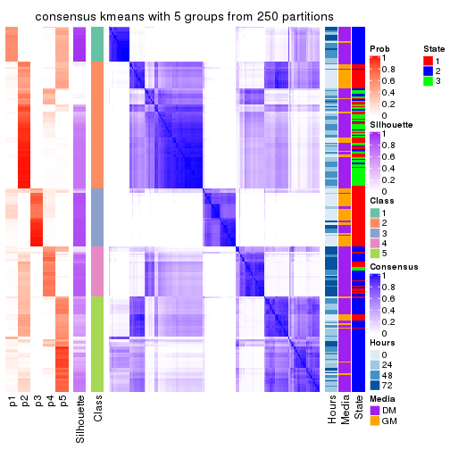</p>

</div>
<div id='tab-CV-kmeans-consensus-heatmap-5'>
<pre><code class="r">consensus_heatmap(res, k = 6)
</code></pre>

<p></p>

</div>
</div>

Heatmaps for the membership of samples in all partitions to see how consistent they are:


<script>
$( function() {
	$( '#tabs-CV-kmeans-membership-heatmap' ).tabs();
} );
</script>
<div id='tabs-CV-kmeans-membership-heatmap'>
<ul>
<li><a href='#tab-CV-kmeans-membership-heatmap-1'>k = 2</a></li>
<li><a href='#tab-CV-kmeans-membership-heatmap-2'>k = 3</a></li>
<li><a href='#tab-CV-kmeans-membership-heatmap-3'>k = 4</a></li>
<li><a href='#tab-CV-kmeans-membership-heatmap-4'>k = 5</a></li>
<li><a href='#tab-CV-kmeans-membership-heatmap-5'>k = 6</a></li>
</ul>
<div id='tab-CV-kmeans-membership-heatmap-1'>
<pre><code class="r">membership_heatmap(res, k = 2)
</code></pre>

<p></p>

</div>
<div id='tab-CV-kmeans-membership-heatmap-2'>
<pre><code class="r">membership_heatmap(res, k = 3)
</code></pre>

<p></p>

</div>
<div id='tab-CV-kmeans-membership-heatmap-3'>
<pre><code class="r">membership_heatmap(res, k = 4)
</code></pre>

<p></p>

</div>
<div id='tab-CV-kmeans-membership-heatmap-4'>
<pre><code class="r">membership_heatmap(res, k = 5)
</code></pre>

<p></p>

</div>
<div id='tab-CV-kmeans-membership-heatmap-5'>
<pre><code class="r">membership_heatmap(res, k = 6)
</code></pre>

<p></p>

</div>
</div>

As soon as we have had the classes for columns, we can look for signatures
which are significantly different between classes which can be candidate marks
for certain classes. Following are the heatmaps for signatures.


Signature heatmaps where rows are scaled:


<script>
$( function() {
	$( '#tabs-CV-kmeans-get-signatures' ).tabs();
} );
</script>
<div id='tabs-CV-kmeans-get-signatures'>
<ul>
<li><a href='#tab-CV-kmeans-get-signatures-1'>k = 2</a></li>
<li><a href='#tab-CV-kmeans-get-signatures-2'>k = 3</a></li>
<li><a href='#tab-CV-kmeans-get-signatures-3'>k = 4</a></li>
<li><a href='#tab-CV-kmeans-get-signatures-4'>k = 5</a></li>
<li><a href='#tab-CV-kmeans-get-signatures-5'>k = 6</a></li>
</ul>
<div id='tab-CV-kmeans-get-signatures-1'>
<pre><code class="r">get_signatures(res, k = 2)
</code></pre>

<p></p>

</div>
<div id='tab-CV-kmeans-get-signatures-2'>
<pre><code class="r">get_signatures(res, k = 3)
</code></pre>

<p></p>

</div>
<div id='tab-CV-kmeans-get-signatures-3'>
<pre><code class="r">get_signatures(res, k = 4)
</code></pre>

<p></p>

</div>
<div id='tab-CV-kmeans-get-signatures-4'>
<pre><code class="r">get_signatures(res, k = 5)
</code></pre>

<p></p>

</div>
<div id='tab-CV-kmeans-get-signatures-5'>
<pre><code class="r">get_signatures(res, k = 6)
</code></pre>

<p></p>

</div>
</div>


Signature heatmaps where rows are not scaled:


<script>
$( function() {
	$( '#tabs-CV-kmeans-get-signatures-no-scale' ).tabs();
} );
</script>
<div id='tabs-CV-kmeans-get-signatures-no-scale'>
<ul>
<li><a href='#tab-CV-kmeans-get-signatures-no-scale-1'>k = 2</a></li>
<li><a href='#tab-CV-kmeans-get-signatures-no-scale-2'>k = 3</a></li>
<li><a href='#tab-CV-kmeans-get-signatures-no-scale-3'>k = 4</a></li>
<li><a href='#tab-CV-kmeans-get-signatures-no-scale-4'>k = 5</a></li>
<li><a href='#tab-CV-kmeans-get-signatures-no-scale-5'>k = 6</a></li>
</ul>
<div id='tab-CV-kmeans-get-signatures-no-scale-1'>
<pre><code class="r">get_signatures(res, k = 2, scale_rows = FALSE)
</code></pre>

<p></p>

</div>
<div id='tab-CV-kmeans-get-signatures-no-scale-2'>
<pre><code class="r">get_signatures(res, k = 3, scale_rows = FALSE)
</code></pre>

<p></p>

</div>
<div id='tab-CV-kmeans-get-signatures-no-scale-3'>
<pre><code class="r">get_signatures(res, k = 4, scale_rows = FALSE)
</code></pre>

<p></p>

</div>
<div id='tab-CV-kmeans-get-signatures-no-scale-4'>
<pre><code class="r">get_signatures(res, k = 5, scale_rows = FALSE)
</code></pre>

<p></p>

</div>
<div id='tab-CV-kmeans-get-signatures-no-scale-5'>
<pre><code class="r">get_signatures(res, k = 6, scale_rows = FALSE)
</code></pre>

<p></p>

</div>
</div>


Compare the overlap of signatures from different k:

```r
compare_signatures(res)
```


`get_signature()` returns a data frame invisibly. TO get the list of signatures, the function
call should be assigned to a variable explicitly. In following code, if `plot` argument is set
to `FALSE`, no heatmap is plotted while only the differential analysis is performed.

```r
# code only for demonstration
tb = get_signature(res, k = ..., plot = FALSE)
```

An example of the output of `tb` is:

```
#>   which_row         fdr    mean_1    mean_2 scaled_mean_1 scaled_mean_2 km
#> 1        38 0.042760348  8.373488  9.131774    -0.5533452     0.5164555  1
#> 2        40 0.018707592  7.106213  8.469186    -0.6173731     0.5762149  1
#> 3        55 0.019134737 10.221463 11.207825    -0.6159697     0.5749050  1
#> 4        59 0.006059896  5.921854  7.869574    -0.6899429     0.6439467  1
#> 5        60 0.018055526  8.928898 10.211722    -0.6204761     0.5791110  1
#> 6        98 0.009384629 15.714769 14.887706     0.6635654    -0.6193277  2
...
```

The columns in `tb` are:

1. `which_row`: row indices corresponding to the input matrix.
2. `fdr`: FDR for the differential test. 
3. `mean_x`: The mean value in group x.
4. `scaled_mean_x`: The mean value in group x after rows are scaled.
5. `km`: Row groups if k-means clustering is applied to rows.


UMAP plot which shows how samples are separated.


<script>
$( function() {
	$( '#tabs-CV-kmeans-dimension-reduction' ).tabs();
} );
</script>
<div id='tabs-CV-kmeans-dimension-reduction'>
<ul>
<li><a href='#tab-CV-kmeans-dimension-reduction-1'>k = 2</a></li>
<li><a href='#tab-CV-kmeans-dimension-reduction-2'>k = 3</a></li>
<li><a href='#tab-CV-kmeans-dimension-reduction-3'>k = 4</a></li>
<li><a href='#tab-CV-kmeans-dimension-reduction-4'>k = 5</a></li>
<li><a href='#tab-CV-kmeans-dimension-reduction-5'>k = 6</a></li>
</ul>
<div id='tab-CV-kmeans-dimension-reduction-1'>
<pre><code class="r">dimension_reduction(res, k = 2, method = &quot;UMAP&quot;)
</code></pre>

<p></p>

</div>
<div id='tab-CV-kmeans-dimension-reduction-2'>
<pre><code class="r">dimension_reduction(res, k = 3, method = &quot;UMAP&quot;)
</code></pre>

<p></p>

</div>
<div id='tab-CV-kmeans-dimension-reduction-3'>
<pre><code class="r">dimension_reduction(res, k = 4, method = &quot;UMAP&quot;)
</code></pre>

<p></p>

</div>
<div id='tab-CV-kmeans-dimension-reduction-4'>
<pre><code class="r">dimension_reduction(res, k = 5, method = &quot;UMAP&quot;)
</code></pre>

<p></p>

</div>
<div id='tab-CV-kmeans-dimension-reduction-5'>
<pre><code class="r">dimension_reduction(res, k = 6, method = &quot;UMAP&quot;)
</code></pre>

<p></p>

</div>
</div>


Following heatmap shows how subgroups are split when increasing `k`:

```r
collect_classes(res)
```


Test correlation between subgroups and known annotations. If the known
annotation is numeric, one-way ANOVA test is applied, and if the known
annotation is discrete, chi-squared contingency table test is applied.

```r
test_to_known_factors(res)
```

```
#>             n Hours(p) Media(p) State(p) k
#> CV:kmeans 271 1.50e-13 1.66e-14 1.52e-20 2
#> CV:kmeans 248 2.04e-14 1.06e-16 4.25e-40 3
#> CV:kmeans 214 1.11e-20 9.00e-15 1.49e-26 4
#> CV:kmeans 192 3.50e-28 2.41e-18 1.26e-39 5
#> CV:kmeans 182 4.15e-16 2.70e-05 2.07e-19 6
```


If matrix rows can be associated to genes, consider to use `GO_Enrichment(res,
...)` to perform function enrichment for the signature genes.


 

---------------------------------------------------


### CV:skmeans


The object with results only for a single top-value method and a single partition method 
can be extracted as:

```r
res = res_list["CV", "skmeans"]
# you can also extract it by
# res = res_list["CV:skmeans"]
```

A summary of `res` and all the functions that can be applied to it:

```r
res
```

```
#> A 'ConsensusPartition' object with k = 2, 3, 4, 5, 6.
#>   On a matrix with 12016 rows and 271 columns.
#>   Top rows (1000, 2000, 3000, 4000, 5000) are extracted by 'CV' method.
#>   Subgroups are detected by 'skmeans' method.
#>   Performed in total 1250 partitions by row resampling.
#>   Best k for subgroups seems to be 3.
#> 
#> Following methods can be applied to this 'ConsensusPartition' object:
#>  [1] "cola_report"             "collect_classes"         "collect_plots"          
#>  [4] "collect_stats"           "colnames"                "compare_signatures"     
#>  [7] "consensus_heatmap"       "dimension_reduction"     "functional_enrichment"  
#> [10] "get_anno_col"            "get_anno"                "get_classes"            
#> [13] "get_consensus"           "get_matrix"              "get_membership"         
#> [16] "get_param"               "get_signatures"          "get_stats"              
#> [19] "is_best_k"               "is_stable_k"             "membership_heatmap"     
#> [22] "ncol"                    "nrow"                    "plot_ecdf"              
#> [25] "rownames"                "select_partition_number" "show"                   
#> [28] "suggest_best_k"          "test_to_known_factors"
```

`collect_plots()` function collects all the plots made from `res` for all `k` (number of partitions)
into one single page to provide an easy and fast comparison between different `k`.

```r
collect_plots(res)
```


The plots are:

- The first row: a plot of the ECDF (Empirical cumulative distribution
  function) curves of the consensus matrix for each `k` and the heatmap of
  predicted classes for each `k`.
- The second row: heatmaps of the consensus matrix for each `k`.
- The third row: heatmaps of the membership matrix for each `k`.
- The fouth row: heatmaps of the signatures for each `k`.

All the plots in panels can be made by individual functions and they are
plotted later in this section.

`select_partition_number()` produces several plots showing different
statistics for choosing "optimized" `k`. There are following statistics:

- ECDF curves of the consensus matrix for each `k`;
- 1-PAC. [The PAC
  score](https://en.wikipedia.org/wiki/Consensus_clustering#Over-interpretation_potential_of_consensus_clustering)
  measures the proportion of the ambiguous subgrouping.
- Mean silhouette score.
- Concordance. The mean probability of fiting the consensus class ids in all
  partitions.
- Area increased. Denote $A_k$ as the area under the ECDF curve for current
  `k`, the area increased is defined as $A_k - A_{k-1}$.
- Rand index. The percent of pairs of samples that are both in a same cluster
  or both are not in a same cluster in the partition of k and k-1.
- Jaccard index. The ratio of pairs of samples are both in a same cluster in
  the partition of k and k-1 and the pairs of samples are both in a same
  cluster in the partition k or k-1.

The detailed explanations of these statistics can be found in [the cola
vignette](http://bioconductor.org/packages/devel/bioc/vignettes/cola/inst/doc/cola.html#toc_13).

Generally speaking, lower PAC score, higher mean silhouette score or higher
concordance corresponds to better partition. Rand index and Jaccard index
measure how similar the current partition is compared to partition with `k-1`.
If they are too similar, we won't accept `k` is better than `k-1`.

```r
select_partition_number(res)
```


The numeric values for all these statistics can be obtained by `get_stats()`.

```r
get_stats(res)
```

```
#>   k 1-PAC mean_silhouette concordance area_increased  Rand Jaccard
#> 2 2 0.489           0.779       0.896         0.4758 0.501   0.501
#> 3 3 0.863           0.882       0.951         0.3534 0.703   0.486
#> 4 4 0.637           0.671       0.842         0.1544 0.811   0.527
#> 5 5 0.621           0.587       0.764         0.0709 0.885   0.597
#> 6 6 0.631           0.537       0.694         0.0396 0.957   0.796
```

`suggest_best_k()` suggests the best $k$ based on these statistics. The rules are as follows:

- All $k$ with Jaccard index larger than 0.95 are removed because the increase of
  the partition number does not provides enough extra information. If all $k$ are removed,
  the best $k$ is assigned by `NA`.
- For $k$ with 1-PAC larger than 0.9, the maximal $k$ is taken as the "best k". Other $k$ is called "optional k".
- If it does not fit the second rule. The $k$ with the highest vote of highest
  1-PAC, mean silhouette and concordance is taken as the "best k".

```r
suggest_best_k(res)
```

```
#> [1] 3
```


Following shows the table of the partitions (You need to click the **show/hide
code output** link to see it). The membership matrix (columns with name `p*`)
is inferred by
[`clue::cl_consensus()`](https://www.rdocumentation.org/link/cl_consensus?package=clue)
function with the `SE` method. Basically the value in the membership matrix
represents the probability to belong to a certain group. The finall class
label for an item is determined with the group with highest probability it
belongs to.

In `get_classes()` function, the entropy is calculated from the membership
matrix and the silhouette score is calculated from the consensus matrix.


<script>
$( function() {
	$( '#tabs-CV-skmeans-get-classes' ).tabs();
} );
</script>
<div id='tabs-CV-skmeans-get-classes'>
<ul>
<li><a href='#tab-CV-skmeans-get-classes-1'>k = 2</a></li>
<li><a href='#tab-CV-skmeans-get-classes-2'>k = 3</a></li>
<li><a href='#tab-CV-skmeans-get-classes-3'>k = 4</a></li>
<li><a href='#tab-CV-skmeans-get-classes-4'>k = 5</a></li>
<li><a href='#tab-CV-skmeans-get-classes-5'>k = 6</a></li>
</ul>

<div id='tab-CV-skmeans-get-classes-1'>
<p><a id='tab-CV-skmeans-get-classes-1-a' style='color:#0366d6' href='#'>show/hide code output</a></p>
<pre><code class="r">cbind(get_classes(res, k = 2), get_membership(res, k = 2))
</code></pre>

<pre><code>#&gt;            class entropy silhouette    p1    p2
#&gt; T0_CT_A01      2  0.0000    0.84246 0.000 1.000
#&gt; T0_CT_A03      2  0.0000    0.84246 0.000 1.000
#&gt; T0_CT_A05      2  0.0000    0.84246 0.000 1.000
#&gt; T0_CT_A06      2  0.0000    0.84246 0.000 1.000
#&gt; T0_CT_A07      2  0.0000    0.84246 0.000 1.000
#&gt; T0_CT_A08      1  0.0000    0.90545 1.000 0.000
#&gt; T0_CT_A10      2  0.0000    0.84246 0.000 1.000
#&gt; T0_CT_A11      1  0.0672    0.90110 0.992 0.008
#&gt; T0_CT_B01      1  0.0938    0.89872 0.988 0.012
#&gt; T0_CT_B03      2  0.0000    0.84246 0.000 1.000
#&gt; T0_CT_B05      1  0.2236    0.88163 0.964 0.036
#&gt; T0_CT_B07      1  0.8267    0.62518 0.740 0.260
#&gt; T0_CT_B08      2  0.0000    0.84246 0.000 1.000
#&gt; T0_CT_B09      2  0.0000    0.84246 0.000 1.000
#&gt; T0_CT_C02      2  0.0000    0.84246 0.000 1.000
#&gt; T0_CT_C03      1  0.0000    0.90545 1.000 0.000
#&gt; T0_CT_C05      2  0.6247    0.82304 0.156 0.844
#&gt; T0_CT_C06      1  0.0000    0.90545 1.000 0.000
#&gt; T0_CT_C07      1  0.7453    0.68655 0.788 0.212
#&gt; T0_CT_C08      2  0.0000    0.84246 0.000 1.000
#&gt; T0_CT_C09      1  0.4562    0.82960 0.904 0.096
#&gt; T0_CT_C11      2  0.4815    0.83760 0.104 0.896
#&gt; T0_CT_C12      2  0.0000    0.84246 0.000 1.000
#&gt; T0_CT_D01      2  0.0000    0.84246 0.000 1.000
#&gt; T0_CT_D02      1  0.6343    0.74112 0.840 0.160
#&gt; T0_CT_D03      2  0.0000    0.84246 0.000 1.000
#&gt; T0_CT_D05      1  0.3584    0.85429 0.932 0.068
#&gt; T0_CT_D06      2  0.0000    0.84246 0.000 1.000
#&gt; T0_CT_D07      2  0.0672    0.84065 0.008 0.992
#&gt; T0_CT_D08      2  0.0000    0.84246 0.000 1.000
#&gt; T0_CT_D09      2  0.0000    0.84246 0.000 1.000
#&gt; T0_CT_D11      2  0.4431    0.83913 0.092 0.908
#&gt; T0_CT_D12      2  0.0000    0.84246 0.000 1.000
#&gt; T0_CT_E01      2  0.0000    0.84246 0.000 1.000
#&gt; T0_CT_E03      2  0.0672    0.84021 0.008 0.992
#&gt; T0_CT_E04      2  0.4298    0.83976 0.088 0.912
#&gt; T0_CT_E05      1  0.0000    0.90545 1.000 0.000
#&gt; T0_CT_E06      2  0.0000    0.84246 0.000 1.000
#&gt; T0_CT_E07      2  0.0000    0.84246 0.000 1.000
#&gt; T0_CT_E08      2  0.0000    0.84246 0.000 1.000
#&gt; T0_CT_E09      2  0.0000    0.84246 0.000 1.000
#&gt; T0_CT_E10      1  0.0938    0.89872 0.988 0.012
#&gt; T0_CT_E11      2  0.0000    0.84246 0.000 1.000
#&gt; T0_CT_E12      1  0.9996    0.11626 0.512 0.488
#&gt; T0_CT_F01      2  0.0000    0.84246 0.000 1.000
#&gt; T0_CT_F02      2  0.0000    0.84246 0.000 1.000
#&gt; T0_CT_F03      2  0.0000    0.84246 0.000 1.000
#&gt; T0_CT_F04      2  0.0000    0.84246 0.000 1.000
#&gt; T0_CT_F05      2  0.0938    0.84314 0.012 0.988
#&gt; T0_CT_F06      2  0.0000    0.84246 0.000 1.000
#&gt; T0_CT_F07      2  0.9983    0.13173 0.476 0.524
#&gt; T0_CT_F09      2  0.4298    0.83837 0.088 0.912
#&gt; T0_CT_F11      1  0.9881    0.28196 0.564 0.436
#&gt; T0_CT_F12      2  0.0000    0.84246 0.000 1.000
#&gt; T0_CT_G01      2  0.0000    0.84246 0.000 1.000
#&gt; T0_CT_G02      1  0.0376    0.90287 0.996 0.004
#&gt; T0_CT_G03      2  0.0000    0.84246 0.000 1.000
#&gt; T0_CT_G04      2  0.0000    0.84246 0.000 1.000
#&gt; T0_CT_G07      2  0.0000    0.84246 0.000 1.000
#&gt; T0_CT_G08      2  0.0000    0.84246 0.000 1.000
#&gt; T0_CT_G09      1  0.1184    0.89422 0.984 0.016
#&gt; T0_CT_G11      1  0.0000    0.90545 1.000 0.000
#&gt; T0_CT_H01      1  0.0938    0.89895 0.988 0.012
#&gt; T0_CT_H02      2  0.5178    0.83363 0.116 0.884
#&gt; T0_CT_H04      2  0.1633    0.83566 0.024 0.976
#&gt; T0_CT_H05      1  0.0938    0.89872 0.988 0.012
#&gt; T0_CT_H08      2  0.9815    0.26913 0.420 0.580
#&gt; T0_CT_H09      1  0.2043    0.88591 0.968 0.032
#&gt; T0_CT_H12      1  0.0000    0.90545 1.000 0.000
#&gt; T24_CT_A01     1  0.0000    0.90545 1.000 0.000
#&gt; T24_CT_A03     2  0.6801    0.80998 0.180 0.820
#&gt; T24_CT_A04     2  0.8267    0.74639 0.260 0.740
#&gt; T24_CT_A05     2  0.1184    0.83724 0.016 0.984
#&gt; T24_CT_A07     2  0.9922    0.38065 0.448 0.552
#&gt; T24_CT_A08     1  0.0000    0.90545 1.000 0.000
#&gt; T24_CT_A09     1  0.0000    0.90545 1.000 0.000
#&gt; T24_CT_A10     1  0.0000    0.90545 1.000 0.000
#&gt; T24_CT_B01     1  0.0000    0.90545 1.000 0.000
#&gt; T24_CT_B02     1  0.0000    0.90545 1.000 0.000
#&gt; T24_CT_B03     2  0.7376    0.79373 0.208 0.792
#&gt; T24_CT_B05     2  0.8861    0.68764 0.304 0.696
#&gt; T24_CT_B06     1  0.9460    0.32688 0.636 0.364
#&gt; T24_CT_B07     1  0.0000    0.90545 1.000 0.000
#&gt; T24_CT_B08     1  0.6438    0.74392 0.836 0.164
#&gt; T24_CT_B09     1  0.0000    0.90545 1.000 0.000
#&gt; T24_CT_B11     2  0.0000    0.84246 0.000 1.000
#&gt; T24_CT_C01     1  0.0000    0.90545 1.000 0.000
#&gt; T24_CT_C02     1  0.0672    0.90110 0.992 0.008
#&gt; T24_CT_C03     1  0.0000    0.90545 1.000 0.000
#&gt; T24_CT_C05     1  0.9996   -0.16356 0.512 0.488
#&gt; T24_CT_C07     2  0.7602    0.78494 0.220 0.780
#&gt; T24_CT_C08     2  0.9209    0.63852 0.336 0.664
#&gt; T24_CT_C09     1  0.1843    0.88778 0.972 0.028
#&gt; T24_CT_C10     1  0.0000    0.90545 1.000 0.000
#&gt; T24_CT_C11     1  0.0000    0.90545 1.000 0.000
#&gt; T24_CT_C12     2  0.7056    0.80331 0.192 0.808
#&gt; T24_CT_D01     1  0.9580    0.27617 0.620 0.380
#&gt; T24_CT_D02     2  0.0938    0.84317 0.012 0.988
#&gt; T24_CT_D03     1  0.9850    0.09887 0.572 0.428
#&gt; T24_CT_D04     1  0.0000    0.90545 1.000 0.000
#&gt; T24_CT_D05     1  0.0000    0.90545 1.000 0.000
#&gt; T24_CT_D06     1  0.0000    0.90545 1.000 0.000
#&gt; T24_CT_D07     1  0.0000    0.90545 1.000 0.000
#&gt; T24_CT_D08     1  0.8955    0.47035 0.688 0.312
#&gt; T24_CT_D09     2  0.6343    0.81994 0.160 0.840
#&gt; T24_CT_D10     2  0.9087    0.65224 0.324 0.676
#&gt; T24_CT_D11     2  0.9754    0.48809 0.408 0.592
#&gt; T24_CT_E01     1  0.0000    0.90545 1.000 0.000
#&gt; T24_CT_E02     1  0.0000    0.90545 1.000 0.000
#&gt; T24_CT_E04     1  0.9922    0.00772 0.552 0.448
#&gt; T24_CT_E05     1  0.0000    0.90545 1.000 0.000
#&gt; T24_CT_E07     1  0.7883    0.63430 0.764 0.236
#&gt; T24_CT_E09     1  0.0000    0.90545 1.000 0.000
#&gt; T24_CT_E11     1  0.0000    0.90545 1.000 0.000
#&gt; T24_CT_E12     2  0.9393    0.60165 0.356 0.644
#&gt; T24_CT_F01     2  0.9795    0.46924 0.416 0.584
#&gt; T24_CT_F02     2  0.6438    0.81958 0.164 0.836
#&gt; T24_CT_F03     1  0.0000    0.90545 1.000 0.000
#&gt; T24_CT_F04     1  0.0000    0.90545 1.000 0.000
#&gt; T24_CT_F05     1  0.0000    0.90545 1.000 0.000
#&gt; T24_CT_F07     1  0.0000    0.90545 1.000 0.000
#&gt; T24_CT_F08     1  0.0000    0.90545 1.000 0.000
#&gt; T24_CT_F09     2  0.7745    0.77875 0.228 0.772
#&gt; T24_CT_F10     1  0.9795    0.14163 0.584 0.416
#&gt; T24_CT_F11     1  0.0000    0.90545 1.000 0.000
#&gt; T24_CT_F12     2  0.0000    0.84246 0.000 1.000
#&gt; T24_CT_G01     2  0.8207    0.75086 0.256 0.744
#&gt; T24_CT_G02     1  0.0000    0.90545 1.000 0.000
#&gt; T24_CT_G03     1  0.0000    0.90545 1.000 0.000
#&gt; T24_CT_G04     2  0.9170    0.64569 0.332 0.668
#&gt; T24_CT_G05     1  0.6048    0.76502 0.852 0.148
#&gt; T24_CT_G06     1  0.0000    0.90545 1.000 0.000
#&gt; T24_CT_G08     1  0.0000    0.90545 1.000 0.000
#&gt; T24_CT_G10     2  0.8016    0.76225 0.244 0.756
#&gt; T24_CT_G11     1  0.0000    0.90545 1.000 0.000
#&gt; T24_CT_G12     1  0.0000    0.90545 1.000 0.000
#&gt; T24_CT_H01     2  0.0000    0.84246 0.000 1.000
#&gt; T24_CT_H02     1  0.0000    0.90545 1.000 0.000
#&gt; T24_CT_H03     1  0.3584    0.85385 0.932 0.068
#&gt; T24_CT_H05     1  0.0000    0.90545 1.000 0.000
#&gt; T24_CT_H07     1  0.0000    0.90545 1.000 0.000
#&gt; T24_CT_H09     1  0.0000    0.90545 1.000 0.000
#&gt; T24_CT_H12     1  0.0000    0.90545 1.000 0.000
#&gt; T48_CT_A01     2  0.7219    0.79880 0.200 0.800
#&gt; T48_CT_A02     2  0.9427    0.59614 0.360 0.640
#&gt; T48_CT_A03     1  0.0000    0.90545 1.000 0.000
#&gt; T48_CT_A04     2  0.9358    0.61072 0.352 0.648
#&gt; T48_CT_A05     2  0.9922    0.38280 0.448 0.552
#&gt; T48_CT_A06     1  0.0000    0.90545 1.000 0.000
#&gt; T48_CT_A07     2  0.0000    0.84246 0.000 1.000
#&gt; T48_CT_A08     2  0.8016    0.76210 0.244 0.756
#&gt; T48_CT_A09     1  0.0000    0.90545 1.000 0.000
#&gt; T48_CT_A10     1  0.8555    0.54143 0.720 0.280
#&gt; T48_CT_A11     2  0.9608    0.54355 0.384 0.616
#&gt; T48_CT_A12     1  0.0000    0.90545 1.000 0.000
#&gt; T48_CT_B01     1  0.6531    0.73778 0.832 0.168
#&gt; T48_CT_B02     1  0.9996   -0.16639 0.512 0.488
#&gt; T48_CT_B03     1  0.0000    0.90545 1.000 0.000
#&gt; T48_CT_B04     1  0.0000    0.90545 1.000 0.000
#&gt; T48_CT_B06     1  0.9552    0.28866 0.624 0.376
#&gt; T48_CT_B08     1  0.0000    0.90545 1.000 0.000
#&gt; T48_CT_B10     1  0.9732    0.19733 0.596 0.404
#&gt; T48_CT_B11     2  0.9944    0.35649 0.456 0.544
#&gt; T48_CT_B12     1  0.0000    0.90545 1.000 0.000
#&gt; T48_CT_C01     1  0.9866    0.08024 0.568 0.432
#&gt; T48_CT_C02     1  0.0000    0.90545 1.000 0.000
#&gt; T48_CT_C03     2  0.9983    0.29011 0.476 0.524
#&gt; T48_CT_C04     1  0.0000    0.90545 1.000 0.000
#&gt; T48_CT_C05     1  0.9909    0.01684 0.556 0.444
#&gt; T48_CT_C06     2  0.8386    0.73621 0.268 0.732
#&gt; T48_CT_C07     1  0.0000    0.90545 1.000 0.000
#&gt; T48_CT_C09     2  0.0000    0.84246 0.000 1.000
#&gt; T48_CT_C10     1  0.0000    0.90545 1.000 0.000
#&gt; T48_CT_C11     2  0.9358    0.60988 0.352 0.648
#&gt; T48_CT_D01     1  0.1633    0.89124 0.976 0.024
#&gt; T48_CT_D02     1  0.0000    0.90545 1.000 0.000
#&gt; T48_CT_D03     1  0.0000    0.90545 1.000 0.000
#&gt; T48_CT_D04     1  0.0938    0.89878 0.988 0.012
#&gt; T48_CT_D06     2  0.7219    0.79827 0.200 0.800
#&gt; T48_CT_D07     1  0.7528    0.66481 0.784 0.216
#&gt; T48_CT_D08     1  0.0000    0.90545 1.000 0.000
#&gt; T48_CT_D09     1  0.2603    0.87537 0.956 0.044
#&gt; T48_CT_D10     1  0.0000    0.90545 1.000 0.000
#&gt; T48_CT_D11     2  0.3733    0.84169 0.072 0.928
#&gt; T48_CT_D12     1  0.0000    0.90545 1.000 0.000
#&gt; T48_CT_E01     2  0.8713    0.71233 0.292 0.708
#&gt; T48_CT_E02     1  0.0000    0.90545 1.000 0.000
#&gt; T48_CT_E03     2  0.4562    0.83860 0.096 0.904
#&gt; T48_CT_E04     1  0.0000    0.90545 1.000 0.000
#&gt; T48_CT_E05     2  0.9944    0.35466 0.456 0.544
#&gt; T48_CT_E06     1  0.0000    0.90545 1.000 0.000
#&gt; T48_CT_E07     1  0.0000    0.90545 1.000 0.000
#&gt; T48_CT_E08     2  0.7815    0.77512 0.232 0.768
#&gt; T48_CT_E10     1  0.0000    0.90545 1.000 0.000
#&gt; T48_CT_E11     1  0.0000    0.90545 1.000 0.000
#&gt; T48_CT_E12     2  0.0000    0.84246 0.000 1.000
#&gt; T48_CT_F01     1  0.9000    0.45959 0.684 0.316
#&gt; T48_CT_F02     1  0.0000    0.90545 1.000 0.000
#&gt; T48_CT_F03     1  0.0000    0.90545 1.000 0.000
#&gt; T48_CT_F05     1  0.0938    0.89885 0.988 0.012
#&gt; T48_CT_F07     1  0.0000    0.90545 1.000 0.000
#&gt; T48_CT_F09     1  0.9850    0.09265 0.572 0.428
#&gt; T48_CT_F10     1  0.0000    0.90545 1.000 0.000
#&gt; T48_CT_F11     1  0.0000    0.90545 1.000 0.000
#&gt; T48_CT_G01     1  0.2043    0.88039 0.968 0.032
#&gt; T48_CT_G02     2  0.6438    0.81807 0.164 0.836
#&gt; T48_CT_G03     2  0.9248    0.63158 0.340 0.660
#&gt; T48_CT_G07     1  0.6048    0.76513 0.852 0.148
#&gt; T48_CT_G08     2  0.7674    0.78029 0.224 0.776
#&gt; T48_CT_G09     2  0.7299    0.79766 0.204 0.796
#&gt; T48_CT_G10     2  0.4022    0.80167 0.080 0.920
#&gt; T48_CT_G11     1  0.0000    0.90545 1.000 0.000
#&gt; T48_CT_G12     1  0.9608    0.26133 0.616 0.384
#&gt; T48_CT_H01     1  0.2236    0.88166 0.964 0.036
#&gt; T48_CT_H02     2  0.8267    0.75056 0.260 0.740
#&gt; T48_CT_H04     1  0.0000    0.90545 1.000 0.000
#&gt; T48_CT_H05     1  0.7674    0.65118 0.776 0.224
#&gt; T48_CT_H06     1  0.9000    0.45923 0.684 0.316
#&gt; T48_CT_H07     1  0.0672    0.90120 0.992 0.008
#&gt; T48_CT_H08     2  0.6801    0.80996 0.180 0.820
#&gt; T48_CT_H11     1  0.0000    0.90545 1.000 0.000
#&gt; T48_CT_H12     2  0.9732    0.49819 0.404 0.596
#&gt; T72_CT_A01     2  0.8555    0.72426 0.280 0.720
#&gt; T72_CT_A05     2  0.6048    0.82366 0.148 0.852
#&gt; T72_CT_A08     1  0.0000    0.90545 1.000 0.000
#&gt; T72_CT_A09     2  0.4022    0.84081 0.080 0.920
#&gt; T72_CT_A11     2  0.7139    0.80075 0.196 0.804
#&gt; T72_CT_B01     2  0.7219    0.79827 0.200 0.800
#&gt; T72_CT_B02     1  0.0000    0.90545 1.000 0.000
#&gt; T72_CT_B03     1  0.7453    0.66932 0.788 0.212
#&gt; T72_CT_B04     1  0.0000    0.90545 1.000 0.000
#&gt; T72_CT_B05     2  0.7453    0.79417 0.212 0.788
#&gt; T72_CT_B06     1  0.0000    0.90545 1.000 0.000
#&gt; T72_CT_B08     2  0.0000    0.84246 0.000 1.000
#&gt; T72_CT_B09     1  0.0000    0.90545 1.000 0.000
#&gt; T72_CT_B11     1  0.0000    0.90545 1.000 0.000
#&gt; T72_CT_B12     2  0.7219    0.79906 0.200 0.800
#&gt; T72_CT_C04     2  0.7056    0.80348 0.192 0.808
#&gt; T72_CT_C06     1  0.3584    0.85147 0.932 0.068
#&gt; T72_CT_C07     2  0.3879    0.84130 0.076 0.924
#&gt; T72_CT_C09     1  0.6048    0.76178 0.852 0.148
#&gt; T72_CT_C11     2  0.0000    0.84246 0.000 1.000
#&gt; T72_CT_D01     2  0.7219    0.79822 0.200 0.800
#&gt; T72_CT_D03     1  0.5946    0.76751 0.856 0.144
#&gt; T72_CT_D04     2  0.0000    0.84246 0.000 1.000
#&gt; T72_CT_D05     1  0.0376    0.90308 0.996 0.004
#&gt; T72_CT_D07     1  0.0000    0.90545 1.000 0.000
#&gt; T72_CT_D10     2  0.7139    0.80536 0.196 0.804
#&gt; T72_CT_D11     1  0.0000    0.90545 1.000 0.000
#&gt; T72_CT_E04     1  0.0000    0.90545 1.000 0.000
#&gt; T72_CT_E05     2  0.4431    0.83912 0.092 0.908
#&gt; T72_CT_E07     1  0.9881    0.06260 0.564 0.436
#&gt; T72_CT_F01     2  0.7376    0.79255 0.208 0.792
#&gt; T72_CT_F05     2  0.7950    0.76640 0.240 0.760
#&gt; T72_CT_F07     1  0.0000    0.90545 1.000 0.000
#&gt; T72_CT_F10     2  0.7528    0.78689 0.216 0.784
#&gt; T72_CT_F11     2  0.0000    0.84246 0.000 1.000
#&gt; T72_CT_G03     1  0.0000    0.90545 1.000 0.000
#&gt; T72_CT_G04     1  0.0000    0.90545 1.000 0.000
#&gt; T72_CT_G06     2  0.7139    0.79194 0.196 0.804
#&gt; T72_CT_G08     2  0.6623    0.81070 0.172 0.828
#&gt; T72_CT_G10     2  0.7376    0.79260 0.208 0.792
#&gt; T72_CT_G11     1  0.0000    0.90545 1.000 0.000
#&gt; T72_CT_H01     2  0.2778    0.84302 0.048 0.952
#&gt; T72_CT_H03     2  0.7219    0.79890 0.200 0.800
#&gt; T72_CT_H05     2  0.0000    0.84246 0.000 1.000
#&gt; T72_CT_H08     2  0.0000    0.84246 0.000 1.000
#&gt; T72_CT_H09     2  0.0000    0.84246 0.000 1.000
#&gt; T72_CT_H10     1  0.1414    0.89239 0.980 0.020
#&gt; T72_CT_H11     1  0.0000    0.90545 1.000 0.000
#&gt; T72_CT_H12     2  0.5629    0.82940 0.132 0.868
</code></pre>

<script>
$('#tab-CV-skmeans-get-classes-1-a').parent().next().next().hide();
$('#tab-CV-skmeans-get-classes-1-a').click(function(){
  $('#tab-CV-skmeans-get-classes-1-a').parent().next().next().toggle();
  return(false);
});
</script>
</div>

<div id='tab-CV-skmeans-get-classes-2'>
<p><a id='tab-CV-skmeans-get-classes-2-a' style='color:#0366d6' href='#'>show/hide code output</a></p>
<pre><code class="r">cbind(get_classes(res, k = 3), get_membership(res, k = 3))
</code></pre>

<pre><code>#&gt;            class entropy silhouette    p1    p2    p3
#&gt; T0_CT_A01      3  0.0000     0.9586 0.000 0.000 1.000
#&gt; T0_CT_A03      3  0.0000     0.9586 0.000 0.000 1.000
#&gt; T0_CT_A05      3  0.0000     0.9586 0.000 0.000 1.000
#&gt; T0_CT_A06      3  0.0000     0.9586 0.000 0.000 1.000
#&gt; T0_CT_A07      3  0.0000     0.9586 0.000 0.000 1.000
#&gt; T0_CT_A08      1  0.0000     0.9322 1.000 0.000 0.000
#&gt; T0_CT_A10      3  0.0000     0.9586 0.000 0.000 1.000
#&gt; T0_CT_A11      1  0.4842     0.7349 0.776 0.224 0.000
#&gt; T0_CT_B01      1  0.6309     0.0959 0.504 0.496 0.000
#&gt; T0_CT_B03      3  0.0000     0.9586 0.000 0.000 1.000
#&gt; T0_CT_B05      1  0.3042     0.8886 0.920 0.040 0.040
#&gt; T0_CT_B07      1  0.8165     0.1803 0.512 0.072 0.416
#&gt; T0_CT_B08      3  0.0000     0.9586 0.000 0.000 1.000
#&gt; T0_CT_B09      3  0.0000     0.9586 0.000 0.000 1.000
#&gt; T0_CT_C02      3  0.0000     0.9586 0.000 0.000 1.000
#&gt; T0_CT_C03      1  0.0000     0.9322 1.000 0.000 0.000
#&gt; T0_CT_C05      2  0.0000     0.9539 0.000 1.000 0.000
#&gt; T0_CT_C06      1  0.4555     0.7670 0.800 0.200 0.000
#&gt; T0_CT_C07      3  0.7781     0.5831 0.220 0.116 0.664
#&gt; T0_CT_C08      3  0.0000     0.9586 0.000 0.000 1.000
#&gt; T0_CT_C09      1  0.6683     0.0790 0.496 0.496 0.008
#&gt; T0_CT_C11      2  0.0000     0.9539 0.000 1.000 0.000
#&gt; T0_CT_C12      3  0.0000     0.9586 0.000 0.000 1.000
#&gt; T0_CT_D01      3  0.4002     0.7927 0.000 0.160 0.840
#&gt; T0_CT_D02      1  0.6057     0.4794 0.656 0.004 0.340
#&gt; T0_CT_D03      3  0.0000     0.9586 0.000 0.000 1.000
#&gt; T0_CT_D05      2  0.8628     0.2792 0.340 0.544 0.116
#&gt; T0_CT_D06      3  0.0000     0.9586 0.000 0.000 1.000
#&gt; T0_CT_D07      3  0.2165     0.8994 0.000 0.064 0.936
#&gt; T0_CT_D08      3  0.0000     0.9586 0.000 0.000 1.000
#&gt; T0_CT_D09      2  0.0237     0.9509 0.000 0.996 0.004
#&gt; T0_CT_D11      2  0.0000     0.9539 0.000 1.000 0.000
#&gt; T0_CT_D12      3  0.0000     0.9586 0.000 0.000 1.000
#&gt; T0_CT_E01      3  0.0000     0.9586 0.000 0.000 1.000
#&gt; T0_CT_E03      3  0.0000     0.9586 0.000 0.000 1.000
#&gt; T0_CT_E04      2  0.0000     0.9539 0.000 1.000 0.000
#&gt; T0_CT_E05      1  0.3412     0.8439 0.876 0.124 0.000
#&gt; T0_CT_E06      3  0.0000     0.9586 0.000 0.000 1.000
#&gt; T0_CT_E07      3  0.0000     0.9586 0.000 0.000 1.000
#&gt; T0_CT_E08      3  0.0000     0.9586 0.000 0.000 1.000
#&gt; T0_CT_E09      3  0.0000     0.9586 0.000 0.000 1.000
#&gt; T0_CT_E10      2  0.6309    -0.0801 0.496 0.504 0.000
#&gt; T0_CT_E11      3  0.0000     0.9586 0.000 0.000 1.000
#&gt; T0_CT_E12      3  0.0000     0.9586 0.000 0.000 1.000
#&gt; T0_CT_F01      3  0.0000     0.9586 0.000 0.000 1.000
#&gt; T0_CT_F02      3  0.0000     0.9586 0.000 0.000 1.000
#&gt; T0_CT_F03      3  0.0000     0.9586 0.000 0.000 1.000
#&gt; T0_CT_F04      3  0.0000     0.9586 0.000 0.000 1.000
#&gt; T0_CT_F05      2  0.6291     0.0975 0.000 0.532 0.468
#&gt; T0_CT_F06      3  0.0000     0.9586 0.000 0.000 1.000
#&gt; T0_CT_F07      3  0.9054     0.2531 0.360 0.144 0.496
#&gt; T0_CT_F09      2  0.0000     0.9539 0.000 1.000 0.000
#&gt; T0_CT_F11      3  0.0000     0.9586 0.000 0.000 1.000
#&gt; T0_CT_F12      3  0.0000     0.9586 0.000 0.000 1.000
#&gt; T0_CT_G01      3  0.0000     0.9586 0.000 0.000 1.000
#&gt; T0_CT_G02      1  0.2955     0.8799 0.912 0.080 0.008
#&gt; T0_CT_G03      3  0.0000     0.9586 0.000 0.000 1.000
#&gt; T0_CT_G04      3  0.0000     0.9586 0.000 0.000 1.000
#&gt; T0_CT_G07      3  0.0000     0.9586 0.000 0.000 1.000
#&gt; T0_CT_G08      3  0.0000     0.9586 0.000 0.000 1.000
#&gt; T0_CT_G09      1  0.0000     0.9322 1.000 0.000 0.000
#&gt; T0_CT_G11      1  0.5156     0.7423 0.776 0.216 0.008
#&gt; T0_CT_H01      1  0.6235     0.2981 0.564 0.436 0.000
#&gt; T0_CT_H02      2  0.0000     0.9539 0.000 1.000 0.000
#&gt; T0_CT_H04      3  0.0000     0.9586 0.000 0.000 1.000
#&gt; T0_CT_H05      1  0.5873     0.5898 0.684 0.312 0.004
#&gt; T0_CT_H08      3  0.8577     0.0983 0.096 0.436 0.468
#&gt; T0_CT_H09      2  0.4784     0.7205 0.200 0.796 0.004
#&gt; T0_CT_H12      1  0.3482     0.8417 0.872 0.128 0.000
#&gt; T24_CT_A01     1  0.1529     0.9106 0.960 0.040 0.000
#&gt; T24_CT_A03     2  0.0000     0.9539 0.000 1.000 0.000
#&gt; T24_CT_A04     2  0.0000     0.9539 0.000 1.000 0.000
#&gt; T24_CT_A05     3  0.0000     0.9586 0.000 0.000 1.000
#&gt; T24_CT_A07     2  0.0000     0.9539 0.000 1.000 0.000
#&gt; T24_CT_A08     1  0.0000     0.9322 1.000 0.000 0.000
#&gt; T24_CT_A09     1  0.0000     0.9322 1.000 0.000 0.000
#&gt; T24_CT_A10     1  0.0424     0.9283 0.992 0.008 0.000
#&gt; T24_CT_B01     1  0.0000     0.9322 1.000 0.000 0.000
#&gt; T24_CT_B02     1  0.0000     0.9322 1.000 0.000 0.000
#&gt; T24_CT_B03     2  0.0000     0.9539 0.000 1.000 0.000
#&gt; T24_CT_B05     2  0.0000     0.9539 0.000 1.000 0.000
#&gt; T24_CT_B06     2  0.0000     0.9539 0.000 1.000 0.000
#&gt; T24_CT_B07     1  0.0000     0.9322 1.000 0.000 0.000
#&gt; T24_CT_B08     2  0.0000     0.9539 0.000 1.000 0.000
#&gt; T24_CT_B09     1  0.0000     0.9322 1.000 0.000 0.000
#&gt; T24_CT_B11     3  0.0000     0.9586 0.000 0.000 1.000
#&gt; T24_CT_C01     1  0.0000     0.9322 1.000 0.000 0.000
#&gt; T24_CT_C02     2  0.0000     0.9539 0.000 1.000 0.000
#&gt; T24_CT_C03     1  0.0000     0.9322 1.000 0.000 0.000
#&gt; T24_CT_C05     2  0.0000     0.9539 0.000 1.000 0.000
#&gt; T24_CT_C07     2  0.0000     0.9539 0.000 1.000 0.000
#&gt; T24_CT_C08     2  0.0000     0.9539 0.000 1.000 0.000
#&gt; T24_CT_C09     2  0.0237     0.9506 0.004 0.996 0.000
#&gt; T24_CT_C10     1  0.0000     0.9322 1.000 0.000 0.000
#&gt; T24_CT_C11     1  0.6154     0.3789 0.592 0.408 0.000
#&gt; T24_CT_C12     2  0.0000     0.9539 0.000 1.000 0.000
#&gt; T24_CT_D01     2  0.0000     0.9539 0.000 1.000 0.000
#&gt; T24_CT_D02     2  0.0592     0.9445 0.000 0.988 0.012
#&gt; T24_CT_D03     2  0.0000     0.9539 0.000 1.000 0.000
#&gt; T24_CT_D04     1  0.0000     0.9322 1.000 0.000 0.000
#&gt; T24_CT_D05     1  0.1529     0.9093 0.960 0.040 0.000
#&gt; T24_CT_D06     1  0.2066     0.8976 0.940 0.060 0.000
#&gt; T24_CT_D07     1  0.1289     0.9147 0.968 0.032 0.000
#&gt; T24_CT_D08     2  0.0000     0.9539 0.000 1.000 0.000
#&gt; T24_CT_D09     2  0.0000     0.9539 0.000 1.000 0.000
#&gt; T24_CT_D10     2  0.0000     0.9539 0.000 1.000 0.000
#&gt; T24_CT_D11     2  0.0000     0.9539 0.000 1.000 0.000
#&gt; T24_CT_E01     1  0.0000     0.9322 1.000 0.000 0.000
#&gt; T24_CT_E02     1  0.0000     0.9322 1.000 0.000 0.000
#&gt; T24_CT_E04     2  0.0000     0.9539 0.000 1.000 0.000
#&gt; T24_CT_E05     1  0.0000     0.9322 1.000 0.000 0.000
#&gt; T24_CT_E07     2  0.6267     0.1677 0.452 0.548 0.000
#&gt; T24_CT_E09     1  0.0000     0.9322 1.000 0.000 0.000
#&gt; T24_CT_E11     1  0.0000     0.9322 1.000 0.000 0.000
#&gt; T24_CT_E12     2  0.0000     0.9539 0.000 1.000 0.000
#&gt; T24_CT_F01     2  0.0000     0.9539 0.000 1.000 0.000
#&gt; T24_CT_F02     2  0.0000     0.9539 0.000 1.000 0.000
#&gt; T24_CT_F03     1  0.0000     0.9322 1.000 0.000 0.000
#&gt; T24_CT_F04     1  0.2165     0.8946 0.936 0.064 0.000
#&gt; T24_CT_F05     1  0.0000     0.9322 1.000 0.000 0.000
#&gt; T24_CT_F07     1  0.0000     0.9322 1.000 0.000 0.000
#&gt; T24_CT_F08     1  0.0000     0.9322 1.000 0.000 0.000
#&gt; T24_CT_F09     2  0.0000     0.9539 0.000 1.000 0.000
#&gt; T24_CT_F10     2  0.2878     0.8610 0.096 0.904 0.000
#&gt; T24_CT_F11     1  0.3267     0.8510 0.884 0.116 0.000
#&gt; T24_CT_F12     3  0.0000     0.9586 0.000 0.000 1.000
#&gt; T24_CT_G01     2  0.0000     0.9539 0.000 1.000 0.000
#&gt; T24_CT_G02     1  0.0000     0.9322 1.000 0.000 0.000
#&gt; T24_CT_G03     1  0.0000     0.9322 1.000 0.000 0.000
#&gt; T24_CT_G04     2  0.0000     0.9539 0.000 1.000 0.000
#&gt; T24_CT_G05     2  0.0000     0.9539 0.000 1.000 0.000
#&gt; T24_CT_G06     1  0.0000     0.9322 1.000 0.000 0.000
#&gt; T24_CT_G08     1  0.0000     0.9322 1.000 0.000 0.000
#&gt; T24_CT_G10     2  0.0000     0.9539 0.000 1.000 0.000
#&gt; T24_CT_G11     1  0.0000     0.9322 1.000 0.000 0.000
#&gt; T24_CT_G12     1  0.0000     0.9322 1.000 0.000 0.000
#&gt; T24_CT_H01     3  0.0000     0.9586 0.000 0.000 1.000
#&gt; T24_CT_H02     1  0.0000     0.9322 1.000 0.000 0.000
#&gt; T24_CT_H03     2  0.0000     0.9539 0.000 1.000 0.000
#&gt; T24_CT_H05     1  0.2261     0.8919 0.932 0.068 0.000
#&gt; T24_CT_H07     1  0.0000     0.9322 1.000 0.000 0.000
#&gt; T24_CT_H09     1  0.0000     0.9322 1.000 0.000 0.000
#&gt; T24_CT_H12     1  0.0000     0.9322 1.000 0.000 0.000
#&gt; T48_CT_A01     2  0.0000     0.9539 0.000 1.000 0.000
#&gt; T48_CT_A02     2  0.0000     0.9539 0.000 1.000 0.000
#&gt; T48_CT_A03     1  0.0000     0.9322 1.000 0.000 0.000
#&gt; T48_CT_A04     2  0.0000     0.9539 0.000 1.000 0.000
#&gt; T48_CT_A05     2  0.0000     0.9539 0.000 1.000 0.000
#&gt; T48_CT_A06     1  0.0000     0.9322 1.000 0.000 0.000
#&gt; T48_CT_A07     3  0.0000     0.9586 0.000 0.000 1.000
#&gt; T48_CT_A08     2  0.0000     0.9539 0.000 1.000 0.000
#&gt; T48_CT_A09     1  0.0000     0.9322 1.000 0.000 0.000
#&gt; T48_CT_A10     2  0.0000     0.9539 0.000 1.000 0.000
#&gt; T48_CT_A11     2  0.0000     0.9539 0.000 1.000 0.000
#&gt; T48_CT_A12     1  0.0000     0.9322 1.000 0.000 0.000
#&gt; T48_CT_B01     2  0.0000     0.9539 0.000 1.000 0.000
#&gt; T48_CT_B02     2  0.0000     0.9539 0.000 1.000 0.000
#&gt; T48_CT_B03     1  0.0000     0.9322 1.000 0.000 0.000
#&gt; T48_CT_B04     1  0.0000     0.9322 1.000 0.000 0.000
#&gt; T48_CT_B06     2  0.0000     0.9539 0.000 1.000 0.000
#&gt; T48_CT_B08     1  0.0000     0.9322 1.000 0.000 0.000
#&gt; T48_CT_B10     2  0.0000     0.9539 0.000 1.000 0.000
#&gt; T48_CT_B11     2  0.0000     0.9539 0.000 1.000 0.000
#&gt; T48_CT_B12     1  0.4399     0.7830 0.812 0.188 0.000
#&gt; T48_CT_C01     2  0.0000     0.9539 0.000 1.000 0.000
#&gt; T48_CT_C02     1  0.0000     0.9322 1.000 0.000 0.000
#&gt; T48_CT_C03     2  0.0000     0.9539 0.000 1.000 0.000
#&gt; T48_CT_C04     1  0.0000     0.9322 1.000 0.000 0.000
#&gt; T48_CT_C05     2  0.4002     0.7884 0.160 0.840 0.000
#&gt; T48_CT_C06     2  0.0000     0.9539 0.000 1.000 0.000
#&gt; T48_CT_C07     1  0.4842     0.7365 0.776 0.224 0.000
#&gt; T48_CT_C09     3  0.6280     0.1514 0.000 0.460 0.540
#&gt; T48_CT_C10     1  0.0000     0.9322 1.000 0.000 0.000
#&gt; T48_CT_C11     2  0.0000     0.9539 0.000 1.000 0.000
#&gt; T48_CT_D01     2  0.0592     0.9437 0.012 0.988 0.000
#&gt; T48_CT_D02     1  0.1860     0.9027 0.948 0.052 0.000
#&gt; T48_CT_D03     1  0.0000     0.9322 1.000 0.000 0.000
#&gt; T48_CT_D04     2  0.5591     0.5678 0.304 0.696 0.000
#&gt; T48_CT_D06     2  0.0000     0.9539 0.000 1.000 0.000
#&gt; T48_CT_D07     2  0.0000     0.9539 0.000 1.000 0.000
#&gt; T48_CT_D08     1  0.0000     0.9322 1.000 0.000 0.000
#&gt; T48_CT_D09     2  0.0000     0.9539 0.000 1.000 0.000
#&gt; T48_CT_D10     1  0.2356     0.8883 0.928 0.072 0.000
#&gt; T48_CT_D11     2  0.0237     0.9508 0.000 0.996 0.004
#&gt; T48_CT_D12     1  0.0000     0.9322 1.000 0.000 0.000
#&gt; T48_CT_E01     2  0.1860     0.9075 0.052 0.948 0.000
#&gt; T48_CT_E02     1  0.0892     0.9223 0.980 0.020 0.000
#&gt; T48_CT_E03     2  0.0592     0.9444 0.000 0.988 0.012
#&gt; T48_CT_E04     1  0.6045     0.4387 0.620 0.380 0.000
#&gt; T48_CT_E05     2  0.0000     0.9539 0.000 1.000 0.000
#&gt; T48_CT_E06     1  0.0000     0.9322 1.000 0.000 0.000
#&gt; T48_CT_E07     1  0.0000     0.9322 1.000 0.000 0.000
#&gt; T48_CT_E08     2  0.0000     0.9539 0.000 1.000 0.000
#&gt; T48_CT_E10     1  0.0000     0.9322 1.000 0.000 0.000
#&gt; T48_CT_E11     1  0.0000     0.9322 1.000 0.000 0.000
#&gt; T48_CT_E12     3  0.0000     0.9586 0.000 0.000 1.000
#&gt; T48_CT_F01     2  0.0000     0.9539 0.000 1.000 0.000
#&gt; T48_CT_F02     1  0.0000     0.9322 1.000 0.000 0.000
#&gt; T48_CT_F03     1  0.0000     0.9322 1.000 0.000 0.000
#&gt; T48_CT_F05     2  0.5397     0.5806 0.280 0.720 0.000
#&gt; T48_CT_F07     1  0.0000     0.9322 1.000 0.000 0.000
#&gt; T48_CT_F09     2  0.0000     0.9539 0.000 1.000 0.000
#&gt; T48_CT_F10     1  0.3038     0.8617 0.896 0.104 0.000
#&gt; T48_CT_F11     1  0.0000     0.9322 1.000 0.000 0.000
#&gt; T48_CT_G01     1  0.0424     0.9273 0.992 0.000 0.008
#&gt; T48_CT_G02     2  0.0000     0.9539 0.000 1.000 0.000
#&gt; T48_CT_G03     2  0.0000     0.9539 0.000 1.000 0.000
#&gt; T48_CT_G07     2  0.0000     0.9539 0.000 1.000 0.000
#&gt; T48_CT_G08     2  0.0000     0.9539 0.000 1.000 0.000
#&gt; T48_CT_G09     2  0.0000     0.9539 0.000 1.000 0.000
#&gt; T48_CT_G10     3  0.0000     0.9586 0.000 0.000 1.000
#&gt; T48_CT_G11     1  0.0000     0.9322 1.000 0.000 0.000
#&gt; T48_CT_G12     2  0.0000     0.9539 0.000 1.000 0.000
#&gt; T48_CT_H01     2  0.0000     0.9539 0.000 1.000 0.000
#&gt; T48_CT_H02     2  0.1129     0.9347 0.020 0.976 0.004
#&gt; T48_CT_H04     1  0.0000     0.9322 1.000 0.000 0.000
#&gt; T48_CT_H05     2  0.0000     0.9539 0.000 1.000 0.000
#&gt; T48_CT_H06     2  0.0000     0.9539 0.000 1.000 0.000
#&gt; T48_CT_H07     1  0.5926     0.5041 0.644 0.356 0.000
#&gt; T48_CT_H08     2  0.0000     0.9539 0.000 1.000 0.000
#&gt; T48_CT_H11     1  0.4291     0.7897 0.820 0.180 0.000
#&gt; T48_CT_H12     2  0.0000     0.9539 0.000 1.000 0.000
#&gt; T72_CT_A01     2  0.0000     0.9539 0.000 1.000 0.000
#&gt; T72_CT_A05     2  0.0000     0.9539 0.000 1.000 0.000
#&gt; T72_CT_A08     1  0.0000     0.9322 1.000 0.000 0.000
#&gt; T72_CT_A09     2  0.0000     0.9539 0.000 1.000 0.000
#&gt; T72_CT_A11     2  0.0000     0.9539 0.000 1.000 0.000
#&gt; T72_CT_B01     2  0.0000     0.9539 0.000 1.000 0.000
#&gt; T72_CT_B02     1  0.0000     0.9322 1.000 0.000 0.000
#&gt; T72_CT_B03     1  0.1751     0.9104 0.960 0.028 0.012
#&gt; T72_CT_B04     1  0.0000     0.9322 1.000 0.000 0.000
#&gt; T72_CT_B05     2  0.2711     0.8725 0.088 0.912 0.000
#&gt; T72_CT_B06     1  0.0000     0.9322 1.000 0.000 0.000
#&gt; T72_CT_B08     3  0.0000     0.9586 0.000 0.000 1.000
#&gt; T72_CT_B09     1  0.0000     0.9322 1.000 0.000 0.000
#&gt; T72_CT_B11     1  0.0000     0.9322 1.000 0.000 0.000
#&gt; T72_CT_B12     2  0.0000     0.9539 0.000 1.000 0.000
#&gt; T72_CT_C04     2  0.0000     0.9539 0.000 1.000 0.000
#&gt; T72_CT_C06     1  0.1411     0.9109 0.964 0.036 0.000
#&gt; T72_CT_C07     2  0.0000     0.9539 0.000 1.000 0.000
#&gt; T72_CT_C09     1  0.0747     0.9238 0.984 0.016 0.000
#&gt; T72_CT_C11     3  0.0000     0.9586 0.000 0.000 1.000
#&gt; T72_CT_D01     2  0.0000     0.9539 0.000 1.000 0.000
#&gt; T72_CT_D03     1  0.2165     0.8887 0.936 0.064 0.000
#&gt; T72_CT_D04     2  0.4178     0.7643 0.000 0.828 0.172
#&gt; T72_CT_D05     1  0.0000     0.9322 1.000 0.000 0.000
#&gt; T72_CT_D07     1  0.0000     0.9322 1.000 0.000 0.000
#&gt; T72_CT_D10     2  0.3091     0.8782 0.072 0.912 0.016
#&gt; T72_CT_D11     1  0.0000     0.9322 1.000 0.000 0.000
#&gt; T72_CT_E04     1  0.0000     0.9322 1.000 0.000 0.000
#&gt; T72_CT_E05     2  0.0000     0.9539 0.000 1.000 0.000
#&gt; T72_CT_E07     2  0.5397     0.6129 0.280 0.720 0.000
#&gt; T72_CT_F01     2  0.0000     0.9539 0.000 1.000 0.000
#&gt; T72_CT_F05     2  0.0000     0.9539 0.000 1.000 0.000
#&gt; T72_CT_F07     1  0.0000     0.9322 1.000 0.000 0.000
#&gt; T72_CT_F10     2  0.0000     0.9539 0.000 1.000 0.000
#&gt; T72_CT_F11     3  0.5465     0.5913 0.000 0.288 0.712
#&gt; T72_CT_G03     1  0.0000     0.9322 1.000 0.000 0.000
#&gt; T72_CT_G04     1  0.0000     0.9322 1.000 0.000 0.000
#&gt; T72_CT_G06     2  0.5958     0.5439 0.008 0.692 0.300
#&gt; T72_CT_G08     2  0.8636     0.1230 0.104 0.500 0.396
#&gt; T72_CT_G10     2  0.0000     0.9539 0.000 1.000 0.000
#&gt; T72_CT_G11     1  0.0000     0.9322 1.000 0.000 0.000
#&gt; T72_CT_H01     2  0.0000     0.9539 0.000 1.000 0.000
#&gt; T72_CT_H03     2  0.0000     0.9539 0.000 1.000 0.000
#&gt; T72_CT_H05     3  0.0000     0.9586 0.000 0.000 1.000
#&gt; T72_CT_H08     3  0.0000     0.9586 0.000 0.000 1.000
#&gt; T72_CT_H09     3  0.0000     0.9586 0.000 0.000 1.000
#&gt; T72_CT_H10     1  0.4605     0.7606 0.796 0.204 0.000
#&gt; T72_CT_H11     1  0.0000     0.9322 1.000 0.000 0.000
#&gt; T72_CT_H12     2  0.0000     0.9539 0.000 1.000 0.000
</code></pre>

<script>
$('#tab-CV-skmeans-get-classes-2-a').parent().next().next().hide();
$('#tab-CV-skmeans-get-classes-2-a').click(function(){
  $('#tab-CV-skmeans-get-classes-2-a').parent().next().next().toggle();
  return(false);
});
</script>
</div>

<div id='tab-CV-skmeans-get-classes-3'>
<p><a id='tab-CV-skmeans-get-classes-3-a' style='color:#0366d6' href='#'>show/hide code output</a></p>
<pre><code class="r">cbind(get_classes(res, k = 4), get_membership(res, k = 4))
</code></pre>

<pre><code>#&gt;            class entropy silhouette    p1    p2    p3    p4
#&gt; T0_CT_A01      3  0.0000    0.97019 0.000 0.000 1.000 0.000
#&gt; T0_CT_A03      3  0.0000    0.97019 0.000 0.000 1.000 0.000
#&gt; T0_CT_A05      3  0.0000    0.97019 0.000 0.000 1.000 0.000
#&gt; T0_CT_A06      3  0.0469    0.96041 0.000 0.012 0.988 0.000
#&gt; T0_CT_A07      3  0.0000    0.97019 0.000 0.000 1.000 0.000
#&gt; T0_CT_A08      1  0.0000    0.86489 1.000 0.000 0.000 0.000
#&gt; T0_CT_A10      3  0.0000    0.97019 0.000 0.000 1.000 0.000
#&gt; T0_CT_A11      2  0.0000    0.64917 0.000 1.000 0.000 0.000
#&gt; T0_CT_B01      2  0.0376    0.64985 0.004 0.992 0.000 0.004
#&gt; T0_CT_B03      3  0.0000    0.97019 0.000 0.000 1.000 0.000
#&gt; T0_CT_B05      1  0.8089    0.45939 0.520 0.296 0.132 0.052
#&gt; T0_CT_B07      2  0.8298    0.17228 0.216 0.456 0.300 0.028
#&gt; T0_CT_B08      3  0.0000    0.97019 0.000 0.000 1.000 0.000
#&gt; T0_CT_B09      3  0.0000    0.97019 0.000 0.000 1.000 0.000
#&gt; T0_CT_C02      3  0.0000    0.97019 0.000 0.000 1.000 0.000
#&gt; T0_CT_C03      1  0.0817    0.86436 0.976 0.024 0.000 0.000
#&gt; T0_CT_C05      2  0.4277    0.56816 0.000 0.720 0.000 0.280
#&gt; T0_CT_C06      2  0.3539    0.56531 0.176 0.820 0.000 0.004
#&gt; T0_CT_C07      2  0.6212    0.15428 0.060 0.560 0.380 0.000
#&gt; T0_CT_C08      3  0.0000    0.97019 0.000 0.000 1.000 0.000
#&gt; T0_CT_C09      2  0.0188    0.65048 0.000 0.996 0.000 0.004
#&gt; T0_CT_C11      2  0.4877    0.36148 0.000 0.592 0.000 0.408
#&gt; T0_CT_C12      3  0.0000    0.97019 0.000 0.000 1.000 0.000
#&gt; T0_CT_D01      3  0.4699    0.51781 0.000 0.004 0.676 0.320
#&gt; T0_CT_D02      2  0.6323    0.43307 0.164 0.660 0.176 0.000
#&gt; T0_CT_D03      3  0.0000    0.97019 0.000 0.000 1.000 0.000
#&gt; T0_CT_D05      2  0.0188    0.64908 0.000 0.996 0.000 0.004
#&gt; T0_CT_D06      3  0.0000    0.97019 0.000 0.000 1.000 0.000
#&gt; T0_CT_D07      3  0.5857    0.64393 0.000 0.196 0.696 0.108
#&gt; T0_CT_D08      3  0.0000    0.97019 0.000 0.000 1.000 0.000
#&gt; T0_CT_D09      4  0.5073    0.59370 0.000 0.200 0.056 0.744
#&gt; T0_CT_D11      2  0.4134    0.59189 0.000 0.740 0.000 0.260
#&gt; T0_CT_D12      3  0.0000    0.97019 0.000 0.000 1.000 0.000
#&gt; T0_CT_E01      3  0.0000    0.97019 0.000 0.000 1.000 0.000
#&gt; T0_CT_E03      3  0.0000    0.97019 0.000 0.000 1.000 0.000
#&gt; T0_CT_E04      2  0.4564    0.51112 0.000 0.672 0.000 0.328
#&gt; T0_CT_E05      2  0.4382    0.33945 0.296 0.704 0.000 0.000
#&gt; T0_CT_E06      3  0.0188    0.96696 0.000 0.004 0.996 0.000
#&gt; T0_CT_E07      3  0.0000    0.97019 0.000 0.000 1.000 0.000
#&gt; T0_CT_E08      3  0.0000    0.97019 0.000 0.000 1.000 0.000
#&gt; T0_CT_E09      3  0.0000    0.97019 0.000 0.000 1.000 0.000
#&gt; T0_CT_E10      2  0.0188    0.65048 0.000 0.996 0.000 0.004
#&gt; T0_CT_E11      3  0.0000    0.97019 0.000 0.000 1.000 0.000
#&gt; T0_CT_E12      3  0.3219    0.80573 0.000 0.164 0.836 0.000
#&gt; T0_CT_F01      3  0.0000    0.97019 0.000 0.000 1.000 0.000
#&gt; T0_CT_F02      3  0.0000    0.97019 0.000 0.000 1.000 0.000
#&gt; T0_CT_F03      3  0.0000    0.97019 0.000 0.000 1.000 0.000
#&gt; T0_CT_F04      3  0.0000    0.97019 0.000 0.000 1.000 0.000
#&gt; T0_CT_F05      2  0.5637    0.57416 0.000 0.720 0.168 0.112
#&gt; T0_CT_F06      3  0.0000    0.97019 0.000 0.000 1.000 0.000
#&gt; T0_CT_F07      2  0.9863    0.12755 0.208 0.308 0.288 0.196
#&gt; T0_CT_F09      2  0.4382    0.55474 0.000 0.704 0.000 0.296
#&gt; T0_CT_F11      3  0.4713    0.46202 0.000 0.360 0.640 0.000
#&gt; T0_CT_F12      3  0.0000    0.97019 0.000 0.000 1.000 0.000
#&gt; T0_CT_G01      3  0.0000    0.97019 0.000 0.000 1.000 0.000
#&gt; T0_CT_G02      2  0.6456   -0.05545 0.408 0.536 0.040 0.016
#&gt; T0_CT_G03      3  0.0000    0.97019 0.000 0.000 1.000 0.000
#&gt; T0_CT_G04      3  0.0000    0.97019 0.000 0.000 1.000 0.000
#&gt; T0_CT_G07      3  0.0000    0.97019 0.000 0.000 1.000 0.000
#&gt; T0_CT_G08      3  0.0000    0.97019 0.000 0.000 1.000 0.000
#&gt; T0_CT_G09      1  0.3818    0.80299 0.844 0.048 0.000 0.108
#&gt; T0_CT_G11      2  0.2088    0.62826 0.064 0.928 0.004 0.004
#&gt; T0_CT_H01      2  0.1975    0.63634 0.048 0.936 0.000 0.016
#&gt; T0_CT_H02      4  0.6143   -0.04215 0.000 0.456 0.048 0.496
#&gt; T0_CT_H04      3  0.3356    0.78648 0.000 0.176 0.824 0.000
#&gt; T0_CT_H05      2  0.1109    0.64422 0.028 0.968 0.000 0.004
#&gt; T0_CT_H08      2  0.5562    0.53339 0.016 0.756 0.128 0.100
#&gt; T0_CT_H09      2  0.0469    0.65248 0.000 0.988 0.000 0.012
#&gt; T0_CT_H12      2  0.1716    0.62969 0.064 0.936 0.000 0.000
#&gt; T24_CT_A01     2  0.4898   -0.02633 0.416 0.584 0.000 0.000
#&gt; T24_CT_A03     4  0.2530    0.72002 0.000 0.112 0.000 0.888
#&gt; T24_CT_A04     2  0.4907    0.34683 0.000 0.580 0.000 0.420
#&gt; T24_CT_A05     3  0.0000    0.97019 0.000 0.000 1.000 0.000
#&gt; T24_CT_A07     2  0.4713    0.45417 0.000 0.640 0.000 0.360
#&gt; T24_CT_A08     1  0.0000    0.86489 1.000 0.000 0.000 0.000
#&gt; T24_CT_A09     1  0.3764    0.76223 0.784 0.216 0.000 0.000
#&gt; T24_CT_A10     1  0.4905    0.57791 0.632 0.364 0.000 0.004
#&gt; T24_CT_B01     1  0.4713    0.58176 0.640 0.360 0.000 0.000
#&gt; T24_CT_B02     1  0.4277    0.69180 0.720 0.280 0.000 0.000
#&gt; T24_CT_B03     4  0.0000    0.77683 0.000 0.000 0.000 1.000
#&gt; T24_CT_B05     4  0.4843    0.24015 0.000 0.396 0.000 0.604
#&gt; T24_CT_B06     2  0.3873    0.61215 0.000 0.772 0.000 0.228
#&gt; T24_CT_B07     1  0.0336    0.86589 0.992 0.008 0.000 0.000
#&gt; T24_CT_B08     2  0.0817    0.65426 0.000 0.976 0.000 0.024
#&gt; T24_CT_B09     1  0.0336    0.86589 0.992 0.008 0.000 0.000
#&gt; T24_CT_B11     3  0.0000    0.97019 0.000 0.000 1.000 0.000
#&gt; T24_CT_C01     1  0.0336    0.86589 0.992 0.008 0.000 0.000
#&gt; T24_CT_C02     2  0.0469    0.65212 0.000 0.988 0.000 0.012
#&gt; T24_CT_C03     1  0.4730    0.56750 0.636 0.364 0.000 0.000
#&gt; T24_CT_C05     2  0.3400    0.63704 0.000 0.820 0.000 0.180
#&gt; T24_CT_C07     4  0.3726    0.60871 0.000 0.212 0.000 0.788
#&gt; T24_CT_C08     2  0.4643    0.49161 0.000 0.656 0.000 0.344
#&gt; T24_CT_C09     2  0.1302    0.65635 0.000 0.956 0.000 0.044
#&gt; T24_CT_C10     1  0.0707    0.86484 0.980 0.020 0.000 0.000
#&gt; T24_CT_C11     2  0.5102    0.62838 0.100 0.764 0.000 0.136
#&gt; T24_CT_C12     4  0.1792    0.75179 0.000 0.068 0.000 0.932
#&gt; T24_CT_D01     2  0.3024    0.64714 0.000 0.852 0.000 0.148
#&gt; T24_CT_D02     4  0.3570    0.71538 0.000 0.092 0.048 0.860
#&gt; T24_CT_D03     2  0.3688    0.62388 0.000 0.792 0.000 0.208
#&gt; T24_CT_D04     1  0.0336    0.86589 0.992 0.008 0.000 0.000
#&gt; T24_CT_D05     1  0.5550    0.66121 0.692 0.248 0.000 0.060
#&gt; T24_CT_D06     1  0.4999    0.30566 0.508 0.492 0.000 0.000
#&gt; T24_CT_D07     2  0.5126    0.06920 0.444 0.552 0.000 0.004
#&gt; T24_CT_D08     2  0.2868    0.65015 0.000 0.864 0.000 0.136
#&gt; T24_CT_D09     4  0.4933    0.12430 0.000 0.432 0.000 0.568
#&gt; T24_CT_D10     2  0.4008    0.60260 0.000 0.756 0.000 0.244
#&gt; T24_CT_D11     2  0.4888    0.35698 0.000 0.588 0.000 0.412
#&gt; T24_CT_E01     1  0.1398    0.86007 0.956 0.040 0.000 0.004
#&gt; T24_CT_E02     1  0.0921    0.86415 0.972 0.028 0.000 0.000
#&gt; T24_CT_E04     2  0.4406    0.55446 0.000 0.700 0.000 0.300
#&gt; T24_CT_E05     1  0.0336    0.86589 0.992 0.008 0.000 0.000
#&gt; T24_CT_E07     4  0.5790    0.48136 0.236 0.080 0.000 0.684
#&gt; T24_CT_E09     1  0.2149    0.84415 0.912 0.088 0.000 0.000
#&gt; T24_CT_E11     1  0.0469    0.86605 0.988 0.012 0.000 0.000
#&gt; T24_CT_E12     2  0.4994    0.17387 0.000 0.520 0.000 0.480
#&gt; T24_CT_F01     4  0.4776    0.30413 0.000 0.376 0.000 0.624
#&gt; T24_CT_F02     2  0.4948    0.29767 0.000 0.560 0.000 0.440
#&gt; T24_CT_F03     1  0.2589    0.83009 0.884 0.116 0.000 0.000
#&gt; T24_CT_F04     2  0.4888   -0.00444 0.412 0.588 0.000 0.000
#&gt; T24_CT_F05     1  0.3024    0.81444 0.852 0.148 0.000 0.000
#&gt; T24_CT_F07     1  0.4961    0.39478 0.552 0.448 0.000 0.000
#&gt; T24_CT_F08     1  0.3610    0.77338 0.800 0.200 0.000 0.000
#&gt; T24_CT_F09     4  0.4999   -0.09141 0.000 0.492 0.000 0.508
#&gt; T24_CT_F10     4  0.2443    0.74477 0.024 0.060 0.000 0.916
#&gt; T24_CT_F11     1  0.6242    0.35949 0.520 0.424 0.000 0.056
#&gt; T24_CT_F12     3  0.0000    0.97019 0.000 0.000 1.000 0.000
#&gt; T24_CT_G01     2  0.4933    0.30979 0.000 0.568 0.000 0.432
#&gt; T24_CT_G02     1  0.0336    0.86589 0.992 0.008 0.000 0.000
#&gt; T24_CT_G03     1  0.1474    0.85727 0.948 0.052 0.000 0.000
#&gt; T24_CT_G04     4  0.4998   -0.05187 0.000 0.488 0.000 0.512
#&gt; T24_CT_G05     2  0.1474    0.65738 0.000 0.948 0.000 0.052
#&gt; T24_CT_G06     1  0.0336    0.86611 0.992 0.008 0.000 0.000
#&gt; T24_CT_G08     1  0.2760    0.82494 0.872 0.128 0.000 0.000
#&gt; T24_CT_G10     4  0.4713    0.33999 0.000 0.360 0.000 0.640
#&gt; T24_CT_G11     1  0.0336    0.86589 0.992 0.008 0.000 0.000
#&gt; T24_CT_G12     1  0.3311    0.79891 0.828 0.172 0.000 0.000
#&gt; T24_CT_H01     3  0.0000    0.97019 0.000 0.000 1.000 0.000
#&gt; T24_CT_H02     1  0.4382    0.67307 0.704 0.296 0.000 0.000
#&gt; T24_CT_H03     2  0.1867    0.65855 0.000 0.928 0.000 0.072
#&gt; T24_CT_H05     2  0.4500    0.28618 0.316 0.684 0.000 0.000
#&gt; T24_CT_H07     1  0.4040    0.72738 0.752 0.248 0.000 0.000
#&gt; T24_CT_H09     1  0.1867    0.85030 0.928 0.072 0.000 0.000
#&gt; T24_CT_H12     1  0.3311    0.79891 0.828 0.172 0.000 0.000
#&gt; T48_CT_A01     4  0.1211    0.76716 0.000 0.040 0.000 0.960
#&gt; T48_CT_A02     4  0.4804    0.31872 0.000 0.384 0.000 0.616
#&gt; T48_CT_A03     1  0.0000    0.86489 1.000 0.000 0.000 0.000
#&gt; T48_CT_A04     2  0.4998    0.12457 0.000 0.512 0.000 0.488
#&gt; T48_CT_A05     4  0.0592    0.77177 0.000 0.016 0.000 0.984
#&gt; T48_CT_A06     1  0.0336    0.86589 0.992 0.008 0.000 0.000
#&gt; T48_CT_A07     3  0.0000    0.97019 0.000 0.000 1.000 0.000
#&gt; T48_CT_A08     4  0.2921    0.69985 0.000 0.140 0.000 0.860
#&gt; T48_CT_A09     1  0.0000    0.86489 1.000 0.000 0.000 0.000
#&gt; T48_CT_A10     2  0.4250    0.57958 0.000 0.724 0.000 0.276
#&gt; T48_CT_A11     4  0.4585    0.40260 0.000 0.332 0.000 0.668
#&gt; T48_CT_A12     1  0.1211    0.86127 0.960 0.040 0.000 0.000
#&gt; T48_CT_B01     2  0.2216    0.65686 0.000 0.908 0.000 0.092
#&gt; T48_CT_B02     2  0.4500    0.53331 0.000 0.684 0.000 0.316
#&gt; T48_CT_B03     1  0.0336    0.86589 0.992 0.008 0.000 0.000
#&gt; T48_CT_B04     1  0.0336    0.86589 0.992 0.008 0.000 0.000
#&gt; T48_CT_B06     2  0.4134    0.59012 0.000 0.740 0.000 0.260
#&gt; T48_CT_B08     1  0.0000    0.86489 1.000 0.000 0.000 0.000
#&gt; T48_CT_B10     2  0.4406    0.55357 0.000 0.700 0.000 0.300
#&gt; T48_CT_B11     2  0.4624    0.50136 0.000 0.660 0.000 0.340
#&gt; T48_CT_B12     1  0.7425    0.39218 0.508 0.280 0.000 0.212
#&gt; T48_CT_C01     2  0.4746    0.45161 0.000 0.632 0.000 0.368
#&gt; T48_CT_C02     1  0.0336    0.86589 0.992 0.008 0.000 0.000
#&gt; T48_CT_C03     4  0.4992   -0.01017 0.000 0.476 0.000 0.524
#&gt; T48_CT_C04     1  0.0336    0.86589 0.992 0.008 0.000 0.000
#&gt; T48_CT_C05     4  0.4713    0.61989 0.172 0.052 0.000 0.776
#&gt; T48_CT_C06     4  0.1389    0.76498 0.000 0.048 0.000 0.952
#&gt; T48_CT_C07     2  0.6391    0.22708 0.328 0.588 0.000 0.084
#&gt; T48_CT_C09     4  0.3486    0.62543 0.000 0.000 0.188 0.812
#&gt; T48_CT_C10     1  0.0000    0.86489 1.000 0.000 0.000 0.000
#&gt; T48_CT_C11     4  0.4972    0.04239 0.000 0.456 0.000 0.544
#&gt; T48_CT_D01     2  0.4164    0.58759 0.000 0.736 0.000 0.264
#&gt; T48_CT_D02     2  0.3726    0.50517 0.212 0.788 0.000 0.000
#&gt; T48_CT_D03     1  0.0469    0.86575 0.988 0.012 0.000 0.000
#&gt; T48_CT_D04     2  0.7674    0.22757 0.340 0.436 0.000 0.224
#&gt; T48_CT_D06     4  0.1557    0.76222 0.000 0.056 0.000 0.944
#&gt; T48_CT_D07     2  0.4222    0.58548 0.000 0.728 0.000 0.272
#&gt; T48_CT_D08     1  0.0469    0.86571 0.988 0.012 0.000 0.000
#&gt; T48_CT_D09     2  0.2589    0.65454 0.000 0.884 0.000 0.116
#&gt; T48_CT_D10     1  0.5660    0.46201 0.576 0.396 0.000 0.028
#&gt; T48_CT_D11     4  0.4932    0.54867 0.000 0.240 0.032 0.728
#&gt; T48_CT_D12     1  0.0336    0.86589 0.992 0.008 0.000 0.000
#&gt; T48_CT_E01     4  0.1059    0.76593 0.016 0.012 0.000 0.972
#&gt; T48_CT_E02     1  0.4872    0.56628 0.640 0.356 0.000 0.004
#&gt; T48_CT_E03     4  0.0000    0.77683 0.000 0.000 0.000 1.000
#&gt; T48_CT_E04     4  0.7576    0.18332 0.260 0.256 0.000 0.484
#&gt; T48_CT_E05     2  0.4977    0.23385 0.000 0.540 0.000 0.460
#&gt; T48_CT_E06     1  0.0336    0.86589 0.992 0.008 0.000 0.000
#&gt; T48_CT_E07     1  0.0000    0.86489 1.000 0.000 0.000 0.000
#&gt; T48_CT_E08     4  0.4855    0.23499 0.000 0.400 0.000 0.600
#&gt; T48_CT_E10     1  0.0188    0.86538 0.996 0.004 0.000 0.000
#&gt; T48_CT_E11     1  0.0000    0.86489 1.000 0.000 0.000 0.000
#&gt; T48_CT_E12     3  0.0000    0.97019 0.000 0.000 1.000 0.000
#&gt; T48_CT_F01     2  0.4164    0.58858 0.000 0.736 0.000 0.264
#&gt; T48_CT_F02     1  0.3448    0.79733 0.828 0.168 0.000 0.004
#&gt; T48_CT_F03     2  0.4790    0.12282 0.380 0.620 0.000 0.000
#&gt; T48_CT_F05     2  0.0336    0.65199 0.000 0.992 0.000 0.008
#&gt; T48_CT_F07     1  0.1389    0.85786 0.952 0.048 0.000 0.000
#&gt; T48_CT_F09     2  0.4804    0.41319 0.000 0.616 0.000 0.384
#&gt; T48_CT_F10     2  0.3764    0.49350 0.216 0.784 0.000 0.000
#&gt; T48_CT_F11     1  0.0000    0.86489 1.000 0.000 0.000 0.000
#&gt; T48_CT_G01     1  0.3821    0.81479 0.840 0.120 0.040 0.000
#&gt; T48_CT_G02     4  0.2973    0.70296 0.000 0.144 0.000 0.856
#&gt; T48_CT_G03     4  0.4948    0.10685 0.000 0.440 0.000 0.560
#&gt; T48_CT_G07     2  0.2921    0.65165 0.000 0.860 0.000 0.140
#&gt; T48_CT_G08     4  0.0000    0.77683 0.000 0.000 0.000 1.000
#&gt; T48_CT_G09     4  0.0000    0.77683 0.000 0.000 0.000 1.000
#&gt; T48_CT_G10     3  0.0000    0.97019 0.000 0.000 1.000 0.000
#&gt; T48_CT_G11     1  0.3377    0.81812 0.848 0.140 0.000 0.012
#&gt; T48_CT_G12     2  0.4500    0.53443 0.000 0.684 0.000 0.316
#&gt; T48_CT_H01     2  0.2149    0.65867 0.000 0.912 0.000 0.088
#&gt; T48_CT_H02     4  0.1182    0.76544 0.016 0.016 0.000 0.968
#&gt; T48_CT_H04     1  0.0469    0.86575 0.988 0.012 0.000 0.000
#&gt; T48_CT_H05     2  0.3569    0.62892 0.000 0.804 0.000 0.196
#&gt; T48_CT_H06     2  0.3764    0.62330 0.000 0.784 0.000 0.216
#&gt; T48_CT_H07     2  0.7795    0.21018 0.296 0.424 0.000 0.280
#&gt; T48_CT_H08     4  0.0188    0.77639 0.000 0.004 0.000 0.996
#&gt; T48_CT_H11     1  0.7084    0.48924 0.560 0.264 0.000 0.176
#&gt; T48_CT_H12     2  0.5000    0.10511 0.000 0.500 0.000 0.500
#&gt; T72_CT_A01     4  0.1474    0.76315 0.000 0.052 0.000 0.948
#&gt; T72_CT_A05     4  0.0000    0.77683 0.000 0.000 0.000 1.000
#&gt; T72_CT_A08     1  0.1209    0.85220 0.964 0.004 0.000 0.032
#&gt; T72_CT_A09     4  0.0000    0.77683 0.000 0.000 0.000 1.000
#&gt; T72_CT_A11     4  0.0000    0.77683 0.000 0.000 0.000 1.000
#&gt; T72_CT_B01     4  0.0000    0.77683 0.000 0.000 0.000 1.000
#&gt; T72_CT_B02     1  0.0188    0.86389 0.996 0.000 0.000 0.004
#&gt; T72_CT_B03     1  0.5000    0.08748 0.504 0.000 0.000 0.496
#&gt; T72_CT_B04     1  0.0000    0.86489 1.000 0.000 0.000 0.000
#&gt; T72_CT_B05     4  0.0895    0.76607 0.020 0.004 0.000 0.976
#&gt; T72_CT_B06     1  0.0336    0.86253 0.992 0.000 0.000 0.008
#&gt; T72_CT_B08     3  0.2647    0.85005 0.000 0.000 0.880 0.120
#&gt; T72_CT_B09     1  0.0336    0.86589 0.992 0.008 0.000 0.000
#&gt; T72_CT_B11     1  0.3450    0.76138 0.836 0.008 0.000 0.156
#&gt; T72_CT_B12     4  0.0000    0.77683 0.000 0.000 0.000 1.000
#&gt; T72_CT_C04     4  0.0188    0.77639 0.000 0.004 0.000 0.996
#&gt; T72_CT_C06     1  0.5151    0.17889 0.532 0.004 0.000 0.464
#&gt; T72_CT_C07     4  0.0000    0.77683 0.000 0.000 0.000 1.000
#&gt; T72_CT_C09     4  0.6523    0.21631 0.348 0.088 0.000 0.564
#&gt; T72_CT_C11     3  0.0000    0.97019 0.000 0.000 1.000 0.000
#&gt; T72_CT_D01     4  0.0000    0.77683 0.000 0.000 0.000 1.000
#&gt; T72_CT_D03     1  0.4866    0.34334 0.596 0.000 0.000 0.404
#&gt; T72_CT_D04     4  0.1557    0.74311 0.000 0.000 0.056 0.944
#&gt; T72_CT_D05     1  0.2888    0.78986 0.872 0.004 0.000 0.124
#&gt; T72_CT_D07     1  0.4720    0.51432 0.672 0.004 0.000 0.324
#&gt; T72_CT_D10     4  0.1109    0.76089 0.028 0.004 0.000 0.968
#&gt; T72_CT_D11     1  0.0000    0.86489 1.000 0.000 0.000 0.000
#&gt; T72_CT_E04     1  0.3427    0.80003 0.860 0.028 0.000 0.112
#&gt; T72_CT_E05     4  0.0000    0.77683 0.000 0.000 0.000 1.000
#&gt; T72_CT_E07     4  0.4477    0.45064 0.312 0.000 0.000 0.688
#&gt; T72_CT_F01     4  0.0000    0.77683 0.000 0.000 0.000 1.000
#&gt; T72_CT_F05     4  0.1474    0.76361 0.000 0.052 0.000 0.948
#&gt; T72_CT_F07     1  0.2256    0.84062 0.924 0.020 0.000 0.056
#&gt; T72_CT_F10     4  0.0000    0.77683 0.000 0.000 0.000 1.000
#&gt; T72_CT_F11     4  0.2345    0.70977 0.000 0.000 0.100 0.900
#&gt; T72_CT_G03     1  0.0000    0.86489 1.000 0.000 0.000 0.000
#&gt; T72_CT_G04     1  0.0000    0.86489 1.000 0.000 0.000 0.000
#&gt; T72_CT_G06     2  0.7396    0.21591 0.004 0.500 0.156 0.340
#&gt; T72_CT_G08     4  0.4083    0.68412 0.056 0.032 0.056 0.856
#&gt; T72_CT_G10     4  0.0469    0.77576 0.000 0.012 0.000 0.988
#&gt; T72_CT_G11     1  0.3428    0.81092 0.844 0.144 0.000 0.012
#&gt; T72_CT_H01     4  0.0188    0.77652 0.000 0.004 0.000 0.996
#&gt; T72_CT_H03     4  0.0000    0.77683 0.000 0.000 0.000 1.000
#&gt; T72_CT_H05     3  0.0000    0.97019 0.000 0.000 1.000 0.000
#&gt; T72_CT_H08     3  0.0000    0.97019 0.000 0.000 1.000 0.000
#&gt; T72_CT_H09     3  0.0000    0.97019 0.000 0.000 1.000 0.000
#&gt; T72_CT_H10     4  0.7479    0.12263 0.324 0.196 0.000 0.480
#&gt; T72_CT_H11     1  0.3812    0.77526 0.832 0.028 0.000 0.140
#&gt; T72_CT_H12     4  0.0000    0.77683 0.000 0.000 0.000 1.000
</code></pre>

<script>
$('#tab-CV-skmeans-get-classes-3-a').parent().next().next().hide();
$('#tab-CV-skmeans-get-classes-3-a').click(function(){
  $('#tab-CV-skmeans-get-classes-3-a').parent().next().next().toggle();
  return(false);
});
</script>
</div>

<div id='tab-CV-skmeans-get-classes-4'>
<p><a id='tab-CV-skmeans-get-classes-4-a' style='color:#0366d6' href='#'>show/hide code output</a></p>
<pre><code class="r">cbind(get_classes(res, k = 5), get_membership(res, k = 5))
</code></pre>

<pre><code>#&gt;            class entropy silhouette    p1    p2    p3    p4    p5
#&gt; T0_CT_A01      3  0.0000    0.95856 0.000 0.000 1.000 0.000 0.000
#&gt; T0_CT_A03      3  0.0000    0.95856 0.000 0.000 1.000 0.000 0.000
#&gt; T0_CT_A05      3  0.0000    0.95856 0.000 0.000 1.000 0.000 0.000
#&gt; T0_CT_A06      3  0.1251    0.92547 0.000 0.008 0.956 0.000 0.036
#&gt; T0_CT_A07      3  0.0000    0.95856 0.000 0.000 1.000 0.000 0.000
#&gt; T0_CT_A08      1  0.1410    0.71585 0.940 0.000 0.000 0.000 0.060
#&gt; T0_CT_A10      3  0.0000    0.95856 0.000 0.000 1.000 0.000 0.000
#&gt; T0_CT_A11      2  0.4054    0.47813 0.028 0.748 0.000 0.000 0.224
#&gt; T0_CT_B01      2  0.4791    0.33683 0.020 0.636 0.000 0.008 0.336
#&gt; T0_CT_B03      3  0.0000    0.95856 0.000 0.000 1.000 0.000 0.000
#&gt; T0_CT_B05      5  0.6955    0.46734 0.224 0.068 0.044 0.056 0.608
#&gt; T0_CT_B07      5  0.8106    0.44216 0.136 0.180 0.156 0.024 0.504
#&gt; T0_CT_B08      3  0.0000    0.95856 0.000 0.000 1.000 0.000 0.000
#&gt; T0_CT_B09      3  0.0000    0.95856 0.000 0.000 1.000 0.000 0.000
#&gt; T0_CT_C02      3  0.0000    0.95856 0.000 0.000 1.000 0.000 0.000
#&gt; T0_CT_C03      1  0.2648    0.70874 0.848 0.000 0.000 0.000 0.152
#&gt; T0_CT_C05      2  0.3821    0.69245 0.000 0.800 0.000 0.148 0.052
#&gt; T0_CT_C06      5  0.5965    0.25525 0.080 0.380 0.000 0.012 0.528
#&gt; T0_CT_C07      5  0.8009    0.21892 0.092 0.320 0.228 0.000 0.360
#&gt; T0_CT_C08      3  0.0000    0.95856 0.000 0.000 1.000 0.000 0.000
#&gt; T0_CT_C09      2  0.3530    0.52497 0.012 0.784 0.000 0.000 0.204
#&gt; T0_CT_C11      2  0.4800    0.46833 0.000 0.604 0.000 0.368 0.028
#&gt; T0_CT_C12      3  0.0000    0.95856 0.000 0.000 1.000 0.000 0.000
#&gt; T0_CT_D01      3  0.5607    0.46891 0.000 0.056 0.640 0.276 0.028
#&gt; T0_CT_D02      5  0.7557    0.33451 0.136 0.308 0.096 0.000 0.460
#&gt; T0_CT_D03      3  0.0000    0.95856 0.000 0.000 1.000 0.000 0.000
#&gt; T0_CT_D05      2  0.5624    0.27523 0.012 0.556 0.008 0.036 0.388
#&gt; T0_CT_D06      3  0.0000    0.95856 0.000 0.000 1.000 0.000 0.000
#&gt; T0_CT_D07      3  0.7314    0.40289 0.008 0.124 0.572 0.120 0.176
#&gt; T0_CT_D08      3  0.0000    0.95856 0.000 0.000 1.000 0.000 0.000
#&gt; T0_CT_D09      4  0.5273    0.49205 0.000 0.280 0.044 0.656 0.020
#&gt; T0_CT_D11      2  0.4054    0.66695 0.000 0.760 0.000 0.204 0.036
#&gt; T0_CT_D12      3  0.0000    0.95856 0.000 0.000 1.000 0.000 0.000
#&gt; T0_CT_E01      3  0.0000    0.95856 0.000 0.000 1.000 0.000 0.000
#&gt; T0_CT_E03      3  0.0566    0.94699 0.000 0.000 0.984 0.004 0.012
#&gt; T0_CT_E04      2  0.4161    0.60468 0.000 0.704 0.000 0.280 0.016
#&gt; T0_CT_E05      5  0.6214    0.27231 0.144 0.380 0.000 0.000 0.476
#&gt; T0_CT_E06      3  0.0324    0.95244 0.000 0.004 0.992 0.000 0.004
#&gt; T0_CT_E07      3  0.0000    0.95856 0.000 0.000 1.000 0.000 0.000
#&gt; T0_CT_E08      3  0.0000    0.95856 0.000 0.000 1.000 0.000 0.000
#&gt; T0_CT_E09      3  0.0000    0.95856 0.000 0.000 1.000 0.000 0.000
#&gt; T0_CT_E10      2  0.3562    0.52746 0.016 0.788 0.000 0.000 0.196
#&gt; T0_CT_E11      3  0.0000    0.95856 0.000 0.000 1.000 0.000 0.000
#&gt; T0_CT_E12      3  0.4909    0.61884 0.000 0.120 0.716 0.000 0.164
#&gt; T0_CT_F01      3  0.0000    0.95856 0.000 0.000 1.000 0.000 0.000
#&gt; T0_CT_F02      3  0.0000    0.95856 0.000 0.000 1.000 0.000 0.000
#&gt; T0_CT_F03      3  0.0000    0.95856 0.000 0.000 1.000 0.000 0.000
#&gt; T0_CT_F04      3  0.0000    0.95856 0.000 0.000 1.000 0.000 0.000
#&gt; T0_CT_F05      2  0.4928    0.58291 0.000 0.748 0.156 0.032 0.064
#&gt; T0_CT_F06      3  0.0000    0.95856 0.000 0.000 1.000 0.000 0.000
#&gt; T0_CT_F07      5  0.9449    0.39397 0.128 0.180 0.208 0.120 0.364
#&gt; T0_CT_F09      2  0.4777    0.60107 0.000 0.664 0.000 0.292 0.044
#&gt; T0_CT_F11      3  0.6945    0.17761 0.032 0.292 0.504 0.000 0.172
#&gt; T0_CT_F12      3  0.0000    0.95856 0.000 0.000 1.000 0.000 0.000
#&gt; T0_CT_G01      3  0.0000    0.95856 0.000 0.000 1.000 0.000 0.000
#&gt; T0_CT_G02      5  0.7352    0.38108 0.268 0.244 0.008 0.024 0.456
#&gt; T0_CT_G03      3  0.0162    0.95534 0.000 0.000 0.996 0.000 0.004
#&gt; T0_CT_G04      3  0.0000    0.95856 0.000 0.000 1.000 0.000 0.000
#&gt; T0_CT_G07      3  0.0000    0.95856 0.000 0.000 1.000 0.000 0.000
#&gt; T0_CT_G08      3  0.0000    0.95856 0.000 0.000 1.000 0.000 0.000
#&gt; T0_CT_G09      5  0.5029    0.39976 0.292 0.000 0.000 0.060 0.648
#&gt; T0_CT_G11      5  0.5347    0.11780 0.044 0.424 0.000 0.004 0.528
#&gt; T0_CT_H01      2  0.5952    0.05115 0.060 0.500 0.000 0.020 0.420
#&gt; T0_CT_H02      2  0.5490    0.41921 0.000 0.576 0.020 0.368 0.036
#&gt; T0_CT_H04      3  0.4221    0.72515 0.000 0.112 0.780 0.000 0.108
#&gt; T0_CT_H05      2  0.5174    0.23644 0.056 0.604 0.000 0.000 0.340
#&gt; T0_CT_H08      2  0.7731    0.12086 0.024 0.456 0.108 0.072 0.340
#&gt; T0_CT_H09      2  0.3861    0.49509 0.000 0.728 0.000 0.008 0.264
#&gt; T0_CT_H12      2  0.5568    0.03233 0.072 0.516 0.000 0.000 0.412
#&gt; T24_CT_A01     5  0.6538    0.38090 0.248 0.272 0.000 0.000 0.480
#&gt; T24_CT_A03     4  0.3081    0.70745 0.000 0.156 0.000 0.832 0.012
#&gt; T24_CT_A04     2  0.4956    0.55860 0.000 0.636 0.000 0.316 0.048
#&gt; T24_CT_A05     3  0.0000    0.95856 0.000 0.000 1.000 0.000 0.000
#&gt; T24_CT_A07     2  0.3934    0.60578 0.000 0.716 0.000 0.276 0.008
#&gt; T24_CT_A08     1  0.0963    0.72788 0.964 0.000 0.000 0.000 0.036
#&gt; T24_CT_A09     1  0.4956    0.40858 0.636 0.048 0.000 0.000 0.316
#&gt; T24_CT_A10     5  0.5683    0.35591 0.304 0.108 0.000 0.000 0.588
#&gt; T24_CT_B01     5  0.5913    0.26040 0.364 0.112 0.000 0.000 0.524
#&gt; T24_CT_B02     1  0.5382    0.30250 0.592 0.072 0.000 0.000 0.336
#&gt; T24_CT_B03     4  0.2278    0.76375 0.000 0.032 0.000 0.908 0.060
#&gt; T24_CT_B05     4  0.4590    0.15986 0.000 0.420 0.000 0.568 0.012
#&gt; T24_CT_B06     2  0.3241    0.69328 0.000 0.832 0.000 0.144 0.024
#&gt; T24_CT_B07     1  0.0162    0.73529 0.996 0.000 0.000 0.000 0.004
#&gt; T24_CT_B08     2  0.2124    0.64135 0.000 0.900 0.000 0.004 0.096
#&gt; T24_CT_B09     1  0.0404    0.73576 0.988 0.000 0.000 0.000 0.012
#&gt; T24_CT_B11     3  0.0000    0.95856 0.000 0.000 1.000 0.000 0.000
#&gt; T24_CT_C01     1  0.1478    0.72522 0.936 0.000 0.000 0.000 0.064
#&gt; T24_CT_C02     2  0.2230    0.61856 0.000 0.884 0.000 0.000 0.116
#&gt; T24_CT_C03     1  0.5974    0.19057 0.548 0.132 0.000 0.000 0.320
#&gt; T24_CT_C05     2  0.2390    0.69849 0.000 0.896 0.000 0.084 0.020
#&gt; T24_CT_C07     4  0.3988    0.56589 0.000 0.252 0.000 0.732 0.016
#&gt; T24_CT_C08     2  0.4108    0.56951 0.000 0.684 0.000 0.308 0.008
#&gt; T24_CT_C09     2  0.1502    0.65670 0.000 0.940 0.000 0.004 0.056
#&gt; T24_CT_C10     1  0.2690    0.70319 0.844 0.000 0.000 0.000 0.156
#&gt; T24_CT_C11     2  0.6851    0.41429 0.096 0.572 0.000 0.088 0.244
#&gt; T24_CT_C12     4  0.3053    0.69655 0.000 0.164 0.000 0.828 0.008
#&gt; T24_CT_D01     2  0.3012    0.69993 0.000 0.852 0.000 0.124 0.024
#&gt; T24_CT_D02     4  0.4222    0.69466 0.000 0.144 0.044 0.792 0.020
#&gt; T24_CT_D03     2  0.3064    0.69760 0.000 0.856 0.000 0.108 0.036
#&gt; T24_CT_D04     1  0.2561    0.70842 0.856 0.000 0.000 0.000 0.144
#&gt; T24_CT_D05     1  0.7102    0.15187 0.512 0.100 0.000 0.084 0.304
#&gt; T24_CT_D06     1  0.6597   -0.06848 0.460 0.244 0.000 0.000 0.296
#&gt; T24_CT_D07     1  0.7320   -0.00482 0.472 0.232 0.000 0.044 0.252
#&gt; T24_CT_D08     2  0.2362    0.69699 0.000 0.900 0.000 0.076 0.024
#&gt; T24_CT_D09     4  0.4930    0.07356 0.000 0.424 0.000 0.548 0.028
#&gt; T24_CT_D10     2  0.3655    0.68852 0.000 0.804 0.000 0.160 0.036
#&gt; T24_CT_D11     2  0.4768    0.45125 0.000 0.592 0.000 0.384 0.024
#&gt; T24_CT_E01     5  0.4400    0.37511 0.308 0.000 0.000 0.020 0.672
#&gt; T24_CT_E02     1  0.2329    0.69920 0.876 0.000 0.000 0.000 0.124
#&gt; T24_CT_E04     2  0.4000    0.66387 0.000 0.748 0.000 0.228 0.024
#&gt; T24_CT_E05     1  0.0794    0.73400 0.972 0.000 0.000 0.000 0.028
#&gt; T24_CT_E07     5  0.6810    0.05282 0.108 0.040 0.000 0.420 0.432
#&gt; T24_CT_E09     1  0.3280    0.64833 0.812 0.012 0.000 0.000 0.176
#&gt; T24_CT_E11     1  0.2179    0.72313 0.888 0.000 0.000 0.000 0.112
#&gt; T24_CT_E12     2  0.4658    0.37959 0.000 0.576 0.000 0.408 0.016
#&gt; T24_CT_F01     4  0.4974   -0.11111 0.000 0.464 0.000 0.508 0.028
#&gt; T24_CT_F02     2  0.4974    0.38340 0.000 0.560 0.000 0.408 0.032
#&gt; T24_CT_F03     5  0.4871    0.17646 0.432 0.012 0.000 0.008 0.548
#&gt; T24_CT_F04     5  0.6712    0.28017 0.332 0.256 0.000 0.000 0.412
#&gt; T24_CT_F05     5  0.5102    0.24482 0.376 0.044 0.000 0.000 0.580
#&gt; T24_CT_F07     5  0.6268    0.24945 0.360 0.156 0.000 0.000 0.484
#&gt; T24_CT_F08     1  0.4649    0.51753 0.716 0.064 0.000 0.000 0.220
#&gt; T24_CT_F09     2  0.4909    0.37644 0.000 0.560 0.000 0.412 0.028
#&gt; T24_CT_F10     4  0.6289    0.52940 0.072 0.072 0.000 0.624 0.232
#&gt; T24_CT_F11     5  0.6048    0.52647 0.148 0.132 0.000 0.052 0.668
#&gt; T24_CT_F12     3  0.0000    0.95856 0.000 0.000 1.000 0.000 0.000
#&gt; T24_CT_G01     2  0.4800    0.48122 0.000 0.604 0.000 0.368 0.028
#&gt; T24_CT_G02     1  0.0290    0.73504 0.992 0.000 0.000 0.000 0.008
#&gt; T24_CT_G03     1  0.2818    0.68554 0.856 0.012 0.000 0.000 0.132
#&gt; T24_CT_G04     2  0.5546    0.26124 0.000 0.496 0.000 0.436 0.068
#&gt; T24_CT_G05     2  0.2012    0.67106 0.000 0.920 0.000 0.020 0.060
#&gt; T24_CT_G06     1  0.2280    0.72693 0.880 0.000 0.000 0.000 0.120
#&gt; T24_CT_G08     1  0.3602    0.63261 0.796 0.024 0.000 0.000 0.180
#&gt; T24_CT_G10     4  0.4557    0.19652 0.000 0.404 0.000 0.584 0.012
#&gt; T24_CT_G11     1  0.1608    0.72195 0.928 0.000 0.000 0.000 0.072
#&gt; T24_CT_G12     1  0.4731    0.15938 0.528 0.016 0.000 0.000 0.456
#&gt; T24_CT_H01     3  0.0000    0.95856 0.000 0.000 1.000 0.000 0.000
#&gt; T24_CT_H02     1  0.5827    0.25463 0.576 0.124 0.000 0.000 0.300
#&gt; T24_CT_H03     2  0.2595    0.67529 0.000 0.888 0.000 0.032 0.080
#&gt; T24_CT_H05     5  0.6229    0.23844 0.144 0.392 0.000 0.000 0.464
#&gt; T24_CT_H07     5  0.5876    0.26201 0.384 0.104 0.000 0.000 0.512
#&gt; T24_CT_H09     1  0.3053    0.65998 0.828 0.008 0.000 0.000 0.164
#&gt; T24_CT_H12     1  0.4708    0.21238 0.548 0.016 0.000 0.000 0.436
#&gt; T48_CT_A01     4  0.3141    0.72391 0.000 0.152 0.000 0.832 0.016
#&gt; T48_CT_A02     4  0.5103   -0.03227 0.000 0.452 0.000 0.512 0.036
#&gt; T48_CT_A03     1  0.1043    0.72542 0.960 0.000 0.000 0.000 0.040
#&gt; T48_CT_A04     2  0.4630    0.43642 0.000 0.588 0.000 0.396 0.016
#&gt; T48_CT_A05     4  0.3214    0.73129 0.000 0.036 0.000 0.844 0.120
#&gt; T48_CT_A06     1  0.0609    0.73205 0.980 0.000 0.000 0.000 0.020
#&gt; T48_CT_A07     3  0.0000    0.95856 0.000 0.000 1.000 0.000 0.000
#&gt; T48_CT_A08     4  0.4957    0.42215 0.000 0.332 0.000 0.624 0.044
#&gt; T48_CT_A09     1  0.4135    0.40620 0.656 0.000 0.000 0.004 0.340
#&gt; T48_CT_A10     2  0.3919    0.69198 0.000 0.776 0.000 0.188 0.036
#&gt; T48_CT_A11     4  0.4767    0.17304 0.000 0.420 0.000 0.560 0.020
#&gt; T48_CT_A12     1  0.4981    0.16431 0.560 0.024 0.000 0.004 0.412
#&gt; T48_CT_B01     2  0.2104    0.67255 0.000 0.916 0.000 0.024 0.060
#&gt; T48_CT_B02     2  0.4024    0.66909 0.000 0.752 0.000 0.220 0.028
#&gt; T48_CT_B03     1  0.0510    0.73287 0.984 0.000 0.000 0.000 0.016
#&gt; T48_CT_B04     1  0.0404    0.73438 0.988 0.000 0.000 0.000 0.012
#&gt; T48_CT_B06     2  0.3409    0.69683 0.000 0.824 0.000 0.144 0.032
#&gt; T48_CT_B08     1  0.3210    0.62068 0.788 0.000 0.000 0.000 0.212
#&gt; T48_CT_B10     2  0.3876    0.68608 0.000 0.776 0.000 0.192 0.032
#&gt; T48_CT_B11     2  0.4967    0.60546 0.000 0.660 0.000 0.280 0.060
#&gt; T48_CT_B12     5  0.5849    0.51222 0.140 0.064 0.000 0.104 0.692
#&gt; T48_CT_C01     2  0.4777    0.61193 0.000 0.680 0.000 0.268 0.052
#&gt; T48_CT_C02     1  0.1197    0.73010 0.952 0.000 0.000 0.000 0.048
#&gt; T48_CT_C03     2  0.4824    0.41231 0.000 0.596 0.000 0.376 0.028
#&gt; T48_CT_C04     1  0.0000    0.73506 1.000 0.000 0.000 0.000 0.000
#&gt; T48_CT_C05     4  0.6960    0.51981 0.164 0.124 0.000 0.592 0.120
#&gt; T48_CT_C06     4  0.3639    0.73859 0.000 0.076 0.000 0.824 0.100
#&gt; T48_CT_C07     5  0.6571    0.42292 0.100 0.288 0.000 0.048 0.564
#&gt; T48_CT_C09     4  0.3786    0.61247 0.000 0.016 0.204 0.776 0.004
#&gt; T48_CT_C10     1  0.2966    0.62414 0.816 0.000 0.000 0.000 0.184
#&gt; T48_CT_C11     2  0.4533    0.29755 0.000 0.544 0.000 0.448 0.008
#&gt; T48_CT_D01     2  0.4486    0.68368 0.000 0.748 0.000 0.172 0.080
#&gt; T48_CT_D02     5  0.6081    0.27257 0.128 0.376 0.000 0.000 0.496
#&gt; T48_CT_D03     1  0.1851    0.73719 0.912 0.000 0.000 0.000 0.088
#&gt; T48_CT_D04     1  0.7847   -0.14628 0.400 0.328 0.000 0.176 0.096
#&gt; T48_CT_D06     4  0.3039    0.72264 0.000 0.152 0.000 0.836 0.012
#&gt; T48_CT_D07     2  0.3805    0.69015 0.000 0.784 0.000 0.184 0.032
#&gt; T48_CT_D08     1  0.3455    0.63806 0.784 0.008 0.000 0.000 0.208
#&gt; T48_CT_D09     2  0.3215    0.69789 0.004 0.860 0.000 0.068 0.068
#&gt; T48_CT_D10     5  0.5462    0.50264 0.204 0.084 0.000 0.024 0.688
#&gt; T48_CT_D11     4  0.5213    0.41158 0.000 0.328 0.024 0.624 0.024
#&gt; T48_CT_D12     1  0.0162    0.73544 0.996 0.000 0.000 0.000 0.004
#&gt; T48_CT_E01     4  0.3796    0.50419 0.000 0.000 0.000 0.700 0.300
#&gt; T48_CT_E02     5  0.5437    0.50183 0.204 0.076 0.000 0.028 0.692
#&gt; T48_CT_E03     4  0.3425    0.73855 0.000 0.044 0.004 0.840 0.112
#&gt; T48_CT_E04     5  0.5887    0.46023 0.052 0.064 0.000 0.232 0.652
#&gt; T48_CT_E05     2  0.4599    0.48465 0.000 0.624 0.000 0.356 0.020
#&gt; T48_CT_E06     1  0.0794    0.73398 0.972 0.000 0.000 0.000 0.028
#&gt; T48_CT_E07     1  0.1851    0.70416 0.912 0.000 0.000 0.000 0.088
#&gt; T48_CT_E08     2  0.4821    0.19406 0.000 0.516 0.000 0.464 0.020
#&gt; T48_CT_E10     1  0.1608    0.73720 0.928 0.000 0.000 0.000 0.072
#&gt; T48_CT_E11     1  0.4147    0.42364 0.676 0.000 0.000 0.008 0.316
#&gt; T48_CT_E12     3  0.0000    0.95856 0.000 0.000 1.000 0.000 0.000
#&gt; T48_CT_F01     2  0.3681    0.69526 0.000 0.808 0.000 0.148 0.044
#&gt; T48_CT_F02     5  0.3965    0.49566 0.180 0.028 0.000 0.008 0.784
#&gt; T48_CT_F03     5  0.6528    0.41263 0.236 0.284 0.000 0.000 0.480
#&gt; T48_CT_F05     2  0.3966    0.53781 0.008 0.756 0.000 0.012 0.224
#&gt; T48_CT_F07     5  0.4816   -0.00774 0.492 0.008 0.000 0.008 0.492
#&gt; T48_CT_F09     2  0.4527    0.60938 0.000 0.692 0.000 0.272 0.036
#&gt; T48_CT_F10     2  0.6315   -0.11730 0.160 0.468 0.000 0.000 0.372
#&gt; T48_CT_F11     1  0.2690    0.64859 0.844 0.000 0.000 0.000 0.156
#&gt; T48_CT_G01     1  0.5301    0.46129 0.648 0.024 0.028 0.004 0.296
#&gt; T48_CT_G02     4  0.4141    0.62015 0.000 0.248 0.000 0.728 0.024
#&gt; T48_CT_G03     2  0.5165    0.26673 0.000 0.512 0.000 0.448 0.040
#&gt; T48_CT_G07     2  0.2729    0.69464 0.000 0.884 0.000 0.056 0.060
#&gt; T48_CT_G08     4  0.2595    0.76788 0.000 0.080 0.000 0.888 0.032
#&gt; T48_CT_G09     4  0.1557    0.75927 0.000 0.008 0.000 0.940 0.052
#&gt; T48_CT_G10     3  0.0000    0.95856 0.000 0.000 1.000 0.000 0.000
#&gt; T48_CT_G11     5  0.6369    0.22801 0.380 0.060 0.000 0.048 0.512
#&gt; T48_CT_G12     2  0.4114    0.65338 0.000 0.732 0.000 0.244 0.024
#&gt; T48_CT_H01     2  0.3130    0.67524 0.000 0.856 0.000 0.048 0.096
#&gt; T48_CT_H02     4  0.4445    0.54277 0.004 0.024 0.000 0.700 0.272
#&gt; T48_CT_H04     1  0.1571    0.72731 0.936 0.004 0.000 0.000 0.060
#&gt; T48_CT_H05     2  0.2770    0.69829 0.000 0.880 0.000 0.076 0.044
#&gt; T48_CT_H06     2  0.3355    0.69906 0.000 0.832 0.000 0.132 0.036
#&gt; T48_CT_H07     5  0.7914    0.37618 0.116 0.220 0.000 0.216 0.448
#&gt; T48_CT_H08     4  0.2006    0.76427 0.000 0.072 0.000 0.916 0.012
#&gt; T48_CT_H11     5  0.6071    0.52795 0.120 0.096 0.000 0.104 0.680
#&gt; T48_CT_H12     2  0.4980    0.46685 0.000 0.584 0.000 0.380 0.036
#&gt; T72_CT_A01     4  0.3531    0.72735 0.000 0.148 0.000 0.816 0.036
#&gt; T72_CT_A05     4  0.1386    0.76527 0.000 0.032 0.000 0.952 0.016
#&gt; T72_CT_A08     5  0.5258    0.06044 0.472 0.004 0.000 0.036 0.488
#&gt; T72_CT_A09     4  0.0912    0.76202 0.000 0.012 0.000 0.972 0.016
#&gt; T72_CT_A11     4  0.1310    0.76715 0.000 0.024 0.000 0.956 0.020
#&gt; T72_CT_B01     4  0.1894    0.76130 0.000 0.072 0.000 0.920 0.008
#&gt; T72_CT_B02     1  0.3461    0.56492 0.772 0.000 0.000 0.004 0.224
#&gt; T72_CT_B03     5  0.6477    0.37296 0.252 0.000 0.000 0.252 0.496
#&gt; T72_CT_B04     1  0.1965    0.69747 0.904 0.000 0.000 0.000 0.096
#&gt; T72_CT_B05     4  0.3461    0.61666 0.000 0.004 0.000 0.772 0.224
#&gt; T72_CT_B06     1  0.3779    0.52704 0.752 0.000 0.000 0.012 0.236
#&gt; T72_CT_B08     3  0.2329    0.82563 0.000 0.000 0.876 0.124 0.000
#&gt; T72_CT_B09     1  0.0404    0.73613 0.988 0.000 0.000 0.000 0.012
#&gt; T72_CT_B11     5  0.5987    0.34832 0.324 0.000 0.000 0.132 0.544
#&gt; T72_CT_B12     4  0.1485    0.76672 0.000 0.020 0.000 0.948 0.032
#&gt; T72_CT_C04     4  0.1981    0.76516 0.000 0.064 0.000 0.920 0.016
#&gt; T72_CT_C06     5  0.6304    0.40337 0.220 0.000 0.000 0.248 0.532
#&gt; T72_CT_C07     4  0.1281    0.76594 0.000 0.032 0.000 0.956 0.012
#&gt; T72_CT_C09     5  0.5889    0.43597 0.128 0.004 0.000 0.272 0.596
#&gt; T72_CT_C11     3  0.0000    0.95856 0.000 0.000 1.000 0.000 0.000
#&gt; T72_CT_D01     4  0.1018    0.76510 0.000 0.016 0.000 0.968 0.016
#&gt; T72_CT_D03     1  0.5355    0.34424 0.660 0.000 0.000 0.220 0.120
#&gt; T72_CT_D04     4  0.1772    0.75408 0.000 0.008 0.032 0.940 0.020
#&gt; T72_CT_D05     5  0.5636    0.29187 0.372 0.000 0.000 0.084 0.544
#&gt; T72_CT_D07     5  0.6196    0.31574 0.340 0.000 0.000 0.152 0.508
#&gt; T72_CT_D10     4  0.3422    0.64043 0.004 0.004 0.000 0.792 0.200
#&gt; T72_CT_D11     1  0.2561    0.65997 0.856 0.000 0.000 0.000 0.144
#&gt; T72_CT_E04     5  0.5638    0.26297 0.396 0.004 0.000 0.068 0.532
#&gt; T72_CT_E05     4  0.1568    0.76749 0.000 0.036 0.000 0.944 0.020
#&gt; T72_CT_E07     4  0.6588    0.16974 0.308 0.028 0.000 0.536 0.128
#&gt; T72_CT_F01     4  0.1485    0.76659 0.000 0.020 0.000 0.948 0.032
#&gt; T72_CT_F05     4  0.2930    0.71041 0.000 0.164 0.000 0.832 0.004
#&gt; T72_CT_F07     5  0.5313    0.27457 0.388 0.000 0.000 0.056 0.556
#&gt; T72_CT_F10     4  0.1981    0.76557 0.000 0.064 0.000 0.920 0.016
#&gt; T72_CT_F11     4  0.3247    0.68699 0.000 0.008 0.136 0.840 0.016
#&gt; T72_CT_G03     1  0.1732    0.70573 0.920 0.000 0.000 0.000 0.080
#&gt; T72_CT_G04     1  0.2424    0.67672 0.868 0.000 0.000 0.000 0.132
#&gt; T72_CT_G06     2  0.8162    0.16286 0.000 0.384 0.208 0.280 0.128
#&gt; T72_CT_G08     4  0.5996    0.48966 0.032 0.028 0.048 0.664 0.228
#&gt; T72_CT_G10     4  0.2189    0.76383 0.000 0.084 0.000 0.904 0.012
#&gt; T72_CT_G11     5  0.5324    0.40643 0.304 0.040 0.000 0.020 0.636
#&gt; T72_CT_H01     4  0.1638    0.76066 0.000 0.064 0.000 0.932 0.004
#&gt; T72_CT_H03     4  0.1216    0.76570 0.000 0.020 0.000 0.960 0.020
#&gt; T72_CT_H05     3  0.0000    0.95856 0.000 0.000 1.000 0.000 0.000
#&gt; T72_CT_H08     3  0.0000    0.95856 0.000 0.000 1.000 0.000 0.000
#&gt; T72_CT_H09     3  0.0000    0.95856 0.000 0.000 1.000 0.000 0.000
#&gt; T72_CT_H10     5  0.7154    0.41267 0.132 0.068 0.000 0.288 0.512
#&gt; T72_CT_H11     5  0.5599    0.35391 0.328 0.000 0.000 0.092 0.580
#&gt; T72_CT_H12     4  0.1211    0.76394 0.000 0.016 0.000 0.960 0.024
</code></pre>

<script>
$('#tab-CV-skmeans-get-classes-4-a').parent().next().next().hide();
$('#tab-CV-skmeans-get-classes-4-a').click(function(){
  $('#tab-CV-skmeans-get-classes-4-a').parent().next().next().toggle();
  return(false);
});
</script>
</div>

<div id='tab-CV-skmeans-get-classes-5'>
<p><a id='tab-CV-skmeans-get-classes-5-a' style='color:#0366d6' href='#'>show/hide code output</a></p>
<pre><code class="r">cbind(get_classes(res, k = 6), get_membership(res, k = 6))
</code></pre>

<pre><code>#&gt;            class entropy silhouette    p1    p2    p3    p4    p5    p6
#&gt; T0_CT_A01      3  0.0146    0.93412 0.000 0.000 0.996 0.000 0.004 0.000
#&gt; T0_CT_A03      3  0.0146    0.93412 0.000 0.000 0.996 0.000 0.004 0.000
#&gt; T0_CT_A05      3  0.0146    0.93412 0.000 0.000 0.996 0.000 0.004 0.000
#&gt; T0_CT_A06      3  0.3745    0.75826 0.000 0.028 0.796 0.000 0.032 0.144
#&gt; T0_CT_A07      3  0.0146    0.93412 0.000 0.000 0.996 0.000 0.004 0.000
#&gt; T0_CT_A08      1  0.1858    0.62932 0.904 0.000 0.000 0.000 0.092 0.004
#&gt; T0_CT_A10      3  0.0363    0.93083 0.000 0.000 0.988 0.000 0.000 0.012
#&gt; T0_CT_A11      2  0.4693   -0.00165 0.016 0.576 0.000 0.000 0.024 0.384
#&gt; T0_CT_B01      6  0.5322    0.35590 0.004 0.376 0.000 0.000 0.096 0.524
#&gt; T0_CT_B03      3  0.0000    0.93420 0.000 0.000 1.000 0.000 0.000 0.000
#&gt; T0_CT_B05      6  0.7282    0.07708 0.136 0.048 0.024 0.016 0.356 0.420
#&gt; T0_CT_B07      6  0.7633    0.39006 0.072 0.076 0.084 0.024 0.236 0.508
#&gt; T0_CT_B08      3  0.0146    0.93412 0.000 0.000 0.996 0.000 0.004 0.000
#&gt; T0_CT_B09      3  0.0000    0.93420 0.000 0.000 1.000 0.000 0.000 0.000
#&gt; T0_CT_C02      3  0.0146    0.93412 0.000 0.000 0.996 0.000 0.004 0.000
#&gt; T0_CT_C03      1  0.4102    0.61602 0.760 0.004 0.000 0.000 0.120 0.116
#&gt; T0_CT_C05      2  0.5650    0.62498 0.000 0.644 0.000 0.120 0.060 0.176
#&gt; T0_CT_C06      6  0.6251    0.56248 0.048 0.220 0.000 0.000 0.184 0.548
#&gt; T0_CT_C07      6  0.7482    0.51440 0.048 0.200 0.116 0.000 0.140 0.496
#&gt; T0_CT_C08      3  0.0146    0.93388 0.000 0.000 0.996 0.000 0.000 0.004
#&gt; T0_CT_C09      2  0.4546    0.01712 0.012 0.580 0.000 0.000 0.020 0.388
#&gt; T0_CT_C11      2  0.5745    0.58624 0.000 0.612 0.000 0.212 0.040 0.136
#&gt; T0_CT_C12      3  0.0291    0.93307 0.000 0.000 0.992 0.000 0.004 0.004
#&gt; T0_CT_D01      3  0.7259    0.25648 0.000 0.088 0.512 0.224 0.048 0.128
#&gt; T0_CT_D02      6  0.7104    0.53078 0.120 0.132 0.048 0.000 0.144 0.556
#&gt; T0_CT_D03      3  0.0146    0.93412 0.000 0.000 0.996 0.000 0.004 0.000
#&gt; T0_CT_D05      6  0.5979    0.31105 0.012 0.356 0.000 0.016 0.108 0.508
#&gt; T0_CT_D06      3  0.0000    0.93420 0.000 0.000 1.000 0.000 0.000 0.000
#&gt; T0_CT_D07      3  0.7909    0.06014 0.004 0.076 0.440 0.124 0.100 0.256
#&gt; T0_CT_D08      3  0.0146    0.93388 0.000 0.000 0.996 0.000 0.000 0.004
#&gt; T0_CT_D09      4  0.6659    0.33571 0.000 0.292 0.024 0.508 0.040 0.136
#&gt; T0_CT_D11      2  0.5222    0.64132 0.000 0.688 0.000 0.116 0.048 0.148
#&gt; T0_CT_D12      3  0.0146    0.93388 0.000 0.000 0.996 0.000 0.000 0.004
#&gt; T0_CT_E01      3  0.0146    0.93412 0.000 0.000 0.996 0.000 0.004 0.000
#&gt; T0_CT_E03      3  0.2936    0.82219 0.000 0.000 0.856 0.004 0.060 0.080
#&gt; T0_CT_E04      2  0.5295    0.64687 0.000 0.668 0.000 0.152 0.032 0.148
#&gt; T0_CT_E05      6  0.6598    0.58756 0.120 0.252 0.000 0.000 0.108 0.520
#&gt; T0_CT_E06      3  0.1391    0.90372 0.000 0.000 0.944 0.000 0.016 0.040
#&gt; T0_CT_E07      3  0.0508    0.93091 0.000 0.000 0.984 0.000 0.004 0.012
#&gt; T0_CT_E08      3  0.0146    0.93388 0.000 0.000 0.996 0.000 0.000 0.004
#&gt; T0_CT_E09      3  0.0622    0.92706 0.000 0.000 0.980 0.000 0.012 0.008
#&gt; T0_CT_E10      2  0.4326    0.08722 0.016 0.608 0.000 0.000 0.008 0.368
#&gt; T0_CT_E11      3  0.0146    0.93388 0.000 0.000 0.996 0.000 0.000 0.004
#&gt; T0_CT_E12      3  0.6305    0.16877 0.004 0.072 0.508 0.000 0.084 0.332
#&gt; T0_CT_F01      3  0.0146    0.93412 0.000 0.000 0.996 0.000 0.004 0.000
#&gt; T0_CT_F02      3  0.0000    0.93420 0.000 0.000 1.000 0.000 0.000 0.000
#&gt; T0_CT_F03      3  0.0146    0.93412 0.000 0.000 0.996 0.000 0.004 0.000
#&gt; T0_CT_F04      3  0.0000    0.93420 0.000 0.000 1.000 0.000 0.000 0.000
#&gt; T0_CT_F05      2  0.5809    0.43533 0.000 0.644 0.108 0.028 0.028 0.192
#&gt; T0_CT_F06      3  0.0291    0.93307 0.000 0.000 0.992 0.000 0.004 0.004
#&gt; T0_CT_F07      6  0.9270    0.17637 0.084 0.100 0.164 0.116 0.180 0.356
#&gt; T0_CT_F09      2  0.6226    0.60279 0.000 0.548 0.000 0.200 0.044 0.208
#&gt; T0_CT_F11      3  0.6842   -0.20940 0.012 0.160 0.404 0.000 0.048 0.376
#&gt; T0_CT_F12      3  0.0520    0.92964 0.000 0.000 0.984 0.000 0.008 0.008
#&gt; T0_CT_G01      3  0.0405    0.93156 0.000 0.000 0.988 0.000 0.008 0.004
#&gt; T0_CT_G02      6  0.7188    0.40971 0.172 0.116 0.000 0.012 0.216 0.484
#&gt; T0_CT_G03      3  0.1297    0.90424 0.000 0.000 0.948 0.000 0.012 0.040
#&gt; T0_CT_G04      3  0.0260    0.93325 0.000 0.000 0.992 0.000 0.000 0.008
#&gt; T0_CT_G07      3  0.0000    0.93420 0.000 0.000 1.000 0.000 0.000 0.000
#&gt; T0_CT_G08      3  0.0146    0.93377 0.000 0.000 0.996 0.000 0.000 0.004
#&gt; T0_CT_G09      5  0.5849    0.58701 0.180 0.016 0.000 0.040 0.640 0.124
#&gt; T0_CT_G11      6  0.5877    0.56756 0.024 0.192 0.004 0.000 0.188 0.592
#&gt; T0_CT_H01      6  0.6702    0.51130 0.048 0.264 0.000 0.024 0.140 0.524
#&gt; T0_CT_H02      2  0.6550    0.52263 0.000 0.540 0.008 0.244 0.068 0.140
#&gt; T0_CT_H04      3  0.5476    0.50984 0.000 0.076 0.644 0.000 0.060 0.220
#&gt; T0_CT_H05      6  0.6021    0.48500 0.036 0.336 0.000 0.000 0.116 0.512
#&gt; T0_CT_H08      6  0.8172    0.37163 0.020 0.228 0.080 0.076 0.156 0.440
#&gt; T0_CT_H09      6  0.5637    0.14928 0.008 0.432 0.000 0.008 0.088 0.464
#&gt; T0_CT_H12      6  0.5952    0.53779 0.072 0.300 0.000 0.000 0.072 0.556
#&gt; T24_CT_A01     6  0.6948    0.54113 0.200 0.172 0.000 0.000 0.136 0.492
#&gt; T24_CT_A03     4  0.5142    0.53287 0.000 0.236 0.000 0.660 0.044 0.060
#&gt; T24_CT_A04     2  0.6309    0.52094 0.000 0.536 0.000 0.268 0.064 0.132
#&gt; T24_CT_A05     3  0.0146    0.93388 0.000 0.000 0.996 0.000 0.000 0.004
#&gt; T24_CT_A07     2  0.5037    0.62322 0.000 0.652 0.000 0.224 0.008 0.116
#&gt; T24_CT_A08     1  0.1970    0.63311 0.900 0.000 0.000 0.000 0.092 0.008
#&gt; T24_CT_A09     1  0.5968    0.26645 0.532 0.036 0.000 0.000 0.116 0.316
#&gt; T24_CT_A10     6  0.6740    0.05635 0.280 0.020 0.000 0.008 0.340 0.352
#&gt; T24_CT_B01     6  0.7214    0.25621 0.272 0.076 0.000 0.004 0.268 0.380
#&gt; T24_CT_B02     1  0.6417    0.22949 0.504 0.060 0.000 0.000 0.140 0.296
#&gt; T24_CT_B03     4  0.4721    0.68285 0.000 0.096 0.000 0.744 0.096 0.064
#&gt; T24_CT_B05     4  0.5951   -0.06196 0.000 0.428 0.000 0.444 0.040 0.088
#&gt; T24_CT_B06     2  0.4093    0.64482 0.000 0.784 0.000 0.080 0.028 0.108
#&gt; T24_CT_B07     1  0.0622    0.65982 0.980 0.000 0.000 0.000 0.008 0.012
#&gt; T24_CT_B08     2  0.3636    0.50676 0.000 0.772 0.000 0.016 0.016 0.196
#&gt; T24_CT_B09     1  0.1010    0.66292 0.960 0.000 0.000 0.000 0.004 0.036
#&gt; T24_CT_B11     3  0.0146    0.93388 0.000 0.000 0.996 0.000 0.000 0.004
#&gt; T24_CT_C01     1  0.2201    0.64975 0.896 0.000 0.000 0.000 0.028 0.076
#&gt; T24_CT_C02     2  0.3826    0.43648 0.000 0.736 0.000 0.012 0.016 0.236
#&gt; T24_CT_C03     1  0.6057    0.14007 0.500 0.060 0.000 0.000 0.080 0.360
#&gt; T24_CT_C05     2  0.4176    0.63608 0.000 0.772 0.000 0.096 0.020 0.112
#&gt; T24_CT_C07     4  0.5745    0.40910 0.000 0.276 0.000 0.588 0.052 0.084
#&gt; T24_CT_C08     2  0.5752    0.60415 0.000 0.588 0.000 0.232 0.024 0.156
#&gt; T24_CT_C09     2  0.3194    0.49502 0.004 0.808 0.000 0.004 0.012 0.172
#&gt; T24_CT_C10     1  0.4162    0.61747 0.744 0.000 0.000 0.000 0.136 0.120
#&gt; T24_CT_C11     2  0.7788   -0.09188 0.088 0.412 0.000 0.088 0.108 0.304
#&gt; T24_CT_C12     4  0.5380    0.54367 0.000 0.232 0.000 0.644 0.048 0.076
#&gt; T24_CT_D01     2  0.4211    0.62067 0.000 0.772 0.000 0.076 0.028 0.124
#&gt; T24_CT_D02     4  0.5911    0.56054 0.000 0.212 0.044 0.640 0.048 0.056
#&gt; T24_CT_D03     2  0.4208    0.63454 0.000 0.772 0.000 0.092 0.024 0.112
#&gt; T24_CT_D04     1  0.4121    0.55758 0.720 0.000 0.000 0.000 0.220 0.060
#&gt; T24_CT_D05     1  0.8357   -0.18012 0.328 0.112 0.000 0.084 0.204 0.272
#&gt; T24_CT_D06     1  0.6884   -0.24309 0.404 0.140 0.000 0.004 0.080 0.372
#&gt; T24_CT_D07     1  0.7704   -0.25072 0.376 0.220 0.000 0.016 0.128 0.260
#&gt; T24_CT_D08     2  0.3891    0.60783 0.000 0.788 0.000 0.064 0.016 0.132
#&gt; T24_CT_D09     4  0.5877   -0.04528 0.000 0.428 0.000 0.452 0.040 0.080
#&gt; T24_CT_D10     2  0.4861    0.65950 0.000 0.724 0.000 0.112 0.044 0.120
#&gt; T24_CT_D11     2  0.5761    0.55524 0.000 0.588 0.000 0.276 0.060 0.076
#&gt; T24_CT_E01     5  0.4362    0.58386 0.228 0.000 0.000 0.008 0.708 0.056
#&gt; T24_CT_E02     1  0.3215    0.63508 0.828 0.000 0.000 0.000 0.072 0.100
#&gt; T24_CT_E04     2  0.5746    0.64599 0.000 0.620 0.000 0.204 0.048 0.128
#&gt; T24_CT_E05     1  0.0972    0.66070 0.964 0.000 0.000 0.000 0.008 0.028
#&gt; T24_CT_E07     5  0.7930    0.22256 0.080 0.072 0.000 0.280 0.392 0.176
#&gt; T24_CT_E09     1  0.3923    0.58240 0.748 0.000 0.000 0.000 0.060 0.192
#&gt; T24_CT_E11     1  0.3366    0.63923 0.824 0.004 0.000 0.000 0.092 0.080
#&gt; T24_CT_E12     2  0.6009    0.43196 0.000 0.540 0.000 0.308 0.048 0.104
#&gt; T24_CT_F01     2  0.6379    0.23598 0.000 0.452 0.000 0.376 0.064 0.108
#&gt; T24_CT_F02     2  0.6163    0.50695 0.000 0.548 0.000 0.252 0.044 0.156
#&gt; T24_CT_F03     5  0.5764    0.32023 0.336 0.004 0.000 0.000 0.496 0.164
#&gt; T24_CT_F04     6  0.7151    0.45474 0.268 0.196 0.000 0.000 0.112 0.424
#&gt; T24_CT_F05     1  0.6396   -0.11588 0.372 0.016 0.000 0.000 0.368 0.244
#&gt; T24_CT_F07     6  0.7139    0.30237 0.320 0.100 0.000 0.000 0.192 0.388
#&gt; T24_CT_F08     1  0.4902    0.50159 0.680 0.032 0.000 0.000 0.060 0.228
#&gt; T24_CT_F09     2  0.6195    0.46017 0.000 0.520 0.000 0.312 0.056 0.112
#&gt; T24_CT_F10     4  0.7934    0.29780 0.060 0.132 0.000 0.432 0.220 0.156
#&gt; T24_CT_F11     5  0.7392    0.21317 0.112 0.076 0.000 0.064 0.476 0.272
#&gt; T24_CT_F12     3  0.0146    0.93360 0.000 0.000 0.996 0.000 0.000 0.004
#&gt; T24_CT_G01     2  0.5798    0.51237 0.000 0.568 0.000 0.284 0.032 0.116
#&gt; T24_CT_G02     1  0.0632    0.65612 0.976 0.000 0.000 0.000 0.024 0.000
#&gt; T24_CT_G03     1  0.3339    0.62308 0.824 0.008 0.000 0.000 0.048 0.120
#&gt; T24_CT_G04     2  0.6656    0.17907 0.000 0.396 0.000 0.392 0.064 0.148
#&gt; T24_CT_G05     2  0.3590    0.55707 0.000 0.808 0.000 0.032 0.024 0.136
#&gt; T24_CT_G06     1  0.3336    0.63435 0.812 0.000 0.000 0.000 0.132 0.056
#&gt; T24_CT_G08     1  0.4654    0.53329 0.692 0.016 0.000 0.000 0.064 0.228
#&gt; T24_CT_G10     4  0.5612    0.14142 0.000 0.372 0.000 0.520 0.024 0.084
#&gt; T24_CT_G11     1  0.2255    0.65049 0.892 0.000 0.000 0.000 0.028 0.080
#&gt; T24_CT_G12     1  0.6122    0.07505 0.424 0.004 0.000 0.000 0.248 0.324
#&gt; T24_CT_H01     3  0.0146    0.93412 0.000 0.000 0.996 0.000 0.004 0.000
#&gt; T24_CT_H02     1  0.6381    0.20394 0.512 0.072 0.000 0.000 0.116 0.300
#&gt; T24_CT_H03     2  0.4231    0.53468 0.004 0.752 0.000 0.032 0.028 0.184
#&gt; T24_CT_H05     6  0.7017    0.56483 0.152 0.212 0.000 0.000 0.156 0.480
#&gt; T24_CT_H07     1  0.6895   -0.12738 0.392 0.056 0.000 0.000 0.308 0.244
#&gt; T24_CT_H09     1  0.3911    0.59232 0.768 0.004 0.000 0.000 0.068 0.160
#&gt; T24_CT_H12     1  0.6096    0.09851 0.436 0.004 0.000 0.000 0.244 0.316
#&gt; T48_CT_A01     4  0.4429    0.65200 0.000 0.160 0.000 0.748 0.048 0.044
#&gt; T48_CT_A02     2  0.6151    0.15102 0.000 0.428 0.000 0.416 0.036 0.120
#&gt; T48_CT_A03     1  0.1141    0.64693 0.948 0.000 0.000 0.000 0.052 0.000
#&gt; T48_CT_A04     2  0.6367    0.38913 0.000 0.476 0.000 0.336 0.048 0.140
#&gt; T48_CT_A05     4  0.5297    0.64844 0.000 0.080 0.000 0.692 0.132 0.096
#&gt; T48_CT_A06     1  0.1082    0.65159 0.956 0.000 0.000 0.000 0.040 0.004
#&gt; T48_CT_A07     3  0.0000    0.93420 0.000 0.000 1.000 0.000 0.000 0.000
#&gt; T48_CT_A08     4  0.6358    0.35836 0.000 0.296 0.000 0.520 0.096 0.088
#&gt; T48_CT_A09     1  0.4428    0.32922 0.624 0.000 0.000 0.004 0.340 0.032
#&gt; T48_CT_A10     2  0.6006    0.62945 0.000 0.584 0.000 0.172 0.044 0.200
#&gt; T48_CT_A11     4  0.6595   -0.00260 0.000 0.392 0.000 0.416 0.092 0.100
#&gt; T48_CT_A12     1  0.5766   -0.08943 0.460 0.004 0.000 0.000 0.384 0.152
#&gt; T48_CT_B01     2  0.4053    0.53639 0.000 0.768 0.000 0.024 0.044 0.164
#&gt; T48_CT_B02     2  0.5236    0.65194 0.000 0.656 0.000 0.228 0.040 0.076
#&gt; T48_CT_B03     1  0.0632    0.65552 0.976 0.000 0.000 0.000 0.024 0.000
#&gt; T48_CT_B04     1  0.0632    0.65627 0.976 0.000 0.000 0.000 0.024 0.000
#&gt; T48_CT_B06     2  0.4437    0.66085 0.000 0.748 0.000 0.120 0.020 0.112
#&gt; T48_CT_B08     1  0.3897    0.46278 0.696 0.000 0.000 0.000 0.280 0.024
#&gt; T48_CT_B10     2  0.5499    0.66301 0.000 0.648 0.000 0.192 0.044 0.116
#&gt; T48_CT_B11     2  0.6043    0.58142 0.000 0.584 0.000 0.240 0.076 0.100
#&gt; T48_CT_B12     5  0.5657    0.45215 0.040 0.056 0.000 0.056 0.680 0.168
#&gt; T48_CT_C01     2  0.6208    0.61711 0.000 0.584 0.000 0.168 0.076 0.172
#&gt; T48_CT_C02     1  0.1285    0.65809 0.944 0.000 0.000 0.000 0.004 0.052
#&gt; T48_CT_C03     2  0.6339    0.47171 0.000 0.516 0.000 0.304 0.080 0.100
#&gt; T48_CT_C04     1  0.0458    0.65688 0.984 0.000 0.000 0.000 0.016 0.000
#&gt; T48_CT_C05     4  0.7580    0.45402 0.136 0.140 0.000 0.516 0.112 0.096
#&gt; T48_CT_C06     4  0.6034    0.59762 0.000 0.148 0.000 0.612 0.156 0.084
#&gt; T48_CT_C07     5  0.7709   -0.15309 0.096 0.212 0.000 0.028 0.372 0.292
#&gt; T48_CT_C09     4  0.5249    0.58336 0.000 0.048 0.164 0.708 0.028 0.052
#&gt; T48_CT_C10     1  0.3586    0.46157 0.712 0.004 0.000 0.000 0.280 0.004
#&gt; T48_CT_C11     2  0.5880    0.43462 0.000 0.528 0.000 0.336 0.036 0.100
#&gt; T48_CT_D01     2  0.6059    0.61523 0.004 0.620 0.000 0.140 0.080 0.156
#&gt; T48_CT_D02     6  0.7049    0.52776 0.092 0.236 0.000 0.000 0.236 0.436
#&gt; T48_CT_D03     1  0.2714    0.65925 0.872 0.004 0.000 0.000 0.064 0.060
#&gt; T48_CT_D04     1  0.8278   -0.19528 0.348 0.292 0.000 0.152 0.096 0.112
#&gt; T48_CT_D06     4  0.5378    0.61010 0.000 0.168 0.000 0.672 0.056 0.104
#&gt; T48_CT_D07     2  0.5880    0.61837 0.000 0.604 0.000 0.204 0.048 0.144
#&gt; T48_CT_D08     1  0.4907    0.44972 0.648 0.004 0.000 0.000 0.248 0.100
#&gt; T48_CT_D09     2  0.4552    0.55160 0.000 0.740 0.000 0.048 0.052 0.160
#&gt; T48_CT_D10     5  0.6982    0.21630 0.112 0.120 0.000 0.016 0.512 0.240
#&gt; T48_CT_D11     4  0.6612    0.25980 0.000 0.304 0.008 0.504 0.088 0.096
#&gt; T48_CT_D12     1  0.0508    0.65815 0.984 0.000 0.000 0.000 0.012 0.004
#&gt; T48_CT_E01     4  0.5106    0.49837 0.004 0.016 0.000 0.628 0.288 0.064
#&gt; T48_CT_E02     5  0.6370    0.28132 0.100 0.076 0.000 0.008 0.556 0.260
#&gt; T48_CT_E03     4  0.5204    0.66222 0.000 0.084 0.000 0.696 0.148 0.072
#&gt; T48_CT_E04     5  0.6622    0.40244 0.036 0.056 0.000 0.140 0.580 0.188
#&gt; T48_CT_E05     2  0.5915    0.57683 0.000 0.588 0.000 0.248 0.056 0.108
#&gt; T48_CT_E06     1  0.0909    0.66099 0.968 0.000 0.000 0.000 0.012 0.020
#&gt; T48_CT_E07     1  0.2003    0.61941 0.884 0.000 0.000 0.000 0.116 0.000
#&gt; T48_CT_E08     2  0.5778    0.45906 0.000 0.568 0.000 0.296 0.040 0.096
#&gt; T48_CT_E10     1  0.3233    0.64350 0.832 0.004 0.000 0.000 0.104 0.060
#&gt; T48_CT_E11     1  0.4580    0.28266 0.608 0.004 0.000 0.000 0.348 0.040
#&gt; T48_CT_E12     3  0.0146    0.93388 0.000 0.000 0.996 0.000 0.000 0.004
#&gt; T48_CT_F01     2  0.5086    0.65636 0.000 0.700 0.000 0.112 0.044 0.144
#&gt; T48_CT_F02     5  0.5864    0.46845 0.148 0.028 0.000 0.008 0.608 0.208
#&gt; T48_CT_F03     6  0.7453    0.42706 0.228 0.156 0.000 0.000 0.236 0.380
#&gt; T48_CT_F05     2  0.5596   -0.05186 0.008 0.516 0.000 0.012 0.080 0.384
#&gt; T48_CT_F07     5  0.5548    0.31137 0.388 0.008 0.000 0.000 0.496 0.108
#&gt; T48_CT_F09     2  0.6418    0.56259 0.000 0.548 0.000 0.228 0.084 0.140
#&gt; T48_CT_F10     6  0.7048    0.50507 0.124 0.336 0.000 0.000 0.136 0.404
#&gt; T48_CT_F11     1  0.3217    0.52311 0.768 0.000 0.000 0.000 0.224 0.008
#&gt; T48_CT_G01     1  0.5981    0.41826 0.576 0.012 0.020 0.000 0.140 0.252
#&gt; T48_CT_G02     4  0.6358    0.44197 0.000 0.240 0.000 0.544 0.068 0.148
#&gt; T48_CT_G03     2  0.6797    0.28336 0.000 0.412 0.000 0.360 0.080 0.148
#&gt; T48_CT_G07     2  0.4540    0.60651 0.000 0.744 0.000 0.056 0.048 0.152
#&gt; T48_CT_G08     4  0.4626    0.67773 0.000 0.136 0.000 0.744 0.060 0.060
#&gt; T48_CT_G09     4  0.3532    0.70210 0.000 0.044 0.000 0.828 0.092 0.036
#&gt; T48_CT_G10     3  0.0146    0.93388 0.000 0.000 0.996 0.000 0.000 0.004
#&gt; T48_CT_G11     5  0.7656    0.06489 0.316 0.056 0.000 0.040 0.320 0.268
#&gt; T48_CT_G12     2  0.5200    0.64836 0.000 0.668 0.000 0.212 0.044 0.076
#&gt; T48_CT_H01     2  0.4713    0.48444 0.004 0.700 0.000 0.044 0.028 0.224
#&gt; T48_CT_H02     4  0.5633    0.47388 0.016 0.044 0.000 0.608 0.284 0.048
#&gt; T48_CT_H04     1  0.1757    0.65696 0.916 0.000 0.000 0.000 0.008 0.076
#&gt; T48_CT_H05     2  0.3837    0.61854 0.000 0.784 0.000 0.068 0.008 0.140
#&gt; T48_CT_H06     2  0.4909    0.66236 0.000 0.716 0.000 0.136 0.040 0.108
#&gt; T48_CT_H07     5  0.8533   -0.06774 0.104 0.184 0.000 0.128 0.296 0.288
#&gt; T48_CT_H08     4  0.3013    0.70387 0.000 0.064 0.000 0.864 0.028 0.044
#&gt; T48_CT_H11     5  0.7016    0.42836 0.096 0.084 0.000 0.084 0.572 0.164
#&gt; T48_CT_H12     2  0.6140    0.32008 0.000 0.448 0.000 0.400 0.040 0.112
#&gt; T72_CT_A01     4  0.5237    0.65602 0.000 0.148 0.000 0.692 0.064 0.096
#&gt; T72_CT_A05     4  0.1630    0.69976 0.000 0.016 0.000 0.940 0.024 0.020
#&gt; T72_CT_A08     5  0.4770    0.35043 0.376 0.004 0.000 0.008 0.580 0.032
#&gt; T72_CT_A09     4  0.1693    0.69787 0.000 0.020 0.000 0.936 0.032 0.012
#&gt; T72_CT_A11     4  0.2277    0.70226 0.000 0.032 0.000 0.908 0.032 0.028
#&gt; T72_CT_B01     4  0.2842    0.69997 0.000 0.084 0.000 0.868 0.028 0.020
#&gt; T72_CT_B02     1  0.3714    0.34095 0.656 0.000 0.000 0.000 0.340 0.004
#&gt; T72_CT_B03     5  0.5977    0.56681 0.196 0.000 0.000 0.200 0.572 0.032
#&gt; T72_CT_B04     1  0.2697    0.55822 0.812 0.000 0.000 0.000 0.188 0.000
#&gt; T72_CT_B05     4  0.3979    0.53390 0.000 0.008 0.000 0.708 0.264 0.020
#&gt; T72_CT_B06     1  0.3789    0.35928 0.668 0.000 0.000 0.004 0.324 0.004
#&gt; T72_CT_B08     3  0.2955    0.74850 0.000 0.000 0.816 0.172 0.008 0.004
#&gt; T72_CT_B09     1  0.0603    0.66040 0.980 0.000 0.000 0.000 0.004 0.016
#&gt; T72_CT_B11     5  0.5143    0.59285 0.232 0.004 0.000 0.084 0.660 0.020
#&gt; T72_CT_B12     4  0.2629    0.70698 0.000 0.028 0.000 0.888 0.048 0.036
#&gt; T72_CT_C04     4  0.3514    0.69952 0.000 0.096 0.000 0.828 0.036 0.040
#&gt; T72_CT_C06     5  0.6047    0.56624 0.180 0.000 0.000 0.208 0.572 0.040
#&gt; T72_CT_C07     4  0.2767    0.70421 0.000 0.028 0.000 0.880 0.044 0.048
#&gt; T72_CT_C09     5  0.5498    0.54610 0.084 0.004 0.000 0.188 0.664 0.060
#&gt; T72_CT_C11     3  0.0146    0.93266 0.000 0.000 0.996 0.004 0.000 0.000
#&gt; T72_CT_D01     4  0.1821    0.70015 0.000 0.040 0.000 0.928 0.024 0.008
#&gt; T72_CT_D03     1  0.5218    0.25426 0.628 0.000 0.000 0.204 0.164 0.004
#&gt; T72_CT_D04     4  0.3161    0.70382 0.000 0.028 0.024 0.868 0.052 0.028
#&gt; T72_CT_D05     5  0.4749    0.56125 0.268 0.000 0.000 0.068 0.656 0.008
#&gt; T72_CT_D07     5  0.5648    0.49957 0.312 0.000 0.000 0.120 0.552 0.016
#&gt; T72_CT_D10     4  0.3965    0.56744 0.000 0.008 0.000 0.720 0.248 0.024
#&gt; T72_CT_D11     1  0.3023    0.51105 0.768 0.000 0.000 0.000 0.232 0.000
#&gt; T72_CT_E04     5  0.5897    0.57807 0.248 0.008 0.000 0.052 0.604 0.088
#&gt; T72_CT_E05     4  0.1838    0.70457 0.000 0.040 0.000 0.928 0.020 0.012
#&gt; T72_CT_E07     4  0.7364   -0.06928 0.264 0.060 0.000 0.424 0.224 0.028
#&gt; T72_CT_F01     4  0.2763    0.70650 0.000 0.028 0.000 0.880 0.052 0.040
#&gt; T72_CT_F05     4  0.5243    0.59770 0.000 0.216 0.000 0.664 0.052 0.068
#&gt; T72_CT_F07     5  0.4989    0.49185 0.312 0.000 0.000 0.020 0.616 0.052
#&gt; T72_CT_F10     4  0.3119    0.70435 0.000 0.076 0.000 0.856 0.032 0.036
#&gt; T72_CT_F11     4  0.3201    0.67745 0.000 0.028 0.084 0.856 0.016 0.016
#&gt; T72_CT_G03     1  0.2527    0.57741 0.832 0.000 0.000 0.000 0.168 0.000
#&gt; T72_CT_G04     1  0.3189    0.51243 0.760 0.000 0.000 0.000 0.236 0.004
#&gt; T72_CT_G06     4  0.8856   -0.09814 0.016 0.264 0.108 0.304 0.116 0.192
#&gt; T72_CT_G08     4  0.6425    0.48142 0.040 0.004 0.036 0.600 0.204 0.116
#&gt; T72_CT_G10     4  0.4054    0.69790 0.000 0.104 0.000 0.792 0.060 0.044
#&gt; T72_CT_G11     5  0.6189    0.56483 0.228 0.040 0.000 0.024 0.596 0.112
#&gt; T72_CT_H01     4  0.3264    0.69740 0.000 0.080 0.000 0.844 0.020 0.056
#&gt; T72_CT_H03     4  0.1798    0.70294 0.000 0.028 0.000 0.932 0.020 0.020
#&gt; T72_CT_H05     3  0.0000    0.93420 0.000 0.000 1.000 0.000 0.000 0.000
#&gt; T72_CT_H08     3  0.0146    0.93388 0.000 0.000 0.996 0.000 0.000 0.004
#&gt; T72_CT_H09     3  0.0000    0.93420 0.000 0.000 1.000 0.000 0.000 0.000
#&gt; T72_CT_H10     5  0.7281    0.40185 0.076 0.044 0.000 0.236 0.496 0.148
#&gt; T72_CT_H11     5  0.5205    0.60203 0.220 0.004 0.000 0.096 0.660 0.020
#&gt; T72_CT_H12     4  0.2477    0.70545 0.000 0.032 0.000 0.896 0.048 0.024
</code></pre>

<script>
$('#tab-CV-skmeans-get-classes-5-a').parent().next().next().hide();
$('#tab-CV-skmeans-get-classes-5-a').click(function(){
  $('#tab-CV-skmeans-get-classes-5-a').parent().next().next().toggle();
  return(false);
});
</script>
</div>
</div>

Heatmaps for the consensus matrix. It visualizes the probability of two
samples to be in a same group.


<script>
$( function() {
	$( '#tabs-CV-skmeans-consensus-heatmap' ).tabs();
} );
</script>
<div id='tabs-CV-skmeans-consensus-heatmap'>
<ul>
<li><a href='#tab-CV-skmeans-consensus-heatmap-1'>k = 2</a></li>
<li><a href='#tab-CV-skmeans-consensus-heatmap-2'>k = 3</a></li>
<li><a href='#tab-CV-skmeans-consensus-heatmap-3'>k = 4</a></li>
<li><a href='#tab-CV-skmeans-consensus-heatmap-4'>k = 5</a></li>
<li><a href='#tab-CV-skmeans-consensus-heatmap-5'>k = 6</a></li>
</ul>
<div id='tab-CV-skmeans-consensus-heatmap-1'>
<pre><code class="r">consensus_heatmap(res, k = 2)
</code></pre>

<p></p>

</div>
<div id='tab-CV-skmeans-consensus-heatmap-2'>
<pre><code class="r">consensus_heatmap(res, k = 3)
</code></pre>

<p></p>

</div>
<div id='tab-CV-skmeans-consensus-heatmap-3'>
<pre><code class="r">consensus_heatmap(res, k = 4)
</code></pre>

<p></p>

</div>
<div id='tab-CV-skmeans-consensus-heatmap-4'>
<pre><code class="r">consensus_heatmap(res, k = 5)
</code></pre>

<p></p>

</div>
<div id='tab-CV-skmeans-consensus-heatmap-5'>
<pre><code class="r">consensus_heatmap(res, k = 6)
</code></pre>

<p></p>

</div>
</div>

Heatmaps for the membership of samples in all partitions to see how consistent they are:


<script>
$( function() {
	$( '#tabs-CV-skmeans-membership-heatmap' ).tabs();
} );
</script>
<div id='tabs-CV-skmeans-membership-heatmap'>
<ul>
<li><a href='#tab-CV-skmeans-membership-heatmap-1'>k = 2</a></li>
<li><a href='#tab-CV-skmeans-membership-heatmap-2'>k = 3</a></li>
<li><a href='#tab-CV-skmeans-membership-heatmap-3'>k = 4</a></li>
<li><a href='#tab-CV-skmeans-membership-heatmap-4'>k = 5</a></li>
<li><a href='#tab-CV-skmeans-membership-heatmap-5'>k = 6</a></li>
</ul>
<div id='tab-CV-skmeans-membership-heatmap-1'>
<pre><code class="r">membership_heatmap(res, k = 2)
</code></pre>

<p></p>

</div>
<div id='tab-CV-skmeans-membership-heatmap-2'>
<pre><code class="r">membership_heatmap(res, k = 3)
</code></pre>

<p></p>

</div>
<div id='tab-CV-skmeans-membership-heatmap-3'>
<pre><code class="r">membership_heatmap(res, k = 4)
</code></pre>

<p></p>

</div>
<div id='tab-CV-skmeans-membership-heatmap-4'>
<pre><code class="r">membership_heatmap(res, k = 5)
</code></pre>

<p>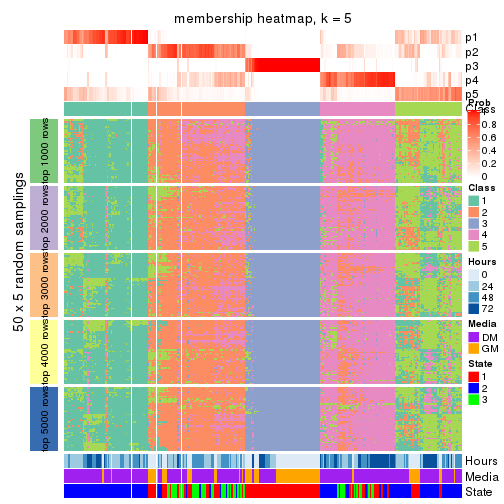</p>

</div>
<div id='tab-CV-skmeans-membership-heatmap-5'>
<pre><code class="r">membership_heatmap(res, k = 6)
</code></pre>

<p></p>

</div>
</div>

As soon as we have had the classes for columns, we can look for signatures
which are significantly different between classes which can be candidate marks
for certain classes. Following are the heatmaps for signatures.


Signature heatmaps where rows are scaled:


<script>
$( function() {
	$( '#tabs-CV-skmeans-get-signatures' ).tabs();
} );
</script>
<div id='tabs-CV-skmeans-get-signatures'>
<ul>
<li><a href='#tab-CV-skmeans-get-signatures-1'>k = 2</a></li>
<li><a href='#tab-CV-skmeans-get-signatures-2'>k = 3</a></li>
<li><a href='#tab-CV-skmeans-get-signatures-3'>k = 4</a></li>
<li><a href='#tab-CV-skmeans-get-signatures-4'>k = 5</a></li>
<li><a href='#tab-CV-skmeans-get-signatures-5'>k = 6</a></li>
</ul>
<div id='tab-CV-skmeans-get-signatures-1'>
<pre><code class="r">get_signatures(res, k = 2)
</code></pre>

<p></p>

</div>
<div id='tab-CV-skmeans-get-signatures-2'>
<pre><code class="r">get_signatures(res, k = 3)
</code></pre>

<p></p>

</div>
<div id='tab-CV-skmeans-get-signatures-3'>
<pre><code class="r">get_signatures(res, k = 4)
</code></pre>

<p>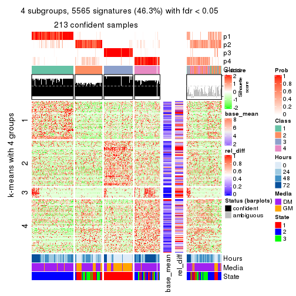</p>

</div>
<div id='tab-CV-skmeans-get-signatures-4'>
<pre><code class="r">get_signatures(res, k = 5)
</code></pre>

<p></p>

</div>
<div id='tab-CV-skmeans-get-signatures-5'>
<pre><code class="r">get_signatures(res, k = 6)
</code></pre>

<p></p>

</div>
</div>


Signature heatmaps where rows are not scaled:


<script>
$( function() {
	$( '#tabs-CV-skmeans-get-signatures-no-scale' ).tabs();
} );
</script>
<div id='tabs-CV-skmeans-get-signatures-no-scale'>
<ul>
<li><a href='#tab-CV-skmeans-get-signatures-no-scale-1'>k = 2</a></li>
<li><a href='#tab-CV-skmeans-get-signatures-no-scale-2'>k = 3</a></li>
<li><a href='#tab-CV-skmeans-get-signatures-no-scale-3'>k = 4</a></li>
<li><a href='#tab-CV-skmeans-get-signatures-no-scale-4'>k = 5</a></li>
<li><a href='#tab-CV-skmeans-get-signatures-no-scale-5'>k = 6</a></li>
</ul>
<div id='tab-CV-skmeans-get-signatures-no-scale-1'>
<pre><code class="r">get_signatures(res, k = 2, scale_rows = FALSE)
</code></pre>

<p></p>

</div>
<div id='tab-CV-skmeans-get-signatures-no-scale-2'>
<pre><code class="r">get_signatures(res, k = 3, scale_rows = FALSE)
</code></pre>

<p></p>

</div>
<div id='tab-CV-skmeans-get-signatures-no-scale-3'>
<pre><code class="r">get_signatures(res, k = 4, scale_rows = FALSE)
</code></pre>

<p></p>

</div>
<div id='tab-CV-skmeans-get-signatures-no-scale-4'>
<pre><code class="r">get_signatures(res, k = 5, scale_rows = FALSE)
</code></pre>

<p></p>

</div>
<div id='tab-CV-skmeans-get-signatures-no-scale-5'>
<pre><code class="r">get_signatures(res, k = 6, scale_rows = FALSE)
</code></pre>

<p></p>

</div>
</div>


Compare the overlap of signatures from different k:

```r
compare_signatures(res)
```


`get_signature()` returns a data frame invisibly. TO get the list of signatures, the function
call should be assigned to a variable explicitly. In following code, if `plot` argument is set
to `FALSE`, no heatmap is plotted while only the differential analysis is performed.

```r
# code only for demonstration
tb = get_signature(res, k = ..., plot = FALSE)
```

An example of the output of `tb` is:

```
#>   which_row         fdr    mean_1    mean_2 scaled_mean_1 scaled_mean_2 km
#> 1        38 0.042760348  8.373488  9.131774    -0.5533452     0.5164555  1
#> 2        40 0.018707592  7.106213  8.469186    -0.6173731     0.5762149  1
#> 3        55 0.019134737 10.221463 11.207825    -0.6159697     0.5749050  1
#> 4        59 0.006059896  5.921854  7.869574    -0.6899429     0.6439467  1
#> 5        60 0.018055526  8.928898 10.211722    -0.6204761     0.5791110  1
#> 6        98 0.009384629 15.714769 14.887706     0.6635654    -0.6193277  2
...
```

The columns in `tb` are:

1. `which_row`: row indices corresponding to the input matrix.
2. `fdr`: FDR for the differential test. 
3. `mean_x`: The mean value in group x.
4. `scaled_mean_x`: The mean value in group x after rows are scaled.
5. `km`: Row groups if k-means clustering is applied to rows.


UMAP plot which shows how samples are separated.


<script>
$( function() {
	$( '#tabs-CV-skmeans-dimension-reduction' ).tabs();
} );
</script>
<div id='tabs-CV-skmeans-dimension-reduction'>
<ul>
<li><a href='#tab-CV-skmeans-dimension-reduction-1'>k = 2</a></li>
<li><a href='#tab-CV-skmeans-dimension-reduction-2'>k = 3</a></li>
<li><a href='#tab-CV-skmeans-dimension-reduction-3'>k = 4</a></li>
<li><a href='#tab-CV-skmeans-dimension-reduction-4'>k = 5</a></li>
<li><a href='#tab-CV-skmeans-dimension-reduction-5'>k = 6</a></li>
</ul>
<div id='tab-CV-skmeans-dimension-reduction-1'>
<pre><code class="r">dimension_reduction(res, k = 2, method = &quot;UMAP&quot;)
</code></pre>

<p></p>

</div>
<div id='tab-CV-skmeans-dimension-reduction-2'>
<pre><code class="r">dimension_reduction(res, k = 3, method = &quot;UMAP&quot;)
</code></pre>

<p></p>

</div>
<div id='tab-CV-skmeans-dimension-reduction-3'>
<pre><code class="r">dimension_reduction(res, k = 4, method = &quot;UMAP&quot;)
</code></pre>

<p></p>

</div>
<div id='tab-CV-skmeans-dimension-reduction-4'>
<pre><code class="r">dimension_reduction(res, k = 5, method = &quot;UMAP&quot;)
</code></pre>

<p></p>

</div>
<div id='tab-CV-skmeans-dimension-reduction-5'>
<pre><code class="r">dimension_reduction(res, k = 6, method = &quot;UMAP&quot;)
</code></pre>

<p></p>

</div>
</div>


Following heatmap shows how subgroups are split when increasing `k`:

```r
collect_classes(res)
```


Test correlation between subgroups and known annotations. If the known
annotation is numeric, one-way ANOVA test is applied, and if the known
annotation is discrete, chi-squared contingency table test is applied.

```r
test_to_known_factors(res)
```

```
#>              n Hours(p) Media(p) State(p) k
#> CV:skmeans 242 8.65e-06 7.71e-05 5.38e-20 2
#> CV:skmeans 256 7.06e-21 2.78e-23 9.05e-48 3
#> CV:skmeans 213 3.67e-23 2.96e-20 7.35e-41 4
#> CV:skmeans 175 6.31e-22 4.09e-18 1.23e-36 5
#> CV:skmeans 178 2.38e-24 1.68e-16 5.80e-34 6
```


If matrix rows can be associated to genes, consider to use `GO_Enrichment(res,
...)` to perform function enrichment for the signature genes.


 

---------------------------------------------------


### CV:pam


The object with results only for a single top-value method and a single partition method 
can be extracted as:

```r
res = res_list["CV", "pam"]
# you can also extract it by
# res = res_list["CV:pam"]
```

A summary of `res` and all the functions that can be applied to it:

```r
res
```

```
#> A 'ConsensusPartition' object with k = 2, 3, 4, 5, 6.
#>   On a matrix with 12016 rows and 271 columns.
#>   Top rows (1000, 2000, 3000, 4000, 5000) are extracted by 'CV' method.
#>   Subgroups are detected by 'pam' method.
#>   Performed in total 1250 partitions by row resampling.
#>   There is no best k.
#> 
#> Following methods can be applied to this 'ConsensusPartition' object:
#>  [1] "cola_report"             "collect_classes"         "collect_plots"          
#>  [4] "collect_stats"           "colnames"                "compare_signatures"     
#>  [7] "consensus_heatmap"       "dimension_reduction"     "functional_enrichment"  
#> [10] "get_anno_col"            "get_anno"                "get_classes"            
#> [13] "get_consensus"           "get_matrix"              "get_membership"         
#> [16] "get_param"               "get_signatures"          "get_stats"              
#> [19] "is_best_k"               "is_stable_k"             "membership_heatmap"     
#> [22] "ncol"                    "nrow"                    "plot_ecdf"              
#> [25] "rownames"                "select_partition_number" "show"                   
#> [28] "suggest_best_k"          "test_to_known_factors"
```

`collect_plots()` function collects all the plots made from `res` for all `k` (number of partitions)
into one single page to provide an easy and fast comparison between different `k`.

```r
collect_plots(res)
```


The plots are:

- The first row: a plot of the ECDF (Empirical cumulative distribution
  function) curves of the consensus matrix for each `k` and the heatmap of
  predicted classes for each `k`.
- The second row: heatmaps of the consensus matrix for each `k`.
- The third row: heatmaps of the membership matrix for each `k`.
- The fouth row: heatmaps of the signatures for each `k`.

All the plots in panels can be made by individual functions and they are
plotted later in this section.

`select_partition_number()` produces several plots showing different
statistics for choosing "optimized" `k`. There are following statistics:

- ECDF curves of the consensus matrix for each `k`;
- 1-PAC. [The PAC
  score](https://en.wikipedia.org/wiki/Consensus_clustering#Over-interpretation_potential_of_consensus_clustering)
  measures the proportion of the ambiguous subgrouping.
- Mean silhouette score.
- Concordance. The mean probability of fiting the consensus class ids in all
  partitions.
- Area increased. Denote $A_k$ as the area under the ECDF curve for current
  `k`, the area increased is defined as $A_k - A_{k-1}$.
- Rand index. The percent of pairs of samples that are both in a same cluster
  or both are not in a same cluster in the partition of k and k-1.
- Jaccard index. The ratio of pairs of samples are both in a same cluster in
  the partition of k and k-1 and the pairs of samples are both in a same
  cluster in the partition k or k-1.

The detailed explanations of these statistics can be found in [the cola
vignette](http://bioconductor.org/packages/devel/bioc/vignettes/cola/inst/doc/cola.html#toc_13).

Generally speaking, lower PAC score, higher mean silhouette score or higher
concordance corresponds to better partition. Rand index and Jaccard index
measure how similar the current partition is compared to partition with `k-1`.
If they are too similar, we won't accept `k` is better than `k-1`.

```r
select_partition_number(res)
```


The numeric values for all these statistics can be obtained by `get_stats()`.

```r
get_stats(res)
```

```
#>   k 1-PAC mean_silhouette concordance area_increased  Rand Jaccard
#> 2 2 0.971           0.000       0.996        0.00917 1.000   1.000
#> 3 3 0.956           0.000       0.992        0.86949 1.000   1.000
#> 4 4 1.000           0.962       0.991        0.50392 0.985   0.985
#> 5 5 1.000           0.965       0.991        0.32561 0.985   0.985
#> 6 6 0.985           0.976       0.994        0.27441 0.986   0.985
```

`suggest_best_k()` suggests the best $k$ based on these statistics. The rules are as follows:

- All $k$ with Jaccard index larger than 0.95 are removed because the increase of
  the partition number does not provides enough extra information. If all $k$ are removed,
  the best $k$ is assigned by `NA`.
- For $k$ with 1-PAC larger than 0.9, the maximal $k$ is taken as the "best k". Other $k$ is called "optional k".
- If it does not fit the second rule. The $k$ with the highest vote of highest
  1-PAC, mean silhouette and concordance is taken as the "best k".

```r
suggest_best_k(res)
```

```
#> [1] NA
```


Following shows the table of the partitions (You need to click the **show/hide
code output** link to see it). The membership matrix (columns with name `p*`)
is inferred by
[`clue::cl_consensus()`](https://www.rdocumentation.org/link/cl_consensus?package=clue)
function with the `SE` method. Basically the value in the membership matrix
represents the probability to belong to a certain group. The finall class
label for an item is determined with the group with highest probability it
belongs to.

In `get_classes()` function, the entropy is calculated from the membership
matrix and the silhouette score is calculated from the consensus matrix.


<script>
$( function() {
	$( '#tabs-CV-pam-get-classes' ).tabs();
} );
</script>
<div id='tabs-CV-pam-get-classes'>
<ul>
<li><a href='#tab-CV-pam-get-classes-1'>k = 2</a></li>
<li><a href='#tab-CV-pam-get-classes-2'>k = 3</a></li>
<li><a href='#tab-CV-pam-get-classes-3'>k = 4</a></li>
<li><a href='#tab-CV-pam-get-classes-4'>k = 5</a></li>
<li><a href='#tab-CV-pam-get-classes-5'>k = 6</a></li>
</ul>

<div id='tab-CV-pam-get-classes-1'>
<p><a id='tab-CV-pam-get-classes-1-a' style='color:#0366d6' href='#'>show/hide code output</a></p>
<pre><code class="r">cbind(get_classes(res, k = 2), get_membership(res, k = 2))
</code></pre>

<pre><code>#&gt;            class entropy silhouette p1    p2
#&gt; T0_CT_A01      2  0.0000          0 NA 1.000
#&gt; T0_CT_A03      2  0.0000          0 NA 1.000
#&gt; T0_CT_A05      2  0.2236          0 NA 0.964
#&gt; T0_CT_A06      2  0.0000          0 NA 1.000
#&gt; T0_CT_A07      2  0.0000          0 NA 1.000
#&gt; T0_CT_A08      2  0.0000          0 NA 1.000
#&gt; T0_CT_A10      2  0.0000          0 NA 1.000
#&gt; T0_CT_A11      2  0.0000          0 NA 1.000
#&gt; T0_CT_B01      2  0.0000          0 NA 1.000
#&gt; T0_CT_B03      2  0.0000          0 NA 1.000
#&gt; T0_CT_B05      2  0.0000          0 NA 1.000
#&gt; T0_CT_B07      2  0.0000          0 NA 1.000
#&gt; T0_CT_B08      2  0.0000          0 NA 1.000
#&gt; T0_CT_B09      2  0.0000          0 NA 1.000
#&gt; T0_CT_C02      2  0.0376          0 NA 0.996
#&gt; T0_CT_C03      2  0.0000          0 NA 1.000
#&gt; T0_CT_C05      2  0.0000          0 NA 1.000
#&gt; T0_CT_C06      2  0.0000          0 NA 1.000
#&gt; T0_CT_C07      2  0.0000          0 NA 1.000
#&gt; T0_CT_C08      2  0.0000          0 NA 1.000
#&gt; T0_CT_C09      2  0.0000          0 NA 1.000
#&gt; T0_CT_C11      2  0.0000          0 NA 1.000
#&gt; T0_CT_C12      2  0.0000          0 NA 1.000
#&gt; T0_CT_D01      2  0.0000          0 NA 1.000
#&gt; T0_CT_D02      2  0.0000          0 NA 1.000
#&gt; T0_CT_D03      2  0.0000          0 NA 1.000
#&gt; T0_CT_D05      2  0.0000          0 NA 1.000
#&gt; T0_CT_D06      2  0.0000          0 NA 1.000
#&gt; T0_CT_D07      2  0.0000          0 NA 1.000
#&gt; T0_CT_D08      2  0.0000          0 NA 1.000
#&gt; T0_CT_D09      2  0.0000          0 NA 1.000
#&gt; T0_CT_D11      2  0.0000          0 NA 1.000
#&gt; T0_CT_D12      2  0.0000          0 NA 1.000
#&gt; T0_CT_E01      2  0.2948          0 NA 0.948
#&gt; T0_CT_E03      2  0.0000          0 NA 1.000
#&gt; T0_CT_E04      2  0.0000          0 NA 1.000
#&gt; T0_CT_E05      2  0.0000          0 NA 1.000
#&gt; T0_CT_E06      2  0.0000          0 NA 1.000
#&gt; T0_CT_E07      2  0.0000          0 NA 1.000
#&gt; T0_CT_E08      2  0.0000          0 NA 1.000
#&gt; T0_CT_E09      2  0.0000          0 NA 1.000
#&gt; T0_CT_E10      2  0.0000          0 NA 1.000
#&gt; T0_CT_E11      2  0.0000          0 NA 1.000
#&gt; T0_CT_E12      2  0.0000          0 NA 1.000
#&gt; T0_CT_F01      2  0.2948          0 NA 0.948
#&gt; T0_CT_F02      2  0.0000          0 NA 1.000
#&gt; T0_CT_F03      2  0.0000          0 NA 1.000
#&gt; T0_CT_F04      2  0.0000          0 NA 1.000
#&gt; T0_CT_F05      2  0.0000          0 NA 1.000
#&gt; T0_CT_F06      2  0.0000          0 NA 1.000
#&gt; T0_CT_F07      2  0.0000          0 NA 1.000
#&gt; T0_CT_F09      2  0.0000          0 NA 1.000
#&gt; T0_CT_F11      2  0.0000          0 NA 1.000
#&gt; T0_CT_F12      2  0.0000          0 NA 1.000
#&gt; T0_CT_G01      2  0.0000          0 NA 1.000
#&gt; T0_CT_G02      2  0.0000          0 NA 1.000
#&gt; T0_CT_G03      2  0.0000          0 NA 1.000
#&gt; T0_CT_G04      2  0.0000          0 NA 1.000
#&gt; T0_CT_G07      2  0.0000          0 NA 1.000
#&gt; T0_CT_G08      2  0.0000          0 NA 1.000
#&gt; T0_CT_G09      2  0.0000          0 NA 1.000
#&gt; T0_CT_G11      2  0.0000          0 NA 1.000
#&gt; T0_CT_H01      2  0.0000          0 NA 1.000
#&gt; T0_CT_H02      2  0.0000          0 NA 1.000
#&gt; T0_CT_H04      2  0.0000          0 NA 1.000
#&gt; T0_CT_H05      2  0.0000          0 NA 1.000
#&gt; T0_CT_H08      2  0.0000          0 NA 1.000
#&gt; T0_CT_H09      2  0.0000          0 NA 1.000
#&gt; T0_CT_H12      2  0.0000          0 NA 1.000
#&gt; T24_CT_A01     2  0.0000          0 NA 1.000
#&gt; T24_CT_A03     2  0.0000          0 NA 1.000
#&gt; T24_CT_A04     2  0.0000          0 NA 1.000
#&gt; T24_CT_A05     2  0.0000          0 NA 1.000
#&gt; T24_CT_A07     2  0.0000          0 NA 1.000
#&gt; T24_CT_A08     2  0.0000          0 NA 1.000
#&gt; T24_CT_A09     2  0.0000          0 NA 1.000
#&gt; T24_CT_A10     2  0.0000          0 NA 1.000
#&gt; T24_CT_B01     2  0.0000          0 NA 1.000
#&gt; T24_CT_B02     2  0.0000          0 NA 1.000
#&gt; T24_CT_B03     2  0.0000          0 NA 1.000
#&gt; T24_CT_B05     2  0.0000          0 NA 1.000
#&gt; T24_CT_B06     2  0.0000          0 NA 1.000
#&gt; T24_CT_B07     2  0.0000          0 NA 1.000
#&gt; T24_CT_B08     2  0.0000          0 NA 1.000
#&gt; T24_CT_B09     2  0.0000          0 NA 1.000
#&gt; T24_CT_B11     2  0.0000          0 NA 1.000
#&gt; T24_CT_C01     2  0.0000          0 NA 1.000
#&gt; T24_CT_C02     2  0.0000          0 NA 1.000
#&gt; T24_CT_C03     2  0.0000          0 NA 1.000
#&gt; T24_CT_C05     2  0.0000          0 NA 1.000
#&gt; T24_CT_C07     2  0.0000          0 NA 1.000
#&gt; T24_CT_C08     2  0.0000          0 NA 1.000
#&gt; T24_CT_C09     2  0.0000          0 NA 1.000
#&gt; T24_CT_C10     2  0.0000          0 NA 1.000
#&gt; T24_CT_C11     2  0.0000          0 NA 1.000
#&gt; T24_CT_C12     2  0.0000          0 NA 1.000
#&gt; T24_CT_D01     2  0.0000          0 NA 1.000
#&gt; T24_CT_D02     2  0.0000          0 NA 1.000
#&gt; T24_CT_D03     2  0.0000          0 NA 1.000
#&gt; T24_CT_D04     2  0.0000          0 NA 1.000
#&gt; T24_CT_D05     2  0.0000          0 NA 1.000
#&gt; T24_CT_D06     2  0.0000          0 NA 1.000
#&gt; T24_CT_D07     2  0.0000          0 NA 1.000
#&gt; T24_CT_D08     2  0.0000          0 NA 1.000
#&gt; T24_CT_D09     2  0.0000          0 NA 1.000
#&gt; T24_CT_D10     2  0.0000          0 NA 1.000
#&gt; T24_CT_D11     2  0.0000          0 NA 1.000
#&gt; T24_CT_E01     2  0.0000          0 NA 1.000
#&gt; T24_CT_E02     2  0.0000          0 NA 1.000
#&gt; T24_CT_E04     2  0.0000          0 NA 1.000
#&gt; T24_CT_E05     2  0.0376          0 NA 0.996
#&gt; T24_CT_E07     2  0.0000          0 NA 1.000
#&gt; T24_CT_E09     2  0.0000          0 NA 1.000
#&gt; T24_CT_E11     2  0.0000          0 NA 1.000
#&gt; T24_CT_E12     2  0.0000          0 NA 1.000
#&gt; T24_CT_F01     2  0.0000          0 NA 1.000
#&gt; T24_CT_F02     2  0.0000          0 NA 1.000
#&gt; T24_CT_F03     2  0.0000          0 NA 1.000
#&gt; T24_CT_F04     2  0.0000          0 NA 1.000
#&gt; T24_CT_F05     2  0.0000          0 NA 1.000
#&gt; T24_CT_F07     2  0.0000          0 NA 1.000
#&gt; T24_CT_F08     2  0.0000          0 NA 1.000
#&gt; T24_CT_F09     2  0.0000          0 NA 1.000
#&gt; T24_CT_F10     2  0.0000          0 NA 1.000
#&gt; T24_CT_F11     2  0.0000          0 NA 1.000
#&gt; T24_CT_F12     2  0.0000          0 NA 1.000
#&gt; T24_CT_G01     2  0.0000          0 NA 1.000
#&gt; T24_CT_G02     2  0.0376          0 NA 0.996
#&gt; T24_CT_G03     2  0.0000          0 NA 1.000
#&gt; T24_CT_G04     2  0.0000          0 NA 1.000
#&gt; T24_CT_G05     2  0.0000          0 NA 1.000
#&gt; T24_CT_G06     2  0.0000          0 NA 1.000
#&gt; T24_CT_G08     2  0.0000          0 NA 1.000
#&gt; T24_CT_G10     2  0.0000          0 NA 1.000
#&gt; T24_CT_G11     2  0.0000          0 NA 1.000
#&gt; T24_CT_G12     2  0.0000          0 NA 1.000
#&gt; T24_CT_H01     2  0.0000          0 NA 1.000
#&gt; T24_CT_H02     2  0.0000          0 NA 1.000
#&gt; T24_CT_H03     2  0.0000          0 NA 1.000
#&gt; T24_CT_H05     2  0.0000          0 NA 1.000
#&gt; T24_CT_H07     2  0.0000          0 NA 1.000
#&gt; T24_CT_H09     2  0.0000          0 NA 1.000
#&gt; T24_CT_H12     2  0.0000          0 NA 1.000
#&gt; T48_CT_A01     2  0.0000          0 NA 1.000
#&gt; T48_CT_A02     2  0.0000          0 NA 1.000
#&gt; T48_CT_A03     2  0.0376          0 NA 0.996
#&gt; T48_CT_A04     2  0.0000          0 NA 1.000
#&gt; T48_CT_A05     2  0.0000          0 NA 1.000
#&gt; T48_CT_A06     2  0.0376          0 NA 0.996
#&gt; T48_CT_A07     2  0.0000          0 NA 1.000
#&gt; T48_CT_A08     2  0.0000          0 NA 1.000
#&gt; T48_CT_A09     2  0.0000          0 NA 1.000
#&gt; T48_CT_A10     2  0.0000          0 NA 1.000
#&gt; T48_CT_A11     2  0.0000          0 NA 1.000
#&gt; T48_CT_A12     2  0.0000          0 NA 1.000
#&gt; T48_CT_B01     2  0.0000          0 NA 1.000
#&gt; T48_CT_B02     2  0.0000          0 NA 1.000
#&gt; T48_CT_B03     2  0.0376          0 NA 0.996
#&gt; T48_CT_B04     2  0.0376          0 NA 0.996
#&gt; T48_CT_B06     2  0.0000          0 NA 1.000
#&gt; T48_CT_B08     2  0.0000          0 NA 1.000
#&gt; T48_CT_B10     2  0.0000          0 NA 1.000
#&gt; T48_CT_B11     2  0.0000          0 NA 1.000
#&gt; T48_CT_B12     2  0.0000          0 NA 1.000
#&gt; T48_CT_C01     2  0.0000          0 NA 1.000
#&gt; T48_CT_C02     2  0.0376          0 NA 0.996
#&gt; T48_CT_C03     2  0.0000          0 NA 1.000
#&gt; T48_CT_C04     2  0.0376          0 NA 0.996
#&gt; T48_CT_C05     2  0.0000          0 NA 1.000
#&gt; T48_CT_C06     2  0.0000          0 NA 1.000
#&gt; T48_CT_C07     2  0.0000          0 NA 1.000
#&gt; T48_CT_C09     2  0.0000          0 NA 1.000
#&gt; T48_CT_C10     2  0.0000          0 NA 1.000
#&gt; T48_CT_C11     2  0.0000          0 NA 1.000
#&gt; T48_CT_D01     2  0.0000          0 NA 1.000
#&gt; T48_CT_D02     2  0.0000          0 NA 1.000
#&gt; T48_CT_D03     2  0.0000          0 NA 1.000
#&gt; T48_CT_D04     2  0.0000          0 NA 1.000
#&gt; T48_CT_D06     2  0.0000          0 NA 1.000
#&gt; T48_CT_D07     2  0.0000          0 NA 1.000
#&gt; T48_CT_D08     2  0.0000          0 NA 1.000
#&gt; T48_CT_D09     2  0.0000          0 NA 1.000
#&gt; T48_CT_D10     2  0.0000          0 NA 1.000
#&gt; T48_CT_D11     2  0.0000          0 NA 1.000
#&gt; T48_CT_D12     2  0.0376          0 NA 0.996
#&gt; T48_CT_E01     2  0.0000          0 NA 1.000
#&gt; T48_CT_E02     2  0.0000          0 NA 1.000
#&gt; T48_CT_E03     2  0.0000          0 NA 1.000
#&gt; T48_CT_E04     2  0.0000          0 NA 1.000
#&gt; T48_CT_E05     2  0.0000          0 NA 1.000
#&gt; T48_CT_E06     2  0.0376          0 NA 0.996
#&gt; T48_CT_E07     2  0.0000          0 NA 1.000
#&gt; T48_CT_E08     2  0.0000          0 NA 1.000
#&gt; T48_CT_E10     2  0.0000          0 NA 1.000
#&gt; T48_CT_E11     2  0.0000          0 NA 1.000
#&gt; T48_CT_E12     2  0.0000          0 NA 1.000
#&gt; T48_CT_F01     2  0.0000          0 NA 1.000
#&gt; T48_CT_F02     2  0.0000          0 NA 1.000
#&gt; T48_CT_F03     2  0.0000          0 NA 1.000
#&gt; T48_CT_F05     2  0.0000          0 NA 1.000
#&gt; T48_CT_F07     2  0.0000          0 NA 1.000
#&gt; T48_CT_F09     2  0.0000          0 NA 1.000
#&gt; T48_CT_F10     2  0.0000          0 NA 1.000
#&gt; T48_CT_F11     2  0.0000          0 NA 1.000
#&gt; T48_CT_G01     2  0.0000          0 NA 1.000
#&gt; T48_CT_G02     2  0.0000          0 NA 1.000
#&gt; T48_CT_G03     2  0.0000          0 NA 1.000
#&gt; T48_CT_G07     2  0.0000          0 NA 1.000
#&gt; T48_CT_G08     2  0.0000          0 NA 1.000
#&gt; T48_CT_G09     2  0.0000          0 NA 1.000
#&gt; T48_CT_G10     2  0.0000          0 NA 1.000
#&gt; T48_CT_G11     2  0.0000          0 NA 1.000
#&gt; T48_CT_G12     2  0.0000          0 NA 1.000
#&gt; T48_CT_H01     2  0.0000          0 NA 1.000
#&gt; T48_CT_H02     2  0.0000          0 NA 1.000
#&gt; T48_CT_H04     2  0.0376          0 NA 0.996
#&gt; T48_CT_H05     2  0.0000          0 NA 1.000
#&gt; T48_CT_H06     2  0.0000          0 NA 1.000
#&gt; T48_CT_H07     2  0.0000          0 NA 1.000
#&gt; T48_CT_H08     2  0.0000          0 NA 1.000
#&gt; T48_CT_H11     2  0.0000          0 NA 1.000
#&gt; T48_CT_H12     2  0.0000          0 NA 1.000
#&gt; T72_CT_A01     2  0.0000          0 NA 1.000
#&gt; T72_CT_A05     2  0.0000          0 NA 1.000
#&gt; T72_CT_A08     2  0.0000          0 NA 1.000
#&gt; T72_CT_A09     2  0.6247          0 NA 0.844
#&gt; T72_CT_A11     2  0.0000          0 NA 1.000
#&gt; T72_CT_B01     2  0.0000          0 NA 1.000
#&gt; T72_CT_B02     2  0.0000          0 NA 1.000
#&gt; T72_CT_B03     2  0.0000          0 NA 1.000
#&gt; T72_CT_B04     2  0.0376          0 NA 0.996
#&gt; T72_CT_B05     2  0.8081          0 NA 0.752
#&gt; T72_CT_B06     2  0.0376          0 NA 0.996
#&gt; T72_CT_B08     2  0.0000          0 NA 1.000
#&gt; T72_CT_B09     2  0.0376          0 NA 0.996
#&gt; T72_CT_B11     2  0.0000          0 NA 1.000
#&gt; T72_CT_B12     2  0.0000          0 NA 1.000
#&gt; T72_CT_C04     2  0.0000          0 NA 1.000
#&gt; T72_CT_C06     2  0.0000          0 NA 1.000
#&gt; T72_CT_C07     2  0.0000          0 NA 1.000
#&gt; T72_CT_C09     2  0.0000          0 NA 1.000
#&gt; T72_CT_C11     2  0.8661          0 NA 0.712
#&gt; T72_CT_D01     2  0.0000          0 NA 1.000
#&gt; T72_CT_D03     2  0.0376          0 NA 0.996
#&gt; T72_CT_D04     2  0.0000          0 NA 1.000
#&gt; T72_CT_D05     2  0.0000          0 NA 1.000
#&gt; T72_CT_D07     2  0.0000          0 NA 1.000
#&gt; T72_CT_D10     2  0.7815          0 NA 0.768
#&gt; T72_CT_D11     2  0.0000          0 NA 1.000
#&gt; T72_CT_E04     2  0.0000          0 NA 1.000
#&gt; T72_CT_E05     2  0.0000          0 NA 1.000
#&gt; T72_CT_E07     2  0.0000          0 NA 1.000
#&gt; T72_CT_F01     2  0.0000          0 NA 1.000
#&gt; T72_CT_F05     2  0.0000          0 NA 1.000
#&gt; T72_CT_F07     2  0.0000          0 NA 1.000
#&gt; T72_CT_F10     2  0.0000          0 NA 1.000
#&gt; T72_CT_F11     2  0.0000          0 NA 1.000
#&gt; T72_CT_G03     2  0.0376          0 NA 0.996
#&gt; T72_CT_G04     2  0.0000          0 NA 1.000
#&gt; T72_CT_G06     2  0.0000          0 NA 1.000
#&gt; T72_CT_G08     2  0.0000          0 NA 1.000
#&gt; T72_CT_G10     2  0.0000          0 NA 1.000
#&gt; T72_CT_G11     2  0.0000          0 NA 1.000
#&gt; T72_CT_H01     2  0.0000          0 NA 1.000
#&gt; T72_CT_H03     2  0.0000          0 NA 1.000
#&gt; T72_CT_H05     2  0.0000          0 NA 1.000
#&gt; T72_CT_H08     2  0.0000          0 NA 1.000
#&gt; T72_CT_H09     2  0.0000          0 NA 1.000
#&gt; T72_CT_H10     2  0.0000          0 NA 1.000
#&gt; T72_CT_H11     2  0.0000          0 NA 1.000
#&gt; T72_CT_H12     2  0.0000          0 NA 1.000
</code></pre>

<script>
$('#tab-CV-pam-get-classes-1-a').parent().next().next().hide();
$('#tab-CV-pam-get-classes-1-a').click(function(){
  $('#tab-CV-pam-get-classes-1-a').parent().next().next().toggle();
  return(false);
});
</script>
</div>

<div id='tab-CV-pam-get-classes-2'>
<p><a id='tab-CV-pam-get-classes-2-a' style='color:#0366d6' href='#'>show/hide code output</a></p>
<pre><code class="r">cbind(get_classes(res, k = 3), get_membership(res, k = 3))
</code></pre>

<pre><code>#&gt;            class entropy silhouette p1    p2    p3
#&gt; T0_CT_A01      2  0.0000          0 NA 1.000 0.000
#&gt; T0_CT_A03      2  0.0000          0 NA 1.000 0.000
#&gt; T0_CT_A05      2  0.2492          0 NA 0.936 0.048
#&gt; T0_CT_A06      2  0.0000          0 NA 1.000 0.000
#&gt; T0_CT_A07      2  0.0000          0 NA 1.000 0.000
#&gt; T0_CT_A08      2  0.0000          0 NA 1.000 0.000
#&gt; T0_CT_A10      2  0.0000          0 NA 1.000 0.000
#&gt; T0_CT_A11      2  0.0000          0 NA 1.000 0.000
#&gt; T0_CT_B01      2  0.0000          0 NA 1.000 0.000
#&gt; T0_CT_B03      2  0.0000          0 NA 1.000 0.000
#&gt; T0_CT_B05      2  0.0000          0 NA 1.000 0.000
#&gt; T0_CT_B07      2  0.0000          0 NA 1.000 0.000
#&gt; T0_CT_B08      2  0.0000          0 NA 1.000 0.000
#&gt; T0_CT_B09      2  0.0000          0 NA 1.000 0.000
#&gt; T0_CT_C02      2  0.0237          0 NA 0.996 0.004
#&gt; T0_CT_C03      2  0.0000          0 NA 1.000 0.000
#&gt; T0_CT_C05      2  0.0000          0 NA 1.000 0.000
#&gt; T0_CT_C06      2  0.0000          0 NA 1.000 0.000
#&gt; T0_CT_C07      2  0.0000          0 NA 1.000 0.000
#&gt; T0_CT_C08      2  0.0000          0 NA 1.000 0.000
#&gt; T0_CT_C09      2  0.0000          0 NA 1.000 0.000
#&gt; T0_CT_C11      2  0.0000          0 NA 1.000 0.000
#&gt; T0_CT_C12      2  0.0000          0 NA 1.000 0.000
#&gt; T0_CT_D01      2  0.0000          0 NA 1.000 0.000
#&gt; T0_CT_D02      2  0.0000          0 NA 1.000 0.000
#&gt; T0_CT_D03      2  0.0000          0 NA 1.000 0.000
#&gt; T0_CT_D05      2  0.0000          0 NA 1.000 0.000
#&gt; T0_CT_D06      2  0.0000          0 NA 1.000 0.000
#&gt; T0_CT_D07      2  0.0000          0 NA 1.000 0.000
#&gt; T0_CT_D08      2  0.0000          0 NA 1.000 0.000
#&gt; T0_CT_D09      2  0.0000          0 NA 1.000 0.000
#&gt; T0_CT_D11      2  0.0000          0 NA 1.000 0.000
#&gt; T0_CT_D12      2  0.0000          0 NA 1.000 0.000
#&gt; T0_CT_E01      2  0.4194          0 NA 0.876 0.060
#&gt; T0_CT_E03      2  0.0000          0 NA 1.000 0.000
#&gt; T0_CT_E04      2  0.0000          0 NA 1.000 0.000
#&gt; T0_CT_E05      2  0.0000          0 NA 1.000 0.000
#&gt; T0_CT_E06      2  0.0000          0 NA 1.000 0.000
#&gt; T0_CT_E07      2  0.0000          0 NA 1.000 0.000
#&gt; T0_CT_E08      2  0.0000          0 NA 1.000 0.000
#&gt; T0_CT_E09      2  0.0000          0 NA 1.000 0.000
#&gt; T0_CT_E10      2  0.0000          0 NA 1.000 0.000
#&gt; T0_CT_E11      2  0.0000          0 NA 1.000 0.000
#&gt; T0_CT_E12      2  0.0000          0 NA 1.000 0.000
#&gt; T0_CT_F01      2  0.4194          0 NA 0.876 0.060
#&gt; T0_CT_F02      2  0.0000          0 NA 1.000 0.000
#&gt; T0_CT_F03      2  0.0000          0 NA 1.000 0.000
#&gt; T0_CT_F04      2  0.0000          0 NA 1.000 0.000
#&gt; T0_CT_F05      2  0.0000          0 NA 1.000 0.000
#&gt; T0_CT_F06      2  0.0000          0 NA 1.000 0.000
#&gt; T0_CT_F07      2  0.0000          0 NA 1.000 0.000
#&gt; T0_CT_F09      2  0.0000          0 NA 1.000 0.000
#&gt; T0_CT_F11      2  0.0000          0 NA 1.000 0.000
#&gt; T0_CT_F12      2  0.0000          0 NA 1.000 0.000
#&gt; T0_CT_G01      2  0.0000          0 NA 1.000 0.000
#&gt; T0_CT_G02      2  0.0000          0 NA 1.000 0.000
#&gt; T0_CT_G03      2  0.0000          0 NA 1.000 0.000
#&gt; T0_CT_G04      2  0.0000          0 NA 1.000 0.000
#&gt; T0_CT_G07      2  0.0000          0 NA 1.000 0.000
#&gt; T0_CT_G08      2  0.0000          0 NA 1.000 0.000
#&gt; T0_CT_G09      2  0.0000          0 NA 1.000 0.000
#&gt; T0_CT_G11      2  0.0000          0 NA 1.000 0.000
#&gt; T0_CT_H01      2  0.0000          0 NA 1.000 0.000
#&gt; T0_CT_H02      2  0.0000          0 NA 1.000 0.000
#&gt; T0_CT_H04      2  0.0000          0 NA 1.000 0.000
#&gt; T0_CT_H05      2  0.0000          0 NA 1.000 0.000
#&gt; T0_CT_H08      2  0.0000          0 NA 1.000 0.000
#&gt; T0_CT_H09      2  0.0000          0 NA 1.000 0.000
#&gt; T0_CT_H12      2  0.0000          0 NA 1.000 0.000
#&gt; T24_CT_A01     2  0.0000          0 NA 1.000 0.000
#&gt; T24_CT_A03     2  0.0000          0 NA 1.000 0.000
#&gt; T24_CT_A04     2  0.0000          0 NA 1.000 0.000
#&gt; T24_CT_A05     2  0.0000          0 NA 1.000 0.000
#&gt; T24_CT_A07     2  0.0000          0 NA 1.000 0.000
#&gt; T24_CT_A08     2  0.0000          0 NA 1.000 0.000
#&gt; T24_CT_A09     2  0.0000          0 NA 1.000 0.000
#&gt; T24_CT_A10     2  0.0000          0 NA 1.000 0.000
#&gt; T24_CT_B01     2  0.0000          0 NA 1.000 0.000
#&gt; T24_CT_B02     2  0.0000          0 NA 1.000 0.000
#&gt; T24_CT_B03     2  0.0000          0 NA 1.000 0.000
#&gt; T24_CT_B05     2  0.0000          0 NA 1.000 0.000
#&gt; T24_CT_B06     2  0.0000          0 NA 1.000 0.000
#&gt; T24_CT_B07     2  0.0000          0 NA 1.000 0.000
#&gt; T24_CT_B08     2  0.0000          0 NA 1.000 0.000
#&gt; T24_CT_B09     2  0.0000          0 NA 1.000 0.000
#&gt; T24_CT_B11     2  0.0000          0 NA 1.000 0.000
#&gt; T24_CT_C01     2  0.0000          0 NA 1.000 0.000
#&gt; T24_CT_C02     2  0.0000          0 NA 1.000 0.000
#&gt; T24_CT_C03     2  0.0000          0 NA 1.000 0.000
#&gt; T24_CT_C05     2  0.0000          0 NA 1.000 0.000
#&gt; T24_CT_C07     2  0.0000          0 NA 1.000 0.000
#&gt; T24_CT_C08     2  0.0000          0 NA 1.000 0.000
#&gt; T24_CT_C09     2  0.0000          0 NA 1.000 0.000
#&gt; T24_CT_C10     2  0.0000          0 NA 1.000 0.000
#&gt; T24_CT_C11     2  0.0000          0 NA 1.000 0.000
#&gt; T24_CT_C12     2  0.0000          0 NA 1.000 0.000
#&gt; T24_CT_D01     2  0.0000          0 NA 1.000 0.000
#&gt; T24_CT_D02     2  0.0000          0 NA 1.000 0.000
#&gt; T24_CT_D03     2  0.0000          0 NA 1.000 0.000
#&gt; T24_CT_D04     2  0.0000          0 NA 1.000 0.000
#&gt; T24_CT_D05     2  0.0000          0 NA 1.000 0.000
#&gt; T24_CT_D06     2  0.0000          0 NA 1.000 0.000
#&gt; T24_CT_D07     2  0.0000          0 NA 1.000 0.000
#&gt; T24_CT_D08     2  0.0000          0 NA 1.000 0.000
#&gt; T24_CT_D09     2  0.0000          0 NA 1.000 0.000
#&gt; T24_CT_D10     2  0.0000          0 NA 1.000 0.000
#&gt; T24_CT_D11     2  0.0000          0 NA 1.000 0.000
#&gt; T24_CT_E01     2  0.0000          0 NA 1.000 0.000
#&gt; T24_CT_E02     2  0.0000          0 NA 1.000 0.000
#&gt; T24_CT_E04     2  0.0000          0 NA 1.000 0.000
#&gt; T24_CT_E05     2  0.0237          0 NA 0.996 0.000
#&gt; T24_CT_E07     2  0.0000          0 NA 1.000 0.000
#&gt; T24_CT_E09     2  0.0000          0 NA 1.000 0.000
#&gt; T24_CT_E11     2  0.0000          0 NA 1.000 0.000
#&gt; T24_CT_E12     2  0.0000          0 NA 1.000 0.000
#&gt; T24_CT_F01     2  0.0000          0 NA 1.000 0.000
#&gt; T24_CT_F02     2  0.0000          0 NA 1.000 0.000
#&gt; T24_CT_F03     2  0.0000          0 NA 1.000 0.000
#&gt; T24_CT_F04     2  0.0000          0 NA 1.000 0.000
#&gt; T24_CT_F05     2  0.0000          0 NA 1.000 0.000
#&gt; T24_CT_F07     2  0.0000          0 NA 1.000 0.000
#&gt; T24_CT_F08     2  0.0000          0 NA 1.000 0.000
#&gt; T24_CT_F09     2  0.0000          0 NA 1.000 0.000
#&gt; T24_CT_F10     2  0.0000          0 NA 1.000 0.000
#&gt; T24_CT_F11     2  0.0000          0 NA 1.000 0.000
#&gt; T24_CT_F12     2  0.0000          0 NA 1.000 0.000
#&gt; T24_CT_G01     2  0.0000          0 NA 1.000 0.000
#&gt; T24_CT_G02     2  0.0237          0 NA 0.996 0.000
#&gt; T24_CT_G03     2  0.0000          0 NA 1.000 0.000
#&gt; T24_CT_G04     2  0.0000          0 NA 1.000 0.000
#&gt; T24_CT_G05     2  0.0000          0 NA 1.000 0.000
#&gt; T24_CT_G06     2  0.0000          0 NA 1.000 0.000
#&gt; T24_CT_G08     2  0.0000          0 NA 1.000 0.000
#&gt; T24_CT_G10     2  0.0000          0 NA 1.000 0.000
#&gt; T24_CT_G11     2  0.0000          0 NA 1.000 0.000
#&gt; T24_CT_G12     2  0.0000          0 NA 1.000 0.000
#&gt; T24_CT_H01     2  0.0000          0 NA 1.000 0.000
#&gt; T24_CT_H02     2  0.0000          0 NA 1.000 0.000
#&gt; T24_CT_H03     2  0.0000          0 NA 1.000 0.000
#&gt; T24_CT_H05     2  0.0000          0 NA 1.000 0.000
#&gt; T24_CT_H07     2  0.0000          0 NA 1.000 0.000
#&gt; T24_CT_H09     2  0.0000          0 NA 1.000 0.000
#&gt; T24_CT_H12     2  0.0000          0 NA 1.000 0.000
#&gt; T48_CT_A01     2  0.0000          0 NA 1.000 0.000
#&gt; T48_CT_A02     2  0.0000          0 NA 1.000 0.000
#&gt; T48_CT_A03     2  0.0237          0 NA 0.996 0.000
#&gt; T48_CT_A04     2  0.0000          0 NA 1.000 0.000
#&gt; T48_CT_A05     2  0.0000          0 NA 1.000 0.000
#&gt; T48_CT_A06     2  0.0237          0 NA 0.996 0.000
#&gt; T48_CT_A07     2  0.0000          0 NA 1.000 0.000
#&gt; T48_CT_A08     2  0.0000          0 NA 1.000 0.000
#&gt; T48_CT_A09     2  0.0000          0 NA 1.000 0.000
#&gt; T48_CT_A10     2  0.0000          0 NA 1.000 0.000
#&gt; T48_CT_A11     2  0.0000          0 NA 1.000 0.000
#&gt; T48_CT_A12     2  0.0000          0 NA 1.000 0.000
#&gt; T48_CT_B01     2  0.0000          0 NA 1.000 0.000
#&gt; T48_CT_B02     2  0.0000          0 NA 1.000 0.000
#&gt; T48_CT_B03     2  0.0237          0 NA 0.996 0.000
#&gt; T48_CT_B04     2  0.0237          0 NA 0.996 0.000
#&gt; T48_CT_B06     2  0.0000          0 NA 1.000 0.000
#&gt; T48_CT_B08     2  0.0000          0 NA 1.000 0.000
#&gt; T48_CT_B10     2  0.0000          0 NA 1.000 0.000
#&gt; T48_CT_B11     2  0.0000          0 NA 1.000 0.000
#&gt; T48_CT_B12     2  0.0000          0 NA 1.000 0.000
#&gt; T48_CT_C01     2  0.0000          0 NA 1.000 0.000
#&gt; T48_CT_C02     2  0.0237          0 NA 0.996 0.000
#&gt; T48_CT_C03     2  0.0000          0 NA 1.000 0.000
#&gt; T48_CT_C04     2  0.0237          0 NA 0.996 0.000
#&gt; T48_CT_C05     2  0.0000          0 NA 1.000 0.000
#&gt; T48_CT_C06     2  0.0000          0 NA 1.000 0.000
#&gt; T48_CT_C07     2  0.0000          0 NA 1.000 0.000
#&gt; T48_CT_C09     2  0.0000          0 NA 1.000 0.000
#&gt; T48_CT_C10     2  0.0000          0 NA 1.000 0.000
#&gt; T48_CT_C11     2  0.0000          0 NA 1.000 0.000
#&gt; T48_CT_D01     2  0.0000          0 NA 1.000 0.000
#&gt; T48_CT_D02     2  0.0000          0 NA 1.000 0.000
#&gt; T48_CT_D03     2  0.0000          0 NA 1.000 0.000
#&gt; T48_CT_D04     2  0.0000          0 NA 1.000 0.000
#&gt; T48_CT_D06     2  0.0000          0 NA 1.000 0.000
#&gt; T48_CT_D07     2  0.0000          0 NA 1.000 0.000
#&gt; T48_CT_D08     2  0.0000          0 NA 1.000 0.000
#&gt; T48_CT_D09     2  0.0000          0 NA 1.000 0.000
#&gt; T48_CT_D10     2  0.0000          0 NA 1.000 0.000
#&gt; T48_CT_D11     2  0.0000          0 NA 1.000 0.000
#&gt; T48_CT_D12     2  0.0237          0 NA 0.996 0.000
#&gt; T48_CT_E01     2  0.0000          0 NA 1.000 0.000
#&gt; T48_CT_E02     2  0.0000          0 NA 1.000 0.000
#&gt; T48_CT_E03     2  0.0000          0 NA 1.000 0.000
#&gt; T48_CT_E04     2  0.0000          0 NA 1.000 0.000
#&gt; T48_CT_E05     2  0.0000          0 NA 1.000 0.000
#&gt; T48_CT_E06     2  0.0237          0 NA 0.996 0.000
#&gt; T48_CT_E07     2  0.0000          0 NA 1.000 0.000
#&gt; T48_CT_E08     2  0.0000          0 NA 1.000 0.000
#&gt; T48_CT_E10     2  0.0000          0 NA 1.000 0.000
#&gt; T48_CT_E11     2  0.0000          0 NA 1.000 0.000
#&gt; T48_CT_E12     2  0.0000          0 NA 1.000 0.000
#&gt; T48_CT_F01     2  0.0000          0 NA 1.000 0.000
#&gt; T48_CT_F02     2  0.0000          0 NA 1.000 0.000
#&gt; T48_CT_F03     2  0.0000          0 NA 1.000 0.000
#&gt; T48_CT_F05     2  0.0000          0 NA 1.000 0.000
#&gt; T48_CT_F07     2  0.0000          0 NA 1.000 0.000
#&gt; T48_CT_F09     2  0.0000          0 NA 1.000 0.000
#&gt; T48_CT_F10     2  0.0000          0 NA 1.000 0.000
#&gt; T48_CT_F11     2  0.0000          0 NA 1.000 0.000
#&gt; T48_CT_G01     2  0.0000          0 NA 1.000 0.000
#&gt; T48_CT_G02     2  0.0000          0 NA 1.000 0.000
#&gt; T48_CT_G03     2  0.0000          0 NA 1.000 0.000
#&gt; T48_CT_G07     2  0.0000          0 NA 1.000 0.000
#&gt; T48_CT_G08     2  0.0000          0 NA 1.000 0.000
#&gt; T48_CT_G09     2  0.0000          0 NA 1.000 0.000
#&gt; T48_CT_G10     2  0.0000          0 NA 1.000 0.000
#&gt; T48_CT_G11     2  0.0000          0 NA 1.000 0.000
#&gt; T48_CT_G12     2  0.0000          0 NA 1.000 0.000
#&gt; T48_CT_H01     2  0.0000          0 NA 1.000 0.000
#&gt; T48_CT_H02     2  0.0000          0 NA 1.000 0.000
#&gt; T48_CT_H04     2  0.0237          0 NA 0.996 0.000
#&gt; T48_CT_H05     2  0.0000          0 NA 1.000 0.000
#&gt; T48_CT_H06     2  0.0000          0 NA 1.000 0.000
#&gt; T48_CT_H07     2  0.0000          0 NA 1.000 0.000
#&gt; T48_CT_H08     2  0.0000          0 NA 1.000 0.000
#&gt; T48_CT_H11     2  0.0000          0 NA 1.000 0.000
#&gt; T48_CT_H12     2  0.0000          0 NA 1.000 0.000
#&gt; T72_CT_A01     2  0.0000          0 NA 1.000 0.000
#&gt; T72_CT_A05     2  0.0000          0 NA 1.000 0.000
#&gt; T72_CT_A08     2  0.0000          0 NA 1.000 0.000
#&gt; T72_CT_A09     2  0.6912          0 NA 0.628 0.344
#&gt; T72_CT_A11     2  0.0000          0 NA 1.000 0.000
#&gt; T72_CT_B01     2  0.0000          0 NA 1.000 0.000
#&gt; T72_CT_B02     2  0.0000          0 NA 1.000 0.000
#&gt; T72_CT_B03     2  0.0000          0 NA 1.000 0.000
#&gt; T72_CT_B04     2  0.0237          0 NA 0.996 0.000
#&gt; T72_CT_B05     2  0.6302          0 NA 0.520 0.000
#&gt; T72_CT_B06     2  0.0237          0 NA 0.996 0.000
#&gt; T72_CT_B08     2  0.0000          0 NA 1.000 0.000
#&gt; T72_CT_B09     2  0.0237          0 NA 0.996 0.000
#&gt; T72_CT_B11     2  0.0000          0 NA 1.000 0.000
#&gt; T72_CT_B12     2  0.0000          0 NA 1.000 0.000
#&gt; T72_CT_C04     2  0.0000          0 NA 1.000 0.000
#&gt; T72_CT_C06     2  0.0000          0 NA 1.000 0.000
#&gt; T72_CT_C07     2  0.0000          0 NA 1.000 0.000
#&gt; T72_CT_C09     2  0.0000          0 NA 1.000 0.000
#&gt; T72_CT_C11     2  0.8382          0 NA 0.492 0.084
#&gt; T72_CT_D01     2  0.0000          0 NA 1.000 0.000
#&gt; T72_CT_D03     2  0.0237          0 NA 0.996 0.000
#&gt; T72_CT_D04     2  0.0000          0 NA 1.000 0.000
#&gt; T72_CT_D05     2  0.0000          0 NA 1.000 0.000
#&gt; T72_CT_D07     2  0.0000          0 NA 1.000 0.000
#&gt; T72_CT_D10     2  0.6299          0 NA 0.524 0.476
#&gt; T72_CT_D11     2  0.0000          0 NA 1.000 0.000
#&gt; T72_CT_E04     2  0.0000          0 NA 1.000 0.000
#&gt; T72_CT_E05     2  0.0000          0 NA 1.000 0.000
#&gt; T72_CT_E07     2  0.0000          0 NA 1.000 0.000
#&gt; T72_CT_F01     2  0.0000          0 NA 1.000 0.000
#&gt; T72_CT_F05     2  0.0000          0 NA 1.000 0.000
#&gt; T72_CT_F07     2  0.0000          0 NA 1.000 0.000
#&gt; T72_CT_F10     2  0.0000          0 NA 1.000 0.000
#&gt; T72_CT_F11     2  0.0000          0 NA 1.000 0.000
#&gt; T72_CT_G03     2  0.0237          0 NA 0.996 0.000
#&gt; T72_CT_G04     2  0.0000          0 NA 1.000 0.000
#&gt; T72_CT_G06     2  0.0000          0 NA 1.000 0.000
#&gt; T72_CT_G08     2  0.0000          0 NA 1.000 0.000
#&gt; T72_CT_G10     2  0.0000          0 NA 1.000 0.000
#&gt; T72_CT_G11     2  0.0000          0 NA 1.000 0.000
#&gt; T72_CT_H01     2  0.0000          0 NA 1.000 0.000
#&gt; T72_CT_H03     2  0.0000          0 NA 1.000 0.000
#&gt; T72_CT_H05     2  0.0000          0 NA 1.000 0.000
#&gt; T72_CT_H08     2  0.0000          0 NA 1.000 0.000
#&gt; T72_CT_H09     2  0.0000          0 NA 1.000 0.000
#&gt; T72_CT_H10     2  0.0000          0 NA 1.000 0.000
#&gt; T72_CT_H11     2  0.0000          0 NA 1.000 0.000
#&gt; T72_CT_H12     2  0.0000          0 NA 1.000 0.000
</code></pre>

<script>
$('#tab-CV-pam-get-classes-2-a').parent().next().next().hide();
$('#tab-CV-pam-get-classes-2-a').click(function(){
  $('#tab-CV-pam-get-classes-2-a').parent().next().next().toggle();
  return(false);
});
</script>
</div>

<div id='tab-CV-pam-get-classes-3'>
<p><a id='tab-CV-pam-get-classes-3-a' style='color:#0366d6' href='#'>show/hide code output</a></p>
<pre><code class="r">cbind(get_classes(res, k = 4), get_membership(res, k = 4))
</code></pre>

<pre><code>#&gt;            class entropy silhouette p1    p2    p3    p4
#&gt; T0_CT_A01      2  0.0000      0.989 NA 1.000 0.000 0.000
#&gt; T0_CT_A03      2  0.0000      0.989 NA 1.000 0.000 0.000
#&gt; T0_CT_A05      2  0.3842      0.677 NA 0.836 0.004 0.136
#&gt; T0_CT_A06      2  0.0000      0.989 NA 1.000 0.000 0.000
#&gt; T0_CT_A07      2  0.0000      0.989 NA 1.000 0.000 0.000
#&gt; T0_CT_A08      2  0.0000      0.989 NA 1.000 0.000 0.000
#&gt; T0_CT_A10      2  0.0000      0.989 NA 1.000 0.000 0.000
#&gt; T0_CT_A11      2  0.0000      0.989 NA 1.000 0.000 0.000
#&gt; T0_CT_B01      2  0.0000      0.989 NA 1.000 0.000 0.000
#&gt; T0_CT_B03      2  0.0000      0.989 NA 1.000 0.000 0.000
#&gt; T0_CT_B05      2  0.0000      0.989 NA 1.000 0.000 0.000
#&gt; T0_CT_B07      2  0.0000      0.989 NA 1.000 0.000 0.000
#&gt; T0_CT_B08      2  0.0000      0.989 NA 1.000 0.000 0.000
#&gt; T0_CT_B09      2  0.0000      0.989 NA 1.000 0.000 0.000
#&gt; T0_CT_C02      2  0.0336      0.978 NA 0.992 0.000 0.000
#&gt; T0_CT_C03      2  0.0000      0.989 NA 1.000 0.000 0.000
#&gt; T0_CT_C05      2  0.0000      0.989 NA 1.000 0.000 0.000
#&gt; T0_CT_C06      2  0.0000      0.989 NA 1.000 0.000 0.000
#&gt; T0_CT_C07      2  0.0000      0.989 NA 1.000 0.000 0.000
#&gt; T0_CT_C08      2  0.0000      0.989 NA 1.000 0.000 0.000
#&gt; T0_CT_C09      2  0.0000      0.989 NA 1.000 0.000 0.000
#&gt; T0_CT_C11      2  0.0000      0.989 NA 1.000 0.000 0.000
#&gt; T0_CT_C12      2  0.0000      0.989 NA 1.000 0.000 0.000
#&gt; T0_CT_D01      2  0.0000      0.989 NA 1.000 0.000 0.000
#&gt; T0_CT_D02      2  0.0000      0.989 NA 1.000 0.000 0.000
#&gt; T0_CT_D03      2  0.0000      0.989 NA 1.000 0.000 0.000
#&gt; T0_CT_D05      2  0.0000      0.989 NA 1.000 0.000 0.000
#&gt; T0_CT_D06      2  0.0000      0.989 NA 1.000 0.000 0.000
#&gt; T0_CT_D07      2  0.0000      0.989 NA 1.000 0.000 0.000
#&gt; T0_CT_D08      2  0.0000      0.989 NA 1.000 0.000 0.000
#&gt; T0_CT_D09      2  0.0000      0.989 NA 1.000 0.000 0.000
#&gt; T0_CT_D11      2  0.0000      0.989 NA 1.000 0.000 0.000
#&gt; T0_CT_D12      2  0.0000      0.989 NA 1.000 0.000 0.000
#&gt; T0_CT_E01      2  0.4744      0.237 NA 0.704 0.012 0.000
#&gt; T0_CT_E03      2  0.0000      0.989 NA 1.000 0.000 0.000
#&gt; T0_CT_E04      2  0.0000      0.989 NA 1.000 0.000 0.000
#&gt; T0_CT_E05      2  0.0000      0.989 NA 1.000 0.000 0.000
#&gt; T0_CT_E06      2  0.0000      0.989 NA 1.000 0.000 0.000
#&gt; T0_CT_E07      2  0.0000      0.989 NA 1.000 0.000 0.000
#&gt; T0_CT_E08      2  0.0000      0.989 NA 1.000 0.000 0.000
#&gt; T0_CT_E09      2  0.0000      0.989 NA 1.000 0.000 0.000
#&gt; T0_CT_E10      2  0.0000      0.989 NA 1.000 0.000 0.000
#&gt; T0_CT_E11      2  0.0000      0.989 NA 1.000 0.000 0.000
#&gt; T0_CT_E12      2  0.0000      0.989 NA 1.000 0.000 0.000
#&gt; T0_CT_F01      2  0.4744      0.237 NA 0.704 0.012 0.000
#&gt; T0_CT_F02      2  0.0000      0.989 NA 1.000 0.000 0.000
#&gt; T0_CT_F03      2  0.0000      0.989 NA 1.000 0.000 0.000
#&gt; T0_CT_F04      2  0.0000      0.989 NA 1.000 0.000 0.000
#&gt; T0_CT_F05      2  0.0000      0.989 NA 1.000 0.000 0.000
#&gt; T0_CT_F06      2  0.0000      0.989 NA 1.000 0.000 0.000
#&gt; T0_CT_F07      2  0.0000      0.989 NA 1.000 0.000 0.000
#&gt; T0_CT_F09      2  0.0000      0.989 NA 1.000 0.000 0.000
#&gt; T0_CT_F11      2  0.0000      0.989 NA 1.000 0.000 0.000
#&gt; T0_CT_F12      2  0.0000      0.989 NA 1.000 0.000 0.000
#&gt; T0_CT_G01      2  0.0000      0.989 NA 1.000 0.000 0.000
#&gt; T0_CT_G02      2  0.0000      0.989 NA 1.000 0.000 0.000
#&gt; T0_CT_G03      2  0.0000      0.989 NA 1.000 0.000 0.000
#&gt; T0_CT_G04      2  0.0000      0.989 NA 1.000 0.000 0.000
#&gt; T0_CT_G07      2  0.0000      0.989 NA 1.000 0.000 0.000
#&gt; T0_CT_G08      2  0.0000      0.989 NA 1.000 0.000 0.000
#&gt; T0_CT_G09      2  0.0000      0.989 NA 1.000 0.000 0.000
#&gt; T0_CT_G11      2  0.0000      0.989 NA 1.000 0.000 0.000
#&gt; T0_CT_H01      2  0.0000      0.989 NA 1.000 0.000 0.000
#&gt; T0_CT_H02      2  0.0000      0.989 NA 1.000 0.000 0.000
#&gt; T0_CT_H04      2  0.0000      0.989 NA 1.000 0.000 0.000
#&gt; T0_CT_H05      2  0.0000      0.989 NA 1.000 0.000 0.000
#&gt; T0_CT_H08      2  0.0000      0.989 NA 1.000 0.000 0.000
#&gt; T0_CT_H09      2  0.0000      0.989 NA 1.000 0.000 0.000
#&gt; T0_CT_H12      2  0.0000      0.989 NA 1.000 0.000 0.000
#&gt; T24_CT_A01     2  0.0000      0.989 NA 1.000 0.000 0.000
#&gt; T24_CT_A03     2  0.0000      0.989 NA 1.000 0.000 0.000
#&gt; T24_CT_A04     2  0.0000      0.989 NA 1.000 0.000 0.000
#&gt; T24_CT_A05     2  0.0000      0.989 NA 1.000 0.000 0.000
#&gt; T24_CT_A07     2  0.0000      0.989 NA 1.000 0.000 0.000
#&gt; T24_CT_A08     2  0.0000      0.989 NA 1.000 0.000 0.000
#&gt; T24_CT_A09     2  0.0000      0.989 NA 1.000 0.000 0.000
#&gt; T24_CT_A10     2  0.0000      0.989 NA 1.000 0.000 0.000
#&gt; T24_CT_B01     2  0.0000      0.989 NA 1.000 0.000 0.000
#&gt; T24_CT_B02     2  0.0000      0.989 NA 1.000 0.000 0.000
#&gt; T24_CT_B03     2  0.0000      0.989 NA 1.000 0.000 0.000
#&gt; T24_CT_B05     2  0.0000      0.989 NA 1.000 0.000 0.000
#&gt; T24_CT_B06     2  0.0000      0.989 NA 1.000 0.000 0.000
#&gt; T24_CT_B07     2  0.0000      0.989 NA 1.000 0.000 0.000
#&gt; T24_CT_B08     2  0.0000      0.989 NA 1.000 0.000 0.000
#&gt; T24_CT_B09     2  0.0000      0.989 NA 1.000 0.000 0.000
#&gt; T24_CT_B11     2  0.0000      0.989 NA 1.000 0.000 0.000
#&gt; T24_CT_C01     2  0.0000      0.989 NA 1.000 0.000 0.000
#&gt; T24_CT_C02     2  0.0000      0.989 NA 1.000 0.000 0.000
#&gt; T24_CT_C03     2  0.0000      0.989 NA 1.000 0.000 0.000
#&gt; T24_CT_C05     2  0.0000      0.989 NA 1.000 0.000 0.000
#&gt; T24_CT_C07     2  0.0000      0.989 NA 1.000 0.000 0.000
#&gt; T24_CT_C08     2  0.0000      0.989 NA 1.000 0.000 0.000
#&gt; T24_CT_C09     2  0.0000      0.989 NA 1.000 0.000 0.000
#&gt; T24_CT_C10     2  0.0000      0.989 NA 1.000 0.000 0.000
#&gt; T24_CT_C11     2  0.0000      0.989 NA 1.000 0.000 0.000
#&gt; T24_CT_C12     2  0.0000      0.989 NA 1.000 0.000 0.000
#&gt; T24_CT_D01     2  0.0000      0.989 NA 1.000 0.000 0.000
#&gt; T24_CT_D02     2  0.0000      0.989 NA 1.000 0.000 0.000
#&gt; T24_CT_D03     2  0.0000      0.989 NA 1.000 0.000 0.000
#&gt; T24_CT_D04     2  0.0000      0.989 NA 1.000 0.000 0.000
#&gt; T24_CT_D05     2  0.0000      0.989 NA 1.000 0.000 0.000
#&gt; T24_CT_D06     2  0.0000      0.989 NA 1.000 0.000 0.000
#&gt; T24_CT_D07     2  0.0000      0.989 NA 1.000 0.000 0.000
#&gt; T24_CT_D08     2  0.0000      0.989 NA 1.000 0.000 0.000
#&gt; T24_CT_D09     2  0.0000      0.989 NA 1.000 0.000 0.000
#&gt; T24_CT_D10     2  0.0000      0.989 NA 1.000 0.000 0.000
#&gt; T24_CT_D11     2  0.0000      0.989 NA 1.000 0.000 0.000
#&gt; T24_CT_E01     2  0.0000      0.989 NA 1.000 0.000 0.000
#&gt; T24_CT_E02     2  0.0000      0.989 NA 1.000 0.000 0.000
#&gt; T24_CT_E04     2  0.0000      0.989 NA 1.000 0.000 0.000
#&gt; T24_CT_E05     2  0.0188      0.984 NA 0.996 0.004 0.000
#&gt; T24_CT_E07     2  0.0000      0.989 NA 1.000 0.000 0.000
#&gt; T24_CT_E09     2  0.0000      0.989 NA 1.000 0.000 0.000
#&gt; T24_CT_E11     2  0.0000      0.989 NA 1.000 0.000 0.000
#&gt; T24_CT_E12     2  0.0000      0.989 NA 1.000 0.000 0.000
#&gt; T24_CT_F01     2  0.0000      0.989 NA 1.000 0.000 0.000
#&gt; T24_CT_F02     2  0.0000      0.989 NA 1.000 0.000 0.000
#&gt; T24_CT_F03     2  0.0000      0.989 NA 1.000 0.000 0.000
#&gt; T24_CT_F04     2  0.0000      0.989 NA 1.000 0.000 0.000
#&gt; T24_CT_F05     2  0.0000      0.989 NA 1.000 0.000 0.000
#&gt; T24_CT_F07     2  0.0000      0.989 NA 1.000 0.000 0.000
#&gt; T24_CT_F08     2  0.0000      0.989 NA 1.000 0.000 0.000
#&gt; T24_CT_F09     2  0.0000      0.989 NA 1.000 0.000 0.000
#&gt; T24_CT_F10     2  0.0000      0.989 NA 1.000 0.000 0.000
#&gt; T24_CT_F11     2  0.0000      0.989 NA 1.000 0.000 0.000
#&gt; T24_CT_F12     2  0.0000      0.989 NA 1.000 0.000 0.000
#&gt; T24_CT_G01     2  0.0000      0.989 NA 1.000 0.000 0.000
#&gt; T24_CT_G02     2  0.0188      0.984 NA 0.996 0.004 0.000
#&gt; T24_CT_G03     2  0.0000      0.989 NA 1.000 0.000 0.000
#&gt; T24_CT_G04     2  0.0000      0.989 NA 1.000 0.000 0.000
#&gt; T24_CT_G05     2  0.0000      0.989 NA 1.000 0.000 0.000
#&gt; T24_CT_G06     2  0.0000      0.989 NA 1.000 0.000 0.000
#&gt; T24_CT_G08     2  0.0000      0.989 NA 1.000 0.000 0.000
#&gt; T24_CT_G10     2  0.0000      0.989 NA 1.000 0.000 0.000
#&gt; T24_CT_G11     2  0.0000      0.989 NA 1.000 0.000 0.000
#&gt; T24_CT_G12     2  0.0000      0.989 NA 1.000 0.000 0.000
#&gt; T24_CT_H01     2  0.0000      0.989 NA 1.000 0.000 0.000
#&gt; T24_CT_H02     2  0.0000      0.989 NA 1.000 0.000 0.000
#&gt; T24_CT_H03     2  0.0000      0.989 NA 1.000 0.000 0.000
#&gt; T24_CT_H05     2  0.0000      0.989 NA 1.000 0.000 0.000
#&gt; T24_CT_H07     2  0.0000      0.989 NA 1.000 0.000 0.000
#&gt; T24_CT_H09     2  0.0000      0.989 NA 1.000 0.000 0.000
#&gt; T24_CT_H12     2  0.0000      0.989 NA 1.000 0.000 0.000
#&gt; T48_CT_A01     2  0.0000      0.989 NA 1.000 0.000 0.000
#&gt; T48_CT_A02     2  0.0000      0.989 NA 1.000 0.000 0.000
#&gt; T48_CT_A03     2  0.0188      0.984 NA 0.996 0.004 0.000
#&gt; T48_CT_A04     2  0.0000      0.989 NA 1.000 0.000 0.000
#&gt; T48_CT_A05     2  0.0000      0.989 NA 1.000 0.000 0.000
#&gt; T48_CT_A06     2  0.0188      0.984 NA 0.996 0.004 0.000
#&gt; T48_CT_A07     2  0.0000      0.989 NA 1.000 0.000 0.000
#&gt; T48_CT_A08     2  0.0000      0.989 NA 1.000 0.000 0.000
#&gt; T48_CT_A09     2  0.0000      0.989 NA 1.000 0.000 0.000
#&gt; T48_CT_A10     2  0.0000      0.989 NA 1.000 0.000 0.000
#&gt; T48_CT_A11     2  0.0000      0.989 NA 1.000 0.000 0.000
#&gt; T48_CT_A12     2  0.0000      0.989 NA 1.000 0.000 0.000
#&gt; T48_CT_B01     2  0.0000      0.989 NA 1.000 0.000 0.000
#&gt; T48_CT_B02     2  0.0000      0.989 NA 1.000 0.000 0.000
#&gt; T48_CT_B03     2  0.0188      0.984 NA 0.996 0.004 0.000
#&gt; T48_CT_B04     2  0.0188      0.984 NA 0.996 0.004 0.000
#&gt; T48_CT_B06     2  0.0000      0.989 NA 1.000 0.000 0.000
#&gt; T48_CT_B08     2  0.0000      0.989 NA 1.000 0.000 0.000
#&gt; T48_CT_B10     2  0.0000      0.989 NA 1.000 0.000 0.000
#&gt; T48_CT_B11     2  0.0000      0.989 NA 1.000 0.000 0.000
#&gt; T48_CT_B12     2  0.0000      0.989 NA 1.000 0.000 0.000
#&gt; T48_CT_C01     2  0.0000      0.989 NA 1.000 0.000 0.000
#&gt; T48_CT_C02     2  0.0188      0.984 NA 0.996 0.004 0.000
#&gt; T48_CT_C03     2  0.0000      0.989 NA 1.000 0.000 0.000
#&gt; T48_CT_C04     2  0.0188      0.984 NA 0.996 0.004 0.000
#&gt; T48_CT_C05     2  0.0000      0.989 NA 1.000 0.000 0.000
#&gt; T48_CT_C06     2  0.0000      0.989 NA 1.000 0.000 0.000
#&gt; T48_CT_C07     2  0.0000      0.989 NA 1.000 0.000 0.000
#&gt; T48_CT_C09     2  0.0000      0.989 NA 1.000 0.000 0.000
#&gt; T48_CT_C10     2  0.0000      0.989 NA 1.000 0.000 0.000
#&gt; T48_CT_C11     2  0.0000      0.989 NA 1.000 0.000 0.000
#&gt; T48_CT_D01     2  0.0000      0.989 NA 1.000 0.000 0.000
#&gt; T48_CT_D02     2  0.0000      0.989 NA 1.000 0.000 0.000
#&gt; T48_CT_D03     2  0.0000      0.989 NA 1.000 0.000 0.000
#&gt; T48_CT_D04     2  0.0000      0.989 NA 1.000 0.000 0.000
#&gt; T48_CT_D06     2  0.0000      0.989 NA 1.000 0.000 0.000
#&gt; T48_CT_D07     2  0.0000      0.989 NA 1.000 0.000 0.000
#&gt; T48_CT_D08     2  0.0000      0.989 NA 1.000 0.000 0.000
#&gt; T48_CT_D09     2  0.0000      0.989 NA 1.000 0.000 0.000
#&gt; T48_CT_D10     2  0.0000      0.989 NA 1.000 0.000 0.000
#&gt; T48_CT_D11     2  0.0000      0.989 NA 1.000 0.000 0.000
#&gt; T48_CT_D12     2  0.0188      0.984 NA 0.996 0.004 0.000
#&gt; T48_CT_E01     2  0.0000      0.989 NA 1.000 0.000 0.000
#&gt; T48_CT_E02     2  0.0000      0.989 NA 1.000 0.000 0.000
#&gt; T48_CT_E03     2  0.0000      0.989 NA 1.000 0.000 0.000
#&gt; T48_CT_E04     2  0.0000      0.989 NA 1.000 0.000 0.000
#&gt; T48_CT_E05     2  0.0000      0.989 NA 1.000 0.000 0.000
#&gt; T48_CT_E06     2  0.0188      0.984 NA 0.996 0.004 0.000
#&gt; T48_CT_E07     2  0.0000      0.989 NA 1.000 0.000 0.000
#&gt; T48_CT_E08     2  0.0000      0.989 NA 1.000 0.000 0.000
#&gt; T48_CT_E10     2  0.0000      0.989 NA 1.000 0.000 0.000
#&gt; T48_CT_E11     2  0.0000      0.989 NA 1.000 0.000 0.000
#&gt; T48_CT_E12     2  0.0000      0.989 NA 1.000 0.000 0.000
#&gt; T48_CT_F01     2  0.0000      0.989 NA 1.000 0.000 0.000
#&gt; T48_CT_F02     2  0.0000      0.989 NA 1.000 0.000 0.000
#&gt; T48_CT_F03     2  0.0000      0.989 NA 1.000 0.000 0.000
#&gt; T48_CT_F05     2  0.0000      0.989 NA 1.000 0.000 0.000
#&gt; T48_CT_F07     2  0.0000      0.989 NA 1.000 0.000 0.000
#&gt; T48_CT_F09     2  0.0000      0.989 NA 1.000 0.000 0.000
#&gt; T48_CT_F10     2  0.0000      0.989 NA 1.000 0.000 0.000
#&gt; T48_CT_F11     2  0.0000      0.989 NA 1.000 0.000 0.000
#&gt; T48_CT_G01     2  0.0000      0.989 NA 1.000 0.000 0.000
#&gt; T48_CT_G02     2  0.0000      0.989 NA 1.000 0.000 0.000
#&gt; T48_CT_G03     2  0.0000      0.989 NA 1.000 0.000 0.000
#&gt; T48_CT_G07     2  0.0000      0.989 NA 1.000 0.000 0.000
#&gt; T48_CT_G08     2  0.0000      0.989 NA 1.000 0.000 0.000
#&gt; T48_CT_G09     2  0.0000      0.989 NA 1.000 0.000 0.000
#&gt; T48_CT_G10     2  0.0000      0.989 NA 1.000 0.000 0.000
#&gt; T48_CT_G11     2  0.0000      0.989 NA 1.000 0.000 0.000
#&gt; T48_CT_G12     2  0.0000      0.989 NA 1.000 0.000 0.000
#&gt; T48_CT_H01     2  0.0000      0.989 NA 1.000 0.000 0.000
#&gt; T48_CT_H02     2  0.0000      0.989 NA 1.000 0.000 0.000
#&gt; T48_CT_H04     2  0.0188      0.984 NA 0.996 0.004 0.000
#&gt; T48_CT_H05     2  0.0000      0.989 NA 1.000 0.000 0.000
#&gt; T48_CT_H06     2  0.0000      0.989 NA 1.000 0.000 0.000
#&gt; T48_CT_H07     2  0.0000      0.989 NA 1.000 0.000 0.000
#&gt; T48_CT_H08     2  0.0000      0.989 NA 1.000 0.000 0.000
#&gt; T48_CT_H11     2  0.0000      0.989 NA 1.000 0.000 0.000
#&gt; T48_CT_H12     2  0.0000      0.989 NA 1.000 0.000 0.000
#&gt; T72_CT_A01     2  0.0000      0.989 NA 1.000 0.000 0.000
#&gt; T72_CT_A05     2  0.0000      0.989 NA 1.000 0.000 0.000
#&gt; T72_CT_A08     2  0.0000      0.989 NA 1.000 0.000 0.000
#&gt; T72_CT_A09     2  0.7709     -0.652 NA 0.484 0.008 0.188
#&gt; T72_CT_A11     2  0.0000      0.989 NA 1.000 0.000 0.000
#&gt; T72_CT_B01     2  0.0000      0.989 NA 1.000 0.000 0.000
#&gt; T72_CT_B02     2  0.0000      0.989 NA 1.000 0.000 0.000
#&gt; T72_CT_B03     2  0.0000      0.989 NA 1.000 0.000 0.000
#&gt; T72_CT_B04     2  0.0188      0.984 NA 0.996 0.004 0.000
#&gt; T72_CT_B05     4  0.4564      0.000 NA 0.328 0.000 0.672
#&gt; T72_CT_B06     2  0.0188      0.984 NA 0.996 0.004 0.000
#&gt; T72_CT_B08     2  0.0000      0.989 NA 1.000 0.000 0.000
#&gt; T72_CT_B09     2  0.0188      0.984 NA 0.996 0.004 0.000
#&gt; T72_CT_B11     2  0.0000      0.989 NA 1.000 0.000 0.000
#&gt; T72_CT_B12     2  0.0000      0.989 NA 1.000 0.000 0.000
#&gt; T72_CT_C04     2  0.0000      0.989 NA 1.000 0.000 0.000
#&gt; T72_CT_C06     2  0.0000      0.989 NA 1.000 0.000 0.000
#&gt; T72_CT_C07     2  0.0000      0.989 NA 1.000 0.000 0.000
#&gt; T72_CT_C09     2  0.0000      0.989 NA 1.000 0.000 0.000
#&gt; T72_CT_C11     3  0.3569      0.000 NA 0.196 0.804 0.000
#&gt; T72_CT_D01     2  0.0000      0.989 NA 1.000 0.000 0.000
#&gt; T72_CT_D03     2  0.0188      0.984 NA 0.996 0.004 0.000
#&gt; T72_CT_D04     2  0.0000      0.989 NA 1.000 0.000 0.000
#&gt; T72_CT_D05     2  0.0000      0.989 NA 1.000 0.000 0.000
#&gt; T72_CT_D07     2  0.0000      0.989 NA 1.000 0.000 0.000
#&gt; T72_CT_D10     2  0.7658     -0.797 NA 0.424 0.180 0.004
#&gt; T72_CT_D11     2  0.0000      0.989 NA 1.000 0.000 0.000
#&gt; T72_CT_E04     2  0.0000      0.989 NA 1.000 0.000 0.000
#&gt; T72_CT_E05     2  0.0000      0.989 NA 1.000 0.000 0.000
#&gt; T72_CT_E07     2  0.0000      0.989 NA 1.000 0.000 0.000
#&gt; T72_CT_F01     2  0.0000      0.989 NA 1.000 0.000 0.000
#&gt; T72_CT_F05     2  0.0000      0.989 NA 1.000 0.000 0.000
#&gt; T72_CT_F07     2  0.0000      0.989 NA 1.000 0.000 0.000
#&gt; T72_CT_F10     2  0.0000      0.989 NA 1.000 0.000 0.000
#&gt; T72_CT_F11     2  0.0000      0.989 NA 1.000 0.000 0.000
#&gt; T72_CT_G03     2  0.0188      0.984 NA 0.996 0.004 0.000
#&gt; T72_CT_G04     2  0.0000      0.989 NA 1.000 0.000 0.000
#&gt; T72_CT_G06     2  0.0000      0.989 NA 1.000 0.000 0.000
#&gt; T72_CT_G08     2  0.0000      0.989 NA 1.000 0.000 0.000
#&gt; T72_CT_G10     2  0.0000      0.989 NA 1.000 0.000 0.000
#&gt; T72_CT_G11     2  0.0000      0.989 NA 1.000 0.000 0.000
#&gt; T72_CT_H01     2  0.0000      0.989 NA 1.000 0.000 0.000
#&gt; T72_CT_H03     2  0.0000      0.989 NA 1.000 0.000 0.000
#&gt; T72_CT_H05     2  0.0000      0.989 NA 1.000 0.000 0.000
#&gt; T72_CT_H08     2  0.0000      0.989 NA 1.000 0.000 0.000
#&gt; T72_CT_H09     2  0.0000      0.989 NA 1.000 0.000 0.000
#&gt; T72_CT_H10     2  0.0000      0.989 NA 1.000 0.000 0.000
#&gt; T72_CT_H11     2  0.0000      0.989 NA 1.000 0.000 0.000
#&gt; T72_CT_H12     2  0.0000      0.989 NA 1.000 0.000 0.000
</code></pre>

<script>
$('#tab-CV-pam-get-classes-3-a').parent().next().next().hide();
$('#tab-CV-pam-get-classes-3-a').click(function(){
  $('#tab-CV-pam-get-classes-3-a').parent().next().next().toggle();
  return(false);
});
</script>
</div>

<div id='tab-CV-pam-get-classes-4'>
<p><a id='tab-CV-pam-get-classes-4-a' style='color:#0366d6' href='#'>show/hide code output</a></p>
<pre><code class="r">cbind(get_classes(res, k = 5), get_membership(res, k = 5))
</code></pre>

<pre><code>#&gt;            class entropy silhouette    p1    p2    p3    p4    p5
#&gt; T0_CT_A01      2  0.0000      0.993 0.000 1.000 0.000 0.000 0.000
#&gt; T0_CT_A03      2  0.0000      0.993 0.000 1.000 0.000 0.000 0.000
#&gt; T0_CT_A05      2  0.4426      0.436 0.052 0.748 0.004 0.000 0.196
#&gt; T0_CT_A06      2  0.0000      0.993 0.000 1.000 0.000 0.000 0.000
#&gt; T0_CT_A07      2  0.0000      0.993 0.000 1.000 0.000 0.000 0.000
#&gt; T0_CT_A08      2  0.0000      0.993 0.000 1.000 0.000 0.000 0.000
#&gt; T0_CT_A10      2  0.0000      0.993 0.000 1.000 0.000 0.000 0.000
#&gt; T0_CT_A11      2  0.0000      0.993 0.000 1.000 0.000 0.000 0.000
#&gt; T0_CT_B01      2  0.0000      0.993 0.000 1.000 0.000 0.000 0.000
#&gt; T0_CT_B03      2  0.0000      0.993 0.000 1.000 0.000 0.000 0.000
#&gt; T0_CT_B05      2  0.0000      0.993 0.000 1.000 0.000 0.000 0.000
#&gt; T0_CT_B07      2  0.0000      0.993 0.000 1.000 0.000 0.000 0.000
#&gt; T0_CT_B08      2  0.0000      0.993 0.000 1.000 0.000 0.000 0.000
#&gt; T0_CT_B09      2  0.0000      0.993 0.000 1.000 0.000 0.000 0.000
#&gt; T0_CT_C02      2  0.0451      0.976 0.008 0.988 0.000 0.000 0.004
#&gt; T0_CT_C03      2  0.0000      0.993 0.000 1.000 0.000 0.000 0.000
#&gt; T0_CT_C05      2  0.0000      0.993 0.000 1.000 0.000 0.000 0.000
#&gt; T0_CT_C06      2  0.0000      0.993 0.000 1.000 0.000 0.000 0.000
#&gt; T0_CT_C07      2  0.0000      0.993 0.000 1.000 0.000 0.000 0.000
#&gt; T0_CT_C08      2  0.0000      0.993 0.000 1.000 0.000 0.000 0.000
#&gt; T0_CT_C09      2  0.0000      0.993 0.000 1.000 0.000 0.000 0.000
#&gt; T0_CT_C11      2  0.0000      0.993 0.000 1.000 0.000 0.000 0.000
#&gt; T0_CT_C12      2  0.0000      0.993 0.000 1.000 0.000 0.000 0.000
#&gt; T0_CT_D01      2  0.0000      0.993 0.000 1.000 0.000 0.000 0.000
#&gt; T0_CT_D02      2  0.0000      0.993 0.000 1.000 0.000 0.000 0.000
#&gt; T0_CT_D03      2  0.0000      0.993 0.000 1.000 0.000 0.000 0.000
#&gt; T0_CT_D05      2  0.0000      0.993 0.000 1.000 0.000 0.000 0.000
#&gt; T0_CT_D06      2  0.0000      0.993 0.000 1.000 0.000 0.000 0.000
#&gt; T0_CT_D07      2  0.0000      0.993 0.000 1.000 0.000 0.000 0.000
#&gt; T0_CT_D08      2  0.0000      0.993 0.000 1.000 0.000 0.000 0.000
#&gt; T0_CT_D09      2  0.0000      0.993 0.000 1.000 0.000 0.000 0.000
#&gt; T0_CT_D11      2  0.0000      0.993 0.000 1.000 0.000 0.000 0.000
#&gt; T0_CT_D12      2  0.0000      0.993 0.000 1.000 0.000 0.000 0.000
#&gt; T0_CT_E01      2  0.7845     -0.487 0.124 0.528 0.028 0.216 0.104
#&gt; T0_CT_E03      2  0.0000      0.993 0.000 1.000 0.000 0.000 0.000
#&gt; T0_CT_E04      2  0.0000      0.993 0.000 1.000 0.000 0.000 0.000
#&gt; T0_CT_E05      2  0.0000      0.993 0.000 1.000 0.000 0.000 0.000
#&gt; T0_CT_E06      2  0.0000      0.993 0.000 1.000 0.000 0.000 0.000
#&gt; T0_CT_E07      2  0.0000      0.993 0.000 1.000 0.000 0.000 0.000
#&gt; T0_CT_E08      2  0.0000      0.993 0.000 1.000 0.000 0.000 0.000
#&gt; T0_CT_E09      2  0.0000      0.993 0.000 1.000 0.000 0.000 0.000
#&gt; T0_CT_E10      2  0.0000      0.993 0.000 1.000 0.000 0.000 0.000
#&gt; T0_CT_E11      2  0.0000      0.993 0.000 1.000 0.000 0.000 0.000
#&gt; T0_CT_E12      2  0.0000      0.993 0.000 1.000 0.000 0.000 0.000
#&gt; T0_CT_F01      2  0.7845     -0.487 0.124 0.528 0.028 0.216 0.104
#&gt; T0_CT_F02      2  0.0000      0.993 0.000 1.000 0.000 0.000 0.000
#&gt; T0_CT_F03      2  0.0000      0.993 0.000 1.000 0.000 0.000 0.000
#&gt; T0_CT_F04      2  0.0000      0.993 0.000 1.000 0.000 0.000 0.000
#&gt; T0_CT_F05      2  0.0000      0.993 0.000 1.000 0.000 0.000 0.000
#&gt; T0_CT_F06      2  0.0000      0.993 0.000 1.000 0.000 0.000 0.000
#&gt; T0_CT_F07      2  0.0000      0.993 0.000 1.000 0.000 0.000 0.000
#&gt; T0_CT_F09      2  0.0000      0.993 0.000 1.000 0.000 0.000 0.000
#&gt; T0_CT_F11      2  0.0000      0.993 0.000 1.000 0.000 0.000 0.000
#&gt; T0_CT_F12      2  0.0000      0.993 0.000 1.000 0.000 0.000 0.000
#&gt; T0_CT_G01      2  0.0000      0.993 0.000 1.000 0.000 0.000 0.000
#&gt; T0_CT_G02      2  0.0000      0.993 0.000 1.000 0.000 0.000 0.000
#&gt; T0_CT_G03      2  0.0000      0.993 0.000 1.000 0.000 0.000 0.000
#&gt; T0_CT_G04      2  0.0000      0.993 0.000 1.000 0.000 0.000 0.000
#&gt; T0_CT_G07      2  0.0000      0.993 0.000 1.000 0.000 0.000 0.000
#&gt; T0_CT_G08      2  0.0000      0.993 0.000 1.000 0.000 0.000 0.000
#&gt; T0_CT_G09      2  0.0000      0.993 0.000 1.000 0.000 0.000 0.000
#&gt; T0_CT_G11      2  0.0000      0.993 0.000 1.000 0.000 0.000 0.000
#&gt; T0_CT_H01      2  0.0000      0.993 0.000 1.000 0.000 0.000 0.000
#&gt; T0_CT_H02      2  0.0000      0.993 0.000 1.000 0.000 0.000 0.000
#&gt; T0_CT_H04      2  0.0000      0.993 0.000 1.000 0.000 0.000 0.000
#&gt; T0_CT_H05      2  0.0000      0.993 0.000 1.000 0.000 0.000 0.000
#&gt; T0_CT_H08      2  0.0000      0.993 0.000 1.000 0.000 0.000 0.000
#&gt; T0_CT_H09      2  0.0000      0.993 0.000 1.000 0.000 0.000 0.000
#&gt; T0_CT_H12      2  0.0000      0.993 0.000 1.000 0.000 0.000 0.000
#&gt; T24_CT_A01     2  0.0000      0.993 0.000 1.000 0.000 0.000 0.000
#&gt; T24_CT_A03     2  0.0000      0.993 0.000 1.000 0.000 0.000 0.000
#&gt; T24_CT_A04     2  0.0000      0.993 0.000 1.000 0.000 0.000 0.000
#&gt; T24_CT_A05     2  0.0000      0.993 0.000 1.000 0.000 0.000 0.000
#&gt; T24_CT_A07     2  0.0000      0.993 0.000 1.000 0.000 0.000 0.000
#&gt; T24_CT_A08     2  0.0000      0.993 0.000 1.000 0.000 0.000 0.000
#&gt; T24_CT_A09     2  0.0000      0.993 0.000 1.000 0.000 0.000 0.000
#&gt; T24_CT_A10     2  0.0000      0.993 0.000 1.000 0.000 0.000 0.000
#&gt; T24_CT_B01     2  0.0000      0.993 0.000 1.000 0.000 0.000 0.000
#&gt; T24_CT_B02     2  0.0000      0.993 0.000 1.000 0.000 0.000 0.000
#&gt; T24_CT_B03     2  0.0000      0.993 0.000 1.000 0.000 0.000 0.000
#&gt; T24_CT_B05     2  0.0000      0.993 0.000 1.000 0.000 0.000 0.000
#&gt; T24_CT_B06     2  0.0000      0.993 0.000 1.000 0.000 0.000 0.000
#&gt; T24_CT_B07     2  0.0000      0.993 0.000 1.000 0.000 0.000 0.000
#&gt; T24_CT_B08     2  0.0000      0.993 0.000 1.000 0.000 0.000 0.000
#&gt; T24_CT_B09     2  0.0000      0.993 0.000 1.000 0.000 0.000 0.000
#&gt; T24_CT_B11     2  0.0000      0.993 0.000 1.000 0.000 0.000 0.000
#&gt; T24_CT_C01     2  0.0000      0.993 0.000 1.000 0.000 0.000 0.000
#&gt; T24_CT_C02     2  0.0000      0.993 0.000 1.000 0.000 0.000 0.000
#&gt; T24_CT_C03     2  0.0000      0.993 0.000 1.000 0.000 0.000 0.000
#&gt; T24_CT_C05     2  0.0000      0.993 0.000 1.000 0.000 0.000 0.000
#&gt; T24_CT_C07     2  0.0000      0.993 0.000 1.000 0.000 0.000 0.000
#&gt; T24_CT_C08     2  0.0000      0.993 0.000 1.000 0.000 0.000 0.000
#&gt; T24_CT_C09     2  0.0000      0.993 0.000 1.000 0.000 0.000 0.000
#&gt; T24_CT_C10     2  0.0000      0.993 0.000 1.000 0.000 0.000 0.000
#&gt; T24_CT_C11     2  0.0000      0.993 0.000 1.000 0.000 0.000 0.000
#&gt; T24_CT_C12     2  0.0000      0.993 0.000 1.000 0.000 0.000 0.000
#&gt; T24_CT_D01     2  0.0000      0.993 0.000 1.000 0.000 0.000 0.000
#&gt; T24_CT_D02     2  0.0000      0.993 0.000 1.000 0.000 0.000 0.000
#&gt; T24_CT_D03     2  0.0000      0.993 0.000 1.000 0.000 0.000 0.000
#&gt; T24_CT_D04     2  0.0000      0.993 0.000 1.000 0.000 0.000 0.000
#&gt; T24_CT_D05     2  0.0000      0.993 0.000 1.000 0.000 0.000 0.000
#&gt; T24_CT_D06     2  0.0000      0.993 0.000 1.000 0.000 0.000 0.000
#&gt; T24_CT_D07     2  0.0000      0.993 0.000 1.000 0.000 0.000 0.000
#&gt; T24_CT_D08     2  0.0000      0.993 0.000 1.000 0.000 0.000 0.000
#&gt; T24_CT_D09     2  0.0000      0.993 0.000 1.000 0.000 0.000 0.000
#&gt; T24_CT_D10     2  0.0000      0.993 0.000 1.000 0.000 0.000 0.000
#&gt; T24_CT_D11     2  0.0000      0.993 0.000 1.000 0.000 0.000 0.000
#&gt; T24_CT_E01     2  0.0000      0.993 0.000 1.000 0.000 0.000 0.000
#&gt; T24_CT_E02     2  0.0000      0.993 0.000 1.000 0.000 0.000 0.000
#&gt; T24_CT_E04     2  0.0000      0.993 0.000 1.000 0.000 0.000 0.000
#&gt; T24_CT_E05     2  0.0162      0.988 0.000 0.996 0.000 0.000 0.004
#&gt; T24_CT_E07     2  0.0000      0.993 0.000 1.000 0.000 0.000 0.000
#&gt; T24_CT_E09     2  0.0000      0.993 0.000 1.000 0.000 0.000 0.000
#&gt; T24_CT_E11     2  0.0000      0.993 0.000 1.000 0.000 0.000 0.000
#&gt; T24_CT_E12     2  0.0000      0.993 0.000 1.000 0.000 0.000 0.000
#&gt; T24_CT_F01     2  0.0000      0.993 0.000 1.000 0.000 0.000 0.000
#&gt; T24_CT_F02     2  0.0000      0.993 0.000 1.000 0.000 0.000 0.000
#&gt; T24_CT_F03     2  0.0000      0.993 0.000 1.000 0.000 0.000 0.000
#&gt; T24_CT_F04     2  0.0000      0.993 0.000 1.000 0.000 0.000 0.000
#&gt; T24_CT_F05     2  0.0000      0.993 0.000 1.000 0.000 0.000 0.000
#&gt; T24_CT_F07     2  0.0000      0.993 0.000 1.000 0.000 0.000 0.000
#&gt; T24_CT_F08     2  0.0000      0.993 0.000 1.000 0.000 0.000 0.000
#&gt; T24_CT_F09     2  0.0000      0.993 0.000 1.000 0.000 0.000 0.000
#&gt; T24_CT_F10     2  0.0000      0.993 0.000 1.000 0.000 0.000 0.000
#&gt; T24_CT_F11     2  0.0000      0.993 0.000 1.000 0.000 0.000 0.000
#&gt; T24_CT_F12     2  0.0000      0.993 0.000 1.000 0.000 0.000 0.000
#&gt; T24_CT_G01     2  0.0000      0.993 0.000 1.000 0.000 0.000 0.000
#&gt; T24_CT_G02     2  0.0162      0.988 0.000 0.996 0.000 0.000 0.004
#&gt; T24_CT_G03     2  0.0000      0.993 0.000 1.000 0.000 0.000 0.000
#&gt; T24_CT_G04     2  0.0000      0.993 0.000 1.000 0.000 0.000 0.000
#&gt; T24_CT_G05     2  0.0000      0.993 0.000 1.000 0.000 0.000 0.000
#&gt; T24_CT_G06     2  0.0000      0.993 0.000 1.000 0.000 0.000 0.000
#&gt; T24_CT_G08     2  0.0000      0.993 0.000 1.000 0.000 0.000 0.000
#&gt; T24_CT_G10     2  0.0000      0.993 0.000 1.000 0.000 0.000 0.000
#&gt; T24_CT_G11     2  0.0000      0.993 0.000 1.000 0.000 0.000 0.000
#&gt; T24_CT_G12     2  0.0000      0.993 0.000 1.000 0.000 0.000 0.000
#&gt; T24_CT_H01     2  0.0000      0.993 0.000 1.000 0.000 0.000 0.000
#&gt; T24_CT_H02     2  0.0000      0.993 0.000 1.000 0.000 0.000 0.000
#&gt; T24_CT_H03     2  0.0000      0.993 0.000 1.000 0.000 0.000 0.000
#&gt; T24_CT_H05     2  0.0000      0.993 0.000 1.000 0.000 0.000 0.000
#&gt; T24_CT_H07     2  0.0000      0.993 0.000 1.000 0.000 0.000 0.000
#&gt; T24_CT_H09     2  0.0000      0.993 0.000 1.000 0.000 0.000 0.000
#&gt; T24_CT_H12     2  0.0000      0.993 0.000 1.000 0.000 0.000 0.000
#&gt; T48_CT_A01     2  0.0000      0.993 0.000 1.000 0.000 0.000 0.000
#&gt; T48_CT_A02     2  0.0000      0.993 0.000 1.000 0.000 0.000 0.000
#&gt; T48_CT_A03     2  0.0162      0.988 0.000 0.996 0.000 0.000 0.004
#&gt; T48_CT_A04     2  0.0000      0.993 0.000 1.000 0.000 0.000 0.000
#&gt; T48_CT_A05     2  0.0000      0.993 0.000 1.000 0.000 0.000 0.000
#&gt; T48_CT_A06     2  0.0162      0.988 0.000 0.996 0.000 0.000 0.004
#&gt; T48_CT_A07     2  0.0000      0.993 0.000 1.000 0.000 0.000 0.000
#&gt; T48_CT_A08     2  0.0000      0.993 0.000 1.000 0.000 0.000 0.000
#&gt; T48_CT_A09     2  0.0000      0.993 0.000 1.000 0.000 0.000 0.000
#&gt; T48_CT_A10     2  0.0000      0.993 0.000 1.000 0.000 0.000 0.000
#&gt; T48_CT_A11     2  0.0000      0.993 0.000 1.000 0.000 0.000 0.000
#&gt; T48_CT_A12     2  0.0000      0.993 0.000 1.000 0.000 0.000 0.000
#&gt; T48_CT_B01     2  0.0000      0.993 0.000 1.000 0.000 0.000 0.000
#&gt; T48_CT_B02     2  0.0000      0.993 0.000 1.000 0.000 0.000 0.000
#&gt; T48_CT_B03     2  0.0162      0.988 0.000 0.996 0.000 0.000 0.004
#&gt; T48_CT_B04     2  0.0162      0.988 0.000 0.996 0.000 0.000 0.004
#&gt; T48_CT_B06     2  0.0000      0.993 0.000 1.000 0.000 0.000 0.000
#&gt; T48_CT_B08     2  0.0000      0.993 0.000 1.000 0.000 0.000 0.000
#&gt; T48_CT_B10     2  0.0000      0.993 0.000 1.000 0.000 0.000 0.000
#&gt; T48_CT_B11     2  0.0000      0.993 0.000 1.000 0.000 0.000 0.000
#&gt; T48_CT_B12     2  0.0000      0.993 0.000 1.000 0.000 0.000 0.000
#&gt; T48_CT_C01     2  0.0000      0.993 0.000 1.000 0.000 0.000 0.000
#&gt; T48_CT_C02     2  0.0162      0.988 0.000 0.996 0.000 0.000 0.004
#&gt; T48_CT_C03     2  0.0000      0.993 0.000 1.000 0.000 0.000 0.000
#&gt; T48_CT_C04     2  0.0162      0.988 0.000 0.996 0.000 0.000 0.004
#&gt; T48_CT_C05     2  0.0000      0.993 0.000 1.000 0.000 0.000 0.000
#&gt; T48_CT_C06     2  0.0000      0.993 0.000 1.000 0.000 0.000 0.000
#&gt; T48_CT_C07     2  0.0000      0.993 0.000 1.000 0.000 0.000 0.000
#&gt; T48_CT_C09     2  0.0000      0.993 0.000 1.000 0.000 0.000 0.000
#&gt; T48_CT_C10     2  0.0000      0.993 0.000 1.000 0.000 0.000 0.000
#&gt; T48_CT_C11     2  0.0000      0.993 0.000 1.000 0.000 0.000 0.000
#&gt; T48_CT_D01     2  0.0000      0.993 0.000 1.000 0.000 0.000 0.000
#&gt; T48_CT_D02     2  0.0000      0.993 0.000 1.000 0.000 0.000 0.000
#&gt; T48_CT_D03     2  0.0000      0.993 0.000 1.000 0.000 0.000 0.000
#&gt; T48_CT_D04     2  0.0000      0.993 0.000 1.000 0.000 0.000 0.000
#&gt; T48_CT_D06     2  0.0000      0.993 0.000 1.000 0.000 0.000 0.000
#&gt; T48_CT_D07     2  0.0000      0.993 0.000 1.000 0.000 0.000 0.000
#&gt; T48_CT_D08     2  0.0000      0.993 0.000 1.000 0.000 0.000 0.000
#&gt; T48_CT_D09     2  0.0000      0.993 0.000 1.000 0.000 0.000 0.000
#&gt; T48_CT_D10     2  0.0000      0.993 0.000 1.000 0.000 0.000 0.000
#&gt; T48_CT_D11     2  0.0000      0.993 0.000 1.000 0.000 0.000 0.000
#&gt; T48_CT_D12     2  0.0162      0.988 0.000 0.996 0.000 0.000 0.004
#&gt; T48_CT_E01     2  0.0000      0.993 0.000 1.000 0.000 0.000 0.000
#&gt; T48_CT_E02     2  0.0000      0.993 0.000 1.000 0.000 0.000 0.000
#&gt; T48_CT_E03     2  0.0000      0.993 0.000 1.000 0.000 0.000 0.000
#&gt; T48_CT_E04     2  0.0000      0.993 0.000 1.000 0.000 0.000 0.000
#&gt; T48_CT_E05     2  0.0000      0.993 0.000 1.000 0.000 0.000 0.000
#&gt; T48_CT_E06     2  0.0162      0.988 0.000 0.996 0.000 0.000 0.004
#&gt; T48_CT_E07     2  0.0000      0.993 0.000 1.000 0.000 0.000 0.000
#&gt; T48_CT_E08     2  0.0000      0.993 0.000 1.000 0.000 0.000 0.000
#&gt; T48_CT_E10     2  0.0000      0.993 0.000 1.000 0.000 0.000 0.000
#&gt; T48_CT_E11     2  0.0000      0.993 0.000 1.000 0.000 0.000 0.000
#&gt; T48_CT_E12     2  0.0000      0.993 0.000 1.000 0.000 0.000 0.000
#&gt; T48_CT_F01     2  0.0000      0.993 0.000 1.000 0.000 0.000 0.000
#&gt; T48_CT_F02     2  0.0000      0.993 0.000 1.000 0.000 0.000 0.000
#&gt; T48_CT_F03     2  0.0000      0.993 0.000 1.000 0.000 0.000 0.000
#&gt; T48_CT_F05     2  0.0000      0.993 0.000 1.000 0.000 0.000 0.000
#&gt; T48_CT_F07     2  0.0000      0.993 0.000 1.000 0.000 0.000 0.000
#&gt; T48_CT_F09     2  0.0000      0.993 0.000 1.000 0.000 0.000 0.000
#&gt; T48_CT_F10     2  0.0000      0.993 0.000 1.000 0.000 0.000 0.000
#&gt; T48_CT_F11     2  0.0000      0.993 0.000 1.000 0.000 0.000 0.000
#&gt; T48_CT_G01     2  0.0000      0.993 0.000 1.000 0.000 0.000 0.000
#&gt; T48_CT_G02     2  0.0000      0.993 0.000 1.000 0.000 0.000 0.000
#&gt; T48_CT_G03     2  0.0000      0.993 0.000 1.000 0.000 0.000 0.000
#&gt; T48_CT_G07     2  0.0000      0.993 0.000 1.000 0.000 0.000 0.000
#&gt; T48_CT_G08     2  0.0000      0.993 0.000 1.000 0.000 0.000 0.000
#&gt; T48_CT_G09     2  0.0000      0.993 0.000 1.000 0.000 0.000 0.000
#&gt; T48_CT_G10     2  0.0000      0.993 0.000 1.000 0.000 0.000 0.000
#&gt; T48_CT_G11     2  0.0000      0.993 0.000 1.000 0.000 0.000 0.000
#&gt; T48_CT_G12     2  0.0000      0.993 0.000 1.000 0.000 0.000 0.000
#&gt; T48_CT_H01     2  0.0000      0.993 0.000 1.000 0.000 0.000 0.000
#&gt; T48_CT_H02     2  0.0000      0.993 0.000 1.000 0.000 0.000 0.000
#&gt; T48_CT_H04     2  0.0162      0.988 0.000 0.996 0.000 0.000 0.004
#&gt; T48_CT_H05     2  0.0000      0.993 0.000 1.000 0.000 0.000 0.000
#&gt; T48_CT_H06     2  0.0000      0.993 0.000 1.000 0.000 0.000 0.000
#&gt; T48_CT_H07     2  0.0000      0.993 0.000 1.000 0.000 0.000 0.000
#&gt; T48_CT_H08     2  0.0000      0.993 0.000 1.000 0.000 0.000 0.000
#&gt; T48_CT_H11     2  0.0000      0.993 0.000 1.000 0.000 0.000 0.000
#&gt; T48_CT_H12     2  0.0000      0.993 0.000 1.000 0.000 0.000 0.000
#&gt; T72_CT_A01     2  0.0000      0.993 0.000 1.000 0.000 0.000 0.000
#&gt; T72_CT_A05     2  0.0000      0.993 0.000 1.000 0.000 0.000 0.000
#&gt; T72_CT_A08     2  0.0000      0.993 0.000 1.000 0.000 0.000 0.000
#&gt; T72_CT_A09     4  0.3242      0.000 0.000 0.216 0.000 0.784 0.000
#&gt; T72_CT_A11     2  0.0000      0.993 0.000 1.000 0.000 0.000 0.000
#&gt; T72_CT_B01     2  0.0000      0.993 0.000 1.000 0.000 0.000 0.000
#&gt; T72_CT_B02     2  0.0000      0.993 0.000 1.000 0.000 0.000 0.000
#&gt; T72_CT_B03     2  0.0000      0.993 0.000 1.000 0.000 0.000 0.000
#&gt; T72_CT_B04     2  0.0162      0.988 0.000 0.996 0.000 0.000 0.004
#&gt; T72_CT_B05     1  0.2891      0.000 0.824 0.176 0.000 0.000 0.000
#&gt; T72_CT_B06     2  0.0162      0.988 0.000 0.996 0.000 0.000 0.004
#&gt; T72_CT_B08     2  0.0000      0.993 0.000 1.000 0.000 0.000 0.000
#&gt; T72_CT_B09     2  0.0162      0.988 0.000 0.996 0.000 0.000 0.004
#&gt; T72_CT_B11     2  0.0000      0.993 0.000 1.000 0.000 0.000 0.000
#&gt; T72_CT_B12     2  0.0000      0.993 0.000 1.000 0.000 0.000 0.000
#&gt; T72_CT_C04     2  0.0000      0.993 0.000 1.000 0.000 0.000 0.000
#&gt; T72_CT_C06     2  0.0000      0.993 0.000 1.000 0.000 0.000 0.000
#&gt; T72_CT_C07     2  0.0000      0.993 0.000 1.000 0.000 0.000 0.000
#&gt; T72_CT_C09     2  0.0000      0.993 0.000 1.000 0.000 0.000 0.000
#&gt; T72_CT_C11     3  0.0880      0.000 0.000 0.032 0.968 0.000 0.000
#&gt; T72_CT_D01     2  0.0000      0.993 0.000 1.000 0.000 0.000 0.000
#&gt; T72_CT_D03     2  0.0162      0.988 0.000 0.996 0.000 0.000 0.004
#&gt; T72_CT_D04     2  0.0000      0.993 0.000 1.000 0.000 0.000 0.000
#&gt; T72_CT_D05     2  0.0000      0.993 0.000 1.000 0.000 0.000 0.000
#&gt; T72_CT_D07     2  0.0000      0.993 0.000 1.000 0.000 0.000 0.000
#&gt; T72_CT_D10     5  0.3837      0.000 0.000 0.308 0.000 0.000 0.692
#&gt; T72_CT_D11     2  0.0000      0.993 0.000 1.000 0.000 0.000 0.000
#&gt; T72_CT_E04     2  0.0000      0.993 0.000 1.000 0.000 0.000 0.000
#&gt; T72_CT_E05     2  0.0000      0.993 0.000 1.000 0.000 0.000 0.000
#&gt; T72_CT_E07     2  0.0000      0.993 0.000 1.000 0.000 0.000 0.000
#&gt; T72_CT_F01     2  0.0000      0.993 0.000 1.000 0.000 0.000 0.000
#&gt; T72_CT_F05     2  0.0000      0.993 0.000 1.000 0.000 0.000 0.000
#&gt; T72_CT_F07     2  0.0000      0.993 0.000 1.000 0.000 0.000 0.000
#&gt; T72_CT_F10     2  0.0000      0.993 0.000 1.000 0.000 0.000 0.000
#&gt; T72_CT_F11     2  0.0000      0.993 0.000 1.000 0.000 0.000 0.000
#&gt; T72_CT_G03     2  0.0162      0.988 0.000 0.996 0.000 0.000 0.004
#&gt; T72_CT_G04     2  0.0000      0.993 0.000 1.000 0.000 0.000 0.000
#&gt; T72_CT_G06     2  0.0000      0.993 0.000 1.000 0.000 0.000 0.000
#&gt; T72_CT_G08     2  0.0000      0.993 0.000 1.000 0.000 0.000 0.000
#&gt; T72_CT_G10     2  0.0000      0.993 0.000 1.000 0.000 0.000 0.000
#&gt; T72_CT_G11     2  0.0000      0.993 0.000 1.000 0.000 0.000 0.000
#&gt; T72_CT_H01     2  0.0000      0.993 0.000 1.000 0.000 0.000 0.000
#&gt; T72_CT_H03     2  0.0000      0.993 0.000 1.000 0.000 0.000 0.000
#&gt; T72_CT_H05     2  0.0000      0.993 0.000 1.000 0.000 0.000 0.000
#&gt; T72_CT_H08     2  0.0000      0.993 0.000 1.000 0.000 0.000 0.000
#&gt; T72_CT_H09     2  0.0290      0.982 0.000 0.992 0.000 0.000 0.008
#&gt; T72_CT_H10     2  0.0000      0.993 0.000 1.000 0.000 0.000 0.000
#&gt; T72_CT_H11     2  0.0000      0.993 0.000 1.000 0.000 0.000 0.000
#&gt; T72_CT_H12     2  0.0000      0.993 0.000 1.000 0.000 0.000 0.000
</code></pre>

<script>
$('#tab-CV-pam-get-classes-4-a').parent().next().next().hide();
$('#tab-CV-pam-get-classes-4-a').click(function(){
  $('#tab-CV-pam-get-classes-4-a').parent().next().next().toggle();
  return(false);
});
</script>
</div>

<div id='tab-CV-pam-get-classes-5'>
<p><a id='tab-CV-pam-get-classes-5-a' style='color:#0366d6' href='#'>show/hide code output</a></p>
<pre><code class="r">cbind(get_classes(res, k = 6), get_membership(res, k = 6))
</code></pre>

<pre><code>#&gt;            class entropy silhouette    p1    p2    p3    p4    p5    p6
#&gt; T0_CT_A01      2  0.0000      0.997 0.000 1.000 0.000 0.000 0.000 0.000
#&gt; T0_CT_A03      2  0.0000      0.997 0.000 1.000 0.000 0.000 0.000 0.000
#&gt; T0_CT_A05      2  0.6401     -0.410 0.004 0.516 0.236 0.004 0.216 0.024
#&gt; T0_CT_A06      2  0.0000      0.997 0.000 1.000 0.000 0.000 0.000 0.000
#&gt; T0_CT_A07      2  0.0000      0.997 0.000 1.000 0.000 0.000 0.000 0.000
#&gt; T0_CT_A08      2  0.0000      0.997 0.000 1.000 0.000 0.000 0.000 0.000
#&gt; T0_CT_A10      2  0.0000      0.997 0.000 1.000 0.000 0.000 0.000 0.000
#&gt; T0_CT_A11      2  0.0000      0.997 0.000 1.000 0.000 0.000 0.000 0.000
#&gt; T0_CT_B01      2  0.0000      0.997 0.000 1.000 0.000 0.000 0.000 0.000
#&gt; T0_CT_B03      2  0.0000      0.997 0.000 1.000 0.000 0.000 0.000 0.000
#&gt; T0_CT_B05      2  0.0000      0.997 0.000 1.000 0.000 0.000 0.000 0.000
#&gt; T0_CT_B07      2  0.0000      0.997 0.000 1.000 0.000 0.000 0.000 0.000
#&gt; T0_CT_B08      2  0.0000      0.997 0.000 1.000 0.000 0.000 0.000 0.000
#&gt; T0_CT_B09      2  0.0000      0.997 0.000 1.000 0.000 0.000 0.000 0.000
#&gt; T0_CT_C02      2  0.0363      0.982 0.000 0.988 0.012 0.000 0.000 0.000
#&gt; T0_CT_C03      2  0.0000      0.997 0.000 1.000 0.000 0.000 0.000 0.000
#&gt; T0_CT_C05      2  0.0000      0.997 0.000 1.000 0.000 0.000 0.000 0.000
#&gt; T0_CT_C06      2  0.0000      0.997 0.000 1.000 0.000 0.000 0.000 0.000
#&gt; T0_CT_C07      2  0.0000      0.997 0.000 1.000 0.000 0.000 0.000 0.000
#&gt; T0_CT_C08      2  0.0000      0.997 0.000 1.000 0.000 0.000 0.000 0.000
#&gt; T0_CT_C09      2  0.0000      0.997 0.000 1.000 0.000 0.000 0.000 0.000
#&gt; T0_CT_C11      2  0.0000      0.997 0.000 1.000 0.000 0.000 0.000 0.000
#&gt; T0_CT_C12      2  0.0000      0.997 0.000 1.000 0.000 0.000 0.000 0.000
#&gt; T0_CT_D01      2  0.0000      0.997 0.000 1.000 0.000 0.000 0.000 0.000
#&gt; T0_CT_D02      2  0.0000      0.997 0.000 1.000 0.000 0.000 0.000 0.000
#&gt; T0_CT_D03      2  0.0000      0.997 0.000 1.000 0.000 0.000 0.000 0.000
#&gt; T0_CT_D05      2  0.0000      0.997 0.000 1.000 0.000 0.000 0.000 0.000
#&gt; T0_CT_D06      2  0.0000      0.997 0.000 1.000 0.000 0.000 0.000 0.000
#&gt; T0_CT_D07      2  0.0000      0.997 0.000 1.000 0.000 0.000 0.000 0.000
#&gt; T0_CT_D08      2  0.0000      0.997 0.000 1.000 0.000 0.000 0.000 0.000
#&gt; T0_CT_D09      2  0.0000      0.997 0.000 1.000 0.000 0.000 0.000 0.000
#&gt; T0_CT_D11      2  0.0000      0.997 0.000 1.000 0.000 0.000 0.000 0.000
#&gt; T0_CT_D12      2  0.0000      0.997 0.000 1.000 0.000 0.000 0.000 0.000
#&gt; T0_CT_E01      3  0.3126      1.000 0.000 0.248 0.752 0.000 0.000 0.000
#&gt; T0_CT_E03      2  0.0000      0.997 0.000 1.000 0.000 0.000 0.000 0.000
#&gt; T0_CT_E04      2  0.0000      0.997 0.000 1.000 0.000 0.000 0.000 0.000
#&gt; T0_CT_E05      2  0.0000      0.997 0.000 1.000 0.000 0.000 0.000 0.000
#&gt; T0_CT_E06      2  0.0000      0.997 0.000 1.000 0.000 0.000 0.000 0.000
#&gt; T0_CT_E07      2  0.0000      0.997 0.000 1.000 0.000 0.000 0.000 0.000
#&gt; T0_CT_E08      2  0.0000      0.997 0.000 1.000 0.000 0.000 0.000 0.000
#&gt; T0_CT_E09      2  0.0000      0.997 0.000 1.000 0.000 0.000 0.000 0.000
#&gt; T0_CT_E10      2  0.0000      0.997 0.000 1.000 0.000 0.000 0.000 0.000
#&gt; T0_CT_E11      2  0.0000      0.997 0.000 1.000 0.000 0.000 0.000 0.000
#&gt; T0_CT_E12      2  0.0000      0.997 0.000 1.000 0.000 0.000 0.000 0.000
#&gt; T0_CT_F01      3  0.3126      1.000 0.000 0.248 0.752 0.000 0.000 0.000
#&gt; T0_CT_F02      2  0.0000      0.997 0.000 1.000 0.000 0.000 0.000 0.000
#&gt; T0_CT_F03      2  0.0000      0.997 0.000 1.000 0.000 0.000 0.000 0.000
#&gt; T0_CT_F04      2  0.0000      0.997 0.000 1.000 0.000 0.000 0.000 0.000
#&gt; T0_CT_F05      2  0.0000      0.997 0.000 1.000 0.000 0.000 0.000 0.000
#&gt; T0_CT_F06      2  0.0000      0.997 0.000 1.000 0.000 0.000 0.000 0.000
#&gt; T0_CT_F07      2  0.0000      0.997 0.000 1.000 0.000 0.000 0.000 0.000
#&gt; T0_CT_F09      2  0.0000      0.997 0.000 1.000 0.000 0.000 0.000 0.000
#&gt; T0_CT_F11      2  0.0000      0.997 0.000 1.000 0.000 0.000 0.000 0.000
#&gt; T0_CT_F12      2  0.0000      0.997 0.000 1.000 0.000 0.000 0.000 0.000
#&gt; T0_CT_G01      2  0.0000      0.997 0.000 1.000 0.000 0.000 0.000 0.000
#&gt; T0_CT_G02      2  0.0000      0.997 0.000 1.000 0.000 0.000 0.000 0.000
#&gt; T0_CT_G03      2  0.0000      0.997 0.000 1.000 0.000 0.000 0.000 0.000
#&gt; T0_CT_G04      2  0.0000      0.997 0.000 1.000 0.000 0.000 0.000 0.000
#&gt; T0_CT_G07      2  0.0000      0.997 0.000 1.000 0.000 0.000 0.000 0.000
#&gt; T0_CT_G08      2  0.0000      0.997 0.000 1.000 0.000 0.000 0.000 0.000
#&gt; T0_CT_G09      2  0.0000      0.997 0.000 1.000 0.000 0.000 0.000 0.000
#&gt; T0_CT_G11      2  0.0000      0.997 0.000 1.000 0.000 0.000 0.000 0.000
#&gt; T0_CT_H01      2  0.0000      0.997 0.000 1.000 0.000 0.000 0.000 0.000
#&gt; T0_CT_H02      2  0.0000      0.997 0.000 1.000 0.000 0.000 0.000 0.000
#&gt; T0_CT_H04      2  0.0000      0.997 0.000 1.000 0.000 0.000 0.000 0.000
#&gt; T0_CT_H05      2  0.0000      0.997 0.000 1.000 0.000 0.000 0.000 0.000
#&gt; T0_CT_H08      2  0.0000      0.997 0.000 1.000 0.000 0.000 0.000 0.000
#&gt; T0_CT_H09      2  0.0000      0.997 0.000 1.000 0.000 0.000 0.000 0.000
#&gt; T0_CT_H12      2  0.0000      0.997 0.000 1.000 0.000 0.000 0.000 0.000
#&gt; T24_CT_A01     2  0.0000      0.997 0.000 1.000 0.000 0.000 0.000 0.000
#&gt; T24_CT_A03     2  0.0000      0.997 0.000 1.000 0.000 0.000 0.000 0.000
#&gt; T24_CT_A04     2  0.0000      0.997 0.000 1.000 0.000 0.000 0.000 0.000
#&gt; T24_CT_A05     2  0.0000      0.997 0.000 1.000 0.000 0.000 0.000 0.000
#&gt; T24_CT_A07     2  0.0000      0.997 0.000 1.000 0.000 0.000 0.000 0.000
#&gt; T24_CT_A08     2  0.0000      0.997 0.000 1.000 0.000 0.000 0.000 0.000
#&gt; T24_CT_A09     2  0.0000      0.997 0.000 1.000 0.000 0.000 0.000 0.000
#&gt; T24_CT_A10     2  0.0000      0.997 0.000 1.000 0.000 0.000 0.000 0.000
#&gt; T24_CT_B01     2  0.0000      0.997 0.000 1.000 0.000 0.000 0.000 0.000
#&gt; T24_CT_B02     2  0.0000      0.997 0.000 1.000 0.000 0.000 0.000 0.000
#&gt; T24_CT_B03     2  0.0000      0.997 0.000 1.000 0.000 0.000 0.000 0.000
#&gt; T24_CT_B05     2  0.0000      0.997 0.000 1.000 0.000 0.000 0.000 0.000
#&gt; T24_CT_B06     2  0.0000      0.997 0.000 1.000 0.000 0.000 0.000 0.000
#&gt; T24_CT_B07     2  0.0000      0.997 0.000 1.000 0.000 0.000 0.000 0.000
#&gt; T24_CT_B08     2  0.0000      0.997 0.000 1.000 0.000 0.000 0.000 0.000
#&gt; T24_CT_B09     2  0.0000      0.997 0.000 1.000 0.000 0.000 0.000 0.000
#&gt; T24_CT_B11     2  0.0000      0.997 0.000 1.000 0.000 0.000 0.000 0.000
#&gt; T24_CT_C01     2  0.0000      0.997 0.000 1.000 0.000 0.000 0.000 0.000
#&gt; T24_CT_C02     2  0.0000      0.997 0.000 1.000 0.000 0.000 0.000 0.000
#&gt; T24_CT_C03     2  0.0000      0.997 0.000 1.000 0.000 0.000 0.000 0.000
#&gt; T24_CT_C05     2  0.0000      0.997 0.000 1.000 0.000 0.000 0.000 0.000
#&gt; T24_CT_C07     2  0.0000      0.997 0.000 1.000 0.000 0.000 0.000 0.000
#&gt; T24_CT_C08     2  0.0000      0.997 0.000 1.000 0.000 0.000 0.000 0.000
#&gt; T24_CT_C09     2  0.0000      0.997 0.000 1.000 0.000 0.000 0.000 0.000
#&gt; T24_CT_C10     2  0.0000      0.997 0.000 1.000 0.000 0.000 0.000 0.000
#&gt; T24_CT_C11     2  0.0000      0.997 0.000 1.000 0.000 0.000 0.000 0.000
#&gt; T24_CT_C12     2  0.0000      0.997 0.000 1.000 0.000 0.000 0.000 0.000
#&gt; T24_CT_D01     2  0.0000      0.997 0.000 1.000 0.000 0.000 0.000 0.000
#&gt; T24_CT_D02     2  0.0000      0.997 0.000 1.000 0.000 0.000 0.000 0.000
#&gt; T24_CT_D03     2  0.0000      0.997 0.000 1.000 0.000 0.000 0.000 0.000
#&gt; T24_CT_D04     2  0.0000      0.997 0.000 1.000 0.000 0.000 0.000 0.000
#&gt; T24_CT_D05     2  0.0000      0.997 0.000 1.000 0.000 0.000 0.000 0.000
#&gt; T24_CT_D06     2  0.0000      0.997 0.000 1.000 0.000 0.000 0.000 0.000
#&gt; T24_CT_D07     2  0.0000      0.997 0.000 1.000 0.000 0.000 0.000 0.000
#&gt; T24_CT_D08     2  0.0000      0.997 0.000 1.000 0.000 0.000 0.000 0.000
#&gt; T24_CT_D09     2  0.0000      0.997 0.000 1.000 0.000 0.000 0.000 0.000
#&gt; T24_CT_D10     2  0.0000      0.997 0.000 1.000 0.000 0.000 0.000 0.000
#&gt; T24_CT_D11     2  0.0000      0.997 0.000 1.000 0.000 0.000 0.000 0.000
#&gt; T24_CT_E01     2  0.0000      0.997 0.000 1.000 0.000 0.000 0.000 0.000
#&gt; T24_CT_E02     2  0.0000      0.997 0.000 1.000 0.000 0.000 0.000 0.000
#&gt; T24_CT_E04     2  0.0000      0.997 0.000 1.000 0.000 0.000 0.000 0.000
#&gt; T24_CT_E05     2  0.0146      0.992 0.000 0.996 0.000 0.000 0.000 0.004
#&gt; T24_CT_E07     2  0.0000      0.997 0.000 1.000 0.000 0.000 0.000 0.000
#&gt; T24_CT_E09     2  0.0000      0.997 0.000 1.000 0.000 0.000 0.000 0.000
#&gt; T24_CT_E11     2  0.0000      0.997 0.000 1.000 0.000 0.000 0.000 0.000
#&gt; T24_CT_E12     2  0.0000      0.997 0.000 1.000 0.000 0.000 0.000 0.000
#&gt; T24_CT_F01     2  0.0000      0.997 0.000 1.000 0.000 0.000 0.000 0.000
#&gt; T24_CT_F02     2  0.0000      0.997 0.000 1.000 0.000 0.000 0.000 0.000
#&gt; T24_CT_F03     2  0.0000      0.997 0.000 1.000 0.000 0.000 0.000 0.000
#&gt; T24_CT_F04     2  0.0000      0.997 0.000 1.000 0.000 0.000 0.000 0.000
#&gt; T24_CT_F05     2  0.0000      0.997 0.000 1.000 0.000 0.000 0.000 0.000
#&gt; T24_CT_F07     2  0.0000      0.997 0.000 1.000 0.000 0.000 0.000 0.000
#&gt; T24_CT_F08     2  0.0000      0.997 0.000 1.000 0.000 0.000 0.000 0.000
#&gt; T24_CT_F09     2  0.0000      0.997 0.000 1.000 0.000 0.000 0.000 0.000
#&gt; T24_CT_F10     2  0.0000      0.997 0.000 1.000 0.000 0.000 0.000 0.000
#&gt; T24_CT_F11     2  0.0000      0.997 0.000 1.000 0.000 0.000 0.000 0.000
#&gt; T24_CT_F12     2  0.0000      0.997 0.000 1.000 0.000 0.000 0.000 0.000
#&gt; T24_CT_G01     2  0.0000      0.997 0.000 1.000 0.000 0.000 0.000 0.000
#&gt; T24_CT_G02     2  0.0146      0.992 0.000 0.996 0.000 0.000 0.000 0.004
#&gt; T24_CT_G03     2  0.0000      0.997 0.000 1.000 0.000 0.000 0.000 0.000
#&gt; T24_CT_G04     2  0.0000      0.997 0.000 1.000 0.000 0.000 0.000 0.000
#&gt; T24_CT_G05     2  0.0000      0.997 0.000 1.000 0.000 0.000 0.000 0.000
#&gt; T24_CT_G06     2  0.0000      0.997 0.000 1.000 0.000 0.000 0.000 0.000
#&gt; T24_CT_G08     2  0.0000      0.997 0.000 1.000 0.000 0.000 0.000 0.000
#&gt; T24_CT_G10     2  0.0000      0.997 0.000 1.000 0.000 0.000 0.000 0.000
#&gt; T24_CT_G11     2  0.0000      0.997 0.000 1.000 0.000 0.000 0.000 0.000
#&gt; T24_CT_G12     2  0.0508      0.976 0.000 0.984 0.004 0.000 0.012 0.000
#&gt; T24_CT_H01     2  0.0000      0.997 0.000 1.000 0.000 0.000 0.000 0.000
#&gt; T24_CT_H02     2  0.0000      0.997 0.000 1.000 0.000 0.000 0.000 0.000
#&gt; T24_CT_H03     2  0.0000      0.997 0.000 1.000 0.000 0.000 0.000 0.000
#&gt; T24_CT_H05     2  0.0000      0.997 0.000 1.000 0.000 0.000 0.000 0.000
#&gt; T24_CT_H07     2  0.0000      0.997 0.000 1.000 0.000 0.000 0.000 0.000
#&gt; T24_CT_H09     2  0.0000      0.997 0.000 1.000 0.000 0.000 0.000 0.000
#&gt; T24_CT_H12     2  0.0508      0.976 0.000 0.984 0.004 0.000 0.012 0.000
#&gt; T48_CT_A01     2  0.0000      0.997 0.000 1.000 0.000 0.000 0.000 0.000
#&gt; T48_CT_A02     2  0.0000      0.997 0.000 1.000 0.000 0.000 0.000 0.000
#&gt; T48_CT_A03     2  0.0146      0.992 0.000 0.996 0.000 0.000 0.000 0.004
#&gt; T48_CT_A04     2  0.0000      0.997 0.000 1.000 0.000 0.000 0.000 0.000
#&gt; T48_CT_A05     2  0.0000      0.997 0.000 1.000 0.000 0.000 0.000 0.000
#&gt; T48_CT_A06     2  0.0146      0.992 0.000 0.996 0.000 0.000 0.000 0.004
#&gt; T48_CT_A07     2  0.0000      0.997 0.000 1.000 0.000 0.000 0.000 0.000
#&gt; T48_CT_A08     2  0.0000      0.997 0.000 1.000 0.000 0.000 0.000 0.000
#&gt; T48_CT_A09     2  0.0000      0.997 0.000 1.000 0.000 0.000 0.000 0.000
#&gt; T48_CT_A10     2  0.0000      0.997 0.000 1.000 0.000 0.000 0.000 0.000
#&gt; T48_CT_A11     2  0.0000      0.997 0.000 1.000 0.000 0.000 0.000 0.000
#&gt; T48_CT_A12     2  0.0000      0.997 0.000 1.000 0.000 0.000 0.000 0.000
#&gt; T48_CT_B01     2  0.0000      0.997 0.000 1.000 0.000 0.000 0.000 0.000
#&gt; T48_CT_B02     2  0.0000      0.997 0.000 1.000 0.000 0.000 0.000 0.000
#&gt; T48_CT_B03     2  0.0146      0.992 0.000 0.996 0.000 0.000 0.000 0.004
#&gt; T48_CT_B04     2  0.0146      0.992 0.000 0.996 0.000 0.000 0.000 0.004
#&gt; T48_CT_B06     2  0.0000      0.997 0.000 1.000 0.000 0.000 0.000 0.000
#&gt; T48_CT_B08     2  0.0000      0.997 0.000 1.000 0.000 0.000 0.000 0.000
#&gt; T48_CT_B10     2  0.0000      0.997 0.000 1.000 0.000 0.000 0.000 0.000
#&gt; T48_CT_B11     2  0.0000      0.997 0.000 1.000 0.000 0.000 0.000 0.000
#&gt; T48_CT_B12     2  0.0000      0.997 0.000 1.000 0.000 0.000 0.000 0.000
#&gt; T48_CT_C01     2  0.0000      0.997 0.000 1.000 0.000 0.000 0.000 0.000
#&gt; T48_CT_C02     2  0.0146      0.992 0.000 0.996 0.000 0.000 0.000 0.004
#&gt; T48_CT_C03     2  0.0000      0.997 0.000 1.000 0.000 0.000 0.000 0.000
#&gt; T48_CT_C04     2  0.0146      0.992 0.000 0.996 0.000 0.000 0.000 0.004
#&gt; T48_CT_C05     2  0.0000      0.997 0.000 1.000 0.000 0.000 0.000 0.000
#&gt; T48_CT_C06     2  0.0000      0.997 0.000 1.000 0.000 0.000 0.000 0.000
#&gt; T48_CT_C07     2  0.0000      0.997 0.000 1.000 0.000 0.000 0.000 0.000
#&gt; T48_CT_C09     2  0.0000      0.997 0.000 1.000 0.000 0.000 0.000 0.000
#&gt; T48_CT_C10     2  0.0000      0.997 0.000 1.000 0.000 0.000 0.000 0.000
#&gt; T48_CT_C11     2  0.0000      0.997 0.000 1.000 0.000 0.000 0.000 0.000
#&gt; T48_CT_D01     2  0.0000      0.997 0.000 1.000 0.000 0.000 0.000 0.000
#&gt; T48_CT_D02     2  0.0000      0.997 0.000 1.000 0.000 0.000 0.000 0.000
#&gt; T48_CT_D03     2  0.0000      0.997 0.000 1.000 0.000 0.000 0.000 0.000
#&gt; T48_CT_D04     2  0.0000      0.997 0.000 1.000 0.000 0.000 0.000 0.000
#&gt; T48_CT_D06     2  0.0000      0.997 0.000 1.000 0.000 0.000 0.000 0.000
#&gt; T48_CT_D07     2  0.0000      0.997 0.000 1.000 0.000 0.000 0.000 0.000
#&gt; T48_CT_D08     2  0.0000      0.997 0.000 1.000 0.000 0.000 0.000 0.000
#&gt; T48_CT_D09     2  0.0000      0.997 0.000 1.000 0.000 0.000 0.000 0.000
#&gt; T48_CT_D10     2  0.0000      0.997 0.000 1.000 0.000 0.000 0.000 0.000
#&gt; T48_CT_D11     2  0.0000      0.997 0.000 1.000 0.000 0.000 0.000 0.000
#&gt; T48_CT_D12     2  0.0146      0.992 0.000 0.996 0.000 0.000 0.000 0.004
#&gt; T48_CT_E01     2  0.0000      0.997 0.000 1.000 0.000 0.000 0.000 0.000
#&gt; T48_CT_E02     2  0.0000      0.997 0.000 1.000 0.000 0.000 0.000 0.000
#&gt; T48_CT_E03     2  0.0000      0.997 0.000 1.000 0.000 0.000 0.000 0.000
#&gt; T48_CT_E04     2  0.0000      0.997 0.000 1.000 0.000 0.000 0.000 0.000
#&gt; T48_CT_E05     2  0.0000      0.997 0.000 1.000 0.000 0.000 0.000 0.000
#&gt; T48_CT_E06     2  0.0146      0.992 0.000 0.996 0.000 0.000 0.000 0.004
#&gt; T48_CT_E07     2  0.0000      0.997 0.000 1.000 0.000 0.000 0.000 0.000
#&gt; T48_CT_E08     2  0.0000      0.997 0.000 1.000 0.000 0.000 0.000 0.000
#&gt; T48_CT_E10     2  0.0000      0.997 0.000 1.000 0.000 0.000 0.000 0.000
#&gt; T48_CT_E11     2  0.0000      0.997 0.000 1.000 0.000 0.000 0.000 0.000
#&gt; T48_CT_E12     2  0.0000      0.997 0.000 1.000 0.000 0.000 0.000 0.000
#&gt; T48_CT_F01     2  0.0000      0.997 0.000 1.000 0.000 0.000 0.000 0.000
#&gt; T48_CT_F02     2  0.0000      0.997 0.000 1.000 0.000 0.000 0.000 0.000
#&gt; T48_CT_F03     2  0.0000      0.997 0.000 1.000 0.000 0.000 0.000 0.000
#&gt; T48_CT_F05     2  0.0000      0.997 0.000 1.000 0.000 0.000 0.000 0.000
#&gt; T48_CT_F07     2  0.0000      0.997 0.000 1.000 0.000 0.000 0.000 0.000
#&gt; T48_CT_F09     2  0.0000      0.997 0.000 1.000 0.000 0.000 0.000 0.000
#&gt; T48_CT_F10     2  0.0000      0.997 0.000 1.000 0.000 0.000 0.000 0.000
#&gt; T48_CT_F11     2  0.0000      0.997 0.000 1.000 0.000 0.000 0.000 0.000
#&gt; T48_CT_G01     2  0.0000      0.997 0.000 1.000 0.000 0.000 0.000 0.000
#&gt; T48_CT_G02     2  0.0000      0.997 0.000 1.000 0.000 0.000 0.000 0.000
#&gt; T48_CT_G03     2  0.0000      0.997 0.000 1.000 0.000 0.000 0.000 0.000
#&gt; T48_CT_G07     2  0.0000      0.997 0.000 1.000 0.000 0.000 0.000 0.000
#&gt; T48_CT_G08     2  0.0000      0.997 0.000 1.000 0.000 0.000 0.000 0.000
#&gt; T48_CT_G09     2  0.0146      0.992 0.000 0.996 0.004 0.000 0.000 0.000
#&gt; T48_CT_G10     2  0.0000      0.997 0.000 1.000 0.000 0.000 0.000 0.000
#&gt; T48_CT_G11     2  0.0000      0.997 0.000 1.000 0.000 0.000 0.000 0.000
#&gt; T48_CT_G12     2  0.0000      0.997 0.000 1.000 0.000 0.000 0.000 0.000
#&gt; T48_CT_H01     2  0.0000      0.997 0.000 1.000 0.000 0.000 0.000 0.000
#&gt; T48_CT_H02     2  0.0000      0.997 0.000 1.000 0.000 0.000 0.000 0.000
#&gt; T48_CT_H04     2  0.0146      0.992 0.000 0.996 0.000 0.000 0.000 0.004
#&gt; T48_CT_H05     2  0.0000      0.997 0.000 1.000 0.000 0.000 0.000 0.000
#&gt; T48_CT_H06     2  0.0000      0.997 0.000 1.000 0.000 0.000 0.000 0.000
#&gt; T48_CT_H07     2  0.0000      0.997 0.000 1.000 0.000 0.000 0.000 0.000
#&gt; T48_CT_H08     2  0.0000      0.997 0.000 1.000 0.000 0.000 0.000 0.000
#&gt; T48_CT_H11     2  0.0000      0.997 0.000 1.000 0.000 0.000 0.000 0.000
#&gt; T48_CT_H12     2  0.0000      0.997 0.000 1.000 0.000 0.000 0.000 0.000
#&gt; T72_CT_A01     2  0.0000      0.997 0.000 1.000 0.000 0.000 0.000 0.000
#&gt; T72_CT_A05     2  0.0000      0.997 0.000 1.000 0.000 0.000 0.000 0.000
#&gt; T72_CT_A08     2  0.0000      0.997 0.000 1.000 0.000 0.000 0.000 0.000
#&gt; T72_CT_A09     1  0.0146      0.000 0.996 0.004 0.000 0.000 0.000 0.000
#&gt; T72_CT_A11     2  0.0000      0.997 0.000 1.000 0.000 0.000 0.000 0.000
#&gt; T72_CT_B01     2  0.0000      0.997 0.000 1.000 0.000 0.000 0.000 0.000
#&gt; T72_CT_B02     2  0.0000      0.997 0.000 1.000 0.000 0.000 0.000 0.000
#&gt; T72_CT_B03     2  0.0000      0.997 0.000 1.000 0.000 0.000 0.000 0.000
#&gt; T72_CT_B04     2  0.0146      0.992 0.000 0.996 0.000 0.000 0.000 0.004
#&gt; T72_CT_B05     6  0.1141      0.000 0.000 0.052 0.000 0.000 0.000 0.948
#&gt; T72_CT_B06     2  0.0146      0.992 0.000 0.996 0.000 0.000 0.000 0.004
#&gt; T72_CT_B08     2  0.0000      0.997 0.000 1.000 0.000 0.000 0.000 0.000
#&gt; T72_CT_B09     2  0.0146      0.992 0.000 0.996 0.000 0.000 0.000 0.004
#&gt; T72_CT_B11     2  0.0000      0.997 0.000 1.000 0.000 0.000 0.000 0.000
#&gt; T72_CT_B12     2  0.0000      0.997 0.000 1.000 0.000 0.000 0.000 0.000
#&gt; T72_CT_C04     2  0.0000      0.997 0.000 1.000 0.000 0.000 0.000 0.000
#&gt; T72_CT_C06     2  0.0000      0.997 0.000 1.000 0.000 0.000 0.000 0.000
#&gt; T72_CT_C07     2  0.0000      0.997 0.000 1.000 0.000 0.000 0.000 0.000
#&gt; T72_CT_C09     2  0.0000      0.997 0.000 1.000 0.000 0.000 0.000 0.000
#&gt; T72_CT_C11     4  0.0146      0.000 0.000 0.004 0.000 0.996 0.000 0.000
#&gt; T72_CT_D01     2  0.0000      0.997 0.000 1.000 0.000 0.000 0.000 0.000
#&gt; T72_CT_D03     2  0.0146      0.992 0.000 0.996 0.000 0.000 0.000 0.004
#&gt; T72_CT_D04     2  0.0000      0.997 0.000 1.000 0.000 0.000 0.000 0.000
#&gt; T72_CT_D05     2  0.0000      0.997 0.000 1.000 0.000 0.000 0.000 0.000
#&gt; T72_CT_D07     2  0.0000      0.997 0.000 1.000 0.000 0.000 0.000 0.000
#&gt; T72_CT_D10     5  0.3101      0.000 0.000 0.244 0.000 0.000 0.756 0.000
#&gt; T72_CT_D11     2  0.0000      0.997 0.000 1.000 0.000 0.000 0.000 0.000
#&gt; T72_CT_E04     2  0.0000      0.997 0.000 1.000 0.000 0.000 0.000 0.000
#&gt; T72_CT_E05     2  0.0000      0.997 0.000 1.000 0.000 0.000 0.000 0.000
#&gt; T72_CT_E07     2  0.0000      0.997 0.000 1.000 0.000 0.000 0.000 0.000
#&gt; T72_CT_F01     2  0.0000      0.997 0.000 1.000 0.000 0.000 0.000 0.000
#&gt; T72_CT_F05     2  0.0000      0.997 0.000 1.000 0.000 0.000 0.000 0.000
#&gt; T72_CT_F07     2  0.0000      0.997 0.000 1.000 0.000 0.000 0.000 0.000
#&gt; T72_CT_F10     2  0.0000      0.997 0.000 1.000 0.000 0.000 0.000 0.000
#&gt; T72_CT_F11     2  0.0000      0.997 0.000 1.000 0.000 0.000 0.000 0.000
#&gt; T72_CT_G03     2  0.0146      0.992 0.000 0.996 0.000 0.000 0.000 0.004
#&gt; T72_CT_G04     2  0.0000      0.997 0.000 1.000 0.000 0.000 0.000 0.000
#&gt; T72_CT_G06     2  0.0000      0.997 0.000 1.000 0.000 0.000 0.000 0.000
#&gt; T72_CT_G08     2  0.0000      0.997 0.000 1.000 0.000 0.000 0.000 0.000
#&gt; T72_CT_G10     2  0.0000      0.997 0.000 1.000 0.000 0.000 0.000 0.000
#&gt; T72_CT_G11     2  0.0000      0.997 0.000 1.000 0.000 0.000 0.000 0.000
#&gt; T72_CT_H01     2  0.0000      0.997 0.000 1.000 0.000 0.000 0.000 0.000
#&gt; T72_CT_H03     2  0.0000      0.997 0.000 1.000 0.000 0.000 0.000 0.000
#&gt; T72_CT_H05     2  0.0665      0.971 0.000 0.980 0.008 0.000 0.004 0.008
#&gt; T72_CT_H08     2  0.0000      0.997 0.000 1.000 0.000 0.000 0.000 0.000
#&gt; T72_CT_H09     2  0.0820      0.960 0.000 0.972 0.000 0.000 0.012 0.016
#&gt; T72_CT_H10     2  0.0000      0.997 0.000 1.000 0.000 0.000 0.000 0.000
#&gt; T72_CT_H11     2  0.0000      0.997 0.000 1.000 0.000 0.000 0.000 0.000
#&gt; T72_CT_H12     2  0.0000      0.997 0.000 1.000 0.000 0.000 0.000 0.000
</code></pre>

<script>
$('#tab-CV-pam-get-classes-5-a').parent().next().next().hide();
$('#tab-CV-pam-get-classes-5-a').click(function(){
  $('#tab-CV-pam-get-classes-5-a').parent().next().next().toggle();
  return(false);
});
</script>
</div>
</div>

Heatmaps for the consensus matrix. It visualizes the probability of two
samples to be in a same group.


<script>
$( function() {
	$( '#tabs-CV-pam-consensus-heatmap' ).tabs();
} );
</script>
<div id='tabs-CV-pam-consensus-heatmap'>
<ul>
<li><a href='#tab-CV-pam-consensus-heatmap-1'>k = 2</a></li>
<li><a href='#tab-CV-pam-consensus-heatmap-2'>k = 3</a></li>
<li><a href='#tab-CV-pam-consensus-heatmap-3'>k = 4</a></li>
<li><a href='#tab-CV-pam-consensus-heatmap-4'>k = 5</a></li>
<li><a href='#tab-CV-pam-consensus-heatmap-5'>k = 6</a></li>
</ul>
<div id='tab-CV-pam-consensus-heatmap-1'>
<pre><code class="r">consensus_heatmap(res, k = 2)
</code></pre>

<p></p>

</div>
<div id='tab-CV-pam-consensus-heatmap-2'>
<pre><code class="r">consensus_heatmap(res, k = 3)
</code></pre>

<p></p>

</div>
<div id='tab-CV-pam-consensus-heatmap-3'>
<pre><code class="r">consensus_heatmap(res, k = 4)
</code></pre>

<p></p>

</div>
<div id='tab-CV-pam-consensus-heatmap-4'>
<pre><code class="r">consensus_heatmap(res, k = 5)
</code></pre>

<p></p>

</div>
<div id='tab-CV-pam-consensus-heatmap-5'>
<pre><code class="r">consensus_heatmap(res, k = 6)
</code></pre>

<p></p>

</div>
</div>

Heatmaps for the membership of samples in all partitions to see how consistent they are:


<script>
$( function() {
	$( '#tabs-CV-pam-membership-heatmap' ).tabs();
} );
</script>
<div id='tabs-CV-pam-membership-heatmap'>
<ul>
<li><a href='#tab-CV-pam-membership-heatmap-1'>k = 2</a></li>
<li><a href='#tab-CV-pam-membership-heatmap-2'>k = 3</a></li>
<li><a href='#tab-CV-pam-membership-heatmap-3'>k = 4</a></li>
<li><a href='#tab-CV-pam-membership-heatmap-4'>k = 5</a></li>
<li><a href='#tab-CV-pam-membership-heatmap-5'>k = 6</a></li>
</ul>
<div id='tab-CV-pam-membership-heatmap-1'>
<pre><code class="r">membership_heatmap(res, k = 2)
</code></pre>

<p></p>

</div>
<div id='tab-CV-pam-membership-heatmap-2'>
<pre><code class="r">membership_heatmap(res, k = 3)
</code></pre>

<p></p>

</div>
<div id='tab-CV-pam-membership-heatmap-3'>
<pre><code class="r">membership_heatmap(res, k = 4)
</code></pre>

<p></p>

</div>
<div id='tab-CV-pam-membership-heatmap-4'>
<pre><code class="r">membership_heatmap(res, k = 5)
</code></pre>

<p></p>

</div>
<div id='tab-CV-pam-membership-heatmap-5'>
<pre><code class="r">membership_heatmap(res, k = 6)
</code></pre>

<p>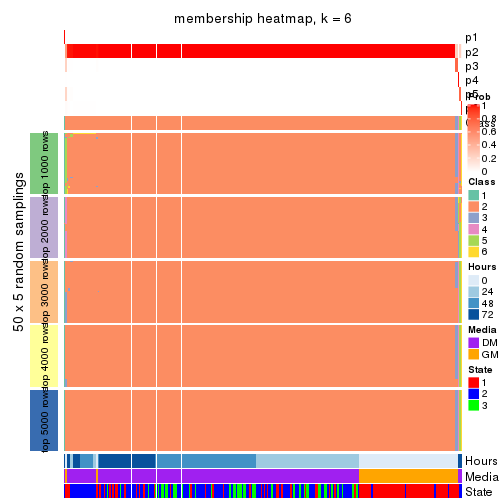</p>

</div>
</div>

As soon as we have had the classes for columns, we can look for signatures
which are significantly different between classes which can be candidate marks
for certain classes. Following are the heatmaps for signatures.


Signature heatmaps where rows are scaled:


<script>
$( function() {
	$( '#tabs-CV-pam-get-signatures' ).tabs();
} );
</script>
<div id='tabs-CV-pam-get-signatures'>
<ul>
<li><a href='#tab-CV-pam-get-signatures-1'>k = 2</a></li>
<li><a href='#tab-CV-pam-get-signatures-2'>k = 3</a></li>
<li><a href='#tab-CV-pam-get-signatures-3'>k = 4</a></li>
<li><a href='#tab-CV-pam-get-signatures-4'>k = 5</a></li>
<li><a href='#tab-CV-pam-get-signatures-5'>k = 6</a></li>
</ul>
<div id='tab-CV-pam-get-signatures-1'>
<pre><code class="r">get_signatures(res, k = 2)
</code></pre>

<p></p>

</div>
<div id='tab-CV-pam-get-signatures-2'>
<pre><code class="r">get_signatures(res, k = 3)
</code></pre>

<p></p>

</div>
<div id='tab-CV-pam-get-signatures-3'>
<pre><code class="r">get_signatures(res, k = 4)
</code></pre>

<p></p>

</div>
<div id='tab-CV-pam-get-signatures-4'>
<pre><code class="r">get_signatures(res, k = 5)
</code></pre>

<p></p>

</div>
<div id='tab-CV-pam-get-signatures-5'>
<pre><code class="r">get_signatures(res, k = 6)
</code></pre>

<p></p>

</div>
</div>


Signature heatmaps where rows are not scaled:


<script>
$( function() {
	$( '#tabs-CV-pam-get-signatures-no-scale' ).tabs();
} );
</script>
<div id='tabs-CV-pam-get-signatures-no-scale'>
<ul>
<li><a href='#tab-CV-pam-get-signatures-no-scale-1'>k = 2</a></li>
<li><a href='#tab-CV-pam-get-signatures-no-scale-2'>k = 3</a></li>
<li><a href='#tab-CV-pam-get-signatures-no-scale-3'>k = 4</a></li>
<li><a href='#tab-CV-pam-get-signatures-no-scale-4'>k = 5</a></li>
<li><a href='#tab-CV-pam-get-signatures-no-scale-5'>k = 6</a></li>
</ul>
<div id='tab-CV-pam-get-signatures-no-scale-1'>
<pre><code class="r">get_signatures(res, k = 2, scale_rows = FALSE)
</code></pre>

<p></p>

</div>
<div id='tab-CV-pam-get-signatures-no-scale-2'>
<pre><code class="r">get_signatures(res, k = 3, scale_rows = FALSE)
</code></pre>

<p></p>

</div>
<div id='tab-CV-pam-get-signatures-no-scale-3'>
<pre><code class="r">get_signatures(res, k = 4, scale_rows = FALSE)
</code></pre>

<p></p>

</div>
<div id='tab-CV-pam-get-signatures-no-scale-4'>
<pre><code class="r">get_signatures(res, k = 5, scale_rows = FALSE)
</code></pre>

<p></p>

</div>
<div id='tab-CV-pam-get-signatures-no-scale-5'>
<pre><code class="r">get_signatures(res, k = 6, scale_rows = FALSE)
</code></pre>

<p></p>

</div>
</div>


Compare the overlap of signatures from different k:

```r
compare_signatures(res)
```


`get_signature()` returns a data frame invisibly. TO get the list of signatures, the function
call should be assigned to a variable explicitly. In following code, if `plot` argument is set
to `FALSE`, no heatmap is plotted while only the differential analysis is performed.

```r
# code only for demonstration
tb = get_signature(res, k = ..., plot = FALSE)
```

An example of the output of `tb` is:

```
#>   which_row         fdr    mean_1    mean_2 scaled_mean_1 scaled_mean_2 km
#> 1        38 0.042760348  8.373488  9.131774    -0.5533452     0.5164555  1
#> 2        40 0.018707592  7.106213  8.469186    -0.6173731     0.5762149  1
#> 3        55 0.019134737 10.221463 11.207825    -0.6159697     0.5749050  1
#> 4        59 0.006059896  5.921854  7.869574    -0.6899429     0.6439467  1
#> 5        60 0.018055526  8.928898 10.211722    -0.6204761     0.5791110  1
#> 6        98 0.009384629 15.714769 14.887706     0.6635654    -0.6193277  2
...
```

The columns in `tb` are:

1. `which_row`: row indices corresponding to the input matrix.
2. `fdr`: FDR for the differential test. 
3. `mean_x`: The mean value in group x.
4. `scaled_mean_x`: The mean value in group x after rows are scaled.
5. `km`: Row groups if k-means clustering is applied to rows.


UMAP plot which shows how samples are separated.


<script>
$( function() {
	$( '#tabs-CV-pam-dimension-reduction' ).tabs();
} );
</script>
<div id='tabs-CV-pam-dimension-reduction'>
<ul>
<li><a href='#tab-CV-pam-dimension-reduction-1'>k = 2</a></li>
<li><a href='#tab-CV-pam-dimension-reduction-2'>k = 3</a></li>
<li><a href='#tab-CV-pam-dimension-reduction-3'>k = 4</a></li>
<li><a href='#tab-CV-pam-dimension-reduction-4'>k = 5</a></li>
<li><a href='#tab-CV-pam-dimension-reduction-5'>k = 6</a></li>
</ul>
<div id='tab-CV-pam-dimension-reduction-1'>
<pre><code class="r">dimension_reduction(res, k = 2, method = &quot;UMAP&quot;)
</code></pre>

<p></p>

</div>
<div id='tab-CV-pam-dimension-reduction-2'>
<pre><code class="r">dimension_reduction(res, k = 3, method = &quot;UMAP&quot;)
</code></pre>

<p></p>

</div>
<div id='tab-CV-pam-dimension-reduction-3'>
<pre><code class="r">dimension_reduction(res, k = 4, method = &quot;UMAP&quot;)
</code></pre>

<p></p>

</div>
<div id='tab-CV-pam-dimension-reduction-4'>
<pre><code class="r">dimension_reduction(res, k = 5, method = &quot;UMAP&quot;)
</code></pre>

<p></p>

</div>
<div id='tab-CV-pam-dimension-reduction-5'>
<pre><code class="r">dimension_reduction(res, k = 6, method = &quot;UMAP&quot;)
</code></pre>

<p></p>

</div>
</div>


Following heatmap shows how subgroups are split when increasing `k`:

```r
collect_classes(res)
```


Test correlation between subgroups and known annotations. If the known
annotation is numeric, one-way ANOVA test is applied, and if the known
annotation is discrete, chi-squared contingency table test is applied.

```r
test_to_known_factors(res)
```

```
#>          n Hours(p) Media(p) State(p) k
#> CV:pam   0       NA       NA       NA 2
#> CV:pam   0       NA       NA       NA 3
#> CV:pam 265       NA       NA       NA 4
#> CV:pam 264       NA       NA       NA 5
#> CV:pam 266    0.118    0.108    0.173 6
```


If matrix rows can be associated to genes, consider to use `GO_Enrichment(res,
...)` to perform function enrichment for the signature genes.


 

---------------------------------------------------


### CV:mclust*


The object with results only for a single top-value method and a single partition method 
can be extracted as:

```r
res = res_list["CV", "mclust"]
# you can also extract it by
# res = res_list["CV:mclust"]
```

A summary of `res` and all the functions that can be applied to it:

```r
res
```

```
#> A 'ConsensusPartition' object with k = 2, 3, 4, 5, 6.
#>   On a matrix with 12016 rows and 271 columns.
#>   Top rows (1000, 2000, 3000, 4000, 5000) are extracted by 'CV' method.
#>   Subgroups are detected by 'mclust' method.
#>   Performed in total 1250 partitions by row resampling.
#>   Best k for subgroups seems to be 2.
#> 
#> Following methods can be applied to this 'ConsensusPartition' object:
#>  [1] "cola_report"             "collect_classes"         "collect_plots"          
#>  [4] "collect_stats"           "colnames"                "compare_signatures"     
#>  [7] "consensus_heatmap"       "dimension_reduction"     "functional_enrichment"  
#> [10] "get_anno_col"            "get_anno"                "get_classes"            
#> [13] "get_consensus"           "get_matrix"              "get_membership"         
#> [16] "get_param"               "get_signatures"          "get_stats"              
#> [19] "is_best_k"               "is_stable_k"             "membership_heatmap"     
#> [22] "ncol"                    "nrow"                    "plot_ecdf"              
#> [25] "rownames"                "select_partition_number" "show"                   
#> [28] "suggest_best_k"          "test_to_known_factors"
```

`collect_plots()` function collects all the plots made from `res` for all `k` (number of partitions)
into one single page to provide an easy and fast comparison between different `k`.

```r
collect_plots(res)
```


The plots are:

- The first row: a plot of the ECDF (Empirical cumulative distribution
  function) curves of the consensus matrix for each `k` and the heatmap of
  predicted classes for each `k`.
- The second row: heatmaps of the consensus matrix for each `k`.
- The third row: heatmaps of the membership matrix for each `k`.
- The fouth row: heatmaps of the signatures for each `k`.

All the plots in panels can be made by individual functions and they are
plotted later in this section.

`select_partition_number()` produces several plots showing different
statistics for choosing "optimized" `k`. There are following statistics:

- ECDF curves of the consensus matrix for each `k`;
- 1-PAC. [The PAC
  score](https://en.wikipedia.org/wiki/Consensus_clustering#Over-interpretation_potential_of_consensus_clustering)
  measures the proportion of the ambiguous subgrouping.
- Mean silhouette score.
- Concordance. The mean probability of fiting the consensus class ids in all
  partitions.
- Area increased. Denote $A_k$ as the area under the ECDF curve for current
  `k`, the area increased is defined as $A_k - A_{k-1}$.
- Rand index. The percent of pairs of samples that are both in a same cluster
  or both are not in a same cluster in the partition of k and k-1.
- Jaccard index. The ratio of pairs of samples are both in a same cluster in
  the partition of k and k-1 and the pairs of samples are both in a same
  cluster in the partition k or k-1.

The detailed explanations of these statistics can be found in [the cola
vignette](http://bioconductor.org/packages/devel/bioc/vignettes/cola/inst/doc/cola.html#toc_13).

Generally speaking, lower PAC score, higher mean silhouette score or higher
concordance corresponds to better partition. Rand index and Jaccard index
measure how similar the current partition is compared to partition with `k-1`.
If they are too similar, we won't accept `k` is better than `k-1`.

```r
select_partition_number(res)
```


The numeric values for all these statistics can be obtained by `get_stats()`.

```r
get_stats(res)
```

```
#>   k 1-PAC mean_silhouette concordance area_increased  Rand Jaccard
#> 2 2 0.931           0.948       0.978         0.3645 0.634   0.634
#> 3 3 0.660           0.767       0.900         0.7195 0.705   0.542
#> 4 4 0.583           0.690       0.804         0.1249 0.925   0.795
#> 5 5 0.635           0.670       0.803         0.0967 0.850   0.544
#> 6 6 0.623           0.575       0.733         0.0316 0.954   0.790
```

`suggest_best_k()` suggests the best $k$ based on these statistics. The rules are as follows:

- All $k$ with Jaccard index larger than 0.95 are removed because the increase of
  the partition number does not provides enough extra information. If all $k$ are removed,
  the best $k$ is assigned by `NA`.
- For $k$ with 1-PAC larger than 0.9, the maximal $k$ is taken as the "best k". Other $k$ is called "optional k".
- If it does not fit the second rule. The $k$ with the highest vote of highest
  1-PAC, mean silhouette and concordance is taken as the "best k".

```r
suggest_best_k(res)
```

```
#> [1] 2
```


Following shows the table of the partitions (You need to click the **show/hide
code output** link to see it). The membership matrix (columns with name `p*`)
is inferred by
[`clue::cl_consensus()`](https://www.rdocumentation.org/link/cl_consensus?package=clue)
function with the `SE` method. Basically the value in the membership matrix
represents the probability to belong to a certain group. The finall class
label for an item is determined with the group with highest probability it
belongs to.

In `get_classes()` function, the entropy is calculated from the membership
matrix and the silhouette score is calculated from the consensus matrix.


<script>
$( function() {
	$( '#tabs-CV-mclust-get-classes' ).tabs();
} );
</script>
<div id='tabs-CV-mclust-get-classes'>
<ul>
<li><a href='#tab-CV-mclust-get-classes-1'>k = 2</a></li>
<li><a href='#tab-CV-mclust-get-classes-2'>k = 3</a></li>
<li><a href='#tab-CV-mclust-get-classes-3'>k = 4</a></li>
<li><a href='#tab-CV-mclust-get-classes-4'>k = 5</a></li>
<li><a href='#tab-CV-mclust-get-classes-5'>k = 6</a></li>
</ul>

<div id='tab-CV-mclust-get-classes-1'>
<p><a id='tab-CV-mclust-get-classes-1-a' style='color:#0366d6' href='#'>show/hide code output</a></p>
<pre><code class="r">cbind(get_classes(res, k = 2), get_membership(res, k = 2))
</code></pre>

<pre><code>#&gt;            class entropy silhouette    p1    p2
#&gt; T0_CT_A01      2  0.0000     0.9493 0.000 1.000
#&gt; T0_CT_A03      2  0.0000     0.9493 0.000 1.000
#&gt; T0_CT_A05      2  0.0000     0.9493 0.000 1.000
#&gt; T0_CT_A06      2  0.0000     0.9493 0.000 1.000
#&gt; T0_CT_A07      2  0.0000     0.9493 0.000 1.000
#&gt; T0_CT_A08      1  0.0000     0.9851 1.000 0.000
#&gt; T0_CT_A10      2  0.0000     0.9493 0.000 1.000
#&gt; T0_CT_A11      1  0.0000     0.9851 1.000 0.000
#&gt; T0_CT_B01      1  0.0000     0.9851 1.000 0.000
#&gt; T0_CT_B03      2  0.0000     0.9493 0.000 1.000
#&gt; T0_CT_B05      1  0.9754     0.2740 0.592 0.408
#&gt; T0_CT_B07      2  0.6531     0.8026 0.168 0.832
#&gt; T0_CT_B08      2  0.0000     0.9493 0.000 1.000
#&gt; T0_CT_B09      2  0.0000     0.9493 0.000 1.000
#&gt; T0_CT_C02      2  0.0000     0.9493 0.000 1.000
#&gt; T0_CT_C03      1  0.0000     0.9851 1.000 0.000
#&gt; T0_CT_C05      1  0.5059     0.8664 0.888 0.112
#&gt; T0_CT_C06      1  0.0000     0.9851 1.000 0.000
#&gt; T0_CT_C07      2  0.4815     0.8689 0.104 0.896
#&gt; T0_CT_C08      2  0.0000     0.9493 0.000 1.000
#&gt; T0_CT_C09      1  0.9710     0.3038 0.600 0.400
#&gt; T0_CT_C11      1  0.0000     0.9851 1.000 0.000
#&gt; T0_CT_C12      2  0.0000     0.9493 0.000 1.000
#&gt; T0_CT_D01      2  0.0000     0.9493 0.000 1.000
#&gt; T0_CT_D02      2  0.6048     0.8250 0.148 0.852
#&gt; T0_CT_D03      2  0.0000     0.9493 0.000 1.000
#&gt; T0_CT_D05      1  0.3879     0.9091 0.924 0.076
#&gt; T0_CT_D06      2  0.0000     0.9493 0.000 1.000
#&gt; T0_CT_D07      2  0.3431     0.9029 0.064 0.936
#&gt; T0_CT_D08      2  0.0000     0.9493 0.000 1.000
#&gt; T0_CT_D09      2  0.7745     0.7189 0.228 0.772
#&gt; T0_CT_D11      1  0.5294     0.8570 0.880 0.120
#&gt; T0_CT_D12      2  0.0000     0.9493 0.000 1.000
#&gt; T0_CT_E01      2  0.0000     0.9493 0.000 1.000
#&gt; T0_CT_E03      2  0.0000     0.9493 0.000 1.000
#&gt; T0_CT_E04      1  0.4161     0.9001 0.916 0.084
#&gt; T0_CT_E05      1  0.0000     0.9851 1.000 0.000
#&gt; T0_CT_E06      2  0.0000     0.9493 0.000 1.000
#&gt; T0_CT_E07      2  0.0000     0.9493 0.000 1.000
#&gt; T0_CT_E08      2  0.0000     0.9493 0.000 1.000
#&gt; T0_CT_E09      2  0.0000     0.9493 0.000 1.000
#&gt; T0_CT_E10      1  0.0000     0.9851 1.000 0.000
#&gt; T0_CT_E11      2  0.0000     0.9493 0.000 1.000
#&gt; T0_CT_E12      2  0.0000     0.9493 0.000 1.000
#&gt; T0_CT_F01      2  0.0000     0.9493 0.000 1.000
#&gt; T0_CT_F02      2  0.0000     0.9493 0.000 1.000
#&gt; T0_CT_F03      2  0.0000     0.9493 0.000 1.000
#&gt; T0_CT_F04      2  0.0000     0.9493 0.000 1.000
#&gt; T0_CT_F05      2  0.4815     0.8690 0.104 0.896
#&gt; T0_CT_F06      2  0.0000     0.9493 0.000 1.000
#&gt; T0_CT_F07      2  0.7376     0.7529 0.208 0.792
#&gt; T0_CT_F09      1  0.5737     0.8358 0.864 0.136
#&gt; T0_CT_F11      2  0.0000     0.9493 0.000 1.000
#&gt; T0_CT_F12      2  0.0000     0.9493 0.000 1.000
#&gt; T0_CT_G01      2  0.0000     0.9493 0.000 1.000
#&gt; T0_CT_G02      1  0.6531     0.7901 0.832 0.168
#&gt; T0_CT_G03      2  0.0000     0.9493 0.000 1.000
#&gt; T0_CT_G04      2  0.0000     0.9493 0.000 1.000
#&gt; T0_CT_G07      2  0.0000     0.9493 0.000 1.000
#&gt; T0_CT_G08      2  0.0000     0.9493 0.000 1.000
#&gt; T0_CT_G09      1  0.0672     0.9783 0.992 0.008
#&gt; T0_CT_G11      1  0.1843     0.9597 0.972 0.028
#&gt; T0_CT_H01      1  0.0376     0.9817 0.996 0.004
#&gt; T0_CT_H02      2  1.0000     0.0681 0.496 0.504
#&gt; T0_CT_H04      2  0.0000     0.9493 0.000 1.000
#&gt; T0_CT_H05      1  0.0000     0.9851 1.000 0.000
#&gt; T0_CT_H08      2  0.9170     0.5380 0.332 0.668
#&gt; T0_CT_H09      1  0.0000     0.9851 1.000 0.000
#&gt; T0_CT_H12      1  0.2236     0.9519 0.964 0.036
#&gt; T24_CT_A01     1  0.0000     0.9851 1.000 0.000
#&gt; T24_CT_A03     1  0.0000     0.9851 1.000 0.000
#&gt; T24_CT_A04     1  0.0000     0.9851 1.000 0.000
#&gt; T24_CT_A05     2  0.0000     0.9493 0.000 1.000
#&gt; T24_CT_A07     1  0.0000     0.9851 1.000 0.000
#&gt; T24_CT_A08     1  0.0000     0.9851 1.000 0.000
#&gt; T24_CT_A09     1  0.0000     0.9851 1.000 0.000
#&gt; T24_CT_A10     1  0.0000     0.9851 1.000 0.000
#&gt; T24_CT_B01     1  0.0000     0.9851 1.000 0.000
#&gt; T24_CT_B02     1  0.0000     0.9851 1.000 0.000
#&gt; T24_CT_B03     1  0.0000     0.9851 1.000 0.000
#&gt; T24_CT_B05     1  0.0000     0.9851 1.000 0.000
#&gt; T24_CT_B06     1  0.0000     0.9851 1.000 0.000
#&gt; T24_CT_B07     1  0.0000     0.9851 1.000 0.000
#&gt; T24_CT_B08     1  0.0000     0.9851 1.000 0.000
#&gt; T24_CT_B09     1  0.0000     0.9851 1.000 0.000
#&gt; T24_CT_B11     2  0.0000     0.9493 0.000 1.000
#&gt; T24_CT_C01     1  0.0000     0.9851 1.000 0.000
#&gt; T24_CT_C02     1  0.0000     0.9851 1.000 0.000
#&gt; T24_CT_C03     1  0.0000     0.9851 1.000 0.000
#&gt; T24_CT_C05     1  0.0000     0.9851 1.000 0.000
#&gt; T24_CT_C07     1  0.0000     0.9851 1.000 0.000
#&gt; T24_CT_C08     1  0.0000     0.9851 1.000 0.000
#&gt; T24_CT_C09     1  0.0000     0.9851 1.000 0.000
#&gt; T24_CT_C10     1  0.0000     0.9851 1.000 0.000
#&gt; T24_CT_C11     1  0.0000     0.9851 1.000 0.000
#&gt; T24_CT_C12     1  0.0000     0.9851 1.000 0.000
#&gt; T24_CT_D01     1  0.0000     0.9851 1.000 0.000
#&gt; T24_CT_D02     2  0.9775     0.3456 0.412 0.588
#&gt; T24_CT_D03     1  0.0000     0.9851 1.000 0.000
#&gt; T24_CT_D04     1  0.0000     0.9851 1.000 0.000
#&gt; T24_CT_D05     1  0.0000     0.9851 1.000 0.000
#&gt; T24_CT_D06     1  0.0000     0.9851 1.000 0.000
#&gt; T24_CT_D07     1  0.0000     0.9851 1.000 0.000
#&gt; T24_CT_D08     1  0.0000     0.9851 1.000 0.000
#&gt; T24_CT_D09     1  0.0000     0.9851 1.000 0.000
#&gt; T24_CT_D10     1  0.4939     0.8720 0.892 0.108
#&gt; T24_CT_D11     1  0.0000     0.9851 1.000 0.000
#&gt; T24_CT_E01     1  0.0000     0.9851 1.000 0.000
#&gt; T24_CT_E02     1  0.0000     0.9851 1.000 0.000
#&gt; T24_CT_E04     1  0.0000     0.9851 1.000 0.000
#&gt; T24_CT_E05     1  0.0000     0.9851 1.000 0.000
#&gt; T24_CT_E07     1  0.0000     0.9851 1.000 0.000
#&gt; T24_CT_E09     1  0.0000     0.9851 1.000 0.000
#&gt; T24_CT_E11     1  0.0000     0.9851 1.000 0.000
#&gt; T24_CT_E12     1  0.0000     0.9851 1.000 0.000
#&gt; T24_CT_F01     1  0.0000     0.9851 1.000 0.000
#&gt; T24_CT_F02     1  0.0672     0.9783 0.992 0.008
#&gt; T24_CT_F03     1  0.0000     0.9851 1.000 0.000
#&gt; T24_CT_F04     1  0.0000     0.9851 1.000 0.000
#&gt; T24_CT_F05     1  0.0000     0.9851 1.000 0.000
#&gt; T24_CT_F07     1  0.0000     0.9851 1.000 0.000
#&gt; T24_CT_F08     1  0.0000     0.9851 1.000 0.000
#&gt; T24_CT_F09     1  0.0000     0.9851 1.000 0.000
#&gt; T24_CT_F10     1  0.0000     0.9851 1.000 0.000
#&gt; T24_CT_F11     1  0.0000     0.9851 1.000 0.000
#&gt; T24_CT_F12     2  0.0000     0.9493 0.000 1.000
#&gt; T24_CT_G01     1  0.0000     0.9851 1.000 0.000
#&gt; T24_CT_G02     1  0.0000     0.9851 1.000 0.000
#&gt; T24_CT_G03     1  0.0000     0.9851 1.000 0.000
#&gt; T24_CT_G04     1  0.0000     0.9851 1.000 0.000
#&gt; T24_CT_G05     1  0.0000     0.9851 1.000 0.000
#&gt; T24_CT_G06     1  0.0000     0.9851 1.000 0.000
#&gt; T24_CT_G08     1  0.0000     0.9851 1.000 0.000
#&gt; T24_CT_G10     1  0.0000     0.9851 1.000 0.000
#&gt; T24_CT_G11     1  0.0000     0.9851 1.000 0.000
#&gt; T24_CT_G12     1  0.0000     0.9851 1.000 0.000
#&gt; T24_CT_H01     2  0.0000     0.9493 0.000 1.000
#&gt; T24_CT_H02     1  0.0000     0.9851 1.000 0.000
#&gt; T24_CT_H03     1  0.0000     0.9851 1.000 0.000
#&gt; T24_CT_H05     1  0.0000     0.9851 1.000 0.000
#&gt; T24_CT_H07     1  0.0000     0.9851 1.000 0.000
#&gt; T24_CT_H09     1  0.0000     0.9851 1.000 0.000
#&gt; T24_CT_H12     1  0.0000     0.9851 1.000 0.000
#&gt; T48_CT_A01     1  0.0000     0.9851 1.000 0.000
#&gt; T48_CT_A02     1  0.0000     0.9851 1.000 0.000
#&gt; T48_CT_A03     1  0.0000     0.9851 1.000 0.000
#&gt; T48_CT_A04     1  0.0000     0.9851 1.000 0.000
#&gt; T48_CT_A05     1  0.0000     0.9851 1.000 0.000
#&gt; T48_CT_A06     1  0.0000     0.9851 1.000 0.000
#&gt; T48_CT_A07     2  0.0000     0.9493 0.000 1.000
#&gt; T48_CT_A08     1  0.0000     0.9851 1.000 0.000
#&gt; T48_CT_A09     1  0.0000     0.9851 1.000 0.000
#&gt; T48_CT_A10     1  0.0000     0.9851 1.000 0.000
#&gt; T48_CT_A11     1  0.0000     0.9851 1.000 0.000
#&gt; T48_CT_A12     1  0.0000     0.9851 1.000 0.000
#&gt; T48_CT_B01     1  0.0000     0.9851 1.000 0.000
#&gt; T48_CT_B02     1  0.0000     0.9851 1.000 0.000
#&gt; T48_CT_B03     1  0.0000     0.9851 1.000 0.000
#&gt; T48_CT_B04     1  0.0000     0.9851 1.000 0.000
#&gt; T48_CT_B06     1  0.0000     0.9851 1.000 0.000
#&gt; T48_CT_B08     1  0.0000     0.9851 1.000 0.000
#&gt; T48_CT_B10     1  0.0000     0.9851 1.000 0.000
#&gt; T48_CT_B11     1  0.0000     0.9851 1.000 0.000
#&gt; T48_CT_B12     1  0.0000     0.9851 1.000 0.000
#&gt; T48_CT_C01     1  0.0000     0.9851 1.000 0.000
#&gt; T48_CT_C02     1  0.0000     0.9851 1.000 0.000
#&gt; T48_CT_C03     1  0.0000     0.9851 1.000 0.000
#&gt; T48_CT_C04     1  0.0000     0.9851 1.000 0.000
#&gt; T48_CT_C05     1  0.0000     0.9851 1.000 0.000
#&gt; T48_CT_C06     1  0.0000     0.9851 1.000 0.000
#&gt; T48_CT_C07     1  0.0000     0.9851 1.000 0.000
#&gt; T48_CT_C09     2  0.0938     0.9413 0.012 0.988
#&gt; T48_CT_C10     1  0.0000     0.9851 1.000 0.000
#&gt; T48_CT_C11     1  0.0000     0.9851 1.000 0.000
#&gt; T48_CT_D01     1  0.0000     0.9851 1.000 0.000
#&gt; T48_CT_D02     1  0.0000     0.9851 1.000 0.000
#&gt; T48_CT_D03     1  0.0000     0.9851 1.000 0.000
#&gt; T48_CT_D04     1  0.0000     0.9851 1.000 0.000
#&gt; T48_CT_D06     1  0.0000     0.9851 1.000 0.000
#&gt; T48_CT_D07     1  0.0000     0.9851 1.000 0.000
#&gt; T48_CT_D08     1  0.0000     0.9851 1.000 0.000
#&gt; T48_CT_D09     1  0.0000     0.9851 1.000 0.000
#&gt; T48_CT_D10     1  0.0000     0.9851 1.000 0.000
#&gt; T48_CT_D11     1  0.8499     0.6044 0.724 0.276
#&gt; T48_CT_D12     1  0.0000     0.9851 1.000 0.000
#&gt; T48_CT_E01     1  0.0000     0.9851 1.000 0.000
#&gt; T48_CT_E02     1  0.0000     0.9851 1.000 0.000
#&gt; T48_CT_E03     1  0.5629     0.8410 0.868 0.132
#&gt; T48_CT_E04     1  0.0000     0.9851 1.000 0.000
#&gt; T48_CT_E05     1  0.0000     0.9851 1.000 0.000
#&gt; T48_CT_E06     1  0.0000     0.9851 1.000 0.000
#&gt; T48_CT_E07     1  0.0000     0.9851 1.000 0.000
#&gt; T48_CT_E08     1  0.0000     0.9851 1.000 0.000
#&gt; T48_CT_E10     1  0.0000     0.9851 1.000 0.000
#&gt; T48_CT_E11     1  0.0000     0.9851 1.000 0.000
#&gt; T48_CT_E12     2  0.0000     0.9493 0.000 1.000
#&gt; T48_CT_F01     1  0.0000     0.9851 1.000 0.000
#&gt; T48_CT_F02     1  0.0000     0.9851 1.000 0.000
#&gt; T48_CT_F03     1  0.0000     0.9851 1.000 0.000
#&gt; T48_CT_F05     1  0.0000     0.9851 1.000 0.000
#&gt; T48_CT_F07     1  0.0000     0.9851 1.000 0.000
#&gt; T48_CT_F09     1  0.0000     0.9851 1.000 0.000
#&gt; T48_CT_F10     1  0.0000     0.9851 1.000 0.000
#&gt; T48_CT_F11     1  0.0000     0.9851 1.000 0.000
#&gt; T48_CT_G01     2  0.8144     0.6870 0.252 0.748
#&gt; T48_CT_G02     1  0.0376     0.9817 0.996 0.004
#&gt; T48_CT_G03     1  0.0000     0.9851 1.000 0.000
#&gt; T48_CT_G07     1  0.0000     0.9851 1.000 0.000
#&gt; T48_CT_G08     1  0.4298     0.8961 0.912 0.088
#&gt; T48_CT_G09     1  0.0000     0.9851 1.000 0.000
#&gt; T48_CT_G10     2  0.0000     0.9493 0.000 1.000
#&gt; T48_CT_G11     1  0.0000     0.9851 1.000 0.000
#&gt; T48_CT_G12     1  0.0000     0.9851 1.000 0.000
#&gt; T48_CT_H01     1  0.0000     0.9851 1.000 0.000
#&gt; T48_CT_H02     1  0.0000     0.9851 1.000 0.000
#&gt; T48_CT_H04     1  0.0000     0.9851 1.000 0.000
#&gt; T48_CT_H05     1  0.0000     0.9851 1.000 0.000
#&gt; T48_CT_H06     1  0.0000     0.9851 1.000 0.000
#&gt; T48_CT_H07     1  0.0000     0.9851 1.000 0.000
#&gt; T48_CT_H08     1  0.0000     0.9851 1.000 0.000
#&gt; T48_CT_H11     1  0.0000     0.9851 1.000 0.000
#&gt; T48_CT_H12     1  0.0000     0.9851 1.000 0.000
#&gt; T72_CT_A01     1  0.0000     0.9851 1.000 0.000
#&gt; T72_CT_A05     1  0.1414     0.9677 0.980 0.020
#&gt; T72_CT_A08     1  0.0000     0.9851 1.000 0.000
#&gt; T72_CT_A09     1  0.1184     0.9713 0.984 0.016
#&gt; T72_CT_A11     1  0.0000     0.9851 1.000 0.000
#&gt; T72_CT_B01     1  0.0000     0.9851 1.000 0.000
#&gt; T72_CT_B02     1  0.0000     0.9851 1.000 0.000
#&gt; T72_CT_B03     1  0.0000     0.9851 1.000 0.000
#&gt; T72_CT_B04     1  0.0000     0.9851 1.000 0.000
#&gt; T72_CT_B05     1  0.1184     0.9713 0.984 0.016
#&gt; T72_CT_B06     1  0.0000     0.9851 1.000 0.000
#&gt; T72_CT_B08     2  0.0000     0.9493 0.000 1.000
#&gt; T72_CT_B09     1  0.0000     0.9851 1.000 0.000
#&gt; T72_CT_B11     1  0.0000     0.9851 1.000 0.000
#&gt; T72_CT_B12     1  0.0000     0.9851 1.000 0.000
#&gt; T72_CT_C04     1  0.0000     0.9851 1.000 0.000
#&gt; T72_CT_C06     1  0.0000     0.9851 1.000 0.000
#&gt; T72_CT_C07     1  0.8955     0.5288 0.688 0.312
#&gt; T72_CT_C09     1  0.0000     0.9851 1.000 0.000
#&gt; T72_CT_C11     2  0.0000     0.9493 0.000 1.000
#&gt; T72_CT_D01     1  0.0000     0.9851 1.000 0.000
#&gt; T72_CT_D03     1  0.0000     0.9851 1.000 0.000
#&gt; T72_CT_D04     2  0.9881     0.2612 0.436 0.564
#&gt; T72_CT_D05     1  0.0000     0.9851 1.000 0.000
#&gt; T72_CT_D07     1  0.0000     0.9851 1.000 0.000
#&gt; T72_CT_D10     1  0.0938     0.9747 0.988 0.012
#&gt; T72_CT_D11     1  0.0000     0.9851 1.000 0.000
#&gt; T72_CT_E04     1  0.0000     0.9851 1.000 0.000
#&gt; T72_CT_E05     1  0.0672     0.9783 0.992 0.008
#&gt; T72_CT_E07     1  0.0000     0.9851 1.000 0.000
#&gt; T72_CT_F01     1  0.0000     0.9851 1.000 0.000
#&gt; T72_CT_F05     1  0.0000     0.9851 1.000 0.000
#&gt; T72_CT_F07     1  0.0000     0.9851 1.000 0.000
#&gt; T72_CT_F10     1  0.0000     0.9851 1.000 0.000
#&gt; T72_CT_F11     2  0.0000     0.9493 0.000 1.000
#&gt; T72_CT_G03     1  0.0000     0.9851 1.000 0.000
#&gt; T72_CT_G04     1  0.0000     0.9851 1.000 0.000
#&gt; T72_CT_G06     2  0.7056     0.7736 0.192 0.808
#&gt; T72_CT_G08     1  0.8661     0.5804 0.712 0.288
#&gt; T72_CT_G10     1  0.0000     0.9851 1.000 0.000
#&gt; T72_CT_G11     1  0.0000     0.9851 1.000 0.000
#&gt; T72_CT_H01     1  0.1414     0.9674 0.980 0.020
#&gt; T72_CT_H03     1  0.0000     0.9851 1.000 0.000
#&gt; T72_CT_H05     2  0.0000     0.9493 0.000 1.000
#&gt; T72_CT_H08     2  0.0000     0.9493 0.000 1.000
#&gt; T72_CT_H09     2  0.0000     0.9493 0.000 1.000
#&gt; T72_CT_H10     1  0.0000     0.9851 1.000 0.000
#&gt; T72_CT_H11     1  0.0000     0.9851 1.000 0.000
#&gt; T72_CT_H12     1  0.0000     0.9851 1.000 0.000
</code></pre>

<script>
$('#tab-CV-mclust-get-classes-1-a').parent().next().next().hide();
$('#tab-CV-mclust-get-classes-1-a').click(function(){
  $('#tab-CV-mclust-get-classes-1-a').parent().next().next().toggle();
  return(false);
});
</script>
</div>

<div id='tab-CV-mclust-get-classes-2'>
<p><a id='tab-CV-mclust-get-classes-2-a' style='color:#0366d6' href='#'>show/hide code output</a></p>
<pre><code class="r">cbind(get_classes(res, k = 3), get_membership(res, k = 3))
</code></pre>

<pre><code>#&gt;            class entropy silhouette    p1    p2    p3
#&gt; T0_CT_A01      3  0.0000     0.9434 0.000 0.000 1.000
#&gt; T0_CT_A03      3  0.0000     0.9434 0.000 0.000 1.000
#&gt; T0_CT_A05      3  0.0000     0.9434 0.000 0.000 1.000
#&gt; T0_CT_A06      3  0.0237     0.9418 0.000 0.004 0.996
#&gt; T0_CT_A07      3  0.0000     0.9434 0.000 0.000 1.000
#&gt; T0_CT_A08      1  0.0000     0.8898 1.000 0.000 0.000
#&gt; T0_CT_A10      3  0.0000     0.9434 0.000 0.000 1.000
#&gt; T0_CT_A11      1  0.4750     0.6837 0.784 0.216 0.000
#&gt; T0_CT_B01      1  0.5098     0.6350 0.752 0.248 0.000
#&gt; T0_CT_B03      3  0.0000     0.9434 0.000 0.000 1.000
#&gt; T0_CT_B05      3  0.7610     0.6059 0.144 0.168 0.688
#&gt; T0_CT_B07      3  0.4291     0.7615 0.000 0.180 0.820
#&gt; T0_CT_B08      3  0.0000     0.9434 0.000 0.000 1.000
#&gt; T0_CT_B09      3  0.0000     0.9434 0.000 0.000 1.000
#&gt; T0_CT_C02      3  0.0000     0.9434 0.000 0.000 1.000
#&gt; T0_CT_C03      1  0.0747     0.8786 0.984 0.000 0.016
#&gt; T0_CT_C05      2  0.3784     0.7531 0.132 0.864 0.004
#&gt; T0_CT_C06      1  0.4931     0.6868 0.784 0.212 0.004
#&gt; T0_CT_C07      3  0.4575     0.7536 0.004 0.184 0.812
#&gt; T0_CT_C08      3  0.0000     0.9434 0.000 0.000 1.000
#&gt; T0_CT_C09      1  0.8542     0.4462 0.608 0.220 0.172
#&gt; T0_CT_C11      2  0.3340     0.7636 0.120 0.880 0.000
#&gt; T0_CT_C12      3  0.0000     0.9434 0.000 0.000 1.000
#&gt; T0_CT_D01      3  0.0237     0.9418 0.000 0.004 0.996
#&gt; T0_CT_D02      3  0.3482     0.8286 0.000 0.128 0.872
#&gt; T0_CT_D03      3  0.0000     0.9434 0.000 0.000 1.000
#&gt; T0_CT_D05      1  0.8907     0.3772 0.572 0.228 0.200
#&gt; T0_CT_D06      3  0.0000     0.9434 0.000 0.000 1.000
#&gt; T0_CT_D07      3  0.3619     0.8178 0.000 0.136 0.864
#&gt; T0_CT_D08      3  0.0000     0.9434 0.000 0.000 1.000
#&gt; T0_CT_D09      3  0.3619     0.8338 0.000 0.136 0.864
#&gt; T0_CT_D11      2  0.3619     0.7496 0.136 0.864 0.000
#&gt; T0_CT_D12      3  0.0000     0.9434 0.000 0.000 1.000
#&gt; T0_CT_E01      3  0.0000     0.9434 0.000 0.000 1.000
#&gt; T0_CT_E03      3  0.0237     0.9418 0.000 0.004 0.996
#&gt; T0_CT_E04      2  0.7213     0.5767 0.272 0.668 0.060
#&gt; T0_CT_E05      1  0.2711     0.8317 0.912 0.088 0.000
#&gt; T0_CT_E06      3  0.0237     0.9418 0.000 0.004 0.996
#&gt; T0_CT_E07      3  0.0000     0.9434 0.000 0.000 1.000
#&gt; T0_CT_E08      3  0.0000     0.9434 0.000 0.000 1.000
#&gt; T0_CT_E09      3  0.0000     0.9434 0.000 0.000 1.000
#&gt; T0_CT_E10      1  0.5529     0.5431 0.704 0.296 0.000
#&gt; T0_CT_E11      3  0.0000     0.9434 0.000 0.000 1.000
#&gt; T0_CT_E12      3  0.0237     0.9418 0.000 0.004 0.996
#&gt; T0_CT_F01      3  0.0000     0.9434 0.000 0.000 1.000
#&gt; T0_CT_F02      3  0.0000     0.9434 0.000 0.000 1.000
#&gt; T0_CT_F03      3  0.0000     0.9434 0.000 0.000 1.000
#&gt; T0_CT_F04      3  0.0000     0.9434 0.000 0.000 1.000
#&gt; T0_CT_F05      3  0.4062     0.7842 0.000 0.164 0.836
#&gt; T0_CT_F06      3  0.0000     0.9434 0.000 0.000 1.000
#&gt; T0_CT_F07      3  0.3499     0.8706 0.028 0.072 0.900
#&gt; T0_CT_F09      2  0.3340     0.7604 0.120 0.880 0.000
#&gt; T0_CT_F11      3  0.0237     0.9418 0.000 0.004 0.996
#&gt; T0_CT_F12      3  0.0000     0.9434 0.000 0.000 1.000
#&gt; T0_CT_G01      3  0.0000     0.9434 0.000 0.000 1.000
#&gt; T0_CT_G02      3  0.9103     0.1758 0.380 0.144 0.476
#&gt; T0_CT_G03      3  0.0237     0.9418 0.000 0.004 0.996
#&gt; T0_CT_G04      3  0.0000     0.9434 0.000 0.000 1.000
#&gt; T0_CT_G07      3  0.0000     0.9434 0.000 0.000 1.000
#&gt; T0_CT_G08      3  0.0000     0.9434 0.000 0.000 1.000
#&gt; T0_CT_G09      1  0.4473     0.7501 0.828 0.008 0.164
#&gt; T0_CT_G11      1  0.8322     0.4878 0.628 0.212 0.160
#&gt; T0_CT_H01      1  0.5365     0.6231 0.744 0.252 0.004
#&gt; T0_CT_H02      2  0.7129     0.2313 0.028 0.580 0.392
#&gt; T0_CT_H04      3  0.0237     0.9418 0.000 0.004 0.996
#&gt; T0_CT_H05      1  0.4605     0.6997 0.796 0.204 0.000
#&gt; T0_CT_H08      3  0.6096     0.6843 0.040 0.208 0.752
#&gt; T0_CT_H09      1  0.6244     0.1604 0.560 0.440 0.000
#&gt; T0_CT_H12      1  0.6201     0.6585 0.748 0.208 0.044
#&gt; T24_CT_A01     1  0.4937     0.7589 0.824 0.148 0.028
#&gt; T24_CT_A03     2  0.5760     0.5352 0.328 0.672 0.000
#&gt; T24_CT_A04     2  0.1411     0.7962 0.036 0.964 0.000
#&gt; T24_CT_A05     3  0.0000     0.9434 0.000 0.000 1.000
#&gt; T24_CT_A07     2  0.0000     0.7977 0.000 1.000 0.000
#&gt; T24_CT_A08     1  0.0000     0.8898 1.000 0.000 0.000
#&gt; T24_CT_A09     1  0.0000     0.8898 1.000 0.000 0.000
#&gt; T24_CT_A10     1  0.0592     0.8844 0.988 0.012 0.000
#&gt; T24_CT_B01     1  0.0000     0.8898 1.000 0.000 0.000
#&gt; T24_CT_B02     1  0.0000     0.8898 1.000 0.000 0.000
#&gt; T24_CT_B03     1  0.6244     0.1436 0.560 0.440 0.000
#&gt; T24_CT_B05     2  0.0237     0.7989 0.004 0.996 0.000
#&gt; T24_CT_B06     2  0.0000     0.7977 0.000 1.000 0.000
#&gt; T24_CT_B07     1  0.0000     0.8898 1.000 0.000 0.000
#&gt; T24_CT_B08     2  0.0424     0.7975 0.008 0.992 0.000
#&gt; T24_CT_B09     1  0.0000     0.8898 1.000 0.000 0.000
#&gt; T24_CT_B11     3  0.0000     0.9434 0.000 0.000 1.000
#&gt; T24_CT_C01     1  0.0000     0.8898 1.000 0.000 0.000
#&gt; T24_CT_C02     2  0.3879     0.7468 0.152 0.848 0.000
#&gt; T24_CT_C03     1  0.0000     0.8898 1.000 0.000 0.000
#&gt; T24_CT_C05     2  0.0237     0.7980 0.004 0.996 0.000
#&gt; T24_CT_C07     2  0.4235     0.7162 0.176 0.824 0.000
#&gt; T24_CT_C08     2  0.0000     0.7977 0.000 1.000 0.000
#&gt; T24_CT_C09     2  0.6008     0.4499 0.372 0.628 0.000
#&gt; T24_CT_C10     1  0.0000     0.8898 1.000 0.000 0.000
#&gt; T24_CT_C11     1  0.4605     0.7005 0.796 0.204 0.000
#&gt; T24_CT_C12     2  0.6205     0.5155 0.336 0.656 0.008
#&gt; T24_CT_D01     2  0.0424     0.7975 0.008 0.992 0.000
#&gt; T24_CT_D02     3  0.6195     0.5962 0.020 0.276 0.704
#&gt; T24_CT_D03     2  0.0237     0.7980 0.004 0.996 0.000
#&gt; T24_CT_D04     1  0.0237     0.8880 0.996 0.000 0.004
#&gt; T24_CT_D05     1  0.0000     0.8898 1.000 0.000 0.000
#&gt; T24_CT_D06     1  0.2261     0.8476 0.932 0.068 0.000
#&gt; T24_CT_D07     1  0.0000     0.8898 1.000 0.000 0.000
#&gt; T24_CT_D08     2  0.0237     0.7980 0.004 0.996 0.000
#&gt; T24_CT_D09     2  0.2448     0.7833 0.076 0.924 0.000
#&gt; T24_CT_D10     2  0.3715     0.7565 0.128 0.868 0.004
#&gt; T24_CT_D11     2  0.0000     0.7977 0.000 1.000 0.000
#&gt; T24_CT_E01     1  0.0000     0.8898 1.000 0.000 0.000
#&gt; T24_CT_E02     1  0.0000     0.8898 1.000 0.000 0.000
#&gt; T24_CT_E04     2  0.0000     0.7977 0.000 1.000 0.000
#&gt; T24_CT_E05     1  0.0000     0.8898 1.000 0.000 0.000
#&gt; T24_CT_E07     1  0.0747     0.8823 0.984 0.016 0.000
#&gt; T24_CT_E09     1  0.0000     0.8898 1.000 0.000 0.000
#&gt; T24_CT_E11     1  0.0000     0.8898 1.000 0.000 0.000
#&gt; T24_CT_E12     2  0.0000     0.7977 0.000 1.000 0.000
#&gt; T24_CT_F01     2  0.0000     0.7977 0.000 1.000 0.000
#&gt; T24_CT_F02     2  0.3038     0.7721 0.104 0.896 0.000
#&gt; T24_CT_F03     1  0.0000     0.8898 1.000 0.000 0.000
#&gt; T24_CT_F04     1  0.3482     0.7933 0.872 0.128 0.000
#&gt; T24_CT_F05     1  0.0000     0.8898 1.000 0.000 0.000
#&gt; T24_CT_F07     1  0.0000     0.8898 1.000 0.000 0.000
#&gt; T24_CT_F08     1  0.0000     0.8898 1.000 0.000 0.000
#&gt; T24_CT_F09     2  0.2711     0.7815 0.088 0.912 0.000
#&gt; T24_CT_F10     1  0.4654     0.6957 0.792 0.208 0.000
#&gt; T24_CT_F11     1  0.1753     0.8623 0.952 0.048 0.000
#&gt; T24_CT_F12     3  0.0000     0.9434 0.000 0.000 1.000
#&gt; T24_CT_G01     2  0.0424     0.7991 0.008 0.992 0.000
#&gt; T24_CT_G02     1  0.0000     0.8898 1.000 0.000 0.000
#&gt; T24_CT_G03     1  0.0000     0.8898 1.000 0.000 0.000
#&gt; T24_CT_G04     2  0.6008     0.4587 0.372 0.628 0.000
#&gt; T24_CT_G05     2  0.5138     0.6326 0.252 0.748 0.000
#&gt; T24_CT_G06     1  0.0000     0.8898 1.000 0.000 0.000
#&gt; T24_CT_G08     1  0.0000     0.8898 1.000 0.000 0.000
#&gt; T24_CT_G10     2  0.1832     0.7951 0.036 0.956 0.008
#&gt; T24_CT_G11     1  0.0000     0.8898 1.000 0.000 0.000
#&gt; T24_CT_G12     1  0.1031     0.8727 0.976 0.000 0.024
#&gt; T24_CT_H01     3  0.0000     0.9434 0.000 0.000 1.000
#&gt; T24_CT_H02     1  0.0000     0.8898 1.000 0.000 0.000
#&gt; T24_CT_H03     2  0.2066     0.7904 0.060 0.940 0.000
#&gt; T24_CT_H05     1  0.2878     0.8245 0.904 0.096 0.000
#&gt; T24_CT_H07     1  0.0000     0.8898 1.000 0.000 0.000
#&gt; T24_CT_H09     1  0.0000     0.8898 1.000 0.000 0.000
#&gt; T24_CT_H12     1  0.0000     0.8898 1.000 0.000 0.000
#&gt; T48_CT_A01     2  0.5968     0.4605 0.364 0.636 0.000
#&gt; T48_CT_A02     2  0.0892     0.7994 0.020 0.980 0.000
#&gt; T48_CT_A03     1  0.0000     0.8898 1.000 0.000 0.000
#&gt; T48_CT_A04     2  0.0000     0.7977 0.000 1.000 0.000
#&gt; T48_CT_A05     1  0.5928     0.5428 0.696 0.296 0.008
#&gt; T48_CT_A06     1  0.0000     0.8898 1.000 0.000 0.000
#&gt; T48_CT_A07     3  0.0000     0.9434 0.000 0.000 1.000
#&gt; T48_CT_A08     2  0.6180     0.3560 0.416 0.584 0.000
#&gt; T48_CT_A09     1  0.0000     0.8898 1.000 0.000 0.000
#&gt; T48_CT_A10     2  0.0000     0.7977 0.000 1.000 0.000
#&gt; T48_CT_A11     2  0.0237     0.7990 0.004 0.996 0.000
#&gt; T48_CT_A12     1  0.0000     0.8898 1.000 0.000 0.000
#&gt; T48_CT_B01     2  0.0424     0.7975 0.008 0.992 0.000
#&gt; T48_CT_B02     2  0.0000     0.7977 0.000 1.000 0.000
#&gt; T48_CT_B03     1  0.0000     0.8898 1.000 0.000 0.000
#&gt; T48_CT_B04     1  0.0000     0.8898 1.000 0.000 0.000
#&gt; T48_CT_B06     2  0.0237     0.7980 0.004 0.996 0.000
#&gt; T48_CT_B08     1  0.0000     0.8898 1.000 0.000 0.000
#&gt; T48_CT_B10     2  0.0000     0.7977 0.000 1.000 0.000
#&gt; T48_CT_B11     2  0.0000     0.7977 0.000 1.000 0.000
#&gt; T48_CT_B12     1  0.4645     0.7351 0.816 0.176 0.008
#&gt; T48_CT_C01     2  0.1031     0.7988 0.024 0.976 0.000
#&gt; T48_CT_C02     1  0.0000     0.8898 1.000 0.000 0.000
#&gt; T48_CT_C03     2  0.1289     0.7984 0.032 0.968 0.000
#&gt; T48_CT_C04     1  0.0000     0.8898 1.000 0.000 0.000
#&gt; T48_CT_C05     1  0.0237     0.8878 0.996 0.004 0.000
#&gt; T48_CT_C06     2  0.6280     0.2424 0.460 0.540 0.000
#&gt; T48_CT_C07     1  0.4235     0.7383 0.824 0.176 0.000
#&gt; T48_CT_C09     3  0.0237     0.9418 0.000 0.004 0.996
#&gt; T48_CT_C10     1  0.0000     0.8898 1.000 0.000 0.000
#&gt; T48_CT_C11     2  0.0237     0.7990 0.004 0.996 0.000
#&gt; T48_CT_D01     1  0.7874     0.3859 0.604 0.320 0.076
#&gt; T48_CT_D02     1  0.1031     0.8778 0.976 0.024 0.000
#&gt; T48_CT_D03     1  0.0000     0.8898 1.000 0.000 0.000
#&gt; T48_CT_D04     1  0.0000     0.8898 1.000 0.000 0.000
#&gt; T48_CT_D06     2  0.6302     0.1826 0.480 0.520 0.000
#&gt; T48_CT_D07     2  0.0000     0.7977 0.000 1.000 0.000
#&gt; T48_CT_D08     1  0.0000     0.8898 1.000 0.000 0.000
#&gt; T48_CT_D09     2  0.0424     0.7988 0.008 0.992 0.000
#&gt; T48_CT_D10     1  0.1163     0.8756 0.972 0.028 0.000
#&gt; T48_CT_D11     2  0.7703     0.5518 0.104 0.664 0.232
#&gt; T48_CT_D12     1  0.0000     0.8898 1.000 0.000 0.000
#&gt; T48_CT_E01     1  0.4249     0.8003 0.864 0.108 0.028
#&gt; T48_CT_E02     1  0.0424     0.8863 0.992 0.008 0.000
#&gt; T48_CT_E03     1  0.8378     0.3916 0.596 0.284 0.120
#&gt; T48_CT_E04     1  0.1964     0.8569 0.944 0.056 0.000
#&gt; T48_CT_E05     2  0.0000     0.7977 0.000 1.000 0.000
#&gt; T48_CT_E06     1  0.0000     0.8898 1.000 0.000 0.000
#&gt; T48_CT_E07     1  0.0000     0.8898 1.000 0.000 0.000
#&gt; T48_CT_E08     2  0.1964     0.7904 0.056 0.944 0.000
#&gt; T48_CT_E10     1  0.0000     0.8898 1.000 0.000 0.000
#&gt; T48_CT_E11     1  0.0000     0.8898 1.000 0.000 0.000
#&gt; T48_CT_E12     3  0.0000     0.9434 0.000 0.000 1.000
#&gt; T48_CT_F01     2  0.0237     0.7980 0.004 0.996 0.000
#&gt; T48_CT_F02     1  0.0000     0.8898 1.000 0.000 0.000
#&gt; T48_CT_F03     1  0.0000     0.8898 1.000 0.000 0.000
#&gt; T48_CT_F05     1  0.5529     0.5548 0.704 0.296 0.000
#&gt; T48_CT_F07     1  0.0000     0.8898 1.000 0.000 0.000
#&gt; T48_CT_F09     2  0.0000     0.7977 0.000 1.000 0.000
#&gt; T48_CT_F10     1  0.2796     0.8285 0.908 0.092 0.000
#&gt; T48_CT_F11     1  0.0000     0.8898 1.000 0.000 0.000
#&gt; T48_CT_G01     3  0.2772     0.8750 0.080 0.004 0.916
#&gt; T48_CT_G02     1  0.6495     0.0181 0.536 0.460 0.004
#&gt; T48_CT_G03     2  0.0000     0.7977 0.000 1.000 0.000
#&gt; T48_CT_G07     2  0.0892     0.7991 0.020 0.980 0.000
#&gt; T48_CT_G08     2  0.8747     0.2930 0.396 0.492 0.112
#&gt; T48_CT_G09     1  0.6814     0.3331 0.608 0.372 0.020
#&gt; T48_CT_G10     3  0.0000     0.9434 0.000 0.000 1.000
#&gt; T48_CT_G11     1  0.0592     0.8843 0.988 0.012 0.000
#&gt; T48_CT_G12     2  0.0000     0.7977 0.000 1.000 0.000
#&gt; T48_CT_H01     2  0.0747     0.7998 0.016 0.984 0.000
#&gt; T48_CT_H02     1  0.3752     0.7787 0.856 0.144 0.000
#&gt; T48_CT_H04     1  0.0000     0.8898 1.000 0.000 0.000
#&gt; T48_CT_H05     2  0.0000     0.7977 0.000 1.000 0.000
#&gt; T48_CT_H06     2  0.0000     0.7977 0.000 1.000 0.000
#&gt; T48_CT_H07     1  0.4235     0.7381 0.824 0.176 0.000
#&gt; T48_CT_H08     2  0.6295     0.2066 0.472 0.528 0.000
#&gt; T48_CT_H11     1  0.2625     0.8351 0.916 0.084 0.000
#&gt; T48_CT_H12     2  0.0000     0.7977 0.000 1.000 0.000
#&gt; T72_CT_A01     1  0.4346     0.7302 0.816 0.184 0.000
#&gt; T72_CT_A05     1  0.9221     0.1480 0.444 0.152 0.404
#&gt; T72_CT_A08     1  0.0000     0.8898 1.000 0.000 0.000
#&gt; T72_CT_A09     1  0.9496     0.1854 0.492 0.232 0.276
#&gt; T72_CT_A11     2  0.6274     0.2522 0.456 0.544 0.000
#&gt; T72_CT_B01     2  0.6500     0.2248 0.464 0.532 0.004
#&gt; T72_CT_B02     1  0.0000     0.8898 1.000 0.000 0.000
#&gt; T72_CT_B03     1  0.0237     0.8878 0.996 0.004 0.000
#&gt; T72_CT_B04     1  0.0000     0.8898 1.000 0.000 0.000
#&gt; T72_CT_B05     1  0.6333     0.5300 0.656 0.012 0.332
#&gt; T72_CT_B06     1  0.0000     0.8898 1.000 0.000 0.000
#&gt; T72_CT_B08     3  0.0237     0.9418 0.000 0.004 0.996
#&gt; T72_CT_B09     1  0.0000     0.8898 1.000 0.000 0.000
#&gt; T72_CT_B11     1  0.0000     0.8898 1.000 0.000 0.000
#&gt; T72_CT_B12     2  0.6307     0.1479 0.488 0.512 0.000
#&gt; T72_CT_C04     2  0.6267     0.2631 0.452 0.548 0.000
#&gt; T72_CT_C06     1  0.0000     0.8898 1.000 0.000 0.000
#&gt; T72_CT_C07     3  0.7597     0.2810 0.048 0.384 0.568
#&gt; T72_CT_C09     1  0.0237     0.8878 0.996 0.004 0.000
#&gt; T72_CT_C11     3  0.0000     0.9434 0.000 0.000 1.000
#&gt; T72_CT_D01     2  0.6274     0.2522 0.456 0.544 0.000
#&gt; T72_CT_D03     1  0.0000     0.8898 1.000 0.000 0.000
#&gt; T72_CT_D04     3  0.2116     0.9103 0.012 0.040 0.948
#&gt; T72_CT_D05     1  0.0000     0.8898 1.000 0.000 0.000
#&gt; T72_CT_D07     1  0.0000     0.8898 1.000 0.000 0.000
#&gt; T72_CT_D10     1  0.6282     0.5420 0.664 0.012 0.324
#&gt; T72_CT_D11     1  0.0000     0.8898 1.000 0.000 0.000
#&gt; T72_CT_E04     1  0.0000     0.8898 1.000 0.000 0.000
#&gt; T72_CT_E05     1  0.7915    -0.0945 0.488 0.456 0.056
#&gt; T72_CT_E07     1  0.0000     0.8898 1.000 0.000 0.000
#&gt; T72_CT_F01     2  0.6299     0.1885 0.476 0.524 0.000
#&gt; T72_CT_F05     2  0.6295     0.2024 0.472 0.528 0.000
#&gt; T72_CT_F07     1  0.0000     0.8898 1.000 0.000 0.000
#&gt; T72_CT_F10     2  0.6274     0.2522 0.456 0.544 0.000
#&gt; T72_CT_F11     3  0.0237     0.9418 0.000 0.004 0.996
#&gt; T72_CT_G03     1  0.0000     0.8898 1.000 0.000 0.000
#&gt; T72_CT_G04     1  0.0000     0.8898 1.000 0.000 0.000
#&gt; T72_CT_G06     3  0.5610     0.7123 0.028 0.196 0.776
#&gt; T72_CT_G08     3  0.5764     0.7683 0.124 0.076 0.800
#&gt; T72_CT_G10     2  0.6267     0.2619 0.452 0.548 0.000
#&gt; T72_CT_G11     1  0.0000     0.8898 1.000 0.000 0.000
#&gt; T72_CT_H01     1  0.6955    -0.1241 0.496 0.488 0.016
#&gt; T72_CT_H03     2  0.6280     0.2407 0.460 0.540 0.000
#&gt; T72_CT_H05     3  0.0000     0.9434 0.000 0.000 1.000
#&gt; T72_CT_H08     3  0.0000     0.9434 0.000 0.000 1.000
#&gt; T72_CT_H09     3  0.0000     0.9434 0.000 0.000 1.000
#&gt; T72_CT_H10     1  0.1411     0.8704 0.964 0.036 0.000
#&gt; T72_CT_H11     1  0.0000     0.8898 1.000 0.000 0.000
#&gt; T72_CT_H12     2  0.6286     0.2291 0.464 0.536 0.000
</code></pre>

<script>
$('#tab-CV-mclust-get-classes-2-a').parent().next().next().hide();
$('#tab-CV-mclust-get-classes-2-a').click(function(){
  $('#tab-CV-mclust-get-classes-2-a').parent().next().next().toggle();
  return(false);
});
</script>
</div>

<div id='tab-CV-mclust-get-classes-3'>
<p><a id='tab-CV-mclust-get-classes-3-a' style='color:#0366d6' href='#'>show/hide code output</a></p>
<pre><code class="r">cbind(get_classes(res, k = 4), get_membership(res, k = 4))
</code></pre>

<pre><code>#&gt;            class entropy silhouette    p1    p2    p3    p4
#&gt; T0_CT_A01      3  0.1716    0.86217 0.000 0.000 0.936 0.064
#&gt; T0_CT_A03      3  0.1118    0.86588 0.000 0.000 0.964 0.036
#&gt; T0_CT_A05      3  0.1474    0.86347 0.000 0.000 0.948 0.052
#&gt; T0_CT_A06      3  0.2216    0.84986 0.000 0.000 0.908 0.092
#&gt; T0_CT_A07      3  0.0592    0.86805 0.000 0.000 0.984 0.016
#&gt; T0_CT_A08      1  0.0921    0.81117 0.972 0.000 0.000 0.028
#&gt; T0_CT_A10      3  0.1557    0.86194 0.000 0.000 0.944 0.056
#&gt; T0_CT_A11      1  0.5750    0.64099 0.696 0.216 0.000 0.088
#&gt; T0_CT_B01      1  0.7459    0.37961 0.528 0.268 0.004 0.200
#&gt; T0_CT_B03      3  0.0817    0.86724 0.000 0.000 0.976 0.024
#&gt; T0_CT_B05      3  0.7857    0.21485 0.036 0.112 0.460 0.392
#&gt; T0_CT_B07      3  0.7194    0.33134 0.012 0.100 0.500 0.388
#&gt; T0_CT_B08      3  0.1118    0.86652 0.000 0.000 0.964 0.036
#&gt; T0_CT_B09      3  0.1211    0.86528 0.000 0.000 0.960 0.040
#&gt; T0_CT_C02      3  0.1022    0.86633 0.000 0.000 0.968 0.032
#&gt; T0_CT_C03      1  0.5694    0.72865 0.688 0.040 0.012 0.260
#&gt; T0_CT_C05      2  0.5406   -0.13219 0.012 0.508 0.000 0.480
#&gt; T0_CT_C06      1  0.7135    0.43343 0.488 0.116 0.004 0.392
#&gt; T0_CT_C07      3  0.6755    0.42676 0.008 0.076 0.536 0.380
#&gt; T0_CT_C08      3  0.0921    0.86743 0.000 0.000 0.972 0.028
#&gt; T0_CT_C09      4  0.9359    0.03251 0.336 0.120 0.180 0.364
#&gt; T0_CT_C11      2  0.5157    0.45636 0.028 0.688 0.000 0.284
#&gt; T0_CT_C12      3  0.0592    0.86789 0.000 0.000 0.984 0.016
#&gt; T0_CT_D01      3  0.3708    0.79861 0.000 0.020 0.832 0.148
#&gt; T0_CT_D02      3  0.7072    0.37741 0.012 0.092 0.520 0.376
#&gt; T0_CT_D03      3  0.1211    0.86611 0.000 0.000 0.960 0.040
#&gt; T0_CT_D05      4  0.9667    0.23323 0.252 0.156 0.224 0.368
#&gt; T0_CT_D06      3  0.1389    0.86493 0.000 0.000 0.952 0.048
#&gt; T0_CT_D07      3  0.5809    0.64133 0.004 0.072 0.692 0.232
#&gt; T0_CT_D08      3  0.0817    0.86834 0.000 0.000 0.976 0.024
#&gt; T0_CT_D09      4  0.6887    0.38943 0.000 0.132 0.308 0.560
#&gt; T0_CT_D11      2  0.5511   -0.15883 0.016 0.500 0.000 0.484
#&gt; T0_CT_D12      3  0.1211    0.86541 0.000 0.000 0.960 0.040
#&gt; T0_CT_E01      3  0.1474    0.86458 0.000 0.000 0.948 0.052
#&gt; T0_CT_E03      3  0.2011    0.85521 0.000 0.000 0.920 0.080
#&gt; T0_CT_E04      4  0.6819    0.43289 0.068 0.412 0.012 0.508
#&gt; T0_CT_E05      1  0.5932    0.71037 0.680 0.096 0.000 0.224
#&gt; T0_CT_E06      3  0.1716    0.86059 0.000 0.000 0.936 0.064
#&gt; T0_CT_E07      3  0.1302    0.86388 0.000 0.000 0.956 0.044
#&gt; T0_CT_E08      3  0.1302    0.86444 0.000 0.000 0.956 0.044
#&gt; T0_CT_E09      3  0.1637    0.86144 0.000 0.000 0.940 0.060
#&gt; T0_CT_E10      1  0.5720    0.53479 0.652 0.296 0.000 0.052
#&gt; T0_CT_E11      3  0.1118    0.86507 0.000 0.000 0.964 0.036
#&gt; T0_CT_E12      3  0.2654    0.84196 0.000 0.004 0.888 0.108
#&gt; T0_CT_F01      3  0.0592    0.86807 0.000 0.000 0.984 0.016
#&gt; T0_CT_F02      3  0.1022    0.86716 0.000 0.000 0.968 0.032
#&gt; T0_CT_F03      3  0.1022    0.86633 0.000 0.000 0.968 0.032
#&gt; T0_CT_F04      3  0.1211    0.86541 0.000 0.000 0.960 0.040
#&gt; T0_CT_F05      3  0.6956    0.42106 0.008 0.104 0.560 0.328
#&gt; T0_CT_F06      3  0.0469    0.86854 0.000 0.000 0.988 0.012
#&gt; T0_CT_F07      3  0.7226    0.35246 0.016 0.096 0.512 0.376
#&gt; T0_CT_F09      2  0.5543    0.03835 0.012 0.540 0.004 0.444
#&gt; T0_CT_F11      3  0.2973    0.82125 0.000 0.000 0.856 0.144
#&gt; T0_CT_F12      3  0.0817    0.86720 0.000 0.000 0.976 0.024
#&gt; T0_CT_G01      3  0.0469    0.86777 0.000 0.000 0.988 0.012
#&gt; T0_CT_G02      4  0.8791   -0.04133 0.120 0.100 0.376 0.404
#&gt; T0_CT_G03      3  0.1637    0.86144 0.000 0.000 0.940 0.060
#&gt; T0_CT_G04      3  0.1302    0.86513 0.000 0.000 0.956 0.044
#&gt; T0_CT_G07      3  0.0592    0.86813 0.000 0.000 0.984 0.016
#&gt; T0_CT_G08      3  0.1302    0.86513 0.000 0.000 0.956 0.044
#&gt; T0_CT_G09      1  0.6767    0.63878 0.612 0.088 0.016 0.284
#&gt; T0_CT_G11      4  0.9351   -0.00361 0.340 0.152 0.140 0.368
#&gt; T0_CT_H01      1  0.8080    0.24857 0.456 0.220 0.016 0.308
#&gt; T0_CT_H02      4  0.6078    0.55219 0.000 0.312 0.068 0.620
#&gt; T0_CT_H04      3  0.2814    0.82967 0.000 0.000 0.868 0.132
#&gt; T0_CT_H05      1  0.7155    0.49565 0.536 0.164 0.000 0.300
#&gt; T0_CT_H08      3  0.7219    0.28752 0.012 0.100 0.484 0.404
#&gt; T0_CT_H09      1  0.7603    0.23504 0.476 0.280 0.000 0.244
#&gt; T0_CT_H12      1  0.8467    0.24177 0.412 0.124 0.068 0.396
#&gt; T24_CT_A01     1  0.7933    0.44975 0.500 0.108 0.048 0.344
#&gt; T24_CT_A03     2  0.5512   -0.26090 0.016 0.492 0.000 0.492
#&gt; T24_CT_A04     2  0.4761    0.25174 0.000 0.628 0.000 0.372
#&gt; T24_CT_A05     3  0.2081    0.86739 0.000 0.000 0.916 0.084
#&gt; T24_CT_A07     2  0.0188    0.82182 0.000 0.996 0.000 0.004
#&gt; T24_CT_A08     1  0.0817    0.81145 0.976 0.000 0.000 0.024
#&gt; T24_CT_A09     1  0.3088    0.80738 0.864 0.008 0.000 0.128
#&gt; T24_CT_A10     1  0.4994    0.76246 0.744 0.048 0.000 0.208
#&gt; T24_CT_B01     1  0.5466    0.73945 0.712 0.068 0.000 0.220
#&gt; T24_CT_B02     1  0.3695    0.79752 0.828 0.016 0.000 0.156
#&gt; T24_CT_B03     4  0.7824    0.40313 0.336 0.264 0.000 0.400
#&gt; T24_CT_B05     2  0.1209    0.81755 0.004 0.964 0.000 0.032
#&gt; T24_CT_B06     2  0.0000    0.82043 0.000 1.000 0.000 0.000
#&gt; T24_CT_B07     1  0.0469    0.81149 0.988 0.000 0.000 0.012
#&gt; T24_CT_B08     2  0.1004    0.81428 0.004 0.972 0.000 0.024
#&gt; T24_CT_B09     1  0.0469    0.81149 0.988 0.000 0.000 0.012
#&gt; T24_CT_B11     3  0.1716    0.86097 0.000 0.000 0.936 0.064
#&gt; T24_CT_C01     1  0.0707    0.81191 0.980 0.000 0.000 0.020
#&gt; T24_CT_C02     2  0.2984    0.71006 0.084 0.888 0.000 0.028
#&gt; T24_CT_C03     1  0.3925    0.79163 0.808 0.016 0.000 0.176
#&gt; T24_CT_C05     2  0.1637    0.80206 0.000 0.940 0.000 0.060
#&gt; T24_CT_C07     2  0.4897    0.36901 0.008 0.660 0.000 0.332
#&gt; T24_CT_C08     2  0.0524    0.82417 0.004 0.988 0.000 0.008
#&gt; T24_CT_C09     2  0.2915    0.73078 0.080 0.892 0.000 0.028
#&gt; T24_CT_C10     1  0.3142    0.80897 0.860 0.008 0.000 0.132
#&gt; T24_CT_C11     1  0.6757    0.58080 0.612 0.196 0.000 0.192
#&gt; T24_CT_C12     2  0.5574    0.32435 0.048 0.668 0.000 0.284
#&gt; T24_CT_D01     2  0.0376    0.82188 0.004 0.992 0.000 0.004
#&gt; T24_CT_D02     4  0.7031    0.49974 0.000 0.224 0.200 0.576
#&gt; T24_CT_D03     2  0.1398    0.81651 0.004 0.956 0.000 0.040
#&gt; T24_CT_D04     1  0.2796    0.81790 0.892 0.016 0.000 0.092
#&gt; T24_CT_D05     1  0.3280    0.81225 0.860 0.016 0.000 0.124
#&gt; T24_CT_D06     1  0.5970    0.70277 0.668 0.088 0.000 0.244
#&gt; T24_CT_D07     1  0.4728    0.76222 0.752 0.032 0.000 0.216
#&gt; T24_CT_D08     2  0.1059    0.81929 0.012 0.972 0.000 0.016
#&gt; T24_CT_D09     2  0.4792    0.41497 0.008 0.680 0.000 0.312
#&gt; T24_CT_D10     2  0.5112    0.25760 0.008 0.608 0.000 0.384
#&gt; T24_CT_D11     2  0.0592    0.82313 0.000 0.984 0.000 0.016
#&gt; T24_CT_E01     1  0.1716    0.81793 0.936 0.000 0.000 0.064
#&gt; T24_CT_E02     1  0.1716    0.81573 0.936 0.000 0.000 0.064
#&gt; T24_CT_E04     2  0.0000    0.82043 0.000 1.000 0.000 0.000
#&gt; T24_CT_E05     1  0.0817    0.80923 0.976 0.000 0.000 0.024
#&gt; T24_CT_E07     1  0.4827    0.73623 0.784 0.092 0.000 0.124
#&gt; T24_CT_E09     1  0.2737    0.81562 0.888 0.008 0.000 0.104
#&gt; T24_CT_E11     1  0.1792    0.81573 0.932 0.000 0.000 0.068
#&gt; T24_CT_E12     2  0.0000    0.82043 0.000 1.000 0.000 0.000
#&gt; T24_CT_F01     2  0.0000    0.82043 0.000 1.000 0.000 0.000
#&gt; T24_CT_F02     2  0.5268   -0.06210 0.008 0.540 0.000 0.452
#&gt; T24_CT_F03     1  0.2773    0.80853 0.880 0.004 0.000 0.116
#&gt; T24_CT_F04     1  0.5848    0.71546 0.684 0.088 0.000 0.228
#&gt; T24_CT_F05     1  0.3271    0.80515 0.856 0.012 0.000 0.132
#&gt; T24_CT_F07     1  0.4290    0.77107 0.772 0.016 0.000 0.212
#&gt; T24_CT_F08     1  0.2918    0.81183 0.876 0.008 0.000 0.116
#&gt; T24_CT_F09     2  0.4535    0.56380 0.016 0.744 0.000 0.240
#&gt; T24_CT_F10     1  0.7047    0.52107 0.624 0.192 0.016 0.168
#&gt; T24_CT_F11     1  0.5576    0.74836 0.720 0.096 0.000 0.184
#&gt; T24_CT_F12     3  0.1716    0.86217 0.000 0.000 0.936 0.064
#&gt; T24_CT_G01     2  0.1474    0.80710 0.000 0.948 0.000 0.052
#&gt; T24_CT_G02     1  0.0469    0.81094 0.988 0.000 0.000 0.012
#&gt; T24_CT_G03     1  0.2408    0.81369 0.896 0.000 0.000 0.104
#&gt; T24_CT_G04     4  0.7647    0.40701 0.208 0.388 0.000 0.404
#&gt; T24_CT_G05     2  0.4985    0.54944 0.152 0.768 0.000 0.080
#&gt; T24_CT_G06     1  0.0817    0.81527 0.976 0.000 0.000 0.024
#&gt; T24_CT_G08     1  0.4426    0.77509 0.772 0.024 0.000 0.204
#&gt; T24_CT_G10     2  0.2197    0.79178 0.024 0.928 0.000 0.048
#&gt; T24_CT_G11     1  0.0707    0.81285 0.980 0.000 0.000 0.020
#&gt; T24_CT_G12     1  0.6286    0.68453 0.648 0.060 0.016 0.276
#&gt; T24_CT_H01     3  0.1389    0.86408 0.000 0.000 0.952 0.048
#&gt; T24_CT_H02     1  0.3925    0.78941 0.808 0.016 0.000 0.176
#&gt; T24_CT_H03     2  0.3842    0.62217 0.128 0.836 0.000 0.036
#&gt; T24_CT_H05     1  0.5655    0.73115 0.704 0.084 0.000 0.212
#&gt; T24_CT_H07     1  0.4633    0.77991 0.780 0.048 0.000 0.172
#&gt; T24_CT_H09     1  0.1489    0.81950 0.952 0.004 0.000 0.044
#&gt; T24_CT_H12     1  0.3351    0.79891 0.844 0.008 0.000 0.148
#&gt; T48_CT_A01     2  0.5256    0.14593 0.012 0.596 0.000 0.392
#&gt; T48_CT_A02     2  0.1118    0.81833 0.000 0.964 0.000 0.036
#&gt; T48_CT_A03     1  0.0817    0.81145 0.976 0.000 0.000 0.024
#&gt; T48_CT_A04     2  0.0707    0.82274 0.000 0.980 0.000 0.020
#&gt; T48_CT_A05     1  0.7413    0.25860 0.516 0.232 0.000 0.252
#&gt; T48_CT_A06     1  0.0817    0.81145 0.976 0.000 0.000 0.024
#&gt; T48_CT_A07     3  0.1118    0.86652 0.000 0.000 0.964 0.036
#&gt; T48_CT_A08     4  0.6360    0.48604 0.064 0.420 0.000 0.516
#&gt; T48_CT_A09     1  0.1398    0.80675 0.956 0.004 0.000 0.040
#&gt; T48_CT_A10     2  0.0336    0.82328 0.000 0.992 0.000 0.008
#&gt; T48_CT_A11     2  0.0592    0.82421 0.000 0.984 0.000 0.016
#&gt; T48_CT_A12     1  0.2281    0.81607 0.904 0.000 0.000 0.096
#&gt; T48_CT_B01     2  0.0469    0.81416 0.012 0.988 0.000 0.000
#&gt; T48_CT_B02     2  0.0376    0.82187 0.004 0.992 0.000 0.004
#&gt; T48_CT_B03     1  0.0817    0.81145 0.976 0.000 0.000 0.024
#&gt; T48_CT_B04     1  0.0592    0.81044 0.984 0.000 0.000 0.016
#&gt; T48_CT_B06     2  0.0524    0.82282 0.004 0.988 0.000 0.008
#&gt; T48_CT_B08     1  0.0921    0.81487 0.972 0.000 0.000 0.028
#&gt; T48_CT_B10     2  0.0707    0.82109 0.000 0.980 0.000 0.020
#&gt; T48_CT_B11     2  0.0921    0.82252 0.000 0.972 0.000 0.028
#&gt; T48_CT_B12     1  0.7106    0.61182 0.632 0.172 0.024 0.172
#&gt; T48_CT_C01     2  0.3984    0.70295 0.040 0.828 0.000 0.132
#&gt; T48_CT_C02     1  0.0921    0.80827 0.972 0.000 0.000 0.028
#&gt; T48_CT_C03     2  0.2089    0.79918 0.020 0.932 0.000 0.048
#&gt; T48_CT_C04     1  0.0469    0.81149 0.988 0.000 0.000 0.012
#&gt; T48_CT_C05     1  0.4356    0.73894 0.804 0.048 0.000 0.148
#&gt; T48_CT_C06     4  0.6433    0.66633 0.084 0.300 0.004 0.612
#&gt; T48_CT_C07     1  0.6049    0.70876 0.680 0.120 0.000 0.200
#&gt; T48_CT_C09     3  0.5322    0.59672 0.000 0.028 0.660 0.312
#&gt; T48_CT_C10     1  0.0817    0.80924 0.976 0.000 0.000 0.024
#&gt; T48_CT_C11     2  0.0592    0.82364 0.000 0.984 0.000 0.016
#&gt; T48_CT_D01     1  0.8621    0.22152 0.468 0.272 0.056 0.204
#&gt; T48_CT_D02     1  0.5432    0.74337 0.716 0.068 0.000 0.216
#&gt; T48_CT_D03     1  0.1792    0.81791 0.932 0.000 0.000 0.068
#&gt; T48_CT_D04     1  0.2662    0.82036 0.900 0.016 0.000 0.084
#&gt; T48_CT_D06     4  0.6483    0.64881 0.092 0.324 0.000 0.584
#&gt; T48_CT_D07     2  0.0524    0.82365 0.004 0.988 0.000 0.008
#&gt; T48_CT_D08     1  0.2593    0.81303 0.892 0.004 0.000 0.104
#&gt; T48_CT_D09     2  0.1724    0.81355 0.020 0.948 0.000 0.032
#&gt; T48_CT_D10     1  0.6129    0.69461 0.652 0.076 0.004 0.268
#&gt; T48_CT_D11     4  0.6556    0.55646 0.020 0.336 0.052 0.592
#&gt; T48_CT_D12     1  0.0592    0.81044 0.984 0.000 0.000 0.016
#&gt; T48_CT_E01     1  0.5416    0.67677 0.740 0.112 0.000 0.148
#&gt; T48_CT_E02     1  0.5148    0.75700 0.736 0.056 0.000 0.208
#&gt; T48_CT_E03     1  0.9087   -0.15267 0.396 0.224 0.076 0.304
#&gt; T48_CT_E04     1  0.5375    0.70923 0.744 0.116 0.000 0.140
#&gt; T48_CT_E05     2  0.0188    0.82182 0.000 0.996 0.000 0.004
#&gt; T48_CT_E06     1  0.0592    0.81113 0.984 0.000 0.000 0.016
#&gt; T48_CT_E07     1  0.0921    0.81066 0.972 0.000 0.000 0.028
#&gt; T48_CT_E08     2  0.4175    0.61689 0.012 0.776 0.000 0.212
#&gt; T48_CT_E10     1  0.1398    0.81806 0.956 0.004 0.000 0.040
#&gt; T48_CT_E11     1  0.0817    0.81623 0.976 0.000 0.000 0.024
#&gt; T48_CT_E12     3  0.1474    0.86697 0.000 0.000 0.948 0.052
#&gt; T48_CT_F01     2  0.0657    0.82281 0.004 0.984 0.000 0.012
#&gt; T48_CT_F02     1  0.3577    0.80885 0.832 0.012 0.000 0.156
#&gt; T48_CT_F03     1  0.3937    0.78422 0.800 0.012 0.000 0.188
#&gt; T48_CT_F05     1  0.6033    0.51263 0.620 0.316 0.000 0.064
#&gt; T48_CT_F07     1  0.2888    0.81102 0.872 0.004 0.000 0.124
#&gt; T48_CT_F09     2  0.1004    0.82386 0.004 0.972 0.000 0.024
#&gt; T48_CT_F10     1  0.6352    0.66100 0.632 0.108 0.000 0.260
#&gt; T48_CT_F11     1  0.1211    0.80618 0.960 0.000 0.000 0.040
#&gt; T48_CT_G01     3  0.7734    0.36776 0.048 0.092 0.520 0.340
#&gt; T48_CT_G02     4  0.6516    0.61976 0.092 0.332 0.000 0.576
#&gt; T48_CT_G03     2  0.1211    0.81824 0.000 0.960 0.000 0.040
#&gt; T48_CT_G07     2  0.1970    0.76773 0.060 0.932 0.000 0.008
#&gt; T48_CT_G08     4  0.6183    0.58667 0.012 0.332 0.044 0.612
#&gt; T48_CT_G09     1  0.7621   -0.07999 0.444 0.212 0.000 0.344
#&gt; T48_CT_G10     3  0.1716    0.86097 0.000 0.000 0.936 0.064
#&gt; T48_CT_G11     1  0.5136    0.76412 0.728 0.048 0.000 0.224
#&gt; T48_CT_G12     2  0.0188    0.81938 0.004 0.996 0.000 0.000
#&gt; T48_CT_H01     2  0.1411    0.81407 0.020 0.960 0.000 0.020
#&gt; T48_CT_H02     1  0.6037    0.62005 0.688 0.152 0.000 0.160
#&gt; T48_CT_H04     1  0.0921    0.80827 0.972 0.000 0.000 0.028
#&gt; T48_CT_H05     2  0.0336    0.82260 0.000 0.992 0.000 0.008
#&gt; T48_CT_H06     2  0.0524    0.81908 0.008 0.988 0.000 0.004
#&gt; T48_CT_H07     1  0.6149    0.68086 0.676 0.144 0.000 0.180
#&gt; T48_CT_H08     4  0.5807    0.65694 0.052 0.312 0.000 0.636
#&gt; T48_CT_H11     1  0.5369    0.74366 0.744 0.112 0.000 0.144
#&gt; T48_CT_H12     2  0.0707    0.82264 0.000 0.980 0.000 0.020
#&gt; T72_CT_A01     1  0.6957    0.43215 0.580 0.172 0.000 0.248
#&gt; T72_CT_A05     4  0.7608    0.56091 0.156 0.116 0.096 0.632
#&gt; T72_CT_A08     1  0.1576    0.81548 0.948 0.004 0.000 0.048
#&gt; T72_CT_A09     4  0.7777    0.50455 0.296 0.088 0.064 0.552
#&gt; T72_CT_A11     4  0.6016    0.66669 0.068 0.300 0.000 0.632
#&gt; T72_CT_B01     4  0.6040    0.67502 0.080 0.272 0.000 0.648
#&gt; T72_CT_B02     1  0.1302    0.80505 0.956 0.000 0.000 0.044
#&gt; T72_CT_B03     1  0.3149    0.78683 0.880 0.032 0.000 0.088
#&gt; T72_CT_B04     1  0.1211    0.80618 0.960 0.000 0.000 0.040
#&gt; T72_CT_B05     1  0.6241    0.68239 0.732 0.080 0.064 0.124
#&gt; T72_CT_B06     1  0.1302    0.80505 0.956 0.000 0.000 0.044
#&gt; T72_CT_B08     3  0.2011    0.85741 0.000 0.000 0.920 0.080
#&gt; T72_CT_B09     1  0.0469    0.81149 0.988 0.000 0.000 0.012
#&gt; T72_CT_B11     1  0.1722    0.80818 0.944 0.008 0.000 0.048
#&gt; T72_CT_B12     4  0.6189    0.67406 0.092 0.268 0.000 0.640
#&gt; T72_CT_C04     4  0.5812    0.63983 0.048 0.328 0.000 0.624
#&gt; T72_CT_C06     1  0.2048    0.80465 0.928 0.008 0.000 0.064
#&gt; T72_CT_C07     4  0.6423    0.59944 0.004 0.252 0.104 0.640
#&gt; T72_CT_C09     1  0.4015    0.77837 0.832 0.052 0.000 0.116
#&gt; T72_CT_C11     3  0.1716    0.86507 0.000 0.000 0.936 0.064
#&gt; T72_CT_D01     4  0.6098    0.67122 0.076 0.292 0.000 0.632
#&gt; T72_CT_D03     1  0.1576    0.80535 0.948 0.004 0.000 0.048
#&gt; T72_CT_D04     3  0.6610    0.08555 0.000 0.080 0.468 0.452
#&gt; T72_CT_D05     1  0.1576    0.80535 0.948 0.004 0.000 0.048
#&gt; T72_CT_D07     1  0.1807    0.80656 0.940 0.008 0.000 0.052
#&gt; T72_CT_D10     1  0.6096    0.68871 0.740 0.080 0.056 0.124
#&gt; T72_CT_D11     1  0.1302    0.80505 0.956 0.000 0.000 0.044
#&gt; T72_CT_E04     1  0.2334    0.81891 0.908 0.004 0.000 0.088
#&gt; T72_CT_E05     4  0.6129    0.67743 0.076 0.268 0.004 0.652
#&gt; T72_CT_E07     1  0.3307    0.77846 0.868 0.028 0.000 0.104
#&gt; T72_CT_F01     4  0.6648    0.67156 0.096 0.284 0.008 0.612
#&gt; T72_CT_F05     4  0.6664    0.64812 0.112 0.308 0.000 0.580
#&gt; T72_CT_F07     1  0.2271    0.81744 0.916 0.008 0.000 0.076
#&gt; T72_CT_F10     4  0.6071    0.64994 0.064 0.324 0.000 0.612
#&gt; T72_CT_F11     3  0.4744    0.66482 0.000 0.012 0.704 0.284
#&gt; T72_CT_G03     1  0.1211    0.80649 0.960 0.000 0.000 0.040
#&gt; T72_CT_G04     1  0.1118    0.80697 0.964 0.000 0.000 0.036
#&gt; T72_CT_G06     3  0.7372    0.29017 0.012 0.120 0.500 0.368
#&gt; T72_CT_G08     3  0.8593    0.25891 0.112 0.120 0.512 0.256
#&gt; T72_CT_G10     4  0.5762    0.60547 0.040 0.352 0.000 0.608
#&gt; T72_CT_G11     1  0.3196    0.81442 0.856 0.008 0.000 0.136
#&gt; T72_CT_H01     4  0.6116    0.65450 0.052 0.312 0.008 0.628
#&gt; T72_CT_H03     4  0.5994    0.66972 0.068 0.296 0.000 0.636
#&gt; T72_CT_H05     3  0.1637    0.86462 0.000 0.000 0.940 0.060
#&gt; T72_CT_H08     3  0.1792    0.86303 0.000 0.000 0.932 0.068
#&gt; T72_CT_H09     3  0.1716    0.86097 0.000 0.000 0.936 0.064
#&gt; T72_CT_H10     1  0.4890    0.76535 0.776 0.080 0.000 0.144
#&gt; T72_CT_H11     1  0.1938    0.81452 0.936 0.012 0.000 0.052
#&gt; T72_CT_H12     4  0.5861    0.66705 0.060 0.296 0.000 0.644
</code></pre>

<script>
$('#tab-CV-mclust-get-classes-3-a').parent().next().next().hide();
$('#tab-CV-mclust-get-classes-3-a').click(function(){
  $('#tab-CV-mclust-get-classes-3-a').parent().next().next().toggle();
  return(false);
});
</script>
</div>

<div id='tab-CV-mclust-get-classes-4'>
<p><a id='tab-CV-mclust-get-classes-4-a' style='color:#0366d6' href='#'>show/hide code output</a></p>
<pre><code class="r">cbind(get_classes(res, k = 5), get_membership(res, k = 5))
</code></pre>

<pre><code>#&gt;            class entropy silhouette    p1    p2    p3    p4    p5
#&gt; T0_CT_A01      3  0.1364     0.9078 0.000 0.000 0.952 0.012 0.036
#&gt; T0_CT_A03      3  0.0510     0.9100 0.000 0.000 0.984 0.000 0.016
#&gt; T0_CT_A05      3  0.1818     0.8936 0.000 0.000 0.932 0.024 0.044
#&gt; T0_CT_A06      3  0.2264     0.8811 0.000 0.004 0.912 0.024 0.060
#&gt; T0_CT_A07      3  0.0000     0.9118 0.000 0.000 1.000 0.000 0.000
#&gt; T0_CT_A08      1  0.2329     0.7181 0.876 0.000 0.000 0.000 0.124
#&gt; T0_CT_A10      3  0.1012     0.9075 0.000 0.000 0.968 0.012 0.020
#&gt; T0_CT_A11      1  0.6732     0.3609 0.548 0.128 0.004 0.032 0.288
#&gt; T0_CT_B01      5  0.5156     0.5656 0.060 0.220 0.000 0.020 0.700
#&gt; T0_CT_B03      3  0.0000     0.9118 0.000 0.000 1.000 0.000 0.000
#&gt; T0_CT_B05      5  0.6299     0.4461 0.072 0.012 0.168 0.080 0.668
#&gt; T0_CT_B07      5  0.6677     0.2750 0.028 0.016 0.296 0.096 0.564
#&gt; T0_CT_B08      3  0.0324     0.9119 0.000 0.000 0.992 0.004 0.004
#&gt; T0_CT_B09      3  0.0510     0.9100 0.000 0.000 0.984 0.000 0.016
#&gt; T0_CT_C02      3  0.0162     0.9117 0.000 0.000 0.996 0.000 0.004
#&gt; T0_CT_C03      5  0.4169     0.6174 0.240 0.000 0.000 0.028 0.732
#&gt; T0_CT_C05      2  0.5689     0.5737 0.016 0.668 0.000 0.136 0.180
#&gt; T0_CT_C06      5  0.3636     0.6587 0.072 0.032 0.000 0.048 0.848
#&gt; T0_CT_C07      5  0.6541     0.0199 0.008 0.020 0.388 0.092 0.492
#&gt; T0_CT_C08      3  0.0451     0.9115 0.000 0.000 0.988 0.008 0.004
#&gt; T0_CT_C09      5  0.6560     0.5996 0.076 0.048 0.080 0.116 0.680
#&gt; T0_CT_C11      2  0.5093     0.6224 0.000 0.696 0.000 0.180 0.124
#&gt; T0_CT_C12      3  0.0000     0.9118 0.000 0.000 1.000 0.000 0.000
#&gt; T0_CT_D01      3  0.3266     0.8369 0.000 0.008 0.852 0.108 0.032
#&gt; T0_CT_D02      5  0.6642     0.2471 0.024 0.020 0.308 0.088 0.560
#&gt; T0_CT_D03      3  0.0324     0.9119 0.000 0.000 0.992 0.004 0.004
#&gt; T0_CT_D05      5  0.5455     0.5825 0.040 0.092 0.040 0.072 0.756
#&gt; T0_CT_D06      3  0.0451     0.9109 0.000 0.000 0.988 0.004 0.008
#&gt; T0_CT_D07      3  0.5569     0.6363 0.008 0.024 0.680 0.060 0.228
#&gt; T0_CT_D08      3  0.0000     0.9118 0.000 0.000 1.000 0.000 0.000
#&gt; T0_CT_D09      3  0.7444     0.2666 0.020 0.116 0.524 0.276 0.064
#&gt; T0_CT_D11      2  0.5469     0.5960 0.008 0.680 0.000 0.148 0.164
#&gt; T0_CT_D12      3  0.0162     0.9117 0.000 0.000 0.996 0.000 0.004
#&gt; T0_CT_E01      3  0.0451     0.9123 0.000 0.000 0.988 0.008 0.004
#&gt; T0_CT_E03      3  0.1626     0.8952 0.000 0.000 0.940 0.016 0.044
#&gt; T0_CT_E04      2  0.7349     0.2825 0.044 0.508 0.008 0.192 0.248
#&gt; T0_CT_E05      5  0.3404     0.6731 0.124 0.024 0.000 0.012 0.840
#&gt; T0_CT_E06      3  0.1018     0.9070 0.000 0.000 0.968 0.016 0.016
#&gt; T0_CT_E07      3  0.0693     0.9099 0.000 0.000 0.980 0.012 0.008
#&gt; T0_CT_E08      3  0.0162     0.9117 0.000 0.000 0.996 0.000 0.004
#&gt; T0_CT_E09      3  0.1106     0.9062 0.000 0.000 0.964 0.012 0.024
#&gt; T0_CT_E10      1  0.6983     0.2243 0.500 0.164 0.000 0.036 0.300
#&gt; T0_CT_E11      3  0.0324     0.9113 0.000 0.000 0.992 0.004 0.004
#&gt; T0_CT_E12      3  0.2707     0.8644 0.000 0.008 0.888 0.024 0.080
#&gt; T0_CT_F01      3  0.0290     0.9119 0.000 0.000 0.992 0.008 0.000
#&gt; T0_CT_F02      3  0.0000     0.9118 0.000 0.000 1.000 0.000 0.000
#&gt; T0_CT_F03      3  0.0162     0.9117 0.000 0.000 0.996 0.000 0.004
#&gt; T0_CT_F04      3  0.0162     0.9117 0.000 0.000 0.996 0.000 0.004
#&gt; T0_CT_F05      3  0.6648     0.3348 0.000 0.036 0.512 0.108 0.344
#&gt; T0_CT_F06      3  0.0290     0.9119 0.000 0.000 0.992 0.008 0.000
#&gt; T0_CT_F07      5  0.6674     0.2578 0.032 0.008 0.304 0.104 0.552
#&gt; T0_CT_F09      2  0.5819     0.5705 0.008 0.652 0.004 0.148 0.188
#&gt; T0_CT_F11      3  0.3073     0.8364 0.000 0.004 0.856 0.024 0.116
#&gt; T0_CT_F12      3  0.0000     0.9118 0.000 0.000 1.000 0.000 0.000
#&gt; T0_CT_G01      3  0.0000     0.9118 0.000 0.000 1.000 0.000 0.000
#&gt; T0_CT_G02      5  0.4717     0.6004 0.100 0.008 0.036 0.068 0.788
#&gt; T0_CT_G03      3  0.1018     0.9070 0.000 0.000 0.968 0.016 0.016
#&gt; T0_CT_G04      3  0.0324     0.9113 0.000 0.000 0.992 0.004 0.004
#&gt; T0_CT_G07      3  0.0000     0.9118 0.000 0.000 1.000 0.000 0.000
#&gt; T0_CT_G08      3  0.0324     0.9113 0.000 0.000 0.992 0.004 0.004
#&gt; T0_CT_G09      5  0.5294     0.5964 0.244 0.000 0.004 0.088 0.664
#&gt; T0_CT_G11      5  0.4697     0.6195 0.040 0.060 0.028 0.068 0.804
#&gt; T0_CT_H01      5  0.4654     0.6251 0.056 0.104 0.000 0.056 0.784
#&gt; T0_CT_H02      2  0.8213     0.1713 0.020 0.476 0.128 0.172 0.204
#&gt; T0_CT_H04      3  0.3160     0.8336 0.000 0.004 0.852 0.028 0.116
#&gt; T0_CT_H05      5  0.3877     0.6500 0.060 0.088 0.004 0.016 0.832
#&gt; T0_CT_H08      5  0.6527     0.3537 0.032 0.024 0.228 0.092 0.624
#&gt; T0_CT_H09      5  0.5979     0.4416 0.052 0.268 0.000 0.056 0.624
#&gt; T0_CT_H12      5  0.3688     0.6473 0.040 0.044 0.004 0.060 0.852
#&gt; T24_CT_A01     5  0.3173     0.6639 0.060 0.016 0.012 0.032 0.880
#&gt; T24_CT_A03     4  0.4769     0.2234 0.004 0.440 0.000 0.544 0.012
#&gt; T24_CT_A04     2  0.3861     0.7442 0.000 0.804 0.000 0.128 0.068
#&gt; T24_CT_A05     3  0.1082     0.9096 0.000 0.000 0.964 0.028 0.008
#&gt; T24_CT_A07     2  0.0451     0.8551 0.000 0.988 0.000 0.008 0.004
#&gt; T24_CT_A08     1  0.2773     0.7106 0.836 0.000 0.000 0.000 0.164
#&gt; T24_CT_A09     5  0.4403     0.3329 0.384 0.000 0.000 0.008 0.608
#&gt; T24_CT_A10     5  0.3734     0.6472 0.184 0.008 0.000 0.016 0.792
#&gt; T24_CT_B01     5  0.2886     0.6718 0.116 0.004 0.000 0.016 0.864
#&gt; T24_CT_B02     5  0.4401     0.4650 0.328 0.000 0.000 0.016 0.656
#&gt; T24_CT_B03     4  0.4801     0.7482 0.116 0.112 0.000 0.756 0.016
#&gt; T24_CT_B05     2  0.1831     0.8367 0.004 0.920 0.000 0.076 0.000
#&gt; T24_CT_B06     2  0.0000     0.8527 0.000 1.000 0.000 0.000 0.000
#&gt; T24_CT_B07     1  0.3109     0.7012 0.800 0.000 0.000 0.000 0.200
#&gt; T24_CT_B08     2  0.1251     0.8451 0.000 0.956 0.000 0.008 0.036
#&gt; T24_CT_B09     1  0.3336     0.6726 0.772 0.000 0.000 0.000 0.228
#&gt; T24_CT_B11     3  0.1997     0.8927 0.000 0.000 0.924 0.040 0.036
#&gt; T24_CT_C01     1  0.3282     0.7232 0.804 0.000 0.000 0.008 0.188
#&gt; T24_CT_C02     2  0.2990     0.7804 0.024 0.868 0.000 0.008 0.100
#&gt; T24_CT_C03     5  0.3671     0.6080 0.236 0.000 0.000 0.008 0.756
#&gt; T24_CT_C05     2  0.0898     0.8567 0.000 0.972 0.000 0.020 0.008
#&gt; T24_CT_C07     2  0.4586     0.4478 0.004 0.644 0.000 0.336 0.016
#&gt; T24_CT_C08     2  0.0727     0.8579 0.004 0.980 0.000 0.012 0.004
#&gt; T24_CT_C09     2  0.3591     0.7272 0.028 0.836 0.000 0.020 0.116
#&gt; T24_CT_C10     5  0.4497     0.3020 0.424 0.000 0.000 0.008 0.568
#&gt; T24_CT_C11     5  0.5240     0.6311 0.096 0.116 0.000 0.048 0.740
#&gt; T24_CT_C12     4  0.4758     0.3174 0.004 0.432 0.000 0.552 0.012
#&gt; T24_CT_D01     2  0.0162     0.8549 0.000 0.996 0.000 0.000 0.004
#&gt; T24_CT_D02     4  0.7439     0.2099 0.020 0.164 0.380 0.412 0.024
#&gt; T24_CT_D03     2  0.0671     0.8576 0.000 0.980 0.000 0.016 0.004
#&gt; T24_CT_D04     5  0.4542     0.2300 0.456 0.000 0.000 0.008 0.536
#&gt; T24_CT_D05     5  0.4485     0.5383 0.292 0.000 0.000 0.028 0.680
#&gt; T24_CT_D06     5  0.2488     0.6689 0.124 0.004 0.000 0.000 0.872
#&gt; T24_CT_D07     5  0.2612     0.6670 0.124 0.000 0.000 0.008 0.868
#&gt; T24_CT_D08     2  0.0566     0.8579 0.000 0.984 0.000 0.012 0.004
#&gt; T24_CT_D09     2  0.4557     0.6686 0.004 0.736 0.000 0.204 0.056
#&gt; T24_CT_D10     2  0.5367     0.6210 0.012 0.696 0.000 0.124 0.168
#&gt; T24_CT_D11     2  0.0865     0.8590 0.000 0.972 0.000 0.024 0.004
#&gt; T24_CT_E01     1  0.4086     0.6728 0.736 0.000 0.000 0.024 0.240
#&gt; T24_CT_E02     1  0.4299     0.4388 0.608 0.000 0.000 0.004 0.388
#&gt; T24_CT_E04     2  0.0162     0.8541 0.000 0.996 0.000 0.004 0.000
#&gt; T24_CT_E05     1  0.2516     0.7439 0.860 0.000 0.000 0.000 0.140
#&gt; T24_CT_E07     1  0.5354     0.5741 0.664 0.000 0.000 0.128 0.208
#&gt; T24_CT_E09     5  0.4161     0.3458 0.392 0.000 0.000 0.000 0.608
#&gt; T24_CT_E11     1  0.4291     0.1963 0.536 0.000 0.000 0.000 0.464
#&gt; T24_CT_E12     2  0.1478     0.8455 0.000 0.936 0.000 0.064 0.000
#&gt; T24_CT_F01     2  0.0963     0.8567 0.000 0.964 0.000 0.036 0.000
#&gt; T24_CT_F02     2  0.5144     0.6198 0.000 0.692 0.000 0.176 0.132
#&gt; T24_CT_F03     5  0.4291     0.0739 0.464 0.000 0.000 0.000 0.536
#&gt; T24_CT_F04     5  0.3627     0.6732 0.120 0.032 0.000 0.016 0.832
#&gt; T24_CT_F05     5  0.4227     0.5362 0.292 0.000 0.000 0.016 0.692
#&gt; T24_CT_F07     5  0.2997     0.6612 0.148 0.000 0.000 0.012 0.840
#&gt; T24_CT_F08     5  0.4560    -0.0344 0.484 0.000 0.000 0.008 0.508
#&gt; T24_CT_F09     2  0.3732     0.7666 0.004 0.820 0.000 0.120 0.056
#&gt; T24_CT_F10     1  0.7828     0.3425 0.532 0.088 0.028 0.160 0.192
#&gt; T24_CT_F11     5  0.5476     0.4866 0.320 0.024 0.000 0.040 0.616
#&gt; T24_CT_F12     3  0.1750     0.9031 0.000 0.000 0.936 0.028 0.036
#&gt; T24_CT_G01     2  0.2079     0.8382 0.000 0.916 0.000 0.064 0.020
#&gt; T24_CT_G02     1  0.2127     0.7531 0.892 0.000 0.000 0.000 0.108
#&gt; T24_CT_G03     1  0.4559     0.1428 0.512 0.000 0.000 0.008 0.480
#&gt; T24_CT_G04     2  0.7132     0.3622 0.076 0.552 0.000 0.168 0.204
#&gt; T24_CT_G05     2  0.3472     0.7840 0.032 0.856 0.000 0.036 0.076
#&gt; T24_CT_G06     1  0.3857     0.5682 0.688 0.000 0.000 0.000 0.312
#&gt; T24_CT_G08     5  0.3728     0.6167 0.244 0.000 0.000 0.008 0.748
#&gt; T24_CT_G10     2  0.1952     0.8324 0.004 0.912 0.000 0.084 0.000
#&gt; T24_CT_G11     1  0.3596     0.7088 0.776 0.000 0.000 0.012 0.212
#&gt; T24_CT_G12     5  0.2858     0.6698 0.100 0.004 0.008 0.012 0.876
#&gt; T24_CT_H01     3  0.1117     0.9061 0.000 0.000 0.964 0.016 0.020
#&gt; T24_CT_H02     5  0.3861     0.5741 0.264 0.000 0.000 0.008 0.728
#&gt; T24_CT_H03     2  0.2445     0.8304 0.016 0.908 0.000 0.020 0.056
#&gt; T24_CT_H05     5  0.3404     0.6732 0.124 0.024 0.000 0.012 0.840
#&gt; T24_CT_H07     5  0.3988     0.5890 0.252 0.000 0.000 0.016 0.732
#&gt; T24_CT_H09     1  0.4321     0.4198 0.600 0.000 0.000 0.004 0.396
#&gt; T24_CT_H12     5  0.4084     0.4719 0.328 0.000 0.000 0.004 0.668
#&gt; T48_CT_A01     2  0.4524     0.1918 0.004 0.572 0.000 0.420 0.004
#&gt; T48_CT_A02     2  0.1281     0.8563 0.000 0.956 0.000 0.032 0.012
#&gt; T48_CT_A03     1  0.2230     0.7235 0.884 0.000 0.000 0.000 0.116
#&gt; T48_CT_A04     2  0.1211     0.8558 0.000 0.960 0.000 0.024 0.016
#&gt; T48_CT_A05     4  0.6686     0.5350 0.268 0.120 0.000 0.564 0.048
#&gt; T48_CT_A06     1  0.2329     0.7210 0.876 0.000 0.000 0.000 0.124
#&gt; T48_CT_A07     3  0.0693     0.9109 0.000 0.000 0.980 0.012 0.008
#&gt; T48_CT_A08     4  0.5816     0.3118 0.036 0.416 0.000 0.516 0.032
#&gt; T48_CT_A09     1  0.1484     0.7514 0.944 0.000 0.000 0.008 0.048
#&gt; T48_CT_A10     2  0.0404     0.8542 0.000 0.988 0.000 0.012 0.000
#&gt; T48_CT_A11     2  0.1285     0.8554 0.004 0.956 0.000 0.036 0.004
#&gt; T48_CT_A12     5  0.4617     0.1509 0.436 0.000 0.000 0.012 0.552
#&gt; T48_CT_B01     2  0.0162     0.8532 0.000 0.996 0.000 0.000 0.004
#&gt; T48_CT_B02     2  0.0404     0.8569 0.000 0.988 0.000 0.012 0.000
#&gt; T48_CT_B03     1  0.2377     0.7181 0.872 0.000 0.000 0.000 0.128
#&gt; T48_CT_B04     1  0.1908     0.7541 0.908 0.000 0.000 0.000 0.092
#&gt; T48_CT_B06     2  0.0566     0.8556 0.000 0.984 0.000 0.012 0.004
#&gt; T48_CT_B08     1  0.2890     0.7423 0.836 0.000 0.000 0.004 0.160
#&gt; T48_CT_B10     2  0.1082     0.8566 0.000 0.964 0.000 0.028 0.008
#&gt; T48_CT_B11     2  0.1012     0.8572 0.000 0.968 0.000 0.020 0.012
#&gt; T48_CT_B12     5  0.7218     0.5849 0.160 0.108 0.052 0.064 0.616
#&gt; T48_CT_C01     2  0.3209     0.8051 0.004 0.860 0.000 0.076 0.060
#&gt; T48_CT_C02     1  0.2719     0.7426 0.852 0.000 0.000 0.004 0.144
#&gt; T48_CT_C03     2  0.1278     0.8568 0.004 0.960 0.000 0.020 0.016
#&gt; T48_CT_C04     1  0.2891     0.7172 0.824 0.000 0.000 0.000 0.176
#&gt; T48_CT_C05     1  0.4751     0.6730 0.732 0.000 0.000 0.116 0.152
#&gt; T48_CT_C06     4  0.2734     0.7926 0.008 0.076 0.000 0.888 0.028
#&gt; T48_CT_C07     5  0.5121     0.6284 0.212 0.056 0.000 0.024 0.708
#&gt; T48_CT_C09     3  0.4629     0.6803 0.000 0.012 0.708 0.252 0.028
#&gt; T48_CT_C10     1  0.3300     0.7051 0.792 0.000 0.000 0.004 0.204
#&gt; T48_CT_C11     2  0.1444     0.8546 0.000 0.948 0.000 0.040 0.012
#&gt; T48_CT_D01     5  0.6699     0.4965 0.060 0.196 0.028 0.080 0.636
#&gt; T48_CT_D02     5  0.3010     0.6716 0.116 0.008 0.000 0.016 0.860
#&gt; T48_CT_D03     1  0.4403     0.2573 0.560 0.000 0.000 0.004 0.436
#&gt; T48_CT_D04     5  0.5236     0.2930 0.408 0.000 0.000 0.048 0.544
#&gt; T48_CT_D06     4  0.5268     0.6432 0.020 0.256 0.000 0.672 0.052
#&gt; T48_CT_D07     2  0.0703     0.8582 0.000 0.976 0.000 0.024 0.000
#&gt; T48_CT_D08     5  0.4455     0.2981 0.404 0.000 0.000 0.008 0.588
#&gt; T48_CT_D09     2  0.0912     0.8588 0.000 0.972 0.000 0.016 0.012
#&gt; T48_CT_D10     5  0.3507     0.6747 0.112 0.012 0.000 0.036 0.840
#&gt; T48_CT_D11     2  0.8360    -0.0821 0.032 0.404 0.128 0.328 0.108
#&gt; T48_CT_D12     1  0.1965     0.7524 0.904 0.000 0.000 0.000 0.096
#&gt; T48_CT_E01     1  0.5101     0.5402 0.672 0.024 0.000 0.272 0.032
#&gt; T48_CT_E02     5  0.3606     0.6584 0.164 0.004 0.000 0.024 0.808
#&gt; T48_CT_E03     4  0.6563     0.7260 0.128 0.088 0.080 0.672 0.032
#&gt; T48_CT_E04     1  0.6362     0.4843 0.588 0.032 0.000 0.116 0.264
#&gt; T48_CT_E05     2  0.0771     0.8574 0.000 0.976 0.000 0.020 0.004
#&gt; T48_CT_E06     1  0.2424     0.7482 0.868 0.000 0.000 0.000 0.132
#&gt; T48_CT_E07     1  0.2127     0.7287 0.892 0.000 0.000 0.000 0.108
#&gt; T48_CT_E08     2  0.3291     0.7783 0.000 0.840 0.000 0.120 0.040
#&gt; T48_CT_E10     1  0.4101     0.5168 0.664 0.000 0.000 0.004 0.332
#&gt; T48_CT_E11     1  0.3928     0.6062 0.700 0.000 0.000 0.004 0.296
#&gt; T48_CT_E12     3  0.1281     0.9060 0.000 0.000 0.956 0.032 0.012
#&gt; T48_CT_F01     2  0.0798     0.8563 0.000 0.976 0.000 0.008 0.016
#&gt; T48_CT_F02     5  0.4575     0.4701 0.328 0.000 0.000 0.024 0.648
#&gt; T48_CT_F03     5  0.3355     0.6443 0.184 0.000 0.000 0.012 0.804
#&gt; T48_CT_F05     5  0.6025     0.5210 0.092 0.264 0.000 0.028 0.616
#&gt; T48_CT_F07     5  0.4722     0.3788 0.368 0.000 0.000 0.024 0.608
#&gt; T48_CT_F09     2  0.0992     0.8572 0.000 0.968 0.000 0.024 0.008
#&gt; T48_CT_F10     5  0.3256     0.6706 0.084 0.024 0.000 0.028 0.864
#&gt; T48_CT_F11     1  0.0771     0.7430 0.976 0.000 0.000 0.004 0.020
#&gt; T48_CT_G01     5  0.6434     0.3000 0.060 0.000 0.292 0.072 0.576
#&gt; T48_CT_G02     4  0.7061     0.4612 0.052 0.320 0.012 0.520 0.096
#&gt; T48_CT_G03     2  0.1430     0.8498 0.000 0.944 0.000 0.052 0.004
#&gt; T48_CT_G07     2  0.1419     0.8509 0.016 0.956 0.000 0.012 0.016
#&gt; T48_CT_G08     4  0.3265     0.7692 0.000 0.128 0.016 0.844 0.012
#&gt; T48_CT_G09     4  0.5935     0.4871 0.316 0.072 0.000 0.588 0.024
#&gt; T48_CT_G10     3  0.2754     0.8693 0.000 0.000 0.880 0.040 0.080
#&gt; T48_CT_G11     5  0.3846     0.6565 0.200 0.004 0.000 0.020 0.776
#&gt; T48_CT_G12     2  0.0290     0.8550 0.000 0.992 0.000 0.008 0.000
#&gt; T48_CT_H01     2  0.0566     0.8566 0.000 0.984 0.000 0.012 0.004
#&gt; T48_CT_H02     1  0.5704     0.5110 0.664 0.056 0.000 0.232 0.048
#&gt; T48_CT_H04     1  0.2848     0.7382 0.840 0.000 0.000 0.004 0.156
#&gt; T48_CT_H05     2  0.0451     0.8538 0.000 0.988 0.000 0.008 0.004
#&gt; T48_CT_H06     2  0.0566     0.8550 0.000 0.984 0.000 0.012 0.004
#&gt; T48_CT_H07     5  0.6890     0.4167 0.308 0.072 0.000 0.092 0.528
#&gt; T48_CT_H08     4  0.3226     0.7932 0.024 0.088 0.000 0.864 0.024
#&gt; T48_CT_H11     5  0.6418     0.0920 0.428 0.044 0.000 0.064 0.464
#&gt; T48_CT_H12     2  0.0880     0.8559 0.000 0.968 0.000 0.032 0.000
#&gt; T72_CT_A01     4  0.7110     0.2297 0.356 0.056 0.000 0.464 0.124
#&gt; T72_CT_A05     4  0.5759     0.5539 0.216 0.000 0.088 0.664 0.032
#&gt; T72_CT_A08     1  0.3565     0.7306 0.800 0.000 0.000 0.024 0.176
#&gt; T72_CT_A09     1  0.5638     0.4623 0.668 0.000 0.044 0.232 0.056
#&gt; T72_CT_A11     4  0.2521     0.7918 0.008 0.068 0.000 0.900 0.024
#&gt; T72_CT_B01     4  0.2515     0.7835 0.020 0.040 0.000 0.908 0.032
#&gt; T72_CT_B02     1  0.0162     0.7337 0.996 0.000 0.000 0.004 0.000
#&gt; T72_CT_B03     1  0.2069     0.7185 0.912 0.000 0.000 0.076 0.012
#&gt; T72_CT_B04     1  0.0162     0.7337 0.996 0.000 0.000 0.004 0.000
#&gt; T72_CT_B05     1  0.5209     0.5783 0.732 0.000 0.044 0.156 0.068
#&gt; T72_CT_B06     1  0.0162     0.7337 0.996 0.000 0.000 0.004 0.000
#&gt; T72_CT_B08     3  0.2313     0.8946 0.000 0.004 0.912 0.040 0.044
#&gt; T72_CT_B09     1  0.3210     0.6968 0.788 0.000 0.000 0.000 0.212
#&gt; T72_CT_B11     1  0.1579     0.7383 0.944 0.000 0.000 0.032 0.024
#&gt; T72_CT_B12     4  0.2693     0.7933 0.016 0.060 0.000 0.896 0.028
#&gt; T72_CT_C04     4  0.2608     0.7900 0.004 0.088 0.000 0.888 0.020
#&gt; T72_CT_C06     1  0.1809     0.7275 0.928 0.000 0.000 0.060 0.012
#&gt; T72_CT_C07     4  0.5706     0.6984 0.036 0.072 0.140 0.724 0.028
#&gt; T72_CT_C09     1  0.3644     0.6913 0.824 0.000 0.000 0.096 0.080
#&gt; T72_CT_C11     3  0.2813     0.8711 0.000 0.000 0.876 0.040 0.084
#&gt; T72_CT_D01     4  0.2196     0.7897 0.004 0.056 0.000 0.916 0.024
#&gt; T72_CT_D03     1  0.0404     0.7338 0.988 0.000 0.000 0.012 0.000
#&gt; T72_CT_D04     3  0.5813     0.2213 0.016 0.004 0.488 0.448 0.044
#&gt; T72_CT_D05     1  0.1281     0.7354 0.956 0.000 0.000 0.032 0.012
#&gt; T72_CT_D07     1  0.1168     0.7354 0.960 0.000 0.000 0.032 0.008
#&gt; T72_CT_D10     1  0.5026     0.5897 0.744 0.000 0.036 0.152 0.068
#&gt; T72_CT_D11     1  0.0162     0.7337 0.996 0.000 0.000 0.004 0.000
#&gt; T72_CT_E04     1  0.4350     0.6085 0.704 0.000 0.000 0.028 0.268
#&gt; T72_CT_E05     4  0.3647     0.7843 0.068 0.068 0.000 0.844 0.020
#&gt; T72_CT_E07     1  0.2900     0.7033 0.864 0.000 0.000 0.108 0.028
#&gt; T72_CT_F01     4  0.2521     0.7944 0.008 0.068 0.000 0.900 0.024
#&gt; T72_CT_F05     4  0.5088     0.7411 0.044 0.156 0.000 0.740 0.060
#&gt; T72_CT_F07     1  0.3454     0.7083 0.816 0.000 0.000 0.028 0.156
#&gt; T72_CT_F10     4  0.2789     0.7885 0.008 0.092 0.000 0.880 0.020
#&gt; T72_CT_F11     3  0.4418     0.7645 0.000 0.004 0.756 0.180 0.060
#&gt; T72_CT_G03     1  0.0771     0.7412 0.976 0.000 0.000 0.004 0.020
#&gt; T72_CT_G04     1  0.1831     0.7538 0.920 0.000 0.000 0.004 0.076
#&gt; T72_CT_G06     3  0.7581     0.0859 0.028 0.028 0.404 0.152 0.388
#&gt; T72_CT_G08     3  0.7896     0.2445 0.080 0.012 0.468 0.184 0.256
#&gt; T72_CT_G10     4  0.3639     0.7517 0.008 0.164 0.000 0.808 0.020
#&gt; T72_CT_G11     5  0.4885     0.2788 0.400 0.000 0.000 0.028 0.572
#&gt; T72_CT_H01     4  0.3964     0.7337 0.016 0.176 0.000 0.788 0.020
#&gt; T72_CT_H03     4  0.2251     0.7895 0.008 0.052 0.000 0.916 0.024
#&gt; T72_CT_H05     3  0.2209     0.8883 0.000 0.000 0.912 0.032 0.056
#&gt; T72_CT_H08     3  0.2067     0.8945 0.000 0.000 0.920 0.032 0.048
#&gt; T72_CT_H09     3  0.2694     0.8717 0.000 0.000 0.884 0.040 0.076
#&gt; T72_CT_H10     1  0.5578     0.5192 0.648 0.008 0.000 0.104 0.240
#&gt; T72_CT_H11     1  0.3944     0.7054 0.768 0.000 0.000 0.032 0.200
#&gt; T72_CT_H12     4  0.2367     0.7914 0.004 0.072 0.000 0.904 0.020
</code></pre>

<script>
$('#tab-CV-mclust-get-classes-4-a').parent().next().next().hide();
$('#tab-CV-mclust-get-classes-4-a').click(function(){
  $('#tab-CV-mclust-get-classes-4-a').parent().next().next().toggle();
  return(false);
});
</script>
</div>

<div id='tab-CV-mclust-get-classes-5'>
<p><a id='tab-CV-mclust-get-classes-5-a' style='color:#0366d6' href='#'>show/hide code output</a></p>
<pre><code class="r">cbind(get_classes(res, k = 6), get_membership(res, k = 6))
</code></pre>

<pre><code>#&gt;            class entropy silhouette    p1    p2    p3    p4    p5    p6
#&gt; T0_CT_A01      3  0.4082   0.683952 0.000 0.000 0.728 0.012 0.032 0.228
#&gt; T0_CT_A03      3  0.1341   0.793489 0.000 0.000 0.948 0.000 0.028 0.024
#&gt; T0_CT_A05      3  0.3264   0.719011 0.000 0.000 0.820 0.004 0.040 0.136
#&gt; T0_CT_A06      6  0.4550  -0.031903 0.000 0.008 0.448 0.000 0.020 0.524
#&gt; T0_CT_A07      3  0.0458   0.797363 0.000 0.000 0.984 0.000 0.000 0.016
#&gt; T0_CT_A08      1  0.2752   0.668489 0.856 0.000 0.000 0.000 0.108 0.036
#&gt; T0_CT_A10      3  0.3887   0.520794 0.000 0.000 0.632 0.000 0.008 0.360
#&gt; T0_CT_A11      1  0.6843   0.258156 0.464 0.140 0.000 0.028 0.328 0.040
#&gt; T0_CT_B01      5  0.6571   0.189181 0.020 0.240 0.000 0.024 0.512 0.204
#&gt; T0_CT_B03      3  0.0146   0.796385 0.000 0.000 0.996 0.000 0.000 0.004
#&gt; T0_CT_B05      5  0.6373  -0.311930 0.024 0.020 0.024 0.056 0.440 0.436
#&gt; T0_CT_B07      6  0.6053   0.580663 0.016 0.024 0.040 0.036 0.308 0.576
#&gt; T0_CT_B08      3  0.0146   0.796576 0.000 0.000 0.996 0.000 0.000 0.004
#&gt; T0_CT_B09      3  0.0858   0.794195 0.000 0.000 0.968 0.004 0.000 0.028
#&gt; T0_CT_C02      3  0.0146   0.797926 0.000 0.000 0.996 0.004 0.000 0.000
#&gt; T0_CT_C03      5  0.5919   0.480117 0.236 0.012 0.000 0.016 0.584 0.152
#&gt; T0_CT_C05      2  0.5546   0.599660 0.004 0.676 0.000 0.120 0.072 0.128
#&gt; T0_CT_C06      5  0.5158   0.242405 0.012 0.024 0.000 0.036 0.616 0.312
#&gt; T0_CT_C07      6  0.5474   0.640314 0.008 0.028 0.060 0.016 0.224 0.664
#&gt; T0_CT_C08      3  0.0777   0.794802 0.000 0.000 0.972 0.004 0.000 0.024
#&gt; T0_CT_C09      6  0.8098   0.339931 0.088 0.096 0.028 0.068 0.312 0.408
#&gt; T0_CT_C11      2  0.5101   0.684416 0.016 0.720 0.000 0.148 0.048 0.068
#&gt; T0_CT_C12      3  0.0363   0.797180 0.000 0.000 0.988 0.000 0.000 0.012
#&gt; T0_CT_D01      3  0.6911   0.132463 0.004 0.040 0.452 0.228 0.008 0.268
#&gt; T0_CT_D02      6  0.5854   0.576812 0.012 0.024 0.040 0.028 0.312 0.584
#&gt; T0_CT_D03      3  0.0291   0.797454 0.000 0.000 0.992 0.004 0.000 0.004
#&gt; T0_CT_D05      5  0.5976  -0.104496 0.016 0.072 0.000 0.028 0.496 0.388
#&gt; T0_CT_D06      3  0.3872   0.636941 0.000 0.000 0.712 0.020 0.004 0.264
#&gt; T0_CT_D07      6  0.6281   0.508372 0.000 0.032 0.248 0.056 0.076 0.588
#&gt; T0_CT_D08      3  0.1334   0.797318 0.000 0.000 0.948 0.020 0.000 0.032
#&gt; T0_CT_D09      4  0.7921  -0.034948 0.000 0.164 0.224 0.304 0.016 0.292
#&gt; T0_CT_D11      2  0.5366   0.619653 0.004 0.692 0.000 0.116 0.064 0.124
#&gt; T0_CT_D12      3  0.0777   0.798294 0.000 0.000 0.972 0.004 0.000 0.024
#&gt; T0_CT_E01      3  0.2489   0.765815 0.000 0.000 0.860 0.012 0.000 0.128
#&gt; T0_CT_E03      6  0.4326  -0.183454 0.000 0.008 0.488 0.000 0.008 0.496
#&gt; T0_CT_E04      2  0.7481   0.289952 0.040 0.492 0.000 0.168 0.120 0.180
#&gt; T0_CT_E05      5  0.3328   0.625129 0.096 0.024 0.000 0.008 0.844 0.028
#&gt; T0_CT_E06      3  0.4172   0.365750 0.000 0.008 0.564 0.000 0.004 0.424
#&gt; T0_CT_E07      3  0.3861   0.533251 0.000 0.000 0.640 0.000 0.008 0.352
#&gt; T0_CT_E08      3  0.0146   0.796385 0.000 0.000 0.996 0.000 0.000 0.004
#&gt; T0_CT_E09      3  0.4154   0.566930 0.000 0.004 0.652 0.020 0.000 0.324
#&gt; T0_CT_E10      1  0.7157   0.168273 0.416 0.204 0.000 0.032 0.312 0.036
#&gt; T0_CT_E11      3  0.3271   0.683981 0.000 0.000 0.760 0.000 0.008 0.232
#&gt; T0_CT_E12      6  0.4780   0.267432 0.000 0.016 0.364 0.000 0.032 0.588
#&gt; T0_CT_F01      3  0.0508   0.798670 0.000 0.000 0.984 0.004 0.000 0.012
#&gt; T0_CT_F02      3  0.2814   0.734957 0.000 0.000 0.820 0.000 0.008 0.172
#&gt; T0_CT_F03      3  0.0547   0.795500 0.000 0.000 0.980 0.000 0.000 0.020
#&gt; T0_CT_F04      3  0.0713   0.797865 0.000 0.000 0.972 0.000 0.000 0.028
#&gt; T0_CT_F05      6  0.6714   0.610492 0.008 0.064 0.088 0.056 0.180 0.604
#&gt; T0_CT_F06      3  0.0891   0.799222 0.000 0.000 0.968 0.008 0.000 0.024
#&gt; T0_CT_F07      6  0.6340   0.546458 0.024 0.012 0.040 0.060 0.320 0.544
#&gt; T0_CT_F09      2  0.5685   0.603929 0.004 0.668 0.004 0.144 0.064 0.116
#&gt; T0_CT_F11      6  0.4795   0.396387 0.000 0.016 0.312 0.000 0.044 0.628
#&gt; T0_CT_F12      3  0.0858   0.797110 0.000 0.000 0.968 0.000 0.004 0.028
#&gt; T0_CT_G01      3  0.0547   0.796977 0.000 0.000 0.980 0.000 0.000 0.020
#&gt; T0_CT_G02      5  0.5941  -0.118175 0.028 0.020 0.008 0.044 0.512 0.388
#&gt; T0_CT_G03      3  0.4144   0.409717 0.000 0.004 0.580 0.000 0.008 0.408
#&gt; T0_CT_G04      3  0.3641   0.660109 0.000 0.000 0.732 0.020 0.000 0.248
#&gt; T0_CT_G07      3  0.1168   0.797191 0.000 0.000 0.956 0.016 0.000 0.028
#&gt; T0_CT_G08      3  0.3708   0.690685 0.000 0.000 0.752 0.020 0.008 0.220
#&gt; T0_CT_G09      5  0.6748   0.417734 0.284 0.016 0.000 0.060 0.504 0.136
#&gt; T0_CT_G11      5  0.5996  -0.107155 0.012 0.076 0.000 0.032 0.496 0.384
#&gt; T0_CT_H01      5  0.6181   0.065718 0.008 0.124 0.000 0.032 0.528 0.308
#&gt; T0_CT_H02      2  0.7895   0.060226 0.020 0.424 0.032 0.160 0.088 0.276
#&gt; T0_CT_H04      6  0.5015   0.340852 0.000 0.016 0.336 0.004 0.044 0.600
#&gt; T0_CT_H05      5  0.5414   0.253945 0.012 0.076 0.000 0.016 0.616 0.280
#&gt; T0_CT_H08      6  0.6425   0.606118 0.020 0.036 0.044 0.048 0.272 0.580
#&gt; T0_CT_H09      5  0.6961  -0.000429 0.016 0.292 0.000 0.040 0.436 0.216
#&gt; T0_CT_H12      5  0.4981   0.244385 0.012 0.028 0.000 0.020 0.620 0.320
#&gt; T24_CT_A01     5  0.4671   0.445956 0.036 0.020 0.000 0.016 0.712 0.216
#&gt; T24_CT_A03     4  0.5128   0.221546 0.008 0.424 0.000 0.520 0.016 0.032
#&gt; T24_CT_A04     2  0.3546   0.786289 0.000 0.824 0.000 0.096 0.024 0.056
#&gt; T24_CT_A05     3  0.3787   0.683386 0.000 0.000 0.720 0.012 0.008 0.260
#&gt; T24_CT_A07     2  0.0806   0.847413 0.000 0.972 0.000 0.008 0.020 0.000
#&gt; T24_CT_A08     1  0.3168   0.667262 0.804 0.000 0.000 0.000 0.172 0.024
#&gt; T24_CT_A09     5  0.3764   0.471083 0.256 0.012 0.000 0.000 0.724 0.008
#&gt; T24_CT_A10     5  0.3569   0.612135 0.140 0.020 0.000 0.008 0.812 0.020
#&gt; T24_CT_B01     5  0.3714   0.621486 0.096 0.012 0.000 0.008 0.816 0.068
#&gt; T24_CT_B02     5  0.3808   0.432092 0.284 0.012 0.000 0.000 0.700 0.004
#&gt; T24_CT_B03     4  0.4811   0.679121 0.124 0.116 0.000 0.728 0.028 0.004
#&gt; T24_CT_B05     2  0.1967   0.834123 0.000 0.904 0.000 0.084 0.012 0.000
#&gt; T24_CT_B06     2  0.0622   0.845456 0.000 0.980 0.000 0.008 0.012 0.000
#&gt; T24_CT_B07     1  0.4145   0.608226 0.700 0.000 0.000 0.000 0.252 0.048
#&gt; T24_CT_B08     2  0.1679   0.840304 0.000 0.936 0.000 0.012 0.036 0.016
#&gt; T24_CT_B09     1  0.4020   0.599404 0.692 0.000 0.000 0.000 0.276 0.032
#&gt; T24_CT_B11     3  0.2933   0.736810 0.000 0.000 0.848 0.012 0.020 0.120
#&gt; T24_CT_C01     1  0.4450   0.546914 0.628 0.008 0.000 0.000 0.336 0.028
#&gt; T24_CT_C02     2  0.3422   0.723442 0.036 0.824 0.000 0.004 0.124 0.012
#&gt; T24_CT_C03     5  0.3095   0.601182 0.144 0.012 0.000 0.000 0.828 0.016
#&gt; T24_CT_C05     2  0.1452   0.850643 0.000 0.948 0.000 0.020 0.012 0.020
#&gt; T24_CT_C07     2  0.4076   0.437286 0.000 0.636 0.000 0.348 0.004 0.012
#&gt; T24_CT_C08     2  0.1810   0.851550 0.004 0.932 0.000 0.036 0.020 0.008
#&gt; T24_CT_C09     2  0.3323   0.742124 0.056 0.848 0.000 0.016 0.072 0.008
#&gt; T24_CT_C10     5  0.4631   0.393721 0.368 0.012 0.000 0.004 0.596 0.020
#&gt; T24_CT_C11     5  0.6294   0.553950 0.092 0.104 0.000 0.056 0.648 0.100
#&gt; T24_CT_C12     4  0.4380   0.256211 0.000 0.436 0.000 0.544 0.012 0.008
#&gt; T24_CT_D01     2  0.0622   0.846764 0.000 0.980 0.000 0.000 0.012 0.008
#&gt; T24_CT_D02     4  0.7532   0.337995 0.024 0.168 0.108 0.460 0.004 0.236
#&gt; T24_CT_D03     2  0.1275   0.851888 0.000 0.956 0.000 0.016 0.016 0.012
#&gt; T24_CT_D04     5  0.4947   0.323279 0.400 0.012 0.000 0.008 0.552 0.028
#&gt; T24_CT_D05     5  0.4545   0.545059 0.248 0.012 0.000 0.012 0.696 0.032
#&gt; T24_CT_D06     5  0.3442   0.619974 0.076 0.016 0.000 0.004 0.836 0.068
#&gt; T24_CT_D07     5  0.3805   0.615679 0.076 0.012 0.000 0.004 0.804 0.104
#&gt; T24_CT_D08     2  0.1078   0.851272 0.000 0.964 0.000 0.008 0.016 0.012
#&gt; T24_CT_D09     2  0.4445   0.697941 0.000 0.732 0.000 0.188 0.028 0.052
#&gt; T24_CT_D10     2  0.5096   0.658898 0.004 0.716 0.000 0.112 0.056 0.112
#&gt; T24_CT_D11     2  0.1168   0.852270 0.000 0.956 0.000 0.028 0.016 0.000
#&gt; T24_CT_E01     1  0.4407   0.507175 0.628 0.012 0.000 0.008 0.344 0.008
#&gt; T24_CT_E02     5  0.4653  -0.228330 0.480 0.012 0.000 0.000 0.488 0.020
#&gt; T24_CT_E04     2  0.0622   0.845456 0.000 0.980 0.000 0.008 0.012 0.000
#&gt; T24_CT_E05     1  0.3998   0.624568 0.712 0.000 0.000 0.000 0.248 0.040
#&gt; T24_CT_E07     1  0.5342   0.540811 0.672 0.020 0.000 0.068 0.212 0.028
#&gt; T24_CT_E09     5  0.4371   0.494109 0.296 0.012 0.000 0.004 0.668 0.020
#&gt; T24_CT_E11     5  0.4545   0.156567 0.400 0.012 0.000 0.004 0.572 0.012
#&gt; T24_CT_E12     2  0.1643   0.839713 0.000 0.924 0.000 0.068 0.008 0.000
#&gt; T24_CT_F01     2  0.0993   0.851113 0.000 0.964 0.000 0.024 0.012 0.000
#&gt; T24_CT_F02     2  0.5198   0.648914 0.008 0.704 0.000 0.156 0.052 0.080
#&gt; T24_CT_F03     5  0.3955   0.395367 0.316 0.012 0.000 0.000 0.668 0.004
#&gt; T24_CT_F04     5  0.3133   0.621369 0.108 0.024 0.000 0.008 0.848 0.012
#&gt; T24_CT_F05     5  0.3825   0.531467 0.228 0.012 0.000 0.004 0.744 0.012
#&gt; T24_CT_F07     5  0.3751   0.624982 0.104 0.012 0.000 0.008 0.812 0.064
#&gt; T24_CT_F08     5  0.4206   0.246873 0.356 0.012 0.000 0.000 0.624 0.008
#&gt; T24_CT_F09     2  0.3800   0.787636 0.004 0.816 0.000 0.092 0.036 0.052
#&gt; T24_CT_F10     1  0.7267   0.344022 0.536 0.072 0.000 0.168 0.148 0.076
#&gt; T24_CT_F11     5  0.4825   0.468007 0.280 0.016 0.000 0.020 0.660 0.024
#&gt; T24_CT_F12     3  0.5063   0.615882 0.000 0.008 0.660 0.060 0.020 0.252
#&gt; T24_CT_G01     2  0.2752   0.815017 0.000 0.864 0.000 0.104 0.020 0.012
#&gt; T24_CT_G02     1  0.4033   0.634568 0.724 0.000 0.000 0.000 0.224 0.052
#&gt; T24_CT_G03     5  0.4336   0.057662 0.408 0.012 0.000 0.000 0.572 0.008
#&gt; T24_CT_G04     2  0.7378   0.368863 0.072 0.532 0.000 0.160 0.128 0.108
#&gt; T24_CT_G05     2  0.2837   0.790805 0.032 0.880 0.000 0.008 0.060 0.020
#&gt; T24_CT_G06     1  0.4591   0.448541 0.588 0.012 0.000 0.000 0.376 0.024
#&gt; T24_CT_G08     5  0.3930   0.581437 0.216 0.012 0.000 0.000 0.744 0.028
#&gt; T24_CT_G10     2  0.2680   0.824310 0.008 0.876 0.000 0.092 0.012 0.012
#&gt; T24_CT_G11     1  0.4411   0.531761 0.612 0.004 0.000 0.000 0.356 0.028
#&gt; T24_CT_G12     5  0.4221   0.584454 0.092 0.012 0.000 0.004 0.768 0.124
#&gt; T24_CT_H01     3  0.1615   0.778645 0.000 0.000 0.928 0.004 0.004 0.064
#&gt; T24_CT_H02     5  0.3128   0.580858 0.168 0.012 0.000 0.000 0.812 0.008
#&gt; T24_CT_H03     2  0.2574   0.813462 0.008 0.884 0.000 0.024 0.080 0.004
#&gt; T24_CT_H05     5  0.3186   0.623926 0.104 0.024 0.000 0.012 0.848 0.012
#&gt; T24_CT_H07     5  0.3458   0.606495 0.168 0.016 0.000 0.004 0.800 0.012
#&gt; T24_CT_H09     5  0.4949  -0.190852 0.468 0.012 0.000 0.008 0.488 0.024
#&gt; T24_CT_H12     5  0.3390   0.571367 0.200 0.012 0.000 0.000 0.780 0.008
#&gt; T48_CT_A01     2  0.4662   0.138941 0.004 0.548 0.000 0.420 0.012 0.016
#&gt; T48_CT_A02     2  0.1889   0.844623 0.000 0.920 0.000 0.056 0.020 0.004
#&gt; T48_CT_A03     1  0.2537   0.678271 0.872 0.000 0.000 0.000 0.096 0.032
#&gt; T48_CT_A04     2  0.1682   0.843689 0.000 0.928 0.000 0.052 0.020 0.000
#&gt; T48_CT_A05     4  0.6708   0.403922 0.292 0.092 0.000 0.520 0.068 0.028
#&gt; T48_CT_A06     1  0.3088   0.663471 0.832 0.000 0.000 0.000 0.120 0.048
#&gt; T48_CT_A07     3  0.1059   0.798075 0.000 0.000 0.964 0.016 0.004 0.016
#&gt; T48_CT_A08     2  0.6068  -0.051597 0.036 0.472 0.000 0.416 0.040 0.036
#&gt; T48_CT_A09     1  0.2604   0.690483 0.856 0.004 0.000 0.004 0.132 0.004
#&gt; T48_CT_A10     2  0.0508   0.842732 0.000 0.984 0.000 0.012 0.000 0.004
#&gt; T48_CT_A11     2  0.1297   0.848834 0.000 0.948 0.000 0.040 0.012 0.000
#&gt; T48_CT_A12     5  0.4077   0.394506 0.320 0.012 0.000 0.008 0.660 0.000
#&gt; T48_CT_B01     2  0.0622   0.845456 0.000 0.980 0.000 0.008 0.012 0.000
#&gt; T48_CT_B02     2  0.0820   0.850483 0.000 0.972 0.000 0.016 0.012 0.000
#&gt; T48_CT_B03     1  0.2887   0.664870 0.844 0.000 0.000 0.000 0.120 0.036
#&gt; T48_CT_B04     1  0.4065   0.642268 0.724 0.000 0.000 0.000 0.220 0.056
#&gt; T48_CT_B06     2  0.0717   0.848654 0.000 0.976 0.000 0.016 0.008 0.000
#&gt; T48_CT_B08     1  0.3626   0.607985 0.704 0.004 0.000 0.000 0.288 0.004
#&gt; T48_CT_B10     2  0.1082   0.845173 0.000 0.956 0.000 0.040 0.000 0.004
#&gt; T48_CT_B11     2  0.1492   0.850296 0.000 0.940 0.000 0.036 0.024 0.000
#&gt; T48_CT_B12     5  0.7451   0.493975 0.160 0.076 0.000 0.092 0.520 0.152
#&gt; T48_CT_C01     2  0.3204   0.807523 0.008 0.848 0.000 0.092 0.044 0.008
#&gt; T48_CT_C02     1  0.3539   0.653028 0.756 0.000 0.000 0.000 0.220 0.024
#&gt; T48_CT_C03     2  0.1647   0.845910 0.008 0.940 0.000 0.016 0.032 0.004
#&gt; T48_CT_C04     1  0.3953   0.643171 0.744 0.000 0.000 0.000 0.196 0.060
#&gt; T48_CT_C05     1  0.5945   0.566909 0.640 0.012 0.000 0.096 0.176 0.076
#&gt; T48_CT_C06     4  0.2809   0.748464 0.008 0.096 0.000 0.868 0.020 0.008
#&gt; T48_CT_C07     5  0.5275   0.505989 0.260 0.044 0.000 0.016 0.648 0.032
#&gt; T48_CT_C09     3  0.7123   0.037910 0.004 0.048 0.404 0.292 0.008 0.244
#&gt; T48_CT_C10     1  0.3457   0.650942 0.752 0.000 0.000 0.000 0.232 0.016
#&gt; T48_CT_C11     2  0.1563   0.846225 0.000 0.932 0.000 0.056 0.012 0.000
#&gt; T48_CT_D01     5  0.7302   0.076214 0.024 0.200 0.000 0.068 0.440 0.268
#&gt; T48_CT_D02     5  0.2873   0.616747 0.108 0.012 0.000 0.008 0.860 0.012
#&gt; T48_CT_D03     5  0.4447   0.142327 0.420 0.012 0.000 0.000 0.556 0.012
#&gt; T48_CT_D04     5  0.5208   0.365602 0.344 0.012 0.000 0.012 0.584 0.048
#&gt; T48_CT_D06     4  0.5935   0.645020 0.060 0.228 0.000 0.628 0.048 0.036
#&gt; T48_CT_D07     2  0.0717   0.850315 0.000 0.976 0.000 0.016 0.008 0.000
#&gt; T48_CT_D08     5  0.3925   0.493829 0.260 0.012 0.000 0.004 0.716 0.008
#&gt; T48_CT_D09     2  0.0976   0.841675 0.000 0.968 0.000 0.016 0.008 0.008
#&gt; T48_CT_D10     5  0.4451   0.603519 0.064 0.024 0.000 0.016 0.768 0.128
#&gt; T48_CT_D11     2  0.7716  -0.130337 0.020 0.392 0.028 0.296 0.048 0.216
#&gt; T48_CT_D12     1  0.4033   0.639026 0.724 0.000 0.000 0.000 0.224 0.052
#&gt; T48_CT_E01     1  0.5398   0.488506 0.636 0.028 0.000 0.260 0.064 0.012
#&gt; T48_CT_E02     5  0.3919   0.618760 0.140 0.016 0.000 0.008 0.792 0.044
#&gt; T48_CT_E03     4  0.6254   0.608804 0.096 0.088 0.012 0.644 0.016 0.144
#&gt; T48_CT_E04     1  0.6400   0.406904 0.540 0.016 0.000 0.092 0.292 0.060
#&gt; T48_CT_E05     2  0.0820   0.849292 0.000 0.972 0.000 0.016 0.012 0.000
#&gt; T48_CT_E06     1  0.4099   0.620962 0.708 0.000 0.000 0.000 0.244 0.048
#&gt; T48_CT_E07     1  0.2350   0.681914 0.888 0.000 0.000 0.000 0.076 0.036
#&gt; T48_CT_E08     2  0.3543   0.789277 0.008 0.832 0.000 0.096 0.024 0.040
#&gt; T48_CT_E10     1  0.4678   0.295978 0.536 0.012 0.000 0.004 0.432 0.016
#&gt; T48_CT_E11     1  0.3950   0.564574 0.672 0.008 0.000 0.000 0.312 0.008
#&gt; T48_CT_E12     3  0.3232   0.768938 0.000 0.000 0.824 0.020 0.016 0.140
#&gt; T48_CT_F01     2  0.1257   0.850902 0.000 0.952 0.000 0.028 0.020 0.000
#&gt; T48_CT_F02     5  0.4130   0.504984 0.264 0.012 0.000 0.004 0.704 0.016
#&gt; T48_CT_F03     5  0.3047   0.601296 0.144 0.012 0.000 0.008 0.832 0.004
#&gt; T48_CT_F05     5  0.6097   0.406345 0.108 0.292 0.000 0.028 0.556 0.016
#&gt; T48_CT_F07     5  0.3965   0.459760 0.288 0.012 0.000 0.004 0.692 0.004
#&gt; T48_CT_F09     2  0.1088   0.852579 0.000 0.960 0.000 0.024 0.016 0.000
#&gt; T48_CT_F10     5  0.4263   0.575378 0.052 0.028 0.000 0.012 0.780 0.128
#&gt; T48_CT_F11     1  0.1789   0.689055 0.924 0.000 0.000 0.000 0.044 0.032
#&gt; T48_CT_G01     6  0.6710   0.345917 0.056 0.016 0.040 0.036 0.408 0.444
#&gt; T48_CT_G02     4  0.7158   0.469992 0.036 0.292 0.000 0.444 0.040 0.188
#&gt; T48_CT_G03     2  0.1370   0.851028 0.000 0.948 0.000 0.036 0.012 0.004
#&gt; T48_CT_G07     2  0.1391   0.844233 0.000 0.944 0.000 0.016 0.040 0.000
#&gt; T48_CT_G08     4  0.3625   0.734247 0.000 0.156 0.008 0.800 0.012 0.024
#&gt; T48_CT_G09     4  0.5561   0.418032 0.324 0.072 0.000 0.572 0.028 0.004
#&gt; T48_CT_G10     3  0.3734   0.687835 0.000 0.000 0.784 0.012 0.040 0.164
#&gt; T48_CT_G11     5  0.4950   0.594128 0.200 0.016 0.000 0.004 0.688 0.092
#&gt; T48_CT_G12     2  0.0717   0.849654 0.000 0.976 0.000 0.008 0.016 0.000
#&gt; T48_CT_H01     2  0.0820   0.849882 0.000 0.972 0.000 0.012 0.016 0.000
#&gt; T48_CT_H02     1  0.5930   0.458567 0.628 0.048 0.000 0.220 0.080 0.024
#&gt; T48_CT_H04     1  0.3541   0.647700 0.748 0.000 0.000 0.000 0.232 0.020
#&gt; T48_CT_H05     2  0.0748   0.849964 0.004 0.976 0.000 0.004 0.016 0.000
#&gt; T48_CT_H06     2  0.0508   0.845149 0.000 0.984 0.000 0.004 0.012 0.000
#&gt; T48_CT_H07     5  0.7134   0.366597 0.284 0.060 0.000 0.080 0.496 0.080
#&gt; T48_CT_H08     4  0.3242   0.749088 0.012 0.124 0.000 0.836 0.016 0.012
#&gt; T48_CT_H11     5  0.5918   0.099901 0.380 0.036 0.000 0.064 0.508 0.012
#&gt; T48_CT_H12     2  0.1313   0.851477 0.000 0.952 0.000 0.028 0.016 0.004
#&gt; T72_CT_A01     4  0.7408   0.317898 0.288 0.068 0.000 0.464 0.108 0.072
#&gt; T72_CT_A05     4  0.6562   0.471414 0.136 0.024 0.028 0.596 0.024 0.192
#&gt; T72_CT_A08     1  0.4118   0.596833 0.696 0.012 0.000 0.008 0.276 0.008
#&gt; T72_CT_A09     1  0.6571   0.412522 0.608 0.024 0.024 0.156 0.036 0.152
#&gt; T72_CT_A11     4  0.2405   0.743507 0.000 0.100 0.000 0.880 0.016 0.004
#&gt; T72_CT_B01     4  0.2213   0.733312 0.000 0.068 0.004 0.904 0.020 0.004
#&gt; T72_CT_B02     1  0.1176   0.683704 0.956 0.000 0.000 0.000 0.020 0.024
#&gt; T72_CT_B03     1  0.3760   0.664367 0.824 0.008 0.000 0.072 0.064 0.032
#&gt; T72_CT_B04     1  0.1151   0.677851 0.956 0.000 0.000 0.000 0.012 0.032
#&gt; T72_CT_B05     1  0.5594   0.511795 0.680 0.000 0.024 0.104 0.040 0.152
#&gt; T72_CT_B06     1  0.1151   0.677851 0.956 0.000 0.000 0.000 0.012 0.032
#&gt; T72_CT_B08     3  0.5570   0.581701 0.000 0.016 0.632 0.084 0.024 0.244
#&gt; T72_CT_B09     1  0.4024   0.608722 0.700 0.000 0.000 0.000 0.264 0.036
#&gt; T72_CT_B11     1  0.3364   0.673975 0.840 0.012 0.000 0.024 0.104 0.020
#&gt; T72_CT_B12     4  0.2250   0.744523 0.000 0.092 0.000 0.888 0.020 0.000
#&gt; T72_CT_C04     4  0.2890   0.745874 0.000 0.128 0.000 0.844 0.024 0.004
#&gt; T72_CT_C06     1  0.3629   0.667575 0.836 0.012 0.000 0.056 0.064 0.032
#&gt; T72_CT_C07     4  0.5399   0.608412 0.028 0.080 0.036 0.696 0.000 0.160
#&gt; T72_CT_C09     1  0.4022   0.644672 0.792 0.012 0.000 0.044 0.132 0.020
#&gt; T72_CT_C11     3  0.4674   0.663991 0.000 0.000 0.704 0.028 0.056 0.212
#&gt; T72_CT_D01     4  0.2872   0.745479 0.016 0.088 0.000 0.868 0.024 0.004
#&gt; T72_CT_D03     1  0.1180   0.678550 0.960 0.000 0.000 0.012 0.012 0.016
#&gt; T72_CT_D04     4  0.6700   0.194759 0.012 0.040 0.196 0.492 0.000 0.260
#&gt; T72_CT_D05     1  0.3118   0.681812 0.860 0.012 0.000 0.024 0.084 0.020
#&gt; T72_CT_D07     1  0.2596   0.681348 0.892 0.004 0.000 0.044 0.044 0.016
#&gt; T72_CT_D10     1  0.5622   0.511733 0.680 0.000 0.024 0.104 0.044 0.148
#&gt; T72_CT_D11     1  0.1245   0.679648 0.952 0.000 0.000 0.000 0.016 0.032
#&gt; T72_CT_E04     1  0.4331   0.554571 0.688 0.012 0.000 0.024 0.272 0.004
#&gt; T72_CT_E05     4  0.4257   0.701299 0.072 0.080 0.000 0.788 0.004 0.056
#&gt; T72_CT_E07     1  0.3970   0.663233 0.812 0.012 0.000 0.056 0.084 0.036
#&gt; T72_CT_F01     4  0.2830   0.746652 0.012 0.092 0.000 0.868 0.024 0.004
#&gt; T72_CT_F05     4  0.5394   0.700883 0.048 0.164 0.000 0.700 0.048 0.040
#&gt; T72_CT_F07     1  0.3962   0.588339 0.724 0.012 0.000 0.008 0.248 0.008
#&gt; T72_CT_F10     4  0.2445   0.746157 0.000 0.108 0.000 0.872 0.020 0.000
#&gt; T72_CT_F11     3  0.7184   0.128337 0.004 0.032 0.388 0.252 0.020 0.304
#&gt; T72_CT_G03     1  0.1492   0.681537 0.940 0.000 0.000 0.000 0.024 0.036
#&gt; T72_CT_G04     1  0.3088   0.679833 0.808 0.000 0.000 0.000 0.172 0.020
#&gt; T72_CT_G06     6  0.8000   0.491024 0.024 0.060 0.096 0.160 0.176 0.484
#&gt; T72_CT_G08     6  0.8356   0.203649 0.076 0.028 0.072 0.300 0.148 0.376
#&gt; T72_CT_G10     4  0.2981   0.731139 0.000 0.160 0.000 0.820 0.020 0.000
#&gt; T72_CT_G11     5  0.4479   0.274727 0.372 0.012 0.000 0.004 0.600 0.012
#&gt; T72_CT_H01     4  0.4146   0.701101 0.012 0.160 0.000 0.764 0.004 0.060
#&gt; T72_CT_H03     4  0.2182   0.737832 0.000 0.076 0.000 0.900 0.020 0.004
#&gt; T72_CT_H05     3  0.4053   0.718194 0.000 0.000 0.768 0.024 0.044 0.164
#&gt; T72_CT_H08     3  0.3373   0.744608 0.000 0.000 0.816 0.012 0.032 0.140
#&gt; T72_CT_H09     3  0.3863   0.685729 0.000 0.000 0.776 0.012 0.048 0.164
#&gt; T72_CT_H10     1  0.5385   0.477825 0.636 0.020 0.000 0.048 0.268 0.028
#&gt; T72_CT_H11     1  0.4197   0.543075 0.660 0.012 0.000 0.004 0.316 0.008
#&gt; T72_CT_H12     4  0.2070   0.733041 0.000 0.100 0.000 0.892 0.000 0.008
</code></pre>

<script>
$('#tab-CV-mclust-get-classes-5-a').parent().next().next().hide();
$('#tab-CV-mclust-get-classes-5-a').click(function(){
  $('#tab-CV-mclust-get-classes-5-a').parent().next().next().toggle();
  return(false);
});
</script>
</div>
</div>

Heatmaps for the consensus matrix. It visualizes the probability of two
samples to be in a same group.


<script>
$( function() {
	$( '#tabs-CV-mclust-consensus-heatmap' ).tabs();
} );
</script>
<div id='tabs-CV-mclust-consensus-heatmap'>
<ul>
<li><a href='#tab-CV-mclust-consensus-heatmap-1'>k = 2</a></li>
<li><a href='#tab-CV-mclust-consensus-heatmap-2'>k = 3</a></li>
<li><a href='#tab-CV-mclust-consensus-heatmap-3'>k = 4</a></li>
<li><a href='#tab-CV-mclust-consensus-heatmap-4'>k = 5</a></li>
<li><a href='#tab-CV-mclust-consensus-heatmap-5'>k = 6</a></li>
</ul>
<div id='tab-CV-mclust-consensus-heatmap-1'>
<pre><code class="r">consensus_heatmap(res, k = 2)
</code></pre>

<p></p>

</div>
<div id='tab-CV-mclust-consensus-heatmap-2'>
<pre><code class="r">consensus_heatmap(res, k = 3)
</code></pre>

<p></p>

</div>
<div id='tab-CV-mclust-consensus-heatmap-3'>
<pre><code class="r">consensus_heatmap(res, k = 4)
</code></pre>

<p></p>

</div>
<div id='tab-CV-mclust-consensus-heatmap-4'>
<pre><code class="r">consensus_heatmap(res, k = 5)
</code></pre>

<p></p>

</div>
<div id='tab-CV-mclust-consensus-heatmap-5'>
<pre><code class="r">consensus_heatmap(res, k = 6)
</code></pre>

<p></p>

</div>
</div>

Heatmaps for the membership of samples in all partitions to see how consistent they are:


<script>
$( function() {
	$( '#tabs-CV-mclust-membership-heatmap' ).tabs();
} );
</script>
<div id='tabs-CV-mclust-membership-heatmap'>
<ul>
<li><a href='#tab-CV-mclust-membership-heatmap-1'>k = 2</a></li>
<li><a href='#tab-CV-mclust-membership-heatmap-2'>k = 3</a></li>
<li><a href='#tab-CV-mclust-membership-heatmap-3'>k = 4</a></li>
<li><a href='#tab-CV-mclust-membership-heatmap-4'>k = 5</a></li>
<li><a href='#tab-CV-mclust-membership-heatmap-5'>k = 6</a></li>
</ul>
<div id='tab-CV-mclust-membership-heatmap-1'>
<pre><code class="r">membership_heatmap(res, k = 2)
</code></pre>

<p></p>

</div>
<div id='tab-CV-mclust-membership-heatmap-2'>
<pre><code class="r">membership_heatmap(res, k = 3)
</code></pre>

<p></p>

</div>
<div id='tab-CV-mclust-membership-heatmap-3'>
<pre><code class="r">membership_heatmap(res, k = 4)
</code></pre>

<p></p>

</div>
<div id='tab-CV-mclust-membership-heatmap-4'>
<pre><code class="r">membership_heatmap(res, k = 5)
</code></pre>

<p></p>

</div>
<div id='tab-CV-mclust-membership-heatmap-5'>
<pre><code class="r">membership_heatmap(res, k = 6)
</code></pre>

<p></p>

</div>
</div>

As soon as we have had the classes for columns, we can look for signatures
which are significantly different between classes which can be candidate marks
for certain classes. Following are the heatmaps for signatures.


Signature heatmaps where rows are scaled:


<script>
$( function() {
	$( '#tabs-CV-mclust-get-signatures' ).tabs();
} );
</script>
<div id='tabs-CV-mclust-get-signatures'>
<ul>
<li><a href='#tab-CV-mclust-get-signatures-1'>k = 2</a></li>
<li><a href='#tab-CV-mclust-get-signatures-2'>k = 3</a></li>
<li><a href='#tab-CV-mclust-get-signatures-3'>k = 4</a></li>
<li><a href='#tab-CV-mclust-get-signatures-4'>k = 5</a></li>
<li><a href='#tab-CV-mclust-get-signatures-5'>k = 6</a></li>
</ul>
<div id='tab-CV-mclust-get-signatures-1'>
<pre><code class="r">get_signatures(res, k = 2)
</code></pre>

<p></p>

</div>
<div id='tab-CV-mclust-get-signatures-2'>
<pre><code class="r">get_signatures(res, k = 3)
</code></pre>

<p></p>

</div>
<div id='tab-CV-mclust-get-signatures-3'>
<pre><code class="r">get_signatures(res, k = 4)
</code></pre>

<p></p>

</div>
<div id='tab-CV-mclust-get-signatures-4'>
<pre><code class="r">get_signatures(res, k = 5)
</code></pre>

<p></p>

</div>
<div id='tab-CV-mclust-get-signatures-5'>
<pre><code class="r">get_signatures(res, k = 6)
</code></pre>

<p></p>

</div>
</div>


Signature heatmaps where rows are not scaled:


<script>
$( function() {
	$( '#tabs-CV-mclust-get-signatures-no-scale' ).tabs();
} );
</script>
<div id='tabs-CV-mclust-get-signatures-no-scale'>
<ul>
<li><a href='#tab-CV-mclust-get-signatures-no-scale-1'>k = 2</a></li>
<li><a href='#tab-CV-mclust-get-signatures-no-scale-2'>k = 3</a></li>
<li><a href='#tab-CV-mclust-get-signatures-no-scale-3'>k = 4</a></li>
<li><a href='#tab-CV-mclust-get-signatures-no-scale-4'>k = 5</a></li>
<li><a href='#tab-CV-mclust-get-signatures-no-scale-5'>k = 6</a></li>
</ul>
<div id='tab-CV-mclust-get-signatures-no-scale-1'>
<pre><code class="r">get_signatures(res, k = 2, scale_rows = FALSE)
</code></pre>

<p></p>

</div>
<div id='tab-CV-mclust-get-signatures-no-scale-2'>
<pre><code class="r">get_signatures(res, k = 3, scale_rows = FALSE)
</code></pre>

<p></p>

</div>
<div id='tab-CV-mclust-get-signatures-no-scale-3'>
<pre><code class="r">get_signatures(res, k = 4, scale_rows = FALSE)
</code></pre>

<p></p>

</div>
<div id='tab-CV-mclust-get-signatures-no-scale-4'>
<pre><code class="r">get_signatures(res, k = 5, scale_rows = FALSE)
</code></pre>

<p></p>

</div>
<div id='tab-CV-mclust-get-signatures-no-scale-5'>
<pre><code class="r">get_signatures(res, k = 6, scale_rows = FALSE)
</code></pre>

<p></p>

</div>
</div>


Compare the overlap of signatures from different k:

```r
compare_signatures(res)
```


`get_signature()` returns a data frame invisibly. TO get the list of signatures, the function
call should be assigned to a variable explicitly. In following code, if `plot` argument is set
to `FALSE`, no heatmap is plotted while only the differential analysis is performed.

```r
# code only for demonstration
tb = get_signature(res, k = ..., plot = FALSE)
```

An example of the output of `tb` is:

```
#>   which_row         fdr    mean_1    mean_2 scaled_mean_1 scaled_mean_2 km
#> 1        38 0.042760348  8.373488  9.131774    -0.5533452     0.5164555  1
#> 2        40 0.018707592  7.106213  8.469186    -0.6173731     0.5762149  1
#> 3        55 0.019134737 10.221463 11.207825    -0.6159697     0.5749050  1
#> 4        59 0.006059896  5.921854  7.869574    -0.6899429     0.6439467  1
#> 5        60 0.018055526  8.928898 10.211722    -0.6204761     0.5791110  1
#> 6        98 0.009384629 15.714769 14.887706     0.6635654    -0.6193277  2
...
```

The columns in `tb` are:

1. `which_row`: row indices corresponding to the input matrix.
2. `fdr`: FDR for the differential test. 
3. `mean_x`: The mean value in group x.
4. `scaled_mean_x`: The mean value in group x after rows are scaled.
5. `km`: Row groups if k-means clustering is applied to rows.


UMAP plot which shows how samples are separated.


<script>
$( function() {
	$( '#tabs-CV-mclust-dimension-reduction' ).tabs();
} );
</script>
<div id='tabs-CV-mclust-dimension-reduction'>
<ul>
<li><a href='#tab-CV-mclust-dimension-reduction-1'>k = 2</a></li>
<li><a href='#tab-CV-mclust-dimension-reduction-2'>k = 3</a></li>
<li><a href='#tab-CV-mclust-dimension-reduction-3'>k = 4</a></li>
<li><a href='#tab-CV-mclust-dimension-reduction-4'>k = 5</a></li>
<li><a href='#tab-CV-mclust-dimension-reduction-5'>k = 6</a></li>
</ul>
<div id='tab-CV-mclust-dimension-reduction-1'>
<pre><code class="r">dimension_reduction(res, k = 2, method = &quot;UMAP&quot;)
</code></pre>

<p></p>

</div>
<div id='tab-CV-mclust-dimension-reduction-2'>
<pre><code class="r">dimension_reduction(res, k = 3, method = &quot;UMAP&quot;)
</code></pre>

<p>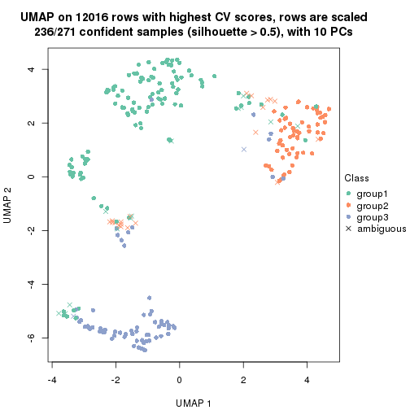</p>

</div>
<div id='tab-CV-mclust-dimension-reduction-3'>
<pre><code class="r">dimension_reduction(res, k = 4, method = &quot;UMAP&quot;)
</code></pre>

<p></p>

</div>
<div id='tab-CV-mclust-dimension-reduction-4'>
<pre><code class="r">dimension_reduction(res, k = 5, method = &quot;UMAP&quot;)
</code></pre>

<p></p>

</div>
<div id='tab-CV-mclust-dimension-reduction-5'>
<pre><code class="r">dimension_reduction(res, k = 6, method = &quot;UMAP&quot;)
</code></pre>

<p></p>

</div>
</div>


Following heatmap shows how subgroups are split when increasing `k`:

```r
collect_classes(res)
```


Test correlation between subgroups and known annotations. If the known
annotation is numeric, one-way ANOVA test is applied, and if the known
annotation is discrete, chi-squared contingency table test is applied.

```r
test_to_known_factors(res)
```

```
#>             n Hours(p) Media(p) State(p) k
#> CV:mclust 266 4.35e-23 4.90e-24 9.22e-31 2
#> CV:mclust 236 3.63e-22 7.03e-21 2.10e-62 3
#> CV:mclust 226 2.33e-33 3.40e-26 1.53e-65 4
#> CV:mclust 217 3.91e-30 5.71e-20 1.52e-50 5
#> CV:mclust 194 6.43e-32 1.84e-22 3.05e-48 6
```


If matrix rows can be associated to genes, consider to use `GO_Enrichment(res,
...)` to perform function enrichment for the signature genes.


 

---------------------------------------------------


### CV:NMF*


The object with results only for a single top-value method and a single partition method 
can be extracted as:

```r
res = res_list["CV", "NMF"]
# you can also extract it by
# res = res_list["CV:NMF"]
```

A summary of `res` and all the functions that can be applied to it:

```r
res
```

```
#> A 'ConsensusPartition' object with k = 2, 3, 4, 5, 6.
#>   On a matrix with 12016 rows and 271 columns.
#>   Top rows (1000, 2000, 3000, 4000, 5000) are extracted by 'CV' method.
#>   Subgroups are detected by 'NMF' method.
#>   Performed in total 1250 partitions by row resampling.
#>   Best k for subgroups seems to be 3.
#> 
#> Following methods can be applied to this 'ConsensusPartition' object:
#>  [1] "cola_report"             "collect_classes"         "collect_plots"          
#>  [4] "collect_stats"           "colnames"                "compare_signatures"     
#>  [7] "consensus_heatmap"       "dimension_reduction"     "functional_enrichment"  
#> [10] "get_anno_col"            "get_anno"                "get_classes"            
#> [13] "get_consensus"           "get_matrix"              "get_membership"         
#> [16] "get_param"               "get_signatures"          "get_stats"              
#> [19] "is_best_k"               "is_stable_k"             "membership_heatmap"     
#> [22] "ncol"                    "nrow"                    "plot_ecdf"              
#> [25] "rownames"                "select_partition_number" "show"                   
#> [28] "suggest_best_k"          "test_to_known_factors"
```

`collect_plots()` function collects all the plots made from `res` for all `k` (number of partitions)
into one single page to provide an easy and fast comparison between different `k`.

```r
collect_plots(res)
```


The plots are:

- The first row: a plot of the ECDF (Empirical cumulative distribution
  function) curves of the consensus matrix for each `k` and the heatmap of
  predicted classes for each `k`.
- The second row: heatmaps of the consensus matrix for each `k`.
- The third row: heatmaps of the membership matrix for each `k`.
- The fouth row: heatmaps of the signatures for each `k`.

All the plots in panels can be made by individual functions and they are
plotted later in this section.

`select_partition_number()` produces several plots showing different
statistics for choosing "optimized" `k`. There are following statistics:

- ECDF curves of the consensus matrix for each `k`;
- 1-PAC. [The PAC
  score](https://en.wikipedia.org/wiki/Consensus_clustering#Over-interpretation_potential_of_consensus_clustering)
  measures the proportion of the ambiguous subgrouping.
- Mean silhouette score.
- Concordance. The mean probability of fiting the consensus class ids in all
  partitions.
- Area increased. Denote $A_k$ as the area under the ECDF curve for current
  `k`, the area increased is defined as $A_k - A_{k-1}$.
- Rand index. The percent of pairs of samples that are both in a same cluster
  or both are not in a same cluster in the partition of k and k-1.
- Jaccard index. The ratio of pairs of samples are both in a same cluster in
  the partition of k and k-1 and the pairs of samples are both in a same
  cluster in the partition k or k-1.

The detailed explanations of these statistics can be found in [the cola
vignette](http://bioconductor.org/packages/devel/bioc/vignettes/cola/inst/doc/cola.html#toc_13).

Generally speaking, lower PAC score, higher mean silhouette score or higher
concordance corresponds to better partition. Rand index and Jaccard index
measure how similar the current partition is compared to partition with `k-1`.
If they are too similar, we won't accept `k` is better than `k-1`.

```r
select_partition_number(res)
```


The numeric values for all these statistics can be obtained by `get_stats()`.

```r
get_stats(res)
```

```
#>   k 1-PAC mean_silhouette concordance area_increased  Rand Jaccard
#> 2 2 0.283           0.457       0.676         0.4487 0.498   0.498
#> 3 3 0.925           0.927       0.971         0.4244 0.795   0.613
#> 4 4 0.805           0.861       0.919         0.1357 0.850   0.618
#> 5 5 0.691           0.675       0.804         0.0757 0.946   0.810
#> 6 6 0.686           0.617       0.761         0.0540 0.920   0.681
```

`suggest_best_k()` suggests the best $k$ based on these statistics. The rules are as follows:

- All $k$ with Jaccard index larger than 0.95 are removed because the increase of
  the partition number does not provides enough extra information. If all $k$ are removed,
  the best $k$ is assigned by `NA`.
- For $k$ with 1-PAC larger than 0.9, the maximal $k$ is taken as the "best k". Other $k$ is called "optional k".
- If it does not fit the second rule. The $k$ with the highest vote of highest
  1-PAC, mean silhouette and concordance is taken as the "best k".

```r
suggest_best_k(res)
```

```
#> [1] 3
```


Following shows the table of the partitions (You need to click the **show/hide
code output** link to see it). The membership matrix (columns with name `p*`)
is inferred by
[`clue::cl_consensus()`](https://www.rdocumentation.org/link/cl_consensus?package=clue)
function with the `SE` method. Basically the value in the membership matrix
represents the probability to belong to a certain group. The finall class
label for an item is determined with the group with highest probability it
belongs to.

In `get_classes()` function, the entropy is calculated from the membership
matrix and the silhouette score is calculated from the consensus matrix.


<script>
$( function() {
	$( '#tabs-CV-NMF-get-classes' ).tabs();
} );
</script>
<div id='tabs-CV-NMF-get-classes'>
<ul>
<li><a href='#tab-CV-NMF-get-classes-1'>k = 2</a></li>
<li><a href='#tab-CV-NMF-get-classes-2'>k = 3</a></li>
<li><a href='#tab-CV-NMF-get-classes-3'>k = 4</a></li>
<li><a href='#tab-CV-NMF-get-classes-4'>k = 5</a></li>
<li><a href='#tab-CV-NMF-get-classes-5'>k = 6</a></li>
</ul>

<div id='tab-CV-NMF-get-classes-1'>
<p><a id='tab-CV-NMF-get-classes-1-a' style='color:#0366d6' href='#'>show/hide code output</a></p>
<pre><code class="r">cbind(get_classes(res, k = 2), get_membership(res, k = 2))
</code></pre>

<pre><code>#&gt;            class entropy silhouette    p1    p2
#&gt; T0_CT_A01      1  0.9996     0.0328 0.512 0.488
#&gt; T0_CT_A03      1  0.9996     0.0328 0.512 0.488
#&gt; T0_CT_A05      1  0.9996     0.0328 0.512 0.488
#&gt; T0_CT_A06      1  0.9996     0.0328 0.512 0.488
#&gt; T0_CT_A07      1  0.9996     0.0328 0.512 0.488
#&gt; T0_CT_A08      1  0.8763     0.5372 0.704 0.296
#&gt; T0_CT_A10      1  0.9996     0.0328 0.512 0.488
#&gt; T0_CT_A11      1  0.9988     0.0364 0.520 0.480
#&gt; T0_CT_B01      2  0.1633     0.7589 0.024 0.976
#&gt; T0_CT_B03      1  0.9996     0.0328 0.512 0.488
#&gt; T0_CT_B05      1  0.9358     0.4933 0.648 0.352
#&gt; T0_CT_B07      1  0.9209     0.3286 0.664 0.336
#&gt; T0_CT_B08      1  0.9996     0.0328 0.512 0.488
#&gt; T0_CT_B09      1  0.9996     0.0328 0.512 0.488
#&gt; T0_CT_C02      1  0.9996     0.0328 0.512 0.488
#&gt; T0_CT_C03      1  0.8763     0.5372 0.704 0.296
#&gt; T0_CT_C05      2  0.5178     0.6379 0.116 0.884
#&gt; T0_CT_C06      2  0.9963    -0.1940 0.464 0.536
#&gt; T0_CT_C07      1  0.9993     0.0205 0.516 0.484
#&gt; T0_CT_C08      1  0.9996     0.0328 0.512 0.488
#&gt; T0_CT_C09      2  0.9522     0.2542 0.372 0.628
#&gt; T0_CT_C11      2  0.0938     0.7718 0.012 0.988
#&gt; T0_CT_C12      1  0.9996     0.0328 0.512 0.488
#&gt; T0_CT_D01      2  0.8763     0.3692 0.296 0.704
#&gt; T0_CT_D02      1  0.5737     0.3486 0.864 0.136
#&gt; T0_CT_D03      1  0.9996     0.0328 0.512 0.488
#&gt; T0_CT_D05      2  0.1843     0.7539 0.028 0.972
#&gt; T0_CT_D06      1  0.9996     0.0328 0.512 0.488
#&gt; T0_CT_D07      2  0.8661     0.3941 0.288 0.712
#&gt; T0_CT_D08      1  0.9996     0.0328 0.512 0.488
#&gt; T0_CT_D09      2  0.8207     0.4292 0.256 0.744
#&gt; T0_CT_D11      2  0.6247     0.5804 0.156 0.844
#&gt; T0_CT_D12      1  0.9996     0.0328 0.512 0.488
#&gt; T0_CT_E01      1  0.9996     0.0328 0.512 0.488
#&gt; T0_CT_E03      1  0.9996     0.0328 0.512 0.488
#&gt; T0_CT_E04      2  0.7376     0.5016 0.208 0.792
#&gt; T0_CT_E05      1  0.9460     0.4795 0.636 0.364
#&gt; T0_CT_E06      1  0.9996     0.0328 0.512 0.488
#&gt; T0_CT_E07      1  0.9996     0.0328 0.512 0.488
#&gt; T0_CT_E08      1  0.9996     0.0328 0.512 0.488
#&gt; T0_CT_E09      2  0.9988     0.0320 0.480 0.520
#&gt; T0_CT_E10      2  0.8267     0.4231 0.260 0.740
#&gt; T0_CT_E11      1  0.9996     0.0328 0.512 0.488
#&gt; T0_CT_E12      1  0.9996     0.0328 0.512 0.488
#&gt; T0_CT_F01      1  0.9996     0.0328 0.512 0.488
#&gt; T0_CT_F02      1  0.9996     0.0328 0.512 0.488
#&gt; T0_CT_F03      1  0.9996     0.0328 0.512 0.488
#&gt; T0_CT_F04      1  0.9996     0.0328 0.512 0.488
#&gt; T0_CT_F05      2  0.8763     0.3692 0.296 0.704
#&gt; T0_CT_F06      1  0.9996     0.0328 0.512 0.488
#&gt; T0_CT_F07      2  0.7299     0.5304 0.204 0.796
#&gt; T0_CT_F09      2  0.4431     0.6714 0.092 0.908
#&gt; T0_CT_F11      1  0.9996     0.0328 0.512 0.488
#&gt; T0_CT_F12      1  0.9996     0.0328 0.512 0.488
#&gt; T0_CT_G01      1  0.9996     0.0328 0.512 0.488
#&gt; T0_CT_G02      1  0.9815     0.4132 0.580 0.420
#&gt; T0_CT_G03      1  0.9996     0.0328 0.512 0.488
#&gt; T0_CT_G04      1  0.9996     0.0328 0.512 0.488
#&gt; T0_CT_G07      1  0.9996     0.0328 0.512 0.488
#&gt; T0_CT_G08      1  0.9996     0.0328 0.512 0.488
#&gt; T0_CT_G09      1  0.9170     0.5124 0.668 0.332
#&gt; T0_CT_G11      2  0.8713     0.2963 0.292 0.708
#&gt; T0_CT_H01      2  0.6438     0.5424 0.164 0.836
#&gt; T0_CT_H02      2  0.6148     0.5863 0.152 0.848
#&gt; T0_CT_H04      1  0.9996     0.0328 0.512 0.488
#&gt; T0_CT_H05      2  0.6973     0.5005 0.188 0.812
#&gt; T0_CT_H08      2  0.8608     0.3870 0.284 0.716
#&gt; T0_CT_H09      2  0.0000     0.7849 0.000 1.000
#&gt; T0_CT_H12      1  0.9580     0.4213 0.620 0.380
#&gt; T24_CT_A01     1  0.9129     0.5161 0.672 0.328
#&gt; T24_CT_A03     2  0.0000     0.7849 0.000 1.000
#&gt; T24_CT_A04     2  0.0376     0.7806 0.004 0.996
#&gt; T24_CT_A05     1  0.9996     0.0328 0.512 0.488
#&gt; T24_CT_A07     2  0.0000     0.7849 0.000 1.000
#&gt; T24_CT_A08     1  0.8763     0.5372 0.704 0.296
#&gt; T24_CT_A09     1  0.9000     0.5253 0.684 0.316
#&gt; T24_CT_A10     1  0.9881     0.3679 0.564 0.436
#&gt; T24_CT_B01     1  0.9522     0.4694 0.628 0.372
#&gt; T24_CT_B02     1  0.8909     0.5305 0.692 0.308
#&gt; T24_CT_B03     2  0.0376     0.7808 0.004 0.996
#&gt; T24_CT_B05     2  0.0000     0.7849 0.000 1.000
#&gt; T24_CT_B06     2  0.0000     0.7849 0.000 1.000
#&gt; T24_CT_B07     1  0.8763     0.5372 0.704 0.296
#&gt; T24_CT_B08     2  0.0000     0.7849 0.000 1.000
#&gt; T24_CT_B09     1  0.8763     0.5372 0.704 0.296
#&gt; T24_CT_B11     1  0.9996     0.0328 0.512 0.488
#&gt; T24_CT_C01     1  0.8763     0.5372 0.704 0.296
#&gt; T24_CT_C02     2  0.0000     0.7849 0.000 1.000
#&gt; T24_CT_C03     1  0.8909     0.5306 0.692 0.308
#&gt; T24_CT_C05     2  0.0000     0.7849 0.000 1.000
#&gt; T24_CT_C07     2  0.0000     0.7849 0.000 1.000
#&gt; T24_CT_C08     2  0.0000     0.7849 0.000 1.000
#&gt; T24_CT_C09     2  0.0000     0.7849 0.000 1.000
#&gt; T24_CT_C10     1  0.8763     0.5372 0.704 0.296
#&gt; T24_CT_C11     2  0.9896    -0.1257 0.440 0.560
#&gt; T24_CT_C12     2  0.0000     0.7849 0.000 1.000
#&gt; T24_CT_D01     2  0.0000     0.7849 0.000 1.000
#&gt; T24_CT_D02     2  0.0000     0.7849 0.000 1.000
#&gt; T24_CT_D03     2  0.0000     0.7849 0.000 1.000
#&gt; T24_CT_D04     1  0.8763     0.5372 0.704 0.296
#&gt; T24_CT_D05     2  0.9998    -0.2221 0.492 0.508
#&gt; T24_CT_D06     1  0.9209     0.5089 0.664 0.336
#&gt; T24_CT_D07     1  0.9998     0.2484 0.508 0.492
#&gt; T24_CT_D08     2  0.0000     0.7849 0.000 1.000
#&gt; T24_CT_D09     2  0.0000     0.7849 0.000 1.000
#&gt; T24_CT_D10     2  0.0376     0.7806 0.004 0.996
#&gt; T24_CT_D11     2  0.0000     0.7849 0.000 1.000
#&gt; T24_CT_E01     1  0.9427     0.4842 0.640 0.360
#&gt; T24_CT_E02     1  0.8763     0.5372 0.704 0.296
#&gt; T24_CT_E04     2  0.0000     0.7849 0.000 1.000
#&gt; T24_CT_E05     1  0.8763     0.5372 0.704 0.296
#&gt; T24_CT_E07     2  0.9996    -0.2127 0.488 0.512
#&gt; T24_CT_E09     1  0.8763     0.5372 0.704 0.296
#&gt; T24_CT_E11     1  0.8763     0.5372 0.704 0.296
#&gt; T24_CT_E12     2  0.0000     0.7849 0.000 1.000
#&gt; T24_CT_F01     2  0.0000     0.7849 0.000 1.000
#&gt; T24_CT_F02     2  0.0000     0.7849 0.000 1.000
#&gt; T24_CT_F03     1  0.9044     0.5224 0.680 0.320
#&gt; T24_CT_F04     1  0.9580     0.4585 0.620 0.380
#&gt; T24_CT_F05     1  0.9358     0.4932 0.648 0.352
#&gt; T24_CT_F07     1  0.9323     0.4971 0.652 0.348
#&gt; T24_CT_F08     1  0.8763     0.5372 0.704 0.296
#&gt; T24_CT_F09     2  0.0000     0.7849 0.000 1.000
#&gt; T24_CT_F10     2  0.9522     0.0449 0.372 0.628
#&gt; T24_CT_F11     2  0.9998    -0.2221 0.492 0.508
#&gt; T24_CT_F12     2  0.9580     0.2407 0.380 0.620
#&gt; T24_CT_G01     2  0.0000     0.7849 0.000 1.000
#&gt; T24_CT_G02     1  0.8763     0.5372 0.704 0.296
#&gt; T24_CT_G03     1  0.8763     0.5372 0.704 0.296
#&gt; T24_CT_G04     2  0.0000     0.7849 0.000 1.000
#&gt; T24_CT_G05     2  0.0000     0.7849 0.000 1.000
#&gt; T24_CT_G06     1  0.8763     0.5372 0.704 0.296
#&gt; T24_CT_G08     1  0.8813     0.5351 0.700 0.300
#&gt; T24_CT_G10     2  0.0000     0.7849 0.000 1.000
#&gt; T24_CT_G11     1  0.8763     0.5372 0.704 0.296
#&gt; T24_CT_G12     1  0.9087     0.5193 0.676 0.324
#&gt; T24_CT_H01     1  0.9996     0.0328 0.512 0.488
#&gt; T24_CT_H02     1  0.9044     0.5224 0.680 0.320
#&gt; T24_CT_H03     2  0.0000     0.7849 0.000 1.000
#&gt; T24_CT_H05     1  0.9795     0.4030 0.584 0.416
#&gt; T24_CT_H07     1  0.9358     0.4934 0.648 0.352
#&gt; T24_CT_H09     1  0.8763     0.5372 0.704 0.296
#&gt; T24_CT_H12     1  0.8955     0.5280 0.688 0.312
#&gt; T48_CT_A01     2  0.0000     0.7849 0.000 1.000
#&gt; T48_CT_A02     2  0.0000     0.7849 0.000 1.000
#&gt; T48_CT_A03     1  0.8763     0.5372 0.704 0.296
#&gt; T48_CT_A04     2  0.0000     0.7849 0.000 1.000
#&gt; T48_CT_A05     2  0.7528     0.4389 0.216 0.784
#&gt; T48_CT_A06     1  0.8763     0.5372 0.704 0.296
#&gt; T48_CT_A07     1  0.9996     0.0328 0.512 0.488
#&gt; T48_CT_A08     2  0.0000     0.7849 0.000 1.000
#&gt; T48_CT_A09     1  0.9087     0.5192 0.676 0.324
#&gt; T48_CT_A10     2  0.0000     0.7849 0.000 1.000
#&gt; T48_CT_A11     2  0.0000     0.7849 0.000 1.000
#&gt; T48_CT_A12     1  0.9044     0.5224 0.680 0.320
#&gt; T48_CT_B01     2  0.0000     0.7849 0.000 1.000
#&gt; T48_CT_B02     2  0.0000     0.7849 0.000 1.000
#&gt; T48_CT_B03     1  0.8763     0.5372 0.704 0.296
#&gt; T48_CT_B04     1  0.8763     0.5372 0.704 0.296
#&gt; T48_CT_B06     2  0.0000     0.7849 0.000 1.000
#&gt; T48_CT_B08     1  0.8763     0.5372 0.704 0.296
#&gt; T48_CT_B10     2  0.0000     0.7849 0.000 1.000
#&gt; T48_CT_B11     2  0.0000     0.7849 0.000 1.000
#&gt; T48_CT_B12     2  0.9996    -0.2127 0.488 0.512
#&gt; T48_CT_C01     2  0.0000     0.7849 0.000 1.000
#&gt; T48_CT_C02     1  0.8763     0.5372 0.704 0.296
#&gt; T48_CT_C03     2  0.0000     0.7849 0.000 1.000
#&gt; T48_CT_C04     1  0.8763     0.5372 0.704 0.296
#&gt; T48_CT_C05     2  0.4431     0.6649 0.092 0.908
#&gt; T48_CT_C06     2  0.0000     0.7849 0.000 1.000
#&gt; T48_CT_C07     2  0.9996    -0.2127 0.488 0.512
#&gt; T48_CT_C09     2  0.6343     0.5743 0.160 0.840
#&gt; T48_CT_C10     1  0.8763     0.5372 0.704 0.296
#&gt; T48_CT_C11     2  0.0000     0.7849 0.000 1.000
#&gt; T48_CT_D01     2  0.6712     0.5201 0.176 0.824
#&gt; T48_CT_D02     1  0.9922     0.3451 0.552 0.448
#&gt; T48_CT_D03     1  0.8763     0.5372 0.704 0.296
#&gt; T48_CT_D04     2  0.8081     0.3707 0.248 0.752
#&gt; T48_CT_D06     2  0.0000     0.7849 0.000 1.000
#&gt; T48_CT_D07     2  0.0000     0.7849 0.000 1.000
#&gt; T48_CT_D08     1  0.8861     0.5329 0.696 0.304
#&gt; T48_CT_D09     2  0.0000     0.7849 0.000 1.000
#&gt; T48_CT_D10     2  0.9996    -0.2127 0.488 0.512
#&gt; T48_CT_D11     2  0.2043     0.7476 0.032 0.968
#&gt; T48_CT_D12     1  0.8763     0.5372 0.704 0.296
#&gt; T48_CT_E01     2  0.9754    -0.0507 0.408 0.592
#&gt; T48_CT_E02     1  0.9977     0.2945 0.528 0.472
#&gt; T48_CT_E03     2  0.0000     0.7849 0.000 1.000
#&gt; T48_CT_E04     2  0.9993    -0.2063 0.484 0.516
#&gt; T48_CT_E05     2  0.0000     0.7849 0.000 1.000
#&gt; T48_CT_E06     1  0.8763     0.5372 0.704 0.296
#&gt; T48_CT_E07     1  0.8763     0.5372 0.704 0.296
#&gt; T48_CT_E08     2  0.0000     0.7849 0.000 1.000
#&gt; T48_CT_E10     1  0.8763     0.5372 0.704 0.296
#&gt; T48_CT_E11     1  0.8763     0.5372 0.704 0.296
#&gt; T48_CT_E12     1  0.9996     0.0328 0.512 0.488
#&gt; T48_CT_F01     2  0.0000     0.7849 0.000 1.000
#&gt; T48_CT_F02     1  0.9881     0.3684 0.564 0.436
#&gt; T48_CT_F03     1  0.9460     0.4797 0.636 0.364
#&gt; T48_CT_F05     2  0.2778     0.7280 0.048 0.952
#&gt; T48_CT_F07     1  0.9661     0.4406 0.608 0.392
#&gt; T48_CT_F09     2  0.0000     0.7849 0.000 1.000
#&gt; T48_CT_F10     1  0.9933     0.3369 0.548 0.452
#&gt; T48_CT_F11     1  0.8763     0.5372 0.704 0.296
#&gt; T48_CT_G01     1  0.8081     0.5111 0.752 0.248
#&gt; T48_CT_G02     2  0.0000     0.7849 0.000 1.000
#&gt; T48_CT_G03     2  0.0000     0.7849 0.000 1.000
#&gt; T48_CT_G07     2  0.0000     0.7849 0.000 1.000
#&gt; T48_CT_G08     2  0.0000     0.7849 0.000 1.000
#&gt; T48_CT_G09     2  0.1184     0.7680 0.016 0.984
#&gt; T48_CT_G10     1  0.8499     0.1897 0.724 0.276
#&gt; T48_CT_G11     1  0.9460     0.4794 0.636 0.364
#&gt; T48_CT_G12     2  0.0000     0.7849 0.000 1.000
#&gt; T48_CT_H01     2  0.0000     0.7849 0.000 1.000
#&gt; T48_CT_H02     2  0.8386     0.3214 0.268 0.732
#&gt; T48_CT_H04     1  0.8763     0.5372 0.704 0.296
#&gt; T48_CT_H05     2  0.0000     0.7849 0.000 1.000
#&gt; T48_CT_H06     2  0.0000     0.7849 0.000 1.000
#&gt; T48_CT_H07     2  0.9963    -0.1724 0.464 0.536
#&gt; T48_CT_H08     2  0.0000     0.7849 0.000 1.000
#&gt; T48_CT_H11     2  0.9996    -0.2127 0.488 0.512
#&gt; T48_CT_H12     2  0.0000     0.7849 0.000 1.000
#&gt; T72_CT_A01     2  0.0000     0.7849 0.000 1.000
#&gt; T72_CT_A05     2  0.0000     0.7849 0.000 1.000
#&gt; T72_CT_A08     1  0.9323     0.4975 0.652 0.348
#&gt; T72_CT_A09     2  0.0000     0.7849 0.000 1.000
#&gt; T72_CT_A11     2  0.0000     0.7849 0.000 1.000
#&gt; T72_CT_B01     2  0.0000     0.7849 0.000 1.000
#&gt; T72_CT_B02     1  0.8763     0.5372 0.704 0.296
#&gt; T72_CT_B03     1  1.0000     0.2396 0.504 0.496
#&gt; T72_CT_B04     1  0.8763     0.5372 0.704 0.296
#&gt; T72_CT_B05     2  0.9988    -0.2000 0.480 0.520
#&gt; T72_CT_B06     1  0.8763     0.5372 0.704 0.296
#&gt; T72_CT_B08     2  0.9170     0.3181 0.332 0.668
#&gt; T72_CT_B09     1  0.8763     0.5372 0.704 0.296
#&gt; T72_CT_B11     1  0.9710     0.4286 0.600 0.400
#&gt; T72_CT_B12     2  0.0000     0.7849 0.000 1.000
#&gt; T72_CT_C04     2  0.0000     0.7849 0.000 1.000
#&gt; T72_CT_C06     2  0.9996    -0.2127 0.488 0.512
#&gt; T72_CT_C07     2  0.0000     0.7849 0.000 1.000
#&gt; T72_CT_C09     2  0.9996    -0.2127 0.488 0.512
#&gt; T72_CT_C11     2  0.9795     0.1727 0.416 0.584
#&gt; T72_CT_D01     2  0.0000     0.7849 0.000 1.000
#&gt; T72_CT_D03     1  0.9815     0.3832 0.580 0.420
#&gt; T72_CT_D04     2  0.0000     0.7849 0.000 1.000
#&gt; T72_CT_D05     1  0.9393     0.4888 0.644 0.356
#&gt; T72_CT_D07     1  0.9954     0.3201 0.540 0.460
#&gt; T72_CT_D10     2  0.9988    -0.1999 0.480 0.520
#&gt; T72_CT_D11     1  0.8763     0.5372 0.704 0.296
#&gt; T72_CT_E04     1  0.9850     0.3795 0.572 0.428
#&gt; T72_CT_E05     2  0.0000     0.7849 0.000 1.000
#&gt; T72_CT_E07     2  0.8207     0.3518 0.256 0.744
#&gt; T72_CT_F01     2  0.0000     0.7849 0.000 1.000
#&gt; T72_CT_F05     2  0.0000     0.7849 0.000 1.000
#&gt; T72_CT_F07     1  0.9522     0.4690 0.628 0.372
#&gt; T72_CT_F10     2  0.0000     0.7849 0.000 1.000
#&gt; T72_CT_F11     2  0.4690     0.6602 0.100 0.900
#&gt; T72_CT_G03     1  0.8763     0.5372 0.704 0.296
#&gt; T72_CT_G04     1  0.8763     0.5372 0.704 0.296
#&gt; T72_CT_G06     2  0.5408     0.6269 0.124 0.876
#&gt; T72_CT_G08     2  0.2948     0.7232 0.052 0.948
#&gt; T72_CT_G10     2  0.0000     0.7849 0.000 1.000
#&gt; T72_CT_G11     1  0.9795     0.4031 0.584 0.416
#&gt; T72_CT_H01     2  0.0000     0.7849 0.000 1.000
#&gt; T72_CT_H03     2  0.0000     0.7849 0.000 1.000
#&gt; T72_CT_H05     1  0.9996     0.0328 0.512 0.488
#&gt; T72_CT_H08     1  0.9996     0.0328 0.512 0.488
#&gt; T72_CT_H09     1  0.9996     0.0328 0.512 0.488
#&gt; T72_CT_H10     2  0.9996    -0.2127 0.488 0.512
#&gt; T72_CT_H11     1  0.9896     0.3606 0.560 0.440
#&gt; T72_CT_H12     2  0.0000     0.7849 0.000 1.000
</code></pre>

<script>
$('#tab-CV-NMF-get-classes-1-a').parent().next().next().hide();
$('#tab-CV-NMF-get-classes-1-a').click(function(){
  $('#tab-CV-NMF-get-classes-1-a').parent().next().next().toggle();
  return(false);
});
</script>
</div>

<div id='tab-CV-NMF-get-classes-2'>
<p><a id='tab-CV-NMF-get-classes-2-a' style='color:#0366d6' href='#'>show/hide code output</a></p>
<pre><code class="r">cbind(get_classes(res, k = 3), get_membership(res, k = 3))
</code></pre>

<pre><code>#&gt;            class entropy silhouette    p1    p2    p3
#&gt; T0_CT_A01      3  0.0000     0.9635 0.000 0.000 1.000
#&gt; T0_CT_A03      3  0.0000     0.9635 0.000 0.000 1.000
#&gt; T0_CT_A05      3  0.0000     0.9635 0.000 0.000 1.000
#&gt; T0_CT_A06      3  0.0000     0.9635 0.000 0.000 1.000
#&gt; T0_CT_A07      3  0.0000     0.9635 0.000 0.000 1.000
#&gt; T0_CT_A08      1  0.0000     0.9557 1.000 0.000 0.000
#&gt; T0_CT_A10      3  0.0000     0.9635 0.000 0.000 1.000
#&gt; T0_CT_A11      3  0.0000     0.9635 0.000 0.000 1.000
#&gt; T0_CT_B01      2  0.0237     0.9739 0.000 0.996 0.004
#&gt; T0_CT_B03      3  0.0000     0.9635 0.000 0.000 1.000
#&gt; T0_CT_B05      1  0.2356     0.8940 0.928 0.072 0.000
#&gt; T0_CT_B07      3  0.7835     0.0795 0.456 0.052 0.492
#&gt; T0_CT_B08      3  0.0000     0.9635 0.000 0.000 1.000
#&gt; T0_CT_B09      3  0.0000     0.9635 0.000 0.000 1.000
#&gt; T0_CT_C02      3  0.0000     0.9635 0.000 0.000 1.000
#&gt; T0_CT_C03      1  0.0000     0.9557 1.000 0.000 0.000
#&gt; T0_CT_C05      2  0.0000     0.9772 0.000 1.000 0.000
#&gt; T0_CT_C06      1  0.6154     0.3483 0.592 0.408 0.000
#&gt; T0_CT_C07      3  0.0000     0.9635 0.000 0.000 1.000
#&gt; T0_CT_C08      3  0.0000     0.9635 0.000 0.000 1.000
#&gt; T0_CT_C09      3  0.0000     0.9635 0.000 0.000 1.000
#&gt; T0_CT_C11      2  0.0000     0.9772 0.000 1.000 0.000
#&gt; T0_CT_C12      3  0.0000     0.9635 0.000 0.000 1.000
#&gt; T0_CT_D01      2  0.3879     0.8117 0.000 0.848 0.152
#&gt; T0_CT_D02      3  0.5859     0.4697 0.344 0.000 0.656
#&gt; T0_CT_D03      3  0.0000     0.9635 0.000 0.000 1.000
#&gt; T0_CT_D05      2  0.0237     0.9737 0.004 0.996 0.000
#&gt; T0_CT_D06      3  0.0000     0.9635 0.000 0.000 1.000
#&gt; T0_CT_D07      3  0.6095     0.3529 0.000 0.392 0.608
#&gt; T0_CT_D08      3  0.0000     0.9635 0.000 0.000 1.000
#&gt; T0_CT_D09      2  0.0000     0.9772 0.000 1.000 0.000
#&gt; T0_CT_D11      2  0.0000     0.9772 0.000 1.000 0.000
#&gt; T0_CT_D12      3  0.0000     0.9635 0.000 0.000 1.000
#&gt; T0_CT_E01      3  0.0000     0.9635 0.000 0.000 1.000
#&gt; T0_CT_E03      3  0.0000     0.9635 0.000 0.000 1.000
#&gt; T0_CT_E04      2  0.0000     0.9772 0.000 1.000 0.000
#&gt; T0_CT_E05      1  0.0747     0.9440 0.984 0.016 0.000
#&gt; T0_CT_E06      3  0.0000     0.9635 0.000 0.000 1.000
#&gt; T0_CT_E07      3  0.0000     0.9635 0.000 0.000 1.000
#&gt; T0_CT_E08      3  0.0000     0.9635 0.000 0.000 1.000
#&gt; T0_CT_E09      3  0.0000     0.9635 0.000 0.000 1.000
#&gt; T0_CT_E10      3  0.6192     0.2749 0.000 0.420 0.580
#&gt; T0_CT_E11      3  0.0000     0.9635 0.000 0.000 1.000
#&gt; T0_CT_E12      3  0.0000     0.9635 0.000 0.000 1.000
#&gt; T0_CT_F01      3  0.0000     0.9635 0.000 0.000 1.000
#&gt; T0_CT_F02      3  0.0000     0.9635 0.000 0.000 1.000
#&gt; T0_CT_F03      3  0.0000     0.9635 0.000 0.000 1.000
#&gt; T0_CT_F04      3  0.0000     0.9635 0.000 0.000 1.000
#&gt; T0_CT_F05      2  0.6291     0.1045 0.000 0.532 0.468
#&gt; T0_CT_F06      3  0.0000     0.9635 0.000 0.000 1.000
#&gt; T0_CT_F07      1  0.7759     0.0602 0.480 0.472 0.048
#&gt; T0_CT_F09      2  0.0000     0.9772 0.000 1.000 0.000
#&gt; T0_CT_F11      3  0.0000     0.9635 0.000 0.000 1.000
#&gt; T0_CT_F12      3  0.0000     0.9635 0.000 0.000 1.000
#&gt; T0_CT_G01      3  0.0000     0.9635 0.000 0.000 1.000
#&gt; T0_CT_G02      1  0.4452     0.7568 0.808 0.192 0.000
#&gt; T0_CT_G03      3  0.0000     0.9635 0.000 0.000 1.000
#&gt; T0_CT_G04      3  0.0000     0.9635 0.000 0.000 1.000
#&gt; T0_CT_G07      3  0.0000     0.9635 0.000 0.000 1.000
#&gt; T0_CT_G08      3  0.0000     0.9635 0.000 0.000 1.000
#&gt; T0_CT_G09      1  0.0000     0.9557 1.000 0.000 0.000
#&gt; T0_CT_G11      2  0.6824     0.2558 0.408 0.576 0.016
#&gt; T0_CT_H01      2  0.0592     0.9664 0.012 0.988 0.000
#&gt; T0_CT_H02      2  0.0000     0.9772 0.000 1.000 0.000
#&gt; T0_CT_H04      3  0.0000     0.9635 0.000 0.000 1.000
#&gt; T0_CT_H05      2  0.3532     0.8604 0.108 0.884 0.008
#&gt; T0_CT_H08      2  0.5327     0.6217 0.000 0.728 0.272
#&gt; T0_CT_H09      2  0.0000     0.9772 0.000 1.000 0.000
#&gt; T0_CT_H12      1  0.4897     0.7579 0.812 0.016 0.172
#&gt; T24_CT_A01     1  0.0000     0.9557 1.000 0.000 0.000
#&gt; T24_CT_A03     2  0.0000     0.9772 0.000 1.000 0.000
#&gt; T24_CT_A04     2  0.0000     0.9772 0.000 1.000 0.000
#&gt; T24_CT_A05     3  0.0000     0.9635 0.000 0.000 1.000
#&gt; T24_CT_A07     2  0.0000     0.9772 0.000 1.000 0.000
#&gt; T24_CT_A08     1  0.0000     0.9557 1.000 0.000 0.000
#&gt; T24_CT_A09     1  0.0000     0.9557 1.000 0.000 0.000
#&gt; T24_CT_A10     1  0.0000     0.9557 1.000 0.000 0.000
#&gt; T24_CT_B01     1  0.0000     0.9557 1.000 0.000 0.000
#&gt; T24_CT_B02     1  0.0000     0.9557 1.000 0.000 0.000
#&gt; T24_CT_B03     2  0.0000     0.9772 0.000 1.000 0.000
#&gt; T24_CT_B05     2  0.0000     0.9772 0.000 1.000 0.000
#&gt; T24_CT_B06     2  0.0000     0.9772 0.000 1.000 0.000
#&gt; T24_CT_B07     1  0.0000     0.9557 1.000 0.000 0.000
#&gt; T24_CT_B08     2  0.0000     0.9772 0.000 1.000 0.000
#&gt; T24_CT_B09     1  0.0000     0.9557 1.000 0.000 0.000
#&gt; T24_CT_B11     3  0.0000     0.9635 0.000 0.000 1.000
#&gt; T24_CT_C01     1  0.0000     0.9557 1.000 0.000 0.000
#&gt; T24_CT_C02     2  0.0000     0.9772 0.000 1.000 0.000
#&gt; T24_CT_C03     1  0.0000     0.9557 1.000 0.000 0.000
#&gt; T24_CT_C05     2  0.0000     0.9772 0.000 1.000 0.000
#&gt; T24_CT_C07     2  0.0000     0.9772 0.000 1.000 0.000
#&gt; T24_CT_C08     2  0.0000     0.9772 0.000 1.000 0.000
#&gt; T24_CT_C09     2  0.0000     0.9772 0.000 1.000 0.000
#&gt; T24_CT_C10     1  0.0000     0.9557 1.000 0.000 0.000
#&gt; T24_CT_C11     2  0.0747     0.9627 0.016 0.984 0.000
#&gt; T24_CT_C12     2  0.0000     0.9772 0.000 1.000 0.000
#&gt; T24_CT_D01     2  0.0000     0.9772 0.000 1.000 0.000
#&gt; T24_CT_D02     2  0.0000     0.9772 0.000 1.000 0.000
#&gt; T24_CT_D03     2  0.0000     0.9772 0.000 1.000 0.000
#&gt; T24_CT_D04     1  0.0000     0.9557 1.000 0.000 0.000
#&gt; T24_CT_D05     1  0.2959     0.8642 0.900 0.100 0.000
#&gt; T24_CT_D06     1  0.1031     0.9375 0.976 0.024 0.000
#&gt; T24_CT_D07     1  0.4178     0.7790 0.828 0.172 0.000
#&gt; T24_CT_D08     2  0.0000     0.9772 0.000 1.000 0.000
#&gt; T24_CT_D09     2  0.0000     0.9772 0.000 1.000 0.000
#&gt; T24_CT_D10     2  0.0000     0.9772 0.000 1.000 0.000
#&gt; T24_CT_D11     2  0.0000     0.9772 0.000 1.000 0.000
#&gt; T24_CT_E01     1  0.0000     0.9557 1.000 0.000 0.000
#&gt; T24_CT_E02     1  0.0000     0.9557 1.000 0.000 0.000
#&gt; T24_CT_E04     2  0.0000     0.9772 0.000 1.000 0.000
#&gt; T24_CT_E05     1  0.0000     0.9557 1.000 0.000 0.000
#&gt; T24_CT_E07     2  0.3752     0.8243 0.144 0.856 0.000
#&gt; T24_CT_E09     1  0.0000     0.9557 1.000 0.000 0.000
#&gt; T24_CT_E11     1  0.0000     0.9557 1.000 0.000 0.000
#&gt; T24_CT_E12     2  0.0000     0.9772 0.000 1.000 0.000
#&gt; T24_CT_F01     2  0.0000     0.9772 0.000 1.000 0.000
#&gt; T24_CT_F02     2  0.0000     0.9772 0.000 1.000 0.000
#&gt; T24_CT_F03     1  0.0000     0.9557 1.000 0.000 0.000
#&gt; T24_CT_F04     1  0.1529     0.9238 0.960 0.040 0.000
#&gt; T24_CT_F05     1  0.0000     0.9557 1.000 0.000 0.000
#&gt; T24_CT_F07     1  0.0000     0.9557 1.000 0.000 0.000
#&gt; T24_CT_F08     1  0.0000     0.9557 1.000 0.000 0.000
#&gt; T24_CT_F09     2  0.0000     0.9772 0.000 1.000 0.000
#&gt; T24_CT_F10     2  0.0424     0.9702 0.008 0.992 0.000
#&gt; T24_CT_F11     1  0.5291     0.6556 0.732 0.268 0.000
#&gt; T24_CT_F12     3  0.0237     0.9598 0.000 0.004 0.996
#&gt; T24_CT_G01     2  0.0000     0.9772 0.000 1.000 0.000
#&gt; T24_CT_G02     1  0.0000     0.9557 1.000 0.000 0.000
#&gt; T24_CT_G03     1  0.0000     0.9557 1.000 0.000 0.000
#&gt; T24_CT_G04     2  0.0000     0.9772 0.000 1.000 0.000
#&gt; T24_CT_G05     2  0.0000     0.9772 0.000 1.000 0.000
#&gt; T24_CT_G06     1  0.0000     0.9557 1.000 0.000 0.000
#&gt; T24_CT_G08     1  0.0000     0.9557 1.000 0.000 0.000
#&gt; T24_CT_G10     2  0.0000     0.9772 0.000 1.000 0.000
#&gt; T24_CT_G11     1  0.0000     0.9557 1.000 0.000 0.000
#&gt; T24_CT_G12     1  0.0000     0.9557 1.000 0.000 0.000
#&gt; T24_CT_H01     3  0.0000     0.9635 0.000 0.000 1.000
#&gt; T24_CT_H02     1  0.0000     0.9557 1.000 0.000 0.000
#&gt; T24_CT_H03     2  0.0000     0.9772 0.000 1.000 0.000
#&gt; T24_CT_H05     1  0.0747     0.9440 0.984 0.016 0.000
#&gt; T24_CT_H07     1  0.0000     0.9557 1.000 0.000 0.000
#&gt; T24_CT_H09     1  0.0000     0.9557 1.000 0.000 0.000
#&gt; T24_CT_H12     1  0.0000     0.9557 1.000 0.000 0.000
#&gt; T48_CT_A01     2  0.0000     0.9772 0.000 1.000 0.000
#&gt; T48_CT_A02     2  0.0000     0.9772 0.000 1.000 0.000
#&gt; T48_CT_A03     1  0.0000     0.9557 1.000 0.000 0.000
#&gt; T48_CT_A04     2  0.0000     0.9772 0.000 1.000 0.000
#&gt; T48_CT_A05     2  0.0000     0.9772 0.000 1.000 0.000
#&gt; T48_CT_A06     1  0.0000     0.9557 1.000 0.000 0.000
#&gt; T48_CT_A07     3  0.0000     0.9635 0.000 0.000 1.000
#&gt; T48_CT_A08     2  0.0000     0.9772 0.000 1.000 0.000
#&gt; T48_CT_A09     1  0.0000     0.9557 1.000 0.000 0.000
#&gt; T48_CT_A10     2  0.0000     0.9772 0.000 1.000 0.000
#&gt; T48_CT_A11     2  0.0000     0.9772 0.000 1.000 0.000
#&gt; T48_CT_A12     1  0.0000     0.9557 1.000 0.000 0.000
#&gt; T48_CT_B01     2  0.0000     0.9772 0.000 1.000 0.000
#&gt; T48_CT_B02     2  0.0000     0.9772 0.000 1.000 0.000
#&gt; T48_CT_B03     1  0.0000     0.9557 1.000 0.000 0.000
#&gt; T48_CT_B04     1  0.0000     0.9557 1.000 0.000 0.000
#&gt; T48_CT_B06     2  0.0000     0.9772 0.000 1.000 0.000
#&gt; T48_CT_B08     1  0.0000     0.9557 1.000 0.000 0.000
#&gt; T48_CT_B10     2  0.0000     0.9772 0.000 1.000 0.000
#&gt; T48_CT_B11     2  0.0000     0.9772 0.000 1.000 0.000
#&gt; T48_CT_B12     1  0.5926     0.4813 0.644 0.356 0.000
#&gt; T48_CT_C01     2  0.0000     0.9772 0.000 1.000 0.000
#&gt; T48_CT_C02     1  0.0000     0.9557 1.000 0.000 0.000
#&gt; T48_CT_C03     2  0.0000     0.9772 0.000 1.000 0.000
#&gt; T48_CT_C04     1  0.0000     0.9557 1.000 0.000 0.000
#&gt; T48_CT_C05     2  0.0892     0.9587 0.020 0.980 0.000
#&gt; T48_CT_C06     2  0.0000     0.9772 0.000 1.000 0.000
#&gt; T48_CT_C07     1  0.6062     0.4152 0.616 0.384 0.000
#&gt; T48_CT_C09     2  0.0000     0.9772 0.000 1.000 0.000
#&gt; T48_CT_C10     1  0.0000     0.9557 1.000 0.000 0.000
#&gt; T48_CT_C11     2  0.0000     0.9772 0.000 1.000 0.000
#&gt; T48_CT_D01     2  0.0000     0.9772 0.000 1.000 0.000
#&gt; T48_CT_D02     1  0.2448     0.8906 0.924 0.076 0.000
#&gt; T48_CT_D03     1  0.0000     0.9557 1.000 0.000 0.000
#&gt; T48_CT_D04     2  0.4002     0.8011 0.160 0.840 0.000
#&gt; T48_CT_D06     2  0.0000     0.9772 0.000 1.000 0.000
#&gt; T48_CT_D07     2  0.0000     0.9772 0.000 1.000 0.000
#&gt; T48_CT_D08     1  0.0000     0.9557 1.000 0.000 0.000
#&gt; T48_CT_D09     2  0.0000     0.9772 0.000 1.000 0.000
#&gt; T48_CT_D10     1  0.1964     0.9090 0.944 0.056 0.000
#&gt; T48_CT_D11     2  0.0000     0.9772 0.000 1.000 0.000
#&gt; T48_CT_D12     1  0.0000     0.9557 1.000 0.000 0.000
#&gt; T48_CT_E01     2  0.0000     0.9772 0.000 1.000 0.000
#&gt; T48_CT_E02     1  0.2625     0.8817 0.916 0.084 0.000
#&gt; T48_CT_E03     2  0.0000     0.9772 0.000 1.000 0.000
#&gt; T48_CT_E04     2  0.3340     0.8517 0.120 0.880 0.000
#&gt; T48_CT_E05     2  0.0000     0.9772 0.000 1.000 0.000
#&gt; T48_CT_E06     1  0.0000     0.9557 1.000 0.000 0.000
#&gt; T48_CT_E07     1  0.0000     0.9557 1.000 0.000 0.000
#&gt; T48_CT_E08     2  0.0000     0.9772 0.000 1.000 0.000
#&gt; T48_CT_E10     1  0.0000     0.9557 1.000 0.000 0.000
#&gt; T48_CT_E11     1  0.0000     0.9557 1.000 0.000 0.000
#&gt; T48_CT_E12     3  0.0000     0.9635 0.000 0.000 1.000
#&gt; T48_CT_F01     2  0.0000     0.9772 0.000 1.000 0.000
#&gt; T48_CT_F02     1  0.0000     0.9557 1.000 0.000 0.000
#&gt; T48_CT_F03     1  0.0000     0.9557 1.000 0.000 0.000
#&gt; T48_CT_F05     2  0.0000     0.9772 0.000 1.000 0.000
#&gt; T48_CT_F07     1  0.0000     0.9557 1.000 0.000 0.000
#&gt; T48_CT_F09     2  0.0000     0.9772 0.000 1.000 0.000
#&gt; T48_CT_F10     1  0.3267     0.8487 0.884 0.116 0.000
#&gt; T48_CT_F11     1  0.0000     0.9557 1.000 0.000 0.000
#&gt; T48_CT_G01     1  0.0000     0.9557 1.000 0.000 0.000
#&gt; T48_CT_G02     2  0.0000     0.9772 0.000 1.000 0.000
#&gt; T48_CT_G03     2  0.0000     0.9772 0.000 1.000 0.000
#&gt; T48_CT_G07     2  0.0000     0.9772 0.000 1.000 0.000
#&gt; T48_CT_G08     2  0.0000     0.9772 0.000 1.000 0.000
#&gt; T48_CT_G09     2  0.0000     0.9772 0.000 1.000 0.000
#&gt; T48_CT_G10     3  0.0000     0.9635 0.000 0.000 1.000
#&gt; T48_CT_G11     1  0.0000     0.9557 1.000 0.000 0.000
#&gt; T48_CT_G12     2  0.0000     0.9772 0.000 1.000 0.000
#&gt; T48_CT_H01     2  0.0000     0.9772 0.000 1.000 0.000
#&gt; T48_CT_H02     2  0.0000     0.9772 0.000 1.000 0.000
#&gt; T48_CT_H04     1  0.0000     0.9557 1.000 0.000 0.000
#&gt; T48_CT_H05     2  0.0000     0.9772 0.000 1.000 0.000
#&gt; T48_CT_H06     2  0.0000     0.9772 0.000 1.000 0.000
#&gt; T48_CT_H07     2  0.4062     0.7971 0.164 0.836 0.000
#&gt; T48_CT_H08     2  0.0000     0.9772 0.000 1.000 0.000
#&gt; T48_CT_H11     1  0.5733     0.5511 0.676 0.324 0.000
#&gt; T48_CT_H12     2  0.0000     0.9772 0.000 1.000 0.000
#&gt; T72_CT_A01     2  0.0000     0.9772 0.000 1.000 0.000
#&gt; T72_CT_A05     2  0.0000     0.9772 0.000 1.000 0.000
#&gt; T72_CT_A08     1  0.0000     0.9557 1.000 0.000 0.000
#&gt; T72_CT_A09     2  0.0000     0.9772 0.000 1.000 0.000
#&gt; T72_CT_A11     2  0.0000     0.9772 0.000 1.000 0.000
#&gt; T72_CT_B01     2  0.0000     0.9772 0.000 1.000 0.000
#&gt; T72_CT_B02     1  0.0000     0.9557 1.000 0.000 0.000
#&gt; T72_CT_B03     1  0.0237     0.9528 0.996 0.004 0.000
#&gt; T72_CT_B04     1  0.0000     0.9557 1.000 0.000 0.000
#&gt; T72_CT_B05     2  0.0000     0.9772 0.000 1.000 0.000
#&gt; T72_CT_B06     1  0.0000     0.9557 1.000 0.000 0.000
#&gt; T72_CT_B08     3  0.4974     0.6797 0.000 0.236 0.764
#&gt; T72_CT_B09     1  0.0000     0.9557 1.000 0.000 0.000
#&gt; T72_CT_B11     1  0.0000     0.9557 1.000 0.000 0.000
#&gt; T72_CT_B12     2  0.0000     0.9772 0.000 1.000 0.000
#&gt; T72_CT_C04     2  0.0000     0.9772 0.000 1.000 0.000
#&gt; T72_CT_C06     1  0.0892     0.9409 0.980 0.020 0.000
#&gt; T72_CT_C07     2  0.0000     0.9772 0.000 1.000 0.000
#&gt; T72_CT_C09     1  0.2959     0.8659 0.900 0.100 0.000
#&gt; T72_CT_C11     3  0.0000     0.9635 0.000 0.000 1.000
#&gt; T72_CT_D01     2  0.0000     0.9772 0.000 1.000 0.000
#&gt; T72_CT_D03     1  0.0592     0.9470 0.988 0.012 0.000
#&gt; T72_CT_D04     2  0.0000     0.9772 0.000 1.000 0.000
#&gt; T72_CT_D05     1  0.0000     0.9557 1.000 0.000 0.000
#&gt; T72_CT_D07     1  0.0000     0.9557 1.000 0.000 0.000
#&gt; T72_CT_D10     2  0.0000     0.9772 0.000 1.000 0.000
#&gt; T72_CT_D11     1  0.0000     0.9557 1.000 0.000 0.000
#&gt; T72_CT_E04     1  0.0000     0.9557 1.000 0.000 0.000
#&gt; T72_CT_E05     2  0.0000     0.9772 0.000 1.000 0.000
#&gt; T72_CT_E07     2  0.2796     0.8833 0.092 0.908 0.000
#&gt; T72_CT_F01     2  0.0000     0.9772 0.000 1.000 0.000
#&gt; T72_CT_F05     2  0.0000     0.9772 0.000 1.000 0.000
#&gt; T72_CT_F07     1  0.0000     0.9557 1.000 0.000 0.000
#&gt; T72_CT_F10     2  0.0000     0.9772 0.000 1.000 0.000
#&gt; T72_CT_F11     2  0.0000     0.9772 0.000 1.000 0.000
#&gt; T72_CT_G03     1  0.0000     0.9557 1.000 0.000 0.000
#&gt; T72_CT_G04     1  0.0000     0.9557 1.000 0.000 0.000
#&gt; T72_CT_G06     2  0.0237     0.9738 0.000 0.996 0.004
#&gt; T72_CT_G08     2  0.0000     0.9772 0.000 1.000 0.000
#&gt; T72_CT_G10     2  0.0000     0.9772 0.000 1.000 0.000
#&gt; T72_CT_G11     1  0.0000     0.9557 1.000 0.000 0.000
#&gt; T72_CT_H01     2  0.0000     0.9772 0.000 1.000 0.000
#&gt; T72_CT_H03     2  0.0000     0.9772 0.000 1.000 0.000
#&gt; T72_CT_H05     3  0.0000     0.9635 0.000 0.000 1.000
#&gt; T72_CT_H08     3  0.0000     0.9635 0.000 0.000 1.000
#&gt; T72_CT_H09     3  0.0000     0.9635 0.000 0.000 1.000
#&gt; T72_CT_H10     2  0.5529     0.5618 0.296 0.704 0.000
#&gt; T72_CT_H11     1  0.0000     0.9557 1.000 0.000 0.000
#&gt; T72_CT_H12     2  0.0000     0.9772 0.000 1.000 0.000
</code></pre>

<script>
$('#tab-CV-NMF-get-classes-2-a').parent().next().next().hide();
$('#tab-CV-NMF-get-classes-2-a').click(function(){
  $('#tab-CV-NMF-get-classes-2-a').parent().next().next().toggle();
  return(false);
});
</script>
</div>

<div id='tab-CV-NMF-get-classes-3'>
<p><a id='tab-CV-NMF-get-classes-3-a' style='color:#0366d6' href='#'>show/hide code output</a></p>
<pre><code class="r">cbind(get_classes(res, k = 4), get_membership(res, k = 4))
</code></pre>

<pre><code>#&gt;            class entropy silhouette    p1    p2    p3    p4
#&gt; T0_CT_A01      3  0.0817     0.9598 0.000 0.000 0.976 0.024
#&gt; T0_CT_A03      3  0.0000     0.9759 0.000 0.000 1.000 0.000
#&gt; T0_CT_A05      3  0.0000     0.9759 0.000 0.000 1.000 0.000
#&gt; T0_CT_A06      3  0.1557     0.9355 0.000 0.000 0.944 0.056
#&gt; T0_CT_A07      3  0.0000     0.9759 0.000 0.000 1.000 0.000
#&gt; T0_CT_A08      1  0.0000     0.9241 1.000 0.000 0.000 0.000
#&gt; T0_CT_A10      3  0.0000     0.9759 0.000 0.000 1.000 0.000
#&gt; T0_CT_A11      3  0.0188     0.9727 0.000 0.000 0.996 0.004
#&gt; T0_CT_B01      4  0.2081     0.8007 0.000 0.084 0.000 0.916
#&gt; T0_CT_B03      3  0.0000     0.9759 0.000 0.000 1.000 0.000
#&gt; T0_CT_B05      4  0.2345     0.8174 0.100 0.000 0.000 0.900
#&gt; T0_CT_B07      4  0.3551     0.7843 0.028 0.004 0.108 0.860
#&gt; T0_CT_B08      3  0.0000     0.9759 0.000 0.000 1.000 0.000
#&gt; T0_CT_B09      3  0.0000     0.9759 0.000 0.000 1.000 0.000
#&gt; T0_CT_C02      3  0.0000     0.9759 0.000 0.000 1.000 0.000
#&gt; T0_CT_C03      4  0.4776     0.5108 0.376 0.000 0.000 0.624
#&gt; T0_CT_C05      2  0.1557     0.9307 0.000 0.944 0.000 0.056
#&gt; T0_CT_C06      4  0.1724     0.8229 0.032 0.020 0.000 0.948
#&gt; T0_CT_C07      4  0.4220     0.6575 0.000 0.004 0.248 0.748
#&gt; T0_CT_C08      3  0.0000     0.9759 0.000 0.000 1.000 0.000
#&gt; T0_CT_C09      3  0.2131     0.9187 0.000 0.032 0.932 0.036
#&gt; T0_CT_C11      2  0.1389     0.9347 0.000 0.952 0.000 0.048
#&gt; T0_CT_C12      3  0.0000     0.9759 0.000 0.000 1.000 0.000
#&gt; T0_CT_D01      2  0.3215     0.8826 0.000 0.876 0.032 0.092
#&gt; T0_CT_D02      4  0.3625     0.7738 0.024 0.004 0.120 0.852
#&gt; T0_CT_D03      3  0.0000     0.9759 0.000 0.000 1.000 0.000
#&gt; T0_CT_D05      4  0.2704     0.7757 0.000 0.124 0.000 0.876
#&gt; T0_CT_D06      3  0.0000     0.9759 0.000 0.000 1.000 0.000
#&gt; T0_CT_D07      4  0.3946     0.7337 0.000 0.020 0.168 0.812
#&gt; T0_CT_D08      3  0.0000     0.9759 0.000 0.000 1.000 0.000
#&gt; T0_CT_D09      2  0.1716     0.9262 0.000 0.936 0.000 0.064
#&gt; T0_CT_D11      2  0.1637     0.9286 0.000 0.940 0.000 0.060
#&gt; T0_CT_D12      3  0.0000     0.9759 0.000 0.000 1.000 0.000
#&gt; T0_CT_E01      3  0.0000     0.9759 0.000 0.000 1.000 0.000
#&gt; T0_CT_E03      4  0.4382     0.6063 0.000 0.000 0.296 0.704
#&gt; T0_CT_E04      2  0.1389     0.9347 0.000 0.952 0.000 0.048
#&gt; T0_CT_E05      4  0.2216     0.8229 0.092 0.000 0.000 0.908
#&gt; T0_CT_E06      3  0.0000     0.9759 0.000 0.000 1.000 0.000
#&gt; T0_CT_E07      3  0.0000     0.9759 0.000 0.000 1.000 0.000
#&gt; T0_CT_E08      3  0.0000     0.9759 0.000 0.000 1.000 0.000
#&gt; T0_CT_E09      3  0.1118     0.9494 0.000 0.000 0.964 0.036
#&gt; T0_CT_E10      2  0.6234     0.3847 0.000 0.584 0.348 0.068
#&gt; T0_CT_E11      3  0.0000     0.9759 0.000 0.000 1.000 0.000
#&gt; T0_CT_E12      3  0.2530     0.8565 0.000 0.000 0.888 0.112
#&gt; T0_CT_F01      3  0.0000     0.9759 0.000 0.000 1.000 0.000
#&gt; T0_CT_F02      3  0.0000     0.9759 0.000 0.000 1.000 0.000
#&gt; T0_CT_F03      3  0.0000     0.9759 0.000 0.000 1.000 0.000
#&gt; T0_CT_F04      3  0.0000     0.9759 0.000 0.000 1.000 0.000
#&gt; T0_CT_F05      2  0.4206     0.8106 0.000 0.816 0.136 0.048
#&gt; T0_CT_F06      3  0.0000     0.9759 0.000 0.000 1.000 0.000
#&gt; T0_CT_F07      4  0.3408     0.7773 0.016 0.120 0.004 0.860
#&gt; T0_CT_F09      2  0.1389     0.9347 0.000 0.952 0.000 0.048
#&gt; T0_CT_F11      3  0.3219     0.7883 0.000 0.000 0.836 0.164
#&gt; T0_CT_F12      3  0.0000     0.9759 0.000 0.000 1.000 0.000
#&gt; T0_CT_G01      3  0.0000     0.9759 0.000 0.000 1.000 0.000
#&gt; T0_CT_G02      4  0.2737     0.8127 0.104 0.008 0.000 0.888
#&gt; T0_CT_G03      3  0.0000     0.9759 0.000 0.000 1.000 0.000
#&gt; T0_CT_G04      3  0.0000     0.9759 0.000 0.000 1.000 0.000
#&gt; T0_CT_G07      3  0.0000     0.9759 0.000 0.000 1.000 0.000
#&gt; T0_CT_G08      3  0.0000     0.9759 0.000 0.000 1.000 0.000
#&gt; T0_CT_G09      4  0.1867     0.8235 0.072 0.000 0.000 0.928
#&gt; T0_CT_G11      4  0.1822     0.8144 0.008 0.044 0.004 0.944
#&gt; T0_CT_H01      4  0.1637     0.8094 0.000 0.060 0.000 0.940
#&gt; T0_CT_H02      2  0.1557     0.9311 0.000 0.944 0.000 0.056
#&gt; T0_CT_H04      3  0.1118     0.9507 0.000 0.000 0.964 0.036
#&gt; T0_CT_H05      4  0.2216     0.7965 0.000 0.092 0.000 0.908
#&gt; T0_CT_H08      4  0.2751     0.8037 0.000 0.040 0.056 0.904
#&gt; T0_CT_H09      4  0.2081     0.8008 0.000 0.084 0.000 0.916
#&gt; T0_CT_H12      4  0.2392     0.8224 0.036 0.012 0.024 0.928
#&gt; T24_CT_A01     4  0.2921     0.8086 0.140 0.000 0.000 0.860
#&gt; T24_CT_A03     2  0.0817     0.9441 0.000 0.976 0.000 0.024
#&gt; T24_CT_A04     2  0.1118     0.9403 0.000 0.964 0.000 0.036
#&gt; T24_CT_A05     3  0.0000     0.9759 0.000 0.000 1.000 0.000
#&gt; T24_CT_A07     2  0.0921     0.9433 0.000 0.972 0.000 0.028
#&gt; T24_CT_A08     1  0.0000     0.9241 1.000 0.000 0.000 0.000
#&gt; T24_CT_A09     4  0.4697     0.5734 0.356 0.000 0.000 0.644
#&gt; T24_CT_A10     4  0.3172     0.8016 0.160 0.000 0.000 0.840
#&gt; T24_CT_B01     4  0.3444     0.7897 0.184 0.000 0.000 0.816
#&gt; T24_CT_B02     4  0.4967     0.3463 0.452 0.000 0.000 0.548
#&gt; T24_CT_B03     2  0.4277     0.5791 0.000 0.720 0.000 0.280
#&gt; T24_CT_B05     2  0.0336     0.9469 0.000 0.992 0.000 0.008
#&gt; T24_CT_B06     2  0.0188     0.9475 0.000 0.996 0.000 0.004
#&gt; T24_CT_B07     1  0.0000     0.9241 1.000 0.000 0.000 0.000
#&gt; T24_CT_B08     2  0.1211     0.9388 0.000 0.960 0.000 0.040
#&gt; T24_CT_B09     1  0.0000     0.9241 1.000 0.000 0.000 0.000
#&gt; T24_CT_B11     3  0.0000     0.9759 0.000 0.000 1.000 0.000
#&gt; T24_CT_C01     1  0.0000     0.9241 1.000 0.000 0.000 0.000
#&gt; T24_CT_C02     2  0.0592     0.9468 0.000 0.984 0.000 0.016
#&gt; T24_CT_C03     1  0.1211     0.9028 0.960 0.000 0.000 0.040
#&gt; T24_CT_C05     2  0.1118     0.9404 0.000 0.964 0.000 0.036
#&gt; T24_CT_C07     2  0.0921     0.9427 0.000 0.972 0.000 0.028
#&gt; T24_CT_C08     2  0.0921     0.9432 0.000 0.972 0.000 0.028
#&gt; T24_CT_C09     2  0.0921     0.9430 0.000 0.972 0.000 0.028
#&gt; T24_CT_C10     1  0.3266     0.7710 0.832 0.000 0.000 0.168
#&gt; T24_CT_C11     2  0.5292    -0.0971 0.008 0.512 0.000 0.480
#&gt; T24_CT_C12     2  0.0469     0.9469 0.000 0.988 0.000 0.012
#&gt; T24_CT_D01     2  0.0336     0.9473 0.000 0.992 0.000 0.008
#&gt; T24_CT_D02     2  0.0336     0.9473 0.000 0.992 0.000 0.008
#&gt; T24_CT_D03     2  0.1389     0.9347 0.000 0.952 0.000 0.048
#&gt; T24_CT_D04     1  0.4454     0.4984 0.692 0.000 0.000 0.308
#&gt; T24_CT_D05     4  0.7300     0.4268 0.276 0.196 0.000 0.528
#&gt; T24_CT_D06     1  0.4673     0.5497 0.700 0.008 0.000 0.292
#&gt; T24_CT_D07     1  0.7613     0.1120 0.472 0.240 0.000 0.288
#&gt; T24_CT_D08     2  0.1118     0.9403 0.000 0.964 0.000 0.036
#&gt; T24_CT_D09     2  0.1022     0.9418 0.000 0.968 0.000 0.032
#&gt; T24_CT_D10     2  0.1474     0.9337 0.000 0.948 0.000 0.052
#&gt; T24_CT_D11     2  0.0336     0.9479 0.000 0.992 0.000 0.008
#&gt; T24_CT_E01     4  0.2408     0.8209 0.104 0.000 0.000 0.896
#&gt; T24_CT_E02     1  0.1118     0.9051 0.964 0.000 0.000 0.036
#&gt; T24_CT_E04     2  0.0336     0.9480 0.000 0.992 0.000 0.008
#&gt; T24_CT_E05     1  0.0000     0.9241 1.000 0.000 0.000 0.000
#&gt; T24_CT_E07     4  0.3196     0.7850 0.008 0.136 0.000 0.856
#&gt; T24_CT_E09     1  0.2469     0.8448 0.892 0.000 0.000 0.108
#&gt; T24_CT_E11     1  0.2469     0.8424 0.892 0.000 0.000 0.108
#&gt; T24_CT_E12     2  0.0188     0.9473 0.000 0.996 0.000 0.004
#&gt; T24_CT_F01     2  0.0707     0.9449 0.000 0.980 0.000 0.020
#&gt; T24_CT_F02     2  0.1557     0.9307 0.000 0.944 0.000 0.056
#&gt; T24_CT_F03     4  0.2647     0.8184 0.120 0.000 0.000 0.880
#&gt; T24_CT_F04     4  0.4245     0.7780 0.196 0.020 0.000 0.784
#&gt; T24_CT_F05     4  0.2469     0.8204 0.108 0.000 0.000 0.892
#&gt; T24_CT_F07     4  0.2589     0.8210 0.116 0.000 0.000 0.884
#&gt; T24_CT_F08     1  0.2408     0.8503 0.896 0.000 0.000 0.104
#&gt; T24_CT_F09     2  0.1211     0.9387 0.000 0.960 0.000 0.040
#&gt; T24_CT_F10     4  0.5110     0.5231 0.012 0.352 0.000 0.636
#&gt; T24_CT_F11     4  0.1398     0.8239 0.040 0.004 0.000 0.956
#&gt; T24_CT_F12     3  0.1302     0.9313 0.000 0.044 0.956 0.000
#&gt; T24_CT_G01     2  0.1302     0.9368 0.000 0.956 0.000 0.044
#&gt; T24_CT_G02     1  0.0000     0.9241 1.000 0.000 0.000 0.000
#&gt; T24_CT_G03     1  0.0000     0.9241 1.000 0.000 0.000 0.000
#&gt; T24_CT_G04     2  0.0817     0.9448 0.000 0.976 0.000 0.024
#&gt; T24_CT_G05     2  0.0707     0.9453 0.000 0.980 0.000 0.020
#&gt; T24_CT_G06     1  0.3907     0.6518 0.768 0.000 0.000 0.232
#&gt; T24_CT_G08     1  0.2081     0.8684 0.916 0.000 0.000 0.084
#&gt; T24_CT_G10     2  0.0336     0.9474 0.000 0.992 0.000 0.008
#&gt; T24_CT_G11     1  0.0000     0.9241 1.000 0.000 0.000 0.000
#&gt; T24_CT_G12     4  0.3266     0.7935 0.168 0.000 0.000 0.832
#&gt; T24_CT_H01     3  0.0000     0.9759 0.000 0.000 1.000 0.000
#&gt; T24_CT_H02     1  0.4222     0.5916 0.728 0.000 0.000 0.272
#&gt; T24_CT_H03     2  0.0592     0.9462 0.000 0.984 0.000 0.016
#&gt; T24_CT_H05     4  0.2530     0.8238 0.100 0.004 0.000 0.896
#&gt; T24_CT_H07     4  0.3444     0.7951 0.184 0.000 0.000 0.816
#&gt; T24_CT_H09     1  0.0188     0.9225 0.996 0.000 0.000 0.004
#&gt; T24_CT_H12     4  0.3444     0.7849 0.184 0.000 0.000 0.816
#&gt; T48_CT_A01     2  0.0188     0.9476 0.000 0.996 0.000 0.004
#&gt; T48_CT_A02     2  0.0469     0.9474 0.000 0.988 0.000 0.012
#&gt; T48_CT_A03     1  0.0000     0.9241 1.000 0.000 0.000 0.000
#&gt; T48_CT_A04     2  0.0336     0.9471 0.000 0.992 0.000 0.008
#&gt; T48_CT_A05     2  0.2921     0.8443 0.000 0.860 0.000 0.140
#&gt; T48_CT_A06     1  0.0000     0.9241 1.000 0.000 0.000 0.000
#&gt; T48_CT_A07     3  0.0000     0.9759 0.000 0.000 1.000 0.000
#&gt; T48_CT_A08     2  0.0592     0.9473 0.000 0.984 0.000 0.016
#&gt; T48_CT_A09     4  0.3801     0.7670 0.220 0.000 0.000 0.780
#&gt; T48_CT_A10     2  0.0707     0.9452 0.000 0.980 0.000 0.020
#&gt; T48_CT_A11     2  0.0592     0.9457 0.000 0.984 0.000 0.016
#&gt; T48_CT_A12     4  0.3356     0.7869 0.176 0.000 0.000 0.824
#&gt; T48_CT_B01     2  0.0188     0.9475 0.000 0.996 0.000 0.004
#&gt; T48_CT_B02     2  0.0188     0.9473 0.000 0.996 0.000 0.004
#&gt; T48_CT_B03     1  0.0000     0.9241 1.000 0.000 0.000 0.000
#&gt; T48_CT_B04     1  0.0000     0.9241 1.000 0.000 0.000 0.000
#&gt; T48_CT_B06     2  0.0336     0.9475 0.000 0.992 0.000 0.008
#&gt; T48_CT_B08     1  0.1022     0.9077 0.968 0.000 0.000 0.032
#&gt; T48_CT_B10     2  0.0469     0.9481 0.000 0.988 0.000 0.012
#&gt; T48_CT_B11     2  0.0707     0.9475 0.000 0.980 0.000 0.020
#&gt; T48_CT_B12     4  0.1824     0.8102 0.004 0.060 0.000 0.936
#&gt; T48_CT_C01     2  0.0592     0.9464 0.000 0.984 0.000 0.016
#&gt; T48_CT_C02     1  0.0000     0.9241 1.000 0.000 0.000 0.000
#&gt; T48_CT_C03     2  0.1022     0.9412 0.000 0.968 0.000 0.032
#&gt; T48_CT_C04     1  0.0000     0.9241 1.000 0.000 0.000 0.000
#&gt; T48_CT_C05     2  0.1820     0.9324 0.020 0.944 0.000 0.036
#&gt; T48_CT_C06     2  0.4222     0.6658 0.000 0.728 0.000 0.272
#&gt; T48_CT_C07     4  0.1520     0.8218 0.024 0.020 0.000 0.956
#&gt; T48_CT_C09     2  0.0336     0.9481 0.000 0.992 0.000 0.008
#&gt; T48_CT_C10     1  0.4008     0.6254 0.756 0.000 0.000 0.244
#&gt; T48_CT_C11     2  0.0336     0.9469 0.000 0.992 0.000 0.008
#&gt; T48_CT_D01     2  0.2281     0.8961 0.000 0.904 0.000 0.096
#&gt; T48_CT_D02     4  0.1913     0.8247 0.040 0.020 0.000 0.940
#&gt; T48_CT_D03     1  0.0592     0.9172 0.984 0.000 0.000 0.016
#&gt; T48_CT_D04     2  0.3123     0.8112 0.156 0.844 0.000 0.000
#&gt; T48_CT_D06     2  0.0469     0.9481 0.000 0.988 0.000 0.012
#&gt; T48_CT_D07     2  0.1211     0.9376 0.000 0.960 0.000 0.040
#&gt; T48_CT_D08     4  0.4996     0.2484 0.484 0.000 0.000 0.516
#&gt; T48_CT_D09     2  0.1474     0.9307 0.000 0.948 0.000 0.052
#&gt; T48_CT_D10     4  0.1929     0.8227 0.036 0.024 0.000 0.940
#&gt; T48_CT_D11     2  0.1211     0.9390 0.000 0.960 0.000 0.040
#&gt; T48_CT_D12     1  0.0000     0.9241 1.000 0.000 0.000 0.000
#&gt; T48_CT_E01     4  0.3123     0.7474 0.000 0.156 0.000 0.844
#&gt; T48_CT_E02     4  0.1807     0.8233 0.052 0.008 0.000 0.940
#&gt; T48_CT_E03     4  0.4564     0.5723 0.000 0.328 0.000 0.672
#&gt; T48_CT_E04     4  0.1474     0.8113 0.000 0.052 0.000 0.948
#&gt; T48_CT_E05     2  0.0469     0.9477 0.000 0.988 0.000 0.012
#&gt; T48_CT_E06     1  0.0000     0.9241 1.000 0.000 0.000 0.000
#&gt; T48_CT_E07     1  0.0000     0.9241 1.000 0.000 0.000 0.000
#&gt; T48_CT_E08     2  0.0469     0.9474 0.000 0.988 0.000 0.012
#&gt; T48_CT_E10     1  0.0000     0.9241 1.000 0.000 0.000 0.000
#&gt; T48_CT_E11     4  0.4776     0.5375 0.376 0.000 0.000 0.624
#&gt; T48_CT_E12     3  0.0000     0.9759 0.000 0.000 1.000 0.000
#&gt; T48_CT_F01     2  0.0188     0.9475 0.000 0.996 0.000 0.004
#&gt; T48_CT_F02     4  0.1474     0.8239 0.052 0.000 0.000 0.948
#&gt; T48_CT_F03     4  0.2345     0.8213 0.100 0.000 0.000 0.900
#&gt; T48_CT_F05     4  0.4431     0.5885 0.000 0.304 0.000 0.696
#&gt; T48_CT_F07     4  0.3024     0.8121 0.148 0.000 0.000 0.852
#&gt; T48_CT_F09     2  0.0817     0.9444 0.000 0.976 0.000 0.024
#&gt; T48_CT_F10     4  0.2586     0.8225 0.040 0.048 0.000 0.912
#&gt; T48_CT_F11     1  0.0000     0.9241 1.000 0.000 0.000 0.000
#&gt; T48_CT_G01     1  0.3870     0.7054 0.788 0.000 0.004 0.208
#&gt; T48_CT_G02     2  0.0707     0.9456 0.000 0.980 0.000 0.020
#&gt; T48_CT_G03     2  0.0592     0.9476 0.000 0.984 0.000 0.016
#&gt; T48_CT_G07     2  0.0707     0.9485 0.000 0.980 0.000 0.020
#&gt; T48_CT_G08     2  0.1474     0.9304 0.000 0.948 0.000 0.052
#&gt; T48_CT_G09     2  0.3123     0.8351 0.000 0.844 0.000 0.156
#&gt; T48_CT_G10     3  0.0000     0.9759 0.000 0.000 1.000 0.000
#&gt; T48_CT_G11     4  0.2530     0.8244 0.112 0.000 0.000 0.888
#&gt; T48_CT_G12     2  0.0469     0.9484 0.000 0.988 0.000 0.012
#&gt; T48_CT_H01     2  0.1118     0.9411 0.000 0.964 0.000 0.036
#&gt; T48_CT_H02     2  0.4543     0.5635 0.000 0.676 0.000 0.324
#&gt; T48_CT_H04     1  0.0000     0.9241 1.000 0.000 0.000 0.000
#&gt; T48_CT_H05     2  0.0336     0.9477 0.000 0.992 0.000 0.008
#&gt; T48_CT_H06     2  0.0469     0.9462 0.000 0.988 0.000 0.012
#&gt; T48_CT_H07     4  0.2714     0.7866 0.004 0.112 0.000 0.884
#&gt; T48_CT_H08     2  0.0469     0.9481 0.000 0.988 0.000 0.012
#&gt; T48_CT_H11     4  0.1833     0.8208 0.024 0.032 0.000 0.944
#&gt; T48_CT_H12     2  0.0592     0.9464 0.000 0.984 0.000 0.016
#&gt; T72_CT_A01     2  0.0921     0.9439 0.000 0.972 0.000 0.028
#&gt; T72_CT_A05     2  0.1022     0.9419 0.000 0.968 0.000 0.032
#&gt; T72_CT_A08     4  0.3219     0.7929 0.164 0.000 0.000 0.836
#&gt; T72_CT_A09     2  0.0817     0.9439 0.000 0.976 0.000 0.024
#&gt; T72_CT_A11     2  0.1211     0.9370 0.000 0.960 0.000 0.040
#&gt; T72_CT_B01     2  0.0188     0.9473 0.000 0.996 0.000 0.004
#&gt; T72_CT_B02     1  0.0592     0.9169 0.984 0.000 0.000 0.016
#&gt; T72_CT_B03     4  0.4103     0.7067 0.256 0.000 0.000 0.744
#&gt; T72_CT_B04     1  0.0000     0.9241 1.000 0.000 0.000 0.000
#&gt; T72_CT_B05     2  0.3024     0.8463 0.000 0.852 0.000 0.148
#&gt; T72_CT_B06     1  0.0817     0.9114 0.976 0.000 0.000 0.024
#&gt; T72_CT_B08     3  0.4992     0.0427 0.000 0.476 0.524 0.000
#&gt; T72_CT_B09     1  0.0000     0.9241 1.000 0.000 0.000 0.000
#&gt; T72_CT_B11     4  0.3528     0.7745 0.192 0.000 0.000 0.808
#&gt; T72_CT_B12     2  0.1474     0.9320 0.000 0.948 0.000 0.052
#&gt; T72_CT_C04     2  0.0817     0.9443 0.000 0.976 0.000 0.024
#&gt; T72_CT_C06     4  0.2915     0.8228 0.080 0.028 0.000 0.892
#&gt; T72_CT_C07     2  0.1302     0.9376 0.000 0.956 0.000 0.044
#&gt; T72_CT_C09     4  0.1833     0.8202 0.024 0.032 0.000 0.944
#&gt; T72_CT_C11     3  0.0000     0.9759 0.000 0.000 1.000 0.000
#&gt; T72_CT_D01     2  0.0817     0.9439 0.000 0.976 0.000 0.024
#&gt; T72_CT_D03     1  0.0927     0.9065 0.976 0.008 0.000 0.016
#&gt; T72_CT_D04     2  0.1118     0.9398 0.000 0.964 0.000 0.036
#&gt; T72_CT_D05     4  0.4746     0.5202 0.368 0.000 0.000 0.632
#&gt; T72_CT_D07     4  0.4877     0.5695 0.328 0.008 0.000 0.664
#&gt; T72_CT_D10     2  0.4564     0.5550 0.000 0.672 0.000 0.328
#&gt; T72_CT_D11     1  0.0000     0.9241 1.000 0.000 0.000 0.000
#&gt; T72_CT_E04     4  0.4103     0.7007 0.256 0.000 0.000 0.744
#&gt; T72_CT_E05     2  0.0921     0.9429 0.000 0.972 0.000 0.028
#&gt; T72_CT_E07     2  0.2385     0.9097 0.052 0.920 0.000 0.028
#&gt; T72_CT_F01     2  0.2345     0.8955 0.000 0.900 0.000 0.100
#&gt; T72_CT_F05     2  0.1022     0.9410 0.000 0.968 0.000 0.032
#&gt; T72_CT_F07     4  0.3649     0.7670 0.204 0.000 0.000 0.796
#&gt; T72_CT_F10     2  0.0707     0.9453 0.000 0.980 0.000 0.020
#&gt; T72_CT_F11     2  0.0336     0.9479 0.000 0.992 0.000 0.008
#&gt; T72_CT_G03     1  0.0000     0.9241 1.000 0.000 0.000 0.000
#&gt; T72_CT_G04     1  0.0336     0.9207 0.992 0.000 0.000 0.008
#&gt; T72_CT_G06     2  0.1824     0.9295 0.000 0.936 0.004 0.060
#&gt; T72_CT_G08     4  0.4522     0.5399 0.000 0.320 0.000 0.680
#&gt; T72_CT_G10     2  0.2011     0.9111 0.000 0.920 0.000 0.080
#&gt; T72_CT_G11     4  0.3801     0.7473 0.220 0.000 0.000 0.780
#&gt; T72_CT_H01     2  0.0188     0.9473 0.000 0.996 0.000 0.004
#&gt; T72_CT_H03     2  0.1118     0.9393 0.000 0.964 0.000 0.036
#&gt; T72_CT_H05     3  0.0000     0.9759 0.000 0.000 1.000 0.000
#&gt; T72_CT_H08     3  0.0000     0.9759 0.000 0.000 1.000 0.000
#&gt; T72_CT_H09     3  0.0000     0.9759 0.000 0.000 1.000 0.000
#&gt; T72_CT_H10     4  0.4284     0.6896 0.020 0.200 0.000 0.780
#&gt; T72_CT_H11     4  0.4295     0.7125 0.240 0.008 0.000 0.752
#&gt; T72_CT_H12     2  0.1474     0.9309 0.000 0.948 0.000 0.052
</code></pre>

<script>
$('#tab-CV-NMF-get-classes-3-a').parent().next().next().hide();
$('#tab-CV-NMF-get-classes-3-a').click(function(){
  $('#tab-CV-NMF-get-classes-3-a').parent().next().next().toggle();
  return(false);
});
</script>
</div>

<div id='tab-CV-NMF-get-classes-4'>
<p><a id='tab-CV-NMF-get-classes-4-a' style='color:#0366d6' href='#'>show/hide code output</a></p>
<pre><code class="r">cbind(get_classes(res, k = 5), get_membership(res, k = 5))
</code></pre>

<pre><code>#&gt;            class entropy silhouette    p1    p2    p3    p4    p5
#&gt; T0_CT_A01      3  0.2280     0.8582 0.000 0.000 0.880 0.120 0.000
#&gt; T0_CT_A03      3  0.0000     0.9397 0.000 0.000 1.000 0.000 0.000
#&gt; T0_CT_A05      3  0.0000     0.9397 0.000 0.000 1.000 0.000 0.000
#&gt; T0_CT_A06      3  0.4060     0.5568 0.000 0.000 0.640 0.360 0.000
#&gt; T0_CT_A07      3  0.0000     0.9397 0.000 0.000 1.000 0.000 0.000
#&gt; T0_CT_A08      1  0.0000     0.8835 1.000 0.000 0.000 0.000 0.000
#&gt; T0_CT_A10      3  0.0162     0.9383 0.000 0.000 0.996 0.004 0.000
#&gt; T0_CT_A11      3  0.3171     0.7712 0.000 0.000 0.816 0.176 0.008
#&gt; T0_CT_B01      4  0.3966     0.5905 0.000 0.000 0.000 0.664 0.336
#&gt; T0_CT_B03      3  0.0000     0.9397 0.000 0.000 1.000 0.000 0.000
#&gt; T0_CT_B05      4  0.4359     0.5485 0.004 0.000 0.000 0.584 0.412
#&gt; T0_CT_B07      4  0.4238     0.5788 0.000 0.000 0.004 0.628 0.368
#&gt; T0_CT_B08      3  0.0000     0.9397 0.000 0.000 1.000 0.000 0.000
#&gt; T0_CT_B09      3  0.0000     0.9397 0.000 0.000 1.000 0.000 0.000
#&gt; T0_CT_C02      3  0.0000     0.9397 0.000 0.000 1.000 0.000 0.000
#&gt; T0_CT_C03      4  0.6268     0.4029 0.232 0.000 0.000 0.540 0.228
#&gt; T0_CT_C05      2  0.4390     0.6382 0.000 0.568 0.000 0.428 0.004
#&gt; T0_CT_C06      4  0.4262     0.5141 0.000 0.000 0.000 0.560 0.440
#&gt; T0_CT_C07      4  0.4679     0.5799 0.000 0.000 0.032 0.652 0.316
#&gt; T0_CT_C08      3  0.0000     0.9397 0.000 0.000 1.000 0.000 0.000
#&gt; T0_CT_C09      3  0.4907     0.5950 0.000 0.056 0.664 0.280 0.000
#&gt; T0_CT_C11      2  0.4192     0.6702 0.000 0.596 0.000 0.404 0.000
#&gt; T0_CT_C12      3  0.0000     0.9397 0.000 0.000 1.000 0.000 0.000
#&gt; T0_CT_D01      4  0.4480    -0.3690 0.000 0.400 0.004 0.592 0.004
#&gt; T0_CT_D02      4  0.4341     0.5788 0.000 0.000 0.008 0.628 0.364
#&gt; T0_CT_D03      3  0.0000     0.9397 0.000 0.000 1.000 0.000 0.000
#&gt; T0_CT_D05      4  0.3671     0.5399 0.000 0.008 0.000 0.756 0.236
#&gt; T0_CT_D06      3  0.1043     0.9157 0.000 0.000 0.960 0.040 0.000
#&gt; T0_CT_D07      4  0.3942     0.5626 0.000 0.000 0.020 0.748 0.232
#&gt; T0_CT_D08      3  0.0000     0.9397 0.000 0.000 1.000 0.000 0.000
#&gt; T0_CT_D09      2  0.4437     0.6012 0.000 0.532 0.000 0.464 0.004
#&gt; T0_CT_D11      2  0.4434     0.6066 0.000 0.536 0.000 0.460 0.004
#&gt; T0_CT_D12      3  0.0000     0.9397 0.000 0.000 1.000 0.000 0.000
#&gt; T0_CT_E01      3  0.0609     0.9314 0.000 0.000 0.980 0.020 0.000
#&gt; T0_CT_E03      4  0.5677     0.4709 0.000 0.000 0.080 0.496 0.424
#&gt; T0_CT_E04      2  0.4227     0.6541 0.000 0.580 0.000 0.420 0.000
#&gt; T0_CT_E05      5  0.4559    -0.3744 0.008 0.000 0.000 0.480 0.512
#&gt; T0_CT_E06      3  0.0510     0.9330 0.000 0.000 0.984 0.016 0.000
#&gt; T0_CT_E07      3  0.0404     0.9349 0.000 0.000 0.988 0.012 0.000
#&gt; T0_CT_E08      3  0.0000     0.9397 0.000 0.000 1.000 0.000 0.000
#&gt; T0_CT_E09      3  0.3816     0.6537 0.000 0.000 0.696 0.304 0.000
#&gt; T0_CT_E10      4  0.5901    -0.4996 0.000 0.452 0.076 0.464 0.008
#&gt; T0_CT_E11      3  0.0000     0.9397 0.000 0.000 1.000 0.000 0.000
#&gt; T0_CT_E12      3  0.4197     0.7195 0.000 0.000 0.776 0.148 0.076
#&gt; T0_CT_F01      3  0.0000     0.9397 0.000 0.000 1.000 0.000 0.000
#&gt; T0_CT_F02      3  0.0000     0.9397 0.000 0.000 1.000 0.000 0.000
#&gt; T0_CT_F03      3  0.0000     0.9397 0.000 0.000 1.000 0.000 0.000
#&gt; T0_CT_F04      3  0.0000     0.9397 0.000 0.000 1.000 0.000 0.000
#&gt; T0_CT_F05      2  0.5009     0.6019 0.000 0.540 0.032 0.428 0.000
#&gt; T0_CT_F06      3  0.0290     0.9367 0.000 0.000 0.992 0.008 0.000
#&gt; T0_CT_F07      4  0.3280     0.5063 0.000 0.012 0.000 0.812 0.176
#&gt; T0_CT_F09      2  0.4383     0.6504 0.000 0.572 0.000 0.424 0.004
#&gt; T0_CT_F11      3  0.5265     0.4855 0.000 0.000 0.636 0.284 0.080
#&gt; T0_CT_F12      3  0.0794     0.9258 0.000 0.000 0.972 0.028 0.000
#&gt; T0_CT_G01      3  0.0703     0.9276 0.000 0.000 0.976 0.024 0.000
#&gt; T0_CT_G02      4  0.3300     0.5445 0.004 0.000 0.000 0.792 0.204
#&gt; T0_CT_G03      3  0.0290     0.9368 0.000 0.000 0.992 0.008 0.000
#&gt; T0_CT_G04      3  0.0162     0.9382 0.000 0.000 0.996 0.004 0.000
#&gt; T0_CT_G07      3  0.0000     0.9397 0.000 0.000 1.000 0.000 0.000
#&gt; T0_CT_G08      3  0.0404     0.9345 0.000 0.000 0.988 0.012 0.000
#&gt; T0_CT_G09      5  0.4047     0.1207 0.004 0.000 0.000 0.320 0.676
#&gt; T0_CT_G11      4  0.4126     0.5729 0.000 0.000 0.000 0.620 0.380
#&gt; T0_CT_H01      4  0.3857     0.5913 0.000 0.000 0.000 0.688 0.312
#&gt; T0_CT_H02      2  0.4403     0.6286 0.000 0.560 0.000 0.436 0.004
#&gt; T0_CT_H04      3  0.3967     0.6854 0.000 0.000 0.724 0.264 0.012
#&gt; T0_CT_H05      4  0.3707     0.5821 0.000 0.000 0.000 0.716 0.284
#&gt; T0_CT_H08      4  0.3732     0.5110 0.000 0.008 0.008 0.776 0.208
#&gt; T0_CT_H09      4  0.3636     0.5814 0.000 0.000 0.000 0.728 0.272
#&gt; T0_CT_H12      4  0.4410     0.5081 0.004 0.000 0.000 0.556 0.440
#&gt; T24_CT_A01     4  0.4390     0.5133 0.004 0.000 0.000 0.568 0.428
#&gt; T24_CT_A03     2  0.2773     0.8168 0.000 0.836 0.000 0.164 0.000
#&gt; T24_CT_A04     2  0.3913     0.7333 0.000 0.676 0.000 0.324 0.000
#&gt; T24_CT_A05     3  0.0000     0.9397 0.000 0.000 1.000 0.000 0.000
#&gt; T24_CT_A07     2  0.3424     0.7831 0.000 0.760 0.000 0.240 0.000
#&gt; T24_CT_A08     1  0.0000     0.8835 1.000 0.000 0.000 0.000 0.000
#&gt; T24_CT_A09     4  0.6492     0.3582 0.196 0.000 0.000 0.456 0.348
#&gt; T24_CT_A10     5  0.4746    -0.3823 0.016 0.000 0.000 0.480 0.504
#&gt; T24_CT_B01     5  0.4746    -0.4176 0.016 0.000 0.000 0.480 0.504
#&gt; T24_CT_B02     5  0.6696    -0.0739 0.372 0.000 0.000 0.240 0.388
#&gt; T24_CT_B03     2  0.5290     0.6277 0.000 0.676 0.000 0.140 0.184
#&gt; T24_CT_B05     2  0.0992     0.8365 0.000 0.968 0.000 0.024 0.008
#&gt; T24_CT_B06     2  0.2439     0.8375 0.000 0.876 0.000 0.120 0.004
#&gt; T24_CT_B07     1  0.0000     0.8835 1.000 0.000 0.000 0.000 0.000
#&gt; T24_CT_B08     2  0.3586     0.7631 0.000 0.736 0.000 0.264 0.000
#&gt; T24_CT_B09     1  0.0000     0.8835 1.000 0.000 0.000 0.000 0.000
#&gt; T24_CT_B11     3  0.0000     0.9397 0.000 0.000 1.000 0.000 0.000
#&gt; T24_CT_C01     1  0.0162     0.8822 0.996 0.000 0.000 0.004 0.000
#&gt; T24_CT_C02     2  0.2450     0.8425 0.000 0.896 0.000 0.076 0.028
#&gt; T24_CT_C03     1  0.3342     0.7997 0.848 0.004 0.000 0.100 0.048
#&gt; T24_CT_C05     2  0.4045     0.7106 0.000 0.644 0.000 0.356 0.000
#&gt; T24_CT_C07     2  0.0898     0.8330 0.000 0.972 0.000 0.008 0.020
#&gt; T24_CT_C08     2  0.3913     0.7344 0.000 0.676 0.000 0.324 0.000
#&gt; T24_CT_C09     2  0.3480     0.7717 0.000 0.752 0.000 0.248 0.000
#&gt; T24_CT_C10     1  0.6166     0.3076 0.556 0.000 0.000 0.244 0.200
#&gt; T24_CT_C11     2  0.5827     0.3982 0.000 0.576 0.000 0.124 0.300
#&gt; T24_CT_C12     2  0.2127     0.8328 0.000 0.892 0.000 0.108 0.000
#&gt; T24_CT_D01     2  0.2522     0.8400 0.000 0.880 0.000 0.108 0.012
#&gt; T24_CT_D02     2  0.1628     0.8425 0.000 0.936 0.000 0.056 0.008
#&gt; T24_CT_D03     2  0.4299     0.6811 0.000 0.608 0.000 0.388 0.004
#&gt; T24_CT_D04     1  0.4707     0.6205 0.716 0.000 0.000 0.072 0.212
#&gt; T24_CT_D05     4  0.7588     0.2586 0.124 0.172 0.000 0.512 0.192
#&gt; T24_CT_D06     1  0.6615     0.2149 0.504 0.012 0.000 0.312 0.172
#&gt; T24_CT_D07     4  0.8061     0.1584 0.280 0.212 0.000 0.396 0.112
#&gt; T24_CT_D08     2  0.3990     0.7417 0.000 0.688 0.000 0.308 0.004
#&gt; T24_CT_D09     2  0.3752     0.7531 0.000 0.708 0.000 0.292 0.000
#&gt; T24_CT_D10     2  0.4341     0.6676 0.000 0.592 0.000 0.404 0.004
#&gt; T24_CT_D11     2  0.2127     0.8333 0.000 0.892 0.000 0.108 0.000
#&gt; T24_CT_E01     5  0.2971     0.4786 0.008 0.000 0.000 0.156 0.836
#&gt; T24_CT_E02     1  0.2074     0.8492 0.920 0.000 0.000 0.044 0.036
#&gt; T24_CT_E04     2  0.2825     0.8407 0.000 0.860 0.000 0.124 0.016
#&gt; T24_CT_E05     1  0.0000     0.8835 1.000 0.000 0.000 0.000 0.000
#&gt; T24_CT_E07     4  0.4907     0.3992 0.000 0.024 0.000 0.492 0.484
#&gt; T24_CT_E09     1  0.5444     0.5425 0.656 0.000 0.000 0.204 0.140
#&gt; T24_CT_E11     1  0.2793     0.8127 0.876 0.000 0.000 0.036 0.088
#&gt; T24_CT_E12     2  0.1965     0.8347 0.000 0.904 0.000 0.096 0.000
#&gt; T24_CT_F01     2  0.1469     0.8317 0.000 0.948 0.000 0.016 0.036
#&gt; T24_CT_F02     2  0.4219     0.6530 0.000 0.584 0.000 0.416 0.000
#&gt; T24_CT_F03     5  0.2561     0.5362 0.020 0.000 0.000 0.096 0.884
#&gt; T24_CT_F04     4  0.5206     0.4664 0.028 0.008 0.000 0.528 0.436
#&gt; T24_CT_F05     5  0.4359    -0.1733 0.004 0.000 0.000 0.412 0.584
#&gt; T24_CT_F07     5  0.4540     0.1250 0.024 0.000 0.000 0.320 0.656
#&gt; T24_CT_F08     1  0.4933     0.6243 0.704 0.000 0.000 0.200 0.096
#&gt; T24_CT_F09     2  0.3999     0.7129 0.000 0.656 0.000 0.344 0.000
#&gt; T24_CT_F10     5  0.6825    -0.1754 0.000 0.328 0.000 0.332 0.340
#&gt; T24_CT_F11     5  0.3010     0.4635 0.000 0.004 0.000 0.172 0.824
#&gt; T24_CT_F12     3  0.2970     0.7613 0.000 0.168 0.828 0.000 0.004
#&gt; T24_CT_G01     2  0.4150     0.6811 0.000 0.612 0.000 0.388 0.000
#&gt; T24_CT_G02     1  0.0000     0.8835 1.000 0.000 0.000 0.000 0.000
#&gt; T24_CT_G03     1  0.0510     0.8783 0.984 0.000 0.000 0.016 0.000
#&gt; T24_CT_G04     2  0.3491     0.7971 0.000 0.768 0.000 0.228 0.004
#&gt; T24_CT_G05     2  0.3074     0.8092 0.000 0.804 0.000 0.196 0.000
#&gt; T24_CT_G06     1  0.5305     0.5345 0.672 0.000 0.000 0.132 0.196
#&gt; T24_CT_G08     1  0.3269     0.7979 0.848 0.000 0.000 0.096 0.056
#&gt; T24_CT_G10     2  0.2230     0.8332 0.000 0.884 0.000 0.116 0.000
#&gt; T24_CT_G11     1  0.0162     0.8822 0.996 0.000 0.000 0.004 0.000
#&gt; T24_CT_G12     4  0.4622     0.5015 0.012 0.000 0.000 0.548 0.440
#&gt; T24_CT_H01     3  0.0000     0.9397 0.000 0.000 1.000 0.000 0.000
#&gt; T24_CT_H02     1  0.6118     0.3103 0.548 0.000 0.000 0.288 0.164
#&gt; T24_CT_H03     2  0.2377     0.8292 0.000 0.872 0.000 0.128 0.000
#&gt; T24_CT_H05     4  0.4452     0.4109 0.004 0.000 0.000 0.500 0.496
#&gt; T24_CT_H07     5  0.4668    -0.0861 0.024 0.000 0.000 0.352 0.624
#&gt; T24_CT_H09     1  0.1893     0.8540 0.928 0.000 0.000 0.048 0.024
#&gt; T24_CT_H12     4  0.4803     0.4895 0.020 0.000 0.000 0.536 0.444
#&gt; T48_CT_A01     2  0.1661     0.8353 0.000 0.940 0.000 0.036 0.024
#&gt; T48_CT_A02     2  0.1493     0.8360 0.000 0.948 0.000 0.024 0.028
#&gt; T48_CT_A03     1  0.0000     0.8835 1.000 0.000 0.000 0.000 0.000
#&gt; T48_CT_A04     2  0.2139     0.8295 0.000 0.916 0.000 0.032 0.052
#&gt; T48_CT_A05     2  0.2927     0.7975 0.000 0.868 0.000 0.040 0.092
#&gt; T48_CT_A06     1  0.0000     0.8835 1.000 0.000 0.000 0.000 0.000
#&gt; T48_CT_A07     3  0.0000     0.9397 0.000 0.000 1.000 0.000 0.000
#&gt; T48_CT_A08     2  0.2362     0.8235 0.000 0.900 0.000 0.024 0.076
#&gt; T48_CT_A09     5  0.5401    -0.3694 0.056 0.000 0.000 0.452 0.492
#&gt; T48_CT_A10     2  0.1740     0.8246 0.000 0.932 0.000 0.012 0.056
#&gt; T48_CT_A11     2  0.1668     0.8382 0.000 0.940 0.000 0.032 0.028
#&gt; T48_CT_A12     5  0.4064     0.5172 0.092 0.000 0.000 0.116 0.792
#&gt; T48_CT_B01     2  0.1697     0.8419 0.000 0.932 0.000 0.060 0.008
#&gt; T48_CT_B02     2  0.1018     0.8363 0.000 0.968 0.000 0.016 0.016
#&gt; T48_CT_B03     1  0.0000     0.8835 1.000 0.000 0.000 0.000 0.000
#&gt; T48_CT_B04     1  0.0000     0.8835 1.000 0.000 0.000 0.000 0.000
#&gt; T48_CT_B06     2  0.2389     0.8371 0.000 0.880 0.000 0.116 0.004
#&gt; T48_CT_B08     1  0.3196     0.7291 0.804 0.000 0.000 0.004 0.192
#&gt; T48_CT_B10     2  0.2153     0.8342 0.000 0.916 0.000 0.040 0.044
#&gt; T48_CT_B11     2  0.2853     0.8285 0.000 0.876 0.000 0.052 0.072
#&gt; T48_CT_B12     5  0.2046     0.5639 0.000 0.016 0.000 0.068 0.916
#&gt; T48_CT_C01     2  0.3321     0.8344 0.000 0.832 0.000 0.136 0.032
#&gt; T48_CT_C02     1  0.0000     0.8835 1.000 0.000 0.000 0.000 0.000
#&gt; T48_CT_C03     2  0.2390     0.8193 0.000 0.896 0.000 0.020 0.084
#&gt; T48_CT_C04     1  0.0000     0.8835 1.000 0.000 0.000 0.000 0.000
#&gt; T48_CT_C05     2  0.3122     0.7966 0.016 0.860 0.000 0.016 0.108
#&gt; T48_CT_C06     2  0.4014     0.6343 0.000 0.728 0.000 0.016 0.256
#&gt; T48_CT_C07     5  0.3300     0.4455 0.000 0.004 0.000 0.204 0.792
#&gt; T48_CT_C09     2  0.2798     0.8337 0.000 0.852 0.000 0.140 0.008
#&gt; T48_CT_C10     1  0.4505     0.3507 0.604 0.000 0.000 0.012 0.384
#&gt; T48_CT_C11     2  0.1493     0.8354 0.000 0.948 0.000 0.028 0.024
#&gt; T48_CT_D01     2  0.3112     0.8371 0.000 0.856 0.000 0.100 0.044
#&gt; T48_CT_D02     5  0.1942     0.5609 0.000 0.012 0.000 0.068 0.920
#&gt; T48_CT_D03     1  0.1408     0.8617 0.948 0.000 0.000 0.008 0.044
#&gt; T48_CT_D04     2  0.4389     0.7359 0.184 0.756 0.000 0.056 0.004
#&gt; T48_CT_D06     2  0.2110     0.8432 0.000 0.912 0.000 0.072 0.016
#&gt; T48_CT_D07     2  0.2388     0.8273 0.000 0.900 0.000 0.028 0.072
#&gt; T48_CT_D08     5  0.4268     0.3433 0.344 0.000 0.000 0.008 0.648
#&gt; T48_CT_D09     2  0.1764     0.8259 0.000 0.928 0.000 0.008 0.064
#&gt; T48_CT_D10     5  0.2286     0.5327 0.000 0.004 0.000 0.108 0.888
#&gt; T48_CT_D11     2  0.4299     0.6880 0.000 0.608 0.000 0.388 0.004
#&gt; T48_CT_D12     1  0.0000     0.8835 1.000 0.000 0.000 0.000 0.000
#&gt; T48_CT_E01     5  0.4430     0.3903 0.000 0.256 0.000 0.036 0.708
#&gt; T48_CT_E02     5  0.1628     0.5651 0.000 0.008 0.000 0.056 0.936
#&gt; T48_CT_E03     4  0.6717     0.2067 0.000 0.256 0.000 0.408 0.336
#&gt; T48_CT_E04     5  0.2351     0.5617 0.000 0.016 0.000 0.088 0.896
#&gt; T48_CT_E05     2  0.1952     0.8376 0.000 0.912 0.000 0.084 0.004
#&gt; T48_CT_E06     1  0.0000     0.8835 1.000 0.000 0.000 0.000 0.000
#&gt; T48_CT_E07     1  0.0000     0.8835 1.000 0.000 0.000 0.000 0.000
#&gt; T48_CT_E08     2  0.3039     0.8120 0.000 0.808 0.000 0.192 0.000
#&gt; T48_CT_E10     1  0.0000     0.8835 1.000 0.000 0.000 0.000 0.000
#&gt; T48_CT_E11     5  0.5155     0.2824 0.352 0.000 0.000 0.052 0.596
#&gt; T48_CT_E12     3  0.0000     0.9397 0.000 0.000 1.000 0.000 0.000
#&gt; T48_CT_F01     2  0.2011     0.8386 0.000 0.908 0.000 0.088 0.004
#&gt; T48_CT_F02     5  0.2674     0.5042 0.004 0.000 0.000 0.140 0.856
#&gt; T48_CT_F03     5  0.2102     0.5612 0.012 0.004 0.000 0.068 0.916
#&gt; T48_CT_F05     5  0.5252     0.3285 0.000 0.292 0.000 0.076 0.632
#&gt; T48_CT_F07     5  0.4190     0.4355 0.060 0.000 0.000 0.172 0.768
#&gt; T48_CT_F09     2  0.2929     0.8269 0.000 0.840 0.000 0.152 0.008
#&gt; T48_CT_F10     5  0.2580     0.5585 0.000 0.044 0.000 0.064 0.892
#&gt; T48_CT_F11     1  0.0000     0.8835 1.000 0.000 0.000 0.000 0.000
#&gt; T48_CT_G01     1  0.6545     0.1687 0.508 0.000 0.004 0.228 0.260
#&gt; T48_CT_G02     2  0.3318     0.8267 0.000 0.808 0.000 0.180 0.012
#&gt; T48_CT_G03     2  0.1216     0.8367 0.000 0.960 0.000 0.020 0.020
#&gt; T48_CT_G07     2  0.2409     0.8430 0.000 0.900 0.000 0.068 0.032
#&gt; T48_CT_G08     2  0.2278     0.8305 0.000 0.908 0.000 0.032 0.060
#&gt; T48_CT_G09     2  0.3102     0.8039 0.000 0.860 0.000 0.056 0.084
#&gt; T48_CT_G10     3  0.0162     0.9378 0.004 0.000 0.996 0.000 0.000
#&gt; T48_CT_G11     4  0.4545     0.4828 0.004 0.004 0.000 0.560 0.432
#&gt; T48_CT_G12     2  0.1386     0.8358 0.000 0.952 0.000 0.016 0.032
#&gt; T48_CT_H01     2  0.2773     0.7994 0.000 0.868 0.000 0.020 0.112
#&gt; T48_CT_H02     5  0.5181     0.2824 0.000 0.360 0.000 0.052 0.588
#&gt; T48_CT_H04     1  0.0000     0.8835 1.000 0.000 0.000 0.000 0.000
#&gt; T48_CT_H05     2  0.1502     0.8403 0.000 0.940 0.000 0.056 0.004
#&gt; T48_CT_H06     2  0.0955     0.8386 0.000 0.968 0.000 0.028 0.004
#&gt; T48_CT_H07     5  0.5272     0.1916 0.000 0.072 0.000 0.308 0.620
#&gt; T48_CT_H08     2  0.1205     0.8394 0.000 0.956 0.000 0.040 0.004
#&gt; T48_CT_H11     5  0.3011     0.5174 0.000 0.016 0.000 0.140 0.844
#&gt; T48_CT_H12     2  0.2632     0.8159 0.000 0.888 0.000 0.040 0.072
#&gt; T72_CT_A01     2  0.2824     0.8418 0.000 0.864 0.000 0.116 0.020
#&gt; T72_CT_A05     2  0.4030     0.7243 0.000 0.648 0.000 0.352 0.000
#&gt; T72_CT_A08     5  0.1997     0.5698 0.040 0.000 0.000 0.036 0.924
#&gt; T72_CT_A09     2  0.2871     0.8106 0.000 0.872 0.000 0.040 0.088
#&gt; T72_CT_A11     2  0.3099     0.7815 0.000 0.848 0.000 0.028 0.124
#&gt; T72_CT_B01     2  0.1671     0.8406 0.000 0.924 0.000 0.076 0.000
#&gt; T72_CT_B02     1  0.2020     0.8239 0.900 0.000 0.000 0.000 0.100
#&gt; T72_CT_B03     5  0.3257     0.5507 0.080 0.008 0.000 0.052 0.860
#&gt; T72_CT_B04     1  0.0000     0.8835 1.000 0.000 0.000 0.000 0.000
#&gt; T72_CT_B05     5  0.5114    -0.0656 0.000 0.472 0.000 0.036 0.492
#&gt; T72_CT_B06     1  0.3143     0.7176 0.796 0.000 0.000 0.000 0.204
#&gt; T72_CT_B08     3  0.4571     0.5080 0.000 0.312 0.664 0.004 0.020
#&gt; T72_CT_B09     1  0.0000     0.8835 1.000 0.000 0.000 0.000 0.000
#&gt; T72_CT_B11     5  0.2388     0.5652 0.028 0.000 0.000 0.072 0.900
#&gt; T72_CT_B12     2  0.4563     0.6468 0.000 0.708 0.000 0.048 0.244
#&gt; T72_CT_C04     2  0.2927     0.8063 0.000 0.868 0.000 0.040 0.092
#&gt; T72_CT_C06     5  0.2124     0.5554 0.020 0.044 0.000 0.012 0.924
#&gt; T72_CT_C07     2  0.4171     0.6823 0.000 0.604 0.000 0.396 0.000
#&gt; T72_CT_C09     5  0.0912     0.5639 0.000 0.012 0.000 0.016 0.972
#&gt; T72_CT_C11     3  0.0324     0.9357 0.000 0.004 0.992 0.000 0.004
#&gt; T72_CT_D01     2  0.2632     0.8206 0.000 0.888 0.000 0.040 0.072
#&gt; T72_CT_D03     1  0.1106     0.8657 0.964 0.000 0.000 0.012 0.024
#&gt; T72_CT_D04     2  0.3882     0.7482 0.000 0.788 0.000 0.044 0.168
#&gt; T72_CT_D05     5  0.3055     0.5153 0.144 0.000 0.000 0.016 0.840
#&gt; T72_CT_D07     5  0.3770     0.5040 0.124 0.032 0.000 0.020 0.824
#&gt; T72_CT_D10     5  0.4848     0.1487 0.000 0.420 0.000 0.024 0.556
#&gt; T72_CT_D11     1  0.0290     0.8803 0.992 0.000 0.000 0.000 0.008
#&gt; T72_CT_E04     5  0.4192     0.4965 0.164 0.008 0.000 0.048 0.780
#&gt; T72_CT_E05     2  0.2853     0.8229 0.000 0.876 0.000 0.052 0.072
#&gt; T72_CT_E07     2  0.5863     0.6965 0.144 0.692 0.000 0.076 0.088
#&gt; T72_CT_F01     2  0.4520     0.5872 0.000 0.684 0.000 0.032 0.284
#&gt; T72_CT_F05     2  0.2570     0.8091 0.000 0.888 0.000 0.028 0.084
#&gt; T72_CT_F07     5  0.2450     0.5672 0.048 0.000 0.000 0.052 0.900
#&gt; T72_CT_F10     2  0.2661     0.8330 0.000 0.888 0.000 0.056 0.056
#&gt; T72_CT_F11     2  0.2520     0.8281 0.000 0.896 0.000 0.048 0.056
#&gt; T72_CT_G03     1  0.0000     0.8835 1.000 0.000 0.000 0.000 0.000
#&gt; T72_CT_G04     1  0.0404     0.8788 0.988 0.000 0.000 0.000 0.012
#&gt; T72_CT_G06     2  0.5295     0.5355 0.000 0.628 0.004 0.064 0.304
#&gt; T72_CT_G08     5  0.5285     0.3257 0.000 0.288 0.000 0.080 0.632
#&gt; T72_CT_G10     2  0.4546     0.5478 0.000 0.668 0.000 0.028 0.304
#&gt; T72_CT_G11     5  0.2757     0.5560 0.072 0.008 0.000 0.032 0.888
#&gt; T72_CT_H01     2  0.2344     0.8380 0.000 0.904 0.000 0.064 0.032
#&gt; T72_CT_H03     2  0.3085     0.7882 0.000 0.852 0.000 0.032 0.116
#&gt; T72_CT_H05     3  0.0000     0.9397 0.000 0.000 1.000 0.000 0.000
#&gt; T72_CT_H08     3  0.0000     0.9397 0.000 0.000 1.000 0.000 0.000
#&gt; T72_CT_H09     3  0.0000     0.9397 0.000 0.000 1.000 0.000 0.000
#&gt; T72_CT_H10     5  0.4025     0.4629 0.000 0.132 0.000 0.076 0.792
#&gt; T72_CT_H11     5  0.2204     0.5614 0.036 0.036 0.000 0.008 0.920
#&gt; T72_CT_H12     2  0.3771     0.7444 0.000 0.796 0.000 0.040 0.164
</code></pre>

<script>
$('#tab-CV-NMF-get-classes-4-a').parent().next().next().hide();
$('#tab-CV-NMF-get-classes-4-a').click(function(){
  $('#tab-CV-NMF-get-classes-4-a').parent().next().next().toggle();
  return(false);
});
</script>
</div>

<div id='tab-CV-NMF-get-classes-5'>
<p><a id='tab-CV-NMF-get-classes-5-a' style='color:#0366d6' href='#'>show/hide code output</a></p>
<pre><code class="r">cbind(get_classes(res, k = 6), get_membership(res, k = 6))
</code></pre>

<pre><code>#&gt;            class entropy silhouette    p1    p2    p3    p4    p5    p6
#&gt; T0_CT_A01      3  0.5392     0.4089 0.000 0.000 0.584 0.192 0.000 0.224
#&gt; T0_CT_A03      3  0.0000     0.9389 0.000 0.000 1.000 0.000 0.000 0.000
#&gt; T0_CT_A05      3  0.0000     0.9389 0.000 0.000 1.000 0.000 0.000 0.000
#&gt; T0_CT_A06      6  0.5888     0.3168 0.000 0.000 0.268 0.256 0.000 0.476
#&gt; T0_CT_A07      3  0.0146     0.9377 0.000 0.000 0.996 0.004 0.000 0.000
#&gt; T0_CT_A08      1  0.0146     0.8460 0.996 0.000 0.000 0.000 0.004 0.000
#&gt; T0_CT_A10      3  0.1075     0.9112 0.000 0.000 0.952 0.000 0.000 0.048
#&gt; T0_CT_A11      3  0.3608     0.6403 0.000 0.000 0.736 0.012 0.004 0.248
#&gt; T0_CT_B01      6  0.3163     0.6381 0.000 0.000 0.000 0.140 0.040 0.820
#&gt; T0_CT_B03      3  0.0000     0.9389 0.000 0.000 1.000 0.000 0.000 0.000
#&gt; T0_CT_B05      6  0.3125     0.6270 0.000 0.000 0.000 0.084 0.080 0.836
#&gt; T0_CT_B07      6  0.2843     0.6358 0.000 0.000 0.000 0.116 0.036 0.848
#&gt; T0_CT_B08      3  0.0000     0.9389 0.000 0.000 1.000 0.000 0.000 0.000
#&gt; T0_CT_B09      3  0.0000     0.9389 0.000 0.000 1.000 0.000 0.000 0.000
#&gt; T0_CT_C02      3  0.0000     0.9389 0.000 0.000 1.000 0.000 0.000 0.000
#&gt; T0_CT_C03      6  0.3594     0.6199 0.100 0.000 0.000 0.056 0.024 0.820
#&gt; T0_CT_C05      4  0.3776     0.7199 0.000 0.188 0.000 0.760 0.000 0.052
#&gt; T0_CT_C06      6  0.3575     0.6042 0.000 0.000 0.000 0.076 0.128 0.796
#&gt; T0_CT_C07      6  0.3823     0.6208 0.000 0.000 0.004 0.184 0.048 0.764
#&gt; T0_CT_C08      3  0.0000     0.9389 0.000 0.000 1.000 0.000 0.000 0.000
#&gt; T0_CT_C09      4  0.4981     0.0493 0.000 0.016 0.452 0.496 0.000 0.036
#&gt; T0_CT_C11      4  0.3688     0.7032 0.000 0.256 0.000 0.724 0.000 0.020
#&gt; T0_CT_C12      3  0.0146     0.9377 0.000 0.000 0.996 0.004 0.000 0.000
#&gt; T0_CT_D01      4  0.4270     0.4428 0.000 0.052 0.000 0.684 0.000 0.264
#&gt; T0_CT_D02      6  0.2190     0.6330 0.000 0.000 0.000 0.060 0.040 0.900
#&gt; T0_CT_D03      3  0.0146     0.9377 0.000 0.000 0.996 0.004 0.000 0.000
#&gt; T0_CT_D05      6  0.4558     0.4600 0.000 0.008 0.000 0.348 0.032 0.612
#&gt; T0_CT_D06      3  0.2402     0.8131 0.000 0.000 0.856 0.140 0.000 0.004
#&gt; T0_CT_D07      6  0.3791     0.5904 0.000 0.000 0.000 0.236 0.032 0.732
#&gt; T0_CT_D08      3  0.0000     0.9389 0.000 0.000 1.000 0.000 0.000 0.000
#&gt; T0_CT_D09      4  0.4328     0.6919 0.000 0.164 0.000 0.724 0.000 0.112
#&gt; T0_CT_D11      4  0.3967     0.6965 0.000 0.148 0.000 0.760 0.000 0.092
#&gt; T0_CT_D12      3  0.0000     0.9389 0.000 0.000 1.000 0.000 0.000 0.000
#&gt; T0_CT_E01      3  0.1649     0.9000 0.000 0.000 0.932 0.036 0.000 0.032
#&gt; T0_CT_E03      6  0.3702     0.5993 0.000 0.000 0.104 0.016 0.072 0.808
#&gt; T0_CT_E04      4  0.3825     0.7171 0.000 0.220 0.000 0.744 0.004 0.032
#&gt; T0_CT_E05      6  0.4532     0.3508 0.000 0.000 0.000 0.056 0.308 0.636
#&gt; T0_CT_E06      3  0.1434     0.9052 0.000 0.000 0.940 0.012 0.000 0.048
#&gt; T0_CT_E07      3  0.0858     0.9245 0.000 0.000 0.968 0.004 0.000 0.028
#&gt; T0_CT_E08      3  0.0000     0.9389 0.000 0.000 1.000 0.000 0.000 0.000
#&gt; T0_CT_E09      4  0.5064     0.0139 0.000 0.000 0.432 0.492 0.000 0.076
#&gt; T0_CT_E10      4  0.4543     0.6891 0.000 0.144 0.016 0.732 0.000 0.108
#&gt; T0_CT_E11      3  0.0000     0.9389 0.000 0.000 1.000 0.000 0.000 0.000
#&gt; T0_CT_E12      3  0.3853     0.5912 0.000 0.000 0.708 0.008 0.012 0.272
#&gt; T0_CT_F01      3  0.0622     0.9314 0.000 0.000 0.980 0.008 0.000 0.012
#&gt; T0_CT_F02      3  0.0000     0.9389 0.000 0.000 1.000 0.000 0.000 0.000
#&gt; T0_CT_F03      3  0.0000     0.9389 0.000 0.000 1.000 0.000 0.000 0.000
#&gt; T0_CT_F04      3  0.0000     0.9389 0.000 0.000 1.000 0.000 0.000 0.000
#&gt; T0_CT_F05      4  0.4566     0.7165 0.000 0.192 0.016 0.716 0.000 0.076
#&gt; T0_CT_F06      3  0.0458     0.9330 0.000 0.000 0.984 0.016 0.000 0.000
#&gt; T0_CT_F07      6  0.4026     0.4509 0.000 0.000 0.000 0.348 0.016 0.636
#&gt; T0_CT_F09      4  0.4390     0.7055 0.000 0.284 0.000 0.668 0.004 0.044
#&gt; T0_CT_F11      6  0.4943     0.2407 0.000 0.000 0.392 0.044 0.012 0.552
#&gt; T0_CT_F12      3  0.1524     0.8962 0.000 0.000 0.932 0.008 0.000 0.060
#&gt; T0_CT_G01      3  0.2357     0.8348 0.000 0.000 0.872 0.012 0.000 0.116
#&gt; T0_CT_G02      6  0.3541     0.5652 0.000 0.000 0.000 0.260 0.012 0.728
#&gt; T0_CT_G03      3  0.1124     0.9167 0.000 0.000 0.956 0.008 0.000 0.036
#&gt; T0_CT_G04      3  0.0405     0.9345 0.000 0.000 0.988 0.008 0.000 0.004
#&gt; T0_CT_G07      3  0.0000     0.9389 0.000 0.000 1.000 0.000 0.000 0.000
#&gt; T0_CT_G08      3  0.0458     0.9331 0.000 0.000 0.984 0.016 0.000 0.000
#&gt; T0_CT_G09      5  0.3984     0.4842 0.000 0.000 0.000 0.016 0.648 0.336
#&gt; T0_CT_G11      6  0.3563     0.6328 0.000 0.000 0.000 0.132 0.072 0.796
#&gt; T0_CT_H01      6  0.3387     0.6269 0.000 0.000 0.000 0.164 0.040 0.796
#&gt; T0_CT_H02      4  0.3612     0.7198 0.000 0.200 0.000 0.764 0.000 0.036
#&gt; T0_CT_H04      6  0.5678     0.1666 0.000 0.000 0.396 0.112 0.012 0.480
#&gt; T0_CT_H05      6  0.3345     0.6224 0.000 0.000 0.000 0.184 0.028 0.788
#&gt; T0_CT_H08      6  0.5044     0.3875 0.000 0.008 0.008 0.372 0.044 0.568
#&gt; T0_CT_H09      6  0.3977     0.5497 0.000 0.004 0.000 0.284 0.020 0.692
#&gt; T0_CT_H12      6  0.2542     0.6181 0.000 0.000 0.000 0.044 0.080 0.876
#&gt; T24_CT_A01     6  0.1391     0.6216 0.000 0.000 0.000 0.016 0.040 0.944
#&gt; T24_CT_A03     2  0.3710     0.5745 0.000 0.696 0.000 0.292 0.012 0.000
#&gt; T24_CT_A04     4  0.4138     0.5754 0.000 0.364 0.000 0.620 0.008 0.008
#&gt; T24_CT_A05     3  0.0000     0.9389 0.000 0.000 1.000 0.000 0.000 0.000
#&gt; T24_CT_A07     2  0.4018     0.2594 0.000 0.580 0.000 0.412 0.008 0.000
#&gt; T24_CT_A08     1  0.0000     0.8470 1.000 0.000 0.000 0.000 0.000 0.000
#&gt; T24_CT_A09     6  0.4454     0.5560 0.124 0.000 0.000 0.036 0.084 0.756
#&gt; T24_CT_A10     6  0.4313     0.3898 0.000 0.000 0.000 0.048 0.284 0.668
#&gt; T24_CT_B01     6  0.3592     0.4855 0.000 0.000 0.000 0.020 0.240 0.740
#&gt; T24_CT_B02     6  0.6653     0.1352 0.340 0.000 0.000 0.032 0.252 0.376
#&gt; T24_CT_B03     2  0.6724     0.3111 0.000 0.512 0.000 0.232 0.108 0.148
#&gt; T24_CT_B05     2  0.2389     0.6680 0.000 0.864 0.000 0.128 0.008 0.000
#&gt; T24_CT_B06     2  0.4330     0.5599 0.000 0.680 0.000 0.276 0.036 0.008
#&gt; T24_CT_B07     1  0.0000     0.8470 1.000 0.000 0.000 0.000 0.000 0.000
#&gt; T24_CT_B08     2  0.4394     0.2563 0.000 0.584 0.000 0.392 0.012 0.012
#&gt; T24_CT_B09     1  0.0291     0.8451 0.992 0.000 0.000 0.000 0.004 0.004
#&gt; T24_CT_B11     3  0.0146     0.9374 0.000 0.000 0.996 0.000 0.000 0.004
#&gt; T24_CT_C01     1  0.0291     0.8450 0.992 0.000 0.000 0.000 0.004 0.004
#&gt; T24_CT_C02     2  0.3912     0.6295 0.000 0.748 0.000 0.204 0.044 0.004
#&gt; T24_CT_C03     1  0.4991     0.5533 0.652 0.000 0.000 0.032 0.052 0.264
#&gt; T24_CT_C05     2  0.4274     0.2238 0.000 0.560 0.000 0.424 0.008 0.008
#&gt; T24_CT_C07     2  0.2790     0.6667 0.000 0.844 0.000 0.132 0.024 0.000
#&gt; T24_CT_C08     2  0.4089     0.0100 0.000 0.524 0.000 0.468 0.008 0.000
#&gt; T24_CT_C09     2  0.3862     0.3127 0.000 0.608 0.000 0.388 0.004 0.000
#&gt; T24_CT_C10     1  0.5798     0.1127 0.464 0.000 0.000 0.032 0.084 0.420
#&gt; T24_CT_C11     2  0.7108     0.2424 0.000 0.464 0.000 0.176 0.212 0.148
#&gt; T24_CT_C12     2  0.3695     0.5481 0.000 0.712 0.000 0.272 0.016 0.000
#&gt; T24_CT_D01     2  0.3488     0.6072 0.000 0.744 0.000 0.244 0.004 0.008
#&gt; T24_CT_D02     2  0.2704     0.6639 0.000 0.844 0.000 0.140 0.016 0.000
#&gt; T24_CT_D03     4  0.3878     0.6376 0.000 0.320 0.000 0.668 0.004 0.008
#&gt; T24_CT_D04     1  0.5262     0.5211 0.632 0.000 0.000 0.008 0.204 0.156
#&gt; T24_CT_D05     6  0.7358     0.3780 0.068 0.160 0.000 0.192 0.068 0.512
#&gt; T24_CT_D06     6  0.6274     0.0613 0.392 0.016 0.000 0.068 0.052 0.472
#&gt; T24_CT_D07     6  0.8224     0.2615 0.140 0.248 0.000 0.136 0.088 0.388
#&gt; T24_CT_D08     4  0.4109     0.4925 0.000 0.392 0.000 0.596 0.004 0.008
#&gt; T24_CT_D09     4  0.4322     0.3881 0.000 0.472 0.000 0.512 0.008 0.008
#&gt; T24_CT_D10     4  0.4302     0.5872 0.000 0.324 0.000 0.644 0.004 0.028
#&gt; T24_CT_D11     2  0.3245     0.6193 0.000 0.764 0.000 0.228 0.008 0.000
#&gt; T24_CT_E01     5  0.3401     0.6655 0.004 0.000 0.000 0.016 0.776 0.204
#&gt; T24_CT_E02     1  0.3507     0.7502 0.820 0.000 0.000 0.020 0.044 0.116
#&gt; T24_CT_E04     2  0.4513     0.6235 0.000 0.700 0.000 0.228 0.060 0.012
#&gt; T24_CT_E05     1  0.0000     0.8470 1.000 0.000 0.000 0.000 0.000 0.000
#&gt; T24_CT_E07     6  0.6542     0.3287 0.000 0.136 0.000 0.092 0.244 0.528
#&gt; T24_CT_E09     1  0.5366     0.1126 0.476 0.000 0.000 0.036 0.040 0.448
#&gt; T24_CT_E11     1  0.2733     0.7820 0.864 0.000 0.000 0.000 0.080 0.056
#&gt; T24_CT_E12     2  0.3376     0.6033 0.000 0.764 0.000 0.220 0.016 0.000
#&gt; T24_CT_F01     2  0.2572     0.6660 0.000 0.852 0.000 0.136 0.012 0.000
#&gt; T24_CT_F02     4  0.4158     0.7046 0.000 0.244 0.000 0.704 0.000 0.052
#&gt; T24_CT_F03     5  0.3351     0.6946 0.004 0.000 0.000 0.028 0.800 0.168
#&gt; T24_CT_F04     6  0.5105     0.4234 0.004 0.008 0.000 0.100 0.240 0.648
#&gt; T24_CT_F05     6  0.4648    -0.0737 0.000 0.000 0.000 0.040 0.464 0.496
#&gt; T24_CT_F07     5  0.5480     0.1493 0.012 0.008 0.000 0.064 0.480 0.436
#&gt; T24_CT_F08     1  0.4815     0.3106 0.544 0.000 0.000 0.016 0.028 0.412
#&gt; T24_CT_F09     4  0.4174     0.6273 0.000 0.352 0.000 0.628 0.004 0.016
#&gt; T24_CT_F10     6  0.6881     0.1919 0.000 0.332 0.000 0.116 0.120 0.432
#&gt; T24_CT_F11     5  0.3534     0.6351 0.000 0.000 0.000 0.016 0.740 0.244
#&gt; T24_CT_F12     3  0.3878     0.4539 0.000 0.320 0.668 0.008 0.004 0.000
#&gt; T24_CT_G01     4  0.4266     0.5482 0.000 0.356 0.000 0.620 0.004 0.020
#&gt; T24_CT_G02     1  0.0000     0.8470 1.000 0.000 0.000 0.000 0.000 0.000
#&gt; T24_CT_G03     1  0.1606     0.8200 0.932 0.000 0.000 0.008 0.004 0.056
#&gt; T24_CT_G04     2  0.4505     0.5563 0.000 0.684 0.000 0.252 0.008 0.056
#&gt; T24_CT_G05     2  0.3758     0.4878 0.000 0.668 0.000 0.324 0.008 0.000
#&gt; T24_CT_G06     1  0.4848     0.4742 0.628 0.000 0.000 0.012 0.056 0.304
#&gt; T24_CT_G08     1  0.4751     0.6011 0.684 0.008 0.000 0.020 0.040 0.248
#&gt; T24_CT_G10     2  0.2743     0.6583 0.000 0.828 0.000 0.164 0.008 0.000
#&gt; T24_CT_G11     1  0.0405     0.8436 0.988 0.000 0.000 0.000 0.004 0.008
#&gt; T24_CT_G12     6  0.2956     0.5903 0.000 0.000 0.000 0.040 0.120 0.840
#&gt; T24_CT_H01     3  0.0000     0.9389 0.000 0.000 1.000 0.000 0.000 0.000
#&gt; T24_CT_H02     1  0.5856     0.2782 0.520 0.000 0.000 0.076 0.048 0.356
#&gt; T24_CT_H03     2  0.3448     0.5707 0.000 0.716 0.000 0.280 0.004 0.000
#&gt; T24_CT_H05     6  0.3398     0.4948 0.000 0.000 0.000 0.008 0.252 0.740
#&gt; T24_CT_H07     6  0.4459     0.0735 0.012 0.000 0.000 0.012 0.428 0.548
#&gt; T24_CT_H09     1  0.3453     0.7366 0.808 0.000 0.000 0.008 0.040 0.144
#&gt; T24_CT_H12     6  0.3098     0.5908 0.004 0.000 0.000 0.040 0.120 0.836
#&gt; T48_CT_A01     2  0.3394     0.6530 0.000 0.804 0.000 0.144 0.052 0.000
#&gt; T48_CT_A02     2  0.2517     0.6895 0.000 0.876 0.000 0.100 0.016 0.008
#&gt; T48_CT_A03     1  0.0000     0.8470 1.000 0.000 0.000 0.000 0.000 0.000
#&gt; T48_CT_A04     2  0.3235     0.6804 0.000 0.820 0.000 0.128 0.052 0.000
#&gt; T48_CT_A05     2  0.3649     0.6364 0.000 0.816 0.000 0.088 0.076 0.020
#&gt; T48_CT_A06     1  0.0000     0.8470 1.000 0.000 0.000 0.000 0.000 0.000
#&gt; T48_CT_A07     3  0.0000     0.9389 0.000 0.000 1.000 0.000 0.000 0.000
#&gt; T48_CT_A08     2  0.3557     0.6629 0.000 0.800 0.000 0.140 0.056 0.004
#&gt; T48_CT_A09     6  0.5452     0.3809 0.064 0.000 0.000 0.056 0.252 0.628
#&gt; T48_CT_A10     2  0.2294     0.6860 0.000 0.892 0.000 0.072 0.036 0.000
#&gt; T48_CT_A11     2  0.2971     0.6766 0.000 0.832 0.000 0.144 0.020 0.004
#&gt; T48_CT_A12     5  0.4623     0.6678 0.068 0.000 0.000 0.024 0.716 0.192
#&gt; T48_CT_B01     2  0.2544     0.6828 0.000 0.852 0.000 0.140 0.004 0.004
#&gt; T48_CT_B02     2  0.2020     0.6788 0.000 0.896 0.000 0.096 0.008 0.000
#&gt; T48_CT_B03     1  0.0000     0.8470 1.000 0.000 0.000 0.000 0.000 0.000
#&gt; T48_CT_B04     1  0.0000     0.8470 1.000 0.000 0.000 0.000 0.000 0.000
#&gt; T48_CT_B06     2  0.3724     0.5829 0.000 0.716 0.000 0.268 0.012 0.004
#&gt; T48_CT_B08     1  0.4676     0.1882 0.552 0.000 0.000 0.016 0.412 0.020
#&gt; T48_CT_B10     2  0.3516     0.6604 0.000 0.788 0.000 0.164 0.048 0.000
#&gt; T48_CT_B11     2  0.4663     0.5751 0.000 0.660 0.000 0.252 0.088 0.000
#&gt; T48_CT_B12     5  0.3702     0.6903 0.000 0.024 0.000 0.024 0.788 0.164
#&gt; T48_CT_C01     2  0.5125     0.2090 0.000 0.528 0.000 0.400 0.064 0.008
#&gt; T48_CT_C02     1  0.0000     0.8470 1.000 0.000 0.000 0.000 0.000 0.000
#&gt; T48_CT_C03     2  0.1890     0.6874 0.000 0.916 0.000 0.060 0.024 0.000
#&gt; T48_CT_C04     1  0.0000     0.8470 1.000 0.000 0.000 0.000 0.000 0.000
#&gt; T48_CT_C05     2  0.3236     0.6800 0.012 0.852 0.000 0.060 0.068 0.008
#&gt; T48_CT_C06     2  0.4726     0.5477 0.000 0.708 0.000 0.076 0.192 0.024
#&gt; T48_CT_C07     5  0.4881     0.5302 0.000 0.004 0.000 0.088 0.640 0.268
#&gt; T48_CT_C09     2  0.4260     0.5174 0.000 0.692 0.000 0.268 0.016 0.024
#&gt; T48_CT_C10     5  0.4294     0.2322 0.428 0.000 0.000 0.000 0.552 0.020
#&gt; T48_CT_C11     2  0.2771     0.6826 0.000 0.852 0.000 0.116 0.032 0.000
#&gt; T48_CT_D01     2  0.5022     0.5534 0.000 0.652 0.000 0.228 0.112 0.008
#&gt; T48_CT_D02     5  0.2976     0.7166 0.000 0.012 0.000 0.020 0.844 0.124
#&gt; T48_CT_D03     1  0.2618     0.7789 0.860 0.000 0.000 0.000 0.116 0.024
#&gt; T48_CT_D04     2  0.6194     0.3229 0.204 0.540 0.000 0.220 0.036 0.000
#&gt; T48_CT_D06     2  0.3772     0.6535 0.000 0.772 0.000 0.180 0.040 0.008
#&gt; T48_CT_D07     2  0.2750     0.6929 0.000 0.868 0.000 0.080 0.048 0.004
#&gt; T48_CT_D08     5  0.4270     0.5625 0.264 0.000 0.000 0.000 0.684 0.052
#&gt; T48_CT_D09     2  0.3159     0.6649 0.000 0.832 0.000 0.100 0.068 0.000
#&gt; T48_CT_D10     5  0.3558     0.6573 0.000 0.000 0.000 0.028 0.760 0.212
#&gt; T48_CT_D11     4  0.4375     0.6358 0.000 0.316 0.000 0.648 0.008 0.028
#&gt; T48_CT_D12     1  0.0146     0.8457 0.996 0.000 0.000 0.000 0.004 0.000
#&gt; T48_CT_E01     5  0.4734     0.6231 0.000 0.184 0.000 0.040 0.716 0.060
#&gt; T48_CT_E02     5  0.2822     0.7099 0.004 0.004 0.000 0.016 0.852 0.124
#&gt; T48_CT_E03     2  0.7352    -0.0871 0.000 0.360 0.000 0.144 0.176 0.320
#&gt; T48_CT_E04     5  0.3859     0.6899 0.000 0.016 0.000 0.036 0.772 0.176
#&gt; T48_CT_E05     2  0.3645     0.6121 0.000 0.740 0.000 0.236 0.024 0.000
#&gt; T48_CT_E06     1  0.0000     0.8470 1.000 0.000 0.000 0.000 0.000 0.000
#&gt; T48_CT_E07     1  0.0000     0.8470 1.000 0.000 0.000 0.000 0.000 0.000
#&gt; T48_CT_E08     2  0.3872     0.2908 0.000 0.604 0.000 0.392 0.000 0.004
#&gt; T48_CT_E10     1  0.0717     0.8421 0.976 0.000 0.000 0.000 0.008 0.016
#&gt; T48_CT_E11     5  0.5191     0.5937 0.180 0.000 0.000 0.020 0.664 0.136
#&gt; T48_CT_E12     3  0.0000     0.9389 0.000 0.000 1.000 0.000 0.000 0.000
#&gt; T48_CT_F01     2  0.2692     0.6650 0.000 0.840 0.000 0.148 0.012 0.000
#&gt; T48_CT_F02     5  0.3364     0.6683 0.000 0.000 0.000 0.024 0.780 0.196
#&gt; T48_CT_F03     5  0.3777     0.7040 0.004 0.008 0.000 0.040 0.784 0.164
#&gt; T48_CT_F05     5  0.6202     0.4352 0.000 0.248 0.000 0.108 0.564 0.080
#&gt; T48_CT_F07     5  0.5200     0.5150 0.044 0.000 0.000 0.048 0.628 0.280
#&gt; T48_CT_F09     2  0.3547     0.6311 0.000 0.768 0.000 0.208 0.012 0.012
#&gt; T48_CT_F10     5  0.3106     0.7189 0.000 0.024 0.000 0.016 0.840 0.120
#&gt; T48_CT_F11     1  0.0790     0.8366 0.968 0.000 0.000 0.000 0.032 0.000
#&gt; T48_CT_G01     6  0.6185     0.0505 0.396 0.000 0.008 0.032 0.104 0.460
#&gt; T48_CT_G02     2  0.4754     0.3032 0.000 0.568 0.000 0.388 0.032 0.012
#&gt; T48_CT_G03     2  0.2491     0.6815 0.000 0.868 0.000 0.112 0.020 0.000
#&gt; T48_CT_G07     2  0.2890     0.6838 0.000 0.844 0.000 0.128 0.024 0.004
#&gt; T48_CT_G08     2  0.2679     0.6881 0.000 0.864 0.000 0.096 0.040 0.000
#&gt; T48_CT_G09     2  0.5074     0.5533 0.000 0.692 0.000 0.120 0.156 0.032
#&gt; T48_CT_G10     3  0.0146     0.9371 0.004 0.000 0.996 0.000 0.000 0.000
#&gt; T48_CT_G11     6  0.3930     0.5547 0.000 0.004 0.000 0.072 0.156 0.768
#&gt; T48_CT_G12     2  0.2147     0.6893 0.000 0.896 0.000 0.084 0.020 0.000
#&gt; T48_CT_H01     2  0.4153     0.6371 0.000 0.752 0.000 0.148 0.096 0.004
#&gt; T48_CT_H02     5  0.5104     0.5929 0.000 0.172 0.000 0.092 0.692 0.044
#&gt; T48_CT_H04     1  0.0000     0.8470 1.000 0.000 0.000 0.000 0.000 0.000
#&gt; T48_CT_H05     2  0.3314     0.6163 0.000 0.764 0.000 0.224 0.012 0.000
#&gt; T48_CT_H06     2  0.2744     0.6737 0.000 0.840 0.000 0.144 0.016 0.000
#&gt; T48_CT_H07     6  0.6896    -0.0805 0.000 0.152 0.000 0.088 0.380 0.380
#&gt; T48_CT_H08     2  0.2623     0.6860 0.000 0.852 0.000 0.132 0.016 0.000
#&gt; T48_CT_H11     5  0.3988     0.6654 0.000 0.020 0.000 0.028 0.752 0.200
#&gt; T48_CT_H12     2  0.3857     0.6360 0.000 0.768 0.000 0.152 0.080 0.000
#&gt; T72_CT_A01     2  0.4855     0.3258 0.000 0.556 0.000 0.380 0.064 0.000
#&gt; T72_CT_A05     4  0.4815     0.3908 0.000 0.396 0.000 0.552 0.048 0.004
#&gt; T72_CT_A08     5  0.3300     0.7180 0.016 0.000 0.000 0.068 0.840 0.076
#&gt; T72_CT_A09     2  0.4026     0.6457 0.000 0.752 0.000 0.160 0.088 0.000
#&gt; T72_CT_A11     2  0.4085     0.5978 0.000 0.752 0.000 0.120 0.128 0.000
#&gt; T72_CT_B01     2  0.3432     0.6748 0.000 0.800 0.000 0.148 0.052 0.000
#&gt; T72_CT_B02     1  0.4004     0.3837 0.620 0.000 0.000 0.012 0.368 0.000
#&gt; T72_CT_B03     5  0.4313     0.6706 0.052 0.020 0.000 0.116 0.784 0.028
#&gt; T72_CT_B04     1  0.0000     0.8470 1.000 0.000 0.000 0.000 0.000 0.000
#&gt; T72_CT_B05     5  0.5289     0.3022 0.000 0.316 0.000 0.124 0.560 0.000
#&gt; T72_CT_B06     1  0.4300     0.4438 0.640 0.000 0.000 0.036 0.324 0.000
#&gt; T72_CT_B08     3  0.5299     0.3372 0.000 0.320 0.592 0.048 0.040 0.000
#&gt; T72_CT_B09     1  0.0000     0.8470 1.000 0.000 0.000 0.000 0.000 0.000
#&gt; T72_CT_B11     5  0.3759     0.7173 0.012 0.004 0.000 0.076 0.808 0.100
#&gt; T72_CT_B12     2  0.5672     0.3544 0.000 0.512 0.000 0.184 0.304 0.000
#&gt; T72_CT_C04     2  0.3956     0.6226 0.000 0.760 0.000 0.152 0.088 0.000
#&gt; T72_CT_C06     5  0.3458     0.7059 0.012 0.016 0.000 0.084 0.840 0.048
#&gt; T72_CT_C07     4  0.4185     0.6274 0.000 0.332 0.000 0.644 0.004 0.020
#&gt; T72_CT_C09     5  0.3097     0.7119 0.000 0.012 0.000 0.072 0.852 0.064
#&gt; T72_CT_C11     3  0.1232     0.9092 0.000 0.016 0.956 0.004 0.024 0.000
#&gt; T72_CT_D01     2  0.3650     0.6583 0.000 0.792 0.000 0.116 0.092 0.000
#&gt; T72_CT_D03     1  0.4026     0.6847 0.788 0.024 0.000 0.088 0.100 0.000
#&gt; T72_CT_D04     2  0.5473     0.4509 0.000 0.568 0.000 0.192 0.240 0.000
#&gt; T72_CT_D05     5  0.3189     0.7207 0.016 0.000 0.000 0.064 0.848 0.072
#&gt; T72_CT_D07     5  0.4203     0.6530 0.044 0.044 0.000 0.108 0.792 0.012
#&gt; T72_CT_D10     5  0.5557     0.2654 0.000 0.340 0.000 0.120 0.532 0.008
#&gt; T72_CT_D11     1  0.1500     0.8219 0.936 0.000 0.000 0.012 0.052 0.000
#&gt; T72_CT_E04     5  0.4090     0.7040 0.056 0.004 0.000 0.080 0.800 0.060
#&gt; T72_CT_E05     2  0.4131     0.6304 0.000 0.744 0.000 0.156 0.100 0.000
#&gt; T72_CT_E07     2  0.7528     0.1411 0.176 0.364 0.000 0.244 0.216 0.000
#&gt; T72_CT_F01     2  0.5204     0.4741 0.000 0.624 0.000 0.144 0.228 0.004
#&gt; T72_CT_F05     2  0.4003     0.6111 0.000 0.760 0.000 0.116 0.124 0.000
#&gt; T72_CT_F07     5  0.3748     0.7206 0.028 0.000 0.000 0.068 0.812 0.092
#&gt; T72_CT_F10     2  0.4386     0.6308 0.000 0.708 0.000 0.200 0.092 0.000
#&gt; T72_CT_F11     2  0.4760     0.5637 0.000 0.668 0.000 0.212 0.120 0.000
#&gt; T72_CT_G03     1  0.0000     0.8470 1.000 0.000 0.000 0.000 0.000 0.000
#&gt; T72_CT_G04     1  0.2389     0.7686 0.864 0.000 0.000 0.008 0.128 0.000
#&gt; T72_CT_G06     2  0.5916     0.3101 0.000 0.488 0.000 0.208 0.300 0.004
#&gt; T72_CT_G08     5  0.6610     0.3178 0.000 0.288 0.000 0.152 0.488 0.072
#&gt; T72_CT_G10     2  0.5102     0.4817 0.000 0.624 0.000 0.148 0.228 0.000
#&gt; T72_CT_G11     5  0.3256     0.7067 0.016 0.012 0.000 0.084 0.852 0.036
#&gt; T72_CT_H01     2  0.3930     0.6454 0.000 0.768 0.000 0.156 0.072 0.004
#&gt; T72_CT_H03     2  0.4377     0.5949 0.000 0.720 0.000 0.160 0.120 0.000
#&gt; T72_CT_H05     3  0.0000     0.9389 0.000 0.000 1.000 0.000 0.000 0.000
#&gt; T72_CT_H08     3  0.0000     0.9389 0.000 0.000 1.000 0.000 0.000 0.000
#&gt; T72_CT_H09     3  0.0000     0.9389 0.000 0.000 1.000 0.000 0.000 0.000
#&gt; T72_CT_H10     5  0.5076     0.6010 0.000 0.088 0.000 0.140 0.708 0.064
#&gt; T72_CT_H11     5  0.3233     0.7140 0.012 0.016 0.000 0.072 0.856 0.044
#&gt; T72_CT_H12     2  0.4406     0.5777 0.000 0.728 0.000 0.116 0.152 0.004
</code></pre>

<script>
$('#tab-CV-NMF-get-classes-5-a').parent().next().next().hide();
$('#tab-CV-NMF-get-classes-5-a').click(function(){
  $('#tab-CV-NMF-get-classes-5-a').parent().next().next().toggle();
  return(false);
});
</script>
</div>
</div>

Heatmaps for the consensus matrix. It visualizes the probability of two
samples to be in a same group.


<script>
$( function() {
	$( '#tabs-CV-NMF-consensus-heatmap' ).tabs();
} );
</script>
<div id='tabs-CV-NMF-consensus-heatmap'>
<ul>
<li><a href='#tab-CV-NMF-consensus-heatmap-1'>k = 2</a></li>
<li><a href='#tab-CV-NMF-consensus-heatmap-2'>k = 3</a></li>
<li><a href='#tab-CV-NMF-consensus-heatmap-3'>k = 4</a></li>
<li><a href='#tab-CV-NMF-consensus-heatmap-4'>k = 5</a></li>
<li><a href='#tab-CV-NMF-consensus-heatmap-5'>k = 6</a></li>
</ul>
<div id='tab-CV-NMF-consensus-heatmap-1'>
<pre><code class="r">consensus_heatmap(res, k = 2)
</code></pre>

<p></p>

</div>
<div id='tab-CV-NMF-consensus-heatmap-2'>
<pre><code class="r">consensus_heatmap(res, k = 3)
</code></pre>

<p></p>

</div>
<div id='tab-CV-NMF-consensus-heatmap-3'>
<pre><code class="r">consensus_heatmap(res, k = 4)
</code></pre>

<p></p>

</div>
<div id='tab-CV-NMF-consensus-heatmap-4'>
<pre><code class="r">consensus_heatmap(res, k = 5)
</code></pre>

<p></p>

</div>
<div id='tab-CV-NMF-consensus-heatmap-5'>
<pre><code class="r">consensus_heatmap(res, k = 6)
</code></pre>

<p></p>

</div>
</div>

Heatmaps for the membership of samples in all partitions to see how consistent they are:


<script>
$( function() {
	$( '#tabs-CV-NMF-membership-heatmap' ).tabs();
} );
</script>
<div id='tabs-CV-NMF-membership-heatmap'>
<ul>
<li><a href='#tab-CV-NMF-membership-heatmap-1'>k = 2</a></li>
<li><a href='#tab-CV-NMF-membership-heatmap-2'>k = 3</a></li>
<li><a href='#tab-CV-NMF-membership-heatmap-3'>k = 4</a></li>
<li><a href='#tab-CV-NMF-membership-heatmap-4'>k = 5</a></li>
<li><a href='#tab-CV-NMF-membership-heatmap-5'>k = 6</a></li>
</ul>
<div id='tab-CV-NMF-membership-heatmap-1'>
<pre><code class="r">membership_heatmap(res, k = 2)
</code></pre>

<p></p>

</div>
<div id='tab-CV-NMF-membership-heatmap-2'>
<pre><code class="r">membership_heatmap(res, k = 3)
</code></pre>

<p></p>

</div>
<div id='tab-CV-NMF-membership-heatmap-3'>
<pre><code class="r">membership_heatmap(res, k = 4)
</code></pre>

<p></p>

</div>
<div id='tab-CV-NMF-membership-heatmap-4'>
<pre><code class="r">membership_heatmap(res, k = 5)
</code></pre>

<p></p>

</div>
<div id='tab-CV-NMF-membership-heatmap-5'>
<pre><code class="r">membership_heatmap(res, k = 6)
</code></pre>

<p></p>

</div>
</div>

As soon as we have had the classes for columns, we can look for signatures
which are significantly different between classes which can be candidate marks
for certain classes. Following are the heatmaps for signatures.


Signature heatmaps where rows are scaled:


<script>
$( function() {
	$( '#tabs-CV-NMF-get-signatures' ).tabs();
} );
</script>
<div id='tabs-CV-NMF-get-signatures'>
<ul>
<li><a href='#tab-CV-NMF-get-signatures-1'>k = 2</a></li>
<li><a href='#tab-CV-NMF-get-signatures-2'>k = 3</a></li>
<li><a href='#tab-CV-NMF-get-signatures-3'>k = 4</a></li>
<li><a href='#tab-CV-NMF-get-signatures-4'>k = 5</a></li>
<li><a href='#tab-CV-NMF-get-signatures-5'>k = 6</a></li>
</ul>
<div id='tab-CV-NMF-get-signatures-1'>
<pre><code class="r">get_signatures(res, k = 2)
</code></pre>

<p></p>

</div>
<div id='tab-CV-NMF-get-signatures-2'>
<pre><code class="r">get_signatures(res, k = 3)
</code></pre>

<p></p>

</div>
<div id='tab-CV-NMF-get-signatures-3'>
<pre><code class="r">get_signatures(res, k = 4)
</code></pre>

<p></p>

</div>
<div id='tab-CV-NMF-get-signatures-4'>
<pre><code class="r">get_signatures(res, k = 5)
</code></pre>

<p></p>

</div>
<div id='tab-CV-NMF-get-signatures-5'>
<pre><code class="r">get_signatures(res, k = 6)
</code></pre>

<p></p>

</div>
</div>


Signature heatmaps where rows are not scaled:


<script>
$( function() {
	$( '#tabs-CV-NMF-get-signatures-no-scale' ).tabs();
} );
</script>
<div id='tabs-CV-NMF-get-signatures-no-scale'>
<ul>
<li><a href='#tab-CV-NMF-get-signatures-no-scale-1'>k = 2</a></li>
<li><a href='#tab-CV-NMF-get-signatures-no-scale-2'>k = 3</a></li>
<li><a href='#tab-CV-NMF-get-signatures-no-scale-3'>k = 4</a></li>
<li><a href='#tab-CV-NMF-get-signatures-no-scale-4'>k = 5</a></li>
<li><a href='#tab-CV-NMF-get-signatures-no-scale-5'>k = 6</a></li>
</ul>
<div id='tab-CV-NMF-get-signatures-no-scale-1'>
<pre><code class="r">get_signatures(res, k = 2, scale_rows = FALSE)
</code></pre>

<p></p>

</div>
<div id='tab-CV-NMF-get-signatures-no-scale-2'>
<pre><code class="r">get_signatures(res, k = 3, scale_rows = FALSE)
</code></pre>

<p></p>

</div>
<div id='tab-CV-NMF-get-signatures-no-scale-3'>
<pre><code class="r">get_signatures(res, k = 4, scale_rows = FALSE)
</code></pre>

<p></p>

</div>
<div id='tab-CV-NMF-get-signatures-no-scale-4'>
<pre><code class="r">get_signatures(res, k = 5, scale_rows = FALSE)
</code></pre>

<p></p>

</div>
<div id='tab-CV-NMF-get-signatures-no-scale-5'>
<pre><code class="r">get_signatures(res, k = 6, scale_rows = FALSE)
</code></pre>

<p></p>

</div>
</div>


Compare the overlap of signatures from different k:

```r
compare_signatures(res)
```


`get_signature()` returns a data frame invisibly. TO get the list of signatures, the function
call should be assigned to a variable explicitly. In following code, if `plot` argument is set
to `FALSE`, no heatmap is plotted while only the differential analysis is performed.

```r
# code only for demonstration
tb = get_signature(res, k = ..., plot = FALSE)
```

An example of the output of `tb` is:

```
#>   which_row         fdr    mean_1    mean_2 scaled_mean_1 scaled_mean_2 km
#> 1        38 0.042760348  8.373488  9.131774    -0.5533452     0.5164555  1
#> 2        40 0.018707592  7.106213  8.469186    -0.6173731     0.5762149  1
#> 3        55 0.019134737 10.221463 11.207825    -0.6159697     0.5749050  1
#> 4        59 0.006059896  5.921854  7.869574    -0.6899429     0.6439467  1
#> 5        60 0.018055526  8.928898 10.211722    -0.6204761     0.5791110  1
#> 6        98 0.009384629 15.714769 14.887706     0.6635654    -0.6193277  2
...
```

The columns in `tb` are:

1. `which_row`: row indices corresponding to the input matrix.
2. `fdr`: FDR for the differential test. 
3. `mean_x`: The mean value in group x.
4. `scaled_mean_x`: The mean value in group x after rows are scaled.
5. `km`: Row groups if k-means clustering is applied to rows.


UMAP plot which shows how samples are separated.


<script>
$( function() {
	$( '#tabs-CV-NMF-dimension-reduction' ).tabs();
} );
</script>
<div id='tabs-CV-NMF-dimension-reduction'>
<ul>
<li><a href='#tab-CV-NMF-dimension-reduction-1'>k = 2</a></li>
<li><a href='#tab-CV-NMF-dimension-reduction-2'>k = 3</a></li>
<li><a href='#tab-CV-NMF-dimension-reduction-3'>k = 4</a></li>
<li><a href='#tab-CV-NMF-dimension-reduction-4'>k = 5</a></li>
<li><a href='#tab-CV-NMF-dimension-reduction-5'>k = 6</a></li>
</ul>
<div id='tab-CV-NMF-dimension-reduction-1'>
<pre><code class="r">dimension_reduction(res, k = 2, method = &quot;UMAP&quot;)
</code></pre>

<p></p>

</div>
<div id='tab-CV-NMF-dimension-reduction-2'>
<pre><code class="r">dimension_reduction(res, k = 3, method = &quot;UMAP&quot;)
</code></pre>

<p></p>

</div>
<div id='tab-CV-NMF-dimension-reduction-3'>
<pre><code class="r">dimension_reduction(res, k = 4, method = &quot;UMAP&quot;)
</code></pre>

<p></p>

</div>
<div id='tab-CV-NMF-dimension-reduction-4'>
<pre><code class="r">dimension_reduction(res, k = 5, method = &quot;UMAP&quot;)
</code></pre>

<p></p>

</div>
<div id='tab-CV-NMF-dimension-reduction-5'>
<pre><code class="r">dimension_reduction(res, k = 6, method = &quot;UMAP&quot;)
</code></pre>

<p></p>

</div>
</div>


Following heatmap shows how subgroups are split when increasing `k`:

```r
collect_classes(res)
```


Test correlation between subgroups and known annotations. If the known
annotation is numeric, one-way ANOVA test is applied, and if the known
annotation is discrete, chi-squared contingency table test is applied.

```r
test_to_known_factors(res)
```

```
#>          n Hours(p) Media(p) State(p) k
#> CV:NMF 158 1.16e-01 3.03e-01 1.24e-18 2
#> CV:NMF 261 3.91e-21 2.00e-23 4.10e-46 3
#> CV:NMF 263 1.43e-17 7.01e-21 1.34e-42 4
#> CV:NMF 226 2.78e-25 4.40e-27 6.20e-43 5
#> CV:NMF 205 1.02e-23 9.59e-25 3.80e-47 6
```


If matrix rows can be associated to genes, consider to use `GO_Enrichment(res,
...)` to perform function enrichment for the signature genes.


 

---------------------------------------------------


### MAD:hclust


The object with results only for a single top-value method and a single partition method 
can be extracted as:

```r
res = res_list["MAD", "hclust"]
# you can also extract it by
# res = res_list["MAD:hclust"]
```

A summary of `res` and all the functions that can be applied to it:

```r
res
```

```
#> A 'ConsensusPartition' object with k = 2, 3, 4, 5, 6.
#>   On a matrix with 12016 rows and 271 columns.
#>   Top rows (1000, 2000, 3000, 4000, 5000) are extracted by 'MAD' method.
#>   Subgroups are detected by 'hclust' method.
#>   Performed in total 1250 partitions by row resampling.
#>   Best k for subgroups seems to be 3.
#> 
#> Following methods can be applied to this 'ConsensusPartition' object:
#>  [1] "cola_report"             "collect_classes"         "collect_plots"          
#>  [4] "collect_stats"           "colnames"                "compare_signatures"     
#>  [7] "consensus_heatmap"       "dimension_reduction"     "functional_enrichment"  
#> [10] "get_anno_col"            "get_anno"                "get_classes"            
#> [13] "get_consensus"           "get_matrix"              "get_membership"         
#> [16] "get_param"               "get_signatures"          "get_stats"              
#> [19] "is_best_k"               "is_stable_k"             "membership_heatmap"     
#> [22] "ncol"                    "nrow"                    "plot_ecdf"              
#> [25] "rownames"                "select_partition_number" "show"                   
#> [28] "suggest_best_k"          "test_to_known_factors"
```

`collect_plots()` function collects all the plots made from `res` for all `k` (number of partitions)
into one single page to provide an easy and fast comparison between different `k`.

```r
collect_plots(res)
```


The plots are:

- The first row: a plot of the ECDF (Empirical cumulative distribution
  function) curves of the consensus matrix for each `k` and the heatmap of
  predicted classes for each `k`.
- The second row: heatmaps of the consensus matrix for each `k`.
- The third row: heatmaps of the membership matrix for each `k`.
- The fouth row: heatmaps of the signatures for each `k`.

All the plots in panels can be made by individual functions and they are
plotted later in this section.

`select_partition_number()` produces several plots showing different
statistics for choosing "optimized" `k`. There are following statistics:

- ECDF curves of the consensus matrix for each `k`;
- 1-PAC. [The PAC
  score](https://en.wikipedia.org/wiki/Consensus_clustering#Over-interpretation_potential_of_consensus_clustering)
  measures the proportion of the ambiguous subgrouping.
- Mean silhouette score.
- Concordance. The mean probability of fiting the consensus class ids in all
  partitions.
- Area increased. Denote $A_k$ as the area under the ECDF curve for current
  `k`, the area increased is defined as $A_k - A_{k-1}$.
- Rand index. The percent of pairs of samples that are both in a same cluster
  or both are not in a same cluster in the partition of k and k-1.
- Jaccard index. The ratio of pairs of samples are both in a same cluster in
  the partition of k and k-1 and the pairs of samples are both in a same
  cluster in the partition k or k-1.

The detailed explanations of these statistics can be found in [the cola
vignette](http://bioconductor.org/packages/devel/bioc/vignettes/cola/inst/doc/cola.html#toc_13).

Generally speaking, lower PAC score, higher mean silhouette score or higher
concordance corresponds to better partition. Rand index and Jaccard index
measure how similar the current partition is compared to partition with `k-1`.
If they are too similar, we won't accept `k` is better than `k-1`.

```r
select_partition_number(res)
```


The numeric values for all these statistics can be obtained by `get_stats()`.

```r
get_stats(res)
```

```
#>   k 1-PAC mean_silhouette concordance area_increased  Rand Jaccard
#> 2 2 0.981           0.959       0.977         0.0820 0.957   0.957
#> 3 3 0.181           0.522       0.639         3.7266 0.528   0.507
#> 4 4 0.114           0.469       0.665         0.2764 0.633   0.459
#> 5 5 0.111           0.539       0.662         0.1365 0.769   0.609
#> 6 6 0.130           0.482       0.675         0.0811 0.949   0.888
```

`suggest_best_k()` suggests the best $k$ based on these statistics. The rules are as follows:

- All $k$ with Jaccard index larger than 0.95 are removed because the increase of
  the partition number does not provides enough extra information. If all $k$ are removed,
  the best $k$ is assigned by `NA`.
- For $k$ with 1-PAC larger than 0.9, the maximal $k$ is taken as the "best k". Other $k$ is called "optional k".
- If it does not fit the second rule. The $k$ with the highest vote of highest
  1-PAC, mean silhouette and concordance is taken as the "best k".

```r
suggest_best_k(res)
```

```
#> [1] 3
```


Following shows the table of the partitions (You need to click the **show/hide
code output** link to see it). The membership matrix (columns with name `p*`)
is inferred by
[`clue::cl_consensus()`](https://www.rdocumentation.org/link/cl_consensus?package=clue)
function with the `SE` method. Basically the value in the membership matrix
represents the probability to belong to a certain group. The finall class
label for an item is determined with the group with highest probability it
belongs to.

In `get_classes()` function, the entropy is calculated from the membership
matrix and the silhouette score is calculated from the consensus matrix.


<script>
$( function() {
	$( '#tabs-MAD-hclust-get-classes' ).tabs();
} );
</script>
<div id='tabs-MAD-hclust-get-classes'>
<ul>
<li><a href='#tab-MAD-hclust-get-classes-1'>k = 2</a></li>
<li><a href='#tab-MAD-hclust-get-classes-2'>k = 3</a></li>
<li><a href='#tab-MAD-hclust-get-classes-3'>k = 4</a></li>
<li><a href='#tab-MAD-hclust-get-classes-4'>k = 5</a></li>
<li><a href='#tab-MAD-hclust-get-classes-5'>k = 6</a></li>
</ul>

<div id='tab-MAD-hclust-get-classes-1'>
<p><a id='tab-MAD-hclust-get-classes-1-a' style='color:#0366d6' href='#'>show/hide code output</a></p>
<pre><code class="r">cbind(get_classes(res, k = 2), get_membership(res, k = 2))
</code></pre>

<pre><code>#&gt;            class entropy silhouette    p1    p2
#&gt; T0_CT_A01      2  0.0000      0.978 0.000 1.000
#&gt; T0_CT_A03      2  0.0000      0.978 0.000 1.000
#&gt; T0_CT_A05      2  0.0000      0.978 0.000 1.000
#&gt; T0_CT_A06      2  0.0376      0.977 0.004 0.996
#&gt; T0_CT_A07      2  0.0000      0.978 0.000 1.000
#&gt; T0_CT_A08      2  0.0672      0.976 0.008 0.992
#&gt; T0_CT_A10      2  0.0376      0.977 0.004 0.996
#&gt; T0_CT_A11      1  0.0000      0.981 1.000 0.000
#&gt; T0_CT_B01      2  0.0376      0.977 0.004 0.996
#&gt; T0_CT_B03      2  0.0376      0.977 0.004 0.996
#&gt; T0_CT_B05      2  0.0000      0.978 0.000 1.000
#&gt; T0_CT_B07      2  0.0000      0.978 0.000 1.000
#&gt; T0_CT_B08      2  0.0376      0.977 0.004 0.996
#&gt; T0_CT_B09      2  0.0000      0.978 0.000 1.000
#&gt; T0_CT_C02      2  0.0376      0.977 0.004 0.996
#&gt; T0_CT_C03      2  0.0000      0.978 0.000 1.000
#&gt; T0_CT_C05      2  0.0376      0.977 0.004 0.996
#&gt; T0_CT_C06      2  0.0000      0.978 0.000 1.000
#&gt; T0_CT_C07      2  0.0376      0.977 0.004 0.996
#&gt; T0_CT_C08      2  0.0000      0.978 0.000 1.000
#&gt; T0_CT_C09      1  0.0000      0.981 1.000 0.000
#&gt; T0_CT_C11      2  0.0938      0.975 0.012 0.988
#&gt; T0_CT_C12      2  0.0000      0.978 0.000 1.000
#&gt; T0_CT_D01      2  0.0000      0.978 0.000 1.000
#&gt; T0_CT_D02      2  0.0376      0.977 0.004 0.996
#&gt; T0_CT_D03      2  0.0376      0.977 0.004 0.996
#&gt; T0_CT_D05      2  0.0376      0.977 0.004 0.996
#&gt; T0_CT_D06      2  0.0376      0.977 0.004 0.996
#&gt; T0_CT_D07      2  0.0000      0.978 0.000 1.000
#&gt; T0_CT_D08      2  0.0376      0.977 0.004 0.996
#&gt; T0_CT_D09      2  0.0376      0.977 0.004 0.996
#&gt; T0_CT_D11      2  0.0376      0.977 0.004 0.996
#&gt; T0_CT_D12      2  0.0000      0.978 0.000 1.000
#&gt; T0_CT_E01      2  0.0000      0.978 0.000 1.000
#&gt; T0_CT_E03      2  0.0000      0.978 0.000 1.000
#&gt; T0_CT_E04      2  0.0376      0.977 0.004 0.996
#&gt; T0_CT_E05      2  0.8443      0.666 0.272 0.728
#&gt; T0_CT_E06      2  0.0376      0.977 0.004 0.996
#&gt; T0_CT_E07      2  0.0376      0.977 0.004 0.996
#&gt; T0_CT_E08      2  0.0376      0.977 0.004 0.996
#&gt; T0_CT_E09      2  0.0000      0.978 0.000 1.000
#&gt; T0_CT_E10      1  0.0000      0.981 1.000 0.000
#&gt; T0_CT_E11      2  0.0376      0.977 0.004 0.996
#&gt; T0_CT_E12      2  0.0376      0.977 0.004 0.996
#&gt; T0_CT_F01      2  0.0000      0.978 0.000 1.000
#&gt; T0_CT_F02      2  0.0376      0.977 0.004 0.996
#&gt; T0_CT_F03      2  0.0000      0.978 0.000 1.000
#&gt; T0_CT_F04      2  0.0376      0.977 0.004 0.996
#&gt; T0_CT_F05      2  0.0376      0.977 0.004 0.996
#&gt; T0_CT_F06      2  0.0376      0.977 0.004 0.996
#&gt; T0_CT_F07      2  0.0000      0.978 0.000 1.000
#&gt; T0_CT_F09      2  0.0376      0.977 0.004 0.996
#&gt; T0_CT_F11      2  0.0376      0.977 0.004 0.996
#&gt; T0_CT_F12      2  0.0376      0.977 0.004 0.996
#&gt; T0_CT_G01      2  0.0000      0.978 0.000 1.000
#&gt; T0_CT_G02      2  0.0000      0.978 0.000 1.000
#&gt; T0_CT_G03      2  0.0376      0.977 0.004 0.996
#&gt; T0_CT_G04      2  0.0376      0.977 0.004 0.996
#&gt; T0_CT_G07      2  0.0376      0.977 0.004 0.996
#&gt; T0_CT_G08      2  0.0376      0.977 0.004 0.996
#&gt; T0_CT_G09      2  0.0376      0.977 0.004 0.996
#&gt; T0_CT_G11      2  0.0000      0.978 0.000 1.000
#&gt; T0_CT_H01      2  0.0938      0.975 0.012 0.988
#&gt; T0_CT_H02      2  0.0376      0.977 0.004 0.996
#&gt; T0_CT_H04      2  0.0376      0.977 0.004 0.996
#&gt; T0_CT_H05      2  0.0000      0.978 0.000 1.000
#&gt; T0_CT_H08      2  0.0000      0.978 0.000 1.000
#&gt; T0_CT_H09      2  0.0000      0.978 0.000 1.000
#&gt; T0_CT_H12      2  0.0376      0.977 0.004 0.996
#&gt; T24_CT_A01     2  0.1414      0.972 0.020 0.980
#&gt; T24_CT_A03     2  0.0000      0.978 0.000 1.000
#&gt; T24_CT_A04     2  0.0672      0.977 0.008 0.992
#&gt; T24_CT_A05     2  0.6148      0.843 0.152 0.848
#&gt; T24_CT_A07     2  0.0672      0.977 0.008 0.992
#&gt; T24_CT_A08     2  0.0938      0.975 0.012 0.988
#&gt; T24_CT_A09     2  0.3274      0.942 0.060 0.940
#&gt; T24_CT_A10     2  0.1633      0.970 0.024 0.976
#&gt; T24_CT_B01     2  0.2236      0.962 0.036 0.964
#&gt; T24_CT_B02     2  0.5178      0.885 0.116 0.884
#&gt; T24_CT_B03     2  0.0376      0.977 0.004 0.996
#&gt; T24_CT_B05     2  0.0376      0.977 0.004 0.996
#&gt; T24_CT_B06     2  0.0376      0.977 0.004 0.996
#&gt; T24_CT_B07     2  0.1633      0.969 0.024 0.976
#&gt; T24_CT_B08     2  0.1633      0.968 0.024 0.976
#&gt; T24_CT_B09     2  0.1633      0.969 0.024 0.976
#&gt; T24_CT_B11     2  0.0672      0.977 0.008 0.992
#&gt; T24_CT_C01     2  0.3733      0.931 0.072 0.928
#&gt; T24_CT_C02     2  0.4815      0.893 0.104 0.896
#&gt; T24_CT_C03     2  0.8909      0.602 0.308 0.692
#&gt; T24_CT_C05     2  0.4298      0.913 0.088 0.912
#&gt; T24_CT_C07     2  0.0376      0.977 0.004 0.996
#&gt; T24_CT_C08     2  0.0000      0.978 0.000 1.000
#&gt; T24_CT_C09     2  0.7674      0.747 0.224 0.776
#&gt; T24_CT_C10     2  0.0672      0.976 0.008 0.992
#&gt; T24_CT_C11     2  0.2423      0.958 0.040 0.960
#&gt; T24_CT_C12     2  0.0000      0.978 0.000 1.000
#&gt; T24_CT_D01     2  0.0672      0.976 0.008 0.992
#&gt; T24_CT_D02     2  0.0376      0.977 0.004 0.996
#&gt; T24_CT_D03     2  0.0672      0.976 0.008 0.992
#&gt; T24_CT_D04     2  0.0938      0.975 0.012 0.988
#&gt; T24_CT_D05     2  0.0376      0.977 0.004 0.996
#&gt; T24_CT_D06     2  0.1414      0.972 0.020 0.980
#&gt; T24_CT_D07     2  0.0000      0.978 0.000 1.000
#&gt; T24_CT_D08     2  0.0672      0.976 0.008 0.992
#&gt; T24_CT_D09     2  0.0376      0.977 0.004 0.996
#&gt; T24_CT_D10     2  0.0376      0.977 0.004 0.996
#&gt; T24_CT_D11     2  0.0672      0.976 0.008 0.992
#&gt; T24_CT_E01     2  0.0938      0.975 0.012 0.988
#&gt; T24_CT_E02     2  0.4161      0.919 0.084 0.916
#&gt; T24_CT_E04     2  0.0672      0.976 0.008 0.992
#&gt; T24_CT_E05     2  0.3114      0.945 0.056 0.944
#&gt; T24_CT_E07     2  0.0000      0.978 0.000 1.000
#&gt; T24_CT_E09     2  0.2603      0.955 0.044 0.956
#&gt; T24_CT_E11     2  0.1414      0.972 0.020 0.980
#&gt; T24_CT_E12     2  0.0376      0.977 0.004 0.996
#&gt; T24_CT_F01     2  0.0672      0.976 0.008 0.992
#&gt; T24_CT_F02     2  0.0376      0.977 0.004 0.996
#&gt; T24_CT_F03     2  0.0938      0.975 0.012 0.988
#&gt; T24_CT_F04     2  0.9087      0.570 0.324 0.676
#&gt; T24_CT_F05     2  0.0938      0.975 0.012 0.988
#&gt; T24_CT_F07     2  0.9460      0.482 0.364 0.636
#&gt; T24_CT_F08     2  0.6623      0.817 0.172 0.828
#&gt; T24_CT_F09     2  0.0376      0.977 0.004 0.996
#&gt; T24_CT_F10     2  0.0000      0.978 0.000 1.000
#&gt; T24_CT_F11     2  0.0672      0.976 0.008 0.992
#&gt; T24_CT_F12     2  0.0000      0.978 0.000 1.000
#&gt; T24_CT_G01     2  0.0376      0.977 0.004 0.996
#&gt; T24_CT_G02     2  0.1843      0.967 0.028 0.972
#&gt; T24_CT_G03     2  0.3274      0.942 0.060 0.940
#&gt; T24_CT_G04     2  0.0000      0.978 0.000 1.000
#&gt; T24_CT_G05     2  0.4815      0.897 0.104 0.896
#&gt; T24_CT_G06     2  0.1633      0.969 0.024 0.976
#&gt; T24_CT_G08     2  0.2778      0.952 0.048 0.952
#&gt; T24_CT_G10     2  0.0376      0.977 0.004 0.996
#&gt; T24_CT_G11     2  0.6712      0.811 0.176 0.824
#&gt; T24_CT_G12     2  0.0672      0.976 0.008 0.992
#&gt; T24_CT_H01     2  0.0376      0.977 0.004 0.996
#&gt; T24_CT_H02     2  0.1843      0.967 0.028 0.972
#&gt; T24_CT_H03     2  0.2603      0.954 0.044 0.956
#&gt; T24_CT_H05     2  0.4939      0.896 0.108 0.892
#&gt; T24_CT_H07     2  0.1184      0.974 0.016 0.984
#&gt; T24_CT_H09     2  0.3274      0.942 0.060 0.940
#&gt; T24_CT_H12     2  0.0672      0.976 0.008 0.992
#&gt; T48_CT_A01     2  0.0000      0.978 0.000 1.000
#&gt; T48_CT_A02     2  0.0376      0.977 0.004 0.996
#&gt; T48_CT_A03     2  0.1633      0.969 0.024 0.976
#&gt; T48_CT_A04     2  0.0938      0.974 0.012 0.988
#&gt; T48_CT_A05     2  0.0000      0.978 0.000 1.000
#&gt; T48_CT_A06     2  0.1414      0.971 0.020 0.980
#&gt; T48_CT_A07     2  0.0000      0.978 0.000 1.000
#&gt; T48_CT_A08     2  0.0000      0.978 0.000 1.000
#&gt; T48_CT_A09     2  0.0376      0.977 0.004 0.996
#&gt; T48_CT_A10     2  0.0672      0.976 0.008 0.992
#&gt; T48_CT_A11     2  0.0376      0.977 0.004 0.996
#&gt; T48_CT_A12     2  0.4562      0.910 0.096 0.904
#&gt; T48_CT_B01     2  0.2043      0.962 0.032 0.968
#&gt; T48_CT_B02     2  0.1414      0.970 0.020 0.980
#&gt; T48_CT_B03     2  0.1414      0.971 0.020 0.980
#&gt; T48_CT_B04     2  0.1843      0.967 0.028 0.972
#&gt; T48_CT_B06     2  0.0376      0.977 0.004 0.996
#&gt; T48_CT_B08     2  0.1184      0.974 0.016 0.984
#&gt; T48_CT_B10     2  0.0672      0.976 0.008 0.992
#&gt; T48_CT_B11     2  0.0000      0.978 0.000 1.000
#&gt; T48_CT_B12     2  0.0376      0.977 0.004 0.996
#&gt; T48_CT_C01     2  0.0672      0.977 0.008 0.992
#&gt; T48_CT_C02     1  0.0376      0.981 0.996 0.004
#&gt; T48_CT_C03     2  0.0672      0.977 0.008 0.992
#&gt; T48_CT_C04     2  0.1184      0.973 0.016 0.984
#&gt; T48_CT_C05     2  0.0000      0.978 0.000 1.000
#&gt; T48_CT_C06     2  0.0000      0.978 0.000 1.000
#&gt; T48_CT_C07     2  0.0938      0.975 0.012 0.988
#&gt; T48_CT_C09     2  0.0000      0.978 0.000 1.000
#&gt; T48_CT_C10     2  0.0938      0.975 0.012 0.988
#&gt; T48_CT_C11     2  0.0000      0.978 0.000 1.000
#&gt; T48_CT_D01     2  0.2603      0.953 0.044 0.956
#&gt; T48_CT_D02     2  0.4562      0.911 0.096 0.904
#&gt; T48_CT_D03     2  0.2603      0.955 0.044 0.956
#&gt; T48_CT_D04     2  0.0376      0.977 0.004 0.996
#&gt; T48_CT_D06     2  0.0000      0.978 0.000 1.000
#&gt; T48_CT_D07     2  0.0938      0.974 0.012 0.988
#&gt; T48_CT_D08     2  0.1633      0.970 0.024 0.976
#&gt; T48_CT_D09     2  0.2043      0.963 0.032 0.968
#&gt; T48_CT_D10     2  0.4562      0.909 0.096 0.904
#&gt; T48_CT_D11     2  0.0000      0.978 0.000 1.000
#&gt; T48_CT_D12     2  0.1184      0.973 0.016 0.984
#&gt; T48_CT_E01     2  0.0000      0.978 0.000 1.000
#&gt; T48_CT_E02     2  0.1633      0.970 0.024 0.976
#&gt; T48_CT_E03     2  0.0000      0.978 0.000 1.000
#&gt; T48_CT_E04     2  0.0000      0.978 0.000 1.000
#&gt; T48_CT_E05     2  0.0376      0.977 0.004 0.996
#&gt; T48_CT_E06     2  0.8608      0.641 0.284 0.716
#&gt; T48_CT_E07     2  0.0672      0.976 0.008 0.992
#&gt; T48_CT_E08     2  0.0376      0.977 0.004 0.996
#&gt; T48_CT_E10     2  0.1843      0.967 0.028 0.972
#&gt; T48_CT_E11     2  0.0938      0.975 0.012 0.988
#&gt; T48_CT_E12     2  0.0000      0.978 0.000 1.000
#&gt; T48_CT_F01     2  0.1184      0.973 0.016 0.984
#&gt; T48_CT_F02     2  0.1633      0.970 0.024 0.976
#&gt; T48_CT_F03     2  0.7139      0.790 0.196 0.804
#&gt; T48_CT_F05     2  0.2778      0.953 0.048 0.952
#&gt; T48_CT_F07     2  0.2236      0.962 0.036 0.964
#&gt; T48_CT_F09     2  0.0376      0.977 0.004 0.996
#&gt; T48_CT_F10     2  0.9661      0.414 0.392 0.608
#&gt; T48_CT_F11     2  0.0938      0.975 0.012 0.988
#&gt; T48_CT_G01     2  0.2423      0.959 0.040 0.960
#&gt; T48_CT_G02     2  0.0000      0.978 0.000 1.000
#&gt; T48_CT_G03     2  0.0376      0.977 0.004 0.996
#&gt; T48_CT_G07     2  0.0938      0.975 0.012 0.988
#&gt; T48_CT_G08     2  0.0000      0.978 0.000 1.000
#&gt; T48_CT_G09     2  0.0000      0.978 0.000 1.000
#&gt; T48_CT_G10     2  0.0938      0.975 0.012 0.988
#&gt; T48_CT_G11     2  0.0672      0.976 0.008 0.992
#&gt; T48_CT_G12     2  0.0376      0.977 0.004 0.996
#&gt; T48_CT_H01     2  0.5629      0.868 0.132 0.868
#&gt; T48_CT_H02     2  0.0000      0.978 0.000 1.000
#&gt; T48_CT_H04     1  0.0376      0.981 0.996 0.004
#&gt; T48_CT_H05     2  0.1843      0.965 0.028 0.972
#&gt; T48_CT_H06     2  0.0376      0.977 0.004 0.996
#&gt; T48_CT_H07     2  0.4161      0.920 0.084 0.916
#&gt; T48_CT_H08     2  0.0000      0.978 0.000 1.000
#&gt; T48_CT_H11     2  0.1843      0.968 0.028 0.972
#&gt; T48_CT_H12     2  0.1184      0.975 0.016 0.984
#&gt; T72_CT_A01     2  0.0000      0.978 0.000 1.000
#&gt; T72_CT_A05     2  0.0000      0.978 0.000 1.000
#&gt; T72_CT_A08     2  0.0938      0.975 0.012 0.988
#&gt; T72_CT_A09     2  0.0000      0.978 0.000 1.000
#&gt; T72_CT_A11     2  0.0000      0.978 0.000 1.000
#&gt; T72_CT_B01     2  0.0000      0.978 0.000 1.000
#&gt; T72_CT_B02     2  0.0672      0.976 0.008 0.992
#&gt; T72_CT_B03     2  0.0376      0.977 0.004 0.996
#&gt; T72_CT_B04     2  0.0938      0.975 0.012 0.988
#&gt; T72_CT_B05     2  0.0000      0.978 0.000 1.000
#&gt; T72_CT_B06     2  0.0938      0.975 0.012 0.988
#&gt; T72_CT_B08     2  0.0000      0.978 0.000 1.000
#&gt; T72_CT_B09     1  0.4161      0.906 0.916 0.084
#&gt; T72_CT_B11     2  0.0672      0.976 0.008 0.992
#&gt; T72_CT_B12     2  0.0000      0.978 0.000 1.000
#&gt; T72_CT_C04     2  0.0000      0.978 0.000 1.000
#&gt; T72_CT_C06     2  0.0672      0.976 0.008 0.992
#&gt; T72_CT_C07     2  0.0000      0.978 0.000 1.000
#&gt; T72_CT_C09     2  0.0376      0.977 0.004 0.996
#&gt; T72_CT_C11     2  0.0000      0.978 0.000 1.000
#&gt; T72_CT_D01     2  0.0000      0.978 0.000 1.000
#&gt; T72_CT_D03     2  0.0000      0.978 0.000 1.000
#&gt; T72_CT_D04     2  0.0000      0.978 0.000 1.000
#&gt; T72_CT_D05     2  0.0672      0.976 0.008 0.992
#&gt; T72_CT_D07     2  0.0672      0.976 0.008 0.992
#&gt; T72_CT_D10     2  0.0000      0.978 0.000 1.000
#&gt; T72_CT_D11     2  0.0672      0.976 0.008 0.992
#&gt; T72_CT_E04     2  0.0672      0.976 0.008 0.992
#&gt; T72_CT_E05     2  0.0376      0.977 0.004 0.996
#&gt; T72_CT_E07     2  0.0000      0.978 0.000 1.000
#&gt; T72_CT_F01     2  0.0000      0.978 0.000 1.000
#&gt; T72_CT_F05     2  0.0376      0.977 0.004 0.996
#&gt; T72_CT_F07     2  0.0672      0.976 0.008 0.992
#&gt; T72_CT_F10     2  0.0000      0.978 0.000 1.000
#&gt; T72_CT_F11     2  0.0000      0.978 0.000 1.000
#&gt; T72_CT_G03     2  0.0672      0.976 0.008 0.992
#&gt; T72_CT_G04     2  0.0938      0.975 0.012 0.988
#&gt; T72_CT_G06     2  0.0376      0.977 0.004 0.996
#&gt; T72_CT_G08     2  0.0672      0.976 0.008 0.992
#&gt; T72_CT_G10     2  0.0376      0.977 0.004 0.996
#&gt; T72_CT_G11     2  0.3733      0.931 0.072 0.928
#&gt; T72_CT_H01     2  0.0000      0.978 0.000 1.000
#&gt; T72_CT_H03     2  0.0000      0.978 0.000 1.000
#&gt; T72_CT_H05     2  0.0000      0.978 0.000 1.000
#&gt; T72_CT_H08     2  0.0000      0.978 0.000 1.000
#&gt; T72_CT_H09     2  0.0000      0.978 0.000 1.000
#&gt; T72_CT_H10     2  0.0672      0.976 0.008 0.992
#&gt; T72_CT_H11     2  0.2236      0.962 0.036 0.964
#&gt; T72_CT_H12     2  0.0000      0.978 0.000 1.000
</code></pre>

<script>
$('#tab-MAD-hclust-get-classes-1-a').parent().next().next().hide();
$('#tab-MAD-hclust-get-classes-1-a').click(function(){
  $('#tab-MAD-hclust-get-classes-1-a').parent().next().next().toggle();
  return(false);
});
</script>
</div>

<div id='tab-MAD-hclust-get-classes-2'>
<p><a id='tab-MAD-hclust-get-classes-2-a' style='color:#0366d6' href='#'>show/hide code output</a></p>
<pre><code class="r">cbind(get_classes(res, k = 3), get_membership(res, k = 3))
</code></pre>

<pre><code>#&gt;            class entropy silhouette    p1    p2    p3
#&gt; T0_CT_A01      1  0.5948    -0.1621 0.640 0.360 0.000
#&gt; T0_CT_A03      1  0.4452     0.4880 0.808 0.192 0.000
#&gt; T0_CT_A05      1  0.4452     0.4880 0.808 0.192 0.000
#&gt; T0_CT_A06      1  0.4293     0.5329 0.832 0.164 0.004
#&gt; T0_CT_A07      1  0.4121     0.5679 0.832 0.168 0.000
#&gt; T0_CT_A08      1  0.3551     0.5777 0.868 0.132 0.000
#&gt; T0_CT_A10      1  0.4110     0.5457 0.844 0.152 0.004
#&gt; T0_CT_A11      3  0.0237     0.8801 0.000 0.004 0.996
#&gt; T0_CT_B01      1  0.4682     0.5101 0.804 0.192 0.004
#&gt; T0_CT_B03      2  0.6309     0.7467 0.496 0.504 0.000
#&gt; T0_CT_B05      1  0.4750     0.4559 0.784 0.216 0.000
#&gt; T0_CT_B07      1  0.4452     0.4974 0.808 0.192 0.000
#&gt; T0_CT_B08      1  0.6295    -0.6800 0.528 0.472 0.000
#&gt; T0_CT_B09      1  0.3941     0.5343 0.844 0.156 0.000
#&gt; T0_CT_C02      2  0.6309     0.7398 0.500 0.500 0.000
#&gt; T0_CT_C03      1  0.4702     0.4825 0.788 0.212 0.000
#&gt; T0_CT_C05      2  0.6204     0.8531 0.424 0.576 0.000
#&gt; T0_CT_C06      1  0.4931     0.4568 0.768 0.232 0.000
#&gt; T0_CT_C07      1  0.4172     0.5360 0.840 0.156 0.004
#&gt; T0_CT_C08      1  0.4504     0.4914 0.804 0.196 0.000
#&gt; T0_CT_C09      3  0.0237     0.8801 0.000 0.004 0.996
#&gt; T0_CT_C11      2  0.6483     0.8481 0.392 0.600 0.008
#&gt; T0_CT_C12      1  0.4002     0.5303 0.840 0.160 0.000
#&gt; T0_CT_D01      1  0.5650     0.1018 0.688 0.312 0.000
#&gt; T0_CT_D02      1  0.4233     0.5396 0.836 0.160 0.004
#&gt; T0_CT_D03      1  0.5291     0.3019 0.732 0.268 0.000
#&gt; T0_CT_D05      1  0.4974     0.4046 0.764 0.236 0.000
#&gt; T0_CT_D06      2  0.6308     0.7474 0.492 0.508 0.000
#&gt; T0_CT_D07      1  0.4605     0.4888 0.796 0.204 0.000
#&gt; T0_CT_D08      1  0.6309    -0.7230 0.504 0.496 0.000
#&gt; T0_CT_D09      2  0.6295     0.8222 0.472 0.528 0.000
#&gt; T0_CT_D11      2  0.6204     0.8531 0.424 0.576 0.000
#&gt; T0_CT_D12      1  0.4062     0.5249 0.836 0.164 0.000
#&gt; T0_CT_E01      1  0.4750     0.4454 0.784 0.216 0.000
#&gt; T0_CT_E03      1  0.4121     0.5292 0.832 0.168 0.000
#&gt; T0_CT_E04      2  0.6274     0.8157 0.456 0.544 0.000
#&gt; T0_CT_E05      2  0.9802    -0.1486 0.360 0.400 0.240
#&gt; T0_CT_E06      1  0.4047     0.5457 0.848 0.148 0.004
#&gt; T0_CT_E07      1  0.4047     0.5375 0.848 0.148 0.004
#&gt; T0_CT_E08      1  0.6235    -0.5703 0.564 0.436 0.000
#&gt; T0_CT_E09      1  0.5621     0.0982 0.692 0.308 0.000
#&gt; T0_CT_E10      3  0.0237     0.8801 0.000 0.004 0.996
#&gt; T0_CT_E11      1  0.4047     0.5457 0.848 0.148 0.004
#&gt; T0_CT_E12      1  0.4047     0.5457 0.848 0.148 0.004
#&gt; T0_CT_F01      1  0.4750     0.4454 0.784 0.216 0.000
#&gt; T0_CT_F02      1  0.4047     0.5457 0.848 0.148 0.004
#&gt; T0_CT_F03      1  0.4452     0.4880 0.808 0.192 0.000
#&gt; T0_CT_F04      1  0.3983     0.5395 0.852 0.144 0.004
#&gt; T0_CT_F05      2  0.6280     0.8090 0.460 0.540 0.000
#&gt; T0_CT_F06      1  0.5497     0.2014 0.708 0.292 0.000
#&gt; T0_CT_F07      1  0.4842     0.4403 0.776 0.224 0.000
#&gt; T0_CT_F09      2  0.6204     0.8531 0.424 0.576 0.000
#&gt; T0_CT_F11      1  0.4047     0.5457 0.848 0.148 0.004
#&gt; T0_CT_F12      1  0.3983     0.5420 0.852 0.144 0.004
#&gt; T0_CT_G01      1  0.4452     0.4880 0.808 0.192 0.000
#&gt; T0_CT_G02      1  0.4399     0.5051 0.812 0.188 0.000
#&gt; T0_CT_G03      1  0.4172     0.5339 0.840 0.156 0.004
#&gt; T0_CT_G04      2  0.6309     0.7378 0.496 0.504 0.000
#&gt; T0_CT_G07      2  0.6309     0.7398 0.500 0.500 0.000
#&gt; T0_CT_G08      2  0.6309     0.7378 0.496 0.504 0.000
#&gt; T0_CT_G09      1  0.5431     0.3505 0.716 0.284 0.000
#&gt; T0_CT_G11      1  0.4452     0.5054 0.808 0.192 0.000
#&gt; T0_CT_H01      1  0.5202     0.4531 0.772 0.220 0.008
#&gt; T0_CT_H02      2  0.6295     0.8039 0.472 0.528 0.000
#&gt; T0_CT_H04      1  0.4172     0.5347 0.840 0.156 0.004
#&gt; T0_CT_H05      1  0.4887     0.4533 0.772 0.228 0.000
#&gt; T0_CT_H08      1  0.4887     0.4392 0.772 0.228 0.000
#&gt; T0_CT_H09      1  0.4842     0.4712 0.776 0.224 0.000
#&gt; T0_CT_H12      1  0.4172     0.5415 0.840 0.156 0.004
#&gt; T24_CT_A01     1  0.3425     0.5531 0.884 0.112 0.004
#&gt; T24_CT_A03     2  0.6280     0.8354 0.460 0.540 0.000
#&gt; T24_CT_A04     2  0.6359     0.8599 0.404 0.592 0.004
#&gt; T24_CT_A05     1  0.7256     0.5056 0.712 0.164 0.124
#&gt; T24_CT_A07     2  0.6345     0.8582 0.400 0.596 0.004
#&gt; T24_CT_A08     1  0.3879     0.5408 0.848 0.152 0.000
#&gt; T24_CT_A09     1  0.5407     0.5249 0.804 0.156 0.040
#&gt; T24_CT_A10     1  0.5848     0.4941 0.720 0.268 0.012
#&gt; T24_CT_B01     1  0.5053     0.5727 0.812 0.164 0.024
#&gt; T24_CT_B02     1  0.6488     0.4735 0.756 0.160 0.084
#&gt; T24_CT_B03     2  0.6308     0.7839 0.492 0.508 0.000
#&gt; T24_CT_B05     2  0.6140     0.8606 0.404 0.596 0.000
#&gt; T24_CT_B06     2  0.6168     0.8604 0.412 0.588 0.000
#&gt; T24_CT_B07     1  0.4413     0.5306 0.832 0.160 0.008
#&gt; T24_CT_B08     2  0.6769     0.8160 0.392 0.592 0.016
#&gt; T24_CT_B09     1  0.4413     0.5306 0.832 0.160 0.008
#&gt; T24_CT_B11     1  0.3573     0.5522 0.876 0.120 0.004
#&gt; T24_CT_C01     1  0.5743     0.5105 0.784 0.172 0.044
#&gt; T24_CT_C02     2  0.8043     0.5044 0.324 0.592 0.084
#&gt; T24_CT_C03     1  0.9897     0.2248 0.388 0.344 0.268
#&gt; T24_CT_C05     2  0.7905     0.6244 0.340 0.588 0.072
#&gt; T24_CT_C07     2  0.6215     0.8621 0.428 0.572 0.000
#&gt; T24_CT_C08     2  0.6168     0.8610 0.412 0.588 0.000
#&gt; T24_CT_C09     2  0.9408     0.1788 0.308 0.492 0.200
#&gt; T24_CT_C10     1  0.4178     0.5724 0.828 0.172 0.000
#&gt; T24_CT_C11     1  0.6684     0.4253 0.676 0.292 0.032
#&gt; T24_CT_C12     2  0.6280     0.8354 0.460 0.540 0.000
#&gt; T24_CT_D01     2  0.6345     0.8580 0.400 0.596 0.004
#&gt; T24_CT_D02     2  0.6204     0.8628 0.424 0.576 0.000
#&gt; T24_CT_D03     2  0.6345     0.8542 0.400 0.596 0.004
#&gt; T24_CT_D04     1  0.3412     0.5817 0.876 0.124 0.000
#&gt; T24_CT_D05     1  0.6148     0.0224 0.640 0.356 0.004
#&gt; T24_CT_D06     1  0.3983     0.5398 0.852 0.144 0.004
#&gt; T24_CT_D07     1  0.6204    -0.3777 0.576 0.424 0.000
#&gt; T24_CT_D08     2  0.6314     0.8497 0.392 0.604 0.004
#&gt; T24_CT_D09     2  0.6192     0.8604 0.420 0.580 0.000
#&gt; T24_CT_D10     2  0.6192     0.8584 0.420 0.580 0.000
#&gt; T24_CT_D11     2  0.6398     0.8645 0.416 0.580 0.004
#&gt; T24_CT_E01     1  0.5325     0.4440 0.748 0.248 0.004
#&gt; T24_CT_E02     1  0.7097     0.5026 0.668 0.280 0.052
#&gt; T24_CT_E04     2  0.6410     0.8628 0.420 0.576 0.004
#&gt; T24_CT_E05     1  0.5470     0.5203 0.796 0.168 0.036
#&gt; T24_CT_E07     1  0.6295    -0.6076 0.528 0.472 0.000
#&gt; T24_CT_E09     1  0.5223     0.5168 0.800 0.176 0.024
#&gt; T24_CT_E11     1  0.3425     0.5816 0.884 0.112 0.004
#&gt; T24_CT_E12     2  0.6095     0.8552 0.392 0.608 0.000
#&gt; T24_CT_F01     2  0.6345     0.8580 0.400 0.596 0.004
#&gt; T24_CT_F02     2  0.6126     0.8583 0.400 0.600 0.000
#&gt; T24_CT_F03     1  0.5480     0.4900 0.732 0.264 0.004
#&gt; T24_CT_F04     2  0.9920    -0.1430 0.332 0.388 0.280
#&gt; T24_CT_F05     1  0.5443     0.4460 0.736 0.260 0.004
#&gt; T24_CT_F07     2  0.9989    -0.1586 0.316 0.356 0.328
#&gt; T24_CT_F08     1  0.7603     0.4132 0.688 0.172 0.140
#&gt; T24_CT_F09     2  0.6215     0.8618 0.428 0.572 0.000
#&gt; T24_CT_F10     1  0.6244    -0.4836 0.560 0.440 0.000
#&gt; T24_CT_F11     1  0.5058     0.4655 0.756 0.244 0.000
#&gt; T24_CT_F12     2  0.6204     0.8618 0.424 0.576 0.000
#&gt; T24_CT_G01     2  0.6244     0.8591 0.440 0.560 0.000
#&gt; T24_CT_G02     1  0.4514     0.5323 0.832 0.156 0.012
#&gt; T24_CT_G03     1  0.5526     0.5172 0.792 0.172 0.036
#&gt; T24_CT_G04     1  0.6244    -0.4849 0.560 0.440 0.000
#&gt; T24_CT_G05     2  0.8194     0.5236 0.340 0.572 0.088
#&gt; T24_CT_G06     1  0.4589     0.5728 0.820 0.172 0.008
#&gt; T24_CT_G08     1  0.5167     0.5211 0.804 0.172 0.024
#&gt; T24_CT_G10     2  0.6215     0.8629 0.428 0.572 0.000
#&gt; T24_CT_G11     1  0.7505     0.4078 0.696 0.160 0.144
#&gt; T24_CT_G12     1  0.4504     0.5574 0.804 0.196 0.000
#&gt; T24_CT_H01     1  0.3412     0.5532 0.876 0.124 0.000
#&gt; T24_CT_H02     1  0.4261     0.5516 0.848 0.140 0.012
#&gt; T24_CT_H03     2  0.7141     0.7754 0.368 0.600 0.032
#&gt; T24_CT_H05     1  0.6984     0.5172 0.720 0.192 0.088
#&gt; T24_CT_H07     1  0.5156     0.5450 0.776 0.216 0.008
#&gt; T24_CT_H09     1  0.5524     0.5200 0.796 0.164 0.040
#&gt; T24_CT_H12     1  0.4504     0.5574 0.804 0.196 0.000
#&gt; T48_CT_A01     2  0.6267     0.8490 0.452 0.548 0.000
#&gt; T48_CT_A02     2  0.6235     0.8596 0.436 0.564 0.000
#&gt; T48_CT_A03     1  0.4413     0.5313 0.832 0.160 0.008
#&gt; T48_CT_A04     2  0.6483     0.8533 0.392 0.600 0.008
#&gt; T48_CT_A05     1  0.6308    -0.7325 0.508 0.492 0.000
#&gt; T48_CT_A06     1  0.4293     0.5297 0.832 0.164 0.004
#&gt; T48_CT_A07     1  0.6307    -0.7366 0.512 0.488 0.000
#&gt; T48_CT_A08     2  0.6280     0.8399 0.460 0.540 0.000
#&gt; T48_CT_A09     1  0.5178     0.4527 0.744 0.256 0.000
#&gt; T48_CT_A10     2  0.6345     0.8574 0.400 0.596 0.004
#&gt; T48_CT_A11     2  0.6260     0.8500 0.448 0.552 0.000
#&gt; T48_CT_A12     1  0.7644     0.4473 0.632 0.296 0.072
#&gt; T48_CT_B01     2  0.6917     0.7851 0.368 0.608 0.024
#&gt; T48_CT_B02     2  0.6451     0.8169 0.384 0.608 0.008
#&gt; T48_CT_B03     1  0.4233     0.5313 0.836 0.160 0.004
#&gt; T48_CT_B04     1  0.4575     0.5296 0.828 0.160 0.012
#&gt; T48_CT_B06     2  0.6192     0.8644 0.420 0.580 0.000
#&gt; T48_CT_B08     1  0.3851     0.5798 0.860 0.136 0.004
#&gt; T48_CT_B10     2  0.6228     0.8306 0.372 0.624 0.004
#&gt; T48_CT_B11     2  0.6225     0.8605 0.432 0.568 0.000
#&gt; T48_CT_B12     1  0.6432    -0.3187 0.568 0.428 0.004
#&gt; T48_CT_C01     2  0.6398     0.8631 0.416 0.580 0.004
#&gt; T48_CT_C02     3  0.1015     0.8797 0.012 0.008 0.980
#&gt; T48_CT_C03     2  0.6565     0.8554 0.416 0.576 0.008
#&gt; T48_CT_C04     1  0.4002     0.5319 0.840 0.160 0.000
#&gt; T48_CT_C05     2  0.6280     0.8330 0.460 0.540 0.000
#&gt; T48_CT_C06     2  0.6305     0.7676 0.484 0.516 0.000
#&gt; T48_CT_C07     1  0.5815     0.3494 0.692 0.304 0.004
#&gt; T48_CT_C09     2  0.6291     0.8258 0.468 0.532 0.000
#&gt; T48_CT_C10     1  0.5285     0.4849 0.752 0.244 0.004
#&gt; T48_CT_C11     2  0.6215     0.8618 0.428 0.572 0.000
#&gt; T48_CT_D01     2  0.6879     0.7228 0.360 0.616 0.024
#&gt; T48_CT_D02     1  0.8331    -0.1398 0.484 0.436 0.080
#&gt; T48_CT_D03     1  0.4953     0.5444 0.808 0.176 0.016
#&gt; T48_CT_D04     2  0.6260     0.8550 0.448 0.552 0.000
#&gt; T48_CT_D06     2  0.6280     0.8408 0.460 0.540 0.000
#&gt; T48_CT_D07     2  0.6577     0.8643 0.420 0.572 0.008
#&gt; T48_CT_D08     1  0.4195     0.5821 0.852 0.136 0.012
#&gt; T48_CT_D09     2  0.6686     0.7734 0.372 0.612 0.016
#&gt; T48_CT_D10     2  0.8440     0.3762 0.420 0.492 0.088
#&gt; T48_CT_D11     2  0.6252     0.8546 0.444 0.556 0.000
#&gt; T48_CT_D12     1  0.4178     0.5304 0.828 0.172 0.000
#&gt; T48_CT_E01     1  0.6286    -0.6076 0.536 0.464 0.000
#&gt; T48_CT_E02     1  0.6396     0.3329 0.664 0.320 0.016
#&gt; T48_CT_E03     1  0.6252    -0.5250 0.556 0.444 0.000
#&gt; T48_CT_E04     1  0.6280    -0.5343 0.540 0.460 0.000
#&gt; T48_CT_E05     2  0.6140     0.8582 0.404 0.596 0.000
#&gt; T48_CT_E06     1  0.9746    -0.3389 0.432 0.328 0.240
#&gt; T48_CT_E07     1  0.3551     0.5777 0.868 0.132 0.000
#&gt; T48_CT_E08     2  0.6398     0.8653 0.416 0.580 0.004
#&gt; T48_CT_E10     1  0.3755     0.5807 0.872 0.120 0.008
#&gt; T48_CT_E11     1  0.4796     0.5315 0.780 0.220 0.000
#&gt; T48_CT_E12     2  0.6308     0.7589 0.492 0.508 0.000
#&gt; T48_CT_F01     2  0.6483     0.8500 0.392 0.600 0.008
#&gt; T48_CT_F02     1  0.6096     0.4319 0.704 0.280 0.016
#&gt; T48_CT_F03     1  0.9268     0.2733 0.484 0.348 0.168
#&gt; T48_CT_F05     2  0.7222     0.7931 0.388 0.580 0.032
#&gt; T48_CT_F07     1  0.5455     0.5651 0.788 0.184 0.028
#&gt; T48_CT_F09     2  0.6168     0.8622 0.412 0.588 0.000
#&gt; T48_CT_F10     3  0.9984    -0.2065 0.312 0.328 0.360
#&gt; T48_CT_F11     1  0.4293     0.5729 0.832 0.164 0.004
#&gt; T48_CT_G01     1  0.4663     0.5437 0.828 0.156 0.016
#&gt; T48_CT_G02     2  0.6286     0.8366 0.464 0.536 0.000
#&gt; T48_CT_G03     2  0.6140     0.8575 0.404 0.596 0.000
#&gt; T48_CT_G07     2  0.6483     0.8374 0.392 0.600 0.008
#&gt; T48_CT_G08     2  0.6274     0.8333 0.456 0.544 0.000
#&gt; T48_CT_G09     1  0.6305    -0.6618 0.516 0.484 0.000
#&gt; T48_CT_G10     1  0.3686     0.5412 0.860 0.140 0.000
#&gt; T48_CT_G11     1  0.5254     0.4305 0.736 0.264 0.000
#&gt; T48_CT_G12     2  0.6008     0.8338 0.372 0.628 0.000
#&gt; T48_CT_H01     2  0.8705     0.5588 0.360 0.524 0.116
#&gt; T48_CT_H02     1  0.6260    -0.6060 0.552 0.448 0.000
#&gt; T48_CT_H04     3  0.1015     0.8797 0.012 0.008 0.980
#&gt; T48_CT_H05     2  0.6490     0.7726 0.360 0.628 0.012
#&gt; T48_CT_H06     2  0.6126     0.8581 0.400 0.600 0.000
#&gt; T48_CT_H07     1  0.8268    -0.3387 0.484 0.440 0.076
#&gt; T48_CT_H08     2  0.6252     0.8504 0.444 0.556 0.000
#&gt; T48_CT_H11     1  0.6473     0.2946 0.652 0.332 0.016
#&gt; T48_CT_H12     2  0.6540     0.8598 0.408 0.584 0.008
#&gt; T72_CT_A01     2  0.6267     0.8458 0.452 0.548 0.000
#&gt; T72_CT_A05     2  0.6280     0.8399 0.460 0.540 0.000
#&gt; T72_CT_A08     1  0.4351     0.5492 0.828 0.168 0.004
#&gt; T72_CT_A09     2  0.6305     0.8027 0.484 0.516 0.000
#&gt; T72_CT_A11     2  0.6235     0.8570 0.436 0.564 0.000
#&gt; T72_CT_B01     2  0.6244     0.8547 0.440 0.560 0.000
#&gt; T72_CT_B02     1  0.3686     0.5779 0.860 0.140 0.000
#&gt; T72_CT_B03     1  0.5016     0.4333 0.760 0.240 0.000
#&gt; T72_CT_B04     1  0.4291     0.5338 0.820 0.180 0.000
#&gt; T72_CT_B05     1  0.6252    -0.5783 0.556 0.444 0.000
#&gt; T72_CT_B06     1  0.4291     0.5338 0.820 0.180 0.000
#&gt; T72_CT_B08     1  0.6308    -0.7640 0.508 0.492 0.000
#&gt; T72_CT_B09     3  0.3780     0.8412 0.064 0.044 0.892
#&gt; T72_CT_B11     1  0.5621     0.2679 0.692 0.308 0.000
#&gt; T72_CT_B12     2  0.6260     0.8496 0.448 0.552 0.000
#&gt; T72_CT_C04     2  0.6260     0.8530 0.448 0.552 0.000
#&gt; T72_CT_C06     1  0.5431     0.3454 0.716 0.284 0.000
#&gt; T72_CT_C07     2  0.6274     0.8448 0.456 0.544 0.000
#&gt; T72_CT_C09     1  0.6062    -0.2115 0.616 0.384 0.000
#&gt; T72_CT_C11     2  0.6302     0.8265 0.480 0.520 0.000
#&gt; T72_CT_D01     2  0.6291     0.8308 0.468 0.532 0.000
#&gt; T72_CT_D03     1  0.5810    -0.0371 0.664 0.336 0.000
#&gt; T72_CT_D04     2  0.6244     0.8540 0.440 0.560 0.000
#&gt; T72_CT_D05     1  0.4796     0.4758 0.780 0.220 0.000
#&gt; T72_CT_D07     1  0.5327     0.3980 0.728 0.272 0.000
#&gt; T72_CT_D10     1  0.6274    -0.5731 0.544 0.456 0.000
#&gt; T72_CT_D11     1  0.3686     0.5725 0.860 0.140 0.000
#&gt; T72_CT_E04     1  0.5291     0.4057 0.732 0.268 0.000
#&gt; T72_CT_E05     2  0.6215     0.8613 0.428 0.572 0.000
#&gt; T72_CT_E07     2  0.6295     0.8077 0.472 0.528 0.000
#&gt; T72_CT_F01     2  0.6225     0.8620 0.432 0.568 0.000
#&gt; T72_CT_F05     2  0.6180     0.8629 0.416 0.584 0.000
#&gt; T72_CT_F07     1  0.5291     0.3588 0.732 0.268 0.000
#&gt; T72_CT_F10     2  0.6267     0.8458 0.452 0.548 0.000
#&gt; T72_CT_F11     2  0.6302     0.8265 0.480 0.520 0.000
#&gt; T72_CT_G03     1  0.3551     0.5777 0.868 0.132 0.000
#&gt; T72_CT_G04     1  0.3918     0.5769 0.856 0.140 0.004
#&gt; T72_CT_G06     2  0.6180     0.8620 0.416 0.584 0.000
#&gt; T72_CT_G08     1  0.6467    -0.3009 0.604 0.388 0.008
#&gt; T72_CT_G10     2  0.6180     0.8619 0.416 0.584 0.000
#&gt; T72_CT_G11     1  0.7032     0.4371 0.676 0.272 0.052
#&gt; T72_CT_H01     2  0.6244     0.8547 0.440 0.560 0.000
#&gt; T72_CT_H03     2  0.6204     0.8607 0.424 0.576 0.000
#&gt; T72_CT_H05     2  0.6299     0.8234 0.476 0.524 0.000
#&gt; T72_CT_H08     2  0.6308     0.7782 0.492 0.508 0.000
#&gt; T72_CT_H09     1  0.5968    -0.1355 0.636 0.364 0.000
#&gt; T72_CT_H10     1  0.5363     0.3510 0.724 0.276 0.000
#&gt; T72_CT_H11     1  0.6420     0.3007 0.688 0.288 0.024
#&gt; T72_CT_H12     2  0.6215     0.8605 0.428 0.572 0.000
</code></pre>

<script>
$('#tab-MAD-hclust-get-classes-2-a').parent().next().next().hide();
$('#tab-MAD-hclust-get-classes-2-a').click(function(){
  $('#tab-MAD-hclust-get-classes-2-a').parent().next().next().toggle();
  return(false);
});
</script>
</div>

<div id='tab-MAD-hclust-get-classes-3'>
<p><a id='tab-MAD-hclust-get-classes-3-a' style='color:#0366d6' href='#'>show/hide code output</a></p>
<pre><code class="r">cbind(get_classes(res, k = 4), get_membership(res, k = 4))
</code></pre>

<pre><code>#&gt;            class entropy silhouette    p1    p2    p3    p4
#&gt; T0_CT_A01      2  0.5284    0.41993 0.264 0.696 0.000 0.040
#&gt; T0_CT_A03      2  0.5693   -0.23625 0.472 0.504 0.000 0.024
#&gt; T0_CT_A05      2  0.5693   -0.23625 0.472 0.504 0.000 0.024
#&gt; T0_CT_A06      1  0.5859    0.31333 0.496 0.472 0.000 0.032
#&gt; T0_CT_A07      1  0.5085    0.62770 0.676 0.304 0.000 0.020
#&gt; T0_CT_A08      1  0.6323    0.65169 0.628 0.272 0.000 0.100
#&gt; T0_CT_A10      1  0.5768    0.36900 0.516 0.456 0.000 0.028
#&gt; T0_CT_A11      3  0.0376    0.95608 0.004 0.000 0.992 0.004
#&gt; T0_CT_B01      2  0.6077   -0.24096 0.460 0.496 0.000 0.044
#&gt; T0_CT_B03      2  0.3581    0.66424 0.116 0.852 0.000 0.032
#&gt; T0_CT_B05      2  0.5744   -0.12854 0.436 0.536 0.000 0.028
#&gt; T0_CT_B07      2  0.5937   -0.26745 0.472 0.492 0.000 0.036
#&gt; T0_CT_B08      2  0.3711    0.64291 0.140 0.836 0.000 0.024
#&gt; T0_CT_B09      1  0.5600    0.35333 0.512 0.468 0.000 0.020
#&gt; T0_CT_C02      2  0.3638    0.66292 0.120 0.848 0.000 0.032
#&gt; T0_CT_C03      2  0.5996   -0.21173 0.448 0.512 0.000 0.040
#&gt; T0_CT_C05      2  0.2500    0.69839 0.044 0.916 0.000 0.040
#&gt; T0_CT_C06      2  0.5977   -0.12245 0.432 0.528 0.000 0.040
#&gt; T0_CT_C07      1  0.5778    0.33117 0.500 0.472 0.000 0.028
#&gt; T0_CT_C08      2  0.5602   -0.23136 0.472 0.508 0.000 0.020
#&gt; T0_CT_C09      3  0.0376    0.95608 0.004 0.000 0.992 0.004
#&gt; T0_CT_C11      2  0.2380    0.69302 0.008 0.920 0.008 0.064
#&gt; T0_CT_C12      1  0.5602    0.34217 0.508 0.472 0.000 0.020
#&gt; T0_CT_D01      2  0.5322    0.30234 0.312 0.660 0.000 0.028
#&gt; T0_CT_D02      1  0.5776    0.34069 0.504 0.468 0.000 0.028
#&gt; T0_CT_D03      2  0.5660    0.05794 0.396 0.576 0.000 0.028
#&gt; T0_CT_D05      2  0.5620   -0.00833 0.416 0.560 0.000 0.024
#&gt; T0_CT_D06      2  0.3731    0.66300 0.120 0.844 0.000 0.036
#&gt; T0_CT_D07      2  0.5597   -0.20304 0.464 0.516 0.000 0.020
#&gt; T0_CT_D08      2  0.3895    0.65693 0.132 0.832 0.000 0.036
#&gt; T0_CT_D09      2  0.2722    0.70119 0.064 0.904 0.000 0.032
#&gt; T0_CT_D11      2  0.2500    0.69839 0.044 0.916 0.000 0.040
#&gt; T0_CT_D12      1  0.5606    0.31800 0.500 0.480 0.000 0.020
#&gt; T0_CT_E01      2  0.5673   -0.14290 0.448 0.528 0.000 0.024
#&gt; T0_CT_E03      2  0.5607   -0.28645 0.488 0.492 0.000 0.020
#&gt; T0_CT_E04      2  0.3286    0.68824 0.080 0.876 0.000 0.044
#&gt; T0_CT_E05      4  0.8466    0.45722 0.140 0.124 0.184 0.552
#&gt; T0_CT_E06      1  0.5768    0.36726 0.516 0.456 0.000 0.028
#&gt; T0_CT_E07      1  0.5691    0.34366 0.508 0.468 0.000 0.024
#&gt; T0_CT_E08      2  0.4182    0.59949 0.180 0.796 0.000 0.024
#&gt; T0_CT_E09      2  0.5193    0.28709 0.324 0.656 0.000 0.020
#&gt; T0_CT_E10      3  0.0376    0.95608 0.004 0.000 0.992 0.004
#&gt; T0_CT_E11      1  0.5768    0.36726 0.516 0.456 0.000 0.028
#&gt; T0_CT_E12      1  0.5768    0.36726 0.516 0.456 0.000 0.028
#&gt; T0_CT_F01      2  0.5673   -0.14290 0.448 0.528 0.000 0.024
#&gt; T0_CT_F02      1  0.5768    0.36726 0.516 0.456 0.000 0.028
#&gt; T0_CT_F03      2  0.5693   -0.23625 0.472 0.504 0.000 0.024
#&gt; T0_CT_F04      1  0.5688    0.34956 0.512 0.464 0.000 0.024
#&gt; T0_CT_F05      2  0.3333    0.68505 0.088 0.872 0.000 0.040
#&gt; T0_CT_F06      2  0.5496    0.15934 0.372 0.604 0.000 0.024
#&gt; T0_CT_F07      2  0.5971   -0.13681 0.428 0.532 0.000 0.040
#&gt; T0_CT_F09      2  0.2500    0.69974 0.040 0.916 0.000 0.044
#&gt; T0_CT_F11      1  0.5768    0.36726 0.516 0.456 0.000 0.028
#&gt; T0_CT_F12      1  0.5771    0.35682 0.512 0.460 0.000 0.028
#&gt; T0_CT_G01      2  0.5693   -0.23625 0.472 0.504 0.000 0.024
#&gt; T0_CT_G02      2  0.6080   -0.27923 0.468 0.488 0.000 0.044
#&gt; T0_CT_G03      1  0.5858    0.33273 0.500 0.468 0.000 0.032
#&gt; T0_CT_G04      2  0.3694    0.66162 0.124 0.844 0.000 0.032
#&gt; T0_CT_G07      2  0.3638    0.66292 0.120 0.848 0.000 0.032
#&gt; T0_CT_G08      2  0.3787    0.65986 0.124 0.840 0.000 0.036
#&gt; T0_CT_G09      2  0.7474   -0.32225 0.400 0.424 0.000 0.176
#&gt; T0_CT_G11      2  0.6147   -0.26683 0.464 0.488 0.000 0.048
#&gt; T0_CT_H01      2  0.6270   -0.11267 0.428 0.524 0.008 0.040
#&gt; T0_CT_H02      2  0.3051    0.68709 0.088 0.884 0.000 0.028
#&gt; T0_CT_H04      1  0.5778    0.32517 0.500 0.472 0.000 0.028
#&gt; T0_CT_H05      2  0.5827   -0.11629 0.436 0.532 0.000 0.032
#&gt; T0_CT_H08      2  0.5894   -0.07883 0.428 0.536 0.000 0.036
#&gt; T0_CT_H09      2  0.5987   -0.15207 0.440 0.520 0.000 0.040
#&gt; T0_CT_H12      1  0.5774    0.34787 0.508 0.464 0.000 0.028
#&gt; T24_CT_A01     1  0.4718    0.66067 0.756 0.216 0.004 0.024
#&gt; T24_CT_A03     2  0.2928    0.70304 0.052 0.896 0.000 0.052
#&gt; T24_CT_A04     2  0.2246    0.70038 0.016 0.928 0.004 0.052
#&gt; T24_CT_A05     1  0.8334    0.44338 0.560 0.200 0.116 0.124
#&gt; T24_CT_A07     2  0.2287    0.69908 0.012 0.924 0.004 0.060
#&gt; T24_CT_A08     1  0.5100    0.63632 0.752 0.192 0.004 0.052
#&gt; T24_CT_A09     1  0.5504    0.58717 0.756 0.160 0.024 0.060
#&gt; T24_CT_A10     1  0.7360    0.47870 0.484 0.368 0.004 0.144
#&gt; T24_CT_B01     1  0.6889    0.63749 0.612 0.268 0.016 0.104
#&gt; T24_CT_B02     1  0.6916    0.52117 0.680 0.160 0.072 0.088
#&gt; T24_CT_B03     2  0.3810    0.67108 0.092 0.848 0.000 0.060
#&gt; T24_CT_B05     2  0.2489    0.70288 0.020 0.912 0.000 0.068
#&gt; T24_CT_B06     2  0.1807    0.70732 0.008 0.940 0.000 0.052
#&gt; T24_CT_B07     1  0.5055    0.62172 0.760 0.180 0.004 0.056
#&gt; T24_CT_B08     2  0.4524    0.65064 0.052 0.816 0.012 0.120
#&gt; T24_CT_B09     1  0.5055    0.62172 0.760 0.180 0.004 0.056
#&gt; T24_CT_B11     1  0.4579    0.66044 0.764 0.212 0.004 0.020
#&gt; T24_CT_C01     1  0.6127    0.56528 0.720 0.160 0.028 0.092
#&gt; T24_CT_C02     2  0.7344    0.19576 0.064 0.600 0.068 0.268
#&gt; T24_CT_C03     4  0.9443    0.47675 0.212 0.148 0.220 0.420
#&gt; T24_CT_C05     2  0.6184    0.51537 0.060 0.724 0.056 0.160
#&gt; T24_CT_C07     2  0.2385    0.70995 0.028 0.920 0.000 0.052
#&gt; T24_CT_C08     2  0.1913    0.70535 0.020 0.940 0.000 0.040
#&gt; T24_CT_C09     2  0.8745   -0.35602 0.064 0.432 0.180 0.324
#&gt; T24_CT_C10     1  0.6637    0.60847 0.572 0.324 0.000 0.104
#&gt; T24_CT_C11     2  0.7479   -0.17985 0.392 0.488 0.028 0.092
#&gt; T24_CT_C12     2  0.2928    0.70304 0.052 0.896 0.000 0.052
#&gt; T24_CT_D01     2  0.2521    0.70047 0.020 0.916 0.004 0.060
#&gt; T24_CT_D02     2  0.1936    0.71128 0.028 0.940 0.000 0.032
#&gt; T24_CT_D03     2  0.2275    0.69933 0.020 0.928 0.004 0.048
#&gt; T24_CT_D04     1  0.6052    0.66271 0.640 0.284 0.000 0.076
#&gt; T24_CT_D05     2  0.6621    0.21958 0.316 0.588 0.004 0.092
#&gt; T24_CT_D06     1  0.4646    0.64008 0.780 0.184 0.008 0.028
#&gt; T24_CT_D07     2  0.5432    0.52633 0.216 0.716 0.000 0.068
#&gt; T24_CT_D08     2  0.2441    0.69644 0.020 0.920 0.004 0.056
#&gt; T24_CT_D09     2  0.2227    0.70629 0.036 0.928 0.000 0.036
#&gt; T24_CT_D10     2  0.2589    0.70485 0.044 0.912 0.000 0.044
#&gt; T24_CT_D11     2  0.2499    0.71013 0.032 0.920 0.004 0.044
#&gt; T24_CT_E01     1  0.7443    0.38955 0.436 0.392 0.000 0.172
#&gt; T24_CT_E02     1  0.7699    0.22017 0.568 0.144 0.036 0.252
#&gt; T24_CT_E04     2  0.1762    0.70586 0.004 0.944 0.004 0.048
#&gt; T24_CT_E05     1  0.5690    0.59266 0.744 0.164 0.024 0.068
#&gt; T24_CT_E07     2  0.5066    0.58985 0.148 0.764 0.000 0.088
#&gt; T24_CT_E09     1  0.5501    0.59009 0.748 0.164 0.012 0.076
#&gt; T24_CT_E11     1  0.6501    0.65849 0.628 0.264 0.004 0.104
#&gt; T24_CT_E12     2  0.2413    0.70070 0.020 0.916 0.000 0.064
#&gt; T24_CT_F01     2  0.2599    0.70003 0.020 0.912 0.004 0.064
#&gt; T24_CT_F02     2  0.2197    0.70172 0.024 0.928 0.000 0.048
#&gt; T24_CT_F03     1  0.7520    0.45097 0.456 0.352 0.000 0.192
#&gt; T24_CT_F04     4  0.7579    0.22864 0.100 0.068 0.224 0.608
#&gt; T24_CT_F05     1  0.7596    0.40136 0.444 0.380 0.004 0.172
#&gt; T24_CT_F07     4  0.7741    0.09963 0.120 0.048 0.264 0.568
#&gt; T24_CT_F08     1  0.7627    0.43085 0.628 0.156 0.132 0.084
#&gt; T24_CT_F09     2  0.2124    0.70469 0.040 0.932 0.000 0.028
#&gt; T24_CT_F10     2  0.5160    0.55545 0.180 0.748 0.000 0.072
#&gt; T24_CT_F11     1  0.7403    0.40731 0.452 0.380 0.000 0.168
#&gt; T24_CT_F12     2  0.2319    0.71144 0.036 0.924 0.000 0.040
#&gt; T24_CT_G01     2  0.2131    0.71074 0.036 0.932 0.000 0.032
#&gt; T24_CT_G02     1  0.5236    0.62348 0.752 0.184 0.008 0.056
#&gt; T24_CT_G03     1  0.5499    0.57053 0.756 0.156 0.020 0.068
#&gt; T24_CT_G04     2  0.5160    0.55520 0.180 0.748 0.000 0.072
#&gt; T24_CT_G05     2  0.7272    0.32015 0.072 0.628 0.072 0.228
#&gt; T24_CT_G06     1  0.6619    0.63954 0.628 0.268 0.012 0.092
#&gt; T24_CT_G08     1  0.5178    0.59076 0.768 0.160 0.012 0.060
#&gt; T24_CT_G10     2  0.2335    0.70984 0.020 0.920 0.000 0.060
#&gt; T24_CT_G11     1  0.7724    0.43326 0.620 0.160 0.132 0.088
#&gt; T24_CT_G12     1  0.6607    0.49803 0.516 0.400 0.000 0.084
#&gt; T24_CT_H01     1  0.4436    0.66139 0.764 0.216 0.000 0.020
#&gt; T24_CT_H02     1  0.5673    0.64611 0.720 0.200 0.008 0.072
#&gt; T24_CT_H03     2  0.4436    0.65653 0.040 0.828 0.024 0.108
#&gt; T24_CT_H05     1  0.8094    0.52128 0.560 0.224 0.064 0.152
#&gt; T24_CT_H07     1  0.6758    0.47983 0.504 0.400 0.000 0.096
#&gt; T24_CT_H09     1  0.5781    0.56863 0.740 0.160 0.024 0.076
#&gt; T24_CT_H12     1  0.6607    0.49803 0.516 0.400 0.000 0.084
#&gt; T48_CT_A01     2  0.1837    0.70162 0.028 0.944 0.000 0.028
#&gt; T48_CT_A02     2  0.2385    0.70977 0.028 0.920 0.000 0.052
#&gt; T48_CT_A03     1  0.5129    0.62270 0.756 0.180 0.004 0.060
#&gt; T48_CT_A04     2  0.2125    0.69974 0.004 0.932 0.012 0.052
#&gt; T48_CT_A05     2  0.4727    0.61879 0.108 0.792 0.000 0.100
#&gt; T48_CT_A06     1  0.5013    0.62162 0.764 0.176 0.004 0.056
#&gt; T48_CT_A07     2  0.3674    0.67748 0.104 0.852 0.000 0.044
#&gt; T48_CT_A08     2  0.2500    0.69836 0.040 0.916 0.000 0.044
#&gt; T48_CT_A09     1  0.7387    0.41094 0.444 0.392 0.000 0.164
#&gt; T48_CT_A10     2  0.2207    0.69920 0.012 0.928 0.004 0.056
#&gt; T48_CT_A11     2  0.2759    0.70576 0.044 0.904 0.000 0.052
#&gt; T48_CT_A12     1  0.8740    0.25506 0.388 0.332 0.044 0.236
#&gt; T48_CT_B01     2  0.4414    0.64591 0.036 0.824 0.020 0.120
#&gt; T48_CT_B02     2  0.4085    0.65105 0.028 0.828 0.008 0.136
#&gt; T48_CT_B03     1  0.4978    0.62380 0.764 0.180 0.004 0.052
#&gt; T48_CT_B04     1  0.5129    0.61897 0.756 0.180 0.004 0.060
#&gt; T48_CT_B06     2  0.2565    0.71154 0.032 0.912 0.000 0.056
#&gt; T48_CT_B08     1  0.6720    0.63239 0.580 0.300 0.000 0.120
#&gt; T48_CT_B10     2  0.2915    0.68147 0.028 0.892 0.000 0.080
#&gt; T48_CT_B11     2  0.1151    0.70575 0.008 0.968 0.000 0.024
#&gt; T48_CT_B12     2  0.7364    0.18747 0.208 0.548 0.004 0.240
#&gt; T48_CT_C01     2  0.1732    0.70722 0.008 0.948 0.004 0.040
#&gt; T48_CT_C02     3  0.1042    0.95321 0.008 0.000 0.972 0.020
#&gt; T48_CT_C03     2  0.3143    0.70001 0.024 0.888 0.008 0.080
#&gt; T48_CT_C04     1  0.4900    0.62548 0.768 0.180 0.004 0.048
#&gt; T48_CT_C05     2  0.2670    0.70176 0.040 0.908 0.000 0.052
#&gt; T48_CT_C06     2  0.3833    0.66888 0.080 0.848 0.000 0.072
#&gt; T48_CT_C07     2  0.7474   -0.28941 0.400 0.424 0.000 0.176
#&gt; T48_CT_C09     2  0.2759    0.69415 0.052 0.904 0.000 0.044
#&gt; T48_CT_C10     1  0.7386    0.45736 0.464 0.368 0.000 0.168
#&gt; T48_CT_C11     2  0.1356    0.70807 0.008 0.960 0.000 0.032
#&gt; T48_CT_D01     2  0.5338    0.58581 0.056 0.768 0.024 0.152
#&gt; T48_CT_D02     2  0.8485   -0.27023 0.148 0.420 0.056 0.376
#&gt; T48_CT_D03     1  0.5947    0.64135 0.708 0.204 0.016 0.072
#&gt; T48_CT_D04     2  0.2032    0.70779 0.036 0.936 0.000 0.028
#&gt; T48_CT_D06     2  0.2227    0.70001 0.036 0.928 0.000 0.036
#&gt; T48_CT_D07     2  0.1917    0.70895 0.008 0.944 0.012 0.036
#&gt; T48_CT_D08     1  0.6924    0.64636 0.584 0.280 0.004 0.132
#&gt; T48_CT_D09     2  0.5980    0.44223 0.056 0.696 0.020 0.228
#&gt; T48_CT_D10     4  0.7758    0.40496 0.080 0.388 0.052 0.480
#&gt; T48_CT_D11     2  0.1833    0.70578 0.024 0.944 0.000 0.032
#&gt; T48_CT_D12     1  0.4893    0.62464 0.772 0.172 0.004 0.052
#&gt; T48_CT_E01     2  0.5128    0.57887 0.148 0.760 0.000 0.092
#&gt; T48_CT_E02     2  0.7900   -0.27498 0.368 0.420 0.008 0.204
#&gt; T48_CT_E03     2  0.5229    0.55496 0.168 0.748 0.000 0.084
#&gt; T48_CT_E04     2  0.6877    0.34040 0.156 0.608 0.004 0.232
#&gt; T48_CT_E05     2  0.1398    0.70326 0.004 0.956 0.000 0.040
#&gt; T48_CT_E06     1  0.6846   -0.30626 0.600 0.000 0.184 0.216
#&gt; T48_CT_E07     1  0.6323    0.65169 0.628 0.272 0.000 0.100
#&gt; T48_CT_E08     2  0.2007    0.70805 0.020 0.940 0.004 0.036
#&gt; T48_CT_E10     1  0.6722    0.66089 0.604 0.276 0.004 0.116
#&gt; T48_CT_E11     1  0.7444    0.51748 0.480 0.360 0.004 0.156
#&gt; T48_CT_E12     2  0.3505    0.68026 0.088 0.864 0.000 0.048
#&gt; T48_CT_F01     2  0.2510    0.69436 0.012 0.916 0.008 0.064
#&gt; T48_CT_F02     1  0.7662    0.35645 0.412 0.404 0.004 0.180
#&gt; T48_CT_F03     2  0.9574   -0.30457 0.276 0.372 0.140 0.212
#&gt; T48_CT_F05     2  0.4837    0.62560 0.040 0.808 0.036 0.116
#&gt; T48_CT_F07     1  0.7401    0.59587 0.540 0.324 0.020 0.116
#&gt; T48_CT_F09     2  0.1610    0.70630 0.016 0.952 0.000 0.032
#&gt; T48_CT_F10     4  0.9331    0.51011 0.092 0.248 0.296 0.364
#&gt; T48_CT_F11     1  0.6190    0.65002 0.648 0.268 0.004 0.080
#&gt; T48_CT_G01     1  0.5740    0.64697 0.720 0.204 0.016 0.060
#&gt; T48_CT_G02     2  0.2224    0.70281 0.040 0.928 0.000 0.032
#&gt; T48_CT_G03     2  0.1488    0.70474 0.012 0.956 0.000 0.032
#&gt; T48_CT_G07     2  0.2966    0.68197 0.020 0.896 0.008 0.076
#&gt; T48_CT_G08     2  0.3996    0.65649 0.060 0.836 0.000 0.104
#&gt; T48_CT_G09     2  0.6196    0.48421 0.136 0.684 0.004 0.176
#&gt; T48_CT_G10     1  0.4587    0.64531 0.776 0.192 0.004 0.028
#&gt; T48_CT_G11     1  0.7253    0.33945 0.428 0.428 0.000 0.144
#&gt; T48_CT_G12     2  0.2670    0.68506 0.024 0.904 0.000 0.072
#&gt; T48_CT_H01     2  0.7114    0.39946 0.060 0.660 0.108 0.172
#&gt; T48_CT_H02     2  0.5496    0.53999 0.160 0.732 0.000 0.108
#&gt; T48_CT_H04     3  0.1042    0.95321 0.008 0.000 0.972 0.020
#&gt; T48_CT_H05     2  0.4540    0.61454 0.040 0.808 0.012 0.140
#&gt; T48_CT_H06     2  0.2101    0.69805 0.012 0.928 0.000 0.060
#&gt; T48_CT_H07     4  0.7729    0.48343 0.108 0.324 0.040 0.528
#&gt; T48_CT_H08     2  0.1936    0.70251 0.028 0.940 0.000 0.032
#&gt; T48_CT_H11     2  0.7916   -0.23720 0.348 0.432 0.008 0.212
#&gt; T48_CT_H12     2  0.3402    0.69452 0.032 0.880 0.012 0.076
#&gt; T72_CT_A01     2  0.2036    0.70250 0.032 0.936 0.000 0.032
#&gt; T72_CT_A05     2  0.2483    0.70332 0.052 0.916 0.000 0.032
#&gt; T72_CT_A08     1  0.7006    0.55254 0.528 0.340 0.000 0.132
#&gt; T72_CT_A09     2  0.3164    0.69113 0.064 0.884 0.000 0.052
#&gt; T72_CT_A11     2  0.1733    0.70570 0.024 0.948 0.000 0.028
#&gt; T72_CT_B01     2  0.2214    0.70564 0.028 0.928 0.000 0.044
#&gt; T72_CT_B02     1  0.6664    0.63423 0.580 0.308 0.000 0.112
#&gt; T72_CT_B03     2  0.6482   -0.23014 0.424 0.504 0.000 0.072
#&gt; T72_CT_B04     1  0.5271    0.62395 0.748 0.180 0.004 0.068
#&gt; T72_CT_B05     2  0.4614    0.61045 0.144 0.792 0.000 0.064
#&gt; T72_CT_B06     1  0.5230    0.61979 0.752 0.176 0.004 0.068
#&gt; T72_CT_B08     2  0.3435    0.68114 0.100 0.864 0.000 0.036
#&gt; T72_CT_B09     3  0.3128    0.83966 0.076 0.000 0.884 0.040
#&gt; T72_CT_B11     2  0.7363   -0.18625 0.356 0.476 0.000 0.168
#&gt; T72_CT_B12     2  0.1936    0.70313 0.032 0.940 0.000 0.028
#&gt; T72_CT_C04     2  0.1936    0.70698 0.032 0.940 0.000 0.028
#&gt; T72_CT_C06     2  0.7436   -0.29141 0.384 0.444 0.000 0.172
#&gt; T72_CT_C07     2  0.2399    0.70451 0.048 0.920 0.000 0.032
#&gt; T72_CT_C09     2  0.7170    0.13312 0.268 0.548 0.000 0.184
#&gt; T72_CT_C11     2  0.2816    0.69724 0.064 0.900 0.000 0.036
#&gt; T72_CT_D01     2  0.2660    0.70185 0.056 0.908 0.000 0.036
#&gt; T72_CT_D03     2  0.5522    0.35912 0.288 0.668 0.000 0.044
#&gt; T72_CT_D04     2  0.2111    0.70364 0.024 0.932 0.000 0.044
#&gt; T72_CT_D05     1  0.7362    0.42782 0.444 0.396 0.000 0.160
#&gt; T72_CT_D07     2  0.7446   -0.34281 0.396 0.432 0.000 0.172
#&gt; T72_CT_D10     2  0.5050    0.57954 0.152 0.764 0.000 0.084
#&gt; T72_CT_D11     1  0.6603    0.61047 0.580 0.316 0.000 0.104
#&gt; T72_CT_E04     2  0.7421   -0.34739 0.400 0.432 0.000 0.168
#&gt; T72_CT_E05     2  0.2197    0.70780 0.024 0.928 0.000 0.048
#&gt; T72_CT_E07     2  0.3156    0.68973 0.068 0.884 0.000 0.048
#&gt; T72_CT_F01     2  0.1356    0.70839 0.008 0.960 0.000 0.032
#&gt; T72_CT_F05     2  0.2300    0.71024 0.028 0.924 0.000 0.048
#&gt; T72_CT_F07     2  0.7304   -0.30026 0.400 0.448 0.000 0.152
#&gt; T72_CT_F10     2  0.2131    0.70286 0.036 0.932 0.000 0.032
#&gt; T72_CT_F11     2  0.2816    0.69724 0.064 0.900 0.000 0.036
#&gt; T72_CT_G03     1  0.6323    0.65169 0.628 0.272 0.000 0.100
#&gt; T72_CT_G04     1  0.6613    0.63737 0.596 0.288 0.000 0.116
#&gt; T72_CT_G06     2  0.2319    0.70557 0.036 0.924 0.000 0.040
#&gt; T72_CT_G08     2  0.5166    0.50710 0.216 0.736 0.004 0.044
#&gt; T72_CT_G10     2  0.1767    0.70635 0.012 0.944 0.000 0.044
#&gt; T72_CT_G11     2  0.8552   -0.34058 0.368 0.392 0.040 0.200
#&gt; T72_CT_H01     2  0.2214    0.70564 0.028 0.928 0.000 0.044
#&gt; T72_CT_H03     2  0.1820    0.70704 0.020 0.944 0.000 0.036
#&gt; T72_CT_H05     2  0.2565    0.70299 0.056 0.912 0.000 0.032
#&gt; T72_CT_H08     2  0.3505    0.68468 0.088 0.864 0.000 0.048
#&gt; T72_CT_H09     2  0.5366    0.39947 0.276 0.684 0.000 0.040
#&gt; T72_CT_H10     2  0.7391   -0.28090 0.396 0.440 0.000 0.164
#&gt; T72_CT_H11     2  0.8088   -0.24209 0.352 0.440 0.020 0.188
#&gt; T72_CT_H12     2  0.2002    0.70672 0.020 0.936 0.000 0.044
</code></pre>

<script>
$('#tab-MAD-hclust-get-classes-3-a').parent().next().next().hide();
$('#tab-MAD-hclust-get-classes-3-a').click(function(){
  $('#tab-MAD-hclust-get-classes-3-a').parent().next().next().toggle();
  return(false);
});
</script>
</div>

<div id='tab-MAD-hclust-get-classes-4'>
<p><a id='tab-MAD-hclust-get-classes-4-a' style='color:#0366d6' href='#'>show/hide code output</a></p>
<pre><code class="r">cbind(get_classes(res, k = 5), get_membership(res, k = 5))
</code></pre>

<pre><code>#&gt;            class entropy silhouette    p1    p2    p3    p4    p5
#&gt; T0_CT_A01      2  0.5140    0.29471 0.312 0.636 0.044 0.000 0.008
#&gt; T0_CT_A03      1  0.5003    0.44733 0.544 0.424 0.032 0.000 0.000
#&gt; T0_CT_A05      1  0.5003    0.44733 0.544 0.424 0.032 0.000 0.000
#&gt; T0_CT_A06      1  0.5242    0.50679 0.576 0.380 0.036 0.000 0.008
#&gt; T0_CT_A07      1  0.4481    0.56422 0.732 0.228 0.024 0.000 0.016
#&gt; T0_CT_A08      1  0.6282    0.51650 0.640 0.188 0.116 0.000 0.056
#&gt; T0_CT_A10      1  0.5052    0.53421 0.600 0.364 0.028 0.000 0.008
#&gt; T0_CT_A11      4  0.0579    0.93500 0.000 0.000 0.008 0.984 0.008
#&gt; T0_CT_B01      1  0.5610    0.48302 0.540 0.400 0.044 0.000 0.016
#&gt; T0_CT_B03      2  0.3312    0.73915 0.132 0.840 0.012 0.000 0.016
#&gt; T0_CT_B05      1  0.5479    0.39779 0.504 0.444 0.044 0.000 0.008
#&gt; T0_CT_B07      1  0.5368    0.48092 0.548 0.400 0.048 0.000 0.004
#&gt; T0_CT_B08      2  0.3463    0.70767 0.156 0.820 0.016 0.000 0.008
#&gt; T0_CT_B09      1  0.4746    0.52246 0.600 0.376 0.024 0.000 0.000
#&gt; T0_CT_C02      2  0.3312    0.73597 0.132 0.840 0.012 0.000 0.016
#&gt; T0_CT_C03      1  0.5735    0.44958 0.508 0.420 0.064 0.000 0.008
#&gt; T0_CT_C05      2  0.2243    0.77980 0.056 0.916 0.012 0.000 0.016
#&gt; T0_CT_C06      1  0.5532    0.41019 0.508 0.436 0.048 0.000 0.008
#&gt; T0_CT_C07      1  0.5098    0.51289 0.584 0.380 0.028 0.000 0.008
#&gt; T0_CT_C08      1  0.5065    0.44594 0.544 0.420 0.036 0.000 0.000
#&gt; T0_CT_C09      4  0.0579    0.93500 0.000 0.000 0.008 0.984 0.008
#&gt; T0_CT_C11      2  0.2590    0.77040 0.020 0.908 0.040 0.004 0.028
#&gt; T0_CT_C12      1  0.4757    0.51739 0.596 0.380 0.024 0.000 0.000
#&gt; T0_CT_D01      2  0.5139    0.05639 0.384 0.576 0.036 0.000 0.004
#&gt; T0_CT_D02      1  0.5087    0.51916 0.588 0.376 0.028 0.000 0.008
#&gt; T0_CT_D03      2  0.4974   -0.24381 0.464 0.508 0.028 0.000 0.000
#&gt; T0_CT_D05      1  0.5178    0.31318 0.484 0.476 0.040 0.000 0.000
#&gt; T0_CT_D06      2  0.3201    0.73621 0.132 0.844 0.008 0.000 0.016
#&gt; T0_CT_D07      1  0.5083    0.44199 0.540 0.428 0.028 0.000 0.004
#&gt; T0_CT_D08      2  0.3336    0.72642 0.144 0.832 0.008 0.000 0.016
#&gt; T0_CT_D09      2  0.3009    0.78595 0.080 0.876 0.028 0.000 0.016
#&gt; T0_CT_D11      2  0.2243    0.77980 0.056 0.916 0.012 0.000 0.016
#&gt; T0_CT_D12      1  0.4779    0.50520 0.588 0.388 0.024 0.000 0.000
#&gt; T0_CT_E01      1  0.5028    0.39990 0.524 0.444 0.032 0.000 0.000
#&gt; T0_CT_E03      1  0.4893    0.48513 0.568 0.404 0.028 0.000 0.000
#&gt; T0_CT_E04      2  0.2900    0.76677 0.092 0.876 0.012 0.000 0.020
#&gt; T0_CT_E05      5  0.7747    0.63659 0.068 0.056 0.156 0.156 0.564
#&gt; T0_CT_E06      1  0.5052    0.53011 0.600 0.364 0.028 0.000 0.008
#&gt; T0_CT_E07      1  0.5010    0.51748 0.592 0.376 0.024 0.000 0.008
#&gt; T0_CT_E08      2  0.3944    0.61991 0.212 0.764 0.020 0.000 0.004
#&gt; T0_CT_E09      2  0.5216    0.04711 0.388 0.568 0.040 0.000 0.004
#&gt; T0_CT_E10      4  0.0579    0.93500 0.000 0.000 0.008 0.984 0.008
#&gt; T0_CT_E11      1  0.5052    0.53011 0.600 0.364 0.028 0.000 0.008
#&gt; T0_CT_E12      1  0.5052    0.53011 0.600 0.364 0.028 0.000 0.008
#&gt; T0_CT_F01      1  0.5028    0.39990 0.524 0.444 0.032 0.000 0.000
#&gt; T0_CT_F02      1  0.5052    0.53011 0.600 0.364 0.028 0.000 0.008
#&gt; T0_CT_F03      1  0.5003    0.44733 0.544 0.424 0.032 0.000 0.000
#&gt; T0_CT_F04      1  0.4998    0.51992 0.596 0.372 0.024 0.000 0.008
#&gt; T0_CT_F05      2  0.2914    0.76378 0.100 0.872 0.012 0.000 0.016
#&gt; T0_CT_F06      2  0.4878   -0.14326 0.440 0.536 0.024 0.000 0.000
#&gt; T0_CT_F07      1  0.5488    0.39332 0.496 0.448 0.052 0.000 0.004
#&gt; T0_CT_F09      2  0.2270    0.78159 0.052 0.916 0.012 0.000 0.020
#&gt; T0_CT_F11      1  0.5052    0.53011 0.600 0.364 0.028 0.000 0.008
#&gt; T0_CT_F12      1  0.5064    0.52499 0.596 0.368 0.028 0.000 0.008
#&gt; T0_CT_G01      1  0.5003    0.44733 0.544 0.424 0.032 0.000 0.000
#&gt; T0_CT_G02      1  0.5573    0.50024 0.548 0.388 0.056 0.000 0.008
#&gt; T0_CT_G03      1  0.5161    0.51282 0.584 0.376 0.032 0.000 0.008
#&gt; T0_CT_G04      2  0.3357    0.73413 0.136 0.836 0.012 0.000 0.016
#&gt; T0_CT_G07      2  0.3312    0.73597 0.132 0.840 0.012 0.000 0.016
#&gt; T0_CT_G08      2  0.3247    0.73183 0.136 0.840 0.008 0.000 0.016
#&gt; T0_CT_G09      1  0.7014    0.29386 0.452 0.280 0.252 0.000 0.016
#&gt; T0_CT_G11      1  0.5683    0.49460 0.540 0.388 0.064 0.000 0.008
#&gt; T0_CT_H01      1  0.5585    0.40473 0.504 0.432 0.060 0.000 0.004
#&gt; T0_CT_H02      2  0.3019    0.76616 0.108 0.864 0.016 0.000 0.012
#&gt; T0_CT_H04      1  0.5068    0.50632 0.580 0.384 0.032 0.000 0.004
#&gt; T0_CT_H05      1  0.5325    0.41749 0.520 0.428 0.052 0.000 0.000
#&gt; T0_CT_H08      1  0.5344    0.36886 0.500 0.448 0.052 0.000 0.000
#&gt; T0_CT_H09      1  0.5524    0.42804 0.516 0.428 0.048 0.000 0.008
#&gt; T0_CT_H12      1  0.5138    0.52580 0.592 0.368 0.032 0.000 0.008
#&gt; T24_CT_A01     1  0.4355    0.53209 0.776 0.148 0.008 0.000 0.068
#&gt; T24_CT_A03     2  0.3275    0.78543 0.064 0.860 0.068 0.000 0.008
#&gt; T24_CT_A04     2  0.2188    0.78209 0.028 0.924 0.024 0.000 0.024
#&gt; T24_CT_A05     1  0.7914    0.25434 0.544 0.116 0.052 0.092 0.196
#&gt; T24_CT_A07     2  0.2698    0.78241 0.036 0.900 0.036 0.000 0.028
#&gt; T24_CT_A08     1  0.5097    0.50938 0.728 0.148 0.016 0.000 0.108
#&gt; T24_CT_A09     1  0.5437    0.45015 0.716 0.112 0.004 0.024 0.144
#&gt; T24_CT_A10     1  0.7100    0.33803 0.524 0.232 0.196 0.000 0.048
#&gt; T24_CT_B01     1  0.6351    0.49201 0.648 0.184 0.112 0.008 0.048
#&gt; T24_CT_B02     1  0.6822    0.40794 0.636 0.124 0.028 0.056 0.156
#&gt; T24_CT_B03     2  0.4425    0.70674 0.116 0.772 0.108 0.000 0.004
#&gt; T24_CT_B05     2  0.2722    0.79079 0.028 0.896 0.056 0.000 0.020
#&gt; T24_CT_B06     2  0.1869    0.79695 0.012 0.936 0.036 0.000 0.016
#&gt; T24_CT_B07     1  0.4945    0.48672 0.736 0.132 0.004 0.004 0.124
#&gt; T24_CT_B08     2  0.5116    0.65624 0.084 0.756 0.084 0.000 0.076
#&gt; T24_CT_B09     1  0.4835    0.48651 0.736 0.132 0.004 0.000 0.128
#&gt; T24_CT_B11     1  0.3900    0.53995 0.808 0.144 0.016 0.000 0.032
#&gt; T24_CT_C01     1  0.5967    0.42589 0.680 0.112 0.012 0.028 0.168
#&gt; T24_CT_C02     2  0.8220   -0.07132 0.092 0.484 0.148 0.040 0.236
#&gt; T24_CT_C03     5  0.8016    0.52191 0.140 0.052 0.076 0.208 0.524
#&gt; T24_CT_C05     2  0.6592    0.49980 0.076 0.676 0.076 0.048 0.124
#&gt; T24_CT_C07     2  0.3191    0.79300 0.040 0.872 0.064 0.000 0.024
#&gt; T24_CT_C08     2  0.1967    0.79023 0.020 0.932 0.036 0.000 0.012
#&gt; T24_CT_C09     2  0.9405   -0.45296 0.092 0.304 0.168 0.136 0.300
#&gt; T24_CT_C10     1  0.6549    0.49129 0.592 0.232 0.132 0.000 0.044
#&gt; T24_CT_C11     1  0.7291    0.30040 0.424 0.416 0.068 0.016 0.076
#&gt; T24_CT_C12     2  0.3339    0.78292 0.068 0.856 0.068 0.000 0.008
#&gt; T24_CT_D01     2  0.2941    0.78239 0.032 0.884 0.064 0.000 0.020
#&gt; T24_CT_D02     2  0.2122    0.80088 0.032 0.924 0.036 0.000 0.008
#&gt; T24_CT_D03     2  0.2325    0.78195 0.024 0.920 0.036 0.004 0.016
#&gt; T24_CT_D04     1  0.5939    0.54763 0.668 0.192 0.084 0.000 0.056
#&gt; T24_CT_D05     2  0.6237   -0.06875 0.364 0.500 0.132 0.000 0.004
#&gt; T24_CT_D06     1  0.4351    0.50781 0.768 0.132 0.000 0.000 0.100
#&gt; T24_CT_D07     2  0.5352    0.51080 0.228 0.680 0.076 0.000 0.016
#&gt; T24_CT_D08     2  0.2594    0.78186 0.024 0.908 0.040 0.004 0.024
#&gt; T24_CT_D09     2  0.1756    0.79251 0.036 0.940 0.016 0.000 0.008
#&gt; T24_CT_D10     2  0.2198    0.79199 0.048 0.920 0.020 0.000 0.012
#&gt; T24_CT_D11     2  0.2511    0.79885 0.036 0.912 0.028 0.004 0.020
#&gt; T24_CT_E01     1  0.7093    0.29197 0.480 0.260 0.232 0.000 0.028
#&gt; T24_CT_E02     1  0.7381    0.10276 0.516 0.080 0.056 0.036 0.312
#&gt; T24_CT_E04     2  0.2124    0.79422 0.012 0.924 0.044 0.000 0.020
#&gt; T24_CT_E05     1  0.5548    0.44809 0.708 0.112 0.008 0.020 0.152
#&gt; T24_CT_E07     2  0.5162    0.57843 0.160 0.692 0.148 0.000 0.000
#&gt; T24_CT_E09     1  0.5610    0.45793 0.692 0.128 0.012 0.008 0.160
#&gt; T24_CT_E11     1  0.6363    0.52915 0.640 0.180 0.108 0.000 0.072
#&gt; T24_CT_E12     2  0.2777    0.78401 0.028 0.896 0.040 0.000 0.036
#&gt; T24_CT_F01     2  0.3036    0.78268 0.028 0.880 0.064 0.000 0.028
#&gt; T24_CT_F02     2  0.1815    0.78617 0.024 0.940 0.016 0.000 0.020
#&gt; T24_CT_F03     1  0.7386    0.29392 0.484 0.232 0.228 0.000 0.056
#&gt; T24_CT_F04     5  0.6293    0.57313 0.036 0.004 0.120 0.208 0.632
#&gt; T24_CT_F05     1  0.7228    0.26924 0.484 0.240 0.236 0.000 0.040
#&gt; T24_CT_F07     5  0.6209    0.53382 0.032 0.000 0.116 0.236 0.616
#&gt; T24_CT_F08     1  0.7583    0.30706 0.560 0.120 0.020 0.120 0.180
#&gt; T24_CT_F09     2  0.1710    0.79138 0.040 0.940 0.016 0.000 0.004
#&gt; T24_CT_F10     2  0.5345    0.50697 0.196 0.668 0.136 0.000 0.000
#&gt; T24_CT_F11     1  0.7045    0.30126 0.492 0.248 0.232 0.000 0.028
#&gt; T24_CT_F12     2  0.2800    0.79953 0.040 0.892 0.052 0.000 0.016
#&gt; T24_CT_G01     2  0.2283    0.79894 0.040 0.916 0.036 0.000 0.008
#&gt; T24_CT_G02     1  0.4989    0.48796 0.732 0.132 0.004 0.004 0.128
#&gt; T24_CT_G03     1  0.5387    0.43736 0.704 0.112 0.000 0.020 0.164
#&gt; T24_CT_G04     2  0.5253    0.51200 0.200 0.676 0.124 0.000 0.000
#&gt; T24_CT_G05     2  0.7974    0.14809 0.100 0.540 0.128 0.048 0.184
#&gt; T24_CT_G06     1  0.6605    0.50234 0.624 0.192 0.108 0.004 0.072
#&gt; T24_CT_G08     1  0.5077    0.44304 0.724 0.108 0.000 0.012 0.156
#&gt; T24_CT_G10     2  0.2355    0.79764 0.024 0.916 0.036 0.000 0.024
#&gt; T24_CT_G11     1  0.7318    0.30284 0.584 0.108 0.016 0.120 0.172
#&gt; T24_CT_G12     1  0.6591    0.54252 0.548 0.304 0.108 0.000 0.040
#&gt; T24_CT_H01     1  0.3900    0.54060 0.808 0.144 0.016 0.000 0.032
#&gt; T24_CT_H02     1  0.5126    0.50889 0.744 0.128 0.024 0.004 0.100
#&gt; T24_CT_H03     2  0.4869    0.68949 0.044 0.784 0.092 0.012 0.068
#&gt; T24_CT_H05     1  0.7804    0.35379 0.564 0.144 0.112 0.044 0.136
#&gt; T24_CT_H07     1  0.6640    0.51791 0.548 0.296 0.116 0.000 0.040
#&gt; T24_CT_H09     1  0.5687    0.44123 0.696 0.120 0.004 0.028 0.152
#&gt; T24_CT_H12     1  0.6591    0.54252 0.548 0.304 0.108 0.000 0.040
#&gt; T48_CT_A01     2  0.2853    0.78132 0.040 0.884 0.068 0.000 0.008
#&gt; T48_CT_A02     2  0.3224    0.78444 0.044 0.864 0.080 0.000 0.012
#&gt; T48_CT_A03     1  0.4866    0.49089 0.740 0.132 0.008 0.000 0.120
#&gt; T48_CT_A04     2  0.2413    0.78491 0.016 0.916 0.036 0.004 0.028
#&gt; T48_CT_A05     2  0.5322    0.58713 0.128 0.684 0.184 0.000 0.004
#&gt; T48_CT_A06     1  0.4866    0.48982 0.740 0.132 0.008 0.000 0.120
#&gt; T48_CT_A07     2  0.3967    0.74349 0.124 0.808 0.060 0.000 0.008
#&gt; T48_CT_A08     2  0.3656    0.75654 0.056 0.832 0.104 0.000 0.008
#&gt; T48_CT_A09     1  0.7052    0.32231 0.488 0.264 0.220 0.000 0.028
#&gt; T48_CT_A10     2  0.2444    0.77799 0.028 0.912 0.036 0.000 0.024
#&gt; T48_CT_A11     2  0.3323    0.78840 0.060 0.864 0.056 0.000 0.020
#&gt; T48_CT_A12     1  0.8828   -0.16529 0.376 0.224 0.192 0.024 0.184
#&gt; T48_CT_B01     2  0.4832    0.67944 0.056 0.792 0.064 0.016 0.072
#&gt; T48_CT_B02     2  0.4935    0.66960 0.048 0.776 0.068 0.008 0.100
#&gt; T48_CT_B03     1  0.4746    0.49123 0.744 0.132 0.004 0.000 0.120
#&gt; T48_CT_B04     1  0.4878    0.48348 0.732 0.132 0.004 0.000 0.132
#&gt; T48_CT_B06     2  0.2333    0.80004 0.040 0.916 0.016 0.000 0.028
#&gt; T48_CT_B08     1  0.6190    0.52861 0.624 0.208 0.140 0.000 0.028
#&gt; T48_CT_B10     2  0.3011    0.75724 0.032 0.884 0.036 0.000 0.048
#&gt; T48_CT_B11     2  0.1701    0.79628 0.012 0.944 0.028 0.000 0.016
#&gt; T48_CT_B12     3  0.7262    0.09263 0.204 0.364 0.400 0.000 0.032
#&gt; T48_CT_C01     2  0.2124    0.79622 0.012 0.924 0.044 0.000 0.020
#&gt; T48_CT_C02     4  0.0703    0.92872 0.000 0.000 0.000 0.976 0.024
#&gt; T48_CT_C03     2  0.4014    0.75474 0.044 0.836 0.068 0.008 0.044
#&gt; T48_CT_C04     1  0.4746    0.49123 0.744 0.132 0.004 0.000 0.120
#&gt; T48_CT_C05     2  0.3561    0.77112 0.060 0.844 0.084 0.000 0.012
#&gt; T48_CT_C06     2  0.4398    0.70766 0.100 0.780 0.112 0.000 0.008
#&gt; T48_CT_C07     1  0.7242    0.13737 0.420 0.276 0.280 0.000 0.024
#&gt; T48_CT_C09     2  0.3743    0.75031 0.076 0.824 0.096 0.000 0.004
#&gt; T48_CT_C10     1  0.7028    0.32012 0.496 0.244 0.232 0.000 0.028
#&gt; T48_CT_C11     2  0.2026    0.79628 0.012 0.928 0.044 0.000 0.016
#&gt; T48_CT_D01     2  0.5950    0.57132 0.072 0.708 0.108 0.012 0.100
#&gt; T48_CT_D02     3  0.8920    0.32997 0.156 0.232 0.380 0.036 0.196
#&gt; T48_CT_D03     1  0.5830    0.51487 0.692 0.148 0.040 0.004 0.116
#&gt; T48_CT_D04     2  0.2359    0.79500 0.044 0.912 0.036 0.000 0.008
#&gt; T48_CT_D06     2  0.3301    0.77062 0.048 0.856 0.088 0.000 0.008
#&gt; T48_CT_D07     2  0.2053    0.79801 0.012 0.932 0.028 0.004 0.024
#&gt; T48_CT_D08     1  0.6814    0.51734 0.600 0.192 0.140 0.004 0.064
#&gt; T48_CT_D09     2  0.7116    0.18249 0.080 0.572 0.224 0.008 0.116
#&gt; T48_CT_D10     3  0.7972   -0.00871 0.084 0.164 0.504 0.028 0.220
#&gt; T48_CT_D11     2  0.2551    0.78968 0.040 0.904 0.044 0.000 0.012
#&gt; T48_CT_D12     1  0.5026    0.48968 0.736 0.132 0.016 0.000 0.116
#&gt; T48_CT_E01     2  0.5379    0.53464 0.168 0.668 0.164 0.000 0.000
#&gt; T48_CT_E02     1  0.7698    0.08984 0.408 0.272 0.260 0.000 0.060
#&gt; T48_CT_E03     2  0.5541    0.48221 0.188 0.648 0.164 0.000 0.000
#&gt; T48_CT_E04     2  0.7060   -0.21484 0.176 0.432 0.364 0.000 0.028
#&gt; T48_CT_E05     2  0.1815    0.79161 0.016 0.940 0.024 0.000 0.020
#&gt; T48_CT_E06     1  0.8093   -0.45029 0.404 0.000 0.136 0.180 0.280
#&gt; T48_CT_E07     1  0.6282    0.51650 0.640 0.188 0.116 0.000 0.056
#&gt; T48_CT_E08     2  0.2300    0.79777 0.024 0.920 0.040 0.004 0.012
#&gt; T48_CT_E10     1  0.6443    0.53596 0.628 0.192 0.112 0.000 0.068
#&gt; T48_CT_E11     1  0.7186    0.37581 0.508 0.240 0.204 0.000 0.048
#&gt; T48_CT_E12     2  0.3727    0.75028 0.104 0.824 0.068 0.000 0.004
#&gt; T48_CT_F01     2  0.2881    0.77373 0.020 0.896 0.040 0.008 0.036
#&gt; T48_CT_F02     1  0.7340    0.21580 0.456 0.244 0.260 0.000 0.040
#&gt; T48_CT_F03     1  0.9604   -0.40441 0.280 0.248 0.132 0.104 0.236
#&gt; T48_CT_F05     2  0.5898    0.56553 0.064 0.720 0.112 0.024 0.080
#&gt; T48_CT_F07     1  0.7411    0.48382 0.548 0.228 0.144 0.020 0.060
#&gt; T48_CT_F09     2  0.1815    0.79520 0.024 0.940 0.020 0.000 0.016
#&gt; T48_CT_F10     5  0.9411    0.49011 0.096 0.112 0.212 0.264 0.316
#&gt; T48_CT_F11     1  0.6164    0.51301 0.648 0.192 0.108 0.000 0.052
#&gt; T48_CT_G01     1  0.5146    0.51341 0.752 0.128 0.032 0.008 0.080
#&gt; T48_CT_G02     2  0.3120    0.78115 0.052 0.872 0.064 0.000 0.012
#&gt; T48_CT_G03     2  0.1815    0.79315 0.020 0.940 0.024 0.000 0.016
#&gt; T48_CT_G07     2  0.3621    0.74435 0.040 0.856 0.056 0.004 0.044
#&gt; T48_CT_G08     2  0.5017    0.63367 0.076 0.716 0.196 0.000 0.012
#&gt; T48_CT_G09     2  0.6677    0.20504 0.140 0.528 0.304 0.000 0.028
#&gt; T48_CT_G10     1  0.4436    0.51565 0.768 0.140 0.004 0.000 0.088
#&gt; T48_CT_G11     1  0.6998    0.29820 0.488 0.264 0.224 0.000 0.024
#&gt; T48_CT_G12     2  0.3091    0.75625 0.032 0.880 0.044 0.000 0.044
#&gt; T48_CT_H01     2  0.8016    0.18194 0.092 0.556 0.144 0.080 0.128
#&gt; T48_CT_H02     2  0.5966    0.44673 0.176 0.620 0.196 0.000 0.008
#&gt; T48_CT_H04     4  0.0703    0.92872 0.000 0.000 0.000 0.976 0.024
#&gt; T48_CT_H05     2  0.5146    0.61923 0.064 0.760 0.080 0.004 0.092
#&gt; T48_CT_H06     2  0.2853    0.77570 0.028 0.892 0.044 0.000 0.036
#&gt; T48_CT_H07     3  0.7099   -0.30842 0.060 0.068 0.504 0.020 0.348
#&gt; T48_CT_H08     2  0.2846    0.78344 0.048 0.888 0.052 0.000 0.012
#&gt; T48_CT_H11     1  0.7737    0.11403 0.396 0.280 0.272 0.004 0.048
#&gt; T48_CT_H12     2  0.4229    0.76042 0.048 0.820 0.088 0.008 0.036
#&gt; T72_CT_A01     2  0.2846    0.78219 0.052 0.888 0.048 0.000 0.012
#&gt; T72_CT_A05     2  0.3184    0.78252 0.068 0.868 0.052 0.000 0.012
#&gt; T72_CT_A08     1  0.6766    0.46780 0.560 0.220 0.184 0.000 0.036
#&gt; T72_CT_A09     2  0.3911    0.74923 0.084 0.812 0.100 0.000 0.004
#&gt; T72_CT_A11     2  0.2664    0.78632 0.040 0.892 0.064 0.000 0.004
#&gt; T72_CT_B01     2  0.2945    0.78917 0.044 0.884 0.056 0.000 0.016
#&gt; T72_CT_B02     1  0.6573    0.51736 0.604 0.212 0.128 0.000 0.056
#&gt; T72_CT_B03     1  0.6533    0.44542 0.460 0.404 0.116 0.000 0.020
#&gt; T72_CT_B04     1  0.5202    0.48924 0.728 0.136 0.024 0.000 0.112
#&gt; T72_CT_B05     2  0.5070    0.61356 0.160 0.712 0.124 0.000 0.004
#&gt; T72_CT_B06     1  0.5159    0.48484 0.732 0.132 0.024 0.000 0.112
#&gt; T72_CT_B08     2  0.3787    0.74811 0.120 0.820 0.052 0.000 0.008
#&gt; T72_CT_B09     4  0.2751    0.77414 0.052 0.000 0.004 0.888 0.056
#&gt; T72_CT_B11     1  0.7106    0.25930 0.400 0.340 0.244 0.000 0.016
#&gt; T72_CT_B12     2  0.2774    0.78415 0.048 0.892 0.048 0.000 0.012
#&gt; T72_CT_C04     2  0.2734    0.78900 0.048 0.892 0.052 0.000 0.008
#&gt; T72_CT_C06     1  0.7056    0.30583 0.432 0.308 0.244 0.000 0.016
#&gt; T72_CT_C07     2  0.3120    0.78439 0.064 0.872 0.052 0.000 0.012
#&gt; T72_CT_C09     2  0.7093   -0.23166 0.304 0.392 0.292 0.000 0.012
#&gt; T72_CT_C11     2  0.3512    0.76663 0.088 0.840 0.068 0.000 0.004
#&gt; T72_CT_D01     2  0.3573    0.77383 0.072 0.844 0.072 0.000 0.012
#&gt; T72_CT_D03     2  0.5641    0.22504 0.312 0.596 0.088 0.000 0.004
#&gt; T72_CT_D04     2  0.3164    0.78216 0.040 0.872 0.068 0.000 0.020
#&gt; T72_CT_D05     1  0.7041    0.37406 0.488 0.272 0.212 0.000 0.028
#&gt; T72_CT_D07     1  0.7173    0.31901 0.440 0.292 0.244 0.000 0.024
#&gt; T72_CT_D10     2  0.5413    0.52221 0.172 0.664 0.164 0.000 0.000
#&gt; T72_CT_D11     1  0.6364    0.50359 0.612 0.212 0.140 0.000 0.036
#&gt; T72_CT_E04     1  0.7201    0.33945 0.444 0.300 0.228 0.000 0.028
#&gt; T72_CT_E05     2  0.2917    0.79214 0.040 0.888 0.048 0.000 0.024
#&gt; T72_CT_E07     2  0.3577    0.76169 0.084 0.836 0.076 0.000 0.004
#&gt; T72_CT_F01     2  0.2047    0.79611 0.020 0.928 0.040 0.000 0.012
#&gt; T72_CT_F05     2  0.2765    0.79841 0.044 0.896 0.036 0.000 0.024
#&gt; T72_CT_F07     1  0.7011    0.32272 0.444 0.308 0.232 0.000 0.016
#&gt; T72_CT_F10     2  0.2949    0.78340 0.052 0.884 0.048 0.000 0.016
#&gt; T72_CT_F11     2  0.3512    0.76663 0.088 0.840 0.068 0.000 0.004
#&gt; T72_CT_G03     1  0.6282    0.51650 0.640 0.188 0.116 0.000 0.056
#&gt; T72_CT_G04     1  0.6569    0.50903 0.608 0.200 0.136 0.000 0.056
#&gt; T72_CT_G06     2  0.1967    0.79330 0.036 0.932 0.020 0.000 0.012
#&gt; T72_CT_G08     2  0.4872    0.46060 0.248 0.692 0.056 0.000 0.004
#&gt; T72_CT_G10     2  0.2228    0.79484 0.020 0.920 0.044 0.000 0.016
#&gt; T72_CT_G11     1  0.8403    0.13858 0.420 0.264 0.204 0.032 0.080
#&gt; T72_CT_H01     2  0.2945    0.78917 0.044 0.884 0.056 0.000 0.016
#&gt; T72_CT_H03     2  0.2649    0.79189 0.036 0.900 0.048 0.000 0.016
#&gt; T72_CT_H05     2  0.3229    0.78318 0.088 0.860 0.044 0.000 0.008
#&gt; T72_CT_H08     2  0.3727    0.75503 0.104 0.824 0.068 0.000 0.004
#&gt; T72_CT_H09     2  0.5008    0.36188 0.300 0.644 0.056 0.000 0.000
#&gt; T72_CT_H10     1  0.7033    0.23106 0.444 0.292 0.248 0.000 0.016
#&gt; T72_CT_H11     1  0.7402    0.12393 0.408 0.280 0.284 0.004 0.024
#&gt; T72_CT_H12     2  0.2818    0.79144 0.036 0.892 0.052 0.000 0.020
</code></pre>

<script>
$('#tab-MAD-hclust-get-classes-4-a').parent().next().next().hide();
$('#tab-MAD-hclust-get-classes-4-a').click(function(){
  $('#tab-MAD-hclust-get-classes-4-a').parent().next().next().toggle();
  return(false);
});
</script>
</div>

<div id='tab-MAD-hclust-get-classes-5'>
<p><a id='tab-MAD-hclust-get-classes-5-a' style='color:#0366d6' href='#'>show/hide code output</a></p>
<pre><code class="r">cbind(get_classes(res, k = 6), get_membership(res, k = 6))
</code></pre>

<pre><code>#&gt;            class entropy silhouette    p1    p2 p3    p4    p5    p6
#&gt; T0_CT_A01      2  0.5171    0.34776 0.312 0.600 NA 0.004 0.076 0.000
#&gt; T0_CT_A03      1  0.4675    0.44786 0.592 0.360 NA 0.000 0.044 0.000
#&gt; T0_CT_A05      1  0.4675    0.44786 0.592 0.360 NA 0.000 0.044 0.000
#&gt; T0_CT_A06      1  0.4723    0.46924 0.628 0.320 NA 0.004 0.040 0.000
#&gt; T0_CT_A07      1  0.3987    0.46699 0.768 0.168 NA 0.016 0.048 0.000
#&gt; T0_CT_A08      1  0.5933    0.31891 0.620 0.124 NA 0.060 0.192 0.000
#&gt; T0_CT_A10      1  0.4613    0.47417 0.644 0.308 NA 0.004 0.036 0.000
#&gt; T0_CT_A11      6  0.0632    0.93038 0.000 0.000 NA 0.000 0.000 0.976
#&gt; T0_CT_B01      1  0.5140    0.44391 0.580 0.352 NA 0.008 0.048 0.000
#&gt; T0_CT_B03      2  0.3130    0.73745 0.144 0.824 NA 0.000 0.004 0.000
#&gt; T0_CT_B05      1  0.5103    0.42644 0.556 0.384 NA 0.008 0.040 0.000
#&gt; T0_CT_B07      1  0.5045    0.45755 0.596 0.332 NA 0.004 0.060 0.000
#&gt; T0_CT_B08      2  0.3304    0.70624 0.168 0.804 NA 0.000 0.008 0.000
#&gt; T0_CT_B09      1  0.4270    0.47582 0.652 0.316 NA 0.000 0.028 0.000
#&gt; T0_CT_C02      2  0.3130    0.73452 0.144 0.824 NA 0.000 0.004 0.000
#&gt; T0_CT_C03      1  0.5582    0.42104 0.540 0.356 NA 0.008 0.084 0.000
#&gt; T0_CT_C05      2  0.1908    0.78044 0.056 0.916 NA 0.000 0.000 0.000
#&gt; T0_CT_C06      1  0.5245    0.41715 0.552 0.372 NA 0.004 0.060 0.000
#&gt; T0_CT_C07      1  0.4660    0.46986 0.632 0.320 NA 0.004 0.036 0.000
#&gt; T0_CT_C08      1  0.4721    0.44846 0.592 0.356 NA 0.000 0.048 0.000
#&gt; T0_CT_C09      6  0.0632    0.93038 0.000 0.000 NA 0.000 0.000 0.976
#&gt; T0_CT_C11      2  0.2270    0.77142 0.020 0.900 NA 0.004 0.004 0.000
#&gt; T0_CT_C12      1  0.4286    0.47443 0.648 0.320 NA 0.000 0.028 0.000
#&gt; T0_CT_D01      2  0.4884    0.16312 0.380 0.564 NA 0.000 0.048 0.000
#&gt; T0_CT_D02      1  0.4675    0.46860 0.628 0.324 NA 0.004 0.036 0.000
#&gt; T0_CT_D03      1  0.4748    0.31457 0.516 0.444 NA 0.000 0.032 0.000
#&gt; T0_CT_D05      1  0.5108    0.36996 0.532 0.400 NA 0.004 0.060 0.000
#&gt; T0_CT_D06      2  0.2988    0.73499 0.144 0.828 NA 0.000 0.000 0.000
#&gt; T0_CT_D07      1  0.4866    0.44064 0.584 0.360 NA 0.004 0.048 0.000
#&gt; T0_CT_D08      2  0.3025    0.72610 0.156 0.820 NA 0.000 0.000 0.000
#&gt; T0_CT_D09      2  0.3026    0.78538 0.092 0.856 NA 0.000 0.024 0.000
#&gt; T0_CT_D11      2  0.1908    0.78044 0.056 0.916 NA 0.000 0.000 0.000
#&gt; T0_CT_D12      1  0.4317    0.47146 0.640 0.328 NA 0.000 0.028 0.000
#&gt; T0_CT_E01      1  0.4743    0.41746 0.564 0.388 NA 0.000 0.044 0.000
#&gt; T0_CT_E03      1  0.4568    0.46415 0.612 0.344 NA 0.000 0.040 0.000
#&gt; T0_CT_E04      2  0.2487    0.77008 0.092 0.876 NA 0.000 0.000 0.000
#&gt; T0_CT_E05      4  0.7525    0.64945 0.036 0.040 NA 0.552 0.152 0.112
#&gt; T0_CT_E06      1  0.4629    0.47290 0.640 0.312 NA 0.004 0.036 0.000
#&gt; T0_CT_E07      1  0.4527    0.47216 0.640 0.320 NA 0.004 0.028 0.000
#&gt; T0_CT_E08      2  0.3748    0.62379 0.224 0.748 NA 0.000 0.012 0.000
#&gt; T0_CT_E09      2  0.4822    0.10594 0.400 0.548 NA 0.000 0.048 0.000
#&gt; T0_CT_E10      6  0.0632    0.93038 0.000 0.000 NA 0.000 0.000 0.976
#&gt; T0_CT_E11      1  0.4629    0.47290 0.640 0.312 NA 0.004 0.036 0.000
#&gt; T0_CT_E12      1  0.4629    0.47290 0.640 0.312 NA 0.004 0.036 0.000
#&gt; T0_CT_F01      1  0.4743    0.41746 0.564 0.388 NA 0.000 0.044 0.000
#&gt; T0_CT_F02      1  0.4629    0.47290 0.640 0.312 NA 0.004 0.036 0.000
#&gt; T0_CT_F03      1  0.4675    0.44786 0.592 0.360 NA 0.000 0.044 0.000
#&gt; T0_CT_F04      1  0.4439    0.47355 0.648 0.316 NA 0.004 0.024 0.000
#&gt; T0_CT_F05      2  0.2605    0.76248 0.108 0.864 NA 0.000 0.000 0.000
#&gt; T0_CT_F06      1  0.4700    0.22667 0.488 0.476 NA 0.000 0.028 0.000
#&gt; T0_CT_F07      1  0.5268    0.40437 0.540 0.380 NA 0.004 0.068 0.000
#&gt; T0_CT_F09      2  0.1845    0.78200 0.052 0.920 NA 0.000 0.000 0.000
#&gt; T0_CT_F11      1  0.4629    0.47290 0.640 0.312 NA 0.004 0.036 0.000
#&gt; T0_CT_F12      1  0.4547    0.47470 0.648 0.308 NA 0.004 0.032 0.000
#&gt; T0_CT_G01      1  0.4675    0.44786 0.592 0.360 NA 0.000 0.044 0.000
#&gt; T0_CT_G02      1  0.5288    0.45322 0.592 0.316 NA 0.008 0.076 0.000
#&gt; T0_CT_G03      1  0.4660    0.46906 0.632 0.320 NA 0.004 0.036 0.000
#&gt; T0_CT_G04      2  0.3168    0.73282 0.148 0.820 NA 0.000 0.004 0.000
#&gt; T0_CT_G07      2  0.3130    0.73452 0.144 0.824 NA 0.000 0.004 0.000
#&gt; T0_CT_G08      2  0.3027    0.73057 0.148 0.824 NA 0.000 0.000 0.000
#&gt; T0_CT_G09      1  0.6341   -0.25308 0.396 0.188 NA 0.016 0.396 0.000
#&gt; T0_CT_G11      1  0.5331    0.44614 0.580 0.320 NA 0.008 0.088 0.000
#&gt; T0_CT_H01      1  0.5535    0.38784 0.524 0.376 NA 0.008 0.084 0.000
#&gt; T0_CT_H02      2  0.2633    0.76637 0.112 0.864 NA 0.000 0.004 0.000
#&gt; T0_CT_H04      1  0.4571    0.46991 0.632 0.324 NA 0.004 0.036 0.000
#&gt; T0_CT_H05      1  0.5101    0.41916 0.560 0.364 NA 0.000 0.068 0.000
#&gt; T0_CT_H08      1  0.5221    0.40761 0.544 0.380 NA 0.004 0.064 0.000
#&gt; T0_CT_H09      1  0.5227    0.42523 0.560 0.364 NA 0.004 0.060 0.000
#&gt; T0_CT_H12      1  0.4708    0.47085 0.632 0.316 NA 0.004 0.040 0.000
#&gt; T24_CT_A01     1  0.3977    0.44324 0.792 0.100 NA 0.084 0.024 0.000
#&gt; T24_CT_A03     2  0.3716    0.77848 0.052 0.824 NA 0.008 0.088 0.000
#&gt; T24_CT_A04     2  0.1901    0.78163 0.028 0.924 NA 0.000 0.008 0.000
#&gt; T24_CT_A05     1  0.7286    0.22037 0.552 0.088 NA 0.204 0.036 0.092
#&gt; T24_CT_A07     2  0.2588    0.78191 0.040 0.888 NA 0.004 0.008 0.000
#&gt; T24_CT_A08     1  0.4552    0.42063 0.736 0.108 NA 0.136 0.020 0.000
#&gt; T24_CT_A09     1  0.4896    0.37690 0.700 0.080 NA 0.196 0.012 0.012
#&gt; T24_CT_A10     1  0.6684   -0.11744 0.460 0.168 NA 0.044 0.320 0.000
#&gt; T24_CT_B01     1  0.6100    0.28514 0.604 0.120 NA 0.060 0.208 0.008
#&gt; T24_CT_B02     1  0.6301    0.34153 0.624 0.092 NA 0.196 0.036 0.044
#&gt; T24_CT_B03     2  0.4907    0.68012 0.108 0.716 NA 0.008 0.148 0.000
#&gt; T24_CT_B05     2  0.2570    0.78970 0.024 0.888 NA 0.000 0.024 0.000
#&gt; T24_CT_B06     2  0.2027    0.79675 0.016 0.920 NA 0.000 0.032 0.000
#&gt; T24_CT_B07     1  0.4622    0.39887 0.724 0.092 NA 0.168 0.012 0.004
#&gt; T24_CT_B08     2  0.4811    0.66877 0.064 0.744 NA 0.048 0.012 0.000
#&gt; T24_CT_B09     1  0.4572    0.39965 0.724 0.092 NA 0.168 0.016 0.000
#&gt; T24_CT_B11     1  0.3228    0.44934 0.844 0.096 NA 0.032 0.028 0.000
#&gt; T24_CT_C01     1  0.5559    0.35241 0.664 0.080 NA 0.200 0.028 0.028
#&gt; T24_CT_C02     2  0.7644    0.04301 0.060 0.452 NA 0.196 0.020 0.028
#&gt; T24_CT_C03     4  0.7695    0.51646 0.124 0.052 NA 0.532 0.048 0.180
#&gt; T24_CT_C05     2  0.6033    0.55585 0.052 0.668 NA 0.084 0.012 0.032
#&gt; T24_CT_C07     2  0.3488    0.78681 0.032 0.832 NA 0.000 0.052 0.000
#&gt; T24_CT_C08     2  0.1577    0.79165 0.016 0.940 NA 0.000 0.008 0.000
#&gt; T24_CT_C09     2  0.8715   -0.46927 0.056 0.276 NA 0.260 0.028 0.108
#&gt; T24_CT_C10     1  0.6240    0.22635 0.556 0.160 NA 0.056 0.228 0.000
#&gt; T24_CT_C11     2  0.7324   -0.27350 0.396 0.400 NA 0.064 0.084 0.016
#&gt; T24_CT_C12     2  0.3777    0.77632 0.056 0.820 NA 0.008 0.088 0.000
#&gt; T24_CT_D01     2  0.2969    0.77838 0.032 0.860 NA 0.000 0.020 0.000
#&gt; T24_CT_D02     2  0.2188    0.80062 0.032 0.912 NA 0.000 0.036 0.000
#&gt; T24_CT_D03     2  0.1909    0.78269 0.024 0.920 NA 0.000 0.004 0.000
#&gt; T24_CT_D04     1  0.5763    0.36675 0.640 0.112 NA 0.080 0.168 0.000
#&gt; T24_CT_D05     2  0.6331   -0.06976 0.348 0.456 NA 0.012 0.172 0.000
#&gt; T24_CT_D06     1  0.3996    0.42700 0.784 0.088 NA 0.112 0.016 0.000
#&gt; T24_CT_D07     2  0.5280    0.51245 0.220 0.660 NA 0.016 0.092 0.000
#&gt; T24_CT_D08     2  0.2296    0.78321 0.024 0.900 NA 0.004 0.004 0.000
#&gt; T24_CT_D09     2  0.1737    0.79412 0.040 0.932 NA 0.000 0.008 0.000
#&gt; T24_CT_D10     2  0.1989    0.79217 0.052 0.916 NA 0.000 0.004 0.000
#&gt; T24_CT_D11     2  0.2307    0.79824 0.032 0.904 NA 0.000 0.016 0.000
#&gt; T24_CT_E01     1  0.6257   -0.26022 0.416 0.168 NA 0.024 0.392 0.000
#&gt; T24_CT_E02     1  0.7197    0.04848 0.460 0.068 NA 0.332 0.100 0.028
#&gt; T24_CT_E04     2  0.2463    0.79391 0.020 0.892 NA 0.000 0.020 0.000
#&gt; T24_CT_E05     1  0.5075    0.36593 0.696 0.076 NA 0.192 0.020 0.016
#&gt; T24_CT_E07     2  0.5599    0.54069 0.156 0.636 NA 0.008 0.180 0.000
#&gt; T24_CT_E09     1  0.5407    0.37468 0.668 0.092 NA 0.204 0.020 0.008
#&gt; T24_CT_E11     1  0.6019    0.34002 0.608 0.112 NA 0.088 0.192 0.000
#&gt; T24_CT_E12     2  0.2846    0.78065 0.028 0.872 NA 0.004 0.016 0.000
#&gt; T24_CT_F01     2  0.2994    0.77751 0.028 0.856 NA 0.000 0.020 0.000
#&gt; T24_CT_F02     2  0.1562    0.78793 0.024 0.940 NA 0.004 0.000 0.000
#&gt; T24_CT_F03     1  0.6432   -0.24299 0.408 0.148 NA 0.044 0.400 0.000
#&gt; T24_CT_F04     4  0.6369    0.65355 0.012 0.008 NA 0.612 0.080 0.184
#&gt; T24_CT_F05     1  0.6259   -0.27333 0.412 0.156 NA 0.028 0.404 0.000
#&gt; T24_CT_F07     4  0.6017    0.65239 0.008 0.004 NA 0.628 0.088 0.200
#&gt; T24_CT_F08     1  0.6716    0.26633 0.564 0.088 NA 0.216 0.028 0.104
#&gt; T24_CT_F09     2  0.2022    0.79318 0.052 0.916 NA 0.000 0.008 0.000
#&gt; T24_CT_F10     2  0.5664    0.48514 0.192 0.612 NA 0.008 0.176 0.000
#&gt; T24_CT_F11     1  0.6153   -0.24744 0.416 0.160 NA 0.020 0.404 0.000
#&gt; T24_CT_F12     2  0.2769    0.79894 0.032 0.880 NA 0.000 0.052 0.000
#&gt; T24_CT_G01     2  0.2195    0.79710 0.036 0.912 NA 0.000 0.024 0.000
#&gt; T24_CT_G02     1  0.4516    0.40196 0.724 0.092 NA 0.172 0.012 0.000
#&gt; T24_CT_G03     1  0.4868    0.36575 0.684 0.080 NA 0.220 0.008 0.008
#&gt; T24_CT_G04     2  0.5577    0.49815 0.192 0.624 NA 0.008 0.164 0.000
#&gt; T24_CT_G05     2  0.7457    0.25325 0.068 0.512 NA 0.140 0.028 0.028
#&gt; T24_CT_G06     1  0.6316    0.31567 0.592 0.128 NA 0.100 0.176 0.004
#&gt; T24_CT_G08     1  0.4494    0.36451 0.696 0.076 NA 0.224 0.004 0.000
#&gt; T24_CT_G10     2  0.2116    0.79687 0.024 0.916 NA 0.000 0.024 0.000
#&gt; T24_CT_G11     1  0.6421    0.26886 0.588 0.076 NA 0.212 0.020 0.104
#&gt; T24_CT_G12     1  0.6480    0.36783 0.532 0.260 NA 0.052 0.148 0.000
#&gt; T24_CT_H01     1  0.3228    0.44975 0.844 0.096 NA 0.032 0.028 0.000
#&gt; T24_CT_H02     1  0.4813    0.40600 0.732 0.080 NA 0.128 0.060 0.000
#&gt; T24_CT_H03     2  0.4513    0.70204 0.044 0.756 NA 0.016 0.020 0.004
#&gt; T24_CT_H05     1  0.7569    0.18253 0.520 0.096 NA 0.132 0.192 0.040
#&gt; T24_CT_H07     1  0.6472    0.32595 0.512 0.244 NA 0.040 0.200 0.000
#&gt; T24_CT_H09     1  0.5187    0.36802 0.680 0.088 NA 0.200 0.012 0.020
#&gt; T24_CT_H12     1  0.6480    0.36783 0.532 0.260 NA 0.052 0.148 0.000
#&gt; T48_CT_A01     2  0.3286    0.76994 0.036 0.832 NA 0.000 0.116 0.000
#&gt; T48_CT_A02     2  0.3394    0.77771 0.040 0.836 NA 0.000 0.092 0.000
#&gt; T48_CT_A03     1  0.4451    0.40597 0.732 0.092 NA 0.164 0.012 0.000
#&gt; T48_CT_A04     2  0.1851    0.78412 0.012 0.924 NA 0.004 0.004 0.000
#&gt; T48_CT_A05     2  0.5693    0.52235 0.108 0.616 NA 0.008 0.240 0.000
#&gt; T48_CT_A06     1  0.4484    0.40379 0.728 0.092 NA 0.168 0.012 0.000
#&gt; T48_CT_A07     2  0.4090    0.74926 0.124 0.784 NA 0.004 0.068 0.000
#&gt; T48_CT_A08     2  0.3993    0.73630 0.040 0.780 NA 0.000 0.148 0.000
#&gt; T48_CT_A09     1  0.6292   -0.21031 0.420 0.176 NA 0.024 0.380 0.000
#&gt; T48_CT_A10     2  0.2450    0.77568 0.032 0.892 NA 0.004 0.004 0.000
#&gt; T48_CT_A11     2  0.3409    0.78759 0.060 0.840 NA 0.000 0.064 0.000
#&gt; T48_CT_A12     5  0.8318    0.32488 0.304 0.140 NA 0.176 0.328 0.012
#&gt; T48_CT_B01     2  0.4442    0.69326 0.048 0.780 NA 0.032 0.008 0.012
#&gt; T48_CT_B02     2  0.4810    0.67873 0.040 0.756 NA 0.052 0.016 0.008
#&gt; T48_CT_B03     1  0.4417    0.40543 0.736 0.092 NA 0.160 0.012 0.000
#&gt; T48_CT_B04     1  0.4548    0.39586 0.720 0.092 NA 0.176 0.012 0.000
#&gt; T48_CT_B06     2  0.2471    0.80030 0.044 0.900 NA 0.004 0.020 0.000
#&gt; T48_CT_B08     1  0.5603    0.29404 0.608 0.124 NA 0.028 0.240 0.000
#&gt; T48_CT_B10     2  0.2807    0.76200 0.028 0.868 NA 0.016 0.000 0.000
#&gt; T48_CT_B11     2  0.2183    0.79685 0.020 0.912 NA 0.000 0.028 0.000
#&gt; T48_CT_B12     5  0.6477    0.44333 0.128 0.272 NA 0.008 0.532 0.000
#&gt; T48_CT_C01     2  0.2383    0.79698 0.020 0.900 NA 0.000 0.028 0.000
#&gt; T48_CT_C02     6  0.0632    0.92354 0.000 0.000 NA 0.024 0.000 0.976
#&gt; T48_CT_C03     2  0.4182    0.75654 0.048 0.800 NA 0.012 0.036 0.004
#&gt; T48_CT_C04     1  0.4355    0.40529 0.736 0.092 NA 0.164 0.008 0.000
#&gt; T48_CT_C05     2  0.3854    0.76452 0.052 0.804 NA 0.004 0.116 0.000
#&gt; T48_CT_C06     2  0.4532    0.70410 0.084 0.748 NA 0.004 0.140 0.000
#&gt; T48_CT_C07     5  0.6241    0.35647 0.356 0.188 NA 0.004 0.440 0.000
#&gt; T48_CT_C09     2  0.4000    0.73337 0.072 0.780 NA 0.000 0.132 0.000
#&gt; T48_CT_C10     1  0.6186   -0.18473 0.448 0.176 NA 0.012 0.360 0.000
#&gt; T48_CT_C11     2  0.2714    0.79233 0.020 0.880 NA 0.000 0.064 0.000
#&gt; T48_CT_D01     2  0.6059    0.56853 0.060 0.656 NA 0.036 0.080 0.004
#&gt; T48_CT_D02     5  0.7962    0.00242 0.096 0.116 NA 0.108 0.512 0.024
#&gt; T48_CT_D03     1  0.5438    0.39766 0.684 0.088 NA 0.148 0.076 0.000
#&gt; T48_CT_D04     2  0.2776    0.79375 0.040 0.884 NA 0.004 0.044 0.000
#&gt; T48_CT_D06     2  0.3641    0.75961 0.040 0.812 NA 0.000 0.120 0.000
#&gt; T48_CT_D07     2  0.2257    0.79667 0.020 0.904 NA 0.000 0.016 0.000
#&gt; T48_CT_D08     1  0.6315    0.29894 0.580 0.120 NA 0.056 0.232 0.008
#&gt; T48_CT_D09     2  0.7472    0.19219 0.048 0.496 NA 0.064 0.168 0.008
#&gt; T48_CT_D10     5  0.6788   -0.45029 0.028 0.044 NA 0.104 0.512 0.008
#&gt; T48_CT_D11     2  0.2954    0.78576 0.044 0.868 NA 0.000 0.060 0.000
#&gt; T48_CT_D12     1  0.5114    0.39733 0.696 0.092 NA 0.172 0.036 0.000
#&gt; T48_CT_E01     2  0.5733    0.48413 0.160 0.608 NA 0.008 0.208 0.000
#&gt; T48_CT_E02     5  0.7028    0.39333 0.320 0.176 NA 0.044 0.436 0.000
#&gt; T48_CT_E03     2  0.5825    0.43966 0.172 0.584 NA 0.008 0.224 0.000
#&gt; T48_CT_E04     5  0.6869    0.35635 0.124 0.340 NA 0.020 0.456 0.000
#&gt; T48_CT_E05     2  0.1750    0.79042 0.016 0.932 NA 0.000 0.012 0.000
#&gt; T48_CT_E06     1  0.8027   -0.52055 0.328 0.000 NA 0.296 0.032 0.148
#&gt; T48_CT_E07     1  0.5880    0.31959 0.624 0.124 NA 0.056 0.192 0.000
#&gt; T48_CT_E08     2  0.2239    0.79723 0.024 0.908 NA 0.000 0.020 0.000
#&gt; T48_CT_E10     1  0.5895    0.33572 0.624 0.112 NA 0.084 0.180 0.000
#&gt; T48_CT_E11     1  0.6702   -0.03527 0.464 0.176 NA 0.044 0.308 0.000
#&gt; T48_CT_E12     2  0.3817    0.75701 0.092 0.804 NA 0.004 0.088 0.000
#&gt; T48_CT_F01     2  0.2405    0.77832 0.016 0.892 NA 0.004 0.000 0.008
#&gt; T48_CT_F02     5  0.6633    0.27289 0.384 0.156 NA 0.028 0.416 0.000
#&gt; T48_CT_F03     1  0.9668   -0.33028 0.232 0.204 NA 0.228 0.132 0.092
#&gt; T48_CT_F05     2  0.5709    0.57324 0.056 0.672 NA 0.032 0.040 0.008
#&gt; T48_CT_F07     1  0.6622    0.19223 0.528 0.144 NA 0.052 0.260 0.016
#&gt; T48_CT_F09     2  0.2095    0.79645 0.028 0.916 NA 0.000 0.016 0.000
#&gt; T48_CT_F10     5  0.8537   -0.72068 0.028 0.020 NA 0.268 0.284 0.224
#&gt; T48_CT_F11     1  0.5796    0.33443 0.636 0.136 NA 0.072 0.156 0.000
#&gt; T48_CT_G01     1  0.5014    0.40104 0.728 0.076 NA 0.104 0.088 0.004
#&gt; T48_CT_G02     2  0.3394    0.77594 0.040 0.836 NA 0.000 0.092 0.000
#&gt; T48_CT_G03     2  0.1991    0.79253 0.024 0.920 NA 0.000 0.012 0.000
#&gt; T48_CT_G07     2  0.3540    0.75727 0.040 0.848 NA 0.020 0.024 0.004
#&gt; T48_CT_G08     2  0.5300    0.56980 0.060 0.652 NA 0.004 0.240 0.000
#&gt; T48_CT_G09     2  0.6858    0.01384 0.108 0.448 NA 0.020 0.356 0.000
#&gt; T48_CT_G10     1  0.4208    0.42829 0.772 0.092 NA 0.112 0.024 0.000
#&gt; T48_CT_G11     1  0.6566   -0.24389 0.416 0.184 NA 0.032 0.364 0.000
#&gt; T48_CT_G12     2  0.2611    0.76691 0.028 0.880 NA 0.012 0.000 0.000
#&gt; T48_CT_H01     2  0.7341    0.27108 0.064 0.524 NA 0.064 0.028 0.064
#&gt; T48_CT_H02     2  0.6186    0.36023 0.156 0.548 NA 0.008 0.260 0.000
#&gt; T48_CT_H04     6  0.0632    0.92354 0.000 0.000 NA 0.024 0.000 0.976
#&gt; T48_CT_H05     2  0.4835    0.63358 0.044 0.728 NA 0.040 0.016 0.000
#&gt; T48_CT_H06     2  0.2699    0.77914 0.028 0.884 NA 0.008 0.012 0.000
#&gt; T48_CT_H07     5  0.6855   -0.58091 0.012 0.024 NA 0.276 0.380 0.000
#&gt; T48_CT_H08     2  0.3178    0.77672 0.044 0.848 NA 0.000 0.088 0.000
#&gt; T48_CT_H11     5  0.6796    0.37957 0.316 0.192 NA 0.032 0.444 0.000
#&gt; T48_CT_H12     2  0.4267    0.75257 0.044 0.780 NA 0.004 0.056 0.000
#&gt; T72_CT_A01     2  0.3221    0.77814 0.048 0.848 NA 0.000 0.080 0.000
#&gt; T72_CT_A05     2  0.3534    0.77929 0.060 0.828 NA 0.000 0.084 0.000
#&gt; T72_CT_A08     1  0.6076    0.10767 0.508 0.124 NA 0.036 0.332 0.000
#&gt; T72_CT_A09     2  0.4168    0.72790 0.076 0.764 NA 0.000 0.144 0.000
#&gt; T72_CT_A11     2  0.3101    0.78043 0.032 0.852 NA 0.000 0.092 0.000
#&gt; T72_CT_B01     2  0.3149    0.78344 0.036 0.852 NA 0.000 0.084 0.000
#&gt; T72_CT_B02     1  0.6071    0.27396 0.592 0.124 NA 0.056 0.224 0.000
#&gt; T72_CT_B03     1  0.6499    0.27419 0.468 0.320 NA 0.028 0.176 0.000
#&gt; T72_CT_B04     1  0.5279    0.39883 0.696 0.092 NA 0.156 0.048 0.000
#&gt; T72_CT_B05     2  0.5312    0.60846 0.152 0.664 NA 0.004 0.160 0.000
#&gt; T72_CT_B06     1  0.5327    0.39797 0.696 0.092 NA 0.148 0.056 0.000
#&gt; T72_CT_B08     2  0.4018    0.75551 0.120 0.788 NA 0.004 0.072 0.000
#&gt; T72_CT_B09     6  0.2468    0.77484 0.048 0.000 NA 0.060 0.000 0.888
#&gt; T72_CT_B11     1  0.6487   -0.23580 0.360 0.264 NA 0.012 0.360 0.000
#&gt; T72_CT_B12     2  0.3059    0.77817 0.040 0.856 NA 0.000 0.084 0.000
#&gt; T72_CT_C04     2  0.3308    0.78477 0.044 0.844 NA 0.000 0.080 0.000
#&gt; T72_CT_C06     1  0.6413   -0.20922 0.392 0.232 NA 0.012 0.360 0.000
#&gt; T72_CT_C07     2  0.3475    0.78027 0.056 0.832 NA 0.000 0.084 0.000
#&gt; T72_CT_C09     5  0.6690    0.32351 0.236 0.308 NA 0.012 0.424 0.000
#&gt; T72_CT_C11     2  0.3800    0.75449 0.076 0.800 NA 0.000 0.108 0.000
#&gt; T72_CT_D01     2  0.3858    0.76139 0.068 0.800 NA 0.000 0.108 0.000
#&gt; T72_CT_D03     2  0.5707    0.24869 0.312 0.544 NA 0.004 0.132 0.000
#&gt; T72_CT_D04     2  0.3434    0.77622 0.040 0.836 NA 0.000 0.084 0.000
#&gt; T72_CT_D05     1  0.6355   -0.08282 0.456 0.188 NA 0.020 0.332 0.000
#&gt; T72_CT_D07     1  0.6391   -0.19194 0.404 0.220 NA 0.020 0.356 0.000
#&gt; T72_CT_D10     2  0.5701    0.47923 0.164 0.604 NA 0.008 0.212 0.000
#&gt; T72_CT_D11     1  0.5904    0.23620 0.580 0.132 NA 0.040 0.248 0.000
#&gt; T72_CT_E04     1  0.6586   -0.15753 0.412 0.228 NA 0.024 0.332 0.000
#&gt; T72_CT_E05     2  0.3023    0.78757 0.036 0.864 NA 0.000 0.064 0.000
#&gt; T72_CT_E07     2  0.3701    0.76710 0.072 0.816 NA 0.004 0.092 0.000
#&gt; T72_CT_F01     2  0.2428    0.79064 0.020 0.896 NA 0.000 0.060 0.000
#&gt; T72_CT_F05     2  0.2685    0.79846 0.040 0.884 NA 0.000 0.024 0.000
#&gt; T72_CT_F07     1  0.6480   -0.19842 0.400 0.232 NA 0.016 0.348 0.000
#&gt; T72_CT_F10     2  0.3156    0.77831 0.044 0.852 NA 0.000 0.080 0.000
#&gt; T72_CT_F11     2  0.3800    0.75449 0.076 0.800 NA 0.000 0.108 0.000
#&gt; T72_CT_G03     1  0.5933    0.31891 0.620 0.124 NA 0.060 0.192 0.000
#&gt; T72_CT_G04     1  0.6142    0.27161 0.576 0.120 NA 0.072 0.232 0.000
#&gt; T72_CT_G06     2  0.1857    0.79222 0.044 0.924 NA 0.000 0.004 0.000
#&gt; T72_CT_G08     2  0.4823    0.47525 0.256 0.664 NA 0.008 0.068 0.000
#&gt; T72_CT_G10     2  0.2403    0.79279 0.020 0.900 NA 0.000 0.040 0.000
#&gt; T72_CT_G11     1  0.8053   -0.28797 0.368 0.192 NA 0.076 0.308 0.032
#&gt; T72_CT_H01     2  0.3149    0.78344 0.036 0.852 NA 0.000 0.084 0.000
#&gt; T72_CT_H03     2  0.2819    0.78744 0.032 0.876 NA 0.000 0.060 0.000
#&gt; T72_CT_H05     2  0.3515    0.78413 0.084 0.828 NA 0.000 0.064 0.000
#&gt; T72_CT_H08     2  0.3855    0.75890 0.096 0.804 NA 0.004 0.080 0.000
#&gt; T72_CT_H09     2  0.5270    0.40117 0.292 0.604 NA 0.004 0.092 0.000
#&gt; T72_CT_H10     5  0.6244    0.30742 0.356 0.208 NA 0.008 0.424 0.000
#&gt; T72_CT_H11     5  0.6560    0.37599 0.336 0.196 NA 0.012 0.440 0.004
#&gt; T72_CT_H12     2  0.2950    0.78620 0.032 0.868 NA 0.000 0.064 0.000
</code></pre>

<script>
$('#tab-MAD-hclust-get-classes-5-a').parent().next().next().hide();
$('#tab-MAD-hclust-get-classes-5-a').click(function(){
  $('#tab-MAD-hclust-get-classes-5-a').parent().next().next().toggle();
  return(false);
});
</script>
</div>
</div>

Heatmaps for the consensus matrix. It visualizes the probability of two
samples to be in a same group.


<script>
$( function() {
	$( '#tabs-MAD-hclust-consensus-heatmap' ).tabs();
} );
</script>
<div id='tabs-MAD-hclust-consensus-heatmap'>
<ul>
<li><a href='#tab-MAD-hclust-consensus-heatmap-1'>k = 2</a></li>
<li><a href='#tab-MAD-hclust-consensus-heatmap-2'>k = 3</a></li>
<li><a href='#tab-MAD-hclust-consensus-heatmap-3'>k = 4</a></li>
<li><a href='#tab-MAD-hclust-consensus-heatmap-4'>k = 5</a></li>
<li><a href='#tab-MAD-hclust-consensus-heatmap-5'>k = 6</a></li>
</ul>
<div id='tab-MAD-hclust-consensus-heatmap-1'>
<pre><code class="r">consensus_heatmap(res, k = 2)
</code></pre>

<p></p>

</div>
<div id='tab-MAD-hclust-consensus-heatmap-2'>
<pre><code class="r">consensus_heatmap(res, k = 3)
</code></pre>

<p></p>

</div>
<div id='tab-MAD-hclust-consensus-heatmap-3'>
<pre><code class="r">consensus_heatmap(res, k = 4)
</code></pre>

<p></p>

</div>
<div id='tab-MAD-hclust-consensus-heatmap-4'>
<pre><code class="r">consensus_heatmap(res, k = 5)
</code></pre>

<p></p>

</div>
<div id='tab-MAD-hclust-consensus-heatmap-5'>
<pre><code class="r">consensus_heatmap(res, k = 6)
</code></pre>

<p></p>

</div>
</div>

Heatmaps for the membership of samples in all partitions to see how consistent they are:


<script>
$( function() {
	$( '#tabs-MAD-hclust-membership-heatmap' ).tabs();
} );
</script>
<div id='tabs-MAD-hclust-membership-heatmap'>
<ul>
<li><a href='#tab-MAD-hclust-membership-heatmap-1'>k = 2</a></li>
<li><a href='#tab-MAD-hclust-membership-heatmap-2'>k = 3</a></li>
<li><a href='#tab-MAD-hclust-membership-heatmap-3'>k = 4</a></li>
<li><a href='#tab-MAD-hclust-membership-heatmap-4'>k = 5</a></li>
<li><a href='#tab-MAD-hclust-membership-heatmap-5'>k = 6</a></li>
</ul>
<div id='tab-MAD-hclust-membership-heatmap-1'>
<pre><code class="r">membership_heatmap(res, k = 2)
</code></pre>

<p></p>

</div>
<div id='tab-MAD-hclust-membership-heatmap-2'>
<pre><code class="r">membership_heatmap(res, k = 3)
</code></pre>

<p>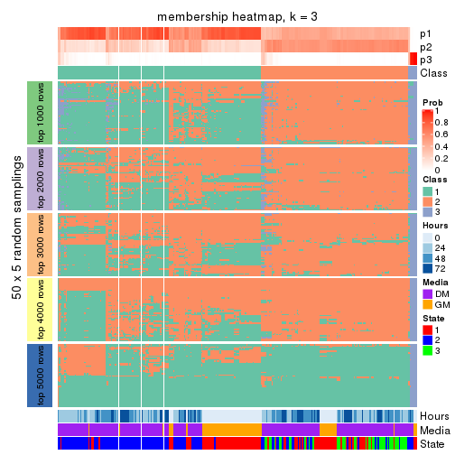</p>

</div>
<div id='tab-MAD-hclust-membership-heatmap-3'>
<pre><code class="r">membership_heatmap(res, k = 4)
</code></pre>

<p></p>

</div>
<div id='tab-MAD-hclust-membership-heatmap-4'>
<pre><code class="r">membership_heatmap(res, k = 5)
</code></pre>

<p></p>

</div>
<div id='tab-MAD-hclust-membership-heatmap-5'>
<pre><code class="r">membership_heatmap(res, k = 6)
</code></pre>

<p></p>

</div>
</div>

As soon as we have had the classes for columns, we can look for signatures
which are significantly different between classes which can be candidate marks
for certain classes. Following are the heatmaps for signatures.


Signature heatmaps where rows are scaled:


<script>
$( function() {
	$( '#tabs-MAD-hclust-get-signatures' ).tabs();
} );
</script>
<div id='tabs-MAD-hclust-get-signatures'>
<ul>
<li><a href='#tab-MAD-hclust-get-signatures-1'>k = 2</a></li>
<li><a href='#tab-MAD-hclust-get-signatures-2'>k = 3</a></li>
<li><a href='#tab-MAD-hclust-get-signatures-3'>k = 4</a></li>
<li><a href='#tab-MAD-hclust-get-signatures-4'>k = 5</a></li>
<li><a href='#tab-MAD-hclust-get-signatures-5'>k = 6</a></li>
</ul>
<div id='tab-MAD-hclust-get-signatures-1'>
<pre><code class="r">get_signatures(res, k = 2)
</code></pre>

<p></p>

</div>
<div id='tab-MAD-hclust-get-signatures-2'>
<pre><code class="r">get_signatures(res, k = 3)
</code></pre>

<p></p>

</div>
<div id='tab-MAD-hclust-get-signatures-3'>
<pre><code class="r">get_signatures(res, k = 4)
</code></pre>

<p></p>

</div>
<div id='tab-MAD-hclust-get-signatures-4'>
<pre><code class="r">get_signatures(res, k = 5)
</code></pre>

<p></p>

</div>
<div id='tab-MAD-hclust-get-signatures-5'>
<pre><code class="r">get_signatures(res, k = 6)
</code></pre>

<p></p>

</div>
</div>


Signature heatmaps where rows are not scaled:


<script>
$( function() {
	$( '#tabs-MAD-hclust-get-signatures-no-scale' ).tabs();
} );
</script>
<div id='tabs-MAD-hclust-get-signatures-no-scale'>
<ul>
<li><a href='#tab-MAD-hclust-get-signatures-no-scale-1'>k = 2</a></li>
<li><a href='#tab-MAD-hclust-get-signatures-no-scale-2'>k = 3</a></li>
<li><a href='#tab-MAD-hclust-get-signatures-no-scale-3'>k = 4</a></li>
<li><a href='#tab-MAD-hclust-get-signatures-no-scale-4'>k = 5</a></li>
<li><a href='#tab-MAD-hclust-get-signatures-no-scale-5'>k = 6</a></li>
</ul>
<div id='tab-MAD-hclust-get-signatures-no-scale-1'>
<pre><code class="r">get_signatures(res, k = 2, scale_rows = FALSE)
</code></pre>

<p></p>

</div>
<div id='tab-MAD-hclust-get-signatures-no-scale-2'>
<pre><code class="r">get_signatures(res, k = 3, scale_rows = FALSE)
</code></pre>

<p></p>

</div>
<div id='tab-MAD-hclust-get-signatures-no-scale-3'>
<pre><code class="r">get_signatures(res, k = 4, scale_rows = FALSE)
</code></pre>

<p></p>

</div>
<div id='tab-MAD-hclust-get-signatures-no-scale-4'>
<pre><code class="r">get_signatures(res, k = 5, scale_rows = FALSE)
</code></pre>

<p></p>

</div>
<div id='tab-MAD-hclust-get-signatures-no-scale-5'>
<pre><code class="r">get_signatures(res, k = 6, scale_rows = FALSE)
</code></pre>

<p></p>

</div>
</div>


Compare the overlap of signatures from different k:

```r
compare_signatures(res)
```


`get_signature()` returns a data frame invisibly. TO get the list of signatures, the function
call should be assigned to a variable explicitly. In following code, if `plot` argument is set
to `FALSE`, no heatmap is plotted while only the differential analysis is performed.

```r
# code only for demonstration
tb = get_signature(res, k = ..., plot = FALSE)
```

An example of the output of `tb` is:

```
#>   which_row         fdr    mean_1    mean_2 scaled_mean_1 scaled_mean_2 km
#> 1        38 0.042760348  8.373488  9.131774    -0.5533452     0.5164555  1
#> 2        40 0.018707592  7.106213  8.469186    -0.6173731     0.5762149  1
#> 3        55 0.019134737 10.221463 11.207825    -0.6159697     0.5749050  1
#> 4        59 0.006059896  5.921854  7.869574    -0.6899429     0.6439467  1
#> 5        60 0.018055526  8.928898 10.211722    -0.6204761     0.5791110  1
#> 6        98 0.009384629 15.714769 14.887706     0.6635654    -0.6193277  2
...
```

The columns in `tb` are:

1. `which_row`: row indices corresponding to the input matrix.
2. `fdr`: FDR for the differential test. 
3. `mean_x`: The mean value in group x.
4. `scaled_mean_x`: The mean value in group x after rows are scaled.
5. `km`: Row groups if k-means clustering is applied to rows.


UMAP plot which shows how samples are separated.


<script>
$( function() {
	$( '#tabs-MAD-hclust-dimension-reduction' ).tabs();
} );
</script>
<div id='tabs-MAD-hclust-dimension-reduction'>
<ul>
<li><a href='#tab-MAD-hclust-dimension-reduction-1'>k = 2</a></li>
<li><a href='#tab-MAD-hclust-dimension-reduction-2'>k = 3</a></li>
<li><a href='#tab-MAD-hclust-dimension-reduction-3'>k = 4</a></li>
<li><a href='#tab-MAD-hclust-dimension-reduction-4'>k = 5</a></li>
<li><a href='#tab-MAD-hclust-dimension-reduction-5'>k = 6</a></li>
</ul>
<div id='tab-MAD-hclust-dimension-reduction-1'>
<pre><code class="r">dimension_reduction(res, k = 2, method = &quot;UMAP&quot;)
</code></pre>

<p></p>

</div>
<div id='tab-MAD-hclust-dimension-reduction-2'>
<pre><code class="r">dimension_reduction(res, k = 3, method = &quot;UMAP&quot;)
</code></pre>

<p></p>

</div>
<div id='tab-MAD-hclust-dimension-reduction-3'>
<pre><code class="r">dimension_reduction(res, k = 4, method = &quot;UMAP&quot;)
</code></pre>

<p></p>

</div>
<div id='tab-MAD-hclust-dimension-reduction-4'>
<pre><code class="r">dimension_reduction(res, k = 5, method = &quot;UMAP&quot;)
</code></pre>

<p></p>

</div>
<div id='tab-MAD-hclust-dimension-reduction-5'>
<pre><code class="r">dimension_reduction(res, k = 6, method = &quot;UMAP&quot;)
</code></pre>

<p></p>

</div>
</div>


Following heatmap shows how subgroups are split when increasing `k`:

```r
collect_classes(res)
```


Test correlation between subgroups and known annotations. If the known
annotation is numeric, one-way ANOVA test is applied, and if the known
annotation is discrete, chi-squared contingency table test is applied.

```r
test_to_known_factors(res)
```

```
#>              n Hours(p) Media(p) State(p) k
#> MAD:hclust 269 0.371748 0.363593 5.27e-01 2
#> MAD:hclust 186 0.002481 0.002251 1.69e-10 3
#> MAD:hclust 173 0.017956 0.011070 4.74e-11 4
#> MAD:hclust 169 0.000694 0.000212 1.76e-05 5
#> MAD:hclust 121 0.069290 0.084462 5.16e-03 6
```


If matrix rows can be associated to genes, consider to use `GO_Enrichment(res,
...)` to perform function enrichment for the signature genes.


 

---------------------------------------------------


### MAD:kmeans


The object with results only for a single top-value method and a single partition method 
can be extracted as:

```r
res = res_list["MAD", "kmeans"]
# you can also extract it by
# res = res_list["MAD:kmeans"]
```

A summary of `res` and all the functions that can be applied to it:

```r
res
```

```
#> A 'ConsensusPartition' object with k = 2, 3, 4, 5, 6.
#>   On a matrix with 12016 rows and 271 columns.
#>   Top rows (1000, 2000, 3000, 4000, 5000) are extracted by 'MAD' method.
#>   Subgroups are detected by 'kmeans' method.
#>   Performed in total 1250 partitions by row resampling.
#>   Best k for subgroups seems to be 2.
#> 
#> Following methods can be applied to this 'ConsensusPartition' object:
#>  [1] "cola_report"             "collect_classes"         "collect_plots"          
#>  [4] "collect_stats"           "colnames"                "compare_signatures"     
#>  [7] "consensus_heatmap"       "dimension_reduction"     "functional_enrichment"  
#> [10] "get_anno_col"            "get_anno"                "get_classes"            
#> [13] "get_consensus"           "get_matrix"              "get_membership"         
#> [16] "get_param"               "get_signatures"          "get_stats"              
#> [19] "is_best_k"               "is_stable_k"             "membership_heatmap"     
#> [22] "ncol"                    "nrow"                    "plot_ecdf"              
#> [25] "rownames"                "select_partition_number" "show"                   
#> [28] "suggest_best_k"          "test_to_known_factors"
```

`collect_plots()` function collects all the plots made from `res` for all `k` (number of partitions)
into one single page to provide an easy and fast comparison between different `k`.

```r
collect_plots(res)
```


The plots are:

- The first row: a plot of the ECDF (Empirical cumulative distribution
  function) curves of the consensus matrix for each `k` and the heatmap of
  predicted classes for each `k`.
- The second row: heatmaps of the consensus matrix for each `k`.
- The third row: heatmaps of the membership matrix for each `k`.
- The fouth row: heatmaps of the signatures for each `k`.

All the plots in panels can be made by individual functions and they are
plotted later in this section.

`select_partition_number()` produces several plots showing different
statistics for choosing "optimized" `k`. There are following statistics:

- ECDF curves of the consensus matrix for each `k`;
- 1-PAC. [The PAC
  score](https://en.wikipedia.org/wiki/Consensus_clustering#Over-interpretation_potential_of_consensus_clustering)
  measures the proportion of the ambiguous subgrouping.
- Mean silhouette score.
- Concordance. The mean probability of fiting the consensus class ids in all
  partitions.
- Area increased. Denote $A_k$ as the area under the ECDF curve for current
  `k`, the area increased is defined as $A_k - A_{k-1}$.
- Rand index. The percent of pairs of samples that are both in a same cluster
  or both are not in a same cluster in the partition of k and k-1.
- Jaccard index. The ratio of pairs of samples are both in a same cluster in
  the partition of k and k-1 and the pairs of samples are both in a same
  cluster in the partition k or k-1.

The detailed explanations of these statistics can be found in [the cola
vignette](http://bioconductor.org/packages/devel/bioc/vignettes/cola/inst/doc/cola.html#toc_13).

Generally speaking, lower PAC score, higher mean silhouette score or higher
concordance corresponds to better partition. Rand index and Jaccard index
measure how similar the current partition is compared to partition with `k-1`.
If they are too similar, we won't accept `k` is better than `k-1`.

```r
select_partition_number(res)
```

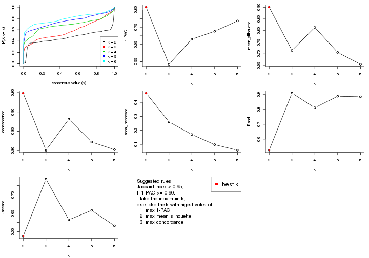

The numeric values for all these statistics can be obtained by `get_stats()`.

```r
get_stats(res)
```

```
#>   k 1-PAC mean_silhouette concordance area_increased  Rand Jaccard
#> 2 2 0.866           0.901       0.949         0.4662 0.525   0.525
#> 3 3 0.535           0.715       0.801         0.2610 0.910   0.835
#> 4 4 0.680           0.814       0.881         0.1706 0.811   0.615
#> 5 5 0.726           0.706       0.822         0.0981 0.889   0.666
#> 6 6 0.786           0.655       0.802         0.0579 0.885   0.582
```

`suggest_best_k()` suggests the best $k$ based on these statistics. The rules are as follows:

- All $k$ with Jaccard index larger than 0.95 are removed because the increase of
  the partition number does not provides enough extra information. If all $k$ are removed,
  the best $k$ is assigned by `NA`.
- For $k$ with 1-PAC larger than 0.9, the maximal $k$ is taken as the "best k". Other $k$ is called "optional k".
- If it does not fit the second rule. The $k$ with the highest vote of highest
  1-PAC, mean silhouette and concordance is taken as the "best k".

```r
suggest_best_k(res)
```

```
#> [1] 2
```


Following shows the table of the partitions (You need to click the **show/hide
code output** link to see it). The membership matrix (columns with name `p*`)
is inferred by
[`clue::cl_consensus()`](https://www.rdocumentation.org/link/cl_consensus?package=clue)
function with the `SE` method. Basically the value in the membership matrix
represents the probability to belong to a certain group. The finall class
label for an item is determined with the group with highest probability it
belongs to.

In `get_classes()` function, the entropy is calculated from the membership
matrix and the silhouette score is calculated from the consensus matrix.


<script>
$( function() {
	$( '#tabs-MAD-kmeans-get-classes' ).tabs();
} );
</script>
<div id='tabs-MAD-kmeans-get-classes'>
<ul>
<li><a href='#tab-MAD-kmeans-get-classes-1'>k = 2</a></li>
<li><a href='#tab-MAD-kmeans-get-classes-2'>k = 3</a></li>
<li><a href='#tab-MAD-kmeans-get-classes-3'>k = 4</a></li>
<li><a href='#tab-MAD-kmeans-get-classes-4'>k = 5</a></li>
<li><a href='#tab-MAD-kmeans-get-classes-5'>k = 6</a></li>
</ul>

<div id='tab-MAD-kmeans-get-classes-1'>
<p><a id='tab-MAD-kmeans-get-classes-1-a' style='color:#0366d6' href='#'>show/hide code output</a></p>
<pre><code class="r">cbind(get_classes(res, k = 2), get_membership(res, k = 2))
</code></pre>

<pre><code>#&gt;            class entropy silhouette    p1    p2
#&gt; T0_CT_A01      2  0.0376     0.9558 0.004 0.996
#&gt; T0_CT_A03      2  0.1633     0.9484 0.024 0.976
#&gt; T0_CT_A05      2  0.2423     0.9380 0.040 0.960
#&gt; T0_CT_A06      2  0.2043     0.9437 0.032 0.968
#&gt; T0_CT_A07      2  0.1633     0.9484 0.024 0.976
#&gt; T0_CT_A08      1  0.1843     0.9522 0.972 0.028
#&gt; T0_CT_A10      2  0.5629     0.8446 0.132 0.868
#&gt; T0_CT_A11      1  0.0376     0.9314 0.996 0.004
#&gt; T0_CT_B01      1  0.9286     0.5002 0.656 0.344
#&gt; T0_CT_B03      2  0.0938     0.9536 0.012 0.988
#&gt; T0_CT_B05      2  0.5059     0.8675 0.112 0.888
#&gt; T0_CT_B07      2  0.2778     0.9314 0.048 0.952
#&gt; T0_CT_B08      2  0.1184     0.9518 0.016 0.984
#&gt; T0_CT_B09      2  0.2236     0.9409 0.036 0.964
#&gt; T0_CT_C02      2  0.0938     0.9536 0.012 0.988
#&gt; T0_CT_C03      1  1.0000     0.0308 0.504 0.496
#&gt; T0_CT_C05      2  0.0376     0.9549 0.004 0.996
#&gt; T0_CT_C06      1  0.9988     0.1173 0.520 0.480
#&gt; T0_CT_C07      2  0.9815     0.2761 0.420 0.580
#&gt; T0_CT_C08      2  0.1414     0.9503 0.020 0.980
#&gt; T0_CT_C09      1  0.6973     0.7569 0.812 0.188
#&gt; T0_CT_C11      2  0.0376     0.9549 0.004 0.996
#&gt; T0_CT_C12      2  0.1633     0.9484 0.024 0.976
#&gt; T0_CT_D01      2  0.0376     0.9558 0.004 0.996
#&gt; T0_CT_D02      1  0.9000     0.5544 0.684 0.316
#&gt; T0_CT_D03      2  0.1184     0.9518 0.016 0.984
#&gt; T0_CT_D05      2  0.1843     0.9445 0.028 0.972
#&gt; T0_CT_D06      2  0.1184     0.9515 0.016 0.984
#&gt; T0_CT_D07      2  0.2423     0.9380 0.040 0.960
#&gt; T0_CT_D08      2  0.0938     0.9523 0.012 0.988
#&gt; T0_CT_D09      2  0.0376     0.9558 0.004 0.996
#&gt; T0_CT_D11      2  0.0376     0.9549 0.004 0.996
#&gt; T0_CT_D12      2  0.1843     0.9461 0.028 0.972
#&gt; T0_CT_E01      2  0.1184     0.9518 0.016 0.984
#&gt; T0_CT_E03      2  0.5737     0.8398 0.136 0.864
#&gt; T0_CT_E04      2  0.0376     0.9549 0.004 0.996
#&gt; T0_CT_E05      1  0.2043     0.9497 0.968 0.032
#&gt; T0_CT_E06      2  0.2236     0.9437 0.036 0.964
#&gt; T0_CT_E07      2  0.2423     0.9380 0.040 0.960
#&gt; T0_CT_E08      2  0.1184     0.9518 0.016 0.984
#&gt; T0_CT_E09      2  0.1184     0.9518 0.016 0.984
#&gt; T0_CT_E10      1  0.6973     0.7569 0.812 0.188
#&gt; T0_CT_E11      2  0.2423     0.9410 0.040 0.960
#&gt; T0_CT_E12      1  0.7376     0.7494 0.792 0.208
#&gt; T0_CT_F01      2  0.2236     0.9409 0.036 0.964
#&gt; T0_CT_F02      2  0.8608     0.6211 0.284 0.716
#&gt; T0_CT_F03      2  0.2236     0.9409 0.036 0.964
#&gt; T0_CT_F04      2  0.8499     0.6285 0.276 0.724
#&gt; T0_CT_F05      2  0.1184     0.9515 0.016 0.984
#&gt; T0_CT_F06      2  0.1184     0.9518 0.016 0.984
#&gt; T0_CT_F07      2  0.2423     0.9381 0.040 0.960
#&gt; T0_CT_F09      2  0.0376     0.9549 0.004 0.996
#&gt; T0_CT_F11      2  0.9922     0.1829 0.448 0.552
#&gt; T0_CT_F12      2  0.5842     0.8348 0.140 0.860
#&gt; T0_CT_G01      2  0.2043     0.9437 0.032 0.968
#&gt; T0_CT_G02      2  0.9944     0.1511 0.456 0.544
#&gt; T0_CT_G03      2  0.8207     0.6709 0.256 0.744
#&gt; T0_CT_G04      2  0.1184     0.9518 0.016 0.984
#&gt; T0_CT_G07      2  0.1184     0.9518 0.016 0.984
#&gt; T0_CT_G08      2  0.1184     0.9515 0.016 0.984
#&gt; T0_CT_G09      1  0.2423     0.9479 0.960 0.040
#&gt; T0_CT_G11      1  0.9970     0.1277 0.532 0.468
#&gt; T0_CT_H01      2  0.8955     0.5474 0.312 0.688
#&gt; T0_CT_H02      2  0.0376     0.9549 0.004 0.996
#&gt; T0_CT_H04      2  0.2043     0.9463 0.032 0.968
#&gt; T0_CT_H05      2  0.9358     0.4750 0.352 0.648
#&gt; T0_CT_H08      2  0.3879     0.9055 0.076 0.924
#&gt; T0_CT_H09      2  0.2236     0.9399 0.036 0.964
#&gt; T0_CT_H12      2  0.9866     0.2487 0.432 0.568
#&gt; T24_CT_A01     1  0.1843     0.9522 0.972 0.028
#&gt; T24_CT_A03     2  0.0376     0.9558 0.004 0.996
#&gt; T24_CT_A04     2  0.0376     0.9549 0.004 0.996
#&gt; T24_CT_A05     1  0.1633     0.9516 0.976 0.024
#&gt; T24_CT_A07     2  0.0376     0.9549 0.004 0.996
#&gt; T24_CT_A08     1  0.1843     0.9522 0.972 0.028
#&gt; T24_CT_A09     1  0.1633     0.9516 0.976 0.024
#&gt; T24_CT_A10     1  0.2043     0.9514 0.968 0.032
#&gt; T24_CT_B01     1  0.1633     0.9516 0.976 0.024
#&gt; T24_CT_B02     1  0.1633     0.9516 0.976 0.024
#&gt; T24_CT_B03     2  0.0376     0.9558 0.004 0.996
#&gt; T24_CT_B05     2  0.0000     0.9555 0.000 1.000
#&gt; T24_CT_B06     2  0.0000     0.9555 0.000 1.000
#&gt; T24_CT_B07     1  0.1843     0.9522 0.972 0.028
#&gt; T24_CT_B08     2  0.0376     0.9549 0.004 0.996
#&gt; T24_CT_B09     1  0.1843     0.9522 0.972 0.028
#&gt; T24_CT_B11     1  0.1843     0.9522 0.972 0.028
#&gt; T24_CT_C01     1  0.1633     0.9516 0.976 0.024
#&gt; T24_CT_C02     2  0.8608     0.5833 0.284 0.716
#&gt; T24_CT_C03     1  0.1843     0.9500 0.972 0.028
#&gt; T24_CT_C05     2  0.0376     0.9549 0.004 0.996
#&gt; T24_CT_C07     2  0.0376     0.9549 0.004 0.996
#&gt; T24_CT_C08     2  0.0376     0.9549 0.004 0.996
#&gt; T24_CT_C09     2  0.9129     0.4884 0.328 0.672
#&gt; T24_CT_C10     1  0.1843     0.9522 0.972 0.028
#&gt; T24_CT_C11     1  0.2043     0.9497 0.968 0.032
#&gt; T24_CT_C12     2  0.0376     0.9558 0.004 0.996
#&gt; T24_CT_D01     2  0.0376     0.9549 0.004 0.996
#&gt; T24_CT_D02     2  0.0376     0.9558 0.004 0.996
#&gt; T24_CT_D03     2  0.0376     0.9549 0.004 0.996
#&gt; T24_CT_D04     1  0.1633     0.9516 0.976 0.024
#&gt; T24_CT_D05     1  0.1843     0.9522 0.972 0.028
#&gt; T24_CT_D06     1  0.1843     0.9522 0.972 0.028
#&gt; T24_CT_D07     2  0.7745     0.7022 0.228 0.772
#&gt; T24_CT_D08     2  0.0376     0.9549 0.004 0.996
#&gt; T24_CT_D09     2  0.0376     0.9558 0.004 0.996
#&gt; T24_CT_D10     2  0.0000     0.9555 0.000 1.000
#&gt; T24_CT_D11     2  0.0376     0.9549 0.004 0.996
#&gt; T24_CT_E01     1  0.2423     0.9479 0.960 0.040
#&gt; T24_CT_E02     1  0.1633     0.9516 0.976 0.024
#&gt; T24_CT_E04     2  0.0000     0.9555 0.000 1.000
#&gt; T24_CT_E05     1  0.1633     0.9516 0.976 0.024
#&gt; T24_CT_E07     2  0.0376     0.9558 0.004 0.996
#&gt; T24_CT_E09     1  0.1843     0.9522 0.972 0.028
#&gt; T24_CT_E11     1  0.1633     0.9516 0.976 0.024
#&gt; T24_CT_E12     2  0.0376     0.9549 0.004 0.996
#&gt; T24_CT_F01     2  0.0376     0.9549 0.004 0.996
#&gt; T24_CT_F02     2  0.0000     0.9555 0.000 1.000
#&gt; T24_CT_F03     1  0.1843     0.9513 0.972 0.028
#&gt; T24_CT_F04     1  0.2043     0.9497 0.968 0.032
#&gt; T24_CT_F05     1  0.2236     0.9498 0.964 0.036
#&gt; T24_CT_F07     1  0.0672     0.9350 0.992 0.008
#&gt; T24_CT_F08     1  0.1633     0.9516 0.976 0.024
#&gt; T24_CT_F09     2  0.0376     0.9558 0.004 0.996
#&gt; T24_CT_F10     2  0.1414     0.9493 0.020 0.980
#&gt; T24_CT_F11     1  0.2423     0.9479 0.960 0.040
#&gt; T24_CT_F12     2  0.0000     0.9555 0.000 1.000
#&gt; T24_CT_G01     2  0.0000     0.9555 0.000 1.000
#&gt; T24_CT_G02     1  0.1843     0.9522 0.972 0.028
#&gt; T24_CT_G03     1  0.1633     0.9516 0.976 0.024
#&gt; T24_CT_G04     2  0.1184     0.9515 0.016 0.984
#&gt; T24_CT_G05     2  0.2423     0.9310 0.040 0.960
#&gt; T24_CT_G06     1  0.1843     0.9522 0.972 0.028
#&gt; T24_CT_G08     1  0.1633     0.9516 0.976 0.024
#&gt; T24_CT_G10     2  0.0376     0.9558 0.004 0.996
#&gt; T24_CT_G11     1  0.1633     0.9516 0.976 0.024
#&gt; T24_CT_G12     1  0.1843     0.9522 0.972 0.028
#&gt; T24_CT_H01     2  0.6048     0.8247 0.148 0.852
#&gt; T24_CT_H02     1  0.1633     0.9516 0.976 0.024
#&gt; T24_CT_H03     2  0.0376     0.9549 0.004 0.996
#&gt; T24_CT_H05     1  0.1843     0.9500 0.972 0.028
#&gt; T24_CT_H07     1  0.1633     0.9516 0.976 0.024
#&gt; T24_CT_H09     1  0.1843     0.9522 0.972 0.028
#&gt; T24_CT_H12     1  0.1843     0.9522 0.972 0.028
#&gt; T48_CT_A01     2  0.0376     0.9558 0.004 0.996
#&gt; T48_CT_A02     2  0.0376     0.9558 0.004 0.996
#&gt; T48_CT_A03     1  0.1843     0.9522 0.972 0.028
#&gt; T48_CT_A04     2  0.0376     0.9549 0.004 0.996
#&gt; T48_CT_A05     2  0.0376     0.9558 0.004 0.996
#&gt; T48_CT_A06     1  0.1843     0.9522 0.972 0.028
#&gt; T48_CT_A07     2  0.0376     0.9558 0.004 0.996
#&gt; T48_CT_A08     2  0.0376     0.9558 0.004 0.996
#&gt; T48_CT_A09     1  0.2423     0.9479 0.960 0.040
#&gt; T48_CT_A10     2  0.0376     0.9549 0.004 0.996
#&gt; T48_CT_A11     2  0.0376     0.9549 0.004 0.996
#&gt; T48_CT_A12     1  0.2043     0.9497 0.968 0.032
#&gt; T48_CT_B01     2  0.0376     0.9549 0.004 0.996
#&gt; T48_CT_B02     2  0.0376     0.9549 0.004 0.996
#&gt; T48_CT_B03     1  0.1843     0.9522 0.972 0.028
#&gt; T48_CT_B04     1  0.1843     0.9522 0.972 0.028
#&gt; T48_CT_B06     2  0.0376     0.9549 0.004 0.996
#&gt; T48_CT_B08     1  0.1843     0.9522 0.972 0.028
#&gt; T48_CT_B10     2  0.0376     0.9549 0.004 0.996
#&gt; T48_CT_B11     2  0.0000     0.9555 0.000 1.000
#&gt; T48_CT_B12     1  0.2423     0.9479 0.960 0.040
#&gt; T48_CT_C01     2  0.0000     0.9555 0.000 1.000
#&gt; T48_CT_C02     1  0.0376     0.9314 0.996 0.004
#&gt; T48_CT_C03     2  0.0376     0.9549 0.004 0.996
#&gt; T48_CT_C04     1  0.1843     0.9522 0.972 0.028
#&gt; T48_CT_C05     2  0.0376     0.9558 0.004 0.996
#&gt; T48_CT_C06     2  0.0376     0.9558 0.004 0.996
#&gt; T48_CT_C07     1  0.2423     0.9479 0.960 0.040
#&gt; T48_CT_C09     2  0.0376     0.9558 0.004 0.996
#&gt; T48_CT_C10     1  0.1843     0.9522 0.972 0.028
#&gt; T48_CT_C11     2  0.0000     0.9555 0.000 1.000
#&gt; T48_CT_D01     1  0.7376     0.7690 0.792 0.208
#&gt; T48_CT_D02     1  0.2423     0.9460 0.960 0.040
#&gt; T48_CT_D03     1  0.1633     0.9516 0.976 0.024
#&gt; T48_CT_D04     2  0.0376     0.9549 0.004 0.996
#&gt; T48_CT_D06     2  0.0376     0.9558 0.004 0.996
#&gt; T48_CT_D07     2  0.0376     0.9549 0.004 0.996
#&gt; T48_CT_D08     1  0.1843     0.9500 0.972 0.028
#&gt; T48_CT_D09     2  0.1414     0.9474 0.020 0.980
#&gt; T48_CT_D10     1  0.2423     0.9460 0.960 0.040
#&gt; T48_CT_D11     2  0.0376     0.9558 0.004 0.996
#&gt; T48_CT_D12     1  0.1843     0.9522 0.972 0.028
#&gt; T48_CT_E01     2  0.0376     0.9558 0.004 0.996
#&gt; T48_CT_E02     1  0.2423     0.9460 0.960 0.040
#&gt; T48_CT_E03     2  0.2043     0.9416 0.032 0.968
#&gt; T48_CT_E04     1  0.9850     0.2931 0.572 0.428
#&gt; T48_CT_E05     2  0.0376     0.9549 0.004 0.996
#&gt; T48_CT_E06     1  0.1633     0.9516 0.976 0.024
#&gt; T48_CT_E07     1  0.1843     0.9522 0.972 0.028
#&gt; T48_CT_E08     2  0.0376     0.9549 0.004 0.996
#&gt; T48_CT_E10     1  0.1843     0.9522 0.972 0.028
#&gt; T48_CT_E11     1  0.1843     0.9522 0.972 0.028
#&gt; T48_CT_E12     2  0.0376     0.9558 0.004 0.996
#&gt; T48_CT_F01     2  0.0376     0.9549 0.004 0.996
#&gt; T48_CT_F02     1  0.2043     0.9499 0.968 0.032
#&gt; T48_CT_F03     1  0.1843     0.9500 0.972 0.028
#&gt; T48_CT_F05     2  0.0376     0.9549 0.004 0.996
#&gt; T48_CT_F07     1  0.2043     0.9514 0.968 0.032
#&gt; T48_CT_F09     2  0.0000     0.9555 0.000 1.000
#&gt; T48_CT_F10     1  0.1843     0.9500 0.972 0.028
#&gt; T48_CT_F11     1  0.1843     0.9522 0.972 0.028
#&gt; T48_CT_G01     1  0.1843     0.9522 0.972 0.028
#&gt; T48_CT_G02     2  0.0376     0.9558 0.004 0.996
#&gt; T48_CT_G03     2  0.0376     0.9549 0.004 0.996
#&gt; T48_CT_G07     2  0.0376     0.9549 0.004 0.996
#&gt; T48_CT_G08     2  0.0376     0.9558 0.004 0.996
#&gt; T48_CT_G09     2  0.0376     0.9558 0.004 0.996
#&gt; T48_CT_G10     1  0.1843     0.9522 0.972 0.028
#&gt; T48_CT_G11     1  0.2423     0.9479 0.960 0.040
#&gt; T48_CT_G12     2  0.0376     0.9549 0.004 0.996
#&gt; T48_CT_H01     2  0.8713     0.5677 0.292 0.708
#&gt; T48_CT_H02     2  0.0672     0.9549 0.008 0.992
#&gt; T48_CT_H04     1  0.0376     0.9314 0.996 0.004
#&gt; T48_CT_H05     2  0.0376     0.9549 0.004 0.996
#&gt; T48_CT_H06     2  0.0376     0.9549 0.004 0.996
#&gt; T48_CT_H07     1  0.2423     0.9460 0.960 0.040
#&gt; T48_CT_H08     2  0.0376     0.9558 0.004 0.996
#&gt; T48_CT_H11     1  0.2423     0.9479 0.960 0.040
#&gt; T48_CT_H12     2  0.0000     0.9555 0.000 1.000
#&gt; T72_CT_A01     2  0.0376     0.9558 0.004 0.996
#&gt; T72_CT_A05     2  0.0376     0.9558 0.004 0.996
#&gt; T72_CT_A08     1  0.1843     0.9522 0.972 0.028
#&gt; T72_CT_A09     2  0.0376     0.9558 0.004 0.996
#&gt; T72_CT_A11     2  0.0376     0.9558 0.004 0.996
#&gt; T72_CT_B01     2  0.0376     0.9549 0.004 0.996
#&gt; T72_CT_B02     1  0.1843     0.9522 0.972 0.028
#&gt; T72_CT_B03     1  0.9661     0.3966 0.608 0.392
#&gt; T72_CT_B04     1  0.1843     0.9522 0.972 0.028
#&gt; T72_CT_B05     2  0.0376     0.9558 0.004 0.996
#&gt; T72_CT_B06     1  0.1843     0.9522 0.972 0.028
#&gt; T72_CT_B08     2  0.0376     0.9558 0.004 0.996
#&gt; T72_CT_B09     1  0.0376     0.9314 0.996 0.004
#&gt; T72_CT_B11     1  0.2423     0.9479 0.960 0.040
#&gt; T72_CT_B12     2  0.0376     0.9558 0.004 0.996
#&gt; T72_CT_C04     2  0.0376     0.9558 0.004 0.996
#&gt; T72_CT_C06     1  0.9993     0.0987 0.516 0.484
#&gt; T72_CT_C07     2  0.0376     0.9558 0.004 0.996
#&gt; T72_CT_C09     2  0.9732     0.3082 0.404 0.596
#&gt; T72_CT_C11     2  0.0376     0.9558 0.004 0.996
#&gt; T72_CT_D01     2  0.0376     0.9558 0.004 0.996
#&gt; T72_CT_D03     2  0.1633     0.9469 0.024 0.976
#&gt; T72_CT_D04     2  0.0376     0.9558 0.004 0.996
#&gt; T72_CT_D05     1  0.2423     0.9479 0.960 0.040
#&gt; T72_CT_D07     1  0.2423     0.9479 0.960 0.040
#&gt; T72_CT_D10     2  0.0672     0.9549 0.008 0.992
#&gt; T72_CT_D11     1  0.1843     0.9522 0.972 0.028
#&gt; T72_CT_E04     1  0.2236     0.9477 0.964 0.036
#&gt; T72_CT_E05     2  0.0376     0.9558 0.004 0.996
#&gt; T72_CT_E07     2  0.0376     0.9558 0.004 0.996
#&gt; T72_CT_F01     2  0.0000     0.9555 0.000 1.000
#&gt; T72_CT_F05     2  0.0376     0.9549 0.004 0.996
#&gt; T72_CT_F07     1  0.2423     0.9479 0.960 0.040
#&gt; T72_CT_F10     2  0.0376     0.9558 0.004 0.996
#&gt; T72_CT_F11     2  0.0376     0.9558 0.004 0.996
#&gt; T72_CT_G03     1  0.1843     0.9522 0.972 0.028
#&gt; T72_CT_G04     1  0.1843     0.9522 0.972 0.028
#&gt; T72_CT_G06     2  0.0000     0.9555 0.000 1.000
#&gt; T72_CT_G08     2  0.1843     0.9471 0.028 0.972
#&gt; T72_CT_G10     2  0.0000     0.9555 0.000 1.000
#&gt; T72_CT_G11     1  0.2043     0.9497 0.968 0.032
#&gt; T72_CT_H01     2  0.0000     0.9555 0.000 1.000
#&gt; T72_CT_H03     2  0.0000     0.9555 0.000 1.000
#&gt; T72_CT_H05     2  0.0376     0.9558 0.004 0.996
#&gt; T72_CT_H08     2  0.0376     0.9558 0.004 0.996
#&gt; T72_CT_H09     2  0.4939     0.8720 0.108 0.892
#&gt; T72_CT_H10     1  0.2423     0.9479 0.960 0.040
#&gt; T72_CT_H11     1  0.2423     0.9479 0.960 0.040
#&gt; T72_CT_H12     2  0.0000     0.9555 0.000 1.000
</code></pre>

<script>
$('#tab-MAD-kmeans-get-classes-1-a').parent().next().next().hide();
$('#tab-MAD-kmeans-get-classes-1-a').click(function(){
  $('#tab-MAD-kmeans-get-classes-1-a').parent().next().next().toggle();
  return(false);
});
</script>
</div>

<div id='tab-MAD-kmeans-get-classes-2'>
<p><a id='tab-MAD-kmeans-get-classes-2-a' style='color:#0366d6' href='#'>show/hide code output</a></p>
<pre><code class="r">cbind(get_classes(res, k = 3), get_membership(res, k = 3))
</code></pre>

<pre><code>#&gt;            class entropy silhouette    p1    p2    p3
#&gt; T0_CT_A01      2  0.6570     0.6910 0.028 0.680 0.292
#&gt; T0_CT_A03      2  0.8250     0.6339 0.108 0.600 0.292
#&gt; T0_CT_A05      2  0.8487     0.6183 0.124 0.584 0.292
#&gt; T0_CT_A06      2  0.8148     0.6382 0.100 0.604 0.296
#&gt; T0_CT_A07      2  0.8250     0.6339 0.108 0.600 0.292
#&gt; T0_CT_A08      1  0.0000     0.9123 1.000 0.000 0.000
#&gt; T0_CT_A10      2  0.8622     0.6071 0.132 0.572 0.296
#&gt; T0_CT_A11      3  0.6595     0.6088 0.180 0.076 0.744
#&gt; T0_CT_B01      3  0.9792     0.1725 0.236 0.372 0.392
#&gt; T0_CT_B03      2  0.5690     0.7036 0.004 0.708 0.288
#&gt; T0_CT_B05      2  0.8752     0.5965 0.144 0.564 0.292
#&gt; T0_CT_B07      2  0.8543     0.6139 0.128 0.580 0.292
#&gt; T0_CT_B08      2  0.5722     0.7016 0.004 0.704 0.292
#&gt; T0_CT_B09      2  0.8430     0.6225 0.120 0.588 0.292
#&gt; T0_CT_C02      2  0.5690     0.7036 0.004 0.708 0.288
#&gt; T0_CT_C03      1  0.7960     0.2287 0.656 0.208 0.136
#&gt; T0_CT_C05      2  0.2537     0.7621 0.000 0.920 0.080
#&gt; T0_CT_C06      2  0.9264     0.2124 0.292 0.516 0.192
#&gt; T0_CT_C07      2  0.9153     0.5474 0.176 0.524 0.300
#&gt; T0_CT_C08      2  0.8250     0.6339 0.108 0.600 0.292
#&gt; T0_CT_C09      3  0.6231     0.6353 0.080 0.148 0.772
#&gt; T0_CT_C11      2  0.3340     0.6987 0.000 0.880 0.120
#&gt; T0_CT_C12      2  0.8250     0.6339 0.108 0.600 0.292
#&gt; T0_CT_D01      2  0.5497     0.7038 0.000 0.708 0.292
#&gt; T0_CT_D02      2  0.9531     0.4383 0.208 0.468 0.324
#&gt; T0_CT_D03      2  0.6051     0.6983 0.012 0.696 0.292
#&gt; T0_CT_D05      2  0.7692     0.6764 0.108 0.668 0.224
#&gt; T0_CT_D06      2  0.5815     0.7020 0.004 0.692 0.304
#&gt; T0_CT_D07      2  0.8430     0.6225 0.120 0.588 0.292
#&gt; T0_CT_D08      2  0.5754     0.7018 0.004 0.700 0.296
#&gt; T0_CT_D09      2  0.4654     0.7387 0.000 0.792 0.208
#&gt; T0_CT_D11      2  0.2625     0.7611 0.000 0.916 0.084
#&gt; T0_CT_D12      2  0.8250     0.6339 0.108 0.600 0.292
#&gt; T0_CT_E01      2  0.6326     0.6945 0.020 0.688 0.292
#&gt; T0_CT_E03      2  0.8650     0.6068 0.136 0.572 0.292
#&gt; T0_CT_E04      2  0.3941     0.7207 0.000 0.844 0.156
#&gt; T0_CT_E05      1  0.6267    -0.0163 0.548 0.000 0.452
#&gt; T0_CT_E06      2  0.8352     0.6217 0.100 0.568 0.332
#&gt; T0_CT_E07      2  0.8349     0.6240 0.108 0.584 0.308
#&gt; T0_CT_E08      2  0.5722     0.7016 0.004 0.704 0.292
#&gt; T0_CT_E09      2  0.6051     0.6983 0.012 0.696 0.292
#&gt; T0_CT_E10      3  0.6231     0.6353 0.080 0.148 0.772
#&gt; T0_CT_E11      2  0.8395     0.6079 0.096 0.548 0.356
#&gt; T0_CT_E12      3  0.5760     0.4621 0.064 0.140 0.796
#&gt; T0_CT_F01      2  0.8371     0.6265 0.116 0.592 0.292
#&gt; T0_CT_F02      2  0.8824     0.5674 0.124 0.512 0.364
#&gt; T0_CT_F03      2  0.8311     0.6303 0.112 0.596 0.292
#&gt; T0_CT_F04      2  0.8771     0.5936 0.140 0.556 0.304
#&gt; T0_CT_F05      2  0.5621     0.6182 0.000 0.692 0.308
#&gt; T0_CT_F06      2  0.6193     0.6964 0.016 0.692 0.292
#&gt; T0_CT_F07      2  0.8371     0.6265 0.116 0.592 0.292
#&gt; T0_CT_F09      2  0.2625     0.7262 0.000 0.916 0.084
#&gt; T0_CT_F11      3  0.4683     0.4076 0.024 0.140 0.836
#&gt; T0_CT_F12      2  0.8622     0.6071 0.132 0.572 0.296
#&gt; T0_CT_G01      2  0.8371     0.6265 0.116 0.592 0.292
#&gt; T0_CT_G02      2  0.9440     0.3811 0.308 0.488 0.204
#&gt; T0_CT_G03      2  0.8752     0.5914 0.132 0.548 0.320
#&gt; T0_CT_G04      2  0.5722     0.7021 0.004 0.704 0.292
#&gt; T0_CT_G07      2  0.5690     0.7036 0.004 0.708 0.288
#&gt; T0_CT_G08      2  0.5815     0.7020 0.004 0.692 0.304
#&gt; T0_CT_G09      1  0.0475     0.9091 0.992 0.004 0.004
#&gt; T0_CT_G11      2  0.8686     0.1814 0.432 0.464 0.104
#&gt; T0_CT_H01      2  0.7128     0.4279 0.344 0.620 0.036
#&gt; T0_CT_H02      2  0.4555     0.7386 0.000 0.800 0.200
#&gt; T0_CT_H04      2  0.8113     0.6391 0.092 0.596 0.312
#&gt; T0_CT_H05      2  0.8964     0.5733 0.160 0.544 0.296
#&gt; T0_CT_H08      2  0.8543     0.6149 0.128 0.580 0.292
#&gt; T0_CT_H09      2  0.5315     0.6707 0.012 0.772 0.216
#&gt; T0_CT_H12      2  0.9339     0.4977 0.188 0.496 0.316
#&gt; T24_CT_A01     1  0.0237     0.9122 0.996 0.000 0.004
#&gt; T24_CT_A03     2  0.0592     0.7664 0.000 0.988 0.012
#&gt; T24_CT_A04     2  0.2066     0.7408 0.000 0.940 0.060
#&gt; T24_CT_A05     1  0.5678     0.4779 0.684 0.000 0.316
#&gt; T24_CT_A07     2  0.2261     0.7358 0.000 0.932 0.068
#&gt; T24_CT_A08     1  0.0000     0.9123 1.000 0.000 0.000
#&gt; T24_CT_A09     1  0.2796     0.8441 0.908 0.000 0.092
#&gt; T24_CT_A10     1  0.1289     0.8949 0.968 0.000 0.032
#&gt; T24_CT_B01     1  0.2066     0.8757 0.940 0.000 0.060
#&gt; T24_CT_B02     1  0.3619     0.7922 0.864 0.000 0.136
#&gt; T24_CT_B03     2  0.3030     0.7654 0.004 0.904 0.092
#&gt; T24_CT_B05     2  0.1031     0.7564 0.000 0.976 0.024
#&gt; T24_CT_B06     2  0.1163     0.7553 0.000 0.972 0.028
#&gt; T24_CT_B07     1  0.0592     0.9094 0.988 0.000 0.012
#&gt; T24_CT_B08     2  0.3038     0.7111 0.000 0.896 0.104
#&gt; T24_CT_B09     1  0.0237     0.9122 0.996 0.000 0.004
#&gt; T24_CT_B11     1  0.5016     0.5302 0.760 0.000 0.240
#&gt; T24_CT_C01     1  0.4291     0.7353 0.820 0.000 0.180
#&gt; T24_CT_C02     3  0.6079     0.4534 0.000 0.388 0.612
#&gt; T24_CT_C03     3  0.6291     0.2679 0.468 0.000 0.532
#&gt; T24_CT_C05     2  0.5098     0.5198 0.000 0.752 0.248
#&gt; T24_CT_C07     2  0.2261     0.7351 0.000 0.932 0.068
#&gt; T24_CT_C08     2  0.2537     0.7282 0.000 0.920 0.080
#&gt; T24_CT_C09     3  0.6008     0.4777 0.000 0.372 0.628
#&gt; T24_CT_C10     1  0.0000     0.9123 1.000 0.000 0.000
#&gt; T24_CT_C11     1  0.6541     0.4257 0.672 0.024 0.304
#&gt; T24_CT_C12     2  0.0000     0.7642 0.000 1.000 0.000
#&gt; T24_CT_D01     2  0.3192     0.7046 0.000 0.888 0.112
#&gt; T24_CT_D02     2  0.0237     0.7651 0.000 0.996 0.004
#&gt; T24_CT_D03     2  0.3116     0.7096 0.000 0.892 0.108
#&gt; T24_CT_D04     1  0.0237     0.9122 0.996 0.000 0.004
#&gt; T24_CT_D05     1  0.0000     0.9123 1.000 0.000 0.000
#&gt; T24_CT_D06     1  0.0000     0.9123 1.000 0.000 0.000
#&gt; T24_CT_D07     2  0.6754     0.2242 0.432 0.556 0.012
#&gt; T24_CT_D08     2  0.2959     0.7144 0.000 0.900 0.100
#&gt; T24_CT_D09     2  0.0000     0.7642 0.000 1.000 0.000
#&gt; T24_CT_D10     2  0.0592     0.7637 0.000 0.988 0.012
#&gt; T24_CT_D11     2  0.2165     0.7387 0.000 0.936 0.064
#&gt; T24_CT_E01     1  0.0237     0.9110 0.996 0.004 0.000
#&gt; T24_CT_E02     1  0.3686     0.7866 0.860 0.000 0.140
#&gt; T24_CT_E04     2  0.2448     0.7302 0.000 0.924 0.076
#&gt; T24_CT_E05     1  0.3551     0.7962 0.868 0.000 0.132
#&gt; T24_CT_E07     2  0.6039     0.7254 0.104 0.788 0.108
#&gt; T24_CT_E09     1  0.1031     0.9024 0.976 0.000 0.024
#&gt; T24_CT_E11     1  0.2066     0.8735 0.940 0.000 0.060
#&gt; T24_CT_E12     2  0.3116     0.7078 0.000 0.892 0.108
#&gt; T24_CT_F01     2  0.3116     0.7078 0.000 0.892 0.108
#&gt; T24_CT_F02     2  0.0592     0.7640 0.000 0.988 0.012
#&gt; T24_CT_F03     1  0.0424     0.9105 0.992 0.000 0.008
#&gt; T24_CT_F04     3  0.6495     0.2912 0.460 0.004 0.536
#&gt; T24_CT_F05     1  0.0237     0.9110 0.996 0.004 0.000
#&gt; T24_CT_F07     3  0.6026     0.4503 0.376 0.000 0.624
#&gt; T24_CT_F08     1  0.4842     0.6665 0.776 0.000 0.224
#&gt; T24_CT_F09     2  0.1753     0.7687 0.000 0.952 0.048
#&gt; T24_CT_F10     2  0.7155     0.6924 0.128 0.720 0.152
#&gt; T24_CT_F11     1  0.0237     0.9110 0.996 0.004 0.000
#&gt; T24_CT_F12     2  0.0000     0.7642 0.000 1.000 0.000
#&gt; T24_CT_G01     2  0.0424     0.7621 0.000 0.992 0.008
#&gt; T24_CT_G02     1  0.0237     0.9122 0.996 0.000 0.004
#&gt; T24_CT_G03     1  0.3116     0.8267 0.892 0.000 0.108
#&gt; T24_CT_G04     2  0.5174     0.7472 0.076 0.832 0.092
#&gt; T24_CT_G05     3  0.6225     0.3669 0.000 0.432 0.568
#&gt; T24_CT_G06     1  0.0237     0.9120 0.996 0.000 0.004
#&gt; T24_CT_G08     1  0.1860     0.8836 0.948 0.000 0.052
#&gt; T24_CT_G10     2  0.0000     0.7642 0.000 1.000 0.000
#&gt; T24_CT_G11     1  0.4796     0.6736 0.780 0.000 0.220
#&gt; T24_CT_G12     1  0.0747     0.8988 0.984 0.000 0.016
#&gt; T24_CT_H01     2  0.9648     0.4319 0.244 0.464 0.292
#&gt; T24_CT_H02     1  0.0237     0.9122 0.996 0.000 0.004
#&gt; T24_CT_H03     2  0.2625     0.7258 0.000 0.916 0.084
#&gt; T24_CT_H05     1  0.3752     0.7838 0.856 0.000 0.144
#&gt; T24_CT_H07     1  0.0237     0.9122 0.996 0.000 0.004
#&gt; T24_CT_H09     1  0.1753     0.8846 0.952 0.000 0.048
#&gt; T24_CT_H12     1  0.0237     0.9122 0.996 0.000 0.004
#&gt; T48_CT_A01     2  0.1753     0.7684 0.000 0.952 0.048
#&gt; T48_CT_A02     2  0.0000     0.7642 0.000 1.000 0.000
#&gt; T48_CT_A03     1  0.0237     0.9122 0.996 0.000 0.004
#&gt; T48_CT_A04     2  0.3192     0.7046 0.000 0.888 0.112
#&gt; T48_CT_A05     2  0.3832     0.7629 0.020 0.880 0.100
#&gt; T48_CT_A06     1  0.0237     0.9122 0.996 0.000 0.004
#&gt; T48_CT_A07     2  0.5254     0.7180 0.000 0.736 0.264
#&gt; T48_CT_A08     2  0.0237     0.7651 0.000 0.996 0.004
#&gt; T48_CT_A09     1  0.0237     0.9110 0.996 0.004 0.000
#&gt; T48_CT_A10     2  0.3482     0.6907 0.000 0.872 0.128
#&gt; T48_CT_A11     2  0.1643     0.7477 0.000 0.956 0.044
#&gt; T48_CT_A12     1  0.3644     0.8001 0.872 0.004 0.124
#&gt; T48_CT_B01     2  0.4555     0.5984 0.000 0.800 0.200
#&gt; T48_CT_B02     2  0.4002     0.6526 0.000 0.840 0.160
#&gt; T48_CT_B03     1  0.0237     0.9122 0.996 0.000 0.004
#&gt; T48_CT_B04     1  0.0892     0.9050 0.980 0.000 0.020
#&gt; T48_CT_B06     2  0.2878     0.7173 0.000 0.904 0.096
#&gt; T48_CT_B08     1  0.0000     0.9123 1.000 0.000 0.000
#&gt; T48_CT_B10     2  0.3340     0.6972 0.000 0.880 0.120
#&gt; T48_CT_B11     2  0.0237     0.7633 0.000 0.996 0.004
#&gt; T48_CT_B12     1  0.0424     0.9079 0.992 0.008 0.000
#&gt; T48_CT_C01     2  0.2537     0.7277 0.000 0.920 0.080
#&gt; T48_CT_C02     3  0.5560     0.5282 0.300 0.000 0.700
#&gt; T48_CT_C03     2  0.3192     0.7046 0.000 0.888 0.112
#&gt; T48_CT_C04     1  0.0237     0.9122 0.996 0.000 0.004
#&gt; T48_CT_C05     2  0.1031     0.7676 0.000 0.976 0.024
#&gt; T48_CT_C06     2  0.0237     0.7641 0.004 0.996 0.000
#&gt; T48_CT_C07     1  0.0237     0.9110 0.996 0.004 0.000
#&gt; T48_CT_C09     2  0.3192     0.7630 0.000 0.888 0.112
#&gt; T48_CT_C10     1  0.0000     0.9123 1.000 0.000 0.000
#&gt; T48_CT_C11     2  0.0424     0.7621 0.000 0.992 0.008
#&gt; T48_CT_D01     2  0.9189    -0.2265 0.164 0.500 0.336
#&gt; T48_CT_D02     1  0.5690     0.5175 0.708 0.004 0.288
#&gt; T48_CT_D03     1  0.0424     0.9112 0.992 0.000 0.008
#&gt; T48_CT_D04     2  0.1031     0.7661 0.000 0.976 0.024
#&gt; T48_CT_D06     2  0.3116     0.7635 0.000 0.892 0.108
#&gt; T48_CT_D07     2  0.3192     0.7046 0.000 0.888 0.112
#&gt; T48_CT_D08     1  0.3686     0.7869 0.860 0.000 0.140
#&gt; T48_CT_D09     2  0.6225     0.0043 0.000 0.568 0.432
#&gt; T48_CT_D10     1  0.6501     0.3981 0.664 0.020 0.316
#&gt; T48_CT_D11     2  0.1031     0.7677 0.000 0.976 0.024
#&gt; T48_CT_D12     1  0.0892     0.9049 0.980 0.000 0.020
#&gt; T48_CT_E01     2  0.4665     0.7558 0.048 0.852 0.100
#&gt; T48_CT_E02     1  0.1989     0.8815 0.948 0.004 0.048
#&gt; T48_CT_E03     2  0.7398     0.6547 0.180 0.700 0.120
#&gt; T48_CT_E04     1  0.3412     0.7211 0.876 0.124 0.000
#&gt; T48_CT_E05     2  0.2537     0.7280 0.000 0.920 0.080
#&gt; T48_CT_E06     1  0.4399     0.7237 0.812 0.000 0.188
#&gt; T48_CT_E07     1  0.0000     0.9123 1.000 0.000 0.000
#&gt; T48_CT_E08     2  0.3038     0.7109 0.000 0.896 0.104
#&gt; T48_CT_E10     1  0.0000     0.9123 1.000 0.000 0.000
#&gt; T48_CT_E11     1  0.0000     0.9123 1.000 0.000 0.000
#&gt; T48_CT_E12     2  0.3816     0.7566 0.000 0.852 0.148
#&gt; T48_CT_F01     2  0.3412     0.6940 0.000 0.876 0.124
#&gt; T48_CT_F02     1  0.0237     0.9110 0.996 0.004 0.000
#&gt; T48_CT_F03     3  0.6215     0.3633 0.428 0.000 0.572
#&gt; T48_CT_F05     2  0.3619     0.6814 0.000 0.864 0.136
#&gt; T48_CT_F07     1  0.0000     0.9123 1.000 0.000 0.000
#&gt; T48_CT_F09     2  0.0424     0.7621 0.000 0.992 0.008
#&gt; T48_CT_F10     3  0.6291     0.2645 0.468 0.000 0.532
#&gt; T48_CT_F11     1  0.0000     0.9123 1.000 0.000 0.000
#&gt; T48_CT_G01     1  0.0237     0.9122 0.996 0.000 0.004
#&gt; T48_CT_G02     2  0.0592     0.7664 0.000 0.988 0.012
#&gt; T48_CT_G03     2  0.1964     0.7423 0.000 0.944 0.056
#&gt; T48_CT_G07     2  0.3116     0.7078 0.000 0.892 0.108
#&gt; T48_CT_G08     2  0.2400     0.7680 0.004 0.932 0.064
#&gt; T48_CT_G09     2  0.4526     0.7573 0.040 0.856 0.104
#&gt; T48_CT_G10     1  0.0000     0.9123 1.000 0.000 0.000
#&gt; T48_CT_G11     1  0.0237     0.9110 0.996 0.004 0.000
#&gt; T48_CT_G12     2  0.3267     0.7011 0.000 0.884 0.116
#&gt; T48_CT_H01     3  0.6026     0.4724 0.000 0.376 0.624
#&gt; T48_CT_H02     2  0.6910     0.7025 0.120 0.736 0.144
#&gt; T48_CT_H04     3  0.5560     0.5282 0.300 0.000 0.700
#&gt; T48_CT_H05     2  0.3267     0.7010 0.000 0.884 0.116
#&gt; T48_CT_H06     2  0.3116     0.7078 0.000 0.892 0.108
#&gt; T48_CT_H07     1  0.5517     0.5571 0.728 0.004 0.268
#&gt; T48_CT_H08     2  0.0592     0.7664 0.000 0.988 0.012
#&gt; T48_CT_H11     1  0.0661     0.9091 0.988 0.004 0.008
#&gt; T48_CT_H12     2  0.2356     0.7345 0.000 0.928 0.072
#&gt; T72_CT_A01     2  0.0424     0.7658 0.000 0.992 0.008
#&gt; T72_CT_A05     2  0.3340     0.7617 0.000 0.880 0.120
#&gt; T72_CT_A08     1  0.0000     0.9123 1.000 0.000 0.000
#&gt; T72_CT_A09     2  0.3192     0.7630 0.000 0.888 0.112
#&gt; T72_CT_A11     2  0.0592     0.7664 0.000 0.988 0.012
#&gt; T72_CT_B01     2  0.0592     0.7622 0.000 0.988 0.012
#&gt; T72_CT_B02     1  0.0000     0.9123 1.000 0.000 0.000
#&gt; T72_CT_B03     1  0.1289     0.8793 0.968 0.032 0.000
#&gt; T72_CT_B04     1  0.0000     0.9123 1.000 0.000 0.000
#&gt; T72_CT_B05     2  0.6363     0.7227 0.096 0.768 0.136
#&gt; T72_CT_B06     1  0.0000     0.9123 1.000 0.000 0.000
#&gt; T72_CT_B08     2  0.5291     0.7159 0.000 0.732 0.268
#&gt; T72_CT_B09     3  0.6045     0.3974 0.380 0.000 0.620
#&gt; T72_CT_B11     1  0.0237     0.9110 0.996 0.004 0.000
#&gt; T72_CT_B12     2  0.0592     0.7664 0.000 0.988 0.012
#&gt; T72_CT_C04     2  0.0237     0.7651 0.000 0.996 0.004
#&gt; T72_CT_C06     1  0.2261     0.8261 0.932 0.068 0.000
#&gt; T72_CT_C07     2  0.3551     0.7595 0.000 0.868 0.132
#&gt; T72_CT_C09     1  0.4449     0.7123 0.860 0.100 0.040
#&gt; T72_CT_C11     2  0.3619     0.7586 0.000 0.864 0.136
#&gt; T72_CT_D01     2  0.0424     0.7658 0.000 0.992 0.008
#&gt; T72_CT_D03     2  0.7853     0.6632 0.144 0.668 0.188
#&gt; T72_CT_D04     2  0.2796     0.7655 0.000 0.908 0.092
#&gt; T72_CT_D05     1  0.0000     0.9123 1.000 0.000 0.000
#&gt; T72_CT_D07     1  0.0000     0.9123 1.000 0.000 0.000
#&gt; T72_CT_D10     2  0.6854     0.7020 0.124 0.740 0.136
#&gt; T72_CT_D11     1  0.0000     0.9123 1.000 0.000 0.000
#&gt; T72_CT_E04     1  0.0237     0.9110 0.996 0.004 0.000
#&gt; T72_CT_E05     2  0.0424     0.7658 0.000 0.992 0.008
#&gt; T72_CT_E07     2  0.2878     0.7649 0.000 0.904 0.096
#&gt; T72_CT_F01     2  0.0000     0.7642 0.000 1.000 0.000
#&gt; T72_CT_F05     2  0.0592     0.7613 0.000 0.988 0.012
#&gt; T72_CT_F07     1  0.0000     0.9123 1.000 0.000 0.000
#&gt; T72_CT_F10     2  0.0592     0.7664 0.000 0.988 0.012
#&gt; T72_CT_F11     2  0.3340     0.7617 0.000 0.880 0.120
#&gt; T72_CT_G03     1  0.0237     0.9122 0.996 0.000 0.004
#&gt; T72_CT_G04     1  0.0237     0.9122 0.996 0.000 0.004
#&gt; T72_CT_G06     2  0.0424     0.7621 0.000 0.992 0.008
#&gt; T72_CT_G08     2  0.7036     0.7066 0.096 0.720 0.184
#&gt; T72_CT_G10     2  0.0424     0.7621 0.000 0.992 0.008
#&gt; T72_CT_G11     1  0.1878     0.8849 0.952 0.004 0.044
#&gt; T72_CT_H01     2  0.0237     0.7632 0.000 0.996 0.004
#&gt; T72_CT_H03     2  0.0000     0.7642 0.000 1.000 0.000
#&gt; T72_CT_H05     2  0.5497     0.7038 0.000 0.708 0.292
#&gt; T72_CT_H08     2  0.5138     0.7230 0.000 0.748 0.252
#&gt; T72_CT_H09     2  0.8941     0.5775 0.160 0.548 0.292
#&gt; T72_CT_H10     1  0.0237     0.9110 0.996 0.004 0.000
#&gt; T72_CT_H11     1  0.0237     0.9110 0.996 0.004 0.000
#&gt; T72_CT_H12     2  0.0000     0.7642 0.000 1.000 0.000
</code></pre>

<script>
$('#tab-MAD-kmeans-get-classes-2-a').parent().next().next().hide();
$('#tab-MAD-kmeans-get-classes-2-a').click(function(){
  $('#tab-MAD-kmeans-get-classes-2-a').parent().next().next().toggle();
  return(false);
});
</script>
</div>

<div id='tab-MAD-kmeans-get-classes-3'>
<p><a id='tab-MAD-kmeans-get-classes-3-a' style='color:#0366d6' href='#'>show/hide code output</a></p>
<pre><code class="r">cbind(get_classes(res, k = 4), get_membership(res, k = 4))
</code></pre>

<pre><code>#&gt;            class entropy silhouette    p1    p2    p3    p4
#&gt; T0_CT_A01      3  0.2530     0.9325 0.000 0.112 0.888 0.000
#&gt; T0_CT_A03      3  0.2530     0.9325 0.000 0.112 0.888 0.000
#&gt; T0_CT_A05      3  0.2737     0.9271 0.008 0.104 0.888 0.000
#&gt; T0_CT_A06      3  0.2530     0.9325 0.000 0.112 0.888 0.000
#&gt; T0_CT_A07      3  0.2530     0.9325 0.000 0.112 0.888 0.000
#&gt; T0_CT_A08      1  0.0469     0.8589 0.988 0.000 0.000 0.012
#&gt; T0_CT_A10      3  0.2654     0.9303 0.004 0.108 0.888 0.000
#&gt; T0_CT_A11      4  0.1762     0.7932 0.012 0.020 0.016 0.952
#&gt; T0_CT_B01      3  0.7909     0.3949 0.068 0.108 0.564 0.260
#&gt; T0_CT_B03      3  0.2704     0.9251 0.000 0.124 0.876 0.000
#&gt; T0_CT_B05      3  0.2611     0.9201 0.008 0.096 0.896 0.000
#&gt; T0_CT_B07      3  0.2654     0.9303 0.004 0.108 0.888 0.000
#&gt; T0_CT_B08      3  0.2530     0.9325 0.000 0.112 0.888 0.000
#&gt; T0_CT_B09      3  0.2530     0.9325 0.000 0.112 0.888 0.000
#&gt; T0_CT_C02      3  0.2704     0.9251 0.000 0.124 0.876 0.000
#&gt; T0_CT_C03      1  0.6285     0.1690 0.496 0.028 0.460 0.016
#&gt; T0_CT_C05      2  0.4936     0.5454 0.000 0.700 0.280 0.020
#&gt; T0_CT_C06      2  0.8312     0.1675 0.216 0.540 0.068 0.176
#&gt; T0_CT_C07      3  0.2777     0.9259 0.004 0.104 0.888 0.004
#&gt; T0_CT_C08      3  0.2530     0.9325 0.000 0.112 0.888 0.000
#&gt; T0_CT_C09      4  0.1798     0.7915 0.000 0.040 0.016 0.944
#&gt; T0_CT_C11      2  0.1389     0.8846 0.000 0.952 0.000 0.048
#&gt; T0_CT_C12      3  0.2530     0.9325 0.000 0.112 0.888 0.000
#&gt; T0_CT_D01      3  0.2530     0.9325 0.000 0.112 0.888 0.000
#&gt; T0_CT_D02      3  0.2981     0.9139 0.016 0.092 0.888 0.004
#&gt; T0_CT_D03      3  0.2530     0.9325 0.000 0.112 0.888 0.000
#&gt; T0_CT_D05      3  0.5165     0.4679 0.004 0.388 0.604 0.004
#&gt; T0_CT_D06      3  0.2704     0.9251 0.000 0.124 0.876 0.000
#&gt; T0_CT_D07      3  0.2530     0.9325 0.000 0.112 0.888 0.000
#&gt; T0_CT_D08      3  0.2704     0.9251 0.000 0.124 0.876 0.000
#&gt; T0_CT_D09      3  0.4948     0.3925 0.000 0.440 0.560 0.000
#&gt; T0_CT_D11      2  0.4936     0.5251 0.000 0.700 0.280 0.020
#&gt; T0_CT_D12      3  0.2530     0.9325 0.000 0.112 0.888 0.000
#&gt; T0_CT_E01      3  0.2530     0.9325 0.000 0.112 0.888 0.000
#&gt; T0_CT_E03      3  0.2654     0.9303 0.004 0.108 0.888 0.000
#&gt; T0_CT_E04      2  0.5184     0.4219 0.000 0.672 0.304 0.024
#&gt; T0_CT_E05      1  0.7355     0.1381 0.480 0.036 0.068 0.416
#&gt; T0_CT_E06      3  0.2530     0.9325 0.000 0.112 0.888 0.000
#&gt; T0_CT_E07      3  0.2530     0.9325 0.000 0.112 0.888 0.000
#&gt; T0_CT_E08      3  0.2530     0.9325 0.000 0.112 0.888 0.000
#&gt; T0_CT_E09      3  0.2530     0.9325 0.000 0.112 0.888 0.000
#&gt; T0_CT_E10      4  0.1798     0.7915 0.000 0.040 0.016 0.944
#&gt; T0_CT_E11      3  0.2530     0.9325 0.000 0.112 0.888 0.000
#&gt; T0_CT_E12      3  0.5167     0.5943 0.004 0.036 0.724 0.236
#&gt; T0_CT_F01      3  0.2530     0.9325 0.000 0.112 0.888 0.000
#&gt; T0_CT_F02      3  0.2715     0.9247 0.004 0.100 0.892 0.004
#&gt; T0_CT_F03      3  0.2530     0.9325 0.000 0.112 0.888 0.000
#&gt; T0_CT_F04      3  0.2593     0.9277 0.004 0.104 0.892 0.000
#&gt; T0_CT_F05      3  0.5906     0.6544 0.000 0.292 0.644 0.064
#&gt; T0_CT_F06      3  0.2530     0.9325 0.000 0.112 0.888 0.000
#&gt; T0_CT_F07      3  0.2530     0.9325 0.000 0.112 0.888 0.000
#&gt; T0_CT_F09      2  0.0817     0.8958 0.000 0.976 0.000 0.024
#&gt; T0_CT_F11      3  0.3941     0.7958 0.004 0.048 0.844 0.104
#&gt; T0_CT_F12      3  0.2654     0.9303 0.004 0.108 0.888 0.000
#&gt; T0_CT_G01      3  0.2530     0.9325 0.000 0.112 0.888 0.000
#&gt; T0_CT_G02      3  0.3770     0.8984 0.040 0.104 0.852 0.004
#&gt; T0_CT_G03      3  0.2593     0.9277 0.004 0.104 0.892 0.000
#&gt; T0_CT_G04      3  0.2704     0.9251 0.000 0.124 0.876 0.000
#&gt; T0_CT_G07      3  0.2704     0.9251 0.000 0.124 0.876 0.000
#&gt; T0_CT_G08      3  0.2704     0.9251 0.000 0.124 0.876 0.000
#&gt; T0_CT_G09      1  0.3082     0.8481 0.884 0.000 0.084 0.032
#&gt; T0_CT_G11      3  0.6790     0.3680 0.324 0.076 0.584 0.016
#&gt; T0_CT_H01      1  0.7722     0.3336 0.564 0.244 0.160 0.032
#&gt; T0_CT_H02      3  0.4431     0.6930 0.000 0.304 0.696 0.000
#&gt; T0_CT_H04      3  0.2530     0.9325 0.000 0.112 0.888 0.000
#&gt; T0_CT_H05      3  0.2922     0.9239 0.008 0.104 0.884 0.004
#&gt; T0_CT_H08      3  0.2530     0.9325 0.000 0.112 0.888 0.000
#&gt; T0_CT_H09      2  0.6315     0.0252 0.000 0.540 0.396 0.064
#&gt; T0_CT_H12      3  0.2860     0.9227 0.004 0.100 0.888 0.008
#&gt; T24_CT_A01     1  0.0469     0.8589 0.988 0.000 0.000 0.012
#&gt; T24_CT_A03     2  0.1211     0.9022 0.000 0.960 0.040 0.000
#&gt; T24_CT_A04     2  0.0707     0.8972 0.000 0.980 0.000 0.020
#&gt; T24_CT_A05     1  0.5742     0.3015 0.596 0.000 0.036 0.368
#&gt; T24_CT_A07     2  0.0469     0.8992 0.000 0.988 0.000 0.012
#&gt; T24_CT_A08     1  0.0469     0.8589 0.988 0.000 0.000 0.012
#&gt; T24_CT_A09     1  0.1890     0.8373 0.936 0.000 0.008 0.056
#&gt; T24_CT_A10     1  0.3215     0.8468 0.876 0.000 0.092 0.032
#&gt; T24_CT_B01     1  0.2586     0.8542 0.912 0.000 0.048 0.040
#&gt; T24_CT_B02     1  0.3161     0.7777 0.864 0.000 0.012 0.124
#&gt; T24_CT_B03     2  0.3634     0.8158 0.008 0.860 0.104 0.028
#&gt; T24_CT_B05     2  0.0000     0.9010 0.000 1.000 0.000 0.000
#&gt; T24_CT_B06     2  0.0000     0.9010 0.000 1.000 0.000 0.000
#&gt; T24_CT_B07     1  0.0469     0.8589 0.988 0.000 0.000 0.012
#&gt; T24_CT_B08     2  0.1211     0.8891 0.000 0.960 0.000 0.040
#&gt; T24_CT_B09     1  0.0469     0.8589 0.988 0.000 0.000 0.012
#&gt; T24_CT_B11     3  0.4304     0.4993 0.284 0.000 0.716 0.000
#&gt; T24_CT_C01     1  0.4319     0.6408 0.760 0.000 0.012 0.228
#&gt; T24_CT_C02     4  0.3942     0.7087 0.000 0.236 0.000 0.764
#&gt; T24_CT_C03     4  0.5843     0.5436 0.312 0.032 0.012 0.644
#&gt; T24_CT_C05     2  0.2589     0.8267 0.000 0.884 0.000 0.116
#&gt; T24_CT_C07     2  0.1182     0.8926 0.000 0.968 0.016 0.016
#&gt; T24_CT_C08     2  0.0592     0.8983 0.000 0.984 0.000 0.016
#&gt; T24_CT_C09     4  0.3688     0.7384 0.000 0.208 0.000 0.792
#&gt; T24_CT_C10     1  0.2483     0.8556 0.916 0.000 0.052 0.032
#&gt; T24_CT_C11     1  0.7187     0.5949 0.652 0.088 0.072 0.188
#&gt; T24_CT_C12     2  0.1356     0.9031 0.000 0.960 0.032 0.008
#&gt; T24_CT_D01     2  0.1211     0.8891 0.000 0.960 0.000 0.040
#&gt; T24_CT_D02     2  0.1118     0.9034 0.000 0.964 0.036 0.000
#&gt; T24_CT_D03     2  0.1118     0.8912 0.000 0.964 0.000 0.036
#&gt; T24_CT_D04     1  0.0707     0.8569 0.980 0.000 0.000 0.020
#&gt; T24_CT_D05     1  0.2623     0.8541 0.908 0.000 0.064 0.028
#&gt; T24_CT_D06     1  0.0000     0.8601 1.000 0.000 0.000 0.000
#&gt; T24_CT_D07     1  0.7439     0.1456 0.504 0.380 0.084 0.032
#&gt; T24_CT_D08     2  0.1118     0.8912 0.000 0.964 0.000 0.036
#&gt; T24_CT_D09     2  0.1118     0.9034 0.000 0.964 0.036 0.000
#&gt; T24_CT_D10     2  0.1118     0.9034 0.000 0.964 0.036 0.000
#&gt; T24_CT_D11     2  0.0000     0.9010 0.000 1.000 0.000 0.000
#&gt; T24_CT_E01     1  0.3082     0.8481 0.884 0.000 0.084 0.032
#&gt; T24_CT_E02     1  0.2473     0.8184 0.908 0.000 0.012 0.080
#&gt; T24_CT_E04     2  0.0592     0.8983 0.000 0.984 0.000 0.016
#&gt; T24_CT_E05     1  0.2329     0.8247 0.916 0.000 0.012 0.072
#&gt; T24_CT_E07     2  0.4317     0.7856 0.028 0.832 0.112 0.028
#&gt; T24_CT_E09     1  0.0779     0.8570 0.980 0.000 0.004 0.016
#&gt; T24_CT_E11     1  0.1452     0.8479 0.956 0.000 0.008 0.036
#&gt; T24_CT_E12     2  0.1305     0.8903 0.000 0.960 0.004 0.036
#&gt; T24_CT_F01     2  0.0895     0.8966 0.000 0.976 0.004 0.020
#&gt; T24_CT_F02     2  0.1022     0.9042 0.000 0.968 0.032 0.000
#&gt; T24_CT_F03     1  0.3634     0.8421 0.856 0.000 0.096 0.048
#&gt; T24_CT_F04     4  0.5965     0.6087 0.252 0.036 0.028 0.684
#&gt; T24_CT_F05     1  0.3082     0.8481 0.884 0.000 0.084 0.032
#&gt; T24_CT_F07     4  0.4739     0.7423 0.164 0.036 0.012 0.788
#&gt; T24_CT_F08     1  0.5038     0.4325 0.652 0.000 0.012 0.336
#&gt; T24_CT_F09     2  0.1211     0.9024 0.000 0.960 0.040 0.000
#&gt; T24_CT_F10     2  0.6417     0.5676 0.056 0.644 0.276 0.024
#&gt; T24_CT_F11     1  0.3082     0.8481 0.884 0.000 0.084 0.032
#&gt; T24_CT_F12     2  0.0921     0.9046 0.000 0.972 0.028 0.000
#&gt; T24_CT_G01     2  0.1022     0.9042 0.000 0.968 0.032 0.000
#&gt; T24_CT_G02     1  0.0469     0.8589 0.988 0.000 0.000 0.012
#&gt; T24_CT_G03     1  0.2124     0.8291 0.924 0.000 0.008 0.068
#&gt; T24_CT_G04     2  0.2797     0.8764 0.028 0.908 0.056 0.008
#&gt; T24_CT_G05     4  0.4643     0.5119 0.000 0.344 0.000 0.656
#&gt; T24_CT_G06     1  0.0469     0.8589 0.988 0.000 0.000 0.012
#&gt; T24_CT_G08     1  0.1545     0.8464 0.952 0.000 0.008 0.040
#&gt; T24_CT_G10     2  0.1118     0.9034 0.000 0.964 0.036 0.000
#&gt; T24_CT_G11     1  0.5018     0.4422 0.656 0.000 0.012 0.332
#&gt; T24_CT_G12     1  0.0336     0.8598 0.992 0.000 0.008 0.000
#&gt; T24_CT_H01     3  0.2699     0.8842 0.028 0.068 0.904 0.000
#&gt; T24_CT_H02     1  0.0469     0.8589 0.988 0.000 0.000 0.012
#&gt; T24_CT_H03     2  0.0592     0.8985 0.000 0.984 0.000 0.016
#&gt; T24_CT_H05     1  0.4839     0.7239 0.764 0.000 0.052 0.184
#&gt; T24_CT_H07     1  0.2174     0.8575 0.928 0.000 0.052 0.020
#&gt; T24_CT_H09     1  0.0779     0.8570 0.980 0.000 0.004 0.016
#&gt; T24_CT_H12     1  0.0000     0.8601 1.000 0.000 0.000 0.000
#&gt; T48_CT_A01     2  0.1211     0.9022 0.000 0.960 0.040 0.000
#&gt; T48_CT_A02     2  0.1151     0.9046 0.000 0.968 0.024 0.008
#&gt; T48_CT_A03     1  0.0469     0.8589 0.988 0.000 0.000 0.012
#&gt; T48_CT_A04     2  0.0921     0.8944 0.000 0.972 0.000 0.028
#&gt; T48_CT_A05     2  0.3823     0.8076 0.012 0.852 0.108 0.028
#&gt; T48_CT_A06     1  0.0469     0.8589 0.988 0.000 0.000 0.012
#&gt; T48_CT_A07     3  0.3024     0.9040 0.000 0.148 0.852 0.000
#&gt; T48_CT_A08     2  0.1356     0.9030 0.000 0.960 0.032 0.008
#&gt; T48_CT_A09     1  0.3082     0.8481 0.884 0.000 0.084 0.032
#&gt; T48_CT_A10     2  0.1389     0.8846 0.000 0.952 0.000 0.048
#&gt; T48_CT_A11     2  0.0000     0.9010 0.000 1.000 0.000 0.000
#&gt; T48_CT_A12     1  0.5454     0.7415 0.732 0.000 0.096 0.172
#&gt; T48_CT_B01     2  0.2011     0.8608 0.000 0.920 0.000 0.080
#&gt; T48_CT_B02     2  0.1557     0.8795 0.000 0.944 0.000 0.056
#&gt; T48_CT_B03     1  0.0469     0.8589 0.988 0.000 0.000 0.012
#&gt; T48_CT_B04     1  0.0469     0.8589 0.988 0.000 0.000 0.012
#&gt; T48_CT_B06     2  0.0336     0.9002 0.000 0.992 0.000 0.008
#&gt; T48_CT_B08     1  0.0336     0.8605 0.992 0.000 0.000 0.008
#&gt; T48_CT_B10     2  0.1389     0.8846 0.000 0.952 0.000 0.048
#&gt; T48_CT_B11     2  0.0921     0.9046 0.000 0.972 0.028 0.000
#&gt; T48_CT_B12     1  0.3308     0.8459 0.872 0.000 0.092 0.036
#&gt; T48_CT_C01     2  0.0336     0.9001 0.000 0.992 0.000 0.008
#&gt; T48_CT_C02     4  0.1975     0.7896 0.048 0.000 0.016 0.936
#&gt; T48_CT_C03     2  0.1489     0.8858 0.000 0.952 0.004 0.044
#&gt; T48_CT_C04     1  0.0469     0.8589 0.988 0.000 0.000 0.012
#&gt; T48_CT_C05     2  0.1305     0.9030 0.000 0.960 0.036 0.004
#&gt; T48_CT_C06     2  0.3143     0.8267 0.000 0.876 0.100 0.024
#&gt; T48_CT_C07     1  0.3149     0.8477 0.880 0.000 0.088 0.032
#&gt; T48_CT_C09     2  0.1557     0.8935 0.000 0.944 0.056 0.000
#&gt; T48_CT_C10     1  0.3082     0.8481 0.884 0.000 0.084 0.032
#&gt; T48_CT_C11     2  0.0188     0.9020 0.000 0.996 0.004 0.000
#&gt; T48_CT_D01     2  0.6107     0.4492 0.000 0.648 0.088 0.264
#&gt; T48_CT_D02     1  0.7136     0.4464 0.568 0.024 0.088 0.320
#&gt; T48_CT_D03     1  0.0895     0.8561 0.976 0.000 0.004 0.020
#&gt; T48_CT_D04     2  0.0817     0.9047 0.000 0.976 0.024 0.000
#&gt; T48_CT_D06     2  0.1302     0.9004 0.000 0.956 0.044 0.000
#&gt; T48_CT_D07     2  0.1211     0.8893 0.000 0.960 0.000 0.040
#&gt; T48_CT_D08     1  0.4105     0.7507 0.812 0.000 0.032 0.156
#&gt; T48_CT_D09     2  0.4728     0.6398 0.000 0.752 0.032 0.216
#&gt; T48_CT_D10     1  0.7421     0.2077 0.488 0.032 0.080 0.400
#&gt; T48_CT_D11     2  0.1118     0.9034 0.000 0.964 0.036 0.000
#&gt; T48_CT_D12     1  0.0469     0.8589 0.988 0.000 0.000 0.012
#&gt; T48_CT_E01     2  0.4295     0.7850 0.028 0.836 0.104 0.032
#&gt; T48_CT_E02     1  0.3634     0.8421 0.856 0.000 0.096 0.048
#&gt; T48_CT_E03     2  0.7114     0.4129 0.252 0.616 0.100 0.032
#&gt; T48_CT_E04     1  0.5719     0.6932 0.756 0.128 0.084 0.032
#&gt; T48_CT_E05     2  0.1452     0.8796 0.000 0.956 0.036 0.008
#&gt; T48_CT_E06     1  0.4795     0.5241 0.696 0.000 0.012 0.292
#&gt; T48_CT_E07     1  0.0188     0.8598 0.996 0.000 0.000 0.004
#&gt; T48_CT_E08     2  0.0469     0.8995 0.000 0.988 0.000 0.012
#&gt; T48_CT_E10     1  0.0469     0.8589 0.988 0.000 0.000 0.012
#&gt; T48_CT_E11     1  0.3082     0.8481 0.884 0.000 0.084 0.032
#&gt; T48_CT_E12     2  0.3444     0.7612 0.000 0.816 0.184 0.000
#&gt; T48_CT_F01     2  0.1389     0.8849 0.000 0.952 0.000 0.048
#&gt; T48_CT_F02     1  0.3570     0.8433 0.860 0.000 0.092 0.048
#&gt; T48_CT_F03     4  0.5478     0.6818 0.228 0.036 0.016 0.720
#&gt; T48_CT_F05     2  0.1557     0.8800 0.000 0.944 0.000 0.056
#&gt; T48_CT_F07     1  0.3082     0.8481 0.884 0.000 0.084 0.032
#&gt; T48_CT_F09     2  0.0592     0.9040 0.000 0.984 0.016 0.000
#&gt; T48_CT_F10     4  0.5741     0.6208 0.260 0.032 0.020 0.688
#&gt; T48_CT_F11     1  0.1733     0.8608 0.948 0.000 0.028 0.024
#&gt; T48_CT_G01     1  0.0469     0.8589 0.988 0.000 0.000 0.012
#&gt; T48_CT_G02     2  0.1211     0.9022 0.000 0.960 0.040 0.000
#&gt; T48_CT_G03     2  0.0000     0.9010 0.000 1.000 0.000 0.000
#&gt; T48_CT_G07     2  0.0817     0.8958 0.000 0.976 0.000 0.024
#&gt; T48_CT_G08     2  0.2775     0.8557 0.000 0.896 0.084 0.020
#&gt; T48_CT_G09     2  0.4098     0.7970 0.024 0.844 0.104 0.028
#&gt; T48_CT_G10     1  0.0469     0.8589 0.988 0.000 0.000 0.012
#&gt; T48_CT_G11     1  0.3082     0.8481 0.884 0.000 0.084 0.032
#&gt; T48_CT_G12     2  0.1022     0.8932 0.000 0.968 0.000 0.032
#&gt; T48_CT_H01     4  0.3907     0.7137 0.000 0.232 0.000 0.768
#&gt; T48_CT_H02     2  0.6659     0.5675 0.156 0.676 0.144 0.024
#&gt; T48_CT_H04     4  0.1975     0.7896 0.048 0.000 0.016 0.936
#&gt; T48_CT_H05     2  0.1302     0.8869 0.000 0.956 0.000 0.044
#&gt; T48_CT_H06     2  0.0921     0.8946 0.000 0.972 0.000 0.028
#&gt; T48_CT_H07     1  0.6977     0.5337 0.600 0.020 0.096 0.284
#&gt; T48_CT_H08     2  0.1305     0.9030 0.000 0.960 0.036 0.004
#&gt; T48_CT_H11     1  0.3463     0.8444 0.864 0.000 0.096 0.040
#&gt; T48_CT_H12     2  0.0817     0.8961 0.000 0.976 0.000 0.024
#&gt; T72_CT_A01     2  0.1211     0.9022 0.000 0.960 0.040 0.000
#&gt; T72_CT_A05     2  0.1474     0.8959 0.000 0.948 0.052 0.000
#&gt; T72_CT_A08     1  0.3082     0.8481 0.884 0.000 0.084 0.032
#&gt; T72_CT_A09     2  0.1302     0.9004 0.000 0.956 0.044 0.000
#&gt; T72_CT_A11     2  0.1211     0.9022 0.000 0.960 0.040 0.000
#&gt; T72_CT_B01     2  0.0921     0.9046 0.000 0.972 0.028 0.000
#&gt; T72_CT_B02     1  0.0469     0.8589 0.988 0.000 0.000 0.012
#&gt; T72_CT_B03     1  0.3215     0.8437 0.876 0.000 0.092 0.032
#&gt; T72_CT_B04     1  0.0469     0.8589 0.988 0.000 0.000 0.012
#&gt; T72_CT_B05     2  0.5013     0.7472 0.064 0.800 0.108 0.028
#&gt; T72_CT_B06     1  0.1936     0.8599 0.940 0.000 0.028 0.032
#&gt; T72_CT_B08     3  0.3837     0.8116 0.000 0.224 0.776 0.000
#&gt; T72_CT_B09     4  0.2635     0.7754 0.076 0.000 0.020 0.904
#&gt; T72_CT_B11     1  0.3082     0.8481 0.884 0.000 0.084 0.032
#&gt; T72_CT_B12     2  0.1211     0.9022 0.000 0.960 0.040 0.000
#&gt; T72_CT_C04     2  0.1118     0.9034 0.000 0.964 0.036 0.000
#&gt; T72_CT_C06     1  0.3411     0.8442 0.876 0.008 0.084 0.032
#&gt; T72_CT_C07     2  0.1792     0.8853 0.000 0.932 0.068 0.000
#&gt; T72_CT_C09     1  0.4587     0.8007 0.828 0.056 0.084 0.032
#&gt; T72_CT_C11     2  0.2081     0.8726 0.000 0.916 0.084 0.000
#&gt; T72_CT_D01     2  0.1118     0.9034 0.000 0.964 0.036 0.000
#&gt; T72_CT_D03     2  0.6112     0.5607 0.096 0.656 0.248 0.000
#&gt; T72_CT_D04     2  0.1211     0.9022 0.000 0.960 0.040 0.000
#&gt; T72_CT_D05     1  0.3082     0.8481 0.884 0.000 0.084 0.032
#&gt; T72_CT_D07     1  0.3082     0.8481 0.884 0.000 0.084 0.032
#&gt; T72_CT_D10     2  0.6135     0.6325 0.136 0.724 0.112 0.028
#&gt; T72_CT_D11     1  0.0469     0.8589 0.988 0.000 0.000 0.012
#&gt; T72_CT_E04     1  0.3082     0.8481 0.884 0.000 0.084 0.032
#&gt; T72_CT_E05     2  0.1118     0.9034 0.000 0.964 0.036 0.000
#&gt; T72_CT_E07     2  0.1302     0.9004 0.000 0.956 0.044 0.000
#&gt; T72_CT_F01     2  0.1151     0.9044 0.000 0.968 0.024 0.008
#&gt; T72_CT_F05     2  0.0921     0.9046 0.000 0.972 0.028 0.000
#&gt; T72_CT_F07     1  0.3082     0.8481 0.884 0.000 0.084 0.032
#&gt; T72_CT_F10     2  0.1211     0.9022 0.000 0.960 0.040 0.000
#&gt; T72_CT_F11     2  0.1557     0.8935 0.000 0.944 0.056 0.000
#&gt; T72_CT_G03     1  0.0469     0.8589 0.988 0.000 0.000 0.012
#&gt; T72_CT_G04     1  0.0469     0.8589 0.988 0.000 0.000 0.012
#&gt; T72_CT_G06     2  0.1118     0.9034 0.000 0.964 0.036 0.000
#&gt; T72_CT_G08     2  0.5447     0.0181 0.008 0.528 0.460 0.004
#&gt; T72_CT_G10     2  0.0817     0.9046 0.000 0.976 0.024 0.000
#&gt; T72_CT_G11     1  0.3634     0.8421 0.856 0.000 0.096 0.048
#&gt; T72_CT_H01     2  0.1022     0.9041 0.000 0.968 0.032 0.000
#&gt; T72_CT_H03     2  0.1022     0.9041 0.000 0.968 0.032 0.000
#&gt; T72_CT_H05     3  0.2589     0.9303 0.000 0.116 0.884 0.000
#&gt; T72_CT_H08     3  0.3123     0.8928 0.000 0.156 0.844 0.000
#&gt; T72_CT_H09     3  0.2197     0.8559 0.024 0.048 0.928 0.000
#&gt; T72_CT_H10     1  0.3082     0.8481 0.884 0.000 0.084 0.032
#&gt; T72_CT_H11     1  0.3082     0.8481 0.884 0.000 0.084 0.032
#&gt; T72_CT_H12     2  0.0921     0.9046 0.000 0.972 0.028 0.000
</code></pre>

<script>
$('#tab-MAD-kmeans-get-classes-3-a').parent().next().next().hide();
$('#tab-MAD-kmeans-get-classes-3-a').click(function(){
  $('#tab-MAD-kmeans-get-classes-3-a').parent().next().next().toggle();
  return(false);
});
</script>
</div>

<div id='tab-MAD-kmeans-get-classes-4'>
<p><a id='tab-MAD-kmeans-get-classes-4-a' style='color:#0366d6' href='#'>show/hide code output</a></p>
<pre><code class="r">cbind(get_classes(res, k = 5), get_membership(res, k = 5))
</code></pre>

<pre><code>#&gt;            class entropy silhouette    p1    p2    p3    p4    p5
#&gt; T0_CT_A01      3  0.0912    0.90011 0.000 0.012 0.972 0.000 0.016
#&gt; T0_CT_A03      3  0.0579    0.90345 0.000 0.008 0.984 0.000 0.008
#&gt; T0_CT_A05      3  0.0579    0.90345 0.000 0.008 0.984 0.000 0.008
#&gt; T0_CT_A06      3  0.0807    0.90081 0.000 0.012 0.976 0.000 0.012
#&gt; T0_CT_A07      3  0.0579    0.90345 0.000 0.008 0.984 0.000 0.008
#&gt; T0_CT_A08      1  0.0324    0.90860 0.992 0.000 0.004 0.000 0.004
#&gt; T0_CT_A10      3  0.0579    0.90331 0.000 0.008 0.984 0.000 0.008
#&gt; T0_CT_A11      4  0.0000    0.68658 0.000 0.000 0.000 1.000 0.000
#&gt; T0_CT_B01      5  0.7558   -0.13255 0.004 0.180 0.264 0.068 0.484
#&gt; T0_CT_B03      3  0.1300    0.89673 0.000 0.016 0.956 0.000 0.028
#&gt; T0_CT_B05      3  0.0451    0.90364 0.000 0.008 0.988 0.000 0.004
#&gt; T0_CT_B07      3  0.0579    0.90331 0.000 0.008 0.984 0.000 0.008
#&gt; T0_CT_B08      3  0.0898    0.89790 0.000 0.008 0.972 0.000 0.020
#&gt; T0_CT_B09      3  0.0579    0.90345 0.000 0.008 0.984 0.000 0.008
#&gt; T0_CT_C02      3  0.1300    0.89673 0.000 0.016 0.956 0.000 0.028
#&gt; T0_CT_C03      3  0.6569   -0.13653 0.176 0.004 0.436 0.000 0.384
#&gt; T0_CT_C05      2  0.4484    0.61058 0.000 0.764 0.176 0.028 0.032
#&gt; T0_CT_C06      5  0.4992    0.22286 0.020 0.232 0.016 0.020 0.712
#&gt; T0_CT_C07      3  0.0912    0.90121 0.000 0.012 0.972 0.000 0.016
#&gt; T0_CT_C08      3  0.0579    0.90345 0.000 0.008 0.984 0.000 0.008
#&gt; T0_CT_C09      4  0.0000    0.68658 0.000 0.000 0.000 1.000 0.000
#&gt; T0_CT_C11      2  0.2813    0.77471 0.000 0.876 0.000 0.040 0.084
#&gt; T0_CT_C12      3  0.0579    0.90345 0.000 0.008 0.984 0.000 0.008
#&gt; T0_CT_D01      3  0.1670    0.87442 0.000 0.012 0.936 0.000 0.052
#&gt; T0_CT_D02      3  0.0912    0.90121 0.000 0.012 0.972 0.000 0.016
#&gt; T0_CT_D03      3  0.0693    0.90278 0.000 0.008 0.980 0.000 0.012
#&gt; T0_CT_D05      3  0.5911    0.39323 0.000 0.228 0.596 0.000 0.176
#&gt; T0_CT_D06      3  0.1386    0.89677 0.000 0.016 0.952 0.000 0.032
#&gt; T0_CT_D07      3  0.0451    0.90364 0.000 0.008 0.988 0.000 0.004
#&gt; T0_CT_D08      3  0.1300    0.89673 0.000 0.016 0.956 0.000 0.028
#&gt; T0_CT_D09      3  0.5616    0.23674 0.000 0.364 0.552 0.000 0.084
#&gt; T0_CT_D11      2  0.4507    0.59320 0.000 0.756 0.188 0.024 0.032
#&gt; T0_CT_D12      3  0.0451    0.90364 0.000 0.008 0.988 0.000 0.004
#&gt; T0_CT_E01      3  0.0693    0.90278 0.000 0.008 0.980 0.000 0.012
#&gt; T0_CT_E03      3  0.0579    0.90331 0.000 0.008 0.984 0.000 0.008
#&gt; T0_CT_E04      2  0.4828    0.59610 0.000 0.748 0.172 0.036 0.044
#&gt; T0_CT_E05      5  0.6214    0.10282 0.108 0.020 0.004 0.268 0.600
#&gt; T0_CT_E06      3  0.0807    0.90081 0.000 0.012 0.976 0.000 0.012
#&gt; T0_CT_E07      3  0.0807    0.90081 0.000 0.012 0.976 0.000 0.012
#&gt; T0_CT_E08      3  0.0898    0.89790 0.000 0.008 0.972 0.000 0.020
#&gt; T0_CT_E09      3  0.0798    0.90293 0.000 0.008 0.976 0.000 0.016
#&gt; T0_CT_E10      4  0.0000    0.68658 0.000 0.000 0.000 1.000 0.000
#&gt; T0_CT_E11      3  0.0807    0.90081 0.000 0.012 0.976 0.000 0.012
#&gt; T0_CT_E12      3  0.2409    0.84557 0.000 0.008 0.908 0.056 0.028
#&gt; T0_CT_F01      3  0.0579    0.90345 0.000 0.008 0.984 0.000 0.008
#&gt; T0_CT_F02      3  0.0807    0.90081 0.000 0.012 0.976 0.000 0.012
#&gt; T0_CT_F03      3  0.0451    0.90364 0.000 0.008 0.988 0.000 0.004
#&gt; T0_CT_F04      3  0.0912    0.90121 0.000 0.012 0.972 0.000 0.016
#&gt; T0_CT_F05      3  0.5692    0.43253 0.000 0.288 0.628 0.048 0.036
#&gt; T0_CT_F06      3  0.0451    0.90349 0.000 0.008 0.988 0.000 0.004
#&gt; T0_CT_F07      3  0.0579    0.90331 0.000 0.008 0.984 0.000 0.008
#&gt; T0_CT_F09      2  0.2423    0.78824 0.000 0.896 0.000 0.024 0.080
#&gt; T0_CT_F11      3  0.1314    0.89466 0.000 0.012 0.960 0.016 0.012
#&gt; T0_CT_F12      3  0.0579    0.90331 0.000 0.008 0.984 0.000 0.008
#&gt; T0_CT_G01      3  0.0451    0.90364 0.000 0.008 0.988 0.000 0.004
#&gt; T0_CT_G02      3  0.1200    0.89877 0.008 0.012 0.964 0.000 0.016
#&gt; T0_CT_G03      3  0.0807    0.90081 0.000 0.012 0.976 0.000 0.012
#&gt; T0_CT_G04      3  0.1300    0.89673 0.000 0.016 0.956 0.000 0.028
#&gt; T0_CT_G07      3  0.1300    0.89673 0.000 0.016 0.956 0.000 0.028
#&gt; T0_CT_G08      3  0.1386    0.89677 0.000 0.016 0.952 0.000 0.032
#&gt; T0_CT_G09      5  0.4060    0.60380 0.360 0.000 0.000 0.000 0.640
#&gt; T0_CT_G11      3  0.6083   -0.02345 0.084 0.012 0.452 0.000 0.452
#&gt; T0_CT_H01      5  0.5798    0.53703 0.140 0.128 0.044 0.000 0.688
#&gt; T0_CT_H02      3  0.4215    0.67442 0.000 0.168 0.768 0.000 0.064
#&gt; T0_CT_H04      3  0.0807    0.90081 0.000 0.012 0.976 0.000 0.012
#&gt; T0_CT_H05      3  0.0912    0.90009 0.000 0.012 0.972 0.000 0.016
#&gt; T0_CT_H08      3  0.0451    0.90364 0.000 0.008 0.988 0.000 0.004
#&gt; T0_CT_H09      2  0.7010    0.09999 0.000 0.508 0.152 0.044 0.296
#&gt; T0_CT_H12      3  0.0807    0.90081 0.000 0.012 0.976 0.000 0.012
#&gt; T24_CT_A01     1  0.0000    0.90913 1.000 0.000 0.000 0.000 0.000
#&gt; T24_CT_A03     2  0.2890    0.80999 0.000 0.836 0.004 0.000 0.160
#&gt; T24_CT_A04     2  0.2670    0.78421 0.000 0.888 0.004 0.028 0.080
#&gt; T24_CT_A05     1  0.5196    0.58221 0.696 0.000 0.012 0.212 0.080
#&gt; T24_CT_A07     2  0.2110    0.79358 0.000 0.912 0.000 0.016 0.072
#&gt; T24_CT_A08     1  0.0324    0.90860 0.992 0.000 0.004 0.000 0.004
#&gt; T24_CT_A09     1  0.1638    0.87428 0.932 0.000 0.000 0.004 0.064
#&gt; T24_CT_A10     5  0.3857    0.60675 0.312 0.000 0.000 0.000 0.688
#&gt; T24_CT_B01     5  0.4583    0.29577 0.464 0.000 0.004 0.004 0.528
#&gt; T24_CT_B02     1  0.2670    0.83780 0.888 0.000 0.004 0.028 0.080
#&gt; T24_CT_B03     2  0.4310    0.53185 0.000 0.604 0.004 0.000 0.392
#&gt; T24_CT_B05     2  0.0609    0.81586 0.000 0.980 0.000 0.000 0.020
#&gt; T24_CT_B06     2  0.0162    0.81802 0.000 0.996 0.000 0.000 0.004
#&gt; T24_CT_B07     1  0.0162    0.90956 0.996 0.000 0.004 0.000 0.000
#&gt; T24_CT_B08     2  0.2694    0.77837 0.000 0.884 0.000 0.040 0.076
#&gt; T24_CT_B09     1  0.0162    0.90956 0.996 0.000 0.004 0.000 0.000
#&gt; T24_CT_B11     3  0.3209    0.69907 0.180 0.000 0.812 0.000 0.008
#&gt; T24_CT_C01     1  0.2992    0.81340 0.868 0.000 0.000 0.068 0.064
#&gt; T24_CT_C02     4  0.5970    0.44531 0.000 0.356 0.000 0.524 0.120
#&gt; T24_CT_C03     4  0.7152    0.38844 0.324 0.016 0.004 0.432 0.224
#&gt; T24_CT_C05     2  0.3359    0.74015 0.000 0.840 0.000 0.052 0.108
#&gt; T24_CT_C07     2  0.2172    0.79313 0.000 0.908 0.000 0.016 0.076
#&gt; T24_CT_C08     2  0.2362    0.79217 0.000 0.900 0.000 0.024 0.076
#&gt; T24_CT_C09     4  0.5858    0.52740 0.000 0.308 0.000 0.568 0.124
#&gt; T24_CT_C10     1  0.3837    0.29236 0.692 0.000 0.000 0.000 0.308
#&gt; T24_CT_C11     5  0.6492    0.03329 0.060 0.296 0.004 0.064 0.576
#&gt; T24_CT_C12     2  0.3123    0.80124 0.000 0.812 0.004 0.000 0.184
#&gt; T24_CT_D01     2  0.2694    0.77837 0.000 0.884 0.000 0.040 0.076
#&gt; T24_CT_D02     2  0.2848    0.81123 0.000 0.840 0.004 0.000 0.156
#&gt; T24_CT_D03     2  0.2735    0.77783 0.000 0.880 0.000 0.036 0.084
#&gt; T24_CT_D04     1  0.0404    0.90847 0.988 0.000 0.000 0.000 0.012
#&gt; T24_CT_D05     1  0.4249   -0.20506 0.568 0.000 0.000 0.000 0.432
#&gt; T24_CT_D06     1  0.0162    0.90849 0.996 0.000 0.000 0.000 0.004
#&gt; T24_CT_D07     5  0.6667    0.46012 0.248 0.268 0.004 0.000 0.480
#&gt; T24_CT_D08     2  0.2473    0.78610 0.000 0.896 0.000 0.032 0.072
#&gt; T24_CT_D09     2  0.2970    0.80726 0.000 0.828 0.004 0.000 0.168
#&gt; T24_CT_D10     2  0.1357    0.82146 0.000 0.948 0.000 0.004 0.048
#&gt; T24_CT_D11     2  0.1792    0.80312 0.000 0.916 0.000 0.000 0.084
#&gt; T24_CT_E01     5  0.4101    0.59441 0.372 0.000 0.000 0.000 0.628
#&gt; T24_CT_E02     1  0.2700    0.83390 0.884 0.000 0.004 0.024 0.088
#&gt; T24_CT_E04     2  0.1012    0.81133 0.000 0.968 0.000 0.020 0.012
#&gt; T24_CT_E05     1  0.2032    0.87252 0.924 0.000 0.004 0.020 0.052
#&gt; T24_CT_E07     5  0.4560    0.30239 0.016 0.304 0.008 0.000 0.672
#&gt; T24_CT_E09     1  0.0794    0.89931 0.972 0.000 0.000 0.000 0.028
#&gt; T24_CT_E11     1  0.1197    0.88812 0.952 0.000 0.000 0.000 0.048
#&gt; T24_CT_E12     2  0.2676    0.77978 0.000 0.884 0.000 0.036 0.080
#&gt; T24_CT_F01     2  0.2595    0.78284 0.000 0.888 0.000 0.032 0.080
#&gt; T24_CT_F02     2  0.1608    0.82061 0.000 0.928 0.000 0.000 0.072
#&gt; T24_CT_F03     5  0.3990    0.60705 0.308 0.000 0.004 0.000 0.688
#&gt; T24_CT_F04     4  0.6930    0.48861 0.072 0.068 0.004 0.476 0.380
#&gt; T24_CT_F05     5  0.3983    0.60761 0.340 0.000 0.000 0.000 0.660
#&gt; T24_CT_F07     4  0.6342    0.58034 0.136 0.016 0.004 0.588 0.256
#&gt; T24_CT_F08     1  0.5218    0.53543 0.672 0.000 0.004 0.240 0.084
#&gt; T24_CT_F09     2  0.3278    0.80768 0.000 0.824 0.020 0.000 0.156
#&gt; T24_CT_F10     5  0.6267    0.24986 0.032 0.312 0.088 0.000 0.568
#&gt; T24_CT_F11     5  0.3932    0.61835 0.328 0.000 0.000 0.000 0.672
#&gt; T24_CT_F12     2  0.2295    0.82146 0.000 0.900 0.004 0.008 0.088
#&gt; T24_CT_G01     2  0.0290    0.81870 0.000 0.992 0.000 0.000 0.008
#&gt; T24_CT_G02     1  0.0162    0.90956 0.996 0.000 0.004 0.000 0.000
#&gt; T24_CT_G03     1  0.1670    0.87860 0.936 0.000 0.000 0.012 0.052
#&gt; T24_CT_G04     2  0.4608    0.53207 0.008 0.644 0.012 0.000 0.336
#&gt; T24_CT_G05     2  0.6068   -0.23125 0.000 0.452 0.000 0.428 0.120
#&gt; T24_CT_G06     1  0.0404    0.90401 0.988 0.000 0.000 0.000 0.012
#&gt; T24_CT_G08     1  0.1282    0.88883 0.952 0.000 0.000 0.004 0.044
#&gt; T24_CT_G10     2  0.3048    0.80446 0.000 0.820 0.004 0.000 0.176
#&gt; T24_CT_G11     1  0.4792    0.62540 0.724 0.000 0.004 0.196 0.076
#&gt; T24_CT_G12     1  0.0798    0.89678 0.976 0.000 0.016 0.000 0.008
#&gt; T24_CT_H01     3  0.0451    0.90157 0.000 0.004 0.988 0.000 0.008
#&gt; T24_CT_H02     1  0.0404    0.90686 0.988 0.000 0.000 0.000 0.012
#&gt; T24_CT_H03     2  0.1943    0.79876 0.000 0.924 0.000 0.020 0.056
#&gt; T24_CT_H05     5  0.5932    0.35727 0.380 0.000 0.004 0.096 0.520
#&gt; T24_CT_H07     5  0.4305    0.39495 0.488 0.000 0.000 0.000 0.512
#&gt; T24_CT_H09     1  0.0955    0.89772 0.968 0.000 0.000 0.004 0.028
#&gt; T24_CT_H12     1  0.0162    0.90849 0.996 0.000 0.000 0.000 0.004
#&gt; T48_CT_A01     2  0.3318    0.79557 0.000 0.800 0.008 0.000 0.192
#&gt; T48_CT_A02     2  0.2970    0.80713 0.000 0.828 0.004 0.000 0.168
#&gt; T48_CT_A03     1  0.0162    0.90956 0.996 0.000 0.004 0.000 0.000
#&gt; T48_CT_A04     2  0.2616    0.78093 0.000 0.888 0.000 0.036 0.076
#&gt; T48_CT_A05     5  0.4559   -0.22467 0.000 0.480 0.008 0.000 0.512
#&gt; T48_CT_A06     1  0.0162    0.90956 0.996 0.000 0.004 0.000 0.000
#&gt; T48_CT_A07     3  0.4827    0.61429 0.000 0.116 0.724 0.000 0.160
#&gt; T48_CT_A08     2  0.3160    0.79885 0.000 0.808 0.004 0.000 0.188
#&gt; T48_CT_A09     5  0.4074    0.60185 0.364 0.000 0.000 0.000 0.636
#&gt; T48_CT_A10     2  0.2694    0.77837 0.000 0.884 0.000 0.040 0.076
#&gt; T48_CT_A11     2  0.1341    0.82186 0.000 0.944 0.000 0.000 0.056
#&gt; T48_CT_A12     5  0.4915    0.56588 0.236 0.000 0.004 0.064 0.696
#&gt; T48_CT_B01     2  0.2962    0.76594 0.000 0.868 0.000 0.048 0.084
#&gt; T48_CT_B02     2  0.2962    0.76594 0.000 0.868 0.000 0.048 0.084
#&gt; T48_CT_B03     1  0.0162    0.90956 0.996 0.000 0.004 0.000 0.000
#&gt; T48_CT_B04     1  0.0162    0.90956 0.996 0.000 0.004 0.000 0.000
#&gt; T48_CT_B06     2  0.2233    0.79390 0.000 0.904 0.000 0.016 0.080
#&gt; T48_CT_B08     1  0.1270    0.86515 0.948 0.000 0.000 0.000 0.052
#&gt; T48_CT_B10     2  0.2770    0.77576 0.000 0.880 0.000 0.044 0.076
#&gt; T48_CT_B11     2  0.2719    0.81301 0.000 0.852 0.004 0.000 0.144
#&gt; T48_CT_B12     5  0.3684    0.62846 0.280 0.000 0.000 0.000 0.720
#&gt; T48_CT_C01     2  0.1211    0.80973 0.000 0.960 0.000 0.016 0.024
#&gt; T48_CT_C02     4  0.1043    0.67889 0.040 0.000 0.000 0.960 0.000
#&gt; T48_CT_C03     2  0.2770    0.77576 0.000 0.880 0.000 0.044 0.076
#&gt; T48_CT_C04     1  0.0162    0.90956 0.996 0.000 0.004 0.000 0.000
#&gt; T48_CT_C05     2  0.3160    0.79885 0.000 0.808 0.004 0.000 0.188
#&gt; T48_CT_C06     2  0.3521    0.75796 0.000 0.764 0.004 0.000 0.232
#&gt; T48_CT_C07     5  0.3932    0.61696 0.328 0.000 0.000 0.000 0.672
#&gt; T48_CT_C09     2  0.3621    0.78974 0.000 0.788 0.020 0.000 0.192
#&gt; T48_CT_C10     5  0.4126    0.58567 0.380 0.000 0.000 0.000 0.620
#&gt; T48_CT_C11     2  0.2536    0.81585 0.000 0.868 0.004 0.000 0.128
#&gt; T48_CT_D01     5  0.5857   -0.02966 0.000 0.300 0.004 0.112 0.584
#&gt; T48_CT_D02     5  0.5541    0.43124 0.164 0.004 0.004 0.152 0.676
#&gt; T48_CT_D03     1  0.1121    0.89052 0.956 0.000 0.000 0.000 0.044
#&gt; T48_CT_D04     2  0.1792    0.82069 0.000 0.916 0.000 0.000 0.084
#&gt; T48_CT_D06     2  0.3427    0.79382 0.000 0.796 0.012 0.000 0.192
#&gt; T48_CT_D07     2  0.2616    0.78136 0.000 0.888 0.000 0.036 0.076
#&gt; T48_CT_D08     5  0.5821    0.27506 0.424 0.000 0.004 0.080 0.492
#&gt; T48_CT_D09     2  0.4091    0.68786 0.000 0.796 0.004 0.076 0.124
#&gt; T48_CT_D10     5  0.5766    0.24283 0.056 0.072 0.004 0.172 0.696
#&gt; T48_CT_D11     2  0.3550    0.79459 0.000 0.796 0.020 0.000 0.184
#&gt; T48_CT_D12     1  0.0566    0.90718 0.984 0.000 0.004 0.000 0.012
#&gt; T48_CT_E01     5  0.4538    0.22481 0.012 0.348 0.004 0.000 0.636
#&gt; T48_CT_E02     5  0.3741    0.61573 0.264 0.004 0.000 0.000 0.732
#&gt; T48_CT_E03     5  0.5584    0.34167 0.072 0.276 0.016 0.000 0.636
#&gt; T48_CT_E04     5  0.4487    0.53057 0.140 0.104 0.000 0.000 0.756
#&gt; T48_CT_E05     2  0.2233    0.79125 0.000 0.904 0.000 0.016 0.080
#&gt; T48_CT_E06     1  0.4032    0.73786 0.800 0.000 0.004 0.124 0.072
#&gt; T48_CT_E07     1  0.0324    0.90860 0.992 0.000 0.004 0.000 0.004
#&gt; T48_CT_E08     2  0.2362    0.78800 0.000 0.900 0.000 0.024 0.076
#&gt; T48_CT_E10     1  0.0290    0.90646 0.992 0.000 0.000 0.000 0.008
#&gt; T48_CT_E11     5  0.4210    0.54696 0.412 0.000 0.000 0.000 0.588
#&gt; T48_CT_E12     2  0.5177    0.68097 0.000 0.688 0.132 0.000 0.180
#&gt; T48_CT_F01     2  0.2770    0.77576 0.000 0.880 0.000 0.044 0.076
#&gt; T48_CT_F02     5  0.3774    0.61308 0.296 0.000 0.000 0.000 0.704
#&gt; T48_CT_F03     4  0.6678    0.43707 0.156 0.008 0.004 0.464 0.368
#&gt; T48_CT_F05     2  0.2962    0.76594 0.000 0.868 0.000 0.048 0.084
#&gt; T48_CT_F07     5  0.4101    0.58853 0.372 0.000 0.000 0.000 0.628
#&gt; T48_CT_F09     2  0.1671    0.82174 0.000 0.924 0.000 0.000 0.076
#&gt; T48_CT_F10     4  0.6596    0.39836 0.160 0.004 0.004 0.464 0.368
#&gt; T48_CT_F11     1  0.2629    0.73438 0.860 0.000 0.004 0.000 0.136
#&gt; T48_CT_G01     1  0.0404    0.90700 0.988 0.000 0.000 0.000 0.012
#&gt; T48_CT_G02     2  0.3160    0.79885 0.000 0.808 0.004 0.000 0.188
#&gt; T48_CT_G03     2  0.1671    0.79793 0.000 0.924 0.000 0.000 0.076
#&gt; T48_CT_G07     2  0.2535    0.78330 0.000 0.892 0.000 0.032 0.076
#&gt; T48_CT_G08     2  0.3521    0.76641 0.000 0.764 0.004 0.000 0.232
#&gt; T48_CT_G09     5  0.4516    0.00109 0.004 0.416 0.004 0.000 0.576
#&gt; T48_CT_G10     1  0.0324    0.90860 0.992 0.000 0.004 0.000 0.004
#&gt; T48_CT_G11     5  0.4045    0.60751 0.356 0.000 0.000 0.000 0.644
#&gt; T48_CT_G12     2  0.2535    0.78330 0.000 0.892 0.000 0.032 0.076
#&gt; T48_CT_H01     4  0.5927    0.48310 0.000 0.340 0.000 0.540 0.120
#&gt; T48_CT_H02     5  0.5434    0.22889 0.044 0.336 0.016 0.000 0.604
#&gt; T48_CT_H04     4  0.1043    0.67889 0.040 0.000 0.000 0.960 0.000
#&gt; T48_CT_H05     2  0.2694    0.77837 0.000 0.884 0.000 0.040 0.076
#&gt; T48_CT_H06     2  0.2388    0.78789 0.000 0.900 0.000 0.028 0.072
#&gt; T48_CT_H07     5  0.5082    0.44699 0.132 0.020 0.004 0.100 0.744
#&gt; T48_CT_H08     2  0.3160    0.79885 0.000 0.808 0.004 0.000 0.188
#&gt; T48_CT_H11     5  0.3838    0.62228 0.280 0.000 0.004 0.000 0.716
#&gt; T48_CT_H12     2  0.1741    0.81933 0.000 0.936 0.000 0.024 0.040
#&gt; T72_CT_A01     2  0.3086    0.80269 0.000 0.816 0.004 0.000 0.180
#&gt; T72_CT_A05     2  0.3675    0.78963 0.000 0.788 0.024 0.000 0.188
#&gt; T72_CT_A08     5  0.4278    0.48109 0.452 0.000 0.000 0.000 0.548
#&gt; T72_CT_A09     2  0.3427    0.79382 0.000 0.796 0.012 0.000 0.192
#&gt; T72_CT_A11     2  0.3123    0.80090 0.000 0.812 0.004 0.000 0.184
#&gt; T72_CT_B01     2  0.1544    0.82172 0.000 0.932 0.000 0.000 0.068
#&gt; T72_CT_B02     1  0.0324    0.90860 0.992 0.000 0.004 0.000 0.004
#&gt; T72_CT_B03     5  0.4678    0.61189 0.300 0.028 0.004 0.000 0.668
#&gt; T72_CT_B04     1  0.0324    0.90860 0.992 0.000 0.004 0.000 0.004
#&gt; T72_CT_B05     5  0.4849    0.12044 0.012 0.376 0.012 0.000 0.600
#&gt; T72_CT_B06     1  0.2848    0.69629 0.840 0.000 0.004 0.000 0.156
#&gt; T72_CT_B08     3  0.4761    0.62683 0.000 0.144 0.732 0.000 0.124
#&gt; T72_CT_B09     4  0.1597    0.67548 0.048 0.000 0.000 0.940 0.012
#&gt; T72_CT_B11     5  0.4074    0.60185 0.364 0.000 0.000 0.000 0.636
#&gt; T72_CT_B12     2  0.3160    0.79885 0.000 0.808 0.004 0.000 0.188
#&gt; T72_CT_C04     2  0.3123    0.80090 0.000 0.812 0.004 0.000 0.184
#&gt; T72_CT_C06     5  0.4537    0.54786 0.184 0.076 0.000 0.000 0.740
#&gt; T72_CT_C07     2  0.4269    0.76326 0.000 0.756 0.056 0.000 0.188
#&gt; T72_CT_C09     5  0.4469    0.51903 0.148 0.096 0.000 0.000 0.756
#&gt; T72_CT_C11     2  0.4170    0.76824 0.000 0.760 0.048 0.000 0.192
#&gt; T72_CT_D01     2  0.3123    0.80090 0.000 0.812 0.004 0.000 0.184
#&gt; T72_CT_D03     5  0.7219    0.00858 0.056 0.368 0.136 0.000 0.440
#&gt; T72_CT_D04     2  0.3318    0.79557 0.000 0.800 0.008 0.000 0.192
#&gt; T72_CT_D05     5  0.4088    0.59846 0.368 0.000 0.000 0.000 0.632
#&gt; T72_CT_D07     5  0.4088    0.59846 0.368 0.000 0.000 0.000 0.632
#&gt; T72_CT_D10     5  0.5244    0.28926 0.044 0.312 0.012 0.000 0.632
#&gt; T72_CT_D11     1  0.0324    0.90860 0.992 0.000 0.004 0.000 0.004
#&gt; T72_CT_E04     5  0.3857    0.62340 0.312 0.000 0.000 0.000 0.688
#&gt; T72_CT_E05     2  0.3123    0.80090 0.000 0.812 0.004 0.000 0.184
#&gt; T72_CT_E07     2  0.3391    0.79658 0.000 0.800 0.012 0.000 0.188
#&gt; T72_CT_F01     2  0.2848    0.80980 0.000 0.840 0.004 0.000 0.156
#&gt; T72_CT_F05     2  0.1469    0.82016 0.000 0.948 0.000 0.016 0.036
#&gt; T72_CT_F07     5  0.4088    0.59846 0.368 0.000 0.000 0.000 0.632
#&gt; T72_CT_F10     2  0.3123    0.80090 0.000 0.812 0.004 0.000 0.184
#&gt; T72_CT_F11     2  0.3675    0.78963 0.000 0.788 0.024 0.000 0.188
#&gt; T72_CT_G03     1  0.0324    0.90860 0.992 0.000 0.004 0.000 0.004
#&gt; T72_CT_G04     1  0.0162    0.90956 0.996 0.000 0.004 0.000 0.000
#&gt; T72_CT_G06     2  0.1808    0.81661 0.000 0.936 0.020 0.004 0.040
#&gt; T72_CT_G08     3  0.6767   -0.05908 0.000 0.272 0.380 0.000 0.348
#&gt; T72_CT_G10     2  0.2719    0.81305 0.000 0.852 0.004 0.000 0.144
#&gt; T72_CT_G11     5  0.3944    0.61363 0.272 0.004 0.004 0.000 0.720
#&gt; T72_CT_H01     2  0.2329    0.81743 0.000 0.876 0.000 0.000 0.124
#&gt; T72_CT_H03     2  0.3123    0.80090 0.000 0.812 0.004 0.000 0.184
#&gt; T72_CT_H05     3  0.1082    0.89346 0.000 0.008 0.964 0.000 0.028
#&gt; T72_CT_H08     3  0.4889    0.60234 0.000 0.136 0.720 0.000 0.144
#&gt; T72_CT_H09     3  0.0955    0.89501 0.000 0.004 0.968 0.000 0.028
#&gt; T72_CT_H10     5  0.4074    0.60185 0.364 0.000 0.000 0.000 0.636
#&gt; T72_CT_H11     5  0.4015    0.61078 0.348 0.000 0.000 0.000 0.652
#&gt; T72_CT_H12     2  0.2848    0.80978 0.000 0.840 0.004 0.000 0.156
</code></pre>

<script>
$('#tab-MAD-kmeans-get-classes-4-a').parent().next().next().hide();
$('#tab-MAD-kmeans-get-classes-4-a').click(function(){
  $('#tab-MAD-kmeans-get-classes-4-a').parent().next().next().toggle();
  return(false);
});
</script>
</div>

<div id='tab-MAD-kmeans-get-classes-5'>
<p><a id='tab-MAD-kmeans-get-classes-5-a' style='color:#0366d6' href='#'>show/hide code output</a></p>
<pre><code class="r">cbind(get_classes(res, k = 6), get_membership(res, k = 6))
</code></pre>

<pre><code>#&gt;            class entropy silhouette    p1    p2    p3    p4    p5    p6
#&gt; T0_CT_A01      3  0.1908     0.8757 0.000 0.004 0.900 0.096 0.000 0.000
#&gt; T0_CT_A03      3  0.1010     0.9116 0.000 0.004 0.960 0.036 0.000 0.000
#&gt; T0_CT_A05      3  0.1010     0.9116 0.000 0.004 0.960 0.036 0.000 0.000
#&gt; T0_CT_A06      3  0.0436     0.9096 0.000 0.004 0.988 0.004 0.004 0.000
#&gt; T0_CT_A07      3  0.1010     0.9116 0.000 0.004 0.960 0.036 0.000 0.000
#&gt; T0_CT_A08      1  0.0547     0.9148 0.980 0.000 0.000 0.000 0.020 0.000
#&gt; T0_CT_A10      3  0.0291     0.9099 0.000 0.004 0.992 0.004 0.000 0.000
#&gt; T0_CT_A11      6  0.0146     0.9924 0.000 0.000 0.000 0.004 0.000 0.996
#&gt; T0_CT_B01      4  0.7559    -0.3894 0.012 0.276 0.076 0.320 0.312 0.004
#&gt; T0_CT_B03      3  0.2062     0.8838 0.000 0.004 0.900 0.088 0.008 0.000
#&gt; T0_CT_B05      3  0.1082     0.9110 0.000 0.004 0.956 0.040 0.000 0.000
#&gt; T0_CT_B07      3  0.0405     0.9108 0.000 0.004 0.988 0.008 0.000 0.000
#&gt; T0_CT_B08      3  0.1843     0.8905 0.000 0.004 0.912 0.080 0.004 0.000
#&gt; T0_CT_B09      3  0.1010     0.9116 0.000 0.004 0.960 0.036 0.000 0.000
#&gt; T0_CT_C02      3  0.2062     0.8838 0.000 0.004 0.900 0.088 0.008 0.000
#&gt; T0_CT_C03      3  0.5350     0.0226 0.060 0.000 0.496 0.020 0.424 0.000
#&gt; T0_CT_C05      2  0.1515     0.7415 0.000 0.944 0.020 0.028 0.008 0.000
#&gt; T0_CT_C06      5  0.6378     0.3802 0.004 0.160 0.036 0.300 0.500 0.000
#&gt; T0_CT_C07      3  0.0291     0.9099 0.000 0.004 0.992 0.004 0.000 0.000
#&gt; T0_CT_C08      3  0.1010     0.9116 0.000 0.004 0.960 0.036 0.000 0.000
#&gt; T0_CT_C09      6  0.0146     0.9924 0.000 0.000 0.000 0.004 0.000 0.996
#&gt; T0_CT_C11      2  0.0363     0.7611 0.000 0.988 0.000 0.012 0.000 0.000
#&gt; T0_CT_C12      3  0.1010     0.9116 0.000 0.004 0.960 0.036 0.000 0.000
#&gt; T0_CT_D01      3  0.2734     0.8250 0.000 0.004 0.840 0.148 0.008 0.000
#&gt; T0_CT_D02      3  0.0436     0.9096 0.000 0.004 0.988 0.004 0.004 0.000
#&gt; T0_CT_D03      3  0.1010     0.9116 0.000 0.004 0.960 0.036 0.000 0.000
#&gt; T0_CT_D05      3  0.5841     0.4159 0.000 0.116 0.628 0.180 0.076 0.000
#&gt; T0_CT_D06      3  0.1787     0.8877 0.000 0.004 0.920 0.068 0.008 0.000
#&gt; T0_CT_D07      3  0.0858     0.9124 0.000 0.004 0.968 0.028 0.000 0.000
#&gt; T0_CT_D08      3  0.2174     0.8817 0.000 0.008 0.896 0.088 0.008 0.000
#&gt; T0_CT_D09      3  0.6183    -0.1001 0.000 0.232 0.424 0.336 0.008 0.000
#&gt; T0_CT_D11      2  0.1666     0.7333 0.000 0.936 0.036 0.020 0.008 0.000
#&gt; T0_CT_D12      3  0.0692     0.9127 0.000 0.004 0.976 0.020 0.000 0.000
#&gt; T0_CT_E01      3  0.1010     0.9116 0.000 0.004 0.960 0.036 0.000 0.000
#&gt; T0_CT_E03      3  0.0291     0.9099 0.000 0.004 0.992 0.004 0.000 0.000
#&gt; T0_CT_E04      2  0.1957     0.7212 0.000 0.920 0.048 0.024 0.008 0.000
#&gt; T0_CT_E05      5  0.5906     0.3655 0.020 0.000 0.000 0.320 0.520 0.140
#&gt; T0_CT_E06      3  0.0436     0.9096 0.000 0.004 0.988 0.004 0.004 0.000
#&gt; T0_CT_E07      3  0.0291     0.9099 0.000 0.004 0.992 0.004 0.000 0.000
#&gt; T0_CT_E08      3  0.2001     0.8829 0.000 0.004 0.900 0.092 0.004 0.000
#&gt; T0_CT_E09      3  0.0922     0.9127 0.000 0.004 0.968 0.024 0.004 0.000
#&gt; T0_CT_E10      6  0.0146     0.9924 0.000 0.000 0.000 0.004 0.000 0.996
#&gt; T0_CT_E11      3  0.0291     0.9099 0.000 0.004 0.992 0.004 0.000 0.000
#&gt; T0_CT_E12      3  0.1881     0.8568 0.004 0.000 0.924 0.052 0.004 0.016
#&gt; T0_CT_F01      3  0.1010     0.9116 0.000 0.004 0.960 0.036 0.000 0.000
#&gt; T0_CT_F02      3  0.0291     0.9099 0.000 0.004 0.992 0.004 0.000 0.000
#&gt; T0_CT_F03      3  0.1010     0.9116 0.000 0.004 0.960 0.036 0.000 0.000
#&gt; T0_CT_F04      3  0.0291     0.9099 0.000 0.004 0.992 0.004 0.000 0.000
#&gt; T0_CT_F05      2  0.4387     0.2040 0.000 0.584 0.392 0.016 0.008 0.000
#&gt; T0_CT_F06      3  0.1010     0.9116 0.000 0.004 0.960 0.036 0.000 0.000
#&gt; T0_CT_F07      3  0.0748     0.9122 0.000 0.004 0.976 0.016 0.004 0.000
#&gt; T0_CT_F09      2  0.0603     0.7597 0.000 0.980 0.000 0.016 0.004 0.000
#&gt; T0_CT_F11      3  0.0436     0.9096 0.000 0.004 0.988 0.004 0.004 0.000
#&gt; T0_CT_F12      3  0.0291     0.9099 0.000 0.004 0.992 0.004 0.000 0.000
#&gt; T0_CT_G01      3  0.1010     0.9116 0.000 0.004 0.960 0.036 0.000 0.000
#&gt; T0_CT_G02      3  0.0551     0.9084 0.000 0.004 0.984 0.004 0.008 0.000
#&gt; T0_CT_G03      3  0.0291     0.9099 0.000 0.004 0.992 0.004 0.000 0.000
#&gt; T0_CT_G04      3  0.2009     0.8851 0.000 0.004 0.904 0.084 0.008 0.000
#&gt; T0_CT_G07      3  0.2062     0.8838 0.000 0.004 0.900 0.088 0.008 0.000
#&gt; T0_CT_G08      3  0.1787     0.8877 0.000 0.004 0.920 0.068 0.008 0.000
#&gt; T0_CT_G09      5  0.2147     0.7508 0.084 0.000 0.000 0.020 0.896 0.000
#&gt; T0_CT_G11      5  0.5375     0.0942 0.016 0.004 0.456 0.056 0.468 0.000
#&gt; T0_CT_H01      5  0.3114     0.7283 0.024 0.032 0.040 0.032 0.872 0.000
#&gt; T0_CT_H02      3  0.4186     0.6894 0.000 0.068 0.744 0.180 0.008 0.000
#&gt; T0_CT_H04      3  0.0436     0.9096 0.000 0.004 0.988 0.004 0.004 0.000
#&gt; T0_CT_H05      3  0.0436     0.9096 0.000 0.004 0.988 0.004 0.004 0.000
#&gt; T0_CT_H08      3  0.0508     0.9115 0.000 0.004 0.984 0.012 0.000 0.000
#&gt; T0_CT_H09      2  0.5000     0.3626 0.000 0.640 0.052 0.280 0.028 0.000
#&gt; T0_CT_H12      3  0.0436     0.9096 0.000 0.004 0.988 0.004 0.004 0.000
#&gt; T24_CT_A01     1  0.0547     0.9148 0.980 0.000 0.000 0.000 0.020 0.000
#&gt; T24_CT_A03     4  0.3797     0.5944 0.000 0.420 0.000 0.580 0.000 0.000
#&gt; T24_CT_A04     2  0.0520     0.7601 0.000 0.984 0.000 0.008 0.008 0.000
#&gt; T24_CT_A05     1  0.5206     0.6801 0.728 0.000 0.028 0.068 0.060 0.116
#&gt; T24_CT_A07     2  0.0000     0.7631 0.000 1.000 0.000 0.000 0.000 0.000
#&gt; T24_CT_A08     1  0.0547     0.9148 0.980 0.000 0.000 0.000 0.020 0.000
#&gt; T24_CT_A09     1  0.2132     0.8624 0.912 0.000 0.004 0.028 0.052 0.004
#&gt; T24_CT_A10     5  0.2134     0.7438 0.044 0.000 0.000 0.052 0.904 0.000
#&gt; T24_CT_B01     5  0.4889     0.5199 0.084 0.000 0.000 0.312 0.604 0.000
#&gt; T24_CT_B02     1  0.3293     0.8151 0.844 0.000 0.004 0.064 0.076 0.012
#&gt; T24_CT_B03     4  0.5173     0.5097 0.000 0.128 0.000 0.596 0.276 0.000
#&gt; T24_CT_B05     2  0.1075     0.7363 0.000 0.952 0.000 0.048 0.000 0.000
#&gt; T24_CT_B06     2  0.1556     0.7022 0.000 0.920 0.000 0.080 0.000 0.000
#&gt; T24_CT_B07     1  0.0806     0.9142 0.972 0.000 0.000 0.008 0.020 0.000
#&gt; T24_CT_B08     2  0.0146     0.7629 0.000 0.996 0.000 0.004 0.000 0.000
#&gt; T24_CT_B09     1  0.0547     0.9148 0.980 0.000 0.000 0.000 0.020 0.000
#&gt; T24_CT_B11     3  0.1663     0.8256 0.088 0.000 0.912 0.000 0.000 0.000
#&gt; T24_CT_C01     1  0.3034     0.8286 0.868 0.000 0.004 0.036 0.060 0.032
#&gt; T24_CT_C02     2  0.5323     0.3022 0.000 0.612 0.000 0.260 0.012 0.116
#&gt; T24_CT_C03     4  0.8536    -0.4854 0.120 0.112 0.000 0.332 0.208 0.228
#&gt; T24_CT_C05     2  0.2340     0.6548 0.000 0.852 0.000 0.148 0.000 0.000
#&gt; T24_CT_C07     2  0.0260     0.7634 0.000 0.992 0.000 0.000 0.008 0.000
#&gt; T24_CT_C08     2  0.0146     0.7628 0.000 0.996 0.000 0.004 0.000 0.000
#&gt; T24_CT_C09     2  0.6029     0.0299 0.000 0.492 0.000 0.260 0.008 0.240
#&gt; T24_CT_C10     1  0.3860     0.0825 0.528 0.000 0.000 0.000 0.472 0.000
#&gt; T24_CT_C11     2  0.6583     0.0572 0.028 0.472 0.008 0.320 0.168 0.004
#&gt; T24_CT_C12     4  0.3966     0.5587 0.000 0.444 0.000 0.552 0.004 0.000
#&gt; T24_CT_D01     2  0.0000     0.7631 0.000 1.000 0.000 0.000 0.000 0.000
#&gt; T24_CT_D02     2  0.3999    -0.4513 0.000 0.500 0.000 0.496 0.004 0.000
#&gt; T24_CT_D03     2  0.0260     0.7617 0.000 0.992 0.000 0.008 0.000 0.000
#&gt; T24_CT_D04     1  0.0603     0.9141 0.980 0.000 0.000 0.004 0.016 0.000
#&gt; T24_CT_D05     5  0.4199     0.3610 0.380 0.000 0.000 0.020 0.600 0.000
#&gt; T24_CT_D06     1  0.0837     0.9140 0.972 0.000 0.004 0.004 0.020 0.000
#&gt; T24_CT_D07     5  0.5754     0.3746 0.060 0.080 0.000 0.264 0.596 0.000
#&gt; T24_CT_D08     2  0.0000     0.7631 0.000 1.000 0.000 0.000 0.000 0.000
#&gt; T24_CT_D09     4  0.3950     0.5688 0.000 0.432 0.000 0.564 0.004 0.000
#&gt; T24_CT_D10     2  0.3161     0.5118 0.000 0.776 0.000 0.216 0.008 0.000
#&gt; T24_CT_D11     2  0.0790     0.7475 0.000 0.968 0.000 0.032 0.000 0.000
#&gt; T24_CT_E01     5  0.1556     0.7576 0.080 0.000 0.000 0.000 0.920 0.000
#&gt; T24_CT_E02     1  0.3993     0.7687 0.792 0.000 0.004 0.080 0.108 0.016
#&gt; T24_CT_E04     2  0.1462     0.7254 0.000 0.936 0.000 0.056 0.008 0.000
#&gt; T24_CT_E05     1  0.1969     0.8672 0.920 0.000 0.004 0.020 0.052 0.004
#&gt; T24_CT_E07     4  0.4264     0.0840 0.000 0.016 0.000 0.496 0.488 0.000
#&gt; T24_CT_E09     1  0.0964     0.8971 0.968 0.000 0.004 0.016 0.012 0.000
#&gt; T24_CT_E11     1  0.1053     0.9081 0.964 0.000 0.000 0.012 0.020 0.004
#&gt; T24_CT_E12     2  0.0146     0.7633 0.000 0.996 0.000 0.000 0.004 0.000
#&gt; T24_CT_F01     2  0.0146     0.7633 0.000 0.996 0.000 0.000 0.004 0.000
#&gt; T24_CT_F02     2  0.2631     0.6230 0.000 0.840 0.000 0.152 0.008 0.000
#&gt; T24_CT_F03     5  0.2404     0.7362 0.036 0.000 0.000 0.080 0.884 0.000
#&gt; T24_CT_F04     4  0.7726    -0.4660 0.020 0.100 0.000 0.324 0.296 0.260
#&gt; T24_CT_F05     5  0.1471     0.7600 0.064 0.000 0.000 0.004 0.932 0.000
#&gt; T24_CT_F07     4  0.7680    -0.4897 0.020 0.092 0.000 0.324 0.268 0.296
#&gt; T24_CT_F08     1  0.5733     0.5588 0.652 0.000 0.004 0.108 0.072 0.164
#&gt; T24_CT_F09     4  0.4025     0.5579 0.000 0.416 0.000 0.576 0.008 0.000
#&gt; T24_CT_F10     4  0.5043     0.2935 0.000 0.012 0.056 0.568 0.364 0.000
#&gt; T24_CT_F11     5  0.1387     0.7592 0.068 0.000 0.000 0.000 0.932 0.000
#&gt; T24_CT_F12     2  0.3601     0.1770 0.000 0.684 0.000 0.312 0.004 0.000
#&gt; T24_CT_G01     2  0.1556     0.7009 0.000 0.920 0.000 0.080 0.000 0.000
#&gt; T24_CT_G02     1  0.0547     0.9148 0.980 0.000 0.000 0.000 0.020 0.000
#&gt; T24_CT_G03     1  0.2053     0.8649 0.916 0.000 0.004 0.024 0.052 0.004
#&gt; T24_CT_G04     4  0.6057     0.4158 0.000 0.360 0.004 0.420 0.216 0.000
#&gt; T24_CT_G05     2  0.4966     0.3499 0.000 0.640 0.000 0.264 0.008 0.088
#&gt; T24_CT_G06     1  0.0951     0.9135 0.968 0.000 0.004 0.008 0.020 0.000
#&gt; T24_CT_G08     1  0.1552     0.8814 0.940 0.000 0.004 0.020 0.036 0.000
#&gt; T24_CT_G10     4  0.3828     0.5687 0.000 0.440 0.000 0.560 0.000 0.000
#&gt; T24_CT_G11     1  0.4636     0.7139 0.756 0.000 0.004 0.064 0.064 0.112
#&gt; T24_CT_G12     1  0.1498     0.8911 0.940 0.000 0.032 0.000 0.028 0.000
#&gt; T24_CT_H01     3  0.0935     0.9108 0.000 0.000 0.964 0.032 0.004 0.000
#&gt; T24_CT_H02     1  0.0603     0.9141 0.980 0.000 0.000 0.004 0.016 0.000
#&gt; T24_CT_H03     2  0.0260     0.7617 0.000 0.992 0.000 0.008 0.000 0.000
#&gt; T24_CT_H05     5  0.5146     0.5047 0.056 0.000 0.000 0.320 0.600 0.024
#&gt; T24_CT_H07     5  0.3819     0.6886 0.172 0.000 0.000 0.064 0.764 0.000
#&gt; T24_CT_H09     1  0.1546     0.8843 0.944 0.000 0.004 0.020 0.028 0.004
#&gt; T24_CT_H12     1  0.0713     0.9115 0.972 0.000 0.000 0.000 0.028 0.000
#&gt; T48_CT_A01     4  0.3684     0.6245 0.000 0.372 0.000 0.628 0.000 0.000
#&gt; T48_CT_A02     4  0.3961     0.5614 0.000 0.440 0.000 0.556 0.004 0.000
#&gt; T48_CT_A03     1  0.0547     0.9148 0.980 0.000 0.000 0.000 0.020 0.000
#&gt; T48_CT_A04     2  0.0260     0.7634 0.000 0.992 0.000 0.000 0.008 0.000
#&gt; T48_CT_A05     4  0.4408     0.3747 0.000 0.036 0.000 0.608 0.356 0.000
#&gt; T48_CT_A06     1  0.0547     0.9148 0.980 0.000 0.000 0.000 0.020 0.000
#&gt; T48_CT_A07     4  0.4058     0.1945 0.000 0.008 0.372 0.616 0.004 0.000
#&gt; T48_CT_A08     4  0.3881     0.6154 0.000 0.396 0.000 0.600 0.004 0.000
#&gt; T48_CT_A09     5  0.2060     0.7522 0.084 0.000 0.000 0.016 0.900 0.000
#&gt; T48_CT_A10     2  0.0260     0.7634 0.000 0.992 0.000 0.000 0.008 0.000
#&gt; T48_CT_A11     2  0.2871     0.5360 0.000 0.804 0.000 0.192 0.004 0.000
#&gt; T48_CT_A12     5  0.4513     0.5415 0.020 0.000 0.000 0.304 0.652 0.024
#&gt; T48_CT_B01     2  0.2070     0.6961 0.000 0.892 0.000 0.100 0.008 0.000
#&gt; T48_CT_B02     2  0.2020     0.6992 0.000 0.896 0.000 0.096 0.008 0.000
#&gt; T48_CT_B03     1  0.0547     0.9148 0.980 0.000 0.000 0.000 0.020 0.000
#&gt; T48_CT_B04     1  0.0547     0.9148 0.980 0.000 0.000 0.000 0.020 0.000
#&gt; T48_CT_B06     2  0.0146     0.7633 0.000 0.996 0.000 0.000 0.004 0.000
#&gt; T48_CT_B08     1  0.1663     0.8651 0.912 0.000 0.000 0.000 0.088 0.000
#&gt; T48_CT_B10     2  0.0405     0.7629 0.000 0.988 0.000 0.004 0.008 0.000
#&gt; T48_CT_B11     2  0.3997    -0.4347 0.000 0.508 0.000 0.488 0.004 0.000
#&gt; T48_CT_B12     5  0.1010     0.7548 0.036 0.000 0.000 0.004 0.960 0.000
#&gt; T48_CT_C01     2  0.1643     0.7139 0.000 0.924 0.000 0.068 0.008 0.000
#&gt; T48_CT_C02     6  0.0000     0.9919 0.000 0.000 0.000 0.000 0.000 1.000
#&gt; T48_CT_C03     2  0.0405     0.7629 0.000 0.988 0.000 0.004 0.008 0.000
#&gt; T48_CT_C04     1  0.0547     0.9148 0.980 0.000 0.000 0.000 0.020 0.000
#&gt; T48_CT_C05     4  0.3717     0.6231 0.000 0.384 0.000 0.616 0.000 0.000
#&gt; T48_CT_C06     4  0.4919     0.5636 0.000 0.388 0.000 0.544 0.068 0.000
#&gt; T48_CT_C07     5  0.1584     0.7602 0.064 0.000 0.000 0.008 0.928 0.000
#&gt; T48_CT_C09     4  0.3634     0.6263 0.000 0.356 0.000 0.644 0.000 0.000
#&gt; T48_CT_C10     5  0.1753     0.7581 0.084 0.000 0.000 0.004 0.912 0.000
#&gt; T48_CT_C11     2  0.3847    -0.3516 0.000 0.544 0.000 0.456 0.000 0.000
#&gt; T48_CT_D01     2  0.6056    -0.0575 0.000 0.408 0.000 0.316 0.276 0.000
#&gt; T48_CT_D02     5  0.5106     0.4894 0.024 0.000 0.000 0.324 0.600 0.052
#&gt; T48_CT_D03     1  0.1218     0.8997 0.956 0.000 0.004 0.012 0.028 0.000
#&gt; T48_CT_D04     2  0.3446     0.2521 0.000 0.692 0.000 0.308 0.000 0.000
#&gt; T48_CT_D06     4  0.3672     0.6249 0.000 0.368 0.000 0.632 0.000 0.000
#&gt; T48_CT_D07     2  0.0260     0.7634 0.000 0.992 0.000 0.000 0.008 0.000
#&gt; T48_CT_D08     5  0.5107     0.5034 0.048 0.000 0.000 0.320 0.604 0.028
#&gt; T48_CT_D09     2  0.3898     0.4355 0.000 0.684 0.000 0.296 0.020 0.000
#&gt; T48_CT_D10     5  0.5295     0.4841 0.020 0.008 0.000 0.316 0.600 0.056
#&gt; T48_CT_D11     4  0.3830     0.6210 0.000 0.376 0.000 0.620 0.004 0.000
#&gt; T48_CT_D12     1  0.0260     0.9121 0.992 0.000 0.000 0.000 0.008 0.000
#&gt; T48_CT_E01     4  0.4246     0.3031 0.000 0.020 0.000 0.580 0.400 0.000
#&gt; T48_CT_E02     5  0.3863     0.6087 0.028 0.000 0.000 0.260 0.712 0.000
#&gt; T48_CT_E03     5  0.4208     0.0474 0.004 0.008 0.000 0.452 0.536 0.000
#&gt; T48_CT_E04     5  0.2058     0.7391 0.036 0.000 0.000 0.056 0.908 0.000
#&gt; T48_CT_E05     2  0.0291     0.7628 0.000 0.992 0.000 0.004 0.004 0.000
#&gt; T48_CT_E06     1  0.3551     0.8012 0.836 0.000 0.004 0.036 0.060 0.064
#&gt; T48_CT_E07     1  0.0547     0.9148 0.980 0.000 0.000 0.000 0.020 0.000
#&gt; T48_CT_E08     2  0.0000     0.7631 0.000 1.000 0.000 0.000 0.000 0.000
#&gt; T48_CT_E10     1  0.0806     0.9142 0.972 0.000 0.000 0.008 0.020 0.000
#&gt; T48_CT_E11     5  0.2218     0.7521 0.104 0.000 0.000 0.012 0.884 0.000
#&gt; T48_CT_E12     4  0.4659     0.5974 0.000 0.320 0.052 0.624 0.004 0.000
#&gt; T48_CT_F01     2  0.0520     0.7618 0.000 0.984 0.000 0.008 0.008 0.000
#&gt; T48_CT_F02     5  0.2197     0.7485 0.044 0.000 0.000 0.056 0.900 0.000
#&gt; T48_CT_F03     5  0.6599     0.1802 0.020 0.008 0.000 0.320 0.424 0.228
#&gt; T48_CT_F05     2  0.1398     0.7360 0.000 0.940 0.000 0.052 0.008 0.000
#&gt; T48_CT_F07     5  0.2384     0.7577 0.084 0.000 0.000 0.032 0.884 0.000
#&gt; T48_CT_F09     2  0.3515     0.1889 0.000 0.676 0.000 0.324 0.000 0.000
#&gt; T48_CT_F10     5  0.6490     0.0979 0.020 0.000 0.000 0.320 0.392 0.268
#&gt; T48_CT_F11     1  0.2912     0.6948 0.784 0.000 0.000 0.000 0.216 0.000
#&gt; T48_CT_G01     1  0.1972     0.8902 0.916 0.000 0.004 0.024 0.056 0.000
#&gt; T48_CT_G02     4  0.3765     0.6117 0.000 0.404 0.000 0.596 0.000 0.000
#&gt; T48_CT_G03     2  0.0405     0.7618 0.000 0.988 0.000 0.008 0.004 0.000
#&gt; T48_CT_G07     2  0.0260     0.7634 0.000 0.992 0.000 0.000 0.008 0.000
#&gt; T48_CT_G08     4  0.4446     0.6143 0.000 0.348 0.000 0.612 0.040 0.000
#&gt; T48_CT_G09     4  0.4409     0.3408 0.000 0.032 0.000 0.588 0.380 0.000
#&gt; T48_CT_G10     1  0.0547     0.9148 0.980 0.000 0.000 0.000 0.020 0.000
#&gt; T48_CT_G11     5  0.1701     0.7581 0.072 0.000 0.000 0.008 0.920 0.000
#&gt; T48_CT_G12     2  0.0260     0.7634 0.000 0.992 0.000 0.000 0.008 0.000
#&gt; T48_CT_H01     2  0.5407     0.2952 0.000 0.608 0.000 0.260 0.016 0.116
#&gt; T48_CT_H02     4  0.4178     0.3399 0.000 0.020 0.000 0.608 0.372 0.000
#&gt; T48_CT_H04     6  0.0000     0.9919 0.000 0.000 0.000 0.000 0.000 1.000
#&gt; T48_CT_H05     2  0.0146     0.7628 0.000 0.996 0.000 0.004 0.000 0.000
#&gt; T48_CT_H06     2  0.0260     0.7634 0.000 0.992 0.000 0.000 0.008 0.000
#&gt; T48_CT_H07     5  0.4769     0.5184 0.020 0.004 0.000 0.316 0.632 0.028
#&gt; T48_CT_H08     4  0.3765     0.6117 0.000 0.404 0.000 0.596 0.000 0.000
#&gt; T48_CT_H11     5  0.1723     0.7506 0.036 0.000 0.000 0.036 0.928 0.000
#&gt; T48_CT_H12     2  0.2593     0.6042 0.000 0.844 0.000 0.148 0.008 0.000
#&gt; T72_CT_A01     4  0.3765     0.6117 0.000 0.404 0.000 0.596 0.000 0.000
#&gt; T72_CT_A05     4  0.3672     0.6249 0.000 0.368 0.000 0.632 0.000 0.000
#&gt; T72_CT_A08     5  0.2901     0.7392 0.128 0.000 0.000 0.032 0.840 0.000
#&gt; T72_CT_A09     4  0.3634     0.6263 0.000 0.356 0.000 0.644 0.000 0.000
#&gt; T72_CT_A11     4  0.3765     0.6117 0.000 0.404 0.000 0.596 0.000 0.000
#&gt; T72_CT_B01     2  0.3330     0.3287 0.000 0.716 0.000 0.284 0.000 0.000
#&gt; T72_CT_B02     1  0.0547     0.9148 0.980 0.000 0.000 0.000 0.020 0.000
#&gt; T72_CT_B03     5  0.2724     0.7318 0.084 0.000 0.000 0.052 0.864 0.000
#&gt; T72_CT_B04     1  0.0547     0.9148 0.980 0.000 0.000 0.000 0.020 0.000
#&gt; T72_CT_B05     4  0.4178     0.3399 0.000 0.020 0.000 0.608 0.372 0.000
#&gt; T72_CT_B06     1  0.3409     0.5510 0.700 0.000 0.000 0.000 0.300 0.000
#&gt; T72_CT_B08     4  0.4468    -0.1763 0.000 0.020 0.488 0.488 0.004 0.000
#&gt; T72_CT_B09     6  0.0964     0.9710 0.016 0.000 0.000 0.012 0.004 0.968
#&gt; T72_CT_B11     5  0.2147     0.7508 0.084 0.000 0.000 0.020 0.896 0.000
#&gt; T72_CT_B12     4  0.3765     0.6117 0.000 0.404 0.000 0.596 0.000 0.000
#&gt; T72_CT_C04     4  0.3765     0.6117 0.000 0.404 0.000 0.596 0.000 0.000
#&gt; T72_CT_C06     5  0.3285     0.6790 0.064 0.000 0.000 0.116 0.820 0.000
#&gt; T72_CT_C07     4  0.3887     0.6233 0.000 0.360 0.008 0.632 0.000 0.000
#&gt; T72_CT_C09     5  0.3351     0.6349 0.040 0.000 0.000 0.160 0.800 0.000
#&gt; T72_CT_C11     4  0.4064     0.6183 0.000 0.336 0.020 0.644 0.000 0.000
#&gt; T72_CT_D01     4  0.3765     0.6117 0.000 0.404 0.000 0.596 0.000 0.000
#&gt; T72_CT_D03     4  0.5435     0.4014 0.012 0.044 0.036 0.608 0.300 0.000
#&gt; T72_CT_D04     4  0.3706     0.6233 0.000 0.380 0.000 0.620 0.000 0.000
#&gt; T72_CT_D05     5  0.2199     0.7496 0.088 0.000 0.000 0.020 0.892 0.000
#&gt; T72_CT_D07     5  0.2309     0.7476 0.084 0.000 0.000 0.028 0.888 0.000
#&gt; T72_CT_D10     4  0.4141     0.3150 0.000 0.016 0.000 0.596 0.388 0.000
#&gt; T72_CT_D11     1  0.0547     0.9148 0.980 0.000 0.000 0.000 0.020 0.000
#&gt; T72_CT_E04     5  0.2009     0.7594 0.068 0.000 0.000 0.024 0.908 0.000
#&gt; T72_CT_E05     4  0.3765     0.6117 0.000 0.404 0.000 0.596 0.000 0.000
#&gt; T72_CT_E07     4  0.3695     0.6255 0.000 0.376 0.000 0.624 0.000 0.000
#&gt; T72_CT_F01     4  0.3996     0.4758 0.000 0.484 0.000 0.512 0.004 0.000
#&gt; T72_CT_F05     2  0.2053     0.6713 0.000 0.888 0.000 0.108 0.004 0.000
#&gt; T72_CT_F07     5  0.2147     0.7508 0.084 0.000 0.000 0.020 0.896 0.000
#&gt; T72_CT_F10     4  0.3765     0.6117 0.000 0.404 0.000 0.596 0.000 0.000
#&gt; T72_CT_F11     4  0.3672     0.6249 0.000 0.368 0.000 0.632 0.000 0.000
#&gt; T72_CT_G03     1  0.0547     0.9148 0.980 0.000 0.000 0.000 0.020 0.000
#&gt; T72_CT_G04     1  0.0547     0.9148 0.980 0.000 0.000 0.000 0.020 0.000
#&gt; T72_CT_G06     2  0.2593     0.6337 0.000 0.844 0.000 0.148 0.008 0.000
#&gt; T72_CT_G08     3  0.6795    -0.1047 0.000 0.248 0.372 0.044 0.336 0.000
#&gt; T72_CT_G10     2  0.3999    -0.4571 0.000 0.500 0.000 0.496 0.004 0.000
#&gt; T72_CT_G11     5  0.3999     0.6124 0.032 0.000 0.000 0.272 0.696 0.000
#&gt; T72_CT_H01     2  0.3860    -0.3622 0.000 0.528 0.000 0.472 0.000 0.000
#&gt; T72_CT_H03     4  0.3782     0.6033 0.000 0.412 0.000 0.588 0.000 0.000
#&gt; T72_CT_H05     3  0.2333     0.8588 0.000 0.004 0.872 0.120 0.004 0.000
#&gt; T72_CT_H08     4  0.4633     0.1517 0.000 0.036 0.392 0.568 0.004 0.000
#&gt; T72_CT_H09     3  0.2433     0.8584 0.000 0.000 0.884 0.072 0.044 0.000
#&gt; T72_CT_H10     5  0.1644     0.7579 0.076 0.000 0.000 0.004 0.920 0.000
#&gt; T72_CT_H11     5  0.1757     0.7571 0.076 0.000 0.000 0.008 0.916 0.000
#&gt; T72_CT_H12     4  0.3997     0.4664 0.000 0.488 0.000 0.508 0.004 0.000
</code></pre>

<script>
$('#tab-MAD-kmeans-get-classes-5-a').parent().next().next().hide();
$('#tab-MAD-kmeans-get-classes-5-a').click(function(){
  $('#tab-MAD-kmeans-get-classes-5-a').parent().next().next().toggle();
  return(false);
});
</script>
</div>
</div>

Heatmaps for the consensus matrix. It visualizes the probability of two
samples to be in a same group.


<script>
$( function() {
	$( '#tabs-MAD-kmeans-consensus-heatmap' ).tabs();
} );
</script>
<div id='tabs-MAD-kmeans-consensus-heatmap'>
<ul>
<li><a href='#tab-MAD-kmeans-consensus-heatmap-1'>k = 2</a></li>
<li><a href='#tab-MAD-kmeans-consensus-heatmap-2'>k = 3</a></li>
<li><a href='#tab-MAD-kmeans-consensus-heatmap-3'>k = 4</a></li>
<li><a href='#tab-MAD-kmeans-consensus-heatmap-4'>k = 5</a></li>
<li><a href='#tab-MAD-kmeans-consensus-heatmap-5'>k = 6</a></li>
</ul>
<div id='tab-MAD-kmeans-consensus-heatmap-1'>
<pre><code class="r">consensus_heatmap(res, k = 2)
</code></pre>

<p></p>

</div>
<div id='tab-MAD-kmeans-consensus-heatmap-2'>
<pre><code class="r">consensus_heatmap(res, k = 3)
</code></pre>

<p></p>

</div>
<div id='tab-MAD-kmeans-consensus-heatmap-3'>
<pre><code class="r">consensus_heatmap(res, k = 4)
</code></pre>

<p></p>

</div>
<div id='tab-MAD-kmeans-consensus-heatmap-4'>
<pre><code class="r">consensus_heatmap(res, k = 5)
</code></pre>

<p></p>

</div>
<div id='tab-MAD-kmeans-consensus-heatmap-5'>
<pre><code class="r">consensus_heatmap(res, k = 6)
</code></pre>

<p></p>

</div>
</div>

Heatmaps for the membership of samples in all partitions to see how consistent they are:


<script>
$( function() {
	$( '#tabs-MAD-kmeans-membership-heatmap' ).tabs();
} );
</script>
<div id='tabs-MAD-kmeans-membership-heatmap'>
<ul>
<li><a href='#tab-MAD-kmeans-membership-heatmap-1'>k = 2</a></li>
<li><a href='#tab-MAD-kmeans-membership-heatmap-2'>k = 3</a></li>
<li><a href='#tab-MAD-kmeans-membership-heatmap-3'>k = 4</a></li>
<li><a href='#tab-MAD-kmeans-membership-heatmap-4'>k = 5</a></li>
<li><a href='#tab-MAD-kmeans-membership-heatmap-5'>k = 6</a></li>
</ul>
<div id='tab-MAD-kmeans-membership-heatmap-1'>
<pre><code class="r">membership_heatmap(res, k = 2)
</code></pre>

<p></p>

</div>
<div id='tab-MAD-kmeans-membership-heatmap-2'>
<pre><code class="r">membership_heatmap(res, k = 3)
</code></pre>

<p></p>

</div>
<div id='tab-MAD-kmeans-membership-heatmap-3'>
<pre><code class="r">membership_heatmap(res, k = 4)
</code></pre>

<p></p>

</div>
<div id='tab-MAD-kmeans-membership-heatmap-4'>
<pre><code class="r">membership_heatmap(res, k = 5)
</code></pre>

<p></p>

</div>
<div id='tab-MAD-kmeans-membership-heatmap-5'>
<pre><code class="r">membership_heatmap(res, k = 6)
</code></pre>

<p></p>

</div>
</div>

As soon as we have had the classes for columns, we can look for signatures
which are significantly different between classes which can be candidate marks
for certain classes. Following are the heatmaps for signatures.


Signature heatmaps where rows are scaled:


<script>
$( function() {
	$( '#tabs-MAD-kmeans-get-signatures' ).tabs();
} );
</script>
<div id='tabs-MAD-kmeans-get-signatures'>
<ul>
<li><a href='#tab-MAD-kmeans-get-signatures-1'>k = 2</a></li>
<li><a href='#tab-MAD-kmeans-get-signatures-2'>k = 3</a></li>
<li><a href='#tab-MAD-kmeans-get-signatures-3'>k = 4</a></li>
<li><a href='#tab-MAD-kmeans-get-signatures-4'>k = 5</a></li>
<li><a href='#tab-MAD-kmeans-get-signatures-5'>k = 6</a></li>
</ul>
<div id='tab-MAD-kmeans-get-signatures-1'>
<pre><code class="r">get_signatures(res, k = 2)
</code></pre>

<p></p>

</div>
<div id='tab-MAD-kmeans-get-signatures-2'>
<pre><code class="r">get_signatures(res, k = 3)
</code></pre>

<p></p>

</div>
<div id='tab-MAD-kmeans-get-signatures-3'>
<pre><code class="r">get_signatures(res, k = 4)
</code></pre>

<p></p>

</div>
<div id='tab-MAD-kmeans-get-signatures-4'>
<pre><code class="r">get_signatures(res, k = 5)
</code></pre>

<p>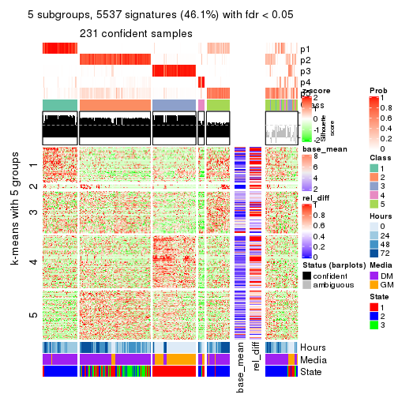</p>

</div>
<div id='tab-MAD-kmeans-get-signatures-5'>
<pre><code class="r">get_signatures(res, k = 6)
</code></pre>

<p></p>

</div>
</div>


Signature heatmaps where rows are not scaled:


<script>
$( function() {
	$( '#tabs-MAD-kmeans-get-signatures-no-scale' ).tabs();
} );
</script>
<div id='tabs-MAD-kmeans-get-signatures-no-scale'>
<ul>
<li><a href='#tab-MAD-kmeans-get-signatures-no-scale-1'>k = 2</a></li>
<li><a href='#tab-MAD-kmeans-get-signatures-no-scale-2'>k = 3</a></li>
<li><a href='#tab-MAD-kmeans-get-signatures-no-scale-3'>k = 4</a></li>
<li><a href='#tab-MAD-kmeans-get-signatures-no-scale-4'>k = 5</a></li>
<li><a href='#tab-MAD-kmeans-get-signatures-no-scale-5'>k = 6</a></li>
</ul>
<div id='tab-MAD-kmeans-get-signatures-no-scale-1'>
<pre><code class="r">get_signatures(res, k = 2, scale_rows = FALSE)
</code></pre>

<p></p>

</div>
<div id='tab-MAD-kmeans-get-signatures-no-scale-2'>
<pre><code class="r">get_signatures(res, k = 3, scale_rows = FALSE)
</code></pre>

<p></p>

</div>
<div id='tab-MAD-kmeans-get-signatures-no-scale-3'>
<pre><code class="r">get_signatures(res, k = 4, scale_rows = FALSE)
</code></pre>

<p></p>

</div>
<div id='tab-MAD-kmeans-get-signatures-no-scale-4'>
<pre><code class="r">get_signatures(res, k = 5, scale_rows = FALSE)
</code></pre>

<p></p>

</div>
<div id='tab-MAD-kmeans-get-signatures-no-scale-5'>
<pre><code class="r">get_signatures(res, k = 6, scale_rows = FALSE)
</code></pre>

<p></p>

</div>
</div>


Compare the overlap of signatures from different k:

```r
compare_signatures(res)
```


`get_signature()` returns a data frame invisibly. TO get the list of signatures, the function
call should be assigned to a variable explicitly. In following code, if `plot` argument is set
to `FALSE`, no heatmap is plotted while only the differential analysis is performed.

```r
# code only for demonstration
tb = get_signature(res, k = ..., plot = FALSE)
```

An example of the output of `tb` is:

```
#>   which_row         fdr    mean_1    mean_2 scaled_mean_1 scaled_mean_2 km
#> 1        38 0.042760348  8.373488  9.131774    -0.5533452     0.5164555  1
#> 2        40 0.018707592  7.106213  8.469186    -0.6173731     0.5762149  1
#> 3        55 0.019134737 10.221463 11.207825    -0.6159697     0.5749050  1
#> 4        59 0.006059896  5.921854  7.869574    -0.6899429     0.6439467  1
#> 5        60 0.018055526  8.928898 10.211722    -0.6204761     0.5791110  1
#> 6        98 0.009384629 15.714769 14.887706     0.6635654    -0.6193277  2
...
```

The columns in `tb` are:

1. `which_row`: row indices corresponding to the input matrix.
2. `fdr`: FDR for the differential test. 
3. `mean_x`: The mean value in group x.
4. `scaled_mean_x`: The mean value in group x after rows are scaled.
5. `km`: Row groups if k-means clustering is applied to rows.


UMAP plot which shows how samples are separated.


<script>
$( function() {
	$( '#tabs-MAD-kmeans-dimension-reduction' ).tabs();
} );
</script>
<div id='tabs-MAD-kmeans-dimension-reduction'>
<ul>
<li><a href='#tab-MAD-kmeans-dimension-reduction-1'>k = 2</a></li>
<li><a href='#tab-MAD-kmeans-dimension-reduction-2'>k = 3</a></li>
<li><a href='#tab-MAD-kmeans-dimension-reduction-3'>k = 4</a></li>
<li><a href='#tab-MAD-kmeans-dimension-reduction-4'>k = 5</a></li>
<li><a href='#tab-MAD-kmeans-dimension-reduction-5'>k = 6</a></li>
</ul>
<div id='tab-MAD-kmeans-dimension-reduction-1'>
<pre><code class="r">dimension_reduction(res, k = 2, method = &quot;UMAP&quot;)
</code></pre>

<p></p>

</div>
<div id='tab-MAD-kmeans-dimension-reduction-2'>
<pre><code class="r">dimension_reduction(res, k = 3, method = &quot;UMAP&quot;)
</code></pre>

<p></p>

</div>
<div id='tab-MAD-kmeans-dimension-reduction-3'>
<pre><code class="r">dimension_reduction(res, k = 4, method = &quot;UMAP&quot;)
</code></pre>

<p></p>

</div>
<div id='tab-MAD-kmeans-dimension-reduction-4'>
<pre><code class="r">dimension_reduction(res, k = 5, method = &quot;UMAP&quot;)
</code></pre>

<p></p>

</div>
<div id='tab-MAD-kmeans-dimension-reduction-5'>
<pre><code class="r">dimension_reduction(res, k = 6, method = &quot;UMAP&quot;)
</code></pre>

<p></p>

</div>
</div>


Following heatmap shows how subgroups are split when increasing `k`:

```r
collect_classes(res)
```


Test correlation between subgroups and known annotations. If the known
annotation is numeric, one-way ANOVA test is applied, and if the known
annotation is discrete, chi-squared contingency table test is applied.

```r
test_to_known_factors(res)
```

```
#>              n Hours(p) Media(p) State(p) k
#> MAD:kmeans 258 4.89e-05 3.67e-05 4.15e-26 2
#> MAD:kmeans 243 7.06e-07 4.77e-08 1.06e-26 3
#> MAD:kmeans 251 3.35e-34 7.64e-38 3.00e-45 4
#> MAD:kmeans 231 1.79e-29 2.03e-31 1.23e-41 5
#> MAD:kmeans 219 3.81e-33 6.87e-32 2.22e-46 6
```


If matrix rows can be associated to genes, consider to use `GO_Enrichment(res,
...)` to perform function enrichment for the signature genes.


 

---------------------------------------------------


### MAD:skmeans*


The object with results only for a single top-value method and a single partition method 
can be extracted as:

```r
res = res_list["MAD", "skmeans"]
# you can also extract it by
# res = res_list["MAD:skmeans"]
```

A summary of `res` and all the functions that can be applied to it:

```r
res
```

```
#> A 'ConsensusPartition' object with k = 2, 3, 4, 5, 6.
#>   On a matrix with 12016 rows and 271 columns.
#>   Top rows (1000, 2000, 3000, 4000, 5000) are extracted by 'MAD' method.
#>   Subgroups are detected by 'skmeans' method.
#>   Performed in total 1250 partitions by row resampling.
#>   Best k for subgroups seems to be 2.
#> 
#> Following methods can be applied to this 'ConsensusPartition' object:
#>  [1] "cola_report"             "collect_classes"         "collect_plots"          
#>  [4] "collect_stats"           "colnames"                "compare_signatures"     
#>  [7] "consensus_heatmap"       "dimension_reduction"     "functional_enrichment"  
#> [10] "get_anno_col"            "get_anno"                "get_classes"            
#> [13] "get_consensus"           "get_matrix"              "get_membership"         
#> [16] "get_param"               "get_signatures"          "get_stats"              
#> [19] "is_best_k"               "is_stable_k"             "membership_heatmap"     
#> [22] "ncol"                    "nrow"                    "plot_ecdf"              
#> [25] "rownames"                "select_partition_number" "show"                   
#> [28] "suggest_best_k"          "test_to_known_factors"
```

`collect_plots()` function collects all the plots made from `res` for all `k` (number of partitions)
into one single page to provide an easy and fast comparison between different `k`.

```r
collect_plots(res)
```


The plots are:

- The first row: a plot of the ECDF (Empirical cumulative distribution
  function) curves of the consensus matrix for each `k` and the heatmap of
  predicted classes for each `k`.
- The second row: heatmaps of the consensus matrix for each `k`.
- The third row: heatmaps of the membership matrix for each `k`.
- The fouth row: heatmaps of the signatures for each `k`.

All the plots in panels can be made by individual functions and they are
plotted later in this section.

`select_partition_number()` produces several plots showing different
statistics for choosing "optimized" `k`. There are following statistics:

- ECDF curves of the consensus matrix for each `k`;
- 1-PAC. [The PAC
  score](https://en.wikipedia.org/wiki/Consensus_clustering#Over-interpretation_potential_of_consensus_clustering)
  measures the proportion of the ambiguous subgrouping.
- Mean silhouette score.
- Concordance. The mean probability of fiting the consensus class ids in all
  partitions.
- Area increased. Denote $A_k$ as the area under the ECDF curve for current
  `k`, the area increased is defined as $A_k - A_{k-1}$.
- Rand index. The percent of pairs of samples that are both in a same cluster
  or both are not in a same cluster in the partition of k and k-1.
- Jaccard index. The ratio of pairs of samples are both in a same cluster in
  the partition of k and k-1 and the pairs of samples are both in a same
  cluster in the partition k or k-1.

The detailed explanations of these statistics can be found in [the cola
vignette](http://bioconductor.org/packages/devel/bioc/vignettes/cola/inst/doc/cola.html#toc_13).

Generally speaking, lower PAC score, higher mean silhouette score or higher
concordance corresponds to better partition. Rand index and Jaccard index
measure how similar the current partition is compared to partition with `k-1`.
If they are too similar, we won't accept `k` is better than `k-1`.

```r
select_partition_number(res)
```


The numeric values for all these statistics can be obtained by `get_stats()`.

```r
get_stats(res)
```

```
#>   k 1-PAC mean_silhouette concordance area_increased  Rand Jaccard
#> 2 2 0.950           0.936       0.972         0.4964 0.506   0.506
#> 3 3 0.852           0.889       0.945         0.3287 0.770   0.573
#> 4 4 0.819           0.821       0.915         0.1284 0.854   0.608
#> 5 5 0.716           0.672       0.821         0.0721 0.906   0.659
#> 6 6 0.697           0.625       0.782         0.0390 0.912   0.619
```

`suggest_best_k()` suggests the best $k$ based on these statistics. The rules are as follows:

- All $k$ with Jaccard index larger than 0.95 are removed because the increase of
  the partition number does not provides enough extra information. If all $k$ are removed,
  the best $k$ is assigned by `NA`.
- For $k$ with 1-PAC larger than 0.9, the maximal $k$ is taken as the "best k". Other $k$ is called "optional k".
- If it does not fit the second rule. The $k$ with the highest vote of highest
  1-PAC, mean silhouette and concordance is taken as the "best k".

```r
suggest_best_k(res)
```

```
#> [1] 2
```


Following shows the table of the partitions (You need to click the **show/hide
code output** link to see it). The membership matrix (columns with name `p*`)
is inferred by
[`clue::cl_consensus()`](https://www.rdocumentation.org/link/cl_consensus?package=clue)
function with the `SE` method. Basically the value in the membership matrix
represents the probability to belong to a certain group. The finall class
label for an item is determined with the group with highest probability it
belongs to.

In `get_classes()` function, the entropy is calculated from the membership
matrix and the silhouette score is calculated from the consensus matrix.


<script>
$( function() {
	$( '#tabs-MAD-skmeans-get-classes' ).tabs();
} );
</script>
<div id='tabs-MAD-skmeans-get-classes'>
<ul>
<li><a href='#tab-MAD-skmeans-get-classes-1'>k = 2</a></li>
<li><a href='#tab-MAD-skmeans-get-classes-2'>k = 3</a></li>
<li><a href='#tab-MAD-skmeans-get-classes-3'>k = 4</a></li>
<li><a href='#tab-MAD-skmeans-get-classes-4'>k = 5</a></li>
<li><a href='#tab-MAD-skmeans-get-classes-5'>k = 6</a></li>
</ul>

<div id='tab-MAD-skmeans-get-classes-1'>
<p><a id='tab-MAD-skmeans-get-classes-1-a' style='color:#0366d6' href='#'>show/hide code output</a></p>
<pre><code class="r">cbind(get_classes(res, k = 2), get_membership(res, k = 2))
</code></pre>

<pre><code>#&gt;            class entropy silhouette    p1    p2
#&gt; T0_CT_A01      2  0.0000      0.966 0.000 1.000
#&gt; T0_CT_A03      2  0.0376      0.964 0.004 0.996
#&gt; T0_CT_A05      2  0.1633      0.950 0.024 0.976
#&gt; T0_CT_A06      2  0.0376      0.964 0.004 0.996
#&gt; T0_CT_A07      2  0.0376      0.964 0.004 0.996
#&gt; T0_CT_A08      1  0.0000      0.977 1.000 0.000
#&gt; T0_CT_A10      2  0.9580      0.405 0.380 0.620
#&gt; T0_CT_A11      1  0.3274      0.931 0.940 0.060
#&gt; T0_CT_B01      1  0.3274      0.931 0.940 0.060
#&gt; T0_CT_B03      2  0.0000      0.966 0.000 1.000
#&gt; T0_CT_B05      2  0.7056      0.765 0.192 0.808
#&gt; T0_CT_B07      2  0.4298      0.893 0.088 0.912
#&gt; T0_CT_B08      2  0.0000      0.966 0.000 1.000
#&gt; T0_CT_B09      2  0.0672      0.961 0.008 0.992
#&gt; T0_CT_C02      2  0.0000      0.966 0.000 1.000
#&gt; T0_CT_C03      1  0.0000      0.977 1.000 0.000
#&gt; T0_CT_C05      2  0.0000      0.966 0.000 1.000
#&gt; T0_CT_C06      1  0.3114      0.934 0.944 0.056
#&gt; T0_CT_C07      1  0.4022      0.913 0.920 0.080
#&gt; T0_CT_C08      2  0.0376      0.964 0.004 0.996
#&gt; T0_CT_C09      1  0.3584      0.925 0.932 0.068
#&gt; T0_CT_C11      2  0.0000      0.966 0.000 1.000
#&gt; T0_CT_C12      2  0.0376      0.964 0.004 0.996
#&gt; T0_CT_D01      2  0.0000      0.966 0.000 1.000
#&gt; T0_CT_D02      1  0.3274      0.931 0.940 0.060
#&gt; T0_CT_D03      2  0.0000      0.966 0.000 1.000
#&gt; T0_CT_D05      2  0.4431      0.889 0.092 0.908
#&gt; T0_CT_D06      2  0.0000      0.966 0.000 1.000
#&gt; T0_CT_D07      2  0.1414      0.953 0.020 0.980
#&gt; T0_CT_D08      2  0.0000      0.966 0.000 1.000
#&gt; T0_CT_D09      2  0.0000      0.966 0.000 1.000
#&gt; T0_CT_D11      2  0.0000      0.966 0.000 1.000
#&gt; T0_CT_D12      2  0.0376      0.964 0.004 0.996
#&gt; T0_CT_E01      2  0.0000      0.966 0.000 1.000
#&gt; T0_CT_E03      2  0.9209      0.510 0.336 0.664
#&gt; T0_CT_E04      2  0.0000      0.966 0.000 1.000
#&gt; T0_CT_E05      1  0.0000      0.977 1.000 0.000
#&gt; T0_CT_E06      2  0.4022      0.901 0.080 0.920
#&gt; T0_CT_E07      2  0.2948      0.928 0.052 0.948
#&gt; T0_CT_E08      2  0.0000      0.966 0.000 1.000
#&gt; T0_CT_E09      2  0.0000      0.966 0.000 1.000
#&gt; T0_CT_E10      1  0.3584      0.925 0.932 0.068
#&gt; T0_CT_E11      2  0.4161      0.897 0.084 0.916
#&gt; T0_CT_E12      1  0.3274      0.931 0.940 0.060
#&gt; T0_CT_F01      2  0.0672      0.961 0.008 0.992
#&gt; T0_CT_F02      1  0.6801      0.794 0.820 0.180
#&gt; T0_CT_F03      2  0.0376      0.964 0.004 0.996
#&gt; T0_CT_F04      1  0.7056      0.776 0.808 0.192
#&gt; T0_CT_F05      2  0.0000      0.966 0.000 1.000
#&gt; T0_CT_F06      2  0.0000      0.966 0.000 1.000
#&gt; T0_CT_F07      2  0.0938      0.959 0.012 0.988
#&gt; T0_CT_F09      2  0.0000      0.966 0.000 1.000
#&gt; T0_CT_F11      1  0.3274      0.931 0.940 0.060
#&gt; T0_CT_F12      2  0.8386      0.645 0.268 0.732
#&gt; T0_CT_G01      2  0.0672      0.961 0.008 0.992
#&gt; T0_CT_G02      1  0.3274      0.931 0.940 0.060
#&gt; T0_CT_G03      1  0.9209      0.503 0.664 0.336
#&gt; T0_CT_G04      2  0.0000      0.966 0.000 1.000
#&gt; T0_CT_G07      2  0.0000      0.966 0.000 1.000
#&gt; T0_CT_G08      2  0.0000      0.966 0.000 1.000
#&gt; T0_CT_G09      1  0.0000      0.977 1.000 0.000
#&gt; T0_CT_G11      1  0.2948      0.938 0.948 0.052
#&gt; T0_CT_H01      1  0.0000      0.977 1.000 0.000
#&gt; T0_CT_H02      2  0.0000      0.966 0.000 1.000
#&gt; T0_CT_H04      2  0.0376      0.964 0.004 0.996
#&gt; T0_CT_H05      1  0.3274      0.931 0.940 0.060
#&gt; T0_CT_H08      2  0.6438      0.803 0.164 0.836
#&gt; T0_CT_H09      1  0.7883      0.715 0.764 0.236
#&gt; T0_CT_H12      1  0.3274      0.931 0.940 0.060
#&gt; T24_CT_A01     1  0.0000      0.977 1.000 0.000
#&gt; T24_CT_A03     2  0.0000      0.966 0.000 1.000
#&gt; T24_CT_A04     2  0.0000      0.966 0.000 1.000
#&gt; T24_CT_A05     1  0.0000      0.977 1.000 0.000
#&gt; T24_CT_A07     2  0.0000      0.966 0.000 1.000
#&gt; T24_CT_A08     1  0.0000      0.977 1.000 0.000
#&gt; T24_CT_A09     1  0.0000      0.977 1.000 0.000
#&gt; T24_CT_A10     1  0.0000      0.977 1.000 0.000
#&gt; T24_CT_B01     1  0.0000      0.977 1.000 0.000
#&gt; T24_CT_B02     1  0.0000      0.977 1.000 0.000
#&gt; T24_CT_B03     2  0.2778      0.930 0.048 0.952
#&gt; T24_CT_B05     2  0.0000      0.966 0.000 1.000
#&gt; T24_CT_B06     2  0.0000      0.966 0.000 1.000
#&gt; T24_CT_B07     1  0.0000      0.977 1.000 0.000
#&gt; T24_CT_B08     2  0.0000      0.966 0.000 1.000
#&gt; T24_CT_B09     1  0.0000      0.977 1.000 0.000
#&gt; T24_CT_B11     1  0.0000      0.977 1.000 0.000
#&gt; T24_CT_C01     1  0.0000      0.977 1.000 0.000
#&gt; T24_CT_C02     1  0.8327      0.666 0.736 0.264
#&gt; T24_CT_C03     1  0.0000      0.977 1.000 0.000
#&gt; T24_CT_C05     2  0.0938      0.958 0.012 0.988
#&gt; T24_CT_C07     2  0.0000      0.966 0.000 1.000
#&gt; T24_CT_C08     2  0.0000      0.966 0.000 1.000
#&gt; T24_CT_C09     1  0.7056      0.781 0.808 0.192
#&gt; T24_CT_C10     1  0.0000      0.977 1.000 0.000
#&gt; T24_CT_C11     1  0.0000      0.977 1.000 0.000
#&gt; T24_CT_C12     2  0.0000      0.966 0.000 1.000
#&gt; T24_CT_D01     2  0.0000      0.966 0.000 1.000
#&gt; T24_CT_D02     2  0.0000      0.966 0.000 1.000
#&gt; T24_CT_D03     2  0.0000      0.966 0.000 1.000
#&gt; T24_CT_D04     1  0.0000      0.977 1.000 0.000
#&gt; T24_CT_D05     1  0.0000      0.977 1.000 0.000
#&gt; T24_CT_D06     1  0.0000      0.977 1.000 0.000
#&gt; T24_CT_D07     1  0.6623      0.790 0.828 0.172
#&gt; T24_CT_D08     2  0.0000      0.966 0.000 1.000
#&gt; T24_CT_D09     2  0.0000      0.966 0.000 1.000
#&gt; T24_CT_D10     2  0.0000      0.966 0.000 1.000
#&gt; T24_CT_D11     2  0.0000      0.966 0.000 1.000
#&gt; T24_CT_E01     1  0.0000      0.977 1.000 0.000
#&gt; T24_CT_E02     1  0.0000      0.977 1.000 0.000
#&gt; T24_CT_E04     2  0.0000      0.966 0.000 1.000
#&gt; T24_CT_E05     1  0.0000      0.977 1.000 0.000
#&gt; T24_CT_E07     2  0.3431      0.917 0.064 0.936
#&gt; T24_CT_E09     1  0.0000      0.977 1.000 0.000
#&gt; T24_CT_E11     1  0.0000      0.977 1.000 0.000
#&gt; T24_CT_E12     2  0.0000      0.966 0.000 1.000
#&gt; T24_CT_F01     2  0.0000      0.966 0.000 1.000
#&gt; T24_CT_F02     2  0.0000      0.966 0.000 1.000
#&gt; T24_CT_F03     1  0.0000      0.977 1.000 0.000
#&gt; T24_CT_F04     1  0.0000      0.977 1.000 0.000
#&gt; T24_CT_F05     1  0.0000      0.977 1.000 0.000
#&gt; T24_CT_F07     1  0.0000      0.977 1.000 0.000
#&gt; T24_CT_F08     1  0.0000      0.977 1.000 0.000
#&gt; T24_CT_F09     2  0.0000      0.966 0.000 1.000
#&gt; T24_CT_F10     2  0.3584      0.914 0.068 0.932
#&gt; T24_CT_F11     1  0.0000      0.977 1.000 0.000
#&gt; T24_CT_F12     2  0.0000      0.966 0.000 1.000
#&gt; T24_CT_G01     2  0.0000      0.966 0.000 1.000
#&gt; T24_CT_G02     1  0.0000      0.977 1.000 0.000
#&gt; T24_CT_G03     1  0.0000      0.977 1.000 0.000
#&gt; T24_CT_G04     2  0.3584      0.913 0.068 0.932
#&gt; T24_CT_G05     2  1.0000     -0.033 0.500 0.500
#&gt; T24_CT_G06     1  0.0000      0.977 1.000 0.000
#&gt; T24_CT_G08     1  0.0000      0.977 1.000 0.000
#&gt; T24_CT_G10     2  0.0000      0.966 0.000 1.000
#&gt; T24_CT_G11     1  0.0000      0.977 1.000 0.000
#&gt; T24_CT_G12     1  0.0000      0.977 1.000 0.000
#&gt; T24_CT_H01     2  0.9996      0.104 0.488 0.512
#&gt; T24_CT_H02     1  0.0000      0.977 1.000 0.000
#&gt; T24_CT_H03     2  0.0000      0.966 0.000 1.000
#&gt; T24_CT_H05     1  0.0000      0.977 1.000 0.000
#&gt; T24_CT_H07     1  0.0000      0.977 1.000 0.000
#&gt; T24_CT_H09     1  0.0000      0.977 1.000 0.000
#&gt; T24_CT_H12     1  0.0000      0.977 1.000 0.000
#&gt; T48_CT_A01     2  0.0000      0.966 0.000 1.000
#&gt; T48_CT_A02     2  0.0000      0.966 0.000 1.000
#&gt; T48_CT_A03     1  0.0000      0.977 1.000 0.000
#&gt; T48_CT_A04     2  0.0000      0.966 0.000 1.000
#&gt; T48_CT_A05     2  0.3274      0.920 0.060 0.940
#&gt; T48_CT_A06     1  0.0000      0.977 1.000 0.000
#&gt; T48_CT_A07     2  0.0000      0.966 0.000 1.000
#&gt; T48_CT_A08     2  0.0000      0.966 0.000 1.000
#&gt; T48_CT_A09     1  0.0000      0.977 1.000 0.000
#&gt; T48_CT_A10     2  0.0000      0.966 0.000 1.000
#&gt; T48_CT_A11     2  0.0000      0.966 0.000 1.000
#&gt; T48_CT_A12     1  0.0000      0.977 1.000 0.000
#&gt; T48_CT_B01     2  0.0000      0.966 0.000 1.000
#&gt; T48_CT_B02     2  0.0000      0.966 0.000 1.000
#&gt; T48_CT_B03     1  0.0000      0.977 1.000 0.000
#&gt; T48_CT_B04     1  0.0000      0.977 1.000 0.000
#&gt; T48_CT_B06     2  0.0000      0.966 0.000 1.000
#&gt; T48_CT_B08     1  0.0000      0.977 1.000 0.000
#&gt; T48_CT_B10     2  0.0000      0.966 0.000 1.000
#&gt; T48_CT_B11     2  0.0000      0.966 0.000 1.000
#&gt; T48_CT_B12     1  0.0000      0.977 1.000 0.000
#&gt; T48_CT_C01     2  0.0000      0.966 0.000 1.000
#&gt; T48_CT_C02     1  0.0000      0.977 1.000 0.000
#&gt; T48_CT_C03     2  0.0000      0.966 0.000 1.000
#&gt; T48_CT_C04     1  0.0000      0.977 1.000 0.000
#&gt; T48_CT_C05     2  0.0000      0.966 0.000 1.000
#&gt; T48_CT_C06     2  0.0938      0.958 0.012 0.988
#&gt; T48_CT_C07     1  0.0000      0.977 1.000 0.000
#&gt; T48_CT_C09     2  0.0000      0.966 0.000 1.000
#&gt; T48_CT_C10     1  0.0000      0.977 1.000 0.000
#&gt; T48_CT_C11     2  0.0000      0.966 0.000 1.000
#&gt; T48_CT_D01     1  0.1414      0.962 0.980 0.020
#&gt; T48_CT_D02     1  0.0000      0.977 1.000 0.000
#&gt; T48_CT_D03     1  0.0000      0.977 1.000 0.000
#&gt; T48_CT_D04     2  0.0000      0.966 0.000 1.000
#&gt; T48_CT_D06     2  0.0000      0.966 0.000 1.000
#&gt; T48_CT_D07     2  0.0000      0.966 0.000 1.000
#&gt; T48_CT_D08     1  0.0000      0.977 1.000 0.000
#&gt; T48_CT_D09     2  0.9833      0.248 0.424 0.576
#&gt; T48_CT_D10     1  0.0000      0.977 1.000 0.000
#&gt; T48_CT_D11     2  0.0000      0.966 0.000 1.000
#&gt; T48_CT_D12     1  0.0000      0.977 1.000 0.000
#&gt; T48_CT_E01     2  0.3274      0.920 0.060 0.940
#&gt; T48_CT_E02     1  0.0000      0.977 1.000 0.000
#&gt; T48_CT_E03     2  0.7376      0.756 0.208 0.792
#&gt; T48_CT_E04     1  0.0938      0.968 0.988 0.012
#&gt; T48_CT_E05     2  0.0000      0.966 0.000 1.000
#&gt; T48_CT_E06     1  0.0000      0.977 1.000 0.000
#&gt; T48_CT_E07     1  0.0000      0.977 1.000 0.000
#&gt; T48_CT_E08     2  0.0000      0.966 0.000 1.000
#&gt; T48_CT_E10     1  0.0000      0.977 1.000 0.000
#&gt; T48_CT_E11     1  0.0000      0.977 1.000 0.000
#&gt; T48_CT_E12     2  0.0000      0.966 0.000 1.000
#&gt; T48_CT_F01     2  0.0000      0.966 0.000 1.000
#&gt; T48_CT_F02     1  0.0000      0.977 1.000 0.000
#&gt; T48_CT_F03     1  0.0000      0.977 1.000 0.000
#&gt; T48_CT_F05     2  0.1184      0.955 0.016 0.984
#&gt; T48_CT_F07     1  0.0000      0.977 1.000 0.000
#&gt; T48_CT_F09     2  0.0000      0.966 0.000 1.000
#&gt; T48_CT_F10     1  0.0000      0.977 1.000 0.000
#&gt; T48_CT_F11     1  0.0000      0.977 1.000 0.000
#&gt; T48_CT_G01     1  0.0000      0.977 1.000 0.000
#&gt; T48_CT_G02     2  0.0000      0.966 0.000 1.000
#&gt; T48_CT_G03     2  0.0000      0.966 0.000 1.000
#&gt; T48_CT_G07     2  0.0000      0.966 0.000 1.000
#&gt; T48_CT_G08     2  0.2236      0.940 0.036 0.964
#&gt; T48_CT_G09     2  0.3274      0.920 0.060 0.940
#&gt; T48_CT_G10     1  0.0000      0.977 1.000 0.000
#&gt; T48_CT_G11     1  0.0000      0.977 1.000 0.000
#&gt; T48_CT_G12     2  0.0000      0.966 0.000 1.000
#&gt; T48_CT_H01     1  0.7815      0.721 0.768 0.232
#&gt; T48_CT_H02     2  0.3431      0.917 0.064 0.936
#&gt; T48_CT_H04     1  0.0000      0.977 1.000 0.000
#&gt; T48_CT_H05     2  0.0000      0.966 0.000 1.000
#&gt; T48_CT_H06     2  0.0000      0.966 0.000 1.000
#&gt; T48_CT_H07     1  0.0000      0.977 1.000 0.000
#&gt; T48_CT_H08     2  0.0000      0.966 0.000 1.000
#&gt; T48_CT_H11     1  0.0000      0.977 1.000 0.000
#&gt; T48_CT_H12     2  0.0000      0.966 0.000 1.000
#&gt; T72_CT_A01     2  0.0000      0.966 0.000 1.000
#&gt; T72_CT_A05     2  0.0000      0.966 0.000 1.000
#&gt; T72_CT_A08     1  0.0000      0.977 1.000 0.000
#&gt; T72_CT_A09     2  0.0000      0.966 0.000 1.000
#&gt; T72_CT_A11     2  0.0000      0.966 0.000 1.000
#&gt; T72_CT_B01     2  0.0000      0.966 0.000 1.000
#&gt; T72_CT_B02     1  0.0000      0.977 1.000 0.000
#&gt; T72_CT_B03     1  0.0000      0.977 1.000 0.000
#&gt; T72_CT_B04     1  0.0000      0.977 1.000 0.000
#&gt; T72_CT_B05     2  0.3274      0.920 0.060 0.940
#&gt; T72_CT_B06     1  0.0000      0.977 1.000 0.000
#&gt; T72_CT_B08     2  0.0000      0.966 0.000 1.000
#&gt; T72_CT_B09     1  0.0000      0.977 1.000 0.000
#&gt; T72_CT_B11     1  0.0000      0.977 1.000 0.000
#&gt; T72_CT_B12     2  0.0000      0.966 0.000 1.000
#&gt; T72_CT_C04     2  0.0000      0.966 0.000 1.000
#&gt; T72_CT_C06     1  0.0672      0.971 0.992 0.008
#&gt; T72_CT_C07     2  0.0000      0.966 0.000 1.000
#&gt; T72_CT_C09     1  0.2043      0.952 0.968 0.032
#&gt; T72_CT_C11     2  0.0000      0.966 0.000 1.000
#&gt; T72_CT_D01     2  0.0000      0.966 0.000 1.000
#&gt; T72_CT_D03     2  0.5294      0.865 0.120 0.880
#&gt; T72_CT_D04     2  0.0000      0.966 0.000 1.000
#&gt; T72_CT_D05     1  0.0000      0.977 1.000 0.000
#&gt; T72_CT_D07     1  0.0000      0.977 1.000 0.000
#&gt; T72_CT_D10     2  0.3274      0.920 0.060 0.940
#&gt; T72_CT_D11     1  0.0000      0.977 1.000 0.000
#&gt; T72_CT_E04     1  0.0000      0.977 1.000 0.000
#&gt; T72_CT_E05     2  0.0000      0.966 0.000 1.000
#&gt; T72_CT_E07     2  0.0000      0.966 0.000 1.000
#&gt; T72_CT_F01     2  0.0000      0.966 0.000 1.000
#&gt; T72_CT_F05     2  0.0000      0.966 0.000 1.000
#&gt; T72_CT_F07     1  0.0000      0.977 1.000 0.000
#&gt; T72_CT_F10     2  0.0000      0.966 0.000 1.000
#&gt; T72_CT_F11     2  0.0000      0.966 0.000 1.000
#&gt; T72_CT_G03     1  0.0000      0.977 1.000 0.000
#&gt; T72_CT_G04     1  0.0000      0.977 1.000 0.000
#&gt; T72_CT_G06     2  0.0000      0.966 0.000 1.000
#&gt; T72_CT_G08     2  0.9970      0.116 0.468 0.532
#&gt; T72_CT_G10     2  0.0000      0.966 0.000 1.000
#&gt; T72_CT_G11     1  0.0000      0.977 1.000 0.000
#&gt; T72_CT_H01     2  0.0000      0.966 0.000 1.000
#&gt; T72_CT_H03     2  0.0000      0.966 0.000 1.000
#&gt; T72_CT_H05     2  0.0000      0.966 0.000 1.000
#&gt; T72_CT_H08     2  0.0000      0.966 0.000 1.000
#&gt; T72_CT_H09     2  0.8207      0.682 0.256 0.744
#&gt; T72_CT_H10     1  0.0000      0.977 1.000 0.000
#&gt; T72_CT_H11     1  0.0000      0.977 1.000 0.000
#&gt; T72_CT_H12     2  0.0000      0.966 0.000 1.000
</code></pre>

<script>
$('#tab-MAD-skmeans-get-classes-1-a').parent().next().next().hide();
$('#tab-MAD-skmeans-get-classes-1-a').click(function(){
  $('#tab-MAD-skmeans-get-classes-1-a').parent().next().next().toggle();
  return(false);
});
</script>
</div>

<div id='tab-MAD-skmeans-get-classes-2'>
<p><a id='tab-MAD-skmeans-get-classes-2-a' style='color:#0366d6' href='#'>show/hide code output</a></p>
<pre><code class="r">cbind(get_classes(res, k = 3), get_membership(res, k = 3))
</code></pre>

<pre><code>#&gt;            class entropy silhouette    p1    p2    p3
#&gt; T0_CT_A01      3  0.0000    0.91813 0.000 0.000 1.000
#&gt; T0_CT_A03      3  0.0000    0.91813 0.000 0.000 1.000
#&gt; T0_CT_A05      3  0.0000    0.91813 0.000 0.000 1.000
#&gt; T0_CT_A06      3  0.0237    0.91709 0.000 0.004 0.996
#&gt; T0_CT_A07      3  0.0000    0.91813 0.000 0.000 1.000
#&gt; T0_CT_A08      1  0.0000    0.97624 1.000 0.000 0.000
#&gt; T0_CT_A10      3  0.0000    0.91813 0.000 0.000 1.000
#&gt; T0_CT_A11      1  0.6349    0.71424 0.764 0.080 0.156
#&gt; T0_CT_B01      1  0.7286    0.00999 0.508 0.028 0.464
#&gt; T0_CT_B03      3  0.0000    0.91813 0.000 0.000 1.000
#&gt; T0_CT_B05      3  0.0000    0.91813 0.000 0.000 1.000
#&gt; T0_CT_B07      3  0.0000    0.91813 0.000 0.000 1.000
#&gt; T0_CT_B08      3  0.0000    0.91813 0.000 0.000 1.000
#&gt; T0_CT_B09      3  0.0000    0.91813 0.000 0.000 1.000
#&gt; T0_CT_C02      3  0.0000    0.91813 0.000 0.000 1.000
#&gt; T0_CT_C03      3  0.6008    0.43469 0.372 0.000 0.628
#&gt; T0_CT_C05      2  0.6302   -0.03176 0.000 0.520 0.480
#&gt; T0_CT_C06      1  0.7022    0.55594 0.684 0.056 0.260
#&gt; T0_CT_C07      3  0.1999    0.89738 0.036 0.012 0.952
#&gt; T0_CT_C08      3  0.0000    0.91813 0.000 0.000 1.000
#&gt; T0_CT_C09      3  0.9891    0.28790 0.316 0.280 0.404
#&gt; T0_CT_C11      2  0.0747    0.92223 0.000 0.984 0.016
#&gt; T0_CT_C12      3  0.0000    0.91813 0.000 0.000 1.000
#&gt; T0_CT_D01      3  0.0000    0.91813 0.000 0.000 1.000
#&gt; T0_CT_D02      3  0.3532    0.84533 0.108 0.008 0.884
#&gt; T0_CT_D03      3  0.0000    0.91813 0.000 0.000 1.000
#&gt; T0_CT_D05      3  0.1163    0.90077 0.000 0.028 0.972
#&gt; T0_CT_D06      3  0.1031    0.91017 0.000 0.024 0.976
#&gt; T0_CT_D07      3  0.0000    0.91813 0.000 0.000 1.000
#&gt; T0_CT_D08      3  0.0424    0.91580 0.000 0.008 0.992
#&gt; T0_CT_D09      3  0.4887    0.67854 0.000 0.228 0.772
#&gt; T0_CT_D11      2  0.6286    0.03357 0.000 0.536 0.464
#&gt; T0_CT_D12      3  0.0000    0.91813 0.000 0.000 1.000
#&gt; T0_CT_E01      3  0.0000    0.91813 0.000 0.000 1.000
#&gt; T0_CT_E03      3  0.0237    0.91711 0.004 0.000 0.996
#&gt; T0_CT_E04      3  0.6204    0.33461 0.000 0.424 0.576
#&gt; T0_CT_E05      1  0.0592    0.96779 0.988 0.012 0.000
#&gt; T0_CT_E06      3  0.1163    0.90672 0.000 0.028 0.972
#&gt; T0_CT_E07      3  0.0237    0.91711 0.000 0.004 0.996
#&gt; T0_CT_E08      3  0.0000    0.91813 0.000 0.000 1.000
#&gt; T0_CT_E09      3  0.0000    0.91813 0.000 0.000 1.000
#&gt; T0_CT_E10      3  0.9880    0.27736 0.324 0.272 0.404
#&gt; T0_CT_E11      3  0.1163    0.90672 0.000 0.028 0.972
#&gt; T0_CT_E12      3  0.3752    0.85100 0.096 0.020 0.884
#&gt; T0_CT_F01      3  0.0000    0.91813 0.000 0.000 1.000
#&gt; T0_CT_F02      3  0.1315    0.90817 0.008 0.020 0.972
#&gt; T0_CT_F03      3  0.0000    0.91813 0.000 0.000 1.000
#&gt; T0_CT_F04      3  0.0237    0.91716 0.004 0.000 0.996
#&gt; T0_CT_F05      3  0.5363    0.64495 0.000 0.276 0.724
#&gt; T0_CT_F06      3  0.0000    0.91813 0.000 0.000 1.000
#&gt; T0_CT_F07      3  0.0000    0.91813 0.000 0.000 1.000
#&gt; T0_CT_F09      2  0.0747    0.92231 0.000 0.984 0.016
#&gt; T0_CT_F11      3  0.2414    0.89313 0.020 0.040 0.940
#&gt; T0_CT_F12      3  0.0000    0.91813 0.000 0.000 1.000
#&gt; T0_CT_G01      3  0.0000    0.91813 0.000 0.000 1.000
#&gt; T0_CT_G02      3  0.3752    0.81069 0.144 0.000 0.856
#&gt; T0_CT_G03      3  0.1182    0.91045 0.012 0.012 0.976
#&gt; T0_CT_G04      3  0.0424    0.91580 0.000 0.008 0.992
#&gt; T0_CT_G07      3  0.0000    0.91813 0.000 0.000 1.000
#&gt; T0_CT_G08      3  0.0892    0.91175 0.000 0.020 0.980
#&gt; T0_CT_G09      1  0.0000    0.97624 1.000 0.000 0.000
#&gt; T0_CT_G11      3  0.6286    0.17383 0.464 0.000 0.536
#&gt; T0_CT_H01      1  0.6047    0.51353 0.680 0.008 0.312
#&gt; T0_CT_H02      3  0.4291    0.76272 0.000 0.180 0.820
#&gt; T0_CT_H04      3  0.0592    0.91427 0.000 0.012 0.988
#&gt; T0_CT_H05      3  0.2492    0.88885 0.048 0.016 0.936
#&gt; T0_CT_H08      3  0.0000    0.91813 0.000 0.000 1.000
#&gt; T0_CT_H09      3  0.7116    0.53533 0.040 0.324 0.636
#&gt; T0_CT_H12      3  0.3690    0.84954 0.100 0.016 0.884
#&gt; T24_CT_A01     1  0.0000    0.97624 1.000 0.000 0.000
#&gt; T24_CT_A03     2  0.1529    0.92177 0.000 0.960 0.040
#&gt; T24_CT_A04     2  0.1289    0.91315 0.000 0.968 0.032
#&gt; T24_CT_A05     1  0.0592    0.96700 0.988 0.000 0.012
#&gt; T24_CT_A07     2  0.0000    0.92737 0.000 1.000 0.000
#&gt; T24_CT_A08     1  0.0000    0.97624 1.000 0.000 0.000
#&gt; T24_CT_A09     1  0.0000    0.97624 1.000 0.000 0.000
#&gt; T24_CT_A10     1  0.0000    0.97624 1.000 0.000 0.000
#&gt; T24_CT_B01     1  0.0000    0.97624 1.000 0.000 0.000
#&gt; T24_CT_B02     1  0.0000    0.97624 1.000 0.000 0.000
#&gt; T24_CT_B03     2  0.2537    0.90099 0.000 0.920 0.080
#&gt; T24_CT_B05     2  0.0000    0.92737 0.000 1.000 0.000
#&gt; T24_CT_B06     2  0.0237    0.92770 0.000 0.996 0.004
#&gt; T24_CT_B07     1  0.0000    0.97624 1.000 0.000 0.000
#&gt; T24_CT_B08     2  0.0000    0.92737 0.000 1.000 0.000
#&gt; T24_CT_B09     1  0.0000    0.97624 1.000 0.000 0.000
#&gt; T24_CT_B11     3  0.5138    0.66972 0.252 0.000 0.748
#&gt; T24_CT_C01     1  0.0000    0.97624 1.000 0.000 0.000
#&gt; T24_CT_C02     2  0.0237    0.92591 0.004 0.996 0.000
#&gt; T24_CT_C03     1  0.0747    0.96467 0.984 0.016 0.000
#&gt; T24_CT_C05     2  0.0424    0.92541 0.000 0.992 0.008
#&gt; T24_CT_C07     2  0.0000    0.92737 0.000 1.000 0.000
#&gt; T24_CT_C08     2  0.0000    0.92737 0.000 1.000 0.000
#&gt; T24_CT_C09     2  0.1399    0.90911 0.028 0.968 0.004
#&gt; T24_CT_C10     1  0.0000    0.97624 1.000 0.000 0.000
#&gt; T24_CT_C11     1  0.1643    0.93923 0.956 0.044 0.000
#&gt; T24_CT_C12     2  0.1163    0.92533 0.000 0.972 0.028
#&gt; T24_CT_D01     2  0.0000    0.92737 0.000 1.000 0.000
#&gt; T24_CT_D02     2  0.1289    0.92419 0.000 0.968 0.032
#&gt; T24_CT_D03     2  0.0000    0.92737 0.000 1.000 0.000
#&gt; T24_CT_D04     1  0.0000    0.97624 1.000 0.000 0.000
#&gt; T24_CT_D05     1  0.0000    0.97624 1.000 0.000 0.000
#&gt; T24_CT_D06     1  0.0000    0.97624 1.000 0.000 0.000
#&gt; T24_CT_D07     1  0.6586    0.64524 0.728 0.216 0.056
#&gt; T24_CT_D08     2  0.0000    0.92737 0.000 1.000 0.000
#&gt; T24_CT_D09     2  0.1163    0.92533 0.000 0.972 0.028
#&gt; T24_CT_D10     2  0.0892    0.92742 0.000 0.980 0.020
#&gt; T24_CT_D11     2  0.0000    0.92737 0.000 1.000 0.000
#&gt; T24_CT_E01     1  0.0000    0.97624 1.000 0.000 0.000
#&gt; T24_CT_E02     1  0.0000    0.97624 1.000 0.000 0.000
#&gt; T24_CT_E04     2  0.0000    0.92737 0.000 1.000 0.000
#&gt; T24_CT_E05     1  0.0000    0.97624 1.000 0.000 0.000
#&gt; T24_CT_E07     2  0.3715    0.86352 0.004 0.868 0.128
#&gt; T24_CT_E09     1  0.0000    0.97624 1.000 0.000 0.000
#&gt; T24_CT_E11     1  0.0000    0.97624 1.000 0.000 0.000
#&gt; T24_CT_E12     2  0.0000    0.92737 0.000 1.000 0.000
#&gt; T24_CT_F01     2  0.0000    0.92737 0.000 1.000 0.000
#&gt; T24_CT_F02     2  0.0424    0.92807 0.000 0.992 0.008
#&gt; T24_CT_F03     1  0.0000    0.97624 1.000 0.000 0.000
#&gt; T24_CT_F04     1  0.1163    0.95434 0.972 0.028 0.000
#&gt; T24_CT_F05     1  0.0000    0.97624 1.000 0.000 0.000
#&gt; T24_CT_F07     1  0.0747    0.96467 0.984 0.016 0.000
#&gt; T24_CT_F08     1  0.0000    0.97624 1.000 0.000 0.000
#&gt; T24_CT_F09     2  0.3482    0.86635 0.000 0.872 0.128
#&gt; T24_CT_F10     2  0.6192    0.40043 0.000 0.580 0.420
#&gt; T24_CT_F11     1  0.0000    0.97624 1.000 0.000 0.000
#&gt; T24_CT_F12     2  0.1163    0.92533 0.000 0.972 0.028
#&gt; T24_CT_G01     2  0.0424    0.92782 0.000 0.992 0.008
#&gt; T24_CT_G02     1  0.0000    0.97624 1.000 0.000 0.000
#&gt; T24_CT_G03     1  0.0000    0.97624 1.000 0.000 0.000
#&gt; T24_CT_G04     2  0.5408    0.81213 0.052 0.812 0.136
#&gt; T24_CT_G05     2  0.0000    0.92737 0.000 1.000 0.000
#&gt; T24_CT_G06     1  0.0000    0.97624 1.000 0.000 0.000
#&gt; T24_CT_G08     1  0.0000    0.97624 1.000 0.000 0.000
#&gt; T24_CT_G10     2  0.1163    0.92523 0.000 0.972 0.028
#&gt; T24_CT_G11     1  0.0000    0.97624 1.000 0.000 0.000
#&gt; T24_CT_G12     1  0.1289    0.94858 0.968 0.000 0.032
#&gt; T24_CT_H01     3  0.0237    0.91703 0.004 0.000 0.996
#&gt; T24_CT_H02     1  0.0000    0.97624 1.000 0.000 0.000
#&gt; T24_CT_H03     2  0.0000    0.92737 0.000 1.000 0.000
#&gt; T24_CT_H05     1  0.0000    0.97624 1.000 0.000 0.000
#&gt; T24_CT_H07     1  0.0000    0.97624 1.000 0.000 0.000
#&gt; T24_CT_H09     1  0.0000    0.97624 1.000 0.000 0.000
#&gt; T24_CT_H12     1  0.0000    0.97624 1.000 0.000 0.000
#&gt; T48_CT_A01     2  0.2537    0.90120 0.000 0.920 0.080
#&gt; T48_CT_A02     2  0.1031    0.92606 0.000 0.976 0.024
#&gt; T48_CT_A03     1  0.0000    0.97624 1.000 0.000 0.000
#&gt; T48_CT_A04     2  0.0000    0.92737 0.000 1.000 0.000
#&gt; T48_CT_A05     2  0.3412    0.86773 0.000 0.876 0.124
#&gt; T48_CT_A06     1  0.0000    0.97624 1.000 0.000 0.000
#&gt; T48_CT_A07     3  0.2448    0.85759 0.000 0.076 0.924
#&gt; T48_CT_A08     2  0.1411    0.92290 0.000 0.964 0.036
#&gt; T48_CT_A09     1  0.0000    0.97624 1.000 0.000 0.000
#&gt; T48_CT_A10     2  0.0000    0.92737 0.000 1.000 0.000
#&gt; T48_CT_A11     2  0.0237    0.92758 0.000 0.996 0.004
#&gt; T48_CT_A12     1  0.0000    0.97624 1.000 0.000 0.000
#&gt; T48_CT_B01     2  0.0000    0.92737 0.000 1.000 0.000
#&gt; T48_CT_B02     2  0.0000    0.92737 0.000 1.000 0.000
#&gt; T48_CT_B03     1  0.0000    0.97624 1.000 0.000 0.000
#&gt; T48_CT_B04     1  0.0000    0.97624 1.000 0.000 0.000
#&gt; T48_CT_B06     2  0.0000    0.92737 0.000 1.000 0.000
#&gt; T48_CT_B08     1  0.0000    0.97624 1.000 0.000 0.000
#&gt; T48_CT_B10     2  0.0000    0.92737 0.000 1.000 0.000
#&gt; T48_CT_B11     2  0.1031    0.92606 0.000 0.976 0.024
#&gt; T48_CT_B12     1  0.0000    0.97624 1.000 0.000 0.000
#&gt; T48_CT_C01     2  0.0000    0.92737 0.000 1.000 0.000
#&gt; T48_CT_C02     1  0.0747    0.96467 0.984 0.016 0.000
#&gt; T48_CT_C03     2  0.0000    0.92737 0.000 1.000 0.000
#&gt; T48_CT_C04     1  0.0000    0.97624 1.000 0.000 0.000
#&gt; T48_CT_C05     2  0.1753    0.91842 0.000 0.952 0.048
#&gt; T48_CT_C06     2  0.1031    0.92608 0.000 0.976 0.024
#&gt; T48_CT_C07     1  0.0000    0.97624 1.000 0.000 0.000
#&gt; T48_CT_C09     2  0.4842    0.76232 0.000 0.776 0.224
#&gt; T48_CT_C10     1  0.0000    0.97624 1.000 0.000 0.000
#&gt; T48_CT_C11     2  0.0592    0.92756 0.000 0.988 0.012
#&gt; T48_CT_D01     2  0.4974    0.65843 0.236 0.764 0.000
#&gt; T48_CT_D02     1  0.0424    0.97069 0.992 0.008 0.000
#&gt; T48_CT_D03     1  0.0000    0.97624 1.000 0.000 0.000
#&gt; T48_CT_D04     2  0.0237    0.92777 0.000 0.996 0.004
#&gt; T48_CT_D06     2  0.4121    0.82607 0.000 0.832 0.168
#&gt; T48_CT_D07     2  0.0000    0.92737 0.000 1.000 0.000
#&gt; T48_CT_D08     1  0.0000    0.97624 1.000 0.000 0.000
#&gt; T48_CT_D09     2  0.0000    0.92737 0.000 1.000 0.000
#&gt; T48_CT_D10     1  0.1411    0.94659 0.964 0.036 0.000
#&gt; T48_CT_D11     2  0.2796    0.89517 0.000 0.908 0.092
#&gt; T48_CT_D12     1  0.0000    0.97624 1.000 0.000 0.000
#&gt; T48_CT_E01     2  0.2959    0.88715 0.000 0.900 0.100
#&gt; T48_CT_E02     1  0.0000    0.97624 1.000 0.000 0.000
#&gt; T48_CT_E03     2  0.7180    0.70475 0.116 0.716 0.168
#&gt; T48_CT_E04     1  0.3816    0.80561 0.852 0.148 0.000
#&gt; T48_CT_E05     2  0.0000    0.92737 0.000 1.000 0.000
#&gt; T48_CT_E06     1  0.0000    0.97624 1.000 0.000 0.000
#&gt; T48_CT_E07     1  0.0000    0.97624 1.000 0.000 0.000
#&gt; T48_CT_E08     2  0.0000    0.92737 0.000 1.000 0.000
#&gt; T48_CT_E10     1  0.0000    0.97624 1.000 0.000 0.000
#&gt; T48_CT_E11     1  0.0000    0.97624 1.000 0.000 0.000
#&gt; T48_CT_E12     2  0.6215    0.37936 0.000 0.572 0.428
#&gt; T48_CT_F01     2  0.0000    0.92737 0.000 1.000 0.000
#&gt; T48_CT_F02     1  0.0000    0.97624 1.000 0.000 0.000
#&gt; T48_CT_F03     1  0.0592    0.96779 0.988 0.012 0.000
#&gt; T48_CT_F05     2  0.0000    0.92737 0.000 1.000 0.000
#&gt; T48_CT_F07     1  0.0000    0.97624 1.000 0.000 0.000
#&gt; T48_CT_F09     2  0.0592    0.92757 0.000 0.988 0.012
#&gt; T48_CT_F10     1  0.0592    0.96779 0.988 0.012 0.000
#&gt; T48_CT_F11     1  0.0000    0.97624 1.000 0.000 0.000
#&gt; T48_CT_G01     1  0.0000    0.97624 1.000 0.000 0.000
#&gt; T48_CT_G02     2  0.1529    0.92187 0.000 0.960 0.040
#&gt; T48_CT_G03     2  0.0000    0.92737 0.000 1.000 0.000
#&gt; T48_CT_G07     2  0.0000    0.92737 0.000 1.000 0.000
#&gt; T48_CT_G08     2  0.2165    0.91038 0.000 0.936 0.064
#&gt; T48_CT_G09     2  0.3267    0.87447 0.000 0.884 0.116
#&gt; T48_CT_G10     1  0.0237    0.97327 0.996 0.000 0.004
#&gt; T48_CT_G11     1  0.0000    0.97624 1.000 0.000 0.000
#&gt; T48_CT_G12     2  0.0000    0.92737 0.000 1.000 0.000
#&gt; T48_CT_H01     2  0.1643    0.89645 0.044 0.956 0.000
#&gt; T48_CT_H02     2  0.5431    0.67817 0.000 0.716 0.284
#&gt; T48_CT_H04     1  0.0747    0.96467 0.984 0.016 0.000
#&gt; T48_CT_H05     2  0.0000    0.92737 0.000 1.000 0.000
#&gt; T48_CT_H06     2  0.0000    0.92737 0.000 1.000 0.000
#&gt; T48_CT_H07     1  0.0000    0.97624 1.000 0.000 0.000
#&gt; T48_CT_H08     2  0.1529    0.92154 0.000 0.960 0.040
#&gt; T48_CT_H11     1  0.0000    0.97624 1.000 0.000 0.000
#&gt; T48_CT_H12     2  0.0000    0.92737 0.000 1.000 0.000
#&gt; T72_CT_A01     2  0.1411    0.92290 0.000 0.964 0.036
#&gt; T72_CT_A05     2  0.4796    0.76808 0.000 0.780 0.220
#&gt; T72_CT_A08     1  0.0000    0.97624 1.000 0.000 0.000
#&gt; T72_CT_A09     2  0.3941    0.83838 0.000 0.844 0.156
#&gt; T72_CT_A11     2  0.1411    0.92290 0.000 0.964 0.036
#&gt; T72_CT_B01     2  0.0747    0.92715 0.000 0.984 0.016
#&gt; T72_CT_B02     1  0.0000    0.97624 1.000 0.000 0.000
#&gt; T72_CT_B03     1  0.0747    0.96362 0.984 0.000 0.016
#&gt; T72_CT_B04     1  0.0000    0.97624 1.000 0.000 0.000
#&gt; T72_CT_B05     2  0.5216    0.71412 0.000 0.740 0.260
#&gt; T72_CT_B06     1  0.0000    0.97624 1.000 0.000 0.000
#&gt; T72_CT_B08     3  0.1163    0.90220 0.000 0.028 0.972
#&gt; T72_CT_B09     1  0.0000    0.97624 1.000 0.000 0.000
#&gt; T72_CT_B11     1  0.0000    0.97624 1.000 0.000 0.000
#&gt; T72_CT_B12     2  0.1529    0.92154 0.000 0.960 0.040
#&gt; T72_CT_C04     2  0.1643    0.92007 0.000 0.956 0.044
#&gt; T72_CT_C06     1  0.1015    0.96023 0.980 0.008 0.012
#&gt; T72_CT_C07     2  0.5431    0.67849 0.000 0.716 0.284
#&gt; T72_CT_C09     1  0.3454    0.85461 0.888 0.104 0.008
#&gt; T72_CT_C11     2  0.5363    0.69094 0.000 0.724 0.276
#&gt; T72_CT_D01     2  0.1411    0.92290 0.000 0.964 0.036
#&gt; T72_CT_D03     3  0.7888    0.58113 0.140 0.196 0.664
#&gt; T72_CT_D04     2  0.2796    0.89292 0.000 0.908 0.092
#&gt; T72_CT_D05     1  0.0000    0.97624 1.000 0.000 0.000
#&gt; T72_CT_D07     1  0.0000    0.97624 1.000 0.000 0.000
#&gt; T72_CT_D10     2  0.5291    0.70256 0.000 0.732 0.268
#&gt; T72_CT_D11     1  0.0000    0.97624 1.000 0.000 0.000
#&gt; T72_CT_E04     1  0.0000    0.97624 1.000 0.000 0.000
#&gt; T72_CT_E05     2  0.1529    0.92154 0.000 0.960 0.040
#&gt; T72_CT_E07     2  0.4399    0.80707 0.000 0.812 0.188
#&gt; T72_CT_F01     2  0.0892    0.92657 0.000 0.980 0.020
#&gt; T72_CT_F05     2  0.0237    0.92761 0.000 0.996 0.004
#&gt; T72_CT_F07     1  0.0000    0.97624 1.000 0.000 0.000
#&gt; T72_CT_F10     2  0.1643    0.92006 0.000 0.956 0.044
#&gt; T72_CT_F11     2  0.5138    0.72596 0.000 0.748 0.252
#&gt; T72_CT_G03     1  0.0000    0.97624 1.000 0.000 0.000
#&gt; T72_CT_G04     1  0.0000    0.97624 1.000 0.000 0.000
#&gt; T72_CT_G06     2  0.4452    0.75555 0.000 0.808 0.192
#&gt; T72_CT_G08     3  0.5020    0.82246 0.108 0.056 0.836
#&gt; T72_CT_G10     2  0.0592    0.92754 0.000 0.988 0.012
#&gt; T72_CT_G11     1  0.0000    0.97624 1.000 0.000 0.000
#&gt; T72_CT_H01     2  0.0747    0.92715 0.000 0.984 0.016
#&gt; T72_CT_H03     2  0.1031    0.92608 0.000 0.976 0.024
#&gt; T72_CT_H05     3  0.0000    0.91813 0.000 0.000 1.000
#&gt; T72_CT_H08     3  0.2261    0.86685 0.000 0.068 0.932
#&gt; T72_CT_H09     3  0.0237    0.91703 0.004 0.000 0.996
#&gt; T72_CT_H10     1  0.0000    0.97624 1.000 0.000 0.000
#&gt; T72_CT_H11     1  0.0000    0.97624 1.000 0.000 0.000
#&gt; T72_CT_H12     2  0.0892    0.92657 0.000 0.980 0.020
</code></pre>

<script>
$('#tab-MAD-skmeans-get-classes-2-a').parent().next().next().hide();
$('#tab-MAD-skmeans-get-classes-2-a').click(function(){
  $('#tab-MAD-skmeans-get-classes-2-a').parent().next().next().toggle();
  return(false);
});
</script>
</div>

<div id='tab-MAD-skmeans-get-classes-3'>
<p><a id='tab-MAD-skmeans-get-classes-3-a' style='color:#0366d6' href='#'>show/hide code output</a></p>
<pre><code class="r">cbind(get_classes(res, k = 4), get_membership(res, k = 4))
</code></pre>

<pre><code>#&gt;            class entropy silhouette    p1    p2    p3    p4
#&gt; T0_CT_A01      3  0.1474    0.90374 0.000 0.052 0.948 0.000
#&gt; T0_CT_A03      3  0.0000    0.93672 0.000 0.000 1.000 0.000
#&gt; T0_CT_A05      3  0.0000    0.93672 0.000 0.000 1.000 0.000
#&gt; T0_CT_A06      3  0.0000    0.93672 0.000 0.000 1.000 0.000
#&gt; T0_CT_A07      3  0.0000    0.93672 0.000 0.000 1.000 0.000
#&gt; T0_CT_A08      1  0.0000    0.94892 1.000 0.000 0.000 0.000
#&gt; T0_CT_A10      3  0.0000    0.93672 0.000 0.000 1.000 0.000
#&gt; T0_CT_A11      4  0.0000    0.85151 0.000 0.000 0.000 1.000
#&gt; T0_CT_B01      4  0.1724    0.83516 0.032 0.000 0.020 0.948
#&gt; T0_CT_B03      3  0.0469    0.93254 0.000 0.012 0.988 0.000
#&gt; T0_CT_B05      3  0.0000    0.93672 0.000 0.000 1.000 0.000
#&gt; T0_CT_B07      3  0.0000    0.93672 0.000 0.000 1.000 0.000
#&gt; T0_CT_B08      3  0.0188    0.93543 0.000 0.004 0.996 0.000
#&gt; T0_CT_B09      3  0.0000    0.93672 0.000 0.000 1.000 0.000
#&gt; T0_CT_C02      3  0.0469    0.93254 0.000 0.012 0.988 0.000
#&gt; T0_CT_C03      1  0.5000    0.00574 0.504 0.000 0.496 0.000
#&gt; T0_CT_C05      4  0.5250    0.71238 0.000 0.080 0.176 0.744
#&gt; T0_CT_C06      4  0.1302    0.83438 0.044 0.000 0.000 0.956
#&gt; T0_CT_C07      3  0.0000    0.93672 0.000 0.000 1.000 0.000
#&gt; T0_CT_C08      3  0.0000    0.93672 0.000 0.000 1.000 0.000
#&gt; T0_CT_C09      4  0.0000    0.85151 0.000 0.000 0.000 1.000
#&gt; T0_CT_C11      4  0.1211    0.85778 0.000 0.040 0.000 0.960
#&gt; T0_CT_C12      3  0.0000    0.93672 0.000 0.000 1.000 0.000
#&gt; T0_CT_D01      3  0.1867    0.88974 0.000 0.072 0.928 0.000
#&gt; T0_CT_D02      3  0.1109    0.91966 0.004 0.000 0.968 0.028
#&gt; T0_CT_D03      3  0.0000    0.93672 0.000 0.000 1.000 0.000
#&gt; T0_CT_D05      3  0.3249    0.80942 0.000 0.140 0.852 0.008
#&gt; T0_CT_D06      3  0.0657    0.93130 0.000 0.012 0.984 0.004
#&gt; T0_CT_D07      3  0.0000    0.93672 0.000 0.000 1.000 0.000
#&gt; T0_CT_D08      3  0.0469    0.93254 0.000 0.012 0.988 0.000
#&gt; T0_CT_D09      3  0.4877    0.32883 0.000 0.408 0.592 0.000
#&gt; T0_CT_D11      4  0.5332    0.70478 0.000 0.080 0.184 0.736
#&gt; T0_CT_D12      3  0.0000    0.93672 0.000 0.000 1.000 0.000
#&gt; T0_CT_E01      3  0.0000    0.93672 0.000 0.000 1.000 0.000
#&gt; T0_CT_E03      3  0.0000    0.93672 0.000 0.000 1.000 0.000
#&gt; T0_CT_E04      4  0.2500    0.84730 0.000 0.044 0.040 0.916
#&gt; T0_CT_E05      4  0.4585    0.48403 0.332 0.000 0.000 0.668
#&gt; T0_CT_E06      3  0.0000    0.93672 0.000 0.000 1.000 0.000
#&gt; T0_CT_E07      3  0.0000    0.93672 0.000 0.000 1.000 0.000
#&gt; T0_CT_E08      3  0.0469    0.93254 0.000 0.012 0.988 0.000
#&gt; T0_CT_E09      3  0.0000    0.93672 0.000 0.000 1.000 0.000
#&gt; T0_CT_E10      4  0.0000    0.85151 0.000 0.000 0.000 1.000
#&gt; T0_CT_E11      3  0.0000    0.93672 0.000 0.000 1.000 0.000
#&gt; T0_CT_E12      3  0.4040    0.67971 0.000 0.000 0.752 0.248
#&gt; T0_CT_F01      3  0.0000    0.93672 0.000 0.000 1.000 0.000
#&gt; T0_CT_F02      3  0.0000    0.93672 0.000 0.000 1.000 0.000
#&gt; T0_CT_F03      3  0.0000    0.93672 0.000 0.000 1.000 0.000
#&gt; T0_CT_F04      3  0.0000    0.93672 0.000 0.000 1.000 0.000
#&gt; T0_CT_F05      4  0.2021    0.83790 0.000 0.012 0.056 0.932
#&gt; T0_CT_F06      3  0.0000    0.93672 0.000 0.000 1.000 0.000
#&gt; T0_CT_F07      3  0.0000    0.93672 0.000 0.000 1.000 0.000
#&gt; T0_CT_F09      4  0.2469    0.83231 0.000 0.108 0.000 0.892
#&gt; T0_CT_F11      3  0.3311    0.78532 0.000 0.000 0.828 0.172
#&gt; T0_CT_F12      3  0.0000    0.93672 0.000 0.000 1.000 0.000
#&gt; T0_CT_G01      3  0.0000    0.93672 0.000 0.000 1.000 0.000
#&gt; T0_CT_G02      3  0.1356    0.91073 0.032 0.000 0.960 0.008
#&gt; T0_CT_G03      3  0.0000    0.93672 0.000 0.000 1.000 0.000
#&gt; T0_CT_G04      3  0.0469    0.93254 0.000 0.012 0.988 0.000
#&gt; T0_CT_G07      3  0.0469    0.93254 0.000 0.012 0.988 0.000
#&gt; T0_CT_G08      3  0.0672    0.93116 0.000 0.008 0.984 0.008
#&gt; T0_CT_G09      1  0.0336    0.94606 0.992 0.008 0.000 0.000
#&gt; T0_CT_G11      3  0.7535    0.22375 0.336 0.000 0.464 0.200
#&gt; T0_CT_H01      1  0.8548    0.32733 0.508 0.096 0.268 0.128
#&gt; T0_CT_H02      3  0.3958    0.77726 0.000 0.160 0.816 0.024
#&gt; T0_CT_H04      3  0.0000    0.93672 0.000 0.000 1.000 0.000
#&gt; T0_CT_H05      3  0.1557    0.90127 0.000 0.000 0.944 0.056
#&gt; T0_CT_H08      3  0.0000    0.93672 0.000 0.000 1.000 0.000
#&gt; T0_CT_H09      4  0.0000    0.85151 0.000 0.000 0.000 1.000
#&gt; T0_CT_H12      3  0.1302    0.91160 0.000 0.000 0.956 0.044
#&gt; T24_CT_A01     1  0.0469    0.94753 0.988 0.000 0.000 0.012
#&gt; T24_CT_A03     2  0.0469    0.86402 0.000 0.988 0.000 0.012
#&gt; T24_CT_A04     4  0.2542    0.84320 0.000 0.084 0.012 0.904
#&gt; T24_CT_A05     1  0.4114    0.82030 0.828 0.000 0.060 0.112
#&gt; T24_CT_A07     4  0.4790    0.34990 0.000 0.380 0.000 0.620
#&gt; T24_CT_A08     1  0.0000    0.94892 1.000 0.000 0.000 0.000
#&gt; T24_CT_A09     1  0.1022    0.93914 0.968 0.000 0.000 0.032
#&gt; T24_CT_A10     1  0.0336    0.94850 0.992 0.000 0.000 0.008
#&gt; T24_CT_B01     1  0.2011    0.90566 0.920 0.000 0.000 0.080
#&gt; T24_CT_B02     1  0.1389    0.93027 0.952 0.000 0.000 0.048
#&gt; T24_CT_B03     2  0.0188    0.86492 0.004 0.996 0.000 0.000
#&gt; T24_CT_B05     2  0.3400    0.75634 0.000 0.820 0.000 0.180
#&gt; T24_CT_B06     2  0.4040    0.67780 0.000 0.752 0.000 0.248
#&gt; T24_CT_B07     1  0.0188    0.94892 0.996 0.000 0.000 0.004
#&gt; T24_CT_B08     4  0.1389    0.85692 0.000 0.048 0.000 0.952
#&gt; T24_CT_B09     1  0.0188    0.94892 0.996 0.000 0.000 0.004
#&gt; T24_CT_B11     3  0.3157    0.79161 0.144 0.000 0.852 0.004
#&gt; T24_CT_C01     1  0.1211    0.93490 0.960 0.000 0.000 0.040
#&gt; T24_CT_C02     4  0.0469    0.85516 0.000 0.012 0.000 0.988
#&gt; T24_CT_C03     4  0.4193    0.60608 0.268 0.000 0.000 0.732
#&gt; T24_CT_C05     4  0.0817    0.85749 0.000 0.024 0.000 0.976
#&gt; T24_CT_C07     2  0.4543    0.55717 0.000 0.676 0.000 0.324
#&gt; T24_CT_C08     4  0.3486    0.75612 0.000 0.188 0.000 0.812
#&gt; T24_CT_C09     4  0.0000    0.85151 0.000 0.000 0.000 1.000
#&gt; T24_CT_C10     1  0.0000    0.94892 1.000 0.000 0.000 0.000
#&gt; T24_CT_C11     4  0.3074    0.75663 0.152 0.000 0.000 0.848
#&gt; T24_CT_C12     2  0.0000    0.86566 0.000 1.000 0.000 0.000
#&gt; T24_CT_D01     4  0.2011    0.84597 0.000 0.080 0.000 0.920
#&gt; T24_CT_D02     2  0.0469    0.86455 0.000 0.988 0.000 0.012
#&gt; T24_CT_D03     4  0.1474    0.85587 0.000 0.052 0.000 0.948
#&gt; T24_CT_D04     1  0.0469    0.94745 0.988 0.000 0.000 0.012
#&gt; T24_CT_D05     1  0.0188    0.94785 0.996 0.004 0.000 0.000
#&gt; T24_CT_D06     1  0.0000    0.94892 1.000 0.000 0.000 0.000
#&gt; T24_CT_D07     1  0.4841    0.59424 0.712 0.272 0.012 0.004
#&gt; T24_CT_D08     4  0.2973    0.79854 0.000 0.144 0.000 0.856
#&gt; T24_CT_D09     2  0.0336    0.86506 0.000 0.992 0.000 0.008
#&gt; T24_CT_D10     2  0.4872    0.66035 0.000 0.728 0.028 0.244
#&gt; T24_CT_D11     2  0.4941    0.25451 0.000 0.564 0.000 0.436
#&gt; T24_CT_E01     1  0.0000    0.94892 1.000 0.000 0.000 0.000
#&gt; T24_CT_E02     1  0.1211    0.93509 0.960 0.000 0.000 0.040
#&gt; T24_CT_E04     2  0.4605    0.53377 0.000 0.664 0.000 0.336
#&gt; T24_CT_E05     1  0.0921    0.94109 0.972 0.000 0.000 0.028
#&gt; T24_CT_E07     2  0.1356    0.84894 0.032 0.960 0.008 0.000
#&gt; T24_CT_E09     1  0.0592    0.94623 0.984 0.000 0.000 0.016
#&gt; T24_CT_E11     1  0.0921    0.94109 0.972 0.000 0.000 0.028
#&gt; T24_CT_E12     4  0.2814    0.80913 0.000 0.132 0.000 0.868
#&gt; T24_CT_F01     4  0.3400    0.76022 0.000 0.180 0.000 0.820
#&gt; T24_CT_F02     2  0.5026    0.55551 0.000 0.672 0.016 0.312
#&gt; T24_CT_F03     1  0.0817    0.94307 0.976 0.000 0.000 0.024
#&gt; T24_CT_F04     4  0.1867    0.81614 0.072 0.000 0.000 0.928
#&gt; T24_CT_F05     1  0.0000    0.94892 1.000 0.000 0.000 0.000
#&gt; T24_CT_F07     4  0.3726    0.68975 0.212 0.000 0.000 0.788
#&gt; T24_CT_F08     1  0.1557    0.92521 0.944 0.000 0.000 0.056
#&gt; T24_CT_F09     2  0.3333    0.80803 0.000 0.872 0.088 0.040
#&gt; T24_CT_F10     2  0.3616    0.78256 0.036 0.852 0.112 0.000
#&gt; T24_CT_F11     1  0.0000    0.94892 1.000 0.000 0.000 0.000
#&gt; T24_CT_F12     2  0.2647    0.80582 0.000 0.880 0.000 0.120
#&gt; T24_CT_G01     2  0.4356    0.61819 0.000 0.708 0.000 0.292
#&gt; T24_CT_G02     1  0.0188    0.94892 0.996 0.000 0.000 0.004
#&gt; T24_CT_G03     1  0.1022    0.93914 0.968 0.000 0.000 0.032
#&gt; T24_CT_G04     2  0.3224    0.82905 0.040 0.896 0.028 0.036
#&gt; T24_CT_G05     4  0.0707    0.85693 0.000 0.020 0.000 0.980
#&gt; T24_CT_G06     1  0.0000    0.94892 1.000 0.000 0.000 0.000
#&gt; T24_CT_G08     1  0.0921    0.94120 0.972 0.000 0.000 0.028
#&gt; T24_CT_G10     2  0.0188    0.86576 0.000 0.996 0.000 0.004
#&gt; T24_CT_G11     1  0.1474    0.92781 0.948 0.000 0.000 0.052
#&gt; T24_CT_G12     1  0.0921    0.93250 0.972 0.000 0.028 0.000
#&gt; T24_CT_H01     3  0.0000    0.93672 0.000 0.000 1.000 0.000
#&gt; T24_CT_H02     1  0.0707    0.94473 0.980 0.000 0.000 0.020
#&gt; T24_CT_H03     4  0.3649    0.73470 0.000 0.204 0.000 0.796
#&gt; T24_CT_H05     1  0.1867    0.91306 0.928 0.000 0.000 0.072
#&gt; T24_CT_H07     1  0.0188    0.94894 0.996 0.000 0.000 0.004
#&gt; T24_CT_H09     1  0.0469    0.94749 0.988 0.000 0.000 0.012
#&gt; T24_CT_H12     1  0.0000    0.94892 1.000 0.000 0.000 0.000
#&gt; T48_CT_A01     2  0.0000    0.86566 0.000 1.000 0.000 0.000
#&gt; T48_CT_A02     2  0.0336    0.86510 0.000 0.992 0.000 0.008
#&gt; T48_CT_A03     1  0.0000    0.94892 1.000 0.000 0.000 0.000
#&gt; T48_CT_A04     4  0.1557    0.85522 0.000 0.056 0.000 0.944
#&gt; T48_CT_A05     2  0.0469    0.86207 0.012 0.988 0.000 0.000
#&gt; T48_CT_A06     1  0.0469    0.94739 0.988 0.000 0.000 0.012
#&gt; T48_CT_A07     2  0.4996    0.01819 0.000 0.516 0.484 0.000
#&gt; T48_CT_A08     2  0.0000    0.86566 0.000 1.000 0.000 0.000
#&gt; T48_CT_A09     1  0.0188    0.94785 0.996 0.004 0.000 0.000
#&gt; T48_CT_A10     4  0.1389    0.85646 0.000 0.048 0.000 0.952
#&gt; T48_CT_A11     2  0.3486    0.74661 0.000 0.812 0.000 0.188
#&gt; T48_CT_A12     1  0.1557    0.92532 0.944 0.000 0.000 0.056
#&gt; T48_CT_B01     4  0.0921    0.85787 0.000 0.028 0.000 0.972
#&gt; T48_CT_B02     4  0.1211    0.85854 0.000 0.040 0.000 0.960
#&gt; T48_CT_B03     1  0.0188    0.94892 0.996 0.000 0.000 0.004
#&gt; T48_CT_B04     1  0.0188    0.94892 0.996 0.000 0.000 0.004
#&gt; T48_CT_B06     4  0.4454    0.53756 0.000 0.308 0.000 0.692
#&gt; T48_CT_B08     1  0.0000    0.94892 1.000 0.000 0.000 0.000
#&gt; T48_CT_B10     4  0.1474    0.85653 0.000 0.052 0.000 0.948
#&gt; T48_CT_B11     2  0.1940    0.83586 0.000 0.924 0.000 0.076
#&gt; T48_CT_B12     1  0.0817    0.93577 0.976 0.024 0.000 0.000
#&gt; T48_CT_C01     2  0.4679    0.50251 0.000 0.648 0.000 0.352
#&gt; T48_CT_C02     4  0.4543    0.49810 0.324 0.000 0.000 0.676
#&gt; T48_CT_C03     4  0.2345    0.83626 0.000 0.100 0.000 0.900
#&gt; T48_CT_C04     1  0.0188    0.94892 0.996 0.000 0.000 0.004
#&gt; T48_CT_C05     2  0.0000    0.86566 0.000 1.000 0.000 0.000
#&gt; T48_CT_C06     2  0.0336    0.86529 0.000 0.992 0.000 0.008
#&gt; T48_CT_C07     1  0.0000    0.94892 1.000 0.000 0.000 0.000
#&gt; T48_CT_C09     2  0.0188    0.86500 0.000 0.996 0.004 0.000
#&gt; T48_CT_C10     1  0.0000    0.94892 1.000 0.000 0.000 0.000
#&gt; T48_CT_C11     2  0.1474    0.84921 0.000 0.948 0.000 0.052
#&gt; T48_CT_D01     4  0.0469    0.85514 0.000 0.012 0.000 0.988
#&gt; T48_CT_D02     1  0.4713    0.45416 0.640 0.000 0.000 0.360
#&gt; T48_CT_D03     1  0.0592    0.94610 0.984 0.000 0.000 0.016
#&gt; T48_CT_D04     2  0.3726    0.71589 0.000 0.788 0.000 0.212
#&gt; T48_CT_D06     2  0.0000    0.86566 0.000 1.000 0.000 0.000
#&gt; T48_CT_D07     4  0.3074    0.79383 0.000 0.152 0.000 0.848
#&gt; T48_CT_D08     1  0.1474    0.92793 0.948 0.000 0.000 0.052
#&gt; T48_CT_D09     4  0.0921    0.85849 0.000 0.028 0.000 0.972
#&gt; T48_CT_D10     4  0.3764    0.69587 0.216 0.000 0.000 0.784
#&gt; T48_CT_D11     2  0.0592    0.86241 0.000 0.984 0.016 0.000
#&gt; T48_CT_D12     1  0.0188    0.94892 0.996 0.000 0.000 0.004
#&gt; T48_CT_E01     2  0.0817    0.85584 0.024 0.976 0.000 0.000
#&gt; T48_CT_E02     1  0.1118    0.93596 0.964 0.000 0.000 0.036
#&gt; T48_CT_E03     2  0.2081    0.81161 0.084 0.916 0.000 0.000
#&gt; T48_CT_E04     2  0.4941    0.22935 0.436 0.564 0.000 0.000
#&gt; T48_CT_E05     2  0.4972    0.23033 0.000 0.544 0.000 0.456
#&gt; T48_CT_E06     1  0.1302    0.93262 0.956 0.000 0.000 0.044
#&gt; T48_CT_E07     1  0.0000    0.94892 1.000 0.000 0.000 0.000
#&gt; T48_CT_E08     4  0.3266    0.78331 0.000 0.168 0.000 0.832
#&gt; T48_CT_E10     1  0.0188    0.94892 0.996 0.000 0.000 0.004
#&gt; T48_CT_E11     1  0.0000    0.94892 1.000 0.000 0.000 0.000
#&gt; T48_CT_E12     2  0.3649    0.69803 0.000 0.796 0.204 0.000
#&gt; T48_CT_F01     4  0.1557    0.85530 0.000 0.056 0.000 0.944
#&gt; T48_CT_F02     1  0.0336    0.94859 0.992 0.000 0.000 0.008
#&gt; T48_CT_F03     4  0.4250    0.59125 0.276 0.000 0.000 0.724
#&gt; T48_CT_F05     4  0.1118    0.85837 0.000 0.036 0.000 0.964
#&gt; T48_CT_F07     1  0.0000    0.94892 1.000 0.000 0.000 0.000
#&gt; T48_CT_F09     2  0.3172    0.77315 0.000 0.840 0.000 0.160
#&gt; T48_CT_F10     4  0.4977    0.11380 0.460 0.000 0.000 0.540
#&gt; T48_CT_F11     1  0.0000    0.94892 1.000 0.000 0.000 0.000
#&gt; T48_CT_G01     1  0.0592    0.94630 0.984 0.000 0.000 0.016
#&gt; T48_CT_G02     2  0.0000    0.86566 0.000 1.000 0.000 0.000
#&gt; T48_CT_G03     2  0.4998    0.10050 0.000 0.512 0.000 0.488
#&gt; T48_CT_G07     4  0.2081    0.84485 0.000 0.084 0.000 0.916
#&gt; T48_CT_G08     2  0.0000    0.86566 0.000 1.000 0.000 0.000
#&gt; T48_CT_G09     2  0.0592    0.86021 0.016 0.984 0.000 0.000
#&gt; T48_CT_G10     1  0.0188    0.94804 0.996 0.000 0.004 0.000
#&gt; T48_CT_G11     1  0.0188    0.94785 0.996 0.004 0.000 0.000
#&gt; T48_CT_G12     4  0.2011    0.84696 0.000 0.080 0.000 0.920
#&gt; T48_CT_H01     4  0.0188    0.85278 0.000 0.004 0.000 0.996
#&gt; T48_CT_H02     2  0.1452    0.84496 0.036 0.956 0.008 0.000
#&gt; T48_CT_H04     4  0.4713    0.41616 0.360 0.000 0.000 0.640
#&gt; T48_CT_H05     4  0.1474    0.85669 0.000 0.052 0.000 0.948
#&gt; T48_CT_H06     4  0.3311    0.77131 0.000 0.172 0.000 0.828
#&gt; T48_CT_H07     1  0.4989    0.11126 0.528 0.000 0.000 0.472
#&gt; T48_CT_H08     2  0.0000    0.86566 0.000 1.000 0.000 0.000
#&gt; T48_CT_H11     1  0.1305    0.93287 0.960 0.004 0.000 0.036
#&gt; T48_CT_H12     2  0.5000    0.02838 0.000 0.500 0.000 0.500
#&gt; T72_CT_A01     2  0.0804    0.86360 0.000 0.980 0.008 0.012
#&gt; T72_CT_A05     2  0.0469    0.86304 0.000 0.988 0.012 0.000
#&gt; T72_CT_A08     1  0.0000    0.94892 1.000 0.000 0.000 0.000
#&gt; T72_CT_A09     2  0.0000    0.86566 0.000 1.000 0.000 0.000
#&gt; T72_CT_A11     2  0.0000    0.86566 0.000 1.000 0.000 0.000
#&gt; T72_CT_B01     2  0.4008    0.68366 0.000 0.756 0.000 0.244
#&gt; T72_CT_B02     1  0.0000    0.94892 1.000 0.000 0.000 0.000
#&gt; T72_CT_B03     1  0.2814    0.82319 0.868 0.132 0.000 0.000
#&gt; T72_CT_B04     1  0.0000    0.94892 1.000 0.000 0.000 0.000
#&gt; T72_CT_B05     2  0.1256    0.85033 0.028 0.964 0.008 0.000
#&gt; T72_CT_B06     1  0.0000    0.94892 1.000 0.000 0.000 0.000
#&gt; T72_CT_B08     3  0.4730    0.43845 0.000 0.364 0.636 0.000
#&gt; T72_CT_B09     1  0.2704    0.86262 0.876 0.000 0.000 0.124
#&gt; T72_CT_B11     1  0.0336    0.94607 0.992 0.008 0.000 0.000
#&gt; T72_CT_B12     2  0.0000    0.86566 0.000 1.000 0.000 0.000
#&gt; T72_CT_C04     2  0.0000    0.86566 0.000 1.000 0.000 0.000
#&gt; T72_CT_C06     1  0.4817    0.35274 0.612 0.388 0.000 0.000
#&gt; T72_CT_C07     2  0.0707    0.85939 0.000 0.980 0.020 0.000
#&gt; T72_CT_C09     2  0.4661    0.45817 0.348 0.652 0.000 0.000
#&gt; T72_CT_C11     2  0.0707    0.85836 0.000 0.980 0.020 0.000
#&gt; T72_CT_D01     2  0.0000    0.86566 0.000 1.000 0.000 0.000
#&gt; T72_CT_D03     2  0.3934    0.76954 0.048 0.836 0.116 0.000
#&gt; T72_CT_D04     2  0.0000    0.86566 0.000 1.000 0.000 0.000
#&gt; T72_CT_D05     1  0.0592    0.94117 0.984 0.016 0.000 0.000
#&gt; T72_CT_D07     1  0.0469    0.94380 0.988 0.012 0.000 0.000
#&gt; T72_CT_D10     2  0.1211    0.84519 0.040 0.960 0.000 0.000
#&gt; T72_CT_D11     1  0.0000    0.94892 1.000 0.000 0.000 0.000
#&gt; T72_CT_E04     1  0.0188    0.94785 0.996 0.004 0.000 0.000
#&gt; T72_CT_E05     2  0.0000    0.86566 0.000 1.000 0.000 0.000
#&gt; T72_CT_E07     2  0.0188    0.86512 0.000 0.996 0.004 0.000
#&gt; T72_CT_F01     2  0.0707    0.86238 0.000 0.980 0.000 0.020
#&gt; T72_CT_F05     2  0.4134    0.66709 0.000 0.740 0.000 0.260
#&gt; T72_CT_F07     1  0.0469    0.94380 0.988 0.012 0.000 0.000
#&gt; T72_CT_F10     2  0.0000    0.86566 0.000 1.000 0.000 0.000
#&gt; T72_CT_F11     2  0.0188    0.86508 0.000 0.996 0.004 0.000
#&gt; T72_CT_G03     1  0.0000    0.94892 1.000 0.000 0.000 0.000
#&gt; T72_CT_G04     1  0.0188    0.94892 0.996 0.000 0.000 0.004
#&gt; T72_CT_G06     2  0.7623    0.04980 0.000 0.416 0.204 0.380
#&gt; T72_CT_G08     3  0.7312    0.38469 0.032 0.092 0.568 0.308
#&gt; T72_CT_G10     2  0.1474    0.84945 0.000 0.948 0.000 0.052
#&gt; T72_CT_G11     1  0.2973    0.83693 0.856 0.000 0.000 0.144
#&gt; T72_CT_H01     2  0.1474    0.84740 0.000 0.948 0.000 0.052
#&gt; T72_CT_H03     2  0.0000    0.86566 0.000 1.000 0.000 0.000
#&gt; T72_CT_H05     3  0.1022    0.92061 0.000 0.032 0.968 0.000
#&gt; T72_CT_H08     3  0.4907    0.27968 0.000 0.420 0.580 0.000
#&gt; T72_CT_H09     3  0.1151    0.92127 0.008 0.024 0.968 0.000
#&gt; T72_CT_H10     1  0.0469    0.94380 0.988 0.012 0.000 0.000
#&gt; T72_CT_H11     1  0.0188    0.94785 0.996 0.004 0.000 0.000
#&gt; T72_CT_H12     2  0.0336    0.86510 0.000 0.992 0.000 0.008
</code></pre>

<script>
$('#tab-MAD-skmeans-get-classes-3-a').parent().next().next().hide();
$('#tab-MAD-skmeans-get-classes-3-a').click(function(){
  $('#tab-MAD-skmeans-get-classes-3-a').parent().next().next().toggle();
  return(false);
});
</script>
</div>

<div id='tab-MAD-skmeans-get-classes-4'>
<p><a id='tab-MAD-skmeans-get-classes-4-a' style='color:#0366d6' href='#'>show/hide code output</a></p>
<pre><code class="r">cbind(get_classes(res, k = 5), get_membership(res, k = 5))
</code></pre>

<pre><code>#&gt;            class entropy silhouette    p1    p2    p3    p4    p5
#&gt; T0_CT_A01      3  0.1608    0.86427 0.000 0.072 0.928 0.000 0.000
#&gt; T0_CT_A03      3  0.0000    0.90089 0.000 0.000 1.000 0.000 0.000
#&gt; T0_CT_A05      3  0.0000    0.90089 0.000 0.000 1.000 0.000 0.000
#&gt; T0_CT_A06      3  0.0000    0.90089 0.000 0.000 1.000 0.000 0.000
#&gt; T0_CT_A07      3  0.0000    0.90089 0.000 0.000 1.000 0.000 0.000
#&gt; T0_CT_A08      1  0.3661    0.74772 0.724 0.000 0.000 0.000 0.276
#&gt; T0_CT_A10      3  0.0000    0.90089 0.000 0.000 1.000 0.000 0.000
#&gt; T0_CT_A11      4  0.3790    0.60565 0.272 0.000 0.000 0.724 0.004
#&gt; T0_CT_B01      4  0.5400    0.51778 0.292 0.000 0.020 0.640 0.048
#&gt; T0_CT_B03      3  0.1043    0.88600 0.000 0.040 0.960 0.000 0.000
#&gt; T0_CT_B05      3  0.0451    0.89777 0.000 0.004 0.988 0.000 0.008
#&gt; T0_CT_B07      3  0.0000    0.90089 0.000 0.000 1.000 0.000 0.000
#&gt; T0_CT_B08      3  0.0609    0.89556 0.000 0.020 0.980 0.000 0.000
#&gt; T0_CT_B09      3  0.0000    0.90089 0.000 0.000 1.000 0.000 0.000
#&gt; T0_CT_C02      3  0.1043    0.88600 0.000 0.040 0.960 0.000 0.000
#&gt; T0_CT_C03      5  0.6618    0.06316 0.216 0.000 0.388 0.000 0.396
#&gt; T0_CT_C05      4  0.4117    0.72962 0.000 0.096 0.116 0.788 0.000
#&gt; T0_CT_C06      4  0.6481    0.29004 0.276 0.000 0.004 0.516 0.204
#&gt; T0_CT_C07      3  0.0992    0.88985 0.024 0.000 0.968 0.008 0.000
#&gt; T0_CT_C08      3  0.0000    0.90089 0.000 0.000 1.000 0.000 0.000
#&gt; T0_CT_C09      4  0.3662    0.62571 0.252 0.000 0.000 0.744 0.004
#&gt; T0_CT_C11      4  0.1121    0.79895 0.000 0.044 0.000 0.956 0.000
#&gt; T0_CT_C12      3  0.0000    0.90089 0.000 0.000 1.000 0.000 0.000
#&gt; T0_CT_D01      3  0.2230    0.83101 0.000 0.116 0.884 0.000 0.000
#&gt; T0_CT_D02      3  0.3764    0.76071 0.156 0.000 0.800 0.044 0.000
#&gt; T0_CT_D03      3  0.0000    0.90089 0.000 0.000 1.000 0.000 0.000
#&gt; T0_CT_D05      3  0.5652    0.59224 0.004 0.144 0.672 0.008 0.172
#&gt; T0_CT_D06      3  0.1195    0.88926 0.000 0.028 0.960 0.012 0.000
#&gt; T0_CT_D07      3  0.0000    0.90089 0.000 0.000 1.000 0.000 0.000
#&gt; T0_CT_D08      3  0.1041    0.88940 0.000 0.032 0.964 0.004 0.000
#&gt; T0_CT_D09      3  0.4641    0.17899 0.000 0.456 0.532 0.012 0.000
#&gt; T0_CT_D11      4  0.4493    0.70002 0.000 0.108 0.136 0.756 0.000
#&gt; T0_CT_D12      3  0.0000    0.90089 0.000 0.000 1.000 0.000 0.000
#&gt; T0_CT_E01      3  0.0000    0.90089 0.000 0.000 1.000 0.000 0.000
#&gt; T0_CT_E03      3  0.0000    0.90089 0.000 0.000 1.000 0.000 0.000
#&gt; T0_CT_E04      4  0.2584    0.78948 0.008 0.052 0.040 0.900 0.000
#&gt; T0_CT_E05      1  0.6785   -0.26310 0.364 0.000 0.000 0.280 0.356
#&gt; T0_CT_E06      3  0.0324    0.89907 0.004 0.000 0.992 0.004 0.000
#&gt; T0_CT_E07      3  0.0000    0.90089 0.000 0.000 1.000 0.000 0.000
#&gt; T0_CT_E08      3  0.0404    0.89815 0.000 0.012 0.988 0.000 0.000
#&gt; T0_CT_E09      3  0.0000    0.90089 0.000 0.000 1.000 0.000 0.000
#&gt; T0_CT_E10      4  0.3662    0.62571 0.252 0.000 0.000 0.744 0.004
#&gt; T0_CT_E11      3  0.0579    0.89644 0.008 0.000 0.984 0.008 0.000
#&gt; T0_CT_E12      3  0.5819    0.52404 0.252 0.000 0.600 0.148 0.000
#&gt; T0_CT_F01      3  0.0000    0.90089 0.000 0.000 1.000 0.000 0.000
#&gt; T0_CT_F02      3  0.0771    0.89255 0.004 0.000 0.976 0.020 0.000
#&gt; T0_CT_F03      3  0.0000    0.90089 0.000 0.000 1.000 0.000 0.000
#&gt; T0_CT_F04      3  0.0000    0.90089 0.000 0.000 1.000 0.000 0.000
#&gt; T0_CT_F05      4  0.2297    0.76607 0.020 0.008 0.060 0.912 0.000
#&gt; T0_CT_F06      3  0.0000    0.90089 0.000 0.000 1.000 0.000 0.000
#&gt; T0_CT_F07      3  0.0000    0.90089 0.000 0.000 1.000 0.000 0.000
#&gt; T0_CT_F09      4  0.2179    0.78925 0.000 0.112 0.000 0.888 0.000
#&gt; T0_CT_F11      3  0.4936    0.66779 0.172 0.000 0.712 0.116 0.000
#&gt; T0_CT_F12      3  0.0000    0.90089 0.000 0.000 1.000 0.000 0.000
#&gt; T0_CT_G01      3  0.0000    0.90089 0.000 0.000 1.000 0.000 0.000
#&gt; T0_CT_G02      3  0.2679    0.83503 0.056 0.000 0.892 0.004 0.048
#&gt; T0_CT_G03      3  0.0404    0.89749 0.000 0.000 0.988 0.012 0.000
#&gt; T0_CT_G04      3  0.0671    0.89636 0.000 0.016 0.980 0.004 0.000
#&gt; T0_CT_G07      3  0.0963    0.88814 0.000 0.036 0.964 0.000 0.000
#&gt; T0_CT_G08      3  0.0671    0.89636 0.000 0.016 0.980 0.004 0.000
#&gt; T0_CT_G09      5  0.0510    0.76580 0.016 0.000 0.000 0.000 0.984
#&gt; T0_CT_G11      3  0.8340   -0.09401 0.236 0.000 0.344 0.144 0.276
#&gt; T0_CT_H01      5  0.5829    0.64222 0.156 0.016 0.060 0.060 0.708
#&gt; T0_CT_H02      3  0.4170    0.73869 0.000 0.140 0.780 0.080 0.000
#&gt; T0_CT_H04      3  0.0451    0.89774 0.004 0.000 0.988 0.008 0.000
#&gt; T0_CT_H05      3  0.3613    0.80352 0.072 0.000 0.844 0.068 0.016
#&gt; T0_CT_H08      3  0.0162    0.90028 0.000 0.004 0.996 0.000 0.000
#&gt; T0_CT_H09      4  0.3160    0.68456 0.188 0.000 0.004 0.808 0.000
#&gt; T0_CT_H12      3  0.3389    0.79643 0.116 0.000 0.836 0.048 0.000
#&gt; T24_CT_A01     1  0.3480    0.75306 0.752 0.000 0.000 0.000 0.248
#&gt; T24_CT_A03     2  0.1270    0.79434 0.000 0.948 0.000 0.052 0.000
#&gt; T24_CT_A04     4  0.2068    0.79483 0.000 0.092 0.004 0.904 0.000
#&gt; T24_CT_A05     1  0.1571    0.58791 0.936 0.000 0.000 0.060 0.004
#&gt; T24_CT_A07     4  0.3336    0.68517 0.000 0.228 0.000 0.772 0.000
#&gt; T24_CT_A08     1  0.3730    0.74196 0.712 0.000 0.000 0.000 0.288
#&gt; T24_CT_A09     1  0.2513    0.71197 0.876 0.000 0.000 0.008 0.116
#&gt; T24_CT_A10     5  0.3053    0.71993 0.164 0.000 0.000 0.008 0.828
#&gt; T24_CT_B01     1  0.4744    0.49652 0.692 0.000 0.000 0.056 0.252
#&gt; T24_CT_B02     1  0.1740    0.66147 0.932 0.000 0.000 0.012 0.056
#&gt; T24_CT_B03     2  0.2439    0.76020 0.000 0.876 0.000 0.004 0.120
#&gt; T24_CT_B05     2  0.4350    0.27468 0.000 0.588 0.000 0.408 0.004
#&gt; T24_CT_B06     2  0.4305    0.00973 0.000 0.512 0.000 0.488 0.000
#&gt; T24_CT_B07     1  0.3586    0.75155 0.736 0.000 0.000 0.000 0.264
#&gt; T24_CT_B08     4  0.1571    0.80116 0.004 0.060 0.000 0.936 0.000
#&gt; T24_CT_B09     1  0.3661    0.74772 0.724 0.000 0.000 0.000 0.276
#&gt; T24_CT_B11     3  0.4789    0.28200 0.392 0.000 0.584 0.000 0.024
#&gt; T24_CT_C01     1  0.1894    0.67972 0.920 0.000 0.000 0.008 0.072
#&gt; T24_CT_C02     4  0.1282    0.77545 0.044 0.004 0.000 0.952 0.000
#&gt; T24_CT_C03     1  0.4227    0.32029 0.692 0.000 0.000 0.292 0.016
#&gt; T24_CT_C05     4  0.0451    0.78828 0.004 0.008 0.000 0.988 0.000
#&gt; T24_CT_C07     4  0.4425    0.37028 0.000 0.392 0.000 0.600 0.008
#&gt; T24_CT_C08     4  0.3003    0.73520 0.000 0.188 0.000 0.812 0.000
#&gt; T24_CT_C09     4  0.1732    0.75744 0.080 0.000 0.000 0.920 0.000
#&gt; T24_CT_C10     5  0.3949    0.24384 0.332 0.000 0.000 0.000 0.668
#&gt; T24_CT_C11     4  0.5229    0.36084 0.404 0.000 0.000 0.548 0.048
#&gt; T24_CT_C12     2  0.0794    0.80080 0.000 0.972 0.000 0.028 0.000
#&gt; T24_CT_D01     4  0.1851    0.79459 0.000 0.088 0.000 0.912 0.000
#&gt; T24_CT_D02     2  0.2127    0.76677 0.000 0.892 0.000 0.108 0.000
#&gt; T24_CT_D03     4  0.1478    0.79956 0.000 0.064 0.000 0.936 0.000
#&gt; T24_CT_D04     1  0.3661    0.74772 0.724 0.000 0.000 0.000 0.276
#&gt; T24_CT_D05     1  0.4403    0.53682 0.560 0.004 0.000 0.000 0.436
#&gt; T24_CT_D06     1  0.3837    0.72802 0.692 0.000 0.000 0.000 0.308
#&gt; T24_CT_D07     5  0.6305    0.32310 0.252 0.132 0.008 0.012 0.596
#&gt; T24_CT_D08     4  0.2605    0.76313 0.000 0.148 0.000 0.852 0.000
#&gt; T24_CT_D09     2  0.2230    0.76145 0.000 0.884 0.000 0.116 0.000
#&gt; T24_CT_D10     2  0.4436    0.29546 0.000 0.596 0.008 0.396 0.000
#&gt; T24_CT_D11     4  0.4015    0.50256 0.000 0.348 0.000 0.652 0.000
#&gt; T24_CT_E01     5  0.0290    0.76697 0.008 0.000 0.000 0.000 0.992
#&gt; T24_CT_E02     1  0.2818    0.65894 0.856 0.000 0.000 0.012 0.132
#&gt; T24_CT_E04     2  0.4294    0.09281 0.000 0.532 0.000 0.468 0.000
#&gt; T24_CT_E05     1  0.2230    0.71584 0.884 0.000 0.000 0.000 0.116
#&gt; T24_CT_E07     2  0.4297    0.21347 0.000 0.528 0.000 0.000 0.472
#&gt; T24_CT_E09     1  0.2891    0.74144 0.824 0.000 0.000 0.000 0.176
#&gt; T24_CT_E11     1  0.3074    0.74487 0.804 0.000 0.000 0.000 0.196
#&gt; T24_CT_E12     4  0.2179    0.78537 0.000 0.112 0.000 0.888 0.000
#&gt; T24_CT_F01     4  0.2605    0.76470 0.000 0.148 0.000 0.852 0.000
#&gt; T24_CT_F02     4  0.4443    0.15316 0.000 0.472 0.004 0.524 0.000
#&gt; T24_CT_F03     5  0.3944    0.68792 0.200 0.000 0.000 0.032 0.768
#&gt; T24_CT_F04     4  0.5475    0.44467 0.320 0.000 0.000 0.596 0.084
#&gt; T24_CT_F05     5  0.0880    0.76677 0.032 0.000 0.000 0.000 0.968
#&gt; T24_CT_F07     4  0.5492    0.27065 0.432 0.000 0.000 0.504 0.064
#&gt; T24_CT_F08     1  0.1493    0.61166 0.948 0.000 0.000 0.028 0.024
#&gt; T24_CT_F09     2  0.3579    0.74198 0.000 0.828 0.072 0.100 0.000
#&gt; T24_CT_F10     2  0.5232    0.55333 0.000 0.648 0.084 0.000 0.268
#&gt; T24_CT_F11     5  0.0609    0.77069 0.020 0.000 0.000 0.000 0.980
#&gt; T24_CT_F12     2  0.3661    0.58317 0.000 0.724 0.000 0.276 0.000
#&gt; T24_CT_G01     2  0.4307   -0.01526 0.000 0.504 0.000 0.496 0.000
#&gt; T24_CT_G02     1  0.3661    0.74772 0.724 0.000 0.000 0.000 0.276
#&gt; T24_CT_G03     1  0.2424    0.72266 0.868 0.000 0.000 0.000 0.132
#&gt; T24_CT_G04     2  0.6817    0.56678 0.036 0.608 0.024 0.124 0.208
#&gt; T24_CT_G05     4  0.0865    0.78174 0.024 0.004 0.000 0.972 0.000
#&gt; T24_CT_G06     1  0.4126    0.64182 0.620 0.000 0.000 0.000 0.380
#&gt; T24_CT_G08     1  0.2605    0.73064 0.852 0.000 0.000 0.000 0.148
#&gt; T24_CT_G10     2  0.1671    0.78423 0.000 0.924 0.000 0.076 0.000
#&gt; T24_CT_G11     1  0.0693    0.62853 0.980 0.000 0.000 0.012 0.008
#&gt; T24_CT_G12     1  0.4086    0.74090 0.704 0.000 0.012 0.000 0.284
#&gt; T24_CT_H01     3  0.0324    0.89908 0.004 0.000 0.992 0.000 0.004
#&gt; T24_CT_H02     1  0.3508    0.75315 0.748 0.000 0.000 0.000 0.252
#&gt; T24_CT_H03     4  0.3398    0.70495 0.004 0.216 0.000 0.780 0.000
#&gt; T24_CT_H05     1  0.5338    0.02143 0.604 0.000 0.000 0.072 0.324
#&gt; T24_CT_H07     5  0.4560   -0.28766 0.484 0.000 0.000 0.008 0.508
#&gt; T24_CT_H09     1  0.3003    0.74454 0.812 0.000 0.000 0.000 0.188
#&gt; T24_CT_H12     1  0.3838    0.74539 0.716 0.000 0.004 0.000 0.280
#&gt; T48_CT_A01     2  0.0324    0.80222 0.000 0.992 0.004 0.004 0.000
#&gt; T48_CT_A02     2  0.1732    0.78243 0.000 0.920 0.000 0.080 0.000
#&gt; T48_CT_A03     1  0.3684    0.74596 0.720 0.000 0.000 0.000 0.280
#&gt; T48_CT_A04     4  0.1671    0.79772 0.000 0.076 0.000 0.924 0.000
#&gt; T48_CT_A05     2  0.3143    0.69088 0.000 0.796 0.000 0.000 0.204
#&gt; T48_CT_A06     1  0.3612    0.75038 0.732 0.000 0.000 0.000 0.268
#&gt; T48_CT_A07     2  0.4256    0.15985 0.000 0.564 0.436 0.000 0.000
#&gt; T48_CT_A08     2  0.0290    0.80239 0.000 0.992 0.000 0.008 0.000
#&gt; T48_CT_A09     5  0.0880    0.76259 0.032 0.000 0.000 0.000 0.968
#&gt; T48_CT_A10     4  0.1410    0.80010 0.000 0.060 0.000 0.940 0.000
#&gt; T48_CT_A11     2  0.3932    0.47403 0.000 0.672 0.000 0.328 0.000
#&gt; T48_CT_A12     5  0.4836    0.57616 0.304 0.000 0.000 0.044 0.652
#&gt; T48_CT_B01     4  0.0794    0.79505 0.000 0.028 0.000 0.972 0.000
#&gt; T48_CT_B02     4  0.1270    0.79984 0.000 0.052 0.000 0.948 0.000
#&gt; T48_CT_B03     1  0.3684    0.74617 0.720 0.000 0.000 0.000 0.280
#&gt; T48_CT_B04     1  0.3661    0.74772 0.724 0.000 0.000 0.000 0.276
#&gt; T48_CT_B06     4  0.3177    0.71382 0.000 0.208 0.000 0.792 0.000
#&gt; T48_CT_B08     1  0.4192    0.59774 0.596 0.000 0.000 0.000 0.404
#&gt; T48_CT_B10     4  0.1410    0.80080 0.000 0.060 0.000 0.940 0.000
#&gt; T48_CT_B11     2  0.2377    0.75399 0.000 0.872 0.000 0.128 0.000
#&gt; T48_CT_B12     5  0.1124    0.76636 0.036 0.004 0.000 0.000 0.960
#&gt; T48_CT_C01     4  0.4448    0.08797 0.000 0.480 0.000 0.516 0.004
#&gt; T48_CT_C02     1  0.3093    0.47731 0.824 0.000 0.000 0.168 0.008
#&gt; T48_CT_C03     4  0.2179    0.78953 0.000 0.112 0.000 0.888 0.000
#&gt; T48_CT_C04     1  0.3661    0.74772 0.724 0.000 0.000 0.000 0.276
#&gt; T48_CT_C05     2  0.0404    0.80185 0.000 0.988 0.000 0.000 0.012
#&gt; T48_CT_C06     2  0.3355    0.75478 0.000 0.832 0.000 0.036 0.132
#&gt; T48_CT_C07     5  0.0404    0.77049 0.012 0.000 0.000 0.000 0.988
#&gt; T48_CT_C09     2  0.0671    0.79894 0.000 0.980 0.016 0.000 0.004
#&gt; T48_CT_C10     5  0.1965    0.72500 0.096 0.000 0.000 0.000 0.904
#&gt; T48_CT_C11     2  0.2424    0.75082 0.000 0.868 0.000 0.132 0.000
#&gt; T48_CT_D01     4  0.5123    0.58876 0.148 0.004 0.000 0.708 0.140
#&gt; T48_CT_D02     5  0.5915    0.46798 0.324 0.000 0.000 0.124 0.552
#&gt; T48_CT_D03     1  0.3336    0.75088 0.772 0.000 0.000 0.000 0.228
#&gt; T48_CT_D04     2  0.3336    0.64467 0.000 0.772 0.000 0.228 0.000
#&gt; T48_CT_D06     2  0.0290    0.80143 0.000 0.992 0.008 0.000 0.000
#&gt; T48_CT_D07     4  0.2329    0.78409 0.000 0.124 0.000 0.876 0.000
#&gt; T48_CT_D08     1  0.4665    0.32987 0.692 0.000 0.000 0.048 0.260
#&gt; T48_CT_D09     4  0.0771    0.79251 0.004 0.020 0.000 0.976 0.000
#&gt; T48_CT_D10     5  0.6203    0.45830 0.268 0.000 0.000 0.188 0.544
#&gt; T48_CT_D11     2  0.0798    0.80276 0.000 0.976 0.008 0.016 0.000
#&gt; T48_CT_D12     1  0.3586    0.75102 0.736 0.000 0.000 0.000 0.264
#&gt; T48_CT_E01     2  0.4126    0.43375 0.000 0.620 0.000 0.000 0.380
#&gt; T48_CT_E02     5  0.3326    0.71451 0.152 0.000 0.000 0.024 0.824
#&gt; T48_CT_E03     2  0.4302    0.19201 0.000 0.520 0.000 0.000 0.480
#&gt; T48_CT_E04     5  0.2707    0.71011 0.024 0.100 0.000 0.000 0.876
#&gt; T48_CT_E05     4  0.4734    0.40597 0.000 0.372 0.000 0.604 0.024
#&gt; T48_CT_E06     1  0.1444    0.65411 0.948 0.000 0.000 0.012 0.040
#&gt; T48_CT_E07     1  0.4060    0.67001 0.640 0.000 0.000 0.000 0.360
#&gt; T48_CT_E08     4  0.2561    0.77275 0.000 0.144 0.000 0.856 0.000
#&gt; T48_CT_E10     1  0.3816    0.73153 0.696 0.000 0.000 0.000 0.304
#&gt; T48_CT_E11     5  0.2966    0.62728 0.184 0.000 0.000 0.000 0.816
#&gt; T48_CT_E12     2  0.3003    0.68236 0.000 0.812 0.188 0.000 0.000
#&gt; T48_CT_F01     4  0.1732    0.79732 0.000 0.080 0.000 0.920 0.000
#&gt; T48_CT_F02     5  0.2305    0.75379 0.092 0.000 0.000 0.012 0.896
#&gt; T48_CT_F03     1  0.6333    0.01889 0.496 0.000 0.000 0.328 0.176
#&gt; T48_CT_F05     4  0.1549    0.79774 0.016 0.040 0.000 0.944 0.000
#&gt; T48_CT_F07     5  0.2852    0.69330 0.172 0.000 0.000 0.000 0.828
#&gt; T48_CT_F09     2  0.3424    0.62987 0.000 0.760 0.000 0.240 0.000
#&gt; T48_CT_F10     1  0.6525   -0.13267 0.472 0.000 0.000 0.220 0.308
#&gt; T48_CT_F11     5  0.4060    0.16481 0.360 0.000 0.000 0.000 0.640
#&gt; T48_CT_G01     1  0.3461    0.75121 0.772 0.000 0.000 0.004 0.224
#&gt; T48_CT_G02     2  0.0162    0.80216 0.000 0.996 0.000 0.004 0.000
#&gt; T48_CT_G03     4  0.4151    0.49986 0.000 0.344 0.000 0.652 0.004
#&gt; T48_CT_G07     4  0.1965    0.79414 0.000 0.096 0.000 0.904 0.000
#&gt; T48_CT_G08     2  0.1671    0.78194 0.000 0.924 0.000 0.000 0.076
#&gt; T48_CT_G09     2  0.3424    0.65258 0.000 0.760 0.000 0.000 0.240
#&gt; T48_CT_G10     1  0.3884    0.74083 0.708 0.000 0.004 0.000 0.288
#&gt; T48_CT_G11     5  0.0510    0.77019 0.016 0.000 0.000 0.000 0.984
#&gt; T48_CT_G12     4  0.1410    0.80015 0.000 0.060 0.000 0.940 0.000
#&gt; T48_CT_H01     4  0.2020    0.74691 0.100 0.000 0.000 0.900 0.000
#&gt; T48_CT_H02     2  0.3242    0.67986 0.000 0.784 0.000 0.000 0.216
#&gt; T48_CT_H04     1  0.2843    0.50359 0.848 0.000 0.000 0.144 0.008
#&gt; T48_CT_H05     4  0.1341    0.80007 0.000 0.056 0.000 0.944 0.000
#&gt; T48_CT_H06     4  0.2516    0.77244 0.000 0.140 0.000 0.860 0.000
#&gt; T48_CT_H07     5  0.5421    0.53927 0.276 0.000 0.000 0.096 0.628
#&gt; T48_CT_H08     2  0.0451    0.80272 0.000 0.988 0.000 0.008 0.004
#&gt; T48_CT_H11     5  0.3022    0.71787 0.136 0.004 0.000 0.012 0.848
#&gt; T48_CT_H12     2  0.4307   -0.04335 0.000 0.500 0.000 0.500 0.000
#&gt; T72_CT_A01     2  0.0510    0.80220 0.000 0.984 0.000 0.016 0.000
#&gt; T72_CT_A05     2  0.0794    0.79535 0.000 0.972 0.028 0.000 0.000
#&gt; T72_CT_A08     5  0.3480    0.49181 0.248 0.000 0.000 0.000 0.752
#&gt; T72_CT_A09     2  0.0451    0.80090 0.000 0.988 0.008 0.000 0.004
#&gt; T72_CT_A11     2  0.0290    0.80214 0.000 0.992 0.000 0.008 0.000
#&gt; T72_CT_B01     2  0.3983    0.44840 0.000 0.660 0.000 0.340 0.000
#&gt; T72_CT_B02     1  0.4015    0.68676 0.652 0.000 0.000 0.000 0.348
#&gt; T72_CT_B03     5  0.1386    0.75812 0.032 0.016 0.000 0.000 0.952
#&gt; T72_CT_B04     1  0.3895    0.71672 0.680 0.000 0.000 0.000 0.320
#&gt; T72_CT_B05     2  0.3274    0.67349 0.000 0.780 0.000 0.000 0.220
#&gt; T72_CT_B06     5  0.3661    0.41341 0.276 0.000 0.000 0.000 0.724
#&gt; T72_CT_B08     3  0.4171    0.37139 0.000 0.396 0.604 0.000 0.000
#&gt; T72_CT_B09     1  0.1697    0.58474 0.932 0.000 0.000 0.060 0.008
#&gt; T72_CT_B11     5  0.0290    0.76697 0.008 0.000 0.000 0.000 0.992
#&gt; T72_CT_B12     2  0.0162    0.80216 0.000 0.996 0.000 0.004 0.000
#&gt; T72_CT_C04     2  0.0510    0.80260 0.000 0.984 0.000 0.016 0.000
#&gt; T72_CT_C06     5  0.1830    0.73859 0.008 0.068 0.000 0.000 0.924
#&gt; T72_CT_C07     2  0.0880    0.79336 0.000 0.968 0.032 0.000 0.000
#&gt; T72_CT_C09     5  0.2471    0.68515 0.000 0.136 0.000 0.000 0.864
#&gt; T72_CT_C11     2  0.1041    0.79243 0.000 0.964 0.032 0.000 0.004
#&gt; T72_CT_D01     2  0.0290    0.80239 0.000 0.992 0.000 0.008 0.000
#&gt; T72_CT_D03     2  0.5146    0.65434 0.024 0.724 0.080 0.000 0.172
#&gt; T72_CT_D04     2  0.0000    0.80198 0.000 1.000 0.000 0.000 0.000
#&gt; T72_CT_D05     5  0.0794    0.76155 0.028 0.000 0.000 0.000 0.972
#&gt; T72_CT_D07     5  0.0703    0.76308 0.024 0.000 0.000 0.000 0.976
#&gt; T72_CT_D10     2  0.3730    0.58813 0.000 0.712 0.000 0.000 0.288
#&gt; T72_CT_D11     1  0.3895    0.71565 0.680 0.000 0.000 0.000 0.320
#&gt; T72_CT_E04     5  0.1704    0.76507 0.068 0.000 0.000 0.004 0.928
#&gt; T72_CT_E05     2  0.0510    0.80178 0.000 0.984 0.000 0.016 0.000
#&gt; T72_CT_E07     2  0.0807    0.79857 0.000 0.976 0.012 0.000 0.012
#&gt; T72_CT_F01     2  0.1270    0.79406 0.000 0.948 0.000 0.052 0.000
#&gt; T72_CT_F05     2  0.4242    0.22494 0.000 0.572 0.000 0.428 0.000
#&gt; T72_CT_F07     5  0.0794    0.76272 0.028 0.000 0.000 0.000 0.972
#&gt; T72_CT_F10     2  0.0451    0.80285 0.000 0.988 0.000 0.008 0.004
#&gt; T72_CT_F11     2  0.0671    0.79894 0.000 0.980 0.016 0.000 0.004
#&gt; T72_CT_G03     1  0.3684    0.74596 0.720 0.000 0.000 0.000 0.280
#&gt; T72_CT_G04     1  0.3730    0.74170 0.712 0.000 0.000 0.000 0.288
#&gt; T72_CT_G06     4  0.5998    0.12501 0.000 0.424 0.112 0.464 0.000
#&gt; T72_CT_G08     3  0.9484    0.07347 0.148 0.104 0.348 0.224 0.176
#&gt; T72_CT_G10     2  0.2516    0.74409 0.000 0.860 0.000 0.140 0.000
#&gt; T72_CT_G11     5  0.5237    0.55528 0.300 0.000 0.000 0.072 0.628
#&gt; T72_CT_H01     2  0.2377    0.75046 0.000 0.872 0.000 0.128 0.000
#&gt; T72_CT_H03     2  0.0290    0.80239 0.000 0.992 0.000 0.008 0.000
#&gt; T72_CT_H05     3  0.1732    0.85964 0.000 0.080 0.920 0.000 0.000
#&gt; T72_CT_H08     3  0.4302    0.09532 0.000 0.480 0.520 0.000 0.000
#&gt; T72_CT_H09     3  0.2193    0.85343 0.000 0.028 0.912 0.000 0.060
#&gt; T72_CT_H10     5  0.0510    0.77070 0.016 0.000 0.000 0.000 0.984
#&gt; T72_CT_H11     5  0.0703    0.77012 0.024 0.000 0.000 0.000 0.976
#&gt; T72_CT_H12     2  0.1792    0.78059 0.000 0.916 0.000 0.084 0.000
</code></pre>

<script>
$('#tab-MAD-skmeans-get-classes-4-a').parent().next().next().hide();
$('#tab-MAD-skmeans-get-classes-4-a').click(function(){
  $('#tab-MAD-skmeans-get-classes-4-a').parent().next().next().toggle();
  return(false);
});
</script>
</div>

<div id='tab-MAD-skmeans-get-classes-5'>
<p><a id='tab-MAD-skmeans-get-classes-5-a' style='color:#0366d6' href='#'>show/hide code output</a></p>
<pre><code class="r">cbind(get_classes(res, k = 6), get_membership(res, k = 6))
</code></pre>

<pre><code>#&gt;            class entropy silhouette    p1    p2    p3    p4    p5    p6
#&gt; T0_CT_A01      3  0.2856   0.779895 0.000 0.004 0.844 0.136 0.004 0.012
#&gt; T0_CT_A03      3  0.0000   0.851867 0.000 0.000 1.000 0.000 0.000 0.000
#&gt; T0_CT_A05      3  0.0000   0.851867 0.000 0.000 1.000 0.000 0.000 0.000
#&gt; T0_CT_A06      3  0.0653   0.853075 0.000 0.004 0.980 0.000 0.004 0.012
#&gt; T0_CT_A07      3  0.0146   0.852443 0.000 0.000 0.996 0.000 0.000 0.004
#&gt; T0_CT_A08      1  0.0547   0.838490 0.980 0.000 0.000 0.000 0.020 0.000
#&gt; T0_CT_A10      3  0.0458   0.850973 0.000 0.000 0.984 0.000 0.000 0.016
#&gt; T0_CT_A11      6  0.3023   0.559919 0.000 0.232 0.000 0.000 0.000 0.768
#&gt; T0_CT_B01      6  0.3471   0.628434 0.008 0.132 0.012 0.000 0.028 0.820
#&gt; T0_CT_B03      3  0.4794   0.748235 0.000 0.016 0.756 0.084 0.052 0.092
#&gt; T0_CT_B05      3  0.0622   0.851222 0.000 0.000 0.980 0.000 0.012 0.008
#&gt; T0_CT_B07      3  0.0862   0.849886 0.000 0.004 0.972 0.000 0.008 0.016
#&gt; T0_CT_B08      3  0.3748   0.789078 0.000 0.008 0.824 0.048 0.036 0.084
#&gt; T0_CT_B09      3  0.0000   0.851867 0.000 0.000 1.000 0.000 0.000 0.000
#&gt; T0_CT_C02      3  0.4655   0.751689 0.000 0.012 0.764 0.080 0.052 0.092
#&gt; T0_CT_C03      3  0.6630  -0.066273 0.340 0.004 0.368 0.000 0.268 0.020
#&gt; T0_CT_C05      2  0.7143   0.476846 0.000 0.548 0.116 0.100 0.056 0.180
#&gt; T0_CT_C06      6  0.3642   0.632697 0.004 0.116 0.000 0.000 0.080 0.800
#&gt; T0_CT_C07      3  0.1267   0.835529 0.000 0.000 0.940 0.000 0.000 0.060
#&gt; T0_CT_C08      3  0.0146   0.852071 0.000 0.000 0.996 0.000 0.000 0.004
#&gt; T0_CT_C09      6  0.3126   0.542152 0.000 0.248 0.000 0.000 0.000 0.752
#&gt; T0_CT_C11      2  0.3089   0.679194 0.000 0.800 0.000 0.004 0.008 0.188
#&gt; T0_CT_C12      3  0.0000   0.851867 0.000 0.000 1.000 0.000 0.000 0.000
#&gt; T0_CT_D01      3  0.4951   0.655934 0.000 0.004 0.688 0.212 0.024 0.072
#&gt; T0_CT_D02      3  0.4088   0.616280 0.040 0.004 0.716 0.000 0.000 0.240
#&gt; T0_CT_D03      3  0.0777   0.851004 0.000 0.000 0.972 0.004 0.000 0.024
#&gt; T0_CT_D05      3  0.7399   0.394175 0.004 0.052 0.532 0.144 0.156 0.112
#&gt; T0_CT_D06      3  0.5059   0.736297 0.000 0.028 0.740 0.072 0.052 0.108
#&gt; T0_CT_D07      3  0.0508   0.851528 0.000 0.000 0.984 0.000 0.004 0.012
#&gt; T0_CT_D08      3  0.4933   0.741440 0.000 0.020 0.748 0.080 0.056 0.096
#&gt; T0_CT_D09      4  0.7077   0.043767 0.000 0.044 0.368 0.424 0.052 0.112
#&gt; T0_CT_D11      2  0.7062   0.460062 0.000 0.552 0.136 0.076 0.056 0.180
#&gt; T0_CT_D12      3  0.0146   0.852071 0.000 0.000 0.996 0.000 0.000 0.004
#&gt; T0_CT_E01      3  0.1116   0.848206 0.000 0.004 0.960 0.000 0.008 0.028
#&gt; T0_CT_E03      3  0.0458   0.850644 0.000 0.000 0.984 0.000 0.000 0.016
#&gt; T0_CT_E04      2  0.6697   0.442068 0.000 0.536 0.080 0.048 0.056 0.280
#&gt; T0_CT_E05      6  0.4740   0.568611 0.028 0.092 0.000 0.000 0.160 0.720
#&gt; T0_CT_E06      3  0.1845   0.839783 0.000 0.004 0.916 0.000 0.008 0.072
#&gt; T0_CT_E07      3  0.0692   0.851940 0.000 0.004 0.976 0.000 0.000 0.020
#&gt; T0_CT_E08      3  0.3946   0.779579 0.000 0.004 0.808 0.064 0.040 0.084
#&gt; T0_CT_E09      3  0.1552   0.844368 0.000 0.004 0.940 0.000 0.020 0.036
#&gt; T0_CT_E10      6  0.3126   0.542152 0.000 0.248 0.000 0.000 0.000 0.752
#&gt; T0_CT_E11      3  0.1542   0.845107 0.000 0.004 0.936 0.000 0.008 0.052
#&gt; T0_CT_E12      6  0.4425   0.284434 0.004 0.020 0.364 0.000 0.004 0.608
#&gt; T0_CT_F01      3  0.0146   0.852411 0.000 0.004 0.996 0.000 0.000 0.000
#&gt; T0_CT_F02      3  0.2006   0.808352 0.000 0.004 0.892 0.000 0.000 0.104
#&gt; T0_CT_F03      3  0.0000   0.851867 0.000 0.000 1.000 0.000 0.000 0.000
#&gt; T0_CT_F04      3  0.0458   0.850963 0.000 0.000 0.984 0.000 0.000 0.016
#&gt; T0_CT_F05      6  0.6752  -0.184418 0.000 0.408 0.104 0.024 0.052 0.412
#&gt; T0_CT_F06      3  0.0951   0.850309 0.000 0.000 0.968 0.008 0.004 0.020
#&gt; T0_CT_F07      3  0.2476   0.838464 0.000 0.004 0.900 0.020 0.036 0.040
#&gt; T0_CT_F09      2  0.4685   0.675809 0.000 0.716 0.000 0.064 0.032 0.188
#&gt; T0_CT_F11      6  0.4184  -0.117095 0.000 0.012 0.488 0.000 0.000 0.500
#&gt; T0_CT_F12      3  0.0458   0.850973 0.000 0.000 0.984 0.000 0.000 0.016
#&gt; T0_CT_G01      3  0.0000   0.851867 0.000 0.000 1.000 0.000 0.000 0.000
#&gt; T0_CT_G02      3  0.3551   0.752547 0.076 0.004 0.816 0.000 0.004 0.100
#&gt; T0_CT_G03      3  0.0632   0.850694 0.000 0.000 0.976 0.000 0.000 0.024
#&gt; T0_CT_G04      3  0.4557   0.758471 0.000 0.012 0.772 0.068 0.056 0.092
#&gt; T0_CT_G07      3  0.4655   0.751689 0.000 0.012 0.764 0.080 0.052 0.092
#&gt; T0_CT_G08      3  0.5023   0.740511 0.000 0.028 0.744 0.076 0.052 0.100
#&gt; T0_CT_G09      5  0.2383   0.771428 0.096 0.000 0.000 0.000 0.880 0.024
#&gt; T0_CT_G11      6  0.7484   0.294780 0.116 0.020 0.248 0.000 0.176 0.440
#&gt; T0_CT_H01      5  0.7306   0.487065 0.100 0.024 0.112 0.036 0.560 0.168
#&gt; T0_CT_H02      3  0.6910   0.561048 0.000 0.084 0.576 0.164 0.056 0.120
#&gt; T0_CT_H04      3  0.1364   0.846054 0.000 0.004 0.944 0.000 0.004 0.048
#&gt; T0_CT_H05      3  0.4250   0.533500 0.008 0.004 0.664 0.000 0.016 0.308
#&gt; T0_CT_H08      3  0.1036   0.851042 0.000 0.004 0.964 0.000 0.008 0.024
#&gt; T0_CT_H09      6  0.3871   0.450842 0.000 0.308 0.000 0.000 0.016 0.676
#&gt; T0_CT_H12      3  0.3809   0.562765 0.000 0.004 0.684 0.000 0.008 0.304
#&gt; T24_CT_A01     1  0.0922   0.838346 0.968 0.000 0.004 0.000 0.004 0.024
#&gt; T24_CT_A03     4  0.3612   0.701373 0.000 0.148 0.000 0.800 0.016 0.036
#&gt; T24_CT_A04     2  0.4467   0.667415 0.000 0.736 0.000 0.044 0.040 0.180
#&gt; T24_CT_A05     1  0.3989   0.138008 0.528 0.000 0.000 0.000 0.004 0.468
#&gt; T24_CT_A07     2  0.3204   0.732465 0.000 0.832 0.000 0.112 0.004 0.052
#&gt; T24_CT_A08     1  0.0713   0.836600 0.972 0.000 0.000 0.000 0.028 0.000
#&gt; T24_CT_A09     1  0.2300   0.760897 0.856 0.000 0.000 0.000 0.000 0.144
#&gt; T24_CT_A10     5  0.4425   0.701800 0.108 0.004 0.000 0.000 0.724 0.164
#&gt; T24_CT_B01     1  0.6001   0.018489 0.424 0.008 0.000 0.000 0.176 0.392
#&gt; T24_CT_B02     1  0.3555   0.585473 0.712 0.000 0.000 0.000 0.008 0.280
#&gt; T24_CT_B03     4  0.3837   0.645408 0.000 0.016 0.000 0.744 0.224 0.016
#&gt; T24_CT_B05     2  0.4008   0.515663 0.000 0.672 0.000 0.308 0.004 0.016
#&gt; T24_CT_B06     2  0.4215   0.580070 0.000 0.688 0.000 0.276 0.012 0.024
#&gt; T24_CT_B07     1  0.0000   0.838007 1.000 0.000 0.000 0.000 0.000 0.000
#&gt; T24_CT_B08     2  0.2489   0.716501 0.000 0.860 0.000 0.012 0.000 0.128
#&gt; T24_CT_B09     1  0.0146   0.838079 0.996 0.000 0.000 0.000 0.004 0.000
#&gt; T24_CT_B11     3  0.4245   0.359206 0.376 0.000 0.604 0.000 0.004 0.016
#&gt; T24_CT_C01     1  0.3081   0.672457 0.776 0.000 0.000 0.000 0.004 0.220
#&gt; T24_CT_C02     2  0.3659   0.383828 0.000 0.636 0.000 0.000 0.000 0.364
#&gt; T24_CT_C03     6  0.4661   0.591288 0.204 0.084 0.000 0.000 0.012 0.700
#&gt; T24_CT_C05     2  0.3314   0.596679 0.000 0.740 0.000 0.000 0.004 0.256
#&gt; T24_CT_C07     2  0.3453   0.680523 0.000 0.788 0.000 0.180 0.004 0.028
#&gt; T24_CT_C08     2  0.4548   0.701406 0.000 0.732 0.000 0.140 0.016 0.112
#&gt; T24_CT_C09     6  0.3866   0.003665 0.000 0.484 0.000 0.000 0.000 0.516
#&gt; T24_CT_C10     1  0.4301   0.188015 0.584 0.000 0.000 0.000 0.392 0.024
#&gt; T24_CT_C11     6  0.5350   0.617793 0.096 0.200 0.000 0.000 0.044 0.660
#&gt; T24_CT_C12     4  0.3470   0.688718 0.000 0.176 0.000 0.792 0.012 0.020
#&gt; T24_CT_D01     2  0.1672   0.731505 0.000 0.932 0.000 0.016 0.004 0.048
#&gt; T24_CT_D02     4  0.4708   0.560628 0.000 0.256 0.000 0.672 0.016 0.056
#&gt; T24_CT_D03     2  0.2920   0.705514 0.000 0.820 0.000 0.004 0.008 0.168
#&gt; T24_CT_D04     1  0.0909   0.840218 0.968 0.000 0.000 0.000 0.012 0.020
#&gt; T24_CT_D05     1  0.4130   0.559095 0.696 0.000 0.004 0.004 0.272 0.024
#&gt; T24_CT_D06     1  0.1584   0.824188 0.928 0.000 0.000 0.000 0.064 0.008
#&gt; T24_CT_D07     5  0.7402   0.188900 0.372 0.044 0.008 0.120 0.400 0.056
#&gt; T24_CT_D08     2  0.1845   0.738546 0.000 0.920 0.000 0.028 0.000 0.052
#&gt; T24_CT_D09     4  0.4436   0.621357 0.000 0.176 0.000 0.740 0.040 0.044
#&gt; T24_CT_D10     2  0.6293   0.310070 0.000 0.512 0.020 0.344 0.044 0.080
#&gt; T24_CT_D11     2  0.3960   0.658928 0.000 0.736 0.000 0.220 0.004 0.040
#&gt; T24_CT_E01     5  0.2586   0.775737 0.100 0.000 0.000 0.000 0.868 0.032
#&gt; T24_CT_E02     1  0.4388   0.548276 0.668 0.000 0.000 0.000 0.056 0.276
#&gt; T24_CT_E04     2  0.4215   0.554005 0.000 0.688 0.000 0.276 0.012 0.024
#&gt; T24_CT_E05     1  0.1610   0.806859 0.916 0.000 0.000 0.000 0.000 0.084
#&gt; T24_CT_E07     5  0.5164   0.207310 0.000 0.028 0.004 0.352 0.580 0.036
#&gt; T24_CT_E09     1  0.1007   0.826174 0.956 0.000 0.000 0.000 0.000 0.044
#&gt; T24_CT_E11     1  0.2170   0.801050 0.888 0.000 0.000 0.000 0.012 0.100
#&gt; T24_CT_E12     2  0.1334   0.732198 0.000 0.948 0.000 0.020 0.000 0.032
#&gt; T24_CT_F01     2  0.1564   0.735608 0.000 0.936 0.000 0.040 0.000 0.024
#&gt; T24_CT_F02     2  0.6608   0.440802 0.000 0.532 0.020 0.272 0.056 0.120
#&gt; T24_CT_F03     5  0.4970   0.626923 0.120 0.004 0.000 0.000 0.652 0.224
#&gt; T24_CT_F04     6  0.4150   0.629988 0.024 0.168 0.000 0.000 0.048 0.760
#&gt; T24_CT_F05     5  0.3328   0.768928 0.120 0.000 0.000 0.000 0.816 0.064
#&gt; T24_CT_F07     6  0.4104   0.650707 0.056 0.120 0.000 0.000 0.040 0.784
#&gt; T24_CT_F08     1  0.4100   0.359791 0.600 0.004 0.000 0.000 0.008 0.388
#&gt; T24_CT_F09     4  0.6402   0.527138 0.000 0.124 0.092 0.636 0.056 0.092
#&gt; T24_CT_F10     4  0.5981   0.286061 0.000 0.000 0.128 0.484 0.364 0.024
#&gt; T24_CT_F11     5  0.2826   0.772988 0.092 0.000 0.000 0.000 0.856 0.052
#&gt; T24_CT_F12     2  0.5222  -0.013984 0.000 0.468 0.000 0.464 0.020 0.048
#&gt; T24_CT_G01     2  0.5313   0.504103 0.000 0.612 0.000 0.288 0.032 0.068
#&gt; T24_CT_G02     1  0.0146   0.838213 0.996 0.000 0.000 0.000 0.004 0.000
#&gt; T24_CT_G03     1  0.1714   0.798664 0.908 0.000 0.000 0.000 0.000 0.092
#&gt; T24_CT_G04     4  0.7859   0.381874 0.024 0.176 0.028 0.436 0.256 0.080
#&gt; T24_CT_G05     2  0.3659   0.393895 0.000 0.636 0.000 0.000 0.000 0.364
#&gt; T24_CT_G06     1  0.2450   0.774886 0.868 0.000 0.000 0.000 0.116 0.016
#&gt; T24_CT_G08     1  0.1765   0.800080 0.904 0.000 0.000 0.000 0.000 0.096
#&gt; T24_CT_G10     4  0.3568   0.679137 0.000 0.188 0.000 0.780 0.012 0.020
#&gt; T24_CT_G11     1  0.3684   0.485420 0.664 0.000 0.000 0.000 0.004 0.332
#&gt; T24_CT_G12     1  0.1492   0.829178 0.940 0.000 0.024 0.000 0.036 0.000
#&gt; T24_CT_H01     3  0.1453   0.834857 0.040 0.000 0.944 0.000 0.008 0.008
#&gt; T24_CT_H02     1  0.0603   0.838097 0.980 0.000 0.000 0.000 0.004 0.016
#&gt; T24_CT_H03     2  0.3428   0.738590 0.000 0.824 0.000 0.084 0.008 0.084
#&gt; T24_CT_H05     6  0.5508   0.420832 0.252 0.004 0.000 0.000 0.168 0.576
#&gt; T24_CT_H07     1  0.5454   0.305994 0.552 0.000 0.000 0.000 0.292 0.156
#&gt; T24_CT_H09     1  0.0713   0.830854 0.972 0.000 0.000 0.000 0.000 0.028
#&gt; T24_CT_H12     1  0.0632   0.838537 0.976 0.000 0.000 0.000 0.024 0.000
#&gt; T48_CT_A01     4  0.0458   0.754879 0.000 0.016 0.000 0.984 0.000 0.000
#&gt; T48_CT_A02     4  0.3457   0.634869 0.000 0.232 0.000 0.752 0.000 0.016
#&gt; T48_CT_A03     1  0.0146   0.838079 0.996 0.000 0.000 0.000 0.004 0.000
#&gt; T48_CT_A04     2  0.2311   0.725227 0.000 0.880 0.000 0.016 0.000 0.104
#&gt; T48_CT_A05     4  0.4078   0.589511 0.000 0.008 0.000 0.700 0.268 0.024
#&gt; T48_CT_A06     1  0.0000   0.838007 1.000 0.000 0.000 0.000 0.000 0.000
#&gt; T48_CT_A07     4  0.5054   0.436261 0.000 0.008 0.296 0.628 0.012 0.056
#&gt; T48_CT_A08     4  0.2001   0.752231 0.000 0.044 0.000 0.920 0.020 0.016
#&gt; T48_CT_A09     5  0.3156   0.753415 0.180 0.000 0.000 0.000 0.800 0.020
#&gt; T48_CT_A10     2  0.2623   0.706354 0.000 0.852 0.000 0.016 0.000 0.132
#&gt; T48_CT_A11     2  0.4218   0.240814 0.000 0.556 0.000 0.428 0.000 0.016
#&gt; T48_CT_A12     5  0.5122   0.368788 0.060 0.012 0.000 0.000 0.552 0.376
#&gt; T48_CT_B01     2  0.2805   0.664404 0.000 0.812 0.000 0.004 0.000 0.184
#&gt; T48_CT_B02     2  0.1908   0.719386 0.000 0.900 0.000 0.004 0.000 0.096
#&gt; T48_CT_B03     1  0.0000   0.838007 1.000 0.000 0.000 0.000 0.000 0.000
#&gt; T48_CT_B04     1  0.0000   0.838007 1.000 0.000 0.000 0.000 0.000 0.000
#&gt; T48_CT_B06     2  0.3728   0.722544 0.000 0.788 0.000 0.140 0.004 0.068
#&gt; T48_CT_B08     1  0.2692   0.747952 0.840 0.000 0.000 0.000 0.148 0.012
#&gt; T48_CT_B10     2  0.2020   0.719404 0.000 0.896 0.000 0.008 0.000 0.096
#&gt; T48_CT_B11     4  0.3859   0.595787 0.000 0.256 0.000 0.720 0.012 0.012
#&gt; T48_CT_B12     5  0.2571   0.766168 0.064 0.000 0.000 0.000 0.876 0.060
#&gt; T48_CT_C01     2  0.3956   0.605043 0.000 0.716 0.000 0.252 0.004 0.028
#&gt; T48_CT_C02     6  0.3971   0.505557 0.268 0.024 0.000 0.000 0.004 0.704
#&gt; T48_CT_C03     2  0.2308   0.737049 0.000 0.892 0.000 0.040 0.000 0.068
#&gt; T48_CT_C04     1  0.0000   0.838007 1.000 0.000 0.000 0.000 0.000 0.000
#&gt; T48_CT_C05     4  0.1149   0.753668 0.000 0.008 0.000 0.960 0.024 0.008
#&gt; T48_CT_C06     4  0.5350   0.621298 0.000 0.144 0.000 0.656 0.172 0.028
#&gt; T48_CT_C07     5  0.3215   0.770425 0.100 0.000 0.000 0.000 0.828 0.072
#&gt; T48_CT_C09     4  0.0520   0.753632 0.000 0.000 0.000 0.984 0.008 0.008
#&gt; T48_CT_C10     5  0.3841   0.699593 0.244 0.000 0.000 0.000 0.724 0.032
#&gt; T48_CT_C11     4  0.4359   0.501793 0.000 0.312 0.000 0.652 0.008 0.028
#&gt; T48_CT_D01     2  0.5387  -0.105219 0.000 0.464 0.000 0.000 0.112 0.424
#&gt; T48_CT_D02     6  0.5094   0.051975 0.024 0.036 0.000 0.000 0.416 0.524
#&gt; T48_CT_D03     1  0.2039   0.817951 0.904 0.000 0.000 0.000 0.020 0.076
#&gt; T48_CT_D04     4  0.5201   0.318066 0.000 0.344 0.000 0.576 0.020 0.060
#&gt; T48_CT_D06     4  0.0551   0.754420 0.000 0.004 0.000 0.984 0.008 0.004
#&gt; T48_CT_D07     2  0.2328   0.737133 0.000 0.892 0.000 0.056 0.000 0.052
#&gt; T48_CT_D08     6  0.5616   0.200842 0.352 0.000 0.000 0.000 0.156 0.492
#&gt; T48_CT_D09     2  0.2631   0.660896 0.000 0.820 0.000 0.000 0.000 0.180
#&gt; T48_CT_D10     6  0.5319   0.034952 0.000 0.104 0.000 0.000 0.420 0.476
#&gt; T48_CT_D11     4  0.2877   0.729536 0.000 0.024 0.008 0.880 0.044 0.044
#&gt; T48_CT_D12     1  0.0146   0.838079 0.996 0.000 0.000 0.000 0.004 0.000
#&gt; T48_CT_E01     5  0.4635  -0.141406 0.000 0.008 0.000 0.476 0.492 0.024
#&gt; T48_CT_E02     5  0.3994   0.690754 0.048 0.008 0.000 0.000 0.752 0.192
#&gt; T48_CT_E03     5  0.4896   0.040906 0.016 0.004 0.000 0.424 0.532 0.024
#&gt; T48_CT_E04     5  0.2274   0.745561 0.036 0.000 0.000 0.028 0.908 0.028
#&gt; T48_CT_E05     2  0.4167   0.690109 0.000 0.768 0.000 0.152 0.040 0.040
#&gt; T48_CT_E06     1  0.3136   0.657044 0.768 0.000 0.000 0.000 0.004 0.228
#&gt; T48_CT_E07     1  0.1814   0.799975 0.900 0.000 0.000 0.000 0.100 0.000
#&gt; T48_CT_E08     2  0.2197   0.742154 0.000 0.900 0.000 0.044 0.000 0.056
#&gt; T48_CT_E10     1  0.1531   0.823440 0.928 0.000 0.000 0.000 0.068 0.004
#&gt; T48_CT_E11     5  0.4109   0.581512 0.328 0.000 0.000 0.000 0.648 0.024
#&gt; T48_CT_E12     4  0.4443   0.625028 0.000 0.020 0.176 0.748 0.016 0.040
#&gt; T48_CT_F01     2  0.1983   0.732030 0.000 0.908 0.000 0.020 0.000 0.072
#&gt; T48_CT_F02     5  0.3746   0.738856 0.080 0.000 0.000 0.000 0.780 0.140
#&gt; T48_CT_F03     6  0.4386   0.640009 0.084 0.080 0.000 0.000 0.064 0.772
#&gt; T48_CT_F05     2  0.3003   0.683719 0.000 0.812 0.000 0.016 0.000 0.172
#&gt; T48_CT_F07     5  0.4769   0.662678 0.240 0.000 0.000 0.000 0.656 0.104
#&gt; T48_CT_F09     4  0.5267   0.032424 0.000 0.444 0.000 0.484 0.020 0.052
#&gt; T48_CT_F10     6  0.4897   0.583764 0.068 0.072 0.000 0.000 0.136 0.724
#&gt; T48_CT_F11     1  0.3782   0.334697 0.636 0.000 0.000 0.000 0.360 0.004
#&gt; T48_CT_G01     1  0.2197   0.821520 0.900 0.000 0.000 0.000 0.044 0.056
#&gt; T48_CT_G02     4  0.1036   0.755947 0.000 0.024 0.000 0.964 0.004 0.008
#&gt; T48_CT_G03     2  0.3672   0.696693 0.000 0.780 0.000 0.176 0.008 0.036
#&gt; T48_CT_G07     2  0.2629   0.737584 0.000 0.868 0.000 0.040 0.000 0.092
#&gt; T48_CT_G08     4  0.3530   0.722572 0.000 0.044 0.000 0.824 0.104 0.028
#&gt; T48_CT_G09     4  0.4358   0.463742 0.000 0.008 0.000 0.620 0.352 0.020
#&gt; T48_CT_G10     1  0.1003   0.833713 0.964 0.000 0.020 0.000 0.016 0.000
#&gt; T48_CT_G11     5  0.2747   0.775800 0.096 0.000 0.000 0.000 0.860 0.044
#&gt; T48_CT_G12     2  0.2263   0.721254 0.000 0.884 0.000 0.016 0.000 0.100
#&gt; T48_CT_H01     6  0.3810   0.180024 0.000 0.428 0.000 0.000 0.000 0.572
#&gt; T48_CT_H02     4  0.4058   0.518733 0.000 0.000 0.004 0.660 0.320 0.016
#&gt; T48_CT_H04     6  0.4062   0.371080 0.344 0.012 0.000 0.000 0.004 0.640
#&gt; T48_CT_H05     2  0.2118   0.725002 0.000 0.888 0.000 0.008 0.000 0.104
#&gt; T48_CT_H06     2  0.2001   0.737017 0.000 0.912 0.000 0.048 0.000 0.040
#&gt; T48_CT_H07     5  0.5166   0.239368 0.012 0.060 0.000 0.000 0.528 0.400
#&gt; T48_CT_H08     4  0.1065   0.754774 0.000 0.020 0.000 0.964 0.008 0.008
#&gt; T48_CT_H11     5  0.2912   0.741707 0.040 0.000 0.000 0.000 0.844 0.116
#&gt; T48_CT_H12     2  0.4231   0.424549 0.000 0.616 0.000 0.364 0.008 0.012
#&gt; T72_CT_A01     4  0.2152   0.744689 0.000 0.036 0.000 0.912 0.012 0.040
#&gt; T72_CT_A05     4  0.1414   0.749116 0.000 0.012 0.004 0.952 0.012 0.020
#&gt; T72_CT_A08     5  0.4685   0.318939 0.436 0.000 0.000 0.000 0.520 0.044
#&gt; T72_CT_A09     4  0.0405   0.753572 0.000 0.000 0.000 0.988 0.008 0.004
#&gt; T72_CT_A11     4  0.0790   0.755681 0.000 0.032 0.000 0.968 0.000 0.000
#&gt; T72_CT_B01     4  0.5759   0.243354 0.000 0.328 0.000 0.544 0.032 0.096
#&gt; T72_CT_B02     1  0.2003   0.785343 0.884 0.000 0.000 0.000 0.116 0.000
#&gt; T72_CT_B03     5  0.3460   0.744317 0.168 0.000 0.000 0.028 0.796 0.008
#&gt; T72_CT_B04     1  0.1444   0.818014 0.928 0.000 0.000 0.000 0.072 0.000
#&gt; T72_CT_B05     4  0.3883   0.503376 0.000 0.000 0.000 0.656 0.332 0.012
#&gt; T72_CT_B06     1  0.3907   0.176487 0.588 0.000 0.000 0.000 0.408 0.004
#&gt; T72_CT_B08     4  0.6065  -0.068441 0.000 0.016 0.440 0.444 0.044 0.056
#&gt; T72_CT_B09     6  0.3991   0.000651 0.472 0.000 0.000 0.000 0.004 0.524
#&gt; T72_CT_B11     5  0.1858   0.771126 0.092 0.000 0.000 0.000 0.904 0.004
#&gt; T72_CT_B12     4  0.0405   0.754054 0.000 0.008 0.000 0.988 0.004 0.000
#&gt; T72_CT_C04     4  0.1897   0.742225 0.000 0.084 0.000 0.908 0.004 0.004
#&gt; T72_CT_C06     5  0.2258   0.746946 0.060 0.000 0.000 0.044 0.896 0.000
#&gt; T72_CT_C07     4  0.0893   0.751292 0.000 0.004 0.004 0.972 0.004 0.016
#&gt; T72_CT_C09     5  0.3080   0.703065 0.040 0.000 0.000 0.100 0.848 0.012
#&gt; T72_CT_C11     4  0.0436   0.753716 0.000 0.000 0.004 0.988 0.004 0.004
#&gt; T72_CT_D01     4  0.0767   0.754823 0.000 0.012 0.000 0.976 0.004 0.008
#&gt; T72_CT_D03     4  0.5938   0.509705 0.076 0.000 0.076 0.616 0.224 0.008
#&gt; T72_CT_D04     4  0.0508   0.754588 0.000 0.012 0.000 0.984 0.000 0.004
#&gt; T72_CT_D05     5  0.2420   0.765551 0.128 0.000 0.000 0.004 0.864 0.004
#&gt; T72_CT_D07     5  0.2794   0.765753 0.144 0.000 0.000 0.012 0.840 0.004
#&gt; T72_CT_D10     4  0.4219   0.393286 0.000 0.000 0.000 0.592 0.388 0.020
#&gt; T72_CT_D11     1  0.1327   0.825345 0.936 0.000 0.000 0.000 0.064 0.000
#&gt; T72_CT_E04     5  0.3838   0.744157 0.096 0.004 0.000 0.000 0.784 0.116
#&gt; T72_CT_E05     4  0.1524   0.747852 0.000 0.060 0.000 0.932 0.000 0.008
#&gt; T72_CT_E07     4  0.2081   0.754357 0.000 0.012 0.000 0.916 0.036 0.036
#&gt; T72_CT_F01     4  0.3262   0.675238 0.000 0.196 0.000 0.788 0.008 0.008
#&gt; T72_CT_F05     2  0.4543   0.404126 0.000 0.604 0.000 0.356 0.004 0.036
#&gt; T72_CT_F07     5  0.2773   0.763947 0.152 0.000 0.000 0.004 0.836 0.008
#&gt; T72_CT_F10     4  0.1219   0.751319 0.000 0.048 0.000 0.948 0.004 0.000
#&gt; T72_CT_F11     4  0.0653   0.752760 0.000 0.004 0.000 0.980 0.004 0.012
#&gt; T72_CT_G03     1  0.0458   0.838658 0.984 0.000 0.000 0.000 0.016 0.000
#&gt; T72_CT_G04     1  0.1124   0.836359 0.956 0.000 0.000 0.000 0.036 0.008
#&gt; T72_CT_G06     2  0.7853   0.219194 0.000 0.388 0.108 0.296 0.048 0.160
#&gt; T72_CT_G08     3  0.8815  -0.236820 0.012 0.116 0.288 0.104 0.216 0.264
#&gt; T72_CT_G10     4  0.3812   0.575093 0.000 0.268 0.000 0.712 0.004 0.016
#&gt; T72_CT_G11     5  0.5646   0.153238 0.096 0.016 0.000 0.000 0.460 0.428
#&gt; T72_CT_H01     4  0.3941   0.600359 0.000 0.232 0.000 0.732 0.008 0.028
#&gt; T72_CT_H03     4  0.2553   0.715893 0.000 0.144 0.000 0.848 0.000 0.008
#&gt; T72_CT_H05     3  0.5047   0.714262 0.000 0.008 0.720 0.140 0.048 0.084
#&gt; T72_CT_H08     4  0.5645   0.251172 0.000 0.008 0.360 0.540 0.024 0.068
#&gt; T72_CT_H09     3  0.3455   0.759326 0.004 0.000 0.832 0.068 0.084 0.012
#&gt; T72_CT_H10     5  0.2633   0.775227 0.104 0.000 0.000 0.000 0.864 0.032
#&gt; T72_CT_H11     5  0.2309   0.773897 0.084 0.000 0.000 0.000 0.888 0.028
#&gt; T72_CT_H12     4  0.3512   0.579482 0.000 0.272 0.000 0.720 0.000 0.008
</code></pre>

<script>
$('#tab-MAD-skmeans-get-classes-5-a').parent().next().next().hide();
$('#tab-MAD-skmeans-get-classes-5-a').click(function(){
  $('#tab-MAD-skmeans-get-classes-5-a').parent().next().next().toggle();
  return(false);
});
</script>
</div>
</div>

Heatmaps for the consensus matrix. It visualizes the probability of two
samples to be in a same group.


<script>
$( function() {
	$( '#tabs-MAD-skmeans-consensus-heatmap' ).tabs();
} );
</script>
<div id='tabs-MAD-skmeans-consensus-heatmap'>
<ul>
<li><a href='#tab-MAD-skmeans-consensus-heatmap-1'>k = 2</a></li>
<li><a href='#tab-MAD-skmeans-consensus-heatmap-2'>k = 3</a></li>
<li><a href='#tab-MAD-skmeans-consensus-heatmap-3'>k = 4</a></li>
<li><a href='#tab-MAD-skmeans-consensus-heatmap-4'>k = 5</a></li>
<li><a href='#tab-MAD-skmeans-consensus-heatmap-5'>k = 6</a></li>
</ul>
<div id='tab-MAD-skmeans-consensus-heatmap-1'>
<pre><code class="r">consensus_heatmap(res, k = 2)
</code></pre>

<p></p>

</div>
<div id='tab-MAD-skmeans-consensus-heatmap-2'>
<pre><code class="r">consensus_heatmap(res, k = 3)
</code></pre>

<p></p>

</div>
<div id='tab-MAD-skmeans-consensus-heatmap-3'>
<pre><code class="r">consensus_heatmap(res, k = 4)
</code></pre>

<p></p>

</div>
<div id='tab-MAD-skmeans-consensus-heatmap-4'>
<pre><code class="r">consensus_heatmap(res, k = 5)
</code></pre>

<p></p>

</div>
<div id='tab-MAD-skmeans-consensus-heatmap-5'>
<pre><code class="r">consensus_heatmap(res, k = 6)
</code></pre>

<p></p>

</div>
</div>

Heatmaps for the membership of samples in all partitions to see how consistent they are:


<script>
$( function() {
	$( '#tabs-MAD-skmeans-membership-heatmap' ).tabs();
} );
</script>
<div id='tabs-MAD-skmeans-membership-heatmap'>
<ul>
<li><a href='#tab-MAD-skmeans-membership-heatmap-1'>k = 2</a></li>
<li><a href='#tab-MAD-skmeans-membership-heatmap-2'>k = 3</a></li>
<li><a href='#tab-MAD-skmeans-membership-heatmap-3'>k = 4</a></li>
<li><a href='#tab-MAD-skmeans-membership-heatmap-4'>k = 5</a></li>
<li><a href='#tab-MAD-skmeans-membership-heatmap-5'>k = 6</a></li>
</ul>
<div id='tab-MAD-skmeans-membership-heatmap-1'>
<pre><code class="r">membership_heatmap(res, k = 2)
</code></pre>

<p>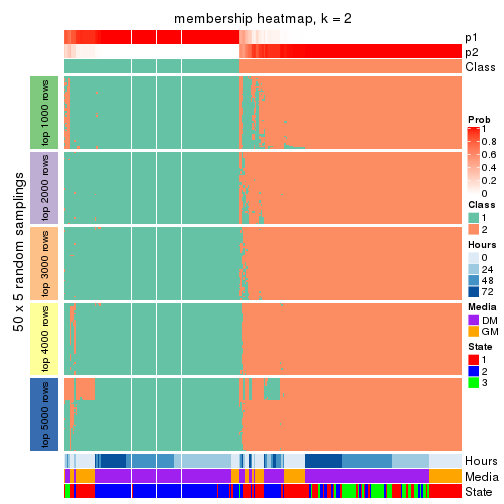</p>

</div>
<div id='tab-MAD-skmeans-membership-heatmap-2'>
<pre><code class="r">membership_heatmap(res, k = 3)
</code></pre>

<p></p>

</div>
<div id='tab-MAD-skmeans-membership-heatmap-3'>
<pre><code class="r">membership_heatmap(res, k = 4)
</code></pre>

<p></p>

</div>
<div id='tab-MAD-skmeans-membership-heatmap-4'>
<pre><code class="r">membership_heatmap(res, k = 5)
</code></pre>

<p></p>

</div>
<div id='tab-MAD-skmeans-membership-heatmap-5'>
<pre><code class="r">membership_heatmap(res, k = 6)
</code></pre>

<p></p>

</div>
</div>

As soon as we have had the classes for columns, we can look for signatures
which are significantly different between classes which can be candidate marks
for certain classes. Following are the heatmaps for signatures.


Signature heatmaps where rows are scaled:


<script>
$( function() {
	$( '#tabs-MAD-skmeans-get-signatures' ).tabs();
} );
</script>
<div id='tabs-MAD-skmeans-get-signatures'>
<ul>
<li><a href='#tab-MAD-skmeans-get-signatures-1'>k = 2</a></li>
<li><a href='#tab-MAD-skmeans-get-signatures-2'>k = 3</a></li>
<li><a href='#tab-MAD-skmeans-get-signatures-3'>k = 4</a></li>
<li><a href='#tab-MAD-skmeans-get-signatures-4'>k = 5</a></li>
<li><a href='#tab-MAD-skmeans-get-signatures-5'>k = 6</a></li>
</ul>
<div id='tab-MAD-skmeans-get-signatures-1'>
<pre><code class="r">get_signatures(res, k = 2)
</code></pre>

<p></p>

</div>
<div id='tab-MAD-skmeans-get-signatures-2'>
<pre><code class="r">get_signatures(res, k = 3)
</code></pre>

<p></p>

</div>
<div id='tab-MAD-skmeans-get-signatures-3'>
<pre><code class="r">get_signatures(res, k = 4)
</code></pre>

<p></p>

</div>
<div id='tab-MAD-skmeans-get-signatures-4'>
<pre><code class="r">get_signatures(res, k = 5)
</code></pre>

<p></p>

</div>
<div id='tab-MAD-skmeans-get-signatures-5'>
<pre><code class="r">get_signatures(res, k = 6)
</code></pre>

<p></p>

</div>
</div>


Signature heatmaps where rows are not scaled:


<script>
$( function() {
	$( '#tabs-MAD-skmeans-get-signatures-no-scale' ).tabs();
} );
</script>
<div id='tabs-MAD-skmeans-get-signatures-no-scale'>
<ul>
<li><a href='#tab-MAD-skmeans-get-signatures-no-scale-1'>k = 2</a></li>
<li><a href='#tab-MAD-skmeans-get-signatures-no-scale-2'>k = 3</a></li>
<li><a href='#tab-MAD-skmeans-get-signatures-no-scale-3'>k = 4</a></li>
<li><a href='#tab-MAD-skmeans-get-signatures-no-scale-4'>k = 5</a></li>
<li><a href='#tab-MAD-skmeans-get-signatures-no-scale-5'>k = 6</a></li>
</ul>
<div id='tab-MAD-skmeans-get-signatures-no-scale-1'>
<pre><code class="r">get_signatures(res, k = 2, scale_rows = FALSE)
</code></pre>

<p></p>

</div>
<div id='tab-MAD-skmeans-get-signatures-no-scale-2'>
<pre><code class="r">get_signatures(res, k = 3, scale_rows = FALSE)
</code></pre>

<p></p>

</div>
<div id='tab-MAD-skmeans-get-signatures-no-scale-3'>
<pre><code class="r">get_signatures(res, k = 4, scale_rows = FALSE)
</code></pre>

<p></p>

</div>
<div id='tab-MAD-skmeans-get-signatures-no-scale-4'>
<pre><code class="r">get_signatures(res, k = 5, scale_rows = FALSE)
</code></pre>

<p></p>

</div>
<div id='tab-MAD-skmeans-get-signatures-no-scale-5'>
<pre><code class="r">get_signatures(res, k = 6, scale_rows = FALSE)
</code></pre>

<p></p>

</div>
</div>


Compare the overlap of signatures from different k:

```r
compare_signatures(res)
```


`get_signature()` returns a data frame invisibly. TO get the list of signatures, the function
call should be assigned to a variable explicitly. In following code, if `plot` argument is set
to `FALSE`, no heatmap is plotted while only the differential analysis is performed.

```r
# code only for demonstration
tb = get_signature(res, k = ..., plot = FALSE)
```

An example of the output of `tb` is:

```
#>   which_row         fdr    mean_1    mean_2 scaled_mean_1 scaled_mean_2 km
#> 1        38 0.042760348  8.373488  9.131774    -0.5533452     0.5164555  1
#> 2        40 0.018707592  7.106213  8.469186    -0.6173731     0.5762149  1
#> 3        55 0.019134737 10.221463 11.207825    -0.6159697     0.5749050  1
#> 4        59 0.006059896  5.921854  7.869574    -0.6899429     0.6439467  1
#> 5        60 0.018055526  8.928898 10.211722    -0.6204761     0.5791110  1
#> 6        98 0.009384629 15.714769 14.887706     0.6635654    -0.6193277  2
...
```

The columns in `tb` are:

1. `which_row`: row indices corresponding to the input matrix.
2. `fdr`: FDR for the differential test. 
3. `mean_x`: The mean value in group x.
4. `scaled_mean_x`: The mean value in group x after rows are scaled.
5. `km`: Row groups if k-means clustering is applied to rows.


UMAP plot which shows how samples are separated.


<script>
$( function() {
	$( '#tabs-MAD-skmeans-dimension-reduction' ).tabs();
} );
</script>
<div id='tabs-MAD-skmeans-dimension-reduction'>
<ul>
<li><a href='#tab-MAD-skmeans-dimension-reduction-1'>k = 2</a></li>
<li><a href='#tab-MAD-skmeans-dimension-reduction-2'>k = 3</a></li>
<li><a href='#tab-MAD-skmeans-dimension-reduction-3'>k = 4</a></li>
<li><a href='#tab-MAD-skmeans-dimension-reduction-4'>k = 5</a></li>
<li><a href='#tab-MAD-skmeans-dimension-reduction-5'>k = 6</a></li>
</ul>
<div id='tab-MAD-skmeans-dimension-reduction-1'>
<pre><code class="r">dimension_reduction(res, k = 2, method = &quot;UMAP&quot;)
</code></pre>

<p></p>

</div>
<div id='tab-MAD-skmeans-dimension-reduction-2'>
<pre><code class="r">dimension_reduction(res, k = 3, method = &quot;UMAP&quot;)
</code></pre>

<p></p>

</div>
<div id='tab-MAD-skmeans-dimension-reduction-3'>
<pre><code class="r">dimension_reduction(res, k = 4, method = &quot;UMAP&quot;)
</code></pre>

<p></p>

</div>
<div id='tab-MAD-skmeans-dimension-reduction-4'>
<pre><code class="r">dimension_reduction(res, k = 5, method = &quot;UMAP&quot;)
</code></pre>

<p></p>

</div>
<div id='tab-MAD-skmeans-dimension-reduction-5'>
<pre><code class="r">dimension_reduction(res, k = 6, method = &quot;UMAP&quot;)
</code></pre>

<p></p>

</div>
</div>


Following heatmap shows how subgroups are split when increasing `k`:

```r
collect_classes(res)
```


Test correlation between subgroups and known annotations. If the known
annotation is numeric, one-way ANOVA test is applied, and if the known
annotation is discrete, chi-squared contingency table test is applied.

```r
test_to_known_factors(res)
```

```
#>               n Hours(p) Media(p) State(p) k
#> MAD:skmeans 266 1.71e-02 2.51e-02 1.45e-20 2
#> MAD:skmeans 261 2.74e-36 7.23e-39 1.58e-50 3
#> MAD:skmeans 248 4.08e-37 7.20e-37 1.20e-43 4
#> MAD:skmeans 225 2.59e-36 7.98e-33 3.56e-44 5
#> MAD:skmeans 213 2.08e-37 2.80e-33 4.35e-44 6
```


If matrix rows can be associated to genes, consider to use `GO_Enrichment(res,
...)` to perform function enrichment for the signature genes.


 

---------------------------------------------------


### MAD:pam


The object with results only for a single top-value method and a single partition method 
can be extracted as:

```r
res = res_list["MAD", "pam"]
# you can also extract it by
# res = res_list["MAD:pam"]
```

A summary of `res` and all the functions that can be applied to it:

```r
res
```

```
#> A 'ConsensusPartition' object with k = 2, 3, 4, 5, 6.
#>   On a matrix with 12016 rows and 271 columns.
#>   Top rows (1000, 2000, 3000, 4000, 5000) are extracted by 'MAD' method.
#>   Subgroups are detected by 'pam' method.
#>   Performed in total 1250 partitions by row resampling.
#>   Best k for subgroups seems to be 2.
#> 
#> Following methods can be applied to this 'ConsensusPartition' object:
#>  [1] "cola_report"             "collect_classes"         "collect_plots"          
#>  [4] "collect_stats"           "colnames"                "compare_signatures"     
#>  [7] "consensus_heatmap"       "dimension_reduction"     "functional_enrichment"  
#> [10] "get_anno_col"            "get_anno"                "get_classes"            
#> [13] "get_consensus"           "get_matrix"              "get_membership"         
#> [16] "get_param"               "get_signatures"          "get_stats"              
#> [19] "is_best_k"               "is_stable_k"             "membership_heatmap"     
#> [22] "ncol"                    "nrow"                    "plot_ecdf"              
#> [25] "rownames"                "select_partition_number" "show"                   
#> [28] "suggest_best_k"          "test_to_known_factors"
```

`collect_plots()` function collects all the plots made from `res` for all `k` (number of partitions)
into one single page to provide an easy and fast comparison between different `k`.

```r
collect_plots(res)
```


The plots are:

- The first row: a plot of the ECDF (Empirical cumulative distribution
  function) curves of the consensus matrix for each `k` and the heatmap of
  predicted classes for each `k`.
- The second row: heatmaps of the consensus matrix for each `k`.
- The third row: heatmaps of the membership matrix for each `k`.
- The fouth row: heatmaps of the signatures for each `k`.

All the plots in panels can be made by individual functions and they are
plotted later in this section.

`select_partition_number()` produces several plots showing different
statistics for choosing "optimized" `k`. There are following statistics:

- ECDF curves of the consensus matrix for each `k`;
- 1-PAC. [The PAC
  score](https://en.wikipedia.org/wiki/Consensus_clustering#Over-interpretation_potential_of_consensus_clustering)
  measures the proportion of the ambiguous subgrouping.
- Mean silhouette score.
- Concordance. The mean probability of fiting the consensus class ids in all
  partitions.
- Area increased. Denote $A_k$ as the area under the ECDF curve for current
  `k`, the area increased is defined as $A_k - A_{k-1}$.
- Rand index. The percent of pairs of samples that are both in a same cluster
  or both are not in a same cluster in the partition of k and k-1.
- Jaccard index. The ratio of pairs of samples are both in a same cluster in
  the partition of k and k-1 and the pairs of samples are both in a same
  cluster in the partition k or k-1.

The detailed explanations of these statistics can be found in [the cola
vignette](http://bioconductor.org/packages/devel/bioc/vignettes/cola/inst/doc/cola.html#toc_13).

Generally speaking, lower PAC score, higher mean silhouette score or higher
concordance corresponds to better partition. Rand index and Jaccard index
measure how similar the current partition is compared to partition with `k-1`.
If they are too similar, we won't accept `k` is better than `k-1`.

```r
select_partition_number(res)
```


The numeric values for all these statistics can be obtained by `get_stats()`.

```r
get_stats(res)
```

```
#>   k 1-PAC mean_silhouette concordance area_increased  Rand Jaccard
#> 2 2 0.432           0.730       0.881         0.4973 0.500   0.500
#> 3 3 0.453           0.693       0.867         0.0663 0.915   0.839
#> 4 4 0.449           0.650       0.813         0.2626 0.778   0.567
#> 5 5 0.496           0.604       0.764         0.1110 0.891   0.684
#> 6 6 0.522           0.544       0.742         0.0413 0.964   0.862
```

`suggest_best_k()` suggests the best $k$ based on these statistics. The rules are as follows:

- All $k$ with Jaccard index larger than 0.95 are removed because the increase of
  the partition number does not provides enough extra information. If all $k$ are removed,
  the best $k$ is assigned by `NA`.
- For $k$ with 1-PAC larger than 0.9, the maximal $k$ is taken as the "best k". Other $k$ is called "optional k".
- If it does not fit the second rule. The $k$ with the highest vote of highest
  1-PAC, mean silhouette and concordance is taken as the "best k".

```r
suggest_best_k(res)
```

```
#> [1] 2
```


Following shows the table of the partitions (You need to click the **show/hide
code output** link to see it). The membership matrix (columns with name `p*`)
is inferred by
[`clue::cl_consensus()`](https://www.rdocumentation.org/link/cl_consensus?package=clue)
function with the `SE` method. Basically the value in the membership matrix
represents the probability to belong to a certain group. The finall class
label for an item is determined with the group with highest probability it
belongs to.

In `get_classes()` function, the entropy is calculated from the membership
matrix and the silhouette score is calculated from the consensus matrix.


<script>
$( function() {
	$( '#tabs-MAD-pam-get-classes' ).tabs();
} );
</script>
<div id='tabs-MAD-pam-get-classes'>
<ul>
<li><a href='#tab-MAD-pam-get-classes-1'>k = 2</a></li>
<li><a href='#tab-MAD-pam-get-classes-2'>k = 3</a></li>
<li><a href='#tab-MAD-pam-get-classes-3'>k = 4</a></li>
<li><a href='#tab-MAD-pam-get-classes-4'>k = 5</a></li>
<li><a href='#tab-MAD-pam-get-classes-5'>k = 6</a></li>
</ul>

<div id='tab-MAD-pam-get-classes-1'>
<p><a id='tab-MAD-pam-get-classes-1-a' style='color:#0366d6' href='#'>show/hide code output</a></p>
<pre><code class="r">cbind(get_classes(res, k = 2), get_membership(res, k = 2))
</code></pre>

<pre><code>#&gt;            class entropy silhouette    p1    p2
#&gt; T0_CT_A01      1  0.0000    0.86631 1.000 0.000
#&gt; T0_CT_A03      1  0.0000    0.86631 1.000 0.000
#&gt; T0_CT_A05      1  0.0000    0.86631 1.000 0.000
#&gt; T0_CT_A06      1  0.0000    0.86631 1.000 0.000
#&gt; T0_CT_A07      1  0.0672    0.86394 0.992 0.008
#&gt; T0_CT_A08      1  0.0000    0.86631 1.000 0.000
#&gt; T0_CT_A10      1  0.0000    0.86631 1.000 0.000
#&gt; T0_CT_A11      2  0.9983    0.03822 0.476 0.524
#&gt; T0_CT_B01      1  0.2778    0.84730 0.952 0.048
#&gt; T0_CT_B03      1  0.1184    0.86088 0.984 0.016
#&gt; T0_CT_B05      1  0.0000    0.86631 1.000 0.000
#&gt; T0_CT_B07      1  0.0000    0.86631 1.000 0.000
#&gt; T0_CT_B08      1  0.0000    0.86631 1.000 0.000
#&gt; T0_CT_B09      1  0.0000    0.86631 1.000 0.000
#&gt; T0_CT_C02      1  0.0000    0.86631 1.000 0.000
#&gt; T0_CT_C03      1  0.0000    0.86631 1.000 0.000
#&gt; T0_CT_C05      2  0.9580    0.42940 0.380 0.620
#&gt; T0_CT_C06      1  0.9963    0.15728 0.536 0.464
#&gt; T0_CT_C07      1  0.0000    0.86631 1.000 0.000
#&gt; T0_CT_C08      1  0.0000    0.86631 1.000 0.000
#&gt; T0_CT_C09      1  0.9983    0.07471 0.524 0.476
#&gt; T0_CT_C11      2  0.0376    0.84879 0.004 0.996
#&gt; T0_CT_C12      1  0.0000    0.86631 1.000 0.000
#&gt; T0_CT_D01      1  0.5178    0.79095 0.884 0.116
#&gt; T0_CT_D02      1  0.0000    0.86631 1.000 0.000
#&gt; T0_CT_D03      1  0.0000    0.86631 1.000 0.000
#&gt; T0_CT_D05      1  0.0672    0.86404 0.992 0.008
#&gt; T0_CT_D06      1  0.1843    0.85637 0.972 0.028
#&gt; T0_CT_D07      1  0.0000    0.86631 1.000 0.000
#&gt; T0_CT_D08      1  0.2603    0.84685 0.956 0.044
#&gt; T0_CT_D09      2  0.9983    0.16196 0.476 0.524
#&gt; T0_CT_D11      2  0.9996    0.13323 0.488 0.512
#&gt; T0_CT_D12      1  0.0000    0.86631 1.000 0.000
#&gt; T0_CT_E01      1  0.0000    0.86631 1.000 0.000
#&gt; T0_CT_E03      1  0.0000    0.86631 1.000 0.000
#&gt; T0_CT_E04      2  0.9686    0.39442 0.396 0.604
#&gt; T0_CT_E05      2  0.9427    0.45252 0.360 0.640
#&gt; T0_CT_E06      1  0.0000    0.86631 1.000 0.000
#&gt; T0_CT_E07      1  0.0000    0.86631 1.000 0.000
#&gt; T0_CT_E08      1  0.0000    0.86631 1.000 0.000
#&gt; T0_CT_E09      1  0.0000    0.86631 1.000 0.000
#&gt; T0_CT_E10      1  0.9522    0.43527 0.628 0.372
#&gt; T0_CT_E11      1  0.0000    0.86631 1.000 0.000
#&gt; T0_CT_E12      1  0.0000    0.86631 1.000 0.000
#&gt; T0_CT_F01      1  0.0000    0.86631 1.000 0.000
#&gt; T0_CT_F02      1  0.0000    0.86631 1.000 0.000
#&gt; T0_CT_F03      1  0.0000    0.86631 1.000 0.000
#&gt; T0_CT_F04      1  0.0000    0.86631 1.000 0.000
#&gt; T0_CT_F05      1  0.7815    0.64357 0.768 0.232
#&gt; T0_CT_F06      1  0.0000    0.86631 1.000 0.000
#&gt; T0_CT_F07      1  0.1414    0.85900 0.980 0.020
#&gt; T0_CT_F09      2  0.0938    0.84869 0.012 0.988
#&gt; T0_CT_F11      1  0.0000    0.86631 1.000 0.000
#&gt; T0_CT_F12      1  0.0000    0.86631 1.000 0.000
#&gt; T0_CT_G01      1  0.0000    0.86631 1.000 0.000
#&gt; T0_CT_G02      1  0.0000    0.86631 1.000 0.000
#&gt; T0_CT_G03      1  0.0000    0.86631 1.000 0.000
#&gt; T0_CT_G04      1  0.0000    0.86631 1.000 0.000
#&gt; T0_CT_G07      1  0.0376    0.86506 0.996 0.004
#&gt; T0_CT_G08      1  0.0000    0.86631 1.000 0.000
#&gt; T0_CT_G09      1  0.4815    0.81771 0.896 0.104
#&gt; T0_CT_G11      1  0.3879    0.83110 0.924 0.076
#&gt; T0_CT_H01      1  0.7219    0.73310 0.800 0.200
#&gt; T0_CT_H02      1  0.9044    0.48435 0.680 0.320
#&gt; T0_CT_H04      1  0.0000    0.86631 1.000 0.000
#&gt; T0_CT_H05      1  0.1414    0.86156 0.980 0.020
#&gt; T0_CT_H08      1  0.1184    0.86093 0.984 0.016
#&gt; T0_CT_H09      1  0.8267    0.61821 0.740 0.260
#&gt; T0_CT_H12      1  0.0000    0.86631 1.000 0.000
#&gt; T24_CT_A01     1  0.0000    0.86631 1.000 0.000
#&gt; T24_CT_A03     2  0.7745    0.69856 0.228 0.772
#&gt; T24_CT_A04     1  0.8327    0.60489 0.736 0.264
#&gt; T24_CT_A05     1  0.0000    0.86631 1.000 0.000
#&gt; T24_CT_A07     2  0.0000    0.84816 0.000 1.000
#&gt; T24_CT_A08     1  0.0000    0.86631 1.000 0.000
#&gt; T24_CT_A09     1  0.0000    0.86631 1.000 0.000
#&gt; T24_CT_A10     1  0.9129    0.52847 0.672 0.328
#&gt; T24_CT_B01     1  0.7299    0.70645 0.796 0.204
#&gt; T24_CT_B02     1  0.0000    0.86631 1.000 0.000
#&gt; T24_CT_B03     2  0.5519    0.78777 0.128 0.872
#&gt; T24_CT_B05     2  0.0672    0.84863 0.008 0.992
#&gt; T24_CT_B06     2  0.0938    0.84855 0.012 0.988
#&gt; T24_CT_B07     1  0.0000    0.86631 1.000 0.000
#&gt; T24_CT_B08     2  0.0672    0.84860 0.008 0.992
#&gt; T24_CT_B09     1  0.0000    0.86631 1.000 0.000
#&gt; T24_CT_B11     1  0.0000    0.86631 1.000 0.000
#&gt; T24_CT_C01     1  0.5408    0.79645 0.876 0.124
#&gt; T24_CT_C02     2  0.1184    0.84901 0.016 0.984
#&gt; T24_CT_C03     1  0.8016    0.67403 0.756 0.244
#&gt; T24_CT_C05     2  0.7139    0.72246 0.196 0.804
#&gt; T24_CT_C07     2  0.0000    0.84816 0.000 1.000
#&gt; T24_CT_C08     2  0.1633    0.84448 0.024 0.976
#&gt; T24_CT_C09     2  0.2948    0.83712 0.052 0.948
#&gt; T24_CT_C10     1  0.5059    0.80611 0.888 0.112
#&gt; T24_CT_C11     2  0.9522    0.42976 0.372 0.628
#&gt; T24_CT_C12     2  0.0672    0.84898 0.008 0.992
#&gt; T24_CT_D01     2  0.0000    0.84816 0.000 1.000
#&gt; T24_CT_D02     2  0.8499    0.61459 0.276 0.724
#&gt; T24_CT_D03     2  0.1633    0.84513 0.024 0.976
#&gt; T24_CT_D04     1  0.0672    0.86434 0.992 0.008
#&gt; T24_CT_D05     1  0.1633    0.85735 0.976 0.024
#&gt; T24_CT_D06     1  0.0672    0.86489 0.992 0.008
#&gt; T24_CT_D07     1  0.6801    0.73183 0.820 0.180
#&gt; T24_CT_D08     2  0.0376    0.84883 0.004 0.996
#&gt; T24_CT_D09     2  0.7883    0.65982 0.236 0.764
#&gt; T24_CT_D10     2  0.8955    0.55673 0.312 0.688
#&gt; T24_CT_D11     2  0.0000    0.84816 0.000 1.000
#&gt; T24_CT_E01     2  0.8327    0.63501 0.264 0.736
#&gt; T24_CT_E02     1  0.8861    0.57990 0.696 0.304
#&gt; T24_CT_E04     2  0.0000    0.84816 0.000 1.000
#&gt; T24_CT_E05     1  0.0000    0.86631 1.000 0.000
#&gt; T24_CT_E07     2  0.6343    0.76370 0.160 0.840
#&gt; T24_CT_E09     1  0.0000    0.86631 1.000 0.000
#&gt; T24_CT_E11     1  0.8267    0.62790 0.740 0.260
#&gt; T24_CT_E12     2  0.0000    0.84816 0.000 1.000
#&gt; T24_CT_F01     2  0.0000    0.84816 0.000 1.000
#&gt; T24_CT_F02     2  0.8713    0.58483 0.292 0.708
#&gt; T24_CT_F03     1  0.8661    0.58822 0.712 0.288
#&gt; T24_CT_F04     1  0.9044    0.54015 0.680 0.320
#&gt; T24_CT_F05     2  0.8955    0.54893 0.312 0.688
#&gt; T24_CT_F07     2  0.9635    0.35386 0.388 0.612
#&gt; T24_CT_F08     1  0.0672    0.86396 0.992 0.008
#&gt; T24_CT_F09     1  0.9993   -0.05684 0.516 0.484
#&gt; T24_CT_F10     1  0.4431    0.81428 0.908 0.092
#&gt; T24_CT_F11     2  0.4562    0.80949 0.096 0.904
#&gt; T24_CT_F12     2  0.9833    0.32448 0.424 0.576
#&gt; T24_CT_G01     2  0.5946    0.77931 0.144 0.856
#&gt; T24_CT_G02     1  0.2603    0.84748 0.956 0.044
#&gt; T24_CT_G03     1  0.0000    0.86631 1.000 0.000
#&gt; T24_CT_G04     2  0.7528    0.70395 0.216 0.784
#&gt; T24_CT_G05     2  0.1843    0.84451 0.028 0.972
#&gt; T24_CT_G06     1  0.0938    0.86348 0.988 0.012
#&gt; T24_CT_G08     1  0.0000    0.86631 1.000 0.000
#&gt; T24_CT_G10     2  0.2423    0.83988 0.040 0.960
#&gt; T24_CT_G11     1  0.0672    0.86438 0.992 0.008
#&gt; T24_CT_G12     1  0.0000    0.86631 1.000 0.000
#&gt; T24_CT_H01     1  0.0000    0.86631 1.000 0.000
#&gt; T24_CT_H02     1  0.4939    0.80561 0.892 0.108
#&gt; T24_CT_H03     2  0.9491    0.45196 0.368 0.632
#&gt; T24_CT_H05     1  0.8327    0.62568 0.736 0.264
#&gt; T24_CT_H07     1  0.4161    0.82329 0.916 0.084
#&gt; T24_CT_H09     1  0.5178    0.80956 0.884 0.116
#&gt; T24_CT_H12     1  0.0000    0.86631 1.000 0.000
#&gt; T48_CT_A01     2  0.0376    0.84855 0.004 0.996
#&gt; T48_CT_A02     2  0.0000    0.84816 0.000 1.000
#&gt; T48_CT_A03     1  0.1414    0.86129 0.980 0.020
#&gt; T48_CT_A04     2  0.0000    0.84816 0.000 1.000
#&gt; T48_CT_A05     2  0.2948    0.83751 0.052 0.948
#&gt; T48_CT_A06     1  0.0000    0.86631 1.000 0.000
#&gt; T48_CT_A07     1  0.7745    0.66067 0.772 0.228
#&gt; T48_CT_A08     2  0.0938    0.84909 0.012 0.988
#&gt; T48_CT_A09     1  0.9710    0.36511 0.600 0.400
#&gt; T48_CT_A10     2  0.0000    0.84816 0.000 1.000
#&gt; T48_CT_A11     2  0.0000    0.84816 0.000 1.000
#&gt; T48_CT_A12     1  0.9833    0.31270 0.576 0.424
#&gt; T48_CT_B01     2  0.0938    0.84874 0.012 0.988
#&gt; T48_CT_B02     2  0.1843    0.84493 0.028 0.972
#&gt; T48_CT_B03     1  0.0000    0.86631 1.000 0.000
#&gt; T48_CT_B04     1  0.2603    0.84971 0.956 0.044
#&gt; T48_CT_B06     2  0.0000    0.84816 0.000 1.000
#&gt; T48_CT_B08     1  0.8267    0.62870 0.740 0.260
#&gt; T48_CT_B10     2  0.0000    0.84816 0.000 1.000
#&gt; T48_CT_B11     2  0.0000    0.84816 0.000 1.000
#&gt; T48_CT_B12     2  0.5178    0.79824 0.116 0.884
#&gt; T48_CT_C01     2  0.0376    0.84865 0.004 0.996
#&gt; T48_CT_C02     1  0.0376    0.86537 0.996 0.004
#&gt; T48_CT_C03     2  0.0672    0.84875 0.008 0.992
#&gt; T48_CT_C04     1  0.0376    0.86522 0.996 0.004
#&gt; T48_CT_C05     2  0.4939    0.81222 0.108 0.892
#&gt; T48_CT_C06     2  0.0000    0.84816 0.000 1.000
#&gt; T48_CT_C07     2  0.9775    0.30721 0.412 0.588
#&gt; T48_CT_C09     2  0.9552    0.44384 0.376 0.624
#&gt; T48_CT_C10     1  0.9850    0.27297 0.572 0.428
#&gt; T48_CT_C11     2  0.0000    0.84816 0.000 1.000
#&gt; T48_CT_D01     2  0.0000    0.84816 0.000 1.000
#&gt; T48_CT_D02     2  0.4562    0.81248 0.096 0.904
#&gt; T48_CT_D03     1  0.0000    0.86631 1.000 0.000
#&gt; T48_CT_D04     2  0.1184    0.84825 0.016 0.984
#&gt; T48_CT_D06     2  0.1414    0.84653 0.020 0.980
#&gt; T48_CT_D07     2  0.0000    0.84816 0.000 1.000
#&gt; T48_CT_D08     1  0.9988    0.11036 0.520 0.480
#&gt; T48_CT_D09     2  0.0376    0.84865 0.004 0.996
#&gt; T48_CT_D10     2  0.2423    0.84220 0.040 0.960
#&gt; T48_CT_D11     2  0.9944    0.22190 0.456 0.544
#&gt; T48_CT_D12     1  0.5737    0.78613 0.864 0.136
#&gt; T48_CT_E01     2  0.4298    0.82238 0.088 0.912
#&gt; T48_CT_E02     2  0.6343    0.76549 0.160 0.840
#&gt; T48_CT_E03     2  0.9896    0.22555 0.440 0.560
#&gt; T48_CT_E04     2  0.9209    0.50414 0.336 0.664
#&gt; T48_CT_E05     2  0.0000    0.84816 0.000 1.000
#&gt; T48_CT_E06     1  0.9608    0.41144 0.616 0.384
#&gt; T48_CT_E07     1  0.5294    0.79491 0.880 0.120
#&gt; T48_CT_E08     2  0.0000    0.84816 0.000 1.000
#&gt; T48_CT_E10     1  0.9922    0.20077 0.552 0.448
#&gt; T48_CT_E11     1  0.8608    0.59494 0.716 0.284
#&gt; T48_CT_E12     1  0.7528    0.68435 0.784 0.216
#&gt; T48_CT_F01     2  0.0938    0.84812 0.012 0.988
#&gt; T48_CT_F02     1  0.9970    0.12725 0.532 0.468
#&gt; T48_CT_F03     1  0.9993    0.11353 0.516 0.484
#&gt; T48_CT_F05     2  0.4562    0.81451 0.096 0.904
#&gt; T48_CT_F07     1  0.8016    0.67025 0.756 0.244
#&gt; T48_CT_F09     2  0.2603    0.83895 0.044 0.956
#&gt; T48_CT_F10     2  0.9129    0.50746 0.328 0.672
#&gt; T48_CT_F11     1  0.9087    0.52787 0.676 0.324
#&gt; T48_CT_G01     1  0.0000    0.86631 1.000 0.000
#&gt; T48_CT_G02     2  0.0000    0.84816 0.000 1.000
#&gt; T48_CT_G03     2  0.0000    0.84816 0.000 1.000
#&gt; T48_CT_G07     2  0.0376    0.84872 0.004 0.996
#&gt; T48_CT_G08     2  0.1414    0.84815 0.020 0.980
#&gt; T48_CT_G09     2  0.0672    0.84886 0.008 0.992
#&gt; T48_CT_G10     1  0.0000    0.86631 1.000 0.000
#&gt; T48_CT_G11     1  0.9248    0.50565 0.660 0.340
#&gt; T48_CT_G12     2  0.3733    0.83015 0.072 0.928
#&gt; T48_CT_H01     2  0.9909    0.19329 0.444 0.556
#&gt; T48_CT_H02     2  0.9427    0.49711 0.360 0.640
#&gt; T48_CT_H04     1  0.0000    0.86631 1.000 0.000
#&gt; T48_CT_H05     2  0.0376    0.84865 0.004 0.996
#&gt; T48_CT_H06     2  0.0938    0.84858 0.012 0.988
#&gt; T48_CT_H07     2  0.5059    0.80608 0.112 0.888
#&gt; T48_CT_H08     2  0.3114    0.83522 0.056 0.944
#&gt; T48_CT_H11     2  0.4690    0.81344 0.100 0.900
#&gt; T48_CT_H12     2  0.2236    0.84063 0.036 0.964
#&gt; T72_CT_A01     2  0.0672    0.84902 0.008 0.992
#&gt; T72_CT_A05     2  0.9580    0.43167 0.380 0.620
#&gt; T72_CT_A08     1  0.8555    0.60686 0.720 0.280
#&gt; T72_CT_A09     2  0.0376    0.84878 0.004 0.996
#&gt; T72_CT_A11     2  0.0000    0.84816 0.000 1.000
#&gt; T72_CT_B01     2  0.2423    0.84195 0.040 0.960
#&gt; T72_CT_B02     1  0.8207    0.63393 0.744 0.256
#&gt; T72_CT_B03     1  0.9983    0.12496 0.524 0.476
#&gt; T72_CT_B04     1  0.8955    0.56070 0.688 0.312
#&gt; T72_CT_B05     2  0.3733    0.82712 0.072 0.928
#&gt; T72_CT_B06     1  0.6438    0.76803 0.836 0.164
#&gt; T72_CT_B08     1  0.6148    0.75627 0.848 0.152
#&gt; T72_CT_B09     1  0.6048    0.76692 0.852 0.148
#&gt; T72_CT_B11     2  0.9775    0.32588 0.412 0.588
#&gt; T72_CT_B12     2  0.0000    0.84816 0.000 1.000
#&gt; T72_CT_C04     2  0.0376    0.84852 0.004 0.996
#&gt; T72_CT_C06     2  0.6343    0.76556 0.160 0.840
#&gt; T72_CT_C07     2  0.9922    0.26573 0.448 0.552
#&gt; T72_CT_C09     2  0.3114    0.83692 0.056 0.944
#&gt; T72_CT_C11     2  0.9896    0.29514 0.440 0.560
#&gt; T72_CT_D01     2  0.0000    0.84816 0.000 1.000
#&gt; T72_CT_D03     1  0.9998    0.00561 0.508 0.492
#&gt; T72_CT_D04     2  0.0000    0.84816 0.000 1.000
#&gt; T72_CT_D05     1  0.9896    0.24445 0.560 0.440
#&gt; T72_CT_D07     2  0.8144    0.65182 0.252 0.748
#&gt; T72_CT_D10     2  0.4022    0.82356 0.080 0.920
#&gt; T72_CT_D11     1  0.1843    0.85762 0.972 0.028
#&gt; T72_CT_E04     2  0.5946    0.77758 0.144 0.856
#&gt; T72_CT_E05     2  0.0000    0.84816 0.000 1.000
#&gt; T72_CT_E07     1  0.8608    0.55784 0.716 0.284
#&gt; T72_CT_F01     2  0.0000    0.84816 0.000 1.000
#&gt; T72_CT_F05     2  0.0672    0.84887 0.008 0.992
#&gt; T72_CT_F07     2  0.8081    0.65671 0.248 0.752
#&gt; T72_CT_F10     2  0.0000    0.84816 0.000 1.000
#&gt; T72_CT_F11     2  0.8713    0.60580 0.292 0.708
#&gt; T72_CT_G03     1  0.1414    0.85978 0.980 0.020
#&gt; T72_CT_G04     1  0.0000    0.86631 1.000 0.000
#&gt; T72_CT_G06     2  0.9881    0.29782 0.436 0.564
#&gt; T72_CT_G08     2  0.9996    0.06453 0.488 0.512
#&gt; T72_CT_G10     2  0.0000    0.84816 0.000 1.000
#&gt; T72_CT_G11     2  0.9993    0.01743 0.484 0.516
#&gt; T72_CT_H01     2  0.0000    0.84816 0.000 1.000
#&gt; T72_CT_H03     2  0.0000    0.84816 0.000 1.000
#&gt; T72_CT_H05     1  0.6712    0.73024 0.824 0.176
#&gt; T72_CT_H08     1  0.4562    0.80758 0.904 0.096
#&gt; T72_CT_H09     1  0.0000    0.86631 1.000 0.000
#&gt; T72_CT_H10     2  0.4161    0.82279 0.084 0.916
#&gt; T72_CT_H11     2  0.6801    0.74896 0.180 0.820
#&gt; T72_CT_H12     2  0.0000    0.84816 0.000 1.000
</code></pre>

<script>
$('#tab-MAD-pam-get-classes-1-a').parent().next().next().hide();
$('#tab-MAD-pam-get-classes-1-a').click(function(){
  $('#tab-MAD-pam-get-classes-1-a').parent().next().next().toggle();
  return(false);
});
</script>
</div>

<div id='tab-MAD-pam-get-classes-2'>
<p><a id='tab-MAD-pam-get-classes-2-a' style='color:#0366d6' href='#'>show/hide code output</a></p>
<pre><code class="r">cbind(get_classes(res, k = 3), get_membership(res, k = 3))
</code></pre>

<pre><code>#&gt;            class entropy silhouette    p1    p2    p3
#&gt; T0_CT_A01      1  0.0592    0.82471 0.988 0.000 0.012
#&gt; T0_CT_A03      1  0.0424    0.82525 0.992 0.000 0.008
#&gt; T0_CT_A05      1  0.0592    0.82471 0.988 0.000 0.012
#&gt; T0_CT_A06      1  0.0424    0.82525 0.992 0.000 0.008
#&gt; T0_CT_A07      1  0.0592    0.82471 0.988 0.000 0.012
#&gt; T0_CT_A08      1  0.1411    0.81907 0.964 0.000 0.036
#&gt; T0_CT_A10      1  0.0237    0.82525 0.996 0.000 0.004
#&gt; T0_CT_A11      3  0.1453    0.90838 0.008 0.024 0.968
#&gt; T0_CT_B01      1  0.2229    0.81586 0.944 0.044 0.012
#&gt; T0_CT_B03      1  0.1337    0.82111 0.972 0.016 0.012
#&gt; T0_CT_B05      1  0.0237    0.82525 0.996 0.000 0.004
#&gt; T0_CT_B07      1  0.0424    0.82525 0.992 0.000 0.008
#&gt; T0_CT_B08      1  0.0592    0.82471 0.988 0.000 0.012
#&gt; T0_CT_B09      1  0.0592    0.82471 0.988 0.000 0.012
#&gt; T0_CT_C02      1  0.0592    0.82471 0.988 0.000 0.012
#&gt; T0_CT_C03      1  0.1031    0.82319 0.976 0.000 0.024
#&gt; T0_CT_C05      2  0.6483    0.33701 0.392 0.600 0.008
#&gt; T0_CT_C06      1  0.7043    0.19311 0.532 0.448 0.020
#&gt; T0_CT_C07      1  0.0237    0.82539 0.996 0.000 0.004
#&gt; T0_CT_C08      1  0.0592    0.82471 0.988 0.000 0.012
#&gt; T0_CT_C09      3  0.1905    0.90616 0.016 0.028 0.956
#&gt; T0_CT_C11      2  0.0237    0.82127 0.004 0.996 0.000
#&gt; T0_CT_C12      1  0.0424    0.82525 0.992 0.000 0.008
#&gt; T0_CT_D01      1  0.3377    0.77449 0.896 0.092 0.012
#&gt; T0_CT_D02      1  0.0592    0.82592 0.988 0.000 0.012
#&gt; T0_CT_D03      1  0.0592    0.82471 0.988 0.000 0.012
#&gt; T0_CT_D05      1  0.0475    0.82644 0.992 0.004 0.004
#&gt; T0_CT_D06      1  0.1877    0.81548 0.956 0.032 0.012
#&gt; T0_CT_D07      1  0.0592    0.82471 0.988 0.000 0.012
#&gt; T0_CT_D08      1  0.2116    0.81095 0.948 0.040 0.012
#&gt; T0_CT_D09      1  0.6771    0.16696 0.548 0.440 0.012
#&gt; T0_CT_D11      1  0.6647    0.12296 0.540 0.452 0.008
#&gt; T0_CT_D12      1  0.0424    0.82525 0.992 0.000 0.008
#&gt; T0_CT_E01      1  0.0237    0.82525 0.996 0.000 0.004
#&gt; T0_CT_E03      1  0.0000    0.82544 1.000 0.000 0.000
#&gt; T0_CT_E04      2  0.6786    0.18953 0.448 0.540 0.012
#&gt; T0_CT_E05      2  0.6597    0.51969 0.312 0.664 0.024
#&gt; T0_CT_E06      1  0.0592    0.82471 0.988 0.000 0.012
#&gt; T0_CT_E07      1  0.0237    0.82553 0.996 0.000 0.004
#&gt; T0_CT_E08      1  0.0592    0.82471 0.988 0.000 0.012
#&gt; T0_CT_E09      1  0.0592    0.82471 0.988 0.000 0.012
#&gt; T0_CT_E10      3  0.1751    0.90740 0.012 0.028 0.960
#&gt; T0_CT_E11      1  0.0237    0.82525 0.996 0.000 0.004
#&gt; T0_CT_E12      1  0.0237    0.82525 0.996 0.000 0.004
#&gt; T0_CT_F01      1  0.0237    0.82525 0.996 0.000 0.004
#&gt; T0_CT_F02      1  0.0237    0.82557 0.996 0.000 0.004
#&gt; T0_CT_F03      1  0.0424    0.82525 0.992 0.000 0.008
#&gt; T0_CT_F04      1  0.0592    0.82471 0.988 0.000 0.012
#&gt; T0_CT_F05      1  0.4861    0.68243 0.808 0.180 0.012
#&gt; T0_CT_F06      1  0.0592    0.82471 0.988 0.000 0.012
#&gt; T0_CT_F07      1  0.1337    0.82178 0.972 0.016 0.012
#&gt; T0_CT_F09      2  0.0424    0.82156 0.008 0.992 0.000
#&gt; T0_CT_F11      1  0.0592    0.82471 0.988 0.000 0.012
#&gt; T0_CT_F12      1  0.0000    0.82544 1.000 0.000 0.000
#&gt; T0_CT_G01      1  0.0592    0.82471 0.988 0.000 0.012
#&gt; T0_CT_G02      1  0.0237    0.82539 0.996 0.000 0.004
#&gt; T0_CT_G03      1  0.0237    0.82525 0.996 0.000 0.004
#&gt; T0_CT_G04      1  0.0592    0.82471 0.988 0.000 0.012
#&gt; T0_CT_G07      1  0.0848    0.82473 0.984 0.008 0.008
#&gt; T0_CT_G08      1  0.0592    0.82471 0.988 0.000 0.012
#&gt; T0_CT_G09      1  0.3112    0.78688 0.900 0.096 0.004
#&gt; T0_CT_G11      1  0.3091    0.79954 0.912 0.072 0.016
#&gt; T0_CT_H01      1  0.4700    0.72626 0.812 0.180 0.008
#&gt; T0_CT_H02      1  0.6019    0.54514 0.700 0.288 0.012
#&gt; T0_CT_H04      1  0.0424    0.82525 0.992 0.000 0.008
#&gt; T0_CT_H05      1  0.1774    0.82490 0.960 0.024 0.016
#&gt; T0_CT_H08      1  0.1170    0.82501 0.976 0.008 0.016
#&gt; T0_CT_H09      1  0.5659    0.62476 0.740 0.248 0.012
#&gt; T0_CT_H12      1  0.0592    0.82565 0.988 0.000 0.012
#&gt; T24_CT_A01     1  0.1411    0.81907 0.964 0.000 0.036
#&gt; T24_CT_A03     2  0.5619    0.65849 0.244 0.744 0.012
#&gt; T24_CT_A04     1  0.5698    0.61049 0.736 0.252 0.012
#&gt; T24_CT_A05     1  0.0892    0.82364 0.980 0.000 0.020
#&gt; T24_CT_A07     2  0.0000    0.82037 0.000 1.000 0.000
#&gt; T24_CT_A08     1  0.1411    0.82445 0.964 0.000 0.036
#&gt; T24_CT_A09     1  0.1411    0.82169 0.964 0.000 0.036
#&gt; T24_CT_A10     1  0.7150    0.44699 0.616 0.348 0.036
#&gt; T24_CT_B01     1  0.6168    0.64259 0.740 0.224 0.036
#&gt; T24_CT_B02     1  0.1163    0.82162 0.972 0.000 0.028
#&gt; T24_CT_B03     2  0.3607    0.77231 0.112 0.880 0.008
#&gt; T24_CT_B05     2  0.0424    0.82132 0.008 0.992 0.000
#&gt; T24_CT_B06     2  0.0747    0.82080 0.016 0.984 0.000
#&gt; T24_CT_B07     1  0.1411    0.81907 0.964 0.000 0.036
#&gt; T24_CT_B08     2  0.0424    0.82210 0.008 0.992 0.000
#&gt; T24_CT_B09     1  0.1643    0.82136 0.956 0.000 0.044
#&gt; T24_CT_B11     1  0.0592    0.82471 0.988 0.000 0.012
#&gt; T24_CT_C01     1  0.5111    0.73327 0.820 0.144 0.036
#&gt; T24_CT_C02     2  0.6255    0.49698 0.012 0.668 0.320
#&gt; T24_CT_C03     1  0.6262    0.59868 0.696 0.284 0.020
#&gt; T24_CT_C05     2  0.3816    0.74867 0.148 0.852 0.000
#&gt; T24_CT_C07     2  0.0000    0.82037 0.000 1.000 0.000
#&gt; T24_CT_C08     2  0.1031    0.81693 0.024 0.976 0.000
#&gt; T24_CT_C09     2  0.6543    0.44667 0.016 0.640 0.344
#&gt; T24_CT_C10     1  0.4349    0.75504 0.852 0.128 0.020
#&gt; T24_CT_C11     2  0.6297    0.46695 0.352 0.640 0.008
#&gt; T24_CT_C12     2  0.0661    0.82134 0.008 0.988 0.004
#&gt; T24_CT_D01     2  0.0000    0.82037 0.000 1.000 0.000
#&gt; T24_CT_D02     2  0.6143    0.52441 0.304 0.684 0.012
#&gt; T24_CT_D03     2  0.0747    0.82014 0.016 0.984 0.000
#&gt; T24_CT_D04     1  0.1170    0.82534 0.976 0.008 0.016
#&gt; T24_CT_D05     1  0.1399    0.82255 0.968 0.028 0.004
#&gt; T24_CT_D06     1  0.1337    0.82604 0.972 0.012 0.016
#&gt; T24_CT_D07     1  0.4645    0.70962 0.816 0.176 0.008
#&gt; T24_CT_D08     2  0.0237    0.82133 0.004 0.996 0.000
#&gt; T24_CT_D09     2  0.5656    0.56799 0.264 0.728 0.008
#&gt; T24_CT_D10     2  0.6297    0.43405 0.352 0.640 0.008
#&gt; T24_CT_D11     2  0.0000    0.82037 0.000 1.000 0.000
#&gt; T24_CT_E01     2  0.6224    0.63407 0.240 0.728 0.032
#&gt; T24_CT_E02     1  0.7128    0.46424 0.620 0.344 0.036
#&gt; T24_CT_E04     2  0.0000    0.82037 0.000 1.000 0.000
#&gt; T24_CT_E05     1  0.1411    0.81907 0.964 0.000 0.036
#&gt; T24_CT_E07     2  0.3752    0.75782 0.144 0.856 0.000
#&gt; T24_CT_E09     1  0.1289    0.82035 0.968 0.000 0.032
#&gt; T24_CT_E11     1  0.6698    0.55970 0.684 0.280 0.036
#&gt; T24_CT_E12     2  0.0000    0.82037 0.000 1.000 0.000
#&gt; T24_CT_F01     2  0.0000    0.82037 0.000 1.000 0.000
#&gt; T24_CT_F02     2  0.6275    0.44900 0.348 0.644 0.008
#&gt; T24_CT_F03     1  0.6855    0.50213 0.652 0.316 0.032
#&gt; T24_CT_F04     1  0.9015    0.28703 0.508 0.348 0.144
#&gt; T24_CT_F05     2  0.6143    0.61697 0.256 0.720 0.024
#&gt; T24_CT_F07     2  0.9693   -0.03324 0.216 0.404 0.380
#&gt; T24_CT_F08     1  0.1585    0.82295 0.964 0.008 0.028
#&gt; T24_CT_F09     1  0.6598    0.20739 0.564 0.428 0.008
#&gt; T24_CT_F10     1  0.2584    0.80355 0.928 0.064 0.008
#&gt; T24_CT_F11     2  0.3129    0.78122 0.088 0.904 0.008
#&gt; T24_CT_F12     2  0.6647    0.16235 0.452 0.540 0.008
#&gt; T24_CT_G01     2  0.4293    0.72534 0.164 0.832 0.004
#&gt; T24_CT_G02     1  0.2681    0.81464 0.932 0.040 0.028
#&gt; T24_CT_G03     1  0.1411    0.82169 0.964 0.000 0.036
#&gt; T24_CT_G04     2  0.4755    0.71372 0.184 0.808 0.008
#&gt; T24_CT_G05     2  0.0892    0.81933 0.020 0.980 0.000
#&gt; T24_CT_G06     1  0.2297    0.81580 0.944 0.020 0.036
#&gt; T24_CT_G08     1  0.1411    0.81907 0.964 0.000 0.036
#&gt; T24_CT_G10     2  0.1643    0.81094 0.044 0.956 0.000
#&gt; T24_CT_G11     1  0.1585    0.82207 0.964 0.008 0.028
#&gt; T24_CT_G12     1  0.0237    0.82525 0.996 0.000 0.004
#&gt; T24_CT_H01     1  0.0592    0.82471 0.988 0.000 0.012
#&gt; T24_CT_H02     1  0.4519    0.75481 0.852 0.116 0.032
#&gt; T24_CT_H03     2  0.6148    0.42802 0.356 0.640 0.004
#&gt; T24_CT_H05     1  0.6730    0.55721 0.680 0.284 0.036
#&gt; T24_CT_H07     1  0.3610    0.77944 0.888 0.096 0.016
#&gt; T24_CT_H09     1  0.4708    0.76297 0.844 0.120 0.036
#&gt; T24_CT_H12     1  0.1031    0.82318 0.976 0.000 0.024
#&gt; T48_CT_A01     2  0.0237    0.82084 0.004 0.996 0.000
#&gt; T48_CT_A02     2  0.0000    0.82037 0.000 1.000 0.000
#&gt; T48_CT_A03     1  0.2297    0.81591 0.944 0.020 0.036
#&gt; T48_CT_A04     2  0.0000    0.82037 0.000 1.000 0.000
#&gt; T48_CT_A05     2  0.2165    0.80553 0.064 0.936 0.000
#&gt; T48_CT_A06     1  0.0892    0.82477 0.980 0.000 0.020
#&gt; T48_CT_A07     1  0.5020    0.67720 0.796 0.192 0.012
#&gt; T48_CT_A08     2  0.0829    0.82166 0.012 0.984 0.004
#&gt; T48_CT_A09     1  0.7114    0.35632 0.584 0.388 0.028
#&gt; T48_CT_A10     2  0.0000    0.82037 0.000 1.000 0.000
#&gt; T48_CT_A11     2  0.0000    0.82037 0.000 1.000 0.000
#&gt; T48_CT_A12     1  0.6888    0.26147 0.552 0.432 0.016
#&gt; T48_CT_B01     2  0.0592    0.82165 0.012 0.988 0.000
#&gt; T48_CT_B02     2  0.0892    0.82001 0.020 0.980 0.000
#&gt; T48_CT_B03     1  0.0592    0.82478 0.988 0.000 0.012
#&gt; T48_CT_B04     1  0.3148    0.80646 0.916 0.048 0.036
#&gt; T48_CT_B06     2  0.0000    0.82037 0.000 1.000 0.000
#&gt; T48_CT_B08     1  0.6522    0.57583 0.696 0.272 0.032
#&gt; T48_CT_B10     2  0.0000    0.82037 0.000 1.000 0.000
#&gt; T48_CT_B11     2  0.0000    0.82037 0.000 1.000 0.000
#&gt; T48_CT_B12     2  0.3769    0.77278 0.104 0.880 0.016
#&gt; T48_CT_C01     2  0.0237    0.82100 0.004 0.996 0.000
#&gt; T48_CT_C02     3  0.0747    0.90541 0.016 0.000 0.984
#&gt; T48_CT_C03     2  0.0592    0.82092 0.012 0.988 0.000
#&gt; T48_CT_C04     1  0.1878    0.82205 0.952 0.004 0.044
#&gt; T48_CT_C05     2  0.3784    0.76761 0.132 0.864 0.004
#&gt; T48_CT_C06     2  0.0000    0.82037 0.000 1.000 0.000
#&gt; T48_CT_C07     2  0.6796    0.38626 0.368 0.612 0.020
#&gt; T48_CT_C09     2  0.6804    0.15753 0.460 0.528 0.012
#&gt; T48_CT_C10     1  0.7480    0.12641 0.508 0.456 0.036
#&gt; T48_CT_C11     2  0.0000    0.82037 0.000 1.000 0.000
#&gt; T48_CT_D01     2  0.0000    0.82037 0.000 1.000 0.000
#&gt; T48_CT_D02     2  0.3752    0.77244 0.096 0.884 0.020
#&gt; T48_CT_D03     1  0.1411    0.81907 0.964 0.000 0.036
#&gt; T48_CT_D04     2  0.0747    0.82135 0.016 0.984 0.000
#&gt; T48_CT_D06     2  0.0892    0.81844 0.020 0.980 0.000
#&gt; T48_CT_D07     2  0.0000    0.82037 0.000 1.000 0.000
#&gt; T48_CT_D08     2  0.7377    0.07513 0.452 0.516 0.032
#&gt; T48_CT_D09     2  0.0237    0.82100 0.004 0.996 0.000
#&gt; T48_CT_D10     2  0.1751    0.81528 0.028 0.960 0.012
#&gt; T48_CT_D11     1  0.6683    0.00797 0.500 0.492 0.008
#&gt; T48_CT_D12     1  0.5413    0.71954 0.800 0.164 0.036
#&gt; T48_CT_E01     2  0.3030    0.79338 0.092 0.904 0.004
#&gt; T48_CT_E02     2  0.4921    0.71926 0.164 0.816 0.020
#&gt; T48_CT_E03     2  0.6786    0.16548 0.448 0.540 0.012
#&gt; T48_CT_E04     2  0.6427    0.46051 0.348 0.640 0.012
#&gt; T48_CT_E05     2  0.0000    0.82037 0.000 1.000 0.000
#&gt; T48_CT_E06     1  0.7860    0.24345 0.528 0.416 0.056
#&gt; T48_CT_E07     1  0.4609    0.74591 0.844 0.128 0.028
#&gt; T48_CT_E08     2  0.0000    0.82037 0.000 1.000 0.000
#&gt; T48_CT_E10     1  0.7471    0.15876 0.516 0.448 0.036
#&gt; T48_CT_E11     1  0.6793    0.54203 0.672 0.292 0.036
#&gt; T48_CT_E12     1  0.4861    0.70135 0.808 0.180 0.012
#&gt; T48_CT_F01     2  0.0747    0.81924 0.016 0.984 0.000
#&gt; T48_CT_F02     1  0.6804    0.13285 0.528 0.460 0.012
#&gt; T48_CT_F03     2  0.7841   -0.06009 0.472 0.476 0.052
#&gt; T48_CT_F05     2  0.3573    0.76435 0.120 0.876 0.004
#&gt; T48_CT_F07     1  0.6187    0.63224 0.724 0.248 0.028
#&gt; T48_CT_F09     2  0.1643    0.81001 0.044 0.956 0.000
#&gt; T48_CT_F10     2  0.9168    0.29368 0.184 0.528 0.288
#&gt; T48_CT_F11     1  0.7190    0.41862 0.608 0.356 0.036
#&gt; T48_CT_G01     1  0.1170    0.82517 0.976 0.008 0.016
#&gt; T48_CT_G02     2  0.0000    0.82037 0.000 1.000 0.000
#&gt; T48_CT_G03     2  0.0000    0.82037 0.000 1.000 0.000
#&gt; T48_CT_G07     2  0.0237    0.82114 0.004 0.996 0.000
#&gt; T48_CT_G08     2  0.0747    0.82188 0.016 0.984 0.000
#&gt; T48_CT_G09     2  0.0424    0.82157 0.008 0.992 0.000
#&gt; T48_CT_G10     1  0.0592    0.82460 0.988 0.000 0.012
#&gt; T48_CT_G11     1  0.6600    0.38809 0.604 0.384 0.012
#&gt; T48_CT_G12     2  0.2400    0.80321 0.064 0.932 0.004
#&gt; T48_CT_H01     2  0.9775    0.13567 0.288 0.440 0.272
#&gt; T48_CT_H02     2  0.6577    0.30783 0.420 0.572 0.008
#&gt; T48_CT_H04     3  0.1031    0.90627 0.024 0.000 0.976
#&gt; T48_CT_H05     2  0.0237    0.82100 0.004 0.996 0.000
#&gt; T48_CT_H06     2  0.0592    0.82181 0.012 0.988 0.000
#&gt; T48_CT_H07     2  0.3690    0.77820 0.100 0.884 0.016
#&gt; T48_CT_H08     2  0.1989    0.81224 0.048 0.948 0.004
#&gt; T48_CT_H11     2  0.3528    0.78476 0.092 0.892 0.016
#&gt; T48_CT_H12     2  0.1832    0.80840 0.036 0.956 0.008
#&gt; T72_CT_A01     2  0.0592    0.82164 0.012 0.988 0.000
#&gt; T72_CT_A05     2  0.6793    0.16692 0.452 0.536 0.012
#&gt; T72_CT_A08     1  0.6653    0.55536 0.680 0.288 0.032
#&gt; T72_CT_A09     2  0.0475    0.82154 0.004 0.992 0.004
#&gt; T72_CT_A11     2  0.0000    0.82037 0.000 1.000 0.000
#&gt; T72_CT_B01     2  0.2356    0.80049 0.072 0.928 0.000
#&gt; T72_CT_B02     1  0.6632    0.57326 0.692 0.272 0.036
#&gt; T72_CT_B03     1  0.6825    0.03749 0.496 0.492 0.012
#&gt; T72_CT_B04     1  0.6931    0.49583 0.640 0.328 0.032
#&gt; T72_CT_B05     2  0.2590    0.80116 0.072 0.924 0.004
#&gt; T72_CT_B06     1  0.5355    0.73832 0.804 0.160 0.036
#&gt; T72_CT_B08     1  0.4128    0.74325 0.856 0.132 0.012
#&gt; T72_CT_B09     3  0.7801    0.49392 0.276 0.088 0.636
#&gt; T72_CT_B11     2  0.7069    0.27410 0.408 0.568 0.024
#&gt; T72_CT_B12     2  0.0000    0.82037 0.000 1.000 0.000
#&gt; T72_CT_C04     2  0.0237    0.82077 0.004 0.996 0.000
#&gt; T72_CT_C06     2  0.4782    0.72670 0.164 0.820 0.016
#&gt; T72_CT_C07     1  0.6799    0.10419 0.532 0.456 0.012
#&gt; T72_CT_C09     2  0.1964    0.81018 0.056 0.944 0.000
#&gt; T72_CT_C11     1  0.6809    0.06361 0.524 0.464 0.012
#&gt; T72_CT_D01     2  0.0000    0.82037 0.000 1.000 0.000
#&gt; T72_CT_D03     2  0.7074    0.04384 0.480 0.500 0.020
#&gt; T72_CT_D04     2  0.0000    0.82037 0.000 1.000 0.000
#&gt; T72_CT_D05     1  0.7021    0.23166 0.544 0.436 0.020
#&gt; T72_CT_D07     2  0.5899    0.63517 0.244 0.736 0.020
#&gt; T72_CT_D10     2  0.2772    0.79693 0.080 0.916 0.004
#&gt; T72_CT_D11     1  0.2564    0.81985 0.936 0.028 0.036
#&gt; T72_CT_E04     2  0.4342    0.75924 0.120 0.856 0.024
#&gt; T72_CT_E05     2  0.0000    0.82037 0.000 1.000 0.000
#&gt; T72_CT_E07     1  0.5698    0.61040 0.736 0.252 0.012
#&gt; T72_CT_F01     2  0.0000    0.82037 0.000 1.000 0.000
#&gt; T72_CT_F05     2  0.0592    0.82133 0.012 0.988 0.000
#&gt; T72_CT_F07     2  0.5461    0.67125 0.216 0.768 0.016
#&gt; T72_CT_F10     2  0.0000    0.82037 0.000 1.000 0.000
#&gt; T72_CT_F11     2  0.6510    0.42301 0.364 0.624 0.012
#&gt; T72_CT_G03     1  0.2176    0.81716 0.948 0.020 0.032
#&gt; T72_CT_G04     1  0.0983    0.82515 0.980 0.004 0.016
#&gt; T72_CT_G06     2  0.6822    0.07123 0.480 0.508 0.012
#&gt; T72_CT_G08     1  0.6500    0.14063 0.532 0.464 0.004
#&gt; T72_CT_G10     2  0.0000    0.82037 0.000 1.000 0.000
#&gt; T72_CT_G11     2  0.7043    0.27285 0.400 0.576 0.024
#&gt; T72_CT_H01     2  0.0000    0.82037 0.000 1.000 0.000
#&gt; T72_CT_H03     2  0.0000    0.82037 0.000 1.000 0.000
#&gt; T72_CT_H05     1  0.4261    0.73289 0.848 0.140 0.012
#&gt; T72_CT_H08     1  0.3120    0.78269 0.908 0.080 0.012
#&gt; T72_CT_H09     1  0.0424    0.82525 0.992 0.000 0.008
#&gt; T72_CT_H10     2  0.3120    0.79415 0.080 0.908 0.012
#&gt; T72_CT_H11     2  0.5315    0.68058 0.216 0.772 0.012
#&gt; T72_CT_H12     2  0.0000    0.82037 0.000 1.000 0.000
</code></pre>

<script>
$('#tab-MAD-pam-get-classes-2-a').parent().next().next().hide();
$('#tab-MAD-pam-get-classes-2-a').click(function(){
  $('#tab-MAD-pam-get-classes-2-a').parent().next().next().toggle();
  return(false);
});
</script>
</div>

<div id='tab-MAD-pam-get-classes-3'>
<p><a id='tab-MAD-pam-get-classes-3-a' style='color:#0366d6' href='#'>show/hide code output</a></p>
<pre><code class="r">cbind(get_classes(res, k = 4), get_membership(res, k = 4))
</code></pre>

<pre><code>#&gt;            class entropy silhouette    p1    p2    p3    p4
#&gt; T0_CT_A01      3  0.1211     0.7006 0.040 0.000 0.960 0.000
#&gt; T0_CT_A03      3  0.3123     0.6535 0.156 0.000 0.844 0.000
#&gt; T0_CT_A05      3  0.1637     0.6992 0.060 0.000 0.940 0.000
#&gt; T0_CT_A06      3  0.3942     0.5650 0.236 0.000 0.764 0.000
#&gt; T0_CT_A07      3  0.0592     0.7002 0.016 0.000 0.984 0.000
#&gt; T0_CT_A08      1  0.1940     0.7257 0.924 0.000 0.076 0.000
#&gt; T0_CT_A10      1  0.4730     0.5564 0.636 0.000 0.364 0.000
#&gt; T0_CT_A11      4  0.0000     1.0000 0.000 0.000 0.000 1.000
#&gt; T0_CT_B01      1  0.5152     0.5856 0.664 0.020 0.316 0.000
#&gt; T0_CT_B03      3  0.1716     0.7008 0.064 0.000 0.936 0.000
#&gt; T0_CT_B05      1  0.4585     0.5848 0.668 0.000 0.332 0.000
#&gt; T0_CT_B07      3  0.4624     0.3917 0.340 0.000 0.660 0.000
#&gt; T0_CT_B08      3  0.2081     0.6965 0.084 0.000 0.916 0.000
#&gt; T0_CT_B09      3  0.2814     0.6720 0.132 0.000 0.868 0.000
#&gt; T0_CT_C02      3  0.0707     0.7020 0.020 0.000 0.980 0.000
#&gt; T0_CT_C03      1  0.4382     0.6270 0.704 0.000 0.296 0.000
#&gt; T0_CT_C05      3  0.5414     0.4624 0.020 0.376 0.604 0.000
#&gt; T0_CT_C06      1  0.7860     0.1904 0.372 0.356 0.272 0.000
#&gt; T0_CT_C07      3  0.5000    -0.2244 0.496 0.000 0.504 0.000
#&gt; T0_CT_C08      3  0.1474     0.7015 0.052 0.000 0.948 0.000
#&gt; T0_CT_C09      4  0.0000     1.0000 0.000 0.000 0.000 1.000
#&gt; T0_CT_C11      2  0.0921     0.8721 0.000 0.972 0.028 0.000
#&gt; T0_CT_C12      3  0.2408     0.6906 0.104 0.000 0.896 0.000
#&gt; T0_CT_D01      3  0.0895     0.7031 0.004 0.020 0.976 0.000
#&gt; T0_CT_D02      3  0.4967     0.1294 0.452 0.000 0.548 0.000
#&gt; T0_CT_D03      3  0.0592     0.7002 0.016 0.000 0.984 0.000
#&gt; T0_CT_D05      3  0.4730     0.2150 0.364 0.000 0.636 0.000
#&gt; T0_CT_D06      3  0.1792     0.7015 0.068 0.000 0.932 0.000
#&gt; T0_CT_D07      3  0.3219     0.6466 0.164 0.000 0.836 0.000
#&gt; T0_CT_D08      3  0.2412     0.7002 0.084 0.008 0.908 0.000
#&gt; T0_CT_D09      3  0.2918     0.6833 0.008 0.116 0.876 0.000
#&gt; T0_CT_D11      3  0.6824     0.4184 0.120 0.324 0.556 0.000
#&gt; T0_CT_D12      3  0.4406     0.5186 0.300 0.000 0.700 0.000
#&gt; T0_CT_E01      1  0.4406     0.5861 0.700 0.000 0.300 0.000
#&gt; T0_CT_E03      3  0.4994    -0.1248 0.480 0.000 0.520 0.000
#&gt; T0_CT_E04      3  0.3768     0.6477 0.008 0.184 0.808 0.000
#&gt; T0_CT_E05      2  0.5773     0.4810 0.320 0.632 0.048 0.000
#&gt; T0_CT_E06      3  0.2469     0.6758 0.108 0.000 0.892 0.000
#&gt; T0_CT_E07      3  0.4967     0.1135 0.452 0.000 0.548 0.000
#&gt; T0_CT_E08      3  0.2081     0.6967 0.084 0.000 0.916 0.000
#&gt; T0_CT_E09      3  0.1211     0.7028 0.040 0.000 0.960 0.000
#&gt; T0_CT_E10      4  0.0000     1.0000 0.000 0.000 0.000 1.000
#&gt; T0_CT_E11      1  0.4730     0.5060 0.636 0.000 0.364 0.000
#&gt; T0_CT_E12      1  0.4406     0.6187 0.700 0.000 0.300 0.000
#&gt; T0_CT_F01      1  0.4406     0.5861 0.700 0.000 0.300 0.000
#&gt; T0_CT_F02      1  0.4977     0.2318 0.540 0.000 0.460 0.000
#&gt; T0_CT_F03      3  0.2589     0.6883 0.116 0.000 0.884 0.000
#&gt; T0_CT_F04      3  0.3219     0.6481 0.164 0.000 0.836 0.000
#&gt; T0_CT_F05      3  0.1888     0.7071 0.016 0.044 0.940 0.000
#&gt; T0_CT_F06      3  0.0817     0.7017 0.024 0.000 0.976 0.000
#&gt; T0_CT_F07      3  0.2868     0.6595 0.136 0.000 0.864 0.000
#&gt; T0_CT_F09      2  0.0921     0.8722 0.000 0.972 0.028 0.000
#&gt; T0_CT_F11      3  0.4406     0.4420 0.300 0.000 0.700 0.000
#&gt; T0_CT_F12      1  0.4972     0.3277 0.544 0.000 0.456 0.000
#&gt; T0_CT_G01      3  0.2281     0.6792 0.096 0.000 0.904 0.000
#&gt; T0_CT_G02      3  0.4888     0.0652 0.412 0.000 0.588 0.000
#&gt; T0_CT_G03      1  0.4585     0.5641 0.668 0.000 0.332 0.000
#&gt; T0_CT_G04      3  0.0817     0.7016 0.024 0.000 0.976 0.000
#&gt; T0_CT_G07      3  0.2281     0.6947 0.096 0.000 0.904 0.000
#&gt; T0_CT_G08      3  0.3400     0.6461 0.180 0.000 0.820 0.000
#&gt; T0_CT_G09      1  0.5859     0.5510 0.652 0.064 0.284 0.000
#&gt; T0_CT_G11      1  0.5367     0.6133 0.664 0.032 0.304 0.000
#&gt; T0_CT_H01      1  0.6839     0.4764 0.552 0.120 0.328 0.000
#&gt; T0_CT_H02      3  0.3015     0.6943 0.024 0.092 0.884 0.000
#&gt; T0_CT_H04      3  0.4382     0.5098 0.296 0.000 0.704 0.000
#&gt; T0_CT_H05      3  0.4804     0.1663 0.384 0.000 0.616 0.000
#&gt; T0_CT_H08      3  0.3074     0.6558 0.152 0.000 0.848 0.000
#&gt; T0_CT_H09      3  0.7702     0.0285 0.360 0.224 0.416 0.000
#&gt; T0_CT_H12      1  0.4972     0.3278 0.544 0.000 0.456 0.000
#&gt; T24_CT_A01     1  0.3024     0.7196 0.852 0.000 0.148 0.000
#&gt; T24_CT_A03     3  0.6330     0.0873 0.060 0.448 0.492 0.000
#&gt; T24_CT_A04     3  0.3966     0.6951 0.088 0.072 0.840 0.000
#&gt; T24_CT_A05     1  0.3610     0.6698 0.800 0.000 0.200 0.000
#&gt; T24_CT_A07     2  0.0000     0.8734 0.000 1.000 0.000 0.000
#&gt; T24_CT_A08     3  0.4994    -0.0349 0.480 0.000 0.520 0.000
#&gt; T24_CT_A09     1  0.3837     0.6775 0.776 0.000 0.224 0.000
#&gt; T24_CT_A10     1  0.2983     0.7170 0.892 0.068 0.040 0.000
#&gt; T24_CT_B01     1  0.2111     0.7298 0.932 0.024 0.044 0.000
#&gt; T24_CT_B02     1  0.2281     0.7260 0.904 0.000 0.096 0.000
#&gt; T24_CT_B03     2  0.4057     0.7896 0.160 0.812 0.028 0.000
#&gt; T24_CT_B05     2  0.0524     0.8739 0.008 0.988 0.004 0.000
#&gt; T24_CT_B06     2  0.2081     0.8519 0.000 0.916 0.084 0.000
#&gt; T24_CT_B07     1  0.1637     0.7223 0.940 0.000 0.060 0.000
#&gt; T24_CT_B08     2  0.0927     0.8742 0.008 0.976 0.016 0.000
#&gt; T24_CT_B09     1  0.4746     0.4517 0.632 0.000 0.368 0.000
#&gt; T24_CT_B11     3  0.3942     0.5740 0.236 0.000 0.764 0.000
#&gt; T24_CT_C01     1  0.1629     0.7214 0.952 0.024 0.024 0.000
#&gt; T24_CT_C02     2  0.5403     0.4955 0.000 0.628 0.024 0.348
#&gt; T24_CT_C03     1  0.4428     0.7204 0.816 0.064 0.116 0.004
#&gt; T24_CT_C05     2  0.4136     0.7283 0.196 0.788 0.016 0.000
#&gt; T24_CT_C07     2  0.0000     0.8734 0.000 1.000 0.000 0.000
#&gt; T24_CT_C08     2  0.1022     0.8685 0.000 0.968 0.032 0.000
#&gt; T24_CT_C09     2  0.5400     0.4545 0.020 0.608 0.000 0.372
#&gt; T24_CT_C10     1  0.1767     0.7284 0.944 0.012 0.044 0.000
#&gt; T24_CT_C11     2  0.6669     0.3015 0.332 0.564 0.104 0.000
#&gt; T24_CT_C12     2  0.2002     0.8649 0.020 0.936 0.044 0.000
#&gt; T24_CT_D01     2  0.0000     0.8734 0.000 1.000 0.000 0.000
#&gt; T24_CT_D02     3  0.5693     0.1916 0.024 0.472 0.504 0.000
#&gt; T24_CT_D03     2  0.0672     0.8731 0.008 0.984 0.008 0.000
#&gt; T24_CT_D04     1  0.3311     0.6994 0.828 0.000 0.172 0.000
#&gt; T24_CT_D05     1  0.5206     0.5926 0.668 0.024 0.308 0.000
#&gt; T24_CT_D06     1  0.4564     0.5664 0.672 0.000 0.328 0.000
#&gt; T24_CT_D07     1  0.6788     0.2031 0.480 0.096 0.424 0.000
#&gt; T24_CT_D08     2  0.0336     0.8747 0.000 0.992 0.008 0.000
#&gt; T24_CT_D09     3  0.4967     0.2516 0.000 0.452 0.548 0.000
#&gt; T24_CT_D10     3  0.4936     0.4629 0.004 0.372 0.624 0.000
#&gt; T24_CT_D11     2  0.0000     0.8734 0.000 1.000 0.000 0.000
#&gt; T24_CT_E01     2  0.6292     0.4876 0.332 0.592 0.076 0.000
#&gt; T24_CT_E02     1  0.4872     0.6820 0.776 0.148 0.076 0.000
#&gt; T24_CT_E04     2  0.0188     0.8736 0.000 0.996 0.004 0.000
#&gt; T24_CT_E05     1  0.1940     0.7255 0.924 0.000 0.076 0.000
#&gt; T24_CT_E07     2  0.4700     0.7788 0.124 0.792 0.084 0.000
#&gt; T24_CT_E09     1  0.4134     0.6162 0.740 0.000 0.260 0.000
#&gt; T24_CT_E11     1  0.2660     0.7239 0.908 0.056 0.036 0.000
#&gt; T24_CT_E12     2  0.0000     0.8734 0.000 1.000 0.000 0.000
#&gt; T24_CT_F01     2  0.0000     0.8734 0.000 1.000 0.000 0.000
#&gt; T24_CT_F02     3  0.5371     0.4787 0.020 0.364 0.616 0.000
#&gt; T24_CT_F03     1  0.4727     0.6792 0.792 0.108 0.100 0.000
#&gt; T24_CT_F04     1  0.6966     0.6054 0.664 0.156 0.040 0.140
#&gt; T24_CT_F05     2  0.5606     0.1737 0.480 0.500 0.020 0.000
#&gt; T24_CT_F07     1  0.7916     0.0570 0.420 0.208 0.008 0.364
#&gt; T24_CT_F08     1  0.1940     0.7237 0.924 0.000 0.076 0.000
#&gt; T24_CT_F09     3  0.4793     0.6252 0.040 0.204 0.756 0.000
#&gt; T24_CT_F10     1  0.6229     0.3006 0.528 0.056 0.416 0.000
#&gt; T24_CT_F11     2  0.2060     0.8549 0.052 0.932 0.016 0.000
#&gt; T24_CT_F12     3  0.5955     0.5028 0.056 0.328 0.616 0.000
#&gt; T24_CT_G01     2  0.4422     0.6468 0.008 0.736 0.256 0.000
#&gt; T24_CT_G02     3  0.4990     0.3284 0.352 0.008 0.640 0.000
#&gt; T24_CT_G03     1  0.2647     0.7274 0.880 0.000 0.120 0.000
#&gt; T24_CT_G04     2  0.5716     0.5531 0.272 0.668 0.060 0.000
#&gt; T24_CT_G05     2  0.0336     0.8735 0.008 0.992 0.000 0.000
#&gt; T24_CT_G06     1  0.1118     0.7189 0.964 0.000 0.036 0.000
#&gt; T24_CT_G08     1  0.1940     0.7258 0.924 0.000 0.076 0.000
#&gt; T24_CT_G10     2  0.1940     0.8526 0.000 0.924 0.076 0.000
#&gt; T24_CT_G11     1  0.2081     0.7251 0.916 0.000 0.084 0.000
#&gt; T24_CT_G12     1  0.4040     0.6514 0.752 0.000 0.248 0.000
#&gt; T24_CT_H01     3  0.2149     0.6816 0.088 0.000 0.912 0.000
#&gt; T24_CT_H02     1  0.2060     0.7276 0.932 0.016 0.052 0.000
#&gt; T24_CT_H03     2  0.7080     0.2991 0.236 0.568 0.196 0.000
#&gt; T24_CT_H05     1  0.3972     0.7217 0.840 0.080 0.080 0.000
#&gt; T24_CT_H07     1  0.4539     0.6600 0.720 0.008 0.272 0.000
#&gt; T24_CT_H09     1  0.3037     0.7308 0.880 0.020 0.100 0.000
#&gt; T24_CT_H12     1  0.2281     0.7267 0.904 0.000 0.096 0.000
#&gt; T48_CT_A01     2  0.0469     0.8740 0.000 0.988 0.012 0.000
#&gt; T48_CT_A02     2  0.0188     0.8735 0.004 0.996 0.000 0.000
#&gt; T48_CT_A03     1  0.3539     0.6922 0.820 0.004 0.176 0.000
#&gt; T48_CT_A04     2  0.0188     0.8736 0.000 0.996 0.004 0.000
#&gt; T48_CT_A05     2  0.2844     0.8514 0.052 0.900 0.048 0.000
#&gt; T48_CT_A06     1  0.3311     0.7170 0.828 0.000 0.172 0.000
#&gt; T48_CT_A07     3  0.1151     0.7040 0.008 0.024 0.968 0.000
#&gt; T48_CT_A08     2  0.3216     0.8345 0.044 0.880 0.076 0.000
#&gt; T48_CT_A09     1  0.6552     0.4077 0.576 0.328 0.096 0.000
#&gt; T48_CT_A10     2  0.0000     0.8734 0.000 1.000 0.000 0.000
#&gt; T48_CT_A11     2  0.0188     0.8736 0.000 0.996 0.004 0.000
#&gt; T48_CT_A12     1  0.5633     0.6215 0.716 0.184 0.100 0.000
#&gt; T48_CT_B01     2  0.0657     0.8749 0.004 0.984 0.012 0.000
#&gt; T48_CT_B02     2  0.0804     0.8737 0.012 0.980 0.008 0.000
#&gt; T48_CT_B03     1  0.3123     0.7130 0.844 0.000 0.156 0.000
#&gt; T48_CT_B04     1  0.2256     0.7299 0.924 0.020 0.056 0.000
#&gt; T48_CT_B06     2  0.0000     0.8734 0.000 1.000 0.000 0.000
#&gt; T48_CT_B08     1  0.3325     0.7197 0.864 0.024 0.112 0.000
#&gt; T48_CT_B10     2  0.0000     0.8734 0.000 1.000 0.000 0.000
#&gt; T48_CT_B11     2  0.0000     0.8734 0.000 1.000 0.000 0.000
#&gt; T48_CT_B12     2  0.3636     0.7880 0.172 0.820 0.008 0.000
#&gt; T48_CT_C01     2  0.0592     0.8750 0.000 0.984 0.016 0.000
#&gt; T48_CT_C02     4  0.0000     1.0000 0.000 0.000 0.000 1.000
#&gt; T48_CT_C03     2  0.0817     0.8740 0.000 0.976 0.024 0.000
#&gt; T48_CT_C04     1  0.4907     0.3168 0.580 0.000 0.420 0.000
#&gt; T48_CT_C05     2  0.4864     0.7240 0.060 0.768 0.172 0.000
#&gt; T48_CT_C06     2  0.0592     0.8728 0.000 0.984 0.016 0.000
#&gt; T48_CT_C07     2  0.6445     0.1307 0.444 0.488 0.068 0.000
#&gt; T48_CT_C09     3  0.3355     0.6617 0.004 0.160 0.836 0.000
#&gt; T48_CT_C10     1  0.4746     0.6330 0.776 0.168 0.056 0.000
#&gt; T48_CT_C11     2  0.0000     0.8734 0.000 1.000 0.000 0.000
#&gt; T48_CT_D01     2  0.0336     0.8729 0.008 0.992 0.000 0.000
#&gt; T48_CT_D02     2  0.2413     0.8474 0.064 0.916 0.020 0.000
#&gt; T48_CT_D03     1  0.2281     0.7249 0.904 0.000 0.096 0.000
#&gt; T48_CT_D04     2  0.0188     0.8744 0.000 0.996 0.004 0.000
#&gt; T48_CT_D06     2  0.0817     0.8722 0.000 0.976 0.024 0.000
#&gt; T48_CT_D07     2  0.0000     0.8734 0.000 1.000 0.000 0.000
#&gt; T48_CT_D08     1  0.5471     0.5680 0.684 0.268 0.048 0.000
#&gt; T48_CT_D09     2  0.0188     0.8744 0.000 0.996 0.004 0.000
#&gt; T48_CT_D10     2  0.1743     0.8612 0.056 0.940 0.004 0.000
#&gt; T48_CT_D11     3  0.4428     0.5774 0.004 0.276 0.720 0.000
#&gt; T48_CT_D12     1  0.4436     0.7127 0.800 0.052 0.148 0.000
#&gt; T48_CT_E01     2  0.4907     0.7477 0.060 0.764 0.176 0.000
#&gt; T48_CT_E02     2  0.3899     0.8049 0.108 0.840 0.052 0.000
#&gt; T48_CT_E03     2  0.7688     0.1907 0.260 0.456 0.284 0.000
#&gt; T48_CT_E04     2  0.7155     0.3956 0.168 0.540 0.292 0.000
#&gt; T48_CT_E05     2  0.0000     0.8734 0.000 1.000 0.000 0.000
#&gt; T48_CT_E06     1  0.3301     0.7090 0.880 0.088 0.012 0.020
#&gt; T48_CT_E07     1  0.2408     0.7296 0.896 0.000 0.104 0.000
#&gt; T48_CT_E08     2  0.0000     0.8734 0.000 1.000 0.000 0.000
#&gt; T48_CT_E10     1  0.6587     0.4438 0.576 0.324 0.100 0.000
#&gt; T48_CT_E11     1  0.2101     0.7151 0.928 0.060 0.012 0.000
#&gt; T48_CT_E12     3  0.4231     0.6817 0.096 0.080 0.824 0.000
#&gt; T48_CT_F01     2  0.1109     0.8723 0.004 0.968 0.028 0.000
#&gt; T48_CT_F02     1  0.6737     0.2947 0.532 0.368 0.100 0.000
#&gt; T48_CT_F03     1  0.6910     0.4708 0.588 0.320 0.056 0.036
#&gt; T48_CT_F05     2  0.3942     0.6700 0.000 0.764 0.236 0.000
#&gt; T48_CT_F07     1  0.5932     0.6347 0.696 0.172 0.132 0.000
#&gt; T48_CT_F09     2  0.1637     0.8613 0.000 0.940 0.060 0.000
#&gt; T48_CT_F10     2  0.8305    -0.0280 0.324 0.392 0.016 0.268
#&gt; T48_CT_F11     1  0.3182     0.6946 0.876 0.096 0.028 0.000
#&gt; T48_CT_G01     1  0.4511     0.6236 0.724 0.008 0.268 0.000
#&gt; T48_CT_G02     2  0.0000     0.8734 0.000 1.000 0.000 0.000
#&gt; T48_CT_G03     2  0.0000     0.8734 0.000 1.000 0.000 0.000
#&gt; T48_CT_G07     2  0.0188     0.8739 0.000 0.996 0.004 0.000
#&gt; T48_CT_G08     2  0.2060     0.8594 0.052 0.932 0.016 0.000
#&gt; T48_CT_G09     2  0.2282     0.8573 0.052 0.924 0.024 0.000
#&gt; T48_CT_G10     1  0.3975     0.6425 0.760 0.000 0.240 0.000
#&gt; T48_CT_G11     1  0.3694     0.6913 0.844 0.124 0.032 0.000
#&gt; T48_CT_G12     2  0.3107     0.8290 0.036 0.884 0.080 0.000
#&gt; T48_CT_H01     2  0.9166    -0.1023 0.308 0.372 0.076 0.244
#&gt; T48_CT_H02     3  0.6586     0.2736 0.088 0.368 0.544 0.000
#&gt; T48_CT_H04     4  0.0000     1.0000 0.000 0.000 0.000 1.000
#&gt; T48_CT_H05     2  0.0469     0.8751 0.000 0.988 0.012 0.000
#&gt; T48_CT_H06     2  0.0469     0.8751 0.000 0.988 0.012 0.000
#&gt; T48_CT_H07     2  0.2892     0.8419 0.068 0.896 0.036 0.000
#&gt; T48_CT_H08     2  0.2319     0.8614 0.036 0.924 0.040 0.000
#&gt; T48_CT_H11     2  0.3300     0.8115 0.144 0.848 0.008 0.000
#&gt; T48_CT_H12     2  0.1792     0.8522 0.000 0.932 0.068 0.000
#&gt; T72_CT_A01     2  0.0817     0.8735 0.000 0.976 0.024 0.000
#&gt; T72_CT_A05     3  0.3837     0.6203 0.000 0.224 0.776 0.000
#&gt; T72_CT_A08     1  0.3557     0.6866 0.856 0.108 0.036 0.000
#&gt; T72_CT_A09     2  0.3198     0.8368 0.040 0.880 0.080 0.000
#&gt; T72_CT_A11     2  0.0336     0.8732 0.000 0.992 0.008 0.000
#&gt; T72_CT_B01     2  0.3400     0.7662 0.000 0.820 0.180 0.000
#&gt; T72_CT_B02     1  0.1452     0.7225 0.956 0.008 0.036 0.000
#&gt; T72_CT_B03     1  0.6694     0.2479 0.516 0.392 0.092 0.000
#&gt; T72_CT_B04     1  0.3217     0.6753 0.860 0.128 0.012 0.000
#&gt; T72_CT_B05     2  0.4869     0.7714 0.088 0.780 0.132 0.000
#&gt; T72_CT_B06     3  0.6688     0.2889 0.368 0.096 0.536 0.000
#&gt; T72_CT_B08     3  0.1724     0.7047 0.032 0.020 0.948 0.000
#&gt; T72_CT_B09     1  0.5257     0.1862 0.548 0.000 0.008 0.444
#&gt; T72_CT_B11     2  0.6607     0.4566 0.296 0.592 0.112 0.000
#&gt; T72_CT_B12     2  0.0469     0.8728 0.000 0.988 0.012 0.000
#&gt; T72_CT_C04     2  0.0592     0.8742 0.000 0.984 0.016 0.000
#&gt; T72_CT_C06     2  0.4514     0.7761 0.136 0.800 0.064 0.000
#&gt; T72_CT_C07     3  0.2401     0.6945 0.004 0.092 0.904 0.000
#&gt; T72_CT_C09     2  0.3037     0.8354 0.100 0.880 0.020 0.000
#&gt; T72_CT_C11     3  0.2466     0.6891 0.004 0.096 0.900 0.000
#&gt; T72_CT_D01     2  0.0000     0.8734 0.000 1.000 0.000 0.000
#&gt; T72_CT_D03     3  0.7591     0.2308 0.208 0.340 0.452 0.000
#&gt; T72_CT_D04     2  0.1022     0.8718 0.000 0.968 0.032 0.000
#&gt; T72_CT_D05     1  0.7815     0.1596 0.392 0.352 0.256 0.000
#&gt; T72_CT_D07     2  0.4995     0.6706 0.248 0.720 0.032 0.000
#&gt; T72_CT_D10     2  0.3754     0.8261 0.084 0.852 0.064 0.000
#&gt; T72_CT_D11     1  0.5250     0.1854 0.552 0.008 0.440 0.000
#&gt; T72_CT_E04     2  0.4281     0.7690 0.180 0.792 0.028 0.000
#&gt; T72_CT_E05     2  0.0469     0.8735 0.000 0.988 0.012 0.000
#&gt; T72_CT_E07     3  0.3687     0.6950 0.080 0.064 0.856 0.000
#&gt; T72_CT_F01     2  0.0188     0.8735 0.000 0.996 0.004 0.000
#&gt; T72_CT_F05     2  0.1118     0.8701 0.000 0.964 0.036 0.000
#&gt; T72_CT_F07     2  0.5050     0.6448 0.268 0.704 0.028 0.000
#&gt; T72_CT_F10     2  0.0469     0.8728 0.000 0.988 0.012 0.000
#&gt; T72_CT_F11     3  0.4382     0.5204 0.000 0.296 0.704 0.000
#&gt; T72_CT_G03     1  0.2011     0.7251 0.920 0.000 0.080 0.000
#&gt; T72_CT_G04     1  0.3873     0.6681 0.772 0.000 0.228 0.000
#&gt; T72_CT_G06     3  0.4993     0.5795 0.028 0.260 0.712 0.000
#&gt; T72_CT_G08     3  0.7448     0.1488 0.172 0.400 0.428 0.000
#&gt; T72_CT_G10     2  0.0336     0.8732 0.000 0.992 0.008 0.000
#&gt; T72_CT_G11     1  0.5452     0.4471 0.616 0.360 0.024 0.000
#&gt; T72_CT_H01     2  0.0188     0.8736 0.000 0.996 0.004 0.000
#&gt; T72_CT_H03     2  0.0592     0.8728 0.000 0.984 0.016 0.000
#&gt; T72_CT_H05     3  0.1174     0.7036 0.012 0.020 0.968 0.000
#&gt; T72_CT_H08     3  0.3279     0.6996 0.096 0.032 0.872 0.000
#&gt; T72_CT_H09     3  0.4454     0.4631 0.308 0.000 0.692 0.000
#&gt; T72_CT_H10     2  0.3652     0.8254 0.092 0.856 0.052 0.000
#&gt; T72_CT_H11     2  0.5484     0.7146 0.104 0.732 0.164 0.000
#&gt; T72_CT_H12     2  0.0469     0.8728 0.000 0.988 0.012 0.000
</code></pre>

<script>
$('#tab-MAD-pam-get-classes-3-a').parent().next().next().hide();
$('#tab-MAD-pam-get-classes-3-a').click(function(){
  $('#tab-MAD-pam-get-classes-3-a').parent().next().next().toggle();
  return(false);
});
</script>
</div>

<div id='tab-MAD-pam-get-classes-4'>
<p><a id='tab-MAD-pam-get-classes-4-a' style='color:#0366d6' href='#'>show/hide code output</a></p>
<pre><code class="r">cbind(get_classes(res, k = 5), get_membership(res, k = 5))
</code></pre>

<pre><code>#&gt;            class entropy silhouette    p1    p2    p3    p4    p5
#&gt; T0_CT_A01      3  0.0771   0.710440 0.020 0.000 0.976 0.000 0.004
#&gt; T0_CT_A03      3  0.3278   0.655933 0.156 0.000 0.824 0.000 0.020
#&gt; T0_CT_A05      3  0.1701   0.704139 0.048 0.000 0.936 0.000 0.016
#&gt; T0_CT_A06      3  0.3999   0.574000 0.240 0.000 0.740 0.000 0.020
#&gt; T0_CT_A07      3  0.0162   0.709066 0.000 0.000 0.996 0.000 0.004
#&gt; T0_CT_A08      1  0.3182   0.691893 0.844 0.000 0.032 0.000 0.124
#&gt; T0_CT_A10      1  0.4522   0.571171 0.660 0.000 0.316 0.000 0.024
#&gt; T0_CT_A11      4  0.0000   1.000000 0.000 0.000 0.000 1.000 0.000
#&gt; T0_CT_B01      1  0.5040   0.601864 0.664 0.012 0.284 0.000 0.040
#&gt; T0_CT_B03      3  0.1774   0.711019 0.052 0.000 0.932 0.000 0.016
#&gt; T0_CT_B05      1  0.4503   0.615289 0.696 0.000 0.268 0.000 0.036
#&gt; T0_CT_B07      3  0.4451   0.436512 0.340 0.000 0.644 0.000 0.016
#&gt; T0_CT_B08      3  0.1571   0.707329 0.060 0.000 0.936 0.000 0.004
#&gt; T0_CT_B09      3  0.3016   0.667816 0.132 0.000 0.848 0.000 0.020
#&gt; T0_CT_C02      3  0.0579   0.711461 0.008 0.000 0.984 0.000 0.008
#&gt; T0_CT_C03      1  0.4873   0.549995 0.644 0.000 0.312 0.000 0.044
#&gt; T0_CT_C05      3  0.5707   0.438730 0.024 0.348 0.580 0.000 0.048
#&gt; T0_CT_C06      2  0.7560  -0.139704 0.324 0.396 0.232 0.000 0.048
#&gt; T0_CT_C07      1  0.4882   0.282737 0.532 0.000 0.444 0.000 0.024
#&gt; T0_CT_C08      3  0.1725   0.705154 0.044 0.000 0.936 0.000 0.020
#&gt; T0_CT_C09      4  0.0000   1.000000 0.000 0.000 0.000 1.000 0.000
#&gt; T0_CT_C11      2  0.0898   0.833409 0.000 0.972 0.020 0.000 0.008
#&gt; T0_CT_C12      3  0.2017   0.701196 0.080 0.000 0.912 0.000 0.008
#&gt; T0_CT_D01      3  0.1341   0.710415 0.000 0.000 0.944 0.000 0.056
#&gt; T0_CT_D02      3  0.4443   0.141996 0.472 0.000 0.524 0.000 0.004
#&gt; T0_CT_D03      3  0.0324   0.709090 0.004 0.000 0.992 0.000 0.004
#&gt; T0_CT_D05      3  0.4833   0.059055 0.412 0.000 0.564 0.000 0.024
#&gt; T0_CT_D06      3  0.2124   0.712261 0.056 0.000 0.916 0.000 0.028
#&gt; T0_CT_D07      3  0.3194   0.658863 0.148 0.000 0.832 0.000 0.020
#&gt; T0_CT_D08      3  0.2362   0.707231 0.076 0.000 0.900 0.000 0.024
#&gt; T0_CT_D09      3  0.2878   0.705407 0.004 0.048 0.880 0.000 0.068
#&gt; T0_CT_D11      3  0.6889   0.399450 0.128 0.300 0.524 0.000 0.048
#&gt; T0_CT_D12      3  0.4108   0.538835 0.308 0.000 0.684 0.000 0.008
#&gt; T0_CT_E01      1  0.3550   0.621159 0.760 0.000 0.236 0.000 0.004
#&gt; T0_CT_E03      1  0.4826   0.146301 0.508 0.000 0.472 0.000 0.020
#&gt; T0_CT_E04      3  0.4293   0.653071 0.004 0.160 0.772 0.000 0.064
#&gt; T0_CT_E05      2  0.5636   0.411538 0.276 0.640 0.044 0.000 0.040
#&gt; T0_CT_E06      3  0.2464   0.680040 0.096 0.000 0.888 0.000 0.016
#&gt; T0_CT_E07      3  0.4440   0.137593 0.468 0.000 0.528 0.000 0.004
#&gt; T0_CT_E08      3  0.1410   0.707483 0.060 0.000 0.940 0.000 0.000
#&gt; T0_CT_E09      3  0.0609   0.711633 0.020 0.000 0.980 0.000 0.000
#&gt; T0_CT_E10      4  0.0000   1.000000 0.000 0.000 0.000 1.000 0.000
#&gt; T0_CT_E11      1  0.3837   0.571623 0.692 0.000 0.308 0.000 0.000
#&gt; T0_CT_E12      1  0.3970   0.625096 0.744 0.000 0.236 0.000 0.020
#&gt; T0_CT_F01      1  0.3521   0.625351 0.764 0.000 0.232 0.000 0.004
#&gt; T0_CT_F02      1  0.4410   0.235332 0.556 0.000 0.440 0.000 0.004
#&gt; T0_CT_F03      3  0.2338   0.692640 0.112 0.000 0.884 0.000 0.004
#&gt; T0_CT_F04      3  0.3194   0.661512 0.148 0.000 0.832 0.000 0.020
#&gt; T0_CT_F05      3  0.0932   0.715887 0.004 0.020 0.972 0.000 0.004
#&gt; T0_CT_F06      3  0.0290   0.710484 0.008 0.000 0.992 0.000 0.000
#&gt; T0_CT_F07      3  0.3098   0.655092 0.148 0.000 0.836 0.000 0.016
#&gt; T0_CT_F09      2  0.1774   0.833182 0.000 0.932 0.016 0.000 0.052
#&gt; T0_CT_F11      3  0.4339   0.443582 0.296 0.000 0.684 0.000 0.020
#&gt; T0_CT_F12      1  0.4610   0.416497 0.596 0.000 0.388 0.000 0.016
#&gt; T0_CT_G01      3  0.2331   0.683405 0.080 0.000 0.900 0.000 0.020
#&gt; T0_CT_G02      3  0.5118   0.023777 0.412 0.000 0.548 0.000 0.040
#&gt; T0_CT_G03      1  0.3942   0.619778 0.728 0.000 0.260 0.000 0.012
#&gt; T0_CT_G04      3  0.0162   0.709774 0.004 0.000 0.996 0.000 0.000
#&gt; T0_CT_G07      3  0.2300   0.709247 0.072 0.000 0.904 0.000 0.024
#&gt; T0_CT_G08      3  0.2732   0.662773 0.160 0.000 0.840 0.000 0.000
#&gt; T0_CT_G09      5  0.5470   0.557628 0.252 0.000 0.112 0.000 0.636
#&gt; T0_CT_G11      1  0.5265   0.618515 0.680 0.036 0.248 0.000 0.036
#&gt; T0_CT_H01      1  0.6860   0.465089 0.528 0.104 0.308 0.000 0.060
#&gt; T0_CT_H02      3  0.2615   0.707283 0.008 0.080 0.892 0.000 0.020
#&gt; T0_CT_H04      3  0.4046   0.542643 0.296 0.000 0.696 0.000 0.008
#&gt; T0_CT_H05      3  0.4876   0.043706 0.396 0.000 0.576 0.000 0.028
#&gt; T0_CT_H08      3  0.3339   0.660380 0.124 0.000 0.836 0.000 0.040
#&gt; T0_CT_H09      3  0.7018   0.000693 0.352 0.216 0.416 0.000 0.016
#&gt; T0_CT_H12      1  0.4924   0.340417 0.552 0.000 0.420 0.000 0.028
#&gt; T24_CT_A01     1  0.2616   0.701000 0.880 0.000 0.100 0.000 0.020
#&gt; T24_CT_A03     3  0.7147  -0.102463 0.012 0.324 0.336 0.000 0.328
#&gt; T24_CT_A04     3  0.2959   0.703806 0.100 0.036 0.864 0.000 0.000
#&gt; T24_CT_A05     1  0.2909   0.674237 0.848 0.000 0.140 0.000 0.012
#&gt; T24_CT_A07     2  0.0000   0.833366 0.000 1.000 0.000 0.000 0.000
#&gt; T24_CT_A08     3  0.6616  -0.092710 0.344 0.000 0.432 0.000 0.224
#&gt; T24_CT_A09     1  0.4559   0.682732 0.748 0.000 0.100 0.000 0.152
#&gt; T24_CT_A10     1  0.5806   0.412211 0.600 0.052 0.032 0.000 0.316
#&gt; T24_CT_B01     1  0.4228   0.697448 0.800 0.032 0.040 0.000 0.128
#&gt; T24_CT_B02     1  0.2740   0.697627 0.876 0.000 0.028 0.000 0.096
#&gt; T24_CT_B03     5  0.5285   0.641484 0.108 0.192 0.008 0.000 0.692
#&gt; T24_CT_B05     2  0.0703   0.827869 0.000 0.976 0.000 0.000 0.024
#&gt; T24_CT_B06     2  0.4010   0.753111 0.000 0.796 0.088 0.000 0.116
#&gt; T24_CT_B07     1  0.2329   0.680812 0.876 0.000 0.000 0.000 0.124
#&gt; T24_CT_B08     2  0.1591   0.830735 0.004 0.940 0.004 0.000 0.052
#&gt; T24_CT_B09     1  0.6195   0.310349 0.488 0.000 0.368 0.000 0.144
#&gt; T24_CT_B11     3  0.3819   0.579559 0.228 0.000 0.756 0.000 0.016
#&gt; T24_CT_C01     1  0.3398   0.653418 0.780 0.000 0.004 0.000 0.216
#&gt; T24_CT_C02     2  0.4837   0.459323 0.000 0.624 0.020 0.348 0.008
#&gt; T24_CT_C03     1  0.4066   0.695285 0.820 0.080 0.072 0.000 0.028
#&gt; T24_CT_C05     2  0.3643   0.637301 0.212 0.776 0.004 0.000 0.008
#&gt; T24_CT_C07     2  0.0290   0.835527 0.000 0.992 0.000 0.000 0.008
#&gt; T24_CT_C08     2  0.1403   0.835365 0.000 0.952 0.024 0.000 0.024
#&gt; T24_CT_C09     2  0.4564   0.412227 0.016 0.612 0.000 0.372 0.000
#&gt; T24_CT_C10     1  0.4573   0.447458 0.688 0.004 0.028 0.000 0.280
#&gt; T24_CT_C11     2  0.6068   0.252757 0.348 0.556 0.068 0.000 0.028
#&gt; T24_CT_C12     2  0.4558   0.482296 0.000 0.652 0.024 0.000 0.324
#&gt; T24_CT_D01     2  0.0609   0.837162 0.000 0.980 0.000 0.000 0.020
#&gt; T24_CT_D02     3  0.6439   0.180541 0.024 0.424 0.456 0.000 0.096
#&gt; T24_CT_D03     2  0.0693   0.830521 0.008 0.980 0.012 0.000 0.000
#&gt; T24_CT_D04     1  0.3012   0.711015 0.860 0.000 0.104 0.000 0.036
#&gt; T24_CT_D05     1  0.5434   0.641909 0.696 0.020 0.180 0.000 0.104
#&gt; T24_CT_D06     1  0.4823   0.604106 0.672 0.000 0.276 0.000 0.052
#&gt; T24_CT_D07     1  0.7003   0.210917 0.468 0.076 0.372 0.000 0.084
#&gt; T24_CT_D08     2  0.0798   0.837356 0.000 0.976 0.008 0.000 0.016
#&gt; T24_CT_D09     3  0.6066   0.327987 0.000 0.352 0.516 0.000 0.132
#&gt; T24_CT_D10     3  0.5756   0.426472 0.000 0.312 0.576 0.000 0.112
#&gt; T24_CT_D11     2  0.0290   0.835087 0.000 0.992 0.000 0.000 0.008
#&gt; T24_CT_E01     5  0.5081   0.633842 0.092 0.140 0.028 0.000 0.740
#&gt; T24_CT_E02     1  0.5680   0.629108 0.688 0.092 0.040 0.000 0.180
#&gt; T24_CT_E04     2  0.0162   0.834291 0.000 0.996 0.000 0.000 0.004
#&gt; T24_CT_E05     1  0.2929   0.679368 0.840 0.000 0.008 0.000 0.152
#&gt; T24_CT_E07     5  0.6300   0.673445 0.088 0.248 0.052 0.000 0.612
#&gt; T24_CT_E09     1  0.4400   0.637860 0.736 0.000 0.212 0.000 0.052
#&gt; T24_CT_E11     1  0.3748   0.685607 0.804 0.020 0.012 0.000 0.164
#&gt; T24_CT_E12     2  0.0000   0.833366 0.000 1.000 0.000 0.000 0.000
#&gt; T24_CT_F01     2  0.0000   0.833366 0.000 1.000 0.000 0.000 0.000
#&gt; T24_CT_F02     3  0.6204   0.436502 0.016 0.300 0.568 0.000 0.116
#&gt; T24_CT_F03     5  0.6274   0.119862 0.424 0.024 0.080 0.000 0.472
#&gt; T24_CT_F04     1  0.6150   0.612962 0.684 0.132 0.032 0.128 0.024
#&gt; T24_CT_F05     5  0.5483   0.666841 0.160 0.124 0.020 0.000 0.696
#&gt; T24_CT_F07     1  0.7084   0.096233 0.412 0.212 0.000 0.356 0.020
#&gt; T24_CT_F08     1  0.2228   0.703265 0.912 0.000 0.040 0.000 0.048
#&gt; T24_CT_F09     3  0.4735   0.633601 0.036 0.196 0.740 0.000 0.028
#&gt; T24_CT_F10     5  0.7146   0.291072 0.268 0.024 0.256 0.000 0.452
#&gt; T24_CT_F11     2  0.2047   0.804977 0.020 0.928 0.012 0.000 0.040
#&gt; T24_CT_F12     3  0.6392   0.493032 0.044 0.272 0.588 0.000 0.096
#&gt; T24_CT_G01     2  0.5751   0.529841 0.008 0.632 0.240 0.000 0.120
#&gt; T24_CT_G02     3  0.6616   0.001546 0.320 0.008 0.488 0.000 0.184
#&gt; T24_CT_G03     1  0.4010   0.693574 0.784 0.000 0.056 0.000 0.160
#&gt; T24_CT_G04     2  0.5872   0.434896 0.272 0.628 0.056 0.000 0.044
#&gt; T24_CT_G05     2  0.0290   0.832588 0.008 0.992 0.000 0.000 0.000
#&gt; T24_CT_G06     1  0.3929   0.619846 0.764 0.000 0.028 0.000 0.208
#&gt; T24_CT_G08     1  0.3060   0.693659 0.848 0.000 0.024 0.000 0.128
#&gt; T24_CT_G10     2  0.3710   0.768191 0.000 0.808 0.048 0.000 0.144
#&gt; T24_CT_G11     1  0.2625   0.696448 0.876 0.000 0.016 0.000 0.108
#&gt; T24_CT_G12     1  0.3601   0.699483 0.820 0.000 0.128 0.000 0.052
#&gt; T24_CT_H01     3  0.2069   0.687323 0.076 0.000 0.912 0.000 0.012
#&gt; T24_CT_H02     1  0.1768   0.693402 0.924 0.000 0.004 0.000 0.072
#&gt; T24_CT_H03     2  0.7506   0.204795 0.224 0.512 0.156 0.000 0.108
#&gt; T24_CT_H05     1  0.5018   0.687557 0.760 0.064 0.068 0.000 0.108
#&gt; T24_CT_H07     1  0.4949   0.673413 0.712 0.008 0.208 0.000 0.072
#&gt; T24_CT_H09     1  0.4359   0.670569 0.752 0.004 0.048 0.000 0.196
#&gt; T24_CT_H12     1  0.2616   0.700898 0.888 0.000 0.036 0.000 0.076
#&gt; T48_CT_A01     2  0.1851   0.819718 0.000 0.912 0.000 0.000 0.088
#&gt; T48_CT_A02     2  0.1341   0.834316 0.000 0.944 0.000 0.000 0.056
#&gt; T48_CT_A03     1  0.5336   0.602746 0.628 0.000 0.084 0.000 0.288
#&gt; T48_CT_A04     2  0.1544   0.829997 0.000 0.932 0.000 0.000 0.068
#&gt; T48_CT_A05     5  0.4088   0.586041 0.008 0.276 0.004 0.000 0.712
#&gt; T48_CT_A06     1  0.4450   0.699978 0.760 0.000 0.108 0.000 0.132
#&gt; T48_CT_A07     3  0.2077   0.710026 0.008 0.000 0.908 0.000 0.084
#&gt; T48_CT_A08     5  0.4392   0.439767 0.000 0.380 0.008 0.000 0.612
#&gt; T48_CT_A09     5  0.5090   0.617886 0.172 0.024 0.076 0.000 0.728
#&gt; T48_CT_A10     2  0.0162   0.834705 0.000 0.996 0.000 0.000 0.004
#&gt; T48_CT_A11     2  0.2020   0.819796 0.000 0.900 0.000 0.000 0.100
#&gt; T48_CT_A12     1  0.7297   0.328876 0.524 0.172 0.076 0.000 0.228
#&gt; T48_CT_B01     2  0.1329   0.837542 0.004 0.956 0.008 0.000 0.032
#&gt; T48_CT_B02     2  0.0162   0.834003 0.004 0.996 0.000 0.000 0.000
#&gt; T48_CT_B03     1  0.3464   0.713420 0.836 0.000 0.096 0.000 0.068
#&gt; T48_CT_B04     1  0.4067   0.647709 0.748 0.004 0.020 0.000 0.228
#&gt; T48_CT_B06     2  0.0162   0.834418 0.000 0.996 0.000 0.000 0.004
#&gt; T48_CT_B08     1  0.5426   0.618825 0.680 0.016 0.088 0.000 0.216
#&gt; T48_CT_B10     2  0.0000   0.833366 0.000 1.000 0.000 0.000 0.000
#&gt; T48_CT_B11     2  0.0162   0.834947 0.000 0.996 0.000 0.000 0.004
#&gt; T48_CT_B12     5  0.5364   0.661486 0.076 0.284 0.004 0.000 0.636
#&gt; T48_CT_C01     2  0.1484   0.834365 0.000 0.944 0.008 0.000 0.048
#&gt; T48_CT_C02     4  0.0000   1.000000 0.000 0.000 0.000 1.000 0.000
#&gt; T48_CT_C03     2  0.0898   0.835739 0.000 0.972 0.020 0.000 0.008
#&gt; T48_CT_C04     1  0.6531   0.348706 0.456 0.000 0.336 0.000 0.208
#&gt; T48_CT_C05     2  0.6390   0.535957 0.056 0.632 0.136 0.000 0.176
#&gt; T48_CT_C06     2  0.3039   0.763375 0.000 0.808 0.000 0.000 0.192
#&gt; T48_CT_C07     5  0.6172   0.638500 0.208 0.104 0.048 0.000 0.640
#&gt; T48_CT_C09     3  0.5090   0.605987 0.004 0.116 0.708 0.000 0.172
#&gt; T48_CT_C10     5  0.5142   0.572544 0.168 0.052 0.048 0.000 0.732
#&gt; T48_CT_C11     2  0.0162   0.834104 0.000 0.996 0.000 0.000 0.004
#&gt; T48_CT_D01     2  0.0794   0.823381 0.000 0.972 0.000 0.000 0.028
#&gt; T48_CT_D02     2  0.2313   0.791591 0.040 0.912 0.004 0.000 0.044
#&gt; T48_CT_D03     1  0.2482   0.703196 0.892 0.000 0.084 0.000 0.024
#&gt; T48_CT_D04     2  0.0162   0.834502 0.000 0.996 0.004 0.000 0.000
#&gt; T48_CT_D06     2  0.2130   0.823024 0.000 0.908 0.012 0.000 0.080
#&gt; T48_CT_D07     2  0.0794   0.836972 0.000 0.972 0.000 0.000 0.028
#&gt; T48_CT_D08     1  0.5861   0.512703 0.648 0.228 0.028 0.000 0.096
#&gt; T48_CT_D09     2  0.0162   0.834502 0.000 0.996 0.004 0.000 0.000
#&gt; T48_CT_D10     2  0.2900   0.755672 0.028 0.864 0.000 0.000 0.108
#&gt; T48_CT_D11     3  0.5681   0.532351 0.004 0.228 0.636 0.000 0.132
#&gt; T48_CT_D12     1  0.5932   0.643561 0.660 0.048 0.084 0.000 0.208
#&gt; T48_CT_E01     5  0.5289   0.642521 0.004 0.196 0.116 0.000 0.684
#&gt; T48_CT_E02     2  0.4944   0.492464 0.016 0.700 0.044 0.000 0.240
#&gt; T48_CT_E03     5  0.5101   0.639174 0.132 0.052 0.068 0.000 0.748
#&gt; T48_CT_E04     5  0.4544   0.619958 0.064 0.032 0.120 0.000 0.784
#&gt; T48_CT_E05     2  0.0290   0.835228 0.000 0.992 0.000 0.000 0.008
#&gt; T48_CT_E06     1  0.4230   0.654228 0.768 0.036 0.004 0.004 0.188
#&gt; T48_CT_E07     1  0.4058   0.641896 0.740 0.000 0.024 0.000 0.236
#&gt; T48_CT_E08     2  0.0290   0.835820 0.000 0.992 0.000 0.000 0.008
#&gt; T48_CT_E10     1  0.7054   0.185562 0.472 0.360 0.100 0.000 0.068
#&gt; T48_CT_E11     1  0.4803  -0.185774 0.500 0.012 0.004 0.000 0.484
#&gt; T48_CT_E12     3  0.5102   0.654924 0.076 0.036 0.740 0.000 0.148
#&gt; T48_CT_F01     2  0.2777   0.801195 0.000 0.864 0.016 0.000 0.120
#&gt; T48_CT_F02     5  0.6847   0.501620 0.296 0.092 0.072 0.000 0.540
#&gt; T48_CT_F03     1  0.6695   0.415813 0.580 0.292 0.040 0.036 0.052
#&gt; T48_CT_F05     2  0.4273   0.637434 0.004 0.748 0.212 0.000 0.036
#&gt; T48_CT_F07     1  0.6247   0.565107 0.656 0.164 0.100 0.000 0.080
#&gt; T48_CT_F09     2  0.2983   0.801556 0.000 0.864 0.040 0.000 0.096
#&gt; T48_CT_F10     2  0.7193  -0.045154 0.312 0.404 0.004 0.268 0.012
#&gt; T48_CT_F11     5  0.4421   0.544058 0.208 0.024 0.020 0.000 0.748
#&gt; T48_CT_G01     1  0.3934   0.597070 0.740 0.000 0.244 0.000 0.016
#&gt; T48_CT_G02     2  0.0000   0.833366 0.000 1.000 0.000 0.000 0.000
#&gt; T48_CT_G03     2  0.0000   0.833366 0.000 1.000 0.000 0.000 0.000
#&gt; T48_CT_G07     2  0.0609   0.836140 0.000 0.980 0.000 0.000 0.020
#&gt; T48_CT_G08     5  0.4288   0.601224 0.012 0.324 0.000 0.000 0.664
#&gt; T48_CT_G09     5  0.3689   0.614826 0.004 0.256 0.000 0.000 0.740
#&gt; T48_CT_G10     1  0.3492   0.648320 0.796 0.000 0.188 0.000 0.016
#&gt; T48_CT_G11     1  0.5615  -0.003890 0.548 0.052 0.012 0.000 0.388
#&gt; T48_CT_G12     2  0.4141   0.754992 0.036 0.816 0.092 0.000 0.056
#&gt; T48_CT_H01     2  0.8086  -0.104612 0.324 0.368 0.056 0.236 0.016
#&gt; T48_CT_H02     5  0.4505   0.562899 0.020 0.016 0.244 0.000 0.720
#&gt; T48_CT_H04     4  0.0000   1.000000 0.000 0.000 0.000 1.000 0.000
#&gt; T48_CT_H05     2  0.1082   0.837242 0.000 0.964 0.008 0.000 0.028
#&gt; T48_CT_H06     2  0.0854   0.836675 0.004 0.976 0.008 0.000 0.012
#&gt; T48_CT_H07     2  0.3210   0.752379 0.040 0.860 0.008 0.000 0.092
#&gt; T48_CT_H08     2  0.4692   0.716782 0.040 0.744 0.024 0.000 0.192
#&gt; T48_CT_H11     5  0.5251   0.559712 0.044 0.376 0.004 0.000 0.576
#&gt; T48_CT_H12     2  0.3507   0.773485 0.000 0.828 0.052 0.000 0.120
#&gt; T72_CT_A01     2  0.2130   0.824002 0.000 0.908 0.012 0.000 0.080
#&gt; T72_CT_A05     3  0.5375   0.565281 0.000 0.176 0.668 0.000 0.156
#&gt; T72_CT_A08     5  0.5329   0.278287 0.340 0.032 0.020 0.000 0.608
#&gt; T72_CT_A09     5  0.4016   0.582335 0.000 0.272 0.012 0.000 0.716
#&gt; T72_CT_A11     2  0.1341   0.829476 0.000 0.944 0.000 0.000 0.056
#&gt; T72_CT_B01     2  0.5120   0.645990 0.000 0.696 0.140 0.000 0.164
#&gt; T72_CT_B02     1  0.5225  -0.095651 0.508 0.008 0.028 0.000 0.456
#&gt; T72_CT_B03     5  0.5755   0.653265 0.168 0.064 0.076 0.000 0.692
#&gt; T72_CT_B04     5  0.4290   0.470417 0.304 0.016 0.000 0.000 0.680
#&gt; T72_CT_B05     5  0.4608   0.618048 0.016 0.104 0.108 0.000 0.772
#&gt; T72_CT_B06     5  0.3767   0.571748 0.068 0.000 0.120 0.000 0.812
#&gt; T72_CT_B08     3  0.1893   0.712541 0.024 0.000 0.928 0.000 0.048
#&gt; T72_CT_B09     1  0.5080   0.373559 0.588 0.000 0.000 0.368 0.044
#&gt; T72_CT_B11     5  0.6999   0.604338 0.100 0.276 0.084 0.000 0.540
#&gt; T72_CT_B12     2  0.2424   0.797846 0.000 0.868 0.000 0.000 0.132
#&gt; T72_CT_C04     2  0.1877   0.827832 0.000 0.924 0.012 0.000 0.064
#&gt; T72_CT_C06     5  0.5227   0.678290 0.044 0.232 0.032 0.000 0.692
#&gt; T72_CT_C07     3  0.3758   0.687695 0.004 0.052 0.816 0.000 0.128
#&gt; T72_CT_C09     5  0.5363   0.544688 0.036 0.388 0.012 0.000 0.564
#&gt; T72_CT_C11     3  0.4369   0.618913 0.000 0.052 0.740 0.000 0.208
#&gt; T72_CT_D01     2  0.0000   0.833366 0.000 1.000 0.000 0.000 0.000
#&gt; T72_CT_D03     3  0.8472   0.058808 0.196 0.244 0.340 0.000 0.220
#&gt; T72_CT_D04     2  0.2900   0.802898 0.000 0.864 0.028 0.000 0.108
#&gt; T72_CT_D05     5  0.4028   0.626853 0.080 0.008 0.104 0.000 0.808
#&gt; T72_CT_D07     5  0.6067   0.666589 0.156 0.220 0.012 0.000 0.612
#&gt; T72_CT_D10     5  0.4808   0.655382 0.040 0.196 0.028 0.000 0.736
#&gt; T72_CT_D11     3  0.6411  -0.093993 0.392 0.000 0.436 0.000 0.172
#&gt; T72_CT_E04     2  0.6043  -0.109273 0.072 0.528 0.020 0.000 0.380
#&gt; T72_CT_E05     2  0.2329   0.807802 0.000 0.876 0.000 0.000 0.124
#&gt; T72_CT_E07     3  0.5381   0.658993 0.088 0.036 0.716 0.000 0.160
#&gt; T72_CT_F01     2  0.0703   0.837313 0.000 0.976 0.000 0.000 0.024
#&gt; T72_CT_F05     2  0.3055   0.785392 0.000 0.840 0.016 0.000 0.144
#&gt; T72_CT_F07     5  0.6720   0.589871 0.168 0.328 0.016 0.000 0.488
#&gt; T72_CT_F10     2  0.2127   0.811705 0.000 0.892 0.000 0.000 0.108
#&gt; T72_CT_F11     3  0.5756   0.473584 0.000 0.204 0.620 0.000 0.176
#&gt; T72_CT_G03     1  0.3533   0.707322 0.836 0.004 0.056 0.000 0.104
#&gt; T72_CT_G04     1  0.4803   0.678414 0.720 0.000 0.184 0.000 0.096
#&gt; T72_CT_G06     3  0.6136   0.503719 0.016 0.216 0.612 0.000 0.156
#&gt; T72_CT_G08     2  0.6812  -0.057030 0.168 0.428 0.388 0.000 0.016
#&gt; T72_CT_G10     2  0.1197   0.834527 0.000 0.952 0.000 0.000 0.048
#&gt; T72_CT_G11     1  0.5306   0.365943 0.616 0.320 0.004 0.000 0.060
#&gt; T72_CT_H01     2  0.1197   0.834800 0.000 0.952 0.000 0.000 0.048
#&gt; T72_CT_H03     2  0.2852   0.774346 0.000 0.828 0.000 0.000 0.172
#&gt; T72_CT_H05     3  0.1671   0.707104 0.000 0.000 0.924 0.000 0.076
#&gt; T72_CT_H08     3  0.4155   0.696063 0.068 0.020 0.808 0.000 0.104
#&gt; T72_CT_H09     3  0.4456   0.463125 0.320 0.000 0.660 0.000 0.020
#&gt; T72_CT_H10     5  0.4998   0.637378 0.008 0.328 0.032 0.000 0.632
#&gt; T72_CT_H11     5  0.5700   0.675530 0.020 0.236 0.092 0.000 0.652
#&gt; T72_CT_H12     2  0.2732   0.782632 0.000 0.840 0.000 0.000 0.160
</code></pre>

<script>
$('#tab-MAD-pam-get-classes-4-a').parent().next().next().hide();
$('#tab-MAD-pam-get-classes-4-a').click(function(){
  $('#tab-MAD-pam-get-classes-4-a').parent().next().next().toggle();
  return(false);
});
</script>
</div>

<div id='tab-MAD-pam-get-classes-5'>
<p><a id='tab-MAD-pam-get-classes-5-a' style='color:#0366d6' href='#'>show/hide code output</a></p>
<pre><code class="r">cbind(get_classes(res, k = 6), get_membership(res, k = 6))
</code></pre>

<pre><code>#&gt;            class entropy silhouette    p1    p2    p3    p4    p5    p6
#&gt; T0_CT_A01      3  0.0692     0.6968 0.020 0.000 0.976 0.000 0.004 0.000
#&gt; T0_CT_A03      3  0.3018     0.6435 0.168 0.000 0.816 0.004 0.012 0.000
#&gt; T0_CT_A05      3  0.1625     0.6901 0.060 0.000 0.928 0.000 0.012 0.000
#&gt; T0_CT_A06      3  0.3828     0.5066 0.288 0.000 0.696 0.004 0.012 0.000
#&gt; T0_CT_A07      3  0.0260     0.6963 0.000 0.000 0.992 0.000 0.008 0.000
#&gt; T0_CT_A08      1  0.3556     0.4499 0.808 0.000 0.028 0.140 0.024 0.000
#&gt; T0_CT_A10      1  0.3935     0.4959 0.692 0.000 0.288 0.008 0.012 0.000
#&gt; T0_CT_A11      6  0.0000     0.9967 0.000 0.000 0.000 0.000 0.000 1.000
#&gt; T0_CT_B01      1  0.4542     0.4792 0.688 0.012 0.260 0.012 0.028 0.000
#&gt; T0_CT_B03      3  0.1500     0.6976 0.052 0.000 0.936 0.000 0.012 0.000
#&gt; T0_CT_B05      1  0.3721     0.5220 0.752 0.000 0.220 0.016 0.012 0.000
#&gt; T0_CT_B07      3  0.3923     0.3817 0.372 0.000 0.620 0.000 0.008 0.000
#&gt; T0_CT_B08      3  0.1444     0.6919 0.072 0.000 0.928 0.000 0.000 0.000
#&gt; T0_CT_B09      3  0.3056     0.6218 0.184 0.000 0.804 0.004 0.008 0.000
#&gt; T0_CT_C02      3  0.0508     0.6989 0.004 0.000 0.984 0.000 0.012 0.000
#&gt; T0_CT_C03      1  0.4326     0.4666 0.680 0.000 0.280 0.020 0.020 0.000
#&gt; T0_CT_C05      3  0.5264     0.4596 0.020 0.340 0.588 0.016 0.036 0.000
#&gt; T0_CT_C06      2  0.6986    -0.1993 0.348 0.384 0.216 0.016 0.036 0.000
#&gt; T0_CT_C07      1  0.4329     0.3494 0.576 0.000 0.404 0.008 0.012 0.000
#&gt; T0_CT_C08      3  0.1707     0.6908 0.056 0.000 0.928 0.004 0.012 0.000
#&gt; T0_CT_C09      6  0.0000     0.9967 0.000 0.000 0.000 0.000 0.000 1.000
#&gt; T0_CT_C11      2  0.1806     0.8001 0.000 0.908 0.004 0.000 0.088 0.000
#&gt; T0_CT_C12      3  0.2006     0.6854 0.104 0.000 0.892 0.000 0.004 0.000
#&gt; T0_CT_D01      3  0.1327     0.6995 0.000 0.000 0.936 0.000 0.064 0.000
#&gt; T0_CT_D02      3  0.3993     0.1385 0.476 0.000 0.520 0.000 0.004 0.000
#&gt; T0_CT_D03      3  0.0405     0.6962 0.004 0.000 0.988 0.000 0.008 0.000
#&gt; T0_CT_D05      3  0.4366    -0.0155 0.440 0.000 0.540 0.004 0.016 0.000
#&gt; T0_CT_D06      3  0.1863     0.7010 0.036 0.000 0.920 0.000 0.044 0.000
#&gt; T0_CT_D07      3  0.3309     0.6087 0.192 0.000 0.788 0.004 0.016 0.000
#&gt; T0_CT_D08      3  0.2231     0.6966 0.068 0.000 0.900 0.004 0.028 0.000
#&gt; T0_CT_D09      3  0.2585     0.6948 0.004 0.048 0.880 0.000 0.068 0.000
#&gt; T0_CT_D11      3  0.6407     0.3520 0.128 0.296 0.520 0.008 0.048 0.000
#&gt; T0_CT_D12      3  0.3668     0.5136 0.328 0.000 0.668 0.000 0.004 0.000
#&gt; T0_CT_E01      1  0.3023     0.4837 0.768 0.000 0.232 0.000 0.000 0.000
#&gt; T0_CT_E03      1  0.4063     0.2783 0.572 0.000 0.420 0.004 0.004 0.000
#&gt; T0_CT_E04      3  0.4070     0.6406 0.004 0.156 0.768 0.008 0.064 0.000
#&gt; T0_CT_E05      2  0.5019     0.4997 0.268 0.656 0.044 0.016 0.016 0.000
#&gt; T0_CT_E06      3  0.2584     0.6392 0.144 0.000 0.848 0.004 0.004 0.000
#&gt; T0_CT_E07      3  0.3999     0.0593 0.496 0.000 0.500 0.000 0.004 0.000
#&gt; T0_CT_E08      3  0.1267     0.6947 0.060 0.000 0.940 0.000 0.000 0.000
#&gt; T0_CT_E09      3  0.0547     0.6987 0.020 0.000 0.980 0.000 0.000 0.000
#&gt; T0_CT_E10      6  0.0000     0.9967 0.000 0.000 0.000 0.000 0.000 1.000
#&gt; T0_CT_E11      1  0.3428     0.4705 0.696 0.000 0.304 0.000 0.000 0.000
#&gt; T0_CT_E12      1  0.3089     0.5210 0.800 0.000 0.188 0.004 0.008 0.000
#&gt; T0_CT_F01      1  0.3023     0.4837 0.768 0.000 0.232 0.000 0.000 0.000
#&gt; T0_CT_F02      1  0.3899     0.2998 0.592 0.000 0.404 0.000 0.004 0.000
#&gt; T0_CT_F03      3  0.2191     0.6784 0.120 0.000 0.876 0.000 0.004 0.000
#&gt; T0_CT_F04      3  0.3154     0.6257 0.184 0.000 0.800 0.004 0.012 0.000
#&gt; T0_CT_F05      3  0.0837     0.7029 0.004 0.020 0.972 0.000 0.004 0.000
#&gt; T0_CT_F06      3  0.0260     0.6976 0.008 0.000 0.992 0.000 0.000 0.000
#&gt; T0_CT_F07      3  0.2848     0.6369 0.160 0.000 0.828 0.004 0.008 0.000
#&gt; T0_CT_F09      2  0.2001     0.8128 0.000 0.912 0.012 0.008 0.068 0.000
#&gt; T0_CT_F11      3  0.3938     0.4244 0.312 0.000 0.672 0.004 0.012 0.000
#&gt; T0_CT_F12      1  0.4089     0.4383 0.632 0.000 0.352 0.004 0.012 0.000
#&gt; T0_CT_G01      3  0.2673     0.6389 0.132 0.000 0.852 0.004 0.012 0.000
#&gt; T0_CT_G02      3  0.4797    -0.1223 0.460 0.000 0.500 0.016 0.024 0.000
#&gt; T0_CT_G03      1  0.3109     0.5226 0.772 0.000 0.224 0.000 0.004 0.000
#&gt; T0_CT_G04      3  0.0146     0.6970 0.004 0.000 0.996 0.000 0.000 0.000
#&gt; T0_CT_G07      3  0.2145     0.6961 0.072 0.000 0.900 0.000 0.028 0.000
#&gt; T0_CT_G08      3  0.2340     0.6604 0.148 0.000 0.852 0.000 0.000 0.000
#&gt; T0_CT_G09      5  0.5148     0.5141 0.256 0.000 0.092 0.016 0.636 0.000
#&gt; T0_CT_G11      1  0.4716     0.4896 0.696 0.036 0.236 0.016 0.016 0.000
#&gt; T0_CT_H01      1  0.6308     0.3704 0.552 0.088 0.292 0.028 0.040 0.000
#&gt; T0_CT_H02      3  0.2308     0.6952 0.012 0.076 0.896 0.000 0.016 0.000
#&gt; T0_CT_H04      3  0.3653     0.5348 0.300 0.000 0.692 0.000 0.008 0.000
#&gt; T0_CT_H05      3  0.4471    -0.0772 0.444 0.000 0.532 0.008 0.016 0.000
#&gt; T0_CT_H08      3  0.3526     0.6107 0.172 0.000 0.792 0.016 0.020 0.000
#&gt; T0_CT_H09      1  0.6166     0.1280 0.400 0.208 0.384 0.004 0.004 0.000
#&gt; T0_CT_H12      1  0.4405     0.4156 0.604 0.000 0.368 0.008 0.020 0.000
#&gt; T24_CT_A01     1  0.2214     0.5257 0.892 0.000 0.092 0.012 0.004 0.000
#&gt; T24_CT_A03     5  0.6772     0.1062 0.012 0.276 0.200 0.040 0.472 0.000
#&gt; T24_CT_A04     3  0.2487     0.6913 0.092 0.032 0.876 0.000 0.000 0.000
#&gt; T24_CT_A05     1  0.2454     0.5263 0.876 0.000 0.104 0.016 0.004 0.000
#&gt; T24_CT_A07     2  0.0000     0.8112 0.000 1.000 0.000 0.000 0.000 0.000
#&gt; T24_CT_A08     4  0.5662     0.5456 0.152 0.000 0.188 0.624 0.036 0.000
#&gt; T24_CT_A09     4  0.5356     0.3249 0.436 0.000 0.044 0.488 0.032 0.000
#&gt; T24_CT_A10     1  0.6186     0.2480 0.576 0.048 0.028 0.072 0.276 0.000
#&gt; T24_CT_B01     1  0.3935     0.4719 0.812 0.012 0.028 0.088 0.060 0.000
#&gt; T24_CT_B02     1  0.4195     0.3241 0.704 0.000 0.024 0.256 0.016 0.000
#&gt; T24_CT_B03     5  0.3489     0.6034 0.036 0.088 0.004 0.036 0.836 0.000
#&gt; T24_CT_B05     2  0.0632     0.8136 0.000 0.976 0.000 0.000 0.024 0.000
#&gt; T24_CT_B06     2  0.4700     0.7321 0.004 0.744 0.084 0.040 0.128 0.000
#&gt; T24_CT_B07     1  0.3898     0.2427 0.684 0.000 0.000 0.296 0.020 0.000
#&gt; T24_CT_B08     2  0.2183     0.8081 0.012 0.912 0.004 0.020 0.052 0.000
#&gt; T24_CT_B09     1  0.6609     0.0260 0.408 0.000 0.316 0.244 0.032 0.000
#&gt; T24_CT_B11     3  0.3528     0.5000 0.296 0.000 0.700 0.004 0.000 0.000
#&gt; T24_CT_C01     4  0.1858     0.5613 0.076 0.000 0.000 0.912 0.012 0.000
#&gt; T24_CT_C02     2  0.4076     0.5032 0.000 0.636 0.012 0.004 0.000 0.348
#&gt; T24_CT_C03     1  0.3393     0.5155 0.844 0.068 0.064 0.012 0.012 0.000
#&gt; T24_CT_C05     2  0.3459     0.6568 0.212 0.768 0.004 0.000 0.016 0.000
#&gt; T24_CT_C07     2  0.0260     0.8140 0.000 0.992 0.000 0.000 0.008 0.000
#&gt; T24_CT_C08     2  0.1364     0.8170 0.000 0.952 0.020 0.012 0.016 0.000
#&gt; T24_CT_C09     2  0.3819     0.4721 0.004 0.624 0.000 0.000 0.000 0.372
#&gt; T24_CT_C10     1  0.4648     0.2825 0.656 0.000 0.012 0.048 0.284 0.000
#&gt; T24_CT_C11     2  0.5349     0.2477 0.376 0.540 0.068 0.004 0.012 0.000
#&gt; T24_CT_C12     2  0.4600     0.3676 0.000 0.552 0.020 0.012 0.416 0.000
#&gt; T24_CT_D01     2  0.0692     0.8167 0.000 0.976 0.000 0.004 0.020 0.000
#&gt; T24_CT_D02     3  0.6778     0.1929 0.016 0.364 0.420 0.036 0.164 0.000
#&gt; T24_CT_D03     2  0.0146     0.8113 0.004 0.996 0.000 0.000 0.000 0.000
#&gt; T24_CT_D04     1  0.3154     0.5165 0.848 0.000 0.068 0.072 0.012 0.000
#&gt; T24_CT_D05     1  0.4726     0.5027 0.712 0.004 0.156 0.008 0.120 0.000
#&gt; T24_CT_D06     1  0.5082     0.4662 0.656 0.000 0.216 0.116 0.012 0.000
#&gt; T24_CT_D07     1  0.6515     0.2571 0.484 0.040 0.352 0.024 0.100 0.000
#&gt; T24_CT_D08     2  0.1338     0.8191 0.004 0.952 0.008 0.004 0.032 0.000
#&gt; T24_CT_D09     3  0.6404     0.3430 0.008 0.312 0.504 0.040 0.136 0.000
#&gt; T24_CT_D10     3  0.6070     0.4532 0.008 0.276 0.560 0.032 0.124 0.000
#&gt; T24_CT_D11     2  0.0692     0.8169 0.000 0.976 0.000 0.004 0.020 0.000
#&gt; T24_CT_E01     5  0.5465     0.6251 0.048 0.112 0.016 0.132 0.692 0.000
#&gt; T24_CT_E02     4  0.5274     0.5463 0.316 0.028 0.020 0.608 0.028 0.000
#&gt; T24_CT_E04     2  0.0937     0.8143 0.000 0.960 0.000 0.000 0.040 0.000
#&gt; T24_CT_E05     4  0.3653     0.6043 0.300 0.000 0.000 0.692 0.008 0.000
#&gt; T24_CT_E07     5  0.4699     0.6742 0.060 0.188 0.036 0.000 0.716 0.000
#&gt; T24_CT_E09     1  0.4406     0.4632 0.696 0.000 0.224 0.080 0.000 0.000
#&gt; T24_CT_E11     4  0.3960     0.6633 0.224 0.000 0.008 0.736 0.032 0.000
#&gt; T24_CT_E12     2  0.0000     0.8112 0.000 1.000 0.000 0.000 0.000 0.000
#&gt; T24_CT_F01     2  0.0000     0.8112 0.000 1.000 0.000 0.000 0.000 0.000
#&gt; T24_CT_F02     3  0.5983     0.4625 0.020 0.280 0.568 0.016 0.116 0.000
#&gt; T24_CT_F03     1  0.6437    -0.0751 0.428 0.028 0.072 0.044 0.428 0.000
#&gt; T24_CT_F04     1  0.5617     0.3998 0.684 0.128 0.032 0.012 0.012 0.132
#&gt; T24_CT_F05     5  0.5466     0.6431 0.124 0.084 0.024 0.064 0.704 0.000
#&gt; T24_CT_F07     1  0.6575    -0.0282 0.376 0.240 0.000 0.028 0.000 0.356
#&gt; T24_CT_F08     1  0.3384     0.4190 0.800 0.000 0.024 0.168 0.008 0.000
#&gt; T24_CT_F09     3  0.4491     0.6089 0.036 0.192 0.736 0.012 0.024 0.000
#&gt; T24_CT_F10     5  0.6776     0.1044 0.316 0.012 0.220 0.028 0.424 0.000
#&gt; T24_CT_F11     2  0.1729     0.7992 0.012 0.940 0.016 0.016 0.016 0.000
#&gt; T24_CT_F12     3  0.6346     0.5201 0.040 0.204 0.580 0.020 0.156 0.000
#&gt; T24_CT_G01     2  0.6320     0.5259 0.012 0.568 0.208 0.040 0.172 0.000
#&gt; T24_CT_G02     4  0.6644     0.2680 0.224 0.008 0.316 0.428 0.024 0.000
#&gt; T24_CT_G03     4  0.4102     0.6362 0.268 0.000 0.016 0.700 0.016 0.000
#&gt; T24_CT_G04     2  0.5677     0.4758 0.284 0.608 0.044 0.028 0.036 0.000
#&gt; T24_CT_G05     2  0.0146     0.8113 0.004 0.996 0.000 0.000 0.000 0.000
#&gt; T24_CT_G06     1  0.5472    -0.1626 0.504 0.000 0.000 0.364 0.132 0.000
#&gt; T24_CT_G08     1  0.3976     0.0968 0.612 0.000 0.004 0.380 0.004 0.000
#&gt; T24_CT_G10     2  0.5121     0.6501 0.008 0.652 0.036 0.040 0.264 0.000
#&gt; T24_CT_G11     1  0.3302     0.3567 0.760 0.000 0.004 0.232 0.004 0.000
#&gt; T24_CT_G12     4  0.3973     0.6082 0.232 0.000 0.036 0.728 0.004 0.000
#&gt; T24_CT_H01     3  0.2500     0.6464 0.116 0.000 0.868 0.004 0.012 0.000
#&gt; T24_CT_H02     4  0.3488     0.6370 0.244 0.000 0.004 0.744 0.008 0.000
#&gt; T24_CT_H03     2  0.7386     0.2581 0.228 0.488 0.136 0.036 0.112 0.000
#&gt; T24_CT_H05     1  0.4892     0.4655 0.752 0.064 0.056 0.104 0.024 0.000
#&gt; T24_CT_H07     1  0.5998     0.3043 0.560 0.000 0.192 0.220 0.028 0.000
#&gt; T24_CT_H09     1  0.4289    -0.1150 0.540 0.000 0.004 0.444 0.012 0.000
#&gt; T24_CT_H12     4  0.3488     0.6219 0.244 0.000 0.004 0.744 0.008 0.000
#&gt; T48_CT_A01     2  0.2839     0.7930 0.008 0.860 0.000 0.032 0.100 0.000
#&gt; T48_CT_A02     2  0.1801     0.8136 0.004 0.924 0.000 0.016 0.056 0.000
#&gt; T48_CT_A03     1  0.5865     0.0805 0.524 0.000 0.064 0.352 0.060 0.000
#&gt; T48_CT_A04     2  0.2149     0.8068 0.004 0.900 0.000 0.016 0.080 0.000
#&gt; T48_CT_A05     5  0.2964     0.5891 0.004 0.108 0.000 0.040 0.848 0.000
#&gt; T48_CT_A06     1  0.4775     0.4000 0.704 0.000 0.080 0.192 0.024 0.000
#&gt; T48_CT_A07     3  0.2520     0.6808 0.004 0.000 0.844 0.000 0.152 0.000
#&gt; T48_CT_A08     5  0.4835     0.4276 0.008 0.340 0.008 0.036 0.608 0.000
#&gt; T48_CT_A09     5  0.5317     0.6123 0.132 0.020 0.072 0.064 0.712 0.000
#&gt; T48_CT_A10     2  0.0291     0.8139 0.000 0.992 0.000 0.004 0.004 0.000
#&gt; T48_CT_A11     2  0.2491     0.8005 0.000 0.868 0.000 0.020 0.112 0.000
#&gt; T48_CT_A12     1  0.7386     0.2259 0.508 0.148 0.072 0.068 0.204 0.000
#&gt; T48_CT_B01     2  0.1476     0.8181 0.012 0.948 0.008 0.004 0.028 0.000
#&gt; T48_CT_B02     2  0.0146     0.8123 0.004 0.996 0.000 0.000 0.000 0.000
#&gt; T48_CT_B03     1  0.3579     0.4721 0.816 0.000 0.060 0.108 0.016 0.000
#&gt; T48_CT_B04     4  0.2826     0.5806 0.128 0.000 0.000 0.844 0.028 0.000
#&gt; T48_CT_B06     2  0.0260     0.8139 0.000 0.992 0.000 0.000 0.008 0.000
#&gt; T48_CT_B08     1  0.5616     0.4185 0.684 0.012 0.092 0.092 0.120 0.000
#&gt; T48_CT_B10     2  0.0000     0.8112 0.000 1.000 0.000 0.000 0.000 0.000
#&gt; T48_CT_B11     2  0.0146     0.8130 0.000 0.996 0.000 0.000 0.004 0.000
#&gt; T48_CT_B12     5  0.4756     0.6509 0.052 0.236 0.004 0.020 0.688 0.000
#&gt; T48_CT_C01     2  0.2400     0.7924 0.000 0.872 0.008 0.004 0.116 0.000
#&gt; T48_CT_C02     6  0.0000     0.9967 0.000 0.000 0.000 0.000 0.000 1.000
#&gt; T48_CT_C03     2  0.1053     0.8153 0.004 0.964 0.020 0.000 0.012 0.000
#&gt; T48_CT_C04     4  0.6267     0.3182 0.264 0.000 0.256 0.464 0.016 0.000
#&gt; T48_CT_C05     2  0.6758     0.4724 0.060 0.540 0.100 0.040 0.260 0.000
#&gt; T48_CT_C06     2  0.4322     0.6644 0.008 0.672 0.000 0.032 0.288 0.000
#&gt; T48_CT_C07     5  0.6103     0.5998 0.180 0.084 0.044 0.052 0.640 0.000
#&gt; T48_CT_C09     3  0.5587     0.5235 0.008 0.056 0.592 0.040 0.304 0.000
#&gt; T48_CT_C10     5  0.6420     0.5416 0.112 0.044 0.056 0.176 0.612 0.000
#&gt; T48_CT_C11     2  0.0260     0.8133 0.000 0.992 0.000 0.000 0.008 0.000
#&gt; T48_CT_D01     2  0.0603     0.8098 0.000 0.980 0.000 0.004 0.016 0.000
#&gt; T48_CT_D02     2  0.2168     0.7869 0.028 0.916 0.004 0.036 0.016 0.000
#&gt; T48_CT_D03     1  0.1923     0.5200 0.916 0.000 0.064 0.004 0.016 0.000
#&gt; T48_CT_D04     2  0.0146     0.8123 0.000 0.996 0.004 0.000 0.000 0.000
#&gt; T48_CT_D06     2  0.2846     0.7966 0.004 0.864 0.012 0.020 0.100 0.000
#&gt; T48_CT_D07     2  0.0858     0.8169 0.000 0.968 0.000 0.004 0.028 0.000
#&gt; T48_CT_D08     1  0.5743     0.2779 0.616 0.256 0.016 0.076 0.036 0.000
#&gt; T48_CT_D09     2  0.0777     0.8153 0.000 0.972 0.004 0.000 0.024 0.000
#&gt; T48_CT_D10     2  0.2887     0.7549 0.032 0.856 0.000 0.008 0.104 0.000
#&gt; T48_CT_D11     3  0.5999     0.5290 0.012 0.204 0.608 0.036 0.140 0.000
#&gt; T48_CT_D12     1  0.6372     0.2426 0.576 0.044 0.092 0.252 0.036 0.000
#&gt; T48_CT_E01     5  0.2798     0.6612 0.000 0.112 0.036 0.000 0.852 0.000
#&gt; T48_CT_E02     2  0.5339     0.4991 0.028 0.684 0.044 0.044 0.200 0.000
#&gt; T48_CT_E03     5  0.4301     0.6266 0.084 0.024 0.048 0.048 0.796 0.000
#&gt; T48_CT_E04     5  0.2577     0.6468 0.008 0.024 0.072 0.008 0.888 0.000
#&gt; T48_CT_E05     2  0.0260     0.8135 0.000 0.992 0.000 0.000 0.008 0.000
#&gt; T48_CT_E06     4  0.4704     0.3929 0.420 0.004 0.008 0.548 0.016 0.004
#&gt; T48_CT_E07     1  0.5512     0.1890 0.592 0.000 0.024 0.284 0.100 0.000
#&gt; T48_CT_E08     2  0.0260     0.8140 0.000 0.992 0.000 0.000 0.008 0.000
#&gt; T48_CT_E10     1  0.6955     0.1365 0.472 0.328 0.088 0.080 0.032 0.000
#&gt; T48_CT_E11     5  0.5604     0.1721 0.436 0.012 0.000 0.100 0.452 0.000
#&gt; T48_CT_E12     3  0.5870     0.5398 0.080 0.016 0.604 0.040 0.260 0.000
#&gt; T48_CT_F01     2  0.3801     0.7626 0.008 0.796 0.012 0.040 0.144 0.000
#&gt; T48_CT_F02     5  0.6862     0.4675 0.276 0.088 0.064 0.048 0.524 0.000
#&gt; T48_CT_F03     1  0.6402     0.2446 0.568 0.292 0.040 0.044 0.028 0.028
#&gt; T48_CT_F05     2  0.4505     0.6363 0.004 0.720 0.212 0.028 0.036 0.000
#&gt; T48_CT_F07     1  0.5886     0.4225 0.668 0.140 0.104 0.048 0.040 0.000
#&gt; T48_CT_F09     2  0.4414     0.7450 0.012 0.760 0.036 0.036 0.156 0.000
#&gt; T48_CT_F10     2  0.7821    -0.2673 0.164 0.320 0.004 0.248 0.004 0.260
#&gt; T48_CT_F11     5  0.5657     0.5078 0.148 0.012 0.016 0.196 0.628 0.000
#&gt; T48_CT_G01     1  0.3450     0.5099 0.772 0.000 0.208 0.008 0.012 0.000
#&gt; T48_CT_G02     2  0.0146     0.8128 0.000 0.996 0.000 0.004 0.000 0.000
#&gt; T48_CT_G03     2  0.0000     0.8112 0.000 1.000 0.000 0.000 0.000 0.000
#&gt; T48_CT_G07     2  0.0806     0.8162 0.000 0.972 0.000 0.008 0.020 0.000
#&gt; T48_CT_G08     5  0.2838     0.6387 0.000 0.188 0.000 0.004 0.808 0.000
#&gt; T48_CT_G09     5  0.1501     0.6385 0.000 0.076 0.000 0.000 0.924 0.000
#&gt; T48_CT_G10     1  0.2668     0.5141 0.828 0.000 0.168 0.000 0.004 0.000
#&gt; T48_CT_G11     1  0.4755     0.0740 0.560 0.028 0.008 0.004 0.400 0.000
#&gt; T48_CT_G12     2  0.4190     0.7543 0.036 0.792 0.068 0.008 0.096 0.000
#&gt; T48_CT_H01     2  0.7414    -0.0829 0.316 0.368 0.052 0.004 0.020 0.240
#&gt; T48_CT_H02     5  0.3865     0.6106 0.024 0.012 0.184 0.008 0.772 0.000
#&gt; T48_CT_H04     6  0.0405     0.9868 0.008 0.000 0.000 0.004 0.000 0.988
#&gt; T48_CT_H05     2  0.1410     0.8177 0.000 0.944 0.008 0.004 0.044 0.000
#&gt; T48_CT_H06     2  0.0779     0.8143 0.008 0.976 0.008 0.000 0.008 0.000
#&gt; T48_CT_H07     2  0.3346     0.7644 0.020 0.844 0.012 0.028 0.096 0.000
#&gt; T48_CT_H08     2  0.5386     0.5920 0.032 0.596 0.012 0.040 0.320 0.000
#&gt; T48_CT_H11     5  0.5358     0.5762 0.036 0.316 0.004 0.048 0.596 0.000
#&gt; T48_CT_H12     2  0.4263     0.7431 0.008 0.776 0.044 0.036 0.136 0.000
#&gt; T72_CT_A01     2  0.2722     0.8008 0.008 0.876 0.012 0.016 0.088 0.000
#&gt; T72_CT_A05     3  0.5791     0.5550 0.008 0.148 0.636 0.040 0.168 0.000
#&gt; T72_CT_A08     5  0.6665     0.2913 0.256 0.032 0.012 0.216 0.484 0.000
#&gt; T72_CT_A09     5  0.3075     0.5836 0.008 0.108 0.000 0.040 0.844 0.000
#&gt; T72_CT_A11     2  0.2177     0.8047 0.008 0.908 0.000 0.032 0.052 0.000
#&gt; T72_CT_B01     2  0.5739     0.5835 0.008 0.592 0.080 0.036 0.284 0.000
#&gt; T72_CT_B02     1  0.5574    -0.1281 0.480 0.004 0.020 0.068 0.428 0.000
#&gt; T72_CT_B03     5  0.5535     0.6220 0.160 0.044 0.060 0.044 0.692 0.000
#&gt; T72_CT_B04     5  0.5461     0.4270 0.248 0.004 0.000 0.164 0.584 0.000
#&gt; T72_CT_B05     5  0.1629     0.6282 0.004 0.028 0.024 0.004 0.940 0.000
#&gt; T72_CT_B06     5  0.5058     0.5504 0.032 0.000 0.092 0.192 0.684 0.000
#&gt; T72_CT_B08     3  0.2623     0.6884 0.016 0.000 0.852 0.000 0.132 0.000
#&gt; T72_CT_B09     1  0.5517    -0.0273 0.508 0.000 0.000 0.120 0.004 0.368
#&gt; T72_CT_B11     5  0.7157     0.5173 0.112 0.260 0.076 0.048 0.504 0.000
#&gt; T72_CT_B12     2  0.3804     0.7441 0.008 0.768 0.000 0.040 0.184 0.000
#&gt; T72_CT_C04     2  0.2732     0.8003 0.008 0.880 0.012 0.024 0.076 0.000
#&gt; T72_CT_C06     5  0.4236     0.6742 0.012 0.152 0.028 0.036 0.772 0.000
#&gt; T72_CT_C07     3  0.3889     0.6571 0.000 0.044 0.776 0.016 0.164 0.000
#&gt; T72_CT_C09     5  0.4525     0.5837 0.016 0.304 0.012 0.012 0.656 0.000
#&gt; T72_CT_C11     3  0.5171     0.5183 0.008 0.024 0.604 0.040 0.324 0.000
#&gt; T72_CT_D01     2  0.0000     0.8112 0.000 1.000 0.000 0.000 0.000 0.000
#&gt; T72_CT_D03     3  0.8298     0.0673 0.216 0.212 0.324 0.044 0.204 0.000
#&gt; T72_CT_D04     2  0.3665     0.7342 0.000 0.760 0.016 0.012 0.212 0.000
#&gt; T72_CT_D05     5  0.3516     0.6434 0.044 0.000 0.080 0.044 0.832 0.000
#&gt; T72_CT_D07     5  0.5803     0.6334 0.160 0.184 0.008 0.028 0.620 0.000
#&gt; T72_CT_D10     5  0.2563     0.6625 0.008 0.108 0.008 0.004 0.872 0.000
#&gt; T72_CT_D11     3  0.6512    -0.1593 0.372 0.000 0.396 0.200 0.032 0.000
#&gt; T72_CT_E04     2  0.5822    -0.0814 0.048 0.516 0.020 0.032 0.384 0.000
#&gt; T72_CT_E05     2  0.3404     0.7185 0.004 0.744 0.000 0.004 0.248 0.000
#&gt; T72_CT_E07     3  0.5617     0.5668 0.060 0.020 0.620 0.032 0.268 0.000
#&gt; T72_CT_F01     2  0.1226     0.8178 0.004 0.952 0.000 0.004 0.040 0.000
#&gt; T72_CT_F05     2  0.4038     0.7475 0.008 0.776 0.016 0.040 0.160 0.000
#&gt; T72_CT_F07     5  0.6653     0.5107 0.188 0.296 0.012 0.032 0.472 0.000
#&gt; T72_CT_F10     2  0.3390     0.7706 0.008 0.808 0.000 0.032 0.152 0.000
#&gt; T72_CT_F11     3  0.6621     0.3740 0.012 0.160 0.488 0.040 0.300 0.000
#&gt; T72_CT_G03     1  0.3447     0.4286 0.800 0.000 0.024 0.164 0.012 0.000
#&gt; T72_CT_G04     1  0.4409     0.5182 0.756 0.000 0.124 0.092 0.028 0.000
#&gt; T72_CT_G06     3  0.6443     0.4558 0.016 0.148 0.536 0.036 0.264 0.000
#&gt; T72_CT_G08     2  0.6263    -0.0330 0.212 0.416 0.360 0.004 0.008 0.000
#&gt; T72_CT_G10     2  0.1693     0.8140 0.004 0.932 0.000 0.020 0.044 0.000
#&gt; T72_CT_G11     1  0.5036     0.2274 0.608 0.320 0.000 0.048 0.024 0.000
#&gt; T72_CT_H01     2  0.2445     0.8002 0.000 0.872 0.000 0.020 0.108 0.000
#&gt; T72_CT_H03     2  0.4452     0.6578 0.008 0.664 0.000 0.040 0.288 0.000
#&gt; T72_CT_H05     3  0.1444     0.6970 0.000 0.000 0.928 0.000 0.072 0.000
#&gt; T72_CT_H08     3  0.4634     0.6297 0.048 0.012 0.724 0.020 0.196 0.000
#&gt; T72_CT_H09     3  0.4328     0.4155 0.352 0.000 0.620 0.004 0.024 0.000
#&gt; T72_CT_H10     5  0.5236     0.6314 0.016 0.264 0.036 0.036 0.648 0.000
#&gt; T72_CT_H11     5  0.5548     0.6592 0.016 0.192 0.076 0.048 0.668 0.000
#&gt; T72_CT_H12     2  0.4094     0.7149 0.008 0.728 0.000 0.040 0.224 0.000
</code></pre>

<script>
$('#tab-MAD-pam-get-classes-5-a').parent().next().next().hide();
$('#tab-MAD-pam-get-classes-5-a').click(function(){
  $('#tab-MAD-pam-get-classes-5-a').parent().next().next().toggle();
  return(false);
});
</script>
</div>
</div>

Heatmaps for the consensus matrix. It visualizes the probability of two
samples to be in a same group.


<script>
$( function() {
	$( '#tabs-MAD-pam-consensus-heatmap' ).tabs();
} );
</script>
<div id='tabs-MAD-pam-consensus-heatmap'>
<ul>
<li><a href='#tab-MAD-pam-consensus-heatmap-1'>k = 2</a></li>
<li><a href='#tab-MAD-pam-consensus-heatmap-2'>k = 3</a></li>
<li><a href='#tab-MAD-pam-consensus-heatmap-3'>k = 4</a></li>
<li><a href='#tab-MAD-pam-consensus-heatmap-4'>k = 5</a></li>
<li><a href='#tab-MAD-pam-consensus-heatmap-5'>k = 6</a></li>
</ul>
<div id='tab-MAD-pam-consensus-heatmap-1'>
<pre><code class="r">consensus_heatmap(res, k = 2)
</code></pre>

<p></p>

</div>
<div id='tab-MAD-pam-consensus-heatmap-2'>
<pre><code class="r">consensus_heatmap(res, k = 3)
</code></pre>

<p></p>

</div>
<div id='tab-MAD-pam-consensus-heatmap-3'>
<pre><code class="r">consensus_heatmap(res, k = 4)
</code></pre>

<p></p>

</div>
<div id='tab-MAD-pam-consensus-heatmap-4'>
<pre><code class="r">consensus_heatmap(res, k = 5)
</code></pre>

<p></p>

</div>
<div id='tab-MAD-pam-consensus-heatmap-5'>
<pre><code class="r">consensus_heatmap(res, k = 6)
</code></pre>

<p></p>

</div>
</div>

Heatmaps for the membership of samples in all partitions to see how consistent they are:


<script>
$( function() {
	$( '#tabs-MAD-pam-membership-heatmap' ).tabs();
} );
</script>
<div id='tabs-MAD-pam-membership-heatmap'>
<ul>
<li><a href='#tab-MAD-pam-membership-heatmap-1'>k = 2</a></li>
<li><a href='#tab-MAD-pam-membership-heatmap-2'>k = 3</a></li>
<li><a href='#tab-MAD-pam-membership-heatmap-3'>k = 4</a></li>
<li><a href='#tab-MAD-pam-membership-heatmap-4'>k = 5</a></li>
<li><a href='#tab-MAD-pam-membership-heatmap-5'>k = 6</a></li>
</ul>
<div id='tab-MAD-pam-membership-heatmap-1'>
<pre><code class="r">membership_heatmap(res, k = 2)
</code></pre>

<p></p>

</div>
<div id='tab-MAD-pam-membership-heatmap-2'>
<pre><code class="r">membership_heatmap(res, k = 3)
</code></pre>

<p></p>

</div>
<div id='tab-MAD-pam-membership-heatmap-3'>
<pre><code class="r">membership_heatmap(res, k = 4)
</code></pre>

<p></p>

</div>
<div id='tab-MAD-pam-membership-heatmap-4'>
<pre><code class="r">membership_heatmap(res, k = 5)
</code></pre>

<p></p>

</div>
<div id='tab-MAD-pam-membership-heatmap-5'>
<pre><code class="r">membership_heatmap(res, k = 6)
</code></pre>

<p>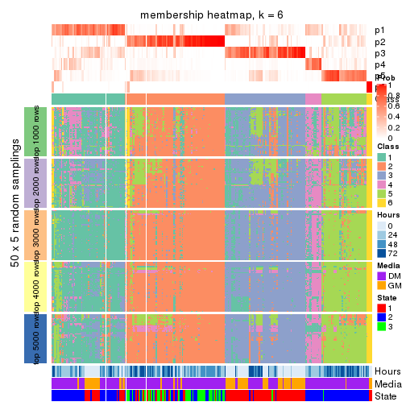</p>

</div>
</div>

As soon as we have had the classes for columns, we can look for signatures
which are significantly different between classes which can be candidate marks
for certain classes. Following are the heatmaps for signatures.


Signature heatmaps where rows are scaled:


<script>
$( function() {
	$( '#tabs-MAD-pam-get-signatures' ).tabs();
} );
</script>
<div id='tabs-MAD-pam-get-signatures'>
<ul>
<li><a href='#tab-MAD-pam-get-signatures-1'>k = 2</a></li>
<li><a href='#tab-MAD-pam-get-signatures-2'>k = 3</a></li>
<li><a href='#tab-MAD-pam-get-signatures-3'>k = 4</a></li>
<li><a href='#tab-MAD-pam-get-signatures-4'>k = 5</a></li>
<li><a href='#tab-MAD-pam-get-signatures-5'>k = 6</a></li>
</ul>
<div id='tab-MAD-pam-get-signatures-1'>
<pre><code class="r">get_signatures(res, k = 2)
</code></pre>

<p></p>

</div>
<div id='tab-MAD-pam-get-signatures-2'>
<pre><code class="r">get_signatures(res, k = 3)
</code></pre>

<p></p>

</div>
<div id='tab-MAD-pam-get-signatures-3'>
<pre><code class="r">get_signatures(res, k = 4)
</code></pre>

<p></p>

</div>
<div id='tab-MAD-pam-get-signatures-4'>
<pre><code class="r">get_signatures(res, k = 5)
</code></pre>

<p></p>

</div>
<div id='tab-MAD-pam-get-signatures-5'>
<pre><code class="r">get_signatures(res, k = 6)
</code></pre>

<p></p>

</div>
</div>


Signature heatmaps where rows are not scaled:


<script>
$( function() {
	$( '#tabs-MAD-pam-get-signatures-no-scale' ).tabs();
} );
</script>
<div id='tabs-MAD-pam-get-signatures-no-scale'>
<ul>
<li><a href='#tab-MAD-pam-get-signatures-no-scale-1'>k = 2</a></li>
<li><a href='#tab-MAD-pam-get-signatures-no-scale-2'>k = 3</a></li>
<li><a href='#tab-MAD-pam-get-signatures-no-scale-3'>k = 4</a></li>
<li><a href='#tab-MAD-pam-get-signatures-no-scale-4'>k = 5</a></li>
<li><a href='#tab-MAD-pam-get-signatures-no-scale-5'>k = 6</a></li>
</ul>
<div id='tab-MAD-pam-get-signatures-no-scale-1'>
<pre><code class="r">get_signatures(res, k = 2, scale_rows = FALSE)
</code></pre>

<p></p>

</div>
<div id='tab-MAD-pam-get-signatures-no-scale-2'>
<pre><code class="r">get_signatures(res, k = 3, scale_rows = FALSE)
</code></pre>

<p>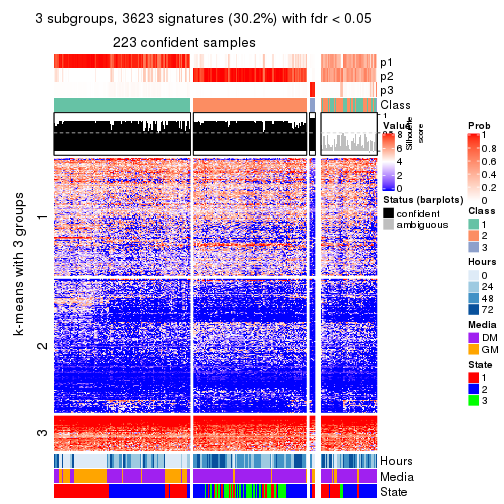</p>

</div>
<div id='tab-MAD-pam-get-signatures-no-scale-3'>
<pre><code class="r">get_signatures(res, k = 4, scale_rows = FALSE)
</code></pre>

<p></p>

</div>
<div id='tab-MAD-pam-get-signatures-no-scale-4'>
<pre><code class="r">get_signatures(res, k = 5, scale_rows = FALSE)
</code></pre>

<p></p>

</div>
<div id='tab-MAD-pam-get-signatures-no-scale-5'>
<pre><code class="r">get_signatures(res, k = 6, scale_rows = FALSE)
</code></pre>

<p></p>

</div>
</div>


Compare the overlap of signatures from different k:

```r
compare_signatures(res)
```


`get_signature()` returns a data frame invisibly. TO get the list of signatures, the function
call should be assigned to a variable explicitly. In following code, if `plot` argument is set
to `FALSE`, no heatmap is plotted while only the differential analysis is performed.

```r
# code only for demonstration
tb = get_signature(res, k = ..., plot = FALSE)
```

An example of the output of `tb` is:

```
#>   which_row         fdr    mean_1    mean_2 scaled_mean_1 scaled_mean_2 km
#> 1        38 0.042760348  8.373488  9.131774    -0.5533452     0.5164555  1
#> 2        40 0.018707592  7.106213  8.469186    -0.6173731     0.5762149  1
#> 3        55 0.019134737 10.221463 11.207825    -0.6159697     0.5749050  1
#> 4        59 0.006059896  5.921854  7.869574    -0.6899429     0.6439467  1
#> 5        60 0.018055526  8.928898 10.211722    -0.6204761     0.5791110  1
#> 6        98 0.009384629 15.714769 14.887706     0.6635654    -0.6193277  2
...
```

The columns in `tb` are:

1. `which_row`: row indices corresponding to the input matrix.
2. `fdr`: FDR for the differential test. 
3. `mean_x`: The mean value in group x.
4. `scaled_mean_x`: The mean value in group x after rows are scaled.
5. `km`: Row groups if k-means clustering is applied to rows.


UMAP plot which shows how samples are separated.


<script>
$( function() {
	$( '#tabs-MAD-pam-dimension-reduction' ).tabs();
} );
</script>
<div id='tabs-MAD-pam-dimension-reduction'>
<ul>
<li><a href='#tab-MAD-pam-dimension-reduction-1'>k = 2</a></li>
<li><a href='#tab-MAD-pam-dimension-reduction-2'>k = 3</a></li>
<li><a href='#tab-MAD-pam-dimension-reduction-3'>k = 4</a></li>
<li><a href='#tab-MAD-pam-dimension-reduction-4'>k = 5</a></li>
<li><a href='#tab-MAD-pam-dimension-reduction-5'>k = 6</a></li>
</ul>
<div id='tab-MAD-pam-dimension-reduction-1'>
<pre><code class="r">dimension_reduction(res, k = 2, method = &quot;UMAP&quot;)
</code></pre>

<p></p>

</div>
<div id='tab-MAD-pam-dimension-reduction-2'>
<pre><code class="r">dimension_reduction(res, k = 3, method = &quot;UMAP&quot;)
</code></pre>

<p>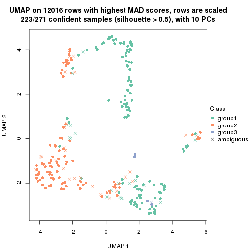</p>

</div>
<div id='tab-MAD-pam-dimension-reduction-3'>
<pre><code class="r">dimension_reduction(res, k = 4, method = &quot;UMAP&quot;)
</code></pre>

<p></p>

</div>
<div id='tab-MAD-pam-dimension-reduction-4'>
<pre><code class="r">dimension_reduction(res, k = 5, method = &quot;UMAP&quot;)
</code></pre>

<p></p>

</div>
<div id='tab-MAD-pam-dimension-reduction-5'>
<pre><code class="r">dimension_reduction(res, k = 6, method = &quot;UMAP&quot;)
</code></pre>

<p></p>

</div>
</div>


Following heatmap shows how subgroups are split when increasing `k`:

```r
collect_classes(res)
```


Test correlation between subgroups and known annotations. If the known
annotation is numeric, one-way ANOVA test is applied, and if the known
annotation is discrete, chi-squared contingency table test is applied.

```r
test_to_known_factors(res)
```

```
#>           n Hours(p) Media(p) State(p) k
#> MAD:pam 232 3.01e-14 2.29e-13 3.79e-16 2
#> MAD:pam 223 1.36e-13 3.07e-13 1.46e-15 3
#> MAD:pam 215 5.30e-18 6.66e-17 2.84e-32 4
#> MAD:pam 211 5.46e-20 7.82e-17 3.87e-39 5
#> MAD:pam 178 2.82e-19 3.70e-17 3.38e-33 6
```


If matrix rows can be associated to genes, consider to use `GO_Enrichment(res,
...)` to perform function enrichment for the signature genes.


 

---------------------------------------------------


### MAD:mclust*


The object with results only for a single top-value method and a single partition method 
can be extracted as:

```r
res = res_list["MAD", "mclust"]
# you can also extract it by
# res = res_list["MAD:mclust"]
```

A summary of `res` and all the functions that can be applied to it:

```r
res
```

```
#> A 'ConsensusPartition' object with k = 2, 3, 4, 5, 6.
#>   On a matrix with 12016 rows and 271 columns.
#>   Top rows (1000, 2000, 3000, 4000, 5000) are extracted by 'MAD' method.
#>   Subgroups are detected by 'mclust' method.
#>   Performed in total 1250 partitions by row resampling.
#>   Best k for subgroups seems to be 3.
#> 
#> Following methods can be applied to this 'ConsensusPartition' object:
#>  [1] "cola_report"             "collect_classes"         "collect_plots"          
#>  [4] "collect_stats"           "colnames"                "compare_signatures"     
#>  [7] "consensus_heatmap"       "dimension_reduction"     "functional_enrichment"  
#> [10] "get_anno_col"            "get_anno"                "get_classes"            
#> [13] "get_consensus"           "get_matrix"              "get_membership"         
#> [16] "get_param"               "get_signatures"          "get_stats"              
#> [19] "is_best_k"               "is_stable_k"             "membership_heatmap"     
#> [22] "ncol"                    "nrow"                    "plot_ecdf"              
#> [25] "rownames"                "select_partition_number" "show"                   
#> [28] "suggest_best_k"          "test_to_known_factors"
```

`collect_plots()` function collects all the plots made from `res` for all `k` (number of partitions)
into one single page to provide an easy and fast comparison between different `k`.

```r
collect_plots(res)
```


The plots are:

- The first row: a plot of the ECDF (Empirical cumulative distribution
  function) curves of the consensus matrix for each `k` and the heatmap of
  predicted classes for each `k`.
- The second row: heatmaps of the consensus matrix for each `k`.
- The third row: heatmaps of the membership matrix for each `k`.
- The fouth row: heatmaps of the signatures for each `k`.

All the plots in panels can be made by individual functions and they are
plotted later in this section.

`select_partition_number()` produces several plots showing different
statistics for choosing "optimized" `k`. There are following statistics:

- ECDF curves of the consensus matrix for each `k`;
- 1-PAC. [The PAC
  score](https://en.wikipedia.org/wiki/Consensus_clustering#Over-interpretation_potential_of_consensus_clustering)
  measures the proportion of the ambiguous subgrouping.
- Mean silhouette score.
- Concordance. The mean probability of fiting the consensus class ids in all
  partitions.
- Area increased. Denote $A_k$ as the area under the ECDF curve for current
  `k`, the area increased is defined as $A_k - A_{k-1}$.
- Rand index. The percent of pairs of samples that are both in a same cluster
  or both are not in a same cluster in the partition of k and k-1.
- Jaccard index. The ratio of pairs of samples are both in a same cluster in
  the partition of k and k-1 and the pairs of samples are both in a same
  cluster in the partition k or k-1.

The detailed explanations of these statistics can be found in [the cola
vignette](http://bioconductor.org/packages/devel/bioc/vignettes/cola/inst/doc/cola.html#toc_13).

Generally speaking, lower PAC score, higher mean silhouette score or higher
concordance corresponds to better partition. Rand index and Jaccard index
measure how similar the current partition is compared to partition with `k-1`.
If they are too similar, we won't accept `k` is better than `k-1`.

```r
select_partition_number(res)
```


The numeric values for all these statistics can be obtained by `get_stats()`.

```r
get_stats(res)
```

```
#>   k 1-PAC mean_silhouette concordance area_increased  Rand Jaccard
#> 2 2 0.950           0.939       0.961         0.4693 0.524   0.524
#> 3 3 0.903           0.904       0.956         0.3218 0.827   0.678
#> 4 4 0.705           0.491       0.674         0.1100 0.744   0.454
#> 5 5 0.795           0.807       0.888         0.0649 0.902   0.707
#> 6 6 0.848           0.750       0.879         0.0443 0.918   0.720
```

`suggest_best_k()` suggests the best $k$ based on these statistics. The rules are as follows:

- All $k$ with Jaccard index larger than 0.95 are removed because the increase of
  the partition number does not provides enough extra information. If all $k$ are removed,
  the best $k$ is assigned by `NA`.
- For $k$ with 1-PAC larger than 0.9, the maximal $k$ is taken as the "best k". Other $k$ is called "optional k".
- If it does not fit the second rule. The $k$ with the highest vote of highest
  1-PAC, mean silhouette and concordance is taken as the "best k".

```r
suggest_best_k(res)
```

```
#> [1] 3
#> attr(,"optional")
#> [1] 2
```

There is also optional best $k$ = 2 that is worth to check.

Following shows the table of the partitions (You need to click the **show/hide
code output** link to see it). The membership matrix (columns with name `p*`)
is inferred by
[`clue::cl_consensus()`](https://www.rdocumentation.org/link/cl_consensus?package=clue)
function with the `SE` method. Basically the value in the membership matrix
represents the probability to belong to a certain group. The finall class
label for an item is determined with the group with highest probability it
belongs to.

In `get_classes()` function, the entropy is calculated from the membership
matrix and the silhouette score is calculated from the consensus matrix.


<script>
$( function() {
	$( '#tabs-MAD-mclust-get-classes' ).tabs();
} );
</script>
<div id='tabs-MAD-mclust-get-classes'>
<ul>
<li><a href='#tab-MAD-mclust-get-classes-1'>k = 2</a></li>
<li><a href='#tab-MAD-mclust-get-classes-2'>k = 3</a></li>
<li><a href='#tab-MAD-mclust-get-classes-3'>k = 4</a></li>
<li><a href='#tab-MAD-mclust-get-classes-4'>k = 5</a></li>
<li><a href='#tab-MAD-mclust-get-classes-5'>k = 6</a></li>
</ul>

<div id='tab-MAD-mclust-get-classes-1'>
<p><a id='tab-MAD-mclust-get-classes-1-a' style='color:#0366d6' href='#'>show/hide code output</a></p>
<pre><code class="r">cbind(get_classes(res, k = 2), get_membership(res, k = 2))
</code></pre>

<pre><code>#&gt;            class entropy silhouette    p1    p2
#&gt; T0_CT_A01      1  0.4431     0.9308 0.908 0.092
#&gt; T0_CT_A03      1  0.4298     0.9340 0.912 0.088
#&gt; T0_CT_A05      1  0.4298     0.9340 0.912 0.088
#&gt; T0_CT_A06      1  0.4298     0.9340 0.912 0.088
#&gt; T0_CT_A07      1  0.4298     0.9340 0.912 0.088
#&gt; T0_CT_A08      1  0.0000     0.9578 1.000 0.000
#&gt; T0_CT_A10      1  0.4298     0.9340 0.912 0.088
#&gt; T0_CT_A11      1  0.3431     0.9462 0.936 0.064
#&gt; T0_CT_B01      1  0.4161     0.9362 0.916 0.084
#&gt; T0_CT_B03      2  0.1414     0.9632 0.020 0.980
#&gt; T0_CT_B05      1  0.4298     0.9340 0.912 0.088
#&gt; T0_CT_B07      1  0.4298     0.9340 0.912 0.088
#&gt; T0_CT_B08      2  0.6712     0.7928 0.176 0.824
#&gt; T0_CT_B09      1  0.4298     0.9340 0.912 0.088
#&gt; T0_CT_C02      2  0.1414     0.9632 0.020 0.980
#&gt; T0_CT_C03      1  0.2043     0.9523 0.968 0.032
#&gt; T0_CT_C05      2  0.0672     0.9700 0.008 0.992
#&gt; T0_CT_C06      1  0.4161     0.9362 0.916 0.084
#&gt; T0_CT_C07      1  0.4161     0.9362 0.916 0.084
#&gt; T0_CT_C08      1  0.4298     0.9340 0.912 0.088
#&gt; T0_CT_C09      1  0.3733     0.9439 0.928 0.072
#&gt; T0_CT_C11      2  0.0672     0.9700 0.008 0.992
#&gt; T0_CT_C12      1  0.4298     0.9340 0.912 0.088
#&gt; T0_CT_D01      2  0.8661     0.5989 0.288 0.712
#&gt; T0_CT_D02      1  0.4161     0.9362 0.916 0.084
#&gt; T0_CT_D03      1  0.4939     0.9166 0.892 0.108
#&gt; T0_CT_D05      1  0.4298     0.9340 0.912 0.088
#&gt; T0_CT_D06      2  0.1414     0.9632 0.020 0.980
#&gt; T0_CT_D07      1  0.4298     0.9340 0.912 0.088
#&gt; T0_CT_D08      2  0.1414     0.9632 0.020 0.980
#&gt; T0_CT_D09      2  0.0672     0.9700 0.008 0.992
#&gt; T0_CT_D11      2  0.0672     0.9700 0.008 0.992
#&gt; T0_CT_D12      1  0.4298     0.9340 0.912 0.088
#&gt; T0_CT_E01      1  0.4298     0.9340 0.912 0.088
#&gt; T0_CT_E03      1  0.4161     0.9362 0.916 0.084
#&gt; T0_CT_E04      2  0.0938     0.9680 0.012 0.988
#&gt; T0_CT_E05      1  0.0000     0.9578 1.000 0.000
#&gt; T0_CT_E06      1  0.4298     0.9340 0.912 0.088
#&gt; T0_CT_E07      1  0.4298     0.9340 0.912 0.088
#&gt; T0_CT_E08      2  0.2043     0.9543 0.032 0.968
#&gt; T0_CT_E09      1  0.4298     0.9340 0.912 0.088
#&gt; T0_CT_E10      1  0.3733     0.9439 0.928 0.072
#&gt; T0_CT_E11      1  0.4298     0.9340 0.912 0.088
#&gt; T0_CT_E12      1  0.4022     0.9380 0.920 0.080
#&gt; T0_CT_F01      1  0.4298     0.9340 0.912 0.088
#&gt; T0_CT_F02      1  0.4298     0.9340 0.912 0.088
#&gt; T0_CT_F03      1  0.4298     0.9340 0.912 0.088
#&gt; T0_CT_F04      1  0.4161     0.9362 0.916 0.084
#&gt; T0_CT_F05      2  0.1633     0.9605 0.024 0.976
#&gt; T0_CT_F06      1  0.4298     0.9340 0.912 0.088
#&gt; T0_CT_F07      1  0.4298     0.9340 0.912 0.088
#&gt; T0_CT_F09      2  0.4298     0.9009 0.088 0.912
#&gt; T0_CT_F11      1  0.4161     0.9362 0.916 0.084
#&gt; T0_CT_F12      1  0.4298     0.9340 0.912 0.088
#&gt; T0_CT_G01      1  0.4298     0.9340 0.912 0.088
#&gt; T0_CT_G02      1  0.4161     0.9362 0.916 0.084
#&gt; T0_CT_G03      1  0.4298     0.9340 0.912 0.088
#&gt; T0_CT_G04      2  0.7299     0.7535 0.204 0.796
#&gt; T0_CT_G07      2  0.1414     0.9632 0.020 0.980
#&gt; T0_CT_G08      2  0.1414     0.9632 0.020 0.980
#&gt; T0_CT_G09      1  0.0000     0.9578 1.000 0.000
#&gt; T0_CT_G11      1  0.3879     0.9399 0.924 0.076
#&gt; T0_CT_H01      1  0.3274     0.9457 0.940 0.060
#&gt; T0_CT_H02      2  0.0672     0.9700 0.008 0.992
#&gt; T0_CT_H04      1  0.4298     0.9340 0.912 0.088
#&gt; T0_CT_H05      1  0.4161     0.9362 0.916 0.084
#&gt; T0_CT_H08      1  0.4298     0.9340 0.912 0.088
#&gt; T0_CT_H09      1  0.4431     0.9308 0.908 0.092
#&gt; T0_CT_H12      1  0.4161     0.9362 0.916 0.084
#&gt; T24_CT_A01     1  0.0000     0.9578 1.000 0.000
#&gt; T24_CT_A03     2  0.0672     0.9700 0.008 0.992
#&gt; T24_CT_A04     2  0.0672     0.9700 0.008 0.992
#&gt; T24_CT_A05     1  0.0672     0.9567 0.992 0.008
#&gt; T24_CT_A07     2  0.0672     0.9700 0.008 0.992
#&gt; T24_CT_A08     1  0.0000     0.9578 1.000 0.000
#&gt; T24_CT_A09     1  0.0000     0.9578 1.000 0.000
#&gt; T24_CT_A10     1  0.0000     0.9578 1.000 0.000
#&gt; T24_CT_B01     1  0.0000     0.9578 1.000 0.000
#&gt; T24_CT_B02     1  0.0000     0.9578 1.000 0.000
#&gt; T24_CT_B03     1  0.4431     0.9308 0.908 0.092
#&gt; T24_CT_B05     2  0.0672     0.9700 0.008 0.992
#&gt; T24_CT_B06     2  0.3274     0.9286 0.060 0.940
#&gt; T24_CT_B07     1  0.0000     0.9578 1.000 0.000
#&gt; T24_CT_B08     2  0.0938     0.9680 0.012 0.988
#&gt; T24_CT_B09     1  0.0000     0.9578 1.000 0.000
#&gt; T24_CT_B11     1  0.1633     0.9539 0.976 0.024
#&gt; T24_CT_C01     1  0.0000     0.9578 1.000 0.000
#&gt; T24_CT_C02     2  0.8386     0.6546 0.268 0.732
#&gt; T24_CT_C03     1  0.0000     0.9578 1.000 0.000
#&gt; T24_CT_C05     2  0.2423     0.9470 0.040 0.960
#&gt; T24_CT_C07     2  0.0672     0.9700 0.008 0.992
#&gt; T24_CT_C08     2  0.0672     0.9700 0.008 0.992
#&gt; T24_CT_C09     2  0.9977     0.0892 0.472 0.528
#&gt; T24_CT_C10     1  0.0000     0.9578 1.000 0.000
#&gt; T24_CT_C11     1  0.2423     0.9506 0.960 0.040
#&gt; T24_CT_C12     2  0.0938     0.9680 0.012 0.988
#&gt; T24_CT_D01     2  0.0672     0.9700 0.008 0.992
#&gt; T24_CT_D02     2  0.0672     0.9700 0.008 0.992
#&gt; T24_CT_D03     2  0.0672     0.9700 0.008 0.992
#&gt; T24_CT_D04     1  0.0000     0.9578 1.000 0.000
#&gt; T24_CT_D05     1  0.0000     0.9578 1.000 0.000
#&gt; T24_CT_D06     1  0.0000     0.9578 1.000 0.000
#&gt; T24_CT_D07     1  0.2603     0.9497 0.956 0.044
#&gt; T24_CT_D08     2  0.0672     0.9700 0.008 0.992
#&gt; T24_CT_D09     2  0.0672     0.9700 0.008 0.992
#&gt; T24_CT_D10     2  0.0672     0.9700 0.008 0.992
#&gt; T24_CT_D11     2  0.0672     0.9700 0.008 0.992
#&gt; T24_CT_E01     1  0.0000     0.9578 1.000 0.000
#&gt; T24_CT_E02     1  0.0000     0.9578 1.000 0.000
#&gt; T24_CT_E04     2  0.0672     0.9700 0.008 0.992
#&gt; T24_CT_E05     1  0.0000     0.9578 1.000 0.000
#&gt; T24_CT_E07     1  0.3274     0.9453 0.940 0.060
#&gt; T24_CT_E09     1  0.0000     0.9578 1.000 0.000
#&gt; T24_CT_E11     1  0.0000     0.9578 1.000 0.000
#&gt; T24_CT_E12     2  0.0672     0.9700 0.008 0.992
#&gt; T24_CT_F01     2  0.0672     0.9700 0.008 0.992
#&gt; T24_CT_F02     2  0.0672     0.9700 0.008 0.992
#&gt; T24_CT_F03     1  0.0000     0.9578 1.000 0.000
#&gt; T24_CT_F04     1  0.0000     0.9578 1.000 0.000
#&gt; T24_CT_F05     1  0.0000     0.9578 1.000 0.000
#&gt; T24_CT_F07     1  0.0000     0.9578 1.000 0.000
#&gt; T24_CT_F08     1  0.0000     0.9578 1.000 0.000
#&gt; T24_CT_F09     2  0.0672     0.9700 0.008 0.992
#&gt; T24_CT_F10     1  0.3431     0.9441 0.936 0.064
#&gt; T24_CT_F11     1  0.0000     0.9578 1.000 0.000
#&gt; T24_CT_F12     2  0.2236     0.9508 0.036 0.964
#&gt; T24_CT_G01     2  0.0672     0.9700 0.008 0.992
#&gt; T24_CT_G02     1  0.0000     0.9578 1.000 0.000
#&gt; T24_CT_G03     1  0.0000     0.9578 1.000 0.000
#&gt; T24_CT_G04     1  0.4298     0.9340 0.912 0.088
#&gt; T24_CT_G05     2  0.4161     0.9094 0.084 0.916
#&gt; T24_CT_G06     1  0.0000     0.9578 1.000 0.000
#&gt; T24_CT_G08     1  0.0000     0.9578 1.000 0.000
#&gt; T24_CT_G10     2  0.0672     0.9700 0.008 0.992
#&gt; T24_CT_G11     1  0.0000     0.9578 1.000 0.000
#&gt; T24_CT_G12     1  0.0000     0.9578 1.000 0.000
#&gt; T24_CT_H01     1  0.3733     0.9412 0.928 0.072
#&gt; T24_CT_H02     1  0.0000     0.9578 1.000 0.000
#&gt; T24_CT_H03     1  0.9732     0.3811 0.596 0.404
#&gt; T24_CT_H05     1  0.0000     0.9578 1.000 0.000
#&gt; T24_CT_H07     1  0.0000     0.9578 1.000 0.000
#&gt; T24_CT_H09     1  0.0000     0.9578 1.000 0.000
#&gt; T24_CT_H12     1  0.0000     0.9578 1.000 0.000
#&gt; T48_CT_A01     2  0.0672     0.9700 0.008 0.992
#&gt; T48_CT_A02     2  0.0672     0.9700 0.008 0.992
#&gt; T48_CT_A03     1  0.0000     0.9578 1.000 0.000
#&gt; T48_CT_A04     2  0.0672     0.9700 0.008 0.992
#&gt; T48_CT_A05     1  0.3584     0.9429 0.932 0.068
#&gt; T48_CT_A06     1  0.0000     0.9578 1.000 0.000
#&gt; T48_CT_A07     2  0.0938     0.9680 0.012 0.988
#&gt; T48_CT_A08     2  0.6712     0.7916 0.176 0.824
#&gt; T48_CT_A09     1  0.0000     0.9578 1.000 0.000
#&gt; T48_CT_A10     2  0.0672     0.9700 0.008 0.992
#&gt; T48_CT_A11     2  0.0672     0.9700 0.008 0.992
#&gt; T48_CT_A12     1  0.0000     0.9578 1.000 0.000
#&gt; T48_CT_B01     2  0.0672     0.9700 0.008 0.992
#&gt; T48_CT_B02     2  0.0672     0.9700 0.008 0.992
#&gt; T48_CT_B03     1  0.0000     0.9578 1.000 0.000
#&gt; T48_CT_B04     1  0.0000     0.9578 1.000 0.000
#&gt; T48_CT_B06     2  0.0672     0.9700 0.008 0.992
#&gt; T48_CT_B08     1  0.0000     0.9578 1.000 0.000
#&gt; T48_CT_B10     2  0.0672     0.9700 0.008 0.992
#&gt; T48_CT_B11     2  0.0672     0.9700 0.008 0.992
#&gt; T48_CT_B12     1  0.0000     0.9578 1.000 0.000
#&gt; T48_CT_C01     2  0.0672     0.9700 0.008 0.992
#&gt; T48_CT_C02     1  0.0672     0.9518 0.992 0.008
#&gt; T48_CT_C03     2  0.0672     0.9700 0.008 0.992
#&gt; T48_CT_C04     1  0.0000     0.9578 1.000 0.000
#&gt; T48_CT_C05     1  0.5519     0.8955 0.872 0.128
#&gt; T48_CT_C06     1  0.7056     0.8147 0.808 0.192
#&gt; T48_CT_C07     1  0.0000     0.9578 1.000 0.000
#&gt; T48_CT_C09     2  0.0672     0.9700 0.008 0.992
#&gt; T48_CT_C10     1  0.0000     0.9578 1.000 0.000
#&gt; T48_CT_C11     2  0.0672     0.9700 0.008 0.992
#&gt; T48_CT_D01     1  0.3431     0.9446 0.936 0.064
#&gt; T48_CT_D02     1  0.0000     0.9578 1.000 0.000
#&gt; T48_CT_D03     1  0.0000     0.9578 1.000 0.000
#&gt; T48_CT_D04     1  0.4431     0.9310 0.908 0.092
#&gt; T48_CT_D06     2  0.0672     0.9700 0.008 0.992
#&gt; T48_CT_D07     2  0.0672     0.9700 0.008 0.992
#&gt; T48_CT_D08     1  0.0000     0.9578 1.000 0.000
#&gt; T48_CT_D09     2  0.0672     0.9700 0.008 0.992
#&gt; T48_CT_D10     1  0.0376     0.9565 0.996 0.004
#&gt; T48_CT_D11     2  0.0672     0.9700 0.008 0.992
#&gt; T48_CT_D12     1  0.0000     0.9578 1.000 0.000
#&gt; T48_CT_E01     1  0.3274     0.9453 0.940 0.060
#&gt; T48_CT_E02     1  0.0000     0.9578 1.000 0.000
#&gt; T48_CT_E03     1  0.3114     0.9465 0.944 0.056
#&gt; T48_CT_E04     1  0.0376     0.9572 0.996 0.004
#&gt; T48_CT_E05     2  0.4431     0.8965 0.092 0.908
#&gt; T48_CT_E06     1  0.0000     0.9578 1.000 0.000
#&gt; T48_CT_E07     1  0.0000     0.9578 1.000 0.000
#&gt; T48_CT_E08     2  0.0672     0.9700 0.008 0.992
#&gt; T48_CT_E10     1  0.0000     0.9578 1.000 0.000
#&gt; T48_CT_E11     1  0.0000     0.9578 1.000 0.000
#&gt; T48_CT_E12     2  0.0672     0.9700 0.008 0.992
#&gt; T48_CT_F01     2  0.0672     0.9700 0.008 0.992
#&gt; T48_CT_F02     1  0.0000     0.9578 1.000 0.000
#&gt; T48_CT_F03     1  0.0000     0.9578 1.000 0.000
#&gt; T48_CT_F05     2  0.7528     0.7318 0.216 0.784
#&gt; T48_CT_F07     1  0.0000     0.9578 1.000 0.000
#&gt; T48_CT_F09     2  0.0672     0.9700 0.008 0.992
#&gt; T48_CT_F10     1  0.0000     0.9578 1.000 0.000
#&gt; T48_CT_F11     1  0.0000     0.9578 1.000 0.000
#&gt; T48_CT_G01     1  0.0000     0.9578 1.000 0.000
#&gt; T48_CT_G02     2  0.0672     0.9700 0.008 0.992
#&gt; T48_CT_G03     2  0.7528     0.7330 0.216 0.784
#&gt; T48_CT_G07     2  0.0672     0.9700 0.008 0.992
#&gt; T48_CT_G08     2  0.8861     0.5658 0.304 0.696
#&gt; T48_CT_G09     1  0.3431     0.9443 0.936 0.064
#&gt; T48_CT_G10     1  0.0000     0.9578 1.000 0.000
#&gt; T48_CT_G11     1  0.0000     0.9578 1.000 0.000
#&gt; T48_CT_G12     2  0.0672     0.9700 0.008 0.992
#&gt; T48_CT_H01     1  0.9933     0.2089 0.548 0.452
#&gt; T48_CT_H02     1  0.3274     0.9453 0.940 0.060
#&gt; T48_CT_H04     1  0.0672     0.9518 0.992 0.008
#&gt; T48_CT_H05     2  0.0672     0.9700 0.008 0.992
#&gt; T48_CT_H06     2  0.0672     0.9700 0.008 0.992
#&gt; T48_CT_H07     1  0.0000     0.9578 1.000 0.000
#&gt; T48_CT_H08     2  0.0672     0.9700 0.008 0.992
#&gt; T48_CT_H11     1  0.0000     0.9578 1.000 0.000
#&gt; T48_CT_H12     2  0.0672     0.9700 0.008 0.992
#&gt; T72_CT_A01     2  0.0672     0.9700 0.008 0.992
#&gt; T72_CT_A05     2  0.3274     0.9291 0.060 0.940
#&gt; T72_CT_A08     1  0.0000     0.9578 1.000 0.000
#&gt; T72_CT_A09     2  0.0672     0.9700 0.008 0.992
#&gt; T72_CT_A11     2  0.0672     0.9700 0.008 0.992
#&gt; T72_CT_B01     2  0.0672     0.9700 0.008 0.992
#&gt; T72_CT_B02     1  0.0000     0.9578 1.000 0.000
#&gt; T72_CT_B03     1  0.0672     0.9566 0.992 0.008
#&gt; T72_CT_B04     1  0.0000     0.9578 1.000 0.000
#&gt; T72_CT_B05     1  0.4022     0.9381 0.920 0.080
#&gt; T72_CT_B06     1  0.0000     0.9578 1.000 0.000
#&gt; T72_CT_B08     2  0.0938     0.9680 0.012 0.988
#&gt; T72_CT_B09     1  0.0000     0.9578 1.000 0.000
#&gt; T72_CT_B11     1  0.0000     0.9578 1.000 0.000
#&gt; T72_CT_B12     2  0.0672     0.9700 0.008 0.992
#&gt; T72_CT_C04     2  0.0672     0.9700 0.008 0.992
#&gt; T72_CT_C06     1  0.0000     0.9578 1.000 0.000
#&gt; T72_CT_C07     2  0.0672     0.9700 0.008 0.992
#&gt; T72_CT_C09     1  0.0000     0.9578 1.000 0.000
#&gt; T72_CT_C11     2  0.0672     0.9700 0.008 0.992
#&gt; T72_CT_D01     2  0.0672     0.9700 0.008 0.992
#&gt; T72_CT_D03     1  0.3879     0.9398 0.924 0.076
#&gt; T72_CT_D04     2  0.0672     0.9700 0.008 0.992
#&gt; T72_CT_D05     1  0.0000     0.9578 1.000 0.000
#&gt; T72_CT_D07     1  0.0000     0.9578 1.000 0.000
#&gt; T72_CT_D10     1  0.3274     0.9453 0.940 0.060
#&gt; T72_CT_D11     1  0.0000     0.9578 1.000 0.000
#&gt; T72_CT_E04     1  0.0000     0.9578 1.000 0.000
#&gt; T72_CT_E05     2  0.0672     0.9700 0.008 0.992
#&gt; T72_CT_E07     1  0.4298     0.9340 0.912 0.088
#&gt; T72_CT_F01     2  0.0672     0.9700 0.008 0.992
#&gt; T72_CT_F05     2  0.0672     0.9700 0.008 0.992
#&gt; T72_CT_F07     1  0.0000     0.9578 1.000 0.000
#&gt; T72_CT_F10     2  0.0672     0.9700 0.008 0.992
#&gt; T72_CT_F11     2  0.0672     0.9700 0.008 0.992
#&gt; T72_CT_G03     1  0.0000     0.9578 1.000 0.000
#&gt; T72_CT_G04     1  0.0000     0.9578 1.000 0.000
#&gt; T72_CT_G06     2  0.0672     0.9700 0.008 0.992
#&gt; T72_CT_G08     1  0.4161     0.9362 0.916 0.084
#&gt; T72_CT_G10     2  0.0672     0.9700 0.008 0.992
#&gt; T72_CT_G11     1  0.0000     0.9578 1.000 0.000
#&gt; T72_CT_H01     2  0.0938     0.9680 0.012 0.988
#&gt; T72_CT_H03     2  0.0938     0.9680 0.012 0.988
#&gt; T72_CT_H05     2  0.5059     0.8747 0.112 0.888
#&gt; T72_CT_H08     2  0.1414     0.9632 0.020 0.980
#&gt; T72_CT_H09     1  0.4161     0.9362 0.916 0.084
#&gt; T72_CT_H10     1  0.0000     0.9578 1.000 0.000
#&gt; T72_CT_H11     1  0.0000     0.9578 1.000 0.000
#&gt; T72_CT_H12     2  0.0672     0.9700 0.008 0.992
</code></pre>

<script>
$('#tab-MAD-mclust-get-classes-1-a').parent().next().next().hide();
$('#tab-MAD-mclust-get-classes-1-a').click(function(){
  $('#tab-MAD-mclust-get-classes-1-a').parent().next().next().toggle();
  return(false);
});
</script>
</div>

<div id='tab-MAD-mclust-get-classes-2'>
<p><a id='tab-MAD-mclust-get-classes-2-a' style='color:#0366d6' href='#'>show/hide code output</a></p>
<pre><code class="r">cbind(get_classes(res, k = 3), get_membership(res, k = 3))
</code></pre>

<pre><code>#&gt;            class entropy silhouette    p1    p2    p3
#&gt; T0_CT_A01      3  0.3583      0.848 0.056 0.044 0.900
#&gt; T0_CT_A03      3  0.0000      0.888 0.000 0.000 1.000
#&gt; T0_CT_A05      3  0.0000      0.888 0.000 0.000 1.000
#&gt; T0_CT_A06      3  0.0000      0.888 0.000 0.000 1.000
#&gt; T0_CT_A07      3  0.0000      0.888 0.000 0.000 1.000
#&gt; T0_CT_A08      1  0.0424      0.959 0.992 0.000 0.008
#&gt; T0_CT_A10      3  0.0000      0.888 0.000 0.000 1.000
#&gt; T0_CT_A11      1  0.2269      0.933 0.944 0.016 0.040
#&gt; T0_CT_B01      1  0.1411      0.949 0.964 0.000 0.036
#&gt; T0_CT_B03      3  0.5706      0.595 0.000 0.320 0.680
#&gt; T0_CT_B05      3  0.1643      0.871 0.044 0.000 0.956
#&gt; T0_CT_B07      3  0.0892      0.882 0.020 0.000 0.980
#&gt; T0_CT_B08      3  0.4555      0.747 0.000 0.200 0.800
#&gt; T0_CT_B09      3  0.0000      0.888 0.000 0.000 1.000
#&gt; T0_CT_C02      3  0.5650      0.609 0.000 0.312 0.688
#&gt; T0_CT_C03      1  0.1529      0.947 0.960 0.000 0.040
#&gt; T0_CT_C05      2  0.0000      0.968 0.000 1.000 0.000
#&gt; T0_CT_C06      1  0.1289      0.951 0.968 0.000 0.032
#&gt; T0_CT_C07      3  0.2165      0.856 0.064 0.000 0.936
#&gt; T0_CT_C08      3  0.0000      0.888 0.000 0.000 1.000
#&gt; T0_CT_C09      1  0.2414      0.929 0.940 0.020 0.040
#&gt; T0_CT_C11      2  0.0000      0.968 0.000 1.000 0.000
#&gt; T0_CT_C12      3  0.0000      0.888 0.000 0.000 1.000
#&gt; T0_CT_D01      3  0.6264      0.458 0.004 0.380 0.616
#&gt; T0_CT_D02      3  0.4062      0.762 0.164 0.000 0.836
#&gt; T0_CT_D03      3  0.0000      0.888 0.000 0.000 1.000
#&gt; T0_CT_D05      1  0.2448      0.917 0.924 0.000 0.076
#&gt; T0_CT_D06      3  0.5706      0.595 0.000 0.320 0.680
#&gt; T0_CT_D07      3  0.1031      0.880 0.024 0.000 0.976
#&gt; T0_CT_D08      3  0.5760      0.581 0.000 0.328 0.672
#&gt; T0_CT_D09      2  0.2356      0.896 0.000 0.928 0.072
#&gt; T0_CT_D11      2  0.0000      0.968 0.000 1.000 0.000
#&gt; T0_CT_D12      3  0.0000      0.888 0.000 0.000 1.000
#&gt; T0_CT_E01      3  0.0424      0.886 0.008 0.000 0.992
#&gt; T0_CT_E03      3  0.1163      0.879 0.028 0.000 0.972
#&gt; T0_CT_E04      2  0.0000      0.968 0.000 1.000 0.000
#&gt; T0_CT_E05      1  0.0592      0.959 0.988 0.000 0.012
#&gt; T0_CT_E06      3  0.0000      0.888 0.000 0.000 1.000
#&gt; T0_CT_E07      3  0.0000      0.888 0.000 0.000 1.000
#&gt; T0_CT_E08      3  0.5497      0.639 0.000 0.292 0.708
#&gt; T0_CT_E09      3  0.0000      0.888 0.000 0.000 1.000
#&gt; T0_CT_E10      1  0.2414      0.929 0.940 0.020 0.040
#&gt; T0_CT_E11      3  0.0000      0.888 0.000 0.000 1.000
#&gt; T0_CT_E12      3  0.6225      0.179 0.432 0.000 0.568
#&gt; T0_CT_F01      3  0.0000      0.888 0.000 0.000 1.000
#&gt; T0_CT_F02      3  0.0000      0.888 0.000 0.000 1.000
#&gt; T0_CT_F03      3  0.0000      0.888 0.000 0.000 1.000
#&gt; T0_CT_F04      3  0.0000      0.888 0.000 0.000 1.000
#&gt; T0_CT_F05      2  0.0829      0.956 0.004 0.984 0.012
#&gt; T0_CT_F06      3  0.0000      0.888 0.000 0.000 1.000
#&gt; T0_CT_F07      1  0.5138      0.688 0.748 0.000 0.252
#&gt; T0_CT_F09      2  0.0237      0.964 0.004 0.996 0.000
#&gt; T0_CT_F11      3  0.2959      0.827 0.100 0.000 0.900
#&gt; T0_CT_F12      3  0.0000      0.888 0.000 0.000 1.000
#&gt; T0_CT_G01      3  0.0000      0.888 0.000 0.000 1.000
#&gt; T0_CT_G02      1  0.6225      0.269 0.568 0.000 0.432
#&gt; T0_CT_G03      3  0.0000      0.888 0.000 0.000 1.000
#&gt; T0_CT_G04      3  0.5327      0.666 0.000 0.272 0.728
#&gt; T0_CT_G07      3  0.5621      0.615 0.000 0.308 0.692
#&gt; T0_CT_G08      3  0.5621      0.615 0.000 0.308 0.692
#&gt; T0_CT_G09      1  0.0592      0.959 0.988 0.000 0.012
#&gt; T0_CT_G11      1  0.1529      0.947 0.960 0.000 0.040
#&gt; T0_CT_H01      1  0.1289      0.951 0.968 0.000 0.032
#&gt; T0_CT_H02      2  0.1289      0.939 0.000 0.968 0.032
#&gt; T0_CT_H04      3  0.0000      0.888 0.000 0.000 1.000
#&gt; T0_CT_H05      1  0.4750      0.745 0.784 0.000 0.216
#&gt; T0_CT_H08      3  0.1289      0.877 0.032 0.000 0.968
#&gt; T0_CT_H09      1  0.1411      0.949 0.964 0.000 0.036
#&gt; T0_CT_H12      3  0.4931      0.664 0.232 0.000 0.768
#&gt; T24_CT_A01     1  0.0592      0.958 0.988 0.000 0.012
#&gt; T24_CT_A03     2  0.0000      0.968 0.000 1.000 0.000
#&gt; T24_CT_A04     2  0.0237      0.965 0.000 0.996 0.004
#&gt; T24_CT_A05     1  0.1753      0.941 0.952 0.000 0.048
#&gt; T24_CT_A07     2  0.0000      0.968 0.000 1.000 0.000
#&gt; T24_CT_A08     1  0.0424      0.959 0.992 0.000 0.008
#&gt; T24_CT_A09     1  0.0000      0.961 1.000 0.000 0.000
#&gt; T24_CT_A10     1  0.0000      0.961 1.000 0.000 0.000
#&gt; T24_CT_B01     1  0.0000      0.961 1.000 0.000 0.000
#&gt; T24_CT_B02     1  0.0000      0.961 1.000 0.000 0.000
#&gt; T24_CT_B03     1  0.1289      0.951 0.968 0.000 0.032
#&gt; T24_CT_B05     2  0.0000      0.968 0.000 1.000 0.000
#&gt; T24_CT_B06     2  0.0747      0.952 0.016 0.984 0.000
#&gt; T24_CT_B07     1  0.0424      0.959 0.992 0.000 0.008
#&gt; T24_CT_B08     2  0.0237      0.964 0.004 0.996 0.000
#&gt; T24_CT_B09     1  0.0424      0.959 0.992 0.000 0.008
#&gt; T24_CT_B11     1  0.5905      0.483 0.648 0.000 0.352
#&gt; T24_CT_C01     1  0.0000      0.961 1.000 0.000 0.000
#&gt; T24_CT_C02     2  0.6154      0.295 0.408 0.592 0.000
#&gt; T24_CT_C03     1  0.0747      0.958 0.984 0.000 0.016
#&gt; T24_CT_C05     2  0.1529      0.924 0.040 0.960 0.000
#&gt; T24_CT_C07     2  0.0000      0.968 0.000 1.000 0.000
#&gt; T24_CT_C08     2  0.0000      0.968 0.000 1.000 0.000
#&gt; T24_CT_C09     1  0.6313      0.544 0.676 0.308 0.016
#&gt; T24_CT_C10     1  0.0000      0.961 1.000 0.000 0.000
#&gt; T24_CT_C11     1  0.0747      0.958 0.984 0.000 0.016
#&gt; T24_CT_C12     2  0.0000      0.968 0.000 1.000 0.000
#&gt; T24_CT_D01     2  0.0000      0.968 0.000 1.000 0.000
#&gt; T24_CT_D02     2  0.0000      0.968 0.000 1.000 0.000
#&gt; T24_CT_D03     2  0.0000      0.968 0.000 1.000 0.000
#&gt; T24_CT_D04     1  0.0000      0.961 1.000 0.000 0.000
#&gt; T24_CT_D05     1  0.1289      0.951 0.968 0.000 0.032
#&gt; T24_CT_D06     1  0.0000      0.961 1.000 0.000 0.000
#&gt; T24_CT_D07     1  0.1289      0.951 0.968 0.000 0.032
#&gt; T24_CT_D08     2  0.0000      0.968 0.000 1.000 0.000
#&gt; T24_CT_D09     2  0.0000      0.968 0.000 1.000 0.000
#&gt; T24_CT_D10     2  0.0000      0.968 0.000 1.000 0.000
#&gt; T24_CT_D11     2  0.0000      0.968 0.000 1.000 0.000
#&gt; T24_CT_E01     1  0.0000      0.961 1.000 0.000 0.000
#&gt; T24_CT_E02     1  0.0000      0.961 1.000 0.000 0.000
#&gt; T24_CT_E04     2  0.0000      0.968 0.000 1.000 0.000
#&gt; T24_CT_E05     1  0.0000      0.961 1.000 0.000 0.000
#&gt; T24_CT_E07     1  0.1289      0.951 0.968 0.000 0.032
#&gt; T24_CT_E09     1  0.0424      0.959 0.992 0.000 0.008
#&gt; T24_CT_E11     1  0.0000      0.961 1.000 0.000 0.000
#&gt; T24_CT_E12     2  0.0000      0.968 0.000 1.000 0.000
#&gt; T24_CT_F01     2  0.0000      0.968 0.000 1.000 0.000
#&gt; T24_CT_F02     2  0.0000      0.968 0.000 1.000 0.000
#&gt; T24_CT_F03     1  0.0000      0.961 1.000 0.000 0.000
#&gt; T24_CT_F04     1  0.0592      0.959 0.988 0.000 0.012
#&gt; T24_CT_F05     1  0.0000      0.961 1.000 0.000 0.000
#&gt; T24_CT_F07     1  0.0592      0.959 0.988 0.000 0.012
#&gt; T24_CT_F08     1  0.0000      0.961 1.000 0.000 0.000
#&gt; T24_CT_F09     2  0.0000      0.968 0.000 1.000 0.000
#&gt; T24_CT_F10     1  0.1289      0.951 0.968 0.000 0.032
#&gt; T24_CT_F11     1  0.0000      0.961 1.000 0.000 0.000
#&gt; T24_CT_F12     2  0.0747      0.952 0.016 0.984 0.000
#&gt; T24_CT_G01     2  0.0000      0.968 0.000 1.000 0.000
#&gt; T24_CT_G02     1  0.0237      0.960 0.996 0.000 0.004
#&gt; T24_CT_G03     1  0.0424      0.959 0.992 0.000 0.008
#&gt; T24_CT_G04     1  0.1289      0.951 0.968 0.000 0.032
#&gt; T24_CT_G05     2  0.3192      0.826 0.112 0.888 0.000
#&gt; T24_CT_G06     1  0.0000      0.961 1.000 0.000 0.000
#&gt; T24_CT_G08     1  0.0424      0.959 0.992 0.000 0.008
#&gt; T24_CT_G10     2  0.0000      0.968 0.000 1.000 0.000
#&gt; T24_CT_G11     1  0.0000      0.961 1.000 0.000 0.000
#&gt; T24_CT_G12     1  0.1031      0.956 0.976 0.000 0.024
#&gt; T24_CT_H01     3  0.4235      0.749 0.176 0.000 0.824
#&gt; T24_CT_H02     1  0.0000      0.961 1.000 0.000 0.000
#&gt; T24_CT_H03     1  0.6888      0.236 0.552 0.432 0.016
#&gt; T24_CT_H05     1  0.0000      0.961 1.000 0.000 0.000
#&gt; T24_CT_H07     1  0.0000      0.961 1.000 0.000 0.000
#&gt; T24_CT_H09     1  0.0000      0.961 1.000 0.000 0.000
#&gt; T24_CT_H12     1  0.0424      0.959 0.992 0.000 0.008
#&gt; T48_CT_A01     2  0.0000      0.968 0.000 1.000 0.000
#&gt; T48_CT_A02     2  0.0000      0.968 0.000 1.000 0.000
#&gt; T48_CT_A03     1  0.0237      0.960 0.996 0.000 0.004
#&gt; T48_CT_A04     2  0.0000      0.968 0.000 1.000 0.000
#&gt; T48_CT_A05     1  0.1289      0.951 0.968 0.000 0.032
#&gt; T48_CT_A06     1  0.0747      0.956 0.984 0.000 0.016
#&gt; T48_CT_A07     2  0.4974      0.652 0.000 0.764 0.236
#&gt; T48_CT_A08     2  0.1860      0.909 0.052 0.948 0.000
#&gt; T48_CT_A09     1  0.0000      0.961 1.000 0.000 0.000
#&gt; T48_CT_A10     2  0.0000      0.968 0.000 1.000 0.000
#&gt; T48_CT_A11     2  0.0000      0.968 0.000 1.000 0.000
#&gt; T48_CT_A12     1  0.0000      0.961 1.000 0.000 0.000
#&gt; T48_CT_B01     2  0.0000      0.968 0.000 1.000 0.000
#&gt; T48_CT_B02     2  0.0000      0.968 0.000 1.000 0.000
#&gt; T48_CT_B03     1  0.0424      0.959 0.992 0.000 0.008
#&gt; T48_CT_B04     1  0.0237      0.960 0.996 0.000 0.004
#&gt; T48_CT_B06     2  0.0000      0.968 0.000 1.000 0.000
#&gt; T48_CT_B08     1  0.0000      0.961 1.000 0.000 0.000
#&gt; T48_CT_B10     2  0.0000      0.968 0.000 1.000 0.000
#&gt; T48_CT_B11     2  0.0000      0.968 0.000 1.000 0.000
#&gt; T48_CT_B12     1  0.0237      0.961 0.996 0.000 0.004
#&gt; T48_CT_C01     2  0.0000      0.968 0.000 1.000 0.000
#&gt; T48_CT_C02     1  0.1529      0.945 0.960 0.000 0.040
#&gt; T48_CT_C03     2  0.0000      0.968 0.000 1.000 0.000
#&gt; T48_CT_C04     1  0.0424      0.959 0.992 0.000 0.008
#&gt; T48_CT_C05     1  0.4677      0.809 0.840 0.132 0.028
#&gt; T48_CT_C06     1  0.6224      0.563 0.688 0.296 0.016
#&gt; T48_CT_C07     1  0.0237      0.961 0.996 0.000 0.004
#&gt; T48_CT_C09     2  0.0000      0.968 0.000 1.000 0.000
#&gt; T48_CT_C10     1  0.0000      0.961 1.000 0.000 0.000
#&gt; T48_CT_C11     2  0.0000      0.968 0.000 1.000 0.000
#&gt; T48_CT_D01     1  0.0592      0.959 0.988 0.000 0.012
#&gt; T48_CT_D02     1  0.0237      0.961 0.996 0.000 0.004
#&gt; T48_CT_D03     1  0.0000      0.961 1.000 0.000 0.000
#&gt; T48_CT_D04     1  0.1711      0.948 0.960 0.008 0.032
#&gt; T48_CT_D06     2  0.0000      0.968 0.000 1.000 0.000
#&gt; T48_CT_D07     2  0.0000      0.968 0.000 1.000 0.000
#&gt; T48_CT_D08     1  0.0000      0.961 1.000 0.000 0.000
#&gt; T48_CT_D09     2  0.0000      0.968 0.000 1.000 0.000
#&gt; T48_CT_D10     1  0.0592      0.959 0.988 0.000 0.012
#&gt; T48_CT_D11     2  0.0000      0.968 0.000 1.000 0.000
#&gt; T48_CT_D12     1  0.0000      0.961 1.000 0.000 0.000
#&gt; T48_CT_E01     1  0.1289      0.951 0.968 0.000 0.032
#&gt; T48_CT_E02     1  0.0000      0.961 1.000 0.000 0.000
#&gt; T48_CT_E03     1  0.1289      0.951 0.968 0.000 0.032
#&gt; T48_CT_E04     1  0.0892      0.956 0.980 0.000 0.020
#&gt; T48_CT_E05     2  0.2682      0.873 0.076 0.920 0.004
#&gt; T48_CT_E06     1  0.0000      0.961 1.000 0.000 0.000
#&gt; T48_CT_E07     1  0.0000      0.961 1.000 0.000 0.000
#&gt; T48_CT_E08     2  0.0000      0.968 0.000 1.000 0.000
#&gt; T48_CT_E10     1  0.0000      0.961 1.000 0.000 0.000
#&gt; T48_CT_E11     1  0.0000      0.961 1.000 0.000 0.000
#&gt; T48_CT_E12     2  0.0000      0.968 0.000 1.000 0.000
#&gt; T48_CT_F01     2  0.0000      0.968 0.000 1.000 0.000
#&gt; T48_CT_F02     1  0.0000      0.961 1.000 0.000 0.000
#&gt; T48_CT_F03     1  0.0592      0.959 0.988 0.000 0.012
#&gt; T48_CT_F05     2  0.4605      0.678 0.204 0.796 0.000
#&gt; T48_CT_F07     1  0.0000      0.961 1.000 0.000 0.000
#&gt; T48_CT_F09     2  0.0000      0.968 0.000 1.000 0.000
#&gt; T48_CT_F10     1  0.0592      0.959 0.988 0.000 0.012
#&gt; T48_CT_F11     1  0.0000      0.961 1.000 0.000 0.000
#&gt; T48_CT_G01     1  0.0424      0.959 0.992 0.000 0.008
#&gt; T48_CT_G02     2  0.0000      0.968 0.000 1.000 0.000
#&gt; T48_CT_G03     2  0.3482      0.803 0.128 0.872 0.000
#&gt; T48_CT_G07     2  0.0000      0.968 0.000 1.000 0.000
#&gt; T48_CT_G08     2  0.4654      0.675 0.208 0.792 0.000
#&gt; T48_CT_G09     1  0.1289      0.951 0.968 0.000 0.032
#&gt; T48_CT_G10     1  0.2066      0.920 0.940 0.000 0.060
#&gt; T48_CT_G11     1  0.0424      0.960 0.992 0.000 0.008
#&gt; T48_CT_G12     2  0.0000      0.968 0.000 1.000 0.000
#&gt; T48_CT_H01     1  0.5929      0.535 0.676 0.320 0.004
#&gt; T48_CT_H02     1  0.1289      0.951 0.968 0.000 0.032
#&gt; T48_CT_H04     1  0.1529      0.945 0.960 0.000 0.040
#&gt; T48_CT_H05     2  0.0000      0.968 0.000 1.000 0.000
#&gt; T48_CT_H06     2  0.0000      0.968 0.000 1.000 0.000
#&gt; T48_CT_H07     1  0.0237      0.961 0.996 0.000 0.004
#&gt; T48_CT_H08     2  0.0000      0.968 0.000 1.000 0.000
#&gt; T48_CT_H11     1  0.0424      0.960 0.992 0.000 0.008
#&gt; T48_CT_H12     2  0.0000      0.968 0.000 1.000 0.000
#&gt; T72_CT_A01     2  0.0000      0.968 0.000 1.000 0.000
#&gt; T72_CT_A05     2  0.0983      0.953 0.004 0.980 0.016
#&gt; T72_CT_A08     1  0.0000      0.961 1.000 0.000 0.000
#&gt; T72_CT_A09     2  0.0000      0.968 0.000 1.000 0.000
#&gt; T72_CT_A11     2  0.0000      0.968 0.000 1.000 0.000
#&gt; T72_CT_B01     2  0.0000      0.968 0.000 1.000 0.000
#&gt; T72_CT_B02     1  0.0000      0.961 1.000 0.000 0.000
#&gt; T72_CT_B03     1  0.0747      0.957 0.984 0.000 0.016
#&gt; T72_CT_B04     1  0.0000      0.961 1.000 0.000 0.000
#&gt; T72_CT_B05     1  0.1289      0.951 0.968 0.000 0.032
#&gt; T72_CT_B06     1  0.0000      0.961 1.000 0.000 0.000
#&gt; T72_CT_B08     2  0.5138      0.623 0.000 0.748 0.252
#&gt; T72_CT_B09     1  0.0000      0.961 1.000 0.000 0.000
#&gt; T72_CT_B11     1  0.0237      0.961 0.996 0.000 0.004
#&gt; T72_CT_B12     2  0.0000      0.968 0.000 1.000 0.000
#&gt; T72_CT_C04     2  0.0000      0.968 0.000 1.000 0.000
#&gt; T72_CT_C06     1  0.0892      0.956 0.980 0.000 0.020
#&gt; T72_CT_C07     2  0.0892      0.951 0.000 0.980 0.020
#&gt; T72_CT_C09     1  0.1031      0.955 0.976 0.000 0.024
#&gt; T72_CT_C11     2  0.0000      0.968 0.000 1.000 0.000
#&gt; T72_CT_D01     2  0.0000      0.968 0.000 1.000 0.000
#&gt; T72_CT_D03     1  0.1289      0.951 0.968 0.000 0.032
#&gt; T72_CT_D04     2  0.0000      0.968 0.000 1.000 0.000
#&gt; T72_CT_D05     1  0.0000      0.961 1.000 0.000 0.000
#&gt; T72_CT_D07     1  0.0000      0.961 1.000 0.000 0.000
#&gt; T72_CT_D10     1  0.1289      0.951 0.968 0.000 0.032
#&gt; T72_CT_D11     1  0.0000      0.961 1.000 0.000 0.000
#&gt; T72_CT_E04     1  0.0424      0.960 0.992 0.000 0.008
#&gt; T72_CT_E05     2  0.0000      0.968 0.000 1.000 0.000
#&gt; T72_CT_E07     1  0.1525      0.950 0.964 0.004 0.032
#&gt; T72_CT_F01     2  0.0000      0.968 0.000 1.000 0.000
#&gt; T72_CT_F05     2  0.0000      0.968 0.000 1.000 0.000
#&gt; T72_CT_F07     1  0.0000      0.961 1.000 0.000 0.000
#&gt; T72_CT_F10     2  0.0000      0.968 0.000 1.000 0.000
#&gt; T72_CT_F11     2  0.0000      0.968 0.000 1.000 0.000
#&gt; T72_CT_G03     1  0.0424      0.959 0.992 0.000 0.008
#&gt; T72_CT_G04     1  0.0000      0.961 1.000 0.000 0.000
#&gt; T72_CT_G06     2  0.0000      0.968 0.000 1.000 0.000
#&gt; T72_CT_G08     1  0.1411      0.949 0.964 0.000 0.036
#&gt; T72_CT_G10     2  0.0000      0.968 0.000 1.000 0.000
#&gt; T72_CT_G11     1  0.0237      0.961 0.996 0.000 0.004
#&gt; T72_CT_H01     2  0.0000      0.968 0.000 1.000 0.000
#&gt; T72_CT_H03     2  0.0237      0.964 0.004 0.996 0.000
#&gt; T72_CT_H05     3  0.5254      0.678 0.000 0.264 0.736
#&gt; T72_CT_H08     2  0.6008      0.331 0.000 0.628 0.372
#&gt; T72_CT_H09     1  0.6244      0.253 0.560 0.000 0.440
#&gt; T72_CT_H10     1  0.0000      0.961 1.000 0.000 0.000
#&gt; T72_CT_H11     1  0.0000      0.961 1.000 0.000 0.000
#&gt; T72_CT_H12     2  0.0000      0.968 0.000 1.000 0.000
</code></pre>

<script>
$('#tab-MAD-mclust-get-classes-2-a').parent().next().next().hide();
$('#tab-MAD-mclust-get-classes-2-a').click(function(){
  $('#tab-MAD-mclust-get-classes-2-a').parent().next().next().toggle();
  return(false);
});
</script>
</div>

<div id='tab-MAD-mclust-get-classes-3'>
<p><a id='tab-MAD-mclust-get-classes-3-a' style='color:#0366d6' href='#'>show/hide code output</a></p>
<pre><code class="r">cbind(get_classes(res, k = 4), get_membership(res, k = 4))
</code></pre>

<pre><code>#&gt;            class entropy silhouette    p1    p2    p3    p4
#&gt; T0_CT_A01      3  0.6215     0.3380 0.000 0.072 0.600 0.328
#&gt; T0_CT_A03      3  0.4961     0.3852 0.000 0.000 0.552 0.448
#&gt; T0_CT_A05      3  0.4955     0.3857 0.000 0.000 0.556 0.444
#&gt; T0_CT_A06      3  0.4933     0.3857 0.000 0.000 0.568 0.432
#&gt; T0_CT_A07      3  0.4933     0.3859 0.000 0.000 0.568 0.432
#&gt; T0_CT_A08      1  0.4925     0.9628 0.572 0.000 0.428 0.000
#&gt; T0_CT_A10      3  0.4933     0.3857 0.000 0.000 0.568 0.432
#&gt; T0_CT_A11      4  0.7869     0.3917 0.376 0.048 0.096 0.480
#&gt; T0_CT_B01      3  0.5778    -0.6683 0.028 0.000 0.500 0.472
#&gt; T0_CT_B03      2  0.7279     0.5953 0.056 0.596 0.068 0.280
#&gt; T0_CT_B05      3  0.4564     0.3470 0.000 0.000 0.672 0.328
#&gt; T0_CT_B07      3  0.4925     0.3856 0.000 0.000 0.572 0.428
#&gt; T0_CT_B08      2  0.7590     0.4764 0.028 0.520 0.112 0.340
#&gt; T0_CT_B09      3  0.4955     0.3857 0.000 0.000 0.556 0.444
#&gt; T0_CT_C02      2  0.7362     0.5852 0.056 0.588 0.072 0.284
#&gt; T0_CT_C03      3  0.5850    -0.4164 0.080 0.000 0.676 0.244
#&gt; T0_CT_C05      2  0.1557     0.8983 0.056 0.944 0.000 0.000
#&gt; T0_CT_C06      3  0.6080    -0.6841 0.044 0.000 0.488 0.468
#&gt; T0_CT_C07      3  0.4776     0.3715 0.000 0.000 0.624 0.376
#&gt; T0_CT_C08      3  0.4961     0.3852 0.000 0.000 0.552 0.448
#&gt; T0_CT_C09      4  0.7982     0.3863 0.368 0.056 0.096 0.480
#&gt; T0_CT_C11      2  0.1211     0.8996 0.040 0.960 0.000 0.000
#&gt; T0_CT_C12      3  0.4948     0.3859 0.000 0.000 0.560 0.440
#&gt; T0_CT_D01      2  0.6796     0.6172 0.012 0.628 0.120 0.240
#&gt; T0_CT_D02      3  0.4866     0.3800 0.000 0.000 0.596 0.404
#&gt; T0_CT_D03      3  0.6659     0.3489 0.000 0.084 0.468 0.448
#&gt; T0_CT_D05      3  0.5349    -0.4252 0.024 0.000 0.640 0.336
#&gt; T0_CT_D06      2  0.7314     0.5822 0.052 0.588 0.072 0.288
#&gt; T0_CT_D07      3  0.4877     0.3824 0.000 0.000 0.592 0.408
#&gt; T0_CT_D08      2  0.7362     0.5852 0.056 0.588 0.072 0.284
#&gt; T0_CT_D09      2  0.3976     0.8371 0.044 0.840 0.004 0.112
#&gt; T0_CT_D11      2  0.1022     0.9020 0.032 0.968 0.000 0.000
#&gt; T0_CT_D12      3  0.4941     0.3859 0.000 0.000 0.564 0.436
#&gt; T0_CT_E01      3  0.5366     0.3828 0.000 0.012 0.548 0.440
#&gt; T0_CT_E03      3  0.4431     0.3373 0.000 0.000 0.696 0.304
#&gt; T0_CT_E04      2  0.1824     0.8936 0.060 0.936 0.000 0.004
#&gt; T0_CT_E05      4  0.7342     0.6210 0.156 0.000 0.412 0.432
#&gt; T0_CT_E06      3  0.4961     0.3852 0.000 0.000 0.552 0.448
#&gt; T0_CT_E07      3  0.4941     0.3852 0.000 0.000 0.564 0.436
#&gt; T0_CT_E08      2  0.7172     0.5701 0.040 0.584 0.072 0.304
#&gt; T0_CT_E09      3  0.5273     0.3821 0.000 0.008 0.536 0.456
#&gt; T0_CT_E10      4  0.7982     0.3863 0.368 0.056 0.096 0.480
#&gt; T0_CT_E11      3  0.4967     0.3853 0.000 0.000 0.548 0.452
#&gt; T0_CT_E12      3  0.4916     0.3790 0.000 0.000 0.576 0.424
#&gt; T0_CT_F01      3  0.4941     0.3859 0.000 0.000 0.564 0.436
#&gt; T0_CT_F02      3  0.4948     0.3853 0.000 0.000 0.560 0.440
#&gt; T0_CT_F03      3  0.4961     0.3852 0.000 0.000 0.552 0.448
#&gt; T0_CT_F04      3  0.4941     0.3859 0.000 0.000 0.564 0.436
#&gt; T0_CT_F05      2  0.2466     0.8871 0.056 0.916 0.000 0.028
#&gt; T0_CT_F06      3  0.5268     0.3822 0.000 0.008 0.540 0.452
#&gt; T0_CT_F07      3  0.3172     0.1541 0.000 0.000 0.840 0.160
#&gt; T0_CT_F09      2  0.1545     0.8977 0.040 0.952 0.000 0.008
#&gt; T0_CT_F11      3  0.4972     0.3843 0.000 0.000 0.544 0.456
#&gt; T0_CT_F12      3  0.4941     0.3859 0.000 0.000 0.564 0.436
#&gt; T0_CT_G01      3  0.4955     0.3857 0.000 0.000 0.556 0.444
#&gt; T0_CT_G02      3  0.3969     0.2259 0.016 0.000 0.804 0.180
#&gt; T0_CT_G03      3  0.4961     0.3856 0.000 0.000 0.552 0.448
#&gt; T0_CT_G04      2  0.7205     0.5353 0.032 0.556 0.076 0.336
#&gt; T0_CT_G07      2  0.7362     0.5852 0.056 0.588 0.072 0.284
#&gt; T0_CT_G08      2  0.7252     0.5879 0.052 0.592 0.068 0.288
#&gt; T0_CT_G09      3  0.7475    -0.6397 0.176 0.000 0.420 0.404
#&gt; T0_CT_G11      3  0.6367    -0.6198 0.068 0.000 0.540 0.392
#&gt; T0_CT_H01      3  0.6143    -0.6803 0.048 0.000 0.496 0.456
#&gt; T0_CT_H02      2  0.3464     0.8602 0.056 0.868 0.000 0.076
#&gt; T0_CT_H04      3  0.4961     0.3852 0.000 0.000 0.552 0.448
#&gt; T0_CT_H05      3  0.3672     0.1075 0.012 0.000 0.824 0.164
#&gt; T0_CT_H08      3  0.4790     0.3735 0.000 0.000 0.620 0.380
#&gt; T0_CT_H09      3  0.5591    -0.6712 0.008 0.008 0.500 0.484
#&gt; T0_CT_H12      3  0.4877     0.3795 0.000 0.000 0.592 0.408
#&gt; T24_CT_A01     1  0.4941     0.9514 0.564 0.000 0.436 0.000
#&gt; T24_CT_A03     2  0.0817     0.9004 0.024 0.976 0.000 0.000
#&gt; T24_CT_A04     2  0.1557     0.8960 0.056 0.944 0.000 0.000
#&gt; T24_CT_A05     1  0.6330     0.8165 0.492 0.000 0.448 0.060
#&gt; T24_CT_A07     2  0.1118     0.8997 0.036 0.964 0.000 0.000
#&gt; T24_CT_A08     1  0.4925     0.9628 0.572 0.000 0.428 0.000
#&gt; T24_CT_A09     1  0.4898     0.9685 0.584 0.000 0.416 0.000
#&gt; T24_CT_A10     3  0.7583    -0.6166 0.196 0.000 0.420 0.384
#&gt; T24_CT_B01     3  0.7654    -0.6032 0.212 0.000 0.420 0.368
#&gt; T24_CT_B02     1  0.4898     0.9685 0.584 0.000 0.416 0.000
#&gt; T24_CT_B03     4  0.5768     0.6960 0.028 0.000 0.456 0.516
#&gt; T24_CT_B05     2  0.0921     0.9009 0.028 0.972 0.000 0.000
#&gt; T24_CT_B06     2  0.2499     0.8830 0.032 0.920 0.004 0.044
#&gt; T24_CT_B07     1  0.4925     0.9628 0.572 0.000 0.428 0.000
#&gt; T24_CT_B08     2  0.1256     0.9010 0.028 0.964 0.000 0.008
#&gt; T24_CT_B09     1  0.4916     0.9660 0.576 0.000 0.424 0.000
#&gt; T24_CT_B11     3  0.7020    -0.3013 0.332 0.000 0.532 0.136
#&gt; T24_CT_C01     1  0.5070     0.9650 0.580 0.000 0.416 0.004
#&gt; T24_CT_C02     2  0.6207     0.4787 0.056 0.620 0.008 0.316
#&gt; T24_CT_C03     3  0.7314    -0.6769 0.152 0.000 0.428 0.420
#&gt; T24_CT_C05     2  0.2546     0.8747 0.028 0.912 0.000 0.060
#&gt; T24_CT_C07     2  0.1118     0.8997 0.036 0.964 0.000 0.000
#&gt; T24_CT_C08     2  0.1118     0.9006 0.036 0.964 0.000 0.000
#&gt; T24_CT_C09     2  0.7243     0.0749 0.036 0.484 0.060 0.420
#&gt; T24_CT_C10     1  0.4898     0.9685 0.584 0.000 0.416 0.000
#&gt; T24_CT_C11     4  0.6801     0.6560 0.096 0.000 0.448 0.456
#&gt; T24_CT_C12     2  0.0921     0.8999 0.028 0.972 0.000 0.000
#&gt; T24_CT_D01     2  0.1118     0.8997 0.036 0.964 0.000 0.000
#&gt; T24_CT_D02     2  0.1118     0.9015 0.036 0.964 0.000 0.000
#&gt; T24_CT_D03     2  0.0921     0.9007 0.028 0.972 0.000 0.000
#&gt; T24_CT_D04     1  0.5435     0.9541 0.564 0.000 0.420 0.016
#&gt; T24_CT_D05     3  0.6967    -0.6771 0.112 0.000 0.456 0.432
#&gt; T24_CT_D06     1  0.5070     0.9663 0.580 0.000 0.416 0.004
#&gt; T24_CT_D07     3  0.6082    -0.6952 0.044 0.000 0.480 0.476
#&gt; T24_CT_D08     2  0.1022     0.9002 0.032 0.968 0.000 0.000
#&gt; T24_CT_D09     2  0.1118     0.9015 0.036 0.964 0.000 0.000
#&gt; T24_CT_D10     2  0.1743     0.8941 0.056 0.940 0.000 0.004
#&gt; T24_CT_D11     2  0.1022     0.9002 0.032 0.968 0.000 0.000
#&gt; T24_CT_E01     3  0.7605    -0.6208 0.200 0.000 0.416 0.384
#&gt; T24_CT_E02     1  0.6094     0.8795 0.536 0.000 0.416 0.048
#&gt; T24_CT_E04     2  0.1118     0.8997 0.036 0.964 0.000 0.000
#&gt; T24_CT_E05     1  0.4898     0.9685 0.584 0.000 0.416 0.000
#&gt; T24_CT_E07     4  0.5506     0.6920 0.016 0.000 0.472 0.512
#&gt; T24_CT_E09     1  0.4925     0.9628 0.572 0.000 0.428 0.000
#&gt; T24_CT_E11     1  0.5203     0.9593 0.576 0.000 0.416 0.008
#&gt; T24_CT_E12     2  0.1118     0.8997 0.036 0.964 0.000 0.000
#&gt; T24_CT_F01     2  0.1118     0.8997 0.036 0.964 0.000 0.000
#&gt; T24_CT_F02     2  0.1211     0.8981 0.040 0.960 0.000 0.000
#&gt; T24_CT_F03     3  0.7602    -0.6126 0.200 0.000 0.420 0.380
#&gt; T24_CT_F04     4  0.7367     0.6321 0.160 0.000 0.404 0.436
#&gt; T24_CT_F05     3  0.7698    -0.5932 0.224 0.000 0.420 0.356
#&gt; T24_CT_F07     4  0.7421     0.6308 0.168 0.000 0.400 0.432
#&gt; T24_CT_F08     3  0.7451    -0.6840 0.408 0.000 0.420 0.172
#&gt; T24_CT_F09     2  0.1970     0.8927 0.060 0.932 0.000 0.008
#&gt; T24_CT_F10     3  0.5650    -0.6514 0.024 0.000 0.544 0.432
#&gt; T24_CT_F11     3  0.7605    -0.6212 0.200 0.000 0.416 0.384
#&gt; T24_CT_F12     2  0.2039     0.8960 0.036 0.940 0.008 0.016
#&gt; T24_CT_G01     2  0.1118     0.8980 0.036 0.964 0.000 0.000
#&gt; T24_CT_G02     1  0.4916     0.9660 0.576 0.000 0.424 0.000
#&gt; T24_CT_G03     1  0.4907     0.9675 0.580 0.000 0.420 0.000
#&gt; T24_CT_G04     3  0.5778    -0.6841 0.028 0.000 0.500 0.472
#&gt; T24_CT_G05     2  0.5166     0.6697 0.044 0.736 0.004 0.216
#&gt; T24_CT_G06     1  0.4898     0.9685 0.584 0.000 0.416 0.000
#&gt; T24_CT_G08     1  0.4898     0.9685 0.584 0.000 0.416 0.000
#&gt; T24_CT_G10     2  0.1118     0.8997 0.036 0.964 0.000 0.000
#&gt; T24_CT_G11     1  0.5203     0.9599 0.576 0.000 0.416 0.008
#&gt; T24_CT_G12     1  0.5155     0.8886 0.528 0.000 0.468 0.004
#&gt; T24_CT_H01     3  0.4431     0.3359 0.000 0.000 0.696 0.304
#&gt; T24_CT_H02     1  0.4898     0.9685 0.584 0.000 0.416 0.000
#&gt; T24_CT_H03     2  0.7759     0.0194 0.024 0.468 0.128 0.380
#&gt; T24_CT_H05     3  0.7778    -0.5708 0.252 0.000 0.416 0.332
#&gt; T24_CT_H07     3  0.7638    -0.6066 0.208 0.000 0.420 0.372
#&gt; T24_CT_H09     1  0.4907     0.9675 0.580 0.000 0.420 0.000
#&gt; T24_CT_H12     1  0.5088     0.9643 0.572 0.000 0.424 0.004
#&gt; T48_CT_A01     2  0.1474     0.8957 0.052 0.948 0.000 0.000
#&gt; T48_CT_A02     2  0.1118     0.8997 0.036 0.964 0.000 0.000
#&gt; T48_CT_A03     1  0.4916     0.9660 0.576 0.000 0.424 0.000
#&gt; T48_CT_A04     2  0.1209     0.9014 0.032 0.964 0.000 0.004
#&gt; T48_CT_A05     4  0.6157     0.6920 0.040 0.004 0.440 0.516
#&gt; T48_CT_A06     1  0.5088     0.9565 0.572 0.000 0.424 0.004
#&gt; T48_CT_A07     2  0.3699     0.8588 0.048 0.864 0.008 0.080
#&gt; T48_CT_A08     2  0.4207     0.8182 0.032 0.848 0.044 0.076
#&gt; T48_CT_A09     3  0.7621    -0.6099 0.204 0.000 0.420 0.376
#&gt; T48_CT_A10     2  0.1398     0.8991 0.040 0.956 0.000 0.004
#&gt; T48_CT_A11     2  0.1118     0.8997 0.036 0.964 0.000 0.000
#&gt; T48_CT_A12     3  0.7499    -0.6378 0.180 0.000 0.420 0.400
#&gt; T48_CT_B01     2  0.1211     0.8996 0.040 0.960 0.000 0.000
#&gt; T48_CT_B02     2  0.1118     0.8997 0.036 0.964 0.000 0.000
#&gt; T48_CT_B03     1  0.5088     0.9565 0.572 0.000 0.424 0.004
#&gt; T48_CT_B04     1  0.5337     0.9579 0.564 0.000 0.424 0.012
#&gt; T48_CT_B06     2  0.1510     0.8945 0.016 0.956 0.000 0.028
#&gt; T48_CT_B08     1  0.4898     0.9685 0.584 0.000 0.416 0.000
#&gt; T48_CT_B10     2  0.1118     0.8997 0.036 0.964 0.000 0.000
#&gt; T48_CT_B11     2  0.1118     0.8997 0.036 0.964 0.000 0.000
#&gt; T48_CT_B12     4  0.7372     0.5886 0.160 0.000 0.420 0.420
#&gt; T48_CT_C01     2  0.1211     0.9012 0.040 0.960 0.000 0.000
#&gt; T48_CT_C02     4  0.6967     0.4116 0.432 0.000 0.112 0.456
#&gt; T48_CT_C03     2  0.1118     0.8997 0.036 0.964 0.000 0.000
#&gt; T48_CT_C04     1  0.4925     0.9628 0.572 0.000 0.428 0.000
#&gt; T48_CT_C05     4  0.7861     0.5671 0.028 0.128 0.396 0.448
#&gt; T48_CT_C06     4  0.7954     0.5576 0.024 0.152 0.372 0.452
#&gt; T48_CT_C07     3  0.7586    -0.6253 0.196 0.000 0.416 0.388
#&gt; T48_CT_C09     2  0.1474     0.8957 0.052 0.948 0.000 0.000
#&gt; T48_CT_C10     3  0.7792    -0.4970 0.324 0.000 0.416 0.260
#&gt; T48_CT_C11     2  0.0921     0.9016 0.028 0.972 0.000 0.000
#&gt; T48_CT_D01     4  0.7581     0.6456 0.136 0.012 0.412 0.440
#&gt; T48_CT_D02     4  0.7425     0.6003 0.168 0.000 0.412 0.420
#&gt; T48_CT_D03     1  0.4898     0.9685 0.584 0.000 0.416 0.000
#&gt; T48_CT_D04     4  0.6314     0.6587 0.004 0.048 0.464 0.484
#&gt; T48_CT_D06     2  0.1474     0.8957 0.052 0.948 0.000 0.000
#&gt; T48_CT_D07     2  0.1118     0.8997 0.036 0.964 0.000 0.000
#&gt; T48_CT_D08     3  0.7564    -0.6210 0.192 0.000 0.420 0.388
#&gt; T48_CT_D09     2  0.1305     0.8995 0.036 0.960 0.004 0.000
#&gt; T48_CT_D10     4  0.7369     0.6253 0.160 0.000 0.408 0.432
#&gt; T48_CT_D11     2  0.1557     0.8950 0.056 0.944 0.000 0.000
#&gt; T48_CT_D12     1  0.4898     0.9685 0.584 0.000 0.416 0.000
#&gt; T48_CT_E01     4  0.5503     0.6940 0.016 0.000 0.468 0.516
#&gt; T48_CT_E02     3  0.7545    -0.6341 0.188 0.000 0.416 0.396
#&gt; T48_CT_E03     4  0.5508     0.6881 0.016 0.000 0.476 0.508
#&gt; T48_CT_E04     3  0.7153    -0.6876 0.132 0.000 0.444 0.424
#&gt; T48_CT_E05     2  0.4343     0.8134 0.032 0.840 0.044 0.084
#&gt; T48_CT_E06     1  0.6775     0.7637 0.492 0.000 0.412 0.096
#&gt; T48_CT_E07     1  0.4898     0.9685 0.584 0.000 0.416 0.000
#&gt; T48_CT_E08     2  0.1118     0.8997 0.036 0.964 0.000 0.000
#&gt; T48_CT_E10     1  0.4898     0.9685 0.584 0.000 0.416 0.000
#&gt; T48_CT_E11     3  0.7605    -0.6078 0.384 0.000 0.416 0.200
#&gt; T48_CT_E12     2  0.1807     0.8941 0.052 0.940 0.000 0.008
#&gt; T48_CT_F01     2  0.1118     0.8997 0.036 0.964 0.000 0.000
#&gt; T48_CT_F02     3  0.7545    -0.6362 0.188 0.000 0.416 0.396
#&gt; T48_CT_F03     4  0.7313     0.6179 0.152 0.000 0.416 0.432
#&gt; T48_CT_F05     2  0.5460     0.6525 0.020 0.736 0.040 0.204
#&gt; T48_CT_F07     3  0.7621    -0.6086 0.204 0.000 0.420 0.376
#&gt; T48_CT_F09     2  0.1118     0.9009 0.036 0.964 0.000 0.000
#&gt; T48_CT_F10     4  0.7369     0.6246 0.160 0.000 0.408 0.432
#&gt; T48_CT_F11     1  0.5427     0.9457 0.568 0.000 0.416 0.016
#&gt; T48_CT_G01     1  0.5088     0.9643 0.572 0.000 0.424 0.004
#&gt; T48_CT_G02     2  0.1557     0.8968 0.056 0.944 0.000 0.000
#&gt; T48_CT_G03     2  0.5859     0.6477 0.036 0.712 0.036 0.216
#&gt; T48_CT_G07     2  0.0921     0.9005 0.028 0.972 0.000 0.000
#&gt; T48_CT_G08     2  0.7799     0.3189 0.048 0.552 0.116 0.284
#&gt; T48_CT_G09     4  0.5846     0.6959 0.032 0.000 0.452 0.516
#&gt; T48_CT_G10     1  0.5337     0.9306 0.564 0.000 0.424 0.012
#&gt; T48_CT_G11     3  0.7499    -0.6341 0.180 0.000 0.420 0.400
#&gt; T48_CT_G12     2  0.1209     0.9000 0.032 0.964 0.000 0.004
#&gt; T48_CT_H01     2  0.7428     0.1098 0.068 0.476 0.040 0.416
#&gt; T48_CT_H02     4  0.5992     0.6927 0.040 0.000 0.444 0.516
#&gt; T48_CT_H04     4  0.6967     0.4116 0.432 0.000 0.112 0.456
#&gt; T48_CT_H05     2  0.1022     0.9002 0.032 0.968 0.000 0.000
#&gt; T48_CT_H06     2  0.1118     0.8997 0.036 0.964 0.000 0.000
#&gt; T48_CT_H07     4  0.7399     0.5950 0.164 0.000 0.416 0.420
#&gt; T48_CT_H08     2  0.1474     0.8957 0.052 0.948 0.000 0.000
#&gt; T48_CT_H11     3  0.7399    -0.6700 0.164 0.000 0.420 0.416
#&gt; T48_CT_H12     2  0.1118     0.8997 0.036 0.964 0.000 0.000
#&gt; T72_CT_A01     2  0.1635     0.8962 0.044 0.948 0.000 0.008
#&gt; T72_CT_A05     2  0.2036     0.8944 0.032 0.936 0.000 0.032
#&gt; T72_CT_A08     3  0.7808    -0.5097 0.312 0.000 0.416 0.272
#&gt; T72_CT_A09     2  0.1474     0.8957 0.052 0.948 0.000 0.000
#&gt; T72_CT_A11     2  0.0817     0.9012 0.024 0.976 0.000 0.000
#&gt; T72_CT_B01     2  0.1211     0.8998 0.040 0.960 0.000 0.000
#&gt; T72_CT_B02     1  0.4898     0.9685 0.584 0.000 0.416 0.000
#&gt; T72_CT_B03     3  0.6842    -0.6805 0.100 0.000 0.464 0.436
#&gt; T72_CT_B04     1  0.4907     0.9675 0.580 0.000 0.420 0.000
#&gt; T72_CT_B05     4  0.5921     0.6945 0.036 0.000 0.448 0.516
#&gt; T72_CT_B06     1  0.6733     0.7539 0.492 0.000 0.416 0.092
#&gt; T72_CT_B08     2  0.3796     0.8477 0.044 0.852 0.004 0.100
#&gt; T72_CT_B09     4  0.7798     0.5646 0.248 0.000 0.364 0.388
#&gt; T72_CT_B11     3  0.7602    -0.6126 0.200 0.000 0.420 0.380
#&gt; T72_CT_B12     2  0.1302     0.8976 0.044 0.956 0.000 0.000
#&gt; T72_CT_C04     2  0.1022     0.8998 0.032 0.968 0.000 0.000
#&gt; T72_CT_C06     4  0.7221     0.6277 0.140 0.000 0.424 0.436
#&gt; T72_CT_C07     2  0.1938     0.8932 0.052 0.936 0.000 0.012
#&gt; T72_CT_C09     3  0.6928    -0.6937 0.108 0.000 0.456 0.436
#&gt; T72_CT_C11     2  0.1474     0.8957 0.052 0.948 0.000 0.000
#&gt; T72_CT_D01     2  0.1389     0.8998 0.048 0.952 0.000 0.000
#&gt; T72_CT_D03     3  0.4446    -0.2612 0.028 0.000 0.776 0.196
#&gt; T72_CT_D04     2  0.1474     0.8957 0.052 0.948 0.000 0.000
#&gt; T72_CT_D05     3  0.7566    -0.6308 0.192 0.000 0.416 0.392
#&gt; T72_CT_D07     3  0.7602    -0.6116 0.200 0.000 0.420 0.380
#&gt; T72_CT_D10     4  0.5992     0.6927 0.040 0.000 0.444 0.516
#&gt; T72_CT_D11     1  0.4898     0.9685 0.584 0.000 0.416 0.000
#&gt; T72_CT_E04     3  0.7521    -0.6318 0.184 0.000 0.420 0.396
#&gt; T72_CT_E05     2  0.1118     0.8997 0.036 0.964 0.000 0.000
#&gt; T72_CT_E07     3  0.5343    -0.4741 0.016 0.004 0.640 0.340
#&gt; T72_CT_F01     2  0.1820     0.8975 0.036 0.944 0.000 0.020
#&gt; T72_CT_F05     2  0.1118     0.9013 0.036 0.964 0.000 0.000
#&gt; T72_CT_F07     3  0.7638    -0.6055 0.208 0.000 0.420 0.372
#&gt; T72_CT_F10     2  0.1389     0.8966 0.048 0.952 0.000 0.000
#&gt; T72_CT_F11     2  0.1557     0.8950 0.056 0.944 0.000 0.000
#&gt; T72_CT_G03     1  0.4898     0.9685 0.584 0.000 0.416 0.000
#&gt; T72_CT_G04     1  0.4898     0.9685 0.584 0.000 0.416 0.000
#&gt; T72_CT_G06     2  0.1389     0.8974 0.048 0.952 0.000 0.000
#&gt; T72_CT_G08     3  0.5755    -0.6427 0.028 0.000 0.528 0.444
#&gt; T72_CT_G10     2  0.0592     0.9013 0.016 0.984 0.000 0.000
#&gt; T72_CT_G11     3  0.7499    -0.6373 0.180 0.000 0.420 0.400
#&gt; T72_CT_H01     2  0.1211     0.8996 0.040 0.960 0.000 0.000
#&gt; T72_CT_H03     2  0.1305     0.8991 0.036 0.960 0.000 0.004
#&gt; T72_CT_H05     2  0.7168     0.5352 0.024 0.560 0.088 0.328
#&gt; T72_CT_H08     2  0.4273     0.8237 0.036 0.820 0.008 0.136
#&gt; T72_CT_H09     3  0.2868     0.1910 0.000 0.000 0.864 0.136
#&gt; T72_CT_H10     3  0.7521    -0.6320 0.184 0.000 0.420 0.396
#&gt; T72_CT_H11     3  0.7545    -0.6364 0.188 0.000 0.416 0.396
#&gt; T72_CT_H12     2  0.1118     0.8997 0.036 0.964 0.000 0.000
</code></pre>

<script>
$('#tab-MAD-mclust-get-classes-3-a').parent().next().next().hide();
$('#tab-MAD-mclust-get-classes-3-a').click(function(){
  $('#tab-MAD-mclust-get-classes-3-a').parent().next().next().toggle();
  return(false);
});
</script>
</div>

<div id='tab-MAD-mclust-get-classes-4'>
<p><a id='tab-MAD-mclust-get-classes-4-a' style='color:#0366d6' href='#'>show/hide code output</a></p>
<pre><code class="r">cbind(get_classes(res, k = 5), get_membership(res, k = 5))
</code></pre>

<pre><code>#&gt;            class entropy silhouette    p1    p2    p3    p4    p5
#&gt; T0_CT_A01      3  0.3670     0.6119 0.004 0.180 0.796 0.000 0.020
#&gt; T0_CT_A03      3  0.0000     0.8631 0.000 0.000 1.000 0.000 0.000
#&gt; T0_CT_A05      3  0.0000     0.8631 0.000 0.000 1.000 0.000 0.000
#&gt; T0_CT_A06      3  0.0000     0.8631 0.000 0.000 1.000 0.000 0.000
#&gt; T0_CT_A07      3  0.0404     0.8618 0.000 0.000 0.988 0.000 0.012
#&gt; T0_CT_A08      1  0.1282     0.8900 0.952 0.000 0.044 0.000 0.004
#&gt; T0_CT_A10      3  0.0000     0.8631 0.000 0.000 1.000 0.000 0.000
#&gt; T0_CT_A11      4  0.0955     0.8752 0.000 0.000 0.004 0.968 0.028
#&gt; T0_CT_B01      3  0.6024     0.2389 0.020 0.000 0.460 0.064 0.456
#&gt; T0_CT_B03      2  0.4001     0.7322 0.000 0.768 0.204 0.020 0.008
#&gt; T0_CT_B05      3  0.1571     0.8372 0.004 0.000 0.936 0.000 0.060
#&gt; T0_CT_B07      3  0.0404     0.8619 0.000 0.000 0.988 0.000 0.012
#&gt; T0_CT_B08      2  0.4207     0.6420 0.000 0.708 0.276 0.008 0.008
#&gt; T0_CT_B09      3  0.0000     0.8631 0.000 0.000 1.000 0.000 0.000
#&gt; T0_CT_C02      2  0.4033     0.7269 0.000 0.764 0.208 0.020 0.008
#&gt; T0_CT_C03      3  0.5439     0.2951 0.060 0.000 0.508 0.000 0.432
#&gt; T0_CT_C05      2  0.0566     0.9347 0.000 0.984 0.000 0.012 0.004
#&gt; T0_CT_C06      5  0.6460     0.1079 0.024 0.008 0.336 0.088 0.544
#&gt; T0_CT_C07      3  0.0404     0.8620 0.000 0.000 0.988 0.000 0.012
#&gt; T0_CT_C08      3  0.0000     0.8631 0.000 0.000 1.000 0.000 0.000
#&gt; T0_CT_C09      4  0.0955     0.8752 0.000 0.000 0.004 0.968 0.028
#&gt; T0_CT_C11      2  0.0798     0.9356 0.000 0.976 0.000 0.008 0.016
#&gt; T0_CT_C12      3  0.0000     0.8631 0.000 0.000 1.000 0.000 0.000
#&gt; T0_CT_D01      2  0.3193     0.8306 0.004 0.844 0.136 0.008 0.008
#&gt; T0_CT_D02      3  0.0404     0.8616 0.000 0.000 0.988 0.000 0.012
#&gt; T0_CT_D03      3  0.2763     0.6411 0.000 0.148 0.848 0.000 0.004
#&gt; T0_CT_D05      3  0.4859     0.4934 0.024 0.004 0.608 0.000 0.364
#&gt; T0_CT_D06      2  0.3899     0.7506 0.000 0.780 0.192 0.020 0.008
#&gt; T0_CT_D07      3  0.1282     0.8464 0.004 0.000 0.952 0.000 0.044
#&gt; T0_CT_D08      2  0.4001     0.7324 0.000 0.768 0.204 0.020 0.008
#&gt; T0_CT_D09      2  0.1731     0.9112 0.000 0.940 0.040 0.012 0.008
#&gt; T0_CT_D11      2  0.0566     0.9361 0.000 0.984 0.000 0.012 0.004
#&gt; T0_CT_D12      3  0.0000     0.8631 0.000 0.000 1.000 0.000 0.000
#&gt; T0_CT_E01      3  0.0671     0.8482 0.004 0.016 0.980 0.000 0.000
#&gt; T0_CT_E03      3  0.1831     0.8282 0.004 0.000 0.920 0.000 0.076
#&gt; T0_CT_E04      2  0.0609     0.9336 0.000 0.980 0.000 0.020 0.000
#&gt; T0_CT_E05      5  0.4522     0.7779 0.192 0.000 0.004 0.060 0.744
#&gt; T0_CT_E06      3  0.0000     0.8631 0.000 0.000 1.000 0.000 0.000
#&gt; T0_CT_E07      3  0.0000     0.8631 0.000 0.000 1.000 0.000 0.000
#&gt; T0_CT_E08      2  0.4217     0.6941 0.000 0.740 0.232 0.020 0.008
#&gt; T0_CT_E09      3  0.0609     0.8441 0.000 0.020 0.980 0.000 0.000
#&gt; T0_CT_E10      4  0.0955     0.8752 0.000 0.000 0.004 0.968 0.028
#&gt; T0_CT_E11      3  0.0000     0.8631 0.000 0.000 1.000 0.000 0.000
#&gt; T0_CT_E12      3  0.0609     0.8596 0.000 0.000 0.980 0.000 0.020
#&gt; T0_CT_F01      3  0.0000     0.8631 0.000 0.000 1.000 0.000 0.000
#&gt; T0_CT_F02      3  0.0000     0.8631 0.000 0.000 1.000 0.000 0.000
#&gt; T0_CT_F03      3  0.0000     0.8631 0.000 0.000 1.000 0.000 0.000
#&gt; T0_CT_F04      3  0.0162     0.8627 0.000 0.000 0.996 0.000 0.004
#&gt; T0_CT_F05      2  0.1503     0.9218 0.000 0.952 0.020 0.020 0.008
#&gt; T0_CT_F06      3  0.0451     0.8545 0.000 0.008 0.988 0.000 0.004
#&gt; T0_CT_F07      3  0.3513     0.7263 0.020 0.000 0.800 0.000 0.180
#&gt; T0_CT_F09      2  0.0671     0.9365 0.000 0.980 0.000 0.004 0.016
#&gt; T0_CT_F11      3  0.0510     0.8609 0.000 0.000 0.984 0.000 0.016
#&gt; T0_CT_F12      3  0.0000     0.8631 0.000 0.000 1.000 0.000 0.000
#&gt; T0_CT_G01      3  0.0000     0.8631 0.000 0.000 1.000 0.000 0.000
#&gt; T0_CT_G02      3  0.2351     0.8114 0.016 0.000 0.896 0.000 0.088
#&gt; T0_CT_G03      3  0.0000     0.8631 0.000 0.000 1.000 0.000 0.000
#&gt; T0_CT_G04      2  0.4181     0.6857 0.000 0.736 0.240 0.016 0.008
#&gt; T0_CT_G07      2  0.4065     0.7212 0.000 0.760 0.212 0.020 0.008
#&gt; T0_CT_G08      2  0.4097     0.7154 0.000 0.756 0.216 0.020 0.008
#&gt; T0_CT_G09      5  0.2929     0.7837 0.180 0.000 0.000 0.000 0.820
#&gt; T0_CT_G11      3  0.5046     0.2817 0.032 0.000 0.500 0.000 0.468
#&gt; T0_CT_H01      5  0.5599     0.0593 0.032 0.000 0.376 0.028 0.564
#&gt; T0_CT_H02      2  0.1772     0.9136 0.000 0.940 0.032 0.020 0.008
#&gt; T0_CT_H04      3  0.0000     0.8631 0.000 0.000 1.000 0.000 0.000
#&gt; T0_CT_H05      3  0.3318     0.7280 0.008 0.000 0.800 0.000 0.192
#&gt; T0_CT_H08      3  0.1671     0.8288 0.000 0.000 0.924 0.000 0.076
#&gt; T0_CT_H09      5  0.7888    -0.1098 0.020 0.088 0.360 0.112 0.420
#&gt; T0_CT_H12      3  0.0703     0.8582 0.000 0.000 0.976 0.000 0.024
#&gt; T24_CT_A01     1  0.2136     0.8360 0.904 0.000 0.088 0.000 0.008
#&gt; T24_CT_A03     2  0.0566     0.9341 0.000 0.984 0.000 0.012 0.004
#&gt; T24_CT_A04     2  0.0671     0.9340 0.000 0.980 0.000 0.016 0.004
#&gt; T24_CT_A05     1  0.3912     0.6417 0.768 0.000 0.208 0.004 0.020
#&gt; T24_CT_A07     2  0.0807     0.9353 0.000 0.976 0.000 0.012 0.012
#&gt; T24_CT_A08     1  0.0955     0.9044 0.968 0.000 0.028 0.000 0.004
#&gt; T24_CT_A09     1  0.0162     0.9160 0.996 0.000 0.000 0.000 0.004
#&gt; T24_CT_A10     5  0.3628     0.7862 0.216 0.000 0.000 0.012 0.772
#&gt; T24_CT_B01     5  0.3728     0.7725 0.244 0.000 0.000 0.008 0.748
#&gt; T24_CT_B02     1  0.0290     0.9150 0.992 0.000 0.000 0.000 0.008
#&gt; T24_CT_B03     5  0.5769     0.4225 0.020 0.128 0.016 0.136 0.700
#&gt; T24_CT_B05     2  0.0693     0.9362 0.000 0.980 0.000 0.012 0.008
#&gt; T24_CT_B06     2  0.1331     0.9196 0.000 0.952 0.000 0.008 0.040
#&gt; T24_CT_B07     1  0.0703     0.9086 0.976 0.000 0.024 0.000 0.000
#&gt; T24_CT_B08     2  0.0798     0.9362 0.000 0.976 0.000 0.016 0.008
#&gt; T24_CT_B09     1  0.0510     0.9128 0.984 0.000 0.016 0.000 0.000
#&gt; T24_CT_B11     1  0.4658     0.2495 0.576 0.000 0.408 0.000 0.016
#&gt; T24_CT_C01     1  0.0162     0.9160 0.996 0.000 0.000 0.000 0.004
#&gt; T24_CT_C02     2  0.2677     0.8586 0.000 0.872 0.000 0.112 0.016
#&gt; T24_CT_C03     5  0.5065     0.7614 0.176 0.000 0.036 0.056 0.732
#&gt; T24_CT_C05     2  0.1205     0.9239 0.000 0.956 0.000 0.040 0.004
#&gt; T24_CT_C07     2  0.0798     0.9356 0.000 0.976 0.000 0.008 0.016
#&gt; T24_CT_C08     2  0.0566     0.9364 0.000 0.984 0.000 0.004 0.012
#&gt; T24_CT_C09     2  0.4150     0.7394 0.000 0.772 0.004 0.180 0.044
#&gt; T24_CT_C10     1  0.1965     0.8149 0.904 0.000 0.000 0.000 0.096
#&gt; T24_CT_C11     5  0.3574     0.6944 0.068 0.000 0.048 0.032 0.852
#&gt; T24_CT_C12     2  0.0451     0.9358 0.000 0.988 0.000 0.008 0.004
#&gt; T24_CT_D01     2  0.0912     0.9349 0.000 0.972 0.000 0.012 0.016
#&gt; T24_CT_D02     2  0.0404     0.9350 0.000 0.988 0.000 0.012 0.000
#&gt; T24_CT_D03     2  0.0693     0.9370 0.000 0.980 0.000 0.008 0.012
#&gt; T24_CT_D04     1  0.1410     0.8730 0.940 0.000 0.000 0.000 0.060
#&gt; T24_CT_D05     5  0.4297     0.5681 0.072 0.000 0.164 0.000 0.764
#&gt; T24_CT_D06     1  0.0000     0.9166 1.000 0.000 0.000 0.000 0.000
#&gt; T24_CT_D07     5  0.3646     0.5748 0.036 0.000 0.144 0.004 0.816
#&gt; T24_CT_D08     2  0.0579     0.9367 0.000 0.984 0.000 0.008 0.008
#&gt; T24_CT_D09     2  0.0579     0.9363 0.000 0.984 0.000 0.008 0.008
#&gt; T24_CT_D10     2  0.0671     0.9333 0.000 0.980 0.000 0.016 0.004
#&gt; T24_CT_D11     2  0.0566     0.9364 0.000 0.984 0.000 0.004 0.012
#&gt; T24_CT_E01     5  0.3551     0.7861 0.220 0.000 0.000 0.008 0.772
#&gt; T24_CT_E02     1  0.0290     0.9150 0.992 0.000 0.000 0.000 0.008
#&gt; T24_CT_E04     2  0.0912     0.9349 0.000 0.972 0.000 0.012 0.016
#&gt; T24_CT_E05     1  0.0290     0.9160 0.992 0.000 0.000 0.000 0.008
#&gt; T24_CT_E07     5  0.4362     0.5740 0.028 0.024 0.020 0.124 0.804
#&gt; T24_CT_E09     1  0.1357     0.8896 0.948 0.000 0.048 0.000 0.004
#&gt; T24_CT_E11     1  0.0162     0.9160 0.996 0.000 0.000 0.000 0.004
#&gt; T24_CT_E12     2  0.0912     0.9349 0.000 0.972 0.000 0.012 0.016
#&gt; T24_CT_F01     2  0.0912     0.9349 0.000 0.972 0.000 0.012 0.016
#&gt; T24_CT_F02     2  0.0566     0.9348 0.000 0.984 0.000 0.012 0.004
#&gt; T24_CT_F03     5  0.3628     0.7870 0.216 0.000 0.000 0.012 0.772
#&gt; T24_CT_F04     5  0.4608     0.7775 0.188 0.000 0.008 0.060 0.744
#&gt; T24_CT_F05     5  0.3607     0.7719 0.244 0.000 0.000 0.004 0.752
#&gt; T24_CT_F07     5  0.4522     0.7779 0.192 0.000 0.004 0.060 0.744
#&gt; T24_CT_F08     1  0.1557     0.8722 0.940 0.000 0.000 0.008 0.052
#&gt; T24_CT_F09     2  0.1012     0.9318 0.000 0.968 0.000 0.020 0.012
#&gt; T24_CT_F10     5  0.5034     0.3968 0.028 0.000 0.260 0.028 0.684
#&gt; T24_CT_F11     5  0.3455     0.7885 0.208 0.000 0.000 0.008 0.784
#&gt; T24_CT_F12     2  0.0566     0.9362 0.000 0.984 0.000 0.012 0.004
#&gt; T24_CT_G01     2  0.0451     0.9359 0.000 0.988 0.000 0.008 0.004
#&gt; T24_CT_G02     1  0.0000     0.9166 1.000 0.000 0.000 0.000 0.000
#&gt; T24_CT_G03     1  0.0324     0.9167 0.992 0.000 0.004 0.000 0.004
#&gt; T24_CT_G04     5  0.6844     0.0210 0.028 0.012 0.352 0.104 0.504
#&gt; T24_CT_G05     2  0.2069     0.8979 0.000 0.912 0.000 0.076 0.012
#&gt; T24_CT_G06     1  0.0290     0.9146 0.992 0.000 0.000 0.000 0.008
#&gt; T24_CT_G08     1  0.0880     0.9043 0.968 0.000 0.032 0.000 0.000
#&gt; T24_CT_G10     2  0.0566     0.9364 0.000 0.984 0.000 0.004 0.012
#&gt; T24_CT_G11     1  0.0290     0.9150 0.992 0.000 0.000 0.000 0.008
#&gt; T24_CT_G12     1  0.2769     0.8160 0.876 0.000 0.092 0.000 0.032
#&gt; T24_CT_H01     3  0.2300     0.8063 0.024 0.000 0.904 0.000 0.072
#&gt; T24_CT_H02     1  0.0000     0.9166 1.000 0.000 0.000 0.000 0.000
#&gt; T24_CT_H03     2  0.5029     0.6208 0.008 0.708 0.000 0.080 0.204
#&gt; T24_CT_H05     1  0.4897    -0.2606 0.516 0.000 0.000 0.024 0.460
#&gt; T24_CT_H07     5  0.3534     0.7589 0.256 0.000 0.000 0.000 0.744
#&gt; T24_CT_H09     1  0.0162     0.9160 0.996 0.000 0.000 0.000 0.004
#&gt; T24_CT_H12     1  0.0955     0.9058 0.968 0.000 0.028 0.000 0.004
#&gt; T48_CT_A01     2  0.0566     0.9341 0.000 0.984 0.000 0.012 0.004
#&gt; T48_CT_A02     2  0.0693     0.9360 0.000 0.980 0.000 0.008 0.012
#&gt; T48_CT_A03     1  0.0290     0.9156 0.992 0.000 0.008 0.000 0.000
#&gt; T48_CT_A04     2  0.0693     0.9364 0.000 0.980 0.000 0.012 0.008
#&gt; T48_CT_A05     5  0.4666     0.5317 0.020 0.044 0.016 0.140 0.780
#&gt; T48_CT_A06     1  0.1792     0.8414 0.916 0.000 0.084 0.000 0.000
#&gt; T48_CT_A07     2  0.1467     0.9239 0.004 0.956 0.016 0.016 0.008
#&gt; T48_CT_A08     2  0.2233     0.8789 0.000 0.904 0.000 0.016 0.080
#&gt; T48_CT_A09     5  0.3336     0.7822 0.228 0.000 0.000 0.000 0.772
#&gt; T48_CT_A10     2  0.0912     0.9349 0.000 0.972 0.000 0.012 0.016
#&gt; T48_CT_A11     2  0.0693     0.9363 0.000 0.980 0.000 0.008 0.012
#&gt; T48_CT_A12     5  0.4367     0.7771 0.192 0.000 0.000 0.060 0.748
#&gt; T48_CT_B01     2  0.0912     0.9349 0.000 0.972 0.000 0.012 0.016
#&gt; T48_CT_B02     2  0.0912     0.9349 0.000 0.972 0.000 0.012 0.016
#&gt; T48_CT_B03     1  0.1544     0.8634 0.932 0.000 0.068 0.000 0.000
#&gt; T48_CT_B04     1  0.0880     0.9046 0.968 0.000 0.032 0.000 0.000
#&gt; T48_CT_B06     2  0.0451     0.9358 0.000 0.988 0.000 0.008 0.004
#&gt; T48_CT_B08     1  0.0162     0.9161 0.996 0.000 0.000 0.000 0.004
#&gt; T48_CT_B10     2  0.0912     0.9349 0.000 0.972 0.000 0.012 0.016
#&gt; T48_CT_B11     2  0.0566     0.9364 0.000 0.984 0.000 0.004 0.012
#&gt; T48_CT_B12     5  0.4488     0.7785 0.188 0.000 0.004 0.060 0.748
#&gt; T48_CT_C01     2  0.0693     0.9359 0.000 0.980 0.000 0.012 0.008
#&gt; T48_CT_C02     4  0.3985     0.7933 0.196 0.000 0.004 0.772 0.028
#&gt; T48_CT_C03     2  0.0912     0.9349 0.000 0.972 0.000 0.012 0.016
#&gt; T48_CT_C04     1  0.1043     0.8962 0.960 0.000 0.040 0.000 0.000
#&gt; T48_CT_C05     2  0.6771     0.2548 0.012 0.536 0.040 0.084 0.328
#&gt; T48_CT_C06     2  0.5044     0.4063 0.004 0.608 0.000 0.036 0.352
#&gt; T48_CT_C07     5  0.3563     0.7886 0.208 0.000 0.000 0.012 0.780
#&gt; T48_CT_C09     2  0.0727     0.9335 0.004 0.980 0.000 0.012 0.004
#&gt; T48_CT_C10     5  0.4302     0.3807 0.480 0.000 0.000 0.000 0.520
#&gt; T48_CT_C11     2  0.0693     0.9364 0.000 0.980 0.000 0.012 0.008
#&gt; T48_CT_D01     5  0.6546     0.6230 0.096 0.108 0.020 0.108 0.668
#&gt; T48_CT_D02     5  0.4367     0.7771 0.192 0.000 0.000 0.060 0.748
#&gt; T48_CT_D03     1  0.0162     0.9160 0.996 0.000 0.000 0.000 0.004
#&gt; T48_CT_D04     5  0.8606    -0.0205 0.028 0.260 0.176 0.128 0.408
#&gt; T48_CT_D06     2  0.0566     0.9341 0.000 0.984 0.000 0.012 0.004
#&gt; T48_CT_D07     2  0.0912     0.9349 0.000 0.972 0.000 0.012 0.016
#&gt; T48_CT_D08     5  0.4169     0.7708 0.240 0.000 0.000 0.028 0.732
#&gt; T48_CT_D09     2  0.0912     0.9349 0.000 0.972 0.000 0.012 0.016
#&gt; T48_CT_D10     5  0.4642     0.7784 0.192 0.000 0.008 0.060 0.740
#&gt; T48_CT_D11     2  0.0566     0.9341 0.000 0.984 0.000 0.012 0.004
#&gt; T48_CT_D12     1  0.0807     0.9130 0.976 0.000 0.012 0.000 0.012
#&gt; T48_CT_E01     5  0.4506     0.5448 0.020 0.040 0.016 0.132 0.792
#&gt; T48_CT_E02     5  0.4402     0.7766 0.204 0.000 0.000 0.056 0.740
#&gt; T48_CT_E03     5  0.3304     0.6249 0.028 0.004 0.040 0.056 0.872
#&gt; T48_CT_E04     5  0.3250     0.7854 0.168 0.000 0.004 0.008 0.820
#&gt; T48_CT_E05     2  0.1725     0.9062 0.000 0.936 0.000 0.020 0.044
#&gt; T48_CT_E06     1  0.1012     0.9106 0.968 0.000 0.012 0.000 0.020
#&gt; T48_CT_E07     1  0.0162     0.9160 0.996 0.000 0.000 0.000 0.004
#&gt; T48_CT_E08     2  0.0912     0.9349 0.000 0.972 0.000 0.012 0.016
#&gt; T48_CT_E10     1  0.0162     0.9161 0.996 0.000 0.000 0.000 0.004
#&gt; T48_CT_E11     1  0.3305     0.5940 0.776 0.000 0.000 0.000 0.224
#&gt; T48_CT_E12     2  0.0671     0.9335 0.000 0.980 0.000 0.016 0.004
#&gt; T48_CT_F01     2  0.0912     0.9349 0.000 0.972 0.000 0.012 0.016
#&gt; T48_CT_F02     5  0.4087     0.7835 0.208 0.000 0.000 0.036 0.756
#&gt; T48_CT_F03     5  0.4488     0.7801 0.188 0.000 0.004 0.060 0.748
#&gt; T48_CT_F05     2  0.2830     0.8578 0.000 0.876 0.000 0.044 0.080
#&gt; T48_CT_F07     5  0.3521     0.7811 0.232 0.000 0.000 0.004 0.764
#&gt; T48_CT_F09     2  0.0693     0.9365 0.000 0.980 0.000 0.008 0.012
#&gt; T48_CT_F10     5  0.4367     0.7771 0.192 0.000 0.000 0.060 0.748
#&gt; T48_CT_F11     1  0.1410     0.8677 0.940 0.000 0.000 0.000 0.060
#&gt; T48_CT_G01     1  0.1403     0.8975 0.952 0.000 0.024 0.000 0.024
#&gt; T48_CT_G02     2  0.0566     0.9341 0.000 0.984 0.000 0.012 0.004
#&gt; T48_CT_G03     2  0.3141     0.8241 0.000 0.852 0.000 0.040 0.108
#&gt; T48_CT_G07     2  0.0807     0.9354 0.000 0.976 0.000 0.012 0.012
#&gt; T48_CT_G08     2  0.3203     0.7841 0.000 0.820 0.000 0.012 0.168
#&gt; T48_CT_G09     5  0.4461     0.5491 0.020 0.040 0.016 0.128 0.796
#&gt; T48_CT_G10     1  0.1851     0.8417 0.912 0.000 0.088 0.000 0.000
#&gt; T48_CT_G11     5  0.3143     0.7883 0.204 0.000 0.000 0.000 0.796
#&gt; T48_CT_G12     2  0.0912     0.9349 0.000 0.972 0.000 0.012 0.016
#&gt; T48_CT_H01     2  0.3769     0.7606 0.000 0.788 0.000 0.180 0.032
#&gt; T48_CT_H02     5  0.4171     0.5766 0.024 0.004 0.060 0.096 0.816
#&gt; T48_CT_H04     4  0.3985     0.7933 0.196 0.000 0.004 0.772 0.028
#&gt; T48_CT_H05     2  0.0912     0.9349 0.000 0.972 0.000 0.012 0.016
#&gt; T48_CT_H06     2  0.0912     0.9349 0.000 0.972 0.000 0.012 0.016
#&gt; T48_CT_H07     5  0.4522     0.7779 0.192 0.000 0.004 0.060 0.744
#&gt; T48_CT_H08     2  0.0566     0.9356 0.000 0.984 0.000 0.012 0.004
#&gt; T48_CT_H11     5  0.4149     0.7863 0.188 0.000 0.004 0.040 0.768
#&gt; T48_CT_H12     2  0.0912     0.9349 0.000 0.972 0.000 0.012 0.016
#&gt; T72_CT_A01     2  0.0566     0.9341 0.000 0.984 0.000 0.012 0.004
#&gt; T72_CT_A05     2  0.0994     0.9324 0.004 0.972 0.016 0.004 0.004
#&gt; T72_CT_A08     5  0.4150     0.5931 0.388 0.000 0.000 0.000 0.612
#&gt; T72_CT_A09     2  0.0727     0.9335 0.004 0.980 0.000 0.012 0.004
#&gt; T72_CT_A11     2  0.0693     0.9365 0.000 0.980 0.000 0.008 0.012
#&gt; T72_CT_B01     2  0.0324     0.9366 0.000 0.992 0.000 0.004 0.004
#&gt; T72_CT_B02     1  0.0000     0.9166 1.000 0.000 0.000 0.000 0.000
#&gt; T72_CT_B03     5  0.2754     0.7029 0.080 0.000 0.040 0.000 0.880
#&gt; T72_CT_B04     1  0.0162     0.9160 0.996 0.000 0.000 0.000 0.004
#&gt; T72_CT_B05     5  0.4218     0.5639 0.024 0.012 0.024 0.136 0.804
#&gt; T72_CT_B06     1  0.1792     0.8460 0.916 0.000 0.000 0.000 0.084
#&gt; T72_CT_B08     2  0.1503     0.9227 0.000 0.952 0.020 0.020 0.008
#&gt; T72_CT_B09     1  0.3059     0.8015 0.860 0.000 0.004 0.108 0.028
#&gt; T72_CT_B11     5  0.3177     0.7883 0.208 0.000 0.000 0.000 0.792
#&gt; T72_CT_B12     2  0.0566     0.9356 0.000 0.984 0.000 0.012 0.004
#&gt; T72_CT_C04     2  0.0290     0.9358 0.000 0.992 0.000 0.008 0.000
#&gt; T72_CT_C06     5  0.2561     0.7701 0.144 0.000 0.000 0.000 0.856
#&gt; T72_CT_C07     2  0.0833     0.9325 0.004 0.976 0.000 0.016 0.004
#&gt; T72_CT_C09     5  0.2536     0.7608 0.128 0.000 0.004 0.000 0.868
#&gt; T72_CT_C11     2  0.0727     0.9335 0.004 0.980 0.000 0.012 0.004
#&gt; T72_CT_D01     2  0.0404     0.9350 0.000 0.988 0.000 0.012 0.000
#&gt; T72_CT_D03     3  0.4835     0.4648 0.028 0.000 0.592 0.000 0.380
#&gt; T72_CT_D04     2  0.0566     0.9341 0.000 0.984 0.000 0.012 0.004
#&gt; T72_CT_D05     5  0.3210     0.7874 0.212 0.000 0.000 0.000 0.788
#&gt; T72_CT_D07     5  0.3210     0.7879 0.212 0.000 0.000 0.000 0.788
#&gt; T72_CT_D10     5  0.3851     0.5771 0.024 0.004 0.020 0.132 0.820
#&gt; T72_CT_D11     1  0.0000     0.9166 1.000 0.000 0.000 0.000 0.000
#&gt; T72_CT_E04     5  0.3282     0.7894 0.188 0.000 0.000 0.008 0.804
#&gt; T72_CT_E05     2  0.0693     0.9365 0.000 0.980 0.000 0.008 0.012
#&gt; T72_CT_E07     3  0.6968     0.2701 0.028 0.044 0.460 0.056 0.412
#&gt; T72_CT_F01     2  0.0693     0.9355 0.000 0.980 0.000 0.008 0.012
#&gt; T72_CT_F05     2  0.0693     0.9360 0.000 0.980 0.000 0.008 0.012
#&gt; T72_CT_F07     5  0.3274     0.7862 0.220 0.000 0.000 0.000 0.780
#&gt; T72_CT_F10     2  0.0451     0.9359 0.000 0.988 0.000 0.008 0.004
#&gt; T72_CT_F11     2  0.0566     0.9341 0.000 0.984 0.000 0.012 0.004
#&gt; T72_CT_G03     1  0.0000     0.9166 1.000 0.000 0.000 0.000 0.000
#&gt; T72_CT_G04     1  0.0000     0.9166 1.000 0.000 0.000 0.000 0.000
#&gt; T72_CT_G06     2  0.0510     0.9345 0.000 0.984 0.000 0.016 0.000
#&gt; T72_CT_G08     3  0.5694     0.3470 0.028 0.004 0.516 0.024 0.428
#&gt; T72_CT_G10     2  0.0451     0.9365 0.000 0.988 0.000 0.008 0.004
#&gt; T72_CT_G11     5  0.4021     0.7871 0.200 0.000 0.000 0.036 0.764
#&gt; T72_CT_H01     2  0.0566     0.9364 0.000 0.984 0.000 0.004 0.012
#&gt; T72_CT_H03     2  0.0798     0.9360 0.000 0.976 0.000 0.008 0.016
#&gt; T72_CT_H05     2  0.3855     0.7451 0.004 0.776 0.204 0.008 0.008
#&gt; T72_CT_H08     2  0.1913     0.9066 0.000 0.932 0.044 0.016 0.008
#&gt; T72_CT_H09     3  0.3596     0.7070 0.016 0.000 0.784 0.000 0.200
#&gt; T72_CT_H10     5  0.3266     0.7893 0.200 0.000 0.000 0.004 0.796
#&gt; T72_CT_H11     5  0.3563     0.7882 0.208 0.000 0.000 0.012 0.780
#&gt; T72_CT_H12     2  0.0807     0.9353 0.000 0.976 0.000 0.012 0.012
</code></pre>

<script>
$('#tab-MAD-mclust-get-classes-4-a').parent().next().next().hide();
$('#tab-MAD-mclust-get-classes-4-a').click(function(){
  $('#tab-MAD-mclust-get-classes-4-a').parent().next().next().toggle();
  return(false);
});
</script>
</div>

<div id='tab-MAD-mclust-get-classes-5'>
<p><a id='tab-MAD-mclust-get-classes-5-a' style='color:#0366d6' href='#'>show/hide code output</a></p>
<pre><code class="r">cbind(get_classes(res, k = 6), get_membership(res, k = 6))
</code></pre>

<pre><code>#&gt;            class entropy silhouette    p1    p2    p3    p4    p5    p6
#&gt; T0_CT_A01      3  0.4705    0.44850 0.000 0.064 0.640 0.292 0.004 0.000
#&gt; T0_CT_A03      3  0.0000    0.86748 0.000 0.000 1.000 0.000 0.000 0.000
#&gt; T0_CT_A05      3  0.0146    0.86649 0.000 0.000 0.996 0.004 0.000 0.000
#&gt; T0_CT_A06      3  0.0000    0.86748 0.000 0.000 1.000 0.000 0.000 0.000
#&gt; T0_CT_A07      3  0.0146    0.86649 0.000 0.000 0.996 0.004 0.000 0.000
#&gt; T0_CT_A08      1  0.0000    0.95436 1.000 0.000 0.000 0.000 0.000 0.000
#&gt; T0_CT_A10      3  0.0000    0.86748 0.000 0.000 1.000 0.000 0.000 0.000
#&gt; T0_CT_A11      6  0.0000    1.00000 0.000 0.000 0.000 0.000 0.000 1.000
#&gt; T0_CT_B01      3  0.6382   -0.04148 0.004 0.004 0.392 0.240 0.356 0.004
#&gt; T0_CT_B03      4  0.4072    0.65973 0.000 0.448 0.008 0.544 0.000 0.000
#&gt; T0_CT_B05      3  0.0260    0.86444 0.000 0.000 0.992 0.008 0.000 0.000
#&gt; T0_CT_B07      3  0.0146    0.86649 0.000 0.000 0.996 0.004 0.000 0.000
#&gt; T0_CT_B08      4  0.4310    0.65203 0.000 0.440 0.020 0.540 0.000 0.000
#&gt; T0_CT_B09      3  0.0000    0.86748 0.000 0.000 1.000 0.000 0.000 0.000
#&gt; T0_CT_C02      4  0.4072    0.65973 0.000 0.448 0.008 0.544 0.000 0.000
#&gt; T0_CT_C03      3  0.4905    0.14713 0.004 0.000 0.524 0.052 0.420 0.000
#&gt; T0_CT_C05      2  0.1327    0.81532 0.000 0.936 0.000 0.064 0.000 0.000
#&gt; T0_CT_C06      5  0.6274    0.42231 0.004 0.028 0.132 0.332 0.500 0.004
#&gt; T0_CT_C07      3  0.0146    0.86649 0.000 0.000 0.996 0.004 0.000 0.000
#&gt; T0_CT_C08      3  0.0000    0.86748 0.000 0.000 1.000 0.000 0.000 0.000
#&gt; T0_CT_C09      6  0.0000    1.00000 0.000 0.000 0.000 0.000 0.000 1.000
#&gt; T0_CT_C11      2  0.0146    0.85019 0.000 0.996 0.000 0.004 0.000 0.000
#&gt; T0_CT_C12      3  0.0000    0.86748 0.000 0.000 1.000 0.000 0.000 0.000
#&gt; T0_CT_D01      4  0.4378    0.65057 0.000 0.452 0.016 0.528 0.000 0.004
#&gt; T0_CT_D02      3  0.0000    0.86748 0.000 0.000 1.000 0.000 0.000 0.000
#&gt; T0_CT_D03      3  0.5734    0.07115 0.000 0.144 0.444 0.408 0.000 0.004
#&gt; T0_CT_D05      3  0.5457    0.43774 0.004 0.024 0.620 0.260 0.092 0.000
#&gt; T0_CT_D06      4  0.4072    0.65973 0.000 0.448 0.008 0.544 0.000 0.000
#&gt; T0_CT_D07      3  0.0146    0.86649 0.000 0.000 0.996 0.004 0.000 0.000
#&gt; T0_CT_D08      4  0.4072    0.65973 0.000 0.448 0.008 0.544 0.000 0.000
#&gt; T0_CT_D09      4  0.3851    0.64629 0.000 0.460 0.000 0.540 0.000 0.000
#&gt; T0_CT_D11      2  0.1327    0.81550 0.000 0.936 0.000 0.064 0.000 0.000
#&gt; T0_CT_D12      3  0.0000    0.86748 0.000 0.000 1.000 0.000 0.000 0.000
#&gt; T0_CT_E01      3  0.3136    0.64163 0.000 0.000 0.768 0.228 0.000 0.004
#&gt; T0_CT_E03      3  0.0260    0.86444 0.000 0.000 0.992 0.008 0.000 0.000
#&gt; T0_CT_E04      2  0.2664    0.59475 0.000 0.816 0.000 0.184 0.000 0.000
#&gt; T0_CT_E05      5  0.0291    0.87646 0.004 0.000 0.000 0.004 0.992 0.000
#&gt; T0_CT_E06      3  0.0000    0.86748 0.000 0.000 1.000 0.000 0.000 0.000
#&gt; T0_CT_E07      3  0.0000    0.86748 0.000 0.000 1.000 0.000 0.000 0.000
#&gt; T0_CT_E08      4  0.4072    0.65973 0.000 0.448 0.008 0.544 0.000 0.000
#&gt; T0_CT_E09      3  0.3265    0.61535 0.000 0.000 0.748 0.248 0.000 0.004
#&gt; T0_CT_E10      6  0.0000    1.00000 0.000 0.000 0.000 0.000 0.000 1.000
#&gt; T0_CT_E11      3  0.0000    0.86748 0.000 0.000 1.000 0.000 0.000 0.000
#&gt; T0_CT_E12      3  0.0000    0.86748 0.000 0.000 1.000 0.000 0.000 0.000
#&gt; T0_CT_F01      3  0.0000    0.86748 0.000 0.000 1.000 0.000 0.000 0.000
#&gt; T0_CT_F02      3  0.0000    0.86748 0.000 0.000 1.000 0.000 0.000 0.000
#&gt; T0_CT_F03      3  0.0000    0.86748 0.000 0.000 1.000 0.000 0.000 0.000
#&gt; T0_CT_F04      3  0.0000    0.86748 0.000 0.000 1.000 0.000 0.000 0.000
#&gt; T0_CT_F05      4  0.3982    0.64686 0.000 0.460 0.004 0.536 0.000 0.000
#&gt; T0_CT_F06      3  0.2378    0.73414 0.000 0.000 0.848 0.152 0.000 0.000
#&gt; T0_CT_F07      3  0.1245    0.83638 0.000 0.000 0.952 0.032 0.016 0.000
#&gt; T0_CT_F09      2  0.0260    0.84913 0.000 0.992 0.000 0.008 0.000 0.000
#&gt; T0_CT_F11      3  0.0000    0.86748 0.000 0.000 1.000 0.000 0.000 0.000
#&gt; T0_CT_F12      3  0.0000    0.86748 0.000 0.000 1.000 0.000 0.000 0.000
#&gt; T0_CT_G01      3  0.0000    0.86748 0.000 0.000 1.000 0.000 0.000 0.000
#&gt; T0_CT_G02      3  0.0260    0.86444 0.000 0.000 0.992 0.008 0.000 0.000
#&gt; T0_CT_G03      3  0.0000    0.86748 0.000 0.000 1.000 0.000 0.000 0.000
#&gt; T0_CT_G04      4  0.4161    0.65821 0.000 0.448 0.012 0.540 0.000 0.000
#&gt; T0_CT_G07      4  0.4072    0.65973 0.000 0.448 0.008 0.544 0.000 0.000
#&gt; T0_CT_G08      4  0.4072    0.65973 0.000 0.448 0.008 0.544 0.000 0.000
#&gt; T0_CT_G09      5  0.1644    0.86182 0.004 0.000 0.000 0.076 0.920 0.000
#&gt; T0_CT_G11      3  0.5875    0.18726 0.004 0.000 0.484 0.188 0.324 0.000
#&gt; T0_CT_H01      5  0.5803    0.43672 0.004 0.000 0.212 0.260 0.524 0.000
#&gt; T0_CT_H02      4  0.3854    0.63974 0.000 0.464 0.000 0.536 0.000 0.000
#&gt; T0_CT_H04      3  0.0000    0.86748 0.000 0.000 1.000 0.000 0.000 0.000
#&gt; T0_CT_H05      3  0.0717    0.85340 0.000 0.000 0.976 0.008 0.016 0.000
#&gt; T0_CT_H08      3  0.0260    0.86444 0.000 0.000 0.992 0.008 0.000 0.000
#&gt; T0_CT_H09      2  0.7531   -0.19107 0.004 0.380 0.164 0.304 0.144 0.004
#&gt; T0_CT_H12      3  0.0146    0.86649 0.000 0.000 0.996 0.004 0.000 0.000
#&gt; T24_CT_A01     1  0.0000    0.95436 1.000 0.000 0.000 0.000 0.000 0.000
#&gt; T24_CT_A03     2  0.0547    0.84535 0.000 0.980 0.000 0.020 0.000 0.000
#&gt; T24_CT_A04     2  0.2697    0.56428 0.000 0.812 0.000 0.188 0.000 0.000
#&gt; T24_CT_A05     1  0.0790    0.92258 0.968 0.000 0.032 0.000 0.000 0.000
#&gt; T24_CT_A07     2  0.0000    0.85075 0.000 1.000 0.000 0.000 0.000 0.000
#&gt; T24_CT_A08     1  0.0000    0.95436 1.000 0.000 0.000 0.000 0.000 0.000
#&gt; T24_CT_A09     1  0.0000    0.95436 1.000 0.000 0.000 0.000 0.000 0.000
#&gt; T24_CT_A10     5  0.0291    0.87647 0.004 0.000 0.000 0.004 0.992 0.000
#&gt; T24_CT_B01     5  0.1151    0.86066 0.032 0.000 0.000 0.012 0.956 0.000
#&gt; T24_CT_B02     1  0.0000    0.95436 1.000 0.000 0.000 0.000 0.000 0.000
#&gt; T24_CT_B03     4  0.5635    0.10230 0.000 0.428 0.000 0.440 0.128 0.004
#&gt; T24_CT_B05     2  0.0000    0.85075 0.000 1.000 0.000 0.000 0.000 0.000
#&gt; T24_CT_B06     2  0.1471    0.81235 0.000 0.932 0.000 0.064 0.000 0.004
#&gt; T24_CT_B07     1  0.0000    0.95436 1.000 0.000 0.000 0.000 0.000 0.000
#&gt; T24_CT_B08     2  0.0458    0.84143 0.000 0.984 0.000 0.000 0.000 0.016
#&gt; T24_CT_B09     1  0.0000    0.95436 1.000 0.000 0.000 0.000 0.000 0.000
#&gt; T24_CT_B11     1  0.3351    0.51847 0.712 0.000 0.288 0.000 0.000 0.000
#&gt; T24_CT_C01     1  0.0000    0.95436 1.000 0.000 0.000 0.000 0.000 0.000
#&gt; T24_CT_C02     2  0.3518    0.59417 0.000 0.804 0.000 0.092 0.000 0.104
#&gt; T24_CT_C03     5  0.1080    0.86992 0.004 0.000 0.000 0.032 0.960 0.004
#&gt; T24_CT_C05     2  0.1168    0.81665 0.000 0.956 0.000 0.016 0.000 0.028
#&gt; T24_CT_C07     2  0.0260    0.84913 0.000 0.992 0.000 0.008 0.000 0.000
#&gt; T24_CT_C08     2  0.0146    0.85019 0.000 0.996 0.000 0.004 0.000 0.000
#&gt; T24_CT_C09     2  0.3607    0.58083 0.000 0.796 0.000 0.092 0.000 0.112
#&gt; T24_CT_C10     1  0.1074    0.91919 0.960 0.000 0.000 0.028 0.012 0.000
#&gt; T24_CT_C11     5  0.3779    0.73054 0.004 0.000 0.028 0.204 0.760 0.004
#&gt; T24_CT_C12     2  0.0260    0.84930 0.000 0.992 0.000 0.008 0.000 0.000
#&gt; T24_CT_D01     2  0.0000    0.85075 0.000 1.000 0.000 0.000 0.000 0.000
#&gt; T24_CT_D02     2  0.0713    0.84301 0.000 0.972 0.000 0.028 0.000 0.000
#&gt; T24_CT_D03     2  0.0363    0.84798 0.000 0.988 0.000 0.012 0.000 0.000
#&gt; T24_CT_D04     1  0.0603    0.93651 0.980 0.000 0.000 0.004 0.016 0.000
#&gt; T24_CT_D05     5  0.3029    0.80511 0.004 0.000 0.036 0.120 0.840 0.000
#&gt; T24_CT_D06     1  0.0000    0.95436 1.000 0.000 0.000 0.000 0.000 0.000
#&gt; T24_CT_D07     5  0.5350    0.57090 0.004 0.000 0.140 0.236 0.616 0.004
#&gt; T24_CT_D08     2  0.0000    0.85075 0.000 1.000 0.000 0.000 0.000 0.000
#&gt; T24_CT_D09     2  0.0458    0.84648 0.000 0.984 0.000 0.016 0.000 0.000
#&gt; T24_CT_D10     2  0.1957    0.75525 0.000 0.888 0.000 0.112 0.000 0.000
#&gt; T24_CT_D11     2  0.0000    0.85075 0.000 1.000 0.000 0.000 0.000 0.000
#&gt; T24_CT_E01     5  0.1219    0.86829 0.004 0.000 0.000 0.048 0.948 0.000
#&gt; T24_CT_E02     1  0.0000    0.95436 1.000 0.000 0.000 0.000 0.000 0.000
#&gt; T24_CT_E04     2  0.0000    0.85075 0.000 1.000 0.000 0.000 0.000 0.000
#&gt; T24_CT_E05     1  0.0000    0.95436 1.000 0.000 0.000 0.000 0.000 0.000
#&gt; T24_CT_E07     4  0.5737   -0.36841 0.000 0.144 0.000 0.436 0.416 0.004
#&gt; T24_CT_E09     1  0.0000    0.95436 1.000 0.000 0.000 0.000 0.000 0.000
#&gt; T24_CT_E11     1  0.0000    0.95436 1.000 0.000 0.000 0.000 0.000 0.000
#&gt; T24_CT_E12     2  0.0000    0.85075 0.000 1.000 0.000 0.000 0.000 0.000
#&gt; T24_CT_F01     2  0.0000    0.85075 0.000 1.000 0.000 0.000 0.000 0.000
#&gt; T24_CT_F02     2  0.1387    0.80701 0.000 0.932 0.000 0.068 0.000 0.000
#&gt; T24_CT_F03     5  0.0146    0.87617 0.004 0.000 0.000 0.000 0.996 0.000
#&gt; T24_CT_F04     5  0.0653    0.87645 0.004 0.000 0.000 0.012 0.980 0.004
#&gt; T24_CT_F05     5  0.1341    0.86357 0.028 0.000 0.000 0.024 0.948 0.000
#&gt; T24_CT_F07     5  0.0146    0.87617 0.004 0.000 0.000 0.000 0.996 0.000
#&gt; T24_CT_F08     1  0.0260    0.94691 0.992 0.000 0.000 0.000 0.008 0.000
#&gt; T24_CT_F09     2  0.3547    0.01791 0.000 0.668 0.000 0.332 0.000 0.000
#&gt; T24_CT_F10     5  0.5536    0.42989 0.004 0.000 0.120 0.380 0.496 0.000
#&gt; T24_CT_F11     5  0.0291    0.87647 0.004 0.000 0.000 0.004 0.992 0.000
#&gt; T24_CT_F12     2  0.1141    0.82641 0.000 0.948 0.000 0.052 0.000 0.000
#&gt; T24_CT_G01     2  0.1267    0.81796 0.000 0.940 0.000 0.060 0.000 0.000
#&gt; T24_CT_G02     1  0.0000    0.95436 1.000 0.000 0.000 0.000 0.000 0.000
#&gt; T24_CT_G03     1  0.0000    0.95436 1.000 0.000 0.000 0.000 0.000 0.000
#&gt; T24_CT_G04     4  0.6976   -0.34337 0.004 0.140 0.076 0.388 0.388 0.004
#&gt; T24_CT_G05     2  0.2412    0.71879 0.000 0.880 0.000 0.028 0.000 0.092
#&gt; T24_CT_G06     1  0.0000    0.95436 1.000 0.000 0.000 0.000 0.000 0.000
#&gt; T24_CT_G08     1  0.0000    0.95436 1.000 0.000 0.000 0.000 0.000 0.000
#&gt; T24_CT_G10     2  0.0000    0.85075 0.000 1.000 0.000 0.000 0.000 0.000
#&gt; T24_CT_G11     1  0.0000    0.95436 1.000 0.000 0.000 0.000 0.000 0.000
#&gt; T24_CT_G12     1  0.0291    0.94747 0.992 0.000 0.000 0.004 0.004 0.000
#&gt; T24_CT_H01     3  0.0922    0.84705 0.004 0.000 0.968 0.004 0.024 0.000
#&gt; T24_CT_H02     1  0.0000    0.95436 1.000 0.000 0.000 0.000 0.000 0.000
#&gt; T24_CT_H03     2  0.3674    0.53486 0.000 0.756 0.008 0.220 0.004 0.012
#&gt; T24_CT_H05     5  0.3756    0.27301 0.400 0.000 0.000 0.000 0.600 0.000
#&gt; T24_CT_H07     5  0.1297    0.86956 0.012 0.000 0.000 0.040 0.948 0.000
#&gt; T24_CT_H09     1  0.0000    0.95436 1.000 0.000 0.000 0.000 0.000 0.000
#&gt; T24_CT_H12     1  0.0000    0.95436 1.000 0.000 0.000 0.000 0.000 0.000
#&gt; T48_CT_A01     2  0.1141    0.82589 0.000 0.948 0.000 0.052 0.000 0.000
#&gt; T48_CT_A02     2  0.0000    0.85075 0.000 1.000 0.000 0.000 0.000 0.000
#&gt; T48_CT_A03     1  0.0000    0.95436 1.000 0.000 0.000 0.000 0.000 0.000
#&gt; T48_CT_A04     2  0.0000    0.85075 0.000 1.000 0.000 0.000 0.000 0.000
#&gt; T48_CT_A05     4  0.5608    0.08795 0.000 0.436 0.000 0.436 0.124 0.004
#&gt; T48_CT_A06     1  0.0000    0.95436 1.000 0.000 0.000 0.000 0.000 0.000
#&gt; T48_CT_A07     4  0.3854    0.63974 0.000 0.464 0.000 0.536 0.000 0.000
#&gt; T48_CT_A08     2  0.2191    0.75246 0.000 0.876 0.000 0.120 0.004 0.000
#&gt; T48_CT_A09     5  0.1625    0.86394 0.012 0.000 0.000 0.060 0.928 0.000
#&gt; T48_CT_A10     2  0.0000    0.85075 0.000 1.000 0.000 0.000 0.000 0.000
#&gt; T48_CT_A11     2  0.0000    0.85075 0.000 1.000 0.000 0.000 0.000 0.000
#&gt; T48_CT_A12     5  0.0146    0.87617 0.004 0.000 0.000 0.000 0.996 0.000
#&gt; T48_CT_B01     2  0.0000    0.85075 0.000 1.000 0.000 0.000 0.000 0.000
#&gt; T48_CT_B02     2  0.0000    0.85075 0.000 1.000 0.000 0.000 0.000 0.000
#&gt; T48_CT_B03     1  0.0000    0.95436 1.000 0.000 0.000 0.000 0.000 0.000
#&gt; T48_CT_B04     1  0.0000    0.95436 1.000 0.000 0.000 0.000 0.000 0.000
#&gt; T48_CT_B06     2  0.0692    0.83928 0.000 0.976 0.000 0.004 0.000 0.020
#&gt; T48_CT_B08     1  0.0000    0.95436 1.000 0.000 0.000 0.000 0.000 0.000
#&gt; T48_CT_B10     2  0.0000    0.85075 0.000 1.000 0.000 0.000 0.000 0.000
#&gt; T48_CT_B11     2  0.0000    0.85075 0.000 1.000 0.000 0.000 0.000 0.000
#&gt; T48_CT_B12     5  0.0405    0.87681 0.004 0.000 0.000 0.008 0.988 0.000
#&gt; T48_CT_C01     2  0.0146    0.85016 0.000 0.996 0.000 0.004 0.000 0.000
#&gt; T48_CT_C02     1  0.3828    0.25618 0.560 0.000 0.000 0.000 0.000 0.440
#&gt; T48_CT_C03     2  0.0000    0.85075 0.000 1.000 0.000 0.000 0.000 0.000
#&gt; T48_CT_C04     1  0.0000    0.95436 1.000 0.000 0.000 0.000 0.000 0.000
#&gt; T48_CT_C05     2  0.4878    0.00547 0.000 0.516 0.000 0.424 0.060 0.000
#&gt; T48_CT_C06     2  0.5665    0.24225 0.004 0.620 0.000 0.248 0.056 0.072
#&gt; T48_CT_C07     5  0.0146    0.87617 0.004 0.000 0.000 0.000 0.996 0.000
#&gt; T48_CT_C09     2  0.1141    0.82648 0.000 0.948 0.000 0.052 0.000 0.000
#&gt; T48_CT_C10     1  0.4756    0.15486 0.540 0.000 0.000 0.052 0.408 0.000
#&gt; T48_CT_C11     2  0.0146    0.84919 0.000 0.996 0.000 0.000 0.000 0.004
#&gt; T48_CT_D01     2  0.7002   -0.17960 0.004 0.400 0.000 0.316 0.220 0.060
#&gt; T48_CT_D02     5  0.0146    0.87617 0.004 0.000 0.000 0.000 0.996 0.000
#&gt; T48_CT_D03     1  0.0000    0.95436 1.000 0.000 0.000 0.000 0.000 0.000
#&gt; T48_CT_D04     2  0.6083   -0.00279 0.004 0.516 0.040 0.352 0.084 0.004
#&gt; T48_CT_D06     2  0.1610    0.79541 0.000 0.916 0.000 0.084 0.000 0.000
#&gt; T48_CT_D07     2  0.0000    0.85075 0.000 1.000 0.000 0.000 0.000 0.000
#&gt; T48_CT_D08     5  0.0260    0.87565 0.008 0.000 0.000 0.000 0.992 0.000
#&gt; T48_CT_D09     2  0.0000    0.85075 0.000 1.000 0.000 0.000 0.000 0.000
#&gt; T48_CT_D10     5  0.0837    0.87512 0.004 0.000 0.000 0.020 0.972 0.004
#&gt; T48_CT_D11     2  0.1663    0.79082 0.000 0.912 0.000 0.088 0.000 0.000
#&gt; T48_CT_D12     1  0.0000    0.95436 1.000 0.000 0.000 0.000 0.000 0.000
#&gt; T48_CT_E01     4  0.6017    0.12117 0.000 0.412 0.000 0.424 0.148 0.016
#&gt; T48_CT_E02     5  0.0146    0.87617 0.004 0.000 0.000 0.000 0.996 0.000
#&gt; T48_CT_E03     5  0.4076    0.51745 0.000 0.004 0.000 0.428 0.564 0.004
#&gt; T48_CT_E04     5  0.1858    0.85660 0.004 0.000 0.000 0.092 0.904 0.000
#&gt; T48_CT_E05     2  0.0951    0.84195 0.000 0.968 0.000 0.020 0.008 0.004
#&gt; T48_CT_E06     1  0.0000    0.95436 1.000 0.000 0.000 0.000 0.000 0.000
#&gt; T48_CT_E07     1  0.0000    0.95436 1.000 0.000 0.000 0.000 0.000 0.000
#&gt; T48_CT_E08     2  0.0000    0.85075 0.000 1.000 0.000 0.000 0.000 0.000
#&gt; T48_CT_E10     1  0.0000    0.95436 1.000 0.000 0.000 0.000 0.000 0.000
#&gt; T48_CT_E11     1  0.2826    0.78677 0.856 0.000 0.000 0.052 0.092 0.000
#&gt; T48_CT_E12     2  0.3151    0.41702 0.000 0.748 0.000 0.252 0.000 0.000
#&gt; T48_CT_F01     2  0.0000    0.85075 0.000 1.000 0.000 0.000 0.000 0.000
#&gt; T48_CT_F02     5  0.0146    0.87617 0.004 0.000 0.000 0.000 0.996 0.000
#&gt; T48_CT_F03     5  0.0777    0.87109 0.004 0.000 0.000 0.024 0.972 0.000
#&gt; T48_CT_F05     2  0.2696    0.68083 0.000 0.856 0.000 0.116 0.000 0.028
#&gt; T48_CT_F07     5  0.0146    0.87617 0.004 0.000 0.000 0.000 0.996 0.000
#&gt; T48_CT_F09     2  0.0000    0.85075 0.000 1.000 0.000 0.000 0.000 0.000
#&gt; T48_CT_F10     5  0.0146    0.87617 0.004 0.000 0.000 0.000 0.996 0.000
#&gt; T48_CT_F11     1  0.1141    0.90786 0.948 0.000 0.000 0.052 0.000 0.000
#&gt; T48_CT_G01     1  0.0000    0.95436 1.000 0.000 0.000 0.000 0.000 0.000
#&gt; T48_CT_G02     2  0.1204    0.82078 0.000 0.944 0.000 0.056 0.000 0.000
#&gt; T48_CT_G03     2  0.2618    0.73962 0.000 0.872 0.000 0.076 0.000 0.052
#&gt; T48_CT_G07     2  0.0000    0.85075 0.000 1.000 0.000 0.000 0.000 0.000
#&gt; T48_CT_G08     2  0.3535    0.64355 0.000 0.800 0.000 0.144 0.004 0.052
#&gt; T48_CT_G09     2  0.6355   -0.13241 0.000 0.432 0.000 0.392 0.128 0.048
#&gt; T48_CT_G10     1  0.0146    0.95081 0.996 0.000 0.004 0.000 0.000 0.000
#&gt; T48_CT_G11     5  0.0935    0.87587 0.004 0.000 0.000 0.032 0.964 0.000
#&gt; T48_CT_G12     2  0.0000    0.85075 0.000 1.000 0.000 0.000 0.000 0.000
#&gt; T48_CT_H01     2  0.3566    0.58693 0.000 0.800 0.000 0.096 0.000 0.104
#&gt; T48_CT_H02     5  0.4076    0.51744 0.000 0.004 0.000 0.428 0.564 0.004
#&gt; T48_CT_H04     1  0.3828    0.25618 0.560 0.000 0.000 0.000 0.000 0.440
#&gt; T48_CT_H05     2  0.0000    0.85075 0.000 1.000 0.000 0.000 0.000 0.000
#&gt; T48_CT_H06     2  0.0000    0.85075 0.000 1.000 0.000 0.000 0.000 0.000
#&gt; T48_CT_H07     5  0.0405    0.87690 0.004 0.000 0.000 0.008 0.988 0.000
#&gt; T48_CT_H08     2  0.0547    0.84531 0.000 0.980 0.000 0.020 0.000 0.000
#&gt; T48_CT_H11     5  0.0551    0.87675 0.004 0.000 0.000 0.008 0.984 0.004
#&gt; T48_CT_H12     2  0.0000    0.85075 0.000 1.000 0.000 0.000 0.000 0.000
#&gt; T72_CT_A01     2  0.1610    0.79551 0.000 0.916 0.000 0.084 0.000 0.000
#&gt; T72_CT_A05     2  0.3101    0.42943 0.000 0.756 0.000 0.244 0.000 0.000
#&gt; T72_CT_A08     5  0.3309    0.50538 0.280 0.000 0.000 0.000 0.720 0.000
#&gt; T72_CT_A09     2  0.1141    0.82648 0.000 0.948 0.000 0.052 0.000 0.000
#&gt; T72_CT_A11     2  0.0363    0.84849 0.000 0.988 0.000 0.012 0.000 0.000
#&gt; T72_CT_B01     2  0.0790    0.83889 0.000 0.968 0.000 0.032 0.000 0.000
#&gt; T72_CT_B02     1  0.0000    0.95436 1.000 0.000 0.000 0.000 0.000 0.000
#&gt; T72_CT_B03     5  0.2420    0.82340 0.004 0.000 0.004 0.128 0.864 0.000
#&gt; T72_CT_B04     1  0.0000    0.95436 1.000 0.000 0.000 0.000 0.000 0.000
#&gt; T72_CT_B05     4  0.5965   -0.24311 0.000 0.192 0.000 0.436 0.368 0.004
#&gt; T72_CT_B06     1  0.1285    0.90396 0.944 0.000 0.000 0.052 0.004 0.000
#&gt; T72_CT_B08     4  0.3851    0.64629 0.000 0.460 0.000 0.540 0.000 0.000
#&gt; T72_CT_B09     1  0.0363    0.94636 0.988 0.000 0.000 0.000 0.000 0.012
#&gt; T72_CT_B11     5  0.1219    0.86949 0.004 0.000 0.000 0.048 0.948 0.000
#&gt; T72_CT_B12     2  0.0547    0.84551 0.000 0.980 0.000 0.020 0.000 0.000
#&gt; T72_CT_C04     2  0.0632    0.84398 0.000 0.976 0.000 0.024 0.000 0.000
#&gt; T72_CT_C06     5  0.2146    0.84377 0.004 0.000 0.000 0.116 0.880 0.000
#&gt; T72_CT_C07     2  0.3869   -0.57997 0.000 0.500 0.000 0.500 0.000 0.000
#&gt; T72_CT_C09     5  0.2442    0.82758 0.004 0.000 0.000 0.144 0.852 0.000
#&gt; T72_CT_C11     2  0.1610    0.79541 0.000 0.916 0.000 0.084 0.000 0.000
#&gt; T72_CT_D01     2  0.0547    0.84619 0.000 0.980 0.000 0.020 0.000 0.000
#&gt; T72_CT_D03     3  0.5254    0.32343 0.004 0.000 0.564 0.100 0.332 0.000
#&gt; T72_CT_D04     2  0.1387    0.81297 0.000 0.932 0.000 0.068 0.000 0.000
#&gt; T72_CT_D05     5  0.1890    0.85808 0.024 0.000 0.000 0.060 0.916 0.000
#&gt; T72_CT_D07     5  0.1908    0.85427 0.004 0.000 0.000 0.096 0.900 0.000
#&gt; T72_CT_D10     5  0.4566    0.48052 0.000 0.028 0.000 0.428 0.540 0.004
#&gt; T72_CT_D11     1  0.0000    0.95436 1.000 0.000 0.000 0.000 0.000 0.000
#&gt; T72_CT_E04     5  0.0146    0.87617 0.004 0.000 0.000 0.000 0.996 0.000
#&gt; T72_CT_E05     2  0.0146    0.85019 0.000 0.996 0.000 0.004 0.000 0.000
#&gt; T72_CT_E07     2  0.7341   -0.15478 0.004 0.408 0.244 0.252 0.088 0.004
#&gt; T72_CT_F01     2  0.0713    0.84082 0.000 0.972 0.000 0.028 0.000 0.000
#&gt; T72_CT_F05     2  0.0000    0.85075 0.000 1.000 0.000 0.000 0.000 0.000
#&gt; T72_CT_F07     5  0.2070    0.85436 0.012 0.000 0.000 0.092 0.896 0.000
#&gt; T72_CT_F10     2  0.1007    0.83049 0.000 0.956 0.000 0.044 0.000 0.000
#&gt; T72_CT_F11     2  0.1610    0.79541 0.000 0.916 0.000 0.084 0.000 0.000
#&gt; T72_CT_G03     1  0.0000    0.95436 1.000 0.000 0.000 0.000 0.000 0.000
#&gt; T72_CT_G04     1  0.0000    0.95436 1.000 0.000 0.000 0.000 0.000 0.000
#&gt; T72_CT_G06     2  0.1610    0.79575 0.000 0.916 0.000 0.084 0.000 0.000
#&gt; T72_CT_G08     3  0.6899    0.06604 0.004 0.032 0.392 0.276 0.292 0.004
#&gt; T72_CT_G10     2  0.0000    0.85075 0.000 1.000 0.000 0.000 0.000 0.000
#&gt; T72_CT_G11     5  0.0291    0.87646 0.004 0.000 0.000 0.004 0.992 0.000
#&gt; T72_CT_H01     2  0.0146    0.85019 0.000 0.996 0.000 0.004 0.000 0.000
#&gt; T72_CT_H03     2  0.0146    0.85019 0.000 0.996 0.000 0.004 0.000 0.000
#&gt; T72_CT_H05     4  0.4238    0.65518 0.000 0.444 0.016 0.540 0.000 0.000
#&gt; T72_CT_H08     4  0.3979    0.65180 0.000 0.456 0.004 0.540 0.000 0.000
#&gt; T72_CT_H09     3  0.1578    0.81448 0.004 0.000 0.936 0.012 0.048 0.000
#&gt; T72_CT_H10     5  0.1152    0.86955 0.004 0.000 0.000 0.044 0.952 0.000
#&gt; T72_CT_H11     5  0.1219    0.86852 0.004 0.000 0.000 0.048 0.948 0.000
#&gt; T72_CT_H12     2  0.0000    0.85075 0.000 1.000 0.000 0.000 0.000 0.000
</code></pre>

<script>
$('#tab-MAD-mclust-get-classes-5-a').parent().next().next().hide();
$('#tab-MAD-mclust-get-classes-5-a').click(function(){
  $('#tab-MAD-mclust-get-classes-5-a').parent().next().next().toggle();
  return(false);
});
</script>
</div>
</div>

Heatmaps for the consensus matrix. It visualizes the probability of two
samples to be in a same group.


<script>
$( function() {
	$( '#tabs-MAD-mclust-consensus-heatmap' ).tabs();
} );
</script>
<div id='tabs-MAD-mclust-consensus-heatmap'>
<ul>
<li><a href='#tab-MAD-mclust-consensus-heatmap-1'>k = 2</a></li>
<li><a href='#tab-MAD-mclust-consensus-heatmap-2'>k = 3</a></li>
<li><a href='#tab-MAD-mclust-consensus-heatmap-3'>k = 4</a></li>
<li><a href='#tab-MAD-mclust-consensus-heatmap-4'>k = 5</a></li>
<li><a href='#tab-MAD-mclust-consensus-heatmap-5'>k = 6</a></li>
</ul>
<div id='tab-MAD-mclust-consensus-heatmap-1'>
<pre><code class="r">consensus_heatmap(res, k = 2)
</code></pre>

<p></p>

</div>
<div id='tab-MAD-mclust-consensus-heatmap-2'>
<pre><code class="r">consensus_heatmap(res, k = 3)
</code></pre>

<p></p>

</div>
<div id='tab-MAD-mclust-consensus-heatmap-3'>
<pre><code class="r">consensus_heatmap(res, k = 4)
</code></pre>

<p></p>

</div>
<div id='tab-MAD-mclust-consensus-heatmap-4'>
<pre><code class="r">consensus_heatmap(res, k = 5)
</code></pre>

<p></p>

</div>
<div id='tab-MAD-mclust-consensus-heatmap-5'>
<pre><code class="r">consensus_heatmap(res, k = 6)
</code></pre>

<p></p>

</div>
</div>

Heatmaps for the membership of samples in all partitions to see how consistent they are:


<script>
$( function() {
	$( '#tabs-MAD-mclust-membership-heatmap' ).tabs();
} );
</script>
<div id='tabs-MAD-mclust-membership-heatmap'>
<ul>
<li><a href='#tab-MAD-mclust-membership-heatmap-1'>k = 2</a></li>
<li><a href='#tab-MAD-mclust-membership-heatmap-2'>k = 3</a></li>
<li><a href='#tab-MAD-mclust-membership-heatmap-3'>k = 4</a></li>
<li><a href='#tab-MAD-mclust-membership-heatmap-4'>k = 5</a></li>
<li><a href='#tab-MAD-mclust-membership-heatmap-5'>k = 6</a></li>
</ul>
<div id='tab-MAD-mclust-membership-heatmap-1'>
<pre><code class="r">membership_heatmap(res, k = 2)
</code></pre>

<p></p>

</div>
<div id='tab-MAD-mclust-membership-heatmap-2'>
<pre><code class="r">membership_heatmap(res, k = 3)
</code></pre>

<p>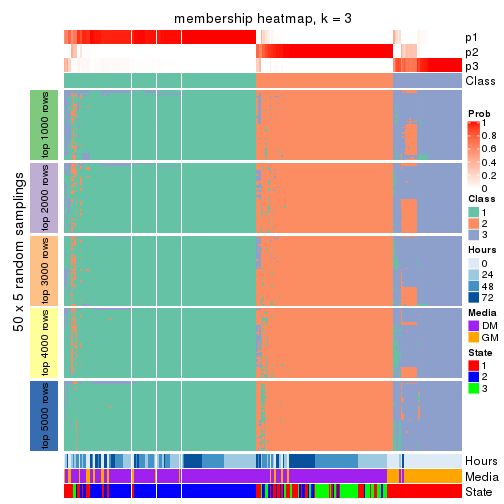</p>

</div>
<div id='tab-MAD-mclust-membership-heatmap-3'>
<pre><code class="r">membership_heatmap(res, k = 4)
</code></pre>

<p></p>

</div>
<div id='tab-MAD-mclust-membership-heatmap-4'>
<pre><code class="r">membership_heatmap(res, k = 5)
</code></pre>

<p></p>

</div>
<div id='tab-MAD-mclust-membership-heatmap-5'>
<pre><code class="r">membership_heatmap(res, k = 6)
</code></pre>

<p></p>

</div>
</div>

As soon as we have had the classes for columns, we can look for signatures
which are significantly different between classes which can be candidate marks
for certain classes. Following are the heatmaps for signatures.


Signature heatmaps where rows are scaled:


<script>
$( function() {
	$( '#tabs-MAD-mclust-get-signatures' ).tabs();
} );
</script>
<div id='tabs-MAD-mclust-get-signatures'>
<ul>
<li><a href='#tab-MAD-mclust-get-signatures-1'>k = 2</a></li>
<li><a href='#tab-MAD-mclust-get-signatures-2'>k = 3</a></li>
<li><a href='#tab-MAD-mclust-get-signatures-3'>k = 4</a></li>
<li><a href='#tab-MAD-mclust-get-signatures-4'>k = 5</a></li>
<li><a href='#tab-MAD-mclust-get-signatures-5'>k = 6</a></li>
</ul>
<div id='tab-MAD-mclust-get-signatures-1'>
<pre><code class="r">get_signatures(res, k = 2)
</code></pre>

<p></p>

</div>
<div id='tab-MAD-mclust-get-signatures-2'>
<pre><code class="r">get_signatures(res, k = 3)
</code></pre>

<p></p>

</div>
<div id='tab-MAD-mclust-get-signatures-3'>
<pre><code class="r">get_signatures(res, k = 4)
</code></pre>

<p></p>

</div>
<div id='tab-MAD-mclust-get-signatures-4'>
<pre><code class="r">get_signatures(res, k = 5)
</code></pre>

<p></p>

</div>
<div id='tab-MAD-mclust-get-signatures-5'>
<pre><code class="r">get_signatures(res, k = 6)
</code></pre>

<p></p>

</div>
</div>


Signature heatmaps where rows are not scaled:


<script>
$( function() {
	$( '#tabs-MAD-mclust-get-signatures-no-scale' ).tabs();
} );
</script>
<div id='tabs-MAD-mclust-get-signatures-no-scale'>
<ul>
<li><a href='#tab-MAD-mclust-get-signatures-no-scale-1'>k = 2</a></li>
<li><a href='#tab-MAD-mclust-get-signatures-no-scale-2'>k = 3</a></li>
<li><a href='#tab-MAD-mclust-get-signatures-no-scale-3'>k = 4</a></li>
<li><a href='#tab-MAD-mclust-get-signatures-no-scale-4'>k = 5</a></li>
<li><a href='#tab-MAD-mclust-get-signatures-no-scale-5'>k = 6</a></li>
</ul>
<div id='tab-MAD-mclust-get-signatures-no-scale-1'>
<pre><code class="r">get_signatures(res, k = 2, scale_rows = FALSE)
</code></pre>

<p></p>

</div>
<div id='tab-MAD-mclust-get-signatures-no-scale-2'>
<pre><code class="r">get_signatures(res, k = 3, scale_rows = FALSE)
</code></pre>

<p></p>

</div>
<div id='tab-MAD-mclust-get-signatures-no-scale-3'>
<pre><code class="r">get_signatures(res, k = 4, scale_rows = FALSE)
</code></pre>

<p></p>

</div>
<div id='tab-MAD-mclust-get-signatures-no-scale-4'>
<pre><code class="r">get_signatures(res, k = 5, scale_rows = FALSE)
</code></pre>

<p></p>

</div>
<div id='tab-MAD-mclust-get-signatures-no-scale-5'>
<pre><code class="r">get_signatures(res, k = 6, scale_rows = FALSE)
</code></pre>

<p></p>

</div>
</div>


Compare the overlap of signatures from different k:

```r
compare_signatures(res)
```


`get_signature()` returns a data frame invisibly. TO get the list of signatures, the function
call should be assigned to a variable explicitly. In following code, if `plot` argument is set
to `FALSE`, no heatmap is plotted while only the differential analysis is performed.

```r
# code only for demonstration
tb = get_signature(res, k = ..., plot = FALSE)
```

An example of the output of `tb` is:

```
#>   which_row         fdr    mean_1    mean_2 scaled_mean_1 scaled_mean_2 km
#> 1        38 0.042760348  8.373488  9.131774    -0.5533452     0.5164555  1
#> 2        40 0.018707592  7.106213  8.469186    -0.6173731     0.5762149  1
#> 3        55 0.019134737 10.221463 11.207825    -0.6159697     0.5749050  1
#> 4        59 0.006059896  5.921854  7.869574    -0.6899429     0.6439467  1
#> 5        60 0.018055526  8.928898 10.211722    -0.6204761     0.5791110  1
#> 6        98 0.009384629 15.714769 14.887706     0.6635654    -0.6193277  2
...
```

The columns in `tb` are:

1. `which_row`: row indices corresponding to the input matrix.
2. `fdr`: FDR for the differential test. 
3. `mean_x`: The mean value in group x.
4. `scaled_mean_x`: The mean value in group x after rows are scaled.
5. `km`: Row groups if k-means clustering is applied to rows.


UMAP plot which shows how samples are separated.


<script>
$( function() {
	$( '#tabs-MAD-mclust-dimension-reduction' ).tabs();
} );
</script>
<div id='tabs-MAD-mclust-dimension-reduction'>
<ul>
<li><a href='#tab-MAD-mclust-dimension-reduction-1'>k = 2</a></li>
<li><a href='#tab-MAD-mclust-dimension-reduction-2'>k = 3</a></li>
<li><a href='#tab-MAD-mclust-dimension-reduction-3'>k = 4</a></li>
<li><a href='#tab-MAD-mclust-dimension-reduction-4'>k = 5</a></li>
<li><a href='#tab-MAD-mclust-dimension-reduction-5'>k = 6</a></li>
</ul>
<div id='tab-MAD-mclust-dimension-reduction-1'>
<pre><code class="r">dimension_reduction(res, k = 2, method = &quot;UMAP&quot;)
</code></pre>

<p></p>

</div>
<div id='tab-MAD-mclust-dimension-reduction-2'>
<pre><code class="r">dimension_reduction(res, k = 3, method = &quot;UMAP&quot;)
</code></pre>

<p></p>

</div>
<div id='tab-MAD-mclust-dimension-reduction-3'>
<pre><code class="r">dimension_reduction(res, k = 4, method = &quot;UMAP&quot;)
</code></pre>

<p></p>

</div>
<div id='tab-MAD-mclust-dimension-reduction-4'>
<pre><code class="r">dimension_reduction(res, k = 5, method = &quot;UMAP&quot;)
</code></pre>

<p></p>

</div>
<div id='tab-MAD-mclust-dimension-reduction-5'>
<pre><code class="r">dimension_reduction(res, k = 6, method = &quot;UMAP&quot;)
</code></pre>

<p></p>

</div>
</div>


Following heatmap shows how subgroups are split when increasing `k`:

```r
collect_classes(res)
```


Test correlation between subgroups and known annotations. If the known
annotation is numeric, one-way ANOVA test is applied, and if the known
annotation is discrete, chi-squared contingency table test is applied.

```r
test_to_known_factors(res)
```

```
#>              n Hours(p) Media(p) State(p) k
#> MAD:mclust 268 4.41e-02 1.77e-02 4.17e-23 2
#> MAD:mclust 263 6.94e-29 6.43e-32 2.71e-47 3
#> MAD:mclust 171 1.08e-03 1.64e-02 8.47e-23 4
#> MAD:mclust 252 3.32e-26 4.78e-29 2.55e-46 5
#> MAD:mclust 238 6.20e-31 3.63e-35 5.99e-51 6
```


If matrix rows can be associated to genes, consider to use `GO_Enrichment(res,
...)` to perform function enrichment for the signature genes.


 

---------------------------------------------------


### MAD:NMF*


The object with results only for a single top-value method and a single partition method 
can be extracted as:

```r
res = res_list["MAD", "NMF"]
# you can also extract it by
# res = res_list["MAD:NMF"]
```

A summary of `res` and all the functions that can be applied to it:

```r
res
```

```
#> A 'ConsensusPartition' object with k = 2, 3, 4, 5, 6.
#>   On a matrix with 12016 rows and 271 columns.
#>   Top rows (1000, 2000, 3000, 4000, 5000) are extracted by 'MAD' method.
#>   Subgroups are detected by 'NMF' method.
#>   Performed in total 1250 partitions by row resampling.
#>   Best k for subgroups seems to be 2.
#> 
#> Following methods can be applied to this 'ConsensusPartition' object:
#>  [1] "cola_report"             "collect_classes"         "collect_plots"          
#>  [4] "collect_stats"           "colnames"                "compare_signatures"     
#>  [7] "consensus_heatmap"       "dimension_reduction"     "functional_enrichment"  
#> [10] "get_anno_col"            "get_anno"                "get_classes"            
#> [13] "get_consensus"           "get_matrix"              "get_membership"         
#> [16] "get_param"               "get_signatures"          "get_stats"              
#> [19] "is_best_k"               "is_stable_k"             "membership_heatmap"     
#> [22] "ncol"                    "nrow"                    "plot_ecdf"              
#> [25] "rownames"                "select_partition_number" "show"                   
#> [28] "suggest_best_k"          "test_to_known_factors"
```

`collect_plots()` function collects all the plots made from `res` for all `k` (number of partitions)
into one single page to provide an easy and fast comparison between different `k`.

```r
collect_plots(res)
```


The plots are:

- The first row: a plot of the ECDF (Empirical cumulative distribution
  function) curves of the consensus matrix for each `k` and the heatmap of
  predicted classes for each `k`.
- The second row: heatmaps of the consensus matrix for each `k`.
- The third row: heatmaps of the membership matrix for each `k`.
- The fouth row: heatmaps of the signatures for each `k`.

All the plots in panels can be made by individual functions and they are
plotted later in this section.

`select_partition_number()` produces several plots showing different
statistics for choosing "optimized" `k`. There are following statistics:

- ECDF curves of the consensus matrix for each `k`;
- 1-PAC. [The PAC
  score](https://en.wikipedia.org/wiki/Consensus_clustering#Over-interpretation_potential_of_consensus_clustering)
  measures the proportion of the ambiguous subgrouping.
- Mean silhouette score.
- Concordance. The mean probability of fiting the consensus class ids in all
  partitions.
- Area increased. Denote $A_k$ as the area under the ECDF curve for current
  `k`, the area increased is defined as $A_k - A_{k-1}$.
- Rand index. The percent of pairs of samples that are both in a same cluster
  or both are not in a same cluster in the partition of k and k-1.
- Jaccard index. The ratio of pairs of samples are both in a same cluster in
  the partition of k and k-1 and the pairs of samples are both in a same
  cluster in the partition k or k-1.

The detailed explanations of these statistics can be found in [the cola
vignette](http://bioconductor.org/packages/devel/bioc/vignettes/cola/inst/doc/cola.html#toc_13).

Generally speaking, lower PAC score, higher mean silhouette score or higher
concordance corresponds to better partition. Rand index and Jaccard index
measure how similar the current partition is compared to partition with `k-1`.
If they are too similar, we won't accept `k` is better than `k-1`.

```r
select_partition_number(res)
```


The numeric values for all these statistics can be obtained by `get_stats()`.

```r
get_stats(res)
```

```
#>   k 1-PAC mean_silhouette concordance area_increased  Rand Jaccard
#> 2 2 0.924           0.936       0.973         0.4782 0.524   0.524
#> 3 3 0.697           0.801       0.909         0.3827 0.731   0.522
#> 4 4 0.687           0.740       0.850         0.1005 0.787   0.481
#> 5 5 0.653           0.625       0.792         0.0592 0.949   0.828
#> 6 6 0.658           0.574       0.729         0.0368 0.946   0.806
```

`suggest_best_k()` suggests the best $k$ based on these statistics. The rules are as follows:

- All $k$ with Jaccard index larger than 0.95 are removed because the increase of
  the partition number does not provides enough extra information. If all $k$ are removed,
  the best $k$ is assigned by `NA`.
- For $k$ with 1-PAC larger than 0.9, the maximal $k$ is taken as the "best k". Other $k$ is called "optional k".
- If it does not fit the second rule. The $k$ with the highest vote of highest
  1-PAC, mean silhouette and concordance is taken as the "best k".

```r
suggest_best_k(res)
```

```
#> [1] 2
```


Following shows the table of the partitions (You need to click the **show/hide
code output** link to see it). The membership matrix (columns with name `p*`)
is inferred by
[`clue::cl_consensus()`](https://www.rdocumentation.org/link/cl_consensus?package=clue)
function with the `SE` method. Basically the value in the membership matrix
represents the probability to belong to a certain group. The finall class
label for an item is determined with the group with highest probability it
belongs to.

In `get_classes()` function, the entropy is calculated from the membership
matrix and the silhouette score is calculated from the consensus matrix.


<script>
$( function() {
	$( '#tabs-MAD-NMF-get-classes' ).tabs();
} );
</script>
<div id='tabs-MAD-NMF-get-classes'>
<ul>
<li><a href='#tab-MAD-NMF-get-classes-1'>k = 2</a></li>
<li><a href='#tab-MAD-NMF-get-classes-2'>k = 3</a></li>
<li><a href='#tab-MAD-NMF-get-classes-3'>k = 4</a></li>
<li><a href='#tab-MAD-NMF-get-classes-4'>k = 5</a></li>
<li><a href='#tab-MAD-NMF-get-classes-5'>k = 6</a></li>
</ul>

<div id='tab-MAD-NMF-get-classes-1'>
<p><a id='tab-MAD-NMF-get-classes-1-a' style='color:#0366d6' href='#'>show/hide code output</a></p>
<pre><code class="r">cbind(get_classes(res, k = 2), get_membership(res, k = 2))
</code></pre>

<pre><code>#&gt;            class entropy silhouette    p1    p2
#&gt; T0_CT_A01      2  0.0000     0.9725 0.000 1.000
#&gt; T0_CT_A03      2  0.0000     0.9725 0.000 1.000
#&gt; T0_CT_A05      2  0.8144     0.6709 0.252 0.748
#&gt; T0_CT_A06      2  0.0000     0.9725 0.000 1.000
#&gt; T0_CT_A07      2  0.0000     0.9725 0.000 1.000
#&gt; T0_CT_A08      1  0.0000     0.9718 1.000 0.000
#&gt; T0_CT_A10      1  0.9970     0.1046 0.532 0.468
#&gt; T0_CT_A11      1  0.8327     0.6440 0.736 0.264
#&gt; T0_CT_B01      2  0.2778     0.9306 0.048 0.952
#&gt; T0_CT_B03      2  0.0000     0.9725 0.000 1.000
#&gt; T0_CT_B05      2  0.9922     0.2044 0.448 0.552
#&gt; T0_CT_B07      2  0.2603     0.9343 0.044 0.956
#&gt; T0_CT_B08      2  0.0000     0.9725 0.000 1.000
#&gt; T0_CT_B09      2  0.2236     0.9420 0.036 0.964
#&gt; T0_CT_C02      2  0.0000     0.9725 0.000 1.000
#&gt; T0_CT_C03      1  0.0000     0.9718 1.000 0.000
#&gt; T0_CT_C05      2  0.0000     0.9725 0.000 1.000
#&gt; T0_CT_C06      2  0.6531     0.7955 0.168 0.832
#&gt; T0_CT_C07      1  0.6973     0.7622 0.812 0.188
#&gt; T0_CT_C08      2  0.0000     0.9725 0.000 1.000
#&gt; T0_CT_C09      2  0.0000     0.9725 0.000 1.000
#&gt; T0_CT_C11      2  0.0000     0.9725 0.000 1.000
#&gt; T0_CT_C12      2  0.0000     0.9725 0.000 1.000
#&gt; T0_CT_D01      2  0.0000     0.9725 0.000 1.000
#&gt; T0_CT_D02      1  0.6531     0.7903 0.832 0.168
#&gt; T0_CT_D03      2  0.0000     0.9725 0.000 1.000
#&gt; T0_CT_D05      2  0.0000     0.9725 0.000 1.000
#&gt; T0_CT_D06      2  0.0000     0.9725 0.000 1.000
#&gt; T0_CT_D07      2  0.0938     0.9628 0.012 0.988
#&gt; T0_CT_D08      2  0.0000     0.9725 0.000 1.000
#&gt; T0_CT_D09      2  0.0000     0.9725 0.000 1.000
#&gt; T0_CT_D11      2  0.0000     0.9725 0.000 1.000
#&gt; T0_CT_D12      2  0.0000     0.9725 0.000 1.000
#&gt; T0_CT_E01      2  0.0000     0.9725 0.000 1.000
#&gt; T0_CT_E03      2  0.7219     0.7516 0.200 0.800
#&gt; T0_CT_E04      2  0.0000     0.9725 0.000 1.000
#&gt; T0_CT_E05      1  0.0000     0.9718 1.000 0.000
#&gt; T0_CT_E06      2  0.0000     0.9725 0.000 1.000
#&gt; T0_CT_E07      2  0.0000     0.9725 0.000 1.000
#&gt; T0_CT_E08      2  0.0000     0.9725 0.000 1.000
#&gt; T0_CT_E09      2  0.0000     0.9725 0.000 1.000
#&gt; T0_CT_E10      2  0.0000     0.9725 0.000 1.000
#&gt; T0_CT_E11      2  0.0000     0.9725 0.000 1.000
#&gt; T0_CT_E12      2  0.9988     0.0894 0.480 0.520
#&gt; T0_CT_F01      2  0.0672     0.9661 0.008 0.992
#&gt; T0_CT_F02      2  0.6343     0.8055 0.160 0.840
#&gt; T0_CT_F03      2  0.0376     0.9693 0.004 0.996
#&gt; T0_CT_F04      2  0.9552     0.4134 0.376 0.624
#&gt; T0_CT_F05      2  0.0000     0.9725 0.000 1.000
#&gt; T0_CT_F06      2  0.0000     0.9725 0.000 1.000
#&gt; T0_CT_F07      2  0.0000     0.9725 0.000 1.000
#&gt; T0_CT_F09      2  0.0000     0.9725 0.000 1.000
#&gt; T0_CT_F11      2  0.0000     0.9725 0.000 1.000
#&gt; T0_CT_F12      2  0.8713     0.5988 0.292 0.708
#&gt; T0_CT_G01      2  0.0000     0.9725 0.000 1.000
#&gt; T0_CT_G02      1  0.5178     0.8551 0.884 0.116
#&gt; T0_CT_G03      2  0.7453     0.7341 0.212 0.788
#&gt; T0_CT_G04      2  0.0000     0.9725 0.000 1.000
#&gt; T0_CT_G07      2  0.0000     0.9725 0.000 1.000
#&gt; T0_CT_G08      2  0.0000     0.9725 0.000 1.000
#&gt; T0_CT_G09      1  0.0000     0.9718 1.000 0.000
#&gt; T0_CT_G11      1  0.9286     0.4736 0.656 0.344
#&gt; T0_CT_H01      2  0.9686     0.3615 0.396 0.604
#&gt; T0_CT_H02      2  0.0000     0.9725 0.000 1.000
#&gt; T0_CT_H04      2  0.0000     0.9725 0.000 1.000
#&gt; T0_CT_H05      2  0.8267     0.6573 0.260 0.740
#&gt; T0_CT_H08      2  0.2778     0.9306 0.048 0.952
#&gt; T0_CT_H09      2  0.0000     0.9725 0.000 1.000
#&gt; T0_CT_H12      2  0.7674     0.7162 0.224 0.776
#&gt; T24_CT_A01     1  0.0000     0.9718 1.000 0.000
#&gt; T24_CT_A03     2  0.0000     0.9725 0.000 1.000
#&gt; T24_CT_A04     2  0.0000     0.9725 0.000 1.000
#&gt; T24_CT_A05     1  0.0000     0.9718 1.000 0.000
#&gt; T24_CT_A07     2  0.0000     0.9725 0.000 1.000
#&gt; T24_CT_A08     1  0.0000     0.9718 1.000 0.000
#&gt; T24_CT_A09     1  0.0000     0.9718 1.000 0.000
#&gt; T24_CT_A10     1  0.0000     0.9718 1.000 0.000
#&gt; T24_CT_B01     1  0.0000     0.9718 1.000 0.000
#&gt; T24_CT_B02     1  0.0000     0.9718 1.000 0.000
#&gt; T24_CT_B03     2  0.0000     0.9725 0.000 1.000
#&gt; T24_CT_B05     2  0.0000     0.9725 0.000 1.000
#&gt; T24_CT_B06     2  0.0000     0.9725 0.000 1.000
#&gt; T24_CT_B07     1  0.0000     0.9718 1.000 0.000
#&gt; T24_CT_B08     2  0.0000     0.9725 0.000 1.000
#&gt; T24_CT_B09     1  0.0000     0.9718 1.000 0.000
#&gt; T24_CT_B11     1  0.0000     0.9718 1.000 0.000
#&gt; T24_CT_C01     1  0.0000     0.9718 1.000 0.000
#&gt; T24_CT_C02     2  0.0000     0.9725 0.000 1.000
#&gt; T24_CT_C03     1  0.0000     0.9718 1.000 0.000
#&gt; T24_CT_C05     2  0.0000     0.9725 0.000 1.000
#&gt; T24_CT_C07     2  0.0000     0.9725 0.000 1.000
#&gt; T24_CT_C08     2  0.0000     0.9725 0.000 1.000
#&gt; T24_CT_C09     2  0.0000     0.9725 0.000 1.000
#&gt; T24_CT_C10     1  0.0000     0.9718 1.000 0.000
#&gt; T24_CT_C11     1  0.8608     0.6052 0.716 0.284
#&gt; T24_CT_C12     2  0.0000     0.9725 0.000 1.000
#&gt; T24_CT_D01     2  0.0000     0.9725 0.000 1.000
#&gt; T24_CT_D02     2  0.0000     0.9725 0.000 1.000
#&gt; T24_CT_D03     2  0.0000     0.9725 0.000 1.000
#&gt; T24_CT_D04     1  0.0000     0.9718 1.000 0.000
#&gt; T24_CT_D05     1  0.0000     0.9718 1.000 0.000
#&gt; T24_CT_D06     1  0.0000     0.9718 1.000 0.000
#&gt; T24_CT_D07     1  0.9661     0.3492 0.608 0.392
#&gt; T24_CT_D08     2  0.0000     0.9725 0.000 1.000
#&gt; T24_CT_D09     2  0.0000     0.9725 0.000 1.000
#&gt; T24_CT_D10     2  0.0000     0.9725 0.000 1.000
#&gt; T24_CT_D11     2  0.0000     0.9725 0.000 1.000
#&gt; T24_CT_E01     1  0.0000     0.9718 1.000 0.000
#&gt; T24_CT_E02     1  0.0000     0.9718 1.000 0.000
#&gt; T24_CT_E04     2  0.0000     0.9725 0.000 1.000
#&gt; T24_CT_E05     1  0.0000     0.9718 1.000 0.000
#&gt; T24_CT_E07     2  0.0000     0.9725 0.000 1.000
#&gt; T24_CT_E09     1  0.0000     0.9718 1.000 0.000
#&gt; T24_CT_E11     1  0.0000     0.9718 1.000 0.000
#&gt; T24_CT_E12     2  0.0000     0.9725 0.000 1.000
#&gt; T24_CT_F01     2  0.0000     0.9725 0.000 1.000
#&gt; T24_CT_F02     2  0.0000     0.9725 0.000 1.000
#&gt; T24_CT_F03     1  0.0000     0.9718 1.000 0.000
#&gt; T24_CT_F04     1  0.0000     0.9718 1.000 0.000
#&gt; T24_CT_F05     1  0.0000     0.9718 1.000 0.000
#&gt; T24_CT_F07     1  0.0000     0.9718 1.000 0.000
#&gt; T24_CT_F08     1  0.0000     0.9718 1.000 0.000
#&gt; T24_CT_F09     2  0.0000     0.9725 0.000 1.000
#&gt; T24_CT_F10     2  0.2236     0.9419 0.036 0.964
#&gt; T24_CT_F11     1  0.0000     0.9718 1.000 0.000
#&gt; T24_CT_F12     2  0.0000     0.9725 0.000 1.000
#&gt; T24_CT_G01     2  0.0000     0.9725 0.000 1.000
#&gt; T24_CT_G02     1  0.0000     0.9718 1.000 0.000
#&gt; T24_CT_G03     1  0.0000     0.9718 1.000 0.000
#&gt; T24_CT_G04     2  0.0000     0.9725 0.000 1.000
#&gt; T24_CT_G05     2  0.0000     0.9725 0.000 1.000
#&gt; T24_CT_G06     1  0.0000     0.9718 1.000 0.000
#&gt; T24_CT_G08     1  0.0000     0.9718 1.000 0.000
#&gt; T24_CT_G10     2  0.0000     0.9725 0.000 1.000
#&gt; T24_CT_G11     1  0.0000     0.9718 1.000 0.000
#&gt; T24_CT_G12     1  0.0000     0.9718 1.000 0.000
#&gt; T24_CT_H01     1  0.0000     0.9718 1.000 0.000
#&gt; T24_CT_H02     1  0.0000     0.9718 1.000 0.000
#&gt; T24_CT_H03     2  0.0000     0.9725 0.000 1.000
#&gt; T24_CT_H05     1  0.0000     0.9718 1.000 0.000
#&gt; T24_CT_H07     1  0.0000     0.9718 1.000 0.000
#&gt; T24_CT_H09     1  0.0000     0.9718 1.000 0.000
#&gt; T24_CT_H12     1  0.0000     0.9718 1.000 0.000
#&gt; T48_CT_A01     2  0.0000     0.9725 0.000 1.000
#&gt; T48_CT_A02     2  0.0000     0.9725 0.000 1.000
#&gt; T48_CT_A03     1  0.0000     0.9718 1.000 0.000
#&gt; T48_CT_A04     2  0.0000     0.9725 0.000 1.000
#&gt; T48_CT_A05     2  0.0000     0.9725 0.000 1.000
#&gt; T48_CT_A06     1  0.0000     0.9718 1.000 0.000
#&gt; T48_CT_A07     2  0.0000     0.9725 0.000 1.000
#&gt; T48_CT_A08     2  0.0000     0.9725 0.000 1.000
#&gt; T48_CT_A09     1  0.0000     0.9718 1.000 0.000
#&gt; T48_CT_A10     2  0.0000     0.9725 0.000 1.000
#&gt; T48_CT_A11     2  0.0000     0.9725 0.000 1.000
#&gt; T48_CT_A12     1  0.0000     0.9718 1.000 0.000
#&gt; T48_CT_B01     2  0.0000     0.9725 0.000 1.000
#&gt; T48_CT_B02     2  0.0000     0.9725 0.000 1.000
#&gt; T48_CT_B03     1  0.0000     0.9718 1.000 0.000
#&gt; T48_CT_B04     1  0.0000     0.9718 1.000 0.000
#&gt; T48_CT_B06     2  0.0000     0.9725 0.000 1.000
#&gt; T48_CT_B08     1  0.0000     0.9718 1.000 0.000
#&gt; T48_CT_B10     2  0.0000     0.9725 0.000 1.000
#&gt; T48_CT_B11     2  0.0000     0.9725 0.000 1.000
#&gt; T48_CT_B12     1  0.0000     0.9718 1.000 0.000
#&gt; T48_CT_C01     2  0.0000     0.9725 0.000 1.000
#&gt; T48_CT_C02     1  0.0000     0.9718 1.000 0.000
#&gt; T48_CT_C03     2  0.0000     0.9725 0.000 1.000
#&gt; T48_CT_C04     1  0.0000     0.9718 1.000 0.000
#&gt; T48_CT_C05     2  0.0000     0.9725 0.000 1.000
#&gt; T48_CT_C06     2  0.0000     0.9725 0.000 1.000
#&gt; T48_CT_C07     1  0.0000     0.9718 1.000 0.000
#&gt; T48_CT_C09     2  0.0000     0.9725 0.000 1.000
#&gt; T48_CT_C10     1  0.0000     0.9718 1.000 0.000
#&gt; T48_CT_C11     2  0.0000     0.9725 0.000 1.000
#&gt; T48_CT_D01     2  0.0000     0.9725 0.000 1.000
#&gt; T48_CT_D02     1  0.0000     0.9718 1.000 0.000
#&gt; T48_CT_D03     1  0.0000     0.9718 1.000 0.000
#&gt; T48_CT_D04     2  0.0000     0.9725 0.000 1.000
#&gt; T48_CT_D06     2  0.0000     0.9725 0.000 1.000
#&gt; T48_CT_D07     2  0.0000     0.9725 0.000 1.000
#&gt; T48_CT_D08     1  0.0000     0.9718 1.000 0.000
#&gt; T48_CT_D09     2  0.0000     0.9725 0.000 1.000
#&gt; T48_CT_D10     1  0.6712     0.7825 0.824 0.176
#&gt; T48_CT_D11     2  0.0000     0.9725 0.000 1.000
#&gt; T48_CT_D12     1  0.0000     0.9718 1.000 0.000
#&gt; T48_CT_E01     2  0.0000     0.9725 0.000 1.000
#&gt; T48_CT_E02     1  0.0000     0.9718 1.000 0.000
#&gt; T48_CT_E03     2  0.8499     0.6279 0.276 0.724
#&gt; T48_CT_E04     1  0.1843     0.9482 0.972 0.028
#&gt; T48_CT_E05     2  0.0000     0.9725 0.000 1.000
#&gt; T48_CT_E06     1  0.0000     0.9718 1.000 0.000
#&gt; T48_CT_E07     1  0.0000     0.9718 1.000 0.000
#&gt; T48_CT_E08     2  0.0000     0.9725 0.000 1.000
#&gt; T48_CT_E10     1  0.0000     0.9718 1.000 0.000
#&gt; T48_CT_E11     1  0.0000     0.9718 1.000 0.000
#&gt; T48_CT_E12     2  0.0000     0.9725 0.000 1.000
#&gt; T48_CT_F01     2  0.0000     0.9725 0.000 1.000
#&gt; T48_CT_F02     1  0.0000     0.9718 1.000 0.000
#&gt; T48_CT_F03     1  0.0000     0.9718 1.000 0.000
#&gt; T48_CT_F05     2  0.0000     0.9725 0.000 1.000
#&gt; T48_CT_F07     1  0.0000     0.9718 1.000 0.000
#&gt; T48_CT_F09     2  0.0000     0.9725 0.000 1.000
#&gt; T48_CT_F10     1  0.0000     0.9718 1.000 0.000
#&gt; T48_CT_F11     1  0.0000     0.9718 1.000 0.000
#&gt; T48_CT_G01     1  0.0000     0.9718 1.000 0.000
#&gt; T48_CT_G02     2  0.0000     0.9725 0.000 1.000
#&gt; T48_CT_G03     2  0.0000     0.9725 0.000 1.000
#&gt; T48_CT_G07     2  0.0000     0.9725 0.000 1.000
#&gt; T48_CT_G08     2  0.0000     0.9725 0.000 1.000
#&gt; T48_CT_G09     2  0.0000     0.9725 0.000 1.000
#&gt; T48_CT_G10     1  0.0000     0.9718 1.000 0.000
#&gt; T48_CT_G11     1  0.0000     0.9718 1.000 0.000
#&gt; T48_CT_G12     2  0.0000     0.9725 0.000 1.000
#&gt; T48_CT_H01     2  0.0000     0.9725 0.000 1.000
#&gt; T48_CT_H02     2  0.2043     0.9458 0.032 0.968
#&gt; T48_CT_H04     1  0.0000     0.9718 1.000 0.000
#&gt; T48_CT_H05     2  0.0000     0.9725 0.000 1.000
#&gt; T48_CT_H06     2  0.0000     0.9725 0.000 1.000
#&gt; T48_CT_H07     1  0.0000     0.9718 1.000 0.000
#&gt; T48_CT_H08     2  0.0000     0.9725 0.000 1.000
#&gt; T48_CT_H11     1  0.1184     0.9583 0.984 0.016
#&gt; T48_CT_H12     2  0.0000     0.9725 0.000 1.000
#&gt; T72_CT_A01     2  0.0000     0.9725 0.000 1.000
#&gt; T72_CT_A05     2  0.0000     0.9725 0.000 1.000
#&gt; T72_CT_A08     1  0.0000     0.9718 1.000 0.000
#&gt; T72_CT_A09     2  0.0000     0.9725 0.000 1.000
#&gt; T72_CT_A11     2  0.0000     0.9725 0.000 1.000
#&gt; T72_CT_B01     2  0.0000     0.9725 0.000 1.000
#&gt; T72_CT_B02     1  0.0000     0.9718 1.000 0.000
#&gt; T72_CT_B03     1  0.0000     0.9718 1.000 0.000
#&gt; T72_CT_B04     1  0.0000     0.9718 1.000 0.000
#&gt; T72_CT_B05     2  0.0000     0.9725 0.000 1.000
#&gt; T72_CT_B06     1  0.0000     0.9718 1.000 0.000
#&gt; T72_CT_B08     2  0.0000     0.9725 0.000 1.000
#&gt; T72_CT_B09     1  0.0000     0.9718 1.000 0.000
#&gt; T72_CT_B11     1  0.0000     0.9718 1.000 0.000
#&gt; T72_CT_B12     2  0.0000     0.9725 0.000 1.000
#&gt; T72_CT_C04     2  0.0000     0.9725 0.000 1.000
#&gt; T72_CT_C06     1  0.0000     0.9718 1.000 0.000
#&gt; T72_CT_C07     2  0.0000     0.9725 0.000 1.000
#&gt; T72_CT_C09     1  0.1843     0.9477 0.972 0.028
#&gt; T72_CT_C11     2  0.0000     0.9725 0.000 1.000
#&gt; T72_CT_D01     2  0.0000     0.9725 0.000 1.000
#&gt; T72_CT_D03     2  0.9460     0.4401 0.364 0.636
#&gt; T72_CT_D04     2  0.0000     0.9725 0.000 1.000
#&gt; T72_CT_D05     1  0.0000     0.9718 1.000 0.000
#&gt; T72_CT_D07     1  0.0000     0.9718 1.000 0.000
#&gt; T72_CT_D10     2  0.0672     0.9660 0.008 0.992
#&gt; T72_CT_D11     1  0.0000     0.9718 1.000 0.000
#&gt; T72_CT_E04     1  0.0000     0.9718 1.000 0.000
#&gt; T72_CT_E05     2  0.0000     0.9725 0.000 1.000
#&gt; T72_CT_E07     2  0.0000     0.9725 0.000 1.000
#&gt; T72_CT_F01     2  0.0000     0.9725 0.000 1.000
#&gt; T72_CT_F05     2  0.0000     0.9725 0.000 1.000
#&gt; T72_CT_F07     1  0.0000     0.9718 1.000 0.000
#&gt; T72_CT_F10     2  0.0000     0.9725 0.000 1.000
#&gt; T72_CT_F11     2  0.0000     0.9725 0.000 1.000
#&gt; T72_CT_G03     1  0.0000     0.9718 1.000 0.000
#&gt; T72_CT_G04     1  0.0000     0.9718 1.000 0.000
#&gt; T72_CT_G06     2  0.0000     0.9725 0.000 1.000
#&gt; T72_CT_G08     2  0.0000     0.9725 0.000 1.000
#&gt; T72_CT_G10     2  0.0000     0.9725 0.000 1.000
#&gt; T72_CT_G11     1  0.0000     0.9718 1.000 0.000
#&gt; T72_CT_H01     2  0.0000     0.9725 0.000 1.000
#&gt; T72_CT_H03     2  0.0000     0.9725 0.000 1.000
#&gt; T72_CT_H05     2  0.0000     0.9725 0.000 1.000
#&gt; T72_CT_H08     2  0.0000     0.9725 0.000 1.000
#&gt; T72_CT_H09     1  0.9170     0.5011 0.668 0.332
#&gt; T72_CT_H10     1  0.0000     0.9718 1.000 0.000
#&gt; T72_CT_H11     1  0.0000     0.9718 1.000 0.000
#&gt; T72_CT_H12     2  0.0000     0.9725 0.000 1.000
</code></pre>

<script>
$('#tab-MAD-NMF-get-classes-1-a').parent().next().next().hide();
$('#tab-MAD-NMF-get-classes-1-a').click(function(){
  $('#tab-MAD-NMF-get-classes-1-a').parent().next().next().toggle();
  return(false);
});
</script>
</div>

<div id='tab-MAD-NMF-get-classes-2'>
<p><a id='tab-MAD-NMF-get-classes-2-a' style='color:#0366d6' href='#'>show/hide code output</a></p>
<pre><code class="r">cbind(get_classes(res, k = 3), get_membership(res, k = 3))
</code></pre>

<pre><code>#&gt;            class entropy silhouette    p1    p2    p3
#&gt; T0_CT_A01      3  0.0000     0.8813 0.000 0.000 1.000
#&gt; T0_CT_A03      3  0.0000     0.8813 0.000 0.000 1.000
#&gt; T0_CT_A05      3  0.0000     0.8813 0.000 0.000 1.000
#&gt; T0_CT_A06      3  0.0000     0.8813 0.000 0.000 1.000
#&gt; T0_CT_A07      3  0.0000     0.8813 0.000 0.000 1.000
#&gt; T0_CT_A08      1  0.0000     0.9362 1.000 0.000 0.000
#&gt; T0_CT_A10      3  0.0747     0.8735 0.016 0.000 0.984
#&gt; T0_CT_A11      3  0.5058     0.6403 0.244 0.000 0.756
#&gt; T0_CT_B01      3  0.7053     0.6184 0.244 0.064 0.692
#&gt; T0_CT_B03      3  0.0000     0.8813 0.000 0.000 1.000
#&gt; T0_CT_B05      3  0.4842     0.6718 0.224 0.000 0.776
#&gt; T0_CT_B07      3  0.0000     0.8813 0.000 0.000 1.000
#&gt; T0_CT_B08      3  0.0000     0.8813 0.000 0.000 1.000
#&gt; T0_CT_B09      3  0.0000     0.8813 0.000 0.000 1.000
#&gt; T0_CT_C02      3  0.0000     0.8813 0.000 0.000 1.000
#&gt; T0_CT_C03      1  0.0000     0.9362 1.000 0.000 0.000
#&gt; T0_CT_C05      3  0.1860     0.8675 0.000 0.052 0.948
#&gt; T0_CT_C06      2  0.6051     0.5355 0.292 0.696 0.012
#&gt; T0_CT_C07      3  0.5397     0.5695 0.280 0.000 0.720
#&gt; T0_CT_C08      3  0.0000     0.8813 0.000 0.000 1.000
#&gt; T0_CT_C09      3  0.0424     0.8806 0.000 0.008 0.992
#&gt; T0_CT_C11      3  0.5327     0.6604 0.000 0.272 0.728
#&gt; T0_CT_C12      3  0.0000     0.8813 0.000 0.000 1.000
#&gt; T0_CT_D01      3  0.0424     0.8805 0.000 0.008 0.992
#&gt; T0_CT_D02      3  0.3340     0.7830 0.120 0.000 0.880
#&gt; T0_CT_D03      3  0.0000     0.8813 0.000 0.000 1.000
#&gt; T0_CT_D05      3  0.3965     0.8187 0.008 0.132 0.860
#&gt; T0_CT_D06      3  0.0000     0.8813 0.000 0.000 1.000
#&gt; T0_CT_D07      3  0.0000     0.8813 0.000 0.000 1.000
#&gt; T0_CT_D08      3  0.0000     0.8813 0.000 0.000 1.000
#&gt; T0_CT_D09      3  0.0424     0.8805 0.000 0.008 0.992
#&gt; T0_CT_D11      3  0.2066     0.8641 0.000 0.060 0.940
#&gt; T0_CT_D12      3  0.0000     0.8813 0.000 0.000 1.000
#&gt; T0_CT_E01      3  0.0000     0.8813 0.000 0.000 1.000
#&gt; T0_CT_E03      3  0.1031     0.8684 0.024 0.000 0.976
#&gt; T0_CT_E04      3  0.1411     0.8733 0.000 0.036 0.964
#&gt; T0_CT_E05      1  0.6307     0.1449 0.512 0.488 0.000
#&gt; T0_CT_E06      3  0.0000     0.8813 0.000 0.000 1.000
#&gt; T0_CT_E07      3  0.0000     0.8813 0.000 0.000 1.000
#&gt; T0_CT_E08      3  0.0000     0.8813 0.000 0.000 1.000
#&gt; T0_CT_E09      3  0.0000     0.8813 0.000 0.000 1.000
#&gt; T0_CT_E10      3  0.0000     0.8813 0.000 0.000 1.000
#&gt; T0_CT_E11      3  0.0000     0.8813 0.000 0.000 1.000
#&gt; T0_CT_E12      3  0.0592     0.8747 0.012 0.000 0.988
#&gt; T0_CT_F01      3  0.0000     0.8813 0.000 0.000 1.000
#&gt; T0_CT_F02      3  0.0000     0.8813 0.000 0.000 1.000
#&gt; T0_CT_F03      3  0.0000     0.8813 0.000 0.000 1.000
#&gt; T0_CT_F04      3  0.1163     0.8655 0.028 0.000 0.972
#&gt; T0_CT_F05      3  0.0424     0.8805 0.000 0.008 0.992
#&gt; T0_CT_F06      3  0.0000     0.8813 0.000 0.000 1.000
#&gt; T0_CT_F07      3  0.0000     0.8813 0.000 0.000 1.000
#&gt; T0_CT_F09      3  0.3879     0.8040 0.000 0.152 0.848
#&gt; T0_CT_F11      3  0.0000     0.8813 0.000 0.000 1.000
#&gt; T0_CT_F12      3  0.0237     0.8795 0.004 0.000 0.996
#&gt; T0_CT_G01      3  0.0000     0.8813 0.000 0.000 1.000
#&gt; T0_CT_G02      3  0.6291     0.0706 0.468 0.000 0.532
#&gt; T0_CT_G03      3  0.0000     0.8813 0.000 0.000 1.000
#&gt; T0_CT_G04      3  0.0000     0.8813 0.000 0.000 1.000
#&gt; T0_CT_G07      3  0.0000     0.8813 0.000 0.000 1.000
#&gt; T0_CT_G08      3  0.0000     0.8813 0.000 0.000 1.000
#&gt; T0_CT_G09      1  0.0747     0.9278 0.984 0.016 0.000
#&gt; T0_CT_G11      1  0.4931     0.6846 0.768 0.000 0.232
#&gt; T0_CT_H01      1  0.6369     0.5363 0.668 0.316 0.016
#&gt; T0_CT_H02      3  0.0237     0.8810 0.000 0.004 0.996
#&gt; T0_CT_H04      3  0.0000     0.8813 0.000 0.000 1.000
#&gt; T0_CT_H05      3  0.2625     0.8216 0.084 0.000 0.916
#&gt; T0_CT_H08      3  0.0237     0.8803 0.004 0.000 0.996
#&gt; T0_CT_H09      3  0.4555     0.7612 0.000 0.200 0.800
#&gt; T0_CT_H12      3  0.0237     0.8796 0.004 0.000 0.996
#&gt; T24_CT_A01     1  0.0000     0.9362 1.000 0.000 0.000
#&gt; T24_CT_A03     3  0.5621     0.6006 0.000 0.308 0.692
#&gt; T24_CT_A04     3  0.1964     0.8660 0.000 0.056 0.944
#&gt; T24_CT_A05     1  0.0592     0.9288 0.988 0.000 0.012
#&gt; T24_CT_A07     2  0.1643     0.8564 0.000 0.956 0.044
#&gt; T24_CT_A08     1  0.0000     0.9362 1.000 0.000 0.000
#&gt; T24_CT_A09     1  0.0000     0.9362 1.000 0.000 0.000
#&gt; T24_CT_A10     1  0.1411     0.9162 0.964 0.036 0.000
#&gt; T24_CT_B01     1  0.0000     0.9362 1.000 0.000 0.000
#&gt; T24_CT_B02     1  0.0000     0.9362 1.000 0.000 0.000
#&gt; T24_CT_B03     2  0.0000     0.8674 0.000 1.000 0.000
#&gt; T24_CT_B05     2  0.0237     0.8672 0.000 0.996 0.004
#&gt; T24_CT_B06     2  0.0892     0.8641 0.000 0.980 0.020
#&gt; T24_CT_B07     1  0.0000     0.9362 1.000 0.000 0.000
#&gt; T24_CT_B08     2  0.6008     0.3922 0.000 0.628 0.372
#&gt; T24_CT_B09     1  0.0000     0.9362 1.000 0.000 0.000
#&gt; T24_CT_B11     1  0.1753     0.9013 0.952 0.000 0.048
#&gt; T24_CT_C01     1  0.0000     0.9362 1.000 0.000 0.000
#&gt; T24_CT_C02     2  0.0000     0.8674 0.000 1.000 0.000
#&gt; T24_CT_C03     1  0.0000     0.9362 1.000 0.000 0.000
#&gt; T24_CT_C05     3  0.6305     0.0891 0.000 0.484 0.516
#&gt; T24_CT_C07     2  0.0000     0.8674 0.000 1.000 0.000
#&gt; T24_CT_C08     3  0.5363     0.6584 0.000 0.276 0.724
#&gt; T24_CT_C09     2  0.2625     0.8367 0.000 0.916 0.084
#&gt; T24_CT_C10     1  0.0000     0.9362 1.000 0.000 0.000
#&gt; T24_CT_C11     2  0.5291     0.5816 0.268 0.732 0.000
#&gt; T24_CT_C12     2  0.0000     0.8674 0.000 1.000 0.000
#&gt; T24_CT_D01     2  0.0237     0.8671 0.000 0.996 0.004
#&gt; T24_CT_D02     3  0.5810     0.5446 0.000 0.336 0.664
#&gt; T24_CT_D03     3  0.4887     0.7257 0.000 0.228 0.772
#&gt; T24_CT_D04     1  0.0000     0.9362 1.000 0.000 0.000
#&gt; T24_CT_D05     1  0.0000     0.9362 1.000 0.000 0.000
#&gt; T24_CT_D06     1  0.0000     0.9362 1.000 0.000 0.000
#&gt; T24_CT_D07     1  0.6140     0.3644 0.596 0.404 0.000
#&gt; T24_CT_D08     2  0.3412     0.8022 0.000 0.876 0.124
#&gt; T24_CT_D09     3  0.4931     0.7180 0.000 0.232 0.768
#&gt; T24_CT_D10     3  0.3752     0.8103 0.000 0.144 0.856
#&gt; T24_CT_D11     2  0.5397     0.6090 0.000 0.720 0.280
#&gt; T24_CT_E01     1  0.3116     0.8605 0.892 0.108 0.000
#&gt; T24_CT_E02     1  0.0000     0.9362 1.000 0.000 0.000
#&gt; T24_CT_E04     2  0.0000     0.8674 0.000 1.000 0.000
#&gt; T24_CT_E05     1  0.0000     0.9362 1.000 0.000 0.000
#&gt; T24_CT_E07     2  0.0000     0.8674 0.000 1.000 0.000
#&gt; T24_CT_E09     1  0.0000     0.9362 1.000 0.000 0.000
#&gt; T24_CT_E11     1  0.0000     0.9362 1.000 0.000 0.000
#&gt; T24_CT_E12     2  0.0000     0.8674 0.000 1.000 0.000
#&gt; T24_CT_F01     2  0.0000     0.8674 0.000 1.000 0.000
#&gt; T24_CT_F02     3  0.4178     0.7855 0.000 0.172 0.828
#&gt; T24_CT_F03     1  0.1753     0.9073 0.952 0.048 0.000
#&gt; T24_CT_F04     2  0.2537     0.8206 0.080 0.920 0.000
#&gt; T24_CT_F05     1  0.0592     0.9300 0.988 0.012 0.000
#&gt; T24_CT_F07     1  0.5291     0.6723 0.732 0.268 0.000
#&gt; T24_CT_F08     1  0.0000     0.9362 1.000 0.000 0.000
#&gt; T24_CT_F09     3  0.1860     0.8677 0.000 0.052 0.948
#&gt; T24_CT_F10     2  0.6369     0.4852 0.316 0.668 0.016
#&gt; T24_CT_F11     1  0.6154     0.3915 0.592 0.408 0.000
#&gt; T24_CT_F12     2  0.6079     0.3630 0.000 0.612 0.388
#&gt; T24_CT_G01     3  0.5529     0.6287 0.000 0.296 0.704
#&gt; T24_CT_G02     1  0.0000     0.9362 1.000 0.000 0.000
#&gt; T24_CT_G03     1  0.0000     0.9362 1.000 0.000 0.000
#&gt; T24_CT_G04     2  0.3589     0.8376 0.048 0.900 0.052
#&gt; T24_CT_G05     2  0.3941     0.7755 0.000 0.844 0.156
#&gt; T24_CT_G06     1  0.0000     0.9362 1.000 0.000 0.000
#&gt; T24_CT_G08     1  0.0000     0.9362 1.000 0.000 0.000
#&gt; T24_CT_G10     2  0.3192     0.8127 0.000 0.888 0.112
#&gt; T24_CT_G11     1  0.0000     0.9362 1.000 0.000 0.000
#&gt; T24_CT_G12     1  0.0000     0.9362 1.000 0.000 0.000
#&gt; T24_CT_H01     1  0.5178     0.6600 0.744 0.000 0.256
#&gt; T24_CT_H02     1  0.0000     0.9362 1.000 0.000 0.000
#&gt; T24_CT_H03     2  0.6045     0.3650 0.000 0.620 0.380
#&gt; T24_CT_H05     1  0.0000     0.9362 1.000 0.000 0.000
#&gt; T24_CT_H07     1  0.0000     0.9362 1.000 0.000 0.000
#&gt; T24_CT_H09     1  0.0000     0.9362 1.000 0.000 0.000
#&gt; T24_CT_H12     1  0.0000     0.9362 1.000 0.000 0.000
#&gt; T48_CT_A01     3  0.5016     0.7100 0.000 0.240 0.760
#&gt; T48_CT_A02     2  0.1529     0.8579 0.000 0.960 0.040
#&gt; T48_CT_A03     1  0.0000     0.9362 1.000 0.000 0.000
#&gt; T48_CT_A04     2  0.2165     0.8474 0.000 0.936 0.064
#&gt; T48_CT_A05     2  0.0000     0.8674 0.000 1.000 0.000
#&gt; T48_CT_A06     1  0.0237     0.9339 0.996 0.000 0.004
#&gt; T48_CT_A07     3  0.0892     0.8779 0.000 0.020 0.980
#&gt; T48_CT_A08     2  0.0747     0.8650 0.000 0.984 0.016
#&gt; T48_CT_A09     1  0.1031     0.9230 0.976 0.024 0.000
#&gt; T48_CT_A10     2  0.4291     0.7450 0.000 0.820 0.180
#&gt; T48_CT_A11     2  0.0424     0.8665 0.000 0.992 0.008
#&gt; T48_CT_A12     1  0.4654     0.7562 0.792 0.208 0.000
#&gt; T48_CT_B01     2  0.5650     0.5459 0.000 0.688 0.312
#&gt; T48_CT_B02     2  0.0000     0.8674 0.000 1.000 0.000
#&gt; T48_CT_B03     1  0.0000     0.9362 1.000 0.000 0.000
#&gt; T48_CT_B04     1  0.0000     0.9362 1.000 0.000 0.000
#&gt; T48_CT_B06     2  0.0000     0.8674 0.000 1.000 0.000
#&gt; T48_CT_B08     1  0.0000     0.9362 1.000 0.000 0.000
#&gt; T48_CT_B10     2  0.0000     0.8674 0.000 1.000 0.000
#&gt; T48_CT_B11     2  0.5529     0.5816 0.000 0.704 0.296
#&gt; T48_CT_B12     2  0.1753     0.8386 0.048 0.952 0.000
#&gt; T48_CT_C01     2  0.0000     0.8674 0.000 1.000 0.000
#&gt; T48_CT_C02     1  0.0000     0.9362 1.000 0.000 0.000
#&gt; T48_CT_C03     2  0.0000     0.8674 0.000 1.000 0.000
#&gt; T48_CT_C04     1  0.0000     0.9362 1.000 0.000 0.000
#&gt; T48_CT_C05     2  0.4346     0.7461 0.000 0.816 0.184
#&gt; T48_CT_C06     2  0.0000     0.8674 0.000 1.000 0.000
#&gt; T48_CT_C07     2  0.6274     0.0372 0.456 0.544 0.000
#&gt; T48_CT_C09     3  0.4974     0.7151 0.000 0.236 0.764
#&gt; T48_CT_C10     1  0.0000     0.9362 1.000 0.000 0.000
#&gt; T48_CT_C11     2  0.0000     0.8674 0.000 1.000 0.000
#&gt; T48_CT_D01     2  0.0000     0.8674 0.000 1.000 0.000
#&gt; T48_CT_D02     2  0.5621     0.4782 0.308 0.692 0.000
#&gt; T48_CT_D03     1  0.0000     0.9362 1.000 0.000 0.000
#&gt; T48_CT_D04     2  0.5621     0.5425 0.000 0.692 0.308
#&gt; T48_CT_D06     3  0.4062     0.7937 0.000 0.164 0.836
#&gt; T48_CT_D07     2  0.0000     0.8674 0.000 1.000 0.000
#&gt; T48_CT_D08     1  0.0000     0.9362 1.000 0.000 0.000
#&gt; T48_CT_D09     2  0.0000     0.8674 0.000 1.000 0.000
#&gt; T48_CT_D10     2  0.0424     0.8638 0.008 0.992 0.000
#&gt; T48_CT_D11     3  0.3116     0.8377 0.000 0.108 0.892
#&gt; T48_CT_D12     1  0.0000     0.9362 1.000 0.000 0.000
#&gt; T48_CT_E01     2  0.0000     0.8674 0.000 1.000 0.000
#&gt; T48_CT_E02     2  0.6302    -0.0694 0.480 0.520 0.000
#&gt; T48_CT_E03     2  0.0892     0.8600 0.020 0.980 0.000
#&gt; T48_CT_E04     2  0.0000     0.8674 0.000 1.000 0.000
#&gt; T48_CT_E05     2  0.0000     0.8674 0.000 1.000 0.000
#&gt; T48_CT_E06     1  0.0000     0.9362 1.000 0.000 0.000
#&gt; T48_CT_E07     1  0.0000     0.9362 1.000 0.000 0.000
#&gt; T48_CT_E08     2  0.3340     0.8108 0.000 0.880 0.120
#&gt; T48_CT_E10     1  0.0000     0.9362 1.000 0.000 0.000
#&gt; T48_CT_E11     1  0.0000     0.9362 1.000 0.000 0.000
#&gt; T48_CT_E12     3  0.2711     0.8492 0.000 0.088 0.912
#&gt; T48_CT_F01     2  0.0424     0.8665 0.000 0.992 0.008
#&gt; T48_CT_F02     1  0.4291     0.7893 0.820 0.180 0.000
#&gt; T48_CT_F03     1  0.0892     0.9259 0.980 0.020 0.000
#&gt; T48_CT_F05     2  0.3619     0.7976 0.000 0.864 0.136
#&gt; T48_CT_F07     1  0.0000     0.9362 1.000 0.000 0.000
#&gt; T48_CT_F09     2  0.5591     0.5767 0.000 0.696 0.304
#&gt; T48_CT_F10     1  0.6305     0.1751 0.516 0.484 0.000
#&gt; T48_CT_F11     1  0.0000     0.9362 1.000 0.000 0.000
#&gt; T48_CT_G01     1  0.0000     0.9362 1.000 0.000 0.000
#&gt; T48_CT_G02     3  0.6244     0.2746 0.000 0.440 0.560
#&gt; T48_CT_G03     2  0.0000     0.8674 0.000 1.000 0.000
#&gt; T48_CT_G07     2  0.5785     0.5004 0.000 0.668 0.332
#&gt; T48_CT_G08     2  0.0000     0.8674 0.000 1.000 0.000
#&gt; T48_CT_G09     2  0.0000     0.8674 0.000 1.000 0.000
#&gt; T48_CT_G10     1  0.0237     0.9339 0.996 0.000 0.004
#&gt; T48_CT_G11     1  0.4062     0.8013 0.836 0.164 0.000
#&gt; T48_CT_G12     2  0.5529     0.5872 0.000 0.704 0.296
#&gt; T48_CT_H01     2  0.1753     0.8552 0.000 0.952 0.048
#&gt; T48_CT_H02     2  0.3644     0.7862 0.124 0.872 0.004
#&gt; T48_CT_H04     1  0.0424     0.9314 0.992 0.000 0.008
#&gt; T48_CT_H05     2  0.4842     0.6970 0.000 0.776 0.224
#&gt; T48_CT_H06     2  0.0237     0.8671 0.000 0.996 0.004
#&gt; T48_CT_H07     2  0.1031     0.8550 0.024 0.976 0.000
#&gt; T48_CT_H08     2  0.1411     0.8595 0.000 0.964 0.036
#&gt; T48_CT_H11     2  0.1860     0.8370 0.052 0.948 0.000
#&gt; T48_CT_H12     2  0.4121     0.7673 0.000 0.832 0.168
#&gt; T72_CT_A01     3  0.2796     0.8477 0.000 0.092 0.908
#&gt; T72_CT_A05     3  0.1860     0.8677 0.000 0.052 0.948
#&gt; T72_CT_A08     1  0.0000     0.9362 1.000 0.000 0.000
#&gt; T72_CT_A09     3  0.5810     0.5464 0.000 0.336 0.664
#&gt; T72_CT_A11     2  0.6286     0.0988 0.000 0.536 0.464
#&gt; T72_CT_B01     3  0.4702     0.7433 0.000 0.212 0.788
#&gt; T72_CT_B02     1  0.0000     0.9362 1.000 0.000 0.000
#&gt; T72_CT_B03     1  0.0000     0.9362 1.000 0.000 0.000
#&gt; T72_CT_B04     1  0.0000     0.9362 1.000 0.000 0.000
#&gt; T72_CT_B05     2  0.0000     0.8674 0.000 1.000 0.000
#&gt; T72_CT_B06     1  0.0000     0.9362 1.000 0.000 0.000
#&gt; T72_CT_B08     3  0.0892     0.8779 0.000 0.020 0.980
#&gt; T72_CT_B09     1  0.0000     0.9362 1.000 0.000 0.000
#&gt; T72_CT_B11     1  0.1529     0.9121 0.960 0.040 0.000
#&gt; T72_CT_B12     3  0.6291     0.1673 0.000 0.468 0.532
#&gt; T72_CT_C04     3  0.5560     0.6163 0.000 0.300 0.700
#&gt; T72_CT_C06     1  0.5733     0.5704 0.676 0.324 0.000
#&gt; T72_CT_C07     3  0.1529     0.8721 0.000 0.040 0.960
#&gt; T72_CT_C09     2  0.2261     0.8288 0.068 0.932 0.000
#&gt; T72_CT_C11     3  0.3412     0.8258 0.000 0.124 0.876
#&gt; T72_CT_D01     2  0.5810     0.4907 0.000 0.664 0.336
#&gt; T72_CT_D03     1  0.2280     0.8901 0.940 0.008 0.052
#&gt; T72_CT_D04     3  0.5760     0.5576 0.000 0.328 0.672
#&gt; T72_CT_D05     1  0.0000     0.9362 1.000 0.000 0.000
#&gt; T72_CT_D07     1  0.0000     0.9362 1.000 0.000 0.000
#&gt; T72_CT_D10     2  0.0000     0.8674 0.000 1.000 0.000
#&gt; T72_CT_D11     1  0.0000     0.9362 1.000 0.000 0.000
#&gt; T72_CT_E04     1  0.5560     0.6188 0.700 0.300 0.000
#&gt; T72_CT_E05     2  0.2711     0.8302 0.000 0.912 0.088
#&gt; T72_CT_E07     3  0.4291     0.7786 0.000 0.180 0.820
#&gt; T72_CT_F01     2  0.0000     0.8674 0.000 1.000 0.000
#&gt; T72_CT_F05     2  0.6274     0.1162 0.000 0.544 0.456
#&gt; T72_CT_F07     1  0.0000     0.9362 1.000 0.000 0.000
#&gt; T72_CT_F10     3  0.6244     0.2675 0.000 0.440 0.560
#&gt; T72_CT_F11     3  0.3412     0.8257 0.000 0.124 0.876
#&gt; T72_CT_G03     1  0.0000     0.9362 1.000 0.000 0.000
#&gt; T72_CT_G04     1  0.0000     0.9362 1.000 0.000 0.000
#&gt; T72_CT_G06     3  0.2356     0.8582 0.000 0.072 0.928
#&gt; T72_CT_G08     3  0.4059     0.8206 0.012 0.128 0.860
#&gt; T72_CT_G10     2  0.1753     0.8554 0.000 0.952 0.048
#&gt; T72_CT_G11     1  0.4452     0.7727 0.808 0.192 0.000
#&gt; T72_CT_H01     3  0.5560     0.6169 0.000 0.300 0.700
#&gt; T72_CT_H03     2  0.0892     0.8638 0.000 0.980 0.020
#&gt; T72_CT_H05     3  0.0000     0.8813 0.000 0.000 1.000
#&gt; T72_CT_H08     3  0.0892     0.8779 0.000 0.020 0.980
#&gt; T72_CT_H09     1  0.6192     0.2989 0.580 0.000 0.420
#&gt; T72_CT_H10     1  0.4654     0.7527 0.792 0.208 0.000
#&gt; T72_CT_H11     1  0.4974     0.7213 0.764 0.236 0.000
#&gt; T72_CT_H12     2  0.1529     0.8576 0.000 0.960 0.040
</code></pre>

<script>
$('#tab-MAD-NMF-get-classes-2-a').parent().next().next().hide();
$('#tab-MAD-NMF-get-classes-2-a').click(function(){
  $('#tab-MAD-NMF-get-classes-2-a').parent().next().next().toggle();
  return(false);
});
</script>
</div>

<div id='tab-MAD-NMF-get-classes-3'>
<p><a id='tab-MAD-NMF-get-classes-3-a' style='color:#0366d6' href='#'>show/hide code output</a></p>
<pre><code class="r">cbind(get_classes(res, k = 4), get_membership(res, k = 4))
</code></pre>

<pre><code>#&gt;            class entropy silhouette    p1    p2    p3    p4
#&gt; T0_CT_A01      3  0.0804     0.8935 0.000 0.008 0.980 0.012
#&gt; T0_CT_A03      3  0.0188     0.8953 0.000 0.000 0.996 0.004
#&gt; T0_CT_A05      3  0.0707     0.8921 0.000 0.000 0.980 0.020
#&gt; T0_CT_A06      3  0.0000     0.8953 0.000 0.000 1.000 0.000
#&gt; T0_CT_A07      3  0.0817     0.8943 0.000 0.000 0.976 0.024
#&gt; T0_CT_A08      1  0.0921     0.7964 0.972 0.000 0.000 0.028
#&gt; T0_CT_A10      3  0.0817     0.8904 0.000 0.000 0.976 0.024
#&gt; T0_CT_A11      1  0.9243     0.0585 0.412 0.148 0.304 0.136
#&gt; T0_CT_B01      3  0.5540     0.5234 0.028 0.004 0.648 0.320
#&gt; T0_CT_B03      3  0.2002     0.8733 0.000 0.044 0.936 0.020
#&gt; T0_CT_B05      3  0.2275     0.8670 0.048 0.004 0.928 0.020
#&gt; T0_CT_B07      3  0.0469     0.8941 0.000 0.000 0.988 0.012
#&gt; T0_CT_B08      3  0.0672     0.8940 0.000 0.008 0.984 0.008
#&gt; T0_CT_B09      3  0.0707     0.8921 0.000 0.000 0.980 0.020
#&gt; T0_CT_C02      3  0.0937     0.8925 0.000 0.012 0.976 0.012
#&gt; T0_CT_C03      1  0.5814     0.5750 0.644 0.000 0.056 0.300
#&gt; T0_CT_C05      2  0.6042     0.2935 0.000 0.560 0.392 0.048
#&gt; T0_CT_C06      4  0.4928     0.7246 0.068 0.104 0.024 0.804
#&gt; T0_CT_C07      3  0.2408     0.8389 0.000 0.000 0.896 0.104
#&gt; T0_CT_C08      3  0.0188     0.8953 0.000 0.000 0.996 0.004
#&gt; T0_CT_C09      3  0.5851     0.5659 0.000 0.272 0.660 0.068
#&gt; T0_CT_C11      2  0.2593     0.8347 0.000 0.904 0.080 0.016
#&gt; T0_CT_C12      3  0.0592     0.8953 0.000 0.000 0.984 0.016
#&gt; T0_CT_D01      3  0.1388     0.8862 0.000 0.028 0.960 0.012
#&gt; T0_CT_D02      3  0.1004     0.8896 0.004 0.000 0.972 0.024
#&gt; T0_CT_D03      3  0.0672     0.8940 0.000 0.008 0.984 0.008
#&gt; T0_CT_D05      3  0.4348     0.7419 0.000 0.024 0.780 0.196
#&gt; T0_CT_D06      3  0.0804     0.8935 0.000 0.008 0.980 0.012
#&gt; T0_CT_D07      3  0.0707     0.8930 0.000 0.000 0.980 0.020
#&gt; T0_CT_D08      3  0.0804     0.8935 0.000 0.008 0.980 0.012
#&gt; T0_CT_D09      3  0.6070     0.2479 0.000 0.404 0.548 0.048
#&gt; T0_CT_D11      2  0.5815     0.2077 0.000 0.540 0.428 0.032
#&gt; T0_CT_D12      3  0.0592     0.8950 0.000 0.000 0.984 0.016
#&gt; T0_CT_E01      3  0.0657     0.8943 0.000 0.004 0.984 0.012
#&gt; T0_CT_E03      3  0.0921     0.8881 0.000 0.000 0.972 0.028
#&gt; T0_CT_E04      3  0.5901     0.1739 0.000 0.432 0.532 0.036
#&gt; T0_CT_E05      4  0.4203     0.7472 0.128 0.032 0.012 0.828
#&gt; T0_CT_E06      3  0.0469     0.8954 0.000 0.000 0.988 0.012
#&gt; T0_CT_E07      3  0.0188     0.8953 0.000 0.000 0.996 0.004
#&gt; T0_CT_E08      3  0.0524     0.8942 0.000 0.008 0.988 0.004
#&gt; T0_CT_E09      3  0.0672     0.8940 0.000 0.008 0.984 0.008
#&gt; T0_CT_E10      3  0.7119     0.4458 0.024 0.304 0.580 0.092
#&gt; T0_CT_E11      3  0.0592     0.8935 0.000 0.000 0.984 0.016
#&gt; T0_CT_E12      3  0.0817     0.8904 0.000 0.000 0.976 0.024
#&gt; T0_CT_F01      3  0.0188     0.8953 0.000 0.000 0.996 0.004
#&gt; T0_CT_F02      3  0.0921     0.8912 0.000 0.000 0.972 0.028
#&gt; T0_CT_F03      3  0.0188     0.8953 0.000 0.000 0.996 0.004
#&gt; T0_CT_F04      3  0.1557     0.8736 0.000 0.000 0.944 0.056
#&gt; T0_CT_F05      3  0.1059     0.8917 0.000 0.016 0.972 0.012
#&gt; T0_CT_F06      3  0.0524     0.8947 0.000 0.004 0.988 0.008
#&gt; T0_CT_F07      3  0.1151     0.8887 0.000 0.024 0.968 0.008
#&gt; T0_CT_F09      2  0.4152     0.7545 0.000 0.808 0.160 0.032
#&gt; T0_CT_F11      3  0.0336     0.8950 0.000 0.000 0.992 0.008
#&gt; T0_CT_F12      3  0.1118     0.8848 0.000 0.000 0.964 0.036
#&gt; T0_CT_G01      3  0.0336     0.8950 0.000 0.000 0.992 0.008
#&gt; T0_CT_G02      3  0.2300     0.8647 0.028 0.000 0.924 0.048
#&gt; T0_CT_G03      3  0.0817     0.8905 0.000 0.000 0.976 0.024
#&gt; T0_CT_G04      3  0.0927     0.8922 0.000 0.016 0.976 0.008
#&gt; T0_CT_G07      3  0.1059     0.8911 0.000 0.016 0.972 0.012
#&gt; T0_CT_G08      3  0.0804     0.8935 0.000 0.008 0.980 0.012
#&gt; T0_CT_G09      4  0.4632     0.5843 0.308 0.000 0.004 0.688
#&gt; T0_CT_G11      3  0.7820    -0.2196 0.256 0.000 0.384 0.360
#&gt; T0_CT_H01      4  0.5364     0.6841 0.236 0.016 0.028 0.720
#&gt; T0_CT_H02      3  0.5407     0.5380 0.000 0.296 0.668 0.036
#&gt; T0_CT_H04      3  0.0188     0.8953 0.000 0.004 0.996 0.000
#&gt; T0_CT_H05      3  0.2408     0.8383 0.000 0.000 0.896 0.104
#&gt; T0_CT_H08      3  0.0336     0.8953 0.000 0.000 0.992 0.008
#&gt; T0_CT_H09      3  0.5080     0.7415 0.000 0.144 0.764 0.092
#&gt; T0_CT_H12      3  0.1118     0.8856 0.000 0.000 0.964 0.036
#&gt; T24_CT_A01     1  0.2345     0.8167 0.900 0.000 0.000 0.100
#&gt; T24_CT_A03     2  0.1929     0.8509 0.000 0.940 0.036 0.024
#&gt; T24_CT_A04     2  0.5636     0.5853 0.000 0.680 0.260 0.060
#&gt; T24_CT_A05     1  0.3810     0.7740 0.848 0.000 0.060 0.092
#&gt; T24_CT_A07     2  0.0592     0.8581 0.000 0.984 0.000 0.016
#&gt; T24_CT_A08     1  0.1389     0.7726 0.952 0.000 0.000 0.048
#&gt; T24_CT_A09     1  0.1022     0.8030 0.968 0.000 0.000 0.032
#&gt; T24_CT_A10     4  0.4356     0.6319 0.292 0.000 0.000 0.708
#&gt; T24_CT_B01     1  0.4661     0.5626 0.652 0.000 0.000 0.348
#&gt; T24_CT_B02     1  0.1716     0.8184 0.936 0.000 0.000 0.064
#&gt; T24_CT_B03     2  0.2589     0.8157 0.000 0.884 0.000 0.116
#&gt; T24_CT_B05     2  0.1474     0.8502 0.000 0.948 0.000 0.052
#&gt; T24_CT_B06     2  0.0657     0.8590 0.000 0.984 0.004 0.012
#&gt; T24_CT_B07     1  0.2011     0.7468 0.920 0.000 0.000 0.080
#&gt; T24_CT_B08     2  0.1284     0.8581 0.000 0.964 0.012 0.024
#&gt; T24_CT_B09     1  0.0817     0.7984 0.976 0.000 0.000 0.024
#&gt; T24_CT_B11     3  0.6233     0.5009 0.124 0.000 0.660 0.216
#&gt; T24_CT_C01     1  0.1211     0.8154 0.960 0.000 0.000 0.040
#&gt; T24_CT_C02     2  0.1022     0.8585 0.000 0.968 0.000 0.032
#&gt; T24_CT_C03     1  0.4964     0.6811 0.716 0.028 0.000 0.256
#&gt; T24_CT_C05     2  0.1724     0.8553 0.000 0.948 0.032 0.020
#&gt; T24_CT_C07     2  0.4072     0.6709 0.000 0.748 0.000 0.252
#&gt; T24_CT_C08     2  0.2313     0.8448 0.000 0.924 0.044 0.032
#&gt; T24_CT_C09     2  0.1305     0.8578 0.000 0.960 0.004 0.036
#&gt; T24_CT_C10     1  0.4431     0.6382 0.696 0.000 0.000 0.304
#&gt; T24_CT_C11     2  0.7387     0.1578 0.224 0.520 0.000 0.256
#&gt; T24_CT_C12     2  0.1474     0.8500 0.000 0.948 0.000 0.052
#&gt; T24_CT_D01     2  0.1474     0.8523 0.000 0.948 0.000 0.052
#&gt; T24_CT_D02     2  0.2363     0.8504 0.000 0.920 0.056 0.024
#&gt; T24_CT_D03     2  0.2660     0.8385 0.000 0.908 0.056 0.036
#&gt; T24_CT_D04     1  0.2868     0.7999 0.864 0.000 0.000 0.136
#&gt; T24_CT_D05     1  0.2647     0.8084 0.880 0.000 0.000 0.120
#&gt; T24_CT_D06     1  0.3726     0.7507 0.788 0.000 0.000 0.212
#&gt; T24_CT_D07     4  0.6763     0.5523 0.320 0.116 0.000 0.564
#&gt; T24_CT_D08     2  0.0592     0.8579 0.000 0.984 0.000 0.016
#&gt; T24_CT_D09     2  0.2660     0.8382 0.000 0.908 0.056 0.036
#&gt; T24_CT_D10     2  0.3984     0.7785 0.000 0.828 0.132 0.040
#&gt; T24_CT_D11     2  0.0927     0.8595 0.000 0.976 0.016 0.008
#&gt; T24_CT_E01     4  0.4516     0.6951 0.252 0.012 0.000 0.736
#&gt; T24_CT_E02     1  0.3975     0.7228 0.760 0.000 0.000 0.240
#&gt; T24_CT_E04     2  0.1867     0.8414 0.000 0.928 0.000 0.072
#&gt; T24_CT_E05     1  0.0592     0.8084 0.984 0.000 0.000 0.016
#&gt; T24_CT_E07     4  0.4989     0.0347 0.000 0.472 0.000 0.528
#&gt; T24_CT_E09     1  0.3266     0.7843 0.832 0.000 0.000 0.168
#&gt; T24_CT_E11     1  0.2281     0.8146 0.904 0.000 0.000 0.096
#&gt; T24_CT_E12     2  0.3649     0.7266 0.000 0.796 0.000 0.204
#&gt; T24_CT_F01     2  0.3873     0.7045 0.000 0.772 0.000 0.228
#&gt; T24_CT_F02     2  0.3581     0.7971 0.000 0.852 0.116 0.032
#&gt; T24_CT_F03     4  0.4252     0.6787 0.252 0.004 0.000 0.744
#&gt; T24_CT_F04     4  0.4266     0.7439 0.100 0.068 0.004 0.828
#&gt; T24_CT_F05     4  0.4454     0.5959 0.308 0.000 0.000 0.692
#&gt; T24_CT_F07     4  0.5062     0.6291 0.300 0.020 0.000 0.680
#&gt; T24_CT_F08     1  0.2149     0.8173 0.912 0.000 0.000 0.088
#&gt; T24_CT_F09     2  0.5923     0.3435 0.000 0.580 0.376 0.044
#&gt; T24_CT_F10     4  0.6601     0.6719 0.208 0.124 0.012 0.656
#&gt; T24_CT_F11     4  0.4010     0.7515 0.156 0.028 0.000 0.816
#&gt; T24_CT_F12     2  0.4879     0.7697 0.000 0.780 0.092 0.128
#&gt; T24_CT_G01     2  0.2313     0.8465 0.000 0.924 0.044 0.032
#&gt; T24_CT_G02     1  0.0707     0.8040 0.980 0.000 0.000 0.020
#&gt; T24_CT_G03     1  0.1211     0.8150 0.960 0.000 0.000 0.040
#&gt; T24_CT_G04     2  0.3216     0.8103 0.008 0.864 0.004 0.124
#&gt; T24_CT_G05     2  0.1059     0.8601 0.000 0.972 0.012 0.016
#&gt; T24_CT_G06     1  0.3837     0.7381 0.776 0.000 0.000 0.224
#&gt; T24_CT_G08     1  0.0469     0.8069 0.988 0.000 0.000 0.012
#&gt; T24_CT_G10     2  0.0779     0.8591 0.000 0.980 0.004 0.016
#&gt; T24_CT_G11     1  0.0921     0.8102 0.972 0.000 0.000 0.028
#&gt; T24_CT_G12     1  0.4313     0.7027 0.736 0.000 0.004 0.260
#&gt; T24_CT_H01     3  0.3342     0.8130 0.032 0.000 0.868 0.100
#&gt; T24_CT_H02     1  0.2814     0.8021 0.868 0.000 0.000 0.132
#&gt; T24_CT_H03     2  0.1256     0.8565 0.000 0.964 0.008 0.028
#&gt; T24_CT_H05     1  0.4304     0.6726 0.716 0.000 0.000 0.284
#&gt; T24_CT_H07     1  0.2271     0.8131 0.916 0.008 0.000 0.076
#&gt; T24_CT_H09     1  0.0817     0.8114 0.976 0.000 0.000 0.024
#&gt; T24_CT_H12     1  0.2345     0.8164 0.900 0.000 0.000 0.100
#&gt; T48_CT_A01     2  0.3081     0.8382 0.000 0.888 0.048 0.064
#&gt; T48_CT_A02     2  0.1211     0.8517 0.000 0.960 0.000 0.040
#&gt; T48_CT_A03     1  0.1022     0.7838 0.968 0.000 0.000 0.032
#&gt; T48_CT_A04     2  0.1004     0.8590 0.000 0.972 0.004 0.024
#&gt; T48_CT_A05     2  0.3837     0.6981 0.000 0.776 0.000 0.224
#&gt; T48_CT_A06     1  0.2546     0.7294 0.900 0.000 0.008 0.092
#&gt; T48_CT_A07     3  0.2412     0.8468 0.000 0.084 0.908 0.008
#&gt; T48_CT_A08     2  0.1211     0.8571 0.000 0.960 0.000 0.040
#&gt; T48_CT_A09     1  0.4961     0.2066 0.552 0.000 0.000 0.448
#&gt; T48_CT_A10     2  0.1059     0.8588 0.000 0.972 0.012 0.016
#&gt; T48_CT_A11     2  0.0921     0.8543 0.000 0.972 0.000 0.028
#&gt; T48_CT_A12     4  0.3808     0.7414 0.176 0.012 0.000 0.812
#&gt; T48_CT_B01     2  0.1406     0.8559 0.000 0.960 0.016 0.024
#&gt; T48_CT_B02     2  0.2814     0.8049 0.000 0.868 0.000 0.132
#&gt; T48_CT_B03     1  0.2197     0.7436 0.916 0.000 0.004 0.080
#&gt; T48_CT_B04     1  0.0592     0.7939 0.984 0.000 0.000 0.016
#&gt; T48_CT_B06     2  0.1716     0.8515 0.000 0.936 0.000 0.064
#&gt; T48_CT_B08     1  0.2011     0.8177 0.920 0.000 0.000 0.080
#&gt; T48_CT_B10     2  0.2704     0.8129 0.000 0.876 0.000 0.124
#&gt; T48_CT_B11     2  0.1724     0.8594 0.000 0.948 0.020 0.032
#&gt; T48_CT_B12     4  0.4362     0.7381 0.096 0.088 0.000 0.816
#&gt; T48_CT_C01     2  0.2216     0.8312 0.000 0.908 0.000 0.092
#&gt; T48_CT_C02     1  0.3032     0.6976 0.868 0.000 0.008 0.124
#&gt; T48_CT_C03     2  0.4382     0.5990 0.000 0.704 0.000 0.296
#&gt; T48_CT_C04     1  0.2334     0.7363 0.908 0.000 0.004 0.088
#&gt; T48_CT_C05     2  0.0804     0.8593 0.000 0.980 0.012 0.008
#&gt; T48_CT_C06     2  0.4877     0.3766 0.000 0.592 0.000 0.408
#&gt; T48_CT_C07     4  0.3910     0.7497 0.156 0.024 0.000 0.820
#&gt; T48_CT_C09     2  0.2610     0.8318 0.000 0.900 0.088 0.012
#&gt; T48_CT_C10     4  0.4999    -0.0628 0.492 0.000 0.000 0.508
#&gt; T48_CT_C11     2  0.1557     0.8510 0.000 0.944 0.000 0.056
#&gt; T48_CT_D01     2  0.4985     0.1806 0.000 0.532 0.000 0.468
#&gt; T48_CT_D02     4  0.4167     0.7516 0.132 0.040 0.004 0.824
#&gt; T48_CT_D03     1  0.2760     0.8034 0.872 0.000 0.000 0.128
#&gt; T48_CT_D04     2  0.1675     0.8547 0.004 0.948 0.004 0.044
#&gt; T48_CT_D06     2  0.2943     0.8315 0.000 0.892 0.076 0.032
#&gt; T48_CT_D07     2  0.2216     0.8349 0.000 0.908 0.000 0.092
#&gt; T48_CT_D08     1  0.4406     0.6439 0.700 0.000 0.000 0.300
#&gt; T48_CT_D09     2  0.4713     0.4667 0.000 0.640 0.000 0.360
#&gt; T48_CT_D10     4  0.4452     0.6945 0.048 0.156 0.000 0.796
#&gt; T48_CT_D11     2  0.4595     0.7354 0.000 0.780 0.176 0.044
#&gt; T48_CT_D12     1  0.2081     0.8179 0.916 0.000 0.000 0.084
#&gt; T48_CT_E01     2  0.4998     0.1299 0.000 0.512 0.000 0.488
#&gt; T48_CT_E02     4  0.3907     0.7500 0.120 0.044 0.000 0.836
#&gt; T48_CT_E03     4  0.5344     0.5172 0.032 0.300 0.000 0.668
#&gt; T48_CT_E04     4  0.4610     0.6296 0.020 0.236 0.000 0.744
#&gt; T48_CT_E05     2  0.3074     0.7836 0.000 0.848 0.000 0.152
#&gt; T48_CT_E06     1  0.1118     0.8144 0.964 0.000 0.000 0.036
#&gt; T48_CT_E07     1  0.1867     0.8178 0.928 0.000 0.000 0.072
#&gt; T48_CT_E08     2  0.1109     0.8561 0.000 0.968 0.004 0.028
#&gt; T48_CT_E10     1  0.2011     0.8176 0.920 0.000 0.000 0.080
#&gt; T48_CT_E11     1  0.4898     0.3829 0.584 0.000 0.000 0.416
#&gt; T48_CT_E12     3  0.3324     0.7919 0.000 0.136 0.852 0.012
#&gt; T48_CT_F01     2  0.1474     0.8506 0.000 0.948 0.000 0.052
#&gt; T48_CT_F02     4  0.3908     0.7221 0.212 0.004 0.000 0.784
#&gt; T48_CT_F03     1  0.5523     0.3253 0.596 0.024 0.000 0.380
#&gt; T48_CT_F05     2  0.2542     0.8470 0.000 0.904 0.012 0.084
#&gt; T48_CT_F07     1  0.4941     0.2963 0.564 0.000 0.000 0.436
#&gt; T48_CT_F09     2  0.0921     0.8592 0.000 0.972 0.028 0.000
#&gt; T48_CT_F10     4  0.4553     0.7478 0.180 0.040 0.000 0.780
#&gt; T48_CT_F11     1  0.3837     0.7379 0.776 0.000 0.000 0.224
#&gt; T48_CT_G01     1  0.4040     0.7171 0.752 0.000 0.000 0.248
#&gt; T48_CT_G02     2  0.1724     0.8577 0.000 0.948 0.020 0.032
#&gt; T48_CT_G03     2  0.3123     0.7789 0.000 0.844 0.000 0.156
#&gt; T48_CT_G07     2  0.0804     0.8597 0.000 0.980 0.012 0.008
#&gt; T48_CT_G08     2  0.3975     0.6846 0.000 0.760 0.000 0.240
#&gt; T48_CT_G09     2  0.4948     0.2781 0.000 0.560 0.000 0.440
#&gt; T48_CT_G10     1  0.2216     0.8193 0.908 0.000 0.000 0.092
#&gt; T48_CT_G11     4  0.4514     0.7089 0.228 0.008 0.008 0.756
#&gt; T48_CT_G12     2  0.1042     0.8585 0.000 0.972 0.020 0.008
#&gt; T48_CT_H01     2  0.1474     0.8573 0.000 0.948 0.000 0.052
#&gt; T48_CT_H02     2  0.4388     0.7677 0.060 0.808 0.000 0.132
#&gt; T48_CT_H04     1  0.2976     0.7021 0.872 0.000 0.008 0.120
#&gt; T48_CT_H05     2  0.0927     0.8600 0.000 0.976 0.008 0.016
#&gt; T48_CT_H06     2  0.0921     0.8558 0.000 0.972 0.000 0.028
#&gt; T48_CT_H07     4  0.4346     0.7415 0.096 0.076 0.004 0.824
#&gt; T48_CT_H08     2  0.0817     0.8579 0.000 0.976 0.000 0.024
#&gt; T48_CT_H11     4  0.5993     0.5141 0.064 0.308 0.000 0.628
#&gt; T48_CT_H12     2  0.1854     0.8587 0.000 0.940 0.012 0.048
#&gt; T72_CT_A01     2  0.4362     0.7835 0.000 0.816 0.096 0.088
#&gt; T72_CT_A05     2  0.5596     0.6325 0.000 0.696 0.236 0.068
#&gt; T72_CT_A08     1  0.4500     0.6115 0.684 0.000 0.000 0.316
#&gt; T72_CT_A09     2  0.2131     0.8533 0.000 0.932 0.036 0.032
#&gt; T72_CT_A11     2  0.1888     0.8544 0.000 0.940 0.016 0.044
#&gt; T72_CT_B01     2  0.2670     0.8421 0.000 0.908 0.052 0.040
#&gt; T72_CT_B02     1  0.2469     0.8111 0.892 0.000 0.000 0.108
#&gt; T72_CT_B03     1  0.4746     0.5047 0.632 0.000 0.000 0.368
#&gt; T72_CT_B04     1  0.0707     0.8106 0.980 0.000 0.000 0.020
#&gt; T72_CT_B05     2  0.4193     0.6500 0.000 0.732 0.000 0.268
#&gt; T72_CT_B06     1  0.3837     0.7389 0.776 0.000 0.000 0.224
#&gt; T72_CT_B08     3  0.4019     0.7286 0.000 0.196 0.792 0.012
#&gt; T72_CT_B09     1  0.1716     0.7659 0.936 0.000 0.000 0.064
#&gt; T72_CT_B11     4  0.4331     0.6313 0.288 0.000 0.000 0.712
#&gt; T72_CT_B12     2  0.1833     0.8603 0.000 0.944 0.024 0.032
#&gt; T72_CT_C04     2  0.1975     0.8511 0.000 0.936 0.048 0.016
#&gt; T72_CT_C06     4  0.5384     0.7334 0.196 0.076 0.000 0.728
#&gt; T72_CT_C07     2  0.6228     0.3608 0.000 0.572 0.364 0.064
#&gt; T72_CT_C09     4  0.5574     0.5608 0.048 0.284 0.000 0.668
#&gt; T72_CT_C11     3  0.5364     0.2940 0.000 0.392 0.592 0.016
#&gt; T72_CT_D01     2  0.1151     0.8596 0.000 0.968 0.008 0.024
#&gt; T72_CT_D03     1  0.3705     0.7127 0.868 0.060 0.012 0.060
#&gt; T72_CT_D04     2  0.2670     0.8561 0.000 0.908 0.052 0.040
#&gt; T72_CT_D05     1  0.4632     0.5891 0.688 0.004 0.000 0.308
#&gt; T72_CT_D07     1  0.4188     0.7016 0.752 0.004 0.000 0.244
#&gt; T72_CT_D10     4  0.4994    -0.0284 0.000 0.480 0.000 0.520
#&gt; T72_CT_D11     1  0.1716     0.8179 0.936 0.000 0.000 0.064
#&gt; T72_CT_E04     4  0.6138     0.6821 0.260 0.092 0.000 0.648
#&gt; T72_CT_E05     2  0.1389     0.8525 0.000 0.952 0.000 0.048
#&gt; T72_CT_E07     2  0.3266     0.8138 0.000 0.868 0.108 0.024
#&gt; T72_CT_F01     2  0.3219     0.7851 0.000 0.836 0.000 0.164
#&gt; T72_CT_F05     2  0.1042     0.8592 0.000 0.972 0.008 0.020
#&gt; T72_CT_F07     1  0.4800     0.5546 0.656 0.004 0.000 0.340
#&gt; T72_CT_F10     2  0.2227     0.8598 0.000 0.928 0.036 0.036
#&gt; T72_CT_F11     2  0.4993     0.6254 0.000 0.712 0.260 0.028
#&gt; T72_CT_G03     1  0.0707     0.8049 0.980 0.000 0.000 0.020
#&gt; T72_CT_G04     1  0.1792     0.8190 0.932 0.000 0.000 0.068
#&gt; T72_CT_G06     2  0.5784     0.2789 0.000 0.556 0.412 0.032
#&gt; T72_CT_G08     3  0.3108     0.8265 0.000 0.016 0.872 0.112
#&gt; T72_CT_G10     2  0.1978     0.8511 0.000 0.928 0.004 0.068
#&gt; T72_CT_G11     4  0.6607     0.5017 0.376 0.088 0.000 0.536
#&gt; T72_CT_H01     2  0.2224     0.8469 0.000 0.928 0.040 0.032
#&gt; T72_CT_H03     2  0.1389     0.8532 0.000 0.952 0.000 0.048
#&gt; T72_CT_H05     3  0.1584     0.8805 0.000 0.036 0.952 0.012
#&gt; T72_CT_H08     3  0.3324     0.7946 0.000 0.136 0.852 0.012
#&gt; T72_CT_H09     3  0.4538     0.6818 0.024 0.000 0.760 0.216
#&gt; T72_CT_H10     4  0.4599     0.7003 0.248 0.016 0.000 0.736
#&gt; T72_CT_H11     4  0.4095     0.7381 0.192 0.016 0.000 0.792
#&gt; T72_CT_H12     2  0.1867     0.8437 0.000 0.928 0.000 0.072
</code></pre>

<script>
$('#tab-MAD-NMF-get-classes-3-a').parent().next().next().hide();
$('#tab-MAD-NMF-get-classes-3-a').click(function(){
  $('#tab-MAD-NMF-get-classes-3-a').parent().next().next().toggle();
  return(false);
});
</script>
</div>

<div id='tab-MAD-NMF-get-classes-4'>
<p><a id='tab-MAD-NMF-get-classes-4-a' style='color:#0366d6' href='#'>show/hide code output</a></p>
<pre><code class="r">cbind(get_classes(res, k = 5), get_membership(res, k = 5))
</code></pre>

<pre><code>#&gt;            class entropy silhouette    p1    p2    p3    p4    p5
#&gt; T0_CT_A01      3  0.1205    0.85762 0.000 0.004 0.956 0.040 0.000
#&gt; T0_CT_A03      3  0.0000    0.86244 0.000 0.000 1.000 0.000 0.000
#&gt; T0_CT_A05      3  0.0404    0.86116 0.000 0.000 0.988 0.012 0.000
#&gt; T0_CT_A06      3  0.0609    0.86232 0.000 0.000 0.980 0.020 0.000
#&gt; T0_CT_A07      3  0.0510    0.86147 0.000 0.000 0.984 0.016 0.000
#&gt; T0_CT_A08      1  0.1701    0.80784 0.936 0.000 0.000 0.048 0.016
#&gt; T0_CT_A10      3  0.0798    0.85950 0.000 0.000 0.976 0.016 0.008
#&gt; T0_CT_A11      4  0.8707    0.23834 0.236 0.124 0.180 0.420 0.040
#&gt; T0_CT_B01      3  0.6395    0.01758 0.016 0.000 0.452 0.108 0.424
#&gt; T0_CT_B03      3  0.2300    0.82597 0.000 0.040 0.908 0.052 0.000
#&gt; T0_CT_B05      3  0.4506    0.74893 0.036 0.004 0.796 0.108 0.056
#&gt; T0_CT_B07      3  0.1331    0.85576 0.000 0.000 0.952 0.040 0.008
#&gt; T0_CT_B08      3  0.0798    0.86053 0.000 0.008 0.976 0.016 0.000
#&gt; T0_CT_B09      3  0.0162    0.86224 0.000 0.000 0.996 0.004 0.000
#&gt; T0_CT_C02      3  0.1195    0.85582 0.000 0.012 0.960 0.028 0.000
#&gt; T0_CT_C03      1  0.7396    0.02661 0.420 0.000 0.140 0.068 0.372
#&gt; T0_CT_C05      2  0.5541    0.39024 0.000 0.636 0.236 0.128 0.000
#&gt; T0_CT_C06      5  0.4083    0.56212 0.020 0.020 0.012 0.140 0.808
#&gt; T0_CT_C07      3  0.1310    0.84936 0.000 0.000 0.956 0.020 0.024
#&gt; T0_CT_C08      3  0.0162    0.86224 0.000 0.000 0.996 0.004 0.000
#&gt; T0_CT_C09      3  0.6653    0.12767 0.004 0.304 0.496 0.192 0.004
#&gt; T0_CT_C11      2  0.2110    0.74787 0.000 0.912 0.016 0.072 0.000
#&gt; T0_CT_C12      3  0.0162    0.86248 0.000 0.000 0.996 0.004 0.000
#&gt; T0_CT_D01      3  0.2067    0.83736 0.000 0.032 0.920 0.048 0.000
#&gt; T0_CT_D02      3  0.1195    0.85475 0.000 0.000 0.960 0.028 0.012
#&gt; T0_CT_D03      3  0.0451    0.86219 0.000 0.004 0.988 0.008 0.000
#&gt; T0_CT_D05      3  0.4588    0.59294 0.000 0.000 0.720 0.060 0.220
#&gt; T0_CT_D06      3  0.0693    0.86125 0.000 0.008 0.980 0.012 0.000
#&gt; T0_CT_D07      3  0.1300    0.85440 0.000 0.000 0.956 0.028 0.016
#&gt; T0_CT_D08      3  0.0693    0.86125 0.000 0.008 0.980 0.012 0.000
#&gt; T0_CT_D09      3  0.6405    0.02988 0.000 0.364 0.460 0.176 0.000
#&gt; T0_CT_D11      2  0.5287    0.39445 0.000 0.648 0.260 0.092 0.000
#&gt; T0_CT_D12      3  0.0162    0.86224 0.000 0.000 0.996 0.004 0.000
#&gt; T0_CT_E01      3  0.0162    0.86249 0.000 0.004 0.996 0.000 0.000
#&gt; T0_CT_E03      3  0.1469    0.84737 0.000 0.000 0.948 0.016 0.036
#&gt; T0_CT_E04      3  0.6392   -0.04745 0.000 0.400 0.432 0.168 0.000
#&gt; T0_CT_E05      5  0.5526    0.43158 0.076 0.004 0.008 0.264 0.648
#&gt; T0_CT_E06      3  0.0000    0.86244 0.000 0.000 1.000 0.000 0.000
#&gt; T0_CT_E07      3  0.0290    0.86192 0.000 0.000 0.992 0.008 0.000
#&gt; T0_CT_E08      3  0.0807    0.85991 0.000 0.012 0.976 0.012 0.000
#&gt; T0_CT_E09      3  0.0324    0.86213 0.000 0.004 0.992 0.004 0.000
#&gt; T0_CT_E10      3  0.7127   -0.04410 0.012 0.232 0.408 0.344 0.004
#&gt; T0_CT_E11      3  0.0290    0.86192 0.000 0.000 0.992 0.008 0.000
#&gt; T0_CT_E12      3  0.0510    0.86088 0.000 0.000 0.984 0.016 0.000
#&gt; T0_CT_F01      3  0.0162    0.86224 0.000 0.000 0.996 0.004 0.000
#&gt; T0_CT_F02      3  0.0510    0.86070 0.000 0.000 0.984 0.016 0.000
#&gt; T0_CT_F03      3  0.0000    0.86244 0.000 0.000 1.000 0.000 0.000
#&gt; T0_CT_F04      3  0.0693    0.85940 0.000 0.000 0.980 0.012 0.008
#&gt; T0_CT_F05      3  0.1830    0.84022 0.000 0.040 0.932 0.028 0.000
#&gt; T0_CT_F06      3  0.0324    0.86213 0.000 0.004 0.992 0.004 0.000
#&gt; T0_CT_F07      3  0.2930    0.81475 0.000 0.032 0.880 0.076 0.012
#&gt; T0_CT_F09      2  0.2362    0.73502 0.000 0.900 0.024 0.076 0.000
#&gt; T0_CT_F11      3  0.0162    0.86224 0.000 0.000 0.996 0.004 0.000
#&gt; T0_CT_F12      3  0.0566    0.86069 0.000 0.000 0.984 0.012 0.004
#&gt; T0_CT_G01      3  0.0162    0.86224 0.000 0.000 0.996 0.004 0.000
#&gt; T0_CT_G02      3  0.4527    0.71029 0.020 0.000 0.780 0.080 0.120
#&gt; T0_CT_G03      3  0.0404    0.86116 0.000 0.000 0.988 0.012 0.000
#&gt; T0_CT_G04      3  0.1522    0.85084 0.000 0.012 0.944 0.044 0.000
#&gt; T0_CT_G07      3  0.1211    0.85584 0.000 0.016 0.960 0.024 0.000
#&gt; T0_CT_G08      3  0.0898    0.85999 0.000 0.008 0.972 0.020 0.000
#&gt; T0_CT_G09      5  0.2844    0.59832 0.092 0.000 0.004 0.028 0.876
#&gt; T0_CT_G11      5  0.7322    0.11561 0.116 0.000 0.312 0.088 0.484
#&gt; T0_CT_H01      5  0.6034    0.48113 0.132 0.004 0.032 0.168 0.664
#&gt; T0_CT_H02      3  0.5759    0.32835 0.000 0.276 0.596 0.128 0.000
#&gt; T0_CT_H04      3  0.0609    0.86256 0.000 0.000 0.980 0.020 0.000
#&gt; T0_CT_H05      3  0.3601    0.73659 0.000 0.000 0.820 0.052 0.128
#&gt; T0_CT_H08      3  0.2423    0.83012 0.000 0.000 0.896 0.080 0.024
#&gt; T0_CT_H09      3  0.7117    0.36912 0.000 0.072 0.552 0.180 0.196
#&gt; T0_CT_H12      3  0.2504    0.82807 0.000 0.000 0.896 0.064 0.040
#&gt; T24_CT_A01     1  0.2899    0.79731 0.872 0.000 0.004 0.028 0.096
#&gt; T24_CT_A03     2  0.1597    0.74573 0.000 0.940 0.012 0.048 0.000
#&gt; T24_CT_A04     2  0.3569    0.65961 0.000 0.828 0.104 0.068 0.000
#&gt; T24_CT_A05     1  0.5084    0.51818 0.712 0.000 0.212 0.032 0.044
#&gt; T24_CT_A07     2  0.1197    0.74719 0.000 0.952 0.000 0.048 0.000
#&gt; T24_CT_A08     1  0.1697    0.79836 0.932 0.000 0.000 0.060 0.008
#&gt; T24_CT_A09     1  0.1117    0.81901 0.964 0.000 0.000 0.020 0.016
#&gt; T24_CT_A10     5  0.5848    0.42171 0.200 0.000 0.000 0.192 0.608
#&gt; T24_CT_B01     5  0.6765    0.09231 0.368 0.004 0.000 0.220 0.408
#&gt; T24_CT_B02     1  0.2260    0.81645 0.908 0.000 0.000 0.028 0.064
#&gt; T24_CT_B03     2  0.2209    0.75051 0.000 0.912 0.000 0.056 0.032
#&gt; T24_CT_B05     2  0.2573    0.72775 0.000 0.880 0.000 0.104 0.016
#&gt; T24_CT_B06     2  0.0992    0.75453 0.000 0.968 0.000 0.024 0.008
#&gt; T24_CT_B07     1  0.1952    0.77727 0.912 0.000 0.000 0.084 0.004
#&gt; T24_CT_B08     2  0.2517    0.72881 0.000 0.884 0.004 0.104 0.008
#&gt; T24_CT_B09     1  0.0955    0.81057 0.968 0.000 0.000 0.028 0.004
#&gt; T24_CT_B11     3  0.5222    0.59094 0.044 0.000 0.740 0.100 0.116
#&gt; T24_CT_C01     1  0.1579    0.81903 0.944 0.000 0.000 0.032 0.024
#&gt; T24_CT_C02     2  0.1965    0.73598 0.000 0.904 0.000 0.096 0.000
#&gt; T24_CT_C03     1  0.8153   -0.28792 0.392 0.164 0.004 0.312 0.128
#&gt; T24_CT_C05     2  0.2513    0.72710 0.000 0.876 0.008 0.116 0.000
#&gt; T24_CT_C07     2  0.4465    0.59477 0.000 0.736 0.000 0.204 0.060
#&gt; T24_CT_C08     2  0.1956    0.74185 0.000 0.916 0.008 0.076 0.000
#&gt; T24_CT_C09     2  0.2761    0.73485 0.000 0.872 0.000 0.104 0.024
#&gt; T24_CT_C10     1  0.5949    0.30664 0.532 0.000 0.000 0.120 0.348
#&gt; T24_CT_C11     2  0.7079    0.16659 0.140 0.572 0.004 0.208 0.076
#&gt; T24_CT_C12     2  0.2110    0.73974 0.000 0.912 0.000 0.072 0.016
#&gt; T24_CT_D01     2  0.2824    0.71873 0.000 0.864 0.000 0.116 0.020
#&gt; T24_CT_D02     2  0.3147    0.71977 0.000 0.856 0.024 0.112 0.008
#&gt; T24_CT_D03     2  0.1764    0.74310 0.000 0.928 0.008 0.064 0.000
#&gt; T24_CT_D04     1  0.3317    0.78709 0.840 0.000 0.000 0.044 0.116
#&gt; T24_CT_D05     1  0.3291    0.78906 0.848 0.000 0.000 0.064 0.088
#&gt; T24_CT_D06     1  0.4325    0.69019 0.736 0.000 0.000 0.044 0.220
#&gt; T24_CT_D07     4  0.8811    0.40382 0.208 0.288 0.016 0.316 0.172
#&gt; T24_CT_D08     2  0.2233    0.73072 0.000 0.892 0.004 0.104 0.000
#&gt; T24_CT_D09     2  0.1757    0.74822 0.000 0.936 0.012 0.048 0.004
#&gt; T24_CT_D10     2  0.2654    0.73102 0.000 0.888 0.048 0.064 0.000
#&gt; T24_CT_D11     2  0.0609    0.74880 0.000 0.980 0.000 0.020 0.000
#&gt; T24_CT_E01     5  0.2735    0.60606 0.084 0.000 0.000 0.036 0.880
#&gt; T24_CT_E02     1  0.5433    0.51387 0.620 0.000 0.000 0.092 0.288
#&gt; T24_CT_E04     2  0.3289    0.72998 0.000 0.844 0.000 0.108 0.048
#&gt; T24_CT_E05     1  0.0404    0.81587 0.988 0.000 0.000 0.012 0.000
#&gt; T24_CT_E07     2  0.6944   -0.14454 0.012 0.452 0.000 0.260 0.276
#&gt; T24_CT_E09     1  0.4545    0.71671 0.756 0.000 0.004 0.084 0.156
#&gt; T24_CT_E11     1  0.2069    0.81278 0.912 0.000 0.000 0.012 0.076
#&gt; T24_CT_E12     2  0.4487    0.64479 0.000 0.756 0.000 0.140 0.104
#&gt; T24_CT_F01     2  0.4168    0.62507 0.000 0.764 0.000 0.184 0.052
#&gt; T24_CT_F02     2  0.2940    0.72682 0.000 0.876 0.048 0.072 0.004
#&gt; T24_CT_F03     5  0.3267    0.59311 0.112 0.000 0.000 0.044 0.844
#&gt; T24_CT_F04     5  0.7427   -0.04225 0.068 0.128 0.004 0.352 0.448
#&gt; T24_CT_F05     5  0.4819    0.52165 0.192 0.000 0.000 0.092 0.716
#&gt; T24_CT_F07     5  0.7678    0.05484 0.228 0.060 0.000 0.312 0.400
#&gt; T24_CT_F08     1  0.3532    0.77862 0.832 0.000 0.000 0.092 0.076
#&gt; T24_CT_F09     2  0.4876    0.48209 0.000 0.700 0.220 0.080 0.000
#&gt; T24_CT_F10     4  0.9201    0.36835 0.080 0.260 0.096 0.336 0.228
#&gt; T24_CT_F11     5  0.2859    0.59942 0.068 0.000 0.000 0.056 0.876
#&gt; T24_CT_F12     2  0.4903    0.64424 0.000 0.760 0.080 0.124 0.036
#&gt; T24_CT_G01     2  0.1774    0.74295 0.000 0.932 0.016 0.052 0.000
#&gt; T24_CT_G02     1  0.0992    0.81262 0.968 0.000 0.000 0.024 0.008
#&gt; T24_CT_G03     1  0.1836    0.81792 0.932 0.000 0.000 0.032 0.036
#&gt; T24_CT_G04     2  0.4355    0.64697 0.008 0.768 0.004 0.180 0.040
#&gt; T24_CT_G05     2  0.2389    0.72740 0.000 0.880 0.004 0.116 0.000
#&gt; T24_CT_G06     1  0.4707    0.64434 0.708 0.000 0.000 0.064 0.228
#&gt; T24_CT_G08     1  0.1364    0.81343 0.952 0.000 0.000 0.036 0.012
#&gt; T24_CT_G10     2  0.2233    0.73163 0.000 0.892 0.004 0.104 0.000
#&gt; T24_CT_G11     1  0.1282    0.80879 0.952 0.000 0.000 0.044 0.004
#&gt; T24_CT_G12     1  0.6225    0.50274 0.604 0.000 0.052 0.072 0.272
#&gt; T24_CT_H01     3  0.2152    0.82851 0.012 0.000 0.924 0.032 0.032
#&gt; T24_CT_H02     1  0.2864    0.79191 0.864 0.000 0.000 0.024 0.112
#&gt; T24_CT_H03     2  0.1270    0.75037 0.000 0.948 0.000 0.052 0.000
#&gt; T24_CT_H05     5  0.5280    0.09272 0.440 0.000 0.000 0.048 0.512
#&gt; T24_CT_H07     1  0.6215    0.16935 0.500 0.000 0.000 0.152 0.348
#&gt; T24_CT_H09     1  0.2054    0.81170 0.920 0.000 0.000 0.052 0.028
#&gt; T24_CT_H12     1  0.1943    0.81847 0.924 0.000 0.000 0.020 0.056
#&gt; T48_CT_A01     2  0.5718    0.40544 0.000 0.544 0.008 0.380 0.068
#&gt; T48_CT_A02     2  0.1981    0.75025 0.000 0.924 0.000 0.048 0.028
#&gt; T48_CT_A03     1  0.1571    0.79513 0.936 0.000 0.000 0.060 0.004
#&gt; T48_CT_A04     2  0.1914    0.75551 0.000 0.924 0.000 0.060 0.016
#&gt; T48_CT_A05     2  0.5296    0.57498 0.000 0.676 0.000 0.144 0.180
#&gt; T48_CT_A06     1  0.2439    0.75137 0.876 0.000 0.000 0.120 0.004
#&gt; T48_CT_A07     3  0.2645    0.80298 0.000 0.068 0.888 0.044 0.000
#&gt; T48_CT_A08     2  0.4096    0.69885 0.000 0.772 0.000 0.176 0.052
#&gt; T48_CT_A09     5  0.4946    0.33618 0.368 0.000 0.000 0.036 0.596
#&gt; T48_CT_A10     2  0.1410    0.75117 0.000 0.940 0.000 0.060 0.000
#&gt; T48_CT_A11     2  0.1549    0.75370 0.000 0.944 0.000 0.040 0.016
#&gt; T48_CT_A12     5  0.3336    0.59713 0.060 0.000 0.000 0.096 0.844
#&gt; T48_CT_B01     2  0.1270    0.74924 0.000 0.948 0.000 0.052 0.000
#&gt; T48_CT_B02     2  0.3146    0.70655 0.000 0.844 0.000 0.128 0.028
#&gt; T48_CT_B03     1  0.1831    0.78128 0.920 0.000 0.000 0.076 0.004
#&gt; T48_CT_B04     1  0.1408    0.80391 0.948 0.000 0.000 0.044 0.008
#&gt; T48_CT_B06     2  0.4884    0.64953 0.000 0.720 0.000 0.152 0.128
#&gt; T48_CT_B08     1  0.3099    0.79153 0.848 0.000 0.000 0.028 0.124
#&gt; T48_CT_B10     2  0.4717    0.65133 0.000 0.736 0.000 0.120 0.144
#&gt; T48_CT_B11     2  0.5361    0.57624 0.000 0.648 0.004 0.264 0.084
#&gt; T48_CT_B12     5  0.3257    0.56961 0.024 0.016 0.000 0.104 0.856
#&gt; T48_CT_C01     2  0.4711    0.66067 0.000 0.736 0.000 0.116 0.148
#&gt; T48_CT_C02     1  0.2890    0.71634 0.836 0.000 0.000 0.160 0.004
#&gt; T48_CT_C03     2  0.6084    0.39395 0.000 0.572 0.000 0.220 0.208
#&gt; T48_CT_C04     1  0.2011    0.77237 0.908 0.000 0.000 0.088 0.004
#&gt; T48_CT_C05     2  0.2921    0.74356 0.000 0.856 0.000 0.124 0.020
#&gt; T48_CT_C06     5  0.6439   -0.07482 0.000 0.372 0.000 0.180 0.448
#&gt; T48_CT_C07     5  0.4786    0.50338 0.092 0.000 0.000 0.188 0.720
#&gt; T48_CT_C09     2  0.2853    0.74617 0.000 0.880 0.040 0.076 0.004
#&gt; T48_CT_C10     5  0.4780    0.48083 0.280 0.000 0.000 0.048 0.672
#&gt; T48_CT_C11     2  0.5384    0.59495 0.000 0.664 0.000 0.196 0.140
#&gt; T48_CT_D01     2  0.6660   -0.14057 0.000 0.392 0.000 0.228 0.380
#&gt; T48_CT_D02     5  0.3973    0.55428 0.036 0.008 0.000 0.164 0.792
#&gt; T48_CT_D03     1  0.3151    0.77118 0.836 0.000 0.000 0.020 0.144
#&gt; T48_CT_D04     2  0.2621    0.74725 0.008 0.876 0.000 0.112 0.004
#&gt; T48_CT_D06     2  0.3124    0.72639 0.000 0.844 0.016 0.136 0.004
#&gt; T48_CT_D07     2  0.6080    0.45644 0.000 0.572 0.000 0.200 0.228
#&gt; T48_CT_D08     5  0.4867    0.19184 0.432 0.000 0.000 0.024 0.544
#&gt; T48_CT_D09     2  0.5504    0.46004 0.000 0.644 0.000 0.224 0.132
#&gt; T48_CT_D10     5  0.4854    0.46387 0.016 0.036 0.000 0.248 0.700
#&gt; T48_CT_D11     2  0.6029    0.47395 0.000 0.624 0.124 0.232 0.020
#&gt; T48_CT_D12     1  0.1997    0.82007 0.924 0.000 0.000 0.036 0.040
#&gt; T48_CT_E01     5  0.6399    0.00771 0.000 0.316 0.000 0.192 0.492
#&gt; T48_CT_E02     5  0.1992    0.59790 0.032 0.000 0.000 0.044 0.924
#&gt; T48_CT_E03     5  0.5122    0.45570 0.036 0.100 0.000 0.120 0.744
#&gt; T48_CT_E04     5  0.4184    0.49641 0.004 0.040 0.000 0.192 0.764
#&gt; T48_CT_E05     2  0.4498    0.66203 0.000 0.756 0.000 0.132 0.112
#&gt; T48_CT_E06     1  0.1281    0.81758 0.956 0.000 0.000 0.032 0.012
#&gt; T48_CT_E07     1  0.1661    0.81896 0.940 0.000 0.000 0.024 0.036
#&gt; T48_CT_E08     2  0.1628    0.75619 0.000 0.936 0.000 0.056 0.008
#&gt; T48_CT_E10     1  0.1845    0.81662 0.928 0.000 0.000 0.016 0.056
#&gt; T48_CT_E11     5  0.5603    0.01782 0.452 0.000 0.000 0.072 0.476
#&gt; T48_CT_E12     3  0.3099    0.74076 0.000 0.124 0.848 0.028 0.000
#&gt; T48_CT_F01     2  0.3058    0.74460 0.000 0.860 0.000 0.096 0.044
#&gt; T48_CT_F02     5  0.2654    0.60366 0.064 0.000 0.000 0.048 0.888
#&gt; T48_CT_F03     5  0.5611    0.45976 0.096 0.004 0.000 0.284 0.616
#&gt; T48_CT_F05     2  0.6510    0.35760 0.000 0.512 0.004 0.272 0.212
#&gt; T48_CT_F07     5  0.4367    0.56820 0.192 0.000 0.000 0.060 0.748
#&gt; T48_CT_F09     2  0.2193    0.74882 0.000 0.900 0.000 0.092 0.008
#&gt; T48_CT_F10     5  0.4156    0.59004 0.068 0.012 0.000 0.120 0.800
#&gt; T48_CT_F11     1  0.4576    0.60138 0.692 0.000 0.000 0.040 0.268
#&gt; T48_CT_G01     1  0.5063    0.50057 0.632 0.000 0.000 0.056 0.312
#&gt; T48_CT_G02     2  0.3152    0.73244 0.000 0.840 0.000 0.136 0.024
#&gt; T48_CT_G03     2  0.3297    0.71835 0.000 0.848 0.000 0.084 0.068
#&gt; T48_CT_G07     2  0.1952    0.75547 0.000 0.912 0.000 0.084 0.004
#&gt; T48_CT_G08     2  0.5544    0.53719 0.000 0.648 0.000 0.184 0.168
#&gt; T48_CT_G09     2  0.6607    0.11495 0.000 0.448 0.000 0.232 0.320
#&gt; T48_CT_G10     1  0.2217    0.81734 0.920 0.000 0.024 0.012 0.044
#&gt; T48_CT_G11     5  0.5665    0.46487 0.176 0.004 0.000 0.172 0.648
#&gt; T48_CT_G12     2  0.1197    0.74883 0.000 0.952 0.000 0.048 0.000
#&gt; T48_CT_H01     2  0.5404    0.56078 0.000 0.636 0.000 0.264 0.100
#&gt; T48_CT_H02     2  0.7537    0.16851 0.052 0.436 0.000 0.248 0.264
#&gt; T48_CT_H04     1  0.2921    0.72251 0.844 0.004 0.000 0.148 0.004
#&gt; T48_CT_H05     2  0.1831    0.74099 0.000 0.920 0.004 0.076 0.000
#&gt; T48_CT_H06     2  0.2390    0.75222 0.000 0.896 0.000 0.084 0.020
#&gt; T48_CT_H07     5  0.6618    0.23315 0.056 0.068 0.004 0.332 0.540
#&gt; T48_CT_H08     2  0.1484    0.75418 0.000 0.944 0.000 0.048 0.008
#&gt; T48_CT_H11     5  0.4450    0.49632 0.012 0.044 0.000 0.188 0.756
#&gt; T48_CT_H12     2  0.6277    0.31219 0.000 0.504 0.004 0.352 0.140
#&gt; T72_CT_A01     2  0.4054    0.62558 0.000 0.732 0.020 0.248 0.000
#&gt; T72_CT_A05     2  0.5364    0.53681 0.000 0.672 0.112 0.212 0.004
#&gt; T72_CT_A08     5  0.4562    0.47507 0.292 0.000 0.000 0.032 0.676
#&gt; T72_CT_A09     2  0.1608    0.74647 0.000 0.928 0.000 0.072 0.000
#&gt; T72_CT_A11     2  0.2753    0.73157 0.000 0.856 0.000 0.136 0.008
#&gt; T72_CT_B01     2  0.2548    0.73434 0.000 0.876 0.004 0.116 0.004
#&gt; T72_CT_B02     1  0.2864    0.80242 0.864 0.000 0.000 0.024 0.112
#&gt; T72_CT_B03     5  0.5187    0.50244 0.252 0.004 0.000 0.076 0.668
#&gt; T72_CT_B04     1  0.1281    0.81285 0.956 0.000 0.000 0.032 0.012
#&gt; T72_CT_B05     5  0.6439   -0.11402 0.000 0.408 0.000 0.176 0.416
#&gt; T72_CT_B06     1  0.3759    0.69910 0.764 0.000 0.000 0.016 0.220
#&gt; T72_CT_B08     3  0.3551    0.71061 0.000 0.136 0.820 0.044 0.000
#&gt; T72_CT_B09     1  0.2017    0.77995 0.912 0.000 0.000 0.080 0.008
#&gt; T72_CT_B11     5  0.3752    0.57966 0.148 0.000 0.000 0.048 0.804
#&gt; T72_CT_B12     2  0.5140    0.61008 0.000 0.664 0.000 0.252 0.084
#&gt; T72_CT_C04     2  0.2894    0.73675 0.000 0.860 0.008 0.124 0.008
#&gt; T72_CT_C06     5  0.4722    0.51238 0.036 0.020 0.000 0.216 0.728
#&gt; T72_CT_C07     2  0.6279    0.21587 0.000 0.528 0.280 0.192 0.000
#&gt; T72_CT_C09     5  0.5115    0.44929 0.020 0.052 0.000 0.232 0.696
#&gt; T72_CT_C11     3  0.5353    0.19327 0.000 0.368 0.576 0.052 0.004
#&gt; T72_CT_D01     2  0.3058    0.74744 0.000 0.860 0.000 0.096 0.044
#&gt; T72_CT_D03     1  0.4139    0.66634 0.812 0.084 0.004 0.088 0.012
#&gt; T72_CT_D04     2  0.5264    0.65007 0.000 0.700 0.012 0.188 0.100
#&gt; T72_CT_D05     5  0.5572    0.48880 0.248 0.000 0.000 0.124 0.628
#&gt; T72_CT_D07     5  0.5790    0.47923 0.184 0.000 0.000 0.200 0.616
#&gt; T72_CT_D10     5  0.6604   -0.12464 0.004 0.356 0.000 0.188 0.452
#&gt; T72_CT_D11     1  0.2074    0.81657 0.920 0.000 0.000 0.036 0.044
#&gt; T72_CT_E04     5  0.4758    0.51737 0.040 0.024 0.000 0.200 0.736
#&gt; T72_CT_E05     2  0.3291    0.74074 0.000 0.848 0.000 0.088 0.064
#&gt; T72_CT_E07     2  0.3929    0.72680 0.000 0.820 0.028 0.116 0.036
#&gt; T72_CT_F01     2  0.6706    0.11466 0.000 0.404 0.000 0.248 0.348
#&gt; T72_CT_F05     2  0.1914    0.75866 0.000 0.924 0.000 0.060 0.016
#&gt; T72_CT_F07     5  0.5410    0.51637 0.216 0.000 0.000 0.128 0.656
#&gt; T72_CT_F10     2  0.4634    0.68117 0.000 0.740 0.004 0.184 0.072
#&gt; T72_CT_F11     2  0.4666    0.57475 0.000 0.732 0.180 0.088 0.000
#&gt; T72_CT_G03     1  0.1981    0.80266 0.920 0.000 0.000 0.064 0.016
#&gt; T72_CT_G04     1  0.2992    0.80276 0.868 0.000 0.000 0.064 0.068
#&gt; T72_CT_G06     2  0.5405    0.17837 0.000 0.556 0.380 0.064 0.000
#&gt; T72_CT_G08     3  0.6094    0.29680 0.000 0.004 0.552 0.132 0.312
#&gt; T72_CT_G10     2  0.5848    0.51274 0.000 0.608 0.000 0.200 0.192
#&gt; T72_CT_G11     5  0.5103    0.48998 0.052 0.016 0.000 0.244 0.688
#&gt; T72_CT_H01     2  0.1544    0.74615 0.000 0.932 0.000 0.068 0.000
#&gt; T72_CT_H03     2  0.3918    0.71163 0.000 0.804 0.000 0.100 0.096
#&gt; T72_CT_H05     3  0.1918    0.83757 0.000 0.036 0.928 0.036 0.000
#&gt; T72_CT_H08     3  0.3365    0.73364 0.000 0.120 0.836 0.044 0.000
#&gt; T72_CT_H09     3  0.3130    0.77682 0.012 0.000 0.868 0.036 0.084
#&gt; T72_CT_H10     5  0.3582    0.60012 0.072 0.008 0.000 0.080 0.840
#&gt; T72_CT_H11     5  0.2792    0.58816 0.040 0.004 0.000 0.072 0.884
#&gt; T72_CT_H12     2  0.3918    0.71268 0.000 0.804 0.000 0.100 0.096
</code></pre>

<script>
$('#tab-MAD-NMF-get-classes-4-a').parent().next().next().hide();
$('#tab-MAD-NMF-get-classes-4-a').click(function(){
  $('#tab-MAD-NMF-get-classes-4-a').parent().next().next().toggle();
  return(false);
});
</script>
</div>

<div id='tab-MAD-NMF-get-classes-5'>
<p><a id='tab-MAD-NMF-get-classes-5-a' style='color:#0366d6' href='#'>show/hide code output</a></p>
<pre><code class="r">cbind(get_classes(res, k = 6), get_membership(res, k = 6))
</code></pre>

<pre><code>#&gt;            class entropy silhouette    p1    p2    p3    p4    p5    p6
#&gt; T0_CT_A01      3  0.2437    0.84876 0.000 0.000 0.888 0.036 0.004 0.072
#&gt; T0_CT_A03      3  0.0622    0.87332 0.000 0.000 0.980 0.000 0.008 0.012
#&gt; T0_CT_A05      3  0.0976    0.87185 0.000 0.000 0.968 0.016 0.008 0.008
#&gt; T0_CT_A06      3  0.1864    0.86673 0.000 0.000 0.924 0.040 0.004 0.032
#&gt; T0_CT_A07      3  0.1251    0.87258 0.000 0.000 0.956 0.024 0.008 0.012
#&gt; T0_CT_A08      1  0.1857    0.82393 0.924 0.000 0.000 0.044 0.004 0.028
#&gt; T0_CT_A10      3  0.1546    0.87045 0.000 0.000 0.944 0.020 0.020 0.016
#&gt; T0_CT_A11      6  0.8018    0.07458 0.084 0.076 0.072 0.244 0.048 0.476
#&gt; T0_CT_B01      5  0.7156    0.24232 0.028 0.008 0.144 0.208 0.532 0.080
#&gt; T0_CT_B03      3  0.2880    0.83328 0.000 0.024 0.872 0.048 0.000 0.056
#&gt; T0_CT_B05      3  0.5631    0.64365 0.004 0.000 0.668 0.084 0.100 0.144
#&gt; T0_CT_B07      3  0.2763    0.84580 0.000 0.000 0.880 0.040 0.028 0.052
#&gt; T0_CT_B08      3  0.1562    0.86460 0.000 0.004 0.940 0.024 0.000 0.032
#&gt; T0_CT_B09      3  0.0779    0.87257 0.000 0.000 0.976 0.008 0.008 0.008
#&gt; T0_CT_C02      3  0.1498    0.86471 0.000 0.000 0.940 0.032 0.000 0.028
#&gt; T0_CT_C03      5  0.7627    0.14061 0.216 0.000 0.144 0.176 0.440 0.024
#&gt; T0_CT_C05      2  0.6141    0.30735 0.000 0.604 0.108 0.124 0.000 0.164
#&gt; T0_CT_C06      5  0.4037    0.52650 0.004 0.000 0.016 0.080 0.788 0.112
#&gt; T0_CT_C07      3  0.2240    0.85936 0.000 0.000 0.908 0.044 0.032 0.016
#&gt; T0_CT_C08      3  0.0520    0.87242 0.000 0.000 0.984 0.008 0.000 0.008
#&gt; T0_CT_C09      6  0.7625    0.19572 0.000 0.212 0.280 0.192 0.000 0.316
#&gt; T0_CT_C11      2  0.3703    0.63881 0.000 0.816 0.028 0.084 0.000 0.072
#&gt; T0_CT_C12      3  0.0862    0.87219 0.000 0.000 0.972 0.016 0.008 0.004
#&gt; T0_CT_D01      3  0.3236    0.81316 0.000 0.040 0.852 0.048 0.000 0.060
#&gt; T0_CT_D02      3  0.3277    0.82786 0.004 0.000 0.852 0.068 0.028 0.048
#&gt; T0_CT_D03      3  0.0508    0.87247 0.000 0.000 0.984 0.004 0.000 0.012
#&gt; T0_CT_D05      3  0.6814    0.02239 0.000 0.000 0.404 0.184 0.348 0.064
#&gt; T0_CT_D06      3  0.1565    0.86324 0.000 0.004 0.940 0.028 0.000 0.028
#&gt; T0_CT_D07      3  0.2421    0.85724 0.000 0.000 0.900 0.032 0.040 0.028
#&gt; T0_CT_D08      3  0.1515    0.86431 0.000 0.008 0.944 0.020 0.000 0.028
#&gt; T0_CT_D09      2  0.7231   -0.25651 0.000 0.364 0.336 0.116 0.000 0.184
#&gt; T0_CT_D11      2  0.5912    0.37959 0.000 0.632 0.144 0.108 0.000 0.116
#&gt; T0_CT_D12      3  0.0984    0.87207 0.000 0.000 0.968 0.012 0.008 0.012
#&gt; T0_CT_E01      3  0.0914    0.87199 0.000 0.000 0.968 0.016 0.000 0.016
#&gt; T0_CT_E03      3  0.2122    0.86426 0.000 0.000 0.916 0.024 0.032 0.028
#&gt; T0_CT_E04      2  0.6928   -0.03761 0.000 0.472 0.248 0.104 0.000 0.176
#&gt; T0_CT_E05      5  0.5507    0.11442 0.068 0.000 0.004 0.376 0.532 0.020
#&gt; T0_CT_E06      3  0.0622    0.87340 0.000 0.000 0.980 0.008 0.000 0.012
#&gt; T0_CT_E07      3  0.1173    0.87269 0.000 0.000 0.960 0.016 0.008 0.016
#&gt; T0_CT_E08      3  0.1225    0.86793 0.000 0.000 0.952 0.012 0.000 0.036
#&gt; T0_CT_E09      3  0.0622    0.87257 0.000 0.000 0.980 0.008 0.000 0.012
#&gt; T0_CT_E10      6  0.7659    0.23043 0.008 0.184 0.180 0.208 0.004 0.416
#&gt; T0_CT_E11      3  0.0964    0.87228 0.000 0.000 0.968 0.016 0.004 0.012
#&gt; T0_CT_E12      3  0.1542    0.87074 0.000 0.000 0.944 0.024 0.016 0.016
#&gt; T0_CT_F01      3  0.0520    0.87126 0.000 0.000 0.984 0.008 0.000 0.008
#&gt; T0_CT_F02      3  0.1364    0.87182 0.000 0.000 0.952 0.020 0.012 0.016
#&gt; T0_CT_F03      3  0.0881    0.87237 0.000 0.000 0.972 0.008 0.008 0.012
#&gt; T0_CT_F04      3  0.1180    0.87204 0.000 0.000 0.960 0.016 0.012 0.012
#&gt; T0_CT_F05      3  0.2917    0.83056 0.000 0.040 0.872 0.040 0.000 0.048
#&gt; T0_CT_F06      3  0.0508    0.87281 0.000 0.000 0.984 0.004 0.000 0.012
#&gt; T0_CT_F07      3  0.5455    0.67245 0.004 0.036 0.696 0.116 0.016 0.132
#&gt; T0_CT_F09      2  0.3767    0.61454 0.000 0.804 0.016 0.088 0.000 0.092
#&gt; T0_CT_F11      3  0.1065    0.87391 0.000 0.000 0.964 0.008 0.008 0.020
#&gt; T0_CT_F12      3  0.1269    0.87136 0.000 0.000 0.956 0.020 0.012 0.012
#&gt; T0_CT_G01      3  0.0767    0.87302 0.000 0.000 0.976 0.004 0.012 0.008
#&gt; T0_CT_G02      3  0.5979    0.58444 0.004 0.000 0.632 0.116 0.156 0.092
#&gt; T0_CT_G03      3  0.0984    0.87186 0.000 0.000 0.968 0.012 0.012 0.008
#&gt; T0_CT_G04      3  0.1391    0.86639 0.000 0.000 0.944 0.016 0.000 0.040
#&gt; T0_CT_G07      3  0.1767    0.85910 0.000 0.012 0.932 0.020 0.000 0.036
#&gt; T0_CT_G08      3  0.1401    0.86633 0.000 0.004 0.948 0.020 0.000 0.028
#&gt; T0_CT_G09      5  0.3020    0.54390 0.032 0.000 0.000 0.064 0.864 0.040
#&gt; T0_CT_G11      5  0.6757    0.31571 0.048 0.000 0.120 0.192 0.576 0.064
#&gt; T0_CT_H01      5  0.5728    0.34061 0.048 0.000 0.032 0.232 0.640 0.048
#&gt; T0_CT_H02      3  0.6957    0.03501 0.000 0.260 0.464 0.108 0.000 0.168
#&gt; T0_CT_H04      3  0.1624    0.86876 0.000 0.000 0.936 0.020 0.004 0.040
#&gt; T0_CT_H05      3  0.6479    0.27552 0.000 0.000 0.492 0.168 0.288 0.052
#&gt; T0_CT_H08      3  0.4045    0.79122 0.000 0.000 0.792 0.064 0.040 0.104
#&gt; T0_CT_H09      5  0.8354   -0.01328 0.000 0.044 0.228 0.220 0.296 0.212
#&gt; T0_CT_H12      3  0.4717    0.72795 0.000 0.000 0.744 0.088 0.104 0.064
#&gt; T24_CT_A01     1  0.5920    0.62879 0.628 0.000 0.016 0.184 0.136 0.036
#&gt; T24_CT_A03     2  0.2201    0.66495 0.000 0.904 0.004 0.056 0.000 0.036
#&gt; T24_CT_A04     2  0.4217    0.60507 0.000 0.780 0.040 0.096 0.000 0.084
#&gt; T24_CT_A05     1  0.6369    0.30785 0.520 0.000 0.328 0.076 0.056 0.020
#&gt; T24_CT_A07     2  0.2527    0.67133 0.000 0.880 0.000 0.084 0.004 0.032
#&gt; T24_CT_A08     1  0.2533    0.81865 0.884 0.000 0.000 0.056 0.004 0.056
#&gt; T24_CT_A09     1  0.2987    0.81584 0.856 0.000 0.000 0.080 0.056 0.008
#&gt; T24_CT_A10     5  0.5418    0.22728 0.096 0.004 0.000 0.296 0.592 0.012
#&gt; T24_CT_B01     5  0.6202   -0.07908 0.204 0.000 0.000 0.380 0.404 0.012
#&gt; T24_CT_B02     1  0.4094    0.76964 0.772 0.000 0.000 0.108 0.108 0.012
#&gt; T24_CT_B03     2  0.3483    0.67231 0.000 0.820 0.000 0.120 0.020 0.040
#&gt; T24_CT_B05     2  0.2837    0.65630 0.000 0.840 0.004 0.144 0.004 0.008
#&gt; T24_CT_B06     2  0.2085    0.68135 0.000 0.912 0.000 0.024 0.008 0.056
#&gt; T24_CT_B07     1  0.1863    0.81850 0.920 0.000 0.000 0.044 0.000 0.036
#&gt; T24_CT_B08     2  0.3453    0.62141 0.000 0.788 0.004 0.180 0.000 0.028
#&gt; T24_CT_B09     1  0.1078    0.82962 0.964 0.000 0.000 0.016 0.008 0.012
#&gt; T24_CT_B11     3  0.3233    0.81232 0.016 0.000 0.856 0.072 0.044 0.012
#&gt; T24_CT_C01     1  0.1599    0.83020 0.940 0.000 0.000 0.028 0.024 0.008
#&gt; T24_CT_C02     2  0.3304    0.64553 0.000 0.816 0.000 0.140 0.004 0.040
#&gt; T24_CT_C03     4  0.7120    0.49004 0.248 0.156 0.008 0.492 0.088 0.008
#&gt; T24_CT_C05     2  0.3944    0.61529 0.000 0.764 0.008 0.184 0.004 0.040
#&gt; T24_CT_C07     2  0.4757    0.52426 0.000 0.680 0.000 0.244 0.028 0.048
#&gt; T24_CT_C08     2  0.2179    0.65957 0.000 0.900 0.000 0.036 0.000 0.064
#&gt; T24_CT_C09     2  0.4499    0.57143 0.000 0.720 0.008 0.196 0.004 0.072
#&gt; T24_CT_C10     1  0.5952    0.29802 0.488 0.000 0.000 0.232 0.276 0.004
#&gt; T24_CT_C11     2  0.6481    0.04943 0.120 0.524 0.012 0.304 0.028 0.012
#&gt; T24_CT_C12     2  0.2265    0.67190 0.000 0.896 0.000 0.076 0.004 0.024
#&gt; T24_CT_D01     2  0.3804    0.60491 0.000 0.756 0.004 0.212 0.012 0.016
#&gt; T24_CT_D02     2  0.3610    0.62678 0.000 0.788 0.020 0.176 0.004 0.012
#&gt; T24_CT_D03     2  0.2452    0.66359 0.000 0.892 0.008 0.044 0.000 0.056
#&gt; T24_CT_D04     1  0.3005    0.82350 0.864 0.000 0.000 0.052 0.060 0.024
#&gt; T24_CT_D05     1  0.3728    0.78037 0.800 0.004 0.000 0.132 0.056 0.008
#&gt; T24_CT_D06     1  0.4704    0.69814 0.704 0.000 0.000 0.132 0.156 0.008
#&gt; T24_CT_D07     4  0.7832    0.43161 0.176 0.324 0.020 0.376 0.084 0.020
#&gt; T24_CT_D08     2  0.3073    0.65592 0.000 0.832 0.004 0.140 0.004 0.020
#&gt; T24_CT_D09     2  0.2259    0.66447 0.000 0.904 0.008 0.044 0.000 0.044
#&gt; T24_CT_D10     2  0.2934    0.65864 0.000 0.864 0.016 0.076 0.000 0.044
#&gt; T24_CT_D11     2  0.1148    0.67426 0.000 0.960 0.004 0.020 0.000 0.016
#&gt; T24_CT_E01     5  0.3593    0.56095 0.048 0.004 0.000 0.028 0.828 0.092
#&gt; T24_CT_E02     1  0.5696    0.46092 0.560 0.000 0.000 0.184 0.248 0.008
#&gt; T24_CT_E04     2  0.4354    0.61705 0.000 0.764 0.000 0.048 0.056 0.132
#&gt; T24_CT_E05     1  0.1334    0.82782 0.948 0.000 0.000 0.032 0.000 0.020
#&gt; T24_CT_E07     4  0.6621    0.35094 0.000 0.372 0.000 0.396 0.188 0.044
#&gt; T24_CT_E09     1  0.4125    0.76545 0.776 0.000 0.004 0.136 0.068 0.016
#&gt; T24_CT_E11     1  0.2604    0.81261 0.872 0.000 0.000 0.028 0.096 0.004
#&gt; T24_CT_E12     2  0.4616    0.58912 0.000 0.728 0.000 0.176 0.056 0.040
#&gt; T24_CT_F01     2  0.4569    0.52384 0.000 0.692 0.000 0.244 0.028 0.036
#&gt; T24_CT_F02     2  0.3628    0.64934 0.000 0.816 0.032 0.112 0.000 0.040
#&gt; T24_CT_F03     5  0.3526    0.48601 0.040 0.000 0.000 0.124 0.816 0.020
#&gt; T24_CT_F04     4  0.6371    0.46676 0.020 0.108 0.012 0.544 0.296 0.020
#&gt; T24_CT_F05     5  0.4619    0.40444 0.096 0.000 0.000 0.192 0.704 0.008
#&gt; T24_CT_F07     4  0.6479    0.31889 0.156 0.028 0.000 0.524 0.272 0.020
#&gt; T24_CT_F08     1  0.4450    0.71587 0.720 0.000 0.000 0.188 0.084 0.008
#&gt; T24_CT_F09     2  0.5192    0.48296 0.000 0.704 0.116 0.088 0.000 0.092
#&gt; T24_CT_F10     4  0.7190    0.55774 0.048 0.256 0.044 0.496 0.152 0.004
#&gt; T24_CT_F11     5  0.3115    0.54090 0.016 0.004 0.000 0.084 0.856 0.040
#&gt; T24_CT_F12     2  0.6239    0.49342 0.000 0.628 0.112 0.148 0.020 0.092
#&gt; T24_CT_G01     2  0.2872    0.66025 0.000 0.864 0.008 0.076 0.000 0.052
#&gt; T24_CT_G02     1  0.1245    0.82911 0.952 0.000 0.000 0.016 0.000 0.032
#&gt; T24_CT_G03     1  0.2272    0.83082 0.900 0.000 0.000 0.056 0.040 0.004
#&gt; T24_CT_G04     2  0.4531    0.54447 0.008 0.700 0.004 0.248 0.024 0.016
#&gt; T24_CT_G05     2  0.2890    0.66461 0.000 0.844 0.004 0.128 0.000 0.024
#&gt; T24_CT_G06     1  0.4725    0.64492 0.684 0.000 0.000 0.108 0.204 0.004
#&gt; T24_CT_G08     1  0.1757    0.83003 0.928 0.000 0.000 0.052 0.008 0.012
#&gt; T24_CT_G10     2  0.2687    0.66305 0.000 0.860 0.004 0.120 0.004 0.012
#&gt; T24_CT_G11     1  0.2307    0.82769 0.900 0.000 0.000 0.064 0.024 0.012
#&gt; T24_CT_G12     1  0.6777    0.42707 0.516 0.000 0.052 0.200 0.216 0.016
#&gt; T24_CT_H01     3  0.2295    0.85351 0.000 0.000 0.904 0.052 0.028 0.016
#&gt; T24_CT_H02     1  0.3579    0.77947 0.808 0.000 0.000 0.064 0.120 0.008
#&gt; T24_CT_H03     2  0.2936    0.66405 0.000 0.856 0.000 0.060 0.004 0.080
#&gt; T24_CT_H05     5  0.5753    0.35461 0.188 0.000 0.000 0.164 0.612 0.036
#&gt; T24_CT_H07     5  0.6638    0.36370 0.252 0.000 0.000 0.068 0.496 0.184
#&gt; T24_CT_H09     1  0.2563    0.81930 0.880 0.000 0.000 0.084 0.028 0.008
#&gt; T24_CT_H12     1  0.4094    0.77845 0.776 0.000 0.000 0.100 0.108 0.016
#&gt; T48_CT_A01     6  0.5376    0.14512 0.000 0.404 0.008 0.028 0.036 0.524
#&gt; T48_CT_A02     2  0.2071    0.68082 0.000 0.916 0.000 0.044 0.012 0.028
#&gt; T48_CT_A03     1  0.2344    0.81729 0.896 0.000 0.000 0.048 0.004 0.052
#&gt; T48_CT_A04     2  0.2520    0.66248 0.000 0.872 0.000 0.008 0.012 0.108
#&gt; T48_CT_A05     2  0.5517    0.51250 0.000 0.672 0.000 0.084 0.124 0.120
#&gt; T48_CT_A06     1  0.2965    0.78948 0.848 0.000 0.000 0.080 0.000 0.072
#&gt; T48_CT_A07     3  0.2002    0.85162 0.000 0.028 0.920 0.012 0.000 0.040
#&gt; T48_CT_A08     2  0.4390    0.48552 0.000 0.676 0.000 0.004 0.048 0.272
#&gt; T48_CT_A09     5  0.5199    0.36712 0.236 0.000 0.000 0.116 0.636 0.012
#&gt; T48_CT_A10     2  0.2039    0.67626 0.000 0.904 0.000 0.020 0.000 0.076
#&gt; T48_CT_A11     2  0.1719    0.67653 0.000 0.932 0.000 0.032 0.004 0.032
#&gt; T48_CT_A12     5  0.3634    0.54923 0.012 0.000 0.000 0.064 0.808 0.116
#&gt; T48_CT_B01     2  0.2119    0.68039 0.000 0.904 0.000 0.060 0.000 0.036
#&gt; T48_CT_B02     2  0.3806    0.63758 0.000 0.784 0.000 0.160 0.020 0.036
#&gt; T48_CT_B03     1  0.2389    0.80626 0.888 0.000 0.000 0.052 0.000 0.060
#&gt; T48_CT_B04     1  0.1642    0.82315 0.936 0.000 0.000 0.028 0.004 0.032
#&gt; T48_CT_B06     2  0.5304    0.40341 0.000 0.632 0.000 0.024 0.096 0.248
#&gt; T48_CT_B08     1  0.3433    0.78989 0.816 0.000 0.000 0.040 0.132 0.012
#&gt; T48_CT_B10     2  0.4143    0.62315 0.000 0.780 0.000 0.028 0.084 0.108
#&gt; T48_CT_B11     2  0.5698   -0.00908 0.000 0.476 0.008 0.008 0.096 0.412
#&gt; T48_CT_B12     5  0.3752    0.51330 0.000 0.008 0.000 0.080 0.796 0.116
#&gt; T48_CT_C01     2  0.5009    0.45535 0.000 0.672 0.000 0.012 0.128 0.188
#&gt; T48_CT_C02     1  0.3961    0.72779 0.764 0.000 0.000 0.112 0.000 0.124
#&gt; T48_CT_C03     2  0.7072    0.18166 0.000 0.476 0.000 0.164 0.184 0.176
#&gt; T48_CT_C04     1  0.2630    0.80334 0.872 0.000 0.000 0.064 0.000 0.064
#&gt; T48_CT_C05     2  0.3329    0.63661 0.000 0.792 0.000 0.020 0.004 0.184
#&gt; T48_CT_C06     5  0.7219   -0.27864 0.000 0.308 0.000 0.084 0.324 0.284
#&gt; T48_CT_C07     5  0.4714    0.34561 0.052 0.000 0.000 0.268 0.664 0.016
#&gt; T48_CT_C09     2  0.3418    0.65445 0.000 0.824 0.024 0.020 0.004 0.128
#&gt; T48_CT_C10     5  0.4835    0.46941 0.172 0.000 0.000 0.080 0.712 0.036
#&gt; T48_CT_C11     2  0.5431    0.28503 0.000 0.592 0.000 0.012 0.120 0.276
#&gt; T48_CT_D01     5  0.7020   -0.33276 0.000 0.320 0.000 0.240 0.372 0.068
#&gt; T48_CT_D02     5  0.4241    0.48568 0.016 0.000 0.000 0.136 0.760 0.088
#&gt; T48_CT_D03     1  0.3235    0.77788 0.824 0.000 0.000 0.032 0.136 0.008
#&gt; T48_CT_D04     2  0.3511    0.65987 0.004 0.820 0.004 0.048 0.004 0.120
#&gt; T48_CT_D06     2  0.4403    0.55704 0.000 0.712 0.020 0.024 0.008 0.236
#&gt; T48_CT_D07     2  0.6151   -0.17260 0.000 0.440 0.000 0.008 0.228 0.324
#&gt; T48_CT_D08     5  0.6121    0.24618 0.364 0.000 0.000 0.052 0.488 0.096
#&gt; T48_CT_D09     2  0.6494    0.21915 0.000 0.516 0.000 0.280 0.104 0.100
#&gt; T48_CT_D10     5  0.5261    0.30828 0.000 0.032 0.000 0.256 0.636 0.076
#&gt; T48_CT_D11     2  0.5984    0.21064 0.000 0.552 0.064 0.068 0.004 0.312
#&gt; T48_CT_D12     1  0.2515    0.82849 0.892 0.000 0.000 0.052 0.016 0.040
#&gt; T48_CT_E01     5  0.6899   -0.05224 0.000 0.240 0.000 0.068 0.436 0.256
#&gt; T48_CT_E02     5  0.3190    0.55046 0.008 0.004 0.000 0.044 0.844 0.100
#&gt; T48_CT_E03     5  0.5912    0.42666 0.036 0.056 0.000 0.116 0.668 0.124
#&gt; T48_CT_E04     5  0.3973    0.50117 0.000 0.004 0.000 0.036 0.728 0.232
#&gt; T48_CT_E05     2  0.5262    0.55064 0.000 0.696 0.000 0.076 0.108 0.120
#&gt; T48_CT_E06     1  0.2001    0.83001 0.920 0.000 0.000 0.044 0.020 0.016
#&gt; T48_CT_E07     1  0.1679    0.83132 0.936 0.000 0.000 0.016 0.036 0.012
#&gt; T48_CT_E08     2  0.1674    0.67307 0.000 0.924 0.004 0.004 0.000 0.068
#&gt; T48_CT_E10     1  0.1296    0.82861 0.952 0.000 0.000 0.012 0.032 0.004
#&gt; T48_CT_E11     5  0.5811    0.21728 0.328 0.000 0.004 0.128 0.528 0.012
#&gt; T48_CT_E12     3  0.3556    0.69142 0.000 0.140 0.808 0.024 0.000 0.028
#&gt; T48_CT_F01     2  0.3394    0.65224 0.000 0.832 0.000 0.028 0.036 0.104
#&gt; T48_CT_F02     5  0.3025    0.55696 0.016 0.004 0.000 0.032 0.860 0.088
#&gt; T48_CT_F03     5  0.5083    0.46108 0.020 0.004 0.000 0.040 0.584 0.352
#&gt; T48_CT_F05     2  0.6173   -0.24584 0.000 0.400 0.000 0.008 0.220 0.372
#&gt; T48_CT_F07     5  0.4973    0.54463 0.108 0.000 0.000 0.044 0.712 0.136
#&gt; T48_CT_F09     2  0.3248    0.64498 0.000 0.828 0.000 0.052 0.004 0.116
#&gt; T48_CT_F10     5  0.3761    0.56088 0.044 0.008 0.000 0.032 0.820 0.096
#&gt; T48_CT_F11     1  0.3897    0.72271 0.760 0.000 0.000 0.036 0.192 0.012
#&gt; T48_CT_G01     1  0.5766    0.47971 0.580 0.000 0.012 0.140 0.260 0.008
#&gt; T48_CT_G02     2  0.4005    0.58885 0.000 0.744 0.004 0.016 0.020 0.216
#&gt; T48_CT_G03     2  0.3455    0.66396 0.000 0.836 0.000 0.076 0.036 0.052
#&gt; T48_CT_G07     2  0.3280    0.63857 0.000 0.808 0.000 0.028 0.004 0.160
#&gt; T48_CT_G08     2  0.6323    0.38727 0.000 0.592 0.004 0.096 0.144 0.164
#&gt; T48_CT_G09     2  0.7296    0.01308 0.000 0.432 0.000 0.180 0.188 0.200
#&gt; T48_CT_G10     1  0.3325    0.78144 0.848 0.000 0.084 0.036 0.008 0.024
#&gt; T48_CT_G11     5  0.4894    0.31482 0.080 0.000 0.000 0.268 0.644 0.008
#&gt; T48_CT_G12     2  0.1933    0.67992 0.000 0.920 0.004 0.044 0.000 0.032
#&gt; T48_CT_H01     2  0.6095    0.00437 0.000 0.496 0.000 0.032 0.132 0.340
#&gt; T48_CT_H02     6  0.7281    0.25913 0.072 0.344 0.000 0.016 0.188 0.380
#&gt; T48_CT_H04     1  0.4041    0.73866 0.772 0.000 0.008 0.108 0.000 0.112
#&gt; T48_CT_H05     2  0.2504    0.66499 0.000 0.880 0.004 0.088 0.000 0.028
#&gt; T48_CT_H06     2  0.3041    0.66265 0.000 0.856 0.000 0.036 0.020 0.088
#&gt; T48_CT_H07     4  0.6621    0.38506 0.016 0.092 0.004 0.488 0.344 0.056
#&gt; T48_CT_H08     2  0.1949    0.66539 0.000 0.904 0.000 0.004 0.004 0.088
#&gt; T48_CT_H11     5  0.4704    0.46672 0.000 0.032 0.000 0.040 0.684 0.244
#&gt; T48_CT_H12     6  0.6334    0.29315 0.000 0.344 0.000 0.032 0.168 0.456
#&gt; T72_CT_A01     2  0.5263    0.34776 0.000 0.624 0.012 0.116 0.000 0.248
#&gt; T72_CT_A05     2  0.5646    0.35483 0.000 0.616 0.048 0.096 0.000 0.240
#&gt; T72_CT_A08     5  0.5304    0.47645 0.152 0.000 0.000 0.104 0.684 0.060
#&gt; T72_CT_A09     2  0.2002    0.67240 0.000 0.908 0.004 0.012 0.000 0.076
#&gt; T72_CT_A11     2  0.3254    0.63449 0.000 0.820 0.000 0.056 0.000 0.124
#&gt; T72_CT_B01     2  0.3330    0.62748 0.000 0.828 0.008 0.056 0.000 0.108
#&gt; T72_CT_B02     1  0.2122    0.83307 0.916 0.000 0.000 0.032 0.028 0.024
#&gt; T72_CT_B03     5  0.5574    0.49207 0.160 0.000 0.000 0.076 0.660 0.104
#&gt; T72_CT_B04     1  0.1636    0.82701 0.936 0.000 0.000 0.024 0.004 0.036
#&gt; T72_CT_B05     2  0.7109   -0.28451 0.000 0.340 0.000 0.072 0.320 0.268
#&gt; T72_CT_B06     1  0.3877    0.78270 0.800 0.000 0.000 0.040 0.116 0.044
#&gt; T72_CT_B08     3  0.2982    0.77117 0.000 0.096 0.856 0.016 0.000 0.032
#&gt; T72_CT_B09     1  0.2144    0.81690 0.908 0.000 0.000 0.040 0.004 0.048
#&gt; T72_CT_B11     5  0.4235    0.54638 0.072 0.000 0.000 0.068 0.784 0.076
#&gt; T72_CT_B12     2  0.5198    0.31510 0.000 0.576 0.004 0.020 0.048 0.352
#&gt; T72_CT_C04     2  0.3733    0.62450 0.000 0.784 0.016 0.012 0.012 0.176
#&gt; T72_CT_C06     5  0.4582    0.42815 0.012 0.012 0.000 0.008 0.596 0.372
#&gt; T72_CT_C07     2  0.6652    0.06865 0.000 0.516 0.184 0.084 0.000 0.216
#&gt; T72_CT_C09     5  0.4457    0.37781 0.004 0.016 0.000 0.004 0.564 0.412
#&gt; T72_CT_C11     3  0.5256    0.27156 0.000 0.296 0.608 0.024 0.000 0.072
#&gt; T72_CT_D01     2  0.3091    0.65566 0.000 0.824 0.004 0.024 0.000 0.148
#&gt; T72_CT_D03     1  0.4182    0.71025 0.796 0.076 0.008 0.044 0.000 0.076
#&gt; T72_CT_D04     2  0.5769    0.31799 0.000 0.568 0.028 0.020 0.060 0.324
#&gt; T72_CT_D05     5  0.6324    0.42414 0.176 0.008 0.000 0.024 0.512 0.280
#&gt; T72_CT_D07     5  0.5955    0.44198 0.088 0.008 0.000 0.032 0.528 0.344
#&gt; T72_CT_D10     5  0.7666   -0.21961 0.008 0.312 0.000 0.180 0.336 0.164
#&gt; T72_CT_D11     1  0.2570    0.82767 0.892 0.000 0.000 0.036 0.032 0.040
#&gt; T72_CT_E04     5  0.4606    0.47717 0.016 0.012 0.000 0.012 0.636 0.324
#&gt; T72_CT_E05     2  0.4337    0.62079 0.000 0.748 0.004 0.052 0.020 0.176
#&gt; T72_CT_E07     2  0.4873    0.59343 0.004 0.716 0.036 0.036 0.012 0.196
#&gt; T72_CT_F01     6  0.6332    0.25614 0.000 0.324 0.000 0.012 0.260 0.404
#&gt; T72_CT_F05     2  0.3101    0.65901 0.000 0.820 0.000 0.032 0.000 0.148
#&gt; T72_CT_F07     5  0.5163    0.52070 0.096 0.000 0.000 0.020 0.648 0.236
#&gt; T72_CT_F10     2  0.4690    0.43867 0.000 0.624 0.004 0.008 0.036 0.328
#&gt; T72_CT_F11     2  0.4497    0.52867 0.000 0.744 0.136 0.024 0.000 0.096
#&gt; T72_CT_G03     1  0.2519    0.82273 0.892 0.000 0.000 0.044 0.016 0.048
#&gt; T72_CT_G04     1  0.3205    0.81419 0.852 0.000 0.000 0.040 0.072 0.036
#&gt; T72_CT_G06     3  0.6017   -0.18113 0.000 0.424 0.444 0.048 0.000 0.084
#&gt; T72_CT_G08     3  0.6169    0.31663 0.000 0.008 0.532 0.032 0.304 0.124
#&gt; T72_CT_G10     2  0.5742    0.11813 0.000 0.532 0.000 0.008 0.160 0.300
#&gt; T72_CT_G11     5  0.4924    0.50722 0.020 0.000 0.000 0.052 0.632 0.296
#&gt; T72_CT_H01     2  0.2393    0.66020 0.000 0.892 0.004 0.040 0.000 0.064
#&gt; T72_CT_H03     2  0.3992    0.58443 0.000 0.756 0.000 0.008 0.052 0.184
#&gt; T72_CT_H05     3  0.2274    0.84572 0.000 0.028 0.908 0.028 0.000 0.036
#&gt; T72_CT_H08     3  0.3485    0.75863 0.000 0.096 0.828 0.024 0.000 0.052
#&gt; T72_CT_H09     3  0.1944    0.86259 0.000 0.000 0.924 0.036 0.024 0.016
#&gt; T72_CT_H10     5  0.3528    0.55267 0.004 0.004 0.000 0.036 0.800 0.156
#&gt; T72_CT_H11     5  0.2809    0.55055 0.004 0.000 0.000 0.020 0.848 0.128
#&gt; T72_CT_H12     2  0.4433    0.55411 0.000 0.720 0.000 0.012 0.068 0.200
</code></pre>

<script>
$('#tab-MAD-NMF-get-classes-5-a').parent().next().next().hide();
$('#tab-MAD-NMF-get-classes-5-a').click(function(){
  $('#tab-MAD-NMF-get-classes-5-a').parent().next().next().toggle();
  return(false);
});
</script>
</div>
</div>

Heatmaps for the consensus matrix. It visualizes the probability of two
samples to be in a same group.


<script>
$( function() {
	$( '#tabs-MAD-NMF-consensus-heatmap' ).tabs();
} );
</script>
<div id='tabs-MAD-NMF-consensus-heatmap'>
<ul>
<li><a href='#tab-MAD-NMF-consensus-heatmap-1'>k = 2</a></li>
<li><a href='#tab-MAD-NMF-consensus-heatmap-2'>k = 3</a></li>
<li><a href='#tab-MAD-NMF-consensus-heatmap-3'>k = 4</a></li>
<li><a href='#tab-MAD-NMF-consensus-heatmap-4'>k = 5</a></li>
<li><a href='#tab-MAD-NMF-consensus-heatmap-5'>k = 6</a></li>
</ul>
<div id='tab-MAD-NMF-consensus-heatmap-1'>
<pre><code class="r">consensus_heatmap(res, k = 2)
</code></pre>

<p></p>

</div>
<div id='tab-MAD-NMF-consensus-heatmap-2'>
<pre><code class="r">consensus_heatmap(res, k = 3)
</code></pre>

<p></p>

</div>
<div id='tab-MAD-NMF-consensus-heatmap-3'>
<pre><code class="r">consensus_heatmap(res, k = 4)
</code></pre>

<p></p>

</div>
<div id='tab-MAD-NMF-consensus-heatmap-4'>
<pre><code class="r">consensus_heatmap(res, k = 5)
</code></pre>

<p></p>

</div>
<div id='tab-MAD-NMF-consensus-heatmap-5'>
<pre><code class="r">consensus_heatmap(res, k = 6)
</code></pre>

<p></p>

</div>
</div>

Heatmaps for the membership of samples in all partitions to see how consistent they are:


<script>
$( function() {
	$( '#tabs-MAD-NMF-membership-heatmap' ).tabs();
} );
</script>
<div id='tabs-MAD-NMF-membership-heatmap'>
<ul>
<li><a href='#tab-MAD-NMF-membership-heatmap-1'>k = 2</a></li>
<li><a href='#tab-MAD-NMF-membership-heatmap-2'>k = 3</a></li>
<li><a href='#tab-MAD-NMF-membership-heatmap-3'>k = 4</a></li>
<li><a href='#tab-MAD-NMF-membership-heatmap-4'>k = 5</a></li>
<li><a href='#tab-MAD-NMF-membership-heatmap-5'>k = 6</a></li>
</ul>
<div id='tab-MAD-NMF-membership-heatmap-1'>
<pre><code class="r">membership_heatmap(res, k = 2)
</code></pre>

<p></p>

</div>
<div id='tab-MAD-NMF-membership-heatmap-2'>
<pre><code class="r">membership_heatmap(res, k = 3)
</code></pre>

<p></p>

</div>
<div id='tab-MAD-NMF-membership-heatmap-3'>
<pre><code class="r">membership_heatmap(res, k = 4)
</code></pre>

<p></p>

</div>
<div id='tab-MAD-NMF-membership-heatmap-4'>
<pre><code class="r">membership_heatmap(res, k = 5)
</code></pre>

<p></p>

</div>
<div id='tab-MAD-NMF-membership-heatmap-5'>
<pre><code class="r">membership_heatmap(res, k = 6)
</code></pre>

<p></p>

</div>
</div>

As soon as we have had the classes for columns, we can look for signatures
which are significantly different between classes which can be candidate marks
for certain classes. Following are the heatmaps for signatures.


Signature heatmaps where rows are scaled:


<script>
$( function() {
	$( '#tabs-MAD-NMF-get-signatures' ).tabs();
} );
</script>
<div id='tabs-MAD-NMF-get-signatures'>
<ul>
<li><a href='#tab-MAD-NMF-get-signatures-1'>k = 2</a></li>
<li><a href='#tab-MAD-NMF-get-signatures-2'>k = 3</a></li>
<li><a href='#tab-MAD-NMF-get-signatures-3'>k = 4</a></li>
<li><a href='#tab-MAD-NMF-get-signatures-4'>k = 5</a></li>
<li><a href='#tab-MAD-NMF-get-signatures-5'>k = 6</a></li>
</ul>
<div id='tab-MAD-NMF-get-signatures-1'>
<pre><code class="r">get_signatures(res, k = 2)
</code></pre>

<p></p>

</div>
<div id='tab-MAD-NMF-get-signatures-2'>
<pre><code class="r">get_signatures(res, k = 3)
</code></pre>

<p></p>

</div>
<div id='tab-MAD-NMF-get-signatures-3'>
<pre><code class="r">get_signatures(res, k = 4)
</code></pre>

<p></p>

</div>
<div id='tab-MAD-NMF-get-signatures-4'>
<pre><code class="r">get_signatures(res, k = 5)
</code></pre>

<p></p>

</div>
<div id='tab-MAD-NMF-get-signatures-5'>
<pre><code class="r">get_signatures(res, k = 6)
</code></pre>

<p></p>

</div>
</div>


Signature heatmaps where rows are not scaled:


<script>
$( function() {
	$( '#tabs-MAD-NMF-get-signatures-no-scale' ).tabs();
} );
</script>
<div id='tabs-MAD-NMF-get-signatures-no-scale'>
<ul>
<li><a href='#tab-MAD-NMF-get-signatures-no-scale-1'>k = 2</a></li>
<li><a href='#tab-MAD-NMF-get-signatures-no-scale-2'>k = 3</a></li>
<li><a href='#tab-MAD-NMF-get-signatures-no-scale-3'>k = 4</a></li>
<li><a href='#tab-MAD-NMF-get-signatures-no-scale-4'>k = 5</a></li>
<li><a href='#tab-MAD-NMF-get-signatures-no-scale-5'>k = 6</a></li>
</ul>
<div id='tab-MAD-NMF-get-signatures-no-scale-1'>
<pre><code class="r">get_signatures(res, k = 2, scale_rows = FALSE)
</code></pre>

<p></p>

</div>
<div id='tab-MAD-NMF-get-signatures-no-scale-2'>
<pre><code class="r">get_signatures(res, k = 3, scale_rows = FALSE)
</code></pre>

<p></p>

</div>
<div id='tab-MAD-NMF-get-signatures-no-scale-3'>
<pre><code class="r">get_signatures(res, k = 4, scale_rows = FALSE)
</code></pre>

<p></p>

</div>
<div id='tab-MAD-NMF-get-signatures-no-scale-4'>
<pre><code class="r">get_signatures(res, k = 5, scale_rows = FALSE)
</code></pre>

<p></p>

</div>
<div id='tab-MAD-NMF-get-signatures-no-scale-5'>
<pre><code class="r">get_signatures(res, k = 6, scale_rows = FALSE)
</code></pre>

<p></p>

</div>
</div>


Compare the overlap of signatures from different k:

```r
compare_signatures(res)
```


`get_signature()` returns a data frame invisibly. TO get the list of signatures, the function
call should be assigned to a variable explicitly. In following code, if `plot` argument is set
to `FALSE`, no heatmap is plotted while only the differential analysis is performed.

```r
# code only for demonstration
tb = get_signature(res, k = ..., plot = FALSE)
```

An example of the output of `tb` is:

```
#>   which_row         fdr    mean_1    mean_2 scaled_mean_1 scaled_mean_2 km
#> 1        38 0.042760348  8.373488  9.131774    -0.5533452     0.5164555  1
#> 2        40 0.018707592  7.106213  8.469186    -0.6173731     0.5762149  1
#> 3        55 0.019134737 10.221463 11.207825    -0.6159697     0.5749050  1
#> 4        59 0.006059896  5.921854  7.869574    -0.6899429     0.6439467  1
#> 5        60 0.018055526  8.928898 10.211722    -0.6204761     0.5791110  1
#> 6        98 0.009384629 15.714769 14.887706     0.6635654    -0.6193277  2
...
```

The columns in `tb` are:

1. `which_row`: row indices corresponding to the input matrix.
2. `fdr`: FDR for the differential test. 
3. `mean_x`: The mean value in group x.
4. `scaled_mean_x`: The mean value in group x after rows are scaled.
5. `km`: Row groups if k-means clustering is applied to rows.


UMAP plot which shows how samples are separated.


<script>
$( function() {
	$( '#tabs-MAD-NMF-dimension-reduction' ).tabs();
} );
</script>
<div id='tabs-MAD-NMF-dimension-reduction'>
<ul>
<li><a href='#tab-MAD-NMF-dimension-reduction-1'>k = 2</a></li>
<li><a href='#tab-MAD-NMF-dimension-reduction-2'>k = 3</a></li>
<li><a href='#tab-MAD-NMF-dimension-reduction-3'>k = 4</a></li>
<li><a href='#tab-MAD-NMF-dimension-reduction-4'>k = 5</a></li>
<li><a href='#tab-MAD-NMF-dimension-reduction-5'>k = 6</a></li>
</ul>
<div id='tab-MAD-NMF-dimension-reduction-1'>
<pre><code class="r">dimension_reduction(res, k = 2, method = &quot;UMAP&quot;)
</code></pre>

<p></p>

</div>
<div id='tab-MAD-NMF-dimension-reduction-2'>
<pre><code class="r">dimension_reduction(res, k = 3, method = &quot;UMAP&quot;)
</code></pre>

<p></p>

</div>
<div id='tab-MAD-NMF-dimension-reduction-3'>
<pre><code class="r">dimension_reduction(res, k = 4, method = &quot;UMAP&quot;)
</code></pre>

<p>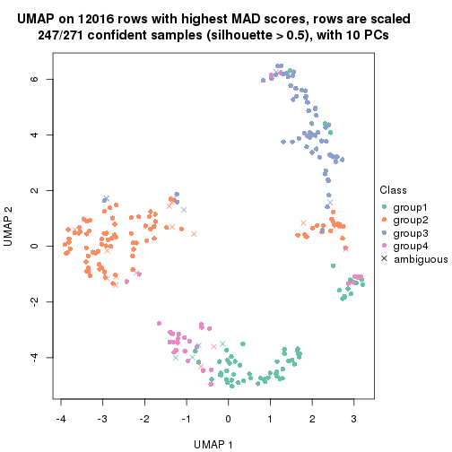</p>

</div>
<div id='tab-MAD-NMF-dimension-reduction-4'>
<pre><code class="r">dimension_reduction(res, k = 5, method = &quot;UMAP&quot;)
</code></pre>

<p></p>

</div>
<div id='tab-MAD-NMF-dimension-reduction-5'>
<pre><code class="r">dimension_reduction(res, k = 6, method = &quot;UMAP&quot;)
</code></pre>

<p></p>

</div>
</div>


Following heatmap shows how subgroups are split when increasing `k`:

```r
collect_classes(res)
```

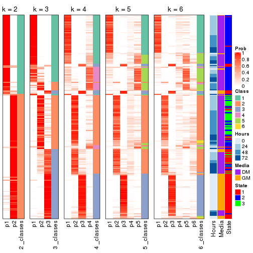


Test correlation between subgroups and known annotations. If the known
annotation is numeric, one-way ANOVA test is applied, and if the known
annotation is discrete, chi-squared contingency table test is applied.

```r
test_to_known_factors(res)
```

```
#>           n Hours(p) Media(p) State(p) k
#> MAD:NMF 263 6.78e-06 2.31e-06 1.25e-27 2
#> MAD:NMF 251 1.98e-28 1.28e-25 7.53e-51 3
#> MAD:NMF 247 7.22e-33 6.98e-36 5.28e-53 4
#> MAD:NMF 209 2.37e-29 4.35e-32 4.64e-45 5
#> MAD:NMF 185 1.09e-23 7.68e-27 3.76e-42 6
```


If matrix rows can be associated to genes, consider to use `GO_Enrichment(res,
...)` to perform function enrichment for the signature genes.


 

---------------------------------------------------


### ATC:hclust


The object with results only for a single top-value method and a single partition method 
can be extracted as:

```r
res = res_list["ATC", "hclust"]
# you can also extract it by
# res = res_list["ATC:hclust"]
```

A summary of `res` and all the functions that can be applied to it:

```r
res
```

```
#> A 'ConsensusPartition' object with k = 2, 3, 4, 5, 6.
#>   On a matrix with 12016 rows and 271 columns.
#>   Top rows (1000, 2000, 3000, 4000, 5000) are extracted by 'ATC' method.
#>   Subgroups are detected by 'hclust' method.
#>   Performed in total 1250 partitions by row resampling.
#>   Best k for subgroups seems to be 2.
#> 
#> Following methods can be applied to this 'ConsensusPartition' object:
#>  [1] "cola_report"             "collect_classes"         "collect_plots"          
#>  [4] "collect_stats"           "colnames"                "compare_signatures"     
#>  [7] "consensus_heatmap"       "dimension_reduction"     "functional_enrichment"  
#> [10] "get_anno_col"            "get_anno"                "get_classes"            
#> [13] "get_consensus"           "get_matrix"              "get_membership"         
#> [16] "get_param"               "get_signatures"          "get_stats"              
#> [19] "is_best_k"               "is_stable_k"             "membership_heatmap"     
#> [22] "ncol"                    "nrow"                    "plot_ecdf"              
#> [25] "rownames"                "select_partition_number" "show"                   
#> [28] "suggest_best_k"          "test_to_known_factors"
```

`collect_plots()` function collects all the plots made from `res` for all `k` (number of partitions)
into one single page to provide an easy and fast comparison between different `k`.

```r
collect_plots(res)
```


The plots are:

- The first row: a plot of the ECDF (Empirical cumulative distribution
  function) curves of the consensus matrix for each `k` and the heatmap of
  predicted classes for each `k`.
- The second row: heatmaps of the consensus matrix for each `k`.
- The third row: heatmaps of the membership matrix for each `k`.
- The fouth row: heatmaps of the signatures for each `k`.

All the plots in panels can be made by individual functions and they are
plotted later in this section.

`select_partition_number()` produces several plots showing different
statistics for choosing "optimized" `k`. There are following statistics:

- ECDF curves of the consensus matrix for each `k`;
- 1-PAC. [The PAC
  score](https://en.wikipedia.org/wiki/Consensus_clustering#Over-interpretation_potential_of_consensus_clustering)
  measures the proportion of the ambiguous subgrouping.
- Mean silhouette score.
- Concordance. The mean probability of fiting the consensus class ids in all
  partitions.
- Area increased. Denote $A_k$ as the area under the ECDF curve for current
  `k`, the area increased is defined as $A_k - A_{k-1}$.
- Rand index. The percent of pairs of samples that are both in a same cluster
  or both are not in a same cluster in the partition of k and k-1.
- Jaccard index. The ratio of pairs of samples are both in a same cluster in
  the partition of k and k-1 and the pairs of samples are both in a same
  cluster in the partition k or k-1.

The detailed explanations of these statistics can be found in [the cola
vignette](http://bioconductor.org/packages/devel/bioc/vignettes/cola/inst/doc/cola.html#toc_13).

Generally speaking, lower PAC score, higher mean silhouette score or higher
concordance corresponds to better partition. Rand index and Jaccard index
measure how similar the current partition is compared to partition with `k-1`.
If they are too similar, we won't accept `k` is better than `k-1`.

```r
select_partition_number(res)
```


The numeric values for all these statistics can be obtained by `get_stats()`.

```r
get_stats(res)
```

```
#>   k 1-PAC mean_silhouette concordance area_increased  Rand Jaccard
#> 2 2 0.372           0.752       0.827          0.306 0.742   0.742
#> 3 3 0.362           0.495       0.814          0.393 0.972   0.962
#> 4 4 0.422           0.606       0.813          0.259 0.750   0.654
#> 5 5 0.521           0.631       0.824          0.107 0.914   0.822
#> 6 6 0.527           0.614       0.822          0.096 0.909   0.781
```

`suggest_best_k()` suggests the best $k$ based on these statistics. The rules are as follows:

- All $k$ with Jaccard index larger than 0.95 are removed because the increase of
  the partition number does not provides enough extra information. If all $k$ are removed,
  the best $k$ is assigned by `NA`.
- For $k$ with 1-PAC larger than 0.9, the maximal $k$ is taken as the "best k". Other $k$ is called "optional k".
- If it does not fit the second rule. The $k$ with the highest vote of highest
  1-PAC, mean silhouette and concordance is taken as the "best k".

```r
suggest_best_k(res)
```

```
#> [1] 2
```


Following shows the table of the partitions (You need to click the **show/hide
code output** link to see it). The membership matrix (columns with name `p*`)
is inferred by
[`clue::cl_consensus()`](https://www.rdocumentation.org/link/cl_consensus?package=clue)
function with the `SE` method. Basically the value in the membership matrix
represents the probability to belong to a certain group. The finall class
label for an item is determined with the group with highest probability it
belongs to.

In `get_classes()` function, the entropy is calculated from the membership
matrix and the silhouette score is calculated from the consensus matrix.


<script>
$( function() {
	$( '#tabs-ATC-hclust-get-classes' ).tabs();
} );
</script>
<div id='tabs-ATC-hclust-get-classes'>
<ul>
<li><a href='#tab-ATC-hclust-get-classes-1'>k = 2</a></li>
<li><a href='#tab-ATC-hclust-get-classes-2'>k = 3</a></li>
<li><a href='#tab-ATC-hclust-get-classes-3'>k = 4</a></li>
<li><a href='#tab-ATC-hclust-get-classes-4'>k = 5</a></li>
<li><a href='#tab-ATC-hclust-get-classes-5'>k = 6</a></li>
</ul>

<div id='tab-ATC-hclust-get-classes-1'>
<p><a id='tab-ATC-hclust-get-classes-1-a' style='color:#0366d6' href='#'>show/hide code output</a></p>
<pre><code class="r">cbind(get_classes(res, k = 2), get_membership(res, k = 2))
</code></pre>

<pre><code>#&gt;            class entropy silhouette    p1    p2
#&gt; T0_CT_A01      2  0.3733      0.824 0.072 0.928
#&gt; T0_CT_A03      2  0.9522      0.402 0.372 0.628
#&gt; T0_CT_A05      2  0.9522      0.402 0.372 0.628
#&gt; T0_CT_A06      2  0.5294      0.780 0.120 0.880
#&gt; T0_CT_A07      2  0.9522      0.402 0.372 0.628
#&gt; T0_CT_A08      2  0.5408      0.805 0.124 0.876
#&gt; T0_CT_A10      2  0.9323      0.450 0.348 0.652
#&gt; T0_CT_A11      2  0.4690      0.793 0.100 0.900
#&gt; T0_CT_B01      2  0.2043      0.852 0.032 0.968
#&gt; T0_CT_B03      2  0.9393      0.437 0.356 0.644
#&gt; T0_CT_B05      2  0.2043      0.852 0.032 0.968
#&gt; T0_CT_B07      2  0.4690      0.808 0.100 0.900
#&gt; T0_CT_B08      2  0.9393      0.437 0.356 0.644
#&gt; T0_CT_B09      2  0.9522      0.402 0.372 0.628
#&gt; T0_CT_C02      2  0.9393      0.437 0.356 0.644
#&gt; T0_CT_C03      2  0.1633      0.854 0.024 0.976
#&gt; T0_CT_C05      2  0.0000      0.854 0.000 1.000
#&gt; T0_CT_C06      2  0.2043      0.852 0.032 0.968
#&gt; T0_CT_C07      2  0.7453      0.659 0.212 0.788
#&gt; T0_CT_C08      2  0.9427      0.428 0.360 0.640
#&gt; T0_CT_C09      2  0.4690      0.793 0.100 0.900
#&gt; T0_CT_C11      2  0.0000      0.854 0.000 1.000
#&gt; T0_CT_C12      2  0.9522      0.402 0.372 0.628
#&gt; T0_CT_D01      2  0.3274      0.832 0.060 0.940
#&gt; T0_CT_D02      2  0.7453      0.659 0.212 0.788
#&gt; T0_CT_D03      2  0.9522      0.402 0.372 0.628
#&gt; T0_CT_D05      2  0.1843      0.851 0.028 0.972
#&gt; T0_CT_D06      2  0.9393      0.437 0.356 0.644
#&gt; T0_CT_D07      2  0.5059      0.794 0.112 0.888
#&gt; T0_CT_D08      2  0.9393      0.437 0.356 0.644
#&gt; T0_CT_D09      2  0.0000      0.854 0.000 1.000
#&gt; T0_CT_D11      2  0.0000      0.854 0.000 1.000
#&gt; T0_CT_D12      2  0.9427      0.428 0.360 0.640
#&gt; T0_CT_E01      2  0.9522      0.402 0.372 0.628
#&gt; T0_CT_E03      2  0.7453      0.659 0.212 0.788
#&gt; T0_CT_E04      2  0.0000      0.854 0.000 1.000
#&gt; T0_CT_E05      2  0.0938      0.853 0.012 0.988
#&gt; T0_CT_E06      2  0.8081      0.611 0.248 0.752
#&gt; T0_CT_E07      2  0.9323      0.450 0.348 0.652
#&gt; T0_CT_E08      2  0.9393      0.437 0.356 0.644
#&gt; T0_CT_E09      2  0.7376      0.674 0.208 0.792
#&gt; T0_CT_E10      2  0.4690      0.793 0.100 0.900
#&gt; T0_CT_E11      2  0.9427      0.428 0.360 0.640
#&gt; T0_CT_E12      2  0.7674      0.643 0.224 0.776
#&gt; T0_CT_F01      2  0.9522      0.402 0.372 0.628
#&gt; T0_CT_F02      2  0.9427      0.428 0.360 0.640
#&gt; T0_CT_F03      2  0.9522      0.402 0.372 0.628
#&gt; T0_CT_F04      2  0.9427      0.428 0.360 0.640
#&gt; T0_CT_F05      2  0.0938      0.853 0.012 0.988
#&gt; T0_CT_F06      2  0.9491      0.409 0.368 0.632
#&gt; T0_CT_F07      2  0.1633      0.853 0.024 0.976
#&gt; T0_CT_F09      2  0.0000      0.854 0.000 1.000
#&gt; T0_CT_F11      2  0.7602      0.648 0.220 0.780
#&gt; T0_CT_F12      2  0.9522      0.402 0.372 0.628
#&gt; T0_CT_G01      2  0.9522      0.402 0.372 0.628
#&gt; T0_CT_G02      2  0.2043      0.852 0.032 0.968
#&gt; T0_CT_G03      2  0.8555      0.563 0.280 0.720
#&gt; T0_CT_G04      2  0.9393      0.437 0.356 0.644
#&gt; T0_CT_G07      2  0.9393      0.437 0.356 0.644
#&gt; T0_CT_G08      2  0.9393      0.437 0.356 0.644
#&gt; T0_CT_G09      2  0.1184      0.852 0.016 0.984
#&gt; T0_CT_G11      2  0.2043      0.852 0.032 0.968
#&gt; T0_CT_H01      2  0.2043      0.852 0.032 0.968
#&gt; T0_CT_H02      2  0.0000      0.854 0.000 1.000
#&gt; T0_CT_H04      2  0.7602      0.655 0.220 0.780
#&gt; T0_CT_H05      2  0.2043      0.852 0.032 0.968
#&gt; T0_CT_H08      2  0.1843      0.851 0.028 0.972
#&gt; T0_CT_H09      2  0.2043      0.852 0.032 0.968
#&gt; T0_CT_H12      2  0.2043      0.852 0.032 0.968
#&gt; T24_CT_A01     2  0.3114      0.842 0.056 0.944
#&gt; T24_CT_A03     2  0.0376      0.854 0.004 0.996
#&gt; T24_CT_A04     2  0.0000      0.854 0.000 1.000
#&gt; T24_CT_A05     2  0.9491      0.411 0.368 0.632
#&gt; T24_CT_A07     2  0.0376      0.854 0.004 0.996
#&gt; T24_CT_A08     2  0.4161      0.825 0.084 0.916
#&gt; T24_CT_A09     2  0.3274      0.840 0.060 0.940
#&gt; T24_CT_A10     2  0.1414      0.851 0.020 0.980
#&gt; T24_CT_B01     2  0.2423      0.845 0.040 0.960
#&gt; T24_CT_B02     2  0.2948      0.838 0.052 0.948
#&gt; T24_CT_B03     2  0.5294      0.777 0.120 0.880
#&gt; T24_CT_B05     2  0.0000      0.854 0.000 1.000
#&gt; T24_CT_B06     2  0.0000      0.854 0.000 1.000
#&gt; T24_CT_B07     2  0.4690      0.813 0.100 0.900
#&gt; T24_CT_B08     2  0.0000      0.854 0.000 1.000
#&gt; T24_CT_B09     2  0.4690      0.813 0.100 0.900
#&gt; T24_CT_B11     2  0.9522      0.402 0.372 0.628
#&gt; T24_CT_C01     2  0.4690      0.813 0.100 0.900
#&gt; T24_CT_C02     2  0.0672      0.855 0.008 0.992
#&gt; T24_CT_C03     2  0.2236      0.846 0.036 0.964
#&gt; T24_CT_C05     2  0.0000      0.854 0.000 1.000
#&gt; T24_CT_C07     2  0.0000      0.854 0.000 1.000
#&gt; T24_CT_C08     2  0.0000      0.854 0.000 1.000
#&gt; T24_CT_C09     2  0.1414      0.853 0.020 0.980
#&gt; T24_CT_C10     2  0.3274      0.840 0.060 0.940
#&gt; T24_CT_C11     2  0.1414      0.852 0.020 0.980
#&gt; T24_CT_C12     2  0.0376      0.854 0.004 0.996
#&gt; T24_CT_D01     2  0.0000      0.854 0.000 1.000
#&gt; T24_CT_D02     2  0.1414      0.852 0.020 0.980
#&gt; T24_CT_D03     2  0.0000      0.854 0.000 1.000
#&gt; T24_CT_D04     2  0.2778      0.841 0.048 0.952
#&gt; T24_CT_D05     2  0.2423      0.850 0.040 0.960
#&gt; T24_CT_D06     2  0.3274      0.840 0.060 0.940
#&gt; T24_CT_D07     2  0.2043      0.852 0.032 0.968
#&gt; T24_CT_D08     2  0.0376      0.854 0.004 0.996
#&gt; T24_CT_D09     2  0.1184      0.851 0.016 0.984
#&gt; T24_CT_D10     2  0.0376      0.854 0.004 0.996
#&gt; T24_CT_D11     2  0.0000      0.854 0.000 1.000
#&gt; T24_CT_E01     2  0.1184      0.852 0.016 0.984
#&gt; T24_CT_E02     2  0.2948      0.838 0.052 0.948
#&gt; T24_CT_E04     2  0.0000      0.854 0.000 1.000
#&gt; T24_CT_E05     2  0.4690      0.813 0.100 0.900
#&gt; T24_CT_E07     2  0.4562      0.796 0.096 0.904
#&gt; T24_CT_E09     2  0.3431      0.837 0.064 0.936
#&gt; T24_CT_E11     2  0.2778      0.841 0.048 0.952
#&gt; T24_CT_E12     2  0.0000      0.854 0.000 1.000
#&gt; T24_CT_F01     2  0.0000      0.854 0.000 1.000
#&gt; T24_CT_F02     2  0.0000      0.854 0.000 1.000
#&gt; T24_CT_F03     2  0.1414      0.851 0.020 0.980
#&gt; T24_CT_F04     2  0.0938      0.853 0.012 0.988
#&gt; T24_CT_F05     2  0.1414      0.851 0.020 0.980
#&gt; T24_CT_F07     2  0.0938      0.853 0.012 0.988
#&gt; T24_CT_F08     2  0.3431      0.837 0.064 0.936
#&gt; T24_CT_F09     2  0.1414      0.850 0.020 0.980
#&gt; T24_CT_F10     2  0.4939      0.789 0.108 0.892
#&gt; T24_CT_F11     2  0.1414      0.851 0.020 0.980
#&gt; T24_CT_F12     2  0.7745      0.641 0.228 0.772
#&gt; T24_CT_G01     2  0.0376      0.854 0.004 0.996
#&gt; T24_CT_G02     2  0.5059      0.804 0.112 0.888
#&gt; T24_CT_G03     2  0.3431      0.837 0.064 0.936
#&gt; T24_CT_G04     2  0.0938      0.852 0.012 0.988
#&gt; T24_CT_G05     2  0.0376      0.854 0.004 0.996
#&gt; T24_CT_G06     2  0.3274      0.840 0.060 0.940
#&gt; T24_CT_G08     2  0.3431      0.837 0.064 0.936
#&gt; T24_CT_G10     2  0.0938      0.852 0.012 0.988
#&gt; T24_CT_G11     2  0.3431      0.837 0.064 0.936
#&gt; T24_CT_G12     2  0.2778      0.840 0.048 0.952
#&gt; T24_CT_H01     2  0.9522      0.402 0.372 0.628
#&gt; T24_CT_H02     2  0.2778      0.841 0.048 0.952
#&gt; T24_CT_H03     2  0.0000      0.854 0.000 1.000
#&gt; T24_CT_H05     2  0.2423      0.845 0.040 0.960
#&gt; T24_CT_H07     2  0.2603      0.842 0.044 0.956
#&gt; T24_CT_H09     2  0.3431      0.837 0.064 0.936
#&gt; T24_CT_H12     2  0.2778      0.840 0.048 0.952
#&gt; T48_CT_A01     2  0.2603      0.838 0.044 0.956
#&gt; T48_CT_A02     2  0.0000      0.854 0.000 1.000
#&gt; T48_CT_A03     2  0.5059      0.804 0.112 0.888
#&gt; T48_CT_A04     2  0.0000      0.854 0.000 1.000
#&gt; T48_CT_A05     2  0.5946      0.746 0.144 0.856
#&gt; T48_CT_A06     2  0.5059      0.804 0.112 0.888
#&gt; T48_CT_A07     2  0.9635      0.356 0.388 0.612
#&gt; T48_CT_A08     2  0.2043      0.845 0.032 0.968
#&gt; T48_CT_A09     2  0.1414      0.851 0.020 0.980
#&gt; T48_CT_A10     2  0.0376      0.854 0.004 0.996
#&gt; T48_CT_A11     2  0.0000      0.854 0.000 1.000
#&gt; T48_CT_A12     2  0.1184      0.852 0.016 0.984
#&gt; T48_CT_B01     2  0.0376      0.854 0.004 0.996
#&gt; T48_CT_B02     2  0.0000      0.854 0.000 1.000
#&gt; T48_CT_B03     2  0.5059      0.804 0.112 0.888
#&gt; T48_CT_B04     2  0.5059      0.804 0.112 0.888
#&gt; T48_CT_B06     2  0.0376      0.854 0.004 0.996
#&gt; T48_CT_B08     2  0.2948      0.842 0.052 0.948
#&gt; T48_CT_B10     2  0.0000      0.854 0.000 1.000
#&gt; T48_CT_B11     2  0.0000      0.854 0.000 1.000
#&gt; T48_CT_B12     2  0.2423      0.850 0.040 0.960
#&gt; T48_CT_C01     2  0.0000      0.854 0.000 1.000
#&gt; T48_CT_C02     2  0.4690      0.793 0.100 0.900
#&gt; T48_CT_C03     2  0.0000      0.854 0.000 1.000
#&gt; T48_CT_C04     2  0.5059      0.804 0.112 0.888
#&gt; T48_CT_C05     2  0.4161      0.805 0.084 0.916
#&gt; T48_CT_C06     2  0.4562      0.801 0.096 0.904
#&gt; T48_CT_C07     2  0.1184      0.855 0.016 0.984
#&gt; T48_CT_C09     2  0.2948      0.838 0.052 0.948
#&gt; T48_CT_C10     2  0.2603      0.848 0.044 0.956
#&gt; T48_CT_C11     2  0.0376      0.854 0.004 0.996
#&gt; T48_CT_D01     2  0.0376      0.854 0.004 0.996
#&gt; T48_CT_D02     2  0.1184      0.852 0.016 0.984
#&gt; T48_CT_D03     2  0.2603      0.843 0.044 0.956
#&gt; T48_CT_D04     2  0.0000      0.854 0.000 1.000
#&gt; T48_CT_D06     2  0.2603      0.838 0.044 0.956
#&gt; T48_CT_D07     2  0.0000      0.854 0.000 1.000
#&gt; T48_CT_D08     2  0.2423      0.846 0.040 0.960
#&gt; T48_CT_D09     2  0.0376      0.854 0.004 0.996
#&gt; T48_CT_D10     2  0.0938      0.853 0.012 0.988
#&gt; T48_CT_D11     2  0.7056      0.646 0.192 0.808
#&gt; T48_CT_D12     2  0.5059      0.804 0.112 0.888
#&gt; T48_CT_E01     2  0.5737      0.753 0.136 0.864
#&gt; T48_CT_E02     2  0.1184      0.852 0.016 0.984
#&gt; T48_CT_E03     2  0.4939      0.789 0.108 0.892
#&gt; T48_CT_E04     2  0.2423      0.850 0.040 0.960
#&gt; T48_CT_E05     2  0.0000      0.854 0.000 1.000
#&gt; T48_CT_E06     2  0.5059      0.804 0.112 0.888
#&gt; T48_CT_E07     2  0.5408      0.805 0.124 0.876
#&gt; T48_CT_E08     2  0.0000      0.854 0.000 1.000
#&gt; T48_CT_E10     2  0.2948      0.842 0.052 0.948
#&gt; T48_CT_E11     2  0.2236      0.850 0.036 0.964
#&gt; T48_CT_E12     2  0.9635      0.356 0.388 0.612
#&gt; T48_CT_F01     2  0.0000      0.854 0.000 1.000
#&gt; T48_CT_F02     2  0.1184      0.852 0.016 0.984
#&gt; T48_CT_F03     2  0.1414      0.851 0.020 0.980
#&gt; T48_CT_F05     2  0.0000      0.854 0.000 1.000
#&gt; T48_CT_F07     2  0.2423      0.846 0.040 0.960
#&gt; T48_CT_F09     2  0.0000      0.854 0.000 1.000
#&gt; T48_CT_F10     2  0.1184      0.852 0.016 0.984
#&gt; T48_CT_F11     2  0.2778      0.848 0.048 0.952
#&gt; T48_CT_G01     2  0.3114      0.843 0.056 0.944
#&gt; T48_CT_G02     2  0.0672      0.853 0.008 0.992
#&gt; T48_CT_G03     2  0.0000      0.854 0.000 1.000
#&gt; T48_CT_G07     2  0.0000      0.854 0.000 1.000
#&gt; T48_CT_G08     2  0.6801      0.691 0.180 0.820
#&gt; T48_CT_G09     2  0.6801      0.691 0.180 0.820
#&gt; T48_CT_G10     2  0.9522      0.402 0.372 0.628
#&gt; T48_CT_G11     2  0.1414      0.854 0.020 0.980
#&gt; T48_CT_G12     2  0.0000      0.854 0.000 1.000
#&gt; T48_CT_H01     2  0.0672      0.855 0.008 0.992
#&gt; T48_CT_H02     2  0.6801      0.691 0.180 0.820
#&gt; T48_CT_H04     2  0.4690      0.793 0.100 0.900
#&gt; T48_CT_H05     2  0.0376      0.854 0.004 0.996
#&gt; T48_CT_H06     2  0.0000      0.854 0.000 1.000
#&gt; T48_CT_H07     2  0.0938      0.853 0.012 0.988
#&gt; T48_CT_H08     2  0.3114      0.830 0.056 0.944
#&gt; T48_CT_H11     2  0.1184      0.852 0.016 0.984
#&gt; T48_CT_H12     2  0.0000      0.854 0.000 1.000
#&gt; T72_CT_A01     1  0.9983      0.580 0.524 0.476
#&gt; T72_CT_A05     2  0.9996     -0.492 0.488 0.512
#&gt; T72_CT_A08     1  0.9323      0.812 0.652 0.348
#&gt; T72_CT_A09     1  0.7883      0.891 0.764 0.236
#&gt; T72_CT_A11     1  0.8327      0.893 0.736 0.264
#&gt; T72_CT_B01     1  0.9983      0.580 0.524 0.476
#&gt; T72_CT_B02     1  0.9087      0.843 0.676 0.324
#&gt; T72_CT_B03     1  0.9358      0.808 0.648 0.352
#&gt; T72_CT_B04     1  0.8713      0.874 0.708 0.292
#&gt; T72_CT_B05     1  0.8081      0.899 0.752 0.248
#&gt; T72_CT_B06     1  0.8713      0.874 0.708 0.292
#&gt; T72_CT_B08     1  0.7674      0.857 0.776 0.224
#&gt; T72_CT_B09     2  0.8207      0.579 0.256 0.744
#&gt; T72_CT_B11     1  0.8144      0.899 0.748 0.252
#&gt; T72_CT_B12     1  0.8144      0.898 0.748 0.252
#&gt; T72_CT_C04     2  0.9815     -0.246 0.420 0.580
#&gt; T72_CT_C06     1  0.8081      0.899 0.752 0.248
#&gt; T72_CT_C07     2  0.9129      0.219 0.328 0.672
#&gt; T72_CT_C09     1  0.8081      0.899 0.752 0.248
#&gt; T72_CT_C11     1  0.4690      0.753 0.900 0.100
#&gt; T72_CT_D01     1  0.8144      0.898 0.748 0.252
#&gt; T72_CT_D03     1  0.8144      0.899 0.748 0.252
#&gt; T72_CT_D04     1  0.8144      0.898 0.748 0.252
#&gt; T72_CT_D05     1  0.8081      0.899 0.752 0.248
#&gt; T72_CT_D07     1  0.8081      0.899 0.752 0.248
#&gt; T72_CT_D10     1  0.8081      0.899 0.752 0.248
#&gt; T72_CT_D11     1  0.9427      0.796 0.640 0.360
#&gt; T72_CT_E04     1  0.9393      0.801 0.644 0.356
#&gt; T72_CT_E05     1  0.8144      0.898 0.748 0.252
#&gt; T72_CT_E07     1  0.9522      0.781 0.628 0.372
#&gt; T72_CT_F01     1  0.8386      0.892 0.732 0.268
#&gt; T72_CT_F05     1  0.9000      0.853 0.684 0.316
#&gt; T72_CT_F07     1  0.8144      0.899 0.748 0.252
#&gt; T72_CT_F10     1  0.8144      0.898 0.748 0.252
#&gt; T72_CT_F11     1  0.8016      0.888 0.756 0.244
#&gt; T72_CT_G03     1  0.9970      0.546 0.532 0.468
#&gt; T72_CT_G04     1  0.9922      0.604 0.552 0.448
#&gt; T72_CT_G06     1  0.9954      0.614 0.540 0.460
#&gt; T72_CT_G08     2  0.9922     -0.336 0.448 0.552
#&gt; T72_CT_G10     1  0.8144      0.898 0.748 0.252
#&gt; T72_CT_G11     2  0.4690      0.802 0.100 0.900
#&gt; T72_CT_H01     2  0.9977     -0.435 0.472 0.528
#&gt; T72_CT_H03     1  0.8144      0.898 0.748 0.252
#&gt; T72_CT_H05     1  0.4690      0.753 0.900 0.100
#&gt; T72_CT_H08     2  0.9850      0.232 0.428 0.572
#&gt; T72_CT_H09     1  0.4690      0.753 0.900 0.100
#&gt; T72_CT_H10     1  0.8207      0.898 0.744 0.256
#&gt; T72_CT_H11     1  0.8081      0.899 0.752 0.248
#&gt; T72_CT_H12     1  0.8144      0.898 0.748 0.252
</code></pre>

<script>
$('#tab-ATC-hclust-get-classes-1-a').parent().next().next().hide();
$('#tab-ATC-hclust-get-classes-1-a').click(function(){
  $('#tab-ATC-hclust-get-classes-1-a').parent().next().next().toggle();
  return(false);
});
</script>
</div>

<div id='tab-ATC-hclust-get-classes-2'>
<p><a id='tab-ATC-hclust-get-classes-2-a' style='color:#0366d6' href='#'>show/hide code output</a></p>
<pre><code class="r">cbind(get_classes(res, k = 3), get_membership(res, k = 3))
</code></pre>

<pre><code>#&gt;            class entropy silhouette    p1    p2    p3
#&gt; T0_CT_A01      2  0.3802     0.6153 0.032 0.888 0.080
#&gt; T0_CT_A03      2  0.9243     0.0490 0.160 0.472 0.368
#&gt; T0_CT_A05      2  0.9243     0.0490 0.160 0.472 0.368
#&gt; T0_CT_A06      2  0.5343     0.5200 0.052 0.816 0.132
#&gt; T0_CT_A07      2  0.9243     0.0490 0.160 0.472 0.368
#&gt; T0_CT_A08      2  0.7169     0.1487 0.088 0.704 0.208
#&gt; T0_CT_A10      2  0.8821     0.1048 0.128 0.524 0.348
#&gt; T0_CT_A11      2  0.6341    -0.0741 0.016 0.672 0.312
#&gt; T0_CT_B01      2  0.1905     0.6790 0.016 0.956 0.028
#&gt; T0_CT_B03      2  0.9130     0.0768 0.152 0.492 0.356
#&gt; T0_CT_B05      2  0.1905     0.6790 0.016 0.956 0.028
#&gt; T0_CT_B07      2  0.4092     0.6080 0.036 0.876 0.088
#&gt; T0_CT_B08      2  0.9130     0.0768 0.152 0.492 0.356
#&gt; T0_CT_B09      2  0.9243     0.0490 0.160 0.472 0.368
#&gt; T0_CT_C02      2  0.9130     0.0768 0.152 0.492 0.356
#&gt; T0_CT_C03      2  0.1832     0.6799 0.008 0.956 0.036
#&gt; T0_CT_C05      2  0.0475     0.6865 0.004 0.992 0.004
#&gt; T0_CT_C06      2  0.1905     0.6790 0.016 0.956 0.028
#&gt; T0_CT_C07      2  0.7298     0.3455 0.100 0.700 0.200
#&gt; T0_CT_C08      2  0.9141     0.0724 0.152 0.488 0.360
#&gt; T0_CT_C09      2  0.6341    -0.0741 0.016 0.672 0.312
#&gt; T0_CT_C11      2  0.0475     0.6865 0.004 0.992 0.004
#&gt; T0_CT_C12      2  0.9243     0.0490 0.160 0.472 0.368
#&gt; T0_CT_D01      2  0.3406     0.6312 0.028 0.904 0.068
#&gt; T0_CT_D02      2  0.7413     0.3339 0.104 0.692 0.204
#&gt; T0_CT_D03      2  0.9243     0.0490 0.160 0.472 0.368
#&gt; T0_CT_D05      2  0.1919     0.6774 0.020 0.956 0.024
#&gt; T0_CT_D06      2  0.9130     0.0768 0.152 0.492 0.356
#&gt; T0_CT_D07      2  0.4964     0.5530 0.048 0.836 0.116
#&gt; T0_CT_D08      2  0.9130     0.0768 0.152 0.492 0.356
#&gt; T0_CT_D09      2  0.0475     0.6865 0.004 0.992 0.004
#&gt; T0_CT_D11      2  0.0475     0.6865 0.004 0.992 0.004
#&gt; T0_CT_D12      2  0.9141     0.0724 0.152 0.488 0.360
#&gt; T0_CT_E01      2  0.9243     0.0490 0.160 0.472 0.368
#&gt; T0_CT_E03      2  0.7298     0.3455 0.100 0.700 0.200
#&gt; T0_CT_E04      2  0.0475     0.6865 0.004 0.992 0.004
#&gt; T0_CT_E05      2  0.0592     0.6825 0.000 0.988 0.012
#&gt; T0_CT_E06      2  0.7814     0.2709 0.104 0.652 0.244
#&gt; T0_CT_E07      2  0.8850     0.0978 0.128 0.516 0.356
#&gt; T0_CT_E08      2  0.9130     0.0768 0.152 0.492 0.356
#&gt; T0_CT_E09      2  0.7153     0.3418 0.092 0.708 0.200
#&gt; T0_CT_E10      2  0.6341    -0.0741 0.016 0.672 0.312
#&gt; T0_CT_E11      2  0.9141     0.0724 0.152 0.488 0.360
#&gt; T0_CT_E12      2  0.7543     0.3154 0.104 0.680 0.216
#&gt; T0_CT_F01      2  0.9243     0.0490 0.160 0.472 0.368
#&gt; T0_CT_F02      2  0.9141     0.0724 0.152 0.488 0.360
#&gt; T0_CT_F03      2  0.9243     0.0490 0.160 0.472 0.368
#&gt; T0_CT_F04      2  0.9141     0.0724 0.152 0.488 0.360
#&gt; T0_CT_F05      2  0.1129     0.6825 0.004 0.976 0.020
#&gt; T0_CT_F06      2  0.9234     0.0534 0.160 0.476 0.364
#&gt; T0_CT_F07      2  0.1781     0.6793 0.020 0.960 0.020
#&gt; T0_CT_F09      2  0.0475     0.6865 0.004 0.992 0.004
#&gt; T0_CT_F11      2  0.7501     0.3217 0.104 0.684 0.212
#&gt; T0_CT_F12      2  0.9243     0.0490 0.160 0.472 0.368
#&gt; T0_CT_G01      2  0.9243     0.0490 0.160 0.472 0.368
#&gt; T0_CT_G02      2  0.1905     0.6790 0.016 0.956 0.028
#&gt; T0_CT_G03      2  0.8293     0.2088 0.120 0.608 0.272
#&gt; T0_CT_G04      2  0.9130     0.0768 0.152 0.492 0.356
#&gt; T0_CT_G07      2  0.9130     0.0768 0.152 0.492 0.356
#&gt; T0_CT_G08      2  0.9130     0.0768 0.152 0.492 0.356
#&gt; T0_CT_G09      2  0.0747     0.6818 0.000 0.984 0.016
#&gt; T0_CT_G11      2  0.1905     0.6790 0.016 0.956 0.028
#&gt; T0_CT_H01      2  0.1751     0.6819 0.012 0.960 0.028
#&gt; T0_CT_H02      2  0.0475     0.6865 0.004 0.992 0.004
#&gt; T0_CT_H04      2  0.7501     0.3242 0.104 0.684 0.212
#&gt; T0_CT_H05      2  0.1905     0.6790 0.016 0.956 0.028
#&gt; T0_CT_H08      2  0.1919     0.6774 0.020 0.956 0.024
#&gt; T0_CT_H09      2  0.1905     0.6790 0.016 0.956 0.028
#&gt; T0_CT_H12      2  0.2176     0.6757 0.020 0.948 0.032
#&gt; T24_CT_A01     2  0.3619     0.5658 0.000 0.864 0.136
#&gt; T24_CT_A03     2  0.0237     0.6862 0.004 0.996 0.000
#&gt; T24_CT_A04     2  0.0475     0.6865 0.004 0.992 0.004
#&gt; T24_CT_A05     2  0.9212     0.0477 0.156 0.472 0.372
#&gt; T24_CT_A07     2  0.0237     0.6862 0.004 0.996 0.000
#&gt; T24_CT_A08     2  0.4883     0.3928 0.004 0.788 0.208
#&gt; T24_CT_A09     2  0.4062     0.5133 0.000 0.836 0.164
#&gt; T24_CT_A10     2  0.1753     0.6617 0.000 0.952 0.048
#&gt; T24_CT_B01     2  0.3038     0.6015 0.000 0.896 0.104
#&gt; T24_CT_B02     2  0.3941     0.5197 0.000 0.844 0.156
#&gt; T24_CT_B03     2  0.3500     0.5868 0.116 0.880 0.004
#&gt; T24_CT_B05     2  0.0000     0.6866 0.000 1.000 0.000
#&gt; T24_CT_B06     2  0.0000     0.6866 0.000 1.000 0.000
#&gt; T24_CT_B07     2  0.5896     0.0858 0.008 0.700 0.292
#&gt; T24_CT_B08     2  0.0475     0.6865 0.004 0.992 0.004
#&gt; T24_CT_B09     2  0.5623     0.1510 0.004 0.716 0.280
#&gt; T24_CT_B11     2  0.9243     0.0490 0.160 0.472 0.368
#&gt; T24_CT_C01     2  0.5327     0.1989 0.000 0.728 0.272
#&gt; T24_CT_C02     2  0.0661     0.6866 0.008 0.988 0.004
#&gt; T24_CT_C03     2  0.2356     0.6422 0.000 0.928 0.072
#&gt; T24_CT_C05     2  0.0475     0.6865 0.004 0.992 0.004
#&gt; T24_CT_C07     2  0.0000     0.6866 0.000 1.000 0.000
#&gt; T24_CT_C08     2  0.0237     0.6865 0.004 0.996 0.000
#&gt; T24_CT_C09     2  0.1129     0.6803 0.004 0.976 0.020
#&gt; T24_CT_C10     2  0.4172     0.5194 0.004 0.840 0.156
#&gt; T24_CT_C11     2  0.1964     0.6537 0.000 0.944 0.056
#&gt; T24_CT_C12     2  0.0237     0.6862 0.004 0.996 0.000
#&gt; T24_CT_D01     2  0.0000     0.6866 0.000 1.000 0.000
#&gt; T24_CT_D02     2  0.1015     0.6837 0.012 0.980 0.008
#&gt; T24_CT_D03     2  0.0237     0.6865 0.004 0.996 0.000
#&gt; T24_CT_D04     2  0.3686     0.5468 0.000 0.860 0.140
#&gt; T24_CT_D05     2  0.2939     0.6345 0.012 0.916 0.072
#&gt; T24_CT_D06     2  0.3686     0.5546 0.000 0.860 0.140
#&gt; T24_CT_D07     2  0.2492     0.6582 0.016 0.936 0.048
#&gt; T24_CT_D08     2  0.0237     0.6862 0.004 0.996 0.000
#&gt; T24_CT_D09     2  0.1315     0.6814 0.020 0.972 0.008
#&gt; T24_CT_D10     2  0.0237     0.6862 0.004 0.996 0.000
#&gt; T24_CT_D11     2  0.0000     0.6866 0.000 1.000 0.000
#&gt; T24_CT_E01     2  0.0747     0.6818 0.000 0.984 0.016
#&gt; T24_CT_E02     2  0.4233     0.5041 0.004 0.836 0.160
#&gt; T24_CT_E04     2  0.0000     0.6866 0.000 1.000 0.000
#&gt; T24_CT_E05     2  0.5588     0.1736 0.004 0.720 0.276
#&gt; T24_CT_E07     2  0.3030     0.6146 0.092 0.904 0.004
#&gt; T24_CT_E09     2  0.4521     0.4770 0.004 0.816 0.180
#&gt; T24_CT_E11     2  0.3686     0.5468 0.000 0.860 0.140
#&gt; T24_CT_E12     2  0.0000     0.6866 0.000 1.000 0.000
#&gt; T24_CT_F01     2  0.0000     0.6866 0.000 1.000 0.000
#&gt; T24_CT_F02     2  0.0237     0.6868 0.000 0.996 0.004
#&gt; T24_CT_F03     2  0.1031     0.6782 0.000 0.976 0.024
#&gt; T24_CT_F04     2  0.0747     0.6813 0.000 0.984 0.016
#&gt; T24_CT_F05     2  0.0892     0.6804 0.000 0.980 0.020
#&gt; T24_CT_F07     2  0.0747     0.6813 0.000 0.984 0.016
#&gt; T24_CT_F08     2  0.4178     0.4969 0.000 0.828 0.172
#&gt; T24_CT_F09     2  0.1453     0.6791 0.024 0.968 0.008
#&gt; T24_CT_F10     2  0.3454     0.5984 0.104 0.888 0.008
#&gt; T24_CT_F11     2  0.1031     0.6782 0.000 0.976 0.024
#&gt; T24_CT_F12     2  0.7657     0.2974 0.116 0.676 0.208
#&gt; T24_CT_G01     2  0.0237     0.6862 0.004 0.996 0.000
#&gt; T24_CT_G02     2  0.6200    -0.0432 0.012 0.676 0.312
#&gt; T24_CT_G03     2  0.4291     0.4781 0.000 0.820 0.180
#&gt; T24_CT_G04     2  0.1182     0.6835 0.012 0.976 0.012
#&gt; T24_CT_G05     2  0.0475     0.6864 0.004 0.992 0.004
#&gt; T24_CT_G06     2  0.4172     0.5194 0.004 0.840 0.156
#&gt; T24_CT_G08     2  0.4291     0.4781 0.000 0.820 0.180
#&gt; T24_CT_G10     2  0.0592     0.6845 0.012 0.988 0.000
#&gt; T24_CT_G11     2  0.4629     0.4546 0.004 0.808 0.188
#&gt; T24_CT_G12     2  0.3412     0.5822 0.000 0.876 0.124
#&gt; T24_CT_H01     2  0.9243     0.0490 0.160 0.472 0.368
#&gt; T24_CT_H02     2  0.3619     0.5537 0.000 0.864 0.136
#&gt; T24_CT_H03     2  0.0000     0.6866 0.000 1.000 0.000
#&gt; T24_CT_H05     2  0.2711     0.6220 0.000 0.912 0.088
#&gt; T24_CT_H07     2  0.3267     0.5860 0.000 0.884 0.116
#&gt; T24_CT_H09     2  0.4235     0.4876 0.000 0.824 0.176
#&gt; T24_CT_H12     2  0.3412     0.5822 0.000 0.876 0.124
#&gt; T48_CT_A01     2  0.1643     0.6688 0.044 0.956 0.000
#&gt; T48_CT_A02     2  0.0000     0.6866 0.000 1.000 0.000
#&gt; T48_CT_A03     2  0.6200    -0.0432 0.012 0.676 0.312
#&gt; T48_CT_A04     2  0.0000     0.6866 0.000 1.000 0.000
#&gt; T48_CT_A05     2  0.3918     0.5488 0.140 0.856 0.004
#&gt; T48_CT_A06     2  0.6200    -0.0432 0.012 0.676 0.312
#&gt; T48_CT_A07     2  0.9290     0.0200 0.164 0.464 0.372
#&gt; T48_CT_A08     2  0.1289     0.6774 0.032 0.968 0.000
#&gt; T48_CT_A09     2  0.1031     0.6782 0.000 0.976 0.024
#&gt; T48_CT_A10     2  0.0237     0.6858 0.000 0.996 0.004
#&gt; T48_CT_A11     2  0.0000     0.6866 0.000 1.000 0.000
#&gt; T48_CT_A12     2  0.0747     0.6818 0.000 0.984 0.016
#&gt; T48_CT_B01     2  0.0237     0.6858 0.000 0.996 0.004
#&gt; T48_CT_B02     2  0.0000     0.6866 0.000 1.000 0.000
#&gt; T48_CT_B03     2  0.6200    -0.0432 0.012 0.676 0.312
#&gt; T48_CT_B04     2  0.6200    -0.0432 0.012 0.676 0.312
#&gt; T48_CT_B06     2  0.0237     0.6863 0.004 0.996 0.000
#&gt; T48_CT_B08     2  0.4413     0.5016 0.008 0.832 0.160
#&gt; T48_CT_B10     2  0.0000     0.6866 0.000 1.000 0.000
#&gt; T48_CT_B11     2  0.0000     0.6866 0.000 1.000 0.000
#&gt; T48_CT_B12     2  0.1751     0.6783 0.028 0.960 0.012
#&gt; T48_CT_C01     2  0.0000     0.6866 0.000 1.000 0.000
#&gt; T48_CT_C02     2  0.6369    -0.0928 0.016 0.668 0.316
#&gt; T48_CT_C03     2  0.0000     0.6866 0.000 1.000 0.000
#&gt; T48_CT_C04     2  0.6200    -0.0432 0.012 0.676 0.312
#&gt; T48_CT_C05     2  0.2625     0.6264 0.084 0.916 0.000
#&gt; T48_CT_C06     2  0.3030     0.6197 0.092 0.904 0.004
#&gt; T48_CT_C07     2  0.0829     0.6836 0.004 0.984 0.012
#&gt; T48_CT_C09     2  0.2063     0.6648 0.044 0.948 0.008
#&gt; T48_CT_C10     2  0.3038     0.6036 0.000 0.896 0.104
#&gt; T48_CT_C11     2  0.0237     0.6863 0.004 0.996 0.000
#&gt; T48_CT_D01     2  0.0237     0.6858 0.000 0.996 0.004
#&gt; T48_CT_D02     2  0.0747     0.6818 0.000 0.984 0.016
#&gt; T48_CT_D03     2  0.3551     0.5604 0.000 0.868 0.132
#&gt; T48_CT_D04     2  0.0000     0.6866 0.000 1.000 0.000
#&gt; T48_CT_D06     2  0.1643     0.6686 0.044 0.956 0.000
#&gt; T48_CT_D07     2  0.0000     0.6866 0.000 1.000 0.000
#&gt; T48_CT_D08     2  0.3551     0.5592 0.000 0.868 0.132
#&gt; T48_CT_D09     2  0.0237     0.6858 0.000 0.996 0.004
#&gt; T48_CT_D10     2  0.0592     0.6825 0.000 0.988 0.012
#&gt; T48_CT_D11     2  0.5435     0.3983 0.192 0.784 0.024
#&gt; T48_CT_D12     2  0.6200    -0.0432 0.012 0.676 0.312
#&gt; T48_CT_E01     2  0.3784     0.5600 0.132 0.864 0.004
#&gt; T48_CT_E02     2  0.0747     0.6818 0.000 0.984 0.016
#&gt; T48_CT_E03     2  0.3454     0.5984 0.104 0.888 0.008
#&gt; T48_CT_E04     2  0.1751     0.6783 0.028 0.960 0.012
#&gt; T48_CT_E05     2  0.0000     0.6866 0.000 1.000 0.000
#&gt; T48_CT_E06     2  0.6200    -0.0432 0.012 0.676 0.312
#&gt; T48_CT_E07     2  0.7124     0.1696 0.088 0.708 0.204
#&gt; T48_CT_E08     2  0.0000     0.6866 0.000 1.000 0.000
#&gt; T48_CT_E10     2  0.4353     0.5104 0.008 0.836 0.156
#&gt; T48_CT_E11     2  0.3038     0.6020 0.000 0.896 0.104
#&gt; T48_CT_E12     2  0.9290     0.0200 0.164 0.464 0.372
#&gt; T48_CT_F01     2  0.0000     0.6866 0.000 1.000 0.000
#&gt; T48_CT_F02     2  0.0747     0.6818 0.000 0.984 0.016
#&gt; T48_CT_F03     2  0.1031     0.6775 0.000 0.976 0.024
#&gt; T48_CT_F05     2  0.0000     0.6866 0.000 1.000 0.000
#&gt; T48_CT_F07     2  0.3192     0.5906 0.000 0.888 0.112
#&gt; T48_CT_F09     2  0.0000     0.6866 0.000 1.000 0.000
#&gt; T48_CT_F10     2  0.0892     0.6798 0.000 0.980 0.020
#&gt; T48_CT_F11     2  0.4291     0.5182 0.008 0.840 0.152
#&gt; T48_CT_G01     2  0.3752     0.5515 0.000 0.856 0.144
#&gt; T48_CT_G02     2  0.0424     0.6868 0.008 0.992 0.000
#&gt; T48_CT_G03     2  0.0000     0.6866 0.000 1.000 0.000
#&gt; T48_CT_G07     2  0.0000     0.6866 0.000 1.000 0.000
#&gt; T48_CT_G08     2  0.4465     0.4805 0.176 0.820 0.004
#&gt; T48_CT_G09     2  0.4465     0.4805 0.176 0.820 0.004
#&gt; T48_CT_G10     2  0.9243     0.0490 0.160 0.472 0.368
#&gt; T48_CT_G11     2  0.1878     0.6631 0.004 0.952 0.044
#&gt; T48_CT_G12     2  0.0000     0.6866 0.000 1.000 0.000
#&gt; T48_CT_H01     2  0.0424     0.6862 0.000 0.992 0.008
#&gt; T48_CT_H02     2  0.4465     0.4805 0.176 0.820 0.004
#&gt; T48_CT_H04     2  0.6369    -0.0928 0.016 0.668 0.316
#&gt; T48_CT_H05     2  0.0237     0.6858 0.000 0.996 0.004
#&gt; T48_CT_H06     2  0.0000     0.6866 0.000 1.000 0.000
#&gt; T48_CT_H07     2  0.0592     0.6825 0.000 0.988 0.012
#&gt; T48_CT_H08     2  0.1964     0.6573 0.056 0.944 0.000
#&gt; T48_CT_H11     2  0.0747     0.6818 0.000 0.984 0.016
#&gt; T48_CT_H12     2  0.0000     0.6866 0.000 1.000 0.000
#&gt; T72_CT_A01     1  0.6667     0.2020 0.616 0.368 0.016
#&gt; T72_CT_A05     1  0.6950     0.0576 0.572 0.408 0.020
#&gt; T72_CT_A08     1  0.7462     0.6526 0.696 0.124 0.180
#&gt; T72_CT_A09     1  0.1765     0.7717 0.956 0.040 0.004
#&gt; T72_CT_A11     1  0.3112     0.7657 0.900 0.096 0.004
#&gt; T72_CT_B01     1  0.6667     0.2020 0.616 0.368 0.016
#&gt; T72_CT_B02     1  0.7644     0.6373 0.632 0.072 0.296
#&gt; T72_CT_B03     1  0.7245     0.6665 0.712 0.120 0.168
#&gt; T72_CT_B04     1  0.6867     0.6717 0.672 0.040 0.288
#&gt; T72_CT_B05     1  0.3554     0.7736 0.900 0.036 0.064
#&gt; T72_CT_B06     1  0.6867     0.6717 0.672 0.040 0.288
#&gt; T72_CT_B08     1  0.6625     0.6741 0.744 0.080 0.176
#&gt; T72_CT_B09     3  0.8686     0.0000 0.104 0.432 0.464
#&gt; T72_CT_B11     1  0.3832     0.7724 0.888 0.036 0.076
#&gt; T72_CT_B12     1  0.2772     0.7742 0.916 0.080 0.004
#&gt; T72_CT_C04     2  0.6683    -0.3806 0.496 0.496 0.008
#&gt; T72_CT_C06     1  0.3742     0.7731 0.892 0.036 0.072
#&gt; T72_CT_C07     2  0.6758    -0.1658 0.360 0.620 0.020
#&gt; T72_CT_C09     1  0.3742     0.7731 0.892 0.036 0.072
#&gt; T72_CT_C11     1  0.5986     0.6118 0.704 0.012 0.284
#&gt; T72_CT_D01     1  0.2772     0.7742 0.916 0.080 0.004
#&gt; T72_CT_D03     1  0.4058     0.7751 0.880 0.044 0.076
#&gt; T72_CT_D04     1  0.2682     0.7756 0.920 0.076 0.004
#&gt; T72_CT_D05     1  0.3742     0.7731 0.892 0.036 0.072
#&gt; T72_CT_D07     1  0.3742     0.7731 0.892 0.036 0.072
#&gt; T72_CT_D10     1  0.3554     0.7736 0.900 0.036 0.064
#&gt; T72_CT_D11     1  0.8250     0.5979 0.600 0.108 0.292
#&gt; T72_CT_E04     1  0.7309     0.6601 0.708 0.124 0.168
#&gt; T72_CT_E05     1  0.2682     0.7756 0.920 0.076 0.004
#&gt; T72_CT_E07     1  0.4978     0.5967 0.780 0.216 0.004
#&gt; T72_CT_F01     1  0.3272     0.7604 0.892 0.104 0.004
#&gt; T72_CT_F05     1  0.4473     0.6951 0.828 0.164 0.008
#&gt; T72_CT_F07     1  0.3921     0.7718 0.884 0.036 0.080
#&gt; T72_CT_F10     1  0.2682     0.7756 0.920 0.076 0.004
#&gt; T72_CT_F11     1  0.4094     0.7572 0.872 0.100 0.028
#&gt; T72_CT_G03     1  0.9391     0.2676 0.504 0.212 0.284
#&gt; T72_CT_G04     1  0.9161     0.3771 0.532 0.188 0.280
#&gt; T72_CT_G06     1  0.7388     0.2269 0.600 0.356 0.044
#&gt; T72_CT_G08     1  0.7278    -0.1688 0.516 0.456 0.028
#&gt; T72_CT_G10     1  0.2772     0.7747 0.916 0.080 0.004
#&gt; T72_CT_G11     2  0.5588     0.4187 0.124 0.808 0.068
#&gt; T72_CT_H01     1  0.6779    -0.1056 0.544 0.444 0.012
#&gt; T72_CT_H03     1  0.2682     0.7756 0.920 0.076 0.004
#&gt; T72_CT_H05     1  0.5986     0.6118 0.704 0.012 0.284
#&gt; T72_CT_H08     2  0.9606    -0.0586 0.204 0.428 0.368
#&gt; T72_CT_H09     1  0.5986     0.6118 0.704 0.012 0.284
#&gt; T72_CT_H10     1  0.3921     0.7717 0.884 0.036 0.080
#&gt; T72_CT_H11     1  0.3742     0.7731 0.892 0.036 0.072
#&gt; T72_CT_H12     1  0.2682     0.7756 0.920 0.076 0.004
</code></pre>

<script>
$('#tab-ATC-hclust-get-classes-2-a').parent().next().next().hide();
$('#tab-ATC-hclust-get-classes-2-a').click(function(){
  $('#tab-ATC-hclust-get-classes-2-a').parent().next().next().toggle();
  return(false);
});
</script>
</div>

<div id='tab-ATC-hclust-get-classes-3'>
<p><a id='tab-ATC-hclust-get-classes-3-a' style='color:#0366d6' href='#'>show/hide code output</a></p>
<pre><code class="r">cbind(get_classes(res, k = 4), get_membership(res, k = 4))
</code></pre>

<pre><code>#&gt;            class entropy silhouette    p1    p2    p3    p4
#&gt; T0_CT_A01      2  0.4153     0.5051 0.008 0.784 0.204 0.004
#&gt; T0_CT_A03      3  0.3219     0.8989 0.000 0.164 0.836 0.000
#&gt; T0_CT_A05      3  0.3219     0.8989 0.000 0.164 0.836 0.000
#&gt; T0_CT_A06      2  0.5054     0.2560 0.008 0.660 0.328 0.004
#&gt; T0_CT_A07      3  0.3219     0.8989 0.000 0.164 0.836 0.000
#&gt; T0_CT_A08      2  0.6206    -0.5651 0.404 0.540 0.000 0.056
#&gt; T0_CT_A10      3  0.4040     0.8382 0.000 0.248 0.752 0.000
#&gt; T0_CT_A11      2  0.7041    -0.6205 0.432 0.468 0.092 0.008
#&gt; T0_CT_B01      2  0.2561     0.7195 0.016 0.912 0.068 0.004
#&gt; T0_CT_B03      3  0.3528     0.9045 0.000 0.192 0.808 0.000
#&gt; T0_CT_B05      2  0.2485     0.7236 0.016 0.916 0.064 0.004
#&gt; T0_CT_B07      2  0.4471     0.4776 0.016 0.768 0.212 0.004
#&gt; T0_CT_B08      3  0.3528     0.9045 0.000 0.192 0.808 0.000
#&gt; T0_CT_B09      3  0.3219     0.8989 0.000 0.164 0.836 0.000
#&gt; T0_CT_C02      3  0.3528     0.9045 0.000 0.192 0.808 0.000
#&gt; T0_CT_C03      2  0.2759     0.7367 0.052 0.904 0.044 0.000
#&gt; T0_CT_C05      2  0.0895     0.7593 0.000 0.976 0.020 0.004
#&gt; T0_CT_C06      2  0.2561     0.7195 0.016 0.912 0.068 0.004
#&gt; T0_CT_C07      2  0.5459    -0.2732 0.008 0.512 0.476 0.004
#&gt; T0_CT_C08      3  0.3486     0.9055 0.000 0.188 0.812 0.000
#&gt; T0_CT_C09      2  0.7041    -0.6205 0.432 0.468 0.092 0.008
#&gt; T0_CT_C11      2  0.0895     0.7593 0.000 0.976 0.020 0.004
#&gt; T0_CT_C12      3  0.3219     0.8989 0.000 0.164 0.836 0.000
#&gt; T0_CT_D01      2  0.3863     0.5537 0.008 0.812 0.176 0.004
#&gt; T0_CT_D02      2  0.5461    -0.2838 0.008 0.508 0.480 0.004
#&gt; T0_CT_D03      3  0.3219     0.8989 0.000 0.164 0.836 0.000
#&gt; T0_CT_D05      2  0.2441     0.7201 0.012 0.916 0.068 0.004
#&gt; T0_CT_D06      3  0.3528     0.9045 0.000 0.192 0.808 0.000
#&gt; T0_CT_D07      2  0.4841     0.3604 0.012 0.712 0.272 0.004
#&gt; T0_CT_D08      3  0.3528     0.9045 0.000 0.192 0.808 0.000
#&gt; T0_CT_D09      2  0.0895     0.7593 0.000 0.976 0.020 0.004
#&gt; T0_CT_D11      2  0.0895     0.7593 0.000 0.976 0.020 0.004
#&gt; T0_CT_D12      3  0.3486     0.9055 0.000 0.188 0.812 0.000
#&gt; T0_CT_E01      3  0.3266     0.9011 0.000 0.168 0.832 0.000
#&gt; T0_CT_E03      2  0.5454    -0.2455 0.008 0.520 0.468 0.004
#&gt; T0_CT_E04      2  0.1004     0.7579 0.000 0.972 0.024 0.004
#&gt; T0_CT_E05      2  0.1211     0.7515 0.040 0.960 0.000 0.000
#&gt; T0_CT_E06      3  0.5244     0.4748 0.008 0.436 0.556 0.000
#&gt; T0_CT_E07      3  0.3907     0.8583 0.000 0.232 0.768 0.000
#&gt; T0_CT_E08      3  0.3528     0.9045 0.000 0.192 0.808 0.000
#&gt; T0_CT_E09      2  0.5158    -0.2610 0.000 0.524 0.472 0.004
#&gt; T0_CT_E10      2  0.7041    -0.6205 0.432 0.468 0.092 0.008
#&gt; T0_CT_E11      3  0.3486     0.9055 0.000 0.188 0.812 0.000
#&gt; T0_CT_E12      3  0.5463     0.3471 0.008 0.484 0.504 0.004
#&gt; T0_CT_F01      3  0.3266     0.9011 0.000 0.168 0.832 0.000
#&gt; T0_CT_F02      3  0.3486     0.9055 0.000 0.188 0.812 0.000
#&gt; T0_CT_F03      3  0.3219     0.8989 0.000 0.164 0.836 0.000
#&gt; T0_CT_F04      3  0.3486     0.9055 0.000 0.188 0.812 0.000
#&gt; T0_CT_F05      2  0.1489     0.7466 0.000 0.952 0.044 0.004
#&gt; T0_CT_F06      3  0.3356     0.9033 0.000 0.176 0.824 0.000
#&gt; T0_CT_F07      2  0.2515     0.7174 0.012 0.912 0.072 0.004
#&gt; T0_CT_F09      2  0.0895     0.7593 0.000 0.976 0.020 0.004
#&gt; T0_CT_F11      3  0.5463     0.3356 0.008 0.488 0.500 0.004
#&gt; T0_CT_F12      3  0.3356     0.9017 0.000 0.176 0.824 0.000
#&gt; T0_CT_G01      3  0.3266     0.9010 0.000 0.168 0.832 0.000
#&gt; T0_CT_G02      2  0.2485     0.7236 0.016 0.916 0.064 0.004
#&gt; T0_CT_G03      3  0.4978     0.5927 0.004 0.384 0.612 0.000
#&gt; T0_CT_G04      3  0.3528     0.9045 0.000 0.192 0.808 0.000
#&gt; T0_CT_G07      3  0.3528     0.9045 0.000 0.192 0.808 0.000
#&gt; T0_CT_G08      3  0.3528     0.9045 0.000 0.192 0.808 0.000
#&gt; T0_CT_G09      2  0.1302     0.7500 0.044 0.956 0.000 0.000
#&gt; T0_CT_G11      2  0.2485     0.7236 0.016 0.916 0.064 0.004
#&gt; T0_CT_H01      2  0.2300     0.7403 0.028 0.924 0.048 0.000
#&gt; T0_CT_H02      2  0.1004     0.7579 0.000 0.972 0.024 0.004
#&gt; T0_CT_H04      2  0.5576    -0.3221 0.012 0.496 0.488 0.004
#&gt; T0_CT_H05      2  0.2485     0.7236 0.016 0.916 0.064 0.004
#&gt; T0_CT_H08      2  0.2441     0.7201 0.012 0.916 0.068 0.004
#&gt; T0_CT_H09      2  0.2561     0.7195 0.016 0.912 0.068 0.004
#&gt; T0_CT_H12      2  0.2821     0.7090 0.020 0.900 0.076 0.004
#&gt; T24_CT_A01     2  0.4175     0.4786 0.212 0.776 0.012 0.000
#&gt; T24_CT_A03     2  0.0336     0.7655 0.000 0.992 0.000 0.008
#&gt; T24_CT_A04     2  0.0779     0.7611 0.000 0.980 0.016 0.004
#&gt; T24_CT_A05     3  0.3498     0.8939 0.008 0.160 0.832 0.000
#&gt; T24_CT_A07     2  0.0336     0.7655 0.000 0.992 0.000 0.008
#&gt; T24_CT_A08     2  0.4697    -0.1583 0.356 0.644 0.000 0.000
#&gt; T24_CT_A09     2  0.4250     0.2854 0.276 0.724 0.000 0.000
#&gt; T24_CT_A10     2  0.2281     0.7047 0.096 0.904 0.000 0.000
#&gt; T24_CT_B01     2  0.3356     0.5770 0.176 0.824 0.000 0.000
#&gt; T24_CT_B02     2  0.4164     0.3227 0.264 0.736 0.000 0.000
#&gt; T24_CT_B03     2  0.3350     0.6547 0.016 0.864 0.004 0.116
#&gt; T24_CT_B05     2  0.0188     0.7657 0.000 0.996 0.000 0.004
#&gt; T24_CT_B06     2  0.0188     0.7657 0.000 0.996 0.000 0.004
#&gt; T24_CT_B07     2  0.4985    -0.6584 0.468 0.532 0.000 0.000
#&gt; T24_CT_B08     2  0.0657     0.7630 0.000 0.984 0.012 0.004
#&gt; T24_CT_B09     2  0.4955    -0.5695 0.444 0.556 0.000 0.000
#&gt; T24_CT_B11     3  0.3219     0.8989 0.000 0.164 0.836 0.000
#&gt; T24_CT_C01     2  0.4907    -0.4741 0.420 0.580 0.000 0.000
#&gt; T24_CT_C02     2  0.0859     0.7666 0.008 0.980 0.004 0.008
#&gt; T24_CT_C03     2  0.2647     0.6793 0.120 0.880 0.000 0.000
#&gt; T24_CT_C05     2  0.0657     0.7630 0.000 0.984 0.012 0.004
#&gt; T24_CT_C07     2  0.0188     0.7657 0.000 0.996 0.000 0.004
#&gt; T24_CT_C08     2  0.0657     0.7629 0.000 0.984 0.012 0.004
#&gt; T24_CT_C09     2  0.1151     0.7629 0.024 0.968 0.008 0.000
#&gt; T24_CT_C10     2  0.4103     0.3669 0.256 0.744 0.000 0.000
#&gt; T24_CT_C11     2  0.2839     0.6902 0.108 0.884 0.004 0.004
#&gt; T24_CT_C12     2  0.0336     0.7655 0.000 0.992 0.000 0.008
#&gt; T24_CT_D01     2  0.0188     0.7657 0.000 0.996 0.000 0.004
#&gt; T24_CT_D02     2  0.1610     0.7492 0.000 0.952 0.032 0.016
#&gt; T24_CT_D03     2  0.0657     0.7629 0.000 0.984 0.012 0.004
#&gt; T24_CT_D04     2  0.3837     0.4613 0.224 0.776 0.000 0.000
#&gt; T24_CT_D05     2  0.3626     0.6407 0.136 0.844 0.004 0.016
#&gt; T24_CT_D06     2  0.3975     0.4135 0.240 0.760 0.000 0.000
#&gt; T24_CT_D07     2  0.2909     0.7096 0.092 0.888 0.000 0.020
#&gt; T24_CT_D08     2  0.0524     0.7652 0.000 0.988 0.004 0.008
#&gt; T24_CT_D09     2  0.1406     0.7548 0.000 0.960 0.024 0.016
#&gt; T24_CT_D10     2  0.0524     0.7652 0.000 0.988 0.004 0.008
#&gt; T24_CT_D11     2  0.0188     0.7657 0.000 0.996 0.000 0.004
#&gt; T24_CT_E01     2  0.1389     0.7481 0.048 0.952 0.000 0.000
#&gt; T24_CT_E02     2  0.4072     0.3808 0.252 0.748 0.000 0.000
#&gt; T24_CT_E04     2  0.0188     0.7657 0.000 0.996 0.000 0.004
#&gt; T24_CT_E05     2  0.4925    -0.5033 0.428 0.572 0.000 0.000
#&gt; T24_CT_E07     2  0.2981     0.6903 0.016 0.888 0.004 0.092
#&gt; T24_CT_E09     2  0.4477     0.1253 0.312 0.688 0.000 0.000
#&gt; T24_CT_E11     2  0.3837     0.4613 0.224 0.776 0.000 0.000
#&gt; T24_CT_E12     2  0.0376     0.7652 0.000 0.992 0.004 0.004
#&gt; T24_CT_F01     2  0.0188     0.7657 0.000 0.996 0.000 0.004
#&gt; T24_CT_F02     2  0.0592     0.7625 0.000 0.984 0.016 0.000
#&gt; T24_CT_F03     2  0.1474     0.7455 0.052 0.948 0.000 0.000
#&gt; T24_CT_F04     2  0.1302     0.7500 0.044 0.956 0.000 0.000
#&gt; T24_CT_F05     2  0.1474     0.7459 0.052 0.948 0.000 0.000
#&gt; T24_CT_F07     2  0.1302     0.7500 0.044 0.956 0.000 0.000
#&gt; T24_CT_F08     2  0.4304     0.2502 0.284 0.716 0.000 0.000
#&gt; T24_CT_F09     2  0.1520     0.7524 0.000 0.956 0.024 0.020
#&gt; T24_CT_F10     2  0.3491     0.6704 0.028 0.864 0.004 0.104
#&gt; T24_CT_F11     2  0.1474     0.7455 0.052 0.948 0.000 0.000
#&gt; T24_CT_F12     3  0.5409     0.3148 0.000 0.492 0.496 0.012
#&gt; T24_CT_G01     2  0.0657     0.7643 0.000 0.984 0.012 0.004
#&gt; T24_CT_G02     1  0.4996     0.7922 0.516 0.484 0.000 0.000
#&gt; T24_CT_G03     2  0.4406     0.1707 0.300 0.700 0.000 0.000
#&gt; T24_CT_G04     2  0.1943     0.7601 0.032 0.944 0.008 0.016
#&gt; T24_CT_G05     2  0.0712     0.7653 0.004 0.984 0.008 0.004
#&gt; T24_CT_G06     2  0.4103     0.3669 0.256 0.744 0.000 0.000
#&gt; T24_CT_G08     2  0.4406     0.1710 0.300 0.700 0.000 0.000
#&gt; T24_CT_G10     2  0.0592     0.7634 0.000 0.984 0.000 0.016
#&gt; T24_CT_G11     2  0.4477     0.1181 0.312 0.688 0.000 0.000
#&gt; T24_CT_G12     2  0.3751     0.5323 0.196 0.800 0.004 0.000
#&gt; T24_CT_H01     3  0.3219     0.8989 0.000 0.164 0.836 0.000
#&gt; T24_CT_H02     2  0.3801     0.4715 0.220 0.780 0.000 0.000
#&gt; T24_CT_H03     2  0.0188     0.7657 0.000 0.996 0.000 0.004
#&gt; T24_CT_H05     2  0.2921     0.6419 0.140 0.860 0.000 0.000
#&gt; T24_CT_H07     2  0.3610     0.5210 0.200 0.800 0.000 0.000
#&gt; T24_CT_H09     2  0.4331     0.2305 0.288 0.712 0.000 0.000
#&gt; T24_CT_H12     2  0.3751     0.5323 0.196 0.800 0.004 0.000
#&gt; T48_CT_A01     2  0.1576     0.7433 0.000 0.948 0.004 0.048
#&gt; T48_CT_A02     2  0.0188     0.7657 0.000 0.996 0.000 0.004
#&gt; T48_CT_A03     1  0.4996     0.7922 0.516 0.484 0.000 0.000
#&gt; T48_CT_A04     2  0.0188     0.7657 0.000 0.996 0.000 0.004
#&gt; T48_CT_A05     2  0.3560     0.6140 0.012 0.844 0.004 0.140
#&gt; T48_CT_A06     1  0.4996     0.7922 0.516 0.484 0.000 0.000
#&gt; T48_CT_A07     3  0.4287     0.8816 0.012 0.168 0.804 0.016
#&gt; T48_CT_A08     2  0.1118     0.7546 0.000 0.964 0.000 0.036
#&gt; T48_CT_A09     2  0.1557     0.7427 0.056 0.944 0.000 0.000
#&gt; T48_CT_A10     2  0.0376     0.7656 0.004 0.992 0.000 0.004
#&gt; T48_CT_A11     2  0.0188     0.7657 0.000 0.996 0.000 0.004
#&gt; T48_CT_A12     2  0.1302     0.7500 0.044 0.956 0.000 0.000
#&gt; T48_CT_B01     2  0.0376     0.7656 0.004 0.992 0.000 0.004
#&gt; T48_CT_B02     2  0.0188     0.7657 0.000 0.996 0.000 0.004
#&gt; T48_CT_B03     1  0.4996     0.7922 0.516 0.484 0.000 0.000
#&gt; T48_CT_B04     1  0.4996     0.7922 0.516 0.484 0.000 0.000
#&gt; T48_CT_B06     2  0.0336     0.7656 0.000 0.992 0.000 0.008
#&gt; T48_CT_B08     2  0.4134     0.3526 0.260 0.740 0.000 0.000
#&gt; T48_CT_B10     2  0.0188     0.7657 0.000 0.996 0.000 0.004
#&gt; T48_CT_B11     2  0.0188     0.7657 0.000 0.996 0.000 0.004
#&gt; T48_CT_B12     2  0.2124     0.7491 0.040 0.932 0.000 0.028
#&gt; T48_CT_C01     2  0.0188     0.7657 0.000 0.996 0.000 0.004
#&gt; T48_CT_C02     2  0.7046    -0.6403 0.448 0.452 0.092 0.008
#&gt; T48_CT_C03     2  0.0188     0.7657 0.000 0.996 0.000 0.004
#&gt; T48_CT_C04     1  0.4996     0.7922 0.516 0.484 0.000 0.000
#&gt; T48_CT_C05     2  0.2266     0.7019 0.000 0.912 0.004 0.084
#&gt; T48_CT_C06     2  0.2861     0.6914 0.012 0.892 0.004 0.092
#&gt; T48_CT_C07     2  0.1398     0.7527 0.040 0.956 0.000 0.004
#&gt; T48_CT_C09     2  0.2494     0.7193 0.000 0.916 0.036 0.048
#&gt; T48_CT_C10     2  0.3356     0.5813 0.176 0.824 0.000 0.000
#&gt; T48_CT_C11     2  0.0336     0.7656 0.000 0.992 0.000 0.008
#&gt; T48_CT_D01     2  0.0779     0.7621 0.016 0.980 0.000 0.004
#&gt; T48_CT_D02     2  0.1302     0.7500 0.044 0.956 0.000 0.000
#&gt; T48_CT_D03     2  0.3764     0.4834 0.216 0.784 0.000 0.000
#&gt; T48_CT_D04     2  0.0188     0.7657 0.000 0.996 0.000 0.004
#&gt; T48_CT_D06     2  0.1576     0.7430 0.000 0.948 0.004 0.048
#&gt; T48_CT_D07     2  0.0188     0.7657 0.000 0.996 0.000 0.004
#&gt; T48_CT_D08     2  0.3764     0.4822 0.216 0.784 0.000 0.000
#&gt; T48_CT_D09     2  0.0376     0.7656 0.004 0.992 0.000 0.004
#&gt; T48_CT_D10     2  0.1118     0.7538 0.036 0.964 0.000 0.000
#&gt; T48_CT_D11     2  0.4864     0.4645 0.000 0.768 0.060 0.172
#&gt; T48_CT_D12     1  0.4996     0.7922 0.516 0.484 0.000 0.000
#&gt; T48_CT_E01     2  0.3573     0.6280 0.016 0.848 0.004 0.132
#&gt; T48_CT_E02     2  0.1302     0.7500 0.044 0.956 0.000 0.000
#&gt; T48_CT_E03     2  0.3491     0.6704 0.028 0.864 0.004 0.104
#&gt; T48_CT_E04     2  0.2124     0.7491 0.040 0.932 0.000 0.028
#&gt; T48_CT_E05     2  0.0188     0.7657 0.000 0.996 0.000 0.004
#&gt; T48_CT_E06     1  0.4996     0.7922 0.516 0.484 0.000 0.000
#&gt; T48_CT_E07     2  0.6197    -0.5550 0.400 0.544 0.000 0.056
#&gt; T48_CT_E08     2  0.0188     0.7657 0.000 0.996 0.000 0.004
#&gt; T48_CT_E10     2  0.4134     0.3509 0.260 0.740 0.000 0.000
#&gt; T48_CT_E11     2  0.3400     0.5708 0.180 0.820 0.000 0.000
#&gt; T48_CT_E12     3  0.4287     0.8816 0.012 0.168 0.804 0.016
#&gt; T48_CT_F01     2  0.0188     0.7657 0.000 0.996 0.000 0.004
#&gt; T48_CT_F02     2  0.1302     0.7500 0.044 0.956 0.000 0.000
#&gt; T48_CT_F03     2  0.1557     0.7435 0.056 0.944 0.000 0.000
#&gt; T48_CT_F05     2  0.0188     0.7657 0.000 0.996 0.000 0.004
#&gt; T48_CT_F07     2  0.3528     0.5435 0.192 0.808 0.000 0.000
#&gt; T48_CT_F09     2  0.0188     0.7657 0.000 0.996 0.000 0.004
#&gt; T48_CT_F10     2  0.1389     0.7481 0.048 0.952 0.000 0.000
#&gt; T48_CT_F11     2  0.4040     0.4037 0.248 0.752 0.000 0.000
#&gt; T48_CT_G01     2  0.4088     0.4341 0.232 0.764 0.004 0.000
#&gt; T48_CT_G02     2  0.0469     0.7654 0.000 0.988 0.000 0.012
#&gt; T48_CT_G03     2  0.0188     0.7657 0.000 0.996 0.000 0.004
#&gt; T48_CT_G07     2  0.0188     0.7657 0.000 0.996 0.000 0.004
#&gt; T48_CT_G08     2  0.3681     0.5429 0.000 0.816 0.008 0.176
#&gt; T48_CT_G09     2  0.3681     0.5429 0.000 0.816 0.008 0.176
#&gt; T48_CT_G10     3  0.3355     0.8942 0.004 0.160 0.836 0.000
#&gt; T48_CT_G11     2  0.2197     0.7230 0.080 0.916 0.000 0.004
#&gt; T48_CT_G12     2  0.0188     0.7657 0.000 0.996 0.000 0.004
#&gt; T48_CT_H01     2  0.0524     0.7666 0.008 0.988 0.000 0.004
#&gt; T48_CT_H02     2  0.4249     0.5373 0.016 0.800 0.008 0.176
#&gt; T48_CT_H04     2  0.7046    -0.6403 0.448 0.452 0.092 0.008
#&gt; T48_CT_H05     2  0.0564     0.7665 0.004 0.988 0.004 0.004
#&gt; T48_CT_H06     2  0.0188     0.7657 0.000 0.996 0.000 0.004
#&gt; T48_CT_H07     2  0.1118     0.7538 0.036 0.964 0.000 0.000
#&gt; T48_CT_H08     2  0.1637     0.7336 0.000 0.940 0.000 0.060
#&gt; T48_CT_H11     2  0.1302     0.7500 0.044 0.956 0.000 0.000
#&gt; T48_CT_H12     2  0.0188     0.7657 0.000 0.996 0.000 0.004
#&gt; T72_CT_A01     4  0.6187     0.3737 0.000 0.336 0.068 0.596
#&gt; T72_CT_A05     4  0.6386     0.2919 0.000 0.376 0.072 0.552
#&gt; T72_CT_A08     4  0.7094     0.6309 0.292 0.076 0.036 0.596
#&gt; T72_CT_A09     4  0.1059     0.7460 0.000 0.016 0.012 0.972
#&gt; T72_CT_A11     4  0.2635     0.7463 0.000 0.076 0.020 0.904
#&gt; T72_CT_B01     4  0.6187     0.3737 0.000 0.336 0.068 0.596
#&gt; T72_CT_B02     4  0.6742     0.5733 0.444 0.020 0.048 0.488
#&gt; T72_CT_B03     4  0.6960     0.6438 0.268 0.076 0.036 0.620
#&gt; T72_CT_B04     4  0.6094     0.6073 0.416 0.000 0.048 0.536
#&gt; T72_CT_B05     4  0.3617     0.7485 0.108 0.012 0.020 0.860
#&gt; T72_CT_B06     4  0.6094     0.6073 0.416 0.000 0.048 0.536
#&gt; T72_CT_B08     4  0.6818     0.5363 0.044 0.056 0.272 0.628
#&gt; T72_CT_B09     1  0.6798     0.4868 0.620 0.280 0.028 0.072
#&gt; T72_CT_B11     4  0.4020     0.7478 0.128 0.016 0.020 0.836
#&gt; T72_CT_B12     4  0.2335     0.7516 0.000 0.060 0.020 0.920
#&gt; T72_CT_C04     4  0.6277     0.0427 0.000 0.468 0.056 0.476
#&gt; T72_CT_C06     4  0.3910     0.7488 0.120 0.016 0.020 0.844
#&gt; T72_CT_C07     2  0.6091     0.0270 0.000 0.596 0.060 0.344
#&gt; T72_CT_C09     4  0.3791     0.7471 0.120 0.012 0.020 0.848
#&gt; T72_CT_C11     4  0.6701     0.4433 0.108 0.000 0.328 0.564
#&gt; T72_CT_D01     4  0.2335     0.7516 0.000 0.060 0.020 0.920
#&gt; T72_CT_D03     4  0.4393     0.7481 0.140 0.020 0.024 0.816
#&gt; T72_CT_D04     4  0.2256     0.7523 0.000 0.056 0.020 0.924
#&gt; T72_CT_D05     4  0.3910     0.7488 0.120 0.016 0.020 0.844
#&gt; T72_CT_D07     4  0.3965     0.7488 0.124 0.016 0.020 0.840
#&gt; T72_CT_D10     4  0.3617     0.7485 0.108 0.012 0.020 0.860
#&gt; T72_CT_D11     4  0.7213     0.5459 0.444 0.048 0.044 0.464
#&gt; T72_CT_E04     4  0.6995     0.6404 0.264 0.080 0.036 0.620
#&gt; T72_CT_E05     4  0.2256     0.7523 0.000 0.056 0.020 0.924
#&gt; T72_CT_E07     4  0.4375     0.6468 0.000 0.180 0.032 0.788
#&gt; T72_CT_F01     4  0.2775     0.7432 0.000 0.084 0.020 0.896
#&gt; T72_CT_F05     4  0.3907     0.6979 0.000 0.140 0.032 0.828
#&gt; T72_CT_F07     4  0.4074     0.7473 0.132 0.016 0.020 0.832
#&gt; T72_CT_F10     4  0.2256     0.7523 0.000 0.056 0.020 0.924
#&gt; T72_CT_F11     4  0.3541     0.7391 0.024 0.076 0.024 0.876
#&gt; T72_CT_G03     1  0.8116    -0.4178 0.436 0.132 0.040 0.392
#&gt; T72_CT_G04     4  0.8122     0.3957 0.412 0.124 0.044 0.420
#&gt; T72_CT_G06     4  0.6957     0.3837 0.012 0.324 0.096 0.568
#&gt; T72_CT_G08     4  0.6810     0.1184 0.004 0.424 0.084 0.488
#&gt; T72_CT_G10     4  0.2335     0.7519 0.000 0.060 0.020 0.920
#&gt; T72_CT_G11     2  0.4891     0.5061 0.076 0.792 0.008 0.124
#&gt; T72_CT_H01     4  0.6347     0.1721 0.000 0.412 0.064 0.524
#&gt; T72_CT_H03     4  0.2256     0.7523 0.000 0.056 0.020 0.924
#&gt; T72_CT_H05     4  0.6701     0.4433 0.108 0.000 0.328 0.564
#&gt; T72_CT_H08     3  0.5453     0.8225 0.032 0.152 0.764 0.052
#&gt; T72_CT_H09     4  0.6701     0.4433 0.108 0.000 0.328 0.564
#&gt; T72_CT_H10     4  0.3845     0.7462 0.132 0.012 0.016 0.840
#&gt; T72_CT_H11     4  0.3791     0.7471 0.120 0.012 0.020 0.848
#&gt; T72_CT_H12     4  0.2256     0.7523 0.000 0.056 0.020 0.924
</code></pre>

<script>
$('#tab-ATC-hclust-get-classes-3-a').parent().next().next().hide();
$('#tab-ATC-hclust-get-classes-3-a').click(function(){
  $('#tab-ATC-hclust-get-classes-3-a').parent().next().next().toggle();
  return(false);
});
</script>
</div>

<div id='tab-ATC-hclust-get-classes-4'>
<p><a id='tab-ATC-hclust-get-classes-4-a' style='color:#0366d6' href='#'>show/hide code output</a></p>
<pre><code class="r">cbind(get_classes(res, k = 5), get_membership(res, k = 5))
</code></pre>

<pre><code>#&gt;            class entropy silhouette    p1    p2    p3    p4    p5
#&gt; T0_CT_A01      2  0.4236     0.4583 0.016 0.728 0.248 0.000 0.008
#&gt; T0_CT_A03      3  0.0510     0.8152 0.000 0.016 0.984 0.000 0.000
#&gt; T0_CT_A05      3  0.0510     0.8152 0.000 0.016 0.984 0.000 0.000
#&gt; T0_CT_A06      2  0.4841     0.1577 0.016 0.600 0.376 0.000 0.008
#&gt; T0_CT_A07      3  0.0510     0.8152 0.000 0.016 0.984 0.000 0.000
#&gt; T0_CT_A08      1  0.6091     0.6787 0.480 0.432 0.000 0.064 0.024
#&gt; T0_CT_A10      3  0.2339     0.7712 0.004 0.100 0.892 0.000 0.004
#&gt; T0_CT_A11      1  0.6268     0.6843 0.536 0.320 0.008 0.136 0.000
#&gt; T0_CT_B01      2  0.2795     0.7489 0.028 0.884 0.080 0.000 0.008
#&gt; T0_CT_B03      3  0.1408     0.8257 0.000 0.044 0.948 0.008 0.000
#&gt; T0_CT_B05      2  0.2734     0.7534 0.028 0.888 0.076 0.000 0.008
#&gt; T0_CT_B07      2  0.4491     0.4155 0.024 0.708 0.260 0.000 0.008
#&gt; T0_CT_B08      3  0.1408     0.8257 0.000 0.044 0.948 0.008 0.000
#&gt; T0_CT_B09      3  0.0510     0.8152 0.000 0.016 0.984 0.000 0.000
#&gt; T0_CT_C02      3  0.1408     0.8257 0.000 0.044 0.948 0.008 0.000
#&gt; T0_CT_C03      2  0.3268     0.7485 0.080 0.856 0.060 0.000 0.004
#&gt; T0_CT_C05      2  0.0932     0.8063 0.004 0.972 0.020 0.000 0.004
#&gt; T0_CT_C06      2  0.2795     0.7489 0.028 0.884 0.080 0.000 0.008
#&gt; T0_CT_C07      3  0.4852     0.3160 0.016 0.380 0.596 0.000 0.008
#&gt; T0_CT_C08      3  0.1043     0.8261 0.000 0.040 0.960 0.000 0.000
#&gt; T0_CT_C09      1  0.6268     0.6843 0.536 0.320 0.008 0.136 0.000
#&gt; T0_CT_C11      2  0.0932     0.8063 0.004 0.972 0.020 0.000 0.004
#&gt; T0_CT_C12      3  0.0510     0.8152 0.000 0.016 0.984 0.000 0.000
#&gt; T0_CT_D01      2  0.3783     0.5301 0.012 0.768 0.216 0.000 0.004
#&gt; T0_CT_D02      3  0.4841     0.3206 0.016 0.376 0.600 0.000 0.008
#&gt; T0_CT_D03      3  0.0510     0.8152 0.000 0.016 0.984 0.000 0.000
#&gt; T0_CT_D05      2  0.2615     0.7518 0.020 0.892 0.080 0.000 0.008
#&gt; T0_CT_D06      3  0.1408     0.8257 0.000 0.044 0.948 0.008 0.000
#&gt; T0_CT_D07      2  0.4775     0.2546 0.020 0.640 0.332 0.000 0.008
#&gt; T0_CT_D08      3  0.1408     0.8257 0.000 0.044 0.948 0.008 0.000
#&gt; T0_CT_D09      2  0.0932     0.8063 0.004 0.972 0.020 0.000 0.004
#&gt; T0_CT_D11      2  0.0932     0.8063 0.004 0.972 0.020 0.000 0.004
#&gt; T0_CT_D12      3  0.1043     0.8261 0.000 0.040 0.960 0.000 0.000
#&gt; T0_CT_E01      3  0.0609     0.8175 0.000 0.020 0.980 0.000 0.000
#&gt; T0_CT_E03      3  0.4874     0.2985 0.016 0.388 0.588 0.000 0.008
#&gt; T0_CT_E04      2  0.1026     0.8050 0.004 0.968 0.024 0.000 0.004
#&gt; T0_CT_E05      2  0.1357     0.7972 0.048 0.948 0.000 0.004 0.000
#&gt; T0_CT_E06      3  0.4269     0.4971 0.016 0.300 0.684 0.000 0.000
#&gt; T0_CT_E07      3  0.1851     0.7873 0.000 0.088 0.912 0.000 0.000
#&gt; T0_CT_E08      3  0.1408     0.8257 0.000 0.044 0.948 0.008 0.000
#&gt; T0_CT_E09      3  0.4403     0.1882 0.000 0.436 0.560 0.000 0.004
#&gt; T0_CT_E10      1  0.6268     0.6843 0.536 0.320 0.008 0.136 0.000
#&gt; T0_CT_E11      3  0.1043     0.8261 0.000 0.040 0.960 0.000 0.000
#&gt; T0_CT_E12      3  0.4633     0.3932 0.016 0.348 0.632 0.000 0.004
#&gt; T0_CT_F01      3  0.0609     0.8175 0.000 0.020 0.980 0.000 0.000
#&gt; T0_CT_F02      3  0.1043     0.8261 0.000 0.040 0.960 0.000 0.000
#&gt; T0_CT_F03      3  0.0510     0.8152 0.000 0.016 0.984 0.000 0.000
#&gt; T0_CT_F04      3  0.1043     0.8261 0.000 0.040 0.960 0.000 0.000
#&gt; T0_CT_F05      2  0.1443     0.7944 0.004 0.948 0.044 0.000 0.004
#&gt; T0_CT_F06      3  0.0880     0.8221 0.000 0.032 0.968 0.000 0.000
#&gt; T0_CT_F07      2  0.2824     0.7423 0.024 0.880 0.088 0.000 0.008
#&gt; T0_CT_F09      2  0.0932     0.8063 0.004 0.972 0.020 0.000 0.004
#&gt; T0_CT_F11      3  0.4647     0.3834 0.016 0.352 0.628 0.000 0.004
#&gt; T0_CT_F12      3  0.0880     0.8204 0.000 0.032 0.968 0.000 0.000
#&gt; T0_CT_G01      3  0.0703     0.8193 0.000 0.024 0.976 0.000 0.000
#&gt; T0_CT_G02      2  0.2734     0.7534 0.028 0.888 0.076 0.000 0.008
#&gt; T0_CT_G03      3  0.3863     0.5894 0.012 0.248 0.740 0.000 0.000
#&gt; T0_CT_G04      3  0.1408     0.8257 0.000 0.044 0.948 0.008 0.000
#&gt; T0_CT_G07      3  0.1408     0.8257 0.000 0.044 0.948 0.008 0.000
#&gt; T0_CT_G08      3  0.1408     0.8257 0.000 0.044 0.948 0.008 0.000
#&gt; T0_CT_G09      2  0.1502     0.7933 0.056 0.940 0.000 0.004 0.000
#&gt; T0_CT_G11      2  0.2734     0.7534 0.028 0.888 0.076 0.000 0.008
#&gt; T0_CT_H01      2  0.2679     0.7714 0.048 0.892 0.056 0.000 0.004
#&gt; T0_CT_H02      2  0.1026     0.8050 0.004 0.968 0.024 0.000 0.004
#&gt; T0_CT_H04      3  0.4804     0.3517 0.016 0.364 0.612 0.000 0.008
#&gt; T0_CT_H05      2  0.2734     0.7534 0.028 0.888 0.076 0.000 0.008
#&gt; T0_CT_H08      2  0.2824     0.7409 0.024 0.880 0.088 0.000 0.008
#&gt; T0_CT_H09      2  0.2795     0.7489 0.028 0.884 0.080 0.000 0.008
#&gt; T0_CT_H12      2  0.3161     0.7211 0.032 0.860 0.100 0.000 0.008
#&gt; T24_CT_A01     2  0.4086     0.4047 0.284 0.704 0.012 0.000 0.000
#&gt; T24_CT_A03     2  0.0290     0.8131 0.000 0.992 0.000 0.000 0.008
#&gt; T24_CT_A04     2  0.0727     0.8097 0.004 0.980 0.012 0.000 0.004
#&gt; T24_CT_A05     3  0.0798     0.8138 0.008 0.016 0.976 0.000 0.000
#&gt; T24_CT_A07     2  0.0290     0.8131 0.000 0.992 0.000 0.000 0.008
#&gt; T24_CT_A08     2  0.4294    -0.3951 0.468 0.532 0.000 0.000 0.000
#&gt; T24_CT_A09     2  0.4030     0.1866 0.352 0.648 0.000 0.000 0.000
#&gt; T24_CT_A10     2  0.2439     0.7395 0.120 0.876 0.000 0.004 0.000
#&gt; T24_CT_B01     2  0.3424     0.5445 0.240 0.760 0.000 0.000 0.000
#&gt; T24_CT_B02     2  0.4045     0.1590 0.356 0.644 0.000 0.000 0.000
#&gt; T24_CT_B03     2  0.2921     0.7156 0.020 0.856 0.000 0.000 0.124
#&gt; T24_CT_B05     2  0.0162     0.8129 0.000 0.996 0.000 0.000 0.004
#&gt; T24_CT_B06     2  0.0162     0.8129 0.000 0.996 0.000 0.000 0.004
#&gt; T24_CT_B07     1  0.4161     0.7677 0.608 0.392 0.000 0.000 0.000
#&gt; T24_CT_B08     2  0.0613     0.8113 0.004 0.984 0.008 0.000 0.004
#&gt; T24_CT_B09     1  0.4227     0.7247 0.580 0.420 0.000 0.000 0.000
#&gt; T24_CT_B11     3  0.0510     0.8152 0.000 0.016 0.984 0.000 0.000
#&gt; T24_CT_C01     1  0.4278     0.6517 0.548 0.452 0.000 0.000 0.000
#&gt; T24_CT_C02     2  0.0740     0.8133 0.008 0.980 0.000 0.004 0.008
#&gt; T24_CT_C03     2  0.2763     0.7068 0.148 0.848 0.000 0.004 0.000
#&gt; T24_CT_C05     2  0.0613     0.8113 0.004 0.984 0.008 0.000 0.004
#&gt; T24_CT_C07     2  0.0324     0.8131 0.000 0.992 0.000 0.004 0.004
#&gt; T24_CT_C08     2  0.0613     0.8108 0.004 0.984 0.008 0.000 0.004
#&gt; T24_CT_C09     2  0.1012     0.8109 0.020 0.968 0.000 0.012 0.000
#&gt; T24_CT_C10     2  0.3949     0.2758 0.332 0.668 0.000 0.000 0.000
#&gt; T24_CT_C11     2  0.2921     0.7087 0.148 0.844 0.004 0.000 0.004
#&gt; T24_CT_C12     2  0.0290     0.8131 0.000 0.992 0.000 0.000 0.008
#&gt; T24_CT_D01     2  0.0290     0.8130 0.000 0.992 0.000 0.000 0.008
#&gt; T24_CT_D02     2  0.1646     0.7966 0.004 0.944 0.032 0.000 0.020
#&gt; T24_CT_D03     2  0.0613     0.8108 0.004 0.984 0.008 0.000 0.004
#&gt; T24_CT_D04     2  0.3928     0.3850 0.296 0.700 0.000 0.004 0.000
#&gt; T24_CT_D05     2  0.3575     0.6507 0.180 0.800 0.004 0.000 0.016
#&gt; T24_CT_D06     2  0.3857     0.3424 0.312 0.688 0.000 0.000 0.000
#&gt; T24_CT_D07     2  0.2773     0.7503 0.112 0.868 0.000 0.000 0.020
#&gt; T24_CT_D08     2  0.0451     0.8127 0.004 0.988 0.000 0.000 0.008
#&gt; T24_CT_D09     2  0.1885     0.7878 0.004 0.932 0.044 0.000 0.020
#&gt; T24_CT_D10     2  0.0451     0.8127 0.004 0.988 0.000 0.000 0.008
#&gt; T24_CT_D11     2  0.0162     0.8129 0.000 0.996 0.000 0.000 0.004
#&gt; T24_CT_E01     2  0.1571     0.7919 0.060 0.936 0.000 0.004 0.000
#&gt; T24_CT_E02     2  0.3999     0.2190 0.344 0.656 0.000 0.000 0.000
#&gt; T24_CT_E04     2  0.0290     0.8130 0.000 0.992 0.000 0.000 0.008
#&gt; T24_CT_E05     1  0.4262     0.6795 0.560 0.440 0.000 0.000 0.000
#&gt; T24_CT_E07     2  0.2561     0.7503 0.020 0.884 0.000 0.000 0.096
#&gt; T24_CT_E09     2  0.4182    -0.0650 0.400 0.600 0.000 0.000 0.000
#&gt; T24_CT_E11     2  0.3884     0.4110 0.288 0.708 0.000 0.004 0.000
#&gt; T24_CT_E12     2  0.0324     0.8126 0.004 0.992 0.000 0.000 0.004
#&gt; T24_CT_F01     2  0.0290     0.8130 0.000 0.992 0.000 0.000 0.008
#&gt; T24_CT_F02     2  0.0727     0.8112 0.004 0.980 0.012 0.000 0.004
#&gt; T24_CT_F03     2  0.1704     0.7876 0.068 0.928 0.000 0.004 0.000
#&gt; T24_CT_F04     2  0.1484     0.7975 0.048 0.944 0.000 0.008 0.000
#&gt; T24_CT_F05     2  0.1638     0.7897 0.064 0.932 0.000 0.004 0.000
#&gt; T24_CT_F07     2  0.1484     0.7975 0.048 0.944 0.000 0.008 0.000
#&gt; T24_CT_F08     2  0.4060     0.1451 0.360 0.640 0.000 0.000 0.000
#&gt; T24_CT_F09     2  0.1978     0.7850 0.004 0.928 0.044 0.000 0.024
#&gt; T24_CT_F10     2  0.3064     0.7315 0.036 0.856 0.000 0.000 0.108
#&gt; T24_CT_F11     2  0.1638     0.7893 0.064 0.932 0.000 0.004 0.000
#&gt; T24_CT_F12     3  0.5128     0.2546 0.004 0.396 0.572 0.008 0.020
#&gt; T24_CT_G01     2  0.0613     0.8122 0.004 0.984 0.008 0.000 0.004
#&gt; T24_CT_G02     1  0.3913     0.8296 0.676 0.324 0.000 0.000 0.000
#&gt; T24_CT_G03     2  0.4161    -0.0250 0.392 0.608 0.000 0.000 0.000
#&gt; T24_CT_G04     2  0.1949     0.8070 0.040 0.932 0.012 0.000 0.016
#&gt; T24_CT_G05     2  0.0648     0.8129 0.004 0.984 0.004 0.004 0.004
#&gt; T24_CT_G06     2  0.3966     0.2600 0.336 0.664 0.000 0.000 0.000
#&gt; T24_CT_G08     2  0.4171    -0.0477 0.396 0.604 0.000 0.000 0.000
#&gt; T24_CT_G10     2  0.0609     0.8103 0.000 0.980 0.000 0.000 0.020
#&gt; T24_CT_G11     2  0.4210    -0.1262 0.412 0.588 0.000 0.000 0.000
#&gt; T24_CT_G12     2  0.3741     0.4787 0.264 0.732 0.004 0.000 0.000
#&gt; T24_CT_H01     3  0.0510     0.8152 0.000 0.016 0.984 0.000 0.000
#&gt; T24_CT_H02     2  0.3906     0.3974 0.292 0.704 0.000 0.004 0.000
#&gt; T24_CT_H03     2  0.0162     0.8129 0.000 0.996 0.000 0.000 0.004
#&gt; T24_CT_H05     2  0.3003     0.6477 0.188 0.812 0.000 0.000 0.000
#&gt; T24_CT_H07     2  0.3689     0.4993 0.256 0.740 0.000 0.004 0.000
#&gt; T24_CT_H09     2  0.4101     0.0850 0.372 0.628 0.000 0.000 0.000
#&gt; T24_CT_H12     2  0.3741     0.4787 0.264 0.732 0.004 0.000 0.000
#&gt; T48_CT_A01     2  0.1430     0.7925 0.000 0.944 0.004 0.000 0.052
#&gt; T48_CT_A02     2  0.0290     0.8130 0.000 0.992 0.000 0.000 0.008
#&gt; T48_CT_A03     1  0.3913     0.8296 0.676 0.324 0.000 0.000 0.000
#&gt; T48_CT_A04     2  0.0162     0.8129 0.000 0.996 0.000 0.000 0.004
#&gt; T48_CT_A05     2  0.2997     0.6812 0.012 0.840 0.000 0.000 0.148
#&gt; T48_CT_A06     1  0.3913     0.8296 0.676 0.324 0.000 0.000 0.000
#&gt; T48_CT_A07     3  0.2901     0.7763 0.008 0.028 0.896 0.036 0.032
#&gt; T48_CT_A08     2  0.1043     0.8022 0.000 0.960 0.000 0.000 0.040
#&gt; T48_CT_A09     2  0.1831     0.7816 0.076 0.920 0.000 0.004 0.000
#&gt; T48_CT_A10     2  0.0324     0.8134 0.000 0.992 0.000 0.004 0.004
#&gt; T48_CT_A11     2  0.0162     0.8129 0.000 0.996 0.000 0.000 0.004
#&gt; T48_CT_A12     2  0.1571     0.7916 0.060 0.936 0.000 0.004 0.000
#&gt; T48_CT_B01     2  0.0324     0.8134 0.000 0.992 0.000 0.004 0.004
#&gt; T48_CT_B02     2  0.0162     0.8129 0.000 0.996 0.000 0.000 0.004
#&gt; T48_CT_B03     1  0.3913     0.8296 0.676 0.324 0.000 0.000 0.000
#&gt; T48_CT_B04     1  0.3913     0.8296 0.676 0.324 0.000 0.000 0.000
#&gt; T48_CT_B06     2  0.0290     0.8132 0.000 0.992 0.000 0.000 0.008
#&gt; T48_CT_B08     2  0.4135     0.2280 0.340 0.656 0.000 0.004 0.000
#&gt; T48_CT_B10     2  0.0162     0.8129 0.000 0.996 0.000 0.000 0.004
#&gt; T48_CT_B11     2  0.0290     0.8130 0.000 0.992 0.000 0.000 0.008
#&gt; T48_CT_B12     2  0.2299     0.7912 0.052 0.912 0.000 0.004 0.032
#&gt; T48_CT_C01     2  0.0162     0.8129 0.000 0.996 0.000 0.000 0.004
#&gt; T48_CT_C02     1  0.6059     0.6798 0.588 0.268 0.008 0.136 0.000
#&gt; T48_CT_C03     2  0.0290     0.8130 0.000 0.992 0.000 0.000 0.008
#&gt; T48_CT_C04     1  0.3913     0.8296 0.676 0.324 0.000 0.000 0.000
#&gt; T48_CT_C05     2  0.1908     0.7556 0.000 0.908 0.000 0.000 0.092
#&gt; T48_CT_C06     2  0.2416     0.7486 0.012 0.888 0.000 0.000 0.100
#&gt; T48_CT_C07     2  0.1717     0.7967 0.052 0.936 0.000 0.004 0.008
#&gt; T48_CT_C09     2  0.2381     0.7694 0.004 0.908 0.036 0.000 0.052
#&gt; T48_CT_C10     2  0.3521     0.5589 0.232 0.764 0.000 0.004 0.000
#&gt; T48_CT_C11     2  0.0404     0.8125 0.000 0.988 0.000 0.000 0.012
#&gt; T48_CT_D01     2  0.0932     0.8092 0.020 0.972 0.000 0.004 0.004
#&gt; T48_CT_D02     2  0.1502     0.7933 0.056 0.940 0.000 0.004 0.000
#&gt; T48_CT_D03     2  0.3884     0.4115 0.288 0.708 0.000 0.004 0.000
#&gt; T48_CT_D04     2  0.0162     0.8129 0.000 0.996 0.000 0.000 0.004
#&gt; T48_CT_D06     2  0.1430     0.7924 0.000 0.944 0.004 0.000 0.052
#&gt; T48_CT_D07     2  0.0290     0.8130 0.000 0.992 0.000 0.000 0.008
#&gt; T48_CT_D08     2  0.3861     0.4237 0.284 0.712 0.000 0.004 0.000
#&gt; T48_CT_D09     2  0.0486     0.8129 0.004 0.988 0.000 0.004 0.004
#&gt; T48_CT_D10     2  0.1282     0.7992 0.044 0.952 0.000 0.004 0.000
#&gt; T48_CT_D11     2  0.4836     0.4955 0.004 0.740 0.060 0.012 0.184
#&gt; T48_CT_D12     1  0.3913     0.8296 0.676 0.324 0.000 0.000 0.000
#&gt; T48_CT_E01     2  0.3011     0.6935 0.016 0.844 0.000 0.000 0.140
#&gt; T48_CT_E02     2  0.1502     0.7933 0.056 0.940 0.000 0.004 0.000
#&gt; T48_CT_E03     2  0.3115     0.7276 0.036 0.852 0.000 0.000 0.112
#&gt; T48_CT_E04     2  0.2299     0.7912 0.052 0.912 0.000 0.004 0.032
#&gt; T48_CT_E05     2  0.0290     0.8130 0.000 0.992 0.000 0.000 0.008
#&gt; T48_CT_E06     1  0.3913     0.8296 0.676 0.324 0.000 0.000 0.000
#&gt; T48_CT_E07     1  0.6096     0.6617 0.472 0.440 0.000 0.064 0.024
#&gt; T48_CT_E08     2  0.0162     0.8129 0.000 0.996 0.000 0.000 0.004
#&gt; T48_CT_E10     2  0.4135     0.2262 0.340 0.656 0.000 0.004 0.000
#&gt; T48_CT_E11     2  0.3607     0.5286 0.244 0.752 0.000 0.004 0.000
#&gt; T48_CT_E12     3  0.2983     0.7741 0.008 0.028 0.892 0.036 0.036
#&gt; T48_CT_F01     2  0.0162     0.8129 0.000 0.996 0.000 0.000 0.004
#&gt; T48_CT_F02     2  0.1502     0.7933 0.056 0.940 0.000 0.004 0.000
#&gt; T48_CT_F03     2  0.1704     0.7871 0.068 0.928 0.000 0.004 0.000
#&gt; T48_CT_F05     2  0.0162     0.8129 0.000 0.996 0.000 0.000 0.004
#&gt; T48_CT_F07     2  0.3689     0.5018 0.256 0.740 0.000 0.004 0.000
#&gt; T48_CT_F09     2  0.0290     0.8130 0.000 0.992 0.000 0.000 0.008
#&gt; T48_CT_F10     2  0.1571     0.7913 0.060 0.936 0.000 0.004 0.000
#&gt; T48_CT_F11     2  0.4084     0.2790 0.328 0.668 0.000 0.004 0.000
#&gt; T48_CT_G01     2  0.4108     0.3366 0.308 0.684 0.008 0.000 0.000
#&gt; T48_CT_G02     2  0.0404     0.8135 0.000 0.988 0.000 0.000 0.012
#&gt; T48_CT_G03     2  0.0162     0.8129 0.000 0.996 0.000 0.000 0.004
#&gt; T48_CT_G07     2  0.0162     0.8129 0.000 0.996 0.000 0.000 0.004
#&gt; T48_CT_G08     2  0.3003     0.6134 0.000 0.812 0.000 0.000 0.188
#&gt; T48_CT_G09     2  0.3003     0.6134 0.000 0.812 0.000 0.000 0.188
#&gt; T48_CT_G10     3  0.0671     0.8144 0.004 0.016 0.980 0.000 0.000
#&gt; T48_CT_G11     2  0.2284     0.7647 0.096 0.896 0.000 0.004 0.004
#&gt; T48_CT_G12     2  0.0162     0.8129 0.000 0.996 0.000 0.000 0.004
#&gt; T48_CT_H01     2  0.0451     0.8142 0.008 0.988 0.000 0.000 0.004
#&gt; T48_CT_H02     2  0.3492     0.6100 0.016 0.796 0.000 0.000 0.188
#&gt; T48_CT_H04     1  0.6059     0.6798 0.588 0.268 0.008 0.136 0.000
#&gt; T48_CT_H05     2  0.0486     0.8136 0.004 0.988 0.000 0.004 0.004
#&gt; T48_CT_H06     2  0.0162     0.8129 0.000 0.996 0.000 0.000 0.004
#&gt; T48_CT_H07     2  0.1282     0.7992 0.044 0.952 0.000 0.004 0.000
#&gt; T48_CT_H08     2  0.1478     0.7858 0.000 0.936 0.000 0.000 0.064
#&gt; T48_CT_H11     2  0.1502     0.7933 0.056 0.940 0.000 0.004 0.000
#&gt; T48_CT_H12     2  0.0290     0.8130 0.000 0.992 0.000 0.000 0.008
#&gt; T72_CT_A01     5  0.5476     0.3404 0.004 0.316 0.048 0.012 0.620
#&gt; T72_CT_A05     5  0.5772     0.3106 0.004 0.348 0.060 0.012 0.576
#&gt; T72_CT_A08     5  0.7088    -0.4514 0.140 0.048 0.000 0.336 0.476
#&gt; T72_CT_A09     5  0.1012     0.4934 0.000 0.012 0.000 0.020 0.968
#&gt; T72_CT_A11     5  0.1544     0.5408 0.000 0.068 0.000 0.000 0.932
#&gt; T72_CT_B01     5  0.5476     0.3404 0.004 0.316 0.048 0.012 0.620
#&gt; T72_CT_B02     4  0.6192     0.8141 0.144 0.012 0.000 0.584 0.260
#&gt; T72_CT_B03     5  0.6963    -0.3928 0.128 0.048 0.000 0.324 0.500
#&gt; T72_CT_B04     4  0.5606     0.7727 0.104 0.000 0.000 0.600 0.296
#&gt; T72_CT_B05     5  0.3318     0.3912 0.000 0.008 0.000 0.192 0.800
#&gt; T72_CT_B06     4  0.5606     0.7727 0.104 0.000 0.000 0.600 0.296
#&gt; T72_CT_B08     5  0.7613     0.2880 0.100 0.044 0.112 0.164 0.580
#&gt; T72_CT_B09     1  0.5833     0.0933 0.664 0.116 0.000 0.192 0.028
#&gt; T72_CT_B11     5  0.3875     0.3542 0.004 0.012 0.000 0.228 0.756
#&gt; T72_CT_B12     5  0.1270     0.5435 0.000 0.052 0.000 0.000 0.948
#&gt; T72_CT_C04     5  0.5627     0.1023 0.004 0.448 0.044 0.008 0.496
#&gt; T72_CT_C06     5  0.3628     0.3781 0.000 0.012 0.000 0.216 0.772
#&gt; T72_CT_C07     2  0.5740     0.0719 0.004 0.572 0.056 0.012 0.356
#&gt; T72_CT_C09     5  0.3519     0.3704 0.000 0.008 0.000 0.216 0.776
#&gt; T72_CT_C11     5  0.7904     0.0611 0.220 0.000 0.096 0.260 0.424
#&gt; T72_CT_D01     5  0.1270     0.5435 0.000 0.052 0.000 0.000 0.948
#&gt; T72_CT_D03     5  0.3972     0.3637 0.008 0.016 0.000 0.212 0.764
#&gt; T72_CT_D04     5  0.1197     0.5423 0.000 0.048 0.000 0.000 0.952
#&gt; T72_CT_D05     5  0.3659     0.3740 0.000 0.012 0.000 0.220 0.768
#&gt; T72_CT_D07     5  0.3690     0.3696 0.000 0.012 0.000 0.224 0.764
#&gt; T72_CT_D10     5  0.3318     0.3912 0.000 0.008 0.000 0.192 0.800
#&gt; T72_CT_D11     4  0.6730     0.8140 0.160 0.032 0.000 0.548 0.260
#&gt; T72_CT_E04     5  0.6985    -0.3958 0.132 0.048 0.000 0.320 0.500
#&gt; T72_CT_E05     5  0.1197     0.5423 0.000 0.048 0.000 0.000 0.952
#&gt; T72_CT_E07     5  0.3982     0.4524 0.000 0.168 0.020 0.020 0.792
#&gt; T72_CT_F01     5  0.1671     0.5373 0.000 0.076 0.000 0.000 0.924
#&gt; T72_CT_F05     5  0.2865     0.4954 0.000 0.132 0.008 0.004 0.856
#&gt; T72_CT_F07     5  0.3905     0.3484 0.004 0.012 0.000 0.232 0.752
#&gt; T72_CT_F10     5  0.1197     0.5423 0.000 0.048 0.000 0.000 0.952
#&gt; T72_CT_F11     5  0.2609     0.5306 0.028 0.068 0.000 0.008 0.896
#&gt; T72_CT_G03     4  0.7491     0.7152 0.280 0.056 0.000 0.452 0.212
#&gt; T72_CT_G04     4  0.7322     0.7522 0.252 0.048 0.000 0.480 0.220
#&gt; T72_CT_G06     5  0.6239     0.3324 0.012 0.296 0.080 0.020 0.592
#&gt; T72_CT_G08     5  0.6239     0.1741 0.016 0.392 0.072 0.008 0.512
#&gt; T72_CT_G10     5  0.1270     0.5432 0.000 0.052 0.000 0.000 0.948
#&gt; T72_CT_G11     2  0.4935     0.5411 0.088 0.756 0.000 0.032 0.124
#&gt; T72_CT_H01     5  0.5612     0.2180 0.004 0.392 0.048 0.008 0.548
#&gt; T72_CT_H03     5  0.1197     0.5423 0.000 0.048 0.000 0.000 0.952
#&gt; T72_CT_H05     5  0.7940     0.0613 0.220 0.000 0.100 0.260 0.420
#&gt; T72_CT_H08     3  0.4026     0.7164 0.024 0.024 0.840 0.052 0.060
#&gt; T72_CT_H09     5  0.7904     0.0611 0.220 0.000 0.096 0.260 0.424
#&gt; T72_CT_H10     5  0.3828     0.3482 0.008 0.008 0.000 0.220 0.764
#&gt; T72_CT_H11     5  0.3519     0.3704 0.000 0.008 0.000 0.216 0.776
#&gt; T72_CT_H12     5  0.1197     0.5423 0.000 0.048 0.000 0.000 0.952
</code></pre>

<script>
$('#tab-ATC-hclust-get-classes-4-a').parent().next().next().hide();
$('#tab-ATC-hclust-get-classes-4-a').click(function(){
  $('#tab-ATC-hclust-get-classes-4-a').parent().next().next().toggle();
  return(false);
});
</script>
</div>

<div id='tab-ATC-hclust-get-classes-5'>
<p><a id='tab-ATC-hclust-get-classes-5-a' style='color:#0366d6' href='#'>show/hide code output</a></p>
<pre><code class="r">cbind(get_classes(res, k = 6), get_membership(res, k = 6))
</code></pre>

<pre><code>#&gt;            class entropy silhouette    p1    p2    p3    p4    p5    p6
#&gt; T0_CT_A01      2  0.4079     0.5471 0.024 0.720 0.244 0.004 0.000 0.008
#&gt; T0_CT_A03      3  0.0000     0.8030 0.000 0.000 1.000 0.000 0.000 0.000
#&gt; T0_CT_A05      3  0.0000     0.8030 0.000 0.000 1.000 0.000 0.000 0.000
#&gt; T0_CT_A06      2  0.4634     0.2953 0.024 0.588 0.376 0.004 0.000 0.008
#&gt; T0_CT_A07      3  0.0000     0.8030 0.000 0.000 1.000 0.000 0.000 0.000
#&gt; T0_CT_A08      1  0.4672     0.4814 0.716 0.176 0.000 0.020 0.000 0.088
#&gt; T0_CT_A10      3  0.1949     0.7524 0.004 0.088 0.904 0.004 0.000 0.000
#&gt; T0_CT_A11      1  0.7614    -0.0974 0.332 0.188 0.000 0.000 0.224 0.256
#&gt; T0_CT_B01      2  0.2747     0.7790 0.036 0.876 0.076 0.004 0.000 0.008
#&gt; T0_CT_B03      3  0.1074     0.8128 0.000 0.028 0.960 0.000 0.012 0.000
#&gt; T0_CT_B05      2  0.2692     0.7825 0.036 0.880 0.072 0.004 0.000 0.008
#&gt; T0_CT_B07      2  0.4338     0.4921 0.032 0.692 0.264 0.004 0.000 0.008
#&gt; T0_CT_B08      3  0.1074     0.8128 0.000 0.028 0.960 0.000 0.012 0.000
#&gt; T0_CT_B09      3  0.0146     0.8009 0.000 0.000 0.996 0.000 0.004 0.000
#&gt; T0_CT_C02      3  0.1074     0.8128 0.000 0.028 0.960 0.000 0.012 0.000
#&gt; T0_CT_C03      2  0.3882     0.6753 0.160 0.776 0.056 0.004 0.000 0.004
#&gt; T0_CT_C05      2  0.0951     0.8299 0.008 0.968 0.020 0.000 0.000 0.004
#&gt; T0_CT_C06      2  0.2747     0.7790 0.036 0.876 0.076 0.004 0.000 0.008
#&gt; T0_CT_C07      3  0.4608     0.4212 0.020 0.360 0.604 0.004 0.000 0.012
#&gt; T0_CT_C08      3  0.0632     0.8137 0.000 0.024 0.976 0.000 0.000 0.000
#&gt; T0_CT_C09      1  0.7614    -0.0974 0.332 0.188 0.000 0.000 0.224 0.256
#&gt; T0_CT_C11      2  0.0951     0.8299 0.008 0.968 0.020 0.000 0.000 0.004
#&gt; T0_CT_C12      3  0.0000     0.8030 0.000 0.000 1.000 0.000 0.000 0.000
#&gt; T0_CT_D01      2  0.3652     0.6051 0.020 0.760 0.212 0.000 0.000 0.008
#&gt; T0_CT_D02      3  0.4597     0.4258 0.020 0.356 0.608 0.004 0.000 0.012
#&gt; T0_CT_D03      3  0.0146     0.8026 0.000 0.000 0.996 0.000 0.004 0.000
#&gt; T0_CT_D05      2  0.2599     0.7820 0.028 0.884 0.076 0.004 0.000 0.008
#&gt; T0_CT_D06      3  0.1074     0.8128 0.000 0.028 0.960 0.000 0.012 0.000
#&gt; T0_CT_D07      2  0.4585     0.3632 0.028 0.624 0.336 0.004 0.000 0.008
#&gt; T0_CT_D08      3  0.1074     0.8128 0.000 0.028 0.960 0.000 0.012 0.000
#&gt; T0_CT_D09      2  0.0951     0.8299 0.008 0.968 0.020 0.000 0.000 0.004
#&gt; T0_CT_D11      2  0.0951     0.8299 0.008 0.968 0.020 0.000 0.000 0.004
#&gt; T0_CT_D12      3  0.0632     0.8137 0.000 0.024 0.976 0.000 0.000 0.000
#&gt; T0_CT_E01      3  0.0291     0.8058 0.000 0.004 0.992 0.000 0.004 0.000
#&gt; T0_CT_E03      3  0.4631     0.4108 0.020 0.368 0.596 0.004 0.000 0.012
#&gt; T0_CT_E04      2  0.1036     0.8288 0.008 0.964 0.024 0.000 0.000 0.004
#&gt; T0_CT_E05      2  0.2355     0.7648 0.112 0.876 0.000 0.000 0.008 0.004
#&gt; T0_CT_E06      3  0.4063     0.5173 0.020 0.280 0.692 0.000 0.000 0.008
#&gt; T0_CT_E07      3  0.1444     0.7731 0.000 0.072 0.928 0.000 0.000 0.000
#&gt; T0_CT_E08      3  0.1074     0.8128 0.000 0.028 0.960 0.000 0.012 0.000
#&gt; T0_CT_E09      3  0.3950     0.2741 0.000 0.432 0.564 0.000 0.000 0.004
#&gt; T0_CT_E10      1  0.7614    -0.0974 0.332 0.188 0.000 0.000 0.224 0.256
#&gt; T0_CT_E11      3  0.0632     0.8137 0.000 0.024 0.976 0.000 0.000 0.000
#&gt; T0_CT_E12      3  0.4368     0.4617 0.020 0.328 0.640 0.000 0.000 0.012
#&gt; T0_CT_F01      3  0.0291     0.8058 0.000 0.004 0.992 0.000 0.004 0.000
#&gt; T0_CT_F02      3  0.0632     0.8137 0.000 0.024 0.976 0.000 0.000 0.000
#&gt; T0_CT_F03      3  0.0000     0.8030 0.000 0.000 1.000 0.000 0.000 0.000
#&gt; T0_CT_F04      3  0.0632     0.8137 0.000 0.024 0.976 0.000 0.000 0.000
#&gt; T0_CT_F05      2  0.1410     0.8216 0.008 0.944 0.044 0.000 0.000 0.004
#&gt; T0_CT_F06      3  0.0603     0.8098 0.000 0.016 0.980 0.000 0.004 0.000
#&gt; T0_CT_F07      2  0.2781     0.7734 0.032 0.872 0.084 0.004 0.000 0.008
#&gt; T0_CT_F09      2  0.0951     0.8299 0.008 0.968 0.020 0.000 0.000 0.004
#&gt; T0_CT_F11      3  0.4382     0.4573 0.020 0.332 0.636 0.000 0.000 0.012
#&gt; T0_CT_F12      3  0.0458     0.8075 0.000 0.016 0.984 0.000 0.000 0.000
#&gt; T0_CT_G01      3  0.0260     0.8071 0.000 0.008 0.992 0.000 0.000 0.000
#&gt; T0_CT_G02      2  0.2692     0.7825 0.036 0.880 0.072 0.004 0.000 0.008
#&gt; T0_CT_G03      3  0.3596     0.5762 0.016 0.232 0.748 0.000 0.000 0.004
#&gt; T0_CT_G04      3  0.1074     0.8128 0.000 0.028 0.960 0.000 0.012 0.000
#&gt; T0_CT_G07      3  0.1074     0.8128 0.000 0.028 0.960 0.000 0.012 0.000
#&gt; T0_CT_G08      3  0.1074     0.8128 0.000 0.028 0.960 0.000 0.012 0.000
#&gt; T0_CT_G09      2  0.2445     0.7577 0.120 0.868 0.000 0.000 0.008 0.004
#&gt; T0_CT_G11      2  0.2692     0.7825 0.036 0.880 0.072 0.004 0.000 0.008
#&gt; T0_CT_H01      2  0.2734     0.7912 0.064 0.876 0.052 0.004 0.000 0.004
#&gt; T0_CT_H02      2  0.1036     0.8288 0.008 0.964 0.024 0.000 0.000 0.004
#&gt; T0_CT_H04      3  0.4559     0.4409 0.020 0.344 0.620 0.004 0.000 0.012
#&gt; T0_CT_H05      2  0.2692     0.7825 0.036 0.880 0.072 0.004 0.000 0.008
#&gt; T0_CT_H08      2  0.2781     0.7722 0.032 0.872 0.084 0.004 0.000 0.008
#&gt; T0_CT_H09      2  0.2747     0.7790 0.036 0.876 0.076 0.004 0.000 0.008
#&gt; T0_CT_H12      2  0.3105     0.7556 0.036 0.852 0.096 0.004 0.000 0.012
#&gt; T24_CT_A01     2  0.4308    -0.3039 0.468 0.516 0.012 0.000 0.000 0.004
#&gt; T24_CT_A03     2  0.0291     0.8361 0.000 0.992 0.000 0.004 0.000 0.004
#&gt; T24_CT_A04     2  0.0767     0.8329 0.008 0.976 0.012 0.000 0.000 0.004
#&gt; T24_CT_A05     3  0.0436     0.7988 0.004 0.000 0.988 0.000 0.004 0.004
#&gt; T24_CT_A07     2  0.0291     0.8361 0.000 0.992 0.000 0.004 0.000 0.004
#&gt; T24_CT_A08     1  0.3468     0.6236 0.712 0.284 0.000 0.000 0.000 0.004
#&gt; T24_CT_A09     1  0.3937     0.5384 0.572 0.424 0.000 0.000 0.000 0.004
#&gt; T24_CT_A10     2  0.3243     0.6382 0.208 0.780 0.000 0.000 0.008 0.004
#&gt; T24_CT_B01     2  0.3823    -0.1105 0.436 0.564 0.000 0.000 0.000 0.000
#&gt; T24_CT_B02     1  0.3804     0.5442 0.576 0.424 0.000 0.000 0.000 0.000
#&gt; T24_CT_B03     2  0.3091     0.7495 0.028 0.844 0.000 0.116 0.004 0.008
#&gt; T24_CT_B05     2  0.0146     0.8357 0.000 0.996 0.000 0.000 0.000 0.004
#&gt; T24_CT_B06     2  0.0000     0.8355 0.000 1.000 0.000 0.000 0.000 0.000
#&gt; T24_CT_B07     1  0.2744     0.4981 0.840 0.144 0.000 0.000 0.000 0.016
#&gt; T24_CT_B08     2  0.0665     0.8342 0.008 0.980 0.008 0.000 0.000 0.004
#&gt; T24_CT_B09     1  0.3136     0.5528 0.796 0.188 0.000 0.000 0.000 0.016
#&gt; T24_CT_B11     3  0.0146     0.8009 0.000 0.000 0.996 0.000 0.004 0.000
#&gt; T24_CT_C01     1  0.3348     0.5764 0.768 0.216 0.000 0.000 0.000 0.016
#&gt; T24_CT_C02     2  0.0508     0.8368 0.004 0.984 0.000 0.000 0.000 0.012
#&gt; T24_CT_C03     2  0.3555     0.4849 0.280 0.712 0.000 0.000 0.000 0.008
#&gt; T24_CT_C05     2  0.0665     0.8342 0.008 0.980 0.008 0.000 0.000 0.004
#&gt; T24_CT_C07     2  0.0405     0.8359 0.000 0.988 0.000 0.000 0.008 0.004
#&gt; T24_CT_C08     2  0.0665     0.8339 0.008 0.980 0.008 0.000 0.000 0.004
#&gt; T24_CT_C09     2  0.1059     0.8337 0.016 0.964 0.000 0.000 0.004 0.016
#&gt; T24_CT_C10     1  0.3838     0.4906 0.552 0.448 0.000 0.000 0.000 0.000
#&gt; T24_CT_C11     2  0.3134     0.6376 0.208 0.784 0.004 0.000 0.004 0.000
#&gt; T24_CT_C12     2  0.0291     0.8361 0.000 0.992 0.000 0.004 0.000 0.004
#&gt; T24_CT_D01     2  0.0291     0.8357 0.000 0.992 0.000 0.004 0.000 0.004
#&gt; T24_CT_D02     2  0.1534     0.8236 0.004 0.944 0.032 0.016 0.000 0.004
#&gt; T24_CT_D03     2  0.0665     0.8339 0.008 0.980 0.008 0.000 0.000 0.004
#&gt; T24_CT_D04     1  0.4097     0.3805 0.504 0.488 0.000 0.000 0.008 0.000
#&gt; T24_CT_D05     2  0.4040     0.3821 0.304 0.676 0.004 0.012 0.004 0.000
#&gt; T24_CT_D06     1  0.3862     0.4198 0.524 0.476 0.000 0.000 0.000 0.000
#&gt; T24_CT_D07     2  0.3245     0.6797 0.184 0.796 0.000 0.016 0.004 0.000
#&gt; T24_CT_D08     2  0.0436     0.8359 0.004 0.988 0.000 0.004 0.000 0.004
#&gt; T24_CT_D09     2  0.1937     0.8156 0.008 0.928 0.040 0.016 0.004 0.004
#&gt; T24_CT_D10     2  0.0291     0.8364 0.004 0.992 0.000 0.004 0.000 0.000
#&gt; T24_CT_D11     2  0.0146     0.8357 0.000 0.996 0.000 0.000 0.000 0.004
#&gt; T24_CT_E01     2  0.2488     0.7543 0.124 0.864 0.000 0.000 0.008 0.004
#&gt; T24_CT_E02     1  0.3944     0.5386 0.568 0.428 0.000 0.000 0.000 0.004
#&gt; T24_CT_E04     2  0.0291     0.8357 0.000 0.992 0.000 0.004 0.000 0.004
#&gt; T24_CT_E05     1  0.3231     0.5630 0.784 0.200 0.000 0.000 0.000 0.016
#&gt; T24_CT_E07     2  0.2679     0.7800 0.024 0.876 0.000 0.088 0.004 0.008
#&gt; T24_CT_E09     1  0.3807     0.6101 0.628 0.368 0.000 0.000 0.000 0.004
#&gt; T24_CT_E11     2  0.4097    -0.3623 0.492 0.500 0.000 0.000 0.008 0.000
#&gt; T24_CT_E12     2  0.0291     0.8358 0.004 0.992 0.000 0.000 0.000 0.004
#&gt; T24_CT_F01     2  0.0291     0.8357 0.000 0.992 0.000 0.004 0.000 0.004
#&gt; T24_CT_F02     2  0.0767     0.8344 0.008 0.976 0.012 0.004 0.000 0.000
#&gt; T24_CT_F03     2  0.2695     0.7340 0.144 0.844 0.000 0.000 0.008 0.004
#&gt; T24_CT_F04     2  0.2643     0.7483 0.128 0.856 0.000 0.000 0.008 0.008
#&gt; T24_CT_F05     2  0.2531     0.7504 0.128 0.860 0.000 0.000 0.008 0.004
#&gt; T24_CT_F07     2  0.2643     0.7483 0.128 0.856 0.000 0.000 0.008 0.008
#&gt; T24_CT_F08     1  0.3930     0.5449 0.576 0.420 0.000 0.000 0.000 0.004
#&gt; T24_CT_F09     2  0.2025     0.8134 0.008 0.924 0.040 0.020 0.004 0.004
#&gt; T24_CT_F10     2  0.3379     0.7498 0.056 0.832 0.000 0.100 0.004 0.008
#&gt; T24_CT_F11     2  0.2573     0.7465 0.132 0.856 0.000 0.000 0.008 0.004
#&gt; T24_CT_F12     3  0.4804     0.3606 0.004 0.384 0.576 0.012 0.020 0.004
#&gt; T24_CT_G01     2  0.0665     0.8356 0.008 0.980 0.008 0.004 0.000 0.000
#&gt; T24_CT_G02     1  0.1890     0.3661 0.916 0.060 0.000 0.000 0.000 0.024
#&gt; T24_CT_G03     1  0.3807     0.6104 0.628 0.368 0.000 0.000 0.000 0.004
#&gt; T24_CT_G04     2  0.2138     0.8170 0.060 0.912 0.008 0.012 0.000 0.008
#&gt; T24_CT_G05     2  0.0665     0.8355 0.008 0.980 0.004 0.000 0.000 0.008
#&gt; T24_CT_G06     1  0.3828     0.5089 0.560 0.440 0.000 0.000 0.000 0.000
#&gt; T24_CT_G08     1  0.3807     0.6103 0.628 0.368 0.000 0.000 0.000 0.004
#&gt; T24_CT_G10     2  0.0603     0.8332 0.000 0.980 0.000 0.016 0.000 0.004
#&gt; T24_CT_G11     1  0.3684     0.6362 0.664 0.332 0.000 0.000 0.000 0.004
#&gt; T24_CT_G12     2  0.4122    -0.2930 0.472 0.520 0.004 0.000 0.004 0.000
#&gt; T24_CT_H01     3  0.0146     0.8009 0.000 0.000 0.996 0.000 0.004 0.000
#&gt; T24_CT_H02     1  0.4098     0.3550 0.496 0.496 0.000 0.000 0.008 0.000
#&gt; T24_CT_H03     2  0.0000     0.8355 0.000 1.000 0.000 0.000 0.000 0.000
#&gt; T24_CT_H05     2  0.3619     0.3932 0.316 0.680 0.000 0.000 0.004 0.000
#&gt; T24_CT_H07     2  0.4039    -0.0817 0.424 0.568 0.000 0.000 0.008 0.000
#&gt; T24_CT_H09     1  0.3881     0.5797 0.600 0.396 0.000 0.000 0.000 0.004
#&gt; T24_CT_H12     2  0.4122    -0.2930 0.472 0.520 0.004 0.000 0.004 0.000
#&gt; T48_CT_A01     2  0.1440     0.8173 0.000 0.944 0.004 0.044 0.004 0.004
#&gt; T48_CT_A02     2  0.0291     0.8357 0.000 0.992 0.000 0.004 0.000 0.004
#&gt; T48_CT_A03     1  0.1890     0.3661 0.916 0.060 0.000 0.000 0.000 0.024
#&gt; T48_CT_A04     2  0.0000     0.8355 0.000 1.000 0.000 0.000 0.000 0.000
#&gt; T48_CT_A05     2  0.3098     0.7255 0.016 0.832 0.000 0.140 0.004 0.008
#&gt; T48_CT_A06     1  0.1890     0.3661 0.916 0.060 0.000 0.000 0.000 0.024
#&gt; T48_CT_A07     3  0.2756     0.7304 0.000 0.016 0.872 0.028 0.084 0.000
#&gt; T48_CT_A08     2  0.1080     0.8255 0.000 0.960 0.000 0.032 0.004 0.004
#&gt; T48_CT_A09     2  0.2734     0.7286 0.148 0.840 0.000 0.000 0.008 0.004
#&gt; T48_CT_A10     2  0.0146     0.8360 0.000 0.996 0.000 0.000 0.000 0.004
#&gt; T48_CT_A11     2  0.0000     0.8355 0.000 1.000 0.000 0.000 0.000 0.000
#&gt; T48_CT_A12     2  0.2488     0.7543 0.124 0.864 0.000 0.000 0.008 0.004
#&gt; T48_CT_B01     2  0.0146     0.8360 0.000 0.996 0.000 0.000 0.000 0.004
#&gt; T48_CT_B02     2  0.0146     0.8357 0.000 0.996 0.000 0.000 0.000 0.004
#&gt; T48_CT_B03     1  0.1890     0.3661 0.916 0.060 0.000 0.000 0.000 0.024
#&gt; T48_CT_B04     1  0.1890     0.3661 0.916 0.060 0.000 0.000 0.000 0.024
#&gt; T48_CT_B06     2  0.0146     0.8364 0.000 0.996 0.000 0.004 0.000 0.000
#&gt; T48_CT_B08     1  0.3930     0.5432 0.576 0.420 0.000 0.000 0.004 0.000
#&gt; T48_CT_B10     2  0.0146     0.8357 0.000 0.996 0.000 0.000 0.000 0.004
#&gt; T48_CT_B11     2  0.0291     0.8357 0.000 0.992 0.000 0.004 0.000 0.004
#&gt; T48_CT_B12     2  0.3010     0.7596 0.112 0.848 0.000 0.032 0.004 0.004
#&gt; T48_CT_C01     2  0.0000     0.8355 0.000 1.000 0.000 0.000 0.000 0.000
#&gt; T48_CT_C02     1  0.6141    -0.1193 0.512 0.020 0.000 0.000 0.224 0.244
#&gt; T48_CT_C03     2  0.0291     0.8357 0.000 0.992 0.000 0.004 0.000 0.004
#&gt; T48_CT_C04     1  0.1890     0.3661 0.916 0.060 0.000 0.000 0.000 0.024
#&gt; T48_CT_C05     2  0.1897     0.7888 0.000 0.908 0.000 0.084 0.004 0.004
#&gt; T48_CT_C06     2  0.2561     0.7790 0.016 0.880 0.000 0.092 0.004 0.008
#&gt; T48_CT_C07     2  0.2609     0.7647 0.112 0.868 0.000 0.008 0.008 0.004
#&gt; T48_CT_C09     2  0.2294     0.8002 0.004 0.908 0.036 0.044 0.004 0.004
#&gt; T48_CT_C10     2  0.4329    -0.0321 0.404 0.576 0.000 0.000 0.008 0.012
#&gt; T48_CT_C11     2  0.0405     0.8351 0.000 0.988 0.000 0.008 0.000 0.004
#&gt; T48_CT_D01     2  0.0935     0.8244 0.032 0.964 0.000 0.000 0.004 0.000
#&gt; T48_CT_D02     2  0.2488     0.7551 0.124 0.864 0.000 0.000 0.008 0.004
#&gt; T48_CT_D03     1  0.4097     0.3785 0.504 0.488 0.000 0.000 0.008 0.000
#&gt; T48_CT_D04     2  0.0000     0.8355 0.000 1.000 0.000 0.000 0.000 0.000
#&gt; T48_CT_D06     2  0.1440     0.8172 0.000 0.944 0.004 0.044 0.004 0.004
#&gt; T48_CT_D07     2  0.0291     0.8357 0.000 0.992 0.000 0.004 0.000 0.004
#&gt; T48_CT_D08     2  0.4095    -0.3169 0.480 0.512 0.000 0.000 0.008 0.000
#&gt; T48_CT_D09     2  0.0551     0.8353 0.004 0.984 0.000 0.000 0.008 0.004
#&gt; T48_CT_D10     2  0.2261     0.7716 0.104 0.884 0.000 0.000 0.008 0.004
#&gt; T48_CT_D11     2  0.4834     0.5847 0.012 0.732 0.052 0.172 0.024 0.008
#&gt; T48_CT_D12     1  0.1890     0.3661 0.916 0.060 0.000 0.000 0.000 0.024
#&gt; T48_CT_E01     2  0.3184     0.7332 0.024 0.832 0.000 0.132 0.004 0.008
#&gt; T48_CT_E02     2  0.2400     0.7609 0.116 0.872 0.000 0.000 0.008 0.004
#&gt; T48_CT_E03     2  0.3485     0.7438 0.060 0.824 0.000 0.104 0.004 0.008
#&gt; T48_CT_E04     2  0.3010     0.7596 0.112 0.848 0.000 0.032 0.004 0.004
#&gt; T48_CT_E05     2  0.0146     0.8361 0.000 0.996 0.000 0.004 0.000 0.000
#&gt; T48_CT_E06     1  0.1890     0.3661 0.916 0.060 0.000 0.000 0.000 0.024
#&gt; T48_CT_E07     1  0.4733     0.4914 0.708 0.184 0.000 0.020 0.000 0.088
#&gt; T48_CT_E08     2  0.0000     0.8355 0.000 1.000 0.000 0.000 0.000 0.000
#&gt; T48_CT_E10     1  0.3930     0.5438 0.576 0.420 0.000 0.000 0.004 0.000
#&gt; T48_CT_E11     2  0.4261    -0.0772 0.416 0.568 0.000 0.000 0.008 0.008
#&gt; T48_CT_E12     3  0.2831     0.7280 0.000 0.016 0.868 0.032 0.084 0.000
#&gt; T48_CT_F01     2  0.0146     0.8357 0.000 0.996 0.000 0.000 0.000 0.004
#&gt; T48_CT_F02     2  0.2445     0.7583 0.120 0.868 0.000 0.000 0.008 0.004
#&gt; T48_CT_F03     2  0.2615     0.7457 0.136 0.852 0.000 0.000 0.004 0.008
#&gt; T48_CT_F05     2  0.0000     0.8355 0.000 1.000 0.000 0.000 0.000 0.000
#&gt; T48_CT_F07     2  0.4032    -0.0591 0.420 0.572 0.000 0.000 0.008 0.000
#&gt; T48_CT_F09     2  0.0291     0.8357 0.000 0.992 0.000 0.004 0.000 0.004
#&gt; T48_CT_F10     2  0.2531     0.7511 0.128 0.860 0.000 0.000 0.008 0.004
#&gt; T48_CT_F11     1  0.4370     0.5194 0.552 0.428 0.000 0.000 0.008 0.012
#&gt; T48_CT_G01     1  0.4227     0.3811 0.500 0.488 0.008 0.000 0.000 0.004
#&gt; T48_CT_G02     2  0.0260     0.8368 0.000 0.992 0.000 0.008 0.000 0.000
#&gt; T48_CT_G03     2  0.0000     0.8355 0.000 1.000 0.000 0.000 0.000 0.000
#&gt; T48_CT_G07     2  0.0000     0.8355 0.000 1.000 0.000 0.000 0.000 0.000
#&gt; T48_CT_G08     2  0.2913     0.6783 0.000 0.812 0.000 0.180 0.004 0.004
#&gt; T48_CT_G09     2  0.3054     0.6770 0.004 0.808 0.000 0.180 0.004 0.004
#&gt; T48_CT_G10     3  0.0291     0.7996 0.004 0.000 0.992 0.000 0.004 0.000
#&gt; T48_CT_G11     2  0.3025     0.7097 0.164 0.820 0.000 0.004 0.008 0.004
#&gt; T48_CT_G12     2  0.0146     0.8357 0.000 0.996 0.000 0.000 0.000 0.004
#&gt; T48_CT_H01     2  0.0260     0.8369 0.000 0.992 0.000 0.000 0.000 0.008
#&gt; T48_CT_H02     2  0.3517     0.6691 0.024 0.788 0.000 0.180 0.004 0.004
#&gt; T48_CT_H04     1  0.6188    -0.1310 0.500 0.020 0.000 0.000 0.224 0.256
#&gt; T48_CT_H05     2  0.0291     0.8365 0.004 0.992 0.000 0.000 0.000 0.004
#&gt; T48_CT_H06     2  0.0000     0.8355 0.000 1.000 0.000 0.000 0.000 0.000
#&gt; T48_CT_H07     2  0.2213     0.7754 0.100 0.888 0.000 0.000 0.008 0.004
#&gt; T48_CT_H08     2  0.1349     0.8148 0.000 0.940 0.000 0.056 0.004 0.000
#&gt; T48_CT_H11     2  0.2400     0.7609 0.116 0.872 0.000 0.000 0.008 0.004
#&gt; T48_CT_H12     2  0.0291     0.8357 0.000 0.992 0.000 0.004 0.000 0.004
#&gt; T72_CT_A01     4  0.5381     0.2920 0.008 0.308 0.036 0.612 0.024 0.012
#&gt; T72_CT_A05     4  0.5665     0.2703 0.008 0.340 0.048 0.568 0.024 0.012
#&gt; T72_CT_A08     4  0.5925    -0.3972 0.160 0.004 0.000 0.464 0.004 0.368
#&gt; T72_CT_A09     4  0.1003     0.5248 0.000 0.004 0.000 0.964 0.004 0.028
#&gt; T72_CT_A11     4  0.1411     0.5449 0.000 0.060 0.000 0.936 0.000 0.004
#&gt; T72_CT_B01     4  0.5381     0.2920 0.008 0.308 0.036 0.612 0.024 0.012
#&gt; T72_CT_B02     6  0.4723     0.8163 0.140 0.000 0.000 0.180 0.000 0.680
#&gt; T72_CT_B03     4  0.5857    -0.3428 0.152 0.004 0.000 0.484 0.004 0.356
#&gt; T72_CT_B04     6  0.4215     0.7788 0.080 0.000 0.000 0.196 0.000 0.724
#&gt; T72_CT_B05     4  0.3109     0.4390 0.000 0.000 0.000 0.772 0.004 0.224
#&gt; T72_CT_B06     6  0.4215     0.7788 0.080 0.000 0.000 0.196 0.000 0.724
#&gt; T72_CT_B08     4  0.5651    -0.3860 0.000 0.032 0.044 0.500 0.412 0.012
#&gt; T72_CT_B09     1  0.4312    -0.2910 0.676 0.000 0.000 0.000 0.052 0.272
#&gt; T72_CT_B11     4  0.3521     0.3902 0.004 0.000 0.000 0.724 0.004 0.268
#&gt; T72_CT_B12     4  0.1007     0.5498 0.000 0.044 0.000 0.956 0.000 0.000
#&gt; T72_CT_C04     4  0.5372     0.2017 0.008 0.440 0.032 0.496 0.016 0.008
#&gt; T72_CT_C06     4  0.3290     0.4158 0.000 0.000 0.000 0.744 0.004 0.252
#&gt; T72_CT_C07     2  0.5676     0.2390 0.012 0.564 0.048 0.344 0.024 0.008
#&gt; T72_CT_C09     4  0.3337     0.4114 0.000 0.000 0.000 0.736 0.004 0.260
#&gt; T72_CT_C11     5  0.3487     0.9957 0.000 0.000 0.020 0.224 0.756 0.000
#&gt; T72_CT_D01     4  0.1007     0.5498 0.000 0.044 0.000 0.956 0.000 0.000
#&gt; T72_CT_D03     4  0.3658     0.4244 0.008 0.008 0.000 0.748 0.004 0.232
#&gt; T72_CT_D04     4  0.1082     0.5485 0.000 0.040 0.000 0.956 0.000 0.004
#&gt; T72_CT_D05     4  0.3337     0.4100 0.000 0.000 0.000 0.736 0.004 0.260
#&gt; T72_CT_D07     4  0.3360     0.4056 0.000 0.000 0.000 0.732 0.004 0.264
#&gt; T72_CT_D10     4  0.3109     0.4390 0.000 0.000 0.000 0.772 0.004 0.224
#&gt; T72_CT_D11     6  0.5120     0.8150 0.176 0.000 0.000 0.196 0.000 0.628
#&gt; T72_CT_E04     4  0.5876    -0.3462 0.156 0.004 0.000 0.484 0.004 0.352
#&gt; T72_CT_E05     4  0.0937     0.5492 0.000 0.040 0.000 0.960 0.000 0.000
#&gt; T72_CT_E07     4  0.3849     0.4329 0.000 0.160 0.016 0.788 0.012 0.024
#&gt; T72_CT_F01     4  0.1387     0.5426 0.000 0.068 0.000 0.932 0.000 0.000
#&gt; T72_CT_F05     4  0.2698     0.4829 0.000 0.120 0.008 0.860 0.004 0.008
#&gt; T72_CT_F07     4  0.3543     0.3844 0.004 0.000 0.000 0.720 0.004 0.272
#&gt; T72_CT_F10     4  0.0937     0.5492 0.000 0.040 0.000 0.960 0.000 0.000
#&gt; T72_CT_F11     4  0.2577     0.5112 0.008 0.064 0.000 0.888 0.036 0.004
#&gt; T72_CT_G03     6  0.5689     0.6977 0.316 0.000 0.000 0.160 0.004 0.520
#&gt; T72_CT_G04     6  0.5598     0.7395 0.280 0.000 0.000 0.164 0.004 0.552
#&gt; T72_CT_G06     4  0.6015     0.2687 0.008 0.288 0.064 0.584 0.044 0.012
#&gt; T72_CT_G08     4  0.6277     0.2165 0.028 0.372 0.060 0.504 0.024 0.012
#&gt; T72_CT_G10     4  0.1152     0.5506 0.000 0.044 0.000 0.952 0.000 0.004
#&gt; T72_CT_G11     2  0.5425     0.4547 0.164 0.668 0.000 0.132 0.008 0.028
#&gt; T72_CT_H01     4  0.5525     0.2394 0.008 0.384 0.036 0.540 0.020 0.012
#&gt; T72_CT_H03     4  0.0937     0.5492 0.000 0.040 0.000 0.960 0.000 0.000
#&gt; T72_CT_H05     5  0.3566     0.9915 0.000 0.000 0.024 0.224 0.752 0.000
#&gt; T72_CT_H08     3  0.3675     0.6502 0.000 0.016 0.804 0.052 0.128 0.000
#&gt; T72_CT_H09     5  0.3487     0.9957 0.000 0.000 0.020 0.224 0.756 0.000
#&gt; T72_CT_H10     4  0.3744     0.3871 0.008 0.004 0.000 0.720 0.004 0.264
#&gt; T72_CT_H11     4  0.3337     0.4114 0.000 0.000 0.000 0.736 0.004 0.260
#&gt; T72_CT_H12     4  0.0937     0.5492 0.000 0.040 0.000 0.960 0.000 0.000
</code></pre>

<script>
$('#tab-ATC-hclust-get-classes-5-a').parent().next().next().hide();
$('#tab-ATC-hclust-get-classes-5-a').click(function(){
  $('#tab-ATC-hclust-get-classes-5-a').parent().next().next().toggle();
  return(false);
});
</script>
</div>
</div>

Heatmaps for the consensus matrix. It visualizes the probability of two
samples to be in a same group.


<script>
$( function() {
	$( '#tabs-ATC-hclust-consensus-heatmap' ).tabs();
} );
</script>
<div id='tabs-ATC-hclust-consensus-heatmap'>
<ul>
<li><a href='#tab-ATC-hclust-consensus-heatmap-1'>k = 2</a></li>
<li><a href='#tab-ATC-hclust-consensus-heatmap-2'>k = 3</a></li>
<li><a href='#tab-ATC-hclust-consensus-heatmap-3'>k = 4</a></li>
<li><a href='#tab-ATC-hclust-consensus-heatmap-4'>k = 5</a></li>
<li><a href='#tab-ATC-hclust-consensus-heatmap-5'>k = 6</a></li>
</ul>
<div id='tab-ATC-hclust-consensus-heatmap-1'>
<pre><code class="r">consensus_heatmap(res, k = 2)
</code></pre>

<p></p>

</div>
<div id='tab-ATC-hclust-consensus-heatmap-2'>
<pre><code class="r">consensus_heatmap(res, k = 3)
</code></pre>

<p></p>

</div>
<div id='tab-ATC-hclust-consensus-heatmap-3'>
<pre><code class="r">consensus_heatmap(res, k = 4)
</code></pre>

<p></p>

</div>
<div id='tab-ATC-hclust-consensus-heatmap-4'>
<pre><code class="r">consensus_heatmap(res, k = 5)
</code></pre>

<p></p>

</div>
<div id='tab-ATC-hclust-consensus-heatmap-5'>
<pre><code class="r">consensus_heatmap(res, k = 6)
</code></pre>

<p></p>

</div>
</div>

Heatmaps for the membership of samples in all partitions to see how consistent they are:


<script>
$( function() {
	$( '#tabs-ATC-hclust-membership-heatmap' ).tabs();
} );
</script>
<div id='tabs-ATC-hclust-membership-heatmap'>
<ul>
<li><a href='#tab-ATC-hclust-membership-heatmap-1'>k = 2</a></li>
<li><a href='#tab-ATC-hclust-membership-heatmap-2'>k = 3</a></li>
<li><a href='#tab-ATC-hclust-membership-heatmap-3'>k = 4</a></li>
<li><a href='#tab-ATC-hclust-membership-heatmap-4'>k = 5</a></li>
<li><a href='#tab-ATC-hclust-membership-heatmap-5'>k = 6</a></li>
</ul>
<div id='tab-ATC-hclust-membership-heatmap-1'>
<pre><code class="r">membership_heatmap(res, k = 2)
</code></pre>

<p></p>

</div>
<div id='tab-ATC-hclust-membership-heatmap-2'>
<pre><code class="r">membership_heatmap(res, k = 3)
</code></pre>

<p></p>

</div>
<div id='tab-ATC-hclust-membership-heatmap-3'>
<pre><code class="r">membership_heatmap(res, k = 4)
</code></pre>

<p></p>

</div>
<div id='tab-ATC-hclust-membership-heatmap-4'>
<pre><code class="r">membership_heatmap(res, k = 5)
</code></pre>

<p></p>

</div>
<div id='tab-ATC-hclust-membership-heatmap-5'>
<pre><code class="r">membership_heatmap(res, k = 6)
</code></pre>

<p></p>

</div>
</div>

As soon as we have had the classes for columns, we can look for signatures
which are significantly different between classes which can be candidate marks
for certain classes. Following are the heatmaps for signatures.


Signature heatmaps where rows are scaled:


<script>
$( function() {
	$( '#tabs-ATC-hclust-get-signatures' ).tabs();
} );
</script>
<div id='tabs-ATC-hclust-get-signatures'>
<ul>
<li><a href='#tab-ATC-hclust-get-signatures-1'>k = 2</a></li>
<li><a href='#tab-ATC-hclust-get-signatures-2'>k = 3</a></li>
<li><a href='#tab-ATC-hclust-get-signatures-3'>k = 4</a></li>
<li><a href='#tab-ATC-hclust-get-signatures-4'>k = 5</a></li>
<li><a href='#tab-ATC-hclust-get-signatures-5'>k = 6</a></li>
</ul>
<div id='tab-ATC-hclust-get-signatures-1'>
<pre><code class="r">get_signatures(res, k = 2)
</code></pre>

<p></p>

</div>
<div id='tab-ATC-hclust-get-signatures-2'>
<pre><code class="r">get_signatures(res, k = 3)
</code></pre>

<p></p>

</div>
<div id='tab-ATC-hclust-get-signatures-3'>
<pre><code class="r">get_signatures(res, k = 4)
</code></pre>

<p></p>

</div>
<div id='tab-ATC-hclust-get-signatures-4'>
<pre><code class="r">get_signatures(res, k = 5)
</code></pre>

<p></p>

</div>
<div id='tab-ATC-hclust-get-signatures-5'>
<pre><code class="r">get_signatures(res, k = 6)
</code></pre>

<p></p>

</div>
</div>


Signature heatmaps where rows are not scaled:


<script>
$( function() {
	$( '#tabs-ATC-hclust-get-signatures-no-scale' ).tabs();
} );
</script>
<div id='tabs-ATC-hclust-get-signatures-no-scale'>
<ul>
<li><a href='#tab-ATC-hclust-get-signatures-no-scale-1'>k = 2</a></li>
<li><a href='#tab-ATC-hclust-get-signatures-no-scale-2'>k = 3</a></li>
<li><a href='#tab-ATC-hclust-get-signatures-no-scale-3'>k = 4</a></li>
<li><a href='#tab-ATC-hclust-get-signatures-no-scale-4'>k = 5</a></li>
<li><a href='#tab-ATC-hclust-get-signatures-no-scale-5'>k = 6</a></li>
</ul>
<div id='tab-ATC-hclust-get-signatures-no-scale-1'>
<pre><code class="r">get_signatures(res, k = 2, scale_rows = FALSE)
</code></pre>

<p></p>

</div>
<div id='tab-ATC-hclust-get-signatures-no-scale-2'>
<pre><code class="r">get_signatures(res, k = 3, scale_rows = FALSE)
</code></pre>

<p>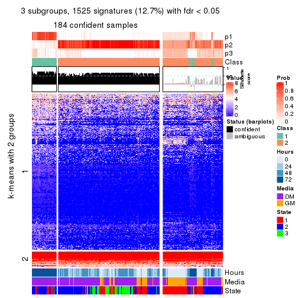</p>

</div>
<div id='tab-ATC-hclust-get-signatures-no-scale-3'>
<pre><code class="r">get_signatures(res, k = 4, scale_rows = FALSE)
</code></pre>

<p></p>

</div>
<div id='tab-ATC-hclust-get-signatures-no-scale-4'>
<pre><code class="r">get_signatures(res, k = 5, scale_rows = FALSE)
</code></pre>

<p></p>

</div>
<div id='tab-ATC-hclust-get-signatures-no-scale-5'>
<pre><code class="r">get_signatures(res, k = 6, scale_rows = FALSE)
</code></pre>

<p></p>

</div>
</div>


Compare the overlap of signatures from different k:

```r
compare_signatures(res)
```


`get_signature()` returns a data frame invisibly. TO get the list of signatures, the function
call should be assigned to a variable explicitly. In following code, if `plot` argument is set
to `FALSE`, no heatmap is plotted while only the differential analysis is performed.

```r
# code only for demonstration
tb = get_signature(res, k = ..., plot = FALSE)
```

An example of the output of `tb` is:

```
#>   which_row         fdr    mean_1    mean_2 scaled_mean_1 scaled_mean_2 km
#> 1        38 0.042760348  8.373488  9.131774    -0.5533452     0.5164555  1
#> 2        40 0.018707592  7.106213  8.469186    -0.6173731     0.5762149  1
#> 3        55 0.019134737 10.221463 11.207825    -0.6159697     0.5749050  1
#> 4        59 0.006059896  5.921854  7.869574    -0.6899429     0.6439467  1
#> 5        60 0.018055526  8.928898 10.211722    -0.6204761     0.5791110  1
#> 6        98 0.009384629 15.714769 14.887706     0.6635654    -0.6193277  2
...
```

The columns in `tb` are:

1. `which_row`: row indices corresponding to the input matrix.
2. `fdr`: FDR for the differential test. 
3. `mean_x`: The mean value in group x.
4. `scaled_mean_x`: The mean value in group x after rows are scaled.
5. `km`: Row groups if k-means clustering is applied to rows.


UMAP plot which shows how samples are separated.


<script>
$( function() {
	$( '#tabs-ATC-hclust-dimension-reduction' ).tabs();
} );
</script>
<div id='tabs-ATC-hclust-dimension-reduction'>
<ul>
<li><a href='#tab-ATC-hclust-dimension-reduction-1'>k = 2</a></li>
<li><a href='#tab-ATC-hclust-dimension-reduction-2'>k = 3</a></li>
<li><a href='#tab-ATC-hclust-dimension-reduction-3'>k = 4</a></li>
<li><a href='#tab-ATC-hclust-dimension-reduction-4'>k = 5</a></li>
<li><a href='#tab-ATC-hclust-dimension-reduction-5'>k = 6</a></li>
</ul>
<div id='tab-ATC-hclust-dimension-reduction-1'>
<pre><code class="r">dimension_reduction(res, k = 2, method = &quot;UMAP&quot;)
</code></pre>

<p></p>

</div>
<div id='tab-ATC-hclust-dimension-reduction-2'>
<pre><code class="r">dimension_reduction(res, k = 3, method = &quot;UMAP&quot;)
</code></pre>

<p></p>

</div>
<div id='tab-ATC-hclust-dimension-reduction-3'>
<pre><code class="r">dimension_reduction(res, k = 4, method = &quot;UMAP&quot;)
</code></pre>

<p></p>

</div>
<div id='tab-ATC-hclust-dimension-reduction-4'>
<pre><code class="r">dimension_reduction(res, k = 5, method = &quot;UMAP&quot;)
</code></pre>

<p></p>

</div>
<div id='tab-ATC-hclust-dimension-reduction-5'>
<pre><code class="r">dimension_reduction(res, k = 6, method = &quot;UMAP&quot;)
</code></pre>

<p></p>

</div>
</div>


Following heatmap shows how subgroups are split when increasing `k`:

```r
collect_classes(res)
```


Test correlation between subgroups and known annotations. If the known
annotation is numeric, one-way ANOVA test is applied, and if the known
annotation is discrete, chi-squared contingency table test is applied.

```r
test_to_known_factors(res)
```

```
#>              n Hours(p) Media(p) State(p) k
#> ATC:hclust 231 5.61e-47 2.26e-03 3.96e-02 2
#> ATC:hclust 184 1.21e-39 1.00e-02 4.36e-03 3
#> ATC:hclust 210 1.67e-52 5.36e-16 1.11e-19 4
#> ATC:hclust 201 8.85e-44 1.37e-12 1.67e-17 5
#> ATC:hclust 198 1.24e-48 8.37e-14 2.66e-19 6
```


If matrix rows can be associated to genes, consider to use `GO_Enrichment(res,
...)` to perform function enrichment for the signature genes.


 

---------------------------------------------------


### ATC:kmeans


The object with results only for a single top-value method and a single partition method 
can be extracted as:

```r
res = res_list["ATC", "kmeans"]
# you can also extract it by
# res = res_list["ATC:kmeans"]
```

A summary of `res` and all the functions that can be applied to it:

```r
res
```

```
#> A 'ConsensusPartition' object with k = 2, 3, 4, 5, 6.
#>   On a matrix with 12016 rows and 271 columns.
#>   Top rows (1000, 2000, 3000, 4000, 5000) are extracted by 'ATC' method.
#>   Subgroups are detected by 'kmeans' method.
#>   Performed in total 1250 partitions by row resampling.
#>   Best k for subgroups seems to be 4.
#> 
#> Following methods can be applied to this 'ConsensusPartition' object:
#>  [1] "cola_report"             "collect_classes"         "collect_plots"          
#>  [4] "collect_stats"           "colnames"                "compare_signatures"     
#>  [7] "consensus_heatmap"       "dimension_reduction"     "functional_enrichment"  
#> [10] "get_anno_col"            "get_anno"                "get_classes"            
#> [13] "get_consensus"           "get_matrix"              "get_membership"         
#> [16] "get_param"               "get_signatures"          "get_stats"              
#> [19] "is_best_k"               "is_stable_k"             "membership_heatmap"     
#> [22] "ncol"                    "nrow"                    "plot_ecdf"              
#> [25] "rownames"                "select_partition_number" "show"                   
#> [28] "suggest_best_k"          "test_to_known_factors"
```

`collect_plots()` function collects all the plots made from `res` for all `k` (number of partitions)
into one single page to provide an easy and fast comparison between different `k`.

```r
collect_plots(res)
```


The plots are:

- The first row: a plot of the ECDF (Empirical cumulative distribution
  function) curves of the consensus matrix for each `k` and the heatmap of
  predicted classes for each `k`.
- The second row: heatmaps of the consensus matrix for each `k`.
- The third row: heatmaps of the membership matrix for each `k`.
- The fouth row: heatmaps of the signatures for each `k`.

All the plots in panels can be made by individual functions and they are
plotted later in this section.

`select_partition_number()` produces several plots showing different
statistics for choosing "optimized" `k`. There are following statistics:

- ECDF curves of the consensus matrix for each `k`;
- 1-PAC. [The PAC
  score](https://en.wikipedia.org/wiki/Consensus_clustering#Over-interpretation_potential_of_consensus_clustering)
  measures the proportion of the ambiguous subgrouping.
- Mean silhouette score.
- Concordance. The mean probability of fiting the consensus class ids in all
  partitions.
- Area increased. Denote $A_k$ as the area under the ECDF curve for current
  `k`, the area increased is defined as $A_k - A_{k-1}$.
- Rand index. The percent of pairs of samples that are both in a same cluster
  or both are not in a same cluster in the partition of k and k-1.
- Jaccard index. The ratio of pairs of samples are both in a same cluster in
  the partition of k and k-1 and the pairs of samples are both in a same
  cluster in the partition k or k-1.

The detailed explanations of these statistics can be found in [the cola
vignette](http://bioconductor.org/packages/devel/bioc/vignettes/cola/inst/doc/cola.html#toc_13).

Generally speaking, lower PAC score, higher mean silhouette score or higher
concordance corresponds to better partition. Rand index and Jaccard index
measure how similar the current partition is compared to partition with `k-1`.
If they are too similar, we won't accept `k` is better than `k-1`.

```r
select_partition_number(res)
```


The numeric values for all these statistics can be obtained by `get_stats()`.

```r
get_stats(res)
```

```
#>   k 1-PAC mean_silhouette concordance area_increased  Rand Jaccard
#> 2 2 0.298           0.761       0.787         0.3973 0.539   0.539
#> 3 3 0.512           0.807       0.841         0.5163 0.797   0.633
#> 4 4 0.862           0.916       0.929         0.1697 0.889   0.710
#> 5 5 0.798           0.732       0.844         0.0787 0.965   0.878
#> 6 6 0.788           0.768       0.821         0.0527 0.902   0.635
```

`suggest_best_k()` suggests the best $k$ based on these statistics. The rules are as follows:

- All $k$ with Jaccard index larger than 0.95 are removed because the increase of
  the partition number does not provides enough extra information. If all $k$ are removed,
  the best $k$ is assigned by `NA`.
- For $k$ with 1-PAC larger than 0.9, the maximal $k$ is taken as the "best k". Other $k$ is called "optional k".
- If it does not fit the second rule. The $k$ with the highest vote of highest
  1-PAC, mean silhouette and concordance is taken as the "best k".

```r
suggest_best_k(res)
```

```
#> [1] 4
```


Following shows the table of the partitions (You need to click the **show/hide
code output** link to see it). The membership matrix (columns with name `p*`)
is inferred by
[`clue::cl_consensus()`](https://www.rdocumentation.org/link/cl_consensus?package=clue)
function with the `SE` method. Basically the value in the membership matrix
represents the probability to belong to a certain group. The finall class
label for an item is determined with the group with highest probability it
belongs to.

In `get_classes()` function, the entropy is calculated from the membership
matrix and the silhouette score is calculated from the consensus matrix.


<script>
$( function() {
	$( '#tabs-ATC-kmeans-get-classes' ).tabs();
} );
</script>
<div id='tabs-ATC-kmeans-get-classes'>
<ul>
<li><a href='#tab-ATC-kmeans-get-classes-1'>k = 2</a></li>
<li><a href='#tab-ATC-kmeans-get-classes-2'>k = 3</a></li>
<li><a href='#tab-ATC-kmeans-get-classes-3'>k = 4</a></li>
<li><a href='#tab-ATC-kmeans-get-classes-4'>k = 5</a></li>
<li><a href='#tab-ATC-kmeans-get-classes-5'>k = 6</a></li>
</ul>

<div id='tab-ATC-kmeans-get-classes-1'>
<p><a id='tab-ATC-kmeans-get-classes-1-a' style='color:#0366d6' href='#'>show/hide code output</a></p>
<pre><code class="r">cbind(get_classes(res, k = 2), get_membership(res, k = 2))
</code></pre>

<pre><code>#&gt;            class entropy silhouette    p1    p2
#&gt; T0_CT_A01      2  0.8443      0.676 0.272 0.728
#&gt; T0_CT_A03      2  0.8909      0.668 0.308 0.692
#&gt; T0_CT_A05      2  0.8909      0.668 0.308 0.692
#&gt; T0_CT_A06      2  0.8909      0.668 0.308 0.692
#&gt; T0_CT_A07      2  0.8909      0.668 0.308 0.692
#&gt; T0_CT_A08      1  0.9866      0.900 0.568 0.432
#&gt; T0_CT_A10      2  0.8909      0.668 0.308 0.692
#&gt; T0_CT_A11      2  0.4562      0.705 0.096 0.904
#&gt; T0_CT_B01      2  0.3584      0.742 0.068 0.932
#&gt; T0_CT_B03      2  0.8909      0.668 0.308 0.692
#&gt; T0_CT_B05      2  0.3431      0.744 0.064 0.936
#&gt; T0_CT_B07      2  0.3584      0.745 0.068 0.932
#&gt; T0_CT_B08      2  0.8909      0.668 0.308 0.692
#&gt; T0_CT_B09      2  0.8909      0.668 0.308 0.692
#&gt; T0_CT_C02      2  0.8909      0.668 0.308 0.692
#&gt; T0_CT_C03      1  0.9866      0.900 0.568 0.432
#&gt; T0_CT_C05      2  0.0000      0.787 0.000 1.000
#&gt; T0_CT_C06      2  0.3114      0.750 0.056 0.944
#&gt; T0_CT_C07      2  0.7815      0.701 0.232 0.768
#&gt; T0_CT_C08      2  0.8909      0.668 0.308 0.692
#&gt; T0_CT_C09      2  0.3114      0.753 0.056 0.944
#&gt; T0_CT_C11      2  0.0000      0.787 0.000 1.000
#&gt; T0_CT_C12      2  0.8909      0.668 0.308 0.692
#&gt; T0_CT_D01      2  0.8267      0.678 0.260 0.740
#&gt; T0_CT_D02      2  0.5178      0.741 0.116 0.884
#&gt; T0_CT_D03      2  0.8909      0.668 0.308 0.692
#&gt; T0_CT_D05      2  0.3114      0.750 0.056 0.944
#&gt; T0_CT_D06      2  0.8909      0.668 0.308 0.692
#&gt; T0_CT_D07      2  0.8861      0.670 0.304 0.696
#&gt; T0_CT_D08      2  0.8909      0.668 0.308 0.692
#&gt; T0_CT_D09      2  0.0000      0.787 0.000 1.000
#&gt; T0_CT_D11      2  0.0000      0.787 0.000 1.000
#&gt; T0_CT_D12      2  0.8909      0.668 0.308 0.692
#&gt; T0_CT_E01      2  0.8909      0.668 0.308 0.692
#&gt; T0_CT_E03      2  0.8909      0.668 0.308 0.692
#&gt; T0_CT_E04      2  0.0672      0.785 0.008 0.992
#&gt; T0_CT_E05      1  0.9933      0.889 0.548 0.452
#&gt; T0_CT_E06      2  0.8909      0.668 0.308 0.692
#&gt; T0_CT_E07      2  0.8909      0.668 0.308 0.692
#&gt; T0_CT_E08      2  0.8909      0.668 0.308 0.692
#&gt; T0_CT_E09      2  0.8909      0.668 0.308 0.692
#&gt; T0_CT_E10      2  0.3584      0.742 0.068 0.932
#&gt; T0_CT_E11      2  0.8909      0.668 0.308 0.692
#&gt; T0_CT_E12      2  0.8861      0.669 0.304 0.696
#&gt; T0_CT_F01      2  0.8909      0.668 0.308 0.692
#&gt; T0_CT_F02      2  0.8909      0.668 0.308 0.692
#&gt; T0_CT_F03      2  0.8909      0.668 0.308 0.692
#&gt; T0_CT_F04      2  0.8909      0.668 0.308 0.692
#&gt; T0_CT_F05      2  0.8713      0.672 0.292 0.708
#&gt; T0_CT_F06      2  0.8909      0.668 0.308 0.692
#&gt; T0_CT_F07      2  0.3431      0.744 0.064 0.936
#&gt; T0_CT_F09      2  0.0000      0.787 0.000 1.000
#&gt; T0_CT_F11      2  0.8813      0.669 0.300 0.700
#&gt; T0_CT_F12      2  0.8909      0.668 0.308 0.692
#&gt; T0_CT_G01      2  0.8909      0.668 0.308 0.692
#&gt; T0_CT_G02      2  0.3584      0.742 0.068 0.932
#&gt; T0_CT_G03      2  0.8909      0.668 0.308 0.692
#&gt; T0_CT_G04      2  0.8909      0.668 0.308 0.692
#&gt; T0_CT_G07      2  0.8909      0.668 0.308 0.692
#&gt; T0_CT_G08      2  0.8909      0.668 0.308 0.692
#&gt; T0_CT_G09      1  0.9944      0.887 0.544 0.456
#&gt; T0_CT_G11      2  0.3584      0.742 0.068 0.932
#&gt; T0_CT_H01      2  0.2778      0.754 0.048 0.952
#&gt; T0_CT_H02      2  0.2423      0.781 0.040 0.960
#&gt; T0_CT_H04      2  0.8909      0.668 0.308 0.692
#&gt; T0_CT_H05      2  0.3584      0.742 0.068 0.932
#&gt; T0_CT_H08      2  0.3431      0.744 0.064 0.936
#&gt; T0_CT_H09      2  0.3114      0.750 0.056 0.944
#&gt; T0_CT_H12      2  0.3584      0.742 0.068 0.932
#&gt; T24_CT_A01     1  0.9866      0.900 0.568 0.432
#&gt; T24_CT_A03     2  0.0000      0.787 0.000 1.000
#&gt; T24_CT_A04     2  0.0000      0.787 0.000 1.000
#&gt; T24_CT_A05     2  0.9815      0.510 0.420 0.580
#&gt; T24_CT_A07     2  0.0376      0.786 0.004 0.996
#&gt; T24_CT_A08     1  0.9866      0.900 0.568 0.432
#&gt; T24_CT_A09     1  0.9866      0.900 0.568 0.432
#&gt; T24_CT_A10     1  0.9933      0.889 0.548 0.452
#&gt; T24_CT_B01     1  0.9866      0.900 0.568 0.432
#&gt; T24_CT_B02     1  0.9866      0.900 0.568 0.432
#&gt; T24_CT_B03     2  0.0376      0.786 0.004 0.996
#&gt; T24_CT_B05     2  0.0376      0.786 0.004 0.996
#&gt; T24_CT_B06     2  0.0376      0.786 0.004 0.996
#&gt; T24_CT_B07     1  0.9866      0.900 0.568 0.432
#&gt; T24_CT_B08     2  0.0376      0.786 0.004 0.996
#&gt; T24_CT_B09     1  0.9866      0.900 0.568 0.432
#&gt; T24_CT_B11     2  0.8909      0.668 0.308 0.692
#&gt; T24_CT_C01     1  0.9866      0.900 0.568 0.432
#&gt; T24_CT_C02     2  0.0376      0.786 0.004 0.996
#&gt; T24_CT_C03     1  0.9866      0.900 0.568 0.432
#&gt; T24_CT_C05     2  0.0376      0.786 0.004 0.996
#&gt; T24_CT_C07     2  0.0376      0.786 0.004 0.996
#&gt; T24_CT_C08     2  0.0000      0.787 0.000 1.000
#&gt; T24_CT_C09     2  0.0376      0.786 0.004 0.996
#&gt; T24_CT_C10     1  0.9866      0.900 0.568 0.432
#&gt; T24_CT_C11     1  0.9993      0.849 0.516 0.484
#&gt; T24_CT_C12     2  0.0376      0.786 0.004 0.996
#&gt; T24_CT_D01     2  0.0376      0.786 0.004 0.996
#&gt; T24_CT_D02     2  0.0000      0.787 0.000 1.000
#&gt; T24_CT_D03     2  0.0000      0.787 0.000 1.000
#&gt; T24_CT_D04     1  0.9866      0.900 0.568 0.432
#&gt; T24_CT_D05     1  0.9881      0.898 0.564 0.436
#&gt; T24_CT_D06     1  0.9866      0.900 0.568 0.432
#&gt; T24_CT_D07     2  0.9970     -0.752 0.468 0.532
#&gt; T24_CT_D08     2  0.0376      0.786 0.004 0.996
#&gt; T24_CT_D09     2  0.0000      0.787 0.000 1.000
#&gt; T24_CT_D10     2  0.0000      0.787 0.000 1.000
#&gt; T24_CT_D11     2  0.0376      0.786 0.004 0.996
#&gt; T24_CT_E01     1  0.9944      0.887 0.544 0.456
#&gt; T24_CT_E02     1  0.9866      0.900 0.568 0.432
#&gt; T24_CT_E04     2  0.0376      0.786 0.004 0.996
#&gt; T24_CT_E05     1  0.9866      0.900 0.568 0.432
#&gt; T24_CT_E07     2  0.4815      0.616 0.104 0.896
#&gt; T24_CT_E09     1  0.9866      0.900 0.568 0.432
#&gt; T24_CT_E11     1  0.9866      0.900 0.568 0.432
#&gt; T24_CT_E12     2  0.0376      0.786 0.004 0.996
#&gt; T24_CT_F01     2  0.0376      0.786 0.004 0.996
#&gt; T24_CT_F02     2  0.0000      0.787 0.000 1.000
#&gt; T24_CT_F03     1  0.9944      0.887 0.544 0.456
#&gt; T24_CT_F04     1  0.9944      0.887 0.544 0.456
#&gt; T24_CT_F05     1  0.9944      0.887 0.544 0.456
#&gt; T24_CT_F07     1  0.9933      0.889 0.548 0.452
#&gt; T24_CT_F08     1  0.9866      0.900 0.568 0.432
#&gt; T24_CT_F09     2  0.0000      0.787 0.000 1.000
#&gt; T24_CT_F10     2  0.1843      0.758 0.028 0.972
#&gt; T24_CT_F11     1  0.9944      0.887 0.544 0.456
#&gt; T24_CT_F12     2  0.7602      0.697 0.220 0.780
#&gt; T24_CT_G01     2  0.0000      0.787 0.000 1.000
#&gt; T24_CT_G02     1  0.9866      0.900 0.568 0.432
#&gt; T24_CT_G03     1  0.9866      0.900 0.568 0.432
#&gt; T24_CT_G04     2  0.0376      0.786 0.004 0.996
#&gt; T24_CT_G05     2  0.0376      0.786 0.004 0.996
#&gt; T24_CT_G06     1  0.9866      0.900 0.568 0.432
#&gt; T24_CT_G08     1  0.9866      0.900 0.568 0.432
#&gt; T24_CT_G10     2  0.0376      0.786 0.004 0.996
#&gt; T24_CT_G11     1  0.9866      0.900 0.568 0.432
#&gt; T24_CT_G12     1  0.9866      0.900 0.568 0.432
#&gt; T24_CT_H01     2  0.8909      0.668 0.308 0.692
#&gt; T24_CT_H02     1  0.9866      0.900 0.568 0.432
#&gt; T24_CT_H03     2  0.0376      0.786 0.004 0.996
#&gt; T24_CT_H05     1  0.9881      0.898 0.564 0.436
#&gt; T24_CT_H07     1  0.9866      0.900 0.568 0.432
#&gt; T24_CT_H09     1  0.9866      0.900 0.568 0.432
#&gt; T24_CT_H12     1  0.9866      0.900 0.568 0.432
#&gt; T48_CT_A01     2  0.0000      0.787 0.000 1.000
#&gt; T48_CT_A02     2  0.0376      0.786 0.004 0.996
#&gt; T48_CT_A03     1  0.9866      0.900 0.568 0.432
#&gt; T48_CT_A04     2  0.0376      0.786 0.004 0.996
#&gt; T48_CT_A05     2  0.3114      0.715 0.056 0.944
#&gt; T48_CT_A06     1  0.9866      0.900 0.568 0.432
#&gt; T48_CT_A07     2  0.8386      0.676 0.268 0.732
#&gt; T48_CT_A08     2  0.0376      0.786 0.004 0.996
#&gt; T48_CT_A09     1  0.9944      0.887 0.544 0.456
#&gt; T48_CT_A10     2  0.0376      0.786 0.004 0.996
#&gt; T48_CT_A11     2  0.0376      0.786 0.004 0.996
#&gt; T48_CT_A12     1  0.9944      0.887 0.544 0.456
#&gt; T48_CT_B01     2  0.0376      0.786 0.004 0.996
#&gt; T48_CT_B02     2  0.0376      0.786 0.004 0.996
#&gt; T48_CT_B03     1  0.9866      0.900 0.568 0.432
#&gt; T48_CT_B04     1  0.9866      0.900 0.568 0.432
#&gt; T48_CT_B06     2  0.0376      0.786 0.004 0.996
#&gt; T48_CT_B08     1  0.9866      0.900 0.568 0.432
#&gt; T48_CT_B10     2  0.0376      0.786 0.004 0.996
#&gt; T48_CT_B11     2  0.0376      0.786 0.004 0.996
#&gt; T48_CT_B12     1  1.0000      0.835 0.504 0.496
#&gt; T48_CT_C01     2  0.0376      0.786 0.004 0.996
#&gt; T48_CT_C02     1  0.9866      0.900 0.568 0.432
#&gt; T48_CT_C03     2  0.0376      0.786 0.004 0.996
#&gt; T48_CT_C04     1  0.9866      0.900 0.568 0.432
#&gt; T48_CT_C05     2  0.0376      0.786 0.004 0.996
#&gt; T48_CT_C06     2  0.0376      0.786 0.004 0.996
#&gt; T48_CT_C07     1  0.9944      0.887 0.544 0.456
#&gt; T48_CT_C09     2  0.1184      0.784 0.016 0.984
#&gt; T48_CT_C10     1  0.9866      0.900 0.568 0.432
#&gt; T48_CT_C11     2  0.0376      0.786 0.004 0.996
#&gt; T48_CT_D01     2  0.0938      0.778 0.012 0.988
#&gt; T48_CT_D02     1  0.9944      0.887 0.544 0.456
#&gt; T48_CT_D03     1  0.9866      0.900 0.568 0.432
#&gt; T48_CT_D04     2  0.0376      0.786 0.004 0.996
#&gt; T48_CT_D06     2  0.0000      0.787 0.000 1.000
#&gt; T48_CT_D07     2  0.0376      0.786 0.004 0.996
#&gt; T48_CT_D08     1  0.9866      0.900 0.568 0.432
#&gt; T48_CT_D09     2  0.0376      0.786 0.004 0.996
#&gt; T48_CT_D10     1  0.9998      0.841 0.508 0.492
#&gt; T48_CT_D11     2  0.0938      0.785 0.012 0.988
#&gt; T48_CT_D12     1  0.9866      0.900 0.568 0.432
#&gt; T48_CT_E01     2  0.3879      0.677 0.076 0.924
#&gt; T48_CT_E02     1  0.9944      0.887 0.544 0.456
#&gt; T48_CT_E03     2  0.0376      0.786 0.004 0.996
#&gt; T48_CT_E04     1  1.0000      0.835 0.504 0.496
#&gt; T48_CT_E05     2  0.0376      0.786 0.004 0.996
#&gt; T48_CT_E06     1  0.9866      0.900 0.568 0.432
#&gt; T48_CT_E07     1  0.9866      0.900 0.568 0.432
#&gt; T48_CT_E08     2  0.0376      0.786 0.004 0.996
#&gt; T48_CT_E10     1  0.9866      0.900 0.568 0.432
#&gt; T48_CT_E11     1  0.9866      0.900 0.568 0.432
#&gt; T48_CT_E12     2  0.8327      0.677 0.264 0.736
#&gt; T48_CT_F01     2  0.0376      0.786 0.004 0.996
#&gt; T48_CT_F02     1  0.9944      0.887 0.544 0.456
#&gt; T48_CT_F03     1  0.9881      0.898 0.564 0.436
#&gt; T48_CT_F05     2  0.0376      0.786 0.004 0.996
#&gt; T48_CT_F07     1  0.9866      0.900 0.568 0.432
#&gt; T48_CT_F09     2  0.0376      0.786 0.004 0.996
#&gt; T48_CT_F10     1  0.9933      0.889 0.548 0.452
#&gt; T48_CT_F11     1  0.9866      0.900 0.568 0.432
#&gt; T48_CT_G01     1  0.9866      0.900 0.568 0.432
#&gt; T48_CT_G02     2  0.0000      0.787 0.000 1.000
#&gt; T48_CT_G03     2  0.0376      0.786 0.004 0.996
#&gt; T48_CT_G07     2  0.0376      0.786 0.004 0.996
#&gt; T48_CT_G08     2  0.0376      0.786 0.004 0.996
#&gt; T48_CT_G09     2  0.0376      0.786 0.004 0.996
#&gt; T48_CT_G10     1  0.7056      0.535 0.808 0.192
#&gt; T48_CT_G11     1  0.9944      0.887 0.544 0.456
#&gt; T48_CT_G12     2  0.0376      0.786 0.004 0.996
#&gt; T48_CT_H01     2  0.0376      0.786 0.004 0.996
#&gt; T48_CT_H02     2  0.5294      0.589 0.120 0.880
#&gt; T48_CT_H04     1  0.9866      0.900 0.568 0.432
#&gt; T48_CT_H05     2  0.0376      0.786 0.004 0.996
#&gt; T48_CT_H06     2  0.0376      0.786 0.004 0.996
#&gt; T48_CT_H07     1  0.9996      0.847 0.512 0.488
#&gt; T48_CT_H08     2  0.0000      0.787 0.000 1.000
#&gt; T48_CT_H11     1  0.9963      0.878 0.536 0.464
#&gt; T48_CT_H12     2  0.0376      0.786 0.004 0.996
#&gt; T72_CT_A01     2  0.7139      0.623 0.196 0.804
#&gt; T72_CT_A05     2  0.7299      0.614 0.204 0.796
#&gt; T72_CT_A08     1  0.8207      0.720 0.744 0.256
#&gt; T72_CT_A09     2  0.7299      0.614 0.204 0.796
#&gt; T72_CT_A11     2  0.7299      0.614 0.204 0.796
#&gt; T72_CT_B01     2  0.6148      0.670 0.152 0.848
#&gt; T72_CT_B02     1  0.7815      0.718 0.768 0.232
#&gt; T72_CT_B03     1  0.8327      0.711 0.736 0.264
#&gt; T72_CT_B04     1  0.7815      0.718 0.768 0.232
#&gt; T72_CT_B05     1  0.9170      0.657 0.668 0.332
#&gt; T72_CT_B06     1  0.7950      0.718 0.760 0.240
#&gt; T72_CT_B08     2  0.9866      0.513 0.432 0.568
#&gt; T72_CT_B09     1  0.9323      0.828 0.652 0.348
#&gt; T72_CT_B11     1  0.8327      0.711 0.736 0.264
#&gt; T72_CT_B12     2  0.7299      0.614 0.204 0.796
#&gt; T72_CT_C04     2  0.0938      0.785 0.012 0.988
#&gt; T72_CT_C06     1  0.8713      0.689 0.708 0.292
#&gt; T72_CT_C07     2  0.1184      0.784 0.016 0.984
#&gt; T72_CT_C09     1  0.8713      0.689 0.708 0.292
#&gt; T72_CT_C11     2  0.9866      0.513 0.432 0.568
#&gt; T72_CT_D01     2  0.7299      0.614 0.204 0.796
#&gt; T72_CT_D03     1  0.8713      0.689 0.708 0.292
#&gt; T72_CT_D04     2  0.7299      0.614 0.204 0.796
#&gt; T72_CT_D05     1  0.8327      0.711 0.736 0.264
#&gt; T72_CT_D07     1  0.8327      0.711 0.736 0.264
#&gt; T72_CT_D10     1  0.8713      0.689 0.708 0.292
#&gt; T72_CT_D11     1  0.7815      0.718 0.768 0.232
#&gt; T72_CT_E04     1  0.8207      0.715 0.744 0.256
#&gt; T72_CT_E05     2  0.7299      0.614 0.204 0.796
#&gt; T72_CT_E07     2  0.7376      0.612 0.208 0.792
#&gt; T72_CT_F01     2  0.7376      0.612 0.208 0.792
#&gt; T72_CT_F05     2  0.7299      0.614 0.204 0.796
#&gt; T72_CT_F07     1  0.8327      0.711 0.736 0.264
#&gt; T72_CT_F10     2  0.7299      0.614 0.204 0.796
#&gt; T72_CT_F11     2  0.8499      0.596 0.276 0.724
#&gt; T72_CT_G03     1  0.7883      0.725 0.764 0.236
#&gt; T72_CT_G04     1  0.7950      0.728 0.760 0.240
#&gt; T72_CT_G06     2  0.6531      0.653 0.168 0.832
#&gt; T72_CT_G08     2  0.7299      0.617 0.204 0.796
#&gt; T72_CT_G10     2  0.7376      0.612 0.208 0.792
#&gt; T72_CT_G11     1  0.9944      0.887 0.544 0.456
#&gt; T72_CT_H01     2  0.0938      0.785 0.012 0.988
#&gt; T72_CT_H03     2  0.7299      0.614 0.204 0.796
#&gt; T72_CT_H05     2  0.9944      0.506 0.456 0.544
#&gt; T72_CT_H08     2  0.9909      0.510 0.444 0.556
#&gt; T72_CT_H09     2  1.0000      0.492 0.496 0.504
#&gt; T72_CT_H10     1  0.8608      0.696 0.716 0.284
#&gt; T72_CT_H11     1  0.8661      0.693 0.712 0.288
#&gt; T72_CT_H12     2  0.7299      0.614 0.204 0.796
</code></pre>

<script>
$('#tab-ATC-kmeans-get-classes-1-a').parent().next().next().hide();
$('#tab-ATC-kmeans-get-classes-1-a').click(function(){
  $('#tab-ATC-kmeans-get-classes-1-a').parent().next().next().toggle();
  return(false);
});
</script>
</div>

<div id='tab-ATC-kmeans-get-classes-2'>
<p><a id='tab-ATC-kmeans-get-classes-2-a' style='color:#0366d6' href='#'>show/hide code output</a></p>
<pre><code class="r">cbind(get_classes(res, k = 3), get_membership(res, k = 3))
</code></pre>

<pre><code>#&gt;            class entropy silhouette    p1    p2    p3
#&gt; T0_CT_A01      3   0.200      0.911 0.036 0.012 0.952
#&gt; T0_CT_A03      3   0.200      0.911 0.036 0.012 0.952
#&gt; T0_CT_A05      3   0.200      0.911 0.036 0.012 0.952
#&gt; T0_CT_A06      3   0.357      0.851 0.040 0.060 0.900
#&gt; T0_CT_A07      3   0.200      0.911 0.036 0.012 0.952
#&gt; T0_CT_A08      1   0.141      0.897 0.964 0.000 0.036
#&gt; T0_CT_A10      3   0.200      0.911 0.036 0.012 0.952
#&gt; T0_CT_A11      2   0.957      0.433 0.392 0.412 0.196
#&gt; T0_CT_B01      2   0.843      0.846 0.136 0.604 0.260
#&gt; T0_CT_B03      3   0.200      0.911 0.036 0.012 0.952
#&gt; T0_CT_B05      2   0.934      0.702 0.188 0.496 0.316
#&gt; T0_CT_B07      3   0.885     -0.322 0.128 0.356 0.516
#&gt; T0_CT_B08      3   0.200      0.911 0.036 0.012 0.952
#&gt; T0_CT_B09      3   0.200      0.911 0.036 0.012 0.952
#&gt; T0_CT_C02      3   0.200      0.911 0.036 0.012 0.952
#&gt; T0_CT_C03      1   0.141      0.897 0.964 0.000 0.036
#&gt; T0_CT_C05      2   0.798      0.876 0.108 0.636 0.256
#&gt; T0_CT_C06      2   0.840      0.850 0.136 0.608 0.256
#&gt; T0_CT_C07      3   0.390      0.835 0.060 0.052 0.888
#&gt; T0_CT_C08      3   0.200      0.911 0.036 0.012 0.952
#&gt; T0_CT_C09      2   0.808      0.868 0.108 0.624 0.268
#&gt; T0_CT_C11      2   0.798      0.876 0.108 0.636 0.256
#&gt; T0_CT_C12      3   0.200      0.911 0.036 0.012 0.952
#&gt; T0_CT_D01      3   0.619      0.331 0.016 0.292 0.692
#&gt; T0_CT_D02      3   0.559      0.691 0.124 0.068 0.808
#&gt; T0_CT_D03      3   0.200      0.911 0.036 0.012 0.952
#&gt; T0_CT_D05      2   0.834      0.853 0.132 0.612 0.256
#&gt; T0_CT_D06      3   0.200      0.911 0.036 0.012 0.952
#&gt; T0_CT_D07      3   0.359      0.852 0.048 0.052 0.900
#&gt; T0_CT_D08      3   0.200      0.911 0.036 0.012 0.952
#&gt; T0_CT_D09      2   0.798      0.876 0.108 0.636 0.256
#&gt; T0_CT_D11      2   0.798      0.876 0.108 0.636 0.256
#&gt; T0_CT_D12      3   0.200      0.911 0.036 0.012 0.952
#&gt; T0_CT_E01      3   0.200      0.911 0.036 0.012 0.952
#&gt; T0_CT_E03      3   0.200      0.911 0.036 0.012 0.952
#&gt; T0_CT_E04      2   0.798      0.876 0.108 0.636 0.256
#&gt; T0_CT_E05      1   0.129      0.890 0.968 0.032 0.000
#&gt; T0_CT_E06      3   0.200      0.911 0.036 0.012 0.952
#&gt; T0_CT_E07      3   0.200      0.911 0.036 0.012 0.952
#&gt; T0_CT_E08      3   0.200      0.911 0.036 0.012 0.952
#&gt; T0_CT_E09      3   0.200      0.911 0.036 0.012 0.952
#&gt; T0_CT_E10      2   0.859      0.819 0.128 0.572 0.300
#&gt; T0_CT_E11      3   0.200      0.911 0.036 0.012 0.952
#&gt; T0_CT_E12      3   0.200      0.911 0.036 0.012 0.952
#&gt; T0_CT_F01      3   0.200      0.911 0.036 0.012 0.952
#&gt; T0_CT_F02      3   0.200      0.911 0.036 0.012 0.952
#&gt; T0_CT_F03      3   0.200      0.911 0.036 0.012 0.952
#&gt; T0_CT_F04      3   0.200      0.911 0.036 0.012 0.952
#&gt; T0_CT_F05      3   0.622      0.492 0.032 0.240 0.728
#&gt; T0_CT_F06      3   0.200      0.911 0.036 0.012 0.952
#&gt; T0_CT_F07      2   0.854      0.812 0.128 0.580 0.292
#&gt; T0_CT_F09      2   0.798      0.876 0.108 0.636 0.256
#&gt; T0_CT_F11      3   0.200      0.911 0.036 0.012 0.952
#&gt; T0_CT_F12      3   0.200      0.911 0.036 0.012 0.952
#&gt; T0_CT_G01      3   0.200      0.911 0.036 0.012 0.952
#&gt; T0_CT_G02      2   0.943      0.704 0.212 0.496 0.292
#&gt; T0_CT_G03      3   0.200      0.911 0.036 0.012 0.952
#&gt; T0_CT_G04      3   0.200      0.911 0.036 0.012 0.952
#&gt; T0_CT_G07      3   0.200      0.911 0.036 0.012 0.952
#&gt; T0_CT_G08      3   0.200      0.911 0.036 0.012 0.952
#&gt; T0_CT_G09      1   0.129      0.890 0.968 0.032 0.000
#&gt; T0_CT_G11      2   0.863      0.813 0.136 0.576 0.288
#&gt; T0_CT_H01      2   0.844      0.846 0.144 0.608 0.248
#&gt; T0_CT_H02      2   0.798      0.870 0.104 0.632 0.264
#&gt; T0_CT_H04      3   0.200      0.911 0.036 0.012 0.952
#&gt; T0_CT_H05      2   0.855      0.829 0.136 0.588 0.276
#&gt; T0_CT_H08      2   0.854      0.812 0.128 0.580 0.292
#&gt; T0_CT_H09      2   0.823      0.861 0.124 0.620 0.256
#&gt; T0_CT_H12      2   0.860      0.809 0.132 0.576 0.292
#&gt; T24_CT_A01     1   0.141      0.897 0.964 0.000 0.036
#&gt; T24_CT_A03     2   0.798      0.876 0.108 0.636 0.256
#&gt; T24_CT_A04     2   0.798      0.876 0.108 0.636 0.256
#&gt; T24_CT_A05     3   0.470      0.723 0.180 0.008 0.812
#&gt; T24_CT_A07     2   0.798      0.876 0.108 0.636 0.256
#&gt; T24_CT_A08     1   0.141      0.897 0.964 0.000 0.036
#&gt; T24_CT_A09     1   0.129      0.897 0.968 0.000 0.032
#&gt; T24_CT_A10     1   0.129      0.890 0.968 0.032 0.000
#&gt; T24_CT_B01     1   0.145      0.893 0.968 0.024 0.008
#&gt; T24_CT_B02     1   0.129      0.897 0.968 0.000 0.032
#&gt; T24_CT_B03     2   0.798      0.876 0.108 0.636 0.256
#&gt; T24_CT_B05     2   0.798      0.876 0.108 0.636 0.256
#&gt; T24_CT_B06     2   0.798      0.876 0.108 0.636 0.256
#&gt; T24_CT_B07     1   0.141      0.897 0.964 0.000 0.036
#&gt; T24_CT_B08     2   0.798      0.876 0.108 0.636 0.256
#&gt; T24_CT_B09     1   0.141      0.897 0.964 0.000 0.036
#&gt; T24_CT_B11     3   0.200      0.911 0.036 0.012 0.952
#&gt; T24_CT_C01     1   0.141      0.897 0.964 0.000 0.036
#&gt; T24_CT_C02     2   0.798      0.876 0.108 0.636 0.256
#&gt; T24_CT_C03     1   0.140      0.892 0.968 0.028 0.004
#&gt; T24_CT_C05     2   0.798      0.876 0.108 0.636 0.256
#&gt; T24_CT_C07     2   0.798      0.876 0.108 0.636 0.256
#&gt; T24_CT_C08     2   0.798      0.876 0.108 0.636 0.256
#&gt; T24_CT_C09     2   0.798      0.876 0.108 0.636 0.256
#&gt; T24_CT_C10     1   0.129      0.897 0.968 0.000 0.032
#&gt; T24_CT_C11     2   0.608      0.508 0.388 0.612 0.000
#&gt; T24_CT_C12     2   0.798      0.876 0.108 0.636 0.256
#&gt; T24_CT_D01     2   0.798      0.876 0.108 0.636 0.256
#&gt; T24_CT_D02     2   0.798      0.876 0.108 0.636 0.256
#&gt; T24_CT_D03     2   0.798      0.876 0.108 0.636 0.256
#&gt; T24_CT_D04     1   0.141      0.897 0.964 0.000 0.036
#&gt; T24_CT_D05     1   0.129      0.890 0.968 0.032 0.000
#&gt; T24_CT_D06     1   0.140      0.897 0.968 0.004 0.028
#&gt; T24_CT_D07     1   0.650      0.134 0.596 0.396 0.008
#&gt; T24_CT_D08     2   0.798      0.876 0.108 0.636 0.256
#&gt; T24_CT_D09     2   0.798      0.876 0.108 0.636 0.256
#&gt; T24_CT_D10     2   0.798      0.876 0.108 0.636 0.256
#&gt; T24_CT_D11     2   0.798      0.876 0.108 0.636 0.256
#&gt; T24_CT_E01     1   0.129      0.890 0.968 0.032 0.000
#&gt; T24_CT_E02     1   0.129      0.897 0.968 0.000 0.032
#&gt; T24_CT_E04     2   0.798      0.876 0.108 0.636 0.256
#&gt; T24_CT_E05     1   0.141      0.897 0.964 0.000 0.036
#&gt; T24_CT_E07     2   0.833      0.768 0.208 0.628 0.164
#&gt; T24_CT_E09     1   0.141      0.897 0.964 0.000 0.036
#&gt; T24_CT_E11     1   0.129      0.897 0.968 0.000 0.032
#&gt; T24_CT_E12     2   0.798      0.876 0.108 0.636 0.256
#&gt; T24_CT_F01     2   0.798      0.876 0.108 0.636 0.256
#&gt; T24_CT_F02     2   0.798      0.876 0.108 0.636 0.256
#&gt; T24_CT_F03     1   0.129      0.890 0.968 0.032 0.000
#&gt; T24_CT_F04     1   0.153      0.885 0.960 0.040 0.000
#&gt; T24_CT_F05     1   0.129      0.890 0.968 0.032 0.000
#&gt; T24_CT_F07     1   0.129      0.890 0.968 0.032 0.000
#&gt; T24_CT_F08     1   0.129      0.897 0.968 0.000 0.032
#&gt; T24_CT_F09     2   0.798      0.876 0.108 0.636 0.256
#&gt; T24_CT_F10     2   0.824      0.827 0.160 0.636 0.204
#&gt; T24_CT_F11     1   0.129      0.890 0.968 0.032 0.000
#&gt; T24_CT_F12     2   0.770      0.633 0.048 0.532 0.420
#&gt; T24_CT_G01     2   0.798      0.876 0.108 0.636 0.256
#&gt; T24_CT_G02     1   0.141      0.897 0.964 0.000 0.036
#&gt; T24_CT_G03     1   0.141      0.897 0.964 0.000 0.036
#&gt; T24_CT_G04     2   0.798      0.876 0.108 0.636 0.256
#&gt; T24_CT_G05     2   0.798      0.876 0.108 0.636 0.256
#&gt; T24_CT_G06     1   0.129      0.897 0.968 0.000 0.032
#&gt; T24_CT_G08     1   0.141      0.897 0.964 0.000 0.036
#&gt; T24_CT_G10     2   0.798      0.876 0.108 0.636 0.256
#&gt; T24_CT_G11     1   0.141      0.897 0.964 0.000 0.036
#&gt; T24_CT_G12     1   0.141      0.897 0.964 0.000 0.036
#&gt; T24_CT_H01     3   0.200      0.911 0.036 0.012 0.952
#&gt; T24_CT_H02     1   0.129      0.897 0.968 0.000 0.032
#&gt; T24_CT_H03     2   0.798      0.876 0.108 0.636 0.256
#&gt; T24_CT_H05     1   0.129      0.890 0.968 0.032 0.000
#&gt; T24_CT_H07     1   0.140      0.897 0.968 0.004 0.028
#&gt; T24_CT_H09     1   0.141      0.897 0.964 0.000 0.036
#&gt; T24_CT_H12     1   0.141      0.897 0.964 0.000 0.036
#&gt; T48_CT_A01     2   0.798      0.876 0.108 0.636 0.256
#&gt; T48_CT_A02     2   0.798      0.876 0.108 0.636 0.256
#&gt; T48_CT_A03     1   0.141      0.897 0.964 0.000 0.036
#&gt; T48_CT_A04     2   0.798      0.876 0.108 0.636 0.256
#&gt; T48_CT_A05     2   0.827      0.831 0.156 0.632 0.212
#&gt; T48_CT_A06     1   0.153      0.896 0.960 0.000 0.040
#&gt; T48_CT_A07     3   0.203      0.907 0.032 0.016 0.952
#&gt; T48_CT_A08     2   0.798      0.876 0.108 0.636 0.256
#&gt; T48_CT_A09     1   0.129      0.890 0.968 0.032 0.000
#&gt; T48_CT_A10     2   0.798      0.876 0.108 0.636 0.256
#&gt; T48_CT_A11     2   0.798      0.876 0.108 0.636 0.256
#&gt; T48_CT_A12     1   0.129      0.890 0.968 0.032 0.000
#&gt; T48_CT_B01     2   0.798      0.876 0.108 0.636 0.256
#&gt; T48_CT_B02     2   0.798      0.876 0.108 0.636 0.256
#&gt; T48_CT_B03     1   0.141      0.897 0.964 0.000 0.036
#&gt; T48_CT_B04     1   0.141      0.897 0.964 0.000 0.036
#&gt; T48_CT_B06     2   0.798      0.876 0.108 0.636 0.256
#&gt; T48_CT_B08     1   0.129      0.897 0.968 0.000 0.032
#&gt; T48_CT_B10     2   0.798      0.876 0.108 0.636 0.256
#&gt; T48_CT_B11     2   0.798      0.876 0.108 0.636 0.256
#&gt; T48_CT_B12     1   0.196      0.871 0.944 0.056 0.000
#&gt; T48_CT_C01     2   0.798      0.876 0.108 0.636 0.256
#&gt; T48_CT_C02     1   0.175      0.893 0.952 0.000 0.048
#&gt; T48_CT_C03     2   0.798      0.876 0.108 0.636 0.256
#&gt; T48_CT_C04     1   0.141      0.897 0.964 0.000 0.036
#&gt; T48_CT_C05     2   0.798      0.876 0.108 0.636 0.256
#&gt; T48_CT_C06     2   0.798      0.876 0.108 0.636 0.256
#&gt; T48_CT_C07     1   0.153      0.885 0.960 0.040 0.000
#&gt; T48_CT_C09     2   0.792      0.873 0.104 0.640 0.256
#&gt; T48_CT_C10     1   0.148      0.896 0.968 0.012 0.020
#&gt; T48_CT_C11     2   0.798      0.876 0.108 0.636 0.256
#&gt; T48_CT_D01     2   0.822      0.835 0.152 0.636 0.212
#&gt; T48_CT_D02     1   0.141      0.888 0.964 0.036 0.000
#&gt; T48_CT_D03     1   0.129      0.897 0.968 0.000 0.032
#&gt; T48_CT_D04     2   0.798      0.876 0.108 0.636 0.256
#&gt; T48_CT_D06     2   0.798      0.876 0.108 0.636 0.256
#&gt; T48_CT_D07     2   0.798      0.876 0.108 0.636 0.256
#&gt; T48_CT_D08     1   0.129      0.897 0.968 0.000 0.032
#&gt; T48_CT_D09     2   0.798      0.876 0.108 0.636 0.256
#&gt; T48_CT_D10     1   0.196      0.871 0.944 0.056 0.000
#&gt; T48_CT_D11     2   0.798      0.876 0.108 0.636 0.256
#&gt; T48_CT_D12     1   0.141      0.897 0.964 0.000 0.036
#&gt; T48_CT_E01     2   0.829      0.822 0.164 0.632 0.204
#&gt; T48_CT_E02     1   0.129      0.890 0.968 0.032 0.000
#&gt; T48_CT_E03     2   0.798      0.876 0.108 0.636 0.256
#&gt; T48_CT_E04     1   0.245      0.853 0.924 0.076 0.000
#&gt; T48_CT_E05     2   0.798      0.876 0.108 0.636 0.256
#&gt; T48_CT_E06     1   0.141      0.897 0.964 0.000 0.036
#&gt; T48_CT_E07     1   0.141      0.897 0.964 0.000 0.036
#&gt; T48_CT_E08     2   0.798      0.876 0.108 0.636 0.256
#&gt; T48_CT_E10     1   0.129      0.897 0.968 0.000 0.032
#&gt; T48_CT_E11     1   0.148      0.896 0.968 0.012 0.020
#&gt; T48_CT_E12     3   0.195      0.880 0.008 0.040 0.952
#&gt; T48_CT_F01     2   0.798      0.876 0.108 0.636 0.256
#&gt; T48_CT_F02     1   0.129      0.890 0.968 0.032 0.000
#&gt; T48_CT_F03     1   0.129      0.890 0.968 0.032 0.000
#&gt; T48_CT_F05     2   0.798      0.876 0.108 0.636 0.256
#&gt; T48_CT_F07     1   0.140      0.892 0.968 0.028 0.004
#&gt; T48_CT_F09     2   0.798      0.876 0.108 0.636 0.256
#&gt; T48_CT_F10     1   0.129      0.890 0.968 0.032 0.000
#&gt; T48_CT_F11     1   0.129      0.897 0.968 0.000 0.032
#&gt; T48_CT_G01     1   0.141      0.897 0.964 0.000 0.036
#&gt; T48_CT_G02     2   0.798      0.876 0.108 0.636 0.256
#&gt; T48_CT_G03     2   0.798      0.876 0.108 0.636 0.256
#&gt; T48_CT_G07     2   0.798      0.876 0.108 0.636 0.256
#&gt; T48_CT_G08     2   0.798      0.876 0.108 0.636 0.256
#&gt; T48_CT_G09     2   0.801      0.873 0.112 0.636 0.252
#&gt; T48_CT_G10     3   0.559      0.467 0.304 0.000 0.696
#&gt; T48_CT_G11     1   0.129      0.890 0.968 0.032 0.000
#&gt; T48_CT_G12     2   0.798      0.876 0.108 0.636 0.256
#&gt; T48_CT_H01     2   0.798      0.876 0.108 0.636 0.256
#&gt; T48_CT_H02     2   0.848      0.790 0.192 0.616 0.192
#&gt; T48_CT_H04     1   0.175      0.893 0.952 0.000 0.048
#&gt; T48_CT_H05     2   0.798      0.876 0.108 0.636 0.256
#&gt; T48_CT_H06     2   0.798      0.876 0.108 0.636 0.256
#&gt; T48_CT_H07     1   0.196      0.871 0.944 0.056 0.000
#&gt; T48_CT_H08     2   0.798      0.876 0.108 0.636 0.256
#&gt; T48_CT_H11     1   0.196      0.871 0.944 0.056 0.000
#&gt; T48_CT_H12     2   0.798      0.876 0.108 0.636 0.256
#&gt; T72_CT_A01     2   0.560      0.724 0.016 0.756 0.228
#&gt; T72_CT_A05     2   0.244      0.456 0.032 0.940 0.028
#&gt; T72_CT_A08     1   0.717      0.602 0.612 0.352 0.036
#&gt; T72_CT_A09     2   0.231      0.452 0.032 0.944 0.024
#&gt; T72_CT_A11     2   0.231      0.452 0.032 0.944 0.024
#&gt; T72_CT_B01     2   0.614      0.785 0.024 0.720 0.256
#&gt; T72_CT_B02     1   0.717      0.602 0.612 0.352 0.036
#&gt; T72_CT_B03     1   0.717      0.602 0.612 0.352 0.036
#&gt; T72_CT_B04     1   0.717      0.602 0.612 0.352 0.036
#&gt; T72_CT_B05     2   0.694     -0.102 0.312 0.652 0.036
#&gt; T72_CT_B06     1   0.717      0.602 0.612 0.352 0.036
#&gt; T72_CT_B08     3   0.731      0.502 0.032 0.416 0.552
#&gt; T72_CT_B09     1   0.301      0.869 0.920 0.028 0.052
#&gt; T72_CT_B11     1   0.717      0.602 0.612 0.352 0.036
#&gt; T72_CT_B12     2   0.231      0.452 0.032 0.944 0.024
#&gt; T72_CT_C04     2   0.785      0.870 0.100 0.644 0.256
#&gt; T72_CT_C06     1   0.717      0.602 0.612 0.352 0.036
#&gt; T72_CT_C07     2   0.757      0.855 0.084 0.660 0.256
#&gt; T72_CT_C09     1   0.717      0.602 0.612 0.352 0.036
#&gt; T72_CT_C11     3   0.718      0.506 0.032 0.376 0.592
#&gt; T72_CT_D01     2   0.231      0.452 0.032 0.944 0.024
#&gt; T72_CT_D03     1   0.717      0.602 0.612 0.352 0.036
#&gt; T72_CT_D04     2   0.231      0.452 0.032 0.944 0.024
#&gt; T72_CT_D05     1   0.717      0.602 0.612 0.352 0.036
#&gt; T72_CT_D07     1   0.717      0.602 0.612 0.352 0.036
#&gt; T72_CT_D10     2   0.739     -0.353 0.408 0.556 0.036
#&gt; T72_CT_D11     1   0.717      0.602 0.612 0.352 0.036
#&gt; T72_CT_E04     1   0.717      0.602 0.612 0.352 0.036
#&gt; T72_CT_E05     2   0.231      0.452 0.032 0.944 0.024
#&gt; T72_CT_E07     2   0.231      0.452 0.032 0.944 0.024
#&gt; T72_CT_F01     2   0.231      0.452 0.032 0.944 0.024
#&gt; T72_CT_F05     2   0.231      0.452 0.032 0.944 0.024
#&gt; T72_CT_F07     1   0.717      0.602 0.612 0.352 0.036
#&gt; T72_CT_F10     2   0.231      0.452 0.032 0.944 0.024
#&gt; T72_CT_F11     2   0.231      0.452 0.032 0.944 0.024
#&gt; T72_CT_G03     1   0.414      0.788 0.872 0.096 0.032
#&gt; T72_CT_G04     1   0.414      0.788 0.872 0.096 0.032
#&gt; T72_CT_G06     2   0.660      0.714 0.036 0.696 0.268
#&gt; T72_CT_G08     2   0.281      0.468 0.036 0.928 0.036
#&gt; T72_CT_G10     2   0.231      0.452 0.032 0.944 0.024
#&gt; T72_CT_G11     1   0.153      0.889 0.964 0.032 0.004
#&gt; T72_CT_H01     2   0.785      0.870 0.100 0.644 0.256
#&gt; T72_CT_H03     2   0.231      0.452 0.032 0.944 0.024
#&gt; T72_CT_H05     3   0.662      0.577 0.032 0.284 0.684
#&gt; T72_CT_H08     3   0.303      0.826 0.032 0.048 0.920
#&gt; T72_CT_H09     3   0.683      0.557 0.032 0.312 0.656
#&gt; T72_CT_H10     1   0.717      0.602 0.612 0.352 0.036
#&gt; T72_CT_H11     1   0.717      0.602 0.612 0.352 0.036
#&gt; T72_CT_H12     2   0.231      0.452 0.032 0.944 0.024
</code></pre>

<script>
$('#tab-ATC-kmeans-get-classes-2-a').parent().next().next().hide();
$('#tab-ATC-kmeans-get-classes-2-a').click(function(){
  $('#tab-ATC-kmeans-get-classes-2-a').parent().next().next().toggle();
  return(false);
});
</script>
</div>

<div id='tab-ATC-kmeans-get-classes-3'>
<p><a id='tab-ATC-kmeans-get-classes-3-a' style='color:#0366d6' href='#'>show/hide code output</a></p>
<pre><code class="r">cbind(get_classes(res, k = 4), get_membership(res, k = 4))
</code></pre>

<pre><code>#&gt;            class entropy silhouette    p1    p2    p3    p4
#&gt; T0_CT_A01      3  0.2115     0.9424 0.004 0.036 0.936 0.024
#&gt; T0_CT_A03      3  0.1305     0.9547 0.004 0.036 0.960 0.000
#&gt; T0_CT_A05      3  0.1305     0.9547 0.004 0.036 0.960 0.000
#&gt; T0_CT_A06      3  0.5732     0.7120 0.004 0.176 0.720 0.100
#&gt; T0_CT_A07      3  0.1305     0.9547 0.004 0.036 0.960 0.000
#&gt; T0_CT_A08      1  0.0967     0.9723 0.976 0.016 0.004 0.004
#&gt; T0_CT_A10      3  0.1305     0.9547 0.004 0.036 0.960 0.000
#&gt; T0_CT_A11      2  0.7682     0.1820 0.388 0.464 0.020 0.128
#&gt; T0_CT_B01      2  0.2799     0.9025 0.008 0.884 0.000 0.108
#&gt; T0_CT_B03      3  0.1305     0.9547 0.004 0.036 0.960 0.000
#&gt; T0_CT_B05      2  0.4600     0.8549 0.032 0.820 0.036 0.112
#&gt; T0_CT_B07      2  0.6291     0.6317 0.008 0.672 0.216 0.104
#&gt; T0_CT_B08      3  0.1305     0.9547 0.004 0.036 0.960 0.000
#&gt; T0_CT_B09      3  0.1305     0.9547 0.004 0.036 0.960 0.000
#&gt; T0_CT_C02      3  0.1305     0.9547 0.004 0.036 0.960 0.000
#&gt; T0_CT_C03      1  0.1484     0.9707 0.960 0.016 0.004 0.020
#&gt; T0_CT_C05      2  0.2408     0.9078 0.000 0.896 0.000 0.104
#&gt; T0_CT_C06      2  0.2859     0.9006 0.008 0.880 0.000 0.112
#&gt; T0_CT_C07      3  0.5575     0.7372 0.004 0.156 0.736 0.104
#&gt; T0_CT_C08      3  0.1305     0.9547 0.004 0.036 0.960 0.000
#&gt; T0_CT_C09      2  0.3335     0.8853 0.000 0.856 0.016 0.128
#&gt; T0_CT_C11      2  0.2408     0.9078 0.000 0.896 0.000 0.104
#&gt; T0_CT_C12      3  0.1305     0.9547 0.004 0.036 0.960 0.000
#&gt; T0_CT_D01      2  0.6324     0.3971 0.000 0.584 0.340 0.076
#&gt; T0_CT_D02      3  0.6789     0.6192 0.024 0.224 0.648 0.104
#&gt; T0_CT_D03      3  0.1305     0.9547 0.004 0.036 0.960 0.000
#&gt; T0_CT_D05      2  0.2859     0.9006 0.008 0.880 0.000 0.112
#&gt; T0_CT_D06      3  0.1305     0.9547 0.004 0.036 0.960 0.000
#&gt; T0_CT_D07      3  0.5473     0.7463 0.004 0.152 0.744 0.100
#&gt; T0_CT_D08      3  0.1305     0.9547 0.004 0.036 0.960 0.000
#&gt; T0_CT_D09      2  0.2345     0.9102 0.000 0.900 0.000 0.100
#&gt; T0_CT_D11      2  0.2408     0.9078 0.000 0.896 0.000 0.104
#&gt; T0_CT_D12      3  0.1305     0.9547 0.004 0.036 0.960 0.000
#&gt; T0_CT_E01      3  0.1305     0.9547 0.004 0.036 0.960 0.000
#&gt; T0_CT_E03      3  0.2413     0.9344 0.004 0.036 0.924 0.036
#&gt; T0_CT_E04      2  0.2408     0.9078 0.000 0.896 0.000 0.104
#&gt; T0_CT_E05      1  0.2002     0.9522 0.936 0.020 0.000 0.044
#&gt; T0_CT_E06      3  0.2007     0.9449 0.004 0.036 0.940 0.020
#&gt; T0_CT_E07      3  0.1305     0.9547 0.004 0.036 0.960 0.000
#&gt; T0_CT_E08      3  0.1305     0.9547 0.004 0.036 0.960 0.000
#&gt; T0_CT_E09      3  0.2007     0.9449 0.004 0.036 0.940 0.020
#&gt; T0_CT_E10      2  0.3630     0.8803 0.004 0.848 0.020 0.128
#&gt; T0_CT_E11      3  0.1305     0.9547 0.004 0.036 0.960 0.000
#&gt; T0_CT_E12      3  0.3770     0.8770 0.004 0.040 0.852 0.104
#&gt; T0_CT_F01      3  0.1305     0.9547 0.004 0.036 0.960 0.000
#&gt; T0_CT_F02      3  0.1305     0.9547 0.004 0.036 0.960 0.000
#&gt; T0_CT_F03      3  0.1305     0.9547 0.004 0.036 0.960 0.000
#&gt; T0_CT_F04      3  0.1305     0.9547 0.004 0.036 0.960 0.000
#&gt; T0_CT_F05      2  0.6281     0.6060 0.004 0.660 0.232 0.104
#&gt; T0_CT_F06      3  0.1305     0.9547 0.004 0.036 0.960 0.000
#&gt; T0_CT_F07      2  0.3043     0.8985 0.008 0.876 0.004 0.112
#&gt; T0_CT_F09      2  0.2408     0.9078 0.000 0.896 0.000 0.104
#&gt; T0_CT_F11      3  0.3770     0.8770 0.004 0.040 0.852 0.104
#&gt; T0_CT_F12      3  0.1305     0.9547 0.004 0.036 0.960 0.000
#&gt; T0_CT_G01      3  0.1305     0.9547 0.004 0.036 0.960 0.000
#&gt; T0_CT_G02      2  0.3800     0.8772 0.036 0.848 0.004 0.112
#&gt; T0_CT_G03      3  0.2007     0.9449 0.004 0.036 0.940 0.020
#&gt; T0_CT_G04      3  0.1305     0.9547 0.004 0.036 0.960 0.000
#&gt; T0_CT_G07      3  0.1305     0.9547 0.004 0.036 0.960 0.000
#&gt; T0_CT_G08      3  0.1305     0.9547 0.004 0.036 0.960 0.000
#&gt; T0_CT_G09      1  0.1297     0.9711 0.964 0.020 0.000 0.016
#&gt; T0_CT_G11      2  0.3043     0.8985 0.008 0.876 0.004 0.112
#&gt; T0_CT_H01      2  0.3224     0.8914 0.016 0.864 0.000 0.120
#&gt; T0_CT_H02      2  0.2593     0.9064 0.000 0.892 0.004 0.104
#&gt; T0_CT_H04      3  0.3770     0.8770 0.004 0.040 0.852 0.104
#&gt; T0_CT_H05      2  0.2859     0.9006 0.008 0.880 0.000 0.112
#&gt; T0_CT_H08      2  0.2983     0.9005 0.008 0.880 0.004 0.108
#&gt; T0_CT_H09      2  0.2593     0.9059 0.004 0.892 0.000 0.104
#&gt; T0_CT_H12      2  0.3113     0.8985 0.012 0.876 0.004 0.108
#&gt; T24_CT_A01     1  0.1369     0.9713 0.964 0.016 0.004 0.016
#&gt; T24_CT_A03     2  0.0188     0.9389 0.000 0.996 0.000 0.004
#&gt; T24_CT_A04     2  0.2408     0.9078 0.000 0.896 0.000 0.104
#&gt; T24_CT_A05     3  0.1356     0.9187 0.032 0.008 0.960 0.000
#&gt; T24_CT_A07     2  0.0000     0.9391 0.000 1.000 0.000 0.000
#&gt; T24_CT_A08     1  0.0967     0.9723 0.976 0.016 0.004 0.004
#&gt; T24_CT_A09     1  0.0779     0.9730 0.980 0.016 0.004 0.000
#&gt; T24_CT_A10     1  0.1297     0.9711 0.964 0.020 0.000 0.016
#&gt; T24_CT_B01     1  0.1297     0.9711 0.964 0.020 0.000 0.016
#&gt; T24_CT_B02     1  0.0779     0.9730 0.980 0.016 0.004 0.000
#&gt; T24_CT_B03     2  0.0188     0.9389 0.000 0.996 0.000 0.004
#&gt; T24_CT_B05     2  0.0188     0.9389 0.000 0.996 0.000 0.004
#&gt; T24_CT_B06     2  0.0188     0.9389 0.000 0.996 0.000 0.004
#&gt; T24_CT_B07     1  0.0967     0.9723 0.976 0.016 0.004 0.004
#&gt; T24_CT_B08     2  0.2149     0.9159 0.000 0.912 0.000 0.088
#&gt; T24_CT_B09     1  0.0967     0.9723 0.976 0.016 0.004 0.004
#&gt; T24_CT_B11     3  0.1305     0.9547 0.004 0.036 0.960 0.000
#&gt; T24_CT_C01     1  0.0967     0.9723 0.976 0.016 0.004 0.004
#&gt; T24_CT_C02     2  0.2081     0.9177 0.000 0.916 0.000 0.084
#&gt; T24_CT_C03     1  0.2002     0.9522 0.936 0.020 0.000 0.044
#&gt; T24_CT_C05     2  0.2149     0.9159 0.000 0.912 0.000 0.088
#&gt; T24_CT_C07     2  0.0188     0.9389 0.000 0.996 0.000 0.004
#&gt; T24_CT_C08     2  0.2011     0.9196 0.000 0.920 0.000 0.080
#&gt; T24_CT_C09     2  0.2081     0.9177 0.000 0.916 0.000 0.084
#&gt; T24_CT_C10     1  0.0967     0.9730 0.976 0.016 0.004 0.004
#&gt; T24_CT_C11     2  0.4469     0.8100 0.112 0.808 0.000 0.080
#&gt; T24_CT_C12     2  0.0188     0.9389 0.000 0.996 0.000 0.004
#&gt; T24_CT_D01     2  0.0188     0.9389 0.000 0.996 0.000 0.004
#&gt; T24_CT_D02     2  0.0188     0.9389 0.000 0.996 0.000 0.004
#&gt; T24_CT_D03     2  0.2408     0.9078 0.000 0.896 0.000 0.104
#&gt; T24_CT_D04     1  0.0779     0.9730 0.980 0.016 0.004 0.000
#&gt; T24_CT_D05     1  0.1297     0.9711 0.964 0.020 0.000 0.016
#&gt; T24_CT_D06     1  0.1369     0.9713 0.964 0.016 0.004 0.016
#&gt; T24_CT_D07     1  0.5506     0.0826 0.512 0.472 0.000 0.016
#&gt; T24_CT_D08     2  0.0469     0.9388 0.000 0.988 0.000 0.012
#&gt; T24_CT_D09     2  0.0707     0.9378 0.000 0.980 0.000 0.020
#&gt; T24_CT_D10     2  0.0707     0.9375 0.000 0.980 0.000 0.020
#&gt; T24_CT_D11     2  0.0000     0.9391 0.000 1.000 0.000 0.000
#&gt; T24_CT_E01     1  0.1297     0.9711 0.964 0.020 0.000 0.016
#&gt; T24_CT_E02     1  0.0967     0.9723 0.976 0.016 0.004 0.004
#&gt; T24_CT_E04     2  0.0188     0.9389 0.000 0.996 0.000 0.004
#&gt; T24_CT_E05     1  0.0967     0.9723 0.976 0.016 0.004 0.004
#&gt; T24_CT_E07     2  0.1042     0.9300 0.008 0.972 0.000 0.020
#&gt; T24_CT_E09     1  0.0967     0.9723 0.976 0.016 0.004 0.004
#&gt; T24_CT_E11     1  0.0779     0.9730 0.980 0.016 0.004 0.000
#&gt; T24_CT_E12     2  0.0188     0.9389 0.000 0.996 0.000 0.004
#&gt; T24_CT_F01     2  0.0188     0.9389 0.000 0.996 0.000 0.004
#&gt; T24_CT_F02     2  0.1637     0.9269 0.000 0.940 0.000 0.060
#&gt; T24_CT_F03     1  0.1297     0.9711 0.964 0.020 0.000 0.016
#&gt; T24_CT_F04     1  0.2111     0.9498 0.932 0.024 0.000 0.044
#&gt; T24_CT_F05     1  0.1297     0.9711 0.964 0.020 0.000 0.016
#&gt; T24_CT_F07     1  0.2002     0.9522 0.936 0.020 0.000 0.044
#&gt; T24_CT_F08     1  0.0779     0.9730 0.980 0.016 0.004 0.000
#&gt; T24_CT_F09     2  0.1637     0.9269 0.000 0.940 0.000 0.060
#&gt; T24_CT_F10     2  0.1042     0.9300 0.008 0.972 0.000 0.020
#&gt; T24_CT_F11     1  0.1297     0.9711 0.964 0.020 0.000 0.016
#&gt; T24_CT_F12     2  0.3668     0.7544 0.000 0.808 0.188 0.004
#&gt; T24_CT_G01     2  0.1474     0.9295 0.000 0.948 0.000 0.052
#&gt; T24_CT_G02     1  0.0967     0.9723 0.976 0.016 0.004 0.004
#&gt; T24_CT_G03     1  0.0967     0.9723 0.976 0.016 0.004 0.004
#&gt; T24_CT_G04     2  0.0592     0.9381 0.000 0.984 0.000 0.016
#&gt; T24_CT_G05     2  0.2216     0.9140 0.000 0.908 0.000 0.092
#&gt; T24_CT_G06     1  0.0779     0.9730 0.980 0.016 0.004 0.000
#&gt; T24_CT_G08     1  0.0967     0.9723 0.976 0.016 0.004 0.004
#&gt; T24_CT_G10     2  0.0188     0.9389 0.000 0.996 0.000 0.004
#&gt; T24_CT_G11     1  0.0967     0.9723 0.976 0.016 0.004 0.004
#&gt; T24_CT_G12     1  0.1369     0.9713 0.964 0.016 0.004 0.016
#&gt; T24_CT_H01     3  0.1305     0.9547 0.004 0.036 0.960 0.000
#&gt; T24_CT_H02     1  0.0779     0.9730 0.980 0.016 0.004 0.000
#&gt; T24_CT_H03     2  0.0469     0.9385 0.000 0.988 0.000 0.012
#&gt; T24_CT_H05     1  0.1297     0.9711 0.964 0.020 0.000 0.016
#&gt; T24_CT_H07     1  0.1369     0.9713 0.964 0.016 0.004 0.016
#&gt; T24_CT_H09     1  0.0967     0.9723 0.976 0.016 0.004 0.004
#&gt; T24_CT_H12     1  0.0779     0.9730 0.980 0.016 0.004 0.000
#&gt; T48_CT_A01     2  0.0336     0.9370 0.000 0.992 0.000 0.008
#&gt; T48_CT_A02     2  0.0188     0.9389 0.000 0.996 0.000 0.004
#&gt; T48_CT_A03     1  0.0967     0.9723 0.976 0.016 0.004 0.004
#&gt; T48_CT_A04     2  0.0000     0.9391 0.000 1.000 0.000 0.000
#&gt; T48_CT_A05     2  0.0895     0.9319 0.004 0.976 0.000 0.020
#&gt; T48_CT_A06     1  0.0967     0.9723 0.976 0.016 0.004 0.004
#&gt; T48_CT_A07     3  0.1305     0.9547 0.004 0.036 0.960 0.000
#&gt; T48_CT_A08     2  0.0188     0.9389 0.000 0.996 0.000 0.004
#&gt; T48_CT_A09     1  0.1297     0.9711 0.964 0.020 0.000 0.016
#&gt; T48_CT_A10     2  0.0921     0.9364 0.000 0.972 0.000 0.028
#&gt; T48_CT_A11     2  0.0188     0.9389 0.000 0.996 0.000 0.004
#&gt; T48_CT_A12     1  0.1297     0.9711 0.964 0.020 0.000 0.016
#&gt; T48_CT_B01     2  0.2011     0.9194 0.000 0.920 0.000 0.080
#&gt; T48_CT_B02     2  0.0188     0.9389 0.000 0.996 0.000 0.004
#&gt; T48_CT_B03     1  0.0967     0.9723 0.976 0.016 0.004 0.004
#&gt; T48_CT_B04     1  0.0967     0.9723 0.976 0.016 0.004 0.004
#&gt; T48_CT_B06     2  0.0707     0.9375 0.000 0.980 0.000 0.020
#&gt; T48_CT_B08     1  0.0967     0.9723 0.976 0.016 0.004 0.004
#&gt; T48_CT_B10     2  0.0188     0.9389 0.000 0.996 0.000 0.004
#&gt; T48_CT_B11     2  0.0188     0.9389 0.000 0.996 0.000 0.004
#&gt; T48_CT_B12     1  0.1406     0.9687 0.960 0.024 0.000 0.016
#&gt; T48_CT_C01     2  0.0188     0.9389 0.000 0.996 0.000 0.004
#&gt; T48_CT_C02     1  0.2838     0.9219 0.908 0.016 0.020 0.056
#&gt; T48_CT_C03     2  0.0188     0.9389 0.000 0.996 0.000 0.004
#&gt; T48_CT_C04     1  0.0967     0.9723 0.976 0.016 0.004 0.004
#&gt; T48_CT_C05     2  0.0188     0.9389 0.000 0.996 0.000 0.004
#&gt; T48_CT_C06     2  0.0188     0.9389 0.000 0.996 0.000 0.004
#&gt; T48_CT_C07     1  0.1406     0.9687 0.960 0.024 0.000 0.016
#&gt; T48_CT_C09     2  0.0469     0.9348 0.000 0.988 0.000 0.012
#&gt; T48_CT_C10     1  0.1042     0.9725 0.972 0.020 0.000 0.008
#&gt; T48_CT_C11     2  0.0188     0.9389 0.000 0.996 0.000 0.004
#&gt; T48_CT_D01     2  0.1174     0.9246 0.020 0.968 0.000 0.012
#&gt; T48_CT_D02     1  0.1297     0.9711 0.964 0.020 0.000 0.016
#&gt; T48_CT_D03     1  0.0779     0.9730 0.980 0.016 0.004 0.000
#&gt; T48_CT_D04     2  0.0921     0.9362 0.000 0.972 0.000 0.028
#&gt; T48_CT_D06     2  0.0188     0.9389 0.000 0.996 0.000 0.004
#&gt; T48_CT_D07     2  0.0188     0.9389 0.000 0.996 0.000 0.004
#&gt; T48_CT_D08     1  0.0967     0.9730 0.976 0.016 0.004 0.004
#&gt; T48_CT_D09     2  0.0188     0.9389 0.000 0.996 0.000 0.004
#&gt; T48_CT_D10     1  0.1406     0.9687 0.960 0.024 0.000 0.016
#&gt; T48_CT_D11     2  0.1940     0.9214 0.000 0.924 0.000 0.076
#&gt; T48_CT_D12     1  0.0967     0.9723 0.976 0.016 0.004 0.004
#&gt; T48_CT_E01     2  0.0895     0.9322 0.004 0.976 0.000 0.020
#&gt; T48_CT_E02     1  0.1297     0.9711 0.964 0.020 0.000 0.016
#&gt; T48_CT_E03     2  0.0895     0.9322 0.004 0.976 0.000 0.020
#&gt; T48_CT_E04     1  0.3881     0.7655 0.812 0.172 0.000 0.016
#&gt; T48_CT_E05     2  0.0188     0.9389 0.000 0.996 0.000 0.004
#&gt; T48_CT_E06     1  0.0967     0.9723 0.976 0.016 0.004 0.004
#&gt; T48_CT_E07     1  0.0967     0.9723 0.976 0.016 0.004 0.004
#&gt; T48_CT_E08     2  0.0188     0.9389 0.000 0.996 0.000 0.004
#&gt; T48_CT_E10     1  0.0779     0.9730 0.980 0.016 0.004 0.000
#&gt; T48_CT_E11     1  0.1369     0.9713 0.964 0.016 0.004 0.016
#&gt; T48_CT_E12     3  0.1211     0.9505 0.000 0.040 0.960 0.000
#&gt; T48_CT_F01     2  0.0188     0.9389 0.000 0.996 0.000 0.004
#&gt; T48_CT_F02     1  0.1297     0.9711 0.964 0.020 0.000 0.016
#&gt; T48_CT_F03     1  0.2002     0.9522 0.936 0.020 0.000 0.044
#&gt; T48_CT_F05     2  0.0469     0.9389 0.000 0.988 0.000 0.012
#&gt; T48_CT_F07     1  0.1297     0.9711 0.964 0.020 0.000 0.016
#&gt; T48_CT_F09     2  0.0188     0.9389 0.000 0.996 0.000 0.004
#&gt; T48_CT_F10     1  0.1297     0.9711 0.964 0.020 0.000 0.016
#&gt; T48_CT_F11     1  0.0967     0.9723 0.976 0.016 0.004 0.004
#&gt; T48_CT_G01     1  0.1247     0.9722 0.968 0.016 0.004 0.012
#&gt; T48_CT_G02     2  0.0188     0.9389 0.000 0.996 0.000 0.004
#&gt; T48_CT_G03     2  0.0188     0.9389 0.000 0.996 0.000 0.004
#&gt; T48_CT_G07     2  0.0000     0.9391 0.000 1.000 0.000 0.000
#&gt; T48_CT_G08     2  0.0188     0.9389 0.000 0.996 0.000 0.004
#&gt; T48_CT_G09     2  0.0707     0.9338 0.000 0.980 0.000 0.020
#&gt; T48_CT_G10     3  0.1211     0.9070 0.040 0.000 0.960 0.000
#&gt; T48_CT_G11     1  0.1297     0.9711 0.964 0.020 0.000 0.016
#&gt; T48_CT_G12     2  0.0000     0.9391 0.000 1.000 0.000 0.000
#&gt; T48_CT_H01     2  0.1716     0.9257 0.000 0.936 0.000 0.064
#&gt; T48_CT_H02     2  0.1174     0.9278 0.012 0.968 0.000 0.020
#&gt; T48_CT_H04     1  0.2838     0.9219 0.908 0.016 0.020 0.056
#&gt; T48_CT_H05     2  0.0817     0.9370 0.000 0.976 0.000 0.024
#&gt; T48_CT_H06     2  0.0188     0.9389 0.000 0.996 0.000 0.004
#&gt; T48_CT_H07     1  0.1406     0.9687 0.960 0.024 0.000 0.016
#&gt; T48_CT_H08     2  0.0469     0.9348 0.000 0.988 0.000 0.012
#&gt; T48_CT_H11     1  0.1406     0.9687 0.960 0.024 0.000 0.016
#&gt; T48_CT_H12     2  0.0188     0.9389 0.000 0.996 0.000 0.004
#&gt; T72_CT_A01     2  0.1624     0.9108 0.000 0.952 0.020 0.028
#&gt; T72_CT_A05     4  0.3991     0.8503 0.000 0.172 0.020 0.808
#&gt; T72_CT_A08     4  0.3257     0.8646 0.152 0.000 0.004 0.844
#&gt; T72_CT_A09     4  0.3708     0.8738 0.000 0.148 0.020 0.832
#&gt; T72_CT_A11     4  0.3708     0.8738 0.000 0.148 0.020 0.832
#&gt; T72_CT_B01     2  0.1520     0.9143 0.000 0.956 0.020 0.024
#&gt; T72_CT_B02     4  0.3402     0.8594 0.164 0.000 0.004 0.832
#&gt; T72_CT_B03     4  0.3257     0.8646 0.152 0.000 0.004 0.844
#&gt; T72_CT_B04     4  0.3402     0.8594 0.164 0.000 0.004 0.832
#&gt; T72_CT_B05     4  0.3581     0.8761 0.032 0.116 0.000 0.852
#&gt; T72_CT_B06     4  0.3402     0.8594 0.164 0.000 0.004 0.832
#&gt; T72_CT_B08     4  0.4145     0.8191 0.004 0.044 0.124 0.828
#&gt; T72_CT_B09     1  0.1811     0.9350 0.948 0.004 0.020 0.028
#&gt; T72_CT_B11     4  0.3257     0.8646 0.152 0.000 0.004 0.844
#&gt; T72_CT_B12     4  0.3708     0.8738 0.000 0.148 0.020 0.832
#&gt; T72_CT_C04     2  0.0927     0.9279 0.000 0.976 0.008 0.016
#&gt; T72_CT_C06     4  0.3257     0.8646 0.152 0.000 0.004 0.844
#&gt; T72_CT_C07     2  0.1297     0.9198 0.000 0.964 0.016 0.020
#&gt; T72_CT_C09     4  0.3340     0.8673 0.144 0.004 0.004 0.848
#&gt; T72_CT_C11     4  0.3448     0.7769 0.004 0.000 0.168 0.828
#&gt; T72_CT_D01     4  0.3708     0.8738 0.000 0.148 0.020 0.832
#&gt; T72_CT_D03     4  0.3157     0.8662 0.144 0.000 0.004 0.852
#&gt; T72_CT_D04     4  0.3708     0.8738 0.000 0.148 0.020 0.832
#&gt; T72_CT_D05     4  0.3257     0.8646 0.152 0.000 0.004 0.844
#&gt; T72_CT_D07     4  0.3257     0.8646 0.152 0.000 0.004 0.844
#&gt; T72_CT_D10     4  0.3647     0.8765 0.040 0.108 0.000 0.852
#&gt; T72_CT_D11     4  0.3402     0.8594 0.164 0.000 0.004 0.832
#&gt; T72_CT_E04     4  0.3257     0.8646 0.152 0.000 0.004 0.844
#&gt; T72_CT_E05     4  0.3708     0.8738 0.000 0.148 0.020 0.832
#&gt; T72_CT_E07     4  0.3708     0.8738 0.000 0.148 0.020 0.832
#&gt; T72_CT_F01     4  0.3708     0.8738 0.000 0.148 0.020 0.832
#&gt; T72_CT_F05     4  0.3900     0.8591 0.000 0.164 0.020 0.816
#&gt; T72_CT_F07     4  0.3257     0.8646 0.152 0.000 0.004 0.844
#&gt; T72_CT_F10     4  0.3708     0.8738 0.000 0.148 0.020 0.832
#&gt; T72_CT_F11     4  0.3891     0.8726 0.004 0.148 0.020 0.828
#&gt; T72_CT_G03     1  0.1109     0.9380 0.968 0.000 0.004 0.028
#&gt; T72_CT_G04     1  0.1209     0.9345 0.964 0.000 0.004 0.032
#&gt; T72_CT_G06     2  0.1820     0.9045 0.000 0.944 0.020 0.036
#&gt; T72_CT_G08     4  0.3630     0.8743 0.004 0.128 0.020 0.848
#&gt; T72_CT_G10     4  0.3708     0.8738 0.000 0.148 0.020 0.832
#&gt; T72_CT_G11     1  0.1484     0.9694 0.960 0.020 0.004 0.016
#&gt; T72_CT_H01     2  0.0592     0.9321 0.000 0.984 0.000 0.016
#&gt; T72_CT_H03     4  0.3708     0.8738 0.000 0.148 0.020 0.832
#&gt; T72_CT_H05     3  0.1109     0.9031 0.004 0.000 0.968 0.028
#&gt; T72_CT_H08     3  0.1247     0.9237 0.004 0.016 0.968 0.012
#&gt; T72_CT_H09     3  0.4697     0.5009 0.008 0.000 0.696 0.296
#&gt; T72_CT_H10     4  0.3257     0.8646 0.152 0.000 0.004 0.844
#&gt; T72_CT_H11     4  0.3257     0.8646 0.152 0.000 0.004 0.844
#&gt; T72_CT_H12     4  0.3708     0.8738 0.000 0.148 0.020 0.832
</code></pre>

<script>
$('#tab-ATC-kmeans-get-classes-3-a').parent().next().next().hide();
$('#tab-ATC-kmeans-get-classes-3-a').click(function(){
  $('#tab-ATC-kmeans-get-classes-3-a').parent().next().next().toggle();
  return(false);
});
</script>
</div>

<div id='tab-ATC-kmeans-get-classes-4'>
<p><a id='tab-ATC-kmeans-get-classes-4-a' style='color:#0366d6' href='#'>show/hide code output</a></p>
<pre><code class="r">cbind(get_classes(res, k = 5), get_membership(res, k = 5))
</code></pre>

<pre><code>#&gt;            class entropy silhouette    p1    p2    p3    p4    p5
#&gt; T0_CT_A01      3  0.2230     0.8512 0.000 0.000 0.884 0.000 0.116
#&gt; T0_CT_A03      3  0.0404     0.9201 0.000 0.000 0.988 0.000 0.012
#&gt; T0_CT_A05      3  0.0290     0.9204 0.000 0.000 0.992 0.000 0.008
#&gt; T0_CT_A06      3  0.5426     0.4730 0.000 0.084 0.608 0.000 0.308
#&gt; T0_CT_A07      3  0.0290     0.9204 0.000 0.000 0.992 0.000 0.008
#&gt; T0_CT_A08      1  0.0451     0.8028 0.988 0.000 0.000 0.004 0.008
#&gt; T0_CT_A10      3  0.0162     0.9201 0.000 0.000 0.996 0.000 0.004
#&gt; T0_CT_A11      5  0.5854     0.6090 0.096 0.436 0.000 0.000 0.468
#&gt; T0_CT_B01      5  0.4287     0.8019 0.000 0.460 0.000 0.000 0.540
#&gt; T0_CT_B03      3  0.0566     0.9198 0.000 0.000 0.984 0.012 0.004
#&gt; T0_CT_B05      5  0.5433     0.7697 0.016 0.412 0.032 0.000 0.540
#&gt; T0_CT_B07      5  0.6125     0.6889 0.000 0.364 0.136 0.000 0.500
#&gt; T0_CT_B08      3  0.0566     0.9198 0.000 0.000 0.984 0.012 0.004
#&gt; T0_CT_B09      3  0.0290     0.9204 0.000 0.000 0.992 0.000 0.008
#&gt; T0_CT_C02      3  0.0566     0.9198 0.000 0.000 0.984 0.012 0.004
#&gt; T0_CT_C03      1  0.3661     0.8086 0.724 0.000 0.000 0.000 0.276
#&gt; T0_CT_C05      2  0.3837     0.0441 0.000 0.692 0.000 0.000 0.308
#&gt; T0_CT_C06      5  0.4300     0.8011 0.000 0.476 0.000 0.000 0.524
#&gt; T0_CT_C07      3  0.5294     0.4101 0.000 0.056 0.564 0.000 0.380
#&gt; T0_CT_C08      3  0.0404     0.9201 0.000 0.000 0.988 0.000 0.012
#&gt; T0_CT_C09      2  0.4235    -0.3767 0.000 0.576 0.000 0.000 0.424
#&gt; T0_CT_C11      2  0.3837     0.0441 0.000 0.692 0.000 0.000 0.308
#&gt; T0_CT_C12      3  0.0000     0.9207 0.000 0.000 1.000 0.000 0.000
#&gt; T0_CT_D01      2  0.6718    -0.4596 0.000 0.420 0.272 0.000 0.308
#&gt; T0_CT_D02      5  0.6034     0.0178 0.004 0.104 0.392 0.000 0.500
#&gt; T0_CT_D03      3  0.0324     0.9207 0.000 0.000 0.992 0.004 0.004
#&gt; T0_CT_D05      5  0.4306     0.7791 0.000 0.492 0.000 0.000 0.508
#&gt; T0_CT_D06      3  0.0566     0.9198 0.000 0.000 0.984 0.012 0.004
#&gt; T0_CT_D07      3  0.5289     0.4654 0.000 0.064 0.596 0.000 0.340
#&gt; T0_CT_D08      3  0.0566     0.9198 0.000 0.000 0.984 0.012 0.004
#&gt; T0_CT_D09      2  0.3837     0.0441 0.000 0.692 0.000 0.000 0.308
#&gt; T0_CT_D11      2  0.3837     0.0441 0.000 0.692 0.000 0.000 0.308
#&gt; T0_CT_D12      3  0.0404     0.9201 0.000 0.000 0.988 0.000 0.012
#&gt; T0_CT_E01      3  0.0000     0.9207 0.000 0.000 1.000 0.000 0.000
#&gt; T0_CT_E03      3  0.3336     0.7427 0.000 0.000 0.772 0.000 0.228
#&gt; T0_CT_E04      2  0.3876     0.0102 0.000 0.684 0.000 0.000 0.316
#&gt; T0_CT_E05      1  0.4088     0.7829 0.632 0.000 0.000 0.000 0.368
#&gt; T0_CT_E06      3  0.2179     0.8543 0.000 0.000 0.888 0.000 0.112
#&gt; T0_CT_E07      3  0.0000     0.9207 0.000 0.000 1.000 0.000 0.000
#&gt; T0_CT_E08      3  0.0566     0.9198 0.000 0.000 0.984 0.012 0.004
#&gt; T0_CT_E09      3  0.2377     0.8413 0.000 0.000 0.872 0.000 0.128
#&gt; T0_CT_E10      2  0.4242    -0.3932 0.000 0.572 0.000 0.000 0.428
#&gt; T0_CT_E11      3  0.0162     0.9209 0.000 0.000 0.996 0.000 0.004
#&gt; T0_CT_E12      3  0.3932     0.6249 0.000 0.000 0.672 0.000 0.328
#&gt; T0_CT_F01      3  0.0000     0.9207 0.000 0.000 1.000 0.000 0.000
#&gt; T0_CT_F02      3  0.0000     0.9207 0.000 0.000 1.000 0.000 0.000
#&gt; T0_CT_F03      3  0.0000     0.9207 0.000 0.000 1.000 0.000 0.000
#&gt; T0_CT_F04      3  0.0290     0.9204 0.000 0.000 0.992 0.000 0.008
#&gt; T0_CT_F05      2  0.6622    -0.4642 0.000 0.440 0.232 0.000 0.328
#&gt; T0_CT_F06      3  0.0162     0.9209 0.000 0.000 0.996 0.004 0.000
#&gt; T0_CT_F07      5  0.4307     0.7696 0.000 0.496 0.000 0.000 0.504
#&gt; T0_CT_F09      2  0.3816     0.0624 0.000 0.696 0.000 0.000 0.304
#&gt; T0_CT_F11      3  0.3932     0.6249 0.000 0.000 0.672 0.000 0.328
#&gt; T0_CT_F12      3  0.0000     0.9207 0.000 0.000 1.000 0.000 0.000
#&gt; T0_CT_G01      3  0.0000     0.9207 0.000 0.000 1.000 0.000 0.000
#&gt; T0_CT_G02      5  0.4811     0.7977 0.020 0.452 0.000 0.000 0.528
#&gt; T0_CT_G03      3  0.1732     0.8760 0.000 0.000 0.920 0.000 0.080
#&gt; T0_CT_G04      3  0.0566     0.9198 0.000 0.000 0.984 0.012 0.004
#&gt; T0_CT_G07      3  0.0566     0.9198 0.000 0.000 0.984 0.012 0.004
#&gt; T0_CT_G08      3  0.0566     0.9198 0.000 0.000 0.984 0.012 0.004
#&gt; T0_CT_G09      1  0.3983     0.7968 0.660 0.000 0.000 0.000 0.340
#&gt; T0_CT_G11      5  0.4300     0.8011 0.000 0.476 0.000 0.000 0.524
#&gt; T0_CT_H01      5  0.4451     0.6460 0.016 0.340 0.000 0.000 0.644
#&gt; T0_CT_H02      2  0.3837     0.0441 0.000 0.692 0.000 0.000 0.308
#&gt; T0_CT_H04      3  0.3857     0.6405 0.000 0.000 0.688 0.000 0.312
#&gt; T0_CT_H05      5  0.4300     0.8011 0.000 0.476 0.000 0.000 0.524
#&gt; T0_CT_H08      5  0.4306     0.7791 0.000 0.492 0.000 0.000 0.508
#&gt; T0_CT_H09      2  0.4150    -0.3441 0.000 0.612 0.000 0.000 0.388
#&gt; T0_CT_H12      5  0.4291     0.8030 0.000 0.464 0.000 0.000 0.536
#&gt; T24_CT_A01     1  0.3774     0.8058 0.704 0.000 0.000 0.000 0.296
#&gt; T24_CT_A03     2  0.0000     0.7927 0.000 1.000 0.000 0.000 0.000
#&gt; T24_CT_A04     2  0.3837     0.0441 0.000 0.692 0.000 0.000 0.308
#&gt; T24_CT_A05     3  0.0290     0.9204 0.000 0.000 0.992 0.000 0.008
#&gt; T24_CT_A07     2  0.0000     0.7927 0.000 1.000 0.000 0.000 0.000
#&gt; T24_CT_A08     1  0.0451     0.8028 0.988 0.000 0.000 0.004 0.008
#&gt; T24_CT_A09     1  0.1851     0.8215 0.912 0.000 0.000 0.000 0.088
#&gt; T24_CT_A10     1  0.3983     0.7968 0.660 0.000 0.000 0.000 0.340
#&gt; T24_CT_B01     1  0.3983     0.7968 0.660 0.000 0.000 0.000 0.340
#&gt; T24_CT_B02     1  0.1341     0.8175 0.944 0.000 0.000 0.000 0.056
#&gt; T24_CT_B03     2  0.1831     0.6933 0.000 0.920 0.000 0.004 0.076
#&gt; T24_CT_B05     2  0.0000     0.7927 0.000 1.000 0.000 0.000 0.000
#&gt; T24_CT_B06     2  0.0000     0.7927 0.000 1.000 0.000 0.000 0.000
#&gt; T24_CT_B07     1  0.0451     0.8028 0.988 0.000 0.000 0.004 0.008
#&gt; T24_CT_B08     2  0.1965     0.6756 0.000 0.904 0.000 0.000 0.096
#&gt; T24_CT_B09     1  0.0451     0.8028 0.988 0.000 0.000 0.004 0.008
#&gt; T24_CT_B11     3  0.0290     0.9204 0.000 0.000 0.992 0.000 0.008
#&gt; T24_CT_C01     1  0.0451     0.8028 0.988 0.000 0.000 0.004 0.008
#&gt; T24_CT_C02     2  0.2424     0.6282 0.000 0.868 0.000 0.000 0.132
#&gt; T24_CT_C03     1  0.4074     0.7853 0.636 0.000 0.000 0.000 0.364
#&gt; T24_CT_C05     2  0.2020     0.6686 0.000 0.900 0.000 0.000 0.100
#&gt; T24_CT_C07     2  0.0162     0.7917 0.000 0.996 0.000 0.004 0.000
#&gt; T24_CT_C08     2  0.0794     0.7686 0.000 0.972 0.000 0.000 0.028
#&gt; T24_CT_C09     2  0.2471     0.6202 0.000 0.864 0.000 0.000 0.136
#&gt; T24_CT_C10     1  0.3305     0.8180 0.776 0.000 0.000 0.000 0.224
#&gt; T24_CT_C11     2  0.6557    -0.3154 0.212 0.448 0.000 0.000 0.340
#&gt; T24_CT_C12     2  0.0162     0.7917 0.000 0.996 0.000 0.004 0.000
#&gt; T24_CT_D01     2  0.0000     0.7927 0.000 1.000 0.000 0.000 0.000
#&gt; T24_CT_D02     2  0.0162     0.7917 0.000 0.996 0.000 0.004 0.000
#&gt; T24_CT_D03     2  0.3707     0.1481 0.000 0.716 0.000 0.000 0.284
#&gt; T24_CT_D04     1  0.1121     0.8147 0.956 0.000 0.000 0.000 0.044
#&gt; T24_CT_D05     1  0.3983     0.7968 0.660 0.000 0.000 0.000 0.340
#&gt; T24_CT_D06     1  0.3684     0.8102 0.720 0.000 0.000 0.000 0.280
#&gt; T24_CT_D07     1  0.6823     0.0956 0.344 0.320 0.000 0.000 0.336
#&gt; T24_CT_D08     2  0.0000     0.7927 0.000 1.000 0.000 0.000 0.000
#&gt; T24_CT_D09     2  0.0162     0.7905 0.000 0.996 0.000 0.000 0.004
#&gt; T24_CT_D10     2  0.0290     0.7875 0.000 0.992 0.000 0.000 0.008
#&gt; T24_CT_D11     2  0.0000     0.7927 0.000 1.000 0.000 0.000 0.000
#&gt; T24_CT_E01     1  0.3983     0.7968 0.660 0.000 0.000 0.000 0.340
#&gt; T24_CT_E02     1  0.1121     0.8159 0.956 0.000 0.000 0.000 0.044
#&gt; T24_CT_E04     2  0.0162     0.7917 0.000 0.996 0.000 0.004 0.000
#&gt; T24_CT_E05     1  0.0451     0.8028 0.988 0.000 0.000 0.004 0.008
#&gt; T24_CT_E07     2  0.3920     0.2611 0.004 0.724 0.000 0.004 0.268
#&gt; T24_CT_E09     1  0.0404     0.8096 0.988 0.000 0.000 0.000 0.012
#&gt; T24_CT_E11     1  0.1478     0.8186 0.936 0.000 0.000 0.000 0.064
#&gt; T24_CT_E12     2  0.0000     0.7927 0.000 1.000 0.000 0.000 0.000
#&gt; T24_CT_F01     2  0.0000     0.7927 0.000 1.000 0.000 0.000 0.000
#&gt; T24_CT_F02     2  0.0404     0.7840 0.000 0.988 0.000 0.000 0.012
#&gt; T24_CT_F03     1  0.3983     0.7968 0.660 0.000 0.000 0.000 0.340
#&gt; T24_CT_F04     1  0.4074     0.7853 0.636 0.000 0.000 0.000 0.364
#&gt; T24_CT_F05     1  0.3983     0.7968 0.660 0.000 0.000 0.000 0.340
#&gt; T24_CT_F07     1  0.4101     0.7806 0.628 0.000 0.000 0.000 0.372
#&gt; T24_CT_F08     1  0.1965     0.8218 0.904 0.000 0.000 0.000 0.096
#&gt; T24_CT_F09     2  0.0880     0.7642 0.000 0.968 0.000 0.000 0.032
#&gt; T24_CT_F10     2  0.3766     0.2679 0.000 0.728 0.000 0.004 0.268
#&gt; T24_CT_F11     1  0.3983     0.7968 0.660 0.000 0.000 0.000 0.340
#&gt; T24_CT_F12     2  0.2561     0.5707 0.000 0.856 0.144 0.000 0.000
#&gt; T24_CT_G01     2  0.0404     0.7840 0.000 0.988 0.000 0.000 0.012
#&gt; T24_CT_G02     1  0.0451     0.8028 0.988 0.000 0.000 0.004 0.008
#&gt; T24_CT_G03     1  0.0451     0.8028 0.988 0.000 0.000 0.004 0.008
#&gt; T24_CT_G04     2  0.0162     0.7903 0.000 0.996 0.000 0.000 0.004
#&gt; T24_CT_G05     2  0.3305     0.3945 0.000 0.776 0.000 0.000 0.224
#&gt; T24_CT_G06     1  0.1341     0.8184 0.944 0.000 0.000 0.000 0.056
#&gt; T24_CT_G08     1  0.0404     0.8073 0.988 0.000 0.000 0.000 0.012
#&gt; T24_CT_G10     2  0.0162     0.7917 0.000 0.996 0.000 0.004 0.000
#&gt; T24_CT_G11     1  0.0451     0.8028 0.988 0.000 0.000 0.004 0.008
#&gt; T24_CT_G12     1  0.3480     0.8132 0.752 0.000 0.000 0.000 0.248
#&gt; T24_CT_H01     3  0.0290     0.9204 0.000 0.000 0.992 0.000 0.008
#&gt; T24_CT_H02     1  0.2280     0.8216 0.880 0.000 0.000 0.000 0.120
#&gt; T24_CT_H03     2  0.0000     0.7927 0.000 1.000 0.000 0.000 0.000
#&gt; T24_CT_H05     1  0.3983     0.7968 0.660 0.000 0.000 0.000 0.340
#&gt; T24_CT_H07     1  0.3983     0.7968 0.660 0.000 0.000 0.000 0.340
#&gt; T24_CT_H09     1  0.0290     0.8086 0.992 0.000 0.000 0.000 0.008
#&gt; T24_CT_H12     1  0.1341     0.8175 0.944 0.000 0.000 0.000 0.056
#&gt; T48_CT_A01     2  0.0162     0.7917 0.000 0.996 0.000 0.004 0.000
#&gt; T48_CT_A02     2  0.0162     0.7917 0.000 0.996 0.000 0.004 0.000
#&gt; T48_CT_A03     1  0.0451     0.8028 0.988 0.000 0.000 0.004 0.008
#&gt; T48_CT_A04     2  0.0000     0.7927 0.000 1.000 0.000 0.000 0.000
#&gt; T48_CT_A05     2  0.3662     0.3143 0.000 0.744 0.000 0.004 0.252
#&gt; T48_CT_A06     1  0.0451     0.8028 0.988 0.000 0.000 0.004 0.008
#&gt; T48_CT_A07     3  0.0807     0.9186 0.000 0.000 0.976 0.012 0.012
#&gt; T48_CT_A08     2  0.0162     0.7917 0.000 0.996 0.000 0.004 0.000
#&gt; T48_CT_A09     1  0.3983     0.7968 0.660 0.000 0.000 0.000 0.340
#&gt; T48_CT_A10     2  0.0000     0.7927 0.000 1.000 0.000 0.000 0.000
#&gt; T48_CT_A11     2  0.0000     0.7927 0.000 1.000 0.000 0.000 0.000
#&gt; T48_CT_A12     1  0.3983     0.7968 0.660 0.000 0.000 0.000 0.340
#&gt; T48_CT_B01     2  0.0510     0.7804 0.000 0.984 0.000 0.000 0.016
#&gt; T48_CT_B02     2  0.0000     0.7927 0.000 1.000 0.000 0.000 0.000
#&gt; T48_CT_B03     1  0.0451     0.8028 0.988 0.000 0.000 0.004 0.008
#&gt; T48_CT_B04     1  0.0451     0.8028 0.988 0.000 0.000 0.004 0.008
#&gt; T48_CT_B06     2  0.0162     0.7902 0.000 0.996 0.000 0.000 0.004
#&gt; T48_CT_B08     1  0.0880     0.8138 0.968 0.000 0.000 0.000 0.032
#&gt; T48_CT_B10     2  0.0000     0.7927 0.000 1.000 0.000 0.000 0.000
#&gt; T48_CT_B11     2  0.0162     0.7917 0.000 0.996 0.000 0.004 0.000
#&gt; T48_CT_B12     1  0.4624     0.7784 0.636 0.024 0.000 0.000 0.340
#&gt; T48_CT_C01     2  0.0000     0.7927 0.000 1.000 0.000 0.000 0.000
#&gt; T48_CT_C02     1  0.2068     0.7573 0.904 0.000 0.000 0.004 0.092
#&gt; T48_CT_C03     2  0.0162     0.7917 0.000 0.996 0.000 0.004 0.000
#&gt; T48_CT_C04     1  0.0451     0.8028 0.988 0.000 0.000 0.004 0.008
#&gt; T48_CT_C05     2  0.0162     0.7917 0.000 0.996 0.000 0.004 0.000
#&gt; T48_CT_C06     2  0.1357     0.7346 0.000 0.948 0.000 0.004 0.048
#&gt; T48_CT_C07     1  0.3983     0.7968 0.660 0.000 0.000 0.000 0.340
#&gt; T48_CT_C09     2  0.0162     0.7917 0.000 0.996 0.000 0.004 0.000
#&gt; T48_CT_C10     1  0.2773     0.8214 0.836 0.000 0.000 0.000 0.164
#&gt; T48_CT_C11     2  0.0162     0.7917 0.000 0.996 0.000 0.004 0.000
#&gt; T48_CT_D01     2  0.3752     0.1947 0.000 0.708 0.000 0.000 0.292
#&gt; T48_CT_D02     1  0.3983     0.7968 0.660 0.000 0.000 0.000 0.340
#&gt; T48_CT_D03     1  0.1270     0.8168 0.948 0.000 0.000 0.000 0.052
#&gt; T48_CT_D04     2  0.0290     0.7875 0.000 0.992 0.000 0.000 0.008
#&gt; T48_CT_D06     2  0.0162     0.7917 0.000 0.996 0.000 0.004 0.000
#&gt; T48_CT_D07     2  0.0000     0.7927 0.000 1.000 0.000 0.000 0.000
#&gt; T48_CT_D08     1  0.2179     0.8209 0.888 0.000 0.000 0.000 0.112
#&gt; T48_CT_D09     2  0.0000     0.7927 0.000 1.000 0.000 0.000 0.000
#&gt; T48_CT_D10     1  0.4540     0.7821 0.640 0.020 0.000 0.000 0.340
#&gt; T48_CT_D11     2  0.2516     0.5876 0.000 0.860 0.000 0.000 0.140
#&gt; T48_CT_D12     1  0.0451     0.8028 0.988 0.000 0.000 0.004 0.008
#&gt; T48_CT_E01     2  0.3689     0.3031 0.000 0.740 0.000 0.004 0.256
#&gt; T48_CT_E02     1  0.3983     0.7968 0.660 0.000 0.000 0.000 0.340
#&gt; T48_CT_E03     2  0.3766     0.2679 0.000 0.728 0.000 0.004 0.268
#&gt; T48_CT_E04     1  0.6882     0.3221 0.392 0.264 0.000 0.004 0.340
#&gt; T48_CT_E05     2  0.0000     0.7927 0.000 1.000 0.000 0.000 0.000
#&gt; T48_CT_E06     1  0.0451     0.8028 0.988 0.000 0.000 0.004 0.008
#&gt; T48_CT_E07     1  0.0451     0.8028 0.988 0.000 0.000 0.004 0.008
#&gt; T48_CT_E08     2  0.0000     0.7927 0.000 1.000 0.000 0.000 0.000
#&gt; T48_CT_E10     1  0.0963     0.8145 0.964 0.000 0.000 0.000 0.036
#&gt; T48_CT_E11     1  0.3857     0.8048 0.688 0.000 0.000 0.000 0.312
#&gt; T48_CT_E12     3  0.0807     0.9186 0.000 0.000 0.976 0.012 0.012
#&gt; T48_CT_F01     2  0.0000     0.7927 0.000 1.000 0.000 0.000 0.000
#&gt; T48_CT_F02     1  0.3983     0.7968 0.660 0.000 0.000 0.000 0.340
#&gt; T48_CT_F03     1  0.4101     0.7806 0.628 0.000 0.000 0.000 0.372
#&gt; T48_CT_F05     2  0.0000     0.7927 0.000 1.000 0.000 0.000 0.000
#&gt; T48_CT_F07     1  0.3983     0.7968 0.660 0.000 0.000 0.000 0.340
#&gt; T48_CT_F09     2  0.0000     0.7927 0.000 1.000 0.000 0.000 0.000
#&gt; T48_CT_F10     1  0.3983     0.7968 0.660 0.000 0.000 0.000 0.340
#&gt; T48_CT_F11     1  0.0451     0.8028 0.988 0.000 0.000 0.004 0.008
#&gt; T48_CT_G01     1  0.3561     0.8122 0.740 0.000 0.000 0.000 0.260
#&gt; T48_CT_G02     2  0.0162     0.7917 0.000 0.996 0.000 0.004 0.000
#&gt; T48_CT_G03     2  0.0000     0.7927 0.000 1.000 0.000 0.000 0.000
#&gt; T48_CT_G07     2  0.0000     0.7927 0.000 1.000 0.000 0.000 0.000
#&gt; T48_CT_G08     2  0.1430     0.7289 0.000 0.944 0.000 0.004 0.052
#&gt; T48_CT_G09     2  0.3635     0.3252 0.000 0.748 0.000 0.004 0.248
#&gt; T48_CT_G10     3  0.0290     0.9204 0.000 0.000 0.992 0.000 0.008
#&gt; T48_CT_G11     1  0.3983     0.7968 0.660 0.000 0.000 0.000 0.340
#&gt; T48_CT_G12     2  0.0000     0.7927 0.000 1.000 0.000 0.000 0.000
#&gt; T48_CT_H01     2  0.1341     0.7443 0.000 0.944 0.000 0.000 0.056
#&gt; T48_CT_H02     2  0.3870     0.2825 0.004 0.732 0.000 0.004 0.260
#&gt; T48_CT_H04     1  0.2068     0.7573 0.904 0.000 0.000 0.004 0.092
#&gt; T48_CT_H05     2  0.0162     0.7902 0.000 0.996 0.000 0.000 0.004
#&gt; T48_CT_H06     2  0.0000     0.7927 0.000 1.000 0.000 0.000 0.000
#&gt; T48_CT_H07     1  0.4540     0.7821 0.640 0.020 0.000 0.000 0.340
#&gt; T48_CT_H08     2  0.0162     0.7917 0.000 0.996 0.000 0.004 0.000
#&gt; T48_CT_H11     1  0.3983     0.7968 0.660 0.000 0.000 0.000 0.340
#&gt; T48_CT_H12     2  0.0162     0.7917 0.000 0.996 0.000 0.004 0.000
#&gt; T72_CT_A01     2  0.3461     0.4448 0.000 0.772 0.000 0.224 0.004
#&gt; T72_CT_A05     4  0.0963     0.8899 0.000 0.036 0.000 0.964 0.000
#&gt; T72_CT_A08     4  0.3663     0.9046 0.016 0.000 0.000 0.776 0.208
#&gt; T72_CT_A09     4  0.0510     0.9044 0.000 0.016 0.000 0.984 0.000
#&gt; T72_CT_A11     4  0.0510     0.9044 0.000 0.016 0.000 0.984 0.000
#&gt; T72_CT_B01     2  0.3530     0.4719 0.000 0.784 0.000 0.204 0.012
#&gt; T72_CT_B02     4  0.3563     0.9040 0.012 0.000 0.000 0.780 0.208
#&gt; T72_CT_B03     4  0.3663     0.9046 0.016 0.000 0.000 0.776 0.208
#&gt; T72_CT_B04     4  0.3663     0.9024 0.016 0.000 0.000 0.776 0.208
#&gt; T72_CT_B05     4  0.3419     0.9052 0.000 0.016 0.000 0.804 0.180
#&gt; T72_CT_B06     4  0.3563     0.9040 0.012 0.000 0.000 0.780 0.208
#&gt; T72_CT_B08     4  0.1205     0.8877 0.000 0.004 0.000 0.956 0.040
#&gt; T72_CT_B09     1  0.2488     0.7315 0.872 0.000 0.000 0.004 0.124
#&gt; T72_CT_B11     4  0.3663     0.9046 0.016 0.000 0.000 0.776 0.208
#&gt; T72_CT_B12     4  0.0510     0.9044 0.000 0.016 0.000 0.984 0.000
#&gt; T72_CT_C04     2  0.0162     0.7917 0.000 0.996 0.000 0.004 0.000
#&gt; T72_CT_C06     4  0.3663     0.9046 0.016 0.000 0.000 0.776 0.208
#&gt; T72_CT_C07     2  0.1851     0.6871 0.000 0.912 0.000 0.088 0.000
#&gt; T72_CT_C09     4  0.3663     0.9046 0.016 0.000 0.000 0.776 0.208
#&gt; T72_CT_C11     4  0.1282     0.8871 0.000 0.000 0.004 0.952 0.044
#&gt; T72_CT_D01     4  0.0510     0.9044 0.000 0.016 0.000 0.984 0.000
#&gt; T72_CT_D03     4  0.3563     0.9040 0.012 0.000 0.000 0.780 0.208
#&gt; T72_CT_D04     4  0.0510     0.9044 0.000 0.016 0.000 0.984 0.000
#&gt; T72_CT_D05     4  0.3663     0.9046 0.016 0.000 0.000 0.776 0.208
#&gt; T72_CT_D07     4  0.3663     0.9046 0.016 0.000 0.000 0.776 0.208
#&gt; T72_CT_D10     4  0.3419     0.9052 0.000 0.016 0.000 0.804 0.180
#&gt; T72_CT_D11     4  0.3563     0.9040 0.012 0.000 0.000 0.780 0.208
#&gt; T72_CT_E04     4  0.3663     0.9046 0.016 0.000 0.000 0.776 0.208
#&gt; T72_CT_E05     4  0.0510     0.9044 0.000 0.016 0.000 0.984 0.000
#&gt; T72_CT_E07     4  0.0510     0.9044 0.000 0.016 0.000 0.984 0.000
#&gt; T72_CT_F01     4  0.0510     0.9044 0.000 0.016 0.000 0.984 0.000
#&gt; T72_CT_F05     4  0.1270     0.8756 0.000 0.052 0.000 0.948 0.000
#&gt; T72_CT_F07     4  0.3663     0.9046 0.016 0.000 0.000 0.776 0.208
#&gt; T72_CT_F10     4  0.0510     0.9044 0.000 0.016 0.000 0.984 0.000
#&gt; T72_CT_F11     4  0.1444     0.8890 0.000 0.012 0.000 0.948 0.040
#&gt; T72_CT_G03     1  0.3398     0.6035 0.780 0.000 0.000 0.004 0.216
#&gt; T72_CT_G04     1  0.3821     0.5782 0.764 0.000 0.000 0.020 0.216
#&gt; T72_CT_G06     2  0.4655     0.3117 0.000 0.700 0.000 0.248 0.052
#&gt; T72_CT_G08     4  0.0510     0.9044 0.000 0.016 0.000 0.984 0.000
#&gt; T72_CT_G10     4  0.0510     0.9044 0.000 0.016 0.000 0.984 0.000
#&gt; T72_CT_G11     1  0.3983     0.7968 0.660 0.000 0.000 0.000 0.340
#&gt; T72_CT_H01     2  0.0162     0.7917 0.000 0.996 0.000 0.004 0.000
#&gt; T72_CT_H03     4  0.0510     0.9044 0.000 0.016 0.000 0.984 0.000
#&gt; T72_CT_H05     3  0.4238     0.7296 0.000 0.000 0.756 0.192 0.052
#&gt; T72_CT_H08     3  0.3090     0.8376 0.000 0.000 0.860 0.088 0.052
#&gt; T72_CT_H09     3  0.4706     0.6143 0.000 0.000 0.692 0.256 0.052
#&gt; T72_CT_H10     4  0.3663     0.9046 0.016 0.000 0.000 0.776 0.208
#&gt; T72_CT_H11     4  0.3663     0.9046 0.016 0.000 0.000 0.776 0.208
#&gt; T72_CT_H12     4  0.0510     0.9044 0.000 0.016 0.000 0.984 0.000
</code></pre>

<script>
$('#tab-ATC-kmeans-get-classes-4-a').parent().next().next().hide();
$('#tab-ATC-kmeans-get-classes-4-a').click(function(){
  $('#tab-ATC-kmeans-get-classes-4-a').parent().next().next().toggle();
  return(false);
});
</script>
</div>

<div id='tab-ATC-kmeans-get-classes-5'>
<p><a id='tab-ATC-kmeans-get-classes-5-a' style='color:#0366d6' href='#'>show/hide code output</a></p>
<pre><code class="r">cbind(get_classes(res, k = 6), get_membership(res, k = 6))
</code></pre>

<pre><code>#&gt;            class entropy silhouette    p1    p2    p3    p4    p5    p6
#&gt; T0_CT_A01      3  0.3789    0.28664 0.000 0.000 0.584 0.000 0.000 0.416
#&gt; T0_CT_A03      3  0.0622    0.92202 0.008 0.000 0.980 0.000 0.000 0.012
#&gt; T0_CT_A05      3  0.1092    0.91902 0.020 0.000 0.960 0.000 0.000 0.020
#&gt; T0_CT_A06      6  0.4045    0.58592 0.000 0.036 0.268 0.000 0.000 0.696
#&gt; T0_CT_A07      3  0.0547    0.92232 0.000 0.000 0.980 0.000 0.000 0.020
#&gt; T0_CT_A08      1  0.3653    0.87967 0.692 0.000 0.000 0.000 0.300 0.008
#&gt; T0_CT_A10      3  0.1387    0.88897 0.000 0.000 0.932 0.000 0.000 0.068
#&gt; T0_CT_A11      6  0.4602    0.74896 0.072 0.156 0.000 0.000 0.036 0.736
#&gt; T0_CT_B01      6  0.4671    0.77564 0.000 0.152 0.000 0.000 0.160 0.688
#&gt; T0_CT_B03      3  0.0993    0.92047 0.024 0.000 0.964 0.000 0.000 0.012
#&gt; T0_CT_B05      6  0.4821    0.72432 0.000 0.088 0.020 0.000 0.196 0.696
#&gt; T0_CT_B07      6  0.5271    0.73934 0.000 0.088 0.092 0.000 0.124 0.696
#&gt; T0_CT_B08      3  0.0993    0.92047 0.024 0.000 0.964 0.000 0.000 0.012
#&gt; T0_CT_B09      3  0.1092    0.91902 0.020 0.000 0.960 0.000 0.000 0.020
#&gt; T0_CT_C02      3  0.0993    0.92047 0.024 0.000 0.964 0.000 0.000 0.012
#&gt; T0_CT_C03      5  0.4402    0.48754 0.104 0.000 0.000 0.000 0.712 0.184
#&gt; T0_CT_C05      6  0.4078    0.70433 0.024 0.320 0.000 0.000 0.000 0.656
#&gt; T0_CT_C06      6  0.4703    0.77381 0.000 0.152 0.000 0.000 0.164 0.684
#&gt; T0_CT_C07      6  0.4419    0.60298 0.000 0.020 0.244 0.000 0.036 0.700
#&gt; T0_CT_C08      3  0.0717    0.92174 0.008 0.000 0.976 0.000 0.000 0.016
#&gt; T0_CT_C09      6  0.4270    0.75161 0.072 0.184 0.000 0.000 0.008 0.736
#&gt; T0_CT_C11      6  0.4218    0.64783 0.024 0.360 0.000 0.000 0.000 0.616
#&gt; T0_CT_C12      3  0.0363    0.92258 0.000 0.000 0.988 0.000 0.000 0.012
#&gt; T0_CT_D01      6  0.4662    0.71451 0.000 0.140 0.172 0.000 0.000 0.688
#&gt; T0_CT_D02      6  0.4811    0.65004 0.000 0.024 0.184 0.000 0.088 0.704
#&gt; T0_CT_D03      3  0.0993    0.92047 0.024 0.000 0.964 0.000 0.000 0.012
#&gt; T0_CT_D05      6  0.4736    0.77791 0.000 0.164 0.000 0.000 0.156 0.680
#&gt; T0_CT_D06      3  0.0993    0.92047 0.024 0.000 0.964 0.000 0.000 0.012
#&gt; T0_CT_D07      6  0.4123    0.57124 0.000 0.016 0.272 0.000 0.016 0.696
#&gt; T0_CT_D08      3  0.0993    0.92047 0.024 0.000 0.964 0.000 0.000 0.012
#&gt; T0_CT_D09      6  0.4109    0.69404 0.024 0.328 0.000 0.000 0.000 0.648
#&gt; T0_CT_D11      6  0.4078    0.70433 0.024 0.320 0.000 0.000 0.000 0.656
#&gt; T0_CT_D12      3  0.0717    0.92174 0.008 0.000 0.976 0.000 0.000 0.016
#&gt; T0_CT_E01      3  0.0891    0.92162 0.024 0.000 0.968 0.000 0.000 0.008
#&gt; T0_CT_E03      6  0.3607    0.43172 0.000 0.000 0.348 0.000 0.000 0.652
#&gt; T0_CT_E04      6  0.4078    0.70433 0.024 0.320 0.000 0.000 0.000 0.656
#&gt; T0_CT_E05      5  0.0405    0.79694 0.004 0.000 0.000 0.000 0.988 0.008
#&gt; T0_CT_E06      3  0.3737    0.35003 0.000 0.000 0.608 0.000 0.000 0.392
#&gt; T0_CT_E07      3  0.0458    0.92228 0.000 0.000 0.984 0.000 0.000 0.016
#&gt; T0_CT_E08      3  0.0993    0.92047 0.024 0.000 0.964 0.000 0.000 0.012
#&gt; T0_CT_E09      3  0.3993    0.07571 0.004 0.000 0.520 0.000 0.000 0.476
#&gt; T0_CT_E10      6  0.4270    0.75161 0.072 0.184 0.000 0.000 0.008 0.736
#&gt; T0_CT_E11      3  0.0363    0.92284 0.000 0.000 0.988 0.000 0.000 0.012
#&gt; T0_CT_E12      6  0.3428    0.51594 0.000 0.000 0.304 0.000 0.000 0.696
#&gt; T0_CT_F01      3  0.0458    0.92228 0.000 0.000 0.984 0.000 0.000 0.016
#&gt; T0_CT_F02      3  0.0458    0.92228 0.000 0.000 0.984 0.000 0.000 0.016
#&gt; T0_CT_F03      3  0.0458    0.92228 0.000 0.000 0.984 0.000 0.000 0.016
#&gt; T0_CT_F04      3  0.1003    0.91995 0.016 0.000 0.964 0.000 0.000 0.020
#&gt; T0_CT_F05      6  0.5238    0.74280 0.024 0.176 0.136 0.000 0.000 0.664
#&gt; T0_CT_F06      3  0.0993    0.92131 0.024 0.000 0.964 0.000 0.000 0.012
#&gt; T0_CT_F07      6  0.4704    0.77887 0.000 0.160 0.000 0.000 0.156 0.684
#&gt; T0_CT_F09      6  0.4292    0.59929 0.024 0.388 0.000 0.000 0.000 0.588
#&gt; T0_CT_F11      6  0.3409    0.52181 0.000 0.000 0.300 0.000 0.000 0.700
#&gt; T0_CT_F12      3  0.0458    0.92228 0.000 0.000 0.984 0.000 0.000 0.016
#&gt; T0_CT_G01      3  0.0458    0.92228 0.000 0.000 0.984 0.000 0.000 0.016
#&gt; T0_CT_G02      6  0.4626    0.76310 0.000 0.136 0.000 0.000 0.172 0.692
#&gt; T0_CT_G03      3  0.3409    0.56202 0.000 0.000 0.700 0.000 0.000 0.300
#&gt; T0_CT_G04      3  0.0993    0.92047 0.024 0.000 0.964 0.000 0.000 0.012
#&gt; T0_CT_G07      3  0.0993    0.92047 0.024 0.000 0.964 0.000 0.000 0.012
#&gt; T0_CT_G08      3  0.0993    0.92047 0.024 0.000 0.964 0.000 0.000 0.012
#&gt; T0_CT_G09      5  0.0000    0.79847 0.000 0.000 0.000 0.000 1.000 0.000
#&gt; T0_CT_G11      6  0.4703    0.77381 0.000 0.152 0.000 0.000 0.164 0.684
#&gt; T0_CT_H01      5  0.4110    0.35810 0.000 0.040 0.000 0.000 0.692 0.268
#&gt; T0_CT_H02      6  0.4078    0.70433 0.024 0.320 0.000 0.000 0.000 0.656
#&gt; T0_CT_H04      6  0.3428    0.51654 0.000 0.000 0.304 0.000 0.000 0.696
#&gt; T0_CT_H05      6  0.4703    0.77381 0.000 0.152 0.000 0.000 0.164 0.684
#&gt; T0_CT_H08      6  0.4704    0.77887 0.000 0.160 0.000 0.000 0.156 0.684
#&gt; T0_CT_H09      6  0.4455    0.77103 0.000 0.240 0.000 0.000 0.076 0.684
#&gt; T0_CT_H12      6  0.4634    0.77186 0.000 0.144 0.000 0.000 0.164 0.692
#&gt; T24_CT_A01     5  0.2613    0.64107 0.140 0.000 0.000 0.000 0.848 0.012
#&gt; T24_CT_A03     2  0.0260    0.90520 0.008 0.992 0.000 0.000 0.000 0.000
#&gt; T24_CT_A04     6  0.4292    0.59790 0.024 0.388 0.000 0.000 0.000 0.588
#&gt; T24_CT_A05     3  0.1176    0.91792 0.024 0.000 0.956 0.000 0.000 0.020
#&gt; T24_CT_A07     2  0.0260    0.90520 0.008 0.992 0.000 0.000 0.000 0.000
#&gt; T24_CT_A08     1  0.3547    0.87792 0.696 0.000 0.000 0.000 0.300 0.004
#&gt; T24_CT_A09     5  0.4072   -0.46138 0.448 0.000 0.000 0.000 0.544 0.008
#&gt; T24_CT_A10     5  0.0146    0.79742 0.004 0.000 0.000 0.000 0.996 0.000
#&gt; T24_CT_B01     5  0.0603    0.79046 0.016 0.000 0.000 0.000 0.980 0.004
#&gt; T24_CT_B02     5  0.3997   -0.58003 0.488 0.000 0.000 0.000 0.508 0.004
#&gt; T24_CT_B03     2  0.1141    0.86451 0.000 0.948 0.000 0.000 0.052 0.000
#&gt; T24_CT_B05     2  0.0000    0.90771 0.000 1.000 0.000 0.000 0.000 0.000
#&gt; T24_CT_B06     2  0.0000    0.90771 0.000 1.000 0.000 0.000 0.000 0.000
#&gt; T24_CT_B07     1  0.3547    0.87938 0.696 0.000 0.000 0.000 0.300 0.004
#&gt; T24_CT_B08     2  0.2009    0.83403 0.024 0.908 0.000 0.000 0.000 0.068
#&gt; T24_CT_B09     1  0.3409    0.87877 0.700 0.000 0.000 0.000 0.300 0.000
#&gt; T24_CT_B11     3  0.1176    0.91792 0.024 0.000 0.956 0.000 0.000 0.020
#&gt; T24_CT_C01     1  0.3565    0.87720 0.692 0.000 0.000 0.000 0.304 0.004
#&gt; T24_CT_C02     2  0.2309    0.81658 0.028 0.888 0.000 0.000 0.000 0.084
#&gt; T24_CT_C03     5  0.0909    0.79070 0.012 0.000 0.000 0.000 0.968 0.020
#&gt; T24_CT_C05     2  0.2282    0.80956 0.024 0.888 0.000 0.000 0.000 0.088
#&gt; T24_CT_C07     2  0.0000    0.90771 0.000 1.000 0.000 0.000 0.000 0.000
#&gt; T24_CT_C08     2  0.1492    0.86758 0.024 0.940 0.000 0.000 0.000 0.036
#&gt; T24_CT_C09     2  0.2309    0.81658 0.028 0.888 0.000 0.000 0.000 0.084
#&gt; T24_CT_C10     5  0.2362    0.64242 0.136 0.000 0.000 0.000 0.860 0.004
#&gt; T24_CT_C11     5  0.2814    0.58422 0.000 0.172 0.000 0.000 0.820 0.008
#&gt; T24_CT_C12     2  0.0000    0.90771 0.000 1.000 0.000 0.000 0.000 0.000
#&gt; T24_CT_D01     2  0.0000    0.90771 0.000 1.000 0.000 0.000 0.000 0.000
#&gt; T24_CT_D02     2  0.0000    0.90771 0.000 1.000 0.000 0.000 0.000 0.000
#&gt; T24_CT_D03     6  0.4406    0.38155 0.024 0.476 0.000 0.000 0.000 0.500
#&gt; T24_CT_D04     1  0.3955    0.73737 0.560 0.000 0.000 0.000 0.436 0.004
#&gt; T24_CT_D05     5  0.0603    0.79018 0.016 0.000 0.000 0.000 0.980 0.004
#&gt; T24_CT_D06     5  0.2805    0.55788 0.184 0.000 0.000 0.000 0.812 0.004
#&gt; T24_CT_D07     5  0.2632    0.60591 0.000 0.164 0.000 0.000 0.832 0.004
#&gt; T24_CT_D08     2  0.0363    0.90357 0.012 0.988 0.000 0.000 0.000 0.000
#&gt; T24_CT_D09     2  0.0820    0.89402 0.016 0.972 0.000 0.000 0.000 0.012
#&gt; T24_CT_D10     2  0.0363    0.90357 0.012 0.988 0.000 0.000 0.000 0.000
#&gt; T24_CT_D11     2  0.0260    0.90520 0.008 0.992 0.000 0.000 0.000 0.000
#&gt; T24_CT_E01     5  0.0000    0.79847 0.000 0.000 0.000 0.000 1.000 0.000
#&gt; T24_CT_E02     1  0.4076    0.70534 0.540 0.000 0.000 0.000 0.452 0.008
#&gt; T24_CT_E04     2  0.0000    0.90771 0.000 1.000 0.000 0.000 0.000 0.000
#&gt; T24_CT_E05     1  0.3653    0.87967 0.692 0.000 0.000 0.000 0.300 0.008
#&gt; T24_CT_E07     5  0.3851   -0.00706 0.000 0.460 0.000 0.000 0.540 0.000
#&gt; T24_CT_E09     1  0.4025    0.76407 0.576 0.000 0.000 0.000 0.416 0.008
#&gt; T24_CT_E11     1  0.3993    0.64953 0.520 0.000 0.000 0.000 0.476 0.004
#&gt; T24_CT_E12     2  0.0000    0.90771 0.000 1.000 0.000 0.000 0.000 0.000
#&gt; T24_CT_F01     2  0.0000    0.90771 0.000 1.000 0.000 0.000 0.000 0.000
#&gt; T24_CT_F02     2  0.1092    0.88510 0.020 0.960 0.000 0.000 0.000 0.020
#&gt; T24_CT_F03     5  0.0146    0.79742 0.004 0.000 0.000 0.000 0.996 0.000
#&gt; T24_CT_F04     5  0.0622    0.79418 0.008 0.000 0.000 0.000 0.980 0.012
#&gt; T24_CT_F05     5  0.0000    0.79847 0.000 0.000 0.000 0.000 1.000 0.000
#&gt; T24_CT_F07     5  0.0717    0.79264 0.008 0.000 0.000 0.000 0.976 0.016
#&gt; T24_CT_F08     5  0.3923   -0.16701 0.372 0.000 0.000 0.000 0.620 0.008
#&gt; T24_CT_F09     2  0.1745    0.85060 0.020 0.924 0.000 0.000 0.000 0.056
#&gt; T24_CT_F10     2  0.3789    0.34604 0.000 0.584 0.000 0.000 0.416 0.000
#&gt; T24_CT_F11     5  0.0000    0.79847 0.000 0.000 0.000 0.000 1.000 0.000
#&gt; T24_CT_F12     2  0.1814    0.81151 0.000 0.900 0.100 0.000 0.000 0.000
#&gt; T24_CT_G01     2  0.1092    0.88510 0.020 0.960 0.000 0.000 0.000 0.020
#&gt; T24_CT_G02     1  0.3653    0.87967 0.692 0.000 0.000 0.000 0.300 0.008
#&gt; T24_CT_G03     1  0.3672    0.87566 0.688 0.000 0.000 0.000 0.304 0.008
#&gt; T24_CT_G04     2  0.0146    0.90549 0.000 0.996 0.000 0.000 0.004 0.000
#&gt; T24_CT_G05     2  0.4065    0.36681 0.028 0.672 0.000 0.000 0.000 0.300
#&gt; T24_CT_G06     5  0.3982   -0.49390 0.460 0.000 0.000 0.000 0.536 0.004
#&gt; T24_CT_G08     1  0.3874    0.83579 0.636 0.000 0.000 0.000 0.356 0.008
#&gt; T24_CT_G10     2  0.0000    0.90771 0.000 1.000 0.000 0.000 0.000 0.000
#&gt; T24_CT_G11     1  0.3565    0.87720 0.692 0.000 0.000 0.000 0.304 0.004
#&gt; T24_CT_G12     5  0.3163    0.43891 0.232 0.000 0.000 0.000 0.764 0.004
#&gt; T24_CT_H01     3  0.1176    0.91792 0.024 0.000 0.956 0.000 0.000 0.020
#&gt; T24_CT_H02     5  0.3971   -0.45390 0.448 0.000 0.000 0.000 0.548 0.004
#&gt; T24_CT_H03     2  0.0000    0.90771 0.000 1.000 0.000 0.000 0.000 0.000
#&gt; T24_CT_H05     5  0.0291    0.79705 0.004 0.000 0.000 0.000 0.992 0.004
#&gt; T24_CT_H07     5  0.0508    0.79266 0.012 0.000 0.000 0.000 0.984 0.004
#&gt; T24_CT_H09     1  0.3965    0.80205 0.604 0.000 0.000 0.000 0.388 0.008
#&gt; T24_CT_H12     1  0.3966    0.72316 0.552 0.000 0.000 0.000 0.444 0.004
#&gt; T48_CT_A01     2  0.0000    0.90771 0.000 1.000 0.000 0.000 0.000 0.000
#&gt; T48_CT_A02     2  0.0000    0.90771 0.000 1.000 0.000 0.000 0.000 0.000
#&gt; T48_CT_A03     1  0.3634    0.87658 0.696 0.000 0.000 0.000 0.296 0.008
#&gt; T48_CT_A04     2  0.0363    0.90357 0.012 0.988 0.000 0.000 0.000 0.000
#&gt; T48_CT_A05     2  0.3531    0.50138 0.000 0.672 0.000 0.000 0.328 0.000
#&gt; T48_CT_A06     1  0.3653    0.87967 0.692 0.000 0.000 0.000 0.300 0.008
#&gt; T48_CT_A07     3  0.1245    0.91803 0.032 0.000 0.952 0.000 0.000 0.016
#&gt; T48_CT_A08     2  0.0000    0.90771 0.000 1.000 0.000 0.000 0.000 0.000
#&gt; T48_CT_A09     5  0.0000    0.79847 0.000 0.000 0.000 0.000 1.000 0.000
#&gt; T48_CT_A10     2  0.0458    0.90163 0.016 0.984 0.000 0.000 0.000 0.000
#&gt; T48_CT_A11     2  0.0000    0.90771 0.000 1.000 0.000 0.000 0.000 0.000
#&gt; T48_CT_A12     5  0.0000    0.79847 0.000 0.000 0.000 0.000 1.000 0.000
#&gt; T48_CT_B01     2  0.0777    0.89491 0.024 0.972 0.000 0.000 0.000 0.004
#&gt; T48_CT_B02     2  0.0000    0.90771 0.000 1.000 0.000 0.000 0.000 0.000
#&gt; T48_CT_B03     1  0.3653    0.87967 0.692 0.000 0.000 0.000 0.300 0.008
#&gt; T48_CT_B04     1  0.3653    0.87967 0.692 0.000 0.000 0.000 0.300 0.008
#&gt; T48_CT_B06     2  0.0260    0.90520 0.008 0.992 0.000 0.000 0.000 0.000
#&gt; T48_CT_B08     1  0.3961    0.73056 0.556 0.000 0.000 0.000 0.440 0.004
#&gt; T48_CT_B10     2  0.0000    0.90771 0.000 1.000 0.000 0.000 0.000 0.000
#&gt; T48_CT_B11     2  0.0000    0.90771 0.000 1.000 0.000 0.000 0.000 0.000
#&gt; T48_CT_B12     5  0.0865    0.76718 0.000 0.036 0.000 0.000 0.964 0.000
#&gt; T48_CT_C01     2  0.0000    0.90771 0.000 1.000 0.000 0.000 0.000 0.000
#&gt; T48_CT_C02     1  0.5068    0.73590 0.624 0.000 0.000 0.000 0.240 0.136
#&gt; T48_CT_C03     2  0.0000    0.90771 0.000 1.000 0.000 0.000 0.000 0.000
#&gt; T48_CT_C04     1  0.3653    0.87967 0.692 0.000 0.000 0.000 0.300 0.008
#&gt; T48_CT_C05     2  0.0000    0.90771 0.000 1.000 0.000 0.000 0.000 0.000
#&gt; T48_CT_C06     2  0.0632    0.89050 0.000 0.976 0.000 0.000 0.024 0.000
#&gt; T48_CT_C07     5  0.0146    0.79697 0.000 0.004 0.000 0.000 0.996 0.000
#&gt; T48_CT_C09     2  0.0000    0.90771 0.000 1.000 0.000 0.000 0.000 0.000
#&gt; T48_CT_C10     5  0.2562    0.57079 0.172 0.000 0.000 0.000 0.828 0.000
#&gt; T48_CT_C11     2  0.0000    0.90771 0.000 1.000 0.000 0.000 0.000 0.000
#&gt; T48_CT_D01     2  0.3847    0.25705 0.000 0.544 0.000 0.000 0.456 0.000
#&gt; T48_CT_D02     5  0.0000    0.79847 0.000 0.000 0.000 0.000 1.000 0.000
#&gt; T48_CT_D03     1  0.3971    0.71493 0.548 0.000 0.000 0.000 0.448 0.004
#&gt; T48_CT_D04     2  0.0363    0.90357 0.012 0.988 0.000 0.000 0.000 0.000
#&gt; T48_CT_D06     2  0.0000    0.90771 0.000 1.000 0.000 0.000 0.000 0.000
#&gt; T48_CT_D07     2  0.0000    0.90771 0.000 1.000 0.000 0.000 0.000 0.000
#&gt; T48_CT_D08     5  0.3890   -0.30138 0.400 0.000 0.000 0.000 0.596 0.004
#&gt; T48_CT_D09     2  0.0000    0.90771 0.000 1.000 0.000 0.000 0.000 0.000
#&gt; T48_CT_D10     5  0.0858    0.77420 0.000 0.028 0.000 0.000 0.968 0.004
#&gt; T48_CT_D11     2  0.3953    0.28037 0.016 0.656 0.000 0.000 0.000 0.328
#&gt; T48_CT_D12     1  0.3653    0.87967 0.692 0.000 0.000 0.000 0.300 0.008
#&gt; T48_CT_E01     2  0.3620    0.46339 0.000 0.648 0.000 0.000 0.352 0.000
#&gt; T48_CT_E02     5  0.0000    0.79847 0.000 0.000 0.000 0.000 1.000 0.000
#&gt; T48_CT_E03     2  0.3782    0.35566 0.000 0.588 0.000 0.000 0.412 0.000
#&gt; T48_CT_E04     5  0.2378    0.61416 0.000 0.152 0.000 0.000 0.848 0.000
#&gt; T48_CT_E05     2  0.0000    0.90771 0.000 1.000 0.000 0.000 0.000 0.000
#&gt; T48_CT_E06     1  0.3653    0.87967 0.692 0.000 0.000 0.000 0.300 0.008
#&gt; T48_CT_E07     1  0.3653    0.87967 0.692 0.000 0.000 0.000 0.300 0.008
#&gt; T48_CT_E08     2  0.0146    0.90652 0.004 0.996 0.000 0.000 0.000 0.000
#&gt; T48_CT_E10     1  0.3961    0.73065 0.556 0.000 0.000 0.000 0.440 0.004
#&gt; T48_CT_E11     5  0.0865    0.77095 0.036 0.000 0.000 0.000 0.964 0.000
#&gt; T48_CT_E12     3  0.1245    0.91803 0.032 0.000 0.952 0.000 0.000 0.016
#&gt; T48_CT_F01     2  0.0000    0.90771 0.000 1.000 0.000 0.000 0.000 0.000
#&gt; T48_CT_F02     5  0.0000    0.79847 0.000 0.000 0.000 0.000 1.000 0.000
#&gt; T48_CT_F03     5  0.0405    0.79694 0.004 0.000 0.000 0.000 0.988 0.008
#&gt; T48_CT_F05     2  0.0000    0.90771 0.000 1.000 0.000 0.000 0.000 0.000
#&gt; T48_CT_F07     5  0.0000    0.79847 0.000 0.000 0.000 0.000 1.000 0.000
#&gt; T48_CT_F09     2  0.0000    0.90771 0.000 1.000 0.000 0.000 0.000 0.000
#&gt; T48_CT_F10     5  0.0405    0.79694 0.004 0.000 0.000 0.000 0.988 0.008
#&gt; T48_CT_F11     1  0.3690    0.87773 0.684 0.000 0.000 0.000 0.308 0.008
#&gt; T48_CT_G01     5  0.2994    0.50223 0.208 0.000 0.000 0.000 0.788 0.004
#&gt; T48_CT_G02     2  0.0000    0.90771 0.000 1.000 0.000 0.000 0.000 0.000
#&gt; T48_CT_G03     2  0.0000    0.90771 0.000 1.000 0.000 0.000 0.000 0.000
#&gt; T48_CT_G07     2  0.0260    0.90520 0.008 0.992 0.000 0.000 0.000 0.000
#&gt; T48_CT_G08     2  0.0713    0.88703 0.000 0.972 0.000 0.000 0.028 0.000
#&gt; T48_CT_G09     2  0.3198    0.60336 0.000 0.740 0.000 0.000 0.260 0.000
#&gt; T48_CT_G10     3  0.1176    0.91792 0.024 0.000 0.956 0.000 0.000 0.020
#&gt; T48_CT_G11     5  0.0146    0.79697 0.000 0.004 0.000 0.000 0.996 0.000
#&gt; T48_CT_G12     2  0.0000    0.90771 0.000 1.000 0.000 0.000 0.000 0.000
#&gt; T48_CT_H01     2  0.1088    0.88900 0.024 0.960 0.000 0.000 0.000 0.016
#&gt; T48_CT_H02     2  0.3789    0.34835 0.000 0.584 0.000 0.000 0.416 0.000
#&gt; T48_CT_H04     1  0.5068    0.73590 0.624 0.000 0.000 0.000 0.240 0.136
#&gt; T48_CT_H05     2  0.0547    0.89966 0.020 0.980 0.000 0.000 0.000 0.000
#&gt; T48_CT_H06     2  0.0000    0.90771 0.000 1.000 0.000 0.000 0.000 0.000
#&gt; T48_CT_H07     5  0.0858    0.77636 0.000 0.028 0.000 0.000 0.968 0.004
#&gt; T48_CT_H08     2  0.0000    0.90771 0.000 1.000 0.000 0.000 0.000 0.000
#&gt; T48_CT_H11     5  0.0260    0.79441 0.000 0.008 0.000 0.000 0.992 0.000
#&gt; T48_CT_H12     2  0.0000    0.90771 0.000 1.000 0.000 0.000 0.000 0.000
#&gt; T72_CT_A01     2  0.4097    0.56571 0.016 0.688 0.000 0.284 0.000 0.012
#&gt; T72_CT_A05     4  0.0551    0.86367 0.004 0.008 0.000 0.984 0.000 0.004
#&gt; T72_CT_A08     4  0.4494    0.87220 0.140 0.000 0.000 0.720 0.004 0.136
#&gt; T72_CT_A09     4  0.0000    0.87322 0.000 0.000 0.000 1.000 0.000 0.000
#&gt; T72_CT_A11     4  0.0000    0.87322 0.000 0.000 0.000 1.000 0.000 0.000
#&gt; T72_CT_B01     2  0.4403    0.55269 0.020 0.676 0.000 0.280 0.000 0.024
#&gt; T72_CT_B02     4  0.4597    0.86652 0.156 0.000 0.000 0.708 0.004 0.132
#&gt; T72_CT_B03     4  0.4494    0.87220 0.140 0.000 0.000 0.720 0.004 0.136
#&gt; T72_CT_B04     4  0.4757    0.85497 0.176 0.000 0.000 0.688 0.004 0.132
#&gt; T72_CT_B05     4  0.4121    0.87483 0.116 0.000 0.000 0.748 0.000 0.136
#&gt; T72_CT_B06     4  0.4525    0.87010 0.152 0.000 0.000 0.716 0.004 0.128
#&gt; T72_CT_B08     4  0.0935    0.86026 0.032 0.000 0.000 0.964 0.000 0.004
#&gt; T72_CT_B09     1  0.3658    0.78513 0.752 0.000 0.000 0.000 0.216 0.032
#&gt; T72_CT_B11     4  0.4494    0.87220 0.140 0.000 0.000 0.720 0.004 0.136
#&gt; T72_CT_B12     4  0.0000    0.87322 0.000 0.000 0.000 1.000 0.000 0.000
#&gt; T72_CT_C04     2  0.0363    0.90203 0.000 0.988 0.000 0.012 0.000 0.000
#&gt; T72_CT_C06     4  0.4494    0.87220 0.140 0.000 0.000 0.720 0.004 0.136
#&gt; T72_CT_C07     2  0.2810    0.74957 0.004 0.832 0.000 0.156 0.000 0.008
#&gt; T72_CT_C09     4  0.4494    0.87220 0.140 0.000 0.000 0.720 0.004 0.136
#&gt; T72_CT_C11     4  0.1151    0.85976 0.032 0.000 0.000 0.956 0.000 0.012
#&gt; T72_CT_D01     4  0.0000    0.87322 0.000 0.000 0.000 1.000 0.000 0.000
#&gt; T72_CT_D03     4  0.4354    0.87271 0.144 0.000 0.000 0.724 0.000 0.132
#&gt; T72_CT_D04     4  0.0000    0.87322 0.000 0.000 0.000 1.000 0.000 0.000
#&gt; T72_CT_D05     4  0.4494    0.87220 0.140 0.000 0.000 0.720 0.004 0.136
#&gt; T72_CT_D07     4  0.4494    0.87220 0.140 0.000 0.000 0.720 0.004 0.136
#&gt; T72_CT_D10     4  0.4162    0.87459 0.120 0.000 0.000 0.744 0.000 0.136
#&gt; T72_CT_D11     4  0.4663    0.86228 0.164 0.000 0.000 0.700 0.004 0.132
#&gt; T72_CT_E04     4  0.4494    0.87220 0.140 0.000 0.000 0.720 0.004 0.136
#&gt; T72_CT_E05     4  0.0000    0.87322 0.000 0.000 0.000 1.000 0.000 0.000
#&gt; T72_CT_E07     4  0.0000    0.87322 0.000 0.000 0.000 1.000 0.000 0.000
#&gt; T72_CT_F01     4  0.0000    0.87322 0.000 0.000 0.000 1.000 0.000 0.000
#&gt; T72_CT_F05     4  0.0865    0.84506 0.000 0.036 0.000 0.964 0.000 0.000
#&gt; T72_CT_F07     4  0.4494    0.87220 0.140 0.000 0.000 0.720 0.004 0.136
#&gt; T72_CT_F10     4  0.0000    0.87322 0.000 0.000 0.000 1.000 0.000 0.000
#&gt; T72_CT_F11     4  0.0790    0.86041 0.032 0.000 0.000 0.968 0.000 0.000
#&gt; T72_CT_G03     1  0.3566    0.65153 0.788 0.000 0.000 0.000 0.156 0.056
#&gt; T72_CT_G04     1  0.4525    0.57448 0.716 0.000 0.000 0.004 0.152 0.128
#&gt; T72_CT_G06     2  0.5684    0.33429 0.028 0.560 0.000 0.312 0.000 0.100
#&gt; T72_CT_G08     4  0.0000    0.87322 0.000 0.000 0.000 1.000 0.000 0.000
#&gt; T72_CT_G10     4  0.0000    0.87322 0.000 0.000 0.000 1.000 0.000 0.000
#&gt; T72_CT_G11     5  0.0000    0.79847 0.000 0.000 0.000 0.000 1.000 0.000
#&gt; T72_CT_H01     2  0.0363    0.90384 0.012 0.988 0.000 0.000 0.000 0.000
#&gt; T72_CT_H03     4  0.0000    0.87322 0.000 0.000 0.000 1.000 0.000 0.000
#&gt; T72_CT_H05     3  0.4050    0.78233 0.064 0.000 0.784 0.124 0.000 0.028
#&gt; T72_CT_H08     3  0.3378    0.83901 0.064 0.000 0.840 0.068 0.000 0.028
#&gt; T72_CT_H09     3  0.3935    0.77586 0.056 0.000 0.792 0.124 0.000 0.028
#&gt; T72_CT_H10     4  0.4494    0.87220 0.140 0.000 0.000 0.720 0.004 0.136
#&gt; T72_CT_H11     4  0.4494    0.87220 0.140 0.000 0.000 0.720 0.004 0.136
#&gt; T72_CT_H12     4  0.0000    0.87322 0.000 0.000 0.000 1.000 0.000 0.000
</code></pre>

<script>
$('#tab-ATC-kmeans-get-classes-5-a').parent().next().next().hide();
$('#tab-ATC-kmeans-get-classes-5-a').click(function(){
  $('#tab-ATC-kmeans-get-classes-5-a').parent().next().next().toggle();
  return(false);
});
</script>
</div>
</div>

Heatmaps for the consensus matrix. It visualizes the probability of two
samples to be in a same group.


<script>
$( function() {
	$( '#tabs-ATC-kmeans-consensus-heatmap' ).tabs();
} );
</script>
<div id='tabs-ATC-kmeans-consensus-heatmap'>
<ul>
<li><a href='#tab-ATC-kmeans-consensus-heatmap-1'>k = 2</a></li>
<li><a href='#tab-ATC-kmeans-consensus-heatmap-2'>k = 3</a></li>
<li><a href='#tab-ATC-kmeans-consensus-heatmap-3'>k = 4</a></li>
<li><a href='#tab-ATC-kmeans-consensus-heatmap-4'>k = 5</a></li>
<li><a href='#tab-ATC-kmeans-consensus-heatmap-5'>k = 6</a></li>
</ul>
<div id='tab-ATC-kmeans-consensus-heatmap-1'>
<pre><code class="r">consensus_heatmap(res, k = 2)
</code></pre>

<p></p>

</div>
<div id='tab-ATC-kmeans-consensus-heatmap-2'>
<pre><code class="r">consensus_heatmap(res, k = 3)
</code></pre>

<p></p>

</div>
<div id='tab-ATC-kmeans-consensus-heatmap-3'>
<pre><code class="r">consensus_heatmap(res, k = 4)
</code></pre>

<p></p>

</div>
<div id='tab-ATC-kmeans-consensus-heatmap-4'>
<pre><code class="r">consensus_heatmap(res, k = 5)
</code></pre>

<p></p>

</div>
<div id='tab-ATC-kmeans-consensus-heatmap-5'>
<pre><code class="r">consensus_heatmap(res, k = 6)
</code></pre>

<p></p>

</div>
</div>

Heatmaps for the membership of samples in all partitions to see how consistent they are:


<script>
$( function() {
	$( '#tabs-ATC-kmeans-membership-heatmap' ).tabs();
} );
</script>
<div id='tabs-ATC-kmeans-membership-heatmap'>
<ul>
<li><a href='#tab-ATC-kmeans-membership-heatmap-1'>k = 2</a></li>
<li><a href='#tab-ATC-kmeans-membership-heatmap-2'>k = 3</a></li>
<li><a href='#tab-ATC-kmeans-membership-heatmap-3'>k = 4</a></li>
<li><a href='#tab-ATC-kmeans-membership-heatmap-4'>k = 5</a></li>
<li><a href='#tab-ATC-kmeans-membership-heatmap-5'>k = 6</a></li>
</ul>
<div id='tab-ATC-kmeans-membership-heatmap-1'>
<pre><code class="r">membership_heatmap(res, k = 2)
</code></pre>

<p></p>

</div>
<div id='tab-ATC-kmeans-membership-heatmap-2'>
<pre><code class="r">membership_heatmap(res, k = 3)
</code></pre>

<p></p>

</div>
<div id='tab-ATC-kmeans-membership-heatmap-3'>
<pre><code class="r">membership_heatmap(res, k = 4)
</code></pre>

<p></p>

</div>
<div id='tab-ATC-kmeans-membership-heatmap-4'>
<pre><code class="r">membership_heatmap(res, k = 5)
</code></pre>

<p></p>

</div>
<div id='tab-ATC-kmeans-membership-heatmap-5'>
<pre><code class="r">membership_heatmap(res, k = 6)
</code></pre>

<p></p>

</div>
</div>

As soon as we have had the classes for columns, we can look for signatures
which are significantly different between classes which can be candidate marks
for certain classes. Following are the heatmaps for signatures.


Signature heatmaps where rows are scaled:


<script>
$( function() {
	$( '#tabs-ATC-kmeans-get-signatures' ).tabs();
} );
</script>
<div id='tabs-ATC-kmeans-get-signatures'>
<ul>
<li><a href='#tab-ATC-kmeans-get-signatures-1'>k = 2</a></li>
<li><a href='#tab-ATC-kmeans-get-signatures-2'>k = 3</a></li>
<li><a href='#tab-ATC-kmeans-get-signatures-3'>k = 4</a></li>
<li><a href='#tab-ATC-kmeans-get-signatures-4'>k = 5</a></li>
<li><a href='#tab-ATC-kmeans-get-signatures-5'>k = 6</a></li>
</ul>
<div id='tab-ATC-kmeans-get-signatures-1'>
<pre><code class="r">get_signatures(res, k = 2)
</code></pre>

<p></p>

</div>
<div id='tab-ATC-kmeans-get-signatures-2'>
<pre><code class="r">get_signatures(res, k = 3)
</code></pre>

<p></p>

</div>
<div id='tab-ATC-kmeans-get-signatures-3'>
<pre><code class="r">get_signatures(res, k = 4)
</code></pre>

<p></p>

</div>
<div id='tab-ATC-kmeans-get-signatures-4'>
<pre><code class="r">get_signatures(res, k = 5)
</code></pre>

<p></p>

</div>
<div id='tab-ATC-kmeans-get-signatures-5'>
<pre><code class="r">get_signatures(res, k = 6)
</code></pre>

<p></p>

</div>
</div>


Signature heatmaps where rows are not scaled:


<script>
$( function() {
	$( '#tabs-ATC-kmeans-get-signatures-no-scale' ).tabs();
} );
</script>
<div id='tabs-ATC-kmeans-get-signatures-no-scale'>
<ul>
<li><a href='#tab-ATC-kmeans-get-signatures-no-scale-1'>k = 2</a></li>
<li><a href='#tab-ATC-kmeans-get-signatures-no-scale-2'>k = 3</a></li>
<li><a href='#tab-ATC-kmeans-get-signatures-no-scale-3'>k = 4</a></li>
<li><a href='#tab-ATC-kmeans-get-signatures-no-scale-4'>k = 5</a></li>
<li><a href='#tab-ATC-kmeans-get-signatures-no-scale-5'>k = 6</a></li>
</ul>
<div id='tab-ATC-kmeans-get-signatures-no-scale-1'>
<pre><code class="r">get_signatures(res, k = 2, scale_rows = FALSE)
</code></pre>

<p></p>

</div>
<div id='tab-ATC-kmeans-get-signatures-no-scale-2'>
<pre><code class="r">get_signatures(res, k = 3, scale_rows = FALSE)
</code></pre>

<p></p>

</div>
<div id='tab-ATC-kmeans-get-signatures-no-scale-3'>
<pre><code class="r">get_signatures(res, k = 4, scale_rows = FALSE)
</code></pre>

<p></p>

</div>
<div id='tab-ATC-kmeans-get-signatures-no-scale-4'>
<pre><code class="r">get_signatures(res, k = 5, scale_rows = FALSE)
</code></pre>

<p></p>

</div>
<div id='tab-ATC-kmeans-get-signatures-no-scale-5'>
<pre><code class="r">get_signatures(res, k = 6, scale_rows = FALSE)
</code></pre>

<p></p>

</div>
</div>


Compare the overlap of signatures from different k:

```r
compare_signatures(res)
```


`get_signature()` returns a data frame invisibly. TO get the list of signatures, the function
call should be assigned to a variable explicitly. In following code, if `plot` argument is set
to `FALSE`, no heatmap is plotted while only the differential analysis is performed.

```r
# code only for demonstration
tb = get_signature(res, k = ..., plot = FALSE)
```

An example of the output of `tb` is:

```
#>   which_row         fdr    mean_1    mean_2 scaled_mean_1 scaled_mean_2 km
#> 1        38 0.042760348  8.373488  9.131774    -0.5533452     0.5164555  1
#> 2        40 0.018707592  7.106213  8.469186    -0.6173731     0.5762149  1
#> 3        55 0.019134737 10.221463 11.207825    -0.6159697     0.5749050  1
#> 4        59 0.006059896  5.921854  7.869574    -0.6899429     0.6439467  1
#> 5        60 0.018055526  8.928898 10.211722    -0.6204761     0.5791110  1
#> 6        98 0.009384629 15.714769 14.887706     0.6635654    -0.6193277  2
...
```

The columns in `tb` are:

1. `which_row`: row indices corresponding to the input matrix.
2. `fdr`: FDR for the differential test. 
3. `mean_x`: The mean value in group x.
4. `scaled_mean_x`: The mean value in group x after rows are scaled.
5. `km`: Row groups if k-means clustering is applied to rows.


UMAP plot which shows how samples are separated.


<script>
$( function() {
	$( '#tabs-ATC-kmeans-dimension-reduction' ).tabs();
} );
</script>
<div id='tabs-ATC-kmeans-dimension-reduction'>
<ul>
<li><a href='#tab-ATC-kmeans-dimension-reduction-1'>k = 2</a></li>
<li><a href='#tab-ATC-kmeans-dimension-reduction-2'>k = 3</a></li>
<li><a href='#tab-ATC-kmeans-dimension-reduction-3'>k = 4</a></li>
<li><a href='#tab-ATC-kmeans-dimension-reduction-4'>k = 5</a></li>
<li><a href='#tab-ATC-kmeans-dimension-reduction-5'>k = 6</a></li>
</ul>
<div id='tab-ATC-kmeans-dimension-reduction-1'>
<pre><code class="r">dimension_reduction(res, k = 2, method = &quot;UMAP&quot;)
</code></pre>

<p></p>

</div>
<div id='tab-ATC-kmeans-dimension-reduction-2'>
<pre><code class="r">dimension_reduction(res, k = 3, method = &quot;UMAP&quot;)
</code></pre>

<p></p>

</div>
<div id='tab-ATC-kmeans-dimension-reduction-3'>
<pre><code class="r">dimension_reduction(res, k = 4, method = &quot;UMAP&quot;)
</code></pre>

<p></p>

</div>
<div id='tab-ATC-kmeans-dimension-reduction-4'>
<pre><code class="r">dimension_reduction(res, k = 5, method = &quot;UMAP&quot;)
</code></pre>

<p></p>

</div>
<div id='tab-ATC-kmeans-dimension-reduction-5'>
<pre><code class="r">dimension_reduction(res, k = 6, method = &quot;UMAP&quot;)
</code></pre>

<p></p>

</div>
</div>


Following heatmap shows how subgroups are split when increasing `k`:

```r
collect_classes(res)
```


Test correlation between subgroups and known annotations. If the known
annotation is numeric, one-way ANOVA test is applied, and if the known
annotation is discrete, chi-squared contingency table test is applied.

```r
test_to_known_factors(res)
```

```
#>              n Hours(p) Media(p) State(p) k
#> ATC:kmeans 269 3.06e-08 3.10e-09 1.33e-35 2
#> ATC:kmeans 247 1.05e-21 2.39e-22 5.77e-51 3
#> ATC:kmeans 268 3.68e-58 3.11e-24 3.79e-48 4
#> ATC:kmeans 238 2.31e-68 1.12e-36 7.82e-58 5
#> ATC:kmeans 248 5.22e-69 1.84e-39 6.41e-59 6
```


If matrix rows can be associated to genes, consider to use `GO_Enrichment(res,
...)` to perform function enrichment for the signature genes.


 

---------------------------------------------------


### ATC:skmeans*


The object with results only for a single top-value method and a single partition method 
can be extracted as:

```r
res = res_list["ATC", "skmeans"]
# you can also extract it by
# res = res_list["ATC:skmeans"]
```

A summary of `res` and all the functions that can be applied to it:

```r
res
```

```
#> A 'ConsensusPartition' object with k = 2, 3, 4, 5, 6.
#>   On a matrix with 12016 rows and 271 columns.
#>   Top rows (1000, 2000, 3000, 4000, 5000) are extracted by 'ATC' method.
#>   Subgroups are detected by 'skmeans' method.
#>   Performed in total 1250 partitions by row resampling.
#>   Best k for subgroups seems to be 6.
#> 
#> Following methods can be applied to this 'ConsensusPartition' object:
#>  [1] "cola_report"             "collect_classes"         "collect_plots"          
#>  [4] "collect_stats"           "colnames"                "compare_signatures"     
#>  [7] "consensus_heatmap"       "dimension_reduction"     "functional_enrichment"  
#> [10] "get_anno_col"            "get_anno"                "get_classes"            
#> [13] "get_consensus"           "get_matrix"              "get_membership"         
#> [16] "get_param"               "get_signatures"          "get_stats"              
#> [19] "is_best_k"               "is_stable_k"             "membership_heatmap"     
#> [22] "ncol"                    "nrow"                    "plot_ecdf"              
#> [25] "rownames"                "select_partition_number" "show"                   
#> [28] "suggest_best_k"          "test_to_known_factors"
```

`collect_plots()` function collects all the plots made from `res` for all `k` (number of partitions)
into one single page to provide an easy and fast comparison between different `k`.

```r
collect_plots(res)
```


The plots are:

- The first row: a plot of the ECDF (Empirical cumulative distribution
  function) curves of the consensus matrix for each `k` and the heatmap of
  predicted classes for each `k`.
- The second row: heatmaps of the consensus matrix for each `k`.
- The third row: heatmaps of the membership matrix for each `k`.
- The fouth row: heatmaps of the signatures for each `k`.

All the plots in panels can be made by individual functions and they are
plotted later in this section.

`select_partition_number()` produces several plots showing different
statistics for choosing "optimized" `k`. There are following statistics:

- ECDF curves of the consensus matrix for each `k`;
- 1-PAC. [The PAC
  score](https://en.wikipedia.org/wiki/Consensus_clustering#Over-interpretation_potential_of_consensus_clustering)
  measures the proportion of the ambiguous subgrouping.
- Mean silhouette score.
- Concordance. The mean probability of fiting the consensus class ids in all
  partitions.
- Area increased. Denote $A_k$ as the area under the ECDF curve for current
  `k`, the area increased is defined as $A_k - A_{k-1}$.
- Rand index. The percent of pairs of samples that are both in a same cluster
  or both are not in a same cluster in the partition of k and k-1.
- Jaccard index. The ratio of pairs of samples are both in a same cluster in
  the partition of k and k-1 and the pairs of samples are both in a same
  cluster in the partition k or k-1.

The detailed explanations of these statistics can be found in [the cola
vignette](http://bioconductor.org/packages/devel/bioc/vignettes/cola/inst/doc/cola.html#toc_13).

Generally speaking, lower PAC score, higher mean silhouette score or higher
concordance corresponds to better partition. Rand index and Jaccard index
measure how similar the current partition is compared to partition with `k-1`.
If they are too similar, we won't accept `k` is better than `k-1`.

```r
select_partition_number(res)
```


The numeric values for all these statistics can be obtained by `get_stats()`.

```r
get_stats(res)
```

```
#>   k 1-PAC mean_silhouette concordance area_increased  Rand Jaccard
#> 2 2 1.000           0.978       0.991         0.4856 0.516   0.516
#> 3 3 0.990           0.955       0.981         0.3613 0.756   0.555
#> 4 4 0.969           0.939       0.974         0.1171 0.873   0.651
#> 5 5 0.921           0.876       0.936         0.0619 0.940   0.778
#> 6 6 0.900           0.850       0.920         0.0512 0.937   0.724
```

`suggest_best_k()` suggests the best $k$ based on these statistics. The rules are as follows:

- All $k$ with Jaccard index larger than 0.95 are removed because the increase of
  the partition number does not provides enough extra information. If all $k$ are removed,
  the best $k$ is assigned by `NA`.
- For $k$ with 1-PAC larger than 0.9, the maximal $k$ is taken as the "best k". Other $k$ is called "optional k".
- If it does not fit the second rule. The $k$ with the highest vote of highest
  1-PAC, mean silhouette and concordance is taken as the "best k".

```r
suggest_best_k(res)
```

```
#> [1] 6
#> attr(,"optional")
#> [1] 2 3 4 5
```

There is also optional best $k$ = 2 3 4 5 that is worth to check.

Following shows the table of the partitions (You need to click the **show/hide
code output** link to see it). The membership matrix (columns with name `p*`)
is inferred by
[`clue::cl_consensus()`](https://www.rdocumentation.org/link/cl_consensus?package=clue)
function with the `SE` method. Basically the value in the membership matrix
represents the probability to belong to a certain group. The finall class
label for an item is determined with the group with highest probability it
belongs to.

In `get_classes()` function, the entropy is calculated from the membership
matrix and the silhouette score is calculated from the consensus matrix.


<script>
$( function() {
	$( '#tabs-ATC-skmeans-get-classes' ).tabs();
} );
</script>
<div id='tabs-ATC-skmeans-get-classes'>
<ul>
<li><a href='#tab-ATC-skmeans-get-classes-1'>k = 2</a></li>
<li><a href='#tab-ATC-skmeans-get-classes-2'>k = 3</a></li>
<li><a href='#tab-ATC-skmeans-get-classes-3'>k = 4</a></li>
<li><a href='#tab-ATC-skmeans-get-classes-4'>k = 5</a></li>
<li><a href='#tab-ATC-skmeans-get-classes-5'>k = 6</a></li>
</ul>

<div id='tab-ATC-skmeans-get-classes-1'>
<p><a id='tab-ATC-skmeans-get-classes-1-a' style='color:#0366d6' href='#'>show/hide code output</a></p>
<pre><code class="r">cbind(get_classes(res, k = 2), get_membership(res, k = 2))
</code></pre>

<pre><code>#&gt;            class entropy silhouette    p1    p2
#&gt; T0_CT_A01      2  0.0000      0.990 0.000 1.000
#&gt; T0_CT_A03      2  0.0000      0.990 0.000 1.000
#&gt; T0_CT_A05      2  0.0000      0.990 0.000 1.000
#&gt; T0_CT_A06      2  0.0000      0.990 0.000 1.000
#&gt; T0_CT_A07      2  0.0000      0.990 0.000 1.000
#&gt; T0_CT_A08      1  0.0000      0.993 1.000 0.000
#&gt; T0_CT_A10      2  0.0000      0.990 0.000 1.000
#&gt; T0_CT_A11      2  0.0938      0.979 0.012 0.988
#&gt; T0_CT_B01      2  0.0000      0.990 0.000 1.000
#&gt; T0_CT_B03      2  0.0000      0.990 0.000 1.000
#&gt; T0_CT_B05      2  0.9795      0.295 0.416 0.584
#&gt; T0_CT_B07      2  0.0000      0.990 0.000 1.000
#&gt; T0_CT_B08      2  0.0000      0.990 0.000 1.000
#&gt; T0_CT_B09      2  0.0000      0.990 0.000 1.000
#&gt; T0_CT_C02      2  0.0000      0.990 0.000 1.000
#&gt; T0_CT_C03      1  0.0000      0.993 1.000 0.000
#&gt; T0_CT_C05      2  0.0000      0.990 0.000 1.000
#&gt; T0_CT_C06      2  0.7674      0.713 0.224 0.776
#&gt; T0_CT_C07      2  0.0000      0.990 0.000 1.000
#&gt; T0_CT_C08      2  0.0000      0.990 0.000 1.000
#&gt; T0_CT_C09      2  0.0000      0.990 0.000 1.000
#&gt; T0_CT_C11      2  0.0000      0.990 0.000 1.000
#&gt; T0_CT_C12      2  0.0000      0.990 0.000 1.000
#&gt; T0_CT_D01      2  0.0000      0.990 0.000 1.000
#&gt; T0_CT_D02      2  0.0000      0.990 0.000 1.000
#&gt; T0_CT_D03      2  0.0000      0.990 0.000 1.000
#&gt; T0_CT_D05      2  0.0000      0.990 0.000 1.000
#&gt; T0_CT_D06      2  0.0000      0.990 0.000 1.000
#&gt; T0_CT_D07      2  0.0000      0.990 0.000 1.000
#&gt; T0_CT_D08      2  0.0000      0.990 0.000 1.000
#&gt; T0_CT_D09      2  0.0000      0.990 0.000 1.000
#&gt; T0_CT_D11      2  0.0000      0.990 0.000 1.000
#&gt; T0_CT_D12      2  0.0000      0.990 0.000 1.000
#&gt; T0_CT_E01      2  0.0000      0.990 0.000 1.000
#&gt; T0_CT_E03      2  0.0000      0.990 0.000 1.000
#&gt; T0_CT_E04      2  0.0000      0.990 0.000 1.000
#&gt; T0_CT_E05      1  0.0000      0.993 1.000 0.000
#&gt; T0_CT_E06      2  0.0000      0.990 0.000 1.000
#&gt; T0_CT_E07      2  0.0000      0.990 0.000 1.000
#&gt; T0_CT_E08      2  0.0000      0.990 0.000 1.000
#&gt; T0_CT_E09      2  0.0000      0.990 0.000 1.000
#&gt; T0_CT_E10      2  0.0000      0.990 0.000 1.000
#&gt; T0_CT_E11      2  0.0000      0.990 0.000 1.000
#&gt; T0_CT_E12      2  0.0000      0.990 0.000 1.000
#&gt; T0_CT_F01      2  0.0000      0.990 0.000 1.000
#&gt; T0_CT_F02      2  0.0000      0.990 0.000 1.000
#&gt; T0_CT_F03      2  0.0000      0.990 0.000 1.000
#&gt; T0_CT_F04      2  0.0000      0.990 0.000 1.000
#&gt; T0_CT_F05      2  0.0000      0.990 0.000 1.000
#&gt; T0_CT_F06      2  0.0000      0.990 0.000 1.000
#&gt; T0_CT_F07      2  0.0000      0.990 0.000 1.000
#&gt; T0_CT_F09      2  0.0000      0.990 0.000 1.000
#&gt; T0_CT_F11      2  0.0000      0.990 0.000 1.000
#&gt; T0_CT_F12      2  0.0000      0.990 0.000 1.000
#&gt; T0_CT_G01      2  0.0000      0.990 0.000 1.000
#&gt; T0_CT_G02      2  0.8608      0.608 0.284 0.716
#&gt; T0_CT_G03      2  0.0000      0.990 0.000 1.000
#&gt; T0_CT_G04      2  0.0000      0.990 0.000 1.000
#&gt; T0_CT_G07      2  0.0000      0.990 0.000 1.000
#&gt; T0_CT_G08      2  0.0000      0.990 0.000 1.000
#&gt; T0_CT_G09      1  0.0000      0.993 1.000 0.000
#&gt; T0_CT_G11      2  0.0672      0.983 0.008 0.992
#&gt; T0_CT_H01      1  0.0000      0.993 1.000 0.000
#&gt; T0_CT_H02      2  0.0000      0.990 0.000 1.000
#&gt; T0_CT_H04      2  0.0000      0.990 0.000 1.000
#&gt; T0_CT_H05      2  0.0672      0.983 0.008 0.992
#&gt; T0_CT_H08      2  0.0000      0.990 0.000 1.000
#&gt; T0_CT_H09      2  0.0000      0.990 0.000 1.000
#&gt; T0_CT_H12      2  0.0000      0.990 0.000 1.000
#&gt; T24_CT_A01     1  0.0000      0.993 1.000 0.000
#&gt; T24_CT_A03     2  0.0000      0.990 0.000 1.000
#&gt; T24_CT_A04     2  0.0000      0.990 0.000 1.000
#&gt; T24_CT_A05     1  0.3114      0.936 0.944 0.056
#&gt; T24_CT_A07     2  0.0000      0.990 0.000 1.000
#&gt; T24_CT_A08     1  0.0000      0.993 1.000 0.000
#&gt; T24_CT_A09     1  0.0000      0.993 1.000 0.000
#&gt; T24_CT_A10     1  0.0000      0.993 1.000 0.000
#&gt; T24_CT_B01     1  0.0000      0.993 1.000 0.000
#&gt; T24_CT_B02     1  0.0000      0.993 1.000 0.000
#&gt; T24_CT_B03     2  0.4022      0.907 0.080 0.920
#&gt; T24_CT_B05     2  0.0000      0.990 0.000 1.000
#&gt; T24_CT_B06     2  0.0000      0.990 0.000 1.000
#&gt; T24_CT_B07     1  0.0000      0.993 1.000 0.000
#&gt; T24_CT_B08     2  0.0000      0.990 0.000 1.000
#&gt; T24_CT_B09     1  0.0000      0.993 1.000 0.000
#&gt; T24_CT_B11     1  0.7883      0.689 0.764 0.236
#&gt; T24_CT_C01     1  0.0000      0.993 1.000 0.000
#&gt; T24_CT_C02     2  0.0000      0.990 0.000 1.000
#&gt; T24_CT_C03     1  0.0000      0.993 1.000 0.000
#&gt; T24_CT_C05     2  0.0000      0.990 0.000 1.000
#&gt; T24_CT_C07     2  0.0000      0.990 0.000 1.000
#&gt; T24_CT_C08     2  0.0000      0.990 0.000 1.000
#&gt; T24_CT_C09     2  0.0000      0.990 0.000 1.000
#&gt; T24_CT_C10     1  0.0000      0.993 1.000 0.000
#&gt; T24_CT_C11     1  0.0000      0.993 1.000 0.000
#&gt; T24_CT_C12     2  0.0000      0.990 0.000 1.000
#&gt; T24_CT_D01     2  0.0000      0.990 0.000 1.000
#&gt; T24_CT_D02     2  0.0000      0.990 0.000 1.000
#&gt; T24_CT_D03     2  0.0000      0.990 0.000 1.000
#&gt; T24_CT_D04     1  0.0000      0.993 1.000 0.000
#&gt; T24_CT_D05     1  0.0000      0.993 1.000 0.000
#&gt; T24_CT_D06     1  0.0000      0.993 1.000 0.000
#&gt; T24_CT_D07     1  0.0000      0.993 1.000 0.000
#&gt; T24_CT_D08     2  0.0000      0.990 0.000 1.000
#&gt; T24_CT_D09     2  0.0000      0.990 0.000 1.000
#&gt; T24_CT_D10     2  0.0000      0.990 0.000 1.000
#&gt; T24_CT_D11     2  0.0000      0.990 0.000 1.000
#&gt; T24_CT_E01     1  0.0000      0.993 1.000 0.000
#&gt; T24_CT_E02     1  0.0000      0.993 1.000 0.000
#&gt; T24_CT_E04     2  0.0000      0.990 0.000 1.000
#&gt; T24_CT_E05     1  0.0000      0.993 1.000 0.000
#&gt; T24_CT_E07     1  0.0000      0.993 1.000 0.000
#&gt; T24_CT_E09     1  0.0000      0.993 1.000 0.000
#&gt; T24_CT_E11     1  0.0000      0.993 1.000 0.000
#&gt; T24_CT_E12     2  0.0000      0.990 0.000 1.000
#&gt; T24_CT_F01     2  0.0000      0.990 0.000 1.000
#&gt; T24_CT_F02     2  0.0000      0.990 0.000 1.000
#&gt; T24_CT_F03     1  0.0000      0.993 1.000 0.000
#&gt; T24_CT_F04     1  0.0000      0.993 1.000 0.000
#&gt; T24_CT_F05     1  0.0000      0.993 1.000 0.000
#&gt; T24_CT_F07     1  0.0000      0.993 1.000 0.000
#&gt; T24_CT_F08     1  0.0000      0.993 1.000 0.000
#&gt; T24_CT_F09     2  0.0000      0.990 0.000 1.000
#&gt; T24_CT_F10     1  0.0000      0.993 1.000 0.000
#&gt; T24_CT_F11     1  0.0000      0.993 1.000 0.000
#&gt; T24_CT_F12     2  0.0000      0.990 0.000 1.000
#&gt; T24_CT_G01     2  0.0000      0.990 0.000 1.000
#&gt; T24_CT_G02     1  0.0000      0.993 1.000 0.000
#&gt; T24_CT_G03     1  0.0000      0.993 1.000 0.000
#&gt; T24_CT_G04     2  0.0000      0.990 0.000 1.000
#&gt; T24_CT_G05     2  0.0000      0.990 0.000 1.000
#&gt; T24_CT_G06     1  0.0000      0.993 1.000 0.000
#&gt; T24_CT_G08     1  0.0000      0.993 1.000 0.000
#&gt; T24_CT_G10     2  0.0000      0.990 0.000 1.000
#&gt; T24_CT_G11     1  0.0000      0.993 1.000 0.000
#&gt; T24_CT_G12     1  0.0000      0.993 1.000 0.000
#&gt; T24_CT_H01     2  0.0000      0.990 0.000 1.000
#&gt; T24_CT_H02     1  0.0000      0.993 1.000 0.000
#&gt; T24_CT_H03     2  0.0000      0.990 0.000 1.000
#&gt; T24_CT_H05     1  0.0000      0.993 1.000 0.000
#&gt; T24_CT_H07     1  0.0000      0.993 1.000 0.000
#&gt; T24_CT_H09     1  0.0000      0.993 1.000 0.000
#&gt; T24_CT_H12     1  0.0000      0.993 1.000 0.000
#&gt; T48_CT_A01     2  0.0000      0.990 0.000 1.000
#&gt; T48_CT_A02     2  0.0000      0.990 0.000 1.000
#&gt; T48_CT_A03     1  0.0000      0.993 1.000 0.000
#&gt; T48_CT_A04     2  0.0000      0.990 0.000 1.000
#&gt; T48_CT_A05     1  0.0000      0.993 1.000 0.000
#&gt; T48_CT_A06     1  0.0000      0.993 1.000 0.000
#&gt; T48_CT_A07     2  0.0000      0.990 0.000 1.000
#&gt; T48_CT_A08     2  0.0000      0.990 0.000 1.000
#&gt; T48_CT_A09     1  0.0000      0.993 1.000 0.000
#&gt; T48_CT_A10     2  0.0000      0.990 0.000 1.000
#&gt; T48_CT_A11     2  0.0000      0.990 0.000 1.000
#&gt; T48_CT_A12     1  0.0000      0.993 1.000 0.000
#&gt; T48_CT_B01     2  0.0000      0.990 0.000 1.000
#&gt; T48_CT_B02     2  0.0000      0.990 0.000 1.000
#&gt; T48_CT_B03     1  0.0000      0.993 1.000 0.000
#&gt; T48_CT_B04     1  0.0000      0.993 1.000 0.000
#&gt; T48_CT_B06     2  0.0000      0.990 0.000 1.000
#&gt; T48_CT_B08     1  0.0000      0.993 1.000 0.000
#&gt; T48_CT_B10     2  0.0000      0.990 0.000 1.000
#&gt; T48_CT_B11     2  0.0000      0.990 0.000 1.000
#&gt; T48_CT_B12     1  0.0000      0.993 1.000 0.000
#&gt; T48_CT_C01     2  0.0000      0.990 0.000 1.000
#&gt; T48_CT_C02     1  0.0000      0.993 1.000 0.000
#&gt; T48_CT_C03     2  0.0000      0.990 0.000 1.000
#&gt; T48_CT_C04     1  0.0000      0.993 1.000 0.000
#&gt; T48_CT_C05     2  0.5519      0.850 0.128 0.872
#&gt; T48_CT_C06     2  0.0000      0.990 0.000 1.000
#&gt; T48_CT_C07     1  0.0000      0.993 1.000 0.000
#&gt; T48_CT_C09     2  0.0000      0.990 0.000 1.000
#&gt; T48_CT_C10     1  0.0000      0.993 1.000 0.000
#&gt; T48_CT_C11     2  0.0000      0.990 0.000 1.000
#&gt; T48_CT_D01     1  0.0000      0.993 1.000 0.000
#&gt; T48_CT_D02     1  0.0000      0.993 1.000 0.000
#&gt; T48_CT_D03     1  0.0000      0.993 1.000 0.000
#&gt; T48_CT_D04     2  0.0000      0.990 0.000 1.000
#&gt; T48_CT_D06     2  0.0000      0.990 0.000 1.000
#&gt; T48_CT_D07     2  0.0000      0.990 0.000 1.000
#&gt; T48_CT_D08     1  0.0000      0.993 1.000 0.000
#&gt; T48_CT_D09     2  0.0000      0.990 0.000 1.000
#&gt; T48_CT_D10     1  0.0000      0.993 1.000 0.000
#&gt; T48_CT_D11     2  0.0000      0.990 0.000 1.000
#&gt; T48_CT_D12     1  0.0000      0.993 1.000 0.000
#&gt; T48_CT_E01     1  0.0000      0.993 1.000 0.000
#&gt; T48_CT_E02     1  0.0000      0.993 1.000 0.000
#&gt; T48_CT_E03     1  0.2043      0.961 0.968 0.032
#&gt; T48_CT_E04     1  0.0000      0.993 1.000 0.000
#&gt; T48_CT_E05     2  0.0000      0.990 0.000 1.000
#&gt; T48_CT_E06     1  0.0000      0.993 1.000 0.000
#&gt; T48_CT_E07     1  0.0000      0.993 1.000 0.000
#&gt; T48_CT_E08     2  0.0000      0.990 0.000 1.000
#&gt; T48_CT_E10     1  0.0000      0.993 1.000 0.000
#&gt; T48_CT_E11     1  0.0000      0.993 1.000 0.000
#&gt; T48_CT_E12     2  0.0000      0.990 0.000 1.000
#&gt; T48_CT_F01     2  0.0000      0.990 0.000 1.000
#&gt; T48_CT_F02     1  0.0000      0.993 1.000 0.000
#&gt; T48_CT_F03     1  0.0000      0.993 1.000 0.000
#&gt; T48_CT_F05     2  0.0000      0.990 0.000 1.000
#&gt; T48_CT_F07     1  0.0000      0.993 1.000 0.000
#&gt; T48_CT_F09     2  0.0000      0.990 0.000 1.000
#&gt; T48_CT_F10     1  0.0000      0.993 1.000 0.000
#&gt; T48_CT_F11     1  0.0000      0.993 1.000 0.000
#&gt; T48_CT_G01     1  0.0000      0.993 1.000 0.000
#&gt; T48_CT_G02     2  0.0000      0.990 0.000 1.000
#&gt; T48_CT_G03     2  0.0000      0.990 0.000 1.000
#&gt; T48_CT_G07     2  0.0000      0.990 0.000 1.000
#&gt; T48_CT_G08     2  0.0000      0.990 0.000 1.000
#&gt; T48_CT_G09     1  0.0672      0.985 0.992 0.008
#&gt; T48_CT_G10     1  0.0000      0.993 1.000 0.000
#&gt; T48_CT_G11     1  0.0000      0.993 1.000 0.000
#&gt; T48_CT_G12     2  0.0000      0.990 0.000 1.000
#&gt; T48_CT_H01     2  0.0000      0.990 0.000 1.000
#&gt; T48_CT_H02     1  0.0000      0.993 1.000 0.000
#&gt; T48_CT_H04     1  0.0000      0.993 1.000 0.000
#&gt; T48_CT_H05     2  0.0000      0.990 0.000 1.000
#&gt; T48_CT_H06     2  0.0000      0.990 0.000 1.000
#&gt; T48_CT_H07     1  0.0000      0.993 1.000 0.000
#&gt; T48_CT_H08     2  0.0000      0.990 0.000 1.000
#&gt; T48_CT_H11     1  0.0000      0.993 1.000 0.000
#&gt; T48_CT_H12     2  0.0000      0.990 0.000 1.000
#&gt; T72_CT_A01     2  0.0000      0.990 0.000 1.000
#&gt; T72_CT_A05     2  0.0000      0.990 0.000 1.000
#&gt; T72_CT_A08     1  0.0000      0.993 1.000 0.000
#&gt; T72_CT_A09     2  0.0000      0.990 0.000 1.000
#&gt; T72_CT_A11     2  0.0000      0.990 0.000 1.000
#&gt; T72_CT_B01     2  0.0000      0.990 0.000 1.000
#&gt; T72_CT_B02     1  0.0000      0.993 1.000 0.000
#&gt; T72_CT_B03     1  0.0000      0.993 1.000 0.000
#&gt; T72_CT_B04     1  0.0000      0.993 1.000 0.000
#&gt; T72_CT_B05     1  0.0000      0.993 1.000 0.000
#&gt; T72_CT_B06     1  0.0000      0.993 1.000 0.000
#&gt; T72_CT_B08     2  0.0000      0.990 0.000 1.000
#&gt; T72_CT_B09     1  0.0000      0.993 1.000 0.000
#&gt; T72_CT_B11     1  0.0000      0.993 1.000 0.000
#&gt; T72_CT_B12     2  0.0000      0.990 0.000 1.000
#&gt; T72_CT_C04     2  0.0000      0.990 0.000 1.000
#&gt; T72_CT_C06     1  0.0000      0.993 1.000 0.000
#&gt; T72_CT_C07     2  0.0000      0.990 0.000 1.000
#&gt; T72_CT_C09     1  0.0000      0.993 1.000 0.000
#&gt; T72_CT_C11     2  0.0000      0.990 0.000 1.000
#&gt; T72_CT_D01     2  0.0000      0.990 0.000 1.000
#&gt; T72_CT_D03     1  0.0000      0.993 1.000 0.000
#&gt; T72_CT_D04     2  0.0000      0.990 0.000 1.000
#&gt; T72_CT_D05     1  0.0000      0.993 1.000 0.000
#&gt; T72_CT_D07     1  0.0000      0.993 1.000 0.000
#&gt; T72_CT_D10     1  0.0000      0.993 1.000 0.000
#&gt; T72_CT_D11     1  0.0000      0.993 1.000 0.000
#&gt; T72_CT_E04     1  0.0000      0.993 1.000 0.000
#&gt; T72_CT_E05     2  0.0000      0.990 0.000 1.000
#&gt; T72_CT_E07     2  0.9833      0.270 0.424 0.576
#&gt; T72_CT_F01     2  0.0000      0.990 0.000 1.000
#&gt; T72_CT_F05     2  0.0000      0.990 0.000 1.000
#&gt; T72_CT_F07     1  0.0000      0.993 1.000 0.000
#&gt; T72_CT_F10     2  0.0000      0.990 0.000 1.000
#&gt; T72_CT_F11     2  0.0000      0.990 0.000 1.000
#&gt; T72_CT_G03     1  0.0000      0.993 1.000 0.000
#&gt; T72_CT_G04     1  0.0000      0.993 1.000 0.000
#&gt; T72_CT_G06     2  0.0000      0.990 0.000 1.000
#&gt; T72_CT_G08     1  0.9896      0.203 0.560 0.440
#&gt; T72_CT_G10     2  0.0000      0.990 0.000 1.000
#&gt; T72_CT_G11     1  0.0000      0.993 1.000 0.000
#&gt; T72_CT_H01     2  0.0000      0.990 0.000 1.000
#&gt; T72_CT_H03     2  0.0000      0.990 0.000 1.000
#&gt; T72_CT_H05     2  0.0000      0.990 0.000 1.000
#&gt; T72_CT_H08     2  0.0000      0.990 0.000 1.000
#&gt; T72_CT_H09     2  0.0000      0.990 0.000 1.000
#&gt; T72_CT_H10     1  0.0000      0.993 1.000 0.000
#&gt; T72_CT_H11     1  0.0000      0.993 1.000 0.000
#&gt; T72_CT_H12     2  0.0000      0.990 0.000 1.000
</code></pre>

<script>
$('#tab-ATC-skmeans-get-classes-1-a').parent().next().next().hide();
$('#tab-ATC-skmeans-get-classes-1-a').click(function(){
  $('#tab-ATC-skmeans-get-classes-1-a').parent().next().next().toggle();
  return(false);
});
</script>
</div>

<div id='tab-ATC-skmeans-get-classes-2'>
<p><a id='tab-ATC-skmeans-get-classes-2-a' style='color:#0366d6' href='#'>show/hide code output</a></p>
<pre><code class="r">cbind(get_classes(res, k = 3), get_membership(res, k = 3))
</code></pre>

<pre><code>#&gt;            class entropy silhouette    p1    p2    p3
#&gt; T0_CT_A01      3  0.0000      0.966 0.000 0.000 1.000
#&gt; T0_CT_A03      3  0.0000      0.966 0.000 0.000 1.000
#&gt; T0_CT_A05      3  0.0000      0.966 0.000 0.000 1.000
#&gt; T0_CT_A06      3  0.0000      0.966 0.000 0.000 1.000
#&gt; T0_CT_A07      3  0.0000      0.966 0.000 0.000 1.000
#&gt; T0_CT_A08      1  0.0000      1.000 1.000 0.000 0.000
#&gt; T0_CT_A10      3  0.0000      0.966 0.000 0.000 1.000
#&gt; T0_CT_A11      3  0.1337      0.950 0.012 0.016 0.972
#&gt; T0_CT_B01      3  0.1643      0.934 0.000 0.044 0.956
#&gt; T0_CT_B03      3  0.0000      0.966 0.000 0.000 1.000
#&gt; T0_CT_B05      3  0.1289      0.941 0.032 0.000 0.968
#&gt; T0_CT_B07      3  0.0000      0.966 0.000 0.000 1.000
#&gt; T0_CT_B08      3  0.0000      0.966 0.000 0.000 1.000
#&gt; T0_CT_B09      3  0.0000      0.966 0.000 0.000 1.000
#&gt; T0_CT_C02      3  0.0000      0.966 0.000 0.000 1.000
#&gt; T0_CT_C03      1  0.0000      1.000 1.000 0.000 0.000
#&gt; T0_CT_C05      3  0.6280      0.197 0.000 0.460 0.540
#&gt; T0_CT_C06      3  0.7126      0.719 0.116 0.164 0.720
#&gt; T0_CT_C07      3  0.0000      0.966 0.000 0.000 1.000
#&gt; T0_CT_C08      3  0.0000      0.966 0.000 0.000 1.000
#&gt; T0_CT_C09      3  0.6008      0.447 0.000 0.372 0.628
#&gt; T0_CT_C11      2  0.0000      0.971 0.000 1.000 0.000
#&gt; T0_CT_C12      3  0.0000      0.966 0.000 0.000 1.000
#&gt; T0_CT_D01      3  0.0000      0.966 0.000 0.000 1.000
#&gt; T0_CT_D02      3  0.0000      0.966 0.000 0.000 1.000
#&gt; T0_CT_D03      3  0.0000      0.966 0.000 0.000 1.000
#&gt; T0_CT_D05      3  0.1964      0.924 0.000 0.056 0.944
#&gt; T0_CT_D06      3  0.0000      0.966 0.000 0.000 1.000
#&gt; T0_CT_D07      3  0.0000      0.966 0.000 0.000 1.000
#&gt; T0_CT_D08      3  0.0000      0.966 0.000 0.000 1.000
#&gt; T0_CT_D09      2  0.6192      0.224 0.000 0.580 0.420
#&gt; T0_CT_D11      2  0.6235      0.171 0.000 0.564 0.436
#&gt; T0_CT_D12      3  0.0000      0.966 0.000 0.000 1.000
#&gt; T0_CT_E01      3  0.0000      0.966 0.000 0.000 1.000
#&gt; T0_CT_E03      3  0.0000      0.966 0.000 0.000 1.000
#&gt; T0_CT_E04      3  0.5363      0.645 0.000 0.276 0.724
#&gt; T0_CT_E05      1  0.0000      1.000 1.000 0.000 0.000
#&gt; T0_CT_E06      3  0.0000      0.966 0.000 0.000 1.000
#&gt; T0_CT_E07      3  0.0000      0.966 0.000 0.000 1.000
#&gt; T0_CT_E08      3  0.0000      0.966 0.000 0.000 1.000
#&gt; T0_CT_E09      3  0.0000      0.966 0.000 0.000 1.000
#&gt; T0_CT_E10      3  0.3686      0.840 0.000 0.140 0.860
#&gt; T0_CT_E11      3  0.0000      0.966 0.000 0.000 1.000
#&gt; T0_CT_E12      3  0.0000      0.966 0.000 0.000 1.000
#&gt; T0_CT_F01      3  0.0000      0.966 0.000 0.000 1.000
#&gt; T0_CT_F02      3  0.0000      0.966 0.000 0.000 1.000
#&gt; T0_CT_F03      3  0.0000      0.966 0.000 0.000 1.000
#&gt; T0_CT_F04      3  0.0000      0.966 0.000 0.000 1.000
#&gt; T0_CT_F05      3  0.0000      0.966 0.000 0.000 1.000
#&gt; T0_CT_F06      3  0.0000      0.966 0.000 0.000 1.000
#&gt; T0_CT_F07      3  0.0000      0.966 0.000 0.000 1.000
#&gt; T0_CT_F09      2  0.0000      0.971 0.000 1.000 0.000
#&gt; T0_CT_F11      3  0.0000      0.966 0.000 0.000 1.000
#&gt; T0_CT_F12      3  0.0000      0.966 0.000 0.000 1.000
#&gt; T0_CT_G01      3  0.0000      0.966 0.000 0.000 1.000
#&gt; T0_CT_G02      3  0.1289      0.941 0.032 0.000 0.968
#&gt; T0_CT_G03      3  0.0000      0.966 0.000 0.000 1.000
#&gt; T0_CT_G04      3  0.0000      0.966 0.000 0.000 1.000
#&gt; T0_CT_G07      3  0.0000      0.966 0.000 0.000 1.000
#&gt; T0_CT_G08      3  0.0000      0.966 0.000 0.000 1.000
#&gt; T0_CT_G09      1  0.0000      1.000 1.000 0.000 0.000
#&gt; T0_CT_G11      3  0.0237      0.963 0.000 0.004 0.996
#&gt; T0_CT_H01      1  0.0000      1.000 1.000 0.000 0.000
#&gt; T0_CT_H02      3  0.3752      0.836 0.000 0.144 0.856
#&gt; T0_CT_H04      3  0.0000      0.966 0.000 0.000 1.000
#&gt; T0_CT_H05      3  0.2066      0.921 0.000 0.060 0.940
#&gt; T0_CT_H08      3  0.0000      0.966 0.000 0.000 1.000
#&gt; T0_CT_H09      3  0.3879      0.826 0.000 0.152 0.848
#&gt; T0_CT_H12      3  0.0000      0.966 0.000 0.000 1.000
#&gt; T24_CT_A01     1  0.0000      1.000 1.000 0.000 0.000
#&gt; T24_CT_A03     2  0.0000      0.971 0.000 1.000 0.000
#&gt; T24_CT_A04     2  0.0000      0.971 0.000 1.000 0.000
#&gt; T24_CT_A05     3  0.0000      0.966 0.000 0.000 1.000
#&gt; T24_CT_A07     2  0.0000      0.971 0.000 1.000 0.000
#&gt; T24_CT_A08     1  0.0000      1.000 1.000 0.000 0.000
#&gt; T24_CT_A09     1  0.0000      1.000 1.000 0.000 0.000
#&gt; T24_CT_A10     1  0.0000      1.000 1.000 0.000 0.000
#&gt; T24_CT_B01     1  0.0000      1.000 1.000 0.000 0.000
#&gt; T24_CT_B02     1  0.0000      1.000 1.000 0.000 0.000
#&gt; T24_CT_B03     2  0.0000      0.971 0.000 1.000 0.000
#&gt; T24_CT_B05     2  0.0000      0.971 0.000 1.000 0.000
#&gt; T24_CT_B06     2  0.0000      0.971 0.000 1.000 0.000
#&gt; T24_CT_B07     1  0.0000      1.000 1.000 0.000 0.000
#&gt; T24_CT_B08     2  0.0000      0.971 0.000 1.000 0.000
#&gt; T24_CT_B09     1  0.0000      1.000 1.000 0.000 0.000
#&gt; T24_CT_B11     3  0.0000      0.966 0.000 0.000 1.000
#&gt; T24_CT_C01     1  0.0000      1.000 1.000 0.000 0.000
#&gt; T24_CT_C02     2  0.0000      0.971 0.000 1.000 0.000
#&gt; T24_CT_C03     1  0.0000      1.000 1.000 0.000 0.000
#&gt; T24_CT_C05     2  0.0000      0.971 0.000 1.000 0.000
#&gt; T24_CT_C07     2  0.0000      0.971 0.000 1.000 0.000
#&gt; T24_CT_C08     2  0.0000      0.971 0.000 1.000 0.000
#&gt; T24_CT_C09     2  0.0000      0.971 0.000 1.000 0.000
#&gt; T24_CT_C10     1  0.0000      1.000 1.000 0.000 0.000
#&gt; T24_CT_C11     1  0.0237      0.995 0.996 0.004 0.000
#&gt; T24_CT_C12     2  0.0000      0.971 0.000 1.000 0.000
#&gt; T24_CT_D01     2  0.0000      0.971 0.000 1.000 0.000
#&gt; T24_CT_D02     2  0.0000      0.971 0.000 1.000 0.000
#&gt; T24_CT_D03     2  0.0000      0.971 0.000 1.000 0.000
#&gt; T24_CT_D04     1  0.0000      1.000 1.000 0.000 0.000
#&gt; T24_CT_D05     1  0.0000      1.000 1.000 0.000 0.000
#&gt; T24_CT_D06     1  0.0000      1.000 1.000 0.000 0.000
#&gt; T24_CT_D07     1  0.0000      1.000 1.000 0.000 0.000
#&gt; T24_CT_D08     2  0.0000      0.971 0.000 1.000 0.000
#&gt; T24_CT_D09     2  0.0000      0.971 0.000 1.000 0.000
#&gt; T24_CT_D10     2  0.0000      0.971 0.000 1.000 0.000
#&gt; T24_CT_D11     2  0.0000      0.971 0.000 1.000 0.000
#&gt; T24_CT_E01     1  0.0000      1.000 1.000 0.000 0.000
#&gt; T24_CT_E02     1  0.0000      1.000 1.000 0.000 0.000
#&gt; T24_CT_E04     2  0.0000      0.971 0.000 1.000 0.000
#&gt; T24_CT_E05     1  0.0000      1.000 1.000 0.000 0.000
#&gt; T24_CT_E07     2  0.1163      0.944 0.028 0.972 0.000
#&gt; T24_CT_E09     1  0.0000      1.000 1.000 0.000 0.000
#&gt; T24_CT_E11     1  0.0000      1.000 1.000 0.000 0.000
#&gt; T24_CT_E12     2  0.0000      0.971 0.000 1.000 0.000
#&gt; T24_CT_F01     2  0.0000      0.971 0.000 1.000 0.000
#&gt; T24_CT_F02     2  0.0000      0.971 0.000 1.000 0.000
#&gt; T24_CT_F03     1  0.0000      1.000 1.000 0.000 0.000
#&gt; T24_CT_F04     1  0.0000      1.000 1.000 0.000 0.000
#&gt; T24_CT_F05     1  0.0000      1.000 1.000 0.000 0.000
#&gt; T24_CT_F07     1  0.0000      1.000 1.000 0.000 0.000
#&gt; T24_CT_F08     1  0.0000      1.000 1.000 0.000 0.000
#&gt; T24_CT_F09     2  0.0000      0.971 0.000 1.000 0.000
#&gt; T24_CT_F10     2  0.4346      0.772 0.184 0.816 0.000
#&gt; T24_CT_F11     1  0.0000      1.000 1.000 0.000 0.000
#&gt; T24_CT_F12     3  0.2261      0.909 0.000 0.068 0.932
#&gt; T24_CT_G01     2  0.0000      0.971 0.000 1.000 0.000
#&gt; T24_CT_G02     1  0.0000      1.000 1.000 0.000 0.000
#&gt; T24_CT_G03     1  0.0000      1.000 1.000 0.000 0.000
#&gt; T24_CT_G04     2  0.0000      0.971 0.000 1.000 0.000
#&gt; T24_CT_G05     2  0.0000      0.971 0.000 1.000 0.000
#&gt; T24_CT_G06     1  0.0000      1.000 1.000 0.000 0.000
#&gt; T24_CT_G08     1  0.0000      1.000 1.000 0.000 0.000
#&gt; T24_CT_G10     2  0.0000      0.971 0.000 1.000 0.000
#&gt; T24_CT_G11     1  0.0000      1.000 1.000 0.000 0.000
#&gt; T24_CT_G12     1  0.0000      1.000 1.000 0.000 0.000
#&gt; T24_CT_H01     3  0.0000      0.966 0.000 0.000 1.000
#&gt; T24_CT_H02     1  0.0000      1.000 1.000 0.000 0.000
#&gt; T24_CT_H03     2  0.0000      0.971 0.000 1.000 0.000
#&gt; T24_CT_H05     1  0.0000      1.000 1.000 0.000 0.000
#&gt; T24_CT_H07     1  0.0000      1.000 1.000 0.000 0.000
#&gt; T24_CT_H09     1  0.0000      1.000 1.000 0.000 0.000
#&gt; T24_CT_H12     1  0.0000      1.000 1.000 0.000 0.000
#&gt; T48_CT_A01     2  0.0000      0.971 0.000 1.000 0.000
#&gt; T48_CT_A02     2  0.0000      0.971 0.000 1.000 0.000
#&gt; T48_CT_A03     1  0.0000      1.000 1.000 0.000 0.000
#&gt; T48_CT_A04     2  0.0000      0.971 0.000 1.000 0.000
#&gt; T48_CT_A05     2  0.0424      0.963 0.008 0.992 0.000
#&gt; T48_CT_A06     1  0.0000      1.000 1.000 0.000 0.000
#&gt; T48_CT_A07     3  0.0000      0.966 0.000 0.000 1.000
#&gt; T48_CT_A08     2  0.0000      0.971 0.000 1.000 0.000
#&gt; T48_CT_A09     1  0.0000      1.000 1.000 0.000 0.000
#&gt; T48_CT_A10     2  0.0000      0.971 0.000 1.000 0.000
#&gt; T48_CT_A11     2  0.0000      0.971 0.000 1.000 0.000
#&gt; T48_CT_A12     1  0.0000      1.000 1.000 0.000 0.000
#&gt; T48_CT_B01     2  0.0000      0.971 0.000 1.000 0.000
#&gt; T48_CT_B02     2  0.0000      0.971 0.000 1.000 0.000
#&gt; T48_CT_B03     1  0.0000      1.000 1.000 0.000 0.000
#&gt; T48_CT_B04     1  0.0000      1.000 1.000 0.000 0.000
#&gt; T48_CT_B06     2  0.0000      0.971 0.000 1.000 0.000
#&gt; T48_CT_B08     1  0.0000      1.000 1.000 0.000 0.000
#&gt; T48_CT_B10     2  0.0000      0.971 0.000 1.000 0.000
#&gt; T48_CT_B11     2  0.0000      0.971 0.000 1.000 0.000
#&gt; T48_CT_B12     1  0.0000      1.000 1.000 0.000 0.000
#&gt; T48_CT_C01     2  0.0000      0.971 0.000 1.000 0.000
#&gt; T48_CT_C02     1  0.0000      1.000 1.000 0.000 0.000
#&gt; T48_CT_C03     2  0.0000      0.971 0.000 1.000 0.000
#&gt; T48_CT_C04     1  0.0000      1.000 1.000 0.000 0.000
#&gt; T48_CT_C05     2  0.0000      0.971 0.000 1.000 0.000
#&gt; T48_CT_C06     2  0.0000      0.971 0.000 1.000 0.000
#&gt; T48_CT_C07     1  0.0000      1.000 1.000 0.000 0.000
#&gt; T48_CT_C09     2  0.0000      0.971 0.000 1.000 0.000
#&gt; T48_CT_C10     1  0.0000      1.000 1.000 0.000 0.000
#&gt; T48_CT_C11     2  0.0000      0.971 0.000 1.000 0.000
#&gt; T48_CT_D01     2  0.0000      0.971 0.000 1.000 0.000
#&gt; T48_CT_D02     1  0.0000      1.000 1.000 0.000 0.000
#&gt; T48_CT_D03     1  0.0000      1.000 1.000 0.000 0.000
#&gt; T48_CT_D04     2  0.0000      0.971 0.000 1.000 0.000
#&gt; T48_CT_D06     2  0.0000      0.971 0.000 1.000 0.000
#&gt; T48_CT_D07     2  0.0000      0.971 0.000 1.000 0.000
#&gt; T48_CT_D08     1  0.0000      1.000 1.000 0.000 0.000
#&gt; T48_CT_D09     2  0.0000      0.971 0.000 1.000 0.000
#&gt; T48_CT_D10     1  0.0000      1.000 1.000 0.000 0.000
#&gt; T48_CT_D11     2  0.0237      0.967 0.000 0.996 0.004
#&gt; T48_CT_D12     1  0.0000      1.000 1.000 0.000 0.000
#&gt; T48_CT_E01     2  0.2356      0.899 0.072 0.928 0.000
#&gt; T48_CT_E02     1  0.0000      1.000 1.000 0.000 0.000
#&gt; T48_CT_E03     2  0.3752      0.819 0.144 0.856 0.000
#&gt; T48_CT_E04     1  0.0000      1.000 1.000 0.000 0.000
#&gt; T48_CT_E05     2  0.0000      0.971 0.000 1.000 0.000
#&gt; T48_CT_E06     1  0.0000      1.000 1.000 0.000 0.000
#&gt; T48_CT_E07     1  0.0000      1.000 1.000 0.000 0.000
#&gt; T48_CT_E08     2  0.0000      0.971 0.000 1.000 0.000
#&gt; T48_CT_E10     1  0.0000      1.000 1.000 0.000 0.000
#&gt; T48_CT_E11     1  0.0000      1.000 1.000 0.000 0.000
#&gt; T48_CT_E12     3  0.0000      0.966 0.000 0.000 1.000
#&gt; T48_CT_F01     2  0.0000      0.971 0.000 1.000 0.000
#&gt; T48_CT_F02     1  0.0000      1.000 1.000 0.000 0.000
#&gt; T48_CT_F03     1  0.0000      1.000 1.000 0.000 0.000
#&gt; T48_CT_F05     2  0.0000      0.971 0.000 1.000 0.000
#&gt; T48_CT_F07     1  0.0000      1.000 1.000 0.000 0.000
#&gt; T48_CT_F09     2  0.0000      0.971 0.000 1.000 0.000
#&gt; T48_CT_F10     1  0.0000      1.000 1.000 0.000 0.000
#&gt; T48_CT_F11     1  0.0000      1.000 1.000 0.000 0.000
#&gt; T48_CT_G01     1  0.0000      1.000 1.000 0.000 0.000
#&gt; T48_CT_G02     2  0.0000      0.971 0.000 1.000 0.000
#&gt; T48_CT_G03     2  0.0000      0.971 0.000 1.000 0.000
#&gt; T48_CT_G07     2  0.0000      0.971 0.000 1.000 0.000
#&gt; T48_CT_G08     2  0.0000      0.971 0.000 1.000 0.000
#&gt; T48_CT_G09     2  0.0000      0.971 0.000 1.000 0.000
#&gt; T48_CT_G10     3  0.0000      0.966 0.000 0.000 1.000
#&gt; T48_CT_G11     1  0.0000      1.000 1.000 0.000 0.000
#&gt; T48_CT_G12     2  0.0000      0.971 0.000 1.000 0.000
#&gt; T48_CT_H01     2  0.0000      0.971 0.000 1.000 0.000
#&gt; T48_CT_H02     2  0.5431      0.615 0.284 0.716 0.000
#&gt; T48_CT_H04     1  0.0000      1.000 1.000 0.000 0.000
#&gt; T48_CT_H05     2  0.0000      0.971 0.000 1.000 0.000
#&gt; T48_CT_H06     2  0.0000      0.971 0.000 1.000 0.000
#&gt; T48_CT_H07     1  0.0000      1.000 1.000 0.000 0.000
#&gt; T48_CT_H08     2  0.0000      0.971 0.000 1.000 0.000
#&gt; T48_CT_H11     1  0.0000      1.000 1.000 0.000 0.000
#&gt; T48_CT_H12     2  0.0000      0.971 0.000 1.000 0.000
#&gt; T72_CT_A01     2  0.0000      0.971 0.000 1.000 0.000
#&gt; T72_CT_A05     2  0.0000      0.971 0.000 1.000 0.000
#&gt; T72_CT_A08     1  0.0000      1.000 1.000 0.000 0.000
#&gt; T72_CT_A09     2  0.0000      0.971 0.000 1.000 0.000
#&gt; T72_CT_A11     2  0.0000      0.971 0.000 1.000 0.000
#&gt; T72_CT_B01     2  0.0000      0.971 0.000 1.000 0.000
#&gt; T72_CT_B02     1  0.0000      1.000 1.000 0.000 0.000
#&gt; T72_CT_B03     1  0.0000      1.000 1.000 0.000 0.000
#&gt; T72_CT_B04     1  0.0000      1.000 1.000 0.000 0.000
#&gt; T72_CT_B05     2  0.5706      0.545 0.320 0.680 0.000
#&gt; T72_CT_B06     1  0.0000      1.000 1.000 0.000 0.000
#&gt; T72_CT_B08     3  0.0747      0.955 0.000 0.016 0.984
#&gt; T72_CT_B09     1  0.0000      1.000 1.000 0.000 0.000
#&gt; T72_CT_B11     1  0.0000      1.000 1.000 0.000 0.000
#&gt; T72_CT_B12     2  0.0000      0.971 0.000 1.000 0.000
#&gt; T72_CT_C04     2  0.0000      0.971 0.000 1.000 0.000
#&gt; T72_CT_C06     1  0.0000      1.000 1.000 0.000 0.000
#&gt; T72_CT_C07     2  0.0000      0.971 0.000 1.000 0.000
#&gt; T72_CT_C09     1  0.0000      1.000 1.000 0.000 0.000
#&gt; T72_CT_C11     3  0.5363      0.618 0.000 0.276 0.724
#&gt; T72_CT_D01     2  0.0000      0.971 0.000 1.000 0.000
#&gt; T72_CT_D03     1  0.0000      1.000 1.000 0.000 0.000
#&gt; T72_CT_D04     2  0.0000      0.971 0.000 1.000 0.000
#&gt; T72_CT_D05     1  0.0000      1.000 1.000 0.000 0.000
#&gt; T72_CT_D07     1  0.0000      1.000 1.000 0.000 0.000
#&gt; T72_CT_D10     2  0.5948      0.457 0.360 0.640 0.000
#&gt; T72_CT_D11     1  0.0000      1.000 1.000 0.000 0.000
#&gt; T72_CT_E04     1  0.0000      1.000 1.000 0.000 0.000
#&gt; T72_CT_E05     2  0.0000      0.971 0.000 1.000 0.000
#&gt; T72_CT_E07     2  0.0000      0.971 0.000 1.000 0.000
#&gt; T72_CT_F01     2  0.0000      0.971 0.000 1.000 0.000
#&gt; T72_CT_F05     2  0.0000      0.971 0.000 1.000 0.000
#&gt; T72_CT_F07     1  0.0000      1.000 1.000 0.000 0.000
#&gt; T72_CT_F10     2  0.0000      0.971 0.000 1.000 0.000
#&gt; T72_CT_F11     2  0.1860      0.923 0.000 0.948 0.052
#&gt; T72_CT_G03     1  0.0000      1.000 1.000 0.000 0.000
#&gt; T72_CT_G04     1  0.0000      1.000 1.000 0.000 0.000
#&gt; T72_CT_G06     2  0.1860      0.923 0.000 0.948 0.052
#&gt; T72_CT_G08     2  0.8016      0.548 0.260 0.632 0.108
#&gt; T72_CT_G10     2  0.0000      0.971 0.000 1.000 0.000
#&gt; T72_CT_G11     1  0.0000      1.000 1.000 0.000 0.000
#&gt; T72_CT_H01     2  0.0000      0.971 0.000 1.000 0.000
#&gt; T72_CT_H03     2  0.0000      0.971 0.000 1.000 0.000
#&gt; T72_CT_H05     3  0.0000      0.966 0.000 0.000 1.000
#&gt; T72_CT_H08     3  0.0000      0.966 0.000 0.000 1.000
#&gt; T72_CT_H09     3  0.0000      0.966 0.000 0.000 1.000
#&gt; T72_CT_H10     1  0.0000      1.000 1.000 0.000 0.000
#&gt; T72_CT_H11     1  0.0000      1.000 1.000 0.000 0.000
#&gt; T72_CT_H12     2  0.0000      0.971 0.000 1.000 0.000
</code></pre>

<script>
$('#tab-ATC-skmeans-get-classes-2-a').parent().next().next().hide();
$('#tab-ATC-skmeans-get-classes-2-a').click(function(){
  $('#tab-ATC-skmeans-get-classes-2-a').parent().next().next().toggle();
  return(false);
});
</script>
</div>

<div id='tab-ATC-skmeans-get-classes-3'>
<p><a id='tab-ATC-skmeans-get-classes-3-a' style='color:#0366d6' href='#'>show/hide code output</a></p>
<pre><code class="r">cbind(get_classes(res, k = 4), get_membership(res, k = 4))
</code></pre>

<pre><code>#&gt;            class entropy silhouette    p1    p2    p3    p4
#&gt; T0_CT_A01      3  0.0000      0.955 0.000 0.000 1.000 0.000
#&gt; T0_CT_A03      3  0.0000      0.955 0.000 0.000 1.000 0.000
#&gt; T0_CT_A05      3  0.0000      0.955 0.000 0.000 1.000 0.000
#&gt; T0_CT_A06      3  0.0000      0.955 0.000 0.000 1.000 0.000
#&gt; T0_CT_A07      3  0.0000      0.955 0.000 0.000 1.000 0.000
#&gt; T0_CT_A08      1  0.0000      0.986 1.000 0.000 0.000 0.000
#&gt; T0_CT_A10      3  0.0000      0.955 0.000 0.000 1.000 0.000
#&gt; T0_CT_A11      1  0.6275      0.563 0.660 0.136 0.204 0.000
#&gt; T0_CT_B01      3  0.3801      0.731 0.000 0.220 0.780 0.000
#&gt; T0_CT_B03      3  0.0000      0.955 0.000 0.000 1.000 0.000
#&gt; T0_CT_B05      3  0.3074      0.799 0.152 0.000 0.848 0.000
#&gt; T0_CT_B07      3  0.0000      0.955 0.000 0.000 1.000 0.000
#&gt; T0_CT_B08      3  0.0000      0.955 0.000 0.000 1.000 0.000
#&gt; T0_CT_B09      3  0.0000      0.955 0.000 0.000 1.000 0.000
#&gt; T0_CT_C02      3  0.0000      0.955 0.000 0.000 1.000 0.000
#&gt; T0_CT_C03      1  0.0000      0.986 1.000 0.000 0.000 0.000
#&gt; T0_CT_C05      2  0.1474      0.925 0.000 0.948 0.052 0.000
#&gt; T0_CT_C06      1  0.7747      0.142 0.432 0.316 0.252 0.000
#&gt; T0_CT_C07      3  0.0000      0.955 0.000 0.000 1.000 0.000
#&gt; T0_CT_C08      3  0.0000      0.955 0.000 0.000 1.000 0.000
#&gt; T0_CT_C09      2  0.0188      0.969 0.000 0.996 0.004 0.000
#&gt; T0_CT_C11      2  0.0000      0.972 0.000 1.000 0.000 0.000
#&gt; T0_CT_C12      3  0.0000      0.955 0.000 0.000 1.000 0.000
#&gt; T0_CT_D01      3  0.0000      0.955 0.000 0.000 1.000 0.000
#&gt; T0_CT_D02      3  0.0000      0.955 0.000 0.000 1.000 0.000
#&gt; T0_CT_D03      3  0.0000      0.955 0.000 0.000 1.000 0.000
#&gt; T0_CT_D05      3  0.3400      0.778 0.000 0.180 0.820 0.000
#&gt; T0_CT_D06      3  0.0000      0.955 0.000 0.000 1.000 0.000
#&gt; T0_CT_D07      3  0.0000      0.955 0.000 0.000 1.000 0.000
#&gt; T0_CT_D08      3  0.0000      0.955 0.000 0.000 1.000 0.000
#&gt; T0_CT_D09      2  0.1302      0.933 0.000 0.956 0.044 0.000
#&gt; T0_CT_D11      2  0.1022      0.944 0.000 0.968 0.032 0.000
#&gt; T0_CT_D12      3  0.0000      0.955 0.000 0.000 1.000 0.000
#&gt; T0_CT_E01      3  0.0000      0.955 0.000 0.000 1.000 0.000
#&gt; T0_CT_E03      3  0.0000      0.955 0.000 0.000 1.000 0.000
#&gt; T0_CT_E04      2  0.4746      0.387 0.000 0.632 0.368 0.000
#&gt; T0_CT_E05      1  0.0000      0.986 1.000 0.000 0.000 0.000
#&gt; T0_CT_E06      3  0.0000      0.955 0.000 0.000 1.000 0.000
#&gt; T0_CT_E07      3  0.0000      0.955 0.000 0.000 1.000 0.000
#&gt; T0_CT_E08      3  0.0000      0.955 0.000 0.000 1.000 0.000
#&gt; T0_CT_E09      3  0.0000      0.955 0.000 0.000 1.000 0.000
#&gt; T0_CT_E10      3  0.4843      0.383 0.000 0.396 0.604 0.000
#&gt; T0_CT_E11      3  0.0000      0.955 0.000 0.000 1.000 0.000
#&gt; T0_CT_E12      3  0.0000      0.955 0.000 0.000 1.000 0.000
#&gt; T0_CT_F01      3  0.0000      0.955 0.000 0.000 1.000 0.000
#&gt; T0_CT_F02      3  0.0000      0.955 0.000 0.000 1.000 0.000
#&gt; T0_CT_F03      3  0.0000      0.955 0.000 0.000 1.000 0.000
#&gt; T0_CT_F04      3  0.0000      0.955 0.000 0.000 1.000 0.000
#&gt; T0_CT_F05      3  0.0000      0.955 0.000 0.000 1.000 0.000
#&gt; T0_CT_F06      3  0.0000      0.955 0.000 0.000 1.000 0.000
#&gt; T0_CT_F07      3  0.0000      0.955 0.000 0.000 1.000 0.000
#&gt; T0_CT_F09      2  0.0000      0.972 0.000 1.000 0.000 0.000
#&gt; T0_CT_F11      3  0.0000      0.955 0.000 0.000 1.000 0.000
#&gt; T0_CT_F12      3  0.0000      0.955 0.000 0.000 1.000 0.000
#&gt; T0_CT_G01      3  0.0000      0.955 0.000 0.000 1.000 0.000
#&gt; T0_CT_G02      3  0.3024      0.803 0.148 0.000 0.852 0.000
#&gt; T0_CT_G03      3  0.0000      0.955 0.000 0.000 1.000 0.000
#&gt; T0_CT_G04      3  0.0000      0.955 0.000 0.000 1.000 0.000
#&gt; T0_CT_G07      3  0.0000      0.955 0.000 0.000 1.000 0.000
#&gt; T0_CT_G08      3  0.0000      0.955 0.000 0.000 1.000 0.000
#&gt; T0_CT_G09      1  0.0000      0.986 1.000 0.000 0.000 0.000
#&gt; T0_CT_G11      3  0.1677      0.916 0.012 0.040 0.948 0.000
#&gt; T0_CT_H01      1  0.0336      0.978 0.992 0.008 0.000 0.000
#&gt; T0_CT_H02      3  0.3975      0.700 0.000 0.240 0.760 0.000
#&gt; T0_CT_H04      3  0.0000      0.955 0.000 0.000 1.000 0.000
#&gt; T0_CT_H05      3  0.4057      0.784 0.028 0.160 0.812 0.000
#&gt; T0_CT_H08      3  0.0000      0.955 0.000 0.000 1.000 0.000
#&gt; T0_CT_H09      3  0.4356      0.612 0.000 0.292 0.708 0.000
#&gt; T0_CT_H12      3  0.0817      0.934 0.024 0.000 0.976 0.000
#&gt; T24_CT_A01     1  0.0000      0.986 1.000 0.000 0.000 0.000
#&gt; T24_CT_A03     2  0.0000      0.972 0.000 1.000 0.000 0.000
#&gt; T24_CT_A04     2  0.0000      0.972 0.000 1.000 0.000 0.000
#&gt; T24_CT_A05     3  0.0000      0.955 0.000 0.000 1.000 0.000
#&gt; T24_CT_A07     2  0.0000      0.972 0.000 1.000 0.000 0.000
#&gt; T24_CT_A08     1  0.0000      0.986 1.000 0.000 0.000 0.000
#&gt; T24_CT_A09     1  0.0000      0.986 1.000 0.000 0.000 0.000
#&gt; T24_CT_A10     1  0.0000      0.986 1.000 0.000 0.000 0.000
#&gt; T24_CT_B01     1  0.0000      0.986 1.000 0.000 0.000 0.000
#&gt; T24_CT_B02     1  0.0000      0.986 1.000 0.000 0.000 0.000
#&gt; T24_CT_B03     2  0.0000      0.972 0.000 1.000 0.000 0.000
#&gt; T24_CT_B05     2  0.0000      0.972 0.000 1.000 0.000 0.000
#&gt; T24_CT_B06     2  0.0000      0.972 0.000 1.000 0.000 0.000
#&gt; T24_CT_B07     1  0.0000      0.986 1.000 0.000 0.000 0.000
#&gt; T24_CT_B08     2  0.0000      0.972 0.000 1.000 0.000 0.000
#&gt; T24_CT_B09     1  0.0000      0.986 1.000 0.000 0.000 0.000
#&gt; T24_CT_B11     3  0.0000      0.955 0.000 0.000 1.000 0.000
#&gt; T24_CT_C01     1  0.0000      0.986 1.000 0.000 0.000 0.000
#&gt; T24_CT_C02     2  0.0000      0.972 0.000 1.000 0.000 0.000
#&gt; T24_CT_C03     1  0.0000      0.986 1.000 0.000 0.000 0.000
#&gt; T24_CT_C05     2  0.0000      0.972 0.000 1.000 0.000 0.000
#&gt; T24_CT_C07     2  0.0000      0.972 0.000 1.000 0.000 0.000
#&gt; T24_CT_C08     2  0.0000      0.972 0.000 1.000 0.000 0.000
#&gt; T24_CT_C09     2  0.0000      0.972 0.000 1.000 0.000 0.000
#&gt; T24_CT_C10     1  0.0000      0.986 1.000 0.000 0.000 0.000
#&gt; T24_CT_C11     1  0.1302      0.937 0.956 0.044 0.000 0.000
#&gt; T24_CT_C12     2  0.0000      0.972 0.000 1.000 0.000 0.000
#&gt; T24_CT_D01     2  0.0000      0.972 0.000 1.000 0.000 0.000
#&gt; T24_CT_D02     2  0.0000      0.972 0.000 1.000 0.000 0.000
#&gt; T24_CT_D03     2  0.0000      0.972 0.000 1.000 0.000 0.000
#&gt; T24_CT_D04     1  0.0000      0.986 1.000 0.000 0.000 0.000
#&gt; T24_CT_D05     1  0.0000      0.986 1.000 0.000 0.000 0.000
#&gt; T24_CT_D06     1  0.0000      0.986 1.000 0.000 0.000 0.000
#&gt; T24_CT_D07     1  0.0000      0.986 1.000 0.000 0.000 0.000
#&gt; T24_CT_D08     2  0.0000      0.972 0.000 1.000 0.000 0.000
#&gt; T24_CT_D09     2  0.0000      0.972 0.000 1.000 0.000 0.000
#&gt; T24_CT_D10     2  0.0000      0.972 0.000 1.000 0.000 0.000
#&gt; T24_CT_D11     2  0.0000      0.972 0.000 1.000 0.000 0.000
#&gt; T24_CT_E01     1  0.0000      0.986 1.000 0.000 0.000 0.000
#&gt; T24_CT_E02     1  0.0000      0.986 1.000 0.000 0.000 0.000
#&gt; T24_CT_E04     2  0.0000      0.972 0.000 1.000 0.000 0.000
#&gt; T24_CT_E05     1  0.0000      0.986 1.000 0.000 0.000 0.000
#&gt; T24_CT_E07     2  0.1389      0.923 0.048 0.952 0.000 0.000
#&gt; T24_CT_E09     1  0.0000      0.986 1.000 0.000 0.000 0.000
#&gt; T24_CT_E11     1  0.0000      0.986 1.000 0.000 0.000 0.000
#&gt; T24_CT_E12     2  0.0000      0.972 0.000 1.000 0.000 0.000
#&gt; T24_CT_F01     2  0.0000      0.972 0.000 1.000 0.000 0.000
#&gt; T24_CT_F02     2  0.0000      0.972 0.000 1.000 0.000 0.000
#&gt; T24_CT_F03     1  0.0000      0.986 1.000 0.000 0.000 0.000
#&gt; T24_CT_F04     1  0.0000      0.986 1.000 0.000 0.000 0.000
#&gt; T24_CT_F05     1  0.0000      0.986 1.000 0.000 0.000 0.000
#&gt; T24_CT_F07     1  0.0000      0.986 1.000 0.000 0.000 0.000
#&gt; T24_CT_F08     1  0.0000      0.986 1.000 0.000 0.000 0.000
#&gt; T24_CT_F09     2  0.0000      0.972 0.000 1.000 0.000 0.000
#&gt; T24_CT_F10     2  0.6422      0.520 0.248 0.632 0.000 0.120
#&gt; T24_CT_F11     1  0.0000      0.986 1.000 0.000 0.000 0.000
#&gt; T24_CT_F12     3  0.2281      0.866 0.000 0.096 0.904 0.000
#&gt; T24_CT_G01     2  0.0000      0.972 0.000 1.000 0.000 0.000
#&gt; T24_CT_G02     1  0.0000      0.986 1.000 0.000 0.000 0.000
#&gt; T24_CT_G03     1  0.0000      0.986 1.000 0.000 0.000 0.000
#&gt; T24_CT_G04     2  0.0000      0.972 0.000 1.000 0.000 0.000
#&gt; T24_CT_G05     2  0.0000      0.972 0.000 1.000 0.000 0.000
#&gt; T24_CT_G06     1  0.0000      0.986 1.000 0.000 0.000 0.000
#&gt; T24_CT_G08     1  0.0000      0.986 1.000 0.000 0.000 0.000
#&gt; T24_CT_G10     2  0.0000      0.972 0.000 1.000 0.000 0.000
#&gt; T24_CT_G11     1  0.0000      0.986 1.000 0.000 0.000 0.000
#&gt; T24_CT_G12     1  0.0000      0.986 1.000 0.000 0.000 0.000
#&gt; T24_CT_H01     3  0.0000      0.955 0.000 0.000 1.000 0.000
#&gt; T24_CT_H02     1  0.0000      0.986 1.000 0.000 0.000 0.000
#&gt; T24_CT_H03     2  0.0000      0.972 0.000 1.000 0.000 0.000
#&gt; T24_CT_H05     1  0.0000      0.986 1.000 0.000 0.000 0.000
#&gt; T24_CT_H07     1  0.0000      0.986 1.000 0.000 0.000 0.000
#&gt; T24_CT_H09     1  0.0000      0.986 1.000 0.000 0.000 0.000
#&gt; T24_CT_H12     1  0.0000      0.986 1.000 0.000 0.000 0.000
#&gt; T48_CT_A01     2  0.0000      0.972 0.000 1.000 0.000 0.000
#&gt; T48_CT_A02     2  0.0000      0.972 0.000 1.000 0.000 0.000
#&gt; T48_CT_A03     1  0.0000      0.986 1.000 0.000 0.000 0.000
#&gt; T48_CT_A04     2  0.0000      0.972 0.000 1.000 0.000 0.000
#&gt; T48_CT_A05     2  0.3351      0.815 0.008 0.844 0.000 0.148
#&gt; T48_CT_A06     1  0.0000      0.986 1.000 0.000 0.000 0.000
#&gt; T48_CT_A07     3  0.0000      0.955 0.000 0.000 1.000 0.000
#&gt; T48_CT_A08     2  0.0000      0.972 0.000 1.000 0.000 0.000
#&gt; T48_CT_A09     1  0.0000      0.986 1.000 0.000 0.000 0.000
#&gt; T48_CT_A10     2  0.0000      0.972 0.000 1.000 0.000 0.000
#&gt; T48_CT_A11     2  0.0000      0.972 0.000 1.000 0.000 0.000
#&gt; T48_CT_A12     1  0.0000      0.986 1.000 0.000 0.000 0.000
#&gt; T48_CT_B01     2  0.0000      0.972 0.000 1.000 0.000 0.000
#&gt; T48_CT_B02     2  0.0000      0.972 0.000 1.000 0.000 0.000
#&gt; T48_CT_B03     1  0.0000      0.986 1.000 0.000 0.000 0.000
#&gt; T48_CT_B04     1  0.0000      0.986 1.000 0.000 0.000 0.000
#&gt; T48_CT_B06     2  0.0000      0.972 0.000 1.000 0.000 0.000
#&gt; T48_CT_B08     1  0.0000      0.986 1.000 0.000 0.000 0.000
#&gt; T48_CT_B10     2  0.0000      0.972 0.000 1.000 0.000 0.000
#&gt; T48_CT_B11     2  0.0000      0.972 0.000 1.000 0.000 0.000
#&gt; T48_CT_B12     1  0.0000      0.986 1.000 0.000 0.000 0.000
#&gt; T48_CT_C01     2  0.0000      0.972 0.000 1.000 0.000 0.000
#&gt; T48_CT_C02     1  0.0000      0.986 1.000 0.000 0.000 0.000
#&gt; T48_CT_C03     2  0.0000      0.972 0.000 1.000 0.000 0.000
#&gt; T48_CT_C04     1  0.0000      0.986 1.000 0.000 0.000 0.000
#&gt; T48_CT_C05     2  0.0000      0.972 0.000 1.000 0.000 0.000
#&gt; T48_CT_C06     2  0.0000      0.972 0.000 1.000 0.000 0.000
#&gt; T48_CT_C07     1  0.0000      0.986 1.000 0.000 0.000 0.000
#&gt; T48_CT_C09     2  0.0592      0.959 0.000 0.984 0.000 0.016
#&gt; T48_CT_C10     1  0.0000      0.986 1.000 0.000 0.000 0.000
#&gt; T48_CT_C11     2  0.0000      0.972 0.000 1.000 0.000 0.000
#&gt; T48_CT_D01     2  0.0000      0.972 0.000 1.000 0.000 0.000
#&gt; T48_CT_D02     1  0.0000      0.986 1.000 0.000 0.000 0.000
#&gt; T48_CT_D03     1  0.0000      0.986 1.000 0.000 0.000 0.000
#&gt; T48_CT_D04     2  0.0000      0.972 0.000 1.000 0.000 0.000
#&gt; T48_CT_D06     2  0.0000      0.972 0.000 1.000 0.000 0.000
#&gt; T48_CT_D07     2  0.0000      0.972 0.000 1.000 0.000 0.000
#&gt; T48_CT_D08     1  0.0000      0.986 1.000 0.000 0.000 0.000
#&gt; T48_CT_D09     2  0.0000      0.972 0.000 1.000 0.000 0.000
#&gt; T48_CT_D10     1  0.0000      0.986 1.000 0.000 0.000 0.000
#&gt; T48_CT_D11     2  0.0707      0.956 0.000 0.980 0.020 0.000
#&gt; T48_CT_D12     1  0.0000      0.986 1.000 0.000 0.000 0.000
#&gt; T48_CT_E01     2  0.5646      0.534 0.048 0.656 0.000 0.296
#&gt; T48_CT_E02     1  0.0000      0.986 1.000 0.000 0.000 0.000
#&gt; T48_CT_E03     2  0.6286      0.569 0.140 0.660 0.000 0.200
#&gt; T48_CT_E04     1  0.0188      0.982 0.996 0.000 0.000 0.004
#&gt; T48_CT_E05     2  0.0000      0.972 0.000 1.000 0.000 0.000
#&gt; T48_CT_E06     1  0.0000      0.986 1.000 0.000 0.000 0.000
#&gt; T48_CT_E07     1  0.0000      0.986 1.000 0.000 0.000 0.000
#&gt; T48_CT_E08     2  0.0000      0.972 0.000 1.000 0.000 0.000
#&gt; T48_CT_E10     1  0.0000      0.986 1.000 0.000 0.000 0.000
#&gt; T48_CT_E11     1  0.0000      0.986 1.000 0.000 0.000 0.000
#&gt; T48_CT_E12     3  0.0000      0.955 0.000 0.000 1.000 0.000
#&gt; T48_CT_F01     2  0.0000      0.972 0.000 1.000 0.000 0.000
#&gt; T48_CT_F02     1  0.0000      0.986 1.000 0.000 0.000 0.000
#&gt; T48_CT_F03     1  0.0000      0.986 1.000 0.000 0.000 0.000
#&gt; T48_CT_F05     2  0.0000      0.972 0.000 1.000 0.000 0.000
#&gt; T48_CT_F07     1  0.0000      0.986 1.000 0.000 0.000 0.000
#&gt; T48_CT_F09     2  0.0000      0.972 0.000 1.000 0.000 0.000
#&gt; T48_CT_F10     1  0.0000      0.986 1.000 0.000 0.000 0.000
#&gt; T48_CT_F11     1  0.0000      0.986 1.000 0.000 0.000 0.000
#&gt; T48_CT_G01     1  0.0000      0.986 1.000 0.000 0.000 0.000
#&gt; T48_CT_G02     2  0.0000      0.972 0.000 1.000 0.000 0.000
#&gt; T48_CT_G03     2  0.0000      0.972 0.000 1.000 0.000 0.000
#&gt; T48_CT_G07     2  0.0000      0.972 0.000 1.000 0.000 0.000
#&gt; T48_CT_G08     2  0.0336      0.966 0.000 0.992 0.000 0.008
#&gt; T48_CT_G09     2  0.3266      0.797 0.000 0.832 0.000 0.168
#&gt; T48_CT_G10     3  0.0000      0.955 0.000 0.000 1.000 0.000
#&gt; T48_CT_G11     1  0.0000      0.986 1.000 0.000 0.000 0.000
#&gt; T48_CT_G12     2  0.0000      0.972 0.000 1.000 0.000 0.000
#&gt; T48_CT_H01     2  0.0000      0.972 0.000 1.000 0.000 0.000
#&gt; T48_CT_H02     4  0.4959      0.716 0.196 0.052 0.000 0.752
#&gt; T48_CT_H04     1  0.0000      0.986 1.000 0.000 0.000 0.000
#&gt; T48_CT_H05     2  0.0000      0.972 0.000 1.000 0.000 0.000
#&gt; T48_CT_H06     2  0.0000      0.972 0.000 1.000 0.000 0.000
#&gt; T48_CT_H07     1  0.0000      0.986 1.000 0.000 0.000 0.000
#&gt; T48_CT_H08     2  0.0000      0.972 0.000 1.000 0.000 0.000
#&gt; T48_CT_H11     1  0.0000      0.986 1.000 0.000 0.000 0.000
#&gt; T48_CT_H12     2  0.0000      0.972 0.000 1.000 0.000 0.000
#&gt; T72_CT_A01     4  0.0000      0.970 0.000 0.000 0.000 1.000
#&gt; T72_CT_A05     4  0.0000      0.970 0.000 0.000 0.000 1.000
#&gt; T72_CT_A08     4  0.0000      0.970 0.000 0.000 0.000 1.000
#&gt; T72_CT_A09     4  0.0000      0.970 0.000 0.000 0.000 1.000
#&gt; T72_CT_A11     4  0.0000      0.970 0.000 0.000 0.000 1.000
#&gt; T72_CT_B01     4  0.0469      0.959 0.000 0.012 0.000 0.988
#&gt; T72_CT_B02     4  0.0000      0.970 0.000 0.000 0.000 1.000
#&gt; T72_CT_B03     4  0.0000      0.970 0.000 0.000 0.000 1.000
#&gt; T72_CT_B04     4  0.0000      0.970 0.000 0.000 0.000 1.000
#&gt; T72_CT_B05     4  0.0000      0.970 0.000 0.000 0.000 1.000
#&gt; T72_CT_B06     4  0.0000      0.970 0.000 0.000 0.000 1.000
#&gt; T72_CT_B08     4  0.0000      0.970 0.000 0.000 0.000 1.000
#&gt; T72_CT_B09     1  0.0000      0.986 1.000 0.000 0.000 0.000
#&gt; T72_CT_B11     4  0.0000      0.970 0.000 0.000 0.000 1.000
#&gt; T72_CT_B12     4  0.0000      0.970 0.000 0.000 0.000 1.000
#&gt; T72_CT_C04     2  0.0921      0.949 0.000 0.972 0.000 0.028
#&gt; T72_CT_C06     4  0.0000      0.970 0.000 0.000 0.000 1.000
#&gt; T72_CT_C07     2  0.4431      0.585 0.000 0.696 0.000 0.304
#&gt; T72_CT_C09     4  0.0000      0.970 0.000 0.000 0.000 1.000
#&gt; T72_CT_C11     4  0.0000      0.970 0.000 0.000 0.000 1.000
#&gt; T72_CT_D01     4  0.0000      0.970 0.000 0.000 0.000 1.000
#&gt; T72_CT_D03     4  0.0000      0.970 0.000 0.000 0.000 1.000
#&gt; T72_CT_D04     4  0.0000      0.970 0.000 0.000 0.000 1.000
#&gt; T72_CT_D05     4  0.0000      0.970 0.000 0.000 0.000 1.000
#&gt; T72_CT_D07     4  0.0000      0.970 0.000 0.000 0.000 1.000
#&gt; T72_CT_D10     4  0.0000      0.970 0.000 0.000 0.000 1.000
#&gt; T72_CT_D11     4  0.0000      0.970 0.000 0.000 0.000 1.000
#&gt; T72_CT_E04     4  0.0000      0.970 0.000 0.000 0.000 1.000
#&gt; T72_CT_E05     4  0.0000      0.970 0.000 0.000 0.000 1.000
#&gt; T72_CT_E07     4  0.0000      0.970 0.000 0.000 0.000 1.000
#&gt; T72_CT_F01     4  0.0000      0.970 0.000 0.000 0.000 1.000
#&gt; T72_CT_F05     4  0.0000      0.970 0.000 0.000 0.000 1.000
#&gt; T72_CT_F07     4  0.0000      0.970 0.000 0.000 0.000 1.000
#&gt; T72_CT_F10     4  0.0000      0.970 0.000 0.000 0.000 1.000
#&gt; T72_CT_F11     4  0.0000      0.970 0.000 0.000 0.000 1.000
#&gt; T72_CT_G03     1  0.2149      0.891 0.912 0.000 0.000 0.088
#&gt; T72_CT_G04     4  0.4916      0.276 0.424 0.000 0.000 0.576
#&gt; T72_CT_G06     4  0.0000      0.970 0.000 0.000 0.000 1.000
#&gt; T72_CT_G08     4  0.0000      0.970 0.000 0.000 0.000 1.000
#&gt; T72_CT_G10     4  0.0000      0.970 0.000 0.000 0.000 1.000
#&gt; T72_CT_G11     4  0.4866      0.336 0.404 0.000 0.000 0.596
#&gt; T72_CT_H01     2  0.0000      0.972 0.000 1.000 0.000 0.000
#&gt; T72_CT_H03     4  0.0000      0.970 0.000 0.000 0.000 1.000
#&gt; T72_CT_H05     3  0.4776      0.395 0.000 0.000 0.624 0.376
#&gt; T72_CT_H08     3  0.2868      0.820 0.000 0.000 0.864 0.136
#&gt; T72_CT_H09     4  0.1637      0.913 0.000 0.000 0.060 0.940
#&gt; T72_CT_H10     4  0.0000      0.970 0.000 0.000 0.000 1.000
#&gt; T72_CT_H11     4  0.0000      0.970 0.000 0.000 0.000 1.000
#&gt; T72_CT_H12     4  0.0000      0.970 0.000 0.000 0.000 1.000
</code></pre>

<script>
$('#tab-ATC-skmeans-get-classes-3-a').parent().next().next().hide();
$('#tab-ATC-skmeans-get-classes-3-a').click(function(){
  $('#tab-ATC-skmeans-get-classes-3-a').parent().next().next().toggle();
  return(false);
});
</script>
</div>

<div id='tab-ATC-skmeans-get-classes-4'>
<p><a id='tab-ATC-skmeans-get-classes-4-a' style='color:#0366d6' href='#'>show/hide code output</a></p>
<pre><code class="r">cbind(get_classes(res, k = 5), get_membership(res, k = 5))
</code></pre>

<pre><code>#&gt;            class entropy silhouette    p1    p2    p3    p4    p5
#&gt; T0_CT_A01      3  0.0000      0.951 0.000 0.000 1.000 0.000 0.000
#&gt; T0_CT_A03      3  0.0000      0.951 0.000 0.000 1.000 0.000 0.000
#&gt; T0_CT_A05      3  0.0000      0.951 0.000 0.000 1.000 0.000 0.000
#&gt; T0_CT_A06      5  0.4306      0.135 0.000 0.000 0.492 0.000 0.508
#&gt; T0_CT_A07      3  0.0000      0.951 0.000 0.000 1.000 0.000 0.000
#&gt; T0_CT_A08      1  0.0000      0.962 1.000 0.000 0.000 0.000 0.000
#&gt; T0_CT_A10      3  0.0000      0.951 0.000 0.000 1.000 0.000 0.000
#&gt; T0_CT_A11      5  0.2130      0.795 0.080 0.012 0.000 0.000 0.908
#&gt; T0_CT_B01      5  0.2124      0.826 0.000 0.028 0.056 0.000 0.916
#&gt; T0_CT_B03      3  0.0000      0.951 0.000 0.000 1.000 0.000 0.000
#&gt; T0_CT_B05      5  0.4599      0.487 0.020 0.000 0.356 0.000 0.624
#&gt; T0_CT_B07      5  0.4114      0.460 0.000 0.000 0.376 0.000 0.624
#&gt; T0_CT_B08      3  0.0000      0.951 0.000 0.000 1.000 0.000 0.000
#&gt; T0_CT_B09      3  0.0000      0.951 0.000 0.000 1.000 0.000 0.000
#&gt; T0_CT_C02      3  0.0000      0.951 0.000 0.000 1.000 0.000 0.000
#&gt; T0_CT_C03      1  0.0000      0.962 1.000 0.000 0.000 0.000 0.000
#&gt; T0_CT_C05      5  0.2068      0.825 0.000 0.092 0.004 0.000 0.904
#&gt; T0_CT_C06      5  0.0404      0.801 0.000 0.012 0.000 0.000 0.988
#&gt; T0_CT_C07      3  0.3816      0.511 0.000 0.000 0.696 0.000 0.304
#&gt; T0_CT_C08      3  0.0000      0.951 0.000 0.000 1.000 0.000 0.000
#&gt; T0_CT_C09      5  0.1908      0.823 0.000 0.092 0.000 0.000 0.908
#&gt; T0_CT_C11      5  0.1965      0.822 0.000 0.096 0.000 0.000 0.904
#&gt; T0_CT_C12      3  0.0000      0.951 0.000 0.000 1.000 0.000 0.000
#&gt; T0_CT_D01      3  0.3913      0.457 0.000 0.000 0.676 0.000 0.324
#&gt; T0_CT_D02      5  0.4060      0.493 0.000 0.000 0.360 0.000 0.640
#&gt; T0_CT_D03      3  0.0000      0.951 0.000 0.000 1.000 0.000 0.000
#&gt; T0_CT_D05      5  0.1557      0.818 0.000 0.008 0.052 0.000 0.940
#&gt; T0_CT_D06      3  0.0000      0.951 0.000 0.000 1.000 0.000 0.000
#&gt; T0_CT_D07      3  0.3774      0.528 0.000 0.000 0.704 0.000 0.296
#&gt; T0_CT_D08      3  0.0000      0.951 0.000 0.000 1.000 0.000 0.000
#&gt; T0_CT_D09      5  0.2068      0.825 0.000 0.092 0.004 0.000 0.904
#&gt; T0_CT_D11      5  0.2068      0.825 0.000 0.092 0.004 0.000 0.904
#&gt; T0_CT_D12      3  0.0000      0.951 0.000 0.000 1.000 0.000 0.000
#&gt; T0_CT_E01      3  0.0000      0.951 0.000 0.000 1.000 0.000 0.000
#&gt; T0_CT_E03      3  0.0000      0.951 0.000 0.000 1.000 0.000 0.000
#&gt; T0_CT_E04      5  0.2189      0.827 0.000 0.084 0.012 0.000 0.904
#&gt; T0_CT_E05      1  0.1965      0.934 0.904 0.000 0.000 0.000 0.096
#&gt; T0_CT_E06      3  0.0000      0.951 0.000 0.000 1.000 0.000 0.000
#&gt; T0_CT_E07      3  0.0000      0.951 0.000 0.000 1.000 0.000 0.000
#&gt; T0_CT_E08      3  0.0000      0.951 0.000 0.000 1.000 0.000 0.000
#&gt; T0_CT_E09      3  0.0000      0.951 0.000 0.000 1.000 0.000 0.000
#&gt; T0_CT_E10      5  0.2172      0.828 0.000 0.076 0.016 0.000 0.908
#&gt; T0_CT_E11      3  0.0000      0.951 0.000 0.000 1.000 0.000 0.000
#&gt; T0_CT_E12      3  0.3508      0.619 0.000 0.000 0.748 0.000 0.252
#&gt; T0_CT_F01      3  0.0000      0.951 0.000 0.000 1.000 0.000 0.000
#&gt; T0_CT_F02      3  0.0000      0.951 0.000 0.000 1.000 0.000 0.000
#&gt; T0_CT_F03      3  0.0000      0.951 0.000 0.000 1.000 0.000 0.000
#&gt; T0_CT_F04      3  0.0000      0.951 0.000 0.000 1.000 0.000 0.000
#&gt; T0_CT_F05      5  0.1965      0.807 0.000 0.000 0.096 0.000 0.904
#&gt; T0_CT_F06      3  0.0000      0.951 0.000 0.000 1.000 0.000 0.000
#&gt; T0_CT_F07      5  0.3913      0.558 0.000 0.000 0.324 0.000 0.676
#&gt; T0_CT_F09      5  0.1965      0.822 0.000 0.096 0.000 0.000 0.904
#&gt; T0_CT_F11      5  0.4302      0.177 0.000 0.000 0.480 0.000 0.520
#&gt; T0_CT_F12      3  0.0000      0.951 0.000 0.000 1.000 0.000 0.000
#&gt; T0_CT_G01      3  0.0000      0.951 0.000 0.000 1.000 0.000 0.000
#&gt; T0_CT_G02      5  0.2448      0.807 0.020 0.000 0.088 0.000 0.892
#&gt; T0_CT_G03      3  0.0000      0.951 0.000 0.000 1.000 0.000 0.000
#&gt; T0_CT_G04      3  0.0000      0.951 0.000 0.000 1.000 0.000 0.000
#&gt; T0_CT_G07      3  0.0000      0.951 0.000 0.000 1.000 0.000 0.000
#&gt; T0_CT_G08      3  0.0000      0.951 0.000 0.000 1.000 0.000 0.000
#&gt; T0_CT_G09      1  0.1965      0.934 0.904 0.000 0.000 0.000 0.096
#&gt; T0_CT_G11      5  0.2116      0.817 0.004 0.008 0.076 0.000 0.912
#&gt; T0_CT_H01      5  0.3857      0.387 0.312 0.000 0.000 0.000 0.688
#&gt; T0_CT_H02      5  0.2344      0.825 0.000 0.032 0.064 0.000 0.904
#&gt; T0_CT_H04      3  0.3636      0.579 0.000 0.000 0.728 0.000 0.272
#&gt; T0_CT_H05      5  0.1830      0.818 0.000 0.008 0.068 0.000 0.924
#&gt; T0_CT_H08      5  0.3395      0.682 0.000 0.000 0.236 0.000 0.764
#&gt; T0_CT_H09      5  0.2304      0.828 0.000 0.048 0.044 0.000 0.908
#&gt; T0_CT_H12      5  0.2074      0.802 0.000 0.000 0.104 0.000 0.896
#&gt; T24_CT_A01     1  0.0000      0.962 1.000 0.000 0.000 0.000 0.000
#&gt; T24_CT_A03     2  0.0162      0.917 0.000 0.996 0.000 0.000 0.004
#&gt; T24_CT_A04     5  0.2127      0.812 0.000 0.108 0.000 0.000 0.892
#&gt; T24_CT_A05     3  0.0000      0.951 0.000 0.000 1.000 0.000 0.000
#&gt; T24_CT_A07     2  0.0794      0.907 0.000 0.972 0.000 0.000 0.028
#&gt; T24_CT_A08     1  0.0000      0.962 1.000 0.000 0.000 0.000 0.000
#&gt; T24_CT_A09     1  0.0000      0.962 1.000 0.000 0.000 0.000 0.000
#&gt; T24_CT_A10     1  0.1965      0.934 0.904 0.000 0.000 0.000 0.096
#&gt; T24_CT_B01     1  0.1121      0.953 0.956 0.000 0.000 0.000 0.044
#&gt; T24_CT_B02     1  0.0000      0.962 1.000 0.000 0.000 0.000 0.000
#&gt; T24_CT_B03     2  0.1043      0.894 0.000 0.960 0.000 0.000 0.040
#&gt; T24_CT_B05     2  0.0000      0.918 0.000 1.000 0.000 0.000 0.000
#&gt; T24_CT_B06     2  0.0000      0.918 0.000 1.000 0.000 0.000 0.000
#&gt; T24_CT_B07     1  0.0000      0.962 1.000 0.000 0.000 0.000 0.000
#&gt; T24_CT_B08     2  0.4300      0.197 0.000 0.524 0.000 0.000 0.476
#&gt; T24_CT_B09     1  0.0000      0.962 1.000 0.000 0.000 0.000 0.000
#&gt; T24_CT_B11     3  0.0000      0.951 0.000 0.000 1.000 0.000 0.000
#&gt; T24_CT_C01     1  0.0000      0.962 1.000 0.000 0.000 0.000 0.000
#&gt; T24_CT_C02     2  0.3895      0.588 0.000 0.680 0.000 0.000 0.320
#&gt; T24_CT_C03     1  0.0963      0.955 0.964 0.000 0.000 0.000 0.036
#&gt; T24_CT_C05     2  0.4235      0.357 0.000 0.576 0.000 0.000 0.424
#&gt; T24_CT_C07     2  0.0000      0.918 0.000 1.000 0.000 0.000 0.000
#&gt; T24_CT_C08     2  0.4060      0.507 0.000 0.640 0.000 0.000 0.360
#&gt; T24_CT_C09     2  0.3895      0.588 0.000 0.680 0.000 0.000 0.320
#&gt; T24_CT_C10     1  0.0290      0.960 0.992 0.000 0.000 0.000 0.008
#&gt; T24_CT_C11     1  0.3255      0.884 0.848 0.052 0.000 0.000 0.100
#&gt; T24_CT_C12     2  0.0000      0.918 0.000 1.000 0.000 0.000 0.000
#&gt; T24_CT_D01     2  0.0000      0.918 0.000 1.000 0.000 0.000 0.000
#&gt; T24_CT_D02     2  0.0000      0.918 0.000 1.000 0.000 0.000 0.000
#&gt; T24_CT_D03     5  0.2127      0.812 0.000 0.108 0.000 0.000 0.892
#&gt; T24_CT_D04     1  0.0000      0.962 1.000 0.000 0.000 0.000 0.000
#&gt; T24_CT_D05     1  0.0000      0.962 1.000 0.000 0.000 0.000 0.000
#&gt; T24_CT_D06     1  0.0000      0.962 1.000 0.000 0.000 0.000 0.000
#&gt; T24_CT_D07     1  0.2409      0.927 0.900 0.032 0.000 0.000 0.068
#&gt; T24_CT_D08     2  0.1478      0.887 0.000 0.936 0.000 0.000 0.064
#&gt; T24_CT_D09     2  0.3003      0.773 0.000 0.812 0.000 0.000 0.188
#&gt; T24_CT_D10     2  0.1965      0.864 0.000 0.904 0.000 0.000 0.096
#&gt; T24_CT_D11     2  0.0162      0.917 0.000 0.996 0.000 0.000 0.004
#&gt; T24_CT_E01     1  0.1965      0.934 0.904 0.000 0.000 0.000 0.096
#&gt; T24_CT_E02     1  0.0000      0.962 1.000 0.000 0.000 0.000 0.000
#&gt; T24_CT_E04     2  0.0000      0.918 0.000 1.000 0.000 0.000 0.000
#&gt; T24_CT_E05     1  0.0000      0.962 1.000 0.000 0.000 0.000 0.000
#&gt; T24_CT_E07     2  0.1908      0.852 0.000 0.908 0.000 0.000 0.092
#&gt; T24_CT_E09     1  0.0000      0.962 1.000 0.000 0.000 0.000 0.000
#&gt; T24_CT_E11     1  0.0000      0.962 1.000 0.000 0.000 0.000 0.000
#&gt; T24_CT_E12     2  0.0000      0.918 0.000 1.000 0.000 0.000 0.000
#&gt; T24_CT_F01     2  0.0000      0.918 0.000 1.000 0.000 0.000 0.000
#&gt; T24_CT_F02     2  0.3774      0.626 0.000 0.704 0.000 0.000 0.296
#&gt; T24_CT_F03     1  0.1965      0.934 0.904 0.000 0.000 0.000 0.096
#&gt; T24_CT_F04     1  0.1965      0.934 0.904 0.000 0.000 0.000 0.096
#&gt; T24_CT_F05     1  0.1965      0.934 0.904 0.000 0.000 0.000 0.096
#&gt; T24_CT_F07     1  0.1908      0.936 0.908 0.000 0.000 0.000 0.092
#&gt; T24_CT_F08     1  0.0000      0.962 1.000 0.000 0.000 0.000 0.000
#&gt; T24_CT_F09     2  0.4302      0.176 0.000 0.520 0.000 0.000 0.480
#&gt; T24_CT_F10     2  0.3354      0.783 0.068 0.844 0.000 0.000 0.088
#&gt; T24_CT_F11     1  0.1965      0.934 0.904 0.000 0.000 0.000 0.096
#&gt; T24_CT_F12     3  0.1043      0.903 0.000 0.040 0.960 0.000 0.000
#&gt; T24_CT_G01     2  0.3452      0.704 0.000 0.756 0.000 0.000 0.244
#&gt; T24_CT_G02     1  0.0000      0.962 1.000 0.000 0.000 0.000 0.000
#&gt; T24_CT_G03     1  0.0000      0.962 1.000 0.000 0.000 0.000 0.000
#&gt; T24_CT_G04     2  0.0609      0.913 0.000 0.980 0.000 0.000 0.020
#&gt; T24_CT_G05     5  0.4060      0.355 0.000 0.360 0.000 0.000 0.640
#&gt; T24_CT_G06     1  0.0000      0.962 1.000 0.000 0.000 0.000 0.000
#&gt; T24_CT_G08     1  0.0000      0.962 1.000 0.000 0.000 0.000 0.000
#&gt; T24_CT_G10     2  0.0000      0.918 0.000 1.000 0.000 0.000 0.000
#&gt; T24_CT_G11     1  0.0000      0.962 1.000 0.000 0.000 0.000 0.000
#&gt; T24_CT_G12     1  0.0000      0.962 1.000 0.000 0.000 0.000 0.000
#&gt; T24_CT_H01     3  0.0000      0.951 0.000 0.000 1.000 0.000 0.000
#&gt; T24_CT_H02     1  0.0000      0.962 1.000 0.000 0.000 0.000 0.000
#&gt; T24_CT_H03     2  0.0290      0.915 0.000 0.992 0.000 0.000 0.008
#&gt; T24_CT_H05     1  0.1732      0.941 0.920 0.000 0.000 0.000 0.080
#&gt; T24_CT_H07     1  0.0404      0.959 0.988 0.000 0.000 0.000 0.012
#&gt; T24_CT_H09     1  0.0000      0.962 1.000 0.000 0.000 0.000 0.000
#&gt; T24_CT_H12     1  0.0000      0.962 1.000 0.000 0.000 0.000 0.000
#&gt; T48_CT_A01     2  0.0000      0.918 0.000 1.000 0.000 0.000 0.000
#&gt; T48_CT_A02     2  0.0000      0.918 0.000 1.000 0.000 0.000 0.000
#&gt; T48_CT_A03     1  0.0000      0.962 1.000 0.000 0.000 0.000 0.000
#&gt; T48_CT_A04     2  0.0963      0.904 0.000 0.964 0.000 0.000 0.036
#&gt; T48_CT_A05     2  0.2011      0.852 0.000 0.908 0.000 0.004 0.088
#&gt; T48_CT_A06     1  0.0000      0.962 1.000 0.000 0.000 0.000 0.000
#&gt; T48_CT_A07     3  0.0000      0.951 0.000 0.000 1.000 0.000 0.000
#&gt; T48_CT_A08     2  0.0000      0.918 0.000 1.000 0.000 0.000 0.000
#&gt; T48_CT_A09     1  0.1908      0.936 0.908 0.000 0.000 0.000 0.092
#&gt; T48_CT_A10     2  0.1478      0.888 0.000 0.936 0.000 0.000 0.064
#&gt; T48_CT_A11     2  0.0000      0.918 0.000 1.000 0.000 0.000 0.000
#&gt; T48_CT_A12     1  0.1965      0.934 0.904 0.000 0.000 0.000 0.096
#&gt; T48_CT_B01     2  0.3480      0.701 0.000 0.752 0.000 0.000 0.248
#&gt; T48_CT_B02     2  0.0000      0.918 0.000 1.000 0.000 0.000 0.000
#&gt; T48_CT_B03     1  0.0000      0.962 1.000 0.000 0.000 0.000 0.000
#&gt; T48_CT_B04     1  0.0000      0.962 1.000 0.000 0.000 0.000 0.000
#&gt; T48_CT_B06     2  0.1608      0.882 0.000 0.928 0.000 0.000 0.072
#&gt; T48_CT_B08     1  0.0000      0.962 1.000 0.000 0.000 0.000 0.000
#&gt; T48_CT_B10     2  0.0000      0.918 0.000 1.000 0.000 0.000 0.000
#&gt; T48_CT_B11     2  0.0000      0.918 0.000 1.000 0.000 0.000 0.000
#&gt; T48_CT_B12     1  0.2983      0.904 0.864 0.040 0.000 0.000 0.096
#&gt; T48_CT_C01     2  0.0000      0.918 0.000 1.000 0.000 0.000 0.000
#&gt; T48_CT_C02     1  0.0000      0.962 1.000 0.000 0.000 0.000 0.000
#&gt; T48_CT_C03     2  0.0000      0.918 0.000 1.000 0.000 0.000 0.000
#&gt; T48_CT_C04     1  0.0000      0.962 1.000 0.000 0.000 0.000 0.000
#&gt; T48_CT_C05     2  0.0162      0.916 0.000 0.996 0.000 0.000 0.004
#&gt; T48_CT_C06     2  0.0609      0.907 0.000 0.980 0.000 0.000 0.020
#&gt; T48_CT_C07     1  0.2124      0.932 0.900 0.004 0.000 0.000 0.096
#&gt; T48_CT_C09     2  0.0000      0.918 0.000 1.000 0.000 0.000 0.000
#&gt; T48_CT_C10     1  0.0963      0.954 0.964 0.000 0.000 0.000 0.036
#&gt; T48_CT_C11     2  0.0000      0.918 0.000 1.000 0.000 0.000 0.000
#&gt; T48_CT_D01     2  0.1965      0.848 0.000 0.904 0.000 0.000 0.096
#&gt; T48_CT_D02     1  0.1965      0.934 0.904 0.000 0.000 0.000 0.096
#&gt; T48_CT_D03     1  0.0000      0.962 1.000 0.000 0.000 0.000 0.000
#&gt; T48_CT_D04     2  0.2516      0.826 0.000 0.860 0.000 0.000 0.140
#&gt; T48_CT_D06     2  0.0000      0.918 0.000 1.000 0.000 0.000 0.000
#&gt; T48_CT_D07     2  0.0000      0.918 0.000 1.000 0.000 0.000 0.000
#&gt; T48_CT_D08     1  0.0162      0.961 0.996 0.000 0.000 0.000 0.004
#&gt; T48_CT_D09     2  0.0000      0.918 0.000 1.000 0.000 0.000 0.000
#&gt; T48_CT_D10     1  0.2740      0.914 0.876 0.028 0.000 0.000 0.096
#&gt; T48_CT_D11     5  0.3662      0.643 0.000 0.252 0.004 0.000 0.744
#&gt; T48_CT_D12     1  0.0000      0.962 1.000 0.000 0.000 0.000 0.000
#&gt; T48_CT_E01     2  0.3178      0.816 0.004 0.860 0.000 0.048 0.088
#&gt; T48_CT_E02     1  0.1965      0.934 0.904 0.000 0.000 0.000 0.096
#&gt; T48_CT_E03     2  0.2644      0.837 0.012 0.888 0.000 0.012 0.088
#&gt; T48_CT_E04     1  0.5335      0.588 0.644 0.260 0.000 0.000 0.096
#&gt; T48_CT_E05     2  0.0000      0.918 0.000 1.000 0.000 0.000 0.000
#&gt; T48_CT_E06     1  0.0000      0.962 1.000 0.000 0.000 0.000 0.000
#&gt; T48_CT_E07     1  0.0000      0.962 1.000 0.000 0.000 0.000 0.000
#&gt; T48_CT_E08     2  0.0000      0.918 0.000 1.000 0.000 0.000 0.000
#&gt; T48_CT_E10     1  0.0000      0.962 1.000 0.000 0.000 0.000 0.000
#&gt; T48_CT_E11     1  0.1608      0.943 0.928 0.000 0.000 0.000 0.072
#&gt; T48_CT_E12     3  0.0000      0.951 0.000 0.000 1.000 0.000 0.000
#&gt; T48_CT_F01     2  0.0000      0.918 0.000 1.000 0.000 0.000 0.000
#&gt; T48_CT_F02     1  0.1965      0.934 0.904 0.000 0.000 0.000 0.096
#&gt; T48_CT_F03     1  0.1410      0.948 0.940 0.000 0.000 0.000 0.060
#&gt; T48_CT_F05     2  0.0290      0.916 0.000 0.992 0.000 0.000 0.008
#&gt; T48_CT_F07     1  0.1121      0.952 0.956 0.000 0.000 0.000 0.044
#&gt; T48_CT_F09     2  0.0000      0.918 0.000 1.000 0.000 0.000 0.000
#&gt; T48_CT_F10     1  0.1792      0.939 0.916 0.000 0.000 0.000 0.084
#&gt; T48_CT_F11     1  0.0000      0.962 1.000 0.000 0.000 0.000 0.000
#&gt; T48_CT_G01     1  0.0000      0.962 1.000 0.000 0.000 0.000 0.000
#&gt; T48_CT_G02     2  0.0000      0.918 0.000 1.000 0.000 0.000 0.000
#&gt; T48_CT_G03     2  0.0000      0.918 0.000 1.000 0.000 0.000 0.000
#&gt; T48_CT_G07     2  0.0880      0.906 0.000 0.968 0.000 0.000 0.032
#&gt; T48_CT_G08     2  0.0703      0.905 0.000 0.976 0.000 0.000 0.024
#&gt; T48_CT_G09     2  0.2011      0.852 0.000 0.908 0.000 0.004 0.088
#&gt; T48_CT_G10     3  0.0290      0.943 0.008 0.000 0.992 0.000 0.000
#&gt; T48_CT_G11     1  0.1965      0.934 0.904 0.000 0.000 0.000 0.096
#&gt; T48_CT_G12     2  0.0000      0.918 0.000 1.000 0.000 0.000 0.000
#&gt; T48_CT_H01     2  0.3366      0.722 0.000 0.768 0.000 0.000 0.232
#&gt; T48_CT_H02     4  0.7284      0.280 0.144 0.316 0.000 0.476 0.064
#&gt; T48_CT_H04     1  0.0000      0.962 1.000 0.000 0.000 0.000 0.000
#&gt; T48_CT_H05     2  0.2230      0.848 0.000 0.884 0.000 0.000 0.116
#&gt; T48_CT_H06     2  0.0000      0.918 0.000 1.000 0.000 0.000 0.000
#&gt; T48_CT_H07     1  0.2561      0.921 0.884 0.020 0.000 0.000 0.096
#&gt; T48_CT_H08     2  0.0000      0.918 0.000 1.000 0.000 0.000 0.000
#&gt; T48_CT_H11     1  0.2124      0.932 0.900 0.004 0.000 0.000 0.096
#&gt; T48_CT_H12     2  0.0000      0.918 0.000 1.000 0.000 0.000 0.000
#&gt; T72_CT_A01     4  0.0000      0.962 0.000 0.000 0.000 1.000 0.000
#&gt; T72_CT_A05     4  0.0000      0.962 0.000 0.000 0.000 1.000 0.000
#&gt; T72_CT_A08     4  0.0000      0.962 0.000 0.000 0.000 1.000 0.000
#&gt; T72_CT_A09     4  0.0000      0.962 0.000 0.000 0.000 1.000 0.000
#&gt; T72_CT_A11     4  0.0000      0.962 0.000 0.000 0.000 1.000 0.000
#&gt; T72_CT_B01     4  0.0162      0.958 0.000 0.000 0.000 0.996 0.004
#&gt; T72_CT_B02     4  0.0000      0.962 0.000 0.000 0.000 1.000 0.000
#&gt; T72_CT_B03     4  0.0000      0.962 0.000 0.000 0.000 1.000 0.000
#&gt; T72_CT_B04     4  0.0000      0.962 0.000 0.000 0.000 1.000 0.000
#&gt; T72_CT_B05     4  0.0000      0.962 0.000 0.000 0.000 1.000 0.000
#&gt; T72_CT_B06     4  0.0000      0.962 0.000 0.000 0.000 1.000 0.000
#&gt; T72_CT_B08     4  0.0000      0.962 0.000 0.000 0.000 1.000 0.000
#&gt; T72_CT_B09     1  0.0000      0.962 1.000 0.000 0.000 0.000 0.000
#&gt; T72_CT_B11     4  0.0000      0.962 0.000 0.000 0.000 1.000 0.000
#&gt; T72_CT_B12     4  0.0000      0.962 0.000 0.000 0.000 1.000 0.000
#&gt; T72_CT_C04     2  0.0703      0.906 0.000 0.976 0.000 0.024 0.000
#&gt; T72_CT_C06     4  0.0000      0.962 0.000 0.000 0.000 1.000 0.000
#&gt; T72_CT_C07     2  0.3480      0.668 0.000 0.752 0.000 0.248 0.000
#&gt; T72_CT_C09     4  0.0000      0.962 0.000 0.000 0.000 1.000 0.000
#&gt; T72_CT_C11     4  0.0000      0.962 0.000 0.000 0.000 1.000 0.000
#&gt; T72_CT_D01     4  0.0000      0.962 0.000 0.000 0.000 1.000 0.000
#&gt; T72_CT_D03     4  0.0000      0.962 0.000 0.000 0.000 1.000 0.000
#&gt; T72_CT_D04     4  0.0000      0.962 0.000 0.000 0.000 1.000 0.000
#&gt; T72_CT_D05     4  0.0000      0.962 0.000 0.000 0.000 1.000 0.000
#&gt; T72_CT_D07     4  0.0000      0.962 0.000 0.000 0.000 1.000 0.000
#&gt; T72_CT_D10     4  0.0000      0.962 0.000 0.000 0.000 1.000 0.000
#&gt; T72_CT_D11     4  0.0000      0.962 0.000 0.000 0.000 1.000 0.000
#&gt; T72_CT_E04     4  0.0000      0.962 0.000 0.000 0.000 1.000 0.000
#&gt; T72_CT_E05     4  0.0000      0.962 0.000 0.000 0.000 1.000 0.000
#&gt; T72_CT_E07     4  0.0000      0.962 0.000 0.000 0.000 1.000 0.000
#&gt; T72_CT_F01     4  0.0000      0.962 0.000 0.000 0.000 1.000 0.000
#&gt; T72_CT_F05     4  0.0000      0.962 0.000 0.000 0.000 1.000 0.000
#&gt; T72_CT_F07     4  0.0000      0.962 0.000 0.000 0.000 1.000 0.000
#&gt; T72_CT_F10     4  0.0000      0.962 0.000 0.000 0.000 1.000 0.000
#&gt; T72_CT_F11     4  0.0000      0.962 0.000 0.000 0.000 1.000 0.000
#&gt; T72_CT_G03     1  0.1908      0.880 0.908 0.000 0.000 0.092 0.000
#&gt; T72_CT_G04     4  0.4278      0.210 0.452 0.000 0.000 0.548 0.000
#&gt; T72_CT_G06     4  0.0000      0.962 0.000 0.000 0.000 1.000 0.000
#&gt; T72_CT_G08     4  0.0000      0.962 0.000 0.000 0.000 1.000 0.000
#&gt; T72_CT_G10     4  0.0000      0.962 0.000 0.000 0.000 1.000 0.000
#&gt; T72_CT_G11     4  0.4863      0.539 0.272 0.000 0.000 0.672 0.056
#&gt; T72_CT_H01     2  0.0963      0.904 0.000 0.964 0.000 0.000 0.036
#&gt; T72_CT_H03     4  0.0000      0.962 0.000 0.000 0.000 1.000 0.000
#&gt; T72_CT_H05     3  0.1197      0.899 0.000 0.000 0.952 0.048 0.000
#&gt; T72_CT_H08     3  0.0510      0.934 0.000 0.000 0.984 0.016 0.000
#&gt; T72_CT_H09     3  0.3949      0.487 0.000 0.000 0.668 0.332 0.000
#&gt; T72_CT_H10     4  0.0000      0.962 0.000 0.000 0.000 1.000 0.000
#&gt; T72_CT_H11     4  0.0000      0.962 0.000 0.000 0.000 1.000 0.000
#&gt; T72_CT_H12     4  0.0000      0.962 0.000 0.000 0.000 1.000 0.000
</code></pre>

<script>
$('#tab-ATC-skmeans-get-classes-4-a').parent().next().next().hide();
$('#tab-ATC-skmeans-get-classes-4-a').click(function(){
  $('#tab-ATC-skmeans-get-classes-4-a').parent().next().next().toggle();
  return(false);
});
</script>
</div>

<div id='tab-ATC-skmeans-get-classes-5'>
<p><a id='tab-ATC-skmeans-get-classes-5-a' style='color:#0366d6' href='#'>show/hide code output</a></p>
<pre><code class="r">cbind(get_classes(res, k = 6), get_membership(res, k = 6))
</code></pre>

<pre><code>#&gt;            class entropy silhouette    p1    p2    p3    p4    p5    p6
#&gt; T0_CT_A01      3  0.0000      0.951 0.000 0.000 1.000 0.000 0.000 0.000
#&gt; T0_CT_A03      3  0.0000      0.951 0.000 0.000 1.000 0.000 0.000 0.000
#&gt; T0_CT_A05      3  0.0000      0.951 0.000 0.000 1.000 0.000 0.000 0.000
#&gt; T0_CT_A06      6  0.4341      0.314 0.000 0.000 0.412 0.000 0.024 0.564
#&gt; T0_CT_A07      3  0.0000      0.951 0.000 0.000 1.000 0.000 0.000 0.000
#&gt; T0_CT_A08      1  0.0000      0.947 1.000 0.000 0.000 0.000 0.000 0.000
#&gt; T0_CT_A10      3  0.0000      0.951 0.000 0.000 1.000 0.000 0.000 0.000
#&gt; T0_CT_A11      6  0.0291      0.838 0.004 0.004 0.000 0.000 0.000 0.992
#&gt; T0_CT_B01      6  0.0972      0.839 0.000 0.000 0.008 0.000 0.028 0.964
#&gt; T0_CT_B03      3  0.0000      0.951 0.000 0.000 1.000 0.000 0.000 0.000
#&gt; T0_CT_B05      6  0.3863      0.632 0.000 0.000 0.260 0.000 0.028 0.712
#&gt; T0_CT_B07      6  0.3886      0.624 0.000 0.000 0.264 0.000 0.028 0.708
#&gt; T0_CT_B08      3  0.0000      0.951 0.000 0.000 1.000 0.000 0.000 0.000
#&gt; T0_CT_B09      3  0.0000      0.951 0.000 0.000 1.000 0.000 0.000 0.000
#&gt; T0_CT_C02      3  0.0000      0.951 0.000 0.000 1.000 0.000 0.000 0.000
#&gt; T0_CT_C03      1  0.0972      0.917 0.964 0.000 0.000 0.000 0.028 0.008
#&gt; T0_CT_C05      6  0.0713      0.835 0.000 0.028 0.000 0.000 0.000 0.972
#&gt; T0_CT_C06      6  0.1411      0.825 0.000 0.000 0.004 0.000 0.060 0.936
#&gt; T0_CT_C07      3  0.4139      0.418 0.000 0.000 0.640 0.000 0.024 0.336
#&gt; T0_CT_C08      3  0.0000      0.951 0.000 0.000 1.000 0.000 0.000 0.000
#&gt; T0_CT_C09      6  0.0260      0.838 0.000 0.008 0.000 0.000 0.000 0.992
#&gt; T0_CT_C11      6  0.1007      0.827 0.000 0.044 0.000 0.000 0.000 0.956
#&gt; T0_CT_C12      3  0.0000      0.951 0.000 0.000 1.000 0.000 0.000 0.000
#&gt; T0_CT_D01      3  0.3652      0.476 0.000 0.000 0.672 0.000 0.004 0.324
#&gt; T0_CT_D02      6  0.3794      0.649 0.000 0.000 0.248 0.000 0.028 0.724
#&gt; T0_CT_D03      3  0.0000      0.951 0.000 0.000 1.000 0.000 0.000 0.000
#&gt; T0_CT_D05      6  0.1921      0.825 0.000 0.000 0.032 0.000 0.052 0.916
#&gt; T0_CT_D06      3  0.0000      0.951 0.000 0.000 1.000 0.000 0.000 0.000
#&gt; T0_CT_D07      3  0.4181      0.428 0.000 0.000 0.644 0.000 0.028 0.328
#&gt; T0_CT_D08      3  0.0000      0.951 0.000 0.000 1.000 0.000 0.000 0.000
#&gt; T0_CT_D09      6  0.1141      0.823 0.000 0.052 0.000 0.000 0.000 0.948
#&gt; T0_CT_D11      6  0.0713      0.835 0.000 0.028 0.000 0.000 0.000 0.972
#&gt; T0_CT_D12      3  0.0000      0.951 0.000 0.000 1.000 0.000 0.000 0.000
#&gt; T0_CT_E01      3  0.0000      0.951 0.000 0.000 1.000 0.000 0.000 0.000
#&gt; T0_CT_E03      3  0.0000      0.951 0.000 0.000 1.000 0.000 0.000 0.000
#&gt; T0_CT_E04      6  0.0458      0.838 0.000 0.016 0.000 0.000 0.000 0.984
#&gt; T0_CT_E05      5  0.2019      0.835 0.088 0.000 0.000 0.000 0.900 0.012
#&gt; T0_CT_E06      3  0.0146      0.948 0.000 0.000 0.996 0.000 0.004 0.000
#&gt; T0_CT_E07      3  0.0000      0.951 0.000 0.000 1.000 0.000 0.000 0.000
#&gt; T0_CT_E08      3  0.0000      0.951 0.000 0.000 1.000 0.000 0.000 0.000
#&gt; T0_CT_E09      3  0.0000      0.951 0.000 0.000 1.000 0.000 0.000 0.000
#&gt; T0_CT_E10      6  0.0291      0.839 0.000 0.004 0.004 0.000 0.000 0.992
#&gt; T0_CT_E11      3  0.0000      0.951 0.000 0.000 1.000 0.000 0.000 0.000
#&gt; T0_CT_E12      3  0.3797      0.535 0.000 0.000 0.692 0.000 0.016 0.292
#&gt; T0_CT_F01      3  0.0000      0.951 0.000 0.000 1.000 0.000 0.000 0.000
#&gt; T0_CT_F02      3  0.0000      0.951 0.000 0.000 1.000 0.000 0.000 0.000
#&gt; T0_CT_F03      3  0.0000      0.951 0.000 0.000 1.000 0.000 0.000 0.000
#&gt; T0_CT_F04      3  0.0000      0.951 0.000 0.000 1.000 0.000 0.000 0.000
#&gt; T0_CT_F05      6  0.0547      0.842 0.000 0.000 0.020 0.000 0.000 0.980
#&gt; T0_CT_F06      3  0.0000      0.951 0.000 0.000 1.000 0.000 0.000 0.000
#&gt; T0_CT_F07      6  0.3668      0.677 0.000 0.000 0.228 0.000 0.028 0.744
#&gt; T0_CT_F09      6  0.1204      0.820 0.000 0.056 0.000 0.000 0.000 0.944
#&gt; T0_CT_F11      6  0.4319      0.343 0.000 0.000 0.400 0.000 0.024 0.576
#&gt; T0_CT_F12      3  0.0000      0.951 0.000 0.000 1.000 0.000 0.000 0.000
#&gt; T0_CT_G01      3  0.0000      0.951 0.000 0.000 1.000 0.000 0.000 0.000
#&gt; T0_CT_G02      6  0.1644      0.832 0.000 0.000 0.040 0.000 0.028 0.932
#&gt; T0_CT_G03      3  0.0291      0.946 0.000 0.000 0.992 0.000 0.004 0.004
#&gt; T0_CT_G04      3  0.0000      0.951 0.000 0.000 1.000 0.000 0.000 0.000
#&gt; T0_CT_G07      3  0.0000      0.951 0.000 0.000 1.000 0.000 0.000 0.000
#&gt; T0_CT_G08      3  0.0000      0.951 0.000 0.000 1.000 0.000 0.000 0.000
#&gt; T0_CT_G09      5  0.1387      0.838 0.068 0.000 0.000 0.000 0.932 0.000
#&gt; T0_CT_G11      6  0.1320      0.836 0.000 0.000 0.016 0.000 0.036 0.948
#&gt; T0_CT_H01      5  0.2830      0.715 0.020 0.000 0.000 0.000 0.836 0.144
#&gt; T0_CT_H02      6  0.0458      0.841 0.000 0.000 0.016 0.000 0.000 0.984
#&gt; T0_CT_H04      3  0.3778      0.543 0.000 0.000 0.696 0.000 0.016 0.288
#&gt; T0_CT_H05      6  0.1168      0.838 0.000 0.000 0.016 0.000 0.028 0.956
#&gt; T0_CT_H08      6  0.3345      0.727 0.000 0.000 0.184 0.000 0.028 0.788
#&gt; T0_CT_H09      6  0.1003      0.839 0.000 0.004 0.004 0.000 0.028 0.964
#&gt; T0_CT_H12      6  0.1644      0.832 0.000 0.000 0.040 0.000 0.028 0.932
#&gt; T24_CT_A01     1  0.0363      0.938 0.988 0.000 0.000 0.000 0.012 0.000
#&gt; T24_CT_A03     2  0.1082      0.910 0.000 0.956 0.000 0.000 0.004 0.040
#&gt; T24_CT_A04     6  0.2048      0.766 0.000 0.120 0.000 0.000 0.000 0.880
#&gt; T24_CT_A05     3  0.0000      0.951 0.000 0.000 1.000 0.000 0.000 0.000
#&gt; T24_CT_A07     2  0.1075      0.907 0.000 0.952 0.000 0.000 0.000 0.048
#&gt; T24_CT_A08     1  0.0000      0.947 1.000 0.000 0.000 0.000 0.000 0.000
#&gt; T24_CT_A09     1  0.0000      0.947 1.000 0.000 0.000 0.000 0.000 0.000
#&gt; T24_CT_A10     5  0.1714      0.835 0.092 0.000 0.000 0.000 0.908 0.000
#&gt; T24_CT_B01     1  0.3982      0.064 0.536 0.000 0.000 0.000 0.460 0.004
#&gt; T24_CT_B02     1  0.0000      0.947 1.000 0.000 0.000 0.000 0.000 0.000
#&gt; T24_CT_B03     2  0.1701      0.873 0.000 0.920 0.000 0.008 0.072 0.000
#&gt; T24_CT_B05     2  0.0146      0.916 0.000 0.996 0.000 0.000 0.004 0.000
#&gt; T24_CT_B06     2  0.0458      0.916 0.000 0.984 0.000 0.000 0.000 0.016
#&gt; T24_CT_B07     1  0.0000      0.947 1.000 0.000 0.000 0.000 0.000 0.000
#&gt; T24_CT_B08     2  0.3756      0.476 0.000 0.600 0.000 0.000 0.000 0.400
#&gt; T24_CT_B09     1  0.0000      0.947 1.000 0.000 0.000 0.000 0.000 0.000
#&gt; T24_CT_B11     3  0.0000      0.951 0.000 0.000 1.000 0.000 0.000 0.000
#&gt; T24_CT_C01     1  0.0000      0.947 1.000 0.000 0.000 0.000 0.000 0.000
#&gt; T24_CT_C02     2  0.3428      0.663 0.000 0.696 0.000 0.000 0.000 0.304
#&gt; T24_CT_C03     1  0.3769      0.388 0.640 0.000 0.000 0.000 0.356 0.004
#&gt; T24_CT_C05     2  0.3592      0.594 0.000 0.656 0.000 0.000 0.000 0.344
#&gt; T24_CT_C07     2  0.0363      0.915 0.000 0.988 0.000 0.000 0.012 0.000
#&gt; T24_CT_C08     2  0.3499      0.637 0.000 0.680 0.000 0.000 0.000 0.320
#&gt; T24_CT_C09     2  0.3371      0.682 0.000 0.708 0.000 0.000 0.000 0.292
#&gt; T24_CT_C10     1  0.1556      0.883 0.920 0.000 0.000 0.000 0.080 0.000
#&gt; T24_CT_C11     5  0.3222      0.813 0.096 0.024 0.000 0.000 0.844 0.036
#&gt; T24_CT_C12     2  0.0260      0.916 0.000 0.992 0.000 0.000 0.008 0.000
#&gt; T24_CT_D01     2  0.0405      0.917 0.000 0.988 0.000 0.000 0.004 0.008
#&gt; T24_CT_D02     2  0.0405      0.917 0.000 0.988 0.000 0.000 0.008 0.004
#&gt; T24_CT_D03     6  0.2454      0.721 0.000 0.160 0.000 0.000 0.000 0.840
#&gt; T24_CT_D04     1  0.0000      0.947 1.000 0.000 0.000 0.000 0.000 0.000
#&gt; T24_CT_D05     1  0.1501      0.885 0.924 0.000 0.000 0.000 0.076 0.000
#&gt; T24_CT_D06     1  0.1610      0.874 0.916 0.000 0.000 0.000 0.084 0.000
#&gt; T24_CT_D07     5  0.4393      0.129 0.480 0.016 0.000 0.000 0.500 0.004
#&gt; T24_CT_D08     2  0.2003      0.871 0.000 0.884 0.000 0.000 0.000 0.116
#&gt; T24_CT_D09     2  0.2772      0.816 0.000 0.816 0.000 0.000 0.004 0.180
#&gt; T24_CT_D10     2  0.2178      0.859 0.000 0.868 0.000 0.000 0.000 0.132
#&gt; T24_CT_D11     2  0.1007      0.908 0.000 0.956 0.000 0.000 0.000 0.044
#&gt; T24_CT_E01     5  0.1444      0.840 0.072 0.000 0.000 0.000 0.928 0.000
#&gt; T24_CT_E02     1  0.0146      0.945 0.996 0.000 0.000 0.000 0.004 0.000
#&gt; T24_CT_E04     2  0.0260      0.916 0.000 0.992 0.000 0.000 0.008 0.000
#&gt; T24_CT_E05     1  0.0000      0.947 1.000 0.000 0.000 0.000 0.000 0.000
#&gt; T24_CT_E07     5  0.2883      0.693 0.000 0.212 0.000 0.000 0.788 0.000
#&gt; T24_CT_E09     1  0.0000      0.947 1.000 0.000 0.000 0.000 0.000 0.000
#&gt; T24_CT_E11     1  0.0000      0.947 1.000 0.000 0.000 0.000 0.000 0.000
#&gt; T24_CT_E12     2  0.0508      0.918 0.000 0.984 0.000 0.000 0.004 0.012
#&gt; T24_CT_F01     2  0.0291      0.917 0.000 0.992 0.000 0.000 0.004 0.004
#&gt; T24_CT_F02     2  0.3288      0.705 0.000 0.724 0.000 0.000 0.000 0.276
#&gt; T24_CT_F03     5  0.1663      0.837 0.088 0.000 0.000 0.000 0.912 0.000
#&gt; T24_CT_F04     5  0.2070      0.833 0.092 0.000 0.000 0.000 0.896 0.012
#&gt; T24_CT_F05     5  0.1444      0.840 0.072 0.000 0.000 0.000 0.928 0.000
#&gt; T24_CT_F07     5  0.2266      0.826 0.108 0.000 0.000 0.000 0.880 0.012
#&gt; T24_CT_F08     1  0.0632      0.931 0.976 0.000 0.000 0.000 0.024 0.000
#&gt; T24_CT_F09     2  0.3795      0.550 0.000 0.632 0.000 0.000 0.004 0.364
#&gt; T24_CT_F10     5  0.3819      0.537 0.000 0.340 0.000 0.008 0.652 0.000
#&gt; T24_CT_F11     5  0.1444      0.840 0.072 0.000 0.000 0.000 0.928 0.000
#&gt; T24_CT_F12     3  0.1141      0.894 0.000 0.052 0.948 0.000 0.000 0.000
#&gt; T24_CT_G01     2  0.3101      0.747 0.000 0.756 0.000 0.000 0.000 0.244
#&gt; T24_CT_G02     1  0.0000      0.947 1.000 0.000 0.000 0.000 0.000 0.000
#&gt; T24_CT_G03     1  0.0000      0.947 1.000 0.000 0.000 0.000 0.000 0.000
#&gt; T24_CT_G04     2  0.1528      0.906 0.000 0.936 0.000 0.000 0.016 0.048
#&gt; T24_CT_G05     6  0.3789      0.110 0.000 0.416 0.000 0.000 0.000 0.584
#&gt; T24_CT_G06     1  0.0260      0.943 0.992 0.000 0.000 0.000 0.008 0.000
#&gt; T24_CT_G08     1  0.0000      0.947 1.000 0.000 0.000 0.000 0.000 0.000
#&gt; T24_CT_G10     2  0.0260      0.916 0.000 0.992 0.000 0.000 0.008 0.000
#&gt; T24_CT_G11     1  0.0000      0.947 1.000 0.000 0.000 0.000 0.000 0.000
#&gt; T24_CT_G12     1  0.0000      0.947 1.000 0.000 0.000 0.000 0.000 0.000
#&gt; T24_CT_H01     3  0.0000      0.951 0.000 0.000 1.000 0.000 0.000 0.000
#&gt; T24_CT_H02     1  0.0000      0.947 1.000 0.000 0.000 0.000 0.000 0.000
#&gt; T24_CT_H03     2  0.0363      0.917 0.000 0.988 0.000 0.000 0.000 0.012
#&gt; T24_CT_H05     5  0.2669      0.791 0.156 0.000 0.000 0.000 0.836 0.008
#&gt; T24_CT_H07     1  0.2841      0.766 0.824 0.000 0.000 0.000 0.164 0.012
#&gt; T24_CT_H09     1  0.0000      0.947 1.000 0.000 0.000 0.000 0.000 0.000
#&gt; T24_CT_H12     1  0.0000      0.947 1.000 0.000 0.000 0.000 0.000 0.000
#&gt; T48_CT_A01     2  0.0622      0.912 0.000 0.980 0.000 0.012 0.008 0.000
#&gt; T48_CT_A02     2  0.0363      0.915 0.000 0.988 0.000 0.000 0.012 0.000
#&gt; T48_CT_A03     1  0.0000      0.947 1.000 0.000 0.000 0.000 0.000 0.000
#&gt; T48_CT_A04     2  0.1501      0.894 0.000 0.924 0.000 0.000 0.000 0.076
#&gt; T48_CT_A05     5  0.4051      0.334 0.000 0.432 0.000 0.008 0.560 0.000
#&gt; T48_CT_A06     1  0.0000      0.947 1.000 0.000 0.000 0.000 0.000 0.000
#&gt; T48_CT_A07     3  0.0000      0.951 0.000 0.000 1.000 0.000 0.000 0.000
#&gt; T48_CT_A08     2  0.0622      0.912 0.000 0.980 0.000 0.008 0.012 0.000
#&gt; T48_CT_A09     5  0.1610      0.838 0.084 0.000 0.000 0.000 0.916 0.000
#&gt; T48_CT_A10     2  0.1814      0.881 0.000 0.900 0.000 0.000 0.000 0.100
#&gt; T48_CT_A11     2  0.0260      0.917 0.000 0.992 0.000 0.000 0.000 0.008
#&gt; T48_CT_A12     5  0.1556      0.838 0.080 0.000 0.000 0.000 0.920 0.000
#&gt; T48_CT_B01     2  0.2854      0.789 0.000 0.792 0.000 0.000 0.000 0.208
#&gt; T48_CT_B02     2  0.0405      0.917 0.000 0.988 0.000 0.000 0.004 0.008
#&gt; T48_CT_B03     1  0.0000      0.947 1.000 0.000 0.000 0.000 0.000 0.000
#&gt; T48_CT_B04     1  0.0000      0.947 1.000 0.000 0.000 0.000 0.000 0.000
#&gt; T48_CT_B06     2  0.2092      0.865 0.000 0.876 0.000 0.000 0.000 0.124
#&gt; T48_CT_B08     1  0.0000      0.947 1.000 0.000 0.000 0.000 0.000 0.000
#&gt; T48_CT_B10     2  0.0260      0.917 0.000 0.992 0.000 0.000 0.000 0.008
#&gt; T48_CT_B11     2  0.0260      0.916 0.000 0.992 0.000 0.000 0.008 0.000
#&gt; T48_CT_B12     5  0.1549      0.826 0.044 0.020 0.000 0.000 0.936 0.000
#&gt; T48_CT_C01     2  0.0291      0.917 0.000 0.992 0.000 0.000 0.004 0.004
#&gt; T48_CT_C02     1  0.0000      0.947 1.000 0.000 0.000 0.000 0.000 0.000
#&gt; T48_CT_C03     2  0.0260      0.916 0.000 0.992 0.000 0.000 0.008 0.000
#&gt; T48_CT_C04     1  0.0000      0.947 1.000 0.000 0.000 0.000 0.000 0.000
#&gt; T48_CT_C05     2  0.0820      0.909 0.000 0.972 0.000 0.012 0.016 0.000
#&gt; T48_CT_C06     2  0.1471      0.882 0.000 0.932 0.000 0.004 0.064 0.000
#&gt; T48_CT_C07     5  0.1387      0.839 0.068 0.000 0.000 0.000 0.932 0.000
#&gt; T48_CT_C09     2  0.0820      0.910 0.000 0.972 0.000 0.016 0.012 0.000
#&gt; T48_CT_C10     1  0.3620      0.430 0.648 0.000 0.000 0.000 0.352 0.000
#&gt; T48_CT_C11     2  0.0363      0.915 0.000 0.988 0.000 0.000 0.012 0.000
#&gt; T48_CT_D01     5  0.3531      0.552 0.000 0.328 0.000 0.000 0.672 0.000
#&gt; T48_CT_D02     5  0.1444      0.840 0.072 0.000 0.000 0.000 0.928 0.000
#&gt; T48_CT_D03     1  0.0000      0.947 1.000 0.000 0.000 0.000 0.000 0.000
#&gt; T48_CT_D04     2  0.2260      0.853 0.000 0.860 0.000 0.000 0.000 0.140
#&gt; T48_CT_D06     2  0.0520      0.914 0.000 0.984 0.000 0.008 0.008 0.000
#&gt; T48_CT_D07     2  0.0405      0.917 0.000 0.988 0.000 0.000 0.008 0.004
#&gt; T48_CT_D08     1  0.0632      0.931 0.976 0.000 0.000 0.000 0.024 0.000
#&gt; T48_CT_D09     2  0.0622      0.916 0.000 0.980 0.000 0.000 0.012 0.008
#&gt; T48_CT_D10     5  0.1524      0.835 0.060 0.008 0.000 0.000 0.932 0.000
#&gt; T48_CT_D11     6  0.4474      0.106 0.000 0.440 0.000 0.012 0.012 0.536
#&gt; T48_CT_D12     1  0.0000      0.947 1.000 0.000 0.000 0.000 0.000 0.000
#&gt; T48_CT_E01     5  0.4326      0.578 0.000 0.300 0.000 0.044 0.656 0.000
#&gt; T48_CT_E02     5  0.1444      0.840 0.072 0.000 0.000 0.000 0.928 0.000
#&gt; T48_CT_E03     5  0.3905      0.572 0.000 0.316 0.000 0.016 0.668 0.000
#&gt; T48_CT_E04     5  0.1492      0.811 0.024 0.036 0.000 0.000 0.940 0.000
#&gt; T48_CT_E05     2  0.0146      0.916 0.000 0.996 0.000 0.000 0.004 0.000
#&gt; T48_CT_E06     1  0.0000      0.947 1.000 0.000 0.000 0.000 0.000 0.000
#&gt; T48_CT_E07     1  0.0000      0.947 1.000 0.000 0.000 0.000 0.000 0.000
#&gt; T48_CT_E08     2  0.0632      0.915 0.000 0.976 0.000 0.000 0.000 0.024
#&gt; T48_CT_E10     1  0.0000      0.947 1.000 0.000 0.000 0.000 0.000 0.000
#&gt; T48_CT_E11     5  0.3244      0.651 0.268 0.000 0.000 0.000 0.732 0.000
#&gt; T48_CT_E12     3  0.0000      0.951 0.000 0.000 1.000 0.000 0.000 0.000
#&gt; T48_CT_F01     2  0.0508      0.918 0.000 0.984 0.000 0.000 0.004 0.012
#&gt; T48_CT_F02     5  0.1444      0.840 0.072 0.000 0.000 0.000 0.928 0.000
#&gt; T48_CT_F03     5  0.3619      0.696 0.232 0.000 0.000 0.000 0.744 0.024
#&gt; T48_CT_F05     2  0.0713      0.914 0.000 0.972 0.000 0.000 0.000 0.028
#&gt; T48_CT_F07     1  0.3823      0.190 0.564 0.000 0.000 0.000 0.436 0.000
#&gt; T48_CT_F09     2  0.0146      0.916 0.000 0.996 0.000 0.000 0.004 0.000
#&gt; T48_CT_F10     5  0.2513      0.805 0.140 0.000 0.000 0.000 0.852 0.008
#&gt; T48_CT_F11     1  0.0260      0.943 0.992 0.000 0.000 0.000 0.008 0.000
#&gt; T48_CT_G01     1  0.0000      0.947 1.000 0.000 0.000 0.000 0.000 0.000
#&gt; T48_CT_G02     2  0.0520      0.914 0.000 0.984 0.000 0.008 0.008 0.000
#&gt; T48_CT_G03     2  0.0291      0.917 0.000 0.992 0.000 0.000 0.004 0.004
#&gt; T48_CT_G07     2  0.1501      0.895 0.000 0.924 0.000 0.000 0.000 0.076
#&gt; T48_CT_G08     2  0.1333      0.892 0.000 0.944 0.000 0.008 0.048 0.000
#&gt; T48_CT_G09     5  0.4181      0.197 0.000 0.476 0.000 0.012 0.512 0.000
#&gt; T48_CT_G10     3  0.0260      0.943 0.008 0.000 0.992 0.000 0.000 0.000
#&gt; T48_CT_G11     5  0.1444      0.840 0.072 0.000 0.000 0.000 0.928 0.000
#&gt; T48_CT_G12     2  0.0458      0.917 0.000 0.984 0.000 0.000 0.000 0.016
#&gt; T48_CT_H01     2  0.2854      0.789 0.000 0.792 0.000 0.000 0.000 0.208
#&gt; T48_CT_H02     5  0.5354      0.384 0.000 0.132 0.000 0.316 0.552 0.000
#&gt; T48_CT_H04     1  0.0000      0.947 1.000 0.000 0.000 0.000 0.000 0.000
#&gt; T48_CT_H05     2  0.2260      0.854 0.000 0.860 0.000 0.000 0.000 0.140
#&gt; T48_CT_H06     2  0.0260      0.917 0.000 0.992 0.000 0.000 0.000 0.008
#&gt; T48_CT_H07     5  0.1531      0.838 0.068 0.004 0.000 0.000 0.928 0.000
#&gt; T48_CT_H08     2  0.0622      0.912 0.000 0.980 0.000 0.012 0.008 0.000
#&gt; T48_CT_H11     5  0.1444      0.840 0.072 0.000 0.000 0.000 0.928 0.000
#&gt; T48_CT_H12     2  0.0260      0.916 0.000 0.992 0.000 0.000 0.008 0.000
#&gt; T72_CT_A01     4  0.0000      0.976 0.000 0.000 0.000 1.000 0.000 0.000
#&gt; T72_CT_A05     4  0.0000      0.976 0.000 0.000 0.000 1.000 0.000 0.000
#&gt; T72_CT_A08     4  0.1398      0.969 0.000 0.000 0.000 0.940 0.052 0.008
#&gt; T72_CT_A09     4  0.0000      0.976 0.000 0.000 0.000 1.000 0.000 0.000
#&gt; T72_CT_A11     4  0.0000      0.976 0.000 0.000 0.000 1.000 0.000 0.000
#&gt; T72_CT_B01     4  0.0820      0.956 0.000 0.012 0.000 0.972 0.000 0.016
#&gt; T72_CT_B02     4  0.1398      0.969 0.000 0.000 0.000 0.940 0.052 0.008
#&gt; T72_CT_B03     4  0.1398      0.969 0.000 0.000 0.000 0.940 0.052 0.008
#&gt; T72_CT_B04     4  0.2022      0.951 0.024 0.000 0.000 0.916 0.052 0.008
#&gt; T72_CT_B05     4  0.0858      0.974 0.000 0.000 0.000 0.968 0.028 0.004
#&gt; T72_CT_B06     4  0.1398      0.969 0.000 0.000 0.000 0.940 0.052 0.008
#&gt; T72_CT_B08     4  0.0000      0.976 0.000 0.000 0.000 1.000 0.000 0.000
#&gt; T72_CT_B09     1  0.0547      0.931 0.980 0.000 0.000 0.000 0.020 0.000
#&gt; T72_CT_B11     4  0.1398      0.969 0.000 0.000 0.000 0.940 0.052 0.008
#&gt; T72_CT_B12     4  0.0000      0.976 0.000 0.000 0.000 1.000 0.000 0.000
#&gt; T72_CT_C04     2  0.1812      0.872 0.000 0.912 0.000 0.080 0.008 0.000
#&gt; T72_CT_C06     4  0.1398      0.969 0.000 0.000 0.000 0.940 0.052 0.008
#&gt; T72_CT_C07     2  0.3560      0.668 0.000 0.732 0.000 0.256 0.008 0.004
#&gt; T72_CT_C09     4  0.1398      0.969 0.000 0.000 0.000 0.940 0.052 0.008
#&gt; T72_CT_C11     4  0.0000      0.976 0.000 0.000 0.000 1.000 0.000 0.000
#&gt; T72_CT_D01     4  0.0000      0.976 0.000 0.000 0.000 1.000 0.000 0.000
#&gt; T72_CT_D03     4  0.0935      0.973 0.000 0.000 0.000 0.964 0.032 0.004
#&gt; T72_CT_D04     4  0.0000      0.976 0.000 0.000 0.000 1.000 0.000 0.000
#&gt; T72_CT_D05     4  0.1398      0.969 0.000 0.000 0.000 0.940 0.052 0.008
#&gt; T72_CT_D07     4  0.1398      0.969 0.000 0.000 0.000 0.940 0.052 0.008
#&gt; T72_CT_D10     4  0.0858      0.974 0.000 0.000 0.000 0.968 0.028 0.004
#&gt; T72_CT_D11     4  0.1398      0.969 0.000 0.000 0.000 0.940 0.052 0.008
#&gt; T72_CT_E04     4  0.1398      0.969 0.000 0.000 0.000 0.940 0.052 0.008
#&gt; T72_CT_E05     4  0.0000      0.976 0.000 0.000 0.000 1.000 0.000 0.000
#&gt; T72_CT_E07     4  0.0146      0.976 0.000 0.000 0.000 0.996 0.004 0.000
#&gt; T72_CT_F01     4  0.0000      0.976 0.000 0.000 0.000 1.000 0.000 0.000
#&gt; T72_CT_F05     4  0.0000      0.976 0.000 0.000 0.000 1.000 0.000 0.000
#&gt; T72_CT_F07     4  0.1398      0.969 0.000 0.000 0.000 0.940 0.052 0.008
#&gt; T72_CT_F10     4  0.0000      0.976 0.000 0.000 0.000 1.000 0.000 0.000
#&gt; T72_CT_F11     4  0.0000      0.976 0.000 0.000 0.000 1.000 0.000 0.000
#&gt; T72_CT_G03     1  0.1477      0.898 0.940 0.000 0.000 0.004 0.048 0.008
#&gt; T72_CT_G04     1  0.2817      0.822 0.868 0.000 0.000 0.072 0.052 0.008
#&gt; T72_CT_G06     4  0.0000      0.976 0.000 0.000 0.000 1.000 0.000 0.000
#&gt; T72_CT_G08     4  0.0508      0.976 0.000 0.000 0.000 0.984 0.012 0.004
#&gt; T72_CT_G10     4  0.0000      0.976 0.000 0.000 0.000 1.000 0.000 0.000
#&gt; T72_CT_G11     5  0.4871      0.112 0.036 0.000 0.000 0.420 0.532 0.012
#&gt; T72_CT_H01     2  0.2488      0.879 0.000 0.880 0.000 0.044 0.000 0.076
#&gt; T72_CT_H03     4  0.0000      0.976 0.000 0.000 0.000 1.000 0.000 0.000
#&gt; T72_CT_H05     3  0.0713      0.927 0.000 0.000 0.972 0.028 0.000 0.000
#&gt; T72_CT_H08     3  0.0363      0.941 0.000 0.000 0.988 0.012 0.000 0.000
#&gt; T72_CT_H09     3  0.3189      0.654 0.000 0.000 0.760 0.236 0.000 0.004
#&gt; T72_CT_H10     4  0.1398      0.969 0.000 0.000 0.000 0.940 0.052 0.008
#&gt; T72_CT_H11     4  0.1398      0.969 0.000 0.000 0.000 0.940 0.052 0.008
#&gt; T72_CT_H12     4  0.0000      0.976 0.000 0.000 0.000 1.000 0.000 0.000
</code></pre>

<script>
$('#tab-ATC-skmeans-get-classes-5-a').parent().next().next().hide();
$('#tab-ATC-skmeans-get-classes-5-a').click(function(){
  $('#tab-ATC-skmeans-get-classes-5-a').parent().next().next().toggle();
  return(false);
});
</script>
</div>
</div>

Heatmaps for the consensus matrix. It visualizes the probability of two
samples to be in a same group.


<script>
$( function() {
	$( '#tabs-ATC-skmeans-consensus-heatmap' ).tabs();
} );
</script>
<div id='tabs-ATC-skmeans-consensus-heatmap'>
<ul>
<li><a href='#tab-ATC-skmeans-consensus-heatmap-1'>k = 2</a></li>
<li><a href='#tab-ATC-skmeans-consensus-heatmap-2'>k = 3</a></li>
<li><a href='#tab-ATC-skmeans-consensus-heatmap-3'>k = 4</a></li>
<li><a href='#tab-ATC-skmeans-consensus-heatmap-4'>k = 5</a></li>
<li><a href='#tab-ATC-skmeans-consensus-heatmap-5'>k = 6</a></li>
</ul>
<div id='tab-ATC-skmeans-consensus-heatmap-1'>
<pre><code class="r">consensus_heatmap(res, k = 2)
</code></pre>

<p></p>

</div>
<div id='tab-ATC-skmeans-consensus-heatmap-2'>
<pre><code class="r">consensus_heatmap(res, k = 3)
</code></pre>

<p></p>

</div>
<div id='tab-ATC-skmeans-consensus-heatmap-3'>
<pre><code class="r">consensus_heatmap(res, k = 4)
</code></pre>

<p></p>

</div>
<div id='tab-ATC-skmeans-consensus-heatmap-4'>
<pre><code class="r">consensus_heatmap(res, k = 5)
</code></pre>

<p></p>

</div>
<div id='tab-ATC-skmeans-consensus-heatmap-5'>
<pre><code class="r">consensus_heatmap(res, k = 6)
</code></pre>

<p></p>

</div>
</div>

Heatmaps for the membership of samples in all partitions to see how consistent they are:


<script>
$( function() {
	$( '#tabs-ATC-skmeans-membership-heatmap' ).tabs();
} );
</script>
<div id='tabs-ATC-skmeans-membership-heatmap'>
<ul>
<li><a href='#tab-ATC-skmeans-membership-heatmap-1'>k = 2</a></li>
<li><a href='#tab-ATC-skmeans-membership-heatmap-2'>k = 3</a></li>
<li><a href='#tab-ATC-skmeans-membership-heatmap-3'>k = 4</a></li>
<li><a href='#tab-ATC-skmeans-membership-heatmap-4'>k = 5</a></li>
<li><a href='#tab-ATC-skmeans-membership-heatmap-5'>k = 6</a></li>
</ul>
<div id='tab-ATC-skmeans-membership-heatmap-1'>
<pre><code class="r">membership_heatmap(res, k = 2)
</code></pre>

<p></p>

</div>
<div id='tab-ATC-skmeans-membership-heatmap-2'>
<pre><code class="r">membership_heatmap(res, k = 3)
</code></pre>

<p></p>

</div>
<div id='tab-ATC-skmeans-membership-heatmap-3'>
<pre><code class="r">membership_heatmap(res, k = 4)
</code></pre>

<p></p>

</div>
<div id='tab-ATC-skmeans-membership-heatmap-4'>
<pre><code class="r">membership_heatmap(res, k = 5)
</code></pre>

<p></p>

</div>
<div id='tab-ATC-skmeans-membership-heatmap-5'>
<pre><code class="r">membership_heatmap(res, k = 6)
</code></pre>

<p></p>

</div>
</div>

As soon as we have had the classes for columns, we can look for signatures
which are significantly different between classes which can be candidate marks
for certain classes. Following are the heatmaps for signatures.


Signature heatmaps where rows are scaled:


<script>
$( function() {
	$( '#tabs-ATC-skmeans-get-signatures' ).tabs();
} );
</script>
<div id='tabs-ATC-skmeans-get-signatures'>
<ul>
<li><a href='#tab-ATC-skmeans-get-signatures-1'>k = 2</a></li>
<li><a href='#tab-ATC-skmeans-get-signatures-2'>k = 3</a></li>
<li><a href='#tab-ATC-skmeans-get-signatures-3'>k = 4</a></li>
<li><a href='#tab-ATC-skmeans-get-signatures-4'>k = 5</a></li>
<li><a href='#tab-ATC-skmeans-get-signatures-5'>k = 6</a></li>
</ul>
<div id='tab-ATC-skmeans-get-signatures-1'>
<pre><code class="r">get_signatures(res, k = 2)
</code></pre>

<p></p>

</div>
<div id='tab-ATC-skmeans-get-signatures-2'>
<pre><code class="r">get_signatures(res, k = 3)
</code></pre>

<p></p>

</div>
<div id='tab-ATC-skmeans-get-signatures-3'>
<pre><code class="r">get_signatures(res, k = 4)
</code></pre>

<p></p>

</div>
<div id='tab-ATC-skmeans-get-signatures-4'>
<pre><code class="r">get_signatures(res, k = 5)
</code></pre>

<p></p>

</div>
<div id='tab-ATC-skmeans-get-signatures-5'>
<pre><code class="r">get_signatures(res, k = 6)
</code></pre>

<p></p>

</div>
</div>


Signature heatmaps where rows are not scaled:


<script>
$( function() {
	$( '#tabs-ATC-skmeans-get-signatures-no-scale' ).tabs();
} );
</script>
<div id='tabs-ATC-skmeans-get-signatures-no-scale'>
<ul>
<li><a href='#tab-ATC-skmeans-get-signatures-no-scale-1'>k = 2</a></li>
<li><a href='#tab-ATC-skmeans-get-signatures-no-scale-2'>k = 3</a></li>
<li><a href='#tab-ATC-skmeans-get-signatures-no-scale-3'>k = 4</a></li>
<li><a href='#tab-ATC-skmeans-get-signatures-no-scale-4'>k = 5</a></li>
<li><a href='#tab-ATC-skmeans-get-signatures-no-scale-5'>k = 6</a></li>
</ul>
<div id='tab-ATC-skmeans-get-signatures-no-scale-1'>
<pre><code class="r">get_signatures(res, k = 2, scale_rows = FALSE)
</code></pre>

<p></p>

</div>
<div id='tab-ATC-skmeans-get-signatures-no-scale-2'>
<pre><code class="r">get_signatures(res, k = 3, scale_rows = FALSE)
</code></pre>

<p></p>

</div>
<div id='tab-ATC-skmeans-get-signatures-no-scale-3'>
<pre><code class="r">get_signatures(res, k = 4, scale_rows = FALSE)
</code></pre>

<p></p>

</div>
<div id='tab-ATC-skmeans-get-signatures-no-scale-4'>
<pre><code class="r">get_signatures(res, k = 5, scale_rows = FALSE)
</code></pre>

<p></p>

</div>
<div id='tab-ATC-skmeans-get-signatures-no-scale-5'>
<pre><code class="r">get_signatures(res, k = 6, scale_rows = FALSE)
</code></pre>

<p></p>

</div>
</div>


Compare the overlap of signatures from different k:

```r
compare_signatures(res)
```


`get_signature()` returns a data frame invisibly. TO get the list of signatures, the function
call should be assigned to a variable explicitly. In following code, if `plot` argument is set
to `FALSE`, no heatmap is plotted while only the differential analysis is performed.

```r
# code only for demonstration
tb = get_signature(res, k = ..., plot = FALSE)
```

An example of the output of `tb` is:

```
#>   which_row         fdr    mean_1    mean_2 scaled_mean_1 scaled_mean_2 km
#> 1        38 0.042760348  8.373488  9.131774    -0.5533452     0.5164555  1
#> 2        40 0.018707592  7.106213  8.469186    -0.6173731     0.5762149  1
#> 3        55 0.019134737 10.221463 11.207825    -0.6159697     0.5749050  1
#> 4        59 0.006059896  5.921854  7.869574    -0.6899429     0.6439467  1
#> 5        60 0.018055526  8.928898 10.211722    -0.6204761     0.5791110  1
#> 6        98 0.009384629 15.714769 14.887706     0.6635654    -0.6193277  2
...
```

The columns in `tb` are:

1. `which_row`: row indices corresponding to the input matrix.
2. `fdr`: FDR for the differential test. 
3. `mean_x`: The mean value in group x.
4. `scaled_mean_x`: The mean value in group x after rows are scaled.
5. `km`: Row groups if k-means clustering is applied to rows.


UMAP plot which shows how samples are separated.


<script>
$( function() {
	$( '#tabs-ATC-skmeans-dimension-reduction' ).tabs();
} );
</script>
<div id='tabs-ATC-skmeans-dimension-reduction'>
<ul>
<li><a href='#tab-ATC-skmeans-dimension-reduction-1'>k = 2</a></li>
<li><a href='#tab-ATC-skmeans-dimension-reduction-2'>k = 3</a></li>
<li><a href='#tab-ATC-skmeans-dimension-reduction-3'>k = 4</a></li>
<li><a href='#tab-ATC-skmeans-dimension-reduction-4'>k = 5</a></li>
<li><a href='#tab-ATC-skmeans-dimension-reduction-5'>k = 6</a></li>
</ul>
<div id='tab-ATC-skmeans-dimension-reduction-1'>
<pre><code class="r">dimension_reduction(res, k = 2, method = &quot;UMAP&quot;)
</code></pre>

<p></p>

</div>
<div id='tab-ATC-skmeans-dimension-reduction-2'>
<pre><code class="r">dimension_reduction(res, k = 3, method = &quot;UMAP&quot;)
</code></pre>

<p></p>

</div>
<div id='tab-ATC-skmeans-dimension-reduction-3'>
<pre><code class="r">dimension_reduction(res, k = 4, method = &quot;UMAP&quot;)
</code></pre>

<p></p>

</div>
<div id='tab-ATC-skmeans-dimension-reduction-4'>
<pre><code class="r">dimension_reduction(res, k = 5, method = &quot;UMAP&quot;)
</code></pre>

<p></p>

</div>
<div id='tab-ATC-skmeans-dimension-reduction-5'>
<pre><code class="r">dimension_reduction(res, k = 6, method = &quot;UMAP&quot;)
</code></pre>

<p></p>

</div>
</div>


Following heatmap shows how subgroups are split when increasing `k`:

```r
collect_classes(res)
```


Test correlation between subgroups and known annotations. If the known
annotation is numeric, one-way ANOVA test is applied, and if the known
annotation is discrete, chi-squared contingency table test is applied.

```r
test_to_known_factors(res)
```

```
#>               n Hours(p) Media(p) State(p) k
#> ATC:skmeans 268 2.23e-09 2.42e-10 4.22e-39 2
#> ATC:skmeans 266 5.91e-36 6.46e-39 4.62e-59 3
#> ATC:skmeans 265 9.94e-77 2.91e-36 1.88e-54 4
#> ATC:skmeans 257 2.32e-77 2.28e-38 9.24e-61 5
#> ATC:skmeans 254 1.69e-72 1.20e-36 1.67e-60 6
```


If matrix rows can be associated to genes, consider to use `GO_Enrichment(res,
...)` to perform function enrichment for the signature genes.


 

---------------------------------------------------


### ATC:pam


The object with results only for a single top-value method and a single partition method 
can be extracted as:

```r
res = res_list["ATC", "pam"]
# you can also extract it by
# res = res_list["ATC:pam"]
```

A summary of `res` and all the functions that can be applied to it:

```r
res
```

```
#> A 'ConsensusPartition' object with k = 2, 3, 4, 5, 6.
#>   On a matrix with 12016 rows and 271 columns.
#>   Top rows (1000, 2000, 3000, 4000, 5000) are extracted by 'ATC' method.
#>   Subgroups are detected by 'pam' method.
#>   Performed in total 1250 partitions by row resampling.
#>   Best k for subgroups seems to be 4.
#> 
#> Following methods can be applied to this 'ConsensusPartition' object:
#>  [1] "cola_report"             "collect_classes"         "collect_plots"          
#>  [4] "collect_stats"           "colnames"                "compare_signatures"     
#>  [7] "consensus_heatmap"       "dimension_reduction"     "functional_enrichment"  
#> [10] "get_anno_col"            "get_anno"                "get_classes"            
#> [13] "get_consensus"           "get_matrix"              "get_membership"         
#> [16] "get_param"               "get_signatures"          "get_stats"              
#> [19] "is_best_k"               "is_stable_k"             "membership_heatmap"     
#> [22] "ncol"                    "nrow"                    "plot_ecdf"              
#> [25] "rownames"                "select_partition_number" "show"                   
#> [28] "suggest_best_k"          "test_to_known_factors"
```

`collect_plots()` function collects all the plots made from `res` for all `k` (number of partitions)
into one single page to provide an easy and fast comparison between different `k`.

```r
collect_plots(res)
```


The plots are:

- The first row: a plot of the ECDF (Empirical cumulative distribution
  function) curves of the consensus matrix for each `k` and the heatmap of
  predicted classes for each `k`.
- The second row: heatmaps of the consensus matrix for each `k`.
- The third row: heatmaps of the membership matrix for each `k`.
- The fouth row: heatmaps of the signatures for each `k`.

All the plots in panels can be made by individual functions and they are
plotted later in this section.

`select_partition_number()` produces several plots showing different
statistics for choosing "optimized" `k`. There are following statistics:

- ECDF curves of the consensus matrix for each `k`;
- 1-PAC. [The PAC
  score](https://en.wikipedia.org/wiki/Consensus_clustering#Over-interpretation_potential_of_consensus_clustering)
  measures the proportion of the ambiguous subgrouping.
- Mean silhouette score.
- Concordance. The mean probability of fiting the consensus class ids in all
  partitions.
- Area increased. Denote $A_k$ as the area under the ECDF curve for current
  `k`, the area increased is defined as $A_k - A_{k-1}$.
- Rand index. The percent of pairs of samples that are both in a same cluster
  or both are not in a same cluster in the partition of k and k-1.
- Jaccard index. The ratio of pairs of samples are both in a same cluster in
  the partition of k and k-1 and the pairs of samples are both in a same
  cluster in the partition k or k-1.

The detailed explanations of these statistics can be found in [the cola
vignette](http://bioconductor.org/packages/devel/bioc/vignettes/cola/inst/doc/cola.html#toc_13).

Generally speaking, lower PAC score, higher mean silhouette score or higher
concordance corresponds to better partition. Rand index and Jaccard index
measure how similar the current partition is compared to partition with `k-1`.
If they are too similar, we won't accept `k` is better than `k-1`.

```r
select_partition_number(res)
```


The numeric values for all these statistics can be obtained by `get_stats()`.

```r
get_stats(res)
```

```
#>   k 1-PAC mean_silhouette concordance area_increased  Rand Jaccard
#> 2 2 0.208           0.705       0.815         0.4531 0.513   0.513
#> 3 3 0.616           0.743       0.872         0.4033 0.764   0.572
#> 4 4 0.759           0.775       0.892         0.1268 0.898   0.724
#> 5 5 0.755           0.726       0.867         0.0848 0.900   0.670
#> 6 6 0.770           0.758       0.863         0.0438 0.944   0.761
```

`suggest_best_k()` suggests the best $k$ based on these statistics. The rules are as follows:

- All $k$ with Jaccard index larger than 0.95 are removed because the increase of
  the partition number does not provides enough extra information. If all $k$ are removed,
  the best $k$ is assigned by `NA`.
- For $k$ with 1-PAC larger than 0.9, the maximal $k$ is taken as the "best k". Other $k$ is called "optional k".
- If it does not fit the second rule. The $k$ with the highest vote of highest
  1-PAC, mean silhouette and concordance is taken as the "best k".

```r
suggest_best_k(res)
```

```
#> [1] 4
```


Following shows the table of the partitions (You need to click the **show/hide
code output** link to see it). The membership matrix (columns with name `p*`)
is inferred by
[`clue::cl_consensus()`](https://www.rdocumentation.org/link/cl_consensus?package=clue)
function with the `SE` method. Basically the value in the membership matrix
represents the probability to belong to a certain group. The finall class
label for an item is determined with the group with highest probability it
belongs to.

In `get_classes()` function, the entropy is calculated from the membership
matrix and the silhouette score is calculated from the consensus matrix.


<script>
$( function() {
	$( '#tabs-ATC-pam-get-classes' ).tabs();
} );
</script>
<div id='tabs-ATC-pam-get-classes'>
<ul>
<li><a href='#tab-ATC-pam-get-classes-1'>k = 2</a></li>
<li><a href='#tab-ATC-pam-get-classes-2'>k = 3</a></li>
<li><a href='#tab-ATC-pam-get-classes-3'>k = 4</a></li>
<li><a href='#tab-ATC-pam-get-classes-4'>k = 5</a></li>
<li><a href='#tab-ATC-pam-get-classes-5'>k = 6</a></li>
</ul>

<div id='tab-ATC-pam-get-classes-1'>
<p><a id='tab-ATC-pam-get-classes-1-a' style='color:#0366d6' href='#'>show/hide code output</a></p>
<pre><code class="r">cbind(get_classes(res, k = 2), get_membership(res, k = 2))
</code></pre>

<pre><code>#&gt;            class entropy silhouette    p1    p2
#&gt; T0_CT_A01      1  0.7883     0.6500 0.764 0.236
#&gt; T0_CT_A03      1  0.7453     0.6685 0.788 0.212
#&gt; T0_CT_A05      1  0.7453     0.6685 0.788 0.212
#&gt; T0_CT_A06      1  0.9358     0.6864 0.648 0.352
#&gt; T0_CT_A07      1  0.7674     0.6598 0.776 0.224
#&gt; T0_CT_A08      1  0.5629     0.7899 0.868 0.132
#&gt; T0_CT_A10      1  0.7376     0.6710 0.792 0.208
#&gt; T0_CT_A11      1  0.7602     0.7631 0.780 0.220
#&gt; T0_CT_B01      1  0.9248     0.6958 0.660 0.340
#&gt; T0_CT_B03      1  0.8207     0.6280 0.744 0.256
#&gt; T0_CT_B05      1  0.8443     0.7423 0.728 0.272
#&gt; T0_CT_B07      1  0.9209     0.6994 0.664 0.336
#&gt; T0_CT_B08      1  0.8327     0.6180 0.736 0.264
#&gt; T0_CT_B09      1  0.7139     0.6780 0.804 0.196
#&gt; T0_CT_C02      1  0.8267     0.6232 0.740 0.260
#&gt; T0_CT_C03      1  0.5629     0.7899 0.868 0.132
#&gt; T0_CT_C05      1  0.9896     0.5573 0.560 0.440
#&gt; T0_CT_C06      1  0.7453     0.7672 0.788 0.212
#&gt; T0_CT_C07      1  0.9044     0.7136 0.680 0.320
#&gt; T0_CT_C08      1  0.7528     0.6655 0.784 0.216
#&gt; T0_CT_C09      2  0.9963    -0.3081 0.464 0.536
#&gt; T0_CT_C11      2  0.4161     0.8122 0.084 0.916
#&gt; T0_CT_C12      1  0.7453     0.6685 0.788 0.212
#&gt; T0_CT_D01      1  0.9087     0.6640 0.676 0.324
#&gt; T0_CT_D02      1  0.8909     0.7076 0.692 0.308
#&gt; T0_CT_D03      1  0.7883     0.6500 0.764 0.236
#&gt; T0_CT_D05      1  0.9522     0.6647 0.628 0.372
#&gt; T0_CT_D06      1  0.8016     0.6421 0.756 0.244
#&gt; T0_CT_D07      1  0.8443     0.7015 0.728 0.272
#&gt; T0_CT_D08      1  0.8386     0.6123 0.732 0.268
#&gt; T0_CT_D09      2  1.0000    -0.4017 0.496 0.504
#&gt; T0_CT_D11      1  0.9922     0.5425 0.552 0.448
#&gt; T0_CT_D12      1  0.7602     0.6628 0.780 0.220
#&gt; T0_CT_E01      1  0.7883     0.6500 0.764 0.236
#&gt; T0_CT_E03      1  0.8327     0.7082 0.736 0.264
#&gt; T0_CT_E04      1  0.9732     0.6217 0.596 0.404
#&gt; T0_CT_E05      1  0.6623     0.7692 0.828 0.172
#&gt; T0_CT_E06      1  0.7883     0.6720 0.764 0.236
#&gt; T0_CT_E07      1  0.7453     0.6685 0.788 0.212
#&gt; T0_CT_E08      1  0.8207     0.6280 0.744 0.256
#&gt; T0_CT_E09      1  0.7528     0.6655 0.784 0.216
#&gt; T0_CT_E10      1  0.9686     0.6368 0.604 0.396
#&gt; T0_CT_E11      1  0.7674     0.6598 0.776 0.224
#&gt; T0_CT_E12      1  0.8327     0.6998 0.736 0.264
#&gt; T0_CT_F01      1  0.7453     0.6685 0.788 0.212
#&gt; T0_CT_F02      1  0.7453     0.6685 0.788 0.212
#&gt; T0_CT_F03      1  0.7453     0.6685 0.788 0.212
#&gt; T0_CT_F04      1  0.7056     0.6802 0.808 0.192
#&gt; T0_CT_F05      1  0.9608     0.6501 0.616 0.384
#&gt; T0_CT_F06      1  0.7883     0.6500 0.764 0.236
#&gt; T0_CT_F07      1  0.9286     0.6935 0.656 0.344
#&gt; T0_CT_F09      2  0.9732    -0.0605 0.404 0.596
#&gt; T0_CT_F11      1  0.8386     0.7007 0.732 0.268
#&gt; T0_CT_F12      1  0.7299     0.6731 0.796 0.204
#&gt; T0_CT_G01      1  0.7453     0.6685 0.788 0.212
#&gt; T0_CT_G02      1  0.8763     0.7278 0.704 0.296
#&gt; T0_CT_G03      1  0.7883     0.6905 0.764 0.236
#&gt; T0_CT_G04      1  0.8016     0.6419 0.756 0.244
#&gt; T0_CT_G07      1  0.8327     0.6179 0.736 0.264
#&gt; T0_CT_G08      1  0.8267     0.6232 0.740 0.260
#&gt; T0_CT_G09      1  0.5629     0.7899 0.868 0.132
#&gt; T0_CT_G11      1  0.9323     0.6880 0.652 0.348
#&gt; T0_CT_H01      1  0.7376     0.7719 0.792 0.208
#&gt; T0_CT_H02      1  0.9732     0.6219 0.596 0.404
#&gt; T0_CT_H04      1  0.8386     0.6884 0.732 0.268
#&gt; T0_CT_H05      1  0.9323     0.6880 0.652 0.348
#&gt; T0_CT_H08      1  0.9358     0.6865 0.648 0.352
#&gt; T0_CT_H09      1  0.9522     0.6647 0.628 0.372
#&gt; T0_CT_H12      1  0.9248     0.6971 0.660 0.340
#&gt; T24_CT_A01     1  0.5629     0.7899 0.868 0.132
#&gt; T24_CT_A03     2  0.2043     0.8474 0.032 0.968
#&gt; T24_CT_A04     2  0.9491     0.1072 0.368 0.632
#&gt; T24_CT_A05     1  0.6887     0.6839 0.816 0.184
#&gt; T24_CT_A07     2  0.2043     0.8474 0.032 0.968
#&gt; T24_CT_A08     1  0.5629     0.7899 0.868 0.132
#&gt; T24_CT_A09     1  0.5629     0.7899 0.868 0.132
#&gt; T24_CT_A10     1  0.6048     0.7816 0.852 0.148
#&gt; T24_CT_B01     1  0.5629     0.7899 0.868 0.132
#&gt; T24_CT_B02     1  0.5629     0.7899 0.868 0.132
#&gt; T24_CT_B03     2  0.4815     0.8179 0.104 0.896
#&gt; T24_CT_B05     2  0.3733     0.8377 0.072 0.928
#&gt; T24_CT_B06     2  0.6712     0.7526 0.176 0.824
#&gt; T24_CT_B07     1  0.5629     0.7899 0.868 0.132
#&gt; T24_CT_B08     2  0.7602     0.5893 0.220 0.780
#&gt; T24_CT_B09     1  0.5629     0.7899 0.868 0.132
#&gt; T24_CT_B11     1  0.6887     0.6839 0.816 0.184
#&gt; T24_CT_C01     1  0.5629     0.7899 0.868 0.132
#&gt; T24_CT_C02     2  0.3431     0.8419 0.064 0.936
#&gt; T24_CT_C03     1  0.6712     0.7635 0.824 0.176
#&gt; T24_CT_C05     2  0.2236     0.8467 0.036 0.964
#&gt; T24_CT_C07     2  0.0938     0.8404 0.012 0.988
#&gt; T24_CT_C08     2  0.2603     0.8432 0.044 0.956
#&gt; T24_CT_C09     2  0.3584     0.8414 0.068 0.932
#&gt; T24_CT_C10     1  0.5629     0.7899 0.868 0.132
#&gt; T24_CT_C11     1  0.9608     0.4277 0.616 0.384
#&gt; T24_CT_C12     2  0.2043     0.8474 0.032 0.968
#&gt; T24_CT_D01     2  0.2043     0.8474 0.032 0.968
#&gt; T24_CT_D02     2  0.2603     0.8413 0.044 0.956
#&gt; T24_CT_D03     2  0.5294     0.7698 0.120 0.880
#&gt; T24_CT_D04     1  0.5629     0.7899 0.868 0.132
#&gt; T24_CT_D05     1  0.5629     0.7899 0.868 0.132
#&gt; T24_CT_D06     1  0.5629     0.7899 0.868 0.132
#&gt; T24_CT_D07     1  0.8861     0.6127 0.696 0.304
#&gt; T24_CT_D08     2  0.2043     0.8474 0.032 0.968
#&gt; T24_CT_D09     2  0.2423     0.8454 0.040 0.960
#&gt; T24_CT_D10     2  0.2043     0.8474 0.032 0.968
#&gt; T24_CT_D11     2  0.2043     0.8474 0.032 0.968
#&gt; T24_CT_E01     1  0.5629     0.7899 0.868 0.132
#&gt; T24_CT_E02     1  0.5629     0.7899 0.868 0.132
#&gt; T24_CT_E04     2  0.5737     0.7927 0.136 0.864
#&gt; T24_CT_E05     1  0.5629     0.7899 0.868 0.132
#&gt; T24_CT_E07     2  0.7745     0.6889 0.228 0.772
#&gt; T24_CT_E09     1  0.5629     0.7899 0.868 0.132
#&gt; T24_CT_E11     1  0.5629     0.7899 0.868 0.132
#&gt; T24_CT_E12     2  0.2043     0.8474 0.032 0.968
#&gt; T24_CT_F01     2  0.2236     0.8481 0.036 0.964
#&gt; T24_CT_F02     2  0.2423     0.8451 0.040 0.960
#&gt; T24_CT_F03     1  0.6148     0.7802 0.848 0.152
#&gt; T24_CT_F04     1  0.8861     0.5904 0.696 0.304
#&gt; T24_CT_F05     1  0.6048     0.7812 0.852 0.148
#&gt; T24_CT_F07     1  0.8608     0.6235 0.716 0.284
#&gt; T24_CT_F08     1  0.5629     0.7899 0.868 0.132
#&gt; T24_CT_F09     2  0.8555     0.4391 0.280 0.720
#&gt; T24_CT_F10     1  0.9933     0.1763 0.548 0.452
#&gt; T24_CT_F11     1  0.8555     0.6247 0.720 0.280
#&gt; T24_CT_F12     2  0.6048     0.7651 0.148 0.852
#&gt; T24_CT_G01     2  0.2423     0.8457 0.040 0.960
#&gt; T24_CT_G02     1  0.5629     0.7899 0.868 0.132
#&gt; T24_CT_G03     1  0.5629     0.7899 0.868 0.132
#&gt; T24_CT_G04     2  0.7299     0.6574 0.204 0.796
#&gt; T24_CT_G05     2  0.2423     0.8474 0.040 0.960
#&gt; T24_CT_G06     1  0.5629     0.7899 0.868 0.132
#&gt; T24_CT_G08     1  0.5629     0.7899 0.868 0.132
#&gt; T24_CT_G10     2  0.2236     0.8481 0.036 0.964
#&gt; T24_CT_G11     1  0.5629     0.7899 0.868 0.132
#&gt; T24_CT_G12     1  0.5629     0.7899 0.868 0.132
#&gt; T24_CT_H01     1  0.6973     0.6819 0.812 0.188
#&gt; T24_CT_H02     1  0.5629     0.7899 0.868 0.132
#&gt; T24_CT_H03     2  0.5842     0.7937 0.140 0.860
#&gt; T24_CT_H05     1  0.5629     0.7899 0.868 0.132
#&gt; T24_CT_H07     1  0.5629     0.7899 0.868 0.132
#&gt; T24_CT_H09     1  0.5629     0.7899 0.868 0.132
#&gt; T24_CT_H12     1  0.5629     0.7899 0.868 0.132
#&gt; T48_CT_A01     2  0.2043     0.8474 0.032 0.968
#&gt; T48_CT_A02     2  0.2236     0.8481 0.036 0.964
#&gt; T48_CT_A03     1  0.5629     0.7899 0.868 0.132
#&gt; T48_CT_A04     2  0.2043     0.8474 0.032 0.968
#&gt; T48_CT_A05     2  0.7745     0.6889 0.228 0.772
#&gt; T48_CT_A06     1  0.5629     0.7899 0.868 0.132
#&gt; T48_CT_A07     2  0.9954     0.1772 0.460 0.540
#&gt; T48_CT_A08     2  0.2043     0.8474 0.032 0.968
#&gt; T48_CT_A09     1  0.6048     0.7815 0.852 0.148
#&gt; T48_CT_A10     2  0.2236     0.8467 0.036 0.964
#&gt; T48_CT_A11     2  0.2236     0.8481 0.036 0.964
#&gt; T48_CT_A12     1  0.6887     0.7549 0.816 0.184
#&gt; T48_CT_B01     2  0.2423     0.8452 0.040 0.960
#&gt; T48_CT_B02     2  0.2236     0.8481 0.036 0.964
#&gt; T48_CT_B03     1  0.5629     0.7899 0.868 0.132
#&gt; T48_CT_B04     1  0.5629     0.7899 0.868 0.132
#&gt; T48_CT_B06     2  0.2603     0.8476 0.044 0.956
#&gt; T48_CT_B08     1  0.5629     0.7899 0.868 0.132
#&gt; T48_CT_B10     2  0.3584     0.8396 0.068 0.932
#&gt; T48_CT_B11     2  0.2423     0.8476 0.040 0.960
#&gt; T48_CT_B12     2  0.8443     0.6370 0.272 0.728
#&gt; T48_CT_C01     2  0.5294     0.8058 0.120 0.880
#&gt; T48_CT_C02     1  0.5629     0.7899 0.868 0.132
#&gt; T48_CT_C03     2  0.4022     0.8335 0.080 0.920
#&gt; T48_CT_C04     1  0.5629     0.7899 0.868 0.132
#&gt; T48_CT_C05     2  0.5842     0.7892 0.140 0.860
#&gt; T48_CT_C06     2  0.4690     0.8207 0.100 0.900
#&gt; T48_CT_C07     1  0.9998    -0.0280 0.508 0.492
#&gt; T48_CT_C09     2  0.4939     0.7985 0.108 0.892
#&gt; T48_CT_C10     1  0.5629     0.7899 0.868 0.132
#&gt; T48_CT_C11     2  0.2236     0.8481 0.036 0.964
#&gt; T48_CT_D01     2  0.7745     0.6892 0.228 0.772
#&gt; T48_CT_D02     1  0.9608     0.3992 0.616 0.384
#&gt; T48_CT_D03     1  0.5629     0.7899 0.868 0.132
#&gt; T48_CT_D04     2  0.6531     0.7755 0.168 0.832
#&gt; T48_CT_D06     2  0.2236     0.8481 0.036 0.964
#&gt; T48_CT_D07     2  0.2236     0.8481 0.036 0.964
#&gt; T48_CT_D08     1  0.5629     0.7899 0.868 0.132
#&gt; T48_CT_D09     2  0.6801     0.7483 0.180 0.820
#&gt; T48_CT_D10     2  0.9087     0.5683 0.324 0.676
#&gt; T48_CT_D11     2  0.9944    -0.2733 0.456 0.544
#&gt; T48_CT_D12     1  0.5629     0.7899 0.868 0.132
#&gt; T48_CT_E01     2  0.7528     0.7020 0.216 0.784
#&gt; T48_CT_E02     1  0.7950     0.6958 0.760 0.240
#&gt; T48_CT_E03     2  0.9881    -0.1738 0.436 0.564
#&gt; T48_CT_E04     2  0.9170     0.5515 0.332 0.668
#&gt; T48_CT_E05     2  0.6712     0.7481 0.176 0.824
#&gt; T48_CT_E06     1  0.5629     0.7899 0.868 0.132
#&gt; T48_CT_E07     1  0.5629     0.7899 0.868 0.132
#&gt; T48_CT_E08     2  0.2043     0.8474 0.032 0.968
#&gt; T48_CT_E10     1  0.5629     0.7899 0.868 0.132
#&gt; T48_CT_E11     1  0.5629     0.7899 0.868 0.132
#&gt; T48_CT_E12     1  0.9866     0.2402 0.568 0.432
#&gt; T48_CT_F01     2  0.2043     0.8474 0.032 0.968
#&gt; T48_CT_F02     1  0.5737     0.7883 0.864 0.136
#&gt; T48_CT_F03     1  0.5946     0.7859 0.856 0.144
#&gt; T48_CT_F05     2  0.7674     0.6975 0.224 0.776
#&gt; T48_CT_F07     1  0.5629     0.7899 0.868 0.132
#&gt; T48_CT_F09     2  0.2043     0.8474 0.032 0.968
#&gt; T48_CT_F10     1  0.7602     0.7151 0.780 0.220
#&gt; T48_CT_F11     1  0.5629     0.7899 0.868 0.132
#&gt; T48_CT_G01     1  0.5629     0.7899 0.868 0.132
#&gt; T48_CT_G02     2  0.2043     0.8474 0.032 0.968
#&gt; T48_CT_G03     2  0.5842     0.7898 0.140 0.860
#&gt; T48_CT_G07     2  0.2043     0.8474 0.032 0.968
#&gt; T48_CT_G08     2  0.2236     0.8481 0.036 0.964
#&gt; T48_CT_G09     2  0.7528     0.7053 0.216 0.784
#&gt; T48_CT_G10     1  0.1633     0.7200 0.976 0.024
#&gt; T48_CT_G11     1  0.9552     0.4212 0.624 0.376
#&gt; T48_CT_G12     2  0.2948     0.8455 0.052 0.948
#&gt; T48_CT_H01     2  0.6623     0.7716 0.172 0.828
#&gt; T48_CT_H02     2  0.9795     0.3419 0.416 0.584
#&gt; T48_CT_H04     1  0.5629     0.7899 0.868 0.132
#&gt; T48_CT_H05     2  0.2043     0.8474 0.032 0.968
#&gt; T48_CT_H06     2  0.3584     0.8396 0.068 0.932
#&gt; T48_CT_H07     2  0.9170     0.5498 0.332 0.668
#&gt; T48_CT_H08     2  0.1843     0.8470 0.028 0.972
#&gt; T48_CT_H11     2  0.8763     0.6055 0.296 0.704
#&gt; T48_CT_H12     2  0.2236     0.8481 0.036 0.964
#&gt; T72_CT_A01     2  0.1414     0.8337 0.020 0.980
#&gt; T72_CT_A05     2  0.8861     0.2832 0.304 0.696
#&gt; T72_CT_A08     1  0.6438     0.7719 0.836 0.164
#&gt; T72_CT_A09     2  0.2043     0.8087 0.032 0.968
#&gt; T72_CT_A11     2  0.0376     0.8355 0.004 0.996
#&gt; T72_CT_B01     2  0.0672     0.8355 0.008 0.992
#&gt; T72_CT_B02     1  0.6438     0.7719 0.836 0.164
#&gt; T72_CT_B03     1  0.6438     0.7719 0.836 0.164
#&gt; T72_CT_B04     1  0.6438     0.7719 0.836 0.164
#&gt; T72_CT_B05     2  0.6343     0.7300 0.160 0.840
#&gt; T72_CT_B06     1  0.6438     0.7719 0.836 0.164
#&gt; T72_CT_B08     2  0.9580     0.2965 0.380 0.620
#&gt; T72_CT_B09     1  0.5629     0.7899 0.868 0.132
#&gt; T72_CT_B11     1  0.7376     0.7462 0.792 0.208
#&gt; T72_CT_B12     2  0.0000     0.8344 0.000 1.000
#&gt; T72_CT_C04     2  0.1184     0.8429 0.016 0.984
#&gt; T72_CT_C06     1  0.9977     0.1595 0.528 0.472
#&gt; T72_CT_C07     2  0.8327     0.4959 0.264 0.736
#&gt; T72_CT_C09     2  0.8909     0.5439 0.308 0.692
#&gt; T72_CT_C11     2  0.6343     0.6835 0.160 0.840
#&gt; T72_CT_D01     2  0.0000     0.8344 0.000 1.000
#&gt; T72_CT_D03     1  0.9129     0.5819 0.672 0.328
#&gt; T72_CT_D04     2  0.0000     0.8344 0.000 1.000
#&gt; T72_CT_D05     1  0.7883     0.7172 0.764 0.236
#&gt; T72_CT_D07     1  0.6438     0.7719 0.836 0.164
#&gt; T72_CT_D10     2  0.7139     0.6815 0.196 0.804
#&gt; T72_CT_D11     1  0.6438     0.7719 0.836 0.164
#&gt; T72_CT_E04     1  0.6048     0.7846 0.852 0.148
#&gt; T72_CT_E05     2  0.0000     0.8344 0.000 1.000
#&gt; T72_CT_E07     2  0.6801     0.7298 0.180 0.820
#&gt; T72_CT_F01     2  0.0672     0.8361 0.008 0.992
#&gt; T72_CT_F05     2  0.0000     0.8344 0.000 1.000
#&gt; T72_CT_F07     1  0.7453     0.7422 0.788 0.212
#&gt; T72_CT_F10     2  0.0000     0.8344 0.000 1.000
#&gt; T72_CT_F11     2  0.4161     0.7793 0.084 0.916
#&gt; T72_CT_G03     1  0.5629     0.7899 0.868 0.132
#&gt; T72_CT_G04     1  0.5629     0.7899 0.868 0.132
#&gt; T72_CT_G06     2  0.5294     0.7420 0.120 0.880
#&gt; T72_CT_G08     1  0.9608     0.6542 0.616 0.384
#&gt; T72_CT_G10     2  0.0938     0.8362 0.012 0.988
#&gt; T72_CT_G11     1  0.8499     0.6304 0.724 0.276
#&gt; T72_CT_H01     2  0.1843     0.8470 0.028 0.972
#&gt; T72_CT_H03     2  0.0000     0.8344 0.000 1.000
#&gt; T72_CT_H05     1  0.9358     0.5041 0.648 0.352
#&gt; T72_CT_H08     1  0.9977     0.1793 0.528 0.472
#&gt; T72_CT_H09     1  0.7815     0.6575 0.768 0.232
#&gt; T72_CT_H10     1  0.9983     0.1627 0.524 0.476
#&gt; T72_CT_H11     2  0.9209     0.4864 0.336 0.664
#&gt; T72_CT_H12     2  0.0000     0.8344 0.000 1.000
</code></pre>

<script>
$('#tab-ATC-pam-get-classes-1-a').parent().next().next().hide();
$('#tab-ATC-pam-get-classes-1-a').click(function(){
  $('#tab-ATC-pam-get-classes-1-a').parent().next().next().toggle();
  return(false);
});
</script>
</div>

<div id='tab-ATC-pam-get-classes-2'>
<p><a id='tab-ATC-pam-get-classes-2-a' style='color:#0366d6' href='#'>show/hide code output</a></p>
<pre><code class="r">cbind(get_classes(res, k = 3), get_membership(res, k = 3))
</code></pre>

<pre><code>#&gt;            class entropy silhouette    p1    p2    p3
#&gt; T0_CT_A01      3  0.3618     0.8631 0.104 0.012 0.884
#&gt; T0_CT_A03      3  0.2711     0.8748 0.088 0.000 0.912
#&gt; T0_CT_A05      3  0.2711     0.8748 0.088 0.000 0.912
#&gt; T0_CT_A06      3  0.8568     0.5725 0.168 0.228 0.604
#&gt; T0_CT_A07      3  0.2711     0.8748 0.088 0.000 0.912
#&gt; T0_CT_A08      1  0.0237     0.8897 0.996 0.004 0.000
#&gt; T0_CT_A10      3  0.2711     0.8748 0.088 0.000 0.912
#&gt; T0_CT_A11      1  0.6393     0.6721 0.764 0.148 0.088
#&gt; T0_CT_B01      3  0.9901     0.3000 0.296 0.300 0.404
#&gt; T0_CT_B03      3  0.2711     0.8748 0.088 0.000 0.912
#&gt; T0_CT_B05      1  0.7363     0.4024 0.656 0.064 0.280
#&gt; T0_CT_B07      3  0.9235     0.3535 0.384 0.156 0.460
#&gt; T0_CT_B08      3  0.2711     0.8748 0.088 0.000 0.912
#&gt; T0_CT_B09      3  0.2711     0.8748 0.088 0.000 0.912
#&gt; T0_CT_C02      3  0.2711     0.8748 0.088 0.000 0.912
#&gt; T0_CT_C03      1  0.1015     0.8841 0.980 0.012 0.008
#&gt; T0_CT_C05      2  0.8880     0.0246 0.120 0.464 0.416
#&gt; T0_CT_C06      1  0.7903     0.3080 0.576 0.356 0.068
#&gt; T0_CT_C07      1  0.7665    -0.1551 0.500 0.044 0.456
#&gt; T0_CT_C08      3  0.2711     0.8748 0.088 0.000 0.912
#&gt; T0_CT_C09      2  0.8155     0.3684 0.088 0.580 0.332
#&gt; T0_CT_C11      2  0.6881     0.4950 0.032 0.648 0.320
#&gt; T0_CT_C12      3  0.2711     0.8748 0.088 0.000 0.912
#&gt; T0_CT_D01      3  0.8345     0.5027 0.116 0.288 0.596
#&gt; T0_CT_D02      1  0.7360    -0.0797 0.528 0.032 0.440
#&gt; T0_CT_D03      3  0.2711     0.8748 0.088 0.000 0.912
#&gt; T0_CT_D05      2  0.9334    -0.0724 0.164 0.428 0.408
#&gt; T0_CT_D06      3  0.2945     0.8734 0.088 0.004 0.908
#&gt; T0_CT_D07      3  0.5178     0.8087 0.164 0.028 0.808
#&gt; T0_CT_D08      3  0.2711     0.8748 0.088 0.000 0.912
#&gt; T0_CT_D09      2  0.8671     0.0649 0.104 0.480 0.416
#&gt; T0_CT_D11      2  0.8884     0.0105 0.120 0.460 0.420
#&gt; T0_CT_D12      3  0.2711     0.8748 0.088 0.000 0.912
#&gt; T0_CT_E01      3  0.2711     0.8748 0.088 0.000 0.912
#&gt; T0_CT_E03      3  0.4723     0.8211 0.160 0.016 0.824
#&gt; T0_CT_E04      2  0.8929     0.0133 0.124 0.460 0.416
#&gt; T0_CT_E05      1  0.3686     0.7826 0.860 0.140 0.000
#&gt; T0_CT_E06      3  0.4139     0.8486 0.124 0.016 0.860
#&gt; T0_CT_E07      3  0.2711     0.8748 0.088 0.000 0.912
#&gt; T0_CT_E08      3  0.2711     0.8748 0.088 0.000 0.912
#&gt; T0_CT_E09      3  0.3030     0.8723 0.092 0.004 0.904
#&gt; T0_CT_E10      2  0.9068    -0.0402 0.136 0.444 0.420
#&gt; T0_CT_E11      3  0.2711     0.8748 0.088 0.000 0.912
#&gt; T0_CT_E12      3  0.4514     0.8261 0.156 0.012 0.832
#&gt; T0_CT_F01      3  0.2711     0.8748 0.088 0.000 0.912
#&gt; T0_CT_F02      3  0.2711     0.8748 0.088 0.000 0.912
#&gt; T0_CT_F03      3  0.2711     0.8748 0.088 0.000 0.912
#&gt; T0_CT_F04      3  0.2711     0.8748 0.088 0.000 0.912
#&gt; T0_CT_F05      3  0.8935     0.3220 0.136 0.352 0.512
#&gt; T0_CT_F06      3  0.2711     0.8748 0.088 0.000 0.912
#&gt; T0_CT_F07      3  0.9679     0.4146 0.320 0.232 0.448
#&gt; T0_CT_F09      2  0.8000     0.3563 0.076 0.580 0.344
#&gt; T0_CT_F11      3  0.4937     0.8241 0.148 0.028 0.824
#&gt; T0_CT_F12      3  0.2711     0.8748 0.088 0.000 0.912
#&gt; T0_CT_G01      3  0.2711     0.8748 0.088 0.000 0.912
#&gt; T0_CT_G02      1  0.8494     0.1352 0.556 0.108 0.336
#&gt; T0_CT_G03      3  0.3551     0.8472 0.132 0.000 0.868
#&gt; T0_CT_G04      3  0.2711     0.8748 0.088 0.000 0.912
#&gt; T0_CT_G07      3  0.2711     0.8748 0.088 0.000 0.912
#&gt; T0_CT_G08      3  0.2711     0.8748 0.088 0.000 0.912
#&gt; T0_CT_G09      1  0.4235     0.7482 0.824 0.176 0.000
#&gt; T0_CT_G11      3  0.9805     0.3084 0.364 0.240 0.396
#&gt; T0_CT_H01      1  0.6778     0.6249 0.732 0.188 0.080
#&gt; T0_CT_H02      2  0.8937    -0.0329 0.124 0.448 0.428
#&gt; T0_CT_H04      3  0.4874     0.8269 0.144 0.028 0.828
#&gt; T0_CT_H05      1  0.9885    -0.2803 0.372 0.260 0.368
#&gt; T0_CT_H08      3  0.9806     0.3751 0.328 0.252 0.420
#&gt; T0_CT_H09      2  0.9302    -0.0849 0.160 0.424 0.416
#&gt; T0_CT_H12      1  0.9265    -0.2528 0.428 0.156 0.416
#&gt; T24_CT_A01     1  0.1031     0.8818 0.976 0.024 0.000
#&gt; T24_CT_A03     2  0.0424     0.8523 0.008 0.992 0.000
#&gt; T24_CT_A04     2  0.8058     0.2793 0.072 0.552 0.376
#&gt; T24_CT_A05     3  0.2796     0.8722 0.092 0.000 0.908
#&gt; T24_CT_A07     2  0.0424     0.8523 0.008 0.992 0.000
#&gt; T24_CT_A08     1  0.0237     0.8897 0.996 0.004 0.000
#&gt; T24_CT_A09     1  0.0237     0.8897 0.996 0.004 0.000
#&gt; T24_CT_A10     1  0.0592     0.8872 0.988 0.012 0.000
#&gt; T24_CT_B01     1  0.1289     0.8773 0.968 0.032 0.000
#&gt; T24_CT_B02     1  0.0237     0.8897 0.996 0.004 0.000
#&gt; T24_CT_B03     2  0.0747     0.8518 0.016 0.984 0.000
#&gt; T24_CT_B05     2  0.0424     0.8523 0.008 0.992 0.000
#&gt; T24_CT_B06     2  0.0424     0.8523 0.008 0.992 0.000
#&gt; T24_CT_B07     1  0.0237     0.8897 0.996 0.004 0.000
#&gt; T24_CT_B08     2  0.5514     0.7267 0.044 0.800 0.156
#&gt; T24_CT_B09     1  0.0237     0.8897 0.996 0.004 0.000
#&gt; T24_CT_B11     3  0.2711     0.8748 0.088 0.000 0.912
#&gt; T24_CT_C01     1  0.0237     0.8897 0.996 0.004 0.000
#&gt; T24_CT_C02     2  0.1491     0.8492 0.016 0.968 0.016
#&gt; T24_CT_C03     1  0.1753     0.8678 0.952 0.048 0.000
#&gt; T24_CT_C05     2  0.2866     0.8206 0.008 0.916 0.076
#&gt; T24_CT_C07     2  0.0000     0.8490 0.000 1.000 0.000
#&gt; T24_CT_C08     2  0.5502     0.6403 0.008 0.744 0.248
#&gt; T24_CT_C09     2  0.1129     0.8505 0.020 0.976 0.004
#&gt; T24_CT_C10     1  0.0237     0.8897 0.996 0.004 0.000
#&gt; T24_CT_C11     1  0.5835     0.4823 0.660 0.340 0.000
#&gt; T24_CT_C12     2  0.0424     0.8523 0.008 0.992 0.000
#&gt; T24_CT_D01     2  0.0424     0.8523 0.008 0.992 0.000
#&gt; T24_CT_D02     2  0.3965     0.7741 0.008 0.860 0.132
#&gt; T24_CT_D03     2  0.6794     0.4917 0.028 0.648 0.324
#&gt; T24_CT_D04     1  0.0237     0.8897 0.996 0.004 0.000
#&gt; T24_CT_D05     1  0.2261     0.8519 0.932 0.068 0.000
#&gt; T24_CT_D06     1  0.0592     0.8873 0.988 0.012 0.000
#&gt; T24_CT_D07     2  0.6228     0.4108 0.372 0.624 0.004
#&gt; T24_CT_D08     2  0.0661     0.8521 0.008 0.988 0.004
#&gt; T24_CT_D09     2  0.5318     0.6942 0.016 0.780 0.204
#&gt; T24_CT_D10     2  0.3755     0.7868 0.008 0.872 0.120
#&gt; T24_CT_D11     2  0.0424     0.8523 0.008 0.992 0.000
#&gt; T24_CT_E01     1  0.0237     0.8897 0.996 0.004 0.000
#&gt; T24_CT_E02     1  0.0237     0.8897 0.996 0.004 0.000
#&gt; T24_CT_E04     2  0.0424     0.8523 0.008 0.992 0.000
#&gt; T24_CT_E05     1  0.0237     0.8897 0.996 0.004 0.000
#&gt; T24_CT_E07     2  0.2261     0.8250 0.068 0.932 0.000
#&gt; T24_CT_E09     1  0.0237     0.8897 0.996 0.004 0.000
#&gt; T24_CT_E11     1  0.0237     0.8897 0.996 0.004 0.000
#&gt; T24_CT_E12     2  0.0424     0.8523 0.008 0.992 0.000
#&gt; T24_CT_F01     2  0.0424     0.8523 0.008 0.992 0.000
#&gt; T24_CT_F02     2  0.5502     0.6390 0.008 0.744 0.248
#&gt; T24_CT_F03     1  0.1031     0.8826 0.976 0.024 0.000
#&gt; T24_CT_F04     1  0.6280     0.1588 0.540 0.460 0.000
#&gt; T24_CT_F05     1  0.0237     0.8897 0.996 0.004 0.000
#&gt; T24_CT_F07     1  0.3941     0.7849 0.844 0.156 0.000
#&gt; T24_CT_F08     1  0.0237     0.8897 0.996 0.004 0.000
#&gt; T24_CT_F09     2  0.7291     0.3963 0.040 0.604 0.356
#&gt; T24_CT_F10     2  0.5098     0.6600 0.248 0.752 0.000
#&gt; T24_CT_F11     1  0.1529     0.8750 0.960 0.040 0.000
#&gt; T24_CT_F12     2  0.5529     0.5874 0.000 0.704 0.296
#&gt; T24_CT_G01     2  0.0592     0.8522 0.012 0.988 0.000
#&gt; T24_CT_G02     1  0.0237     0.8897 0.996 0.004 0.000
#&gt; T24_CT_G03     1  0.0237     0.8897 0.996 0.004 0.000
#&gt; T24_CT_G04     2  0.2773     0.8327 0.048 0.928 0.024
#&gt; T24_CT_G05     2  0.1453     0.8492 0.024 0.968 0.008
#&gt; T24_CT_G06     1  0.0237     0.8897 0.996 0.004 0.000
#&gt; T24_CT_G08     1  0.0237     0.8897 0.996 0.004 0.000
#&gt; T24_CT_G10     2  0.0424     0.8523 0.008 0.992 0.000
#&gt; T24_CT_G11     1  0.0237     0.8897 0.996 0.004 0.000
#&gt; T24_CT_G12     1  0.0424     0.8885 0.992 0.008 0.000
#&gt; T24_CT_H01     3  0.2711     0.8748 0.088 0.000 0.912
#&gt; T24_CT_H02     1  0.0237     0.8897 0.996 0.004 0.000
#&gt; T24_CT_H03     2  0.0424     0.8523 0.008 0.992 0.000
#&gt; T24_CT_H05     1  0.1289     0.8773 0.968 0.032 0.000
#&gt; T24_CT_H07     1  0.0747     0.8856 0.984 0.016 0.000
#&gt; T24_CT_H09     1  0.0237     0.8897 0.996 0.004 0.000
#&gt; T24_CT_H12     1  0.0237     0.8897 0.996 0.004 0.000
#&gt; T48_CT_A01     2  0.0424     0.8523 0.008 0.992 0.000
#&gt; T48_CT_A02     2  0.0424     0.8523 0.008 0.992 0.000
#&gt; T48_CT_A03     1  0.0237     0.8897 0.996 0.004 0.000
#&gt; T48_CT_A04     2  0.0592     0.8521 0.012 0.988 0.000
#&gt; T48_CT_A05     2  0.1411     0.8430 0.036 0.964 0.000
#&gt; T48_CT_A06     1  0.0237     0.8897 0.996 0.004 0.000
#&gt; T48_CT_A07     3  0.3091     0.8644 0.072 0.016 0.912
#&gt; T48_CT_A08     2  0.0424     0.8523 0.008 0.992 0.000
#&gt; T48_CT_A09     1  0.0592     0.8860 0.988 0.012 0.000
#&gt; T48_CT_A10     2  0.2297     0.8403 0.020 0.944 0.036
#&gt; T48_CT_A11     2  0.0424     0.8523 0.008 0.992 0.000
#&gt; T48_CT_A12     1  0.0747     0.8863 0.984 0.016 0.000
#&gt; T48_CT_B01     2  0.1636     0.8480 0.020 0.964 0.016
#&gt; T48_CT_B02     2  0.0424     0.8523 0.008 0.992 0.000
#&gt; T48_CT_B03     1  0.0237     0.8897 0.996 0.004 0.000
#&gt; T48_CT_B04     1  0.0237     0.8897 0.996 0.004 0.000
#&gt; T48_CT_B06     2  0.1129     0.8506 0.020 0.976 0.004
#&gt; T48_CT_B08     1  0.0237     0.8897 0.996 0.004 0.000
#&gt; T48_CT_B10     2  0.0424     0.8523 0.008 0.992 0.000
#&gt; T48_CT_B11     2  0.0661     0.8521 0.008 0.988 0.004
#&gt; T48_CT_B12     2  0.4399     0.7111 0.188 0.812 0.000
#&gt; T48_CT_C01     2  0.0424     0.8523 0.008 0.992 0.000
#&gt; T48_CT_C02     1  0.0237     0.8897 0.996 0.004 0.000
#&gt; T48_CT_C03     2  0.0424     0.8523 0.008 0.992 0.000
#&gt; T48_CT_C04     1  0.0237     0.8897 0.996 0.004 0.000
#&gt; T48_CT_C05     2  0.1529     0.8416 0.040 0.960 0.000
#&gt; T48_CT_C06     2  0.0424     0.8523 0.008 0.992 0.000
#&gt; T48_CT_C07     1  0.6095     0.3468 0.608 0.392 0.000
#&gt; T48_CT_C09     2  0.4555     0.7156 0.000 0.800 0.200
#&gt; T48_CT_C10     1  0.0237     0.8897 0.996 0.004 0.000
#&gt; T48_CT_C11     2  0.0424     0.8523 0.008 0.992 0.000
#&gt; T48_CT_D01     2  0.0892     0.8497 0.020 0.980 0.000
#&gt; T48_CT_D02     1  0.3816     0.7882 0.852 0.148 0.000
#&gt; T48_CT_D03     1  0.0237     0.8897 0.996 0.004 0.000
#&gt; T48_CT_D04     2  0.2804     0.8331 0.060 0.924 0.016
#&gt; T48_CT_D06     2  0.0424     0.8523 0.008 0.992 0.000
#&gt; T48_CT_D07     2  0.0424     0.8523 0.008 0.992 0.000
#&gt; T48_CT_D08     1  0.0237     0.8897 0.996 0.004 0.000
#&gt; T48_CT_D09     2  0.0424     0.8523 0.008 0.992 0.000
#&gt; T48_CT_D10     2  0.4399     0.7165 0.188 0.812 0.000
#&gt; T48_CT_D11     2  0.8655     0.1745 0.108 0.512 0.380
#&gt; T48_CT_D12     1  0.0237     0.8897 0.996 0.004 0.000
#&gt; T48_CT_E01     2  0.0747     0.8511 0.016 0.984 0.000
#&gt; T48_CT_E02     1  0.2796     0.8427 0.908 0.092 0.000
#&gt; T48_CT_E03     2  0.4782     0.7444 0.164 0.820 0.016
#&gt; T48_CT_E04     2  0.5016     0.6652 0.240 0.760 0.000
#&gt; T48_CT_E05     2  0.0424     0.8523 0.008 0.992 0.000
#&gt; T48_CT_E06     1  0.0237     0.8897 0.996 0.004 0.000
#&gt; T48_CT_E07     1  0.0237     0.8897 0.996 0.004 0.000
#&gt; T48_CT_E08     2  0.0747     0.8515 0.016 0.984 0.000
#&gt; T48_CT_E10     1  0.0237     0.8897 0.996 0.004 0.000
#&gt; T48_CT_E11     1  0.0237     0.8897 0.996 0.004 0.000
#&gt; T48_CT_E12     3  0.3091     0.8644 0.072 0.016 0.912
#&gt; T48_CT_F01     2  0.0424     0.8523 0.008 0.992 0.000
#&gt; T48_CT_F02     1  0.2625     0.8389 0.916 0.084 0.000
#&gt; T48_CT_F03     1  0.2165     0.8552 0.936 0.064 0.000
#&gt; T48_CT_F05     2  0.2165     0.8343 0.064 0.936 0.000
#&gt; T48_CT_F07     1  0.0237     0.8897 0.996 0.004 0.000
#&gt; T48_CT_F09     2  0.0424     0.8523 0.008 0.992 0.000
#&gt; T48_CT_F10     1  0.1163     0.8796 0.972 0.028 0.000
#&gt; T48_CT_F11     1  0.0237     0.8897 0.996 0.004 0.000
#&gt; T48_CT_G01     1  0.0424     0.8887 0.992 0.008 0.000
#&gt; T48_CT_G02     2  0.1585     0.8461 0.008 0.964 0.028
#&gt; T48_CT_G03     2  0.0424     0.8523 0.008 0.992 0.000
#&gt; T48_CT_G07     2  0.1315     0.8501 0.020 0.972 0.008
#&gt; T48_CT_G08     2  0.0237     0.8509 0.004 0.996 0.000
#&gt; T48_CT_G09     2  0.1163     0.8428 0.028 0.972 0.000
#&gt; T48_CT_G10     3  0.6260     0.2075 0.448 0.000 0.552
#&gt; T48_CT_G11     1  0.4235     0.7516 0.824 0.176 0.000
#&gt; T48_CT_G12     2  0.0424     0.8523 0.008 0.992 0.000
#&gt; T48_CT_H01     2  0.2527     0.8392 0.044 0.936 0.020
#&gt; T48_CT_H02     2  0.3816     0.7709 0.148 0.852 0.000
#&gt; T48_CT_H04     1  0.0237     0.8897 0.996 0.004 0.000
#&gt; T48_CT_H05     2  0.0424     0.8523 0.008 0.992 0.000
#&gt; T48_CT_H06     2  0.0424     0.8523 0.008 0.992 0.000
#&gt; T48_CT_H07     2  0.4062     0.7480 0.164 0.836 0.000
#&gt; T48_CT_H08     2  0.0237     0.8509 0.004 0.996 0.000
#&gt; T48_CT_H11     2  0.6180     0.2852 0.416 0.584 0.000
#&gt; T48_CT_H12     2  0.0424     0.8523 0.008 0.992 0.000
#&gt; T72_CT_A01     2  0.4059     0.8039 0.012 0.860 0.128
#&gt; T72_CT_A05     2  0.6677     0.5750 0.024 0.652 0.324
#&gt; T72_CT_A08     1  0.2711     0.8302 0.912 0.000 0.088
#&gt; T72_CT_A09     2  0.3030     0.8159 0.004 0.904 0.092
#&gt; T72_CT_A11     2  0.2945     0.8174 0.004 0.908 0.088
#&gt; T72_CT_B01     2  0.2152     0.8414 0.016 0.948 0.036
#&gt; T72_CT_B02     1  0.2945     0.8272 0.908 0.004 0.088
#&gt; T72_CT_B03     1  0.2945     0.8307 0.908 0.004 0.088
#&gt; T72_CT_B04     1  0.3129     0.8239 0.904 0.008 0.088
#&gt; T72_CT_B05     2  0.3722     0.8106 0.024 0.888 0.088
#&gt; T72_CT_B06     1  0.3129     0.8239 0.904 0.008 0.088
#&gt; T72_CT_B08     3  0.6081     0.2986 0.004 0.344 0.652
#&gt; T72_CT_B09     1  0.0237     0.8897 0.996 0.004 0.000
#&gt; T72_CT_B11     1  0.3129     0.8239 0.904 0.008 0.088
#&gt; T72_CT_B12     2  0.2945     0.8174 0.004 0.908 0.088
#&gt; T72_CT_C04     2  0.0592     0.8497 0.000 0.988 0.012
#&gt; T72_CT_C06     1  0.8175     0.3885 0.576 0.336 0.088
#&gt; T72_CT_C07     2  0.6855     0.4934 0.032 0.652 0.316
#&gt; T72_CT_C09     2  0.8280     0.3278 0.360 0.552 0.088
#&gt; T72_CT_C11     3  0.0661     0.7971 0.004 0.008 0.988
#&gt; T72_CT_D01     2  0.2945     0.8174 0.004 0.908 0.088
#&gt; T72_CT_D03     1  0.5731     0.7590 0.804 0.108 0.088
#&gt; T72_CT_D04     2  0.2945     0.8174 0.004 0.908 0.088
#&gt; T72_CT_D05     1  0.3129     0.8239 0.904 0.008 0.088
#&gt; T72_CT_D07     1  0.3129     0.8239 0.904 0.008 0.088
#&gt; T72_CT_D10     2  0.4628     0.7910 0.056 0.856 0.088
#&gt; T72_CT_D11     1  0.3129     0.8239 0.904 0.008 0.088
#&gt; T72_CT_E04     1  0.2492     0.8645 0.936 0.048 0.016
#&gt; T72_CT_E05     2  0.2945     0.8174 0.004 0.908 0.088
#&gt; T72_CT_E07     2  0.4689     0.7980 0.052 0.852 0.096
#&gt; T72_CT_F01     2  0.2945     0.8174 0.004 0.908 0.088
#&gt; T72_CT_F05     2  0.3030     0.8169 0.004 0.904 0.092
#&gt; T72_CT_F07     1  0.3129     0.8239 0.904 0.008 0.088
#&gt; T72_CT_F10     2  0.3129     0.8172 0.008 0.904 0.088
#&gt; T72_CT_F11     3  0.6505    -0.1252 0.004 0.468 0.528
#&gt; T72_CT_G03     1  0.0237     0.8897 0.996 0.004 0.000
#&gt; T72_CT_G04     1  0.0237     0.8897 0.996 0.004 0.000
#&gt; T72_CT_G06     3  0.7069    -0.1504 0.020 0.472 0.508
#&gt; T72_CT_G08     2  0.8966     0.3679 0.176 0.556 0.268
#&gt; T72_CT_G10     2  0.2945     0.8174 0.004 0.908 0.088
#&gt; T72_CT_G11     1  0.2959     0.8308 0.900 0.100 0.000
#&gt; T72_CT_H01     2  0.0000     0.8490 0.000 1.000 0.000
#&gt; T72_CT_H03     2  0.2945     0.8174 0.004 0.908 0.088
#&gt; T72_CT_H05     3  0.0000     0.8020 0.000 0.000 1.000
#&gt; T72_CT_H08     3  0.0000     0.8020 0.000 0.000 1.000
#&gt; T72_CT_H09     3  0.0000     0.8020 0.000 0.000 1.000
#&gt; T72_CT_H10     1  0.5874     0.7617 0.796 0.116 0.088
#&gt; T72_CT_H11     1  0.6271     0.7216 0.772 0.140 0.088
#&gt; T72_CT_H12     2  0.2945     0.8174 0.004 0.908 0.088
</code></pre>

<script>
$('#tab-ATC-pam-get-classes-2-a').parent().next().next().hide();
$('#tab-ATC-pam-get-classes-2-a').click(function(){
  $('#tab-ATC-pam-get-classes-2-a').parent().next().next().toggle();
  return(false);
});
</script>
</div>

<div id='tab-ATC-pam-get-classes-3'>
<p><a id='tab-ATC-pam-get-classes-3-a' style='color:#0366d6' href='#'>show/hide code output</a></p>
<pre><code class="r">cbind(get_classes(res, k = 4), get_membership(res, k = 4))
</code></pre>

<pre><code>#&gt;            class entropy silhouette    p1    p2    p3    p4
#&gt; T0_CT_A01      3  0.1305    0.83061 0.036 0.004 0.960 0.000
#&gt; T0_CT_A03      3  0.0000    0.84764 0.000 0.000 1.000 0.000
#&gt; T0_CT_A05      3  0.0000    0.84764 0.000 0.000 1.000 0.000
#&gt; T0_CT_A06      3  0.6446    0.54822 0.104 0.236 0.652 0.008
#&gt; T0_CT_A07      3  0.0000    0.84764 0.000 0.000 1.000 0.000
#&gt; T0_CT_A08      1  0.1716    0.90461 0.936 0.000 0.000 0.064
#&gt; T0_CT_A10      3  0.0000    0.84764 0.000 0.000 1.000 0.000
#&gt; T0_CT_A11      1  0.5730    0.62380 0.728 0.168 0.096 0.008
#&gt; T0_CT_B01      3  0.8026    0.25358 0.252 0.312 0.428 0.008
#&gt; T0_CT_B03      3  0.0000    0.84764 0.000 0.000 1.000 0.000
#&gt; T0_CT_B05      1  0.4831    0.48366 0.704 0.016 0.280 0.000
#&gt; T0_CT_B07      3  0.7390    0.47224 0.308 0.168 0.520 0.004
#&gt; T0_CT_B08      3  0.0000    0.84764 0.000 0.000 1.000 0.000
#&gt; T0_CT_B09      3  0.0000    0.84764 0.000 0.000 1.000 0.000
#&gt; T0_CT_C02      3  0.0000    0.84764 0.000 0.000 1.000 0.000
#&gt; T0_CT_C03      1  0.0336    0.89632 0.992 0.000 0.008 0.000
#&gt; T0_CT_C05      2  0.6789    0.09114 0.072 0.484 0.436 0.008
#&gt; T0_CT_C06      1  0.6782   -0.00233 0.492 0.428 0.072 0.008
#&gt; T0_CT_C07      3  0.5696    0.18013 0.484 0.024 0.492 0.000
#&gt; T0_CT_C08      3  0.0000    0.84764 0.000 0.000 1.000 0.000
#&gt; T0_CT_C09      2  0.6194    0.48185 0.060 0.632 0.300 0.008
#&gt; T0_CT_C11      2  0.5402    0.55667 0.024 0.680 0.288 0.008
#&gt; T0_CT_C12      3  0.0000    0.84764 0.000 0.000 1.000 0.000
#&gt; T0_CT_D01      3  0.6288    0.47795 0.080 0.284 0.632 0.004
#&gt; T0_CT_D02      1  0.6177   -0.17555 0.488 0.040 0.468 0.004
#&gt; T0_CT_D03      3  0.0000    0.84764 0.000 0.000 1.000 0.000
#&gt; T0_CT_D05      2  0.6990    0.07780 0.088 0.476 0.428 0.008
#&gt; T0_CT_D06      3  0.0336    0.84373 0.000 0.008 0.992 0.000
#&gt; T0_CT_D07      3  0.2987    0.78935 0.104 0.016 0.880 0.000
#&gt; T0_CT_D08      3  0.0000    0.84764 0.000 0.000 1.000 0.000
#&gt; T0_CT_D09      2  0.5683    0.17771 0.012 0.528 0.452 0.008
#&gt; T0_CT_D11      2  0.6844    0.08086 0.076 0.480 0.436 0.008
#&gt; T0_CT_D12      3  0.0000    0.84764 0.000 0.000 1.000 0.000
#&gt; T0_CT_E01      3  0.0000    0.84764 0.000 0.000 1.000 0.000
#&gt; T0_CT_E03      3  0.2542    0.80369 0.084 0.012 0.904 0.000
#&gt; T0_CT_E04      2  0.6901    0.02620 0.080 0.464 0.448 0.008
#&gt; T0_CT_E05      1  0.2216    0.83570 0.908 0.092 0.000 0.000
#&gt; T0_CT_E06      3  0.2473    0.80607 0.080 0.012 0.908 0.000
#&gt; T0_CT_E07      3  0.0000    0.84764 0.000 0.000 1.000 0.000
#&gt; T0_CT_E08      3  0.0000    0.84764 0.000 0.000 1.000 0.000
#&gt; T0_CT_E09      3  0.0524    0.84362 0.008 0.004 0.988 0.000
#&gt; T0_CT_E10      2  0.6902    0.01079 0.080 0.460 0.452 0.008
#&gt; T0_CT_E11      3  0.0000    0.84764 0.000 0.000 1.000 0.000
#&gt; T0_CT_E12      3  0.2861    0.79499 0.096 0.016 0.888 0.000
#&gt; T0_CT_F01      3  0.0000    0.84764 0.000 0.000 1.000 0.000
#&gt; T0_CT_F02      3  0.0000    0.84764 0.000 0.000 1.000 0.000
#&gt; T0_CT_F03      3  0.0000    0.84764 0.000 0.000 1.000 0.000
#&gt; T0_CT_F04      3  0.0000    0.84764 0.000 0.000 1.000 0.000
#&gt; T0_CT_F05      3  0.6820    0.22865 0.080 0.384 0.528 0.008
#&gt; T0_CT_F06      3  0.0000    0.84764 0.000 0.000 1.000 0.000
#&gt; T0_CT_F07      3  0.7786    0.35789 0.220 0.284 0.488 0.008
#&gt; T0_CT_F09      2  0.5485    0.50098 0.020 0.652 0.320 0.008
#&gt; T0_CT_F11      3  0.3301    0.79020 0.092 0.028 0.876 0.004
#&gt; T0_CT_F12      3  0.0000    0.84764 0.000 0.000 1.000 0.000
#&gt; T0_CT_G01      3  0.0000    0.84764 0.000 0.000 1.000 0.000
#&gt; T0_CT_G02      1  0.7039    0.07717 0.536 0.104 0.352 0.008
#&gt; T0_CT_G03      3  0.2149    0.80414 0.088 0.000 0.912 0.000
#&gt; T0_CT_G04      3  0.0000    0.84764 0.000 0.000 1.000 0.000
#&gt; T0_CT_G07      3  0.0000    0.84764 0.000 0.000 1.000 0.000
#&gt; T0_CT_G08      3  0.0000    0.84764 0.000 0.000 1.000 0.000
#&gt; T0_CT_G09      1  0.2704    0.80746 0.876 0.124 0.000 0.000
#&gt; T0_CT_G11      3  0.8040    0.31551 0.300 0.264 0.428 0.008
#&gt; T0_CT_H01      1  0.4938    0.68405 0.772 0.148 0.080 0.000
#&gt; T0_CT_H02      3  0.6902   -0.00662 0.080 0.452 0.460 0.008
#&gt; T0_CT_H04      3  0.2796    0.79736 0.092 0.016 0.892 0.000
#&gt; T0_CT_H05      3  0.8013    0.25062 0.332 0.276 0.388 0.004
#&gt; T0_CT_H08      3  0.7937    0.29510 0.236 0.304 0.452 0.008
#&gt; T0_CT_H09      2  0.6999    0.00440 0.088 0.456 0.448 0.008
#&gt; T0_CT_H12      3  0.7754    0.34342 0.364 0.180 0.448 0.008
#&gt; T24_CT_A01     1  0.0188    0.89762 0.996 0.004 0.000 0.000
#&gt; T24_CT_A03     2  0.0000    0.85804 0.000 1.000 0.000 0.000
#&gt; T24_CT_A04     2  0.5693    0.39379 0.020 0.604 0.368 0.008
#&gt; T24_CT_A05     3  0.0188    0.84483 0.004 0.000 0.996 0.000
#&gt; T24_CT_A07     2  0.0000    0.85804 0.000 1.000 0.000 0.000
#&gt; T24_CT_A08     1  0.1716    0.90461 0.936 0.000 0.000 0.064
#&gt; T24_CT_A09     1  0.0000    0.89842 1.000 0.000 0.000 0.000
#&gt; T24_CT_A10     1  0.0188    0.89762 0.996 0.004 0.000 0.000
#&gt; T24_CT_B01     1  0.0188    0.89762 0.996 0.004 0.000 0.000
#&gt; T24_CT_B02     1  0.1211    0.90500 0.960 0.000 0.000 0.040
#&gt; T24_CT_B03     2  0.0336    0.85563 0.008 0.992 0.000 0.000
#&gt; T24_CT_B05     2  0.0000    0.85804 0.000 1.000 0.000 0.000
#&gt; T24_CT_B06     2  0.0000    0.85804 0.000 1.000 0.000 0.000
#&gt; T24_CT_B07     1  0.1716    0.90461 0.936 0.000 0.000 0.064
#&gt; T24_CT_B08     2  0.3755    0.75939 0.012 0.836 0.144 0.008
#&gt; T24_CT_B09     1  0.1716    0.90461 0.936 0.000 0.000 0.064
#&gt; T24_CT_B11     3  0.0000    0.84764 0.000 0.000 1.000 0.000
#&gt; T24_CT_C01     1  0.1716    0.90461 0.936 0.000 0.000 0.064
#&gt; T24_CT_C02     2  0.1151    0.85192 0.000 0.968 0.024 0.008
#&gt; T24_CT_C03     1  0.1118    0.88669 0.964 0.036 0.000 0.000
#&gt; T24_CT_C05     2  0.2124    0.82845 0.000 0.924 0.068 0.008
#&gt; T24_CT_C07     2  0.0817    0.84603 0.000 0.976 0.000 0.024
#&gt; T24_CT_C08     2  0.4123    0.68113 0.000 0.772 0.220 0.008
#&gt; T24_CT_C09     2  0.0524    0.85712 0.000 0.988 0.004 0.008
#&gt; T24_CT_C10     1  0.1557    0.90523 0.944 0.000 0.000 0.056
#&gt; T24_CT_C11     1  0.4713    0.39728 0.640 0.360 0.000 0.000
#&gt; T24_CT_C12     2  0.0000    0.85804 0.000 1.000 0.000 0.000
#&gt; T24_CT_D01     2  0.0000    0.85804 0.000 1.000 0.000 0.000
#&gt; T24_CT_D02     2  0.2704    0.78600 0.000 0.876 0.124 0.000
#&gt; T24_CT_D03     2  0.5226    0.58003 0.020 0.696 0.276 0.008
#&gt; T24_CT_D04     1  0.0469    0.90153 0.988 0.000 0.000 0.012
#&gt; T24_CT_D05     1  0.1211    0.87991 0.960 0.040 0.000 0.000
#&gt; T24_CT_D06     1  0.0000    0.89842 1.000 0.000 0.000 0.000
#&gt; T24_CT_D07     2  0.4746    0.45663 0.368 0.632 0.000 0.000
#&gt; T24_CT_D08     2  0.0524    0.85726 0.000 0.988 0.004 0.008
#&gt; T24_CT_D09     2  0.3725    0.72850 0.000 0.812 0.180 0.008
#&gt; T24_CT_D10     2  0.2530    0.80605 0.000 0.896 0.100 0.004
#&gt; T24_CT_D11     2  0.0188    0.85780 0.000 0.996 0.000 0.004
#&gt; T24_CT_E01     1  0.1557    0.90520 0.944 0.000 0.000 0.056
#&gt; T24_CT_E02     1  0.1716    0.90461 0.936 0.000 0.000 0.064
#&gt; T24_CT_E04     2  0.0000    0.85804 0.000 1.000 0.000 0.000
#&gt; T24_CT_E05     1  0.1716    0.90461 0.936 0.000 0.000 0.064
#&gt; T24_CT_E07     2  0.1792    0.81245 0.068 0.932 0.000 0.000
#&gt; T24_CT_E09     1  0.1022    0.90434 0.968 0.000 0.000 0.032
#&gt; T24_CT_E11     1  0.0000    0.89842 1.000 0.000 0.000 0.000
#&gt; T24_CT_E12     2  0.0000    0.85804 0.000 1.000 0.000 0.000
#&gt; T24_CT_F01     2  0.0000    0.85804 0.000 1.000 0.000 0.000
#&gt; T24_CT_F02     2  0.3764    0.68980 0.000 0.784 0.216 0.000
#&gt; T24_CT_F03     1  0.0707    0.89732 0.980 0.020 0.000 0.000
#&gt; T24_CT_F04     1  0.4998   -0.01463 0.512 0.488 0.000 0.000
#&gt; T24_CT_F05     1  0.0000    0.89842 1.000 0.000 0.000 0.000
#&gt; T24_CT_F07     1  0.2814    0.79658 0.868 0.132 0.000 0.000
#&gt; T24_CT_F08     1  0.0469    0.90159 0.988 0.000 0.000 0.012
#&gt; T24_CT_F09     2  0.4769    0.54737 0.000 0.684 0.308 0.008
#&gt; T24_CT_F10     2  0.3942    0.66148 0.236 0.764 0.000 0.000
#&gt; T24_CT_F11     1  0.0707    0.89365 0.980 0.020 0.000 0.000
#&gt; T24_CT_F12     2  0.4356    0.60181 0.000 0.708 0.292 0.000
#&gt; T24_CT_G01     2  0.0524    0.85680 0.008 0.988 0.000 0.004
#&gt; T24_CT_G02     1  0.1716    0.90461 0.936 0.000 0.000 0.064
#&gt; T24_CT_G03     1  0.1716    0.90461 0.936 0.000 0.000 0.064
#&gt; T24_CT_G04     2  0.1082    0.85363 0.004 0.972 0.020 0.004
#&gt; T24_CT_G05     2  0.0712    0.85696 0.004 0.984 0.004 0.008
#&gt; T24_CT_G06     1  0.1716    0.90461 0.936 0.000 0.000 0.064
#&gt; T24_CT_G08     1  0.1389    0.90521 0.952 0.000 0.000 0.048
#&gt; T24_CT_G10     2  0.0000    0.85804 0.000 1.000 0.000 0.000
#&gt; T24_CT_G11     1  0.1716    0.90461 0.936 0.000 0.000 0.064
#&gt; T24_CT_G12     1  0.0000    0.89842 1.000 0.000 0.000 0.000
#&gt; T24_CT_H01     3  0.0000    0.84764 0.000 0.000 1.000 0.000
#&gt; T24_CT_H02     1  0.0000    0.89842 1.000 0.000 0.000 0.000
#&gt; T24_CT_H03     2  0.0000    0.85804 0.000 1.000 0.000 0.000
#&gt; T24_CT_H05     1  0.0188    0.89762 0.996 0.004 0.000 0.000
#&gt; T24_CT_H07     1  0.0188    0.89762 0.996 0.004 0.000 0.000
#&gt; T24_CT_H09     1  0.0707    0.90285 0.980 0.000 0.000 0.020
#&gt; T24_CT_H12     1  0.0000    0.89842 1.000 0.000 0.000 0.000
#&gt; T48_CT_A01     2  0.0188    0.85777 0.000 0.996 0.000 0.004
#&gt; T48_CT_A02     2  0.0000    0.85804 0.000 1.000 0.000 0.000
#&gt; T48_CT_A03     1  0.1716    0.90461 0.936 0.000 0.000 0.064
#&gt; T48_CT_A04     2  0.0336    0.85724 0.000 0.992 0.000 0.008
#&gt; T48_CT_A05     2  0.1807    0.82192 0.052 0.940 0.000 0.008
#&gt; T48_CT_A06     1  0.1716    0.90461 0.936 0.000 0.000 0.064
#&gt; T48_CT_A07     3  0.0000    0.84764 0.000 0.000 1.000 0.000
#&gt; T48_CT_A08     2  0.0000    0.85804 0.000 1.000 0.000 0.000
#&gt; T48_CT_A09     1  0.1637    0.90503 0.940 0.000 0.000 0.060
#&gt; T48_CT_A10     2  0.1256    0.85018 0.000 0.964 0.028 0.008
#&gt; T48_CT_A11     2  0.0000    0.85804 0.000 1.000 0.000 0.000
#&gt; T48_CT_A12     1  0.0804    0.90199 0.980 0.008 0.000 0.012
#&gt; T48_CT_B01     2  0.0804    0.85565 0.000 0.980 0.012 0.008
#&gt; T48_CT_B02     2  0.0000    0.85804 0.000 1.000 0.000 0.000
#&gt; T48_CT_B03     1  0.1716    0.90461 0.936 0.000 0.000 0.064
#&gt; T48_CT_B04     1  0.1716    0.90461 0.936 0.000 0.000 0.064
#&gt; T48_CT_B06     2  0.0524    0.85727 0.000 0.988 0.004 0.008
#&gt; T48_CT_B08     1  0.1716    0.90461 0.936 0.000 0.000 0.064
#&gt; T48_CT_B10     2  0.0000    0.85804 0.000 1.000 0.000 0.000
#&gt; T48_CT_B11     2  0.0188    0.85813 0.000 0.996 0.004 0.000
#&gt; T48_CT_B12     2  0.4304    0.54898 0.284 0.716 0.000 0.000
#&gt; T48_CT_C01     2  0.0000    0.85804 0.000 1.000 0.000 0.000
#&gt; T48_CT_C02     1  0.1637    0.90497 0.940 0.000 0.000 0.060
#&gt; T48_CT_C03     2  0.0000    0.85804 0.000 1.000 0.000 0.000
#&gt; T48_CT_C04     1  0.1716    0.90461 0.936 0.000 0.000 0.064
#&gt; T48_CT_C05     2  0.1302    0.83342 0.044 0.956 0.000 0.000
#&gt; T48_CT_C06     2  0.0336    0.85494 0.000 0.992 0.000 0.008
#&gt; T48_CT_C07     1  0.4477    0.54854 0.688 0.312 0.000 0.000
#&gt; T48_CT_C09     2  0.3726    0.71014 0.000 0.788 0.212 0.000
#&gt; T48_CT_C10     1  0.1716    0.90461 0.936 0.000 0.000 0.064
#&gt; T48_CT_C11     2  0.0000    0.85804 0.000 1.000 0.000 0.000
#&gt; T48_CT_D01     2  0.0469    0.85347 0.012 0.988 0.000 0.000
#&gt; T48_CT_D02     1  0.2281    0.84176 0.904 0.096 0.000 0.000
#&gt; T48_CT_D03     1  0.1716    0.90461 0.936 0.000 0.000 0.064
#&gt; T48_CT_D04     2  0.1854    0.84605 0.020 0.948 0.024 0.008
#&gt; T48_CT_D06     2  0.0000    0.85804 0.000 1.000 0.000 0.000
#&gt; T48_CT_D07     2  0.0188    0.85780 0.000 0.996 0.000 0.004
#&gt; T48_CT_D08     1  0.1637    0.90507 0.940 0.000 0.000 0.060
#&gt; T48_CT_D09     2  0.0000    0.85804 0.000 1.000 0.000 0.000
#&gt; T48_CT_D10     2  0.3942    0.62289 0.236 0.764 0.000 0.000
#&gt; T48_CT_D11     2  0.5730    0.27756 0.016 0.560 0.416 0.008
#&gt; T48_CT_D12     1  0.1716    0.90461 0.936 0.000 0.000 0.064
#&gt; T48_CT_E01     2  0.0657    0.85182 0.004 0.984 0.000 0.012
#&gt; T48_CT_E02     1  0.0921    0.88949 0.972 0.028 0.000 0.000
#&gt; T48_CT_E03     2  0.2867    0.79769 0.104 0.884 0.012 0.000
#&gt; T48_CT_E04     2  0.4356    0.54178 0.292 0.708 0.000 0.000
#&gt; T48_CT_E05     2  0.0000    0.85804 0.000 1.000 0.000 0.000
#&gt; T48_CT_E06     1  0.1716    0.90461 0.936 0.000 0.000 0.064
#&gt; T48_CT_E07     1  0.1716    0.90461 0.936 0.000 0.000 0.064
#&gt; T48_CT_E08     2  0.0336    0.85724 0.000 0.992 0.000 0.008
#&gt; T48_CT_E10     1  0.1716    0.90461 0.936 0.000 0.000 0.064
#&gt; T48_CT_E11     1  0.1716    0.90461 0.936 0.000 0.000 0.064
#&gt; T48_CT_E12     3  0.0000    0.84764 0.000 0.000 1.000 0.000
#&gt; T48_CT_F01     2  0.0000    0.85804 0.000 1.000 0.000 0.000
#&gt; T48_CT_F02     1  0.1302    0.87759 0.956 0.044 0.000 0.000
#&gt; T48_CT_F03     1  0.0817    0.89034 0.976 0.024 0.000 0.000
#&gt; T48_CT_F05     2  0.1389    0.83749 0.048 0.952 0.000 0.000
#&gt; T48_CT_F07     1  0.0188    0.89958 0.996 0.000 0.000 0.004
#&gt; T48_CT_F09     2  0.0000    0.85804 0.000 1.000 0.000 0.000
#&gt; T48_CT_F10     1  0.0188    0.89762 0.996 0.004 0.000 0.000
#&gt; T48_CT_F11     1  0.1716    0.90461 0.936 0.000 0.000 0.064
#&gt; T48_CT_G01     1  0.0000    0.89842 1.000 0.000 0.000 0.000
#&gt; T48_CT_G02     2  0.1151    0.85166 0.000 0.968 0.024 0.008
#&gt; T48_CT_G03     2  0.0000    0.85804 0.000 1.000 0.000 0.000
#&gt; T48_CT_G07     2  0.0672    0.85671 0.000 0.984 0.008 0.008
#&gt; T48_CT_G08     2  0.0921    0.84335 0.000 0.972 0.000 0.028
#&gt; T48_CT_G09     2  0.1913    0.82420 0.020 0.940 0.000 0.040
#&gt; T48_CT_G10     3  0.4761    0.28182 0.372 0.000 0.628 0.000
#&gt; T48_CT_G11     1  0.2530    0.82075 0.888 0.112 0.000 0.000
#&gt; T48_CT_G12     2  0.0000    0.85804 0.000 1.000 0.000 0.000
#&gt; T48_CT_H01     2  0.1631    0.84925 0.016 0.956 0.020 0.008
#&gt; T48_CT_H02     2  0.3024    0.75678 0.148 0.852 0.000 0.000
#&gt; T48_CT_H04     1  0.1716    0.90461 0.936 0.000 0.000 0.064
#&gt; T48_CT_H05     2  0.0336    0.85724 0.000 0.992 0.000 0.008
#&gt; T48_CT_H06     2  0.0000    0.85804 0.000 1.000 0.000 0.000
#&gt; T48_CT_H07     2  0.3649    0.67170 0.204 0.796 0.000 0.000
#&gt; T48_CT_H08     2  0.0000    0.85804 0.000 1.000 0.000 0.000
#&gt; T48_CT_H11     2  0.4996    0.02222 0.484 0.516 0.000 0.000
#&gt; T48_CT_H12     2  0.0000    0.85804 0.000 1.000 0.000 0.000
#&gt; T72_CT_A01     4  0.4250    0.65184 0.000 0.276 0.000 0.724
#&gt; T72_CT_A05     4  0.2342    0.92356 0.008 0.080 0.000 0.912
#&gt; T72_CT_A08     1  0.2973    0.85053 0.856 0.000 0.000 0.144
#&gt; T72_CT_A09     4  0.1867    0.94112 0.000 0.072 0.000 0.928
#&gt; T72_CT_A11     4  0.1867    0.94112 0.000 0.072 0.000 0.928
#&gt; T72_CT_B01     2  0.4134    0.61143 0.000 0.740 0.000 0.260
#&gt; T72_CT_B02     1  0.3649    0.79076 0.796 0.000 0.000 0.204
#&gt; T72_CT_B03     4  0.2216    0.88339 0.092 0.000 0.000 0.908
#&gt; T72_CT_B04     1  0.2704    0.86322 0.876 0.000 0.000 0.124
#&gt; T72_CT_B05     4  0.1867    0.94112 0.000 0.072 0.000 0.928
#&gt; T72_CT_B06     4  0.0469    0.90189 0.012 0.000 0.000 0.988
#&gt; T72_CT_B08     4  0.2335    0.93440 0.000 0.060 0.020 0.920
#&gt; T72_CT_B09     1  0.1716    0.90461 0.936 0.000 0.000 0.064
#&gt; T72_CT_B11     4  0.1118    0.90774 0.036 0.000 0.000 0.964
#&gt; T72_CT_B12     4  0.1867    0.94112 0.000 0.072 0.000 0.928
#&gt; T72_CT_C04     2  0.0895    0.85446 0.000 0.976 0.020 0.004
#&gt; T72_CT_C06     4  0.1792    0.89724 0.068 0.000 0.000 0.932
#&gt; T72_CT_C07     2  0.4820    0.56724 0.000 0.692 0.296 0.012
#&gt; T72_CT_C09     4  0.2101    0.93888 0.012 0.060 0.000 0.928
#&gt; T72_CT_C11     4  0.1867    0.88880 0.000 0.000 0.072 0.928
#&gt; T72_CT_D01     4  0.1867    0.94112 0.000 0.072 0.000 0.928
#&gt; T72_CT_D03     4  0.0921    0.90764 0.028 0.000 0.000 0.972
#&gt; T72_CT_D04     4  0.1867    0.94112 0.000 0.072 0.000 0.928
#&gt; T72_CT_D05     4  0.1940    0.84977 0.076 0.000 0.000 0.924
#&gt; T72_CT_D07     4  0.0336    0.90376 0.008 0.000 0.000 0.992
#&gt; T72_CT_D10     4  0.1867    0.94112 0.000 0.072 0.000 0.928
#&gt; T72_CT_D11     1  0.3610    0.79019 0.800 0.000 0.000 0.200
#&gt; T72_CT_E04     1  0.3123    0.77905 0.844 0.000 0.000 0.156
#&gt; T72_CT_E05     4  0.1867    0.94112 0.000 0.072 0.000 0.928
#&gt; T72_CT_E07     4  0.1902    0.94000 0.004 0.064 0.000 0.932
#&gt; T72_CT_F01     4  0.1867    0.94112 0.000 0.072 0.000 0.928
#&gt; T72_CT_F05     4  0.1867    0.93557 0.000 0.072 0.000 0.928
#&gt; T72_CT_F07     4  0.0336    0.90376 0.008 0.000 0.000 0.992
#&gt; T72_CT_F10     4  0.1716    0.93888 0.000 0.064 0.000 0.936
#&gt; T72_CT_F11     4  0.2048    0.93916 0.000 0.064 0.008 0.928
#&gt; T72_CT_G03     1  0.1716    0.90461 0.936 0.000 0.000 0.064
#&gt; T72_CT_G04     1  0.1716    0.90461 0.936 0.000 0.000 0.064
#&gt; T72_CT_G06     3  0.7834    0.20278 0.004 0.328 0.440 0.228
#&gt; T72_CT_G08     4  0.6488    0.67764 0.116 0.172 0.024 0.688
#&gt; T72_CT_G10     4  0.1867    0.94112 0.000 0.072 0.000 0.928
#&gt; T72_CT_G11     1  0.1211    0.88236 0.960 0.040 0.000 0.000
#&gt; T72_CT_H01     2  0.0336    0.85724 0.000 0.992 0.000 0.008
#&gt; T72_CT_H03     4  0.1867    0.94112 0.000 0.072 0.000 0.928
#&gt; T72_CT_H05     3  0.0188    0.84485 0.000 0.000 0.996 0.004
#&gt; T72_CT_H08     3  0.0000    0.84764 0.000 0.000 1.000 0.000
#&gt; T72_CT_H09     3  0.0000    0.84764 0.000 0.000 1.000 0.000
#&gt; T72_CT_H10     4  0.1867    0.89511 0.072 0.000 0.000 0.928
#&gt; T72_CT_H11     4  0.0336    0.90376 0.008 0.000 0.000 0.992
#&gt; T72_CT_H12     4  0.1867    0.94112 0.000 0.072 0.000 0.928
</code></pre>

<script>
$('#tab-ATC-pam-get-classes-3-a').parent().next().next().hide();
$('#tab-ATC-pam-get-classes-3-a').click(function(){
  $('#tab-ATC-pam-get-classes-3-a').parent().next().next().toggle();
  return(false);
});
</script>
</div>

<div id='tab-ATC-pam-get-classes-4'>
<p><a id='tab-ATC-pam-get-classes-4-a' style='color:#0366d6' href='#'>show/hide code output</a></p>
<pre><code class="r">cbind(get_classes(res, k = 5), get_membership(res, k = 5))
</code></pre>

<pre><code>#&gt;            class entropy silhouette    p1    p2    p3    p4    p5
#&gt; T0_CT_A01      3  0.3913    0.50521 0.000 0.000 0.676 0.000 0.324
#&gt; T0_CT_A03      3  0.0000    0.95604 0.000 0.000 1.000 0.000 0.000
#&gt; T0_CT_A05      3  0.0000    0.95604 0.000 0.000 1.000 0.000 0.000
#&gt; T0_CT_A06      5  0.2727    0.65799 0.000 0.016 0.116 0.000 0.868
#&gt; T0_CT_A07      3  0.0000    0.95604 0.000 0.000 1.000 0.000 0.000
#&gt; T0_CT_A08      1  0.0000    0.85767 1.000 0.000 0.000 0.000 0.000
#&gt; T0_CT_A10      3  0.1965    0.88387 0.000 0.000 0.904 0.000 0.096
#&gt; T0_CT_A11      5  0.1300    0.69174 0.028 0.016 0.000 0.000 0.956
#&gt; T0_CT_B01      5  0.1372    0.70009 0.004 0.016 0.024 0.000 0.956
#&gt; T0_CT_B03      3  0.0510    0.95053 0.000 0.000 0.984 0.000 0.016
#&gt; T0_CT_B05      5  0.5109    0.04355 0.384 0.008 0.028 0.000 0.580
#&gt; T0_CT_B07      5  0.2976    0.64194 0.012 0.004 0.132 0.000 0.852
#&gt; T0_CT_B08      3  0.0404    0.95223 0.000 0.000 0.988 0.000 0.012
#&gt; T0_CT_B09      3  0.0000    0.95604 0.000 0.000 1.000 0.000 0.000
#&gt; T0_CT_C02      3  0.0162    0.95509 0.000 0.000 0.996 0.000 0.004
#&gt; T0_CT_C03      5  0.4294   -0.25447 0.468 0.000 0.000 0.000 0.532
#&gt; T0_CT_C05      5  0.3565    0.56929 0.000 0.176 0.024 0.000 0.800
#&gt; T0_CT_C06      5  0.1885    0.69120 0.044 0.020 0.004 0.000 0.932
#&gt; T0_CT_C07      5  0.5107    0.19708 0.332 0.004 0.044 0.000 0.620
#&gt; T0_CT_C08      3  0.0000    0.95604 0.000 0.000 1.000 0.000 0.000
#&gt; T0_CT_C09      5  0.3586    0.40444 0.000 0.264 0.000 0.000 0.736
#&gt; T0_CT_C11      5  0.4900   -0.16666 0.000 0.464 0.024 0.000 0.512
#&gt; T0_CT_C12      3  0.0000    0.95604 0.000 0.000 1.000 0.000 0.000
#&gt; T0_CT_D01      5  0.3656    0.62178 0.000 0.032 0.168 0.000 0.800
#&gt; T0_CT_D02      5  0.4588    0.47881 0.208 0.004 0.056 0.000 0.732
#&gt; T0_CT_D03      3  0.0404    0.95262 0.000 0.000 0.988 0.000 0.012
#&gt; T0_CT_D05      5  0.1485    0.69988 0.000 0.020 0.032 0.000 0.948
#&gt; T0_CT_D06      3  0.1851    0.89320 0.000 0.000 0.912 0.000 0.088
#&gt; T0_CT_D07      5  0.4410    0.14270 0.000 0.004 0.440 0.000 0.556
#&gt; T0_CT_D08      3  0.0963    0.93861 0.000 0.000 0.964 0.000 0.036
#&gt; T0_CT_D09      5  0.4141    0.45037 0.000 0.248 0.024 0.000 0.728
#&gt; T0_CT_D11      5  0.3710    0.55110 0.000 0.192 0.024 0.000 0.784
#&gt; T0_CT_D12      3  0.0000    0.95604 0.000 0.000 1.000 0.000 0.000
#&gt; T0_CT_E01      3  0.0000    0.95604 0.000 0.000 1.000 0.000 0.000
#&gt; T0_CT_E03      5  0.4576    0.09549 0.004 0.004 0.456 0.000 0.536
#&gt; T0_CT_E04      5  0.2964    0.62942 0.000 0.120 0.024 0.000 0.856
#&gt; T0_CT_E05      5  0.5109   -0.25023 0.460 0.036 0.000 0.000 0.504
#&gt; T0_CT_E06      3  0.4331    0.30136 0.000 0.004 0.596 0.000 0.400
#&gt; T0_CT_E07      3  0.0963    0.93861 0.000 0.000 0.964 0.000 0.036
#&gt; T0_CT_E08      3  0.0290    0.95418 0.000 0.000 0.992 0.000 0.008
#&gt; T0_CT_E09      3  0.3395    0.70019 0.000 0.000 0.764 0.000 0.236
#&gt; T0_CT_E10      5  0.0609    0.69306 0.000 0.020 0.000 0.000 0.980
#&gt; T0_CT_E11      3  0.0404    0.95252 0.000 0.000 0.988 0.000 0.012
#&gt; T0_CT_E12      5  0.3741    0.50139 0.000 0.004 0.264 0.000 0.732
#&gt; T0_CT_F01      3  0.0000    0.95604 0.000 0.000 1.000 0.000 0.000
#&gt; T0_CT_F02      3  0.0000    0.95604 0.000 0.000 1.000 0.000 0.000
#&gt; T0_CT_F03      3  0.0000    0.95604 0.000 0.000 1.000 0.000 0.000
#&gt; T0_CT_F04      3  0.0000    0.95604 0.000 0.000 1.000 0.000 0.000
#&gt; T0_CT_F05      5  0.1893    0.68456 0.000 0.048 0.024 0.000 0.928
#&gt; T0_CT_F06      3  0.0963    0.93861 0.000 0.000 0.964 0.000 0.036
#&gt; T0_CT_F07      5  0.1168    0.69899 0.000 0.008 0.032 0.000 0.960
#&gt; T0_CT_F09      5  0.4338    0.39293 0.000 0.280 0.024 0.000 0.696
#&gt; T0_CT_F11      5  0.3838    0.48088 0.000 0.004 0.280 0.000 0.716
#&gt; T0_CT_F12      3  0.0000    0.95604 0.000 0.000 1.000 0.000 0.000
#&gt; T0_CT_G01      3  0.0000    0.95604 0.000 0.000 1.000 0.000 0.000
#&gt; T0_CT_G02      5  0.1393    0.70125 0.008 0.012 0.024 0.000 0.956
#&gt; T0_CT_G03      5  0.4305    0.00165 0.000 0.000 0.488 0.000 0.512
#&gt; T0_CT_G04      3  0.1197    0.92989 0.000 0.000 0.952 0.000 0.048
#&gt; T0_CT_G07      3  0.0963    0.93861 0.000 0.000 0.964 0.000 0.036
#&gt; T0_CT_G08      3  0.1965    0.88258 0.000 0.000 0.904 0.000 0.096
#&gt; T0_CT_G09      5  0.5365   -0.13639 0.416 0.056 0.000 0.000 0.528
#&gt; T0_CT_G11      5  0.1372    0.70009 0.004 0.016 0.024 0.000 0.956
#&gt; T0_CT_H01      5  0.4539    0.22932 0.320 0.012 0.008 0.000 0.660
#&gt; T0_CT_H02      5  0.2540    0.66146 0.000 0.088 0.024 0.000 0.888
#&gt; T0_CT_H04      5  0.3949    0.44187 0.000 0.004 0.300 0.000 0.696
#&gt; T0_CT_H05      5  0.2338    0.69709 0.036 0.016 0.032 0.000 0.916
#&gt; T0_CT_H08      5  0.1547    0.70096 0.004 0.016 0.032 0.000 0.948
#&gt; T0_CT_H09      5  0.1372    0.70009 0.004 0.016 0.024 0.000 0.956
#&gt; T0_CT_H12      5  0.1978    0.69889 0.024 0.012 0.032 0.000 0.932
#&gt; T24_CT_A01     1  0.4235    0.49028 0.576 0.000 0.000 0.000 0.424
#&gt; T24_CT_A03     2  0.1043    0.81338 0.000 0.960 0.000 0.000 0.040
#&gt; T24_CT_A04     5  0.4592    0.26618 0.000 0.332 0.024 0.000 0.644
#&gt; T24_CT_A05     3  0.0000    0.95604 0.000 0.000 1.000 0.000 0.000
#&gt; T24_CT_A07     2  0.0404    0.81825 0.000 0.988 0.000 0.000 0.012
#&gt; T24_CT_A08     1  0.0000    0.85767 1.000 0.000 0.000 0.000 0.000
#&gt; T24_CT_A09     1  0.2929    0.81401 0.820 0.000 0.000 0.000 0.180
#&gt; T24_CT_A10     1  0.3123    0.81075 0.812 0.004 0.000 0.000 0.184
#&gt; T24_CT_B01     1  0.3796    0.70303 0.700 0.000 0.000 0.000 0.300
#&gt; T24_CT_B02     1  0.1908    0.85032 0.908 0.000 0.000 0.000 0.092
#&gt; T24_CT_B03     2  0.0290    0.81637 0.000 0.992 0.000 0.000 0.008
#&gt; T24_CT_B05     2  0.0000    0.81760 0.000 1.000 0.000 0.000 0.000
#&gt; T24_CT_B06     2  0.0703    0.81810 0.000 0.976 0.000 0.000 0.024
#&gt; T24_CT_B07     1  0.0000    0.85767 1.000 0.000 0.000 0.000 0.000
#&gt; T24_CT_B08     5  0.4905   -0.19303 0.000 0.476 0.024 0.000 0.500
#&gt; T24_CT_B09     1  0.0000    0.85767 1.000 0.000 0.000 0.000 0.000
#&gt; T24_CT_B11     3  0.0000    0.95604 0.000 0.000 1.000 0.000 0.000
#&gt; T24_CT_C01     1  0.0000    0.85767 1.000 0.000 0.000 0.000 0.000
#&gt; T24_CT_C02     2  0.4074    0.54430 0.000 0.636 0.000 0.000 0.364
#&gt; T24_CT_C03     1  0.5096    0.63920 0.656 0.072 0.000 0.000 0.272
#&gt; T24_CT_C05     2  0.4557    0.44933 0.000 0.584 0.012 0.000 0.404
#&gt; T24_CT_C07     2  0.0000    0.81760 0.000 1.000 0.000 0.000 0.000
#&gt; T24_CT_C08     2  0.4872    0.35794 0.000 0.540 0.024 0.000 0.436
#&gt; T24_CT_C09     2  0.3774    0.64257 0.000 0.704 0.000 0.000 0.296
#&gt; T24_CT_C10     1  0.0794    0.85891 0.972 0.000 0.000 0.000 0.028
#&gt; T24_CT_C11     1  0.6005    0.38565 0.568 0.276 0.000 0.000 0.156
#&gt; T24_CT_C12     2  0.0162    0.81793 0.000 0.996 0.000 0.000 0.004
#&gt; T24_CT_D01     2  0.0000    0.81760 0.000 1.000 0.000 0.000 0.000
#&gt; T24_CT_D02     2  0.1485    0.80327 0.000 0.948 0.020 0.000 0.032
#&gt; T24_CT_D03     5  0.4900   -0.16059 0.000 0.464 0.024 0.000 0.512
#&gt; T24_CT_D04     1  0.2605    0.82877 0.852 0.000 0.000 0.000 0.148
#&gt; T24_CT_D05     1  0.4126    0.58257 0.620 0.000 0.000 0.000 0.380
#&gt; T24_CT_D06     1  0.2966    0.81162 0.816 0.000 0.000 0.000 0.184
#&gt; T24_CT_D07     2  0.6072   -0.05627 0.124 0.484 0.000 0.000 0.392
#&gt; T24_CT_D08     2  0.2329    0.78630 0.000 0.876 0.000 0.000 0.124
#&gt; T24_CT_D09     2  0.4803    0.34817 0.000 0.536 0.020 0.000 0.444
#&gt; T24_CT_D10     2  0.3563    0.72507 0.000 0.780 0.012 0.000 0.208
#&gt; T24_CT_D11     2  0.2516    0.77366 0.000 0.860 0.000 0.000 0.140
#&gt; T24_CT_E01     1  0.1851    0.85100 0.912 0.000 0.000 0.000 0.088
#&gt; T24_CT_E02     1  0.0290    0.85802 0.992 0.000 0.000 0.000 0.008
#&gt; T24_CT_E04     2  0.0000    0.81760 0.000 1.000 0.000 0.000 0.000
#&gt; T24_CT_E05     1  0.0000    0.85767 1.000 0.000 0.000 0.000 0.000
#&gt; T24_CT_E07     2  0.0671    0.80825 0.004 0.980 0.000 0.000 0.016
#&gt; T24_CT_E09     1  0.1671    0.85510 0.924 0.000 0.000 0.000 0.076
#&gt; T24_CT_E11     1  0.2852    0.81691 0.828 0.000 0.000 0.000 0.172
#&gt; T24_CT_E12     2  0.1544    0.80527 0.000 0.932 0.000 0.000 0.068
#&gt; T24_CT_F01     2  0.0000    0.81760 0.000 1.000 0.000 0.000 0.000
#&gt; T24_CT_F02     2  0.4682    0.49529 0.000 0.620 0.024 0.000 0.356
#&gt; T24_CT_F03     1  0.4465    0.66882 0.672 0.024 0.000 0.000 0.304
#&gt; T24_CT_F04     2  0.6665   -0.09123 0.240 0.424 0.000 0.000 0.336
#&gt; T24_CT_F05     1  0.3039    0.80765 0.808 0.000 0.000 0.000 0.192
#&gt; T24_CT_F07     1  0.5757    0.35145 0.496 0.088 0.000 0.000 0.416
#&gt; T24_CT_F08     1  0.1851    0.85154 0.912 0.000 0.000 0.000 0.088
#&gt; T24_CT_F09     5  0.4900   -0.16513 0.000 0.464 0.024 0.000 0.512
#&gt; T24_CT_F10     2  0.5304    0.37291 0.088 0.640 0.000 0.000 0.272
#&gt; T24_CT_F11     1  0.4125    0.78744 0.772 0.056 0.000 0.000 0.172
#&gt; T24_CT_F12     2  0.4415    0.29807 0.000 0.552 0.444 0.000 0.004
#&gt; T24_CT_G01     2  0.3586    0.67881 0.000 0.736 0.000 0.000 0.264
#&gt; T24_CT_G02     1  0.0000    0.85767 1.000 0.000 0.000 0.000 0.000
#&gt; T24_CT_G03     1  0.0404    0.85795 0.988 0.000 0.000 0.000 0.012
#&gt; T24_CT_G04     2  0.3689    0.68410 0.000 0.740 0.004 0.000 0.256
#&gt; T24_CT_G05     2  0.4249    0.43038 0.000 0.568 0.000 0.000 0.432
#&gt; T24_CT_G06     1  0.0510    0.85775 0.984 0.000 0.000 0.000 0.016
#&gt; T24_CT_G08     1  0.1851    0.85159 0.912 0.000 0.000 0.000 0.088
#&gt; T24_CT_G10     2  0.0162    0.81793 0.000 0.996 0.000 0.000 0.004
#&gt; T24_CT_G11     1  0.0290    0.85802 0.992 0.000 0.000 0.000 0.008
#&gt; T24_CT_G12     1  0.2966    0.81162 0.816 0.000 0.000 0.000 0.184
#&gt; T24_CT_H01     3  0.0000    0.95604 0.000 0.000 1.000 0.000 0.000
#&gt; T24_CT_H02     1  0.2966    0.81162 0.816 0.000 0.000 0.000 0.184
#&gt; T24_CT_H03     2  0.0290    0.81822 0.000 0.992 0.000 0.000 0.008
#&gt; T24_CT_H05     1  0.4306    0.33879 0.508 0.000 0.000 0.000 0.492
#&gt; T24_CT_H07     1  0.3109    0.80169 0.800 0.000 0.000 0.000 0.200
#&gt; T24_CT_H09     1  0.2020    0.84762 0.900 0.000 0.000 0.000 0.100
#&gt; T24_CT_H12     1  0.2891    0.81539 0.824 0.000 0.000 0.000 0.176
#&gt; T48_CT_A01     2  0.0703    0.81818 0.000 0.976 0.000 0.000 0.024
#&gt; T48_CT_A02     2  0.0000    0.81760 0.000 1.000 0.000 0.000 0.000
#&gt; T48_CT_A03     1  0.0000    0.85767 1.000 0.000 0.000 0.000 0.000
#&gt; T48_CT_A04     2  0.3586    0.68091 0.000 0.736 0.000 0.000 0.264
#&gt; T48_CT_A05     2  0.0404    0.81204 0.000 0.988 0.000 0.000 0.012
#&gt; T48_CT_A06     1  0.0000    0.85767 1.000 0.000 0.000 0.000 0.000
#&gt; T48_CT_A07     3  0.0000    0.95604 0.000 0.000 1.000 0.000 0.000
#&gt; T48_CT_A08     2  0.0162    0.81804 0.000 0.996 0.000 0.000 0.004
#&gt; T48_CT_A09     1  0.1121    0.85901 0.956 0.000 0.000 0.000 0.044
#&gt; T48_CT_A10     2  0.3635    0.69155 0.000 0.748 0.004 0.000 0.248
#&gt; T48_CT_A11     2  0.0162    0.81829 0.000 0.996 0.000 0.000 0.004
#&gt; T48_CT_A12     1  0.4350    0.69975 0.704 0.028 0.000 0.000 0.268
#&gt; T48_CT_B01     2  0.3730    0.65247 0.000 0.712 0.000 0.000 0.288
#&gt; T48_CT_B02     2  0.0000    0.81760 0.000 1.000 0.000 0.000 0.000
#&gt; T48_CT_B03     1  0.0000    0.85767 1.000 0.000 0.000 0.000 0.000
#&gt; T48_CT_B04     1  0.0000    0.85767 1.000 0.000 0.000 0.000 0.000
#&gt; T48_CT_B06     2  0.4030    0.57220 0.000 0.648 0.000 0.000 0.352
#&gt; T48_CT_B08     1  0.0000    0.85767 1.000 0.000 0.000 0.000 0.000
#&gt; T48_CT_B10     2  0.0000    0.81760 0.000 1.000 0.000 0.000 0.000
#&gt; T48_CT_B11     2  0.0794    0.81751 0.000 0.972 0.000 0.000 0.028
#&gt; T48_CT_B12     2  0.2974    0.72932 0.052 0.868 0.000 0.000 0.080
#&gt; T48_CT_C01     2  0.1732    0.80348 0.000 0.920 0.000 0.000 0.080
#&gt; T48_CT_C02     1  0.0703    0.84765 0.976 0.000 0.000 0.000 0.024
#&gt; T48_CT_C03     2  0.0000    0.81760 0.000 1.000 0.000 0.000 0.000
#&gt; T48_CT_C04     1  0.0000    0.85767 1.000 0.000 0.000 0.000 0.000
#&gt; T48_CT_C05     2  0.0794    0.81326 0.000 0.972 0.000 0.000 0.028
#&gt; T48_CT_C06     2  0.0000    0.81760 0.000 1.000 0.000 0.000 0.000
#&gt; T48_CT_C07     2  0.6496    0.08813 0.280 0.488 0.000 0.000 0.232
#&gt; T48_CT_C09     2  0.1818    0.79554 0.000 0.932 0.044 0.000 0.024
#&gt; T48_CT_C10     1  0.0000    0.85767 1.000 0.000 0.000 0.000 0.000
#&gt; T48_CT_C11     2  0.0880    0.81643 0.000 0.968 0.000 0.000 0.032
#&gt; T48_CT_D01     2  0.0162    0.81630 0.000 0.996 0.000 0.000 0.004
#&gt; T48_CT_D02     1  0.5309    0.64266 0.676 0.164 0.000 0.000 0.160
#&gt; T48_CT_D03     1  0.1043    0.85844 0.960 0.000 0.000 0.000 0.040
#&gt; T48_CT_D04     2  0.4009    0.62478 0.000 0.684 0.004 0.000 0.312
#&gt; T48_CT_D06     2  0.0162    0.81804 0.000 0.996 0.000 0.000 0.004
#&gt; T48_CT_D07     2  0.2813    0.75649 0.000 0.832 0.000 0.000 0.168
#&gt; T48_CT_D08     1  0.1410    0.85625 0.940 0.000 0.000 0.000 0.060
#&gt; T48_CT_D09     2  0.0000    0.81760 0.000 1.000 0.000 0.000 0.000
#&gt; T48_CT_D10     2  0.2519    0.74821 0.016 0.884 0.000 0.000 0.100
#&gt; T48_CT_D11     5  0.4024    0.51243 0.000 0.220 0.028 0.000 0.752
#&gt; T48_CT_D12     1  0.0000    0.85767 1.000 0.000 0.000 0.000 0.000
#&gt; T48_CT_E01     2  0.0162    0.81752 0.000 0.996 0.000 0.000 0.004
#&gt; T48_CT_E02     1  0.3983    0.79395 0.784 0.052 0.000 0.000 0.164
#&gt; T48_CT_E03     2  0.4211    0.32640 0.000 0.636 0.004 0.000 0.360
#&gt; T48_CT_E04     2  0.4035    0.65301 0.060 0.784 0.000 0.000 0.156
#&gt; T48_CT_E05     2  0.0000    0.81760 0.000 1.000 0.000 0.000 0.000
#&gt; T48_CT_E06     1  0.0000    0.85767 1.000 0.000 0.000 0.000 0.000
#&gt; T48_CT_E07     1  0.0000    0.85767 1.000 0.000 0.000 0.000 0.000
#&gt; T48_CT_E08     2  0.3480    0.69630 0.000 0.752 0.000 0.000 0.248
#&gt; T48_CT_E10     1  0.1043    0.85837 0.960 0.000 0.000 0.000 0.040
#&gt; T48_CT_E11     1  0.0000    0.85767 1.000 0.000 0.000 0.000 0.000
#&gt; T48_CT_E12     3  0.0000    0.95604 0.000 0.000 1.000 0.000 0.000
#&gt; T48_CT_F01     2  0.1908    0.79689 0.000 0.908 0.000 0.000 0.092
#&gt; T48_CT_F02     1  0.4451    0.63085 0.644 0.016 0.000 0.000 0.340
#&gt; T48_CT_F03     1  0.4306    0.33985 0.508 0.000 0.000 0.000 0.492
#&gt; T48_CT_F05     2  0.3612    0.74043 0.028 0.800 0.000 0.000 0.172
#&gt; T48_CT_F07     1  0.3586    0.73246 0.736 0.000 0.000 0.000 0.264
#&gt; T48_CT_F09     2  0.0000    0.81760 0.000 1.000 0.000 0.000 0.000
#&gt; T48_CT_F10     1  0.2966    0.81162 0.816 0.000 0.000 0.000 0.184
#&gt; T48_CT_F11     1  0.0000    0.85767 1.000 0.000 0.000 0.000 0.000
#&gt; T48_CT_G01     1  0.3039    0.80699 0.808 0.000 0.000 0.000 0.192
#&gt; T48_CT_G02     2  0.3010    0.75189 0.000 0.824 0.004 0.000 0.172
#&gt; T48_CT_G03     2  0.0162    0.81829 0.000 0.996 0.000 0.000 0.004
#&gt; T48_CT_G07     2  0.2732    0.76178 0.000 0.840 0.000 0.000 0.160
#&gt; T48_CT_G08     2  0.0000    0.81760 0.000 1.000 0.000 0.000 0.000
#&gt; T48_CT_G09     2  0.0290    0.81430 0.000 0.992 0.000 0.000 0.008
#&gt; T48_CT_G10     3  0.0703    0.92749 0.024 0.000 0.976 0.000 0.000
#&gt; T48_CT_G11     1  0.4670    0.74623 0.724 0.076 0.000 0.000 0.200
#&gt; T48_CT_G12     2  0.1043    0.81526 0.000 0.960 0.000 0.000 0.040
#&gt; T48_CT_H01     2  0.3491    0.70863 0.000 0.768 0.004 0.000 0.228
#&gt; T48_CT_H02     2  0.3961    0.53030 0.016 0.736 0.000 0.000 0.248
#&gt; T48_CT_H04     1  0.0794    0.84944 0.972 0.000 0.000 0.000 0.028
#&gt; T48_CT_H05     2  0.3837    0.62506 0.000 0.692 0.000 0.000 0.308
#&gt; T48_CT_H06     2  0.0000    0.81760 0.000 1.000 0.000 0.000 0.000
#&gt; T48_CT_H07     2  0.3731    0.65508 0.040 0.800 0.000 0.000 0.160
#&gt; T48_CT_H08     2  0.0162    0.81793 0.000 0.996 0.000 0.000 0.004
#&gt; T48_CT_H11     2  0.4940    0.29055 0.392 0.576 0.000 0.000 0.032
#&gt; T48_CT_H12     2  0.0290    0.81848 0.000 0.992 0.000 0.000 0.008
#&gt; T72_CT_A01     4  0.4522    0.63707 0.000 0.176 0.000 0.744 0.080
#&gt; T72_CT_A05     4  0.1626    0.90766 0.000 0.016 0.000 0.940 0.044
#&gt; T72_CT_A08     1  0.2464    0.82519 0.888 0.000 0.000 0.096 0.016
#&gt; T72_CT_A09     4  0.0000    0.95799 0.000 0.000 0.000 1.000 0.000
#&gt; T72_CT_A11     4  0.0000    0.95799 0.000 0.000 0.000 1.000 0.000
#&gt; T72_CT_B01     2  0.6370    0.20412 0.000 0.432 0.000 0.164 0.404
#&gt; T72_CT_B02     1  0.1121    0.84510 0.956 0.000 0.000 0.044 0.000
#&gt; T72_CT_B03     4  0.1877    0.88919 0.012 0.000 0.000 0.924 0.064
#&gt; T72_CT_B04     1  0.0000    0.85767 1.000 0.000 0.000 0.000 0.000
#&gt; T72_CT_B05     4  0.0000    0.95799 0.000 0.000 0.000 1.000 0.000
#&gt; T72_CT_B06     4  0.2605    0.81793 0.148 0.000 0.000 0.852 0.000
#&gt; T72_CT_B08     4  0.0162    0.95468 0.000 0.000 0.000 0.996 0.004
#&gt; T72_CT_B09     1  0.0000    0.85767 1.000 0.000 0.000 0.000 0.000
#&gt; T72_CT_B11     4  0.0000    0.95799 0.000 0.000 0.000 1.000 0.000
#&gt; T72_CT_B12     4  0.0000    0.95799 0.000 0.000 0.000 1.000 0.000
#&gt; T72_CT_C04     2  0.0963    0.81671 0.000 0.964 0.000 0.000 0.036
#&gt; T72_CT_C06     4  0.0000    0.95799 0.000 0.000 0.000 1.000 0.000
#&gt; T72_CT_C07     2  0.5105    0.58729 0.000 0.680 0.036 0.024 0.260
#&gt; T72_CT_C09     4  0.0000    0.95799 0.000 0.000 0.000 1.000 0.000
#&gt; T72_CT_C11     4  0.0000    0.95799 0.000 0.000 0.000 1.000 0.000
#&gt; T72_CT_D01     4  0.0000    0.95799 0.000 0.000 0.000 1.000 0.000
#&gt; T72_CT_D03     4  0.0000    0.95799 0.000 0.000 0.000 1.000 0.000
#&gt; T72_CT_D04     4  0.0000    0.95799 0.000 0.000 0.000 1.000 0.000
#&gt; T72_CT_D05     4  0.1608    0.87627 0.072 0.000 0.000 0.928 0.000
#&gt; T72_CT_D07     4  0.0000    0.95799 0.000 0.000 0.000 1.000 0.000
#&gt; T72_CT_D10     4  0.0000    0.95799 0.000 0.000 0.000 1.000 0.000
#&gt; T72_CT_D11     1  0.1851    0.80043 0.912 0.000 0.000 0.088 0.000
#&gt; T72_CT_E04     1  0.5156    0.60716 0.620 0.000 0.000 0.060 0.320
#&gt; T72_CT_E05     4  0.0000    0.95799 0.000 0.000 0.000 1.000 0.000
#&gt; T72_CT_E07     4  0.0000    0.95799 0.000 0.000 0.000 1.000 0.000
#&gt; T72_CT_F01     4  0.0000    0.95799 0.000 0.000 0.000 1.000 0.000
#&gt; T72_CT_F05     4  0.0290    0.95040 0.000 0.008 0.000 0.992 0.000
#&gt; T72_CT_F07     4  0.0000    0.95799 0.000 0.000 0.000 1.000 0.000
#&gt; T72_CT_F10     4  0.0000    0.95799 0.000 0.000 0.000 1.000 0.000
#&gt; T72_CT_F11     4  0.0000    0.95799 0.000 0.000 0.000 1.000 0.000
#&gt; T72_CT_G03     1  0.0000    0.85767 1.000 0.000 0.000 0.000 0.000
#&gt; T72_CT_G04     1  0.0000    0.85767 1.000 0.000 0.000 0.000 0.000
#&gt; T72_CT_G06     4  0.7052    0.02289 0.000 0.164 0.032 0.444 0.360
#&gt; T72_CT_G08     5  0.5645    0.05852 0.000 0.056 0.008 0.436 0.500
#&gt; T72_CT_G10     4  0.0000    0.95799 0.000 0.000 0.000 1.000 0.000
#&gt; T72_CT_G11     1  0.4668    0.60640 0.624 0.024 0.000 0.000 0.352
#&gt; T72_CT_H01     2  0.3336    0.71280 0.000 0.772 0.000 0.000 0.228
#&gt; T72_CT_H03     4  0.0000    0.95799 0.000 0.000 0.000 1.000 0.000
#&gt; T72_CT_H05     3  0.0290    0.95418 0.000 0.000 0.992 0.000 0.008
#&gt; T72_CT_H08     3  0.0000    0.95604 0.000 0.000 1.000 0.000 0.000
#&gt; T72_CT_H09     3  0.0000    0.95604 0.000 0.000 1.000 0.000 0.000
#&gt; T72_CT_H10     4  0.0000    0.95799 0.000 0.000 0.000 1.000 0.000
#&gt; T72_CT_H11     4  0.0000    0.95799 0.000 0.000 0.000 1.000 0.000
#&gt; T72_CT_H12     4  0.0000    0.95799 0.000 0.000 0.000 1.000 0.000
</code></pre>

<script>
$('#tab-ATC-pam-get-classes-4-a').parent().next().next().hide();
$('#tab-ATC-pam-get-classes-4-a').click(function(){
  $('#tab-ATC-pam-get-classes-4-a').parent().next().next().toggle();
  return(false);
});
</script>
</div>

<div id='tab-ATC-pam-get-classes-5'>
<p><a id='tab-ATC-pam-get-classes-5-a' style='color:#0366d6' href='#'>show/hide code output</a></p>
<pre><code class="r">cbind(get_classes(res, k = 6), get_membership(res, k = 6))
</code></pre>

<pre><code>#&gt;            class entropy silhouette    p1    p2    p3    p4    p5    p6
#&gt; T0_CT_A01      5  0.4755   -0.00817 0.000 0.000 0.460 0.000 0.492 0.048
#&gt; T0_CT_A03      3  0.0000    0.93704 0.000 0.000 1.000 0.000 0.000 0.000
#&gt; T0_CT_A05      3  0.0000    0.93704 0.000 0.000 1.000 0.000 0.000 0.000
#&gt; T0_CT_A06      5  0.1219    0.73395 0.000 0.000 0.004 0.000 0.948 0.048
#&gt; T0_CT_A07      3  0.0000    0.93704 0.000 0.000 1.000 0.000 0.000 0.000
#&gt; T0_CT_A08      1  0.0547    0.85141 0.980 0.000 0.000 0.000 0.000 0.020
#&gt; T0_CT_A10      3  0.3288    0.69132 0.000 0.000 0.724 0.000 0.276 0.000
#&gt; T0_CT_A11      6  0.2631    0.67120 0.000 0.000 0.000 0.000 0.180 0.820
#&gt; T0_CT_B01      5  0.2482    0.67876 0.004 0.000 0.000 0.000 0.848 0.148
#&gt; T0_CT_B03      3  0.1444    0.90488 0.000 0.000 0.928 0.000 0.072 0.000
#&gt; T0_CT_B05      5  0.1408    0.73548 0.036 0.000 0.000 0.000 0.944 0.020
#&gt; T0_CT_B07      5  0.1226    0.73705 0.004 0.000 0.004 0.000 0.952 0.040
#&gt; T0_CT_B08      3  0.1007    0.92160 0.000 0.000 0.956 0.000 0.044 0.000
#&gt; T0_CT_B09      3  0.0000    0.93704 0.000 0.000 1.000 0.000 0.000 0.000
#&gt; T0_CT_C02      3  0.0713    0.92944 0.000 0.000 0.972 0.000 0.028 0.000
#&gt; T0_CT_C03      5  0.2491    0.64508 0.164 0.000 0.000 0.000 0.836 0.000
#&gt; T0_CT_C05      6  0.3413    0.82938 0.000 0.080 0.000 0.000 0.108 0.812
#&gt; T0_CT_C06      5  0.3456    0.66335 0.040 0.000 0.000 0.000 0.788 0.172
#&gt; T0_CT_C07      5  0.1176    0.73848 0.024 0.000 0.000 0.000 0.956 0.020
#&gt; T0_CT_C08      3  0.0000    0.93704 0.000 0.000 1.000 0.000 0.000 0.000
#&gt; T0_CT_C09      6  0.2568    0.79461 0.000 0.068 0.000 0.000 0.056 0.876
#&gt; T0_CT_C11      6  0.3396    0.84019 0.000 0.116 0.000 0.000 0.072 0.812
#&gt; T0_CT_C12      3  0.0000    0.93704 0.000 0.000 1.000 0.000 0.000 0.000
#&gt; T0_CT_D01      5  0.4612    0.36333 0.000 0.008 0.052 0.000 0.656 0.284
#&gt; T0_CT_D02      5  0.1124    0.73826 0.008 0.000 0.000 0.000 0.956 0.036
#&gt; T0_CT_D03      3  0.0937    0.92288 0.000 0.000 0.960 0.000 0.040 0.000
#&gt; T0_CT_D05      5  0.1267    0.73185 0.000 0.000 0.000 0.000 0.940 0.060
#&gt; T0_CT_D06      3  0.3883    0.78096 0.000 0.000 0.768 0.000 0.144 0.088
#&gt; T0_CT_D07      5  0.1245    0.73369 0.000 0.000 0.032 0.000 0.952 0.016
#&gt; T0_CT_D08      3  0.2300    0.85314 0.000 0.000 0.856 0.000 0.144 0.000
#&gt; T0_CT_D09      6  0.3464    0.83046 0.000 0.084 0.000 0.000 0.108 0.808
#&gt; T0_CT_D11      6  0.3423    0.83355 0.000 0.088 0.000 0.000 0.100 0.812
#&gt; T0_CT_D12      3  0.0000    0.93704 0.000 0.000 1.000 0.000 0.000 0.000
#&gt; T0_CT_E01      3  0.0000    0.93704 0.000 0.000 1.000 0.000 0.000 0.000
#&gt; T0_CT_E03      5  0.1398    0.72729 0.000 0.000 0.052 0.000 0.940 0.008
#&gt; T0_CT_E04      6  0.3356    0.80367 0.000 0.052 0.000 0.000 0.140 0.808
#&gt; T0_CT_E05      5  0.5908   -0.00230 0.392 0.036 0.000 0.000 0.480 0.092
#&gt; T0_CT_E06      5  0.4210    0.34905 0.000 0.000 0.336 0.000 0.636 0.028
#&gt; T0_CT_E07      3  0.2340    0.84991 0.000 0.000 0.852 0.000 0.148 0.000
#&gt; T0_CT_E08      3  0.0547    0.93225 0.000 0.000 0.980 0.000 0.020 0.000
#&gt; T0_CT_E09      3  0.5845    0.28330 0.000 0.000 0.472 0.000 0.316 0.212
#&gt; T0_CT_E10      6  0.2402    0.71680 0.000 0.004 0.000 0.000 0.140 0.856
#&gt; T0_CT_E11      3  0.0713    0.92922 0.000 0.000 0.972 0.000 0.028 0.000
#&gt; T0_CT_E12      5  0.1682    0.72537 0.000 0.000 0.052 0.000 0.928 0.020
#&gt; T0_CT_F01      3  0.0000    0.93704 0.000 0.000 1.000 0.000 0.000 0.000
#&gt; T0_CT_F02      3  0.0000    0.93704 0.000 0.000 1.000 0.000 0.000 0.000
#&gt; T0_CT_F03      3  0.0146    0.93630 0.000 0.000 0.996 0.000 0.004 0.000
#&gt; T0_CT_F04      3  0.0000    0.93704 0.000 0.000 1.000 0.000 0.000 0.000
#&gt; T0_CT_F05      6  0.2946    0.75507 0.000 0.012 0.000 0.000 0.176 0.812
#&gt; T0_CT_F06      3  0.2300    0.85314 0.000 0.000 0.856 0.000 0.144 0.000
#&gt; T0_CT_F07      5  0.1141    0.73346 0.000 0.000 0.000 0.000 0.948 0.052
#&gt; T0_CT_F09      6  0.3423    0.83782 0.000 0.100 0.000 0.000 0.088 0.812
#&gt; T0_CT_F11      5  0.1498    0.73313 0.000 0.000 0.028 0.000 0.940 0.032
#&gt; T0_CT_F12      3  0.0000    0.93704 0.000 0.000 1.000 0.000 0.000 0.000
#&gt; T0_CT_G01      3  0.0146    0.93588 0.000 0.000 0.996 0.000 0.004 0.000
#&gt; T0_CT_G02      5  0.2135    0.69263 0.000 0.000 0.000 0.000 0.872 0.128
#&gt; T0_CT_G03      5  0.2320    0.67310 0.000 0.000 0.132 0.000 0.864 0.004
#&gt; T0_CT_G04      3  0.3732    0.79342 0.000 0.000 0.780 0.000 0.144 0.076
#&gt; T0_CT_G07      3  0.2300    0.85314 0.000 0.000 0.856 0.000 0.144 0.000
#&gt; T0_CT_G08      3  0.4392    0.72336 0.000 0.000 0.720 0.000 0.144 0.136
#&gt; T0_CT_G09      5  0.3930    0.63267 0.152 0.020 0.000 0.000 0.780 0.048
#&gt; T0_CT_G11      5  0.2135    0.69263 0.000 0.000 0.000 0.000 0.872 0.128
#&gt; T0_CT_H01      5  0.2752    0.69691 0.096 0.004 0.000 0.000 0.864 0.036
#&gt; T0_CT_H02      6  0.3210    0.78734 0.000 0.036 0.000 0.000 0.152 0.812
#&gt; T0_CT_H04      5  0.1867    0.72086 0.000 0.000 0.020 0.000 0.916 0.064
#&gt; T0_CT_H05      5  0.1753    0.72262 0.004 0.000 0.000 0.000 0.912 0.084
#&gt; T0_CT_H08      5  0.1075    0.73372 0.000 0.000 0.000 0.000 0.952 0.048
#&gt; T0_CT_H09      6  0.3464    0.56225 0.000 0.000 0.000 0.000 0.312 0.688
#&gt; T0_CT_H12      5  0.0790    0.73819 0.000 0.000 0.000 0.000 0.968 0.032
#&gt; T24_CT_A01     5  0.4110    0.21938 0.376 0.000 0.000 0.000 0.608 0.016
#&gt; T24_CT_A03     2  0.1700    0.81142 0.000 0.916 0.000 0.000 0.004 0.080
#&gt; T24_CT_A04     6  0.3405    0.83944 0.000 0.112 0.000 0.000 0.076 0.812
#&gt; T24_CT_A05     3  0.0146    0.93483 0.000 0.000 0.996 0.000 0.004 0.000
#&gt; T24_CT_A07     2  0.1387    0.81942 0.000 0.932 0.000 0.000 0.000 0.068
#&gt; T24_CT_A08     1  0.0146    0.85305 0.996 0.000 0.000 0.000 0.000 0.004
#&gt; T24_CT_A09     1  0.3062    0.81329 0.816 0.000 0.000 0.000 0.160 0.024
#&gt; T24_CT_A10     1  0.3527    0.81522 0.808 0.008 0.000 0.000 0.132 0.052
#&gt; T24_CT_B01     1  0.3993    0.67399 0.676 0.000 0.000 0.000 0.300 0.024
#&gt; T24_CT_B02     1  0.2282    0.84716 0.888 0.000 0.000 0.000 0.088 0.024
#&gt; T24_CT_B03     2  0.0622    0.83078 0.000 0.980 0.000 0.000 0.008 0.012
#&gt; T24_CT_B05     2  0.0000    0.83221 0.000 1.000 0.000 0.000 0.000 0.000
#&gt; T24_CT_B06     2  0.0713    0.83229 0.000 0.972 0.000 0.000 0.000 0.028
#&gt; T24_CT_B07     1  0.0547    0.85141 0.980 0.000 0.000 0.000 0.000 0.020
#&gt; T24_CT_B08     6  0.4370    0.72165 0.000 0.252 0.000 0.000 0.064 0.684
#&gt; T24_CT_B09     1  0.0146    0.85305 0.996 0.000 0.000 0.000 0.000 0.004
#&gt; T24_CT_B11     3  0.0000    0.93704 0.000 0.000 1.000 0.000 0.000 0.000
#&gt; T24_CT_C01     1  0.0146    0.85305 0.996 0.000 0.000 0.000 0.000 0.004
#&gt; T24_CT_C02     6  0.3965    0.42988 0.000 0.388 0.000 0.000 0.008 0.604
#&gt; T24_CT_C03     1  0.5205    0.53457 0.604 0.064 0.000 0.000 0.308 0.024
#&gt; T24_CT_C05     6  0.3743    0.73660 0.000 0.252 0.000 0.000 0.024 0.724
#&gt; T24_CT_C07     2  0.0000    0.83221 0.000 1.000 0.000 0.000 0.000 0.000
#&gt; T24_CT_C08     6  0.3395    0.83660 0.000 0.132 0.000 0.000 0.060 0.808
#&gt; T24_CT_C09     2  0.3828    0.21735 0.000 0.560 0.000 0.000 0.000 0.440
#&gt; T24_CT_C10     1  0.1720    0.85368 0.928 0.000 0.000 0.000 0.040 0.032
#&gt; T24_CT_C11     1  0.6106    0.47060 0.568 0.208 0.000 0.000 0.180 0.044
#&gt; T24_CT_C12     2  0.0260    0.83244 0.000 0.992 0.000 0.000 0.000 0.008
#&gt; T24_CT_D01     2  0.0000    0.83221 0.000 1.000 0.000 0.000 0.000 0.000
#&gt; T24_CT_D02     2  0.2136    0.79229 0.000 0.904 0.000 0.000 0.048 0.048
#&gt; T24_CT_D03     6  0.3370    0.83914 0.000 0.124 0.000 0.000 0.064 0.812
#&gt; T24_CT_D04     1  0.2340    0.82705 0.852 0.000 0.000 0.000 0.148 0.000
#&gt; T24_CT_D05     1  0.4326    0.47047 0.572 0.000 0.000 0.000 0.404 0.024
#&gt; T24_CT_D06     1  0.3356    0.81373 0.808 0.000 0.000 0.000 0.140 0.052
#&gt; T24_CT_D07     5  0.5604    0.37926 0.080 0.356 0.000 0.000 0.536 0.028
#&gt; T24_CT_D08     2  0.3126    0.66082 0.000 0.752 0.000 0.000 0.000 0.248
#&gt; T24_CT_D09     6  0.3416    0.83411 0.000 0.140 0.000 0.000 0.056 0.804
#&gt; T24_CT_D10     2  0.4168    0.58162 0.000 0.696 0.000 0.000 0.048 0.256
#&gt; T24_CT_D11     2  0.2219    0.77664 0.000 0.864 0.000 0.000 0.000 0.136
#&gt; T24_CT_E01     1  0.2771    0.83329 0.852 0.000 0.000 0.000 0.116 0.032
#&gt; T24_CT_E02     1  0.0508    0.85527 0.984 0.000 0.000 0.000 0.004 0.012
#&gt; T24_CT_E04     2  0.0000    0.83221 0.000 1.000 0.000 0.000 0.000 0.000
#&gt; T24_CT_E05     1  0.0547    0.85141 0.980 0.000 0.000 0.000 0.000 0.020
#&gt; T24_CT_E07     2  0.0547    0.82539 0.000 0.980 0.000 0.000 0.000 0.020
#&gt; T24_CT_E09     1  0.2282    0.84981 0.888 0.000 0.000 0.000 0.088 0.024
#&gt; T24_CT_E11     1  0.2848    0.81111 0.816 0.000 0.000 0.000 0.176 0.008
#&gt; T24_CT_E12     2  0.1714    0.80274 0.000 0.908 0.000 0.000 0.000 0.092
#&gt; T24_CT_F01     2  0.0146    0.83282 0.000 0.996 0.000 0.000 0.000 0.004
#&gt; T24_CT_F02     6  0.4495    0.71417 0.000 0.276 0.000 0.000 0.064 0.660
#&gt; T24_CT_F03     1  0.5203    0.48427 0.568 0.024 0.000 0.000 0.356 0.052
#&gt; T24_CT_F04     5  0.6599    0.35689 0.180 0.308 0.000 0.000 0.460 0.052
#&gt; T24_CT_F05     1  0.3542    0.80490 0.788 0.000 0.000 0.000 0.160 0.052
#&gt; T24_CT_F07     1  0.6308    0.23715 0.452 0.084 0.000 0.000 0.388 0.076
#&gt; T24_CT_F08     1  0.2365    0.84734 0.888 0.000 0.000 0.000 0.072 0.040
#&gt; T24_CT_F09     6  0.3370    0.83914 0.000 0.124 0.000 0.000 0.064 0.812
#&gt; T24_CT_F10     2  0.5630    0.10409 0.072 0.516 0.000 0.000 0.380 0.032
#&gt; T24_CT_F11     1  0.4975    0.71845 0.688 0.052 0.000 0.000 0.208 0.052
#&gt; T24_CT_F12     2  0.4306    0.21346 0.000 0.520 0.464 0.000 0.012 0.004
#&gt; T24_CT_G01     6  0.3890    0.44025 0.000 0.400 0.000 0.000 0.004 0.596
#&gt; T24_CT_G02     1  0.0458    0.85184 0.984 0.000 0.000 0.000 0.000 0.016
#&gt; T24_CT_G03     1  0.1092    0.85472 0.960 0.000 0.000 0.000 0.020 0.020
#&gt; T24_CT_G04     2  0.4781    0.56987 0.000 0.672 0.000 0.000 0.188 0.140
#&gt; T24_CT_G05     6  0.3141    0.78409 0.000 0.200 0.000 0.000 0.012 0.788
#&gt; T24_CT_G06     1  0.1633    0.85202 0.932 0.000 0.000 0.000 0.024 0.044
#&gt; T24_CT_G08     1  0.1918    0.85130 0.904 0.000 0.000 0.000 0.088 0.008
#&gt; T24_CT_G10     2  0.0260    0.83244 0.000 0.992 0.000 0.000 0.000 0.008
#&gt; T24_CT_G11     1  0.0914    0.85576 0.968 0.000 0.000 0.000 0.016 0.016
#&gt; T24_CT_G12     1  0.3003    0.80931 0.812 0.000 0.000 0.000 0.172 0.016
#&gt; T24_CT_H01     3  0.0000    0.93704 0.000 0.000 1.000 0.000 0.000 0.000
#&gt; T24_CT_H02     1  0.2730    0.80376 0.808 0.000 0.000 0.000 0.192 0.000
#&gt; T24_CT_H03     2  0.1074    0.83166 0.000 0.960 0.000 0.000 0.012 0.028
#&gt; T24_CT_H05     5  0.3998    0.28091 0.340 0.000 0.000 0.000 0.644 0.016
#&gt; T24_CT_H07     1  0.3171    0.79374 0.784 0.000 0.000 0.000 0.204 0.012
#&gt; T24_CT_H09     1  0.2560    0.84174 0.872 0.000 0.000 0.000 0.092 0.036
#&gt; T24_CT_H12     1  0.2697    0.80543 0.812 0.000 0.000 0.000 0.188 0.000
#&gt; T48_CT_A01     2  0.1995    0.81843 0.000 0.912 0.000 0.000 0.036 0.052
#&gt; T48_CT_A02     2  0.0000    0.83221 0.000 1.000 0.000 0.000 0.000 0.000
#&gt; T48_CT_A03     1  0.0547    0.85141 0.980 0.000 0.000 0.000 0.000 0.020
#&gt; T48_CT_A04     2  0.3499    0.53505 0.000 0.680 0.000 0.000 0.000 0.320
#&gt; T48_CT_A05     2  0.0603    0.82651 0.000 0.980 0.000 0.000 0.004 0.016
#&gt; T48_CT_A06     1  0.0547    0.85141 0.980 0.000 0.000 0.000 0.000 0.020
#&gt; T48_CT_A07     3  0.0000    0.93704 0.000 0.000 1.000 0.000 0.000 0.000
#&gt; T48_CT_A08     2  0.0363    0.83262 0.000 0.988 0.000 0.000 0.000 0.012
#&gt; T48_CT_A09     1  0.2390    0.84957 0.896 0.008 0.000 0.000 0.044 0.052
#&gt; T48_CT_A10     2  0.3448    0.60487 0.000 0.716 0.000 0.000 0.004 0.280
#&gt; T48_CT_A11     2  0.0363    0.83339 0.000 0.988 0.000 0.000 0.000 0.012
#&gt; T48_CT_A12     1  0.5078    0.55936 0.608 0.024 0.000 0.000 0.316 0.052
#&gt; T48_CT_B01     2  0.4032    0.23965 0.000 0.572 0.000 0.000 0.008 0.420
#&gt; T48_CT_B02     2  0.0260    0.83318 0.000 0.992 0.000 0.000 0.000 0.008
#&gt; T48_CT_B03     1  0.0547    0.85141 0.980 0.000 0.000 0.000 0.000 0.020
#&gt; T48_CT_B04     1  0.0547    0.85141 0.980 0.000 0.000 0.000 0.000 0.020
#&gt; T48_CT_B06     2  0.4184   -0.04346 0.000 0.500 0.000 0.000 0.012 0.488
#&gt; T48_CT_B08     1  0.0260    0.85475 0.992 0.000 0.000 0.000 0.000 0.008
#&gt; T48_CT_B10     2  0.0458    0.83325 0.000 0.984 0.000 0.000 0.000 0.016
#&gt; T48_CT_B11     2  0.2129    0.81486 0.000 0.904 0.000 0.000 0.040 0.056
#&gt; T48_CT_B12     2  0.3345    0.72833 0.036 0.844 0.000 0.000 0.068 0.052
#&gt; T48_CT_C01     2  0.2178    0.78481 0.000 0.868 0.000 0.000 0.000 0.132
#&gt; T48_CT_C02     1  0.2605    0.77743 0.864 0.000 0.000 0.000 0.028 0.108
#&gt; T48_CT_C03     2  0.0000    0.83221 0.000 1.000 0.000 0.000 0.000 0.000
#&gt; T48_CT_C04     1  0.0547    0.85141 0.980 0.000 0.000 0.000 0.000 0.020
#&gt; T48_CT_C05     2  0.2263    0.80878 0.004 0.900 0.000 0.000 0.036 0.060
#&gt; T48_CT_C06     2  0.0000    0.83221 0.000 1.000 0.000 0.000 0.000 0.000
#&gt; T48_CT_C07     2  0.6384    0.21729 0.248 0.524 0.000 0.000 0.176 0.052
#&gt; T48_CT_C09     2  0.2687    0.77733 0.000 0.872 0.012 0.000 0.092 0.024
#&gt; T48_CT_C10     1  0.0000    0.85357 1.000 0.000 0.000 0.000 0.000 0.000
#&gt; T48_CT_C11     2  0.1075    0.82727 0.000 0.952 0.000 0.000 0.000 0.048
#&gt; T48_CT_D01     2  0.0000    0.83221 0.000 1.000 0.000 0.000 0.000 0.000
#&gt; T48_CT_D02     1  0.5481    0.64200 0.660 0.168 0.000 0.000 0.120 0.052
#&gt; T48_CT_D03     1  0.1007    0.85684 0.956 0.000 0.000 0.000 0.044 0.000
#&gt; T48_CT_D04     2  0.4585    0.51412 0.000 0.648 0.000 0.000 0.068 0.284
#&gt; T48_CT_D06     2  0.1049    0.83078 0.000 0.960 0.000 0.000 0.008 0.032
#&gt; T48_CT_D07     2  0.2491    0.74959 0.000 0.836 0.000 0.000 0.000 0.164
#&gt; T48_CT_D08     1  0.1838    0.85240 0.916 0.000 0.000 0.000 0.068 0.016
#&gt; T48_CT_D09     2  0.0000    0.83221 0.000 1.000 0.000 0.000 0.000 0.000
#&gt; T48_CT_D10     2  0.2916    0.74989 0.012 0.864 0.000 0.000 0.072 0.052
#&gt; T48_CT_D11     6  0.4974    0.59891 0.000 0.088 0.000 0.000 0.324 0.588
#&gt; T48_CT_D12     1  0.0547    0.85141 0.980 0.000 0.000 0.000 0.000 0.020
#&gt; T48_CT_E01     2  0.0458    0.82822 0.000 0.984 0.000 0.000 0.000 0.016
#&gt; T48_CT_E02     1  0.4127    0.80135 0.780 0.040 0.000 0.000 0.128 0.052
#&gt; T48_CT_E03     5  0.4386    0.08857 0.004 0.464 0.000 0.000 0.516 0.016
#&gt; T48_CT_E04     2  0.4493    0.64042 0.040 0.740 0.000 0.000 0.168 0.052
#&gt; T48_CT_E05     2  0.0000    0.83221 0.000 1.000 0.000 0.000 0.000 0.000
#&gt; T48_CT_E06     1  0.0547    0.85141 0.980 0.000 0.000 0.000 0.000 0.020
#&gt; T48_CT_E07     1  0.0146    0.85305 0.996 0.000 0.000 0.000 0.000 0.004
#&gt; T48_CT_E08     2  0.3288    0.61929 0.000 0.724 0.000 0.000 0.000 0.276
#&gt; T48_CT_E10     1  0.1219    0.85715 0.948 0.000 0.000 0.000 0.048 0.004
#&gt; T48_CT_E11     1  0.0725    0.85607 0.976 0.000 0.000 0.000 0.012 0.012
#&gt; T48_CT_E12     3  0.0000    0.93704 0.000 0.000 1.000 0.000 0.000 0.000
#&gt; T48_CT_F01     2  0.1714    0.80686 0.000 0.908 0.000 0.000 0.000 0.092
#&gt; T48_CT_F02     1  0.5032    0.57516 0.604 0.020 0.000 0.000 0.324 0.052
#&gt; T48_CT_F03     5  0.4555    0.26326 0.340 0.004 0.000 0.000 0.616 0.040
#&gt; T48_CT_F05     2  0.3816    0.72482 0.012 0.792 0.000 0.000 0.068 0.128
#&gt; T48_CT_F07     1  0.3794    0.72744 0.724 0.000 0.000 0.000 0.248 0.028
#&gt; T48_CT_F09     2  0.0146    0.83233 0.000 0.996 0.000 0.000 0.000 0.004
#&gt; T48_CT_F10     1  0.3496    0.81264 0.804 0.004 0.000 0.000 0.140 0.052
#&gt; T48_CT_F11     1  0.0146    0.85305 0.996 0.000 0.000 0.000 0.000 0.004
#&gt; T48_CT_G01     1  0.3488    0.79572 0.780 0.000 0.000 0.000 0.184 0.036
#&gt; T48_CT_G02     2  0.2772    0.73297 0.000 0.816 0.000 0.000 0.004 0.180
#&gt; T48_CT_G03     2  0.0260    0.83336 0.000 0.992 0.000 0.000 0.000 0.008
#&gt; T48_CT_G07     2  0.2706    0.75061 0.000 0.832 0.000 0.000 0.008 0.160
#&gt; T48_CT_G08     2  0.0000    0.83221 0.000 1.000 0.000 0.000 0.000 0.000
#&gt; T48_CT_G09     2  0.0146    0.83159 0.000 0.996 0.000 0.000 0.000 0.004
#&gt; T48_CT_G10     3  0.0146    0.93505 0.004 0.000 0.996 0.000 0.000 0.000
#&gt; T48_CT_G11     1  0.4994    0.73422 0.700 0.068 0.000 0.000 0.180 0.052
#&gt; T48_CT_G12     2  0.1141    0.82599 0.000 0.948 0.000 0.000 0.000 0.052
#&gt; T48_CT_H01     2  0.3394    0.66024 0.000 0.752 0.000 0.000 0.012 0.236
#&gt; T48_CT_H02     2  0.3852    0.57164 0.016 0.720 0.000 0.000 0.256 0.008
#&gt; T48_CT_H04     1  0.2651    0.78197 0.860 0.000 0.000 0.000 0.028 0.112
#&gt; T48_CT_H05     2  0.3756    0.32096 0.000 0.600 0.000 0.000 0.000 0.400
#&gt; T48_CT_H06     2  0.0000    0.83221 0.000 1.000 0.000 0.000 0.000 0.000
#&gt; T48_CT_H07     2  0.3452    0.71581 0.020 0.828 0.000 0.000 0.100 0.052
#&gt; T48_CT_H08     2  0.0363    0.83312 0.000 0.988 0.000 0.000 0.000 0.012
#&gt; T48_CT_H11     2  0.5428    0.24445 0.368 0.544 0.000 0.000 0.036 0.052
#&gt; T48_CT_H12     2  0.1398    0.82755 0.000 0.940 0.000 0.000 0.008 0.052
#&gt; T72_CT_A01     4  0.4668    0.55504 0.000 0.160 0.000 0.700 0.004 0.136
#&gt; T72_CT_A05     4  0.2871    0.82455 0.000 0.024 0.000 0.852 0.008 0.116
#&gt; T72_CT_A08     1  0.2883    0.82126 0.864 0.000 0.000 0.088 0.016 0.032
#&gt; T72_CT_A09     4  0.0000    0.96393 0.000 0.000 0.000 1.000 0.000 0.000
#&gt; T72_CT_A11     4  0.0000    0.96393 0.000 0.000 0.000 1.000 0.000 0.000
#&gt; T72_CT_B01     6  0.4206    0.76663 0.000 0.176 0.000 0.092 0.000 0.732
#&gt; T72_CT_B02     1  0.1572    0.84203 0.936 0.000 0.000 0.036 0.000 0.028
#&gt; T72_CT_B03     4  0.2825    0.81638 0.012 0.000 0.000 0.844 0.136 0.008
#&gt; T72_CT_B04     1  0.0937    0.84841 0.960 0.000 0.000 0.000 0.000 0.040
#&gt; T72_CT_B05     4  0.0000    0.96393 0.000 0.000 0.000 1.000 0.000 0.000
#&gt; T72_CT_B06     4  0.2949    0.82079 0.140 0.000 0.000 0.832 0.000 0.028
#&gt; T72_CT_B08     4  0.0146    0.96149 0.000 0.000 0.000 0.996 0.004 0.000
#&gt; T72_CT_B09     1  0.0547    0.85141 0.980 0.000 0.000 0.000 0.000 0.020
#&gt; T72_CT_B11     4  0.0713    0.95563 0.000 0.000 0.000 0.972 0.000 0.028
#&gt; T72_CT_B12     4  0.0000    0.96393 0.000 0.000 0.000 1.000 0.000 0.000
#&gt; T72_CT_C04     2  0.1686    0.82251 0.000 0.924 0.000 0.000 0.012 0.064
#&gt; T72_CT_C06     4  0.0713    0.95563 0.000 0.000 0.000 0.972 0.000 0.028
#&gt; T72_CT_C07     5  0.6220   -0.29577 0.000 0.344 0.000 0.004 0.368 0.284
#&gt; T72_CT_C09     4  0.0713    0.95563 0.000 0.000 0.000 0.972 0.000 0.028
#&gt; T72_CT_C11     4  0.0000    0.96393 0.000 0.000 0.000 1.000 0.000 0.000
#&gt; T72_CT_D01     4  0.0000    0.96393 0.000 0.000 0.000 1.000 0.000 0.000
#&gt; T72_CT_D03     4  0.0000    0.96393 0.000 0.000 0.000 1.000 0.000 0.000
#&gt; T72_CT_D04     4  0.0000    0.96393 0.000 0.000 0.000 1.000 0.000 0.000
#&gt; T72_CT_D05     4  0.2145    0.87717 0.072 0.000 0.000 0.900 0.000 0.028
#&gt; T72_CT_D07     4  0.0713    0.95563 0.000 0.000 0.000 0.972 0.000 0.028
#&gt; T72_CT_D10     4  0.0000    0.96393 0.000 0.000 0.000 1.000 0.000 0.000
#&gt; T72_CT_D11     1  0.2436    0.79051 0.880 0.000 0.000 0.088 0.000 0.032
#&gt; T72_CT_E04     1  0.4990    0.43825 0.556 0.000 0.000 0.056 0.380 0.008
#&gt; T72_CT_E05     4  0.0000    0.96393 0.000 0.000 0.000 1.000 0.000 0.000
#&gt; T72_CT_E07     4  0.0000    0.96393 0.000 0.000 0.000 1.000 0.000 0.000
#&gt; T72_CT_F01     4  0.0000    0.96393 0.000 0.000 0.000 1.000 0.000 0.000
#&gt; T72_CT_F05     4  0.0260    0.95936 0.000 0.000 0.000 0.992 0.000 0.008
#&gt; T72_CT_F07     4  0.0713    0.95563 0.000 0.000 0.000 0.972 0.000 0.028
#&gt; T72_CT_F10     4  0.0000    0.96393 0.000 0.000 0.000 1.000 0.000 0.000
#&gt; T72_CT_F11     4  0.0000    0.96393 0.000 0.000 0.000 1.000 0.000 0.000
#&gt; T72_CT_G03     1  0.0547    0.85141 0.980 0.000 0.000 0.000 0.000 0.020
#&gt; T72_CT_G04     1  0.0146    0.85305 0.996 0.000 0.000 0.000 0.000 0.004
#&gt; T72_CT_G06     6  0.5593    0.68357 0.000 0.056 0.000 0.144 0.148 0.652
#&gt; T72_CT_G08     5  0.4201    0.55651 0.004 0.028 0.000 0.252 0.708 0.008
#&gt; T72_CT_G10     4  0.0000    0.96393 0.000 0.000 0.000 1.000 0.000 0.000
#&gt; T72_CT_G11     1  0.5189    0.49635 0.564 0.040 0.000 0.000 0.364 0.032
#&gt; T72_CT_H01     2  0.3817    0.20334 0.000 0.568 0.000 0.000 0.000 0.432
#&gt; T72_CT_H03     4  0.0000    0.96393 0.000 0.000 0.000 1.000 0.000 0.000
#&gt; T72_CT_H05     3  0.0547    0.93235 0.000 0.000 0.980 0.000 0.020 0.000
#&gt; T72_CT_H08     3  0.0000    0.93704 0.000 0.000 1.000 0.000 0.000 0.000
#&gt; T72_CT_H09     3  0.0000    0.93704 0.000 0.000 1.000 0.000 0.000 0.000
#&gt; T72_CT_H10     4  0.0458    0.95956 0.000 0.000 0.000 0.984 0.000 0.016
#&gt; T72_CT_H11     4  0.0713    0.95563 0.000 0.000 0.000 0.972 0.000 0.028
#&gt; T72_CT_H12     4  0.0000    0.96393 0.000 0.000 0.000 1.000 0.000 0.000
</code></pre>

<script>
$('#tab-ATC-pam-get-classes-5-a').parent().next().next().hide();
$('#tab-ATC-pam-get-classes-5-a').click(function(){
  $('#tab-ATC-pam-get-classes-5-a').parent().next().next().toggle();
  return(false);
});
</script>
</div>
</div>

Heatmaps for the consensus matrix. It visualizes the probability of two
samples to be in a same group.


<script>
$( function() {
	$( '#tabs-ATC-pam-consensus-heatmap' ).tabs();
} );
</script>
<div id='tabs-ATC-pam-consensus-heatmap'>
<ul>
<li><a href='#tab-ATC-pam-consensus-heatmap-1'>k = 2</a></li>
<li><a href='#tab-ATC-pam-consensus-heatmap-2'>k = 3</a></li>
<li><a href='#tab-ATC-pam-consensus-heatmap-3'>k = 4</a></li>
<li><a href='#tab-ATC-pam-consensus-heatmap-4'>k = 5</a></li>
<li><a href='#tab-ATC-pam-consensus-heatmap-5'>k = 6</a></li>
</ul>
<div id='tab-ATC-pam-consensus-heatmap-1'>
<pre><code class="r">consensus_heatmap(res, k = 2)
</code></pre>

<p></p>

</div>
<div id='tab-ATC-pam-consensus-heatmap-2'>
<pre><code class="r">consensus_heatmap(res, k = 3)
</code></pre>

<p></p>

</div>
<div id='tab-ATC-pam-consensus-heatmap-3'>
<pre><code class="r">consensus_heatmap(res, k = 4)
</code></pre>

<p></p>

</div>
<div id='tab-ATC-pam-consensus-heatmap-4'>
<pre><code class="r">consensus_heatmap(res, k = 5)
</code></pre>

<p></p>

</div>
<div id='tab-ATC-pam-consensus-heatmap-5'>
<pre><code class="r">consensus_heatmap(res, k = 6)
</code></pre>

<p></p>

</div>
</div>

Heatmaps for the membership of samples in all partitions to see how consistent they are:


<script>
$( function() {
	$( '#tabs-ATC-pam-membership-heatmap' ).tabs();
} );
</script>
<div id='tabs-ATC-pam-membership-heatmap'>
<ul>
<li><a href='#tab-ATC-pam-membership-heatmap-1'>k = 2</a></li>
<li><a href='#tab-ATC-pam-membership-heatmap-2'>k = 3</a></li>
<li><a href='#tab-ATC-pam-membership-heatmap-3'>k = 4</a></li>
<li><a href='#tab-ATC-pam-membership-heatmap-4'>k = 5</a></li>
<li><a href='#tab-ATC-pam-membership-heatmap-5'>k = 6</a></li>
</ul>
<div id='tab-ATC-pam-membership-heatmap-1'>
<pre><code class="r">membership_heatmap(res, k = 2)
</code></pre>

<p>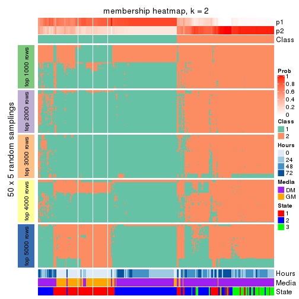</p>

</div>
<div id='tab-ATC-pam-membership-heatmap-2'>
<pre><code class="r">membership_heatmap(res, k = 3)
</code></pre>

<p></p>

</div>
<div id='tab-ATC-pam-membership-heatmap-3'>
<pre><code class="r">membership_heatmap(res, k = 4)
</code></pre>

<p></p>

</div>
<div id='tab-ATC-pam-membership-heatmap-4'>
<pre><code class="r">membership_heatmap(res, k = 5)
</code></pre>

<p></p>

</div>
<div id='tab-ATC-pam-membership-heatmap-5'>
<pre><code class="r">membership_heatmap(res, k = 6)
</code></pre>

<p>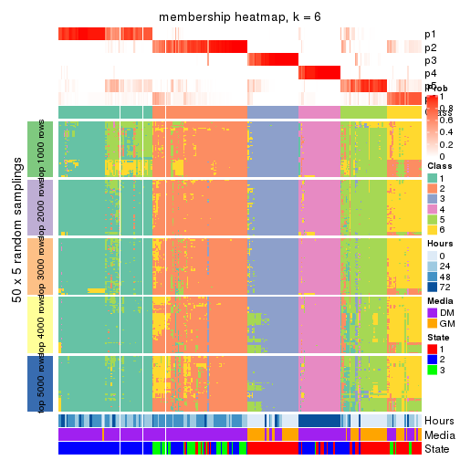</p>

</div>
</div>

As soon as we have had the classes for columns, we can look for signatures
which are significantly different between classes which can be candidate marks
for certain classes. Following are the heatmaps for signatures.


Signature heatmaps where rows are scaled:


<script>
$( function() {
	$( '#tabs-ATC-pam-get-signatures' ).tabs();
} );
</script>
<div id='tabs-ATC-pam-get-signatures'>
<ul>
<li><a href='#tab-ATC-pam-get-signatures-1'>k = 2</a></li>
<li><a href='#tab-ATC-pam-get-signatures-2'>k = 3</a></li>
<li><a href='#tab-ATC-pam-get-signatures-3'>k = 4</a></li>
<li><a href='#tab-ATC-pam-get-signatures-4'>k = 5</a></li>
<li><a href='#tab-ATC-pam-get-signatures-5'>k = 6</a></li>
</ul>
<div id='tab-ATC-pam-get-signatures-1'>
<pre><code class="r">get_signatures(res, k = 2)
</code></pre>

<p></p>

</div>
<div id='tab-ATC-pam-get-signatures-2'>
<pre><code class="r">get_signatures(res, k = 3)
</code></pre>

<p></p>

</div>
<div id='tab-ATC-pam-get-signatures-3'>
<pre><code class="r">get_signatures(res, k = 4)
</code></pre>

<p></p>

</div>
<div id='tab-ATC-pam-get-signatures-4'>
<pre><code class="r">get_signatures(res, k = 5)
</code></pre>

<p></p>

</div>
<div id='tab-ATC-pam-get-signatures-5'>
<pre><code class="r">get_signatures(res, k = 6)
</code></pre>

<p></p>

</div>
</div>


Signature heatmaps where rows are not scaled:


<script>
$( function() {
	$( '#tabs-ATC-pam-get-signatures-no-scale' ).tabs();
} );
</script>
<div id='tabs-ATC-pam-get-signatures-no-scale'>
<ul>
<li><a href='#tab-ATC-pam-get-signatures-no-scale-1'>k = 2</a></li>
<li><a href='#tab-ATC-pam-get-signatures-no-scale-2'>k = 3</a></li>
<li><a href='#tab-ATC-pam-get-signatures-no-scale-3'>k = 4</a></li>
<li><a href='#tab-ATC-pam-get-signatures-no-scale-4'>k = 5</a></li>
<li><a href='#tab-ATC-pam-get-signatures-no-scale-5'>k = 6</a></li>
</ul>
<div id='tab-ATC-pam-get-signatures-no-scale-1'>
<pre><code class="r">get_signatures(res, k = 2, scale_rows = FALSE)
</code></pre>

<p></p>

</div>
<div id='tab-ATC-pam-get-signatures-no-scale-2'>
<pre><code class="r">get_signatures(res, k = 3, scale_rows = FALSE)
</code></pre>

<p></p>

</div>
<div id='tab-ATC-pam-get-signatures-no-scale-3'>
<pre><code class="r">get_signatures(res, k = 4, scale_rows = FALSE)
</code></pre>

<p></p>

</div>
<div id='tab-ATC-pam-get-signatures-no-scale-4'>
<pre><code class="r">get_signatures(res, k = 5, scale_rows = FALSE)
</code></pre>

<p></p>

</div>
<div id='tab-ATC-pam-get-signatures-no-scale-5'>
<pre><code class="r">get_signatures(res, k = 6, scale_rows = FALSE)
</code></pre>

<p></p>

</div>
</div>


Compare the overlap of signatures from different k:

```r
compare_signatures(res)
```


`get_signature()` returns a data frame invisibly. TO get the list of signatures, the function
call should be assigned to a variable explicitly. In following code, if `plot` argument is set
to `FALSE`, no heatmap is plotted while only the differential analysis is performed.

```r
# code only for demonstration
tb = get_signature(res, k = ..., plot = FALSE)
```

An example of the output of `tb` is:

```
#>   which_row         fdr    mean_1    mean_2 scaled_mean_1 scaled_mean_2 km
#> 1        38 0.042760348  8.373488  9.131774    -0.5533452     0.5164555  1
#> 2        40 0.018707592  7.106213  8.469186    -0.6173731     0.5762149  1
#> 3        55 0.019134737 10.221463 11.207825    -0.6159697     0.5749050  1
#> 4        59 0.006059896  5.921854  7.869574    -0.6899429     0.6439467  1
#> 5        60 0.018055526  8.928898 10.211722    -0.6204761     0.5791110  1
#> 6        98 0.009384629 15.714769 14.887706     0.6635654    -0.6193277  2
...
```

The columns in `tb` are:

1. `which_row`: row indices corresponding to the input matrix.
2. `fdr`: FDR for the differential test. 
3. `mean_x`: The mean value in group x.
4. `scaled_mean_x`: The mean value in group x after rows are scaled.
5. `km`: Row groups if k-means clustering is applied to rows.


UMAP plot which shows how samples are separated.


<script>
$( function() {
	$( '#tabs-ATC-pam-dimension-reduction' ).tabs();
} );
</script>
<div id='tabs-ATC-pam-dimension-reduction'>
<ul>
<li><a href='#tab-ATC-pam-dimension-reduction-1'>k = 2</a></li>
<li><a href='#tab-ATC-pam-dimension-reduction-2'>k = 3</a></li>
<li><a href='#tab-ATC-pam-dimension-reduction-3'>k = 4</a></li>
<li><a href='#tab-ATC-pam-dimension-reduction-4'>k = 5</a></li>
<li><a href='#tab-ATC-pam-dimension-reduction-5'>k = 6</a></li>
</ul>
<div id='tab-ATC-pam-dimension-reduction-1'>
<pre><code class="r">dimension_reduction(res, k = 2, method = &quot;UMAP&quot;)
</code></pre>

<p></p>

</div>
<div id='tab-ATC-pam-dimension-reduction-2'>
<pre><code class="r">dimension_reduction(res, k = 3, method = &quot;UMAP&quot;)
</code></pre>

<p></p>

</div>
<div id='tab-ATC-pam-dimension-reduction-3'>
<pre><code class="r">dimension_reduction(res, k = 4, method = &quot;UMAP&quot;)
</code></pre>

<p></p>

</div>
<div id='tab-ATC-pam-dimension-reduction-4'>
<pre><code class="r">dimension_reduction(res, k = 5, method = &quot;UMAP&quot;)
</code></pre>

<p>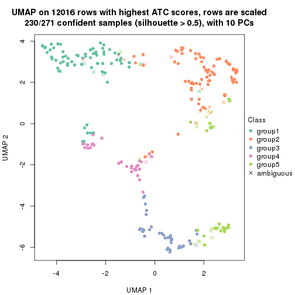</p>

</div>
<div id='tab-ATC-pam-dimension-reduction-5'>
<pre><code class="r">dimension_reduction(res, k = 6, method = &quot;UMAP&quot;)
</code></pre>

<p></p>

</div>
</div>


Following heatmap shows how subgroups are split when increasing `k`:

```r
collect_classes(res)
```


Test correlation between subgroups and known annotations. If the known
annotation is numeric, one-way ANOVA test is applied, and if the known
annotation is discrete, chi-squared contingency table test is applied.

```r
test_to_known_factors(res)
```

```
#>           n Hours(p) Media(p) State(p) k
#> ATC:pam 249 3.47e-13 3.91e-13 5.57e-18 2
#> ATC:pam 230 1.25e-30 7.04e-33 3.28e-49 3
#> ATC:pam 240 1.29e-59 4.34e-32 2.36e-48 4
#> ATC:pam 230 4.90e-64 1.03e-37 2.69e-52 5
#> ATC:pam 242 6.44e-64 4.82e-34 4.61e-48 6
```


If matrix rows can be associated to genes, consider to use `GO_Enrichment(res,
...)` to perform function enrichment for the signature genes.


 

---------------------------------------------------


### ATC:mclust


The object with results only for a single top-value method and a single partition method 
can be extracted as:

```r
res = res_list["ATC", "mclust"]
# you can also extract it by
# res = res_list["ATC:mclust"]
```

A summary of `res` and all the functions that can be applied to it:

```r
res
```

```
#> A 'ConsensusPartition' object with k = 2, 3, 4, 5, 6.
#>   On a matrix with 12016 rows and 271 columns.
#>   Top rows (1000, 2000, 3000, 4000, 5000) are extracted by 'ATC' method.
#>   Subgroups are detected by 'mclust' method.
#>   Performed in total 1250 partitions by row resampling.
#>   Best k for subgroups seems to be 4.
#> 
#> Following methods can be applied to this 'ConsensusPartition' object:
#>  [1] "cola_report"             "collect_classes"         "collect_plots"          
#>  [4] "collect_stats"           "colnames"                "compare_signatures"     
#>  [7] "consensus_heatmap"       "dimension_reduction"     "functional_enrichment"  
#> [10] "get_anno_col"            "get_anno"                "get_classes"            
#> [13] "get_consensus"           "get_matrix"              "get_membership"         
#> [16] "get_param"               "get_signatures"          "get_stats"              
#> [19] "is_best_k"               "is_stable_k"             "membership_heatmap"     
#> [22] "ncol"                    "nrow"                    "plot_ecdf"              
#> [25] "rownames"                "select_partition_number" "show"                   
#> [28] "suggest_best_k"          "test_to_known_factors"
```

`collect_plots()` function collects all the plots made from `res` for all `k` (number of partitions)
into one single page to provide an easy and fast comparison between different `k`.

```r
collect_plots(res)
```


The plots are:

- The first row: a plot of the ECDF (Empirical cumulative distribution
  function) curves of the consensus matrix for each `k` and the heatmap of
  predicted classes for each `k`.
- The second row: heatmaps of the consensus matrix for each `k`.
- The third row: heatmaps of the membership matrix for each `k`.
- The fouth row: heatmaps of the signatures for each `k`.

All the plots in panels can be made by individual functions and they are
plotted later in this section.

`select_partition_number()` produces several plots showing different
statistics for choosing "optimized" `k`. There are following statistics:

- ECDF curves of the consensus matrix for each `k`;
- 1-PAC. [The PAC
  score](https://en.wikipedia.org/wiki/Consensus_clustering#Over-interpretation_potential_of_consensus_clustering)
  measures the proportion of the ambiguous subgrouping.
- Mean silhouette score.
- Concordance. The mean probability of fiting the consensus class ids in all
  partitions.
- Area increased. Denote $A_k$ as the area under the ECDF curve for current
  `k`, the area increased is defined as $A_k - A_{k-1}$.
- Rand index. The percent of pairs of samples that are both in a same cluster
  or both are not in a same cluster in the partition of k and k-1.
- Jaccard index. The ratio of pairs of samples are both in a same cluster in
  the partition of k and k-1 and the pairs of samples are both in a same
  cluster in the partition k or k-1.

The detailed explanations of these statistics can be found in [the cola
vignette](http://bioconductor.org/packages/devel/bioc/vignettes/cola/inst/doc/cola.html#toc_13).

Generally speaking, lower PAC score, higher mean silhouette score or higher
concordance corresponds to better partition. Rand index and Jaccard index
measure how similar the current partition is compared to partition with `k-1`.
If they are too similar, we won't accept `k` is better than `k-1`.

```r
select_partition_number(res)
```


The numeric values for all these statistics can be obtained by `get_stats()`.

```r
get_stats(res)
```

```
#>   k 1-PAC mean_silhouette concordance area_increased  Rand Jaccard
#> 2 2 0.276           0.550       0.732         0.4002 0.585   0.585
#> 3 3 0.665           0.811       0.903         0.6372 0.702   0.514
#> 4 4 0.858           0.857       0.934         0.1152 0.884   0.680
#> 5 5 0.758           0.730       0.854         0.0611 0.883   0.612
#> 6 6 0.713           0.689       0.814         0.0411 0.936   0.722
```

`suggest_best_k()` suggests the best $k$ based on these statistics. The rules are as follows:

- All $k$ with Jaccard index larger than 0.95 are removed because the increase of
  the partition number does not provides enough extra information. If all $k$ are removed,
  the best $k$ is assigned by `NA`.
- For $k$ with 1-PAC larger than 0.9, the maximal $k$ is taken as the "best k". Other $k$ is called "optional k".
- If it does not fit the second rule. The $k$ with the highest vote of highest
  1-PAC, mean silhouette and concordance is taken as the "best k".

```r
suggest_best_k(res)
```

```
#> [1] 4
```


Following shows the table of the partitions (You need to click the **show/hide
code output** link to see it). The membership matrix (columns with name `p*`)
is inferred by
[`clue::cl_consensus()`](https://www.rdocumentation.org/link/cl_consensus?package=clue)
function with the `SE` method. Basically the value in the membership matrix
represents the probability to belong to a certain group. The finall class
label for an item is determined with the group with highest probability it
belongs to.

In `get_classes()` function, the entropy is calculated from the membership
matrix and the silhouette score is calculated from the consensus matrix.


<script>
$( function() {
	$( '#tabs-ATC-mclust-get-classes' ).tabs();
} );
</script>
<div id='tabs-ATC-mclust-get-classes'>
<ul>
<li><a href='#tab-ATC-mclust-get-classes-1'>k = 2</a></li>
<li><a href='#tab-ATC-mclust-get-classes-2'>k = 3</a></li>
<li><a href='#tab-ATC-mclust-get-classes-3'>k = 4</a></li>
<li><a href='#tab-ATC-mclust-get-classes-4'>k = 5</a></li>
<li><a href='#tab-ATC-mclust-get-classes-5'>k = 6</a></li>
</ul>

<div id='tab-ATC-mclust-get-classes-1'>
<p><a id='tab-ATC-mclust-get-classes-1-a' style='color:#0366d6' href='#'>show/hide code output</a></p>
<pre><code class="r">cbind(get_classes(res, k = 2), get_membership(res, k = 2))
</code></pre>

<pre><code>#&gt;            class entropy silhouette    p1    p2
#&gt; T0_CT_A01      1  0.9580     0.5433 0.620 0.380
#&gt; T0_CT_A03      1  0.9580     0.5433 0.620 0.380
#&gt; T0_CT_A05      1  0.9580     0.5433 0.620 0.380
#&gt; T0_CT_A06      1  0.9580     0.5433 0.620 0.380
#&gt; T0_CT_A07      1  0.9580     0.5433 0.620 0.380
#&gt; T0_CT_A08      1  0.9815     0.5730 0.580 0.420
#&gt; T0_CT_A10      1  0.9580     0.5433 0.620 0.380
#&gt; T0_CT_A11      1  0.8499     0.5914 0.724 0.276
#&gt; T0_CT_B01      2  0.9815    -0.3773 0.420 0.580
#&gt; T0_CT_B03      1  0.9580     0.5433 0.620 0.380
#&gt; T0_CT_B05      2  0.9944    -0.4209 0.456 0.544
#&gt; T0_CT_B07      1  0.9933     0.5011 0.548 0.452
#&gt; T0_CT_B08      1  0.9580     0.5433 0.620 0.380
#&gt; T0_CT_B09      1  0.9580     0.5433 0.620 0.380
#&gt; T0_CT_C02      1  0.9580     0.5433 0.620 0.380
#&gt; T0_CT_C03      1  0.9815     0.5730 0.580 0.420
#&gt; T0_CT_C05      2  0.0672     0.7831 0.008 0.992
#&gt; T0_CT_C06      1  0.9833     0.5684 0.576 0.424
#&gt; T0_CT_C07      1  0.9580     0.5433 0.620 0.380
#&gt; T0_CT_C08      1  0.9580     0.5433 0.620 0.380
#&gt; T0_CT_C09      1  0.9393     0.5366 0.644 0.356
#&gt; T0_CT_C11      2  0.0000     0.7866 0.000 1.000
#&gt; T0_CT_C12      1  0.9580     0.5433 0.620 0.380
#&gt; T0_CT_D01      1  0.9580     0.5433 0.620 0.380
#&gt; T0_CT_D02      1  0.9580     0.5433 0.620 0.380
#&gt; T0_CT_D03      1  0.9580     0.5433 0.620 0.380
#&gt; T0_CT_D05      2  0.9815    -0.3773 0.420 0.580
#&gt; T0_CT_D06      1  0.9580     0.5433 0.620 0.380
#&gt; T0_CT_D07      1  0.9580     0.5433 0.620 0.380
#&gt; T0_CT_D08      1  0.9580     0.5433 0.620 0.380
#&gt; T0_CT_D09      2  0.3584     0.7290 0.068 0.932
#&gt; T0_CT_D11      2  0.0672     0.7831 0.008 0.992
#&gt; T0_CT_D12      1  0.9580     0.5433 0.620 0.380
#&gt; T0_CT_E01      1  0.9580     0.5433 0.620 0.380
#&gt; T0_CT_E03      1  0.9580     0.5433 0.620 0.380
#&gt; T0_CT_E04      2  0.0938     0.7803 0.012 0.988
#&gt; T0_CT_E05      1  0.9815     0.5730 0.580 0.420
#&gt; T0_CT_E06      1  0.9580     0.5433 0.620 0.380
#&gt; T0_CT_E07      1  0.9580     0.5433 0.620 0.380
#&gt; T0_CT_E08      1  0.9580     0.5433 0.620 0.380
#&gt; T0_CT_E09      1  0.9580     0.5433 0.620 0.380
#&gt; T0_CT_E10      1  0.9087     0.5800 0.676 0.324
#&gt; T0_CT_E11      1  0.9580     0.5433 0.620 0.380
#&gt; T0_CT_E12      1  0.9580     0.5433 0.620 0.380
#&gt; T0_CT_F01      1  0.9580     0.5433 0.620 0.380
#&gt; T0_CT_F02      1  0.9580     0.5433 0.620 0.380
#&gt; T0_CT_F03      1  0.9580     0.5433 0.620 0.380
#&gt; T0_CT_F04      1  0.9580     0.5433 0.620 0.380
#&gt; T0_CT_F05      1  0.9580     0.5433 0.620 0.380
#&gt; T0_CT_F06      1  0.9580     0.5433 0.620 0.380
#&gt; T0_CT_F07      1  0.9661     0.5379 0.608 0.392
#&gt; T0_CT_F09      2  0.0000     0.7866 0.000 1.000
#&gt; T0_CT_F11      1  0.9580     0.5433 0.620 0.380
#&gt; T0_CT_F12      1  0.9580     0.5433 0.620 0.380
#&gt; T0_CT_G01      1  0.9580     0.5433 0.620 0.380
#&gt; T0_CT_G02      2  0.9815    -0.3773 0.420 0.580
#&gt; T0_CT_G03      1  0.9580     0.5433 0.620 0.380
#&gt; T0_CT_G04      1  0.9580     0.5433 0.620 0.380
#&gt; T0_CT_G07      1  0.9580     0.5433 0.620 0.380
#&gt; T0_CT_G08      1  0.9580     0.5433 0.620 0.380
#&gt; T0_CT_G09      1  0.9815     0.5730 0.580 0.420
#&gt; T0_CT_G11      2  0.9815    -0.3773 0.420 0.580
#&gt; T0_CT_H01      1  0.9815     0.5730 0.580 0.420
#&gt; T0_CT_H02      2  0.9954    -0.2566 0.460 0.540
#&gt; T0_CT_H04      1  0.9580     0.5433 0.620 0.380
#&gt; T0_CT_H05      2  0.9815    -0.3773 0.420 0.580
#&gt; T0_CT_H08      2  0.9866    -0.3921 0.432 0.568
#&gt; T0_CT_H09      2  0.9815    -0.3773 0.420 0.580
#&gt; T0_CT_H12      2  0.9815    -0.3773 0.420 0.580
#&gt; T24_CT_A01     1  0.9815     0.5730 0.580 0.420
#&gt; T24_CT_A03     2  0.0000     0.7866 0.000 1.000
#&gt; T24_CT_A04     2  0.0376     0.7851 0.004 0.996
#&gt; T24_CT_A05     1  0.9580     0.5433 0.620 0.380
#&gt; T24_CT_A07     2  0.3274     0.7872 0.060 0.940
#&gt; T24_CT_A08     1  0.9815     0.5730 0.580 0.420
#&gt; T24_CT_A09     1  0.9815     0.5730 0.580 0.420
#&gt; T24_CT_A10     1  0.9815     0.5730 0.580 0.420
#&gt; T24_CT_B01     1  0.9815     0.5730 0.580 0.420
#&gt; T24_CT_B02     1  0.9815     0.5730 0.580 0.420
#&gt; T24_CT_B03     1  0.9850     0.5600 0.572 0.428
#&gt; T24_CT_B05     2  0.3584     0.7827 0.068 0.932
#&gt; T24_CT_B06     2  0.4939     0.7433 0.108 0.892
#&gt; T24_CT_B07     1  0.9815     0.5730 0.580 0.420
#&gt; T24_CT_B08     2  0.0000     0.7866 0.000 1.000
#&gt; T24_CT_B09     1  0.9815     0.5730 0.580 0.420
#&gt; T24_CT_B11     1  0.9580     0.5433 0.620 0.380
#&gt; T24_CT_C01     1  0.9815     0.5730 0.580 0.420
#&gt; T24_CT_C02     2  0.5842     0.6975 0.140 0.860
#&gt; T24_CT_C03     1  0.9815     0.5730 0.580 0.420
#&gt; T24_CT_C05     2  0.0000     0.7866 0.000 1.000
#&gt; T24_CT_C07     2  0.4022     0.7731 0.080 0.920
#&gt; T24_CT_C08     2  0.0000     0.7866 0.000 1.000
#&gt; T24_CT_C09     2  0.5946     0.6907 0.144 0.856
#&gt; T24_CT_C10     1  0.9815     0.5730 0.580 0.420
#&gt; T24_CT_C11     1  0.9815     0.5730 0.580 0.420
#&gt; T24_CT_C12     2  0.5629     0.7102 0.132 0.868
#&gt; T24_CT_D01     2  0.0000     0.7866 0.000 1.000
#&gt; T24_CT_D02     2  0.3584     0.7001 0.068 0.932
#&gt; T24_CT_D03     2  0.0000     0.7866 0.000 1.000
#&gt; T24_CT_D04     1  0.9815     0.5730 0.580 0.420
#&gt; T24_CT_D05     1  0.9815     0.5730 0.580 0.420
#&gt; T24_CT_D06     1  0.9815     0.5730 0.580 0.420
#&gt; T24_CT_D07     1  0.9815     0.5730 0.580 0.420
#&gt; T24_CT_D08     2  0.0000     0.7866 0.000 1.000
#&gt; T24_CT_D09     2  0.0000     0.7866 0.000 1.000
#&gt; T24_CT_D10     2  0.0000     0.7866 0.000 1.000
#&gt; T24_CT_D11     2  0.1633     0.7932 0.024 0.976
#&gt; T24_CT_E01     1  0.9815     0.5730 0.580 0.420
#&gt; T24_CT_E02     1  0.9815     0.5730 0.580 0.420
#&gt; T24_CT_E04     2  0.4815     0.7482 0.104 0.896
#&gt; T24_CT_E05     1  0.9815     0.5730 0.580 0.420
#&gt; T24_CT_E07     1  0.9815     0.5730 0.580 0.420
#&gt; T24_CT_E09     1  0.9815     0.5730 0.580 0.420
#&gt; T24_CT_E11     1  0.9815     0.5730 0.580 0.420
#&gt; T24_CT_E12     2  0.3733     0.7797 0.072 0.928
#&gt; T24_CT_F01     2  0.0672     0.7895 0.008 0.992
#&gt; T24_CT_F02     2  0.0000     0.7866 0.000 1.000
#&gt; T24_CT_F03     1  0.9815     0.5730 0.580 0.420
#&gt; T24_CT_F04     1  0.9815     0.5730 0.580 0.420
#&gt; T24_CT_F05     1  0.9815     0.5730 0.580 0.420
#&gt; T24_CT_F07     1  0.9815     0.5730 0.580 0.420
#&gt; T24_CT_F08     1  0.9815     0.5730 0.580 0.420
#&gt; T24_CT_F09     2  0.0000     0.7866 0.000 1.000
#&gt; T24_CT_F10     1  0.9815     0.5730 0.580 0.420
#&gt; T24_CT_F11     1  0.9815     0.5730 0.580 0.420
#&gt; T24_CT_F12     1  0.9608     0.5384 0.616 0.384
#&gt; T24_CT_G01     2  0.0000     0.7866 0.000 1.000
#&gt; T24_CT_G02     1  0.9815     0.5730 0.580 0.420
#&gt; T24_CT_G03     1  0.9815     0.5730 0.580 0.420
#&gt; T24_CT_G04     1  0.9988     0.4965 0.520 0.480
#&gt; T24_CT_G05     2  0.4022     0.7729 0.080 0.920
#&gt; T24_CT_G06     1  0.9815     0.5730 0.580 0.420
#&gt; T24_CT_G08     1  0.9815     0.5730 0.580 0.420
#&gt; T24_CT_G10     2  0.3584     0.7828 0.068 0.932
#&gt; T24_CT_G11     1  0.9815     0.5730 0.580 0.420
#&gt; T24_CT_G12     1  0.9815     0.5730 0.580 0.420
#&gt; T24_CT_H01     1  0.9580     0.5433 0.620 0.380
#&gt; T24_CT_H02     1  0.9815     0.5730 0.580 0.420
#&gt; T24_CT_H03     2  0.5629     0.7242 0.132 0.868
#&gt; T24_CT_H05     1  0.9815     0.5730 0.580 0.420
#&gt; T24_CT_H07     1  0.9815     0.5730 0.580 0.420
#&gt; T24_CT_H09     1  0.9815     0.5730 0.580 0.420
#&gt; T24_CT_H12     1  0.9815     0.5730 0.580 0.420
#&gt; T48_CT_A01     2  0.0000     0.7866 0.000 1.000
#&gt; T48_CT_A02     2  0.5294     0.7275 0.120 0.880
#&gt; T48_CT_A03     1  0.9815     0.5730 0.580 0.420
#&gt; T48_CT_A04     2  0.2948     0.7904 0.052 0.948
#&gt; T48_CT_A05     1  0.9850     0.5600 0.572 0.428
#&gt; T48_CT_A06     1  0.9815     0.5730 0.580 0.420
#&gt; T48_CT_A07     1  0.9580     0.5433 0.620 0.380
#&gt; T48_CT_A08     2  0.6343     0.6624 0.160 0.840
#&gt; T48_CT_A09     1  0.9815     0.5730 0.580 0.420
#&gt; T48_CT_A10     2  0.2236     0.7935 0.036 0.964
#&gt; T48_CT_A11     2  0.4690     0.7524 0.100 0.900
#&gt; T48_CT_A12     1  0.9815     0.5730 0.580 0.420
#&gt; T48_CT_B01     2  0.2778     0.7914 0.048 0.952
#&gt; T48_CT_B02     2  0.2043     0.7938 0.032 0.968
#&gt; T48_CT_B03     1  0.9815     0.5730 0.580 0.420
#&gt; T48_CT_B04     1  0.9815     0.5730 0.580 0.420
#&gt; T48_CT_B06     2  0.2043     0.7937 0.032 0.968
#&gt; T48_CT_B08     1  0.9815     0.5730 0.580 0.420
#&gt; T48_CT_B10     2  0.0376     0.7882 0.004 0.996
#&gt; T48_CT_B11     2  0.2423     0.7930 0.040 0.960
#&gt; T48_CT_B12     1  0.9815     0.5730 0.580 0.420
#&gt; T48_CT_C01     2  0.5842     0.6975 0.140 0.860
#&gt; T48_CT_C02     1  0.9815     0.5730 0.580 0.420
#&gt; T48_CT_C03     2  0.1633     0.7932 0.024 0.976
#&gt; T48_CT_C04     1  0.9815     0.5730 0.580 0.420
#&gt; T48_CT_C05     1  0.9850     0.5600 0.572 0.428
#&gt; T48_CT_C06     2  1.0000    -0.4019 0.496 0.504
#&gt; T48_CT_C07     1  0.9815     0.5730 0.580 0.420
#&gt; T48_CT_C09     1  0.9944     0.4250 0.544 0.456
#&gt; T48_CT_C10     1  0.9815     0.5730 0.580 0.420
#&gt; T48_CT_C11     2  0.5629     0.7102 0.132 0.868
#&gt; T48_CT_D01     1  0.9866     0.5571 0.568 0.432
#&gt; T48_CT_D02     1  0.9815     0.5730 0.580 0.420
#&gt; T48_CT_D03     1  0.9815     0.5730 0.580 0.420
#&gt; T48_CT_D04     1  0.9933     0.5334 0.548 0.452
#&gt; T48_CT_D06     2  0.0000     0.7866 0.000 1.000
#&gt; T48_CT_D07     2  0.3114     0.7891 0.056 0.944
#&gt; T48_CT_D08     1  0.9815     0.5730 0.580 0.420
#&gt; T48_CT_D09     2  0.0000     0.7866 0.000 1.000
#&gt; T48_CT_D10     1  0.9815     0.5730 0.580 0.420
#&gt; T48_CT_D11     2  0.6438     0.5779 0.164 0.836
#&gt; T48_CT_D12     1  0.9815     0.5730 0.580 0.420
#&gt; T48_CT_E01     1  0.9754     0.5753 0.592 0.408
#&gt; T48_CT_E02     1  0.9815     0.5730 0.580 0.420
#&gt; T48_CT_E03     1  0.9635     0.5777 0.612 0.388
#&gt; T48_CT_E04     1  0.9815     0.5730 0.580 0.420
#&gt; T48_CT_E05     2  0.2043     0.7938 0.032 0.968
#&gt; T48_CT_E06     1  0.9815     0.5730 0.580 0.420
#&gt; T48_CT_E07     1  0.9815     0.5730 0.580 0.420
#&gt; T48_CT_E08     2  0.1633     0.7932 0.024 0.976
#&gt; T48_CT_E10     1  0.9815     0.5730 0.580 0.420
#&gt; T48_CT_E11     1  0.9815     0.5730 0.580 0.420
#&gt; T48_CT_E12     1  0.9580     0.5433 0.620 0.380
#&gt; T48_CT_F01     2  0.3431     0.7851 0.064 0.936
#&gt; T48_CT_F02     1  0.9815     0.5730 0.580 0.420
#&gt; T48_CT_F03     1  0.9815     0.5730 0.580 0.420
#&gt; T48_CT_F05     1  0.9998     0.4193 0.508 0.492
#&gt; T48_CT_F07     1  0.9815     0.5730 0.580 0.420
#&gt; T48_CT_F09     2  0.3584     0.7827 0.068 0.932
#&gt; T48_CT_F10     1  0.9815     0.5730 0.580 0.420
#&gt; T48_CT_F11     1  0.9815     0.5730 0.580 0.420
#&gt; T48_CT_G01     1  0.9815     0.5730 0.580 0.420
#&gt; T48_CT_G02     2  0.0000     0.7866 0.000 1.000
#&gt; T48_CT_G03     2  0.4939     0.7434 0.108 0.892
#&gt; T48_CT_G07     2  0.2778     0.7916 0.048 0.952
#&gt; T48_CT_G08     2  0.9866    -0.1666 0.432 0.568
#&gt; T48_CT_G09     1  0.9754     0.5643 0.592 0.408
#&gt; T48_CT_G10     1  0.9580     0.5433 0.620 0.380
#&gt; T48_CT_G11     1  0.9815     0.5730 0.580 0.420
#&gt; T48_CT_G12     2  0.3584     0.7827 0.068 0.932
#&gt; T48_CT_H01     2  0.5408     0.7221 0.124 0.876
#&gt; T48_CT_H02     1  0.7745     0.5918 0.772 0.228
#&gt; T48_CT_H04     1  0.9775     0.5747 0.588 0.412
#&gt; T48_CT_H05     2  0.3114     0.7890 0.056 0.944
#&gt; T48_CT_H06     2  0.3274     0.7874 0.060 0.940
#&gt; T48_CT_H07     1  0.9815     0.5730 0.580 0.420
#&gt; T48_CT_H08     2  0.4939     0.7436 0.108 0.892
#&gt; T48_CT_H11     1  0.9815     0.5730 0.580 0.420
#&gt; T48_CT_H12     2  0.3879     0.7764 0.076 0.924
#&gt; T72_CT_A01     1  0.7883     0.3491 0.764 0.236
#&gt; T72_CT_A05     1  0.7815     0.3564 0.768 0.232
#&gt; T72_CT_A08     1  0.0000     0.5077 1.000 0.000
#&gt; T72_CT_A09     1  0.4022     0.4404 0.920 0.080
#&gt; T72_CT_A11     1  0.4022     0.4404 0.920 0.080
#&gt; T72_CT_B01     1  0.9710     0.0298 0.600 0.400
#&gt; T72_CT_B02     1  0.0000     0.5077 1.000 0.000
#&gt; T72_CT_B03     1  0.0000     0.5077 1.000 0.000
#&gt; T72_CT_B04     1  0.0000     0.5077 1.000 0.000
#&gt; T72_CT_B05     1  0.0000     0.5077 1.000 0.000
#&gt; T72_CT_B06     1  0.0000     0.5077 1.000 0.000
#&gt; T72_CT_B08     1  0.6343     0.4374 0.840 0.160
#&gt; T72_CT_B09     1  0.3431     0.5224 0.936 0.064
#&gt; T72_CT_B11     1  0.0000     0.5077 1.000 0.000
#&gt; T72_CT_B12     1  0.4022     0.4404 0.920 0.080
#&gt; T72_CT_C04     2  0.8661     0.4111 0.288 0.712
#&gt; T72_CT_C06     1  0.0000     0.5077 1.000 0.000
#&gt; T72_CT_C07     1  0.9933     0.4317 0.548 0.452
#&gt; T72_CT_C09     1  0.0000     0.5077 1.000 0.000
#&gt; T72_CT_C11     1  0.6343     0.4374 0.840 0.160
#&gt; T72_CT_D01     1  0.4022     0.4404 0.920 0.080
#&gt; T72_CT_D03     1  0.0000     0.5077 1.000 0.000
#&gt; T72_CT_D04     1  0.4022     0.4404 0.920 0.080
#&gt; T72_CT_D05     1  0.0000     0.5077 1.000 0.000
#&gt; T72_CT_D07     1  0.0000     0.5077 1.000 0.000
#&gt; T72_CT_D10     1  0.0000     0.5077 1.000 0.000
#&gt; T72_CT_D11     1  0.0000     0.5077 1.000 0.000
#&gt; T72_CT_E04     1  0.0000     0.5077 1.000 0.000
#&gt; T72_CT_E05     1  0.4022     0.4404 0.920 0.080
#&gt; T72_CT_E07     1  0.0000     0.5077 1.000 0.000
#&gt; T72_CT_F01     1  0.4022     0.4404 0.920 0.080
#&gt; T72_CT_F05     1  0.4298     0.4305 0.912 0.088
#&gt; T72_CT_F07     1  0.0000     0.5077 1.000 0.000
#&gt; T72_CT_F10     1  0.4022     0.4404 0.920 0.080
#&gt; T72_CT_F11     1  0.7815     0.3564 0.768 0.232
#&gt; T72_CT_G03     1  0.0000     0.5077 1.000 0.000
#&gt; T72_CT_G04     1  0.0000     0.5077 1.000 0.000
#&gt; T72_CT_G06     1  0.6343     0.4374 0.840 0.160
#&gt; T72_CT_G08     1  0.1633     0.5032 0.976 0.024
#&gt; T72_CT_G10     1  0.4022     0.4404 0.920 0.080
#&gt; T72_CT_G11     1  0.2236     0.5161 0.964 0.036
#&gt; T72_CT_H01     2  0.6623     0.5315 0.172 0.828
#&gt; T72_CT_H03     1  0.4022     0.4404 0.920 0.080
#&gt; T72_CT_H05     1  0.6343     0.4374 0.840 0.160
#&gt; T72_CT_H08     1  0.6343     0.4374 0.840 0.160
#&gt; T72_CT_H09     1  0.6343     0.4374 0.840 0.160
#&gt; T72_CT_H10     1  0.0000     0.5077 1.000 0.000
#&gt; T72_CT_H11     1  0.0000     0.5077 1.000 0.000
#&gt; T72_CT_H12     1  0.4022     0.4404 0.920 0.080
</code></pre>

<script>
$('#tab-ATC-mclust-get-classes-1-a').parent().next().next().hide();
$('#tab-ATC-mclust-get-classes-1-a').click(function(){
  $('#tab-ATC-mclust-get-classes-1-a').parent().next().next().toggle();
  return(false);
});
</script>
</div>

<div id='tab-ATC-mclust-get-classes-2'>
<p><a id='tab-ATC-mclust-get-classes-2-a' style='color:#0366d6' href='#'>show/hide code output</a></p>
<pre><code class="r">cbind(get_classes(res, k = 3), get_membership(res, k = 3))
</code></pre>

<pre><code>#&gt;            class entropy silhouette    p1    p2    p3
#&gt; T0_CT_A01      3  0.5012     0.7528 0.008 0.204 0.788
#&gt; T0_CT_A03      3  0.0000     0.8251 0.000 0.000 1.000
#&gt; T0_CT_A05      3  0.0000     0.8251 0.000 0.000 1.000
#&gt; T0_CT_A06      3  0.1289     0.8172 0.000 0.032 0.968
#&gt; T0_CT_A07      3  0.0000     0.8251 0.000 0.000 1.000
#&gt; T0_CT_A08      1  0.0000     0.9289 1.000 0.000 0.000
#&gt; T0_CT_A10      3  0.0000     0.8251 0.000 0.000 1.000
#&gt; T0_CT_A11      3  0.7085     0.5396 0.356 0.032 0.612
#&gt; T0_CT_B01      3  0.7158     0.3225 0.372 0.032 0.596
#&gt; T0_CT_B03      3  0.0000     0.8251 0.000 0.000 1.000
#&gt; T0_CT_B05      3  0.5803     0.5933 0.248 0.016 0.736
#&gt; T0_CT_B07      3  0.3713     0.7900 0.076 0.032 0.892
#&gt; T0_CT_B08      3  0.0000     0.8251 0.000 0.000 1.000
#&gt; T0_CT_B09      3  0.0000     0.8251 0.000 0.000 1.000
#&gt; T0_CT_C02      3  0.0000     0.8251 0.000 0.000 1.000
#&gt; T0_CT_C03      1  0.6062     0.4405 0.616 0.000 0.384
#&gt; T0_CT_C05      2  0.0892     0.9378 0.000 0.980 0.020
#&gt; T0_CT_C06      1  0.5858     0.6786 0.740 0.020 0.240
#&gt; T0_CT_C07      3  0.1711     0.8194 0.008 0.032 0.960
#&gt; T0_CT_C08      3  0.0000     0.8251 0.000 0.000 1.000
#&gt; T0_CT_C09      2  0.7890    -0.1507 0.056 0.512 0.432
#&gt; T0_CT_C11      2  0.0000     0.9565 0.000 1.000 0.000
#&gt; T0_CT_C12      3  0.0000     0.8251 0.000 0.000 1.000
#&gt; T0_CT_D01      3  0.5247     0.7386 0.008 0.224 0.768
#&gt; T0_CT_D02      3  0.1711     0.8194 0.008 0.032 0.960
#&gt; T0_CT_D03      3  0.0000     0.8251 0.000 0.000 1.000
#&gt; T0_CT_D05      3  0.7551     0.3187 0.372 0.048 0.580
#&gt; T0_CT_D06      3  0.0000     0.8251 0.000 0.000 1.000
#&gt; T0_CT_D07      3  0.1711     0.8194 0.008 0.032 0.960
#&gt; T0_CT_D08      3  0.0000     0.8251 0.000 0.000 1.000
#&gt; T0_CT_D09      2  0.0592     0.9457 0.000 0.988 0.012
#&gt; T0_CT_D11      2  0.0000     0.9565 0.000 1.000 0.000
#&gt; T0_CT_D12      3  0.0000     0.8251 0.000 0.000 1.000
#&gt; T0_CT_E01      3  0.0000     0.8251 0.000 0.000 1.000
#&gt; T0_CT_E03      3  0.1711     0.8194 0.008 0.032 0.960
#&gt; T0_CT_E04      2  0.3482     0.7993 0.000 0.872 0.128
#&gt; T0_CT_E05      1  0.0000     0.9289 1.000 0.000 0.000
#&gt; T0_CT_E06      3  0.1289     0.8172 0.000 0.032 0.968
#&gt; T0_CT_E07      3  0.0000     0.8251 0.000 0.000 1.000
#&gt; T0_CT_E08      3  0.0000     0.8251 0.000 0.000 1.000
#&gt; T0_CT_E09      3  0.0000     0.8251 0.000 0.000 1.000
#&gt; T0_CT_E10      3  0.7624     0.5252 0.052 0.368 0.580
#&gt; T0_CT_E11      3  0.0000     0.8251 0.000 0.000 1.000
#&gt; T0_CT_E12      3  0.1289     0.8172 0.000 0.032 0.968
#&gt; T0_CT_F01      3  0.0000     0.8251 0.000 0.000 1.000
#&gt; T0_CT_F02      3  0.0000     0.8251 0.000 0.000 1.000
#&gt; T0_CT_F03      3  0.0000     0.8251 0.000 0.000 1.000
#&gt; T0_CT_F04      3  0.0000     0.8251 0.000 0.000 1.000
#&gt; T0_CT_F05      3  0.4531     0.7342 0.008 0.168 0.824
#&gt; T0_CT_F06      3  0.0000     0.8251 0.000 0.000 1.000
#&gt; T0_CT_F07      3  0.2031     0.8182 0.016 0.032 0.952
#&gt; T0_CT_F09      2  0.0000     0.9565 0.000 1.000 0.000
#&gt; T0_CT_F11      3  0.1289     0.8172 0.000 0.032 0.968
#&gt; T0_CT_F12      3  0.0000     0.8251 0.000 0.000 1.000
#&gt; T0_CT_G01      3  0.0000     0.8251 0.000 0.000 1.000
#&gt; T0_CT_G02      3  0.6714     0.4902 0.296 0.032 0.672
#&gt; T0_CT_G03      3  0.0592     0.8227 0.000 0.012 0.988
#&gt; T0_CT_G04      3  0.0000     0.8251 0.000 0.000 1.000
#&gt; T0_CT_G07      3  0.0000     0.8251 0.000 0.000 1.000
#&gt; T0_CT_G08      3  0.0000     0.8251 0.000 0.000 1.000
#&gt; T0_CT_G09      1  0.0000     0.9289 1.000 0.000 0.000
#&gt; T0_CT_G11      3  0.6828     0.4677 0.312 0.032 0.656
#&gt; T0_CT_H01      1  0.4178     0.7763 0.828 0.000 0.172
#&gt; T0_CT_H02      2  0.5178     0.5695 0.000 0.744 0.256
#&gt; T0_CT_H04      3  0.1289     0.8172 0.000 0.032 0.968
#&gt; T0_CT_H05      3  0.7222     0.2736 0.388 0.032 0.580
#&gt; T0_CT_H08      3  0.5627     0.6736 0.188 0.032 0.780
#&gt; T0_CT_H09      3  0.7214     0.4453 0.324 0.044 0.632
#&gt; T0_CT_H12      3  0.6714     0.4950 0.296 0.032 0.672
#&gt; T24_CT_A01     1  0.4504     0.7476 0.804 0.000 0.196
#&gt; T24_CT_A03     2  0.0000     0.9565 0.000 1.000 0.000
#&gt; T24_CT_A04     2  0.0237     0.9531 0.000 0.996 0.004
#&gt; T24_CT_A05     3  0.0000     0.8251 0.000 0.000 1.000
#&gt; T24_CT_A07     2  0.0000     0.9565 0.000 1.000 0.000
#&gt; T24_CT_A08     1  0.0000     0.9289 1.000 0.000 0.000
#&gt; T24_CT_A09     1  0.0000     0.9289 1.000 0.000 0.000
#&gt; T24_CT_A10     1  0.0000     0.9289 1.000 0.000 0.000
#&gt; T24_CT_B01     1  0.0000     0.9289 1.000 0.000 0.000
#&gt; T24_CT_B02     1  0.0000     0.9289 1.000 0.000 0.000
#&gt; T24_CT_B03     1  0.7666     0.5066 0.636 0.288 0.076
#&gt; T24_CT_B05     2  0.0000     0.9565 0.000 1.000 0.000
#&gt; T24_CT_B06     2  0.0000     0.9565 0.000 1.000 0.000
#&gt; T24_CT_B07     1  0.0000     0.9289 1.000 0.000 0.000
#&gt; T24_CT_B08     2  0.0747     0.9425 0.016 0.984 0.000
#&gt; T24_CT_B09     1  0.0000     0.9289 1.000 0.000 0.000
#&gt; T24_CT_B11     3  0.0000     0.8251 0.000 0.000 1.000
#&gt; T24_CT_C01     1  0.0000     0.9289 1.000 0.000 0.000
#&gt; T24_CT_C02     2  0.0000     0.9565 0.000 1.000 0.000
#&gt; T24_CT_C03     1  0.0000     0.9289 1.000 0.000 0.000
#&gt; T24_CT_C05     2  0.0000     0.9565 0.000 1.000 0.000
#&gt; T24_CT_C07     2  0.0892     0.9385 0.020 0.980 0.000
#&gt; T24_CT_C08     2  0.0000     0.9565 0.000 1.000 0.000
#&gt; T24_CT_C09     2  0.0000     0.9565 0.000 1.000 0.000
#&gt; T24_CT_C10     1  0.0000     0.9289 1.000 0.000 0.000
#&gt; T24_CT_C11     1  0.0000     0.9289 1.000 0.000 0.000
#&gt; T24_CT_C12     2  0.0000     0.9565 0.000 1.000 0.000
#&gt; T24_CT_D01     2  0.0000     0.9565 0.000 1.000 0.000
#&gt; T24_CT_D02     2  0.1163     0.9303 0.000 0.972 0.028
#&gt; T24_CT_D03     2  0.0000     0.9565 0.000 1.000 0.000
#&gt; T24_CT_D04     1  0.0592     0.9210 0.988 0.000 0.012
#&gt; T24_CT_D05     1  0.0000     0.9289 1.000 0.000 0.000
#&gt; T24_CT_D06     1  0.0000     0.9289 1.000 0.000 0.000
#&gt; T24_CT_D07     1  0.0237     0.9262 0.996 0.000 0.004
#&gt; T24_CT_D08     2  0.0000     0.9565 0.000 1.000 0.000
#&gt; T24_CT_D09     2  0.0000     0.9565 0.000 1.000 0.000
#&gt; T24_CT_D10     2  0.0000     0.9565 0.000 1.000 0.000
#&gt; T24_CT_D11     2  0.0000     0.9565 0.000 1.000 0.000
#&gt; T24_CT_E01     1  0.0000     0.9289 1.000 0.000 0.000
#&gt; T24_CT_E02     1  0.0000     0.9289 1.000 0.000 0.000
#&gt; T24_CT_E04     2  0.0000     0.9565 0.000 1.000 0.000
#&gt; T24_CT_E05     1  0.0000     0.9289 1.000 0.000 0.000
#&gt; T24_CT_E07     1  0.1163     0.9070 0.972 0.000 0.028
#&gt; T24_CT_E09     1  0.0000     0.9289 1.000 0.000 0.000
#&gt; T24_CT_E11     1  0.0000     0.9289 1.000 0.000 0.000
#&gt; T24_CT_E12     2  0.0000     0.9565 0.000 1.000 0.000
#&gt; T24_CT_F01     2  0.0000     0.9565 0.000 1.000 0.000
#&gt; T24_CT_F02     2  0.0000     0.9565 0.000 1.000 0.000
#&gt; T24_CT_F03     1  0.0000     0.9289 1.000 0.000 0.000
#&gt; T24_CT_F04     1  0.0000     0.9289 1.000 0.000 0.000
#&gt; T24_CT_F05     1  0.0000     0.9289 1.000 0.000 0.000
#&gt; T24_CT_F07     1  0.0237     0.9263 0.996 0.000 0.004
#&gt; T24_CT_F08     1  0.0000     0.9289 1.000 0.000 0.000
#&gt; T24_CT_F09     2  0.0000     0.9565 0.000 1.000 0.000
#&gt; T24_CT_F10     1  0.5551     0.6654 0.768 0.020 0.212
#&gt; T24_CT_F11     1  0.0000     0.9289 1.000 0.000 0.000
#&gt; T24_CT_F12     3  0.5268     0.7440 0.012 0.212 0.776
#&gt; T24_CT_G01     2  0.0000     0.9565 0.000 1.000 0.000
#&gt; T24_CT_G02     1  0.0000     0.9289 1.000 0.000 0.000
#&gt; T24_CT_G03     1  0.0000     0.9289 1.000 0.000 0.000
#&gt; T24_CT_G04     1  0.9009     0.3408 0.560 0.204 0.236
#&gt; T24_CT_G05     2  0.0000     0.9565 0.000 1.000 0.000
#&gt; T24_CT_G06     1  0.0000     0.9289 1.000 0.000 0.000
#&gt; T24_CT_G08     1  0.0000     0.9289 1.000 0.000 0.000
#&gt; T24_CT_G10     2  0.0000     0.9565 0.000 1.000 0.000
#&gt; T24_CT_G11     1  0.0000     0.9289 1.000 0.000 0.000
#&gt; T24_CT_G12     1  0.4452     0.7514 0.808 0.000 0.192
#&gt; T24_CT_H01     3  0.0000     0.8251 0.000 0.000 1.000
#&gt; T24_CT_H02     1  0.0000     0.9289 1.000 0.000 0.000
#&gt; T24_CT_H03     2  0.1399     0.9282 0.028 0.968 0.004
#&gt; T24_CT_H05     1  0.0000     0.9289 1.000 0.000 0.000
#&gt; T24_CT_H07     1  0.0000     0.9289 1.000 0.000 0.000
#&gt; T24_CT_H09     1  0.0000     0.9289 1.000 0.000 0.000
#&gt; T24_CT_H12     1  0.1031     0.9122 0.976 0.000 0.024
#&gt; T48_CT_A01     2  0.0000     0.9565 0.000 1.000 0.000
#&gt; T48_CT_A02     2  0.0000     0.9565 0.000 1.000 0.000
#&gt; T48_CT_A03     1  0.0000     0.9289 1.000 0.000 0.000
#&gt; T48_CT_A04     2  0.0000     0.9565 0.000 1.000 0.000
#&gt; T48_CT_A05     1  0.5253     0.6987 0.792 0.020 0.188
#&gt; T48_CT_A06     1  0.0000     0.9289 1.000 0.000 0.000
#&gt; T48_CT_A07     3  0.4164     0.7843 0.008 0.144 0.848
#&gt; T48_CT_A08     2  0.0000     0.9565 0.000 1.000 0.000
#&gt; T48_CT_A09     1  0.0000     0.9289 1.000 0.000 0.000
#&gt; T48_CT_A10     2  0.0000     0.9565 0.000 1.000 0.000
#&gt; T48_CT_A11     2  0.0000     0.9565 0.000 1.000 0.000
#&gt; T48_CT_A12     1  0.0000     0.9289 1.000 0.000 0.000
#&gt; T48_CT_B01     2  0.0000     0.9565 0.000 1.000 0.000
#&gt; T48_CT_B02     2  0.0000     0.9565 0.000 1.000 0.000
#&gt; T48_CT_B03     1  0.0000     0.9289 1.000 0.000 0.000
#&gt; T48_CT_B04     1  0.0000     0.9289 1.000 0.000 0.000
#&gt; T48_CT_B06     2  0.0000     0.9565 0.000 1.000 0.000
#&gt; T48_CT_B08     1  0.0000     0.9289 1.000 0.000 0.000
#&gt; T48_CT_B10     2  0.0000     0.9565 0.000 1.000 0.000
#&gt; T48_CT_B11     2  0.0000     0.9565 0.000 1.000 0.000
#&gt; T48_CT_B12     1  0.0424     0.9232 0.992 0.000 0.008
#&gt; T48_CT_C01     2  0.0000     0.9565 0.000 1.000 0.000
#&gt; T48_CT_C02     1  0.1529     0.8962 0.960 0.000 0.040
#&gt; T48_CT_C03     2  0.0000     0.9565 0.000 1.000 0.000
#&gt; T48_CT_C04     1  0.0000     0.9289 1.000 0.000 0.000
#&gt; T48_CT_C05     1  0.7917     0.5592 0.664 0.184 0.152
#&gt; T48_CT_C06     2  0.7828     0.0520 0.448 0.500 0.052
#&gt; T48_CT_C07     1  0.0000     0.9289 1.000 0.000 0.000
#&gt; T48_CT_C09     3  0.6779     0.3784 0.012 0.444 0.544
#&gt; T48_CT_C10     1  0.0000     0.9289 1.000 0.000 0.000
#&gt; T48_CT_C11     2  0.0000     0.9565 0.000 1.000 0.000
#&gt; T48_CT_D01     1  0.1964     0.8778 0.944 0.056 0.000
#&gt; T48_CT_D02     1  0.0000     0.9289 1.000 0.000 0.000
#&gt; T48_CT_D03     1  0.0000     0.9289 1.000 0.000 0.000
#&gt; T48_CT_D04     1  0.7272     0.6151 0.700 0.204 0.096
#&gt; T48_CT_D06     2  0.0000     0.9565 0.000 1.000 0.000
#&gt; T48_CT_D07     2  0.0000     0.9565 0.000 1.000 0.000
#&gt; T48_CT_D08     1  0.0000     0.9289 1.000 0.000 0.000
#&gt; T48_CT_D09     2  0.0000     0.9565 0.000 1.000 0.000
#&gt; T48_CT_D10     1  0.0592     0.9202 0.988 0.000 0.012
#&gt; T48_CT_D11     2  0.3267     0.8186 0.000 0.884 0.116
#&gt; T48_CT_D12     1  0.0000     0.9289 1.000 0.000 0.000
#&gt; T48_CT_E01     1  0.4750     0.6665 0.784 0.000 0.216
#&gt; T48_CT_E02     1  0.0000     0.9289 1.000 0.000 0.000
#&gt; T48_CT_E03     3  0.8941     0.5171 0.300 0.156 0.544
#&gt; T48_CT_E04     1  0.0892     0.9136 0.980 0.000 0.020
#&gt; T48_CT_E05     2  0.0000     0.9565 0.000 1.000 0.000
#&gt; T48_CT_E06     1  0.0000     0.9289 1.000 0.000 0.000
#&gt; T48_CT_E07     1  0.0000     0.9289 1.000 0.000 0.000
#&gt; T48_CT_E08     2  0.0000     0.9565 0.000 1.000 0.000
#&gt; T48_CT_E10     1  0.0000     0.9289 1.000 0.000 0.000
#&gt; T48_CT_E11     1  0.0000     0.9289 1.000 0.000 0.000
#&gt; T48_CT_E12     3  0.4589     0.7684 0.008 0.172 0.820
#&gt; T48_CT_F01     2  0.0000     0.9565 0.000 1.000 0.000
#&gt; T48_CT_F02     1  0.0000     0.9289 1.000 0.000 0.000
#&gt; T48_CT_F03     1  0.0000     0.9289 1.000 0.000 0.000
#&gt; T48_CT_F05     1  0.6825     0.0351 0.496 0.492 0.012
#&gt; T48_CT_F07     1  0.0000     0.9289 1.000 0.000 0.000
#&gt; T48_CT_F09     2  0.0000     0.9565 0.000 1.000 0.000
#&gt; T48_CT_F10     1  0.0000     0.9289 1.000 0.000 0.000
#&gt; T48_CT_F11     1  0.0000     0.9289 1.000 0.000 0.000
#&gt; T48_CT_G01     1  0.5397     0.6402 0.720 0.000 0.280
#&gt; T48_CT_G02     2  0.0000     0.9565 0.000 1.000 0.000
#&gt; T48_CT_G03     2  0.0000     0.9565 0.000 1.000 0.000
#&gt; T48_CT_G07     2  0.0000     0.9565 0.000 1.000 0.000
#&gt; T48_CT_G08     2  0.7660     0.2113 0.404 0.548 0.048
#&gt; T48_CT_G09     1  0.9555     0.1467 0.480 0.232 0.288
#&gt; T48_CT_G10     3  0.0000     0.8251 0.000 0.000 1.000
#&gt; T48_CT_G11     1  0.0000     0.9289 1.000 0.000 0.000
#&gt; T48_CT_G12     2  0.0000     0.9565 0.000 1.000 0.000
#&gt; T48_CT_H01     2  0.0237     0.9527 0.004 0.996 0.000
#&gt; T48_CT_H02     3  0.5431     0.6742 0.284 0.000 0.716
#&gt; T48_CT_H04     1  0.2066     0.8770 0.940 0.000 0.060
#&gt; T48_CT_H05     2  0.0000     0.9565 0.000 1.000 0.000
#&gt; T48_CT_H06     2  0.0000     0.9565 0.000 1.000 0.000
#&gt; T48_CT_H07     1  0.0000     0.9289 1.000 0.000 0.000
#&gt; T48_CT_H08     2  0.0000     0.9565 0.000 1.000 0.000
#&gt; T48_CT_H11     1  0.0000     0.9289 1.000 0.000 0.000
#&gt; T48_CT_H12     2  0.0000     0.9565 0.000 1.000 0.000
#&gt; T72_CT_A01     3  0.6507     0.6632 0.028 0.284 0.688
#&gt; T72_CT_A05     3  0.6262     0.6637 0.020 0.284 0.696
#&gt; T72_CT_A08     3  0.4750     0.7460 0.216 0.000 0.784
#&gt; T72_CT_A09     3  0.6507     0.6632 0.028 0.284 0.688
#&gt; T72_CT_A11     3  0.6507     0.6632 0.028 0.284 0.688
#&gt; T72_CT_B01     3  0.6460     0.3633 0.004 0.440 0.556
#&gt; T72_CT_B02     3  0.4750     0.7460 0.216 0.000 0.784
#&gt; T72_CT_B03     3  0.4750     0.7460 0.216 0.000 0.784
#&gt; T72_CT_B04     3  0.4750     0.7460 0.216 0.000 0.784
#&gt; T72_CT_B05     3  0.4750     0.7460 0.216 0.000 0.784
#&gt; T72_CT_B06     3  0.4750     0.7460 0.216 0.000 0.784
#&gt; T72_CT_B08     3  0.4749     0.7685 0.012 0.172 0.816
#&gt; T72_CT_B09     1  0.6111     0.1944 0.604 0.000 0.396
#&gt; T72_CT_B11     3  0.4750     0.7460 0.216 0.000 0.784
#&gt; T72_CT_B12     3  0.6507     0.6632 0.028 0.284 0.688
#&gt; T72_CT_C04     2  0.6057     0.3791 0.004 0.656 0.340
#&gt; T72_CT_C06     3  0.4750     0.7460 0.216 0.000 0.784
#&gt; T72_CT_C07     3  0.6019     0.6593 0.012 0.288 0.700
#&gt; T72_CT_C09     3  0.4750     0.7460 0.216 0.000 0.784
#&gt; T72_CT_C11     3  0.4749     0.7685 0.012 0.172 0.816
#&gt; T72_CT_D01     3  0.6507     0.6632 0.028 0.284 0.688
#&gt; T72_CT_D03     3  0.4750     0.7460 0.216 0.000 0.784
#&gt; T72_CT_D04     3  0.6507     0.6632 0.028 0.284 0.688
#&gt; T72_CT_D05     3  0.4750     0.7460 0.216 0.000 0.784
#&gt; T72_CT_D07     3  0.4750     0.7460 0.216 0.000 0.784
#&gt; T72_CT_D10     3  0.4750     0.7460 0.216 0.000 0.784
#&gt; T72_CT_D11     3  0.4750     0.7460 0.216 0.000 0.784
#&gt; T72_CT_E04     3  0.4750     0.7460 0.216 0.000 0.784
#&gt; T72_CT_E05     3  0.6507     0.6632 0.028 0.284 0.688
#&gt; T72_CT_E07     3  0.5722     0.7842 0.068 0.132 0.800
#&gt; T72_CT_F01     3  0.6507     0.6632 0.028 0.284 0.688
#&gt; T72_CT_F05     3  0.6507     0.6632 0.028 0.284 0.688
#&gt; T72_CT_F07     3  0.4750     0.7460 0.216 0.000 0.784
#&gt; T72_CT_F10     3  0.6507     0.6632 0.028 0.284 0.688
#&gt; T72_CT_F11     3  0.5986     0.6635 0.012 0.284 0.704
#&gt; T72_CT_G03     3  0.4796     0.7424 0.220 0.000 0.780
#&gt; T72_CT_G04     3  0.4974     0.7268 0.236 0.000 0.764
#&gt; T72_CT_G06     3  0.4861     0.7635 0.012 0.180 0.808
#&gt; T72_CT_G08     3  0.5292     0.7671 0.028 0.172 0.800
#&gt; T72_CT_G10     3  0.6507     0.6632 0.028 0.284 0.688
#&gt; T72_CT_G11     1  0.6299    -0.1105 0.524 0.000 0.476
#&gt; T72_CT_H01     2  0.4409     0.7355 0.004 0.824 0.172
#&gt; T72_CT_H03     3  0.6507     0.6632 0.028 0.284 0.688
#&gt; T72_CT_H05     3  0.4749     0.7685 0.012 0.172 0.816
#&gt; T72_CT_H08     3  0.4749     0.7685 0.012 0.172 0.816
#&gt; T72_CT_H09     3  0.4749     0.7685 0.012 0.172 0.816
#&gt; T72_CT_H10     3  0.4750     0.7460 0.216 0.000 0.784
#&gt; T72_CT_H11     3  0.4750     0.7460 0.216 0.000 0.784
#&gt; T72_CT_H12     3  0.6507     0.6632 0.028 0.284 0.688
</code></pre>

<script>
$('#tab-ATC-mclust-get-classes-2-a').parent().next().next().hide();
$('#tab-ATC-mclust-get-classes-2-a').click(function(){
  $('#tab-ATC-mclust-get-classes-2-a').parent().next().next().toggle();
  return(false);
});
</script>
</div>

<div id='tab-ATC-mclust-get-classes-3'>
<p><a id='tab-ATC-mclust-get-classes-3-a' style='color:#0366d6' href='#'>show/hide code output</a></p>
<pre><code class="r">cbind(get_classes(res, k = 4), get_membership(res, k = 4))
</code></pre>

<pre><code>#&gt;            class entropy silhouette    p1    p2    p3    p4
#&gt; T0_CT_A01      3  0.5991    0.75441 0.080 0.056 0.748 0.116
#&gt; T0_CT_A03      3  0.0000    0.89018 0.000 0.000 1.000 0.000
#&gt; T0_CT_A05      3  0.0000    0.89018 0.000 0.000 1.000 0.000
#&gt; T0_CT_A06      3  0.3006    0.84165 0.092 0.008 0.888 0.012
#&gt; T0_CT_A07      3  0.0000    0.89018 0.000 0.000 1.000 0.000
#&gt; T0_CT_A08      1  0.0000    0.92757 1.000 0.000 0.000 0.000
#&gt; T0_CT_A10      3  0.0000    0.89018 0.000 0.000 1.000 0.000
#&gt; T0_CT_A11      1  0.8198    0.00229 0.432 0.024 0.352 0.192
#&gt; T0_CT_B01      1  0.6380    0.13399 0.536 0.008 0.408 0.048
#&gt; T0_CT_B03      3  0.0000    0.89018 0.000 0.000 1.000 0.000
#&gt; T0_CT_B05      3  0.5880    0.67403 0.232 0.008 0.692 0.068
#&gt; T0_CT_B07      3  0.4075    0.80358 0.128 0.008 0.832 0.032
#&gt; T0_CT_B08      3  0.0000    0.89018 0.000 0.000 1.000 0.000
#&gt; T0_CT_B09      3  0.0000    0.89018 0.000 0.000 1.000 0.000
#&gt; T0_CT_C02      3  0.0000    0.89018 0.000 0.000 1.000 0.000
#&gt; T0_CT_C03      1  0.3367    0.81815 0.864 0.000 0.108 0.028
#&gt; T0_CT_C05      2  0.1109    0.93044 0.028 0.968 0.004 0.000
#&gt; T0_CT_C06      1  0.2433    0.87246 0.920 0.008 0.060 0.012
#&gt; T0_CT_C07      3  0.3607    0.83017 0.096 0.008 0.864 0.032
#&gt; T0_CT_C08      3  0.0000    0.89018 0.000 0.000 1.000 0.000
#&gt; T0_CT_C09      2  0.9516    0.00975 0.328 0.352 0.168 0.152
#&gt; T0_CT_C11      2  0.0336    0.94954 0.008 0.992 0.000 0.000
#&gt; T0_CT_C12      3  0.0000    0.89018 0.000 0.000 1.000 0.000
#&gt; T0_CT_D01      3  0.6201    0.70995 0.044 0.152 0.724 0.080
#&gt; T0_CT_D02      3  0.3853    0.82332 0.100 0.008 0.852 0.040
#&gt; T0_CT_D03      3  0.0000    0.89018 0.000 0.000 1.000 0.000
#&gt; T0_CT_D05      1  0.5755    0.48408 0.660 0.012 0.296 0.032
#&gt; T0_CT_D06      3  0.0000    0.89018 0.000 0.000 1.000 0.000
#&gt; T0_CT_D07      3  0.3126    0.84021 0.092 0.008 0.884 0.016
#&gt; T0_CT_D08      3  0.0000    0.89018 0.000 0.000 1.000 0.000
#&gt; T0_CT_D09      2  0.1118    0.92426 0.036 0.964 0.000 0.000
#&gt; T0_CT_D11      2  0.0921    0.93235 0.028 0.972 0.000 0.000
#&gt; T0_CT_D12      3  0.0000    0.89018 0.000 0.000 1.000 0.000
#&gt; T0_CT_E01      3  0.0000    0.89018 0.000 0.000 1.000 0.000
#&gt; T0_CT_E03      3  0.2674    0.85428 0.068 0.004 0.908 0.020
#&gt; T0_CT_E04      2  0.2300    0.89385 0.028 0.924 0.048 0.000
#&gt; T0_CT_E05      1  0.0000    0.92757 1.000 0.000 0.000 0.000
#&gt; T0_CT_E06      3  0.0000    0.89018 0.000 0.000 1.000 0.000
#&gt; T0_CT_E07      3  0.0000    0.89018 0.000 0.000 1.000 0.000
#&gt; T0_CT_E08      3  0.0000    0.89018 0.000 0.000 1.000 0.000
#&gt; T0_CT_E09      3  0.0000    0.89018 0.000 0.000 1.000 0.000
#&gt; T0_CT_E10      1  0.9756    0.00895 0.344 0.276 0.204 0.176
#&gt; T0_CT_E11      3  0.0000    0.89018 0.000 0.000 1.000 0.000
#&gt; T0_CT_E12      3  0.2441    0.86084 0.056 0.004 0.920 0.020
#&gt; T0_CT_F01      3  0.0000    0.89018 0.000 0.000 1.000 0.000
#&gt; T0_CT_F02      3  0.0000    0.89018 0.000 0.000 1.000 0.000
#&gt; T0_CT_F03      3  0.0000    0.89018 0.000 0.000 1.000 0.000
#&gt; T0_CT_F04      3  0.0000    0.89018 0.000 0.000 1.000 0.000
#&gt; T0_CT_F05      3  0.4167    0.82565 0.084 0.032 0.848 0.036
#&gt; T0_CT_F06      3  0.0000    0.89018 0.000 0.000 1.000 0.000
#&gt; T0_CT_F07      3  0.6220    0.63870 0.252 0.008 0.660 0.080
#&gt; T0_CT_F09      2  0.0707    0.93975 0.020 0.980 0.000 0.000
#&gt; T0_CT_F11      3  0.3093    0.84044 0.092 0.004 0.884 0.020
#&gt; T0_CT_F12      3  0.0000    0.89018 0.000 0.000 1.000 0.000
#&gt; T0_CT_G01      3  0.0000    0.89018 0.000 0.000 1.000 0.000
#&gt; T0_CT_G02      3  0.5958    0.49508 0.344 0.008 0.612 0.036
#&gt; T0_CT_G03      3  0.0000    0.89018 0.000 0.000 1.000 0.000
#&gt; T0_CT_G04      3  0.0000    0.89018 0.000 0.000 1.000 0.000
#&gt; T0_CT_G07      3  0.0000    0.89018 0.000 0.000 1.000 0.000
#&gt; T0_CT_G08      3  0.0000    0.89018 0.000 0.000 1.000 0.000
#&gt; T0_CT_G09      1  0.0336    0.92356 0.992 0.000 0.000 0.008
#&gt; T0_CT_G11      3  0.5865    0.39191 0.392 0.008 0.576 0.024
#&gt; T0_CT_H01      1  0.0992    0.91504 0.976 0.004 0.008 0.012
#&gt; T0_CT_H02      2  0.4951    0.65280 0.044 0.744 0.212 0.000
#&gt; T0_CT_H04      3  0.2266    0.85141 0.084 0.004 0.912 0.000
#&gt; T0_CT_H05      1  0.6076   -0.11062 0.484 0.008 0.480 0.028
#&gt; T0_CT_H08      3  0.5811    0.62422 0.272 0.008 0.672 0.048
#&gt; T0_CT_H09      3  0.6503    0.21525 0.440 0.016 0.504 0.040
#&gt; T0_CT_H12      3  0.5837    0.61534 0.276 0.008 0.668 0.048
#&gt; T24_CT_A01     1  0.1284    0.90709 0.964 0.000 0.024 0.012
#&gt; T24_CT_A03     2  0.0000    0.95483 0.000 1.000 0.000 0.000
#&gt; T24_CT_A04     2  0.1042    0.93592 0.020 0.972 0.008 0.000
#&gt; T24_CT_A05     3  0.0817    0.87846 0.000 0.000 0.976 0.024
#&gt; T24_CT_A07     2  0.0000    0.95483 0.000 1.000 0.000 0.000
#&gt; T24_CT_A08     1  0.0000    0.92757 1.000 0.000 0.000 0.000
#&gt; T24_CT_A09     1  0.0000    0.92757 1.000 0.000 0.000 0.000
#&gt; T24_CT_A10     1  0.0000    0.92757 1.000 0.000 0.000 0.000
#&gt; T24_CT_B01     1  0.0000    0.92757 1.000 0.000 0.000 0.000
#&gt; T24_CT_B02     1  0.0000    0.92757 1.000 0.000 0.000 0.000
#&gt; T24_CT_B03     1  0.3447    0.81945 0.852 0.020 0.000 0.128
#&gt; T24_CT_B05     2  0.0000    0.95483 0.000 1.000 0.000 0.000
#&gt; T24_CT_B06     2  0.0000    0.95483 0.000 1.000 0.000 0.000
#&gt; T24_CT_B07     1  0.0000    0.92757 1.000 0.000 0.000 0.000
#&gt; T24_CT_B08     2  0.0188    0.95202 0.004 0.996 0.000 0.000
#&gt; T24_CT_B09     1  0.0000    0.92757 1.000 0.000 0.000 0.000
#&gt; T24_CT_B11     3  0.0000    0.89018 0.000 0.000 1.000 0.000
#&gt; T24_CT_C01     1  0.0000    0.92757 1.000 0.000 0.000 0.000
#&gt; T24_CT_C02     2  0.0188    0.95247 0.004 0.996 0.000 0.000
#&gt; T24_CT_C03     1  0.0000    0.92757 1.000 0.000 0.000 0.000
#&gt; T24_CT_C05     2  0.0000    0.95483 0.000 1.000 0.000 0.000
#&gt; T24_CT_C07     2  0.0817    0.93598 0.024 0.976 0.000 0.000
#&gt; T24_CT_C08     2  0.0000    0.95483 0.000 1.000 0.000 0.000
#&gt; T24_CT_C09     2  0.0188    0.95247 0.004 0.996 0.000 0.000
#&gt; T24_CT_C10     1  0.0000    0.92757 1.000 0.000 0.000 0.000
#&gt; T24_CT_C11     1  0.0000    0.92757 1.000 0.000 0.000 0.000
#&gt; T24_CT_C12     2  0.0000    0.95483 0.000 1.000 0.000 0.000
#&gt; T24_CT_D01     2  0.0000    0.95483 0.000 1.000 0.000 0.000
#&gt; T24_CT_D02     2  0.0921    0.93235 0.028 0.972 0.000 0.000
#&gt; T24_CT_D03     2  0.0000    0.95483 0.000 1.000 0.000 0.000
#&gt; T24_CT_D04     1  0.0000    0.92757 1.000 0.000 0.000 0.000
#&gt; T24_CT_D05     1  0.0000    0.92757 1.000 0.000 0.000 0.000
#&gt; T24_CT_D06     1  0.0000    0.92757 1.000 0.000 0.000 0.000
#&gt; T24_CT_D07     1  0.0000    0.92757 1.000 0.000 0.000 0.000
#&gt; T24_CT_D08     2  0.0000    0.95483 0.000 1.000 0.000 0.000
#&gt; T24_CT_D09     2  0.0000    0.95483 0.000 1.000 0.000 0.000
#&gt; T24_CT_D10     2  0.0000    0.95483 0.000 1.000 0.000 0.000
#&gt; T24_CT_D11     2  0.0000    0.95483 0.000 1.000 0.000 0.000
#&gt; T24_CT_E01     1  0.0188    0.92564 0.996 0.000 0.000 0.004
#&gt; T24_CT_E02     1  0.0000    0.92757 1.000 0.000 0.000 0.000
#&gt; T24_CT_E04     2  0.0000    0.95483 0.000 1.000 0.000 0.000
#&gt; T24_CT_E05     1  0.0000    0.92757 1.000 0.000 0.000 0.000
#&gt; T24_CT_E07     1  0.1576    0.89831 0.948 0.004 0.000 0.048
#&gt; T24_CT_E09     1  0.0000    0.92757 1.000 0.000 0.000 0.000
#&gt; T24_CT_E11     1  0.0000    0.92757 1.000 0.000 0.000 0.000
#&gt; T24_CT_E12     2  0.0000    0.95483 0.000 1.000 0.000 0.000
#&gt; T24_CT_F01     2  0.0000    0.95483 0.000 1.000 0.000 0.000
#&gt; T24_CT_F02     2  0.0000    0.95483 0.000 1.000 0.000 0.000
#&gt; T24_CT_F03     1  0.0000    0.92757 1.000 0.000 0.000 0.000
#&gt; T24_CT_F04     1  0.0000    0.92757 1.000 0.000 0.000 0.000
#&gt; T24_CT_F05     1  0.0000    0.92757 1.000 0.000 0.000 0.000
#&gt; T24_CT_F07     1  0.1211    0.90441 0.960 0.000 0.000 0.040
#&gt; T24_CT_F08     1  0.0000    0.92757 1.000 0.000 0.000 0.000
#&gt; T24_CT_F09     2  0.0336    0.94951 0.008 0.992 0.000 0.000
#&gt; T24_CT_F10     1  0.3047    0.83767 0.872 0.012 0.000 0.116
#&gt; T24_CT_F11     1  0.0000    0.92757 1.000 0.000 0.000 0.000
#&gt; T24_CT_F12     3  0.8403    0.16358 0.040 0.380 0.408 0.172
#&gt; T24_CT_G01     2  0.0000    0.95483 0.000 1.000 0.000 0.000
#&gt; T24_CT_G02     1  0.0000    0.92757 1.000 0.000 0.000 0.000
#&gt; T24_CT_G03     1  0.0000    0.92757 1.000 0.000 0.000 0.000
#&gt; T24_CT_G04     1  0.1975    0.89148 0.936 0.016 0.000 0.048
#&gt; T24_CT_G05     2  0.0000    0.95483 0.000 1.000 0.000 0.000
#&gt; T24_CT_G06     1  0.0000    0.92757 1.000 0.000 0.000 0.000
#&gt; T24_CT_G08     1  0.0000    0.92757 1.000 0.000 0.000 0.000
#&gt; T24_CT_G10     2  0.0000    0.95483 0.000 1.000 0.000 0.000
#&gt; T24_CT_G11     1  0.0000    0.92757 1.000 0.000 0.000 0.000
#&gt; T24_CT_G12     1  0.0336    0.92316 0.992 0.000 0.000 0.008
#&gt; T24_CT_H01     3  0.0000    0.89018 0.000 0.000 1.000 0.000
#&gt; T24_CT_H02     1  0.0000    0.92757 1.000 0.000 0.000 0.000
#&gt; T24_CT_H03     2  0.3751    0.71700 0.196 0.800 0.000 0.004
#&gt; T24_CT_H05     1  0.0000    0.92757 1.000 0.000 0.000 0.000
#&gt; T24_CT_H07     1  0.0000    0.92757 1.000 0.000 0.000 0.000
#&gt; T24_CT_H09     1  0.0000    0.92757 1.000 0.000 0.000 0.000
#&gt; T24_CT_H12     1  0.0000    0.92757 1.000 0.000 0.000 0.000
#&gt; T48_CT_A01     2  0.0000    0.95483 0.000 1.000 0.000 0.000
#&gt; T48_CT_A02     2  0.0000    0.95483 0.000 1.000 0.000 0.000
#&gt; T48_CT_A03     1  0.0000    0.92757 1.000 0.000 0.000 0.000
#&gt; T48_CT_A04     2  0.0000    0.95483 0.000 1.000 0.000 0.000
#&gt; T48_CT_A05     1  0.4661    0.65658 0.728 0.016 0.000 0.256
#&gt; T48_CT_A06     1  0.0000    0.92757 1.000 0.000 0.000 0.000
#&gt; T48_CT_A07     3  0.3105    0.78594 0.000 0.004 0.856 0.140
#&gt; T48_CT_A08     2  0.0000    0.95483 0.000 1.000 0.000 0.000
#&gt; T48_CT_A09     1  0.0188    0.92564 0.996 0.000 0.000 0.004
#&gt; T48_CT_A10     2  0.0000    0.95483 0.000 1.000 0.000 0.000
#&gt; T48_CT_A11     2  0.0000    0.95483 0.000 1.000 0.000 0.000
#&gt; T48_CT_A12     1  0.0000    0.92757 1.000 0.000 0.000 0.000
#&gt; T48_CT_B01     2  0.0000    0.95483 0.000 1.000 0.000 0.000
#&gt; T48_CT_B02     2  0.0000    0.95483 0.000 1.000 0.000 0.000
#&gt; T48_CT_B03     1  0.0000    0.92757 1.000 0.000 0.000 0.000
#&gt; T48_CT_B04     1  0.0000    0.92757 1.000 0.000 0.000 0.000
#&gt; T48_CT_B06     2  0.0000    0.95483 0.000 1.000 0.000 0.000
#&gt; T48_CT_B08     1  0.0000    0.92757 1.000 0.000 0.000 0.000
#&gt; T48_CT_B10     2  0.0000    0.95483 0.000 1.000 0.000 0.000
#&gt; T48_CT_B11     2  0.0000    0.95483 0.000 1.000 0.000 0.000
#&gt; T48_CT_B12     1  0.1867    0.88226 0.928 0.000 0.000 0.072
#&gt; T48_CT_C01     2  0.0000    0.95483 0.000 1.000 0.000 0.000
#&gt; T48_CT_C02     1  0.3550    0.83142 0.860 0.000 0.044 0.096
#&gt; T48_CT_C03     2  0.0000    0.95483 0.000 1.000 0.000 0.000
#&gt; T48_CT_C04     1  0.0000    0.92757 1.000 0.000 0.000 0.000
#&gt; T48_CT_C05     1  0.3335    0.82288 0.856 0.016 0.000 0.128
#&gt; T48_CT_C06     1  0.6592    0.47232 0.600 0.284 0.000 0.116
#&gt; T48_CT_C07     1  0.0000    0.92757 1.000 0.000 0.000 0.000
#&gt; T48_CT_C09     2  0.3962    0.77414 0.028 0.820 0.000 0.152
#&gt; T48_CT_C10     1  0.0000    0.92757 1.000 0.000 0.000 0.000
#&gt; T48_CT_C11     2  0.0000    0.95483 0.000 1.000 0.000 0.000
#&gt; T48_CT_D01     1  0.0188    0.92554 0.996 0.000 0.000 0.004
#&gt; T48_CT_D02     1  0.0000    0.92757 1.000 0.000 0.000 0.000
#&gt; T48_CT_D03     1  0.0000    0.92757 1.000 0.000 0.000 0.000
#&gt; T48_CT_D04     1  0.1059    0.91186 0.972 0.016 0.000 0.012
#&gt; T48_CT_D06     2  0.0000    0.95483 0.000 1.000 0.000 0.000
#&gt; T48_CT_D07     2  0.0000    0.95483 0.000 1.000 0.000 0.000
#&gt; T48_CT_D08     1  0.0000    0.92757 1.000 0.000 0.000 0.000
#&gt; T48_CT_D09     2  0.0336    0.94985 0.008 0.992 0.000 0.000
#&gt; T48_CT_D10     1  0.0707    0.91633 0.980 0.000 0.000 0.020
#&gt; T48_CT_D11     2  0.0921    0.93235 0.028 0.972 0.000 0.000
#&gt; T48_CT_D12     1  0.0000    0.92757 1.000 0.000 0.000 0.000
#&gt; T48_CT_E01     1  0.4844    0.58794 0.688 0.012 0.000 0.300
#&gt; T48_CT_E02     1  0.0000    0.92757 1.000 0.000 0.000 0.000
#&gt; T48_CT_E03     1  0.4387    0.69551 0.752 0.012 0.000 0.236
#&gt; T48_CT_E04     1  0.1940    0.87981 0.924 0.000 0.000 0.076
#&gt; T48_CT_E05     2  0.0000    0.95483 0.000 1.000 0.000 0.000
#&gt; T48_CT_E06     1  0.0000    0.92757 1.000 0.000 0.000 0.000
#&gt; T48_CT_E07     1  0.0000    0.92757 1.000 0.000 0.000 0.000
#&gt; T48_CT_E08     2  0.0000    0.95483 0.000 1.000 0.000 0.000
#&gt; T48_CT_E10     1  0.0000    0.92757 1.000 0.000 0.000 0.000
#&gt; T48_CT_E11     1  0.0000    0.92757 1.000 0.000 0.000 0.000
#&gt; T48_CT_E12     3  0.3300    0.77908 0.000 0.008 0.848 0.144
#&gt; T48_CT_F01     2  0.0000    0.95483 0.000 1.000 0.000 0.000
#&gt; T48_CT_F02     1  0.0000    0.92757 1.000 0.000 0.000 0.000
#&gt; T48_CT_F03     1  0.0000    0.92757 1.000 0.000 0.000 0.000
#&gt; T48_CT_F05     1  0.3972    0.71935 0.788 0.204 0.000 0.008
#&gt; T48_CT_F07     1  0.0000    0.92757 1.000 0.000 0.000 0.000
#&gt; T48_CT_F09     2  0.0000    0.95483 0.000 1.000 0.000 0.000
#&gt; T48_CT_F10     1  0.0000    0.92757 1.000 0.000 0.000 0.000
#&gt; T48_CT_F11     1  0.0000    0.92757 1.000 0.000 0.000 0.000
#&gt; T48_CT_G01     1  0.3335    0.79993 0.856 0.000 0.128 0.016
#&gt; T48_CT_G02     2  0.0000    0.95483 0.000 1.000 0.000 0.000
#&gt; T48_CT_G03     2  0.0000    0.95483 0.000 1.000 0.000 0.000
#&gt; T48_CT_G07     2  0.0000    0.95483 0.000 1.000 0.000 0.000
#&gt; T48_CT_G08     2  0.7221    0.30582 0.308 0.524 0.000 0.168
#&gt; T48_CT_G09     1  0.5660    0.33686 0.576 0.028 0.000 0.396
#&gt; T48_CT_G10     3  0.4907    0.26480 0.000 0.000 0.580 0.420
#&gt; T48_CT_G11     1  0.0000    0.92757 1.000 0.000 0.000 0.000
#&gt; T48_CT_G12     2  0.0000    0.95483 0.000 1.000 0.000 0.000
#&gt; T48_CT_H01     2  0.0469    0.94704 0.012 0.988 0.000 0.000
#&gt; T48_CT_H02     4  0.4647    0.55836 0.288 0.008 0.000 0.704
#&gt; T48_CT_H04     1  0.3734    0.82128 0.848 0.000 0.044 0.108
#&gt; T48_CT_H05     2  0.0000    0.95483 0.000 1.000 0.000 0.000
#&gt; T48_CT_H06     2  0.0000    0.95483 0.000 1.000 0.000 0.000
#&gt; T48_CT_H07     1  0.0000    0.92757 1.000 0.000 0.000 0.000
#&gt; T48_CT_H08     2  0.0000    0.95483 0.000 1.000 0.000 0.000
#&gt; T48_CT_H11     1  0.0000    0.92757 1.000 0.000 0.000 0.000
#&gt; T48_CT_H12     2  0.0000    0.95483 0.000 1.000 0.000 0.000
#&gt; T72_CT_A01     4  0.3219    0.82054 0.000 0.164 0.000 0.836
#&gt; T72_CT_A05     4  0.1970    0.92278 0.000 0.060 0.008 0.932
#&gt; T72_CT_A08     4  0.1118    0.91661 0.036 0.000 0.000 0.964
#&gt; T72_CT_A09     4  0.1389    0.92871 0.000 0.048 0.000 0.952
#&gt; T72_CT_A11     4  0.1637    0.92500 0.000 0.060 0.000 0.940
#&gt; T72_CT_B01     2  0.4877    0.26735 0.000 0.592 0.000 0.408
#&gt; T72_CT_B02     4  0.0000    0.93278 0.000 0.000 0.000 1.000
#&gt; T72_CT_B03     4  0.0000    0.93278 0.000 0.000 0.000 1.000
#&gt; T72_CT_B04     4  0.0000    0.93278 0.000 0.000 0.000 1.000
#&gt; T72_CT_B05     4  0.0000    0.93278 0.000 0.000 0.000 1.000
#&gt; T72_CT_B06     4  0.0000    0.93278 0.000 0.000 0.000 1.000
#&gt; T72_CT_B08     4  0.0927    0.93217 0.000 0.016 0.008 0.976
#&gt; T72_CT_B09     1  0.4830    0.33808 0.608 0.000 0.000 0.392
#&gt; T72_CT_B11     4  0.0000    0.93278 0.000 0.000 0.000 1.000
#&gt; T72_CT_B12     4  0.1637    0.92500 0.000 0.060 0.000 0.940
#&gt; T72_CT_C04     2  0.4483    0.57256 0.004 0.712 0.000 0.284
#&gt; T72_CT_C06     4  0.0000    0.93278 0.000 0.000 0.000 1.000
#&gt; T72_CT_C07     4  0.5143    0.18718 0.004 0.456 0.000 0.540
#&gt; T72_CT_C09     4  0.0000    0.93278 0.000 0.000 0.000 1.000
#&gt; T72_CT_C11     4  0.0927    0.93217 0.000 0.016 0.008 0.976
#&gt; T72_CT_D01     4  0.1637    0.92500 0.000 0.060 0.000 0.940
#&gt; T72_CT_D03     4  0.0000    0.93278 0.000 0.000 0.000 1.000
#&gt; T72_CT_D04     4  0.1637    0.92500 0.000 0.060 0.000 0.940
#&gt; T72_CT_D05     4  0.0000    0.93278 0.000 0.000 0.000 1.000
#&gt; T72_CT_D07     4  0.0000    0.93278 0.000 0.000 0.000 1.000
#&gt; T72_CT_D10     4  0.0000    0.93278 0.000 0.000 0.000 1.000
#&gt; T72_CT_D11     4  0.0000    0.93278 0.000 0.000 0.000 1.000
#&gt; T72_CT_E04     4  0.0707    0.92686 0.020 0.000 0.000 0.980
#&gt; T72_CT_E05     4  0.1637    0.92500 0.000 0.060 0.000 0.940
#&gt; T72_CT_E07     4  0.1042    0.92828 0.020 0.008 0.000 0.972
#&gt; T72_CT_F01     4  0.1637    0.92500 0.000 0.060 0.000 0.940
#&gt; T72_CT_F05     4  0.2868    0.85416 0.000 0.136 0.000 0.864
#&gt; T72_CT_F07     4  0.0000    0.93278 0.000 0.000 0.000 1.000
#&gt; T72_CT_F10     4  0.1637    0.92500 0.000 0.060 0.000 0.940
#&gt; T72_CT_F11     4  0.1635    0.92878 0.000 0.044 0.008 0.948
#&gt; T72_CT_G03     4  0.2647    0.83138 0.120 0.000 0.000 0.880
#&gt; T72_CT_G04     4  0.3610    0.73134 0.200 0.000 0.000 0.800
#&gt; T72_CT_G06     4  0.1890    0.92473 0.000 0.056 0.008 0.936
#&gt; T72_CT_G08     4  0.1256    0.92461 0.028 0.008 0.000 0.964
#&gt; T72_CT_G10     4  0.1637    0.92500 0.000 0.060 0.000 0.940
#&gt; T72_CT_G11     1  0.4866    0.31214 0.596 0.000 0.000 0.404
#&gt; T72_CT_H01     2  0.3392    0.81926 0.020 0.856 0.000 0.124
#&gt; T72_CT_H03     4  0.1637    0.92500 0.000 0.060 0.000 0.940
#&gt; T72_CT_H05     4  0.2198    0.88630 0.000 0.008 0.072 0.920
#&gt; T72_CT_H08     4  0.1890    0.90157 0.000 0.008 0.056 0.936
#&gt; T72_CT_H09     4  0.1557    0.90222 0.000 0.000 0.056 0.944
#&gt; T72_CT_H10     4  0.0707    0.92686 0.020 0.000 0.000 0.980
#&gt; T72_CT_H11     4  0.0000    0.93278 0.000 0.000 0.000 1.000
#&gt; T72_CT_H12     4  0.1637    0.92500 0.000 0.060 0.000 0.940
</code></pre>

<script>
$('#tab-ATC-mclust-get-classes-3-a').parent().next().next().hide();
$('#tab-ATC-mclust-get-classes-3-a').click(function(){
  $('#tab-ATC-mclust-get-classes-3-a').parent().next().next().toggle();
  return(false);
});
</script>
</div>

<div id='tab-ATC-mclust-get-classes-4'>
<p><a id='tab-ATC-mclust-get-classes-4-a' style='color:#0366d6' href='#'>show/hide code output</a></p>
<pre><code class="r">cbind(get_classes(res, k = 5), get_membership(res, k = 5))
</code></pre>

<pre><code>#&gt;            class entropy silhouette    p1    p2    p3    p4    p5
#&gt; T0_CT_A01      4  0.5617     0.5302 0.000 0.076 0.256 0.648 0.020
#&gt; T0_CT_A03      3  0.0000     0.9279 0.000 0.000 1.000 0.000 0.000
#&gt; T0_CT_A05      3  0.0000     0.9279 0.000 0.000 1.000 0.000 0.000
#&gt; T0_CT_A06      4  0.4321     0.3107 0.000 0.000 0.396 0.600 0.004
#&gt; T0_CT_A07      3  0.1121     0.9010 0.000 0.000 0.956 0.044 0.000
#&gt; T0_CT_A08      1  0.0000     0.9150 1.000 0.000 0.000 0.000 0.000
#&gt; T0_CT_A10      3  0.2020     0.8512 0.000 0.000 0.900 0.100 0.000
#&gt; T0_CT_A11      4  0.5747     0.5465 0.092 0.004 0.100 0.716 0.088
#&gt; T0_CT_B01      4  0.4988     0.5637 0.084 0.000 0.192 0.716 0.008
#&gt; T0_CT_B03      3  0.0000     0.9279 0.000 0.000 1.000 0.000 0.000
#&gt; T0_CT_B05      4  0.5131     0.4701 0.048 0.000 0.296 0.648 0.008
#&gt; T0_CT_B07      4  0.4502     0.4551 0.012 0.000 0.312 0.668 0.008
#&gt; T0_CT_B08      3  0.0000     0.9279 0.000 0.000 1.000 0.000 0.000
#&gt; T0_CT_B09      3  0.0404     0.9198 0.000 0.000 0.988 0.012 0.000
#&gt; T0_CT_C02      3  0.0000     0.9279 0.000 0.000 1.000 0.000 0.000
#&gt; T0_CT_C03      1  0.6440     0.4788 0.608 0.000 0.184 0.172 0.036
#&gt; T0_CT_C05      2  0.1732     0.9058 0.000 0.920 0.000 0.080 0.000
#&gt; T0_CT_C06      4  0.5314     0.4983 0.208 0.000 0.100 0.684 0.008
#&gt; T0_CT_C07      4  0.4166     0.3977 0.000 0.000 0.348 0.648 0.004
#&gt; T0_CT_C08      3  0.0000     0.9279 0.000 0.000 1.000 0.000 0.000
#&gt; T0_CT_C09      4  0.6975     0.3947 0.008 0.316 0.088 0.528 0.060
#&gt; T0_CT_C11      2  0.0703     0.9453 0.000 0.976 0.000 0.024 0.000
#&gt; T0_CT_C12      3  0.0000     0.9279 0.000 0.000 1.000 0.000 0.000
#&gt; T0_CT_D01      4  0.5801     0.5360 0.000 0.104 0.244 0.636 0.016
#&gt; T0_CT_D02      4  0.4268     0.4037 0.000 0.000 0.344 0.648 0.008
#&gt; T0_CT_D03      3  0.0000     0.9279 0.000 0.000 1.000 0.000 0.000
#&gt; T0_CT_D05      4  0.4626     0.5783 0.084 0.000 0.152 0.756 0.008
#&gt; T0_CT_D06      3  0.0000     0.9279 0.000 0.000 1.000 0.000 0.000
#&gt; T0_CT_D07      4  0.4151     0.4045 0.000 0.000 0.344 0.652 0.004
#&gt; T0_CT_D08      3  0.0000     0.9279 0.000 0.000 1.000 0.000 0.000
#&gt; T0_CT_D09      2  0.2416     0.8761 0.000 0.888 0.012 0.100 0.000
#&gt; T0_CT_D11      2  0.1952     0.8997 0.000 0.912 0.004 0.084 0.000
#&gt; T0_CT_D12      3  0.0000     0.9279 0.000 0.000 1.000 0.000 0.000
#&gt; T0_CT_E01      3  0.0000     0.9279 0.000 0.000 1.000 0.000 0.000
#&gt; T0_CT_E03      4  0.4310     0.3090 0.000 0.000 0.392 0.604 0.004
#&gt; T0_CT_E04      2  0.2248     0.8886 0.000 0.900 0.012 0.088 0.000
#&gt; T0_CT_E05      1  0.2771     0.8923 0.860 0.000 0.000 0.128 0.012
#&gt; T0_CT_E06      3  0.3684     0.5950 0.000 0.000 0.720 0.280 0.000
#&gt; T0_CT_E07      3  0.0880     0.9099 0.000 0.000 0.968 0.032 0.000
#&gt; T0_CT_E08      3  0.0000     0.9279 0.000 0.000 1.000 0.000 0.000
#&gt; T0_CT_E09      3  0.3274     0.6797 0.000 0.000 0.780 0.220 0.000
#&gt; T0_CT_E10      4  0.7009     0.4246 0.008 0.272 0.092 0.556 0.072
#&gt; T0_CT_E11      3  0.0609     0.9174 0.000 0.000 0.980 0.020 0.000
#&gt; T0_CT_E12      4  0.4383     0.2399 0.000 0.000 0.424 0.572 0.004
#&gt; T0_CT_F01      3  0.0000     0.9279 0.000 0.000 1.000 0.000 0.000
#&gt; T0_CT_F02      3  0.1121     0.9009 0.000 0.000 0.956 0.044 0.000
#&gt; T0_CT_F03      3  0.0000     0.9279 0.000 0.000 1.000 0.000 0.000
#&gt; T0_CT_F04      3  0.0000     0.9279 0.000 0.000 1.000 0.000 0.000
#&gt; T0_CT_F05      4  0.6784     0.4497 0.000 0.148 0.296 0.524 0.032
#&gt; T0_CT_F06      3  0.0000     0.9279 0.000 0.000 1.000 0.000 0.000
#&gt; T0_CT_F07      4  0.4134     0.5040 0.008 0.000 0.264 0.720 0.008
#&gt; T0_CT_F09      2  0.1121     0.9343 0.000 0.956 0.000 0.044 0.000
#&gt; T0_CT_F11      4  0.4283     0.4043 0.000 0.000 0.348 0.644 0.008
#&gt; T0_CT_F12      3  0.0000     0.9279 0.000 0.000 1.000 0.000 0.000
#&gt; T0_CT_G01      3  0.0000     0.9279 0.000 0.000 1.000 0.000 0.000
#&gt; T0_CT_G02      4  0.5351     0.4799 0.068 0.000 0.280 0.644 0.008
#&gt; T0_CT_G03      3  0.3636     0.6107 0.000 0.000 0.728 0.272 0.000
#&gt; T0_CT_G04      3  0.0000     0.9279 0.000 0.000 1.000 0.000 0.000
#&gt; T0_CT_G07      3  0.0000     0.9279 0.000 0.000 1.000 0.000 0.000
#&gt; T0_CT_G08      3  0.0000     0.9279 0.000 0.000 1.000 0.000 0.000
#&gt; T0_CT_G09      1  0.2964     0.8948 0.856 0.000 0.000 0.120 0.024
#&gt; T0_CT_G11      4  0.5279     0.4931 0.076 0.000 0.268 0.652 0.004
#&gt; T0_CT_H01      4  0.5944     0.2322 0.352 0.000 0.084 0.552 0.012
#&gt; T0_CT_H02      2  0.5470     0.4469 0.000 0.640 0.080 0.272 0.008
#&gt; T0_CT_H04      4  0.4273     0.1761 0.000 0.000 0.448 0.552 0.000
#&gt; T0_CT_H05      4  0.5344     0.5121 0.092 0.000 0.244 0.660 0.004
#&gt; T0_CT_H08      4  0.4405     0.5096 0.020 0.000 0.260 0.712 0.008
#&gt; T0_CT_H09      4  0.4309     0.5817 0.052 0.000 0.148 0.784 0.016
#&gt; T0_CT_H12      4  0.5195     0.4692 0.052 0.000 0.296 0.644 0.008
#&gt; T24_CT_A01     1  0.5104     0.6979 0.740 0.000 0.128 0.104 0.028
#&gt; T24_CT_A03     2  0.0510     0.9472 0.000 0.984 0.000 0.016 0.000
#&gt; T24_CT_A04     2  0.1341     0.9260 0.000 0.944 0.000 0.056 0.000
#&gt; T24_CT_A05     3  0.2625     0.8259 0.000 0.000 0.876 0.108 0.016
#&gt; T24_CT_A07     2  0.0290     0.9510 0.008 0.992 0.000 0.000 0.000
#&gt; T24_CT_A08     1  0.0000     0.9150 1.000 0.000 0.000 0.000 0.000
#&gt; T24_CT_A09     1  0.0000     0.9150 1.000 0.000 0.000 0.000 0.000
#&gt; T24_CT_A10     1  0.2674     0.8953 0.868 0.000 0.000 0.120 0.012
#&gt; T24_CT_B01     1  0.2522     0.8993 0.880 0.000 0.000 0.108 0.012
#&gt; T24_CT_B02     1  0.0000     0.9150 1.000 0.000 0.000 0.000 0.000
#&gt; T24_CT_B03     4  0.3983     0.5363 0.080 0.052 0.004 0.832 0.032
#&gt; T24_CT_B05     2  0.0290     0.9510 0.008 0.992 0.000 0.000 0.000
#&gt; T24_CT_B06     2  0.0290     0.9510 0.008 0.992 0.000 0.000 0.000
#&gt; T24_CT_B07     1  0.0000     0.9150 1.000 0.000 0.000 0.000 0.000
#&gt; T24_CT_B08     2  0.1168     0.9439 0.008 0.960 0.000 0.032 0.000
#&gt; T24_CT_B09     1  0.0000     0.9150 1.000 0.000 0.000 0.000 0.000
#&gt; T24_CT_B11     3  0.0162     0.9260 0.000 0.000 0.996 0.004 0.000
#&gt; T24_CT_C01     1  0.0000     0.9150 1.000 0.000 0.000 0.000 0.000
#&gt; T24_CT_C02     2  0.2068     0.8790 0.004 0.904 0.000 0.092 0.000
#&gt; T24_CT_C03     1  0.2305     0.9046 0.896 0.000 0.000 0.092 0.012
#&gt; T24_CT_C05     2  0.0671     0.9489 0.004 0.980 0.000 0.016 0.000
#&gt; T24_CT_C07     2  0.1410     0.9138 0.000 0.940 0.000 0.060 0.000
#&gt; T24_CT_C08     2  0.0510     0.9472 0.000 0.984 0.000 0.016 0.000
#&gt; T24_CT_C09     2  0.2439     0.8443 0.004 0.876 0.000 0.120 0.000
#&gt; T24_CT_C10     1  0.0000     0.9150 1.000 0.000 0.000 0.000 0.000
#&gt; T24_CT_C11     1  0.3280     0.8718 0.824 0.000 0.004 0.160 0.012
#&gt; T24_CT_C12     2  0.0162     0.9514 0.004 0.996 0.000 0.000 0.000
#&gt; T24_CT_D01     2  0.0290     0.9510 0.008 0.992 0.000 0.000 0.000
#&gt; T24_CT_D02     2  0.2929     0.7838 0.000 0.820 0.000 0.180 0.000
#&gt; T24_CT_D03     2  0.0703     0.9442 0.000 0.976 0.000 0.024 0.000
#&gt; T24_CT_D04     1  0.0290     0.9132 0.992 0.000 0.000 0.000 0.008
#&gt; T24_CT_D05     1  0.3476     0.8557 0.804 0.000 0.000 0.176 0.020
#&gt; T24_CT_D06     1  0.1043     0.9137 0.960 0.000 0.000 0.040 0.000
#&gt; T24_CT_D07     1  0.4217     0.7562 0.732 0.000 0.012 0.244 0.012
#&gt; T24_CT_D08     2  0.0162     0.9514 0.004 0.996 0.000 0.000 0.000
#&gt; T24_CT_D09     2  0.0794     0.9422 0.000 0.972 0.000 0.028 0.000
#&gt; T24_CT_D10     2  0.0609     0.9458 0.000 0.980 0.000 0.020 0.000
#&gt; T24_CT_D11     2  0.0290     0.9510 0.008 0.992 0.000 0.000 0.000
#&gt; T24_CT_E01     1  0.2193     0.9044 0.900 0.000 0.000 0.092 0.008
#&gt; T24_CT_E02     1  0.0000     0.9150 1.000 0.000 0.000 0.000 0.000
#&gt; T24_CT_E04     2  0.0162     0.9514 0.004 0.996 0.000 0.000 0.000
#&gt; T24_CT_E05     1  0.0290     0.9132 0.992 0.000 0.000 0.000 0.008
#&gt; T24_CT_E07     4  0.4581     0.4037 0.268 0.000 0.004 0.696 0.032
#&gt; T24_CT_E09     1  0.0000     0.9150 1.000 0.000 0.000 0.000 0.000
#&gt; T24_CT_E11     1  0.0000     0.9150 1.000 0.000 0.000 0.000 0.000
#&gt; T24_CT_E12     2  0.0162     0.9514 0.004 0.996 0.000 0.000 0.000
#&gt; T24_CT_F01     2  0.0162     0.9514 0.004 0.996 0.000 0.000 0.000
#&gt; T24_CT_F02     2  0.0703     0.9442 0.000 0.976 0.000 0.024 0.000
#&gt; T24_CT_F03     1  0.2674     0.8953 0.868 0.000 0.000 0.120 0.012
#&gt; T24_CT_F04     1  0.2953     0.8845 0.844 0.000 0.000 0.144 0.012
#&gt; T24_CT_F05     1  0.2624     0.8967 0.872 0.000 0.000 0.116 0.012
#&gt; T24_CT_F07     1  0.3106     0.8835 0.840 0.000 0.000 0.140 0.020
#&gt; T24_CT_F08     1  0.0771     0.9151 0.976 0.000 0.000 0.020 0.004
#&gt; T24_CT_F09     2  0.0963     0.9388 0.000 0.964 0.000 0.036 0.000
#&gt; T24_CT_F10     4  0.3814     0.5159 0.116 0.000 0.004 0.816 0.064
#&gt; T24_CT_F11     1  0.2723     0.8939 0.864 0.000 0.000 0.124 0.012
#&gt; T24_CT_F12     4  0.4622     0.5270 0.000 0.164 0.068 0.756 0.012
#&gt; T24_CT_G01     2  0.0609     0.9458 0.000 0.980 0.000 0.020 0.000
#&gt; T24_CT_G02     1  0.0290     0.9132 0.992 0.000 0.000 0.000 0.008
#&gt; T24_CT_G03     1  0.0000     0.9150 1.000 0.000 0.000 0.000 0.000
#&gt; T24_CT_G04     4  0.2881     0.5408 0.092 0.000 0.008 0.876 0.024
#&gt; T24_CT_G05     2  0.0451     0.9510 0.004 0.988 0.000 0.008 0.000
#&gt; T24_CT_G06     1  0.0000     0.9150 1.000 0.000 0.000 0.000 0.000
#&gt; T24_CT_G08     1  0.0162     0.9142 0.996 0.000 0.000 0.000 0.004
#&gt; T24_CT_G10     2  0.0798     0.9459 0.016 0.976 0.000 0.008 0.000
#&gt; T24_CT_G11     1  0.0000     0.9150 1.000 0.000 0.000 0.000 0.000
#&gt; T24_CT_G12     1  0.3201     0.8464 0.872 0.000 0.064 0.036 0.028
#&gt; T24_CT_H01     3  0.0404     0.9225 0.000 0.000 0.988 0.012 0.000
#&gt; T24_CT_H02     1  0.0000     0.9150 1.000 0.000 0.000 0.000 0.000
#&gt; T24_CT_H03     2  0.2227     0.9015 0.048 0.916 0.004 0.032 0.000
#&gt; T24_CT_H05     1  0.2674     0.8953 0.868 0.000 0.000 0.120 0.012
#&gt; T24_CT_H07     1  0.1764     0.9105 0.928 0.000 0.000 0.064 0.008
#&gt; T24_CT_H09     1  0.0000     0.9150 1.000 0.000 0.000 0.000 0.000
#&gt; T24_CT_H12     1  0.0290     0.9132 0.992 0.000 0.000 0.000 0.008
#&gt; T48_CT_A01     2  0.0992     0.9465 0.008 0.968 0.000 0.024 0.000
#&gt; T48_CT_A02     2  0.0290     0.9510 0.008 0.992 0.000 0.000 0.000
#&gt; T48_CT_A03     1  0.0000     0.9150 1.000 0.000 0.000 0.000 0.000
#&gt; T48_CT_A04     2  0.0290     0.9510 0.008 0.992 0.000 0.000 0.000
#&gt; T48_CT_A05     4  0.3397     0.5247 0.068 0.004 0.000 0.848 0.080
#&gt; T48_CT_A06     1  0.0000     0.9150 1.000 0.000 0.000 0.000 0.000
#&gt; T48_CT_A07     3  0.5727     0.4076 0.000 0.044 0.640 0.268 0.048
#&gt; T48_CT_A08     2  0.0324     0.9513 0.004 0.992 0.000 0.004 0.000
#&gt; T48_CT_A09     1  0.2416     0.9010 0.888 0.000 0.000 0.100 0.012
#&gt; T48_CT_A10     2  0.0290     0.9510 0.008 0.992 0.000 0.000 0.000
#&gt; T48_CT_A11     2  0.0162     0.9514 0.004 0.996 0.000 0.000 0.000
#&gt; T48_CT_A12     1  0.2674     0.8953 0.868 0.000 0.000 0.120 0.012
#&gt; T48_CT_B01     2  0.0162     0.9514 0.004 0.996 0.000 0.000 0.000
#&gt; T48_CT_B02     2  0.0162     0.9514 0.004 0.996 0.000 0.000 0.000
#&gt; T48_CT_B03     1  0.0000     0.9150 1.000 0.000 0.000 0.000 0.000
#&gt; T48_CT_B04     1  0.0404     0.9119 0.988 0.000 0.000 0.000 0.012
#&gt; T48_CT_B06     2  0.0162     0.9514 0.004 0.996 0.000 0.000 0.000
#&gt; T48_CT_B08     1  0.0000     0.9150 1.000 0.000 0.000 0.000 0.000
#&gt; T48_CT_B10     2  0.0290     0.9510 0.008 0.992 0.000 0.000 0.000
#&gt; T48_CT_B11     2  0.0162     0.9514 0.004 0.996 0.000 0.000 0.000
#&gt; T48_CT_B12     1  0.3454     0.8669 0.816 0.000 0.000 0.156 0.028
#&gt; T48_CT_C01     2  0.0162     0.9514 0.004 0.996 0.000 0.000 0.000
#&gt; T48_CT_C02     1  0.2347     0.8780 0.912 0.000 0.016 0.016 0.056
#&gt; T48_CT_C03     2  0.0162     0.9514 0.004 0.996 0.000 0.000 0.000
#&gt; T48_CT_C04     1  0.0000     0.9150 1.000 0.000 0.000 0.000 0.000
#&gt; T48_CT_C05     4  0.3665     0.5335 0.096 0.024 0.004 0.844 0.032
#&gt; T48_CT_C06     4  0.4153     0.5205 0.032 0.128 0.000 0.804 0.036
#&gt; T48_CT_C07     1  0.2909     0.8867 0.848 0.000 0.000 0.140 0.012
#&gt; T48_CT_C09     4  0.4576     0.4481 0.000 0.268 0.000 0.692 0.040
#&gt; T48_CT_C10     1  0.1282     0.9131 0.952 0.000 0.000 0.044 0.004
#&gt; T48_CT_C11     2  0.0162     0.9514 0.004 0.996 0.000 0.000 0.000
#&gt; T48_CT_D01     4  0.5042    -0.1136 0.460 0.000 0.004 0.512 0.024
#&gt; T48_CT_D02     1  0.2909     0.8868 0.848 0.000 0.000 0.140 0.012
#&gt; T48_CT_D03     1  0.0000     0.9150 1.000 0.000 0.000 0.000 0.000
#&gt; T48_CT_D04     4  0.3264     0.5162 0.164 0.000 0.016 0.820 0.000
#&gt; T48_CT_D06     2  0.0671     0.9487 0.004 0.980 0.000 0.016 0.000
#&gt; T48_CT_D07     2  0.0290     0.9510 0.008 0.992 0.000 0.000 0.000
#&gt; T48_CT_D08     1  0.0162     0.9151 0.996 0.000 0.000 0.000 0.004
#&gt; T48_CT_D09     2  0.1300     0.9337 0.028 0.956 0.000 0.016 0.000
#&gt; T48_CT_D10     1  0.4000     0.7915 0.748 0.000 0.000 0.228 0.024
#&gt; T48_CT_D11     2  0.4350     0.3130 0.000 0.588 0.000 0.408 0.004
#&gt; T48_CT_D12     1  0.0609     0.9088 0.980 0.000 0.000 0.000 0.020
#&gt; T48_CT_E01     4  0.3517     0.5166 0.068 0.000 0.000 0.832 0.100
#&gt; T48_CT_E02     1  0.2771     0.8923 0.860 0.000 0.000 0.128 0.012
#&gt; T48_CT_E03     4  0.3012     0.5335 0.052 0.000 0.004 0.872 0.072
#&gt; T48_CT_E04     1  0.3639     0.8409 0.792 0.000 0.000 0.184 0.024
#&gt; T48_CT_E05     2  0.0290     0.9510 0.008 0.992 0.000 0.000 0.000
#&gt; T48_CT_E06     1  0.0794     0.9052 0.972 0.000 0.000 0.000 0.028
#&gt; T48_CT_E07     1  0.0162     0.9139 0.996 0.000 0.000 0.000 0.004
#&gt; T48_CT_E08     2  0.0000     0.9495 0.000 1.000 0.000 0.000 0.000
#&gt; T48_CT_E10     1  0.0000     0.9150 1.000 0.000 0.000 0.000 0.000
#&gt; T48_CT_E11     1  0.1043     0.9132 0.960 0.000 0.000 0.040 0.000
#&gt; T48_CT_E12     3  0.5596     0.2097 0.000 0.064 0.600 0.324 0.012
#&gt; T48_CT_F01     2  0.0290     0.9510 0.008 0.992 0.000 0.000 0.000
#&gt; T48_CT_F02     1  0.2771     0.8923 0.860 0.000 0.000 0.128 0.012
#&gt; T48_CT_F03     1  0.2674     0.8953 0.868 0.000 0.000 0.120 0.012
#&gt; T48_CT_F05     4  0.6864     0.1587 0.124 0.404 0.016 0.444 0.012
#&gt; T48_CT_F07     1  0.1894     0.9077 0.920 0.000 0.000 0.072 0.008
#&gt; T48_CT_F09     2  0.0290     0.9510 0.008 0.992 0.000 0.000 0.000
#&gt; T48_CT_F10     1  0.2864     0.8893 0.852 0.000 0.000 0.136 0.012
#&gt; T48_CT_F11     1  0.0609     0.9088 0.980 0.000 0.000 0.000 0.020
#&gt; T48_CT_G01     1  0.4448     0.7250 0.780 0.000 0.148 0.036 0.036
#&gt; T48_CT_G02     2  0.0771     0.9474 0.004 0.976 0.000 0.020 0.000
#&gt; T48_CT_G03     2  0.0290     0.9510 0.008 0.992 0.000 0.000 0.000
#&gt; T48_CT_G07     2  0.0162     0.9514 0.004 0.996 0.000 0.000 0.000
#&gt; T48_CT_G08     4  0.4421     0.4662 0.004 0.268 0.000 0.704 0.024
#&gt; T48_CT_G09     4  0.3880     0.5221 0.040 0.040 0.000 0.832 0.088
#&gt; T48_CT_G10     3  0.4026     0.6173 0.000 0.000 0.736 0.020 0.244
#&gt; T48_CT_G11     1  0.2966     0.8889 0.848 0.000 0.000 0.136 0.016
#&gt; T48_CT_G12     2  0.0290     0.9510 0.008 0.992 0.000 0.000 0.000
#&gt; T48_CT_H01     2  0.2416     0.8804 0.012 0.888 0.000 0.100 0.000
#&gt; T48_CT_H02     4  0.3783     0.4152 0.008 0.000 0.000 0.740 0.252
#&gt; T48_CT_H04     1  0.2869     0.8695 0.888 0.000 0.016 0.040 0.056
#&gt; T48_CT_H05     2  0.0162     0.9514 0.004 0.996 0.000 0.000 0.000
#&gt; T48_CT_H06     2  0.0290     0.9510 0.008 0.992 0.000 0.000 0.000
#&gt; T48_CT_H07     1  0.3039     0.8802 0.836 0.000 0.000 0.152 0.012
#&gt; T48_CT_H08     2  0.1671     0.9034 0.000 0.924 0.000 0.076 0.000
#&gt; T48_CT_H11     1  0.2953     0.8845 0.844 0.000 0.000 0.144 0.012
#&gt; T48_CT_H12     2  0.0290     0.9510 0.008 0.992 0.000 0.000 0.000
#&gt; T72_CT_A01     4  0.6080     0.0859 0.000 0.136 0.000 0.520 0.344
#&gt; T72_CT_A05     4  0.6129    -0.1041 0.000 0.128 0.000 0.452 0.420
#&gt; T72_CT_A08     5  0.1251     0.7690 0.036 0.000 0.000 0.008 0.956
#&gt; T72_CT_A09     4  0.6130    -0.1152 0.000 0.128 0.000 0.448 0.424
#&gt; T72_CT_A11     5  0.6130     0.1380 0.000 0.128 0.000 0.424 0.448
#&gt; T72_CT_B01     4  0.6736     0.0982 0.000 0.344 0.000 0.396 0.260
#&gt; T72_CT_B02     5  0.0579     0.7856 0.008 0.000 0.000 0.008 0.984
#&gt; T72_CT_B03     5  0.0510     0.7844 0.000 0.000 0.000 0.016 0.984
#&gt; T72_CT_B04     5  0.0579     0.7856 0.008 0.000 0.000 0.008 0.984
#&gt; T72_CT_B05     5  0.0290     0.7849 0.000 0.000 0.000 0.008 0.992
#&gt; T72_CT_B06     5  0.0579     0.7856 0.008 0.000 0.000 0.008 0.984
#&gt; T72_CT_B08     5  0.5620     0.4426 0.000 0.120 0.000 0.264 0.616
#&gt; T72_CT_B09     1  0.4182     0.2651 0.600 0.000 0.000 0.000 0.400
#&gt; T72_CT_B11     5  0.0451     0.7853 0.004 0.000 0.000 0.008 0.988
#&gt; T72_CT_B12     5  0.6130     0.1380 0.000 0.128 0.000 0.424 0.448
#&gt; T72_CT_C04     4  0.4546     0.0994 0.000 0.460 0.000 0.532 0.008
#&gt; T72_CT_C06     5  0.0290     0.7849 0.000 0.000 0.000 0.008 0.992
#&gt; T72_CT_C07     4  0.4434     0.4719 0.000 0.208 0.000 0.736 0.056
#&gt; T72_CT_C09     5  0.0290     0.7849 0.000 0.000 0.000 0.008 0.992
#&gt; T72_CT_C11     5  0.4901     0.5888 0.000 0.096 0.000 0.196 0.708
#&gt; T72_CT_D01     4  0.6132    -0.1360 0.000 0.128 0.000 0.440 0.432
#&gt; T72_CT_D03     5  0.0703     0.7826 0.000 0.000 0.000 0.024 0.976
#&gt; T72_CT_D04     4  0.6129    -0.1041 0.000 0.128 0.000 0.452 0.420
#&gt; T72_CT_D05     5  0.0579     0.7856 0.008 0.000 0.000 0.008 0.984
#&gt; T72_CT_D07     5  0.0451     0.7849 0.004 0.000 0.000 0.008 0.988
#&gt; T72_CT_D10     5  0.0290     0.7849 0.000 0.000 0.000 0.008 0.992
#&gt; T72_CT_D11     5  0.0579     0.7856 0.008 0.000 0.000 0.008 0.984
#&gt; T72_CT_E04     5  0.1648     0.7651 0.040 0.000 0.000 0.020 0.940
#&gt; T72_CT_E05     5  0.6130     0.1380 0.000 0.128 0.000 0.424 0.448
#&gt; T72_CT_E07     5  0.4242     0.3047 0.000 0.000 0.000 0.428 0.572
#&gt; T72_CT_F01     4  0.6097    -0.1079 0.000 0.124 0.000 0.456 0.420
#&gt; T72_CT_F05     4  0.6124    -0.0842 0.000 0.128 0.000 0.460 0.412
#&gt; T72_CT_F07     5  0.0451     0.7849 0.004 0.000 0.000 0.008 0.988
#&gt; T72_CT_F10     4  0.6129    -0.1041 0.000 0.128 0.000 0.452 0.420
#&gt; T72_CT_F11     4  0.6129    -0.1041 0.000 0.128 0.000 0.452 0.420
#&gt; T72_CT_G03     5  0.2707     0.6908 0.132 0.000 0.000 0.008 0.860
#&gt; T72_CT_G04     5  0.3388     0.6124 0.200 0.000 0.000 0.008 0.792
#&gt; T72_CT_G06     4  0.6244    -0.0242 0.000 0.128 0.004 0.480 0.388
#&gt; T72_CT_G08     4  0.4452    -0.2054 0.004 0.000 0.000 0.500 0.496
#&gt; T72_CT_G10     4  0.6132    -0.1358 0.000 0.128 0.000 0.440 0.432
#&gt; T72_CT_G11     1  0.5751     0.3251 0.540 0.000 0.000 0.096 0.364
#&gt; T72_CT_H01     2  0.4443     0.1147 0.000 0.524 0.000 0.472 0.004
#&gt; T72_CT_H03     5  0.6127     0.1552 0.000 0.128 0.000 0.416 0.456
#&gt; T72_CT_H05     5  0.5591     0.5761 0.000 0.036 0.064 0.228 0.672
#&gt; T72_CT_H08     5  0.5917     0.4981 0.000 0.052 0.048 0.280 0.620
#&gt; T72_CT_H09     5  0.4036     0.6857 0.000 0.000 0.068 0.144 0.788
#&gt; T72_CT_H10     5  0.1582     0.7733 0.028 0.000 0.000 0.028 0.944
#&gt; T72_CT_H11     5  0.1124     0.7807 0.004 0.000 0.000 0.036 0.960
#&gt; T72_CT_H12     5  0.6130     0.1380 0.000 0.128 0.000 0.424 0.448
</code></pre>

<script>
$('#tab-ATC-mclust-get-classes-4-a').parent().next().next().hide();
$('#tab-ATC-mclust-get-classes-4-a').click(function(){
  $('#tab-ATC-mclust-get-classes-4-a').parent().next().next().toggle();
  return(false);
});
</script>
</div>

<div id='tab-ATC-mclust-get-classes-5'>
<p><a id='tab-ATC-mclust-get-classes-5-a' style='color:#0366d6' href='#'>show/hide code output</a></p>
<pre><code class="r">cbind(get_classes(res, k = 6), get_membership(res, k = 6))
</code></pre>

<pre><code>#&gt;            class entropy silhouette    p1    p2    p3    p4    p5    p6
#&gt; T0_CT_A01      6  0.4938     0.5861 0.000 0.128 0.128 0.016 0.012 0.716
#&gt; T0_CT_A03      3  0.0146     0.9037 0.000 0.000 0.996 0.000 0.000 0.004
#&gt; T0_CT_A05      3  0.0000     0.9028 0.000 0.000 1.000 0.000 0.000 0.000
#&gt; T0_CT_A06      6  0.4507     0.4626 0.000 0.000 0.268 0.000 0.068 0.664
#&gt; T0_CT_A07      3  0.1116     0.8848 0.000 0.000 0.960 0.008 0.004 0.028
#&gt; T0_CT_A08      1  0.0000     0.9131 1.000 0.000 0.000 0.000 0.000 0.000
#&gt; T0_CT_A10      3  0.3388     0.7458 0.000 0.000 0.792 0.000 0.036 0.172
#&gt; T0_CT_A11      6  0.4834     0.5501 0.132 0.000 0.008 0.064 0.056 0.740
#&gt; T0_CT_B01      6  0.3783     0.6163 0.040 0.000 0.072 0.008 0.056 0.824
#&gt; T0_CT_B03      3  0.0000     0.9028 0.000 0.000 1.000 0.000 0.000 0.000
#&gt; T0_CT_B05      6  0.4670     0.5828 0.036 0.000 0.148 0.004 0.072 0.740
#&gt; T0_CT_B07      6  0.4606     0.5412 0.016 0.000 0.200 0.004 0.064 0.716
#&gt; T0_CT_B08      3  0.0000     0.9028 0.000 0.000 1.000 0.000 0.000 0.000
#&gt; T0_CT_B09      3  0.0146     0.9007 0.000 0.000 0.996 0.000 0.004 0.000
#&gt; T0_CT_C02      3  0.0000     0.9028 0.000 0.000 1.000 0.000 0.000 0.000
#&gt; T0_CT_C03      1  0.6011     0.3849 0.596 0.000 0.084 0.004 0.076 0.240
#&gt; T0_CT_C05      2  0.3607     0.5314 0.000 0.652 0.000 0.000 0.000 0.348
#&gt; T0_CT_C06      6  0.4609     0.5891 0.120 0.000 0.012 0.012 0.112 0.744
#&gt; T0_CT_C07      6  0.4507     0.4835 0.004 0.000 0.252 0.000 0.064 0.680
#&gt; T0_CT_C08      3  0.0146     0.9037 0.000 0.000 0.996 0.000 0.000 0.004
#&gt; T0_CT_C09      6  0.4508     0.5324 0.000 0.212 0.004 0.032 0.032 0.720
#&gt; T0_CT_C11      2  0.3464     0.5957 0.000 0.688 0.000 0.000 0.000 0.312
#&gt; T0_CT_C12      3  0.0146     0.9037 0.000 0.000 0.996 0.000 0.000 0.004
#&gt; T0_CT_D01      6  0.5016     0.5587 0.000 0.188 0.096 0.016 0.008 0.692
#&gt; T0_CT_D02      6  0.4414     0.4778 0.000 0.000 0.260 0.000 0.064 0.676
#&gt; T0_CT_D03      3  0.0000     0.9028 0.000 0.000 1.000 0.000 0.000 0.000
#&gt; T0_CT_D05      6  0.3860     0.6121 0.060 0.000 0.032 0.008 0.084 0.816
#&gt; T0_CT_D06      3  0.0547     0.8989 0.000 0.000 0.980 0.000 0.000 0.020
#&gt; T0_CT_D07      6  0.4491     0.4992 0.004 0.000 0.240 0.000 0.068 0.688
#&gt; T0_CT_D08      3  0.0146     0.9037 0.000 0.000 0.996 0.000 0.000 0.004
#&gt; T0_CT_D09      2  0.3841     0.4532 0.000 0.616 0.000 0.000 0.004 0.380
#&gt; T0_CT_D11      2  0.3607     0.5314 0.000 0.652 0.000 0.000 0.000 0.348
#&gt; T0_CT_D12      3  0.0146     0.9037 0.000 0.000 0.996 0.000 0.000 0.004
#&gt; T0_CT_E01      3  0.0458     0.9005 0.000 0.000 0.984 0.000 0.000 0.016
#&gt; T0_CT_E03      6  0.4805     0.4113 0.004 0.000 0.292 0.000 0.072 0.632
#&gt; T0_CT_E04      2  0.3647     0.5115 0.000 0.640 0.000 0.000 0.000 0.360
#&gt; T0_CT_E05      5  0.2668     0.8829 0.168 0.004 0.000 0.000 0.828 0.000
#&gt; T0_CT_E06      3  0.4573     0.3689 0.000 0.000 0.584 0.000 0.044 0.372
#&gt; T0_CT_E07      3  0.2234     0.8225 0.000 0.000 0.872 0.000 0.004 0.124
#&gt; T0_CT_E08      3  0.0000     0.9028 0.000 0.000 1.000 0.000 0.000 0.000
#&gt; T0_CT_E09      3  0.3446     0.5619 0.000 0.000 0.692 0.000 0.000 0.308
#&gt; T0_CT_E10      6  0.4424     0.5393 0.000 0.200 0.004 0.032 0.032 0.732
#&gt; T0_CT_E11      3  0.1082     0.8851 0.000 0.000 0.956 0.000 0.004 0.040
#&gt; T0_CT_E12      6  0.4855     0.2240 0.000 0.000 0.380 0.000 0.064 0.556
#&gt; T0_CT_F01      3  0.0260     0.9030 0.000 0.000 0.992 0.000 0.000 0.008
#&gt; T0_CT_F02      3  0.2006     0.8438 0.000 0.000 0.904 0.000 0.016 0.080
#&gt; T0_CT_F03      3  0.0146     0.9037 0.000 0.000 0.996 0.000 0.000 0.004
#&gt; T0_CT_F04      3  0.0260     0.9030 0.000 0.000 0.992 0.000 0.000 0.008
#&gt; T0_CT_F05      6  0.5617     0.5582 0.000 0.188 0.140 0.020 0.012 0.640
#&gt; T0_CT_F06      3  0.0146     0.9037 0.000 0.000 0.996 0.000 0.000 0.004
#&gt; T0_CT_F07      6  0.4264     0.6038 0.024 0.000 0.128 0.004 0.072 0.772
#&gt; T0_CT_F09      2  0.3547     0.5599 0.000 0.668 0.000 0.000 0.000 0.332
#&gt; T0_CT_F11      6  0.4505     0.4650 0.000 0.000 0.272 0.004 0.056 0.668
#&gt; T0_CT_F12      3  0.0363     0.9019 0.000 0.000 0.988 0.000 0.000 0.012
#&gt; T0_CT_G01      3  0.0146     0.9037 0.000 0.000 0.996 0.000 0.000 0.004
#&gt; T0_CT_G02      6  0.4536     0.5970 0.048 0.000 0.128 0.000 0.072 0.752
#&gt; T0_CT_G03      3  0.4482     0.4734 0.000 0.000 0.628 0.000 0.048 0.324
#&gt; T0_CT_G04      3  0.0458     0.9005 0.000 0.000 0.984 0.000 0.000 0.016
#&gt; T0_CT_G07      3  0.0000     0.9028 0.000 0.000 1.000 0.000 0.000 0.000
#&gt; T0_CT_G08      3  0.0146     0.9037 0.000 0.000 0.996 0.000 0.000 0.004
#&gt; T0_CT_G09      5  0.4245     0.6772 0.376 0.004 0.000 0.016 0.604 0.000
#&gt; T0_CT_G11      6  0.4596     0.5973 0.052 0.000 0.128 0.000 0.072 0.748
#&gt; T0_CT_H01      6  0.5898     0.3607 0.256 0.000 0.008 0.012 0.160 0.564
#&gt; T0_CT_H02      6  0.4776     0.0385 0.000 0.448 0.028 0.000 0.012 0.512
#&gt; T0_CT_H04      6  0.4750     0.3274 0.000 0.000 0.340 0.000 0.064 0.596
#&gt; T0_CT_H05      6  0.4484     0.6083 0.052 0.000 0.112 0.000 0.076 0.760
#&gt; T0_CT_H08      6  0.4250     0.6015 0.024 0.000 0.132 0.004 0.068 0.772
#&gt; T0_CT_H09      6  0.3222     0.6148 0.036 0.000 0.068 0.004 0.036 0.856
#&gt; T0_CT_H12      6  0.4536     0.5970 0.048 0.000 0.128 0.000 0.072 0.752
#&gt; T24_CT_A01     1  0.5210     0.4961 0.672 0.000 0.036 0.004 0.076 0.212
#&gt; T24_CT_A03     2  0.1010     0.8747 0.000 0.960 0.000 0.000 0.004 0.036
#&gt; T24_CT_A04     2  0.3578     0.5474 0.000 0.660 0.000 0.000 0.000 0.340
#&gt; T24_CT_A05     3  0.3976     0.6973 0.000 0.000 0.748 0.004 0.052 0.196
#&gt; T24_CT_A07     2  0.0363     0.8814 0.000 0.988 0.000 0.000 0.012 0.000
#&gt; T24_CT_A08     1  0.0260     0.9116 0.992 0.000 0.000 0.000 0.008 0.000
#&gt; T24_CT_A09     1  0.0713     0.8974 0.972 0.000 0.000 0.000 0.028 0.000
#&gt; T24_CT_A10     5  0.2805     0.8804 0.184 0.004 0.000 0.000 0.812 0.000
#&gt; T24_CT_B01     5  0.3288     0.8227 0.276 0.000 0.000 0.000 0.724 0.000
#&gt; T24_CT_B02     1  0.0260     0.9118 0.992 0.000 0.000 0.000 0.008 0.000
#&gt; T24_CT_B03     6  0.5105     0.5434 0.008 0.084 0.000 0.012 0.236 0.660
#&gt; T24_CT_B05     2  0.0363     0.8814 0.000 0.988 0.000 0.000 0.012 0.000
#&gt; T24_CT_B06     2  0.1074     0.8716 0.000 0.960 0.000 0.000 0.028 0.012
#&gt; T24_CT_B07     1  0.0000     0.9131 1.000 0.000 0.000 0.000 0.000 0.000
#&gt; T24_CT_B08     2  0.2191     0.8285 0.000 0.876 0.000 0.000 0.004 0.120
#&gt; T24_CT_B09     1  0.0000     0.9131 1.000 0.000 0.000 0.000 0.000 0.000
#&gt; T24_CT_B11     3  0.0603     0.8989 0.000 0.000 0.980 0.000 0.004 0.016
#&gt; T24_CT_C01     1  0.0000     0.9131 1.000 0.000 0.000 0.000 0.000 0.000
#&gt; T24_CT_C02     2  0.2946     0.7645 0.000 0.808 0.000 0.004 0.004 0.184
#&gt; T24_CT_C03     5  0.3050     0.8438 0.236 0.000 0.000 0.000 0.764 0.000
#&gt; T24_CT_C05     2  0.1765     0.8468 0.000 0.904 0.000 0.000 0.000 0.096
#&gt; T24_CT_C07     2  0.2219     0.7994 0.000 0.864 0.000 0.000 0.000 0.136
#&gt; T24_CT_C08     2  0.1387     0.8617 0.000 0.932 0.000 0.000 0.000 0.068
#&gt; T24_CT_C09     2  0.3954     0.4565 0.000 0.620 0.000 0.004 0.004 0.372
#&gt; T24_CT_C10     1  0.0363     0.9092 0.988 0.000 0.000 0.000 0.012 0.000
#&gt; T24_CT_C11     6  0.6035    -0.1078 0.208 0.004 0.000 0.000 0.372 0.416
#&gt; T24_CT_C12     2  0.0260     0.8832 0.000 0.992 0.000 0.000 0.008 0.000
#&gt; T24_CT_D01     2  0.0458     0.8789 0.000 0.984 0.000 0.000 0.016 0.000
#&gt; T24_CT_D02     2  0.3684     0.4776 0.000 0.628 0.000 0.000 0.000 0.372
#&gt; T24_CT_D03     2  0.3151     0.6886 0.000 0.748 0.000 0.000 0.000 0.252
#&gt; T24_CT_D04     1  0.0748     0.9027 0.976 0.000 0.004 0.000 0.016 0.004
#&gt; T24_CT_D05     5  0.4854     0.6645 0.328 0.000 0.000 0.016 0.612 0.044
#&gt; T24_CT_D06     1  0.3684     0.0744 0.628 0.000 0.000 0.000 0.372 0.000
#&gt; T24_CT_D07     5  0.5934     0.5833 0.284 0.004 0.000 0.016 0.544 0.152
#&gt; T24_CT_D08     2  0.0260     0.8789 0.000 0.992 0.000 0.000 0.000 0.008
#&gt; T24_CT_D09     2  0.2562     0.7852 0.000 0.828 0.000 0.000 0.000 0.172
#&gt; T24_CT_D10     2  0.1610     0.8520 0.000 0.916 0.000 0.000 0.000 0.084
#&gt; T24_CT_D11     2  0.0260     0.8832 0.000 0.992 0.000 0.000 0.008 0.000
#&gt; T24_CT_E01     5  0.3989     0.5062 0.468 0.004 0.000 0.000 0.528 0.000
#&gt; T24_CT_E02     1  0.0146     0.9129 0.996 0.000 0.000 0.000 0.004 0.000
#&gt; T24_CT_E04     2  0.0260     0.8832 0.000 0.992 0.000 0.000 0.008 0.000
#&gt; T24_CT_E05     1  0.0000     0.9131 1.000 0.000 0.000 0.000 0.000 0.000
#&gt; T24_CT_E07     6  0.4905     0.5183 0.088 0.004 0.000 0.008 0.228 0.672
#&gt; T24_CT_E09     1  0.0146     0.9129 0.996 0.000 0.000 0.000 0.004 0.000
#&gt; T24_CT_E11     1  0.0713     0.8974 0.972 0.000 0.000 0.000 0.028 0.000
#&gt; T24_CT_E12     2  0.0260     0.8832 0.000 0.992 0.000 0.000 0.008 0.000
#&gt; T24_CT_F01     2  0.0260     0.8832 0.000 0.992 0.000 0.000 0.008 0.000
#&gt; T24_CT_F02     2  0.2730     0.7647 0.000 0.808 0.000 0.000 0.000 0.192
#&gt; T24_CT_F03     5  0.2738     0.8822 0.176 0.004 0.000 0.000 0.820 0.000
#&gt; T24_CT_F04     5  0.2809     0.8825 0.168 0.004 0.000 0.000 0.824 0.004
#&gt; T24_CT_F05     5  0.3508     0.8055 0.292 0.004 0.000 0.000 0.704 0.000
#&gt; T24_CT_F07     5  0.3222     0.8700 0.152 0.004 0.012 0.000 0.820 0.012
#&gt; T24_CT_F08     1  0.1411     0.8628 0.936 0.000 0.000 0.004 0.060 0.000
#&gt; T24_CT_F09     2  0.3175     0.6826 0.000 0.744 0.000 0.000 0.000 0.256
#&gt; T24_CT_F10     6  0.4644     0.5633 0.036 0.004 0.000 0.036 0.212 0.712
#&gt; T24_CT_F11     5  0.2668     0.8829 0.168 0.004 0.000 0.000 0.828 0.000
#&gt; T24_CT_F12     6  0.3497     0.5228 0.000 0.224 0.004 0.004 0.008 0.760
#&gt; T24_CT_G01     2  0.1765     0.8460 0.000 0.904 0.000 0.000 0.000 0.096
#&gt; T24_CT_G02     1  0.0000     0.9131 1.000 0.000 0.000 0.000 0.000 0.000
#&gt; T24_CT_G03     1  0.0146     0.9129 0.996 0.000 0.000 0.000 0.004 0.000
#&gt; T24_CT_G04     6  0.4286     0.5804 0.020 0.024 0.000 0.012 0.204 0.740
#&gt; T24_CT_G05     2  0.0632     0.8775 0.000 0.976 0.000 0.000 0.000 0.024
#&gt; T24_CT_G06     1  0.0260     0.9116 0.992 0.000 0.000 0.000 0.008 0.000
#&gt; T24_CT_G08     1  0.0551     0.9099 0.984 0.000 0.000 0.004 0.008 0.004
#&gt; T24_CT_G10     2  0.1092     0.8777 0.000 0.960 0.000 0.000 0.020 0.020
#&gt; T24_CT_G11     1  0.0000     0.9131 1.000 0.000 0.000 0.000 0.000 0.000
#&gt; T24_CT_G12     1  0.2800     0.8089 0.880 0.000 0.020 0.008 0.068 0.024
#&gt; T24_CT_H01     3  0.0405     0.8964 0.000 0.000 0.988 0.004 0.008 0.000
#&gt; T24_CT_H02     1  0.0291     0.9119 0.992 0.000 0.000 0.000 0.004 0.004
#&gt; T24_CT_H03     2  0.2641     0.8268 0.000 0.876 0.000 0.004 0.048 0.072
#&gt; T24_CT_H05     5  0.2631     0.8811 0.180 0.000 0.000 0.000 0.820 0.000
#&gt; T24_CT_H07     1  0.3979    -0.2438 0.540 0.000 0.000 0.000 0.456 0.004
#&gt; T24_CT_H09     1  0.0146     0.9129 0.996 0.000 0.000 0.000 0.004 0.000
#&gt; T24_CT_H12     1  0.0692     0.9024 0.976 0.000 0.000 0.000 0.020 0.004
#&gt; T48_CT_A01     2  0.1320     0.8740 0.000 0.948 0.000 0.000 0.016 0.036
#&gt; T48_CT_A02     2  0.0717     0.8807 0.000 0.976 0.000 0.000 0.016 0.008
#&gt; T48_CT_A03     1  0.0000     0.9131 1.000 0.000 0.000 0.000 0.000 0.000
#&gt; T48_CT_A04     2  0.0260     0.8832 0.000 0.992 0.000 0.000 0.008 0.000
#&gt; T48_CT_A05     6  0.4417     0.5680 0.016 0.024 0.000 0.012 0.236 0.712
#&gt; T48_CT_A06     1  0.0146     0.9129 0.996 0.000 0.000 0.000 0.004 0.000
#&gt; T48_CT_A07     3  0.5922     0.4051 0.000 0.016 0.572 0.064 0.044 0.304
#&gt; T48_CT_A08     2  0.0458     0.8813 0.000 0.984 0.000 0.000 0.016 0.000
#&gt; T48_CT_A09     5  0.3862     0.6777 0.388 0.004 0.000 0.000 0.608 0.000
#&gt; T48_CT_A10     2  0.0260     0.8832 0.000 0.992 0.000 0.000 0.008 0.000
#&gt; T48_CT_A11     2  0.0260     0.8832 0.000 0.992 0.000 0.000 0.008 0.000
#&gt; T48_CT_A12     5  0.2933     0.8728 0.200 0.004 0.000 0.000 0.796 0.000
#&gt; T48_CT_B01     2  0.0146     0.8791 0.000 0.996 0.000 0.000 0.000 0.004
#&gt; T48_CT_B02     2  0.0260     0.8832 0.000 0.992 0.000 0.000 0.008 0.000
#&gt; T48_CT_B03     1  0.0146     0.9129 0.996 0.000 0.000 0.000 0.004 0.000
#&gt; T48_CT_B04     1  0.0000     0.9131 1.000 0.000 0.000 0.000 0.000 0.000
#&gt; T48_CT_B06     2  0.0363     0.8797 0.000 0.988 0.000 0.000 0.000 0.012
#&gt; T48_CT_B08     1  0.0260     0.9116 0.992 0.000 0.000 0.000 0.008 0.000
#&gt; T48_CT_B10     2  0.0260     0.8832 0.000 0.992 0.000 0.000 0.008 0.000
#&gt; T48_CT_B11     2  0.0260     0.8832 0.000 0.992 0.000 0.000 0.008 0.000
#&gt; T48_CT_B12     5  0.2914     0.8743 0.152 0.004 0.000 0.004 0.832 0.008
#&gt; T48_CT_C01     2  0.0260     0.8826 0.000 0.992 0.000 0.000 0.008 0.000
#&gt; T48_CT_C02     1  0.1546     0.8758 0.944 0.000 0.004 0.028 0.020 0.004
#&gt; T48_CT_C03     2  0.0260     0.8832 0.000 0.992 0.000 0.000 0.008 0.000
#&gt; T48_CT_C04     1  0.0000     0.9131 1.000 0.000 0.000 0.000 0.000 0.000
#&gt; T48_CT_C05     6  0.4262     0.5721 0.016 0.020 0.000 0.012 0.224 0.728
#&gt; T48_CT_C06     6  0.5464     0.5174 0.000 0.208 0.000 0.016 0.156 0.620
#&gt; T48_CT_C07     5  0.2668     0.8829 0.168 0.004 0.000 0.000 0.828 0.000
#&gt; T48_CT_C09     6  0.4427     0.4819 0.000 0.264 0.000 0.012 0.040 0.684
#&gt; T48_CT_C10     1  0.2234     0.7537 0.872 0.004 0.000 0.000 0.124 0.000
#&gt; T48_CT_C11     2  0.0260     0.8832 0.000 0.992 0.000 0.000 0.008 0.000
#&gt; T48_CT_D01     6  0.5308     0.4276 0.144 0.008 0.000 0.000 0.228 0.620
#&gt; T48_CT_D02     5  0.2737     0.8799 0.160 0.004 0.000 0.000 0.832 0.004
#&gt; T48_CT_D03     1  0.0146     0.9129 0.996 0.000 0.000 0.000 0.004 0.000
#&gt; T48_CT_D04     6  0.3585     0.5980 0.036 0.004 0.000 0.012 0.140 0.808
#&gt; T48_CT_D06     2  0.1151     0.8761 0.000 0.956 0.000 0.000 0.012 0.032
#&gt; T48_CT_D07     2  0.0260     0.8832 0.000 0.992 0.000 0.000 0.008 0.000
#&gt; T48_CT_D08     1  0.1007     0.8827 0.956 0.000 0.000 0.000 0.044 0.000
#&gt; T48_CT_D09     2  0.3144     0.7657 0.004 0.808 0.000 0.000 0.016 0.172
#&gt; T48_CT_D10     5  0.2932     0.8644 0.140 0.004 0.000 0.000 0.836 0.020
#&gt; T48_CT_D11     6  0.3996    -0.0796 0.000 0.484 0.000 0.000 0.004 0.512
#&gt; T48_CT_D12     1  0.0000     0.9131 1.000 0.000 0.000 0.000 0.000 0.000
#&gt; T48_CT_E01     6  0.4548     0.5628 0.028 0.012 0.000 0.020 0.232 0.708
#&gt; T48_CT_E02     5  0.2668     0.8829 0.168 0.004 0.000 0.000 0.828 0.000
#&gt; T48_CT_E03     6  0.4437     0.5665 0.032 0.004 0.000 0.028 0.212 0.724
#&gt; T48_CT_E04     5  0.3728     0.8560 0.180 0.004 0.000 0.000 0.772 0.044
#&gt; T48_CT_E05     2  0.0260     0.8832 0.000 0.992 0.000 0.000 0.008 0.000
#&gt; T48_CT_E06     1  0.0291     0.9088 0.992 0.000 0.000 0.004 0.000 0.004
#&gt; T48_CT_E07     1  0.0291     0.9103 0.992 0.000 0.000 0.004 0.004 0.000
#&gt; T48_CT_E08     2  0.0146     0.8807 0.000 0.996 0.000 0.000 0.000 0.004
#&gt; T48_CT_E10     1  0.0260     0.9116 0.992 0.000 0.000 0.000 0.008 0.000
#&gt; T48_CT_E11     1  0.1753     0.8206 0.912 0.004 0.000 0.000 0.084 0.000
#&gt; T48_CT_E12     3  0.6604     0.0999 0.000 0.124 0.492 0.028 0.032 0.324
#&gt; T48_CT_F01     2  0.0260     0.8832 0.000 0.992 0.000 0.000 0.008 0.000
#&gt; T48_CT_F02     5  0.2632     0.8818 0.164 0.004 0.000 0.000 0.832 0.000
#&gt; T48_CT_F03     5  0.2738     0.8828 0.176 0.004 0.000 0.000 0.820 0.000
#&gt; T48_CT_F05     6  0.6337     0.2901 0.012 0.352 0.000 0.012 0.172 0.452
#&gt; T48_CT_F07     5  0.3950     0.5904 0.432 0.004 0.000 0.000 0.564 0.000
#&gt; T48_CT_F09     2  0.0260     0.8832 0.000 0.992 0.000 0.000 0.008 0.000
#&gt; T48_CT_F10     5  0.2668     0.8829 0.168 0.004 0.000 0.000 0.828 0.000
#&gt; T48_CT_F11     1  0.0146     0.9119 0.996 0.000 0.000 0.000 0.004 0.000
#&gt; T48_CT_G01     1  0.3635     0.7365 0.832 0.000 0.076 0.008 0.052 0.032
#&gt; T48_CT_G02     2  0.0790     0.8730 0.000 0.968 0.000 0.000 0.000 0.032
#&gt; T48_CT_G03     2  0.0458     0.8789 0.000 0.984 0.000 0.000 0.016 0.000
#&gt; T48_CT_G07     2  0.0260     0.8832 0.000 0.992 0.000 0.000 0.008 0.000
#&gt; T48_CT_G08     6  0.4958     0.4885 0.000 0.260 0.000 0.028 0.056 0.656
#&gt; T48_CT_G09     6  0.4524     0.5699 0.008 0.040 0.000 0.016 0.224 0.712
#&gt; T48_CT_G10     3  0.3848     0.5259 0.000 0.000 0.692 0.292 0.012 0.004
#&gt; T48_CT_G11     5  0.3665     0.7971 0.296 0.004 0.000 0.004 0.696 0.000
#&gt; T48_CT_G12     2  0.0260     0.8832 0.000 0.992 0.000 0.000 0.008 0.000
#&gt; T48_CT_H01     2  0.3343     0.7632 0.000 0.796 0.000 0.004 0.024 0.176
#&gt; T48_CT_H02     6  0.5810     0.4742 0.040 0.004 0.000 0.160 0.172 0.624
#&gt; T48_CT_H04     1  0.1546     0.8761 0.944 0.000 0.004 0.028 0.020 0.004
#&gt; T48_CT_H05     2  0.0260     0.8832 0.000 0.992 0.000 0.000 0.008 0.000
#&gt; T48_CT_H06     2  0.0260     0.8832 0.000 0.992 0.000 0.000 0.008 0.000
#&gt; T48_CT_H07     5  0.2810     0.8773 0.156 0.004 0.000 0.000 0.832 0.008
#&gt; T48_CT_H08     2  0.2019     0.8415 0.000 0.900 0.000 0.000 0.012 0.088
#&gt; T48_CT_H11     5  0.2773     0.8817 0.164 0.004 0.000 0.000 0.828 0.004
#&gt; T48_CT_H12     2  0.0363     0.8814 0.000 0.988 0.000 0.000 0.012 0.000
#&gt; T72_CT_A01     6  0.6739    -0.1683 0.000 0.204 0.000 0.324 0.052 0.420
#&gt; T72_CT_A05     6  0.6498    -0.3042 0.000 0.196 0.000 0.380 0.032 0.392
#&gt; T72_CT_A08     4  0.0935     0.7017 0.032 0.000 0.000 0.964 0.004 0.000
#&gt; T72_CT_A09     4  0.6474     0.4014 0.000 0.192 0.000 0.452 0.036 0.320
#&gt; T72_CT_A11     4  0.6485     0.4018 0.000 0.196 0.000 0.452 0.036 0.316
#&gt; T72_CT_B01     6  0.6623    -0.0054 0.000 0.344 0.000 0.264 0.028 0.364
#&gt; T72_CT_B02     4  0.0603     0.7067 0.016 0.000 0.000 0.980 0.004 0.000
#&gt; T72_CT_B03     4  0.1452     0.7029 0.020 0.000 0.000 0.948 0.020 0.012
#&gt; T72_CT_B04     4  0.0603     0.7067 0.016 0.000 0.000 0.980 0.004 0.000
#&gt; T72_CT_B05     4  0.0622     0.7058 0.012 0.000 0.000 0.980 0.008 0.000
#&gt; T72_CT_B06     4  0.0603     0.7067 0.016 0.000 0.000 0.980 0.004 0.000
#&gt; T72_CT_B08     4  0.6156     0.4172 0.000 0.180 0.000 0.504 0.024 0.292
#&gt; T72_CT_B09     1  0.3727     0.2916 0.612 0.000 0.000 0.388 0.000 0.000
#&gt; T72_CT_B11     4  0.0603     0.7067 0.016 0.000 0.000 0.980 0.004 0.000
#&gt; T72_CT_B12     4  0.6466     0.4059 0.000 0.192 0.000 0.456 0.036 0.316
#&gt; T72_CT_C04     6  0.5630     0.2602 0.000 0.368 0.000 0.080 0.028 0.524
#&gt; T72_CT_C06     4  0.0603     0.7067 0.016 0.000 0.000 0.980 0.004 0.000
#&gt; T72_CT_C07     6  0.5629     0.3979 0.000 0.240 0.000 0.100 0.044 0.616
#&gt; T72_CT_C09     4  0.0622     0.7058 0.012 0.000 0.000 0.980 0.008 0.000
#&gt; T72_CT_C11     4  0.5711     0.5514 0.000 0.148 0.004 0.632 0.036 0.180
#&gt; T72_CT_D01     4  0.6485     0.4018 0.000 0.196 0.000 0.452 0.036 0.316
#&gt; T72_CT_D03     4  0.1074     0.7038 0.012 0.000 0.000 0.960 0.028 0.000
#&gt; T72_CT_D04     6  0.6553    -0.3080 0.000 0.196 0.000 0.380 0.036 0.388
#&gt; T72_CT_D05     4  0.0603     0.7067 0.016 0.000 0.000 0.980 0.004 0.000
#&gt; T72_CT_D07     4  0.0603     0.7067 0.016 0.000 0.000 0.980 0.004 0.000
#&gt; T72_CT_D10     4  0.0622     0.7058 0.012 0.000 0.000 0.980 0.008 0.000
#&gt; T72_CT_D11     4  0.0603     0.7067 0.016 0.000 0.000 0.980 0.004 0.000
#&gt; T72_CT_E04     4  0.2206     0.6799 0.024 0.000 0.000 0.904 0.064 0.008
#&gt; T72_CT_E05     4  0.6466     0.4059 0.000 0.192 0.000 0.456 0.036 0.316
#&gt; T72_CT_E07     4  0.5277     0.4413 0.008 0.000 0.000 0.568 0.092 0.332
#&gt; T72_CT_F01     4  0.6622     0.3037 0.000 0.188 0.000 0.392 0.044 0.376
#&gt; T72_CT_F05     6  0.6552    -0.2981 0.000 0.196 0.000 0.376 0.036 0.392
#&gt; T72_CT_F07     4  0.0603     0.7067 0.016 0.000 0.000 0.980 0.004 0.000
#&gt; T72_CT_F10     4  0.6534     0.3528 0.000 0.196 0.000 0.420 0.036 0.348
#&gt; T72_CT_F11     4  0.6553     0.2861 0.000 0.196 0.000 0.384 0.036 0.384
#&gt; T72_CT_G03     4  0.3052     0.5848 0.216 0.000 0.000 0.780 0.004 0.000
#&gt; T72_CT_G04     4  0.3215     0.5574 0.240 0.000 0.000 0.756 0.004 0.000
#&gt; T72_CT_G06     6  0.6419    -0.2598 0.000 0.208 0.000 0.364 0.024 0.404
#&gt; T72_CT_G08     4  0.5927     0.2706 0.004 0.016 0.000 0.456 0.116 0.408
#&gt; T72_CT_G10     4  0.6545     0.3310 0.000 0.196 0.000 0.408 0.036 0.360
#&gt; T72_CT_G11     5  0.6699     0.2521 0.272 0.004 0.000 0.340 0.360 0.024
#&gt; T72_CT_H01     2  0.4720     0.1209 0.000 0.496 0.000 0.024 0.012 0.468
#&gt; T72_CT_H03     4  0.6485     0.4018 0.000 0.196 0.000 0.452 0.036 0.316
#&gt; T72_CT_H05     4  0.5896     0.5499 0.000 0.004 0.132 0.620 0.052 0.192
#&gt; T72_CT_H08     4  0.6685     0.4768 0.000 0.052 0.092 0.528 0.040 0.288
#&gt; T72_CT_H09     4  0.5714     0.5586 0.000 0.000 0.136 0.644 0.068 0.152
#&gt; T72_CT_H10     4  0.1599     0.7026 0.024 0.000 0.000 0.940 0.028 0.008
#&gt; T72_CT_H11     4  0.1391     0.7027 0.016 0.000 0.000 0.944 0.040 0.000
#&gt; T72_CT_H12     4  0.6485     0.4018 0.000 0.196 0.000 0.452 0.036 0.316
</code></pre>

<script>
$('#tab-ATC-mclust-get-classes-5-a').parent().next().next().hide();
$('#tab-ATC-mclust-get-classes-5-a').click(function(){
  $('#tab-ATC-mclust-get-classes-5-a').parent().next().next().toggle();
  return(false);
});
</script>
</div>
</div>

Heatmaps for the consensus matrix. It visualizes the probability of two
samples to be in a same group.


<script>
$( function() {
	$( '#tabs-ATC-mclust-consensus-heatmap' ).tabs();
} );
</script>
<div id='tabs-ATC-mclust-consensus-heatmap'>
<ul>
<li><a href='#tab-ATC-mclust-consensus-heatmap-1'>k = 2</a></li>
<li><a href='#tab-ATC-mclust-consensus-heatmap-2'>k = 3</a></li>
<li><a href='#tab-ATC-mclust-consensus-heatmap-3'>k = 4</a></li>
<li><a href='#tab-ATC-mclust-consensus-heatmap-4'>k = 5</a></li>
<li><a href='#tab-ATC-mclust-consensus-heatmap-5'>k = 6</a></li>
</ul>
<div id='tab-ATC-mclust-consensus-heatmap-1'>
<pre><code class="r">consensus_heatmap(res, k = 2)
</code></pre>

<p>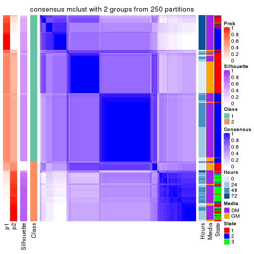</p>

</div>
<div id='tab-ATC-mclust-consensus-heatmap-2'>
<pre><code class="r">consensus_heatmap(res, k = 3)
</code></pre>

<p></p>

</div>
<div id='tab-ATC-mclust-consensus-heatmap-3'>
<pre><code class="r">consensus_heatmap(res, k = 4)
</code></pre>

<p></p>

</div>
<div id='tab-ATC-mclust-consensus-heatmap-4'>
<pre><code class="r">consensus_heatmap(res, k = 5)
</code></pre>

<p></p>

</div>
<div id='tab-ATC-mclust-consensus-heatmap-5'>
<pre><code class="r">consensus_heatmap(res, k = 6)
</code></pre>

<p></p>

</div>
</div>

Heatmaps for the membership of samples in all partitions to see how consistent they are:


<script>
$( function() {
	$( '#tabs-ATC-mclust-membership-heatmap' ).tabs();
} );
</script>
<div id='tabs-ATC-mclust-membership-heatmap'>
<ul>
<li><a href='#tab-ATC-mclust-membership-heatmap-1'>k = 2</a></li>
<li><a href='#tab-ATC-mclust-membership-heatmap-2'>k = 3</a></li>
<li><a href='#tab-ATC-mclust-membership-heatmap-3'>k = 4</a></li>
<li><a href='#tab-ATC-mclust-membership-heatmap-4'>k = 5</a></li>
<li><a href='#tab-ATC-mclust-membership-heatmap-5'>k = 6</a></li>
</ul>
<div id='tab-ATC-mclust-membership-heatmap-1'>
<pre><code class="r">membership_heatmap(res, k = 2)
</code></pre>

<p></p>

</div>
<div id='tab-ATC-mclust-membership-heatmap-2'>
<pre><code class="r">membership_heatmap(res, k = 3)
</code></pre>

<p></p>

</div>
<div id='tab-ATC-mclust-membership-heatmap-3'>
<pre><code class="r">membership_heatmap(res, k = 4)
</code></pre>

<p></p>

</div>
<div id='tab-ATC-mclust-membership-heatmap-4'>
<pre><code class="r">membership_heatmap(res, k = 5)
</code></pre>

<p></p>

</div>
<div id='tab-ATC-mclust-membership-heatmap-5'>
<pre><code class="r">membership_heatmap(res, k = 6)
</code></pre>

<p></p>

</div>
</div>

As soon as we have had the classes for columns, we can look for signatures
which are significantly different between classes which can be candidate marks
for certain classes. Following are the heatmaps for signatures.


Signature heatmaps where rows are scaled:


<script>
$( function() {
	$( '#tabs-ATC-mclust-get-signatures' ).tabs();
} );
</script>
<div id='tabs-ATC-mclust-get-signatures'>
<ul>
<li><a href='#tab-ATC-mclust-get-signatures-1'>k = 2</a></li>
<li><a href='#tab-ATC-mclust-get-signatures-2'>k = 3</a></li>
<li><a href='#tab-ATC-mclust-get-signatures-3'>k = 4</a></li>
<li><a href='#tab-ATC-mclust-get-signatures-4'>k = 5</a></li>
<li><a href='#tab-ATC-mclust-get-signatures-5'>k = 6</a></li>
</ul>
<div id='tab-ATC-mclust-get-signatures-1'>
<pre><code class="r">get_signatures(res, k = 2)
</code></pre>

<p></p>

</div>
<div id='tab-ATC-mclust-get-signatures-2'>
<pre><code class="r">get_signatures(res, k = 3)
</code></pre>

<p></p>

</div>
<div id='tab-ATC-mclust-get-signatures-3'>
<pre><code class="r">get_signatures(res, k = 4)
</code></pre>

<p></p>

</div>
<div id='tab-ATC-mclust-get-signatures-4'>
<pre><code class="r">get_signatures(res, k = 5)
</code></pre>

<p></p>

</div>
<div id='tab-ATC-mclust-get-signatures-5'>
<pre><code class="r">get_signatures(res, k = 6)
</code></pre>

<p></p>

</div>
</div>


Signature heatmaps where rows are not scaled:


<script>
$( function() {
	$( '#tabs-ATC-mclust-get-signatures-no-scale' ).tabs();
} );
</script>
<div id='tabs-ATC-mclust-get-signatures-no-scale'>
<ul>
<li><a href='#tab-ATC-mclust-get-signatures-no-scale-1'>k = 2</a></li>
<li><a href='#tab-ATC-mclust-get-signatures-no-scale-2'>k = 3</a></li>
<li><a href='#tab-ATC-mclust-get-signatures-no-scale-3'>k = 4</a></li>
<li><a href='#tab-ATC-mclust-get-signatures-no-scale-4'>k = 5</a></li>
<li><a href='#tab-ATC-mclust-get-signatures-no-scale-5'>k = 6</a></li>
</ul>
<div id='tab-ATC-mclust-get-signatures-no-scale-1'>
<pre><code class="r">get_signatures(res, k = 2, scale_rows = FALSE)
</code></pre>

<p></p>

</div>
<div id='tab-ATC-mclust-get-signatures-no-scale-2'>
<pre><code class="r">get_signatures(res, k = 3, scale_rows = FALSE)
</code></pre>

<p></p>

</div>
<div id='tab-ATC-mclust-get-signatures-no-scale-3'>
<pre><code class="r">get_signatures(res, k = 4, scale_rows = FALSE)
</code></pre>

<p></p>

</div>
<div id='tab-ATC-mclust-get-signatures-no-scale-4'>
<pre><code class="r">get_signatures(res, k = 5, scale_rows = FALSE)
</code></pre>

<p></p>

</div>
<div id='tab-ATC-mclust-get-signatures-no-scale-5'>
<pre><code class="r">get_signatures(res, k = 6, scale_rows = FALSE)
</code></pre>

<p></p>

</div>
</div>


Compare the overlap of signatures from different k:

```r
compare_signatures(res)
```


`get_signature()` returns a data frame invisibly. TO get the list of signatures, the function
call should be assigned to a variable explicitly. In following code, if `plot` argument is set
to `FALSE`, no heatmap is plotted while only the differential analysis is performed.

```r
# code only for demonstration
tb = get_signature(res, k = ..., plot = FALSE)
```

An example of the output of `tb` is:

```
#>   which_row         fdr    mean_1    mean_2 scaled_mean_1 scaled_mean_2 km
#> 1        38 0.042760348  8.373488  9.131774    -0.5533452     0.5164555  1
#> 2        40 0.018707592  7.106213  8.469186    -0.6173731     0.5762149  1
#> 3        55 0.019134737 10.221463 11.207825    -0.6159697     0.5749050  1
#> 4        59 0.006059896  5.921854  7.869574    -0.6899429     0.6439467  1
#> 5        60 0.018055526  8.928898 10.211722    -0.6204761     0.5791110  1
#> 6        98 0.009384629 15.714769 14.887706     0.6635654    -0.6193277  2
...
```

The columns in `tb` are:

1. `which_row`: row indices corresponding to the input matrix.
2. `fdr`: FDR for the differential test. 
3. `mean_x`: The mean value in group x.
4. `scaled_mean_x`: The mean value in group x after rows are scaled.
5. `km`: Row groups if k-means clustering is applied to rows.


UMAP plot which shows how samples are separated.


<script>
$( function() {
	$( '#tabs-ATC-mclust-dimension-reduction' ).tabs();
} );
</script>
<div id='tabs-ATC-mclust-dimension-reduction'>
<ul>
<li><a href='#tab-ATC-mclust-dimension-reduction-1'>k = 2</a></li>
<li><a href='#tab-ATC-mclust-dimension-reduction-2'>k = 3</a></li>
<li><a href='#tab-ATC-mclust-dimension-reduction-3'>k = 4</a></li>
<li><a href='#tab-ATC-mclust-dimension-reduction-4'>k = 5</a></li>
<li><a href='#tab-ATC-mclust-dimension-reduction-5'>k = 6</a></li>
</ul>
<div id='tab-ATC-mclust-dimension-reduction-1'>
<pre><code class="r">dimension_reduction(res, k = 2, method = &quot;UMAP&quot;)
</code></pre>

<p></p>

</div>
<div id='tab-ATC-mclust-dimension-reduction-2'>
<pre><code class="r">dimension_reduction(res, k = 3, method = &quot;UMAP&quot;)
</code></pre>

<p></p>

</div>
<div id='tab-ATC-mclust-dimension-reduction-3'>
<pre><code class="r">dimension_reduction(res, k = 4, method = &quot;UMAP&quot;)
</code></pre>

<p></p>

</div>
<div id='tab-ATC-mclust-dimension-reduction-4'>
<pre><code class="r">dimension_reduction(res, k = 5, method = &quot;UMAP&quot;)
</code></pre>

<p></p>

</div>
<div id='tab-ATC-mclust-dimension-reduction-5'>
<pre><code class="r">dimension_reduction(res, k = 6, method = &quot;UMAP&quot;)
</code></pre>

<p></p>

</div>
</div>


Following heatmap shows how subgroups are split when increasing `k`:

```r
collect_classes(res)
```


Test correlation between subgroups and known annotations. If the known
annotation is numeric, one-way ANOVA test is applied, and if the known
annotation is discrete, chi-squared contingency table test is applied.

```r
test_to_known_factors(res)
```

```
#>              n Hours(p) Media(p) State(p) k
#> ATC:mclust 232 6.93e-06 5.89e-04 1.49e-29 2
#> ATC:mclust 252 7.00e-35 3.65e-12 3.03e-49 3
#> ATC:mclust 253 3.67e-78 5.71e-35 7.51e-60 4
#> ATC:mclust 216 3.14e-64 4.93e-25 4.90e-51 5
#> ATC:mclust 217 1.88e-62 1.82e-24 6.00e-50 6
```


If matrix rows can be associated to genes, consider to use `GO_Enrichment(res,
...)` to perform function enrichment for the signature genes.


 

---------------------------------------------------


### ATC:NMF**


The object with results only for a single top-value method and a single partition method 
can be extracted as:

```r
res = res_list["ATC", "NMF"]
# you can also extract it by
# res = res_list["ATC:NMF"]
```

A summary of `res` and all the functions that can be applied to it:

```r
res
```

```
#> A 'ConsensusPartition' object with k = 2, 3, 4, 5, 6.
#>   On a matrix with 12016 rows and 271 columns.
#>   Top rows (1000, 2000, 3000, 4000, 5000) are extracted by 'ATC' method.
#>   Subgroups are detected by 'NMF' method.
#>   Performed in total 1250 partitions by row resampling.
#>   Best k for subgroups seems to be 4.
#> 
#> Following methods can be applied to this 'ConsensusPartition' object:
#>  [1] "cola_report"             "collect_classes"         "collect_plots"          
#>  [4] "collect_stats"           "colnames"                "compare_signatures"     
#>  [7] "consensus_heatmap"       "dimension_reduction"     "functional_enrichment"  
#> [10] "get_anno_col"            "get_anno"                "get_classes"            
#> [13] "get_consensus"           "get_matrix"              "get_membership"         
#> [16] "get_param"               "get_signatures"          "get_stats"              
#> [19] "is_best_k"               "is_stable_k"             "membership_heatmap"     
#> [22] "ncol"                    "nrow"                    "plot_ecdf"              
#> [25] "rownames"                "select_partition_number" "show"                   
#> [28] "suggest_best_k"          "test_to_known_factors"
```

`collect_plots()` function collects all the plots made from `res` for all `k` (number of partitions)
into one single page to provide an easy and fast comparison between different `k`.

```r
collect_plots(res)
```


The plots are:

- The first row: a plot of the ECDF (Empirical cumulative distribution
  function) curves of the consensus matrix for each `k` and the heatmap of
  predicted classes for each `k`.
- The second row: heatmaps of the consensus matrix for each `k`.
- The third row: heatmaps of the membership matrix for each `k`.
- The fouth row: heatmaps of the signatures for each `k`.

All the plots in panels can be made by individual functions and they are
plotted later in this section.

`select_partition_number()` produces several plots showing different
statistics for choosing "optimized" `k`. There are following statistics:

- ECDF curves of the consensus matrix for each `k`;
- 1-PAC. [The PAC
  score](https://en.wikipedia.org/wiki/Consensus_clustering#Over-interpretation_potential_of_consensus_clustering)
  measures the proportion of the ambiguous subgrouping.
- Mean silhouette score.
- Concordance. The mean probability of fiting the consensus class ids in all
  partitions.
- Area increased. Denote $A_k$ as the area under the ECDF curve for current
  `k`, the area increased is defined as $A_k - A_{k-1}$.
- Rand index. The percent of pairs of samples that are both in a same cluster
  or both are not in a same cluster in the partition of k and k-1.
- Jaccard index. The ratio of pairs of samples are both in a same cluster in
  the partition of k and k-1 and the pairs of samples are both in a same
  cluster in the partition k or k-1.

The detailed explanations of these statistics can be found in [the cola
vignette](http://bioconductor.org/packages/devel/bioc/vignettes/cola/inst/doc/cola.html#toc_13).

Generally speaking, lower PAC score, higher mean silhouette score or higher
concordance corresponds to better partition. Rand index and Jaccard index
measure how similar the current partition is compared to partition with `k-1`.
If they are too similar, we won't accept `k` is better than `k-1`.

```r
select_partition_number(res)
```


The numeric values for all these statistics can be obtained by `get_stats()`.

```r
get_stats(res)
```

```
#>   k 1-PAC mean_silhouette concordance area_increased  Rand Jaccard
#> 2 2 0.587           0.901       0.945         0.4850 0.519   0.519
#> 3 3 0.784           0.836       0.912         0.3327 0.694   0.479
#> 4 4 1.000           0.966       0.986         0.1174 0.854   0.622
#> 5 5 0.844           0.843       0.920         0.0826 0.900   0.665
#> 6 6 0.829           0.713       0.855         0.0454 0.952   0.791
```

`suggest_best_k()` suggests the best $k$ based on these statistics. The rules are as follows:

- All $k$ with Jaccard index larger than 0.95 are removed because the increase of
  the partition number does not provides enough extra information. If all $k$ are removed,
  the best $k$ is assigned by `NA`.
- For $k$ with 1-PAC larger than 0.9, the maximal $k$ is taken as the "best k". Other $k$ is called "optional k".
- If it does not fit the second rule. The $k$ with the highest vote of highest
  1-PAC, mean silhouette and concordance is taken as the "best k".

```r
suggest_best_k(res)
```

```
#> [1] 4
```


Following shows the table of the partitions (You need to click the **show/hide
code output** link to see it). The membership matrix (columns with name `p*`)
is inferred by
[`clue::cl_consensus()`](https://www.rdocumentation.org/link/cl_consensus?package=clue)
function with the `SE` method. Basically the value in the membership matrix
represents the probability to belong to a certain group. The finall class
label for an item is determined with the group with highest probability it
belongs to.

In `get_classes()` function, the entropy is calculated from the membership
matrix and the silhouette score is calculated from the consensus matrix.


<script>
$( function() {
	$( '#tabs-ATC-NMF-get-classes' ).tabs();
} );
</script>
<div id='tabs-ATC-NMF-get-classes'>
<ul>
<li><a href='#tab-ATC-NMF-get-classes-1'>k = 2</a></li>
<li><a href='#tab-ATC-NMF-get-classes-2'>k = 3</a></li>
<li><a href='#tab-ATC-NMF-get-classes-3'>k = 4</a></li>
<li><a href='#tab-ATC-NMF-get-classes-4'>k = 5</a></li>
<li><a href='#tab-ATC-NMF-get-classes-5'>k = 6</a></li>
</ul>

<div id='tab-ATC-NMF-get-classes-1'>
<p><a id='tab-ATC-NMF-get-classes-1-a' style='color:#0366d6' href='#'>show/hide code output</a></p>
<pre><code class="r">cbind(get_classes(res, k = 2), get_membership(res, k = 2))
</code></pre>

<pre><code>#&gt;            class entropy silhouette    p1    p2
#&gt; T0_CT_A01      2  0.4690     0.9070 0.100 0.900
#&gt; T0_CT_A03      2  0.4690     0.9070 0.100 0.900
#&gt; T0_CT_A05      2  0.4690     0.9070 0.100 0.900
#&gt; T0_CT_A06      2  0.4690     0.9070 0.100 0.900
#&gt; T0_CT_A07      2  0.4690     0.9070 0.100 0.900
#&gt; T0_CT_A08      1  0.0000     0.9504 1.000 0.000
#&gt; T0_CT_A10      2  0.4690     0.9070 0.100 0.900
#&gt; T0_CT_A11      2  0.5737     0.8824 0.136 0.864
#&gt; T0_CT_B01      2  0.4690     0.9084 0.100 0.900
#&gt; T0_CT_B03      2  0.4690     0.9070 0.100 0.900
#&gt; T0_CT_B05      2  0.8386     0.7276 0.268 0.732
#&gt; T0_CT_B07      2  0.4815     0.9061 0.104 0.896
#&gt; T0_CT_B08      2  0.4690     0.9070 0.100 0.900
#&gt; T0_CT_B09      2  0.4690     0.9070 0.100 0.900
#&gt; T0_CT_C02      2  0.4690     0.9070 0.100 0.900
#&gt; T0_CT_C03      1  0.0000     0.9504 1.000 0.000
#&gt; T0_CT_C05      2  0.0000     0.9348 0.000 1.000
#&gt; T0_CT_C06      2  0.5519     0.8904 0.128 0.872
#&gt; T0_CT_C07      2  0.4690     0.9070 0.100 0.900
#&gt; T0_CT_C08      2  0.4690     0.9070 0.100 0.900
#&gt; T0_CT_C09      2  0.0376     0.9361 0.004 0.996
#&gt; T0_CT_C11      2  0.0376     0.9361 0.004 0.996
#&gt; T0_CT_C12      2  0.4690     0.9070 0.100 0.900
#&gt; T0_CT_D01      2  0.0000     0.9348 0.000 1.000
#&gt; T0_CT_D02      2  0.4815     0.9061 0.104 0.896
#&gt; T0_CT_D03      2  0.4690     0.9070 0.100 0.900
#&gt; T0_CT_D05      2  0.1633     0.9320 0.024 0.976
#&gt; T0_CT_D06      2  0.4562     0.9087 0.096 0.904
#&gt; T0_CT_D07      2  0.4690     0.9070 0.100 0.900
#&gt; T0_CT_D08      2  0.4690     0.9070 0.100 0.900
#&gt; T0_CT_D09      2  0.0000     0.9348 0.000 1.000
#&gt; T0_CT_D11      2  0.0000     0.9348 0.000 1.000
#&gt; T0_CT_D12      2  0.4690     0.9070 0.100 0.900
#&gt; T0_CT_E01      2  0.4690     0.9070 0.100 0.900
#&gt; T0_CT_E03      2  0.4690     0.9070 0.100 0.900
#&gt; T0_CT_E04      2  0.0000     0.9348 0.000 1.000
#&gt; T0_CT_E05      1  0.0000     0.9504 1.000 0.000
#&gt; T0_CT_E06      2  0.4690     0.9070 0.100 0.900
#&gt; T0_CT_E07      2  0.4690     0.9070 0.100 0.900
#&gt; T0_CT_E08      2  0.4690     0.9070 0.100 0.900
#&gt; T0_CT_E09      2  0.4690     0.9070 0.100 0.900
#&gt; T0_CT_E10      2  0.0000     0.9348 0.000 1.000
#&gt; T0_CT_E11      2  0.4690     0.9070 0.100 0.900
#&gt; T0_CT_E12      2  0.4690     0.9070 0.100 0.900
#&gt; T0_CT_F01      2  0.4690     0.9070 0.100 0.900
#&gt; T0_CT_F02      2  0.4690     0.9070 0.100 0.900
#&gt; T0_CT_F03      2  0.4690     0.9070 0.100 0.900
#&gt; T0_CT_F04      2  0.4690     0.9070 0.100 0.900
#&gt; T0_CT_F05      2  0.0000     0.9348 0.000 1.000
#&gt; T0_CT_F06      2  0.4690     0.9070 0.100 0.900
#&gt; T0_CT_F07      2  0.4815     0.9061 0.104 0.896
#&gt; T0_CT_F09      2  0.0376     0.9361 0.004 0.996
#&gt; T0_CT_F11      2  0.4690     0.9070 0.100 0.900
#&gt; T0_CT_F12      2  0.4690     0.9070 0.100 0.900
#&gt; T0_CT_G01      2  0.4690     0.9070 0.100 0.900
#&gt; T0_CT_G02      2  0.9087     0.6326 0.324 0.676
#&gt; T0_CT_G03      2  0.4690     0.9070 0.100 0.900
#&gt; T0_CT_G04      2  0.4690     0.9070 0.100 0.900
#&gt; T0_CT_G07      2  0.4690     0.9070 0.100 0.900
#&gt; T0_CT_G08      2  0.4690     0.9070 0.100 0.900
#&gt; T0_CT_G09      1  0.0000     0.9504 1.000 0.000
#&gt; T0_CT_G11      2  0.4815     0.9061 0.104 0.896
#&gt; T0_CT_H01      2  0.7602     0.7966 0.220 0.780
#&gt; T0_CT_H02      2  0.0000     0.9348 0.000 1.000
#&gt; T0_CT_H04      2  0.4690     0.9070 0.100 0.900
#&gt; T0_CT_H05      2  0.4815     0.9061 0.104 0.896
#&gt; T0_CT_H08      2  0.4690     0.9083 0.100 0.900
#&gt; T0_CT_H09      2  0.0376     0.9361 0.004 0.996
#&gt; T0_CT_H12      2  0.4815     0.9061 0.104 0.896
#&gt; T24_CT_A01     1  0.0000     0.9504 1.000 0.000
#&gt; T24_CT_A03     2  0.0376     0.9361 0.004 0.996
#&gt; T24_CT_A04     2  0.0000     0.9348 0.000 1.000
#&gt; T24_CT_A05     2  0.4690     0.9070 0.100 0.900
#&gt; T24_CT_A07     2  0.0376     0.9361 0.004 0.996
#&gt; T24_CT_A08     1  0.0000     0.9504 1.000 0.000
#&gt; T24_CT_A09     1  0.0000     0.9504 1.000 0.000
#&gt; T24_CT_A10     1  0.0000     0.9504 1.000 0.000
#&gt; T24_CT_B01     1  0.0000     0.9504 1.000 0.000
#&gt; T24_CT_B02     1  0.0000     0.9504 1.000 0.000
#&gt; T24_CT_B03     2  0.0376     0.9361 0.004 0.996
#&gt; T24_CT_B05     2  0.0376     0.9361 0.004 0.996
#&gt; T24_CT_B06     2  0.0376     0.9361 0.004 0.996
#&gt; T24_CT_B07     1  0.0000     0.9504 1.000 0.000
#&gt; T24_CT_B08     2  0.0376     0.9361 0.004 0.996
#&gt; T24_CT_B09     1  0.0000     0.9504 1.000 0.000
#&gt; T24_CT_B11     2  0.4690     0.9070 0.100 0.900
#&gt; T24_CT_C01     1  0.0000     0.9504 1.000 0.000
#&gt; T24_CT_C02     2  0.0376     0.9361 0.004 0.996
#&gt; T24_CT_C03     1  0.0000     0.9504 1.000 0.000
#&gt; T24_CT_C05     2  0.0376     0.9361 0.004 0.996
#&gt; T24_CT_C07     2  0.0376     0.9361 0.004 0.996
#&gt; T24_CT_C08     2  0.0376     0.9361 0.004 0.996
#&gt; T24_CT_C09     2  0.0376     0.9361 0.004 0.996
#&gt; T24_CT_C10     1  0.0000     0.9504 1.000 0.000
#&gt; T24_CT_C11     1  0.4939     0.8900 0.892 0.108
#&gt; T24_CT_C12     2  0.0376     0.9361 0.004 0.996
#&gt; T24_CT_D01     2  0.0376     0.9361 0.004 0.996
#&gt; T24_CT_D02     2  0.0000     0.9348 0.000 1.000
#&gt; T24_CT_D03     2  0.0376     0.9361 0.004 0.996
#&gt; T24_CT_D04     1  0.0000     0.9504 1.000 0.000
#&gt; T24_CT_D05     1  0.0000     0.9504 1.000 0.000
#&gt; T24_CT_D06     1  0.0000     0.9504 1.000 0.000
#&gt; T24_CT_D07     1  0.1184     0.9421 0.984 0.016
#&gt; T24_CT_D08     2  0.0376     0.9361 0.004 0.996
#&gt; T24_CT_D09     2  0.0376     0.9361 0.004 0.996
#&gt; T24_CT_D10     2  0.0376     0.9361 0.004 0.996
#&gt; T24_CT_D11     2  0.0376     0.9361 0.004 0.996
#&gt; T24_CT_E01     1  0.0000     0.9504 1.000 0.000
#&gt; T24_CT_E02     1  0.0000     0.9504 1.000 0.000
#&gt; T24_CT_E04     2  0.0376     0.9361 0.004 0.996
#&gt; T24_CT_E05     1  0.0000     0.9504 1.000 0.000
#&gt; T24_CT_E07     2  0.7056     0.7513 0.192 0.808
#&gt; T24_CT_E09     1  0.0000     0.9504 1.000 0.000
#&gt; T24_CT_E11     1  0.0000     0.9504 1.000 0.000
#&gt; T24_CT_E12     2  0.0376     0.9361 0.004 0.996
#&gt; T24_CT_F01     2  0.0376     0.9361 0.004 0.996
#&gt; T24_CT_F02     2  0.0376     0.9361 0.004 0.996
#&gt; T24_CT_F03     1  0.0000     0.9504 1.000 0.000
#&gt; T24_CT_F04     1  0.0376     0.9487 0.996 0.004
#&gt; T24_CT_F05     1  0.0000     0.9504 1.000 0.000
#&gt; T24_CT_F07     1  0.0000     0.9504 1.000 0.000
#&gt; T24_CT_F08     1  0.0000     0.9504 1.000 0.000
#&gt; T24_CT_F09     2  0.0376     0.9361 0.004 0.996
#&gt; T24_CT_F10     2  0.4431     0.8724 0.092 0.908
#&gt; T24_CT_F11     1  0.0000     0.9504 1.000 0.000
#&gt; T24_CT_F12     2  0.1843     0.9297 0.028 0.972
#&gt; T24_CT_G01     2  0.0376     0.9361 0.004 0.996
#&gt; T24_CT_G02     1  0.0000     0.9504 1.000 0.000
#&gt; T24_CT_G03     1  0.0000     0.9504 1.000 0.000
#&gt; T24_CT_G04     2  0.0376     0.9361 0.004 0.996
#&gt; T24_CT_G05     2  0.0376     0.9361 0.004 0.996
#&gt; T24_CT_G06     1  0.0000     0.9504 1.000 0.000
#&gt; T24_CT_G08     1  0.0000     0.9504 1.000 0.000
#&gt; T24_CT_G10     2  0.0376     0.9361 0.004 0.996
#&gt; T24_CT_G11     1  0.0000     0.9504 1.000 0.000
#&gt; T24_CT_G12     1  0.0000     0.9504 1.000 0.000
#&gt; T24_CT_H01     2  0.4690     0.9070 0.100 0.900
#&gt; T24_CT_H02     1  0.0000     0.9504 1.000 0.000
#&gt; T24_CT_H03     2  0.0376     0.9361 0.004 0.996
#&gt; T24_CT_H05     1  0.0000     0.9504 1.000 0.000
#&gt; T24_CT_H07     1  0.0000     0.9504 1.000 0.000
#&gt; T24_CT_H09     1  0.0000     0.9504 1.000 0.000
#&gt; T24_CT_H12     1  0.0000     0.9504 1.000 0.000
#&gt; T48_CT_A01     2  0.0376     0.9361 0.004 0.996
#&gt; T48_CT_A02     2  0.0376     0.9361 0.004 0.996
#&gt; T48_CT_A03     1  0.0000     0.9504 1.000 0.000
#&gt; T48_CT_A04     2  0.0376     0.9361 0.004 0.996
#&gt; T48_CT_A05     2  0.7219     0.7385 0.200 0.800
#&gt; T48_CT_A06     1  0.0000     0.9504 1.000 0.000
#&gt; T48_CT_A07     2  0.4161     0.9130 0.084 0.916
#&gt; T48_CT_A08     2  0.0376     0.9361 0.004 0.996
#&gt; T48_CT_A09     1  0.0000     0.9504 1.000 0.000
#&gt; T48_CT_A10     2  0.0376     0.9361 0.004 0.996
#&gt; T48_CT_A11     2  0.0376     0.9361 0.004 0.996
#&gt; T48_CT_A12     1  0.0000     0.9504 1.000 0.000
#&gt; T48_CT_B01     2  0.0376     0.9361 0.004 0.996
#&gt; T48_CT_B02     2  0.0376     0.9361 0.004 0.996
#&gt; T48_CT_B03     1  0.0000     0.9504 1.000 0.000
#&gt; T48_CT_B04     1  0.0000     0.9504 1.000 0.000
#&gt; T48_CT_B06     2  0.0376     0.9361 0.004 0.996
#&gt; T48_CT_B08     1  0.0000     0.9504 1.000 0.000
#&gt; T48_CT_B10     2  0.0376     0.9361 0.004 0.996
#&gt; T48_CT_B11     2  0.0376     0.9361 0.004 0.996
#&gt; T48_CT_B12     1  0.4431     0.8986 0.908 0.092
#&gt; T48_CT_C01     2  0.0376     0.9361 0.004 0.996
#&gt; T48_CT_C02     1  0.0000     0.9504 1.000 0.000
#&gt; T48_CT_C03     2  0.0376     0.9361 0.004 0.996
#&gt; T48_CT_C04     1  0.0000     0.9504 1.000 0.000
#&gt; T48_CT_C05     2  0.0672     0.9345 0.008 0.992
#&gt; T48_CT_C06     2  0.0376     0.9361 0.004 0.996
#&gt; T48_CT_C07     1  0.1184     0.9429 0.984 0.016
#&gt; T48_CT_C09     2  0.0000     0.9348 0.000 1.000
#&gt; T48_CT_C10     1  0.0000     0.9504 1.000 0.000
#&gt; T48_CT_C11     2  0.0376     0.9361 0.004 0.996
#&gt; T48_CT_D01     2  0.3879     0.8903 0.076 0.924
#&gt; T48_CT_D02     1  0.0376     0.9487 0.996 0.004
#&gt; T48_CT_D03     1  0.0000     0.9504 1.000 0.000
#&gt; T48_CT_D04     2  0.0376     0.9361 0.004 0.996
#&gt; T48_CT_D06     2  0.0376     0.9361 0.004 0.996
#&gt; T48_CT_D07     2  0.0376     0.9361 0.004 0.996
#&gt; T48_CT_D08     1  0.0000     0.9504 1.000 0.000
#&gt; T48_CT_D09     2  0.0376     0.9361 0.004 0.996
#&gt; T48_CT_D10     1  0.3584     0.9133 0.932 0.068
#&gt; T48_CT_D11     2  0.0000     0.9348 0.000 1.000
#&gt; T48_CT_D12     1  0.0000     0.9504 1.000 0.000
#&gt; T48_CT_E01     2  0.8909     0.5379 0.308 0.692
#&gt; T48_CT_E02     1  0.0000     0.9504 1.000 0.000
#&gt; T48_CT_E03     2  0.0672     0.9345 0.008 0.992
#&gt; T48_CT_E04     1  0.4690     0.8928 0.900 0.100
#&gt; T48_CT_E05     2  0.0376     0.9361 0.004 0.996
#&gt; T48_CT_E06     1  0.0000     0.9504 1.000 0.000
#&gt; T48_CT_E07     1  0.0000     0.9504 1.000 0.000
#&gt; T48_CT_E08     2  0.0376     0.9361 0.004 0.996
#&gt; T48_CT_E10     1  0.0000     0.9504 1.000 0.000
#&gt; T48_CT_E11     1  0.0000     0.9504 1.000 0.000
#&gt; T48_CT_E12     2  0.3733     0.9169 0.072 0.928
#&gt; T48_CT_F01     2  0.0376     0.9361 0.004 0.996
#&gt; T48_CT_F02     1  0.0000     0.9504 1.000 0.000
#&gt; T48_CT_F03     1  0.0000     0.9504 1.000 0.000
#&gt; T48_CT_F05     2  0.0376     0.9361 0.004 0.996
#&gt; T48_CT_F07     1  0.0000     0.9504 1.000 0.000
#&gt; T48_CT_F09     2  0.0376     0.9361 0.004 0.996
#&gt; T48_CT_F10     1  0.0000     0.9504 1.000 0.000
#&gt; T48_CT_F11     1  0.0000     0.9504 1.000 0.000
#&gt; T48_CT_G01     1  0.0000     0.9504 1.000 0.000
#&gt; T48_CT_G02     2  0.0376     0.9361 0.004 0.996
#&gt; T48_CT_G03     2  0.0376     0.9361 0.004 0.996
#&gt; T48_CT_G07     2  0.0376     0.9361 0.004 0.996
#&gt; T48_CT_G08     2  0.0376     0.9361 0.004 0.996
#&gt; T48_CT_G09     2  0.1184     0.9305 0.016 0.984
#&gt; T48_CT_G10     1  0.9732     0.2469 0.596 0.404
#&gt; T48_CT_G11     1  0.0000     0.9504 1.000 0.000
#&gt; T48_CT_G12     2  0.0376     0.9361 0.004 0.996
#&gt; T48_CT_H01     2  0.0376     0.9361 0.004 0.996
#&gt; T48_CT_H02     2  0.8713     0.5722 0.292 0.708
#&gt; T48_CT_H04     1  0.0000     0.9504 1.000 0.000
#&gt; T48_CT_H05     2  0.0376     0.9361 0.004 0.996
#&gt; T48_CT_H06     2  0.0376     0.9361 0.004 0.996
#&gt; T48_CT_H07     1  0.4562     0.8958 0.904 0.096
#&gt; T48_CT_H08     2  0.0376     0.9361 0.004 0.996
#&gt; T48_CT_H11     1  0.0000     0.9504 1.000 0.000
#&gt; T48_CT_H12     2  0.0376     0.9361 0.004 0.996
#&gt; T72_CT_A01     2  0.7219     0.7329 0.200 0.800
#&gt; T72_CT_A05     2  0.6973     0.7509 0.188 0.812
#&gt; T72_CT_A08     1  0.4690     0.8928 0.900 0.100
#&gt; T72_CT_A09     1  0.9087     0.5984 0.676 0.324
#&gt; T72_CT_A11     2  0.9522     0.3619 0.372 0.628
#&gt; T72_CT_B01     2  0.0376     0.9344 0.004 0.996
#&gt; T72_CT_B02     1  0.0000     0.9504 1.000 0.000
#&gt; T72_CT_B03     1  0.4815     0.8927 0.896 0.104
#&gt; T72_CT_B04     1  0.0000     0.9504 1.000 0.000
#&gt; T72_CT_B05     1  0.4815     0.8927 0.896 0.104
#&gt; T72_CT_B06     1  0.1184     0.9428 0.984 0.016
#&gt; T72_CT_B08     2  0.0000     0.9348 0.000 1.000
#&gt; T72_CT_B09     1  0.0000     0.9504 1.000 0.000
#&gt; T72_CT_B11     1  0.4815     0.8927 0.896 0.104
#&gt; T72_CT_B12     1  0.6973     0.8144 0.812 0.188
#&gt; T72_CT_C04     2  0.0000     0.9348 0.000 1.000
#&gt; T72_CT_C06     1  0.4690     0.8928 0.900 0.100
#&gt; T72_CT_C07     2  0.0000     0.9348 0.000 1.000
#&gt; T72_CT_C09     1  0.4815     0.8927 0.896 0.104
#&gt; T72_CT_C11     2  0.0000     0.9348 0.000 1.000
#&gt; T72_CT_D01     1  0.9850     0.3463 0.572 0.428
#&gt; T72_CT_D03     1  0.4815     0.8927 0.896 0.104
#&gt; T72_CT_D04     2  0.7219     0.7334 0.200 0.800
#&gt; T72_CT_D05     1  0.4690     0.8928 0.900 0.100
#&gt; T72_CT_D07     1  0.4690     0.8928 0.900 0.100
#&gt; T72_CT_D10     1  0.4815     0.8927 0.896 0.104
#&gt; T72_CT_D11     1  0.0672     0.9468 0.992 0.008
#&gt; T72_CT_E04     1  0.4815     0.8927 0.896 0.104
#&gt; T72_CT_E05     1  0.9922     0.2843 0.552 0.448
#&gt; T72_CT_E07     1  0.4690     0.8928 0.900 0.100
#&gt; T72_CT_F01     1  0.5629     0.8724 0.868 0.132
#&gt; T72_CT_F05     2  0.8386     0.6137 0.268 0.732
#&gt; T72_CT_F07     1  0.4690     0.8928 0.900 0.100
#&gt; T72_CT_F10     1  0.7674     0.7678 0.776 0.224
#&gt; T72_CT_F11     2  0.0000     0.9348 0.000 1.000
#&gt; T72_CT_G03     1  0.0000     0.9504 1.000 0.000
#&gt; T72_CT_G04     1  0.0000     0.9504 1.000 0.000
#&gt; T72_CT_G06     2  0.0000     0.9348 0.000 1.000
#&gt; T72_CT_G08     1  0.4939     0.8905 0.892 0.108
#&gt; T72_CT_G10     1  0.7950     0.7447 0.760 0.240
#&gt; T72_CT_G11     1  0.4431     0.8985 0.908 0.092
#&gt; T72_CT_H01     2  0.0000     0.9348 0.000 1.000
#&gt; T72_CT_H03     1  0.9850     0.3461 0.572 0.428
#&gt; T72_CT_H05     2  0.0000     0.9348 0.000 1.000
#&gt; T72_CT_H08     2  0.0000     0.9348 0.000 1.000
#&gt; T72_CT_H09     2  0.8267     0.7275 0.260 0.740
#&gt; T72_CT_H10     1  0.4690     0.8928 0.900 0.100
#&gt; T72_CT_H11     1  0.4690     0.8928 0.900 0.100
#&gt; T72_CT_H12     2  0.9988    -0.0307 0.480 0.520
</code></pre>

<script>
$('#tab-ATC-NMF-get-classes-1-a').parent().next().next().hide();
$('#tab-ATC-NMF-get-classes-1-a').click(function(){
  $('#tab-ATC-NMF-get-classes-1-a').parent().next().next().toggle();
  return(false);
});
</script>
</div>

<div id='tab-ATC-NMF-get-classes-2'>
<p><a id='tab-ATC-NMF-get-classes-2-a' style='color:#0366d6' href='#'>show/hide code output</a></p>
<pre><code class="r">cbind(get_classes(res, k = 3), get_membership(res, k = 3))
</code></pre>

<pre><code>#&gt;            class entropy silhouette    p1    p2    p3
#&gt; T0_CT_A01      3  0.0592     0.9103 0.000 0.012 0.988
#&gt; T0_CT_A03      3  0.0000     0.9173 0.000 0.000 1.000
#&gt; T0_CT_A05      3  0.0000     0.9173 0.000 0.000 1.000
#&gt; T0_CT_A06      3  0.1031     0.9025 0.000 0.024 0.976
#&gt; T0_CT_A07      3  0.0000     0.9173 0.000 0.000 1.000
#&gt; T0_CT_A08      1  0.0000     0.9398 1.000 0.000 0.000
#&gt; T0_CT_A10      3  0.0000     0.9173 0.000 0.000 1.000
#&gt; T0_CT_A11      1  0.6119     0.7223 0.772 0.064 0.164
#&gt; T0_CT_B01      3  0.8332     0.4415 0.104 0.316 0.580
#&gt; T0_CT_B03      3  0.0000     0.9173 0.000 0.000 1.000
#&gt; T0_CT_B05      3  0.8477     0.2917 0.380 0.096 0.524
#&gt; T0_CT_B07      3  0.2689     0.8801 0.036 0.032 0.932
#&gt; T0_CT_B08      3  0.0000     0.9173 0.000 0.000 1.000
#&gt; T0_CT_B09      3  0.0000     0.9173 0.000 0.000 1.000
#&gt; T0_CT_C02      3  0.0000     0.9173 0.000 0.000 1.000
#&gt; T0_CT_C03      1  0.0000     0.9398 1.000 0.000 0.000
#&gt; T0_CT_C05      2  0.6295     0.1048 0.000 0.528 0.472
#&gt; T0_CT_C06      1  0.7232     0.2051 0.544 0.428 0.028
#&gt; T0_CT_C07      3  0.0237     0.9152 0.004 0.000 0.996
#&gt; T0_CT_C08      3  0.0000     0.9173 0.000 0.000 1.000
#&gt; T0_CT_C09      3  0.6095     0.3613 0.000 0.392 0.608
#&gt; T0_CT_C11      2  0.2356     0.8998 0.000 0.928 0.072
#&gt; T0_CT_C12      3  0.0000     0.9173 0.000 0.000 1.000
#&gt; T0_CT_D01      3  0.2356     0.8655 0.000 0.072 0.928
#&gt; T0_CT_D02      3  0.2448     0.8611 0.076 0.000 0.924
#&gt; T0_CT_D03      3  0.0000     0.9173 0.000 0.000 1.000
#&gt; T0_CT_D05      2  0.7722     0.1450 0.048 0.520 0.432
#&gt; T0_CT_D06      3  0.0000     0.9173 0.000 0.000 1.000
#&gt; T0_CT_D07      3  0.0424     0.9129 0.008 0.000 0.992
#&gt; T0_CT_D08      3  0.0000     0.9173 0.000 0.000 1.000
#&gt; T0_CT_D09      3  0.6244     0.2188 0.000 0.440 0.560
#&gt; T0_CT_D11      2  0.5058     0.6959 0.000 0.756 0.244
#&gt; T0_CT_D12      3  0.0000     0.9173 0.000 0.000 1.000
#&gt; T0_CT_E01      3  0.0000     0.9173 0.000 0.000 1.000
#&gt; T0_CT_E03      3  0.0000     0.9173 0.000 0.000 1.000
#&gt; T0_CT_E04      3  0.6299     0.0886 0.000 0.476 0.524
#&gt; T0_CT_E05      1  0.0424     0.9348 0.992 0.008 0.000
#&gt; T0_CT_E06      3  0.0000     0.9173 0.000 0.000 1.000
#&gt; T0_CT_E07      3  0.0000     0.9173 0.000 0.000 1.000
#&gt; T0_CT_E08      3  0.0000     0.9173 0.000 0.000 1.000
#&gt; T0_CT_E09      3  0.0000     0.9173 0.000 0.000 1.000
#&gt; T0_CT_E10      3  0.5216     0.6366 0.000 0.260 0.740
#&gt; T0_CT_E11      3  0.0000     0.9173 0.000 0.000 1.000
#&gt; T0_CT_E12      3  0.0000     0.9173 0.000 0.000 1.000
#&gt; T0_CT_F01      3  0.0000     0.9173 0.000 0.000 1.000
#&gt; T0_CT_F02      3  0.0000     0.9173 0.000 0.000 1.000
#&gt; T0_CT_F03      3  0.0000     0.9173 0.000 0.000 1.000
#&gt; T0_CT_F04      3  0.0000     0.9173 0.000 0.000 1.000
#&gt; T0_CT_F05      3  0.1753     0.8852 0.000 0.048 0.952
#&gt; T0_CT_F06      3  0.0000     0.9173 0.000 0.000 1.000
#&gt; T0_CT_F07      3  0.3031     0.8584 0.012 0.076 0.912
#&gt; T0_CT_F09      2  0.2356     0.8998 0.000 0.928 0.072
#&gt; T0_CT_F11      3  0.0000     0.9173 0.000 0.000 1.000
#&gt; T0_CT_F12      3  0.0000     0.9173 0.000 0.000 1.000
#&gt; T0_CT_G01      3  0.0000     0.9173 0.000 0.000 1.000
#&gt; T0_CT_G02      1  0.9015     0.1880 0.508 0.144 0.348
#&gt; T0_CT_G03      3  0.0000     0.9173 0.000 0.000 1.000
#&gt; T0_CT_G04      3  0.0000     0.9173 0.000 0.000 1.000
#&gt; T0_CT_G07      3  0.0000     0.9173 0.000 0.000 1.000
#&gt; T0_CT_G08      3  0.0000     0.9173 0.000 0.000 1.000
#&gt; T0_CT_G09      1  0.0000     0.9398 1.000 0.000 0.000
#&gt; T0_CT_G11      3  0.9148     0.4842 0.236 0.220 0.544
#&gt; T0_CT_H01      1  0.5706     0.5409 0.680 0.320 0.000
#&gt; T0_CT_H02      3  0.5650     0.5435 0.000 0.312 0.688
#&gt; T0_CT_H04      3  0.0000     0.9173 0.000 0.000 1.000
#&gt; T0_CT_H05      3  0.9471     0.3358 0.208 0.308 0.484
#&gt; T0_CT_H08      3  0.4974     0.6739 0.000 0.236 0.764
#&gt; T0_CT_H09      2  0.5733     0.5433 0.000 0.676 0.324
#&gt; T0_CT_H12      3  0.7816     0.6237 0.132 0.200 0.668
#&gt; T24_CT_A01     1  0.0000     0.9398 1.000 0.000 0.000
#&gt; T24_CT_A03     2  0.2356     0.8998 0.000 0.928 0.072
#&gt; T24_CT_A04     2  0.2356     0.8998 0.000 0.928 0.072
#&gt; T24_CT_A05     3  0.0237     0.9152 0.004 0.000 0.996
#&gt; T24_CT_A07     2  0.2356     0.8998 0.000 0.928 0.072
#&gt; T24_CT_A08     1  0.0000     0.9398 1.000 0.000 0.000
#&gt; T24_CT_A09     1  0.0000     0.9398 1.000 0.000 0.000
#&gt; T24_CT_A10     1  0.0000     0.9398 1.000 0.000 0.000
#&gt; T24_CT_B01     1  0.0000     0.9398 1.000 0.000 0.000
#&gt; T24_CT_B02     1  0.0000     0.9398 1.000 0.000 0.000
#&gt; T24_CT_B03     2  0.2356     0.8998 0.000 0.928 0.072
#&gt; T24_CT_B05     2  0.2356     0.8998 0.000 0.928 0.072
#&gt; T24_CT_B06     2  0.2356     0.8998 0.000 0.928 0.072
#&gt; T24_CT_B07     1  0.0000     0.9398 1.000 0.000 0.000
#&gt; T24_CT_B08     2  0.2356     0.8998 0.000 0.928 0.072
#&gt; T24_CT_B09     1  0.0000     0.9398 1.000 0.000 0.000
#&gt; T24_CT_B11     3  0.0000     0.9173 0.000 0.000 1.000
#&gt; T24_CT_C01     1  0.0000     0.9398 1.000 0.000 0.000
#&gt; T24_CT_C02     2  0.2356     0.8998 0.000 0.928 0.072
#&gt; T24_CT_C03     1  0.0237     0.9374 0.996 0.004 0.000
#&gt; T24_CT_C05     2  0.2356     0.8998 0.000 0.928 0.072
#&gt; T24_CT_C07     2  0.2356     0.8998 0.000 0.928 0.072
#&gt; T24_CT_C08     2  0.2356     0.8998 0.000 0.928 0.072
#&gt; T24_CT_C09     2  0.2356     0.8998 0.000 0.928 0.072
#&gt; T24_CT_C10     1  0.0000     0.9398 1.000 0.000 0.000
#&gt; T24_CT_C11     2  0.6291     0.0722 0.468 0.532 0.000
#&gt; T24_CT_C12     2  0.2356     0.8998 0.000 0.928 0.072
#&gt; T24_CT_D01     2  0.2356     0.8998 0.000 0.928 0.072
#&gt; T24_CT_D02     2  0.2448     0.8972 0.000 0.924 0.076
#&gt; T24_CT_D03     2  0.2356     0.8998 0.000 0.928 0.072
#&gt; T24_CT_D04     1  0.0000     0.9398 1.000 0.000 0.000
#&gt; T24_CT_D05     1  0.4291     0.7685 0.820 0.180 0.000
#&gt; T24_CT_D06     1  0.0000     0.9398 1.000 0.000 0.000
#&gt; T24_CT_D07     1  0.5178     0.6580 0.744 0.256 0.000
#&gt; T24_CT_D08     2  0.2356     0.8998 0.000 0.928 0.072
#&gt; T24_CT_D09     2  0.2356     0.8998 0.000 0.928 0.072
#&gt; T24_CT_D10     2  0.2356     0.8998 0.000 0.928 0.072
#&gt; T24_CT_D11     2  0.2356     0.8998 0.000 0.928 0.072
#&gt; T24_CT_E01     1  0.0000     0.9398 1.000 0.000 0.000
#&gt; T24_CT_E02     1  0.0000     0.9398 1.000 0.000 0.000
#&gt; T24_CT_E04     2  0.2356     0.8998 0.000 0.928 0.072
#&gt; T24_CT_E05     1  0.0000     0.9398 1.000 0.000 0.000
#&gt; T24_CT_E07     2  0.2793     0.8724 0.044 0.928 0.028
#&gt; T24_CT_E09     1  0.0000     0.9398 1.000 0.000 0.000
#&gt; T24_CT_E11     1  0.0000     0.9398 1.000 0.000 0.000
#&gt; T24_CT_E12     2  0.2356     0.8998 0.000 0.928 0.072
#&gt; T24_CT_F01     2  0.2356     0.8998 0.000 0.928 0.072
#&gt; T24_CT_F02     2  0.2356     0.8998 0.000 0.928 0.072
#&gt; T24_CT_F03     1  0.0000     0.9398 1.000 0.000 0.000
#&gt; T24_CT_F04     1  0.2261     0.8877 0.932 0.068 0.000
#&gt; T24_CT_F05     1  0.0000     0.9398 1.000 0.000 0.000
#&gt; T24_CT_F07     1  0.0000     0.9398 1.000 0.000 0.000
#&gt; T24_CT_F08     1  0.0000     0.9398 1.000 0.000 0.000
#&gt; T24_CT_F09     2  0.2356     0.8998 0.000 0.928 0.072
#&gt; T24_CT_F10     2  0.3967     0.8503 0.072 0.884 0.044
#&gt; T24_CT_F11     1  0.0000     0.9398 1.000 0.000 0.000
#&gt; T24_CT_F12     3  0.2537     0.8585 0.000 0.080 0.920
#&gt; T24_CT_G01     2  0.2356     0.8998 0.000 0.928 0.072
#&gt; T24_CT_G02     1  0.0000     0.9398 1.000 0.000 0.000
#&gt; T24_CT_G03     1  0.0000     0.9398 1.000 0.000 0.000
#&gt; T24_CT_G04     2  0.2356     0.8998 0.000 0.928 0.072
#&gt; T24_CT_G05     2  0.2356     0.8998 0.000 0.928 0.072
#&gt; T24_CT_G06     1  0.0000     0.9398 1.000 0.000 0.000
#&gt; T24_CT_G08     1  0.0000     0.9398 1.000 0.000 0.000
#&gt; T24_CT_G10     2  0.2356     0.8998 0.000 0.928 0.072
#&gt; T24_CT_G11     1  0.0000     0.9398 1.000 0.000 0.000
#&gt; T24_CT_G12     1  0.0000     0.9398 1.000 0.000 0.000
#&gt; T24_CT_H01     3  0.0000     0.9173 0.000 0.000 1.000
#&gt; T24_CT_H02     1  0.0000     0.9398 1.000 0.000 0.000
#&gt; T24_CT_H03     2  0.2356     0.8998 0.000 0.928 0.072
#&gt; T24_CT_H05     1  0.0237     0.9374 0.996 0.004 0.000
#&gt; T24_CT_H07     1  0.0000     0.9398 1.000 0.000 0.000
#&gt; T24_CT_H09     1  0.0000     0.9398 1.000 0.000 0.000
#&gt; T24_CT_H12     1  0.0000     0.9398 1.000 0.000 0.000
#&gt; T48_CT_A01     2  0.2356     0.8998 0.000 0.928 0.072
#&gt; T48_CT_A02     2  0.2356     0.8998 0.000 0.928 0.072
#&gt; T48_CT_A03     1  0.0000     0.9398 1.000 0.000 0.000
#&gt; T48_CT_A04     2  0.2356     0.8998 0.000 0.928 0.072
#&gt; T48_CT_A05     2  0.2743     0.8886 0.020 0.928 0.052
#&gt; T48_CT_A06     1  0.0000     0.9398 1.000 0.000 0.000
#&gt; T48_CT_A07     3  0.0000     0.9173 0.000 0.000 1.000
#&gt; T48_CT_A08     2  0.2356     0.8998 0.000 0.928 0.072
#&gt; T48_CT_A09     1  0.0000     0.9398 1.000 0.000 0.000
#&gt; T48_CT_A10     2  0.2356     0.8998 0.000 0.928 0.072
#&gt; T48_CT_A11     2  0.2356     0.8998 0.000 0.928 0.072
#&gt; T48_CT_A12     1  0.0000     0.9398 1.000 0.000 0.000
#&gt; T48_CT_B01     2  0.2356     0.8998 0.000 0.928 0.072
#&gt; T48_CT_B02     2  0.2356     0.8998 0.000 0.928 0.072
#&gt; T48_CT_B03     1  0.0000     0.9398 1.000 0.000 0.000
#&gt; T48_CT_B04     1  0.0000     0.9398 1.000 0.000 0.000
#&gt; T48_CT_B06     2  0.2356     0.8998 0.000 0.928 0.072
#&gt; T48_CT_B08     1  0.0000     0.9398 1.000 0.000 0.000
#&gt; T48_CT_B10     2  0.2356     0.8998 0.000 0.928 0.072
#&gt; T48_CT_B11     2  0.2356     0.8998 0.000 0.928 0.072
#&gt; T48_CT_B12     1  0.4702     0.7287 0.788 0.212 0.000
#&gt; T48_CT_C01     2  0.2356     0.8998 0.000 0.928 0.072
#&gt; T48_CT_C02     1  0.0000     0.9398 1.000 0.000 0.000
#&gt; T48_CT_C03     2  0.2356     0.8998 0.000 0.928 0.072
#&gt; T48_CT_C04     1  0.0000     0.9398 1.000 0.000 0.000
#&gt; T48_CT_C05     2  0.2584     0.8955 0.008 0.928 0.064
#&gt; T48_CT_C06     2  0.2356     0.8998 0.000 0.928 0.072
#&gt; T48_CT_C07     1  0.2165     0.8912 0.936 0.064 0.000
#&gt; T48_CT_C09     2  0.3192     0.8684 0.000 0.888 0.112
#&gt; T48_CT_C10     1  0.0000     0.9398 1.000 0.000 0.000
#&gt; T48_CT_C11     2  0.2356     0.8998 0.000 0.928 0.072
#&gt; T48_CT_D01     2  0.2810     0.8783 0.036 0.928 0.036
#&gt; T48_CT_D02     1  0.2356     0.8833 0.928 0.072 0.000
#&gt; T48_CT_D03     1  0.0000     0.9398 1.000 0.000 0.000
#&gt; T48_CT_D04     2  0.2356     0.8998 0.000 0.928 0.072
#&gt; T48_CT_D06     2  0.2356     0.8998 0.000 0.928 0.072
#&gt; T48_CT_D07     2  0.2356     0.8998 0.000 0.928 0.072
#&gt; T48_CT_D08     1  0.0000     0.9398 1.000 0.000 0.000
#&gt; T48_CT_D09     2  0.2356     0.8998 0.000 0.928 0.072
#&gt; T48_CT_D10     1  0.4121     0.7832 0.832 0.168 0.000
#&gt; T48_CT_D11     2  0.2625     0.8915 0.000 0.916 0.084
#&gt; T48_CT_D12     1  0.0000     0.9398 1.000 0.000 0.000
#&gt; T48_CT_E01     2  0.2806     0.8755 0.040 0.928 0.032
#&gt; T48_CT_E02     1  0.0000     0.9398 1.000 0.000 0.000
#&gt; T48_CT_E03     2  0.2590     0.8975 0.004 0.924 0.072
#&gt; T48_CT_E04     1  0.6308     0.0644 0.508 0.492 0.000
#&gt; T48_CT_E05     2  0.2356     0.8998 0.000 0.928 0.072
#&gt; T48_CT_E06     1  0.0000     0.9398 1.000 0.000 0.000
#&gt; T48_CT_E07     1  0.0000     0.9398 1.000 0.000 0.000
#&gt; T48_CT_E08     2  0.2356     0.8998 0.000 0.928 0.072
#&gt; T48_CT_E10     1  0.0000     0.9398 1.000 0.000 0.000
#&gt; T48_CT_E11     1  0.0000     0.9398 1.000 0.000 0.000
#&gt; T48_CT_E12     3  0.0000     0.9173 0.000 0.000 1.000
#&gt; T48_CT_F01     2  0.2356     0.8998 0.000 0.928 0.072
#&gt; T48_CT_F02     1  0.2625     0.8720 0.916 0.084 0.000
#&gt; T48_CT_F03     1  0.0592     0.9320 0.988 0.012 0.000
#&gt; T48_CT_F05     2  0.2356     0.8998 0.000 0.928 0.072
#&gt; T48_CT_F07     1  0.0000     0.9398 1.000 0.000 0.000
#&gt; T48_CT_F09     2  0.2356     0.8998 0.000 0.928 0.072
#&gt; T48_CT_F10     1  0.0747     0.9291 0.984 0.016 0.000
#&gt; T48_CT_F11     1  0.0000     0.9398 1.000 0.000 0.000
#&gt; T48_CT_G01     1  0.0237     0.9374 0.996 0.000 0.004
#&gt; T48_CT_G02     2  0.2356     0.8998 0.000 0.928 0.072
#&gt; T48_CT_G03     2  0.2356     0.8998 0.000 0.928 0.072
#&gt; T48_CT_G07     2  0.2356     0.8998 0.000 0.928 0.072
#&gt; T48_CT_G08     2  0.2356     0.8998 0.000 0.928 0.072
#&gt; T48_CT_G09     2  0.2356     0.8998 0.000 0.928 0.072
#&gt; T48_CT_G10     3  0.2711     0.8356 0.088 0.000 0.912
#&gt; T48_CT_G11     1  0.3482     0.8268 0.872 0.128 0.000
#&gt; T48_CT_G12     2  0.2356     0.8998 0.000 0.928 0.072
#&gt; T48_CT_H01     2  0.2356     0.8998 0.000 0.928 0.072
#&gt; T48_CT_H02     2  0.3213     0.8616 0.060 0.912 0.028
#&gt; T48_CT_H04     1  0.0000     0.9398 1.000 0.000 0.000
#&gt; T48_CT_H05     2  0.2356     0.8998 0.000 0.928 0.072
#&gt; T48_CT_H06     2  0.2356     0.8998 0.000 0.928 0.072
#&gt; T48_CT_H07     1  0.4842     0.7133 0.776 0.224 0.000
#&gt; T48_CT_H08     2  0.2356     0.8998 0.000 0.928 0.072
#&gt; T48_CT_H11     1  0.3619     0.8181 0.864 0.136 0.000
#&gt; T48_CT_H12     2  0.2356     0.8998 0.000 0.928 0.072
#&gt; T72_CT_A01     2  0.0000     0.8593 0.000 1.000 0.000
#&gt; T72_CT_A05     2  0.1289     0.8472 0.000 0.968 0.032
#&gt; T72_CT_A08     1  0.2625     0.8819 0.916 0.084 0.000
#&gt; T72_CT_A09     2  0.4830     0.7577 0.068 0.848 0.084
#&gt; T72_CT_A11     2  0.0000     0.8593 0.000 1.000 0.000
#&gt; T72_CT_B01     2  0.0000     0.8593 0.000 1.000 0.000
#&gt; T72_CT_B02     1  0.2356     0.8904 0.928 0.072 0.000
#&gt; T72_CT_B03     2  0.6999     0.5449 0.268 0.680 0.052
#&gt; T72_CT_B04     1  0.2165     0.8964 0.936 0.064 0.000
#&gt; T72_CT_B05     2  0.7298     0.5854 0.220 0.692 0.088
#&gt; T72_CT_B06     1  0.2356     0.8904 0.928 0.072 0.000
#&gt; T72_CT_B08     2  0.5621     0.5005 0.000 0.692 0.308
#&gt; T72_CT_B09     1  0.0000     0.9398 1.000 0.000 0.000
#&gt; T72_CT_B11     2  0.6228     0.3777 0.372 0.624 0.004
#&gt; T72_CT_B12     2  0.4745     0.7613 0.068 0.852 0.080
#&gt; T72_CT_C04     2  0.2356     0.8998 0.000 0.928 0.072
#&gt; T72_CT_C06     2  0.5706     0.4958 0.320 0.680 0.000
#&gt; T72_CT_C07     2  0.2356     0.8998 0.000 0.928 0.072
#&gt; T72_CT_C09     2  0.7091     0.5689 0.248 0.688 0.064
#&gt; T72_CT_C11     2  0.5733     0.4684 0.000 0.676 0.324
#&gt; T72_CT_D01     2  0.3484     0.8045 0.048 0.904 0.048
#&gt; T72_CT_D03     2  0.7383     0.5693 0.236 0.680 0.084
#&gt; T72_CT_D04     2  0.2096     0.8327 0.004 0.944 0.052
#&gt; T72_CT_D05     1  0.5178     0.6714 0.744 0.256 0.000
#&gt; T72_CT_D07     2  0.6204     0.2393 0.424 0.576 0.000
#&gt; T72_CT_D10     2  0.7298     0.5854 0.220 0.692 0.088
#&gt; T72_CT_D11     1  0.2356     0.8904 0.928 0.072 0.000
#&gt; T72_CT_E04     2  0.6379     0.3833 0.368 0.624 0.008
#&gt; T72_CT_E05     2  0.4095     0.7857 0.056 0.880 0.064
#&gt; T72_CT_E07     2  0.5413     0.7015 0.164 0.800 0.036
#&gt; T72_CT_F01     2  0.1411     0.8410 0.036 0.964 0.000
#&gt; T72_CT_F05     2  0.0424     0.8572 0.000 0.992 0.008
#&gt; T72_CT_F07     1  0.6154     0.3315 0.592 0.408 0.000
#&gt; T72_CT_F10     2  0.5426     0.7304 0.092 0.820 0.088
#&gt; T72_CT_F11     2  0.4178     0.7211 0.000 0.828 0.172
#&gt; T72_CT_G03     1  0.0000     0.9398 1.000 0.000 0.000
#&gt; T72_CT_G04     1  0.0237     0.9375 0.996 0.004 0.000
#&gt; T72_CT_G06     2  0.3752     0.7858 0.000 0.856 0.144
#&gt; T72_CT_G08     2  0.7298     0.5854 0.220 0.692 0.088
#&gt; T72_CT_G10     2  0.0237     0.8583 0.000 0.996 0.004
#&gt; T72_CT_G11     1  0.0000     0.9398 1.000 0.000 0.000
#&gt; T72_CT_H01     2  0.2356     0.8998 0.000 0.928 0.072
#&gt; T72_CT_H03     2  0.1711     0.8428 0.008 0.960 0.032
#&gt; T72_CT_H05     3  0.2356     0.8524 0.000 0.072 0.928
#&gt; T72_CT_H08     3  0.0000     0.9173 0.000 0.000 1.000
#&gt; T72_CT_H09     3  0.2356     0.8524 0.000 0.072 0.928
#&gt; T72_CT_H10     2  0.5706     0.4958 0.320 0.680 0.000
#&gt; T72_CT_H11     2  0.5859     0.4462 0.344 0.656 0.000
#&gt; T72_CT_H12     2  0.0424     0.8572 0.000 0.992 0.008
</code></pre>

<script>
$('#tab-ATC-NMF-get-classes-2-a').parent().next().next().hide();
$('#tab-ATC-NMF-get-classes-2-a').click(function(){
  $('#tab-ATC-NMF-get-classes-2-a').parent().next().next().toggle();
  return(false);
});
</script>
</div>

<div id='tab-ATC-NMF-get-classes-3'>
<p><a id='tab-ATC-NMF-get-classes-3-a' style='color:#0366d6' href='#'>show/hide code output</a></p>
<pre><code class="r">cbind(get_classes(res, k = 4), get_membership(res, k = 4))
</code></pre>

<pre><code>#&gt;            class entropy silhouette    p1    p2    p3    p4
#&gt; T0_CT_A01      3  0.0000      0.981 0.000 0.000 1.000 0.000
#&gt; T0_CT_A03      3  0.0000      0.981 0.000 0.000 1.000 0.000
#&gt; T0_CT_A05      3  0.0000      0.981 0.000 0.000 1.000 0.000
#&gt; T0_CT_A06      3  0.0000      0.981 0.000 0.000 1.000 0.000
#&gt; T0_CT_A07      3  0.0000      0.981 0.000 0.000 1.000 0.000
#&gt; T0_CT_A08      1  0.0000      0.974 1.000 0.000 0.000 0.000
#&gt; T0_CT_A10      3  0.0000      0.981 0.000 0.000 1.000 0.000
#&gt; T0_CT_A11      1  0.0000      0.974 1.000 0.000 0.000 0.000
#&gt; T0_CT_B01      2  0.0000      0.991 0.000 1.000 0.000 0.000
#&gt; T0_CT_B03      3  0.0000      0.981 0.000 0.000 1.000 0.000
#&gt; T0_CT_B05      1  0.3837      0.699 0.776 0.000 0.224 0.000
#&gt; T0_CT_B07      3  0.0707      0.959 0.020 0.000 0.980 0.000
#&gt; T0_CT_B08      3  0.0000      0.981 0.000 0.000 1.000 0.000
#&gt; T0_CT_B09      3  0.0000      0.981 0.000 0.000 1.000 0.000
#&gt; T0_CT_C02      3  0.0000      0.981 0.000 0.000 1.000 0.000
#&gt; T0_CT_C03      1  0.0000      0.974 1.000 0.000 0.000 0.000
#&gt; T0_CT_C05      2  0.0000      0.991 0.000 1.000 0.000 0.000
#&gt; T0_CT_C06      2  0.0000      0.991 0.000 1.000 0.000 0.000
#&gt; T0_CT_C07      3  0.0000      0.981 0.000 0.000 1.000 0.000
#&gt; T0_CT_C08      3  0.0000      0.981 0.000 0.000 1.000 0.000
#&gt; T0_CT_C09      2  0.0000      0.991 0.000 1.000 0.000 0.000
#&gt; T0_CT_C11      2  0.0000      0.991 0.000 1.000 0.000 0.000
#&gt; T0_CT_C12      3  0.0000      0.981 0.000 0.000 1.000 0.000
#&gt; T0_CT_D01      3  0.0188      0.976 0.000 0.004 0.996 0.000
#&gt; T0_CT_D02      3  0.0000      0.981 0.000 0.000 1.000 0.000
#&gt; T0_CT_D03      3  0.0000      0.981 0.000 0.000 1.000 0.000
#&gt; T0_CT_D05      2  0.0000      0.991 0.000 1.000 0.000 0.000
#&gt; T0_CT_D06      3  0.0000      0.981 0.000 0.000 1.000 0.000
#&gt; T0_CT_D07      3  0.0000      0.981 0.000 0.000 1.000 0.000
#&gt; T0_CT_D08      3  0.0000      0.981 0.000 0.000 1.000 0.000
#&gt; T0_CT_D09      2  0.0000      0.991 0.000 1.000 0.000 0.000
#&gt; T0_CT_D11      2  0.0000      0.991 0.000 1.000 0.000 0.000
#&gt; T0_CT_D12      3  0.0000      0.981 0.000 0.000 1.000 0.000
#&gt; T0_CT_E01      3  0.0000      0.981 0.000 0.000 1.000 0.000
#&gt; T0_CT_E03      3  0.0000      0.981 0.000 0.000 1.000 0.000
#&gt; T0_CT_E04      2  0.0000      0.991 0.000 1.000 0.000 0.000
#&gt; T0_CT_E05      1  0.0000      0.974 1.000 0.000 0.000 0.000
#&gt; T0_CT_E06      3  0.0000      0.981 0.000 0.000 1.000 0.000
#&gt; T0_CT_E07      3  0.0000      0.981 0.000 0.000 1.000 0.000
#&gt; T0_CT_E08      3  0.0000      0.981 0.000 0.000 1.000 0.000
#&gt; T0_CT_E09      3  0.0000      0.981 0.000 0.000 1.000 0.000
#&gt; T0_CT_E10      2  0.3649      0.741 0.000 0.796 0.204 0.000
#&gt; T0_CT_E11      3  0.0000      0.981 0.000 0.000 1.000 0.000
#&gt; T0_CT_E12      3  0.0000      0.981 0.000 0.000 1.000 0.000
#&gt; T0_CT_F01      3  0.0000      0.981 0.000 0.000 1.000 0.000
#&gt; T0_CT_F02      3  0.0000      0.981 0.000 0.000 1.000 0.000
#&gt; T0_CT_F03      3  0.0000      0.981 0.000 0.000 1.000 0.000
#&gt; T0_CT_F04      3  0.0000      0.981 0.000 0.000 1.000 0.000
#&gt; T0_CT_F05      3  0.0000      0.981 0.000 0.000 1.000 0.000
#&gt; T0_CT_F06      3  0.0000      0.981 0.000 0.000 1.000 0.000
#&gt; T0_CT_F07      3  0.5464      0.637 0.228 0.064 0.708 0.000
#&gt; T0_CT_F09      2  0.0000      0.991 0.000 1.000 0.000 0.000
#&gt; T0_CT_F11      3  0.0000      0.981 0.000 0.000 1.000 0.000
#&gt; T0_CT_F12      3  0.0000      0.981 0.000 0.000 1.000 0.000
#&gt; T0_CT_G01      3  0.0000      0.981 0.000 0.000 1.000 0.000
#&gt; T0_CT_G02      1  0.1305      0.934 0.960 0.036 0.004 0.000
#&gt; T0_CT_G03      3  0.0000      0.981 0.000 0.000 1.000 0.000
#&gt; T0_CT_G04      3  0.0000      0.981 0.000 0.000 1.000 0.000
#&gt; T0_CT_G07      3  0.0000      0.981 0.000 0.000 1.000 0.000
#&gt; T0_CT_G08      3  0.0000      0.981 0.000 0.000 1.000 0.000
#&gt; T0_CT_G09      1  0.0000      0.974 1.000 0.000 0.000 0.000
#&gt; T0_CT_G11      1  0.5839      0.425 0.604 0.352 0.044 0.000
#&gt; T0_CT_H01      2  0.0188      0.987 0.004 0.996 0.000 0.000
#&gt; T0_CT_H02      2  0.0469      0.979 0.000 0.988 0.012 0.000
#&gt; T0_CT_H04      3  0.0000      0.981 0.000 0.000 1.000 0.000
#&gt; T0_CT_H05      2  0.0000      0.991 0.000 1.000 0.000 0.000
#&gt; T0_CT_H08      2  0.4477      0.543 0.000 0.688 0.312 0.000
#&gt; T0_CT_H09      2  0.0000      0.991 0.000 1.000 0.000 0.000
#&gt; T0_CT_H12      3  0.7580      0.343 0.228 0.296 0.476 0.000
#&gt; T24_CT_A01     1  0.0000      0.974 1.000 0.000 0.000 0.000
#&gt; T24_CT_A03     2  0.0000      0.991 0.000 1.000 0.000 0.000
#&gt; T24_CT_A04     2  0.0000      0.991 0.000 1.000 0.000 0.000
#&gt; T24_CT_A05     3  0.0000      0.981 0.000 0.000 1.000 0.000
#&gt; T24_CT_A07     2  0.0000      0.991 0.000 1.000 0.000 0.000
#&gt; T24_CT_A08     1  0.0000      0.974 1.000 0.000 0.000 0.000
#&gt; T24_CT_A09     1  0.0000      0.974 1.000 0.000 0.000 0.000
#&gt; T24_CT_A10     1  0.0000      0.974 1.000 0.000 0.000 0.000
#&gt; T24_CT_B01     1  0.0000      0.974 1.000 0.000 0.000 0.000
#&gt; T24_CT_B02     1  0.0000      0.974 1.000 0.000 0.000 0.000
#&gt; T24_CT_B03     2  0.0000      0.991 0.000 1.000 0.000 0.000
#&gt; T24_CT_B05     2  0.0000      0.991 0.000 1.000 0.000 0.000
#&gt; T24_CT_B06     2  0.0000      0.991 0.000 1.000 0.000 0.000
#&gt; T24_CT_B07     1  0.0000      0.974 1.000 0.000 0.000 0.000
#&gt; T24_CT_B08     2  0.0000      0.991 0.000 1.000 0.000 0.000
#&gt; T24_CT_B09     1  0.0000      0.974 1.000 0.000 0.000 0.000
#&gt; T24_CT_B11     3  0.0000      0.981 0.000 0.000 1.000 0.000
#&gt; T24_CT_C01     1  0.0000      0.974 1.000 0.000 0.000 0.000
#&gt; T24_CT_C02     2  0.0000      0.991 0.000 1.000 0.000 0.000
#&gt; T24_CT_C03     1  0.0000      0.974 1.000 0.000 0.000 0.000
#&gt; T24_CT_C05     2  0.0000      0.991 0.000 1.000 0.000 0.000
#&gt; T24_CT_C07     2  0.0000      0.991 0.000 1.000 0.000 0.000
#&gt; T24_CT_C08     2  0.0000      0.991 0.000 1.000 0.000 0.000
#&gt; T24_CT_C09     2  0.0000      0.991 0.000 1.000 0.000 0.000
#&gt; T24_CT_C10     1  0.0000      0.974 1.000 0.000 0.000 0.000
#&gt; T24_CT_C11     2  0.0000      0.991 0.000 1.000 0.000 0.000
#&gt; T24_CT_C12     2  0.0000      0.991 0.000 1.000 0.000 0.000
#&gt; T24_CT_D01     2  0.0000      0.991 0.000 1.000 0.000 0.000
#&gt; T24_CT_D02     2  0.0000      0.991 0.000 1.000 0.000 0.000
#&gt; T24_CT_D03     2  0.0000      0.991 0.000 1.000 0.000 0.000
#&gt; T24_CT_D04     1  0.0000      0.974 1.000 0.000 0.000 0.000
#&gt; T24_CT_D05     1  0.0000      0.974 1.000 0.000 0.000 0.000
#&gt; T24_CT_D06     1  0.0000      0.974 1.000 0.000 0.000 0.000
#&gt; T24_CT_D07     1  0.4624      0.499 0.660 0.340 0.000 0.000
#&gt; T24_CT_D08     2  0.0000      0.991 0.000 1.000 0.000 0.000
#&gt; T24_CT_D09     2  0.0000      0.991 0.000 1.000 0.000 0.000
#&gt; T24_CT_D10     2  0.0000      0.991 0.000 1.000 0.000 0.000
#&gt; T24_CT_D11     2  0.0000      0.991 0.000 1.000 0.000 0.000
#&gt; T24_CT_E01     1  0.0000      0.974 1.000 0.000 0.000 0.000
#&gt; T24_CT_E02     1  0.0000      0.974 1.000 0.000 0.000 0.000
#&gt; T24_CT_E04     2  0.0000      0.991 0.000 1.000 0.000 0.000
#&gt; T24_CT_E05     1  0.0000      0.974 1.000 0.000 0.000 0.000
#&gt; T24_CT_E07     2  0.0000      0.991 0.000 1.000 0.000 0.000
#&gt; T24_CT_E09     1  0.0000      0.974 1.000 0.000 0.000 0.000
#&gt; T24_CT_E11     1  0.0000      0.974 1.000 0.000 0.000 0.000
#&gt; T24_CT_E12     2  0.0000      0.991 0.000 1.000 0.000 0.000
#&gt; T24_CT_F01     2  0.0000      0.991 0.000 1.000 0.000 0.000
#&gt; T24_CT_F02     2  0.0000      0.991 0.000 1.000 0.000 0.000
#&gt; T24_CT_F03     1  0.0000      0.974 1.000 0.000 0.000 0.000
#&gt; T24_CT_F04     1  0.0188      0.970 0.996 0.004 0.000 0.000
#&gt; T24_CT_F05     1  0.0000      0.974 1.000 0.000 0.000 0.000
#&gt; T24_CT_F07     1  0.0000      0.974 1.000 0.000 0.000 0.000
#&gt; T24_CT_F08     1  0.0000      0.974 1.000 0.000 0.000 0.000
#&gt; T24_CT_F09     2  0.0000      0.991 0.000 1.000 0.000 0.000
#&gt; T24_CT_F10     2  0.0000      0.991 0.000 1.000 0.000 0.000
#&gt; T24_CT_F11     1  0.0000      0.974 1.000 0.000 0.000 0.000
#&gt; T24_CT_F12     3  0.1389      0.923 0.000 0.048 0.952 0.000
#&gt; T24_CT_G01     2  0.0000      0.991 0.000 1.000 0.000 0.000
#&gt; T24_CT_G02     1  0.0000      0.974 1.000 0.000 0.000 0.000
#&gt; T24_CT_G03     1  0.0000      0.974 1.000 0.000 0.000 0.000
#&gt; T24_CT_G04     2  0.0000      0.991 0.000 1.000 0.000 0.000
#&gt; T24_CT_G05     2  0.0000      0.991 0.000 1.000 0.000 0.000
#&gt; T24_CT_G06     1  0.0000      0.974 1.000 0.000 0.000 0.000
#&gt; T24_CT_G08     1  0.0000      0.974 1.000 0.000 0.000 0.000
#&gt; T24_CT_G10     2  0.0000      0.991 0.000 1.000 0.000 0.000
#&gt; T24_CT_G11     1  0.0000      0.974 1.000 0.000 0.000 0.000
#&gt; T24_CT_G12     1  0.0000      0.974 1.000 0.000 0.000 0.000
#&gt; T24_CT_H01     3  0.0000      0.981 0.000 0.000 1.000 0.000
#&gt; T24_CT_H02     1  0.0000      0.974 1.000 0.000 0.000 0.000
#&gt; T24_CT_H03     2  0.0000      0.991 0.000 1.000 0.000 0.000
#&gt; T24_CT_H05     1  0.0000      0.974 1.000 0.000 0.000 0.000
#&gt; T24_CT_H07     1  0.0000      0.974 1.000 0.000 0.000 0.000
#&gt; T24_CT_H09     1  0.0000      0.974 1.000 0.000 0.000 0.000
#&gt; T24_CT_H12     1  0.0000      0.974 1.000 0.000 0.000 0.000
#&gt; T48_CT_A01     2  0.0000      0.991 0.000 1.000 0.000 0.000
#&gt; T48_CT_A02     2  0.0000      0.991 0.000 1.000 0.000 0.000
#&gt; T48_CT_A03     1  0.0000      0.974 1.000 0.000 0.000 0.000
#&gt; T48_CT_A04     2  0.0000      0.991 0.000 1.000 0.000 0.000
#&gt; T48_CT_A05     2  0.0000      0.991 0.000 1.000 0.000 0.000
#&gt; T48_CT_A06     1  0.0000      0.974 1.000 0.000 0.000 0.000
#&gt; T48_CT_A07     3  0.0000      0.981 0.000 0.000 1.000 0.000
#&gt; T48_CT_A08     2  0.0000      0.991 0.000 1.000 0.000 0.000
#&gt; T48_CT_A09     1  0.0000      0.974 1.000 0.000 0.000 0.000
#&gt; T48_CT_A10     2  0.0000      0.991 0.000 1.000 0.000 0.000
#&gt; T48_CT_A11     2  0.0000      0.991 0.000 1.000 0.000 0.000
#&gt; T48_CT_A12     1  0.0000      0.974 1.000 0.000 0.000 0.000
#&gt; T48_CT_B01     2  0.0000      0.991 0.000 1.000 0.000 0.000
#&gt; T48_CT_B02     2  0.0000      0.991 0.000 1.000 0.000 0.000
#&gt; T48_CT_B03     1  0.0000      0.974 1.000 0.000 0.000 0.000
#&gt; T48_CT_B04     1  0.0000      0.974 1.000 0.000 0.000 0.000
#&gt; T48_CT_B06     2  0.0000      0.991 0.000 1.000 0.000 0.000
#&gt; T48_CT_B08     1  0.0000      0.974 1.000 0.000 0.000 0.000
#&gt; T48_CT_B10     2  0.0000      0.991 0.000 1.000 0.000 0.000
#&gt; T48_CT_B11     2  0.0000      0.991 0.000 1.000 0.000 0.000
#&gt; T48_CT_B12     1  0.4134      0.643 0.740 0.260 0.000 0.000
#&gt; T48_CT_C01     2  0.0000      0.991 0.000 1.000 0.000 0.000
#&gt; T48_CT_C02     1  0.0000      0.974 1.000 0.000 0.000 0.000
#&gt; T48_CT_C03     2  0.0000      0.991 0.000 1.000 0.000 0.000
#&gt; T48_CT_C04     1  0.0000      0.974 1.000 0.000 0.000 0.000
#&gt; T48_CT_C05     2  0.0000      0.991 0.000 1.000 0.000 0.000
#&gt; T48_CT_C06     2  0.0000      0.991 0.000 1.000 0.000 0.000
#&gt; T48_CT_C07     1  0.0000      0.974 1.000 0.000 0.000 0.000
#&gt; T48_CT_C09     2  0.0000      0.991 0.000 1.000 0.000 0.000
#&gt; T48_CT_C10     1  0.0000      0.974 1.000 0.000 0.000 0.000
#&gt; T48_CT_C11     2  0.0000      0.991 0.000 1.000 0.000 0.000
#&gt; T48_CT_D01     2  0.0000      0.991 0.000 1.000 0.000 0.000
#&gt; T48_CT_D02     1  0.0000      0.974 1.000 0.000 0.000 0.000
#&gt; T48_CT_D03     1  0.0000      0.974 1.000 0.000 0.000 0.000
#&gt; T48_CT_D04     2  0.0000      0.991 0.000 1.000 0.000 0.000
#&gt; T48_CT_D06     2  0.0000      0.991 0.000 1.000 0.000 0.000
#&gt; T48_CT_D07     2  0.0000      0.991 0.000 1.000 0.000 0.000
#&gt; T48_CT_D08     1  0.0000      0.974 1.000 0.000 0.000 0.000
#&gt; T48_CT_D09     2  0.0000      0.991 0.000 1.000 0.000 0.000
#&gt; T48_CT_D10     1  0.1557      0.913 0.944 0.056 0.000 0.000
#&gt; T48_CT_D11     2  0.0000      0.991 0.000 1.000 0.000 0.000
#&gt; T48_CT_D12     1  0.0000      0.974 1.000 0.000 0.000 0.000
#&gt; T48_CT_E01     2  0.0000      0.991 0.000 1.000 0.000 0.000
#&gt; T48_CT_E02     1  0.0000      0.974 1.000 0.000 0.000 0.000
#&gt; T48_CT_E03     2  0.0000      0.991 0.000 1.000 0.000 0.000
#&gt; T48_CT_E04     2  0.1474      0.933 0.052 0.948 0.000 0.000
#&gt; T48_CT_E05     2  0.0000      0.991 0.000 1.000 0.000 0.000
#&gt; T48_CT_E06     1  0.0000      0.974 1.000 0.000 0.000 0.000
#&gt; T48_CT_E07     1  0.0000      0.974 1.000 0.000 0.000 0.000
#&gt; T48_CT_E08     2  0.0000      0.991 0.000 1.000 0.000 0.000
#&gt; T48_CT_E10     1  0.0000      0.974 1.000 0.000 0.000 0.000
#&gt; T48_CT_E11     1  0.0000      0.974 1.000 0.000 0.000 0.000
#&gt; T48_CT_E12     3  0.0000      0.981 0.000 0.000 1.000 0.000
#&gt; T48_CT_F01     2  0.0000      0.991 0.000 1.000 0.000 0.000
#&gt; T48_CT_F02     1  0.0000      0.974 1.000 0.000 0.000 0.000
#&gt; T48_CT_F03     1  0.0000      0.974 1.000 0.000 0.000 0.000
#&gt; T48_CT_F05     2  0.0000      0.991 0.000 1.000 0.000 0.000
#&gt; T48_CT_F07     1  0.0000      0.974 1.000 0.000 0.000 0.000
#&gt; T48_CT_F09     2  0.0000      0.991 0.000 1.000 0.000 0.000
#&gt; T48_CT_F10     1  0.0000      0.974 1.000 0.000 0.000 0.000
#&gt; T48_CT_F11     1  0.0000      0.974 1.000 0.000 0.000 0.000
#&gt; T48_CT_G01     1  0.0000      0.974 1.000 0.000 0.000 0.000
#&gt; T48_CT_G02     2  0.0000      0.991 0.000 1.000 0.000 0.000
#&gt; T48_CT_G03     2  0.0000      0.991 0.000 1.000 0.000 0.000
#&gt; T48_CT_G07     2  0.0000      0.991 0.000 1.000 0.000 0.000
#&gt; T48_CT_G08     2  0.0000      0.991 0.000 1.000 0.000 0.000
#&gt; T48_CT_G09     2  0.0000      0.991 0.000 1.000 0.000 0.000
#&gt; T48_CT_G10     3  0.0000      0.981 0.000 0.000 1.000 0.000
#&gt; T48_CT_G11     1  0.0592      0.958 0.984 0.016 0.000 0.000
#&gt; T48_CT_G12     2  0.0000      0.991 0.000 1.000 0.000 0.000
#&gt; T48_CT_H01     2  0.0000      0.991 0.000 1.000 0.000 0.000
#&gt; T48_CT_H02     2  0.0000      0.991 0.000 1.000 0.000 0.000
#&gt; T48_CT_H04     1  0.0000      0.974 1.000 0.000 0.000 0.000
#&gt; T48_CT_H05     2  0.0000      0.991 0.000 1.000 0.000 0.000
#&gt; T48_CT_H06     2  0.0000      0.991 0.000 1.000 0.000 0.000
#&gt; T48_CT_H07     1  0.4817      0.388 0.612 0.388 0.000 0.000
#&gt; T48_CT_H08     2  0.0000      0.991 0.000 1.000 0.000 0.000
#&gt; T48_CT_H11     1  0.0817      0.949 0.976 0.024 0.000 0.000
#&gt; T48_CT_H12     2  0.0000      0.991 0.000 1.000 0.000 0.000
#&gt; T72_CT_A01     2  0.3801      0.715 0.000 0.780 0.000 0.220
#&gt; T72_CT_A05     4  0.0188      0.989 0.000 0.004 0.000 0.996
#&gt; T72_CT_A08     4  0.0000      0.993 0.000 0.000 0.000 1.000
#&gt; T72_CT_A09     4  0.0000      0.993 0.000 0.000 0.000 1.000
#&gt; T72_CT_A11     4  0.0336      0.985 0.000 0.008 0.000 0.992
#&gt; T72_CT_B01     2  0.1211      0.952 0.000 0.960 0.000 0.040
#&gt; T72_CT_B02     4  0.0000      0.993 0.000 0.000 0.000 1.000
#&gt; T72_CT_B03     4  0.0000      0.993 0.000 0.000 0.000 1.000
#&gt; T72_CT_B04     4  0.2760      0.849 0.128 0.000 0.000 0.872
#&gt; T72_CT_B05     4  0.0000      0.993 0.000 0.000 0.000 1.000
#&gt; T72_CT_B06     4  0.0000      0.993 0.000 0.000 0.000 1.000
#&gt; T72_CT_B08     4  0.0000      0.993 0.000 0.000 0.000 1.000
#&gt; T72_CT_B09     1  0.0000      0.974 1.000 0.000 0.000 0.000
#&gt; T72_CT_B11     4  0.0000      0.993 0.000 0.000 0.000 1.000
#&gt; T72_CT_B12     4  0.0000      0.993 0.000 0.000 0.000 1.000
#&gt; T72_CT_C04     2  0.0000      0.991 0.000 1.000 0.000 0.000
#&gt; T72_CT_C06     4  0.0000      0.993 0.000 0.000 0.000 1.000
#&gt; T72_CT_C07     2  0.0000      0.991 0.000 1.000 0.000 0.000
#&gt; T72_CT_C09     4  0.0000      0.993 0.000 0.000 0.000 1.000
#&gt; T72_CT_C11     4  0.0000      0.993 0.000 0.000 0.000 1.000
#&gt; T72_CT_D01     4  0.0000      0.993 0.000 0.000 0.000 1.000
#&gt; T72_CT_D03     4  0.0000      0.993 0.000 0.000 0.000 1.000
#&gt; T72_CT_D04     4  0.0000      0.993 0.000 0.000 0.000 1.000
#&gt; T72_CT_D05     4  0.0000      0.993 0.000 0.000 0.000 1.000
#&gt; T72_CT_D07     4  0.0000      0.993 0.000 0.000 0.000 1.000
#&gt; T72_CT_D10     4  0.0000      0.993 0.000 0.000 0.000 1.000
#&gt; T72_CT_D11     4  0.0000      0.993 0.000 0.000 0.000 1.000
#&gt; T72_CT_E04     4  0.0000      0.993 0.000 0.000 0.000 1.000
#&gt; T72_CT_E05     4  0.0000      0.993 0.000 0.000 0.000 1.000
#&gt; T72_CT_E07     4  0.0000      0.993 0.000 0.000 0.000 1.000
#&gt; T72_CT_F01     4  0.0000      0.993 0.000 0.000 0.000 1.000
#&gt; T72_CT_F05     4  0.1867      0.909 0.000 0.072 0.000 0.928
#&gt; T72_CT_F07     4  0.0000      0.993 0.000 0.000 0.000 1.000
#&gt; T72_CT_F10     4  0.0000      0.993 0.000 0.000 0.000 1.000
#&gt; T72_CT_F11     4  0.0000      0.993 0.000 0.000 0.000 1.000
#&gt; T72_CT_G03     1  0.0000      0.974 1.000 0.000 0.000 0.000
#&gt; T72_CT_G04     1  0.0000      0.974 1.000 0.000 0.000 0.000
#&gt; T72_CT_G06     4  0.0469      0.980 0.000 0.012 0.000 0.988
#&gt; T72_CT_G08     4  0.0000      0.993 0.000 0.000 0.000 1.000
#&gt; T72_CT_G10     4  0.0000      0.993 0.000 0.000 0.000 1.000
#&gt; T72_CT_G11     1  0.0000      0.974 1.000 0.000 0.000 0.000
#&gt; T72_CT_H01     2  0.0000      0.991 0.000 1.000 0.000 0.000
#&gt; T72_CT_H03     4  0.0000      0.993 0.000 0.000 0.000 1.000
#&gt; T72_CT_H05     3  0.0000      0.981 0.000 0.000 1.000 0.000
#&gt; T72_CT_H08     3  0.0000      0.981 0.000 0.000 1.000 0.000
#&gt; T72_CT_H09     3  0.1867      0.909 0.000 0.000 0.928 0.072
#&gt; T72_CT_H10     4  0.0000      0.993 0.000 0.000 0.000 1.000
#&gt; T72_CT_H11     4  0.0000      0.993 0.000 0.000 0.000 1.000
#&gt; T72_CT_H12     4  0.0000      0.993 0.000 0.000 0.000 1.000
</code></pre>

<script>
$('#tab-ATC-NMF-get-classes-3-a').parent().next().next().hide();
$('#tab-ATC-NMF-get-classes-3-a').click(function(){
  $('#tab-ATC-NMF-get-classes-3-a').parent().next().next().toggle();
  return(false);
});
</script>
</div>

<div id='tab-ATC-NMF-get-classes-4'>
<p><a id='tab-ATC-NMF-get-classes-4-a' style='color:#0366d6' href='#'>show/hide code output</a></p>
<pre><code class="r">cbind(get_classes(res, k = 5), get_membership(res, k = 5))
</code></pre>

<pre><code>#&gt;            class entropy silhouette    p1    p2    p3    p4    p5
#&gt; T0_CT_A01      3  0.0290     0.9462 0.000 0.000 0.992 0.000 0.008
#&gt; T0_CT_A03      3  0.0000     0.9492 0.000 0.000 1.000 0.000 0.000
#&gt; T0_CT_A05      3  0.0000     0.9492 0.000 0.000 1.000 0.000 0.000
#&gt; T0_CT_A06      3  0.1502     0.9127 0.000 0.004 0.940 0.000 0.056
#&gt; T0_CT_A07      3  0.0000     0.9492 0.000 0.000 1.000 0.000 0.000
#&gt; T0_CT_A08      1  0.0000     0.8827 1.000 0.000 0.000 0.000 0.000
#&gt; T0_CT_A10      3  0.0162     0.9477 0.000 0.000 0.996 0.000 0.004
#&gt; T0_CT_A11      1  0.4101     0.5036 0.664 0.004 0.000 0.000 0.332
#&gt; T0_CT_B01      5  0.1671     0.8105 0.000 0.076 0.000 0.000 0.924
#&gt; T0_CT_B03      3  0.0000     0.9492 0.000 0.000 1.000 0.000 0.000
#&gt; T0_CT_B05      5  0.6125     0.5906 0.132 0.040 0.180 0.000 0.648
#&gt; T0_CT_B07      3  0.5615     0.2849 0.020 0.040 0.548 0.000 0.392
#&gt; T0_CT_B08      3  0.0000     0.9492 0.000 0.000 1.000 0.000 0.000
#&gt; T0_CT_B09      3  0.0000     0.9492 0.000 0.000 1.000 0.000 0.000
#&gt; T0_CT_C02      3  0.0000     0.9492 0.000 0.000 1.000 0.000 0.000
#&gt; T0_CT_C03      1  0.1410     0.8518 0.940 0.000 0.000 0.000 0.060
#&gt; T0_CT_C05      2  0.1121     0.9172 0.000 0.956 0.000 0.000 0.044
#&gt; T0_CT_C06      5  0.1043     0.8253 0.000 0.040 0.000 0.000 0.960
#&gt; T0_CT_C07      3  0.3586     0.6434 0.000 0.000 0.736 0.000 0.264
#&gt; T0_CT_C08      3  0.0000     0.9492 0.000 0.000 1.000 0.000 0.000
#&gt; T0_CT_C09      2  0.1121     0.9172 0.000 0.956 0.000 0.000 0.044
#&gt; T0_CT_C11      2  0.1121     0.9172 0.000 0.956 0.000 0.000 0.044
#&gt; T0_CT_C12      3  0.0000     0.9492 0.000 0.000 1.000 0.000 0.000
#&gt; T0_CT_D01      3  0.3944     0.7461 0.000 0.160 0.788 0.000 0.052
#&gt; T0_CT_D02      3  0.4594     0.5485 0.036 0.000 0.680 0.000 0.284
#&gt; T0_CT_D03      3  0.0000     0.9492 0.000 0.000 1.000 0.000 0.000
#&gt; T0_CT_D05      5  0.1410     0.8182 0.000 0.060 0.000 0.000 0.940
#&gt; T0_CT_D06      3  0.0000     0.9492 0.000 0.000 1.000 0.000 0.000
#&gt; T0_CT_D07      3  0.2471     0.8331 0.000 0.000 0.864 0.000 0.136
#&gt; T0_CT_D08      3  0.0000     0.9492 0.000 0.000 1.000 0.000 0.000
#&gt; T0_CT_D09      2  0.1121     0.9172 0.000 0.956 0.000 0.000 0.044
#&gt; T0_CT_D11      2  0.1121     0.9172 0.000 0.956 0.000 0.000 0.044
#&gt; T0_CT_D12      3  0.0000     0.9492 0.000 0.000 1.000 0.000 0.000
#&gt; T0_CT_E01      3  0.0000     0.9492 0.000 0.000 1.000 0.000 0.000
#&gt; T0_CT_E03      3  0.1197     0.9181 0.000 0.000 0.952 0.000 0.048
#&gt; T0_CT_E04      2  0.1121     0.9172 0.000 0.956 0.000 0.000 0.044
#&gt; T0_CT_E05      5  0.1281     0.8410 0.012 0.032 0.000 0.000 0.956
#&gt; T0_CT_E06      3  0.0404     0.9444 0.000 0.000 0.988 0.000 0.012
#&gt; T0_CT_E07      3  0.0000     0.9492 0.000 0.000 1.000 0.000 0.000
#&gt; T0_CT_E08      3  0.0000     0.9492 0.000 0.000 1.000 0.000 0.000
#&gt; T0_CT_E09      3  0.0404     0.9435 0.000 0.000 0.988 0.000 0.012
#&gt; T0_CT_E10      2  0.1197     0.9151 0.000 0.952 0.000 0.000 0.048
#&gt; T0_CT_E11      3  0.0000     0.9492 0.000 0.000 1.000 0.000 0.000
#&gt; T0_CT_E12      3  0.0404     0.9441 0.000 0.000 0.988 0.000 0.012
#&gt; T0_CT_F01      3  0.0000     0.9492 0.000 0.000 1.000 0.000 0.000
#&gt; T0_CT_F02      3  0.0000     0.9492 0.000 0.000 1.000 0.000 0.000
#&gt; T0_CT_F03      3  0.0000     0.9492 0.000 0.000 1.000 0.000 0.000
#&gt; T0_CT_F04      3  0.0000     0.9492 0.000 0.000 1.000 0.000 0.000
#&gt; T0_CT_F05      3  0.3317     0.8039 0.000 0.116 0.840 0.000 0.044
#&gt; T0_CT_F06      3  0.0000     0.9492 0.000 0.000 1.000 0.000 0.000
#&gt; T0_CT_F07      3  0.7220     0.0640 0.020 0.268 0.396 0.000 0.316
#&gt; T0_CT_F09      2  0.1121     0.9172 0.000 0.956 0.000 0.000 0.044
#&gt; T0_CT_F11      3  0.0609     0.9399 0.000 0.000 0.980 0.000 0.020
#&gt; T0_CT_F12      3  0.0000     0.9492 0.000 0.000 1.000 0.000 0.000
#&gt; T0_CT_G01      3  0.0000     0.9492 0.000 0.000 1.000 0.000 0.000
#&gt; T0_CT_G02      5  0.3941     0.7566 0.132 0.036 0.020 0.000 0.812
#&gt; T0_CT_G03      3  0.0404     0.9441 0.000 0.000 0.988 0.000 0.012
#&gt; T0_CT_G04      3  0.0000     0.9492 0.000 0.000 1.000 0.000 0.000
#&gt; T0_CT_G07      3  0.0000     0.9492 0.000 0.000 1.000 0.000 0.000
#&gt; T0_CT_G08      3  0.0000     0.9492 0.000 0.000 1.000 0.000 0.000
#&gt; T0_CT_G09      5  0.2020     0.8266 0.100 0.000 0.000 0.000 0.900
#&gt; T0_CT_G11      5  0.2230     0.8171 0.044 0.044 0.000 0.000 0.912
#&gt; T0_CT_H01      5  0.1386     0.8426 0.032 0.016 0.000 0.000 0.952
#&gt; T0_CT_H02      2  0.1121     0.9172 0.000 0.956 0.000 0.000 0.044
#&gt; T0_CT_H04      3  0.0609     0.9402 0.000 0.000 0.980 0.000 0.020
#&gt; T0_CT_H05      5  0.1851     0.8032 0.000 0.088 0.000 0.000 0.912
#&gt; T0_CT_H08      5  0.4197     0.7163 0.000 0.148 0.076 0.000 0.776
#&gt; T0_CT_H09      5  0.4268     0.2250 0.000 0.444 0.000 0.000 0.556
#&gt; T0_CT_H12      5  0.4358     0.7361 0.036 0.048 0.120 0.000 0.796
#&gt; T24_CT_A01     5  0.3913     0.5338 0.324 0.000 0.000 0.000 0.676
#&gt; T24_CT_A03     2  0.0963     0.9200 0.000 0.964 0.000 0.000 0.036
#&gt; T24_CT_A04     2  0.1121     0.9172 0.000 0.956 0.000 0.000 0.044
#&gt; T24_CT_A05     3  0.0000     0.9492 0.000 0.000 1.000 0.000 0.000
#&gt; T24_CT_A07     2  0.0290     0.9283 0.000 0.992 0.000 0.000 0.008
#&gt; T24_CT_A08     1  0.0000     0.8827 1.000 0.000 0.000 0.000 0.000
#&gt; T24_CT_A09     1  0.3242     0.6825 0.784 0.000 0.000 0.000 0.216
#&gt; T24_CT_A10     5  0.2377     0.8128 0.128 0.000 0.000 0.000 0.872
#&gt; T24_CT_B01     5  0.3177     0.7340 0.208 0.000 0.000 0.000 0.792
#&gt; T24_CT_B02     1  0.3636     0.5937 0.728 0.000 0.000 0.000 0.272
#&gt; T24_CT_B03     2  0.2230     0.8880 0.000 0.884 0.000 0.000 0.116
#&gt; T24_CT_B05     2  0.1544     0.9155 0.000 0.932 0.000 0.000 0.068
#&gt; T24_CT_B06     2  0.0963     0.9258 0.000 0.964 0.000 0.000 0.036
#&gt; T24_CT_B07     1  0.0000     0.8827 1.000 0.000 0.000 0.000 0.000
#&gt; T24_CT_B08     2  0.0794     0.9228 0.000 0.972 0.000 0.000 0.028
#&gt; T24_CT_B09     1  0.0000     0.8827 1.000 0.000 0.000 0.000 0.000
#&gt; T24_CT_B11     3  0.0000     0.9492 0.000 0.000 1.000 0.000 0.000
#&gt; T24_CT_C01     1  0.0000     0.8827 1.000 0.000 0.000 0.000 0.000
#&gt; T24_CT_C02     2  0.0510     0.9286 0.000 0.984 0.000 0.000 0.016
#&gt; T24_CT_C03     1  0.0510     0.8750 0.984 0.000 0.000 0.000 0.016
#&gt; T24_CT_C05     2  0.0880     0.9240 0.000 0.968 0.000 0.000 0.032
#&gt; T24_CT_C07     2  0.2127     0.8927 0.000 0.892 0.000 0.000 0.108
#&gt; T24_CT_C08     2  0.1043     0.9187 0.000 0.960 0.000 0.000 0.040
#&gt; T24_CT_C09     2  0.1121     0.9291 0.000 0.956 0.000 0.000 0.044
#&gt; T24_CT_C10     1  0.4302     0.0308 0.520 0.000 0.000 0.000 0.480
#&gt; T24_CT_C11     5  0.3242     0.6917 0.000 0.216 0.000 0.000 0.784
#&gt; T24_CT_C12     2  0.1270     0.9217 0.000 0.948 0.000 0.000 0.052
#&gt; T24_CT_D01     2  0.1671     0.9120 0.000 0.924 0.000 0.000 0.076
#&gt; T24_CT_D02     2  0.1270     0.9216 0.000 0.948 0.000 0.000 0.052
#&gt; T24_CT_D03     2  0.1121     0.9172 0.000 0.956 0.000 0.000 0.044
#&gt; T24_CT_D04     1  0.0000     0.8827 1.000 0.000 0.000 0.000 0.000
#&gt; T24_CT_D05     1  0.1195     0.8617 0.960 0.012 0.000 0.000 0.028
#&gt; T24_CT_D06     1  0.4171     0.3360 0.604 0.000 0.000 0.000 0.396
#&gt; T24_CT_D07     1  0.3579     0.5865 0.756 0.240 0.000 0.000 0.004
#&gt; T24_CT_D08     2  0.0880     0.9241 0.000 0.968 0.000 0.000 0.032
#&gt; T24_CT_D09     2  0.1043     0.9187 0.000 0.960 0.000 0.000 0.040
#&gt; T24_CT_D10     2  0.1043     0.9187 0.000 0.960 0.000 0.000 0.040
#&gt; T24_CT_D11     2  0.0609     0.9283 0.000 0.980 0.000 0.000 0.020
#&gt; T24_CT_E01     5  0.2516     0.8055 0.140 0.000 0.000 0.000 0.860
#&gt; T24_CT_E02     1  0.0290     0.8788 0.992 0.000 0.000 0.000 0.008
#&gt; T24_CT_E04     2  0.1792     0.9077 0.000 0.916 0.000 0.000 0.084
#&gt; T24_CT_E05     1  0.0000     0.8827 1.000 0.000 0.000 0.000 0.000
#&gt; T24_CT_E07     5  0.3143     0.6999 0.000 0.204 0.000 0.000 0.796
#&gt; T24_CT_E09     1  0.0000     0.8827 1.000 0.000 0.000 0.000 0.000
#&gt; T24_CT_E11     1  0.3143     0.7033 0.796 0.000 0.000 0.000 0.204
#&gt; T24_CT_E12     2  0.1792     0.9120 0.000 0.916 0.000 0.000 0.084
#&gt; T24_CT_F01     2  0.2516     0.8666 0.000 0.860 0.000 0.000 0.140
#&gt; T24_CT_F02     2  0.1121     0.9172 0.000 0.956 0.000 0.000 0.044
#&gt; T24_CT_F03     5  0.2280     0.8189 0.120 0.000 0.000 0.000 0.880
#&gt; T24_CT_F04     5  0.1626     0.8391 0.016 0.044 0.000 0.000 0.940
#&gt; T24_CT_F05     5  0.2377     0.8126 0.128 0.000 0.000 0.000 0.872
#&gt; T24_CT_F07     5  0.1626     0.8418 0.044 0.016 0.000 0.000 0.940
#&gt; T24_CT_F08     1  0.0404     0.8771 0.988 0.000 0.000 0.000 0.012
#&gt; T24_CT_F09     2  0.1121     0.9172 0.000 0.956 0.000 0.000 0.044
#&gt; T24_CT_F10     2  0.2930     0.8332 0.004 0.832 0.000 0.000 0.164
#&gt; T24_CT_F11     5  0.1493     0.8421 0.024 0.028 0.000 0.000 0.948
#&gt; T24_CT_F12     3  0.0609     0.9326 0.000 0.020 0.980 0.000 0.000
#&gt; T24_CT_G01     2  0.1043     0.9187 0.000 0.960 0.000 0.000 0.040
#&gt; T24_CT_G02     1  0.0000     0.8827 1.000 0.000 0.000 0.000 0.000
#&gt; T24_CT_G03     1  0.0000     0.8827 1.000 0.000 0.000 0.000 0.000
#&gt; T24_CT_G04     2  0.0794     0.9249 0.000 0.972 0.000 0.000 0.028
#&gt; T24_CT_G05     2  0.0880     0.9263 0.000 0.968 0.000 0.000 0.032
#&gt; T24_CT_G06     1  0.2966     0.7261 0.816 0.000 0.000 0.000 0.184
#&gt; T24_CT_G08     1  0.0000     0.8827 1.000 0.000 0.000 0.000 0.000
#&gt; T24_CT_G10     2  0.0404     0.9287 0.000 0.988 0.000 0.000 0.012
#&gt; T24_CT_G11     1  0.0000     0.8827 1.000 0.000 0.000 0.000 0.000
#&gt; T24_CT_G12     5  0.4235     0.2729 0.424 0.000 0.000 0.000 0.576
#&gt; T24_CT_H01     3  0.0000     0.9492 0.000 0.000 1.000 0.000 0.000
#&gt; T24_CT_H02     1  0.4150     0.3504 0.612 0.000 0.000 0.000 0.388
#&gt; T24_CT_H03     2  0.0609     0.9282 0.000 0.980 0.000 0.000 0.020
#&gt; T24_CT_H05     5  0.2329     0.8127 0.124 0.000 0.000 0.000 0.876
#&gt; T24_CT_H07     5  0.3109     0.7404 0.200 0.000 0.000 0.000 0.800
#&gt; T24_CT_H09     1  0.0162     0.8809 0.996 0.000 0.000 0.000 0.004
#&gt; T24_CT_H12     1  0.2561     0.7772 0.856 0.000 0.000 0.000 0.144
#&gt; T48_CT_A01     2  0.0290     0.9268 0.000 0.992 0.000 0.000 0.008
#&gt; T48_CT_A02     2  0.1608     0.9138 0.000 0.928 0.000 0.000 0.072
#&gt; T48_CT_A03     1  0.0000     0.8827 1.000 0.000 0.000 0.000 0.000
#&gt; T48_CT_A04     2  0.0880     0.9264 0.000 0.968 0.000 0.000 0.032
#&gt; T48_CT_A05     2  0.3983     0.5705 0.000 0.660 0.000 0.000 0.340
#&gt; T48_CT_A06     1  0.0000     0.8827 1.000 0.000 0.000 0.000 0.000
#&gt; T48_CT_A07     3  0.0000     0.9492 0.000 0.000 1.000 0.000 0.000
#&gt; T48_CT_A08     2  0.1341     0.9202 0.000 0.944 0.000 0.000 0.056
#&gt; T48_CT_A09     5  0.2732     0.7912 0.160 0.000 0.000 0.000 0.840
#&gt; T48_CT_A10     2  0.0794     0.9287 0.000 0.972 0.000 0.000 0.028
#&gt; T48_CT_A11     2  0.1270     0.9218 0.000 0.948 0.000 0.000 0.052
#&gt; T48_CT_A12     5  0.1851     0.8327 0.088 0.000 0.000 0.000 0.912
#&gt; T48_CT_B01     2  0.1121     0.9242 0.000 0.956 0.000 0.000 0.044
#&gt; T48_CT_B02     2  0.1908     0.9030 0.000 0.908 0.000 0.000 0.092
#&gt; T48_CT_B03     1  0.0000     0.8827 1.000 0.000 0.000 0.000 0.000
#&gt; T48_CT_B04     1  0.0000     0.8827 1.000 0.000 0.000 0.000 0.000
#&gt; T48_CT_B06     2  0.0000     0.9276 0.000 1.000 0.000 0.000 0.000
#&gt; T48_CT_B08     1  0.0000     0.8827 1.000 0.000 0.000 0.000 0.000
#&gt; T48_CT_B10     2  0.1671     0.9121 0.000 0.924 0.000 0.000 0.076
#&gt; T48_CT_B11     2  0.0794     0.9269 0.000 0.972 0.000 0.000 0.028
#&gt; T48_CT_B12     5  0.1597     0.8372 0.012 0.048 0.000 0.000 0.940
#&gt; T48_CT_C01     2  0.1043     0.9259 0.000 0.960 0.000 0.000 0.040
#&gt; T48_CT_C02     1  0.0000     0.8827 1.000 0.000 0.000 0.000 0.000
#&gt; T48_CT_C03     2  0.2329     0.8807 0.000 0.876 0.000 0.000 0.124
#&gt; T48_CT_C04     1  0.0000     0.8827 1.000 0.000 0.000 0.000 0.000
#&gt; T48_CT_C05     2  0.0510     0.9256 0.000 0.984 0.000 0.000 0.016
#&gt; T48_CT_C06     2  0.3074     0.8067 0.000 0.804 0.000 0.000 0.196
#&gt; T48_CT_C07     5  0.1648     0.8396 0.020 0.040 0.000 0.000 0.940
#&gt; T48_CT_C09     2  0.0290     0.9286 0.000 0.992 0.000 0.000 0.008
#&gt; T48_CT_C10     1  0.4030     0.3893 0.648 0.000 0.000 0.000 0.352
#&gt; T48_CT_C11     2  0.0794     0.9276 0.000 0.972 0.000 0.000 0.028
#&gt; T48_CT_D01     5  0.3480     0.6420 0.000 0.248 0.000 0.000 0.752
#&gt; T48_CT_D02     5  0.1444     0.8397 0.012 0.040 0.000 0.000 0.948
#&gt; T48_CT_D03     1  0.0000     0.8827 1.000 0.000 0.000 0.000 0.000
#&gt; T48_CT_D04     2  0.0963     0.9203 0.000 0.964 0.000 0.000 0.036
#&gt; T48_CT_D06     2  0.0510     0.9255 0.000 0.984 0.000 0.000 0.016
#&gt; T48_CT_D07     2  0.1851     0.9056 0.000 0.912 0.000 0.000 0.088
#&gt; T48_CT_D08     1  0.4201     0.2467 0.592 0.000 0.000 0.000 0.408
#&gt; T48_CT_D09     2  0.3143     0.7963 0.000 0.796 0.000 0.000 0.204
#&gt; T48_CT_D10     5  0.1626     0.8386 0.016 0.044 0.000 0.000 0.940
#&gt; T48_CT_D11     2  0.1121     0.9172 0.000 0.956 0.000 0.000 0.044
#&gt; T48_CT_D12     1  0.0000     0.8827 1.000 0.000 0.000 0.000 0.000
#&gt; T48_CT_E01     5  0.4088     0.3672 0.000 0.368 0.000 0.000 0.632
#&gt; T48_CT_E02     5  0.1648     0.8427 0.040 0.020 0.000 0.000 0.940
#&gt; T48_CT_E03     5  0.2020     0.8048 0.000 0.100 0.000 0.000 0.900
#&gt; T48_CT_E04     5  0.1270     0.8340 0.000 0.052 0.000 0.000 0.948
#&gt; T48_CT_E05     2  0.2329     0.8808 0.000 0.876 0.000 0.000 0.124
#&gt; T48_CT_E06     1  0.0000     0.8827 1.000 0.000 0.000 0.000 0.000
#&gt; T48_CT_E07     1  0.0000     0.8827 1.000 0.000 0.000 0.000 0.000
#&gt; T48_CT_E08     2  0.1341     0.9202 0.000 0.944 0.000 0.000 0.056
#&gt; T48_CT_E10     1  0.0000     0.8827 1.000 0.000 0.000 0.000 0.000
#&gt; T48_CT_E11     5  0.3508     0.6797 0.252 0.000 0.000 0.000 0.748
#&gt; T48_CT_E12     3  0.0000     0.9492 0.000 0.000 1.000 0.000 0.000
#&gt; T48_CT_F01     2  0.0963     0.9269 0.000 0.964 0.000 0.000 0.036
#&gt; T48_CT_F02     5  0.1444     0.8397 0.012 0.040 0.000 0.000 0.948
#&gt; T48_CT_F03     5  0.2516     0.8061 0.140 0.000 0.000 0.000 0.860
#&gt; T48_CT_F05     2  0.2329     0.8811 0.000 0.876 0.000 0.000 0.124
#&gt; T48_CT_F07     5  0.2813     0.7854 0.168 0.000 0.000 0.000 0.832
#&gt; T48_CT_F09     2  0.1544     0.9158 0.000 0.932 0.000 0.000 0.068
#&gt; T48_CT_F10     5  0.1701     0.8417 0.048 0.016 0.000 0.000 0.936
#&gt; T48_CT_F11     1  0.0000     0.8827 1.000 0.000 0.000 0.000 0.000
#&gt; T48_CT_G01     1  0.4302     0.0353 0.520 0.000 0.000 0.000 0.480
#&gt; T48_CT_G02     2  0.0162     0.9282 0.000 0.996 0.000 0.000 0.004
#&gt; T48_CT_G03     2  0.1908     0.9030 0.000 0.908 0.000 0.000 0.092
#&gt; T48_CT_G07     2  0.0510     0.9281 0.000 0.984 0.000 0.000 0.016
#&gt; T48_CT_G08     2  0.2852     0.8344 0.000 0.828 0.000 0.000 0.172
#&gt; T48_CT_G09     2  0.3774     0.6557 0.000 0.704 0.000 0.000 0.296
#&gt; T48_CT_G10     1  0.4242     0.2288 0.572 0.000 0.428 0.000 0.000
#&gt; T48_CT_G11     5  0.1331     0.8391 0.008 0.040 0.000 0.000 0.952
#&gt; T48_CT_G12     2  0.1270     0.9219 0.000 0.948 0.000 0.000 0.052
#&gt; T48_CT_H01     2  0.1732     0.9099 0.000 0.920 0.000 0.000 0.080
#&gt; T48_CT_H02     2  0.3884     0.5778 0.004 0.708 0.000 0.000 0.288
#&gt; T48_CT_H04     1  0.0000     0.8827 1.000 0.000 0.000 0.000 0.000
#&gt; T48_CT_H05     2  0.0290     0.9283 0.000 0.992 0.000 0.000 0.008
#&gt; T48_CT_H06     2  0.1732     0.9099 0.000 0.920 0.000 0.000 0.080
#&gt; T48_CT_H07     5  0.1557     0.8355 0.008 0.052 0.000 0.000 0.940
#&gt; T48_CT_H08     2  0.0162     0.9280 0.000 0.996 0.000 0.000 0.004
#&gt; T48_CT_H11     5  0.1408     0.8382 0.008 0.044 0.000 0.000 0.948
#&gt; T48_CT_H12     2  0.0404     0.9285 0.000 0.988 0.000 0.000 0.012
#&gt; T72_CT_A01     2  0.2361     0.8638 0.000 0.892 0.000 0.096 0.012
#&gt; T72_CT_A05     2  0.4288     0.3628 0.000 0.612 0.000 0.384 0.004
#&gt; T72_CT_A08     4  0.0000     0.9596 0.000 0.000 0.000 1.000 0.000
#&gt; T72_CT_A09     4  0.0000     0.9596 0.000 0.000 0.000 1.000 0.000
#&gt; T72_CT_A11     4  0.3336     0.6730 0.000 0.228 0.000 0.772 0.000
#&gt; T72_CT_B01     2  0.1270     0.9078 0.000 0.948 0.000 0.052 0.000
#&gt; T72_CT_B02     4  0.1043     0.9233 0.040 0.000 0.000 0.960 0.000
#&gt; T72_CT_B03     4  0.0000     0.9596 0.000 0.000 0.000 1.000 0.000
#&gt; T72_CT_B04     1  0.2852     0.7053 0.828 0.000 0.000 0.172 0.000
#&gt; T72_CT_B05     4  0.0000     0.9596 0.000 0.000 0.000 1.000 0.000
#&gt; T72_CT_B06     4  0.0162     0.9563 0.004 0.000 0.000 0.996 0.000
#&gt; T72_CT_B08     4  0.0000     0.9596 0.000 0.000 0.000 1.000 0.000
#&gt; T72_CT_B09     1  0.0000     0.8827 1.000 0.000 0.000 0.000 0.000
#&gt; T72_CT_B11     4  0.0000     0.9596 0.000 0.000 0.000 1.000 0.000
#&gt; T72_CT_B12     4  0.0000     0.9596 0.000 0.000 0.000 1.000 0.000
#&gt; T72_CT_C04     2  0.0880     0.9215 0.000 0.968 0.000 0.000 0.032
#&gt; T72_CT_C06     4  0.0000     0.9596 0.000 0.000 0.000 1.000 0.000
#&gt; T72_CT_C07     2  0.1121     0.9172 0.000 0.956 0.000 0.000 0.044
#&gt; T72_CT_C09     4  0.0000     0.9596 0.000 0.000 0.000 1.000 0.000
#&gt; T72_CT_C11     4  0.0000     0.9596 0.000 0.000 0.000 1.000 0.000
#&gt; T72_CT_D01     4  0.0000     0.9596 0.000 0.000 0.000 1.000 0.000
#&gt; T72_CT_D03     4  0.0000     0.9596 0.000 0.000 0.000 1.000 0.000
#&gt; T72_CT_D04     4  0.0000     0.9596 0.000 0.000 0.000 1.000 0.000
#&gt; T72_CT_D05     4  0.0000     0.9596 0.000 0.000 0.000 1.000 0.000
#&gt; T72_CT_D07     4  0.0000     0.9596 0.000 0.000 0.000 1.000 0.000
#&gt; T72_CT_D10     4  0.0000     0.9596 0.000 0.000 0.000 1.000 0.000
#&gt; T72_CT_D11     4  0.4300     0.1125 0.476 0.000 0.000 0.524 0.000
#&gt; T72_CT_E04     4  0.0000     0.9596 0.000 0.000 0.000 1.000 0.000
#&gt; T72_CT_E05     4  0.0000     0.9596 0.000 0.000 0.000 1.000 0.000
#&gt; T72_CT_E07     4  0.0000     0.9596 0.000 0.000 0.000 1.000 0.000
#&gt; T72_CT_F01     4  0.0000     0.9596 0.000 0.000 0.000 1.000 0.000
#&gt; T72_CT_F05     4  0.4114     0.3452 0.000 0.376 0.000 0.624 0.000
#&gt; T72_CT_F07     4  0.0000     0.9596 0.000 0.000 0.000 1.000 0.000
#&gt; T72_CT_F10     4  0.0000     0.9596 0.000 0.000 0.000 1.000 0.000
#&gt; T72_CT_F11     4  0.0000     0.9596 0.000 0.000 0.000 1.000 0.000
#&gt; T72_CT_G03     1  0.0000     0.8827 1.000 0.000 0.000 0.000 0.000
#&gt; T72_CT_G04     1  0.0162     0.8799 0.996 0.000 0.000 0.004 0.000
#&gt; T72_CT_G06     2  0.4306     0.0402 0.000 0.508 0.000 0.492 0.000
#&gt; T72_CT_G08     4  0.0000     0.9596 0.000 0.000 0.000 1.000 0.000
#&gt; T72_CT_G10     4  0.0000     0.9596 0.000 0.000 0.000 1.000 0.000
#&gt; T72_CT_G11     5  0.2886     0.7979 0.148 0.000 0.000 0.008 0.844
#&gt; T72_CT_H01     2  0.1043     0.9187 0.000 0.960 0.000 0.000 0.040
#&gt; T72_CT_H03     4  0.0000     0.9596 0.000 0.000 0.000 1.000 0.000
#&gt; T72_CT_H05     3  0.0290     0.9445 0.000 0.000 0.992 0.008 0.000
#&gt; T72_CT_H08     3  0.0000     0.9492 0.000 0.000 1.000 0.000 0.000
#&gt; T72_CT_H09     3  0.3305     0.6981 0.000 0.000 0.776 0.224 0.000
#&gt; T72_CT_H10     4  0.0162     0.9557 0.000 0.000 0.000 0.996 0.004
#&gt; T72_CT_H11     4  0.0000     0.9596 0.000 0.000 0.000 1.000 0.000
#&gt; T72_CT_H12     4  0.0000     0.9596 0.000 0.000 0.000 1.000 0.000
</code></pre>

<script>
$('#tab-ATC-NMF-get-classes-4-a').parent().next().next().hide();
$('#tab-ATC-NMF-get-classes-4-a').click(function(){
  $('#tab-ATC-NMF-get-classes-4-a').parent().next().next().toggle();
  return(false);
});
</script>
</div>

<div id='tab-ATC-NMF-get-classes-5'>
<p><a id='tab-ATC-NMF-get-classes-5-a' style='color:#0366d6' href='#'>show/hide code output</a></p>
<pre><code class="r">cbind(get_classes(res, k = 6), get_membership(res, k = 6))
</code></pre>

<pre><code>#&gt;            class entropy silhouette    p1    p2    p3    p4    p5    p6
#&gt; T0_CT_A01      3  0.3634     0.4555 0.000 0.000 0.644 0.000 0.000 0.356
#&gt; T0_CT_A03      3  0.0000     0.9317 0.000 0.000 1.000 0.000 0.000 0.000
#&gt; T0_CT_A05      3  0.0000     0.9317 0.000 0.000 1.000 0.000 0.000 0.000
#&gt; T0_CT_A06      6  0.1444     0.6266 0.000 0.000 0.072 0.000 0.000 0.928
#&gt; T0_CT_A07      3  0.0000     0.9317 0.000 0.000 1.000 0.000 0.000 0.000
#&gt; T0_CT_A08      1  0.0000     0.8885 1.000 0.000 0.000 0.000 0.000 0.000
#&gt; T0_CT_A10      3  0.3647     0.4253 0.000 0.000 0.640 0.000 0.000 0.360
#&gt; T0_CT_A11      6  0.4140     0.5818 0.152 0.000 0.000 0.000 0.104 0.744
#&gt; T0_CT_B01      6  0.2454     0.6429 0.000 0.000 0.000 0.000 0.160 0.840
#&gt; T0_CT_B03      3  0.0000     0.9317 0.000 0.000 1.000 0.000 0.000 0.000
#&gt; T0_CT_B05      6  0.2257     0.6555 0.008 0.000 0.000 0.000 0.116 0.876
#&gt; T0_CT_B07      6  0.1780     0.6544 0.000 0.000 0.028 0.000 0.048 0.924
#&gt; T0_CT_B08      3  0.0000     0.9317 0.000 0.000 1.000 0.000 0.000 0.000
#&gt; T0_CT_B09      3  0.0000     0.9317 0.000 0.000 1.000 0.000 0.000 0.000
#&gt; T0_CT_C02      3  0.0000     0.9317 0.000 0.000 1.000 0.000 0.000 0.000
#&gt; T0_CT_C03      6  0.4560     0.5366 0.200 0.000 0.000 0.000 0.108 0.692
#&gt; T0_CT_C05      2  0.3857     0.3420 0.000 0.532 0.000 0.000 0.000 0.468
#&gt; T0_CT_C06      6  0.3862     0.1482 0.000 0.000 0.000 0.000 0.476 0.524
#&gt; T0_CT_C07      6  0.4135     0.4938 0.000 0.000 0.032 0.000 0.300 0.668
#&gt; T0_CT_C08      3  0.0000     0.9317 0.000 0.000 1.000 0.000 0.000 0.000
#&gt; T0_CT_C09      2  0.3672     0.5243 0.000 0.632 0.000 0.000 0.000 0.368
#&gt; T0_CT_C11      2  0.3695     0.5155 0.000 0.624 0.000 0.000 0.000 0.376
#&gt; T0_CT_C12      3  0.0000     0.9317 0.000 0.000 1.000 0.000 0.000 0.000
#&gt; T0_CT_D01      6  0.4193     0.3493 0.000 0.272 0.044 0.000 0.000 0.684
#&gt; T0_CT_D02      6  0.3206     0.6455 0.004 0.000 0.028 0.000 0.152 0.816
#&gt; T0_CT_D03      3  0.0000     0.9317 0.000 0.000 1.000 0.000 0.000 0.000
#&gt; T0_CT_D05      6  0.2854     0.6105 0.000 0.000 0.000 0.000 0.208 0.792
#&gt; T0_CT_D06      3  0.0260     0.9261 0.000 0.000 0.992 0.000 0.000 0.008
#&gt; T0_CT_D07      6  0.2462     0.6602 0.000 0.000 0.028 0.000 0.096 0.876
#&gt; T0_CT_D08      3  0.0000     0.9317 0.000 0.000 1.000 0.000 0.000 0.000
#&gt; T0_CT_D09      2  0.3847     0.3685 0.000 0.544 0.000 0.000 0.000 0.456
#&gt; T0_CT_D11      2  0.3847     0.3685 0.000 0.544 0.000 0.000 0.000 0.456
#&gt; T0_CT_D12      3  0.0000     0.9317 0.000 0.000 1.000 0.000 0.000 0.000
#&gt; T0_CT_E01      3  0.0000     0.9317 0.000 0.000 1.000 0.000 0.000 0.000
#&gt; T0_CT_E03      6  0.5646     0.3910 0.000 0.000 0.204 0.000 0.264 0.532
#&gt; T0_CT_E04      2  0.3862     0.3232 0.000 0.524 0.000 0.000 0.000 0.476
#&gt; T0_CT_E05      5  0.1700     0.7576 0.000 0.004 0.000 0.000 0.916 0.080
#&gt; T0_CT_E06      3  0.3797     0.2970 0.000 0.000 0.580 0.000 0.000 0.420
#&gt; T0_CT_E07      3  0.1141     0.8906 0.000 0.000 0.948 0.000 0.000 0.052
#&gt; T0_CT_E08      3  0.0000     0.9317 0.000 0.000 1.000 0.000 0.000 0.000
#&gt; T0_CT_E09      6  0.3862    -0.0733 0.000 0.000 0.476 0.000 0.000 0.524
#&gt; T0_CT_E10      6  0.3854    -0.1983 0.000 0.464 0.000 0.000 0.000 0.536
#&gt; T0_CT_E11      3  0.0000     0.9317 0.000 0.000 1.000 0.000 0.000 0.000
#&gt; T0_CT_E12      3  0.3867     0.0786 0.000 0.000 0.512 0.000 0.000 0.488
#&gt; T0_CT_F01      3  0.0000     0.9317 0.000 0.000 1.000 0.000 0.000 0.000
#&gt; T0_CT_F02      3  0.0000     0.9317 0.000 0.000 1.000 0.000 0.000 0.000
#&gt; T0_CT_F03      3  0.0000     0.9317 0.000 0.000 1.000 0.000 0.000 0.000
#&gt; T0_CT_F04      3  0.0000     0.9317 0.000 0.000 1.000 0.000 0.000 0.000
#&gt; T0_CT_F05      6  0.5408    -0.0922 0.000 0.408 0.116 0.000 0.000 0.476
#&gt; T0_CT_F06      3  0.0146     0.9291 0.000 0.000 0.996 0.000 0.000 0.004
#&gt; T0_CT_F07      6  0.1245     0.6457 0.000 0.000 0.016 0.000 0.032 0.952
#&gt; T0_CT_F09      2  0.3804     0.4318 0.000 0.576 0.000 0.000 0.000 0.424
#&gt; T0_CT_F11      6  0.3634     0.3284 0.000 0.000 0.356 0.000 0.000 0.644
#&gt; T0_CT_F12      3  0.0000     0.9317 0.000 0.000 1.000 0.000 0.000 0.000
#&gt; T0_CT_G01      3  0.1387     0.8752 0.000 0.000 0.932 0.000 0.000 0.068
#&gt; T0_CT_G02      6  0.2053     0.6570 0.000 0.000 0.004 0.000 0.108 0.888
#&gt; T0_CT_G03      3  0.3823     0.2371 0.000 0.000 0.564 0.000 0.000 0.436
#&gt; T0_CT_G04      3  0.0000     0.9317 0.000 0.000 1.000 0.000 0.000 0.000
#&gt; T0_CT_G07      3  0.0000     0.9317 0.000 0.000 1.000 0.000 0.000 0.000
#&gt; T0_CT_G08      3  0.0000     0.9317 0.000 0.000 1.000 0.000 0.000 0.000
#&gt; T0_CT_G09      5  0.2320     0.7187 0.004 0.000 0.000 0.000 0.864 0.132
#&gt; T0_CT_G11      6  0.3619     0.4837 0.000 0.000 0.004 0.000 0.316 0.680
#&gt; T0_CT_H01      6  0.3996     0.1030 0.004 0.000 0.000 0.000 0.484 0.512
#&gt; T0_CT_H02      2  0.3860     0.3326 0.000 0.528 0.000 0.000 0.000 0.472
#&gt; T0_CT_H04      6  0.2941     0.5420 0.000 0.000 0.220 0.000 0.000 0.780
#&gt; T0_CT_H05      6  0.2527     0.6388 0.000 0.000 0.000 0.000 0.168 0.832
#&gt; T0_CT_H08      6  0.1531     0.6536 0.000 0.000 0.004 0.000 0.068 0.928
#&gt; T0_CT_H09      6  0.1049     0.6383 0.000 0.008 0.000 0.000 0.032 0.960
#&gt; T0_CT_H12      6  0.2778     0.6387 0.000 0.000 0.008 0.000 0.168 0.824
#&gt; T24_CT_A01     6  0.4076     0.1708 0.008 0.000 0.000 0.000 0.452 0.540
#&gt; T24_CT_A03     2  0.0713     0.8356 0.000 0.972 0.000 0.000 0.000 0.028
#&gt; T24_CT_A04     2  0.3706     0.5086 0.000 0.620 0.000 0.000 0.000 0.380
#&gt; T24_CT_A05     3  0.0000     0.9317 0.000 0.000 1.000 0.000 0.000 0.000
#&gt; T24_CT_A07     2  0.0000     0.8408 0.000 1.000 0.000 0.000 0.000 0.000
#&gt; T24_CT_A08     1  0.0000     0.8885 1.000 0.000 0.000 0.000 0.000 0.000
#&gt; T24_CT_A09     1  0.3094     0.7573 0.824 0.000 0.000 0.000 0.140 0.036
#&gt; T24_CT_A10     5  0.2595     0.6967 0.004 0.000 0.000 0.000 0.836 0.160
#&gt; T24_CT_B01     5  0.4238     0.0619 0.016 0.000 0.000 0.000 0.540 0.444
#&gt; T24_CT_B02     1  0.3445     0.6321 0.732 0.000 0.000 0.000 0.260 0.008
#&gt; T24_CT_B03     2  0.3023     0.6603 0.000 0.768 0.000 0.000 0.232 0.000
#&gt; T24_CT_B05     2  0.0363     0.8400 0.000 0.988 0.000 0.000 0.012 0.000
#&gt; T24_CT_B06     2  0.0146     0.8409 0.000 0.996 0.000 0.000 0.004 0.000
#&gt; T24_CT_B07     1  0.0000     0.8885 1.000 0.000 0.000 0.000 0.000 0.000
#&gt; T24_CT_B08     2  0.0713     0.8359 0.000 0.972 0.000 0.000 0.000 0.028
#&gt; T24_CT_B09     1  0.0000     0.8885 1.000 0.000 0.000 0.000 0.000 0.000
#&gt; T24_CT_B11     3  0.0000     0.9317 0.000 0.000 1.000 0.000 0.000 0.000
#&gt; T24_CT_C01     1  0.0000     0.8885 1.000 0.000 0.000 0.000 0.000 0.000
#&gt; T24_CT_C02     2  0.0363     0.8396 0.000 0.988 0.000 0.000 0.000 0.012
#&gt; T24_CT_C03     1  0.1341     0.8671 0.948 0.000 0.000 0.000 0.028 0.024
#&gt; T24_CT_C05     2  0.0458     0.8389 0.000 0.984 0.000 0.000 0.000 0.016
#&gt; T24_CT_C07     2  0.3271     0.6519 0.000 0.760 0.000 0.000 0.232 0.008
#&gt; T24_CT_C08     2  0.1814     0.8007 0.000 0.900 0.000 0.000 0.000 0.100
#&gt; T24_CT_C09     2  0.0508     0.8405 0.000 0.984 0.000 0.000 0.004 0.012
#&gt; T24_CT_C10     1  0.4224     0.2891 0.552 0.000 0.000 0.000 0.432 0.016
#&gt; T24_CT_C11     5  0.3774     0.4052 0.000 0.328 0.000 0.000 0.664 0.008
#&gt; T24_CT_C12     2  0.0363     0.8401 0.000 0.988 0.000 0.000 0.012 0.000
#&gt; T24_CT_D01     2  0.0632     0.8368 0.000 0.976 0.000 0.000 0.024 0.000
#&gt; T24_CT_D02     2  0.0363     0.8398 0.000 0.988 0.000 0.000 0.012 0.000
#&gt; T24_CT_D03     2  0.3578     0.5664 0.000 0.660 0.000 0.000 0.000 0.340
#&gt; T24_CT_D04     1  0.0146     0.8872 0.996 0.000 0.000 0.000 0.000 0.004
#&gt; T24_CT_D05     1  0.0820     0.8786 0.972 0.000 0.000 0.000 0.012 0.016
#&gt; T24_CT_D06     1  0.5847     0.1015 0.444 0.000 0.000 0.000 0.360 0.196
#&gt; T24_CT_D07     1  0.4129     0.6166 0.744 0.200 0.000 0.000 0.020 0.036
#&gt; T24_CT_D08     2  0.0458     0.8388 0.000 0.984 0.000 0.000 0.000 0.016
#&gt; T24_CT_D09     2  0.2454     0.7565 0.000 0.840 0.000 0.000 0.000 0.160
#&gt; T24_CT_D10     2  0.1267     0.8227 0.000 0.940 0.000 0.000 0.000 0.060
#&gt; T24_CT_D11     2  0.0260     0.8405 0.000 0.992 0.000 0.000 0.008 0.000
#&gt; T24_CT_E01     5  0.2060     0.7492 0.016 0.000 0.000 0.000 0.900 0.084
#&gt; T24_CT_E02     1  0.0547     0.8802 0.980 0.000 0.000 0.000 0.020 0.000
#&gt; T24_CT_E04     2  0.1267     0.8201 0.000 0.940 0.000 0.000 0.060 0.000
#&gt; T24_CT_E05     1  0.0000     0.8885 1.000 0.000 0.000 0.000 0.000 0.000
#&gt; T24_CT_E07     5  0.4141     0.2490 0.000 0.388 0.000 0.000 0.596 0.016
#&gt; T24_CT_E09     1  0.0458     0.8836 0.984 0.000 0.000 0.000 0.000 0.016
#&gt; T24_CT_E11     1  0.4024     0.5901 0.700 0.000 0.000 0.000 0.264 0.036
#&gt; T24_CT_E12     2  0.0603     0.8403 0.000 0.980 0.000 0.000 0.016 0.004
#&gt; T24_CT_F01     2  0.3512     0.5936 0.000 0.720 0.000 0.000 0.272 0.008
#&gt; T24_CT_F02     2  0.2823     0.7204 0.000 0.796 0.000 0.000 0.000 0.204
#&gt; T24_CT_F03     5  0.1285     0.7620 0.004 0.000 0.000 0.000 0.944 0.052
#&gt; T24_CT_F04     5  0.1950     0.7028 0.000 0.064 0.000 0.000 0.912 0.024
#&gt; T24_CT_F05     5  0.2362     0.7151 0.004 0.000 0.000 0.000 0.860 0.136
#&gt; T24_CT_F07     5  0.1232     0.7417 0.004 0.016 0.000 0.000 0.956 0.024
#&gt; T24_CT_F08     1  0.1088     0.8722 0.960 0.000 0.000 0.000 0.024 0.016
#&gt; T24_CT_F09     2  0.3706     0.5051 0.000 0.620 0.000 0.000 0.000 0.380
#&gt; T24_CT_F10     2  0.4771     0.5639 0.004 0.688 0.000 0.000 0.144 0.164
#&gt; T24_CT_F11     5  0.1753     0.7520 0.004 0.000 0.000 0.000 0.912 0.084
#&gt; T24_CT_F12     3  0.1444     0.8470 0.000 0.072 0.928 0.000 0.000 0.000
#&gt; T24_CT_G01     2  0.1765     0.8041 0.000 0.904 0.000 0.000 0.000 0.096
#&gt; T24_CT_G02     1  0.0000     0.8885 1.000 0.000 0.000 0.000 0.000 0.000
#&gt; T24_CT_G03     1  0.0146     0.8873 0.996 0.000 0.000 0.000 0.000 0.004
#&gt; T24_CT_G04     2  0.1498     0.8262 0.000 0.940 0.000 0.000 0.028 0.032
#&gt; T24_CT_G05     2  0.0000     0.8408 0.000 1.000 0.000 0.000 0.000 0.000
#&gt; T24_CT_G06     1  0.3714     0.5112 0.656 0.000 0.000 0.000 0.340 0.004
#&gt; T24_CT_G08     1  0.0547     0.8814 0.980 0.000 0.000 0.000 0.000 0.020
#&gt; T24_CT_G10     2  0.0000     0.8408 0.000 1.000 0.000 0.000 0.000 0.000
#&gt; T24_CT_G11     1  0.0260     0.8860 0.992 0.000 0.000 0.000 0.000 0.008
#&gt; T24_CT_G12     6  0.4439     0.2006 0.028 0.000 0.000 0.000 0.432 0.540
#&gt; T24_CT_H01     3  0.0000     0.9317 0.000 0.000 1.000 0.000 0.000 0.000
#&gt; T24_CT_H02     1  0.6047    -0.0310 0.400 0.000 0.000 0.000 0.340 0.260
#&gt; T24_CT_H03     2  0.0291     0.8413 0.000 0.992 0.000 0.000 0.004 0.004
#&gt; T24_CT_H05     5  0.3881     0.2245 0.004 0.000 0.000 0.000 0.600 0.396
#&gt; T24_CT_H07     5  0.4096    -0.0887 0.008 0.000 0.000 0.000 0.508 0.484
#&gt; T24_CT_H09     1  0.0520     0.8838 0.984 0.000 0.000 0.000 0.008 0.008
#&gt; T24_CT_H12     6  0.5556     0.1634 0.412 0.000 0.000 0.000 0.136 0.452
#&gt; T48_CT_A01     2  0.0790     0.8343 0.000 0.968 0.000 0.000 0.000 0.032
#&gt; T48_CT_A02     2  0.0458     0.8390 0.000 0.984 0.000 0.000 0.016 0.000
#&gt; T48_CT_A03     1  0.0000     0.8885 1.000 0.000 0.000 0.000 0.000 0.000
#&gt; T48_CT_A04     2  0.0000     0.8408 0.000 1.000 0.000 0.000 0.000 0.000
#&gt; T48_CT_A05     2  0.3868     0.0855 0.000 0.508 0.000 0.000 0.492 0.000
#&gt; T48_CT_A06     1  0.0000     0.8885 1.000 0.000 0.000 0.000 0.000 0.000
#&gt; T48_CT_A07     3  0.0000     0.9317 0.000 0.000 1.000 0.000 0.000 0.000
#&gt; T48_CT_A08     2  0.0363     0.8398 0.000 0.988 0.000 0.000 0.012 0.000
#&gt; T48_CT_A09     5  0.2009     0.7341 0.068 0.000 0.000 0.000 0.908 0.024
#&gt; T48_CT_A10     2  0.0000     0.8408 0.000 1.000 0.000 0.000 0.000 0.000
#&gt; T48_CT_A11     2  0.0260     0.8404 0.000 0.992 0.000 0.000 0.008 0.000
#&gt; T48_CT_A12     5  0.0972     0.7629 0.008 0.000 0.000 0.000 0.964 0.028
#&gt; T48_CT_B01     2  0.0363     0.8398 0.000 0.988 0.000 0.000 0.012 0.000
#&gt; T48_CT_B02     2  0.2020     0.7929 0.000 0.896 0.000 0.000 0.096 0.008
#&gt; T48_CT_B03     1  0.0000     0.8885 1.000 0.000 0.000 0.000 0.000 0.000
#&gt; T48_CT_B04     1  0.0000     0.8885 1.000 0.000 0.000 0.000 0.000 0.000
#&gt; T48_CT_B06     2  0.0547     0.8384 0.000 0.980 0.000 0.000 0.000 0.020
#&gt; T48_CT_B08     1  0.0000     0.8885 1.000 0.000 0.000 0.000 0.000 0.000
#&gt; T48_CT_B10     2  0.0713     0.8349 0.000 0.972 0.000 0.000 0.028 0.000
#&gt; T48_CT_B11     2  0.0000     0.8408 0.000 1.000 0.000 0.000 0.000 0.000
#&gt; T48_CT_B12     5  0.0914     0.7551 0.000 0.016 0.000 0.000 0.968 0.016
#&gt; T48_CT_C01     2  0.0000     0.8408 0.000 1.000 0.000 0.000 0.000 0.000
#&gt; T48_CT_C02     1  0.0000     0.8885 1.000 0.000 0.000 0.000 0.000 0.000
#&gt; T48_CT_C03     2  0.3217     0.6625 0.000 0.768 0.000 0.000 0.224 0.008
#&gt; T48_CT_C04     1  0.0000     0.8885 1.000 0.000 0.000 0.000 0.000 0.000
#&gt; T48_CT_C05     2  0.0146     0.8408 0.004 0.996 0.000 0.000 0.000 0.000
#&gt; T48_CT_C06     2  0.3774     0.3328 0.000 0.592 0.000 0.000 0.408 0.000
#&gt; T48_CT_C07     5  0.0692     0.7612 0.000 0.004 0.000 0.000 0.976 0.020
#&gt; T48_CT_C09     2  0.0000     0.8408 0.000 1.000 0.000 0.000 0.000 0.000
#&gt; T48_CT_C10     1  0.3531     0.5254 0.672 0.000 0.000 0.000 0.328 0.000
#&gt; T48_CT_C11     2  0.0363     0.8398 0.000 0.988 0.000 0.000 0.012 0.000
#&gt; T48_CT_D01     5  0.4238     0.0874 0.000 0.444 0.000 0.000 0.540 0.016
#&gt; T48_CT_D02     5  0.0291     0.7563 0.000 0.004 0.000 0.000 0.992 0.004
#&gt; T48_CT_D03     1  0.0000     0.8885 1.000 0.000 0.000 0.000 0.000 0.000
#&gt; T48_CT_D04     2  0.1267     0.8225 0.000 0.940 0.000 0.000 0.000 0.060
#&gt; T48_CT_D06     2  0.0713     0.8356 0.000 0.972 0.000 0.000 0.000 0.028
#&gt; T48_CT_D07     2  0.0865     0.8319 0.000 0.964 0.000 0.000 0.036 0.000
#&gt; T48_CT_D08     1  0.4529     0.1305 0.508 0.000 0.000 0.000 0.460 0.032
#&gt; T48_CT_D09     2  0.4076     0.3409 0.000 0.592 0.000 0.000 0.396 0.012
#&gt; T48_CT_D10     5  0.0260     0.7527 0.000 0.008 0.000 0.000 0.992 0.000
#&gt; T48_CT_D11     2  0.3634     0.5421 0.000 0.644 0.000 0.000 0.000 0.356
#&gt; T48_CT_D12     1  0.0000     0.8885 1.000 0.000 0.000 0.000 0.000 0.000
#&gt; T48_CT_E01     5  0.4318     0.1027 0.000 0.448 0.000 0.000 0.532 0.020
#&gt; T48_CT_E02     5  0.1152     0.7632 0.004 0.000 0.000 0.000 0.952 0.044
#&gt; T48_CT_E03     5  0.4164     0.6155 0.000 0.132 0.000 0.000 0.744 0.124
#&gt; T48_CT_E04     5  0.1082     0.7638 0.000 0.004 0.000 0.000 0.956 0.040
#&gt; T48_CT_E05     2  0.2793     0.6979 0.000 0.800 0.000 0.000 0.200 0.000
#&gt; T48_CT_E06     1  0.0000     0.8885 1.000 0.000 0.000 0.000 0.000 0.000
#&gt; T48_CT_E07     1  0.0000     0.8885 1.000 0.000 0.000 0.000 0.000 0.000
#&gt; T48_CT_E08     2  0.0260     0.8404 0.000 0.992 0.000 0.000 0.008 0.000
#&gt; T48_CT_E10     1  0.0000     0.8885 1.000 0.000 0.000 0.000 0.000 0.000
#&gt; T48_CT_E11     5  0.3766     0.4468 0.304 0.000 0.000 0.000 0.684 0.012
#&gt; T48_CT_E12     3  0.0000     0.9317 0.000 0.000 1.000 0.000 0.000 0.000
#&gt; T48_CT_F01     2  0.0146     0.8407 0.000 0.996 0.000 0.000 0.004 0.000
#&gt; T48_CT_F02     5  0.2100     0.7375 0.000 0.004 0.000 0.000 0.884 0.112
#&gt; T48_CT_F03     5  0.2631     0.6949 0.008 0.000 0.000 0.000 0.840 0.152
#&gt; T48_CT_F05     2  0.2048     0.7762 0.000 0.880 0.000 0.000 0.120 0.000
#&gt; T48_CT_F07     5  0.3782     0.6460 0.124 0.000 0.000 0.000 0.780 0.096
#&gt; T48_CT_F09     2  0.0458     0.8392 0.000 0.984 0.000 0.000 0.016 0.000
#&gt; T48_CT_F10     5  0.1152     0.7632 0.004 0.000 0.000 0.000 0.952 0.044
#&gt; T48_CT_F11     1  0.0000     0.8885 1.000 0.000 0.000 0.000 0.000 0.000
#&gt; T48_CT_G01     1  0.5474     0.1939 0.488 0.000 0.000 0.000 0.384 0.128
#&gt; T48_CT_G02     2  0.0547     0.8382 0.000 0.980 0.000 0.000 0.000 0.020
#&gt; T48_CT_G03     2  0.1327     0.8179 0.000 0.936 0.000 0.000 0.064 0.000
#&gt; T48_CT_G07     2  0.0000     0.8408 0.000 1.000 0.000 0.000 0.000 0.000
#&gt; T48_CT_G08     2  0.3725     0.5183 0.000 0.676 0.000 0.000 0.316 0.008
#&gt; T48_CT_G09     2  0.4097     0.0797 0.000 0.504 0.000 0.000 0.488 0.008
#&gt; T48_CT_G10     3  0.1204     0.8784 0.056 0.000 0.944 0.000 0.000 0.000
#&gt; T48_CT_G11     5  0.2053     0.7419 0.000 0.004 0.000 0.000 0.888 0.108
#&gt; T48_CT_G12     2  0.0260     0.8404 0.000 0.992 0.000 0.000 0.008 0.000
#&gt; T48_CT_H01     2  0.1387     0.8161 0.000 0.932 0.000 0.000 0.068 0.000
#&gt; T48_CT_H02     2  0.4591     0.0581 0.000 0.500 0.000 0.000 0.464 0.036
#&gt; T48_CT_H04     1  0.0000     0.8885 1.000 0.000 0.000 0.000 0.000 0.000
#&gt; T48_CT_H05     2  0.0260     0.8402 0.000 0.992 0.000 0.000 0.000 0.008
#&gt; T48_CT_H06     2  0.1204     0.8223 0.000 0.944 0.000 0.000 0.056 0.000
#&gt; T48_CT_H07     5  0.1088     0.7373 0.000 0.024 0.000 0.000 0.960 0.016
#&gt; T48_CT_H08     2  0.0146     0.8407 0.000 0.996 0.000 0.000 0.000 0.004
#&gt; T48_CT_H11     5  0.1196     0.7638 0.000 0.008 0.000 0.000 0.952 0.040
#&gt; T48_CT_H12     2  0.0000     0.8408 0.000 1.000 0.000 0.000 0.000 0.000
#&gt; T72_CT_A01     2  0.5228     0.2003 0.000 0.504 0.000 0.400 0.000 0.096
#&gt; T72_CT_A05     4  0.4978     0.1805 0.000 0.396 0.000 0.532 0.000 0.072
#&gt; T72_CT_A08     4  0.0508     0.9237 0.000 0.000 0.000 0.984 0.004 0.012
#&gt; T72_CT_A09     4  0.0000     0.9259 0.000 0.000 0.000 1.000 0.000 0.000
#&gt; T72_CT_A11     4  0.2416     0.7449 0.000 0.156 0.000 0.844 0.000 0.000
#&gt; T72_CT_B01     2  0.4246     0.3119 0.000 0.580 0.000 0.400 0.000 0.020
#&gt; T72_CT_B02     4  0.1218     0.9034 0.028 0.000 0.000 0.956 0.004 0.012
#&gt; T72_CT_B03     4  0.0508     0.9237 0.000 0.000 0.000 0.984 0.004 0.012
#&gt; T72_CT_B04     1  0.1442     0.8524 0.944 0.000 0.000 0.040 0.004 0.012
#&gt; T72_CT_B05     4  0.0405     0.9245 0.000 0.000 0.000 0.988 0.004 0.008
#&gt; T72_CT_B06     4  0.0508     0.9237 0.000 0.000 0.000 0.984 0.004 0.012
#&gt; T72_CT_B08     4  0.0000     0.9259 0.000 0.000 0.000 1.000 0.000 0.000
#&gt; T72_CT_B09     1  0.0405     0.8836 0.988 0.000 0.000 0.000 0.004 0.008
#&gt; T72_CT_B11     4  0.0508     0.9237 0.000 0.000 0.000 0.984 0.004 0.012
#&gt; T72_CT_B12     4  0.0000     0.9259 0.000 0.000 0.000 1.000 0.000 0.000
#&gt; T72_CT_C04     2  0.0692     0.8372 0.000 0.976 0.000 0.004 0.000 0.020
#&gt; T72_CT_C06     4  0.0725     0.9203 0.000 0.000 0.000 0.976 0.012 0.012
#&gt; T72_CT_C07     2  0.3911     0.5171 0.000 0.624 0.000 0.008 0.000 0.368
#&gt; T72_CT_C09     4  0.0508     0.9237 0.000 0.000 0.000 0.984 0.004 0.012
#&gt; T72_CT_C11     4  0.0000     0.9259 0.000 0.000 0.000 1.000 0.000 0.000
#&gt; T72_CT_D01     4  0.0000     0.9259 0.000 0.000 0.000 1.000 0.000 0.000
#&gt; T72_CT_D03     4  0.0000     0.9259 0.000 0.000 0.000 1.000 0.000 0.000
#&gt; T72_CT_D04     4  0.0000     0.9259 0.000 0.000 0.000 1.000 0.000 0.000
#&gt; T72_CT_D05     4  0.0508     0.9237 0.000 0.000 0.000 0.984 0.004 0.012
#&gt; T72_CT_D07     4  0.0508     0.9237 0.000 0.000 0.000 0.984 0.004 0.012
#&gt; T72_CT_D10     4  0.0000     0.9259 0.000 0.000 0.000 1.000 0.000 0.000
#&gt; T72_CT_D11     4  0.4242     0.2630 0.412 0.000 0.000 0.572 0.004 0.012
#&gt; T72_CT_E04     4  0.1334     0.8975 0.000 0.000 0.000 0.948 0.020 0.032
#&gt; T72_CT_E05     4  0.0000     0.9259 0.000 0.000 0.000 1.000 0.000 0.000
#&gt; T72_CT_E07     4  0.0260     0.9206 0.000 0.008 0.000 0.992 0.000 0.000
#&gt; T72_CT_F01     4  0.0000     0.9259 0.000 0.000 0.000 1.000 0.000 0.000
#&gt; T72_CT_F05     4  0.2912     0.6595 0.000 0.216 0.000 0.784 0.000 0.000
#&gt; T72_CT_F07     4  0.0508     0.9237 0.000 0.000 0.000 0.984 0.004 0.012
#&gt; T72_CT_F10     4  0.0000     0.9259 0.000 0.000 0.000 1.000 0.000 0.000
#&gt; T72_CT_F11     4  0.0000     0.9259 0.000 0.000 0.000 1.000 0.000 0.000
#&gt; T72_CT_G03     1  0.0508     0.8818 0.984 0.000 0.000 0.000 0.004 0.012
#&gt; T72_CT_G04     1  0.0508     0.8818 0.984 0.000 0.000 0.000 0.004 0.012
#&gt; T72_CT_G06     4  0.4091     0.0276 0.000 0.472 0.000 0.520 0.000 0.008
#&gt; T72_CT_G08     4  0.0146     0.9256 0.000 0.000 0.000 0.996 0.004 0.000
#&gt; T72_CT_G10     4  0.0000     0.9259 0.000 0.000 0.000 1.000 0.000 0.000
#&gt; T72_CT_G11     5  0.4434     0.5527 0.000 0.000 0.000 0.172 0.712 0.116
#&gt; T72_CT_H01     2  0.1700     0.8110 0.000 0.916 0.000 0.004 0.000 0.080
#&gt; T72_CT_H03     4  0.0000     0.9259 0.000 0.000 0.000 1.000 0.000 0.000
#&gt; T72_CT_H05     3  0.1714     0.8435 0.000 0.000 0.908 0.092 0.000 0.000
#&gt; T72_CT_H08     3  0.0000     0.9317 0.000 0.000 1.000 0.000 0.000 0.000
#&gt; T72_CT_H09     3  0.0993     0.9046 0.000 0.000 0.964 0.024 0.000 0.012
#&gt; T72_CT_H10     4  0.1367     0.8934 0.000 0.000 0.000 0.944 0.044 0.012
#&gt; T72_CT_H11     4  0.0622     0.9226 0.000 0.000 0.000 0.980 0.008 0.012
#&gt; T72_CT_H12     4  0.0000     0.9259 0.000 0.000 0.000 1.000 0.000 0.000
</code></pre>

<script>
$('#tab-ATC-NMF-get-classes-5-a').parent().next().next().hide();
$('#tab-ATC-NMF-get-classes-5-a').click(function(){
  $('#tab-ATC-NMF-get-classes-5-a').parent().next().next().toggle();
  return(false);
});
</script>
</div>
</div>

Heatmaps for the consensus matrix. It visualizes the probability of two
samples to be in a same group.


<script>
$( function() {
	$( '#tabs-ATC-NMF-consensus-heatmap' ).tabs();
} );
</script>
<div id='tabs-ATC-NMF-consensus-heatmap'>
<ul>
<li><a href='#tab-ATC-NMF-consensus-heatmap-1'>k = 2</a></li>
<li><a href='#tab-ATC-NMF-consensus-heatmap-2'>k = 3</a></li>
<li><a href='#tab-ATC-NMF-consensus-heatmap-3'>k = 4</a></li>
<li><a href='#tab-ATC-NMF-consensus-heatmap-4'>k = 5</a></li>
<li><a href='#tab-ATC-NMF-consensus-heatmap-5'>k = 6</a></li>
</ul>
<div id='tab-ATC-NMF-consensus-heatmap-1'>
<pre><code class="r">consensus_heatmap(res, k = 2)
</code></pre>

<p></p>

</div>
<div id='tab-ATC-NMF-consensus-heatmap-2'>
<pre><code class="r">consensus_heatmap(res, k = 3)
</code></pre>

<p></p>

</div>
<div id='tab-ATC-NMF-consensus-heatmap-3'>
<pre><code class="r">consensus_heatmap(res, k = 4)
</code></pre>

<p></p>

</div>
<div id='tab-ATC-NMF-consensus-heatmap-4'>
<pre><code class="r">consensus_heatmap(res, k = 5)
</code></pre>

<p></p>

</div>
<div id='tab-ATC-NMF-consensus-heatmap-5'>
<pre><code class="r">consensus_heatmap(res, k = 6)
</code></pre>

<p>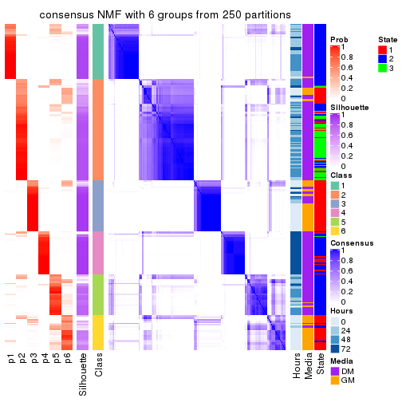</p>

</div>
</div>

Heatmaps for the membership of samples in all partitions to see how consistent they are:


<script>
$( function() {
	$( '#tabs-ATC-NMF-membership-heatmap' ).tabs();
} );
</script>
<div id='tabs-ATC-NMF-membership-heatmap'>
<ul>
<li><a href='#tab-ATC-NMF-membership-heatmap-1'>k = 2</a></li>
<li><a href='#tab-ATC-NMF-membership-heatmap-2'>k = 3</a></li>
<li><a href='#tab-ATC-NMF-membership-heatmap-3'>k = 4</a></li>
<li><a href='#tab-ATC-NMF-membership-heatmap-4'>k = 5</a></li>
<li><a href='#tab-ATC-NMF-membership-heatmap-5'>k = 6</a></li>
</ul>
<div id='tab-ATC-NMF-membership-heatmap-1'>
<pre><code class="r">membership_heatmap(res, k = 2)
</code></pre>

<p></p>

</div>
<div id='tab-ATC-NMF-membership-heatmap-2'>
<pre><code class="r">membership_heatmap(res, k = 3)
</code></pre>

<p></p>

</div>
<div id='tab-ATC-NMF-membership-heatmap-3'>
<pre><code class="r">membership_heatmap(res, k = 4)
</code></pre>

<p></p>

</div>
<div id='tab-ATC-NMF-membership-heatmap-4'>
<pre><code class="r">membership_heatmap(res, k = 5)
</code></pre>

<p></p>

</div>
<div id='tab-ATC-NMF-membership-heatmap-5'>
<pre><code class="r">membership_heatmap(res, k = 6)
</code></pre>

<p></p>

</div>
</div>

As soon as we have had the classes for columns, we can look for signatures
which are significantly different between classes which can be candidate marks
for certain classes. Following are the heatmaps for signatures.


Signature heatmaps where rows are scaled:


<script>
$( function() {
	$( '#tabs-ATC-NMF-get-signatures' ).tabs();
} );
</script>
<div id='tabs-ATC-NMF-get-signatures'>
<ul>
<li><a href='#tab-ATC-NMF-get-signatures-1'>k = 2</a></li>
<li><a href='#tab-ATC-NMF-get-signatures-2'>k = 3</a></li>
<li><a href='#tab-ATC-NMF-get-signatures-3'>k = 4</a></li>
<li><a href='#tab-ATC-NMF-get-signatures-4'>k = 5</a></li>
<li><a href='#tab-ATC-NMF-get-signatures-5'>k = 6</a></li>
</ul>
<div id='tab-ATC-NMF-get-signatures-1'>
<pre><code class="r">get_signatures(res, k = 2)
</code></pre>

<p></p>

</div>
<div id='tab-ATC-NMF-get-signatures-2'>
<pre><code class="r">get_signatures(res, k = 3)
</code></pre>

<p></p>

</div>
<div id='tab-ATC-NMF-get-signatures-3'>
<pre><code class="r">get_signatures(res, k = 4)
</code></pre>

<p></p>

</div>
<div id='tab-ATC-NMF-get-signatures-4'>
<pre><code class="r">get_signatures(res, k = 5)
</code></pre>

<p></p>

</div>
<div id='tab-ATC-NMF-get-signatures-5'>
<pre><code class="r">get_signatures(res, k = 6)
</code></pre>

<p></p>

</div>
</div>


Signature heatmaps where rows are not scaled:


<script>
$( function() {
	$( '#tabs-ATC-NMF-get-signatures-no-scale' ).tabs();
} );
</script>
<div id='tabs-ATC-NMF-get-signatures-no-scale'>
<ul>
<li><a href='#tab-ATC-NMF-get-signatures-no-scale-1'>k = 2</a></li>
<li><a href='#tab-ATC-NMF-get-signatures-no-scale-2'>k = 3</a></li>
<li><a href='#tab-ATC-NMF-get-signatures-no-scale-3'>k = 4</a></li>
<li><a href='#tab-ATC-NMF-get-signatures-no-scale-4'>k = 5</a></li>
<li><a href='#tab-ATC-NMF-get-signatures-no-scale-5'>k = 6</a></li>
</ul>
<div id='tab-ATC-NMF-get-signatures-no-scale-1'>
<pre><code class="r">get_signatures(res, k = 2, scale_rows = FALSE)
</code></pre>

<p></p>

</div>
<div id='tab-ATC-NMF-get-signatures-no-scale-2'>
<pre><code class="r">get_signatures(res, k = 3, scale_rows = FALSE)
</code></pre>

<p></p>

</div>
<div id='tab-ATC-NMF-get-signatures-no-scale-3'>
<pre><code class="r">get_signatures(res, k = 4, scale_rows = FALSE)
</code></pre>

<p></p>

</div>
<div id='tab-ATC-NMF-get-signatures-no-scale-4'>
<pre><code class="r">get_signatures(res, k = 5, scale_rows = FALSE)
</code></pre>

<p></p>

</div>
<div id='tab-ATC-NMF-get-signatures-no-scale-5'>
<pre><code class="r">get_signatures(res, k = 6, scale_rows = FALSE)
</code></pre>

<p></p>

</div>
</div>


Compare the overlap of signatures from different k:

```r
compare_signatures(res)
```


`get_signature()` returns a data frame invisibly. TO get the list of signatures, the function
call should be assigned to a variable explicitly. In following code, if `plot` argument is set
to `FALSE`, no heatmap is plotted while only the differential analysis is performed.

```r
# code only for demonstration
tb = get_signature(res, k = ..., plot = FALSE)
```

An example of the output of `tb` is:

```
#>   which_row         fdr    mean_1    mean_2 scaled_mean_1 scaled_mean_2 km
#> 1        38 0.042760348  8.373488  9.131774    -0.5533452     0.5164555  1
#> 2        40 0.018707592  7.106213  8.469186    -0.6173731     0.5762149  1
#> 3        55 0.019134737 10.221463 11.207825    -0.6159697     0.5749050  1
#> 4        59 0.006059896  5.921854  7.869574    -0.6899429     0.6439467  1
#> 5        60 0.018055526  8.928898 10.211722    -0.6204761     0.5791110  1
#> 6        98 0.009384629 15.714769 14.887706     0.6635654    -0.6193277  2
...
```

The columns in `tb` are:

1. `which_row`: row indices corresponding to the input matrix.
2. `fdr`: FDR for the differential test. 
3. `mean_x`: The mean value in group x.
4. `scaled_mean_x`: The mean value in group x after rows are scaled.
5. `km`: Row groups if k-means clustering is applied to rows.


UMAP plot which shows how samples are separated.


<script>
$( function() {
	$( '#tabs-ATC-NMF-dimension-reduction' ).tabs();
} );
</script>
<div id='tabs-ATC-NMF-dimension-reduction'>
<ul>
<li><a href='#tab-ATC-NMF-dimension-reduction-1'>k = 2</a></li>
<li><a href='#tab-ATC-NMF-dimension-reduction-2'>k = 3</a></li>
<li><a href='#tab-ATC-NMF-dimension-reduction-3'>k = 4</a></li>
<li><a href='#tab-ATC-NMF-dimension-reduction-4'>k = 5</a></li>
<li><a href='#tab-ATC-NMF-dimension-reduction-5'>k = 6</a></li>
</ul>
<div id='tab-ATC-NMF-dimension-reduction-1'>
<pre><code class="r">dimension_reduction(res, k = 2, method = &quot;UMAP&quot;)
</code></pre>

<p></p>

</div>
<div id='tab-ATC-NMF-dimension-reduction-2'>
<pre><code class="r">dimension_reduction(res, k = 3, method = &quot;UMAP&quot;)
</code></pre>

<p></p>

</div>
<div id='tab-ATC-NMF-dimension-reduction-3'>
<pre><code class="r">dimension_reduction(res, k = 4, method = &quot;UMAP&quot;)
</code></pre>

<p></p>

</div>
<div id='tab-ATC-NMF-dimension-reduction-4'>
<pre><code class="r">dimension_reduction(res, k = 5, method = &quot;UMAP&quot;)
</code></pre>

<p>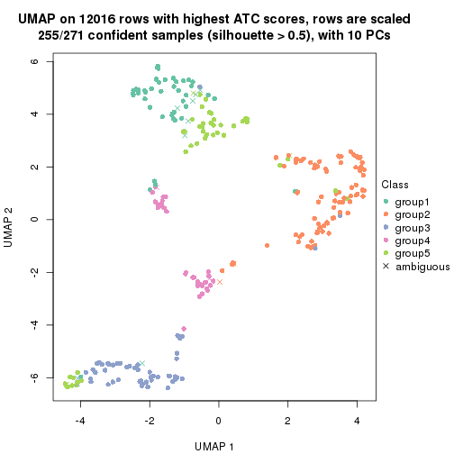</p>

</div>
<div id='tab-ATC-NMF-dimension-reduction-5'>
<pre><code class="r">dimension_reduction(res, k = 6, method = &quot;UMAP&quot;)
</code></pre>

<p></p>

</div>
</div>


Following heatmap shows how subgroups are split when increasing `k`:

```r
collect_classes(res)
```


Test correlation between subgroups and known annotations. If the known
annotation is numeric, one-way ANOVA test is applied, and if the known
annotation is discrete, chi-squared contingency table test is applied.

```r
test_to_known_factors(res)
```

```
#>           n Hours(p) Media(p) State(p) k
#> ATC:NMF 265 6.72e-11 9.62e-11 8.58e-39 2
#> ATC:NMF 250 6.33e-32 1.94e-33 4.12e-49 3
#> ATC:NMF 267 9.99e-61 1.60e-25 4.15e-48 4
#> ATC:NMF 255 5.05e-54 8.49e-24 4.41e-46 5
#> ATC:NMF 224 1.65e-58 4.21e-31 2.86e-49 6
```


If matrix rows can be associated to genes, consider to use `GO_Enrichment(res,
...)` to perform function enrichment for the signature genes.


 

## Session info


```r
sessionInfo()
```

```
#> R version 3.6.0 (2019-04-26)
#> Platform: x86_64-pc-linux-gnu (64-bit)
#> Running under: CentOS Linux 7 (Core)
#> 
#> Matrix products: default
#> BLAS:   /usr/lib64/libblas.so.3.4.2
#> LAPACK: /usr/lib64/liblapack.so.3.4.2
#> 
#> locale:
#>  [1] LC_CTYPE=en_US.UTF-8       LC_NUMERIC=C               LC_TIME=en_US.UTF-8       
#>  [4] LC_COLLATE=en_US.UTF-8     LC_MONETARY=en_US.UTF-8    LC_MESSAGES=en_US.UTF-8   
#>  [7] LC_PAPER=en_US.UTF-8       LC_NAME=C                  LC_ADDRESS=C              
#> [10] LC_TELEPHONE=C             LC_MEASUREMENT=en_US.UTF-8 LC_IDENTIFICATION=C       
#> 
#> attached base packages:
#> [1] grid      parallel  stats     graphics  grDevices utils     datasets  methods   base     
#> 
#> other attached packages:
#> [1] genefilter_1.66.0    ComplexHeatmap_2.1.1 markdown_1.1         knitr_1.26          
#> [5] Biobase_2.44.0       BiocGenerics_0.30.0  HSMMSingleCell_1.4.0 RColorBrewer_1.1-2  
#> [9] cola_1.3.2          
#> 
#> loaded via a namespace (and not attached):
#>  [1] bitops_1.0-6         matrixStats_0.55.0   bit64_0.9-7          doParallel_1.0.15   
#>  [5] httr_1.4.1           tools_3.6.0          backports_1.1.5      R6_2.4.1            
#>  [9] DBI_1.0.0            lazyeval_0.2.2       colorspace_1.4-1     GetoptLong_0.1.7    
#> [13] withr_2.1.2          tidyselect_0.2.5     gridExtra_2.3        bit_1.1-14          
#> [17] compiler_3.6.0       xml2_1.2.2           microbenchmark_1.4-7 pkgmaker_0.28       
#> [21] slam_0.1-46          scales_1.1.0         NMF_0.23.6           stringr_1.4.0       
#> [25] digest_0.6.23        pkgconfig_2.0.3      bibtex_0.4.2         highr_0.8           
#> [29] rlang_0.4.2          GlobalOptions_0.1.1  RSQLite_2.1.2        impute_1.58.0       
#> [33] shape_1.4.4          mclust_5.4.5         dendextend_1.12.0    dplyr_0.8.3         
#> [37] RCurl_1.95-4.12      magrittr_1.5         Matrix_1.2-17        Rcpp_1.0.3          
#> [41] munsell_0.5.0        S4Vectors_0.22.1     viridis_0.5.1        lifecycle_0.1.0     
#> [45] stringi_1.4.3        plyr_1.8.4           blob_1.2.0           crayon_1.3.4        
#> [49] lattice_0.20-38      splines_3.6.0        annotate_1.62.0      circlize_0.4.9      
#> [53] zeallot_0.1.0        pillar_1.4.2         rjson_0.2.20         rngtools_1.4        
#> [57] reshape2_1.4.3       codetools_0.2-16     stats4_3.6.0         XML_3.98-1.20       
#> [61] glue_1.3.1           evaluate_0.14        png_0.1-7            vctrs_0.2.0         
#> [65] foreach_1.4.7        polyclip_1.10-0      gtable_0.3.0         purrr_0.3.3         
#> [69] clue_0.3-57          assertthat_0.2.1     ggplot2_3.2.1        xfun_0.11           
#> [73] gridBase_0.4-7       eulerr_6.0.0         xtable_1.8-4         skmeans_0.2-11      
#> [77] survival_2.44-1.1    viridisLite_0.3.0    tibble_2.1.3         iterators_1.0.12    
#> [81] AnnotationDbi_1.46.1 registry_0.5-1       memoise_1.1.0        IRanges_2.18.3      
#> [85] cluster_2.1.0        brew_1.0-6
```


