cola Report for Consensus Partitioning
==================

**Date**: 2019-12-02 18:26:21 CET, **cola version**: 1.3.2

----------------------------------------------------------------

<style type='text/css'>

body, td, th {
   font-family: Arial,Helvetica,sans-serif;
   background-color: white;
   font-size: 13px;
  max-width: 800px;
  margin: auto;
  margin-left:210px;
  padding: 0px 10px 0px 10px;
  border-left: 1px solid #EEEEEE;
  line-height: 150%;
}

tt, code, pre {
   font-family: 'DejaVu Sans Mono', 'Droid Sans Mono', 'Lucida Console', Consolas, Monaco, 

monospace;
}

h1 {
   font-size:2.2em;
}

h2 {
   font-size:1.8em;
}

h3 {
   font-size:1.4em;
}

h4 {
   font-size:1.0em;
}

h5 {
   font-size:0.9em;
}

h6 {
   font-size:0.8em;
}

a {
  text-decoration: none;
  color: #0366d6;
}

a:hover {
  text-decoration: underline;
}

a:visited {
   color: #0366d6;
}

pre, img {
  max-width: 100%;
}
pre {
  overflow-x: auto;
}
pre code {
   display: block; padding: 0.5em;
}

code {
  font-size: 92%;
  border: 1px solid #ccc;
}

code[class] {
  background-color: #F8F8F8;
}

table, td, th {
  border: 1px solid #ccc;
}

blockquote {
   color:#666666;
   margin:0;
   padding-left: 1em;
   border-left: 0.5em #EEE solid;
}

hr {
   height: 0px;
   border-bottom: none;
   border-top-width: thin;
   border-top-style: dotted;
   border-top-color: #999999;
}

@media print {
   * {
      background: transparent !important;
      color: black !important;
      filter:none !important;
      -ms-filter: none !important;
   }

   body {
      font-size:12pt;
      max-width:100%;
   }

   a, a:visited {
      text-decoration: underline;
   }

   hr {
      visibility: hidden;
      page-break-before: always;
   }

   pre, blockquote {
      padding-right: 1em;
      page-break-inside: avoid;
   }

   tr, img {
      page-break-inside: avoid;
   }

   img {
      max-width: 100% !important;
   }

   @page :left {
      margin: 15mm 20mm 15mm 10mm;
   }

   @page :right {
      margin: 15mm 10mm 15mm 20mm;
   }

   p, h2, h3 {
      orphans: 3; widows: 3;
   }

   h2, h3 {
      page-break-after: avoid;
   }
}
</style>


## Summary


First the variable is renamed to `res_list`.


```r
res_list = rl
```


All available functions which can be applied to this `res_list` object:


```r
res_list
```

```
#> A 'ConsensusPartitionList' object with 24 methods.
#>   On a matrix with 5576 rows and 160 columns.
#>   Top rows are extracted by 'SD, CV, MAD, ATC' methods.
#>   Subgroups are detected by 'hclust, kmeans, skmeans, pam, mclust, NMF' method.
#>   Number of partitions are tried for k = 2, 3, 4, 5, 6.
#>   Performed in total 30000 partitions by row resampling.
#> 
#> Following methods can be applied to this 'ConsensusPartitionList' object:
#>  [1] "cola_report"           "collect_classes"       "collect_plots"         "collect_stats"        
#>  [5] "colnames"              "functional_enrichment" "get_anno_col"          "get_anno"             
#>  [9] "get_classes"           "get_matrix"            "get_membership"        "get_stats"            
#> [13] "is_best_k"             "is_stable_k"           "ncol"                  "nrow"                 
#> [17] "rownames"              "show"                  "suggest_best_k"        "test_to_known_factors"
#> [21] "top_rows_heatmap"      "top_rows_overlap"     
#> 
#> You can get result for a single method by, e.g. object["SD", "hclust"] or object["SD:hclust"]
#> or a subset of methods by object[c("SD", "CV")], c("hclust", "kmeans")]
```

The call of `run_all_consensus_partition_methods()` was:


```
#> run_all_consensus_partition_methods(data = m, mc.cores = 4, anno = data.frame(cell_type = cell_type), 
#>     anno_col = list(cell_type = cell_col))
```

Dimension of the input matrix:


```r
mat = get_matrix(res_list)
dim(mat)
```

```
#> [1] 5576  160
```

### Density distribution

The density distribution for each sample is visualized as in one column in the
following heatmap. The clustering is based on the distance which is the
Kolmogorov-Smirnov statistic between two distributions.


```r
library(ComplexHeatmap)
densityHeatmap(mat, top_annotation = HeatmapAnnotation(df = get_anno(res_list), 
    col = get_anno_col(res_list)), ylab = "value", cluster_columns = TRUE, show_column_names = FALSE,
    mc.cores = 4)
```


### Suggest the best k


Folowing table shows the best `k` (number of partitions) for each combination
of top-value methods and partition methods. Clicking on the method name in
the table goes to the section for a single combination of methods.

[The cola vignette](http://bioconductor.org/packages/devel/bioc/vignettes/cola/inst/doc/cola.html#toc_13)
explains the definition of the metrics used for determining the best
number of partitions.


```r
suggest_best_k(res_list)
```


|                            | The best k| 1-PAC| Mean silhouette| Concordance|   |Optional k |
|:---------------------------|----------:|-----:|---------------:|-----------:|:--|:----------|
|[SD:mclust](#SD-mclust)     |          2| 1.000|           0.988|       0.995|** |           |
|[SD:NMF](#SD-NMF)           |          2| 1.000|           0.975|       0.989|** |           |
|[CV:mclust](#CV-mclust)     |          2| 1.000|           0.988|       0.995|** |           |
|[MAD:mclust](#MAD-mclust)   |          2| 1.000|           0.988|       0.995|** |           |
|[MAD:NMF](#MAD-NMF)         |          2| 1.000|           0.983|       0.993|** |           |
|[ATC:kmeans](#ATC-kmeans)   |          2| 1.000|           0.987|       0.982|** |           |
|[ATC:NMF](#ATC-NMF)         |          2| 1.000|           0.976|       0.990|** |           |
|[CV:NMF](#CV-NMF)           |          2| 0.961|           0.950|       0.979|** |           |
|[ATC:mclust](#ATC-mclust)   |          3| 0.931|           0.926|       0.968|*  |2          |
|[ATC:skmeans](#ATC-skmeans) |          4| 0.927|           0.895|       0.958|*  |2,3        |
|[SD:skmeans](#SD-skmeans)   |          2| 0.886|           0.924|       0.967|   |           |
|[MAD:skmeans](#MAD-skmeans) |          2| 0.877|           0.926|       0.970|   |           |
|[CV:skmeans](#CV-skmeans)   |          2| 0.875|           0.936|       0.970|   |           |
|[ATC:pam](#ATC-pam)         |          4| 0.869|           0.869|       0.949|   |           |
|[SD:kmeans](#SD-kmeans)     |          2| 0.861|           0.900|       0.958|   |           |
|[CV:kmeans](#CV-kmeans)     |          2| 0.856|           0.927|       0.968|   |           |
|[MAD:kmeans](#MAD-kmeans)   |          2| 0.829|           0.932|       0.970|   |           |
|[ATC:hclust](#ATC-hclust)   |          5| 0.768|           0.775|       0.880|   |           |
|[SD:hclust](#SD-hclust)     |          3| 0.379|           0.743|       0.852|   |           |
|[MAD:pam](#MAD-pam)         |          3| 0.367|           0.607|       0.844|   |           |
|[SD:pam](#SD-pam)           |          3| 0.324|           0.781|       0.845|   |           |
|[MAD:hclust](#MAD-hclust)   |          3| 0.300|           0.693|       0.825|   |           |
|[CV:hclust](#CV-hclust)     |          2| 0.222|           0.648|       0.824|   |           |
|[CV:pam](#CV-pam)           |          3| 0.192|           0.462|       0.705|   |           |

\*\*: 1-PAC > 0.95, \*: 1-PAC > 0.9


### CDF of consensus matrices

Cumulative distribution function curves of consensus matrix for all methods.


```r
collect_plots(res_list, fun = plot_ecdf)
```


### Consensus heatmap

Consensus heatmaps for all methods. ([What is a consensus heatmap?](http://bioconductor.org/packages/devel/bioc/vignettes/cola/inst/doc/cola.html#toc_9))


<style type='text/css'>


.ui-helper-hidden {
	display: none;
}
.ui-helper-hidden-accessible {
	border: 0;
	clip: rect(0 0 0 0);
	height: 1px;
	margin: -1px;
	overflow: hidden;
	padding: 0;
	position: absolute;
	width: 1px;
}
.ui-helper-reset {
	margin: 0;
	padding: 0;
	border: 0;
	outline: 0;
	line-height: 1.3;
	text-decoration: none;
	font-size: 100%;
	list-style: none;
}
.ui-helper-clearfix:before,
.ui-helper-clearfix:after {
	content: "";
	display: table;
	border-collapse: collapse;
}
.ui-helper-clearfix:after {
	clear: both;
}
.ui-helper-zfix {
	width: 100%;
	height: 100%;
	top: 0;
	left: 0;
	position: absolute;
	opacity: 0;
	filter:Alpha(Opacity=0); 
}

.ui-front {
	z-index: 100;
}


.ui-state-disabled {
	cursor: default !important;
	pointer-events: none;
}


.ui-icon {
	display: inline-block;
	vertical-align: middle;
	margin-top: -.25em;
	position: relative;
	text-indent: -99999px;
	overflow: hidden;
	background-repeat: no-repeat;
}

.ui-widget-icon-block {
	left: 50%;
	margin-left: -8px;
	display: block;
}


.ui-widget-overlay {
	position: fixed;
	top: 0;
	left: 0;
	width: 100%;
	height: 100%;
}
.ui-accordion .ui-accordion-header {
	display: block;
	cursor: pointer;
	position: relative;
	margin: 2px 0 0 0;
	padding: .5em .5em .5em .7em;
	font-size: 100%;
}
.ui-accordion .ui-accordion-content {
	padding: 1em 2.2em;
	border-top: 0;
	overflow: auto;
}
.ui-autocomplete {
	position: absolute;
	top: 0;
	left: 0;
	cursor: default;
}
.ui-menu {
	list-style: none;
	padding: 0;
	margin: 0;
	display: block;
	outline: 0;
}
.ui-menu .ui-menu {
	position: absolute;
}
.ui-menu .ui-menu-item {
	margin: 0;
	cursor: pointer;
	
	list-style-image: url("data:image/gif;base64,R0lGODlhAQABAIAAAAAAAP///yH5BAEAAAAALAAAAAABAAEAAAIBRAA7");
}
.ui-menu .ui-menu-item-wrapper {
	position: relative;
	padding: 3px 1em 3px .4em;
}
.ui-menu .ui-menu-divider {
	margin: 5px 0;
	height: 0;
	font-size: 0;
	line-height: 0;
	border-width: 1px 0 0 0;
}
.ui-menu .ui-state-focus,
.ui-menu .ui-state-active {
	margin: -1px;
}


.ui-menu-icons {
	position: relative;
}
.ui-menu-icons .ui-menu-item-wrapper {
	padding-left: 2em;
}


.ui-menu .ui-icon {
	position: absolute;
	top: 0;
	bottom: 0;
	left: .2em;
	margin: auto 0;
}


.ui-menu .ui-menu-icon {
	left: auto;
	right: 0;
}
.ui-button {
	padding: .4em 1em;
	display: inline-block;
	position: relative;
	line-height: normal;
	margin-right: .1em;
	cursor: pointer;
	vertical-align: middle;
	text-align: center;
	-webkit-user-select: none;
	-moz-user-select: none;
	-ms-user-select: none;
	user-select: none;

	
	overflow: visible;
}

.ui-button,
.ui-button:link,
.ui-button:visited,
.ui-button:hover,
.ui-button:active {
	text-decoration: none;
}


.ui-button-icon-only {
	width: 2em;
	box-sizing: border-box;
	text-indent: -9999px;
	white-space: nowrap;
}


input.ui-button.ui-button-icon-only {
	text-indent: 0;
}


.ui-button-icon-only .ui-icon {
	position: absolute;
	top: 50%;
	left: 50%;
	margin-top: -8px;
	margin-left: -8px;
}

.ui-button.ui-icon-notext .ui-icon {
	padding: 0;
	width: 2.1em;
	height: 2.1em;
	text-indent: -9999px;
	white-space: nowrap;

}

input.ui-button.ui-icon-notext .ui-icon {
	width: auto;
	height: auto;
	text-indent: 0;
	white-space: normal;
	padding: .4em 1em;
}


input.ui-button::-moz-focus-inner,
button.ui-button::-moz-focus-inner {
	border: 0;
	padding: 0;
}
.ui-controlgroup {
	vertical-align: middle;
	display: inline-block;
}
.ui-controlgroup > .ui-controlgroup-item {
	float: left;
	margin-left: 0;
	margin-right: 0;
}
.ui-controlgroup > .ui-controlgroup-item:focus,
.ui-controlgroup > .ui-controlgroup-item.ui-visual-focus {
	z-index: 9999;
}
.ui-controlgroup-vertical > .ui-controlgroup-item {
	display: block;
	float: none;
	width: 100%;
	margin-top: 0;
	margin-bottom: 0;
	text-align: left;
}
.ui-controlgroup-vertical .ui-controlgroup-item {
	box-sizing: border-box;
}
.ui-controlgroup .ui-controlgroup-label {
	padding: .4em 1em;
}
.ui-controlgroup .ui-controlgroup-label span {
	font-size: 80%;
}
.ui-controlgroup-horizontal .ui-controlgroup-label + .ui-controlgroup-item {
	border-left: none;
}
.ui-controlgroup-vertical .ui-controlgroup-label + .ui-controlgroup-item {
	border-top: none;
}
.ui-controlgroup-horizontal .ui-controlgroup-label.ui-widget-content {
	border-right: none;
}
.ui-controlgroup-vertical .ui-controlgroup-label.ui-widget-content {
	border-bottom: none;
}


.ui-controlgroup-vertical .ui-spinner-input {

	
	width: 75%;
	width: calc( 100% - 2.4em );
}
.ui-controlgroup-vertical .ui-spinner .ui-spinner-up {
	border-top-style: solid;
}

.ui-checkboxradio-label .ui-icon-background {
	box-shadow: inset 1px 1px 1px #ccc;
	border-radius: .12em;
	border: none;
}
.ui-checkboxradio-radio-label .ui-icon-background {
	width: 16px;
	height: 16px;
	border-radius: 1em;
	overflow: visible;
	border: none;
}
.ui-checkboxradio-radio-label.ui-checkboxradio-checked .ui-icon,
.ui-checkboxradio-radio-label.ui-checkboxradio-checked:hover .ui-icon {
	background-image: none;
	width: 8px;
	height: 8px;
	border-width: 4px;
	border-style: solid;
}
.ui-checkboxradio-disabled {
	pointer-events: none;
}
.ui-datepicker {
	width: 17em;
	padding: .2em .2em 0;
	display: none;
}
.ui-datepicker .ui-datepicker-header {
	position: relative;
	padding: .2em 0;
}
.ui-datepicker .ui-datepicker-prev,
.ui-datepicker .ui-datepicker-next {
	position: absolute;
	top: 2px;
	width: 1.8em;
	height: 1.8em;
}
.ui-datepicker .ui-datepicker-prev-hover,
.ui-datepicker .ui-datepicker-next-hover {
	top: 1px;
}
.ui-datepicker .ui-datepicker-prev {
	left: 2px;
}
.ui-datepicker .ui-datepicker-next {
	right: 2px;
}
.ui-datepicker .ui-datepicker-prev-hover {
	left: 1px;
}
.ui-datepicker .ui-datepicker-next-hover {
	right: 1px;
}
.ui-datepicker .ui-datepicker-prev span,
.ui-datepicker .ui-datepicker-next span {
	display: block;
	position: absolute;
	left: 50%;
	margin-left: -8px;
	top: 50%;
	margin-top: -8px;
}
.ui-datepicker .ui-datepicker-title {
	margin: 0 2.3em;
	line-height: 1.8em;
	text-align: center;
}
.ui-datepicker .ui-datepicker-title select {
	font-size: 1em;
	margin: 1px 0;
}
.ui-datepicker select.ui-datepicker-month,
.ui-datepicker select.ui-datepicker-year {
	width: 45%;
}
.ui-datepicker table {
	width: 100%;
	font-size: .9em;
	border-collapse: collapse;
	margin: 0 0 .4em;
}
.ui-datepicker th {
	padding: .7em .3em;
	text-align: center;
	font-weight: bold;
	border: 0;
}
.ui-datepicker td {
	border: 0;
	padding: 1px;
}
.ui-datepicker td span,
.ui-datepicker td a {
	display: block;
	padding: .2em;
	text-align: right;
	text-decoration: none;
}
.ui-datepicker .ui-datepicker-buttonpane {
	background-image: none;
	margin: .7em 0 0 0;
	padding: 0 .2em;
	border-left: 0;
	border-right: 0;
	border-bottom: 0;
}
.ui-datepicker .ui-datepicker-buttonpane button {
	float: right;
	margin: .5em .2em .4em;
	cursor: pointer;
	padding: .2em .6em .3em .6em;
	width: auto;
	overflow: visible;
}
.ui-datepicker .ui-datepicker-buttonpane button.ui-datepicker-current {
	float: left;
}


.ui-datepicker.ui-datepicker-multi {
	width: auto;
}
.ui-datepicker-multi .ui-datepicker-group {
	float: left;
}
.ui-datepicker-multi .ui-datepicker-group table {
	width: 95%;
	margin: 0 auto .4em;
}
.ui-datepicker-multi-2 .ui-datepicker-group {
	width: 50%;
}
.ui-datepicker-multi-3 .ui-datepicker-group {
	width: 33.3%;
}
.ui-datepicker-multi-4 .ui-datepicker-group {
	width: 25%;
}
.ui-datepicker-multi .ui-datepicker-group-last .ui-datepicker-header,
.ui-datepicker-multi .ui-datepicker-group-middle .ui-datepicker-header {
	border-left-width: 0;
}
.ui-datepicker-multi .ui-datepicker-buttonpane {
	clear: left;
}
.ui-datepicker-row-break {
	clear: both;
	width: 100%;
	font-size: 0;
}


.ui-datepicker-rtl {
	direction: rtl;
}
.ui-datepicker-rtl .ui-datepicker-prev {
	right: 2px;
	left: auto;
}
.ui-datepicker-rtl .ui-datepicker-next {
	left: 2px;
	right: auto;
}
.ui-datepicker-rtl .ui-datepicker-prev:hover {
	right: 1px;
	left: auto;
}
.ui-datepicker-rtl .ui-datepicker-next:hover {
	left: 1px;
	right: auto;
}
.ui-datepicker-rtl .ui-datepicker-buttonpane {
	clear: right;
}
.ui-datepicker-rtl .ui-datepicker-buttonpane button {
	float: left;
}
.ui-datepicker-rtl .ui-datepicker-buttonpane button.ui-datepicker-current,
.ui-datepicker-rtl .ui-datepicker-group {
	float: right;
}
.ui-datepicker-rtl .ui-datepicker-group-last .ui-datepicker-header,
.ui-datepicker-rtl .ui-datepicker-group-middle .ui-datepicker-header {
	border-right-width: 0;
	border-left-width: 1px;
}


.ui-datepicker .ui-icon {
	display: block;
	text-indent: -99999px;
	overflow: hidden;
	background-repeat: no-repeat;
	left: .5em;
	top: .3em;
}
.ui-dialog {
	position: absolute;
	top: 0;
	left: 0;
	padding: .2em;
	outline: 0;
}
.ui-dialog .ui-dialog-titlebar {
	padding: .4em 1em;
	position: relative;
}
.ui-dialog .ui-dialog-title {
	float: left;
	margin: .1em 0;
	white-space: nowrap;
	width: 90%;
	overflow: hidden;
	text-overflow: ellipsis;
}
.ui-dialog .ui-dialog-titlebar-close {
	position: absolute;
	right: .3em;
	top: 50%;
	width: 20px;
	margin: -10px 0 0 0;
	padding: 1px;
	height: 20px;
}
.ui-dialog .ui-dialog-content {
	position: relative;
	border: 0;
	padding: .5em 1em;
	background: none;
	overflow: auto;
}
.ui-dialog .ui-dialog-buttonpane {
	text-align: left;
	border-width: 1px 0 0 0;
	background-image: none;
	margin-top: .5em;
	padding: .3em 1em .5em .4em;
}
.ui-dialog .ui-dialog-buttonpane .ui-dialog-buttonset {
	float: right;
}
.ui-dialog .ui-dialog-buttonpane button {
	margin: .5em .4em .5em 0;
	cursor: pointer;
}
.ui-dialog .ui-resizable-n {
	height: 2px;
	top: 0;
}
.ui-dialog .ui-resizable-e {
	width: 2px;
	right: 0;
}
.ui-dialog .ui-resizable-s {
	height: 2px;
	bottom: 0;
}
.ui-dialog .ui-resizable-w {
	width: 2px;
	left: 0;
}
.ui-dialog .ui-resizable-se,
.ui-dialog .ui-resizable-sw,
.ui-dialog .ui-resizable-ne,
.ui-dialog .ui-resizable-nw {
	width: 7px;
	height: 7px;
}
.ui-dialog .ui-resizable-se {
	right: 0;
	bottom: 0;
}
.ui-dialog .ui-resizable-sw {
	left: 0;
	bottom: 0;
}
.ui-dialog .ui-resizable-ne {
	right: 0;
	top: 0;
}
.ui-dialog .ui-resizable-nw {
	left: 0;
	top: 0;
}
.ui-draggable .ui-dialog-titlebar {
	cursor: move;
}
.ui-draggable-handle {
	-ms-touch-action: none;
	touch-action: none;
}
.ui-resizable {
	position: relative;
}
.ui-resizable-handle {
	position: absolute;
	font-size: 0.1px;
	display: block;
	-ms-touch-action: none;
	touch-action: none;
}
.ui-resizable-disabled .ui-resizable-handle,
.ui-resizable-autohide .ui-resizable-handle {
	display: none;
}
.ui-resizable-n {
	cursor: n-resize;
	height: 7px;
	width: 100%;
	top: -5px;
	left: 0;
}
.ui-resizable-s {
	cursor: s-resize;
	height: 7px;
	width: 100%;
	bottom: -5px;
	left: 0;
}
.ui-resizable-e {
	cursor: e-resize;
	width: 7px;
	right: -5px;
	top: 0;
	height: 100%;
}
.ui-resizable-w {
	cursor: w-resize;
	width: 7px;
	left: -5px;
	top: 0;
	height: 100%;
}
.ui-resizable-se {
	cursor: se-resize;
	width: 12px;
	height: 12px;
	right: 1px;
	bottom: 1px;
}
.ui-resizable-sw {
	cursor: sw-resize;
	width: 9px;
	height: 9px;
	left: -5px;
	bottom: -5px;
}
.ui-resizable-nw {
	cursor: nw-resize;
	width: 9px;
	height: 9px;
	left: -5px;
	top: -5px;
}
.ui-resizable-ne {
	cursor: ne-resize;
	width: 9px;
	height: 9px;
	right: -5px;
	top: -5px;
}
.ui-progressbar {
	height: 2em;
	text-align: left;
	overflow: hidden;
}
.ui-progressbar .ui-progressbar-value {
	margin: -1px;
	height: 100%;
}
.ui-progressbar .ui-progressbar-overlay {
	background: url("data:image/gif;base64,R0lGODlhKAAoAIABAAAAAP///yH/C05FVFNDQVBFMi4wAwEAAAAh+QQJAQABACwAAAAAKAAoAAACkYwNqXrdC52DS06a7MFZI+4FHBCKoDeWKXqymPqGqxvJrXZbMx7Ttc+w9XgU2FB3lOyQRWET2IFGiU9m1frDVpxZZc6bfHwv4c1YXP6k1Vdy292Fb6UkuvFtXpvWSzA+HycXJHUXiGYIiMg2R6W459gnWGfHNdjIqDWVqemH2ekpObkpOlppWUqZiqr6edqqWQAAIfkECQEAAQAsAAAAACgAKAAAApSMgZnGfaqcg1E2uuzDmmHUBR8Qil95hiPKqWn3aqtLsS18y7G1SzNeowWBENtQd+T1JktP05nzPTdJZlR6vUxNWWjV+vUWhWNkWFwxl9VpZRedYcflIOLafaa28XdsH/ynlcc1uPVDZxQIR0K25+cICCmoqCe5mGhZOfeYSUh5yJcJyrkZWWpaR8doJ2o4NYq62lAAACH5BAkBAAEALAAAAAAoACgAAAKVDI4Yy22ZnINRNqosw0Bv7i1gyHUkFj7oSaWlu3ovC8GxNso5fluz3qLVhBVeT/Lz7ZTHyxL5dDalQWPVOsQWtRnuwXaFTj9jVVh8pma9JjZ4zYSj5ZOyma7uuolffh+IR5aW97cHuBUXKGKXlKjn+DiHWMcYJah4N0lYCMlJOXipGRr5qdgoSTrqWSq6WFl2ypoaUAAAIfkECQEAAQAsAAAAACgAKAAAApaEb6HLgd/iO7FNWtcFWe+ufODGjRfoiJ2akShbueb0wtI50zm02pbvwfWEMWBQ1zKGlLIhskiEPm9R6vRXxV4ZzWT2yHOGpWMyorblKlNp8HmHEb/lCXjcW7bmtXP8Xt229OVWR1fod2eWqNfHuMjXCPkIGNileOiImVmCOEmoSfn3yXlJWmoHGhqp6ilYuWYpmTqKUgAAIfkECQEAAQAsAAAAACgAKAAAApiEH6kb58biQ3FNWtMFWW3eNVcojuFGfqnZqSebuS06w5V80/X02pKe8zFwP6EFWOT1lDFk8rGERh1TTNOocQ61Hm4Xm2VexUHpzjymViHrFbiELsefVrn6XKfnt2Q9G/+Xdie499XHd2g4h7ioOGhXGJboGAnXSBnoBwKYyfioubZJ2Hn0RuRZaflZOil56Zp6iioKSXpUAAAh+QQJAQABACwAAAAAKAAoAAACkoQRqRvnxuI7kU1a1UU5bd5tnSeOZXhmn5lWK3qNTWvRdQxP8qvaC+/yaYQzXO7BMvaUEmJRd3TsiMAgswmNYrSgZdYrTX6tSHGZO73ezuAw2uxuQ+BbeZfMxsexY35+/Qe4J1inV0g4x3WHuMhIl2jXOKT2Q+VU5fgoSUI52VfZyfkJGkha6jmY+aaYdirq+lQAACH5BAkBAAEALAAAAAAoACgAAAKWBIKpYe0L3YNKToqswUlvznigd4wiR4KhZrKt9Upqip61i9E3vMvxRdHlbEFiEXfk9YARYxOZZD6VQ2pUunBmtRXo1Lf8hMVVcNl8JafV38aM2/Fu5V16Bn63r6xt97j09+MXSFi4BniGFae3hzbH9+hYBzkpuUh5aZmHuanZOZgIuvbGiNeomCnaxxap2upaCZsq+1kAACH5BAkBAAEALAAAAAAoACgAAAKXjI8By5zf4kOxTVrXNVlv1X0d8IGZGKLnNpYtm8Lr9cqVeuOSvfOW79D9aDHizNhDJidFZhNydEahOaDH6nomtJjp1tutKoNWkvA6JqfRVLHU/QUfau9l2x7G54d1fl995xcIGAdXqMfBNadoYrhH+Mg2KBlpVpbluCiXmMnZ2Sh4GBqJ+ckIOqqJ6LmKSllZmsoq6wpQAAAh+QQJAQABACwAAAAAKAAoAAAClYx/oLvoxuJDkU1a1YUZbJ59nSd2ZXhWqbRa2/gF8Gu2DY3iqs7yrq+xBYEkYvFSM8aSSObE+ZgRl1BHFZNr7pRCavZ5BW2142hY3AN/zWtsmf12p9XxxFl2lpLn1rseztfXZjdIWIf2s5dItwjYKBgo9yg5pHgzJXTEeGlZuenpyPmpGQoKOWkYmSpaSnqKileI2FAAACH5BAkBAAEALAAAAAAoACgAAAKVjB+gu+jG4kORTVrVhRlsnn2dJ3ZleFaptFrb+CXmO9OozeL5VfP99HvAWhpiUdcwkpBH3825AwYdU8xTqlLGhtCosArKMpvfa1mMRae9VvWZfeB2XfPkeLmm18lUcBj+p5dnN8jXZ3YIGEhYuOUn45aoCDkp16hl5IjYJvjWKcnoGQpqyPlpOhr3aElaqrq56Bq7VAAAOw==");
	height: 100%;
	filter: alpha(opacity=25); 
	opacity: 0.25;
}
.ui-progressbar-indeterminate .ui-progressbar-value {
	background-image: none;
}
.ui-selectable {
	-ms-touch-action: none;
	touch-action: none;
}
.ui-selectable-helper {
	position: absolute;
	z-index: 100;
	border: 1px dotted black;
}
.ui-selectmenu-menu {
	padding: 0;
	margin: 0;
	position: absolute;
	top: 0;
	left: 0;
	display: none;
}
.ui-selectmenu-menu .ui-menu {
	overflow: auto;
	overflow-x: hidden;
	padding-bottom: 1px;
}
.ui-selectmenu-menu .ui-menu .ui-selectmenu-optgroup {
	font-size: 1em;
	font-weight: bold;
	line-height: 1.5;
	padding: 2px 0.4em;
	margin: 0.5em 0 0 0;
	height: auto;
	border: 0;
}
.ui-selectmenu-open {
	display: block;
}
.ui-selectmenu-text {
	display: block;
	margin-right: 20px;
	overflow: hidden;
	text-overflow: ellipsis;
}
.ui-selectmenu-button.ui-button {
	text-align: left;
	white-space: nowrap;
	width: 14em;
}
.ui-selectmenu-icon.ui-icon {
	float: right;
	margin-top: 0;
}
.ui-slider {
	position: relative;
	text-align: left;
}
.ui-slider .ui-slider-handle {
	position: absolute;
	z-index: 2;
	width: 1.2em;
	height: 1.2em;
	cursor: default;
	-ms-touch-action: none;
	touch-action: none;
}
.ui-slider .ui-slider-range {
	position: absolute;
	z-index: 1;
	font-size: .7em;
	display: block;
	border: 0;
	background-position: 0 0;
}


.ui-slider.ui-state-disabled .ui-slider-handle,
.ui-slider.ui-state-disabled .ui-slider-range {
	filter: inherit;
}

.ui-slider-horizontal {
	height: .8em;
}
.ui-slider-horizontal .ui-slider-handle {
	top: -.3em;
	margin-left: -.6em;
}
.ui-slider-horizontal .ui-slider-range {
	top: 0;
	height: 100%;
}
.ui-slider-horizontal .ui-slider-range-min {
	left: 0;
}
.ui-slider-horizontal .ui-slider-range-max {
	right: 0;
}

.ui-slider-vertical {
	width: .8em;
	height: 100px;
}
.ui-slider-vertical .ui-slider-handle {
	left: -.3em;
	margin-left: 0;
	margin-bottom: -.6em;
}
.ui-slider-vertical .ui-slider-range {
	left: 0;
	width: 100%;
}
.ui-slider-vertical .ui-slider-range-min {
	bottom: 0;
}
.ui-slider-vertical .ui-slider-range-max {
	top: 0;
}
.ui-sortable-handle {
	-ms-touch-action: none;
	touch-action: none;
}
.ui-spinner {
	position: relative;
	display: inline-block;
	overflow: hidden;
	padding: 0;
	vertical-align: middle;
}
.ui-spinner-input {
	border: none;
	background: none;
	color: inherit;
	padding: .222em 0;
	margin: .2em 0;
	vertical-align: middle;
	margin-left: .4em;
	margin-right: 2em;
}
.ui-spinner-button {
	width: 1.6em;
	height: 50%;
	font-size: .5em;
	padding: 0;
	margin: 0;
	text-align: center;
	position: absolute;
	cursor: default;
	display: block;
	overflow: hidden;
	right: 0;
}

.ui-spinner a.ui-spinner-button {
	border-top-style: none;
	border-bottom-style: none;
	border-right-style: none;
}
.ui-spinner-up {
	top: 0;
}
.ui-spinner-down {
	bottom: 0;
}
.ui-tabs {
	position: relative;
	padding: .2em;
}
.ui-tabs .ui-tabs-nav {
	margin: 0;
	padding: .2em .2em 0;
}
.ui-tabs .ui-tabs-nav li {
	list-style: none;
	float: left;
	position: relative;
	top: 0;
	margin: 1px .2em 0 0;
	border-bottom-width: 0;
	padding: 0;
	white-space: nowrap;
}
.ui-tabs .ui-tabs-nav .ui-tabs-anchor {
	float: left;
	padding: .5em 1em;
	text-decoration: none;
}
.ui-tabs .ui-tabs-nav li.ui-tabs-active {
	margin-bottom: -1px;
	padding-bottom: 1px;
}
.ui-tabs .ui-tabs-nav li.ui-tabs-active .ui-tabs-anchor,
.ui-tabs .ui-tabs-nav li.ui-state-disabled .ui-tabs-anchor,
.ui-tabs .ui-tabs-nav li.ui-tabs-loading .ui-tabs-anchor {
	cursor: text;
}
.ui-tabs-collapsible .ui-tabs-nav li.ui-tabs-active .ui-tabs-anchor {
	cursor: pointer;
}
.ui-tabs .ui-tabs-panel {
	display: block;
	border-width: 0;
	padding: 1em 1.4em;
	background: none;
}
.ui-tooltip {
	padding: 8px;
	position: absolute;
	z-index: 9999;
	max-width: 300px;
}
body .ui-tooltip {
	border-width: 2px;
}

.ui-widget {
	font-family: Arial,Helvetica,sans-serif;
	font-size: 1em;
}
.ui-widget .ui-widget {
	font-size: 1em;
}
.ui-widget input,
.ui-widget select,
.ui-widget textarea,
.ui-widget button {
	font-family: Arial,Helvetica,sans-serif;
	font-size: 1em;
}
.ui-widget.ui-widget-content {
	border: 1px solid #c5c5c5;
}
.ui-widget-content {
	border: 1px solid #dddddd;
	background: #ffffff;
	color: #333333;
}
.ui-widget-content a {
	color: #333333;
}
.ui-widget-header {
	border: 1px solid #dddddd;
	background: #e9e9e9;
	color: #333333;
	font-weight: bold;
}
.ui-widget-header a {
	color: #333333;
}


.ui-state-default,
.ui-widget-content .ui-state-default,
.ui-widget-header .ui-state-default,
.ui-button,


html .ui-button.ui-state-disabled:hover,
html .ui-button.ui-state-disabled:active {
	border: 1px solid #c5c5c5;
	background: #f6f6f6;
	font-weight: normal;
	color: #454545;
}
.ui-state-default a,
.ui-state-default a:link,
.ui-state-default a:visited,
a.ui-button,
a:link.ui-button,
a:visited.ui-button,
.ui-button {
	color: #454545;
	text-decoration: none;
}
.ui-state-hover,
.ui-widget-content .ui-state-hover,
.ui-widget-header .ui-state-hover,
.ui-state-focus,
.ui-widget-content .ui-state-focus,
.ui-widget-header .ui-state-focus,
.ui-button:hover,
.ui-button:focus {
	border: 1px solid #cccccc;
	background: #ededed;
	font-weight: normal;
	color: #2b2b2b;
}
.ui-state-hover a,
.ui-state-hover a:hover,
.ui-state-hover a:link,
.ui-state-hover a:visited,
.ui-state-focus a,
.ui-state-focus a:hover,
.ui-state-focus a:link,
.ui-state-focus a:visited,
a.ui-button:hover,
a.ui-button:focus {
	color: #2b2b2b;
	text-decoration: none;
}

.ui-visual-focus {
	box-shadow: 0 0 3px 1px rgb(94, 158, 214);
}
.ui-state-active,
.ui-widget-content .ui-state-active,
.ui-widget-header .ui-state-active,
a.ui-button:active,
.ui-button:active,
.ui-button.ui-state-active:hover {
	border: 1px solid #003eff;
	background: #007fff;
	font-weight: normal;
	color: #ffffff;
}
.ui-icon-background,
.ui-state-active .ui-icon-background {
	border: #003eff;
	background-color: #ffffff;
}
.ui-state-active a,
.ui-state-active a:link,
.ui-state-active a:visited {
	color: #ffffff;
	text-decoration: none;
}


.ui-state-highlight,
.ui-widget-content .ui-state-highlight,
.ui-widget-header .ui-state-highlight {
	border: 1px solid #dad55e;
	background: #fffa90;
	color: #777620;
}
.ui-state-checked {
	border: 1px solid #dad55e;
	background: #fffa90;
}
.ui-state-highlight a,
.ui-widget-content .ui-state-highlight a,
.ui-widget-header .ui-state-highlight a {
	color: #777620;
}
.ui-state-error,
.ui-widget-content .ui-state-error,
.ui-widget-header .ui-state-error {
	border: 1px solid #f1a899;
	background: #fddfdf;
	color: #5f3f3f;
}
.ui-state-error a,
.ui-widget-content .ui-state-error a,
.ui-widget-header .ui-state-error a {
	color: #5f3f3f;
}
.ui-state-error-text,
.ui-widget-content .ui-state-error-text,
.ui-widget-header .ui-state-error-text {
	color: #5f3f3f;
}
.ui-priority-primary,
.ui-widget-content .ui-priority-primary,
.ui-widget-header .ui-priority-primary {
	font-weight: bold;
}
.ui-priority-secondary,
.ui-widget-content .ui-priority-secondary,
.ui-widget-header .ui-priority-secondary {
	opacity: .7;
	filter:Alpha(Opacity=70); 
	font-weight: normal;
}
.ui-state-disabled,
.ui-widget-content .ui-state-disabled,
.ui-widget-header .ui-state-disabled {
	opacity: .35;
	filter:Alpha(Opacity=35); 
	background-image: none;
}
.ui-state-disabled .ui-icon {
	filter:Alpha(Opacity=35); 
}


.ui-icon {
	width: 16px;
	height: 16px;
}
.ui-icon,
.ui-widget-content .ui-icon {
	background-image: url("images/ui-icons_444444_256x240.png");
}
.ui-widget-header .ui-icon {
	background-image: url("images/ui-icons_444444_256x240.png");
}
.ui-state-hover .ui-icon,
.ui-state-focus .ui-icon,
.ui-button:hover .ui-icon,
.ui-button:focus .ui-icon {
	background-image: url("images/ui-icons_555555_256x240.png");
}
.ui-state-active .ui-icon,
.ui-button:active .ui-icon {
	background-image: url("images/ui-icons_ffffff_256x240.png");
}
.ui-state-highlight .ui-icon,
.ui-button .ui-state-highlight.ui-icon {
	background-image: url("images/ui-icons_777620_256x240.png");
}
.ui-state-error .ui-icon,
.ui-state-error-text .ui-icon {
	background-image: url("images/ui-icons_cc0000_256x240.png");
}
.ui-button .ui-icon {
	background-image: url("images/ui-icons_777777_256x240.png");
}


.ui-icon-blank { background-position: 16px 16px; }
.ui-icon-caret-1-n { background-position: 0 0; }
.ui-icon-caret-1-ne { background-position: -16px 0; }
.ui-icon-caret-1-e { background-position: -32px 0; }
.ui-icon-caret-1-se { background-position: -48px 0; }
.ui-icon-caret-1-s { background-position: -65px 0; }
.ui-icon-caret-1-sw { background-position: -80px 0; }
.ui-icon-caret-1-w { background-position: -96px 0; }
.ui-icon-caret-1-nw { background-position: -112px 0; }
.ui-icon-caret-2-n-s { background-position: -128px 0; }
.ui-icon-caret-2-e-w { background-position: -144px 0; }
.ui-icon-triangle-1-n { background-position: 0 -16px; }
.ui-icon-triangle-1-ne { background-position: -16px -16px; }
.ui-icon-triangle-1-e { background-position: -32px -16px; }
.ui-icon-triangle-1-se { background-position: -48px -16px; }
.ui-icon-triangle-1-s { background-position: -65px -16px; }
.ui-icon-triangle-1-sw { background-position: -80px -16px; }
.ui-icon-triangle-1-w { background-position: -96px -16px; }
.ui-icon-triangle-1-nw { background-position: -112px -16px; }
.ui-icon-triangle-2-n-s { background-position: -128px -16px; }
.ui-icon-triangle-2-e-w { background-position: -144px -16px; }
.ui-icon-arrow-1-n { background-position: 0 -32px; }
.ui-icon-arrow-1-ne { background-position: -16px -32px; }
.ui-icon-arrow-1-e { background-position: -32px -32px; }
.ui-icon-arrow-1-se { background-position: -48px -32px; }
.ui-icon-arrow-1-s { background-position: -65px -32px; }
.ui-icon-arrow-1-sw { background-position: -80px -32px; }
.ui-icon-arrow-1-w { background-position: -96px -32px; }
.ui-icon-arrow-1-nw { background-position: -112px -32px; }
.ui-icon-arrow-2-n-s { background-position: -128px -32px; }
.ui-icon-arrow-2-ne-sw { background-position: -144px -32px; }
.ui-icon-arrow-2-e-w { background-position: -160px -32px; }
.ui-icon-arrow-2-se-nw { background-position: -176px -32px; }
.ui-icon-arrowstop-1-n { background-position: -192px -32px; }
.ui-icon-arrowstop-1-e { background-position: -208px -32px; }
.ui-icon-arrowstop-1-s { background-position: -224px -32px; }
.ui-icon-arrowstop-1-w { background-position: -240px -32px; }
.ui-icon-arrowthick-1-n { background-position: 1px -48px; }
.ui-icon-arrowthick-1-ne { background-position: -16px -48px; }
.ui-icon-arrowthick-1-e { background-position: -32px -48px; }
.ui-icon-arrowthick-1-se { background-position: -48px -48px; }
.ui-icon-arrowthick-1-s { background-position: -64px -48px; }
.ui-icon-arrowthick-1-sw { background-position: -80px -48px; }
.ui-icon-arrowthick-1-w { background-position: -96px -48px; }
.ui-icon-arrowthick-1-nw { background-position: -112px -48px; }
.ui-icon-arrowthick-2-n-s { background-position: -128px -48px; }
.ui-icon-arrowthick-2-ne-sw { background-position: -144px -48px; }
.ui-icon-arrowthick-2-e-w { background-position: -160px -48px; }
.ui-icon-arrowthick-2-se-nw { background-position: -176px -48px; }
.ui-icon-arrowthickstop-1-n { background-position: -192px -48px; }
.ui-icon-arrowthickstop-1-e { background-position: -208px -48px; }
.ui-icon-arrowthickstop-1-s { background-position: -224px -48px; }
.ui-icon-arrowthickstop-1-w { background-position: -240px -48px; }
.ui-icon-arrowreturnthick-1-w { background-position: 0 -64px; }
.ui-icon-arrowreturnthick-1-n { background-position: -16px -64px; }
.ui-icon-arrowreturnthick-1-e { background-position: -32px -64px; }
.ui-icon-arrowreturnthick-1-s { background-position: -48px -64px; }
.ui-icon-arrowreturn-1-w { background-position: -64px -64px; }
.ui-icon-arrowreturn-1-n { background-position: -80px -64px; }
.ui-icon-arrowreturn-1-e { background-position: -96px -64px; }
.ui-icon-arrowreturn-1-s { background-position: -112px -64px; }
.ui-icon-arrowrefresh-1-w { background-position: -128px -64px; }
.ui-icon-arrowrefresh-1-n { background-position: -144px -64px; }
.ui-icon-arrowrefresh-1-e { background-position: -160px -64px; }
.ui-icon-arrowrefresh-1-s { background-position: -176px -64px; }
.ui-icon-arrow-4 { background-position: 0 -80px; }
.ui-icon-arrow-4-diag { background-position: -16px -80px; }
.ui-icon-extlink { background-position: -32px -80px; }
.ui-icon-newwin { background-position: -48px -80px; }
.ui-icon-refresh { background-position: -64px -80px; }
.ui-icon-shuffle { background-position: -80px -80px; }
.ui-icon-transfer-e-w { background-position: -96px -80px; }
.ui-icon-transferthick-e-w { background-position: -112px -80px; }
.ui-icon-folder-collapsed { background-position: 0 -96px; }
.ui-icon-folder-open { background-position: -16px -96px; }
.ui-icon-document { background-position: -32px -96px; }
.ui-icon-document-b { background-position: -48px -96px; }
.ui-icon-note { background-position: -64px -96px; }
.ui-icon-mail-closed { background-position: -80px -96px; }
.ui-icon-mail-open { background-position: -96px -96px; }
.ui-icon-suitcase { background-position: -112px -96px; }
.ui-icon-comment { background-position: -128px -96px; }
.ui-icon-person { background-position: -144px -96px; }
.ui-icon-print { background-position: -160px -96px; }
.ui-icon-trash { background-position: -176px -96px; }
.ui-icon-locked { background-position: -192px -96px; }
.ui-icon-unlocked { background-position: -208px -96px; }
.ui-icon-bookmark { background-position: -224px -96px; }
.ui-icon-tag { background-position: -240px -96px; }
.ui-icon-home { background-position: 0 -112px; }
.ui-icon-flag { background-position: -16px -112px; }
.ui-icon-calendar { background-position: -32px -112px; }
.ui-icon-cart { background-position: -48px -112px; }
.ui-icon-pencil { background-position: -64px -112px; }
.ui-icon-clock { background-position: -80px -112px; }
.ui-icon-disk { background-position: -96px -112px; }
.ui-icon-calculator { background-position: -112px -112px; }
.ui-icon-zoomin { background-position: -128px -112px; }
.ui-icon-zoomout { background-position: -144px -112px; }
.ui-icon-search { background-position: -160px -112px; }
.ui-icon-wrench { background-position: -176px -112px; }
.ui-icon-gear { background-position: -192px -112px; }
.ui-icon-heart { background-position: -208px -112px; }
.ui-icon-star { background-position: -224px -112px; }
.ui-icon-link { background-position: -240px -112px; }
.ui-icon-cancel { background-position: 0 -128px; }
.ui-icon-plus { background-position: -16px -128px; }
.ui-icon-plusthick { background-position: -32px -128px; }
.ui-icon-minus { background-position: -48px -128px; }
.ui-icon-minusthick { background-position: -64px -128px; }
.ui-icon-close { background-position: -80px -128px; }
.ui-icon-closethick { background-position: -96px -128px; }
.ui-icon-key { background-position: -112px -128px; }
.ui-icon-lightbulb { background-position: -128px -128px; }
.ui-icon-scissors { background-position: -144px -128px; }
.ui-icon-clipboard { background-position: -160px -128px; }
.ui-icon-copy { background-position: -176px -128px; }
.ui-icon-contact { background-position: -192px -128px; }
.ui-icon-image { background-position: -208px -128px; }
.ui-icon-video { background-position: -224px -128px; }
.ui-icon-script { background-position: -240px -128px; }
.ui-icon-alert { background-position: 0 -144px; }
.ui-icon-info { background-position: -16px -144px; }
.ui-icon-notice { background-position: -32px -144px; }
.ui-icon-help { background-position: -48px -144px; }
.ui-icon-check { background-position: -64px -144px; }
.ui-icon-bullet { background-position: -80px -144px; }
.ui-icon-radio-on { background-position: -96px -144px; }
.ui-icon-radio-off { background-position: -112px -144px; }
.ui-icon-pin-w { background-position: -128px -144px; }
.ui-icon-pin-s { background-position: -144px -144px; }
.ui-icon-play { background-position: 0 -160px; }
.ui-icon-pause { background-position: -16px -160px; }
.ui-icon-seek-next { background-position: -32px -160px; }
.ui-icon-seek-prev { background-position: -48px -160px; }
.ui-icon-seek-end { background-position: -64px -160px; }
.ui-icon-seek-start { background-position: -80px -160px; }

.ui-icon-seek-first { background-position: -80px -160px; }
.ui-icon-stop { background-position: -96px -160px; }
.ui-icon-eject { background-position: -112px -160px; }
.ui-icon-volume-off { background-position: -128px -160px; }
.ui-icon-volume-on { background-position: -144px -160px; }
.ui-icon-power { background-position: 0 -176px; }
.ui-icon-signal-diag { background-position: -16px -176px; }
.ui-icon-signal { background-position: -32px -176px; }
.ui-icon-battery-0 { background-position: -48px -176px; }
.ui-icon-battery-1 { background-position: -64px -176px; }
.ui-icon-battery-2 { background-position: -80px -176px; }
.ui-icon-battery-3 { background-position: -96px -176px; }
.ui-icon-circle-plus { background-position: 0 -192px; }
.ui-icon-circle-minus { background-position: -16px -192px; }
.ui-icon-circle-close { background-position: -32px -192px; }
.ui-icon-circle-triangle-e { background-position: -48px -192px; }
.ui-icon-circle-triangle-s { background-position: -64px -192px; }
.ui-icon-circle-triangle-w { background-position: -80px -192px; }
.ui-icon-circle-triangle-n { background-position: -96px -192px; }
.ui-icon-circle-arrow-e { background-position: -112px -192px; }
.ui-icon-circle-arrow-s { background-position: -128px -192px; }
.ui-icon-circle-arrow-w { background-position: -144px -192px; }
.ui-icon-circle-arrow-n { background-position: -160px -192px; }
.ui-icon-circle-zoomin { background-position: -176px -192px; }
.ui-icon-circle-zoomout { background-position: -192px -192px; }
.ui-icon-circle-check { background-position: -208px -192px; }
.ui-icon-circlesmall-plus { background-position: 0 -208px; }
.ui-icon-circlesmall-minus { background-position: -16px -208px; }
.ui-icon-circlesmall-close { background-position: -32px -208px; }
.ui-icon-squaresmall-plus { background-position: -48px -208px; }
.ui-icon-squaresmall-minus { background-position: -64px -208px; }
.ui-icon-squaresmall-close { background-position: -80px -208px; }
.ui-icon-grip-dotted-vertical { background-position: 0 -224px; }
.ui-icon-grip-dotted-horizontal { background-position: -16px -224px; }
.ui-icon-grip-solid-vertical { background-position: -32px -224px; }
.ui-icon-grip-solid-horizontal { background-position: -48px -224px; }
.ui-icon-gripsmall-diagonal-se { background-position: -64px -224px; }
.ui-icon-grip-diagonal-se { background-position: -80px -224px; }


.ui-corner-all,
.ui-corner-top,
.ui-corner-left,
.ui-corner-tl {
	border-top-left-radius: 3px;
}
.ui-corner-all,
.ui-corner-top,
.ui-corner-right,
.ui-corner-tr {
	border-top-right-radius: 3px;
}
.ui-corner-all,
.ui-corner-bottom,
.ui-corner-left,
.ui-corner-bl {
	border-bottom-left-radius: 3px;
}
.ui-corner-all,
.ui-corner-bottom,
.ui-corner-right,
.ui-corner-br {
	border-bottom-right-radius: 3px;
}


.ui-widget-overlay {
	background: #aaaaaa;
	opacity: .3;
	filter: Alpha(Opacity=30); 
}
.ui-widget-shadow {
	-webkit-box-shadow: 0px 0px 5px #666666;
	box-shadow: 0px 0px 5px #666666;
} 
</style>
<script src='js/jquery-1.12.4.js'></script>
<script src='js/jquery-ui.js'></script>

<script>
$( function() {
	$( '#tabs-collect-consensus-heatmap' ).tabs();
} );
</script>
<div id='tabs-collect-consensus-heatmap'>
<ul>
<li><a href='#tab-collect-consensus-heatmap-1'>k = 2</a></li>
<li><a href='#tab-collect-consensus-heatmap-2'>k = 3</a></li>
<li><a href='#tab-collect-consensus-heatmap-3'>k = 4</a></li>
<li><a href='#tab-collect-consensus-heatmap-4'>k = 5</a></li>
<li><a href='#tab-collect-consensus-heatmap-5'>k = 6</a></li>
</ul>
<div id='tab-collect-consensus-heatmap-1'>
<pre><code class="r">collect_plots(res_list, k = 2, fun = consensus_heatmap, mc.cores = 4)
</code></pre>

<p></p>

</div>
<div id='tab-collect-consensus-heatmap-2'>
<pre><code class="r">collect_plots(res_list, k = 3, fun = consensus_heatmap, mc.cores = 4)
</code></pre>

<p></p>

</div>
<div id='tab-collect-consensus-heatmap-3'>
<pre><code class="r">collect_plots(res_list, k = 4, fun = consensus_heatmap, mc.cores = 4)
</code></pre>

<p></p>

</div>
<div id='tab-collect-consensus-heatmap-4'>
<pre><code class="r">collect_plots(res_list, k = 5, fun = consensus_heatmap, mc.cores = 4)
</code></pre>

<p></p>

</div>
<div id='tab-collect-consensus-heatmap-5'>
<pre><code class="r">collect_plots(res_list, k = 6, fun = consensus_heatmap, mc.cores = 4)
</code></pre>

<p></p>

</div>
</div>


### Membership heatmap

Membership heatmaps for all methods. ([What is a membership heatmap?](http://bioconductor.org/packages/devel/bioc/vignettes/cola/inst/doc/cola.html#toc_12))


<script>
$( function() {
	$( '#tabs-collect-membership-heatmap' ).tabs();
} );
</script>
<div id='tabs-collect-membership-heatmap'>
<ul>
<li><a href='#tab-collect-membership-heatmap-1'>k = 2</a></li>
<li><a href='#tab-collect-membership-heatmap-2'>k = 3</a></li>
<li><a href='#tab-collect-membership-heatmap-3'>k = 4</a></li>
<li><a href='#tab-collect-membership-heatmap-4'>k = 5</a></li>
<li><a href='#tab-collect-membership-heatmap-5'>k = 6</a></li>
</ul>
<div id='tab-collect-membership-heatmap-1'>
<pre><code class="r">collect_plots(res_list, k = 2, fun = membership_heatmap, mc.cores = 4)
</code></pre>

<p></p>

</div>
<div id='tab-collect-membership-heatmap-2'>
<pre><code class="r">collect_plots(res_list, k = 3, fun = membership_heatmap, mc.cores = 4)
</code></pre>

<p></p>

</div>
<div id='tab-collect-membership-heatmap-3'>
<pre><code class="r">collect_plots(res_list, k = 4, fun = membership_heatmap, mc.cores = 4)
</code></pre>

<p></p>

</div>
<div id='tab-collect-membership-heatmap-4'>
<pre><code class="r">collect_plots(res_list, k = 5, fun = membership_heatmap, mc.cores = 4)
</code></pre>

<p></p>

</div>
<div id='tab-collect-membership-heatmap-5'>
<pre><code class="r">collect_plots(res_list, k = 6, fun = membership_heatmap, mc.cores = 4)
</code></pre>

<p></p>

</div>
</div>


### Signature heatmap

Signature heatmaps for all methods. ([What is a signature heatmap?](http://bioconductor.org/packages/devel/bioc/vignettes/cola/inst/doc/cola.html#toc_22))


Note in following heatmaps, rows are scaled.


<script>
$( function() {
	$( '#tabs-collect-get-signatures' ).tabs();
} );
</script>
<div id='tabs-collect-get-signatures'>
<ul>
<li><a href='#tab-collect-get-signatures-1'>k = 2</a></li>
<li><a href='#tab-collect-get-signatures-2'>k = 3</a></li>
<li><a href='#tab-collect-get-signatures-3'>k = 4</a></li>
<li><a href='#tab-collect-get-signatures-4'>k = 5</a></li>
<li><a href='#tab-collect-get-signatures-5'>k = 6</a></li>
</ul>
<div id='tab-collect-get-signatures-1'>
<pre><code class="r">collect_plots(res_list, k = 2, fun = get_signatures, mc.cores = 4)
</code></pre>

<p></p>

</div>
<div id='tab-collect-get-signatures-2'>
<pre><code class="r">collect_plots(res_list, k = 3, fun = get_signatures, mc.cores = 4)
</code></pre>

<p></p>

</div>
<div id='tab-collect-get-signatures-3'>
<pre><code class="r">collect_plots(res_list, k = 4, fun = get_signatures, mc.cores = 4)
</code></pre>

<p></p>

</div>
<div id='tab-collect-get-signatures-4'>
<pre><code class="r">collect_plots(res_list, k = 5, fun = get_signatures, mc.cores = 4)
</code></pre>

<p></p>

</div>
<div id='tab-collect-get-signatures-5'>
<pre><code class="r">collect_plots(res_list, k = 6, fun = get_signatures, mc.cores = 4)
</code></pre>

<p></p>

</div>
</div>


### Statistics table

The statistics used for measuring the stability of consensus partitioning.
([How are they
defined?](http://bioconductor.org/packages/devel/bioc/vignettes/cola/inst/doc/cola.html#toc_13))


<script>
$( function() {
	$( '#tabs-get-stats-from-consensus-partition-list' ).tabs();
} );
</script>
<div id='tabs-get-stats-from-consensus-partition-list'>
<ul>
<li><a href='#tab-get-stats-from-consensus-partition-list-1'>k = 2</a></li>
<li><a href='#tab-get-stats-from-consensus-partition-list-2'>k = 3</a></li>
<li><a href='#tab-get-stats-from-consensus-partition-list-3'>k = 4</a></li>
<li><a href='#tab-get-stats-from-consensus-partition-list-4'>k = 5</a></li>
<li><a href='#tab-get-stats-from-consensus-partition-list-5'>k = 6</a></li>
</ul>
<div id='tab-get-stats-from-consensus-partition-list-1'>
<pre><code class="r">get_stats(res_list, k = 2)
</code></pre>

<pre><code>#&gt;             k 1-PAC mean_silhouette concordance area_increased  Rand Jaccard
#&gt; SD:NMF      2 1.000           0.975       0.989          0.501 0.500   0.500
#&gt; CV:NMF      2 0.961           0.950       0.979          0.501 0.498   0.498
#&gt; MAD:NMF     2 1.000           0.983       0.993          0.503 0.498   0.498
#&gt; ATC:NMF     2 1.000           0.976       0.990          0.501 0.499   0.499
#&gt; SD:skmeans  2 0.886           0.924       0.967          0.503 0.498   0.498
#&gt; CV:skmeans  2 0.875           0.936       0.971          0.503 0.497   0.497
#&gt; MAD:skmeans 2 0.877           0.926       0.970          0.503 0.498   0.498
#&gt; ATC:skmeans 2 1.000           0.983       0.992          0.503 0.498   0.498
#&gt; SD:mclust   2 1.000           0.988       0.995          0.504 0.497   0.497
#&gt; CV:mclust   2 1.000           0.988       0.995          0.503 0.497   0.497
#&gt; MAD:mclust  2 1.000           0.988       0.995          0.503 0.497   0.497
#&gt; ATC:mclust  2 0.999           0.981       0.992          0.503 0.497   0.497
#&gt; SD:kmeans   2 0.861           0.900       0.958          0.500 0.498   0.498
#&gt; CV:kmeans   2 0.856           0.927       0.968          0.502 0.498   0.498
#&gt; MAD:kmeans  2 0.829           0.932       0.970          0.501 0.500   0.500
#&gt; ATC:kmeans  2 1.000           0.987       0.982          0.491 0.498   0.498
#&gt; SD:pam      2 0.401           0.798       0.863          0.231 0.904   0.904
#&gt; CV:pam      2 0.314           0.721       0.863          0.291 0.771   0.771
#&gt; MAD:pam     2 0.703           0.911       0.945          0.148 0.904   0.904
#&gt; ATC:pam     2 0.556           0.869       0.927          0.479 0.502   0.502
#&gt; SD:hclust   2 0.279           0.656       0.807          0.348 0.554   0.554
#&gt; CV:hclust   2 0.222           0.648       0.824          0.462 0.497   0.497
#&gt; MAD:hclust  2 0.204           0.459       0.770          0.298 0.718   0.718
#&gt; ATC:hclust  2 0.424           0.654       0.828          0.277 0.916   0.916
</code></pre>

</div>
<div id='tab-get-stats-from-consensus-partition-list-2'>
<pre><code class="r">get_stats(res_list, k = 3)
</code></pre>

<pre><code>#&gt;             k 1-PAC mean_silhouette concordance area_increased  Rand Jaccard
#&gt; SD:NMF      3 0.742           0.810       0.902          0.275 0.813   0.643
#&gt; CV:NMF      3 0.835           0.871       0.940          0.291 0.794   0.609
#&gt; MAD:NMF     3 0.650           0.717       0.854          0.262 0.800   0.617
#&gt; ATC:NMF     3 0.806           0.828       0.921          0.296 0.809   0.633
#&gt; SD:skmeans  3 0.825           0.860       0.941          0.317 0.758   0.551
#&gt; CV:skmeans  3 0.801           0.841       0.934          0.315 0.761   0.555
#&gt; MAD:skmeans 3 0.871           0.883       0.949          0.312 0.770   0.569
#&gt; ATC:skmeans 3 0.957           0.943       0.967          0.250 0.848   0.702
#&gt; SD:mclust   3 0.801           0.865       0.913          0.152 0.942   0.884
#&gt; CV:mclust   3 0.810           0.878       0.922          0.231 0.894   0.786
#&gt; MAD:mclust  3 0.766           0.800       0.891          0.171 0.941   0.881
#&gt; ATC:mclust  3 0.931           0.926       0.968          0.136 0.939   0.878
#&gt; SD:kmeans   3 0.588           0.677       0.845          0.251 0.857   0.719
#&gt; CV:kmeans   3 0.615           0.726       0.837          0.301 0.769   0.568
#&gt; MAD:kmeans  3 0.608           0.690       0.838          0.255 0.804   0.635
#&gt; ATC:kmeans  3 0.834           0.840       0.905          0.176 0.960   0.919
#&gt; SD:pam      3 0.324           0.781       0.845          1.171 0.575   0.532
#&gt; CV:pam      3 0.192           0.462       0.705          0.823 0.585   0.487
#&gt; MAD:pam     3 0.367           0.607       0.844          1.150 0.829   0.811
#&gt; ATC:pam     3 0.734           0.765       0.829          0.245 0.831   0.668
#&gt; SD:hclust   3 0.379           0.743       0.852          0.378 0.894   0.818
#&gt; CV:hclust   3 0.342           0.639       0.782          0.349 0.794   0.606
#&gt; MAD:hclust  3 0.300           0.693       0.825          0.686 0.596   0.488
#&gt; ATC:hclust  3 0.607           0.759       0.902          0.750 0.583   0.545
</code></pre>

</div>
<div id='tab-get-stats-from-consensus-partition-list-3'>
<pre><code class="r">get_stats(res_list, k = 4)
</code></pre>

<pre><code>#&gt;             k 1-PAC mean_silhouette concordance area_increased  Rand Jaccard
#&gt; SD:NMF      4 0.652           0.769       0.870         0.0619 0.961   0.894
#&gt; CV:NMF      4 0.613           0.713       0.842         0.0794 0.959   0.887
#&gt; MAD:NMF     4 0.640           0.775       0.866         0.0621 0.904   0.759
#&gt; ATC:NMF     4 0.765           0.791       0.889         0.0870 0.872   0.667
#&gt; SD:skmeans  4 0.837           0.846       0.929         0.1181 0.875   0.654
#&gt; CV:skmeans  4 0.786           0.819       0.909         0.1164 0.856   0.615
#&gt; MAD:skmeans 4 0.828           0.830       0.923         0.1201 0.845   0.592
#&gt; ATC:skmeans 4 0.927           0.895       0.958         0.1225 0.883   0.704
#&gt; SD:mclust   4 0.835           0.843       0.919         0.1248 0.881   0.740
#&gt; CV:mclust   4 0.725           0.789       0.886         0.1598 0.870   0.670
#&gt; MAD:mclust  4 0.845           0.908       0.937         0.1116 0.886   0.747
#&gt; ATC:mclust  4 0.818           0.823       0.918         0.1237 0.880   0.738
#&gt; SD:kmeans   4 0.649           0.667       0.809         0.1233 0.773   0.513
#&gt; CV:kmeans   4 0.724           0.804       0.881         0.1184 0.864   0.629
#&gt; MAD:kmeans  4 0.655           0.619       0.787         0.1249 0.855   0.634
#&gt; ATC:kmeans  4 0.718           0.847       0.882         0.1591 0.831   0.647
#&gt; SD:pam      4 0.306           0.687       0.805         0.0967 0.974   0.948
#&gt; CV:pam      4 0.219           0.218       0.626         0.1104 0.653   0.442
#&gt; MAD:pam     4 0.308           0.659       0.815         0.2006 0.950   0.934
#&gt; ATC:pam     4 0.869           0.869       0.949         0.1211 0.891   0.723
#&gt; SD:hclust   4 0.482           0.700       0.761         0.2786 0.809   0.667
#&gt; CV:hclust   4 0.523           0.632       0.760         0.1291 0.933   0.806
#&gt; MAD:hclust  4 0.446           0.621       0.761         0.2579 0.809   0.614
#&gt; ATC:hclust  4 0.578           0.738       0.894         0.0159 1.000   0.999
</code></pre>

</div>
<div id='tab-get-stats-from-consensus-partition-list-4'>
<pre><code class="r">get_stats(res_list, k = 5)
</code></pre>

<pre><code>#&gt;             k 1-PAC mean_silhouette concordance area_increased  Rand Jaccard
#&gt; SD:NMF      5 0.600           0.635       0.800         0.0715 0.957   0.881
#&gt; CV:NMF      5 0.577           0.461       0.736         0.0647 0.929   0.805
#&gt; MAD:NMF     5 0.575           0.634       0.808         0.0700 0.987   0.964
#&gt; ATC:NMF     5 0.699           0.707       0.832         0.0364 0.977   0.922
#&gt; SD:skmeans  5 0.744           0.684       0.822         0.0533 0.962   0.857
#&gt; CV:skmeans  5 0.709           0.658       0.812         0.0545 0.964   0.867
#&gt; MAD:skmeans 5 0.725           0.665       0.817         0.0533 0.969   0.885
#&gt; ATC:skmeans 5 0.804           0.790       0.893         0.0717 0.921   0.750
#&gt; SD:mclust   5 0.771           0.751       0.881         0.1371 0.878   0.659
#&gt; CV:mclust   5 0.734           0.605       0.837         0.0480 0.940   0.797
#&gt; MAD:mclust  5 0.794           0.818       0.907         0.1256 0.909   0.738
#&gt; ATC:mclust  5 0.820           0.827       0.919         0.1691 0.846   0.590
#&gt; SD:kmeans   5 0.686           0.733       0.815         0.0801 0.861   0.599
#&gt; CV:kmeans   5 0.712           0.722       0.832         0.0568 0.957   0.841
#&gt; MAD:kmeans  5 0.660           0.742       0.828         0.0748 0.892   0.643
#&gt; ATC:kmeans  5 0.752           0.750       0.816         0.1108 0.892   0.675
#&gt; SD:pam      5 0.330           0.361       0.777         0.0649 0.996   0.991
#&gt; CV:pam      5 0.268           0.427       0.640         0.0431 0.737   0.476
#&gt; MAD:pam     5 0.295           0.606       0.794         0.0880 0.965   0.953
#&gt; ATC:pam     5 0.800           0.784       0.914         0.0669 0.950   0.850
#&gt; SD:hclust   5 0.471           0.531       0.679         0.0999 0.831   0.650
#&gt; CV:hclust   5 0.597           0.558       0.718         0.0732 0.927   0.754
#&gt; MAD:hclust  5 0.506           0.486       0.761         0.0832 0.982   0.949
#&gt; ATC:hclust  5 0.768           0.775       0.880         0.3077 0.777   0.577
</code></pre>

</div>
<div id='tab-get-stats-from-consensus-partition-list-5'>
<pre><code class="r">get_stats(res_list, k = 6)
</code></pre>

<pre><code>#&gt;             k 1-PAC mean_silhouette concordance area_increased  Rand Jaccard
#&gt; SD:NMF      6 0.609           0.553       0.765         0.0555 0.915   0.748
#&gt; CV:NMF      6 0.594           0.574       0.729         0.0474 0.910   0.730
#&gt; MAD:NMF     6 0.578           0.431       0.707         0.0604 0.962   0.891
#&gt; ATC:NMF     6 0.652           0.548       0.766         0.0478 0.959   0.861
#&gt; SD:skmeans  6 0.681           0.634       0.763         0.0377 0.970   0.876
#&gt; CV:skmeans  6 0.649           0.514       0.734         0.0413 0.951   0.810
#&gt; MAD:skmeans 6 0.669           0.617       0.753         0.0361 0.975   0.896
#&gt; ATC:skmeans 6 0.765           0.675       0.834         0.0378 0.985   0.941
#&gt; SD:mclust   6 0.730           0.674       0.833         0.0523 0.956   0.835
#&gt; CV:mclust   6 0.665           0.624       0.774         0.0366 0.937   0.779
#&gt; MAD:mclust  6 0.748           0.631       0.834         0.0623 0.950   0.817
#&gt; ATC:mclust  6 0.718           0.708       0.797         0.0425 0.954   0.825
#&gt; SD:kmeans   6 0.723           0.628       0.758         0.0481 0.927   0.712
#&gt; CV:kmeans   6 0.715           0.592       0.755         0.0438 0.953   0.808
#&gt; MAD:kmeans  6 0.706           0.717       0.797         0.0433 0.917   0.673
#&gt; ATC:kmeans  6 0.702           0.619       0.775         0.0537 0.915   0.678
#&gt; SD:pam      6 0.513           0.524       0.807         0.0771 0.951   0.895
#&gt; CV:pam      6 0.382           0.303       0.695         0.0676 0.731   0.414
#&gt; MAD:pam     6 0.415           0.646       0.831         0.3659 0.691   0.586
#&gt; ATC:pam     6 0.769           0.729       0.889         0.0381 0.972   0.902
#&gt; SD:hclust   6 0.508           0.443       0.686         0.0591 0.887   0.723
#&gt; CV:hclust   6 0.602           0.527       0.721         0.0330 0.951   0.813
#&gt; MAD:hclust  6 0.528           0.418       0.707         0.0557 0.855   0.636
#&gt; ATC:hclust  6 0.625           0.708       0.841         0.0680 0.972   0.916
</code></pre>

</div>
</div>

Following heatmap plots the partition for each combination of methods and the
lightness correspond to the silhouette scores for samples in each method. On
top the consensus subgroup is inferred from all methods by taking the mean
silhouette scores as weight.


<script>
$( function() {
	$( '#tabs-collect-stats-from-consensus-partition-list' ).tabs();
} );
</script>
<div id='tabs-collect-stats-from-consensus-partition-list'>
<ul>
<li><a href='#tab-collect-stats-from-consensus-partition-list-1'>k = 2</a></li>
<li><a href='#tab-collect-stats-from-consensus-partition-list-2'>k = 3</a></li>
<li><a href='#tab-collect-stats-from-consensus-partition-list-3'>k = 4</a></li>
<li><a href='#tab-collect-stats-from-consensus-partition-list-4'>k = 5</a></li>
<li><a href='#tab-collect-stats-from-consensus-partition-list-5'>k = 6</a></li>
</ul>
<div id='tab-collect-stats-from-consensus-partition-list-1'>
<pre><code class="r">collect_stats(res_list, k = 2)
</code></pre>

<p></p>

</div>
<div id='tab-collect-stats-from-consensus-partition-list-2'>
<pre><code class="r">collect_stats(res_list, k = 3)
</code></pre>

<p>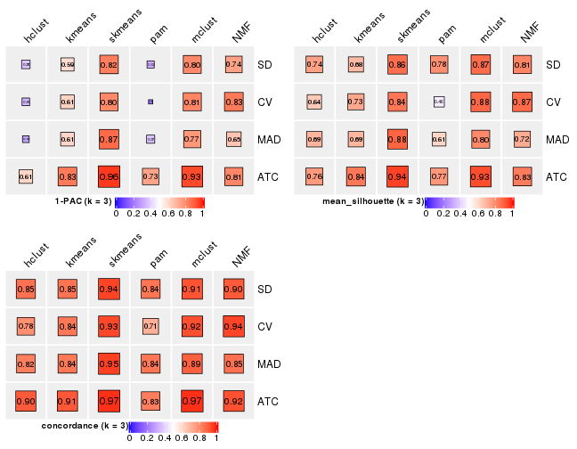</p>

</div>
<div id='tab-collect-stats-from-consensus-partition-list-3'>
<pre><code class="r">collect_stats(res_list, k = 4)
</code></pre>

<p></p>

</div>
<div id='tab-collect-stats-from-consensus-partition-list-4'>
<pre><code class="r">collect_stats(res_list, k = 5)
</code></pre>

<p></p>

</div>
<div id='tab-collect-stats-from-consensus-partition-list-5'>
<pre><code class="r">collect_stats(res_list, k = 6)
</code></pre>

<p></p>

</div>
</div>

### Partition from all methods


Collect partitions from all methods:


<script>
$( function() {
	$( '#tabs-collect-classes-from-consensus-partition-list' ).tabs();
} );
</script>
<div id='tabs-collect-classes-from-consensus-partition-list'>
<ul>
<li><a href='#tab-collect-classes-from-consensus-partition-list-1'>k = 2</a></li>
<li><a href='#tab-collect-classes-from-consensus-partition-list-2'>k = 3</a></li>
<li><a href='#tab-collect-classes-from-consensus-partition-list-3'>k = 4</a></li>
<li><a href='#tab-collect-classes-from-consensus-partition-list-4'>k = 5</a></li>
<li><a href='#tab-collect-classes-from-consensus-partition-list-5'>k = 6</a></li>
</ul>
<div id='tab-collect-classes-from-consensus-partition-list-1'>
<pre><code class="r">collect_classes(res_list, k = 2)
</code></pre>

<p></p>

</div>
<div id='tab-collect-classes-from-consensus-partition-list-2'>
<pre><code class="r">collect_classes(res_list, k = 3)
</code></pre>

<p></p>

</div>
<div id='tab-collect-classes-from-consensus-partition-list-3'>
<pre><code class="r">collect_classes(res_list, k = 4)
</code></pre>

<p></p>

</div>
<div id='tab-collect-classes-from-consensus-partition-list-4'>
<pre><code class="r">collect_classes(res_list, k = 5)
</code></pre>

<p></p>

</div>
<div id='tab-collect-classes-from-consensus-partition-list-5'>
<pre><code class="r">collect_classes(res_list, k = 6)
</code></pre>

<p></p>

</div>
</div>


### Top rows overlap


Overlap of top rows from different top-row methods:


<script>
$( function() {
	$( '#tabs-top-rows-overlap-by-euler' ).tabs();
} );
</script>
<div id='tabs-top-rows-overlap-by-euler'>
<ul>
<li><a href='#tab-top-rows-overlap-by-euler-1'>top_n = 558</a></li>
<li><a href='#tab-top-rows-overlap-by-euler-2'>top_n = 1116</a></li>
<li><a href='#tab-top-rows-overlap-by-euler-3'>top_n = 1673</a></li>
<li><a href='#tab-top-rows-overlap-by-euler-4'>top_n = 2230</a></li>
<li><a href='#tab-top-rows-overlap-by-euler-5'>top_n = 2788</a></li>
</ul>
<div id='tab-top-rows-overlap-by-euler-1'>
<pre><code class="r">top_rows_overlap(res_list, top_n = 558, method = &quot;euler&quot;)
</code></pre>

<p></p>

</div>
<div id='tab-top-rows-overlap-by-euler-2'>
<pre><code class="r">top_rows_overlap(res_list, top_n = 1116, method = &quot;euler&quot;)
</code></pre>

<p></p>

</div>
<div id='tab-top-rows-overlap-by-euler-3'>
<pre><code class="r">top_rows_overlap(res_list, top_n = 1673, method = &quot;euler&quot;)
</code></pre>

<p></p>

</div>
<div id='tab-top-rows-overlap-by-euler-4'>
<pre><code class="r">top_rows_overlap(res_list, top_n = 2230, method = &quot;euler&quot;)
</code></pre>

<p></p>

</div>
<div id='tab-top-rows-overlap-by-euler-5'>
<pre><code class="r">top_rows_overlap(res_list, top_n = 2788, method = &quot;euler&quot;)
</code></pre>

<p></p>

</div>
</div>

Also visualize the correspondance of rankings between different top-row methods:


<script>
$( function() {
	$( '#tabs-top-rows-overlap-by-correspondance' ).tabs();
} );
</script>
<div id='tabs-top-rows-overlap-by-correspondance'>
<ul>
<li><a href='#tab-top-rows-overlap-by-correspondance-1'>top_n = 558</a></li>
<li><a href='#tab-top-rows-overlap-by-correspondance-2'>top_n = 1116</a></li>
<li><a href='#tab-top-rows-overlap-by-correspondance-3'>top_n = 1673</a></li>
<li><a href='#tab-top-rows-overlap-by-correspondance-4'>top_n = 2230</a></li>
<li><a href='#tab-top-rows-overlap-by-correspondance-5'>top_n = 2788</a></li>
</ul>
<div id='tab-top-rows-overlap-by-correspondance-1'>
<pre><code class="r">top_rows_overlap(res_list, top_n = 558, method = &quot;correspondance&quot;)
</code></pre>

<p></p>

</div>
<div id='tab-top-rows-overlap-by-correspondance-2'>
<pre><code class="r">top_rows_overlap(res_list, top_n = 1116, method = &quot;correspondance&quot;)
</code></pre>

<p></p>

</div>
<div id='tab-top-rows-overlap-by-correspondance-3'>
<pre><code class="r">top_rows_overlap(res_list, top_n = 1673, method = &quot;correspondance&quot;)
</code></pre>

<p></p>

</div>
<div id='tab-top-rows-overlap-by-correspondance-4'>
<pre><code class="r">top_rows_overlap(res_list, top_n = 2230, method = &quot;correspondance&quot;)
</code></pre>

<p></p>

</div>
<div id='tab-top-rows-overlap-by-correspondance-5'>
<pre><code class="r">top_rows_overlap(res_list, top_n = 2788, method = &quot;correspondance&quot;)
</code></pre>

<p></p>

</div>
</div>


Heatmaps of the top rows:


<script>
$( function() {
	$( '#tabs-top-rows-heatmap' ).tabs();
} );
</script>
<div id='tabs-top-rows-heatmap'>
<ul>
<li><a href='#tab-top-rows-heatmap-1'>top_n = 558</a></li>
<li><a href='#tab-top-rows-heatmap-2'>top_n = 1116</a></li>
<li><a href='#tab-top-rows-heatmap-3'>top_n = 1673</a></li>
<li><a href='#tab-top-rows-heatmap-4'>top_n = 2230</a></li>
<li><a href='#tab-top-rows-heatmap-5'>top_n = 2788</a></li>
</ul>
<div id='tab-top-rows-heatmap-1'>
<pre><code class="r">top_rows_heatmap(res_list, top_n = 558)
</code></pre>

<p></p>

</div>
<div id='tab-top-rows-heatmap-2'>
<pre><code class="r">top_rows_heatmap(res_list, top_n = 1116)
</code></pre>

<p></p>

</div>
<div id='tab-top-rows-heatmap-3'>
<pre><code class="r">top_rows_heatmap(res_list, top_n = 1673)
</code></pre>

<p></p>

</div>
<div id='tab-top-rows-heatmap-4'>
<pre><code class="r">top_rows_heatmap(res_list, top_n = 2230)
</code></pre>

<p></p>

</div>
<div id='tab-top-rows-heatmap-5'>
<pre><code class="r">top_rows_heatmap(res_list, top_n = 2788)
</code></pre>

<p></p>

</div>
</div>


### Test to known annotations


Test correlation between subgroups and known annotations. If the known
annotation is numeric, one-way ANOVA test is applied, and if the known
annotation is discrete, chi-squared contingency table test is applied.


<script>
$( function() {
	$( '#tabs-test-to-known-factors-from-consensus-partition-list' ).tabs();
} );
</script>
<div id='tabs-test-to-known-factors-from-consensus-partition-list'>
<ul>
<li><a href='#tab-test-to-known-factors-from-consensus-partition-list-1'>k = 2</a></li>
<li><a href='#tab-test-to-known-factors-from-consensus-partition-list-2'>k = 3</a></li>
<li><a href='#tab-test-to-known-factors-from-consensus-partition-list-3'>k = 4</a></li>
<li><a href='#tab-test-to-known-factors-from-consensus-partition-list-4'>k = 5</a></li>
<li><a href='#tab-test-to-known-factors-from-consensus-partition-list-5'>k = 6</a></li>
</ul>
<div id='tab-test-to-known-factors-from-consensus-partition-list-1'>
<pre><code class="r">test_to_known_factors(res_list, k = 2)
</code></pre>

<pre><code>#&gt;               n cell_type(p) k
#&gt; SD:NMF      159     1.02e-26 2
#&gt; CV:NMF      156     2.05e-28 2
#&gt; MAD:NMF     159     2.51e-28 2
#&gt; ATC:NMF     159     4.69e-29 2
#&gt; SD:skmeans  158     4.65e-19 2
#&gt; CV:skmeans  156     2.86e-21 2
#&gt; MAD:skmeans 155     3.94e-19 2
#&gt; ATC:skmeans 160     4.49e-20 2
#&gt; SD:mclust   160     7.97e-29 2
#&gt; CV:mclust   160     5.69e-31 2
#&gt; MAD:mclust  160     3.08e-30 2
#&gt; ATC:mclust  159     5.02e-30 2
#&gt; SD:kmeans   155     1.04e-19 2
#&gt; CV:kmeans   155     4.72e-21 2
#&gt; MAD:kmeans  157     1.66e-17 2
#&gt; ATC:kmeans  160     4.49e-20 2
#&gt; SD:pam      160     2.38e-02 2
#&gt; CV:pam      143     9.46e-02 2
#&gt; MAD:pam     158     2.40e-02 2
#&gt; ATC:pam     152     6.61e-24 2
#&gt; SD:hclust   138     2.76e-14 2
#&gt; CV:hclust   125     5.51e-11 2
#&gt; MAD:hclust   99     7.49e-07 2
#&gt; ATC:hclust  120     1.74e-01 2
</code></pre>

</div>
<div id='tab-test-to-known-factors-from-consensus-partition-list-2'>
<pre><code class="r">test_to_known_factors(res_list, k = 3)
</code></pre>

<pre><code>#&gt;               n cell_type(p) k
#&gt; SD:NMF      146     1.88e-22 3
#&gt; CV:NMF      151     4.96e-22 3
#&gt; MAD:NMF     135     6.36e-20 3
#&gt; ATC:NMF     145     1.67e-21 3
#&gt; SD:skmeans  150     7.32e-22 3
#&gt; CV:skmeans  148     1.81e-22 3
#&gt; MAD:skmeans 148     5.16e-22 3
#&gt; ATC:skmeans 157     1.19e-24 3
#&gt; SD:mclust   154     2.46e-29 3
#&gt; CV:mclust   151     1.88e-29 3
#&gt; MAD:mclust  149     2.89e-28 3
#&gt; ATC:mclust  156     9.21e-30 3
#&gt; SD:kmeans   141     3.28e-20 3
#&gt; CV:kmeans   144     1.58e-22 3
#&gt; MAD:kmeans  141     2.34e-21 3
#&gt; ATC:kmeans  155     1.79e-25 3
#&gt; SD:pam      153     8.80e-19 3
#&gt; CV:pam      102     4.63e-15 3
#&gt; MAD:pam     115     1.12e-07 3
#&gt; ATC:pam     140     1.46e-23 3
#&gt; SD:hclust   143     2.08e-20 3
#&gt; CV:hclust   122     5.79e-19 3
#&gt; MAD:hclust  135     6.69e-26 3
#&gt; ATC:hclust  138     7.06e-20 3
</code></pre>

</div>
<div id='tab-test-to-known-factors-from-consensus-partition-list-3'>
<pre><code class="r">test_to_known_factors(res_list, k = 4)
</code></pre>

<pre><code>#&gt;               n cell_type(p) k
#&gt; SD:NMF      147     3.76e-21 4
#&gt; CV:NMF      138     2.91e-19 4
#&gt; MAD:NMF     148     1.48e-21 4
#&gt; ATC:NMF     146     4.69e-19 4
#&gt; SD:skmeans  148     4.34e-27 4
#&gt; CV:skmeans  149     2.65e-27 4
#&gt; MAD:skmeans 147     7.14e-27 4
#&gt; ATC:skmeans 151     1.71e-28 4
#&gt; SD:mclust   151     2.03e-26 4
#&gt; CV:mclust   146     1.99e-27 4
#&gt; MAD:mclust  155     7.53e-28 4
#&gt; ATC:mclust  148     2.21e-26 4
#&gt; SD:kmeans   137     4.66e-24 4
#&gt; CV:kmeans   151     9.92e-28 4
#&gt; MAD:kmeans  126     1.04e-21 4
#&gt; ATC:kmeans  156     4.70e-28 4
#&gt; SD:pam      149     1.84e-18 4
#&gt; CV:pam       41     2.04e-07 4
#&gt; MAD:pam     134     4.97e-02 4
#&gt; ATC:pam     150     4.48e-24 4
#&gt; SD:hclust   131     7.71e-25 4
#&gt; CV:hclust   127     2.32e-23 4
#&gt; MAD:hclust  109     8.28e-19 4
#&gt; ATC:hclust  136     1.67e-19 4
</code></pre>

</div>
<div id='tab-test-to-known-factors-from-consensus-partition-list-4'>
<pre><code class="r">test_to_known_factors(res_list, k = 5)
</code></pre>

<pre><code>#&gt;               n cell_type(p) k
#&gt; SD:NMF      129     2.91e-19 5
#&gt; CV:NMF       93     1.66e-10 5
#&gt; MAD:NMF     133     2.15e-18 5
#&gt; ATC:NMF     131     1.51e-16 5
#&gt; SD:skmeans  130     1.99e-22 5
#&gt; CV:skmeans  131     1.19e-22 5
#&gt; MAD:skmeans 127     1.30e-22 5
#&gt; ATC:skmeans 142     1.01e-25 5
#&gt; SD:mclust   137     6.49e-24 5
#&gt; CV:mclust   116     4.06e-20 5
#&gt; MAD:mclust  149     9.56e-26 5
#&gt; ATC:mclust  146     3.94e-25 5
#&gt; SD:kmeans   139     1.29e-23 5
#&gt; CV:kmeans   141     9.08e-25 5
#&gt; MAD:kmeans  146     4.45e-25 5
#&gt; ATC:kmeans  146     2.06e-24 5
#&gt; SD:pam       85     1.98e-14 5
#&gt; CV:pam       90     2.76e-10 5
#&gt; MAD:pam     129     1.08e-02 5
#&gt; ATC:pam     137     1.21e-22 5
#&gt; SD:hclust    97     4.22e-19 5
#&gt; CV:hclust   100     1.29e-16 5
#&gt; MAD:hclust   97     2.41e-17 5
#&gt; ATC:hclust  145     1.22e-25 5
</code></pre>

</div>
<div id='tab-test-to-known-factors-from-consensus-partition-list-5'>
<pre><code class="r">test_to_known_factors(res_list, k = 6)
</code></pre>

<pre><code>#&gt;               n cell_type(p) k
#&gt; SD:NMF      114     2.48e-14 6
#&gt; CV:NMF      121     5.43e-15 6
#&gt; MAD:NMF      82     5.63e-11 6
#&gt; ATC:NMF     107     9.83e-12 6
#&gt; SD:skmeans  116     2.14e-19 6
#&gt; CV:skmeans  106     3.76e-18 6
#&gt; MAD:skmeans 113     8.42e-19 6
#&gt; ATC:skmeans 125     4.64e-22 6
#&gt; SD:mclust   132     8.15e-23 6
#&gt; CV:mclust   119     8.64e-21 6
#&gt; MAD:mclust  134     1.62e-22 6
#&gt; ATC:mclust  139     2.43e-24 6
#&gt; SD:kmeans   118     1.38e-20 6
#&gt; CV:kmeans   123     1.07e-21 6
#&gt; MAD:kmeans  139     1.28e-23 6
#&gt; ATC:kmeans  121     1.92e-20 6
#&gt; SD:pam      101     3.35e-15 6
#&gt; CV:pam       60     9.11e-04 6
#&gt; MAD:pam     126     7.21e-14 6
#&gt; ATC:pam     132     5.06e-20 6
#&gt; SD:hclust   107     1.55e-20 6
#&gt; CV:hclust    79     8.25e-12 6
#&gt; MAD:hclust   97     1.78e-18 6
#&gt; ATC:hclust  145     7.78e-25 6
</code></pre>

</div>
</div>


 
## Results for each method


---------------------------------------------------


### SD:hclust


The object with results only for a single top-value method and a single partition method 
can be extracted as:

```r
res = res_list["SD", "hclust"]
# you can also extract it by
# res = res_list["SD:hclust"]
```

A summary of `res` and all the functions that can be applied to it:

```r
res
```

```
#> A 'ConsensusPartition' object with k = 2, 3, 4, 5, 6.
#>   On a matrix with 5576 rows and 160 columns.
#>   Top rows (558, 1116, 1673, 2230, 2788) are extracted by 'SD' method.
#>   Subgroups are detected by 'hclust' method.
#>   Performed in total 1250 partitions by row resampling.
#>   Best k for subgroups seems to be 3.
#> 
#> Following methods can be applied to this 'ConsensusPartition' object:
#>  [1] "cola_report"             "collect_classes"         "collect_plots"          
#>  [4] "collect_stats"           "colnames"                "compare_signatures"     
#>  [7] "consensus_heatmap"       "dimension_reduction"     "functional_enrichment"  
#> [10] "get_anno_col"            "get_anno"                "get_classes"            
#> [13] "get_consensus"           "get_matrix"              "get_membership"         
#> [16] "get_param"               "get_signatures"          "get_stats"              
#> [19] "is_best_k"               "is_stable_k"             "membership_heatmap"     
#> [22] "ncol"                    "nrow"                    "plot_ecdf"              
#> [25] "rownames"                "select_partition_number" "show"                   
#> [28] "suggest_best_k"          "test_to_known_factors"
```

`collect_plots()` function collects all the plots made from `res` for all `k` (number of partitions)
into one single page to provide an easy and fast comparison between different `k`.

```r
collect_plots(res)
```


The plots are:

- The first row: a plot of the ECDF (Empirical cumulative distribution
  function) curves of the consensus matrix for each `k` and the heatmap of
  predicted classes for each `k`.
- The second row: heatmaps of the consensus matrix for each `k`.
- The third row: heatmaps of the membership matrix for each `k`.
- The fouth row: heatmaps of the signatures for each `k`.

All the plots in panels can be made by individual functions and they are
plotted later in this section.

`select_partition_number()` produces several plots showing different
statistics for choosing "optimized" `k`. There are following statistics:

- ECDF curves of the consensus matrix for each `k`;
- 1-PAC. [The PAC
  score](https://en.wikipedia.org/wiki/Consensus_clustering#Over-interpretation_potential_of_consensus_clustering)
  measures the proportion of the ambiguous subgrouping.
- Mean silhouette score.
- Concordance. The mean probability of fiting the consensus class ids in all
  partitions.
- Area increased. Denote $A_k$ as the area under the ECDF curve for current
  `k`, the area increased is defined as $A_k - A_{k-1}$.
- Rand index. The percent of pairs of samples that are both in a same cluster
  or both are not in a same cluster in the partition of k and k-1.
- Jaccard index. The ratio of pairs of samples are both in a same cluster in
  the partition of k and k-1 and the pairs of samples are both in a same
  cluster in the partition k or k-1.

The detailed explanations of these statistics can be found in [the cola
vignette](http://bioconductor.org/packages/devel/bioc/vignettes/cola/inst/doc/cola.html#toc_13).

Generally speaking, lower PAC score, higher mean silhouette score or higher
concordance corresponds to better partition. Rand index and Jaccard index
measure how similar the current partition is compared to partition with `k-1`.
If they are too similar, we won't accept `k` is better than `k-1`.

```r
select_partition_number(res)
```


The numeric values for all these statistics can be obtained by `get_stats()`.

```r
get_stats(res)
```

```
#>   k 1-PAC mean_silhouette concordance area_increased  Rand Jaccard
#> 2 2 0.279           0.656       0.807         0.3475 0.554   0.554
#> 3 3 0.379           0.743       0.852         0.3781 0.894   0.818
#> 4 4 0.482           0.700       0.761         0.2786 0.809   0.667
#> 5 5 0.471           0.531       0.679         0.0999 0.831   0.650
#> 6 6 0.508           0.443       0.686         0.0591 0.887   0.723
```

`suggest_best_k()` suggests the best $k$ based on these statistics. The rules are as follows:

- All $k$ with Jaccard index larger than 0.95 are removed because the increase of
  the partition number does not provides enough extra information. If all $k$ are removed,
  the best $k$ is assigned by `NA`.
- For $k$ with 1-PAC larger than 0.9, the maximal $k$ is taken as the "best k". Other $k$ is called "optional k".
- If it does not fit the second rule. The $k$ with the highest vote of highest
  1-PAC, mean silhouette and concordance is taken as the "best k".

```r
suggest_best_k(res)
```

```
#> [1] 3
```


Following shows the table of the partitions (You need to click the **show/hide
code output** link to see it). The membership matrix (columns with name `p*`)
is inferred by
[`clue::cl_consensus()`](https://www.rdocumentation.org/link/cl_consensus?package=clue)
function with the `SE` method. Basically the value in the membership matrix
represents the probability to belong to a certain group. The finall class
label for an item is determined with the group with highest probability it
belongs to.

In `get_classes()` function, the entropy is calculated from the membership
matrix and the silhouette score is calculated from the consensus matrix.


<script>
$( function() {
	$( '#tabs-SD-hclust-get-classes' ).tabs();
} );
</script>
<div id='tabs-SD-hclust-get-classes'>
<ul>
<li><a href='#tab-SD-hclust-get-classes-1'>k = 2</a></li>
<li><a href='#tab-SD-hclust-get-classes-2'>k = 3</a></li>
<li><a href='#tab-SD-hclust-get-classes-3'>k = 4</a></li>
<li><a href='#tab-SD-hclust-get-classes-4'>k = 5</a></li>
<li><a href='#tab-SD-hclust-get-classes-5'>k = 6</a></li>
</ul>

<div id='tab-SD-hclust-get-classes-1'>
<p><a id='tab-SD-hclust-get-classes-1-a' style='color:#0366d6' href='#'>show/hide code output</a></p>
<pre><code class="r">cbind(get_classes(res, k = 2), get_membership(res, k = 2))
</code></pre>

<pre><code>#&gt;                     class entropy silhouette    p1    p2
#&gt; aberrant_ERR2585320     2  0.3584     0.8047 0.068 0.932
#&gt; aberrant_ERR2585338     2  0.0672     0.8019 0.008 0.992
#&gt; aberrant_ERR2585325     2  0.3584     0.8047 0.068 0.932
#&gt; aberrant_ERR2585283     1  0.2236     0.5120 0.964 0.036
#&gt; aberrant_ERR2585343     2  0.6438     0.7341 0.164 0.836
#&gt; aberrant_ERR2585329     2  0.1633     0.8135 0.024 0.976
#&gt; aberrant_ERR2585317     2  0.0938     0.8047 0.012 0.988
#&gt; aberrant_ERR2585339     2  0.0000     0.8066 0.000 1.000
#&gt; aberrant_ERR2585335     2  0.2236     0.8138 0.036 0.964
#&gt; aberrant_ERR2585287     2  0.9661     0.2956 0.392 0.608
#&gt; aberrant_ERR2585321     2  0.5629     0.7657 0.132 0.868
#&gt; aberrant_ERR2585297     1  0.9635     0.7361 0.612 0.388
#&gt; aberrant_ERR2585337     2  0.0000     0.8066 0.000 1.000
#&gt; aberrant_ERR2585319     2  0.2423     0.8146 0.040 0.960
#&gt; aberrant_ERR2585315     2  0.1414     0.8135 0.020 0.980
#&gt; aberrant_ERR2585336     2  0.0000     0.8066 0.000 1.000
#&gt; aberrant_ERR2585307     2  0.1633     0.8113 0.024 0.976
#&gt; aberrant_ERR2585301     2  0.2236     0.8144 0.036 0.964
#&gt; aberrant_ERR2585326     2  0.0672     0.8019 0.008 0.992
#&gt; aberrant_ERR2585331     2  0.0672     0.8019 0.008 0.992
#&gt; aberrant_ERR2585346     1  0.2236     0.5120 0.964 0.036
#&gt; aberrant_ERR2585314     2  0.2236     0.8152 0.036 0.964
#&gt; aberrant_ERR2585298     2  0.8207     0.4624 0.256 0.744
#&gt; aberrant_ERR2585345     2  0.0938     0.8047 0.012 0.988
#&gt; aberrant_ERR2585299     1  0.9754     0.7286 0.592 0.408
#&gt; aberrant_ERR2585309     1  0.8499     0.7271 0.724 0.276
#&gt; aberrant_ERR2585303     2  0.0938     0.8049 0.012 0.988
#&gt; aberrant_ERR2585313     2  0.1414     0.8130 0.020 0.980
#&gt; aberrant_ERR2585318     2  0.3274     0.8084 0.060 0.940
#&gt; aberrant_ERR2585328     2  0.2778     0.8155 0.048 0.952
#&gt; aberrant_ERR2585330     2  0.3431     0.8078 0.064 0.936
#&gt; aberrant_ERR2585293     1  0.2236     0.5120 0.964 0.036
#&gt; aberrant_ERR2585342     2  0.4298     0.7997 0.088 0.912
#&gt; aberrant_ERR2585348     2  0.3584     0.8086 0.068 0.932
#&gt; aberrant_ERR2585352     2  0.2603     0.8140 0.044 0.956
#&gt; aberrant_ERR2585308     1  0.9044     0.7410 0.680 0.320
#&gt; aberrant_ERR2585349     2  0.2043     0.8023 0.032 0.968
#&gt; aberrant_ERR2585316     2  0.6247     0.7456 0.156 0.844
#&gt; aberrant_ERR2585306     2  0.6887     0.7040 0.184 0.816
#&gt; aberrant_ERR2585324     2  0.2423     0.8146 0.040 0.960
#&gt; aberrant_ERR2585310     2  0.1633     0.8123 0.024 0.976
#&gt; aberrant_ERR2585296     2  0.9933    -0.4104 0.452 0.548
#&gt; aberrant_ERR2585275     1  0.2236     0.5120 0.964 0.036
#&gt; aberrant_ERR2585311     2  0.4161     0.8011 0.084 0.916
#&gt; aberrant_ERR2585292     1  0.2236     0.5120 0.964 0.036
#&gt; aberrant_ERR2585282     2  0.3584     0.8064 0.068 0.932
#&gt; aberrant_ERR2585305     2  0.3274     0.8081 0.060 0.940
#&gt; aberrant_ERR2585278     2  0.0938     0.8110 0.012 0.988
#&gt; aberrant_ERR2585347     2  0.5946     0.7569 0.144 0.856
#&gt; aberrant_ERR2585332     2  0.4815     0.7847 0.104 0.896
#&gt; aberrant_ERR2585280     2  0.4298     0.7986 0.088 0.912
#&gt; aberrant_ERR2585304     2  0.3114     0.7939 0.056 0.944
#&gt; aberrant_ERR2585322     2  0.0376     0.8084 0.004 0.996
#&gt; aberrant_ERR2585279     2  0.0672     0.8019 0.008 0.992
#&gt; aberrant_ERR2585277     2  0.0376     0.8045 0.004 0.996
#&gt; aberrant_ERR2585295     2  0.2778     0.8157 0.048 0.952
#&gt; aberrant_ERR2585333     2  0.4939     0.7881 0.108 0.892
#&gt; aberrant_ERR2585285     2  0.3274     0.8094 0.060 0.940
#&gt; aberrant_ERR2585286     2  0.0672     0.8019 0.008 0.992
#&gt; aberrant_ERR2585294     2  0.2778     0.8143 0.048 0.952
#&gt; aberrant_ERR2585300     2  0.6887     0.7040 0.184 0.816
#&gt; aberrant_ERR2585334     2  0.0672     0.8019 0.008 0.992
#&gt; aberrant_ERR2585361     2  0.3114     0.8127 0.056 0.944
#&gt; aberrant_ERR2585372     2  0.3584     0.8052 0.068 0.932
#&gt; round_ERR2585217        2  0.6438     0.6793 0.164 0.836
#&gt; round_ERR2585205        1  0.9881     0.7050 0.564 0.436
#&gt; round_ERR2585214        2  0.6973     0.6292 0.188 0.812
#&gt; round_ERR2585202        2  0.3733     0.7823 0.072 0.928
#&gt; aberrant_ERR2585367     2  0.3114     0.8127 0.056 0.944
#&gt; round_ERR2585220        1  0.9977     0.6523 0.528 0.472
#&gt; round_ERR2585238        1  0.9491     0.7420 0.632 0.368
#&gt; aberrant_ERR2585276     2  0.3879     0.8046 0.076 0.924
#&gt; round_ERR2585218        1  0.9815     0.7189 0.580 0.420
#&gt; aberrant_ERR2585363     2  0.3114     0.8125 0.056 0.944
#&gt; round_ERR2585201        2  0.8016     0.4950 0.244 0.756
#&gt; round_ERR2585210        1  0.9815     0.7177 0.580 0.420
#&gt; aberrant_ERR2585362     2  0.3114     0.8132 0.056 0.944
#&gt; aberrant_ERR2585360     2  0.4161     0.8004 0.084 0.916
#&gt; round_ERR2585209        2  0.8081     0.4815 0.248 0.752
#&gt; round_ERR2585242        2  0.8144     0.4608 0.252 0.748
#&gt; round_ERR2585216        1  1.0000     0.5920 0.504 0.496
#&gt; round_ERR2585219        1  0.9977     0.6541 0.528 0.472
#&gt; round_ERR2585237        2  0.6973     0.6304 0.188 0.812
#&gt; round_ERR2585198        2  0.3584     0.7857 0.068 0.932
#&gt; round_ERR2585211        1  0.9833     0.7169 0.576 0.424
#&gt; round_ERR2585206        1  0.9850     0.7134 0.572 0.428
#&gt; aberrant_ERR2585281     2  0.1633     0.8104 0.024 0.976
#&gt; round_ERR2585212        1  0.9993     0.6286 0.516 0.484
#&gt; round_ERR2585221        1  0.8955     0.7401 0.688 0.312
#&gt; round_ERR2585243        1  0.9833     0.7178 0.576 0.424
#&gt; round_ERR2585204        2  0.6343     0.6746 0.160 0.840
#&gt; round_ERR2585213        2  0.4431     0.7583 0.092 0.908
#&gt; aberrant_ERR2585373     2  0.4298     0.7981 0.088 0.912
#&gt; aberrant_ERR2585358     2  0.5629     0.7646 0.132 0.868
#&gt; aberrant_ERR2585365     2  0.0672     0.8102 0.008 0.992
#&gt; aberrant_ERR2585359     2  0.6247     0.7399 0.156 0.844
#&gt; aberrant_ERR2585370     2  0.0376     0.8045 0.004 0.996
#&gt; round_ERR2585215        1  0.9087     0.7401 0.676 0.324
#&gt; round_ERR2585262        2  0.6148     0.6855 0.152 0.848
#&gt; round_ERR2585199        2  0.4022     0.7753 0.080 0.920
#&gt; aberrant_ERR2585369     2  0.3114     0.8104 0.056 0.944
#&gt; round_ERR2585208        1  0.9710     0.7320 0.600 0.400
#&gt; round_ERR2585252        1  0.8081     0.7132 0.752 0.248
#&gt; round_ERR2585236        2  0.9922    -0.4086 0.448 0.552
#&gt; aberrant_ERR2585284     1  0.2236     0.5120 0.964 0.036
#&gt; round_ERR2585224        1  0.7815     0.7027 0.768 0.232
#&gt; round_ERR2585260        1  0.9933     0.6838 0.548 0.452
#&gt; round_ERR2585229        1  0.9552     0.7400 0.624 0.376
#&gt; aberrant_ERR2585364     1  0.6623     0.5510 0.828 0.172
#&gt; round_ERR2585253        1  0.7815     0.7027 0.768 0.232
#&gt; aberrant_ERR2585368     2  0.0672     0.8019 0.008 0.992
#&gt; aberrant_ERR2585371     2  0.0672     0.8019 0.008 0.992
#&gt; round_ERR2585239        1  0.9944     0.6793 0.544 0.456
#&gt; round_ERR2585273        1  0.9754     0.7216 0.592 0.408
#&gt; round_ERR2585256        2  0.8443     0.3987 0.272 0.728
#&gt; round_ERR2585272        2  1.0000    -0.5787 0.496 0.504
#&gt; round_ERR2585246        1  0.9129     0.7421 0.672 0.328
#&gt; round_ERR2585261        2  0.8443     0.4107 0.272 0.728
#&gt; round_ERR2585254        2  0.6887     0.6384 0.184 0.816
#&gt; round_ERR2585225        2  0.7950     0.4943 0.240 0.760
#&gt; round_ERR2585235        2  0.9393     0.0403 0.356 0.644
#&gt; round_ERR2585271        1  0.9922     0.6910 0.552 0.448
#&gt; round_ERR2585251        1  0.9977     0.6511 0.528 0.472
#&gt; round_ERR2585255        2  0.7950     0.4930 0.240 0.760
#&gt; round_ERR2585257        2  0.8081     0.4772 0.248 0.752
#&gt; round_ERR2585226        1  0.9983     0.6445 0.524 0.476
#&gt; round_ERR2585265        1  0.9970     0.6591 0.532 0.468
#&gt; round_ERR2585259        2  0.9209     0.1803 0.336 0.664
#&gt; round_ERR2585247        1  0.9286     0.7425 0.656 0.344
#&gt; round_ERR2585241        1  0.9922     0.6905 0.552 0.448
#&gt; round_ERR2585263        2  0.9996    -0.5551 0.488 0.512
#&gt; round_ERR2585264        1  0.7815     0.7027 0.768 0.232
#&gt; round_ERR2585233        2  0.8267     0.4422 0.260 0.740
#&gt; round_ERR2585223        1  0.9954     0.6692 0.540 0.460
#&gt; round_ERR2585234        2  0.6973     0.6268 0.188 0.812
#&gt; round_ERR2585222        1  0.9996     0.6130 0.512 0.488
#&gt; round_ERR2585228        1  0.9944     0.6771 0.544 0.456
#&gt; round_ERR2585248        1  0.7815     0.7027 0.768 0.232
#&gt; round_ERR2585240        2  0.9833    -0.3806 0.424 0.576
#&gt; round_ERR2585270        1  0.9954     0.6706 0.540 0.460
#&gt; round_ERR2585232        2  0.8813     0.2886 0.300 0.700
#&gt; aberrant_ERR2585341     2  0.1414     0.8092 0.020 0.980
#&gt; aberrant_ERR2585355     2  0.0672     0.8019 0.008 0.992
#&gt; round_ERR2585227        1  0.9977     0.6529 0.528 0.472
#&gt; aberrant_ERR2585351     2  0.3274     0.8116 0.060 0.940
#&gt; round_ERR2585269        1  0.8909     0.7390 0.692 0.308
#&gt; aberrant_ERR2585357     2  0.0376     0.8045 0.004 0.996
#&gt; aberrant_ERR2585350     2  0.0000     0.8066 0.000 1.000
#&gt; round_ERR2585250        2  0.9977    -0.4999 0.472 0.528
#&gt; round_ERR2585245        1  0.7815     0.7027 0.768 0.232
#&gt; aberrant_ERR2585353     2  0.3733     0.8082 0.072 0.928
#&gt; round_ERR2585258        1  0.9970     0.6591 0.532 0.468
#&gt; aberrant_ERR2585354     2  0.2778     0.8145 0.048 0.952
#&gt; round_ERR2585249        1  0.8608     0.7313 0.716 0.284
#&gt; round_ERR2585268        2  0.9933    -0.4224 0.452 0.548
#&gt; aberrant_ERR2585356     2  0.6801     0.7131 0.180 0.820
#&gt; round_ERR2585266        2  0.8207     0.4480 0.256 0.744
#&gt; round_ERR2585231        1  0.8207     0.7181 0.744 0.256
#&gt; round_ERR2585230        1  0.9983     0.6343 0.524 0.476
#&gt; round_ERR2585267        1  0.8327     0.7222 0.736 0.264
</code></pre>

<script>
$('#tab-SD-hclust-get-classes-1-a').parent().next().next().hide();
$('#tab-SD-hclust-get-classes-1-a').click(function(){
  $('#tab-SD-hclust-get-classes-1-a').parent().next().next().toggle();
  return(false);
});
</script>
</div>

<div id='tab-SD-hclust-get-classes-2'>
<p><a id='tab-SD-hclust-get-classes-2-a' style='color:#0366d6' href='#'>show/hide code output</a></p>
<pre><code class="r">cbind(get_classes(res, k = 3), get_membership(res, k = 3))
</code></pre>

<pre><code>#&gt;                     class entropy silhouette    p1    p2    p3
#&gt; aberrant_ERR2585320     2  0.2584     0.8410 0.008 0.928 0.064
#&gt; aberrant_ERR2585338     2  0.0424     0.8412 0.000 0.992 0.008
#&gt; aberrant_ERR2585325     2  0.2584     0.8410 0.008 0.928 0.064
#&gt; aberrant_ERR2585283     3  0.1170     0.9663 0.016 0.008 0.976
#&gt; aberrant_ERR2585343     2  0.4663     0.7868 0.016 0.828 0.156
#&gt; aberrant_ERR2585329     2  0.1031     0.8460 0.000 0.976 0.024
#&gt; aberrant_ERR2585317     2  0.0592     0.8427 0.000 0.988 0.012
#&gt; aberrant_ERR2585339     2  0.0000     0.8431 0.000 1.000 0.000
#&gt; aberrant_ERR2585335     2  0.1529     0.8455 0.000 0.960 0.040
#&gt; aberrant_ERR2585287     2  0.6753     0.4011 0.016 0.596 0.388
#&gt; aberrant_ERR2585321     2  0.4139     0.8082 0.016 0.860 0.124
#&gt; aberrant_ERR2585297     1  0.4062     0.8305 0.836 0.164 0.000
#&gt; aberrant_ERR2585337     2  0.0000     0.8431 0.000 1.000 0.000
#&gt; aberrant_ERR2585319     2  0.1643     0.8460 0.000 0.956 0.044
#&gt; aberrant_ERR2585315     2  0.0892     0.8463 0.000 0.980 0.020
#&gt; aberrant_ERR2585336     2  0.0000     0.8431 0.000 1.000 0.000
#&gt; aberrant_ERR2585307     2  0.1905     0.8366 0.028 0.956 0.016
#&gt; aberrant_ERR2585301     2  0.1643     0.8460 0.000 0.956 0.044
#&gt; aberrant_ERR2585326     2  0.0424     0.8412 0.000 0.992 0.008
#&gt; aberrant_ERR2585331     2  0.0424     0.8412 0.000 0.992 0.008
#&gt; aberrant_ERR2585346     3  0.1170     0.9663 0.016 0.008 0.976
#&gt; aberrant_ERR2585314     2  0.1905     0.8454 0.016 0.956 0.028
#&gt; aberrant_ERR2585298     2  0.6359     0.2604 0.364 0.628 0.008
#&gt; aberrant_ERR2585345     2  0.0592     0.8427 0.000 0.988 0.012
#&gt; aberrant_ERR2585299     1  0.4912     0.8441 0.796 0.196 0.008
#&gt; aberrant_ERR2585309     1  0.1832     0.7200 0.956 0.036 0.008
#&gt; aberrant_ERR2585303     2  0.0747     0.8439 0.000 0.984 0.016
#&gt; aberrant_ERR2585313     2  0.0892     0.8458 0.000 0.980 0.020
#&gt; aberrant_ERR2585318     2  0.2301     0.8421 0.004 0.936 0.060
#&gt; aberrant_ERR2585328     2  0.2063     0.8473 0.008 0.948 0.044
#&gt; aberrant_ERR2585330     2  0.2496     0.8410 0.004 0.928 0.068
#&gt; aberrant_ERR2585293     3  0.1170     0.9663 0.016 0.008 0.976
#&gt; aberrant_ERR2585342     2  0.3112     0.8319 0.004 0.900 0.096
#&gt; aberrant_ERR2585348     2  0.2496     0.8412 0.004 0.928 0.068
#&gt; aberrant_ERR2585352     2  0.1878     0.8456 0.004 0.952 0.044
#&gt; aberrant_ERR2585308     1  0.3129     0.7753 0.904 0.088 0.008
#&gt; aberrant_ERR2585349     2  0.1525     0.8298 0.032 0.964 0.004
#&gt; aberrant_ERR2585316     2  0.4413     0.7915 0.008 0.832 0.160
#&gt; aberrant_ERR2585306     2  0.5223     0.7600 0.024 0.800 0.176
#&gt; aberrant_ERR2585324     2  0.1643     0.8460 0.000 0.956 0.044
#&gt; aberrant_ERR2585310     2  0.2383     0.8294 0.044 0.940 0.016
#&gt; aberrant_ERR2585296     1  0.6247     0.6513 0.620 0.376 0.004
#&gt; aberrant_ERR2585275     3  0.1170     0.9663 0.016 0.008 0.976
#&gt; aberrant_ERR2585311     2  0.2945     0.8341 0.004 0.908 0.088
#&gt; aberrant_ERR2585292     3  0.1170     0.9663 0.016 0.008 0.976
#&gt; aberrant_ERR2585282     2  0.2590     0.8391 0.004 0.924 0.072
#&gt; aberrant_ERR2585305     2  0.2400     0.8413 0.004 0.932 0.064
#&gt; aberrant_ERR2585278     2  0.0747     0.8457 0.000 0.984 0.016
#&gt; aberrant_ERR2585347     2  0.4164     0.8017 0.008 0.848 0.144
#&gt; aberrant_ERR2585332     2  0.3454     0.8234 0.008 0.888 0.104
#&gt; aberrant_ERR2585280     2  0.3129     0.8354 0.008 0.904 0.088
#&gt; aberrant_ERR2585304     2  0.3682     0.7578 0.116 0.876 0.008
#&gt; aberrant_ERR2585322     2  0.0237     0.8439 0.000 0.996 0.004
#&gt; aberrant_ERR2585279     2  0.0424     0.8412 0.000 0.992 0.008
#&gt; aberrant_ERR2585277     2  0.0237     0.8423 0.000 0.996 0.004
#&gt; aberrant_ERR2585295     2  0.2229     0.8468 0.012 0.944 0.044
#&gt; aberrant_ERR2585333     2  0.3532     0.8234 0.008 0.884 0.108
#&gt; aberrant_ERR2585285     2  0.2400     0.8427 0.004 0.932 0.064
#&gt; aberrant_ERR2585286     2  0.0424     0.8412 0.000 0.992 0.008
#&gt; aberrant_ERR2585294     2  0.1964     0.8454 0.000 0.944 0.056
#&gt; aberrant_ERR2585300     2  0.5147     0.7594 0.020 0.800 0.180
#&gt; aberrant_ERR2585334     2  0.0424     0.8412 0.000 0.992 0.008
#&gt; aberrant_ERR2585361     2  0.2200     0.8444 0.004 0.940 0.056
#&gt; aberrant_ERR2585372     2  0.2496     0.8399 0.004 0.928 0.068
#&gt; round_ERR2585217        2  0.5247     0.6146 0.224 0.768 0.008
#&gt; round_ERR2585205        1  0.5158     0.8454 0.764 0.232 0.004
#&gt; round_ERR2585214        2  0.5728     0.5155 0.272 0.720 0.008
#&gt; round_ERR2585202        2  0.4099     0.7333 0.140 0.852 0.008
#&gt; aberrant_ERR2585367     2  0.2200     0.8444 0.004 0.940 0.056
#&gt; round_ERR2585220        1  0.5291     0.8275 0.732 0.268 0.000
#&gt; round_ERR2585238        1  0.3784     0.8131 0.864 0.132 0.004
#&gt; aberrant_ERR2585276     2  0.2955     0.8368 0.008 0.912 0.080
#&gt; round_ERR2585218        1  0.4654     0.8489 0.792 0.208 0.000
#&gt; aberrant_ERR2585363     2  0.2200     0.8444 0.004 0.940 0.056
#&gt; round_ERR2585201        2  0.6297     0.2987 0.352 0.640 0.008
#&gt; round_ERR2585210        1  0.4796     0.8459 0.780 0.220 0.000
#&gt; aberrant_ERR2585362     2  0.2200     0.8446 0.004 0.940 0.056
#&gt; aberrant_ERR2585360     2  0.2860     0.8341 0.004 0.912 0.084
#&gt; round_ERR2585209        2  0.6228     0.2411 0.372 0.624 0.004
#&gt; round_ERR2585242        2  0.6209     0.2523 0.368 0.628 0.004
#&gt; round_ERR2585216        1  0.5465     0.8071 0.712 0.288 0.000
#&gt; round_ERR2585219        1  0.5254     0.8312 0.736 0.264 0.000
#&gt; round_ERR2585237        2  0.5831     0.4886 0.284 0.708 0.008
#&gt; round_ERR2585198        2  0.3896     0.7443 0.128 0.864 0.008
#&gt; round_ERR2585211        1  0.5024     0.8471 0.776 0.220 0.004
#&gt; round_ERR2585206        1  0.5070     0.8469 0.772 0.224 0.004
#&gt; aberrant_ERR2585281     2  0.1267     0.8459 0.004 0.972 0.024
#&gt; round_ERR2585212        1  0.5363     0.8207 0.724 0.276 0.000
#&gt; round_ERR2585221        1  0.2261     0.7603 0.932 0.068 0.000
#&gt; round_ERR2585243        1  0.5115     0.8470 0.768 0.228 0.004
#&gt; round_ERR2585204        2  0.5502     0.5637 0.248 0.744 0.008
#&gt; round_ERR2585213        2  0.4291     0.7129 0.152 0.840 0.008
#&gt; aberrant_ERR2585373     2  0.3129     0.8323 0.008 0.904 0.088
#&gt; aberrant_ERR2585358     2  0.4128     0.8062 0.012 0.856 0.132
#&gt; aberrant_ERR2585365     2  0.0592     0.8454 0.000 0.988 0.012
#&gt; aberrant_ERR2585359     2  0.4575     0.7854 0.012 0.828 0.160
#&gt; aberrant_ERR2585370     2  0.0237     0.8424 0.000 0.996 0.004
#&gt; round_ERR2585215        1  0.3295     0.7805 0.896 0.096 0.008
#&gt; round_ERR2585262        2  0.5061     0.6274 0.208 0.784 0.008
#&gt; round_ERR2585199        2  0.4099     0.7298 0.140 0.852 0.008
#&gt; aberrant_ERR2585369     2  0.2165     0.8420 0.000 0.936 0.064
#&gt; round_ERR2585208        1  0.4399     0.8413 0.812 0.188 0.000
#&gt; round_ERR2585252        1  0.1182     0.6853 0.976 0.012 0.012
#&gt; round_ERR2585236        1  0.6026     0.6492 0.624 0.376 0.000
#&gt; aberrant_ERR2585284     3  0.0661     0.9564 0.004 0.008 0.988
#&gt; round_ERR2585224        1  0.1031     0.6551 0.976 0.000 0.024
#&gt; round_ERR2585260        1  0.5138     0.8378 0.748 0.252 0.000
#&gt; round_ERR2585229        1  0.4291     0.8238 0.840 0.152 0.008
#&gt; aberrant_ERR2585364     3  0.4475     0.7946 0.016 0.144 0.840
#&gt; round_ERR2585253        1  0.0747     0.6635 0.984 0.000 0.016
#&gt; aberrant_ERR2585368     2  0.0424     0.8412 0.000 0.992 0.008
#&gt; aberrant_ERR2585371     2  0.0424     0.8412 0.000 0.992 0.008
#&gt; round_ERR2585239        1  0.5138     0.8391 0.748 0.252 0.000
#&gt; round_ERR2585273        1  0.4235     0.8277 0.824 0.176 0.000
#&gt; round_ERR2585256        2  0.6386     0.0810 0.412 0.584 0.004
#&gt; round_ERR2585272        1  0.5529     0.7969 0.704 0.296 0.000
#&gt; round_ERR2585246        1  0.3295     0.7828 0.896 0.096 0.008
#&gt; round_ERR2585261        2  0.6527     0.0961 0.404 0.588 0.008
#&gt; round_ERR2585254        2  0.5541     0.5578 0.252 0.740 0.008
#&gt; round_ERR2585225        2  0.6148     0.2900 0.356 0.640 0.004
#&gt; round_ERR2585235        2  0.6308    -0.2517 0.492 0.508 0.000
#&gt; round_ERR2585271        1  0.5098     0.8408 0.752 0.248 0.000
#&gt; round_ERR2585251        1  0.5327     0.8231 0.728 0.272 0.000
#&gt; round_ERR2585255        2  0.6104     0.3146 0.348 0.648 0.004
#&gt; round_ERR2585257        2  0.6169     0.2791 0.360 0.636 0.004
#&gt; round_ERR2585226        1  0.5553     0.8247 0.724 0.272 0.004
#&gt; round_ERR2585265        1  0.5254     0.8305 0.736 0.264 0.000
#&gt; round_ERR2585259        2  0.6299    -0.1831 0.476 0.524 0.000
#&gt; round_ERR2585247        1  0.2959     0.7864 0.900 0.100 0.000
#&gt; round_ERR2585241        1  0.5244     0.8433 0.756 0.240 0.004
#&gt; round_ERR2585263        1  0.5706     0.7635 0.680 0.320 0.000
#&gt; round_ERR2585264        1  0.0747     0.6635 0.984 0.000 0.016
#&gt; round_ERR2585233        2  0.6228     0.2382 0.372 0.624 0.004
#&gt; round_ERR2585223        1  0.5365     0.8377 0.744 0.252 0.004
#&gt; round_ERR2585234        2  0.5831     0.4872 0.284 0.708 0.008
#&gt; round_ERR2585222        1  0.5431     0.8114 0.716 0.284 0.000
#&gt; round_ERR2585228        1  0.5138     0.8373 0.748 0.252 0.000
#&gt; round_ERR2585248        1  0.0747     0.6635 0.984 0.000 0.016
#&gt; round_ERR2585240        1  0.6079     0.6401 0.612 0.388 0.000
#&gt; round_ERR2585270        1  0.5216     0.8334 0.740 0.260 0.000
#&gt; round_ERR2585232        2  0.6476    -0.0909 0.448 0.548 0.004
#&gt; aberrant_ERR2585341     2  0.0983     0.8448 0.004 0.980 0.016
#&gt; aberrant_ERR2585355     2  0.0424     0.8412 0.000 0.992 0.008
#&gt; round_ERR2585227        1  0.5178     0.8297 0.744 0.256 0.000
#&gt; aberrant_ERR2585351     2  0.2400     0.8429 0.004 0.932 0.064
#&gt; round_ERR2585269        1  0.2400     0.7552 0.932 0.064 0.004
#&gt; aberrant_ERR2585357     2  0.0237     0.8424 0.000 0.996 0.004
#&gt; aberrant_ERR2585350     2  0.0000     0.8431 0.000 1.000 0.000
#&gt; round_ERR2585250        1  0.5835     0.7270 0.660 0.340 0.000
#&gt; round_ERR2585245        1  0.0747     0.6635 0.984 0.000 0.016
#&gt; aberrant_ERR2585353     2  0.2772     0.8385 0.004 0.916 0.080
#&gt; round_ERR2585258        1  0.5254     0.8305 0.736 0.264 0.000
#&gt; aberrant_ERR2585354     2  0.1964     0.8453 0.000 0.944 0.056
#&gt; round_ERR2585249        1  0.1765     0.7289 0.956 0.040 0.004
#&gt; round_ERR2585268        1  0.5968     0.6772 0.636 0.364 0.000
#&gt; aberrant_ERR2585356     2  0.5062     0.7585 0.016 0.800 0.184
#&gt; round_ERR2585266        2  0.6228     0.2374 0.372 0.624 0.004
#&gt; round_ERR2585231        1  0.1170     0.6945 0.976 0.016 0.008
#&gt; round_ERR2585230        1  0.5254     0.8302 0.736 0.264 0.000
#&gt; round_ERR2585267        1  0.2269     0.7188 0.944 0.040 0.016
</code></pre>

<script>
$('#tab-SD-hclust-get-classes-2-a').parent().next().next().hide();
$('#tab-SD-hclust-get-classes-2-a').click(function(){
  $('#tab-SD-hclust-get-classes-2-a').parent().next().next().toggle();
  return(false);
});
</script>
</div>

<div id='tab-SD-hclust-get-classes-3'>
<p><a id='tab-SD-hclust-get-classes-3-a' style='color:#0366d6' href='#'>show/hide code output</a></p>
<pre><code class="r">cbind(get_classes(res, k = 4), get_membership(res, k = 4))
</code></pre>

<pre><code>#&gt;                     class entropy silhouette    p1    p2 p3    p4
#&gt; aberrant_ERR2585320     2  0.1863     0.8505 0.004 0.944 NA 0.012
#&gt; aberrant_ERR2585338     2  0.3552     0.8180 0.024 0.848 NA 0.000
#&gt; aberrant_ERR2585325     2  0.1863     0.8505 0.004 0.944 NA 0.012
#&gt; aberrant_ERR2585283     4  0.0188     0.9576 0.000 0.004 NA 0.996
#&gt; aberrant_ERR2585343     2  0.4713     0.7668 0.008 0.804 NA 0.116
#&gt; aberrant_ERR2585329     2  0.2255     0.8497 0.012 0.920 NA 0.000
#&gt; aberrant_ERR2585317     2  0.2473     0.8437 0.012 0.908 NA 0.000
#&gt; aberrant_ERR2585339     2  0.3037     0.8340 0.020 0.880 NA 0.000
#&gt; aberrant_ERR2585335     2  0.1004     0.8539 0.004 0.972 NA 0.000
#&gt; aberrant_ERR2585287     2  0.6014     0.4181 0.000 0.588 NA 0.360
#&gt; aberrant_ERR2585321     2  0.4346     0.7892 0.004 0.824 NA 0.096
#&gt; aberrant_ERR2585297     1  0.4194     0.6887 0.800 0.028 NA 0.000
#&gt; aberrant_ERR2585337     2  0.2542     0.8412 0.012 0.904 NA 0.000
#&gt; aberrant_ERR2585319     2  0.1305     0.8553 0.000 0.960 NA 0.004
#&gt; aberrant_ERR2585315     2  0.1909     0.8532 0.008 0.940 NA 0.004
#&gt; aberrant_ERR2585336     2  0.2706     0.8408 0.020 0.900 NA 0.000
#&gt; aberrant_ERR2585307     2  0.3623     0.8315 0.048 0.864 NA 0.004
#&gt; aberrant_ERR2585301     2  0.1732     0.8529 0.008 0.948 NA 0.004
#&gt; aberrant_ERR2585326     2  0.2924     0.8351 0.016 0.884 NA 0.000
#&gt; aberrant_ERR2585331     2  0.3803     0.8105 0.032 0.836 NA 0.000
#&gt; aberrant_ERR2585346     4  0.0336     0.9558 0.000 0.008 NA 0.992
#&gt; aberrant_ERR2585314     2  0.2742     0.8492 0.024 0.900 NA 0.000
#&gt; aberrant_ERR2585298     1  0.7456     0.4805 0.492 0.200 NA 0.000
#&gt; aberrant_ERR2585345     2  0.2255     0.8473 0.012 0.920 NA 0.000
#&gt; aberrant_ERR2585299     1  0.4127     0.7117 0.824 0.052 NA 0.000
#&gt; aberrant_ERR2585309     1  0.5428     0.5169 0.620 0.016 NA 0.004
#&gt; aberrant_ERR2585303     2  0.2255     0.8547 0.012 0.920 NA 0.000
#&gt; aberrant_ERR2585313     2  0.2271     0.8489 0.008 0.916 NA 0.000
#&gt; aberrant_ERR2585318     2  0.2207     0.8441 0.004 0.928 NA 0.012
#&gt; aberrant_ERR2585328     2  0.3495     0.8508 0.020 0.868 NA 0.012
#&gt; aberrant_ERR2585330     2  0.2604     0.8482 0.012 0.916 NA 0.016
#&gt; aberrant_ERR2585293     4  0.0188     0.9576 0.000 0.004 NA 0.996
#&gt; aberrant_ERR2585342     2  0.2944     0.8376 0.004 0.900 NA 0.044
#&gt; aberrant_ERR2585348     2  0.2877     0.8438 0.008 0.904 NA 0.028
#&gt; aberrant_ERR2585352     2  0.2010     0.8561 0.012 0.940 NA 0.008
#&gt; aberrant_ERR2585308     1  0.5200     0.6170 0.704 0.028 NA 0.004
#&gt; aberrant_ERR2585349     2  0.5672     0.6845 0.100 0.712 NA 0.000
#&gt; aberrant_ERR2585316     2  0.4333     0.7839 0.004 0.820 NA 0.120
#&gt; aberrant_ERR2585306     2  0.5205     0.7341 0.012 0.768 NA 0.156
#&gt; aberrant_ERR2585324     2  0.1305     0.8553 0.000 0.960 NA 0.004
#&gt; aberrant_ERR2585310     2  0.4287     0.8038 0.080 0.828 NA 0.004
#&gt; aberrant_ERR2585296     1  0.4786     0.6953 0.788 0.104 NA 0.000
#&gt; aberrant_ERR2585275     4  0.0188     0.9576 0.000 0.004 NA 0.996
#&gt; aberrant_ERR2585311     2  0.2845     0.8315 0.004 0.904 NA 0.036
#&gt; aberrant_ERR2585292     4  0.0188     0.9576 0.000 0.004 NA 0.996
#&gt; aberrant_ERR2585282     2  0.2706     0.8413 0.004 0.908 NA 0.024
#&gt; aberrant_ERR2585305     2  0.2433     0.8421 0.008 0.920 NA 0.012
#&gt; aberrant_ERR2585278     2  0.2271     0.8546 0.012 0.928 NA 0.008
#&gt; aberrant_ERR2585347     2  0.3962     0.8056 0.004 0.844 NA 0.100
#&gt; aberrant_ERR2585332     2  0.3464     0.8100 0.000 0.868 NA 0.056
#&gt; aberrant_ERR2585280     2  0.2505     0.8458 0.004 0.920 NA 0.040
#&gt; aberrant_ERR2585304     2  0.6724     0.5142 0.192 0.616 NA 0.000
#&gt; aberrant_ERR2585322     2  0.2473     0.8450 0.012 0.908 NA 0.000
#&gt; aberrant_ERR2585279     2  0.4562     0.7783 0.056 0.792 NA 0.000
#&gt; aberrant_ERR2585277     2  0.3787     0.8125 0.036 0.840 NA 0.000
#&gt; aberrant_ERR2585295     2  0.2222     0.8572 0.008 0.928 NA 0.008
#&gt; aberrant_ERR2585333     2  0.3411     0.8240 0.008 0.880 NA 0.064
#&gt; aberrant_ERR2585285     2  0.1796     0.8539 0.004 0.948 NA 0.016
#&gt; aberrant_ERR2585286     2  0.3787     0.8122 0.036 0.840 NA 0.000
#&gt; aberrant_ERR2585294     2  0.2039     0.8511 0.008 0.940 NA 0.016
#&gt; aberrant_ERR2585300     2  0.5150     0.7347 0.008 0.768 NA 0.156
#&gt; aberrant_ERR2585334     2  0.3895     0.8076 0.036 0.832 NA 0.000
#&gt; aberrant_ERR2585361     2  0.2421     0.8538 0.008 0.924 NA 0.020
#&gt; aberrant_ERR2585372     2  0.2485     0.8346 0.004 0.916 NA 0.016
#&gt; round_ERR2585217        2  0.7650     0.0604 0.328 0.448 NA 0.000
#&gt; round_ERR2585205        1  0.3547     0.7277 0.864 0.064 NA 0.000
#&gt; round_ERR2585214        1  0.7851     0.2817 0.400 0.312 NA 0.000
#&gt; round_ERR2585202        2  0.7497     0.2768 0.260 0.500 NA 0.000
#&gt; aberrant_ERR2585367     2  0.2505     0.8529 0.008 0.920 NA 0.020
#&gt; round_ERR2585220        1  0.2739     0.7279 0.904 0.060 NA 0.000
#&gt; round_ERR2585238        1  0.4244     0.6790 0.800 0.032 NA 0.000
#&gt; aberrant_ERR2585276     2  0.2731     0.8420 0.008 0.912 NA 0.032
#&gt; round_ERR2585218        1  0.3634     0.7227 0.856 0.048 NA 0.000
#&gt; aberrant_ERR2585363     2  0.2317     0.8506 0.012 0.928 NA 0.012
#&gt; round_ERR2585201        1  0.7527     0.4711 0.484 0.216 NA 0.000
#&gt; round_ERR2585210        1  0.4072     0.7186 0.828 0.052 NA 0.000
#&gt; aberrant_ERR2585362     2  0.2725     0.8518 0.016 0.912 NA 0.016
#&gt; aberrant_ERR2585360     2  0.2814     0.8421 0.008 0.908 NA 0.032
#&gt; round_ERR2585209        1  0.7459     0.4818 0.508 0.244 NA 0.000
#&gt; round_ERR2585242        1  0.7442     0.4842 0.496 0.200 NA 0.000
#&gt; round_ERR2585216        1  0.3144     0.7263 0.884 0.072 NA 0.000
#&gt; round_ERR2585219        1  0.2485     0.7290 0.916 0.064 NA 0.004
#&gt; round_ERR2585237        1  0.7811     0.2906 0.412 0.320 NA 0.000
#&gt; round_ERR2585198        2  0.6917     0.4688 0.208 0.592 NA 0.000
#&gt; round_ERR2585211        1  0.3687     0.7244 0.856 0.064 NA 0.000
#&gt; round_ERR2585206        1  0.3547     0.7249 0.864 0.064 NA 0.000
#&gt; aberrant_ERR2585281     2  0.3328     0.8351 0.024 0.872 NA 0.004
#&gt; round_ERR2585212        1  0.2413     0.7264 0.916 0.064 NA 0.000
#&gt; round_ERR2585221        1  0.5088     0.5931 0.700 0.020 NA 0.004
#&gt; round_ERR2585243        1  0.3601     0.7304 0.860 0.056 NA 0.000
#&gt; round_ERR2585204        1  0.7896     0.1693 0.360 0.348 NA 0.000
#&gt; round_ERR2585213        2  0.7519     0.2666 0.256 0.496 NA 0.000
#&gt; aberrant_ERR2585373     2  0.3312     0.8228 0.008 0.884 NA 0.040
#&gt; aberrant_ERR2585358     2  0.4362     0.7842 0.008 0.828 NA 0.088
#&gt; aberrant_ERR2585365     2  0.2164     0.8571 0.004 0.924 NA 0.004
#&gt; aberrant_ERR2585359     2  0.4626     0.7661 0.004 0.804 NA 0.120
#&gt; aberrant_ERR2585370     2  0.2796     0.8380 0.016 0.892 NA 0.000
#&gt; round_ERR2585215        1  0.4695     0.6039 0.732 0.012 NA 0.004
#&gt; round_ERR2585262        2  0.7900    -0.1207 0.320 0.372 NA 0.000
#&gt; round_ERR2585199        2  0.7064     0.4251 0.220 0.572 NA 0.000
#&gt; aberrant_ERR2585369     2  0.2161     0.8438 0.004 0.932 NA 0.016
#&gt; round_ERR2585208        1  0.4150     0.7107 0.824 0.056 NA 0.000
#&gt; round_ERR2585252        1  0.5299     0.4796 0.600 0.008 NA 0.004
#&gt; round_ERR2585236        1  0.5510     0.6882 0.744 0.120 NA 0.004
#&gt; aberrant_ERR2585284     4  0.3311     0.8974 0.000 0.000 NA 0.828
#&gt; round_ERR2585224        1  0.5353     0.4057 0.556 0.000 NA 0.012
#&gt; round_ERR2585260        1  0.3004     0.7291 0.892 0.060 NA 0.000
#&gt; round_ERR2585229        1  0.4467     0.6830 0.788 0.040 NA 0.000
#&gt; aberrant_ERR2585364     4  0.3908     0.8204 0.008 0.116 NA 0.844
#&gt; round_ERR2585253        1  0.5097     0.4226 0.568 0.000 NA 0.004
#&gt; aberrant_ERR2585368     2  0.3048     0.8326 0.016 0.876 NA 0.000
#&gt; aberrant_ERR2585371     2  0.3048     0.8326 0.016 0.876 NA 0.000
#&gt; round_ERR2585239        1  0.3168     0.7312 0.884 0.056 NA 0.000
#&gt; round_ERR2585273        1  0.4994     0.6751 0.744 0.048 NA 0.000
#&gt; round_ERR2585256        1  0.7122     0.5249 0.560 0.248 NA 0.000
#&gt; round_ERR2585272        1  0.3900     0.7292 0.844 0.072 NA 0.000
#&gt; round_ERR2585246        1  0.5263     0.6240 0.704 0.032 NA 0.004
#&gt; round_ERR2585261        1  0.7322     0.5041 0.532 0.244 NA 0.000
#&gt; round_ERR2585254        2  0.7785    -0.0890 0.348 0.404 NA 0.000
#&gt; round_ERR2585225        1  0.7530     0.4700 0.480 0.212 NA 0.000
#&gt; round_ERR2585235        1  0.6835     0.5847 0.592 0.156 NA 0.000
#&gt; round_ERR2585271        1  0.3584     0.7302 0.868 0.064 NA 0.004
#&gt; round_ERR2585251        1  0.3004     0.7269 0.892 0.060 NA 0.000
#&gt; round_ERR2585255        1  0.7565     0.4603 0.472 0.216 NA 0.000
#&gt; round_ERR2585257        1  0.7503     0.4779 0.488 0.212 NA 0.000
#&gt; round_ERR2585226        1  0.3320     0.7277 0.876 0.056 NA 0.000
#&gt; round_ERR2585265        1  0.3168     0.7277 0.884 0.060 NA 0.000
#&gt; round_ERR2585259        1  0.6476     0.6005 0.644 0.176 NA 0.000
#&gt; round_ERR2585247        1  0.5051     0.6369 0.724 0.028 NA 0.004
#&gt; round_ERR2585241        1  0.3088     0.7267 0.888 0.060 NA 0.000
#&gt; round_ERR2585263        1  0.3399     0.7202 0.868 0.092 NA 0.000
#&gt; round_ERR2585264        1  0.5105     0.4171 0.564 0.000 NA 0.004
#&gt; round_ERR2585233        1  0.7429     0.4828 0.496 0.196 NA 0.000
#&gt; round_ERR2585223        1  0.3245     0.7290 0.880 0.056 NA 0.000
#&gt; round_ERR2585234        1  0.7838     0.2804 0.404 0.316 NA 0.000
#&gt; round_ERR2585222        1  0.3229     0.7293 0.880 0.072 NA 0.000
#&gt; round_ERR2585228        1  0.2739     0.7291 0.904 0.060 NA 0.000
#&gt; round_ERR2585248        1  0.5105     0.4171 0.564 0.000 NA 0.004
#&gt; round_ERR2585240        1  0.5515     0.6709 0.732 0.116 NA 0.000
#&gt; round_ERR2585270        1  0.2892     0.7318 0.896 0.068 NA 0.000
#&gt; round_ERR2585232        1  0.6970     0.5562 0.576 0.168 NA 0.000
#&gt; aberrant_ERR2585341     2  0.2238     0.8539 0.004 0.920 NA 0.004
#&gt; aberrant_ERR2585355     2  0.3367     0.8268 0.028 0.864 NA 0.000
#&gt; round_ERR2585227        1  0.4731     0.7158 0.780 0.060 NA 0.000
#&gt; aberrant_ERR2585351     2  0.2275     0.8457 0.004 0.928 NA 0.020
#&gt; round_ERR2585269        1  0.5213     0.5622 0.652 0.020 NA 0.000
#&gt; aberrant_ERR2585357     2  0.2676     0.8394 0.012 0.896 NA 0.000
#&gt; aberrant_ERR2585350     2  0.2730     0.8388 0.016 0.896 NA 0.000
#&gt; round_ERR2585250        1  0.4104     0.7100 0.832 0.080 NA 0.000
#&gt; round_ERR2585245        1  0.5105     0.4171 0.564 0.000 NA 0.004
#&gt; aberrant_ERR2585353     2  0.2982     0.8367 0.004 0.896 NA 0.032
#&gt; round_ERR2585258        1  0.3168     0.7277 0.884 0.060 NA 0.000
#&gt; aberrant_ERR2585354     2  0.2365     0.8476 0.004 0.920 NA 0.012
#&gt; round_ERR2585249        1  0.5054     0.5370 0.660 0.008 NA 0.004
#&gt; round_ERR2585268        1  0.4605     0.6984 0.800 0.092 NA 0.000
#&gt; aberrant_ERR2585356     2  0.5193     0.7310 0.008 0.768 NA 0.148
#&gt; round_ERR2585266        1  0.7412     0.4916 0.504 0.200 NA 0.000
#&gt; round_ERR2585231        1  0.5004     0.4643 0.604 0.000 NA 0.004
#&gt; round_ERR2585230        1  0.2816     0.7304 0.900 0.064 NA 0.000
#&gt; round_ERR2585267        1  0.5165     0.4768 0.604 0.004 NA 0.004
</code></pre>

<script>
$('#tab-SD-hclust-get-classes-3-a').parent().next().next().hide();
$('#tab-SD-hclust-get-classes-3-a').click(function(){
  $('#tab-SD-hclust-get-classes-3-a').parent().next().next().toggle();
  return(false);
});
</script>
</div>

<div id='tab-SD-hclust-get-classes-4'>
<p><a id='tab-SD-hclust-get-classes-4-a' style='color:#0366d6' href='#'>show/hide code output</a></p>
<pre><code class="r">cbind(get_classes(res, k = 5), get_membership(res, k = 5))
</code></pre>

<pre><code>#&gt;                     class entropy silhouette    p1    p2    p3    p4    p5
#&gt; aberrant_ERR2585320     2  0.2666   0.830829 0.000 0.892 0.020 0.012 0.076
#&gt; aberrant_ERR2585338     2  0.4789   0.745535 0.000 0.728 0.156 0.000 0.116
#&gt; aberrant_ERR2585325     2  0.2666   0.830829 0.000 0.892 0.020 0.012 0.076
#&gt; aberrant_ERR2585283     4  0.0000   0.868242 0.000 0.000 0.000 1.000 0.000
#&gt; aberrant_ERR2585343     2  0.5222   0.683181 0.000 0.696 0.008 0.100 0.196
#&gt; aberrant_ERR2585329     2  0.3401   0.816937 0.000 0.840 0.096 0.000 0.064
#&gt; aberrant_ERR2585317     2  0.3691   0.803814 0.000 0.820 0.104 0.000 0.076
#&gt; aberrant_ERR2585339     2  0.4266   0.784080 0.000 0.776 0.120 0.000 0.104
#&gt; aberrant_ERR2585335     2  0.2149   0.833474 0.000 0.916 0.036 0.000 0.048
#&gt; aberrant_ERR2585287     2  0.6115   0.325141 0.000 0.520 0.004 0.356 0.120
#&gt; aberrant_ERR2585321     2  0.4922   0.712079 0.000 0.720 0.004 0.096 0.180
#&gt; aberrant_ERR2585297     1  0.4599   0.494106 0.600 0.000 0.384 0.000 0.016
#&gt; aberrant_ERR2585337     2  0.3967   0.794165 0.000 0.800 0.108 0.000 0.092
#&gt; aberrant_ERR2585319     2  0.2536   0.834163 0.000 0.900 0.052 0.004 0.044
#&gt; aberrant_ERR2585315     2  0.3047   0.824144 0.000 0.868 0.084 0.004 0.044
#&gt; aberrant_ERR2585336     2  0.3906   0.796243 0.000 0.804 0.112 0.000 0.084
#&gt; aberrant_ERR2585307     2  0.4315   0.790043 0.000 0.772 0.156 0.004 0.068
#&gt; aberrant_ERR2585301     2  0.2206   0.826955 0.000 0.912 0.016 0.004 0.068
#&gt; aberrant_ERR2585326     2  0.4121   0.788972 0.000 0.788 0.112 0.000 0.100
#&gt; aberrant_ERR2585331     2  0.4901   0.733522 0.000 0.716 0.168 0.000 0.116
#&gt; aberrant_ERR2585346     4  0.0324   0.861272 0.000 0.004 0.000 0.992 0.004
#&gt; aberrant_ERR2585314     2  0.3410   0.824489 0.000 0.840 0.092 0.000 0.068
#&gt; aberrant_ERR2585298     3  0.2581   0.467893 0.020 0.048 0.904 0.000 0.028
#&gt; aberrant_ERR2585345     2  0.3464   0.810860 0.000 0.836 0.096 0.000 0.068
#&gt; aberrant_ERR2585299     1  0.4830   0.427522 0.560 0.004 0.420 0.000 0.016
#&gt; aberrant_ERR2585309     1  0.3375   0.608595 0.840 0.000 0.104 0.000 0.056
#&gt; aberrant_ERR2585303     2  0.3307   0.829335 0.000 0.844 0.052 0.000 0.104
#&gt; aberrant_ERR2585313     2  0.3464   0.813249 0.000 0.836 0.096 0.000 0.068
#&gt; aberrant_ERR2585318     2  0.2464   0.814842 0.000 0.892 0.004 0.012 0.092
#&gt; aberrant_ERR2585328     2  0.4306   0.816603 0.000 0.792 0.100 0.012 0.096
#&gt; aberrant_ERR2585330     2  0.3009   0.827938 0.000 0.876 0.028 0.016 0.080
#&gt; aberrant_ERR2585293     4  0.0000   0.868242 0.000 0.000 0.000 1.000 0.000
#&gt; aberrant_ERR2585342     2  0.3776   0.800733 0.000 0.820 0.012 0.040 0.128
#&gt; aberrant_ERR2585348     2  0.3685   0.810064 0.000 0.824 0.016 0.028 0.132
#&gt; aberrant_ERR2585352     2  0.3078   0.834636 0.000 0.872 0.064 0.008 0.056
#&gt; aberrant_ERR2585308     1  0.3970   0.616699 0.752 0.000 0.224 0.000 0.024
#&gt; aberrant_ERR2585349     2  0.5629   0.532111 0.000 0.588 0.312 0.000 0.100
#&gt; aberrant_ERR2585316     2  0.5199   0.699135 0.000 0.704 0.008 0.112 0.176
#&gt; aberrant_ERR2585306     2  0.5873   0.642172 0.008 0.652 0.008 0.132 0.200
#&gt; aberrant_ERR2585324     2  0.2536   0.834163 0.000 0.900 0.052 0.004 0.044
#&gt; aberrant_ERR2585310     2  0.4645   0.772147 0.004 0.756 0.156 0.004 0.080
#&gt; aberrant_ERR2585296     3  0.5026   0.190471 0.328 0.028 0.632 0.000 0.012
#&gt; aberrant_ERR2585275     4  0.0162   0.866034 0.000 0.000 0.000 0.996 0.004
#&gt; aberrant_ERR2585311     2  0.3609   0.779197 0.000 0.816 0.004 0.032 0.148
#&gt; aberrant_ERR2585292     4  0.0000   0.868242 0.000 0.000 0.000 1.000 0.000
#&gt; aberrant_ERR2585282     2  0.3170   0.800794 0.000 0.848 0.004 0.024 0.124
#&gt; aberrant_ERR2585305     2  0.2811   0.811499 0.000 0.876 0.012 0.012 0.100
#&gt; aberrant_ERR2585278     2  0.3337   0.829307 0.000 0.856 0.072 0.008 0.064
#&gt; aberrant_ERR2585347     2  0.4675   0.757959 0.000 0.760 0.012 0.092 0.136
#&gt; aberrant_ERR2585332     2  0.4031   0.739190 0.000 0.772 0.000 0.044 0.184
#&gt; aberrant_ERR2585280     2  0.2965   0.821529 0.000 0.880 0.012 0.040 0.068
#&gt; aberrant_ERR2585304     3  0.5945  -0.174465 0.008 0.456 0.456 0.000 0.080
#&gt; aberrant_ERR2585322     2  0.3639   0.806779 0.000 0.824 0.100 0.000 0.076
#&gt; aberrant_ERR2585279     2  0.5295   0.678536 0.000 0.664 0.224 0.000 0.112
#&gt; aberrant_ERR2585277     2  0.4772   0.741392 0.000 0.728 0.164 0.000 0.108
#&gt; aberrant_ERR2585295     2  0.3210   0.835667 0.000 0.860 0.040 0.008 0.092
#&gt; aberrant_ERR2585333     2  0.4014   0.776963 0.000 0.804 0.008 0.060 0.128
#&gt; aberrant_ERR2585285     2  0.2721   0.833797 0.000 0.896 0.036 0.016 0.052
#&gt; aberrant_ERR2585286     2  0.4855   0.736036 0.000 0.720 0.168 0.000 0.112
#&gt; aberrant_ERR2585294     2  0.2312   0.824742 0.000 0.912 0.012 0.016 0.060
#&gt; aberrant_ERR2585300     2  0.5673   0.643394 0.000 0.652 0.008 0.136 0.204
#&gt; aberrant_ERR2585334     2  0.4936   0.728722 0.000 0.712 0.172 0.000 0.116
#&gt; aberrant_ERR2585361     2  0.3496   0.832813 0.000 0.848 0.036 0.020 0.096
#&gt; aberrant_ERR2585372     2  0.2881   0.805419 0.000 0.860 0.004 0.012 0.124
#&gt; round_ERR2585217        3  0.5961   0.322348 0.040 0.320 0.588 0.000 0.052
#&gt; round_ERR2585205        1  0.4911   0.257597 0.504 0.008 0.476 0.000 0.012
#&gt; round_ERR2585214        3  0.3875   0.452951 0.008 0.140 0.808 0.000 0.044
#&gt; round_ERR2585202        3  0.5921   0.197591 0.012 0.344 0.560 0.000 0.084
#&gt; aberrant_ERR2585367     2  0.3387   0.830033 0.000 0.852 0.028 0.020 0.100
#&gt; round_ERR2585220        3  0.4397  -0.066445 0.432 0.004 0.564 0.000 0.000
#&gt; round_ERR2585238        1  0.4624   0.541810 0.636 0.000 0.340 0.000 0.024
#&gt; aberrant_ERR2585276     2  0.2990   0.814928 0.000 0.876 0.012 0.032 0.080
#&gt; round_ERR2585218        1  0.4899   0.299012 0.524 0.008 0.456 0.000 0.012
#&gt; aberrant_ERR2585363     2  0.2696   0.829230 0.000 0.892 0.024 0.012 0.072
#&gt; round_ERR2585201        3  0.2445   0.471038 0.016 0.056 0.908 0.000 0.020
#&gt; round_ERR2585210        1  0.5227   0.308447 0.504 0.008 0.460 0.000 0.028
#&gt; aberrant_ERR2585362     2  0.3272   0.820588 0.000 0.848 0.016 0.016 0.120
#&gt; aberrant_ERR2585360     2  0.3344   0.816220 0.000 0.852 0.016 0.028 0.104
#&gt; round_ERR2585209        3  0.3882   0.468342 0.060 0.100 0.824 0.000 0.016
#&gt; round_ERR2585242        3  0.2492   0.467491 0.020 0.048 0.908 0.000 0.024
#&gt; round_ERR2585216        3  0.4621  -0.010323 0.412 0.008 0.576 0.000 0.004
#&gt; round_ERR2585219        3  0.4576  -0.129747 0.456 0.004 0.536 0.000 0.004
#&gt; round_ERR2585237        3  0.4472   0.447595 0.024 0.184 0.760 0.000 0.032
#&gt; round_ERR2585198        3  0.5931  -0.068663 0.008 0.424 0.488 0.000 0.080
#&gt; round_ERR2585211        1  0.4997   0.285100 0.508 0.008 0.468 0.000 0.016
#&gt; round_ERR2585206        1  0.4909   0.273974 0.508 0.008 0.472 0.000 0.012
#&gt; aberrant_ERR2585281     2  0.4220   0.792349 0.000 0.788 0.116 0.004 0.092
#&gt; round_ERR2585212        3  0.4524  -0.043416 0.420 0.004 0.572 0.000 0.004
#&gt; round_ERR2585221        1  0.4347   0.619793 0.744 0.004 0.212 0.000 0.040
#&gt; round_ERR2585243        3  0.4913  -0.261812 0.484 0.008 0.496 0.000 0.012
#&gt; round_ERR2585204        3  0.4750   0.427050 0.012 0.208 0.728 0.000 0.052
#&gt; round_ERR2585213        3  0.5719   0.187004 0.004 0.348 0.564 0.000 0.084
#&gt; aberrant_ERR2585373     2  0.3811   0.773778 0.000 0.808 0.008 0.036 0.148
#&gt; aberrant_ERR2585358     2  0.4943   0.698625 0.000 0.716 0.008 0.076 0.200
#&gt; aberrant_ERR2585365     2  0.3105   0.832136 0.000 0.864 0.044 0.004 0.088
#&gt; aberrant_ERR2585359     2  0.5213   0.672977 0.000 0.688 0.004 0.104 0.204
#&gt; aberrant_ERR2585370     2  0.4069   0.790583 0.000 0.792 0.112 0.000 0.096
#&gt; round_ERR2585215        1  0.4477   0.590642 0.708 0.000 0.252 0.000 0.040
#&gt; round_ERR2585262        3  0.4593   0.410937 0.000 0.184 0.736 0.000 0.080
#&gt; round_ERR2585199        3  0.5908   0.011286 0.008 0.404 0.508 0.000 0.080
#&gt; aberrant_ERR2585369     2  0.2507   0.821467 0.000 0.900 0.012 0.016 0.072
#&gt; round_ERR2585208        1  0.4928   0.402051 0.564 0.008 0.412 0.000 0.016
#&gt; round_ERR2585252        1  0.2927   0.597852 0.872 0.000 0.068 0.000 0.060
#&gt; round_ERR2585236        3  0.5749   0.129370 0.312 0.036 0.612 0.004 0.036
#&gt; aberrant_ERR2585284     5  0.4961   0.000000 0.004 0.000 0.020 0.456 0.520
#&gt; round_ERR2585224        1  0.2352   0.511562 0.896 0.000 0.008 0.004 0.092
#&gt; round_ERR2585260        3  0.4702  -0.181815 0.476 0.008 0.512 0.000 0.004
#&gt; round_ERR2585229        1  0.4283   0.526676 0.644 0.000 0.348 0.000 0.008
#&gt; aberrant_ERR2585364     4  0.3635   0.447884 0.000 0.088 0.008 0.836 0.068
#&gt; round_ERR2585253        1  0.2011   0.529003 0.908 0.000 0.004 0.000 0.088
#&gt; aberrant_ERR2585368     2  0.4361   0.774700 0.000 0.768 0.124 0.000 0.108
#&gt; aberrant_ERR2585371     2  0.4361   0.774700 0.000 0.768 0.124 0.000 0.108
#&gt; round_ERR2585239        3  0.4809  -0.178206 0.468 0.008 0.516 0.000 0.008
#&gt; round_ERR2585273        1  0.4714   0.500228 0.608 0.004 0.372 0.000 0.016
#&gt; round_ERR2585256        3  0.5229   0.436613 0.136 0.140 0.712 0.000 0.012
#&gt; round_ERR2585272        3  0.4664  -0.072491 0.436 0.008 0.552 0.000 0.004
#&gt; round_ERR2585246        1  0.3999   0.612244 0.740 0.000 0.240 0.000 0.020
#&gt; round_ERR2585261        3  0.4735   0.454638 0.100 0.132 0.756 0.000 0.012
#&gt; round_ERR2585254        3  0.4948   0.400651 0.016 0.276 0.676 0.000 0.032
#&gt; round_ERR2585225        3  0.2321   0.468471 0.008 0.056 0.912 0.000 0.024
#&gt; round_ERR2585235        3  0.3759   0.388672 0.148 0.028 0.812 0.000 0.012
#&gt; round_ERR2585271        1  0.4816   0.197696 0.496 0.008 0.488 0.000 0.008
#&gt; round_ERR2585251        3  0.4497  -0.038138 0.424 0.008 0.568 0.000 0.000
#&gt; round_ERR2585255        3  0.2284   0.466713 0.004 0.056 0.912 0.000 0.028
#&gt; round_ERR2585257        3  0.2363   0.467070 0.012 0.052 0.912 0.000 0.024
#&gt; round_ERR2585226        3  0.4517  -0.071584 0.436 0.008 0.556 0.000 0.000
#&gt; round_ERR2585265        3  0.4510  -0.064074 0.432 0.008 0.560 0.000 0.000
#&gt; round_ERR2585259        3  0.4237   0.378048 0.160 0.036 0.784 0.000 0.020
#&gt; round_ERR2585247        1  0.4725   0.592857 0.680 0.004 0.280 0.000 0.036
#&gt; round_ERR2585241        1  0.4816   0.213929 0.496 0.008 0.488 0.000 0.008
#&gt; round_ERR2585263        3  0.5051   0.050478 0.392 0.024 0.576 0.000 0.008
#&gt; round_ERR2585264        1  0.1952   0.532474 0.912 0.000 0.004 0.000 0.084
#&gt; round_ERR2585233        3  0.1934   0.461239 0.008 0.040 0.932 0.000 0.020
#&gt; round_ERR2585223        3  0.4561  -0.206706 0.488 0.008 0.504 0.000 0.000
#&gt; round_ERR2585234        3  0.4137   0.448331 0.016 0.176 0.780 0.000 0.028
#&gt; round_ERR2585222        3  0.4604  -0.000138 0.404 0.008 0.584 0.000 0.004
#&gt; round_ERR2585228        3  0.4698  -0.170186 0.468 0.004 0.520 0.000 0.008
#&gt; round_ERR2585248        1  0.2233   0.508899 0.892 0.000 0.004 0.000 0.104
#&gt; round_ERR2585240        3  0.4478   0.253380 0.272 0.020 0.700 0.000 0.008
#&gt; round_ERR2585270        3  0.4809  -0.176406 0.468 0.008 0.516 0.000 0.008
#&gt; round_ERR2585232        3  0.3794   0.429709 0.112 0.036 0.828 0.000 0.024
#&gt; aberrant_ERR2585341     2  0.3481   0.821476 0.000 0.840 0.056 0.004 0.100
#&gt; aberrant_ERR2585355     2  0.4528   0.767058 0.000 0.752 0.144 0.000 0.104
#&gt; round_ERR2585227        1  0.4913   0.265621 0.492 0.008 0.488 0.000 0.012
#&gt; aberrant_ERR2585351     2  0.2900   0.824615 0.000 0.876 0.012 0.020 0.092
#&gt; round_ERR2585269        1  0.3536   0.622547 0.812 0.000 0.156 0.000 0.032
#&gt; aberrant_ERR2585357     2  0.3962   0.795045 0.000 0.800 0.112 0.000 0.088
#&gt; aberrant_ERR2585350     2  0.4020   0.791612 0.000 0.796 0.108 0.000 0.096
#&gt; round_ERR2585250        3  0.4647   0.135122 0.352 0.016 0.628 0.000 0.004
#&gt; round_ERR2585245        1  0.1892   0.531191 0.916 0.000 0.004 0.000 0.080
#&gt; aberrant_ERR2585353     2  0.3563   0.797210 0.000 0.824 0.008 0.028 0.140
#&gt; round_ERR2585258        3  0.4510  -0.064074 0.432 0.008 0.560 0.000 0.000
#&gt; aberrant_ERR2585354     2  0.2756   0.823813 0.000 0.880 0.012 0.012 0.096
#&gt; round_ERR2585249        1  0.3002   0.620831 0.856 0.000 0.116 0.000 0.028
#&gt; round_ERR2585268        3  0.4500   0.191693 0.316 0.016 0.664 0.000 0.004
#&gt; aberrant_ERR2585356     2  0.5718   0.620832 0.000 0.644 0.008 0.132 0.216
#&gt; round_ERR2585266        3  0.2673   0.466570 0.028 0.048 0.900 0.000 0.024
#&gt; round_ERR2585231        1  0.2659   0.592652 0.888 0.000 0.052 0.000 0.060
#&gt; round_ERR2585230        3  0.4792  -0.106892 0.448 0.008 0.536 0.000 0.008
#&gt; round_ERR2585267        1  0.3239   0.584054 0.852 0.000 0.068 0.000 0.080
</code></pre>

<script>
$('#tab-SD-hclust-get-classes-4-a').parent().next().next().hide();
$('#tab-SD-hclust-get-classes-4-a').click(function(){
  $('#tab-SD-hclust-get-classes-4-a').parent().next().next().toggle();
  return(false);
});
</script>
</div>

<div id='tab-SD-hclust-get-classes-5'>
<p><a id='tab-SD-hclust-get-classes-5-a' style='color:#0366d6' href='#'>show/hide code output</a></p>
<pre><code class="r">cbind(get_classes(res, k = 6), get_membership(res, k = 6))
</code></pre>

<pre><code>#&gt;                     class entropy silhouette    p1    p2    p3    p4    p5    p6
#&gt; aberrant_ERR2585320     5  0.2378     0.6865 0.000 0.000 0.000 0.000 0.848 0.152
#&gt; aberrant_ERR2585338     5  0.3971     0.3860 0.004 0.000 0.000 0.000 0.548 0.448
#&gt; aberrant_ERR2585325     5  0.2378     0.6865 0.000 0.000 0.000 0.000 0.848 0.152
#&gt; aberrant_ERR2585283     4  0.0000     0.9558 0.000 0.000 0.000 1.000 0.000 0.000
#&gt; aberrant_ERR2585343     5  0.4484     0.4944 0.000 0.012 0.000 0.048 0.688 0.252
#&gt; aberrant_ERR2585329     5  0.3198     0.6163 0.000 0.000 0.000 0.000 0.740 0.260
#&gt; aberrant_ERR2585317     5  0.3499     0.5730 0.000 0.000 0.000 0.000 0.680 0.320
#&gt; aberrant_ERR2585339     5  0.3717     0.5111 0.000 0.000 0.000 0.000 0.616 0.384
#&gt; aberrant_ERR2585335     5  0.2135     0.6793 0.000 0.000 0.000 0.000 0.872 0.128
#&gt; aberrant_ERR2585287     5  0.5881     0.2363 0.000 0.004 0.004 0.320 0.504 0.168
#&gt; aberrant_ERR2585321     5  0.4256     0.5519 0.000 0.016 0.004 0.044 0.744 0.192
#&gt; aberrant_ERR2585297     1  0.4158     0.3013 0.716 0.240 0.032 0.000 0.000 0.012
#&gt; aberrant_ERR2585337     5  0.3620     0.5415 0.000 0.000 0.000 0.000 0.648 0.352
#&gt; aberrant_ERR2585319     5  0.2558     0.6747 0.000 0.000 0.004 0.000 0.840 0.156
#&gt; aberrant_ERR2585315     5  0.3151     0.6323 0.000 0.000 0.000 0.000 0.748 0.252
#&gt; aberrant_ERR2585336     5  0.3578     0.5585 0.000 0.000 0.000 0.000 0.660 0.340
#&gt; aberrant_ERR2585307     5  0.4607     0.5323 0.040 0.000 0.024 0.000 0.684 0.252
#&gt; aberrant_ERR2585301     5  0.1858     0.6827 0.000 0.000 0.004 0.000 0.904 0.092
#&gt; aberrant_ERR2585326     5  0.3695     0.5164 0.000 0.000 0.000 0.000 0.624 0.376
#&gt; aberrant_ERR2585331     5  0.4211     0.3445 0.008 0.000 0.004 0.000 0.532 0.456
#&gt; aberrant_ERR2585346     4  0.0291     0.9533 0.000 0.004 0.000 0.992 0.004 0.000
#&gt; aberrant_ERR2585314     5  0.3636     0.6299 0.016 0.000 0.016 0.000 0.772 0.196
#&gt; aberrant_ERR2585298     1  0.6019    -0.3095 0.452 0.000 0.396 0.000 0.024 0.128
#&gt; aberrant_ERR2585345     5  0.3390     0.5990 0.000 0.000 0.000 0.000 0.704 0.296
#&gt; aberrant_ERR2585299     1  0.3419     0.4185 0.792 0.180 0.016 0.000 0.000 0.012
#&gt; aberrant_ERR2585309     2  0.4394     0.7212 0.392 0.584 0.012 0.000 0.000 0.012
#&gt; aberrant_ERR2585303     5  0.3151     0.6441 0.000 0.000 0.000 0.000 0.748 0.252
#&gt; aberrant_ERR2585313     5  0.3266     0.6074 0.000 0.000 0.000 0.000 0.728 0.272
#&gt; aberrant_ERR2585318     5  0.1493     0.6720 0.000 0.004 0.004 0.000 0.936 0.056
#&gt; aberrant_ERR2585328     5  0.3925     0.5978 0.012 0.004 0.004 0.000 0.700 0.280
#&gt; aberrant_ERR2585330     5  0.1531     0.6850 0.000 0.004 0.000 0.000 0.928 0.068
#&gt; aberrant_ERR2585293     4  0.0000     0.9558 0.000 0.000 0.000 1.000 0.000 0.000
#&gt; aberrant_ERR2585342     5  0.2653     0.6536 0.000 0.000 0.000 0.012 0.844 0.144
#&gt; aberrant_ERR2585348     5  0.2778     0.6613 0.000 0.008 0.000 0.000 0.824 0.168
#&gt; aberrant_ERR2585352     5  0.2527     0.6736 0.000 0.000 0.000 0.000 0.832 0.168
#&gt; aberrant_ERR2585308     1  0.4541    -0.3543 0.544 0.428 0.016 0.000 0.000 0.012
#&gt; aberrant_ERR2585349     5  0.6450    -0.2384 0.064 0.000 0.116 0.000 0.432 0.388
#&gt; aberrant_ERR2585316     5  0.4605     0.5141 0.000 0.004 0.004 0.068 0.688 0.236
#&gt; aberrant_ERR2585306     5  0.5523     0.4608 0.004 0.024 0.008 0.080 0.632 0.252
#&gt; aberrant_ERR2585324     5  0.2558     0.6747 0.000 0.000 0.004 0.000 0.840 0.156
#&gt; aberrant_ERR2585310     5  0.4867     0.5036 0.080 0.000 0.036 0.000 0.708 0.176
#&gt; aberrant_ERR2585296     1  0.3856     0.5380 0.804 0.012 0.124 0.000 0.016 0.044
#&gt; aberrant_ERR2585275     4  0.0146     0.9551 0.000 0.004 0.000 0.996 0.000 0.000
#&gt; aberrant_ERR2585311     5  0.2462     0.6257 0.000 0.004 0.000 0.004 0.860 0.132
#&gt; aberrant_ERR2585292     4  0.0000     0.9558 0.000 0.000 0.000 1.000 0.000 0.000
#&gt; aberrant_ERR2585282     5  0.2006     0.6515 0.000 0.004 0.000 0.000 0.892 0.104
#&gt; aberrant_ERR2585305     5  0.1555     0.6652 0.000 0.004 0.004 0.000 0.932 0.060
#&gt; aberrant_ERR2585278     5  0.2994     0.6539 0.000 0.004 0.000 0.000 0.788 0.208
#&gt; aberrant_ERR2585347     5  0.4393     0.5908 0.000 0.004 0.004 0.056 0.708 0.228
#&gt; aberrant_ERR2585332     5  0.3651     0.5617 0.000 0.016 0.000 0.008 0.752 0.224
#&gt; aberrant_ERR2585280     5  0.2446     0.6775 0.000 0.000 0.000 0.012 0.864 0.124
#&gt; aberrant_ERR2585304     5  0.7451    -0.7954 0.188 0.000 0.156 0.000 0.336 0.320
#&gt; aberrant_ERR2585322     5  0.3409     0.5933 0.000 0.000 0.000 0.000 0.700 0.300
#&gt; aberrant_ERR2585279     5  0.5293     0.1975 0.028 0.000 0.044 0.000 0.492 0.436
#&gt; aberrant_ERR2585277     5  0.4195     0.3781 0.008 0.000 0.004 0.000 0.548 0.440
#&gt; aberrant_ERR2585295     5  0.2948     0.6813 0.000 0.000 0.008 0.000 0.804 0.188
#&gt; aberrant_ERR2585333     5  0.3324     0.6188 0.000 0.012 0.004 0.024 0.824 0.136
#&gt; aberrant_ERR2585285     5  0.2053     0.6859 0.000 0.004 0.000 0.000 0.888 0.108
#&gt; aberrant_ERR2585286     5  0.4080     0.3567 0.008 0.000 0.000 0.000 0.536 0.456
#&gt; aberrant_ERR2585294     5  0.2288     0.6805 0.000 0.004 0.004 0.000 0.876 0.116
#&gt; aberrant_ERR2585300     5  0.5358     0.4639 0.000 0.020 0.008 0.084 0.636 0.252
#&gt; aberrant_ERR2585334     5  0.4214     0.3361 0.008 0.000 0.004 0.000 0.528 0.460
#&gt; aberrant_ERR2585361     5  0.2482     0.6863 0.000 0.004 0.000 0.000 0.848 0.148
#&gt; aberrant_ERR2585372     5  0.1863     0.6667 0.000 0.000 0.000 0.000 0.896 0.104
#&gt; round_ERR2585217        1  0.7691    -0.7446 0.304 0.000 0.224 0.000 0.248 0.224
#&gt; round_ERR2585205        1  0.2682     0.5362 0.876 0.084 0.020 0.000 0.000 0.020
#&gt; round_ERR2585214        3  0.7053     0.2230 0.356 0.000 0.372 0.000 0.092 0.180
#&gt; round_ERR2585202        6  0.7713     0.6800 0.252 0.000 0.212 0.000 0.268 0.268
#&gt; aberrant_ERR2585367     5  0.2362     0.6868 0.000 0.004 0.000 0.000 0.860 0.136
#&gt; round_ERR2585220        1  0.1498     0.5887 0.940 0.028 0.032 0.000 0.000 0.000
#&gt; round_ERR2585238        1  0.3853     0.2070 0.708 0.272 0.012 0.000 0.000 0.008
#&gt; aberrant_ERR2585276     5  0.2162     0.6675 0.000 0.000 0.004 0.012 0.896 0.088
#&gt; round_ERR2585218        1  0.3111     0.5286 0.840 0.120 0.020 0.000 0.000 0.020
#&gt; aberrant_ERR2585363     5  0.1714     0.6874 0.000 0.000 0.000 0.000 0.908 0.092
#&gt; round_ERR2585201        1  0.6174    -0.3453 0.440 0.000 0.400 0.000 0.036 0.124
#&gt; round_ERR2585210        1  0.3935     0.4917 0.800 0.104 0.052 0.000 0.000 0.044
#&gt; aberrant_ERR2585362     5  0.2362     0.6712 0.000 0.000 0.004 0.000 0.860 0.136
#&gt; aberrant_ERR2585360     5  0.2389     0.6690 0.000 0.000 0.000 0.008 0.864 0.128
#&gt; round_ERR2585209        1  0.6497    -0.2734 0.484 0.000 0.320 0.000 0.072 0.124
#&gt; round_ERR2585242        1  0.5990    -0.3038 0.456 0.000 0.396 0.000 0.024 0.124
#&gt; round_ERR2585216        1  0.2051     0.5966 0.920 0.020 0.044 0.000 0.004 0.012
#&gt; round_ERR2585219        1  0.1391     0.5804 0.944 0.040 0.016 0.000 0.000 0.000
#&gt; round_ERR2585237        1  0.7284    -0.4923 0.372 0.000 0.312 0.000 0.120 0.196
#&gt; round_ERR2585198        6  0.7551     0.7811 0.208 0.000 0.168 0.000 0.308 0.316
#&gt; round_ERR2585211        1  0.2964     0.5179 0.856 0.100 0.020 0.000 0.000 0.024
#&gt; round_ERR2585206        1  0.2834     0.5238 0.864 0.096 0.020 0.000 0.000 0.020
#&gt; aberrant_ERR2585281     5  0.3986     0.5042 0.004 0.000 0.004 0.000 0.608 0.384
#&gt; round_ERR2585212        1  0.0972     0.5909 0.964 0.008 0.028 0.000 0.000 0.000
#&gt; round_ERR2585221        1  0.4569    -0.3345 0.560 0.408 0.008 0.000 0.000 0.024
#&gt; round_ERR2585243        1  0.3293     0.5438 0.844 0.084 0.040 0.000 0.000 0.032
#&gt; round_ERR2585204        3  0.7472    -0.1213 0.312 0.000 0.332 0.000 0.148 0.208
#&gt; round_ERR2585213        6  0.7685     0.7043 0.216 0.000 0.240 0.000 0.236 0.308
#&gt; aberrant_ERR2585373     5  0.2504     0.6214 0.000 0.004 0.004 0.000 0.856 0.136
#&gt; aberrant_ERR2585358     5  0.3909     0.5262 0.000 0.012 0.000 0.020 0.732 0.236
#&gt; aberrant_ERR2585365     5  0.2996     0.6597 0.000 0.000 0.000 0.000 0.772 0.228
#&gt; aberrant_ERR2585359     5  0.4821     0.4839 0.000 0.024 0.004 0.048 0.680 0.244
#&gt; aberrant_ERR2585370     5  0.3659     0.5310 0.000 0.000 0.000 0.000 0.636 0.364
#&gt; round_ERR2585215        1  0.5695    -0.1678 0.584 0.288 0.048 0.000 0.000 0.080
#&gt; round_ERR2585262        3  0.7070     0.0594 0.252 0.000 0.392 0.000 0.076 0.280
#&gt; round_ERR2585199        6  0.7615     0.7999 0.216 0.000 0.184 0.000 0.288 0.312
#&gt; aberrant_ERR2585369     5  0.1082     0.6807 0.000 0.004 0.000 0.000 0.956 0.040
#&gt; round_ERR2585208        1  0.3800     0.4349 0.776 0.176 0.028 0.000 0.000 0.020
#&gt; round_ERR2585252        2  0.3819     0.7798 0.340 0.652 0.000 0.000 0.000 0.008
#&gt; round_ERR2585236        1  0.4936     0.5322 0.752 0.044 0.112 0.004 0.024 0.064
#&gt; aberrant_ERR2585284     3  0.6880    -0.5766 0.000 0.128 0.488 0.244 0.000 0.140
#&gt; round_ERR2585224        2  0.3704     0.7991 0.204 0.764 0.004 0.004 0.000 0.024
#&gt; round_ERR2585260        1  0.1728     0.5718 0.924 0.064 0.008 0.000 0.000 0.004
#&gt; round_ERR2585229        1  0.3809     0.2388 0.716 0.264 0.012 0.000 0.000 0.008
#&gt; aberrant_ERR2585364     4  0.3858     0.7878 0.000 0.016 0.004 0.804 0.092 0.084
#&gt; round_ERR2585253        2  0.4540     0.7999 0.208 0.716 0.032 0.000 0.000 0.044
#&gt; aberrant_ERR2585368     5  0.3774     0.4725 0.000 0.000 0.000 0.000 0.592 0.408
#&gt; aberrant_ERR2585371     5  0.3774     0.4725 0.000 0.000 0.000 0.000 0.592 0.408
#&gt; round_ERR2585239        1  0.2285     0.5753 0.900 0.064 0.028 0.000 0.000 0.008
#&gt; round_ERR2585273        1  0.4885     0.2078 0.656 0.268 0.048 0.000 0.000 0.028
#&gt; round_ERR2585256        1  0.6543    -0.0934 0.552 0.004 0.220 0.000 0.100 0.124
#&gt; round_ERR2585272        1  0.3264     0.5795 0.844 0.080 0.056 0.000 0.000 0.020
#&gt; round_ERR2585246        1  0.4502    -0.2847 0.568 0.404 0.016 0.000 0.000 0.012
#&gt; round_ERR2585261        1  0.6542    -0.1656 0.528 0.000 0.244 0.000 0.092 0.136
#&gt; round_ERR2585254        1  0.7639    -0.6520 0.308 0.000 0.284 0.000 0.208 0.200
#&gt; round_ERR2585225        1  0.6104    -0.3642 0.428 0.000 0.408 0.000 0.024 0.140
#&gt; round_ERR2585235        1  0.5623     0.1138 0.556 0.020 0.344 0.000 0.012 0.068
#&gt; round_ERR2585271        1  0.2265     0.5620 0.896 0.076 0.024 0.000 0.000 0.004
#&gt; round_ERR2585251        1  0.1793     0.5909 0.928 0.032 0.036 0.000 0.000 0.004
#&gt; round_ERR2585255        3  0.6153     0.2414 0.412 0.000 0.416 0.000 0.024 0.148
#&gt; round_ERR2585257        1  0.6055    -0.3611 0.424 0.000 0.420 0.000 0.024 0.132
#&gt; round_ERR2585226        1  0.2321     0.5858 0.900 0.052 0.040 0.000 0.000 0.008
#&gt; round_ERR2585265        1  0.1793     0.5877 0.928 0.036 0.032 0.000 0.000 0.004
#&gt; round_ERR2585259        1  0.5498     0.2420 0.624 0.008 0.256 0.000 0.024 0.088
#&gt; round_ERR2585247        1  0.4622    -0.0359 0.624 0.332 0.024 0.000 0.000 0.020
#&gt; round_ERR2585241        1  0.2401     0.5458 0.892 0.076 0.016 0.000 0.000 0.016
#&gt; round_ERR2585263        1  0.2095     0.5987 0.916 0.004 0.052 0.000 0.012 0.016
#&gt; round_ERR2585264        2  0.4366     0.8025 0.204 0.728 0.024 0.000 0.000 0.044
#&gt; round_ERR2585233        1  0.5945    -0.3328 0.432 0.000 0.428 0.000 0.024 0.116
#&gt; round_ERR2585223        1  0.2262     0.5612 0.896 0.080 0.016 0.000 0.000 0.008
#&gt; round_ERR2585234        1  0.7267    -0.5121 0.364 0.000 0.328 0.000 0.120 0.188
#&gt; round_ERR2585222        1  0.1750     0.5974 0.932 0.016 0.040 0.000 0.000 0.012
#&gt; round_ERR2585228        1  0.1500     0.5730 0.936 0.052 0.012 0.000 0.000 0.000
#&gt; round_ERR2585248        2  0.4600     0.7684 0.184 0.724 0.032 0.000 0.000 0.060
#&gt; round_ERR2585240        1  0.4379     0.4863 0.752 0.028 0.172 0.000 0.008 0.040
#&gt; round_ERR2585270        1  0.1863     0.5727 0.920 0.060 0.016 0.000 0.004 0.000
#&gt; round_ERR2585232        1  0.5558     0.0412 0.564 0.008 0.332 0.000 0.016 0.080
#&gt; aberrant_ERR2585341     5  0.3482     0.6238 0.000 0.000 0.000 0.000 0.684 0.316
#&gt; aberrant_ERR2585355     5  0.3899     0.4621 0.004 0.000 0.000 0.000 0.592 0.404
#&gt; round_ERR2585227        1  0.4240     0.4806 0.752 0.164 0.068 0.000 0.000 0.016
#&gt; aberrant_ERR2585351     5  0.1910     0.6824 0.000 0.000 0.000 0.000 0.892 0.108
#&gt; round_ERR2585269        2  0.4406     0.5507 0.464 0.516 0.008 0.000 0.000 0.012
#&gt; aberrant_ERR2585357     5  0.3634     0.5416 0.000 0.000 0.000 0.000 0.644 0.356
#&gt; aberrant_ERR2585350     5  0.3647     0.5334 0.000 0.000 0.000 0.000 0.640 0.360
#&gt; round_ERR2585250        1  0.3124     0.5812 0.852 0.016 0.096 0.000 0.004 0.032
#&gt; round_ERR2585245        2  0.3483     0.8156 0.212 0.764 0.000 0.000 0.000 0.024
#&gt; aberrant_ERR2585353     5  0.2488     0.6509 0.000 0.008 0.000 0.004 0.864 0.124
#&gt; round_ERR2585258        1  0.1793     0.5877 0.928 0.036 0.032 0.000 0.000 0.004
#&gt; aberrant_ERR2585354     5  0.1757     0.6858 0.000 0.008 0.000 0.000 0.916 0.076
#&gt; round_ERR2585249        2  0.4357     0.6537 0.420 0.560 0.008 0.000 0.000 0.012
#&gt; round_ERR2585268        1  0.3392     0.5467 0.820 0.012 0.128 0.000 0.000 0.040
#&gt; aberrant_ERR2585356     5  0.5229     0.4418 0.000 0.020 0.008 0.068 0.640 0.264
#&gt; round_ERR2585266        1  0.5930    -0.2795 0.464 0.000 0.396 0.000 0.024 0.116
#&gt; round_ERR2585231        2  0.3935     0.8112 0.292 0.688 0.004 0.000 0.000 0.016
#&gt; round_ERR2585230        1  0.1708     0.5848 0.932 0.040 0.024 0.000 0.000 0.004
#&gt; round_ERR2585267        2  0.4618     0.7874 0.320 0.632 0.012 0.000 0.000 0.036
</code></pre>

<script>
$('#tab-SD-hclust-get-classes-5-a').parent().next().next().hide();
$('#tab-SD-hclust-get-classes-5-a').click(function(){
  $('#tab-SD-hclust-get-classes-5-a').parent().next().next().toggle();
  return(false);
});
</script>
</div>
</div>

Heatmaps for the consensus matrix. It visualizes the probability of two
samples to be in a same group.


<script>
$( function() {
	$( '#tabs-SD-hclust-consensus-heatmap' ).tabs();
} );
</script>
<div id='tabs-SD-hclust-consensus-heatmap'>
<ul>
<li><a href='#tab-SD-hclust-consensus-heatmap-1'>k = 2</a></li>
<li><a href='#tab-SD-hclust-consensus-heatmap-2'>k = 3</a></li>
<li><a href='#tab-SD-hclust-consensus-heatmap-3'>k = 4</a></li>
<li><a href='#tab-SD-hclust-consensus-heatmap-4'>k = 5</a></li>
<li><a href='#tab-SD-hclust-consensus-heatmap-5'>k = 6</a></li>
</ul>
<div id='tab-SD-hclust-consensus-heatmap-1'>
<pre><code class="r">consensus_heatmap(res, k = 2)
</code></pre>

<p></p>

</div>
<div id='tab-SD-hclust-consensus-heatmap-2'>
<pre><code class="r">consensus_heatmap(res, k = 3)
</code></pre>

<p></p>

</div>
<div id='tab-SD-hclust-consensus-heatmap-3'>
<pre><code class="r">consensus_heatmap(res, k = 4)
</code></pre>

<p></p>

</div>
<div id='tab-SD-hclust-consensus-heatmap-4'>
<pre><code class="r">consensus_heatmap(res, k = 5)
</code></pre>

<p></p>

</div>
<div id='tab-SD-hclust-consensus-heatmap-5'>
<pre><code class="r">consensus_heatmap(res, k = 6)
</code></pre>

<p></p>

</div>
</div>

Heatmaps for the membership of samples in all partitions to see how consistent they are:


<script>
$( function() {
	$( '#tabs-SD-hclust-membership-heatmap' ).tabs();
} );
</script>
<div id='tabs-SD-hclust-membership-heatmap'>
<ul>
<li><a href='#tab-SD-hclust-membership-heatmap-1'>k = 2</a></li>
<li><a href='#tab-SD-hclust-membership-heatmap-2'>k = 3</a></li>
<li><a href='#tab-SD-hclust-membership-heatmap-3'>k = 4</a></li>
<li><a href='#tab-SD-hclust-membership-heatmap-4'>k = 5</a></li>
<li><a href='#tab-SD-hclust-membership-heatmap-5'>k = 6</a></li>
</ul>
<div id='tab-SD-hclust-membership-heatmap-1'>
<pre><code class="r">membership_heatmap(res, k = 2)
</code></pre>

<p></p>

</div>
<div id='tab-SD-hclust-membership-heatmap-2'>
<pre><code class="r">membership_heatmap(res, k = 3)
</code></pre>

<p></p>

</div>
<div id='tab-SD-hclust-membership-heatmap-3'>
<pre><code class="r">membership_heatmap(res, k = 4)
</code></pre>

<p></p>

</div>
<div id='tab-SD-hclust-membership-heatmap-4'>
<pre><code class="r">membership_heatmap(res, k = 5)
</code></pre>

<p></p>

</div>
<div id='tab-SD-hclust-membership-heatmap-5'>
<pre><code class="r">membership_heatmap(res, k = 6)
</code></pre>

<p></p>

</div>
</div>

As soon as we have had the classes for columns, we can look for signatures
which are significantly different between classes which can be candidate marks
for certain classes. Following are the heatmaps for signatures.


Signature heatmaps where rows are scaled:


<script>
$( function() {
	$( '#tabs-SD-hclust-get-signatures' ).tabs();
} );
</script>
<div id='tabs-SD-hclust-get-signatures'>
<ul>
<li><a href='#tab-SD-hclust-get-signatures-1'>k = 2</a></li>
<li><a href='#tab-SD-hclust-get-signatures-2'>k = 3</a></li>
<li><a href='#tab-SD-hclust-get-signatures-3'>k = 4</a></li>
<li><a href='#tab-SD-hclust-get-signatures-4'>k = 5</a></li>
<li><a href='#tab-SD-hclust-get-signatures-5'>k = 6</a></li>
</ul>
<div id='tab-SD-hclust-get-signatures-1'>
<pre><code class="r">get_signatures(res, k = 2)
</code></pre>

<p></p>

</div>
<div id='tab-SD-hclust-get-signatures-2'>
<pre><code class="r">get_signatures(res, k = 3)
</code></pre>

<p></p>

</div>
<div id='tab-SD-hclust-get-signatures-3'>
<pre><code class="r">get_signatures(res, k = 4)
</code></pre>

<p></p>

</div>
<div id='tab-SD-hclust-get-signatures-4'>
<pre><code class="r">get_signatures(res, k = 5)
</code></pre>

<p></p>

</div>
<div id='tab-SD-hclust-get-signatures-5'>
<pre><code class="r">get_signatures(res, k = 6)
</code></pre>

<p></p>

</div>
</div>


Signature heatmaps where rows are not scaled:


<script>
$( function() {
	$( '#tabs-SD-hclust-get-signatures-no-scale' ).tabs();
} );
</script>
<div id='tabs-SD-hclust-get-signatures-no-scale'>
<ul>
<li><a href='#tab-SD-hclust-get-signatures-no-scale-1'>k = 2</a></li>
<li><a href='#tab-SD-hclust-get-signatures-no-scale-2'>k = 3</a></li>
<li><a href='#tab-SD-hclust-get-signatures-no-scale-3'>k = 4</a></li>
<li><a href='#tab-SD-hclust-get-signatures-no-scale-4'>k = 5</a></li>
<li><a href='#tab-SD-hclust-get-signatures-no-scale-5'>k = 6</a></li>
</ul>
<div id='tab-SD-hclust-get-signatures-no-scale-1'>
<pre><code class="r">get_signatures(res, k = 2, scale_rows = FALSE)
</code></pre>

<p></p>

</div>
<div id='tab-SD-hclust-get-signatures-no-scale-2'>
<pre><code class="r">get_signatures(res, k = 3, scale_rows = FALSE)
</code></pre>

<p></p>

</div>
<div id='tab-SD-hclust-get-signatures-no-scale-3'>
<pre><code class="r">get_signatures(res, k = 4, scale_rows = FALSE)
</code></pre>

<p></p>

</div>
<div id='tab-SD-hclust-get-signatures-no-scale-4'>
<pre><code class="r">get_signatures(res, k = 5, scale_rows = FALSE)
</code></pre>

<p></p>

</div>
<div id='tab-SD-hclust-get-signatures-no-scale-5'>
<pre><code class="r">get_signatures(res, k = 6, scale_rows = FALSE)
</code></pre>

<p></p>

</div>
</div>


Compare the overlap of signatures from different k:

```r
compare_signatures(res)
```


`get_signature()` returns a data frame invisibly. TO get the list of signatures, the function
call should be assigned to a variable explicitly. In following code, if `plot` argument is set
to `FALSE`, no heatmap is plotted while only the differential analysis is performed.

```r
# code only for demonstration
tb = get_signature(res, k = ..., plot = FALSE)
```

An example of the output of `tb` is:

```
#>   which_row         fdr    mean_1    mean_2 scaled_mean_1 scaled_mean_2 km
#> 1        38 0.042760348  8.373488  9.131774    -0.5533452     0.5164555  1
#> 2        40 0.018707592  7.106213  8.469186    -0.6173731     0.5762149  1
#> 3        55 0.019134737 10.221463 11.207825    -0.6159697     0.5749050  1
#> 4        59 0.006059896  5.921854  7.869574    -0.6899429     0.6439467  1
#> 5        60 0.018055526  8.928898 10.211722    -0.6204761     0.5791110  1
#> 6        98 0.009384629 15.714769 14.887706     0.6635654    -0.6193277  2
...
```

The columns in `tb` are:

1. `which_row`: row indices corresponding to the input matrix.
2. `fdr`: FDR for the differential test. 
3. `mean_x`: The mean value in group x.
4. `scaled_mean_x`: The mean value in group x after rows are scaled.
5. `km`: Row groups if k-means clustering is applied to rows.


UMAP plot which shows how samples are separated.


<script>
$( function() {
	$( '#tabs-SD-hclust-dimension-reduction' ).tabs();
} );
</script>
<div id='tabs-SD-hclust-dimension-reduction'>
<ul>
<li><a href='#tab-SD-hclust-dimension-reduction-1'>k = 2</a></li>
<li><a href='#tab-SD-hclust-dimension-reduction-2'>k = 3</a></li>
<li><a href='#tab-SD-hclust-dimension-reduction-3'>k = 4</a></li>
<li><a href='#tab-SD-hclust-dimension-reduction-4'>k = 5</a></li>
<li><a href='#tab-SD-hclust-dimension-reduction-5'>k = 6</a></li>
</ul>
<div id='tab-SD-hclust-dimension-reduction-1'>
<pre><code class="r">dimension_reduction(res, k = 2, method = &quot;UMAP&quot;)
</code></pre>

<p></p>

</div>
<div id='tab-SD-hclust-dimension-reduction-2'>
<pre><code class="r">dimension_reduction(res, k = 3, method = &quot;UMAP&quot;)
</code></pre>

<p></p>

</div>
<div id='tab-SD-hclust-dimension-reduction-3'>
<pre><code class="r">dimension_reduction(res, k = 4, method = &quot;UMAP&quot;)
</code></pre>

<p></p>

</div>
<div id='tab-SD-hclust-dimension-reduction-4'>
<pre><code class="r">dimension_reduction(res, k = 5, method = &quot;UMAP&quot;)
</code></pre>

<p>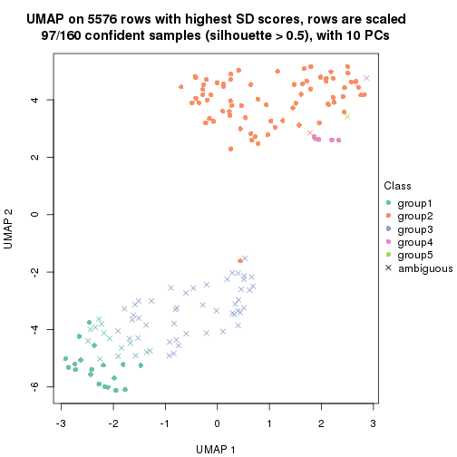</p>

</div>
<div id='tab-SD-hclust-dimension-reduction-5'>
<pre><code class="r">dimension_reduction(res, k = 6, method = &quot;UMAP&quot;)
</code></pre>

<p></p>

</div>
</div>


Following heatmap shows how subgroups are split when increasing `k`:

```r
collect_classes(res)
```


Test correlation between subgroups and known annotations. If the known
annotation is numeric, one-way ANOVA test is applied, and if the known
annotation is discrete, chi-squared contingency table test is applied.

```r
test_to_known_factors(res)
```

```
#>             n cell_type(p) k
#> SD:hclust 138     2.76e-14 2
#> SD:hclust 143     2.08e-20 3
#> SD:hclust 131     7.71e-25 4
#> SD:hclust  97     4.22e-19 5
#> SD:hclust 107     1.55e-20 6
```


If matrix rows can be associated to genes, consider to use `GO_Enrichment(res,
...)` to perform function enrichment for the signature genes.


 

---------------------------------------------------


### SD:kmeans


The object with results only for a single top-value method and a single partition method 
can be extracted as:

```r
res = res_list["SD", "kmeans"]
# you can also extract it by
# res = res_list["SD:kmeans"]
```

A summary of `res` and all the functions that can be applied to it:

```r
res
```

```
#> A 'ConsensusPartition' object with k = 2, 3, 4, 5, 6.
#>   On a matrix with 5576 rows and 160 columns.
#>   Top rows (558, 1116, 1673, 2230, 2788) are extracted by 'SD' method.
#>   Subgroups are detected by 'kmeans' method.
#>   Performed in total 1250 partitions by row resampling.
#>   Best k for subgroups seems to be 2.
#> 
#> Following methods can be applied to this 'ConsensusPartition' object:
#>  [1] "cola_report"             "collect_classes"         "collect_plots"          
#>  [4] "collect_stats"           "colnames"                "compare_signatures"     
#>  [7] "consensus_heatmap"       "dimension_reduction"     "functional_enrichment"  
#> [10] "get_anno_col"            "get_anno"                "get_classes"            
#> [13] "get_consensus"           "get_matrix"              "get_membership"         
#> [16] "get_param"               "get_signatures"          "get_stats"              
#> [19] "is_best_k"               "is_stable_k"             "membership_heatmap"     
#> [22] "ncol"                    "nrow"                    "plot_ecdf"              
#> [25] "rownames"                "select_partition_number" "show"                   
#> [28] "suggest_best_k"          "test_to_known_factors"
```

`collect_plots()` function collects all the plots made from `res` for all `k` (number of partitions)
into one single page to provide an easy and fast comparison between different `k`.

```r
collect_plots(res)
```


The plots are:

- The first row: a plot of the ECDF (Empirical cumulative distribution
  function) curves of the consensus matrix for each `k` and the heatmap of
  predicted classes for each `k`.
- The second row: heatmaps of the consensus matrix for each `k`.
- The third row: heatmaps of the membership matrix for each `k`.
- The fouth row: heatmaps of the signatures for each `k`.

All the plots in panels can be made by individual functions and they are
plotted later in this section.

`select_partition_number()` produces several plots showing different
statistics for choosing "optimized" `k`. There are following statistics:

- ECDF curves of the consensus matrix for each `k`;
- 1-PAC. [The PAC
  score](https://en.wikipedia.org/wiki/Consensus_clustering#Over-interpretation_potential_of_consensus_clustering)
  measures the proportion of the ambiguous subgrouping.
- Mean silhouette score.
- Concordance. The mean probability of fiting the consensus class ids in all
  partitions.
- Area increased. Denote $A_k$ as the area under the ECDF curve for current
  `k`, the area increased is defined as $A_k - A_{k-1}$.
- Rand index. The percent of pairs of samples that are both in a same cluster
  or both are not in a same cluster in the partition of k and k-1.
- Jaccard index. The ratio of pairs of samples are both in a same cluster in
  the partition of k and k-1 and the pairs of samples are both in a same
  cluster in the partition k or k-1.

The detailed explanations of these statistics can be found in [the cola
vignette](http://bioconductor.org/packages/devel/bioc/vignettes/cola/inst/doc/cola.html#toc_13).

Generally speaking, lower PAC score, higher mean silhouette score or higher
concordance corresponds to better partition. Rand index and Jaccard index
measure how similar the current partition is compared to partition with `k-1`.
If they are too similar, we won't accept `k` is better than `k-1`.

```r
select_partition_number(res)
```


The numeric values for all these statistics can be obtained by `get_stats()`.

```r
get_stats(res)
```

```
#>   k 1-PAC mean_silhouette concordance area_increased  Rand Jaccard
#> 2 2 0.861           0.900       0.958         0.4999 0.498   0.498
#> 3 3 0.588           0.677       0.845         0.2507 0.857   0.719
#> 4 4 0.649           0.667       0.809         0.1233 0.773   0.513
#> 5 5 0.686           0.733       0.815         0.0801 0.861   0.599
#> 6 6 0.723           0.628       0.758         0.0481 0.927   0.712
```

`suggest_best_k()` suggests the best $k$ based on these statistics. The rules are as follows:

- All $k$ with Jaccard index larger than 0.95 are removed because the increase of
  the partition number does not provides enough extra information. If all $k$ are removed,
  the best $k$ is assigned by `NA`.
- For $k$ with 1-PAC larger than 0.9, the maximal $k$ is taken as the "best k". Other $k$ is called "optional k".
- If it does not fit the second rule. The $k$ with the highest vote of highest
  1-PAC, mean silhouette and concordance is taken as the "best k".

```r
suggest_best_k(res)
```

```
#> [1] 2
```


Following shows the table of the partitions (You need to click the **show/hide
code output** link to see it). The membership matrix (columns with name `p*`)
is inferred by
[`clue::cl_consensus()`](https://www.rdocumentation.org/link/cl_consensus?package=clue)
function with the `SE` method. Basically the value in the membership matrix
represents the probability to belong to a certain group. The finall class
label for an item is determined with the group with highest probability it
belongs to.

In `get_classes()` function, the entropy is calculated from the membership
matrix and the silhouette score is calculated from the consensus matrix.


<script>
$( function() {
	$( '#tabs-SD-kmeans-get-classes' ).tabs();
} );
</script>
<div id='tabs-SD-kmeans-get-classes'>
<ul>
<li><a href='#tab-SD-kmeans-get-classes-1'>k = 2</a></li>
<li><a href='#tab-SD-kmeans-get-classes-2'>k = 3</a></li>
<li><a href='#tab-SD-kmeans-get-classes-3'>k = 4</a></li>
<li><a href='#tab-SD-kmeans-get-classes-4'>k = 5</a></li>
<li><a href='#tab-SD-kmeans-get-classes-5'>k = 6</a></li>
</ul>

<div id='tab-SD-kmeans-get-classes-1'>
<p><a id='tab-SD-kmeans-get-classes-1-a' style='color:#0366d6' href='#'>show/hide code output</a></p>
<pre><code class="r">cbind(get_classes(res, k = 2), get_membership(res, k = 2))
</code></pre>

<pre><code>#&gt;                     class entropy silhouette    p1    p2
#&gt; aberrant_ERR2585320     2  0.0000      0.971 0.000 1.000
#&gt; aberrant_ERR2585338     2  0.0000      0.971 0.000 1.000
#&gt; aberrant_ERR2585325     2  0.0000      0.971 0.000 1.000
#&gt; aberrant_ERR2585283     1  0.9129      0.550 0.672 0.328
#&gt; aberrant_ERR2585343     2  0.0000      0.971 0.000 1.000
#&gt; aberrant_ERR2585329     2  0.0000      0.971 0.000 1.000
#&gt; aberrant_ERR2585317     2  0.0000      0.971 0.000 1.000
#&gt; aberrant_ERR2585339     2  0.0000      0.971 0.000 1.000
#&gt; aberrant_ERR2585335     2  0.0000      0.971 0.000 1.000
#&gt; aberrant_ERR2585287     2  0.2236      0.938 0.036 0.964
#&gt; aberrant_ERR2585321     2  0.0000      0.971 0.000 1.000
#&gt; aberrant_ERR2585297     1  0.0000      0.936 1.000 0.000
#&gt; aberrant_ERR2585337     2  0.0000      0.971 0.000 1.000
#&gt; aberrant_ERR2585319     2  0.0000      0.971 0.000 1.000
#&gt; aberrant_ERR2585315     2  0.0000      0.971 0.000 1.000
#&gt; aberrant_ERR2585336     2  0.0000      0.971 0.000 1.000
#&gt; aberrant_ERR2585307     2  0.0000      0.971 0.000 1.000
#&gt; aberrant_ERR2585301     2  0.0000      0.971 0.000 1.000
#&gt; aberrant_ERR2585326     2  0.0000      0.971 0.000 1.000
#&gt; aberrant_ERR2585331     2  0.0000      0.971 0.000 1.000
#&gt; aberrant_ERR2585346     1  0.9129      0.550 0.672 0.328
#&gt; aberrant_ERR2585314     2  0.0000      0.971 0.000 1.000
#&gt; aberrant_ERR2585298     1  0.3114      0.898 0.944 0.056
#&gt; aberrant_ERR2585345     2  0.0000      0.971 0.000 1.000
#&gt; aberrant_ERR2585299     1  0.0000      0.936 1.000 0.000
#&gt; aberrant_ERR2585309     1  0.0000      0.936 1.000 0.000
#&gt; aberrant_ERR2585303     2  0.0000      0.971 0.000 1.000
#&gt; aberrant_ERR2585313     2  0.0000      0.971 0.000 1.000
#&gt; aberrant_ERR2585318     2  0.0000      0.971 0.000 1.000
#&gt; aberrant_ERR2585328     2  0.0000      0.971 0.000 1.000
#&gt; aberrant_ERR2585330     2  0.0000      0.971 0.000 1.000
#&gt; aberrant_ERR2585293     1  0.8861      0.592 0.696 0.304
#&gt; aberrant_ERR2585342     2  0.0000      0.971 0.000 1.000
#&gt; aberrant_ERR2585348     2  0.0000      0.971 0.000 1.000
#&gt; aberrant_ERR2585352     2  0.0000      0.971 0.000 1.000
#&gt; aberrant_ERR2585308     1  0.0000      0.936 1.000 0.000
#&gt; aberrant_ERR2585349     2  0.0000      0.971 0.000 1.000
#&gt; aberrant_ERR2585316     2  0.1414      0.953 0.020 0.980
#&gt; aberrant_ERR2585306     1  0.9358      0.504 0.648 0.352
#&gt; aberrant_ERR2585324     2  0.0000      0.971 0.000 1.000
#&gt; aberrant_ERR2585310     2  0.1184      0.958 0.016 0.984
#&gt; aberrant_ERR2585296     1  0.9977      0.108 0.528 0.472
#&gt; aberrant_ERR2585275     1  0.9323      0.512 0.652 0.348
#&gt; aberrant_ERR2585311     2  0.0000      0.971 0.000 1.000
#&gt; aberrant_ERR2585292     1  0.8861      0.592 0.696 0.304
#&gt; aberrant_ERR2585282     2  0.0000      0.971 0.000 1.000
#&gt; aberrant_ERR2585305     2  0.0000      0.971 0.000 1.000
#&gt; aberrant_ERR2585278     2  0.0000      0.971 0.000 1.000
#&gt; aberrant_ERR2585347     2  0.0000      0.971 0.000 1.000
#&gt; aberrant_ERR2585332     2  0.0000      0.971 0.000 1.000
#&gt; aberrant_ERR2585280     2  0.0000      0.971 0.000 1.000
#&gt; aberrant_ERR2585304     2  0.0000      0.971 0.000 1.000
#&gt; aberrant_ERR2585322     2  0.0000      0.971 0.000 1.000
#&gt; aberrant_ERR2585279     2  0.0000      0.971 0.000 1.000
#&gt; aberrant_ERR2585277     2  0.0000      0.971 0.000 1.000
#&gt; aberrant_ERR2585295     2  0.0000      0.971 0.000 1.000
#&gt; aberrant_ERR2585333     2  0.0000      0.971 0.000 1.000
#&gt; aberrant_ERR2585285     2  0.0000      0.971 0.000 1.000
#&gt; aberrant_ERR2585286     2  0.0000      0.971 0.000 1.000
#&gt; aberrant_ERR2585294     2  0.0000      0.971 0.000 1.000
#&gt; aberrant_ERR2585300     2  0.0376      0.968 0.004 0.996
#&gt; aberrant_ERR2585334     2  0.0000      0.971 0.000 1.000
#&gt; aberrant_ERR2585361     2  0.0000      0.971 0.000 1.000
#&gt; aberrant_ERR2585372     2  0.0000      0.971 0.000 1.000
#&gt; round_ERR2585217        2  0.9460      0.418 0.364 0.636
#&gt; round_ERR2585205        1  0.0000      0.936 1.000 0.000
#&gt; round_ERR2585214        2  0.8909      0.542 0.308 0.692
#&gt; round_ERR2585202        2  0.1414      0.954 0.020 0.980
#&gt; aberrant_ERR2585367     2  0.0000      0.971 0.000 1.000
#&gt; round_ERR2585220        1  0.0000      0.936 1.000 0.000
#&gt; round_ERR2585238        1  0.0000      0.936 1.000 0.000
#&gt; aberrant_ERR2585276     2  0.0000      0.971 0.000 1.000
#&gt; round_ERR2585218        1  0.0000      0.936 1.000 0.000
#&gt; aberrant_ERR2585363     2  0.0000      0.971 0.000 1.000
#&gt; round_ERR2585201        1  0.8555      0.611 0.720 0.280
#&gt; round_ERR2585210        1  0.0000      0.936 1.000 0.000
#&gt; aberrant_ERR2585362     2  0.0000      0.971 0.000 1.000
#&gt; aberrant_ERR2585360     2  0.0000      0.971 0.000 1.000
#&gt; round_ERR2585209        1  0.1414      0.923 0.980 0.020
#&gt; round_ERR2585242        1  0.3114      0.898 0.944 0.056
#&gt; round_ERR2585216        1  0.0000      0.936 1.000 0.000
#&gt; round_ERR2585219        1  0.0000      0.936 1.000 0.000
#&gt; round_ERR2585237        2  0.9170      0.491 0.332 0.668
#&gt; round_ERR2585198        2  0.9000      0.525 0.316 0.684
#&gt; round_ERR2585211        1  0.0000      0.936 1.000 0.000
#&gt; round_ERR2585206        1  0.0000      0.936 1.000 0.000
#&gt; aberrant_ERR2585281     2  0.0000      0.971 0.000 1.000
#&gt; round_ERR2585212        1  0.0000      0.936 1.000 0.000
#&gt; round_ERR2585221        1  0.0000      0.936 1.000 0.000
#&gt; round_ERR2585243        1  0.0000      0.936 1.000 0.000
#&gt; round_ERR2585204        2  0.5842      0.818 0.140 0.860
#&gt; round_ERR2585213        2  0.0000      0.971 0.000 1.000
#&gt; aberrant_ERR2585373     2  0.0000      0.971 0.000 1.000
#&gt; aberrant_ERR2585358     2  0.0000      0.971 0.000 1.000
#&gt; aberrant_ERR2585365     2  0.0000      0.971 0.000 1.000
#&gt; aberrant_ERR2585359     2  0.0000      0.971 0.000 1.000
#&gt; aberrant_ERR2585370     2  0.0000      0.971 0.000 1.000
#&gt; round_ERR2585215        1  0.0000      0.936 1.000 0.000
#&gt; round_ERR2585262        2  0.3431      0.911 0.064 0.936
#&gt; round_ERR2585199        2  0.5946      0.813 0.144 0.856
#&gt; aberrant_ERR2585369     2  0.0000      0.971 0.000 1.000
#&gt; round_ERR2585208        1  0.0000      0.936 1.000 0.000
#&gt; round_ERR2585252        1  0.0000      0.936 1.000 0.000
#&gt; round_ERR2585236        1  0.0000      0.936 1.000 0.000
#&gt; aberrant_ERR2585284     1  0.9209      0.537 0.664 0.336
#&gt; round_ERR2585224        1  0.0000      0.936 1.000 0.000
#&gt; round_ERR2585260        1  0.0000      0.936 1.000 0.000
#&gt; round_ERR2585229        1  0.0000      0.936 1.000 0.000
#&gt; aberrant_ERR2585364     1  0.9248      0.530 0.660 0.340
#&gt; round_ERR2585253        1  0.0000      0.936 1.000 0.000
#&gt; aberrant_ERR2585368     2  0.0000      0.971 0.000 1.000
#&gt; aberrant_ERR2585371     2  0.0000      0.971 0.000 1.000
#&gt; round_ERR2585239        1  0.0000      0.936 1.000 0.000
#&gt; round_ERR2585273        1  0.0000      0.936 1.000 0.000
#&gt; round_ERR2585256        1  0.3114      0.898 0.944 0.056
#&gt; round_ERR2585272        1  0.0000      0.936 1.000 0.000
#&gt; round_ERR2585246        1  0.0000      0.936 1.000 0.000
#&gt; round_ERR2585261        1  0.8081      0.666 0.752 0.248
#&gt; round_ERR2585254        1  0.9983      0.096 0.524 0.476
#&gt; round_ERR2585225        1  0.1843      0.918 0.972 0.028
#&gt; round_ERR2585235        1  0.0000      0.936 1.000 0.000
#&gt; round_ERR2585271        1  0.0000      0.936 1.000 0.000
#&gt; round_ERR2585251        1  0.0000      0.936 1.000 0.000
#&gt; round_ERR2585255        1  0.3114      0.898 0.944 0.056
#&gt; round_ERR2585257        1  0.3114      0.898 0.944 0.056
#&gt; round_ERR2585226        1  0.0000      0.936 1.000 0.000
#&gt; round_ERR2585265        1  0.0000      0.936 1.000 0.000
#&gt; round_ERR2585259        1  0.0000      0.936 1.000 0.000
#&gt; round_ERR2585247        1  0.0000      0.936 1.000 0.000
#&gt; round_ERR2585241        1  0.0000      0.936 1.000 0.000
#&gt; round_ERR2585263        1  0.0000      0.936 1.000 0.000
#&gt; round_ERR2585264        1  0.0000      0.936 1.000 0.000
#&gt; round_ERR2585233        1  0.0000      0.936 1.000 0.000
#&gt; round_ERR2585223        1  0.0000      0.936 1.000 0.000
#&gt; round_ERR2585234        2  0.9608      0.366 0.384 0.616
#&gt; round_ERR2585222        1  0.0000      0.936 1.000 0.000
#&gt; round_ERR2585228        1  0.0000      0.936 1.000 0.000
#&gt; round_ERR2585248        1  0.0000      0.936 1.000 0.000
#&gt; round_ERR2585240        1  0.1633      0.921 0.976 0.024
#&gt; round_ERR2585270        1  0.0000      0.936 1.000 0.000
#&gt; round_ERR2585232        1  0.0000      0.936 1.000 0.000
#&gt; aberrant_ERR2585341     2  0.0000      0.971 0.000 1.000
#&gt; aberrant_ERR2585355     2  0.0000      0.971 0.000 1.000
#&gt; round_ERR2585227        1  0.0000      0.936 1.000 0.000
#&gt; aberrant_ERR2585351     2  0.0000      0.971 0.000 1.000
#&gt; round_ERR2585269        1  0.0000      0.936 1.000 0.000
#&gt; aberrant_ERR2585357     2  0.0000      0.971 0.000 1.000
#&gt; aberrant_ERR2585350     2  0.0000      0.971 0.000 1.000
#&gt; round_ERR2585250        1  0.0000      0.936 1.000 0.000
#&gt; round_ERR2585245        1  0.0000      0.936 1.000 0.000
#&gt; aberrant_ERR2585353     2  0.0000      0.971 0.000 1.000
#&gt; round_ERR2585258        1  0.0000      0.936 1.000 0.000
#&gt; aberrant_ERR2585354     2  0.0000      0.971 0.000 1.000
#&gt; round_ERR2585249        1  0.0000      0.936 1.000 0.000
#&gt; round_ERR2585268        1  0.0000      0.936 1.000 0.000
#&gt; aberrant_ERR2585356     2  0.0000      0.971 0.000 1.000
#&gt; round_ERR2585266        1  0.2948      0.901 0.948 0.052
#&gt; round_ERR2585231        1  0.0000      0.936 1.000 0.000
#&gt; round_ERR2585230        1  0.0000      0.936 1.000 0.000
#&gt; round_ERR2585267        1  0.0000      0.936 1.000 0.000
</code></pre>

<script>
$('#tab-SD-kmeans-get-classes-1-a').parent().next().next().hide();
$('#tab-SD-kmeans-get-classes-1-a').click(function(){
  $('#tab-SD-kmeans-get-classes-1-a').parent().next().next().toggle();
  return(false);
});
</script>
</div>

<div id='tab-SD-kmeans-get-classes-2'>
<p><a id='tab-SD-kmeans-get-classes-2-a' style='color:#0366d6' href='#'>show/hide code output</a></p>
<pre><code class="r">cbind(get_classes(res, k = 3), get_membership(res, k = 3))
</code></pre>

<pre><code>#&gt;                     class entropy silhouette    p1    p2    p3
#&gt; aberrant_ERR2585320     2  0.5810     0.3028 0.000 0.664 0.336
#&gt; aberrant_ERR2585338     2  0.0000     0.7280 0.000 1.000 0.000
#&gt; aberrant_ERR2585325     2  0.5810     0.3028 0.000 0.664 0.336
#&gt; aberrant_ERR2585283     3  0.0475     0.6060 0.004 0.004 0.992
#&gt; aberrant_ERR2585343     3  0.5988     0.6482 0.000 0.368 0.632
#&gt; aberrant_ERR2585329     2  0.0000     0.7280 0.000 1.000 0.000
#&gt; aberrant_ERR2585317     2  0.0000     0.7280 0.000 1.000 0.000
#&gt; aberrant_ERR2585339     2  0.0000     0.7280 0.000 1.000 0.000
#&gt; aberrant_ERR2585335     2  0.4504     0.5789 0.000 0.804 0.196
#&gt; aberrant_ERR2585287     3  0.2625     0.6191 0.000 0.084 0.916
#&gt; aberrant_ERR2585321     3  0.6140     0.6153 0.000 0.404 0.596
#&gt; aberrant_ERR2585297     1  0.3412     0.8939 0.876 0.000 0.124
#&gt; aberrant_ERR2585337     2  0.0000     0.7280 0.000 1.000 0.000
#&gt; aberrant_ERR2585319     2  0.4654     0.5647 0.000 0.792 0.208
#&gt; aberrant_ERR2585315     2  0.4002     0.6177 0.000 0.840 0.160
#&gt; aberrant_ERR2585336     2  0.0000     0.7280 0.000 1.000 0.000
#&gt; aberrant_ERR2585307     2  0.0237     0.7264 0.000 0.996 0.004
#&gt; aberrant_ERR2585301     2  0.4654     0.5647 0.000 0.792 0.208
#&gt; aberrant_ERR2585326     2  0.0000     0.7280 0.000 1.000 0.000
#&gt; aberrant_ERR2585331     2  0.0424     0.7244 0.000 0.992 0.008
#&gt; aberrant_ERR2585346     3  0.0475     0.6060 0.004 0.004 0.992
#&gt; aberrant_ERR2585314     2  0.0237     0.7264 0.000 0.996 0.004
#&gt; aberrant_ERR2585298     1  0.5109     0.7364 0.780 0.212 0.008
#&gt; aberrant_ERR2585345     2  0.0000     0.7280 0.000 1.000 0.000
#&gt; aberrant_ERR2585299     1  0.3192     0.8975 0.888 0.000 0.112
#&gt; aberrant_ERR2585309     1  0.3686     0.8880 0.860 0.000 0.140
#&gt; aberrant_ERR2585303     2  0.0892     0.7223 0.000 0.980 0.020
#&gt; aberrant_ERR2585313     2  0.0747     0.7237 0.000 0.984 0.016
#&gt; aberrant_ERR2585318     2  0.6079     0.1286 0.000 0.612 0.388
#&gt; aberrant_ERR2585328     2  0.6260    -0.1377 0.000 0.552 0.448
#&gt; aberrant_ERR2585330     2  0.5859     0.2798 0.000 0.656 0.344
#&gt; aberrant_ERR2585293     3  0.0424     0.6028 0.008 0.000 0.992
#&gt; aberrant_ERR2585342     2  0.6274    -0.1742 0.000 0.544 0.456
#&gt; aberrant_ERR2585348     3  0.6180     0.5941 0.000 0.416 0.584
#&gt; aberrant_ERR2585352     2  0.4605     0.5695 0.000 0.796 0.204
#&gt; aberrant_ERR2585308     1  0.3686     0.8880 0.860 0.000 0.140
#&gt; aberrant_ERR2585349     2  0.1453     0.7102 0.024 0.968 0.008
#&gt; aberrant_ERR2585316     3  0.5591     0.6489 0.000 0.304 0.696
#&gt; aberrant_ERR2585306     3  0.6007     0.5058 0.184 0.048 0.768
#&gt; aberrant_ERR2585324     2  0.4654     0.5647 0.000 0.792 0.208
#&gt; aberrant_ERR2585310     2  0.3965     0.6210 0.132 0.860 0.008
#&gt; aberrant_ERR2585296     1  0.4963     0.7341 0.792 0.200 0.008
#&gt; aberrant_ERR2585275     3  0.0424     0.6081 0.000 0.008 0.992
#&gt; aberrant_ERR2585311     3  0.6308     0.3547 0.000 0.492 0.508
#&gt; aberrant_ERR2585292     3  0.0424     0.6028 0.008 0.000 0.992
#&gt; aberrant_ERR2585282     3  0.6180     0.5940 0.000 0.416 0.584
#&gt; aberrant_ERR2585305     2  0.5465     0.4241 0.000 0.712 0.288
#&gt; aberrant_ERR2585278     2  0.4504     0.5789 0.000 0.804 0.196
#&gt; aberrant_ERR2585347     3  0.5882     0.6506 0.000 0.348 0.652
#&gt; aberrant_ERR2585332     3  0.6126     0.6212 0.000 0.400 0.600
#&gt; aberrant_ERR2585280     2  0.6252    -0.1204 0.000 0.556 0.444
#&gt; aberrant_ERR2585304     2  0.2173     0.6930 0.048 0.944 0.008
#&gt; aberrant_ERR2585322     2  0.0237     0.7271 0.000 0.996 0.004
#&gt; aberrant_ERR2585279     2  0.1832     0.7019 0.036 0.956 0.008
#&gt; aberrant_ERR2585277     2  0.0000     0.7280 0.000 1.000 0.000
#&gt; aberrant_ERR2585295     2  0.5327     0.4280 0.000 0.728 0.272
#&gt; aberrant_ERR2585333     3  0.6111     0.6259 0.000 0.396 0.604
#&gt; aberrant_ERR2585285     2  0.4974     0.5235 0.000 0.764 0.236
#&gt; aberrant_ERR2585286     2  0.0000     0.7280 0.000 1.000 0.000
#&gt; aberrant_ERR2585294     2  0.4750     0.5542 0.000 0.784 0.216
#&gt; aberrant_ERR2585300     3  0.6008     0.6469 0.000 0.372 0.628
#&gt; aberrant_ERR2585334     2  0.0424     0.7244 0.000 0.992 0.008
#&gt; aberrant_ERR2585361     2  0.6244    -0.1012 0.000 0.560 0.440
#&gt; aberrant_ERR2585372     3  0.6235     0.5431 0.000 0.436 0.564
#&gt; round_ERR2585217        2  0.4963     0.5379 0.200 0.792 0.008
#&gt; round_ERR2585205        1  0.3038     0.8992 0.896 0.000 0.104
#&gt; round_ERR2585214        2  0.4164     0.6080 0.144 0.848 0.008
#&gt; round_ERR2585202        2  0.4033     0.6169 0.136 0.856 0.008
#&gt; aberrant_ERR2585367     2  0.6168     0.0276 0.000 0.588 0.412
#&gt; round_ERR2585220        1  0.0000     0.8970 1.000 0.000 0.000
#&gt; round_ERR2585238        1  0.3192     0.8975 0.888 0.000 0.112
#&gt; aberrant_ERR2585276     2  0.6062     0.1443 0.000 0.616 0.384
#&gt; round_ERR2585218        1  0.3267     0.8964 0.884 0.000 0.116
#&gt; aberrant_ERR2585363     2  0.4702     0.5595 0.000 0.788 0.212
#&gt; round_ERR2585201        1  0.5502     0.6927 0.744 0.248 0.008
#&gt; round_ERR2585210        1  0.2711     0.9020 0.912 0.000 0.088
#&gt; aberrant_ERR2585362     2  0.6168     0.0281 0.000 0.588 0.412
#&gt; aberrant_ERR2585360     2  0.6291    -0.2263 0.000 0.532 0.468
#&gt; round_ERR2585209        1  0.3043     0.8463 0.908 0.084 0.008
#&gt; round_ERR2585242        1  0.5156     0.7320 0.776 0.216 0.008
#&gt; round_ERR2585216        1  0.0000     0.8970 1.000 0.000 0.000
#&gt; round_ERR2585219        1  0.1163     0.9025 0.972 0.000 0.028
#&gt; round_ERR2585237        2  0.4755     0.5571 0.184 0.808 0.008
#&gt; round_ERR2585198        2  0.4099     0.6127 0.140 0.852 0.008
#&gt; round_ERR2585211        1  0.3482     0.8924 0.872 0.000 0.128
#&gt; round_ERR2585206        1  0.3116     0.8983 0.892 0.000 0.108
#&gt; aberrant_ERR2585281     2  0.1643     0.7112 0.000 0.956 0.044
#&gt; round_ERR2585212        1  0.0424     0.8944 0.992 0.000 0.008
#&gt; round_ERR2585221        1  0.3686     0.8880 0.860 0.000 0.140
#&gt; round_ERR2585243        1  0.2796     0.9012 0.908 0.000 0.092
#&gt; round_ERR2585204        2  0.4099     0.6127 0.140 0.852 0.008
#&gt; round_ERR2585213        2  0.3826     0.6283 0.124 0.868 0.008
#&gt; aberrant_ERR2585373     3  0.6168     0.6018 0.000 0.412 0.588
#&gt; aberrant_ERR2585358     3  0.6126     0.6210 0.000 0.400 0.600
#&gt; aberrant_ERR2585365     2  0.1289     0.7167 0.000 0.968 0.032
#&gt; aberrant_ERR2585359     3  0.6008     0.6469 0.000 0.372 0.628
#&gt; aberrant_ERR2585370     2  0.0000     0.7280 0.000 1.000 0.000
#&gt; round_ERR2585215        1  0.3686     0.8880 0.860 0.000 0.140
#&gt; round_ERR2585262        2  0.4700     0.5677 0.180 0.812 0.008
#&gt; round_ERR2585199        2  0.4033     0.6169 0.136 0.856 0.008
#&gt; aberrant_ERR2585369     2  0.6168     0.0273 0.000 0.588 0.412
#&gt; round_ERR2585208        1  0.3412     0.8940 0.876 0.000 0.124
#&gt; round_ERR2585252        1  0.3686     0.8880 0.860 0.000 0.140
#&gt; round_ERR2585236        1  0.1964     0.9042 0.944 0.000 0.056
#&gt; aberrant_ERR2585284     3  0.0424     0.6081 0.000 0.008 0.992
#&gt; round_ERR2585224        1  0.3686     0.8880 0.860 0.000 0.140
#&gt; round_ERR2585260        1  0.1643     0.9039 0.956 0.000 0.044
#&gt; round_ERR2585229        1  0.3686     0.8880 0.860 0.000 0.140
#&gt; aberrant_ERR2585364     3  0.0424     0.6081 0.000 0.008 0.992
#&gt; round_ERR2585253        1  0.3686     0.8880 0.860 0.000 0.140
#&gt; aberrant_ERR2585368     2  0.0000     0.7280 0.000 1.000 0.000
#&gt; aberrant_ERR2585371     2  0.0000     0.7280 0.000 1.000 0.000
#&gt; round_ERR2585239        1  0.2066     0.9040 0.940 0.000 0.060
#&gt; round_ERR2585273        1  0.0747     0.9005 0.984 0.000 0.016
#&gt; round_ERR2585256        1  0.4473     0.7826 0.828 0.164 0.008
#&gt; round_ERR2585272        1  0.0892     0.9012 0.980 0.000 0.020
#&gt; round_ERR2585246        1  0.3192     0.8976 0.888 0.000 0.112
#&gt; round_ERR2585261        1  0.5335     0.7131 0.760 0.232 0.008
#&gt; round_ERR2585254        1  0.5928     0.6087 0.696 0.296 0.008
#&gt; round_ERR2585225        1  0.4808     0.7605 0.804 0.188 0.008
#&gt; round_ERR2585235        1  0.1529     0.9040 0.960 0.000 0.040
#&gt; round_ERR2585271        1  0.2356     0.9034 0.928 0.000 0.072
#&gt; round_ERR2585251        1  0.0237     0.8957 0.996 0.000 0.004
#&gt; round_ERR2585255        1  0.5109     0.7364 0.780 0.212 0.008
#&gt; round_ERR2585257        1  0.4861     0.7568 0.800 0.192 0.008
#&gt; round_ERR2585226        1  0.0000     0.8970 1.000 0.000 0.000
#&gt; round_ERR2585265        1  0.0000     0.8970 1.000 0.000 0.000
#&gt; round_ERR2585259        1  0.0237     0.8957 0.996 0.000 0.004
#&gt; round_ERR2585247        1  0.3267     0.8965 0.884 0.000 0.116
#&gt; round_ERR2585241        1  0.2878     0.9007 0.904 0.000 0.096
#&gt; round_ERR2585263        1  0.0424     0.8944 0.992 0.000 0.008
#&gt; round_ERR2585264        1  0.3686     0.8880 0.860 0.000 0.140
#&gt; round_ERR2585233        1  0.0848     0.8916 0.984 0.008 0.008
#&gt; round_ERR2585223        1  0.1860     0.9039 0.948 0.000 0.052
#&gt; round_ERR2585234        2  0.6275     0.3213 0.348 0.644 0.008
#&gt; round_ERR2585222        1  0.1031     0.9018 0.976 0.000 0.024
#&gt; round_ERR2585228        1  0.1643     0.9039 0.956 0.000 0.044
#&gt; round_ERR2585248        1  0.3686     0.8880 0.860 0.000 0.140
#&gt; round_ERR2585240        1  0.4808     0.7605 0.804 0.188 0.008
#&gt; round_ERR2585270        1  0.0000     0.8970 1.000 0.000 0.000
#&gt; round_ERR2585232        1  0.1170     0.8882 0.976 0.016 0.008
#&gt; aberrant_ERR2585341     2  0.0892     0.7222 0.000 0.980 0.020
#&gt; aberrant_ERR2585355     2  0.0000     0.7280 0.000 1.000 0.000
#&gt; round_ERR2585227        1  0.0000     0.8970 1.000 0.000 0.000
#&gt; aberrant_ERR2585351     2  0.5216     0.4806 0.000 0.740 0.260
#&gt; round_ERR2585269        1  0.3686     0.8880 0.860 0.000 0.140
#&gt; aberrant_ERR2585357     2  0.0000     0.7280 0.000 1.000 0.000
#&gt; aberrant_ERR2585350     2  0.0000     0.7280 0.000 1.000 0.000
#&gt; round_ERR2585250        1  0.0424     0.8944 0.992 0.000 0.008
#&gt; round_ERR2585245        1  0.3686     0.8880 0.860 0.000 0.140
#&gt; aberrant_ERR2585353     3  0.6204     0.5754 0.000 0.424 0.576
#&gt; round_ERR2585258        1  0.0000     0.8970 1.000 0.000 0.000
#&gt; aberrant_ERR2585354     2  0.6309    -0.3426 0.000 0.504 0.496
#&gt; round_ERR2585249        1  0.3686     0.8880 0.860 0.000 0.140
#&gt; round_ERR2585268        1  0.0237     0.8957 0.996 0.000 0.004
#&gt; aberrant_ERR2585356     3  0.6008     0.6469 0.000 0.372 0.628
#&gt; round_ERR2585266        1  0.5109     0.7364 0.780 0.212 0.008
#&gt; round_ERR2585231        1  0.3686     0.8880 0.860 0.000 0.140
#&gt; round_ERR2585230        1  0.1411     0.9034 0.964 0.000 0.036
#&gt; round_ERR2585267        1  0.3686     0.8880 0.860 0.000 0.140
</code></pre>

<script>
$('#tab-SD-kmeans-get-classes-2-a').parent().next().next().hide();
$('#tab-SD-kmeans-get-classes-2-a').click(function(){
  $('#tab-SD-kmeans-get-classes-2-a').parent().next().next().toggle();
  return(false);
});
</script>
</div>

<div id='tab-SD-kmeans-get-classes-3'>
<p><a id='tab-SD-kmeans-get-classes-3-a' style='color:#0366d6' href='#'>show/hide code output</a></p>
<pre><code class="r">cbind(get_classes(res, k = 4), get_membership(res, k = 4))
</code></pre>

<pre><code>#&gt;                     class entropy silhouette    p1    p2    p3    p4
#&gt; aberrant_ERR2585320     2  0.1938     0.6766 0.000 0.936 0.012 0.052
#&gt; aberrant_ERR2585338     2  0.5823     0.5576 0.000 0.608 0.348 0.044
#&gt; aberrant_ERR2585325     2  0.1938     0.6766 0.000 0.936 0.012 0.052
#&gt; aberrant_ERR2585283     4  0.1389     0.9732 0.000 0.048 0.000 0.952
#&gt; aberrant_ERR2585343     2  0.4781     0.3674 0.000 0.660 0.004 0.336
#&gt; aberrant_ERR2585329     2  0.5823     0.5576 0.000 0.608 0.348 0.044
#&gt; aberrant_ERR2585317     2  0.5823     0.5576 0.000 0.608 0.348 0.044
#&gt; aberrant_ERR2585339     2  0.5773     0.5686 0.000 0.620 0.336 0.044
#&gt; aberrant_ERR2585335     2  0.3351     0.6717 0.000 0.844 0.148 0.008
#&gt; aberrant_ERR2585287     4  0.2281     0.9370 0.000 0.096 0.000 0.904
#&gt; aberrant_ERR2585321     2  0.4401     0.4836 0.000 0.724 0.004 0.272
#&gt; aberrant_ERR2585297     1  0.0188     0.9031 0.996 0.000 0.000 0.004
#&gt; aberrant_ERR2585337     2  0.5823     0.5576 0.000 0.608 0.348 0.044
#&gt; aberrant_ERR2585319     2  0.3647     0.6714 0.000 0.832 0.152 0.016
#&gt; aberrant_ERR2585315     2  0.4224     0.6623 0.000 0.812 0.144 0.044
#&gt; aberrant_ERR2585336     2  0.5823     0.5576 0.000 0.608 0.348 0.044
#&gt; aberrant_ERR2585307     2  0.5884     0.5370 0.000 0.592 0.364 0.044
#&gt; aberrant_ERR2585301     2  0.0895     0.6837 0.000 0.976 0.004 0.020
#&gt; aberrant_ERR2585326     2  0.5823     0.5576 0.000 0.608 0.348 0.044
#&gt; aberrant_ERR2585331     2  0.6064     0.3966 0.000 0.512 0.444 0.044
#&gt; aberrant_ERR2585346     4  0.1389     0.9732 0.000 0.048 0.000 0.952
#&gt; aberrant_ERR2585314     2  0.5713     0.5672 0.000 0.620 0.340 0.040
#&gt; aberrant_ERR2585298     3  0.3444     0.7153 0.184 0.000 0.816 0.000
#&gt; aberrant_ERR2585345     2  0.5823     0.5576 0.000 0.608 0.348 0.044
#&gt; aberrant_ERR2585299     1  0.0000     0.9037 1.000 0.000 0.000 0.000
#&gt; aberrant_ERR2585309     1  0.0336     0.9018 0.992 0.000 0.000 0.008
#&gt; aberrant_ERR2585303     2  0.2675     0.6811 0.000 0.908 0.048 0.044
#&gt; aberrant_ERR2585313     2  0.5446     0.6134 0.000 0.680 0.276 0.044
#&gt; aberrant_ERR2585318     2  0.2589     0.6520 0.000 0.884 0.000 0.116
#&gt; aberrant_ERR2585328     2  0.2266     0.6673 0.000 0.912 0.004 0.084
#&gt; aberrant_ERR2585330     2  0.1389     0.6797 0.000 0.952 0.000 0.048
#&gt; aberrant_ERR2585293     4  0.1302     0.9708 0.000 0.044 0.000 0.956
#&gt; aberrant_ERR2585342     2  0.2530     0.6528 0.000 0.888 0.000 0.112
#&gt; aberrant_ERR2585348     2  0.3870     0.5650 0.000 0.788 0.004 0.208
#&gt; aberrant_ERR2585352     2  0.1520     0.6861 0.000 0.956 0.020 0.024
#&gt; aberrant_ERR2585308     1  0.0188     0.9031 0.996 0.000 0.000 0.004
#&gt; aberrant_ERR2585349     3  0.5807     0.0667 0.000 0.344 0.612 0.044
#&gt; aberrant_ERR2585316     2  0.4889     0.3116 0.000 0.636 0.004 0.360
#&gt; aberrant_ERR2585306     2  0.7386    -0.0761 0.184 0.496 0.000 0.320
#&gt; aberrant_ERR2585324     2  0.3647     0.6714 0.000 0.832 0.152 0.016
#&gt; aberrant_ERR2585310     3  0.3896     0.6289 0.012 0.120 0.844 0.024
#&gt; aberrant_ERR2585296     3  0.2647     0.7280 0.120 0.000 0.880 0.000
#&gt; aberrant_ERR2585275     4  0.1389     0.9732 0.000 0.048 0.000 0.952
#&gt; aberrant_ERR2585311     2  0.3157     0.6284 0.000 0.852 0.004 0.144
#&gt; aberrant_ERR2585292     4  0.1302     0.9708 0.000 0.044 0.000 0.956
#&gt; aberrant_ERR2585282     2  0.4018     0.5473 0.000 0.772 0.004 0.224
#&gt; aberrant_ERR2585305     2  0.1743     0.6769 0.000 0.940 0.004 0.056
#&gt; aberrant_ERR2585278     2  0.3958     0.6620 0.000 0.816 0.160 0.024
#&gt; aberrant_ERR2585347     2  0.4837     0.3387 0.000 0.648 0.004 0.348
#&gt; aberrant_ERR2585332     2  0.4401     0.4826 0.000 0.724 0.004 0.272
#&gt; aberrant_ERR2585280     2  0.2216     0.6651 0.000 0.908 0.000 0.092
#&gt; aberrant_ERR2585304     3  0.5365     0.3301 0.000 0.264 0.692 0.044
#&gt; aberrant_ERR2585322     2  0.5678     0.5849 0.000 0.640 0.316 0.044
#&gt; aberrant_ERR2585279     3  0.5497     0.2782 0.000 0.284 0.672 0.044
#&gt; aberrant_ERR2585277     2  0.5839     0.5527 0.000 0.604 0.352 0.044
#&gt; aberrant_ERR2585295     2  0.2706     0.6854 0.000 0.900 0.020 0.080
#&gt; aberrant_ERR2585333     2  0.4134     0.5043 0.000 0.740 0.000 0.260
#&gt; aberrant_ERR2585285     2  0.1109     0.6834 0.000 0.968 0.004 0.028
#&gt; aberrant_ERR2585286     2  0.5839     0.5528 0.000 0.604 0.352 0.044
#&gt; aberrant_ERR2585294     2  0.0779     0.6844 0.000 0.980 0.004 0.016
#&gt; aberrant_ERR2585300     2  0.4741     0.3839 0.000 0.668 0.004 0.328
#&gt; aberrant_ERR2585334     2  0.6055     0.4142 0.000 0.520 0.436 0.044
#&gt; aberrant_ERR2585361     2  0.2011     0.6698 0.000 0.920 0.000 0.080
#&gt; aberrant_ERR2585372     2  0.3306     0.6178 0.000 0.840 0.004 0.156
#&gt; round_ERR2585217        3  0.0672     0.7185 0.008 0.008 0.984 0.000
#&gt; round_ERR2585205        1  0.0000     0.9037 1.000 0.000 0.000 0.000
#&gt; round_ERR2585214        3  0.0524     0.7167 0.004 0.008 0.988 0.000
#&gt; round_ERR2585202        3  0.0672     0.7114 0.000 0.008 0.984 0.008
#&gt; aberrant_ERR2585367     2  0.1474     0.6827 0.000 0.948 0.000 0.052
#&gt; round_ERR2585220        1  0.4222     0.5884 0.728 0.000 0.272 0.000
#&gt; round_ERR2585238        1  0.0000     0.9037 1.000 0.000 0.000 0.000
#&gt; aberrant_ERR2585276     2  0.2401     0.6645 0.000 0.904 0.004 0.092
#&gt; round_ERR2585218        1  0.0000     0.9037 1.000 0.000 0.000 0.000
#&gt; aberrant_ERR2585363     2  0.1510     0.6876 0.000 0.956 0.028 0.016
#&gt; round_ERR2585201        3  0.1557     0.7323 0.056 0.000 0.944 0.000
#&gt; round_ERR2585210        1  0.0000     0.9037 1.000 0.000 0.000 0.000
#&gt; aberrant_ERR2585362     2  0.2334     0.6650 0.000 0.908 0.004 0.088
#&gt; aberrant_ERR2585360     2  0.2831     0.6460 0.000 0.876 0.004 0.120
#&gt; round_ERR2585209        3  0.4477     0.5426 0.312 0.000 0.688 0.000
#&gt; round_ERR2585242        3  0.3528     0.7097 0.192 0.000 0.808 0.000
#&gt; round_ERR2585216        1  0.3649     0.7001 0.796 0.000 0.204 0.000
#&gt; round_ERR2585219        1  0.0469     0.8976 0.988 0.000 0.012 0.000
#&gt; round_ERR2585237        3  0.0524     0.7167 0.004 0.008 0.988 0.000
#&gt; round_ERR2585198        3  0.0336     0.7144 0.000 0.008 0.992 0.000
#&gt; round_ERR2585211        1  0.0000     0.9037 1.000 0.000 0.000 0.000
#&gt; round_ERR2585206        1  0.0000     0.9037 1.000 0.000 0.000 0.000
#&gt; aberrant_ERR2585281     2  0.3850     0.6676 0.000 0.840 0.116 0.044
#&gt; round_ERR2585212        3  0.4998     0.0686 0.488 0.000 0.512 0.000
#&gt; round_ERR2585221        1  0.0336     0.9018 0.992 0.000 0.000 0.008
#&gt; round_ERR2585243        1  0.0000     0.9037 1.000 0.000 0.000 0.000
#&gt; round_ERR2585204        3  0.0336     0.7144 0.000 0.008 0.992 0.000
#&gt; round_ERR2585213        3  0.2908     0.6507 0.000 0.064 0.896 0.040
#&gt; aberrant_ERR2585373     2  0.4155     0.5278 0.000 0.756 0.004 0.240
#&gt; aberrant_ERR2585358     2  0.4103     0.5091 0.000 0.744 0.000 0.256
#&gt; aberrant_ERR2585365     2  0.2214     0.6829 0.000 0.928 0.028 0.044
#&gt; aberrant_ERR2585359     2  0.4720     0.3919 0.000 0.672 0.004 0.324
#&gt; aberrant_ERR2585370     2  0.5823     0.5576 0.000 0.608 0.348 0.044
#&gt; round_ERR2585215        1  0.0336     0.9018 0.992 0.000 0.000 0.008
#&gt; round_ERR2585262        3  0.2915     0.6918 0.028 0.080 0.892 0.000
#&gt; round_ERR2585199        3  0.1004     0.7043 0.000 0.024 0.972 0.004
#&gt; aberrant_ERR2585369     2  0.2149     0.6660 0.000 0.912 0.000 0.088
#&gt; round_ERR2585208        1  0.0000     0.9037 1.000 0.000 0.000 0.000
#&gt; round_ERR2585252        1  0.0336     0.9018 0.992 0.000 0.000 0.008
#&gt; round_ERR2585236        1  0.2011     0.8431 0.920 0.000 0.080 0.000
#&gt; aberrant_ERR2585284     4  0.1389     0.9732 0.000 0.048 0.000 0.952
#&gt; round_ERR2585224        1  0.0336     0.9018 0.992 0.000 0.000 0.008
#&gt; round_ERR2585260        1  0.0000     0.9037 1.000 0.000 0.000 0.000
#&gt; round_ERR2585229        1  0.0188     0.9031 0.996 0.000 0.000 0.004
#&gt; aberrant_ERR2585364     4  0.3024     0.8778 0.000 0.148 0.000 0.852
#&gt; round_ERR2585253        1  0.0336     0.9018 0.992 0.000 0.000 0.008
#&gt; aberrant_ERR2585368     2  0.5897     0.5324 0.000 0.588 0.368 0.044
#&gt; aberrant_ERR2585371     2  0.5897     0.5324 0.000 0.588 0.368 0.044
#&gt; round_ERR2585239        1  0.0000     0.9037 1.000 0.000 0.000 0.000
#&gt; round_ERR2585273        1  0.0188     0.9023 0.996 0.000 0.004 0.000
#&gt; round_ERR2585256        3  0.3764     0.6892 0.216 0.000 0.784 0.000
#&gt; round_ERR2585272        1  0.0188     0.9022 0.996 0.000 0.004 0.000
#&gt; round_ERR2585246        1  0.0188     0.9031 0.996 0.000 0.000 0.004
#&gt; round_ERR2585261        3  0.1867     0.7332 0.072 0.000 0.928 0.000
#&gt; round_ERR2585254        3  0.1302     0.7299 0.044 0.000 0.956 0.000
#&gt; round_ERR2585225        3  0.4277     0.6013 0.280 0.000 0.720 0.000
#&gt; round_ERR2585235        1  0.2216     0.8318 0.908 0.000 0.092 0.000
#&gt; round_ERR2585271        1  0.0000     0.9037 1.000 0.000 0.000 0.000
#&gt; round_ERR2585251        1  0.4977     0.0822 0.540 0.000 0.460 0.000
#&gt; round_ERR2585255        3  0.3688     0.6970 0.208 0.000 0.792 0.000
#&gt; round_ERR2585257        3  0.3907     0.6700 0.232 0.000 0.768 0.000
#&gt; round_ERR2585226        1  0.3219     0.7522 0.836 0.000 0.164 0.000
#&gt; round_ERR2585265        1  0.3801     0.6756 0.780 0.000 0.220 0.000
#&gt; round_ERR2585259        3  0.4985     0.1429 0.468 0.000 0.532 0.000
#&gt; round_ERR2585247        1  0.0188     0.9031 0.996 0.000 0.000 0.004
#&gt; round_ERR2585241        1  0.0000     0.9037 1.000 0.000 0.000 0.000
#&gt; round_ERR2585263        1  0.4992     0.0164 0.524 0.000 0.476 0.000
#&gt; round_ERR2585264        1  0.0336     0.9018 0.992 0.000 0.000 0.008
#&gt; round_ERR2585233        3  0.4888     0.3186 0.412 0.000 0.588 0.000
#&gt; round_ERR2585223        1  0.0000     0.9037 1.000 0.000 0.000 0.000
#&gt; round_ERR2585234        3  0.0657     0.7202 0.012 0.004 0.984 0.000
#&gt; round_ERR2585222        1  0.0336     0.9003 0.992 0.000 0.008 0.000
#&gt; round_ERR2585228        1  0.0000     0.9037 1.000 0.000 0.000 0.000
#&gt; round_ERR2585248        1  0.0336     0.9018 0.992 0.000 0.000 0.008
#&gt; round_ERR2585240        3  0.4250     0.6079 0.276 0.000 0.724 0.000
#&gt; round_ERR2585270        1  0.4406     0.5315 0.700 0.000 0.300 0.000
#&gt; round_ERR2585232        3  0.4713     0.4405 0.360 0.000 0.640 0.000
#&gt; aberrant_ERR2585341     2  0.3612     0.6706 0.000 0.856 0.100 0.044
#&gt; aberrant_ERR2585355     2  0.5807     0.5615 0.000 0.612 0.344 0.044
#&gt; round_ERR2585227        1  0.4746     0.3873 0.632 0.000 0.368 0.000
#&gt; aberrant_ERR2585351     2  0.1022     0.6820 0.000 0.968 0.000 0.032
#&gt; round_ERR2585269        1  0.0188     0.9031 0.996 0.000 0.000 0.004
#&gt; aberrant_ERR2585357     2  0.5855     0.5480 0.000 0.600 0.356 0.044
#&gt; aberrant_ERR2585350     2  0.5823     0.5576 0.000 0.608 0.348 0.044
#&gt; round_ERR2585250        1  0.4989     0.0339 0.528 0.000 0.472 0.000
#&gt; round_ERR2585245        1  0.0336     0.9018 0.992 0.000 0.000 0.008
#&gt; aberrant_ERR2585353     2  0.3583     0.5951 0.000 0.816 0.004 0.180
#&gt; round_ERR2585258        1  0.3266     0.7486 0.832 0.000 0.168 0.000
#&gt; aberrant_ERR2585354     2  0.3052     0.6341 0.000 0.860 0.004 0.136
#&gt; round_ERR2585249        1  0.0336     0.9018 0.992 0.000 0.000 0.008
#&gt; round_ERR2585268        1  0.4998    -0.0247 0.512 0.000 0.488 0.000
#&gt; aberrant_ERR2585356     2  0.4741     0.3839 0.000 0.668 0.004 0.328
#&gt; round_ERR2585266        3  0.3726     0.6930 0.212 0.000 0.788 0.000
#&gt; round_ERR2585231        1  0.0336     0.9018 0.992 0.000 0.000 0.008
#&gt; round_ERR2585230        1  0.0592     0.8949 0.984 0.000 0.016 0.000
#&gt; round_ERR2585267        1  0.0336     0.9018 0.992 0.000 0.000 0.008
</code></pre>

<script>
$('#tab-SD-kmeans-get-classes-3-a').parent().next().next().hide();
$('#tab-SD-kmeans-get-classes-3-a').click(function(){
  $('#tab-SD-kmeans-get-classes-3-a').parent().next().next().toggle();
  return(false);
});
</script>
</div>

<div id='tab-SD-kmeans-get-classes-4'>
<p><a id='tab-SD-kmeans-get-classes-4-a' style='color:#0366d6' href='#'>show/hide code output</a></p>
<pre><code class="r">cbind(get_classes(res, k = 5), get_membership(res, k = 5))
</code></pre>

<pre><code>#&gt;                     class entropy silhouette    p1    p2    p3    p4    p5
#&gt; aberrant_ERR2585320     5  0.4921     0.7651 0.000 0.340 0.040 0.000 0.620
#&gt; aberrant_ERR2585338     2  0.0510     0.8071 0.000 0.984 0.016 0.000 0.000
#&gt; aberrant_ERR2585325     5  0.4921     0.7651 0.000 0.340 0.040 0.000 0.620
#&gt; aberrant_ERR2585283     4  0.2583     0.9295 0.004 0.000 0.000 0.864 0.132
#&gt; aberrant_ERR2585343     5  0.3407     0.8502 0.000 0.132 0.020 0.012 0.836
#&gt; aberrant_ERR2585329     2  0.0510     0.8071 0.000 0.984 0.016 0.000 0.000
#&gt; aberrant_ERR2585317     2  0.0510     0.8071 0.000 0.984 0.016 0.000 0.000
#&gt; aberrant_ERR2585339     2  0.0404     0.8052 0.000 0.988 0.012 0.000 0.000
#&gt; aberrant_ERR2585335     2  0.3876     0.3272 0.000 0.684 0.000 0.000 0.316
#&gt; aberrant_ERR2585287     4  0.4116     0.8291 0.000 0.004 0.016 0.732 0.248
#&gt; aberrant_ERR2585321     5  0.3456     0.8975 0.000 0.184 0.016 0.000 0.800
#&gt; aberrant_ERR2585297     1  0.3442     0.8163 0.836 0.000 0.000 0.060 0.104
#&gt; aberrant_ERR2585337     2  0.0510     0.8071 0.000 0.984 0.016 0.000 0.000
#&gt; aberrant_ERR2585319     2  0.4213     0.3309 0.000 0.680 0.012 0.000 0.308
#&gt; aberrant_ERR2585315     2  0.2172     0.7274 0.000 0.908 0.016 0.000 0.076
#&gt; aberrant_ERR2585336     2  0.0510     0.8071 0.000 0.984 0.016 0.000 0.000
#&gt; aberrant_ERR2585307     2  0.0510     0.8071 0.000 0.984 0.016 0.000 0.000
#&gt; aberrant_ERR2585301     5  0.4161     0.8731 0.000 0.280 0.016 0.000 0.704
#&gt; aberrant_ERR2585326     2  0.0510     0.8071 0.000 0.984 0.016 0.000 0.000
#&gt; aberrant_ERR2585331     2  0.3003     0.6188 0.000 0.812 0.188 0.000 0.000
#&gt; aberrant_ERR2585346     4  0.2583     0.9295 0.004 0.000 0.000 0.864 0.132
#&gt; aberrant_ERR2585314     2  0.2313     0.7635 0.000 0.912 0.040 0.004 0.044
#&gt; aberrant_ERR2585298     3  0.2696     0.7964 0.052 0.040 0.896 0.012 0.000
#&gt; aberrant_ERR2585345     2  0.0510     0.8071 0.000 0.984 0.016 0.000 0.000
#&gt; aberrant_ERR2585299     1  0.1911     0.8371 0.932 0.000 0.004 0.036 0.028
#&gt; aberrant_ERR2585309     1  0.4158     0.7963 0.784 0.000 0.000 0.092 0.124
#&gt; aberrant_ERR2585303     2  0.4350     0.4137 0.000 0.704 0.028 0.000 0.268
#&gt; aberrant_ERR2585313     2  0.0162     0.8011 0.000 0.996 0.004 0.000 0.000
#&gt; aberrant_ERR2585318     5  0.3305     0.9090 0.000 0.224 0.000 0.000 0.776
#&gt; aberrant_ERR2585328     5  0.3988     0.8987 0.000 0.252 0.016 0.000 0.732
#&gt; aberrant_ERR2585330     5  0.4127     0.8375 0.000 0.312 0.008 0.000 0.680
#&gt; aberrant_ERR2585293     4  0.2818     0.9267 0.004 0.000 0.008 0.860 0.128
#&gt; aberrant_ERR2585342     5  0.3789     0.9085 0.000 0.224 0.016 0.000 0.760
#&gt; aberrant_ERR2585348     5  0.3563     0.9066 0.000 0.208 0.012 0.000 0.780
#&gt; aberrant_ERR2585352     2  0.4528    -0.2329 0.000 0.548 0.008 0.000 0.444
#&gt; aberrant_ERR2585308     1  0.4104     0.7967 0.788 0.000 0.000 0.088 0.124
#&gt; aberrant_ERR2585349     2  0.4126     0.2842 0.000 0.620 0.380 0.000 0.000
#&gt; aberrant_ERR2585316     5  0.3722     0.8269 0.000 0.120 0.020 0.032 0.828
#&gt; aberrant_ERR2585306     5  0.2514     0.6963 0.012 0.040 0.028 0.008 0.912
#&gt; aberrant_ERR2585324     2  0.4213     0.3309 0.000 0.680 0.012 0.000 0.308
#&gt; aberrant_ERR2585310     3  0.4834     0.7009 0.016 0.152 0.764 0.016 0.052
#&gt; aberrant_ERR2585296     3  0.3076     0.7962 0.052 0.052 0.880 0.012 0.004
#&gt; aberrant_ERR2585275     4  0.2583     0.9295 0.004 0.000 0.000 0.864 0.132
#&gt; aberrant_ERR2585311     5  0.3727     0.9084 0.000 0.216 0.016 0.000 0.768
#&gt; aberrant_ERR2585292     4  0.2818     0.9267 0.004 0.000 0.008 0.860 0.128
#&gt; aberrant_ERR2585282     5  0.3388     0.9048 0.000 0.200 0.008 0.000 0.792
#&gt; aberrant_ERR2585305     5  0.4106     0.8940 0.000 0.256 0.020 0.000 0.724
#&gt; aberrant_ERR2585278     2  0.3766     0.4451 0.000 0.728 0.004 0.000 0.268
#&gt; aberrant_ERR2585347     5  0.3431     0.8578 0.000 0.144 0.020 0.008 0.828
#&gt; aberrant_ERR2585332     5  0.3242     0.8871 0.000 0.172 0.012 0.000 0.816
#&gt; aberrant_ERR2585280     5  0.4250     0.8974 0.000 0.252 0.028 0.000 0.720
#&gt; aberrant_ERR2585304     2  0.3366     0.5620 0.000 0.768 0.232 0.000 0.000
#&gt; aberrant_ERR2585322     2  0.0566     0.8035 0.000 0.984 0.012 0.000 0.004
#&gt; aberrant_ERR2585279     2  0.3305     0.5674 0.000 0.776 0.224 0.000 0.000
#&gt; aberrant_ERR2585277     2  0.0510     0.8071 0.000 0.984 0.016 0.000 0.000
#&gt; aberrant_ERR2585295     5  0.4917     0.6099 0.000 0.416 0.028 0.000 0.556
#&gt; aberrant_ERR2585333     5  0.3863     0.9034 0.000 0.200 0.028 0.000 0.772
#&gt; aberrant_ERR2585285     5  0.4086     0.8726 0.000 0.284 0.012 0.000 0.704
#&gt; aberrant_ERR2585286     2  0.0510     0.8071 0.000 0.984 0.016 0.000 0.000
#&gt; aberrant_ERR2585294     5  0.4181     0.8844 0.000 0.268 0.020 0.000 0.712
#&gt; aberrant_ERR2585300     5  0.3498     0.8500 0.000 0.132 0.024 0.012 0.832
#&gt; aberrant_ERR2585334     2  0.3003     0.6188 0.000 0.812 0.188 0.000 0.000
#&gt; aberrant_ERR2585361     5  0.3700     0.9043 0.000 0.240 0.008 0.000 0.752
#&gt; aberrant_ERR2585372     5  0.3491     0.9082 0.000 0.228 0.004 0.000 0.768
#&gt; round_ERR2585217        3  0.2077     0.7812 0.000 0.084 0.908 0.008 0.000
#&gt; round_ERR2585205        1  0.0932     0.8336 0.972 0.000 0.004 0.004 0.020
#&gt; round_ERR2585214        3  0.2011     0.7779 0.000 0.088 0.908 0.004 0.000
#&gt; round_ERR2585202        3  0.1965     0.7738 0.000 0.096 0.904 0.000 0.000
#&gt; aberrant_ERR2585367     5  0.4290     0.8481 0.000 0.304 0.016 0.000 0.680
#&gt; round_ERR2585220        1  0.4763     0.2540 0.616 0.000 0.360 0.020 0.004
#&gt; round_ERR2585238        1  0.2157     0.8374 0.920 0.000 0.004 0.040 0.036
#&gt; aberrant_ERR2585276     5  0.3942     0.9065 0.000 0.232 0.020 0.000 0.748
#&gt; round_ERR2585218        1  0.1074     0.8346 0.968 0.000 0.004 0.016 0.012
#&gt; aberrant_ERR2585363     2  0.4552    -0.3173 0.000 0.524 0.008 0.000 0.468
#&gt; round_ERR2585201        3  0.2507     0.7878 0.016 0.072 0.900 0.012 0.000
#&gt; round_ERR2585210        1  0.1173     0.8244 0.964 0.000 0.004 0.020 0.012
#&gt; aberrant_ERR2585362     5  0.3700     0.9037 0.000 0.240 0.008 0.000 0.752
#&gt; aberrant_ERR2585360     5  0.3759     0.9085 0.000 0.220 0.016 0.000 0.764
#&gt; round_ERR2585209        3  0.2912     0.7773 0.104 0.008 0.872 0.012 0.004
#&gt; round_ERR2585242        3  0.2625     0.7961 0.048 0.040 0.900 0.012 0.000
#&gt; round_ERR2585216        1  0.4809     0.3830 0.648 0.000 0.320 0.024 0.008
#&gt; round_ERR2585219        1  0.2733     0.7551 0.872 0.000 0.112 0.012 0.004
#&gt; round_ERR2585237        3  0.2011     0.7790 0.000 0.088 0.908 0.004 0.000
#&gt; round_ERR2585198        3  0.2020     0.7707 0.000 0.100 0.900 0.000 0.000
#&gt; round_ERR2585211        1  0.1153     0.8350 0.964 0.000 0.004 0.008 0.024
#&gt; round_ERR2585206        1  0.1179     0.8347 0.964 0.000 0.004 0.016 0.016
#&gt; aberrant_ERR2585281     2  0.4666     0.3628 0.000 0.676 0.040 0.000 0.284
#&gt; round_ERR2585212        3  0.4837     0.5451 0.348 0.000 0.624 0.020 0.008
#&gt; round_ERR2585221        1  0.3875     0.8036 0.804 0.000 0.000 0.072 0.124
#&gt; round_ERR2585243        1  0.0451     0.8294 0.988 0.000 0.000 0.008 0.004
#&gt; round_ERR2585204        3  0.2127     0.7648 0.000 0.108 0.892 0.000 0.000
#&gt; round_ERR2585213        3  0.4307     0.0858 0.000 0.496 0.504 0.000 0.000
#&gt; aberrant_ERR2585373     5  0.3562     0.9026 0.000 0.196 0.016 0.000 0.788
#&gt; aberrant_ERR2585358     5  0.3280     0.8914 0.000 0.176 0.012 0.000 0.812
#&gt; aberrant_ERR2585365     2  0.4682    -0.1316 0.000 0.564 0.016 0.000 0.420
#&gt; aberrant_ERR2585359     5  0.3297     0.8531 0.000 0.132 0.020 0.008 0.840
#&gt; aberrant_ERR2585370     2  0.0510     0.8071 0.000 0.984 0.016 0.000 0.000
#&gt; round_ERR2585215        1  0.3449     0.8225 0.844 0.000 0.004 0.064 0.088
#&gt; round_ERR2585262        3  0.2822     0.7771 0.008 0.056 0.896 0.016 0.024
#&gt; round_ERR2585199        3  0.3999     0.4466 0.000 0.344 0.656 0.000 0.000
#&gt; aberrant_ERR2585369     5  0.3579     0.9046 0.000 0.240 0.004 0.000 0.756
#&gt; round_ERR2585208        1  0.1764     0.8369 0.928 0.000 0.000 0.008 0.064
#&gt; round_ERR2585252        1  0.4205     0.7990 0.788 0.000 0.004 0.084 0.124
#&gt; round_ERR2585236        1  0.3774     0.6782 0.804 0.000 0.160 0.028 0.008
#&gt; aberrant_ERR2585284     4  0.2818     0.9274 0.004 0.000 0.008 0.860 0.128
#&gt; round_ERR2585224        1  0.4104     0.7967 0.788 0.000 0.000 0.088 0.124
#&gt; round_ERR2585260        1  0.1300     0.8213 0.956 0.000 0.028 0.016 0.000
#&gt; round_ERR2585229        1  0.2819     0.8319 0.884 0.000 0.004 0.052 0.060
#&gt; aberrant_ERR2585364     4  0.4866     0.6048 0.004 0.000 0.020 0.580 0.396
#&gt; round_ERR2585253        1  0.4359     0.7952 0.776 0.000 0.004 0.092 0.128
#&gt; aberrant_ERR2585368     2  0.0671     0.8053 0.000 0.980 0.016 0.004 0.000
#&gt; aberrant_ERR2585371     2  0.0671     0.8053 0.000 0.980 0.016 0.004 0.000
#&gt; round_ERR2585239        1  0.1597     0.8164 0.948 0.000 0.024 0.020 0.008
#&gt; round_ERR2585273        1  0.3289     0.7734 0.852 0.000 0.096 0.048 0.004
#&gt; round_ERR2585256        3  0.2792     0.7944 0.068 0.024 0.892 0.012 0.004
#&gt; round_ERR2585272        1  0.2074     0.7934 0.920 0.000 0.060 0.016 0.004
#&gt; round_ERR2585246        1  0.2291     0.8350 0.908 0.000 0.000 0.056 0.036
#&gt; round_ERR2585261        3  0.2206     0.7899 0.016 0.068 0.912 0.004 0.000
#&gt; round_ERR2585254        3  0.2513     0.7874 0.008 0.076 0.900 0.012 0.004
#&gt; round_ERR2585225        3  0.2568     0.7836 0.092 0.004 0.888 0.016 0.000
#&gt; round_ERR2585235        1  0.4832     0.5914 0.712 0.000 0.228 0.048 0.012
#&gt; round_ERR2585271        1  0.0290     0.8324 0.992 0.000 0.000 0.008 0.000
#&gt; round_ERR2585251        3  0.4928     0.3965 0.428 0.000 0.548 0.020 0.004
#&gt; round_ERR2585255        3  0.2791     0.7958 0.056 0.036 0.892 0.016 0.000
#&gt; round_ERR2585257        3  0.2805     0.7920 0.072 0.020 0.888 0.020 0.000
#&gt; round_ERR2585226        1  0.4347     0.5277 0.716 0.000 0.256 0.024 0.004
#&gt; round_ERR2585265        1  0.4449     0.4567 0.688 0.000 0.288 0.020 0.004
#&gt; round_ERR2585259        3  0.5071     0.5711 0.328 0.000 0.628 0.036 0.008
#&gt; round_ERR2585247        1  0.3506     0.8174 0.832 0.000 0.000 0.064 0.104
#&gt; round_ERR2585241        1  0.0486     0.8297 0.988 0.000 0.004 0.004 0.004
#&gt; round_ERR2585263        3  0.4945     0.3519 0.440 0.000 0.536 0.020 0.004
#&gt; round_ERR2585264        1  0.4359     0.7952 0.776 0.000 0.004 0.092 0.128
#&gt; round_ERR2585233        3  0.4430     0.6561 0.264 0.000 0.708 0.020 0.008
#&gt; round_ERR2585223        1  0.0510     0.8324 0.984 0.000 0.000 0.016 0.000
#&gt; round_ERR2585234        3  0.1851     0.7782 0.000 0.088 0.912 0.000 0.000
#&gt; round_ERR2585222        1  0.2238     0.7884 0.912 0.000 0.064 0.020 0.004
#&gt; round_ERR2585228        1  0.1173     0.8220 0.964 0.000 0.012 0.020 0.004
#&gt; round_ERR2585248        1  0.4403     0.7942 0.772 0.000 0.004 0.092 0.132
#&gt; round_ERR2585240        3  0.2305     0.7829 0.092 0.000 0.896 0.012 0.000
#&gt; round_ERR2585270        1  0.4789     0.2366 0.608 0.000 0.368 0.020 0.004
#&gt; round_ERR2585232        3  0.3962     0.6916 0.240 0.000 0.744 0.012 0.004
#&gt; aberrant_ERR2585341     2  0.3876     0.5691 0.000 0.776 0.032 0.000 0.192
#&gt; aberrant_ERR2585355     2  0.0510     0.8071 0.000 0.984 0.016 0.000 0.000
#&gt; round_ERR2585227        3  0.4949     0.3127 0.444 0.000 0.532 0.020 0.004
#&gt; aberrant_ERR2585351     5  0.3980     0.8708 0.000 0.284 0.008 0.000 0.708
#&gt; round_ERR2585269        1  0.4158     0.7963 0.784 0.000 0.000 0.092 0.124
#&gt; aberrant_ERR2585357     2  0.0510     0.8071 0.000 0.984 0.016 0.000 0.000
#&gt; aberrant_ERR2585350     2  0.0510     0.8071 0.000 0.984 0.016 0.000 0.000
#&gt; round_ERR2585250        3  0.4981     0.4318 0.412 0.000 0.560 0.024 0.004
#&gt; round_ERR2585245        1  0.4104     0.7967 0.788 0.000 0.000 0.088 0.124
#&gt; aberrant_ERR2585353     5  0.3551     0.9084 0.000 0.220 0.008 0.000 0.772
#&gt; round_ERR2585258        1  0.4372     0.5209 0.712 0.000 0.260 0.024 0.004
#&gt; aberrant_ERR2585354     5  0.3305     0.9088 0.000 0.224 0.000 0.000 0.776
#&gt; round_ERR2585249        1  0.4104     0.7967 0.788 0.000 0.000 0.088 0.124
#&gt; round_ERR2585268        3  0.4884     0.4526 0.404 0.000 0.572 0.020 0.004
#&gt; aberrant_ERR2585356     5  0.3498     0.8500 0.000 0.132 0.024 0.012 0.832
#&gt; round_ERR2585266        3  0.2760     0.7946 0.064 0.028 0.892 0.016 0.000
#&gt; round_ERR2585231        1  0.4049     0.7987 0.792 0.000 0.000 0.084 0.124
#&gt; round_ERR2585230        1  0.2395     0.7882 0.904 0.000 0.072 0.016 0.008
#&gt; round_ERR2585267        1  0.4149     0.7958 0.784 0.000 0.000 0.088 0.128
</code></pre>

<script>
$('#tab-SD-kmeans-get-classes-4-a').parent().next().next().hide();
$('#tab-SD-kmeans-get-classes-4-a').click(function(){
  $('#tab-SD-kmeans-get-classes-4-a').parent().next().next().toggle();
  return(false);
});
</script>
</div>

<div id='tab-SD-kmeans-get-classes-5'>
<p><a id='tab-SD-kmeans-get-classes-5-a' style='color:#0366d6' href='#'>show/hide code output</a></p>
<pre><code class="r">cbind(get_classes(res, k = 6), get_membership(res, k = 6))
</code></pre>

<pre><code>#&gt;                     class entropy silhouette    p1    p2    p3    p4    p5    p6
#&gt; aberrant_ERR2585320     5  0.4828    0.68862 0.000 0.116 0.008 0.000 0.684 0.192
#&gt; aberrant_ERR2585338     2  0.1477    0.85575 0.000 0.940 0.004 0.000 0.048 0.008
#&gt; aberrant_ERR2585325     5  0.4828    0.68862 0.000 0.116 0.008 0.000 0.684 0.192
#&gt; aberrant_ERR2585283     4  0.0865    0.89649 0.000 0.000 0.000 0.964 0.036 0.000
#&gt; aberrant_ERR2585343     5  0.2752    0.80507 0.000 0.000 0.000 0.036 0.856 0.108
#&gt; aberrant_ERR2585329     2  0.1477    0.85664 0.000 0.940 0.004 0.000 0.048 0.008
#&gt; aberrant_ERR2585317     2  0.1364    0.85711 0.000 0.944 0.004 0.000 0.048 0.004
#&gt; aberrant_ERR2585339     2  0.1219    0.85635 0.000 0.948 0.000 0.000 0.048 0.004
#&gt; aberrant_ERR2585335     2  0.4685    0.36222 0.000 0.568 0.004 0.000 0.388 0.040
#&gt; aberrant_ERR2585287     4  0.4402    0.72815 0.000 0.000 0.000 0.712 0.184 0.104
#&gt; aberrant_ERR2585321     5  0.1644    0.83761 0.000 0.000 0.000 0.004 0.920 0.076
#&gt; aberrant_ERR2585297     1  0.4180   -0.58988 0.632 0.012 0.000 0.008 0.000 0.348
#&gt; aberrant_ERR2585337     2  0.1364    0.85711 0.000 0.944 0.004 0.000 0.048 0.004
#&gt; aberrant_ERR2585319     2  0.5027    0.35862 0.000 0.552 0.004 0.000 0.376 0.068
#&gt; aberrant_ERR2585315     2  0.3155    0.78291 0.000 0.828 0.004 0.000 0.132 0.036
#&gt; aberrant_ERR2585336     2  0.1364    0.85711 0.000 0.944 0.004 0.000 0.048 0.004
#&gt; aberrant_ERR2585307     2  0.1578    0.85550 0.000 0.936 0.012 0.000 0.048 0.004
#&gt; aberrant_ERR2585301     5  0.2767    0.83331 0.000 0.056 0.004 0.000 0.868 0.072
#&gt; aberrant_ERR2585326     2  0.1219    0.85694 0.000 0.948 0.004 0.000 0.048 0.000
#&gt; aberrant_ERR2585331     2  0.1542    0.81276 0.000 0.936 0.052 0.000 0.004 0.008
#&gt; aberrant_ERR2585346     4  0.1124    0.89677 0.000 0.000 0.000 0.956 0.036 0.008
#&gt; aberrant_ERR2585314     2  0.3689    0.77842 0.000 0.808 0.032 0.000 0.124 0.036
#&gt; aberrant_ERR2585298     3  0.1261    0.87253 0.028 0.004 0.956 0.008 0.000 0.004
#&gt; aberrant_ERR2585345     2  0.1364    0.85711 0.000 0.944 0.004 0.000 0.048 0.004
#&gt; aberrant_ERR2585299     1  0.2473    0.29543 0.856 0.008 0.000 0.000 0.000 0.136
#&gt; aberrant_ERR2585309     6  0.3868    0.98562 0.492 0.000 0.000 0.000 0.000 0.508
#&gt; aberrant_ERR2585303     2  0.4921    0.41817 0.000 0.592 0.004 0.000 0.336 0.068
#&gt; aberrant_ERR2585313     2  0.1542    0.85314 0.000 0.936 0.004 0.000 0.052 0.008
#&gt; aberrant_ERR2585318     5  0.1693    0.85313 0.000 0.020 0.004 0.000 0.932 0.044
#&gt; aberrant_ERR2585328     5  0.2526    0.83572 0.000 0.024 0.004 0.000 0.876 0.096
#&gt; aberrant_ERR2585330     5  0.3705    0.75963 0.000 0.144 0.008 0.000 0.792 0.056
#&gt; aberrant_ERR2585293     4  0.2901    0.88183 0.000 0.004 0.012 0.868 0.036 0.080
#&gt; aberrant_ERR2585342     5  0.1643    0.85438 0.000 0.008 0.000 0.000 0.924 0.068
#&gt; aberrant_ERR2585348     5  0.2584    0.83047 0.000 0.004 0.004 0.000 0.848 0.144
#&gt; aberrant_ERR2585352     5  0.5414    0.00156 0.000 0.440 0.008 0.000 0.464 0.088
#&gt; aberrant_ERR2585308     1  0.3971   -0.85181 0.548 0.004 0.000 0.000 0.000 0.448
#&gt; aberrant_ERR2585349     2  0.4179    0.44724 0.000 0.652 0.324 0.000 0.008 0.016
#&gt; aberrant_ERR2585316     5  0.2776    0.79829 0.000 0.000 0.000 0.052 0.860 0.088
#&gt; aberrant_ERR2585306     5  0.2877    0.79802 0.000 0.008 0.000 0.020 0.848 0.124
#&gt; aberrant_ERR2585324     2  0.5027    0.35862 0.000 0.552 0.004 0.000 0.376 0.068
#&gt; aberrant_ERR2585310     3  0.5976    0.67051 0.124 0.096 0.680 0.012 0.056 0.032
#&gt; aberrant_ERR2585296     3  0.2821    0.84726 0.064 0.028 0.880 0.008 0.000 0.020
#&gt; aberrant_ERR2585275     4  0.1124    0.89677 0.000 0.000 0.000 0.956 0.036 0.008
#&gt; aberrant_ERR2585311     5  0.1267    0.84770 0.000 0.000 0.000 0.000 0.940 0.060
#&gt; aberrant_ERR2585292     4  0.2901    0.88183 0.000 0.004 0.012 0.868 0.036 0.080
#&gt; aberrant_ERR2585282     5  0.1588    0.85090 0.000 0.000 0.004 0.000 0.924 0.072
#&gt; aberrant_ERR2585305     5  0.2487    0.84435 0.004 0.028 0.004 0.000 0.888 0.076
#&gt; aberrant_ERR2585278     2  0.4568    0.47619 0.000 0.612 0.004 0.000 0.344 0.040
#&gt; aberrant_ERR2585347     5  0.3014    0.80916 0.000 0.000 0.000 0.036 0.832 0.132
#&gt; aberrant_ERR2585332     5  0.1444    0.84660 0.000 0.000 0.000 0.000 0.928 0.072
#&gt; aberrant_ERR2585280     5  0.2932    0.83164 0.000 0.020 0.004 0.000 0.836 0.140
#&gt; aberrant_ERR2585304     2  0.1970    0.78250 0.000 0.900 0.092 0.000 0.000 0.008
#&gt; aberrant_ERR2585322     2  0.1219    0.85643 0.000 0.948 0.000 0.000 0.048 0.004
#&gt; aberrant_ERR2585279     2  0.1701    0.79433 0.000 0.920 0.072 0.000 0.000 0.008
#&gt; aberrant_ERR2585277     2  0.1364    0.85628 0.000 0.944 0.004 0.000 0.048 0.004
#&gt; aberrant_ERR2585295     5  0.4788    0.66832 0.000 0.180 0.004 0.000 0.684 0.132
#&gt; aberrant_ERR2585333     5  0.2121    0.82982 0.000 0.000 0.000 0.012 0.892 0.096
#&gt; aberrant_ERR2585285     5  0.2705    0.82815 0.000 0.072 0.004 0.000 0.872 0.052
#&gt; aberrant_ERR2585286     2  0.1364    0.85628 0.000 0.944 0.004 0.000 0.048 0.004
#&gt; aberrant_ERR2585294     5  0.2685    0.83921 0.000 0.044 0.004 0.000 0.872 0.080
#&gt; aberrant_ERR2585300     5  0.2462    0.81308 0.000 0.000 0.000 0.028 0.876 0.096
#&gt; aberrant_ERR2585334     2  0.1542    0.81276 0.000 0.936 0.052 0.000 0.004 0.008
#&gt; aberrant_ERR2585361     5  0.2812    0.83058 0.000 0.028 0.008 0.000 0.860 0.104
#&gt; aberrant_ERR2585372     5  0.1901    0.85040 0.000 0.008 0.004 0.000 0.912 0.076
#&gt; round_ERR2585217        3  0.1552    0.86744 0.000 0.036 0.940 0.004 0.000 0.020
#&gt; round_ERR2585205        1  0.1838    0.43636 0.916 0.016 0.000 0.000 0.000 0.068
#&gt; round_ERR2585214        3  0.1155    0.86627 0.000 0.036 0.956 0.004 0.000 0.004
#&gt; round_ERR2585202        3  0.1686    0.85037 0.000 0.064 0.924 0.000 0.000 0.012
#&gt; aberrant_ERR2585367     5  0.3546    0.80429 0.000 0.056 0.008 0.000 0.808 0.128
#&gt; round_ERR2585220        1  0.3969    0.49327 0.708 0.004 0.268 0.008 0.000 0.012
#&gt; round_ERR2585238        1  0.2558    0.24717 0.840 0.004 0.000 0.000 0.000 0.156
#&gt; aberrant_ERR2585276     5  0.2182    0.84742 0.000 0.020 0.004 0.000 0.900 0.076
#&gt; round_ERR2585218        1  0.2196    0.37271 0.884 0.004 0.000 0.004 0.000 0.108
#&gt; aberrant_ERR2585363     5  0.5234    0.22530 0.000 0.384 0.008 0.000 0.532 0.076
#&gt; round_ERR2585201        3  0.1375    0.87073 0.008 0.028 0.952 0.008 0.000 0.004
#&gt; round_ERR2585210        1  0.1096    0.50296 0.964 0.008 0.004 0.004 0.000 0.020
#&gt; aberrant_ERR2585362     5  0.2290    0.84638 0.000 0.020 0.004 0.000 0.892 0.084
#&gt; aberrant_ERR2585360     5  0.1477    0.85363 0.000 0.008 0.004 0.000 0.940 0.048
#&gt; round_ERR2585209        3  0.1749    0.86565 0.044 0.004 0.932 0.004 0.000 0.016
#&gt; round_ERR2585242        3  0.1476    0.87148 0.028 0.004 0.948 0.008 0.000 0.012
#&gt; round_ERR2585216        1  0.4097    0.50467 0.720 0.012 0.244 0.004 0.000 0.020
#&gt; round_ERR2585219        1  0.2518    0.53554 0.880 0.012 0.092 0.000 0.000 0.016
#&gt; round_ERR2585237        3  0.1464    0.86720 0.000 0.036 0.944 0.004 0.000 0.016
#&gt; round_ERR2585198        3  0.1471    0.84738 0.000 0.064 0.932 0.000 0.000 0.004
#&gt; round_ERR2585211        1  0.2203    0.40802 0.896 0.016 0.000 0.004 0.000 0.084
#&gt; round_ERR2585206        1  0.2110    0.41526 0.900 0.012 0.000 0.004 0.000 0.084
#&gt; aberrant_ERR2585281     2  0.5504    0.20501 0.000 0.500 0.004 0.000 0.380 0.116
#&gt; round_ERR2585212        1  0.4763    0.19021 0.544 0.008 0.420 0.012 0.000 0.016
#&gt; round_ERR2585221        1  0.4199   -0.86249 0.544 0.004 0.000 0.008 0.000 0.444
#&gt; round_ERR2585243        1  0.1938    0.47016 0.920 0.020 0.000 0.008 0.000 0.052
#&gt; round_ERR2585204        3  0.1644    0.83735 0.000 0.076 0.920 0.000 0.000 0.004
#&gt; round_ERR2585213        3  0.3996    0.09203 0.000 0.484 0.512 0.000 0.000 0.004
#&gt; aberrant_ERR2585373     5  0.1267    0.84222 0.000 0.000 0.000 0.000 0.940 0.060
#&gt; aberrant_ERR2585358     5  0.1714    0.84354 0.000 0.000 0.000 0.000 0.908 0.092
#&gt; aberrant_ERR2585365     5  0.5083    0.21105 0.000 0.404 0.008 0.000 0.528 0.060
#&gt; aberrant_ERR2585359     5  0.2361    0.81436 0.000 0.000 0.000 0.028 0.884 0.088
#&gt; aberrant_ERR2585370     2  0.1364    0.85628 0.000 0.944 0.004 0.000 0.048 0.004
#&gt; round_ERR2585215        1  0.4496   -0.75057 0.564 0.020 0.000 0.008 0.000 0.408
#&gt; round_ERR2585262        3  0.1929    0.85222 0.000 0.004 0.924 0.016 0.008 0.048
#&gt; round_ERR2585199        3  0.3758    0.50356 0.000 0.324 0.668 0.000 0.000 0.008
#&gt; aberrant_ERR2585369     5  0.1636    0.85033 0.000 0.024 0.004 0.000 0.936 0.036
#&gt; round_ERR2585208        1  0.3122    0.21271 0.816 0.020 0.000 0.004 0.000 0.160
#&gt; round_ERR2585252        1  0.4185   -0.97668 0.496 0.012 0.000 0.000 0.000 0.492
#&gt; round_ERR2585236        1  0.4292    0.52003 0.780 0.016 0.136 0.020 0.004 0.044
#&gt; aberrant_ERR2585284     4  0.1268    0.89598 0.000 0.004 0.008 0.952 0.036 0.000
#&gt; round_ERR2585224        6  0.3997    0.98504 0.488 0.004 0.000 0.000 0.000 0.508
#&gt; round_ERR2585260        1  0.1138    0.49769 0.960 0.004 0.012 0.000 0.000 0.024
#&gt; round_ERR2585229        1  0.2994    0.06402 0.788 0.004 0.000 0.000 0.000 0.208
#&gt; aberrant_ERR2585364     4  0.4660    0.50794 0.000 0.000 0.000 0.612 0.328 0.060
#&gt; round_ERR2585253        6  0.4097    0.98458 0.488 0.008 0.000 0.000 0.000 0.504
#&gt; aberrant_ERR2585368     2  0.1991    0.84756 0.000 0.920 0.012 0.000 0.044 0.024
#&gt; aberrant_ERR2585371     2  0.1991    0.84756 0.000 0.920 0.012 0.000 0.044 0.024
#&gt; round_ERR2585239        1  0.0909    0.51619 0.968 0.000 0.020 0.000 0.000 0.012
#&gt; round_ERR2585273        1  0.3346    0.50980 0.844 0.008 0.076 0.012 0.000 0.060
#&gt; round_ERR2585256        3  0.1862    0.86433 0.044 0.004 0.928 0.008 0.000 0.016
#&gt; round_ERR2585272        1  0.1816    0.52828 0.928 0.016 0.048 0.004 0.000 0.004
#&gt; round_ERR2585246        1  0.2882    0.19025 0.812 0.008 0.000 0.000 0.000 0.180
#&gt; round_ERR2585261        3  0.1686    0.87207 0.016 0.024 0.940 0.004 0.000 0.016
#&gt; round_ERR2585254        3  0.1785    0.87097 0.012 0.028 0.936 0.008 0.000 0.016
#&gt; round_ERR2585225        3  0.1851    0.86536 0.036 0.000 0.928 0.012 0.000 0.024
#&gt; round_ERR2585235        1  0.4644    0.45697 0.728 0.008 0.184 0.024 0.000 0.056
#&gt; round_ERR2585271        1  0.1563    0.44926 0.932 0.012 0.000 0.000 0.000 0.056
#&gt; round_ERR2585251        1  0.4355    0.29410 0.584 0.004 0.396 0.008 0.000 0.008
#&gt; round_ERR2585255        3  0.1851    0.86536 0.036 0.000 0.928 0.012 0.000 0.024
#&gt; round_ERR2585257        3  0.2259    0.86207 0.040 0.000 0.908 0.020 0.000 0.032
#&gt; round_ERR2585226        1  0.3804    0.51521 0.756 0.004 0.212 0.012 0.000 0.016
#&gt; round_ERR2585265        1  0.3684    0.50938 0.744 0.004 0.236 0.008 0.000 0.008
#&gt; round_ERR2585259        3  0.5335    0.26157 0.376 0.012 0.552 0.020 0.000 0.040
#&gt; round_ERR2585247        1  0.4130   -0.46150 0.664 0.016 0.000 0.008 0.000 0.312
#&gt; round_ERR2585241        1  0.1320    0.47026 0.948 0.016 0.000 0.000 0.000 0.036
#&gt; round_ERR2585263        1  0.4446    0.28352 0.580 0.008 0.396 0.004 0.000 0.012
#&gt; round_ERR2585264        6  0.3996    0.98365 0.484 0.004 0.000 0.000 0.000 0.512
#&gt; round_ERR2585233        3  0.3649    0.76616 0.140 0.008 0.808 0.020 0.000 0.024
#&gt; round_ERR2585223        1  0.1462    0.45231 0.936 0.008 0.000 0.000 0.000 0.056
#&gt; round_ERR2585234        3  0.1010    0.86619 0.000 0.036 0.960 0.000 0.000 0.004
#&gt; round_ERR2585222        1  0.2179    0.53357 0.908 0.004 0.064 0.008 0.000 0.016
#&gt; round_ERR2585228        1  0.0696    0.50577 0.980 0.004 0.004 0.004 0.000 0.008
#&gt; round_ERR2585248        6  0.4313    0.97187 0.480 0.012 0.000 0.004 0.000 0.504
#&gt; round_ERR2585240        3  0.1577    0.86765 0.036 0.000 0.940 0.008 0.000 0.016
#&gt; round_ERR2585270        1  0.3973    0.47841 0.684 0.000 0.296 0.008 0.000 0.012
#&gt; round_ERR2585232        3  0.3686    0.69084 0.196 0.004 0.772 0.012 0.000 0.016
#&gt; aberrant_ERR2585341     2  0.5030    0.53089 0.000 0.628 0.004 0.000 0.264 0.104
#&gt; aberrant_ERR2585355     2  0.1434    0.85446 0.000 0.940 0.000 0.000 0.048 0.012
#&gt; round_ERR2585227        1  0.4952    0.14987 0.504 0.008 0.452 0.016 0.000 0.020
#&gt; aberrant_ERR2585351     5  0.2939    0.82458 0.000 0.072 0.008 0.000 0.860 0.060
#&gt; round_ERR2585269        6  0.3868    0.98562 0.492 0.000 0.000 0.000 0.000 0.508
#&gt; aberrant_ERR2585357     2  0.1364    0.85711 0.000 0.944 0.004 0.000 0.048 0.004
#&gt; aberrant_ERR2585350     2  0.1219    0.85553 0.000 0.948 0.004 0.000 0.048 0.000
#&gt; round_ERR2585250        1  0.4781    0.25648 0.564 0.008 0.396 0.008 0.000 0.024
#&gt; round_ERR2585245        6  0.3867    0.98532 0.488 0.000 0.000 0.000 0.000 0.512
#&gt; aberrant_ERR2585353     5  0.1918    0.84794 0.000 0.008 0.000 0.000 0.904 0.088
#&gt; round_ERR2585258        1  0.3521    0.51746 0.768 0.004 0.212 0.008 0.000 0.008
#&gt; aberrant_ERR2585354     5  0.1410    0.85373 0.000 0.008 0.004 0.000 0.944 0.044
#&gt; round_ERR2585249        1  0.3999   -0.96997 0.500 0.004 0.000 0.000 0.000 0.496
#&gt; round_ERR2585268        1  0.4744    0.20836 0.548 0.008 0.416 0.008 0.000 0.020
#&gt; aberrant_ERR2585356     5  0.2384    0.81166 0.000 0.000 0.000 0.032 0.884 0.084
#&gt; round_ERR2585266        3  0.1851    0.86536 0.036 0.000 0.928 0.012 0.000 0.024
#&gt; round_ERR2585231        6  0.3868    0.98562 0.492 0.000 0.000 0.000 0.000 0.508
#&gt; round_ERR2585230        1  0.1429    0.53080 0.940 0.000 0.052 0.004 0.000 0.004
#&gt; round_ERR2585267        6  0.3996    0.98419 0.484 0.004 0.000 0.000 0.000 0.512
</code></pre>

<script>
$('#tab-SD-kmeans-get-classes-5-a').parent().next().next().hide();
$('#tab-SD-kmeans-get-classes-5-a').click(function(){
  $('#tab-SD-kmeans-get-classes-5-a').parent().next().next().toggle();
  return(false);
});
</script>
</div>
</div>

Heatmaps for the consensus matrix. It visualizes the probability of two
samples to be in a same group.


<script>
$( function() {
	$( '#tabs-SD-kmeans-consensus-heatmap' ).tabs();
} );
</script>
<div id='tabs-SD-kmeans-consensus-heatmap'>
<ul>
<li><a href='#tab-SD-kmeans-consensus-heatmap-1'>k = 2</a></li>
<li><a href='#tab-SD-kmeans-consensus-heatmap-2'>k = 3</a></li>
<li><a href='#tab-SD-kmeans-consensus-heatmap-3'>k = 4</a></li>
<li><a href='#tab-SD-kmeans-consensus-heatmap-4'>k = 5</a></li>
<li><a href='#tab-SD-kmeans-consensus-heatmap-5'>k = 6</a></li>
</ul>
<div id='tab-SD-kmeans-consensus-heatmap-1'>
<pre><code class="r">consensus_heatmap(res, k = 2)
</code></pre>

<p></p>

</div>
<div id='tab-SD-kmeans-consensus-heatmap-2'>
<pre><code class="r">consensus_heatmap(res, k = 3)
</code></pre>

<p></p>

</div>
<div id='tab-SD-kmeans-consensus-heatmap-3'>
<pre><code class="r">consensus_heatmap(res, k = 4)
</code></pre>

<p></p>

</div>
<div id='tab-SD-kmeans-consensus-heatmap-4'>
<pre><code class="r">consensus_heatmap(res, k = 5)
</code></pre>

<p></p>

</div>
<div id='tab-SD-kmeans-consensus-heatmap-5'>
<pre><code class="r">consensus_heatmap(res, k = 6)
</code></pre>

<p></p>

</div>
</div>

Heatmaps for the membership of samples in all partitions to see how consistent they are:


<script>
$( function() {
	$( '#tabs-SD-kmeans-membership-heatmap' ).tabs();
} );
</script>
<div id='tabs-SD-kmeans-membership-heatmap'>
<ul>
<li><a href='#tab-SD-kmeans-membership-heatmap-1'>k = 2</a></li>
<li><a href='#tab-SD-kmeans-membership-heatmap-2'>k = 3</a></li>
<li><a href='#tab-SD-kmeans-membership-heatmap-3'>k = 4</a></li>
<li><a href='#tab-SD-kmeans-membership-heatmap-4'>k = 5</a></li>
<li><a href='#tab-SD-kmeans-membership-heatmap-5'>k = 6</a></li>
</ul>
<div id='tab-SD-kmeans-membership-heatmap-1'>
<pre><code class="r">membership_heatmap(res, k = 2)
</code></pre>

<p></p>

</div>
<div id='tab-SD-kmeans-membership-heatmap-2'>
<pre><code class="r">membership_heatmap(res, k = 3)
</code></pre>

<p></p>

</div>
<div id='tab-SD-kmeans-membership-heatmap-3'>
<pre><code class="r">membership_heatmap(res, k = 4)
</code></pre>

<p></p>

</div>
<div id='tab-SD-kmeans-membership-heatmap-4'>
<pre><code class="r">membership_heatmap(res, k = 5)
</code></pre>

<p></p>

</div>
<div id='tab-SD-kmeans-membership-heatmap-5'>
<pre><code class="r">membership_heatmap(res, k = 6)
</code></pre>

<p></p>

</div>
</div>

As soon as we have had the classes for columns, we can look for signatures
which are significantly different between classes which can be candidate marks
for certain classes. Following are the heatmaps for signatures.


Signature heatmaps where rows are scaled:


<script>
$( function() {
	$( '#tabs-SD-kmeans-get-signatures' ).tabs();
} );
</script>
<div id='tabs-SD-kmeans-get-signatures'>
<ul>
<li><a href='#tab-SD-kmeans-get-signatures-1'>k = 2</a></li>
<li><a href='#tab-SD-kmeans-get-signatures-2'>k = 3</a></li>
<li><a href='#tab-SD-kmeans-get-signatures-3'>k = 4</a></li>
<li><a href='#tab-SD-kmeans-get-signatures-4'>k = 5</a></li>
<li><a href='#tab-SD-kmeans-get-signatures-5'>k = 6</a></li>
</ul>
<div id='tab-SD-kmeans-get-signatures-1'>
<pre><code class="r">get_signatures(res, k = 2)
</code></pre>

<p></p>

</div>
<div id='tab-SD-kmeans-get-signatures-2'>
<pre><code class="r">get_signatures(res, k = 3)
</code></pre>

<p></p>

</div>
<div id='tab-SD-kmeans-get-signatures-3'>
<pre><code class="r">get_signatures(res, k = 4)
</code></pre>

<p></p>

</div>
<div id='tab-SD-kmeans-get-signatures-4'>
<pre><code class="r">get_signatures(res, k = 5)
</code></pre>

<p></p>

</div>
<div id='tab-SD-kmeans-get-signatures-5'>
<pre><code class="r">get_signatures(res, k = 6)
</code></pre>

<p>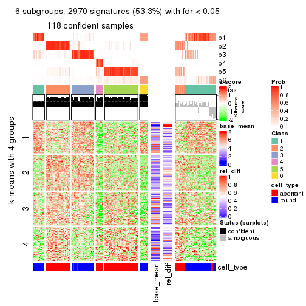</p>

</div>
</div>


Signature heatmaps where rows are not scaled:


<script>
$( function() {
	$( '#tabs-SD-kmeans-get-signatures-no-scale' ).tabs();
} );
</script>
<div id='tabs-SD-kmeans-get-signatures-no-scale'>
<ul>
<li><a href='#tab-SD-kmeans-get-signatures-no-scale-1'>k = 2</a></li>
<li><a href='#tab-SD-kmeans-get-signatures-no-scale-2'>k = 3</a></li>
<li><a href='#tab-SD-kmeans-get-signatures-no-scale-3'>k = 4</a></li>
<li><a href='#tab-SD-kmeans-get-signatures-no-scale-4'>k = 5</a></li>
<li><a href='#tab-SD-kmeans-get-signatures-no-scale-5'>k = 6</a></li>
</ul>
<div id='tab-SD-kmeans-get-signatures-no-scale-1'>
<pre><code class="r">get_signatures(res, k = 2, scale_rows = FALSE)
</code></pre>

<p></p>

</div>
<div id='tab-SD-kmeans-get-signatures-no-scale-2'>
<pre><code class="r">get_signatures(res, k = 3, scale_rows = FALSE)
</code></pre>

<p></p>

</div>
<div id='tab-SD-kmeans-get-signatures-no-scale-3'>
<pre><code class="r">get_signatures(res, k = 4, scale_rows = FALSE)
</code></pre>

<p></p>

</div>
<div id='tab-SD-kmeans-get-signatures-no-scale-4'>
<pre><code class="r">get_signatures(res, k = 5, scale_rows = FALSE)
</code></pre>

<p></p>

</div>
<div id='tab-SD-kmeans-get-signatures-no-scale-5'>
<pre><code class="r">get_signatures(res, k = 6, scale_rows = FALSE)
</code></pre>

<p></p>

</div>
</div>


Compare the overlap of signatures from different k:

```r
compare_signatures(res)
```


`get_signature()` returns a data frame invisibly. TO get the list of signatures, the function
call should be assigned to a variable explicitly. In following code, if `plot` argument is set
to `FALSE`, no heatmap is plotted while only the differential analysis is performed.

```r
# code only for demonstration
tb = get_signature(res, k = ..., plot = FALSE)
```

An example of the output of `tb` is:

```
#>   which_row         fdr    mean_1    mean_2 scaled_mean_1 scaled_mean_2 km
#> 1        38 0.042760348  8.373488  9.131774    -0.5533452     0.5164555  1
#> 2        40 0.018707592  7.106213  8.469186    -0.6173731     0.5762149  1
#> 3        55 0.019134737 10.221463 11.207825    -0.6159697     0.5749050  1
#> 4        59 0.006059896  5.921854  7.869574    -0.6899429     0.6439467  1
#> 5        60 0.018055526  8.928898 10.211722    -0.6204761     0.5791110  1
#> 6        98 0.009384629 15.714769 14.887706     0.6635654    -0.6193277  2
...
```

The columns in `tb` are:

1. `which_row`: row indices corresponding to the input matrix.
2. `fdr`: FDR for the differential test. 
3. `mean_x`: The mean value in group x.
4. `scaled_mean_x`: The mean value in group x after rows are scaled.
5. `km`: Row groups if k-means clustering is applied to rows.


UMAP plot which shows how samples are separated.


<script>
$( function() {
	$( '#tabs-SD-kmeans-dimension-reduction' ).tabs();
} );
</script>
<div id='tabs-SD-kmeans-dimension-reduction'>
<ul>
<li><a href='#tab-SD-kmeans-dimension-reduction-1'>k = 2</a></li>
<li><a href='#tab-SD-kmeans-dimension-reduction-2'>k = 3</a></li>
<li><a href='#tab-SD-kmeans-dimension-reduction-3'>k = 4</a></li>
<li><a href='#tab-SD-kmeans-dimension-reduction-4'>k = 5</a></li>
<li><a href='#tab-SD-kmeans-dimension-reduction-5'>k = 6</a></li>
</ul>
<div id='tab-SD-kmeans-dimension-reduction-1'>
<pre><code class="r">dimension_reduction(res, k = 2, method = &quot;UMAP&quot;)
</code></pre>

<p></p>

</div>
<div id='tab-SD-kmeans-dimension-reduction-2'>
<pre><code class="r">dimension_reduction(res, k = 3, method = &quot;UMAP&quot;)
</code></pre>

<p></p>

</div>
<div id='tab-SD-kmeans-dimension-reduction-3'>
<pre><code class="r">dimension_reduction(res, k = 4, method = &quot;UMAP&quot;)
</code></pre>

<p></p>

</div>
<div id='tab-SD-kmeans-dimension-reduction-4'>
<pre><code class="r">dimension_reduction(res, k = 5, method = &quot;UMAP&quot;)
</code></pre>

<p></p>

</div>
<div id='tab-SD-kmeans-dimension-reduction-5'>
<pre><code class="r">dimension_reduction(res, k = 6, method = &quot;UMAP&quot;)
</code></pre>

<p></p>

</div>
</div>


Following heatmap shows how subgroups are split when increasing `k`:

```r
collect_classes(res)
```


Test correlation between subgroups and known annotations. If the known
annotation is numeric, one-way ANOVA test is applied, and if the known
annotation is discrete, chi-squared contingency table test is applied.

```r
test_to_known_factors(res)
```

```
#>             n cell_type(p) k
#> SD:kmeans 155     1.04e-19 2
#> SD:kmeans 141     3.28e-20 3
#> SD:kmeans 137     4.66e-24 4
#> SD:kmeans 139     1.29e-23 5
#> SD:kmeans 118     1.38e-20 6
```


If matrix rows can be associated to genes, consider to use `GO_Enrichment(res,
...)` to perform function enrichment for the signature genes.


 

---------------------------------------------------


### SD:skmeans


The object with results only for a single top-value method and a single partition method 
can be extracted as:

```r
res = res_list["SD", "skmeans"]
# you can also extract it by
# res = res_list["SD:skmeans"]
```

A summary of `res` and all the functions that can be applied to it:

```r
res
```

```
#> A 'ConsensusPartition' object with k = 2, 3, 4, 5, 6.
#>   On a matrix with 5576 rows and 160 columns.
#>   Top rows (558, 1116, 1673, 2230, 2788) are extracted by 'SD' method.
#>   Subgroups are detected by 'skmeans' method.
#>   Performed in total 1250 partitions by row resampling.
#>   Best k for subgroups seems to be 2.
#> 
#> Following methods can be applied to this 'ConsensusPartition' object:
#>  [1] "cola_report"             "collect_classes"         "collect_plots"          
#>  [4] "collect_stats"           "colnames"                "compare_signatures"     
#>  [7] "consensus_heatmap"       "dimension_reduction"     "functional_enrichment"  
#> [10] "get_anno_col"            "get_anno"                "get_classes"            
#> [13] "get_consensus"           "get_matrix"              "get_membership"         
#> [16] "get_param"               "get_signatures"          "get_stats"              
#> [19] "is_best_k"               "is_stable_k"             "membership_heatmap"     
#> [22] "ncol"                    "nrow"                    "plot_ecdf"              
#> [25] "rownames"                "select_partition_number" "show"                   
#> [28] "suggest_best_k"          "test_to_known_factors"
```

`collect_plots()` function collects all the plots made from `res` for all `k` (number of partitions)
into one single page to provide an easy and fast comparison between different `k`.

```r
collect_plots(res)
```


The plots are:

- The first row: a plot of the ECDF (Empirical cumulative distribution
  function) curves of the consensus matrix for each `k` and the heatmap of
  predicted classes for each `k`.
- The second row: heatmaps of the consensus matrix for each `k`.
- The third row: heatmaps of the membership matrix for each `k`.
- The fouth row: heatmaps of the signatures for each `k`.

All the plots in panels can be made by individual functions and they are
plotted later in this section.

`select_partition_number()` produces several plots showing different
statistics for choosing "optimized" `k`. There are following statistics:

- ECDF curves of the consensus matrix for each `k`;
- 1-PAC. [The PAC
  score](https://en.wikipedia.org/wiki/Consensus_clustering#Over-interpretation_potential_of_consensus_clustering)
  measures the proportion of the ambiguous subgrouping.
- Mean silhouette score.
- Concordance. The mean probability of fiting the consensus class ids in all
  partitions.
- Area increased. Denote $A_k$ as the area under the ECDF curve for current
  `k`, the area increased is defined as $A_k - A_{k-1}$.
- Rand index. The percent of pairs of samples that are both in a same cluster
  or both are not in a same cluster in the partition of k and k-1.
- Jaccard index. The ratio of pairs of samples are both in a same cluster in
  the partition of k and k-1 and the pairs of samples are both in a same
  cluster in the partition k or k-1.

The detailed explanations of these statistics can be found in [the cola
vignette](http://bioconductor.org/packages/devel/bioc/vignettes/cola/inst/doc/cola.html#toc_13).

Generally speaking, lower PAC score, higher mean silhouette score or higher
concordance corresponds to better partition. Rand index and Jaccard index
measure how similar the current partition is compared to partition with `k-1`.
If they are too similar, we won't accept `k` is better than `k-1`.

```r
select_partition_number(res)
```


The numeric values for all these statistics can be obtained by `get_stats()`.

```r
get_stats(res)
```

```
#>   k 1-PAC mean_silhouette concordance area_increased  Rand Jaccard
#> 2 2 0.886           0.924       0.967         0.5026 0.498   0.498
#> 3 3 0.825           0.860       0.941         0.3171 0.758   0.551
#> 4 4 0.837           0.846       0.929         0.1181 0.875   0.654
#> 5 5 0.744           0.684       0.822         0.0533 0.962   0.857
#> 6 6 0.681           0.634       0.763         0.0377 0.970   0.876
```

`suggest_best_k()` suggests the best $k$ based on these statistics. The rules are as follows:

- All $k$ with Jaccard index larger than 0.95 are removed because the increase of
  the partition number does not provides enough extra information. If all $k$ are removed,
  the best $k$ is assigned by `NA`.
- For $k$ with 1-PAC larger than 0.9, the maximal $k$ is taken as the "best k". Other $k$ is called "optional k".
- If it does not fit the second rule. The $k$ with the highest vote of highest
  1-PAC, mean silhouette and concordance is taken as the "best k".

```r
suggest_best_k(res)
```

```
#> [1] 2
```


Following shows the table of the partitions (You need to click the **show/hide
code output** link to see it). The membership matrix (columns with name `p*`)
is inferred by
[`clue::cl_consensus()`](https://www.rdocumentation.org/link/cl_consensus?package=clue)
function with the `SE` method. Basically the value in the membership matrix
represents the probability to belong to a certain group. The finall class
label for an item is determined with the group with highest probability it
belongs to.

In `get_classes()` function, the entropy is calculated from the membership
matrix and the silhouette score is calculated from the consensus matrix.


<script>
$( function() {
	$( '#tabs-SD-skmeans-get-classes' ).tabs();
} );
</script>
<div id='tabs-SD-skmeans-get-classes'>
<ul>
<li><a href='#tab-SD-skmeans-get-classes-1'>k = 2</a></li>
<li><a href='#tab-SD-skmeans-get-classes-2'>k = 3</a></li>
<li><a href='#tab-SD-skmeans-get-classes-3'>k = 4</a></li>
<li><a href='#tab-SD-skmeans-get-classes-4'>k = 5</a></li>
<li><a href='#tab-SD-skmeans-get-classes-5'>k = 6</a></li>
</ul>

<div id='tab-SD-skmeans-get-classes-1'>
<p><a id='tab-SD-skmeans-get-classes-1-a' style='color:#0366d6' href='#'>show/hide code output</a></p>
<pre><code class="r">cbind(get_classes(res, k = 2), get_membership(res, k = 2))
</code></pre>

<pre><code>#&gt;                     class entropy silhouette    p1    p2
#&gt; aberrant_ERR2585320     2  0.0000      0.970 0.000 1.000
#&gt; aberrant_ERR2585338     2  0.0000      0.970 0.000 1.000
#&gt; aberrant_ERR2585325     2  0.0000      0.970 0.000 1.000
#&gt; aberrant_ERR2585283     1  0.8955      0.578 0.688 0.312
#&gt; aberrant_ERR2585343     2  0.0000      0.970 0.000 1.000
#&gt; aberrant_ERR2585329     2  0.0000      0.970 0.000 1.000
#&gt; aberrant_ERR2585317     2  0.0000      0.970 0.000 1.000
#&gt; aberrant_ERR2585339     2  0.0000      0.970 0.000 1.000
#&gt; aberrant_ERR2585335     2  0.0000      0.970 0.000 1.000
#&gt; aberrant_ERR2585287     2  0.2236      0.938 0.036 0.964
#&gt; aberrant_ERR2585321     2  0.0000      0.970 0.000 1.000
#&gt; aberrant_ERR2585297     1  0.0000      0.960 1.000 0.000
#&gt; aberrant_ERR2585337     2  0.0000      0.970 0.000 1.000
#&gt; aberrant_ERR2585319     2  0.0000      0.970 0.000 1.000
#&gt; aberrant_ERR2585315     2  0.0000      0.970 0.000 1.000
#&gt; aberrant_ERR2585336     2  0.0000      0.970 0.000 1.000
#&gt; aberrant_ERR2585307     2  0.0000      0.970 0.000 1.000
#&gt; aberrant_ERR2585301     2  0.0000      0.970 0.000 1.000
#&gt; aberrant_ERR2585326     2  0.0000      0.970 0.000 1.000
#&gt; aberrant_ERR2585331     2  0.0000      0.970 0.000 1.000
#&gt; aberrant_ERR2585346     1  0.8955      0.578 0.688 0.312
#&gt; aberrant_ERR2585314     2  0.0000      0.970 0.000 1.000
#&gt; aberrant_ERR2585298     1  0.0000      0.960 1.000 0.000
#&gt; aberrant_ERR2585345     2  0.0000      0.970 0.000 1.000
#&gt; aberrant_ERR2585299     1  0.0000      0.960 1.000 0.000
#&gt; aberrant_ERR2585309     1  0.0000      0.960 1.000 0.000
#&gt; aberrant_ERR2585303     2  0.0000      0.970 0.000 1.000
#&gt; aberrant_ERR2585313     2  0.0000      0.970 0.000 1.000
#&gt; aberrant_ERR2585318     2  0.0000      0.970 0.000 1.000
#&gt; aberrant_ERR2585328     2  0.0000      0.970 0.000 1.000
#&gt; aberrant_ERR2585330     2  0.0000      0.970 0.000 1.000
#&gt; aberrant_ERR2585293     1  0.7815      0.706 0.768 0.232
#&gt; aberrant_ERR2585342     2  0.0000      0.970 0.000 1.000
#&gt; aberrant_ERR2585348     2  0.0000      0.970 0.000 1.000
#&gt; aberrant_ERR2585352     2  0.0000      0.970 0.000 1.000
#&gt; aberrant_ERR2585308     1  0.0000      0.960 1.000 0.000
#&gt; aberrant_ERR2585349     2  0.0000      0.970 0.000 1.000
#&gt; aberrant_ERR2585316     2  0.2948      0.922 0.052 0.948
#&gt; aberrant_ERR2585306     1  0.9044      0.563 0.680 0.320
#&gt; aberrant_ERR2585324     2  0.0000      0.970 0.000 1.000
#&gt; aberrant_ERR2585310     2  0.5178      0.857 0.116 0.884
#&gt; aberrant_ERR2585296     1  0.2948      0.914 0.948 0.052
#&gt; aberrant_ERR2585275     1  0.9087      0.555 0.676 0.324
#&gt; aberrant_ERR2585311     2  0.0000      0.970 0.000 1.000
#&gt; aberrant_ERR2585292     1  0.7815      0.706 0.768 0.232
#&gt; aberrant_ERR2585282     2  0.0000      0.970 0.000 1.000
#&gt; aberrant_ERR2585305     2  0.0000      0.970 0.000 1.000
#&gt; aberrant_ERR2585278     2  0.0000      0.970 0.000 1.000
#&gt; aberrant_ERR2585347     2  0.0000      0.970 0.000 1.000
#&gt; aberrant_ERR2585332     2  0.0000      0.970 0.000 1.000
#&gt; aberrant_ERR2585280     2  0.0000      0.970 0.000 1.000
#&gt; aberrant_ERR2585304     2  0.0000      0.970 0.000 1.000
#&gt; aberrant_ERR2585322     2  0.0000      0.970 0.000 1.000
#&gt; aberrant_ERR2585279     2  0.0000      0.970 0.000 1.000
#&gt; aberrant_ERR2585277     2  0.0000      0.970 0.000 1.000
#&gt; aberrant_ERR2585295     2  0.0000      0.970 0.000 1.000
#&gt; aberrant_ERR2585333     2  0.0000      0.970 0.000 1.000
#&gt; aberrant_ERR2585285     2  0.0000      0.970 0.000 1.000
#&gt; aberrant_ERR2585286     2  0.0000      0.970 0.000 1.000
#&gt; aberrant_ERR2585294     2  0.0000      0.970 0.000 1.000
#&gt; aberrant_ERR2585300     2  0.0000      0.970 0.000 1.000
#&gt; aberrant_ERR2585334     2  0.0000      0.970 0.000 1.000
#&gt; aberrant_ERR2585361     2  0.0000      0.970 0.000 1.000
#&gt; aberrant_ERR2585372     2  0.0000      0.970 0.000 1.000
#&gt; round_ERR2585217        2  0.9732      0.350 0.404 0.596
#&gt; round_ERR2585205        1  0.0000      0.960 1.000 0.000
#&gt; round_ERR2585214        2  0.8955      0.562 0.312 0.688
#&gt; round_ERR2585202        2  0.4431      0.882 0.092 0.908
#&gt; aberrant_ERR2585367     2  0.0000      0.970 0.000 1.000
#&gt; round_ERR2585220        1  0.0000      0.960 1.000 0.000
#&gt; round_ERR2585238        1  0.0000      0.960 1.000 0.000
#&gt; aberrant_ERR2585276     2  0.0000      0.970 0.000 1.000
#&gt; round_ERR2585218        1  0.0000      0.960 1.000 0.000
#&gt; aberrant_ERR2585363     2  0.0000      0.970 0.000 1.000
#&gt; round_ERR2585201        1  0.0376      0.956 0.996 0.004
#&gt; round_ERR2585210        1  0.0000      0.960 1.000 0.000
#&gt; aberrant_ERR2585362     2  0.0000      0.970 0.000 1.000
#&gt; aberrant_ERR2585360     2  0.0000      0.970 0.000 1.000
#&gt; round_ERR2585209        1  0.0000      0.960 1.000 0.000
#&gt; round_ERR2585242        1  0.0000      0.960 1.000 0.000
#&gt; round_ERR2585216        1  0.0000      0.960 1.000 0.000
#&gt; round_ERR2585219        1  0.0000      0.960 1.000 0.000
#&gt; round_ERR2585237        2  0.9129      0.530 0.328 0.672
#&gt; round_ERR2585198        2  0.8955      0.562 0.312 0.688
#&gt; round_ERR2585211        1  0.0000      0.960 1.000 0.000
#&gt; round_ERR2585206        1  0.0000      0.960 1.000 0.000
#&gt; aberrant_ERR2585281     2  0.0000      0.970 0.000 1.000
#&gt; round_ERR2585212        1  0.0000      0.960 1.000 0.000
#&gt; round_ERR2585221        1  0.0000      0.960 1.000 0.000
#&gt; round_ERR2585243        1  0.0000      0.960 1.000 0.000
#&gt; round_ERR2585204        2  0.7602      0.718 0.220 0.780
#&gt; round_ERR2585213        2  0.0000      0.970 0.000 1.000
#&gt; aberrant_ERR2585373     2  0.0000      0.970 0.000 1.000
#&gt; aberrant_ERR2585358     2  0.0000      0.970 0.000 1.000
#&gt; aberrant_ERR2585365     2  0.0000      0.970 0.000 1.000
#&gt; aberrant_ERR2585359     2  0.0000      0.970 0.000 1.000
#&gt; aberrant_ERR2585370     2  0.0000      0.970 0.000 1.000
#&gt; round_ERR2585215        1  0.0000      0.960 1.000 0.000
#&gt; round_ERR2585262        2  0.8443      0.633 0.272 0.728
#&gt; round_ERR2585199        2  0.7056      0.759 0.192 0.808
#&gt; aberrant_ERR2585369     2  0.0000      0.970 0.000 1.000
#&gt; round_ERR2585208        1  0.0000      0.960 1.000 0.000
#&gt; round_ERR2585252        1  0.0000      0.960 1.000 0.000
#&gt; round_ERR2585236        1  0.0000      0.960 1.000 0.000
#&gt; aberrant_ERR2585284     1  0.8955      0.578 0.688 0.312
#&gt; round_ERR2585224        1  0.0000      0.960 1.000 0.000
#&gt; round_ERR2585260        1  0.0000      0.960 1.000 0.000
#&gt; round_ERR2585229        1  0.0000      0.960 1.000 0.000
#&gt; aberrant_ERR2585364     1  0.9000      0.571 0.684 0.316
#&gt; round_ERR2585253        1  0.0000      0.960 1.000 0.000
#&gt; aberrant_ERR2585368     2  0.0000      0.970 0.000 1.000
#&gt; aberrant_ERR2585371     2  0.0000      0.970 0.000 1.000
#&gt; round_ERR2585239        1  0.0000      0.960 1.000 0.000
#&gt; round_ERR2585273        1  0.0000      0.960 1.000 0.000
#&gt; round_ERR2585256        1  0.0000      0.960 1.000 0.000
#&gt; round_ERR2585272        1  0.0000      0.960 1.000 0.000
#&gt; round_ERR2585246        1  0.0000      0.960 1.000 0.000
#&gt; round_ERR2585261        1  0.0672      0.953 0.992 0.008
#&gt; round_ERR2585254        1  0.3584      0.898 0.932 0.068
#&gt; round_ERR2585225        1  0.0000      0.960 1.000 0.000
#&gt; round_ERR2585235        1  0.0000      0.960 1.000 0.000
#&gt; round_ERR2585271        1  0.0000      0.960 1.000 0.000
#&gt; round_ERR2585251        1  0.0000      0.960 1.000 0.000
#&gt; round_ERR2585255        1  0.0000      0.960 1.000 0.000
#&gt; round_ERR2585257        1  0.0000      0.960 1.000 0.000
#&gt; round_ERR2585226        1  0.0000      0.960 1.000 0.000
#&gt; round_ERR2585265        1  0.0000      0.960 1.000 0.000
#&gt; round_ERR2585259        1  0.0000      0.960 1.000 0.000
#&gt; round_ERR2585247        1  0.0000      0.960 1.000 0.000
#&gt; round_ERR2585241        1  0.0000      0.960 1.000 0.000
#&gt; round_ERR2585263        1  0.0000      0.960 1.000 0.000
#&gt; round_ERR2585264        1  0.0000      0.960 1.000 0.000
#&gt; round_ERR2585233        1  0.0000      0.960 1.000 0.000
#&gt; round_ERR2585223        1  0.0000      0.960 1.000 0.000
#&gt; round_ERR2585234        1  0.9754      0.282 0.592 0.408
#&gt; round_ERR2585222        1  0.0000      0.960 1.000 0.000
#&gt; round_ERR2585228        1  0.0000      0.960 1.000 0.000
#&gt; round_ERR2585248        1  0.0000      0.960 1.000 0.000
#&gt; round_ERR2585240        1  0.0000      0.960 1.000 0.000
#&gt; round_ERR2585270        1  0.0000      0.960 1.000 0.000
#&gt; round_ERR2585232        1  0.0000      0.960 1.000 0.000
#&gt; aberrant_ERR2585341     2  0.0000      0.970 0.000 1.000
#&gt; aberrant_ERR2585355     2  0.0000      0.970 0.000 1.000
#&gt; round_ERR2585227        1  0.0000      0.960 1.000 0.000
#&gt; aberrant_ERR2585351     2  0.0000      0.970 0.000 1.000
#&gt; round_ERR2585269        1  0.0000      0.960 1.000 0.000
#&gt; aberrant_ERR2585357     2  0.0000      0.970 0.000 1.000
#&gt; aberrant_ERR2585350     2  0.0000      0.970 0.000 1.000
#&gt; round_ERR2585250        1  0.0000      0.960 1.000 0.000
#&gt; round_ERR2585245        1  0.0000      0.960 1.000 0.000
#&gt; aberrant_ERR2585353     2  0.0000      0.970 0.000 1.000
#&gt; round_ERR2585258        1  0.0000      0.960 1.000 0.000
#&gt; aberrant_ERR2585354     2  0.0000      0.970 0.000 1.000
#&gt; round_ERR2585249        1  0.0000      0.960 1.000 0.000
#&gt; round_ERR2585268        1  0.0000      0.960 1.000 0.000
#&gt; aberrant_ERR2585356     2  0.0000      0.970 0.000 1.000
#&gt; round_ERR2585266        1  0.0000      0.960 1.000 0.000
#&gt; round_ERR2585231        1  0.0000      0.960 1.000 0.000
#&gt; round_ERR2585230        1  0.0000      0.960 1.000 0.000
#&gt; round_ERR2585267        1  0.0000      0.960 1.000 0.000
</code></pre>

<script>
$('#tab-SD-skmeans-get-classes-1-a').parent().next().next().hide();
$('#tab-SD-skmeans-get-classes-1-a').click(function(){
  $('#tab-SD-skmeans-get-classes-1-a').parent().next().next().toggle();
  return(false);
});
</script>
</div>

<div id='tab-SD-skmeans-get-classes-2'>
<p><a id='tab-SD-skmeans-get-classes-2-a' style='color:#0366d6' href='#'>show/hide code output</a></p>
<pre><code class="r">cbind(get_classes(res, k = 3), get_membership(res, k = 3))
</code></pre>

<pre><code>#&gt;                     class entropy silhouette    p1    p2    p3
#&gt; aberrant_ERR2585320     3  0.0424     0.9384 0.000 0.008 0.992
#&gt; aberrant_ERR2585338     2  0.0237     0.8861 0.000 0.996 0.004
#&gt; aberrant_ERR2585325     3  0.0424     0.9384 0.000 0.008 0.992
#&gt; aberrant_ERR2585283     3  0.0237     0.9404 0.004 0.000 0.996
#&gt; aberrant_ERR2585343     3  0.0000     0.9417 0.000 0.000 1.000
#&gt; aberrant_ERR2585329     2  0.0237     0.8861 0.000 0.996 0.004
#&gt; aberrant_ERR2585317     2  0.0237     0.8861 0.000 0.996 0.004
#&gt; aberrant_ERR2585339     2  0.0237     0.8861 0.000 0.996 0.004
#&gt; aberrant_ERR2585335     2  0.4842     0.6929 0.000 0.776 0.224
#&gt; aberrant_ERR2585287     3  0.0237     0.9404 0.004 0.000 0.996
#&gt; aberrant_ERR2585321     3  0.0000     0.9417 0.000 0.000 1.000
#&gt; aberrant_ERR2585297     1  0.0000     0.9663 1.000 0.000 0.000
#&gt; aberrant_ERR2585337     2  0.0237     0.8861 0.000 0.996 0.004
#&gt; aberrant_ERR2585319     2  0.5178     0.6499 0.000 0.744 0.256
#&gt; aberrant_ERR2585315     2  0.4452     0.7325 0.000 0.808 0.192
#&gt; aberrant_ERR2585336     2  0.0237     0.8861 0.000 0.996 0.004
#&gt; aberrant_ERR2585307     2  0.0237     0.8861 0.000 0.996 0.004
#&gt; aberrant_ERR2585301     2  0.5560     0.5839 0.000 0.700 0.300
#&gt; aberrant_ERR2585326     2  0.0237     0.8861 0.000 0.996 0.004
#&gt; aberrant_ERR2585331     2  0.0237     0.8861 0.000 0.996 0.004
#&gt; aberrant_ERR2585346     3  0.0237     0.9404 0.004 0.000 0.996
#&gt; aberrant_ERR2585314     2  0.0237     0.8861 0.000 0.996 0.004
#&gt; aberrant_ERR2585298     1  0.5810     0.5384 0.664 0.336 0.000
#&gt; aberrant_ERR2585345     2  0.0237     0.8861 0.000 0.996 0.004
#&gt; aberrant_ERR2585299     1  0.0000     0.9663 1.000 0.000 0.000
#&gt; aberrant_ERR2585309     1  0.0000     0.9663 1.000 0.000 0.000
#&gt; aberrant_ERR2585303     2  0.4504     0.7340 0.000 0.804 0.196
#&gt; aberrant_ERR2585313     2  0.1031     0.8752 0.000 0.976 0.024
#&gt; aberrant_ERR2585318     3  0.3192     0.8403 0.000 0.112 0.888
#&gt; aberrant_ERR2585328     3  0.0237     0.9404 0.000 0.004 0.996
#&gt; aberrant_ERR2585330     3  0.5905     0.4260 0.000 0.352 0.648
#&gt; aberrant_ERR2585293     3  0.0237     0.9404 0.004 0.000 0.996
#&gt; aberrant_ERR2585342     3  0.0237     0.9404 0.000 0.004 0.996
#&gt; aberrant_ERR2585348     3  0.0000     0.9417 0.000 0.000 1.000
#&gt; aberrant_ERR2585352     2  0.5431     0.6070 0.000 0.716 0.284
#&gt; aberrant_ERR2585308     1  0.0000     0.9663 1.000 0.000 0.000
#&gt; aberrant_ERR2585349     2  0.0237     0.8861 0.000 0.996 0.004
#&gt; aberrant_ERR2585316     3  0.0237     0.9404 0.004 0.000 0.996
#&gt; aberrant_ERR2585306     3  0.0237     0.9404 0.004 0.000 0.996
#&gt; aberrant_ERR2585324     2  0.5178     0.6499 0.000 0.744 0.256
#&gt; aberrant_ERR2585310     2  0.0237     0.8835 0.004 0.996 0.000
#&gt; aberrant_ERR2585296     2  0.6309     0.0206 0.500 0.500 0.000
#&gt; aberrant_ERR2585275     3  0.0237     0.9404 0.004 0.000 0.996
#&gt; aberrant_ERR2585311     3  0.0000     0.9417 0.000 0.000 1.000
#&gt; aberrant_ERR2585292     3  0.0237     0.9404 0.004 0.000 0.996
#&gt; aberrant_ERR2585282     3  0.0000     0.9417 0.000 0.000 1.000
#&gt; aberrant_ERR2585305     3  0.5905     0.4290 0.000 0.352 0.648
#&gt; aberrant_ERR2585278     2  0.4702     0.7076 0.000 0.788 0.212
#&gt; aberrant_ERR2585347     3  0.0000     0.9417 0.000 0.000 1.000
#&gt; aberrant_ERR2585332     3  0.0000     0.9417 0.000 0.000 1.000
#&gt; aberrant_ERR2585280     3  0.0592     0.9356 0.000 0.012 0.988
#&gt; aberrant_ERR2585304     2  0.0000     0.8849 0.000 1.000 0.000
#&gt; aberrant_ERR2585322     2  0.0237     0.8861 0.000 0.996 0.004
#&gt; aberrant_ERR2585279     2  0.0000     0.8849 0.000 1.000 0.000
#&gt; aberrant_ERR2585277     2  0.0237     0.8861 0.000 0.996 0.004
#&gt; aberrant_ERR2585295     3  0.3686     0.7924 0.000 0.140 0.860
#&gt; aberrant_ERR2585333     3  0.0000     0.9417 0.000 0.000 1.000
#&gt; aberrant_ERR2585285     3  0.6309    -0.0498 0.000 0.496 0.504
#&gt; aberrant_ERR2585286     2  0.0237     0.8861 0.000 0.996 0.004
#&gt; aberrant_ERR2585294     2  0.6305     0.0948 0.000 0.516 0.484
#&gt; aberrant_ERR2585300     3  0.0000     0.9417 0.000 0.000 1.000
#&gt; aberrant_ERR2585334     2  0.0237     0.8861 0.000 0.996 0.004
#&gt; aberrant_ERR2585361     3  0.0000     0.9417 0.000 0.000 1.000
#&gt; aberrant_ERR2585372     3  0.0000     0.9417 0.000 0.000 1.000
#&gt; round_ERR2585217        2  0.0424     0.8804 0.008 0.992 0.000
#&gt; round_ERR2585205        1  0.0000     0.9663 1.000 0.000 0.000
#&gt; round_ERR2585214        2  0.0000     0.8849 0.000 1.000 0.000
#&gt; round_ERR2585202        2  0.0000     0.8849 0.000 1.000 0.000
#&gt; aberrant_ERR2585367     3  0.0424     0.9385 0.000 0.008 0.992
#&gt; round_ERR2585220        1  0.0237     0.9651 0.996 0.004 0.000
#&gt; round_ERR2585238        1  0.0000     0.9663 1.000 0.000 0.000
#&gt; aberrant_ERR2585276     3  0.2625     0.8716 0.000 0.084 0.916
#&gt; round_ERR2585218        1  0.0000     0.9663 1.000 0.000 0.000
#&gt; aberrant_ERR2585363     2  0.5497     0.5960 0.000 0.708 0.292
#&gt; round_ERR2585201        2  0.6204     0.2012 0.424 0.576 0.000
#&gt; round_ERR2585210        1  0.0000     0.9663 1.000 0.000 0.000
#&gt; aberrant_ERR2585362     3  0.1643     0.9105 0.000 0.044 0.956
#&gt; aberrant_ERR2585360     3  0.0237     0.9404 0.000 0.004 0.996
#&gt; round_ERR2585209        1  0.1163     0.9465 0.972 0.028 0.000
#&gt; round_ERR2585242        1  0.6079     0.4171 0.612 0.388 0.000
#&gt; round_ERR2585216        1  0.0237     0.9651 0.996 0.004 0.000
#&gt; round_ERR2585219        1  0.0000     0.9663 1.000 0.000 0.000
#&gt; round_ERR2585237        2  0.0000     0.8849 0.000 1.000 0.000
#&gt; round_ERR2585198        2  0.0000     0.8849 0.000 1.000 0.000
#&gt; round_ERR2585211        1  0.0000     0.9663 1.000 0.000 0.000
#&gt; round_ERR2585206        1  0.0000     0.9663 1.000 0.000 0.000
#&gt; aberrant_ERR2585281     2  0.5882     0.4745 0.000 0.652 0.348
#&gt; round_ERR2585212        1  0.0237     0.9651 0.996 0.004 0.000
#&gt; round_ERR2585221        1  0.0000     0.9663 1.000 0.000 0.000
#&gt; round_ERR2585243        1  0.0000     0.9663 1.000 0.000 0.000
#&gt; round_ERR2585204        2  0.0000     0.8849 0.000 1.000 0.000
#&gt; round_ERR2585213        2  0.0000     0.8849 0.000 1.000 0.000
#&gt; aberrant_ERR2585373     3  0.0000     0.9417 0.000 0.000 1.000
#&gt; aberrant_ERR2585358     3  0.0000     0.9417 0.000 0.000 1.000
#&gt; aberrant_ERR2585365     2  0.4654     0.7178 0.000 0.792 0.208
#&gt; aberrant_ERR2585359     3  0.0000     0.9417 0.000 0.000 1.000
#&gt; aberrant_ERR2585370     2  0.0237     0.8861 0.000 0.996 0.004
#&gt; round_ERR2585215        1  0.0000     0.9663 1.000 0.000 0.000
#&gt; round_ERR2585262        2  0.4194     0.8070 0.060 0.876 0.064
#&gt; round_ERR2585199        2  0.0000     0.8849 0.000 1.000 0.000
#&gt; aberrant_ERR2585369     3  0.1753     0.9069 0.000 0.048 0.952
#&gt; round_ERR2585208        1  0.0000     0.9663 1.000 0.000 0.000
#&gt; round_ERR2585252        1  0.0000     0.9663 1.000 0.000 0.000
#&gt; round_ERR2585236        1  0.0000     0.9663 1.000 0.000 0.000
#&gt; aberrant_ERR2585284     3  0.0237     0.9404 0.004 0.000 0.996
#&gt; round_ERR2585224        1  0.0000     0.9663 1.000 0.000 0.000
#&gt; round_ERR2585260        1  0.0000     0.9663 1.000 0.000 0.000
#&gt; round_ERR2585229        1  0.0000     0.9663 1.000 0.000 0.000
#&gt; aberrant_ERR2585364     3  0.0237     0.9404 0.004 0.000 0.996
#&gt; round_ERR2585253        1  0.0000     0.9663 1.000 0.000 0.000
#&gt; aberrant_ERR2585368     2  0.0237     0.8861 0.000 0.996 0.004
#&gt; aberrant_ERR2585371     2  0.0237     0.8861 0.000 0.996 0.004
#&gt; round_ERR2585239        1  0.0000     0.9663 1.000 0.000 0.000
#&gt; round_ERR2585273        1  0.0237     0.9651 0.996 0.004 0.000
#&gt; round_ERR2585256        1  0.3879     0.8257 0.848 0.152 0.000
#&gt; round_ERR2585272        1  0.0000     0.9663 1.000 0.000 0.000
#&gt; round_ERR2585246        1  0.0000     0.9663 1.000 0.000 0.000
#&gt; round_ERR2585261        2  0.6267     0.1135 0.452 0.548 0.000
#&gt; round_ERR2585254        2  0.4887     0.6757 0.228 0.772 0.000
#&gt; round_ERR2585225        1  0.4504     0.7704 0.804 0.196 0.000
#&gt; round_ERR2585235        1  0.0000     0.9663 1.000 0.000 0.000
#&gt; round_ERR2585271        1  0.0000     0.9663 1.000 0.000 0.000
#&gt; round_ERR2585251        1  0.0237     0.9651 0.996 0.004 0.000
#&gt; round_ERR2585255        1  0.5216     0.6788 0.740 0.260 0.000
#&gt; round_ERR2585257        1  0.4555     0.7670 0.800 0.200 0.000
#&gt; round_ERR2585226        1  0.0237     0.9651 0.996 0.004 0.000
#&gt; round_ERR2585265        1  0.0237     0.9651 0.996 0.004 0.000
#&gt; round_ERR2585259        1  0.0237     0.9651 0.996 0.004 0.000
#&gt; round_ERR2585247        1  0.0000     0.9663 1.000 0.000 0.000
#&gt; round_ERR2585241        1  0.0000     0.9663 1.000 0.000 0.000
#&gt; round_ERR2585263        1  0.0237     0.9651 0.996 0.004 0.000
#&gt; round_ERR2585264        1  0.0000     0.9663 1.000 0.000 0.000
#&gt; round_ERR2585233        1  0.0237     0.9651 0.996 0.004 0.000
#&gt; round_ERR2585223        1  0.0000     0.9663 1.000 0.000 0.000
#&gt; round_ERR2585234        2  0.0000     0.8849 0.000 1.000 0.000
#&gt; round_ERR2585222        1  0.0000     0.9663 1.000 0.000 0.000
#&gt; round_ERR2585228        1  0.0000     0.9663 1.000 0.000 0.000
#&gt; round_ERR2585248        1  0.0000     0.9663 1.000 0.000 0.000
#&gt; round_ERR2585240        1  0.4399     0.7806 0.812 0.188 0.000
#&gt; round_ERR2585270        1  0.0237     0.9651 0.996 0.004 0.000
#&gt; round_ERR2585232        1  0.0237     0.9651 0.996 0.004 0.000
#&gt; aberrant_ERR2585341     2  0.3412     0.8077 0.000 0.876 0.124
#&gt; aberrant_ERR2585355     2  0.0237     0.8861 0.000 0.996 0.004
#&gt; round_ERR2585227        1  0.0237     0.9651 0.996 0.004 0.000
#&gt; aberrant_ERR2585351     3  0.6267     0.1246 0.000 0.452 0.548
#&gt; round_ERR2585269        1  0.0000     0.9663 1.000 0.000 0.000
#&gt; aberrant_ERR2585357     2  0.0237     0.8861 0.000 0.996 0.004
#&gt; aberrant_ERR2585350     2  0.0237     0.8861 0.000 0.996 0.004
#&gt; round_ERR2585250        1  0.0237     0.9651 0.996 0.004 0.000
#&gt; round_ERR2585245        1  0.0000     0.9663 1.000 0.000 0.000
#&gt; aberrant_ERR2585353     3  0.0000     0.9417 0.000 0.000 1.000
#&gt; round_ERR2585258        1  0.0237     0.9651 0.996 0.004 0.000
#&gt; aberrant_ERR2585354     3  0.0000     0.9417 0.000 0.000 1.000
#&gt; round_ERR2585249        1  0.0000     0.9663 1.000 0.000 0.000
#&gt; round_ERR2585268        1  0.0237     0.9651 0.996 0.004 0.000
#&gt; aberrant_ERR2585356     3  0.0237     0.9404 0.004 0.000 0.996
#&gt; round_ERR2585266        1  0.5138     0.6917 0.748 0.252 0.000
#&gt; round_ERR2585231        1  0.0000     0.9663 1.000 0.000 0.000
#&gt; round_ERR2585230        1  0.0000     0.9663 1.000 0.000 0.000
#&gt; round_ERR2585267        1  0.0000     0.9663 1.000 0.000 0.000
</code></pre>

<script>
$('#tab-SD-skmeans-get-classes-2-a').parent().next().next().hide();
$('#tab-SD-skmeans-get-classes-2-a').click(function(){
  $('#tab-SD-skmeans-get-classes-2-a').parent().next().next().toggle();
  return(false);
});
</script>
</div>

<div id='tab-SD-skmeans-get-classes-3'>
<p><a id='tab-SD-skmeans-get-classes-3-a' style='color:#0366d6' href='#'>show/hide code output</a></p>
<pre><code class="r">cbind(get_classes(res, k = 4), get_membership(res, k = 4))
</code></pre>

<pre><code>#&gt;                     class entropy silhouette    p1    p2    p3    p4
#&gt; aberrant_ERR2585320     4  0.4933      0.358 0.000 0.432 0.000 0.568
#&gt; aberrant_ERR2585338     2  0.0336      0.924 0.000 0.992 0.008 0.000
#&gt; aberrant_ERR2585325     4  0.4961      0.312 0.000 0.448 0.000 0.552
#&gt; aberrant_ERR2585283     4  0.0188      0.865 0.004 0.000 0.000 0.996
#&gt; aberrant_ERR2585343     4  0.0000      0.865 0.000 0.000 0.000 1.000
#&gt; aberrant_ERR2585329     2  0.0469      0.925 0.000 0.988 0.012 0.000
#&gt; aberrant_ERR2585317     2  0.0469      0.925 0.000 0.988 0.012 0.000
#&gt; aberrant_ERR2585339     2  0.0469      0.925 0.000 0.988 0.012 0.000
#&gt; aberrant_ERR2585335     2  0.1118      0.904 0.000 0.964 0.000 0.036
#&gt; aberrant_ERR2585287     4  0.0000      0.865 0.000 0.000 0.000 1.000
#&gt; aberrant_ERR2585321     4  0.0469      0.864 0.000 0.012 0.000 0.988
#&gt; aberrant_ERR2585297     1  0.0000      0.948 1.000 0.000 0.000 0.000
#&gt; aberrant_ERR2585337     2  0.0469      0.925 0.000 0.988 0.012 0.000
#&gt; aberrant_ERR2585319     2  0.2530      0.838 0.000 0.888 0.000 0.112
#&gt; aberrant_ERR2585315     2  0.0376      0.922 0.000 0.992 0.004 0.004
#&gt; aberrant_ERR2585336     2  0.0469      0.925 0.000 0.988 0.012 0.000
#&gt; aberrant_ERR2585307     2  0.0469      0.925 0.000 0.988 0.012 0.000
#&gt; aberrant_ERR2585301     2  0.2654      0.847 0.000 0.888 0.004 0.108
#&gt; aberrant_ERR2585326     2  0.0469      0.925 0.000 0.988 0.012 0.000
#&gt; aberrant_ERR2585331     2  0.0707      0.922 0.000 0.980 0.020 0.000
#&gt; aberrant_ERR2585346     4  0.0188      0.865 0.004 0.000 0.000 0.996
#&gt; aberrant_ERR2585314     2  0.0469      0.925 0.000 0.988 0.012 0.000
#&gt; aberrant_ERR2585298     3  0.0188      0.947 0.004 0.000 0.996 0.000
#&gt; aberrant_ERR2585345     2  0.0469      0.925 0.000 0.988 0.012 0.000
#&gt; aberrant_ERR2585299     1  0.0000      0.948 1.000 0.000 0.000 0.000
#&gt; aberrant_ERR2585309     1  0.0000      0.948 1.000 0.000 0.000 0.000
#&gt; aberrant_ERR2585303     2  0.0336      0.920 0.000 0.992 0.000 0.008
#&gt; aberrant_ERR2585313     2  0.0336      0.924 0.000 0.992 0.008 0.000
#&gt; aberrant_ERR2585318     4  0.4994      0.203 0.000 0.480 0.000 0.520
#&gt; aberrant_ERR2585328     4  0.3219      0.779 0.000 0.164 0.000 0.836
#&gt; aberrant_ERR2585330     2  0.4382      0.535 0.000 0.704 0.000 0.296
#&gt; aberrant_ERR2585293     4  0.0188      0.865 0.004 0.000 0.000 0.996
#&gt; aberrant_ERR2585342     4  0.4134      0.677 0.000 0.260 0.000 0.740
#&gt; aberrant_ERR2585348     4  0.0469      0.865 0.000 0.012 0.000 0.988
#&gt; aberrant_ERR2585352     2  0.1109      0.911 0.000 0.968 0.004 0.028
#&gt; aberrant_ERR2585308     1  0.0000      0.948 1.000 0.000 0.000 0.000
#&gt; aberrant_ERR2585349     2  0.3569      0.755 0.000 0.804 0.196 0.000
#&gt; aberrant_ERR2585316     4  0.0000      0.865 0.000 0.000 0.000 1.000
#&gt; aberrant_ERR2585306     4  0.1022      0.848 0.032 0.000 0.000 0.968
#&gt; aberrant_ERR2585324     2  0.2530      0.838 0.000 0.888 0.000 0.112
#&gt; aberrant_ERR2585310     2  0.4978      0.510 0.012 0.664 0.324 0.000
#&gt; aberrant_ERR2585296     3  0.0592      0.942 0.016 0.000 0.984 0.000
#&gt; aberrant_ERR2585275     4  0.0188      0.865 0.004 0.000 0.000 0.996
#&gt; aberrant_ERR2585311     4  0.1302      0.856 0.000 0.044 0.000 0.956
#&gt; aberrant_ERR2585292     4  0.0188      0.865 0.004 0.000 0.000 0.996
#&gt; aberrant_ERR2585282     4  0.0188      0.865 0.000 0.004 0.000 0.996
#&gt; aberrant_ERR2585305     2  0.4804      0.305 0.000 0.616 0.000 0.384
#&gt; aberrant_ERR2585278     2  0.0672      0.923 0.000 0.984 0.008 0.008
#&gt; aberrant_ERR2585347     4  0.0000      0.865 0.000 0.000 0.000 1.000
#&gt; aberrant_ERR2585332     4  0.0336      0.865 0.000 0.008 0.000 0.992
#&gt; aberrant_ERR2585280     4  0.4564      0.573 0.000 0.328 0.000 0.672
#&gt; aberrant_ERR2585304     2  0.1474      0.901 0.000 0.948 0.052 0.000
#&gt; aberrant_ERR2585322     2  0.0336      0.924 0.000 0.992 0.008 0.000
#&gt; aberrant_ERR2585279     2  0.2704      0.838 0.000 0.876 0.124 0.000
#&gt; aberrant_ERR2585277     2  0.0469      0.925 0.000 0.988 0.012 0.000
#&gt; aberrant_ERR2585295     4  0.4888      0.389 0.000 0.412 0.000 0.588
#&gt; aberrant_ERR2585333     4  0.0000      0.865 0.000 0.000 0.000 1.000
#&gt; aberrant_ERR2585285     2  0.3610      0.723 0.000 0.800 0.000 0.200
#&gt; aberrant_ERR2585286     2  0.0469      0.925 0.000 0.988 0.012 0.000
#&gt; aberrant_ERR2585294     2  0.3123      0.804 0.000 0.844 0.000 0.156
#&gt; aberrant_ERR2585300     4  0.0000      0.865 0.000 0.000 0.000 1.000
#&gt; aberrant_ERR2585334     2  0.0707      0.922 0.000 0.980 0.020 0.000
#&gt; aberrant_ERR2585361     4  0.3907      0.714 0.000 0.232 0.000 0.768
#&gt; aberrant_ERR2585372     4  0.1022      0.861 0.000 0.032 0.000 0.968
#&gt; round_ERR2585217        3  0.0188      0.946 0.000 0.004 0.996 0.000
#&gt; round_ERR2585205        1  0.0000      0.948 1.000 0.000 0.000 0.000
#&gt; round_ERR2585214        3  0.0188      0.946 0.000 0.004 0.996 0.000
#&gt; round_ERR2585202        3  0.2814      0.828 0.000 0.132 0.868 0.000
#&gt; aberrant_ERR2585367     4  0.5000      0.177 0.000 0.496 0.000 0.504
#&gt; round_ERR2585220        1  0.1940      0.896 0.924 0.000 0.076 0.000
#&gt; round_ERR2585238        1  0.0188      0.947 0.996 0.000 0.004 0.000
#&gt; aberrant_ERR2585276     4  0.4933      0.301 0.000 0.432 0.000 0.568
#&gt; round_ERR2585218        1  0.0000      0.948 1.000 0.000 0.000 0.000
#&gt; aberrant_ERR2585363     2  0.2125      0.875 0.000 0.920 0.004 0.076
#&gt; round_ERR2585201        3  0.0000      0.947 0.000 0.000 1.000 0.000
#&gt; round_ERR2585210        1  0.0188      0.947 0.996 0.000 0.004 0.000
#&gt; aberrant_ERR2585362     4  0.4193      0.670 0.000 0.268 0.000 0.732
#&gt; aberrant_ERR2585360     4  0.3024      0.791 0.000 0.148 0.000 0.852
#&gt; round_ERR2585209        3  0.0469      0.944 0.012 0.000 0.988 0.000
#&gt; round_ERR2585242        3  0.0336      0.946 0.008 0.000 0.992 0.000
#&gt; round_ERR2585216        1  0.1118      0.928 0.964 0.000 0.036 0.000
#&gt; round_ERR2585219        1  0.0188      0.947 0.996 0.000 0.004 0.000
#&gt; round_ERR2585237        3  0.0188      0.946 0.000 0.004 0.996 0.000
#&gt; round_ERR2585198        3  0.0188      0.946 0.000 0.004 0.996 0.000
#&gt; round_ERR2585211        1  0.0000      0.948 1.000 0.000 0.000 0.000
#&gt; round_ERR2585206        1  0.0000      0.948 1.000 0.000 0.000 0.000
#&gt; aberrant_ERR2585281     2  0.2593      0.853 0.000 0.892 0.004 0.104
#&gt; round_ERR2585212        1  0.4500      0.569 0.684 0.000 0.316 0.000
#&gt; round_ERR2585221        1  0.0000      0.948 1.000 0.000 0.000 0.000
#&gt; round_ERR2585243        1  0.0188      0.947 0.996 0.000 0.004 0.000
#&gt; round_ERR2585204        3  0.0188      0.946 0.000 0.004 0.996 0.000
#&gt; round_ERR2585213        3  0.4040      0.658 0.000 0.248 0.752 0.000
#&gt; aberrant_ERR2585373     4  0.0336      0.865 0.000 0.008 0.000 0.992
#&gt; aberrant_ERR2585358     4  0.0188      0.865 0.000 0.004 0.000 0.996
#&gt; aberrant_ERR2585365     2  0.0469      0.919 0.000 0.988 0.000 0.012
#&gt; aberrant_ERR2585359     4  0.0188      0.865 0.000 0.004 0.000 0.996
#&gt; aberrant_ERR2585370     2  0.0469      0.925 0.000 0.988 0.012 0.000
#&gt; round_ERR2585215        1  0.0000      0.948 1.000 0.000 0.000 0.000
#&gt; round_ERR2585262        3  0.0927      0.941 0.008 0.016 0.976 0.000
#&gt; round_ERR2585199        3  0.1302      0.918 0.000 0.044 0.956 0.000
#&gt; aberrant_ERR2585369     4  0.4843      0.439 0.000 0.396 0.000 0.604
#&gt; round_ERR2585208        1  0.0000      0.948 1.000 0.000 0.000 0.000
#&gt; round_ERR2585252        1  0.0000      0.948 1.000 0.000 0.000 0.000
#&gt; round_ERR2585236        1  0.1411      0.924 0.960 0.000 0.020 0.020
#&gt; aberrant_ERR2585284     4  0.0188      0.865 0.004 0.000 0.000 0.996
#&gt; round_ERR2585224        1  0.0000      0.948 1.000 0.000 0.000 0.000
#&gt; round_ERR2585260        1  0.0000      0.948 1.000 0.000 0.000 0.000
#&gt; round_ERR2585229        1  0.0000      0.948 1.000 0.000 0.000 0.000
#&gt; aberrant_ERR2585364     4  0.0188      0.865 0.004 0.000 0.000 0.996
#&gt; round_ERR2585253        1  0.0000      0.948 1.000 0.000 0.000 0.000
#&gt; aberrant_ERR2585368     2  0.0469      0.925 0.000 0.988 0.012 0.000
#&gt; aberrant_ERR2585371     2  0.0469      0.925 0.000 0.988 0.012 0.000
#&gt; round_ERR2585239        1  0.0000      0.948 1.000 0.000 0.000 0.000
#&gt; round_ERR2585273        1  0.0188      0.947 0.996 0.000 0.004 0.000
#&gt; round_ERR2585256        3  0.0469      0.944 0.012 0.000 0.988 0.000
#&gt; round_ERR2585272        1  0.0188      0.947 0.996 0.000 0.004 0.000
#&gt; round_ERR2585246        1  0.0188      0.947 0.996 0.000 0.004 0.000
#&gt; round_ERR2585261        3  0.0000      0.947 0.000 0.000 1.000 0.000
#&gt; round_ERR2585254        3  0.0000      0.947 0.000 0.000 1.000 0.000
#&gt; round_ERR2585225        3  0.0817      0.937 0.024 0.000 0.976 0.000
#&gt; round_ERR2585235        1  0.2011      0.891 0.920 0.000 0.080 0.000
#&gt; round_ERR2585271        1  0.0188      0.947 0.996 0.000 0.004 0.000
#&gt; round_ERR2585251        1  0.4679      0.491 0.648 0.000 0.352 0.000
#&gt; round_ERR2585255        3  0.0188      0.947 0.004 0.000 0.996 0.000
#&gt; round_ERR2585257        3  0.0336      0.946 0.008 0.000 0.992 0.000
#&gt; round_ERR2585226        1  0.1022      0.931 0.968 0.000 0.032 0.000
#&gt; round_ERR2585265        1  0.0817      0.936 0.976 0.000 0.024 0.000
#&gt; round_ERR2585259        1  0.4961      0.226 0.552 0.000 0.448 0.000
#&gt; round_ERR2585247        1  0.0000      0.948 1.000 0.000 0.000 0.000
#&gt; round_ERR2585241        1  0.0000      0.948 1.000 0.000 0.000 0.000
#&gt; round_ERR2585263        1  0.4996      0.111 0.516 0.000 0.484 0.000
#&gt; round_ERR2585264        1  0.0000      0.948 1.000 0.000 0.000 0.000
#&gt; round_ERR2585233        3  0.4776      0.365 0.376 0.000 0.624 0.000
#&gt; round_ERR2585223        1  0.0188      0.947 0.996 0.000 0.004 0.000
#&gt; round_ERR2585234        3  0.0000      0.947 0.000 0.000 1.000 0.000
#&gt; round_ERR2585222        1  0.0188      0.947 0.996 0.000 0.004 0.000
#&gt; round_ERR2585228        1  0.0188      0.947 0.996 0.000 0.004 0.000
#&gt; round_ERR2585248        1  0.0000      0.948 1.000 0.000 0.000 0.000
#&gt; round_ERR2585240        3  0.0469      0.944 0.012 0.000 0.988 0.000
#&gt; round_ERR2585270        1  0.2011      0.893 0.920 0.000 0.080 0.000
#&gt; round_ERR2585232        3  0.3172      0.791 0.160 0.000 0.840 0.000
#&gt; aberrant_ERR2585341     2  0.0927      0.920 0.000 0.976 0.008 0.016
#&gt; aberrant_ERR2585355     2  0.0469      0.925 0.000 0.988 0.012 0.000
#&gt; round_ERR2585227        1  0.3942      0.701 0.764 0.000 0.236 0.000
#&gt; aberrant_ERR2585351     2  0.3942      0.661 0.000 0.764 0.000 0.236
#&gt; round_ERR2585269        1  0.0000      0.948 1.000 0.000 0.000 0.000
#&gt; aberrant_ERR2585357     2  0.0469      0.925 0.000 0.988 0.012 0.000
#&gt; aberrant_ERR2585350     2  0.0469      0.925 0.000 0.988 0.012 0.000
#&gt; round_ERR2585250        1  0.3649      0.752 0.796 0.000 0.204 0.000
#&gt; round_ERR2585245        1  0.0000      0.948 1.000 0.000 0.000 0.000
#&gt; aberrant_ERR2585353     4  0.0336      0.865 0.000 0.008 0.000 0.992
#&gt; round_ERR2585258        1  0.0469      0.943 0.988 0.000 0.012 0.000
#&gt; aberrant_ERR2585354     4  0.1302      0.857 0.000 0.044 0.000 0.956
#&gt; round_ERR2585249        1  0.0000      0.948 1.000 0.000 0.000 0.000
#&gt; round_ERR2585268        1  0.3569      0.763 0.804 0.000 0.196 0.000
#&gt; aberrant_ERR2585356     4  0.0000      0.865 0.000 0.000 0.000 1.000
#&gt; round_ERR2585266        3  0.0469      0.945 0.012 0.000 0.988 0.000
#&gt; round_ERR2585231        1  0.0000      0.948 1.000 0.000 0.000 0.000
#&gt; round_ERR2585230        1  0.0000      0.948 1.000 0.000 0.000 0.000
#&gt; round_ERR2585267        1  0.0000      0.948 1.000 0.000 0.000 0.000
</code></pre>

<script>
$('#tab-SD-skmeans-get-classes-3-a').parent().next().next().hide();
$('#tab-SD-skmeans-get-classes-3-a').click(function(){
  $('#tab-SD-skmeans-get-classes-3-a').parent().next().next().toggle();
  return(false);
});
</script>
</div>

<div id='tab-SD-skmeans-get-classes-4'>
<p><a id='tab-SD-skmeans-get-classes-4-a' style='color:#0366d6' href='#'>show/hide code output</a></p>
<pre><code class="r">cbind(get_classes(res, k = 5), get_membership(res, k = 5))
</code></pre>

<pre><code>#&gt;                     class entropy silhouette    p1    p2    p3    p4    p5
#&gt; aberrant_ERR2585320     5  0.5460     0.5883 0.000 0.148 0.000 0.196 0.656
#&gt; aberrant_ERR2585338     2  0.0880     0.7994 0.000 0.968 0.000 0.000 0.032
#&gt; aberrant_ERR2585325     5  0.5480     0.5954 0.000 0.168 0.000 0.176 0.656
#&gt; aberrant_ERR2585283     4  0.0000     0.6915 0.000 0.000 0.000 1.000 0.000
#&gt; aberrant_ERR2585343     4  0.2329     0.6819 0.000 0.000 0.000 0.876 0.124
#&gt; aberrant_ERR2585329     2  0.0703     0.8017 0.000 0.976 0.000 0.000 0.024
#&gt; aberrant_ERR2585317     2  0.0609     0.8010 0.000 0.980 0.000 0.000 0.020
#&gt; aberrant_ERR2585339     2  0.0880     0.7983 0.000 0.968 0.000 0.000 0.032
#&gt; aberrant_ERR2585335     2  0.4088     0.4131 0.000 0.632 0.000 0.000 0.368
#&gt; aberrant_ERR2585287     4  0.0609     0.6930 0.000 0.000 0.000 0.980 0.020
#&gt; aberrant_ERR2585321     4  0.3857     0.5419 0.000 0.000 0.000 0.688 0.312
#&gt; aberrant_ERR2585297     1  0.0898     0.9213 0.972 0.000 0.000 0.008 0.020
#&gt; aberrant_ERR2585337     2  0.0794     0.8016 0.000 0.972 0.000 0.000 0.028
#&gt; aberrant_ERR2585319     2  0.4552     0.1608 0.000 0.524 0.000 0.008 0.468
#&gt; aberrant_ERR2585315     2  0.2561     0.7408 0.000 0.856 0.000 0.000 0.144
#&gt; aberrant_ERR2585336     2  0.0510     0.8026 0.000 0.984 0.000 0.000 0.016
#&gt; aberrant_ERR2585307     2  0.0771     0.7998 0.000 0.976 0.004 0.000 0.020
#&gt; aberrant_ERR2585301     2  0.4827     0.0937 0.000 0.504 0.000 0.020 0.476
#&gt; aberrant_ERR2585326     2  0.0510     0.8013 0.000 0.984 0.000 0.000 0.016
#&gt; aberrant_ERR2585331     2  0.0912     0.7952 0.000 0.972 0.012 0.000 0.016
#&gt; aberrant_ERR2585346     4  0.0000     0.6915 0.000 0.000 0.000 1.000 0.000
#&gt; aberrant_ERR2585314     2  0.2124     0.7746 0.000 0.900 0.004 0.000 0.096
#&gt; aberrant_ERR2585298     3  0.0880     0.8761 0.000 0.000 0.968 0.000 0.032
#&gt; aberrant_ERR2585345     2  0.0000     0.8008 0.000 1.000 0.000 0.000 0.000
#&gt; aberrant_ERR2585299     1  0.1285     0.9206 0.956 0.000 0.004 0.004 0.036
#&gt; aberrant_ERR2585309     1  0.0451     0.9190 0.988 0.000 0.000 0.008 0.004
#&gt; aberrant_ERR2585303     2  0.3282     0.6932 0.000 0.804 0.000 0.008 0.188
#&gt; aberrant_ERR2585313     2  0.1410     0.7879 0.000 0.940 0.000 0.000 0.060
#&gt; aberrant_ERR2585318     5  0.5946     0.5687 0.000 0.184 0.000 0.224 0.592
#&gt; aberrant_ERR2585328     4  0.6392    -0.2350 0.000 0.172 0.000 0.456 0.372
#&gt; aberrant_ERR2585330     5  0.5785     0.3277 0.000 0.404 0.000 0.092 0.504
#&gt; aberrant_ERR2585293     4  0.0000     0.6915 0.000 0.000 0.000 1.000 0.000
#&gt; aberrant_ERR2585342     5  0.5967     0.4845 0.000 0.136 0.000 0.308 0.556
#&gt; aberrant_ERR2585348     4  0.4538     0.3963 0.000 0.016 0.000 0.620 0.364
#&gt; aberrant_ERR2585352     2  0.4238     0.4125 0.000 0.628 0.000 0.004 0.368
#&gt; aberrant_ERR2585308     1  0.0693     0.9198 0.980 0.000 0.000 0.008 0.012
#&gt; aberrant_ERR2585349     2  0.4923     0.4986 0.000 0.680 0.252 0.000 0.068
#&gt; aberrant_ERR2585316     4  0.1270     0.6938 0.000 0.000 0.000 0.948 0.052
#&gt; aberrant_ERR2585306     4  0.3359     0.6340 0.020 0.000 0.000 0.816 0.164
#&gt; aberrant_ERR2585324     2  0.4440     0.1763 0.000 0.528 0.000 0.004 0.468
#&gt; aberrant_ERR2585310     2  0.5908     0.3964 0.000 0.588 0.256 0.000 0.156
#&gt; aberrant_ERR2585296     3  0.2367     0.8558 0.020 0.004 0.904 0.000 0.072
#&gt; aberrant_ERR2585275     4  0.0000     0.6915 0.000 0.000 0.000 1.000 0.000
#&gt; aberrant_ERR2585311     5  0.5153     0.0932 0.000 0.040 0.000 0.436 0.524
#&gt; aberrant_ERR2585292     4  0.0000     0.6915 0.000 0.000 0.000 1.000 0.000
#&gt; aberrant_ERR2585282     4  0.3895     0.5258 0.000 0.000 0.000 0.680 0.320
#&gt; aberrant_ERR2585305     5  0.6391     0.5097 0.008 0.284 0.000 0.168 0.540
#&gt; aberrant_ERR2585278     2  0.3521     0.6379 0.000 0.764 0.000 0.004 0.232
#&gt; aberrant_ERR2585347     4  0.2471     0.6719 0.000 0.000 0.000 0.864 0.136
#&gt; aberrant_ERR2585332     4  0.3857     0.5459 0.000 0.000 0.000 0.688 0.312
#&gt; aberrant_ERR2585280     4  0.6483    -0.2673 0.000 0.192 0.000 0.452 0.356
#&gt; aberrant_ERR2585304     2  0.2574     0.7213 0.000 0.876 0.112 0.000 0.012
#&gt; aberrant_ERR2585322     2  0.0794     0.8018 0.000 0.972 0.000 0.000 0.028
#&gt; aberrant_ERR2585279     2  0.2464     0.7349 0.000 0.888 0.096 0.000 0.016
#&gt; aberrant_ERR2585277     2  0.0162     0.8003 0.000 0.996 0.000 0.000 0.004
#&gt; aberrant_ERR2585295     4  0.6785    -0.2965 0.000 0.340 0.000 0.376 0.284
#&gt; aberrant_ERR2585333     4  0.3561     0.5962 0.000 0.000 0.000 0.740 0.260
#&gt; aberrant_ERR2585285     2  0.5454    -0.0674 0.000 0.488 0.000 0.060 0.452
#&gt; aberrant_ERR2585286     2  0.0510     0.8004 0.000 0.984 0.000 0.000 0.016
#&gt; aberrant_ERR2585294     2  0.5757     0.0362 0.000 0.496 0.000 0.088 0.416
#&gt; aberrant_ERR2585300     4  0.2179     0.6843 0.000 0.000 0.000 0.888 0.112
#&gt; aberrant_ERR2585334     2  0.0798     0.7977 0.000 0.976 0.008 0.000 0.016
#&gt; aberrant_ERR2585361     5  0.6506     0.4615 0.000 0.200 0.000 0.344 0.456
#&gt; aberrant_ERR2585372     5  0.4546     0.0357 0.000 0.008 0.000 0.460 0.532
#&gt; round_ERR2585217        3  0.0798     0.8775 0.000 0.008 0.976 0.000 0.016
#&gt; round_ERR2585205        1  0.0963     0.9191 0.964 0.000 0.000 0.000 0.036
#&gt; round_ERR2585214        3  0.1300     0.8748 0.000 0.028 0.956 0.000 0.016
#&gt; round_ERR2585202        3  0.4823     0.5109 0.000 0.316 0.644 0.000 0.040
#&gt; aberrant_ERR2585367     5  0.6497     0.5178 0.000 0.312 0.000 0.212 0.476
#&gt; round_ERR2585220        1  0.3719     0.8321 0.816 0.000 0.116 0.000 0.068
#&gt; round_ERR2585238        1  0.0771     0.9215 0.976 0.000 0.000 0.004 0.020
#&gt; aberrant_ERR2585276     4  0.6692    -0.2639 0.000 0.296 0.000 0.432 0.272
#&gt; round_ERR2585218        1  0.0609     0.9210 0.980 0.000 0.000 0.000 0.020
#&gt; aberrant_ERR2585363     2  0.4494     0.3346 0.000 0.608 0.000 0.012 0.380
#&gt; round_ERR2585201        3  0.0609     0.8762 0.000 0.000 0.980 0.000 0.020
#&gt; round_ERR2585210        1  0.1041     0.9206 0.964 0.000 0.000 0.004 0.032
#&gt; aberrant_ERR2585362     5  0.5703     0.5631 0.000 0.140 0.000 0.244 0.616
#&gt; aberrant_ERR2585360     5  0.5732     0.5138 0.000 0.116 0.000 0.296 0.588
#&gt; round_ERR2585209        3  0.1430     0.8691 0.004 0.000 0.944 0.000 0.052
#&gt; round_ERR2585242        3  0.0880     0.8761 0.000 0.000 0.968 0.000 0.032
#&gt; round_ERR2585216        1  0.3354     0.8545 0.844 0.000 0.088 0.000 0.068
#&gt; round_ERR2585219        1  0.1557     0.9146 0.940 0.000 0.008 0.000 0.052
#&gt; round_ERR2585237        3  0.1117     0.8742 0.000 0.020 0.964 0.000 0.016
#&gt; round_ERR2585198        3  0.1469     0.8658 0.000 0.036 0.948 0.000 0.016
#&gt; round_ERR2585211        1  0.0794     0.9207 0.972 0.000 0.000 0.000 0.028
#&gt; round_ERR2585206        1  0.0404     0.9200 0.988 0.000 0.000 0.000 0.012
#&gt; aberrant_ERR2585281     2  0.5018     0.5380 0.000 0.716 0.004 0.164 0.116
#&gt; round_ERR2585212        1  0.5515     0.5780 0.624 0.000 0.268 0.000 0.108
#&gt; round_ERR2585221        1  0.0566     0.9207 0.984 0.000 0.000 0.004 0.012
#&gt; round_ERR2585243        1  0.0963     0.9210 0.964 0.000 0.000 0.000 0.036
#&gt; round_ERR2585204        3  0.1914     0.8505 0.000 0.060 0.924 0.000 0.016
#&gt; round_ERR2585213        3  0.4738     0.1371 0.000 0.464 0.520 0.000 0.016
#&gt; aberrant_ERR2585373     4  0.4074     0.4435 0.000 0.000 0.000 0.636 0.364
#&gt; aberrant_ERR2585358     4  0.4161     0.4016 0.000 0.000 0.000 0.608 0.392
#&gt; aberrant_ERR2585365     2  0.3756     0.6077 0.000 0.744 0.000 0.008 0.248
#&gt; aberrant_ERR2585359     4  0.3242     0.6392 0.000 0.000 0.000 0.784 0.216
#&gt; aberrant_ERR2585370     2  0.0000     0.8008 0.000 1.000 0.000 0.000 0.000
#&gt; round_ERR2585215        1  0.0566     0.9214 0.984 0.000 0.000 0.004 0.012
#&gt; round_ERR2585262        3  0.3968     0.7855 0.000 0.072 0.816 0.012 0.100
#&gt; round_ERR2585199        3  0.4065     0.6245 0.000 0.264 0.720 0.000 0.016
#&gt; aberrant_ERR2585369     5  0.5673     0.6069 0.000 0.184 0.000 0.184 0.632
#&gt; round_ERR2585208        1  0.0404     0.9213 0.988 0.000 0.000 0.000 0.012
#&gt; round_ERR2585252        1  0.0798     0.9210 0.976 0.000 0.000 0.008 0.016
#&gt; round_ERR2585236        1  0.4091     0.7927 0.804 0.000 0.044 0.132 0.020
#&gt; aberrant_ERR2585284     4  0.0162     0.6910 0.000 0.000 0.000 0.996 0.004
#&gt; round_ERR2585224        1  0.0451     0.9190 0.988 0.000 0.000 0.008 0.004
#&gt; round_ERR2585260        1  0.0955     0.9208 0.968 0.000 0.004 0.000 0.028
#&gt; round_ERR2585229        1  0.0865     0.9213 0.972 0.000 0.000 0.004 0.024
#&gt; aberrant_ERR2585364     4  0.0703     0.6923 0.000 0.000 0.000 0.976 0.024
#&gt; round_ERR2585253        1  0.0451     0.9190 0.988 0.000 0.000 0.008 0.004
#&gt; aberrant_ERR2585368     2  0.0404     0.7996 0.000 0.988 0.000 0.000 0.012
#&gt; aberrant_ERR2585371     2  0.0404     0.7996 0.000 0.988 0.000 0.000 0.012
#&gt; round_ERR2585239        1  0.1205     0.9203 0.956 0.000 0.000 0.004 0.040
#&gt; round_ERR2585273        1  0.1653     0.9157 0.944 0.000 0.024 0.004 0.028
#&gt; round_ERR2585256        3  0.0703     0.8778 0.000 0.000 0.976 0.000 0.024
#&gt; round_ERR2585272        1  0.2359     0.9027 0.904 0.000 0.036 0.000 0.060
#&gt; round_ERR2585246        1  0.0992     0.9216 0.968 0.000 0.000 0.008 0.024
#&gt; round_ERR2585261        3  0.0794     0.8776 0.000 0.000 0.972 0.000 0.028
#&gt; round_ERR2585254        3  0.1386     0.8751 0.000 0.016 0.952 0.000 0.032
#&gt; round_ERR2585225        3  0.1701     0.8682 0.016 0.000 0.936 0.000 0.048
#&gt; round_ERR2585235        1  0.2792     0.8766 0.884 0.000 0.072 0.004 0.040
#&gt; round_ERR2585271        1  0.0963     0.9212 0.964 0.000 0.000 0.000 0.036
#&gt; round_ERR2585251        1  0.5351     0.3912 0.560 0.000 0.380 0.000 0.060
#&gt; round_ERR2585255        3  0.0880     0.8758 0.000 0.000 0.968 0.000 0.032
#&gt; round_ERR2585257        3  0.1357     0.8738 0.004 0.000 0.948 0.000 0.048
#&gt; round_ERR2585226        1  0.2139     0.9076 0.916 0.000 0.032 0.000 0.052
#&gt; round_ERR2585265        1  0.3043     0.8804 0.864 0.000 0.056 0.000 0.080
#&gt; round_ERR2585259        1  0.5338     0.3171 0.544 0.000 0.400 0.000 0.056
#&gt; round_ERR2585247        1  0.0566     0.9206 0.984 0.000 0.000 0.004 0.012
#&gt; round_ERR2585241        1  0.1270     0.9181 0.948 0.000 0.000 0.000 0.052
#&gt; round_ERR2585263        1  0.5726     0.3686 0.536 0.000 0.372 0.000 0.092
#&gt; round_ERR2585264        1  0.0451     0.9190 0.988 0.000 0.000 0.008 0.004
#&gt; round_ERR2585233        3  0.5297     0.3319 0.360 0.000 0.580 0.000 0.060
#&gt; round_ERR2585223        1  0.0794     0.9214 0.972 0.000 0.000 0.000 0.028
#&gt; round_ERR2585234        3  0.0671     0.8766 0.000 0.016 0.980 0.000 0.004
#&gt; round_ERR2585222        1  0.1638     0.9147 0.932 0.000 0.004 0.000 0.064
#&gt; round_ERR2585228        1  0.1410     0.9169 0.940 0.000 0.000 0.000 0.060
#&gt; round_ERR2585248        1  0.0451     0.9190 0.988 0.000 0.000 0.008 0.004
#&gt; round_ERR2585240        3  0.1444     0.8721 0.012 0.000 0.948 0.000 0.040
#&gt; round_ERR2585270        1  0.4038     0.8159 0.792 0.000 0.128 0.000 0.080
#&gt; round_ERR2585232        3  0.4519     0.6282 0.228 0.000 0.720 0.000 0.052
#&gt; aberrant_ERR2585341     2  0.3452     0.7020 0.000 0.820 0.000 0.032 0.148
#&gt; aberrant_ERR2585355     2  0.1270     0.7931 0.000 0.948 0.000 0.000 0.052
#&gt; round_ERR2585227        1  0.4840     0.6060 0.676 0.000 0.268 0.000 0.056
#&gt; aberrant_ERR2585351     5  0.5092     0.1920 0.000 0.440 0.000 0.036 0.524
#&gt; round_ERR2585269        1  0.0324     0.9193 0.992 0.000 0.000 0.004 0.004
#&gt; aberrant_ERR2585357     2  0.0290     0.8010 0.000 0.992 0.000 0.000 0.008
#&gt; aberrant_ERR2585350     2  0.0404     0.8013 0.000 0.988 0.000 0.000 0.012
#&gt; round_ERR2585250        1  0.4933     0.6993 0.704 0.000 0.200 0.000 0.096
#&gt; round_ERR2585245        1  0.0451     0.9190 0.988 0.000 0.000 0.008 0.004
#&gt; aberrant_ERR2585353     4  0.4533     0.2282 0.000 0.008 0.000 0.544 0.448
#&gt; round_ERR2585258        1  0.2859     0.8839 0.876 0.000 0.056 0.000 0.068
#&gt; aberrant_ERR2585354     5  0.4798     0.0981 0.000 0.020 0.000 0.440 0.540
#&gt; round_ERR2585249        1  0.0451     0.9200 0.988 0.000 0.000 0.004 0.008
#&gt; round_ERR2585268        1  0.4660     0.7308 0.728 0.000 0.192 0.000 0.080
#&gt; aberrant_ERR2585356     4  0.3074     0.6480 0.000 0.000 0.000 0.804 0.196
#&gt; round_ERR2585266        3  0.1124     0.8756 0.004 0.000 0.960 0.000 0.036
#&gt; round_ERR2585231        1  0.0451     0.9190 0.988 0.000 0.000 0.008 0.004
#&gt; round_ERR2585230        1  0.1357     0.9176 0.948 0.000 0.004 0.000 0.048
#&gt; round_ERR2585267        1  0.0693     0.9200 0.980 0.000 0.000 0.008 0.012
</code></pre>

<script>
$('#tab-SD-skmeans-get-classes-4-a').parent().next().next().hide();
$('#tab-SD-skmeans-get-classes-4-a').click(function(){
  $('#tab-SD-skmeans-get-classes-4-a').parent().next().next().toggle();
  return(false);
});
</script>
</div>

<div id='tab-SD-skmeans-get-classes-5'>
<p><a id='tab-SD-skmeans-get-classes-5-a' style='color:#0366d6' href='#'>show/hide code output</a></p>
<pre><code class="r">cbind(get_classes(res, k = 6), get_membership(res, k = 6))
</code></pre>

<pre><code>#&gt;                     class entropy silhouette    p1    p2    p3    p4    p5 p6
#&gt; aberrant_ERR2585320     5  0.5418    0.47727 0.000 0.064 0.000 0.092 0.668 NA
#&gt; aberrant_ERR2585338     2  0.1625    0.76917 0.000 0.928 0.000 0.000 0.060 NA
#&gt; aberrant_ERR2585325     5  0.5425    0.48159 0.000 0.068 0.000 0.088 0.668 NA
#&gt; aberrant_ERR2585283     4  0.0000    0.70103 0.000 0.000 0.000 1.000 0.000 NA
#&gt; aberrant_ERR2585343     4  0.3523    0.65971 0.000 0.000 0.000 0.780 0.180 NA
#&gt; aberrant_ERR2585329     2  0.1297    0.77681 0.000 0.948 0.000 0.000 0.040 NA
#&gt; aberrant_ERR2585317     2  0.0806    0.77953 0.000 0.972 0.000 0.000 0.020 NA
#&gt; aberrant_ERR2585339     2  0.1333    0.77572 0.000 0.944 0.000 0.000 0.048 NA
#&gt; aberrant_ERR2585335     2  0.4813    0.35268 0.000 0.608 0.000 0.000 0.316 NA
#&gt; aberrant_ERR2585287     4  0.0717    0.69952 0.000 0.000 0.000 0.976 0.016 NA
#&gt; aberrant_ERR2585321     4  0.4767    0.50289 0.000 0.000 0.000 0.620 0.304 NA
#&gt; aberrant_ERR2585297     1  0.1501    0.86496 0.924 0.000 0.000 0.000 0.000 NA
#&gt; aberrant_ERR2585337     2  0.0806    0.78003 0.000 0.972 0.000 0.000 0.020 NA
#&gt; aberrant_ERR2585319     5  0.5700    0.26776 0.000 0.372 0.000 0.004 0.480 NA
#&gt; aberrant_ERR2585315     2  0.3727    0.62133 0.000 0.748 0.000 0.000 0.216 NA
#&gt; aberrant_ERR2585336     2  0.0632    0.78021 0.000 0.976 0.000 0.000 0.024 NA
#&gt; aberrant_ERR2585307     2  0.1262    0.77984 0.000 0.956 0.008 0.000 0.020 NA
#&gt; aberrant_ERR2585301     5  0.5914    0.24281 0.000 0.388 0.000 0.008 0.444 NA
#&gt; aberrant_ERR2585326     2  0.0603    0.77914 0.000 0.980 0.000 0.000 0.016 NA
#&gt; aberrant_ERR2585331     2  0.1511    0.76747 0.000 0.944 0.032 0.000 0.012 NA
#&gt; aberrant_ERR2585346     4  0.0146    0.70030 0.000 0.000 0.000 0.996 0.004 NA
#&gt; aberrant_ERR2585314     2  0.3389    0.72431 0.000 0.832 0.020 0.000 0.100 NA
#&gt; aberrant_ERR2585298     3  0.1812    0.84068 0.000 0.000 0.912 0.000 0.008 NA
#&gt; aberrant_ERR2585345     2  0.0692    0.78104 0.000 0.976 0.000 0.000 0.020 NA
#&gt; aberrant_ERR2585299     1  0.1714    0.86891 0.908 0.000 0.000 0.000 0.000 NA
#&gt; aberrant_ERR2585309     1  0.1141    0.86070 0.948 0.000 0.000 0.000 0.000 NA
#&gt; aberrant_ERR2585303     2  0.3727    0.62235 0.000 0.748 0.000 0.000 0.216 NA
#&gt; aberrant_ERR2585313     2  0.2255    0.75572 0.000 0.892 0.000 0.000 0.080 NA
#&gt; aberrant_ERR2585318     5  0.6706    0.48911 0.000 0.156 0.000 0.180 0.532 NA
#&gt; aberrant_ERR2585328     4  0.6883   -0.20372 0.000 0.144 0.000 0.396 0.368 NA
#&gt; aberrant_ERR2585330     5  0.6020    0.38661 0.000 0.340 0.000 0.064 0.520 NA
#&gt; aberrant_ERR2585293     4  0.0000    0.70103 0.000 0.000 0.000 1.000 0.000 NA
#&gt; aberrant_ERR2585342     5  0.6726    0.40995 0.000 0.128 0.000 0.260 0.500 NA
#&gt; aberrant_ERR2585348     4  0.5417    0.17295 0.000 0.004 0.000 0.472 0.424 NA
#&gt; aberrant_ERR2585352     2  0.4941    0.01400 0.000 0.492 0.000 0.000 0.444 NA
#&gt; aberrant_ERR2585308     1  0.0937    0.86449 0.960 0.000 0.000 0.000 0.000 NA
#&gt; aberrant_ERR2585349     2  0.5031    0.50291 0.000 0.668 0.236 0.000 0.044 NA
#&gt; aberrant_ERR2585316     4  0.2164    0.69609 0.000 0.000 0.000 0.900 0.068 NA
#&gt; aberrant_ERR2585306     4  0.5174    0.56947 0.036 0.000 0.000 0.684 0.160 NA
#&gt; aberrant_ERR2585324     5  0.5700    0.26776 0.000 0.372 0.000 0.004 0.480 NA
#&gt; aberrant_ERR2585310     2  0.6936    0.22580 0.004 0.484 0.176 0.000 0.092 NA
#&gt; aberrant_ERR2585296     3  0.4209    0.76530 0.012 0.016 0.736 0.000 0.020 NA
#&gt; aberrant_ERR2585275     4  0.0000    0.70103 0.000 0.000 0.000 1.000 0.000 NA
#&gt; aberrant_ERR2585311     5  0.6005    0.24552 0.000 0.024 0.000 0.284 0.532 NA
#&gt; aberrant_ERR2585292     4  0.0000    0.70103 0.000 0.000 0.000 1.000 0.000 NA
#&gt; aberrant_ERR2585282     4  0.5440    0.29068 0.000 0.000 0.000 0.520 0.348 NA
#&gt; aberrant_ERR2585305     5  0.7463    0.47399 0.000 0.204 0.008 0.128 0.412 NA
#&gt; aberrant_ERR2585278     2  0.4473    0.49902 0.000 0.676 0.000 0.000 0.252 NA
#&gt; aberrant_ERR2585347     4  0.3585    0.63113 0.000 0.000 0.000 0.780 0.172 NA
#&gt; aberrant_ERR2585332     4  0.4868    0.45676 0.000 0.000 0.000 0.592 0.332 NA
#&gt; aberrant_ERR2585280     5  0.6891    0.38832 0.000 0.128 0.000 0.272 0.472 NA
#&gt; aberrant_ERR2585304     2  0.2108    0.75500 0.000 0.912 0.056 0.000 0.016 NA
#&gt; aberrant_ERR2585322     2  0.1686    0.76953 0.000 0.924 0.000 0.000 0.064 NA
#&gt; aberrant_ERR2585279     2  0.2834    0.69231 0.000 0.852 0.120 0.000 0.008 NA
#&gt; aberrant_ERR2585277     2  0.0405    0.77917 0.000 0.988 0.000 0.000 0.004 NA
#&gt; aberrant_ERR2585295     4  0.7599   -0.31823 0.000 0.284 0.004 0.296 0.288 NA
#&gt; aberrant_ERR2585333     4  0.5182    0.44609 0.000 0.008 0.000 0.596 0.304 NA
#&gt; aberrant_ERR2585285     2  0.5875   -0.16496 0.000 0.444 0.000 0.032 0.432 NA
#&gt; aberrant_ERR2585286     2  0.0622    0.77952 0.000 0.980 0.000 0.000 0.008 NA
#&gt; aberrant_ERR2585294     2  0.6964   -0.17843 0.000 0.436 0.000 0.096 0.300 NA
#&gt; aberrant_ERR2585300     4  0.3825    0.64462 0.000 0.000 0.000 0.768 0.160 NA
#&gt; aberrant_ERR2585334     2  0.1605    0.76620 0.000 0.940 0.032 0.000 0.012 NA
#&gt; aberrant_ERR2585361     5  0.6091    0.44387 0.000 0.144 0.000 0.232 0.572 NA
#&gt; aberrant_ERR2585372     5  0.5426    0.13073 0.000 0.008 0.000 0.344 0.544 NA
#&gt; round_ERR2585217        3  0.2126    0.83569 0.000 0.020 0.904 0.000 0.004 NA
#&gt; round_ERR2585205        1  0.2003    0.86453 0.884 0.000 0.000 0.000 0.000 NA
#&gt; round_ERR2585214        3  0.1755    0.83845 0.000 0.032 0.932 0.000 0.008 NA
#&gt; round_ERR2585202        3  0.5735    0.42055 0.000 0.316 0.552 0.000 0.028 NA
#&gt; aberrant_ERR2585367     5  0.6540    0.48028 0.000 0.264 0.000 0.116 0.520 NA
#&gt; round_ERR2585220        1  0.5354    0.69562 0.604 0.000 0.132 0.000 0.008 NA
#&gt; round_ERR2585238        1  0.1863    0.86951 0.896 0.000 0.000 0.000 0.000 NA
#&gt; aberrant_ERR2585276     5  0.7487    0.37323 0.000 0.236 0.000 0.292 0.332 NA
#&gt; round_ERR2585218        1  0.1765    0.86765 0.904 0.000 0.000 0.000 0.000 NA
#&gt; aberrant_ERR2585363     2  0.4649   -0.00816 0.000 0.492 0.000 0.000 0.468 NA
#&gt; round_ERR2585201        3  0.1542    0.84196 0.000 0.004 0.936 0.000 0.008 NA
#&gt; round_ERR2585210        1  0.2558    0.86235 0.840 0.000 0.000 0.000 0.004 NA
#&gt; aberrant_ERR2585362     5  0.5916    0.49249 0.000 0.128 0.004 0.140 0.640 NA
#&gt; aberrant_ERR2585360     5  0.6682    0.31867 0.000 0.096 0.000 0.312 0.472 NA
#&gt; round_ERR2585209        3  0.2692    0.82597 0.000 0.000 0.840 0.000 0.012 NA
#&gt; round_ERR2585242        3  0.2357    0.83568 0.000 0.000 0.872 0.000 0.012 NA
#&gt; round_ERR2585216        1  0.4602    0.77631 0.668 0.000 0.068 0.000 0.004 NA
#&gt; round_ERR2585219        1  0.2838    0.85104 0.808 0.000 0.000 0.000 0.004 NA
#&gt; round_ERR2585237        3  0.2113    0.83346 0.000 0.028 0.908 0.000 0.004 NA
#&gt; round_ERR2585198        3  0.1921    0.82368 0.000 0.056 0.920 0.000 0.012 NA
#&gt; round_ERR2585211        1  0.2377    0.86313 0.868 0.000 0.004 0.000 0.004 NA
#&gt; round_ERR2585206        1  0.2053    0.86694 0.888 0.000 0.000 0.000 0.004 NA
#&gt; aberrant_ERR2585281     2  0.6038    0.41362 0.000 0.628 0.004 0.136 0.136 NA
#&gt; round_ERR2585212        1  0.5751    0.51788 0.472 0.000 0.180 0.000 0.000 NA
#&gt; round_ERR2585221        1  0.1471    0.86218 0.932 0.000 0.000 0.004 0.000 NA
#&gt; round_ERR2585243        1  0.2420    0.86690 0.864 0.000 0.004 0.000 0.004 NA
#&gt; round_ERR2585204        3  0.2326    0.79970 0.000 0.092 0.888 0.000 0.008 NA
#&gt; round_ERR2585213        2  0.4684    0.08674 0.000 0.520 0.444 0.000 0.008 NA
#&gt; aberrant_ERR2585373     4  0.5402    0.29205 0.000 0.004 0.000 0.512 0.380 NA
#&gt; aberrant_ERR2585358     5  0.5105   -0.12654 0.000 0.004 0.000 0.428 0.500 NA
#&gt; aberrant_ERR2585365     2  0.4748    0.40181 0.000 0.624 0.000 0.008 0.316 NA
#&gt; aberrant_ERR2585359     4  0.3983    0.62839 0.000 0.000 0.000 0.736 0.208 NA
#&gt; aberrant_ERR2585370     2  0.0291    0.77924 0.000 0.992 0.004 0.000 0.004 NA
#&gt; round_ERR2585215        1  0.1327    0.86672 0.936 0.000 0.000 0.000 0.000 NA
#&gt; round_ERR2585262        3  0.5769    0.71528 0.004 0.052 0.676 0.024 0.088 NA
#&gt; round_ERR2585199        3  0.4490    0.42651 0.000 0.348 0.616 0.000 0.008 NA
#&gt; aberrant_ERR2585369     5  0.5904    0.54591 0.000 0.188 0.000 0.112 0.620 NA
#&gt; round_ERR2585208        1  0.1285    0.86635 0.944 0.000 0.000 0.000 0.004 NA
#&gt; round_ERR2585252        1  0.0603    0.85909 0.980 0.000 0.000 0.000 0.004 NA
#&gt; round_ERR2585236        1  0.5809    0.69551 0.672 0.000 0.064 0.112 0.024 NA
#&gt; aberrant_ERR2585284     4  0.0291    0.70060 0.000 0.000 0.000 0.992 0.004 NA
#&gt; round_ERR2585224        1  0.1196    0.85801 0.952 0.000 0.000 0.008 0.000 NA
#&gt; round_ERR2585260        1  0.2243    0.86769 0.880 0.000 0.004 0.000 0.004 NA
#&gt; round_ERR2585229        1  0.1588    0.86602 0.924 0.000 0.000 0.000 0.004 NA
#&gt; aberrant_ERR2585364     4  0.1003    0.70015 0.000 0.000 0.000 0.964 0.020 NA
#&gt; round_ERR2585253        1  0.0937    0.85977 0.960 0.000 0.000 0.000 0.000 NA
#&gt; aberrant_ERR2585368     2  0.0405    0.77946 0.000 0.988 0.000 0.000 0.008 NA
#&gt; aberrant_ERR2585371     2  0.0405    0.77946 0.000 0.988 0.000 0.000 0.008 NA
#&gt; round_ERR2585239        1  0.2793    0.85432 0.800 0.000 0.000 0.000 0.000 NA
#&gt; round_ERR2585273        1  0.3245    0.84787 0.796 0.000 0.016 0.000 0.004 NA
#&gt; round_ERR2585256        3  0.2544    0.83164 0.004 0.000 0.864 0.000 0.012 NA
#&gt; round_ERR2585272        1  0.3520    0.83308 0.776 0.000 0.036 0.000 0.000 NA
#&gt; round_ERR2585246        1  0.2001    0.86625 0.900 0.000 0.000 0.004 0.004 NA
#&gt; round_ERR2585261        3  0.2118    0.84002 0.000 0.000 0.888 0.000 0.008 NA
#&gt; round_ERR2585254        3  0.2834    0.82420 0.000 0.020 0.852 0.000 0.008 NA
#&gt; round_ERR2585225        3  0.3141    0.81995 0.020 0.000 0.828 0.000 0.012 NA
#&gt; round_ERR2585235        1  0.4838    0.75827 0.696 0.000 0.112 0.004 0.008 NA
#&gt; round_ERR2585271        1  0.2669    0.86199 0.836 0.000 0.008 0.000 0.000 NA
#&gt; round_ERR2585251        1  0.6140    0.39769 0.460 0.000 0.272 0.000 0.008 NA
#&gt; round_ERR2585255        3  0.1757    0.84019 0.000 0.000 0.916 0.000 0.008 NA
#&gt; round_ERR2585257        3  0.2744    0.83220 0.000 0.000 0.840 0.000 0.016 NA
#&gt; round_ERR2585226        1  0.3794    0.81154 0.744 0.000 0.040 0.000 0.000 NA
#&gt; round_ERR2585265        1  0.4722    0.77160 0.640 0.000 0.056 0.000 0.008 NA
#&gt; round_ERR2585259        1  0.6431    0.13167 0.404 0.000 0.360 0.000 0.024 NA
#&gt; round_ERR2585247        1  0.1863    0.86420 0.896 0.000 0.000 0.000 0.000 NA
#&gt; round_ERR2585241        1  0.2668    0.85695 0.828 0.000 0.004 0.000 0.000 NA
#&gt; round_ERR2585263        1  0.6325    0.23450 0.368 0.000 0.308 0.000 0.008 NA
#&gt; round_ERR2585264        1  0.0508    0.85810 0.984 0.000 0.000 0.004 0.000 NA
#&gt; round_ERR2585233        3  0.6115    0.33534 0.284 0.000 0.496 0.000 0.016 NA
#&gt; round_ERR2585223        1  0.2615    0.86540 0.852 0.000 0.004 0.000 0.008 NA
#&gt; round_ERR2585234        3  0.0881    0.83978 0.000 0.008 0.972 0.000 0.008 NA
#&gt; round_ERR2585222        1  0.3243    0.84924 0.780 0.000 0.008 0.000 0.004 NA
#&gt; round_ERR2585228        1  0.2762    0.84996 0.804 0.000 0.000 0.000 0.000 NA
#&gt; round_ERR2585248        1  0.0405    0.85857 0.988 0.000 0.000 0.004 0.000 NA
#&gt; round_ERR2585240        3  0.2531    0.83447 0.000 0.000 0.856 0.000 0.012 NA
#&gt; round_ERR2585270        1  0.4777    0.77186 0.660 0.000 0.088 0.000 0.004 NA
#&gt; round_ERR2585232        3  0.5372    0.59720 0.184 0.000 0.628 0.000 0.012 NA
#&gt; aberrant_ERR2585341     2  0.4046    0.63322 0.000 0.752 0.000 0.004 0.176 NA
#&gt; aberrant_ERR2585355     2  0.1745    0.77002 0.000 0.920 0.000 0.000 0.068 NA
#&gt; round_ERR2585227        1  0.5539    0.61626 0.592 0.000 0.192 0.000 0.008 NA
#&gt; aberrant_ERR2585351     5  0.5697    0.32220 0.000 0.376 0.000 0.040 0.516 NA
#&gt; round_ERR2585269        1  0.0790    0.85990 0.968 0.000 0.000 0.000 0.000 NA
#&gt; aberrant_ERR2585357     2  0.0363    0.77924 0.000 0.988 0.000 0.000 0.012 NA
#&gt; aberrant_ERR2585350     2  0.0858    0.77970 0.000 0.968 0.000 0.000 0.028 NA
#&gt; round_ERR2585250        1  0.5625    0.63073 0.556 0.000 0.132 0.000 0.012 NA
#&gt; round_ERR2585245        1  0.0865    0.85658 0.964 0.000 0.000 0.000 0.000 NA
#&gt; aberrant_ERR2585353     5  0.5178   -0.07643 0.000 0.000 0.000 0.424 0.488 NA
#&gt; round_ERR2585258        1  0.4420    0.76568 0.644 0.000 0.048 0.000 0.000 NA
#&gt; aberrant_ERR2585354     5  0.5853    0.17113 0.000 0.024 0.000 0.332 0.524 NA
#&gt; round_ERR2585249        1  0.0937    0.85998 0.960 0.000 0.000 0.000 0.000 NA
#&gt; round_ERR2585268        1  0.5901    0.54209 0.516 0.000 0.200 0.000 0.008 NA
#&gt; aberrant_ERR2585356     4  0.4091    0.61472 0.000 0.000 0.000 0.732 0.200 NA
#&gt; round_ERR2585266        3  0.2450    0.83295 0.000 0.000 0.868 0.000 0.016 NA
#&gt; round_ERR2585231        1  0.1007    0.85991 0.956 0.000 0.000 0.000 0.000 NA
#&gt; round_ERR2585230        1  0.3301    0.84283 0.772 0.000 0.008 0.000 0.004 NA
#&gt; round_ERR2585267        1  0.1757    0.86617 0.916 0.000 0.000 0.000 0.008 NA
</code></pre>

<script>
$('#tab-SD-skmeans-get-classes-5-a').parent().next().next().hide();
$('#tab-SD-skmeans-get-classes-5-a').click(function(){
  $('#tab-SD-skmeans-get-classes-5-a').parent().next().next().toggle();
  return(false);
});
</script>
</div>
</div>

Heatmaps for the consensus matrix. It visualizes the probability of two
samples to be in a same group.


<script>
$( function() {
	$( '#tabs-SD-skmeans-consensus-heatmap' ).tabs();
} );
</script>
<div id='tabs-SD-skmeans-consensus-heatmap'>
<ul>
<li><a href='#tab-SD-skmeans-consensus-heatmap-1'>k = 2</a></li>
<li><a href='#tab-SD-skmeans-consensus-heatmap-2'>k = 3</a></li>
<li><a href='#tab-SD-skmeans-consensus-heatmap-3'>k = 4</a></li>
<li><a href='#tab-SD-skmeans-consensus-heatmap-4'>k = 5</a></li>
<li><a href='#tab-SD-skmeans-consensus-heatmap-5'>k = 6</a></li>
</ul>
<div id='tab-SD-skmeans-consensus-heatmap-1'>
<pre><code class="r">consensus_heatmap(res, k = 2)
</code></pre>

<p></p>

</div>
<div id='tab-SD-skmeans-consensus-heatmap-2'>
<pre><code class="r">consensus_heatmap(res, k = 3)
</code></pre>

<p></p>

</div>
<div id='tab-SD-skmeans-consensus-heatmap-3'>
<pre><code class="r">consensus_heatmap(res, k = 4)
</code></pre>

<p></p>

</div>
<div id='tab-SD-skmeans-consensus-heatmap-4'>
<pre><code class="r">consensus_heatmap(res, k = 5)
</code></pre>

<p></p>

</div>
<div id='tab-SD-skmeans-consensus-heatmap-5'>
<pre><code class="r">consensus_heatmap(res, k = 6)
</code></pre>

<p></p>

</div>
</div>

Heatmaps for the membership of samples in all partitions to see how consistent they are:


<script>
$( function() {
	$( '#tabs-SD-skmeans-membership-heatmap' ).tabs();
} );
</script>
<div id='tabs-SD-skmeans-membership-heatmap'>
<ul>
<li><a href='#tab-SD-skmeans-membership-heatmap-1'>k = 2</a></li>
<li><a href='#tab-SD-skmeans-membership-heatmap-2'>k = 3</a></li>
<li><a href='#tab-SD-skmeans-membership-heatmap-3'>k = 4</a></li>
<li><a href='#tab-SD-skmeans-membership-heatmap-4'>k = 5</a></li>
<li><a href='#tab-SD-skmeans-membership-heatmap-5'>k = 6</a></li>
</ul>
<div id='tab-SD-skmeans-membership-heatmap-1'>
<pre><code class="r">membership_heatmap(res, k = 2)
</code></pre>

<p></p>

</div>
<div id='tab-SD-skmeans-membership-heatmap-2'>
<pre><code class="r">membership_heatmap(res, k = 3)
</code></pre>

<p></p>

</div>
<div id='tab-SD-skmeans-membership-heatmap-3'>
<pre><code class="r">membership_heatmap(res, k = 4)
</code></pre>

<p></p>

</div>
<div id='tab-SD-skmeans-membership-heatmap-4'>
<pre><code class="r">membership_heatmap(res, k = 5)
</code></pre>

<p></p>

</div>
<div id='tab-SD-skmeans-membership-heatmap-5'>
<pre><code class="r">membership_heatmap(res, k = 6)
</code></pre>

<p></p>

</div>
</div>

As soon as we have had the classes for columns, we can look for signatures
which are significantly different between classes which can be candidate marks
for certain classes. Following are the heatmaps for signatures.


Signature heatmaps where rows are scaled:


<script>
$( function() {
	$( '#tabs-SD-skmeans-get-signatures' ).tabs();
} );
</script>
<div id='tabs-SD-skmeans-get-signatures'>
<ul>
<li><a href='#tab-SD-skmeans-get-signatures-1'>k = 2</a></li>
<li><a href='#tab-SD-skmeans-get-signatures-2'>k = 3</a></li>
<li><a href='#tab-SD-skmeans-get-signatures-3'>k = 4</a></li>
<li><a href='#tab-SD-skmeans-get-signatures-4'>k = 5</a></li>
<li><a href='#tab-SD-skmeans-get-signatures-5'>k = 6</a></li>
</ul>
<div id='tab-SD-skmeans-get-signatures-1'>
<pre><code class="r">get_signatures(res, k = 2)
</code></pre>

<p></p>

</div>
<div id='tab-SD-skmeans-get-signatures-2'>
<pre><code class="r">get_signatures(res, k = 3)
</code></pre>

<p></p>

</div>
<div id='tab-SD-skmeans-get-signatures-3'>
<pre><code class="r">get_signatures(res, k = 4)
</code></pre>

<p></p>

</div>
<div id='tab-SD-skmeans-get-signatures-4'>
<pre><code class="r">get_signatures(res, k = 5)
</code></pre>

<p></p>

</div>
<div id='tab-SD-skmeans-get-signatures-5'>
<pre><code class="r">get_signatures(res, k = 6)
</code></pre>

<p>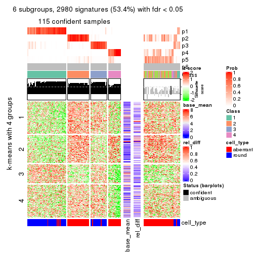</p>

</div>
</div>


Signature heatmaps where rows are not scaled:


<script>
$( function() {
	$( '#tabs-SD-skmeans-get-signatures-no-scale' ).tabs();
} );
</script>
<div id='tabs-SD-skmeans-get-signatures-no-scale'>
<ul>
<li><a href='#tab-SD-skmeans-get-signatures-no-scale-1'>k = 2</a></li>
<li><a href='#tab-SD-skmeans-get-signatures-no-scale-2'>k = 3</a></li>
<li><a href='#tab-SD-skmeans-get-signatures-no-scale-3'>k = 4</a></li>
<li><a href='#tab-SD-skmeans-get-signatures-no-scale-4'>k = 5</a></li>
<li><a href='#tab-SD-skmeans-get-signatures-no-scale-5'>k = 6</a></li>
</ul>
<div id='tab-SD-skmeans-get-signatures-no-scale-1'>
<pre><code class="r">get_signatures(res, k = 2, scale_rows = FALSE)
</code></pre>

<p></p>

</div>
<div id='tab-SD-skmeans-get-signatures-no-scale-2'>
<pre><code class="r">get_signatures(res, k = 3, scale_rows = FALSE)
</code></pre>

<p>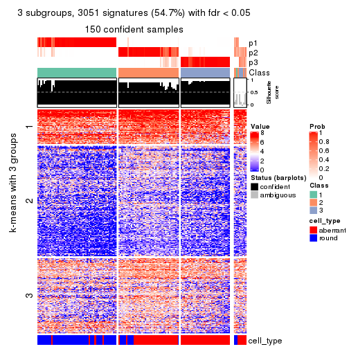</p>

</div>
<div id='tab-SD-skmeans-get-signatures-no-scale-3'>
<pre><code class="r">get_signatures(res, k = 4, scale_rows = FALSE)
</code></pre>

<p></p>

</div>
<div id='tab-SD-skmeans-get-signatures-no-scale-4'>
<pre><code class="r">get_signatures(res, k = 5, scale_rows = FALSE)
</code></pre>

<p></p>

</div>
<div id='tab-SD-skmeans-get-signatures-no-scale-5'>
<pre><code class="r">get_signatures(res, k = 6, scale_rows = FALSE)
</code></pre>

<p></p>

</div>
</div>


Compare the overlap of signatures from different k:

```r
compare_signatures(res)
```


`get_signature()` returns a data frame invisibly. TO get the list of signatures, the function
call should be assigned to a variable explicitly. In following code, if `plot` argument is set
to `FALSE`, no heatmap is plotted while only the differential analysis is performed.

```r
# code only for demonstration
tb = get_signature(res, k = ..., plot = FALSE)
```

An example of the output of `tb` is:

```
#>   which_row         fdr    mean_1    mean_2 scaled_mean_1 scaled_mean_2 km
#> 1        38 0.042760348  8.373488  9.131774    -0.5533452     0.5164555  1
#> 2        40 0.018707592  7.106213  8.469186    -0.6173731     0.5762149  1
#> 3        55 0.019134737 10.221463 11.207825    -0.6159697     0.5749050  1
#> 4        59 0.006059896  5.921854  7.869574    -0.6899429     0.6439467  1
#> 5        60 0.018055526  8.928898 10.211722    -0.6204761     0.5791110  1
#> 6        98 0.009384629 15.714769 14.887706     0.6635654    -0.6193277  2
...
```

The columns in `tb` are:

1. `which_row`: row indices corresponding to the input matrix.
2. `fdr`: FDR for the differential test. 
3. `mean_x`: The mean value in group x.
4. `scaled_mean_x`: The mean value in group x after rows are scaled.
5. `km`: Row groups if k-means clustering is applied to rows.


UMAP plot which shows how samples are separated.


<script>
$( function() {
	$( '#tabs-SD-skmeans-dimension-reduction' ).tabs();
} );
</script>
<div id='tabs-SD-skmeans-dimension-reduction'>
<ul>
<li><a href='#tab-SD-skmeans-dimension-reduction-1'>k = 2</a></li>
<li><a href='#tab-SD-skmeans-dimension-reduction-2'>k = 3</a></li>
<li><a href='#tab-SD-skmeans-dimension-reduction-3'>k = 4</a></li>
<li><a href='#tab-SD-skmeans-dimension-reduction-4'>k = 5</a></li>
<li><a href='#tab-SD-skmeans-dimension-reduction-5'>k = 6</a></li>
</ul>
<div id='tab-SD-skmeans-dimension-reduction-1'>
<pre><code class="r">dimension_reduction(res, k = 2, method = &quot;UMAP&quot;)
</code></pre>

<p></p>

</div>
<div id='tab-SD-skmeans-dimension-reduction-2'>
<pre><code class="r">dimension_reduction(res, k = 3, method = &quot;UMAP&quot;)
</code></pre>

<p></p>

</div>
<div id='tab-SD-skmeans-dimension-reduction-3'>
<pre><code class="r">dimension_reduction(res, k = 4, method = &quot;UMAP&quot;)
</code></pre>

<p></p>

</div>
<div id='tab-SD-skmeans-dimension-reduction-4'>
<pre><code class="r">dimension_reduction(res, k = 5, method = &quot;UMAP&quot;)
</code></pre>

<p></p>

</div>
<div id='tab-SD-skmeans-dimension-reduction-5'>
<pre><code class="r">dimension_reduction(res, k = 6, method = &quot;UMAP&quot;)
</code></pre>

<p></p>

</div>
</div>


Following heatmap shows how subgroups are split when increasing `k`:

```r
collect_classes(res)
```


Test correlation between subgroups and known annotations. If the known
annotation is numeric, one-way ANOVA test is applied, and if the known
annotation is discrete, chi-squared contingency table test is applied.

```r
test_to_known_factors(res)
```

```
#>              n cell_type(p) k
#> SD:skmeans 158     4.65e-19 2
#> SD:skmeans 150     7.32e-22 3
#> SD:skmeans 148     4.34e-27 4
#> SD:skmeans 130     1.99e-22 5
#> SD:skmeans 116     2.14e-19 6
```


If matrix rows can be associated to genes, consider to use `GO_Enrichment(res,
...)` to perform function enrichment for the signature genes.


 

---------------------------------------------------


### SD:pam


The object with results only for a single top-value method and a single partition method 
can be extracted as:

```r
res = res_list["SD", "pam"]
# you can also extract it by
# res = res_list["SD:pam"]
```

A summary of `res` and all the functions that can be applied to it:

```r
res
```

```
#> A 'ConsensusPartition' object with k = 2, 3, 4, 5, 6.
#>   On a matrix with 5576 rows and 160 columns.
#>   Top rows (558, 1116, 1673, 2230, 2788) are extracted by 'SD' method.
#>   Subgroups are detected by 'pam' method.
#>   Performed in total 1250 partitions by row resampling.
#>   Best k for subgroups seems to be 3.
#> 
#> Following methods can be applied to this 'ConsensusPartition' object:
#>  [1] "cola_report"             "collect_classes"         "collect_plots"          
#>  [4] "collect_stats"           "colnames"                "compare_signatures"     
#>  [7] "consensus_heatmap"       "dimension_reduction"     "functional_enrichment"  
#> [10] "get_anno_col"            "get_anno"                "get_classes"            
#> [13] "get_consensus"           "get_matrix"              "get_membership"         
#> [16] "get_param"               "get_signatures"          "get_stats"              
#> [19] "is_best_k"               "is_stable_k"             "membership_heatmap"     
#> [22] "ncol"                    "nrow"                    "plot_ecdf"              
#> [25] "rownames"                "select_partition_number" "show"                   
#> [28] "suggest_best_k"          "test_to_known_factors"
```

`collect_plots()` function collects all the plots made from `res` for all `k` (number of partitions)
into one single page to provide an easy and fast comparison between different `k`.

```r
collect_plots(res)
```


The plots are:

- The first row: a plot of the ECDF (Empirical cumulative distribution
  function) curves of the consensus matrix for each `k` and the heatmap of
  predicted classes for each `k`.
- The second row: heatmaps of the consensus matrix for each `k`.
- The third row: heatmaps of the membership matrix for each `k`.
- The fouth row: heatmaps of the signatures for each `k`.

All the plots in panels can be made by individual functions and they are
plotted later in this section.

`select_partition_number()` produces several plots showing different
statistics for choosing "optimized" `k`. There are following statistics:

- ECDF curves of the consensus matrix for each `k`;
- 1-PAC. [The PAC
  score](https://en.wikipedia.org/wiki/Consensus_clustering#Over-interpretation_potential_of_consensus_clustering)
  measures the proportion of the ambiguous subgrouping.
- Mean silhouette score.
- Concordance. The mean probability of fiting the consensus class ids in all
  partitions.
- Area increased. Denote $A_k$ as the area under the ECDF curve for current
  `k`, the area increased is defined as $A_k - A_{k-1}$.
- Rand index. The percent of pairs of samples that are both in a same cluster
  or both are not in a same cluster in the partition of k and k-1.
- Jaccard index. The ratio of pairs of samples are both in a same cluster in
  the partition of k and k-1 and the pairs of samples are both in a same
  cluster in the partition k or k-1.

The detailed explanations of these statistics can be found in [the cola
vignette](http://bioconductor.org/packages/devel/bioc/vignettes/cola/inst/doc/cola.html#toc_13).

Generally speaking, lower PAC score, higher mean silhouette score or higher
concordance corresponds to better partition. Rand index and Jaccard index
measure how similar the current partition is compared to partition with `k-1`.
If they are too similar, we won't accept `k` is better than `k-1`.

```r
select_partition_number(res)
```


The numeric values for all these statistics can be obtained by `get_stats()`.

```r
get_stats(res)
```

```
#>   k 1-PAC mean_silhouette concordance area_increased  Rand Jaccard
#> 2 2 0.401           0.798       0.863         0.2311 0.904   0.904
#> 3 3 0.324           0.781       0.845         1.1708 0.575   0.532
#> 4 4 0.306           0.687       0.805         0.0967 0.974   0.948
#> 5 5 0.330           0.361       0.777         0.0649 0.996   0.991
#> 6 6 0.513           0.524       0.807         0.0771 0.951   0.895
```

`suggest_best_k()` suggests the best $k$ based on these statistics. The rules are as follows:

- All $k$ with Jaccard index larger than 0.95 are removed because the increase of
  the partition number does not provides enough extra information. If all $k$ are removed,
  the best $k$ is assigned by `NA`.
- For $k$ with 1-PAC larger than 0.9, the maximal $k$ is taken as the "best k". Other $k$ is called "optional k".
- If it does not fit the second rule. The $k$ with the highest vote of highest
  1-PAC, mean silhouette and concordance is taken as the "best k".

```r
suggest_best_k(res)
```

```
#> [1] 3
```


Following shows the table of the partitions (You need to click the **show/hide
code output** link to see it). The membership matrix (columns with name `p*`)
is inferred by
[`clue::cl_consensus()`](https://www.rdocumentation.org/link/cl_consensus?package=clue)
function with the `SE` method. Basically the value in the membership matrix
represents the probability to belong to a certain group. The finall class
label for an item is determined with the group with highest probability it
belongs to.

In `get_classes()` function, the entropy is calculated from the membership
matrix and the silhouette score is calculated from the consensus matrix.


<script>
$( function() {
	$( '#tabs-SD-pam-get-classes' ).tabs();
} );
</script>
<div id='tabs-SD-pam-get-classes'>
<ul>
<li><a href='#tab-SD-pam-get-classes-1'>k = 2</a></li>
<li><a href='#tab-SD-pam-get-classes-2'>k = 3</a></li>
<li><a href='#tab-SD-pam-get-classes-3'>k = 4</a></li>
<li><a href='#tab-SD-pam-get-classes-4'>k = 5</a></li>
<li><a href='#tab-SD-pam-get-classes-5'>k = 6</a></li>
</ul>

<div id='tab-SD-pam-get-classes-1'>
<p><a id='tab-SD-pam-get-classes-1-a' style='color:#0366d6' href='#'>show/hide code output</a></p>
<pre><code class="r">cbind(get_classes(res, k = 2), get_membership(res, k = 2))
</code></pre>

<pre><code>#&gt;                     class entropy silhouette    p1    p2
#&gt; aberrant_ERR2585320     1  0.8955      0.726 0.688 0.312
#&gt; aberrant_ERR2585338     1  0.5408      0.827 0.876 0.124
#&gt; aberrant_ERR2585325     1  0.8555      0.752 0.720 0.280
#&gt; aberrant_ERR2585283     2  0.1184      0.906 0.016 0.984
#&gt; aberrant_ERR2585343     1  0.9323      0.690 0.652 0.348
#&gt; aberrant_ERR2585329     1  0.7745      0.785 0.772 0.228
#&gt; aberrant_ERR2585317     1  0.7883      0.780 0.764 0.236
#&gt; aberrant_ERR2585339     1  0.7299      0.799 0.796 0.204
#&gt; aberrant_ERR2585335     1  0.8661      0.746 0.712 0.288
#&gt; aberrant_ERR2585287     2  0.3584      0.882 0.068 0.932
#&gt; aberrant_ERR2585321     1  0.9358      0.690 0.648 0.352
#&gt; aberrant_ERR2585297     1  0.1184      0.839 0.984 0.016
#&gt; aberrant_ERR2585337     1  0.7602      0.789 0.780 0.220
#&gt; aberrant_ERR2585319     1  0.9286      0.694 0.656 0.344
#&gt; aberrant_ERR2585315     1  0.9286      0.694 0.656 0.344
#&gt; aberrant_ERR2585336     1  0.8016      0.776 0.756 0.244
#&gt; aberrant_ERR2585307     1  0.5629      0.825 0.868 0.132
#&gt; aberrant_ERR2585301     1  0.7219      0.799 0.800 0.200
#&gt; aberrant_ERR2585326     1  0.8016      0.777 0.756 0.244
#&gt; aberrant_ERR2585331     1  0.4298      0.833 0.912 0.088
#&gt; aberrant_ERR2585346     2  0.5737      0.839 0.136 0.864
#&gt; aberrant_ERR2585314     1  0.7815      0.782 0.768 0.232
#&gt; aberrant_ERR2585298     1  0.0000      0.842 1.000 0.000
#&gt; aberrant_ERR2585345     1  0.7815      0.782 0.768 0.232
#&gt; aberrant_ERR2585299     1  0.1184      0.839 0.984 0.016
#&gt; aberrant_ERR2585309     1  0.0938      0.839 0.988 0.012
#&gt; aberrant_ERR2585303     1  0.8267      0.768 0.740 0.260
#&gt; aberrant_ERR2585313     1  0.9209      0.703 0.664 0.336
#&gt; aberrant_ERR2585318     1  0.9323      0.690 0.652 0.348
#&gt; aberrant_ERR2585328     1  0.9286      0.694 0.656 0.344
#&gt; aberrant_ERR2585330     1  0.9323      0.690 0.652 0.348
#&gt; aberrant_ERR2585293     2  0.4298      0.889 0.088 0.912
#&gt; aberrant_ERR2585342     1  0.9323      0.690 0.652 0.348
#&gt; aberrant_ERR2585348     1  0.9323      0.690 0.652 0.348
#&gt; aberrant_ERR2585352     1  0.9286      0.694 0.656 0.344
#&gt; aberrant_ERR2585308     1  0.0938      0.839 0.988 0.012
#&gt; aberrant_ERR2585349     1  0.5946      0.820 0.856 0.144
#&gt; aberrant_ERR2585316     1  0.9323      0.690 0.652 0.348
#&gt; aberrant_ERR2585306     1  0.8763      0.739 0.704 0.296
#&gt; aberrant_ERR2585324     1  0.9286      0.694 0.656 0.344
#&gt; aberrant_ERR2585310     1  0.0376      0.843 0.996 0.004
#&gt; aberrant_ERR2585296     1  0.0000      0.842 1.000 0.000
#&gt; aberrant_ERR2585275     2  0.0000      0.903 0.000 1.000
#&gt; aberrant_ERR2585311     1  0.9323      0.690 0.652 0.348
#&gt; aberrant_ERR2585292     2  0.4298      0.889 0.088 0.912
#&gt; aberrant_ERR2585282     1  0.8555      0.744 0.720 0.280
#&gt; aberrant_ERR2585305     1  0.8661      0.747 0.712 0.288
#&gt; aberrant_ERR2585278     1  0.7528      0.795 0.784 0.216
#&gt; aberrant_ERR2585347     1  0.9323      0.690 0.652 0.348
#&gt; aberrant_ERR2585332     1  0.9323      0.690 0.652 0.348
#&gt; aberrant_ERR2585280     1  0.9248      0.699 0.660 0.340
#&gt; aberrant_ERR2585304     1  0.3274      0.838 0.940 0.060
#&gt; aberrant_ERR2585322     1  0.7883      0.781 0.764 0.236
#&gt; aberrant_ERR2585279     1  0.4298      0.833 0.912 0.088
#&gt; aberrant_ERR2585277     1  0.5737      0.823 0.864 0.136
#&gt; aberrant_ERR2585295     1  0.6343      0.817 0.840 0.160
#&gt; aberrant_ERR2585333     1  0.9323      0.690 0.652 0.348
#&gt; aberrant_ERR2585285     1  0.8327      0.763 0.736 0.264
#&gt; aberrant_ERR2585286     1  0.5178      0.828 0.884 0.116
#&gt; aberrant_ERR2585294     1  0.8608      0.750 0.716 0.284
#&gt; aberrant_ERR2585300     1  0.9209      0.706 0.664 0.336
#&gt; aberrant_ERR2585334     1  0.4298      0.833 0.912 0.088
#&gt; aberrant_ERR2585361     1  0.9323      0.690 0.652 0.348
#&gt; aberrant_ERR2585372     1  0.9323      0.690 0.652 0.348
#&gt; round_ERR2585217        1  0.0672      0.843 0.992 0.008
#&gt; round_ERR2585205        1  0.0938      0.839 0.988 0.012
#&gt; round_ERR2585214        1  0.1414      0.843 0.980 0.020
#&gt; round_ERR2585202        1  0.1414      0.843 0.980 0.020
#&gt; aberrant_ERR2585367     1  0.8327      0.760 0.736 0.264
#&gt; round_ERR2585220        1  0.0938      0.839 0.988 0.012
#&gt; round_ERR2585238        1  0.0938      0.839 0.988 0.012
#&gt; aberrant_ERR2585276     1  0.8909      0.732 0.692 0.308
#&gt; round_ERR2585218        1  0.0938      0.839 0.988 0.012
#&gt; aberrant_ERR2585363     1  0.8608      0.749 0.716 0.284
#&gt; round_ERR2585201        1  0.0938      0.843 0.988 0.012
#&gt; round_ERR2585210        1  0.0938      0.839 0.988 0.012
#&gt; aberrant_ERR2585362     1  0.9044      0.720 0.680 0.320
#&gt; aberrant_ERR2585360     1  0.9129      0.711 0.672 0.328
#&gt; round_ERR2585209        1  0.0376      0.843 0.996 0.004
#&gt; round_ERR2585242        1  0.0000      0.842 1.000 0.000
#&gt; round_ERR2585216        1  0.0000      0.842 1.000 0.000
#&gt; round_ERR2585219        1  0.0376      0.841 0.996 0.004
#&gt; round_ERR2585237        1  0.1414      0.843 0.980 0.020
#&gt; round_ERR2585198        1  0.1414      0.843 0.980 0.020
#&gt; round_ERR2585211        1  0.0938      0.839 0.988 0.012
#&gt; round_ERR2585206        1  0.0938      0.839 0.988 0.012
#&gt; aberrant_ERR2585281     1  0.5629      0.825 0.868 0.132
#&gt; round_ERR2585212        1  0.0376      0.841 0.996 0.004
#&gt; round_ERR2585221        1  0.1184      0.839 0.984 0.016
#&gt; round_ERR2585243        1  0.0672      0.840 0.992 0.008
#&gt; round_ERR2585204        1  0.1414      0.843 0.980 0.020
#&gt; round_ERR2585213        1  0.4022      0.835 0.920 0.080
#&gt; aberrant_ERR2585373     1  0.9323      0.690 0.652 0.348
#&gt; aberrant_ERR2585358     1  0.9323      0.690 0.652 0.348
#&gt; aberrant_ERR2585365     1  0.8267      0.766 0.740 0.260
#&gt; aberrant_ERR2585359     1  0.9358      0.686 0.648 0.352
#&gt; aberrant_ERR2585370     1  0.7883      0.780 0.764 0.236
#&gt; round_ERR2585215        1  0.0938      0.839 0.988 0.012
#&gt; round_ERR2585262        1  0.1633      0.843 0.976 0.024
#&gt; round_ERR2585199        1  0.1414      0.843 0.980 0.020
#&gt; aberrant_ERR2585369     1  0.9323      0.690 0.652 0.348
#&gt; round_ERR2585208        1  0.0938      0.839 0.988 0.012
#&gt; round_ERR2585252        1  0.0938      0.839 0.988 0.012
#&gt; round_ERR2585236        1  0.2423      0.837 0.960 0.040
#&gt; aberrant_ERR2585284     2  0.0376      0.902 0.004 0.996
#&gt; round_ERR2585224        1  0.1633      0.838 0.976 0.024
#&gt; round_ERR2585260        1  0.0938      0.839 0.988 0.012
#&gt; round_ERR2585229        1  0.0938      0.839 0.988 0.012
#&gt; aberrant_ERR2585364     2  0.5629      0.779 0.132 0.868
#&gt; round_ERR2585253        1  0.1184      0.839 0.984 0.016
#&gt; aberrant_ERR2585368     1  0.4690      0.831 0.900 0.100
#&gt; aberrant_ERR2585371     1  0.4431      0.832 0.908 0.092
#&gt; round_ERR2585239        1  0.0938      0.839 0.988 0.012
#&gt; round_ERR2585273        1  0.0938      0.839 0.988 0.012
#&gt; round_ERR2585256        1  0.1184      0.843 0.984 0.016
#&gt; round_ERR2585272        1  0.0376      0.841 0.996 0.004
#&gt; round_ERR2585246        1  0.1184      0.839 0.984 0.016
#&gt; round_ERR2585261        1  0.0000      0.842 1.000 0.000
#&gt; round_ERR2585254        1  0.1184      0.843 0.984 0.016
#&gt; round_ERR2585225        1  0.0000      0.842 1.000 0.000
#&gt; round_ERR2585235        1  0.0000      0.842 1.000 0.000
#&gt; round_ERR2585271        1  0.0938      0.839 0.988 0.012
#&gt; round_ERR2585251        1  0.0938      0.839 0.988 0.012
#&gt; round_ERR2585255        1  0.0938      0.843 0.988 0.012
#&gt; round_ERR2585257        1  0.1414      0.843 0.980 0.020
#&gt; round_ERR2585226        1  0.0000      0.842 1.000 0.000
#&gt; round_ERR2585265        1  0.0938      0.839 0.988 0.012
#&gt; round_ERR2585259        1  0.0672      0.840 0.992 0.008
#&gt; round_ERR2585247        1  0.0938      0.839 0.988 0.012
#&gt; round_ERR2585241        1  0.0938      0.839 0.988 0.012
#&gt; round_ERR2585263        1  0.0000      0.842 1.000 0.000
#&gt; round_ERR2585264        1  0.8081      0.506 0.752 0.248
#&gt; round_ERR2585233        1  0.0000      0.842 1.000 0.000
#&gt; round_ERR2585223        1  0.0938      0.839 0.988 0.012
#&gt; round_ERR2585234        1  0.1184      0.843 0.984 0.016
#&gt; round_ERR2585222        1  0.0672      0.840 0.992 0.008
#&gt; round_ERR2585228        1  0.0938      0.839 0.988 0.012
#&gt; round_ERR2585248        1  0.2603      0.822 0.956 0.044
#&gt; round_ERR2585240        1  0.0376      0.842 0.996 0.004
#&gt; round_ERR2585270        1  0.0938      0.839 0.988 0.012
#&gt; round_ERR2585232        1  0.0000      0.842 1.000 0.000
#&gt; aberrant_ERR2585341     1  0.6531      0.814 0.832 0.168
#&gt; aberrant_ERR2585355     1  0.8144      0.773 0.748 0.252
#&gt; round_ERR2585227        1  0.0672      0.840 0.992 0.008
#&gt; aberrant_ERR2585351     1  0.8555      0.752 0.720 0.280
#&gt; round_ERR2585269        1  0.0938      0.839 0.988 0.012
#&gt; aberrant_ERR2585357     1  0.7815      0.782 0.768 0.232
#&gt; aberrant_ERR2585350     1  0.7815      0.782 0.768 0.232
#&gt; round_ERR2585250        1  0.0672      0.840 0.992 0.008
#&gt; round_ERR2585245        1  0.2603      0.835 0.956 0.044
#&gt; aberrant_ERR2585353     1  0.9323      0.690 0.652 0.348
#&gt; round_ERR2585258        1  0.0938      0.839 0.988 0.012
#&gt; aberrant_ERR2585354     1  0.8955      0.731 0.688 0.312
#&gt; round_ERR2585249        1  0.1184      0.839 0.984 0.016
#&gt; round_ERR2585268        1  0.0376      0.841 0.996 0.004
#&gt; aberrant_ERR2585356     1  0.9427      0.689 0.640 0.360
#&gt; round_ERR2585266        1  0.0672      0.843 0.992 0.008
#&gt; round_ERR2585231        1  0.0938      0.839 0.988 0.012
#&gt; round_ERR2585230        1  0.0938      0.839 0.988 0.012
#&gt; round_ERR2585267        1  0.1414      0.840 0.980 0.020
</code></pre>

<script>
$('#tab-SD-pam-get-classes-1-a').parent().next().next().hide();
$('#tab-SD-pam-get-classes-1-a').click(function(){
  $('#tab-SD-pam-get-classes-1-a').parent().next().next().toggle();
  return(false);
});
</script>
</div>

<div id='tab-SD-pam-get-classes-2'>
<p><a id='tab-SD-pam-get-classes-2-a' style='color:#0366d6' href='#'>show/hide code output</a></p>
<pre><code class="r">cbind(get_classes(res, k = 3), get_membership(res, k = 3))
</code></pre>

<pre><code>#&gt;                     class entropy silhouette    p1    p2    p3
#&gt; aberrant_ERR2585320     2  0.2261      0.770 0.068 0.932 0.000
#&gt; aberrant_ERR2585338     1  0.3192      0.807 0.888 0.112 0.000
#&gt; aberrant_ERR2585325     2  0.3551      0.802 0.132 0.868 0.000
#&gt; aberrant_ERR2585283     3  0.3619      0.809 0.000 0.136 0.864
#&gt; aberrant_ERR2585343     2  0.1163      0.739 0.028 0.972 0.000
#&gt; aberrant_ERR2585329     2  0.4931      0.821 0.232 0.768 0.000
#&gt; aberrant_ERR2585317     2  0.4842      0.823 0.224 0.776 0.000
#&gt; aberrant_ERR2585339     1  0.3879      0.767 0.848 0.152 0.000
#&gt; aberrant_ERR2585335     2  0.4346      0.841 0.184 0.816 0.000
#&gt; aberrant_ERR2585287     3  0.7061      0.656 0.036 0.332 0.632
#&gt; aberrant_ERR2585321     2  0.2796      0.822 0.092 0.908 0.000
#&gt; aberrant_ERR2585297     1  0.4452      0.846 0.808 0.000 0.192
#&gt; aberrant_ERR2585337     2  0.6095      0.629 0.392 0.608 0.000
#&gt; aberrant_ERR2585319     2  0.2165      0.794 0.064 0.936 0.000
#&gt; aberrant_ERR2585315     2  0.4178      0.830 0.172 0.828 0.000
#&gt; aberrant_ERR2585336     2  0.4887      0.823 0.228 0.772 0.000
#&gt; aberrant_ERR2585307     1  0.4605      0.662 0.796 0.204 0.000
#&gt; aberrant_ERR2585301     1  0.5465      0.601 0.712 0.288 0.000
#&gt; aberrant_ERR2585326     2  0.4842      0.826 0.224 0.776 0.000
#&gt; aberrant_ERR2585331     1  0.0237      0.852 0.996 0.004 0.000
#&gt; aberrant_ERR2585346     3  0.3879      0.807 0.000 0.152 0.848
#&gt; aberrant_ERR2585314     2  0.4974      0.817 0.236 0.764 0.000
#&gt; aberrant_ERR2585298     1  0.0237      0.852 0.996 0.004 0.000
#&gt; aberrant_ERR2585345     2  0.4887      0.821 0.228 0.772 0.000
#&gt; aberrant_ERR2585299     1  0.5792      0.833 0.772 0.036 0.192
#&gt; aberrant_ERR2585309     1  0.4682      0.846 0.804 0.004 0.192
#&gt; aberrant_ERR2585303     2  0.6192      0.536 0.420 0.580 0.000
#&gt; aberrant_ERR2585313     2  0.3482      0.838 0.128 0.872 0.000
#&gt; aberrant_ERR2585318     2  0.2959      0.827 0.100 0.900 0.000
#&gt; aberrant_ERR2585328     2  0.4842      0.783 0.224 0.776 0.000
#&gt; aberrant_ERR2585330     2  0.3412      0.837 0.124 0.876 0.000
#&gt; aberrant_ERR2585293     3  0.3038      0.797 0.000 0.104 0.896
#&gt; aberrant_ERR2585342     2  0.2165      0.794 0.064 0.936 0.000
#&gt; aberrant_ERR2585348     2  0.1964      0.767 0.056 0.944 0.000
#&gt; aberrant_ERR2585352     2  0.3340      0.835 0.120 0.880 0.000
#&gt; aberrant_ERR2585308     1  0.6662      0.807 0.736 0.072 0.192
#&gt; aberrant_ERR2585349     1  0.5650      0.391 0.688 0.312 0.000
#&gt; aberrant_ERR2585316     2  0.3941      0.829 0.156 0.844 0.000
#&gt; aberrant_ERR2585306     1  0.6235      0.188 0.564 0.436 0.000
#&gt; aberrant_ERR2585324     2  0.3116      0.813 0.108 0.892 0.000
#&gt; aberrant_ERR2585310     1  0.2056      0.855 0.952 0.024 0.024
#&gt; aberrant_ERR2585296     1  0.1315      0.851 0.972 0.020 0.008
#&gt; aberrant_ERR2585275     3  0.4452      0.780 0.000 0.192 0.808
#&gt; aberrant_ERR2585311     2  0.3116      0.832 0.108 0.892 0.000
#&gt; aberrant_ERR2585292     3  0.3038      0.797 0.000 0.104 0.896
#&gt; aberrant_ERR2585282     2  0.5431      0.643 0.284 0.716 0.000
#&gt; aberrant_ERR2585305     2  0.4452      0.840 0.192 0.808 0.000
#&gt; aberrant_ERR2585278     2  0.5926      0.654 0.356 0.644 0.000
#&gt; aberrant_ERR2585347     2  0.3030      0.821 0.092 0.904 0.004
#&gt; aberrant_ERR2585332     2  0.2066      0.789 0.060 0.940 0.000
#&gt; aberrant_ERR2585280     2  0.6204      0.393 0.424 0.576 0.000
#&gt; aberrant_ERR2585304     1  0.2625      0.801 0.916 0.084 0.000
#&gt; aberrant_ERR2585322     1  0.6291     -0.233 0.532 0.468 0.000
#&gt; aberrant_ERR2585279     1  0.0237      0.852 0.996 0.004 0.000
#&gt; aberrant_ERR2585277     1  0.4605      0.679 0.796 0.204 0.000
#&gt; aberrant_ERR2585295     1  0.4842      0.673 0.776 0.224 0.000
#&gt; aberrant_ERR2585333     2  0.2625      0.816 0.084 0.916 0.000
#&gt; aberrant_ERR2585285     2  0.4399      0.832 0.188 0.812 0.000
#&gt; aberrant_ERR2585286     1  0.4452      0.700 0.808 0.192 0.000
#&gt; aberrant_ERR2585294     1  0.6045      0.312 0.620 0.380 0.000
#&gt; aberrant_ERR2585300     2  0.6108      0.740 0.240 0.732 0.028
#&gt; aberrant_ERR2585334     1  0.0592      0.852 0.988 0.012 0.000
#&gt; aberrant_ERR2585361     2  0.3482      0.837 0.128 0.872 0.000
#&gt; aberrant_ERR2585372     2  0.2356      0.803 0.072 0.928 0.000
#&gt; round_ERR2585217        1  0.0237      0.852 0.996 0.004 0.000
#&gt; round_ERR2585205        1  0.4452      0.846 0.808 0.000 0.192
#&gt; round_ERR2585214        1  0.0237      0.852 0.996 0.004 0.000
#&gt; round_ERR2585202        1  0.0237      0.852 0.996 0.004 0.000
#&gt; aberrant_ERR2585367     1  0.5431      0.628 0.716 0.284 0.000
#&gt; round_ERR2585220        1  0.3816      0.858 0.852 0.000 0.148
#&gt; round_ERR2585238        1  0.4452      0.846 0.808 0.000 0.192
#&gt; aberrant_ERR2585276     2  0.5578      0.784 0.240 0.748 0.012
#&gt; round_ERR2585218        1  0.4452      0.846 0.808 0.000 0.192
#&gt; aberrant_ERR2585363     2  0.4291      0.839 0.180 0.820 0.000
#&gt; round_ERR2585201        1  0.0237      0.852 0.996 0.004 0.000
#&gt; round_ERR2585210        1  0.4399      0.848 0.812 0.000 0.188
#&gt; aberrant_ERR2585362     2  0.4346      0.838 0.184 0.816 0.000
#&gt; aberrant_ERR2585360     2  0.4399      0.835 0.188 0.812 0.000
#&gt; round_ERR2585209        1  0.0237      0.852 0.996 0.004 0.000
#&gt; round_ERR2585242        1  0.0237      0.852 0.996 0.004 0.000
#&gt; round_ERR2585216        1  0.0983      0.856 0.980 0.004 0.016
#&gt; round_ERR2585219        1  0.3619      0.859 0.864 0.000 0.136
#&gt; round_ERR2585237        1  0.0237      0.852 0.996 0.004 0.000
#&gt; round_ERR2585198        1  0.0237      0.852 0.996 0.004 0.000
#&gt; round_ERR2585211        1  0.4452      0.846 0.808 0.000 0.192
#&gt; round_ERR2585206        1  0.4452      0.846 0.808 0.000 0.192
#&gt; aberrant_ERR2585281     1  0.3340      0.808 0.880 0.120 0.000
#&gt; round_ERR2585212        1  0.1860      0.860 0.948 0.000 0.052
#&gt; round_ERR2585221        1  0.4682      0.846 0.804 0.004 0.192
#&gt; round_ERR2585243        1  0.4110      0.858 0.844 0.004 0.152
#&gt; round_ERR2585204        1  0.0237      0.852 0.996 0.004 0.000
#&gt; round_ERR2585213        1  0.0237      0.852 0.996 0.004 0.000
#&gt; aberrant_ERR2585373     2  0.2356      0.804 0.072 0.928 0.000
#&gt; aberrant_ERR2585358     2  0.0237      0.693 0.004 0.996 0.000
#&gt; aberrant_ERR2585365     2  0.4931      0.821 0.232 0.768 0.000
#&gt; aberrant_ERR2585359     2  0.2590      0.799 0.072 0.924 0.004
#&gt; aberrant_ERR2585370     2  0.6062      0.637 0.384 0.616 0.000
#&gt; round_ERR2585215        1  0.4452      0.846 0.808 0.000 0.192
#&gt; round_ERR2585262        1  0.0237      0.852 0.996 0.004 0.000
#&gt; round_ERR2585199        1  0.0237      0.852 0.996 0.004 0.000
#&gt; aberrant_ERR2585369     2  0.3412      0.837 0.124 0.876 0.000
#&gt; round_ERR2585208        1  0.4452      0.846 0.808 0.000 0.192
#&gt; round_ERR2585252        1  0.4452      0.846 0.808 0.000 0.192
#&gt; round_ERR2585236        1  0.4663      0.854 0.828 0.016 0.156
#&gt; aberrant_ERR2585284     3  0.4452      0.780 0.000 0.192 0.808
#&gt; round_ERR2585224        1  0.6632      0.805 0.732 0.064 0.204
#&gt; round_ERR2585260        1  0.4682      0.846 0.804 0.004 0.192
#&gt; round_ERR2585229        1  0.4682      0.846 0.804 0.004 0.192
#&gt; aberrant_ERR2585364     2  0.7184     -0.346 0.024 0.504 0.472
#&gt; round_ERR2585253        1  0.4504      0.844 0.804 0.000 0.196
#&gt; aberrant_ERR2585368     1  0.4062      0.680 0.836 0.164 0.000
#&gt; aberrant_ERR2585371     1  0.2261      0.811 0.932 0.068 0.000
#&gt; round_ERR2585239        1  0.4452      0.846 0.808 0.000 0.192
#&gt; round_ERR2585273        1  0.4682      0.846 0.804 0.004 0.192
#&gt; round_ERR2585256        1  0.0237      0.852 0.996 0.004 0.000
#&gt; round_ERR2585272        1  0.2301      0.859 0.936 0.004 0.060
#&gt; round_ERR2585246        1  0.6304      0.819 0.752 0.056 0.192
#&gt; round_ERR2585261        1  0.0475      0.853 0.992 0.004 0.004
#&gt; round_ERR2585254        1  0.0237      0.852 0.996 0.004 0.000
#&gt; round_ERR2585225        1  0.0237      0.852 0.996 0.004 0.000
#&gt; round_ERR2585235        1  0.1015      0.853 0.980 0.012 0.008
#&gt; round_ERR2585271        1  0.4452      0.846 0.808 0.000 0.192
#&gt; round_ERR2585251        1  0.4235      0.851 0.824 0.000 0.176
#&gt; round_ERR2585255        1  0.0237      0.852 0.996 0.004 0.000
#&gt; round_ERR2585257        1  0.0237      0.852 0.996 0.004 0.000
#&gt; round_ERR2585226        1  0.0424      0.851 0.992 0.008 0.000
#&gt; round_ERR2585265        1  0.4452      0.846 0.808 0.000 0.192
#&gt; round_ERR2585259        1  0.3715      0.860 0.868 0.004 0.128
#&gt; round_ERR2585247        1  0.4452      0.846 0.808 0.000 0.192
#&gt; round_ERR2585241        1  0.4178      0.853 0.828 0.000 0.172
#&gt; round_ERR2585263        1  0.1765      0.859 0.956 0.004 0.040
#&gt; round_ERR2585264        3  0.6215     -0.219 0.428 0.000 0.572
#&gt; round_ERR2585233        1  0.0237      0.852 0.996 0.004 0.000
#&gt; round_ERR2585223        1  0.4452      0.846 0.808 0.000 0.192
#&gt; round_ERR2585234        1  0.0237      0.852 0.996 0.004 0.000
#&gt; round_ERR2585222        1  0.3771      0.861 0.876 0.012 0.112
#&gt; round_ERR2585228        1  0.4452      0.846 0.808 0.000 0.192
#&gt; round_ERR2585248        1  0.5529      0.761 0.704 0.000 0.296
#&gt; round_ERR2585240        1  0.0237      0.852 0.996 0.004 0.000
#&gt; round_ERR2585270        1  0.5167      0.842 0.792 0.016 0.192
#&gt; round_ERR2585232        1  0.0237      0.852 0.996 0.004 0.000
#&gt; aberrant_ERR2585341     1  0.4887      0.658 0.772 0.228 0.000
#&gt; aberrant_ERR2585355     2  0.5216      0.795 0.260 0.740 0.000
#&gt; round_ERR2585227        1  0.2878      0.860 0.904 0.000 0.096
#&gt; aberrant_ERR2585351     2  0.4399      0.838 0.188 0.812 0.000
#&gt; round_ERR2585269        1  0.4452      0.846 0.808 0.000 0.192
#&gt; aberrant_ERR2585357     2  0.5058      0.812 0.244 0.756 0.000
#&gt; aberrant_ERR2585350     2  0.5216      0.799 0.260 0.740 0.000
#&gt; round_ERR2585250        1  0.5147      0.850 0.800 0.020 0.180
#&gt; round_ERR2585245        1  0.4504      0.845 0.804 0.000 0.196
#&gt; aberrant_ERR2585353     2  0.3038      0.830 0.104 0.896 0.000
#&gt; round_ERR2585258        1  0.4346      0.849 0.816 0.000 0.184
#&gt; aberrant_ERR2585354     2  0.5024      0.816 0.220 0.776 0.004
#&gt; round_ERR2585249        1  0.4452      0.846 0.808 0.000 0.192
#&gt; round_ERR2585268        1  0.4458      0.823 0.864 0.080 0.056
#&gt; aberrant_ERR2585356     2  0.4842      0.717 0.224 0.776 0.000
#&gt; round_ERR2585266        1  0.0237      0.852 0.996 0.004 0.000
#&gt; round_ERR2585231        1  0.4399      0.848 0.812 0.000 0.188
#&gt; round_ERR2585230        1  0.3941      0.856 0.844 0.000 0.156
#&gt; round_ERR2585267        1  0.4861      0.845 0.800 0.008 0.192
</code></pre>

<script>
$('#tab-SD-pam-get-classes-2-a').parent().next().next().hide();
$('#tab-SD-pam-get-classes-2-a').click(function(){
  $('#tab-SD-pam-get-classes-2-a').parent().next().next().toggle();
  return(false);
});
</script>
</div>

<div id='tab-SD-pam-get-classes-3'>
<p><a id='tab-SD-pam-get-classes-3-a' style='color:#0366d6' href='#'>show/hide code output</a></p>
<pre><code class="r">cbind(get_classes(res, k = 4), get_membership(res, k = 4))
</code></pre>

<pre><code>#&gt;                     class entropy silhouette    p1    p2    p3    p4
#&gt; aberrant_ERR2585320     3  0.5498      0.226 0.020 0.404 0.576 0.000
#&gt; aberrant_ERR2585338     1  0.2589      0.719 0.884 0.116 0.000 0.000
#&gt; aberrant_ERR2585325     3  0.5805      0.231 0.036 0.388 0.576 0.000
#&gt; aberrant_ERR2585283     4  0.0000      0.897 0.000 0.000 0.000 1.000
#&gt; aberrant_ERR2585343     2  0.0817      0.631 0.000 0.976 0.024 0.000
#&gt; aberrant_ERR2585329     2  0.3649      0.808 0.204 0.796 0.000 0.000
#&gt; aberrant_ERR2585317     2  0.3610      0.808 0.200 0.800 0.000 0.000
#&gt; aberrant_ERR2585339     1  0.2469      0.720 0.892 0.108 0.000 0.000
#&gt; aberrant_ERR2585335     2  0.3266      0.816 0.168 0.832 0.000 0.000
#&gt; aberrant_ERR2585287     3  0.6497     -0.434 0.004 0.076 0.580 0.340
#&gt; aberrant_ERR2585321     2  0.1716      0.753 0.064 0.936 0.000 0.000
#&gt; aberrant_ERR2585297     1  0.4855      0.660 0.600 0.000 0.400 0.000
#&gt; aberrant_ERR2585337     2  0.4697      0.618 0.356 0.644 0.000 0.000
#&gt; aberrant_ERR2585319     2  0.0469      0.641 0.000 0.988 0.012 0.000
#&gt; aberrant_ERR2585315     2  0.3528      0.801 0.192 0.808 0.000 0.000
#&gt; aberrant_ERR2585336     2  0.3649      0.808 0.204 0.796 0.000 0.000
#&gt; aberrant_ERR2585307     1  0.4018      0.594 0.772 0.224 0.004 0.000
#&gt; aberrant_ERR2585301     1  0.4584      0.498 0.696 0.300 0.004 0.000
#&gt; aberrant_ERR2585326     2  0.3649      0.808 0.204 0.796 0.000 0.000
#&gt; aberrant_ERR2585331     1  0.0000      0.758 1.000 0.000 0.000 0.000
#&gt; aberrant_ERR2585346     4  0.0188      0.893 0.000 0.004 0.000 0.996
#&gt; aberrant_ERR2585314     2  0.3688      0.805 0.208 0.792 0.000 0.000
#&gt; aberrant_ERR2585298     1  0.0000      0.758 1.000 0.000 0.000 0.000
#&gt; aberrant_ERR2585345     2  0.3610      0.808 0.200 0.800 0.000 0.000
#&gt; aberrant_ERR2585299     1  0.6052      0.624 0.556 0.048 0.396 0.000
#&gt; aberrant_ERR2585309     1  0.5060      0.648 0.584 0.004 0.412 0.000
#&gt; aberrant_ERR2585303     2  0.4830      0.531 0.392 0.608 0.000 0.000
#&gt; aberrant_ERR2585313     2  0.2921      0.811 0.140 0.860 0.000 0.000
#&gt; aberrant_ERR2585318     2  0.2149      0.781 0.088 0.912 0.000 0.000
#&gt; aberrant_ERR2585328     2  0.3837      0.758 0.224 0.776 0.000 0.000
#&gt; aberrant_ERR2585330     2  0.3300      0.813 0.144 0.848 0.008 0.000
#&gt; aberrant_ERR2585293     4  0.0000      0.897 0.000 0.000 0.000 1.000
#&gt; aberrant_ERR2585342     2  0.0336      0.664 0.008 0.992 0.000 0.000
#&gt; aberrant_ERR2585348     2  0.4197      0.621 0.036 0.808 0.156 0.000
#&gt; aberrant_ERR2585352     2  0.2921      0.811 0.140 0.860 0.000 0.000
#&gt; aberrant_ERR2585308     1  0.6521      0.570 0.512 0.076 0.412 0.000
#&gt; aberrant_ERR2585349     1  0.4679      0.266 0.648 0.352 0.000 0.000
#&gt; aberrant_ERR2585316     2  0.3172      0.797 0.160 0.840 0.000 0.000
#&gt; aberrant_ERR2585306     1  0.5472      0.111 0.544 0.440 0.016 0.000
#&gt; aberrant_ERR2585324     2  0.1584      0.666 0.036 0.952 0.012 0.000
#&gt; aberrant_ERR2585310     1  0.1929      0.762 0.940 0.024 0.036 0.000
#&gt; aberrant_ERR2585296     1  0.1042      0.754 0.972 0.020 0.008 0.000
#&gt; aberrant_ERR2585275     4  0.0000      0.897 0.000 0.000 0.000 1.000
#&gt; aberrant_ERR2585311     2  0.2408      0.793 0.104 0.896 0.000 0.000
#&gt; aberrant_ERR2585292     4  0.0000      0.897 0.000 0.000 0.000 1.000
#&gt; aberrant_ERR2585282     2  0.4606      0.602 0.264 0.724 0.012 0.000
#&gt; aberrant_ERR2585305     2  0.3444      0.815 0.184 0.816 0.000 0.000
#&gt; aberrant_ERR2585278     2  0.4643      0.628 0.344 0.656 0.000 0.000
#&gt; aberrant_ERR2585347     2  0.2345      0.791 0.100 0.900 0.000 0.000
#&gt; aberrant_ERR2585332     2  0.1388      0.695 0.028 0.960 0.012 0.000
#&gt; aberrant_ERR2585280     2  0.6296      0.403 0.388 0.548 0.064 0.000
#&gt; aberrant_ERR2585304     1  0.2149      0.696 0.912 0.088 0.000 0.000
#&gt; aberrant_ERR2585322     2  0.4998      0.292 0.488 0.512 0.000 0.000
#&gt; aberrant_ERR2585279     1  0.0000      0.758 1.000 0.000 0.000 0.000
#&gt; aberrant_ERR2585277     1  0.4103      0.560 0.744 0.256 0.000 0.000
#&gt; aberrant_ERR2585295     1  0.4088      0.596 0.764 0.232 0.004 0.000
#&gt; aberrant_ERR2585333     2  0.2179      0.750 0.064 0.924 0.012 0.000
#&gt; aberrant_ERR2585285     2  0.2921      0.798 0.140 0.860 0.000 0.000
#&gt; aberrant_ERR2585286     1  0.3975      0.590 0.760 0.240 0.000 0.000
#&gt; aberrant_ERR2585294     1  0.4746      0.304 0.632 0.368 0.000 0.000
#&gt; aberrant_ERR2585300     2  0.5723      0.650 0.244 0.684 0.072 0.000
#&gt; aberrant_ERR2585334     1  0.0336      0.757 0.992 0.008 0.000 0.000
#&gt; aberrant_ERR2585361     2  0.2868      0.811 0.136 0.864 0.000 0.000
#&gt; aberrant_ERR2585372     2  0.2174      0.728 0.052 0.928 0.020 0.000
#&gt; round_ERR2585217        1  0.0336      0.759 0.992 0.000 0.008 0.000
#&gt; round_ERR2585205        1  0.4277      0.726 0.720 0.000 0.280 0.000
#&gt; round_ERR2585214        1  0.0000      0.758 1.000 0.000 0.000 0.000
#&gt; round_ERR2585202        1  0.0000      0.758 1.000 0.000 0.000 0.000
#&gt; aberrant_ERR2585367     1  0.4277      0.580 0.720 0.280 0.000 0.000
#&gt; round_ERR2585220        1  0.3649      0.753 0.796 0.000 0.204 0.000
#&gt; round_ERR2585238        1  0.4888      0.650 0.588 0.000 0.412 0.000
#&gt; aberrant_ERR2585276     2  0.4155      0.753 0.240 0.756 0.004 0.000
#&gt; round_ERR2585218        1  0.4817      0.668 0.612 0.000 0.388 0.000
#&gt; aberrant_ERR2585363     2  0.3311      0.814 0.172 0.828 0.000 0.000
#&gt; round_ERR2585201        1  0.0000      0.758 1.000 0.000 0.000 0.000
#&gt; round_ERR2585210        1  0.4661      0.693 0.652 0.000 0.348 0.000
#&gt; aberrant_ERR2585362     2  0.3486      0.810 0.188 0.812 0.000 0.000
#&gt; aberrant_ERR2585360     2  0.3528      0.808 0.192 0.808 0.000 0.000
#&gt; round_ERR2585209        1  0.0188      0.758 0.996 0.000 0.004 0.000
#&gt; round_ERR2585242        1  0.0000      0.758 1.000 0.000 0.000 0.000
#&gt; round_ERR2585216        1  0.1557      0.767 0.944 0.000 0.056 0.000
#&gt; round_ERR2585219        1  0.3266      0.761 0.832 0.000 0.168 0.000
#&gt; round_ERR2585237        1  0.0000      0.758 1.000 0.000 0.000 0.000
#&gt; round_ERR2585198        1  0.0000      0.758 1.000 0.000 0.000 0.000
#&gt; round_ERR2585211        1  0.4661      0.694 0.652 0.000 0.348 0.000
#&gt; round_ERR2585206        1  0.4888      0.650 0.588 0.000 0.412 0.000
#&gt; aberrant_ERR2585281     1  0.2760      0.715 0.872 0.128 0.000 0.000
#&gt; round_ERR2585212        1  0.2149      0.768 0.912 0.000 0.088 0.000
#&gt; round_ERR2585221        1  0.5060      0.648 0.584 0.004 0.412 0.000
#&gt; round_ERR2585243        1  0.3400      0.758 0.820 0.000 0.180 0.000
#&gt; round_ERR2585204        1  0.0000      0.758 1.000 0.000 0.000 0.000
#&gt; round_ERR2585213        1  0.0000      0.758 1.000 0.000 0.000 0.000
#&gt; aberrant_ERR2585373     2  0.0817      0.693 0.024 0.976 0.000 0.000
#&gt; aberrant_ERR2585358     2  0.0336      0.644 0.000 0.992 0.008 0.000
#&gt; aberrant_ERR2585365     2  0.3801      0.795 0.220 0.780 0.000 0.000
#&gt; aberrant_ERR2585359     2  0.3009      0.722 0.052 0.892 0.056 0.000
#&gt; aberrant_ERR2585370     2  0.4661      0.618 0.348 0.652 0.000 0.000
#&gt; round_ERR2585215        1  0.3837      0.746 0.776 0.000 0.224 0.000
#&gt; round_ERR2585262        1  0.0000      0.758 1.000 0.000 0.000 0.000
#&gt; round_ERR2585199        1  0.0000      0.758 1.000 0.000 0.000 0.000
#&gt; aberrant_ERR2585369     2  0.2814      0.809 0.132 0.868 0.000 0.000
#&gt; round_ERR2585208        1  0.4855      0.657 0.600 0.000 0.400 0.000
#&gt; round_ERR2585252        1  0.4888      0.650 0.588 0.000 0.412 0.000
#&gt; round_ERR2585236        1  0.3937      0.756 0.800 0.012 0.188 0.000
#&gt; aberrant_ERR2585284     4  0.0000      0.897 0.000 0.000 0.000 1.000
#&gt; round_ERR2585224        1  0.6465      0.576 0.516 0.072 0.412 0.000
#&gt; round_ERR2585260        1  0.5039      0.655 0.592 0.004 0.404 0.000
#&gt; round_ERR2585229        1  0.5050      0.652 0.588 0.004 0.408 0.000
#&gt; aberrant_ERR2585364     4  0.5744      0.212 0.000 0.436 0.028 0.536
#&gt; round_ERR2585253        1  0.4888      0.650 0.588 0.000 0.412 0.000
#&gt; aberrant_ERR2585368     1  0.3024      0.615 0.852 0.148 0.000 0.000
#&gt; aberrant_ERR2585371     1  0.1637      0.723 0.940 0.060 0.000 0.000
#&gt; round_ERR2585239        1  0.4134      0.733 0.740 0.000 0.260 0.000
#&gt; round_ERR2585273        1  0.5016      0.661 0.600 0.004 0.396 0.000
#&gt; round_ERR2585256        1  0.0188      0.758 0.996 0.000 0.004 0.000
#&gt; round_ERR2585272        1  0.1557      0.766 0.944 0.000 0.056 0.000
#&gt; round_ERR2585246        1  0.6176      0.633 0.572 0.060 0.368 0.000
#&gt; round_ERR2585261        1  0.0000      0.758 1.000 0.000 0.000 0.000
#&gt; round_ERR2585254        1  0.0469      0.760 0.988 0.000 0.012 0.000
#&gt; round_ERR2585225        1  0.0000      0.758 1.000 0.000 0.000 0.000
#&gt; round_ERR2585235        1  0.2179      0.765 0.924 0.012 0.064 0.000
#&gt; round_ERR2585271        1  0.4866      0.657 0.596 0.000 0.404 0.000
#&gt; round_ERR2585251        1  0.3528      0.755 0.808 0.000 0.192 0.000
#&gt; round_ERR2585255        1  0.0000      0.758 1.000 0.000 0.000 0.000
#&gt; round_ERR2585257        1  0.0000      0.758 1.000 0.000 0.000 0.000
#&gt; round_ERR2585226        1  0.0779      0.760 0.980 0.004 0.016 0.000
#&gt; round_ERR2585265        1  0.4817      0.665 0.612 0.000 0.388 0.000
#&gt; round_ERR2585259        1  0.3266      0.762 0.832 0.000 0.168 0.000
#&gt; round_ERR2585247        1  0.4855      0.659 0.600 0.000 0.400 0.000
#&gt; round_ERR2585241        1  0.3610      0.753 0.800 0.000 0.200 0.000
#&gt; round_ERR2585263        1  0.1792      0.768 0.932 0.000 0.068 0.000
#&gt; round_ERR2585264        3  0.7523     -0.477 0.404 0.000 0.412 0.184
#&gt; round_ERR2585233        1  0.0469      0.760 0.988 0.000 0.012 0.000
#&gt; round_ERR2585223        1  0.4713      0.683 0.640 0.000 0.360 0.000
#&gt; round_ERR2585234        1  0.0000      0.758 1.000 0.000 0.000 0.000
#&gt; round_ERR2585222        1  0.3161      0.765 0.864 0.012 0.124 0.000
#&gt; round_ERR2585228        1  0.4855      0.659 0.600 0.000 0.400 0.000
#&gt; round_ERR2585248        1  0.5193      0.642 0.580 0.000 0.412 0.008
#&gt; round_ERR2585240        1  0.0000      0.758 1.000 0.000 0.000 0.000
#&gt; round_ERR2585270        1  0.5149      0.695 0.648 0.016 0.336 0.000
#&gt; round_ERR2585232        1  0.0000      0.758 1.000 0.000 0.000 0.000
#&gt; aberrant_ERR2585341     1  0.4164      0.564 0.736 0.264 0.000 0.000
#&gt; aberrant_ERR2585355     2  0.3975      0.777 0.240 0.760 0.000 0.000
#&gt; round_ERR2585227        1  0.2345      0.767 0.900 0.000 0.100 0.000
#&gt; aberrant_ERR2585351     2  0.3356      0.814 0.176 0.824 0.000 0.000
#&gt; round_ERR2585269        1  0.4888      0.650 0.588 0.000 0.412 0.000
#&gt; aberrant_ERR2585357     2  0.3801      0.798 0.220 0.780 0.000 0.000
#&gt; aberrant_ERR2585350     2  0.3907      0.787 0.232 0.768 0.000 0.000
#&gt; round_ERR2585250        1  0.4095      0.755 0.792 0.016 0.192 0.000
#&gt; round_ERR2585245        1  0.4888      0.650 0.588 0.000 0.412 0.000
#&gt; aberrant_ERR2585353     2  0.2281      0.787 0.096 0.904 0.000 0.000
#&gt; round_ERR2585258        1  0.4817      0.668 0.612 0.000 0.388 0.000
#&gt; aberrant_ERR2585354     2  0.3982      0.777 0.220 0.776 0.004 0.000
#&gt; round_ERR2585249        1  0.4888      0.650 0.588 0.000 0.412 0.000
#&gt; round_ERR2585268        1  0.3894      0.717 0.844 0.088 0.068 0.000
#&gt; aberrant_ERR2585356     2  0.3428      0.630 0.144 0.844 0.012 0.000
#&gt; round_ERR2585266        1  0.0000      0.758 1.000 0.000 0.000 0.000
#&gt; round_ERR2585231        1  0.4877      0.653 0.592 0.000 0.408 0.000
#&gt; round_ERR2585230        1  0.3873      0.747 0.772 0.000 0.228 0.000
#&gt; round_ERR2585267        1  0.5060      0.648 0.584 0.004 0.412 0.000
</code></pre>

<script>
$('#tab-SD-pam-get-classes-3-a').parent().next().next().hide();
$('#tab-SD-pam-get-classes-3-a').click(function(){
  $('#tab-SD-pam-get-classes-3-a').parent().next().next().toggle();
  return(false);
});
</script>
</div>

<div id='tab-SD-pam-get-classes-4'>
<p><a id='tab-SD-pam-get-classes-4-a' style='color:#0366d6' href='#'>show/hide code output</a></p>
<pre><code class="r">cbind(get_classes(res, k = 5), get_membership(res, k = 5))
</code></pre>

<pre><code>#&gt;                     class entropy silhouette    p1    p2    p3    p4    p5
#&gt; aberrant_ERR2585320     5  0.3910     0.4212 0.008 0.272 0.000 0.000 0.720
#&gt; aberrant_ERR2585338     1  0.2488     0.4920 0.872 0.124 0.000 0.000 0.004
#&gt; aberrant_ERR2585325     5  0.3992     0.4227 0.012 0.268 0.000 0.000 0.720
#&gt; aberrant_ERR2585283     4  0.0000     0.8903 0.000 0.000 0.000 1.000 0.000
#&gt; aberrant_ERR2585343     2  0.2236     0.5761 0.000 0.908 0.024 0.000 0.068
#&gt; aberrant_ERR2585329     2  0.2605     0.7634 0.148 0.852 0.000 0.000 0.000
#&gt; aberrant_ERR2585317     2  0.2516     0.7625 0.140 0.860 0.000 0.000 0.000
#&gt; aberrant_ERR2585339     1  0.2573     0.4918 0.880 0.104 0.000 0.000 0.016
#&gt; aberrant_ERR2585335     2  0.2798     0.7665 0.140 0.852 0.000 0.000 0.008
#&gt; aberrant_ERR2585287     5  0.3530    -0.1100 0.000 0.012 0.000 0.204 0.784
#&gt; aberrant_ERR2585321     2  0.4226     0.6071 0.060 0.764 0.000 0.000 0.176
#&gt; aberrant_ERR2585297     1  0.4262    -0.3235 0.560 0.000 0.440 0.000 0.000
#&gt; aberrant_ERR2585337     2  0.3913     0.5652 0.324 0.676 0.000 0.000 0.000
#&gt; aberrant_ERR2585319     2  0.6777    -0.2567 0.000 0.372 0.352 0.000 0.276
#&gt; aberrant_ERR2585315     2  0.3399     0.7455 0.168 0.812 0.000 0.000 0.020
#&gt; aberrant_ERR2585336     2  0.2648     0.7634 0.152 0.848 0.000 0.000 0.000
#&gt; aberrant_ERR2585307     1  0.3461     0.3557 0.772 0.224 0.004 0.000 0.000
#&gt; aberrant_ERR2585301     1  0.5024     0.2714 0.692 0.212 0.000 0.000 0.096
#&gt; aberrant_ERR2585326     2  0.2719     0.7645 0.144 0.852 0.000 0.000 0.004
#&gt; aberrant_ERR2585331     1  0.0000     0.5691 1.000 0.000 0.000 0.000 0.000
#&gt; aberrant_ERR2585346     4  0.0703     0.8740 0.000 0.000 0.000 0.976 0.024
#&gt; aberrant_ERR2585314     2  0.2732     0.7618 0.160 0.840 0.000 0.000 0.000
#&gt; aberrant_ERR2585298     1  0.0000     0.5691 1.000 0.000 0.000 0.000 0.000
#&gt; aberrant_ERR2585345     2  0.2516     0.7625 0.140 0.860 0.000 0.000 0.000
#&gt; aberrant_ERR2585299     1  0.5019    -0.4066 0.532 0.032 0.436 0.000 0.000
#&gt; aberrant_ERR2585309     1  0.4278    -0.3638 0.548 0.000 0.452 0.000 0.000
#&gt; aberrant_ERR2585303     2  0.4045     0.4733 0.356 0.644 0.000 0.000 0.000
#&gt; aberrant_ERR2585313     2  0.2488     0.7626 0.124 0.872 0.000 0.000 0.004
#&gt; aberrant_ERR2585318     2  0.2830     0.7331 0.080 0.876 0.000 0.000 0.044
#&gt; aberrant_ERR2585328     2  0.3690     0.6766 0.224 0.764 0.000 0.000 0.012
#&gt; aberrant_ERR2585330     2  0.5235     0.6883 0.120 0.716 0.016 0.000 0.148
#&gt; aberrant_ERR2585293     4  0.0000     0.8903 0.000 0.000 0.000 1.000 0.000
#&gt; aberrant_ERR2585342     2  0.1830     0.6081 0.008 0.924 0.000 0.000 0.068
#&gt; aberrant_ERR2585348     2  0.4273     0.5629 0.036 0.748 0.004 0.000 0.212
#&gt; aberrant_ERR2585352     2  0.2612     0.7637 0.124 0.868 0.000 0.000 0.008
#&gt; aberrant_ERR2585308     1  0.5505    -0.5296 0.484 0.064 0.452 0.000 0.000
#&gt; aberrant_ERR2585349     1  0.4138     0.1096 0.616 0.384 0.000 0.000 0.000
#&gt; aberrant_ERR2585316     2  0.3154     0.7498 0.148 0.836 0.004 0.000 0.012
#&gt; aberrant_ERR2585306     1  0.7513    -0.0892 0.476 0.212 0.068 0.000 0.244
#&gt; aberrant_ERR2585324     2  0.6777    -0.2567 0.000 0.372 0.352 0.000 0.276
#&gt; aberrant_ERR2585310     1  0.1568     0.5598 0.944 0.020 0.036 0.000 0.000
#&gt; aberrant_ERR2585296     1  0.0798     0.5627 0.976 0.016 0.008 0.000 0.000
#&gt; aberrant_ERR2585275     4  0.0000     0.8903 0.000 0.000 0.000 1.000 0.000
#&gt; aberrant_ERR2585311     2  0.2464     0.7484 0.092 0.892 0.004 0.000 0.012
#&gt; aberrant_ERR2585292     4  0.0000     0.8903 0.000 0.000 0.000 1.000 0.000
#&gt; aberrant_ERR2585282     2  0.8028     0.0438 0.188 0.416 0.124 0.000 0.272
#&gt; aberrant_ERR2585305     2  0.2648     0.7623 0.152 0.848 0.000 0.000 0.000
#&gt; aberrant_ERR2585278     2  0.3816     0.5868 0.304 0.696 0.000 0.000 0.000
#&gt; aberrant_ERR2585347     2  0.3743     0.7375 0.096 0.824 0.004 0.000 0.076
#&gt; aberrant_ERR2585332     2  0.1617     0.6497 0.020 0.948 0.012 0.000 0.020
#&gt; aberrant_ERR2585280     5  0.7932    -0.0876 0.332 0.172 0.108 0.000 0.388
#&gt; aberrant_ERR2585304     1  0.1671     0.4997 0.924 0.076 0.000 0.000 0.000
#&gt; aberrant_ERR2585322     2  0.4287     0.2347 0.460 0.540 0.000 0.000 0.000
#&gt; aberrant_ERR2585279     1  0.0000     0.5691 1.000 0.000 0.000 0.000 0.000
#&gt; aberrant_ERR2585277     1  0.3838     0.2950 0.716 0.280 0.000 0.000 0.004
#&gt; aberrant_ERR2585295     1  0.3750     0.3492 0.756 0.232 0.000 0.000 0.012
#&gt; aberrant_ERR2585333     2  0.5645     0.4488 0.064 0.636 0.024 0.000 0.276
#&gt; aberrant_ERR2585285     2  0.2280     0.7554 0.120 0.880 0.000 0.000 0.000
#&gt; aberrant_ERR2585286     1  0.3861     0.2828 0.712 0.284 0.000 0.000 0.004
#&gt; aberrant_ERR2585294     1  0.5385     0.1375 0.624 0.288 0.000 0.000 0.088
#&gt; aberrant_ERR2585300     2  0.6570     0.5201 0.224 0.568 0.024 0.000 0.184
#&gt; aberrant_ERR2585334     1  0.0404     0.5666 0.988 0.012 0.000 0.000 0.000
#&gt; aberrant_ERR2585361     2  0.4255     0.7324 0.128 0.776 0.000 0.000 0.096
#&gt; aberrant_ERR2585372     2  0.2546     0.6857 0.048 0.904 0.012 0.000 0.036
#&gt; round_ERR2585217        1  0.0290     0.5679 0.992 0.000 0.008 0.000 0.000
#&gt; round_ERR2585205        1  0.3707     0.2534 0.716 0.000 0.284 0.000 0.000
#&gt; round_ERR2585214        1  0.0000     0.5691 1.000 0.000 0.000 0.000 0.000
#&gt; round_ERR2585202        1  0.0000     0.5691 1.000 0.000 0.000 0.000 0.000
#&gt; aberrant_ERR2585367     1  0.4219     0.2965 0.716 0.260 0.000 0.000 0.024
#&gt; round_ERR2585220        1  0.3274     0.3843 0.780 0.000 0.220 0.000 0.000
#&gt; round_ERR2585238        1  0.4278    -0.3638 0.548 0.000 0.452 0.000 0.000
#&gt; aberrant_ERR2585276     2  0.3430     0.6920 0.220 0.776 0.000 0.000 0.004
#&gt; round_ERR2585218        1  0.4227    -0.2617 0.580 0.000 0.420 0.000 0.000
#&gt; aberrant_ERR2585363     2  0.2674     0.7618 0.120 0.868 0.012 0.000 0.000
#&gt; round_ERR2585201        1  0.0000     0.5691 1.000 0.000 0.000 0.000 0.000
#&gt; round_ERR2585210        1  0.4074    -0.0526 0.636 0.000 0.364 0.000 0.000
#&gt; aberrant_ERR2585362     2  0.2732     0.7544 0.160 0.840 0.000 0.000 0.000
#&gt; aberrant_ERR2585360     2  0.5356     0.6969 0.176 0.700 0.016 0.000 0.108
#&gt; round_ERR2585209        1  0.0162     0.5686 0.996 0.000 0.004 0.000 0.000
#&gt; round_ERR2585242        1  0.0000     0.5691 1.000 0.000 0.000 0.000 0.000
#&gt; round_ERR2585216        1  0.1410     0.5521 0.940 0.000 0.060 0.000 0.000
#&gt; round_ERR2585219        1  0.2891     0.4582 0.824 0.000 0.176 0.000 0.000
#&gt; round_ERR2585237        1  0.0000     0.5691 1.000 0.000 0.000 0.000 0.000
#&gt; round_ERR2585198        1  0.0000     0.5691 1.000 0.000 0.000 0.000 0.000
#&gt; round_ERR2585211        1  0.4060    -0.0267 0.640 0.000 0.360 0.000 0.000
#&gt; round_ERR2585206        1  0.4278    -0.3638 0.548 0.000 0.452 0.000 0.000
#&gt; aberrant_ERR2585281     1  0.2719     0.4752 0.852 0.144 0.000 0.000 0.004
#&gt; round_ERR2585212        1  0.1908     0.5351 0.908 0.000 0.092 0.000 0.000
#&gt; round_ERR2585221        1  0.4278    -0.3638 0.548 0.000 0.452 0.000 0.000
#&gt; round_ERR2585243        1  0.2966     0.4480 0.816 0.000 0.184 0.000 0.000
#&gt; round_ERR2585204        1  0.0000     0.5691 1.000 0.000 0.000 0.000 0.000
#&gt; round_ERR2585213        1  0.0000     0.5691 1.000 0.000 0.000 0.000 0.000
#&gt; aberrant_ERR2585373     2  0.0703     0.6667 0.024 0.976 0.000 0.000 0.000
#&gt; aberrant_ERR2585358     2  0.5752     0.1727 0.000 0.620 0.172 0.000 0.208
#&gt; aberrant_ERR2585365     2  0.2964     0.7571 0.152 0.840 0.004 0.000 0.004
#&gt; aberrant_ERR2585359     2  0.3459     0.6710 0.052 0.832 0.000 0.000 0.116
#&gt; aberrant_ERR2585370     2  0.3969     0.5640 0.304 0.692 0.000 0.000 0.004
#&gt; round_ERR2585215        1  0.3452     0.3476 0.756 0.000 0.244 0.000 0.000
#&gt; round_ERR2585262        1  0.0000     0.5691 1.000 0.000 0.000 0.000 0.000
#&gt; round_ERR2585199        1  0.0000     0.5691 1.000 0.000 0.000 0.000 0.000
#&gt; aberrant_ERR2585369     2  0.2824     0.7632 0.116 0.864 0.000 0.000 0.020
#&gt; round_ERR2585208        1  0.4262    -0.3464 0.560 0.000 0.440 0.000 0.000
#&gt; round_ERR2585252        1  0.4278    -0.3638 0.548 0.000 0.452 0.000 0.000
#&gt; round_ERR2585236        1  0.3391     0.4330 0.800 0.012 0.188 0.000 0.000
#&gt; aberrant_ERR2585284     4  0.0000     0.8903 0.000 0.000 0.000 1.000 0.000
#&gt; round_ERR2585224        1  0.5401    -0.5141 0.492 0.056 0.452 0.000 0.000
#&gt; round_ERR2585260        1  0.4415    -0.3482 0.552 0.004 0.444 0.000 0.000
#&gt; round_ERR2585229        1  0.4273    -0.3507 0.552 0.000 0.448 0.000 0.000
#&gt; aberrant_ERR2585364     4  0.8271     0.2284 0.000 0.204 0.212 0.400 0.184
#&gt; round_ERR2585253        1  0.4278    -0.3638 0.548 0.000 0.452 0.000 0.000
#&gt; aberrant_ERR2585368     1  0.5684     0.0887 0.644 0.156 0.196 0.000 0.004
#&gt; aberrant_ERR2585371     1  0.4555     0.2084 0.740 0.060 0.196 0.000 0.004
#&gt; round_ERR2585239        1  0.3561     0.3037 0.740 0.000 0.260 0.000 0.000
#&gt; round_ERR2585273        1  0.4397    -0.3123 0.564 0.004 0.432 0.000 0.000
#&gt; round_ERR2585256        1  0.0162     0.5686 0.996 0.000 0.004 0.000 0.000
#&gt; round_ERR2585272        1  0.1197     0.5580 0.952 0.000 0.048 0.000 0.000
#&gt; round_ERR2585246        1  0.5221    -0.3518 0.552 0.048 0.400 0.000 0.000
#&gt; round_ERR2585261        1  0.0000     0.5691 1.000 0.000 0.000 0.000 0.000
#&gt; round_ERR2585254        1  0.0404     0.5673 0.988 0.000 0.012 0.000 0.000
#&gt; round_ERR2585225        1  0.0000     0.5691 1.000 0.000 0.000 0.000 0.000
#&gt; round_ERR2585235        1  0.1956     0.5361 0.916 0.008 0.076 0.000 0.000
#&gt; round_ERR2585271        1  0.4268    -0.3375 0.556 0.000 0.444 0.000 0.000
#&gt; round_ERR2585251        1  0.3074     0.4306 0.804 0.000 0.196 0.000 0.000
#&gt; round_ERR2585255        1  0.0000     0.5691 1.000 0.000 0.000 0.000 0.000
#&gt; round_ERR2585257        1  0.0000     0.5691 1.000 0.000 0.000 0.000 0.000
#&gt; round_ERR2585226        1  0.0671     0.5667 0.980 0.004 0.016 0.000 0.000
#&gt; round_ERR2585265        1  0.4242    -0.3057 0.572 0.000 0.428 0.000 0.000
#&gt; round_ERR2585259        1  0.2891     0.4589 0.824 0.000 0.176 0.000 0.000
#&gt; round_ERR2585247        1  0.4262    -0.3249 0.560 0.000 0.440 0.000 0.000
#&gt; round_ERR2585241        1  0.3143     0.4189 0.796 0.000 0.204 0.000 0.000
#&gt; round_ERR2585263        1  0.1544     0.5499 0.932 0.000 0.068 0.000 0.000
#&gt; round_ERR2585264        3  0.6264     0.0000 0.400 0.000 0.452 0.148 0.000
#&gt; round_ERR2585233        1  0.0404     0.5673 0.988 0.000 0.012 0.000 0.000
#&gt; round_ERR2585223        1  0.4088    -0.0921 0.632 0.000 0.368 0.000 0.000
#&gt; round_ERR2585234        1  0.0000     0.5691 1.000 0.000 0.000 0.000 0.000
#&gt; round_ERR2585222        1  0.2818     0.4985 0.856 0.012 0.132 0.000 0.000
#&gt; round_ERR2585228        1  0.4262    -0.3249 0.560 0.000 0.440 0.000 0.000
#&gt; round_ERR2585248        1  0.4538    -0.4037 0.540 0.000 0.452 0.008 0.000
#&gt; round_ERR2585240        1  0.0000     0.5691 1.000 0.000 0.000 0.000 0.000
#&gt; round_ERR2585270        1  0.4402    -0.0272 0.636 0.012 0.352 0.000 0.000
#&gt; round_ERR2585232        1  0.0000     0.5691 1.000 0.000 0.000 0.000 0.000
#&gt; aberrant_ERR2585341     1  0.3796     0.2609 0.700 0.300 0.000 0.000 0.000
#&gt; aberrant_ERR2585355     2  0.3439     0.7338 0.188 0.800 0.008 0.000 0.004
#&gt; round_ERR2585227        1  0.1792     0.5397 0.916 0.000 0.084 0.000 0.000
#&gt; aberrant_ERR2585351     2  0.2723     0.7622 0.124 0.864 0.012 0.000 0.000
#&gt; round_ERR2585269        1  0.4278    -0.3638 0.548 0.000 0.452 0.000 0.000
#&gt; aberrant_ERR2585357     2  0.2891     0.7566 0.176 0.824 0.000 0.000 0.000
#&gt; aberrant_ERR2585350     2  0.2813     0.7538 0.168 0.832 0.000 0.000 0.000
#&gt; round_ERR2585250        1  0.3527     0.4325 0.792 0.016 0.192 0.000 0.000
#&gt; round_ERR2585245        1  0.4278    -0.3638 0.548 0.000 0.452 0.000 0.000
#&gt; aberrant_ERR2585353     2  0.2597     0.7470 0.092 0.884 0.000 0.000 0.024
#&gt; round_ERR2585258        1  0.4249    -0.3040 0.568 0.000 0.432 0.000 0.000
#&gt; aberrant_ERR2585354     2  0.3123     0.7301 0.184 0.812 0.004 0.000 0.000
#&gt; round_ERR2585249        1  0.4278    -0.3638 0.548 0.000 0.452 0.000 0.000
#&gt; round_ERR2585268        1  0.3051     0.4928 0.864 0.076 0.060 0.000 0.000
#&gt; aberrant_ERR2585356     2  0.7053    -0.2432 0.012 0.388 0.348 0.000 0.252
#&gt; round_ERR2585266        1  0.0000     0.5691 1.000 0.000 0.000 0.000 0.000
#&gt; round_ERR2585231        1  0.4273    -0.3573 0.552 0.000 0.448 0.000 0.000
#&gt; round_ERR2585230        1  0.3336     0.3742 0.772 0.000 0.228 0.000 0.000
#&gt; round_ERR2585267        1  0.4278    -0.3638 0.548 0.000 0.452 0.000 0.000
</code></pre>

<script>
$('#tab-SD-pam-get-classes-4-a').parent().next().next().hide();
$('#tab-SD-pam-get-classes-4-a').click(function(){
  $('#tab-SD-pam-get-classes-4-a').parent().next().next().toggle();
  return(false);
});
</script>
</div>

<div id='tab-SD-pam-get-classes-5'>
<p><a id='tab-SD-pam-get-classes-5-a' style='color:#0366d6' href='#'>show/hide code output</a></p>
<pre><code class="r">cbind(get_classes(res, k = 6), get_membership(res, k = 6))
</code></pre>

<pre><code>#&gt;                     class entropy silhouette    p1    p2    p3    p4    p5    p6
#&gt; aberrant_ERR2585320     3  0.0865     0.9244 0.000 0.000 0.964 0.000 0.036 0.000
#&gt; aberrant_ERR2585338     1  0.2445     0.5445 0.868 0.000 0.004 0.000 0.120 0.008
#&gt; aberrant_ERR2585325     3  0.0935     0.9255 0.004 0.000 0.964 0.000 0.032 0.000
#&gt; aberrant_ERR2585283     4  0.0000     0.9938 0.000 0.000 0.000 1.000 0.000 0.000
#&gt; aberrant_ERR2585343     5  0.2487     0.7741 0.000 0.000 0.032 0.000 0.876 0.092
#&gt; aberrant_ERR2585329     5  0.0632     0.8261 0.024 0.000 0.000 0.000 0.976 0.000
#&gt; aberrant_ERR2585317     5  0.0458     0.8228 0.016 0.000 0.000 0.000 0.984 0.000
#&gt; aberrant_ERR2585339     1  0.2883     0.5413 0.864 0.000 0.032 0.000 0.088 0.016
#&gt; aberrant_ERR2585335     5  0.0806     0.8268 0.020 0.000 0.000 0.000 0.972 0.008
#&gt; aberrant_ERR2585287     3  0.2257     0.8480 0.000 0.000 0.876 0.116 0.008 0.000
#&gt; aberrant_ERR2585321     5  0.2697     0.6811 0.000 0.000 0.000 0.000 0.812 0.188
#&gt; aberrant_ERR2585297     1  0.3843     0.2248 0.548 0.452 0.000 0.000 0.000 0.000
#&gt; aberrant_ERR2585337     5  0.3349     0.5684 0.244 0.000 0.008 0.000 0.748 0.000
#&gt; aberrant_ERR2585319     6  0.0458     0.3649 0.000 0.000 0.000 0.000 0.016 0.984
#&gt; aberrant_ERR2585315     5  0.2609     0.7647 0.096 0.000 0.000 0.000 0.868 0.036
#&gt; aberrant_ERR2585336     5  0.0790     0.8255 0.032 0.000 0.000 0.000 0.968 0.000
#&gt; aberrant_ERR2585307     1  0.3163     0.3841 0.764 0.004 0.000 0.000 0.232 0.000
#&gt; aberrant_ERR2585301     1  0.4764     0.2753 0.660 0.000 0.000 0.000 0.232 0.108
#&gt; aberrant_ERR2585326     5  0.0717     0.8257 0.016 0.000 0.000 0.000 0.976 0.008
#&gt; aberrant_ERR2585331     1  0.0000     0.6087 1.000 0.000 0.000 0.000 0.000 0.000
#&gt; aberrant_ERR2585346     4  0.0717     0.9688 0.000 0.000 0.008 0.976 0.000 0.016
#&gt; aberrant_ERR2585314     5  0.0865     0.8253 0.036 0.000 0.000 0.000 0.964 0.000
#&gt; aberrant_ERR2585298     1  0.0000     0.6087 1.000 0.000 0.000 0.000 0.000 0.000
#&gt; aberrant_ERR2585345     5  0.0865     0.8258 0.036 0.000 0.000 0.000 0.964 0.000
#&gt; aberrant_ERR2585299     1  0.4456     0.1613 0.524 0.448 0.000 0.000 0.028 0.000
#&gt; aberrant_ERR2585309     1  0.3864     0.1600 0.520 0.480 0.000 0.000 0.000 0.000
#&gt; aberrant_ERR2585303     5  0.3446     0.4219 0.308 0.000 0.000 0.000 0.692 0.000
#&gt; aberrant_ERR2585313     5  0.0291     0.8205 0.004 0.000 0.000 0.000 0.992 0.004
#&gt; aberrant_ERR2585318     5  0.1152     0.8157 0.004 0.000 0.000 0.000 0.952 0.044
#&gt; aberrant_ERR2585328     5  0.3110     0.6161 0.196 0.000 0.000 0.000 0.792 0.012
#&gt; aberrant_ERR2585330     5  0.3197     0.6966 0.012 0.008 0.000 0.000 0.804 0.176
#&gt; aberrant_ERR2585293     4  0.0000     0.9938 0.000 0.000 0.000 1.000 0.000 0.000
#&gt; aberrant_ERR2585342     5  0.1444     0.7984 0.000 0.000 0.000 0.000 0.928 0.072
#&gt; aberrant_ERR2585348     5  0.3942     0.6843 0.012 0.000 0.084 0.000 0.784 0.120
#&gt; aberrant_ERR2585352     5  0.0520     0.8243 0.008 0.000 0.000 0.000 0.984 0.008
#&gt; aberrant_ERR2585308     2  0.5181    -0.0567 0.428 0.484 0.000 0.000 0.088 0.000
#&gt; aberrant_ERR2585349     1  0.3717     0.1416 0.616 0.000 0.000 0.000 0.384 0.000
#&gt; aberrant_ERR2585316     5  0.2164     0.8071 0.060 0.000 0.012 0.000 0.908 0.020
#&gt; aberrant_ERR2585306     1  0.5765    -0.1351 0.416 0.000 0.000 0.000 0.172 0.412
#&gt; aberrant_ERR2585324     6  0.0458     0.3649 0.000 0.000 0.000 0.000 0.016 0.984
#&gt; aberrant_ERR2585310     1  0.1334     0.6085 0.948 0.032 0.000 0.000 0.020 0.000
#&gt; aberrant_ERR2585296     1  0.0717     0.6031 0.976 0.008 0.000 0.000 0.016 0.000
#&gt; aberrant_ERR2585275     4  0.0000     0.9938 0.000 0.000 0.000 1.000 0.000 0.000
#&gt; aberrant_ERR2585311     5  0.0603     0.8220 0.004 0.000 0.000 0.000 0.980 0.016
#&gt; aberrant_ERR2585292     4  0.0000     0.9938 0.000 0.000 0.000 1.000 0.000 0.000
#&gt; aberrant_ERR2585282     6  0.5169     0.3678 0.136 0.000 0.000 0.000 0.260 0.604
#&gt; aberrant_ERR2585305     5  0.1444     0.8073 0.072 0.000 0.000 0.000 0.928 0.000
#&gt; aberrant_ERR2585278     5  0.2664     0.6727 0.184 0.000 0.000 0.000 0.816 0.000
#&gt; aberrant_ERR2585347     5  0.2401     0.7898 0.004 0.000 0.044 0.000 0.892 0.060
#&gt; aberrant_ERR2585332     5  0.1908     0.7878 0.004 0.000 0.000 0.000 0.900 0.096
#&gt; aberrant_ERR2585280     6  0.6502     0.1251 0.296 0.000 0.052 0.000 0.168 0.484
#&gt; aberrant_ERR2585304     1  0.1910     0.4826 0.892 0.000 0.000 0.000 0.108 0.000
#&gt; aberrant_ERR2585322     5  0.3810     0.1592 0.428 0.000 0.000 0.000 0.572 0.000
#&gt; aberrant_ERR2585279     1  0.0000     0.6087 1.000 0.000 0.000 0.000 0.000 0.000
#&gt; aberrant_ERR2585277     1  0.4063     0.3642 0.712 0.000 0.028 0.000 0.252 0.008
#&gt; aberrant_ERR2585295     1  0.3887     0.3437 0.724 0.000 0.008 0.000 0.248 0.020
#&gt; aberrant_ERR2585333     5  0.4121     0.2857 0.016 0.000 0.000 0.000 0.604 0.380
#&gt; aberrant_ERR2585285     5  0.0632     0.8254 0.024 0.000 0.000 0.000 0.976 0.000
#&gt; aberrant_ERR2585286     1  0.3309     0.3604 0.720 0.000 0.000 0.000 0.280 0.000
#&gt; aberrant_ERR2585294     1  0.5030     0.1142 0.588 0.000 0.000 0.000 0.316 0.096
#&gt; aberrant_ERR2585300     5  0.5663     0.3957 0.176 0.024 0.000 0.000 0.608 0.192
#&gt; aberrant_ERR2585334     1  0.0363     0.6070 0.988 0.000 0.000 0.000 0.012 0.000
#&gt; aberrant_ERR2585361     5  0.3252     0.7513 0.068 0.000 0.000 0.000 0.824 0.108
#&gt; aberrant_ERR2585372     5  0.1873     0.8112 0.008 0.000 0.020 0.000 0.924 0.048
#&gt; round_ERR2585217        1  0.0260     0.6093 0.992 0.008 0.000 0.000 0.000 0.000
#&gt; round_ERR2585205        1  0.3351     0.4815 0.712 0.288 0.000 0.000 0.000 0.000
#&gt; round_ERR2585214        1  0.0000     0.6087 1.000 0.000 0.000 0.000 0.000 0.000
#&gt; round_ERR2585202        1  0.0000     0.6087 1.000 0.000 0.000 0.000 0.000 0.000
#&gt; aberrant_ERR2585367     1  0.4399     0.3874 0.712 0.000 0.036 0.000 0.228 0.024
#&gt; round_ERR2585220        1  0.2969     0.5393 0.776 0.224 0.000 0.000 0.000 0.000
#&gt; round_ERR2585238        1  0.3993     0.1596 0.520 0.476 0.000 0.000 0.004 0.000
#&gt; aberrant_ERR2585276     5  0.2738     0.6614 0.176 0.000 0.000 0.000 0.820 0.004
#&gt; round_ERR2585218        1  0.3817     0.2605 0.568 0.432 0.000 0.000 0.000 0.000
#&gt; aberrant_ERR2585363     5  0.0260     0.8210 0.008 0.000 0.000 0.000 0.992 0.000
#&gt; round_ERR2585201        1  0.0000     0.6087 1.000 0.000 0.000 0.000 0.000 0.000
#&gt; round_ERR2585210        1  0.3672     0.3682 0.632 0.368 0.000 0.000 0.000 0.000
#&gt; aberrant_ERR2585362     5  0.1714     0.7820 0.092 0.000 0.000 0.000 0.908 0.000
#&gt; aberrant_ERR2585360     5  0.3534     0.7332 0.076 0.000 0.000 0.000 0.800 0.124
#&gt; round_ERR2585209        1  0.0146     0.6091 0.996 0.004 0.000 0.000 0.000 0.000
#&gt; round_ERR2585242        1  0.0000     0.6087 1.000 0.000 0.000 0.000 0.000 0.000
#&gt; round_ERR2585216        1  0.1267     0.6093 0.940 0.060 0.000 0.000 0.000 0.000
#&gt; round_ERR2585219        1  0.2597     0.5738 0.824 0.176 0.000 0.000 0.000 0.000
#&gt; round_ERR2585237        1  0.0000     0.6087 1.000 0.000 0.000 0.000 0.000 0.000
#&gt; round_ERR2585198        1  0.0000     0.6087 1.000 0.000 0.000 0.000 0.000 0.000
#&gt; round_ERR2585211        1  0.3672     0.3717 0.632 0.368 0.000 0.000 0.000 0.000
#&gt; round_ERR2585206        1  0.3860     0.1802 0.528 0.472 0.000 0.000 0.000 0.000
#&gt; aberrant_ERR2585281     1  0.3010     0.5298 0.836 0.000 0.028 0.000 0.132 0.004
#&gt; round_ERR2585212        1  0.1814     0.6030 0.900 0.100 0.000 0.000 0.000 0.000
#&gt; round_ERR2585221        1  0.3862     0.1704 0.524 0.476 0.000 0.000 0.000 0.000
#&gt; round_ERR2585243        1  0.2664     0.5693 0.816 0.184 0.000 0.000 0.000 0.000
#&gt; round_ERR2585204        1  0.0000     0.6087 1.000 0.000 0.000 0.000 0.000 0.000
#&gt; round_ERR2585213        1  0.0000     0.6087 1.000 0.000 0.000 0.000 0.000 0.000
#&gt; aberrant_ERR2585373     5  0.0146     0.8188 0.000 0.000 0.004 0.000 0.996 0.000
#&gt; aberrant_ERR2585358     6  0.3810     0.1801 0.000 0.000 0.000 0.000 0.428 0.572
#&gt; aberrant_ERR2585365     5  0.2245     0.8061 0.052 0.004 0.028 0.000 0.908 0.008
#&gt; aberrant_ERR2585359     5  0.2069     0.7967 0.004 0.000 0.020 0.000 0.908 0.068
#&gt; aberrant_ERR2585370     5  0.3508     0.4609 0.292 0.000 0.000 0.000 0.704 0.004
#&gt; round_ERR2585215        1  0.3126     0.5230 0.752 0.248 0.000 0.000 0.000 0.000
#&gt; round_ERR2585262        1  0.0000     0.6087 1.000 0.000 0.000 0.000 0.000 0.000
#&gt; round_ERR2585199        1  0.0000     0.6087 1.000 0.000 0.000 0.000 0.000 0.000
#&gt; aberrant_ERR2585369     5  0.0692     0.8212 0.004 0.000 0.000 0.000 0.976 0.020
#&gt; round_ERR2585208        1  0.3854     0.1832 0.536 0.464 0.000 0.000 0.000 0.000
#&gt; round_ERR2585252        1  0.3866     0.1495 0.516 0.484 0.000 0.000 0.000 0.000
#&gt; round_ERR2585236        1  0.3121     0.5613 0.796 0.192 0.000 0.000 0.008 0.004
#&gt; aberrant_ERR2585284     4  0.0000     0.9938 0.000 0.000 0.000 1.000 0.000 0.000
#&gt; round_ERR2585224        2  0.4988    -0.1059 0.448 0.484 0.000 0.000 0.068 0.000
#&gt; round_ERR2585260        1  0.3979     0.2080 0.540 0.456 0.000 0.000 0.004 0.000
#&gt; round_ERR2585229        1  0.3991     0.1695 0.524 0.472 0.000 0.000 0.004 0.000
#&gt; aberrant_ERR2585364     6  0.5562    -0.0779 0.000 0.000 0.068 0.368 0.032 0.532
#&gt; round_ERR2585253        1  0.3866     0.1495 0.516 0.484 0.000 0.000 0.000 0.000
#&gt; aberrant_ERR2585368     2  0.5603    -0.1491 0.400 0.516 0.036 0.000 0.032 0.016
#&gt; aberrant_ERR2585371     2  0.5418    -0.1306 0.412 0.516 0.036 0.000 0.020 0.016
#&gt; round_ERR2585239        1  0.3198     0.5072 0.740 0.260 0.000 0.000 0.000 0.000
#&gt; round_ERR2585273        1  0.3966     0.2309 0.552 0.444 0.000 0.000 0.004 0.000
#&gt; round_ERR2585256        1  0.0146     0.6091 0.996 0.004 0.000 0.000 0.000 0.000
#&gt; round_ERR2585272        1  0.0937     0.6124 0.960 0.040 0.000 0.000 0.000 0.000
#&gt; round_ERR2585246        1  0.5007     0.0828 0.512 0.416 0.000 0.000 0.072 0.000
#&gt; round_ERR2585261        1  0.0000     0.6087 1.000 0.000 0.000 0.000 0.000 0.000
#&gt; round_ERR2585254        1  0.0363     0.6097 0.988 0.012 0.000 0.000 0.000 0.000
#&gt; round_ERR2585225        1  0.0000     0.6087 1.000 0.000 0.000 0.000 0.000 0.000
#&gt; round_ERR2585235        1  0.1757     0.5998 0.916 0.076 0.000 0.000 0.008 0.000
#&gt; round_ERR2585271        1  0.3847     0.2159 0.544 0.456 0.000 0.000 0.000 0.000
#&gt; round_ERR2585251        1  0.2762     0.5616 0.804 0.196 0.000 0.000 0.000 0.000
#&gt; round_ERR2585255        1  0.0000     0.6087 1.000 0.000 0.000 0.000 0.000 0.000
#&gt; round_ERR2585257        1  0.0000     0.6087 1.000 0.000 0.000 0.000 0.000 0.000
#&gt; round_ERR2585226        1  0.0692     0.6086 0.976 0.020 0.000 0.000 0.004 0.000
#&gt; round_ERR2585265        1  0.3828     0.2359 0.560 0.440 0.000 0.000 0.000 0.000
#&gt; round_ERR2585259        1  0.2631     0.5732 0.820 0.180 0.000 0.000 0.000 0.000
#&gt; round_ERR2585247        1  0.3843     0.2238 0.548 0.452 0.000 0.000 0.000 0.000
#&gt; round_ERR2585241        1  0.2823     0.5562 0.796 0.204 0.000 0.000 0.000 0.000
#&gt; round_ERR2585263        1  0.1387     0.6101 0.932 0.068 0.000 0.000 0.000 0.000
#&gt; round_ERR2585264        2  0.5428     0.0183 0.396 0.484 0.000 0.120 0.000 0.000
#&gt; round_ERR2585233        1  0.0363     0.6097 0.988 0.012 0.000 0.000 0.000 0.000
#&gt; round_ERR2585223        1  0.3717     0.3328 0.616 0.384 0.000 0.000 0.000 0.000
#&gt; round_ERR2585234        1  0.0000     0.6087 1.000 0.000 0.000 0.000 0.000 0.000
#&gt; round_ERR2585222        1  0.2489     0.5917 0.860 0.128 0.000 0.000 0.012 0.000
#&gt; round_ERR2585228        1  0.3843     0.2236 0.548 0.452 0.000 0.000 0.000 0.000
#&gt; round_ERR2585248        1  0.3866     0.1495 0.516 0.484 0.000 0.000 0.000 0.000
#&gt; round_ERR2585240        1  0.0000     0.6087 1.000 0.000 0.000 0.000 0.000 0.000
#&gt; round_ERR2585270        1  0.4052     0.3703 0.628 0.356 0.000 0.000 0.016 0.000
#&gt; round_ERR2585232        1  0.0000     0.6087 1.000 0.000 0.000 0.000 0.000 0.000
#&gt; aberrant_ERR2585341     1  0.3428     0.3295 0.696 0.000 0.000 0.000 0.304 0.000
#&gt; aberrant_ERR2585355     5  0.2302     0.7606 0.120 0.000 0.000 0.000 0.872 0.008
#&gt; round_ERR2585227        1  0.1556     0.6077 0.920 0.080 0.000 0.000 0.000 0.000
#&gt; aberrant_ERR2585351     5  0.0363     0.8221 0.012 0.000 0.000 0.000 0.988 0.000
#&gt; round_ERR2585269        1  0.3866     0.1495 0.516 0.484 0.000 0.000 0.000 0.000
#&gt; aberrant_ERR2585357     5  0.1075     0.8247 0.048 0.000 0.000 0.000 0.952 0.000
#&gt; aberrant_ERR2585350     5  0.1610     0.8001 0.084 0.000 0.000 0.000 0.916 0.000
#&gt; round_ERR2585250        1  0.3284     0.5570 0.784 0.196 0.000 0.000 0.020 0.000
#&gt; round_ERR2585245        1  0.3866     0.1495 0.516 0.484 0.000 0.000 0.000 0.000
#&gt; aberrant_ERR2585353     5  0.1151     0.8241 0.012 0.000 0.000 0.000 0.956 0.032
#&gt; round_ERR2585258        1  0.3833     0.2368 0.556 0.444 0.000 0.000 0.000 0.000
#&gt; aberrant_ERR2585354     5  0.2001     0.7799 0.092 0.004 0.004 0.000 0.900 0.000
#&gt; round_ERR2585249        1  0.3866     0.1495 0.516 0.484 0.000 0.000 0.000 0.000
#&gt; round_ERR2585268        1  0.3138     0.4937 0.832 0.060 0.000 0.000 0.108 0.000
#&gt; aberrant_ERR2585356     6  0.1858     0.3953 0.004 0.000 0.000 0.000 0.092 0.904
#&gt; round_ERR2585266        1  0.0000     0.6087 1.000 0.000 0.000 0.000 0.000 0.000
#&gt; round_ERR2585231        1  0.3864     0.1548 0.520 0.480 0.000 0.000 0.000 0.000
#&gt; round_ERR2585230        1  0.3023     0.5352 0.768 0.232 0.000 0.000 0.000 0.000
#&gt; round_ERR2585267        1  0.3866     0.1495 0.516 0.484 0.000 0.000 0.000 0.000
</code></pre>

<script>
$('#tab-SD-pam-get-classes-5-a').parent().next().next().hide();
$('#tab-SD-pam-get-classes-5-a').click(function(){
  $('#tab-SD-pam-get-classes-5-a').parent().next().next().toggle();
  return(false);
});
</script>
</div>
</div>

Heatmaps for the consensus matrix. It visualizes the probability of two
samples to be in a same group.


<script>
$( function() {
	$( '#tabs-SD-pam-consensus-heatmap' ).tabs();
} );
</script>
<div id='tabs-SD-pam-consensus-heatmap'>
<ul>
<li><a href='#tab-SD-pam-consensus-heatmap-1'>k = 2</a></li>
<li><a href='#tab-SD-pam-consensus-heatmap-2'>k = 3</a></li>
<li><a href='#tab-SD-pam-consensus-heatmap-3'>k = 4</a></li>
<li><a href='#tab-SD-pam-consensus-heatmap-4'>k = 5</a></li>
<li><a href='#tab-SD-pam-consensus-heatmap-5'>k = 6</a></li>
</ul>
<div id='tab-SD-pam-consensus-heatmap-1'>
<pre><code class="r">consensus_heatmap(res, k = 2)
</code></pre>

<p></p>

</div>
<div id='tab-SD-pam-consensus-heatmap-2'>
<pre><code class="r">consensus_heatmap(res, k = 3)
</code></pre>

<p></p>

</div>
<div id='tab-SD-pam-consensus-heatmap-3'>
<pre><code class="r">consensus_heatmap(res, k = 4)
</code></pre>

<p></p>

</div>
<div id='tab-SD-pam-consensus-heatmap-4'>
<pre><code class="r">consensus_heatmap(res, k = 5)
</code></pre>

<p></p>

</div>
<div id='tab-SD-pam-consensus-heatmap-5'>
<pre><code class="r">consensus_heatmap(res, k = 6)
</code></pre>

<p></p>

</div>
</div>

Heatmaps for the membership of samples in all partitions to see how consistent they are:


<script>
$( function() {
	$( '#tabs-SD-pam-membership-heatmap' ).tabs();
} );
</script>
<div id='tabs-SD-pam-membership-heatmap'>
<ul>
<li><a href='#tab-SD-pam-membership-heatmap-1'>k = 2</a></li>
<li><a href='#tab-SD-pam-membership-heatmap-2'>k = 3</a></li>
<li><a href='#tab-SD-pam-membership-heatmap-3'>k = 4</a></li>
<li><a href='#tab-SD-pam-membership-heatmap-4'>k = 5</a></li>
<li><a href='#tab-SD-pam-membership-heatmap-5'>k = 6</a></li>
</ul>
<div id='tab-SD-pam-membership-heatmap-1'>
<pre><code class="r">membership_heatmap(res, k = 2)
</code></pre>

<p></p>

</div>
<div id='tab-SD-pam-membership-heatmap-2'>
<pre><code class="r">membership_heatmap(res, k = 3)
</code></pre>

<p></p>

</div>
<div id='tab-SD-pam-membership-heatmap-3'>
<pre><code class="r">membership_heatmap(res, k = 4)
</code></pre>

<p></p>

</div>
<div id='tab-SD-pam-membership-heatmap-4'>
<pre><code class="r">membership_heatmap(res, k = 5)
</code></pre>

<p></p>

</div>
<div id='tab-SD-pam-membership-heatmap-5'>
<pre><code class="r">membership_heatmap(res, k = 6)
</code></pre>

<p></p>

</div>
</div>

As soon as we have had the classes for columns, we can look for signatures
which are significantly different between classes which can be candidate marks
for certain classes. Following are the heatmaps for signatures.


Signature heatmaps where rows are scaled:


<script>
$( function() {
	$( '#tabs-SD-pam-get-signatures' ).tabs();
} );
</script>
<div id='tabs-SD-pam-get-signatures'>
<ul>
<li><a href='#tab-SD-pam-get-signatures-1'>k = 2</a></li>
<li><a href='#tab-SD-pam-get-signatures-2'>k = 3</a></li>
<li><a href='#tab-SD-pam-get-signatures-3'>k = 4</a></li>
<li><a href='#tab-SD-pam-get-signatures-4'>k = 5</a></li>
<li><a href='#tab-SD-pam-get-signatures-5'>k = 6</a></li>
</ul>
<div id='tab-SD-pam-get-signatures-1'>
<pre><code class="r">get_signatures(res, k = 2)
</code></pre>

<p></p>

</div>
<div id='tab-SD-pam-get-signatures-2'>
<pre><code class="r">get_signatures(res, k = 3)
</code></pre>

<p></p>

</div>
<div id='tab-SD-pam-get-signatures-3'>
<pre><code class="r">get_signatures(res, k = 4)
</code></pre>

<p></p>

</div>
<div id='tab-SD-pam-get-signatures-4'>
<pre><code class="r">get_signatures(res, k = 5)
</code></pre>

<p></p>

</div>
<div id='tab-SD-pam-get-signatures-5'>
<pre><code class="r">get_signatures(res, k = 6)
</code></pre>

<p></p>

</div>
</div>


Signature heatmaps where rows are not scaled:


<script>
$( function() {
	$( '#tabs-SD-pam-get-signatures-no-scale' ).tabs();
} );
</script>
<div id='tabs-SD-pam-get-signatures-no-scale'>
<ul>
<li><a href='#tab-SD-pam-get-signatures-no-scale-1'>k = 2</a></li>
<li><a href='#tab-SD-pam-get-signatures-no-scale-2'>k = 3</a></li>
<li><a href='#tab-SD-pam-get-signatures-no-scale-3'>k = 4</a></li>
<li><a href='#tab-SD-pam-get-signatures-no-scale-4'>k = 5</a></li>
<li><a href='#tab-SD-pam-get-signatures-no-scale-5'>k = 6</a></li>
</ul>
<div id='tab-SD-pam-get-signatures-no-scale-1'>
<pre><code class="r">get_signatures(res, k = 2, scale_rows = FALSE)
</code></pre>

<p></p>

</div>
<div id='tab-SD-pam-get-signatures-no-scale-2'>
<pre><code class="r">get_signatures(res, k = 3, scale_rows = FALSE)
</code></pre>

<p></p>

</div>
<div id='tab-SD-pam-get-signatures-no-scale-3'>
<pre><code class="r">get_signatures(res, k = 4, scale_rows = FALSE)
</code></pre>

<p></p>

</div>
<div id='tab-SD-pam-get-signatures-no-scale-4'>
<pre><code class="r">get_signatures(res, k = 5, scale_rows = FALSE)
</code></pre>

<p></p>

</div>
<div id='tab-SD-pam-get-signatures-no-scale-5'>
<pre><code class="r">get_signatures(res, k = 6, scale_rows = FALSE)
</code></pre>

<p></p>

</div>
</div>


Compare the overlap of signatures from different k:

```r
compare_signatures(res)
```


`get_signature()` returns a data frame invisibly. TO get the list of signatures, the function
call should be assigned to a variable explicitly. In following code, if `plot` argument is set
to `FALSE`, no heatmap is plotted while only the differential analysis is performed.

```r
# code only for demonstration
tb = get_signature(res, k = ..., plot = FALSE)
```

An example of the output of `tb` is:

```
#>   which_row         fdr    mean_1    mean_2 scaled_mean_1 scaled_mean_2 km
#> 1        38 0.042760348  8.373488  9.131774    -0.5533452     0.5164555  1
#> 2        40 0.018707592  7.106213  8.469186    -0.6173731     0.5762149  1
#> 3        55 0.019134737 10.221463 11.207825    -0.6159697     0.5749050  1
#> 4        59 0.006059896  5.921854  7.869574    -0.6899429     0.6439467  1
#> 5        60 0.018055526  8.928898 10.211722    -0.6204761     0.5791110  1
#> 6        98 0.009384629 15.714769 14.887706     0.6635654    -0.6193277  2
...
```

The columns in `tb` are:

1. `which_row`: row indices corresponding to the input matrix.
2. `fdr`: FDR for the differential test. 
3. `mean_x`: The mean value in group x.
4. `scaled_mean_x`: The mean value in group x after rows are scaled.
5. `km`: Row groups if k-means clustering is applied to rows.


UMAP plot which shows how samples are separated.


<script>
$( function() {
	$( '#tabs-SD-pam-dimension-reduction' ).tabs();
} );
</script>
<div id='tabs-SD-pam-dimension-reduction'>
<ul>
<li><a href='#tab-SD-pam-dimension-reduction-1'>k = 2</a></li>
<li><a href='#tab-SD-pam-dimension-reduction-2'>k = 3</a></li>
<li><a href='#tab-SD-pam-dimension-reduction-3'>k = 4</a></li>
<li><a href='#tab-SD-pam-dimension-reduction-4'>k = 5</a></li>
<li><a href='#tab-SD-pam-dimension-reduction-5'>k = 6</a></li>
</ul>
<div id='tab-SD-pam-dimension-reduction-1'>
<pre><code class="r">dimension_reduction(res, k = 2, method = &quot;UMAP&quot;)
</code></pre>

<p></p>

</div>
<div id='tab-SD-pam-dimension-reduction-2'>
<pre><code class="r">dimension_reduction(res, k = 3, method = &quot;UMAP&quot;)
</code></pre>

<p></p>

</div>
<div id='tab-SD-pam-dimension-reduction-3'>
<pre><code class="r">dimension_reduction(res, k = 4, method = &quot;UMAP&quot;)
</code></pre>

<p></p>

</div>
<div id='tab-SD-pam-dimension-reduction-4'>
<pre><code class="r">dimension_reduction(res, k = 5, method = &quot;UMAP&quot;)
</code></pre>

<p></p>

</div>
<div id='tab-SD-pam-dimension-reduction-5'>
<pre><code class="r">dimension_reduction(res, k = 6, method = &quot;UMAP&quot;)
</code></pre>

<p></p>

</div>
</div>


Following heatmap shows how subgroups are split when increasing `k`:

```r
collect_classes(res)
```


Test correlation between subgroups and known annotations. If the known
annotation is numeric, one-way ANOVA test is applied, and if the known
annotation is discrete, chi-squared contingency table test is applied.

```r
test_to_known_factors(res)
```

```
#>          n cell_type(p) k
#> SD:pam 160     2.38e-02 2
#> SD:pam 153     8.80e-19 3
#> SD:pam 149     1.84e-18 4
#> SD:pam  85     1.98e-14 5
#> SD:pam 101     3.35e-15 6
```


If matrix rows can be associated to genes, consider to use `GO_Enrichment(res,
...)` to perform function enrichment for the signature genes.


 

---------------------------------------------------


### SD:mclust**


The object with results only for a single top-value method and a single partition method 
can be extracted as:

```r
res = res_list["SD", "mclust"]
# you can also extract it by
# res = res_list["SD:mclust"]
```

A summary of `res` and all the functions that can be applied to it:

```r
res
```

```
#> A 'ConsensusPartition' object with k = 2, 3, 4, 5, 6.
#>   On a matrix with 5576 rows and 160 columns.
#>   Top rows (558, 1116, 1673, 2230, 2788) are extracted by 'SD' method.
#>   Subgroups are detected by 'mclust' method.
#>   Performed in total 1250 partitions by row resampling.
#>   Best k for subgroups seems to be 2.
#> 
#> Following methods can be applied to this 'ConsensusPartition' object:
#>  [1] "cola_report"             "collect_classes"         "collect_plots"          
#>  [4] "collect_stats"           "colnames"                "compare_signatures"     
#>  [7] "consensus_heatmap"       "dimension_reduction"     "functional_enrichment"  
#> [10] "get_anno_col"            "get_anno"                "get_classes"            
#> [13] "get_consensus"           "get_matrix"              "get_membership"         
#> [16] "get_param"               "get_signatures"          "get_stats"              
#> [19] "is_best_k"               "is_stable_k"             "membership_heatmap"     
#> [22] "ncol"                    "nrow"                    "plot_ecdf"              
#> [25] "rownames"                "select_partition_number" "show"                   
#> [28] "suggest_best_k"          "test_to_known_factors"
```

`collect_plots()` function collects all the plots made from `res` for all `k` (number of partitions)
into one single page to provide an easy and fast comparison between different `k`.

```r
collect_plots(res)
```


The plots are:

- The first row: a plot of the ECDF (Empirical cumulative distribution
  function) curves of the consensus matrix for each `k` and the heatmap of
  predicted classes for each `k`.
- The second row: heatmaps of the consensus matrix for each `k`.
- The third row: heatmaps of the membership matrix for each `k`.
- The fouth row: heatmaps of the signatures for each `k`.

All the plots in panels can be made by individual functions and they are
plotted later in this section.

`select_partition_number()` produces several plots showing different
statistics for choosing "optimized" `k`. There are following statistics:

- ECDF curves of the consensus matrix for each `k`;
- 1-PAC. [The PAC
  score](https://en.wikipedia.org/wiki/Consensus_clustering#Over-interpretation_potential_of_consensus_clustering)
  measures the proportion of the ambiguous subgrouping.
- Mean silhouette score.
- Concordance. The mean probability of fiting the consensus class ids in all
  partitions.
- Area increased. Denote $A_k$ as the area under the ECDF curve for current
  `k`, the area increased is defined as $A_k - A_{k-1}$.
- Rand index. The percent of pairs of samples that are both in a same cluster
  or both are not in a same cluster in the partition of k and k-1.
- Jaccard index. The ratio of pairs of samples are both in a same cluster in
  the partition of k and k-1 and the pairs of samples are both in a same
  cluster in the partition k or k-1.

The detailed explanations of these statistics can be found in [the cola
vignette](http://bioconductor.org/packages/devel/bioc/vignettes/cola/inst/doc/cola.html#toc_13).

Generally speaking, lower PAC score, higher mean silhouette score or higher
concordance corresponds to better partition. Rand index and Jaccard index
measure how similar the current partition is compared to partition with `k-1`.
If they are too similar, we won't accept `k` is better than `k-1`.

```r
select_partition_number(res)
```


The numeric values for all these statistics can be obtained by `get_stats()`.

```r
get_stats(res)
```

```
#>   k 1-PAC mean_silhouette concordance area_increased  Rand Jaccard
#> 2 2 1.000           0.988       0.995         0.5035 0.497   0.497
#> 3 3 0.801           0.865       0.913         0.1515 0.942   0.884
#> 4 4 0.835           0.843       0.919         0.1248 0.881   0.740
#> 5 5 0.771           0.751       0.881         0.1371 0.878   0.659
#> 6 6 0.730           0.674       0.833         0.0523 0.956   0.835
```

`suggest_best_k()` suggests the best $k$ based on these statistics. The rules are as follows:

- All $k$ with Jaccard index larger than 0.95 are removed because the increase of
  the partition number does not provides enough extra information. If all $k$ are removed,
  the best $k$ is assigned by `NA`.
- For $k$ with 1-PAC larger than 0.9, the maximal $k$ is taken as the "best k". Other $k$ is called "optional k".
- If it does not fit the second rule. The $k$ with the highest vote of highest
  1-PAC, mean silhouette and concordance is taken as the "best k".

```r
suggest_best_k(res)
```

```
#> [1] 2
```


Following shows the table of the partitions (You need to click the **show/hide
code output** link to see it). The membership matrix (columns with name `p*`)
is inferred by
[`clue::cl_consensus()`](https://www.rdocumentation.org/link/cl_consensus?package=clue)
function with the `SE` method. Basically the value in the membership matrix
represents the probability to belong to a certain group. The finall class
label for an item is determined with the group with highest probability it
belongs to.

In `get_classes()` function, the entropy is calculated from the membership
matrix and the silhouette score is calculated from the consensus matrix.


<script>
$( function() {
	$( '#tabs-SD-mclust-get-classes' ).tabs();
} );
</script>
<div id='tabs-SD-mclust-get-classes'>
<ul>
<li><a href='#tab-SD-mclust-get-classes-1'>k = 2</a></li>
<li><a href='#tab-SD-mclust-get-classes-2'>k = 3</a></li>
<li><a href='#tab-SD-mclust-get-classes-3'>k = 4</a></li>
<li><a href='#tab-SD-mclust-get-classes-4'>k = 5</a></li>
<li><a href='#tab-SD-mclust-get-classes-5'>k = 6</a></li>
</ul>

<div id='tab-SD-mclust-get-classes-1'>
<p><a id='tab-SD-mclust-get-classes-1-a' style='color:#0366d6' href='#'>show/hide code output</a></p>
<pre><code class="r">cbind(get_classes(res, k = 2), get_membership(res, k = 2))
</code></pre>

<pre><code>#&gt;                     class entropy silhouette    p1    p2
#&gt; aberrant_ERR2585320     2  0.0000      0.996 0.000 1.000
#&gt; aberrant_ERR2585338     2  0.0000      0.996 0.000 1.000
#&gt; aberrant_ERR2585325     2  0.0000      0.996 0.000 1.000
#&gt; aberrant_ERR2585283     2  0.0000      0.996 0.000 1.000
#&gt; aberrant_ERR2585343     2  0.0000      0.996 0.000 1.000
#&gt; aberrant_ERR2585329     2  0.0000      0.996 0.000 1.000
#&gt; aberrant_ERR2585317     2  0.0000      0.996 0.000 1.000
#&gt; aberrant_ERR2585339     2  0.0000      0.996 0.000 1.000
#&gt; aberrant_ERR2585335     2  0.0000      0.996 0.000 1.000
#&gt; aberrant_ERR2585287     2  0.0000      0.996 0.000 1.000
#&gt; aberrant_ERR2585321     2  0.0000      0.996 0.000 1.000
#&gt; aberrant_ERR2585297     1  0.0000      0.993 1.000 0.000
#&gt; aberrant_ERR2585337     2  0.0000      0.996 0.000 1.000
#&gt; aberrant_ERR2585319     2  0.0000      0.996 0.000 1.000
#&gt; aberrant_ERR2585315     2  0.0000      0.996 0.000 1.000
#&gt; aberrant_ERR2585336     2  0.0000      0.996 0.000 1.000
#&gt; aberrant_ERR2585307     2  0.0000      0.996 0.000 1.000
#&gt; aberrant_ERR2585301     2  0.0000      0.996 0.000 1.000
#&gt; aberrant_ERR2585326     2  0.0000      0.996 0.000 1.000
#&gt; aberrant_ERR2585331     2  0.0000      0.996 0.000 1.000
#&gt; aberrant_ERR2585346     2  0.0000      0.996 0.000 1.000
#&gt; aberrant_ERR2585314     2  0.1633      0.972 0.024 0.976
#&gt; aberrant_ERR2585298     1  0.0000      0.993 1.000 0.000
#&gt; aberrant_ERR2585345     2  0.0000      0.996 0.000 1.000
#&gt; aberrant_ERR2585299     1  0.0000      0.993 1.000 0.000
#&gt; aberrant_ERR2585309     1  0.0000      0.993 1.000 0.000
#&gt; aberrant_ERR2585303     2  0.0000      0.996 0.000 1.000
#&gt; aberrant_ERR2585313     2  0.0000      0.996 0.000 1.000
#&gt; aberrant_ERR2585318     2  0.0000      0.996 0.000 1.000
#&gt; aberrant_ERR2585328     2  0.0000      0.996 0.000 1.000
#&gt; aberrant_ERR2585330     2  0.0000      0.996 0.000 1.000
#&gt; aberrant_ERR2585293     2  0.0000      0.996 0.000 1.000
#&gt; aberrant_ERR2585342     2  0.0000      0.996 0.000 1.000
#&gt; aberrant_ERR2585348     2  0.0000      0.996 0.000 1.000
#&gt; aberrant_ERR2585352     2  0.0000      0.996 0.000 1.000
#&gt; aberrant_ERR2585308     1  0.0000      0.993 1.000 0.000
#&gt; aberrant_ERR2585349     2  0.8499      0.614 0.276 0.724
#&gt; aberrant_ERR2585316     2  0.0000      0.996 0.000 1.000
#&gt; aberrant_ERR2585306     2  0.0000      0.996 0.000 1.000
#&gt; aberrant_ERR2585324     2  0.0000      0.996 0.000 1.000
#&gt; aberrant_ERR2585310     1  0.2236      0.959 0.964 0.036
#&gt; aberrant_ERR2585296     1  0.0000      0.993 1.000 0.000
#&gt; aberrant_ERR2585275     2  0.0000      0.996 0.000 1.000
#&gt; aberrant_ERR2585311     2  0.0000      0.996 0.000 1.000
#&gt; aberrant_ERR2585292     2  0.0000      0.996 0.000 1.000
#&gt; aberrant_ERR2585282     2  0.0000      0.996 0.000 1.000
#&gt; aberrant_ERR2585305     2  0.0000      0.996 0.000 1.000
#&gt; aberrant_ERR2585278     2  0.0000      0.996 0.000 1.000
#&gt; aberrant_ERR2585347     2  0.0000      0.996 0.000 1.000
#&gt; aberrant_ERR2585332     2  0.0000      0.996 0.000 1.000
#&gt; aberrant_ERR2585280     2  0.0000      0.996 0.000 1.000
#&gt; aberrant_ERR2585304     1  0.6247      0.816 0.844 0.156
#&gt; aberrant_ERR2585322     2  0.0000      0.996 0.000 1.000
#&gt; aberrant_ERR2585279     1  0.8661      0.598 0.712 0.288
#&gt; aberrant_ERR2585277     2  0.0000      0.996 0.000 1.000
#&gt; aberrant_ERR2585295     2  0.0000      0.996 0.000 1.000
#&gt; aberrant_ERR2585333     2  0.0000      0.996 0.000 1.000
#&gt; aberrant_ERR2585285     2  0.0000      0.996 0.000 1.000
#&gt; aberrant_ERR2585286     2  0.0000      0.996 0.000 1.000
#&gt; aberrant_ERR2585294     2  0.0000      0.996 0.000 1.000
#&gt; aberrant_ERR2585300     2  0.0000      0.996 0.000 1.000
#&gt; aberrant_ERR2585334     2  0.0000      0.996 0.000 1.000
#&gt; aberrant_ERR2585361     2  0.0000      0.996 0.000 1.000
#&gt; aberrant_ERR2585372     2  0.0000      0.996 0.000 1.000
#&gt; round_ERR2585217        1  0.0000      0.993 1.000 0.000
#&gt; round_ERR2585205        1  0.0000      0.993 1.000 0.000
#&gt; round_ERR2585214        1  0.0000      0.993 1.000 0.000
#&gt; round_ERR2585202        1  0.0376      0.990 0.996 0.004
#&gt; aberrant_ERR2585367     2  0.0000      0.996 0.000 1.000
#&gt; round_ERR2585220        1  0.0000      0.993 1.000 0.000
#&gt; round_ERR2585238        1  0.0000      0.993 1.000 0.000
#&gt; aberrant_ERR2585276     2  0.0000      0.996 0.000 1.000
#&gt; round_ERR2585218        1  0.0000      0.993 1.000 0.000
#&gt; aberrant_ERR2585363     2  0.0000      0.996 0.000 1.000
#&gt; round_ERR2585201        1  0.0000      0.993 1.000 0.000
#&gt; round_ERR2585210        1  0.0000      0.993 1.000 0.000
#&gt; aberrant_ERR2585362     2  0.0000      0.996 0.000 1.000
#&gt; aberrant_ERR2585360     2  0.0000      0.996 0.000 1.000
#&gt; round_ERR2585209        1  0.0000      0.993 1.000 0.000
#&gt; round_ERR2585242        1  0.0000      0.993 1.000 0.000
#&gt; round_ERR2585216        1  0.0000      0.993 1.000 0.000
#&gt; round_ERR2585219        1  0.0000      0.993 1.000 0.000
#&gt; round_ERR2585237        1  0.0000      0.993 1.000 0.000
#&gt; round_ERR2585198        1  0.0000      0.993 1.000 0.000
#&gt; round_ERR2585211        1  0.0000      0.993 1.000 0.000
#&gt; round_ERR2585206        1  0.0000      0.993 1.000 0.000
#&gt; aberrant_ERR2585281     2  0.0000      0.996 0.000 1.000
#&gt; round_ERR2585212        1  0.0000      0.993 1.000 0.000
#&gt; round_ERR2585221        1  0.0000      0.993 1.000 0.000
#&gt; round_ERR2585243        1  0.0000      0.993 1.000 0.000
#&gt; round_ERR2585204        1  0.0000      0.993 1.000 0.000
#&gt; round_ERR2585213        1  0.0000      0.993 1.000 0.000
#&gt; aberrant_ERR2585373     2  0.0000      0.996 0.000 1.000
#&gt; aberrant_ERR2585358     2  0.0000      0.996 0.000 1.000
#&gt; aberrant_ERR2585365     2  0.0000      0.996 0.000 1.000
#&gt; aberrant_ERR2585359     2  0.0000      0.996 0.000 1.000
#&gt; aberrant_ERR2585370     2  0.0000      0.996 0.000 1.000
#&gt; round_ERR2585215        1  0.0000      0.993 1.000 0.000
#&gt; round_ERR2585262        1  0.2236      0.959 0.964 0.036
#&gt; round_ERR2585199        1  0.0000      0.993 1.000 0.000
#&gt; aberrant_ERR2585369     2  0.0000      0.996 0.000 1.000
#&gt; round_ERR2585208        1  0.0000      0.993 1.000 0.000
#&gt; round_ERR2585252        1  0.0000      0.993 1.000 0.000
#&gt; round_ERR2585236        1  0.0000      0.993 1.000 0.000
#&gt; aberrant_ERR2585284     2  0.0000      0.996 0.000 1.000
#&gt; round_ERR2585224        1  0.0000      0.993 1.000 0.000
#&gt; round_ERR2585260        1  0.0000      0.993 1.000 0.000
#&gt; round_ERR2585229        1  0.0000      0.993 1.000 0.000
#&gt; aberrant_ERR2585364     2  0.0000      0.996 0.000 1.000
#&gt; round_ERR2585253        1  0.0000      0.993 1.000 0.000
#&gt; aberrant_ERR2585368     2  0.0000      0.996 0.000 1.000
#&gt; aberrant_ERR2585371     2  0.0000      0.996 0.000 1.000
#&gt; round_ERR2585239        1  0.0000      0.993 1.000 0.000
#&gt; round_ERR2585273        1  0.0000      0.993 1.000 0.000
#&gt; round_ERR2585256        1  0.0000      0.993 1.000 0.000
#&gt; round_ERR2585272        1  0.0000      0.993 1.000 0.000
#&gt; round_ERR2585246        1  0.0000      0.993 1.000 0.000
#&gt; round_ERR2585261        1  0.0000      0.993 1.000 0.000
#&gt; round_ERR2585254        1  0.0000      0.993 1.000 0.000
#&gt; round_ERR2585225        1  0.0000      0.993 1.000 0.000
#&gt; round_ERR2585235        1  0.0000      0.993 1.000 0.000
#&gt; round_ERR2585271        1  0.0000      0.993 1.000 0.000
#&gt; round_ERR2585251        1  0.0000      0.993 1.000 0.000
#&gt; round_ERR2585255        1  0.0000      0.993 1.000 0.000
#&gt; round_ERR2585257        1  0.0000      0.993 1.000 0.000
#&gt; round_ERR2585226        1  0.0000      0.993 1.000 0.000
#&gt; round_ERR2585265        1  0.0000      0.993 1.000 0.000
#&gt; round_ERR2585259        1  0.0000      0.993 1.000 0.000
#&gt; round_ERR2585247        1  0.0000      0.993 1.000 0.000
#&gt; round_ERR2585241        1  0.0000      0.993 1.000 0.000
#&gt; round_ERR2585263        1  0.0000      0.993 1.000 0.000
#&gt; round_ERR2585264        1  0.0000      0.993 1.000 0.000
#&gt; round_ERR2585233        1  0.0000      0.993 1.000 0.000
#&gt; round_ERR2585223        1  0.0000      0.993 1.000 0.000
#&gt; round_ERR2585234        1  0.0000      0.993 1.000 0.000
#&gt; round_ERR2585222        1  0.0000      0.993 1.000 0.000
#&gt; round_ERR2585228        1  0.0000      0.993 1.000 0.000
#&gt; round_ERR2585248        1  0.0000      0.993 1.000 0.000
#&gt; round_ERR2585240        1  0.0000      0.993 1.000 0.000
#&gt; round_ERR2585270        1  0.0000      0.993 1.000 0.000
#&gt; round_ERR2585232        1  0.0000      0.993 1.000 0.000
#&gt; aberrant_ERR2585341     2  0.0000      0.996 0.000 1.000
#&gt; aberrant_ERR2585355     2  0.0000      0.996 0.000 1.000
#&gt; round_ERR2585227        1  0.0000      0.993 1.000 0.000
#&gt; aberrant_ERR2585351     2  0.0000      0.996 0.000 1.000
#&gt; round_ERR2585269        1  0.0000      0.993 1.000 0.000
#&gt; aberrant_ERR2585357     2  0.0000      0.996 0.000 1.000
#&gt; aberrant_ERR2585350     2  0.0000      0.996 0.000 1.000
#&gt; round_ERR2585250        1  0.0000      0.993 1.000 0.000
#&gt; round_ERR2585245        1  0.0000      0.993 1.000 0.000
#&gt; aberrant_ERR2585353     2  0.0000      0.996 0.000 1.000
#&gt; round_ERR2585258        1  0.0000      0.993 1.000 0.000
#&gt; aberrant_ERR2585354     2  0.0000      0.996 0.000 1.000
#&gt; round_ERR2585249        1  0.0000      0.993 1.000 0.000
#&gt; round_ERR2585268        1  0.0000      0.993 1.000 0.000
#&gt; aberrant_ERR2585356     2  0.0000      0.996 0.000 1.000
#&gt; round_ERR2585266        1  0.0000      0.993 1.000 0.000
#&gt; round_ERR2585231        1  0.0000      0.993 1.000 0.000
#&gt; round_ERR2585230        1  0.0000      0.993 1.000 0.000
#&gt; round_ERR2585267        1  0.0000      0.993 1.000 0.000
</code></pre>

<script>
$('#tab-SD-mclust-get-classes-1-a').parent().next().next().hide();
$('#tab-SD-mclust-get-classes-1-a').click(function(){
  $('#tab-SD-mclust-get-classes-1-a').parent().next().next().toggle();
  return(false);
});
</script>
</div>

<div id='tab-SD-mclust-get-classes-2'>
<p><a id='tab-SD-mclust-get-classes-2-a' style='color:#0366d6' href='#'>show/hide code output</a></p>
<pre><code class="r">cbind(get_classes(res, k = 3), get_membership(res, k = 3))
</code></pre>

<pre><code>#&gt;                     class entropy silhouette    p1    p2    p3
#&gt; aberrant_ERR2585320     2  0.1643      0.918 0.000 0.956 0.044
#&gt; aberrant_ERR2585338     2  0.1289      0.924 0.000 0.968 0.032
#&gt; aberrant_ERR2585325     2  0.1411      0.920 0.000 0.964 0.036
#&gt; aberrant_ERR2585283     3  0.4796      0.893 0.000 0.220 0.780
#&gt; aberrant_ERR2585343     2  0.1964      0.912 0.000 0.944 0.056
#&gt; aberrant_ERR2585329     2  0.0237      0.923 0.000 0.996 0.004
#&gt; aberrant_ERR2585317     2  0.1643      0.920 0.000 0.956 0.044
#&gt; aberrant_ERR2585339     2  0.0747      0.921 0.000 0.984 0.016
#&gt; aberrant_ERR2585335     2  0.1411      0.921 0.000 0.964 0.036
#&gt; aberrant_ERR2585287     3  0.4887      0.887 0.000 0.228 0.772
#&gt; aberrant_ERR2585321     2  0.1031      0.924 0.000 0.976 0.024
#&gt; aberrant_ERR2585297     1  0.0000      0.910 1.000 0.000 0.000
#&gt; aberrant_ERR2585337     2  0.0747      0.921 0.000 0.984 0.016
#&gt; aberrant_ERR2585319     2  0.2066      0.909 0.000 0.940 0.060
#&gt; aberrant_ERR2585315     2  0.1031      0.925 0.000 0.976 0.024
#&gt; aberrant_ERR2585336     2  0.0747      0.921 0.000 0.984 0.016
#&gt; aberrant_ERR2585307     2  0.4750      0.668 0.000 0.784 0.216
#&gt; aberrant_ERR2585301     2  0.1411      0.910 0.000 0.964 0.036
#&gt; aberrant_ERR2585326     2  0.1529      0.924 0.000 0.960 0.040
#&gt; aberrant_ERR2585331     2  0.3619      0.800 0.000 0.864 0.136
#&gt; aberrant_ERR2585346     3  0.4974      0.881 0.000 0.236 0.764
#&gt; aberrant_ERR2585314     2  0.5956      0.419 0.004 0.672 0.324
#&gt; aberrant_ERR2585298     1  0.4887      0.816 0.772 0.000 0.228
#&gt; aberrant_ERR2585345     2  0.0592      0.923 0.000 0.988 0.012
#&gt; aberrant_ERR2585299     1  0.0000      0.910 1.000 0.000 0.000
#&gt; aberrant_ERR2585309     1  0.0000      0.910 1.000 0.000 0.000
#&gt; aberrant_ERR2585303     2  0.1643      0.922 0.000 0.956 0.044
#&gt; aberrant_ERR2585313     2  0.0424      0.924 0.000 0.992 0.008
#&gt; aberrant_ERR2585318     2  0.0592      0.921 0.000 0.988 0.012
#&gt; aberrant_ERR2585328     2  0.2165      0.914 0.000 0.936 0.064
#&gt; aberrant_ERR2585330     2  0.0592      0.925 0.000 0.988 0.012
#&gt; aberrant_ERR2585293     3  0.4796      0.893 0.000 0.220 0.780
#&gt; aberrant_ERR2585342     2  0.0592      0.925 0.000 0.988 0.012
#&gt; aberrant_ERR2585348     2  0.2537      0.898 0.000 0.920 0.080
#&gt; aberrant_ERR2585352     2  0.0892      0.925 0.000 0.980 0.020
#&gt; aberrant_ERR2585308     1  0.0000      0.910 1.000 0.000 0.000
#&gt; aberrant_ERR2585349     2  0.7903      0.128 0.068 0.576 0.356
#&gt; aberrant_ERR2585316     2  0.2448      0.899 0.000 0.924 0.076
#&gt; aberrant_ERR2585306     2  0.3851      0.787 0.004 0.860 0.136
#&gt; aberrant_ERR2585324     2  0.2066      0.909 0.000 0.940 0.060
#&gt; aberrant_ERR2585310     1  0.8649      0.430 0.528 0.112 0.360
#&gt; aberrant_ERR2585296     1  0.4235      0.852 0.824 0.000 0.176
#&gt; aberrant_ERR2585275     3  0.4796      0.893 0.000 0.220 0.780
#&gt; aberrant_ERR2585311     2  0.0424      0.922 0.000 0.992 0.008
#&gt; aberrant_ERR2585292     3  0.4796      0.893 0.000 0.220 0.780
#&gt; aberrant_ERR2585282     2  0.1411      0.920 0.000 0.964 0.036
#&gt; aberrant_ERR2585305     2  0.4733      0.702 0.004 0.800 0.196
#&gt; aberrant_ERR2585278     2  0.1529      0.918 0.000 0.960 0.040
#&gt; aberrant_ERR2585347     2  0.2878      0.886 0.000 0.904 0.096
#&gt; aberrant_ERR2585332     2  0.2066      0.909 0.000 0.940 0.060
#&gt; aberrant_ERR2585280     2  0.2066      0.911 0.000 0.940 0.060
#&gt; aberrant_ERR2585304     3  0.9985      0.183 0.316 0.324 0.360
#&gt; aberrant_ERR2585322     2  0.0747      0.921 0.000 0.984 0.016
#&gt; aberrant_ERR2585279     2  0.8435      0.178 0.124 0.592 0.284
#&gt; aberrant_ERR2585277     2  0.1411      0.915 0.000 0.964 0.036
#&gt; aberrant_ERR2585295     2  0.1860      0.919 0.000 0.948 0.052
#&gt; aberrant_ERR2585333     2  0.0592      0.924 0.000 0.988 0.012
#&gt; aberrant_ERR2585285     2  0.0424      0.924 0.000 0.992 0.008
#&gt; aberrant_ERR2585286     2  0.1411      0.915 0.000 0.964 0.036
#&gt; aberrant_ERR2585294     2  0.1031      0.917 0.000 0.976 0.024
#&gt; aberrant_ERR2585300     2  0.2066      0.913 0.000 0.940 0.060
#&gt; aberrant_ERR2585334     2  0.3551      0.806 0.000 0.868 0.132
#&gt; aberrant_ERR2585361     2  0.2066      0.911 0.000 0.940 0.060
#&gt; aberrant_ERR2585372     2  0.1643      0.917 0.000 0.956 0.044
#&gt; round_ERR2585217        1  0.4504      0.838 0.804 0.000 0.196
#&gt; round_ERR2585205        1  0.0237      0.910 0.996 0.000 0.004
#&gt; round_ERR2585214        1  0.4887      0.816 0.772 0.000 0.228
#&gt; round_ERR2585202        1  0.7481      0.584 0.596 0.048 0.356
#&gt; aberrant_ERR2585367     2  0.2165      0.908 0.000 0.936 0.064
#&gt; round_ERR2585220        1  0.0237      0.910 0.996 0.000 0.004
#&gt; round_ERR2585238        1  0.0237      0.910 0.996 0.000 0.004
#&gt; aberrant_ERR2585276     2  0.0424      0.923 0.000 0.992 0.008
#&gt; round_ERR2585218        1  0.0237      0.910 0.996 0.000 0.004
#&gt; aberrant_ERR2585363     2  0.0592      0.924 0.000 0.988 0.012
#&gt; round_ERR2585201        1  0.4887      0.816 0.772 0.000 0.228
#&gt; round_ERR2585210        1  0.0237      0.910 0.996 0.000 0.004
#&gt; aberrant_ERR2585362     2  0.1529      0.925 0.000 0.960 0.040
#&gt; aberrant_ERR2585360     2  0.0424      0.922 0.000 0.992 0.008
#&gt; round_ERR2585209        1  0.4062      0.859 0.836 0.000 0.164
#&gt; round_ERR2585242        1  0.4887      0.816 0.772 0.000 0.228
#&gt; round_ERR2585216        1  0.0237      0.910 0.996 0.000 0.004
#&gt; round_ERR2585219        1  0.0237      0.910 0.996 0.000 0.004
#&gt; round_ERR2585237        1  0.4452      0.841 0.808 0.000 0.192
#&gt; round_ERR2585198        1  0.4887      0.816 0.772 0.000 0.228
#&gt; round_ERR2585211        1  0.0000      0.910 1.000 0.000 0.000
#&gt; round_ERR2585206        1  0.0237      0.910 0.996 0.000 0.004
#&gt; aberrant_ERR2585281     2  0.2356      0.910 0.000 0.928 0.072
#&gt; round_ERR2585212        1  0.1163      0.906 0.972 0.000 0.028
#&gt; round_ERR2585221        1  0.0000      0.910 1.000 0.000 0.000
#&gt; round_ERR2585243        1  0.0000      0.910 1.000 0.000 0.000
#&gt; round_ERR2585204        1  0.4887      0.816 0.772 0.000 0.228
#&gt; round_ERR2585213        1  0.6773      0.656 0.636 0.024 0.340
#&gt; aberrant_ERR2585373     2  0.1163      0.925 0.000 0.972 0.028
#&gt; aberrant_ERR2585358     2  0.0592      0.923 0.000 0.988 0.012
#&gt; aberrant_ERR2585365     2  0.1411      0.924 0.000 0.964 0.036
#&gt; aberrant_ERR2585359     2  0.1860      0.914 0.000 0.948 0.052
#&gt; aberrant_ERR2585370     2  0.0892      0.920 0.000 0.980 0.020
#&gt; round_ERR2585215        1  0.0237      0.910 0.996 0.000 0.004
#&gt; round_ERR2585262        1  0.7116      0.651 0.636 0.040 0.324
#&gt; round_ERR2585199        1  0.5325      0.794 0.748 0.004 0.248
#&gt; aberrant_ERR2585369     2  0.0592      0.925 0.000 0.988 0.012
#&gt; round_ERR2585208        1  0.0237      0.910 0.996 0.000 0.004
#&gt; round_ERR2585252        1  0.0237      0.910 0.996 0.000 0.004
#&gt; round_ERR2585236        1  0.5365      0.790 0.744 0.004 0.252
#&gt; aberrant_ERR2585284     3  0.4796      0.893 0.000 0.220 0.780
#&gt; round_ERR2585224        1  0.0000      0.910 1.000 0.000 0.000
#&gt; round_ERR2585260        1  0.0237      0.910 0.996 0.000 0.004
#&gt; round_ERR2585229        1  0.0000      0.910 1.000 0.000 0.000
#&gt; aberrant_ERR2585364     2  0.5926      0.309 0.000 0.644 0.356
#&gt; round_ERR2585253        1  0.0237      0.910 0.996 0.000 0.004
#&gt; aberrant_ERR2585368     2  0.1753      0.901 0.000 0.952 0.048
#&gt; aberrant_ERR2585371     2  0.2066      0.889 0.000 0.940 0.060
#&gt; round_ERR2585239        1  0.0000      0.910 1.000 0.000 0.000
#&gt; round_ERR2585273        1  0.0237      0.910 0.996 0.000 0.004
#&gt; round_ERR2585256        1  0.3752      0.866 0.856 0.000 0.144
#&gt; round_ERR2585272        1  0.2625      0.892 0.916 0.000 0.084
#&gt; round_ERR2585246        1  0.1643      0.887 0.956 0.000 0.044
#&gt; round_ERR2585261        1  0.4121      0.857 0.832 0.000 0.168
#&gt; round_ERR2585254        1  0.3816      0.866 0.852 0.000 0.148
#&gt; round_ERR2585225        1  0.4887      0.816 0.772 0.000 0.228
#&gt; round_ERR2585235        1  0.3038      0.883 0.896 0.000 0.104
#&gt; round_ERR2585271        1  0.0237      0.910 0.996 0.000 0.004
#&gt; round_ERR2585251        1  0.0237      0.910 0.996 0.000 0.004
#&gt; round_ERR2585255        1  0.4887      0.816 0.772 0.000 0.228
#&gt; round_ERR2585257        1  0.4555      0.836 0.800 0.000 0.200
#&gt; round_ERR2585226        1  0.0237      0.910 0.996 0.000 0.004
#&gt; round_ERR2585265        1  0.0237      0.910 0.996 0.000 0.004
#&gt; round_ERR2585259        1  0.2448      0.893 0.924 0.000 0.076
#&gt; round_ERR2585247        1  0.0000      0.910 1.000 0.000 0.000
#&gt; round_ERR2585241        1  0.0237      0.910 0.996 0.000 0.004
#&gt; round_ERR2585263        1  0.0424      0.910 0.992 0.000 0.008
#&gt; round_ERR2585264        1  0.0000      0.910 1.000 0.000 0.000
#&gt; round_ERR2585233        1  0.4796      0.822 0.780 0.000 0.220
#&gt; round_ERR2585223        1  0.0237      0.910 0.996 0.000 0.004
#&gt; round_ERR2585234        1  0.4887      0.816 0.772 0.000 0.228
#&gt; round_ERR2585222        1  0.0000      0.910 1.000 0.000 0.000
#&gt; round_ERR2585228        1  0.0237      0.910 0.996 0.000 0.004
#&gt; round_ERR2585248        1  0.0237      0.910 0.996 0.000 0.004
#&gt; round_ERR2585240        1  0.4555      0.839 0.800 0.000 0.200
#&gt; round_ERR2585270        1  0.0237      0.910 0.996 0.000 0.004
#&gt; round_ERR2585232        1  0.4235      0.853 0.824 0.000 0.176
#&gt; aberrant_ERR2585341     2  0.2165      0.912 0.000 0.936 0.064
#&gt; aberrant_ERR2585355     2  0.1289      0.917 0.000 0.968 0.032
#&gt; round_ERR2585227        1  0.2261      0.896 0.932 0.000 0.068
#&gt; aberrant_ERR2585351     2  0.0237      0.923 0.000 0.996 0.004
#&gt; round_ERR2585269        1  0.0237      0.910 0.996 0.000 0.004
#&gt; aberrant_ERR2585357     2  0.1289      0.918 0.000 0.968 0.032
#&gt; aberrant_ERR2585350     2  0.1031      0.917 0.000 0.976 0.024
#&gt; round_ERR2585250        1  0.2356      0.894 0.928 0.000 0.072
#&gt; round_ERR2585245        1  0.0000      0.910 1.000 0.000 0.000
#&gt; aberrant_ERR2585353     2  0.2066      0.909 0.000 0.940 0.060
#&gt; round_ERR2585258        1  0.0237      0.910 0.996 0.000 0.004
#&gt; aberrant_ERR2585354     2  0.0892      0.923 0.000 0.980 0.020
#&gt; round_ERR2585249        1  0.0000      0.910 1.000 0.000 0.000
#&gt; round_ERR2585268        1  0.3116      0.882 0.892 0.000 0.108
#&gt; aberrant_ERR2585356     2  0.1031      0.924 0.000 0.976 0.024
#&gt; round_ERR2585266        1  0.4887      0.816 0.772 0.000 0.228
#&gt; round_ERR2585231        1  0.0000      0.910 1.000 0.000 0.000
#&gt; round_ERR2585230        1  0.0237      0.910 0.996 0.000 0.004
#&gt; round_ERR2585267        1  0.0000      0.910 1.000 0.000 0.000
</code></pre>

<script>
$('#tab-SD-mclust-get-classes-2-a').parent().next().next().hide();
$('#tab-SD-mclust-get-classes-2-a').click(function(){
  $('#tab-SD-mclust-get-classes-2-a').parent().next().next().toggle();
  return(false);
});
</script>
</div>

<div id='tab-SD-mclust-get-classes-3'>
<p><a id='tab-SD-mclust-get-classes-3-a' style='color:#0366d6' href='#'>show/hide code output</a></p>
<pre><code class="r">cbind(get_classes(res, k = 4), get_membership(res, k = 4))
</code></pre>

<pre><code>#&gt;                     class entropy silhouette    p1    p2    p3    p4
#&gt; aberrant_ERR2585320     2  0.0188     0.9555 0.000 0.996 0.000 0.004
#&gt; aberrant_ERR2585338     2  0.2053     0.9331 0.000 0.924 0.004 0.072
#&gt; aberrant_ERR2585325     2  0.0000     0.9550 0.000 1.000 0.000 0.000
#&gt; aberrant_ERR2585283     4  0.0376     0.9251 0.000 0.004 0.004 0.992
#&gt; aberrant_ERR2585343     2  0.0592     0.9535 0.000 0.984 0.000 0.016
#&gt; aberrant_ERR2585329     2  0.0592     0.9528 0.000 0.984 0.016 0.000
#&gt; aberrant_ERR2585317     2  0.0592     0.9528 0.000 0.984 0.016 0.000
#&gt; aberrant_ERR2585339     2  0.1716     0.9383 0.000 0.936 0.000 0.064
#&gt; aberrant_ERR2585335     2  0.0000     0.9550 0.000 1.000 0.000 0.000
#&gt; aberrant_ERR2585287     4  0.1867     0.8882 0.000 0.072 0.000 0.928
#&gt; aberrant_ERR2585321     2  0.0336     0.9550 0.000 0.992 0.000 0.008
#&gt; aberrant_ERR2585297     1  0.0000     0.9236 1.000 0.000 0.000 0.000
#&gt; aberrant_ERR2585337     2  0.0779     0.9530 0.000 0.980 0.016 0.004
#&gt; aberrant_ERR2585319     2  0.0592     0.9535 0.000 0.984 0.000 0.016
#&gt; aberrant_ERR2585315     2  0.0469     0.9551 0.000 0.988 0.000 0.012
#&gt; aberrant_ERR2585336     2  0.1610     0.9470 0.000 0.952 0.016 0.032
#&gt; aberrant_ERR2585307     2  0.3052     0.8495 0.000 0.860 0.136 0.004
#&gt; aberrant_ERR2585301     2  0.0188     0.9553 0.000 0.996 0.000 0.004
#&gt; aberrant_ERR2585326     2  0.1297     0.9505 0.000 0.964 0.016 0.020
#&gt; aberrant_ERR2585331     2  0.4937     0.7610 0.000 0.764 0.172 0.064
#&gt; aberrant_ERR2585346     4  0.3311     0.7904 0.000 0.172 0.000 0.828
#&gt; aberrant_ERR2585314     2  0.5016     0.4168 0.000 0.600 0.396 0.004
#&gt; aberrant_ERR2585298     3  0.3688     0.7772 0.208 0.000 0.792 0.000
#&gt; aberrant_ERR2585345     2  0.0927     0.9528 0.000 0.976 0.016 0.008
#&gt; aberrant_ERR2585299     1  0.0000     0.9236 1.000 0.000 0.000 0.000
#&gt; aberrant_ERR2585309     1  0.0000     0.9236 1.000 0.000 0.000 0.000
#&gt; aberrant_ERR2585303     2  0.1792     0.9364 0.000 0.932 0.000 0.068
#&gt; aberrant_ERR2585313     2  0.0817     0.9546 0.000 0.976 0.000 0.024
#&gt; aberrant_ERR2585318     2  0.0000     0.9550 0.000 1.000 0.000 0.000
#&gt; aberrant_ERR2585328     2  0.1474     0.9449 0.000 0.948 0.000 0.052
#&gt; aberrant_ERR2585330     2  0.0469     0.9539 0.000 0.988 0.000 0.012
#&gt; aberrant_ERR2585293     4  0.0188     0.9252 0.000 0.000 0.004 0.996
#&gt; aberrant_ERR2585342     2  0.0188     0.9553 0.000 0.996 0.000 0.004
#&gt; aberrant_ERR2585348     2  0.1792     0.9383 0.000 0.932 0.000 0.068
#&gt; aberrant_ERR2585352     2  0.0336     0.9550 0.000 0.992 0.000 0.008
#&gt; aberrant_ERR2585308     1  0.0188     0.9225 0.996 0.000 0.004 0.000
#&gt; aberrant_ERR2585349     3  0.5832     0.0414 0.032 0.368 0.596 0.004
#&gt; aberrant_ERR2585316     2  0.1118     0.9442 0.000 0.964 0.000 0.036
#&gt; aberrant_ERR2585306     2  0.1042     0.9484 0.000 0.972 0.008 0.020
#&gt; aberrant_ERR2585324     2  0.0592     0.9535 0.000 0.984 0.000 0.016
#&gt; aberrant_ERR2585310     3  0.1994     0.5977 0.052 0.008 0.936 0.004
#&gt; aberrant_ERR2585296     3  0.4817     0.5790 0.388 0.000 0.612 0.000
#&gt; aberrant_ERR2585275     4  0.1661     0.9108 0.000 0.052 0.004 0.944
#&gt; aberrant_ERR2585311     2  0.0188     0.9553 0.000 0.996 0.000 0.004
#&gt; aberrant_ERR2585292     4  0.0188     0.9252 0.000 0.000 0.004 0.996
#&gt; aberrant_ERR2585282     2  0.0188     0.9553 0.000 0.996 0.000 0.004
#&gt; aberrant_ERR2585305     2  0.1743     0.9250 0.000 0.940 0.056 0.004
#&gt; aberrant_ERR2585278     2  0.0188     0.9553 0.000 0.996 0.000 0.004
#&gt; aberrant_ERR2585347     2  0.1792     0.9417 0.000 0.932 0.000 0.068
#&gt; aberrant_ERR2585332     2  0.0469     0.9548 0.000 0.988 0.000 0.012
#&gt; aberrant_ERR2585280     2  0.0336     0.9554 0.000 0.992 0.000 0.008
#&gt; aberrant_ERR2585304     3  0.2310     0.5730 0.040 0.028 0.928 0.004
#&gt; aberrant_ERR2585322     2  0.1004     0.9523 0.000 0.972 0.004 0.024
#&gt; aberrant_ERR2585279     3  0.5754     0.0722 0.000 0.316 0.636 0.048
#&gt; aberrant_ERR2585277     2  0.2450     0.9273 0.000 0.912 0.016 0.072
#&gt; aberrant_ERR2585295     2  0.1716     0.9376 0.000 0.936 0.000 0.064
#&gt; aberrant_ERR2585333     2  0.0469     0.9539 0.000 0.988 0.000 0.012
#&gt; aberrant_ERR2585285     2  0.0336     0.9550 0.000 0.992 0.000 0.008
#&gt; aberrant_ERR2585286     2  0.2198     0.9314 0.000 0.920 0.008 0.072
#&gt; aberrant_ERR2585294     2  0.0188     0.9553 0.000 0.996 0.000 0.004
#&gt; aberrant_ERR2585300     2  0.0592     0.9530 0.000 0.984 0.000 0.016
#&gt; aberrant_ERR2585334     2  0.4804     0.7779 0.000 0.776 0.160 0.064
#&gt; aberrant_ERR2585361     2  0.1716     0.9383 0.000 0.936 0.000 0.064
#&gt; aberrant_ERR2585372     2  0.0336     0.9550 0.000 0.992 0.000 0.008
#&gt; round_ERR2585217        3  0.4040     0.7699 0.248 0.000 0.752 0.000
#&gt; round_ERR2585205        1  0.0000     0.9236 1.000 0.000 0.000 0.000
#&gt; round_ERR2585214        3  0.3400     0.7666 0.180 0.000 0.820 0.000
#&gt; round_ERR2585202        3  0.1909     0.5951 0.048 0.008 0.940 0.004
#&gt; aberrant_ERR2585367     2  0.1792     0.9364 0.000 0.932 0.000 0.068
#&gt; round_ERR2585220        1  0.0000     0.9236 1.000 0.000 0.000 0.000
#&gt; round_ERR2585238        1  0.0000     0.9236 1.000 0.000 0.000 0.000
#&gt; aberrant_ERR2585276     2  0.0188     0.9553 0.000 0.996 0.000 0.004
#&gt; round_ERR2585218        1  0.0000     0.9236 1.000 0.000 0.000 0.000
#&gt; aberrant_ERR2585363     2  0.0188     0.9553 0.000 0.996 0.000 0.004
#&gt; round_ERR2585201        3  0.3688     0.7772 0.208 0.000 0.792 0.000
#&gt; round_ERR2585210        1  0.0707     0.9136 0.980 0.000 0.020 0.000
#&gt; aberrant_ERR2585362     2  0.0000     0.9550 0.000 1.000 0.000 0.000
#&gt; aberrant_ERR2585360     2  0.0000     0.9550 0.000 1.000 0.000 0.000
#&gt; round_ERR2585209        1  0.4103     0.5778 0.744 0.000 0.256 0.000
#&gt; round_ERR2585242        3  0.3726     0.7779 0.212 0.000 0.788 0.000
#&gt; round_ERR2585216        1  0.0188     0.9224 0.996 0.000 0.004 0.000
#&gt; round_ERR2585219        1  0.0000     0.9236 1.000 0.000 0.000 0.000
#&gt; round_ERR2585237        3  0.4431     0.7155 0.304 0.000 0.696 0.000
#&gt; round_ERR2585198        3  0.4193     0.7559 0.268 0.000 0.732 0.000
#&gt; round_ERR2585211        1  0.0469     0.9188 0.988 0.000 0.012 0.000
#&gt; round_ERR2585206        1  0.0188     0.9225 0.996 0.000 0.004 0.000
#&gt; aberrant_ERR2585281     2  0.1867     0.9345 0.000 0.928 0.000 0.072
#&gt; round_ERR2585212        1  0.1716     0.8729 0.936 0.000 0.064 0.000
#&gt; round_ERR2585221        1  0.0000     0.9236 1.000 0.000 0.000 0.000
#&gt; round_ERR2585243        1  0.0000     0.9236 1.000 0.000 0.000 0.000
#&gt; round_ERR2585204        3  0.3486     0.7711 0.188 0.000 0.812 0.000
#&gt; round_ERR2585213        3  0.0376     0.5700 0.004 0.000 0.992 0.004
#&gt; aberrant_ERR2585373     2  0.0469     0.9539 0.000 0.988 0.000 0.012
#&gt; aberrant_ERR2585358     2  0.0000     0.9550 0.000 1.000 0.000 0.000
#&gt; aberrant_ERR2585365     2  0.1474     0.9444 0.000 0.948 0.000 0.052
#&gt; aberrant_ERR2585359     2  0.0188     0.9553 0.000 0.996 0.000 0.004
#&gt; aberrant_ERR2585370     2  0.2300     0.9308 0.000 0.920 0.016 0.064
#&gt; round_ERR2585215        1  0.0921     0.9079 0.972 0.000 0.028 0.000
#&gt; round_ERR2585262        3  0.2365     0.6161 0.064 0.012 0.920 0.004
#&gt; round_ERR2585199        3  0.3024     0.7321 0.148 0.000 0.852 0.000
#&gt; aberrant_ERR2585369     2  0.0469     0.9539 0.000 0.988 0.000 0.012
#&gt; round_ERR2585208        1  0.0000     0.9236 1.000 0.000 0.000 0.000
#&gt; round_ERR2585252        1  0.0000     0.9236 1.000 0.000 0.000 0.000
#&gt; round_ERR2585236        3  0.4855     0.6510 0.352 0.000 0.644 0.004
#&gt; aberrant_ERR2585284     4  0.0188     0.9252 0.000 0.000 0.004 0.996
#&gt; round_ERR2585224        1  0.1118     0.9015 0.964 0.000 0.036 0.000
#&gt; round_ERR2585260        1  0.0000     0.9236 1.000 0.000 0.000 0.000
#&gt; round_ERR2585229        1  0.0000     0.9236 1.000 0.000 0.000 0.000
#&gt; aberrant_ERR2585364     2  0.4008     0.6775 0.000 0.756 0.000 0.244
#&gt; round_ERR2585253        1  0.1022     0.9048 0.968 0.000 0.032 0.000
#&gt; aberrant_ERR2585368     2  0.2521     0.9262 0.000 0.912 0.024 0.064
#&gt; aberrant_ERR2585371     2  0.2521     0.9262 0.000 0.912 0.024 0.064
#&gt; round_ERR2585239        1  0.0336     0.9199 0.992 0.000 0.008 0.000
#&gt; round_ERR2585273        1  0.0000     0.9236 1.000 0.000 0.000 0.000
#&gt; round_ERR2585256        3  0.4981     0.4174 0.464 0.000 0.536 0.000
#&gt; round_ERR2585272        1  0.2814     0.7980 0.868 0.000 0.132 0.000
#&gt; round_ERR2585246        1  0.0336     0.9209 0.992 0.000 0.008 0.000
#&gt; round_ERR2585261        3  0.4855     0.5552 0.400 0.000 0.600 0.000
#&gt; round_ERR2585254        1  0.4994    -0.2659 0.520 0.000 0.480 0.000
#&gt; round_ERR2585225        3  0.3837     0.7744 0.224 0.000 0.776 0.000
#&gt; round_ERR2585235        1  0.4164     0.5632 0.736 0.000 0.264 0.000
#&gt; round_ERR2585271        1  0.0000     0.9236 1.000 0.000 0.000 0.000
#&gt; round_ERR2585251        1  0.0000     0.9236 1.000 0.000 0.000 0.000
#&gt; round_ERR2585255        3  0.3444     0.7689 0.184 0.000 0.816 0.000
#&gt; round_ERR2585257        3  0.4103     0.7670 0.256 0.000 0.744 0.000
#&gt; round_ERR2585226        1  0.0000     0.9236 1.000 0.000 0.000 0.000
#&gt; round_ERR2585265        1  0.0000     0.9236 1.000 0.000 0.000 0.000
#&gt; round_ERR2585259        1  0.4941    -0.1079 0.564 0.000 0.436 0.000
#&gt; round_ERR2585247        1  0.0000     0.9236 1.000 0.000 0.000 0.000
#&gt; round_ERR2585241        1  0.0188     0.9224 0.996 0.000 0.004 0.000
#&gt; round_ERR2585263        1  0.0188     0.9225 0.996 0.000 0.004 0.000
#&gt; round_ERR2585264        1  0.1022     0.9048 0.968 0.000 0.032 0.000
#&gt; round_ERR2585233        3  0.4992     0.3094 0.476 0.000 0.524 0.000
#&gt; round_ERR2585223        1  0.0000     0.9236 1.000 0.000 0.000 0.000
#&gt; round_ERR2585234        3  0.3801     0.7782 0.220 0.000 0.780 0.000
#&gt; round_ERR2585222        1  0.0336     0.9204 0.992 0.000 0.008 0.000
#&gt; round_ERR2585228        1  0.0000     0.9236 1.000 0.000 0.000 0.000
#&gt; round_ERR2585248        1  0.1022     0.9048 0.968 0.000 0.032 0.000
#&gt; round_ERR2585240        1  0.4605     0.3746 0.664 0.000 0.336 0.000
#&gt; round_ERR2585270        1  0.0000     0.9236 1.000 0.000 0.000 0.000
#&gt; round_ERR2585232        1  0.3266     0.7464 0.832 0.000 0.168 0.000
#&gt; aberrant_ERR2585341     2  0.1792     0.9364 0.000 0.932 0.000 0.068
#&gt; aberrant_ERR2585355     2  0.2053     0.9331 0.000 0.924 0.004 0.072
#&gt; round_ERR2585227        1  0.2647     0.8117 0.880 0.000 0.120 0.000
#&gt; aberrant_ERR2585351     2  0.0000     0.9550 0.000 1.000 0.000 0.000
#&gt; round_ERR2585269        1  0.0000     0.9236 1.000 0.000 0.000 0.000
#&gt; aberrant_ERR2585357     2  0.1798     0.9440 0.000 0.944 0.016 0.040
#&gt; aberrant_ERR2585350     2  0.1970     0.9371 0.000 0.932 0.008 0.060
#&gt; round_ERR2585250        1  0.4103     0.5481 0.744 0.000 0.256 0.000
#&gt; round_ERR2585245        1  0.0336     0.9209 0.992 0.000 0.008 0.000
#&gt; aberrant_ERR2585353     2  0.0336     0.9555 0.000 0.992 0.000 0.008
#&gt; round_ERR2585258        1  0.0000     0.9236 1.000 0.000 0.000 0.000
#&gt; aberrant_ERR2585354     2  0.0000     0.9550 0.000 1.000 0.000 0.000
#&gt; round_ERR2585249        1  0.0000     0.9236 1.000 0.000 0.000 0.000
#&gt; round_ERR2585268        1  0.4948    -0.1206 0.560 0.000 0.440 0.000
#&gt; aberrant_ERR2585356     2  0.0336     0.9550 0.000 0.992 0.000 0.008
#&gt; round_ERR2585266        3  0.3764     0.7781 0.216 0.000 0.784 0.000
#&gt; round_ERR2585231        1  0.0469     0.9190 0.988 0.000 0.012 0.000
#&gt; round_ERR2585230        1  0.0000     0.9236 1.000 0.000 0.000 0.000
#&gt; round_ERR2585267        1  0.0000     0.9236 1.000 0.000 0.000 0.000
</code></pre>

<script>
$('#tab-SD-mclust-get-classes-3-a').parent().next().next().hide();
$('#tab-SD-mclust-get-classes-3-a').click(function(){
  $('#tab-SD-mclust-get-classes-3-a').parent().next().next().toggle();
  return(false);
});
</script>
</div>

<div id='tab-SD-mclust-get-classes-4'>
<p><a id='tab-SD-mclust-get-classes-4-a' style='color:#0366d6' href='#'>show/hide code output</a></p>
<pre><code class="r">cbind(get_classes(res, k = 5), get_membership(res, k = 5))
</code></pre>

<pre><code>#&gt;                     class entropy silhouette    p1    p2    p3    p4    p5
#&gt; aberrant_ERR2585320     5  0.2612     0.7290 0.000 0.124 0.000 0.008 0.868
#&gt; aberrant_ERR2585338     2  0.5605     0.4430 0.000 0.520 0.000 0.076 0.404
#&gt; aberrant_ERR2585325     5  0.2886     0.7033 0.000 0.148 0.000 0.008 0.844
#&gt; aberrant_ERR2585283     4  0.0162     0.9611 0.000 0.004 0.000 0.996 0.000
#&gt; aberrant_ERR2585343     5  0.0794     0.8099 0.000 0.000 0.000 0.028 0.972
#&gt; aberrant_ERR2585329     2  0.3796     0.6947 0.000 0.700 0.000 0.000 0.300
#&gt; aberrant_ERR2585317     2  0.3895     0.6707 0.000 0.680 0.000 0.000 0.320
#&gt; aberrant_ERR2585339     2  0.5771     0.3312 0.000 0.480 0.000 0.088 0.432
#&gt; aberrant_ERR2585335     5  0.1792     0.7504 0.000 0.084 0.000 0.000 0.916
#&gt; aberrant_ERR2585287     4  0.0898     0.9483 0.000 0.020 0.000 0.972 0.008
#&gt; aberrant_ERR2585321     5  0.0162     0.8139 0.000 0.000 0.000 0.004 0.996
#&gt; aberrant_ERR2585297     1  0.0000     0.9719 1.000 0.000 0.000 0.000 0.000
#&gt; aberrant_ERR2585337     2  0.3684     0.7202 0.000 0.720 0.000 0.000 0.280
#&gt; aberrant_ERR2585319     5  0.0579     0.8133 0.000 0.008 0.000 0.008 0.984
#&gt; aberrant_ERR2585315     5  0.2390     0.7667 0.000 0.084 0.000 0.020 0.896
#&gt; aberrant_ERR2585336     2  0.3395     0.7438 0.000 0.764 0.000 0.000 0.236
#&gt; aberrant_ERR2585307     2  0.1831     0.5905 0.000 0.920 0.004 0.000 0.076
#&gt; aberrant_ERR2585301     5  0.2605     0.6620 0.000 0.148 0.000 0.000 0.852
#&gt; aberrant_ERR2585326     2  0.3242     0.7482 0.000 0.784 0.000 0.000 0.216
#&gt; aberrant_ERR2585331     2  0.1341     0.6281 0.000 0.944 0.000 0.000 0.056
#&gt; aberrant_ERR2585346     4  0.2424     0.8131 0.000 0.000 0.000 0.868 0.132
#&gt; aberrant_ERR2585314     2  0.3768     0.4664 0.000 0.760 0.008 0.004 0.228
#&gt; aberrant_ERR2585298     3  0.0162     0.7857 0.004 0.000 0.996 0.000 0.000
#&gt; aberrant_ERR2585345     2  0.3586     0.7293 0.000 0.736 0.000 0.000 0.264
#&gt; aberrant_ERR2585299     1  0.0000     0.9719 1.000 0.000 0.000 0.000 0.000
#&gt; aberrant_ERR2585309     1  0.0162     0.9716 0.996 0.004 0.000 0.000 0.000
#&gt; aberrant_ERR2585303     5  0.5938    -0.0220 0.000 0.376 0.000 0.112 0.512
#&gt; aberrant_ERR2585313     5  0.5066     0.2475 0.000 0.344 0.000 0.048 0.608
#&gt; aberrant_ERR2585318     5  0.0162     0.8133 0.000 0.004 0.000 0.000 0.996
#&gt; aberrant_ERR2585328     5  0.4029     0.4193 0.000 0.316 0.000 0.004 0.680
#&gt; aberrant_ERR2585330     5  0.0000     0.8140 0.000 0.000 0.000 0.000 1.000
#&gt; aberrant_ERR2585293     4  0.0162     0.9611 0.000 0.004 0.000 0.996 0.000
#&gt; aberrant_ERR2585342     5  0.0000     0.8140 0.000 0.000 0.000 0.000 1.000
#&gt; aberrant_ERR2585348     5  0.5699     0.3528 0.000 0.264 0.000 0.128 0.608
#&gt; aberrant_ERR2585352     5  0.1205     0.7991 0.000 0.040 0.000 0.004 0.956
#&gt; aberrant_ERR2585308     1  0.0162     0.9716 0.996 0.004 0.000 0.000 0.000
#&gt; aberrant_ERR2585349     2  0.2452     0.4996 0.000 0.896 0.084 0.004 0.016
#&gt; aberrant_ERR2585316     5  0.0703     0.8114 0.000 0.000 0.000 0.024 0.976
#&gt; aberrant_ERR2585306     5  0.0963     0.7934 0.000 0.036 0.000 0.000 0.964
#&gt; aberrant_ERR2585324     5  0.0579     0.8133 0.000 0.008 0.000 0.008 0.984
#&gt; aberrant_ERR2585310     3  0.6800     0.4650 0.088 0.332 0.524 0.004 0.052
#&gt; aberrant_ERR2585296     3  0.3607     0.6571 0.244 0.000 0.752 0.004 0.000
#&gt; aberrant_ERR2585275     4  0.0609     0.9507 0.000 0.000 0.000 0.980 0.020
#&gt; aberrant_ERR2585311     5  0.0000     0.8140 0.000 0.000 0.000 0.000 1.000
#&gt; aberrant_ERR2585292     4  0.0162     0.9611 0.000 0.004 0.000 0.996 0.000
#&gt; aberrant_ERR2585282     5  0.0000     0.8140 0.000 0.000 0.000 0.000 1.000
#&gt; aberrant_ERR2585305     5  0.4161     0.2257 0.000 0.392 0.000 0.000 0.608
#&gt; aberrant_ERR2585278     5  0.1043     0.7989 0.000 0.040 0.000 0.000 0.960
#&gt; aberrant_ERR2585347     5  0.4796     0.5984 0.000 0.152 0.000 0.120 0.728
#&gt; aberrant_ERR2585332     5  0.0794     0.8104 0.000 0.000 0.000 0.028 0.972
#&gt; aberrant_ERR2585280     5  0.3667     0.6854 0.000 0.140 0.000 0.048 0.812
#&gt; aberrant_ERR2585304     2  0.4414    -0.0921 0.000 0.616 0.376 0.004 0.004
#&gt; aberrant_ERR2585322     2  0.4383     0.4796 0.000 0.572 0.000 0.004 0.424
#&gt; aberrant_ERR2585279     2  0.2249     0.4775 0.000 0.896 0.096 0.000 0.008
#&gt; aberrant_ERR2585277     2  0.4949     0.6738 0.000 0.656 0.000 0.056 0.288
#&gt; aberrant_ERR2585295     5  0.4898     0.1851 0.000 0.376 0.000 0.032 0.592
#&gt; aberrant_ERR2585333     5  0.0404     0.8124 0.000 0.000 0.000 0.012 0.988
#&gt; aberrant_ERR2585285     5  0.0162     0.8140 0.000 0.000 0.000 0.004 0.996
#&gt; aberrant_ERR2585286     2  0.5456     0.5987 0.000 0.592 0.000 0.080 0.328
#&gt; aberrant_ERR2585294     5  0.1544     0.7679 0.000 0.068 0.000 0.000 0.932
#&gt; aberrant_ERR2585300     5  0.0290     0.8143 0.000 0.000 0.000 0.008 0.992
#&gt; aberrant_ERR2585334     2  0.1908     0.6715 0.000 0.908 0.000 0.000 0.092
#&gt; aberrant_ERR2585361     5  0.5277     0.4641 0.000 0.228 0.000 0.108 0.664
#&gt; aberrant_ERR2585372     5  0.0162     0.8140 0.000 0.000 0.000 0.004 0.996
#&gt; round_ERR2585217        3  0.0833     0.7862 0.016 0.004 0.976 0.004 0.000
#&gt; round_ERR2585205        1  0.0162     0.9716 0.996 0.004 0.000 0.000 0.000
#&gt; round_ERR2585214        3  0.0000     0.7832 0.000 0.000 1.000 0.000 0.000
#&gt; round_ERR2585202        3  0.4182     0.5474 0.000 0.352 0.644 0.004 0.000
#&gt; aberrant_ERR2585367     5  0.5941     0.1411 0.000 0.332 0.000 0.124 0.544
#&gt; round_ERR2585220        1  0.0000     0.9719 1.000 0.000 0.000 0.000 0.000
#&gt; round_ERR2585238        1  0.0162     0.9716 0.996 0.004 0.000 0.000 0.000
#&gt; aberrant_ERR2585276     5  0.0000     0.8140 0.000 0.000 0.000 0.000 1.000
#&gt; round_ERR2585218        1  0.0162     0.9716 0.996 0.004 0.000 0.000 0.000
#&gt; aberrant_ERR2585363     5  0.3574     0.6659 0.000 0.168 0.000 0.028 0.804
#&gt; round_ERR2585201        3  0.0162     0.7857 0.004 0.000 0.996 0.000 0.000
#&gt; round_ERR2585210        1  0.0000     0.9719 1.000 0.000 0.000 0.000 0.000
#&gt; aberrant_ERR2585362     5  0.3109     0.6431 0.000 0.200 0.000 0.000 0.800
#&gt; aberrant_ERR2585360     5  0.0000     0.8140 0.000 0.000 0.000 0.000 1.000
#&gt; round_ERR2585209        3  0.4225     0.5063 0.364 0.000 0.632 0.004 0.000
#&gt; round_ERR2585242        3  0.0162     0.7857 0.004 0.000 0.996 0.000 0.000
#&gt; round_ERR2585216        1  0.0000     0.9719 1.000 0.000 0.000 0.000 0.000
#&gt; round_ERR2585219        1  0.0000     0.9719 1.000 0.000 0.000 0.000 0.000
#&gt; round_ERR2585237        3  0.0671     0.7866 0.016 0.000 0.980 0.004 0.000
#&gt; round_ERR2585198        3  0.0000     0.7832 0.000 0.000 1.000 0.000 0.000
#&gt; round_ERR2585211        1  0.0162     0.9716 0.996 0.004 0.000 0.000 0.000
#&gt; round_ERR2585206        1  0.0162     0.9716 0.996 0.004 0.000 0.000 0.000
#&gt; aberrant_ERR2585281     5  0.5965    -0.0866 0.000 0.392 0.000 0.112 0.496
#&gt; round_ERR2585212        1  0.1121     0.9343 0.956 0.000 0.044 0.000 0.000
#&gt; round_ERR2585221        1  0.0162     0.9702 0.996 0.000 0.004 0.000 0.000
#&gt; round_ERR2585243        1  0.0000     0.9719 1.000 0.000 0.000 0.000 0.000
#&gt; round_ERR2585204        3  0.0000     0.7832 0.000 0.000 1.000 0.000 0.000
#&gt; round_ERR2585213        3  0.3876     0.5806 0.000 0.316 0.684 0.000 0.000
#&gt; aberrant_ERR2585373     5  0.0162     0.8139 0.000 0.000 0.000 0.004 0.996
#&gt; aberrant_ERR2585358     5  0.0162     0.8142 0.000 0.000 0.000 0.004 0.996
#&gt; aberrant_ERR2585365     5  0.5644     0.2101 0.000 0.328 0.000 0.096 0.576
#&gt; aberrant_ERR2585359     5  0.0609     0.8117 0.000 0.000 0.000 0.020 0.980
#&gt; aberrant_ERR2585370     2  0.3835     0.7345 0.000 0.744 0.000 0.012 0.244
#&gt; round_ERR2585215        1  0.0451     0.9683 0.988 0.008 0.004 0.000 0.000
#&gt; round_ERR2585262        3  0.3491     0.6609 0.004 0.228 0.768 0.000 0.000
#&gt; round_ERR2585199        3  0.2295     0.7525 0.008 0.088 0.900 0.004 0.000
#&gt; aberrant_ERR2585369     5  0.0000     0.8140 0.000 0.000 0.000 0.000 1.000
#&gt; round_ERR2585208        1  0.0162     0.9716 0.996 0.004 0.000 0.000 0.000
#&gt; round_ERR2585252        1  0.0162     0.9716 0.996 0.004 0.000 0.000 0.000
#&gt; round_ERR2585236        3  0.4184     0.6605 0.232 0.024 0.740 0.004 0.000
#&gt; aberrant_ERR2585284     4  0.0162     0.9611 0.000 0.004 0.000 0.996 0.000
#&gt; round_ERR2585224        1  0.0324     0.9699 0.992 0.004 0.004 0.000 0.000
#&gt; round_ERR2585260        1  0.0000     0.9719 1.000 0.000 0.000 0.000 0.000
#&gt; round_ERR2585229        1  0.0162     0.9716 0.996 0.004 0.000 0.000 0.000
#&gt; aberrant_ERR2585364     5  0.2516     0.7184 0.000 0.000 0.000 0.140 0.860
#&gt; round_ERR2585253        1  0.0451     0.9683 0.988 0.008 0.004 0.000 0.000
#&gt; aberrant_ERR2585368     2  0.3177     0.7482 0.000 0.792 0.000 0.000 0.208
#&gt; aberrant_ERR2585371     2  0.3177     0.7482 0.000 0.792 0.000 0.000 0.208
#&gt; round_ERR2585239        1  0.0290     0.9671 0.992 0.000 0.008 0.000 0.000
#&gt; round_ERR2585273        1  0.0000     0.9719 1.000 0.000 0.000 0.000 0.000
#&gt; round_ERR2585256        3  0.3048     0.7200 0.176 0.000 0.820 0.004 0.000
#&gt; round_ERR2585272        1  0.1430     0.9259 0.944 0.004 0.052 0.000 0.000
#&gt; round_ERR2585246        1  0.0000     0.9719 1.000 0.000 0.000 0.000 0.000
#&gt; round_ERR2585261        3  0.2124     0.7619 0.096 0.000 0.900 0.004 0.000
#&gt; round_ERR2585254        3  0.3550     0.6734 0.236 0.000 0.760 0.004 0.000
#&gt; round_ERR2585225        3  0.0290     0.7860 0.008 0.000 0.992 0.000 0.000
#&gt; round_ERR2585235        1  0.4218     0.4553 0.668 0.004 0.324 0.004 0.000
#&gt; round_ERR2585271        1  0.0000     0.9719 1.000 0.000 0.000 0.000 0.000
#&gt; round_ERR2585251        1  0.0000     0.9719 1.000 0.000 0.000 0.000 0.000
#&gt; round_ERR2585255        3  0.0000     0.7832 0.000 0.000 1.000 0.000 0.000
#&gt; round_ERR2585257        3  0.0510     0.7868 0.016 0.000 0.984 0.000 0.000
#&gt; round_ERR2585226        1  0.0000     0.9719 1.000 0.000 0.000 0.000 0.000
#&gt; round_ERR2585265        1  0.0000     0.9719 1.000 0.000 0.000 0.000 0.000
#&gt; round_ERR2585259        3  0.4060     0.5371 0.360 0.000 0.640 0.000 0.000
#&gt; round_ERR2585247        1  0.0000     0.9719 1.000 0.000 0.000 0.000 0.000
#&gt; round_ERR2585241        1  0.0000     0.9719 1.000 0.000 0.000 0.000 0.000
#&gt; round_ERR2585263        1  0.0703     0.9526 0.976 0.000 0.024 0.000 0.000
#&gt; round_ERR2585264        1  0.0451     0.9683 0.988 0.008 0.004 0.000 0.000
#&gt; round_ERR2585233        3  0.3003     0.6803 0.188 0.000 0.812 0.000 0.000
#&gt; round_ERR2585223        1  0.0000     0.9719 1.000 0.000 0.000 0.000 0.000
#&gt; round_ERR2585234        3  0.0162     0.7857 0.004 0.000 0.996 0.000 0.000
#&gt; round_ERR2585222        1  0.0162     0.9701 0.996 0.000 0.004 0.000 0.000
#&gt; round_ERR2585228        1  0.0000     0.9719 1.000 0.000 0.000 0.000 0.000
#&gt; round_ERR2585248        1  0.0290     0.9703 0.992 0.008 0.000 0.000 0.000
#&gt; round_ERR2585240        3  0.4151     0.5134 0.344 0.000 0.652 0.004 0.000
#&gt; round_ERR2585270        1  0.0000     0.9719 1.000 0.000 0.000 0.000 0.000
#&gt; round_ERR2585232        1  0.4029     0.4863 0.680 0.000 0.316 0.004 0.000
#&gt; aberrant_ERR2585341     5  0.5959    -0.0692 0.000 0.388 0.000 0.112 0.500
#&gt; aberrant_ERR2585355     2  0.5736     0.4318 0.000 0.512 0.000 0.088 0.400
#&gt; round_ERR2585227        1  0.1638     0.9086 0.932 0.000 0.064 0.004 0.000
#&gt; aberrant_ERR2585351     5  0.0000     0.8140 0.000 0.000 0.000 0.000 1.000
#&gt; round_ERR2585269        1  0.0162     0.9716 0.996 0.004 0.000 0.000 0.000
#&gt; aberrant_ERR2585357     2  0.3242     0.7482 0.000 0.784 0.000 0.000 0.216
#&gt; aberrant_ERR2585350     2  0.3857     0.6752 0.000 0.688 0.000 0.000 0.312
#&gt; round_ERR2585250        1  0.3906     0.5211 0.704 0.000 0.292 0.004 0.000
#&gt; round_ERR2585245        1  0.0290     0.9703 0.992 0.008 0.000 0.000 0.000
#&gt; aberrant_ERR2585353     5  0.0671     0.8129 0.000 0.004 0.000 0.016 0.980
#&gt; round_ERR2585258        1  0.0000     0.9719 1.000 0.000 0.000 0.000 0.000
#&gt; aberrant_ERR2585354     5  0.0000     0.8140 0.000 0.000 0.000 0.000 1.000
#&gt; round_ERR2585249        1  0.0162     0.9716 0.996 0.004 0.000 0.000 0.000
#&gt; round_ERR2585268        3  0.4450     0.1854 0.488 0.000 0.508 0.004 0.000
#&gt; aberrant_ERR2585356     5  0.0609     0.8122 0.000 0.000 0.000 0.020 0.980
#&gt; round_ERR2585266        3  0.0162     0.7857 0.004 0.000 0.996 0.000 0.000
#&gt; round_ERR2585231        1  0.0324     0.9700 0.992 0.004 0.004 0.000 0.000
#&gt; round_ERR2585230        1  0.0000     0.9719 1.000 0.000 0.000 0.000 0.000
#&gt; round_ERR2585267        1  0.0162     0.9716 0.996 0.004 0.000 0.000 0.000
</code></pre>

<script>
$('#tab-SD-mclust-get-classes-4-a').parent().next().next().hide();
$('#tab-SD-mclust-get-classes-4-a').click(function(){
  $('#tab-SD-mclust-get-classes-4-a').parent().next().next().toggle();
  return(false);
});
</script>
</div>

<div id='tab-SD-mclust-get-classes-5'>
<p><a id='tab-SD-mclust-get-classes-5-a' style='color:#0366d6' href='#'>show/hide code output</a></p>
<pre><code class="r">cbind(get_classes(res, k = 6), get_membership(res, k = 6))
</code></pre>

<pre><code>#&gt;                     class entropy silhouette    p1    p2    p3    p4    p5    p6
#&gt; aberrant_ERR2585320     5  0.3859    0.69124 0.000 0.036 0.000 0.016 0.772 0.176
#&gt; aberrant_ERR2585338     2  0.4551    0.63929 0.000 0.724 0.000 0.012 0.104 0.160
#&gt; aberrant_ERR2585325     5  0.4051    0.67368 0.000 0.056 0.000 0.012 0.760 0.172
#&gt; aberrant_ERR2585283     4  0.0000    0.92222 0.000 0.000 0.000 1.000 0.000 0.000
#&gt; aberrant_ERR2585343     5  0.0935    0.84691 0.000 0.000 0.000 0.032 0.964 0.004
#&gt; aberrant_ERR2585329     2  0.3314    0.57404 0.000 0.764 0.000 0.000 0.224 0.012
#&gt; aberrant_ERR2585317     2  0.3394    0.56377 0.000 0.752 0.000 0.000 0.236 0.012
#&gt; aberrant_ERR2585339     2  0.5920    0.58539 0.000 0.592 0.000 0.040 0.168 0.200
#&gt; aberrant_ERR2585335     5  0.2320    0.77641 0.000 0.132 0.000 0.000 0.864 0.004
#&gt; aberrant_ERR2585287     4  0.1536    0.88491 0.000 0.016 0.000 0.940 0.040 0.004
#&gt; aberrant_ERR2585321     5  0.0000    0.85019 0.000 0.000 0.000 0.000 1.000 0.000
#&gt; aberrant_ERR2585297     1  0.0547    0.88817 0.980 0.000 0.000 0.000 0.000 0.020
#&gt; aberrant_ERR2585337     2  0.3014    0.61216 0.000 0.804 0.000 0.000 0.184 0.012
#&gt; aberrant_ERR2585319     5  0.1225    0.84699 0.000 0.036 0.000 0.012 0.952 0.000
#&gt; aberrant_ERR2585315     5  0.2402    0.80263 0.000 0.120 0.000 0.012 0.868 0.000
#&gt; aberrant_ERR2585336     2  0.1398    0.65977 0.000 0.940 0.000 0.000 0.052 0.008
#&gt; aberrant_ERR2585307     2  0.4106    0.47111 0.000 0.736 0.000 0.000 0.076 0.188
#&gt; aberrant_ERR2585301     5  0.2841    0.74220 0.000 0.164 0.000 0.000 0.824 0.012
#&gt; aberrant_ERR2585326     2  0.1333    0.65919 0.000 0.944 0.000 0.000 0.048 0.008
#&gt; aberrant_ERR2585331     2  0.2263    0.58431 0.000 0.884 0.000 0.000 0.016 0.100
#&gt; aberrant_ERR2585346     4  0.2730    0.67371 0.000 0.000 0.000 0.808 0.192 0.000
#&gt; aberrant_ERR2585314     2  0.5507    0.22207 0.000 0.548 0.000 0.000 0.168 0.284
#&gt; aberrant_ERR2585298     3  0.0000    0.62439 0.000 0.000 1.000 0.000 0.000 0.000
#&gt; aberrant_ERR2585345     2  0.3078    0.60253 0.000 0.796 0.000 0.000 0.192 0.012
#&gt; aberrant_ERR2585299     1  0.1003    0.88631 0.964 0.000 0.016 0.000 0.000 0.020
#&gt; aberrant_ERR2585309     1  0.1714    0.87777 0.908 0.000 0.000 0.000 0.000 0.092
#&gt; aberrant_ERR2585303     2  0.6501    0.45858 0.000 0.472 0.000 0.040 0.284 0.204
#&gt; aberrant_ERR2585313     5  0.6448   -0.06193 0.000 0.344 0.000 0.040 0.448 0.168
#&gt; aberrant_ERR2585318     5  0.1285    0.83731 0.000 0.052 0.000 0.000 0.944 0.004
#&gt; aberrant_ERR2585328     2  0.5917    0.25563 0.000 0.404 0.000 0.000 0.388 0.208
#&gt; aberrant_ERR2585330     5  0.0405    0.85140 0.000 0.004 0.000 0.008 0.988 0.000
#&gt; aberrant_ERR2585293     4  0.0000    0.92222 0.000 0.000 0.000 1.000 0.000 0.000
#&gt; aberrant_ERR2585342     5  0.0363    0.85026 0.000 0.000 0.000 0.012 0.988 0.000
#&gt; aberrant_ERR2585348     5  0.6711    0.00669 0.000 0.280 0.000 0.056 0.456 0.208
#&gt; aberrant_ERR2585352     5  0.1887    0.83961 0.000 0.048 0.000 0.012 0.924 0.016
#&gt; aberrant_ERR2585308     1  0.1714    0.87808 0.908 0.000 0.000 0.000 0.000 0.092
#&gt; aberrant_ERR2585349     2  0.4594   -0.25620 0.000 0.484 0.036 0.000 0.000 0.480
#&gt; aberrant_ERR2585316     5  0.0363    0.85026 0.000 0.000 0.000 0.012 0.988 0.000
#&gt; aberrant_ERR2585306     5  0.1500    0.83781 0.000 0.052 0.000 0.000 0.936 0.012
#&gt; aberrant_ERR2585324     5  0.1367    0.84411 0.000 0.044 0.000 0.012 0.944 0.000
#&gt; aberrant_ERR2585310     6  0.5616    0.64241 0.012 0.104 0.332 0.000 0.004 0.548
#&gt; aberrant_ERR2585296     3  0.5515    0.22518 0.184 0.000 0.556 0.000 0.000 0.260
#&gt; aberrant_ERR2585275     4  0.0713    0.91219 0.000 0.000 0.000 0.972 0.028 0.000
#&gt; aberrant_ERR2585311     5  0.0777    0.84721 0.000 0.024 0.000 0.000 0.972 0.004
#&gt; aberrant_ERR2585292     4  0.0000    0.92222 0.000 0.000 0.000 1.000 0.000 0.000
#&gt; aberrant_ERR2585282     5  0.0146    0.85046 0.000 0.004 0.000 0.000 0.996 0.000
#&gt; aberrant_ERR2585305     5  0.4079    0.65010 0.000 0.112 0.000 0.000 0.752 0.136
#&gt; aberrant_ERR2585278     5  0.1863    0.80634 0.000 0.104 0.000 0.000 0.896 0.000
#&gt; aberrant_ERR2585347     5  0.5522    0.53466 0.000 0.084 0.000 0.064 0.648 0.204
#&gt; aberrant_ERR2585332     5  0.1845    0.82901 0.000 0.000 0.000 0.028 0.920 0.052
#&gt; aberrant_ERR2585280     5  0.4741    0.64082 0.000 0.056 0.000 0.048 0.720 0.176
#&gt; aberrant_ERR2585304     6  0.5879    0.56834 0.000 0.316 0.220 0.000 0.000 0.464
#&gt; aberrant_ERR2585322     2  0.3344    0.66589 0.000 0.804 0.000 0.000 0.152 0.044
#&gt; aberrant_ERR2585279     2  0.4837    0.08623 0.000 0.616 0.068 0.000 0.004 0.312
#&gt; aberrant_ERR2585277     2  0.2591    0.67065 0.000 0.880 0.000 0.004 0.064 0.052
#&gt; aberrant_ERR2585295     2  0.5867    0.39186 0.000 0.456 0.000 0.000 0.336 0.208
#&gt; aberrant_ERR2585333     5  0.0458    0.85002 0.000 0.000 0.000 0.016 0.984 0.000
#&gt; aberrant_ERR2585285     5  0.0405    0.85132 0.000 0.004 0.000 0.008 0.988 0.000
#&gt; aberrant_ERR2585286     2  0.3742    0.65670 0.000 0.796 0.000 0.008 0.076 0.120
#&gt; aberrant_ERR2585294     5  0.1970    0.81219 0.000 0.092 0.000 0.000 0.900 0.008
#&gt; aberrant_ERR2585300     5  0.0146    0.85080 0.000 0.000 0.000 0.004 0.996 0.000
#&gt; aberrant_ERR2585334     2  0.2094    0.60536 0.000 0.900 0.000 0.000 0.020 0.080
#&gt; aberrant_ERR2585361     5  0.6543    0.13123 0.000 0.244 0.000 0.052 0.496 0.208
#&gt; aberrant_ERR2585372     5  0.0508    0.85059 0.000 0.000 0.000 0.012 0.984 0.004
#&gt; round_ERR2585217        3  0.3408    0.50290 0.048 0.000 0.800 0.000 0.000 0.152
#&gt; round_ERR2585205        1  0.1141    0.88774 0.948 0.000 0.000 0.000 0.000 0.052
#&gt; round_ERR2585214        3  0.0260    0.61814 0.000 0.000 0.992 0.000 0.000 0.008
#&gt; round_ERR2585202        6  0.4850    0.48913 0.000 0.056 0.448 0.000 0.000 0.496
#&gt; aberrant_ERR2585367     2  0.6755    0.36297 0.000 0.416 0.000 0.052 0.324 0.208
#&gt; round_ERR2585220        1  0.2006    0.86597 0.892 0.000 0.004 0.000 0.000 0.104
#&gt; round_ERR2585238        1  0.1387    0.88665 0.932 0.000 0.000 0.000 0.000 0.068
#&gt; aberrant_ERR2585276     5  0.1285    0.83818 0.000 0.052 0.000 0.000 0.944 0.004
#&gt; round_ERR2585218        1  0.1387    0.88517 0.932 0.000 0.000 0.000 0.000 0.068
#&gt; aberrant_ERR2585363     5  0.4171    0.68603 0.000 0.092 0.000 0.020 0.772 0.116
#&gt; round_ERR2585201        3  0.0000    0.62439 0.000 0.000 1.000 0.000 0.000 0.000
#&gt; round_ERR2585210        1  0.0547    0.88947 0.980 0.000 0.000 0.000 0.000 0.020
#&gt; aberrant_ERR2585362     5  0.5195    0.46144 0.000 0.208 0.000 0.000 0.616 0.176
#&gt; aberrant_ERR2585360     5  0.0713    0.84718 0.000 0.028 0.000 0.000 0.972 0.000
#&gt; round_ERR2585209        3  0.5071    0.28328 0.376 0.000 0.540 0.000 0.000 0.084
#&gt; round_ERR2585242        3  0.0000    0.62439 0.000 0.000 1.000 0.000 0.000 0.000
#&gt; round_ERR2585216        1  0.1753    0.87470 0.912 0.000 0.004 0.000 0.000 0.084
#&gt; round_ERR2585219        1  0.1858    0.87472 0.912 0.000 0.012 0.000 0.000 0.076
#&gt; round_ERR2585237        3  0.3551    0.47818 0.048 0.000 0.784 0.000 0.000 0.168
#&gt; round_ERR2585198        3  0.0146    0.62243 0.000 0.000 0.996 0.000 0.000 0.004
#&gt; round_ERR2585211        1  0.1910    0.87276 0.892 0.000 0.000 0.000 0.000 0.108
#&gt; round_ERR2585206        1  0.1663    0.88092 0.912 0.000 0.000 0.000 0.000 0.088
#&gt; aberrant_ERR2585281     2  0.6366    0.52404 0.000 0.512 0.000 0.040 0.240 0.208
#&gt; round_ERR2585212        1  0.2509    0.85446 0.876 0.000 0.036 0.000 0.000 0.088
#&gt; round_ERR2585221        1  0.1007    0.88788 0.956 0.000 0.000 0.000 0.000 0.044
#&gt; round_ERR2585243        1  0.1176    0.88413 0.956 0.000 0.024 0.000 0.000 0.020
#&gt; round_ERR2585204        3  0.0260    0.61814 0.000 0.000 0.992 0.000 0.000 0.008
#&gt; round_ERR2585213        3  0.5173   -0.51319 0.000 0.092 0.520 0.000 0.000 0.388
#&gt; aberrant_ERR2585373     5  0.0146    0.85056 0.000 0.000 0.000 0.004 0.996 0.000
#&gt; aberrant_ERR2585358     5  0.0717    0.85141 0.000 0.000 0.000 0.008 0.976 0.016
#&gt; aberrant_ERR2585365     5  0.6539   -0.24869 0.000 0.380 0.000 0.040 0.400 0.180
#&gt; aberrant_ERR2585359     5  0.0547    0.85003 0.000 0.000 0.000 0.020 0.980 0.000
#&gt; aberrant_ERR2585370     2  0.1049    0.66000 0.000 0.960 0.000 0.000 0.032 0.008
#&gt; round_ERR2585215        1  0.1863    0.87673 0.896 0.000 0.000 0.000 0.000 0.104
#&gt; round_ERR2585262        3  0.4591   -0.50256 0.000 0.036 0.500 0.000 0.000 0.464
#&gt; round_ERR2585199        3  0.3710    0.19144 0.000 0.012 0.696 0.000 0.000 0.292
#&gt; aberrant_ERR2585369     5  0.0405    0.85091 0.000 0.004 0.000 0.008 0.988 0.000
#&gt; round_ERR2585208        1  0.1910    0.87425 0.892 0.000 0.000 0.000 0.000 0.108
#&gt; round_ERR2585252        1  0.2340    0.85392 0.852 0.000 0.000 0.000 0.000 0.148
#&gt; round_ERR2585236        3  0.5461    0.13458 0.132 0.004 0.556 0.000 0.000 0.308
#&gt; aberrant_ERR2585284     4  0.0000    0.92222 0.000 0.000 0.000 1.000 0.000 0.000
#&gt; round_ERR2585224        1  0.1814    0.87497 0.900 0.000 0.000 0.000 0.000 0.100
#&gt; round_ERR2585260        1  0.1644    0.87747 0.920 0.000 0.004 0.000 0.000 0.076
#&gt; round_ERR2585229        1  0.1204    0.88683 0.944 0.000 0.000 0.000 0.000 0.056
#&gt; aberrant_ERR2585364     5  0.1910    0.80509 0.000 0.000 0.000 0.108 0.892 0.000
#&gt; round_ERR2585253        1  0.2527    0.84220 0.832 0.000 0.000 0.000 0.000 0.168
#&gt; aberrant_ERR2585368     2  0.0713    0.65542 0.000 0.972 0.000 0.000 0.028 0.000
#&gt; aberrant_ERR2585371     2  0.0713    0.65542 0.000 0.972 0.000 0.000 0.028 0.000
#&gt; round_ERR2585239        1  0.1492    0.88113 0.940 0.000 0.024 0.000 0.000 0.036
#&gt; round_ERR2585273        1  0.1644    0.87714 0.920 0.000 0.004 0.000 0.000 0.076
#&gt; round_ERR2585256        3  0.5036    0.37576 0.228 0.000 0.632 0.000 0.000 0.140
#&gt; round_ERR2585272        1  0.1780    0.87815 0.924 0.000 0.048 0.000 0.000 0.028
#&gt; round_ERR2585246        1  0.0603    0.88783 0.980 0.000 0.016 0.000 0.000 0.004
#&gt; round_ERR2585261        3  0.3455    0.52367 0.144 0.000 0.800 0.000 0.000 0.056
#&gt; round_ERR2585254        3  0.4957    0.31469 0.332 0.000 0.584 0.000 0.000 0.084
#&gt; round_ERR2585225        3  0.0146    0.62471 0.004 0.000 0.996 0.000 0.000 0.000
#&gt; round_ERR2585235        1  0.4468    0.20754 0.560 0.000 0.408 0.000 0.000 0.032
#&gt; round_ERR2585271        1  0.0405    0.88851 0.988 0.000 0.004 0.000 0.000 0.008
#&gt; round_ERR2585251        1  0.2165    0.86259 0.884 0.000 0.008 0.000 0.000 0.108
#&gt; round_ERR2585255        3  0.0000    0.62439 0.000 0.000 1.000 0.000 0.000 0.000
#&gt; round_ERR2585257        3  0.0993    0.62010 0.024 0.000 0.964 0.000 0.000 0.012
#&gt; round_ERR2585226        1  0.1908    0.86942 0.900 0.000 0.004 0.000 0.000 0.096
#&gt; round_ERR2585265        1  0.1958    0.86927 0.896 0.000 0.004 0.000 0.000 0.100
#&gt; round_ERR2585259        3  0.4178    0.31570 0.372 0.000 0.608 0.000 0.000 0.020
#&gt; round_ERR2585247        1  0.0717    0.88892 0.976 0.000 0.008 0.000 0.000 0.016
#&gt; round_ERR2585241        1  0.0937    0.88866 0.960 0.000 0.000 0.000 0.000 0.040
#&gt; round_ERR2585263        1  0.3167    0.81811 0.832 0.000 0.072 0.000 0.000 0.096
#&gt; round_ERR2585264        1  0.2527    0.84220 0.832 0.000 0.000 0.000 0.000 0.168
#&gt; round_ERR2585233        3  0.1501    0.58093 0.076 0.000 0.924 0.000 0.000 0.000
#&gt; round_ERR2585223        1  0.0713    0.88969 0.972 0.000 0.000 0.000 0.000 0.028
#&gt; round_ERR2585234        3  0.0000    0.62439 0.000 0.000 1.000 0.000 0.000 0.000
#&gt; round_ERR2585222        1  0.1970    0.87266 0.912 0.000 0.028 0.000 0.000 0.060
#&gt; round_ERR2585228        1  0.1411    0.88478 0.936 0.000 0.004 0.000 0.000 0.060
#&gt; round_ERR2585248        1  0.2491    0.84488 0.836 0.000 0.000 0.000 0.000 0.164
#&gt; round_ERR2585240        3  0.3694    0.40258 0.232 0.000 0.740 0.000 0.000 0.028
#&gt; round_ERR2585270        1  0.2053    0.86431 0.888 0.000 0.004 0.000 0.000 0.108
#&gt; round_ERR2585232        1  0.4634    0.26902 0.556 0.000 0.400 0.000 0.000 0.044
#&gt; aberrant_ERR2585341     2  0.6366    0.52479 0.000 0.512 0.000 0.040 0.240 0.208
#&gt; aberrant_ERR2585355     2  0.5201    0.61188 0.000 0.668 0.000 0.032 0.100 0.200
#&gt; round_ERR2585227        1  0.3078    0.83396 0.836 0.000 0.056 0.000 0.000 0.108
#&gt; aberrant_ERR2585351     5  0.1010    0.84705 0.000 0.036 0.000 0.000 0.960 0.004
#&gt; round_ERR2585269        1  0.2300    0.85616 0.856 0.000 0.000 0.000 0.000 0.144
#&gt; aberrant_ERR2585357     2  0.1151    0.65493 0.000 0.956 0.000 0.000 0.032 0.012
#&gt; aberrant_ERR2585350     2  0.2046    0.67314 0.000 0.908 0.000 0.000 0.060 0.032
#&gt; round_ERR2585250        1  0.4573    0.55246 0.676 0.000 0.236 0.000 0.000 0.088
#&gt; round_ERR2585245        1  0.2527    0.84220 0.832 0.000 0.000 0.000 0.000 0.168
#&gt; aberrant_ERR2585353     5  0.1826    0.82935 0.000 0.004 0.000 0.020 0.924 0.052
#&gt; round_ERR2585258        1  0.1700    0.87675 0.916 0.000 0.004 0.000 0.000 0.080
#&gt; aberrant_ERR2585354     5  0.1082    0.84239 0.000 0.040 0.000 0.000 0.956 0.004
#&gt; round_ERR2585249        1  0.2378    0.85145 0.848 0.000 0.000 0.000 0.000 0.152
#&gt; round_ERR2585268        1  0.5213    0.17238 0.544 0.000 0.352 0.000 0.000 0.104
#&gt; aberrant_ERR2585356     5  0.0632    0.84904 0.000 0.000 0.000 0.024 0.976 0.000
#&gt; round_ERR2585266        3  0.0146    0.62471 0.004 0.000 0.996 0.000 0.000 0.000
#&gt; round_ERR2585231        1  0.2003    0.86939 0.884 0.000 0.000 0.000 0.000 0.116
#&gt; round_ERR2585230        1  0.1753    0.87443 0.912 0.000 0.004 0.000 0.000 0.084
#&gt; round_ERR2585267        1  0.2003    0.87131 0.884 0.000 0.000 0.000 0.000 0.116
</code></pre>

<script>
$('#tab-SD-mclust-get-classes-5-a').parent().next().next().hide();
$('#tab-SD-mclust-get-classes-5-a').click(function(){
  $('#tab-SD-mclust-get-classes-5-a').parent().next().next().toggle();
  return(false);
});
</script>
</div>
</div>

Heatmaps for the consensus matrix. It visualizes the probability of two
samples to be in a same group.


<script>
$( function() {
	$( '#tabs-SD-mclust-consensus-heatmap' ).tabs();
} );
</script>
<div id='tabs-SD-mclust-consensus-heatmap'>
<ul>
<li><a href='#tab-SD-mclust-consensus-heatmap-1'>k = 2</a></li>
<li><a href='#tab-SD-mclust-consensus-heatmap-2'>k = 3</a></li>
<li><a href='#tab-SD-mclust-consensus-heatmap-3'>k = 4</a></li>
<li><a href='#tab-SD-mclust-consensus-heatmap-4'>k = 5</a></li>
<li><a href='#tab-SD-mclust-consensus-heatmap-5'>k = 6</a></li>
</ul>
<div id='tab-SD-mclust-consensus-heatmap-1'>
<pre><code class="r">consensus_heatmap(res, k = 2)
</code></pre>

<p></p>

</div>
<div id='tab-SD-mclust-consensus-heatmap-2'>
<pre><code class="r">consensus_heatmap(res, k = 3)
</code></pre>

<p></p>

</div>
<div id='tab-SD-mclust-consensus-heatmap-3'>
<pre><code class="r">consensus_heatmap(res, k = 4)
</code></pre>

<p></p>

</div>
<div id='tab-SD-mclust-consensus-heatmap-4'>
<pre><code class="r">consensus_heatmap(res, k = 5)
</code></pre>

<p></p>

</div>
<div id='tab-SD-mclust-consensus-heatmap-5'>
<pre><code class="r">consensus_heatmap(res, k = 6)
</code></pre>

<p></p>

</div>
</div>

Heatmaps for the membership of samples in all partitions to see how consistent they are:


<script>
$( function() {
	$( '#tabs-SD-mclust-membership-heatmap' ).tabs();
} );
</script>
<div id='tabs-SD-mclust-membership-heatmap'>
<ul>
<li><a href='#tab-SD-mclust-membership-heatmap-1'>k = 2</a></li>
<li><a href='#tab-SD-mclust-membership-heatmap-2'>k = 3</a></li>
<li><a href='#tab-SD-mclust-membership-heatmap-3'>k = 4</a></li>
<li><a href='#tab-SD-mclust-membership-heatmap-4'>k = 5</a></li>
<li><a href='#tab-SD-mclust-membership-heatmap-5'>k = 6</a></li>
</ul>
<div id='tab-SD-mclust-membership-heatmap-1'>
<pre><code class="r">membership_heatmap(res, k = 2)
</code></pre>

<p></p>

</div>
<div id='tab-SD-mclust-membership-heatmap-2'>
<pre><code class="r">membership_heatmap(res, k = 3)
</code></pre>

<p></p>

</div>
<div id='tab-SD-mclust-membership-heatmap-3'>
<pre><code class="r">membership_heatmap(res, k = 4)
</code></pre>

<p></p>

</div>
<div id='tab-SD-mclust-membership-heatmap-4'>
<pre><code class="r">membership_heatmap(res, k = 5)
</code></pre>

<p></p>

</div>
<div id='tab-SD-mclust-membership-heatmap-5'>
<pre><code class="r">membership_heatmap(res, k = 6)
</code></pre>

<p></p>

</div>
</div>

As soon as we have had the classes for columns, we can look for signatures
which are significantly different between classes which can be candidate marks
for certain classes. Following are the heatmaps for signatures.


Signature heatmaps where rows are scaled:


<script>
$( function() {
	$( '#tabs-SD-mclust-get-signatures' ).tabs();
} );
</script>
<div id='tabs-SD-mclust-get-signatures'>
<ul>
<li><a href='#tab-SD-mclust-get-signatures-1'>k = 2</a></li>
<li><a href='#tab-SD-mclust-get-signatures-2'>k = 3</a></li>
<li><a href='#tab-SD-mclust-get-signatures-3'>k = 4</a></li>
<li><a href='#tab-SD-mclust-get-signatures-4'>k = 5</a></li>
<li><a href='#tab-SD-mclust-get-signatures-5'>k = 6</a></li>
</ul>
<div id='tab-SD-mclust-get-signatures-1'>
<pre><code class="r">get_signatures(res, k = 2)
</code></pre>

<p></p>

</div>
<div id='tab-SD-mclust-get-signatures-2'>
<pre><code class="r">get_signatures(res, k = 3)
</code></pre>

<p></p>

</div>
<div id='tab-SD-mclust-get-signatures-3'>
<pre><code class="r">get_signatures(res, k = 4)
</code></pre>

<p></p>

</div>
<div id='tab-SD-mclust-get-signatures-4'>
<pre><code class="r">get_signatures(res, k = 5)
</code></pre>

<p></p>

</div>
<div id='tab-SD-mclust-get-signatures-5'>
<pre><code class="r">get_signatures(res, k = 6)
</code></pre>

<p></p>

</div>
</div>


Signature heatmaps where rows are not scaled:


<script>
$( function() {
	$( '#tabs-SD-mclust-get-signatures-no-scale' ).tabs();
} );
</script>
<div id='tabs-SD-mclust-get-signatures-no-scale'>
<ul>
<li><a href='#tab-SD-mclust-get-signatures-no-scale-1'>k = 2</a></li>
<li><a href='#tab-SD-mclust-get-signatures-no-scale-2'>k = 3</a></li>
<li><a href='#tab-SD-mclust-get-signatures-no-scale-3'>k = 4</a></li>
<li><a href='#tab-SD-mclust-get-signatures-no-scale-4'>k = 5</a></li>
<li><a href='#tab-SD-mclust-get-signatures-no-scale-5'>k = 6</a></li>
</ul>
<div id='tab-SD-mclust-get-signatures-no-scale-1'>
<pre><code class="r">get_signatures(res, k = 2, scale_rows = FALSE)
</code></pre>

<p></p>

</div>
<div id='tab-SD-mclust-get-signatures-no-scale-2'>
<pre><code class="r">get_signatures(res, k = 3, scale_rows = FALSE)
</code></pre>

<p></p>

</div>
<div id='tab-SD-mclust-get-signatures-no-scale-3'>
<pre><code class="r">get_signatures(res, k = 4, scale_rows = FALSE)
</code></pre>

<p></p>

</div>
<div id='tab-SD-mclust-get-signatures-no-scale-4'>
<pre><code class="r">get_signatures(res, k = 5, scale_rows = FALSE)
</code></pre>

<p></p>

</div>
<div id='tab-SD-mclust-get-signatures-no-scale-5'>
<pre><code class="r">get_signatures(res, k = 6, scale_rows = FALSE)
</code></pre>

<p></p>

</div>
</div>


Compare the overlap of signatures from different k:

```r
compare_signatures(res)
```


`get_signature()` returns a data frame invisibly. TO get the list of signatures, the function
call should be assigned to a variable explicitly. In following code, if `plot` argument is set
to `FALSE`, no heatmap is plotted while only the differential analysis is performed.

```r
# code only for demonstration
tb = get_signature(res, k = ..., plot = FALSE)
```

An example of the output of `tb` is:

```
#>   which_row         fdr    mean_1    mean_2 scaled_mean_1 scaled_mean_2 km
#> 1        38 0.042760348  8.373488  9.131774    -0.5533452     0.5164555  1
#> 2        40 0.018707592  7.106213  8.469186    -0.6173731     0.5762149  1
#> 3        55 0.019134737 10.221463 11.207825    -0.6159697     0.5749050  1
#> 4        59 0.006059896  5.921854  7.869574    -0.6899429     0.6439467  1
#> 5        60 0.018055526  8.928898 10.211722    -0.6204761     0.5791110  1
#> 6        98 0.009384629 15.714769 14.887706     0.6635654    -0.6193277  2
...
```

The columns in `tb` are:

1. `which_row`: row indices corresponding to the input matrix.
2. `fdr`: FDR for the differential test. 
3. `mean_x`: The mean value in group x.
4. `scaled_mean_x`: The mean value in group x after rows are scaled.
5. `km`: Row groups if k-means clustering is applied to rows.


UMAP plot which shows how samples are separated.


<script>
$( function() {
	$( '#tabs-SD-mclust-dimension-reduction' ).tabs();
} );
</script>
<div id='tabs-SD-mclust-dimension-reduction'>
<ul>
<li><a href='#tab-SD-mclust-dimension-reduction-1'>k = 2</a></li>
<li><a href='#tab-SD-mclust-dimension-reduction-2'>k = 3</a></li>
<li><a href='#tab-SD-mclust-dimension-reduction-3'>k = 4</a></li>
<li><a href='#tab-SD-mclust-dimension-reduction-4'>k = 5</a></li>
<li><a href='#tab-SD-mclust-dimension-reduction-5'>k = 6</a></li>
</ul>
<div id='tab-SD-mclust-dimension-reduction-1'>
<pre><code class="r">dimension_reduction(res, k = 2, method = &quot;UMAP&quot;)
</code></pre>

<p></p>

</div>
<div id='tab-SD-mclust-dimension-reduction-2'>
<pre><code class="r">dimension_reduction(res, k = 3, method = &quot;UMAP&quot;)
</code></pre>

<p></p>

</div>
<div id='tab-SD-mclust-dimension-reduction-3'>
<pre><code class="r">dimension_reduction(res, k = 4, method = &quot;UMAP&quot;)
</code></pre>

<p></p>

</div>
<div id='tab-SD-mclust-dimension-reduction-4'>
<pre><code class="r">dimension_reduction(res, k = 5, method = &quot;UMAP&quot;)
</code></pre>

<p></p>

</div>
<div id='tab-SD-mclust-dimension-reduction-5'>
<pre><code class="r">dimension_reduction(res, k = 6, method = &quot;UMAP&quot;)
</code></pre>

<p></p>

</div>
</div>


Following heatmap shows how subgroups are split when increasing `k`:

```r
collect_classes(res)
```


Test correlation between subgroups and known annotations. If the known
annotation is numeric, one-way ANOVA test is applied, and if the known
annotation is discrete, chi-squared contingency table test is applied.

```r
test_to_known_factors(res)
```

```
#>             n cell_type(p) k
#> SD:mclust 160     7.97e-29 2
#> SD:mclust 154     2.46e-29 3
#> SD:mclust 151     2.03e-26 4
#> SD:mclust 137     6.49e-24 5
#> SD:mclust 132     8.15e-23 6
```


If matrix rows can be associated to genes, consider to use `GO_Enrichment(res,
...)` to perform function enrichment for the signature genes.


 

---------------------------------------------------


### SD:NMF**


The object with results only for a single top-value method and a single partition method 
can be extracted as:

```r
res = res_list["SD", "NMF"]
# you can also extract it by
# res = res_list["SD:NMF"]
```

A summary of `res` and all the functions that can be applied to it:

```r
res
```

```
#> A 'ConsensusPartition' object with k = 2, 3, 4, 5, 6.
#>   On a matrix with 5576 rows and 160 columns.
#>   Top rows (558, 1116, 1673, 2230, 2788) are extracted by 'SD' method.
#>   Subgroups are detected by 'NMF' method.
#>   Performed in total 1250 partitions by row resampling.
#>   Best k for subgroups seems to be 2.
#> 
#> Following methods can be applied to this 'ConsensusPartition' object:
#>  [1] "cola_report"             "collect_classes"         "collect_plots"          
#>  [4] "collect_stats"           "colnames"                "compare_signatures"     
#>  [7] "consensus_heatmap"       "dimension_reduction"     "functional_enrichment"  
#> [10] "get_anno_col"            "get_anno"                "get_classes"            
#> [13] "get_consensus"           "get_matrix"              "get_membership"         
#> [16] "get_param"               "get_signatures"          "get_stats"              
#> [19] "is_best_k"               "is_stable_k"             "membership_heatmap"     
#> [22] "ncol"                    "nrow"                    "plot_ecdf"              
#> [25] "rownames"                "select_partition_number" "show"                   
#> [28] "suggest_best_k"          "test_to_known_factors"
```

`collect_plots()` function collects all the plots made from `res` for all `k` (number of partitions)
into one single page to provide an easy and fast comparison between different `k`.

```r
collect_plots(res)
```


The plots are:

- The first row: a plot of the ECDF (Empirical cumulative distribution
  function) curves of the consensus matrix for each `k` and the heatmap of
  predicted classes for each `k`.
- The second row: heatmaps of the consensus matrix for each `k`.
- The third row: heatmaps of the membership matrix for each `k`.
- The fouth row: heatmaps of the signatures for each `k`.

All the plots in panels can be made by individual functions and they are
plotted later in this section.

`select_partition_number()` produces several plots showing different
statistics for choosing "optimized" `k`. There are following statistics:

- ECDF curves of the consensus matrix for each `k`;
- 1-PAC. [The PAC
  score](https://en.wikipedia.org/wiki/Consensus_clustering#Over-interpretation_potential_of_consensus_clustering)
  measures the proportion of the ambiguous subgrouping.
- Mean silhouette score.
- Concordance. The mean probability of fiting the consensus class ids in all
  partitions.
- Area increased. Denote $A_k$ as the area under the ECDF curve for current
  `k`, the area increased is defined as $A_k - A_{k-1}$.
- Rand index. The percent of pairs of samples that are both in a same cluster
  or both are not in a same cluster in the partition of k and k-1.
- Jaccard index. The ratio of pairs of samples are both in a same cluster in
  the partition of k and k-1 and the pairs of samples are both in a same
  cluster in the partition k or k-1.

The detailed explanations of these statistics can be found in [the cola
vignette](http://bioconductor.org/packages/devel/bioc/vignettes/cola/inst/doc/cola.html#toc_13).

Generally speaking, lower PAC score, higher mean silhouette score or higher
concordance corresponds to better partition. Rand index and Jaccard index
measure how similar the current partition is compared to partition with `k-1`.
If they are too similar, we won't accept `k` is better than `k-1`.

```r
select_partition_number(res)
```


The numeric values for all these statistics can be obtained by `get_stats()`.

```r
get_stats(res)
```

```
#>   k 1-PAC mean_silhouette concordance area_increased  Rand Jaccard
#> 2 2 1.000           0.975       0.989         0.5008 0.500   0.500
#> 3 3 0.742           0.810       0.902         0.2748 0.813   0.643
#> 4 4 0.652           0.769       0.870         0.0619 0.961   0.894
#> 5 5 0.600           0.635       0.800         0.0715 0.957   0.881
#> 6 6 0.609           0.553       0.765         0.0555 0.915   0.748
```

`suggest_best_k()` suggests the best $k$ based on these statistics. The rules are as follows:

- All $k$ with Jaccard index larger than 0.95 are removed because the increase of
  the partition number does not provides enough extra information. If all $k$ are removed,
  the best $k$ is assigned by `NA`.
- For $k$ with 1-PAC larger than 0.9, the maximal $k$ is taken as the "best k". Other $k$ is called "optional k".
- If it does not fit the second rule. The $k$ with the highest vote of highest
  1-PAC, mean silhouette and concordance is taken as the "best k".

```r
suggest_best_k(res)
```

```
#> [1] 2
```


Following shows the table of the partitions (You need to click the **show/hide
code output** link to see it). The membership matrix (columns with name `p*`)
is inferred by
[`clue::cl_consensus()`](https://www.rdocumentation.org/link/cl_consensus?package=clue)
function with the `SE` method. Basically the value in the membership matrix
represents the probability to belong to a certain group. The finall class
label for an item is determined with the group with highest probability it
belongs to.

In `get_classes()` function, the entropy is calculated from the membership
matrix and the silhouette score is calculated from the consensus matrix.


<script>
$( function() {
	$( '#tabs-SD-NMF-get-classes' ).tabs();
} );
</script>
<div id='tabs-SD-NMF-get-classes'>
<ul>
<li><a href='#tab-SD-NMF-get-classes-1'>k = 2</a></li>
<li><a href='#tab-SD-NMF-get-classes-2'>k = 3</a></li>
<li><a href='#tab-SD-NMF-get-classes-3'>k = 4</a></li>
<li><a href='#tab-SD-NMF-get-classes-4'>k = 5</a></li>
<li><a href='#tab-SD-NMF-get-classes-5'>k = 6</a></li>
</ul>

<div id='tab-SD-NMF-get-classes-1'>
<p><a id='tab-SD-NMF-get-classes-1-a' style='color:#0366d6' href='#'>show/hide code output</a></p>
<pre><code class="r">cbind(get_classes(res, k = 2), get_membership(res, k = 2))
</code></pre>

<pre><code>#&gt;                     class entropy silhouette    p1    p2
#&gt; aberrant_ERR2585320     2  0.0000      0.988 0.000 1.000
#&gt; aberrant_ERR2585338     2  0.0000      0.988 0.000 1.000
#&gt; aberrant_ERR2585325     2  0.0000      0.988 0.000 1.000
#&gt; aberrant_ERR2585283     2  0.0000      0.988 0.000 1.000
#&gt; aberrant_ERR2585343     2  0.0000      0.988 0.000 1.000
#&gt; aberrant_ERR2585329     2  0.0000      0.988 0.000 1.000
#&gt; aberrant_ERR2585317     2  0.0000      0.988 0.000 1.000
#&gt; aberrant_ERR2585339     2  0.0000      0.988 0.000 1.000
#&gt; aberrant_ERR2585335     2  0.0000      0.988 0.000 1.000
#&gt; aberrant_ERR2585287     2  0.0000      0.988 0.000 1.000
#&gt; aberrant_ERR2585321     2  0.0000      0.988 0.000 1.000
#&gt; aberrant_ERR2585297     1  0.0000      0.990 1.000 0.000
#&gt; aberrant_ERR2585337     2  0.0000      0.988 0.000 1.000
#&gt; aberrant_ERR2585319     2  0.0000      0.988 0.000 1.000
#&gt; aberrant_ERR2585315     2  0.0000      0.988 0.000 1.000
#&gt; aberrant_ERR2585336     2  0.0000      0.988 0.000 1.000
#&gt; aberrant_ERR2585307     2  0.0000      0.988 0.000 1.000
#&gt; aberrant_ERR2585301     2  0.0000      0.988 0.000 1.000
#&gt; aberrant_ERR2585326     2  0.0000      0.988 0.000 1.000
#&gt; aberrant_ERR2585331     2  0.0000      0.988 0.000 1.000
#&gt; aberrant_ERR2585346     2  0.0000      0.988 0.000 1.000
#&gt; aberrant_ERR2585314     2  0.0672      0.981 0.008 0.992
#&gt; aberrant_ERR2585298     1  0.0672      0.984 0.992 0.008
#&gt; aberrant_ERR2585345     2  0.0000      0.988 0.000 1.000
#&gt; aberrant_ERR2585299     1  0.0000      0.990 1.000 0.000
#&gt; aberrant_ERR2585309     1  0.0000      0.990 1.000 0.000
#&gt; aberrant_ERR2585303     2  0.0000      0.988 0.000 1.000
#&gt; aberrant_ERR2585313     2  0.0000      0.988 0.000 1.000
#&gt; aberrant_ERR2585318     2  0.0000      0.988 0.000 1.000
#&gt; aberrant_ERR2585328     2  0.0000      0.988 0.000 1.000
#&gt; aberrant_ERR2585330     2  0.0000      0.988 0.000 1.000
#&gt; aberrant_ERR2585293     2  0.0000      0.988 0.000 1.000
#&gt; aberrant_ERR2585342     2  0.0000      0.988 0.000 1.000
#&gt; aberrant_ERR2585348     2  0.0000      0.988 0.000 1.000
#&gt; aberrant_ERR2585352     2  0.0000      0.988 0.000 1.000
#&gt; aberrant_ERR2585308     1  0.0000      0.990 1.000 0.000
#&gt; aberrant_ERR2585349     2  0.0000      0.988 0.000 1.000
#&gt; aberrant_ERR2585316     2  0.0000      0.988 0.000 1.000
#&gt; aberrant_ERR2585306     2  0.3733      0.917 0.072 0.928
#&gt; aberrant_ERR2585324     2  0.0000      0.988 0.000 1.000
#&gt; aberrant_ERR2585310     1  0.2603      0.950 0.956 0.044
#&gt; aberrant_ERR2585296     1  0.0000      0.990 1.000 0.000
#&gt; aberrant_ERR2585275     2  0.0000      0.988 0.000 1.000
#&gt; aberrant_ERR2585311     2  0.0000      0.988 0.000 1.000
#&gt; aberrant_ERR2585292     2  0.0000      0.988 0.000 1.000
#&gt; aberrant_ERR2585282     2  0.0000      0.988 0.000 1.000
#&gt; aberrant_ERR2585305     2  0.1414      0.970 0.020 0.980
#&gt; aberrant_ERR2585278     2  0.0000      0.988 0.000 1.000
#&gt; aberrant_ERR2585347     2  0.0000      0.988 0.000 1.000
#&gt; aberrant_ERR2585332     2  0.0000      0.988 0.000 1.000
#&gt; aberrant_ERR2585280     2  0.0000      0.988 0.000 1.000
#&gt; aberrant_ERR2585304     2  0.0376      0.984 0.004 0.996
#&gt; aberrant_ERR2585322     2  0.0000      0.988 0.000 1.000
#&gt; aberrant_ERR2585279     2  0.0000      0.988 0.000 1.000
#&gt; aberrant_ERR2585277     2  0.0000      0.988 0.000 1.000
#&gt; aberrant_ERR2585295     2  0.0000      0.988 0.000 1.000
#&gt; aberrant_ERR2585333     2  0.0000      0.988 0.000 1.000
#&gt; aberrant_ERR2585285     2  0.0000      0.988 0.000 1.000
#&gt; aberrant_ERR2585286     2  0.0000      0.988 0.000 1.000
#&gt; aberrant_ERR2585294     2  0.0000      0.988 0.000 1.000
#&gt; aberrant_ERR2585300     2  0.0000      0.988 0.000 1.000
#&gt; aberrant_ERR2585334     2  0.0000      0.988 0.000 1.000
#&gt; aberrant_ERR2585361     2  0.0000      0.988 0.000 1.000
#&gt; aberrant_ERR2585372     2  0.0000      0.988 0.000 1.000
#&gt; round_ERR2585217        1  0.0000      0.990 1.000 0.000
#&gt; round_ERR2585205        1  0.0000      0.990 1.000 0.000
#&gt; round_ERR2585214        2  0.9815      0.274 0.420 0.580
#&gt; round_ERR2585202        2  0.5737      0.841 0.136 0.864
#&gt; aberrant_ERR2585367     2  0.0000      0.988 0.000 1.000
#&gt; round_ERR2585220        1  0.0000      0.990 1.000 0.000
#&gt; round_ERR2585238        1  0.0000      0.990 1.000 0.000
#&gt; aberrant_ERR2585276     2  0.0000      0.988 0.000 1.000
#&gt; round_ERR2585218        1  0.0000      0.990 1.000 0.000
#&gt; aberrant_ERR2585363     2  0.0000      0.988 0.000 1.000
#&gt; round_ERR2585201        1  0.0376      0.987 0.996 0.004
#&gt; round_ERR2585210        1  0.0000      0.990 1.000 0.000
#&gt; aberrant_ERR2585362     2  0.0000      0.988 0.000 1.000
#&gt; aberrant_ERR2585360     2  0.0000      0.988 0.000 1.000
#&gt; round_ERR2585209        1  0.0000      0.990 1.000 0.000
#&gt; round_ERR2585242        1  0.0376      0.987 0.996 0.004
#&gt; round_ERR2585216        1  0.0000      0.990 1.000 0.000
#&gt; round_ERR2585219        1  0.0000      0.990 1.000 0.000
#&gt; round_ERR2585237        1  0.0000      0.990 1.000 0.000
#&gt; round_ERR2585198        1  0.0376      0.987 0.996 0.004
#&gt; round_ERR2585211        1  0.0000      0.990 1.000 0.000
#&gt; round_ERR2585206        1  0.0000      0.990 1.000 0.000
#&gt; aberrant_ERR2585281     2  0.0000      0.988 0.000 1.000
#&gt; round_ERR2585212        1  0.0000      0.990 1.000 0.000
#&gt; round_ERR2585221        1  0.0000      0.990 1.000 0.000
#&gt; round_ERR2585243        1  0.0000      0.990 1.000 0.000
#&gt; round_ERR2585204        2  0.8909      0.554 0.308 0.692
#&gt; round_ERR2585213        2  0.0000      0.988 0.000 1.000
#&gt; aberrant_ERR2585373     2  0.0000      0.988 0.000 1.000
#&gt; aberrant_ERR2585358     2  0.0000      0.988 0.000 1.000
#&gt; aberrant_ERR2585365     2  0.0000      0.988 0.000 1.000
#&gt; aberrant_ERR2585359     2  0.0000      0.988 0.000 1.000
#&gt; aberrant_ERR2585370     2  0.0000      0.988 0.000 1.000
#&gt; round_ERR2585215        1  0.0000      0.990 1.000 0.000
#&gt; round_ERR2585262        2  0.2778      0.942 0.048 0.952
#&gt; round_ERR2585199        1  0.7602      0.721 0.780 0.220
#&gt; aberrant_ERR2585369     2  0.0000      0.988 0.000 1.000
#&gt; round_ERR2585208        1  0.0000      0.990 1.000 0.000
#&gt; round_ERR2585252        1  0.0000      0.990 1.000 0.000
#&gt; round_ERR2585236        1  0.0000      0.990 1.000 0.000
#&gt; aberrant_ERR2585284     2  0.0000      0.988 0.000 1.000
#&gt; round_ERR2585224        1  0.0000      0.990 1.000 0.000
#&gt; round_ERR2585260        1  0.0000      0.990 1.000 0.000
#&gt; round_ERR2585229        1  0.0000      0.990 1.000 0.000
#&gt; aberrant_ERR2585364     2  0.0000      0.988 0.000 1.000
#&gt; round_ERR2585253        1  0.0000      0.990 1.000 0.000
#&gt; aberrant_ERR2585368     2  0.0000      0.988 0.000 1.000
#&gt; aberrant_ERR2585371     2  0.0000      0.988 0.000 1.000
#&gt; round_ERR2585239        1  0.0000      0.990 1.000 0.000
#&gt; round_ERR2585273        1  0.0000      0.990 1.000 0.000
#&gt; round_ERR2585256        1  0.0000      0.990 1.000 0.000
#&gt; round_ERR2585272        1  0.0000      0.990 1.000 0.000
#&gt; round_ERR2585246        1  0.0000      0.990 1.000 0.000
#&gt; round_ERR2585261        1  0.0000      0.990 1.000 0.000
#&gt; round_ERR2585254        1  0.0000      0.990 1.000 0.000
#&gt; round_ERR2585225        1  0.5408      0.859 0.876 0.124
#&gt; round_ERR2585235        1  0.0000      0.990 1.000 0.000
#&gt; round_ERR2585271        1  0.0000      0.990 1.000 0.000
#&gt; round_ERR2585251        1  0.0000      0.990 1.000 0.000
#&gt; round_ERR2585255        1  0.7883      0.696 0.764 0.236
#&gt; round_ERR2585257        1  0.0000      0.990 1.000 0.000
#&gt; round_ERR2585226        1  0.0000      0.990 1.000 0.000
#&gt; round_ERR2585265        1  0.0000      0.990 1.000 0.000
#&gt; round_ERR2585259        1  0.0000      0.990 1.000 0.000
#&gt; round_ERR2585247        1  0.0000      0.990 1.000 0.000
#&gt; round_ERR2585241        1  0.0000      0.990 1.000 0.000
#&gt; round_ERR2585263        1  0.0000      0.990 1.000 0.000
#&gt; round_ERR2585264        1  0.0000      0.990 1.000 0.000
#&gt; round_ERR2585233        1  0.0000      0.990 1.000 0.000
#&gt; round_ERR2585223        1  0.0000      0.990 1.000 0.000
#&gt; round_ERR2585234        1  0.2423      0.954 0.960 0.040
#&gt; round_ERR2585222        1  0.0000      0.990 1.000 0.000
#&gt; round_ERR2585228        1  0.0000      0.990 1.000 0.000
#&gt; round_ERR2585248        1  0.0000      0.990 1.000 0.000
#&gt; round_ERR2585240        1  0.0000      0.990 1.000 0.000
#&gt; round_ERR2585270        1  0.0000      0.990 1.000 0.000
#&gt; round_ERR2585232        1  0.0000      0.990 1.000 0.000
#&gt; aberrant_ERR2585341     2  0.0000      0.988 0.000 1.000
#&gt; aberrant_ERR2585355     2  0.0000      0.988 0.000 1.000
#&gt; round_ERR2585227        1  0.0000      0.990 1.000 0.000
#&gt; aberrant_ERR2585351     2  0.0000      0.988 0.000 1.000
#&gt; round_ERR2585269        1  0.0000      0.990 1.000 0.000
#&gt; aberrant_ERR2585357     2  0.0000      0.988 0.000 1.000
#&gt; aberrant_ERR2585350     2  0.0000      0.988 0.000 1.000
#&gt; round_ERR2585250        1  0.0000      0.990 1.000 0.000
#&gt; round_ERR2585245        1  0.0000      0.990 1.000 0.000
#&gt; aberrant_ERR2585353     2  0.0000      0.988 0.000 1.000
#&gt; round_ERR2585258        1  0.0000      0.990 1.000 0.000
#&gt; aberrant_ERR2585354     2  0.0000      0.988 0.000 1.000
#&gt; round_ERR2585249        1  0.0000      0.990 1.000 0.000
#&gt; round_ERR2585268        1  0.0000      0.990 1.000 0.000
#&gt; aberrant_ERR2585356     2  0.0000      0.988 0.000 1.000
#&gt; round_ERR2585266        1  0.1184      0.977 0.984 0.016
#&gt; round_ERR2585231        1  0.0000      0.990 1.000 0.000
#&gt; round_ERR2585230        1  0.0000      0.990 1.000 0.000
#&gt; round_ERR2585267        1  0.0000      0.990 1.000 0.000
</code></pre>

<script>
$('#tab-SD-NMF-get-classes-1-a').parent().next().next().hide();
$('#tab-SD-NMF-get-classes-1-a').click(function(){
  $('#tab-SD-NMF-get-classes-1-a').parent().next().next().toggle();
  return(false);
});
</script>
</div>

<div id='tab-SD-NMF-get-classes-2'>
<p><a id='tab-SD-NMF-get-classes-2-a' style='color:#0366d6' href='#'>show/hide code output</a></p>
<pre><code class="r">cbind(get_classes(res, k = 3), get_membership(res, k = 3))
</code></pre>

<pre><code>#&gt;                     class entropy silhouette    p1    p2    p3
#&gt; aberrant_ERR2585320     2  0.3116      0.836 0.000 0.892 0.108
#&gt; aberrant_ERR2585338     3  0.3412      0.735 0.000 0.124 0.876
#&gt; aberrant_ERR2585325     2  0.2356      0.849 0.000 0.928 0.072
#&gt; aberrant_ERR2585283     2  0.0237      0.846 0.000 0.996 0.004
#&gt; aberrant_ERR2585343     2  0.0592      0.851 0.000 0.988 0.012
#&gt; aberrant_ERR2585329     2  0.5835      0.623 0.000 0.660 0.340
#&gt; aberrant_ERR2585317     2  0.4796      0.765 0.000 0.780 0.220
#&gt; aberrant_ERR2585339     2  0.5178      0.737 0.000 0.744 0.256
#&gt; aberrant_ERR2585335     2  0.0747      0.852 0.000 0.984 0.016
#&gt; aberrant_ERR2585287     2  0.2625      0.825 0.000 0.916 0.084
#&gt; aberrant_ERR2585321     2  0.0000      0.848 0.000 1.000 0.000
#&gt; aberrant_ERR2585297     1  0.0000      0.968 1.000 0.000 0.000
#&gt; aberrant_ERR2585337     2  0.4974      0.752 0.000 0.764 0.236
#&gt; aberrant_ERR2585319     2  0.0000      0.848 0.000 1.000 0.000
#&gt; aberrant_ERR2585315     2  0.0424      0.851 0.000 0.992 0.008
#&gt; aberrant_ERR2585336     2  0.6267      0.384 0.000 0.548 0.452
#&gt; aberrant_ERR2585307     2  0.5465      0.698 0.000 0.712 0.288
#&gt; aberrant_ERR2585301     2  0.2261      0.849 0.000 0.932 0.068
#&gt; aberrant_ERR2585326     2  0.4974      0.754 0.000 0.764 0.236
#&gt; aberrant_ERR2585331     3  0.0592      0.795 0.000 0.012 0.988
#&gt; aberrant_ERR2585346     2  0.0237      0.846 0.000 0.996 0.004
#&gt; aberrant_ERR2585314     2  0.4178      0.799 0.000 0.828 0.172
#&gt; aberrant_ERR2585298     3  0.2860      0.797 0.084 0.004 0.912
#&gt; aberrant_ERR2585345     2  0.5497      0.691 0.000 0.708 0.292
#&gt; aberrant_ERR2585299     1  0.0237      0.968 0.996 0.000 0.004
#&gt; aberrant_ERR2585309     1  0.0000      0.968 1.000 0.000 0.000
#&gt; aberrant_ERR2585303     2  0.6291      0.342 0.000 0.532 0.468
#&gt; aberrant_ERR2585313     2  0.4796      0.766 0.000 0.780 0.220
#&gt; aberrant_ERR2585318     2  0.0747      0.852 0.000 0.984 0.016
#&gt; aberrant_ERR2585328     2  0.6180      0.478 0.000 0.584 0.416
#&gt; aberrant_ERR2585330     2  0.0747      0.852 0.000 0.984 0.016
#&gt; aberrant_ERR2585293     2  0.3116      0.789 0.000 0.892 0.108
#&gt; aberrant_ERR2585342     2  0.1031      0.853 0.000 0.976 0.024
#&gt; aberrant_ERR2585348     2  0.5882      0.611 0.000 0.652 0.348
#&gt; aberrant_ERR2585352     2  0.3267      0.832 0.000 0.884 0.116
#&gt; aberrant_ERR2585308     1  0.0000      0.968 1.000 0.000 0.000
#&gt; aberrant_ERR2585349     3  0.1765      0.793 0.004 0.040 0.956
#&gt; aberrant_ERR2585316     2  0.0424      0.851 0.000 0.992 0.008
#&gt; aberrant_ERR2585306     2  0.1643      0.825 0.044 0.956 0.000
#&gt; aberrant_ERR2585324     2  0.0000      0.848 0.000 1.000 0.000
#&gt; aberrant_ERR2585310     1  0.2356      0.880 0.928 0.072 0.000
#&gt; aberrant_ERR2585296     1  0.0592      0.966 0.988 0.000 0.012
#&gt; aberrant_ERR2585275     2  0.0237      0.846 0.000 0.996 0.004
#&gt; aberrant_ERR2585311     2  0.0424      0.851 0.000 0.992 0.008
#&gt; aberrant_ERR2585292     2  0.3116      0.789 0.000 0.892 0.108
#&gt; aberrant_ERR2585282     2  0.2261      0.849 0.000 0.932 0.068
#&gt; aberrant_ERR2585305     2  0.3686      0.744 0.140 0.860 0.000
#&gt; aberrant_ERR2585278     2  0.1411      0.853 0.000 0.964 0.036
#&gt; aberrant_ERR2585347     2  0.2959      0.838 0.000 0.900 0.100
#&gt; aberrant_ERR2585332     2  0.3482      0.827 0.000 0.872 0.128
#&gt; aberrant_ERR2585280     2  0.0892      0.853 0.000 0.980 0.020
#&gt; aberrant_ERR2585304     1  0.9479     -0.221 0.460 0.192 0.348
#&gt; aberrant_ERR2585322     2  0.5621      0.671 0.000 0.692 0.308
#&gt; aberrant_ERR2585279     3  0.0237      0.796 0.000 0.004 0.996
#&gt; aberrant_ERR2585277     3  0.5529      0.447 0.000 0.296 0.704
#&gt; aberrant_ERR2585295     2  0.6252      0.408 0.000 0.556 0.444
#&gt; aberrant_ERR2585333     2  0.0237      0.846 0.000 0.996 0.004
#&gt; aberrant_ERR2585285     2  0.1289      0.853 0.000 0.968 0.032
#&gt; aberrant_ERR2585286     3  0.2448      0.774 0.000 0.076 0.924
#&gt; aberrant_ERR2585294     2  0.0000      0.848 0.000 1.000 0.000
#&gt; aberrant_ERR2585300     2  0.0237      0.846 0.000 0.996 0.004
#&gt; aberrant_ERR2585334     3  0.0424      0.796 0.000 0.008 0.992
#&gt; aberrant_ERR2585361     2  0.4931      0.756 0.000 0.768 0.232
#&gt; aberrant_ERR2585372     2  0.1031      0.853 0.000 0.976 0.024
#&gt; round_ERR2585217        3  0.6314      0.449 0.392 0.004 0.604
#&gt; round_ERR2585205        1  0.0237      0.968 0.996 0.000 0.004
#&gt; round_ERR2585214        3  0.1399      0.805 0.028 0.004 0.968
#&gt; round_ERR2585202        3  0.5443      0.677 0.260 0.004 0.736
#&gt; aberrant_ERR2585367     3  0.6295     -0.174 0.000 0.472 0.528
#&gt; round_ERR2585220        1  0.0237      0.968 0.996 0.000 0.004
#&gt; round_ERR2585238        1  0.0000      0.968 1.000 0.000 0.000
#&gt; aberrant_ERR2585276     2  0.0000      0.848 0.000 1.000 0.000
#&gt; round_ERR2585218        1  0.0237      0.968 0.996 0.000 0.004
#&gt; aberrant_ERR2585363     2  0.5216      0.728 0.000 0.740 0.260
#&gt; round_ERR2585201        3  0.2400      0.803 0.064 0.004 0.932
#&gt; round_ERR2585210        1  0.0592      0.966 0.988 0.000 0.012
#&gt; aberrant_ERR2585362     2  0.6045      0.555 0.000 0.620 0.380
#&gt; aberrant_ERR2585360     2  0.1529      0.853 0.000 0.960 0.040
#&gt; round_ERR2585209        1  0.1753      0.940 0.952 0.000 0.048
#&gt; round_ERR2585242        3  0.6140      0.352 0.404 0.000 0.596
#&gt; round_ERR2585216        1  0.0892      0.962 0.980 0.000 0.020
#&gt; round_ERR2585219        1  0.0000      0.968 1.000 0.000 0.000
#&gt; round_ERR2585237        3  0.6398      0.394 0.416 0.004 0.580
#&gt; round_ERR2585198        3  0.5158      0.702 0.232 0.004 0.764
#&gt; round_ERR2585211        1  0.0424      0.968 0.992 0.000 0.008
#&gt; round_ERR2585206        1  0.0237      0.968 0.996 0.000 0.004
#&gt; aberrant_ERR2585281     3  0.2959      0.758 0.000 0.100 0.900
#&gt; round_ERR2585212        1  0.1031      0.960 0.976 0.000 0.024
#&gt; round_ERR2585221        1  0.0000      0.968 1.000 0.000 0.000
#&gt; round_ERR2585243        1  0.0000      0.968 1.000 0.000 0.000
#&gt; round_ERR2585204        3  0.0829      0.801 0.012 0.004 0.984
#&gt; round_ERR2585213        3  0.0237      0.796 0.000 0.004 0.996
#&gt; aberrant_ERR2585373     2  0.0424      0.851 0.000 0.992 0.008
#&gt; aberrant_ERR2585358     2  0.0424      0.851 0.000 0.992 0.008
#&gt; aberrant_ERR2585365     2  0.5948      0.594 0.000 0.640 0.360
#&gt; aberrant_ERR2585359     2  0.0000      0.848 0.000 1.000 0.000
#&gt; aberrant_ERR2585370     3  0.5810      0.334 0.000 0.336 0.664
#&gt; round_ERR2585215        1  0.0592      0.966 0.988 0.000 0.012
#&gt; round_ERR2585262        3  0.1399      0.805 0.028 0.004 0.968
#&gt; round_ERR2585199        3  0.5244      0.702 0.240 0.004 0.756
#&gt; aberrant_ERR2585369     2  0.1860      0.851 0.000 0.948 0.052
#&gt; round_ERR2585208        1  0.0000      0.968 1.000 0.000 0.000
#&gt; round_ERR2585252        1  0.0000      0.968 1.000 0.000 0.000
#&gt; round_ERR2585236        1  0.1647      0.946 0.960 0.004 0.036
#&gt; aberrant_ERR2585284     2  0.6079      0.503 0.000 0.612 0.388
#&gt; round_ERR2585224        1  0.0237      0.965 0.996 0.004 0.000
#&gt; round_ERR2585260        1  0.0000      0.968 1.000 0.000 0.000
#&gt; round_ERR2585229        1  0.0000      0.968 1.000 0.000 0.000
#&gt; aberrant_ERR2585364     2  0.0237      0.846 0.000 0.996 0.004
#&gt; round_ERR2585253        1  0.0000      0.968 1.000 0.000 0.000
#&gt; aberrant_ERR2585368     3  0.2261      0.779 0.000 0.068 0.932
#&gt; aberrant_ERR2585371     3  0.2165      0.780 0.000 0.064 0.936
#&gt; round_ERR2585239        1  0.0237      0.968 0.996 0.000 0.004
#&gt; round_ERR2585273        1  0.0000      0.968 1.000 0.000 0.000
#&gt; round_ERR2585256        1  0.0892      0.962 0.980 0.000 0.020
#&gt; round_ERR2585272        1  0.1031      0.960 0.976 0.000 0.024
#&gt; round_ERR2585246        1  0.0237      0.965 0.996 0.004 0.000
#&gt; round_ERR2585261        1  0.1860      0.937 0.948 0.000 0.052
#&gt; round_ERR2585254        1  0.1031      0.960 0.976 0.000 0.024
#&gt; round_ERR2585225        3  0.1878      0.805 0.044 0.004 0.952
#&gt; round_ERR2585235        1  0.1163      0.957 0.972 0.000 0.028
#&gt; round_ERR2585271        1  0.0592      0.966 0.988 0.000 0.012
#&gt; round_ERR2585251        1  0.0237      0.968 0.996 0.000 0.004
#&gt; round_ERR2585255        3  0.1765      0.806 0.040 0.004 0.956
#&gt; round_ERR2585257        1  0.6495     -0.035 0.536 0.004 0.460
#&gt; round_ERR2585226        1  0.0000      0.968 1.000 0.000 0.000
#&gt; round_ERR2585265        1  0.0237      0.968 0.996 0.000 0.004
#&gt; round_ERR2585259        1  0.3686      0.818 0.860 0.000 0.140
#&gt; round_ERR2585247        1  0.0000      0.968 1.000 0.000 0.000
#&gt; round_ERR2585241        1  0.0592      0.966 0.988 0.000 0.012
#&gt; round_ERR2585263        1  0.0747      0.964 0.984 0.000 0.016
#&gt; round_ERR2585264        1  0.0000      0.968 1.000 0.000 0.000
#&gt; round_ERR2585233        3  0.5404      0.684 0.256 0.004 0.740
#&gt; round_ERR2585223        1  0.0000      0.968 1.000 0.000 0.000
#&gt; round_ERR2585234        3  0.3193      0.791 0.100 0.004 0.896
#&gt; round_ERR2585222        1  0.0424      0.968 0.992 0.000 0.008
#&gt; round_ERR2585228        1  0.0237      0.968 0.996 0.000 0.004
#&gt; round_ERR2585248        1  0.0000      0.968 1.000 0.000 0.000
#&gt; round_ERR2585240        1  0.2356      0.915 0.928 0.000 0.072
#&gt; round_ERR2585270        1  0.0747      0.964 0.984 0.000 0.016
#&gt; round_ERR2585232        1  0.1163      0.957 0.972 0.000 0.028
#&gt; aberrant_ERR2585341     3  0.4452      0.648 0.000 0.192 0.808
#&gt; aberrant_ERR2585355     3  0.3619      0.725 0.000 0.136 0.864
#&gt; round_ERR2585227        1  0.0424      0.968 0.992 0.000 0.008
#&gt; aberrant_ERR2585351     2  0.3551      0.823 0.000 0.868 0.132
#&gt; round_ERR2585269        1  0.0000      0.968 1.000 0.000 0.000
#&gt; aberrant_ERR2585357     2  0.6192      0.474 0.000 0.580 0.420
#&gt; aberrant_ERR2585350     2  0.5988      0.580 0.000 0.632 0.368
#&gt; round_ERR2585250        1  0.0424      0.968 0.992 0.000 0.008
#&gt; round_ERR2585245        1  0.0000      0.968 1.000 0.000 0.000
#&gt; aberrant_ERR2585353     2  0.2165      0.849 0.000 0.936 0.064
#&gt; round_ERR2585258        1  0.0237      0.968 0.996 0.000 0.004
#&gt; aberrant_ERR2585354     2  0.1529      0.853 0.000 0.960 0.040
#&gt; round_ERR2585249        1  0.0000      0.968 1.000 0.000 0.000
#&gt; round_ERR2585268        1  0.0747      0.965 0.984 0.000 0.016
#&gt; aberrant_ERR2585356     2  0.0237      0.846 0.000 0.996 0.004
#&gt; round_ERR2585266        3  0.5905      0.482 0.352 0.000 0.648
#&gt; round_ERR2585231        1  0.0000      0.968 1.000 0.000 0.000
#&gt; round_ERR2585230        1  0.0592      0.966 0.988 0.000 0.012
#&gt; round_ERR2585267        1  0.0424      0.968 0.992 0.000 0.008
</code></pre>

<script>
$('#tab-SD-NMF-get-classes-2-a').parent().next().next().hide();
$('#tab-SD-NMF-get-classes-2-a').click(function(){
  $('#tab-SD-NMF-get-classes-2-a').parent().next().next().toggle();
  return(false);
});
</script>
</div>

<div id='tab-SD-NMF-get-classes-3'>
<p><a id='tab-SD-NMF-get-classes-3-a' style='color:#0366d6' href='#'>show/hide code output</a></p>
<pre><code class="r">cbind(get_classes(res, k = 4), get_membership(res, k = 4))
</code></pre>

<pre><code>#&gt;                     class entropy silhouette    p1    p2    p3    p4
#&gt; aberrant_ERR2585320     2  0.3215      0.790 0.000 0.876 0.032 0.092
#&gt; aberrant_ERR2585338     3  0.3529      0.654 0.000 0.152 0.836 0.012
#&gt; aberrant_ERR2585325     2  0.3523      0.784 0.000 0.856 0.032 0.112
#&gt; aberrant_ERR2585283     2  0.4857      0.486 0.000 0.668 0.008 0.324
#&gt; aberrant_ERR2585343     2  0.0469      0.805 0.000 0.988 0.000 0.012
#&gt; aberrant_ERR2585329     2  0.3205      0.782 0.000 0.872 0.104 0.024
#&gt; aberrant_ERR2585317     2  0.2036      0.805 0.000 0.936 0.032 0.032
#&gt; aberrant_ERR2585339     2  0.4957      0.562 0.000 0.668 0.320 0.012
#&gt; aberrant_ERR2585335     2  0.0469      0.804 0.000 0.988 0.000 0.012
#&gt; aberrant_ERR2585287     2  0.7091      0.350 0.000 0.564 0.248 0.188
#&gt; aberrant_ERR2585321     2  0.1211      0.804 0.000 0.960 0.000 0.040
#&gt; aberrant_ERR2585297     1  0.2888      0.898 0.872 0.004 0.000 0.124
#&gt; aberrant_ERR2585337     2  0.3554      0.762 0.000 0.844 0.136 0.020
#&gt; aberrant_ERR2585319     2  0.0895      0.804 0.000 0.976 0.004 0.020
#&gt; aberrant_ERR2585315     2  0.3610      0.699 0.000 0.800 0.000 0.200
#&gt; aberrant_ERR2585336     2  0.4936      0.510 0.000 0.652 0.340 0.008
#&gt; aberrant_ERR2585307     2  0.4974      0.659 0.000 0.736 0.224 0.040
#&gt; aberrant_ERR2585301     2  0.1305      0.805 0.000 0.960 0.004 0.036
#&gt; aberrant_ERR2585326     2  0.4295      0.666 0.000 0.752 0.240 0.008
#&gt; aberrant_ERR2585331     3  0.1452      0.754 0.000 0.036 0.956 0.008
#&gt; aberrant_ERR2585346     2  0.4391      0.622 0.000 0.740 0.008 0.252
#&gt; aberrant_ERR2585314     2  0.2222      0.804 0.000 0.924 0.016 0.060
#&gt; aberrant_ERR2585298     3  0.1022      0.763 0.032 0.000 0.968 0.000
#&gt; aberrant_ERR2585345     2  0.2944      0.772 0.000 0.868 0.128 0.004
#&gt; aberrant_ERR2585299     1  0.0592      0.930 0.984 0.000 0.000 0.016
#&gt; aberrant_ERR2585309     1  0.3450      0.877 0.836 0.008 0.000 0.156
#&gt; aberrant_ERR2585303     2  0.4989      0.274 0.000 0.528 0.472 0.000
#&gt; aberrant_ERR2585313     2  0.2675      0.785 0.000 0.892 0.100 0.008
#&gt; aberrant_ERR2585318     2  0.1118      0.804 0.000 0.964 0.000 0.036
#&gt; aberrant_ERR2585328     2  0.4983      0.606 0.000 0.704 0.272 0.024
#&gt; aberrant_ERR2585330     2  0.1302      0.805 0.000 0.956 0.000 0.044
#&gt; aberrant_ERR2585293     4  0.4655      1.000 0.000 0.208 0.032 0.760
#&gt; aberrant_ERR2585342     2  0.0592      0.806 0.000 0.984 0.000 0.016
#&gt; aberrant_ERR2585348     2  0.4212      0.688 0.000 0.772 0.216 0.012
#&gt; aberrant_ERR2585352     2  0.1510      0.808 0.000 0.956 0.028 0.016
#&gt; aberrant_ERR2585308     1  0.2345      0.913 0.900 0.000 0.000 0.100
#&gt; aberrant_ERR2585349     3  0.4286      0.722 0.056 0.072 0.844 0.028
#&gt; aberrant_ERR2585316     2  0.0921      0.806 0.000 0.972 0.000 0.028
#&gt; aberrant_ERR2585306     2  0.5713      0.343 0.040 0.620 0.000 0.340
#&gt; aberrant_ERR2585324     2  0.1661      0.796 0.000 0.944 0.004 0.052
#&gt; aberrant_ERR2585310     1  0.5113      0.727 0.760 0.152 0.000 0.088
#&gt; aberrant_ERR2585296     1  0.2364      0.923 0.928 0.008 0.028 0.036
#&gt; aberrant_ERR2585275     2  0.4483      0.584 0.000 0.712 0.004 0.284
#&gt; aberrant_ERR2585311     2  0.1211      0.803 0.000 0.960 0.000 0.040
#&gt; aberrant_ERR2585292     4  0.4655      1.000 0.000 0.208 0.032 0.760
#&gt; aberrant_ERR2585282     2  0.1489      0.807 0.000 0.952 0.004 0.044
#&gt; aberrant_ERR2585305     2  0.2741      0.763 0.012 0.892 0.000 0.096
#&gt; aberrant_ERR2585278     2  0.1022      0.806 0.000 0.968 0.000 0.032
#&gt; aberrant_ERR2585347     2  0.3708      0.768 0.000 0.832 0.020 0.148
#&gt; aberrant_ERR2585332     2  0.2002      0.807 0.000 0.936 0.020 0.044
#&gt; aberrant_ERR2585280     2  0.4671      0.667 0.000 0.752 0.028 0.220
#&gt; aberrant_ERR2585304     3  0.8539      0.158 0.380 0.184 0.392 0.044
#&gt; aberrant_ERR2585322     2  0.4549      0.711 0.000 0.776 0.188 0.036
#&gt; aberrant_ERR2585279     3  0.0672      0.758 0.008 0.008 0.984 0.000
#&gt; aberrant_ERR2585277     3  0.3873      0.561 0.000 0.228 0.772 0.000
#&gt; aberrant_ERR2585295     3  0.5938     -0.193 0.000 0.480 0.484 0.036
#&gt; aberrant_ERR2585333     2  0.3791      0.692 0.000 0.796 0.004 0.200
#&gt; aberrant_ERR2585285     2  0.0469      0.806 0.000 0.988 0.000 0.012
#&gt; aberrant_ERR2585286     3  0.2179      0.741 0.000 0.064 0.924 0.012
#&gt; aberrant_ERR2585294     2  0.2814      0.764 0.000 0.868 0.000 0.132
#&gt; aberrant_ERR2585300     2  0.3610      0.710 0.000 0.800 0.000 0.200
#&gt; aberrant_ERR2585334     3  0.1452      0.754 0.000 0.036 0.956 0.008
#&gt; aberrant_ERR2585361     2  0.4197      0.740 0.000 0.808 0.156 0.036
#&gt; aberrant_ERR2585372     2  0.1022      0.806 0.000 0.968 0.000 0.032
#&gt; round_ERR2585217        3  0.5708      0.478 0.340 0.016 0.628 0.016
#&gt; round_ERR2585205        1  0.0895      0.928 0.976 0.000 0.004 0.020
#&gt; round_ERR2585214        3  0.1302      0.763 0.044 0.000 0.956 0.000
#&gt; round_ERR2585202        3  0.4871      0.661 0.176 0.036 0.776 0.012
#&gt; aberrant_ERR2585367     2  0.4967      0.334 0.000 0.548 0.452 0.000
#&gt; round_ERR2585220        1  0.0336      0.929 0.992 0.000 0.000 0.008
#&gt; round_ERR2585238        1  0.1118      0.929 0.964 0.000 0.000 0.036
#&gt; aberrant_ERR2585276     2  0.3791      0.712 0.000 0.796 0.004 0.200
#&gt; round_ERR2585218        1  0.0336      0.929 0.992 0.000 0.000 0.008
#&gt; aberrant_ERR2585363     2  0.2385      0.800 0.000 0.920 0.052 0.028
#&gt; round_ERR2585201        3  0.2611      0.741 0.096 0.000 0.896 0.008
#&gt; round_ERR2585210        1  0.2297      0.912 0.932 0.024 0.012 0.032
#&gt; aberrant_ERR2585362     2  0.4257      0.740 0.000 0.812 0.140 0.048
#&gt; aberrant_ERR2585360     2  0.1211      0.805 0.000 0.960 0.000 0.040
#&gt; round_ERR2585209        1  0.2988      0.858 0.876 0.000 0.112 0.012
#&gt; round_ERR2585242        3  0.4137      0.626 0.208 0.000 0.780 0.012
#&gt; round_ERR2585216        1  0.1962      0.919 0.944 0.008 0.024 0.024
#&gt; round_ERR2585219        1  0.0895      0.928 0.976 0.000 0.004 0.020
#&gt; round_ERR2585237        3  0.5787      0.405 0.392 0.012 0.580 0.016
#&gt; round_ERR2585198        3  0.3074      0.704 0.152 0.000 0.848 0.000
#&gt; round_ERR2585211        1  0.1256      0.926 0.964 0.000 0.008 0.028
#&gt; round_ERR2585206        1  0.0336      0.929 0.992 0.000 0.000 0.008
#&gt; aberrant_ERR2585281     3  0.2473      0.729 0.000 0.080 0.908 0.012
#&gt; round_ERR2585212        1  0.1733      0.919 0.948 0.000 0.028 0.024
#&gt; round_ERR2585221        1  0.3479      0.877 0.840 0.012 0.000 0.148
#&gt; round_ERR2585243        1  0.1635      0.930 0.948 0.008 0.000 0.044
#&gt; round_ERR2585204        3  0.1022      0.763 0.032 0.000 0.968 0.000
#&gt; round_ERR2585213        3  0.1004      0.763 0.024 0.004 0.972 0.000
#&gt; aberrant_ERR2585373     2  0.0707      0.805 0.000 0.980 0.000 0.020
#&gt; aberrant_ERR2585358     2  0.1211      0.806 0.000 0.960 0.000 0.040
#&gt; aberrant_ERR2585365     2  0.3324      0.766 0.000 0.852 0.136 0.012
#&gt; aberrant_ERR2585359     2  0.1305      0.805 0.000 0.960 0.004 0.036
#&gt; aberrant_ERR2585370     3  0.4855      0.161 0.000 0.400 0.600 0.000
#&gt; round_ERR2585215        1  0.1182      0.930 0.968 0.000 0.016 0.016
#&gt; round_ERR2585262        3  0.1985      0.764 0.024 0.012 0.944 0.020
#&gt; round_ERR2585199        3  0.4173      0.682 0.172 0.004 0.804 0.020
#&gt; aberrant_ERR2585369     2  0.0921      0.804 0.000 0.972 0.000 0.028
#&gt; round_ERR2585208        1  0.0921      0.930 0.972 0.000 0.000 0.028
#&gt; round_ERR2585252        1  0.2334      0.917 0.908 0.004 0.000 0.088
#&gt; round_ERR2585236        1  0.2207      0.913 0.928 0.004 0.056 0.012
#&gt; aberrant_ERR2585284     2  0.5957      0.316 0.000 0.540 0.420 0.040
#&gt; round_ERR2585224        1  0.4375      0.830 0.788 0.032 0.000 0.180
#&gt; round_ERR2585260        1  0.0921      0.930 0.972 0.000 0.000 0.028
#&gt; round_ERR2585229        1  0.0817      0.930 0.976 0.000 0.000 0.024
#&gt; aberrant_ERR2585364     2  0.3074      0.738 0.000 0.848 0.000 0.152
#&gt; round_ERR2585253        1  0.1792      0.923 0.932 0.000 0.000 0.068
#&gt; aberrant_ERR2585368     3  0.1557      0.746 0.000 0.056 0.944 0.000
#&gt; aberrant_ERR2585371     3  0.1557      0.746 0.000 0.056 0.944 0.000
#&gt; round_ERR2585239        1  0.0469      0.930 0.988 0.000 0.000 0.012
#&gt; round_ERR2585273        1  0.2704      0.903 0.876 0.000 0.000 0.124
#&gt; round_ERR2585256        1  0.1297      0.924 0.964 0.000 0.020 0.016
#&gt; round_ERR2585272        1  0.1059      0.925 0.972 0.000 0.016 0.012
#&gt; round_ERR2585246        1  0.3881      0.857 0.812 0.016 0.000 0.172
#&gt; round_ERR2585261        1  0.2654      0.874 0.888 0.000 0.108 0.004
#&gt; round_ERR2585254        1  0.1151      0.924 0.968 0.000 0.024 0.008
#&gt; round_ERR2585225        3  0.1118      0.763 0.036 0.000 0.964 0.000
#&gt; round_ERR2585235        1  0.2131      0.928 0.932 0.000 0.036 0.032
#&gt; round_ERR2585271        1  0.0188      0.929 0.996 0.000 0.000 0.004
#&gt; round_ERR2585251        1  0.1557      0.925 0.944 0.000 0.000 0.056
#&gt; round_ERR2585255        3  0.1488      0.762 0.032 0.000 0.956 0.012
#&gt; round_ERR2585257        3  0.5193      0.348 0.412 0.000 0.580 0.008
#&gt; round_ERR2585226        1  0.2530      0.905 0.888 0.000 0.000 0.112
#&gt; round_ERR2585265        1  0.0707      0.930 0.980 0.000 0.000 0.020
#&gt; round_ERR2585259        1  0.3946      0.781 0.812 0.000 0.168 0.020
#&gt; round_ERR2585247        1  0.2654      0.906 0.888 0.004 0.000 0.108
#&gt; round_ERR2585241        1  0.1406      0.924 0.960 0.000 0.016 0.024
#&gt; round_ERR2585263        1  0.5679      0.731 0.768 0.108 0.068 0.056
#&gt; round_ERR2585264        1  0.2081      0.918 0.916 0.000 0.000 0.084
#&gt; round_ERR2585233        3  0.2469      0.740 0.108 0.000 0.892 0.000
#&gt; round_ERR2585223        1  0.2149      0.916 0.912 0.000 0.000 0.088
#&gt; round_ERR2585234        3  0.1302      0.761 0.044 0.000 0.956 0.000
#&gt; round_ERR2585222        1  0.1510      0.930 0.956 0.000 0.016 0.028
#&gt; round_ERR2585228        1  0.0779      0.928 0.980 0.000 0.004 0.016
#&gt; round_ERR2585248        1  0.0817      0.930 0.976 0.000 0.000 0.024
#&gt; round_ERR2585240        1  0.4267      0.779 0.788 0.000 0.188 0.024
#&gt; round_ERR2585270        1  0.0524      0.930 0.988 0.000 0.004 0.008
#&gt; round_ERR2585232        1  0.1256      0.923 0.964 0.000 0.028 0.008
#&gt; aberrant_ERR2585341     3  0.4319      0.544 0.000 0.228 0.760 0.012
#&gt; aberrant_ERR2585355     3  0.3074      0.663 0.000 0.152 0.848 0.000
#&gt; round_ERR2585227        1  0.2281      0.912 0.904 0.000 0.000 0.096
#&gt; aberrant_ERR2585351     2  0.2089      0.804 0.000 0.932 0.020 0.048
#&gt; round_ERR2585269        1  0.2760      0.900 0.872 0.000 0.000 0.128
#&gt; aberrant_ERR2585357     2  0.4972      0.318 0.000 0.544 0.456 0.000
#&gt; aberrant_ERR2585350     2  0.4889      0.506 0.000 0.636 0.360 0.004
#&gt; round_ERR2585250        1  0.1707      0.922 0.952 0.004 0.020 0.024
#&gt; round_ERR2585245        1  0.3577      0.870 0.832 0.012 0.000 0.156
#&gt; aberrant_ERR2585353     2  0.0817      0.806 0.000 0.976 0.000 0.024
#&gt; round_ERR2585258        1  0.1867      0.921 0.928 0.000 0.000 0.072
#&gt; aberrant_ERR2585354     2  0.0921      0.806 0.000 0.972 0.000 0.028
#&gt; round_ERR2585249        1  0.3123      0.879 0.844 0.000 0.000 0.156
#&gt; round_ERR2585268        1  0.1297      0.927 0.964 0.000 0.020 0.016
#&gt; aberrant_ERR2585356     2  0.2081      0.786 0.000 0.916 0.000 0.084
#&gt; round_ERR2585266        3  0.3768      0.661 0.184 0.000 0.808 0.008
#&gt; round_ERR2585231        1  0.3448      0.868 0.828 0.004 0.000 0.168
#&gt; round_ERR2585230        1  0.1004      0.928 0.972 0.000 0.004 0.024
#&gt; round_ERR2585267        1  0.2530      0.910 0.888 0.000 0.000 0.112
</code></pre>

<script>
$('#tab-SD-NMF-get-classes-3-a').parent().next().next().hide();
$('#tab-SD-NMF-get-classes-3-a').click(function(){
  $('#tab-SD-NMF-get-classes-3-a').parent().next().next().toggle();
  return(false);
});
</script>
</div>

<div id='tab-SD-NMF-get-classes-4'>
<p><a id='tab-SD-NMF-get-classes-4-a' style='color:#0366d6' href='#'>show/hide code output</a></p>
<pre><code class="r">cbind(get_classes(res, k = 5), get_membership(res, k = 5))
</code></pre>

<pre><code>#&gt;                     class entropy silhouette    p1    p2    p3    p4    p5
#&gt; aberrant_ERR2585320     2  0.5127    0.68064 0.004 0.680 0.012 0.044 0.260
#&gt; aberrant_ERR2585338     3  0.2293    0.75797 0.000 0.084 0.900 0.000 0.016
#&gt; aberrant_ERR2585325     2  0.5197    0.69516 0.004 0.688 0.012 0.056 0.240
#&gt; aberrant_ERR2585283     2  0.5687    0.53323 0.000 0.580 0.000 0.316 0.104
#&gt; aberrant_ERR2585343     2  0.1701    0.82688 0.000 0.936 0.000 0.016 0.048
#&gt; aberrant_ERR2585329     2  0.3027    0.82421 0.000 0.876 0.072 0.012 0.040
#&gt; aberrant_ERR2585317     2  0.2295    0.81679 0.000 0.900 0.004 0.008 0.088
#&gt; aberrant_ERR2585339     2  0.4743    0.58300 0.000 0.640 0.332 0.004 0.024
#&gt; aberrant_ERR2585335     2  0.2450    0.82612 0.000 0.900 0.000 0.048 0.052
#&gt; aberrant_ERR2585287     2  0.7608    0.40548 0.000 0.488 0.248 0.160 0.104
#&gt; aberrant_ERR2585321     2  0.2278    0.82781 0.000 0.908 0.000 0.032 0.060
#&gt; aberrant_ERR2585297     1  0.4288    0.24541 0.612 0.004 0.000 0.000 0.384
#&gt; aberrant_ERR2585337     2  0.3893    0.80626 0.000 0.824 0.096 0.064 0.016
#&gt; aberrant_ERR2585319     2  0.2554    0.82266 0.000 0.892 0.000 0.036 0.072
#&gt; aberrant_ERR2585315     2  0.3857    0.79413 0.000 0.808 0.000 0.108 0.084
#&gt; aberrant_ERR2585336     2  0.4625    0.61260 0.000 0.660 0.316 0.012 0.012
#&gt; aberrant_ERR2585307     2  0.5503    0.61632 0.000 0.644 0.276 0.020 0.060
#&gt; aberrant_ERR2585301     2  0.1942    0.82936 0.000 0.920 0.000 0.012 0.068
#&gt; aberrant_ERR2585326     2  0.3910    0.74768 0.000 0.772 0.196 0.000 0.032
#&gt; aberrant_ERR2585331     3  0.0162    0.81063 0.000 0.000 0.996 0.000 0.004
#&gt; aberrant_ERR2585346     2  0.5444    0.67738 0.000 0.656 0.000 0.140 0.204
#&gt; aberrant_ERR2585314     2  0.3808    0.75403 0.012 0.780 0.004 0.004 0.200
#&gt; aberrant_ERR2585298     3  0.0404    0.81179 0.012 0.000 0.988 0.000 0.000
#&gt; aberrant_ERR2585345     2  0.2635    0.81919 0.000 0.888 0.088 0.016 0.008
#&gt; aberrant_ERR2585299     1  0.1341    0.70260 0.944 0.000 0.000 0.000 0.056
#&gt; aberrant_ERR2585309     1  0.4161    0.23372 0.608 0.000 0.000 0.000 0.392
#&gt; aberrant_ERR2585303     3  0.4968   -0.07518 0.000 0.456 0.516 0.000 0.028
#&gt; aberrant_ERR2585313     2  0.3310    0.82338 0.000 0.868 0.056 0.036 0.040
#&gt; aberrant_ERR2585318     2  0.2006    0.82435 0.000 0.916 0.000 0.012 0.072
#&gt; aberrant_ERR2585328     2  0.5020    0.72177 0.000 0.712 0.180 0.004 0.104
#&gt; aberrant_ERR2585330     2  0.2708    0.82049 0.000 0.884 0.000 0.044 0.072
#&gt; aberrant_ERR2585293     4  0.0955    1.00000 0.000 0.028 0.004 0.968 0.000
#&gt; aberrant_ERR2585342     2  0.2054    0.82041 0.000 0.920 0.000 0.028 0.052
#&gt; aberrant_ERR2585348     2  0.4622    0.77193 0.000 0.764 0.088 0.012 0.136
#&gt; aberrant_ERR2585352     2  0.2227    0.82630 0.000 0.916 0.004 0.032 0.048
#&gt; aberrant_ERR2585308     1  0.3684    0.50139 0.720 0.000 0.000 0.000 0.280
#&gt; aberrant_ERR2585349     3  0.6364    0.53220 0.076 0.092 0.668 0.012 0.152
#&gt; aberrant_ERR2585316     2  0.2344    0.83066 0.000 0.904 0.000 0.032 0.064
#&gt; aberrant_ERR2585306     5  0.5380   -0.24809 0.016 0.424 0.000 0.028 0.532
#&gt; aberrant_ERR2585324     2  0.3359    0.81244 0.000 0.840 0.000 0.052 0.108
#&gt; aberrant_ERR2585310     1  0.6199   -0.00696 0.548 0.116 0.000 0.012 0.324
#&gt; aberrant_ERR2585296     1  0.5268    0.57771 0.720 0.048 0.032 0.008 0.192
#&gt; aberrant_ERR2585275     2  0.5578    0.65706 0.000 0.644 0.000 0.180 0.176
#&gt; aberrant_ERR2585311     2  0.1942    0.82343 0.000 0.920 0.000 0.012 0.068
#&gt; aberrant_ERR2585292     4  0.0955    1.00000 0.000 0.028 0.004 0.968 0.000
#&gt; aberrant_ERR2585282     2  0.3409    0.78789 0.000 0.816 0.000 0.024 0.160
#&gt; aberrant_ERR2585305     2  0.3439    0.77658 0.004 0.800 0.000 0.008 0.188
#&gt; aberrant_ERR2585278     2  0.1894    0.82352 0.000 0.920 0.000 0.008 0.072
#&gt; aberrant_ERR2585347     2  0.4093    0.80736 0.000 0.808 0.012 0.088 0.092
#&gt; aberrant_ERR2585332     2  0.3670    0.77837 0.000 0.796 0.004 0.020 0.180
#&gt; aberrant_ERR2585280     2  0.5449    0.74974 0.000 0.720 0.048 0.140 0.092
#&gt; aberrant_ERR2585304     3  0.7585    0.29499 0.176 0.116 0.528 0.004 0.176
#&gt; aberrant_ERR2585322     2  0.4189    0.79968 0.000 0.808 0.108 0.056 0.028
#&gt; aberrant_ERR2585279     3  0.0000    0.81060 0.000 0.000 1.000 0.000 0.000
#&gt; aberrant_ERR2585277     3  0.2463    0.74572 0.000 0.100 0.888 0.004 0.008
#&gt; aberrant_ERR2585295     3  0.5987   -0.10935 0.000 0.440 0.476 0.016 0.068
#&gt; aberrant_ERR2585333     2  0.3970    0.78631 0.000 0.800 0.000 0.104 0.096
#&gt; aberrant_ERR2585285     2  0.1670    0.82479 0.000 0.936 0.000 0.012 0.052
#&gt; aberrant_ERR2585286     3  0.1018    0.80379 0.000 0.016 0.968 0.000 0.016
#&gt; aberrant_ERR2585294     2  0.3602    0.78036 0.000 0.796 0.000 0.024 0.180
#&gt; aberrant_ERR2585300     2  0.4150    0.73831 0.000 0.748 0.000 0.036 0.216
#&gt; aberrant_ERR2585334     3  0.0162    0.81063 0.000 0.000 0.996 0.000 0.004
#&gt; aberrant_ERR2585361     2  0.4095    0.81221 0.000 0.820 0.088 0.052 0.040
#&gt; aberrant_ERR2585372     2  0.2237    0.81952 0.000 0.904 0.004 0.008 0.084
#&gt; round_ERR2585217        1  0.6677    0.18947 0.504 0.016 0.312 0.000 0.168
#&gt; round_ERR2585205        1  0.2020    0.67639 0.900 0.000 0.000 0.000 0.100
#&gt; round_ERR2585214        3  0.0740    0.81116 0.008 0.000 0.980 0.004 0.008
#&gt; round_ERR2585202        3  0.4604    0.67896 0.104 0.044 0.792 0.004 0.056
#&gt; aberrant_ERR2585367     2  0.5508    0.17177 0.000 0.476 0.460 0.000 0.064
#&gt; round_ERR2585220        1  0.1502    0.70278 0.940 0.000 0.004 0.000 0.056
#&gt; round_ERR2585238        1  0.2561    0.65361 0.856 0.000 0.000 0.000 0.144
#&gt; aberrant_ERR2585276     2  0.4444    0.75593 0.000 0.748 0.000 0.072 0.180
#&gt; round_ERR2585218        1  0.0880    0.69971 0.968 0.000 0.000 0.000 0.032
#&gt; aberrant_ERR2585363     2  0.3145    0.79598 0.000 0.844 0.008 0.012 0.136
#&gt; round_ERR2585201        3  0.2464    0.75418 0.092 0.000 0.892 0.004 0.012
#&gt; round_ERR2585210        1  0.3607    0.60648 0.804 0.008 0.004 0.008 0.176
#&gt; aberrant_ERR2585362     2  0.4370    0.75791 0.000 0.768 0.040 0.016 0.176
#&gt; aberrant_ERR2585360     2  0.2077    0.82724 0.000 0.908 0.000 0.008 0.084
#&gt; round_ERR2585209        1  0.3497    0.64555 0.840 0.000 0.044 0.008 0.108
#&gt; round_ERR2585242        3  0.0963    0.80477 0.036 0.000 0.964 0.000 0.000
#&gt; round_ERR2585216        1  0.3312    0.63528 0.832 0.004 0.012 0.004 0.148
#&gt; round_ERR2585219        1  0.1965    0.67648 0.904 0.000 0.000 0.000 0.096
#&gt; round_ERR2585237        1  0.6258    0.27099 0.564 0.004 0.296 0.008 0.128
#&gt; round_ERR2585198        3  0.1492    0.80180 0.040 0.000 0.948 0.004 0.008
#&gt; round_ERR2585211        1  0.2377    0.66311 0.872 0.000 0.000 0.000 0.128
#&gt; round_ERR2585206        1  0.0880    0.70247 0.968 0.000 0.000 0.000 0.032
#&gt; aberrant_ERR2585281     3  0.1356    0.80031 0.000 0.028 0.956 0.004 0.012
#&gt; round_ERR2585212        1  0.3107    0.65209 0.852 0.000 0.016 0.008 0.124
#&gt; round_ERR2585221        1  0.4437   -0.12332 0.532 0.004 0.000 0.000 0.464
#&gt; round_ERR2585243        1  0.3243    0.66383 0.812 0.004 0.000 0.004 0.180
#&gt; round_ERR2585204        3  0.0486    0.81183 0.004 0.000 0.988 0.004 0.004
#&gt; round_ERR2585213        3  0.0000    0.81060 0.000 0.000 1.000 0.000 0.000
#&gt; aberrant_ERR2585373     2  0.1648    0.82727 0.000 0.940 0.000 0.020 0.040
#&gt; aberrant_ERR2585358     2  0.1300    0.82374 0.000 0.956 0.000 0.016 0.028
#&gt; aberrant_ERR2585365     2  0.3277    0.81720 0.000 0.856 0.072 0.004 0.068
#&gt; aberrant_ERR2585359     2  0.2130    0.82073 0.000 0.908 0.000 0.012 0.080
#&gt; aberrant_ERR2585370     3  0.4213    0.44217 0.000 0.308 0.680 0.000 0.012
#&gt; round_ERR2585215        1  0.2293    0.70227 0.900 0.000 0.016 0.000 0.084
#&gt; round_ERR2585262        3  0.0833    0.81052 0.004 0.004 0.976 0.000 0.016
#&gt; round_ERR2585199        3  0.4528    0.60697 0.172 0.000 0.756 0.008 0.064
#&gt; aberrant_ERR2585369     2  0.1430    0.82484 0.000 0.944 0.000 0.004 0.052
#&gt; round_ERR2585208        1  0.1671    0.69441 0.924 0.000 0.000 0.000 0.076
#&gt; round_ERR2585252        1  0.4009    0.43940 0.684 0.000 0.000 0.004 0.312
#&gt; round_ERR2585236        1  0.4177    0.65483 0.808 0.004 0.072 0.012 0.104
#&gt; aberrant_ERR2585284     2  0.6417    0.56036 0.000 0.588 0.268 0.044 0.100
#&gt; round_ERR2585224        5  0.4637    0.06308 0.452 0.012 0.000 0.000 0.536
#&gt; round_ERR2585260        1  0.3109    0.60141 0.800 0.000 0.000 0.000 0.200
#&gt; round_ERR2585229        1  0.1357    0.70386 0.948 0.000 0.000 0.004 0.048
#&gt; aberrant_ERR2585364     2  0.3631    0.80189 0.000 0.824 0.000 0.104 0.072
#&gt; round_ERR2585253        1  0.2773    0.64259 0.836 0.000 0.000 0.000 0.164
#&gt; aberrant_ERR2585368     3  0.0404    0.81019 0.000 0.012 0.988 0.000 0.000
#&gt; aberrant_ERR2585371     3  0.0290    0.81019 0.000 0.008 0.992 0.000 0.000
#&gt; round_ERR2585239        1  0.1357    0.69891 0.948 0.000 0.000 0.004 0.048
#&gt; round_ERR2585273        1  0.4060    0.32856 0.640 0.000 0.000 0.000 0.360
#&gt; round_ERR2585256        1  0.1670    0.70292 0.936 0.000 0.012 0.000 0.052
#&gt; round_ERR2585272        1  0.1892    0.70144 0.916 0.000 0.004 0.000 0.080
#&gt; round_ERR2585246        5  0.4451   -0.07877 0.492 0.004 0.000 0.000 0.504
#&gt; round_ERR2585261        1  0.3145    0.63110 0.844 0.000 0.136 0.008 0.012
#&gt; round_ERR2585254        1  0.1386    0.69793 0.952 0.000 0.016 0.000 0.032
#&gt; round_ERR2585225        3  0.0290    0.81160 0.008 0.000 0.992 0.000 0.000
#&gt; round_ERR2585235        1  0.4538    0.59654 0.752 0.000 0.060 0.008 0.180
#&gt; round_ERR2585271        1  0.1430    0.70042 0.944 0.000 0.000 0.004 0.052
#&gt; round_ERR2585251        1  0.3196    0.61361 0.804 0.000 0.004 0.000 0.192
#&gt; round_ERR2585255        3  0.0290    0.81160 0.008 0.000 0.992 0.000 0.000
#&gt; round_ERR2585257        3  0.4576    0.48440 0.268 0.000 0.692 0.000 0.040
#&gt; round_ERR2585226        1  0.4045    0.33452 0.644 0.000 0.000 0.000 0.356
#&gt; round_ERR2585265        1  0.1502    0.69550 0.940 0.000 0.000 0.004 0.056
#&gt; round_ERR2585259        1  0.3876    0.60823 0.812 0.000 0.116 0.004 0.068
#&gt; round_ERR2585247        1  0.4101    0.38922 0.664 0.000 0.000 0.004 0.332
#&gt; round_ERR2585241        1  0.2989    0.65538 0.852 0.000 0.008 0.008 0.132
#&gt; round_ERR2585263        1  0.5775    0.43154 0.660 0.052 0.024 0.016 0.248
#&gt; round_ERR2585264        1  0.3421    0.60832 0.788 0.000 0.000 0.008 0.204
#&gt; round_ERR2585233        3  0.0880    0.80817 0.032 0.000 0.968 0.000 0.000
#&gt; round_ERR2585223        1  0.3730    0.47902 0.712 0.000 0.000 0.000 0.288
#&gt; round_ERR2585234        3  0.0833    0.81036 0.016 0.000 0.976 0.004 0.004
#&gt; round_ERR2585222        1  0.2886    0.70054 0.864 0.000 0.004 0.016 0.116
#&gt; round_ERR2585228        1  0.1341    0.69760 0.944 0.000 0.000 0.000 0.056
#&gt; round_ERR2585248        1  0.2798    0.68220 0.852 0.000 0.000 0.008 0.140
#&gt; round_ERR2585240        3  0.6132   -0.20277 0.428 0.000 0.444 0.000 0.128
#&gt; round_ERR2585270        1  0.2457    0.70408 0.900 0.000 0.016 0.008 0.076
#&gt; round_ERR2585232        1  0.1942    0.70220 0.920 0.000 0.012 0.000 0.068
#&gt; aberrant_ERR2585341     3  0.3073    0.71757 0.000 0.116 0.856 0.004 0.024
#&gt; aberrant_ERR2585355     3  0.2358    0.74554 0.000 0.104 0.888 0.000 0.008
#&gt; round_ERR2585227        1  0.4045    0.33235 0.644 0.000 0.000 0.000 0.356
#&gt; aberrant_ERR2585351     2  0.3396    0.78715 0.004 0.824 0.004 0.012 0.156
#&gt; round_ERR2585269        1  0.4074    0.31274 0.636 0.000 0.000 0.000 0.364
#&gt; aberrant_ERR2585357     2  0.4824    0.23820 0.000 0.512 0.468 0.000 0.020
#&gt; aberrant_ERR2585350     2  0.4654    0.54886 0.000 0.628 0.348 0.000 0.024
#&gt; round_ERR2585250        1  0.3660    0.67867 0.844 0.020 0.016 0.016 0.104
#&gt; round_ERR2585245        1  0.4297   -0.14610 0.528 0.000 0.000 0.000 0.472
#&gt; aberrant_ERR2585353     2  0.1701    0.82412 0.000 0.936 0.000 0.016 0.048
#&gt; round_ERR2585258        1  0.3707    0.48288 0.716 0.000 0.000 0.000 0.284
#&gt; aberrant_ERR2585354     2  0.1768    0.82399 0.000 0.924 0.000 0.004 0.072
#&gt; round_ERR2585249        1  0.4367    0.12316 0.580 0.000 0.000 0.004 0.416
#&gt; round_ERR2585268        1  0.3688    0.67941 0.828 0.020 0.008 0.012 0.132
#&gt; aberrant_ERR2585356     2  0.3053    0.80311 0.000 0.828 0.000 0.008 0.164
#&gt; round_ERR2585266        3  0.1270    0.79409 0.052 0.000 0.948 0.000 0.000
#&gt; round_ERR2585231        1  0.4287   -0.08694 0.540 0.000 0.000 0.000 0.460
#&gt; round_ERR2585230        1  0.2859    0.67210 0.876 0.000 0.016 0.012 0.096
#&gt; round_ERR2585267        1  0.3752    0.47178 0.708 0.000 0.000 0.000 0.292
</code></pre>

<script>
$('#tab-SD-NMF-get-classes-4-a').parent().next().next().hide();
$('#tab-SD-NMF-get-classes-4-a').click(function(){
  $('#tab-SD-NMF-get-classes-4-a').parent().next().next().toggle();
  return(false);
});
</script>
</div>

<div id='tab-SD-NMF-get-classes-5'>
<p><a id='tab-SD-NMF-get-classes-5-a' style='color:#0366d6' href='#'>show/hide code output</a></p>
<pre><code class="r">cbind(get_classes(res, k = 6), get_membership(res, k = 6))
</code></pre>

<pre><code>#&gt;                     class entropy silhouette    p1    p2    p3    p4    p5    p6
#&gt; aberrant_ERR2585320     6  0.5109     0.9280 0.020 0.000 0.036 0.004 0.388 0.552
#&gt; aberrant_ERR2585338     2  0.2106     0.7704 0.000 0.904 0.000 0.000 0.064 0.032
#&gt; aberrant_ERR2585325     6  0.5249     0.9266 0.020 0.000 0.036 0.008 0.412 0.524
#&gt; aberrant_ERR2585283     5  0.6158     0.2448 0.000 0.004 0.060 0.148 0.592 0.196
#&gt; aberrant_ERR2585343     5  0.2766     0.6041 0.000 0.000 0.020 0.004 0.852 0.124
#&gt; aberrant_ERR2585329     5  0.2544     0.6128 0.000 0.012 0.004 0.000 0.864 0.120
#&gt; aberrant_ERR2585317     5  0.2730     0.5282 0.000 0.000 0.000 0.000 0.808 0.192
#&gt; aberrant_ERR2585339     5  0.4831     0.1824 0.000 0.340 0.008 0.000 0.600 0.052
#&gt; aberrant_ERR2585335     5  0.3239     0.5590 0.000 0.000 0.008 0.024 0.816 0.152
#&gt; aberrant_ERR2585287     5  0.7502    -0.2742 0.000 0.228 0.044 0.060 0.436 0.232
#&gt; aberrant_ERR2585321     5  0.2467     0.6059 0.004 0.000 0.008 0.008 0.880 0.100
#&gt; aberrant_ERR2585297     3  0.3468     0.7710 0.284 0.000 0.712 0.000 0.000 0.004
#&gt; aberrant_ERR2585337     5  0.3716     0.5880 0.000 0.056 0.004 0.028 0.820 0.092
#&gt; aberrant_ERR2585319     5  0.4027     0.5466 0.000 0.000 0.064 0.012 0.768 0.156
#&gt; aberrant_ERR2585315     5  0.3700     0.5666 0.000 0.000 0.032 0.032 0.804 0.132
#&gt; aberrant_ERR2585336     5  0.4619     0.3514 0.000 0.192 0.000 0.008 0.704 0.096
#&gt; aberrant_ERR2585307     5  0.6339    -0.0986 0.000 0.340 0.100 0.004 0.496 0.060
#&gt; aberrant_ERR2585301     5  0.2865     0.6060 0.000 0.000 0.012 0.008 0.840 0.140
#&gt; aberrant_ERR2585326     5  0.4193     0.4765 0.000 0.168 0.008 0.000 0.748 0.076
#&gt; aberrant_ERR2585331     2  0.0508     0.8037 0.000 0.984 0.004 0.000 0.000 0.012
#&gt; aberrant_ERR2585346     5  0.5879     0.2422 0.000 0.004 0.096 0.048 0.592 0.260
#&gt; aberrant_ERR2585314     5  0.5004    -0.1716 0.028 0.000 0.028 0.000 0.548 0.396
#&gt; aberrant_ERR2585298     2  0.0291     0.8045 0.004 0.992 0.004 0.000 0.000 0.000
#&gt; aberrant_ERR2585345     5  0.2208     0.6150 0.000 0.032 0.004 0.004 0.908 0.052
#&gt; aberrant_ERR2585299     1  0.3093     0.6744 0.816 0.000 0.164 0.008 0.000 0.012
#&gt; aberrant_ERR2585309     3  0.3820     0.7516 0.332 0.000 0.660 0.004 0.000 0.004
#&gt; aberrant_ERR2585303     2  0.4102     0.3037 0.000 0.628 0.004 0.000 0.356 0.012
#&gt; aberrant_ERR2585313     5  0.2876     0.5678 0.000 0.000 0.016 0.008 0.844 0.132
#&gt; aberrant_ERR2585318     5  0.2706     0.5506 0.000 0.000 0.008 0.000 0.832 0.160
#&gt; aberrant_ERR2585328     5  0.5772     0.3068 0.032 0.092 0.032 0.004 0.668 0.172
#&gt; aberrant_ERR2585330     5  0.2532     0.6184 0.000 0.000 0.024 0.012 0.884 0.080
#&gt; aberrant_ERR2585293     4  0.0603     1.0000 0.000 0.000 0.000 0.980 0.016 0.004
#&gt; aberrant_ERR2585342     5  0.1820     0.6147 0.000 0.000 0.008 0.012 0.924 0.056
#&gt; aberrant_ERR2585348     5  0.4753     0.1074 0.000 0.044 0.008 0.004 0.632 0.312
#&gt; aberrant_ERR2585352     5  0.2592     0.5844 0.000 0.000 0.004 0.016 0.864 0.116
#&gt; aberrant_ERR2585308     3  0.3899     0.6514 0.404 0.000 0.592 0.004 0.000 0.000
#&gt; aberrant_ERR2585349     2  0.7200     0.2672 0.180 0.500 0.020 0.008 0.068 0.224
#&gt; aberrant_ERR2585316     5  0.3206     0.5878 0.000 0.000 0.028 0.004 0.816 0.152
#&gt; aberrant_ERR2585306     3  0.5468    -0.2493 0.004 0.000 0.540 0.000 0.332 0.124
#&gt; aberrant_ERR2585324     5  0.4525     0.4982 0.000 0.000 0.080 0.016 0.724 0.180
#&gt; aberrant_ERR2585310     3  0.7209     0.3464 0.332 0.000 0.408 0.008 0.116 0.136
#&gt; aberrant_ERR2585296     1  0.6530     0.3838 0.532 0.016 0.196 0.004 0.024 0.228
#&gt; aberrant_ERR2585275     5  0.6084     0.2684 0.004 0.004 0.104 0.056 0.596 0.236
#&gt; aberrant_ERR2585311     5  0.1785     0.6165 0.000 0.000 0.016 0.008 0.928 0.048
#&gt; aberrant_ERR2585292     4  0.0603     1.0000 0.000 0.000 0.000 0.980 0.016 0.004
#&gt; aberrant_ERR2585282     5  0.3874     0.3070 0.000 0.000 0.008 0.012 0.704 0.276
#&gt; aberrant_ERR2585305     5  0.4519     0.4749 0.000 0.000 0.120 0.008 0.724 0.148
#&gt; aberrant_ERR2585278     5  0.3346     0.5950 0.000 0.000 0.036 0.008 0.816 0.140
#&gt; aberrant_ERR2585347     5  0.4583     0.4509 0.000 0.000 0.040 0.032 0.704 0.224
#&gt; aberrant_ERR2585332     5  0.4374     0.1163 0.004 0.000 0.016 0.008 0.632 0.340
#&gt; aberrant_ERR2585280     5  0.5864     0.3091 0.000 0.028 0.052 0.064 0.636 0.220
#&gt; aberrant_ERR2585304     2  0.6735     0.3330 0.020 0.528 0.268 0.000 0.084 0.100
#&gt; aberrant_ERR2585322     5  0.3983     0.5787 0.000 0.064 0.012 0.012 0.796 0.116
#&gt; aberrant_ERR2585279     2  0.0405     0.8040 0.000 0.988 0.008 0.000 0.000 0.004
#&gt; aberrant_ERR2585277     2  0.2202     0.7741 0.000 0.904 0.008 0.004 0.072 0.012
#&gt; aberrant_ERR2585295     2  0.6796    -0.2446 0.000 0.400 0.044 0.004 0.348 0.204
#&gt; aberrant_ERR2585333     5  0.3904     0.5605 0.000 0.000 0.044 0.032 0.792 0.132
#&gt; aberrant_ERR2585285     5  0.2326     0.6194 0.000 0.000 0.012 0.008 0.888 0.092
#&gt; aberrant_ERR2585286     2  0.0858     0.8010 0.000 0.968 0.000 0.000 0.004 0.028
#&gt; aberrant_ERR2585294     5  0.4754     0.4632 0.000 0.000 0.080 0.020 0.700 0.200
#&gt; aberrant_ERR2585300     5  0.4771     0.4522 0.000 0.000 0.120 0.016 0.708 0.156
#&gt; aberrant_ERR2585334     2  0.0622     0.8026 0.000 0.980 0.000 0.008 0.000 0.012
#&gt; aberrant_ERR2585361     5  0.2965     0.6082 0.000 0.020 0.008 0.024 0.868 0.080
#&gt; aberrant_ERR2585372     5  0.3457     0.4261 0.000 0.000 0.016 0.000 0.752 0.232
#&gt; round_ERR2585217        1  0.5775     0.4505 0.640 0.164 0.028 0.000 0.016 0.152
#&gt; round_ERR2585205        1  0.1418     0.7104 0.944 0.000 0.024 0.000 0.000 0.032
#&gt; round_ERR2585214        2  0.0622     0.8038 0.012 0.980 0.008 0.000 0.000 0.000
#&gt; round_ERR2585202        2  0.5342     0.5959 0.136 0.704 0.016 0.004 0.032 0.108
#&gt; aberrant_ERR2585367     2  0.5675    -0.0835 0.000 0.488 0.012 0.004 0.400 0.096
#&gt; round_ERR2585220        1  0.2378     0.6823 0.848 0.000 0.152 0.000 0.000 0.000
#&gt; round_ERR2585238        1  0.3861     0.3872 0.672 0.000 0.316 0.004 0.000 0.008
#&gt; aberrant_ERR2585276     5  0.5259     0.3975 0.000 0.000 0.092 0.036 0.660 0.212
#&gt; round_ERR2585218        1  0.1753     0.7116 0.912 0.000 0.084 0.004 0.000 0.000
#&gt; aberrant_ERR2585363     5  0.3437     0.4308 0.000 0.000 0.008 0.004 0.752 0.236
#&gt; round_ERR2585201        2  0.2070     0.7480 0.100 0.892 0.008 0.000 0.000 0.000
#&gt; round_ERR2585210        1  0.3420     0.6611 0.824 0.004 0.060 0.004 0.000 0.108
#&gt; aberrant_ERR2585362     5  0.4389    -0.1682 0.016 0.004 0.004 0.000 0.596 0.380
#&gt; aberrant_ERR2585360     5  0.2747     0.5917 0.004 0.000 0.028 0.000 0.860 0.108
#&gt; round_ERR2585209        1  0.2614     0.6939 0.888 0.036 0.024 0.000 0.000 0.052
#&gt; round_ERR2585242        2  0.0551     0.8051 0.008 0.984 0.004 0.000 0.000 0.004
#&gt; round_ERR2585216        1  0.3453     0.6436 0.808 0.008 0.040 0.000 0.000 0.144
#&gt; round_ERR2585219        1  0.1003     0.7104 0.964 0.000 0.016 0.000 0.000 0.020
#&gt; round_ERR2585237        1  0.4988     0.4843 0.684 0.196 0.024 0.000 0.000 0.096
#&gt; round_ERR2585198        2  0.0806     0.8019 0.020 0.972 0.008 0.000 0.000 0.000
#&gt; round_ERR2585211        1  0.1564     0.7045 0.936 0.000 0.040 0.000 0.000 0.024
#&gt; round_ERR2585206        1  0.2858     0.6919 0.844 0.000 0.124 0.000 0.000 0.032
#&gt; aberrant_ERR2585281     2  0.1684     0.7967 0.000 0.940 0.016 0.008 0.008 0.028
#&gt; round_ERR2585212        1  0.2251     0.6916 0.904 0.008 0.036 0.000 0.000 0.052
#&gt; round_ERR2585221        3  0.4050     0.7191 0.236 0.000 0.716 0.000 0.000 0.048
#&gt; round_ERR2585243        1  0.5144     0.1962 0.548 0.004 0.368 0.000 0.000 0.080
#&gt; round_ERR2585204        2  0.0622     0.8035 0.012 0.980 0.008 0.000 0.000 0.000
#&gt; round_ERR2585213        2  0.0146     0.8039 0.000 0.996 0.004 0.000 0.000 0.000
#&gt; aberrant_ERR2585373     5  0.2325     0.6162 0.000 0.000 0.008 0.008 0.884 0.100
#&gt; aberrant_ERR2585358     5  0.1956     0.6028 0.000 0.000 0.008 0.004 0.908 0.080
#&gt; aberrant_ERR2585365     5  0.3754     0.5044 0.000 0.072 0.000 0.000 0.776 0.152
#&gt; aberrant_ERR2585359     5  0.3462     0.5188 0.008 0.000 0.016 0.004 0.792 0.180
#&gt; aberrant_ERR2585370     2  0.2946     0.6823 0.000 0.824 0.004 0.000 0.160 0.012
#&gt; round_ERR2585215        1  0.3833     0.6928 0.784 0.004 0.120 0.000 0.000 0.092
#&gt; round_ERR2585262        2  0.1655     0.7967 0.004 0.936 0.012 0.000 0.004 0.044
#&gt; round_ERR2585199        2  0.4034     0.5448 0.260 0.708 0.008 0.000 0.000 0.024
#&gt; aberrant_ERR2585369     5  0.1806     0.5891 0.000 0.000 0.004 0.000 0.908 0.088
#&gt; round_ERR2585208        1  0.3368     0.5826 0.756 0.000 0.232 0.000 0.000 0.012
#&gt; round_ERR2585252        3  0.4136     0.5804 0.428 0.000 0.560 0.000 0.000 0.012
#&gt; round_ERR2585236        1  0.5483     0.6299 0.680 0.056 0.180 0.008 0.004 0.072
#&gt; aberrant_ERR2585284     5  0.6915    -0.2190 0.000 0.184 0.032 0.036 0.492 0.256
#&gt; round_ERR2585224        3  0.4017     0.6595 0.168 0.000 0.764 0.000 0.012 0.056
#&gt; round_ERR2585260        1  0.3961    -0.1200 0.556 0.000 0.440 0.004 0.000 0.000
#&gt; round_ERR2585229        1  0.2917     0.6928 0.840 0.000 0.136 0.008 0.000 0.016
#&gt; aberrant_ERR2585364     5  0.3374     0.5994 0.000 0.000 0.012 0.044 0.824 0.120
#&gt; round_ERR2585253        1  0.4034     0.3707 0.652 0.000 0.328 0.000 0.000 0.020
#&gt; aberrant_ERR2585368     2  0.0260     0.8045 0.000 0.992 0.000 0.000 0.008 0.000
#&gt; aberrant_ERR2585371     2  0.0260     0.8045 0.000 0.992 0.000 0.000 0.008 0.000
#&gt; round_ERR2585239        1  0.2706     0.6898 0.832 0.000 0.160 0.000 0.000 0.008
#&gt; round_ERR2585273        3  0.3652     0.7551 0.324 0.000 0.672 0.000 0.000 0.004
#&gt; round_ERR2585256        1  0.2887     0.7144 0.856 0.008 0.104 0.000 0.000 0.032
#&gt; round_ERR2585272        1  0.2266     0.7159 0.880 0.000 0.108 0.000 0.000 0.012
#&gt; round_ERR2585246        3  0.3648     0.7429 0.240 0.000 0.740 0.004 0.000 0.016
#&gt; round_ERR2585261        1  0.4606     0.5596 0.708 0.208 0.064 0.000 0.000 0.020
#&gt; round_ERR2585254        1  0.2595     0.7160 0.880 0.016 0.084 0.000 0.000 0.020
#&gt; round_ERR2585225        2  0.0551     0.8052 0.008 0.984 0.004 0.000 0.000 0.004
#&gt; round_ERR2585235        1  0.5520    -0.1034 0.516 0.088 0.380 0.000 0.000 0.016
#&gt; round_ERR2585271        1  0.2588     0.7174 0.876 0.008 0.092 0.000 0.000 0.024
#&gt; round_ERR2585251        1  0.3728     0.3463 0.652 0.000 0.344 0.000 0.000 0.004
#&gt; round_ERR2585255        2  0.0665     0.8045 0.000 0.980 0.004 0.008 0.000 0.008
#&gt; round_ERR2585257        2  0.5124     0.4751 0.188 0.664 0.136 0.004 0.000 0.008
#&gt; round_ERR2585226        3  0.3619     0.7652 0.316 0.000 0.680 0.000 0.000 0.004
#&gt; round_ERR2585265        1  0.3301     0.6051 0.772 0.000 0.216 0.004 0.000 0.008
#&gt; round_ERR2585259        1  0.4435     0.6578 0.772 0.104 0.064 0.004 0.000 0.056
#&gt; round_ERR2585247        3  0.4106     0.7438 0.312 0.000 0.664 0.004 0.000 0.020
#&gt; round_ERR2585241        1  0.1552     0.7073 0.940 0.000 0.020 0.004 0.000 0.036
#&gt; round_ERR2585263        1  0.4693     0.5268 0.708 0.012 0.056 0.000 0.012 0.212
#&gt; round_ERR2585264        1  0.4227     0.2985 0.632 0.000 0.344 0.004 0.000 0.020
#&gt; round_ERR2585233        2  0.1370     0.7930 0.036 0.948 0.012 0.000 0.000 0.004
#&gt; round_ERR2585223        3  0.4002     0.6424 0.404 0.000 0.588 0.000 0.000 0.008
#&gt; round_ERR2585234        2  0.0806     0.8014 0.020 0.972 0.008 0.000 0.000 0.000
#&gt; round_ERR2585222        1  0.4264     0.6620 0.752 0.000 0.148 0.012 0.000 0.088
#&gt; round_ERR2585228        1  0.2356     0.7148 0.884 0.000 0.096 0.004 0.000 0.016
#&gt; round_ERR2585248        1  0.3934     0.5057 0.676 0.000 0.304 0.000 0.000 0.020
#&gt; round_ERR2585240        2  0.5373     0.3518 0.144 0.608 0.240 0.000 0.000 0.008
#&gt; round_ERR2585270        1  0.3899     0.6877 0.788 0.016 0.152 0.008 0.000 0.036
#&gt; round_ERR2585232        1  0.3453     0.6564 0.788 0.028 0.180 0.000 0.000 0.004
#&gt; aberrant_ERR2585341     2  0.3162     0.7351 0.000 0.844 0.008 0.000 0.068 0.080
#&gt; aberrant_ERR2585355     2  0.2056     0.7669 0.000 0.904 0.004 0.000 0.080 0.012
#&gt; round_ERR2585227        3  0.3835     0.7602 0.320 0.000 0.668 0.000 0.000 0.012
#&gt; aberrant_ERR2585351     5  0.4194     0.3151 0.012 0.000 0.016 0.004 0.692 0.276
#&gt; round_ERR2585269        3  0.3766     0.7670 0.304 0.000 0.684 0.000 0.000 0.012
#&gt; aberrant_ERR2585357     2  0.4927     0.0639 0.000 0.540 0.004 0.000 0.400 0.056
#&gt; aberrant_ERR2585350     5  0.4638     0.1075 0.000 0.368 0.004 0.000 0.588 0.040
#&gt; round_ERR2585250        1  0.4758     0.6338 0.736 0.008 0.148 0.012 0.008 0.088
#&gt; round_ERR2585245        3  0.3875     0.7692 0.280 0.000 0.700 0.004 0.000 0.016
#&gt; aberrant_ERR2585353     5  0.2778     0.5642 0.000 0.000 0.000 0.008 0.824 0.168
#&gt; round_ERR2585258        3  0.4025     0.6073 0.416 0.000 0.576 0.000 0.000 0.008
#&gt; aberrant_ERR2585354     5  0.2773     0.5450 0.004 0.000 0.008 0.000 0.836 0.152
#&gt; round_ERR2585249        3  0.3808     0.7682 0.284 0.000 0.700 0.004 0.000 0.012
#&gt; round_ERR2585268        1  0.5102     0.6271 0.720 0.020 0.132 0.008 0.012 0.108
#&gt; aberrant_ERR2585356     5  0.2904     0.6048 0.000 0.000 0.028 0.008 0.852 0.112
#&gt; round_ERR2585266        2  0.1414     0.7980 0.020 0.952 0.012 0.004 0.000 0.012
#&gt; round_ERR2585231        3  0.3680     0.7446 0.232 0.000 0.744 0.004 0.000 0.020
#&gt; round_ERR2585230        1  0.2591     0.7040 0.880 0.004 0.064 0.000 0.000 0.052
#&gt; round_ERR2585267        3  0.4625     0.6156 0.388 0.000 0.572 0.004 0.000 0.036
</code></pre>

<script>
$('#tab-SD-NMF-get-classes-5-a').parent().next().next().hide();
$('#tab-SD-NMF-get-classes-5-a').click(function(){
  $('#tab-SD-NMF-get-classes-5-a').parent().next().next().toggle();
  return(false);
});
</script>
</div>
</div>

Heatmaps for the consensus matrix. It visualizes the probability of two
samples to be in a same group.


<script>
$( function() {
	$( '#tabs-SD-NMF-consensus-heatmap' ).tabs();
} );
</script>
<div id='tabs-SD-NMF-consensus-heatmap'>
<ul>
<li><a href='#tab-SD-NMF-consensus-heatmap-1'>k = 2</a></li>
<li><a href='#tab-SD-NMF-consensus-heatmap-2'>k = 3</a></li>
<li><a href='#tab-SD-NMF-consensus-heatmap-3'>k = 4</a></li>
<li><a href='#tab-SD-NMF-consensus-heatmap-4'>k = 5</a></li>
<li><a href='#tab-SD-NMF-consensus-heatmap-5'>k = 6</a></li>
</ul>
<div id='tab-SD-NMF-consensus-heatmap-1'>
<pre><code class="r">consensus_heatmap(res, k = 2)
</code></pre>

<p></p>

</div>
<div id='tab-SD-NMF-consensus-heatmap-2'>
<pre><code class="r">consensus_heatmap(res, k = 3)
</code></pre>

<p></p>

</div>
<div id='tab-SD-NMF-consensus-heatmap-3'>
<pre><code class="r">consensus_heatmap(res, k = 4)
</code></pre>

<p></p>

</div>
<div id='tab-SD-NMF-consensus-heatmap-4'>
<pre><code class="r">consensus_heatmap(res, k = 5)
</code></pre>

<p></p>

</div>
<div id='tab-SD-NMF-consensus-heatmap-5'>
<pre><code class="r">consensus_heatmap(res, k = 6)
</code></pre>

<p></p>

</div>
</div>

Heatmaps for the membership of samples in all partitions to see how consistent they are:


<script>
$( function() {
	$( '#tabs-SD-NMF-membership-heatmap' ).tabs();
} );
</script>
<div id='tabs-SD-NMF-membership-heatmap'>
<ul>
<li><a href='#tab-SD-NMF-membership-heatmap-1'>k = 2</a></li>
<li><a href='#tab-SD-NMF-membership-heatmap-2'>k = 3</a></li>
<li><a href='#tab-SD-NMF-membership-heatmap-3'>k = 4</a></li>
<li><a href='#tab-SD-NMF-membership-heatmap-4'>k = 5</a></li>
<li><a href='#tab-SD-NMF-membership-heatmap-5'>k = 6</a></li>
</ul>
<div id='tab-SD-NMF-membership-heatmap-1'>
<pre><code class="r">membership_heatmap(res, k = 2)
</code></pre>

<p></p>

</div>
<div id='tab-SD-NMF-membership-heatmap-2'>
<pre><code class="r">membership_heatmap(res, k = 3)
</code></pre>

<p></p>

</div>
<div id='tab-SD-NMF-membership-heatmap-3'>
<pre><code class="r">membership_heatmap(res, k = 4)
</code></pre>

<p></p>

</div>
<div id='tab-SD-NMF-membership-heatmap-4'>
<pre><code class="r">membership_heatmap(res, k = 5)
</code></pre>

<p></p>

</div>
<div id='tab-SD-NMF-membership-heatmap-5'>
<pre><code class="r">membership_heatmap(res, k = 6)
</code></pre>

<p></p>

</div>
</div>

As soon as we have had the classes for columns, we can look for signatures
which are significantly different between classes which can be candidate marks
for certain classes. Following are the heatmaps for signatures.


Signature heatmaps where rows are scaled:


<script>
$( function() {
	$( '#tabs-SD-NMF-get-signatures' ).tabs();
} );
</script>
<div id='tabs-SD-NMF-get-signatures'>
<ul>
<li><a href='#tab-SD-NMF-get-signatures-1'>k = 2</a></li>
<li><a href='#tab-SD-NMF-get-signatures-2'>k = 3</a></li>
<li><a href='#tab-SD-NMF-get-signatures-3'>k = 4</a></li>
<li><a href='#tab-SD-NMF-get-signatures-4'>k = 5</a></li>
<li><a href='#tab-SD-NMF-get-signatures-5'>k = 6</a></li>
</ul>
<div id='tab-SD-NMF-get-signatures-1'>
<pre><code class="r">get_signatures(res, k = 2)
</code></pre>

<p></p>

</div>
<div id='tab-SD-NMF-get-signatures-2'>
<pre><code class="r">get_signatures(res, k = 3)
</code></pre>

<p></p>

</div>
<div id='tab-SD-NMF-get-signatures-3'>
<pre><code class="r">get_signatures(res, k = 4)
</code></pre>

<p></p>

</div>
<div id='tab-SD-NMF-get-signatures-4'>
<pre><code class="r">get_signatures(res, k = 5)
</code></pre>

<p></p>

</div>
<div id='tab-SD-NMF-get-signatures-5'>
<pre><code class="r">get_signatures(res, k = 6)
</code></pre>

<p></p>

</div>
</div>


Signature heatmaps where rows are not scaled:


<script>
$( function() {
	$( '#tabs-SD-NMF-get-signatures-no-scale' ).tabs();
} );
</script>
<div id='tabs-SD-NMF-get-signatures-no-scale'>
<ul>
<li><a href='#tab-SD-NMF-get-signatures-no-scale-1'>k = 2</a></li>
<li><a href='#tab-SD-NMF-get-signatures-no-scale-2'>k = 3</a></li>
<li><a href='#tab-SD-NMF-get-signatures-no-scale-3'>k = 4</a></li>
<li><a href='#tab-SD-NMF-get-signatures-no-scale-4'>k = 5</a></li>
<li><a href='#tab-SD-NMF-get-signatures-no-scale-5'>k = 6</a></li>
</ul>
<div id='tab-SD-NMF-get-signatures-no-scale-1'>
<pre><code class="r">get_signatures(res, k = 2, scale_rows = FALSE)
</code></pre>

<p></p>

</div>
<div id='tab-SD-NMF-get-signatures-no-scale-2'>
<pre><code class="r">get_signatures(res, k = 3, scale_rows = FALSE)
</code></pre>

<p></p>

</div>
<div id='tab-SD-NMF-get-signatures-no-scale-3'>
<pre><code class="r">get_signatures(res, k = 4, scale_rows = FALSE)
</code></pre>

<p></p>

</div>
<div id='tab-SD-NMF-get-signatures-no-scale-4'>
<pre><code class="r">get_signatures(res, k = 5, scale_rows = FALSE)
</code></pre>

<p></p>

</div>
<div id='tab-SD-NMF-get-signatures-no-scale-5'>
<pre><code class="r">get_signatures(res, k = 6, scale_rows = FALSE)
</code></pre>

<p></p>

</div>
</div>


Compare the overlap of signatures from different k:

```r
compare_signatures(res)
```


`get_signature()` returns a data frame invisibly. TO get the list of signatures, the function
call should be assigned to a variable explicitly. In following code, if `plot` argument is set
to `FALSE`, no heatmap is plotted while only the differential analysis is performed.

```r
# code only for demonstration
tb = get_signature(res, k = ..., plot = FALSE)
```

An example of the output of `tb` is:

```
#>   which_row         fdr    mean_1    mean_2 scaled_mean_1 scaled_mean_2 km
#> 1        38 0.042760348  8.373488  9.131774    -0.5533452     0.5164555  1
#> 2        40 0.018707592  7.106213  8.469186    -0.6173731     0.5762149  1
#> 3        55 0.019134737 10.221463 11.207825    -0.6159697     0.5749050  1
#> 4        59 0.006059896  5.921854  7.869574    -0.6899429     0.6439467  1
#> 5        60 0.018055526  8.928898 10.211722    -0.6204761     0.5791110  1
#> 6        98 0.009384629 15.714769 14.887706     0.6635654    -0.6193277  2
...
```

The columns in `tb` are:

1. `which_row`: row indices corresponding to the input matrix.
2. `fdr`: FDR for the differential test. 
3. `mean_x`: The mean value in group x.
4. `scaled_mean_x`: The mean value in group x after rows are scaled.
5. `km`: Row groups if k-means clustering is applied to rows.


UMAP plot which shows how samples are separated.


<script>
$( function() {
	$( '#tabs-SD-NMF-dimension-reduction' ).tabs();
} );
</script>
<div id='tabs-SD-NMF-dimension-reduction'>
<ul>
<li><a href='#tab-SD-NMF-dimension-reduction-1'>k = 2</a></li>
<li><a href='#tab-SD-NMF-dimension-reduction-2'>k = 3</a></li>
<li><a href='#tab-SD-NMF-dimension-reduction-3'>k = 4</a></li>
<li><a href='#tab-SD-NMF-dimension-reduction-4'>k = 5</a></li>
<li><a href='#tab-SD-NMF-dimension-reduction-5'>k = 6</a></li>
</ul>
<div id='tab-SD-NMF-dimension-reduction-1'>
<pre><code class="r">dimension_reduction(res, k = 2, method = &quot;UMAP&quot;)
</code></pre>

<p></p>

</div>
<div id='tab-SD-NMF-dimension-reduction-2'>
<pre><code class="r">dimension_reduction(res, k = 3, method = &quot;UMAP&quot;)
</code></pre>

<p></p>

</div>
<div id='tab-SD-NMF-dimension-reduction-3'>
<pre><code class="r">dimension_reduction(res, k = 4, method = &quot;UMAP&quot;)
</code></pre>

<p></p>

</div>
<div id='tab-SD-NMF-dimension-reduction-4'>
<pre><code class="r">dimension_reduction(res, k = 5, method = &quot;UMAP&quot;)
</code></pre>

<p></p>

</div>
<div id='tab-SD-NMF-dimension-reduction-5'>
<pre><code class="r">dimension_reduction(res, k = 6, method = &quot;UMAP&quot;)
</code></pre>

<p></p>

</div>
</div>


Following heatmap shows how subgroups are split when increasing `k`:

```r
collect_classes(res)
```


Test correlation between subgroups and known annotations. If the known
annotation is numeric, one-way ANOVA test is applied, and if the known
annotation is discrete, chi-squared contingency table test is applied.

```r
test_to_known_factors(res)
```

```
#>          n cell_type(p) k
#> SD:NMF 159     1.02e-26 2
#> SD:NMF 146     1.88e-22 3
#> SD:NMF 147     3.76e-21 4
#> SD:NMF 129     2.91e-19 5
#> SD:NMF 114     2.48e-14 6
```


If matrix rows can be associated to genes, consider to use `GO_Enrichment(res,
...)` to perform function enrichment for the signature genes.


 

---------------------------------------------------


### CV:hclust


The object with results only for a single top-value method and a single partition method 
can be extracted as:

```r
res = res_list["CV", "hclust"]
# you can also extract it by
# res = res_list["CV:hclust"]
```

A summary of `res` and all the functions that can be applied to it:

```r
res
```

```
#> A 'ConsensusPartition' object with k = 2, 3, 4, 5, 6.
#>   On a matrix with 5576 rows and 160 columns.
#>   Top rows (558, 1116, 1673, 2230, 2788) are extracted by 'CV' method.
#>   Subgroups are detected by 'hclust' method.
#>   Performed in total 1250 partitions by row resampling.
#>   Best k for subgroups seems to be 2.
#> 
#> Following methods can be applied to this 'ConsensusPartition' object:
#>  [1] "cola_report"             "collect_classes"         "collect_plots"          
#>  [4] "collect_stats"           "colnames"                "compare_signatures"     
#>  [7] "consensus_heatmap"       "dimension_reduction"     "functional_enrichment"  
#> [10] "get_anno_col"            "get_anno"                "get_classes"            
#> [13] "get_consensus"           "get_matrix"              "get_membership"         
#> [16] "get_param"               "get_signatures"          "get_stats"              
#> [19] "is_best_k"               "is_stable_k"             "membership_heatmap"     
#> [22] "ncol"                    "nrow"                    "plot_ecdf"              
#> [25] "rownames"                "select_partition_number" "show"                   
#> [28] "suggest_best_k"          "test_to_known_factors"
```

`collect_plots()` function collects all the plots made from `res` for all `k` (number of partitions)
into one single page to provide an easy and fast comparison between different `k`.

```r
collect_plots(res)
```


The plots are:

- The first row: a plot of the ECDF (Empirical cumulative distribution
  function) curves of the consensus matrix for each `k` and the heatmap of
  predicted classes for each `k`.
- The second row: heatmaps of the consensus matrix for each `k`.
- The third row: heatmaps of the membership matrix for each `k`.
- The fouth row: heatmaps of the signatures for each `k`.

All the plots in panels can be made by individual functions and they are
plotted later in this section.

`select_partition_number()` produces several plots showing different
statistics for choosing "optimized" `k`. There are following statistics:

- ECDF curves of the consensus matrix for each `k`;
- 1-PAC. [The PAC
  score](https://en.wikipedia.org/wiki/Consensus_clustering#Over-interpretation_potential_of_consensus_clustering)
  measures the proportion of the ambiguous subgrouping.
- Mean silhouette score.
- Concordance. The mean probability of fiting the consensus class ids in all
  partitions.
- Area increased. Denote $A_k$ as the area under the ECDF curve for current
  `k`, the area increased is defined as $A_k - A_{k-1}$.
- Rand index. The percent of pairs of samples that are both in a same cluster
  or both are not in a same cluster in the partition of k and k-1.
- Jaccard index. The ratio of pairs of samples are both in a same cluster in
  the partition of k and k-1 and the pairs of samples are both in a same
  cluster in the partition k or k-1.

The detailed explanations of these statistics can be found in [the cola
vignette](http://bioconductor.org/packages/devel/bioc/vignettes/cola/inst/doc/cola.html#toc_13).

Generally speaking, lower PAC score, higher mean silhouette score or higher
concordance corresponds to better partition. Rand index and Jaccard index
measure how similar the current partition is compared to partition with `k-1`.
If they are too similar, we won't accept `k` is better than `k-1`.

```r
select_partition_number(res)
```


The numeric values for all these statistics can be obtained by `get_stats()`.

```r
get_stats(res)
```

```
#>   k 1-PAC mean_silhouette concordance area_increased  Rand Jaccard
#> 2 2 0.222           0.648       0.824         0.4617 0.497   0.497
#> 3 3 0.342           0.639       0.782         0.3493 0.794   0.606
#> 4 4 0.523           0.632       0.760         0.1291 0.933   0.806
#> 5 5 0.597           0.558       0.718         0.0732 0.927   0.754
#> 6 6 0.602           0.527       0.721         0.0330 0.951   0.813
```

`suggest_best_k()` suggests the best $k$ based on these statistics. The rules are as follows:

- All $k$ with Jaccard index larger than 0.95 are removed because the increase of
  the partition number does not provides enough extra information. If all $k$ are removed,
  the best $k$ is assigned by `NA`.
- For $k$ with 1-PAC larger than 0.9, the maximal $k$ is taken as the "best k". Other $k$ is called "optional k".
- If it does not fit the second rule. The $k$ with the highest vote of highest
  1-PAC, mean silhouette and concordance is taken as the "best k".

```r
suggest_best_k(res)
```

```
#> [1] 2
```


Following shows the table of the partitions (You need to click the **show/hide
code output** link to see it). The membership matrix (columns with name `p*`)
is inferred by
[`clue::cl_consensus()`](https://www.rdocumentation.org/link/cl_consensus?package=clue)
function with the `SE` method. Basically the value in the membership matrix
represents the probability to belong to a certain group. The finall class
label for an item is determined with the group with highest probability it
belongs to.

In `get_classes()` function, the entropy is calculated from the membership
matrix and the silhouette score is calculated from the consensus matrix.


<script>
$( function() {
	$( '#tabs-CV-hclust-get-classes' ).tabs();
} );
</script>
<div id='tabs-CV-hclust-get-classes'>
<ul>
<li><a href='#tab-CV-hclust-get-classes-1'>k = 2</a></li>
<li><a href='#tab-CV-hclust-get-classes-2'>k = 3</a></li>
<li><a href='#tab-CV-hclust-get-classes-3'>k = 4</a></li>
<li><a href='#tab-CV-hclust-get-classes-4'>k = 5</a></li>
<li><a href='#tab-CV-hclust-get-classes-5'>k = 6</a></li>
</ul>

<div id='tab-CV-hclust-get-classes-1'>
<p><a id='tab-CV-hclust-get-classes-1-a' style='color:#0366d6' href='#'>show/hide code output</a></p>
<pre><code class="r">cbind(get_classes(res, k = 2), get_membership(res, k = 2))
</code></pre>

<pre><code>#&gt;                     class entropy silhouette    p1    p2
#&gt; aberrant_ERR2585320     2  0.8443     0.6849 0.272 0.728
#&gt; aberrant_ERR2585338     2  0.1843     0.7434 0.028 0.972
#&gt; aberrant_ERR2585325     2  0.8443     0.6849 0.272 0.728
#&gt; aberrant_ERR2585283     1  0.5059     0.7679 0.888 0.112
#&gt; aberrant_ERR2585343     1  0.9732     0.2421 0.596 0.404
#&gt; aberrant_ERR2585329     2  0.2603     0.7459 0.044 0.956
#&gt; aberrant_ERR2585317     2  0.3584     0.7505 0.068 0.932
#&gt; aberrant_ERR2585339     2  0.0672     0.7337 0.008 0.992
#&gt; aberrant_ERR2585335     2  0.7815     0.7095 0.232 0.768
#&gt; aberrant_ERR2585287     1  0.9044     0.4826 0.680 0.320
#&gt; aberrant_ERR2585321     1  0.9970    -0.0307 0.532 0.468
#&gt; aberrant_ERR2585297     1  0.0938     0.8148 0.988 0.012
#&gt; aberrant_ERR2585337     2  0.2603     0.7466 0.044 0.956
#&gt; aberrant_ERR2585319     2  0.7219     0.7305 0.200 0.800
#&gt; aberrant_ERR2585315     2  0.2603     0.7460 0.044 0.956
#&gt; aberrant_ERR2585336     2  0.2423     0.7450 0.040 0.960
#&gt; aberrant_ERR2585307     2  0.2423     0.7473 0.040 0.960
#&gt; aberrant_ERR2585301     2  0.9850     0.4006 0.428 0.572
#&gt; aberrant_ERR2585326     2  0.0938     0.7362 0.012 0.988
#&gt; aberrant_ERR2585331     2  0.0000     0.7299 0.000 1.000
#&gt; aberrant_ERR2585346     1  0.4815     0.7748 0.896 0.104
#&gt; aberrant_ERR2585314     2  0.5737     0.7498 0.136 0.864
#&gt; aberrant_ERR2585298     2  0.9686     0.4747 0.396 0.604
#&gt; aberrant_ERR2585345     2  0.4161     0.7522 0.084 0.916
#&gt; aberrant_ERR2585299     1  0.1184     0.8169 0.984 0.016
#&gt; aberrant_ERR2585309     1  0.0000     0.8117 1.000 0.000
#&gt; aberrant_ERR2585303     2  0.4815     0.7470 0.104 0.896
#&gt; aberrant_ERR2585313     2  0.1633     0.7409 0.024 0.976
#&gt; aberrant_ERR2585318     2  0.9552     0.5333 0.376 0.624
#&gt; aberrant_ERR2585328     1  0.9427     0.3836 0.640 0.360
#&gt; aberrant_ERR2585330     2  0.7376     0.7266 0.208 0.792
#&gt; aberrant_ERR2585293     1  0.5059     0.7679 0.888 0.112
#&gt; aberrant_ERR2585342     1  0.9850     0.1534 0.572 0.428
#&gt; aberrant_ERR2585348     2  0.9209     0.5918 0.336 0.664
#&gt; aberrant_ERR2585352     2  0.6712     0.7391 0.176 0.824
#&gt; aberrant_ERR2585308     1  0.0376     0.8136 0.996 0.004
#&gt; aberrant_ERR2585349     2  0.0938     0.7369 0.012 0.988
#&gt; aberrant_ERR2585316     1  0.8861     0.5053 0.696 0.304
#&gt; aberrant_ERR2585306     1  0.9044     0.4754 0.680 0.320
#&gt; aberrant_ERR2585324     2  0.7219     0.7305 0.200 0.800
#&gt; aberrant_ERR2585310     2  0.7602     0.7252 0.220 0.780
#&gt; aberrant_ERR2585296     1  0.8813     0.5061 0.700 0.300
#&gt; aberrant_ERR2585275     1  0.6887     0.7025 0.816 0.184
#&gt; aberrant_ERR2585311     1  0.9909     0.0779 0.556 0.444
#&gt; aberrant_ERR2585292     1  0.5059     0.7679 0.888 0.112
#&gt; aberrant_ERR2585282     1  0.9977    -0.0783 0.528 0.472
#&gt; aberrant_ERR2585305     1  0.9988    -0.0861 0.520 0.480
#&gt; aberrant_ERR2585278     2  0.7299     0.7280 0.204 0.796
#&gt; aberrant_ERR2585347     1  0.8713     0.5292 0.708 0.292
#&gt; aberrant_ERR2585332     1  0.9393     0.3894 0.644 0.356
#&gt; aberrant_ERR2585280     2  0.8661     0.6677 0.288 0.712
#&gt; aberrant_ERR2585304     2  0.7815     0.6915 0.232 0.768
#&gt; aberrant_ERR2585322     2  0.3733     0.7538 0.072 0.928
#&gt; aberrant_ERR2585279     2  0.0000     0.7299 0.000 1.000
#&gt; aberrant_ERR2585277     2  0.0376     0.7319 0.004 0.996
#&gt; aberrant_ERR2585295     2  0.9661     0.4772 0.392 0.608
#&gt; aberrant_ERR2585333     1  0.9977    -0.0653 0.528 0.472
#&gt; aberrant_ERR2585285     2  0.8909     0.6366 0.308 0.692
#&gt; aberrant_ERR2585286     2  0.1414     0.7375 0.020 0.980
#&gt; aberrant_ERR2585294     2  0.9775     0.4280 0.412 0.588
#&gt; aberrant_ERR2585300     1  0.9710     0.2546 0.600 0.400
#&gt; aberrant_ERR2585334     2  0.0000     0.7299 0.000 1.000
#&gt; aberrant_ERR2585361     2  0.6801     0.7396 0.180 0.820
#&gt; aberrant_ERR2585372     2  0.9580     0.5223 0.380 0.620
#&gt; round_ERR2585217        2  0.7815     0.6865 0.232 0.768
#&gt; round_ERR2585205        1  0.1414     0.8178 0.980 0.020
#&gt; round_ERR2585214        2  0.9044     0.5982 0.320 0.680
#&gt; round_ERR2585202        2  0.8327     0.6724 0.264 0.736
#&gt; aberrant_ERR2585367     2  0.7299     0.7257 0.204 0.796
#&gt; round_ERR2585220        1  0.3879     0.8050 0.924 0.076
#&gt; round_ERR2585238        1  0.0938     0.8161 0.988 0.012
#&gt; aberrant_ERR2585276     2  0.9983     0.2564 0.476 0.524
#&gt; round_ERR2585218        1  0.1184     0.8172 0.984 0.016
#&gt; aberrant_ERR2585363     2  0.4431     0.7502 0.092 0.908
#&gt; round_ERR2585201        2  0.9661     0.4834 0.392 0.608
#&gt; round_ERR2585210        1  0.0000     0.8117 1.000 0.000
#&gt; aberrant_ERR2585362     2  0.9977     0.2869 0.472 0.528
#&gt; aberrant_ERR2585360     2  0.9944     0.3193 0.456 0.544
#&gt; round_ERR2585209        1  0.9635     0.2706 0.612 0.388
#&gt; round_ERR2585242        2  0.9775     0.4423 0.412 0.588
#&gt; round_ERR2585216        1  0.5946     0.7560 0.856 0.144
#&gt; round_ERR2585219        1  0.2043     0.8180 0.968 0.032
#&gt; round_ERR2585237        2  0.9815     0.4345 0.420 0.580
#&gt; round_ERR2585198        2  0.7674     0.6927 0.224 0.776
#&gt; round_ERR2585211        1  0.1184     0.8168 0.984 0.016
#&gt; round_ERR2585206        1  0.0672     0.8153 0.992 0.008
#&gt; aberrant_ERR2585281     2  0.4298     0.7485 0.088 0.912
#&gt; round_ERR2585212        1  0.3584     0.8087 0.932 0.068
#&gt; round_ERR2585221        1  0.0376     0.8139 0.996 0.004
#&gt; round_ERR2585243        1  0.0938     0.8165 0.988 0.012
#&gt; round_ERR2585204        2  0.5294     0.7360 0.120 0.880
#&gt; round_ERR2585213        2  0.2948     0.7446 0.052 0.948
#&gt; aberrant_ERR2585373     2  0.9944     0.3210 0.456 0.544
#&gt; aberrant_ERR2585358     1  0.9686     0.2702 0.604 0.396
#&gt; aberrant_ERR2585365     2  0.6343     0.7463 0.160 0.840
#&gt; aberrant_ERR2585359     1  0.9044     0.4727 0.680 0.320
#&gt; aberrant_ERR2585370     2  0.0000     0.7299 0.000 1.000
#&gt; round_ERR2585215        1  0.0000     0.8117 1.000 0.000
#&gt; round_ERR2585262        2  0.9580     0.5164 0.380 0.620
#&gt; round_ERR2585199        2  0.6801     0.7102 0.180 0.820
#&gt; aberrant_ERR2585369     2  0.9580     0.5184 0.380 0.620
#&gt; round_ERR2585208        1  0.0938     0.8160 0.988 0.012
#&gt; round_ERR2585252        1  0.0376     0.8139 0.996 0.004
#&gt; round_ERR2585236        1  0.4431     0.7973 0.908 0.092
#&gt; aberrant_ERR2585284     1  0.4815     0.7748 0.896 0.104
#&gt; round_ERR2585224        1  0.0000     0.8117 1.000 0.000
#&gt; round_ERR2585260        1  0.2778     0.8141 0.952 0.048
#&gt; round_ERR2585229        1  0.1184     0.8172 0.984 0.016
#&gt; aberrant_ERR2585364     1  0.6438     0.7222 0.836 0.164
#&gt; round_ERR2585253        1  0.0000     0.8117 1.000 0.000
#&gt; aberrant_ERR2585368     2  0.0000     0.7299 0.000 1.000
#&gt; aberrant_ERR2585371     2  0.0000     0.7299 0.000 1.000
#&gt; round_ERR2585239        1  0.2043     0.8176 0.968 0.032
#&gt; round_ERR2585273        1  0.0672     0.8156 0.992 0.008
#&gt; round_ERR2585256        1  0.8267     0.6067 0.740 0.260
#&gt; round_ERR2585272        1  0.5842     0.7611 0.860 0.140
#&gt; round_ERR2585246        1  0.0376     0.8136 0.996 0.004
#&gt; round_ERR2585261        2  0.9833     0.4198 0.424 0.576
#&gt; round_ERR2585254        2  0.9552     0.5575 0.376 0.624
#&gt; round_ERR2585225        2  0.9754     0.4541 0.408 0.592
#&gt; round_ERR2585235        1  0.6801     0.7079 0.820 0.180
#&gt; round_ERR2585271        1  0.2236     0.8170 0.964 0.036
#&gt; round_ERR2585251        1  0.4022     0.8032 0.920 0.080
#&gt; round_ERR2585255        2  0.9754     0.4521 0.408 0.592
#&gt; round_ERR2585257        2  0.9909     0.3695 0.444 0.556
#&gt; round_ERR2585226        1  0.4161     0.8007 0.916 0.084
#&gt; round_ERR2585265        1  0.3274     0.8118 0.940 0.060
#&gt; round_ERR2585259        1  0.7139     0.6895 0.804 0.196
#&gt; round_ERR2585247        1  0.0672     0.8153 0.992 0.008
#&gt; round_ERR2585241        1  0.1414     0.8177 0.980 0.020
#&gt; round_ERR2585263        1  0.6343     0.7458 0.840 0.160
#&gt; round_ERR2585264        1  0.0000     0.8117 1.000 0.000
#&gt; round_ERR2585233        2  0.9815     0.4268 0.420 0.580
#&gt; round_ERR2585223        1  0.3114     0.8117 0.944 0.056
#&gt; round_ERR2585234        2  0.8608     0.6450 0.284 0.716
#&gt; round_ERR2585222        1  0.1843     0.8174 0.972 0.028
#&gt; round_ERR2585228        1  0.1414     0.8176 0.980 0.020
#&gt; round_ERR2585248        1  0.0000     0.8117 1.000 0.000
#&gt; round_ERR2585240        1  0.9522     0.3355 0.628 0.372
#&gt; round_ERR2585270        1  0.2948     0.8135 0.948 0.052
#&gt; round_ERR2585232        1  0.8713     0.5344 0.708 0.292
#&gt; aberrant_ERR2585341     2  0.6531     0.7407 0.168 0.832
#&gt; aberrant_ERR2585355     2  0.0938     0.7371 0.012 0.988
#&gt; round_ERR2585227        1  0.3431     0.8074 0.936 0.064
#&gt; aberrant_ERR2585351     2  0.9323     0.5774 0.348 0.652
#&gt; round_ERR2585269        1  0.0000     0.8117 1.000 0.000
#&gt; aberrant_ERR2585357     2  0.0938     0.7368 0.012 0.988
#&gt; aberrant_ERR2585350     2  0.1843     0.7434 0.028 0.972
#&gt; round_ERR2585250        1  0.3733     0.8088 0.928 0.072
#&gt; round_ERR2585245        1  0.0000     0.8117 1.000 0.000
#&gt; aberrant_ERR2585353     2  0.9944     0.3358 0.456 0.544
#&gt; round_ERR2585258        1  0.3733     0.8067 0.928 0.072
#&gt; aberrant_ERR2585354     2  0.9866     0.3892 0.432 0.568
#&gt; round_ERR2585249        1  0.0000     0.8117 1.000 0.000
#&gt; round_ERR2585268        1  0.6887     0.7251 0.816 0.184
#&gt; aberrant_ERR2585356     1  0.8909     0.5015 0.692 0.308
#&gt; round_ERR2585266        2  0.9795     0.4324 0.416 0.584
#&gt; round_ERR2585231        1  0.0000     0.8117 1.000 0.000
#&gt; round_ERR2585230        1  0.1633     0.8177 0.976 0.024
#&gt; round_ERR2585267        1  0.0000     0.8117 1.000 0.000
</code></pre>

<script>
$('#tab-CV-hclust-get-classes-1-a').parent().next().next().hide();
$('#tab-CV-hclust-get-classes-1-a').click(function(){
  $('#tab-CV-hclust-get-classes-1-a').parent().next().next().toggle();
  return(false);
});
</script>
</div>

<div id='tab-CV-hclust-get-classes-2'>
<p><a id='tab-CV-hclust-get-classes-2-a' style='color:#0366d6' href='#'>show/hide code output</a></p>
<pre><code class="r">cbind(get_classes(res, k = 3), get_membership(res, k = 3))
</code></pre>

<pre><code>#&gt;                     class entropy silhouette    p1    p2    p3
#&gt; aberrant_ERR2585320     2  0.7476     -0.108 0.036 0.512 0.452
#&gt; aberrant_ERR2585338     2  0.2625      0.618 0.000 0.916 0.084
#&gt; aberrant_ERR2585325     2  0.7476     -0.108 0.036 0.512 0.452
#&gt; aberrant_ERR2585283     3  0.5864      0.623 0.288 0.008 0.704
#&gt; aberrant_ERR2585343     3  0.6823      0.732 0.108 0.152 0.740
#&gt; aberrant_ERR2585329     2  0.3618      0.607 0.012 0.884 0.104
#&gt; aberrant_ERR2585317     2  0.4277      0.595 0.016 0.852 0.132
#&gt; aberrant_ERR2585339     2  0.2261      0.622 0.000 0.932 0.068
#&gt; aberrant_ERR2585335     2  0.7263      0.167 0.036 0.592 0.372
#&gt; aberrant_ERR2585287     3  0.8052      0.710 0.196 0.152 0.652
#&gt; aberrant_ERR2585321     3  0.7256      0.714 0.088 0.216 0.696
#&gt; aberrant_ERR2585297     1  0.1170      0.915 0.976 0.008 0.016
#&gt; aberrant_ERR2585337     2  0.3618      0.614 0.012 0.884 0.104
#&gt; aberrant_ERR2585319     2  0.6956      0.341 0.040 0.660 0.300
#&gt; aberrant_ERR2585315     2  0.3618      0.608 0.012 0.884 0.104
#&gt; aberrant_ERR2585336     2  0.3532      0.611 0.008 0.884 0.108
#&gt; aberrant_ERR2585307     2  0.3784      0.603 0.004 0.864 0.132
#&gt; aberrant_ERR2585301     3  0.7905      0.587 0.072 0.340 0.588
#&gt; aberrant_ERR2585326     2  0.2165      0.622 0.000 0.936 0.064
#&gt; aberrant_ERR2585331     2  0.0747      0.624 0.000 0.984 0.016
#&gt; aberrant_ERR2585346     3  0.5815      0.605 0.304 0.004 0.692
#&gt; aberrant_ERR2585314     2  0.6067      0.479 0.028 0.736 0.236
#&gt; aberrant_ERR2585298     2  0.8295      0.359 0.364 0.548 0.088
#&gt; aberrant_ERR2585345     2  0.4475      0.586 0.016 0.840 0.144
#&gt; aberrant_ERR2585299     1  0.1751      0.915 0.960 0.012 0.028
#&gt; aberrant_ERR2585309     1  0.0747      0.911 0.984 0.000 0.016
#&gt; aberrant_ERR2585303     2  0.5404      0.456 0.004 0.740 0.256
#&gt; aberrant_ERR2585313     2  0.2959      0.611 0.000 0.900 0.100
#&gt; aberrant_ERR2585318     3  0.8034      0.469 0.068 0.392 0.540
#&gt; aberrant_ERR2585328     3  0.8950      0.636 0.212 0.220 0.568
#&gt; aberrant_ERR2585330     2  0.7559      0.237 0.056 0.608 0.336
#&gt; aberrant_ERR2585293     3  0.5864      0.623 0.288 0.008 0.704
#&gt; aberrant_ERR2585342     3  0.6783      0.724 0.088 0.176 0.736
#&gt; aberrant_ERR2585348     3  0.7828      0.337 0.052 0.448 0.500
#&gt; aberrant_ERR2585352     2  0.6967      0.383 0.044 0.668 0.288
#&gt; aberrant_ERR2585308     1  0.0983      0.913 0.980 0.004 0.016
#&gt; aberrant_ERR2585349     2  0.1482      0.628 0.012 0.968 0.020
#&gt; aberrant_ERR2585316     3  0.7129      0.722 0.180 0.104 0.716
#&gt; aberrant_ERR2585306     3  0.8397      0.630 0.296 0.116 0.588
#&gt; aberrant_ERR2585324     2  0.6956      0.341 0.040 0.660 0.300
#&gt; aberrant_ERR2585310     2  0.7860      0.364 0.088 0.628 0.284
#&gt; aberrant_ERR2585296     1  0.7032      0.546 0.676 0.272 0.052
#&gt; aberrant_ERR2585275     3  0.6025      0.663 0.232 0.028 0.740
#&gt; aberrant_ERR2585311     3  0.6886      0.720 0.088 0.184 0.728
#&gt; aberrant_ERR2585292     3  0.5864      0.623 0.288 0.008 0.704
#&gt; aberrant_ERR2585282     3  0.8801      0.646 0.152 0.284 0.564
#&gt; aberrant_ERR2585305     3  0.8117      0.695 0.128 0.236 0.636
#&gt; aberrant_ERR2585278     2  0.7186      0.276 0.040 0.624 0.336
#&gt; aberrant_ERR2585347     3  0.7391      0.712 0.196 0.108 0.696
#&gt; aberrant_ERR2585332     3  0.6728      0.731 0.124 0.128 0.748
#&gt; aberrant_ERR2585280     2  0.7647     -0.117 0.044 0.516 0.440
#&gt; aberrant_ERR2585304     2  0.6968      0.539 0.204 0.716 0.080
#&gt; aberrant_ERR2585322     2  0.4351      0.574 0.004 0.828 0.168
#&gt; aberrant_ERR2585279     2  0.0747      0.624 0.000 0.984 0.016
#&gt; aberrant_ERR2585277     2  0.0747      0.624 0.000 0.984 0.016
#&gt; aberrant_ERR2585295     3  0.8310      0.441 0.080 0.420 0.500
#&gt; aberrant_ERR2585333     3  0.7213      0.710 0.088 0.212 0.700
#&gt; aberrant_ERR2585285     2  0.7974     -0.185 0.060 0.504 0.436
#&gt; aberrant_ERR2585286     2  0.1964      0.623 0.000 0.944 0.056
#&gt; aberrant_ERR2585294     3  0.7422      0.577 0.048 0.344 0.608
#&gt; aberrant_ERR2585300     3  0.6157      0.724 0.092 0.128 0.780
#&gt; aberrant_ERR2585334     2  0.0592      0.623 0.000 0.988 0.012
#&gt; aberrant_ERR2585361     2  0.6819      0.308 0.028 0.644 0.328
#&gt; aberrant_ERR2585372     3  0.7919      0.498 0.064 0.380 0.556
#&gt; round_ERR2585217        2  0.7092      0.531 0.208 0.708 0.084
#&gt; round_ERR2585205        1  0.1482      0.916 0.968 0.012 0.020
#&gt; round_ERR2585214        2  0.7916      0.470 0.292 0.620 0.088
#&gt; round_ERR2585202        2  0.6662      0.517 0.252 0.704 0.044
#&gt; aberrant_ERR2585367     2  0.7065      0.222 0.032 0.616 0.352
#&gt; round_ERR2585220        1  0.2749      0.890 0.924 0.064 0.012
#&gt; round_ERR2585238        1  0.0848      0.915 0.984 0.008 0.008
#&gt; aberrant_ERR2585276     3  0.7801      0.656 0.088 0.276 0.636
#&gt; round_ERR2585218        1  0.1015      0.916 0.980 0.012 0.008
#&gt; aberrant_ERR2585363     2  0.5639      0.501 0.016 0.752 0.232
#&gt; round_ERR2585201        2  0.8361      0.356 0.364 0.544 0.092
#&gt; round_ERR2585210        1  0.0747      0.911 0.984 0.000 0.016
#&gt; aberrant_ERR2585362     3  0.8107      0.639 0.096 0.300 0.604
#&gt; aberrant_ERR2585360     3  0.7749      0.636 0.072 0.312 0.616
#&gt; round_ERR2585209        1  0.7705      0.374 0.604 0.332 0.064
#&gt; round_ERR2585242        2  0.8414      0.318 0.380 0.528 0.092
#&gt; round_ERR2585216        1  0.4059      0.824 0.860 0.128 0.012
#&gt; round_ERR2585219        1  0.1620      0.915 0.964 0.024 0.012
#&gt; round_ERR2585237        2  0.8250      0.307 0.392 0.528 0.080
#&gt; round_ERR2585198        2  0.6804      0.541 0.204 0.724 0.072
#&gt; round_ERR2585211        1  0.0829      0.915 0.984 0.012 0.004
#&gt; round_ERR2585206        1  0.0661      0.914 0.988 0.004 0.008
#&gt; aberrant_ERR2585281     2  0.4235      0.534 0.000 0.824 0.176
#&gt; round_ERR2585212        1  0.2599      0.897 0.932 0.052 0.016
#&gt; round_ERR2585221        1  0.1411      0.904 0.964 0.000 0.036
#&gt; round_ERR2585243        1  0.1482      0.916 0.968 0.012 0.020
#&gt; round_ERR2585204        2  0.5094      0.585 0.112 0.832 0.056
#&gt; round_ERR2585213        2  0.3134      0.615 0.052 0.916 0.032
#&gt; aberrant_ERR2585373     3  0.8173      0.648 0.100 0.300 0.600
#&gt; aberrant_ERR2585358     3  0.6573      0.731 0.104 0.140 0.756
#&gt; aberrant_ERR2585365     2  0.6501      0.353 0.020 0.664 0.316
#&gt; aberrant_ERR2585359     3  0.6128      0.720 0.136 0.084 0.780
#&gt; aberrant_ERR2585370     2  0.1753      0.624 0.000 0.952 0.048
#&gt; round_ERR2585215        1  0.0747      0.911 0.984 0.000 0.016
#&gt; round_ERR2585262        2  0.8390      0.409 0.340 0.560 0.100
#&gt; round_ERR2585199        2  0.5743      0.562 0.172 0.784 0.044
#&gt; aberrant_ERR2585369     3  0.8013      0.538 0.072 0.364 0.564
#&gt; round_ERR2585208        1  0.1015      0.915 0.980 0.008 0.012
#&gt; round_ERR2585252        1  0.0592      0.912 0.988 0.000 0.012
#&gt; round_ERR2585236        1  0.5042      0.812 0.836 0.060 0.104
#&gt; aberrant_ERR2585284     3  0.5845      0.594 0.308 0.004 0.688
#&gt; round_ERR2585224        1  0.0892      0.910 0.980 0.000 0.020
#&gt; round_ERR2585260        1  0.2152      0.910 0.948 0.036 0.016
#&gt; round_ERR2585229        1  0.1170      0.915 0.976 0.008 0.016
#&gt; aberrant_ERR2585364     3  0.5803      0.653 0.248 0.016 0.736
#&gt; round_ERR2585253        1  0.0747      0.911 0.984 0.000 0.016
#&gt; aberrant_ERR2585368     2  0.1289      0.625 0.000 0.968 0.032
#&gt; aberrant_ERR2585371     2  0.1289      0.625 0.000 0.968 0.032
#&gt; round_ERR2585239        1  0.1919      0.914 0.956 0.020 0.024
#&gt; round_ERR2585273        1  0.1170      0.916 0.976 0.008 0.016
#&gt; round_ERR2585256        1  0.6673      0.667 0.720 0.224 0.056
#&gt; round_ERR2585272        1  0.4519      0.838 0.852 0.116 0.032
#&gt; round_ERR2585246        1  0.1267      0.914 0.972 0.004 0.024
#&gt; round_ERR2585261        2  0.8201      0.295 0.400 0.524 0.076
#&gt; round_ERR2585254        2  0.7980      0.426 0.356 0.572 0.072
#&gt; round_ERR2585225        2  0.8526      0.319 0.376 0.524 0.100
#&gt; round_ERR2585235        1  0.6363      0.759 0.768 0.136 0.096
#&gt; round_ERR2585271        1  0.1711      0.912 0.960 0.032 0.008
#&gt; round_ERR2585251        1  0.3141      0.885 0.912 0.068 0.020
#&gt; round_ERR2585255        2  0.8586      0.318 0.376 0.520 0.104
#&gt; round_ERR2585257        2  0.8665      0.229 0.412 0.484 0.104
#&gt; round_ERR2585226        1  0.2998      0.888 0.916 0.068 0.016
#&gt; round_ERR2585265        1  0.2339      0.901 0.940 0.048 0.012
#&gt; round_ERR2585259        1  0.6001      0.745 0.772 0.176 0.052
#&gt; round_ERR2585247        1  0.1585      0.915 0.964 0.008 0.028
#&gt; round_ERR2585241        1  0.1015      0.916 0.980 0.012 0.008
#&gt; round_ERR2585263        1  0.5875      0.765 0.792 0.136 0.072
#&gt; round_ERR2585264        1  0.0747      0.911 0.984 0.000 0.016
#&gt; round_ERR2585233        2  0.8559      0.296 0.388 0.512 0.100
#&gt; round_ERR2585223        1  0.2492      0.902 0.936 0.048 0.016
#&gt; round_ERR2585234        2  0.7479      0.497 0.264 0.660 0.076
#&gt; round_ERR2585222        1  0.1774      0.915 0.960 0.024 0.016
#&gt; round_ERR2585228        1  0.0983      0.915 0.980 0.016 0.004
#&gt; round_ERR2585248        1  0.0892      0.911 0.980 0.000 0.020
#&gt; round_ERR2585240        1  0.7874      0.412 0.604 0.320 0.076
#&gt; round_ERR2585270        1  0.1877      0.909 0.956 0.032 0.012
#&gt; round_ERR2585232        1  0.7489      0.572 0.664 0.256 0.080
#&gt; aberrant_ERR2585341     2  0.6357      0.368 0.020 0.684 0.296
#&gt; aberrant_ERR2585355     2  0.2356      0.623 0.000 0.928 0.072
#&gt; round_ERR2585227        1  0.3039      0.902 0.920 0.044 0.036
#&gt; aberrant_ERR2585351     3  0.8884      0.382 0.120 0.420 0.460
#&gt; round_ERR2585269        1  0.0747      0.911 0.984 0.000 0.016
#&gt; aberrant_ERR2585357     2  0.2165      0.623 0.000 0.936 0.064
#&gt; aberrant_ERR2585350     2  0.2774      0.623 0.008 0.920 0.072
#&gt; round_ERR2585250        1  0.3083      0.890 0.916 0.060 0.024
#&gt; round_ERR2585245        1  0.0747      0.911 0.984 0.000 0.016
#&gt; aberrant_ERR2585353     3  0.8132      0.635 0.096 0.304 0.600
#&gt; round_ERR2585258        1  0.2486      0.894 0.932 0.060 0.008
#&gt; aberrant_ERR2585354     3  0.7901      0.629 0.080 0.312 0.608
#&gt; round_ERR2585249        1  0.0592      0.912 0.988 0.000 0.012
#&gt; round_ERR2585268        1  0.6001      0.771 0.784 0.144 0.072
#&gt; aberrant_ERR2585356     3  0.6266      0.715 0.156 0.076 0.768
#&gt; round_ERR2585266        2  0.8426      0.310 0.384 0.524 0.092
#&gt; round_ERR2585231        1  0.0747      0.911 0.984 0.000 0.016
#&gt; round_ERR2585230        1  0.1315      0.916 0.972 0.020 0.008
#&gt; round_ERR2585267        1  0.0747      0.911 0.984 0.000 0.016
</code></pre>

<script>
$('#tab-CV-hclust-get-classes-2-a').parent().next().next().hide();
$('#tab-CV-hclust-get-classes-2-a').click(function(){
  $('#tab-CV-hclust-get-classes-2-a').parent().next().next().toggle();
  return(false);
});
</script>
</div>

<div id='tab-CV-hclust-get-classes-3'>
<p><a id='tab-CV-hclust-get-classes-3-a' style='color:#0366d6' href='#'>show/hide code output</a></p>
<pre><code class="r">cbind(get_classes(res, k = 4), get_membership(res, k = 4))
</code></pre>

<pre><code>#&gt;                     class entropy silhouette    p1    p2    p3    p4
#&gt; aberrant_ERR2585320     2  0.6082    -0.0621 0.000 0.480 0.044 0.476
#&gt; aberrant_ERR2585338     2  0.3617     0.6885 0.000 0.860 0.064 0.076
#&gt; aberrant_ERR2585325     2  0.6082    -0.0621 0.000 0.480 0.044 0.476
#&gt; aberrant_ERR2585283     4  0.5678     0.6260 0.068 0.004 0.224 0.704
#&gt; aberrant_ERR2585343     4  0.4800     0.7259 0.024 0.128 0.044 0.804
#&gt; aberrant_ERR2585329     2  0.2843     0.6969 0.000 0.892 0.020 0.088
#&gt; aberrant_ERR2585317     2  0.2926     0.6889 0.004 0.888 0.012 0.096
#&gt; aberrant_ERR2585339     2  0.1510     0.6896 0.000 0.956 0.016 0.028
#&gt; aberrant_ERR2585335     2  0.5865     0.2231 0.008 0.576 0.024 0.392
#&gt; aberrant_ERR2585287     4  0.6767     0.6970 0.056 0.128 0.124 0.692
#&gt; aberrant_ERR2585321     4  0.5321     0.7099 0.016 0.192 0.044 0.748
#&gt; aberrant_ERR2585297     1  0.1356     0.8845 0.960 0.008 0.032 0.000
#&gt; aberrant_ERR2585337     2  0.3100     0.7026 0.004 0.888 0.028 0.080
#&gt; aberrant_ERR2585319     2  0.5487     0.3998 0.004 0.644 0.024 0.328
#&gt; aberrant_ERR2585315     2  0.2271     0.6975 0.000 0.916 0.008 0.076
#&gt; aberrant_ERR2585336     2  0.2821     0.7021 0.004 0.900 0.020 0.076
#&gt; aberrant_ERR2585307     2  0.3372     0.6903 0.000 0.868 0.036 0.096
#&gt; aberrant_ERR2585301     4  0.5907     0.5991 0.012 0.308 0.036 0.644
#&gt; aberrant_ERR2585326     2  0.1042     0.6875 0.000 0.972 0.008 0.020
#&gt; aberrant_ERR2585331     2  0.2412     0.6339 0.000 0.908 0.084 0.008
#&gt; aberrant_ERR2585346     4  0.5790     0.6133 0.080 0.000 0.236 0.684
#&gt; aberrant_ERR2585314     2  0.5199     0.5492 0.004 0.720 0.036 0.240
#&gt; aberrant_ERR2585298     3  0.6501     0.8484 0.116 0.268 0.616 0.000
#&gt; aberrant_ERR2585345     2  0.3725     0.6815 0.004 0.848 0.028 0.120
#&gt; aberrant_ERR2585299     1  0.1847     0.8805 0.940 0.004 0.052 0.004
#&gt; aberrant_ERR2585309     1  0.0592     0.8764 0.984 0.000 0.016 0.000
#&gt; aberrant_ERR2585303     2  0.5458     0.5448 0.000 0.704 0.060 0.236
#&gt; aberrant_ERR2585313     2  0.2402     0.7021 0.000 0.912 0.012 0.076
#&gt; aberrant_ERR2585318     4  0.6123     0.4757 0.012 0.356 0.036 0.596
#&gt; aberrant_ERR2585328     4  0.8000     0.6186 0.072 0.176 0.168 0.584
#&gt; aberrant_ERR2585330     2  0.6249     0.3106 0.016 0.604 0.040 0.340
#&gt; aberrant_ERR2585293     4  0.5678     0.6260 0.068 0.004 0.224 0.704
#&gt; aberrant_ERR2585342     4  0.4527     0.7212 0.016 0.144 0.032 0.808
#&gt; aberrant_ERR2585348     4  0.6766     0.2965 0.012 0.416 0.064 0.508
#&gt; aberrant_ERR2585352     2  0.5622     0.4707 0.008 0.676 0.036 0.280
#&gt; aberrant_ERR2585308     1  0.0469     0.8786 0.988 0.000 0.012 0.000
#&gt; aberrant_ERR2585349     2  0.3161     0.6329 0.000 0.864 0.124 0.012
#&gt; aberrant_ERR2585316     4  0.5361     0.7164 0.048 0.076 0.088 0.788
#&gt; aberrant_ERR2585306     4  0.6892     0.6059 0.204 0.092 0.044 0.660
#&gt; aberrant_ERR2585324     2  0.5487     0.3998 0.004 0.644 0.024 0.328
#&gt; aberrant_ERR2585310     2  0.7172     0.3992 0.060 0.608 0.060 0.272
#&gt; aberrant_ERR2585296     1  0.7425     0.1932 0.560 0.172 0.256 0.012
#&gt; aberrant_ERR2585275     4  0.4912     0.6638 0.060 0.008 0.148 0.784
#&gt; aberrant_ERR2585311     4  0.4686     0.7154 0.020 0.148 0.032 0.800
#&gt; aberrant_ERR2585292     4  0.5678     0.6260 0.068 0.004 0.224 0.704
#&gt; aberrant_ERR2585282     4  0.7329     0.6354 0.060 0.256 0.076 0.608
#&gt; aberrant_ERR2585305     4  0.6256     0.6800 0.068 0.224 0.024 0.684
#&gt; aberrant_ERR2585278     2  0.5904     0.3356 0.004 0.612 0.040 0.344
#&gt; aberrant_ERR2585347     4  0.6166     0.7072 0.052 0.100 0.112 0.736
#&gt; aberrant_ERR2585332     4  0.5304     0.7253 0.024 0.116 0.080 0.780
#&gt; aberrant_ERR2585280     2  0.6275    -0.0672 0.000 0.484 0.056 0.460
#&gt; aberrant_ERR2585304     2  0.7102    -0.3707 0.064 0.516 0.392 0.028
#&gt; aberrant_ERR2585322     2  0.3196     0.6763 0.000 0.856 0.008 0.136
#&gt; aberrant_ERR2585279     2  0.2480     0.6315 0.000 0.904 0.088 0.008
#&gt; aberrant_ERR2585277     2  0.2480     0.6321 0.000 0.904 0.088 0.008
#&gt; aberrant_ERR2585295     4  0.7214     0.4062 0.020 0.372 0.088 0.520
#&gt; aberrant_ERR2585333     4  0.5001     0.7037 0.012 0.180 0.040 0.768
#&gt; aberrant_ERR2585285     4  0.6369     0.1822 0.016 0.468 0.032 0.484
#&gt; aberrant_ERR2585286     2  0.2908     0.6790 0.000 0.896 0.064 0.040
#&gt; aberrant_ERR2585294     4  0.5662     0.5900 0.012 0.312 0.024 0.652
#&gt; aberrant_ERR2585300     4  0.3974     0.7171 0.016 0.092 0.040 0.852
#&gt; aberrant_ERR2585334     2  0.2799     0.6195 0.000 0.884 0.108 0.008
#&gt; aberrant_ERR2585361     2  0.6004     0.3770 0.004 0.616 0.048 0.332
#&gt; aberrant_ERR2585372     4  0.6025     0.4945 0.012 0.352 0.032 0.604
#&gt; round_ERR2585217        2  0.6332    -0.4662 0.060 0.488 0.452 0.000
#&gt; round_ERR2585205        1  0.1543     0.8846 0.956 0.008 0.032 0.004
#&gt; round_ERR2585214        3  0.6396     0.7393 0.076 0.360 0.564 0.000
#&gt; round_ERR2585202        2  0.7329    -0.3175 0.132 0.512 0.348 0.008
#&gt; aberrant_ERR2585367     2  0.6449     0.2830 0.004 0.568 0.068 0.360
#&gt; round_ERR2585220        1  0.3550     0.8303 0.860 0.044 0.096 0.000
#&gt; round_ERR2585238        1  0.0779     0.8818 0.980 0.004 0.016 0.000
#&gt; aberrant_ERR2585276     4  0.5962     0.6706 0.024 0.232 0.048 0.696
#&gt; round_ERR2585218        1  0.1356     0.8841 0.960 0.008 0.032 0.000
#&gt; aberrant_ERR2585363     2  0.4997     0.5828 0.004 0.744 0.036 0.216
#&gt; round_ERR2585201        3  0.6500     0.8521 0.120 0.260 0.620 0.000
#&gt; round_ERR2585210        1  0.0817     0.8826 0.976 0.000 0.024 0.000
#&gt; aberrant_ERR2585362     4  0.6388     0.6377 0.028 0.268 0.052 0.652
#&gt; aberrant_ERR2585360     4  0.5923     0.6348 0.020 0.288 0.032 0.660
#&gt; round_ERR2585209        1  0.7301    -0.2623 0.452 0.152 0.396 0.000
#&gt; round_ERR2585242        3  0.6414     0.8568 0.124 0.240 0.636 0.000
#&gt; round_ERR2585216        1  0.4906     0.7212 0.776 0.084 0.140 0.000
#&gt; round_ERR2585219        1  0.1767     0.8819 0.944 0.012 0.044 0.000
#&gt; round_ERR2585237        3  0.7422     0.7760 0.180 0.292 0.524 0.004
#&gt; round_ERR2585198        2  0.6835    -0.3819 0.064 0.524 0.396 0.016
#&gt; round_ERR2585211        1  0.1042     0.8824 0.972 0.008 0.020 0.000
#&gt; round_ERR2585206        1  0.0895     0.8820 0.976 0.004 0.020 0.000
#&gt; aberrant_ERR2585281     2  0.5610     0.6050 0.000 0.720 0.104 0.176
#&gt; round_ERR2585212        1  0.3082     0.8511 0.884 0.032 0.084 0.000
#&gt; round_ERR2585221        1  0.1733     0.8690 0.948 0.000 0.028 0.024
#&gt; round_ERR2585243        1  0.1256     0.8842 0.964 0.008 0.028 0.000
#&gt; round_ERR2585204        2  0.5476    -0.1484 0.020 0.584 0.396 0.000
#&gt; round_ERR2585213        2  0.4216     0.4688 0.008 0.788 0.196 0.008
#&gt; aberrant_ERR2585373     4  0.6477     0.6491 0.032 0.268 0.052 0.648
#&gt; aberrant_ERR2585358     4  0.4430     0.7238 0.016 0.100 0.056 0.828
#&gt; aberrant_ERR2585365     2  0.6207     0.4024 0.008 0.620 0.056 0.316
#&gt; aberrant_ERR2585359     4  0.5132     0.7175 0.040 0.080 0.080 0.800
#&gt; aberrant_ERR2585370     2  0.0804     0.6804 0.000 0.980 0.012 0.008
#&gt; round_ERR2585215        1  0.0469     0.8774 0.988 0.000 0.012 0.000
#&gt; round_ERR2585262        3  0.6882     0.8089 0.100 0.296 0.592 0.012
#&gt; round_ERR2585199        2  0.6322    -0.2493 0.060 0.576 0.360 0.004
#&gt; aberrant_ERR2585369     4  0.6217     0.5618 0.016 0.316 0.044 0.624
#&gt; round_ERR2585208        1  0.0779     0.8808 0.980 0.004 0.016 0.000
#&gt; round_ERR2585252        1  0.0707     0.8783 0.980 0.000 0.020 0.000
#&gt; round_ERR2585236        1  0.5694     0.6814 0.728 0.008 0.176 0.088
#&gt; aberrant_ERR2585284     4  0.5998     0.5996 0.088 0.000 0.248 0.664
#&gt; round_ERR2585224        1  0.0937     0.8750 0.976 0.000 0.012 0.012
#&gt; round_ERR2585260        1  0.1888     0.8810 0.940 0.016 0.044 0.000
#&gt; round_ERR2585229        1  0.1743     0.8816 0.940 0.004 0.056 0.000
#&gt; aberrant_ERR2585364     4  0.5420     0.6517 0.076 0.008 0.168 0.748
#&gt; round_ERR2585253        1  0.0469     0.8754 0.988 0.000 0.012 0.000
#&gt; aberrant_ERR2585368     2  0.2376     0.6502 0.000 0.916 0.068 0.016
#&gt; aberrant_ERR2585371     2  0.2376     0.6502 0.000 0.916 0.068 0.016
#&gt; round_ERR2585239        1  0.2365     0.8787 0.920 0.012 0.064 0.004
#&gt; round_ERR2585273        1  0.1109     0.8840 0.968 0.004 0.028 0.000
#&gt; round_ERR2585256        1  0.6804     0.3153 0.572 0.092 0.328 0.008
#&gt; round_ERR2585272        1  0.4590     0.7426 0.772 0.036 0.192 0.000
#&gt; round_ERR2585246        1  0.1042     0.8802 0.972 0.000 0.020 0.008
#&gt; round_ERR2585261        3  0.7105     0.8229 0.176 0.268 0.556 0.000
#&gt; round_ERR2585254        3  0.8070     0.6142 0.196 0.376 0.412 0.016
#&gt; round_ERR2585225        3  0.6178     0.8524 0.112 0.228 0.660 0.000
#&gt; round_ERR2585235        1  0.6413     0.3541 0.588 0.036 0.352 0.024
#&gt; round_ERR2585271        1  0.2002     0.8783 0.936 0.020 0.044 0.000
#&gt; round_ERR2585251        1  0.3523     0.8315 0.856 0.032 0.112 0.000
#&gt; round_ERR2585255        3  0.6127     0.8496 0.108 0.228 0.664 0.000
#&gt; round_ERR2585257        3  0.6262     0.8377 0.132 0.208 0.660 0.000
#&gt; round_ERR2585226        1  0.3156     0.8492 0.884 0.048 0.068 0.000
#&gt; round_ERR2585265        1  0.2943     0.8567 0.892 0.032 0.076 0.000
#&gt; round_ERR2585259        1  0.5840     0.5611 0.688 0.072 0.236 0.004
#&gt; round_ERR2585247        1  0.1109     0.8832 0.968 0.004 0.028 0.000
#&gt; round_ERR2585241        1  0.1722     0.8826 0.944 0.008 0.048 0.000
#&gt; round_ERR2585263        1  0.6843     0.5771 0.672 0.076 0.192 0.060
#&gt; round_ERR2585264        1  0.0469     0.8754 0.988 0.000 0.012 0.000
#&gt; round_ERR2585233        3  0.6359     0.8506 0.132 0.220 0.648 0.000
#&gt; round_ERR2585223        1  0.2644     0.8652 0.908 0.032 0.060 0.000
#&gt; round_ERR2585234        3  0.6538     0.6698 0.080 0.392 0.528 0.000
#&gt; round_ERR2585222        1  0.1722     0.8828 0.944 0.008 0.048 0.000
#&gt; round_ERR2585228        1  0.1584     0.8825 0.952 0.012 0.036 0.000
#&gt; round_ERR2585248        1  0.0707     0.8757 0.980 0.000 0.020 0.000
#&gt; round_ERR2585240        3  0.6901     0.3273 0.404 0.108 0.488 0.000
#&gt; round_ERR2585270        1  0.2730     0.8664 0.896 0.016 0.088 0.000
#&gt; round_ERR2585232        1  0.7023    -0.0456 0.488 0.092 0.412 0.008
#&gt; aberrant_ERR2585341     2  0.5569     0.4450 0.000 0.660 0.044 0.296
#&gt; aberrant_ERR2585355     2  0.2623     0.6980 0.000 0.908 0.028 0.064
#&gt; round_ERR2585227        1  0.2413     0.8700 0.916 0.020 0.064 0.000
#&gt; aberrant_ERR2585351     4  0.7967     0.4116 0.072 0.368 0.076 0.484
#&gt; round_ERR2585269        1  0.0469     0.8774 0.988 0.000 0.012 0.000
#&gt; aberrant_ERR2585357     2  0.1724     0.6914 0.000 0.948 0.020 0.032
#&gt; aberrant_ERR2585350     2  0.2089     0.6986 0.000 0.932 0.020 0.048
#&gt; round_ERR2585250        1  0.3837     0.8415 0.860 0.032 0.088 0.020
#&gt; round_ERR2585245        1  0.0469     0.8754 0.988 0.000 0.012 0.000
#&gt; aberrant_ERR2585353     4  0.6668     0.6299 0.032 0.288 0.056 0.624
#&gt; round_ERR2585258        1  0.3176     0.8485 0.880 0.036 0.084 0.000
#&gt; aberrant_ERR2585354     4  0.6044     0.6359 0.016 0.272 0.048 0.664
#&gt; round_ERR2585249        1  0.0707     0.8785 0.980 0.000 0.020 0.000
#&gt; round_ERR2585268        1  0.6655     0.5462 0.652 0.072 0.244 0.032
#&gt; aberrant_ERR2585356     4  0.4711     0.7100 0.048 0.048 0.080 0.824
#&gt; round_ERR2585266        3  0.6549     0.8554 0.128 0.228 0.640 0.004
#&gt; round_ERR2585231        1  0.0707     0.8771 0.980 0.000 0.020 0.000
#&gt; round_ERR2585230        1  0.2021     0.8792 0.932 0.012 0.056 0.000
#&gt; round_ERR2585267        1  0.0592     0.8766 0.984 0.000 0.016 0.000
</code></pre>

<script>
$('#tab-CV-hclust-get-classes-3-a').parent().next().next().hide();
$('#tab-CV-hclust-get-classes-3-a').click(function(){
  $('#tab-CV-hclust-get-classes-3-a').parent().next().next().toggle();
  return(false);
});
</script>
</div>

<div id='tab-CV-hclust-get-classes-4'>
<p><a id='tab-CV-hclust-get-classes-4-a' style='color:#0366d6' href='#'>show/hide code output</a></p>
<pre><code class="r">cbind(get_classes(res, k = 5), get_membership(res, k = 5))
</code></pre>

<pre><code>#&gt;                     class entropy silhouette    p1    p2    p3    p4    p5
#&gt; aberrant_ERR2585320     2  0.6976    -0.2756 0.000 0.412 0.012 0.228 0.348
#&gt; aberrant_ERR2585338     2  0.3648     0.6683 0.000 0.828 0.024 0.020 0.128
#&gt; aberrant_ERR2585325     2  0.6976    -0.2756 0.000 0.412 0.012 0.228 0.348
#&gt; aberrant_ERR2585283     4  0.0740     0.4850 0.008 0.000 0.008 0.980 0.004
#&gt; aberrant_ERR2585343     4  0.5713    -0.0451 0.000 0.084 0.000 0.500 0.416
#&gt; aberrant_ERR2585329     2  0.2908     0.6716 0.000 0.868 0.008 0.016 0.108
#&gt; aberrant_ERR2585317     2  0.3063     0.6633 0.000 0.864 0.004 0.036 0.096
#&gt; aberrant_ERR2585339     2  0.1757     0.6786 0.000 0.936 0.012 0.004 0.048
#&gt; aberrant_ERR2585335     2  0.6494     0.0636 0.000 0.516 0.004 0.212 0.268
#&gt; aberrant_ERR2585287     4  0.5421     0.3660 0.008 0.084 0.020 0.712 0.176
#&gt; aberrant_ERR2585321     4  0.6207    -0.3085 0.000 0.140 0.000 0.460 0.400
#&gt; aberrant_ERR2585297     1  0.1569     0.8927 0.944 0.000 0.044 0.004 0.008
#&gt; aberrant_ERR2585337     2  0.3049     0.6798 0.000 0.872 0.012 0.032 0.084
#&gt; aberrant_ERR2585319     2  0.5904     0.3705 0.000 0.600 0.004 0.136 0.260
#&gt; aberrant_ERR2585315     2  0.2629     0.6733 0.000 0.880 0.004 0.012 0.104
#&gt; aberrant_ERR2585336     2  0.2929     0.6748 0.000 0.856 0.012 0.004 0.128
#&gt; aberrant_ERR2585307     2  0.3497     0.6616 0.000 0.828 0.020 0.012 0.140
#&gt; aberrant_ERR2585301     5  0.6906     0.5501 0.004 0.236 0.004 0.320 0.436
#&gt; aberrant_ERR2585326     2  0.1202     0.6770 0.000 0.960 0.004 0.004 0.032
#&gt; aberrant_ERR2585331     2  0.3389     0.6350 0.000 0.836 0.048 0.000 0.116
#&gt; aberrant_ERR2585346     4  0.1836     0.4690 0.016 0.000 0.008 0.936 0.040
#&gt; aberrant_ERR2585314     2  0.5587     0.4942 0.000 0.656 0.016 0.088 0.240
#&gt; aberrant_ERR2585298     3  0.2906     0.7635 0.028 0.080 0.880 0.000 0.012
#&gt; aberrant_ERR2585345     2  0.3825     0.6588 0.000 0.828 0.020 0.048 0.104
#&gt; aberrant_ERR2585299     1  0.2199     0.8859 0.916 0.000 0.060 0.008 0.016
#&gt; aberrant_ERR2585309     1  0.0740     0.8833 0.980 0.000 0.008 0.004 0.008
#&gt; aberrant_ERR2585303     2  0.5820     0.4729 0.000 0.628 0.024 0.080 0.268
#&gt; aberrant_ERR2585313     2  0.2284     0.6774 0.000 0.896 0.004 0.004 0.096
#&gt; aberrant_ERR2585318     5  0.6962     0.5408 0.008 0.292 0.000 0.284 0.416
#&gt; aberrant_ERR2585328     4  0.6639     0.2563 0.008 0.112 0.044 0.600 0.236
#&gt; aberrant_ERR2585330     2  0.6557     0.1877 0.000 0.528 0.012 0.180 0.280
#&gt; aberrant_ERR2585293     4  0.0867     0.4856 0.008 0.000 0.008 0.976 0.008
#&gt; aberrant_ERR2585342     4  0.5816    -0.1380 0.000 0.092 0.000 0.468 0.440
#&gt; aberrant_ERR2585348     5  0.7410     0.3416 0.000 0.308 0.028 0.304 0.360
#&gt; aberrant_ERR2585352     2  0.5895     0.4326 0.000 0.624 0.008 0.148 0.220
#&gt; aberrant_ERR2585308     1  0.0579     0.8856 0.984 0.000 0.008 0.000 0.008
#&gt; aberrant_ERR2585349     2  0.4449     0.6222 0.000 0.752 0.080 0.000 0.168
#&gt; aberrant_ERR2585316     4  0.4843     0.3564 0.008 0.036 0.000 0.676 0.280
#&gt; aberrant_ERR2585306     4  0.7477     0.0839 0.184 0.044 0.004 0.416 0.352
#&gt; aberrant_ERR2585324     2  0.5904     0.3705 0.000 0.600 0.004 0.136 0.260
#&gt; aberrant_ERR2585310     2  0.7483     0.2844 0.052 0.548 0.036 0.124 0.240
#&gt; aberrant_ERR2585296     1  0.6845     0.1305 0.484 0.068 0.384 0.008 0.056
#&gt; aberrant_ERR2585275     4  0.3559     0.4736 0.008 0.000 0.012 0.804 0.176
#&gt; aberrant_ERR2585311     5  0.5725     0.1644 0.000 0.084 0.000 0.428 0.488
#&gt; aberrant_ERR2585292     4  0.0867     0.4856 0.008 0.000 0.008 0.976 0.008
#&gt; aberrant_ERR2585282     4  0.7184    -0.2511 0.012 0.168 0.020 0.456 0.344
#&gt; aberrant_ERR2585305     5  0.7227     0.3792 0.044 0.144 0.004 0.348 0.460
#&gt; aberrant_ERR2585278     2  0.6448     0.1913 0.000 0.524 0.016 0.132 0.328
#&gt; aberrant_ERR2585347     4  0.4802     0.4098 0.008 0.072 0.004 0.744 0.172
#&gt; aberrant_ERR2585332     4  0.5500     0.1309 0.000 0.072 0.000 0.552 0.376
#&gt; aberrant_ERR2585280     2  0.6815    -0.2924 0.000 0.400 0.008 0.204 0.388
#&gt; aberrant_ERR2585304     3  0.6182     0.5527 0.020 0.336 0.568 0.012 0.064
#&gt; aberrant_ERR2585322     2  0.3807     0.6547 0.000 0.820 0.008 0.056 0.116
#&gt; aberrant_ERR2585279     2  0.3323     0.6371 0.000 0.844 0.056 0.000 0.100
#&gt; aberrant_ERR2585277     2  0.3289     0.6363 0.000 0.844 0.048 0.000 0.108
#&gt; aberrant_ERR2585295     5  0.7538     0.3361 0.004 0.288 0.028 0.320 0.360
#&gt; aberrant_ERR2585333     5  0.6269     0.3309 0.000 0.128 0.004 0.416 0.452
#&gt; aberrant_ERR2585285     2  0.6612    -0.3836 0.000 0.412 0.000 0.216 0.372
#&gt; aberrant_ERR2585286     2  0.4107     0.6568 0.000 0.804 0.040 0.024 0.132
#&gt; aberrant_ERR2585294     5  0.6795     0.5443 0.004 0.244 0.004 0.268 0.480
#&gt; aberrant_ERR2585300     5  0.5425    -0.0566 0.000 0.048 0.004 0.440 0.508
#&gt; aberrant_ERR2585334     2  0.3932     0.6172 0.000 0.796 0.064 0.000 0.140
#&gt; aberrant_ERR2585361     2  0.6503     0.2541 0.000 0.532 0.016 0.148 0.304
#&gt; aberrant_ERR2585372     5  0.7029     0.5096 0.004 0.292 0.004 0.300 0.400
#&gt; round_ERR2585217        3  0.5831     0.5357 0.004 0.304 0.584 0.000 0.108
#&gt; round_ERR2585205        1  0.1644     0.8923 0.940 0.000 0.048 0.004 0.008
#&gt; round_ERR2585214        3  0.4125     0.7238 0.008 0.172 0.780 0.000 0.040
#&gt; round_ERR2585202        3  0.7340     0.3892 0.088 0.360 0.456 0.004 0.092
#&gt; aberrant_ERR2585367     2  0.6808     0.1353 0.000 0.488 0.020 0.172 0.320
#&gt; round_ERR2585220        1  0.3319     0.8258 0.820 0.000 0.160 0.000 0.020
#&gt; round_ERR2585238        1  0.0865     0.8891 0.972 0.000 0.024 0.000 0.004
#&gt; aberrant_ERR2585276     5  0.7114     0.5100 0.008 0.184 0.016 0.352 0.440
#&gt; round_ERR2585218        1  0.1408     0.8918 0.948 0.000 0.044 0.000 0.008
#&gt; aberrant_ERR2585363     2  0.5250     0.5412 0.000 0.668 0.008 0.072 0.252
#&gt; round_ERR2585201        3  0.2760     0.7629 0.028 0.064 0.892 0.000 0.016
#&gt; round_ERR2585210        1  0.1280     0.8911 0.960 0.000 0.024 0.008 0.008
#&gt; aberrant_ERR2585362     4  0.6947    -0.4404 0.000 0.216 0.012 0.404 0.368
#&gt; aberrant_ERR2585360     5  0.6660     0.4563 0.000 0.228 0.000 0.380 0.392
#&gt; round_ERR2585209        3  0.6011     0.2764 0.380 0.048 0.536 0.000 0.036
#&gt; round_ERR2585242        3  0.2299     0.7616 0.032 0.052 0.912 0.000 0.004
#&gt; round_ERR2585216        1  0.4240     0.7134 0.732 0.004 0.240 0.000 0.024
#&gt; round_ERR2585219        1  0.1764     0.8901 0.928 0.000 0.064 0.000 0.008
#&gt; round_ERR2585237        3  0.5519     0.7308 0.108 0.116 0.720 0.000 0.056
#&gt; round_ERR2585198        3  0.5790     0.5598 0.020 0.344 0.576 0.000 0.060
#&gt; round_ERR2585211        1  0.1168     0.8900 0.960 0.000 0.032 0.000 0.008
#&gt; round_ERR2585206        1  0.1026     0.8897 0.968 0.000 0.024 0.004 0.004
#&gt; aberrant_ERR2585281     2  0.6359     0.4880 0.000 0.584 0.072 0.056 0.288
#&gt; round_ERR2585212        1  0.3209     0.8529 0.848 0.004 0.120 0.000 0.028
#&gt; round_ERR2585221        1  0.1836     0.8772 0.936 0.000 0.016 0.040 0.008
#&gt; round_ERR2585243        1  0.1701     0.8925 0.936 0.000 0.048 0.000 0.016
#&gt; round_ERR2585204        3  0.5881     0.4246 0.004 0.400 0.508 0.000 0.088
#&gt; round_ERR2585213        2  0.5348     0.3668 0.000 0.656 0.232 0.000 0.112
#&gt; aberrant_ERR2585373     5  0.7017     0.5207 0.008 0.200 0.008 0.352 0.432
#&gt; aberrant_ERR2585358     4  0.5556     0.0316 0.000 0.072 0.000 0.524 0.404
#&gt; aberrant_ERR2585365     2  0.6454     0.2813 0.000 0.544 0.020 0.132 0.304
#&gt; aberrant_ERR2585359     4  0.5071     0.3014 0.004 0.040 0.000 0.616 0.340
#&gt; aberrant_ERR2585370     2  0.1386     0.6729 0.000 0.952 0.016 0.000 0.032
#&gt; round_ERR2585215        1  0.0854     0.8862 0.976 0.000 0.008 0.012 0.004
#&gt; round_ERR2585262        3  0.4291     0.7386 0.012 0.092 0.812 0.016 0.068
#&gt; round_ERR2585199        3  0.5723     0.5127 0.020 0.384 0.548 0.000 0.048
#&gt; aberrant_ERR2585369     5  0.6731     0.5603 0.004 0.232 0.000 0.312 0.452
#&gt; round_ERR2585208        1  0.0671     0.8889 0.980 0.000 0.016 0.000 0.004
#&gt; round_ERR2585252        1  0.0854     0.8858 0.976 0.000 0.012 0.008 0.004
#&gt; round_ERR2585236        1  0.5847     0.6308 0.668 0.000 0.184 0.116 0.032
#&gt; aberrant_ERR2585284     4  0.2321     0.4509 0.024 0.000 0.016 0.916 0.044
#&gt; round_ERR2585224        1  0.0968     0.8833 0.972 0.000 0.004 0.012 0.012
#&gt; round_ERR2585260        1  0.1704     0.8887 0.928 0.000 0.068 0.000 0.004
#&gt; round_ERR2585229        1  0.1628     0.8915 0.936 0.000 0.056 0.000 0.008
#&gt; aberrant_ERR2585364     4  0.3124     0.4866 0.016 0.000 0.004 0.844 0.136
#&gt; round_ERR2585253        1  0.0613     0.8820 0.984 0.000 0.004 0.004 0.008
#&gt; aberrant_ERR2585368     2  0.3030     0.6499 0.000 0.868 0.040 0.004 0.088
#&gt; aberrant_ERR2585371     2  0.3030     0.6499 0.000 0.868 0.040 0.004 0.088
#&gt; round_ERR2585239        1  0.2260     0.8868 0.908 0.000 0.064 0.000 0.028
#&gt; round_ERR2585273        1  0.1331     0.8923 0.952 0.000 0.040 0.000 0.008
#&gt; round_ERR2585256        1  0.6349     0.2420 0.512 0.036 0.392 0.008 0.052
#&gt; round_ERR2585272        1  0.4153     0.7322 0.736 0.000 0.240 0.004 0.020
#&gt; round_ERR2585246        1  0.1267     0.8887 0.960 0.000 0.012 0.004 0.024
#&gt; round_ERR2585261        3  0.4233     0.7571 0.084 0.092 0.804 0.000 0.020
#&gt; round_ERR2585254        3  0.6862     0.6473 0.152 0.192 0.592 0.004 0.060
#&gt; round_ERR2585225        3  0.2087     0.7514 0.020 0.032 0.928 0.000 0.020
#&gt; round_ERR2585235        1  0.6100     0.2922 0.540 0.000 0.368 0.036 0.056
#&gt; round_ERR2585271        1  0.1894     0.8859 0.920 0.000 0.072 0.000 0.008
#&gt; round_ERR2585251        1  0.3726     0.8221 0.812 0.004 0.152 0.004 0.028
#&gt; round_ERR2585255        3  0.2180     0.7500 0.020 0.032 0.924 0.000 0.024
#&gt; round_ERR2585257        3  0.2767     0.7436 0.032 0.024 0.900 0.004 0.040
#&gt; round_ERR2585226        1  0.2741     0.8578 0.860 0.000 0.132 0.004 0.004
#&gt; round_ERR2585265        1  0.2886     0.8591 0.864 0.004 0.116 0.000 0.016
#&gt; round_ERR2585259        1  0.5532     0.4989 0.632 0.024 0.304 0.008 0.032
#&gt; round_ERR2585247        1  0.1251     0.8907 0.956 0.000 0.036 0.000 0.008
#&gt; round_ERR2585241        1  0.2046     0.8879 0.916 0.000 0.068 0.000 0.016
#&gt; round_ERR2585263        1  0.6684     0.4975 0.592 0.024 0.272 0.048 0.064
#&gt; round_ERR2585264        1  0.0613     0.8820 0.984 0.000 0.004 0.004 0.008
#&gt; round_ERR2585233        3  0.2529     0.7504 0.036 0.032 0.908 0.000 0.024
#&gt; round_ERR2585223        1  0.2416     0.8708 0.888 0.000 0.100 0.000 0.012
#&gt; round_ERR2585234        3  0.4784     0.7104 0.016 0.192 0.736 0.000 0.056
#&gt; round_ERR2585222        1  0.2037     0.8898 0.920 0.000 0.064 0.004 0.012
#&gt; round_ERR2585228        1  0.1731     0.8896 0.932 0.000 0.060 0.004 0.004
#&gt; round_ERR2585248        1  0.0854     0.8821 0.976 0.000 0.008 0.004 0.012
#&gt; round_ERR2585240        3  0.4989     0.3775 0.336 0.020 0.628 0.000 0.016
#&gt; round_ERR2585270        1  0.2919     0.8700 0.868 0.000 0.104 0.004 0.024
#&gt; round_ERR2585232        3  0.5454     0.0802 0.428 0.008 0.528 0.008 0.028
#&gt; aberrant_ERR2585341     2  0.6114     0.3311 0.000 0.580 0.008 0.140 0.272
#&gt; aberrant_ERR2585355     2  0.3387     0.6757 0.000 0.852 0.020 0.028 0.100
#&gt; round_ERR2585227        1  0.2519     0.8732 0.884 0.000 0.100 0.000 0.016
#&gt; aberrant_ERR2585351     5  0.8193     0.4790 0.048 0.308 0.036 0.204 0.404
#&gt; round_ERR2585269        1  0.0290     0.8845 0.992 0.000 0.000 0.008 0.000
#&gt; aberrant_ERR2585357     2  0.1809     0.6774 0.000 0.928 0.012 0.000 0.060
#&gt; aberrant_ERR2585350     2  0.2634     0.6821 0.000 0.900 0.020 0.024 0.056
#&gt; round_ERR2585250        1  0.3790     0.8338 0.816 0.000 0.136 0.012 0.036
#&gt; round_ERR2585245        1  0.0740     0.8826 0.980 0.000 0.004 0.008 0.008
#&gt; aberrant_ERR2585353     4  0.6963    -0.4491 0.004 0.240 0.004 0.400 0.352
#&gt; round_ERR2585258        1  0.2646     0.8590 0.868 0.000 0.124 0.004 0.004
#&gt; aberrant_ERR2585354     5  0.7036     0.5370 0.004 0.212 0.012 0.336 0.436
#&gt; round_ERR2585249        1  0.0740     0.8860 0.980 0.000 0.008 0.004 0.008
#&gt; round_ERR2585268        1  0.6426     0.4623 0.580 0.024 0.312 0.036 0.048
#&gt; aberrant_ERR2585356     4  0.5082     0.3461 0.016 0.016 0.004 0.620 0.344
#&gt; round_ERR2585266        3  0.2472     0.7599 0.036 0.044 0.908 0.000 0.012
#&gt; round_ERR2585231        1  0.0727     0.8848 0.980 0.000 0.004 0.012 0.004
#&gt; round_ERR2585230        1  0.2228     0.8846 0.908 0.000 0.076 0.004 0.012
#&gt; round_ERR2585267        1  0.0451     0.8834 0.988 0.000 0.000 0.008 0.004
</code></pre>

<script>
$('#tab-CV-hclust-get-classes-4-a').parent().next().next().hide();
$('#tab-CV-hclust-get-classes-4-a').click(function(){
  $('#tab-CV-hclust-get-classes-4-a').parent().next().next().toggle();
  return(false);
});
</script>
</div>

<div id='tab-CV-hclust-get-classes-5'>
<p><a id='tab-CV-hclust-get-classes-5-a' style='color:#0366d6' href='#'>show/hide code output</a></p>
<pre><code class="r">cbind(get_classes(res, k = 6), get_membership(res, k = 6))
</code></pre>

<pre><code>#&gt;                     class entropy silhouette    p1    p2    p3    p4    p5    p6
#&gt; aberrant_ERR2585320     5  0.6814    0.25513 0.000 0.336 0.004 0.088 0.448 0.124
#&gt; aberrant_ERR2585338     2  0.4656    0.26687 0.000 0.740 0.028 0.008 0.068 0.156
#&gt; aberrant_ERR2585325     5  0.6814    0.25513 0.000 0.336 0.004 0.088 0.448 0.124
#&gt; aberrant_ERR2585283     4  0.3198    0.75826 0.000 0.000 0.000 0.740 0.260 0.000
#&gt; aberrant_ERR2585343     5  0.5279    0.28963 0.000 0.036 0.000 0.184 0.668 0.112
#&gt; aberrant_ERR2585329     2  0.2956    0.47346 0.000 0.860 0.004 0.008 0.092 0.036
#&gt; aberrant_ERR2585317     2  0.3020    0.47580 0.000 0.856 0.004 0.024 0.100 0.016
#&gt; aberrant_ERR2585339     2  0.2345    0.41678 0.000 0.904 0.012 0.004 0.028 0.052
#&gt; aberrant_ERR2585335     2  0.5944    0.05652 0.000 0.456 0.004 0.064 0.428 0.048
#&gt; aberrant_ERR2585287     4  0.6455    0.39616 0.004 0.056 0.016 0.460 0.396 0.068
#&gt; aberrant_ERR2585321     5  0.5736    0.42024 0.000 0.088 0.004 0.180 0.648 0.080
#&gt; aberrant_ERR2585297     1  0.1679    0.88773 0.936 0.000 0.036 0.016 0.000 0.012
#&gt; aberrant_ERR2585337     2  0.3507    0.46470 0.000 0.836 0.020 0.008 0.084 0.052
#&gt; aberrant_ERR2585319     2  0.5346    0.31360 0.000 0.560 0.000 0.036 0.356 0.048
#&gt; aberrant_ERR2585315     2  0.2795    0.47634 0.000 0.856 0.000 0.000 0.100 0.044
#&gt; aberrant_ERR2585336     2  0.3175    0.46550 0.000 0.852 0.012 0.004 0.076 0.056
#&gt; aberrant_ERR2585307     2  0.4057    0.44906 0.000 0.776 0.024 0.004 0.156 0.040
#&gt; aberrant_ERR2585301     5  0.4450    0.54317 0.004 0.164 0.000 0.056 0.748 0.028
#&gt; aberrant_ERR2585326     2  0.2256    0.44692 0.000 0.908 0.008 0.004 0.048 0.032
#&gt; aberrant_ERR2585331     2  0.3830    0.10428 0.000 0.760 0.036 0.000 0.008 0.196
#&gt; aberrant_ERR2585346     4  0.3627    0.74321 0.004 0.000 0.000 0.752 0.224 0.020
#&gt; aberrant_ERR2585314     2  0.5543    0.37251 0.000 0.596 0.016 0.032 0.308 0.048
#&gt; aberrant_ERR2585298     3  0.2326    0.70829 0.020 0.040 0.908 0.004 0.000 0.028
#&gt; aberrant_ERR2585345     2  0.3992    0.46950 0.000 0.800 0.020 0.024 0.124 0.032
#&gt; aberrant_ERR2585299     1  0.2818    0.87721 0.884 0.000 0.044 0.036 0.008 0.028
#&gt; aberrant_ERR2585309     1  0.0862    0.87762 0.972 0.000 0.004 0.008 0.000 0.016
#&gt; aberrant_ERR2585303     2  0.6477   -0.04327 0.000 0.548 0.012 0.044 0.212 0.184
#&gt; aberrant_ERR2585313     2  0.2614    0.46620 0.000 0.884 0.000 0.012 0.060 0.044
#&gt; aberrant_ERR2585318     5  0.4925    0.53399 0.004 0.216 0.000 0.048 0.692 0.040
#&gt; aberrant_ERR2585328     4  0.7503    0.32125 0.008 0.072 0.024 0.432 0.288 0.176
#&gt; aberrant_ERR2585330     2  0.6011    0.17952 0.000 0.472 0.008 0.040 0.408 0.072
#&gt; aberrant_ERR2585293     4  0.3198    0.75875 0.000 0.000 0.000 0.740 0.260 0.000
#&gt; aberrant_ERR2585342     5  0.5532    0.34859 0.000 0.052 0.000 0.180 0.652 0.116
#&gt; aberrant_ERR2585348     5  0.7668    0.36193 0.000 0.228 0.020 0.148 0.420 0.184
#&gt; aberrant_ERR2585352     2  0.5836    0.34841 0.000 0.588 0.008 0.064 0.284 0.056
#&gt; aberrant_ERR2585308     1  0.0862    0.88139 0.972 0.000 0.004 0.008 0.000 0.016
#&gt; aberrant_ERR2585349     2  0.5399    0.17847 0.000 0.668 0.072 0.012 0.040 0.208
#&gt; aberrant_ERR2585316     5  0.5428   -0.25445 0.004 0.004 0.000 0.384 0.516 0.092
#&gt; aberrant_ERR2585306     5  0.6588    0.09903 0.180 0.020 0.000 0.152 0.576 0.072
#&gt; aberrant_ERR2585324     2  0.5346    0.31360 0.000 0.560 0.000 0.036 0.356 0.048
#&gt; aberrant_ERR2585310     2  0.6597    0.22436 0.052 0.488 0.028 0.032 0.372 0.028
#&gt; aberrant_ERR2585296     1  0.6734    0.12756 0.464 0.048 0.376 0.048 0.004 0.060
#&gt; aberrant_ERR2585275     4  0.5514    0.65065 0.004 0.000 0.004 0.564 0.304 0.124
#&gt; aberrant_ERR2585311     5  0.4242    0.42182 0.000 0.044 0.000 0.116 0.776 0.064
#&gt; aberrant_ERR2585292     4  0.3198    0.75875 0.000 0.000 0.000 0.740 0.260 0.000
#&gt; aberrant_ERR2585282     5  0.7211    0.24816 0.012 0.104 0.012 0.264 0.492 0.116
#&gt; aberrant_ERR2585305     5  0.4835    0.48045 0.044 0.084 0.000 0.080 0.760 0.032
#&gt; aberrant_ERR2585278     2  0.5703    0.13723 0.000 0.456 0.008 0.024 0.448 0.064
#&gt; aberrant_ERR2585347     4  0.5876    0.44756 0.004 0.040 0.000 0.472 0.416 0.068
#&gt; aberrant_ERR2585332     5  0.5870    0.13466 0.000 0.040 0.000 0.300 0.556 0.104
#&gt; aberrant_ERR2585280     5  0.6556    0.27581 0.000 0.332 0.008 0.060 0.484 0.116
#&gt; aberrant_ERR2585304     3  0.6231    0.46553 0.016 0.272 0.580 0.016 0.028 0.088
#&gt; aberrant_ERR2585322     2  0.4331    0.43519 0.000 0.776 0.008 0.032 0.120 0.064
#&gt; aberrant_ERR2585279     2  0.3837    0.12408 0.000 0.768 0.044 0.000 0.008 0.180
#&gt; aberrant_ERR2585277     2  0.3525    0.12889 0.000 0.784 0.032 0.000 0.004 0.180
#&gt; aberrant_ERR2585295     5  0.7520    0.35288 0.000 0.200 0.020 0.172 0.456 0.152
#&gt; aberrant_ERR2585333     5  0.4845    0.48836 0.000 0.072 0.000 0.120 0.732 0.076
#&gt; aberrant_ERR2585285     5  0.5201    0.28818 0.000 0.368 0.000 0.036 0.560 0.036
#&gt; aberrant_ERR2585286     2  0.4864    0.09198 0.000 0.704 0.028 0.004 0.068 0.196
#&gt; aberrant_ERR2585294     5  0.4616    0.54246 0.000 0.176 0.000 0.056 0.728 0.040
#&gt; aberrant_ERR2585300     5  0.5365    0.25038 0.000 0.024 0.000 0.184 0.648 0.144
#&gt; aberrant_ERR2585334     2  0.4364   -0.13331 0.000 0.688 0.052 0.000 0.004 0.256
#&gt; aberrant_ERR2585361     2  0.7251    0.12147 0.000 0.428 0.016 0.088 0.308 0.160
#&gt; aberrant_ERR2585372     5  0.6424    0.50751 0.004 0.224 0.000 0.104 0.564 0.104
#&gt; round_ERR2585217        3  0.5906    0.43287 0.000 0.240 0.568 0.012 0.008 0.172
#&gt; round_ERR2585205        1  0.2057    0.88755 0.920 0.000 0.044 0.016 0.004 0.016
#&gt; round_ERR2585214        3  0.3684    0.66172 0.004 0.124 0.808 0.012 0.000 0.052
#&gt; round_ERR2585202        3  0.7435    0.26136 0.072 0.296 0.452 0.020 0.016 0.144
#&gt; aberrant_ERR2585367     2  0.7548    0.00454 0.000 0.388 0.020 0.104 0.308 0.180
#&gt; round_ERR2585220        1  0.3505    0.82279 0.804 0.000 0.152 0.028 0.000 0.016
#&gt; round_ERR2585238        1  0.0993    0.88433 0.964 0.000 0.024 0.012 0.000 0.000
#&gt; aberrant_ERR2585276     5  0.4106    0.52618 0.000 0.112 0.008 0.084 0.784 0.012
#&gt; round_ERR2585218        1  0.1726    0.88702 0.932 0.000 0.044 0.012 0.000 0.012
#&gt; aberrant_ERR2585363     2  0.5966    0.37465 0.000 0.616 0.008 0.064 0.216 0.096
#&gt; round_ERR2585201        3  0.1931    0.70704 0.016 0.020 0.928 0.004 0.000 0.032
#&gt; round_ERR2585210        1  0.1875    0.88676 0.928 0.000 0.020 0.032 0.000 0.020
#&gt; aberrant_ERR2585362     5  0.6535    0.47124 0.000 0.132 0.004 0.176 0.568 0.120
#&gt; aberrant_ERR2585360     5  0.6484    0.45778 0.000 0.180 0.000 0.164 0.556 0.100
#&gt; round_ERR2585209        3  0.5974    0.26512 0.368 0.020 0.516 0.028 0.000 0.068
#&gt; round_ERR2585242        3  0.1774    0.70897 0.024 0.020 0.936 0.004 0.000 0.016
#&gt; round_ERR2585216        1  0.4511    0.70501 0.712 0.000 0.224 0.036 0.004 0.024
#&gt; round_ERR2585219        1  0.2001    0.88421 0.912 0.000 0.068 0.012 0.000 0.008
#&gt; round_ERR2585237        3  0.5558    0.66298 0.100 0.072 0.712 0.032 0.004 0.080
#&gt; round_ERR2585198        3  0.5995    0.47129 0.016 0.280 0.588 0.012 0.020 0.084
#&gt; round_ERR2585211        1  0.1710    0.88646 0.936 0.000 0.028 0.020 0.000 0.016
#&gt; round_ERR2585206        1  0.1036    0.88429 0.964 0.000 0.024 0.008 0.000 0.004
#&gt; aberrant_ERR2585281     6  0.6086    0.00000 0.000 0.432 0.028 0.028 0.060 0.452
#&gt; round_ERR2585212        1  0.3300    0.84927 0.832 0.000 0.116 0.032 0.000 0.020
#&gt; round_ERR2585221        1  0.2030    0.87043 0.920 0.000 0.012 0.048 0.004 0.016
#&gt; round_ERR2585243        1  0.2195    0.88695 0.912 0.000 0.036 0.028 0.000 0.024
#&gt; round_ERR2585204        3  0.5736    0.23304 0.004 0.324 0.508 0.000 0.000 0.164
#&gt; round_ERR2585213        2  0.5470   -0.27875 0.000 0.588 0.228 0.000 0.004 0.180
#&gt; aberrant_ERR2585373     5  0.5311    0.52772 0.004 0.112 0.000 0.112 0.700 0.072
#&gt; aberrant_ERR2585358     5  0.5101    0.31379 0.000 0.024 0.000 0.200 0.672 0.104
#&gt; aberrant_ERR2585365     2  0.6989    0.14214 0.000 0.448 0.012 0.068 0.312 0.160
#&gt; aberrant_ERR2585359     5  0.5102   -0.04104 0.000 0.016 0.000 0.308 0.608 0.068
#&gt; aberrant_ERR2585370     2  0.2537    0.41330 0.000 0.896 0.020 0.004 0.032 0.048
#&gt; round_ERR2585215        1  0.1426    0.88117 0.948 0.000 0.008 0.028 0.000 0.016
#&gt; round_ERR2585262        3  0.4426    0.65090 0.008 0.036 0.764 0.052 0.000 0.140
#&gt; round_ERR2585199        3  0.5779    0.40668 0.016 0.292 0.568 0.008 0.000 0.116
#&gt; aberrant_ERR2585369     5  0.5352    0.54319 0.000 0.172 0.000 0.104 0.672 0.052
#&gt; round_ERR2585208        1  0.0717    0.88342 0.976 0.000 0.016 0.000 0.000 0.008
#&gt; round_ERR2585252        1  0.0881    0.88147 0.972 0.000 0.008 0.012 0.000 0.008
#&gt; round_ERR2585236        1  0.6134    0.59809 0.636 0.000 0.148 0.136 0.036 0.044
#&gt; aberrant_ERR2585284     4  0.3825    0.72432 0.012 0.000 0.008 0.764 0.200 0.016
#&gt; round_ERR2585224        1  0.1261    0.87827 0.952 0.000 0.000 0.024 0.000 0.024
#&gt; round_ERR2585260        1  0.2076    0.88543 0.912 0.000 0.060 0.016 0.000 0.012
#&gt; round_ERR2585229        1  0.2101    0.88636 0.912 0.000 0.052 0.028 0.000 0.008
#&gt; aberrant_ERR2585364     4  0.4956    0.66232 0.004 0.000 0.000 0.592 0.332 0.072
#&gt; round_ERR2585253        1  0.0806    0.87649 0.972 0.000 0.000 0.008 0.000 0.020
#&gt; aberrant_ERR2585368     2  0.3626    0.23051 0.000 0.800 0.032 0.000 0.020 0.148
#&gt; aberrant_ERR2585371     2  0.3626    0.23051 0.000 0.800 0.032 0.000 0.020 0.148
#&gt; round_ERR2585239        1  0.2404    0.88221 0.896 0.000 0.064 0.020 0.000 0.020
#&gt; round_ERR2585273        1  0.1675    0.88717 0.936 0.000 0.024 0.008 0.000 0.032
#&gt; round_ERR2585256        1  0.6429    0.26622 0.500 0.020 0.356 0.064 0.004 0.056
#&gt; round_ERR2585272        1  0.4265    0.74124 0.732 0.000 0.208 0.024 0.000 0.036
#&gt; round_ERR2585246        1  0.1629    0.88451 0.940 0.000 0.004 0.024 0.004 0.028
#&gt; round_ERR2585261        3  0.3969    0.69921 0.076 0.048 0.816 0.016 0.000 0.044
#&gt; round_ERR2585254        3  0.6718    0.57305 0.148 0.148 0.600 0.016 0.024 0.064
#&gt; round_ERR2585225        3  0.1586    0.69899 0.012 0.004 0.940 0.004 0.000 0.040
#&gt; round_ERR2585235        1  0.6177    0.25147 0.516 0.000 0.336 0.084 0.004 0.060
#&gt; round_ERR2585271        1  0.2151    0.88068 0.904 0.000 0.072 0.016 0.000 0.008
#&gt; round_ERR2585251        1  0.3939    0.82358 0.800 0.008 0.124 0.032 0.000 0.036
#&gt; round_ERR2585255        3  0.1894    0.69796 0.012 0.004 0.928 0.016 0.000 0.040
#&gt; round_ERR2585257        3  0.2966    0.68666 0.016 0.004 0.868 0.044 0.000 0.068
#&gt; round_ERR2585226        1  0.3111    0.85191 0.840 0.000 0.120 0.020 0.000 0.020
#&gt; round_ERR2585265        1  0.2969    0.85609 0.852 0.004 0.112 0.024 0.000 0.008
#&gt; round_ERR2585259        1  0.5503    0.49797 0.620 0.004 0.268 0.048 0.000 0.060
#&gt; round_ERR2585247        1  0.1710    0.88500 0.936 0.000 0.016 0.028 0.000 0.020
#&gt; round_ERR2585241        1  0.2419    0.88328 0.896 0.000 0.060 0.028 0.000 0.016
#&gt; round_ERR2585263        1  0.6398    0.50268 0.580 0.012 0.264 0.076 0.036 0.032
#&gt; round_ERR2585264        1  0.0603    0.87617 0.980 0.000 0.000 0.004 0.000 0.016
#&gt; round_ERR2585233        3  0.2228    0.69995 0.016 0.004 0.912 0.024 0.000 0.044
#&gt; round_ERR2585223        1  0.2747    0.86507 0.868 0.000 0.096 0.016 0.000 0.020
#&gt; round_ERR2585234        3  0.4442    0.64833 0.012 0.128 0.748 0.004 0.000 0.108
#&gt; round_ERR2585222        1  0.2186    0.88599 0.908 0.000 0.056 0.012 0.000 0.024
#&gt; round_ERR2585228        1  0.1976    0.88445 0.916 0.000 0.060 0.016 0.000 0.008
#&gt; round_ERR2585248        1  0.1003    0.87645 0.964 0.000 0.000 0.016 0.000 0.020
#&gt; round_ERR2585240        3  0.4439    0.41168 0.316 0.004 0.648 0.008 0.000 0.024
#&gt; round_ERR2585270        1  0.2878    0.86570 0.860 0.000 0.100 0.024 0.000 0.016
#&gt; round_ERR2585232        3  0.5105    0.08852 0.420 0.000 0.520 0.028 0.000 0.032
#&gt; aberrant_ERR2585341     2  0.6955   -0.03111 0.000 0.476 0.016 0.064 0.284 0.160
#&gt; aberrant_ERR2585355     2  0.3982    0.34385 0.000 0.796 0.012 0.016 0.052 0.124
#&gt; round_ERR2585227        1  0.2790    0.86915 0.868 0.000 0.088 0.012 0.000 0.032
#&gt; aberrant_ERR2585351     5  0.6903    0.49196 0.044 0.224 0.016 0.068 0.572 0.076
#&gt; round_ERR2585269        1  0.0458    0.88058 0.984 0.000 0.000 0.016 0.000 0.000
#&gt; aberrant_ERR2585357     2  0.2749    0.43182 0.000 0.884 0.020 0.004 0.048 0.044
#&gt; aberrant_ERR2585350     2  0.3129    0.43706 0.000 0.864 0.024 0.008 0.060 0.044
#&gt; round_ERR2585250        1  0.3833    0.83505 0.808 0.000 0.120 0.040 0.012 0.020
#&gt; round_ERR2585245        1  0.0717    0.87691 0.976 0.000 0.000 0.008 0.000 0.016
#&gt; aberrant_ERR2585353     5  0.6502    0.46436 0.000 0.156 0.000 0.192 0.552 0.100
#&gt; round_ERR2585258        1  0.2859    0.85654 0.856 0.000 0.108 0.028 0.000 0.008
#&gt; aberrant_ERR2585354     5  0.5794    0.53264 0.000 0.140 0.000 0.140 0.640 0.080
#&gt; round_ERR2585249        1  0.0870    0.87989 0.972 0.000 0.004 0.012 0.000 0.012
#&gt; round_ERR2585268        1  0.6347    0.47739 0.568 0.016 0.276 0.080 0.008 0.052
#&gt; aberrant_ERR2585356     5  0.5255   -0.16409 0.004 0.000 0.000 0.320 0.572 0.104
#&gt; round_ERR2585266        3  0.1854    0.70856 0.028 0.016 0.932 0.004 0.000 0.020
#&gt; round_ERR2585231        1  0.0870    0.87957 0.972 0.000 0.004 0.012 0.000 0.012
#&gt; round_ERR2585230        1  0.2265    0.88186 0.900 0.000 0.068 0.024 0.000 0.008
#&gt; round_ERR2585267        1  0.0622    0.87842 0.980 0.000 0.000 0.008 0.000 0.012
</code></pre>

<script>
$('#tab-CV-hclust-get-classes-5-a').parent().next().next().hide();
$('#tab-CV-hclust-get-classes-5-a').click(function(){
  $('#tab-CV-hclust-get-classes-5-a').parent().next().next().toggle();
  return(false);
});
</script>
</div>
</div>

Heatmaps for the consensus matrix. It visualizes the probability of two
samples to be in a same group.


<script>
$( function() {
	$( '#tabs-CV-hclust-consensus-heatmap' ).tabs();
} );
</script>
<div id='tabs-CV-hclust-consensus-heatmap'>
<ul>
<li><a href='#tab-CV-hclust-consensus-heatmap-1'>k = 2</a></li>
<li><a href='#tab-CV-hclust-consensus-heatmap-2'>k = 3</a></li>
<li><a href='#tab-CV-hclust-consensus-heatmap-3'>k = 4</a></li>
<li><a href='#tab-CV-hclust-consensus-heatmap-4'>k = 5</a></li>
<li><a href='#tab-CV-hclust-consensus-heatmap-5'>k = 6</a></li>
</ul>
<div id='tab-CV-hclust-consensus-heatmap-1'>
<pre><code class="r">consensus_heatmap(res, k = 2)
</code></pre>

<p></p>

</div>
<div id='tab-CV-hclust-consensus-heatmap-2'>
<pre><code class="r">consensus_heatmap(res, k = 3)
</code></pre>

<p></p>

</div>
<div id='tab-CV-hclust-consensus-heatmap-3'>
<pre><code class="r">consensus_heatmap(res, k = 4)
</code></pre>

<p></p>

</div>
<div id='tab-CV-hclust-consensus-heatmap-4'>
<pre><code class="r">consensus_heatmap(res, k = 5)
</code></pre>

<p></p>

</div>
<div id='tab-CV-hclust-consensus-heatmap-5'>
<pre><code class="r">consensus_heatmap(res, k = 6)
</code></pre>

<p></p>

</div>
</div>

Heatmaps for the membership of samples in all partitions to see how consistent they are:


<script>
$( function() {
	$( '#tabs-CV-hclust-membership-heatmap' ).tabs();
} );
</script>
<div id='tabs-CV-hclust-membership-heatmap'>
<ul>
<li><a href='#tab-CV-hclust-membership-heatmap-1'>k = 2</a></li>
<li><a href='#tab-CV-hclust-membership-heatmap-2'>k = 3</a></li>
<li><a href='#tab-CV-hclust-membership-heatmap-3'>k = 4</a></li>
<li><a href='#tab-CV-hclust-membership-heatmap-4'>k = 5</a></li>
<li><a href='#tab-CV-hclust-membership-heatmap-5'>k = 6</a></li>
</ul>
<div id='tab-CV-hclust-membership-heatmap-1'>
<pre><code class="r">membership_heatmap(res, k = 2)
</code></pre>

<p></p>

</div>
<div id='tab-CV-hclust-membership-heatmap-2'>
<pre><code class="r">membership_heatmap(res, k = 3)
</code></pre>

<p></p>

</div>
<div id='tab-CV-hclust-membership-heatmap-3'>
<pre><code class="r">membership_heatmap(res, k = 4)
</code></pre>

<p></p>

</div>
<div id='tab-CV-hclust-membership-heatmap-4'>
<pre><code class="r">membership_heatmap(res, k = 5)
</code></pre>

<p></p>

</div>
<div id='tab-CV-hclust-membership-heatmap-5'>
<pre><code class="r">membership_heatmap(res, k = 6)
</code></pre>

<p></p>

</div>
</div>

As soon as we have had the classes for columns, we can look for signatures
which are significantly different between classes which can be candidate marks
for certain classes. Following are the heatmaps for signatures.


Signature heatmaps where rows are scaled:


<script>
$( function() {
	$( '#tabs-CV-hclust-get-signatures' ).tabs();
} );
</script>
<div id='tabs-CV-hclust-get-signatures'>
<ul>
<li><a href='#tab-CV-hclust-get-signatures-1'>k = 2</a></li>
<li><a href='#tab-CV-hclust-get-signatures-2'>k = 3</a></li>
<li><a href='#tab-CV-hclust-get-signatures-3'>k = 4</a></li>
<li><a href='#tab-CV-hclust-get-signatures-4'>k = 5</a></li>
<li><a href='#tab-CV-hclust-get-signatures-5'>k = 6</a></li>
</ul>
<div id='tab-CV-hclust-get-signatures-1'>
<pre><code class="r">get_signatures(res, k = 2)
</code></pre>

<p></p>

</div>
<div id='tab-CV-hclust-get-signatures-2'>
<pre><code class="r">get_signatures(res, k = 3)
</code></pre>

<p></p>

</div>
<div id='tab-CV-hclust-get-signatures-3'>
<pre><code class="r">get_signatures(res, k = 4)
</code></pre>

<p></p>

</div>
<div id='tab-CV-hclust-get-signatures-4'>
<pre><code class="r">get_signatures(res, k = 5)
</code></pre>

<p></p>

</div>
<div id='tab-CV-hclust-get-signatures-5'>
<pre><code class="r">get_signatures(res, k = 6)
</code></pre>

<p>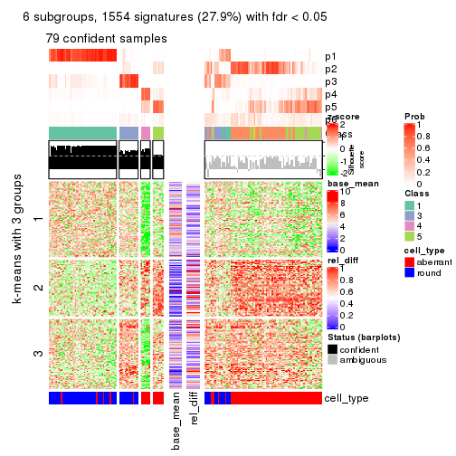</p>

</div>
</div>


Signature heatmaps where rows are not scaled:


<script>
$( function() {
	$( '#tabs-CV-hclust-get-signatures-no-scale' ).tabs();
} );
</script>
<div id='tabs-CV-hclust-get-signatures-no-scale'>
<ul>
<li><a href='#tab-CV-hclust-get-signatures-no-scale-1'>k = 2</a></li>
<li><a href='#tab-CV-hclust-get-signatures-no-scale-2'>k = 3</a></li>
<li><a href='#tab-CV-hclust-get-signatures-no-scale-3'>k = 4</a></li>
<li><a href='#tab-CV-hclust-get-signatures-no-scale-4'>k = 5</a></li>
<li><a href='#tab-CV-hclust-get-signatures-no-scale-5'>k = 6</a></li>
</ul>
<div id='tab-CV-hclust-get-signatures-no-scale-1'>
<pre><code class="r">get_signatures(res, k = 2, scale_rows = FALSE)
</code></pre>

<p></p>

</div>
<div id='tab-CV-hclust-get-signatures-no-scale-2'>
<pre><code class="r">get_signatures(res, k = 3, scale_rows = FALSE)
</code></pre>

<p></p>

</div>
<div id='tab-CV-hclust-get-signatures-no-scale-3'>
<pre><code class="r">get_signatures(res, k = 4, scale_rows = FALSE)
</code></pre>

<p></p>

</div>
<div id='tab-CV-hclust-get-signatures-no-scale-4'>
<pre><code class="r">get_signatures(res, k = 5, scale_rows = FALSE)
</code></pre>

<p></p>

</div>
<div id='tab-CV-hclust-get-signatures-no-scale-5'>
<pre><code class="r">get_signatures(res, k = 6, scale_rows = FALSE)
</code></pre>

<p></p>

</div>
</div>


Compare the overlap of signatures from different k:

```r
compare_signatures(res)
```


`get_signature()` returns a data frame invisibly. TO get the list of signatures, the function
call should be assigned to a variable explicitly. In following code, if `plot` argument is set
to `FALSE`, no heatmap is plotted while only the differential analysis is performed.

```r
# code only for demonstration
tb = get_signature(res, k = ..., plot = FALSE)
```

An example of the output of `tb` is:

```
#>   which_row         fdr    mean_1    mean_2 scaled_mean_1 scaled_mean_2 km
#> 1        38 0.042760348  8.373488  9.131774    -0.5533452     0.5164555  1
#> 2        40 0.018707592  7.106213  8.469186    -0.6173731     0.5762149  1
#> 3        55 0.019134737 10.221463 11.207825    -0.6159697     0.5749050  1
#> 4        59 0.006059896  5.921854  7.869574    -0.6899429     0.6439467  1
#> 5        60 0.018055526  8.928898 10.211722    -0.6204761     0.5791110  1
#> 6        98 0.009384629 15.714769 14.887706     0.6635654    -0.6193277  2
...
```

The columns in `tb` are:

1. `which_row`: row indices corresponding to the input matrix.
2. `fdr`: FDR for the differential test. 
3. `mean_x`: The mean value in group x.
4. `scaled_mean_x`: The mean value in group x after rows are scaled.
5. `km`: Row groups if k-means clustering is applied to rows.


UMAP plot which shows how samples are separated.


<script>
$( function() {
	$( '#tabs-CV-hclust-dimension-reduction' ).tabs();
} );
</script>
<div id='tabs-CV-hclust-dimension-reduction'>
<ul>
<li><a href='#tab-CV-hclust-dimension-reduction-1'>k = 2</a></li>
<li><a href='#tab-CV-hclust-dimension-reduction-2'>k = 3</a></li>
<li><a href='#tab-CV-hclust-dimension-reduction-3'>k = 4</a></li>
<li><a href='#tab-CV-hclust-dimension-reduction-4'>k = 5</a></li>
<li><a href='#tab-CV-hclust-dimension-reduction-5'>k = 6</a></li>
</ul>
<div id='tab-CV-hclust-dimension-reduction-1'>
<pre><code class="r">dimension_reduction(res, k = 2, method = &quot;UMAP&quot;)
</code></pre>

<p></p>

</div>
<div id='tab-CV-hclust-dimension-reduction-2'>
<pre><code class="r">dimension_reduction(res, k = 3, method = &quot;UMAP&quot;)
</code></pre>

<p></p>

</div>
<div id='tab-CV-hclust-dimension-reduction-3'>
<pre><code class="r">dimension_reduction(res, k = 4, method = &quot;UMAP&quot;)
</code></pre>

<p></p>

</div>
<div id='tab-CV-hclust-dimension-reduction-4'>
<pre><code class="r">dimension_reduction(res, k = 5, method = &quot;UMAP&quot;)
</code></pre>

<p></p>

</div>
<div id='tab-CV-hclust-dimension-reduction-5'>
<pre><code class="r">dimension_reduction(res, k = 6, method = &quot;UMAP&quot;)
</code></pre>

<p></p>

</div>
</div>


Following heatmap shows how subgroups are split when increasing `k`:

```r
collect_classes(res)
```


Test correlation between subgroups and known annotations. If the known
annotation is numeric, one-way ANOVA test is applied, and if the known
annotation is discrete, chi-squared contingency table test is applied.

```r
test_to_known_factors(res)
```

```
#>             n cell_type(p) k
#> CV:hclust 125     5.51e-11 2
#> CV:hclust 122     5.79e-19 3
#> CV:hclust 127     2.32e-23 4
#> CV:hclust 100     1.29e-16 5
#> CV:hclust  79     8.25e-12 6
```


If matrix rows can be associated to genes, consider to use `GO_Enrichment(res,
...)` to perform function enrichment for the signature genes.


 

---------------------------------------------------


### CV:kmeans


The object with results only for a single top-value method and a single partition method 
can be extracted as:

```r
res = res_list["CV", "kmeans"]
# you can also extract it by
# res = res_list["CV:kmeans"]
```

A summary of `res` and all the functions that can be applied to it:

```r
res
```

```
#> A 'ConsensusPartition' object with k = 2, 3, 4, 5, 6.
#>   On a matrix with 5576 rows and 160 columns.
#>   Top rows (558, 1116, 1673, 2230, 2788) are extracted by 'CV' method.
#>   Subgroups are detected by 'kmeans' method.
#>   Performed in total 1250 partitions by row resampling.
#>   Best k for subgroups seems to be 2.
#> 
#> Following methods can be applied to this 'ConsensusPartition' object:
#>  [1] "cola_report"             "collect_classes"         "collect_plots"          
#>  [4] "collect_stats"           "colnames"                "compare_signatures"     
#>  [7] "consensus_heatmap"       "dimension_reduction"     "functional_enrichment"  
#> [10] "get_anno_col"            "get_anno"                "get_classes"            
#> [13] "get_consensus"           "get_matrix"              "get_membership"         
#> [16] "get_param"               "get_signatures"          "get_stats"              
#> [19] "is_best_k"               "is_stable_k"             "membership_heatmap"     
#> [22] "ncol"                    "nrow"                    "plot_ecdf"              
#> [25] "rownames"                "select_partition_number" "show"                   
#> [28] "suggest_best_k"          "test_to_known_factors"
```

`collect_plots()` function collects all the plots made from `res` for all `k` (number of partitions)
into one single page to provide an easy and fast comparison between different `k`.

```r
collect_plots(res)
```


The plots are:

- The first row: a plot of the ECDF (Empirical cumulative distribution
  function) curves of the consensus matrix for each `k` and the heatmap of
  predicted classes for each `k`.
- The second row: heatmaps of the consensus matrix for each `k`.
- The third row: heatmaps of the membership matrix for each `k`.
- The fouth row: heatmaps of the signatures for each `k`.

All the plots in panels can be made by individual functions and they are
plotted later in this section.

`select_partition_number()` produces several plots showing different
statistics for choosing "optimized" `k`. There are following statistics:

- ECDF curves of the consensus matrix for each `k`;
- 1-PAC. [The PAC
  score](https://en.wikipedia.org/wiki/Consensus_clustering#Over-interpretation_potential_of_consensus_clustering)
  measures the proportion of the ambiguous subgrouping.
- Mean silhouette score.
- Concordance. The mean probability of fiting the consensus class ids in all
  partitions.
- Area increased. Denote $A_k$ as the area under the ECDF curve for current
  `k`, the area increased is defined as $A_k - A_{k-1}$.
- Rand index. The percent of pairs of samples that are both in a same cluster
  or both are not in a same cluster in the partition of k and k-1.
- Jaccard index. The ratio of pairs of samples are both in a same cluster in
  the partition of k and k-1 and the pairs of samples are both in a same
  cluster in the partition k or k-1.

The detailed explanations of these statistics can be found in [the cola
vignette](http://bioconductor.org/packages/devel/bioc/vignettes/cola/inst/doc/cola.html#toc_13).

Generally speaking, lower PAC score, higher mean silhouette score or higher
concordance corresponds to better partition. Rand index and Jaccard index
measure how similar the current partition is compared to partition with `k-1`.
If they are too similar, we won't accept `k` is better than `k-1`.

```r
select_partition_number(res)
```


The numeric values for all these statistics can be obtained by `get_stats()`.

```r
get_stats(res)
```

```
#>   k 1-PAC mean_silhouette concordance area_increased  Rand Jaccard
#> 2 2 0.856           0.927       0.968         0.5017 0.498   0.498
#> 3 3 0.615           0.726       0.837         0.3009 0.769   0.568
#> 4 4 0.724           0.804       0.881         0.1184 0.864   0.629
#> 5 5 0.712           0.722       0.832         0.0568 0.957   0.841
#> 6 6 0.715           0.592       0.755         0.0438 0.953   0.808
```

`suggest_best_k()` suggests the best $k$ based on these statistics. The rules are as follows:

- All $k$ with Jaccard index larger than 0.95 are removed because the increase of
  the partition number does not provides enough extra information. If all $k$ are removed,
  the best $k$ is assigned by `NA`.
- For $k$ with 1-PAC larger than 0.9, the maximal $k$ is taken as the "best k". Other $k$ is called "optional k".
- If it does not fit the second rule. The $k$ with the highest vote of highest
  1-PAC, mean silhouette and concordance is taken as the "best k".

```r
suggest_best_k(res)
```

```
#> [1] 2
```


Following shows the table of the partitions (You need to click the **show/hide
code output** link to see it). The membership matrix (columns with name `p*`)
is inferred by
[`clue::cl_consensus()`](https://www.rdocumentation.org/link/cl_consensus?package=clue)
function with the `SE` method. Basically the value in the membership matrix
represents the probability to belong to a certain group. The finall class
label for an item is determined with the group with highest probability it
belongs to.

In `get_classes()` function, the entropy is calculated from the membership
matrix and the silhouette score is calculated from the consensus matrix.


<script>
$( function() {
	$( '#tabs-CV-kmeans-get-classes' ).tabs();
} );
</script>
<div id='tabs-CV-kmeans-get-classes'>
<ul>
<li><a href='#tab-CV-kmeans-get-classes-1'>k = 2</a></li>
<li><a href='#tab-CV-kmeans-get-classes-2'>k = 3</a></li>
<li><a href='#tab-CV-kmeans-get-classes-3'>k = 4</a></li>
<li><a href='#tab-CV-kmeans-get-classes-4'>k = 5</a></li>
<li><a href='#tab-CV-kmeans-get-classes-5'>k = 6</a></li>
</ul>

<div id='tab-CV-kmeans-get-classes-1'>
<p><a id='tab-CV-kmeans-get-classes-1-a' style='color:#0366d6' href='#'>show/hide code output</a></p>
<pre><code class="r">cbind(get_classes(res, k = 2), get_membership(res, k = 2))
</code></pre>

<pre><code>#&gt;                     class entropy silhouette    p1    p2
#&gt; aberrant_ERR2585320     2  0.0000     0.9718 0.000 1.000
#&gt; aberrant_ERR2585338     2  0.0000     0.9718 0.000 1.000
#&gt; aberrant_ERR2585325     2  0.0000     0.9718 0.000 1.000
#&gt; aberrant_ERR2585283     1  0.8267     0.6632 0.740 0.260
#&gt; aberrant_ERR2585343     2  0.0938     0.9687 0.012 0.988
#&gt; aberrant_ERR2585329     2  0.0000     0.9718 0.000 1.000
#&gt; aberrant_ERR2585317     2  0.0000     0.9718 0.000 1.000
#&gt; aberrant_ERR2585339     2  0.0000     0.9718 0.000 1.000
#&gt; aberrant_ERR2585335     2  0.0672     0.9700 0.008 0.992
#&gt; aberrant_ERR2585287     2  0.0000     0.9718 0.000 1.000
#&gt; aberrant_ERR2585321     2  0.1414     0.9635 0.020 0.980
#&gt; aberrant_ERR2585297     1  0.0000     0.9597 1.000 0.000
#&gt; aberrant_ERR2585337     2  0.0000     0.9718 0.000 1.000
#&gt; aberrant_ERR2585319     2  0.0000     0.9718 0.000 1.000
#&gt; aberrant_ERR2585315     2  0.0000     0.9718 0.000 1.000
#&gt; aberrant_ERR2585336     2  0.0000     0.9718 0.000 1.000
#&gt; aberrant_ERR2585307     2  0.0000     0.9718 0.000 1.000
#&gt; aberrant_ERR2585301     2  0.0672     0.9700 0.008 0.992
#&gt; aberrant_ERR2585326     2  0.0000     0.9718 0.000 1.000
#&gt; aberrant_ERR2585331     2  0.0000     0.9718 0.000 1.000
#&gt; aberrant_ERR2585346     1  0.5842     0.8376 0.860 0.140
#&gt; aberrant_ERR2585314     2  0.0000     0.9718 0.000 1.000
#&gt; aberrant_ERR2585298     1  0.5178     0.8721 0.884 0.116
#&gt; aberrant_ERR2585345     2  0.0000     0.9718 0.000 1.000
#&gt; aberrant_ERR2585299     1  0.0000     0.9597 1.000 0.000
#&gt; aberrant_ERR2585309     1  0.0000     0.9597 1.000 0.000
#&gt; aberrant_ERR2585303     2  0.0000     0.9718 0.000 1.000
#&gt; aberrant_ERR2585313     2  0.0000     0.9718 0.000 1.000
#&gt; aberrant_ERR2585318     2  0.0938     0.9687 0.012 0.988
#&gt; aberrant_ERR2585328     2  0.0672     0.9700 0.008 0.992
#&gt; aberrant_ERR2585330     2  0.0938     0.9687 0.012 0.988
#&gt; aberrant_ERR2585293     1  0.7299     0.7523 0.796 0.204
#&gt; aberrant_ERR2585342     2  0.0938     0.9687 0.012 0.988
#&gt; aberrant_ERR2585348     2  0.0000     0.9718 0.000 1.000
#&gt; aberrant_ERR2585352     2  0.0000     0.9718 0.000 1.000
#&gt; aberrant_ERR2585308     1  0.0000     0.9597 1.000 0.000
#&gt; aberrant_ERR2585349     2  0.0000     0.9718 0.000 1.000
#&gt; aberrant_ERR2585316     2  0.4939     0.8733 0.108 0.892
#&gt; aberrant_ERR2585306     1  0.7299     0.7514 0.796 0.204
#&gt; aberrant_ERR2585324     2  0.0000     0.9718 0.000 1.000
#&gt; aberrant_ERR2585310     2  0.2603     0.9449 0.044 0.956
#&gt; aberrant_ERR2585296     1  0.0672     0.9547 0.992 0.008
#&gt; aberrant_ERR2585275     2  0.9993     0.0311 0.484 0.516
#&gt; aberrant_ERR2585311     2  0.1184     0.9663 0.016 0.984
#&gt; aberrant_ERR2585292     1  0.7299     0.7523 0.796 0.204
#&gt; aberrant_ERR2585282     2  0.1184     0.9663 0.016 0.984
#&gt; aberrant_ERR2585305     2  0.4690     0.8856 0.100 0.900
#&gt; aberrant_ERR2585278     2  0.0000     0.9718 0.000 1.000
#&gt; aberrant_ERR2585347     2  0.1633     0.9608 0.024 0.976
#&gt; aberrant_ERR2585332     2  0.0938     0.9687 0.012 0.988
#&gt; aberrant_ERR2585280     2  0.0000     0.9718 0.000 1.000
#&gt; aberrant_ERR2585304     2  0.0000     0.9718 0.000 1.000
#&gt; aberrant_ERR2585322     2  0.0000     0.9718 0.000 1.000
#&gt; aberrant_ERR2585279     2  0.0000     0.9718 0.000 1.000
#&gt; aberrant_ERR2585277     2  0.0000     0.9718 0.000 1.000
#&gt; aberrant_ERR2585295     2  0.0000     0.9718 0.000 1.000
#&gt; aberrant_ERR2585333     2  0.0938     0.9687 0.012 0.988
#&gt; aberrant_ERR2585285     2  0.0000     0.9718 0.000 1.000
#&gt; aberrant_ERR2585286     2  0.0000     0.9718 0.000 1.000
#&gt; aberrant_ERR2585294     2  0.0938     0.9687 0.012 0.988
#&gt; aberrant_ERR2585300     2  0.0938     0.9687 0.012 0.988
#&gt; aberrant_ERR2585334     2  0.0000     0.9718 0.000 1.000
#&gt; aberrant_ERR2585361     2  0.0000     0.9718 0.000 1.000
#&gt; aberrant_ERR2585372     2  0.0938     0.9687 0.012 0.988
#&gt; round_ERR2585217        1  0.9661     0.3832 0.608 0.392
#&gt; round_ERR2585205        1  0.0000     0.9597 1.000 0.000
#&gt; round_ERR2585214        2  0.2778     0.9337 0.048 0.952
#&gt; round_ERR2585202        2  0.3114     0.9257 0.056 0.944
#&gt; aberrant_ERR2585367     2  0.0000     0.9718 0.000 1.000
#&gt; round_ERR2585220        1  0.0000     0.9597 1.000 0.000
#&gt; round_ERR2585238        1  0.0000     0.9597 1.000 0.000
#&gt; aberrant_ERR2585276     2  0.0938     0.9687 0.012 0.988
#&gt; round_ERR2585218        1  0.0000     0.9597 1.000 0.000
#&gt; aberrant_ERR2585363     2  0.0000     0.9718 0.000 1.000
#&gt; round_ERR2585201        1  0.5737     0.8518 0.864 0.136
#&gt; round_ERR2585210        1  0.0000     0.9597 1.000 0.000
#&gt; aberrant_ERR2585362     2  0.0938     0.9687 0.012 0.988
#&gt; aberrant_ERR2585360     2  0.0938     0.9687 0.012 0.988
#&gt; round_ERR2585209        1  0.0000     0.9597 1.000 0.000
#&gt; round_ERR2585242        1  0.3733     0.9099 0.928 0.072
#&gt; round_ERR2585216        1  0.0000     0.9597 1.000 0.000
#&gt; round_ERR2585219        1  0.0000     0.9597 1.000 0.000
#&gt; round_ERR2585237        2  0.9286     0.4611 0.344 0.656
#&gt; round_ERR2585198        2  0.4298     0.8906 0.088 0.912
#&gt; round_ERR2585211        1  0.0000     0.9597 1.000 0.000
#&gt; round_ERR2585206        1  0.0000     0.9597 1.000 0.000
#&gt; aberrant_ERR2585281     2  0.0000     0.9718 0.000 1.000
#&gt; round_ERR2585212        1  0.0000     0.9597 1.000 0.000
#&gt; round_ERR2585221        1  0.0000     0.9597 1.000 0.000
#&gt; round_ERR2585243        1  0.0000     0.9597 1.000 0.000
#&gt; round_ERR2585204        2  0.0376     0.9701 0.004 0.996
#&gt; round_ERR2585213        2  0.0000     0.9718 0.000 1.000
#&gt; aberrant_ERR2585373     2  0.0938     0.9687 0.012 0.988
#&gt; aberrant_ERR2585358     2  0.0938     0.9687 0.012 0.988
#&gt; aberrant_ERR2585365     2  0.0000     0.9718 0.000 1.000
#&gt; aberrant_ERR2585359     2  0.3584     0.9192 0.068 0.932
#&gt; aberrant_ERR2585370     2  0.0000     0.9718 0.000 1.000
#&gt; round_ERR2585215        1  0.0000     0.9597 1.000 0.000
#&gt; round_ERR2585262        1  0.7299     0.7623 0.796 0.204
#&gt; round_ERR2585199        2  0.0000     0.9718 0.000 1.000
#&gt; aberrant_ERR2585369     2  0.0938     0.9687 0.012 0.988
#&gt; round_ERR2585208        1  0.0000     0.9597 1.000 0.000
#&gt; round_ERR2585252        1  0.0000     0.9597 1.000 0.000
#&gt; round_ERR2585236        1  0.0000     0.9597 1.000 0.000
#&gt; aberrant_ERR2585284     1  0.0000     0.9597 1.000 0.000
#&gt; round_ERR2585224        1  0.0000     0.9597 1.000 0.000
#&gt; round_ERR2585260        1  0.0000     0.9597 1.000 0.000
#&gt; round_ERR2585229        1  0.0000     0.9597 1.000 0.000
#&gt; aberrant_ERR2585364     1  0.9993     0.0768 0.516 0.484
#&gt; round_ERR2585253        1  0.0000     0.9597 1.000 0.000
#&gt; aberrant_ERR2585368     2  0.0000     0.9718 0.000 1.000
#&gt; aberrant_ERR2585371     2  0.0000     0.9718 0.000 1.000
#&gt; round_ERR2585239        1  0.0000     0.9597 1.000 0.000
#&gt; round_ERR2585273        1  0.0000     0.9597 1.000 0.000
#&gt; round_ERR2585256        1  0.0000     0.9597 1.000 0.000
#&gt; round_ERR2585272        1  0.0000     0.9597 1.000 0.000
#&gt; round_ERR2585246        1  0.0000     0.9597 1.000 0.000
#&gt; round_ERR2585261        1  0.1633     0.9456 0.976 0.024
#&gt; round_ERR2585254        1  0.2778     0.9254 0.952 0.048
#&gt; round_ERR2585225        1  0.5059     0.8762 0.888 0.112
#&gt; round_ERR2585235        1  0.0000     0.9597 1.000 0.000
#&gt; round_ERR2585271        1  0.0000     0.9597 1.000 0.000
#&gt; round_ERR2585251        1  0.0000     0.9597 1.000 0.000
#&gt; round_ERR2585255        1  0.5629     0.8569 0.868 0.132
#&gt; round_ERR2585257        1  0.1184     0.9497 0.984 0.016
#&gt; round_ERR2585226        1  0.0000     0.9597 1.000 0.000
#&gt; round_ERR2585265        1  0.0000     0.9597 1.000 0.000
#&gt; round_ERR2585259        1  0.0000     0.9597 1.000 0.000
#&gt; round_ERR2585247        1  0.0000     0.9597 1.000 0.000
#&gt; round_ERR2585241        1  0.0000     0.9597 1.000 0.000
#&gt; round_ERR2585263        1  0.0000     0.9597 1.000 0.000
#&gt; round_ERR2585264        1  0.0000     0.9597 1.000 0.000
#&gt; round_ERR2585233        1  0.0000     0.9597 1.000 0.000
#&gt; round_ERR2585223        1  0.0000     0.9597 1.000 0.000
#&gt; round_ERR2585234        2  0.9963     0.0955 0.464 0.536
#&gt; round_ERR2585222        1  0.0000     0.9597 1.000 0.000
#&gt; round_ERR2585228        1  0.0000     0.9597 1.000 0.000
#&gt; round_ERR2585248        1  0.0000     0.9597 1.000 0.000
#&gt; round_ERR2585240        1  0.4690     0.8860 0.900 0.100
#&gt; round_ERR2585270        1  0.0000     0.9597 1.000 0.000
#&gt; round_ERR2585232        1  0.0000     0.9597 1.000 0.000
#&gt; aberrant_ERR2585341     2  0.0000     0.9718 0.000 1.000
#&gt; aberrant_ERR2585355     2  0.0000     0.9718 0.000 1.000
#&gt; round_ERR2585227        1  0.0000     0.9597 1.000 0.000
#&gt; aberrant_ERR2585351     2  0.1184     0.9663 0.016 0.984
#&gt; round_ERR2585269        1  0.0000     0.9597 1.000 0.000
#&gt; aberrant_ERR2585357     2  0.0000     0.9718 0.000 1.000
#&gt; aberrant_ERR2585350     2  0.0000     0.9718 0.000 1.000
#&gt; round_ERR2585250        1  0.0000     0.9597 1.000 0.000
#&gt; round_ERR2585245        1  0.0000     0.9597 1.000 0.000
#&gt; aberrant_ERR2585353     2  0.0938     0.9687 0.012 0.988
#&gt; round_ERR2585258        1  0.0000     0.9597 1.000 0.000
#&gt; aberrant_ERR2585354     2  0.0938     0.9687 0.012 0.988
#&gt; round_ERR2585249        1  0.0000     0.9597 1.000 0.000
#&gt; round_ERR2585268        1  0.0000     0.9597 1.000 0.000
#&gt; aberrant_ERR2585356     2  0.3879     0.9120 0.076 0.924
#&gt; round_ERR2585266        1  0.5294     0.8686 0.880 0.120
#&gt; round_ERR2585231        1  0.0000     0.9597 1.000 0.000
#&gt; round_ERR2585230        1  0.0000     0.9597 1.000 0.000
#&gt; round_ERR2585267        1  0.0000     0.9597 1.000 0.000
</code></pre>

<script>
$('#tab-CV-kmeans-get-classes-1-a').parent().next().next().hide();
$('#tab-CV-kmeans-get-classes-1-a').click(function(){
  $('#tab-CV-kmeans-get-classes-1-a').parent().next().next().toggle();
  return(false);
});
</script>
</div>

<div id='tab-CV-kmeans-get-classes-2'>
<p><a id='tab-CV-kmeans-get-classes-2-a' style='color:#0366d6' href='#'>show/hide code output</a></p>
<pre><code class="r">cbind(get_classes(res, k = 3), get_membership(res, k = 3))
</code></pre>

<pre><code>#&gt;                     class entropy silhouette    p1    p2    p3
#&gt; aberrant_ERR2585320     2  0.4062     0.7056 0.000 0.836 0.164
#&gt; aberrant_ERR2585338     3  0.5216     0.7553 0.000 0.260 0.740
#&gt; aberrant_ERR2585325     2  0.4062     0.7056 0.000 0.836 0.164
#&gt; aberrant_ERR2585283     2  0.4750     0.6456 0.216 0.784 0.000
#&gt; aberrant_ERR2585343     2  0.0000     0.8321 0.000 1.000 0.000
#&gt; aberrant_ERR2585329     3  0.5291     0.7479 0.000 0.268 0.732
#&gt; aberrant_ERR2585317     3  0.5216     0.7553 0.000 0.260 0.740
#&gt; aberrant_ERR2585339     3  0.5216     0.7553 0.000 0.260 0.740
#&gt; aberrant_ERR2585335     2  0.6204    -0.0148 0.000 0.576 0.424
#&gt; aberrant_ERR2585287     2  0.0000     0.8321 0.000 1.000 0.000
#&gt; aberrant_ERR2585321     2  0.0000     0.8321 0.000 1.000 0.000
#&gt; aberrant_ERR2585297     1  0.0000     0.9023 1.000 0.000 0.000
#&gt; aberrant_ERR2585337     3  0.5216     0.7553 0.000 0.260 0.740
#&gt; aberrant_ERR2585319     2  0.6295    -0.2112 0.000 0.528 0.472
#&gt; aberrant_ERR2585315     3  0.5882     0.6421 0.000 0.348 0.652
#&gt; aberrant_ERR2585336     3  0.5216     0.7553 0.000 0.260 0.740
#&gt; aberrant_ERR2585307     3  0.5178     0.7559 0.000 0.256 0.744
#&gt; aberrant_ERR2585301     2  0.3340     0.7502 0.000 0.880 0.120
#&gt; aberrant_ERR2585326     3  0.5178     0.7559 0.000 0.256 0.744
#&gt; aberrant_ERR2585331     3  0.4346     0.7404 0.000 0.184 0.816
#&gt; aberrant_ERR2585346     2  0.4931     0.6274 0.232 0.768 0.000
#&gt; aberrant_ERR2585314     3  0.6062     0.5759 0.000 0.384 0.616
#&gt; aberrant_ERR2585298     3  0.6295    -0.3800 0.472 0.000 0.528
#&gt; aberrant_ERR2585345     3  0.5216     0.7553 0.000 0.260 0.740
#&gt; aberrant_ERR2585299     1  0.0000     0.9023 1.000 0.000 0.000
#&gt; aberrant_ERR2585309     1  0.0000     0.9023 1.000 0.000 0.000
#&gt; aberrant_ERR2585303     3  0.6291     0.3996 0.000 0.468 0.532
#&gt; aberrant_ERR2585313     3  0.5216     0.7553 0.000 0.260 0.740
#&gt; aberrant_ERR2585318     2  0.3267     0.7530 0.000 0.884 0.116
#&gt; aberrant_ERR2585328     2  0.0000     0.8321 0.000 1.000 0.000
#&gt; aberrant_ERR2585330     2  0.4002     0.7010 0.000 0.840 0.160
#&gt; aberrant_ERR2585293     2  0.4842     0.6370 0.224 0.776 0.000
#&gt; aberrant_ERR2585342     2  0.0237     0.8306 0.000 0.996 0.004
#&gt; aberrant_ERR2585348     2  0.0237     0.8303 0.000 0.996 0.004
#&gt; aberrant_ERR2585352     3  0.6305     0.3221 0.000 0.484 0.516
#&gt; aberrant_ERR2585308     1  0.0000     0.9023 1.000 0.000 0.000
#&gt; aberrant_ERR2585349     3  0.4399     0.7416 0.000 0.188 0.812
#&gt; aberrant_ERR2585316     2  0.1529     0.8043 0.040 0.960 0.000
#&gt; aberrant_ERR2585306     2  0.4702     0.6497 0.212 0.788 0.000
#&gt; aberrant_ERR2585324     2  0.6295    -0.2112 0.000 0.528 0.472
#&gt; aberrant_ERR2585310     3  0.8519     0.4385 0.096 0.396 0.508
#&gt; aberrant_ERR2585296     1  0.4974     0.8072 0.764 0.000 0.236
#&gt; aberrant_ERR2585275     2  0.4121     0.6922 0.168 0.832 0.000
#&gt; aberrant_ERR2585311     2  0.0000     0.8321 0.000 1.000 0.000
#&gt; aberrant_ERR2585292     2  0.4842     0.6370 0.224 0.776 0.000
#&gt; aberrant_ERR2585282     2  0.0000     0.8321 0.000 1.000 0.000
#&gt; aberrant_ERR2585305     2  0.3038     0.7639 0.000 0.896 0.104
#&gt; aberrant_ERR2585278     2  0.6309    -0.3006 0.000 0.500 0.500
#&gt; aberrant_ERR2585347     2  0.0000     0.8321 0.000 1.000 0.000
#&gt; aberrant_ERR2585332     2  0.0000     0.8321 0.000 1.000 0.000
#&gt; aberrant_ERR2585280     2  0.3551     0.7369 0.000 0.868 0.132
#&gt; aberrant_ERR2585304     3  0.4121     0.7345 0.000 0.168 0.832
#&gt; aberrant_ERR2585322     3  0.5216     0.7553 0.000 0.260 0.740
#&gt; aberrant_ERR2585279     3  0.4062     0.7324 0.000 0.164 0.836
#&gt; aberrant_ERR2585277     3  0.5216     0.7553 0.000 0.260 0.740
#&gt; aberrant_ERR2585295     2  0.4121     0.6480 0.000 0.832 0.168
#&gt; aberrant_ERR2585333     2  0.0000     0.8321 0.000 1.000 0.000
#&gt; aberrant_ERR2585285     2  0.4974     0.5667 0.000 0.764 0.236
#&gt; aberrant_ERR2585286     3  0.5216     0.7553 0.000 0.260 0.740
#&gt; aberrant_ERR2585294     2  0.2959     0.7682 0.000 0.900 0.100
#&gt; aberrant_ERR2585300     2  0.0000     0.8321 0.000 1.000 0.000
#&gt; aberrant_ERR2585334     3  0.4235     0.7375 0.000 0.176 0.824
#&gt; aberrant_ERR2585361     2  0.0237     0.8306 0.000 0.996 0.004
#&gt; aberrant_ERR2585372     2  0.0000     0.8321 0.000 1.000 0.000
#&gt; round_ERR2585217        3  0.5325     0.3023 0.248 0.004 0.748
#&gt; round_ERR2585205        1  0.0000     0.9023 1.000 0.000 0.000
#&gt; round_ERR2585214        3  0.0424     0.6490 0.000 0.008 0.992
#&gt; round_ERR2585202        3  0.0424     0.6490 0.000 0.008 0.992
#&gt; aberrant_ERR2585367     2  0.5138     0.5189 0.000 0.748 0.252
#&gt; round_ERR2585220        1  0.3879     0.8571 0.848 0.000 0.152
#&gt; round_ERR2585238        1  0.0000     0.9023 1.000 0.000 0.000
#&gt; aberrant_ERR2585276     2  0.0000     0.8321 0.000 1.000 0.000
#&gt; round_ERR2585218        1  0.0000     0.9023 1.000 0.000 0.000
#&gt; aberrant_ERR2585363     3  0.6244     0.4487 0.000 0.440 0.560
#&gt; round_ERR2585201        3  0.6305    -0.4085 0.484 0.000 0.516
#&gt; round_ERR2585210        1  0.0000     0.9023 1.000 0.000 0.000
#&gt; aberrant_ERR2585362     2  0.0000     0.8321 0.000 1.000 0.000
#&gt; aberrant_ERR2585360     2  0.0592     0.8267 0.000 0.988 0.012
#&gt; round_ERR2585209        1  0.5138     0.7946 0.748 0.000 0.252
#&gt; round_ERR2585242        1  0.6299     0.4775 0.524 0.000 0.476
#&gt; round_ERR2585216        1  0.3879     0.8571 0.848 0.000 0.152
#&gt; round_ERR2585219        1  0.0000     0.9023 1.000 0.000 0.000
#&gt; round_ERR2585237        3  0.2173     0.6166 0.048 0.008 0.944
#&gt; round_ERR2585198        3  0.0424     0.6490 0.000 0.008 0.992
#&gt; round_ERR2585211        1  0.0000     0.9023 1.000 0.000 0.000
#&gt; round_ERR2585206        1  0.0000     0.9023 1.000 0.000 0.000
#&gt; aberrant_ERR2585281     3  0.5397     0.7379 0.000 0.280 0.720
#&gt; round_ERR2585212        1  0.3879     0.8571 0.848 0.000 0.152
#&gt; round_ERR2585221        1  0.0000     0.9023 1.000 0.000 0.000
#&gt; round_ERR2585243        1  0.0000     0.9023 1.000 0.000 0.000
#&gt; round_ERR2585204        3  0.0424     0.6490 0.000 0.008 0.992
#&gt; round_ERR2585213        3  0.0424     0.6490 0.000 0.008 0.992
#&gt; aberrant_ERR2585373     2  0.0000     0.8321 0.000 1.000 0.000
#&gt; aberrant_ERR2585358     2  0.0000     0.8321 0.000 1.000 0.000
#&gt; aberrant_ERR2585365     3  0.6305     0.3512 0.000 0.484 0.516
#&gt; aberrant_ERR2585359     2  0.0000     0.8321 0.000 1.000 0.000
#&gt; aberrant_ERR2585370     3  0.5138     0.7555 0.000 0.252 0.748
#&gt; round_ERR2585215        1  0.0000     0.9023 1.000 0.000 0.000
#&gt; round_ERR2585262        1  0.6410     0.5800 0.576 0.004 0.420
#&gt; round_ERR2585199        3  0.0424     0.6490 0.000 0.008 0.992
#&gt; aberrant_ERR2585369     2  0.0000     0.8321 0.000 1.000 0.000
#&gt; round_ERR2585208        1  0.0000     0.9023 1.000 0.000 0.000
#&gt; round_ERR2585252        1  0.0000     0.9023 1.000 0.000 0.000
#&gt; round_ERR2585236        1  0.0000     0.9023 1.000 0.000 0.000
#&gt; aberrant_ERR2585284     2  0.5178     0.5971 0.256 0.744 0.000
#&gt; round_ERR2585224        1  0.0000     0.9023 1.000 0.000 0.000
#&gt; round_ERR2585260        1  0.1529     0.8928 0.960 0.000 0.040
#&gt; round_ERR2585229        1  0.0000     0.9023 1.000 0.000 0.000
#&gt; aberrant_ERR2585364     2  0.4346     0.6774 0.184 0.816 0.000
#&gt; round_ERR2585253        1  0.0000     0.9023 1.000 0.000 0.000
#&gt; aberrant_ERR2585368     3  0.5178     0.7559 0.000 0.256 0.744
#&gt; aberrant_ERR2585371     3  0.5178     0.7559 0.000 0.256 0.744
#&gt; round_ERR2585239        1  0.0000     0.9023 1.000 0.000 0.000
#&gt; round_ERR2585273        1  0.0000     0.9023 1.000 0.000 0.000
#&gt; round_ERR2585256        1  0.4974     0.8075 0.764 0.000 0.236
#&gt; round_ERR2585272        1  0.3116     0.8744 0.892 0.000 0.108
#&gt; round_ERR2585246        1  0.0000     0.9023 1.000 0.000 0.000
#&gt; round_ERR2585261        1  0.5835     0.7074 0.660 0.000 0.340
#&gt; round_ERR2585254        1  0.5926     0.6860 0.644 0.000 0.356
#&gt; round_ERR2585225        1  0.6299     0.4778 0.524 0.000 0.476
#&gt; round_ERR2585235        1  0.0237     0.9014 0.996 0.000 0.004
#&gt; round_ERR2585271        1  0.0000     0.9023 1.000 0.000 0.000
#&gt; round_ERR2585251        1  0.4452     0.8365 0.808 0.000 0.192
#&gt; round_ERR2585255        3  0.6309    -0.4358 0.496 0.000 0.504
#&gt; round_ERR2585257        1  0.5529     0.7540 0.704 0.000 0.296
#&gt; round_ERR2585226        1  0.4002     0.8533 0.840 0.000 0.160
#&gt; round_ERR2585265        1  0.3879     0.8571 0.848 0.000 0.152
#&gt; round_ERR2585259        1  0.3816     0.8593 0.852 0.000 0.148
#&gt; round_ERR2585247        1  0.0000     0.9023 1.000 0.000 0.000
#&gt; round_ERR2585241        1  0.0000     0.9023 1.000 0.000 0.000
#&gt; round_ERR2585263        1  0.4887     0.8127 0.772 0.000 0.228
#&gt; round_ERR2585264        1  0.0000     0.9023 1.000 0.000 0.000
#&gt; round_ERR2585233        1  0.5058     0.8012 0.756 0.000 0.244
#&gt; round_ERR2585223        1  0.0000     0.9023 1.000 0.000 0.000
#&gt; round_ERR2585234        3  0.2496     0.5965 0.068 0.004 0.928
#&gt; round_ERR2585222        1  0.0000     0.9023 1.000 0.000 0.000
#&gt; round_ERR2585228        1  0.0000     0.9023 1.000 0.000 0.000
#&gt; round_ERR2585248        1  0.0000     0.9023 1.000 0.000 0.000
#&gt; round_ERR2585240        1  0.6244     0.5487 0.560 0.000 0.440
#&gt; round_ERR2585270        1  0.3816     0.8587 0.852 0.000 0.148
#&gt; round_ERR2585232        1  0.4887     0.8136 0.772 0.000 0.228
#&gt; aberrant_ERR2585341     3  0.5968     0.6266 0.000 0.364 0.636
#&gt; aberrant_ERR2585355     3  0.5216     0.7553 0.000 0.260 0.740
#&gt; round_ERR2585227        1  0.4178     0.8470 0.828 0.000 0.172
#&gt; aberrant_ERR2585351     2  0.3686     0.7265 0.000 0.860 0.140
#&gt; round_ERR2585269        1  0.0000     0.9023 1.000 0.000 0.000
#&gt; aberrant_ERR2585357     3  0.5216     0.7553 0.000 0.260 0.740
#&gt; aberrant_ERR2585350     3  0.5216     0.7553 0.000 0.260 0.740
#&gt; round_ERR2585250        1  0.2625     0.8808 0.916 0.000 0.084
#&gt; round_ERR2585245        1  0.0000     0.9023 1.000 0.000 0.000
#&gt; aberrant_ERR2585353     2  0.0000     0.8321 0.000 1.000 0.000
#&gt; round_ERR2585258        1  0.4002     0.8533 0.840 0.000 0.160
#&gt; aberrant_ERR2585354     2  0.0000     0.8321 0.000 1.000 0.000
#&gt; round_ERR2585249        1  0.0000     0.9023 1.000 0.000 0.000
#&gt; round_ERR2585268        1  0.4555     0.8311 0.800 0.000 0.200
#&gt; aberrant_ERR2585356     2  0.0237     0.8299 0.004 0.996 0.000
#&gt; round_ERR2585266        1  0.6305     0.4605 0.516 0.000 0.484
#&gt; round_ERR2585231        1  0.0000     0.9023 1.000 0.000 0.000
#&gt; round_ERR2585230        1  0.0000     0.9023 1.000 0.000 0.000
#&gt; round_ERR2585267        1  0.0000     0.9023 1.000 0.000 0.000
</code></pre>

<script>
$('#tab-CV-kmeans-get-classes-2-a').parent().next().next().hide();
$('#tab-CV-kmeans-get-classes-2-a').click(function(){
  $('#tab-CV-kmeans-get-classes-2-a').parent().next().next().toggle();
  return(false);
});
</script>
</div>

<div id='tab-CV-kmeans-get-classes-3'>
<p><a id='tab-CV-kmeans-get-classes-3-a' style='color:#0366d6' href='#'>show/hide code output</a></p>
<pre><code class="r">cbind(get_classes(res, k = 4), get_membership(res, k = 4))
</code></pre>

<pre><code>#&gt;                     class entropy silhouette    p1    p2    p3    p4
#&gt; aberrant_ERR2585320     4  0.5597     0.0831 0.000 0.464 0.020 0.516
#&gt; aberrant_ERR2585338     2  0.0657     0.8964 0.000 0.984 0.012 0.004
#&gt; aberrant_ERR2585325     4  0.5597     0.0831 0.000 0.464 0.020 0.516
#&gt; aberrant_ERR2585283     4  0.3870     0.7839 0.004 0.000 0.208 0.788
#&gt; aberrant_ERR2585343     4  0.0469     0.8608 0.000 0.000 0.012 0.988
#&gt; aberrant_ERR2585329     2  0.0336     0.8963 0.000 0.992 0.000 0.008
#&gt; aberrant_ERR2585317     2  0.0336     0.8963 0.000 0.992 0.000 0.008
#&gt; aberrant_ERR2585339     2  0.0524     0.8970 0.000 0.988 0.008 0.004
#&gt; aberrant_ERR2585335     2  0.4991     0.4017 0.000 0.608 0.004 0.388
#&gt; aberrant_ERR2585287     4  0.3610     0.7906 0.000 0.000 0.200 0.800
#&gt; aberrant_ERR2585321     4  0.0376     0.8609 0.000 0.004 0.004 0.992
#&gt; aberrant_ERR2585297     1  0.0188     0.9389 0.996 0.000 0.004 0.000
#&gt; aberrant_ERR2585337     2  0.0376     0.8970 0.000 0.992 0.004 0.004
#&gt; aberrant_ERR2585319     2  0.4019     0.7535 0.000 0.792 0.012 0.196
#&gt; aberrant_ERR2585315     2  0.1302     0.8858 0.000 0.956 0.000 0.044
#&gt; aberrant_ERR2585336     2  0.0188     0.8969 0.000 0.996 0.000 0.004
#&gt; aberrant_ERR2585307     2  0.0524     0.8970 0.000 0.988 0.008 0.004
#&gt; aberrant_ERR2585301     4  0.4018     0.6723 0.000 0.224 0.004 0.772
#&gt; aberrant_ERR2585326     2  0.0524     0.8970 0.000 0.988 0.008 0.004
#&gt; aberrant_ERR2585331     2  0.0592     0.8938 0.000 0.984 0.016 0.000
#&gt; aberrant_ERR2585346     4  0.4011     0.7816 0.008 0.000 0.208 0.784
#&gt; aberrant_ERR2585314     2  0.1867     0.8679 0.000 0.928 0.000 0.072
#&gt; aberrant_ERR2585298     3  0.4464     0.8159 0.208 0.024 0.768 0.000
#&gt; aberrant_ERR2585345     2  0.0188     0.8969 0.000 0.996 0.000 0.004
#&gt; aberrant_ERR2585299     1  0.0336     0.9387 0.992 0.000 0.008 0.000
#&gt; aberrant_ERR2585309     1  0.0000     0.9384 1.000 0.000 0.000 0.000
#&gt; aberrant_ERR2585303     2  0.4453     0.6889 0.000 0.744 0.012 0.244
#&gt; aberrant_ERR2585313     2  0.0336     0.8967 0.000 0.992 0.000 0.008
#&gt; aberrant_ERR2585318     4  0.3402     0.7468 0.000 0.164 0.004 0.832
#&gt; aberrant_ERR2585328     4  0.1545     0.8593 0.000 0.008 0.040 0.952
#&gt; aberrant_ERR2585330     4  0.4761     0.4723 0.000 0.332 0.004 0.664
#&gt; aberrant_ERR2585293     4  0.4327     0.7721 0.016 0.000 0.216 0.768
#&gt; aberrant_ERR2585342     4  0.1452     0.8502 0.000 0.036 0.008 0.956
#&gt; aberrant_ERR2585348     4  0.1936     0.8540 0.000 0.032 0.028 0.940
#&gt; aberrant_ERR2585352     2  0.3219     0.8018 0.000 0.836 0.000 0.164
#&gt; aberrant_ERR2585308     1  0.0000     0.9384 1.000 0.000 0.000 0.000
#&gt; aberrant_ERR2585349     2  0.3266     0.7402 0.000 0.832 0.168 0.000
#&gt; aberrant_ERR2585316     4  0.1716     0.8509 0.000 0.000 0.064 0.936
#&gt; aberrant_ERR2585306     4  0.0779     0.8608 0.004 0.000 0.016 0.980
#&gt; aberrant_ERR2585324     2  0.4019     0.7535 0.000 0.792 0.012 0.196
#&gt; aberrant_ERR2585310     2  0.5966     0.7012 0.056 0.728 0.040 0.176
#&gt; aberrant_ERR2585296     3  0.4781     0.6779 0.336 0.004 0.660 0.000
#&gt; aberrant_ERR2585275     4  0.3831     0.7863 0.004 0.000 0.204 0.792
#&gt; aberrant_ERR2585311     4  0.0524     0.8595 0.000 0.008 0.004 0.988
#&gt; aberrant_ERR2585292     4  0.4327     0.7721 0.016 0.000 0.216 0.768
#&gt; aberrant_ERR2585282     4  0.1305     0.8590 0.000 0.004 0.036 0.960
#&gt; aberrant_ERR2585305     4  0.3105     0.7718 0.000 0.140 0.004 0.856
#&gt; aberrant_ERR2585278     2  0.4122     0.7116 0.000 0.760 0.004 0.236
#&gt; aberrant_ERR2585347     4  0.1867     0.8483 0.000 0.000 0.072 0.928
#&gt; aberrant_ERR2585332     4  0.0895     0.8611 0.000 0.004 0.020 0.976
#&gt; aberrant_ERR2585280     2  0.5143     0.1793 0.000 0.540 0.004 0.456
#&gt; aberrant_ERR2585304     2  0.0817     0.8899 0.000 0.976 0.024 0.000
#&gt; aberrant_ERR2585322     2  0.0921     0.8913 0.000 0.972 0.000 0.028
#&gt; aberrant_ERR2585279     2  0.0592     0.8938 0.000 0.984 0.016 0.000
#&gt; aberrant_ERR2585277     2  0.0657     0.8964 0.000 0.984 0.012 0.004
#&gt; aberrant_ERR2585295     4  0.4868     0.6273 0.000 0.256 0.024 0.720
#&gt; aberrant_ERR2585333     4  0.0524     0.8608 0.000 0.004 0.008 0.988
#&gt; aberrant_ERR2585285     4  0.5165    -0.0179 0.000 0.484 0.004 0.512
#&gt; aberrant_ERR2585286     2  0.0657     0.8964 0.000 0.984 0.012 0.004
#&gt; aberrant_ERR2585294     4  0.3448     0.7475 0.000 0.168 0.004 0.828
#&gt; aberrant_ERR2585300     4  0.0336     0.8609 0.000 0.000 0.008 0.992
#&gt; aberrant_ERR2585334     2  0.0921     0.8874 0.000 0.972 0.028 0.000
#&gt; aberrant_ERR2585361     4  0.2198     0.8360 0.000 0.072 0.008 0.920
#&gt; aberrant_ERR2585372     4  0.0188     0.8604 0.000 0.004 0.000 0.996
#&gt; round_ERR2585217        3  0.4761     0.7502 0.048 0.184 0.768 0.000
#&gt; round_ERR2585205        1  0.0336     0.9387 0.992 0.000 0.008 0.000
#&gt; round_ERR2585214        3  0.3942     0.6971 0.000 0.236 0.764 0.000
#&gt; round_ERR2585202        3  0.3942     0.6971 0.000 0.236 0.764 0.000
#&gt; aberrant_ERR2585367     4  0.5388     0.1028 0.000 0.456 0.012 0.532
#&gt; round_ERR2585220        1  0.3123     0.7926 0.844 0.000 0.156 0.000
#&gt; round_ERR2585238        1  0.0336     0.9387 0.992 0.000 0.008 0.000
#&gt; aberrant_ERR2585276     4  0.0657     0.8592 0.000 0.012 0.004 0.984
#&gt; round_ERR2585218        1  0.0188     0.9388 0.996 0.000 0.004 0.000
#&gt; aberrant_ERR2585363     2  0.3494     0.7849 0.000 0.824 0.004 0.172
#&gt; round_ERR2585201        3  0.4677     0.8177 0.192 0.040 0.768 0.000
#&gt; round_ERR2585210        1  0.0188     0.9389 0.996 0.000 0.004 0.000
#&gt; aberrant_ERR2585362     4  0.0336     0.8612 0.000 0.000 0.008 0.992
#&gt; aberrant_ERR2585360     4  0.1305     0.8497 0.000 0.036 0.004 0.960
#&gt; round_ERR2585209        3  0.4008     0.7911 0.244 0.000 0.756 0.000
#&gt; round_ERR2585242        3  0.4399     0.8149 0.212 0.020 0.768 0.000
#&gt; round_ERR2585216        1  0.1792     0.8926 0.932 0.000 0.068 0.000
#&gt; round_ERR2585219        1  0.0336     0.9387 0.992 0.000 0.008 0.000
#&gt; round_ERR2585237        3  0.4158     0.7117 0.008 0.224 0.768 0.000
#&gt; round_ERR2585198        3  0.3975     0.6919 0.000 0.240 0.760 0.000
#&gt; round_ERR2585211        1  0.0000     0.9384 1.000 0.000 0.000 0.000
#&gt; round_ERR2585206        1  0.0000     0.9384 1.000 0.000 0.000 0.000
#&gt; aberrant_ERR2585281     2  0.1722     0.8850 0.000 0.944 0.008 0.048
#&gt; round_ERR2585212        1  0.3444     0.7521 0.816 0.000 0.184 0.000
#&gt; round_ERR2585221        1  0.0000     0.9384 1.000 0.000 0.000 0.000
#&gt; round_ERR2585243        1  0.0336     0.9387 0.992 0.000 0.008 0.000
#&gt; round_ERR2585204        3  0.4072     0.6802 0.000 0.252 0.748 0.000
#&gt; round_ERR2585213        3  0.4830     0.4679 0.000 0.392 0.608 0.000
#&gt; aberrant_ERR2585373     4  0.0376     0.8599 0.000 0.004 0.004 0.992
#&gt; aberrant_ERR2585358     4  0.0817     0.8603 0.000 0.000 0.024 0.976
#&gt; aberrant_ERR2585365     2  0.4608     0.5875 0.000 0.692 0.004 0.304
#&gt; aberrant_ERR2585359     4  0.0817     0.8601 0.000 0.000 0.024 0.976
#&gt; aberrant_ERR2585370     2  0.0657     0.8964 0.000 0.984 0.012 0.004
#&gt; round_ERR2585215        1  0.0000     0.9384 1.000 0.000 0.000 0.000
#&gt; round_ERR2585262        3  0.4928     0.8107 0.188 0.016 0.768 0.028
#&gt; round_ERR2585199        3  0.4250     0.6531 0.000 0.276 0.724 0.000
#&gt; aberrant_ERR2585369     4  0.0657     0.8590 0.000 0.012 0.004 0.984
#&gt; round_ERR2585208        1  0.0000     0.9384 1.000 0.000 0.000 0.000
#&gt; round_ERR2585252        1  0.0000     0.9384 1.000 0.000 0.000 0.000
#&gt; round_ERR2585236        1  0.0672     0.9329 0.984 0.000 0.008 0.008
#&gt; aberrant_ERR2585284     4  0.4253     0.7770 0.016 0.000 0.208 0.776
#&gt; round_ERR2585224        1  0.0000     0.9384 1.000 0.000 0.000 0.000
#&gt; round_ERR2585260        1  0.0469     0.9366 0.988 0.000 0.012 0.000
#&gt; round_ERR2585229        1  0.0188     0.9389 0.996 0.000 0.004 0.000
#&gt; aberrant_ERR2585364     4  0.3355     0.8089 0.004 0.000 0.160 0.836
#&gt; round_ERR2585253        1  0.0000     0.9384 1.000 0.000 0.000 0.000
#&gt; aberrant_ERR2585368     2  0.0779     0.8963 0.000 0.980 0.016 0.004
#&gt; aberrant_ERR2585371     2  0.0779     0.8963 0.000 0.980 0.016 0.004
#&gt; round_ERR2585239        1  0.0336     0.9387 0.992 0.000 0.008 0.000
#&gt; round_ERR2585273        1  0.0336     0.9387 0.992 0.000 0.008 0.000
#&gt; round_ERR2585256        3  0.4543     0.6953 0.324 0.000 0.676 0.000
#&gt; round_ERR2585272        1  0.3528     0.7158 0.808 0.000 0.192 0.000
#&gt; round_ERR2585246        1  0.0188     0.9389 0.996 0.000 0.004 0.000
#&gt; round_ERR2585261        3  0.5056     0.8144 0.164 0.076 0.760 0.000
#&gt; round_ERR2585254        3  0.5512     0.8065 0.172 0.100 0.728 0.000
#&gt; round_ERR2585225        3  0.4248     0.8108 0.220 0.012 0.768 0.000
#&gt; round_ERR2585235        1  0.1867     0.8830 0.928 0.000 0.072 0.000
#&gt; round_ERR2585271        1  0.0188     0.9388 0.996 0.000 0.004 0.000
#&gt; round_ERR2585251        1  0.4830     0.1985 0.608 0.000 0.392 0.000
#&gt; round_ERR2585255        3  0.4399     0.8149 0.212 0.020 0.768 0.000
#&gt; round_ERR2585257        3  0.3975     0.7948 0.240 0.000 0.760 0.000
#&gt; round_ERR2585226        1  0.3311     0.7695 0.828 0.000 0.172 0.000
#&gt; round_ERR2585265        1  0.3024     0.8039 0.852 0.000 0.148 0.000
#&gt; round_ERR2585259        1  0.4382     0.5148 0.704 0.000 0.296 0.000
#&gt; round_ERR2585247        1  0.0336     0.9387 0.992 0.000 0.008 0.000
#&gt; round_ERR2585241        1  0.0336     0.9387 0.992 0.000 0.008 0.000
#&gt; round_ERR2585263        3  0.4877     0.5295 0.408 0.000 0.592 0.000
#&gt; round_ERR2585264        1  0.0000     0.9384 1.000 0.000 0.000 0.000
#&gt; round_ERR2585233        3  0.4040     0.7882 0.248 0.000 0.752 0.000
#&gt; round_ERR2585223        1  0.0336     0.9387 0.992 0.000 0.008 0.000
#&gt; round_ERR2585234        3  0.4158     0.7118 0.008 0.224 0.768 0.000
#&gt; round_ERR2585222        1  0.0336     0.9387 0.992 0.000 0.008 0.000
#&gt; round_ERR2585228        1  0.0336     0.9387 0.992 0.000 0.008 0.000
#&gt; round_ERR2585248        1  0.0000     0.9384 1.000 0.000 0.000 0.000
#&gt; round_ERR2585240        3  0.4158     0.8083 0.224 0.008 0.768 0.000
#&gt; round_ERR2585270        1  0.2760     0.8301 0.872 0.000 0.128 0.000
#&gt; round_ERR2585232        3  0.4382     0.7360 0.296 0.000 0.704 0.000
#&gt; aberrant_ERR2585341     2  0.3300     0.8144 0.000 0.848 0.008 0.144
#&gt; aberrant_ERR2585355     2  0.0804     0.8972 0.000 0.980 0.012 0.008
#&gt; round_ERR2585227        1  0.4304     0.5493 0.716 0.000 0.284 0.000
#&gt; aberrant_ERR2585351     4  0.3945     0.6836 0.000 0.216 0.004 0.780
#&gt; round_ERR2585269        1  0.0000     0.9384 1.000 0.000 0.000 0.000
#&gt; aberrant_ERR2585357     2  0.0524     0.8970 0.000 0.988 0.008 0.004
#&gt; aberrant_ERR2585350     2  0.0657     0.8964 0.000 0.984 0.012 0.004
#&gt; round_ERR2585250        1  0.2345     0.8613 0.900 0.000 0.100 0.000
#&gt; round_ERR2585245        1  0.0000     0.9384 1.000 0.000 0.000 0.000
#&gt; aberrant_ERR2585353     4  0.0336     0.8602 0.000 0.008 0.000 0.992
#&gt; round_ERR2585258        1  0.2647     0.8389 0.880 0.000 0.120 0.000
#&gt; aberrant_ERR2585354     4  0.0188     0.8604 0.000 0.004 0.000 0.996
#&gt; round_ERR2585249        1  0.0000     0.9384 1.000 0.000 0.000 0.000
#&gt; round_ERR2585268        3  0.4817     0.5741 0.388 0.000 0.612 0.000
#&gt; aberrant_ERR2585356     4  0.1118     0.8598 0.000 0.000 0.036 0.964
#&gt; round_ERR2585266        3  0.4248     0.8108 0.220 0.012 0.768 0.000
#&gt; round_ERR2585231        1  0.0000     0.9384 1.000 0.000 0.000 0.000
#&gt; round_ERR2585230        1  0.0336     0.9387 0.992 0.000 0.008 0.000
#&gt; round_ERR2585267        1  0.0000     0.9384 1.000 0.000 0.000 0.000
</code></pre>

<script>
$('#tab-CV-kmeans-get-classes-3-a').parent().next().next().hide();
$('#tab-CV-kmeans-get-classes-3-a').click(function(){
  $('#tab-CV-kmeans-get-classes-3-a').parent().next().next().toggle();
  return(false);
});
</script>
</div>

<div id='tab-CV-kmeans-get-classes-4'>
<p><a id='tab-CV-kmeans-get-classes-4-a' style='color:#0366d6' href='#'>show/hide code output</a></p>
<pre><code class="r">cbind(get_classes(res, k = 5), get_membership(res, k = 5))
</code></pre>

<pre><code>#&gt;                     class entropy silhouette    p1    p2    p3    p4    p5
#&gt; aberrant_ERR2585320     2  0.7433    0.00789 0.000 0.400 0.064 0.152 0.384
#&gt; aberrant_ERR2585338     2  0.0609    0.85181 0.000 0.980 0.000 0.020 0.000
#&gt; aberrant_ERR2585325     2  0.7433    0.00789 0.000 0.400 0.064 0.152 0.384
#&gt; aberrant_ERR2585283     4  0.4192    0.91739 0.000 0.000 0.000 0.596 0.404
#&gt; aberrant_ERR2585343     5  0.2079    0.68233 0.000 0.000 0.020 0.064 0.916
#&gt; aberrant_ERR2585329     2  0.1399    0.84463 0.000 0.952 0.000 0.020 0.028
#&gt; aberrant_ERR2585317     2  0.0771    0.85076 0.000 0.976 0.000 0.020 0.004
#&gt; aberrant_ERR2585339     2  0.0290    0.85178 0.000 0.992 0.000 0.008 0.000
#&gt; aberrant_ERR2585335     2  0.5099    0.14524 0.000 0.488 0.012 0.016 0.484
#&gt; aberrant_ERR2585287     4  0.4727    0.82348 0.000 0.000 0.016 0.532 0.452
#&gt; aberrant_ERR2585321     5  0.1444    0.69592 0.000 0.000 0.012 0.040 0.948
#&gt; aberrant_ERR2585297     1  0.1965    0.86614 0.904 0.000 0.000 0.096 0.000
#&gt; aberrant_ERR2585337     2  0.0404    0.85191 0.000 0.988 0.000 0.012 0.000
#&gt; aberrant_ERR2585319     2  0.4969    0.62003 0.000 0.684 0.020 0.032 0.264
#&gt; aberrant_ERR2585315     2  0.1978    0.83856 0.000 0.928 0.004 0.024 0.044
#&gt; aberrant_ERR2585336     2  0.0510    0.85170 0.000 0.984 0.000 0.016 0.000
#&gt; aberrant_ERR2585307     2  0.0404    0.85191 0.000 0.988 0.000 0.012 0.000
#&gt; aberrant_ERR2585301     5  0.3333    0.63708 0.000 0.096 0.020 0.028 0.856
#&gt; aberrant_ERR2585326     2  0.0290    0.85178 0.000 0.992 0.000 0.008 0.000
#&gt; aberrant_ERR2585331     2  0.1399    0.83939 0.000 0.952 0.020 0.028 0.000
#&gt; aberrant_ERR2585346     4  0.4182    0.91947 0.000 0.000 0.000 0.600 0.400
#&gt; aberrant_ERR2585314     2  0.2685    0.81016 0.000 0.880 0.000 0.028 0.092
#&gt; aberrant_ERR2585298     3  0.2922    0.85602 0.080 0.016 0.880 0.024 0.000
#&gt; aberrant_ERR2585345     2  0.0510    0.85181 0.000 0.984 0.000 0.016 0.000
#&gt; aberrant_ERR2585299     1  0.1270    0.86833 0.948 0.000 0.000 0.052 0.000
#&gt; aberrant_ERR2585309     1  0.1965    0.85870 0.904 0.000 0.000 0.096 0.000
#&gt; aberrant_ERR2585303     2  0.5523    0.39942 0.000 0.604 0.040 0.024 0.332
#&gt; aberrant_ERR2585313     2  0.0609    0.85215 0.000 0.980 0.000 0.020 0.000
#&gt; aberrant_ERR2585318     5  0.2689    0.65581 0.000 0.084 0.016 0.012 0.888
#&gt; aberrant_ERR2585328     5  0.3890    0.54024 0.000 0.004 0.036 0.168 0.792
#&gt; aberrant_ERR2585330     5  0.4231    0.45697 0.000 0.232 0.016 0.012 0.740
#&gt; aberrant_ERR2585293     4  0.4564    0.90867 0.000 0.000 0.016 0.612 0.372
#&gt; aberrant_ERR2585342     5  0.1836    0.70384 0.000 0.008 0.016 0.040 0.936
#&gt; aberrant_ERR2585348     5  0.4518    0.56040 0.000 0.032 0.044 0.148 0.776
#&gt; aberrant_ERR2585352     2  0.4145    0.73151 0.000 0.772 0.012 0.028 0.188
#&gt; aberrant_ERR2585308     1  0.1851    0.86246 0.912 0.000 0.000 0.088 0.000
#&gt; aberrant_ERR2585349     2  0.4441    0.60474 0.000 0.716 0.252 0.024 0.008
#&gt; aberrant_ERR2585316     5  0.3909    0.39671 0.000 0.000 0.024 0.216 0.760
#&gt; aberrant_ERR2585306     5  0.1597    0.69051 0.000 0.000 0.012 0.048 0.940
#&gt; aberrant_ERR2585324     2  0.4969    0.62003 0.000 0.684 0.020 0.032 0.264
#&gt; aberrant_ERR2585310     2  0.7522    0.43672 0.028 0.516 0.052 0.124 0.280
#&gt; aberrant_ERR2585296     3  0.5025    0.73780 0.172 0.000 0.704 0.124 0.000
#&gt; aberrant_ERR2585275     4  0.4256    0.88401 0.000 0.000 0.000 0.564 0.436
#&gt; aberrant_ERR2585311     5  0.0912    0.70362 0.000 0.000 0.012 0.016 0.972
#&gt; aberrant_ERR2585292     4  0.4564    0.90867 0.000 0.000 0.016 0.612 0.372
#&gt; aberrant_ERR2585282     5  0.2597    0.66212 0.000 0.000 0.024 0.092 0.884
#&gt; aberrant_ERR2585305     5  0.3221    0.65186 0.008 0.060 0.016 0.040 0.876
#&gt; aberrant_ERR2585278     2  0.5210    0.42098 0.000 0.576 0.012 0.028 0.384
#&gt; aberrant_ERR2585347     5  0.4540   -0.06059 0.000 0.000 0.024 0.320 0.656
#&gt; aberrant_ERR2585332     5  0.2511    0.66708 0.000 0.000 0.028 0.080 0.892
#&gt; aberrant_ERR2585280     5  0.6059    0.10843 0.000 0.404 0.044 0.040 0.512
#&gt; aberrant_ERR2585304     2  0.1281    0.84934 0.000 0.956 0.012 0.032 0.000
#&gt; aberrant_ERR2585322     2  0.0794    0.84838 0.000 0.972 0.000 0.000 0.028
#&gt; aberrant_ERR2585279     2  0.1668    0.83283 0.000 0.940 0.032 0.028 0.000
#&gt; aberrant_ERR2585277     2  0.0703    0.84829 0.000 0.976 0.000 0.024 0.000
#&gt; aberrant_ERR2585295     5  0.6412    0.34190 0.000 0.212 0.048 0.124 0.616
#&gt; aberrant_ERR2585333     5  0.1018    0.70160 0.000 0.000 0.016 0.016 0.968
#&gt; aberrant_ERR2585285     5  0.4420    0.43089 0.000 0.260 0.016 0.012 0.712
#&gt; aberrant_ERR2585286     2  0.0771    0.84962 0.000 0.976 0.004 0.020 0.000
#&gt; aberrant_ERR2585294     5  0.2830    0.65538 0.000 0.080 0.016 0.020 0.884
#&gt; aberrant_ERR2585300     5  0.1211    0.69960 0.000 0.000 0.016 0.024 0.960
#&gt; aberrant_ERR2585334     2  0.1907    0.82541 0.000 0.928 0.044 0.028 0.000
#&gt; aberrant_ERR2585361     5  0.4462    0.62124 0.000 0.060 0.044 0.100 0.796
#&gt; aberrant_ERR2585372     5  0.1012    0.70779 0.000 0.000 0.012 0.020 0.968
#&gt; round_ERR2585217        3  0.2585    0.83244 0.024 0.072 0.896 0.008 0.000
#&gt; round_ERR2585205        1  0.1197    0.86537 0.952 0.000 0.000 0.048 0.000
#&gt; round_ERR2585214        3  0.2561    0.81123 0.000 0.096 0.884 0.020 0.000
#&gt; round_ERR2585202        3  0.2464    0.81250 0.000 0.096 0.888 0.016 0.000
#&gt; aberrant_ERR2585367     5  0.5985    0.32487 0.000 0.344 0.044 0.044 0.568
#&gt; round_ERR2585220        1  0.5233    0.65328 0.684 0.000 0.168 0.148 0.000
#&gt; round_ERR2585238        1  0.0404    0.87113 0.988 0.000 0.000 0.012 0.000
#&gt; aberrant_ERR2585276     5  0.1211    0.70237 0.000 0.000 0.016 0.024 0.960
#&gt; round_ERR2585218        1  0.1197    0.86687 0.952 0.000 0.000 0.048 0.000
#&gt; aberrant_ERR2585363     2  0.4255    0.73363 0.000 0.772 0.016 0.032 0.180
#&gt; round_ERR2585201        3  0.2830    0.85734 0.080 0.016 0.884 0.020 0.000
#&gt; round_ERR2585210        1  0.1121    0.86914 0.956 0.000 0.000 0.044 0.000
#&gt; aberrant_ERR2585362     5  0.3164    0.63857 0.000 0.000 0.044 0.104 0.852
#&gt; aberrant_ERR2585360     5  0.1393    0.70334 0.000 0.012 0.008 0.024 0.956
#&gt; round_ERR2585209        3  0.2905    0.84796 0.096 0.000 0.868 0.036 0.000
#&gt; round_ERR2585242        3  0.2689    0.85688 0.084 0.012 0.888 0.016 0.000
#&gt; round_ERR2585216        1  0.3888    0.79272 0.800 0.000 0.064 0.136 0.000
#&gt; round_ERR2585219        1  0.0880    0.86714 0.968 0.000 0.000 0.032 0.000
#&gt; round_ERR2585237        3  0.2464    0.81786 0.000 0.096 0.888 0.016 0.000
#&gt; round_ERR2585198        3  0.2561    0.81123 0.000 0.096 0.884 0.020 0.000
#&gt; round_ERR2585211        1  0.1121    0.86902 0.956 0.000 0.000 0.044 0.000
#&gt; round_ERR2585206        1  0.1341    0.86776 0.944 0.000 0.000 0.056 0.000
#&gt; aberrant_ERR2585281     2  0.3013    0.81362 0.000 0.880 0.024 0.028 0.068
#&gt; round_ERR2585212        1  0.5295    0.61726 0.672 0.000 0.200 0.128 0.000
#&gt; round_ERR2585221        1  0.1851    0.85907 0.912 0.000 0.000 0.088 0.000
#&gt; round_ERR2585243        1  0.2179    0.84439 0.888 0.000 0.000 0.112 0.000
#&gt; round_ERR2585204        3  0.2813    0.80168 0.000 0.108 0.868 0.024 0.000
#&gt; round_ERR2585213        3  0.4445    0.57662 0.000 0.300 0.676 0.024 0.000
#&gt; aberrant_ERR2585373     5  0.0854    0.70694 0.000 0.004 0.012 0.008 0.976
#&gt; aberrant_ERR2585358     5  0.3016    0.61702 0.000 0.000 0.020 0.132 0.848
#&gt; aberrant_ERR2585365     5  0.5898    0.13136 0.000 0.432 0.040 0.032 0.496
#&gt; aberrant_ERR2585359     5  0.2361    0.65293 0.000 0.000 0.012 0.096 0.892
#&gt; aberrant_ERR2585370     2  0.0290    0.85178 0.000 0.992 0.000 0.008 0.000
#&gt; round_ERR2585215        1  0.1908    0.85866 0.908 0.000 0.000 0.092 0.000
#&gt; round_ERR2585262        3  0.2820    0.84293 0.052 0.004 0.892 0.044 0.008
#&gt; round_ERR2585199        3  0.3106    0.77628 0.000 0.140 0.840 0.020 0.000
#&gt; aberrant_ERR2585369     5  0.1186    0.70780 0.000 0.008 0.008 0.020 0.964
#&gt; round_ERR2585208        1  0.1792    0.86223 0.916 0.000 0.000 0.084 0.000
#&gt; round_ERR2585252        1  0.1965    0.85827 0.904 0.000 0.000 0.096 0.000
#&gt; round_ERR2585236        1  0.2848    0.85273 0.840 0.000 0.004 0.156 0.000
#&gt; aberrant_ERR2585284     4  0.4402    0.87704 0.012 0.000 0.000 0.636 0.352
#&gt; round_ERR2585224        1  0.2074    0.85866 0.896 0.000 0.000 0.104 0.000
#&gt; round_ERR2585260        1  0.2462    0.84132 0.880 0.000 0.008 0.112 0.000
#&gt; round_ERR2585229        1  0.0963    0.86904 0.964 0.000 0.000 0.036 0.000
#&gt; aberrant_ERR2585364     5  0.4249   -0.55661 0.000 0.000 0.000 0.432 0.568
#&gt; round_ERR2585253        1  0.1908    0.85866 0.908 0.000 0.000 0.092 0.000
#&gt; aberrant_ERR2585368     2  0.0671    0.85137 0.000 0.980 0.004 0.016 0.000
#&gt; aberrant_ERR2585371     2  0.0671    0.85137 0.000 0.980 0.004 0.016 0.000
#&gt; round_ERR2585239        1  0.1671    0.85885 0.924 0.000 0.000 0.076 0.000
#&gt; round_ERR2585273        1  0.2389    0.86310 0.880 0.000 0.004 0.116 0.000
#&gt; round_ERR2585256        3  0.5345    0.70556 0.196 0.000 0.668 0.136 0.000
#&gt; round_ERR2585272        1  0.5200    0.65520 0.688 0.000 0.156 0.156 0.000
#&gt; round_ERR2585246        1  0.2127    0.86750 0.892 0.000 0.000 0.108 0.000
#&gt; round_ERR2585261        3  0.3129    0.85605 0.076 0.020 0.872 0.032 0.000
#&gt; round_ERR2585254        3  0.4733    0.82522 0.076 0.040 0.776 0.108 0.000
#&gt; round_ERR2585225        3  0.2756    0.85419 0.092 0.004 0.880 0.024 0.000
#&gt; round_ERR2585235        1  0.4238    0.79619 0.756 0.000 0.052 0.192 0.000
#&gt; round_ERR2585271        1  0.0880    0.86985 0.968 0.000 0.000 0.032 0.000
#&gt; round_ERR2585251        1  0.6299   -0.08003 0.432 0.000 0.416 0.152 0.000
#&gt; round_ERR2585255        3  0.2786    0.85635 0.084 0.012 0.884 0.020 0.000
#&gt; round_ERR2585257        3  0.4357    0.81587 0.104 0.000 0.768 0.128 0.000
#&gt; round_ERR2585226        1  0.5430    0.61342 0.660 0.000 0.192 0.148 0.000
#&gt; round_ERR2585265        1  0.5010    0.68900 0.708 0.000 0.148 0.144 0.000
#&gt; round_ERR2585259        1  0.6000    0.28141 0.540 0.000 0.328 0.132 0.000
#&gt; round_ERR2585247        1  0.1544    0.86626 0.932 0.000 0.000 0.068 0.000
#&gt; round_ERR2585241        1  0.1478    0.86283 0.936 0.000 0.000 0.064 0.000
#&gt; round_ERR2585263        3  0.6119    0.49307 0.296 0.000 0.544 0.160 0.000
#&gt; round_ERR2585264        1  0.1851    0.85889 0.912 0.000 0.000 0.088 0.000
#&gt; round_ERR2585233        3  0.3427    0.84298 0.108 0.000 0.836 0.056 0.000
#&gt; round_ERR2585223        1  0.1197    0.87040 0.952 0.000 0.000 0.048 0.000
#&gt; round_ERR2585234        3  0.2249    0.81570 0.000 0.096 0.896 0.008 0.000
#&gt; round_ERR2585222        1  0.1544    0.87190 0.932 0.000 0.000 0.068 0.000
#&gt; round_ERR2585228        1  0.1043    0.86793 0.960 0.000 0.000 0.040 0.000
#&gt; round_ERR2585248        1  0.1851    0.85889 0.912 0.000 0.000 0.088 0.000
#&gt; round_ERR2585240        3  0.3008    0.85321 0.092 0.004 0.868 0.036 0.000
#&gt; round_ERR2585270        1  0.4417    0.72739 0.760 0.000 0.148 0.092 0.000
#&gt; round_ERR2585232        3  0.5516    0.68012 0.220 0.000 0.644 0.136 0.000
#&gt; aberrant_ERR2585341     2  0.4395    0.73834 0.000 0.792 0.052 0.032 0.124
#&gt; aberrant_ERR2585355     2  0.0566    0.85159 0.000 0.984 0.004 0.012 0.000
#&gt; round_ERR2585227        1  0.5714    0.43719 0.592 0.000 0.292 0.116 0.000
#&gt; aberrant_ERR2585351     5  0.3113    0.63690 0.000 0.100 0.016 0.020 0.864
#&gt; round_ERR2585269        1  0.1908    0.85841 0.908 0.000 0.000 0.092 0.000
#&gt; aberrant_ERR2585357     2  0.0290    0.85178 0.000 0.992 0.000 0.008 0.000
#&gt; aberrant_ERR2585350     2  0.0000    0.85198 0.000 1.000 0.000 0.000 0.000
#&gt; round_ERR2585250        1  0.4262    0.76125 0.776 0.000 0.100 0.124 0.000
#&gt; round_ERR2585245        1  0.1965    0.85870 0.904 0.000 0.000 0.096 0.000
#&gt; aberrant_ERR2585353     5  0.2300    0.68227 0.000 0.000 0.024 0.072 0.904
#&gt; round_ERR2585258        1  0.5006    0.69843 0.708 0.000 0.136 0.156 0.000
#&gt; aberrant_ERR2585354     5  0.1630    0.70223 0.000 0.004 0.016 0.036 0.944
#&gt; round_ERR2585249        1  0.1965    0.85878 0.904 0.000 0.000 0.096 0.000
#&gt; round_ERR2585268        3  0.6072    0.50847 0.292 0.000 0.552 0.156 0.000
#&gt; aberrant_ERR2585356     5  0.2753    0.58888 0.000 0.000 0.008 0.136 0.856
#&gt; round_ERR2585266        3  0.2766    0.85561 0.084 0.008 0.884 0.024 0.000
#&gt; round_ERR2585231        1  0.1965    0.85870 0.904 0.000 0.000 0.096 0.000
#&gt; round_ERR2585230        1  0.1544    0.86103 0.932 0.000 0.000 0.068 0.000
#&gt; round_ERR2585267        1  0.1965    0.85870 0.904 0.000 0.000 0.096 0.000
</code></pre>

<script>
$('#tab-CV-kmeans-get-classes-4-a').parent().next().next().hide();
$('#tab-CV-kmeans-get-classes-4-a').click(function(){
  $('#tab-CV-kmeans-get-classes-4-a').parent().next().next().toggle();
  return(false);
});
</script>
</div>

<div id='tab-CV-kmeans-get-classes-5'>
<p><a id='tab-CV-kmeans-get-classes-5-a' style='color:#0366d6' href='#'>show/hide code output</a></p>
<pre><code class="r">cbind(get_classes(res, k = 6), get_membership(res, k = 6))
</code></pre>

<pre><code>#&gt;                     class entropy silhouette    p1    p2    p3    p4    p5    p6
#&gt; aberrant_ERR2585320     2  0.7596    -0.1497 0.000 0.316 0.004 0.136 0.308 0.236
#&gt; aberrant_ERR2585338     2  0.1320     0.8428 0.000 0.948 0.000 0.016 0.000 0.036
#&gt; aberrant_ERR2585325     2  0.7596    -0.1497 0.000 0.316 0.004 0.136 0.308 0.236
#&gt; aberrant_ERR2585283     4  0.2941     0.8420 0.000 0.000 0.000 0.780 0.220 0.000
#&gt; aberrant_ERR2585343     5  0.3633     0.5936 0.000 0.000 0.004 0.136 0.796 0.064
#&gt; aberrant_ERR2585329     2  0.1780     0.8343 0.000 0.932 0.000 0.012 0.028 0.028
#&gt; aberrant_ERR2585317     2  0.1116     0.8426 0.000 0.960 0.000 0.008 0.004 0.028
#&gt; aberrant_ERR2585339     2  0.0520     0.8466 0.000 0.984 0.000 0.008 0.000 0.008
#&gt; aberrant_ERR2585335     5  0.4860     0.0452 0.000 0.436 0.000 0.008 0.516 0.040
#&gt; aberrant_ERR2585287     4  0.4099     0.7984 0.000 0.000 0.000 0.708 0.244 0.048
#&gt; aberrant_ERR2585321     5  0.3347     0.6418 0.000 0.000 0.004 0.068 0.824 0.104
#&gt; aberrant_ERR2585297     1  0.2163     0.6410 0.892 0.000 0.000 0.016 0.000 0.092
#&gt; aberrant_ERR2585337     2  0.0891     0.8440 0.000 0.968 0.000 0.008 0.000 0.024
#&gt; aberrant_ERR2585319     2  0.5101     0.6035 0.000 0.668 0.004 0.024 0.228 0.076
#&gt; aberrant_ERR2585315     2  0.1693     0.8358 0.000 0.936 0.000 0.012 0.032 0.020
#&gt; aberrant_ERR2585336     2  0.0862     0.8446 0.000 0.972 0.000 0.008 0.004 0.016
#&gt; aberrant_ERR2585307     2  0.0405     0.8461 0.000 0.988 0.000 0.004 0.000 0.008
#&gt; aberrant_ERR2585301     5  0.2668     0.6565 0.000 0.060 0.000 0.028 0.884 0.028
#&gt; aberrant_ERR2585326     2  0.0622     0.8471 0.000 0.980 0.000 0.008 0.000 0.012
#&gt; aberrant_ERR2585331     2  0.2198     0.8304 0.000 0.912 0.032 0.024 0.000 0.032
#&gt; aberrant_ERR2585346     4  0.3103     0.8427 0.008 0.000 0.000 0.784 0.208 0.000
#&gt; aberrant_ERR2585314     2  0.3626     0.7235 0.000 0.784 0.000 0.012 0.176 0.028
#&gt; aberrant_ERR2585298     3  0.1406     0.8497 0.016 0.004 0.952 0.020 0.000 0.008
#&gt; aberrant_ERR2585345     2  0.0717     0.8463 0.000 0.976 0.000 0.008 0.000 0.016
#&gt; aberrant_ERR2585299     1  0.4482     0.4391 0.600 0.000 0.000 0.040 0.000 0.360
#&gt; aberrant_ERR2585309     1  0.0458     0.6410 0.984 0.000 0.000 0.016 0.000 0.000
#&gt; aberrant_ERR2585303     2  0.6094     0.1694 0.000 0.512 0.000 0.028 0.308 0.152
#&gt; aberrant_ERR2585313     2  0.0622     0.8456 0.000 0.980 0.000 0.008 0.000 0.012
#&gt; aberrant_ERR2585318     5  0.2593     0.6561 0.000 0.068 0.000 0.012 0.884 0.036
#&gt; aberrant_ERR2585328     5  0.5150     0.3782 0.000 0.000 0.000 0.256 0.608 0.136
#&gt; aberrant_ERR2585330     5  0.3385     0.5620 0.000 0.180 0.000 0.000 0.788 0.032
#&gt; aberrant_ERR2585293     4  0.4516     0.8110 0.016 0.000 0.012 0.740 0.176 0.056
#&gt; aberrant_ERR2585342     5  0.1980     0.6715 0.000 0.016 0.000 0.048 0.920 0.016
#&gt; aberrant_ERR2585348     5  0.5956     0.3853 0.000 0.036 0.000 0.212 0.580 0.172
#&gt; aberrant_ERR2585352     2  0.4492     0.6396 0.000 0.712 0.000 0.020 0.216 0.052
#&gt; aberrant_ERR2585308     1  0.1257     0.6448 0.952 0.000 0.000 0.028 0.000 0.020
#&gt; aberrant_ERR2585349     2  0.4727     0.5798 0.000 0.664 0.272 0.012 0.004 0.048
#&gt; aberrant_ERR2585316     5  0.5146     0.3450 0.000 0.000 0.004 0.264 0.616 0.116
#&gt; aberrant_ERR2585306     5  0.2288     0.6386 0.004 0.000 0.000 0.072 0.896 0.028
#&gt; aberrant_ERR2585324     2  0.5101     0.6035 0.000 0.668 0.004 0.024 0.228 0.076
#&gt; aberrant_ERR2585310     2  0.7048     0.1693 0.008 0.404 0.040 0.008 0.336 0.204
#&gt; aberrant_ERR2585296     3  0.5034     0.4343 0.044 0.000 0.620 0.016 0.008 0.312
#&gt; aberrant_ERR2585275     4  0.3483     0.8342 0.000 0.000 0.000 0.748 0.236 0.016
#&gt; aberrant_ERR2585311     5  0.1092     0.6688 0.000 0.000 0.000 0.020 0.960 0.020
#&gt; aberrant_ERR2585292     4  0.4516     0.8110 0.016 0.000 0.012 0.740 0.176 0.056
#&gt; aberrant_ERR2585282     5  0.4455     0.5324 0.000 0.000 0.000 0.160 0.712 0.128
#&gt; aberrant_ERR2585305     5  0.2875     0.6503 0.004 0.044 0.000 0.020 0.876 0.056
#&gt; aberrant_ERR2585278     5  0.5072     0.0476 0.000 0.424 0.000 0.016 0.516 0.044
#&gt; aberrant_ERR2585347     4  0.5342     0.3710 0.000 0.000 0.004 0.484 0.420 0.092
#&gt; aberrant_ERR2585332     5  0.4224     0.5887 0.000 0.000 0.004 0.128 0.748 0.120
#&gt; aberrant_ERR2585280     5  0.5718     0.3532 0.000 0.320 0.000 0.036 0.556 0.088
#&gt; aberrant_ERR2585304     2  0.1679     0.8410 0.000 0.936 0.028 0.008 0.000 0.028
#&gt; aberrant_ERR2585322     2  0.0551     0.8478 0.000 0.984 0.000 0.004 0.004 0.008
#&gt; aberrant_ERR2585279     2  0.2415     0.8258 0.000 0.900 0.040 0.024 0.000 0.036
#&gt; aberrant_ERR2585277     2  0.1480     0.8403 0.000 0.940 0.000 0.020 0.000 0.040
#&gt; aberrant_ERR2585295     5  0.7128     0.2840 0.000 0.192 0.000 0.156 0.464 0.188
#&gt; aberrant_ERR2585333     5  0.1713     0.6638 0.000 0.000 0.000 0.044 0.928 0.028
#&gt; aberrant_ERR2585285     5  0.3772     0.5567 0.000 0.180 0.000 0.008 0.772 0.040
#&gt; aberrant_ERR2585286     2  0.1549     0.8402 0.000 0.936 0.000 0.020 0.000 0.044
#&gt; aberrant_ERR2585294     5  0.2322     0.6550 0.000 0.064 0.000 0.004 0.896 0.036
#&gt; aberrant_ERR2585300     5  0.1334     0.6625 0.000 0.000 0.000 0.032 0.948 0.020
#&gt; aberrant_ERR2585334     2  0.2554     0.8230 0.000 0.892 0.044 0.024 0.000 0.040
#&gt; aberrant_ERR2585361     5  0.5318     0.5578 0.000 0.040 0.000 0.104 0.664 0.192
#&gt; aberrant_ERR2585372     5  0.3050     0.6645 0.000 0.004 0.000 0.028 0.832 0.136
#&gt; round_ERR2585217        3  0.1570     0.8469 0.004 0.016 0.944 0.008 0.000 0.028
#&gt; round_ERR2585205        1  0.4094     0.5105 0.652 0.000 0.000 0.024 0.000 0.324
#&gt; round_ERR2585214        3  0.1167     0.8429 0.000 0.020 0.960 0.008 0.000 0.012
#&gt; round_ERR2585202        3  0.1515     0.8430 0.000 0.020 0.944 0.008 0.000 0.028
#&gt; aberrant_ERR2585367     5  0.6626     0.3913 0.000 0.264 0.000 0.056 0.480 0.200
#&gt; round_ERR2585220        6  0.5597     0.4956 0.376 0.000 0.116 0.008 0.000 0.500
#&gt; round_ERR2585238        1  0.3745     0.5877 0.732 0.000 0.000 0.028 0.000 0.240
#&gt; aberrant_ERR2585276     5  0.1552     0.6663 0.000 0.004 0.000 0.036 0.940 0.020
#&gt; round_ERR2585218        1  0.3952     0.5319 0.672 0.000 0.000 0.020 0.000 0.308
#&gt; aberrant_ERR2585363     2  0.4439     0.6676 0.000 0.724 0.000 0.016 0.196 0.064
#&gt; round_ERR2585201        3  0.1774     0.8495 0.016 0.004 0.936 0.020 0.000 0.024
#&gt; round_ERR2585210        1  0.3766     0.5930 0.736 0.000 0.000 0.032 0.000 0.232
#&gt; aberrant_ERR2585362     5  0.4513     0.5692 0.000 0.000 0.000 0.124 0.704 0.172
#&gt; aberrant_ERR2585360     5  0.1773     0.6793 0.000 0.016 0.000 0.016 0.932 0.036
#&gt; round_ERR2585209        3  0.2723     0.7971 0.020 0.000 0.856 0.004 0.000 0.120
#&gt; round_ERR2585242        3  0.2112     0.8462 0.020 0.000 0.916 0.028 0.000 0.036
#&gt; round_ERR2585216        1  0.5116    -0.1142 0.472 0.000 0.040 0.020 0.000 0.468
#&gt; round_ERR2585219        1  0.4083     0.5338 0.668 0.000 0.000 0.028 0.000 0.304
#&gt; round_ERR2585237        3  0.1536     0.8461 0.000 0.020 0.944 0.012 0.000 0.024
#&gt; round_ERR2585198        3  0.1434     0.8390 0.000 0.020 0.948 0.008 0.000 0.024
#&gt; round_ERR2585211        1  0.3766     0.5876 0.736 0.000 0.000 0.032 0.000 0.232
#&gt; round_ERR2585206        1  0.2831     0.6338 0.840 0.000 0.000 0.024 0.000 0.136
#&gt; aberrant_ERR2585281     2  0.3078     0.8101 0.000 0.860 0.000 0.028 0.064 0.048
#&gt; round_ERR2585212        6  0.6119     0.5627 0.328 0.000 0.148 0.028 0.000 0.496
#&gt; round_ERR2585221        1  0.0820     0.6452 0.972 0.000 0.000 0.016 0.000 0.012
#&gt; round_ERR2585243        1  0.4300     0.3619 0.608 0.000 0.000 0.028 0.000 0.364
#&gt; round_ERR2585204        3  0.1679     0.8346 0.000 0.028 0.936 0.008 0.000 0.028
#&gt; round_ERR2585213        3  0.4108     0.6128 0.000 0.232 0.724 0.012 0.000 0.032
#&gt; aberrant_ERR2585373     5  0.1265     0.6758 0.000 0.000 0.000 0.008 0.948 0.044
#&gt; aberrant_ERR2585358     5  0.4917     0.4976 0.000 0.000 0.004 0.188 0.668 0.140
#&gt; aberrant_ERR2585365     5  0.6455     0.3716 0.000 0.304 0.000 0.040 0.472 0.184
#&gt; aberrant_ERR2585359     5  0.4509     0.5231 0.000 0.000 0.004 0.180 0.712 0.104
#&gt; aberrant_ERR2585370     2  0.0717     0.8458 0.000 0.976 0.000 0.008 0.000 0.016
#&gt; round_ERR2585215        1  0.1168     0.6448 0.956 0.000 0.000 0.016 0.000 0.028
#&gt; round_ERR2585262        3  0.2585     0.8407 0.012 0.000 0.880 0.024 0.000 0.084
#&gt; round_ERR2585199        3  0.2206     0.8097 0.000 0.064 0.904 0.008 0.000 0.024
#&gt; aberrant_ERR2585369     5  0.1616     0.6765 0.000 0.000 0.000 0.020 0.932 0.048
#&gt; round_ERR2585208        1  0.1320     0.6493 0.948 0.000 0.000 0.016 0.000 0.036
#&gt; round_ERR2585252        1  0.0622     0.6435 0.980 0.000 0.000 0.012 0.000 0.008
#&gt; round_ERR2585236        1  0.4468     0.4384 0.660 0.000 0.004 0.048 0.000 0.288
#&gt; aberrant_ERR2585284     4  0.3487     0.8187 0.044 0.000 0.000 0.788 0.168 0.000
#&gt; round_ERR2585224        1  0.0632     0.6404 0.976 0.000 0.000 0.024 0.000 0.000
#&gt; round_ERR2585260        1  0.4088     0.3520 0.616 0.000 0.000 0.016 0.000 0.368
#&gt; round_ERR2585229        1  0.4040     0.5580 0.688 0.000 0.000 0.032 0.000 0.280
#&gt; aberrant_ERR2585364     4  0.4697     0.6237 0.000 0.000 0.004 0.584 0.368 0.044
#&gt; round_ERR2585253        1  0.1088     0.6441 0.960 0.000 0.000 0.016 0.000 0.024
#&gt; aberrant_ERR2585368     2  0.1991     0.8385 0.000 0.920 0.012 0.024 0.000 0.044
#&gt; aberrant_ERR2585371     2  0.1991     0.8385 0.000 0.920 0.012 0.024 0.000 0.044
#&gt; round_ERR2585239        1  0.4228     0.3854 0.588 0.000 0.000 0.020 0.000 0.392
#&gt; round_ERR2585273        1  0.3394     0.5725 0.776 0.000 0.000 0.024 0.000 0.200
#&gt; round_ERR2585256        3  0.5312    -0.0729 0.056 0.000 0.488 0.020 0.000 0.436
#&gt; round_ERR2585272        6  0.5793     0.2695 0.420 0.000 0.072 0.040 0.000 0.468
#&gt; round_ERR2585246        1  0.2858     0.6153 0.844 0.000 0.000 0.032 0.000 0.124
#&gt; round_ERR2585261        3  0.2138     0.8434 0.012 0.008 0.912 0.008 0.000 0.060
#&gt; round_ERR2585254        3  0.3922     0.7065 0.016 0.012 0.760 0.012 0.000 0.200
#&gt; round_ERR2585225        3  0.2252     0.8445 0.020 0.000 0.908 0.028 0.000 0.044
#&gt; round_ERR2585235        1  0.5199     0.1699 0.584 0.000 0.024 0.056 0.000 0.336
#&gt; round_ERR2585271        1  0.3840     0.5717 0.696 0.000 0.000 0.020 0.000 0.284
#&gt; round_ERR2585251        6  0.6233     0.5901 0.208 0.000 0.324 0.016 0.000 0.452
#&gt; round_ERR2585255        3  0.2228     0.8471 0.016 0.004 0.912 0.024 0.000 0.044
#&gt; round_ERR2585257        3  0.4308     0.7081 0.020 0.000 0.724 0.040 0.000 0.216
#&gt; round_ERR2585226        1  0.6055    -0.4945 0.424 0.000 0.132 0.024 0.000 0.420
#&gt; round_ERR2585265        6  0.5502     0.4394 0.404 0.000 0.112 0.004 0.000 0.480
#&gt; round_ERR2585259        6  0.6484     0.5992 0.272 0.000 0.208 0.040 0.000 0.480
#&gt; round_ERR2585247        1  0.4060     0.5178 0.684 0.000 0.000 0.032 0.000 0.284
#&gt; round_ERR2585241        1  0.4124     0.5116 0.644 0.000 0.000 0.024 0.000 0.332
#&gt; round_ERR2585263        6  0.5820     0.4087 0.092 0.000 0.372 0.032 0.000 0.504
#&gt; round_ERR2585264        1  0.0806     0.6436 0.972 0.000 0.000 0.008 0.000 0.020
#&gt; round_ERR2585233        3  0.3051     0.8271 0.024 0.000 0.856 0.032 0.000 0.088
#&gt; round_ERR2585223        1  0.3541     0.5740 0.728 0.000 0.000 0.012 0.000 0.260
#&gt; round_ERR2585234        3  0.0951     0.8449 0.000 0.020 0.968 0.004 0.000 0.008
#&gt; round_ERR2585222        1  0.3404     0.6013 0.760 0.000 0.000 0.016 0.000 0.224
#&gt; round_ERR2585228        1  0.4065     0.5347 0.672 0.000 0.000 0.028 0.000 0.300
#&gt; round_ERR2585248        1  0.0820     0.6449 0.972 0.000 0.000 0.012 0.000 0.016
#&gt; round_ERR2585240        3  0.2252     0.8448 0.020 0.000 0.908 0.028 0.000 0.044
#&gt; round_ERR2585270        1  0.5946    -0.3543 0.444 0.000 0.108 0.028 0.000 0.420
#&gt; round_ERR2585232        3  0.5572     0.0440 0.060 0.000 0.512 0.036 0.000 0.392
#&gt; aberrant_ERR2585341     2  0.4131     0.7379 0.000 0.784 0.000 0.036 0.072 0.108
#&gt; aberrant_ERR2585355     2  0.1418     0.8424 0.000 0.944 0.000 0.024 0.000 0.032
#&gt; round_ERR2585227        1  0.6623    -0.4899 0.408 0.000 0.224 0.036 0.000 0.332
#&gt; aberrant_ERR2585351     5  0.2760     0.6585 0.000 0.076 0.000 0.004 0.868 0.052
#&gt; round_ERR2585269        1  0.0603     0.6424 0.980 0.000 0.000 0.016 0.000 0.004
#&gt; aberrant_ERR2585357     2  0.0508     0.8469 0.000 0.984 0.000 0.004 0.000 0.012
#&gt; aberrant_ERR2585350     2  0.0520     0.8463 0.000 0.984 0.000 0.008 0.000 0.008
#&gt; round_ERR2585250        6  0.5485     0.3279 0.424 0.000 0.072 0.020 0.000 0.484
#&gt; round_ERR2585245        1  0.0547     0.6400 0.980 0.000 0.000 0.020 0.000 0.000
#&gt; aberrant_ERR2585353     5  0.3928     0.6067 0.000 0.000 0.000 0.080 0.760 0.160
#&gt; round_ERR2585258        1  0.5716    -0.3923 0.460 0.000 0.096 0.020 0.000 0.424
#&gt; aberrant_ERR2585354     5  0.2972     0.6545 0.000 0.000 0.000 0.036 0.836 0.128
#&gt; round_ERR2585249        1  0.0820     0.6462 0.972 0.000 0.000 0.016 0.000 0.012
#&gt; round_ERR2585268        6  0.6022     0.4231 0.132 0.000 0.372 0.024 0.000 0.472
#&gt; aberrant_ERR2585356     5  0.3809     0.4104 0.000 0.000 0.004 0.240 0.732 0.024
#&gt; round_ERR2585266        3  0.2183     0.8453 0.020 0.000 0.912 0.028 0.000 0.040
#&gt; round_ERR2585231        1  0.0547     0.6400 0.980 0.000 0.000 0.020 0.000 0.000
#&gt; round_ERR2585230        1  0.4178     0.4289 0.608 0.000 0.000 0.020 0.000 0.372
#&gt; round_ERR2585267        1  0.0291     0.6453 0.992 0.000 0.000 0.004 0.000 0.004
</code></pre>

<script>
$('#tab-CV-kmeans-get-classes-5-a').parent().next().next().hide();
$('#tab-CV-kmeans-get-classes-5-a').click(function(){
  $('#tab-CV-kmeans-get-classes-5-a').parent().next().next().toggle();
  return(false);
});
</script>
</div>
</div>

Heatmaps for the consensus matrix. It visualizes the probability of two
samples to be in a same group.


<script>
$( function() {
	$( '#tabs-CV-kmeans-consensus-heatmap' ).tabs();
} );
</script>
<div id='tabs-CV-kmeans-consensus-heatmap'>
<ul>
<li><a href='#tab-CV-kmeans-consensus-heatmap-1'>k = 2</a></li>
<li><a href='#tab-CV-kmeans-consensus-heatmap-2'>k = 3</a></li>
<li><a href='#tab-CV-kmeans-consensus-heatmap-3'>k = 4</a></li>
<li><a href='#tab-CV-kmeans-consensus-heatmap-4'>k = 5</a></li>
<li><a href='#tab-CV-kmeans-consensus-heatmap-5'>k = 6</a></li>
</ul>
<div id='tab-CV-kmeans-consensus-heatmap-1'>
<pre><code class="r">consensus_heatmap(res, k = 2)
</code></pre>

<p></p>

</div>
<div id='tab-CV-kmeans-consensus-heatmap-2'>
<pre><code class="r">consensus_heatmap(res, k = 3)
</code></pre>

<p></p>

</div>
<div id='tab-CV-kmeans-consensus-heatmap-3'>
<pre><code class="r">consensus_heatmap(res, k = 4)
</code></pre>

<p></p>

</div>
<div id='tab-CV-kmeans-consensus-heatmap-4'>
<pre><code class="r">consensus_heatmap(res, k = 5)
</code></pre>

<p></p>

</div>
<div id='tab-CV-kmeans-consensus-heatmap-5'>
<pre><code class="r">consensus_heatmap(res, k = 6)
</code></pre>

<p></p>

</div>
</div>

Heatmaps for the membership of samples in all partitions to see how consistent they are:


<script>
$( function() {
	$( '#tabs-CV-kmeans-membership-heatmap' ).tabs();
} );
</script>
<div id='tabs-CV-kmeans-membership-heatmap'>
<ul>
<li><a href='#tab-CV-kmeans-membership-heatmap-1'>k = 2</a></li>
<li><a href='#tab-CV-kmeans-membership-heatmap-2'>k = 3</a></li>
<li><a href='#tab-CV-kmeans-membership-heatmap-3'>k = 4</a></li>
<li><a href='#tab-CV-kmeans-membership-heatmap-4'>k = 5</a></li>
<li><a href='#tab-CV-kmeans-membership-heatmap-5'>k = 6</a></li>
</ul>
<div id='tab-CV-kmeans-membership-heatmap-1'>
<pre><code class="r">membership_heatmap(res, k = 2)
</code></pre>

<p></p>

</div>
<div id='tab-CV-kmeans-membership-heatmap-2'>
<pre><code class="r">membership_heatmap(res, k = 3)
</code></pre>

<p></p>

</div>
<div id='tab-CV-kmeans-membership-heatmap-3'>
<pre><code class="r">membership_heatmap(res, k = 4)
</code></pre>

<p></p>

</div>
<div id='tab-CV-kmeans-membership-heatmap-4'>
<pre><code class="r">membership_heatmap(res, k = 5)
</code></pre>

<p></p>

</div>
<div id='tab-CV-kmeans-membership-heatmap-5'>
<pre><code class="r">membership_heatmap(res, k = 6)
</code></pre>

<p>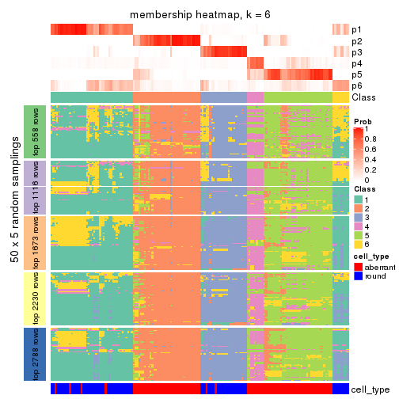</p>

</div>
</div>

As soon as we have had the classes for columns, we can look for signatures
which are significantly different between classes which can be candidate marks
for certain classes. Following are the heatmaps for signatures.


Signature heatmaps where rows are scaled:


<script>
$( function() {
	$( '#tabs-CV-kmeans-get-signatures' ).tabs();
} );
</script>
<div id='tabs-CV-kmeans-get-signatures'>
<ul>
<li><a href='#tab-CV-kmeans-get-signatures-1'>k = 2</a></li>
<li><a href='#tab-CV-kmeans-get-signatures-2'>k = 3</a></li>
<li><a href='#tab-CV-kmeans-get-signatures-3'>k = 4</a></li>
<li><a href='#tab-CV-kmeans-get-signatures-4'>k = 5</a></li>
<li><a href='#tab-CV-kmeans-get-signatures-5'>k = 6</a></li>
</ul>
<div id='tab-CV-kmeans-get-signatures-1'>
<pre><code class="r">get_signatures(res, k = 2)
</code></pre>

<p></p>

</div>
<div id='tab-CV-kmeans-get-signatures-2'>
<pre><code class="r">get_signatures(res, k = 3)
</code></pre>

<p></p>

</div>
<div id='tab-CV-kmeans-get-signatures-3'>
<pre><code class="r">get_signatures(res, k = 4)
</code></pre>

<p></p>

</div>
<div id='tab-CV-kmeans-get-signatures-4'>
<pre><code class="r">get_signatures(res, k = 5)
</code></pre>

<p></p>

</div>
<div id='tab-CV-kmeans-get-signatures-5'>
<pre><code class="r">get_signatures(res, k = 6)
</code></pre>

<p></p>

</div>
</div>


Signature heatmaps where rows are not scaled:


<script>
$( function() {
	$( '#tabs-CV-kmeans-get-signatures-no-scale' ).tabs();
} );
</script>
<div id='tabs-CV-kmeans-get-signatures-no-scale'>
<ul>
<li><a href='#tab-CV-kmeans-get-signatures-no-scale-1'>k = 2</a></li>
<li><a href='#tab-CV-kmeans-get-signatures-no-scale-2'>k = 3</a></li>
<li><a href='#tab-CV-kmeans-get-signatures-no-scale-3'>k = 4</a></li>
<li><a href='#tab-CV-kmeans-get-signatures-no-scale-4'>k = 5</a></li>
<li><a href='#tab-CV-kmeans-get-signatures-no-scale-5'>k = 6</a></li>
</ul>
<div id='tab-CV-kmeans-get-signatures-no-scale-1'>
<pre><code class="r">get_signatures(res, k = 2, scale_rows = FALSE)
</code></pre>

<p>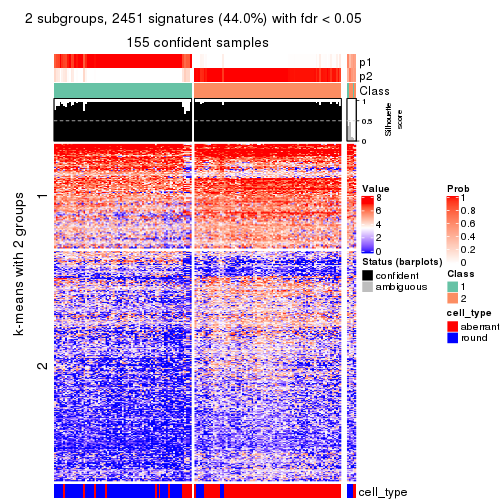</p>

</div>
<div id='tab-CV-kmeans-get-signatures-no-scale-2'>
<pre><code class="r">get_signatures(res, k = 3, scale_rows = FALSE)
</code></pre>

<p></p>

</div>
<div id='tab-CV-kmeans-get-signatures-no-scale-3'>
<pre><code class="r">get_signatures(res, k = 4, scale_rows = FALSE)
</code></pre>

<p></p>

</div>
<div id='tab-CV-kmeans-get-signatures-no-scale-4'>
<pre><code class="r">get_signatures(res, k = 5, scale_rows = FALSE)
</code></pre>

<p></p>

</div>
<div id='tab-CV-kmeans-get-signatures-no-scale-5'>
<pre><code class="r">get_signatures(res, k = 6, scale_rows = FALSE)
</code></pre>

<p></p>

</div>
</div>


Compare the overlap of signatures from different k:

```r
compare_signatures(res)
```


`get_signature()` returns a data frame invisibly. TO get the list of signatures, the function
call should be assigned to a variable explicitly. In following code, if `plot` argument is set
to `FALSE`, no heatmap is plotted while only the differential analysis is performed.

```r
# code only for demonstration
tb = get_signature(res, k = ..., plot = FALSE)
```

An example of the output of `tb` is:

```
#>   which_row         fdr    mean_1    mean_2 scaled_mean_1 scaled_mean_2 km
#> 1        38 0.042760348  8.373488  9.131774    -0.5533452     0.5164555  1
#> 2        40 0.018707592  7.106213  8.469186    -0.6173731     0.5762149  1
#> 3        55 0.019134737 10.221463 11.207825    -0.6159697     0.5749050  1
#> 4        59 0.006059896  5.921854  7.869574    -0.6899429     0.6439467  1
#> 5        60 0.018055526  8.928898 10.211722    -0.6204761     0.5791110  1
#> 6        98 0.009384629 15.714769 14.887706     0.6635654    -0.6193277  2
...
```

The columns in `tb` are:

1. `which_row`: row indices corresponding to the input matrix.
2. `fdr`: FDR for the differential test. 
3. `mean_x`: The mean value in group x.
4. `scaled_mean_x`: The mean value in group x after rows are scaled.
5. `km`: Row groups if k-means clustering is applied to rows.


UMAP plot which shows how samples are separated.


<script>
$( function() {
	$( '#tabs-CV-kmeans-dimension-reduction' ).tabs();
} );
</script>
<div id='tabs-CV-kmeans-dimension-reduction'>
<ul>
<li><a href='#tab-CV-kmeans-dimension-reduction-1'>k = 2</a></li>
<li><a href='#tab-CV-kmeans-dimension-reduction-2'>k = 3</a></li>
<li><a href='#tab-CV-kmeans-dimension-reduction-3'>k = 4</a></li>
<li><a href='#tab-CV-kmeans-dimension-reduction-4'>k = 5</a></li>
<li><a href='#tab-CV-kmeans-dimension-reduction-5'>k = 6</a></li>
</ul>
<div id='tab-CV-kmeans-dimension-reduction-1'>
<pre><code class="r">dimension_reduction(res, k = 2, method = &quot;UMAP&quot;)
</code></pre>

<p></p>

</div>
<div id='tab-CV-kmeans-dimension-reduction-2'>
<pre><code class="r">dimension_reduction(res, k = 3, method = &quot;UMAP&quot;)
</code></pre>

<p></p>

</div>
<div id='tab-CV-kmeans-dimension-reduction-3'>
<pre><code class="r">dimension_reduction(res, k = 4, method = &quot;UMAP&quot;)
</code></pre>

<p></p>

</div>
<div id='tab-CV-kmeans-dimension-reduction-4'>
<pre><code class="r">dimension_reduction(res, k = 5, method = &quot;UMAP&quot;)
</code></pre>

<p></p>

</div>
<div id='tab-CV-kmeans-dimension-reduction-5'>
<pre><code class="r">dimension_reduction(res, k = 6, method = &quot;UMAP&quot;)
</code></pre>

<p></p>

</div>
</div>


Following heatmap shows how subgroups are split when increasing `k`:

```r
collect_classes(res)
```


Test correlation between subgroups and known annotations. If the known
annotation is numeric, one-way ANOVA test is applied, and if the known
annotation is discrete, chi-squared contingency table test is applied.

```r
test_to_known_factors(res)
```

```
#>             n cell_type(p) k
#> CV:kmeans 155     4.72e-21 2
#> CV:kmeans 144     1.58e-22 3
#> CV:kmeans 151     9.92e-28 4
#> CV:kmeans 141     9.08e-25 5
#> CV:kmeans 123     1.07e-21 6
```


If matrix rows can be associated to genes, consider to use `GO_Enrichment(res,
...)` to perform function enrichment for the signature genes.


 

---------------------------------------------------


### CV:skmeans


The object with results only for a single top-value method and a single partition method 
can be extracted as:

```r
res = res_list["CV", "skmeans"]
# you can also extract it by
# res = res_list["CV:skmeans"]
```

A summary of `res` and all the functions that can be applied to it:

```r
res
```

```
#> A 'ConsensusPartition' object with k = 2, 3, 4, 5, 6.
#>   On a matrix with 5576 rows and 160 columns.
#>   Top rows (558, 1116, 1673, 2230, 2788) are extracted by 'CV' method.
#>   Subgroups are detected by 'skmeans' method.
#>   Performed in total 1250 partitions by row resampling.
#>   Best k for subgroups seems to be 2.
#> 
#> Following methods can be applied to this 'ConsensusPartition' object:
#>  [1] "cola_report"             "collect_classes"         "collect_plots"          
#>  [4] "collect_stats"           "colnames"                "compare_signatures"     
#>  [7] "consensus_heatmap"       "dimension_reduction"     "functional_enrichment"  
#> [10] "get_anno_col"            "get_anno"                "get_classes"            
#> [13] "get_consensus"           "get_matrix"              "get_membership"         
#> [16] "get_param"               "get_signatures"          "get_stats"              
#> [19] "is_best_k"               "is_stable_k"             "membership_heatmap"     
#> [22] "ncol"                    "nrow"                    "plot_ecdf"              
#> [25] "rownames"                "select_partition_number" "show"                   
#> [28] "suggest_best_k"          "test_to_known_factors"
```

`collect_plots()` function collects all the plots made from `res` for all `k` (number of partitions)
into one single page to provide an easy and fast comparison between different `k`.

```r
collect_plots(res)
```


The plots are:

- The first row: a plot of the ECDF (Empirical cumulative distribution
  function) curves of the consensus matrix for each `k` and the heatmap of
  predicted classes for each `k`.
- The second row: heatmaps of the consensus matrix for each `k`.
- The third row: heatmaps of the membership matrix for each `k`.
- The fouth row: heatmaps of the signatures for each `k`.

All the plots in panels can be made by individual functions and they are
plotted later in this section.

`select_partition_number()` produces several plots showing different
statistics for choosing "optimized" `k`. There are following statistics:

- ECDF curves of the consensus matrix for each `k`;
- 1-PAC. [The PAC
  score](https://en.wikipedia.org/wiki/Consensus_clustering#Over-interpretation_potential_of_consensus_clustering)
  measures the proportion of the ambiguous subgrouping.
- Mean silhouette score.
- Concordance. The mean probability of fiting the consensus class ids in all
  partitions.
- Area increased. Denote $A_k$ as the area under the ECDF curve for current
  `k`, the area increased is defined as $A_k - A_{k-1}$.
- Rand index. The percent of pairs of samples that are both in a same cluster
  or both are not in a same cluster in the partition of k and k-1.
- Jaccard index. The ratio of pairs of samples are both in a same cluster in
  the partition of k and k-1 and the pairs of samples are both in a same
  cluster in the partition k or k-1.

The detailed explanations of these statistics can be found in [the cola
vignette](http://bioconductor.org/packages/devel/bioc/vignettes/cola/inst/doc/cola.html#toc_13).

Generally speaking, lower PAC score, higher mean silhouette score or higher
concordance corresponds to better partition. Rand index and Jaccard index
measure how similar the current partition is compared to partition with `k-1`.
If they are too similar, we won't accept `k` is better than `k-1`.

```r
select_partition_number(res)
```


The numeric values for all these statistics can be obtained by `get_stats()`.

```r
get_stats(res)
```

```
#>   k 1-PAC mean_silhouette concordance area_increased  Rand Jaccard
#> 2 2 0.875           0.936       0.971         0.5031 0.497   0.497
#> 3 3 0.801           0.841       0.934         0.3145 0.761   0.555
#> 4 4 0.786           0.819       0.909         0.1164 0.856   0.615
#> 5 5 0.709           0.658       0.812         0.0545 0.964   0.867
#> 6 6 0.649           0.514       0.734         0.0413 0.951   0.810
```

`suggest_best_k()` suggests the best $k$ based on these statistics. The rules are as follows:

- All $k$ with Jaccard index larger than 0.95 are removed because the increase of
  the partition number does not provides enough extra information. If all $k$ are removed,
  the best $k$ is assigned by `NA`.
- For $k$ with 1-PAC larger than 0.9, the maximal $k$ is taken as the "best k". Other $k$ is called "optional k".
- If it does not fit the second rule. The $k$ with the highest vote of highest
  1-PAC, mean silhouette and concordance is taken as the "best k".

```r
suggest_best_k(res)
```

```
#> [1] 2
```


Following shows the table of the partitions (You need to click the **show/hide
code output** link to see it). The membership matrix (columns with name `p*`)
is inferred by
[`clue::cl_consensus()`](https://www.rdocumentation.org/link/cl_consensus?package=clue)
function with the `SE` method. Basically the value in the membership matrix
represents the probability to belong to a certain group. The finall class
label for an item is determined with the group with highest probability it
belongs to.

In `get_classes()` function, the entropy is calculated from the membership
matrix and the silhouette score is calculated from the consensus matrix.


<script>
$( function() {
	$( '#tabs-CV-skmeans-get-classes' ).tabs();
} );
</script>
<div id='tabs-CV-skmeans-get-classes'>
<ul>
<li><a href='#tab-CV-skmeans-get-classes-1'>k = 2</a></li>
<li><a href='#tab-CV-skmeans-get-classes-2'>k = 3</a></li>
<li><a href='#tab-CV-skmeans-get-classes-3'>k = 4</a></li>
<li><a href='#tab-CV-skmeans-get-classes-4'>k = 5</a></li>
<li><a href='#tab-CV-skmeans-get-classes-5'>k = 6</a></li>
</ul>

<div id='tab-CV-skmeans-get-classes-1'>
<p><a id='tab-CV-skmeans-get-classes-1-a' style='color:#0366d6' href='#'>show/hide code output</a></p>
<pre><code class="r">cbind(get_classes(res, k = 2), get_membership(res, k = 2))
</code></pre>

<pre><code>#&gt;                     class entropy silhouette    p1    p2
#&gt; aberrant_ERR2585320     2  0.0000      0.978 0.000 1.000
#&gt; aberrant_ERR2585338     2  0.0000      0.978 0.000 1.000
#&gt; aberrant_ERR2585325     2  0.0000      0.978 0.000 1.000
#&gt; aberrant_ERR2585283     1  0.7219      0.759 0.800 0.200
#&gt; aberrant_ERR2585343     2  0.0938      0.971 0.012 0.988
#&gt; aberrant_ERR2585329     2  0.0000      0.978 0.000 1.000
#&gt; aberrant_ERR2585317     2  0.0000      0.978 0.000 1.000
#&gt; aberrant_ERR2585339     2  0.0000      0.978 0.000 1.000
#&gt; aberrant_ERR2585335     2  0.0000      0.978 0.000 1.000
#&gt; aberrant_ERR2585287     2  0.0000      0.978 0.000 1.000
#&gt; aberrant_ERR2585321     2  0.2603      0.946 0.044 0.956
#&gt; aberrant_ERR2585297     1  0.0000      0.960 1.000 0.000
#&gt; aberrant_ERR2585337     2  0.0000      0.978 0.000 1.000
#&gt; aberrant_ERR2585319     2  0.0000      0.978 0.000 1.000
#&gt; aberrant_ERR2585315     2  0.0000      0.978 0.000 1.000
#&gt; aberrant_ERR2585336     2  0.0000      0.978 0.000 1.000
#&gt; aberrant_ERR2585307     2  0.0000      0.978 0.000 1.000
#&gt; aberrant_ERR2585301     2  0.0000      0.978 0.000 1.000
#&gt; aberrant_ERR2585326     2  0.0000      0.978 0.000 1.000
#&gt; aberrant_ERR2585331     2  0.0000      0.978 0.000 1.000
#&gt; aberrant_ERR2585346     1  0.6438      0.807 0.836 0.164
#&gt; aberrant_ERR2585314     2  0.0000      0.978 0.000 1.000
#&gt; aberrant_ERR2585298     1  0.4161      0.899 0.916 0.084
#&gt; aberrant_ERR2585345     2  0.0000      0.978 0.000 1.000
#&gt; aberrant_ERR2585299     1  0.0000      0.960 1.000 0.000
#&gt; aberrant_ERR2585309     1  0.0000      0.960 1.000 0.000
#&gt; aberrant_ERR2585303     2  0.0000      0.978 0.000 1.000
#&gt; aberrant_ERR2585313     2  0.0000      0.978 0.000 1.000
#&gt; aberrant_ERR2585318     2  0.0000      0.978 0.000 1.000
#&gt; aberrant_ERR2585328     2  0.0000      0.978 0.000 1.000
#&gt; aberrant_ERR2585330     2  0.0000      0.978 0.000 1.000
#&gt; aberrant_ERR2585293     1  0.6712      0.791 0.824 0.176
#&gt; aberrant_ERR2585342     2  0.0000      0.978 0.000 1.000
#&gt; aberrant_ERR2585348     2  0.0000      0.978 0.000 1.000
#&gt; aberrant_ERR2585352     2  0.0000      0.978 0.000 1.000
#&gt; aberrant_ERR2585308     1  0.0000      0.960 1.000 0.000
#&gt; aberrant_ERR2585349     2  0.0000      0.978 0.000 1.000
#&gt; aberrant_ERR2585316     2  0.7528      0.721 0.216 0.784
#&gt; aberrant_ERR2585306     1  0.5519      0.849 0.872 0.128
#&gt; aberrant_ERR2585324     2  0.0000      0.978 0.000 1.000
#&gt; aberrant_ERR2585310     2  0.4939      0.886 0.108 0.892
#&gt; aberrant_ERR2585296     1  0.0000      0.960 1.000 0.000
#&gt; aberrant_ERR2585275     1  0.9323      0.491 0.652 0.348
#&gt; aberrant_ERR2585311     2  0.2236      0.952 0.036 0.964
#&gt; aberrant_ERR2585292     1  0.6712      0.791 0.824 0.176
#&gt; aberrant_ERR2585282     2  0.2948      0.938 0.052 0.948
#&gt; aberrant_ERR2585305     2  0.5519      0.861 0.128 0.872
#&gt; aberrant_ERR2585278     2  0.0000      0.978 0.000 1.000
#&gt; aberrant_ERR2585347     2  0.3584      0.925 0.068 0.932
#&gt; aberrant_ERR2585332     2  0.0000      0.978 0.000 1.000
#&gt; aberrant_ERR2585280     2  0.0000      0.978 0.000 1.000
#&gt; aberrant_ERR2585304     2  0.0000      0.978 0.000 1.000
#&gt; aberrant_ERR2585322     2  0.0000      0.978 0.000 1.000
#&gt; aberrant_ERR2585279     2  0.0000      0.978 0.000 1.000
#&gt; aberrant_ERR2585277     2  0.0000      0.978 0.000 1.000
#&gt; aberrant_ERR2585295     2  0.0000      0.978 0.000 1.000
#&gt; aberrant_ERR2585333     2  0.0000      0.978 0.000 1.000
#&gt; aberrant_ERR2585285     2  0.0000      0.978 0.000 1.000
#&gt; aberrant_ERR2585286     2  0.0000      0.978 0.000 1.000
#&gt; aberrant_ERR2585294     2  0.0000      0.978 0.000 1.000
#&gt; aberrant_ERR2585300     2  0.0000      0.978 0.000 1.000
#&gt; aberrant_ERR2585334     2  0.0000      0.978 0.000 1.000
#&gt; aberrant_ERR2585361     2  0.0000      0.978 0.000 1.000
#&gt; aberrant_ERR2585372     2  0.0000      0.978 0.000 1.000
#&gt; round_ERR2585217        1  0.8861      0.584 0.696 0.304
#&gt; round_ERR2585205        1  0.0000      0.960 1.000 0.000
#&gt; round_ERR2585214        2  0.3584      0.920 0.068 0.932
#&gt; round_ERR2585202        2  0.5178      0.866 0.116 0.884
#&gt; aberrant_ERR2585367     2  0.0000      0.978 0.000 1.000
#&gt; round_ERR2585220        1  0.0000      0.960 1.000 0.000
#&gt; round_ERR2585238        1  0.0000      0.960 1.000 0.000
#&gt; aberrant_ERR2585276     2  0.0376      0.976 0.004 0.996
#&gt; round_ERR2585218        1  0.0000      0.960 1.000 0.000
#&gt; aberrant_ERR2585363     2  0.0000      0.978 0.000 1.000
#&gt; round_ERR2585201        1  0.4298      0.896 0.912 0.088
#&gt; round_ERR2585210        1  0.0000      0.960 1.000 0.000
#&gt; aberrant_ERR2585362     2  0.0000      0.978 0.000 1.000
#&gt; aberrant_ERR2585360     2  0.0672      0.973 0.008 0.992
#&gt; round_ERR2585209        1  0.0000      0.960 1.000 0.000
#&gt; round_ERR2585242        1  0.2778      0.927 0.952 0.048
#&gt; round_ERR2585216        1  0.0000      0.960 1.000 0.000
#&gt; round_ERR2585219        1  0.0000      0.960 1.000 0.000
#&gt; round_ERR2585237        2  0.9491      0.408 0.368 0.632
#&gt; round_ERR2585198        2  0.5842      0.835 0.140 0.860
#&gt; round_ERR2585211        1  0.0000      0.960 1.000 0.000
#&gt; round_ERR2585206        1  0.0000      0.960 1.000 0.000
#&gt; aberrant_ERR2585281     2  0.0000      0.978 0.000 1.000
#&gt; round_ERR2585212        1  0.0000      0.960 1.000 0.000
#&gt; round_ERR2585221        1  0.0000      0.960 1.000 0.000
#&gt; round_ERR2585243        1  0.0000      0.960 1.000 0.000
#&gt; round_ERR2585204        2  0.1843      0.957 0.028 0.972
#&gt; round_ERR2585213        2  0.0000      0.978 0.000 1.000
#&gt; aberrant_ERR2585373     2  0.0938      0.971 0.012 0.988
#&gt; aberrant_ERR2585358     2  0.0672      0.973 0.008 0.992
#&gt; aberrant_ERR2585365     2  0.0000      0.978 0.000 1.000
#&gt; aberrant_ERR2585359     2  0.3879      0.916 0.076 0.924
#&gt; aberrant_ERR2585370     2  0.0000      0.978 0.000 1.000
#&gt; round_ERR2585215        1  0.0000      0.960 1.000 0.000
#&gt; round_ERR2585262        1  0.4939      0.875 0.892 0.108
#&gt; round_ERR2585199        2  0.1633      0.961 0.024 0.976
#&gt; aberrant_ERR2585369     2  0.0000      0.978 0.000 1.000
#&gt; round_ERR2585208        1  0.0000      0.960 1.000 0.000
#&gt; round_ERR2585252        1  0.0000      0.960 1.000 0.000
#&gt; round_ERR2585236        1  0.0000      0.960 1.000 0.000
#&gt; aberrant_ERR2585284     1  0.0000      0.960 1.000 0.000
#&gt; round_ERR2585224        1  0.0000      0.960 1.000 0.000
#&gt; round_ERR2585260        1  0.0000      0.960 1.000 0.000
#&gt; round_ERR2585229        1  0.0000      0.960 1.000 0.000
#&gt; aberrant_ERR2585364     1  0.9775      0.324 0.588 0.412
#&gt; round_ERR2585253        1  0.0000      0.960 1.000 0.000
#&gt; aberrant_ERR2585368     2  0.0000      0.978 0.000 1.000
#&gt; aberrant_ERR2585371     2  0.0000      0.978 0.000 1.000
#&gt; round_ERR2585239        1  0.0000      0.960 1.000 0.000
#&gt; round_ERR2585273        1  0.0000      0.960 1.000 0.000
#&gt; round_ERR2585256        1  0.0000      0.960 1.000 0.000
#&gt; round_ERR2585272        1  0.0000      0.960 1.000 0.000
#&gt; round_ERR2585246        1  0.0000      0.960 1.000 0.000
#&gt; round_ERR2585261        1  0.0672      0.955 0.992 0.008
#&gt; round_ERR2585254        1  0.1184      0.949 0.984 0.016
#&gt; round_ERR2585225        1  0.3584      0.912 0.932 0.068
#&gt; round_ERR2585235        1  0.0000      0.960 1.000 0.000
#&gt; round_ERR2585271        1  0.0000      0.960 1.000 0.000
#&gt; round_ERR2585251        1  0.0000      0.960 1.000 0.000
#&gt; round_ERR2585255        1  0.4562      0.888 0.904 0.096
#&gt; round_ERR2585257        1  0.1633      0.944 0.976 0.024
#&gt; round_ERR2585226        1  0.0000      0.960 1.000 0.000
#&gt; round_ERR2585265        1  0.0000      0.960 1.000 0.000
#&gt; round_ERR2585259        1  0.0000      0.960 1.000 0.000
#&gt; round_ERR2585247        1  0.0000      0.960 1.000 0.000
#&gt; round_ERR2585241        1  0.0000      0.960 1.000 0.000
#&gt; round_ERR2585263        1  0.0000      0.960 1.000 0.000
#&gt; round_ERR2585264        1  0.0000      0.960 1.000 0.000
#&gt; round_ERR2585233        1  0.0000      0.960 1.000 0.000
#&gt; round_ERR2585223        1  0.0000      0.960 1.000 0.000
#&gt; round_ERR2585234        1  0.9944      0.188 0.544 0.456
#&gt; round_ERR2585222        1  0.0000      0.960 1.000 0.000
#&gt; round_ERR2585228        1  0.0000      0.960 1.000 0.000
#&gt; round_ERR2585248        1  0.0000      0.960 1.000 0.000
#&gt; round_ERR2585240        1  0.3431      0.915 0.936 0.064
#&gt; round_ERR2585270        1  0.0000      0.960 1.000 0.000
#&gt; round_ERR2585232        1  0.0000      0.960 1.000 0.000
#&gt; aberrant_ERR2585341     2  0.0000      0.978 0.000 1.000
#&gt; aberrant_ERR2585355     2  0.0000      0.978 0.000 1.000
#&gt; round_ERR2585227        1  0.0000      0.960 1.000 0.000
#&gt; aberrant_ERR2585351     2  0.1633      0.962 0.024 0.976
#&gt; round_ERR2585269        1  0.0000      0.960 1.000 0.000
#&gt; aberrant_ERR2585357     2  0.0000      0.978 0.000 1.000
#&gt; aberrant_ERR2585350     2  0.0000      0.978 0.000 1.000
#&gt; round_ERR2585250        1  0.0000      0.960 1.000 0.000
#&gt; round_ERR2585245        1  0.0000      0.960 1.000 0.000
#&gt; aberrant_ERR2585353     2  0.0000      0.978 0.000 1.000
#&gt; round_ERR2585258        1  0.0000      0.960 1.000 0.000
#&gt; aberrant_ERR2585354     2  0.0000      0.978 0.000 1.000
#&gt; round_ERR2585249        1  0.0000      0.960 1.000 0.000
#&gt; round_ERR2585268        1  0.0000      0.960 1.000 0.000
#&gt; aberrant_ERR2585356     2  0.5629      0.854 0.132 0.868
#&gt; round_ERR2585266        1  0.4022      0.902 0.920 0.080
#&gt; round_ERR2585231        1  0.0000      0.960 1.000 0.000
#&gt; round_ERR2585230        1  0.0000      0.960 1.000 0.000
#&gt; round_ERR2585267        1  0.0000      0.960 1.000 0.000
</code></pre>

<script>
$('#tab-CV-skmeans-get-classes-1-a').parent().next().next().hide();
$('#tab-CV-skmeans-get-classes-1-a').click(function(){
  $('#tab-CV-skmeans-get-classes-1-a').parent().next().next().toggle();
  return(false);
});
</script>
</div>

<div id='tab-CV-skmeans-get-classes-2'>
<p><a id='tab-CV-skmeans-get-classes-2-a' style='color:#0366d6' href='#'>show/hide code output</a></p>
<pre><code class="r">cbind(get_classes(res, k = 3), get_membership(res, k = 3))
</code></pre>

<pre><code>#&gt;                     class entropy silhouette    p1    p2    p3
#&gt; aberrant_ERR2585320     2  0.1411     0.8900 0.000 0.964 0.036
#&gt; aberrant_ERR2585338     3  0.0237     0.9084 0.000 0.004 0.996
#&gt; aberrant_ERR2585325     2  0.1411     0.8900 0.000 0.964 0.036
#&gt; aberrant_ERR2585283     2  0.0000     0.9050 0.000 1.000 0.000
#&gt; aberrant_ERR2585343     2  0.0000     0.9050 0.000 1.000 0.000
#&gt; aberrant_ERR2585329     3  0.0237     0.9084 0.000 0.004 0.996
#&gt; aberrant_ERR2585317     3  0.0237     0.9084 0.000 0.004 0.996
#&gt; aberrant_ERR2585339     3  0.0000     0.9087 0.000 0.000 1.000
#&gt; aberrant_ERR2585335     3  0.6026     0.3321 0.000 0.376 0.624
#&gt; aberrant_ERR2585287     2  0.0000     0.9050 0.000 1.000 0.000
#&gt; aberrant_ERR2585321     2  0.0000     0.9050 0.000 1.000 0.000
#&gt; aberrant_ERR2585297     1  0.0000     0.9501 1.000 0.000 0.000
#&gt; aberrant_ERR2585337     3  0.0000     0.9087 0.000 0.000 1.000
#&gt; aberrant_ERR2585319     3  0.5431     0.5583 0.000 0.284 0.716
#&gt; aberrant_ERR2585315     3  0.1163     0.8941 0.000 0.028 0.972
#&gt; aberrant_ERR2585336     3  0.0237     0.9084 0.000 0.004 0.996
#&gt; aberrant_ERR2585307     3  0.0000     0.9087 0.000 0.000 1.000
#&gt; aberrant_ERR2585301     2  0.5760     0.5592 0.000 0.672 0.328
#&gt; aberrant_ERR2585326     3  0.0000     0.9087 0.000 0.000 1.000
#&gt; aberrant_ERR2585331     3  0.0000     0.9087 0.000 0.000 1.000
#&gt; aberrant_ERR2585346     2  0.0000     0.9050 0.000 1.000 0.000
#&gt; aberrant_ERR2585314     3  0.1163     0.8938 0.000 0.028 0.972
#&gt; aberrant_ERR2585298     3  0.6225     0.1830 0.432 0.000 0.568
#&gt; aberrant_ERR2585345     3  0.0237     0.9084 0.000 0.004 0.996
#&gt; aberrant_ERR2585299     1  0.0000     0.9501 1.000 0.000 0.000
#&gt; aberrant_ERR2585309     1  0.0000     0.9501 1.000 0.000 0.000
#&gt; aberrant_ERR2585303     3  0.4750     0.6932 0.000 0.216 0.784
#&gt; aberrant_ERR2585313     3  0.0237     0.9084 0.000 0.004 0.996
#&gt; aberrant_ERR2585318     2  0.4974     0.7039 0.000 0.764 0.236
#&gt; aberrant_ERR2585328     2  0.1031     0.8947 0.000 0.976 0.024
#&gt; aberrant_ERR2585330     2  0.5363     0.6464 0.000 0.724 0.276
#&gt; aberrant_ERR2585293     2  0.0000     0.9050 0.000 1.000 0.000
#&gt; aberrant_ERR2585342     2  0.1643     0.8840 0.000 0.956 0.044
#&gt; aberrant_ERR2585348     2  0.3038     0.8292 0.000 0.896 0.104
#&gt; aberrant_ERR2585352     3  0.4605     0.7005 0.000 0.204 0.796
#&gt; aberrant_ERR2585308     1  0.0000     0.9501 1.000 0.000 0.000
#&gt; aberrant_ERR2585349     3  0.0000     0.9087 0.000 0.000 1.000
#&gt; aberrant_ERR2585316     2  0.0000     0.9050 0.000 1.000 0.000
#&gt; aberrant_ERR2585306     2  0.0000     0.9050 0.000 1.000 0.000
#&gt; aberrant_ERR2585324     3  0.5431     0.5583 0.000 0.284 0.716
#&gt; aberrant_ERR2585310     3  0.3587     0.8268 0.088 0.020 0.892
#&gt; aberrant_ERR2585296     1  0.3551     0.8178 0.868 0.000 0.132
#&gt; aberrant_ERR2585275     2  0.0000     0.9050 0.000 1.000 0.000
#&gt; aberrant_ERR2585311     2  0.0000     0.9050 0.000 1.000 0.000
#&gt; aberrant_ERR2585292     2  0.0000     0.9050 0.000 1.000 0.000
#&gt; aberrant_ERR2585282     2  0.0000     0.9050 0.000 1.000 0.000
#&gt; aberrant_ERR2585305     2  0.6420     0.6072 0.024 0.688 0.288
#&gt; aberrant_ERR2585278     3  0.3816     0.7807 0.000 0.148 0.852
#&gt; aberrant_ERR2585347     2  0.0000     0.9050 0.000 1.000 0.000
#&gt; aberrant_ERR2585332     2  0.0000     0.9050 0.000 1.000 0.000
#&gt; aberrant_ERR2585280     2  0.5098     0.6894 0.000 0.752 0.248
#&gt; aberrant_ERR2585304     3  0.0000     0.9087 0.000 0.000 1.000
#&gt; aberrant_ERR2585322     3  0.0237     0.9084 0.000 0.004 0.996
#&gt; aberrant_ERR2585279     3  0.0000     0.9087 0.000 0.000 1.000
#&gt; aberrant_ERR2585277     3  0.0000     0.9087 0.000 0.000 1.000
#&gt; aberrant_ERR2585295     2  0.5905     0.4713 0.000 0.648 0.352
#&gt; aberrant_ERR2585333     2  0.0000     0.9050 0.000 1.000 0.000
#&gt; aberrant_ERR2585285     2  0.6286     0.2011 0.000 0.536 0.464
#&gt; aberrant_ERR2585286     3  0.0237     0.9084 0.000 0.004 0.996
#&gt; aberrant_ERR2585294     2  0.5905     0.5067 0.000 0.648 0.352
#&gt; aberrant_ERR2585300     2  0.0000     0.9050 0.000 1.000 0.000
#&gt; aberrant_ERR2585334     3  0.0000     0.9087 0.000 0.000 1.000
#&gt; aberrant_ERR2585361     2  0.3686     0.8025 0.000 0.860 0.140
#&gt; aberrant_ERR2585372     2  0.0000     0.9050 0.000 1.000 0.000
#&gt; round_ERR2585217        3  0.3192     0.8099 0.112 0.000 0.888
#&gt; round_ERR2585205        1  0.0000     0.9501 1.000 0.000 0.000
#&gt; round_ERR2585214        3  0.0000     0.9087 0.000 0.000 1.000
#&gt; round_ERR2585202        3  0.0000     0.9087 0.000 0.000 1.000
#&gt; aberrant_ERR2585367     2  0.6280     0.1910 0.000 0.540 0.460
#&gt; round_ERR2585220        1  0.0000     0.9501 1.000 0.000 0.000
#&gt; round_ERR2585238        1  0.0000     0.9501 1.000 0.000 0.000
#&gt; aberrant_ERR2585276     2  0.1289     0.8921 0.000 0.968 0.032
#&gt; round_ERR2585218        1  0.0000     0.9501 1.000 0.000 0.000
#&gt; aberrant_ERR2585363     3  0.3340     0.8119 0.000 0.120 0.880
#&gt; round_ERR2585201        3  0.5926     0.4049 0.356 0.000 0.644
#&gt; round_ERR2585210        1  0.0000     0.9501 1.000 0.000 0.000
#&gt; aberrant_ERR2585362     2  0.0000     0.9050 0.000 1.000 0.000
#&gt; aberrant_ERR2585360     2  0.1529     0.8867 0.000 0.960 0.040
#&gt; round_ERR2585209        1  0.0237     0.9471 0.996 0.000 0.004
#&gt; round_ERR2585242        1  0.6299     0.1331 0.524 0.000 0.476
#&gt; round_ERR2585216        1  0.0000     0.9501 1.000 0.000 0.000
#&gt; round_ERR2585219        1  0.0000     0.9501 1.000 0.000 0.000
#&gt; round_ERR2585237        3  0.0237     0.9067 0.004 0.000 0.996
#&gt; round_ERR2585198        3  0.0000     0.9087 0.000 0.000 1.000
#&gt; round_ERR2585211        1  0.0000     0.9501 1.000 0.000 0.000
#&gt; round_ERR2585206        1  0.0000     0.9501 1.000 0.000 0.000
#&gt; aberrant_ERR2585281     3  0.2625     0.8510 0.000 0.084 0.916
#&gt; round_ERR2585212        1  0.0000     0.9501 1.000 0.000 0.000
#&gt; round_ERR2585221        1  0.0000     0.9501 1.000 0.000 0.000
#&gt; round_ERR2585243        1  0.0000     0.9501 1.000 0.000 0.000
#&gt; round_ERR2585204        3  0.0000     0.9087 0.000 0.000 1.000
#&gt; round_ERR2585213        3  0.0000     0.9087 0.000 0.000 1.000
#&gt; aberrant_ERR2585373     2  0.0000     0.9050 0.000 1.000 0.000
#&gt; aberrant_ERR2585358     2  0.0000     0.9050 0.000 1.000 0.000
#&gt; aberrant_ERR2585365     3  0.4750     0.6953 0.000 0.216 0.784
#&gt; aberrant_ERR2585359     2  0.0000     0.9050 0.000 1.000 0.000
#&gt; aberrant_ERR2585370     3  0.0000     0.9087 0.000 0.000 1.000
#&gt; round_ERR2585215        1  0.0000     0.9501 1.000 0.000 0.000
#&gt; round_ERR2585262        3  0.8283     0.2684 0.380 0.084 0.536
#&gt; round_ERR2585199        3  0.0000     0.9087 0.000 0.000 1.000
#&gt; aberrant_ERR2585369     2  0.0237     0.9037 0.000 0.996 0.004
#&gt; round_ERR2585208        1  0.0000     0.9501 1.000 0.000 0.000
#&gt; round_ERR2585252        1  0.0000     0.9501 1.000 0.000 0.000
#&gt; round_ERR2585236        1  0.0237     0.9468 0.996 0.004 0.000
#&gt; aberrant_ERR2585284     2  0.0592     0.8971 0.012 0.988 0.000
#&gt; round_ERR2585224        1  0.0000     0.9501 1.000 0.000 0.000
#&gt; round_ERR2585260        1  0.0000     0.9501 1.000 0.000 0.000
#&gt; round_ERR2585229        1  0.0000     0.9501 1.000 0.000 0.000
#&gt; aberrant_ERR2585364     2  0.0000     0.9050 0.000 1.000 0.000
#&gt; round_ERR2585253        1  0.0000     0.9501 1.000 0.000 0.000
#&gt; aberrant_ERR2585368     3  0.0237     0.9084 0.000 0.004 0.996
#&gt; aberrant_ERR2585371     3  0.0237     0.9084 0.000 0.004 0.996
#&gt; round_ERR2585239        1  0.0000     0.9501 1.000 0.000 0.000
#&gt; round_ERR2585273        1  0.0000     0.9501 1.000 0.000 0.000
#&gt; round_ERR2585256        1  0.0000     0.9501 1.000 0.000 0.000
#&gt; round_ERR2585272        1  0.0000     0.9501 1.000 0.000 0.000
#&gt; round_ERR2585246        1  0.0000     0.9501 1.000 0.000 0.000
#&gt; round_ERR2585261        1  0.6126     0.3405 0.600 0.000 0.400
#&gt; round_ERR2585254        1  0.6305     0.0405 0.516 0.000 0.484
#&gt; round_ERR2585225        1  0.5785     0.5158 0.668 0.000 0.332
#&gt; round_ERR2585235        1  0.0000     0.9501 1.000 0.000 0.000
#&gt; round_ERR2585271        1  0.0000     0.9501 1.000 0.000 0.000
#&gt; round_ERR2585251        1  0.0000     0.9501 1.000 0.000 0.000
#&gt; round_ERR2585255        1  0.6302     0.1191 0.520 0.000 0.480
#&gt; round_ERR2585257        1  0.3412     0.8301 0.876 0.000 0.124
#&gt; round_ERR2585226        1  0.0000     0.9501 1.000 0.000 0.000
#&gt; round_ERR2585265        1  0.0000     0.9501 1.000 0.000 0.000
#&gt; round_ERR2585259        1  0.0000     0.9501 1.000 0.000 0.000
#&gt; round_ERR2585247        1  0.0000     0.9501 1.000 0.000 0.000
#&gt; round_ERR2585241        1  0.0000     0.9501 1.000 0.000 0.000
#&gt; round_ERR2585263        1  0.0000     0.9501 1.000 0.000 0.000
#&gt; round_ERR2585264        1  0.0000     0.9501 1.000 0.000 0.000
#&gt; round_ERR2585233        1  0.0000     0.9501 1.000 0.000 0.000
#&gt; round_ERR2585223        1  0.0000     0.9501 1.000 0.000 0.000
#&gt; round_ERR2585234        3  0.0237     0.9065 0.004 0.000 0.996
#&gt; round_ERR2585222        1  0.0000     0.9501 1.000 0.000 0.000
#&gt; round_ERR2585228        1  0.0000     0.9501 1.000 0.000 0.000
#&gt; round_ERR2585248        1  0.0000     0.9501 1.000 0.000 0.000
#&gt; round_ERR2585240        1  0.5291     0.6331 0.732 0.000 0.268
#&gt; round_ERR2585270        1  0.0000     0.9501 1.000 0.000 0.000
#&gt; round_ERR2585232        1  0.0000     0.9501 1.000 0.000 0.000
#&gt; aberrant_ERR2585341     3  0.3752     0.7914 0.000 0.144 0.856
#&gt; aberrant_ERR2585355     3  0.0237     0.9084 0.000 0.004 0.996
#&gt; round_ERR2585227        1  0.0000     0.9501 1.000 0.000 0.000
#&gt; aberrant_ERR2585351     2  0.5905     0.5074 0.000 0.648 0.352
#&gt; round_ERR2585269        1  0.0000     0.9501 1.000 0.000 0.000
#&gt; aberrant_ERR2585357     3  0.0000     0.9087 0.000 0.000 1.000
#&gt; aberrant_ERR2585350     3  0.0237     0.9084 0.000 0.004 0.996
#&gt; round_ERR2585250        1  0.0000     0.9501 1.000 0.000 0.000
#&gt; round_ERR2585245        1  0.0000     0.9501 1.000 0.000 0.000
#&gt; aberrant_ERR2585353     2  0.0000     0.9050 0.000 1.000 0.000
#&gt; round_ERR2585258        1  0.0000     0.9501 1.000 0.000 0.000
#&gt; aberrant_ERR2585354     2  0.0000     0.9050 0.000 1.000 0.000
#&gt; round_ERR2585249        1  0.0000     0.9501 1.000 0.000 0.000
#&gt; round_ERR2585268        1  0.0000     0.9501 1.000 0.000 0.000
#&gt; aberrant_ERR2585356     2  0.0000     0.9050 0.000 1.000 0.000
#&gt; round_ERR2585266        1  0.5968     0.4470 0.636 0.000 0.364
#&gt; round_ERR2585231        1  0.0000     0.9501 1.000 0.000 0.000
#&gt; round_ERR2585230        1  0.0000     0.9501 1.000 0.000 0.000
#&gt; round_ERR2585267        1  0.0000     0.9501 1.000 0.000 0.000
</code></pre>

<script>
$('#tab-CV-skmeans-get-classes-2-a').parent().next().next().hide();
$('#tab-CV-skmeans-get-classes-2-a').click(function(){
  $('#tab-CV-skmeans-get-classes-2-a').parent().next().next().toggle();
  return(false);
});
</script>
</div>

<div id='tab-CV-skmeans-get-classes-3'>
<p><a id='tab-CV-skmeans-get-classes-3-a' style='color:#0366d6' href='#'>show/hide code output</a></p>
<pre><code class="r">cbind(get_classes(res, k = 4), get_membership(res, k = 4))
</code></pre>

<pre><code>#&gt;                     class entropy silhouette    p1    p2    p3    p4
#&gt; aberrant_ERR2585320     4  0.5203     0.3759 0.000 0.416 0.008 0.576
#&gt; aberrant_ERR2585338     2  0.0921     0.8845 0.000 0.972 0.028 0.000
#&gt; aberrant_ERR2585325     4  0.5229     0.3427 0.000 0.428 0.008 0.564
#&gt; aberrant_ERR2585283     4  0.0188     0.8712 0.000 0.000 0.004 0.996
#&gt; aberrant_ERR2585343     4  0.0376     0.8716 0.000 0.004 0.004 0.992
#&gt; aberrant_ERR2585329     2  0.0707     0.8837 0.000 0.980 0.020 0.000
#&gt; aberrant_ERR2585317     2  0.0707     0.8836 0.000 0.980 0.020 0.000
#&gt; aberrant_ERR2585339     2  0.0921     0.8845 0.000 0.972 0.028 0.000
#&gt; aberrant_ERR2585335     2  0.3668     0.7222 0.000 0.808 0.004 0.188
#&gt; aberrant_ERR2585287     4  0.1305     0.8665 0.000 0.036 0.004 0.960
#&gt; aberrant_ERR2585321     4  0.0927     0.8726 0.000 0.016 0.008 0.976
#&gt; aberrant_ERR2585297     1  0.0000     0.9402 1.000 0.000 0.000 0.000
#&gt; aberrant_ERR2585337     2  0.0817     0.8842 0.000 0.976 0.024 0.000
#&gt; aberrant_ERR2585319     2  0.1042     0.8702 0.000 0.972 0.008 0.020
#&gt; aberrant_ERR2585315     2  0.0336     0.8786 0.000 0.992 0.008 0.000
#&gt; aberrant_ERR2585336     2  0.0817     0.8843 0.000 0.976 0.024 0.000
#&gt; aberrant_ERR2585307     2  0.1211     0.8831 0.000 0.960 0.040 0.000
#&gt; aberrant_ERR2585301     2  0.4891     0.5199 0.000 0.680 0.012 0.308
#&gt; aberrant_ERR2585326     2  0.1118     0.8840 0.000 0.964 0.036 0.000
#&gt; aberrant_ERR2585331     2  0.1940     0.8688 0.000 0.924 0.076 0.000
#&gt; aberrant_ERR2585346     4  0.0188     0.8712 0.000 0.000 0.004 0.996
#&gt; aberrant_ERR2585314     2  0.1022     0.8839 0.000 0.968 0.032 0.000
#&gt; aberrant_ERR2585298     3  0.0469     0.9055 0.000 0.012 0.988 0.000
#&gt; aberrant_ERR2585345     2  0.0817     0.8843 0.000 0.976 0.024 0.000
#&gt; aberrant_ERR2585299     1  0.0000     0.9402 1.000 0.000 0.000 0.000
#&gt; aberrant_ERR2585309     1  0.0000     0.9402 1.000 0.000 0.000 0.000
#&gt; aberrant_ERR2585303     2  0.3307     0.8223 0.000 0.868 0.028 0.104
#&gt; aberrant_ERR2585313     2  0.0592     0.8830 0.000 0.984 0.016 0.000
#&gt; aberrant_ERR2585318     2  0.5132     0.1084 0.000 0.548 0.004 0.448
#&gt; aberrant_ERR2585328     4  0.2805     0.8303 0.000 0.100 0.012 0.888
#&gt; aberrant_ERR2585330     2  0.4713     0.4160 0.000 0.640 0.000 0.360
#&gt; aberrant_ERR2585293     4  0.0188     0.8712 0.000 0.000 0.004 0.996
#&gt; aberrant_ERR2585342     4  0.4836     0.5695 0.000 0.320 0.008 0.672
#&gt; aberrant_ERR2585348     4  0.3300     0.7864 0.000 0.144 0.008 0.848
#&gt; aberrant_ERR2585352     2  0.1284     0.8750 0.000 0.964 0.012 0.024
#&gt; aberrant_ERR2585308     1  0.0000     0.9402 1.000 0.000 0.000 0.000
#&gt; aberrant_ERR2585349     2  0.3942     0.7136 0.000 0.764 0.236 0.000
#&gt; aberrant_ERR2585316     4  0.0188     0.8713 0.000 0.000 0.004 0.996
#&gt; aberrant_ERR2585306     4  0.1042     0.8651 0.020 0.000 0.008 0.972
#&gt; aberrant_ERR2585324     2  0.1042     0.8702 0.000 0.972 0.008 0.020
#&gt; aberrant_ERR2585310     2  0.3943     0.8098 0.036 0.844 0.112 0.008
#&gt; aberrant_ERR2585296     3  0.4610     0.6964 0.236 0.020 0.744 0.000
#&gt; aberrant_ERR2585275     4  0.0188     0.8712 0.000 0.000 0.004 0.996
#&gt; aberrant_ERR2585311     4  0.1489     0.8662 0.000 0.044 0.004 0.952
#&gt; aberrant_ERR2585292     4  0.0188     0.8712 0.000 0.000 0.004 0.996
#&gt; aberrant_ERR2585282     4  0.0524     0.8722 0.000 0.008 0.004 0.988
#&gt; aberrant_ERR2585305     4  0.7202     0.2666 0.092 0.388 0.016 0.504
#&gt; aberrant_ERR2585278     2  0.0524     0.8812 0.000 0.988 0.008 0.004
#&gt; aberrant_ERR2585347     4  0.0000     0.8712 0.000 0.000 0.000 1.000
#&gt; aberrant_ERR2585332     4  0.0657     0.8722 0.000 0.012 0.004 0.984
#&gt; aberrant_ERR2585280     2  0.4194     0.6670 0.000 0.764 0.008 0.228
#&gt; aberrant_ERR2585304     2  0.2530     0.8490 0.000 0.888 0.112 0.000
#&gt; aberrant_ERR2585322     2  0.0592     0.8830 0.000 0.984 0.016 0.000
#&gt; aberrant_ERR2585279     2  0.3444     0.7777 0.000 0.816 0.184 0.000
#&gt; aberrant_ERR2585277     2  0.1302     0.8822 0.000 0.956 0.044 0.000
#&gt; aberrant_ERR2585295     4  0.5296     0.0615 0.000 0.496 0.008 0.496
#&gt; aberrant_ERR2585333     4  0.1389     0.8667 0.000 0.048 0.000 0.952
#&gt; aberrant_ERR2585285     2  0.4008     0.6425 0.000 0.756 0.000 0.244
#&gt; aberrant_ERR2585286     2  0.1118     0.8837 0.000 0.964 0.036 0.000
#&gt; aberrant_ERR2585294     2  0.4814     0.5032 0.000 0.676 0.008 0.316
#&gt; aberrant_ERR2585300     4  0.1151     0.8721 0.000 0.024 0.008 0.968
#&gt; aberrant_ERR2585334     2  0.3444     0.7814 0.000 0.816 0.184 0.000
#&gt; aberrant_ERR2585361     4  0.5268     0.2579 0.000 0.452 0.008 0.540
#&gt; aberrant_ERR2585372     4  0.2976     0.8272 0.000 0.120 0.008 0.872
#&gt; round_ERR2585217        3  0.0592     0.9052 0.000 0.016 0.984 0.000
#&gt; round_ERR2585205        1  0.0000     0.9402 1.000 0.000 0.000 0.000
#&gt; round_ERR2585214        3  0.0707     0.9042 0.000 0.020 0.980 0.000
#&gt; round_ERR2585202        3  0.1716     0.8781 0.000 0.064 0.936 0.000
#&gt; aberrant_ERR2585367     2  0.4857     0.5603 0.000 0.700 0.016 0.284
#&gt; round_ERR2585220        1  0.2345     0.8747 0.900 0.000 0.100 0.000
#&gt; round_ERR2585238        1  0.0000     0.9402 1.000 0.000 0.000 0.000
#&gt; aberrant_ERR2585276     4  0.4086     0.7223 0.000 0.216 0.008 0.776
#&gt; round_ERR2585218        1  0.0188     0.9388 0.996 0.000 0.004 0.000
#&gt; aberrant_ERR2585363     2  0.0524     0.8754 0.000 0.988 0.004 0.008
#&gt; round_ERR2585201        3  0.0524     0.9063 0.004 0.008 0.988 0.000
#&gt; round_ERR2585210        1  0.0188     0.9388 0.996 0.000 0.004 0.000
#&gt; aberrant_ERR2585362     4  0.2271     0.8521 0.000 0.076 0.008 0.916
#&gt; aberrant_ERR2585360     4  0.4428     0.6496 0.000 0.276 0.004 0.720
#&gt; round_ERR2585209        3  0.1867     0.8844 0.072 0.000 0.928 0.000
#&gt; round_ERR2585242        3  0.0672     0.9065 0.008 0.008 0.984 0.000
#&gt; round_ERR2585216        1  0.1211     0.9217 0.960 0.000 0.040 0.000
#&gt; round_ERR2585219        1  0.0188     0.9388 0.996 0.000 0.004 0.000
#&gt; round_ERR2585237        3  0.0592     0.9052 0.000 0.016 0.984 0.000
#&gt; round_ERR2585198        3  0.0707     0.9042 0.000 0.020 0.980 0.000
#&gt; round_ERR2585211        1  0.0000     0.9402 1.000 0.000 0.000 0.000
#&gt; round_ERR2585206        1  0.0000     0.9402 1.000 0.000 0.000 0.000
#&gt; aberrant_ERR2585281     2  0.2408     0.8716 0.000 0.920 0.044 0.036
#&gt; round_ERR2585212        1  0.2530     0.8650 0.888 0.000 0.112 0.000
#&gt; round_ERR2585221        1  0.0000     0.9402 1.000 0.000 0.000 0.000
#&gt; round_ERR2585243        1  0.0188     0.9388 0.996 0.000 0.004 0.000
#&gt; round_ERR2585204        3  0.0592     0.9052 0.000 0.016 0.984 0.000
#&gt; round_ERR2585213        3  0.4277     0.5732 0.000 0.280 0.720 0.000
#&gt; aberrant_ERR2585373     4  0.2918     0.8324 0.000 0.116 0.008 0.876
#&gt; aberrant_ERR2585358     4  0.0657     0.8725 0.000 0.012 0.004 0.984
#&gt; aberrant_ERR2585365     2  0.3117     0.8371 0.000 0.880 0.028 0.092
#&gt; aberrant_ERR2585359     4  0.0524     0.8717 0.000 0.004 0.008 0.988
#&gt; aberrant_ERR2585370     2  0.1118     0.8835 0.000 0.964 0.036 0.000
#&gt; round_ERR2585215        1  0.0000     0.9402 1.000 0.000 0.000 0.000
#&gt; round_ERR2585262        3  0.2197     0.8919 0.028 0.012 0.936 0.024
#&gt; round_ERR2585199        3  0.2408     0.8408 0.000 0.104 0.896 0.000
#&gt; aberrant_ERR2585369     4  0.4053     0.7210 0.000 0.228 0.004 0.768
#&gt; round_ERR2585208        1  0.0000     0.9402 1.000 0.000 0.000 0.000
#&gt; round_ERR2585252        1  0.0000     0.9402 1.000 0.000 0.000 0.000
#&gt; round_ERR2585236        1  0.1913     0.9041 0.940 0.000 0.020 0.040
#&gt; aberrant_ERR2585284     4  0.0376     0.8706 0.004 0.000 0.004 0.992
#&gt; round_ERR2585224        1  0.0000     0.9402 1.000 0.000 0.000 0.000
#&gt; round_ERR2585260        1  0.0469     0.9354 0.988 0.000 0.012 0.000
#&gt; round_ERR2585229        1  0.0000     0.9402 1.000 0.000 0.000 0.000
#&gt; aberrant_ERR2585364     4  0.0336     0.8715 0.000 0.000 0.008 0.992
#&gt; round_ERR2585253        1  0.0000     0.9402 1.000 0.000 0.000 0.000
#&gt; aberrant_ERR2585368     2  0.1389     0.8809 0.000 0.952 0.048 0.000
#&gt; aberrant_ERR2585371     2  0.1389     0.8809 0.000 0.952 0.048 0.000
#&gt; round_ERR2585239        1  0.0336     0.9371 0.992 0.000 0.008 0.000
#&gt; round_ERR2585273        1  0.0000     0.9402 1.000 0.000 0.000 0.000
#&gt; round_ERR2585256        3  0.4543     0.5312 0.324 0.000 0.676 0.000
#&gt; round_ERR2585272        1  0.3356     0.7859 0.824 0.000 0.176 0.000
#&gt; round_ERR2585246        1  0.0000     0.9402 1.000 0.000 0.000 0.000
#&gt; round_ERR2585261        3  0.0804     0.9073 0.008 0.012 0.980 0.000
#&gt; round_ERR2585254        3  0.1975     0.8975 0.048 0.016 0.936 0.000
#&gt; round_ERR2585225        3  0.2149     0.8795 0.088 0.000 0.912 0.000
#&gt; round_ERR2585235        1  0.2530     0.8608 0.888 0.000 0.112 0.000
#&gt; round_ERR2585271        1  0.0000     0.9402 1.000 0.000 0.000 0.000
#&gt; round_ERR2585251        1  0.4406     0.5871 0.700 0.000 0.300 0.000
#&gt; round_ERR2585255        3  0.0779     0.9058 0.016 0.004 0.980 0.000
#&gt; round_ERR2585257        3  0.2999     0.8368 0.132 0.000 0.864 0.004
#&gt; round_ERR2585226        1  0.2216     0.8812 0.908 0.000 0.092 0.000
#&gt; round_ERR2585265        1  0.1302     0.9189 0.956 0.000 0.044 0.000
#&gt; round_ERR2585259        1  0.3975     0.6917 0.760 0.000 0.240 0.000
#&gt; round_ERR2585247        1  0.0000     0.9402 1.000 0.000 0.000 0.000
#&gt; round_ERR2585241        1  0.0188     0.9388 0.996 0.000 0.004 0.000
#&gt; round_ERR2585263        1  0.4989     0.0981 0.528 0.000 0.472 0.000
#&gt; round_ERR2585264        1  0.0000     0.9402 1.000 0.000 0.000 0.000
#&gt; round_ERR2585233        3  0.4477     0.5704 0.312 0.000 0.688 0.000
#&gt; round_ERR2585223        1  0.0000     0.9402 1.000 0.000 0.000 0.000
#&gt; round_ERR2585234        3  0.0469     0.9055 0.000 0.012 0.988 0.000
#&gt; round_ERR2585222        1  0.0000     0.9402 1.000 0.000 0.000 0.000
#&gt; round_ERR2585228        1  0.0000     0.9402 1.000 0.000 0.000 0.000
#&gt; round_ERR2585248        1  0.0000     0.9402 1.000 0.000 0.000 0.000
#&gt; round_ERR2585240        3  0.1474     0.8951 0.052 0.000 0.948 0.000
#&gt; round_ERR2585270        1  0.2011     0.8932 0.920 0.000 0.080 0.000
#&gt; round_ERR2585232        1  0.4996     0.0478 0.516 0.000 0.484 0.000
#&gt; aberrant_ERR2585341     2  0.3266     0.8199 0.000 0.868 0.024 0.108
#&gt; aberrant_ERR2585355     2  0.0817     0.8843 0.000 0.976 0.024 0.000
#&gt; round_ERR2585227        1  0.3123     0.8149 0.844 0.000 0.156 0.000
#&gt; aberrant_ERR2585351     2  0.5323     0.2809 0.004 0.592 0.008 0.396
#&gt; round_ERR2585269        1  0.0000     0.9402 1.000 0.000 0.000 0.000
#&gt; aberrant_ERR2585357     2  0.1022     0.8840 0.000 0.968 0.032 0.000
#&gt; aberrant_ERR2585350     2  0.1118     0.8838 0.000 0.964 0.036 0.000
#&gt; round_ERR2585250        1  0.1792     0.9012 0.932 0.000 0.068 0.000
#&gt; round_ERR2585245        1  0.0000     0.9402 1.000 0.000 0.000 0.000
#&gt; aberrant_ERR2585353     4  0.1151     0.8719 0.000 0.024 0.008 0.968
#&gt; round_ERR2585258        1  0.1389     0.9169 0.952 0.000 0.048 0.000
#&gt; aberrant_ERR2585354     4  0.2944     0.8193 0.000 0.128 0.004 0.868
#&gt; round_ERR2585249        1  0.0000     0.9402 1.000 0.000 0.000 0.000
#&gt; round_ERR2585268        1  0.4730     0.4372 0.636 0.000 0.364 0.000
#&gt; aberrant_ERR2585356     4  0.0336     0.8718 0.000 0.008 0.000 0.992
#&gt; round_ERR2585266        3  0.1824     0.8938 0.060 0.004 0.936 0.000
#&gt; round_ERR2585231        1  0.0000     0.9402 1.000 0.000 0.000 0.000
#&gt; round_ERR2585230        1  0.0000     0.9402 1.000 0.000 0.000 0.000
#&gt; round_ERR2585267        1  0.0000     0.9402 1.000 0.000 0.000 0.000
</code></pre>

<script>
$('#tab-CV-skmeans-get-classes-3-a').parent().next().next().hide();
$('#tab-CV-skmeans-get-classes-3-a').click(function(){
  $('#tab-CV-skmeans-get-classes-3-a').parent().next().next().toggle();
  return(false);
});
</script>
</div>

<div id='tab-CV-skmeans-get-classes-4'>
<p><a id='tab-CV-skmeans-get-classes-4-a' style='color:#0366d6' href='#'>show/hide code output</a></p>
<pre><code class="r">cbind(get_classes(res, k = 5), get_membership(res, k = 5))
</code></pre>

<pre><code>#&gt;                     class entropy silhouette    p1    p2    p3    p4    p5
#&gt; aberrant_ERR2585320     4  0.6598     0.3609 0.000 0.216 0.000 0.428 0.356
#&gt; aberrant_ERR2585338     2  0.0880     0.7467 0.000 0.968 0.000 0.032 0.000
#&gt; aberrant_ERR2585325     4  0.6632     0.3885 0.000 0.228 0.000 0.428 0.344
#&gt; aberrant_ERR2585283     5  0.0609     0.6945 0.000 0.000 0.000 0.020 0.980
#&gt; aberrant_ERR2585343     5  0.3274     0.6930 0.000 0.000 0.000 0.220 0.780
#&gt; aberrant_ERR2585329     2  0.1544     0.7440 0.000 0.932 0.000 0.068 0.000
#&gt; aberrant_ERR2585317     2  0.1671     0.7406 0.000 0.924 0.000 0.076 0.000
#&gt; aberrant_ERR2585339     2  0.0290     0.7458 0.000 0.992 0.000 0.008 0.000
#&gt; aberrant_ERR2585335     2  0.5472     0.3010 0.000 0.632 0.000 0.260 0.108
#&gt; aberrant_ERR2585287     5  0.2669     0.6885 0.000 0.020 0.000 0.104 0.876
#&gt; aberrant_ERR2585321     5  0.3934     0.6729 0.000 0.016 0.000 0.244 0.740
#&gt; aberrant_ERR2585297     1  0.1357     0.9045 0.948 0.000 0.004 0.048 0.000
#&gt; aberrant_ERR2585337     2  0.1121     0.7504 0.000 0.956 0.000 0.044 0.000
#&gt; aberrant_ERR2585319     2  0.4658     0.2421 0.000 0.576 0.000 0.408 0.016
#&gt; aberrant_ERR2585315     2  0.2074     0.7315 0.000 0.896 0.000 0.104 0.000
#&gt; aberrant_ERR2585336     2  0.0880     0.7477 0.000 0.968 0.000 0.032 0.000
#&gt; aberrant_ERR2585307     2  0.1282     0.7504 0.000 0.952 0.004 0.044 0.000
#&gt; aberrant_ERR2585301     2  0.6244    -0.3788 0.000 0.444 0.000 0.412 0.144
#&gt; aberrant_ERR2585326     2  0.0963     0.7477 0.000 0.964 0.000 0.036 0.000
#&gt; aberrant_ERR2585331     2  0.0566     0.7442 0.000 0.984 0.012 0.004 0.000
#&gt; aberrant_ERR2585346     5  0.0992     0.6927 0.008 0.000 0.000 0.024 0.968
#&gt; aberrant_ERR2585314     2  0.3266     0.6529 0.000 0.796 0.004 0.200 0.000
#&gt; aberrant_ERR2585298     3  0.1012     0.8292 0.000 0.012 0.968 0.020 0.000
#&gt; aberrant_ERR2585345     2  0.1410     0.7480 0.000 0.940 0.000 0.060 0.000
#&gt; aberrant_ERR2585299     1  0.2037     0.9010 0.920 0.000 0.012 0.064 0.004
#&gt; aberrant_ERR2585309     1  0.0703     0.9022 0.976 0.000 0.000 0.024 0.000
#&gt; aberrant_ERR2585303     2  0.3641     0.6465 0.000 0.820 0.000 0.120 0.060
#&gt; aberrant_ERR2585313     2  0.1121     0.7494 0.000 0.956 0.000 0.044 0.000
#&gt; aberrant_ERR2585318     4  0.6621     0.5633 0.000 0.312 0.000 0.448 0.240
#&gt; aberrant_ERR2585328     5  0.4223     0.6256 0.000 0.060 0.016 0.128 0.796
#&gt; aberrant_ERR2585330     2  0.6609    -0.5051 0.000 0.416 0.000 0.368 0.216
#&gt; aberrant_ERR2585293     5  0.1168     0.6916 0.008 0.000 0.000 0.032 0.960
#&gt; aberrant_ERR2585342     5  0.6210     0.1118 0.000 0.148 0.000 0.360 0.492
#&gt; aberrant_ERR2585348     5  0.4617     0.4639 0.000 0.148 0.000 0.108 0.744
#&gt; aberrant_ERR2585352     2  0.4087     0.5930 0.000 0.756 0.000 0.208 0.036
#&gt; aberrant_ERR2585308     1  0.0963     0.9037 0.964 0.000 0.000 0.036 0.000
#&gt; aberrant_ERR2585349     2  0.4465     0.5047 0.000 0.736 0.204 0.060 0.000
#&gt; aberrant_ERR2585316     5  0.2230     0.7096 0.000 0.000 0.000 0.116 0.884
#&gt; aberrant_ERR2585306     5  0.4777     0.6092 0.052 0.000 0.000 0.268 0.680
#&gt; aberrant_ERR2585324     2  0.4658     0.2421 0.000 0.576 0.000 0.408 0.016
#&gt; aberrant_ERR2585310     2  0.6747     0.2265 0.012 0.564 0.120 0.276 0.028
#&gt; aberrant_ERR2585296     3  0.5881     0.5976 0.212 0.008 0.640 0.136 0.004
#&gt; aberrant_ERR2585275     5  0.2074     0.7071 0.000 0.000 0.000 0.104 0.896
#&gt; aberrant_ERR2585311     5  0.4707     0.5118 0.000 0.020 0.000 0.392 0.588
#&gt; aberrant_ERR2585292     5  0.1168     0.6916 0.008 0.000 0.000 0.032 0.960
#&gt; aberrant_ERR2585282     5  0.3305     0.6715 0.000 0.000 0.000 0.224 0.776
#&gt; aberrant_ERR2585305     4  0.8070     0.3550 0.076 0.168 0.028 0.472 0.256
#&gt; aberrant_ERR2585278     2  0.3305     0.6242 0.000 0.776 0.000 0.224 0.000
#&gt; aberrant_ERR2585347     5  0.1851     0.7081 0.000 0.000 0.000 0.088 0.912
#&gt; aberrant_ERR2585332     5  0.3707     0.6692 0.000 0.000 0.000 0.284 0.716
#&gt; aberrant_ERR2585280     2  0.5923     0.1168 0.000 0.576 0.000 0.280 0.144
#&gt; aberrant_ERR2585304     2  0.1915     0.7370 0.000 0.928 0.040 0.032 0.000
#&gt; aberrant_ERR2585322     2  0.1732     0.7438 0.000 0.920 0.000 0.080 0.000
#&gt; aberrant_ERR2585279     2  0.1831     0.7068 0.000 0.920 0.076 0.004 0.000
#&gt; aberrant_ERR2585277     2  0.0404     0.7442 0.000 0.988 0.000 0.012 0.000
#&gt; aberrant_ERR2585295     2  0.6390    -0.3796 0.000 0.436 0.000 0.168 0.396
#&gt; aberrant_ERR2585333     5  0.4805     0.5796 0.000 0.040 0.000 0.312 0.648
#&gt; aberrant_ERR2585285     2  0.6121    -0.1345 0.000 0.528 0.000 0.324 0.148
#&gt; aberrant_ERR2585286     2  0.0703     0.7455 0.000 0.976 0.000 0.024 0.000
#&gt; aberrant_ERR2585294     4  0.6510     0.5178 0.000 0.360 0.000 0.444 0.196
#&gt; aberrant_ERR2585300     5  0.4251     0.5867 0.000 0.004 0.000 0.372 0.624
#&gt; aberrant_ERR2585334     2  0.2625     0.6658 0.000 0.876 0.108 0.016 0.000
#&gt; aberrant_ERR2585361     2  0.6602    -0.4253 0.000 0.424 0.000 0.216 0.360
#&gt; aberrant_ERR2585372     5  0.5369     0.4128 0.000 0.060 0.000 0.388 0.552
#&gt; round_ERR2585217        3  0.0955     0.8286 0.000 0.004 0.968 0.028 0.000
#&gt; round_ERR2585205        1  0.1571     0.9022 0.936 0.000 0.004 0.060 0.000
#&gt; round_ERR2585214        3  0.1168     0.8255 0.000 0.032 0.960 0.008 0.000
#&gt; round_ERR2585202        3  0.3991     0.6957 0.000 0.172 0.780 0.048 0.000
#&gt; aberrant_ERR2585367     2  0.5672     0.2093 0.000 0.632 0.000 0.188 0.180
#&gt; round_ERR2585220        1  0.4808     0.7756 0.728 0.000 0.136 0.136 0.000
#&gt; round_ERR2585238        1  0.1571     0.9048 0.936 0.000 0.004 0.060 0.000
#&gt; aberrant_ERR2585276     5  0.6318     0.0219 0.000 0.156 0.000 0.400 0.444
#&gt; round_ERR2585218        1  0.1270     0.9040 0.948 0.000 0.000 0.052 0.000
#&gt; aberrant_ERR2585363     2  0.3081     0.6854 0.000 0.832 0.000 0.156 0.012
#&gt; round_ERR2585201        3  0.0807     0.8278 0.000 0.012 0.976 0.012 0.000
#&gt; round_ERR2585210        1  0.1197     0.9033 0.952 0.000 0.000 0.048 0.000
#&gt; aberrant_ERR2585362     5  0.5111     0.5735 0.000 0.064 0.008 0.248 0.680
#&gt; aberrant_ERR2585360     5  0.6482    -0.1552 0.000 0.188 0.000 0.372 0.440
#&gt; round_ERR2585209        3  0.2797     0.8034 0.060 0.000 0.880 0.060 0.000
#&gt; round_ERR2585242        3  0.0992     0.8289 0.000 0.008 0.968 0.024 0.000
#&gt; round_ERR2585216        1  0.4002     0.8438 0.796 0.000 0.084 0.120 0.000
#&gt; round_ERR2585219        1  0.1792     0.8991 0.916 0.000 0.000 0.084 0.000
#&gt; round_ERR2585237        3  0.1082     0.8286 0.000 0.008 0.964 0.028 0.000
#&gt; round_ERR2585198        3  0.1670     0.8165 0.000 0.052 0.936 0.012 0.000
#&gt; round_ERR2585211        1  0.1121     0.9026 0.956 0.000 0.000 0.044 0.000
#&gt; round_ERR2585206        1  0.0880     0.9039 0.968 0.000 0.000 0.032 0.000
#&gt; aberrant_ERR2585281     2  0.3274     0.6849 0.000 0.856 0.004 0.076 0.064
#&gt; round_ERR2585212        1  0.4617     0.7765 0.744 0.000 0.148 0.108 0.000
#&gt; round_ERR2585221        1  0.0703     0.9036 0.976 0.000 0.000 0.024 0.000
#&gt; round_ERR2585243        1  0.1952     0.8988 0.912 0.000 0.004 0.084 0.000
#&gt; round_ERR2585204        3  0.2408     0.7897 0.000 0.092 0.892 0.016 0.000
#&gt; round_ERR2585213        3  0.4735     0.1430 0.000 0.460 0.524 0.016 0.000
#&gt; aberrant_ERR2585373     5  0.5483     0.3456 0.000 0.064 0.000 0.424 0.512
#&gt; aberrant_ERR2585358     5  0.3143     0.7014 0.000 0.000 0.000 0.204 0.796
#&gt; aberrant_ERR2585365     2  0.5262     0.4497 0.000 0.692 0.004 0.172 0.132
#&gt; aberrant_ERR2585359     5  0.2424     0.7081 0.000 0.000 0.000 0.132 0.868
#&gt; aberrant_ERR2585370     2  0.0794     0.7476 0.000 0.972 0.000 0.028 0.000
#&gt; round_ERR2585215        1  0.0794     0.9030 0.972 0.000 0.000 0.028 0.000
#&gt; round_ERR2585262        3  0.5070     0.7495 0.040 0.024 0.776 0.096 0.064
#&gt; round_ERR2585199        3  0.4000     0.6266 0.000 0.228 0.748 0.024 0.000
#&gt; aberrant_ERR2585369     5  0.6183    -0.0250 0.000 0.136 0.000 0.408 0.456
#&gt; round_ERR2585208        1  0.0794     0.9037 0.972 0.000 0.000 0.028 0.000
#&gt; round_ERR2585252        1  0.0609     0.9034 0.980 0.000 0.000 0.020 0.000
#&gt; round_ERR2585236        1  0.3553     0.8440 0.852 0.000 0.028 0.048 0.072
#&gt; aberrant_ERR2585284     5  0.1310     0.6831 0.020 0.000 0.000 0.024 0.956
#&gt; round_ERR2585224        1  0.0510     0.9003 0.984 0.000 0.000 0.016 0.000
#&gt; round_ERR2585260        1  0.2006     0.8959 0.916 0.000 0.012 0.072 0.000
#&gt; round_ERR2585229        1  0.1270     0.9023 0.948 0.000 0.000 0.052 0.000
#&gt; aberrant_ERR2585364     5  0.1197     0.7018 0.000 0.000 0.000 0.048 0.952
#&gt; round_ERR2585253        1  0.0609     0.9028 0.980 0.000 0.000 0.020 0.000
#&gt; aberrant_ERR2585368     2  0.0609     0.7460 0.000 0.980 0.000 0.020 0.000
#&gt; aberrant_ERR2585371     2  0.0609     0.7460 0.000 0.980 0.000 0.020 0.000
#&gt; round_ERR2585239        1  0.2130     0.9003 0.908 0.000 0.012 0.080 0.000
#&gt; round_ERR2585273        1  0.1571     0.9000 0.936 0.000 0.004 0.060 0.000
#&gt; round_ERR2585256        3  0.5759     0.4998 0.276 0.000 0.596 0.128 0.000
#&gt; round_ERR2585272        1  0.4725     0.7065 0.720 0.000 0.200 0.080 0.000
#&gt; round_ERR2585246        1  0.1502     0.9029 0.940 0.000 0.004 0.056 0.000
#&gt; round_ERR2585261        3  0.1043     0.8280 0.000 0.000 0.960 0.040 0.000
#&gt; round_ERR2585254        3  0.2871     0.8007 0.040 0.000 0.872 0.088 0.000
#&gt; round_ERR2585225        3  0.2709     0.8174 0.052 0.008 0.900 0.032 0.008
#&gt; round_ERR2585235        1  0.4449     0.8113 0.800 0.000 0.076 0.076 0.048
#&gt; round_ERR2585271        1  0.0880     0.9049 0.968 0.000 0.000 0.032 0.000
#&gt; round_ERR2585251        1  0.6000     0.4083 0.540 0.000 0.328 0.132 0.000
#&gt; round_ERR2585255        3  0.1281     0.8291 0.000 0.012 0.956 0.032 0.000
#&gt; round_ERR2585257        3  0.3694     0.7724 0.084 0.000 0.828 0.084 0.004
#&gt; round_ERR2585226        1  0.4545     0.7845 0.752 0.000 0.132 0.116 0.000
#&gt; round_ERR2585265        1  0.4796     0.7882 0.728 0.000 0.120 0.152 0.000
#&gt; round_ERR2585259        1  0.5540     0.6690 0.664 0.000 0.208 0.120 0.008
#&gt; round_ERR2585247        1  0.2193     0.8939 0.900 0.000 0.008 0.092 0.000
#&gt; round_ERR2585241        1  0.1952     0.8986 0.912 0.000 0.004 0.084 0.000
#&gt; round_ERR2585263        1  0.6299     0.0568 0.432 0.000 0.416 0.152 0.000
#&gt; round_ERR2585264        1  0.0609     0.9009 0.980 0.000 0.000 0.020 0.000
#&gt; round_ERR2585233        3  0.5246     0.5915 0.272 0.000 0.664 0.040 0.024
#&gt; round_ERR2585223        1  0.1831     0.9004 0.920 0.000 0.004 0.076 0.000
#&gt; round_ERR2585234        3  0.0693     0.8269 0.000 0.012 0.980 0.008 0.000
#&gt; round_ERR2585222        1  0.1251     0.9053 0.956 0.000 0.008 0.036 0.000
#&gt; round_ERR2585228        1  0.1478     0.9024 0.936 0.000 0.000 0.064 0.000
#&gt; round_ERR2585248        1  0.0609     0.9007 0.980 0.000 0.000 0.020 0.000
#&gt; round_ERR2585240        3  0.1518     0.8286 0.004 0.004 0.944 0.048 0.000
#&gt; round_ERR2585270        1  0.4169     0.8315 0.784 0.000 0.100 0.116 0.000
#&gt; round_ERR2585232        3  0.5790     0.1521 0.408 0.000 0.500 0.092 0.000
#&gt; aberrant_ERR2585341     2  0.3390     0.6705 0.000 0.840 0.000 0.100 0.060
#&gt; aberrant_ERR2585355     2  0.0794     0.7469 0.000 0.972 0.000 0.028 0.000
#&gt; round_ERR2585227        1  0.5091     0.6482 0.676 0.000 0.236 0.088 0.000
#&gt; aberrant_ERR2585351     4  0.6670     0.5249 0.004 0.348 0.008 0.480 0.160
#&gt; round_ERR2585269        1  0.0510     0.9012 0.984 0.000 0.000 0.016 0.000
#&gt; aberrant_ERR2585357     2  0.0510     0.7469 0.000 0.984 0.000 0.016 0.000
#&gt; aberrant_ERR2585350     2  0.0703     0.7480 0.000 0.976 0.000 0.024 0.000
#&gt; round_ERR2585250        1  0.4364     0.8096 0.768 0.000 0.112 0.120 0.000
#&gt; round_ERR2585245        1  0.0510     0.9011 0.984 0.000 0.000 0.016 0.000
#&gt; aberrant_ERR2585353     5  0.4229     0.6418 0.000 0.020 0.000 0.276 0.704
#&gt; round_ERR2585258        1  0.3912     0.8355 0.804 0.000 0.088 0.108 0.000
#&gt; aberrant_ERR2585354     5  0.5616     0.4066 0.000 0.084 0.000 0.364 0.552
#&gt; round_ERR2585249        1  0.0510     0.9023 0.984 0.000 0.000 0.016 0.000
#&gt; round_ERR2585268        1  0.6186     0.4090 0.548 0.000 0.300 0.148 0.004
#&gt; aberrant_ERR2585356     5  0.3336     0.6830 0.000 0.000 0.000 0.228 0.772
#&gt; round_ERR2585266        3  0.2312     0.8285 0.012 0.016 0.912 0.060 0.000
#&gt; round_ERR2585231        1  0.0510     0.9013 0.984 0.000 0.000 0.016 0.000
#&gt; round_ERR2585230        1  0.2189     0.8994 0.904 0.000 0.012 0.084 0.000
#&gt; round_ERR2585267        1  0.0703     0.9029 0.976 0.000 0.000 0.024 0.000
</code></pre>

<script>
$('#tab-CV-skmeans-get-classes-4-a').parent().next().next().hide();
$('#tab-CV-skmeans-get-classes-4-a').click(function(){
  $('#tab-CV-skmeans-get-classes-4-a').parent().next().next().toggle();
  return(false);
});
</script>
</div>

<div id='tab-CV-skmeans-get-classes-5'>
<p><a id='tab-CV-skmeans-get-classes-5-a' style='color:#0366d6' href='#'>show/hide code output</a></p>
<pre><code class="r">cbind(get_classes(res, k = 6), get_membership(res, k = 6))
</code></pre>

<pre><code>#&gt;                     class entropy silhouette    p1    p2    p3    p4    p5    p6
#&gt; aberrant_ERR2585320     5  0.7011     0.1695 0.000 0.120 0.000 0.288 0.444 0.148
#&gt; aberrant_ERR2585338     2  0.1549     0.7705 0.000 0.936 0.000 0.000 0.044 0.020
#&gt; aberrant_ERR2585325     5  0.7011     0.1695 0.000 0.120 0.000 0.288 0.444 0.148
#&gt; aberrant_ERR2585283     4  0.1257     0.6606 0.000 0.000 0.000 0.952 0.020 0.028
#&gt; aberrant_ERR2585343     4  0.4312     0.5682 0.000 0.000 0.000 0.676 0.272 0.052
#&gt; aberrant_ERR2585329     2  0.2331     0.7557 0.000 0.888 0.000 0.000 0.080 0.032
#&gt; aberrant_ERR2585317     2  0.1434     0.7665 0.000 0.940 0.000 0.000 0.048 0.012
#&gt; aberrant_ERR2585339     2  0.1908     0.7680 0.000 0.916 0.000 0.000 0.056 0.028
#&gt; aberrant_ERR2585335     2  0.6414    -0.0199 0.000 0.488 0.000 0.096 0.332 0.084
#&gt; aberrant_ERR2585287     4  0.3757     0.6307 0.000 0.024 0.000 0.804 0.120 0.052
#&gt; aberrant_ERR2585321     4  0.5461     0.4803 0.000 0.020 0.000 0.568 0.324 0.088
#&gt; aberrant_ERR2585297     1  0.2070     0.7488 0.892 0.000 0.000 0.000 0.008 0.100
#&gt; aberrant_ERR2585337     2  0.2070     0.7688 0.000 0.908 0.000 0.000 0.048 0.044
#&gt; aberrant_ERR2585319     5  0.5537     0.0441 0.000 0.448 0.000 0.012 0.448 0.092
#&gt; aberrant_ERR2585315     2  0.3473     0.7059 0.000 0.804 0.000 0.004 0.144 0.048
#&gt; aberrant_ERR2585336     2  0.1616     0.7703 0.000 0.932 0.000 0.000 0.048 0.020
#&gt; aberrant_ERR2585307     2  0.1693     0.7702 0.000 0.932 0.004 0.000 0.044 0.020
#&gt; aberrant_ERR2585301     5  0.6661     0.4767 0.000 0.332 0.000 0.132 0.456 0.080
#&gt; aberrant_ERR2585326     2  0.1003     0.7693 0.000 0.964 0.000 0.000 0.020 0.016
#&gt; aberrant_ERR2585331     2  0.1167     0.7648 0.000 0.960 0.020 0.000 0.008 0.012
#&gt; aberrant_ERR2585346     4  0.1511     0.6584 0.012 0.000 0.000 0.944 0.032 0.012
#&gt; aberrant_ERR2585314     2  0.3974     0.6555 0.000 0.764 0.012 0.004 0.184 0.036
#&gt; aberrant_ERR2585298     3  0.1578     0.7134 0.000 0.004 0.936 0.000 0.012 0.048
#&gt; aberrant_ERR2585345     2  0.1196     0.7699 0.000 0.952 0.000 0.000 0.040 0.008
#&gt; aberrant_ERR2585299     1  0.3600     0.6833 0.776 0.000 0.020 0.000 0.012 0.192
#&gt; aberrant_ERR2585309     1  0.2053     0.7366 0.888 0.000 0.000 0.000 0.004 0.108
#&gt; aberrant_ERR2585303     2  0.4960     0.5960 0.000 0.724 0.016 0.036 0.160 0.064
#&gt; aberrant_ERR2585313     2  0.2088     0.7685 0.000 0.904 0.000 0.000 0.068 0.028
#&gt; aberrant_ERR2585318     5  0.6404     0.5032 0.000 0.280 0.000 0.160 0.508 0.052
#&gt; aberrant_ERR2585328     4  0.5413     0.5500 0.004 0.032 0.012 0.680 0.188 0.084
#&gt; aberrant_ERR2585330     5  0.6857     0.4859 0.000 0.320 0.000 0.192 0.420 0.068
#&gt; aberrant_ERR2585293     4  0.1405     0.6563 0.004 0.000 0.000 0.948 0.024 0.024
#&gt; aberrant_ERR2585342     5  0.6630     0.1661 0.000 0.168 0.000 0.388 0.392 0.052
#&gt; aberrant_ERR2585348     4  0.5977     0.4585 0.000 0.096 0.000 0.620 0.168 0.116
#&gt; aberrant_ERR2585352     2  0.4890     0.5664 0.000 0.684 0.000 0.024 0.216 0.076
#&gt; aberrant_ERR2585308     1  0.2431     0.7454 0.860 0.000 0.000 0.000 0.008 0.132
#&gt; aberrant_ERR2585349     2  0.5114     0.4853 0.000 0.676 0.212 0.000 0.056 0.056
#&gt; aberrant_ERR2585316     4  0.3062     0.6638 0.000 0.000 0.000 0.836 0.112 0.052
#&gt; aberrant_ERR2585306     4  0.6146     0.4237 0.080 0.000 0.004 0.560 0.280 0.076
#&gt; aberrant_ERR2585324     5  0.5537     0.0441 0.000 0.448 0.000 0.012 0.448 0.092
#&gt; aberrant_ERR2585310     2  0.7614     0.0718 0.024 0.480 0.088 0.020 0.228 0.160
#&gt; aberrant_ERR2585296     3  0.7036    -0.0705 0.172 0.028 0.500 0.000 0.060 0.240
#&gt; aberrant_ERR2585275     4  0.2265     0.6628 0.004 0.000 0.000 0.896 0.076 0.024
#&gt; aberrant_ERR2585311     5  0.5849    -0.1085 0.000 0.040 0.000 0.392 0.488 0.080
#&gt; aberrant_ERR2585292     4  0.1405     0.6563 0.004 0.000 0.000 0.948 0.024 0.024
#&gt; aberrant_ERR2585282     4  0.4670     0.6152 0.000 0.008 0.000 0.704 0.176 0.112
#&gt; aberrant_ERR2585305     5  0.8231     0.3668 0.044 0.172 0.024 0.180 0.440 0.140
#&gt; aberrant_ERR2585278     2  0.4768     0.4220 0.000 0.628 0.000 0.012 0.312 0.048
#&gt; aberrant_ERR2585347     4  0.2301     0.6672 0.000 0.000 0.000 0.884 0.096 0.020
#&gt; aberrant_ERR2585332     4  0.4889     0.5281 0.000 0.000 0.000 0.604 0.312 0.084
#&gt; aberrant_ERR2585280     2  0.6579     0.0695 0.000 0.504 0.000 0.128 0.280 0.088
#&gt; aberrant_ERR2585304     2  0.2766     0.7224 0.000 0.868 0.092 0.000 0.028 0.012
#&gt; aberrant_ERR2585322     2  0.3141     0.7397 0.000 0.836 0.004 0.000 0.112 0.048
#&gt; aberrant_ERR2585279     2  0.1753     0.7363 0.000 0.912 0.084 0.000 0.000 0.004
#&gt; aberrant_ERR2585277     2  0.0551     0.7655 0.000 0.984 0.004 0.000 0.008 0.004
#&gt; aberrant_ERR2585295     4  0.7160    -0.2145 0.000 0.340 0.008 0.404 0.152 0.096
#&gt; aberrant_ERR2585333     4  0.5092     0.3792 0.000 0.028 0.000 0.560 0.376 0.036
#&gt; aberrant_ERR2585285     2  0.6517    -0.2706 0.000 0.428 0.000 0.140 0.376 0.056
#&gt; aberrant_ERR2585286     2  0.1390     0.7679 0.000 0.948 0.004 0.000 0.032 0.016
#&gt; aberrant_ERR2585294     5  0.6547     0.4945 0.000 0.272 0.000 0.164 0.500 0.064
#&gt; aberrant_ERR2585300     4  0.4600     0.3223 0.000 0.004 0.000 0.500 0.468 0.028
#&gt; aberrant_ERR2585334     2  0.2624     0.7334 0.000 0.880 0.080 0.000 0.016 0.024
#&gt; aberrant_ERR2585361     5  0.7596     0.3390 0.000 0.288 0.004 0.276 0.304 0.128
#&gt; aberrant_ERR2585372     4  0.6098     0.1761 0.000 0.052 0.000 0.448 0.412 0.088
#&gt; round_ERR2585217        3  0.1914     0.7119 0.000 0.016 0.920 0.000 0.008 0.056
#&gt; round_ERR2585205        1  0.2871     0.7197 0.804 0.000 0.000 0.000 0.004 0.192
#&gt; round_ERR2585214        3  0.1942     0.7060 0.000 0.064 0.916 0.000 0.008 0.012
#&gt; round_ERR2585202        3  0.5057     0.5085 0.000 0.220 0.668 0.000 0.024 0.088
#&gt; aberrant_ERR2585367     2  0.7229    -0.0744 0.000 0.464 0.008 0.196 0.216 0.116
#&gt; round_ERR2585220        1  0.5231     0.3408 0.612 0.000 0.112 0.000 0.008 0.268
#&gt; round_ERR2585238        1  0.2389     0.7450 0.864 0.000 0.000 0.000 0.008 0.128
#&gt; aberrant_ERR2585276     5  0.6374     0.2577 0.000 0.140 0.000 0.316 0.492 0.052
#&gt; round_ERR2585218        1  0.2135     0.7457 0.872 0.000 0.000 0.000 0.000 0.128
#&gt; aberrant_ERR2585363     2  0.4107     0.6042 0.000 0.700 0.000 0.000 0.256 0.044
#&gt; round_ERR2585201        3  0.1606     0.7132 0.000 0.004 0.932 0.000 0.008 0.056
#&gt; round_ERR2585210        1  0.2558     0.7277 0.840 0.000 0.000 0.000 0.004 0.156
#&gt; aberrant_ERR2585362     4  0.6159     0.4472 0.000 0.044 0.008 0.576 0.240 0.132
#&gt; aberrant_ERR2585360     5  0.6666     0.2121 0.000 0.124 0.004 0.340 0.460 0.072
#&gt; round_ERR2585209        3  0.3610     0.6374 0.052 0.004 0.792 0.000 0.000 0.152
#&gt; round_ERR2585242        3  0.2154     0.7102 0.004 0.004 0.908 0.000 0.020 0.064
#&gt; round_ERR2585216        1  0.5049     0.3330 0.616 0.000 0.084 0.000 0.008 0.292
#&gt; round_ERR2585219        1  0.2553     0.7355 0.848 0.000 0.000 0.000 0.008 0.144
#&gt; round_ERR2585237        3  0.1974     0.7108 0.000 0.020 0.920 0.000 0.012 0.048
#&gt; round_ERR2585198        3  0.2039     0.6982 0.000 0.072 0.908 0.000 0.004 0.016
#&gt; round_ERR2585211        1  0.2446     0.7382 0.864 0.000 0.000 0.000 0.012 0.124
#&gt; round_ERR2585206        1  0.2624     0.7415 0.844 0.000 0.004 0.000 0.004 0.148
#&gt; aberrant_ERR2585281     2  0.4289     0.6877 0.000 0.788 0.008 0.060 0.092 0.052
#&gt; round_ERR2585212        1  0.5735    -0.0825 0.548 0.000 0.152 0.000 0.012 0.288
#&gt; round_ERR2585221        1  0.2302     0.7443 0.872 0.000 0.000 0.000 0.008 0.120
#&gt; round_ERR2585243        1  0.3121     0.7087 0.796 0.000 0.000 0.004 0.008 0.192
#&gt; round_ERR2585204        3  0.3091     0.6358 0.000 0.148 0.824 0.000 0.004 0.024
#&gt; round_ERR2585213        2  0.4389     0.0505 0.000 0.512 0.468 0.000 0.004 0.016
#&gt; aberrant_ERR2585373     5  0.6174    -0.0594 0.000 0.060 0.000 0.360 0.488 0.092
#&gt; aberrant_ERR2585358     4  0.4223     0.6189 0.000 0.004 0.000 0.712 0.232 0.052
#&gt; aberrant_ERR2585365     2  0.5602     0.4866 0.000 0.648 0.004 0.052 0.200 0.096
#&gt; aberrant_ERR2585359     4  0.4228     0.6241 0.000 0.000 0.000 0.708 0.228 0.064
#&gt; aberrant_ERR2585370     2  0.0603     0.7666 0.000 0.980 0.000 0.000 0.016 0.004
#&gt; round_ERR2585215        1  0.1901     0.7442 0.912 0.000 0.000 0.004 0.008 0.076
#&gt; round_ERR2585262        3  0.6594     0.5021 0.028 0.036 0.624 0.068 0.064 0.180
#&gt; round_ERR2585199        3  0.4249     0.4174 0.000 0.328 0.640 0.000 0.000 0.032
#&gt; aberrant_ERR2585369     5  0.6137     0.2324 0.000 0.092 0.000 0.292 0.544 0.072
#&gt; round_ERR2585208        1  0.2070     0.7467 0.892 0.000 0.000 0.000 0.008 0.100
#&gt; round_ERR2585252        1  0.1387     0.7450 0.932 0.000 0.000 0.000 0.000 0.068
#&gt; round_ERR2585236        1  0.6201     0.3140 0.612 0.000 0.048 0.108 0.028 0.204
#&gt; aberrant_ERR2585284     4  0.2421     0.6434 0.032 0.000 0.000 0.900 0.028 0.040
#&gt; round_ERR2585224        1  0.2213     0.7444 0.888 0.000 0.000 0.004 0.008 0.100
#&gt; round_ERR2585260        1  0.3858     0.6857 0.760 0.000 0.032 0.000 0.012 0.196
#&gt; round_ERR2585229        1  0.2489     0.7442 0.860 0.000 0.000 0.000 0.012 0.128
#&gt; aberrant_ERR2585364     4  0.2762     0.6636 0.000 0.000 0.000 0.860 0.092 0.048
#&gt; round_ERR2585253        1  0.1082     0.7362 0.956 0.000 0.000 0.000 0.004 0.040
#&gt; aberrant_ERR2585368     2  0.0551     0.7666 0.000 0.984 0.004 0.000 0.004 0.008
#&gt; aberrant_ERR2585371     2  0.0551     0.7666 0.000 0.984 0.004 0.000 0.004 0.008
#&gt; round_ERR2585239        1  0.3138     0.7326 0.828 0.000 0.008 0.004 0.016 0.144
#&gt; round_ERR2585273        1  0.3323     0.6804 0.752 0.000 0.000 0.000 0.008 0.240
#&gt; round_ERR2585256        3  0.6192    -0.2074 0.196 0.004 0.504 0.000 0.016 0.280
#&gt; round_ERR2585272        1  0.5525     0.1016 0.588 0.000 0.164 0.000 0.008 0.240
#&gt; round_ERR2585246        1  0.2772     0.7233 0.816 0.000 0.000 0.000 0.004 0.180
#&gt; round_ERR2585261        3  0.2600     0.6950 0.000 0.008 0.860 0.000 0.008 0.124
#&gt; round_ERR2585254        3  0.3514     0.6436 0.008 0.012 0.788 0.000 0.008 0.184
#&gt; round_ERR2585225        3  0.3979     0.6538 0.048 0.004 0.796 0.004 0.020 0.128
#&gt; round_ERR2585235        1  0.6155     0.1478 0.588 0.000 0.140 0.048 0.008 0.216
#&gt; round_ERR2585271        1  0.2665     0.7426 0.868 0.000 0.012 0.000 0.016 0.104
#&gt; round_ERR2585251        1  0.6317    -0.6132 0.376 0.000 0.312 0.000 0.008 0.304
#&gt; round_ERR2585255        3  0.1982     0.7099 0.000 0.004 0.912 0.000 0.016 0.068
#&gt; round_ERR2585257        3  0.5739     0.3218 0.116 0.000 0.604 0.008 0.024 0.248
#&gt; round_ERR2585226        1  0.5460     0.2236 0.600 0.000 0.136 0.000 0.012 0.252
#&gt; round_ERR2585265        1  0.5145     0.4245 0.628 0.000 0.096 0.000 0.012 0.264
#&gt; round_ERR2585259        1  0.5935    -0.0631 0.568 0.000 0.196 0.008 0.012 0.216
#&gt; round_ERR2585247        1  0.3152     0.7111 0.792 0.000 0.008 0.000 0.004 0.196
#&gt; round_ERR2585241        1  0.2631     0.7289 0.840 0.000 0.000 0.000 0.008 0.152
#&gt; round_ERR2585263        6  0.6753     0.0000 0.324 0.000 0.284 0.000 0.036 0.356
#&gt; round_ERR2585264        1  0.1075     0.7343 0.952 0.000 0.000 0.000 0.000 0.048
#&gt; round_ERR2585233        3  0.6095     0.1324 0.196 0.000 0.580 0.012 0.024 0.188
#&gt; round_ERR2585223        1  0.2768     0.7377 0.832 0.000 0.000 0.000 0.012 0.156
#&gt; round_ERR2585234        3  0.1257     0.7122 0.000 0.020 0.952 0.000 0.000 0.028
#&gt; round_ERR2585222        1  0.3122     0.7307 0.816 0.000 0.004 0.000 0.020 0.160
#&gt; round_ERR2585228        1  0.2135     0.7477 0.872 0.000 0.000 0.000 0.000 0.128
#&gt; round_ERR2585248        1  0.1285     0.7395 0.944 0.000 0.000 0.000 0.004 0.052
#&gt; round_ERR2585240        3  0.3648     0.6732 0.044 0.004 0.812 0.000 0.016 0.124
#&gt; round_ERR2585270        1  0.4529     0.5107 0.676 0.000 0.064 0.000 0.004 0.256
#&gt; round_ERR2585232        3  0.6117    -0.6059 0.372 0.000 0.392 0.000 0.004 0.232
#&gt; aberrant_ERR2585341     2  0.5441     0.5269 0.000 0.696 0.008 0.096 0.112 0.088
#&gt; aberrant_ERR2585355     2  0.2474     0.7569 0.000 0.884 0.004 0.000 0.080 0.032
#&gt; round_ERR2585227        1  0.5597     0.1813 0.576 0.000 0.144 0.000 0.012 0.268
#&gt; aberrant_ERR2585351     5  0.6802     0.5088 0.008 0.272 0.000 0.104 0.504 0.112
#&gt; round_ERR2585269        1  0.1524     0.7393 0.932 0.000 0.000 0.000 0.008 0.060
#&gt; aberrant_ERR2585357     2  0.0806     0.7660 0.000 0.972 0.000 0.000 0.020 0.008
#&gt; aberrant_ERR2585350     2  0.1575     0.7714 0.000 0.936 0.000 0.000 0.032 0.032
#&gt; round_ERR2585250        1  0.5815     0.3972 0.636 0.000 0.088 0.024 0.036 0.216
#&gt; round_ERR2585245        1  0.1075     0.7355 0.952 0.000 0.000 0.000 0.000 0.048
#&gt; aberrant_ERR2585353     4  0.5431     0.4902 0.000 0.008 0.000 0.552 0.332 0.108
#&gt; round_ERR2585258        1  0.4746     0.5224 0.676 0.000 0.084 0.000 0.008 0.232
#&gt; aberrant_ERR2585354     4  0.6571     0.1630 0.000 0.068 0.000 0.424 0.380 0.128
#&gt; round_ERR2585249        1  0.1333     0.7408 0.944 0.000 0.000 0.000 0.008 0.048
#&gt; round_ERR2585268        1  0.7234    -0.7092 0.328 0.004 0.292 0.008 0.048 0.320
#&gt; aberrant_ERR2585356     4  0.4301     0.5850 0.000 0.000 0.000 0.696 0.240 0.064
#&gt; round_ERR2585266        3  0.3214     0.6901 0.036 0.004 0.852 0.000 0.024 0.084
#&gt; round_ERR2585231        1  0.2056     0.7387 0.904 0.000 0.000 0.004 0.012 0.080
#&gt; round_ERR2585230        1  0.3754     0.6938 0.756 0.000 0.016 0.000 0.016 0.212
#&gt; round_ERR2585267        1  0.1970     0.7476 0.900 0.000 0.000 0.000 0.008 0.092
</code></pre>

<script>
$('#tab-CV-skmeans-get-classes-5-a').parent().next().next().hide();
$('#tab-CV-skmeans-get-classes-5-a').click(function(){
  $('#tab-CV-skmeans-get-classes-5-a').parent().next().next().toggle();
  return(false);
});
</script>
</div>
</div>

Heatmaps for the consensus matrix. It visualizes the probability of two
samples to be in a same group.


<script>
$( function() {
	$( '#tabs-CV-skmeans-consensus-heatmap' ).tabs();
} );
</script>
<div id='tabs-CV-skmeans-consensus-heatmap'>
<ul>
<li><a href='#tab-CV-skmeans-consensus-heatmap-1'>k = 2</a></li>
<li><a href='#tab-CV-skmeans-consensus-heatmap-2'>k = 3</a></li>
<li><a href='#tab-CV-skmeans-consensus-heatmap-3'>k = 4</a></li>
<li><a href='#tab-CV-skmeans-consensus-heatmap-4'>k = 5</a></li>
<li><a href='#tab-CV-skmeans-consensus-heatmap-5'>k = 6</a></li>
</ul>
<div id='tab-CV-skmeans-consensus-heatmap-1'>
<pre><code class="r">consensus_heatmap(res, k = 2)
</code></pre>

<p></p>

</div>
<div id='tab-CV-skmeans-consensus-heatmap-2'>
<pre><code class="r">consensus_heatmap(res, k = 3)
</code></pre>

<p></p>

</div>
<div id='tab-CV-skmeans-consensus-heatmap-3'>
<pre><code class="r">consensus_heatmap(res, k = 4)
</code></pre>

<p>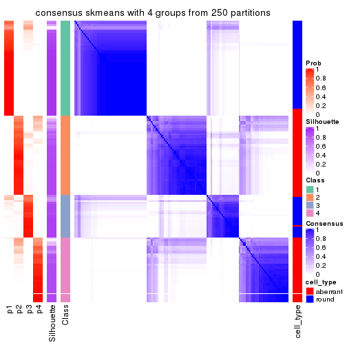</p>

</div>
<div id='tab-CV-skmeans-consensus-heatmap-4'>
<pre><code class="r">consensus_heatmap(res, k = 5)
</code></pre>

<p></p>

</div>
<div id='tab-CV-skmeans-consensus-heatmap-5'>
<pre><code class="r">consensus_heatmap(res, k = 6)
</code></pre>

<p></p>

</div>
</div>

Heatmaps for the membership of samples in all partitions to see how consistent they are:


<script>
$( function() {
	$( '#tabs-CV-skmeans-membership-heatmap' ).tabs();
} );
</script>
<div id='tabs-CV-skmeans-membership-heatmap'>
<ul>
<li><a href='#tab-CV-skmeans-membership-heatmap-1'>k = 2</a></li>
<li><a href='#tab-CV-skmeans-membership-heatmap-2'>k = 3</a></li>
<li><a href='#tab-CV-skmeans-membership-heatmap-3'>k = 4</a></li>
<li><a href='#tab-CV-skmeans-membership-heatmap-4'>k = 5</a></li>
<li><a href='#tab-CV-skmeans-membership-heatmap-5'>k = 6</a></li>
</ul>
<div id='tab-CV-skmeans-membership-heatmap-1'>
<pre><code class="r">membership_heatmap(res, k = 2)
</code></pre>

<p></p>

</div>
<div id='tab-CV-skmeans-membership-heatmap-2'>
<pre><code class="r">membership_heatmap(res, k = 3)
</code></pre>

<p></p>

</div>
<div id='tab-CV-skmeans-membership-heatmap-3'>
<pre><code class="r">membership_heatmap(res, k = 4)
</code></pre>

<p></p>

</div>
<div id='tab-CV-skmeans-membership-heatmap-4'>
<pre><code class="r">membership_heatmap(res, k = 5)
</code></pre>

<p></p>

</div>
<div id='tab-CV-skmeans-membership-heatmap-5'>
<pre><code class="r">membership_heatmap(res, k = 6)
</code></pre>

<p></p>

</div>
</div>

As soon as we have had the classes for columns, we can look for signatures
which are significantly different between classes which can be candidate marks
for certain classes. Following are the heatmaps for signatures.


Signature heatmaps where rows are scaled:


<script>
$( function() {
	$( '#tabs-CV-skmeans-get-signatures' ).tabs();
} );
</script>
<div id='tabs-CV-skmeans-get-signatures'>
<ul>
<li><a href='#tab-CV-skmeans-get-signatures-1'>k = 2</a></li>
<li><a href='#tab-CV-skmeans-get-signatures-2'>k = 3</a></li>
<li><a href='#tab-CV-skmeans-get-signatures-3'>k = 4</a></li>
<li><a href='#tab-CV-skmeans-get-signatures-4'>k = 5</a></li>
<li><a href='#tab-CV-skmeans-get-signatures-5'>k = 6</a></li>
</ul>
<div id='tab-CV-skmeans-get-signatures-1'>
<pre><code class="r">get_signatures(res, k = 2)
</code></pre>

<p></p>

</div>
<div id='tab-CV-skmeans-get-signatures-2'>
<pre><code class="r">get_signatures(res, k = 3)
</code></pre>

<p></p>

</div>
<div id='tab-CV-skmeans-get-signatures-3'>
<pre><code class="r">get_signatures(res, k = 4)
</code></pre>

<p></p>

</div>
<div id='tab-CV-skmeans-get-signatures-4'>
<pre><code class="r">get_signatures(res, k = 5)
</code></pre>

<p></p>

</div>
<div id='tab-CV-skmeans-get-signatures-5'>
<pre><code class="r">get_signatures(res, k = 6)
</code></pre>

<p></p>

</div>
</div>


Signature heatmaps where rows are not scaled:


<script>
$( function() {
	$( '#tabs-CV-skmeans-get-signatures-no-scale' ).tabs();
} );
</script>
<div id='tabs-CV-skmeans-get-signatures-no-scale'>
<ul>
<li><a href='#tab-CV-skmeans-get-signatures-no-scale-1'>k = 2</a></li>
<li><a href='#tab-CV-skmeans-get-signatures-no-scale-2'>k = 3</a></li>
<li><a href='#tab-CV-skmeans-get-signatures-no-scale-3'>k = 4</a></li>
<li><a href='#tab-CV-skmeans-get-signatures-no-scale-4'>k = 5</a></li>
<li><a href='#tab-CV-skmeans-get-signatures-no-scale-5'>k = 6</a></li>
</ul>
<div id='tab-CV-skmeans-get-signatures-no-scale-1'>
<pre><code class="r">get_signatures(res, k = 2, scale_rows = FALSE)
</code></pre>

<p></p>

</div>
<div id='tab-CV-skmeans-get-signatures-no-scale-2'>
<pre><code class="r">get_signatures(res, k = 3, scale_rows = FALSE)
</code></pre>

<p></p>

</div>
<div id='tab-CV-skmeans-get-signatures-no-scale-3'>
<pre><code class="r">get_signatures(res, k = 4, scale_rows = FALSE)
</code></pre>

<p></p>

</div>
<div id='tab-CV-skmeans-get-signatures-no-scale-4'>
<pre><code class="r">get_signatures(res, k = 5, scale_rows = FALSE)
</code></pre>

<p></p>

</div>
<div id='tab-CV-skmeans-get-signatures-no-scale-5'>
<pre><code class="r">get_signatures(res, k = 6, scale_rows = FALSE)
</code></pre>

<p></p>

</div>
</div>


Compare the overlap of signatures from different k:

```r
compare_signatures(res)
```


`get_signature()` returns a data frame invisibly. TO get the list of signatures, the function
call should be assigned to a variable explicitly. In following code, if `plot` argument is set
to `FALSE`, no heatmap is plotted while only the differential analysis is performed.

```r
# code only for demonstration
tb = get_signature(res, k = ..., plot = FALSE)
```

An example of the output of `tb` is:

```
#>   which_row         fdr    mean_1    mean_2 scaled_mean_1 scaled_mean_2 km
#> 1        38 0.042760348  8.373488  9.131774    -0.5533452     0.5164555  1
#> 2        40 0.018707592  7.106213  8.469186    -0.6173731     0.5762149  1
#> 3        55 0.019134737 10.221463 11.207825    -0.6159697     0.5749050  1
#> 4        59 0.006059896  5.921854  7.869574    -0.6899429     0.6439467  1
#> 5        60 0.018055526  8.928898 10.211722    -0.6204761     0.5791110  1
#> 6        98 0.009384629 15.714769 14.887706     0.6635654    -0.6193277  2
...
```

The columns in `tb` are:

1. `which_row`: row indices corresponding to the input matrix.
2. `fdr`: FDR for the differential test. 
3. `mean_x`: The mean value in group x.
4. `scaled_mean_x`: The mean value in group x after rows are scaled.
5. `km`: Row groups if k-means clustering is applied to rows.


UMAP plot which shows how samples are separated.


<script>
$( function() {
	$( '#tabs-CV-skmeans-dimension-reduction' ).tabs();
} );
</script>
<div id='tabs-CV-skmeans-dimension-reduction'>
<ul>
<li><a href='#tab-CV-skmeans-dimension-reduction-1'>k = 2</a></li>
<li><a href='#tab-CV-skmeans-dimension-reduction-2'>k = 3</a></li>
<li><a href='#tab-CV-skmeans-dimension-reduction-3'>k = 4</a></li>
<li><a href='#tab-CV-skmeans-dimension-reduction-4'>k = 5</a></li>
<li><a href='#tab-CV-skmeans-dimension-reduction-5'>k = 6</a></li>
</ul>
<div id='tab-CV-skmeans-dimension-reduction-1'>
<pre><code class="r">dimension_reduction(res, k = 2, method = &quot;UMAP&quot;)
</code></pre>

<p>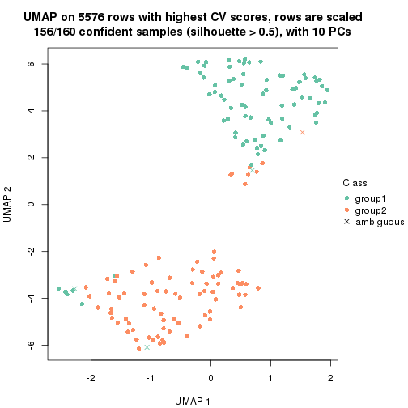</p>

</div>
<div id='tab-CV-skmeans-dimension-reduction-2'>
<pre><code class="r">dimension_reduction(res, k = 3, method = &quot;UMAP&quot;)
</code></pre>

<p></p>

</div>
<div id='tab-CV-skmeans-dimension-reduction-3'>
<pre><code class="r">dimension_reduction(res, k = 4, method = &quot;UMAP&quot;)
</code></pre>

<p></p>

</div>
<div id='tab-CV-skmeans-dimension-reduction-4'>
<pre><code class="r">dimension_reduction(res, k = 5, method = &quot;UMAP&quot;)
</code></pre>

<p></p>

</div>
<div id='tab-CV-skmeans-dimension-reduction-5'>
<pre><code class="r">dimension_reduction(res, k = 6, method = &quot;UMAP&quot;)
</code></pre>

<p></p>

</div>
</div>


Following heatmap shows how subgroups are split when increasing `k`:

```r
collect_classes(res)
```


Test correlation between subgroups and known annotations. If the known
annotation is numeric, one-way ANOVA test is applied, and if the known
annotation is discrete, chi-squared contingency table test is applied.

```r
test_to_known_factors(res)
```

```
#>              n cell_type(p) k
#> CV:skmeans 156     2.86e-21 2
#> CV:skmeans 148     1.81e-22 3
#> CV:skmeans 149     2.65e-27 4
#> CV:skmeans 131     1.19e-22 5
#> CV:skmeans 106     3.76e-18 6
```


If matrix rows can be associated to genes, consider to use `GO_Enrichment(res,
...)` to perform function enrichment for the signature genes.


 

---------------------------------------------------


### CV:pam


The object with results only for a single top-value method and a single partition method 
can be extracted as:

```r
res = res_list["CV", "pam"]
# you can also extract it by
# res = res_list["CV:pam"]
```

A summary of `res` and all the functions that can be applied to it:

```r
res
```

```
#> A 'ConsensusPartition' object with k = 2, 3, 4, 5, 6.
#>   On a matrix with 5576 rows and 160 columns.
#>   Top rows (558, 1116, 1673, 2230, 2788) are extracted by 'CV' method.
#>   Subgroups are detected by 'pam' method.
#>   Performed in total 1250 partitions by row resampling.
#>   Best k for subgroups seems to be 3.
#> 
#> Following methods can be applied to this 'ConsensusPartition' object:
#>  [1] "cola_report"             "collect_classes"         "collect_plots"          
#>  [4] "collect_stats"           "colnames"                "compare_signatures"     
#>  [7] "consensus_heatmap"       "dimension_reduction"     "functional_enrichment"  
#> [10] "get_anno_col"            "get_anno"                "get_classes"            
#> [13] "get_consensus"           "get_matrix"              "get_membership"         
#> [16] "get_param"               "get_signatures"          "get_stats"              
#> [19] "is_best_k"               "is_stable_k"             "membership_heatmap"     
#> [22] "ncol"                    "nrow"                    "plot_ecdf"              
#> [25] "rownames"                "select_partition_number" "show"                   
#> [28] "suggest_best_k"          "test_to_known_factors"
```

`collect_plots()` function collects all the plots made from `res` for all `k` (number of partitions)
into one single page to provide an easy and fast comparison between different `k`.

```r
collect_plots(res)
```


The plots are:

- The first row: a plot of the ECDF (Empirical cumulative distribution
  function) curves of the consensus matrix for each `k` and the heatmap of
  predicted classes for each `k`.
- The second row: heatmaps of the consensus matrix for each `k`.
- The third row: heatmaps of the membership matrix for each `k`.
- The fouth row: heatmaps of the signatures for each `k`.

All the plots in panels can be made by individual functions and they are
plotted later in this section.

`select_partition_number()` produces several plots showing different
statistics for choosing "optimized" `k`. There are following statistics:

- ECDF curves of the consensus matrix for each `k`;
- 1-PAC. [The PAC
  score](https://en.wikipedia.org/wiki/Consensus_clustering#Over-interpretation_potential_of_consensus_clustering)
  measures the proportion of the ambiguous subgrouping.
- Mean silhouette score.
- Concordance. The mean probability of fiting the consensus class ids in all
  partitions.
- Area increased. Denote $A_k$ as the area under the ECDF curve for current
  `k`, the area increased is defined as $A_k - A_{k-1}$.
- Rand index. The percent of pairs of samples that are both in a same cluster
  or both are not in a same cluster in the partition of k and k-1.
- Jaccard index. The ratio of pairs of samples are both in a same cluster in
  the partition of k and k-1 and the pairs of samples are both in a same
  cluster in the partition k or k-1.

The detailed explanations of these statistics can be found in [the cola
vignette](http://bioconductor.org/packages/devel/bioc/vignettes/cola/inst/doc/cola.html#toc_13).

Generally speaking, lower PAC score, higher mean silhouette score or higher
concordance corresponds to better partition. Rand index and Jaccard index
measure how similar the current partition is compared to partition with `k-1`.
If they are too similar, we won't accept `k` is better than `k-1`.

```r
select_partition_number(res)
```


The numeric values for all these statistics can be obtained by `get_stats()`.

```r
get_stats(res)
```

```
#>   k 1-PAC mean_silhouette concordance area_increased  Rand Jaccard
#> 2 2 0.314           0.721       0.863         0.2910 0.771   0.771
#> 3 3 0.192           0.462       0.705         0.8226 0.585   0.487
#> 4 4 0.219           0.218       0.626         0.1104 0.653   0.442
#> 5 5 0.268           0.427       0.640         0.0431 0.737   0.476
#> 6 6 0.382           0.303       0.695         0.0676 0.731   0.414
```

`suggest_best_k()` suggests the best $k$ based on these statistics. The rules are as follows:

- All $k$ with Jaccard index larger than 0.95 are removed because the increase of
  the partition number does not provides enough extra information. If all $k$ are removed,
  the best $k$ is assigned by `NA`.
- For $k$ with 1-PAC larger than 0.9, the maximal $k$ is taken as the "best k". Other $k$ is called "optional k".
- If it does not fit the second rule. The $k$ with the highest vote of highest
  1-PAC, mean silhouette and concordance is taken as the "best k".

```r
suggest_best_k(res)
```

```
#> [1] 3
```


Following shows the table of the partitions (You need to click the **show/hide
code output** link to see it). The membership matrix (columns with name `p*`)
is inferred by
[`clue::cl_consensus()`](https://www.rdocumentation.org/link/cl_consensus?package=clue)
function with the `SE` method. Basically the value in the membership matrix
represents the probability to belong to a certain group. The finall class
label for an item is determined with the group with highest probability it
belongs to.

In `get_classes()` function, the entropy is calculated from the membership
matrix and the silhouette score is calculated from the consensus matrix.


<script>
$( function() {
	$( '#tabs-CV-pam-get-classes' ).tabs();
} );
</script>
<div id='tabs-CV-pam-get-classes'>
<ul>
<li><a href='#tab-CV-pam-get-classes-1'>k = 2</a></li>
<li><a href='#tab-CV-pam-get-classes-2'>k = 3</a></li>
<li><a href='#tab-CV-pam-get-classes-3'>k = 4</a></li>
<li><a href='#tab-CV-pam-get-classes-4'>k = 5</a></li>
<li><a href='#tab-CV-pam-get-classes-5'>k = 6</a></li>
</ul>

<div id='tab-CV-pam-get-classes-1'>
<p><a id='tab-CV-pam-get-classes-1-a' style='color:#0366d6' href='#'>show/hide code output</a></p>
<pre><code class="r">cbind(get_classes(res, k = 2), get_membership(res, k = 2))
</code></pre>

<pre><code>#&gt;                     class entropy silhouette    p1    p2
#&gt; aberrant_ERR2585320     1  0.6973     0.7366 0.812 0.188
#&gt; aberrant_ERR2585338     1  0.0000     0.8328 1.000 0.000
#&gt; aberrant_ERR2585325     1  0.4161     0.8154 0.916 0.084
#&gt; aberrant_ERR2585283     2  0.0000     0.7243 0.000 1.000
#&gt; aberrant_ERR2585343     2  0.9881     0.3067 0.436 0.564
#&gt; aberrant_ERR2585329     1  0.0376     0.8336 0.996 0.004
#&gt; aberrant_ERR2585317     1  0.0000     0.8328 1.000 0.000
#&gt; aberrant_ERR2585339     1  0.0000     0.8328 1.000 0.000
#&gt; aberrant_ERR2585335     1  0.6343     0.7791 0.840 0.160
#&gt; aberrant_ERR2585287     2  0.5946     0.6663 0.144 0.856
#&gt; aberrant_ERR2585321     1  0.9970     0.0692 0.532 0.468
#&gt; aberrant_ERR2585297     1  0.8499     0.6789 0.724 0.276
#&gt; aberrant_ERR2585337     1  0.0000     0.8328 1.000 0.000
#&gt; aberrant_ERR2585319     1  0.4939     0.8031 0.892 0.108
#&gt; aberrant_ERR2585315     1  0.0938     0.8336 0.988 0.012
#&gt; aberrant_ERR2585336     1  0.0672     0.8342 0.992 0.008
#&gt; aberrant_ERR2585307     1  0.0000     0.8328 1.000 0.000
#&gt; aberrant_ERR2585301     1  0.4161     0.8202 0.916 0.084
#&gt; aberrant_ERR2585326     1  0.0000     0.8328 1.000 0.000
#&gt; aberrant_ERR2585331     1  0.0000     0.8328 1.000 0.000
#&gt; aberrant_ERR2585346     2  0.0000     0.7243 0.000 1.000
#&gt; aberrant_ERR2585314     1  0.2423     0.8316 0.960 0.040
#&gt; aberrant_ERR2585298     1  0.0000     0.8328 1.000 0.000
#&gt; aberrant_ERR2585345     1  0.0376     0.8336 0.996 0.004
#&gt; aberrant_ERR2585299     1  0.7139     0.7566 0.804 0.196
#&gt; aberrant_ERR2585309     1  0.9427     0.5330 0.640 0.360
#&gt; aberrant_ERR2585303     1  0.0000     0.8328 1.000 0.000
#&gt; aberrant_ERR2585313     1  0.0000     0.8328 1.000 0.000
#&gt; aberrant_ERR2585318     1  0.8661     0.6540 0.712 0.288
#&gt; aberrant_ERR2585328     1  0.8207     0.6781 0.744 0.256
#&gt; aberrant_ERR2585330     1  0.9000     0.5784 0.684 0.316
#&gt; aberrant_ERR2585293     2  0.0000     0.7243 0.000 1.000
#&gt; aberrant_ERR2585342     1  0.8499     0.6282 0.724 0.276
#&gt; aberrant_ERR2585348     1  0.8763     0.5542 0.704 0.296
#&gt; aberrant_ERR2585352     1  0.2603     0.8322 0.956 0.044
#&gt; aberrant_ERR2585308     2  0.9580     0.4207 0.380 0.620
#&gt; aberrant_ERR2585349     1  0.0000     0.8328 1.000 0.000
#&gt; aberrant_ERR2585316     2  0.9491     0.4613 0.368 0.632
#&gt; aberrant_ERR2585306     1  0.9909     0.2568 0.556 0.444
#&gt; aberrant_ERR2585324     1  0.3274     0.8243 0.940 0.060
#&gt; aberrant_ERR2585310     1  0.0672     0.8341 0.992 0.008
#&gt; aberrant_ERR2585296     1  0.3879     0.8220 0.924 0.076
#&gt; aberrant_ERR2585275     2  0.7139     0.6973 0.196 0.804
#&gt; aberrant_ERR2585311     1  0.8955     0.6186 0.688 0.312
#&gt; aberrant_ERR2585292     2  0.0000     0.7243 0.000 1.000
#&gt; aberrant_ERR2585282     2  0.9970     0.1122 0.468 0.532
#&gt; aberrant_ERR2585305     1  0.7139     0.7552 0.804 0.196
#&gt; aberrant_ERR2585278     1  0.0000     0.8328 1.000 0.000
#&gt; aberrant_ERR2585347     2  0.7376     0.6945 0.208 0.792
#&gt; aberrant_ERR2585332     1  0.9491     0.2904 0.632 0.368
#&gt; aberrant_ERR2585280     1  0.5629     0.7876 0.868 0.132
#&gt; aberrant_ERR2585304     1  0.0000     0.8328 1.000 0.000
#&gt; aberrant_ERR2585322     1  0.0376     0.8336 0.996 0.004
#&gt; aberrant_ERR2585279     1  0.0000     0.8328 1.000 0.000
#&gt; aberrant_ERR2585277     1  0.0000     0.8328 1.000 0.000
#&gt; aberrant_ERR2585295     1  0.0000     0.8328 1.000 0.000
#&gt; aberrant_ERR2585333     1  0.8661     0.6248 0.712 0.288
#&gt; aberrant_ERR2585285     1  0.5059     0.8043 0.888 0.112
#&gt; aberrant_ERR2585286     1  0.0000     0.8328 1.000 0.000
#&gt; aberrant_ERR2585294     1  0.5059     0.8027 0.888 0.112
#&gt; aberrant_ERR2585300     1  0.9963     0.1225 0.536 0.464
#&gt; aberrant_ERR2585334     1  0.0000     0.8328 1.000 0.000
#&gt; aberrant_ERR2585361     1  0.6148     0.7698 0.848 0.152
#&gt; aberrant_ERR2585372     1  0.9000     0.6012 0.684 0.316
#&gt; round_ERR2585217        1  0.0672     0.8340 0.992 0.008
#&gt; round_ERR2585205        1  0.8144     0.7070 0.748 0.252
#&gt; round_ERR2585214        1  0.0000     0.8328 1.000 0.000
#&gt; round_ERR2585202        1  0.0000     0.8328 1.000 0.000
#&gt; aberrant_ERR2585367     1  0.3114     0.8257 0.944 0.056
#&gt; round_ERR2585220        1  0.5519     0.8090 0.872 0.128
#&gt; round_ERR2585238        1  0.8555     0.6736 0.720 0.280
#&gt; aberrant_ERR2585276     1  0.6438     0.7599 0.836 0.164
#&gt; round_ERR2585218        1  0.7453     0.7431 0.788 0.212
#&gt; aberrant_ERR2585363     1  0.0672     0.8342 0.992 0.008
#&gt; round_ERR2585201        1  0.0376     0.8330 0.996 0.004
#&gt; round_ERR2585210        1  0.8661     0.6626 0.712 0.288
#&gt; aberrant_ERR2585362     1  0.7674     0.7325 0.776 0.224
#&gt; aberrant_ERR2585360     1  0.7219     0.7477 0.800 0.200
#&gt; round_ERR2585209        1  0.0938     0.8327 0.988 0.012
#&gt; round_ERR2585242        1  0.0376     0.8330 0.996 0.004
#&gt; round_ERR2585216        1  0.5519     0.7962 0.872 0.128
#&gt; round_ERR2585219        1  0.6887     0.7615 0.816 0.184
#&gt; round_ERR2585237        1  0.0000     0.8328 1.000 0.000
#&gt; round_ERR2585198        1  0.0000     0.8328 1.000 0.000
#&gt; round_ERR2585211        1  0.8499     0.6811 0.724 0.276
#&gt; round_ERR2585206        1  0.8144     0.7064 0.748 0.252
#&gt; aberrant_ERR2585281     1  0.0376     0.8333 0.996 0.004
#&gt; round_ERR2585212        1  0.6048     0.7899 0.852 0.148
#&gt; round_ERR2585221        1  0.9209     0.5841 0.664 0.336
#&gt; round_ERR2585243        1  0.7299     0.7571 0.796 0.204
#&gt; round_ERR2585204        1  0.0000     0.8328 1.000 0.000
#&gt; round_ERR2585213        1  0.0000     0.8328 1.000 0.000
#&gt; aberrant_ERR2585373     1  0.9732     0.3990 0.596 0.404
#&gt; aberrant_ERR2585358     2  0.7219     0.6962 0.200 0.800
#&gt; aberrant_ERR2585365     1  0.0938     0.8344 0.988 0.012
#&gt; aberrant_ERR2585359     2  0.0000     0.7243 0.000 1.000
#&gt; aberrant_ERR2585370     1  0.0000     0.8328 1.000 0.000
#&gt; round_ERR2585215        1  0.9881     0.3129 0.564 0.436
#&gt; round_ERR2585262        1  0.0376     0.8330 0.996 0.004
#&gt; round_ERR2585199        1  0.0000     0.8328 1.000 0.000
#&gt; aberrant_ERR2585369     1  0.7219     0.7295 0.800 0.200
#&gt; round_ERR2585208        1  0.9393     0.5392 0.644 0.356
#&gt; round_ERR2585252        1  0.8861     0.6394 0.696 0.304
#&gt; round_ERR2585236        1  0.8144     0.7101 0.748 0.252
#&gt; aberrant_ERR2585284     2  0.0000     0.7243 0.000 1.000
#&gt; round_ERR2585224        1  0.9933     0.2508 0.548 0.452
#&gt; round_ERR2585260        1  0.7815     0.7292 0.768 0.232
#&gt; round_ERR2585229        1  0.9087     0.6062 0.676 0.324
#&gt; aberrant_ERR2585364     2  0.0672     0.7229 0.008 0.992
#&gt; round_ERR2585253        1  0.9710     0.4295 0.600 0.400
#&gt; aberrant_ERR2585368     1  0.0000     0.8328 1.000 0.000
#&gt; aberrant_ERR2585371     1  0.0000     0.8328 1.000 0.000
#&gt; round_ERR2585239        1  0.8386     0.6898 0.732 0.268
#&gt; round_ERR2585273        1  0.5519     0.7988 0.872 0.128
#&gt; round_ERR2585256        1  0.1414     0.8335 0.980 0.020
#&gt; round_ERR2585272        1  0.1843     0.8324 0.972 0.028
#&gt; round_ERR2585246        1  0.6048     0.7946 0.852 0.148
#&gt; round_ERR2585261        1  0.0000     0.8328 1.000 0.000
#&gt; round_ERR2585254        1  0.0376     0.8330 0.996 0.004
#&gt; round_ERR2585225        1  0.0672     0.8330 0.992 0.008
#&gt; round_ERR2585235        1  0.9661     0.4387 0.608 0.392
#&gt; round_ERR2585271        1  0.9323     0.5591 0.652 0.348
#&gt; round_ERR2585251        1  0.2948     0.8281 0.948 0.052
#&gt; round_ERR2585255        1  0.0938     0.8325 0.988 0.012
#&gt; round_ERR2585257        1  0.0376     0.8330 0.996 0.004
#&gt; round_ERR2585226        1  0.5842     0.7985 0.860 0.140
#&gt; round_ERR2585265        1  0.0672     0.8341 0.992 0.008
#&gt; round_ERR2585259        1  0.3431     0.8265 0.936 0.064
#&gt; round_ERR2585247        1  0.5842     0.7904 0.860 0.140
#&gt; round_ERR2585241        1  0.6247     0.7761 0.844 0.156
#&gt; round_ERR2585263        1  0.3431     0.8270 0.936 0.064
#&gt; round_ERR2585264        2  0.5178     0.7261 0.116 0.884
#&gt; round_ERR2585233        1  0.1843     0.8328 0.972 0.028
#&gt; round_ERR2585223        1  0.6623     0.7697 0.828 0.172
#&gt; round_ERR2585234        1  0.0376     0.8330 0.996 0.004
#&gt; round_ERR2585222        1  0.7745     0.7304 0.772 0.228
#&gt; round_ERR2585228        1  0.6531     0.7690 0.832 0.168
#&gt; round_ERR2585248        2  0.4562     0.7293 0.096 0.904
#&gt; round_ERR2585240        1  0.0376     0.8330 0.996 0.004
#&gt; round_ERR2585270        1  0.4815     0.8100 0.896 0.104
#&gt; round_ERR2585232        1  0.0938     0.8337 0.988 0.012
#&gt; aberrant_ERR2585341     1  0.0000     0.8328 1.000 0.000
#&gt; aberrant_ERR2585355     1  0.0000     0.8328 1.000 0.000
#&gt; round_ERR2585227        1  0.2423     0.8308 0.960 0.040
#&gt; aberrant_ERR2585351     1  0.5519     0.8027 0.872 0.128
#&gt; round_ERR2585269        1  0.9460     0.5241 0.636 0.364
#&gt; aberrant_ERR2585357     1  0.0000     0.8328 1.000 0.000
#&gt; aberrant_ERR2585350     1  0.0000     0.8328 1.000 0.000
#&gt; round_ERR2585250        1  0.6712     0.7798 0.824 0.176
#&gt; round_ERR2585245        2  0.8499     0.6061 0.276 0.724
#&gt; aberrant_ERR2585353     2  0.9993     0.0688 0.484 0.516
#&gt; round_ERR2585258        1  0.7219     0.7527 0.800 0.200
#&gt; aberrant_ERR2585354     1  0.1414     0.8327 0.980 0.020
#&gt; round_ERR2585249        1  0.9170     0.5903 0.668 0.332
#&gt; round_ERR2585268        1  0.1184     0.8347 0.984 0.016
#&gt; aberrant_ERR2585356     2  0.9775     0.3443 0.412 0.588
#&gt; round_ERR2585266        1  0.0000     0.8328 1.000 0.000
#&gt; round_ERR2585231        1  0.9580     0.4873 0.620 0.380
#&gt; round_ERR2585230        1  0.5519     0.8002 0.872 0.128
#&gt; round_ERR2585267        2  0.9815     0.3018 0.420 0.580
</code></pre>

<script>
$('#tab-CV-pam-get-classes-1-a').parent().next().next().hide();
$('#tab-CV-pam-get-classes-1-a').click(function(){
  $('#tab-CV-pam-get-classes-1-a').parent().next().next().toggle();
  return(false);
});
</script>
</div>

<div id='tab-CV-pam-get-classes-2'>
<p><a id='tab-CV-pam-get-classes-2-a' style='color:#0366d6' href='#'>show/hide code output</a></p>
<pre><code class="r">cbind(get_classes(res, k = 3), get_membership(res, k = 3))
</code></pre>

<pre><code>#&gt;                     class entropy silhouette    p1    p2    p3
#&gt; aberrant_ERR2585320     2  0.7576    0.28282 0.076 0.648 0.276
#&gt; aberrant_ERR2585338     2  0.6280   -0.32192 0.460 0.540 0.000
#&gt; aberrant_ERR2585325     2  0.4865    0.52638 0.032 0.832 0.136
#&gt; aberrant_ERR2585283     3  0.0237    0.78071 0.004 0.000 0.996
#&gt; aberrant_ERR2585343     2  0.8739    0.14538 0.112 0.496 0.392
#&gt; aberrant_ERR2585329     2  0.4047    0.61741 0.148 0.848 0.004
#&gt; aberrant_ERR2585317     2  0.3918    0.61509 0.140 0.856 0.004
#&gt; aberrant_ERR2585339     1  0.6244    0.52122 0.560 0.440 0.000
#&gt; aberrant_ERR2585335     2  0.7902    0.63736 0.132 0.660 0.208
#&gt; aberrant_ERR2585287     3  0.2173    0.77594 0.008 0.048 0.944
#&gt; aberrant_ERR2585321     2  0.8920    0.28310 0.124 0.468 0.408
#&gt; aberrant_ERR2585297     1  0.2796    0.46137 0.908 0.092 0.000
#&gt; aberrant_ERR2585337     2  0.3941    0.59651 0.156 0.844 0.000
#&gt; aberrant_ERR2585319     2  0.6644    0.65365 0.140 0.752 0.108
#&gt; aberrant_ERR2585315     2  0.4326    0.62183 0.144 0.844 0.012
#&gt; aberrant_ERR2585336     2  0.4261    0.62058 0.140 0.848 0.012
#&gt; aberrant_ERR2585307     2  0.3752    0.61393 0.144 0.856 0.000
#&gt; aberrant_ERR2585301     2  0.5944    0.64366 0.152 0.784 0.064
#&gt; aberrant_ERR2585326     2  0.3686    0.61281 0.140 0.860 0.000
#&gt; aberrant_ERR2585331     1  0.6215    0.53676 0.572 0.428 0.000
#&gt; aberrant_ERR2585346     3  0.0424    0.78095 0.008 0.000 0.992
#&gt; aberrant_ERR2585314     2  0.6057    0.44475 0.340 0.656 0.004
#&gt; aberrant_ERR2585298     1  0.6215    0.53676 0.572 0.428 0.000
#&gt; aberrant_ERR2585345     2  0.3752    0.60956 0.144 0.856 0.000
#&gt; aberrant_ERR2585299     1  0.5115    0.30326 0.768 0.228 0.004
#&gt; aberrant_ERR2585309     1  0.8236   -0.33222 0.508 0.416 0.076
#&gt; aberrant_ERR2585303     2  0.4575    0.56403 0.184 0.812 0.004
#&gt; aberrant_ERR2585313     2  0.5754    0.32302 0.296 0.700 0.004
#&gt; aberrant_ERR2585318     2  0.9007    0.51223 0.268 0.552 0.180
#&gt; aberrant_ERR2585328     2  0.8886    0.58466 0.188 0.572 0.240
#&gt; aberrant_ERR2585330     2  0.9029    0.41578 0.144 0.504 0.352
#&gt; aberrant_ERR2585293     3  0.0237    0.78071 0.004 0.000 0.996
#&gt; aberrant_ERR2585342     2  0.8898    0.39231 0.128 0.500 0.372
#&gt; aberrant_ERR2585348     2  0.6473    0.23644 0.020 0.668 0.312
#&gt; aberrant_ERR2585352     2  0.6867    0.45068 0.288 0.672 0.040
#&gt; aberrant_ERR2585308     1  0.8569   -0.28040 0.508 0.392 0.100
#&gt; aberrant_ERR2585349     2  0.5926    0.07403 0.356 0.644 0.000
#&gt; aberrant_ERR2585316     3  0.7222    0.29487 0.388 0.032 0.580
#&gt; aberrant_ERR2585306     2  0.9709    0.36275 0.244 0.448 0.308
#&gt; aberrant_ERR2585324     2  0.5571    0.64475 0.140 0.804 0.056
#&gt; aberrant_ERR2585310     2  0.3879    0.61244 0.152 0.848 0.000
#&gt; aberrant_ERR2585296     1  0.5363    0.55740 0.724 0.276 0.000
#&gt; aberrant_ERR2585275     3  0.4342    0.70765 0.120 0.024 0.856
#&gt; aberrant_ERR2585311     2  0.8521    0.36992 0.440 0.468 0.092
#&gt; aberrant_ERR2585292     3  0.0237    0.78071 0.004 0.000 0.996
#&gt; aberrant_ERR2585282     1  0.9220   -0.33345 0.468 0.376 0.156
#&gt; aberrant_ERR2585305     2  0.7741    0.62710 0.216 0.668 0.116
#&gt; aberrant_ERR2585278     2  0.3816    0.60625 0.148 0.852 0.000
#&gt; aberrant_ERR2585347     3  0.7238    0.35685 0.044 0.328 0.628
#&gt; aberrant_ERR2585332     2  0.8168    0.45145 0.108 0.612 0.280
#&gt; aberrant_ERR2585280     2  0.6979    0.65378 0.140 0.732 0.128
#&gt; aberrant_ERR2585304     2  0.3686    0.61281 0.140 0.860 0.000
#&gt; aberrant_ERR2585322     2  0.3983    0.61691 0.144 0.852 0.004
#&gt; aberrant_ERR2585279     1  0.6225    0.53197 0.568 0.432 0.000
#&gt; aberrant_ERR2585277     1  0.6215    0.53676 0.572 0.428 0.000
#&gt; aberrant_ERR2585295     2  0.5365    0.43751 0.252 0.744 0.004
#&gt; aberrant_ERR2585333     2  0.9020    0.42350 0.140 0.496 0.364
#&gt; aberrant_ERR2585285     2  0.7572    0.64130 0.184 0.688 0.128
#&gt; aberrant_ERR2585286     1  0.6280    0.48682 0.540 0.460 0.000
#&gt; aberrant_ERR2585294     2  0.7245    0.65054 0.168 0.712 0.120
#&gt; aberrant_ERR2585300     2  0.9681    0.39597 0.256 0.460 0.284
#&gt; aberrant_ERR2585334     1  0.6215    0.53676 0.572 0.428 0.000
#&gt; aberrant_ERR2585361     2  0.7451    0.65227 0.144 0.700 0.156
#&gt; aberrant_ERR2585372     2  0.9268    0.36994 0.268 0.524 0.208
#&gt; round_ERR2585217        1  0.6192    0.54078 0.580 0.420 0.000
#&gt; round_ERR2585205        1  0.0000    0.52676 1.000 0.000 0.000
#&gt; round_ERR2585214        1  0.6215    0.53676 0.572 0.428 0.000
#&gt; round_ERR2585202        1  0.6215    0.53676 0.572 0.428 0.000
#&gt; aberrant_ERR2585367     1  0.8201    0.40890 0.524 0.400 0.076
#&gt; round_ERR2585220        1  0.5541    0.55870 0.740 0.252 0.008
#&gt; round_ERR2585238        1  0.2527    0.50644 0.936 0.044 0.020
#&gt; aberrant_ERR2585276     2  0.7766    0.64729 0.148 0.676 0.176
#&gt; round_ERR2585218        1  0.0000    0.52676 1.000 0.000 0.000
#&gt; aberrant_ERR2585363     2  0.4033    0.61970 0.136 0.856 0.008
#&gt; round_ERR2585201        1  0.6215    0.53676 0.572 0.428 0.000
#&gt; round_ERR2585210        1  0.2096    0.49973 0.944 0.052 0.004
#&gt; aberrant_ERR2585362     2  0.8478    0.61415 0.180 0.616 0.204
#&gt; aberrant_ERR2585360     2  0.8112    0.63760 0.160 0.648 0.192
#&gt; round_ERR2585209        1  0.6192    0.54154 0.580 0.420 0.000
#&gt; round_ERR2585242        1  0.6215    0.53676 0.572 0.428 0.000
#&gt; round_ERR2585216        1  0.3816    0.55953 0.852 0.148 0.000
#&gt; round_ERR2585219        1  0.0661    0.52905 0.988 0.004 0.008
#&gt; round_ERR2585237        1  0.6192    0.53965 0.580 0.420 0.000
#&gt; round_ERR2585198        1  0.6215    0.53676 0.572 0.428 0.000
#&gt; round_ERR2585211        1  0.0424    0.52527 0.992 0.000 0.008
#&gt; round_ERR2585206        1  0.0000    0.52676 1.000 0.000 0.000
#&gt; aberrant_ERR2585281     1  0.6505    0.46506 0.528 0.468 0.004
#&gt; round_ERR2585212        1  0.3193    0.55678 0.896 0.100 0.004
#&gt; round_ERR2585221        1  0.2486    0.49742 0.932 0.060 0.008
#&gt; round_ERR2585243        1  0.5253    0.55543 0.792 0.188 0.020
#&gt; round_ERR2585204        1  0.6215    0.53676 0.572 0.428 0.000
#&gt; round_ERR2585213        1  0.6215    0.53676 0.572 0.428 0.000
#&gt; aberrant_ERR2585373     2  0.9479    0.33174 0.348 0.460 0.192
#&gt; aberrant_ERR2585358     3  0.6553    0.52135 0.020 0.324 0.656
#&gt; aberrant_ERR2585365     2  0.6905   -0.20594 0.440 0.544 0.016
#&gt; aberrant_ERR2585359     3  0.5849    0.71703 0.028 0.216 0.756
#&gt; aberrant_ERR2585370     1  0.6225    0.53175 0.568 0.432 0.000
#&gt; round_ERR2585215        1  0.3554    0.48501 0.900 0.036 0.064
#&gt; round_ERR2585262        1  0.6204    0.53840 0.576 0.424 0.000
#&gt; round_ERR2585199        1  0.6215    0.53676 0.572 0.428 0.000
#&gt; aberrant_ERR2585369     2  0.8112    0.64031 0.160 0.648 0.192
#&gt; round_ERR2585208        1  0.0237    0.52689 0.996 0.000 0.004
#&gt; round_ERR2585252        1  0.2711    0.46663 0.912 0.088 0.000
#&gt; round_ERR2585236        1  0.4519    0.55161 0.852 0.116 0.032
#&gt; aberrant_ERR2585284     3  0.0592    0.78002 0.012 0.000 0.988
#&gt; round_ERR2585224        1  0.7337   -0.29352 0.540 0.428 0.032
#&gt; round_ERR2585260        1  0.1964    0.54112 0.944 0.056 0.000
#&gt; round_ERR2585229        1  0.5988   -0.14396 0.632 0.368 0.000
#&gt; aberrant_ERR2585364     3  0.2590    0.75683 0.004 0.072 0.924
#&gt; round_ERR2585253        1  0.1765    0.50574 0.956 0.040 0.004
#&gt; aberrant_ERR2585368     2  0.6111   -0.09434 0.396 0.604 0.000
#&gt; aberrant_ERR2585371     2  0.5926    0.07881 0.356 0.644 0.000
#&gt; round_ERR2585239        1  0.0848    0.52393 0.984 0.008 0.008
#&gt; round_ERR2585273        1  0.3412    0.55927 0.876 0.124 0.000
#&gt; round_ERR2585256        1  0.6095    0.54879 0.608 0.392 0.000
#&gt; round_ERR2585272        1  0.6154    0.54663 0.592 0.408 0.000
#&gt; round_ERR2585246        2  0.6302    0.32466 0.480 0.520 0.000
#&gt; round_ERR2585261        1  0.6215    0.53676 0.572 0.428 0.000
#&gt; round_ERR2585254        1  0.6180    0.54077 0.584 0.416 0.000
#&gt; round_ERR2585225        1  0.6204    0.53962 0.576 0.424 0.000
#&gt; round_ERR2585235        1  0.5304    0.41162 0.824 0.068 0.108
#&gt; round_ERR2585271        1  0.0237    0.52715 0.996 0.000 0.004
#&gt; round_ERR2585251        1  0.5650    0.54789 0.688 0.312 0.000
#&gt; round_ERR2585255        1  0.6192    0.54163 0.580 0.420 0.000
#&gt; round_ERR2585257        1  0.6260    0.50181 0.552 0.448 0.000
#&gt; round_ERR2585226        1  0.6045    0.10510 0.620 0.380 0.000
#&gt; round_ERR2585265        1  0.6192    0.53482 0.580 0.420 0.000
#&gt; round_ERR2585259        1  0.5560    0.56034 0.700 0.300 0.000
#&gt; round_ERR2585247        1  0.4931    0.48076 0.768 0.232 0.000
#&gt; round_ERR2585241        1  0.1643    0.54391 0.956 0.044 0.000
#&gt; round_ERR2585263        1  0.5650    0.55459 0.688 0.312 0.000
#&gt; round_ERR2585264        3  0.6274    0.47493 0.456 0.000 0.544
#&gt; round_ERR2585233        1  0.5968    0.55401 0.636 0.364 0.000
#&gt; round_ERR2585223        1  0.1031    0.53784 0.976 0.024 0.000
#&gt; round_ERR2585234        1  0.6204    0.53842 0.576 0.424 0.000
#&gt; round_ERR2585222        1  0.4887    0.26422 0.772 0.228 0.000
#&gt; round_ERR2585228        1  0.0237    0.52891 0.996 0.004 0.000
#&gt; round_ERR2585248        3  0.6518    0.44436 0.484 0.004 0.512
#&gt; round_ERR2585240        1  0.6215    0.53676 0.572 0.428 0.000
#&gt; round_ERR2585270        2  0.6309    0.26184 0.496 0.504 0.000
#&gt; round_ERR2585232        1  0.6126    0.54665 0.600 0.400 0.000
#&gt; aberrant_ERR2585341     1  0.6587    0.53579 0.568 0.424 0.008
#&gt; aberrant_ERR2585355     2  0.6305   -0.36658 0.484 0.516 0.000
#&gt; round_ERR2585227        1  0.5621    0.55930 0.692 0.308 0.000
#&gt; aberrant_ERR2585351     2  0.6678    0.63516 0.208 0.728 0.064
#&gt; round_ERR2585269        1  0.3213    0.45991 0.900 0.092 0.008
#&gt; aberrant_ERR2585357     2  0.3686    0.61281 0.140 0.860 0.000
#&gt; aberrant_ERR2585350     1  0.6215    0.53676 0.572 0.428 0.000
#&gt; round_ERR2585250        1  0.7674   -0.17425 0.484 0.472 0.044
#&gt; round_ERR2585245        1  0.5621   -0.00975 0.692 0.000 0.308
#&gt; aberrant_ERR2585353     2  0.9252    0.21786 0.164 0.480 0.356
#&gt; round_ERR2585258        1  0.4654    0.27567 0.792 0.208 0.000
#&gt; aberrant_ERR2585354     1  0.7056    0.52652 0.572 0.404 0.024
#&gt; round_ERR2585249        1  0.3038    0.44741 0.896 0.104 0.000
#&gt; round_ERR2585268        2  0.5465    0.35590 0.288 0.712 0.000
#&gt; aberrant_ERR2585356     2  0.9405    0.25472 0.176 0.448 0.376
#&gt; round_ERR2585266        1  0.6215    0.53676 0.572 0.428 0.000
#&gt; round_ERR2585231        1  0.3910    0.43243 0.876 0.104 0.020
#&gt; round_ERR2585230        1  0.4654    0.49900 0.792 0.208 0.000
#&gt; round_ERR2585267        1  0.5393    0.37180 0.808 0.044 0.148
</code></pre>

<script>
$('#tab-CV-pam-get-classes-2-a').parent().next().next().hide();
$('#tab-CV-pam-get-classes-2-a').click(function(){
  $('#tab-CV-pam-get-classes-2-a').parent().next().next().toggle();
  return(false);
});
</script>
</div>

<div id='tab-CV-pam-get-classes-3'>
<p><a id='tab-CV-pam-get-classes-3-a' style='color:#0366d6' href='#'>show/hide code output</a></p>
<pre><code class="r">cbind(get_classes(res, k = 4), get_membership(res, k = 4))
</code></pre>

<pre><code>#&gt;                     class entropy silhouette    p1    p2    p3    p4
#&gt; aberrant_ERR2585320     3  0.5868   0.367646 0.004 0.104 0.708 0.184
#&gt; aberrant_ERR2585338     2  0.6007   0.102460 0.340 0.604 0.056 0.000
#&gt; aberrant_ERR2585325     3  0.5949   0.512077 0.004 0.260 0.668 0.068
#&gt; aberrant_ERR2585283     4  0.0000   0.589609 0.000 0.000 0.000 1.000
#&gt; aberrant_ERR2585343     2  0.8877  -0.363610 0.084 0.472 0.220 0.224
#&gt; aberrant_ERR2585329     2  0.2654   0.266844 0.004 0.888 0.108 0.000
#&gt; aberrant_ERR2585317     2  0.3219   0.231226 0.000 0.836 0.164 0.000
#&gt; aberrant_ERR2585339     2  0.5478   0.044370 0.444 0.540 0.016 0.000
#&gt; aberrant_ERR2585335     2  0.7234  -0.205721 0.012 0.576 0.268 0.144
#&gt; aberrant_ERR2585287     4  0.3400   0.504104 0.000 0.000 0.180 0.820
#&gt; aberrant_ERR2585321     2  0.7176  -0.246057 0.000 0.552 0.196 0.252
#&gt; aberrant_ERR2585297     1  0.4511   0.683234 0.784 0.176 0.040 0.000
#&gt; aberrant_ERR2585337     2  0.2443   0.316294 0.024 0.916 0.060 0.000
#&gt; aberrant_ERR2585319     2  0.7505  -0.244481 0.080 0.552 0.320 0.048
#&gt; aberrant_ERR2585315     2  0.2384   0.287266 0.004 0.916 0.072 0.008
#&gt; aberrant_ERR2585336     2  0.3486   0.205871 0.000 0.812 0.188 0.000
#&gt; aberrant_ERR2585307     2  0.1305   0.311055 0.004 0.960 0.036 0.000
#&gt; aberrant_ERR2585301     2  0.4733   0.129339 0.004 0.780 0.172 0.044
#&gt; aberrant_ERR2585326     2  0.0592   0.317454 0.000 0.984 0.016 0.000
#&gt; aberrant_ERR2585331     2  0.5493   0.033143 0.456 0.528 0.016 0.000
#&gt; aberrant_ERR2585346     4  0.0188   0.589492 0.004 0.000 0.000 0.996
#&gt; aberrant_ERR2585314     2  0.5050   0.296932 0.176 0.756 0.068 0.000
#&gt; aberrant_ERR2585298     2  0.5388   0.035940 0.456 0.532 0.012 0.000
#&gt; aberrant_ERR2585345     2  0.0895   0.318683 0.004 0.976 0.020 0.000
#&gt; aberrant_ERR2585299     1  0.4876   0.542285 0.672 0.320 0.004 0.004
#&gt; aberrant_ERR2585309     2  0.7490  -0.082808 0.408 0.480 0.044 0.068
#&gt; aberrant_ERR2585303     2  0.3176   0.306400 0.036 0.880 0.084 0.000
#&gt; aberrant_ERR2585313     2  0.5208   0.328762 0.172 0.748 0.080 0.000
#&gt; aberrant_ERR2585318     2  0.7522  -0.162988 0.040 0.588 0.252 0.120
#&gt; aberrant_ERR2585328     2  0.6283   0.044420 0.048 0.700 0.052 0.200
#&gt; aberrant_ERR2585330     2  0.8040  -0.221412 0.048 0.552 0.224 0.176
#&gt; aberrant_ERR2585293     4  0.0000   0.589609 0.000 0.000 0.000 1.000
#&gt; aberrant_ERR2585342     2  0.8484  -0.291018 0.072 0.516 0.240 0.172
#&gt; aberrant_ERR2585348     2  0.7970  -0.600874 0.004 0.396 0.344 0.256
#&gt; aberrant_ERR2585352     2  0.6063   0.317527 0.144 0.728 0.100 0.028
#&gt; aberrant_ERR2585308     2  0.7704  -0.149175 0.412 0.460 0.044 0.084
#&gt; aberrant_ERR2585349     2  0.4642   0.228814 0.240 0.740 0.020 0.000
#&gt; aberrant_ERR2585316     4  0.8053  -0.041144 0.284 0.100 0.076 0.540
#&gt; aberrant_ERR2585306     2  0.7861  -0.181369 0.104 0.568 0.068 0.260
#&gt; aberrant_ERR2585324     2  0.7043  -0.219125 0.080 0.588 0.304 0.028
#&gt; aberrant_ERR2585310     2  0.0657   0.323956 0.012 0.984 0.004 0.000
#&gt; aberrant_ERR2585296     1  0.5112   0.333611 0.608 0.384 0.008 0.000
#&gt; aberrant_ERR2585275     4  0.4521   0.420900 0.092 0.056 0.024 0.828
#&gt; aberrant_ERR2585311     2  0.8174  -0.145437 0.196 0.556 0.184 0.064
#&gt; aberrant_ERR2585292     4  0.0000   0.589609 0.000 0.000 0.000 1.000
#&gt; aberrant_ERR2585282     2  0.8945  -0.178864 0.256 0.476 0.144 0.124
#&gt; aberrant_ERR2585305     2  0.5068   0.216019 0.064 0.804 0.044 0.088
#&gt; aberrant_ERR2585278     2  0.0336   0.324474 0.008 0.992 0.000 0.000
#&gt; aberrant_ERR2585347     4  0.5204   0.009043 0.000 0.376 0.012 0.612
#&gt; aberrant_ERR2585332     2  0.8145  -0.536335 0.024 0.452 0.336 0.188
#&gt; aberrant_ERR2585280     2  0.5030   0.156998 0.020 0.796 0.104 0.080
#&gt; aberrant_ERR2585304     2  0.0000   0.320805 0.000 1.000 0.000 0.000
#&gt; aberrant_ERR2585322     2  0.3172   0.234717 0.000 0.840 0.160 0.000
#&gt; aberrant_ERR2585279     2  0.5383   0.039891 0.452 0.536 0.012 0.000
#&gt; aberrant_ERR2585277     2  0.5493   0.034108 0.456 0.528 0.016 0.000
#&gt; aberrant_ERR2585295     2  0.3840   0.354477 0.104 0.844 0.052 0.000
#&gt; aberrant_ERR2585333     2  0.6783  -0.131783 0.008 0.616 0.120 0.256
#&gt; aberrant_ERR2585285     2  0.6822   0.034169 0.040 0.660 0.212 0.088
#&gt; aberrant_ERR2585286     2  0.5543   0.055613 0.424 0.556 0.020 0.000
#&gt; aberrant_ERR2585294     2  0.4442   0.241632 0.024 0.832 0.052 0.092
#&gt; aberrant_ERR2585300     2  0.7230  -0.147546 0.124 0.588 0.020 0.268
#&gt; aberrant_ERR2585334     2  0.5682   0.029150 0.456 0.520 0.024 0.000
#&gt; aberrant_ERR2585361     2  0.4254   0.210893 0.004 0.828 0.064 0.104
#&gt; aberrant_ERR2585372     3  0.9462   0.380843 0.136 0.300 0.380 0.184
#&gt; round_ERR2585217        2  0.5597   0.019602 0.464 0.516 0.020 0.000
#&gt; round_ERR2585205        1  0.3612   0.716106 0.856 0.100 0.044 0.000
#&gt; round_ERR2585214        2  0.5388   0.035940 0.456 0.532 0.012 0.000
#&gt; round_ERR2585202        2  0.5388   0.035940 0.456 0.532 0.012 0.000
#&gt; aberrant_ERR2585367     2  0.8086  -0.014139 0.400 0.432 0.128 0.040
#&gt; round_ERR2585220        1  0.5577   0.331781 0.612 0.364 0.016 0.008
#&gt; round_ERR2585238        1  0.4749   0.713760 0.804 0.132 0.044 0.020
#&gt; aberrant_ERR2585276     2  0.4866   0.142116 0.004 0.780 0.060 0.156
#&gt; round_ERR2585218        1  0.3404   0.716378 0.864 0.104 0.032 0.000
#&gt; aberrant_ERR2585363     2  0.4088   0.144691 0.004 0.764 0.232 0.000
#&gt; round_ERR2585201        2  0.5388   0.035940 0.456 0.532 0.012 0.000
#&gt; round_ERR2585210        1  0.4253   0.715153 0.820 0.132 0.044 0.004
#&gt; aberrant_ERR2585362     2  0.6432   0.009621 0.044 0.700 0.076 0.180
#&gt; aberrant_ERR2585360     2  0.7062  -0.110392 0.020 0.612 0.248 0.120
#&gt; round_ERR2585209        2  0.5392   0.028372 0.460 0.528 0.012 0.000
#&gt; round_ERR2585242        2  0.5388   0.035940 0.456 0.532 0.012 0.000
#&gt; round_ERR2585216        1  0.5055   0.615593 0.712 0.256 0.032 0.000
#&gt; round_ERR2585219        1  0.3884   0.717492 0.848 0.108 0.036 0.008
#&gt; round_ERR2585237        2  0.5392   0.028372 0.460 0.528 0.012 0.000
#&gt; round_ERR2585198        2  0.5388   0.035940 0.456 0.532 0.012 0.000
#&gt; round_ERR2585211        1  0.3940   0.716641 0.848 0.100 0.044 0.008
#&gt; round_ERR2585206        1  0.3612   0.716106 0.856 0.100 0.044 0.000
#&gt; aberrant_ERR2585281     2  0.6775   0.020419 0.412 0.492 0.096 0.000
#&gt; round_ERR2585212        1  0.4754   0.628250 0.752 0.220 0.024 0.004
#&gt; round_ERR2585221        1  0.4130   0.716017 0.824 0.136 0.036 0.004
#&gt; round_ERR2585243        1  0.5788   0.462709 0.660 0.296 0.024 0.020
#&gt; round_ERR2585204        2  0.5388   0.035940 0.456 0.532 0.012 0.000
#&gt; round_ERR2585213        2  0.5493   0.034140 0.456 0.528 0.016 0.000
#&gt; aberrant_ERR2585373     2  0.8234  -0.212115 0.264 0.524 0.056 0.156
#&gt; aberrant_ERR2585358     4  0.6281   0.131753 0.028 0.288 0.040 0.644
#&gt; aberrant_ERR2585365     2  0.6791   0.168257 0.316 0.564 0.120 0.000
#&gt; aberrant_ERR2585359     4  0.6818   0.129355 0.028 0.044 0.416 0.512
#&gt; aberrant_ERR2585370     2  0.5488   0.039064 0.452 0.532 0.016 0.000
#&gt; round_ERR2585215        1  0.5204   0.708161 0.788 0.124 0.044 0.044
#&gt; round_ERR2585262        2  0.5277   0.029675 0.460 0.532 0.008 0.000
#&gt; round_ERR2585199        2  0.5388   0.035940 0.456 0.532 0.012 0.000
#&gt; aberrant_ERR2585369     2  0.7816  -0.263952 0.036 0.500 0.348 0.116
#&gt; round_ERR2585208        1  0.3796   0.717186 0.852 0.100 0.044 0.004
#&gt; round_ERR2585252        1  0.4417   0.698543 0.796 0.160 0.044 0.000
#&gt; round_ERR2585236        1  0.5423   0.586716 0.720 0.232 0.016 0.032
#&gt; aberrant_ERR2585284     4  0.0592   0.584362 0.016 0.000 0.000 0.984
#&gt; round_ERR2585224        2  0.6515  -0.068691 0.420 0.524 0.028 0.028
#&gt; round_ERR2585260        1  0.4050   0.683810 0.808 0.168 0.024 0.000
#&gt; round_ERR2585229        1  0.6055   0.174672 0.520 0.436 0.044 0.000
#&gt; aberrant_ERR2585364     4  0.2452   0.528197 0.004 0.084 0.004 0.908
#&gt; round_ERR2585253        1  0.4090   0.715347 0.832 0.120 0.044 0.004
#&gt; aberrant_ERR2585368     2  0.6558   0.178108 0.296 0.596 0.108 0.000
#&gt; aberrant_ERR2585371     2  0.6300   0.242134 0.252 0.640 0.108 0.000
#&gt; round_ERR2585239        1  0.3824   0.718988 0.852 0.104 0.036 0.008
#&gt; round_ERR2585273        1  0.4468   0.590019 0.752 0.232 0.016 0.000
#&gt; round_ERR2585256        2  0.5409  -0.050997 0.492 0.496 0.012 0.000
#&gt; round_ERR2585272        2  0.5399   0.011020 0.468 0.520 0.012 0.000
#&gt; round_ERR2585246        2  0.5587   0.019879 0.372 0.600 0.028 0.000
#&gt; round_ERR2585261        2  0.5388   0.035940 0.456 0.532 0.012 0.000
#&gt; round_ERR2585254        2  0.5396   0.020898 0.464 0.524 0.012 0.000
#&gt; round_ERR2585225        2  0.5388   0.035940 0.456 0.532 0.012 0.000
#&gt; round_ERR2585235        1  0.6077   0.663861 0.736 0.140 0.048 0.076
#&gt; round_ERR2585271        1  0.3940   0.717858 0.848 0.100 0.044 0.008
#&gt; round_ERR2585251        1  0.5220   0.260270 0.568 0.424 0.008 0.000
#&gt; round_ERR2585255        2  0.5388   0.035940 0.456 0.532 0.012 0.000
#&gt; round_ERR2585257        2  0.5105   0.029380 0.432 0.564 0.004 0.000
#&gt; round_ERR2585226        1  0.5000   0.247053 0.500 0.500 0.000 0.000
#&gt; round_ERR2585265        2  0.5500  -0.000436 0.464 0.520 0.016 0.000
#&gt; round_ERR2585259        1  0.5310   0.242532 0.576 0.412 0.012 0.000
#&gt; round_ERR2585247        1  0.5300   0.609516 0.664 0.308 0.028 0.000
#&gt; round_ERR2585241        1  0.4050   0.705472 0.820 0.144 0.036 0.000
#&gt; round_ERR2585263        1  0.5337   0.232638 0.564 0.424 0.012 0.000
#&gt; round_ERR2585264        4  0.6851   0.093969 0.436 0.032 0.040 0.492
#&gt; round_ERR2585233        1  0.5402   0.087511 0.516 0.472 0.012 0.000
#&gt; round_ERR2585223        1  0.3196   0.695476 0.856 0.136 0.008 0.000
#&gt; round_ERR2585234        2  0.5392   0.028873 0.460 0.528 0.012 0.000
#&gt; round_ERR2585222        1  0.4761   0.511497 0.664 0.332 0.004 0.000
#&gt; round_ERR2585228        1  0.3497   0.716823 0.860 0.104 0.036 0.000
#&gt; round_ERR2585248        1  0.6930  -0.220044 0.476 0.032 0.044 0.448
#&gt; round_ERR2585240        2  0.5388   0.035940 0.456 0.532 0.012 0.000
#&gt; round_ERR2585270        2  0.4713   0.090239 0.360 0.640 0.000 0.000
#&gt; round_ERR2585232        2  0.5407  -0.028380 0.484 0.504 0.012 0.000
#&gt; aberrant_ERR2585341     1  0.7281   0.032268 0.440 0.412 0.148 0.000
#&gt; aberrant_ERR2585355     2  0.5024   0.124366 0.360 0.632 0.008 0.000
#&gt; round_ERR2585227        1  0.5310   0.243860 0.576 0.412 0.012 0.000
#&gt; aberrant_ERR2585351     2  0.4439   0.245030 0.056 0.840 0.052 0.052
#&gt; round_ERR2585269        1  0.4646   0.703903 0.796 0.152 0.044 0.008
#&gt; aberrant_ERR2585357     2  0.2011   0.284010 0.000 0.920 0.080 0.000
#&gt; aberrant_ERR2585350     2  0.5388   0.035940 0.456 0.532 0.012 0.000
#&gt; round_ERR2585250        2  0.5901   0.042689 0.364 0.596 0.004 0.036
#&gt; round_ERR2585245        1  0.6768   0.352725 0.636 0.056 0.044 0.264
#&gt; aberrant_ERR2585353     2  0.8266  -0.319204 0.048 0.520 0.196 0.236
#&gt; round_ERR2585258        1  0.5169   0.559144 0.696 0.272 0.032 0.000
#&gt; aberrant_ERR2585354     2  0.6536   0.005070 0.456 0.488 0.036 0.020
#&gt; round_ERR2585249        1  0.4417   0.698416 0.796 0.160 0.044 0.000
#&gt; round_ERR2585268        2  0.3925   0.305769 0.176 0.808 0.016 0.000
#&gt; aberrant_ERR2585356     2  0.8868  -0.343432 0.096 0.484 0.188 0.232
#&gt; round_ERR2585266        2  0.5388   0.035940 0.456 0.532 0.012 0.000
#&gt; round_ERR2585231        1  0.4785   0.692625 0.784 0.164 0.044 0.008
#&gt; round_ERR2585230        1  0.4655   0.582478 0.684 0.312 0.004 0.000
#&gt; round_ERR2585267        1  0.6199   0.634475 0.732 0.116 0.048 0.104
</code></pre>

<script>
$('#tab-CV-pam-get-classes-3-a').parent().next().next().hide();
$('#tab-CV-pam-get-classes-3-a').click(function(){
  $('#tab-CV-pam-get-classes-3-a').parent().next().next().toggle();
  return(false);
});
</script>
</div>

<div id='tab-CV-pam-get-classes-4'>
<p><a id='tab-CV-pam-get-classes-4-a' style='color:#0366d6' href='#'>show/hide code output</a></p>
<pre><code class="r">cbind(get_classes(res, k = 5), get_membership(res, k = 5))
</code></pre>

<pre><code>#&gt;                     class entropy silhouette    p1    p2    p3    p4    p5
#&gt; aberrant_ERR2585320     3  0.6772   -0.57965 0.000 0.048 0.452 0.092 0.408
#&gt; aberrant_ERR2585338     3  0.7290    0.52890 0.388 0.124 0.420 0.000 0.068
#&gt; aberrant_ERR2585325     3  0.6798   -0.57923 0.000 0.084 0.452 0.056 0.408
#&gt; aberrant_ERR2585283     4  0.1121    0.70702 0.000 0.044 0.000 0.956 0.000
#&gt; aberrant_ERR2585343     2  0.4014    0.32748 0.024 0.800 0.004 0.156 0.016
#&gt; aberrant_ERR2585329     2  0.6228    0.55298 0.088 0.564 0.324 0.004 0.020
#&gt; aberrant_ERR2585317     2  0.7208    0.53199 0.084 0.536 0.240 0.000 0.140
#&gt; aberrant_ERR2585339     3  0.4622    0.77891 0.440 0.012 0.548 0.000 0.000
#&gt; aberrant_ERR2585335     2  0.5951    0.45728 0.080 0.716 0.020 0.100 0.084
#&gt; aberrant_ERR2585287     4  0.4572    0.64872 0.000 0.056 0.168 0.760 0.016
#&gt; aberrant_ERR2585321     2  0.6071    0.44436 0.076 0.668 0.008 0.196 0.052
#&gt; aberrant_ERR2585297     1  0.2006    0.58975 0.916 0.072 0.012 0.000 0.000
#&gt; aberrant_ERR2585337     2  0.6921    0.48541 0.104 0.460 0.384 0.000 0.052
#&gt; aberrant_ERR2585319     2  0.1095    0.30589 0.000 0.968 0.008 0.012 0.012
#&gt; aberrant_ERR2585315     2  0.6131    0.53736 0.084 0.540 0.356 0.000 0.020
#&gt; aberrant_ERR2585336     2  0.7391    0.54177 0.080 0.532 0.248 0.008 0.132
#&gt; aberrant_ERR2585307     2  0.6104    0.50226 0.088 0.488 0.412 0.000 0.012
#&gt; aberrant_ERR2585301     2  0.5301    0.57246 0.088 0.688 0.212 0.012 0.000
#&gt; aberrant_ERR2585326     2  0.5872    0.48976 0.084 0.480 0.432 0.000 0.004
#&gt; aberrant_ERR2585331     3  0.4684    0.78080 0.452 0.004 0.536 0.000 0.008
#&gt; aberrant_ERR2585346     4  0.1282    0.70668 0.004 0.044 0.000 0.952 0.000
#&gt; aberrant_ERR2585314     2  0.6554    0.44205 0.192 0.484 0.320 0.004 0.000
#&gt; aberrant_ERR2585298     3  0.4278    0.78908 0.452 0.000 0.548 0.000 0.000
#&gt; aberrant_ERR2585345     2  0.6024    0.48423 0.088 0.472 0.432 0.000 0.008
#&gt; aberrant_ERR2585299     1  0.4564    0.50104 0.748 0.176 0.072 0.004 0.000
#&gt; aberrant_ERR2585309     1  0.4800   -0.05154 0.604 0.368 0.000 0.028 0.000
#&gt; aberrant_ERR2585303     2  0.6990    0.48577 0.096 0.464 0.376 0.000 0.064
#&gt; aberrant_ERR2585313     3  0.7590   -0.02233 0.220 0.316 0.416 0.004 0.044
#&gt; aberrant_ERR2585318     2  0.6569    0.46442 0.100 0.664 0.028 0.064 0.144
#&gt; aberrant_ERR2585328     2  0.7254    0.55895 0.128 0.560 0.156 0.156 0.000
#&gt; aberrant_ERR2585330     2  0.4202    0.41479 0.052 0.808 0.004 0.116 0.020
#&gt; aberrant_ERR2585293     4  0.1121    0.70702 0.000 0.044 0.000 0.956 0.000
#&gt; aberrant_ERR2585342     2  0.2574    0.35317 0.012 0.876 0.000 0.112 0.000
#&gt; aberrant_ERR2585348     2  0.8533   -0.16894 0.008 0.348 0.248 0.136 0.260
#&gt; aberrant_ERR2585352     2  0.8250    0.35518 0.184 0.412 0.284 0.012 0.108
#&gt; aberrant_ERR2585308     1  0.4824   -0.08840 0.596 0.376 0.000 0.028 0.000
#&gt; aberrant_ERR2585349     3  0.6558    0.42783 0.300 0.232 0.468 0.000 0.000
#&gt; aberrant_ERR2585316     4  0.7021    0.02375 0.360 0.100 0.040 0.488 0.012
#&gt; aberrant_ERR2585306     2  0.6526    0.45475 0.200 0.568 0.020 0.212 0.000
#&gt; aberrant_ERR2585324     2  0.1393    0.31255 0.000 0.956 0.024 0.012 0.008
#&gt; aberrant_ERR2585310     2  0.5854    0.48182 0.096 0.468 0.436 0.000 0.000
#&gt; aberrant_ERR2585296     1  0.4576   -0.33116 0.608 0.016 0.376 0.000 0.000
#&gt; aberrant_ERR2585275     4  0.4057    0.55308 0.120 0.088 0.000 0.792 0.000
#&gt; aberrant_ERR2585311     2  0.4064    0.44820 0.216 0.756 0.000 0.024 0.004
#&gt; aberrant_ERR2585292     4  0.1121    0.70702 0.000 0.044 0.000 0.956 0.000
#&gt; aberrant_ERR2585282     2  0.6110    0.33411 0.348 0.540 0.012 0.100 0.000
#&gt; aberrant_ERR2585305     2  0.6547    0.57448 0.140 0.572 0.256 0.032 0.000
#&gt; aberrant_ERR2585278     2  0.5779    0.46228 0.088 0.456 0.456 0.000 0.000
#&gt; aberrant_ERR2585347     4  0.5312    0.22022 0.028 0.388 0.016 0.568 0.000
#&gt; aberrant_ERR2585332     2  0.8969   -0.09399 0.056 0.396 0.228 0.124 0.196
#&gt; aberrant_ERR2585280     2  0.6535    0.56373 0.060 0.632 0.228 0.048 0.032
#&gt; aberrant_ERR2585304     2  0.5737    0.47200 0.084 0.464 0.452 0.000 0.000
#&gt; aberrant_ERR2585322     2  0.7111    0.54532 0.084 0.544 0.268 0.004 0.100
#&gt; aberrant_ERR2585279     3  0.4567    0.78543 0.448 0.004 0.544 0.000 0.004
#&gt; aberrant_ERR2585277     3  0.4425    0.78732 0.452 0.000 0.544 0.000 0.004
#&gt; aberrant_ERR2585295     3  0.6248   -0.25290 0.148 0.384 0.468 0.000 0.000
#&gt; aberrant_ERR2585333     2  0.7071    0.51300 0.088 0.616 0.068 0.188 0.040
#&gt; aberrant_ERR2585285     2  0.5728    0.54490 0.120 0.700 0.144 0.028 0.008
#&gt; aberrant_ERR2585286     3  0.5389    0.74480 0.424 0.024 0.532 0.000 0.020
#&gt; aberrant_ERR2585294     2  0.6738    0.56611 0.096 0.548 0.304 0.048 0.004
#&gt; aberrant_ERR2585300     2  0.7123    0.46979 0.208 0.528 0.052 0.212 0.000
#&gt; aberrant_ERR2585334     3  0.4811    0.77530 0.452 0.000 0.528 0.000 0.020
#&gt; aberrant_ERR2585361     2  0.7256    0.57871 0.088 0.560 0.260 0.060 0.032
#&gt; aberrant_ERR2585372     5  0.9298   -0.10470 0.100 0.224 0.220 0.100 0.356
#&gt; round_ERR2585217        3  0.4434    0.78001 0.460 0.004 0.536 0.000 0.000
#&gt; round_ERR2585205        1  0.0162    0.59156 0.996 0.000 0.004 0.000 0.000
#&gt; round_ERR2585214        3  0.4278    0.78908 0.452 0.000 0.548 0.000 0.000
#&gt; round_ERR2585202        3  0.4278    0.78908 0.452 0.000 0.548 0.000 0.000
#&gt; aberrant_ERR2585367     1  0.8062   -0.47445 0.416 0.104 0.348 0.024 0.108
#&gt; round_ERR2585220        1  0.4553   -0.37403 0.604 0.008 0.384 0.004 0.000
#&gt; round_ERR2585238        1  0.1412    0.59984 0.952 0.036 0.004 0.008 0.000
#&gt; aberrant_ERR2585276     2  0.6715    0.58381 0.088 0.588 0.236 0.088 0.000
#&gt; round_ERR2585218        1  0.1341    0.56657 0.944 0.000 0.056 0.000 0.000
#&gt; aberrant_ERR2585363     2  0.7487    0.51470 0.080 0.532 0.168 0.008 0.212
#&gt; round_ERR2585201        3  0.4278    0.78908 0.452 0.000 0.548 0.000 0.000
#&gt; round_ERR2585210        1  0.0671    0.59938 0.980 0.016 0.000 0.004 0.000
#&gt; aberrant_ERR2585362     2  0.8595    0.52764 0.120 0.476 0.192 0.148 0.064
#&gt; aberrant_ERR2585360     2  0.3339    0.48495 0.084 0.860 0.024 0.032 0.000
#&gt; round_ERR2585209        3  0.4283    0.78504 0.456 0.000 0.544 0.000 0.000
#&gt; round_ERR2585242        3  0.4278    0.78908 0.452 0.000 0.548 0.000 0.000
#&gt; round_ERR2585216        1  0.3563    0.33325 0.780 0.012 0.208 0.000 0.000
#&gt; round_ERR2585219        1  0.1329    0.58344 0.956 0.004 0.032 0.008 0.000
#&gt; round_ERR2585237        3  0.4283    0.78504 0.456 0.000 0.544 0.000 0.000
#&gt; round_ERR2585198        3  0.4278    0.78908 0.452 0.000 0.548 0.000 0.000
#&gt; round_ERR2585211        1  0.0162    0.59248 0.996 0.000 0.000 0.004 0.000
#&gt; round_ERR2585206        1  0.0000    0.59129 1.000 0.000 0.000 0.000 0.000
#&gt; aberrant_ERR2585281     1  0.7038   -0.60051 0.428 0.080 0.412 0.000 0.080
#&gt; round_ERR2585212        1  0.3562    0.35667 0.788 0.016 0.196 0.000 0.000
#&gt; round_ERR2585221        1  0.1386    0.59930 0.952 0.032 0.016 0.000 0.000
#&gt; round_ERR2585243        1  0.4630   -0.06193 0.672 0.008 0.300 0.020 0.000
#&gt; round_ERR2585204        3  0.4278    0.78908 0.452 0.000 0.548 0.000 0.000
#&gt; round_ERR2585213        3  0.4425    0.78716 0.452 0.000 0.544 0.000 0.004
#&gt; aberrant_ERR2585373     2  0.5956    0.37856 0.264 0.616 0.000 0.100 0.020
#&gt; aberrant_ERR2585358     4  0.4835    0.38222 0.000 0.380 0.028 0.592 0.000
#&gt; aberrant_ERR2585365     3  0.7778    0.43094 0.320 0.172 0.416 0.000 0.092
#&gt; aberrant_ERR2585359     4  0.8030    0.41444 0.028 0.108 0.328 0.440 0.096
#&gt; aberrant_ERR2585370     3  0.4567    0.78563 0.448 0.004 0.544 0.000 0.004
#&gt; round_ERR2585215        1  0.1310    0.59751 0.956 0.024 0.000 0.020 0.000
#&gt; round_ERR2585262        3  0.4430    0.78418 0.456 0.004 0.540 0.000 0.000
#&gt; round_ERR2585199        3  0.4278    0.78908 0.452 0.000 0.548 0.000 0.000
#&gt; aberrant_ERR2585369     2  0.5380    0.41449 0.108 0.752 0.024 0.036 0.080
#&gt; round_ERR2585208        1  0.0324    0.59279 0.992 0.004 0.004 0.000 0.000
#&gt; round_ERR2585252        1  0.0880    0.59973 0.968 0.032 0.000 0.000 0.000
#&gt; round_ERR2585236        1  0.4204    0.28045 0.752 0.012 0.216 0.020 0.000
#&gt; aberrant_ERR2585284     4  0.1626    0.70050 0.016 0.044 0.000 0.940 0.000
#&gt; round_ERR2585224        1  0.4666   -0.15603 0.572 0.412 0.000 0.016 0.000
#&gt; round_ERR2585260        1  0.2848    0.45343 0.840 0.004 0.156 0.000 0.000
#&gt; round_ERR2585229        1  0.3774    0.19229 0.704 0.296 0.000 0.000 0.000
#&gt; aberrant_ERR2585364     4  0.2536    0.66730 0.000 0.128 0.004 0.868 0.000
#&gt; round_ERR2585253        1  0.0404    0.59722 0.988 0.012 0.000 0.000 0.000
#&gt; aberrant_ERR2585368     5  0.5420    0.60271 0.000 0.076 0.332 0.000 0.592
#&gt; aberrant_ERR2585371     5  0.5420    0.60312 0.000 0.076 0.332 0.000 0.592
#&gt; round_ERR2585239        1  0.1442    0.58677 0.952 0.012 0.032 0.004 0.000
#&gt; round_ERR2585273        1  0.3671    0.24767 0.756 0.008 0.236 0.000 0.000
#&gt; round_ERR2585256        3  0.4305    0.72869 0.488 0.000 0.512 0.000 0.000
#&gt; round_ERR2585272        3  0.4291    0.77491 0.464 0.000 0.536 0.000 0.000
#&gt; round_ERR2585246        1  0.6144   -0.10309 0.512 0.344 0.144 0.000 0.000
#&gt; round_ERR2585261        3  0.4278    0.78908 0.452 0.000 0.548 0.000 0.000
#&gt; round_ERR2585254        3  0.4283    0.78504 0.456 0.000 0.544 0.000 0.000
#&gt; round_ERR2585225        3  0.4278    0.78908 0.452 0.000 0.548 0.000 0.000
#&gt; round_ERR2585235        1  0.2589    0.59007 0.900 0.044 0.008 0.048 0.000
#&gt; round_ERR2585271        1  0.0579    0.59207 0.984 0.000 0.008 0.008 0.000
#&gt; round_ERR2585251        1  0.4744   -0.45571 0.572 0.020 0.408 0.000 0.000
#&gt; round_ERR2585255        3  0.4278    0.78908 0.452 0.000 0.548 0.000 0.000
#&gt; round_ERR2585257        3  0.5173    0.73618 0.460 0.040 0.500 0.000 0.000
#&gt; round_ERR2585226        1  0.6004    0.26945 0.576 0.256 0.168 0.000 0.000
#&gt; round_ERR2585265        3  0.4735    0.76086 0.460 0.016 0.524 0.000 0.000
#&gt; round_ERR2585259        1  0.4242   -0.50550 0.572 0.000 0.428 0.000 0.000
#&gt; round_ERR2585247        1  0.4355    0.42130 0.760 0.076 0.164 0.000 0.000
#&gt; round_ERR2585241        1  0.1892    0.54837 0.916 0.004 0.080 0.000 0.000
#&gt; round_ERR2585263        1  0.4590   -0.50176 0.568 0.012 0.420 0.000 0.000
#&gt; round_ERR2585264        1  0.4825   -0.09610 0.568 0.024 0.000 0.408 0.000
#&gt; round_ERR2585233        1  0.4306   -0.69255 0.508 0.000 0.492 0.000 0.000
#&gt; round_ERR2585223        1  0.2439    0.49853 0.876 0.004 0.120 0.000 0.000
#&gt; round_ERR2585234        3  0.4278    0.78908 0.452 0.000 0.548 0.000 0.000
#&gt; round_ERR2585222        1  0.3977    0.50433 0.764 0.204 0.032 0.000 0.000
#&gt; round_ERR2585228        1  0.0794    0.58387 0.972 0.000 0.028 0.000 0.000
#&gt; round_ERR2585248        1  0.4505   -0.03466 0.604 0.012 0.000 0.384 0.000
#&gt; round_ERR2585240        3  0.4278    0.78908 0.452 0.000 0.548 0.000 0.000
#&gt; round_ERR2585270        1  0.6572   -0.20579 0.428 0.364 0.208 0.000 0.000
#&gt; round_ERR2585232        3  0.4300    0.75354 0.476 0.000 0.524 0.000 0.000
#&gt; aberrant_ERR2585341     1  0.6997   -0.51233 0.436 0.032 0.380 0.000 0.152
#&gt; aberrant_ERR2585355     3  0.5793    0.63783 0.364 0.100 0.536 0.000 0.000
#&gt; round_ERR2585227        1  0.4242   -0.50824 0.572 0.000 0.428 0.000 0.000
#&gt; aberrant_ERR2585351     2  0.6988    0.55860 0.144 0.520 0.300 0.016 0.020
#&gt; round_ERR2585269        1  0.0880    0.60043 0.968 0.032 0.000 0.000 0.000
#&gt; aberrant_ERR2585357     2  0.7085    0.51444 0.084 0.484 0.344 0.000 0.088
#&gt; aberrant_ERR2585350     3  0.4278    0.78908 0.452 0.000 0.548 0.000 0.000
#&gt; round_ERR2585250        1  0.7013   -0.00457 0.428 0.292 0.268 0.012 0.000
#&gt; round_ERR2585245        1  0.3242    0.38950 0.784 0.000 0.000 0.216 0.000
#&gt; aberrant_ERR2585353     2  0.7700    0.37095 0.104 0.544 0.024 0.204 0.124
#&gt; round_ERR2585258        1  0.3053    0.54687 0.828 0.164 0.008 0.000 0.000
#&gt; aberrant_ERR2585354     3  0.5521    0.72845 0.452 0.040 0.496 0.012 0.000
#&gt; round_ERR2585249        1  0.0880    0.59967 0.968 0.032 0.000 0.000 0.000
#&gt; round_ERR2585268        3  0.6569    0.15921 0.240 0.292 0.468 0.000 0.000
#&gt; aberrant_ERR2585356     2  0.2763    0.31982 0.004 0.848 0.000 0.148 0.000
#&gt; round_ERR2585266        3  0.4278    0.78908 0.452 0.000 0.548 0.000 0.000
#&gt; round_ERR2585231        1  0.1282    0.59792 0.952 0.044 0.000 0.004 0.000
#&gt; round_ERR2585230        1  0.4681    0.32907 0.728 0.084 0.188 0.000 0.000
#&gt; round_ERR2585267        1  0.2054    0.58724 0.920 0.028 0.000 0.052 0.000
</code></pre>

<script>
$('#tab-CV-pam-get-classes-4-a').parent().next().next().hide();
$('#tab-CV-pam-get-classes-4-a').click(function(){
  $('#tab-CV-pam-get-classes-4-a').parent().next().next().toggle();
  return(false);
});
</script>
</div>

<div id='tab-CV-pam-get-classes-5'>
<p><a id='tab-CV-pam-get-classes-5-a' style='color:#0366d6' href='#'>show/hide code output</a></p>
<pre><code class="r">cbind(get_classes(res, k = 6), get_membership(res, k = 6))
</code></pre>

<pre><code>#&gt;                     class entropy silhouette    p1    p2    p3    p4    p5    p6
#&gt; aberrant_ERR2585320     5  0.0000     0.1843 0.000 0.000 0.000 0.000 1.000 0.000
#&gt; aberrant_ERR2585338     3  0.3492     0.6172 0.120 0.076 0.804 0.000 0.000 0.000
#&gt; aberrant_ERR2585325     5  0.0000     0.1843 0.000 0.000 0.000 0.000 1.000 0.000
#&gt; aberrant_ERR2585283     4  0.0000     0.5891 0.000 0.000 0.000 1.000 0.000 0.000
#&gt; aberrant_ERR2585343     6  0.6275     0.0860 0.376 0.000 0.000 0.204 0.016 0.404
#&gt; aberrant_ERR2585329     1  0.5784     0.1934 0.544 0.028 0.320 0.000 0.000 0.108
#&gt; aberrant_ERR2585317     1  0.5449    -0.0775 0.536 0.364 0.084 0.000 0.000 0.016
#&gt; aberrant_ERR2585339     3  0.0508     0.7574 0.012 0.004 0.984 0.000 0.000 0.000
#&gt; aberrant_ERR2585335     1  0.6929    -0.2733 0.536 0.020 0.024 0.072 0.076 0.272
#&gt; aberrant_ERR2585287     4  0.2664     0.5002 0.000 0.000 0.000 0.816 0.184 0.000
#&gt; aberrant_ERR2585321     1  0.6683    -0.2437 0.540 0.020 0.004 0.244 0.044 0.148
#&gt; aberrant_ERR2585297     1  0.5182    -0.0586 0.532 0.000 0.372 0.000 0.000 0.096
#&gt; aberrant_ERR2585337     1  0.5625     0.2078 0.500 0.136 0.360 0.000 0.000 0.004
#&gt; aberrant_ERR2585319     6  0.1910     0.5266 0.108 0.000 0.000 0.000 0.000 0.892
#&gt; aberrant_ERR2585315     1  0.5616     0.2184 0.536 0.036 0.372 0.008 0.000 0.048
#&gt; aberrant_ERR2585336     1  0.5565    -0.1974 0.540 0.376 0.024 0.000 0.040 0.020
#&gt; aberrant_ERR2585307     1  0.4439     0.2353 0.540 0.028 0.432 0.000 0.000 0.000
#&gt; aberrant_ERR2585301     1  0.6012     0.0692 0.540 0.000 0.216 0.020 0.000 0.224
#&gt; aberrant_ERR2585326     1  0.4841     0.2216 0.536 0.048 0.412 0.000 0.000 0.004
#&gt; aberrant_ERR2585331     3  0.0363     0.7621 0.000 0.012 0.988 0.000 0.000 0.000
#&gt; aberrant_ERR2585346     4  0.0146     0.5891 0.004 0.000 0.000 0.996 0.000 0.000
#&gt; aberrant_ERR2585314     1  0.5412     0.2189 0.496 0.000 0.384 0.000 0.000 0.120
#&gt; aberrant_ERR2585298     3  0.0000     0.7627 0.000 0.000 1.000 0.000 0.000 0.000
#&gt; aberrant_ERR2585345     1  0.4208     0.2350 0.536 0.008 0.452 0.000 0.000 0.004
#&gt; aberrant_ERR2585299     1  0.4402    -0.1044 0.564 0.000 0.412 0.004 0.000 0.020
#&gt; aberrant_ERR2585309     1  0.4453     0.1231 0.764 0.000 0.064 0.064 0.000 0.108
#&gt; aberrant_ERR2585303     1  0.5592     0.2111 0.492 0.128 0.376 0.000 0.000 0.004
#&gt; aberrant_ERR2585313     3  0.5098     0.1488 0.308 0.044 0.620 0.000 0.020 0.008
#&gt; aberrant_ERR2585318     1  0.6445    -0.2571 0.552 0.004 0.020 0.028 0.252 0.144
#&gt; aberrant_ERR2585328     1  0.6006     0.1023 0.584 0.000 0.172 0.200 0.000 0.044
#&gt; aberrant_ERR2585330     1  0.6002    -0.2542 0.544 0.016 0.004 0.176 0.000 0.260
#&gt; aberrant_ERR2585293     4  0.0000     0.5891 0.000 0.000 0.000 1.000 0.000 0.000
#&gt; aberrant_ERR2585342     1  0.5805    -0.2869 0.528 0.008 0.000 0.176 0.000 0.288
#&gt; aberrant_ERR2585348     5  0.6794     0.0693 0.320 0.012 0.028 0.192 0.444 0.004
#&gt; aberrant_ERR2585352     3  0.7137    -0.2685 0.380 0.028 0.412 0.020 0.132 0.028
#&gt; aberrant_ERR2585308     1  0.2822     0.0842 0.852 0.000 0.000 0.040 0.000 0.108
#&gt; aberrant_ERR2585349     3  0.3136     0.4584 0.228 0.000 0.768 0.000 0.000 0.004
#&gt; aberrant_ERR2585316     4  0.6086     0.1484 0.084 0.000 0.304 0.552 0.052 0.008
#&gt; aberrant_ERR2585306     1  0.5012    -0.0970 0.652 0.000 0.028 0.260 0.000 0.060
#&gt; aberrant_ERR2585324     6  0.1910     0.5266 0.108 0.000 0.000 0.000 0.000 0.892
#&gt; aberrant_ERR2585310     1  0.3986     0.2421 0.532 0.000 0.464 0.000 0.000 0.004
#&gt; aberrant_ERR2585296     3  0.2778     0.6749 0.168 0.000 0.824 0.000 0.000 0.008
#&gt; aberrant_ERR2585275     4  0.3241     0.4681 0.044 0.000 0.108 0.836 0.000 0.012
#&gt; aberrant_ERR2585311     1  0.4431    -0.1587 0.688 0.000 0.000 0.060 0.004 0.248
#&gt; aberrant_ERR2585292     4  0.0000     0.5891 0.000 0.000 0.000 1.000 0.000 0.000
#&gt; aberrant_ERR2585282     1  0.5714    -0.0365 0.644 0.000 0.072 0.120 0.000 0.164
#&gt; aberrant_ERR2585305     1  0.5759     0.2124 0.596 0.000 0.264 0.076 0.000 0.064
#&gt; aberrant_ERR2585278     1  0.3864     0.2353 0.520 0.000 0.480 0.000 0.000 0.000
#&gt; aberrant_ERR2585347     4  0.4032    -0.0651 0.420 0.000 0.000 0.572 0.008 0.000
#&gt; aberrant_ERR2585332     5  0.7889     0.0463 0.308 0.000 0.088 0.112 0.396 0.096
#&gt; aberrant_ERR2585280     1  0.6919     0.1222 0.540 0.000 0.228 0.036 0.076 0.120
#&gt; aberrant_ERR2585304     1  0.3854     0.2324 0.536 0.000 0.464 0.000 0.000 0.000
#&gt; aberrant_ERR2585322     1  0.6215     0.1084 0.536 0.220 0.208 0.000 0.000 0.036
#&gt; aberrant_ERR2585279     3  0.0291     0.7614 0.004 0.004 0.992 0.000 0.000 0.000
#&gt; aberrant_ERR2585277     3  0.0146     0.7628 0.000 0.004 0.996 0.000 0.000 0.000
#&gt; aberrant_ERR2585295     3  0.4167     0.0227 0.368 0.000 0.612 0.000 0.000 0.020
#&gt; aberrant_ERR2585333     1  0.6894    -0.0973 0.536 0.000 0.084 0.252 0.044 0.084
#&gt; aberrant_ERR2585285     1  0.7239     0.0103 0.484 0.000 0.200 0.068 0.032 0.216
#&gt; aberrant_ERR2585286     3  0.1334     0.7411 0.020 0.032 0.948 0.000 0.000 0.000
#&gt; aberrant_ERR2585294     1  0.5876     0.2161 0.536 0.004 0.332 0.100 0.000 0.028
#&gt; aberrant_ERR2585300     1  0.4854    -0.0227 0.660 0.004 0.060 0.264 0.000 0.012
#&gt; aberrant_ERR2585334     3  0.0632     0.7594 0.000 0.024 0.976 0.000 0.000 0.000
#&gt; aberrant_ERR2585361     1  0.7111     0.0906 0.540 0.132 0.192 0.108 0.008 0.020
#&gt; aberrant_ERR2585372     5  0.6175     0.2954 0.172 0.000 0.088 0.108 0.620 0.012
#&gt; round_ERR2585217        3  0.0291     0.7629 0.004 0.000 0.992 0.000 0.000 0.004
#&gt; round_ERR2585205        1  0.5329    -0.1723 0.452 0.000 0.444 0.000 0.000 0.104
#&gt; round_ERR2585214        3  0.0000     0.7627 0.000 0.000 1.000 0.000 0.000 0.000
#&gt; round_ERR2585202        3  0.0000     0.7627 0.000 0.000 1.000 0.000 0.000 0.000
#&gt; aberrant_ERR2585367     3  0.5182     0.5818 0.052 0.152 0.728 0.024 0.024 0.020
#&gt; round_ERR2585220        3  0.2669     0.6809 0.156 0.000 0.836 0.008 0.000 0.000
#&gt; round_ERR2585238        1  0.5784    -0.1355 0.452 0.000 0.424 0.020 0.000 0.104
#&gt; aberrant_ERR2585276     1  0.6335     0.1555 0.544 0.000 0.248 0.140 0.000 0.068
#&gt; round_ERR2585218        3  0.4981     0.2345 0.436 0.000 0.496 0.000 0.000 0.068
#&gt; aberrant_ERR2585363     1  0.5551    -0.1916 0.536 0.376 0.028 0.000 0.052 0.008
#&gt; round_ERR2585201        3  0.0000     0.7627 0.000 0.000 1.000 0.000 0.000 0.000
#&gt; round_ERR2585210        1  0.5453    -0.1459 0.464 0.000 0.428 0.004 0.000 0.104
#&gt; aberrant_ERR2585362     1  0.6866     0.0820 0.524 0.000 0.192 0.176 0.100 0.008
#&gt; aberrant_ERR2585360     1  0.5082    -0.2751 0.540 0.004 0.024 0.028 0.000 0.404
#&gt; round_ERR2585209        3  0.0146     0.7628 0.004 0.000 0.996 0.000 0.000 0.000
#&gt; round_ERR2585242        3  0.0000     0.7627 0.000 0.000 1.000 0.000 0.000 0.000
#&gt; round_ERR2585216        3  0.4499     0.4835 0.288 0.000 0.652 0.000 0.000 0.060
#&gt; round_ERR2585219        3  0.5373     0.2011 0.432 0.000 0.476 0.008 0.000 0.084
#&gt; round_ERR2585237        3  0.0146     0.7628 0.004 0.000 0.996 0.000 0.000 0.000
#&gt; round_ERR2585198        3  0.0000     0.7627 0.000 0.000 1.000 0.000 0.000 0.000
#&gt; round_ERR2585211        1  0.5486    -0.1485 0.460 0.000 0.428 0.004 0.000 0.108
#&gt; round_ERR2585206        1  0.5359    -0.1536 0.460 0.000 0.432 0.000 0.000 0.108
#&gt; aberrant_ERR2585281     3  0.3229     0.6757 0.048 0.120 0.828 0.000 0.000 0.004
#&gt; round_ERR2585212        3  0.4435     0.4716 0.308 0.000 0.648 0.004 0.000 0.040
#&gt; round_ERR2585221        1  0.5315    -0.1591 0.472 0.000 0.436 0.004 0.000 0.088
#&gt; round_ERR2585243        3  0.3708     0.6066 0.220 0.000 0.752 0.020 0.000 0.008
#&gt; round_ERR2585204        3  0.0000     0.7627 0.000 0.000 1.000 0.000 0.000 0.000
#&gt; round_ERR2585213        3  0.0146     0.7626 0.000 0.004 0.996 0.000 0.000 0.000
#&gt; aberrant_ERR2585373     1  0.4164    -0.0631 0.764 0.000 0.000 0.152 0.020 0.064
#&gt; aberrant_ERR2585358     4  0.5144     0.1547 0.264 0.000 0.000 0.632 0.016 0.088
#&gt; aberrant_ERR2585365     3  0.4478     0.4915 0.148 0.116 0.728 0.000 0.000 0.008
#&gt; aberrant_ERR2585359     4  0.5237     0.1016 0.072 0.000 0.000 0.504 0.416 0.008
#&gt; aberrant_ERR2585370     3  0.0291     0.7612 0.004 0.004 0.992 0.000 0.000 0.000
#&gt; round_ERR2585215        1  0.6006    -0.1293 0.440 0.000 0.420 0.032 0.000 0.108
#&gt; round_ERR2585262        3  0.0260     0.7626 0.008 0.000 0.992 0.000 0.000 0.000
#&gt; round_ERR2585199        3  0.0000     0.7627 0.000 0.000 1.000 0.000 0.000 0.000
#&gt; aberrant_ERR2585369     1  0.7361    -0.3486 0.448 0.004 0.048 0.076 0.100 0.324
#&gt; round_ERR2585208        1  0.5457    -0.1710 0.448 0.000 0.444 0.004 0.000 0.104
#&gt; round_ERR2585252        1  0.5343    -0.1160 0.484 0.000 0.408 0.000 0.000 0.108
#&gt; round_ERR2585236        3  0.4703     0.5064 0.268 0.000 0.668 0.032 0.000 0.032
#&gt; aberrant_ERR2585284     4  0.0458     0.5843 0.016 0.000 0.000 0.984 0.000 0.000
#&gt; round_ERR2585224        1  0.2279     0.1056 0.904 0.000 0.016 0.024 0.000 0.056
#&gt; round_ERR2585260        3  0.4252     0.4055 0.372 0.000 0.604 0.000 0.000 0.024
#&gt; round_ERR2585229        1  0.3701     0.1755 0.788 0.000 0.112 0.000 0.000 0.100
#&gt; aberrant_ERR2585364     4  0.1918     0.5219 0.088 0.000 0.000 0.904 0.000 0.008
#&gt; round_ERR2585253        1  0.5353    -0.1340 0.472 0.000 0.420 0.000 0.000 0.108
#&gt; aberrant_ERR2585368     2  0.0000     1.0000 0.000 1.000 0.000 0.000 0.000 0.000
#&gt; aberrant_ERR2585371     2  0.0000     1.0000 0.000 1.000 0.000 0.000 0.000 0.000
#&gt; round_ERR2585239        3  0.5297     0.1990 0.440 0.000 0.476 0.008 0.000 0.076
#&gt; round_ERR2585273        3  0.3835     0.5208 0.300 0.000 0.684 0.000 0.000 0.016
#&gt; round_ERR2585256        3  0.0935     0.7560 0.032 0.000 0.964 0.000 0.000 0.004
#&gt; round_ERR2585272        3  0.0405     0.7627 0.008 0.000 0.988 0.000 0.000 0.004
#&gt; round_ERR2585246        1  0.4110     0.2202 0.712 0.000 0.236 0.000 0.000 0.052
#&gt; round_ERR2585261        3  0.0000     0.7627 0.000 0.000 1.000 0.000 0.000 0.000
#&gt; round_ERR2585254        3  0.0146     0.7628 0.004 0.000 0.996 0.000 0.000 0.000
#&gt; round_ERR2585225        3  0.0000     0.7627 0.000 0.000 1.000 0.000 0.000 0.000
#&gt; round_ERR2585235        1  0.6008    -0.1030 0.464 0.000 0.400 0.040 0.000 0.096
#&gt; round_ERR2585271        3  0.5520     0.1541 0.444 0.000 0.448 0.008 0.000 0.100
#&gt; round_ERR2585251        3  0.2442     0.6976 0.144 0.000 0.852 0.000 0.000 0.004
#&gt; round_ERR2585255        3  0.0000     0.7627 0.000 0.000 1.000 0.000 0.000 0.000
#&gt; round_ERR2585257        3  0.1075     0.7433 0.048 0.000 0.952 0.000 0.000 0.000
#&gt; round_ERR2585226        1  0.3979    -0.1308 0.540 0.000 0.456 0.000 0.000 0.004
#&gt; round_ERR2585265        3  0.0790     0.7586 0.032 0.000 0.968 0.000 0.000 0.000
#&gt; round_ERR2585259        3  0.2146     0.7115 0.116 0.000 0.880 0.000 0.000 0.004
#&gt; round_ERR2585247        3  0.4630     0.3799 0.372 0.000 0.580 0.000 0.000 0.048
#&gt; round_ERR2585241        3  0.5071     0.2713 0.400 0.000 0.520 0.000 0.000 0.080
#&gt; round_ERR2585263        3  0.2212     0.7137 0.112 0.000 0.880 0.000 0.000 0.008
#&gt; round_ERR2585264        4  0.6740     0.0963 0.372 0.000 0.116 0.416 0.000 0.096
#&gt; round_ERR2585233        3  0.1204     0.7488 0.056 0.000 0.944 0.000 0.000 0.000
#&gt; round_ERR2585223        3  0.4508     0.3509 0.396 0.000 0.568 0.000 0.000 0.036
#&gt; round_ERR2585234        3  0.0000     0.7627 0.000 0.000 1.000 0.000 0.000 0.000
#&gt; round_ERR2585222        1  0.3954     0.0150 0.636 0.000 0.352 0.000 0.000 0.012
#&gt; round_ERR2585228        3  0.5189     0.1877 0.444 0.000 0.468 0.000 0.000 0.088
#&gt; round_ERR2585248        1  0.6620    -0.1961 0.428 0.000 0.096 0.376 0.000 0.100
#&gt; round_ERR2585240        3  0.0000     0.7627 0.000 0.000 1.000 0.000 0.000 0.000
#&gt; round_ERR2585270        1  0.3742     0.2374 0.648 0.000 0.348 0.000 0.000 0.004
#&gt; round_ERR2585232        3  0.0632     0.7601 0.024 0.000 0.976 0.000 0.000 0.000
#&gt; aberrant_ERR2585341     3  0.3871     0.5193 0.000 0.308 0.676 0.000 0.016 0.000
#&gt; aberrant_ERR2585355     3  0.1958     0.6606 0.100 0.004 0.896 0.000 0.000 0.000
#&gt; round_ERR2585227        3  0.2146     0.7136 0.116 0.000 0.880 0.000 0.000 0.004
#&gt; aberrant_ERR2585351     1  0.5406     0.2418 0.596 0.028 0.324 0.036 0.004 0.012
#&gt; round_ERR2585269        1  0.5472    -0.1151 0.480 0.000 0.408 0.004 0.000 0.108
#&gt; aberrant_ERR2585357     1  0.5421     0.2043 0.536 0.136 0.328 0.000 0.000 0.000
#&gt; aberrant_ERR2585350     3  0.0000     0.7627 0.000 0.000 1.000 0.000 0.000 0.000
#&gt; round_ERR2585250        3  0.4767     0.1268 0.444 0.000 0.512 0.040 0.000 0.004
#&gt; round_ERR2585245        1  0.7042     0.0590 0.456 0.000 0.232 0.204 0.000 0.108
#&gt; aberrant_ERR2585353     1  0.6810    -0.2293 0.568 0.108 0.000 0.196 0.092 0.036
#&gt; round_ERR2585258        1  0.4506    -0.0069 0.608 0.000 0.348 0.000 0.000 0.044
#&gt; aberrant_ERR2585354     3  0.1065     0.7549 0.008 0.000 0.964 0.020 0.000 0.008
#&gt; round_ERR2585249        1  0.5347    -0.1215 0.480 0.000 0.412 0.000 0.000 0.108
#&gt; round_ERR2585268        3  0.3482     0.2436 0.316 0.000 0.684 0.000 0.000 0.000
#&gt; aberrant_ERR2585356     1  0.5680    -0.3114 0.516 0.000 0.000 0.192 0.000 0.292
#&gt; round_ERR2585266        3  0.0000     0.7627 0.000 0.000 1.000 0.000 0.000 0.000
#&gt; round_ERR2585231        1  0.5330    -0.0985 0.496 0.000 0.396 0.000 0.000 0.108
#&gt; round_ERR2585230        3  0.3695     0.4587 0.376 0.000 0.624 0.000 0.000 0.000
#&gt; round_ERR2585267        1  0.6057    -0.0801 0.476 0.000 0.380 0.040 0.000 0.104
</code></pre>

<script>
$('#tab-CV-pam-get-classes-5-a').parent().next().next().hide();
$('#tab-CV-pam-get-classes-5-a').click(function(){
  $('#tab-CV-pam-get-classes-5-a').parent().next().next().toggle();
  return(false);
});
</script>
</div>
</div>

Heatmaps for the consensus matrix. It visualizes the probability of two
samples to be in a same group.


<script>
$( function() {
	$( '#tabs-CV-pam-consensus-heatmap' ).tabs();
} );
</script>
<div id='tabs-CV-pam-consensus-heatmap'>
<ul>
<li><a href='#tab-CV-pam-consensus-heatmap-1'>k = 2</a></li>
<li><a href='#tab-CV-pam-consensus-heatmap-2'>k = 3</a></li>
<li><a href='#tab-CV-pam-consensus-heatmap-3'>k = 4</a></li>
<li><a href='#tab-CV-pam-consensus-heatmap-4'>k = 5</a></li>
<li><a href='#tab-CV-pam-consensus-heatmap-5'>k = 6</a></li>
</ul>
<div id='tab-CV-pam-consensus-heatmap-1'>
<pre><code class="r">consensus_heatmap(res, k = 2)
</code></pre>

<p></p>

</div>
<div id='tab-CV-pam-consensus-heatmap-2'>
<pre><code class="r">consensus_heatmap(res, k = 3)
</code></pre>

<p></p>

</div>
<div id='tab-CV-pam-consensus-heatmap-3'>
<pre><code class="r">consensus_heatmap(res, k = 4)
</code></pre>

<p></p>

</div>
<div id='tab-CV-pam-consensus-heatmap-4'>
<pre><code class="r">consensus_heatmap(res, k = 5)
</code></pre>

<p></p>

</div>
<div id='tab-CV-pam-consensus-heatmap-5'>
<pre><code class="r">consensus_heatmap(res, k = 6)
</code></pre>

<p></p>

</div>
</div>

Heatmaps for the membership of samples in all partitions to see how consistent they are:


<script>
$( function() {
	$( '#tabs-CV-pam-membership-heatmap' ).tabs();
} );
</script>
<div id='tabs-CV-pam-membership-heatmap'>
<ul>
<li><a href='#tab-CV-pam-membership-heatmap-1'>k = 2</a></li>
<li><a href='#tab-CV-pam-membership-heatmap-2'>k = 3</a></li>
<li><a href='#tab-CV-pam-membership-heatmap-3'>k = 4</a></li>
<li><a href='#tab-CV-pam-membership-heatmap-4'>k = 5</a></li>
<li><a href='#tab-CV-pam-membership-heatmap-5'>k = 6</a></li>
</ul>
<div id='tab-CV-pam-membership-heatmap-1'>
<pre><code class="r">membership_heatmap(res, k = 2)
</code></pre>

<p></p>

</div>
<div id='tab-CV-pam-membership-heatmap-2'>
<pre><code class="r">membership_heatmap(res, k = 3)
</code></pre>

<p></p>

</div>
<div id='tab-CV-pam-membership-heatmap-3'>
<pre><code class="r">membership_heatmap(res, k = 4)
</code></pre>

<p></p>

</div>
<div id='tab-CV-pam-membership-heatmap-4'>
<pre><code class="r">membership_heatmap(res, k = 5)
</code></pre>

<p></p>

</div>
<div id='tab-CV-pam-membership-heatmap-5'>
<pre><code class="r">membership_heatmap(res, k = 6)
</code></pre>

<p></p>

</div>
</div>

As soon as we have had the classes for columns, we can look for signatures
which are significantly different between classes which can be candidate marks
for certain classes. Following are the heatmaps for signatures.


Signature heatmaps where rows are scaled:


<script>
$( function() {
	$( '#tabs-CV-pam-get-signatures' ).tabs();
} );
</script>
<div id='tabs-CV-pam-get-signatures'>
<ul>
<li><a href='#tab-CV-pam-get-signatures-1'>k = 2</a></li>
<li><a href='#tab-CV-pam-get-signatures-2'>k = 3</a></li>
<li><a href='#tab-CV-pam-get-signatures-3'>k = 4</a></li>
<li><a href='#tab-CV-pam-get-signatures-4'>k = 5</a></li>
<li><a href='#tab-CV-pam-get-signatures-5'>k = 6</a></li>
</ul>
<div id='tab-CV-pam-get-signatures-1'>
<pre><code class="r">get_signatures(res, k = 2)
</code></pre>

<p></p>

</div>
<div id='tab-CV-pam-get-signatures-2'>
<pre><code class="r">get_signatures(res, k = 3)
</code></pre>

<p></p>

</div>
<div id='tab-CV-pam-get-signatures-3'>
<pre><code class="r">get_signatures(res, k = 4)
</code></pre>

<p></p>

</div>
<div id='tab-CV-pam-get-signatures-4'>
<pre><code class="r">get_signatures(res, k = 5)
</code></pre>

<p></p>

</div>
<div id='tab-CV-pam-get-signatures-5'>
<pre><code class="r">get_signatures(res, k = 6)
</code></pre>

<p></p>

</div>
</div>


Signature heatmaps where rows are not scaled:


<script>
$( function() {
	$( '#tabs-CV-pam-get-signatures-no-scale' ).tabs();
} );
</script>
<div id='tabs-CV-pam-get-signatures-no-scale'>
<ul>
<li><a href='#tab-CV-pam-get-signatures-no-scale-1'>k = 2</a></li>
<li><a href='#tab-CV-pam-get-signatures-no-scale-2'>k = 3</a></li>
<li><a href='#tab-CV-pam-get-signatures-no-scale-3'>k = 4</a></li>
<li><a href='#tab-CV-pam-get-signatures-no-scale-4'>k = 5</a></li>
<li><a href='#tab-CV-pam-get-signatures-no-scale-5'>k = 6</a></li>
</ul>
<div id='tab-CV-pam-get-signatures-no-scale-1'>
<pre><code class="r">get_signatures(res, k = 2, scale_rows = FALSE)
</code></pre>

<p></p>

</div>
<div id='tab-CV-pam-get-signatures-no-scale-2'>
<pre><code class="r">get_signatures(res, k = 3, scale_rows = FALSE)
</code></pre>

<p></p>

</div>
<div id='tab-CV-pam-get-signatures-no-scale-3'>
<pre><code class="r">get_signatures(res, k = 4, scale_rows = FALSE)
</code></pre>

<p></p>

</div>
<div id='tab-CV-pam-get-signatures-no-scale-4'>
<pre><code class="r">get_signatures(res, k = 5, scale_rows = FALSE)
</code></pre>

<p></p>

</div>
<div id='tab-CV-pam-get-signatures-no-scale-5'>
<pre><code class="r">get_signatures(res, k = 6, scale_rows = FALSE)
</code></pre>

<p></p>

</div>
</div>


Compare the overlap of signatures from different k:

```r
compare_signatures(res)
```


`get_signature()` returns a data frame invisibly. TO get the list of signatures, the function
call should be assigned to a variable explicitly. In following code, if `plot` argument is set
to `FALSE`, no heatmap is plotted while only the differential analysis is performed.

```r
# code only for demonstration
tb = get_signature(res, k = ..., plot = FALSE)
```

An example of the output of `tb` is:

```
#>   which_row         fdr    mean_1    mean_2 scaled_mean_1 scaled_mean_2 km
#> 1        38 0.042760348  8.373488  9.131774    -0.5533452     0.5164555  1
#> 2        40 0.018707592  7.106213  8.469186    -0.6173731     0.5762149  1
#> 3        55 0.019134737 10.221463 11.207825    -0.6159697     0.5749050  1
#> 4        59 0.006059896  5.921854  7.869574    -0.6899429     0.6439467  1
#> 5        60 0.018055526  8.928898 10.211722    -0.6204761     0.5791110  1
#> 6        98 0.009384629 15.714769 14.887706     0.6635654    -0.6193277  2
...
```

The columns in `tb` are:

1. `which_row`: row indices corresponding to the input matrix.
2. `fdr`: FDR for the differential test. 
3. `mean_x`: The mean value in group x.
4. `scaled_mean_x`: The mean value in group x after rows are scaled.
5. `km`: Row groups if k-means clustering is applied to rows.


UMAP plot which shows how samples are separated.


<script>
$( function() {
	$( '#tabs-CV-pam-dimension-reduction' ).tabs();
} );
</script>
<div id='tabs-CV-pam-dimension-reduction'>
<ul>
<li><a href='#tab-CV-pam-dimension-reduction-1'>k = 2</a></li>
<li><a href='#tab-CV-pam-dimension-reduction-2'>k = 3</a></li>
<li><a href='#tab-CV-pam-dimension-reduction-3'>k = 4</a></li>
<li><a href='#tab-CV-pam-dimension-reduction-4'>k = 5</a></li>
<li><a href='#tab-CV-pam-dimension-reduction-5'>k = 6</a></li>
</ul>
<div id='tab-CV-pam-dimension-reduction-1'>
<pre><code class="r">dimension_reduction(res, k = 2, method = &quot;UMAP&quot;)
</code></pre>

<p></p>

</div>
<div id='tab-CV-pam-dimension-reduction-2'>
<pre><code class="r">dimension_reduction(res, k = 3, method = &quot;UMAP&quot;)
</code></pre>

<p></p>

</div>
<div id='tab-CV-pam-dimension-reduction-3'>
<pre><code class="r">dimension_reduction(res, k = 4, method = &quot;UMAP&quot;)
</code></pre>

<p>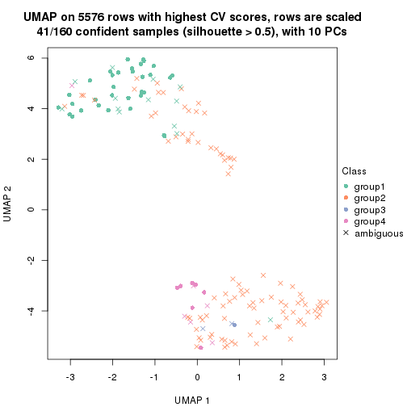</p>

</div>
<div id='tab-CV-pam-dimension-reduction-4'>
<pre><code class="r">dimension_reduction(res, k = 5, method = &quot;UMAP&quot;)
</code></pre>

<p></p>

</div>
<div id='tab-CV-pam-dimension-reduction-5'>
<pre><code class="r">dimension_reduction(res, k = 6, method = &quot;UMAP&quot;)
</code></pre>

<p></p>

</div>
</div>


Following heatmap shows how subgroups are split when increasing `k`:

```r
collect_classes(res)
```


Test correlation between subgroups and known annotations. If the known
annotation is numeric, one-way ANOVA test is applied, and if the known
annotation is discrete, chi-squared contingency table test is applied.

```r
test_to_known_factors(res)
```

```
#>          n cell_type(p) k
#> CV:pam 143     9.46e-02 2
#> CV:pam 102     4.63e-15 3
#> CV:pam  41     2.04e-07 4
#> CV:pam  90     2.76e-10 5
#> CV:pam  60     9.11e-04 6
```


If matrix rows can be associated to genes, consider to use `GO_Enrichment(res,
...)` to perform function enrichment for the signature genes.


 

---------------------------------------------------


### CV:mclust**


The object with results only for a single top-value method and a single partition method 
can be extracted as:

```r
res = res_list["CV", "mclust"]
# you can also extract it by
# res = res_list["CV:mclust"]
```

A summary of `res` and all the functions that can be applied to it:

```r
res
```

```
#> A 'ConsensusPartition' object with k = 2, 3, 4, 5, 6.
#>   On a matrix with 5576 rows and 160 columns.
#>   Top rows (558, 1116, 1673, 2230, 2788) are extracted by 'CV' method.
#>   Subgroups are detected by 'mclust' method.
#>   Performed in total 1250 partitions by row resampling.
#>   Best k for subgroups seems to be 2.
#> 
#> Following methods can be applied to this 'ConsensusPartition' object:
#>  [1] "cola_report"             "collect_classes"         "collect_plots"          
#>  [4] "collect_stats"           "colnames"                "compare_signatures"     
#>  [7] "consensus_heatmap"       "dimension_reduction"     "functional_enrichment"  
#> [10] "get_anno_col"            "get_anno"                "get_classes"            
#> [13] "get_consensus"           "get_matrix"              "get_membership"         
#> [16] "get_param"               "get_signatures"          "get_stats"              
#> [19] "is_best_k"               "is_stable_k"             "membership_heatmap"     
#> [22] "ncol"                    "nrow"                    "plot_ecdf"              
#> [25] "rownames"                "select_partition_number" "show"                   
#> [28] "suggest_best_k"          "test_to_known_factors"
```

`collect_plots()` function collects all the plots made from `res` for all `k` (number of partitions)
into one single page to provide an easy and fast comparison between different `k`.

```r
collect_plots(res)
```


The plots are:

- The first row: a plot of the ECDF (Empirical cumulative distribution
  function) curves of the consensus matrix for each `k` and the heatmap of
  predicted classes for each `k`.
- The second row: heatmaps of the consensus matrix for each `k`.
- The third row: heatmaps of the membership matrix for each `k`.
- The fouth row: heatmaps of the signatures for each `k`.

All the plots in panels can be made by individual functions and they are
plotted later in this section.

`select_partition_number()` produces several plots showing different
statistics for choosing "optimized" `k`. There are following statistics:

- ECDF curves of the consensus matrix for each `k`;
- 1-PAC. [The PAC
  score](https://en.wikipedia.org/wiki/Consensus_clustering#Over-interpretation_potential_of_consensus_clustering)
  measures the proportion of the ambiguous subgrouping.
- Mean silhouette score.
- Concordance. The mean probability of fiting the consensus class ids in all
  partitions.
- Area increased. Denote $A_k$ as the area under the ECDF curve for current
  `k`, the area increased is defined as $A_k - A_{k-1}$.
- Rand index. The percent of pairs of samples that are both in a same cluster
  or both are not in a same cluster in the partition of k and k-1.
- Jaccard index. The ratio of pairs of samples are both in a same cluster in
  the partition of k and k-1 and the pairs of samples are both in a same
  cluster in the partition k or k-1.

The detailed explanations of these statistics can be found in [the cola
vignette](http://bioconductor.org/packages/devel/bioc/vignettes/cola/inst/doc/cola.html#toc_13).

Generally speaking, lower PAC score, higher mean silhouette score or higher
concordance corresponds to better partition. Rand index and Jaccard index
measure how similar the current partition is compared to partition with `k-1`.
If they are too similar, we won't accept `k` is better than `k-1`.

```r
select_partition_number(res)
```


The numeric values for all these statistics can be obtained by `get_stats()`.

```r
get_stats(res)
```

```
#>   k 1-PAC mean_silhouette concordance area_increased  Rand Jaccard
#> 2 2 1.000           0.988       0.995         0.5034 0.497   0.497
#> 3 3 0.810           0.878       0.922         0.2310 0.894   0.786
#> 4 4 0.725           0.789       0.886         0.1598 0.870   0.670
#> 5 5 0.734           0.605       0.837         0.0480 0.940   0.797
#> 6 6 0.665           0.624       0.774         0.0366 0.937   0.779
```

`suggest_best_k()` suggests the best $k$ based on these statistics. The rules are as follows:

- All $k$ with Jaccard index larger than 0.95 are removed because the increase of
  the partition number does not provides enough extra information. If all $k$ are removed,
  the best $k$ is assigned by `NA`.
- For $k$ with 1-PAC larger than 0.9, the maximal $k$ is taken as the "best k". Other $k$ is called "optional k".
- If it does not fit the second rule. The $k$ with the highest vote of highest
  1-PAC, mean silhouette and concordance is taken as the "best k".

```r
suggest_best_k(res)
```

```
#> [1] 2
```


Following shows the table of the partitions (You need to click the **show/hide
code output** link to see it). The membership matrix (columns with name `p*`)
is inferred by
[`clue::cl_consensus()`](https://www.rdocumentation.org/link/cl_consensus?package=clue)
function with the `SE` method. Basically the value in the membership matrix
represents the probability to belong to a certain group. The finall class
label for an item is determined with the group with highest probability it
belongs to.

In `get_classes()` function, the entropy is calculated from the membership
matrix and the silhouette score is calculated from the consensus matrix.


<script>
$( function() {
	$( '#tabs-CV-mclust-get-classes' ).tabs();
} );
</script>
<div id='tabs-CV-mclust-get-classes'>
<ul>
<li><a href='#tab-CV-mclust-get-classes-1'>k = 2</a></li>
<li><a href='#tab-CV-mclust-get-classes-2'>k = 3</a></li>
<li><a href='#tab-CV-mclust-get-classes-3'>k = 4</a></li>
<li><a href='#tab-CV-mclust-get-classes-4'>k = 5</a></li>
<li><a href='#tab-CV-mclust-get-classes-5'>k = 6</a></li>
</ul>

<div id='tab-CV-mclust-get-classes-1'>
<p><a id='tab-CV-mclust-get-classes-1-a' style='color:#0366d6' href='#'>show/hide code output</a></p>
<pre><code class="r">cbind(get_classes(res, k = 2), get_membership(res, k = 2))
</code></pre>

<pre><code>#&gt;                     class entropy silhouette    p1    p2
#&gt; aberrant_ERR2585320     2  0.0000      0.989 0.000 1.000
#&gt; aberrant_ERR2585338     2  0.0000      0.989 0.000 1.000
#&gt; aberrant_ERR2585325     2  0.0000      0.989 0.000 1.000
#&gt; aberrant_ERR2585283     2  0.0000      0.989 0.000 1.000
#&gt; aberrant_ERR2585343     2  0.0000      0.989 0.000 1.000
#&gt; aberrant_ERR2585329     2  0.0000      0.989 0.000 1.000
#&gt; aberrant_ERR2585317     2  0.0000      0.989 0.000 1.000
#&gt; aberrant_ERR2585339     2  0.0000      0.989 0.000 1.000
#&gt; aberrant_ERR2585335     2  0.0000      0.989 0.000 1.000
#&gt; aberrant_ERR2585287     2  0.0000      0.989 0.000 1.000
#&gt; aberrant_ERR2585321     2  0.0000      0.989 0.000 1.000
#&gt; aberrant_ERR2585297     1  0.0000      1.000 1.000 0.000
#&gt; aberrant_ERR2585337     2  0.0000      0.989 0.000 1.000
#&gt; aberrant_ERR2585319     2  0.0000      0.989 0.000 1.000
#&gt; aberrant_ERR2585315     2  0.0000      0.989 0.000 1.000
#&gt; aberrant_ERR2585336     2  0.0000      0.989 0.000 1.000
#&gt; aberrant_ERR2585307     2  0.0000      0.989 0.000 1.000
#&gt; aberrant_ERR2585301     2  0.0000      0.989 0.000 1.000
#&gt; aberrant_ERR2585326     2  0.0000      0.989 0.000 1.000
#&gt; aberrant_ERR2585331     2  0.0000      0.989 0.000 1.000
#&gt; aberrant_ERR2585346     2  0.0000      0.989 0.000 1.000
#&gt; aberrant_ERR2585314     2  0.0000      0.989 0.000 1.000
#&gt; aberrant_ERR2585298     1  0.0000      1.000 1.000 0.000
#&gt; aberrant_ERR2585345     2  0.0000      0.989 0.000 1.000
#&gt; aberrant_ERR2585299     1  0.0000      1.000 1.000 0.000
#&gt; aberrant_ERR2585309     1  0.0000      1.000 1.000 0.000
#&gt; aberrant_ERR2585303     2  0.0000      0.989 0.000 1.000
#&gt; aberrant_ERR2585313     2  0.0000      0.989 0.000 1.000
#&gt; aberrant_ERR2585318     2  0.0000      0.989 0.000 1.000
#&gt; aberrant_ERR2585328     2  0.0000      0.989 0.000 1.000
#&gt; aberrant_ERR2585330     2  0.0000      0.989 0.000 1.000
#&gt; aberrant_ERR2585293     2  0.0000      0.989 0.000 1.000
#&gt; aberrant_ERR2585342     2  0.0000      0.989 0.000 1.000
#&gt; aberrant_ERR2585348     2  0.0000      0.989 0.000 1.000
#&gt; aberrant_ERR2585352     2  0.0000      0.989 0.000 1.000
#&gt; aberrant_ERR2585308     1  0.0000      1.000 1.000 0.000
#&gt; aberrant_ERR2585349     2  0.8207      0.666 0.256 0.744
#&gt; aberrant_ERR2585316     2  0.0000      0.989 0.000 1.000
#&gt; aberrant_ERR2585306     2  0.0000      0.989 0.000 1.000
#&gt; aberrant_ERR2585324     2  0.0000      0.989 0.000 1.000
#&gt; aberrant_ERR2585310     2  0.6343      0.813 0.160 0.840
#&gt; aberrant_ERR2585296     1  0.0000      1.000 1.000 0.000
#&gt; aberrant_ERR2585275     2  0.0000      0.989 0.000 1.000
#&gt; aberrant_ERR2585311     2  0.0000      0.989 0.000 1.000
#&gt; aberrant_ERR2585292     2  0.0000      0.989 0.000 1.000
#&gt; aberrant_ERR2585282     2  0.0000      0.989 0.000 1.000
#&gt; aberrant_ERR2585305     2  0.0000      0.989 0.000 1.000
#&gt; aberrant_ERR2585278     2  0.0000      0.989 0.000 1.000
#&gt; aberrant_ERR2585347     2  0.0000      0.989 0.000 1.000
#&gt; aberrant_ERR2585332     2  0.0000      0.989 0.000 1.000
#&gt; aberrant_ERR2585280     2  0.0000      0.989 0.000 1.000
#&gt; aberrant_ERR2585304     2  0.8813      0.585 0.300 0.700
#&gt; aberrant_ERR2585322     2  0.0000      0.989 0.000 1.000
#&gt; aberrant_ERR2585279     2  0.4431      0.897 0.092 0.908
#&gt; aberrant_ERR2585277     2  0.0000      0.989 0.000 1.000
#&gt; aberrant_ERR2585295     2  0.0000      0.989 0.000 1.000
#&gt; aberrant_ERR2585333     2  0.0000      0.989 0.000 1.000
#&gt; aberrant_ERR2585285     2  0.0000      0.989 0.000 1.000
#&gt; aberrant_ERR2585286     2  0.0000      0.989 0.000 1.000
#&gt; aberrant_ERR2585294     2  0.0000      0.989 0.000 1.000
#&gt; aberrant_ERR2585300     2  0.0000      0.989 0.000 1.000
#&gt; aberrant_ERR2585334     2  0.2603      0.948 0.044 0.956
#&gt; aberrant_ERR2585361     2  0.0000      0.989 0.000 1.000
#&gt; aberrant_ERR2585372     2  0.0000      0.989 0.000 1.000
#&gt; round_ERR2585217        1  0.0000      1.000 1.000 0.000
#&gt; round_ERR2585205        1  0.0000      1.000 1.000 0.000
#&gt; round_ERR2585214        1  0.0000      1.000 1.000 0.000
#&gt; round_ERR2585202        1  0.0000      1.000 1.000 0.000
#&gt; aberrant_ERR2585367     2  0.0000      0.989 0.000 1.000
#&gt; round_ERR2585220        1  0.0000      1.000 1.000 0.000
#&gt; round_ERR2585238        1  0.0000      1.000 1.000 0.000
#&gt; aberrant_ERR2585276     2  0.0000      0.989 0.000 1.000
#&gt; round_ERR2585218        1  0.0000      1.000 1.000 0.000
#&gt; aberrant_ERR2585363     2  0.0000      0.989 0.000 1.000
#&gt; round_ERR2585201        1  0.0000      1.000 1.000 0.000
#&gt; round_ERR2585210        1  0.0000      1.000 1.000 0.000
#&gt; aberrant_ERR2585362     2  0.0000      0.989 0.000 1.000
#&gt; aberrant_ERR2585360     2  0.0000      0.989 0.000 1.000
#&gt; round_ERR2585209        1  0.0000      1.000 1.000 0.000
#&gt; round_ERR2585242        1  0.0000      1.000 1.000 0.000
#&gt; round_ERR2585216        1  0.0000      1.000 1.000 0.000
#&gt; round_ERR2585219        1  0.0000      1.000 1.000 0.000
#&gt; round_ERR2585237        1  0.0000      1.000 1.000 0.000
#&gt; round_ERR2585198        1  0.0000      1.000 1.000 0.000
#&gt; round_ERR2585211        1  0.0000      1.000 1.000 0.000
#&gt; round_ERR2585206        1  0.0000      1.000 1.000 0.000
#&gt; aberrant_ERR2585281     2  0.0000      0.989 0.000 1.000
#&gt; round_ERR2585212        1  0.0000      1.000 1.000 0.000
#&gt; round_ERR2585221        1  0.0000      1.000 1.000 0.000
#&gt; round_ERR2585243        1  0.0000      1.000 1.000 0.000
#&gt; round_ERR2585204        1  0.0000      1.000 1.000 0.000
#&gt; round_ERR2585213        1  0.1414      0.979 0.980 0.020
#&gt; aberrant_ERR2585373     2  0.0000      0.989 0.000 1.000
#&gt; aberrant_ERR2585358     2  0.0000      0.989 0.000 1.000
#&gt; aberrant_ERR2585365     2  0.0000      0.989 0.000 1.000
#&gt; aberrant_ERR2585359     2  0.0000      0.989 0.000 1.000
#&gt; aberrant_ERR2585370     2  0.0000      0.989 0.000 1.000
#&gt; round_ERR2585215        1  0.0000      1.000 1.000 0.000
#&gt; round_ERR2585262        1  0.0000      1.000 1.000 0.000
#&gt; round_ERR2585199        1  0.0000      1.000 1.000 0.000
#&gt; aberrant_ERR2585369     2  0.0000      0.989 0.000 1.000
#&gt; round_ERR2585208        1  0.0000      1.000 1.000 0.000
#&gt; round_ERR2585252        1  0.0000      1.000 1.000 0.000
#&gt; round_ERR2585236        1  0.0000      1.000 1.000 0.000
#&gt; aberrant_ERR2585284     2  0.0376      0.986 0.004 0.996
#&gt; round_ERR2585224        1  0.0000      1.000 1.000 0.000
#&gt; round_ERR2585260        1  0.0000      1.000 1.000 0.000
#&gt; round_ERR2585229        1  0.0000      1.000 1.000 0.000
#&gt; aberrant_ERR2585364     2  0.0000      0.989 0.000 1.000
#&gt; round_ERR2585253        1  0.0000      1.000 1.000 0.000
#&gt; aberrant_ERR2585368     2  0.0000      0.989 0.000 1.000
#&gt; aberrant_ERR2585371     2  0.0000      0.989 0.000 1.000
#&gt; round_ERR2585239        1  0.0000      1.000 1.000 0.000
#&gt; round_ERR2585273        1  0.0000      1.000 1.000 0.000
#&gt; round_ERR2585256        1  0.0000      1.000 1.000 0.000
#&gt; round_ERR2585272        1  0.0000      1.000 1.000 0.000
#&gt; round_ERR2585246        1  0.0000      1.000 1.000 0.000
#&gt; round_ERR2585261        1  0.0000      1.000 1.000 0.000
#&gt; round_ERR2585254        1  0.0000      1.000 1.000 0.000
#&gt; round_ERR2585225        1  0.0000      1.000 1.000 0.000
#&gt; round_ERR2585235        1  0.0000      1.000 1.000 0.000
#&gt; round_ERR2585271        1  0.0000      1.000 1.000 0.000
#&gt; round_ERR2585251        1  0.0000      1.000 1.000 0.000
#&gt; round_ERR2585255        1  0.0000      1.000 1.000 0.000
#&gt; round_ERR2585257        1  0.0000      1.000 1.000 0.000
#&gt; round_ERR2585226        1  0.0000      1.000 1.000 0.000
#&gt; round_ERR2585265        1  0.0000      1.000 1.000 0.000
#&gt; round_ERR2585259        1  0.0000      1.000 1.000 0.000
#&gt; round_ERR2585247        1  0.0000      1.000 1.000 0.000
#&gt; round_ERR2585241        1  0.0000      1.000 1.000 0.000
#&gt; round_ERR2585263        1  0.0000      1.000 1.000 0.000
#&gt; round_ERR2585264        1  0.0000      1.000 1.000 0.000
#&gt; round_ERR2585233        1  0.0000      1.000 1.000 0.000
#&gt; round_ERR2585223        1  0.0000      1.000 1.000 0.000
#&gt; round_ERR2585234        1  0.0000      1.000 1.000 0.000
#&gt; round_ERR2585222        1  0.0000      1.000 1.000 0.000
#&gt; round_ERR2585228        1  0.0000      1.000 1.000 0.000
#&gt; round_ERR2585248        1  0.0000      1.000 1.000 0.000
#&gt; round_ERR2585240        1  0.0000      1.000 1.000 0.000
#&gt; round_ERR2585270        1  0.0000      1.000 1.000 0.000
#&gt; round_ERR2585232        1  0.0000      1.000 1.000 0.000
#&gt; aberrant_ERR2585341     2  0.0000      0.989 0.000 1.000
#&gt; aberrant_ERR2585355     2  0.0000      0.989 0.000 1.000
#&gt; round_ERR2585227        1  0.0000      1.000 1.000 0.000
#&gt; aberrant_ERR2585351     2  0.0000      0.989 0.000 1.000
#&gt; round_ERR2585269        1  0.0000      1.000 1.000 0.000
#&gt; aberrant_ERR2585357     2  0.0000      0.989 0.000 1.000
#&gt; aberrant_ERR2585350     2  0.0000      0.989 0.000 1.000
#&gt; round_ERR2585250        1  0.0000      1.000 1.000 0.000
#&gt; round_ERR2585245        1  0.0000      1.000 1.000 0.000
#&gt; aberrant_ERR2585353     2  0.0000      0.989 0.000 1.000
#&gt; round_ERR2585258        1  0.0000      1.000 1.000 0.000
#&gt; aberrant_ERR2585354     2  0.0000      0.989 0.000 1.000
#&gt; round_ERR2585249        1  0.0000      1.000 1.000 0.000
#&gt; round_ERR2585268        1  0.0000      1.000 1.000 0.000
#&gt; aberrant_ERR2585356     2  0.0000      0.989 0.000 1.000
#&gt; round_ERR2585266        1  0.0000      1.000 1.000 0.000
#&gt; round_ERR2585231        1  0.0000      1.000 1.000 0.000
#&gt; round_ERR2585230        1  0.0000      1.000 1.000 0.000
#&gt; round_ERR2585267        1  0.0000      1.000 1.000 0.000
</code></pre>

<script>
$('#tab-CV-mclust-get-classes-1-a').parent().next().next().hide();
$('#tab-CV-mclust-get-classes-1-a').click(function(){
  $('#tab-CV-mclust-get-classes-1-a').parent().next().next().toggle();
  return(false);
});
</script>
</div>

<div id='tab-CV-mclust-get-classes-2'>
<p><a id='tab-CV-mclust-get-classes-2-a' style='color:#0366d6' href='#'>show/hide code output</a></p>
<pre><code class="r">cbind(get_classes(res, k = 3), get_membership(res, k = 3))
</code></pre>

<pre><code>#&gt;                     class entropy silhouette    p1    p2    p3
#&gt; aberrant_ERR2585320     2  0.1163      0.931 0.000 0.972 0.028
#&gt; aberrant_ERR2585338     2  0.3116      0.906 0.000 0.892 0.108
#&gt; aberrant_ERR2585325     2  0.1163      0.931 0.000 0.972 0.028
#&gt; aberrant_ERR2585283     2  0.1643      0.925 0.000 0.956 0.044
#&gt; aberrant_ERR2585343     2  0.0237      0.933 0.000 0.996 0.004
#&gt; aberrant_ERR2585329     2  0.1031      0.933 0.000 0.976 0.024
#&gt; aberrant_ERR2585317     2  0.0892      0.934 0.000 0.980 0.020
#&gt; aberrant_ERR2585339     2  0.2796      0.914 0.000 0.908 0.092
#&gt; aberrant_ERR2585335     2  0.0892      0.932 0.000 0.980 0.020
#&gt; aberrant_ERR2585287     2  0.2165      0.928 0.000 0.936 0.064
#&gt; aberrant_ERR2585321     2  0.0592      0.932 0.000 0.988 0.012
#&gt; aberrant_ERR2585297     1  0.0000      0.954 1.000 0.000 0.000
#&gt; aberrant_ERR2585337     2  0.2625      0.923 0.000 0.916 0.084
#&gt; aberrant_ERR2585319     2  0.0424      0.934 0.000 0.992 0.008
#&gt; aberrant_ERR2585315     2  0.1031      0.934 0.000 0.976 0.024
#&gt; aberrant_ERR2585336     2  0.2448      0.924 0.000 0.924 0.076
#&gt; aberrant_ERR2585307     2  0.3412      0.910 0.000 0.876 0.124
#&gt; aberrant_ERR2585301     2  0.1289      0.931 0.000 0.968 0.032
#&gt; aberrant_ERR2585326     2  0.2878      0.915 0.000 0.904 0.096
#&gt; aberrant_ERR2585331     2  0.4235      0.853 0.000 0.824 0.176
#&gt; aberrant_ERR2585346     2  0.1753      0.924 0.000 0.952 0.048
#&gt; aberrant_ERR2585314     2  0.2537      0.919 0.000 0.920 0.080
#&gt; aberrant_ERR2585298     3  0.2625      0.906 0.084 0.000 0.916
#&gt; aberrant_ERR2585345     2  0.1860      0.931 0.000 0.948 0.052
#&gt; aberrant_ERR2585299     1  0.0237      0.951 0.996 0.000 0.004
#&gt; aberrant_ERR2585309     1  0.0000      0.954 1.000 0.000 0.000
#&gt; aberrant_ERR2585303     2  0.2959      0.908 0.000 0.900 0.100
#&gt; aberrant_ERR2585313     2  0.2261      0.927 0.000 0.932 0.068
#&gt; aberrant_ERR2585318     2  0.0892      0.932 0.000 0.980 0.020
#&gt; aberrant_ERR2585328     2  0.2711      0.924 0.000 0.912 0.088
#&gt; aberrant_ERR2585330     2  0.0747      0.932 0.000 0.984 0.016
#&gt; aberrant_ERR2585293     2  0.1964      0.921 0.000 0.944 0.056
#&gt; aberrant_ERR2585342     2  0.0592      0.933 0.000 0.988 0.012
#&gt; aberrant_ERR2585348     2  0.3340      0.909 0.000 0.880 0.120
#&gt; aberrant_ERR2585352     2  0.0747      0.933 0.000 0.984 0.016
#&gt; aberrant_ERR2585308     1  0.0000      0.954 1.000 0.000 0.000
#&gt; aberrant_ERR2585349     2  0.7043      0.328 0.020 0.532 0.448
#&gt; aberrant_ERR2585316     2  0.1289      0.929 0.000 0.968 0.032
#&gt; aberrant_ERR2585306     2  0.1163      0.932 0.000 0.972 0.028
#&gt; aberrant_ERR2585324     2  0.0424      0.934 0.000 0.992 0.008
#&gt; aberrant_ERR2585310     2  0.7410      0.449 0.040 0.576 0.384
#&gt; aberrant_ERR2585296     3  0.6295      0.333 0.472 0.000 0.528
#&gt; aberrant_ERR2585275     2  0.1289      0.929 0.000 0.968 0.032
#&gt; aberrant_ERR2585311     2  0.0892      0.932 0.000 0.980 0.020
#&gt; aberrant_ERR2585292     2  0.1964      0.921 0.000 0.944 0.056
#&gt; aberrant_ERR2585282     2  0.1031      0.931 0.000 0.976 0.024
#&gt; aberrant_ERR2585305     2  0.3272      0.895 0.004 0.892 0.104
#&gt; aberrant_ERR2585278     2  0.1031      0.932 0.000 0.976 0.024
#&gt; aberrant_ERR2585347     2  0.1163      0.929 0.000 0.972 0.028
#&gt; aberrant_ERR2585332     2  0.0892      0.930 0.000 0.980 0.020
#&gt; aberrant_ERR2585280     2  0.0237      0.934 0.000 0.996 0.004
#&gt; aberrant_ERR2585304     2  0.7188      0.249 0.024 0.492 0.484
#&gt; aberrant_ERR2585322     2  0.2066      0.927 0.000 0.940 0.060
#&gt; aberrant_ERR2585279     2  0.6260      0.384 0.000 0.552 0.448
#&gt; aberrant_ERR2585277     2  0.2796      0.914 0.000 0.908 0.092
#&gt; aberrant_ERR2585295     2  0.3116      0.914 0.000 0.892 0.108
#&gt; aberrant_ERR2585333     2  0.0892      0.932 0.000 0.980 0.020
#&gt; aberrant_ERR2585285     2  0.0424      0.933 0.000 0.992 0.008
#&gt; aberrant_ERR2585286     2  0.3192      0.906 0.000 0.888 0.112
#&gt; aberrant_ERR2585294     2  0.1289      0.931 0.000 0.968 0.032
#&gt; aberrant_ERR2585300     2  0.0892      0.932 0.000 0.980 0.020
#&gt; aberrant_ERR2585334     2  0.5785      0.647 0.000 0.668 0.332
#&gt; aberrant_ERR2585361     2  0.2959      0.914 0.000 0.900 0.100
#&gt; aberrant_ERR2585372     2  0.0000      0.933 0.000 1.000 0.000
#&gt; round_ERR2585217        3  0.3116      0.903 0.108 0.000 0.892
#&gt; round_ERR2585205        1  0.0000      0.954 1.000 0.000 0.000
#&gt; round_ERR2585214        3  0.2625      0.906 0.084 0.000 0.916
#&gt; round_ERR2585202        3  0.3272      0.904 0.104 0.004 0.892
#&gt; aberrant_ERR2585367     2  0.3116      0.909 0.000 0.892 0.108
#&gt; round_ERR2585220        1  0.0000      0.954 1.000 0.000 0.000
#&gt; round_ERR2585238        1  0.0000      0.954 1.000 0.000 0.000
#&gt; aberrant_ERR2585276     2  0.0892      0.932 0.000 0.980 0.020
#&gt; round_ERR2585218        1  0.0000      0.954 1.000 0.000 0.000
#&gt; aberrant_ERR2585363     2  0.2625      0.921 0.000 0.916 0.084
#&gt; round_ERR2585201        3  0.2625      0.906 0.084 0.000 0.916
#&gt; round_ERR2585210        1  0.0000      0.954 1.000 0.000 0.000
#&gt; aberrant_ERR2585362     2  0.1753      0.931 0.000 0.952 0.048
#&gt; aberrant_ERR2585360     2  0.0892      0.933 0.000 0.980 0.020
#&gt; round_ERR2585209        3  0.5968      0.612 0.364 0.000 0.636
#&gt; round_ERR2585242        3  0.2625      0.906 0.084 0.000 0.916
#&gt; round_ERR2585216        1  0.0000      0.954 1.000 0.000 0.000
#&gt; round_ERR2585219        1  0.0000      0.954 1.000 0.000 0.000
#&gt; round_ERR2585237        3  0.3192      0.901 0.112 0.000 0.888
#&gt; round_ERR2585198        3  0.2711      0.906 0.088 0.000 0.912
#&gt; round_ERR2585211        1  0.0000      0.954 1.000 0.000 0.000
#&gt; round_ERR2585206        1  0.0000      0.954 1.000 0.000 0.000
#&gt; aberrant_ERR2585281     2  0.3192      0.908 0.000 0.888 0.112
#&gt; round_ERR2585212        1  0.2878      0.850 0.904 0.000 0.096
#&gt; round_ERR2585221        1  0.0000      0.954 1.000 0.000 0.000
#&gt; round_ERR2585243        1  0.0000      0.954 1.000 0.000 0.000
#&gt; round_ERR2585204        3  0.2625      0.906 0.084 0.000 0.916
#&gt; round_ERR2585213        3  0.2772      0.902 0.080 0.004 0.916
#&gt; aberrant_ERR2585373     2  0.0892      0.932 0.000 0.980 0.020
#&gt; aberrant_ERR2585358     2  0.0747      0.931 0.000 0.984 0.016
#&gt; aberrant_ERR2585365     2  0.2711      0.914 0.000 0.912 0.088
#&gt; aberrant_ERR2585359     2  0.1031      0.930 0.000 0.976 0.024
#&gt; aberrant_ERR2585370     2  0.2959      0.913 0.000 0.900 0.100
#&gt; round_ERR2585215        1  0.3752      0.782 0.856 0.000 0.144
#&gt; round_ERR2585262        3  0.2537      0.903 0.080 0.000 0.920
#&gt; round_ERR2585199        3  0.3272      0.903 0.104 0.004 0.892
#&gt; aberrant_ERR2585369     2  0.0237      0.933 0.000 0.996 0.004
#&gt; round_ERR2585208        1  0.0000      0.954 1.000 0.000 0.000
#&gt; round_ERR2585252        1  0.0000      0.954 1.000 0.000 0.000
#&gt; round_ERR2585236        3  0.6168      0.502 0.412 0.000 0.588
#&gt; aberrant_ERR2585284     2  0.3116      0.915 0.000 0.892 0.108
#&gt; round_ERR2585224        1  0.0000      0.954 1.000 0.000 0.000
#&gt; round_ERR2585260        1  0.0000      0.954 1.000 0.000 0.000
#&gt; round_ERR2585229        1  0.0000      0.954 1.000 0.000 0.000
#&gt; aberrant_ERR2585364     2  0.1031      0.930 0.000 0.976 0.024
#&gt; round_ERR2585253        1  0.0000      0.954 1.000 0.000 0.000
#&gt; aberrant_ERR2585368     2  0.3267      0.906 0.000 0.884 0.116
#&gt; aberrant_ERR2585371     2  0.3267      0.906 0.000 0.884 0.116
#&gt; round_ERR2585239        1  0.0000      0.954 1.000 0.000 0.000
#&gt; round_ERR2585273        1  0.0000      0.954 1.000 0.000 0.000
#&gt; round_ERR2585256        1  0.6302     -0.210 0.520 0.000 0.480
#&gt; round_ERR2585272        1  0.4887      0.633 0.772 0.000 0.228
#&gt; round_ERR2585246        1  0.0237      0.951 0.996 0.000 0.004
#&gt; round_ERR2585261        3  0.3619      0.887 0.136 0.000 0.864
#&gt; round_ERR2585254        1  0.5678      0.415 0.684 0.000 0.316
#&gt; round_ERR2585225        3  0.2625      0.906 0.084 0.000 0.916
#&gt; round_ERR2585235        3  0.5835      0.648 0.340 0.000 0.660
#&gt; round_ERR2585271        1  0.0000      0.954 1.000 0.000 0.000
#&gt; round_ERR2585251        1  0.0000      0.954 1.000 0.000 0.000
#&gt; round_ERR2585255        3  0.2625      0.906 0.084 0.000 0.916
#&gt; round_ERR2585257        3  0.3412      0.895 0.124 0.000 0.876
#&gt; round_ERR2585226        1  0.0000      0.954 1.000 0.000 0.000
#&gt; round_ERR2585265        1  0.0000      0.954 1.000 0.000 0.000
#&gt; round_ERR2585259        3  0.5363      0.737 0.276 0.000 0.724
#&gt; round_ERR2585247        1  0.0000      0.954 1.000 0.000 0.000
#&gt; round_ERR2585241        1  0.0000      0.954 1.000 0.000 0.000
#&gt; round_ERR2585263        1  0.2959      0.846 0.900 0.000 0.100
#&gt; round_ERR2585264        1  0.0747      0.941 0.984 0.000 0.016
#&gt; round_ERR2585233        3  0.2796      0.907 0.092 0.000 0.908
#&gt; round_ERR2585223        1  0.0000      0.954 1.000 0.000 0.000
#&gt; round_ERR2585234        3  0.2796      0.906 0.092 0.000 0.908
#&gt; round_ERR2585222        1  0.0000      0.954 1.000 0.000 0.000
#&gt; round_ERR2585228        1  0.0000      0.954 1.000 0.000 0.000
#&gt; round_ERR2585248        1  0.0000      0.954 1.000 0.000 0.000
#&gt; round_ERR2585240        3  0.3192      0.901 0.112 0.000 0.888
#&gt; round_ERR2585270        1  0.0000      0.954 1.000 0.000 0.000
#&gt; round_ERR2585232        3  0.6180      0.496 0.416 0.000 0.584
#&gt; aberrant_ERR2585341     2  0.3412      0.904 0.000 0.876 0.124
#&gt; aberrant_ERR2585355     2  0.3116      0.906 0.000 0.892 0.108
#&gt; round_ERR2585227        1  0.0592      0.943 0.988 0.000 0.012
#&gt; aberrant_ERR2585351     2  0.1031      0.934 0.000 0.976 0.024
#&gt; round_ERR2585269        1  0.0000      0.954 1.000 0.000 0.000
#&gt; aberrant_ERR2585357     2  0.2959      0.913 0.000 0.900 0.100
#&gt; aberrant_ERR2585350     2  0.2878      0.912 0.000 0.904 0.096
#&gt; round_ERR2585250        1  0.0592      0.944 0.988 0.000 0.012
#&gt; round_ERR2585245        1  0.0000      0.954 1.000 0.000 0.000
#&gt; aberrant_ERR2585353     2  0.0000      0.933 0.000 1.000 0.000
#&gt; round_ERR2585258        1  0.0000      0.954 1.000 0.000 0.000
#&gt; aberrant_ERR2585354     2  0.0747      0.935 0.000 0.984 0.016
#&gt; round_ERR2585249        1  0.0000      0.954 1.000 0.000 0.000
#&gt; round_ERR2585268        1  0.6299     -0.191 0.524 0.000 0.476
#&gt; aberrant_ERR2585356     2  0.0892      0.932 0.000 0.980 0.020
#&gt; round_ERR2585266        3  0.2625      0.906 0.084 0.000 0.916
#&gt; round_ERR2585231        1  0.0000      0.954 1.000 0.000 0.000
#&gt; round_ERR2585230        1  0.0000      0.954 1.000 0.000 0.000
#&gt; round_ERR2585267        1  0.1031      0.933 0.976 0.000 0.024
</code></pre>

<script>
$('#tab-CV-mclust-get-classes-2-a').parent().next().next().hide();
$('#tab-CV-mclust-get-classes-2-a').click(function(){
  $('#tab-CV-mclust-get-classes-2-a').parent().next().next().toggle();
  return(false);
});
</script>
</div>

<div id='tab-CV-mclust-get-classes-3'>
<p><a id='tab-CV-mclust-get-classes-3-a' style='color:#0366d6' href='#'>show/hide code output</a></p>
<pre><code class="r">cbind(get_classes(res, k = 4), get_membership(res, k = 4))
</code></pre>

<pre><code>#&gt;                     class entropy silhouette    p1    p2    p3    p4
#&gt; aberrant_ERR2585320     4  0.4996     0.3163 0.000 0.484 0.000 0.516
#&gt; aberrant_ERR2585338     4  0.3249     0.7815 0.000 0.140 0.008 0.852
#&gt; aberrant_ERR2585325     4  0.4996     0.3220 0.000 0.484 0.000 0.516
#&gt; aberrant_ERR2585283     4  0.4989     0.2585 0.000 0.472 0.000 0.528
#&gt; aberrant_ERR2585343     2  0.1211     0.8334 0.000 0.960 0.000 0.040
#&gt; aberrant_ERR2585329     2  0.2011     0.8240 0.000 0.920 0.000 0.080
#&gt; aberrant_ERR2585317     2  0.1867     0.8301 0.000 0.928 0.000 0.072
#&gt; aberrant_ERR2585339     4  0.5050     0.4277 0.000 0.408 0.004 0.588
#&gt; aberrant_ERR2585335     2  0.0336     0.8369 0.000 0.992 0.000 0.008
#&gt; aberrant_ERR2585287     4  0.4040     0.7216 0.000 0.248 0.000 0.752
#&gt; aberrant_ERR2585321     2  0.0336     0.8373 0.000 0.992 0.000 0.008
#&gt; aberrant_ERR2585297     1  0.0000     0.9621 1.000 0.000 0.000 0.000
#&gt; aberrant_ERR2585337     2  0.3945     0.6932 0.000 0.780 0.004 0.216
#&gt; aberrant_ERR2585319     2  0.1302     0.8401 0.000 0.956 0.000 0.044
#&gt; aberrant_ERR2585315     2  0.1211     0.8392 0.000 0.960 0.000 0.040
#&gt; aberrant_ERR2585336     2  0.4401     0.6111 0.000 0.724 0.004 0.272
#&gt; aberrant_ERR2585307     2  0.4576     0.6288 0.000 0.728 0.012 0.260
#&gt; aberrant_ERR2585301     2  0.1022     0.8397 0.000 0.968 0.000 0.032
#&gt; aberrant_ERR2585326     2  0.4188     0.6461 0.000 0.752 0.004 0.244
#&gt; aberrant_ERR2585331     4  0.3899     0.7630 0.000 0.108 0.052 0.840
#&gt; aberrant_ERR2585346     4  0.4898     0.3707 0.000 0.416 0.000 0.584
#&gt; aberrant_ERR2585314     2  0.2647     0.8035 0.000 0.880 0.000 0.120
#&gt; aberrant_ERR2585298     3  0.0336     0.8904 0.000 0.000 0.992 0.008
#&gt; aberrant_ERR2585345     2  0.3257     0.7679 0.000 0.844 0.004 0.152
#&gt; aberrant_ERR2585299     1  0.0188     0.9607 0.996 0.000 0.004 0.000
#&gt; aberrant_ERR2585309     1  0.0188     0.9625 0.996 0.000 0.000 0.004
#&gt; aberrant_ERR2585303     4  0.3196     0.7821 0.000 0.136 0.008 0.856
#&gt; aberrant_ERR2585313     2  0.4155     0.6636 0.000 0.756 0.004 0.240
#&gt; aberrant_ERR2585318     2  0.0000     0.8342 0.000 1.000 0.000 0.000
#&gt; aberrant_ERR2585328     4  0.3791     0.7494 0.000 0.200 0.004 0.796
#&gt; aberrant_ERR2585330     2  0.0592     0.8386 0.000 0.984 0.000 0.016
#&gt; aberrant_ERR2585293     4  0.3172     0.6985 0.000 0.160 0.000 0.840
#&gt; aberrant_ERR2585342     2  0.0592     0.8386 0.000 0.984 0.000 0.016
#&gt; aberrant_ERR2585348     4  0.2737     0.7779 0.000 0.104 0.008 0.888
#&gt; aberrant_ERR2585352     2  0.1022     0.8401 0.000 0.968 0.000 0.032
#&gt; aberrant_ERR2585308     1  0.0188     0.9625 0.996 0.000 0.000 0.004
#&gt; aberrant_ERR2585349     4  0.7636     0.5530 0.012 0.188 0.272 0.528
#&gt; aberrant_ERR2585316     2  0.4981    -0.1305 0.000 0.536 0.000 0.464
#&gt; aberrant_ERR2585306     2  0.2216     0.8106 0.000 0.908 0.000 0.092
#&gt; aberrant_ERR2585324     2  0.1389     0.8393 0.000 0.952 0.000 0.048
#&gt; aberrant_ERR2585310     2  0.6634     0.5755 0.096 0.708 0.076 0.120
#&gt; aberrant_ERR2585296     1  0.4817     0.3076 0.612 0.000 0.388 0.000
#&gt; aberrant_ERR2585275     2  0.3219     0.7465 0.000 0.836 0.000 0.164
#&gt; aberrant_ERR2585311     2  0.0188     0.8358 0.000 0.996 0.000 0.004
#&gt; aberrant_ERR2585292     4  0.3172     0.6985 0.000 0.160 0.000 0.840
#&gt; aberrant_ERR2585282     2  0.3610     0.7056 0.000 0.800 0.000 0.200
#&gt; aberrant_ERR2585305     2  0.2530     0.8042 0.000 0.888 0.000 0.112
#&gt; aberrant_ERR2585278     2  0.0469     0.8378 0.000 0.988 0.000 0.012
#&gt; aberrant_ERR2585347     4  0.4992     0.3323 0.000 0.476 0.000 0.524
#&gt; aberrant_ERR2585332     2  0.3801     0.6697 0.000 0.780 0.000 0.220
#&gt; aberrant_ERR2585280     2  0.4008     0.6358 0.000 0.756 0.000 0.244
#&gt; aberrant_ERR2585304     2  0.8141     0.1414 0.028 0.480 0.304 0.188
#&gt; aberrant_ERR2585322     2  0.4741     0.4851 0.000 0.668 0.004 0.328
#&gt; aberrant_ERR2585279     4  0.5783     0.6873 0.000 0.120 0.172 0.708
#&gt; aberrant_ERR2585277     4  0.3539     0.7662 0.000 0.176 0.004 0.820
#&gt; aberrant_ERR2585295     4  0.3142     0.7823 0.000 0.132 0.008 0.860
#&gt; aberrant_ERR2585333     2  0.0469     0.8382 0.000 0.988 0.000 0.012
#&gt; aberrant_ERR2585285     2  0.0469     0.8379 0.000 0.988 0.000 0.012
#&gt; aberrant_ERR2585286     4  0.2714     0.7807 0.000 0.112 0.004 0.884
#&gt; aberrant_ERR2585294     2  0.0921     0.8309 0.000 0.972 0.000 0.028
#&gt; aberrant_ERR2585300     2  0.0336     0.8369 0.000 0.992 0.000 0.008
#&gt; aberrant_ERR2585334     4  0.4359     0.7402 0.000 0.084 0.100 0.816
#&gt; aberrant_ERR2585361     4  0.3052     0.7834 0.000 0.136 0.004 0.860
#&gt; aberrant_ERR2585372     2  0.1940     0.8191 0.000 0.924 0.000 0.076
#&gt; round_ERR2585217        3  0.1022     0.8870 0.032 0.000 0.968 0.000
#&gt; round_ERR2585205        1  0.0000     0.9621 1.000 0.000 0.000 0.000
#&gt; round_ERR2585214        3  0.0336     0.8904 0.000 0.000 0.992 0.008
#&gt; round_ERR2585202        3  0.1639     0.8829 0.036 0.004 0.952 0.008
#&gt; aberrant_ERR2585367     4  0.3088     0.7823 0.000 0.128 0.008 0.864
#&gt; round_ERR2585220        1  0.0188     0.9612 0.996 0.000 0.000 0.004
#&gt; round_ERR2585238        1  0.0188     0.9625 0.996 0.000 0.000 0.004
#&gt; aberrant_ERR2585276     2  0.0469     0.8357 0.000 0.988 0.000 0.012
#&gt; round_ERR2585218        1  0.0188     0.9625 0.996 0.000 0.000 0.004
#&gt; aberrant_ERR2585363     2  0.2334     0.8221 0.000 0.908 0.004 0.088
#&gt; round_ERR2585201        3  0.0336     0.8904 0.000 0.000 0.992 0.008
#&gt; round_ERR2585210        1  0.0188     0.9625 0.996 0.000 0.000 0.004
#&gt; aberrant_ERR2585362     4  0.4776     0.5537 0.000 0.376 0.000 0.624
#&gt; aberrant_ERR2585360     2  0.0000     0.8342 0.000 1.000 0.000 0.000
#&gt; round_ERR2585209        3  0.4804     0.4465 0.384 0.000 0.616 0.000
#&gt; round_ERR2585242        3  0.0336     0.8904 0.000 0.000 0.992 0.008
#&gt; round_ERR2585216        1  0.0188     0.9612 0.996 0.000 0.000 0.004
#&gt; round_ERR2585219        1  0.0188     0.9625 0.996 0.000 0.000 0.004
#&gt; round_ERR2585237        3  0.1389     0.8808 0.048 0.000 0.952 0.000
#&gt; round_ERR2585198        3  0.0188     0.8898 0.000 0.000 0.996 0.004
#&gt; round_ERR2585211        1  0.0376     0.9610 0.992 0.000 0.004 0.004
#&gt; round_ERR2585206        1  0.0000     0.9621 1.000 0.000 0.000 0.000
#&gt; aberrant_ERR2585281     4  0.2859     0.7806 0.000 0.112 0.008 0.880
#&gt; round_ERR2585212        1  0.1302     0.9266 0.956 0.000 0.044 0.000
#&gt; round_ERR2585221        1  0.0188     0.9625 0.996 0.000 0.000 0.004
#&gt; round_ERR2585243        1  0.0000     0.9621 1.000 0.000 0.000 0.000
#&gt; round_ERR2585204        3  0.0336     0.8904 0.000 0.000 0.992 0.008
#&gt; round_ERR2585213        3  0.0707     0.8837 0.000 0.000 0.980 0.020
#&gt; aberrant_ERR2585373     2  0.0188     0.8361 0.000 0.996 0.000 0.004
#&gt; aberrant_ERR2585358     2  0.3356     0.7239 0.000 0.824 0.000 0.176
#&gt; aberrant_ERR2585365     4  0.3893     0.7588 0.000 0.196 0.008 0.796
#&gt; aberrant_ERR2585359     2  0.2647     0.7793 0.000 0.880 0.000 0.120
#&gt; aberrant_ERR2585370     2  0.5285    -0.0396 0.000 0.524 0.008 0.468
#&gt; round_ERR2585215        1  0.3569     0.7365 0.804 0.000 0.196 0.000
#&gt; round_ERR2585262        3  0.0592     0.8874 0.000 0.000 0.984 0.016
#&gt; round_ERR2585199        3  0.1109     0.8870 0.028 0.000 0.968 0.004
#&gt; aberrant_ERR2585369     2  0.0592     0.8385 0.000 0.984 0.000 0.016
#&gt; round_ERR2585208        1  0.0188     0.9625 0.996 0.000 0.000 0.004
#&gt; round_ERR2585252        1  0.0188     0.9625 0.996 0.000 0.000 0.004
#&gt; round_ERR2585236        3  0.5237     0.5049 0.356 0.000 0.628 0.016
#&gt; aberrant_ERR2585284     4  0.2742     0.7203 0.000 0.076 0.024 0.900
#&gt; round_ERR2585224        1  0.0000     0.9621 1.000 0.000 0.000 0.000
#&gt; round_ERR2585260        1  0.0000     0.9621 1.000 0.000 0.000 0.000
#&gt; round_ERR2585229        1  0.0188     0.9625 0.996 0.000 0.000 0.004
#&gt; aberrant_ERR2585364     2  0.3266     0.7565 0.000 0.832 0.000 0.168
#&gt; round_ERR2585253        1  0.0188     0.9625 0.996 0.000 0.000 0.004
#&gt; aberrant_ERR2585368     4  0.4608     0.6318 0.000 0.304 0.004 0.692
#&gt; aberrant_ERR2585371     4  0.4608     0.6318 0.000 0.304 0.004 0.692
#&gt; round_ERR2585239        1  0.0000     0.9621 1.000 0.000 0.000 0.000
#&gt; round_ERR2585273        1  0.0000     0.9621 1.000 0.000 0.000 0.000
#&gt; round_ERR2585256        1  0.4277     0.5907 0.720 0.000 0.280 0.000
#&gt; round_ERR2585272        1  0.4072     0.6375 0.748 0.000 0.252 0.000
#&gt; round_ERR2585246        1  0.0000     0.9621 1.000 0.000 0.000 0.000
#&gt; round_ERR2585261        3  0.2868     0.8235 0.136 0.000 0.864 0.000
#&gt; round_ERR2585254        1  0.2266     0.8832 0.912 0.000 0.084 0.004
#&gt; round_ERR2585225        3  0.0336     0.8904 0.000 0.000 0.992 0.008
#&gt; round_ERR2585235        3  0.3975     0.7190 0.240 0.000 0.760 0.000
#&gt; round_ERR2585271        1  0.0188     0.9625 0.996 0.000 0.000 0.004
#&gt; round_ERR2585251        1  0.0188     0.9612 0.996 0.000 0.000 0.004
#&gt; round_ERR2585255        3  0.0336     0.8904 0.000 0.000 0.992 0.008
#&gt; round_ERR2585257        3  0.1557     0.8762 0.056 0.000 0.944 0.000
#&gt; round_ERR2585226        1  0.0188     0.9612 0.996 0.000 0.000 0.004
#&gt; round_ERR2585265        1  0.0188     0.9612 0.996 0.000 0.000 0.004
#&gt; round_ERR2585259        3  0.3688     0.7595 0.208 0.000 0.792 0.000
#&gt; round_ERR2585247        1  0.0188     0.9625 0.996 0.000 0.000 0.004
#&gt; round_ERR2585241        1  0.0188     0.9625 0.996 0.000 0.000 0.004
#&gt; round_ERR2585263        1  0.1557     0.9157 0.944 0.000 0.056 0.000
#&gt; round_ERR2585264        1  0.0188     0.9625 0.996 0.000 0.000 0.004
#&gt; round_ERR2585233        3  0.0524     0.8908 0.004 0.000 0.988 0.008
#&gt; round_ERR2585223        1  0.0188     0.9612 0.996 0.000 0.000 0.004
#&gt; round_ERR2585234        3  0.0188     0.8898 0.000 0.000 0.996 0.004
#&gt; round_ERR2585222        1  0.0188     0.9625 0.996 0.000 0.000 0.004
#&gt; round_ERR2585228        1  0.0188     0.9625 0.996 0.000 0.000 0.004
#&gt; round_ERR2585248        1  0.0188     0.9625 0.996 0.000 0.000 0.004
#&gt; round_ERR2585240        3  0.2593     0.8379 0.104 0.000 0.892 0.004
#&gt; round_ERR2585270        1  0.0376     0.9593 0.992 0.000 0.004 0.004
#&gt; round_ERR2585232        3  0.4830     0.4305 0.392 0.000 0.608 0.000
#&gt; aberrant_ERR2585341     4  0.3032     0.7818 0.000 0.124 0.008 0.868
#&gt; aberrant_ERR2585355     4  0.2999     0.7821 0.000 0.132 0.004 0.864
#&gt; round_ERR2585227        1  0.0524     0.9568 0.988 0.000 0.008 0.004
#&gt; aberrant_ERR2585351     2  0.0817     0.8381 0.000 0.976 0.000 0.024
#&gt; round_ERR2585269        1  0.0188     0.9625 0.996 0.000 0.000 0.004
#&gt; aberrant_ERR2585357     2  0.5050     0.2355 0.000 0.588 0.004 0.408
#&gt; aberrant_ERR2585350     4  0.4837     0.5572 0.000 0.348 0.004 0.648
#&gt; round_ERR2585250        1  0.0707     0.9486 0.980 0.000 0.020 0.000
#&gt; round_ERR2585245        1  0.0188     0.9625 0.996 0.000 0.000 0.004
#&gt; aberrant_ERR2585353     2  0.3400     0.7304 0.000 0.820 0.000 0.180
#&gt; round_ERR2585258        1  0.0188     0.9612 0.996 0.000 0.000 0.004
#&gt; aberrant_ERR2585354     2  0.1792     0.8324 0.000 0.932 0.000 0.068
#&gt; round_ERR2585249        1  0.0000     0.9621 1.000 0.000 0.000 0.000
#&gt; round_ERR2585268        1  0.4522     0.5010 0.680 0.000 0.320 0.000
#&gt; aberrant_ERR2585356     2  0.0469     0.8378 0.000 0.988 0.000 0.012
#&gt; round_ERR2585266        3  0.0336     0.8904 0.000 0.000 0.992 0.008
#&gt; round_ERR2585231        1  0.0188     0.9625 0.996 0.000 0.000 0.004
#&gt; round_ERR2585230        1  0.0000     0.9621 1.000 0.000 0.000 0.000
#&gt; round_ERR2585267        1  0.0376     0.9610 0.992 0.000 0.004 0.004
</code></pre>

<script>
$('#tab-CV-mclust-get-classes-3-a').parent().next().next().hide();
$('#tab-CV-mclust-get-classes-3-a').click(function(){
  $('#tab-CV-mclust-get-classes-3-a').parent().next().next().toggle();
  return(false);
});
</script>
</div>

<div id='tab-CV-mclust-get-classes-4'>
<p><a id='tab-CV-mclust-get-classes-4-a' style='color:#0366d6' href='#'>show/hide code output</a></p>
<pre><code class="r">cbind(get_classes(res, k = 5), get_membership(res, k = 5))
</code></pre>

<pre><code>#&gt;                     class entropy silhouette    p1    p2    p3    p4    p5
#&gt; aberrant_ERR2585320     2  0.5153   -0.42933 0.000 0.524 0.000 0.040 0.436
#&gt; aberrant_ERR2585338     2  0.0771    0.55039 0.000 0.976 0.000 0.004 0.020
#&gt; aberrant_ERR2585325     2  0.5148   -0.42396 0.000 0.528 0.000 0.040 0.432
#&gt; aberrant_ERR2585283     4  0.6823    0.00000 0.000 0.328 0.000 0.348 0.324
#&gt; aberrant_ERR2585343     5  0.2069    0.65598 0.000 0.076 0.000 0.012 0.912
#&gt; aberrant_ERR2585329     5  0.6003    0.31447 0.000 0.192 0.000 0.224 0.584
#&gt; aberrant_ERR2585317     5  0.4832    0.50182 0.000 0.088 0.000 0.200 0.712
#&gt; aberrant_ERR2585339     2  0.5430    0.45504 0.000 0.660 0.000 0.192 0.148
#&gt; aberrant_ERR2585335     5  0.0898    0.69212 0.000 0.020 0.000 0.008 0.972
#&gt; aberrant_ERR2585287     2  0.6245   -0.47435 0.000 0.516 0.000 0.316 0.168
#&gt; aberrant_ERR2585321     5  0.0162    0.68929 0.000 0.000 0.000 0.004 0.996
#&gt; aberrant_ERR2585297     1  0.0290    0.93339 0.992 0.000 0.000 0.008 0.000
#&gt; aberrant_ERR2585337     5  0.6431   -0.03749 0.000 0.388 0.000 0.176 0.436
#&gt; aberrant_ERR2585319     5  0.2193    0.68876 0.000 0.028 0.000 0.060 0.912
#&gt; aberrant_ERR2585315     5  0.2036    0.68629 0.000 0.056 0.000 0.024 0.920
#&gt; aberrant_ERR2585336     2  0.6631    0.24116 0.000 0.452 0.000 0.256 0.292
#&gt; aberrant_ERR2585307     5  0.6001   -0.00374 0.000 0.396 0.004 0.100 0.500
#&gt; aberrant_ERR2585301     5  0.2046    0.68917 0.000 0.068 0.000 0.016 0.916
#&gt; aberrant_ERR2585326     2  0.6661    0.22844 0.000 0.440 0.000 0.256 0.304
#&gt; aberrant_ERR2585331     2  0.2476    0.52647 0.000 0.904 0.012 0.064 0.020
#&gt; aberrant_ERR2585346     5  0.6823   -0.93152 0.000 0.336 0.000 0.320 0.344
#&gt; aberrant_ERR2585314     5  0.5120    0.45534 0.000 0.212 0.000 0.104 0.684
#&gt; aberrant_ERR2585298     3  0.0162    0.89192 0.000 0.000 0.996 0.004 0.000
#&gt; aberrant_ERR2585345     5  0.6584    0.08998 0.000 0.272 0.000 0.260 0.468
#&gt; aberrant_ERR2585299     1  0.1121    0.92592 0.956 0.000 0.000 0.044 0.000
#&gt; aberrant_ERR2585309     1  0.0963    0.92747 0.964 0.000 0.000 0.036 0.000
#&gt; aberrant_ERR2585303     2  0.1168    0.54394 0.000 0.960 0.000 0.008 0.032
#&gt; aberrant_ERR2585313     2  0.6472    0.07780 0.000 0.432 0.000 0.184 0.384
#&gt; aberrant_ERR2585318     5  0.0609    0.68639 0.000 0.000 0.000 0.020 0.980
#&gt; aberrant_ERR2585328     2  0.5392   -0.13507 0.000 0.664 0.000 0.144 0.192
#&gt; aberrant_ERR2585330     5  0.0162    0.68818 0.000 0.000 0.000 0.004 0.996
#&gt; aberrant_ERR2585293     2  0.6003   -0.41170 0.000 0.448 0.000 0.440 0.112
#&gt; aberrant_ERR2585342     5  0.0451    0.68999 0.000 0.008 0.000 0.004 0.988
#&gt; aberrant_ERR2585348     2  0.3454    0.39112 0.000 0.816 0.000 0.156 0.028
#&gt; aberrant_ERR2585352     5  0.3359    0.63249 0.000 0.072 0.000 0.084 0.844
#&gt; aberrant_ERR2585308     1  0.1043    0.92829 0.960 0.000 0.000 0.040 0.000
#&gt; aberrant_ERR2585349     2  0.6419    0.25520 0.000 0.604 0.240 0.108 0.048
#&gt; aberrant_ERR2585316     5  0.6311   -0.49456 0.000 0.320 0.000 0.176 0.504
#&gt; aberrant_ERR2585306     5  0.3779    0.59415 0.000 0.144 0.000 0.052 0.804
#&gt; aberrant_ERR2585324     5  0.2193    0.68876 0.000 0.028 0.000 0.060 0.912
#&gt; aberrant_ERR2585310     5  0.7599    0.19962 0.116 0.184 0.032 0.100 0.568
#&gt; aberrant_ERR2585296     1  0.4758    0.56808 0.676 0.000 0.276 0.048 0.000
#&gt; aberrant_ERR2585275     5  0.4693    0.39507 0.000 0.196 0.000 0.080 0.724
#&gt; aberrant_ERR2585311     5  0.0794    0.68508 0.000 0.000 0.000 0.028 0.972
#&gt; aberrant_ERR2585292     2  0.6003   -0.41170 0.000 0.448 0.000 0.440 0.112
#&gt; aberrant_ERR2585282     5  0.4665    0.33907 0.000 0.260 0.000 0.048 0.692
#&gt; aberrant_ERR2585305     5  0.4747    0.49825 0.000 0.196 0.000 0.084 0.720
#&gt; aberrant_ERR2585278     5  0.1836    0.68944 0.000 0.036 0.000 0.032 0.932
#&gt; aberrant_ERR2585347     5  0.6538   -0.66900 0.000 0.352 0.000 0.204 0.444
#&gt; aberrant_ERR2585332     5  0.4263    0.46990 0.000 0.180 0.000 0.060 0.760
#&gt; aberrant_ERR2585280     5  0.4130    0.32237 0.000 0.292 0.000 0.012 0.696
#&gt; aberrant_ERR2585304     5  0.9001   -0.23625 0.024 0.240 0.280 0.172 0.284
#&gt; aberrant_ERR2585322     2  0.6301    0.23609 0.000 0.512 0.000 0.180 0.308
#&gt; aberrant_ERR2585279     2  0.4555    0.43261 0.000 0.768 0.140 0.080 0.012
#&gt; aberrant_ERR2585277     2  0.2124    0.55196 0.000 0.916 0.000 0.056 0.028
#&gt; aberrant_ERR2585295     2  0.2376    0.49635 0.000 0.904 0.000 0.044 0.052
#&gt; aberrant_ERR2585333     5  0.0162    0.68818 0.000 0.000 0.000 0.004 0.996
#&gt; aberrant_ERR2585285     5  0.0794    0.69158 0.000 0.028 0.000 0.000 0.972
#&gt; aberrant_ERR2585286     2  0.0671    0.54694 0.000 0.980 0.000 0.004 0.016
#&gt; aberrant_ERR2585294     5  0.2830    0.67252 0.000 0.080 0.000 0.044 0.876
#&gt; aberrant_ERR2585300     5  0.0290    0.69032 0.000 0.008 0.000 0.000 0.992
#&gt; aberrant_ERR2585334     2  0.2992    0.50040 0.000 0.876 0.044 0.072 0.008
#&gt; aberrant_ERR2585361     2  0.1997    0.52095 0.000 0.924 0.000 0.040 0.036
#&gt; aberrant_ERR2585372     5  0.2707    0.60841 0.000 0.132 0.000 0.008 0.860
#&gt; round_ERR2585217        3  0.1582    0.88102 0.028 0.000 0.944 0.028 0.000
#&gt; round_ERR2585205        1  0.0609    0.93350 0.980 0.000 0.000 0.020 0.000
#&gt; round_ERR2585214        3  0.0290    0.89137 0.000 0.000 0.992 0.008 0.000
#&gt; round_ERR2585202        3  0.1682    0.88304 0.012 0.004 0.940 0.044 0.000
#&gt; aberrant_ERR2585367     2  0.1661    0.53423 0.000 0.940 0.000 0.024 0.036
#&gt; round_ERR2585220        1  0.0404    0.93255 0.988 0.000 0.000 0.012 0.000
#&gt; round_ERR2585238        1  0.0290    0.93294 0.992 0.000 0.000 0.008 0.000
#&gt; aberrant_ERR2585276     5  0.1965    0.69167 0.000 0.052 0.000 0.024 0.924
#&gt; round_ERR2585218        1  0.0794    0.93128 0.972 0.000 0.000 0.028 0.000
#&gt; aberrant_ERR2585363     5  0.3795    0.54551 0.000 0.192 0.000 0.028 0.780
#&gt; round_ERR2585201        3  0.0162    0.89192 0.000 0.000 0.996 0.004 0.000
#&gt; round_ERR2585210        1  0.0510    0.93251 0.984 0.000 0.000 0.016 0.000
#&gt; aberrant_ERR2585362     2  0.5204   -0.35451 0.000 0.580 0.000 0.052 0.368
#&gt; aberrant_ERR2585360     5  0.1725    0.69557 0.000 0.044 0.000 0.020 0.936
#&gt; round_ERR2585209        3  0.5154    0.38013 0.372 0.000 0.580 0.048 0.000
#&gt; round_ERR2585242        3  0.0162    0.89192 0.000 0.000 0.996 0.004 0.000
#&gt; round_ERR2585216        1  0.1041    0.93174 0.964 0.000 0.004 0.032 0.000
#&gt; round_ERR2585219        1  0.0609    0.93198 0.980 0.000 0.000 0.020 0.000
#&gt; round_ERR2585237        3  0.1981    0.86924 0.048 0.000 0.924 0.028 0.000
#&gt; round_ERR2585198        3  0.0771    0.88958 0.004 0.000 0.976 0.020 0.000
#&gt; round_ERR2585211        1  0.0794    0.93128 0.972 0.000 0.000 0.028 0.000
#&gt; round_ERR2585206        1  0.1043    0.92849 0.960 0.000 0.000 0.040 0.000
#&gt; aberrant_ERR2585281     2  0.0703    0.54670 0.000 0.976 0.000 0.000 0.024
#&gt; round_ERR2585212        1  0.1981    0.90413 0.924 0.000 0.048 0.028 0.000
#&gt; round_ERR2585221        1  0.1043    0.92675 0.960 0.000 0.000 0.040 0.000
#&gt; round_ERR2585243        1  0.0963    0.92747 0.964 0.000 0.000 0.036 0.000
#&gt; round_ERR2585204        3  0.0794    0.88543 0.000 0.000 0.972 0.028 0.000
#&gt; round_ERR2585213        3  0.1764    0.86400 0.000 0.008 0.928 0.064 0.000
#&gt; aberrant_ERR2585373     5  0.0290    0.68813 0.000 0.000 0.000 0.008 0.992
#&gt; aberrant_ERR2585358     5  0.3531    0.54793 0.000 0.148 0.000 0.036 0.816
#&gt; aberrant_ERR2585365     2  0.1410    0.54438 0.000 0.940 0.000 0.000 0.060
#&gt; aberrant_ERR2585359     5  0.3115    0.59430 0.000 0.112 0.000 0.036 0.852
#&gt; aberrant_ERR2585370     2  0.5993    0.41167 0.000 0.576 0.000 0.260 0.164
#&gt; round_ERR2585215        1  0.3339    0.82649 0.836 0.000 0.124 0.040 0.000
#&gt; round_ERR2585262        3  0.0162    0.89088 0.000 0.004 0.996 0.000 0.000
#&gt; round_ERR2585199        3  0.1877    0.87841 0.012 0.000 0.924 0.064 0.000
#&gt; aberrant_ERR2585369     5  0.0451    0.68999 0.000 0.008 0.000 0.004 0.988
#&gt; round_ERR2585208        1  0.0880    0.93040 0.968 0.000 0.000 0.032 0.000
#&gt; round_ERR2585252        1  0.0963    0.92994 0.964 0.000 0.000 0.036 0.000
#&gt; round_ERR2585236        1  0.4981    0.24990 0.560 0.004 0.412 0.024 0.000
#&gt; aberrant_ERR2585284     2  0.5170   -0.18499 0.004 0.524 0.000 0.440 0.032
#&gt; round_ERR2585224        1  0.1043    0.92675 0.960 0.000 0.000 0.040 0.000
#&gt; round_ERR2585260        1  0.0510    0.93180 0.984 0.000 0.000 0.016 0.000
#&gt; round_ERR2585229        1  0.1121    0.93060 0.956 0.000 0.000 0.044 0.000
#&gt; aberrant_ERR2585364     5  0.5372    0.23036 0.000 0.180 0.000 0.152 0.668
#&gt; round_ERR2585253        1  0.0963    0.92962 0.964 0.000 0.000 0.036 0.000
#&gt; aberrant_ERR2585368     2  0.4555    0.49871 0.000 0.732 0.000 0.200 0.068
#&gt; aberrant_ERR2585371     2  0.4555    0.49871 0.000 0.732 0.000 0.200 0.068
#&gt; round_ERR2585239        1  0.1043    0.92712 0.960 0.000 0.000 0.040 0.000
#&gt; round_ERR2585273        1  0.0000    0.93228 1.000 0.000 0.000 0.000 0.000
#&gt; round_ERR2585256        1  0.4780    0.55703 0.672 0.000 0.280 0.048 0.000
#&gt; round_ERR2585272        1  0.4100    0.73038 0.764 0.000 0.192 0.044 0.000
#&gt; round_ERR2585246        1  0.1124    0.92737 0.960 0.000 0.004 0.036 0.000
#&gt; round_ERR2585261        3  0.3994    0.72971 0.188 0.000 0.772 0.040 0.000
#&gt; round_ERR2585254        1  0.3602    0.75420 0.796 0.000 0.180 0.024 0.000
#&gt; round_ERR2585225        3  0.0162    0.89192 0.000 0.000 0.996 0.004 0.000
#&gt; round_ERR2585235        3  0.5003    0.22314 0.424 0.000 0.544 0.032 0.000
#&gt; round_ERR2585271        1  0.0609    0.93351 0.980 0.000 0.000 0.020 0.000
#&gt; round_ERR2585251        1  0.0771    0.93096 0.976 0.000 0.004 0.020 0.000
#&gt; round_ERR2585255        3  0.0162    0.89192 0.000 0.000 0.996 0.004 0.000
#&gt; round_ERR2585257        3  0.2067    0.86652 0.048 0.000 0.920 0.032 0.000
#&gt; round_ERR2585226        1  0.0404    0.93222 0.988 0.000 0.000 0.012 0.000
#&gt; round_ERR2585265        1  0.0566    0.93235 0.984 0.000 0.004 0.012 0.000
#&gt; round_ERR2585259        3  0.4276    0.64803 0.256 0.000 0.716 0.028 0.000
#&gt; round_ERR2585247        1  0.0880    0.92877 0.968 0.000 0.000 0.032 0.000
#&gt; round_ERR2585241        1  0.0794    0.93147 0.972 0.000 0.000 0.028 0.000
#&gt; round_ERR2585263        1  0.2450    0.89163 0.900 0.000 0.048 0.052 0.000
#&gt; round_ERR2585264        1  0.1251    0.92955 0.956 0.000 0.008 0.036 0.000
#&gt; round_ERR2585233        3  0.0324    0.89224 0.004 0.000 0.992 0.004 0.000
#&gt; round_ERR2585223        1  0.0290    0.93294 0.992 0.000 0.000 0.008 0.000
#&gt; round_ERR2585234        3  0.0290    0.89168 0.000 0.000 0.992 0.008 0.000
#&gt; round_ERR2585222        1  0.1043    0.92829 0.960 0.000 0.000 0.040 0.000
#&gt; round_ERR2585228        1  0.0404    0.93305 0.988 0.000 0.000 0.012 0.000
#&gt; round_ERR2585248        1  0.1121    0.93238 0.956 0.000 0.000 0.044 0.000
#&gt; round_ERR2585240        3  0.2540    0.83372 0.088 0.000 0.888 0.024 0.000
#&gt; round_ERR2585270        1  0.0671    0.93216 0.980 0.000 0.004 0.016 0.000
#&gt; round_ERR2585232        1  0.5175    0.01019 0.496 0.000 0.464 0.040 0.000
#&gt; aberrant_ERR2585341     2  0.1106    0.54143 0.000 0.964 0.000 0.012 0.024
#&gt; aberrant_ERR2585355     2  0.1211    0.55221 0.000 0.960 0.000 0.016 0.024
#&gt; round_ERR2585227        1  0.1310    0.92138 0.956 0.000 0.020 0.024 0.000
#&gt; aberrant_ERR2585351     5  0.1992    0.68552 0.000 0.044 0.000 0.032 0.924
#&gt; round_ERR2585269        1  0.1043    0.92862 0.960 0.000 0.000 0.040 0.000
#&gt; aberrant_ERR2585357     2  0.6072    0.39728 0.000 0.568 0.000 0.252 0.180
#&gt; aberrant_ERR2585350     2  0.4901    0.48366 0.000 0.700 0.000 0.216 0.084
#&gt; round_ERR2585250        1  0.1331    0.92432 0.952 0.000 0.008 0.040 0.000
#&gt; round_ERR2585245        1  0.1043    0.92849 0.960 0.000 0.000 0.040 0.000
#&gt; aberrant_ERR2585353     5  0.4233    0.44759 0.000 0.208 0.000 0.044 0.748
#&gt; round_ERR2585258        1  0.0865    0.93259 0.972 0.000 0.004 0.024 0.000
#&gt; aberrant_ERR2585354     5  0.2470    0.67699 0.000 0.104 0.000 0.012 0.884
#&gt; round_ERR2585249        1  0.1043    0.92862 0.960 0.000 0.000 0.040 0.000
#&gt; round_ERR2585268        1  0.4337    0.70778 0.748 0.000 0.196 0.056 0.000
#&gt; aberrant_ERR2585356     5  0.0290    0.69032 0.000 0.008 0.000 0.000 0.992
#&gt; round_ERR2585266        3  0.0162    0.89192 0.000 0.000 0.996 0.004 0.000
#&gt; round_ERR2585231        1  0.1043    0.93189 0.960 0.000 0.000 0.040 0.000
#&gt; round_ERR2585230        1  0.0404    0.93312 0.988 0.000 0.000 0.012 0.000
#&gt; round_ERR2585267        1  0.1331    0.92828 0.952 0.000 0.008 0.040 0.000
</code></pre>

<script>
$('#tab-CV-mclust-get-classes-4-a').parent().next().next().hide();
$('#tab-CV-mclust-get-classes-4-a').click(function(){
  $('#tab-CV-mclust-get-classes-4-a').parent().next().next().toggle();
  return(false);
});
</script>
</div>

<div id='tab-CV-mclust-get-classes-5'>
<p><a id='tab-CV-mclust-get-classes-5-a' style='color:#0366d6' href='#'>show/hide code output</a></p>
<pre><code class="r">cbind(get_classes(res, k = 6), get_membership(res, k = 6))
</code></pre>

<pre><code>#&gt;                     class entropy silhouette    p1    p2    p3    p4    p5 p6
#&gt; aberrant_ERR2585320     5  0.5982    -0.0622 0.000 0.212 0.000 0.320 0.464 NA
#&gt; aberrant_ERR2585338     2  0.4506     0.5350 0.000 0.652 0.000 0.300 0.040 NA
#&gt; aberrant_ERR2585325     5  0.6032    -0.0878 0.000 0.224 0.000 0.320 0.452 NA
#&gt; aberrant_ERR2585283     4  0.4433     0.5041 0.000 0.028 0.000 0.668 0.288 NA
#&gt; aberrant_ERR2585343     5  0.1367     0.7250 0.000 0.012 0.000 0.044 0.944 NA
#&gt; aberrant_ERR2585329     2  0.5027    -0.1005 0.000 0.496 0.000 0.052 0.444 NA
#&gt; aberrant_ERR2585317     5  0.4570     0.3800 0.000 0.376 0.000 0.028 0.588 NA
#&gt; aberrant_ERR2585339     2  0.3204     0.5283 0.000 0.832 0.000 0.052 0.112 NA
#&gt; aberrant_ERR2585335     5  0.0935     0.7373 0.000 0.032 0.000 0.004 0.964 NA
#&gt; aberrant_ERR2585287     4  0.4935     0.4654 0.000 0.156 0.000 0.668 0.172 NA
#&gt; aberrant_ERR2585321     5  0.0777     0.7313 0.000 0.004 0.000 0.024 0.972 NA
#&gt; aberrant_ERR2585297     1  0.1075     0.8497 0.952 0.000 0.000 0.000 0.000 NA
#&gt; aberrant_ERR2585337     2  0.4957     0.3174 0.000 0.624 0.000 0.076 0.292 NA
#&gt; aberrant_ERR2585319     5  0.2272     0.7299 0.000 0.040 0.000 0.056 0.900 NA
#&gt; aberrant_ERR2585315     5  0.2882     0.6922 0.000 0.120 0.000 0.028 0.848 NA
#&gt; aberrant_ERR2585336     2  0.3390     0.4176 0.000 0.780 0.000 0.012 0.200 NA
#&gt; aberrant_ERR2585307     5  0.6782    -0.1707 0.000 0.300 0.000 0.284 0.376 NA
#&gt; aberrant_ERR2585301     5  0.2983     0.6945 0.000 0.032 0.000 0.136 0.832 NA
#&gt; aberrant_ERR2585326     2  0.3089     0.4425 0.000 0.800 0.000 0.008 0.188 NA
#&gt; aberrant_ERR2585331     2  0.4676     0.4821 0.000 0.636 0.012 0.320 0.016 NA
#&gt; aberrant_ERR2585346     4  0.4471     0.4669 0.000 0.020 0.000 0.648 0.312 NA
#&gt; aberrant_ERR2585314     5  0.6302     0.2650 0.000 0.116 0.000 0.304 0.516 NA
#&gt; aberrant_ERR2585298     3  0.0000     0.8736 0.000 0.000 1.000 0.000 0.000 NA
#&gt; aberrant_ERR2585345     2  0.4594     0.2005 0.000 0.600 0.000 0.032 0.360 NA
#&gt; aberrant_ERR2585299     1  0.3244     0.7860 0.732 0.000 0.000 0.000 0.000 NA
#&gt; aberrant_ERR2585309     1  0.3076     0.7952 0.760 0.000 0.000 0.000 0.000 NA
#&gt; aberrant_ERR2585303     2  0.4617     0.5126 0.000 0.624 0.000 0.324 0.048 NA
#&gt; aberrant_ERR2585313     2  0.4718     0.2830 0.000 0.608 0.000 0.044 0.340 NA
#&gt; aberrant_ERR2585318     5  0.0891     0.7308 0.000 0.008 0.000 0.024 0.968 NA
#&gt; aberrant_ERR2585328     4  0.5964     0.1624 0.000 0.320 0.000 0.468 0.208 NA
#&gt; aberrant_ERR2585330     5  0.0291     0.7326 0.000 0.004 0.000 0.004 0.992 NA
#&gt; aberrant_ERR2585293     4  0.3063     0.5016 0.000 0.064 0.000 0.860 0.052 NA
#&gt; aberrant_ERR2585342     5  0.0363     0.7333 0.000 0.000 0.000 0.012 0.988 NA
#&gt; aberrant_ERR2585348     2  0.4722     0.2846 0.000 0.492 0.000 0.468 0.036 NA
#&gt; aberrant_ERR2585352     5  0.2703     0.6714 0.000 0.172 0.000 0.004 0.824 NA
#&gt; aberrant_ERR2585308     1  0.3101     0.7930 0.756 0.000 0.000 0.000 0.000 NA
#&gt; aberrant_ERR2585349     4  0.7983    -0.0222 0.000 0.308 0.180 0.332 0.032 NA
#&gt; aberrant_ERR2585316     5  0.4523     0.0402 0.000 0.032 0.000 0.452 0.516 NA
#&gt; aberrant_ERR2585306     5  0.4505     0.5294 0.000 0.032 0.000 0.272 0.676 NA
#&gt; aberrant_ERR2585324     5  0.2272     0.7299 0.000 0.040 0.000 0.056 0.900 NA
#&gt; aberrant_ERR2585310     5  0.7685    -0.0154 0.056 0.088 0.004 0.304 0.428 NA
#&gt; aberrant_ERR2585296     1  0.5943     0.1136 0.404 0.000 0.380 0.000 0.000 NA
#&gt; aberrant_ERR2585275     5  0.4098     0.4996 0.000 0.032 0.000 0.292 0.676 NA
#&gt; aberrant_ERR2585311     5  0.0790     0.7289 0.000 0.000 0.000 0.032 0.968 NA
#&gt; aberrant_ERR2585292     4  0.3063     0.5016 0.000 0.064 0.000 0.860 0.052 NA
#&gt; aberrant_ERR2585282     5  0.4272     0.4697 0.000 0.044 0.000 0.288 0.668 NA
#&gt; aberrant_ERR2585305     5  0.5642     0.3868 0.000 0.068 0.000 0.296 0.584 NA
#&gt; aberrant_ERR2585278     5  0.1863     0.7301 0.000 0.036 0.000 0.044 0.920 NA
#&gt; aberrant_ERR2585347     4  0.4897     0.0911 0.000 0.060 0.000 0.492 0.448 NA
#&gt; aberrant_ERR2585332     5  0.3318     0.6513 0.000 0.032 0.000 0.172 0.796 NA
#&gt; aberrant_ERR2585280     5  0.4243     0.5958 0.000 0.148 0.000 0.104 0.744 NA
#&gt; aberrant_ERR2585304     4  0.8754     0.2455 0.000 0.140 0.172 0.312 0.204 NA
#&gt; aberrant_ERR2585322     2  0.4665     0.3921 0.000 0.672 0.000 0.068 0.252 NA
#&gt; aberrant_ERR2585279     2  0.6255     0.3344 0.000 0.524 0.080 0.328 0.012 NA
#&gt; aberrant_ERR2585277     2  0.3759     0.5536 0.000 0.752 0.000 0.216 0.024 NA
#&gt; aberrant_ERR2585295     2  0.4947     0.4094 0.000 0.552 0.000 0.384 0.060 NA
#&gt; aberrant_ERR2585333     5  0.0405     0.7321 0.000 0.004 0.000 0.008 0.988 NA
#&gt; aberrant_ERR2585285     5  0.0891     0.7365 0.000 0.024 0.000 0.008 0.968 NA
#&gt; aberrant_ERR2585286     2  0.4260     0.5146 0.000 0.640 0.000 0.332 0.024 NA
#&gt; aberrant_ERR2585294     5  0.3529     0.6704 0.000 0.028 0.000 0.176 0.788 NA
#&gt; aberrant_ERR2585300     5  0.0508     0.7348 0.000 0.004 0.000 0.012 0.984 NA
#&gt; aberrant_ERR2585334     2  0.5648     0.3969 0.000 0.556 0.064 0.344 0.012 NA
#&gt; aberrant_ERR2585361     2  0.4968     0.4718 0.000 0.588 0.000 0.336 0.072 NA
#&gt; aberrant_ERR2585372     5  0.1829     0.7234 0.000 0.024 0.000 0.056 0.920 NA
#&gt; round_ERR2585217        3  0.2633     0.8488 0.032 0.000 0.864 0.000 0.000 NA
#&gt; round_ERR2585205        1  0.1501     0.8487 0.924 0.000 0.000 0.000 0.000 NA
#&gt; round_ERR2585214        3  0.0000     0.8736 0.000 0.000 1.000 0.000 0.000 NA
#&gt; round_ERR2585202        3  0.3082     0.8288 0.000 0.008 0.828 0.020 0.000 NA
#&gt; aberrant_ERR2585367     2  0.4709     0.4801 0.000 0.596 0.000 0.352 0.048 NA
#&gt; round_ERR2585220        1  0.2631     0.8255 0.820 0.000 0.000 0.000 0.000 NA
#&gt; round_ERR2585238        1  0.0632     0.8476 0.976 0.000 0.000 0.000 0.000 NA
#&gt; aberrant_ERR2585276     5  0.2988     0.6871 0.000 0.028 0.000 0.144 0.828 NA
#&gt; round_ERR2585218        1  0.1267     0.8442 0.940 0.000 0.000 0.000 0.000 NA
#&gt; aberrant_ERR2585363     5  0.3732     0.5731 0.000 0.228 0.000 0.024 0.744 NA
#&gt; round_ERR2585201        3  0.0000     0.8736 0.000 0.000 1.000 0.000 0.000 NA
#&gt; round_ERR2585210        1  0.1267     0.8480 0.940 0.000 0.000 0.000 0.000 NA
#&gt; aberrant_ERR2585362     5  0.6082    -0.2590 0.000 0.272 0.000 0.360 0.368 NA
#&gt; aberrant_ERR2585360     5  0.2263     0.7278 0.000 0.016 0.000 0.100 0.884 NA
#&gt; round_ERR2585209        3  0.5208     0.5869 0.236 0.000 0.608 0.000 0.000 NA
#&gt; round_ERR2585242        3  0.0000     0.8736 0.000 0.000 1.000 0.000 0.000 NA
#&gt; round_ERR2585216        1  0.2135     0.8375 0.872 0.000 0.000 0.000 0.000 NA
#&gt; round_ERR2585219        1  0.1267     0.8496 0.940 0.000 0.000 0.000 0.000 NA
#&gt; round_ERR2585237        3  0.2487     0.8527 0.032 0.000 0.876 0.000 0.000 NA
#&gt; round_ERR2585198        3  0.0291     0.8734 0.000 0.000 0.992 0.004 0.000 NA
#&gt; round_ERR2585211        1  0.1610     0.8428 0.916 0.000 0.000 0.000 0.000 NA
#&gt; round_ERR2585206        1  0.1610     0.8410 0.916 0.000 0.000 0.000 0.000 NA
#&gt; aberrant_ERR2585281     2  0.4331     0.5146 0.000 0.636 0.000 0.332 0.028 NA
#&gt; round_ERR2585212        1  0.3946     0.7620 0.756 0.000 0.076 0.000 0.000 NA
#&gt; round_ERR2585221        1  0.3198     0.7865 0.740 0.000 0.000 0.000 0.000 NA
#&gt; round_ERR2585243        1  0.3151     0.7898 0.748 0.000 0.000 0.000 0.000 NA
#&gt; round_ERR2585204        3  0.0000     0.8736 0.000 0.000 1.000 0.000 0.000 NA
#&gt; round_ERR2585213        3  0.2174     0.8467 0.000 0.016 0.912 0.036 0.000 NA
#&gt; aberrant_ERR2585373     5  0.0363     0.7313 0.000 0.000 0.000 0.012 0.988 NA
#&gt; aberrant_ERR2585358     5  0.2331     0.7087 0.000 0.032 0.000 0.080 0.888 NA
#&gt; aberrant_ERR2585365     2  0.4945     0.5193 0.000 0.620 0.000 0.292 0.084 NA
#&gt; aberrant_ERR2585359     5  0.2445     0.7027 0.000 0.020 0.000 0.108 0.872 NA
#&gt; aberrant_ERR2585370     2  0.2588     0.5104 0.000 0.876 0.000 0.024 0.092 NA
#&gt; round_ERR2585215        1  0.3518     0.7930 0.804 0.000 0.104 0.000 0.000 NA
#&gt; round_ERR2585262        3  0.1148     0.8609 0.000 0.004 0.960 0.016 0.000 NA
#&gt; round_ERR2585199        3  0.2491     0.8459 0.000 0.000 0.868 0.020 0.000 NA
#&gt; aberrant_ERR2585369     5  0.0622     0.7337 0.000 0.008 0.000 0.012 0.980 NA
#&gt; round_ERR2585208        1  0.1556     0.8422 0.920 0.000 0.000 0.000 0.000 NA
#&gt; round_ERR2585252        1  0.1714     0.8392 0.908 0.000 0.000 0.000 0.000 NA
#&gt; round_ERR2585236        1  0.6106     0.0166 0.400 0.000 0.392 0.008 0.000 NA
#&gt; aberrant_ERR2585284     4  0.2637     0.4481 0.000 0.096 0.000 0.872 0.008 NA
#&gt; round_ERR2585224        1  0.3421     0.7847 0.736 0.000 0.000 0.008 0.000 NA
#&gt; round_ERR2585260        1  0.2092     0.8436 0.876 0.000 0.000 0.000 0.000 NA
#&gt; round_ERR2585229        1  0.1957     0.8433 0.888 0.000 0.000 0.000 0.000 NA
#&gt; aberrant_ERR2585364     5  0.4219     0.4382 0.000 0.032 0.000 0.320 0.648 NA
#&gt; round_ERR2585253        1  0.1663     0.8394 0.912 0.000 0.000 0.000 0.000 NA
#&gt; aberrant_ERR2585368     2  0.2547     0.5360 0.000 0.880 0.000 0.080 0.036 NA
#&gt; aberrant_ERR2585371     2  0.2474     0.5348 0.000 0.884 0.000 0.080 0.032 NA
#&gt; round_ERR2585239        1  0.3023     0.8059 0.768 0.000 0.000 0.000 0.000 NA
#&gt; round_ERR2585273        1  0.1075     0.8485 0.952 0.000 0.000 0.000 0.000 NA
#&gt; round_ERR2585256        1  0.5970     0.1162 0.416 0.000 0.356 0.000 0.000 NA
#&gt; round_ERR2585272        1  0.5008     0.6099 0.644 0.000 0.168 0.000 0.000 NA
#&gt; round_ERR2585246        1  0.3290     0.7869 0.744 0.000 0.004 0.000 0.000 NA
#&gt; round_ERR2585261        3  0.3985     0.7768 0.100 0.000 0.760 0.000 0.000 NA
#&gt; round_ERR2585254        1  0.5620     0.3572 0.512 0.000 0.320 0.000 0.000 NA
#&gt; round_ERR2585225        3  0.0000     0.8736 0.000 0.000 1.000 0.000 0.000 NA
#&gt; round_ERR2585235        3  0.5428     0.3574 0.320 0.000 0.540 0.000 0.000 NA
#&gt; round_ERR2585271        1  0.1327     0.8510 0.936 0.000 0.000 0.000 0.000 NA
#&gt; round_ERR2585251        1  0.2595     0.8222 0.836 0.000 0.004 0.000 0.000 NA
#&gt; round_ERR2585255        3  0.0000     0.8736 0.000 0.000 1.000 0.000 0.000 NA
#&gt; round_ERR2585257        3  0.2457     0.8536 0.036 0.000 0.880 0.000 0.000 NA
#&gt; round_ERR2585226        1  0.2996     0.8116 0.772 0.000 0.000 0.000 0.000 NA
#&gt; round_ERR2585265        1  0.2135     0.8344 0.872 0.000 0.000 0.000 0.000 NA
#&gt; round_ERR2585259        3  0.4801     0.6557 0.196 0.000 0.668 0.000 0.000 NA
#&gt; round_ERR2585247        1  0.2454     0.8310 0.840 0.000 0.000 0.000 0.000 NA
#&gt; round_ERR2585241        1  0.1141     0.8438 0.948 0.000 0.000 0.000 0.000 NA
#&gt; round_ERR2585263        1  0.5296     0.6118 0.596 0.000 0.168 0.000 0.000 NA
#&gt; round_ERR2585264        1  0.2146     0.8383 0.880 0.000 0.004 0.000 0.000 NA
#&gt; round_ERR2585233        3  0.0935     0.8708 0.004 0.000 0.964 0.000 0.000 NA
#&gt; round_ERR2585223        1  0.0937     0.8484 0.960 0.000 0.000 0.000 0.000 NA
#&gt; round_ERR2585234        3  0.0146     0.8734 0.000 0.000 0.996 0.000 0.000 NA
#&gt; round_ERR2585222        1  0.2969     0.8029 0.776 0.000 0.000 0.000 0.000 NA
#&gt; round_ERR2585228        1  0.0865     0.8491 0.964 0.000 0.000 0.000 0.000 NA
#&gt; round_ERR2585248        1  0.2219     0.8367 0.864 0.000 0.000 0.000 0.000 NA
#&gt; round_ERR2585240        3  0.2384     0.8526 0.032 0.000 0.884 0.000 0.000 NA
#&gt; round_ERR2585270        1  0.2664     0.8273 0.816 0.000 0.000 0.000 0.000 NA
#&gt; round_ERR2585232        3  0.5583     0.3248 0.348 0.000 0.500 0.000 0.000 NA
#&gt; aberrant_ERR2585341     2  0.4506     0.5002 0.000 0.616 0.000 0.344 0.036 NA
#&gt; aberrant_ERR2585355     2  0.4322     0.5404 0.000 0.672 0.000 0.288 0.032 NA
#&gt; round_ERR2585227        1  0.2948     0.8096 0.804 0.000 0.008 0.000 0.000 NA
#&gt; aberrant_ERR2585351     5  0.2065     0.7291 0.000 0.032 0.000 0.052 0.912 NA
#&gt; round_ERR2585269        1  0.1714     0.8390 0.908 0.000 0.000 0.000 0.000 NA
#&gt; aberrant_ERR2585357     2  0.2053     0.4927 0.000 0.888 0.000 0.000 0.108 NA
#&gt; aberrant_ERR2585350     2  0.2070     0.5289 0.000 0.908 0.000 0.044 0.048 NA
#&gt; round_ERR2585250        1  0.3998     0.7690 0.712 0.000 0.040 0.000 0.000 NA
#&gt; round_ERR2585245        1  0.1610     0.8397 0.916 0.000 0.000 0.000 0.000 NA
#&gt; aberrant_ERR2585353     5  0.3620     0.6290 0.000 0.044 0.000 0.184 0.772 NA
#&gt; round_ERR2585258        1  0.1806     0.8398 0.908 0.000 0.004 0.000 0.000 NA
#&gt; aberrant_ERR2585354     5  0.3078     0.7065 0.000 0.056 0.000 0.108 0.836 NA
#&gt; round_ERR2585249        1  0.1610     0.8407 0.916 0.000 0.000 0.000 0.000 NA
#&gt; round_ERR2585268        1  0.5922     0.3484 0.464 0.000 0.284 0.000 0.000 NA
#&gt; aberrant_ERR2585356     5  0.0777     0.7344 0.000 0.004 0.000 0.024 0.972 NA
#&gt; round_ERR2585266        3  0.0000     0.8736 0.000 0.000 1.000 0.000 0.000 NA
#&gt; round_ERR2585231        1  0.2135     0.8400 0.872 0.000 0.000 0.000 0.000 NA
#&gt; round_ERR2585230        1  0.1387     0.8486 0.932 0.000 0.000 0.000 0.000 NA
#&gt; round_ERR2585267        1  0.1970     0.8420 0.900 0.000 0.008 0.000 0.000 NA
</code></pre>

<script>
$('#tab-CV-mclust-get-classes-5-a').parent().next().next().hide();
$('#tab-CV-mclust-get-classes-5-a').click(function(){
  $('#tab-CV-mclust-get-classes-5-a').parent().next().next().toggle();
  return(false);
});
</script>
</div>
</div>

Heatmaps for the consensus matrix. It visualizes the probability of two
samples to be in a same group.


<script>
$( function() {
	$( '#tabs-CV-mclust-consensus-heatmap' ).tabs();
} );
</script>
<div id='tabs-CV-mclust-consensus-heatmap'>
<ul>
<li><a href='#tab-CV-mclust-consensus-heatmap-1'>k = 2</a></li>
<li><a href='#tab-CV-mclust-consensus-heatmap-2'>k = 3</a></li>
<li><a href='#tab-CV-mclust-consensus-heatmap-3'>k = 4</a></li>
<li><a href='#tab-CV-mclust-consensus-heatmap-4'>k = 5</a></li>
<li><a href='#tab-CV-mclust-consensus-heatmap-5'>k = 6</a></li>
</ul>
<div id='tab-CV-mclust-consensus-heatmap-1'>
<pre><code class="r">consensus_heatmap(res, k = 2)
</code></pre>

<p></p>

</div>
<div id='tab-CV-mclust-consensus-heatmap-2'>
<pre><code class="r">consensus_heatmap(res, k = 3)
</code></pre>

<p></p>

</div>
<div id='tab-CV-mclust-consensus-heatmap-3'>
<pre><code class="r">consensus_heatmap(res, k = 4)
</code></pre>

<p></p>

</div>
<div id='tab-CV-mclust-consensus-heatmap-4'>
<pre><code class="r">consensus_heatmap(res, k = 5)
</code></pre>

<p></p>

</div>
<div id='tab-CV-mclust-consensus-heatmap-5'>
<pre><code class="r">consensus_heatmap(res, k = 6)
</code></pre>

<p></p>

</div>
</div>

Heatmaps for the membership of samples in all partitions to see how consistent they are:


<script>
$( function() {
	$( '#tabs-CV-mclust-membership-heatmap' ).tabs();
} );
</script>
<div id='tabs-CV-mclust-membership-heatmap'>
<ul>
<li><a href='#tab-CV-mclust-membership-heatmap-1'>k = 2</a></li>
<li><a href='#tab-CV-mclust-membership-heatmap-2'>k = 3</a></li>
<li><a href='#tab-CV-mclust-membership-heatmap-3'>k = 4</a></li>
<li><a href='#tab-CV-mclust-membership-heatmap-4'>k = 5</a></li>
<li><a href='#tab-CV-mclust-membership-heatmap-5'>k = 6</a></li>
</ul>
<div id='tab-CV-mclust-membership-heatmap-1'>
<pre><code class="r">membership_heatmap(res, k = 2)
</code></pre>

<p></p>

</div>
<div id='tab-CV-mclust-membership-heatmap-2'>
<pre><code class="r">membership_heatmap(res, k = 3)
</code></pre>

<p></p>

</div>
<div id='tab-CV-mclust-membership-heatmap-3'>
<pre><code class="r">membership_heatmap(res, k = 4)
</code></pre>

<p></p>

</div>
<div id='tab-CV-mclust-membership-heatmap-4'>
<pre><code class="r">membership_heatmap(res, k = 5)
</code></pre>

<p></p>

</div>
<div id='tab-CV-mclust-membership-heatmap-5'>
<pre><code class="r">membership_heatmap(res, k = 6)
</code></pre>

<p></p>

</div>
</div>

As soon as we have had the classes for columns, we can look for signatures
which are significantly different between classes which can be candidate marks
for certain classes. Following are the heatmaps for signatures.


Signature heatmaps where rows are scaled:


<script>
$( function() {
	$( '#tabs-CV-mclust-get-signatures' ).tabs();
} );
</script>
<div id='tabs-CV-mclust-get-signatures'>
<ul>
<li><a href='#tab-CV-mclust-get-signatures-1'>k = 2</a></li>
<li><a href='#tab-CV-mclust-get-signatures-2'>k = 3</a></li>
<li><a href='#tab-CV-mclust-get-signatures-3'>k = 4</a></li>
<li><a href='#tab-CV-mclust-get-signatures-4'>k = 5</a></li>
<li><a href='#tab-CV-mclust-get-signatures-5'>k = 6</a></li>
</ul>
<div id='tab-CV-mclust-get-signatures-1'>
<pre><code class="r">get_signatures(res, k = 2)
</code></pre>

<p></p>

</div>
<div id='tab-CV-mclust-get-signatures-2'>
<pre><code class="r">get_signatures(res, k = 3)
</code></pre>

<p></p>

</div>
<div id='tab-CV-mclust-get-signatures-3'>
<pre><code class="r">get_signatures(res, k = 4)
</code></pre>

<p></p>

</div>
<div id='tab-CV-mclust-get-signatures-4'>
<pre><code class="r">get_signatures(res, k = 5)
</code></pre>

<p></p>

</div>
<div id='tab-CV-mclust-get-signatures-5'>
<pre><code class="r">get_signatures(res, k = 6)
</code></pre>

<p></p>

</div>
</div>


Signature heatmaps where rows are not scaled:


<script>
$( function() {
	$( '#tabs-CV-mclust-get-signatures-no-scale' ).tabs();
} );
</script>
<div id='tabs-CV-mclust-get-signatures-no-scale'>
<ul>
<li><a href='#tab-CV-mclust-get-signatures-no-scale-1'>k = 2</a></li>
<li><a href='#tab-CV-mclust-get-signatures-no-scale-2'>k = 3</a></li>
<li><a href='#tab-CV-mclust-get-signatures-no-scale-3'>k = 4</a></li>
<li><a href='#tab-CV-mclust-get-signatures-no-scale-4'>k = 5</a></li>
<li><a href='#tab-CV-mclust-get-signatures-no-scale-5'>k = 6</a></li>
</ul>
<div id='tab-CV-mclust-get-signatures-no-scale-1'>
<pre><code class="r">get_signatures(res, k = 2, scale_rows = FALSE)
</code></pre>

<p>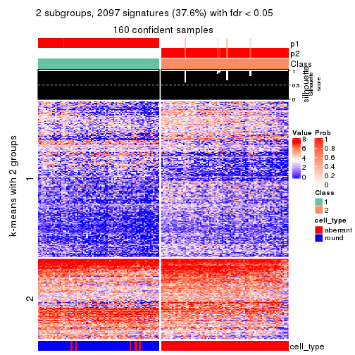</p>

</div>
<div id='tab-CV-mclust-get-signatures-no-scale-2'>
<pre><code class="r">get_signatures(res, k = 3, scale_rows = FALSE)
</code></pre>

<p></p>

</div>
<div id='tab-CV-mclust-get-signatures-no-scale-3'>
<pre><code class="r">get_signatures(res, k = 4, scale_rows = FALSE)
</code></pre>

<p></p>

</div>
<div id='tab-CV-mclust-get-signatures-no-scale-4'>
<pre><code class="r">get_signatures(res, k = 5, scale_rows = FALSE)
</code></pre>

<p></p>

</div>
<div id='tab-CV-mclust-get-signatures-no-scale-5'>
<pre><code class="r">get_signatures(res, k = 6, scale_rows = FALSE)
</code></pre>

<p></p>

</div>
</div>


Compare the overlap of signatures from different k:

```r
compare_signatures(res)
```


`get_signature()` returns a data frame invisibly. TO get the list of signatures, the function
call should be assigned to a variable explicitly. In following code, if `plot` argument is set
to `FALSE`, no heatmap is plotted while only the differential analysis is performed.

```r
# code only for demonstration
tb = get_signature(res, k = ..., plot = FALSE)
```

An example of the output of `tb` is:

```
#>   which_row         fdr    mean_1    mean_2 scaled_mean_1 scaled_mean_2 km
#> 1        38 0.042760348  8.373488  9.131774    -0.5533452     0.5164555  1
#> 2        40 0.018707592  7.106213  8.469186    -0.6173731     0.5762149  1
#> 3        55 0.019134737 10.221463 11.207825    -0.6159697     0.5749050  1
#> 4        59 0.006059896  5.921854  7.869574    -0.6899429     0.6439467  1
#> 5        60 0.018055526  8.928898 10.211722    -0.6204761     0.5791110  1
#> 6        98 0.009384629 15.714769 14.887706     0.6635654    -0.6193277  2
...
```

The columns in `tb` are:

1. `which_row`: row indices corresponding to the input matrix.
2. `fdr`: FDR for the differential test. 
3. `mean_x`: The mean value in group x.
4. `scaled_mean_x`: The mean value in group x after rows are scaled.
5. `km`: Row groups if k-means clustering is applied to rows.


UMAP plot which shows how samples are separated.


<script>
$( function() {
	$( '#tabs-CV-mclust-dimension-reduction' ).tabs();
} );
</script>
<div id='tabs-CV-mclust-dimension-reduction'>
<ul>
<li><a href='#tab-CV-mclust-dimension-reduction-1'>k = 2</a></li>
<li><a href='#tab-CV-mclust-dimension-reduction-2'>k = 3</a></li>
<li><a href='#tab-CV-mclust-dimension-reduction-3'>k = 4</a></li>
<li><a href='#tab-CV-mclust-dimension-reduction-4'>k = 5</a></li>
<li><a href='#tab-CV-mclust-dimension-reduction-5'>k = 6</a></li>
</ul>
<div id='tab-CV-mclust-dimension-reduction-1'>
<pre><code class="r">dimension_reduction(res, k = 2, method = &quot;UMAP&quot;)
</code></pre>

<p></p>

</div>
<div id='tab-CV-mclust-dimension-reduction-2'>
<pre><code class="r">dimension_reduction(res, k = 3, method = &quot;UMAP&quot;)
</code></pre>

<p></p>

</div>
<div id='tab-CV-mclust-dimension-reduction-3'>
<pre><code class="r">dimension_reduction(res, k = 4, method = &quot;UMAP&quot;)
</code></pre>

<p></p>

</div>
<div id='tab-CV-mclust-dimension-reduction-4'>
<pre><code class="r">dimension_reduction(res, k = 5, method = &quot;UMAP&quot;)
</code></pre>

<p></p>

</div>
<div id='tab-CV-mclust-dimension-reduction-5'>
<pre><code class="r">dimension_reduction(res, k = 6, method = &quot;UMAP&quot;)
</code></pre>

<p></p>

</div>
</div>


Following heatmap shows how subgroups are split when increasing `k`:

```r
collect_classes(res)
```


Test correlation between subgroups and known annotations. If the known
annotation is numeric, one-way ANOVA test is applied, and if the known
annotation is discrete, chi-squared contingency table test is applied.

```r
test_to_known_factors(res)
```

```
#>             n cell_type(p) k
#> CV:mclust 160     5.69e-31 2
#> CV:mclust 151     1.88e-29 3
#> CV:mclust 146     1.99e-27 4
#> CV:mclust 116     4.06e-20 5
#> CV:mclust 119     8.64e-21 6
```


If matrix rows can be associated to genes, consider to use `GO_Enrichment(res,
...)` to perform function enrichment for the signature genes.


 

---------------------------------------------------


### CV:NMF**


The object with results only for a single top-value method and a single partition method 
can be extracted as:

```r
res = res_list["CV", "NMF"]
# you can also extract it by
# res = res_list["CV:NMF"]
```

A summary of `res` and all the functions that can be applied to it:

```r
res
```

```
#> A 'ConsensusPartition' object with k = 2, 3, 4, 5, 6.
#>   On a matrix with 5576 rows and 160 columns.
#>   Top rows (558, 1116, 1673, 2230, 2788) are extracted by 'CV' method.
#>   Subgroups are detected by 'NMF' method.
#>   Performed in total 1250 partitions by row resampling.
#>   Best k for subgroups seems to be 2.
#> 
#> Following methods can be applied to this 'ConsensusPartition' object:
#>  [1] "cola_report"             "collect_classes"         "collect_plots"          
#>  [4] "collect_stats"           "colnames"                "compare_signatures"     
#>  [7] "consensus_heatmap"       "dimension_reduction"     "functional_enrichment"  
#> [10] "get_anno_col"            "get_anno"                "get_classes"            
#> [13] "get_consensus"           "get_matrix"              "get_membership"         
#> [16] "get_param"               "get_signatures"          "get_stats"              
#> [19] "is_best_k"               "is_stable_k"             "membership_heatmap"     
#> [22] "ncol"                    "nrow"                    "plot_ecdf"              
#> [25] "rownames"                "select_partition_number" "show"                   
#> [28] "suggest_best_k"          "test_to_known_factors"
```

`collect_plots()` function collects all the plots made from `res` for all `k` (number of partitions)
into one single page to provide an easy and fast comparison between different `k`.

```r
collect_plots(res)
```


The plots are:

- The first row: a plot of the ECDF (Empirical cumulative distribution
  function) curves of the consensus matrix for each `k` and the heatmap of
  predicted classes for each `k`.
- The second row: heatmaps of the consensus matrix for each `k`.
- The third row: heatmaps of the membership matrix for each `k`.
- The fouth row: heatmaps of the signatures for each `k`.

All the plots in panels can be made by individual functions and they are
plotted later in this section.

`select_partition_number()` produces several plots showing different
statistics for choosing "optimized" `k`. There are following statistics:

- ECDF curves of the consensus matrix for each `k`;
- 1-PAC. [The PAC
  score](https://en.wikipedia.org/wiki/Consensus_clustering#Over-interpretation_potential_of_consensus_clustering)
  measures the proportion of the ambiguous subgrouping.
- Mean silhouette score.
- Concordance. The mean probability of fiting the consensus class ids in all
  partitions.
- Area increased. Denote $A_k$ as the area under the ECDF curve for current
  `k`, the area increased is defined as $A_k - A_{k-1}$.
- Rand index. The percent of pairs of samples that are both in a same cluster
  or both are not in a same cluster in the partition of k and k-1.
- Jaccard index. The ratio of pairs of samples are both in a same cluster in
  the partition of k and k-1 and the pairs of samples are both in a same
  cluster in the partition k or k-1.

The detailed explanations of these statistics can be found in [the cola
vignette](http://bioconductor.org/packages/devel/bioc/vignettes/cola/inst/doc/cola.html#toc_13).

Generally speaking, lower PAC score, higher mean silhouette score or higher
concordance corresponds to better partition. Rand index and Jaccard index
measure how similar the current partition is compared to partition with `k-1`.
If they are too similar, we won't accept `k` is better than `k-1`.

```r
select_partition_number(res)
```


The numeric values for all these statistics can be obtained by `get_stats()`.

```r
get_stats(res)
```

```
#>   k 1-PAC mean_silhouette concordance area_increased  Rand Jaccard
#> 2 2 0.961           0.950       0.979         0.5013 0.498   0.498
#> 3 3 0.835           0.871       0.940         0.2905 0.794   0.609
#> 4 4 0.613           0.713       0.842         0.0794 0.959   0.887
#> 5 5 0.577           0.461       0.736         0.0647 0.929   0.805
#> 6 6 0.594           0.574       0.729         0.0474 0.910   0.730
```

`suggest_best_k()` suggests the best $k$ based on these statistics. The rules are as follows:

- All $k$ with Jaccard index larger than 0.95 are removed because the increase of
  the partition number does not provides enough extra information. If all $k$ are removed,
  the best $k$ is assigned by `NA`.
- For $k$ with 1-PAC larger than 0.9, the maximal $k$ is taken as the "best k". Other $k$ is called "optional k".
- If it does not fit the second rule. The $k$ with the highest vote of highest
  1-PAC, mean silhouette and concordance is taken as the "best k".

```r
suggest_best_k(res)
```

```
#> [1] 2
```


Following shows the table of the partitions (You need to click the **show/hide
code output** link to see it). The membership matrix (columns with name `p*`)
is inferred by
[`clue::cl_consensus()`](https://www.rdocumentation.org/link/cl_consensus?package=clue)
function with the `SE` method. Basically the value in the membership matrix
represents the probability to belong to a certain group. The finall class
label for an item is determined with the group with highest probability it
belongs to.

In `get_classes()` function, the entropy is calculated from the membership
matrix and the silhouette score is calculated from the consensus matrix.


<script>
$( function() {
	$( '#tabs-CV-NMF-get-classes' ).tabs();
} );
</script>
<div id='tabs-CV-NMF-get-classes'>
<ul>
<li><a href='#tab-CV-NMF-get-classes-1'>k = 2</a></li>
<li><a href='#tab-CV-NMF-get-classes-2'>k = 3</a></li>
<li><a href='#tab-CV-NMF-get-classes-3'>k = 4</a></li>
<li><a href='#tab-CV-NMF-get-classes-4'>k = 5</a></li>
<li><a href='#tab-CV-NMF-get-classes-5'>k = 6</a></li>
</ul>

<div id='tab-CV-NMF-get-classes-1'>
<p><a id='tab-CV-NMF-get-classes-1-a' style='color:#0366d6' href='#'>show/hide code output</a></p>
<pre><code class="r">cbind(get_classes(res, k = 2), get_membership(res, k = 2))
</code></pre>

<pre><code>#&gt;                     class entropy silhouette    p1    p2
#&gt; aberrant_ERR2585320     2  0.0000      0.989 0.000 1.000
#&gt; aberrant_ERR2585338     2  0.0000      0.989 0.000 1.000
#&gt; aberrant_ERR2585325     2  0.0000      0.989 0.000 1.000
#&gt; aberrant_ERR2585283     2  0.0000      0.989 0.000 1.000
#&gt; aberrant_ERR2585343     2  0.0000      0.989 0.000 1.000
#&gt; aberrant_ERR2585329     2  0.0000      0.989 0.000 1.000
#&gt; aberrant_ERR2585317     2  0.0000      0.989 0.000 1.000
#&gt; aberrant_ERR2585339     2  0.0000      0.989 0.000 1.000
#&gt; aberrant_ERR2585335     2  0.0000      0.989 0.000 1.000
#&gt; aberrant_ERR2585287     2  0.0000      0.989 0.000 1.000
#&gt; aberrant_ERR2585321     2  0.0000      0.989 0.000 1.000
#&gt; aberrant_ERR2585297     1  0.0000      0.966 1.000 0.000
#&gt; aberrant_ERR2585337     2  0.0000      0.989 0.000 1.000
#&gt; aberrant_ERR2585319     2  0.0000      0.989 0.000 1.000
#&gt; aberrant_ERR2585315     2  0.0000      0.989 0.000 1.000
#&gt; aberrant_ERR2585336     2  0.0000      0.989 0.000 1.000
#&gt; aberrant_ERR2585307     2  0.0000      0.989 0.000 1.000
#&gt; aberrant_ERR2585301     2  0.0000      0.989 0.000 1.000
#&gt; aberrant_ERR2585326     2  0.0000      0.989 0.000 1.000
#&gt; aberrant_ERR2585331     2  0.0000      0.989 0.000 1.000
#&gt; aberrant_ERR2585346     2  0.0000      0.989 0.000 1.000
#&gt; aberrant_ERR2585314     2  0.0938      0.979 0.012 0.988
#&gt; aberrant_ERR2585298     1  0.3274      0.915 0.940 0.060
#&gt; aberrant_ERR2585345     2  0.0000      0.989 0.000 1.000
#&gt; aberrant_ERR2585299     1  0.0000      0.966 1.000 0.000
#&gt; aberrant_ERR2585309     1  0.0000      0.966 1.000 0.000
#&gt; aberrant_ERR2585303     2  0.0000      0.989 0.000 1.000
#&gt; aberrant_ERR2585313     2  0.0000      0.989 0.000 1.000
#&gt; aberrant_ERR2585318     2  0.0000      0.989 0.000 1.000
#&gt; aberrant_ERR2585328     2  0.0000      0.989 0.000 1.000
#&gt; aberrant_ERR2585330     2  0.0000      0.989 0.000 1.000
#&gt; aberrant_ERR2585293     2  0.0000      0.989 0.000 1.000
#&gt; aberrant_ERR2585342     2  0.0000      0.989 0.000 1.000
#&gt; aberrant_ERR2585348     2  0.0000      0.989 0.000 1.000
#&gt; aberrant_ERR2585352     2  0.0000      0.989 0.000 1.000
#&gt; aberrant_ERR2585308     1  0.0000      0.966 1.000 0.000
#&gt; aberrant_ERR2585349     2  0.0000      0.989 0.000 1.000
#&gt; aberrant_ERR2585316     2  0.0000      0.989 0.000 1.000
#&gt; aberrant_ERR2585306     2  0.2423      0.951 0.040 0.960
#&gt; aberrant_ERR2585324     2  0.0000      0.989 0.000 1.000
#&gt; aberrant_ERR2585310     1  0.9661      0.380 0.608 0.392
#&gt; aberrant_ERR2585296     1  0.0000      0.966 1.000 0.000
#&gt; aberrant_ERR2585275     2  0.0000      0.989 0.000 1.000
#&gt; aberrant_ERR2585311     2  0.0000      0.989 0.000 1.000
#&gt; aberrant_ERR2585292     2  0.0000      0.989 0.000 1.000
#&gt; aberrant_ERR2585282     2  0.0000      0.989 0.000 1.000
#&gt; aberrant_ERR2585305     2  0.6801      0.773 0.180 0.820
#&gt; aberrant_ERR2585278     2  0.0000      0.989 0.000 1.000
#&gt; aberrant_ERR2585347     2  0.0000      0.989 0.000 1.000
#&gt; aberrant_ERR2585332     2  0.0000      0.989 0.000 1.000
#&gt; aberrant_ERR2585280     2  0.0000      0.989 0.000 1.000
#&gt; aberrant_ERR2585304     2  0.9323      0.447 0.348 0.652
#&gt; aberrant_ERR2585322     2  0.0000      0.989 0.000 1.000
#&gt; aberrant_ERR2585279     2  0.0000      0.989 0.000 1.000
#&gt; aberrant_ERR2585277     2  0.0000      0.989 0.000 1.000
#&gt; aberrant_ERR2585295     2  0.0000      0.989 0.000 1.000
#&gt; aberrant_ERR2585333     2  0.0000      0.989 0.000 1.000
#&gt; aberrant_ERR2585285     2  0.0000      0.989 0.000 1.000
#&gt; aberrant_ERR2585286     2  0.0000      0.989 0.000 1.000
#&gt; aberrant_ERR2585294     2  0.0000      0.989 0.000 1.000
#&gt; aberrant_ERR2585300     2  0.0000      0.989 0.000 1.000
#&gt; aberrant_ERR2585334     2  0.0000      0.989 0.000 1.000
#&gt; aberrant_ERR2585361     2  0.0000      0.989 0.000 1.000
#&gt; aberrant_ERR2585372     2  0.0000      0.989 0.000 1.000
#&gt; round_ERR2585217        1  0.0376      0.963 0.996 0.004
#&gt; round_ERR2585205        1  0.0000      0.966 1.000 0.000
#&gt; round_ERR2585214        1  0.9881      0.274 0.564 0.436
#&gt; round_ERR2585202        1  0.8081      0.684 0.752 0.248
#&gt; aberrant_ERR2585367     2  0.0000      0.989 0.000 1.000
#&gt; round_ERR2585220        1  0.0000      0.966 1.000 0.000
#&gt; round_ERR2585238        1  0.0000      0.966 1.000 0.000
#&gt; aberrant_ERR2585276     2  0.0000      0.989 0.000 1.000
#&gt; round_ERR2585218        1  0.0000      0.966 1.000 0.000
#&gt; aberrant_ERR2585363     2  0.0000      0.989 0.000 1.000
#&gt; round_ERR2585201        1  0.5946      0.827 0.856 0.144
#&gt; round_ERR2585210        1  0.0000      0.966 1.000 0.000
#&gt; aberrant_ERR2585362     2  0.0000      0.989 0.000 1.000
#&gt; aberrant_ERR2585360     2  0.0000      0.989 0.000 1.000
#&gt; round_ERR2585209        1  0.0000      0.966 1.000 0.000
#&gt; round_ERR2585242        1  0.0000      0.966 1.000 0.000
#&gt; round_ERR2585216        1  0.0000      0.966 1.000 0.000
#&gt; round_ERR2585219        1  0.0000      0.966 1.000 0.000
#&gt; round_ERR2585237        1  0.0000      0.966 1.000 0.000
#&gt; round_ERR2585198        1  0.0672      0.960 0.992 0.008
#&gt; round_ERR2585211        1  0.0000      0.966 1.000 0.000
#&gt; round_ERR2585206        1  0.0000      0.966 1.000 0.000
#&gt; aberrant_ERR2585281     2  0.0000      0.989 0.000 1.000
#&gt; round_ERR2585212        1  0.0000      0.966 1.000 0.000
#&gt; round_ERR2585221        1  0.0000      0.966 1.000 0.000
#&gt; round_ERR2585243        1  0.0000      0.966 1.000 0.000
#&gt; round_ERR2585204        1  0.9661      0.396 0.608 0.392
#&gt; round_ERR2585213        2  0.2236      0.954 0.036 0.964
#&gt; aberrant_ERR2585373     2  0.0000      0.989 0.000 1.000
#&gt; aberrant_ERR2585358     2  0.0000      0.989 0.000 1.000
#&gt; aberrant_ERR2585365     2  0.0000      0.989 0.000 1.000
#&gt; aberrant_ERR2585359     2  0.0000      0.989 0.000 1.000
#&gt; aberrant_ERR2585370     2  0.0000      0.989 0.000 1.000
#&gt; round_ERR2585215        1  0.0000      0.966 1.000 0.000
#&gt; round_ERR2585262        2  0.7376      0.731 0.208 0.792
#&gt; round_ERR2585199        1  0.1633      0.947 0.976 0.024
#&gt; aberrant_ERR2585369     2  0.0000      0.989 0.000 1.000
#&gt; round_ERR2585208        1  0.0000      0.966 1.000 0.000
#&gt; round_ERR2585252        1  0.0000      0.966 1.000 0.000
#&gt; round_ERR2585236        1  0.0000      0.966 1.000 0.000
#&gt; aberrant_ERR2585284     2  0.0000      0.989 0.000 1.000
#&gt; round_ERR2585224        1  0.0000      0.966 1.000 0.000
#&gt; round_ERR2585260        1  0.0000      0.966 1.000 0.000
#&gt; round_ERR2585229        1  0.0000      0.966 1.000 0.000
#&gt; aberrant_ERR2585364     2  0.0000      0.989 0.000 1.000
#&gt; round_ERR2585253        1  0.0000      0.966 1.000 0.000
#&gt; aberrant_ERR2585368     2  0.0000      0.989 0.000 1.000
#&gt; aberrant_ERR2585371     2  0.0000      0.989 0.000 1.000
#&gt; round_ERR2585239        1  0.0000      0.966 1.000 0.000
#&gt; round_ERR2585273        1  0.0000      0.966 1.000 0.000
#&gt; round_ERR2585256        1  0.0000      0.966 1.000 0.000
#&gt; round_ERR2585272        1  0.0000      0.966 1.000 0.000
#&gt; round_ERR2585246        1  0.0000      0.966 1.000 0.000
#&gt; round_ERR2585261        1  0.0000      0.966 1.000 0.000
#&gt; round_ERR2585254        1  0.0000      0.966 1.000 0.000
#&gt; round_ERR2585225        1  0.8713      0.611 0.708 0.292
#&gt; round_ERR2585235        1  0.0000      0.966 1.000 0.000
#&gt; round_ERR2585271        1  0.0000      0.966 1.000 0.000
#&gt; round_ERR2585251        1  0.0000      0.966 1.000 0.000
#&gt; round_ERR2585255        1  0.9248      0.517 0.660 0.340
#&gt; round_ERR2585257        1  0.0000      0.966 1.000 0.000
#&gt; round_ERR2585226        1  0.0000      0.966 1.000 0.000
#&gt; round_ERR2585265        1  0.0000      0.966 1.000 0.000
#&gt; round_ERR2585259        1  0.0000      0.966 1.000 0.000
#&gt; round_ERR2585247        1  0.0000      0.966 1.000 0.000
#&gt; round_ERR2585241        1  0.0000      0.966 1.000 0.000
#&gt; round_ERR2585263        1  0.0000      0.966 1.000 0.000
#&gt; round_ERR2585264        1  0.0000      0.966 1.000 0.000
#&gt; round_ERR2585233        1  0.0000      0.966 1.000 0.000
#&gt; round_ERR2585223        1  0.0000      0.966 1.000 0.000
#&gt; round_ERR2585234        1  0.0000      0.966 1.000 0.000
#&gt; round_ERR2585222        1  0.0000      0.966 1.000 0.000
#&gt; round_ERR2585228        1  0.0000      0.966 1.000 0.000
#&gt; round_ERR2585248        1  0.0000      0.966 1.000 0.000
#&gt; round_ERR2585240        1  0.0376      0.963 0.996 0.004
#&gt; round_ERR2585270        1  0.0000      0.966 1.000 0.000
#&gt; round_ERR2585232        1  0.0000      0.966 1.000 0.000
#&gt; aberrant_ERR2585341     2  0.0000      0.989 0.000 1.000
#&gt; aberrant_ERR2585355     2  0.0000      0.989 0.000 1.000
#&gt; round_ERR2585227        1  0.0000      0.966 1.000 0.000
#&gt; aberrant_ERR2585351     2  0.0672      0.982 0.008 0.992
#&gt; round_ERR2585269        1  0.0000      0.966 1.000 0.000
#&gt; aberrant_ERR2585357     2  0.0000      0.989 0.000 1.000
#&gt; aberrant_ERR2585350     2  0.0000      0.989 0.000 1.000
#&gt; round_ERR2585250        1  0.0000      0.966 1.000 0.000
#&gt; round_ERR2585245        1  0.0000      0.966 1.000 0.000
#&gt; aberrant_ERR2585353     2  0.0000      0.989 0.000 1.000
#&gt; round_ERR2585258        1  0.0000      0.966 1.000 0.000
#&gt; aberrant_ERR2585354     2  0.0000      0.989 0.000 1.000
#&gt; round_ERR2585249        1  0.0000      0.966 1.000 0.000
#&gt; round_ERR2585268        1  0.0000      0.966 1.000 0.000
#&gt; aberrant_ERR2585356     2  0.0000      0.989 0.000 1.000
#&gt; round_ERR2585266        1  0.6887      0.778 0.816 0.184
#&gt; round_ERR2585231        1  0.0000      0.966 1.000 0.000
#&gt; round_ERR2585230        1  0.0000      0.966 1.000 0.000
#&gt; round_ERR2585267        1  0.0000      0.966 1.000 0.000
</code></pre>

<script>
$('#tab-CV-NMF-get-classes-1-a').parent().next().next().hide();
$('#tab-CV-NMF-get-classes-1-a').click(function(){
  $('#tab-CV-NMF-get-classes-1-a').parent().next().next().toggle();
  return(false);
});
</script>
</div>

<div id='tab-CV-NMF-get-classes-2'>
<p><a id='tab-CV-NMF-get-classes-2-a' style='color:#0366d6' href='#'>show/hide code output</a></p>
<pre><code class="r">cbind(get_classes(res, k = 3), get_membership(res, k = 3))
</code></pre>

<pre><code>#&gt;                     class entropy silhouette    p1    p2    p3
#&gt; aberrant_ERR2585320     2  0.2066    0.90857 0.000 0.940 0.060
#&gt; aberrant_ERR2585338     3  0.1289    0.83659 0.000 0.032 0.968
#&gt; aberrant_ERR2585325     2  0.2261    0.90282 0.000 0.932 0.068
#&gt; aberrant_ERR2585283     2  0.0000    0.93546 0.000 1.000 0.000
#&gt; aberrant_ERR2585343     2  0.0000    0.93546 0.000 1.000 0.000
#&gt; aberrant_ERR2585329     2  0.2796    0.88201 0.000 0.908 0.092
#&gt; aberrant_ERR2585317     2  0.0892    0.92846 0.000 0.980 0.020
#&gt; aberrant_ERR2585339     2  0.4121    0.80433 0.000 0.832 0.168
#&gt; aberrant_ERR2585335     2  0.0000    0.93546 0.000 1.000 0.000
#&gt; aberrant_ERR2585287     2  0.2066    0.90221 0.000 0.940 0.060
#&gt; aberrant_ERR2585321     2  0.0000    0.93546 0.000 1.000 0.000
#&gt; aberrant_ERR2585297     1  0.0000    0.97831 1.000 0.000 0.000
#&gt; aberrant_ERR2585337     2  0.0892    0.92882 0.000 0.980 0.020
#&gt; aberrant_ERR2585319     2  0.0000    0.93546 0.000 1.000 0.000
#&gt; aberrant_ERR2585315     2  0.0000    0.93546 0.000 1.000 0.000
#&gt; aberrant_ERR2585336     2  0.4654    0.75026 0.000 0.792 0.208
#&gt; aberrant_ERR2585307     2  0.3752    0.83062 0.000 0.856 0.144
#&gt; aberrant_ERR2585301     2  0.0000    0.93546 0.000 1.000 0.000
#&gt; aberrant_ERR2585326     2  0.1289    0.92372 0.000 0.968 0.032
#&gt; aberrant_ERR2585331     3  0.0000    0.84402 0.000 0.000 1.000
#&gt; aberrant_ERR2585346     2  0.0000    0.93546 0.000 1.000 0.000
#&gt; aberrant_ERR2585314     2  0.1860    0.91198 0.000 0.948 0.052
#&gt; aberrant_ERR2585298     3  0.1860    0.83540 0.052 0.000 0.948
#&gt; aberrant_ERR2585345     2  0.2796    0.88098 0.000 0.908 0.092
#&gt; aberrant_ERR2585299     1  0.0000    0.97831 1.000 0.000 0.000
#&gt; aberrant_ERR2585309     1  0.0000    0.97831 1.000 0.000 0.000
#&gt; aberrant_ERR2585303     2  0.5706    0.55877 0.000 0.680 0.320
#&gt; aberrant_ERR2585313     2  0.1964    0.90957 0.000 0.944 0.056
#&gt; aberrant_ERR2585318     2  0.0000    0.93546 0.000 1.000 0.000
#&gt; aberrant_ERR2585328     3  0.6307    0.00625 0.000 0.488 0.512
#&gt; aberrant_ERR2585330     2  0.0000    0.93546 0.000 1.000 0.000
#&gt; aberrant_ERR2585293     2  0.2878    0.86899 0.000 0.904 0.096
#&gt; aberrant_ERR2585342     2  0.0000    0.93546 0.000 1.000 0.000
#&gt; aberrant_ERR2585348     3  0.5138    0.62553 0.000 0.252 0.748
#&gt; aberrant_ERR2585352     2  0.0592    0.93169 0.000 0.988 0.012
#&gt; aberrant_ERR2585308     1  0.0000    0.97831 1.000 0.000 0.000
#&gt; aberrant_ERR2585349     3  0.0000    0.84402 0.000 0.000 1.000
#&gt; aberrant_ERR2585316     2  0.0000    0.93546 0.000 1.000 0.000
#&gt; aberrant_ERR2585306     2  0.0237    0.93300 0.004 0.996 0.000
#&gt; aberrant_ERR2585324     2  0.0000    0.93546 0.000 1.000 0.000
#&gt; aberrant_ERR2585310     1  0.6302    0.03021 0.520 0.480 0.000
#&gt; aberrant_ERR2585296     1  0.0424    0.97427 0.992 0.000 0.008
#&gt; aberrant_ERR2585275     2  0.0000    0.93546 0.000 1.000 0.000
#&gt; aberrant_ERR2585311     2  0.0000    0.93546 0.000 1.000 0.000
#&gt; aberrant_ERR2585292     2  0.2878    0.86899 0.000 0.904 0.096
#&gt; aberrant_ERR2585282     2  0.0000    0.93546 0.000 1.000 0.000
#&gt; aberrant_ERR2585305     2  0.1643    0.90146 0.044 0.956 0.000
#&gt; aberrant_ERR2585278     2  0.0000    0.93546 0.000 1.000 0.000
#&gt; aberrant_ERR2585347     2  0.0000    0.93546 0.000 1.000 0.000
#&gt; aberrant_ERR2585332     2  0.0000    0.93546 0.000 1.000 0.000
#&gt; aberrant_ERR2585280     2  0.0000    0.93546 0.000 1.000 0.000
#&gt; aberrant_ERR2585304     1  0.3337    0.88639 0.908 0.032 0.060
#&gt; aberrant_ERR2585322     2  0.3551    0.84413 0.000 0.868 0.132
#&gt; aberrant_ERR2585279     3  0.0000    0.84402 0.000 0.000 1.000
#&gt; aberrant_ERR2585277     3  0.2878    0.80386 0.000 0.096 0.904
#&gt; aberrant_ERR2585295     3  0.6260    0.12545 0.000 0.448 0.552
#&gt; aberrant_ERR2585333     2  0.0000    0.93546 0.000 1.000 0.000
#&gt; aberrant_ERR2585285     2  0.0000    0.93546 0.000 1.000 0.000
#&gt; aberrant_ERR2585286     3  0.0892    0.84088 0.000 0.020 0.980
#&gt; aberrant_ERR2585294     2  0.0000    0.93546 0.000 1.000 0.000
#&gt; aberrant_ERR2585300     2  0.0000    0.93546 0.000 1.000 0.000
#&gt; aberrant_ERR2585334     3  0.0000    0.84402 0.000 0.000 1.000
#&gt; aberrant_ERR2585361     2  0.6215    0.28149 0.000 0.572 0.428
#&gt; aberrant_ERR2585372     2  0.0000    0.93546 0.000 1.000 0.000
#&gt; round_ERR2585217        3  0.5138    0.68121 0.252 0.000 0.748
#&gt; round_ERR2585205        1  0.0000    0.97831 1.000 0.000 0.000
#&gt; round_ERR2585214        3  0.0000    0.84402 0.000 0.000 1.000
#&gt; round_ERR2585202        3  0.3941    0.78090 0.156 0.000 0.844
#&gt; aberrant_ERR2585367     2  0.6008    0.45497 0.000 0.628 0.372
#&gt; round_ERR2585220        1  0.0237    0.97692 0.996 0.000 0.004
#&gt; round_ERR2585238        1  0.0000    0.97831 1.000 0.000 0.000
#&gt; aberrant_ERR2585276     2  0.0000    0.93546 0.000 1.000 0.000
#&gt; round_ERR2585218        1  0.0000    0.97831 1.000 0.000 0.000
#&gt; aberrant_ERR2585363     2  0.1411    0.92111 0.000 0.964 0.036
#&gt; round_ERR2585201        3  0.0237    0.84397 0.004 0.000 0.996
#&gt; round_ERR2585210        1  0.0237    0.97692 0.996 0.000 0.004
#&gt; aberrant_ERR2585362     2  0.6026    0.41885 0.000 0.624 0.376
#&gt; aberrant_ERR2585360     2  0.0000    0.93546 0.000 1.000 0.000
#&gt; round_ERR2585209        1  0.2959    0.87666 0.900 0.000 0.100
#&gt; round_ERR2585242        3  0.4750    0.71701 0.216 0.000 0.784
#&gt; round_ERR2585216        1  0.0237    0.97692 0.996 0.000 0.004
#&gt; round_ERR2585219        1  0.0237    0.97692 0.996 0.000 0.004
#&gt; round_ERR2585237        3  0.6267    0.27691 0.452 0.000 0.548
#&gt; round_ERR2585198        3  0.4555    0.73953 0.200 0.000 0.800
#&gt; round_ERR2585211        1  0.0237    0.97692 0.996 0.000 0.004
#&gt; round_ERR2585206        1  0.0000    0.97831 1.000 0.000 0.000
#&gt; aberrant_ERR2585281     3  0.4062    0.74473 0.000 0.164 0.836
#&gt; round_ERR2585212        1  0.0237    0.97692 0.996 0.000 0.004
#&gt; round_ERR2585221        1  0.0000    0.97831 1.000 0.000 0.000
#&gt; round_ERR2585243        1  0.0000    0.97831 1.000 0.000 0.000
#&gt; round_ERR2585204        3  0.0000    0.84402 0.000 0.000 1.000
#&gt; round_ERR2585213        3  0.0000    0.84402 0.000 0.000 1.000
#&gt; aberrant_ERR2585373     2  0.0000    0.93546 0.000 1.000 0.000
#&gt; aberrant_ERR2585358     2  0.0000    0.93546 0.000 1.000 0.000
#&gt; aberrant_ERR2585365     2  0.5926    0.48172 0.000 0.644 0.356
#&gt; aberrant_ERR2585359     2  0.0000    0.93546 0.000 1.000 0.000
#&gt; aberrant_ERR2585370     3  0.5363    0.59573 0.000 0.276 0.724
#&gt; round_ERR2585215        1  0.0237    0.97692 0.996 0.000 0.004
#&gt; round_ERR2585262        3  0.0000    0.84402 0.000 0.000 1.000
#&gt; round_ERR2585199        3  0.6095    0.43538 0.392 0.000 0.608
#&gt; aberrant_ERR2585369     2  0.0000    0.93546 0.000 1.000 0.000
#&gt; round_ERR2585208        1  0.0000    0.97831 1.000 0.000 0.000
#&gt; round_ERR2585252        1  0.0000    0.97831 1.000 0.000 0.000
#&gt; round_ERR2585236        1  0.0424    0.97427 0.992 0.000 0.008
#&gt; aberrant_ERR2585284     3  0.4399    0.72253 0.000 0.188 0.812
#&gt; round_ERR2585224        1  0.0000    0.97831 1.000 0.000 0.000
#&gt; round_ERR2585260        1  0.0000    0.97831 1.000 0.000 0.000
#&gt; round_ERR2585229        1  0.0000    0.97831 1.000 0.000 0.000
#&gt; aberrant_ERR2585364     2  0.0000    0.93546 0.000 1.000 0.000
#&gt; round_ERR2585253        1  0.0000    0.97831 1.000 0.000 0.000
#&gt; aberrant_ERR2585368     3  0.1031    0.84036 0.000 0.024 0.976
#&gt; aberrant_ERR2585371     3  0.0892    0.84101 0.000 0.020 0.980
#&gt; round_ERR2585239        1  0.0000    0.97831 1.000 0.000 0.000
#&gt; round_ERR2585273        1  0.0000    0.97831 1.000 0.000 0.000
#&gt; round_ERR2585256        1  0.0237    0.97692 0.996 0.000 0.004
#&gt; round_ERR2585272        1  0.0237    0.97692 0.996 0.000 0.004
#&gt; round_ERR2585246        1  0.0000    0.97831 1.000 0.000 0.000
#&gt; round_ERR2585261        1  0.1964    0.92957 0.944 0.000 0.056
#&gt; round_ERR2585254        1  0.0237    0.97692 0.996 0.000 0.004
#&gt; round_ERR2585225        3  0.0000    0.84402 0.000 0.000 1.000
#&gt; round_ERR2585235        1  0.1529    0.94498 0.960 0.000 0.040
#&gt; round_ERR2585271        1  0.0000    0.97831 1.000 0.000 0.000
#&gt; round_ERR2585251        1  0.0000    0.97831 1.000 0.000 0.000
#&gt; round_ERR2585255        3  0.0000    0.84402 0.000 0.000 1.000
#&gt; round_ERR2585257        3  0.5882    0.52511 0.348 0.000 0.652
#&gt; round_ERR2585226        1  0.0000    0.97831 1.000 0.000 0.000
#&gt; round_ERR2585265        1  0.0000    0.97831 1.000 0.000 0.000
#&gt; round_ERR2585259        1  0.3412    0.84328 0.876 0.000 0.124
#&gt; round_ERR2585247        1  0.0000    0.97831 1.000 0.000 0.000
#&gt; round_ERR2585241        1  0.0237    0.97692 0.996 0.000 0.004
#&gt; round_ERR2585263        1  0.0747    0.96779 0.984 0.000 0.016
#&gt; round_ERR2585264        1  0.0000    0.97831 1.000 0.000 0.000
#&gt; round_ERR2585233        3  0.4654    0.73452 0.208 0.000 0.792
#&gt; round_ERR2585223        1  0.0000    0.97831 1.000 0.000 0.000
#&gt; round_ERR2585234        3  0.2537    0.82797 0.080 0.000 0.920
#&gt; round_ERR2585222        1  0.0000    0.97831 1.000 0.000 0.000
#&gt; round_ERR2585228        1  0.0000    0.97831 1.000 0.000 0.000
#&gt; round_ERR2585248        1  0.0000    0.97831 1.000 0.000 0.000
#&gt; round_ERR2585240        1  0.3816    0.81038 0.852 0.000 0.148
#&gt; round_ERR2585270        1  0.0237    0.97692 0.996 0.000 0.004
#&gt; round_ERR2585232        1  0.0237    0.97692 0.996 0.000 0.004
#&gt; aberrant_ERR2585341     3  0.3340    0.78387 0.000 0.120 0.880
#&gt; aberrant_ERR2585355     3  0.2165    0.82216 0.000 0.064 0.936
#&gt; round_ERR2585227        1  0.0000    0.97831 1.000 0.000 0.000
#&gt; aberrant_ERR2585351     2  0.0829    0.93083 0.004 0.984 0.012
#&gt; round_ERR2585269        1  0.0000    0.97831 1.000 0.000 0.000
#&gt; aberrant_ERR2585357     2  0.2066    0.90737 0.000 0.940 0.060
#&gt; aberrant_ERR2585350     2  0.5465    0.62913 0.000 0.712 0.288
#&gt; round_ERR2585250        1  0.0000    0.97831 1.000 0.000 0.000
#&gt; round_ERR2585245        1  0.0000    0.97831 1.000 0.000 0.000
#&gt; aberrant_ERR2585353     2  0.0237    0.93421 0.000 0.996 0.004
#&gt; round_ERR2585258        1  0.0000    0.97831 1.000 0.000 0.000
#&gt; aberrant_ERR2585354     2  0.0000    0.93546 0.000 1.000 0.000
#&gt; round_ERR2585249        1  0.0000    0.97831 1.000 0.000 0.000
#&gt; round_ERR2585268        1  0.0237    0.97692 0.996 0.000 0.004
#&gt; aberrant_ERR2585356     2  0.0000    0.93546 0.000 1.000 0.000
#&gt; round_ERR2585266        3  0.5178    0.66253 0.256 0.000 0.744
#&gt; round_ERR2585231        1  0.0000    0.97831 1.000 0.000 0.000
#&gt; round_ERR2585230        1  0.0000    0.97831 1.000 0.000 0.000
#&gt; round_ERR2585267        1  0.0000    0.97831 1.000 0.000 0.000
</code></pre>

<script>
$('#tab-CV-NMF-get-classes-2-a').parent().next().next().hide();
$('#tab-CV-NMF-get-classes-2-a').click(function(){
  $('#tab-CV-NMF-get-classes-2-a').parent().next().next().toggle();
  return(false);
});
</script>
</div>

<div id='tab-CV-NMF-get-classes-3'>
<p><a id='tab-CV-NMF-get-classes-3-a' style='color:#0366d6' href='#'>show/hide code output</a></p>
<pre><code class="r">cbind(get_classes(res, k = 4), get_membership(res, k = 4))
</code></pre>

<pre><code>#&gt;                     class entropy silhouette    p1    p2    p3    p4
#&gt; aberrant_ERR2585320     2  0.5393     0.2448 0.000 0.688 0.044 0.268
#&gt; aberrant_ERR2585338     3  0.2021     0.7929 0.000 0.056 0.932 0.012
#&gt; aberrant_ERR2585325     2  0.5312     0.2693 0.000 0.712 0.052 0.236
#&gt; aberrant_ERR2585283     2  0.3610     0.5162 0.000 0.800 0.000 0.200
#&gt; aberrant_ERR2585343     2  0.2469     0.7220 0.000 0.892 0.000 0.108
#&gt; aberrant_ERR2585329     2  0.2623     0.7267 0.000 0.908 0.028 0.064
#&gt; aberrant_ERR2585317     2  0.2730     0.7168 0.000 0.896 0.016 0.088
#&gt; aberrant_ERR2585339     2  0.5343     0.3467 0.000 0.656 0.316 0.028
#&gt; aberrant_ERR2585335     2  0.2530     0.6986 0.000 0.888 0.000 0.112
#&gt; aberrant_ERR2585287     2  0.6848    -0.1794 0.000 0.592 0.160 0.248
#&gt; aberrant_ERR2585321     2  0.2281     0.7236 0.000 0.904 0.000 0.096
#&gt; aberrant_ERR2585297     1  0.2345     0.8964 0.900 0.000 0.000 0.100
#&gt; aberrant_ERR2585337     2  0.2413     0.6995 0.000 0.916 0.020 0.064
#&gt; aberrant_ERR2585319     2  0.2081     0.7083 0.000 0.916 0.000 0.084
#&gt; aberrant_ERR2585315     2  0.2216     0.6769 0.000 0.908 0.000 0.092
#&gt; aberrant_ERR2585336     2  0.4039     0.6694 0.000 0.836 0.080 0.084
#&gt; aberrant_ERR2585307     2  0.4599     0.5704 0.004 0.780 0.184 0.032
#&gt; aberrant_ERR2585301     2  0.1474     0.7170 0.000 0.948 0.000 0.052
#&gt; aberrant_ERR2585326     2  0.3501     0.6563 0.000 0.848 0.132 0.020
#&gt; aberrant_ERR2585331     3  0.0376     0.8061 0.000 0.004 0.992 0.004
#&gt; aberrant_ERR2585346     2  0.3024     0.6420 0.000 0.852 0.000 0.148
#&gt; aberrant_ERR2585314     2  0.4614     0.6311 0.004 0.752 0.016 0.228
#&gt; aberrant_ERR2585298     3  0.0707     0.8095 0.020 0.000 0.980 0.000
#&gt; aberrant_ERR2585345     2  0.2739     0.7266 0.000 0.904 0.036 0.060
#&gt; aberrant_ERR2585299     1  0.1902     0.8929 0.932 0.004 0.000 0.064
#&gt; aberrant_ERR2585309     1  0.3400     0.8616 0.820 0.000 0.000 0.180
#&gt; aberrant_ERR2585303     3  0.5137     0.0511 0.000 0.452 0.544 0.004
#&gt; aberrant_ERR2585313     2  0.3245     0.6889 0.000 0.872 0.028 0.100
#&gt; aberrant_ERR2585318     2  0.2647     0.7166 0.000 0.880 0.000 0.120
#&gt; aberrant_ERR2585328     2  0.6031     0.0758 0.000 0.536 0.420 0.044
#&gt; aberrant_ERR2585330     2  0.2216     0.7092 0.000 0.908 0.000 0.092
#&gt; aberrant_ERR2585293     4  0.5906     1.0000 0.000 0.436 0.036 0.528
#&gt; aberrant_ERR2585342     2  0.1716     0.7157 0.000 0.936 0.000 0.064
#&gt; aberrant_ERR2585348     3  0.5971     0.0852 0.000 0.428 0.532 0.040
#&gt; aberrant_ERR2585352     2  0.1902     0.7165 0.000 0.932 0.004 0.064
#&gt; aberrant_ERR2585308     1  0.2704     0.8908 0.876 0.000 0.000 0.124
#&gt; aberrant_ERR2585349     3  0.4475     0.7387 0.016 0.076 0.828 0.080
#&gt; aberrant_ERR2585316     2  0.3688     0.6549 0.000 0.792 0.000 0.208
#&gt; aberrant_ERR2585306     2  0.5436     0.2004 0.024 0.620 0.000 0.356
#&gt; aberrant_ERR2585324     2  0.2530     0.6927 0.000 0.888 0.000 0.112
#&gt; aberrant_ERR2585310     2  0.7587    -0.0813 0.292 0.476 0.000 0.232
#&gt; aberrant_ERR2585296     1  0.4426     0.8301 0.816 0.016 0.032 0.136
#&gt; aberrant_ERR2585275     2  0.4008     0.5455 0.000 0.756 0.000 0.244
#&gt; aberrant_ERR2585311     2  0.3837     0.6513 0.000 0.776 0.000 0.224
#&gt; aberrant_ERR2585292     4  0.5906     1.0000 0.000 0.436 0.036 0.528
#&gt; aberrant_ERR2585282     2  0.2011     0.7197 0.000 0.920 0.000 0.080
#&gt; aberrant_ERR2585305     2  0.5312     0.4103 0.040 0.692 0.000 0.268
#&gt; aberrant_ERR2585278     2  0.3311     0.6907 0.000 0.828 0.000 0.172
#&gt; aberrant_ERR2585347     2  0.2011     0.7014 0.000 0.920 0.000 0.080
#&gt; aberrant_ERR2585332     2  0.3444     0.6566 0.000 0.816 0.000 0.184
#&gt; aberrant_ERR2585280     2  0.2469     0.6636 0.000 0.892 0.000 0.108
#&gt; aberrant_ERR2585304     1  0.7492     0.6376 0.644 0.124 0.096 0.136
#&gt; aberrant_ERR2585322     2  0.4224     0.6907 0.000 0.824 0.076 0.100
#&gt; aberrant_ERR2585279     3  0.0336     0.8043 0.000 0.000 0.992 0.008
#&gt; aberrant_ERR2585277     3  0.1743     0.7987 0.000 0.056 0.940 0.004
#&gt; aberrant_ERR2585295     3  0.4882     0.4911 0.000 0.272 0.708 0.020
#&gt; aberrant_ERR2585333     2  0.2281     0.6771 0.000 0.904 0.000 0.096
#&gt; aberrant_ERR2585285     2  0.2647     0.7171 0.000 0.880 0.000 0.120
#&gt; aberrant_ERR2585286     3  0.1452     0.8051 0.000 0.036 0.956 0.008
#&gt; aberrant_ERR2585294     2  0.3726     0.6361 0.000 0.788 0.000 0.212
#&gt; aberrant_ERR2585300     2  0.3610     0.6322 0.000 0.800 0.000 0.200
#&gt; aberrant_ERR2585334     3  0.0524     0.8069 0.000 0.008 0.988 0.004
#&gt; aberrant_ERR2585361     2  0.5698     0.3443 0.000 0.636 0.320 0.044
#&gt; aberrant_ERR2585372     2  0.2704     0.7162 0.000 0.876 0.000 0.124
#&gt; round_ERR2585217        3  0.7711     0.4273 0.260 0.024 0.548 0.168
#&gt; round_ERR2585205        1  0.3088     0.8617 0.864 0.000 0.008 0.128
#&gt; round_ERR2585214        3  0.1706     0.8075 0.036 0.000 0.948 0.016
#&gt; round_ERR2585202        3  0.3652     0.7601 0.092 0.000 0.856 0.052
#&gt; aberrant_ERR2585367     2  0.5793     0.2183 0.000 0.580 0.384 0.036
#&gt; round_ERR2585220        1  0.0921     0.8935 0.972 0.000 0.000 0.028
#&gt; round_ERR2585238        1  0.1118     0.8989 0.964 0.000 0.000 0.036
#&gt; aberrant_ERR2585276     2  0.3444     0.6619 0.000 0.816 0.000 0.184
#&gt; round_ERR2585218        1  0.0707     0.8937 0.980 0.000 0.000 0.020
#&gt; aberrant_ERR2585363     2  0.3853     0.6833 0.000 0.820 0.020 0.160
#&gt; round_ERR2585201        3  0.2124     0.7975 0.068 0.000 0.924 0.008
#&gt; round_ERR2585210        1  0.4327     0.8236 0.812 0.020 0.016 0.152
#&gt; aberrant_ERR2585362     2  0.6214     0.4186 0.004 0.684 0.160 0.152
#&gt; aberrant_ERR2585360     2  0.2973     0.7015 0.000 0.856 0.000 0.144
#&gt; round_ERR2585209        1  0.4036     0.8315 0.836 0.000 0.088 0.076
#&gt; round_ERR2585242        3  0.2125     0.7875 0.076 0.000 0.920 0.004
#&gt; round_ERR2585216        1  0.3509     0.8572 0.860 0.004 0.024 0.112
#&gt; round_ERR2585219        1  0.1970     0.8863 0.932 0.000 0.008 0.060
#&gt; round_ERR2585237        1  0.6619     0.0199 0.492 0.008 0.440 0.060
#&gt; round_ERR2585198        3  0.2867     0.7730 0.104 0.000 0.884 0.012
#&gt; round_ERR2585211        1  0.2988     0.8664 0.876 0.000 0.012 0.112
#&gt; round_ERR2585206        1  0.1004     0.8939 0.972 0.000 0.004 0.024
#&gt; aberrant_ERR2585281     3  0.2918     0.7437 0.000 0.116 0.876 0.008
#&gt; round_ERR2585212        1  0.3134     0.8661 0.884 0.004 0.024 0.088
#&gt; round_ERR2585221        1  0.3726     0.8470 0.788 0.000 0.000 0.212
#&gt; round_ERR2585243        1  0.2589     0.8967 0.884 0.000 0.000 0.116
#&gt; round_ERR2585204        3  0.0779     0.8098 0.016 0.000 0.980 0.004
#&gt; round_ERR2585213        3  0.0592     0.8095 0.016 0.000 0.984 0.000
#&gt; aberrant_ERR2585373     2  0.2921     0.7144 0.000 0.860 0.000 0.140
#&gt; aberrant_ERR2585358     2  0.2011     0.7011 0.000 0.920 0.000 0.080
#&gt; aberrant_ERR2585365     2  0.5954     0.3008 0.000 0.604 0.344 0.052
#&gt; aberrant_ERR2585359     2  0.3649     0.6628 0.000 0.796 0.000 0.204
#&gt; aberrant_ERR2585370     3  0.4761     0.3872 0.000 0.332 0.664 0.004
#&gt; round_ERR2585215        1  0.3221     0.8799 0.876 0.004 0.020 0.100
#&gt; round_ERR2585262        3  0.1377     0.8118 0.020 0.008 0.964 0.008
#&gt; round_ERR2585199        3  0.5355     0.4366 0.360 0.000 0.620 0.020
#&gt; aberrant_ERR2585369     2  0.2081     0.7223 0.000 0.916 0.000 0.084
#&gt; round_ERR2585208        1  0.1792     0.8999 0.932 0.000 0.000 0.068
#&gt; round_ERR2585252        1  0.2216     0.8975 0.908 0.000 0.000 0.092
#&gt; round_ERR2585236        1  0.3681     0.8613 0.848 0.004 0.024 0.124
#&gt; aberrant_ERR2585284     3  0.5614     0.3423 0.000 0.336 0.628 0.036
#&gt; round_ERR2585224        1  0.3852     0.8466 0.800 0.008 0.000 0.192
#&gt; round_ERR2585260        1  0.2589     0.8863 0.884 0.000 0.000 0.116
#&gt; round_ERR2585229        1  0.1474     0.8914 0.948 0.000 0.000 0.052
#&gt; aberrant_ERR2585364     2  0.1716     0.7044 0.000 0.936 0.000 0.064
#&gt; round_ERR2585253        1  0.1211     0.8989 0.960 0.000 0.000 0.040
#&gt; aberrant_ERR2585368     3  0.1716     0.7945 0.000 0.064 0.936 0.000
#&gt; aberrant_ERR2585371     3  0.1557     0.7987 0.000 0.056 0.944 0.000
#&gt; round_ERR2585239        1  0.1557     0.9000 0.944 0.000 0.000 0.056
#&gt; round_ERR2585273        1  0.3074     0.8768 0.848 0.000 0.000 0.152
#&gt; round_ERR2585256        1  0.1042     0.8969 0.972 0.000 0.008 0.020
#&gt; round_ERR2585272        1  0.1807     0.9005 0.940 0.000 0.008 0.052
#&gt; round_ERR2585246        1  0.3444     0.8595 0.816 0.000 0.000 0.184
#&gt; round_ERR2585261        1  0.3501     0.8342 0.848 0.000 0.132 0.020
#&gt; round_ERR2585254        1  0.0657     0.8942 0.984 0.000 0.004 0.012
#&gt; round_ERR2585225        3  0.0779     0.8095 0.016 0.000 0.980 0.004
#&gt; round_ERR2585235        1  0.4300     0.8524 0.820 0.000 0.092 0.088
#&gt; round_ERR2585271        1  0.1305     0.8953 0.960 0.000 0.004 0.036
#&gt; round_ERR2585251        1  0.1940     0.8995 0.924 0.000 0.000 0.076
#&gt; round_ERR2585255        3  0.1151     0.8095 0.024 0.000 0.968 0.008
#&gt; round_ERR2585257        3  0.4914     0.5167 0.312 0.000 0.676 0.012
#&gt; round_ERR2585226        1  0.3172     0.8723 0.840 0.000 0.000 0.160
#&gt; round_ERR2585265        1  0.0817     0.8982 0.976 0.000 0.000 0.024
#&gt; round_ERR2585259        1  0.4514     0.8054 0.812 0.004 0.112 0.072
#&gt; round_ERR2585247        1  0.2647     0.8860 0.880 0.000 0.000 0.120
#&gt; round_ERR2585241        1  0.2662     0.8798 0.900 0.000 0.016 0.084
#&gt; round_ERR2585263        1  0.6768     0.6164 0.644 0.052 0.052 0.252
#&gt; round_ERR2585264        1  0.1389     0.8994 0.952 0.000 0.000 0.048
#&gt; round_ERR2585233        3  0.3048     0.7574 0.108 0.000 0.876 0.016
#&gt; round_ERR2585223        1  0.2530     0.8880 0.888 0.000 0.000 0.112
#&gt; round_ERR2585234        3  0.2179     0.7973 0.064 0.000 0.924 0.012
#&gt; round_ERR2585222        1  0.2814     0.8868 0.868 0.000 0.000 0.132
#&gt; round_ERR2585228        1  0.1209     0.8923 0.964 0.000 0.004 0.032
#&gt; round_ERR2585248        1  0.2011     0.8976 0.920 0.000 0.000 0.080
#&gt; round_ERR2585240        1  0.5839     0.4565 0.604 0.000 0.352 0.044
#&gt; round_ERR2585270        1  0.1807     0.8871 0.940 0.000 0.008 0.052
#&gt; round_ERR2585232        1  0.2021     0.9003 0.936 0.000 0.024 0.040
#&gt; aberrant_ERR2585341     3  0.3636     0.6698 0.000 0.172 0.820 0.008
#&gt; aberrant_ERR2585355     3  0.1824     0.7951 0.000 0.060 0.936 0.004
#&gt; round_ERR2585227        1  0.2408     0.8909 0.896 0.000 0.000 0.104
#&gt; aberrant_ERR2585351     2  0.4220     0.6186 0.000 0.748 0.004 0.248
#&gt; round_ERR2585269        1  0.2469     0.8905 0.892 0.000 0.000 0.108
#&gt; aberrant_ERR2585357     2  0.3958     0.6479 0.000 0.836 0.112 0.052
#&gt; aberrant_ERR2585350     2  0.5364     0.2376 0.000 0.592 0.392 0.016
#&gt; round_ERR2585250        1  0.1489     0.9013 0.952 0.000 0.004 0.044
#&gt; round_ERR2585245        1  0.3074     0.8725 0.848 0.000 0.000 0.152
#&gt; aberrant_ERR2585353     2  0.2149     0.7106 0.000 0.912 0.000 0.088
#&gt; round_ERR2585258        1  0.2868     0.8809 0.864 0.000 0.000 0.136
#&gt; aberrant_ERR2585354     2  0.2760     0.7163 0.000 0.872 0.000 0.128
#&gt; round_ERR2585249        1  0.3311     0.8623 0.828 0.000 0.000 0.172
#&gt; round_ERR2585268        1  0.4233     0.8665 0.820 0.008 0.032 0.140
#&gt; aberrant_ERR2585356     2  0.2704     0.7061 0.000 0.876 0.000 0.124
#&gt; round_ERR2585266        3  0.2988     0.7588 0.112 0.000 0.876 0.012
#&gt; round_ERR2585231        1  0.3528     0.8519 0.808 0.000 0.000 0.192
#&gt; round_ERR2585230        1  0.1305     0.8938 0.960 0.000 0.004 0.036
#&gt; round_ERR2585267        1  0.2345     0.8942 0.900 0.000 0.000 0.100
</code></pre>

<script>
$('#tab-CV-NMF-get-classes-3-a').parent().next().next().hide();
$('#tab-CV-NMF-get-classes-3-a').click(function(){
  $('#tab-CV-NMF-get-classes-3-a').parent().next().next().toggle();
  return(false);
});
</script>
</div>

<div id='tab-CV-NMF-get-classes-4'>
<p><a id='tab-CV-NMF-get-classes-4-a' style='color:#0366d6' href='#'>show/hide code output</a></p>
<pre><code class="r">cbind(get_classes(res, k = 5), get_membership(res, k = 5))
</code></pre>

<pre><code>#&gt;                     class entropy silhouette    p1    p2    p3    p4    p5
#&gt; aberrant_ERR2585320     2  0.7013    -0.4088 0.000 0.412 0.028 0.396 0.164
#&gt; aberrant_ERR2585338     3  0.1168     0.8423 0.000 0.032 0.960 0.008 0.000
#&gt; aberrant_ERR2585325     4  0.7079     0.2465 0.000 0.400 0.032 0.404 0.164
#&gt; aberrant_ERR2585283     2  0.5068     0.2707 0.000 0.592 0.000 0.364 0.044
#&gt; aberrant_ERR2585343     2  0.2592     0.7185 0.000 0.892 0.000 0.052 0.056
#&gt; aberrant_ERR2585329     2  0.2653     0.7174 0.000 0.900 0.020 0.028 0.052
#&gt; aberrant_ERR2585317     2  0.3577     0.6961 0.000 0.836 0.004 0.076 0.084
#&gt; aberrant_ERR2585339     2  0.4749     0.3951 0.000 0.628 0.348 0.008 0.016
#&gt; aberrant_ERR2585335     2  0.4219     0.6587 0.000 0.772 0.000 0.156 0.072
#&gt; aberrant_ERR2585287     4  0.7475     0.3855 0.000 0.376 0.152 0.404 0.068
#&gt; aberrant_ERR2585321     2  0.2661     0.7140 0.000 0.888 0.000 0.056 0.056
#&gt; aberrant_ERR2585297     1  0.4045    -0.1943 0.644 0.000 0.000 0.000 0.356
#&gt; aberrant_ERR2585337     2  0.3556     0.6933 0.000 0.836 0.036 0.116 0.012
#&gt; aberrant_ERR2585319     2  0.4171     0.6698 0.000 0.784 0.000 0.112 0.104
#&gt; aberrant_ERR2585315     2  0.3409     0.6700 0.000 0.824 0.000 0.144 0.032
#&gt; aberrant_ERR2585336     2  0.5003     0.6541 0.000 0.764 0.080 0.072 0.084
#&gt; aberrant_ERR2585307     2  0.5612     0.4515 0.000 0.660 0.248 0.044 0.048
#&gt; aberrant_ERR2585301     2  0.3110     0.7122 0.000 0.860 0.000 0.060 0.080
#&gt; aberrant_ERR2585326     2  0.4287     0.6435 0.000 0.780 0.164 0.032 0.024
#&gt; aberrant_ERR2585331     3  0.0290     0.8550 0.000 0.000 0.992 0.008 0.000
#&gt; aberrant_ERR2585346     2  0.4351     0.6339 0.000 0.768 0.000 0.132 0.100
#&gt; aberrant_ERR2585314     2  0.5157     0.5866 0.004 0.692 0.004 0.076 0.224
#&gt; aberrant_ERR2585298     3  0.0566     0.8571 0.012 0.000 0.984 0.000 0.004
#&gt; aberrant_ERR2585345     2  0.2447     0.7171 0.000 0.912 0.024 0.032 0.032
#&gt; aberrant_ERR2585299     1  0.2403     0.5122 0.904 0.012 0.000 0.012 0.072
#&gt; aberrant_ERR2585309     5  0.4306     0.7047 0.492 0.000 0.000 0.000 0.508
#&gt; aberrant_ERR2585303     3  0.4641    -0.1042 0.000 0.456 0.532 0.000 0.012
#&gt; aberrant_ERR2585313     2  0.4234     0.6571 0.000 0.776 0.012 0.172 0.040
#&gt; aberrant_ERR2585318     2  0.3303     0.7065 0.000 0.848 0.000 0.076 0.076
#&gt; aberrant_ERR2585328     2  0.6547     0.3735 0.000 0.588 0.252 0.052 0.108
#&gt; aberrant_ERR2585330     2  0.2863     0.7046 0.000 0.876 0.000 0.064 0.060
#&gt; aberrant_ERR2585293     4  0.2777     0.6626 0.000 0.120 0.016 0.864 0.000
#&gt; aberrant_ERR2585342     2  0.2592     0.7077 0.000 0.892 0.000 0.052 0.056
#&gt; aberrant_ERR2585348     2  0.6531     0.2058 0.000 0.508 0.364 0.036 0.092
#&gt; aberrant_ERR2585352     2  0.2381     0.7130 0.000 0.908 0.004 0.052 0.036
#&gt; aberrant_ERR2585308     1  0.4182    -0.3867 0.600 0.000 0.000 0.000 0.400
#&gt; aberrant_ERR2585349     3  0.6051     0.5486 0.020 0.136 0.692 0.036 0.116
#&gt; aberrant_ERR2585316     2  0.4779     0.6037 0.000 0.716 0.000 0.084 0.200
#&gt; aberrant_ERR2585306     2  0.5491     0.0287 0.008 0.476 0.000 0.044 0.472
#&gt; aberrant_ERR2585324     2  0.4501     0.6450 0.000 0.756 0.000 0.128 0.116
#&gt; aberrant_ERR2585310     2  0.6343     0.1821 0.096 0.524 0.000 0.024 0.356
#&gt; aberrant_ERR2585296     1  0.4879     0.4550 0.744 0.012 0.020 0.036 0.188
#&gt; aberrant_ERR2585275     2  0.5491     0.4927 0.004 0.668 0.000 0.176 0.152
#&gt; aberrant_ERR2585311     2  0.3365     0.7006 0.000 0.836 0.000 0.044 0.120
#&gt; aberrant_ERR2585292     4  0.2777     0.6626 0.000 0.120 0.016 0.864 0.000
#&gt; aberrant_ERR2585282     2  0.3110     0.7162 0.000 0.860 0.000 0.060 0.080
#&gt; aberrant_ERR2585305     2  0.4879     0.3943 0.012 0.636 0.000 0.020 0.332
#&gt; aberrant_ERR2585278     2  0.3146     0.7065 0.000 0.856 0.000 0.052 0.092
#&gt; aberrant_ERR2585347     2  0.4138     0.6762 0.000 0.780 0.000 0.148 0.072
#&gt; aberrant_ERR2585332     2  0.4887     0.6200 0.000 0.720 0.000 0.132 0.148
#&gt; aberrant_ERR2585280     2  0.3847     0.6410 0.000 0.784 0.000 0.180 0.036
#&gt; aberrant_ERR2585304     5  0.7950     0.3646 0.368 0.152 0.104 0.004 0.372
#&gt; aberrant_ERR2585322     2  0.4295     0.6903 0.000 0.808 0.092 0.052 0.048
#&gt; aberrant_ERR2585279     3  0.0162     0.8561 0.000 0.000 0.996 0.004 0.000
#&gt; aberrant_ERR2585277     3  0.1444     0.8407 0.000 0.040 0.948 0.012 0.000
#&gt; aberrant_ERR2585295     3  0.4737     0.6412 0.000 0.112 0.768 0.096 0.024
#&gt; aberrant_ERR2585333     2  0.3565     0.6725 0.000 0.816 0.000 0.144 0.040
#&gt; aberrant_ERR2585285     2  0.1918     0.7123 0.000 0.928 0.000 0.036 0.036
#&gt; aberrant_ERR2585286     3  0.0854     0.8553 0.000 0.012 0.976 0.008 0.004
#&gt; aberrant_ERR2585294     2  0.3962     0.6682 0.000 0.800 0.000 0.088 0.112
#&gt; aberrant_ERR2585300     2  0.4624     0.6316 0.000 0.744 0.000 0.112 0.144
#&gt; aberrant_ERR2585334     3  0.0162     0.8561 0.000 0.000 0.996 0.004 0.000
#&gt; aberrant_ERR2585361     2  0.5386     0.5219 0.000 0.680 0.236 0.032 0.052
#&gt; aberrant_ERR2585372     2  0.3912     0.6927 0.000 0.804 0.000 0.108 0.088
#&gt; round_ERR2585217        1  0.6928     0.2324 0.568 0.016 0.208 0.024 0.184
#&gt; round_ERR2585205        1  0.3759     0.4810 0.820 0.008 0.004 0.032 0.136
#&gt; round_ERR2585214        3  0.1331     0.8454 0.040 0.000 0.952 0.000 0.008
#&gt; round_ERR2585202        3  0.3453     0.7873 0.048 0.004 0.864 0.028 0.056
#&gt; aberrant_ERR2585367     2  0.5911     0.2338 0.000 0.532 0.392 0.040 0.036
#&gt; round_ERR2585220        1  0.1357     0.5131 0.948 0.000 0.004 0.000 0.048
#&gt; round_ERR2585238        1  0.3039     0.3301 0.808 0.000 0.000 0.000 0.192
#&gt; aberrant_ERR2585276     2  0.3906     0.6883 0.000 0.804 0.000 0.084 0.112
#&gt; round_ERR2585218        1  0.1357     0.5166 0.948 0.000 0.004 0.000 0.048
#&gt; aberrant_ERR2585363     2  0.3477     0.6901 0.000 0.832 0.000 0.056 0.112
#&gt; round_ERR2585201        3  0.1502     0.8348 0.056 0.000 0.940 0.004 0.000
#&gt; round_ERR2585210        1  0.3530     0.4729 0.812 0.004 0.008 0.008 0.168
#&gt; aberrant_ERR2585362     2  0.6212     0.4685 0.004 0.652 0.040 0.132 0.172
#&gt; aberrant_ERR2585360     2  0.2900     0.7074 0.000 0.864 0.000 0.028 0.108
#&gt; round_ERR2585209        1  0.3690     0.4910 0.828 0.000 0.052 0.008 0.112
#&gt; round_ERR2585242        3  0.0566     0.8572 0.012 0.000 0.984 0.000 0.004
#&gt; round_ERR2585216        1  0.3708     0.4680 0.808 0.000 0.012 0.020 0.160
#&gt; round_ERR2585219        1  0.2411     0.5111 0.884 0.000 0.000 0.008 0.108
#&gt; round_ERR2585237        1  0.5315     0.3591 0.712 0.004 0.160 0.012 0.112
#&gt; round_ERR2585198        3  0.0865     0.8542 0.024 0.000 0.972 0.000 0.004
#&gt; round_ERR2585211        1  0.3022     0.4959 0.848 0.000 0.004 0.012 0.136
#&gt; round_ERR2585206        1  0.1197     0.5076 0.952 0.000 0.000 0.000 0.048
#&gt; aberrant_ERR2585281     3  0.2340     0.8061 0.000 0.068 0.908 0.012 0.012
#&gt; round_ERR2585212        1  0.3320     0.4904 0.828 0.000 0.012 0.008 0.152
#&gt; round_ERR2585221        5  0.5156     0.7299 0.440 0.012 0.000 0.020 0.528
#&gt; round_ERR2585243        1  0.4252    -0.0433 0.652 0.000 0.000 0.008 0.340
#&gt; round_ERR2585204        3  0.0162     0.8574 0.004 0.000 0.996 0.000 0.000
#&gt; round_ERR2585213        3  0.0451     0.8580 0.004 0.000 0.988 0.008 0.000
#&gt; aberrant_ERR2585373     2  0.2570     0.7164 0.000 0.888 0.000 0.028 0.084
#&gt; aberrant_ERR2585358     2  0.3621     0.6669 0.000 0.788 0.000 0.192 0.020
#&gt; aberrant_ERR2585365     2  0.5422     0.4738 0.000 0.656 0.268 0.024 0.052
#&gt; aberrant_ERR2585359     2  0.4297     0.6553 0.000 0.764 0.000 0.072 0.164
#&gt; aberrant_ERR2585370     3  0.4810     0.1118 0.000 0.400 0.580 0.012 0.008
#&gt; round_ERR2585215        1  0.3158     0.5014 0.840 0.008 0.004 0.004 0.144
#&gt; round_ERR2585262        3  0.0613     0.8580 0.008 0.000 0.984 0.004 0.004
#&gt; round_ERR2585199        1  0.4827     0.0211 0.504 0.000 0.476 0.000 0.020
#&gt; aberrant_ERR2585369     2  0.1907     0.7155 0.000 0.928 0.000 0.044 0.028
#&gt; round_ERR2585208        1  0.4084    -0.0285 0.668 0.000 0.000 0.004 0.328
#&gt; round_ERR2585252        1  0.3661     0.1085 0.724 0.000 0.000 0.000 0.276
#&gt; round_ERR2585236        1  0.4837     0.4276 0.752 0.028 0.008 0.036 0.176
#&gt; aberrant_ERR2585284     2  0.6559     0.0458 0.000 0.448 0.432 0.044 0.076
#&gt; round_ERR2585224        5  0.4533     0.7426 0.448 0.008 0.000 0.000 0.544
#&gt; round_ERR2585260        1  0.4150    -0.3579 0.612 0.000 0.000 0.000 0.388
#&gt; round_ERR2585229        1  0.2237     0.5141 0.904 0.004 0.000 0.008 0.084
#&gt; aberrant_ERR2585364     2  0.3413     0.6967 0.000 0.832 0.000 0.124 0.044
#&gt; round_ERR2585253        1  0.2929     0.3777 0.820 0.000 0.000 0.000 0.180
#&gt; aberrant_ERR2585368     3  0.0992     0.8544 0.000 0.008 0.968 0.024 0.000
#&gt; aberrant_ERR2585371     3  0.0992     0.8544 0.000 0.008 0.968 0.024 0.000
#&gt; round_ERR2585239        1  0.2929     0.4690 0.860 0.004 0.004 0.008 0.124
#&gt; round_ERR2585273        1  0.4410    -0.5464 0.556 0.000 0.000 0.004 0.440
#&gt; round_ERR2585256        1  0.2597     0.4629 0.872 0.000 0.004 0.004 0.120
#&gt; round_ERR2585272        1  0.4396     0.3484 0.744 0.004 0.016 0.016 0.220
#&gt; round_ERR2585246        5  0.4307     0.7033 0.496 0.000 0.000 0.000 0.504
#&gt; round_ERR2585261        1  0.4238     0.3352 0.740 0.000 0.228 0.004 0.028
#&gt; round_ERR2585254        1  0.1764     0.4941 0.928 0.000 0.008 0.000 0.064
#&gt; round_ERR2585225        3  0.0324     0.8573 0.004 0.000 0.992 0.000 0.004
#&gt; round_ERR2585235        1  0.6792    -0.3741 0.432 0.000 0.204 0.008 0.356
#&gt; round_ERR2585271        1  0.1408     0.5120 0.948 0.000 0.000 0.008 0.044
#&gt; round_ERR2585251        1  0.3636     0.1674 0.728 0.000 0.000 0.000 0.272
#&gt; round_ERR2585255        3  0.0579     0.8582 0.008 0.000 0.984 0.000 0.008
#&gt; round_ERR2585257        3  0.4387     0.5681 0.232 0.000 0.732 0.008 0.028
#&gt; round_ERR2585226        1  0.4283    -0.5877 0.544 0.000 0.000 0.000 0.456
#&gt; round_ERR2585265        1  0.2233     0.4571 0.892 0.000 0.004 0.000 0.104
#&gt; round_ERR2585259        1  0.3831     0.4857 0.828 0.004 0.032 0.020 0.116
#&gt; round_ERR2585247        1  0.4182    -0.3904 0.600 0.000 0.000 0.000 0.400
#&gt; round_ERR2585241        1  0.3512     0.4870 0.828 0.004 0.004 0.024 0.140
#&gt; round_ERR2585263        1  0.6620     0.2896 0.608 0.056 0.020 0.064 0.252
#&gt; round_ERR2585264        1  0.3480     0.2049 0.752 0.000 0.000 0.000 0.248
#&gt; round_ERR2585233        3  0.2308     0.8145 0.048 0.000 0.912 0.004 0.036
#&gt; round_ERR2585223        1  0.4182    -0.4032 0.600 0.000 0.000 0.000 0.400
#&gt; round_ERR2585234        3  0.1124     0.8493 0.036 0.000 0.960 0.000 0.004
#&gt; round_ERR2585222        1  0.4331    -0.4154 0.596 0.000 0.000 0.004 0.400
#&gt; round_ERR2585228        1  0.1864     0.5175 0.924 0.004 0.004 0.000 0.068
#&gt; round_ERR2585248        1  0.3579     0.2166 0.756 0.000 0.000 0.004 0.240
#&gt; round_ERR2585240        3  0.6562    -0.2307 0.308 0.000 0.464 0.000 0.228
#&gt; round_ERR2585270        1  0.2177     0.5159 0.908 0.000 0.008 0.004 0.080
#&gt; round_ERR2585232        1  0.5502     0.0307 0.652 0.000 0.156 0.000 0.192
#&gt; aberrant_ERR2585341     3  0.3478     0.7194 0.000 0.108 0.844 0.016 0.032
#&gt; aberrant_ERR2585355     3  0.1026     0.8496 0.000 0.024 0.968 0.004 0.004
#&gt; round_ERR2585227        1  0.4150    -0.3464 0.612 0.000 0.000 0.000 0.388
#&gt; aberrant_ERR2585351     2  0.4527     0.6372 0.000 0.732 0.000 0.064 0.204
#&gt; round_ERR2585269        1  0.4101    -0.3007 0.628 0.000 0.000 0.000 0.372
#&gt; aberrant_ERR2585357     2  0.5160     0.6081 0.000 0.724 0.132 0.128 0.016
#&gt; aberrant_ERR2585350     2  0.4666     0.2958 0.000 0.572 0.412 0.016 0.000
#&gt; round_ERR2585250        1  0.3560     0.4463 0.816 0.004 0.008 0.012 0.160
#&gt; round_ERR2585245        1  0.4294    -0.6209 0.532 0.000 0.000 0.000 0.468
#&gt; aberrant_ERR2585353     2  0.3800     0.6882 0.000 0.812 0.000 0.108 0.080
#&gt; round_ERR2585258        1  0.4367    -0.5055 0.580 0.000 0.000 0.004 0.416
#&gt; aberrant_ERR2585354     2  0.3918     0.6967 0.000 0.804 0.000 0.096 0.100
#&gt; round_ERR2585249        1  0.4283    -0.6067 0.544 0.000 0.000 0.000 0.456
#&gt; round_ERR2585268        1  0.5959     0.2252 0.636 0.032 0.020 0.040 0.272
#&gt; aberrant_ERR2585356     2  0.3477     0.6910 0.000 0.824 0.000 0.040 0.136
#&gt; round_ERR2585266        3  0.1682     0.8397 0.032 0.000 0.944 0.012 0.012
#&gt; round_ERR2585231        5  0.4434     0.7419 0.460 0.000 0.000 0.004 0.536
#&gt; round_ERR2585230        1  0.1857     0.5180 0.928 0.000 0.004 0.008 0.060
#&gt; round_ERR2585267        1  0.4225    -0.2492 0.632 0.000 0.004 0.000 0.364
</code></pre>

<script>
$('#tab-CV-NMF-get-classes-4-a').parent().next().next().hide();
$('#tab-CV-NMF-get-classes-4-a').click(function(){
  $('#tab-CV-NMF-get-classes-4-a').parent().next().next().toggle();
  return(false);
});
</script>
</div>

<div id='tab-CV-NMF-get-classes-5'>
<p><a id='tab-CV-NMF-get-classes-5-a' style='color:#0366d6' href='#'>show/hide code output</a></p>
<pre><code class="r">cbind(get_classes(res, k = 6), get_membership(res, k = 6))
</code></pre>

<pre><code>#&gt;                     class entropy silhouette    p1    p2    p3    p4    p5    p6
#&gt; aberrant_ERR2585320     6  0.6898    0.98291 0.000 0.016 0.040 0.268 0.216 0.460
#&gt; aberrant_ERR2585338     2  0.0837    0.84467 0.000 0.972 0.000 0.004 0.020 0.004
#&gt; aberrant_ERR2585325     6  0.6954    0.98279 0.000 0.020 0.040 0.268 0.212 0.460
#&gt; aberrant_ERR2585283     5  0.5630    0.31777 0.004 0.000 0.000 0.268 0.552 0.176
#&gt; aberrant_ERR2585343     5  0.3078    0.65536 0.000 0.000 0.012 0.032 0.844 0.112
#&gt; aberrant_ERR2585329     5  0.2382    0.66049 0.000 0.008 0.004 0.020 0.896 0.072
#&gt; aberrant_ERR2585317     5  0.4177    0.61368 0.000 0.000 0.052 0.036 0.772 0.140
#&gt; aberrant_ERR2585339     5  0.4489    0.30144 0.000 0.404 0.000 0.008 0.568 0.020
#&gt; aberrant_ERR2585335     5  0.4326    0.60790 0.000 0.000 0.024 0.128 0.760 0.088
#&gt; aberrant_ERR2585287     5  0.8152   -0.51398 0.000 0.208 0.024 0.236 0.280 0.252
#&gt; aberrant_ERR2585321     5  0.3752    0.65211 0.012 0.000 0.028 0.048 0.824 0.088
#&gt; aberrant_ERR2585297     1  0.3349    0.66750 0.804 0.000 0.164 0.008 0.000 0.024
#&gt; aberrant_ERR2585337     5  0.3977    0.64598 0.000 0.056 0.004 0.108 0.800 0.032
#&gt; aberrant_ERR2585319     5  0.5581    0.48575 0.016 0.000 0.020 0.088 0.624 0.252
#&gt; aberrant_ERR2585315     5  0.3699    0.63702 0.000 0.000 0.004 0.112 0.796 0.088
#&gt; aberrant_ERR2585336     5  0.4544    0.62928 0.000 0.056 0.016 0.064 0.776 0.088
#&gt; aberrant_ERR2585307     5  0.6282    0.16442 0.064 0.348 0.000 0.020 0.512 0.056
#&gt; aberrant_ERR2585301     5  0.3538    0.65944 0.004 0.000 0.016 0.048 0.824 0.108
#&gt; aberrant_ERR2585326     5  0.4164    0.62621 0.000 0.128 0.004 0.012 0.772 0.084
#&gt; aberrant_ERR2585331     2  0.0000    0.84919 0.000 1.000 0.000 0.000 0.000 0.000
#&gt; aberrant_ERR2585346     5  0.5206    0.51196 0.016 0.000 0.008 0.076 0.644 0.256
#&gt; aberrant_ERR2585314     5  0.5555    0.40899 0.008 0.000 0.148 0.012 0.624 0.208
#&gt; aberrant_ERR2585298     2  0.0146    0.84975 0.000 0.996 0.000 0.000 0.000 0.004
#&gt; aberrant_ERR2585345     5  0.2794    0.66560 0.004 0.028 0.012 0.016 0.888 0.052
#&gt; aberrant_ERR2585299     3  0.4882    0.67501 0.232 0.000 0.676 0.004 0.012 0.076
#&gt; aberrant_ERR2585309     1  0.2408    0.69774 0.896 0.000 0.068 0.008 0.004 0.024
#&gt; aberrant_ERR2585303     2  0.4393   -0.11236 0.000 0.524 0.000 0.000 0.452 0.024
#&gt; aberrant_ERR2585313     5  0.4847    0.58455 0.000 0.016 0.004 0.128 0.712 0.140
#&gt; aberrant_ERR2585318     5  0.4086    0.64954 0.000 0.000 0.040 0.052 0.784 0.124
#&gt; aberrant_ERR2585328     5  0.7211    0.27226 0.004 0.192 0.060 0.040 0.516 0.188
#&gt; aberrant_ERR2585330     5  0.2316    0.65704 0.004 0.000 0.004 0.028 0.900 0.064
#&gt; aberrant_ERR2585293     4  0.1411    1.00000 0.000 0.004 0.000 0.936 0.060 0.000
#&gt; aberrant_ERR2585342     5  0.3139    0.65287 0.000 0.000 0.008 0.036 0.836 0.120
#&gt; aberrant_ERR2585348     5  0.6454    0.13275 0.000 0.340 0.016 0.020 0.468 0.156
#&gt; aberrant_ERR2585352     5  0.3192    0.64730 0.000 0.004 0.004 0.028 0.828 0.136
#&gt; aberrant_ERR2585308     1  0.3829    0.66834 0.768 0.000 0.192 0.016 0.004 0.020
#&gt; aberrant_ERR2585349     2  0.6417    0.38384 0.000 0.592 0.116 0.008 0.120 0.164
#&gt; aberrant_ERR2585316     5  0.4666    0.53799 0.000 0.000 0.088 0.008 0.692 0.212
#&gt; aberrant_ERR2585306     5  0.6335    0.05316 0.344 0.000 0.004 0.020 0.452 0.180
#&gt; aberrant_ERR2585324     5  0.5579    0.47356 0.016 0.000 0.016 0.088 0.612 0.268
#&gt; aberrant_ERR2585310     5  0.6632    0.11940 0.276 0.000 0.028 0.008 0.460 0.228
#&gt; aberrant_ERR2585296     3  0.6032    0.55945 0.260 0.004 0.564 0.000 0.032 0.140
#&gt; aberrant_ERR2585275     5  0.6016    0.39707 0.032 0.000 0.020 0.080 0.560 0.308
#&gt; aberrant_ERR2585311     5  0.2426    0.66137 0.000 0.000 0.012 0.012 0.884 0.092
#&gt; aberrant_ERR2585292     4  0.1411    1.00000 0.000 0.004 0.000 0.936 0.060 0.000
#&gt; aberrant_ERR2585282     5  0.3303    0.65728 0.004 0.000 0.020 0.040 0.844 0.092
#&gt; aberrant_ERR2585305     5  0.6143    0.24856 0.236 0.000 0.008 0.012 0.528 0.216
#&gt; aberrant_ERR2585278     5  0.3801    0.65416 0.008 0.000 0.040 0.012 0.796 0.144
#&gt; aberrant_ERR2585347     5  0.5438    0.53439 0.000 0.000 0.040 0.116 0.652 0.192
#&gt; aberrant_ERR2585332     5  0.5524    0.55069 0.000 0.000 0.076 0.088 0.660 0.176
#&gt; aberrant_ERR2585280     5  0.4785    0.56280 0.000 0.012 0.008 0.072 0.700 0.208
#&gt; aberrant_ERR2585304     1  0.7486    0.13948 0.492 0.184 0.016 0.012 0.172 0.124
#&gt; aberrant_ERR2585322     5  0.3862    0.65240 0.000 0.084 0.012 0.004 0.800 0.100
#&gt; aberrant_ERR2585279     2  0.0000    0.84919 0.000 1.000 0.000 0.000 0.000 0.000
#&gt; aberrant_ERR2585277     2  0.0993    0.84302 0.000 0.964 0.000 0.000 0.024 0.012
#&gt; aberrant_ERR2585295     2  0.5473    0.56593 0.000 0.696 0.012 0.076 0.096 0.120
#&gt; aberrant_ERR2585333     5  0.3239    0.64200 0.004 0.000 0.004 0.064 0.840 0.088
#&gt; aberrant_ERR2585285     5  0.2362    0.65944 0.000 0.000 0.012 0.016 0.892 0.080
#&gt; aberrant_ERR2585286     2  0.0665    0.84927 0.000 0.980 0.008 0.000 0.004 0.008
#&gt; aberrant_ERR2585294     5  0.4148    0.59226 0.020 0.000 0.020 0.012 0.752 0.196
#&gt; aberrant_ERR2585300     5  0.4798    0.55687 0.060 0.000 0.004 0.032 0.712 0.192
#&gt; aberrant_ERR2585334     2  0.0000    0.84919 0.000 1.000 0.000 0.000 0.000 0.000
#&gt; aberrant_ERR2585361     5  0.5144    0.48708 0.000 0.240 0.028 0.004 0.660 0.068
#&gt; aberrant_ERR2585372     5  0.4594    0.53774 0.000 0.000 0.020 0.052 0.696 0.232
#&gt; round_ERR2585217        3  0.4812    0.54328 0.016 0.132 0.736 0.000 0.020 0.096
#&gt; round_ERR2585205        3  0.3355    0.71316 0.132 0.000 0.816 0.000 0.004 0.048
#&gt; round_ERR2585214        2  0.1984    0.82079 0.000 0.912 0.056 0.000 0.000 0.032
#&gt; round_ERR2585202        2  0.4731    0.68110 0.028 0.760 0.112 0.012 0.008 0.080
#&gt; aberrant_ERR2585367     5  0.5892    0.20944 0.000 0.356 0.004 0.016 0.504 0.120
#&gt; round_ERR2585220        3  0.4029    0.64406 0.292 0.000 0.680 0.000 0.000 0.028
#&gt; round_ERR2585238        1  0.4494    0.17522 0.544 0.000 0.424 0.000 0.000 0.032
#&gt; aberrant_ERR2585276     5  0.4332    0.60451 0.012 0.000 0.028 0.020 0.740 0.200
#&gt; round_ERR2585218        3  0.4414    0.67001 0.260 0.000 0.676 0.000 0.000 0.064
#&gt; aberrant_ERR2585363     5  0.4217    0.60142 0.000 0.004 0.072 0.016 0.768 0.140
#&gt; round_ERR2585201        2  0.1750    0.82490 0.004 0.928 0.056 0.004 0.000 0.008
#&gt; round_ERR2585210        3  0.4063    0.69529 0.128 0.004 0.780 0.000 0.012 0.076
#&gt; aberrant_ERR2585362     5  0.6687    0.10791 0.000 0.020 0.056 0.128 0.520 0.276
#&gt; aberrant_ERR2585360     5  0.3596    0.66171 0.024 0.000 0.012 0.032 0.828 0.104
#&gt; round_ERR2585209        3  0.4931    0.70922 0.184 0.032 0.712 0.004 0.004 0.064
#&gt; round_ERR2585242        2  0.0436    0.85083 0.000 0.988 0.004 0.004 0.000 0.004
#&gt; round_ERR2585216        3  0.4537    0.67486 0.128 0.012 0.748 0.004 0.004 0.104
#&gt; round_ERR2585219        3  0.3351    0.71328 0.160 0.000 0.800 0.000 0.000 0.040
#&gt; round_ERR2585237        3  0.5225    0.59595 0.104 0.156 0.688 0.000 0.000 0.052
#&gt; round_ERR2585198        2  0.0725    0.84939 0.000 0.976 0.012 0.000 0.000 0.012
#&gt; round_ERR2585211        3  0.2923    0.69787 0.100 0.000 0.848 0.000 0.000 0.052
#&gt; round_ERR2585206        3  0.4098    0.63952 0.292 0.000 0.676 0.000 0.000 0.032
#&gt; aberrant_ERR2585281     2  0.2511    0.78487 0.000 0.880 0.000 0.000 0.056 0.064
#&gt; round_ERR2585212        3  0.3990    0.70003 0.120 0.004 0.800 0.012 0.012 0.052
#&gt; round_ERR2585221        1  0.3773    0.64082 0.820 0.000 0.056 0.016 0.016 0.092
#&gt; round_ERR2585243        1  0.4507    0.54138 0.660 0.000 0.284 0.004 0.000 0.052
#&gt; round_ERR2585204        2  0.0260    0.84979 0.000 0.992 0.000 0.000 0.000 0.008
#&gt; round_ERR2585213        2  0.0260    0.85071 0.000 0.992 0.000 0.000 0.000 0.008
#&gt; aberrant_ERR2585373     5  0.3528    0.66055 0.012 0.000 0.028 0.012 0.820 0.128
#&gt; aberrant_ERR2585358     5  0.4107    0.61769 0.000 0.000 0.016 0.168 0.760 0.056
#&gt; aberrant_ERR2585365     5  0.5243    0.46900 0.000 0.240 0.028 0.004 0.652 0.076
#&gt; aberrant_ERR2585359     5  0.4720    0.55571 0.000 0.000 0.084 0.016 0.700 0.200
#&gt; aberrant_ERR2585370     2  0.3956    0.40535 0.000 0.684 0.000 0.000 0.292 0.024
#&gt; round_ERR2585215        3  0.5773    0.61003 0.268 0.008 0.600 0.012 0.012 0.100
#&gt; round_ERR2585262        2  0.0951    0.84923 0.000 0.968 0.008 0.000 0.004 0.020
#&gt; round_ERR2585199        2  0.5027    0.13322 0.032 0.532 0.412 0.000 0.000 0.024
#&gt; aberrant_ERR2585369     5  0.2647    0.65620 0.000 0.000 0.020 0.016 0.876 0.088
#&gt; round_ERR2585208        1  0.4947    0.19288 0.552 0.000 0.384 0.004 0.000 0.060
#&gt; round_ERR2585252        1  0.3808    0.51640 0.700 0.000 0.284 0.004 0.000 0.012
#&gt; round_ERR2585236        3  0.6057    0.56329 0.228 0.004 0.564 0.008 0.012 0.184
#&gt; aberrant_ERR2585284     5  0.7051   -0.00415 0.000 0.376 0.024 0.048 0.392 0.160
#&gt; round_ERR2585224        1  0.2688    0.62701 0.884 0.000 0.020 0.004 0.024 0.068
#&gt; round_ERR2585260        1  0.2053    0.70304 0.888 0.000 0.108 0.000 0.000 0.004
#&gt; round_ERR2585229        3  0.3883    0.71427 0.200 0.000 0.752 0.000 0.004 0.044
#&gt; aberrant_ERR2585364     5  0.3633    0.65505 0.004 0.000 0.008 0.112 0.812 0.064
#&gt; round_ERR2585253        3  0.4922    0.27982 0.444 0.000 0.504 0.008 0.000 0.044
#&gt; aberrant_ERR2585368     2  0.0551    0.85023 0.000 0.984 0.004 0.004 0.000 0.008
#&gt; aberrant_ERR2585371     2  0.0551    0.85023 0.000 0.984 0.004 0.004 0.000 0.008
#&gt; round_ERR2585239        3  0.4697    0.57470 0.324 0.000 0.612 0.000 0.000 0.064
#&gt; round_ERR2585273        1  0.2505    0.70214 0.880 0.000 0.092 0.008 0.000 0.020
#&gt; round_ERR2585256        1  0.4466   -0.16963 0.500 0.000 0.476 0.004 0.000 0.020
#&gt; round_ERR2585272        1  0.5827   -0.07127 0.464 0.036 0.428 0.004 0.000 0.068
#&gt; round_ERR2585246        1  0.2189    0.67778 0.912 0.000 0.044 0.008 0.004 0.032
#&gt; round_ERR2585261        3  0.6626    0.26604 0.204 0.356 0.400 0.000 0.000 0.040
#&gt; round_ERR2585254        3  0.4420    0.59449 0.320 0.000 0.640 0.004 0.000 0.036
#&gt; round_ERR2585225        2  0.0976    0.84820 0.000 0.968 0.008 0.008 0.000 0.016
#&gt; round_ERR2585235        1  0.6477    0.45772 0.612 0.176 0.104 0.020 0.008 0.080
#&gt; round_ERR2585271        3  0.4775    0.63746 0.296 0.000 0.636 0.008 0.000 0.060
#&gt; round_ERR2585251        1  0.4435    0.29697 0.604 0.000 0.364 0.004 0.000 0.028
#&gt; round_ERR2585255        2  0.0405    0.85034 0.000 0.988 0.008 0.000 0.000 0.004
#&gt; round_ERR2585257        2  0.5523    0.52368 0.112 0.672 0.152 0.004 0.000 0.060
#&gt; round_ERR2585226        1  0.1802    0.69640 0.916 0.000 0.072 0.000 0.000 0.012
#&gt; round_ERR2585265        3  0.4437    0.36801 0.436 0.000 0.540 0.004 0.000 0.020
#&gt; round_ERR2585259        3  0.4556    0.70583 0.176 0.032 0.744 0.004 0.008 0.036
#&gt; round_ERR2585247        1  0.3130    0.69292 0.824 0.000 0.144 0.004 0.000 0.028
#&gt; round_ERR2585241        3  0.4154    0.70420 0.164 0.000 0.740 0.000 0.000 0.096
#&gt; round_ERR2585263        3  0.4539    0.55932 0.040 0.008 0.740 0.004 0.024 0.184
#&gt; round_ERR2585264        1  0.5005    0.06104 0.520 0.000 0.420 0.008 0.000 0.052
#&gt; round_ERR2585233        2  0.2483    0.79811 0.060 0.896 0.024 0.004 0.000 0.016
#&gt; round_ERR2585223        1  0.2358    0.70144 0.876 0.000 0.108 0.000 0.000 0.016
#&gt; round_ERR2585234        2  0.1461    0.83412 0.000 0.940 0.044 0.000 0.000 0.016
#&gt; round_ERR2585222        1  0.4108    0.64713 0.748 0.000 0.184 0.008 0.000 0.060
#&gt; round_ERR2585228        3  0.3876    0.67115 0.276 0.000 0.700 0.000 0.000 0.024
#&gt; round_ERR2585248        1  0.5188    0.15066 0.540 0.000 0.388 0.008 0.004 0.060
#&gt; round_ERR2585240        2  0.4052    0.49009 0.304 0.676 0.008 0.004 0.000 0.008
#&gt; round_ERR2585270        3  0.4149    0.70740 0.212 0.004 0.728 0.000 0.000 0.056
#&gt; round_ERR2585232        1  0.6692    0.24298 0.472 0.252 0.232 0.008 0.000 0.036
#&gt; aberrant_ERR2585341     2  0.3668    0.70652 0.000 0.816 0.012 0.004 0.084 0.084
#&gt; aberrant_ERR2585355     2  0.0951    0.84476 0.000 0.968 0.008 0.000 0.020 0.004
#&gt; round_ERR2585227        1  0.2791    0.69558 0.852 0.000 0.124 0.008 0.000 0.016
#&gt; aberrant_ERR2585351     5  0.5482    0.53111 0.028 0.004 0.108 0.008 0.668 0.184
#&gt; round_ERR2585269        1  0.2982    0.68320 0.828 0.000 0.152 0.008 0.000 0.012
#&gt; aberrant_ERR2585357     5  0.5612    0.51832 0.000 0.176 0.000 0.096 0.652 0.076
#&gt; aberrant_ERR2585350     5  0.4192    0.32038 0.000 0.412 0.000 0.000 0.572 0.016
#&gt; round_ERR2585250        3  0.5821    0.41560 0.332 0.000 0.524 0.004 0.012 0.128
#&gt; round_ERR2585245        1  0.2424    0.69819 0.892 0.000 0.080 0.008 0.008 0.012
#&gt; aberrant_ERR2585353     5  0.3969    0.62325 0.000 0.000 0.040 0.076 0.800 0.084
#&gt; round_ERR2585258        1  0.2804    0.70084 0.852 0.000 0.120 0.004 0.000 0.024
#&gt; aberrant_ERR2585354     5  0.5129    0.58911 0.016 0.000 0.040 0.080 0.716 0.148
#&gt; round_ERR2585249        1  0.2182    0.69976 0.900 0.000 0.076 0.004 0.000 0.020
#&gt; round_ERR2585268        3  0.6427    0.07358 0.408 0.032 0.424 0.000 0.012 0.124
#&gt; aberrant_ERR2585356     5  0.3772    0.63422 0.012 0.000 0.004 0.036 0.788 0.160
#&gt; round_ERR2585266        2  0.0547    0.84715 0.020 0.980 0.000 0.000 0.000 0.000
#&gt; round_ERR2585231        1  0.1860    0.67422 0.928 0.000 0.028 0.004 0.004 0.036
#&gt; round_ERR2585230        3  0.4549    0.67738 0.232 0.000 0.680 0.000 0.000 0.088
#&gt; round_ERR2585267        1  0.3730    0.67034 0.784 0.000 0.160 0.008 0.000 0.048
</code></pre>

<script>
$('#tab-CV-NMF-get-classes-5-a').parent().next().next().hide();
$('#tab-CV-NMF-get-classes-5-a').click(function(){
  $('#tab-CV-NMF-get-classes-5-a').parent().next().next().toggle();
  return(false);
});
</script>
</div>
</div>

Heatmaps for the consensus matrix. It visualizes the probability of two
samples to be in a same group.


<script>
$( function() {
	$( '#tabs-CV-NMF-consensus-heatmap' ).tabs();
} );
</script>
<div id='tabs-CV-NMF-consensus-heatmap'>
<ul>
<li><a href='#tab-CV-NMF-consensus-heatmap-1'>k = 2</a></li>
<li><a href='#tab-CV-NMF-consensus-heatmap-2'>k = 3</a></li>
<li><a href='#tab-CV-NMF-consensus-heatmap-3'>k = 4</a></li>
<li><a href='#tab-CV-NMF-consensus-heatmap-4'>k = 5</a></li>
<li><a href='#tab-CV-NMF-consensus-heatmap-5'>k = 6</a></li>
</ul>
<div id='tab-CV-NMF-consensus-heatmap-1'>
<pre><code class="r">consensus_heatmap(res, k = 2)
</code></pre>

<p></p>

</div>
<div id='tab-CV-NMF-consensus-heatmap-2'>
<pre><code class="r">consensus_heatmap(res, k = 3)
</code></pre>

<p></p>

</div>
<div id='tab-CV-NMF-consensus-heatmap-3'>
<pre><code class="r">consensus_heatmap(res, k = 4)
</code></pre>

<p></p>

</div>
<div id='tab-CV-NMF-consensus-heatmap-4'>
<pre><code class="r">consensus_heatmap(res, k = 5)
</code></pre>

<p></p>

</div>
<div id='tab-CV-NMF-consensus-heatmap-5'>
<pre><code class="r">consensus_heatmap(res, k = 6)
</code></pre>

<p></p>

</div>
</div>

Heatmaps for the membership of samples in all partitions to see how consistent they are:


<script>
$( function() {
	$( '#tabs-CV-NMF-membership-heatmap' ).tabs();
} );
</script>
<div id='tabs-CV-NMF-membership-heatmap'>
<ul>
<li><a href='#tab-CV-NMF-membership-heatmap-1'>k = 2</a></li>
<li><a href='#tab-CV-NMF-membership-heatmap-2'>k = 3</a></li>
<li><a href='#tab-CV-NMF-membership-heatmap-3'>k = 4</a></li>
<li><a href='#tab-CV-NMF-membership-heatmap-4'>k = 5</a></li>
<li><a href='#tab-CV-NMF-membership-heatmap-5'>k = 6</a></li>
</ul>
<div id='tab-CV-NMF-membership-heatmap-1'>
<pre><code class="r">membership_heatmap(res, k = 2)
</code></pre>

<p></p>

</div>
<div id='tab-CV-NMF-membership-heatmap-2'>
<pre><code class="r">membership_heatmap(res, k = 3)
</code></pre>

<p></p>

</div>
<div id='tab-CV-NMF-membership-heatmap-3'>
<pre><code class="r">membership_heatmap(res, k = 4)
</code></pre>

<p></p>

</div>
<div id='tab-CV-NMF-membership-heatmap-4'>
<pre><code class="r">membership_heatmap(res, k = 5)
</code></pre>

<p></p>

</div>
<div id='tab-CV-NMF-membership-heatmap-5'>
<pre><code class="r">membership_heatmap(res, k = 6)
</code></pre>

<p></p>

</div>
</div>

As soon as we have had the classes for columns, we can look for signatures
which are significantly different between classes which can be candidate marks
for certain classes. Following are the heatmaps for signatures.


Signature heatmaps where rows are scaled:


<script>
$( function() {
	$( '#tabs-CV-NMF-get-signatures' ).tabs();
} );
</script>
<div id='tabs-CV-NMF-get-signatures'>
<ul>
<li><a href='#tab-CV-NMF-get-signatures-1'>k = 2</a></li>
<li><a href='#tab-CV-NMF-get-signatures-2'>k = 3</a></li>
<li><a href='#tab-CV-NMF-get-signatures-3'>k = 4</a></li>
<li><a href='#tab-CV-NMF-get-signatures-4'>k = 5</a></li>
<li><a href='#tab-CV-NMF-get-signatures-5'>k = 6</a></li>
</ul>
<div id='tab-CV-NMF-get-signatures-1'>
<pre><code class="r">get_signatures(res, k = 2)
</code></pre>

<p></p>

</div>
<div id='tab-CV-NMF-get-signatures-2'>
<pre><code class="r">get_signatures(res, k = 3)
</code></pre>

<p></p>

</div>
<div id='tab-CV-NMF-get-signatures-3'>
<pre><code class="r">get_signatures(res, k = 4)
</code></pre>

<p></p>

</div>
<div id='tab-CV-NMF-get-signatures-4'>
<pre><code class="r">get_signatures(res, k = 5)
</code></pre>

<p></p>

</div>
<div id='tab-CV-NMF-get-signatures-5'>
<pre><code class="r">get_signatures(res, k = 6)
</code></pre>

<p></p>

</div>
</div>


Signature heatmaps where rows are not scaled:


<script>
$( function() {
	$( '#tabs-CV-NMF-get-signatures-no-scale' ).tabs();
} );
</script>
<div id='tabs-CV-NMF-get-signatures-no-scale'>
<ul>
<li><a href='#tab-CV-NMF-get-signatures-no-scale-1'>k = 2</a></li>
<li><a href='#tab-CV-NMF-get-signatures-no-scale-2'>k = 3</a></li>
<li><a href='#tab-CV-NMF-get-signatures-no-scale-3'>k = 4</a></li>
<li><a href='#tab-CV-NMF-get-signatures-no-scale-4'>k = 5</a></li>
<li><a href='#tab-CV-NMF-get-signatures-no-scale-5'>k = 6</a></li>
</ul>
<div id='tab-CV-NMF-get-signatures-no-scale-1'>
<pre><code class="r">get_signatures(res, k = 2, scale_rows = FALSE)
</code></pre>

<p></p>

</div>
<div id='tab-CV-NMF-get-signatures-no-scale-2'>
<pre><code class="r">get_signatures(res, k = 3, scale_rows = FALSE)
</code></pre>

<p></p>

</div>
<div id='tab-CV-NMF-get-signatures-no-scale-3'>
<pre><code class="r">get_signatures(res, k = 4, scale_rows = FALSE)
</code></pre>

<p></p>

</div>
<div id='tab-CV-NMF-get-signatures-no-scale-4'>
<pre><code class="r">get_signatures(res, k = 5, scale_rows = FALSE)
</code></pre>

<p></p>

</div>
<div id='tab-CV-NMF-get-signatures-no-scale-5'>
<pre><code class="r">get_signatures(res, k = 6, scale_rows = FALSE)
</code></pre>

<p></p>

</div>
</div>


Compare the overlap of signatures from different k:

```r
compare_signatures(res)
```


`get_signature()` returns a data frame invisibly. TO get the list of signatures, the function
call should be assigned to a variable explicitly. In following code, if `plot` argument is set
to `FALSE`, no heatmap is plotted while only the differential analysis is performed.

```r
# code only for demonstration
tb = get_signature(res, k = ..., plot = FALSE)
```

An example of the output of `tb` is:

```
#>   which_row         fdr    mean_1    mean_2 scaled_mean_1 scaled_mean_2 km
#> 1        38 0.042760348  8.373488  9.131774    -0.5533452     0.5164555  1
#> 2        40 0.018707592  7.106213  8.469186    -0.6173731     0.5762149  1
#> 3        55 0.019134737 10.221463 11.207825    -0.6159697     0.5749050  1
#> 4        59 0.006059896  5.921854  7.869574    -0.6899429     0.6439467  1
#> 5        60 0.018055526  8.928898 10.211722    -0.6204761     0.5791110  1
#> 6        98 0.009384629 15.714769 14.887706     0.6635654    -0.6193277  2
...
```

The columns in `tb` are:

1. `which_row`: row indices corresponding to the input matrix.
2. `fdr`: FDR for the differential test. 
3. `mean_x`: The mean value in group x.
4. `scaled_mean_x`: The mean value in group x after rows are scaled.
5. `km`: Row groups if k-means clustering is applied to rows.


UMAP plot which shows how samples are separated.


<script>
$( function() {
	$( '#tabs-CV-NMF-dimension-reduction' ).tabs();
} );
</script>
<div id='tabs-CV-NMF-dimension-reduction'>
<ul>
<li><a href='#tab-CV-NMF-dimension-reduction-1'>k = 2</a></li>
<li><a href='#tab-CV-NMF-dimension-reduction-2'>k = 3</a></li>
<li><a href='#tab-CV-NMF-dimension-reduction-3'>k = 4</a></li>
<li><a href='#tab-CV-NMF-dimension-reduction-4'>k = 5</a></li>
<li><a href='#tab-CV-NMF-dimension-reduction-5'>k = 6</a></li>
</ul>
<div id='tab-CV-NMF-dimension-reduction-1'>
<pre><code class="r">dimension_reduction(res, k = 2, method = &quot;UMAP&quot;)
</code></pre>

<p></p>

</div>
<div id='tab-CV-NMF-dimension-reduction-2'>
<pre><code class="r">dimension_reduction(res, k = 3, method = &quot;UMAP&quot;)
</code></pre>

<p></p>

</div>
<div id='tab-CV-NMF-dimension-reduction-3'>
<pre><code class="r">dimension_reduction(res, k = 4, method = &quot;UMAP&quot;)
</code></pre>

<p></p>

</div>
<div id='tab-CV-NMF-dimension-reduction-4'>
<pre><code class="r">dimension_reduction(res, k = 5, method = &quot;UMAP&quot;)
</code></pre>

<p></p>

</div>
<div id='tab-CV-NMF-dimension-reduction-5'>
<pre><code class="r">dimension_reduction(res, k = 6, method = &quot;UMAP&quot;)
</code></pre>

<p></p>

</div>
</div>


Following heatmap shows how subgroups are split when increasing `k`:

```r
collect_classes(res)
```

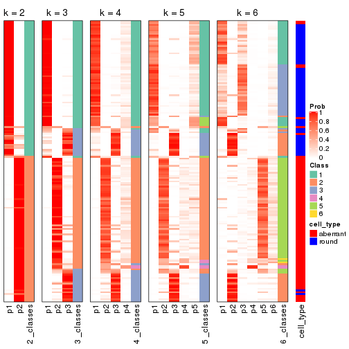


Test correlation between subgroups and known annotations. If the known
annotation is numeric, one-way ANOVA test is applied, and if the known
annotation is discrete, chi-squared contingency table test is applied.

```r
test_to_known_factors(res)
```

```
#>          n cell_type(p) k
#> CV:NMF 156     2.05e-28 2
#> CV:NMF 151     4.96e-22 3
#> CV:NMF 138     2.91e-19 4
#> CV:NMF  93     1.66e-10 5
#> CV:NMF 121     5.43e-15 6
```


If matrix rows can be associated to genes, consider to use `GO_Enrichment(res,
...)` to perform function enrichment for the signature genes.


 

---------------------------------------------------


### MAD:hclust


The object with results only for a single top-value method and a single partition method 
can be extracted as:

```r
res = res_list["MAD", "hclust"]
# you can also extract it by
# res = res_list["MAD:hclust"]
```

A summary of `res` and all the functions that can be applied to it:

```r
res
```

```
#> A 'ConsensusPartition' object with k = 2, 3, 4, 5, 6.
#>   On a matrix with 5576 rows and 160 columns.
#>   Top rows (558, 1116, 1673, 2230, 2788) are extracted by 'MAD' method.
#>   Subgroups are detected by 'hclust' method.
#>   Performed in total 1250 partitions by row resampling.
#>   Best k for subgroups seems to be 3.
#> 
#> Following methods can be applied to this 'ConsensusPartition' object:
#>  [1] "cola_report"             "collect_classes"         "collect_plots"          
#>  [4] "collect_stats"           "colnames"                "compare_signatures"     
#>  [7] "consensus_heatmap"       "dimension_reduction"     "functional_enrichment"  
#> [10] "get_anno_col"            "get_anno"                "get_classes"            
#> [13] "get_consensus"           "get_matrix"              "get_membership"         
#> [16] "get_param"               "get_signatures"          "get_stats"              
#> [19] "is_best_k"               "is_stable_k"             "membership_heatmap"     
#> [22] "ncol"                    "nrow"                    "plot_ecdf"              
#> [25] "rownames"                "select_partition_number" "show"                   
#> [28] "suggest_best_k"          "test_to_known_factors"
```

`collect_plots()` function collects all the plots made from `res` for all `k` (number of partitions)
into one single page to provide an easy and fast comparison between different `k`.

```r
collect_plots(res)
```


The plots are:

- The first row: a plot of the ECDF (Empirical cumulative distribution
  function) curves of the consensus matrix for each `k` and the heatmap of
  predicted classes for each `k`.
- The second row: heatmaps of the consensus matrix for each `k`.
- The third row: heatmaps of the membership matrix for each `k`.
- The fouth row: heatmaps of the signatures for each `k`.

All the plots in panels can be made by individual functions and they are
plotted later in this section.

`select_partition_number()` produces several plots showing different
statistics for choosing "optimized" `k`. There are following statistics:

- ECDF curves of the consensus matrix for each `k`;
- 1-PAC. [The PAC
  score](https://en.wikipedia.org/wiki/Consensus_clustering#Over-interpretation_potential_of_consensus_clustering)
  measures the proportion of the ambiguous subgrouping.
- Mean silhouette score.
- Concordance. The mean probability of fiting the consensus class ids in all
  partitions.
- Area increased. Denote $A_k$ as the area under the ECDF curve for current
  `k`, the area increased is defined as $A_k - A_{k-1}$.
- Rand index. The percent of pairs of samples that are both in a same cluster
  or both are not in a same cluster in the partition of k and k-1.
- Jaccard index. The ratio of pairs of samples are both in a same cluster in
  the partition of k and k-1 and the pairs of samples are both in a same
  cluster in the partition k or k-1.

The detailed explanations of these statistics can be found in [the cola
vignette](http://bioconductor.org/packages/devel/bioc/vignettes/cola/inst/doc/cola.html#toc_13).

Generally speaking, lower PAC score, higher mean silhouette score or higher
concordance corresponds to better partition. Rand index and Jaccard index
measure how similar the current partition is compared to partition with `k-1`.
If they are too similar, we won't accept `k` is better than `k-1`.

```r
select_partition_number(res)
```


The numeric values for all these statistics can be obtained by `get_stats()`.

```r
get_stats(res)
```

```
#>   k 1-PAC mean_silhouette concordance area_increased  Rand Jaccard
#> 2 2 0.204           0.459       0.770         0.2982 0.718   0.718
#> 3 3 0.300           0.693       0.825         0.6865 0.596   0.488
#> 4 4 0.446           0.621       0.761         0.2579 0.809   0.614
#> 5 5 0.506           0.486       0.761         0.0832 0.982   0.949
#> 6 6 0.528           0.418       0.707         0.0557 0.855   0.636
```

`suggest_best_k()` suggests the best $k$ based on these statistics. The rules are as follows:

- All $k$ with Jaccard index larger than 0.95 are removed because the increase of
  the partition number does not provides enough extra information. If all $k$ are removed,
  the best $k$ is assigned by `NA`.
- For $k$ with 1-PAC larger than 0.9, the maximal $k$ is taken as the "best k". Other $k$ is called "optional k".
- If it does not fit the second rule. The $k$ with the highest vote of highest
  1-PAC, mean silhouette and concordance is taken as the "best k".

```r
suggest_best_k(res)
```

```
#> [1] 3
```


Following shows the table of the partitions (You need to click the **show/hide
code output** link to see it). The membership matrix (columns with name `p*`)
is inferred by
[`clue::cl_consensus()`](https://www.rdocumentation.org/link/cl_consensus?package=clue)
function with the `SE` method. Basically the value in the membership matrix
represents the probability to belong to a certain group. The finall class
label for an item is determined with the group with highest probability it
belongs to.

In `get_classes()` function, the entropy is calculated from the membership
matrix and the silhouette score is calculated from the consensus matrix.


<script>
$( function() {
	$( '#tabs-MAD-hclust-get-classes' ).tabs();
} );
</script>
<div id='tabs-MAD-hclust-get-classes'>
<ul>
<li><a href='#tab-MAD-hclust-get-classes-1'>k = 2</a></li>
<li><a href='#tab-MAD-hclust-get-classes-2'>k = 3</a></li>
<li><a href='#tab-MAD-hclust-get-classes-3'>k = 4</a></li>
<li><a href='#tab-MAD-hclust-get-classes-4'>k = 5</a></li>
<li><a href='#tab-MAD-hclust-get-classes-5'>k = 6</a></li>
</ul>

<div id='tab-MAD-hclust-get-classes-1'>
<p><a id='tab-MAD-hclust-get-classes-1-a' style='color:#0366d6' href='#'>show/hide code output</a></p>
<pre><code class="r">cbind(get_classes(res, k = 2), get_membership(res, k = 2))
</code></pre>

<pre><code>#&gt;                     class entropy silhouette    p1    p2
#&gt; aberrant_ERR2585320     2  0.3431   0.664046 0.064 0.936
#&gt; aberrant_ERR2585338     2  0.0376   0.657948 0.004 0.996
#&gt; aberrant_ERR2585325     2  0.3431   0.664046 0.064 0.936
#&gt; aberrant_ERR2585283     1  0.5059   0.491431 0.888 0.112
#&gt; aberrant_ERR2585343     2  0.6801   0.606066 0.180 0.820
#&gt; aberrant_ERR2585329     2  0.0000   0.656225 0.000 1.000
#&gt; aberrant_ERR2585317     2  0.0000   0.656225 0.000 1.000
#&gt; aberrant_ERR2585339     2  0.0000   0.656225 0.000 1.000
#&gt; aberrant_ERR2585335     2  0.2043   0.665498 0.032 0.968
#&gt; aberrant_ERR2585287     1  0.9815   0.342845 0.580 0.420
#&gt; aberrant_ERR2585321     2  0.5946   0.634175 0.144 0.856
#&gt; aberrant_ERR2585297     1  0.9998   0.332090 0.508 0.492
#&gt; aberrant_ERR2585337     2  0.0000   0.656225 0.000 1.000
#&gt; aberrant_ERR2585319     2  0.1843   0.659916 0.028 0.972
#&gt; aberrant_ERR2585315     2  0.0672   0.658869 0.008 0.992
#&gt; aberrant_ERR2585336     2  0.0000   0.656225 0.000 1.000
#&gt; aberrant_ERR2585307     2  0.2423   0.662089 0.040 0.960
#&gt; aberrant_ERR2585301     2  0.2778   0.665951 0.048 0.952
#&gt; aberrant_ERR2585326     2  0.0000   0.656225 0.000 1.000
#&gt; aberrant_ERR2585331     2  0.0000   0.656225 0.000 1.000
#&gt; aberrant_ERR2585346     1  0.4939   0.490890 0.892 0.108
#&gt; aberrant_ERR2585314     2  0.0000   0.656225 0.000 1.000
#&gt; aberrant_ERR2585298     2  0.8144   0.511042 0.252 0.748
#&gt; aberrant_ERR2585345     2  0.0000   0.656225 0.000 1.000
#&gt; aberrant_ERR2585299     2  0.9977  -0.195690 0.472 0.528
#&gt; aberrant_ERR2585309     1  0.9552   0.619568 0.624 0.376
#&gt; aberrant_ERR2585303     2  0.1184   0.662112 0.016 0.984
#&gt; aberrant_ERR2585313     2  0.0000   0.656225 0.000 1.000
#&gt; aberrant_ERR2585318     2  0.3114   0.667506 0.056 0.944
#&gt; aberrant_ERR2585328     2  0.5629   0.643511 0.132 0.868
#&gt; aberrant_ERR2585330     2  0.1414   0.660923 0.020 0.980
#&gt; aberrant_ERR2585293     1  0.5059   0.491431 0.888 0.112
#&gt; aberrant_ERR2585342     2  0.4161   0.660970 0.084 0.916
#&gt; aberrant_ERR2585348     2  0.5178   0.648263 0.116 0.884
#&gt; aberrant_ERR2585352     2  0.0672   0.656091 0.008 0.992
#&gt; aberrant_ERR2585308     1  0.9933   0.464763 0.548 0.452
#&gt; aberrant_ERR2585349     2  0.2423   0.667634 0.040 0.960
#&gt; aberrant_ERR2585316     2  0.9087   0.392892 0.324 0.676
#&gt; aberrant_ERR2585306     2  0.8955   0.405127 0.312 0.688
#&gt; aberrant_ERR2585324     2  0.1843   0.659916 0.028 0.972
#&gt; aberrant_ERR2585310     2  0.6973   0.595879 0.188 0.812
#&gt; aberrant_ERR2585296     2  0.9000   0.395242 0.316 0.684
#&gt; aberrant_ERR2585275     1  0.7056   0.490238 0.808 0.192
#&gt; aberrant_ERR2585311     2  0.5059   0.646433 0.112 0.888
#&gt; aberrant_ERR2585292     1  0.5059   0.491431 0.888 0.112
#&gt; aberrant_ERR2585282     2  0.5178   0.648194 0.116 0.884
#&gt; aberrant_ERR2585305     2  0.3584   0.667658 0.068 0.932
#&gt; aberrant_ERR2585278     2  0.1184   0.660523 0.016 0.984
#&gt; aberrant_ERR2585347     2  0.7376   0.578770 0.208 0.792
#&gt; aberrant_ERR2585332     2  0.6048   0.631709 0.148 0.852
#&gt; aberrant_ERR2585280     2  0.3274   0.666588 0.060 0.940
#&gt; aberrant_ERR2585304     2  0.6531   0.602847 0.168 0.832
#&gt; aberrant_ERR2585322     2  0.0672   0.659908 0.008 0.992
#&gt; aberrant_ERR2585279     2  0.1184   0.662456 0.016 0.984
#&gt; aberrant_ERR2585277     2  0.0000   0.656225 0.000 1.000
#&gt; aberrant_ERR2585295     2  0.4161   0.657377 0.084 0.916
#&gt; aberrant_ERR2585333     2  0.4690   0.656922 0.100 0.900
#&gt; aberrant_ERR2585285     2  0.2423   0.666974 0.040 0.960
#&gt; aberrant_ERR2585286     2  0.0000   0.656225 0.000 1.000
#&gt; aberrant_ERR2585294     2  0.3431   0.664317 0.064 0.936
#&gt; aberrant_ERR2585300     2  0.6148   0.627856 0.152 0.848
#&gt; aberrant_ERR2585334     2  0.0000   0.656225 0.000 1.000
#&gt; aberrant_ERR2585361     2  0.1414   0.660083 0.020 0.980
#&gt; aberrant_ERR2585372     2  0.2948   0.659486 0.052 0.948
#&gt; round_ERR2585217        2  0.7602   0.556996 0.220 0.780
#&gt; round_ERR2585205        2  0.9977  -0.181198 0.472 0.528
#&gt; round_ERR2585214        2  0.8081   0.517560 0.248 0.752
#&gt; round_ERR2585202        2  0.7602   0.552672 0.220 0.780
#&gt; aberrant_ERR2585367     2  0.3584   0.665287 0.068 0.932
#&gt; round_ERR2585220        2  0.9775   0.123666 0.412 0.588
#&gt; round_ERR2585238        2  0.9993  -0.241252 0.484 0.516
#&gt; aberrant_ERR2585276     2  0.3274   0.669100 0.060 0.940
#&gt; round_ERR2585218        2  0.9970  -0.152277 0.468 0.532
#&gt; aberrant_ERR2585363     2  0.1414   0.661574 0.020 0.980
#&gt; round_ERR2585201        2  0.8016   0.518448 0.244 0.756
#&gt; round_ERR2585210        1  0.9998   0.331587 0.508 0.492
#&gt; aberrant_ERR2585362     2  0.2236   0.663380 0.036 0.964
#&gt; aberrant_ERR2585360     2  0.4298   0.655867 0.088 0.912
#&gt; round_ERR2585209        2  0.8861   0.417218 0.304 0.696
#&gt; round_ERR2585242        2  0.8386   0.483149 0.268 0.732
#&gt; round_ERR2585216        2  0.9815   0.093196 0.420 0.580
#&gt; round_ERR2585219        2  0.9775   0.132396 0.412 0.588
#&gt; round_ERR2585237        2  0.7883   0.531934 0.236 0.764
#&gt; round_ERR2585198        2  0.6973   0.587445 0.188 0.812
#&gt; round_ERR2585211        2  1.0000  -0.305139 0.496 0.504
#&gt; round_ERR2585206        1  1.0000   0.312318 0.504 0.496
#&gt; aberrant_ERR2585281     2  0.1184   0.659395 0.016 0.984
#&gt; round_ERR2585212        2  0.9732   0.145027 0.404 0.596
#&gt; round_ERR2585221        1  0.9954   0.445724 0.540 0.460
#&gt; round_ERR2585243        2  0.9881   0.019043 0.436 0.564
#&gt; round_ERR2585204        2  0.7528   0.556743 0.216 0.784
#&gt; round_ERR2585213        2  0.6887   0.589556 0.184 0.816
#&gt; aberrant_ERR2585373     2  0.5408   0.650149 0.124 0.876
#&gt; aberrant_ERR2585358     2  0.6623   0.614715 0.172 0.828
#&gt; aberrant_ERR2585365     2  0.1184   0.660616 0.016 0.984
#&gt; aberrant_ERR2585359     2  0.7453   0.581398 0.212 0.788
#&gt; aberrant_ERR2585370     2  0.0000   0.656225 0.000 1.000
#&gt; round_ERR2585215        1  0.9963   0.429385 0.536 0.464
#&gt; round_ERR2585262        2  0.8144   0.518777 0.252 0.748
#&gt; round_ERR2585199        2  0.6973   0.587445 0.188 0.812
#&gt; aberrant_ERR2585369     2  0.2603   0.666101 0.044 0.956
#&gt; round_ERR2585208        1  0.9922   0.494340 0.552 0.448
#&gt; round_ERR2585252        1  0.9522   0.623826 0.628 0.372
#&gt; round_ERR2585236        2  0.9286   0.319889 0.344 0.656
#&gt; aberrant_ERR2585284     1  0.1843   0.441703 0.972 0.028
#&gt; round_ERR2585224        1  0.9427   0.632403 0.640 0.360
#&gt; round_ERR2585260        2  0.9881   0.020037 0.436 0.564
#&gt; round_ERR2585229        2  0.9993  -0.257022 0.484 0.516
#&gt; aberrant_ERR2585364     1  0.9977   0.257512 0.528 0.472
#&gt; round_ERR2585253        1  0.9323   0.635164 0.652 0.348
#&gt; aberrant_ERR2585368     2  0.0000   0.656225 0.000 1.000
#&gt; aberrant_ERR2585371     2  0.0000   0.656225 0.000 1.000
#&gt; round_ERR2585239        2  0.9881  -0.000569 0.436 0.564
#&gt; round_ERR2585273        2  0.9988  -0.243367 0.480 0.520
#&gt; round_ERR2585256        2  0.8955   0.410366 0.312 0.688
#&gt; round_ERR2585272        2  0.9922  -0.057461 0.448 0.552
#&gt; round_ERR2585246        1  0.9963   0.426314 0.536 0.464
#&gt; round_ERR2585261        2  0.9087   0.375818 0.324 0.676
#&gt; round_ERR2585254        2  0.7745   0.547295 0.228 0.772
#&gt; round_ERR2585225        2  0.8267   0.503718 0.260 0.740
#&gt; round_ERR2585235        2  0.9896  -0.042433 0.440 0.560
#&gt; round_ERR2585271        2  0.9922  -0.039254 0.448 0.552
#&gt; round_ERR2585251        2  0.9754   0.140028 0.408 0.592
#&gt; round_ERR2585255        2  0.8267   0.505951 0.260 0.740
#&gt; round_ERR2585257        2  0.8207   0.508144 0.256 0.744
#&gt; round_ERR2585226        2  0.9815   0.086061 0.420 0.580
#&gt; round_ERR2585265        2  0.9686   0.173690 0.396 0.604
#&gt; round_ERR2585259        2  0.9491   0.241741 0.368 0.632
#&gt; round_ERR2585247        2  0.9996  -0.265591 0.488 0.512
#&gt; round_ERR2585241        2  0.9988  -0.209465 0.480 0.520
#&gt; round_ERR2585263        2  0.9795   0.117545 0.416 0.584
#&gt; round_ERR2585264        1  0.9323   0.635352 0.652 0.348
#&gt; round_ERR2585233        2  0.8499   0.484896 0.276 0.724
#&gt; round_ERR2585223        2  0.9896  -0.006914 0.440 0.560
#&gt; round_ERR2585234        2  0.7883   0.530441 0.236 0.764
#&gt; round_ERR2585222        2  0.9881   0.014445 0.436 0.564
#&gt; round_ERR2585228        2  0.9896  -0.001454 0.440 0.560
#&gt; round_ERR2585248        1  0.9286   0.633811 0.656 0.344
#&gt; round_ERR2585240        2  0.9732   0.129915 0.404 0.596
#&gt; round_ERR2585270        2  0.9866   0.038967 0.432 0.568
#&gt; round_ERR2585232        2  0.8955   0.413433 0.312 0.688
#&gt; aberrant_ERR2585341     2  0.2778   0.667288 0.048 0.952
#&gt; aberrant_ERR2585355     2  0.0000   0.656225 0.000 1.000
#&gt; round_ERR2585227        2  0.9815   0.075824 0.420 0.580
#&gt; aberrant_ERR2585351     2  0.2778   0.665964 0.048 0.952
#&gt; round_ERR2585269        1  0.9686   0.591977 0.604 0.396
#&gt; aberrant_ERR2585357     2  0.0000   0.656225 0.000 1.000
#&gt; aberrant_ERR2585350     2  0.0000   0.656225 0.000 1.000
#&gt; round_ERR2585250        2  0.9795   0.120306 0.416 0.584
#&gt; round_ERR2585245        1  0.9323   0.635352 0.652 0.348
#&gt; aberrant_ERR2585353     2  0.4690   0.661042 0.100 0.900
#&gt; round_ERR2585258        2  0.9732   0.154336 0.404 0.596
#&gt; aberrant_ERR2585354     2  0.3879   0.659647 0.076 0.924
#&gt; round_ERR2585249        1  0.9661   0.597972 0.608 0.392
#&gt; round_ERR2585268        2  0.9491   0.261800 0.368 0.632
#&gt; aberrant_ERR2585356     2  0.8207   0.515711 0.256 0.744
#&gt; round_ERR2585266        2  0.8386   0.483149 0.268 0.732
#&gt; round_ERR2585231        1  0.9522   0.624354 0.628 0.372
#&gt; round_ERR2585230        2  0.9909  -0.045862 0.444 0.556
#&gt; round_ERR2585267        1  0.9460   0.630205 0.636 0.364
</code></pre>

<script>
$('#tab-MAD-hclust-get-classes-1-a').parent().next().next().hide();
$('#tab-MAD-hclust-get-classes-1-a').click(function(){
  $('#tab-MAD-hclust-get-classes-1-a').parent().next().next().toggle();
  return(false);
});
</script>
</div>

<div id='tab-MAD-hclust-get-classes-2'>
<p><a id='tab-MAD-hclust-get-classes-2-a' style='color:#0366d6' href='#'>show/hide code output</a></p>
<pre><code class="r">cbind(get_classes(res, k = 3), get_membership(res, k = 3))
</code></pre>

<pre><code>#&gt;                     class entropy silhouette    p1    p2    p3
#&gt; aberrant_ERR2585320     2  0.2384     0.8347 0.008 0.936 0.056
#&gt; aberrant_ERR2585338     2  0.0983     0.8402 0.016 0.980 0.004
#&gt; aberrant_ERR2585325     2  0.2384     0.8347 0.008 0.936 0.056
#&gt; aberrant_ERR2585283     3  0.3484     0.8495 0.048 0.048 0.904
#&gt; aberrant_ERR2585343     2  0.5072     0.7069 0.012 0.792 0.196
#&gt; aberrant_ERR2585329     2  0.0747     0.8395 0.016 0.984 0.000
#&gt; aberrant_ERR2585317     2  0.0592     0.8401 0.012 0.988 0.000
#&gt; aberrant_ERR2585339     2  0.0592     0.8400 0.012 0.988 0.000
#&gt; aberrant_ERR2585335     2  0.1267     0.8420 0.004 0.972 0.024
#&gt; aberrant_ERR2585287     3  0.7104     0.4959 0.032 0.360 0.608
#&gt; aberrant_ERR2585321     2  0.4228     0.7646 0.008 0.844 0.148
#&gt; aberrant_ERR2585297     1  0.3918     0.7656 0.868 0.120 0.012
#&gt; aberrant_ERR2585337     2  0.0592     0.8401 0.012 0.988 0.000
#&gt; aberrant_ERR2585319     2  0.1399     0.8383 0.004 0.968 0.028
#&gt; aberrant_ERR2585315     2  0.0829     0.8417 0.012 0.984 0.004
#&gt; aberrant_ERR2585336     2  0.0592     0.8401 0.012 0.988 0.000
#&gt; aberrant_ERR2585307     2  0.1860     0.8186 0.052 0.948 0.000
#&gt; aberrant_ERR2585301     2  0.2414     0.8376 0.020 0.940 0.040
#&gt; aberrant_ERR2585326     2  0.0592     0.8401 0.012 0.988 0.000
#&gt; aberrant_ERR2585331     2  0.0747     0.8390 0.016 0.984 0.000
#&gt; aberrant_ERR2585346     3  0.3155     0.8448 0.044 0.040 0.916
#&gt; aberrant_ERR2585314     2  0.0747     0.8406 0.016 0.984 0.000
#&gt; aberrant_ERR2585298     1  0.6518     0.4314 0.512 0.484 0.004
#&gt; aberrant_ERR2585345     2  0.0592     0.8401 0.012 0.988 0.000
#&gt; aberrant_ERR2585299     1  0.4589     0.7957 0.820 0.172 0.008
#&gt; aberrant_ERR2585309     1  0.2743     0.6431 0.928 0.020 0.052
#&gt; aberrant_ERR2585303     2  0.1182     0.8426 0.012 0.976 0.012
#&gt; aberrant_ERR2585313     2  0.0592     0.8401 0.012 0.988 0.000
#&gt; aberrant_ERR2585318     2  0.2229     0.8381 0.012 0.944 0.044
#&gt; aberrant_ERR2585328     2  0.4063     0.7949 0.020 0.868 0.112
#&gt; aberrant_ERR2585330     2  0.1129     0.8418 0.004 0.976 0.020
#&gt; aberrant_ERR2585293     3  0.3484     0.8495 0.048 0.048 0.904
#&gt; aberrant_ERR2585342     2  0.3213     0.8138 0.008 0.900 0.092
#&gt; aberrant_ERR2585348     2  0.3532     0.8020 0.008 0.884 0.108
#&gt; aberrant_ERR2585352     2  0.0475     0.8409 0.004 0.992 0.004
#&gt; aberrant_ERR2585308     1  0.3678     0.7274 0.892 0.080 0.028
#&gt; aberrant_ERR2585349     2  0.2261     0.8084 0.068 0.932 0.000
#&gt; aberrant_ERR2585316     2  0.6521     0.4461 0.016 0.644 0.340
#&gt; aberrant_ERR2585306     2  0.8977     0.3461 0.252 0.560 0.188
#&gt; aberrant_ERR2585324     2  0.1399     0.8383 0.004 0.968 0.028
#&gt; aberrant_ERR2585310     2  0.5864     0.4526 0.288 0.704 0.008
#&gt; aberrant_ERR2585296     1  0.6398     0.6045 0.580 0.416 0.004
#&gt; aberrant_ERR2585275     3  0.4821     0.8166 0.040 0.120 0.840
#&gt; aberrant_ERR2585311     2  0.3644     0.7900 0.004 0.872 0.124
#&gt; aberrant_ERR2585292     3  0.3484     0.8495 0.048 0.048 0.904
#&gt; aberrant_ERR2585282     2  0.3618     0.8066 0.012 0.884 0.104
#&gt; aberrant_ERR2585305     2  0.2982     0.8320 0.024 0.920 0.056
#&gt; aberrant_ERR2585278     2  0.0747     0.8411 0.000 0.984 0.016
#&gt; aberrant_ERR2585347     2  0.5202     0.6780 0.008 0.772 0.220
#&gt; aberrant_ERR2585332     2  0.4413     0.7504 0.008 0.832 0.160
#&gt; aberrant_ERR2585280     2  0.2496     0.8305 0.004 0.928 0.068
#&gt; aberrant_ERR2585304     2  0.5754     0.3869 0.296 0.700 0.004
#&gt; aberrant_ERR2585322     2  0.1015     0.8421 0.008 0.980 0.012
#&gt; aberrant_ERR2585279     2  0.1411     0.8322 0.036 0.964 0.000
#&gt; aberrant_ERR2585277     2  0.0592     0.8401 0.012 0.988 0.000
#&gt; aberrant_ERR2585295     2  0.3031     0.8271 0.012 0.912 0.076
#&gt; aberrant_ERR2585333     2  0.3532     0.8036 0.008 0.884 0.108
#&gt; aberrant_ERR2585285     2  0.1585     0.8416 0.008 0.964 0.028
#&gt; aberrant_ERR2585286     2  0.0592     0.8400 0.012 0.988 0.000
#&gt; aberrant_ERR2585294     2  0.2879     0.8325 0.024 0.924 0.052
#&gt; aberrant_ERR2585300     2  0.5167     0.7204 0.024 0.804 0.172
#&gt; aberrant_ERR2585334     2  0.0747     0.8390 0.016 0.984 0.000
#&gt; aberrant_ERR2585361     2  0.1315     0.8424 0.008 0.972 0.020
#&gt; aberrant_ERR2585372     2  0.2301     0.8302 0.004 0.936 0.060
#&gt; round_ERR2585217        2  0.6008     0.2867 0.332 0.664 0.004
#&gt; round_ERR2585205        1  0.4351     0.7959 0.828 0.168 0.004
#&gt; round_ERR2585214        2  0.6518    -0.3575 0.484 0.512 0.004
#&gt; round_ERR2585202        2  0.6476    -0.2285 0.448 0.548 0.004
#&gt; aberrant_ERR2585367     2  0.2496     0.8275 0.004 0.928 0.068
#&gt; round_ERR2585220        1  0.5443     0.7895 0.736 0.260 0.004
#&gt; round_ERR2585238        1  0.3784     0.7777 0.864 0.132 0.004
#&gt; aberrant_ERR2585276     2  0.2982     0.8330 0.024 0.920 0.056
#&gt; round_ERR2585218        1  0.4521     0.8009 0.816 0.180 0.004
#&gt; aberrant_ERR2585363     2  0.0983     0.8411 0.004 0.980 0.016
#&gt; round_ERR2585201        1  0.6521     0.4020 0.500 0.496 0.004
#&gt; round_ERR2585210        1  0.3989     0.7663 0.864 0.124 0.012
#&gt; aberrant_ERR2585362     2  0.1999     0.8421 0.012 0.952 0.036
#&gt; aberrant_ERR2585360     2  0.3207     0.8185 0.012 0.904 0.084
#&gt; round_ERR2585209        1  0.6633     0.5386 0.548 0.444 0.008
#&gt; round_ERR2585242        1  0.6505     0.4763 0.528 0.468 0.004
#&gt; round_ERR2585216        1  0.5138     0.7956 0.748 0.252 0.000
#&gt; round_ERR2585219        1  0.5327     0.7796 0.728 0.272 0.000
#&gt; round_ERR2585237        2  0.6476    -0.2160 0.448 0.548 0.004
#&gt; round_ERR2585198        2  0.6247     0.1048 0.376 0.620 0.004
#&gt; round_ERR2585211        1  0.4602     0.7869 0.832 0.152 0.016
#&gt; round_ERR2585206        1  0.4475     0.7820 0.840 0.144 0.016
#&gt; aberrant_ERR2585281     2  0.1482     0.8406 0.012 0.968 0.020
#&gt; round_ERR2585212        1  0.5465     0.7680 0.712 0.288 0.000
#&gt; round_ERR2585221        1  0.3722     0.7355 0.888 0.088 0.024
#&gt; round_ERR2585243        1  0.5201     0.8043 0.760 0.236 0.004
#&gt; round_ERR2585204        2  0.6398    -0.0894 0.416 0.580 0.004
#&gt; round_ERR2585213        2  0.6033     0.2590 0.336 0.660 0.004
#&gt; aberrant_ERR2585373     2  0.3755     0.7984 0.008 0.872 0.120
#&gt; aberrant_ERR2585358     2  0.4968     0.7178 0.012 0.800 0.188
#&gt; aberrant_ERR2585365     2  0.1337     0.8426 0.012 0.972 0.016
#&gt; aberrant_ERR2585359     2  0.5450     0.6656 0.012 0.760 0.228
#&gt; aberrant_ERR2585370     2  0.0592     0.8401 0.012 0.988 0.000
#&gt; round_ERR2585215        1  0.4015     0.7356 0.876 0.096 0.028
#&gt; round_ERR2585262        2  0.6298     0.0556 0.388 0.608 0.004
#&gt; round_ERR2585199        2  0.6247     0.1048 0.376 0.620 0.004
#&gt; aberrant_ERR2585369     2  0.1878     0.8364 0.004 0.952 0.044
#&gt; round_ERR2585208        1  0.3325     0.7245 0.904 0.076 0.020
#&gt; round_ERR2585252        1  0.2446     0.6335 0.936 0.012 0.052
#&gt; round_ERR2585236        1  0.6026     0.6612 0.624 0.376 0.000
#&gt; aberrant_ERR2585284     3  0.1525     0.7964 0.032 0.004 0.964
#&gt; round_ERR2585224        1  0.2066     0.6093 0.940 0.000 0.060
#&gt; round_ERR2585260        1  0.5115     0.8064 0.768 0.228 0.004
#&gt; round_ERR2585229        1  0.4413     0.7900 0.832 0.160 0.008
#&gt; aberrant_ERR2585364     3  0.7464     0.3615 0.040 0.400 0.560
#&gt; round_ERR2585253        1  0.2356     0.5986 0.928 0.000 0.072
#&gt; aberrant_ERR2585368     2  0.0592     0.8401 0.012 0.988 0.000
#&gt; aberrant_ERR2585371     2  0.0592     0.8401 0.012 0.988 0.000
#&gt; round_ERR2585239        1  0.5058     0.8013 0.756 0.244 0.000
#&gt; round_ERR2585273        1  0.4110     0.7870 0.844 0.152 0.004
#&gt; round_ERR2585256        1  0.6330     0.6247 0.600 0.396 0.004
#&gt; round_ERR2585272        1  0.4883     0.8061 0.788 0.208 0.004
#&gt; round_ERR2585246        1  0.3722     0.7369 0.888 0.088 0.024
#&gt; round_ERR2585261        1  0.6398     0.5881 0.580 0.416 0.004
#&gt; round_ERR2585254        2  0.6451    -0.1538 0.436 0.560 0.004
#&gt; round_ERR2585225        1  0.6521     0.3988 0.500 0.496 0.004
#&gt; round_ERR2585235        1  0.5899     0.7837 0.736 0.244 0.020
#&gt; round_ERR2585271        1  0.5070     0.8074 0.772 0.224 0.004
#&gt; round_ERR2585251        1  0.5461     0.8003 0.748 0.244 0.008
#&gt; round_ERR2585255        1  0.6521     0.3966 0.500 0.496 0.004
#&gt; round_ERR2585257        1  0.6521     0.4128 0.504 0.492 0.004
#&gt; round_ERR2585226        1  0.5024     0.8056 0.776 0.220 0.004
#&gt; round_ERR2585265        1  0.5244     0.7996 0.756 0.240 0.004
#&gt; round_ERR2585259        1  0.5859     0.7110 0.656 0.344 0.000
#&gt; round_ERR2585247        1  0.4723     0.7914 0.824 0.160 0.016
#&gt; round_ERR2585241        1  0.4473     0.7955 0.828 0.164 0.008
#&gt; round_ERR2585263        1  0.5363     0.7766 0.724 0.276 0.000
#&gt; round_ERR2585264        1  0.2261     0.6016 0.932 0.000 0.068
#&gt; round_ERR2585233        1  0.6505     0.4665 0.528 0.468 0.004
#&gt; round_ERR2585223        1  0.4654     0.8057 0.792 0.208 0.000
#&gt; round_ERR2585234        2  0.6495    -0.2653 0.460 0.536 0.004
#&gt; round_ERR2585222        1  0.5158     0.8071 0.764 0.232 0.004
#&gt; round_ERR2585228        1  0.5115     0.8061 0.768 0.228 0.004
#&gt; round_ERR2585248        1  0.2625     0.5864 0.916 0.000 0.084
#&gt; round_ERR2585240        1  0.5098     0.8007 0.752 0.248 0.000
#&gt; round_ERR2585270        1  0.5404     0.7923 0.740 0.256 0.004
#&gt; round_ERR2585232        1  0.6587     0.5632 0.568 0.424 0.008
#&gt; aberrant_ERR2585341     2  0.2229     0.8405 0.012 0.944 0.044
#&gt; aberrant_ERR2585355     2  0.0592     0.8400 0.012 0.988 0.000
#&gt; round_ERR2585227        1  0.4842     0.8066 0.776 0.224 0.000
#&gt; aberrant_ERR2585351     2  0.2063     0.8374 0.008 0.948 0.044
#&gt; round_ERR2585269        1  0.3263     0.6718 0.912 0.040 0.048
#&gt; aberrant_ERR2585357     2  0.0592     0.8401 0.012 0.988 0.000
#&gt; aberrant_ERR2585350     2  0.0592     0.8401 0.012 0.988 0.000
#&gt; round_ERR2585250        1  0.5656     0.7715 0.712 0.284 0.004
#&gt; round_ERR2585245        1  0.2261     0.6016 0.932 0.000 0.068
#&gt; aberrant_ERR2585353     2  0.3213     0.8205 0.008 0.900 0.092
#&gt; round_ERR2585258        1  0.5158     0.8026 0.764 0.232 0.004
#&gt; aberrant_ERR2585354     2  0.2860     0.8188 0.004 0.912 0.084
#&gt; round_ERR2585249        1  0.2527     0.6503 0.936 0.020 0.044
#&gt; round_ERR2585268        1  0.5760     0.7251 0.672 0.328 0.000
#&gt; aberrant_ERR2585356     2  0.6388     0.5401 0.024 0.692 0.284
#&gt; round_ERR2585266        1  0.6505     0.4763 0.528 0.468 0.004
#&gt; round_ERR2585231        1  0.2703     0.6357 0.928 0.016 0.056
#&gt; round_ERR2585230        1  0.5115     0.8072 0.768 0.228 0.004
#&gt; round_ERR2585267        1  0.2651     0.6198 0.928 0.012 0.060
</code></pre>

<script>
$('#tab-MAD-hclust-get-classes-2-a').parent().next().next().hide();
$('#tab-MAD-hclust-get-classes-2-a').click(function(){
  $('#tab-MAD-hclust-get-classes-2-a').parent().next().next().toggle();
  return(false);
});
</script>
</div>

<div id='tab-MAD-hclust-get-classes-3'>
<p><a id='tab-MAD-hclust-get-classes-3-a' style='color:#0366d6' href='#'>show/hide code output</a></p>
<pre><code class="r">cbind(get_classes(res, k = 4), get_membership(res, k = 4))
</code></pre>

<pre><code>#&gt;                     class entropy silhouette    p1    p2    p3    p4
#&gt; aberrant_ERR2585320     2   0.251   0.882715 0.008 0.920 0.020 0.052
#&gt; aberrant_ERR2585338     2   0.220   0.880849 0.000 0.920 0.072 0.008
#&gt; aberrant_ERR2585325     2   0.251   0.882715 0.008 0.920 0.020 0.052
#&gt; aberrant_ERR2585283     4   0.157   0.838132 0.028 0.012 0.004 0.956
#&gt; aberrant_ERR2585343     2   0.536   0.689862 0.020 0.736 0.032 0.212
#&gt; aberrant_ERR2585329     2   0.213   0.877892 0.000 0.920 0.076 0.004
#&gt; aberrant_ERR2585317     2   0.164   0.880931 0.000 0.940 0.060 0.000
#&gt; aberrant_ERR2585339     2   0.164   0.882046 0.000 0.940 0.060 0.000
#&gt; aberrant_ERR2585335     2   0.184   0.889294 0.000 0.944 0.028 0.028
#&gt; aberrant_ERR2585287     4   0.553   0.525148 0.016 0.304 0.016 0.664
#&gt; aberrant_ERR2585321     2   0.443   0.788356 0.016 0.808 0.024 0.152
#&gt; aberrant_ERR2585297     1   0.552   0.514411 0.568 0.020 0.412 0.000
#&gt; aberrant_ERR2585337     2   0.182   0.882259 0.000 0.936 0.060 0.004
#&gt; aberrant_ERR2585319     2   0.161   0.885692 0.000 0.952 0.016 0.032
#&gt; aberrant_ERR2585315     2   0.164   0.887243 0.000 0.948 0.044 0.008
#&gt; aberrant_ERR2585336     2   0.172   0.879576 0.000 0.936 0.064 0.000
#&gt; aberrant_ERR2585307     2   0.294   0.836426 0.000 0.868 0.128 0.004
#&gt; aberrant_ERR2585301     2   0.239   0.879777 0.008 0.924 0.016 0.052
#&gt; aberrant_ERR2585326     2   0.164   0.880931 0.000 0.940 0.060 0.000
#&gt; aberrant_ERR2585331     2   0.187   0.877255 0.000 0.928 0.072 0.000
#&gt; aberrant_ERR2585346     4   0.154   0.831322 0.032 0.008 0.004 0.956
#&gt; aberrant_ERR2585314     2   0.205   0.880545 0.000 0.924 0.072 0.004
#&gt; aberrant_ERR2585298     3   0.292   0.550192 0.008 0.116 0.876 0.000
#&gt; aberrant_ERR2585345     2   0.182   0.883186 0.000 0.936 0.060 0.004
#&gt; aberrant_ERR2585299     3   0.551  -0.337206 0.488 0.016 0.496 0.000
#&gt; aberrant_ERR2585309     1   0.340   0.696010 0.820 0.000 0.180 0.000
#&gt; aberrant_ERR2585303     2   0.185   0.889695 0.000 0.940 0.048 0.012
#&gt; aberrant_ERR2585313     2   0.174   0.883167 0.000 0.940 0.056 0.004
#&gt; aberrant_ERR2585318     2   0.250   0.885680 0.004 0.920 0.032 0.044
#&gt; aberrant_ERR2585328     2   0.459   0.833153 0.008 0.812 0.068 0.112
#&gt; aberrant_ERR2585330     2   0.157   0.888761 0.004 0.956 0.028 0.012
#&gt; aberrant_ERR2585293     4   0.157   0.838132 0.028 0.012 0.004 0.956
#&gt; aberrant_ERR2585342     2   0.304   0.871391 0.008 0.892 0.020 0.080
#&gt; aberrant_ERR2585348     2   0.460   0.820285 0.020 0.820 0.056 0.104
#&gt; aberrant_ERR2585352     2   0.139   0.885894 0.000 0.952 0.048 0.000
#&gt; aberrant_ERR2585308     1   0.463   0.662977 0.688 0.004 0.308 0.000
#&gt; aberrant_ERR2585349     2   0.506   0.488747 0.012 0.648 0.340 0.000
#&gt; aberrant_ERR2585316     2   0.632   0.403354 0.028 0.596 0.028 0.348
#&gt; aberrant_ERR2585306     2   0.855   0.237165 0.212 0.520 0.080 0.188
#&gt; aberrant_ERR2585324     2   0.161   0.885692 0.000 0.952 0.016 0.032
#&gt; aberrant_ERR2585310     2   0.653   0.266014 0.060 0.580 0.348 0.012
#&gt; aberrant_ERR2585296     3   0.599   0.515109 0.168 0.140 0.692 0.000
#&gt; aberrant_ERR2585275     4   0.334   0.813628 0.032 0.080 0.008 0.880
#&gt; aberrant_ERR2585311     2   0.400   0.837074 0.016 0.844 0.028 0.112
#&gt; aberrant_ERR2585292     4   0.157   0.838132 0.028 0.012 0.004 0.956
#&gt; aberrant_ERR2585282     2   0.393   0.841018 0.020 0.852 0.028 0.100
#&gt; aberrant_ERR2585305     2   0.295   0.874287 0.008 0.900 0.028 0.064
#&gt; aberrant_ERR2585278     2   0.121   0.888370 0.000 0.964 0.032 0.004
#&gt; aberrant_ERR2585347     2   0.521   0.696431 0.008 0.732 0.036 0.224
#&gt; aberrant_ERR2585332     2   0.452   0.759958 0.008 0.796 0.032 0.164
#&gt; aberrant_ERR2585280     2   0.263   0.883036 0.004 0.912 0.024 0.060
#&gt; aberrant_ERR2585304     3   0.551   0.116063 0.016 0.476 0.508 0.000
#&gt; aberrant_ERR2585322     2   0.185   0.887250 0.004 0.940 0.052 0.004
#&gt; aberrant_ERR2585279     2   0.253   0.855250 0.000 0.888 0.112 0.000
#&gt; aberrant_ERR2585277     2   0.194   0.876590 0.000 0.924 0.076 0.000
#&gt; aberrant_ERR2585295     2   0.320   0.875278 0.004 0.884 0.032 0.080
#&gt; aberrant_ERR2585333     2   0.335   0.846501 0.004 0.864 0.016 0.116
#&gt; aberrant_ERR2585285     2   0.204   0.889621 0.000 0.936 0.032 0.032
#&gt; aberrant_ERR2585286     2   0.179   0.879341 0.000 0.932 0.068 0.000
#&gt; aberrant_ERR2585294     2   0.276   0.874698 0.012 0.908 0.016 0.064
#&gt; aberrant_ERR2585300     2   0.496   0.711495 0.020 0.760 0.020 0.200
#&gt; aberrant_ERR2585334     2   0.208   0.872476 0.000 0.916 0.084 0.000
#&gt; aberrant_ERR2585361     2   0.182   0.886706 0.000 0.944 0.036 0.020
#&gt; aberrant_ERR2585372     2   0.253   0.877157 0.008 0.920 0.024 0.048
#&gt; round_ERR2585217        3   0.588   0.395928 0.048 0.344 0.608 0.000
#&gt; round_ERR2585205        1   0.578   0.271891 0.496 0.028 0.476 0.000
#&gt; round_ERR2585214        3   0.335   0.543843 0.008 0.148 0.844 0.000
#&gt; round_ERR2585202        3   0.533   0.504102 0.048 0.248 0.704 0.000
#&gt; aberrant_ERR2585367     2   0.324   0.876422 0.004 0.884 0.040 0.072
#&gt; round_ERR2585220        3   0.581   0.378973 0.312 0.052 0.636 0.000
#&gt; round_ERR2585238        1   0.544   0.482792 0.564 0.016 0.420 0.000
#&gt; aberrant_ERR2585276     2   0.320   0.880461 0.012 0.892 0.036 0.060
#&gt; round_ERR2585218        3   0.578  -0.235694 0.476 0.028 0.496 0.000
#&gt; aberrant_ERR2585363     2   0.144   0.886545 0.008 0.960 0.028 0.004
#&gt; round_ERR2585201        3   0.298   0.548887 0.008 0.120 0.872 0.000
#&gt; round_ERR2585210        1   0.522   0.485450 0.568 0.008 0.424 0.000
#&gt; aberrant_ERR2585362     2   0.299   0.885330 0.016 0.904 0.044 0.036
#&gt; aberrant_ERR2585360     2   0.361   0.869809 0.020 0.872 0.028 0.080
#&gt; round_ERR2585209        3   0.472   0.557941 0.092 0.116 0.792 0.000
#&gt; round_ERR2585242        3   0.333   0.554273 0.024 0.112 0.864 0.000
#&gt; round_ERR2585216        3   0.594   0.320649 0.340 0.052 0.608 0.000
#&gt; round_ERR2585219        3   0.581   0.376704 0.312 0.052 0.636 0.000
#&gt; round_ERR2585237        3   0.402   0.517872 0.012 0.196 0.792 0.000
#&gt; round_ERR2585198        3   0.529   0.414443 0.020 0.344 0.636 0.000
#&gt; round_ERR2585211        1   0.564   0.428706 0.548 0.024 0.428 0.000
#&gt; round_ERR2585206        1   0.554   0.453782 0.556 0.020 0.424 0.000
#&gt; aberrant_ERR2585281     2   0.263   0.883682 0.008 0.916 0.048 0.028
#&gt; round_ERR2585212        3   0.579   0.397654 0.296 0.056 0.648 0.000
#&gt; round_ERR2585221        1   0.496   0.656895 0.684 0.016 0.300 0.000
#&gt; round_ERR2585243        3   0.598   0.127095 0.396 0.044 0.560 0.000
#&gt; round_ERR2585204        3   0.416   0.489308 0.004 0.240 0.756 0.000
#&gt; round_ERR2585213        3   0.503   0.304239 0.004 0.400 0.596 0.000
#&gt; aberrant_ERR2585373     2   0.350   0.841150 0.012 0.860 0.012 0.116
#&gt; aberrant_ERR2585358     2   0.529   0.697528 0.020 0.744 0.032 0.204
#&gt; aberrant_ERR2585365     2   0.207   0.888568 0.004 0.936 0.044 0.016
#&gt; aberrant_ERR2585359     2   0.550   0.652160 0.020 0.712 0.028 0.240
#&gt; aberrant_ERR2585370     2   0.172   0.879576 0.000 0.936 0.064 0.000
#&gt; round_ERR2585215        1   0.475   0.649281 0.688 0.008 0.304 0.000
#&gt; round_ERR2585262        3   0.531   0.448176 0.040 0.268 0.692 0.000
#&gt; round_ERR2585199        3   0.523   0.421724 0.020 0.332 0.648 0.000
#&gt; aberrant_ERR2585369     2   0.189   0.882522 0.004 0.944 0.016 0.036
#&gt; round_ERR2585208        1   0.511   0.643509 0.672 0.020 0.308 0.000
#&gt; round_ERR2585252        1   0.345   0.694530 0.828 0.000 0.168 0.004
#&gt; round_ERR2585236        3   0.617   0.461426 0.248 0.100 0.652 0.000
#&gt; aberrant_ERR2585284     4   0.390   0.771577 0.080 0.000 0.076 0.844
#&gt; round_ERR2585224        1   0.353   0.683837 0.836 0.000 0.152 0.012
#&gt; round_ERR2585260        3   0.606   0.140768 0.400 0.048 0.552 0.000
#&gt; round_ERR2585229        1   0.548   0.456114 0.540 0.016 0.444 0.000
#&gt; aberrant_ERR2585364     4   0.656   0.442539 0.036 0.344 0.032 0.588
#&gt; round_ERR2585253        1   0.261   0.649466 0.896 0.000 0.096 0.008
#&gt; aberrant_ERR2585368     2   0.179   0.878460 0.000 0.932 0.068 0.000
#&gt; aberrant_ERR2585371     2   0.179   0.878460 0.000 0.932 0.068 0.000
#&gt; round_ERR2585239        3   0.602   0.174986 0.384 0.048 0.568 0.000
#&gt; round_ERR2585273        1   0.578   0.309919 0.488 0.028 0.484 0.000
#&gt; round_ERR2585256        3   0.503   0.540876 0.140 0.092 0.768 0.000
#&gt; round_ERR2585272        3   0.602   0.030916 0.416 0.044 0.540 0.000
#&gt; round_ERR2585246        1   0.482   0.633318 0.652 0.004 0.344 0.000
#&gt; round_ERR2585261        3   0.562   0.540562 0.148 0.128 0.724 0.000
#&gt; round_ERR2585254        3   0.506   0.482334 0.032 0.256 0.712 0.000
#&gt; round_ERR2585225        3   0.382   0.550368 0.040 0.120 0.840 0.000
#&gt; round_ERR2585235        3   0.690   0.066502 0.400 0.068 0.516 0.016
#&gt; round_ERR2585271        3   0.603   0.188089 0.388 0.048 0.564 0.000
#&gt; round_ERR2585251        3   0.582   0.237570 0.368 0.040 0.592 0.000
#&gt; round_ERR2585255        3   0.364   0.550995 0.032 0.120 0.848 0.000
#&gt; round_ERR2585257        3   0.364   0.547946 0.032 0.120 0.848 0.000
#&gt; round_ERR2585226        3   0.582   0.235175 0.368 0.040 0.592 0.000
#&gt; round_ERR2585265        3   0.558   0.327087 0.328 0.036 0.636 0.000
#&gt; round_ERR2585259        3   0.575   0.445009 0.248 0.072 0.680 0.000
#&gt; round_ERR2585247        1   0.574   0.435648 0.540 0.028 0.432 0.000
#&gt; round_ERR2585241        1   0.560   0.305954 0.508 0.020 0.472 0.000
#&gt; round_ERR2585263        3   0.590   0.338551 0.332 0.052 0.616 0.000
#&gt; round_ERR2585264        1   0.233   0.645285 0.908 0.000 0.088 0.004
#&gt; round_ERR2585233        3   0.401   0.544837 0.064 0.100 0.836 0.000
#&gt; round_ERR2585223        3   0.589   0.165232 0.392 0.040 0.568 0.000
#&gt; round_ERR2585234        3   0.381   0.530029 0.012 0.176 0.812 0.000
#&gt; round_ERR2585222        3   0.585   0.180050 0.376 0.040 0.584 0.000
#&gt; round_ERR2585228        3   0.587   0.167840 0.384 0.040 0.576 0.000
#&gt; round_ERR2585248        1   0.284   0.636134 0.892 0.000 0.088 0.020
#&gt; round_ERR2585240        3   0.577   0.305660 0.336 0.044 0.620 0.000
#&gt; round_ERR2585270        3   0.582   0.292354 0.348 0.044 0.608 0.000
#&gt; round_ERR2585232        3   0.473   0.548526 0.108 0.100 0.792 0.000
#&gt; aberrant_ERR2585341     2   0.283   0.889104 0.008 0.908 0.044 0.040
#&gt; aberrant_ERR2585355     2   0.172   0.880612 0.000 0.936 0.064 0.000
#&gt; round_ERR2585227        3   0.574   0.203308 0.368 0.036 0.596 0.000
#&gt; aberrant_ERR2585351     2   0.181   0.883829 0.004 0.948 0.020 0.028
#&gt; round_ERR2585269        1   0.385   0.697035 0.800 0.008 0.192 0.000
#&gt; aberrant_ERR2585357     2   0.164   0.880931 0.000 0.940 0.060 0.000
#&gt; aberrant_ERR2585350     2   0.164   0.880931 0.000 0.940 0.060 0.000
#&gt; round_ERR2585250        3   0.586   0.402182 0.284 0.064 0.652 0.000
#&gt; round_ERR2585245        1   0.233   0.645285 0.908 0.000 0.088 0.004
#&gt; aberrant_ERR2585353     2   0.369   0.860277 0.016 0.864 0.028 0.092
#&gt; round_ERR2585258        3   0.571   0.265986 0.360 0.036 0.604 0.000
#&gt; aberrant_ERR2585354     2   0.304   0.861309 0.008 0.892 0.020 0.080
#&gt; round_ERR2585249        1   0.354   0.695500 0.820 0.004 0.176 0.000
#&gt; round_ERR2585268        3   0.582   0.471282 0.240 0.080 0.680 0.000
#&gt; aberrant_ERR2585356     2   0.606   0.494222 0.020 0.636 0.032 0.312
#&gt; round_ERR2585266        3   0.343   0.554793 0.028 0.112 0.860 0.000
#&gt; round_ERR2585231        1   0.302   0.686343 0.852 0.000 0.148 0.000
#&gt; round_ERR2585230        3   0.605   0.000618 0.432 0.044 0.524 0.000
#&gt; round_ERR2585267        1   0.399   0.673329 0.808 0.004 0.176 0.012
</code></pre>

<script>
$('#tab-MAD-hclust-get-classes-3-a').parent().next().next().hide();
$('#tab-MAD-hclust-get-classes-3-a').click(function(){
  $('#tab-MAD-hclust-get-classes-3-a').parent().next().next().toggle();
  return(false);
});
</script>
</div>

<div id='tab-MAD-hclust-get-classes-4'>
<p><a id='tab-MAD-hclust-get-classes-4-a' style='color:#0366d6' href='#'>show/hide code output</a></p>
<pre><code class="r">cbind(get_classes(res, k = 5), get_membership(res, k = 5))
</code></pre>

<pre><code>#&gt;                     class entropy silhouette    p1    p2    p3    p4    p5
#&gt; aberrant_ERR2585320     2  0.3294    0.71088 0.000 0.844 0.008 0.024 0.124
#&gt; aberrant_ERR2585338     2  0.1854    0.74731 0.000 0.936 0.020 0.008 0.036
#&gt; aberrant_ERR2585325     2  0.3294    0.71088 0.000 0.844 0.008 0.024 0.124
#&gt; aberrant_ERR2585283     4  0.0771    0.79961 0.004 0.000 0.000 0.976 0.020
#&gt; aberrant_ERR2585343     2  0.5868   -0.21078 0.000 0.576 0.000 0.132 0.292
#&gt; aberrant_ERR2585329     2  0.1728    0.74958 0.000 0.940 0.036 0.004 0.020
#&gt; aberrant_ERR2585317     2  0.1018    0.74594 0.000 0.968 0.016 0.000 0.016
#&gt; aberrant_ERR2585339     2  0.1399    0.74917 0.000 0.952 0.020 0.000 0.028
#&gt; aberrant_ERR2585335     2  0.1983    0.74906 0.000 0.924 0.008 0.008 0.060
#&gt; aberrant_ERR2585287     4  0.5167    0.13066 0.000 0.240 0.000 0.668 0.092
#&gt; aberrant_ERR2585321     2  0.5304    0.16458 0.000 0.628 0.000 0.080 0.292
#&gt; aberrant_ERR2585297     1  0.4505    0.49569 0.604 0.000 0.384 0.000 0.012
#&gt; aberrant_ERR2585337     2  0.1074    0.74782 0.000 0.968 0.016 0.004 0.012
#&gt; aberrant_ERR2585319     2  0.2006    0.73983 0.000 0.916 0.000 0.012 0.072
#&gt; aberrant_ERR2585315     2  0.1569    0.75348 0.000 0.948 0.012 0.008 0.032
#&gt; aberrant_ERR2585336     2  0.1117    0.74440 0.000 0.964 0.016 0.000 0.020
#&gt; aberrant_ERR2585307     2  0.2575    0.68837 0.000 0.884 0.100 0.004 0.012
#&gt; aberrant_ERR2585301     2  0.3499    0.69143 0.004 0.836 0.008 0.024 0.128
#&gt; aberrant_ERR2585326     2  0.1018    0.74594 0.000 0.968 0.016 0.000 0.016
#&gt; aberrant_ERR2585331     2  0.1661    0.73910 0.000 0.940 0.024 0.000 0.036
#&gt; aberrant_ERR2585346     4  0.0771    0.79294 0.004 0.000 0.000 0.976 0.020
#&gt; aberrant_ERR2585314     2  0.1808    0.74866 0.000 0.936 0.040 0.004 0.020
#&gt; aberrant_ERR2585298     3  0.1768    0.55635 0.000 0.072 0.924 0.000 0.004
#&gt; aberrant_ERR2585345     2  0.1471    0.74956 0.000 0.952 0.020 0.004 0.024
#&gt; aberrant_ERR2585299     1  0.4656    0.26460 0.508 0.000 0.480 0.000 0.012
#&gt; aberrant_ERR2585309     1  0.3146    0.63864 0.844 0.000 0.128 0.000 0.028
#&gt; aberrant_ERR2585303     2  0.1956    0.75320 0.000 0.928 0.008 0.012 0.052
#&gt; aberrant_ERR2585313     2  0.1179    0.74872 0.000 0.964 0.016 0.004 0.016
#&gt; aberrant_ERR2585318     2  0.2789    0.72564 0.000 0.880 0.008 0.020 0.092
#&gt; aberrant_ERR2585328     2  0.5685    0.31990 0.004 0.656 0.028 0.060 0.252
#&gt; aberrant_ERR2585330     2  0.1792    0.75014 0.000 0.916 0.000 0.000 0.084
#&gt; aberrant_ERR2585293     4  0.0771    0.79961 0.004 0.000 0.000 0.976 0.020
#&gt; aberrant_ERR2585342     2  0.3577    0.67136 0.000 0.808 0.000 0.032 0.160
#&gt; aberrant_ERR2585348     2  0.5325    0.39827 0.000 0.684 0.024 0.060 0.232
#&gt; aberrant_ERR2585352     2  0.1331    0.75305 0.000 0.952 0.008 0.000 0.040
#&gt; aberrant_ERR2585308     1  0.4157    0.61082 0.716 0.000 0.264 0.000 0.020
#&gt; aberrant_ERR2585349     2  0.5162    0.19735 0.000 0.628 0.308 0.000 0.064
#&gt; aberrant_ERR2585316     2  0.6992   -0.80722 0.008 0.388 0.000 0.268 0.336
#&gt; aberrant_ERR2585306     2  0.8759   -0.53461 0.196 0.408 0.052 0.096 0.248
#&gt; aberrant_ERR2585324     2  0.2006    0.73983 0.000 0.916 0.000 0.012 0.072
#&gt; aberrant_ERR2585310     2  0.6591    0.00769 0.060 0.540 0.340 0.008 0.052
#&gt; aberrant_ERR2585296     3  0.5236    0.52370 0.144 0.108 0.724 0.000 0.024
#&gt; aberrant_ERR2585275     4  0.2407    0.76628 0.004 0.012 0.000 0.896 0.088
#&gt; aberrant_ERR2585311     2  0.4717    0.45824 0.000 0.704 0.004 0.048 0.244
#&gt; aberrant_ERR2585292     4  0.0771    0.79961 0.004 0.000 0.000 0.976 0.020
#&gt; aberrant_ERR2585282     2  0.4476    0.53661 0.000 0.744 0.008 0.044 0.204
#&gt; aberrant_ERR2585305     2  0.3998    0.65685 0.004 0.804 0.012 0.032 0.148
#&gt; aberrant_ERR2585278     2  0.1547    0.75261 0.000 0.948 0.016 0.004 0.032
#&gt; aberrant_ERR2585347     2  0.6152   -0.21285 0.000 0.572 0.004 0.168 0.256
#&gt; aberrant_ERR2585332     2  0.5425   -0.06311 0.000 0.600 0.000 0.080 0.320
#&gt; aberrant_ERR2585280     2  0.3106    0.70741 0.000 0.844 0.000 0.024 0.132
#&gt; aberrant_ERR2585304     3  0.4807    0.08336 0.008 0.464 0.520 0.000 0.008
#&gt; aberrant_ERR2585322     2  0.1630    0.75259 0.000 0.944 0.016 0.004 0.036
#&gt; aberrant_ERR2585279     2  0.2359    0.71191 0.000 0.904 0.060 0.000 0.036
#&gt; aberrant_ERR2585277     2  0.1661    0.74026 0.000 0.940 0.024 0.000 0.036
#&gt; aberrant_ERR2585295     2  0.4057    0.66392 0.000 0.804 0.012 0.056 0.128
#&gt; aberrant_ERR2585333     2  0.4528    0.51608 0.000 0.728 0.000 0.060 0.212
#&gt; aberrant_ERR2585285     2  0.1628    0.75136 0.000 0.936 0.000 0.008 0.056
#&gt; aberrant_ERR2585286     2  0.1485    0.74190 0.000 0.948 0.020 0.000 0.032
#&gt; aberrant_ERR2585294     2  0.3849    0.66146 0.004 0.808 0.008 0.028 0.152
#&gt; aberrant_ERR2585300     2  0.5813   -0.27352 0.000 0.560 0.000 0.112 0.328
#&gt; aberrant_ERR2585334     2  0.1836    0.73497 0.000 0.932 0.032 0.000 0.036
#&gt; aberrant_ERR2585361     2  0.2407    0.74033 0.000 0.896 0.004 0.012 0.088
#&gt; aberrant_ERR2585372     2  0.3566    0.67684 0.000 0.812 0.004 0.024 0.160
#&gt; round_ERR2585217        3  0.5874    0.37143 0.032 0.304 0.604 0.000 0.060
#&gt; round_ERR2585205        1  0.4803    0.18327 0.496 0.004 0.488 0.000 0.012
#&gt; round_ERR2585214        3  0.2233    0.55264 0.000 0.104 0.892 0.000 0.004
#&gt; round_ERR2585202        3  0.4501    0.50709 0.036 0.212 0.740 0.000 0.012
#&gt; aberrant_ERR2585367     2  0.3523    0.69330 0.000 0.832 0.004 0.044 0.120
#&gt; round_ERR2585220        3  0.4665    0.40366 0.304 0.016 0.668 0.000 0.012
#&gt; round_ERR2585238        1  0.4752    0.41294 0.568 0.000 0.412 0.000 0.020
#&gt; aberrant_ERR2585276     2  0.3846    0.68180 0.004 0.816 0.016 0.024 0.140
#&gt; round_ERR2585218        1  0.4803    0.16623 0.492 0.004 0.492 0.000 0.012
#&gt; aberrant_ERR2585363     2  0.1768    0.74436 0.000 0.924 0.000 0.004 0.072
#&gt; round_ERR2585201        3  0.2331    0.55674 0.000 0.080 0.900 0.000 0.020
#&gt; round_ERR2585210        1  0.4974    0.40171 0.560 0.000 0.408 0.000 0.032
#&gt; aberrant_ERR2585362     2  0.3387    0.71912 0.000 0.836 0.024 0.008 0.132
#&gt; aberrant_ERR2585360     2  0.3438    0.66597 0.000 0.808 0.000 0.020 0.172
#&gt; round_ERR2585209        3  0.3919    0.56442 0.100 0.076 0.816 0.000 0.008
#&gt; round_ERR2585242        3  0.1981    0.56010 0.016 0.064 0.920 0.000 0.000
#&gt; round_ERR2585216        3  0.4962    0.32913 0.332 0.012 0.632 0.000 0.024
#&gt; round_ERR2585219        3  0.4820    0.38379 0.300 0.012 0.664 0.000 0.024
#&gt; round_ERR2585237        3  0.3129    0.52678 0.004 0.156 0.832 0.000 0.008
#&gt; round_ERR2585198        3  0.4464    0.41697 0.008 0.304 0.676 0.000 0.012
#&gt; round_ERR2585211        1  0.4722    0.39268 0.572 0.004 0.412 0.000 0.012
#&gt; round_ERR2585206        1  0.4705    0.40907 0.580 0.004 0.404 0.000 0.012
#&gt; aberrant_ERR2585281     2  0.3047    0.72428 0.000 0.868 0.012 0.024 0.096
#&gt; round_ERR2585212        3  0.4965    0.40507 0.292 0.020 0.664 0.000 0.024
#&gt; round_ERR2585221        1  0.4227    0.59918 0.692 0.000 0.292 0.000 0.016
#&gt; round_ERR2585243        3  0.4989    0.11635 0.400 0.008 0.572 0.000 0.020
#&gt; round_ERR2585204        3  0.3266    0.50180 0.000 0.200 0.796 0.000 0.004
#&gt; round_ERR2585213        3  0.4538    0.29068 0.000 0.364 0.620 0.000 0.016
#&gt; aberrant_ERR2585373     2  0.4681    0.42303 0.000 0.696 0.000 0.052 0.252
#&gt; aberrant_ERR2585358     2  0.5845   -0.37883 0.000 0.540 0.000 0.108 0.352
#&gt; aberrant_ERR2585365     2  0.2645    0.74132 0.000 0.884 0.012 0.008 0.096
#&gt; aberrant_ERR2585359     2  0.6203   -0.63873 0.000 0.464 0.000 0.140 0.396
#&gt; aberrant_ERR2585370     2  0.1117    0.74440 0.000 0.964 0.016 0.000 0.020
#&gt; round_ERR2585215        1  0.4193    0.59445 0.720 0.000 0.256 0.000 0.024
#&gt; round_ERR2585262        3  0.4975    0.43280 0.008 0.204 0.712 0.000 0.076
#&gt; round_ERR2585199        3  0.4318    0.42512 0.008 0.296 0.688 0.000 0.008
#&gt; aberrant_ERR2585369     2  0.2674    0.72518 0.000 0.868 0.000 0.012 0.120
#&gt; round_ERR2585208        1  0.3989    0.60074 0.728 0.004 0.260 0.000 0.008
#&gt; round_ERR2585252        1  0.2813    0.63457 0.868 0.000 0.108 0.000 0.024
#&gt; round_ERR2585236        3  0.5883    0.45364 0.224 0.072 0.656 0.000 0.048
#&gt; aberrant_ERR2585284     4  0.4418    0.65447 0.000 0.000 0.016 0.652 0.332
#&gt; round_ERR2585224        1  0.2830    0.61963 0.876 0.000 0.080 0.000 0.044
#&gt; round_ERR2585260        3  0.4810    0.16872 0.400 0.008 0.580 0.000 0.012
#&gt; round_ERR2585229        1  0.4738    0.41233 0.564 0.004 0.420 0.000 0.012
#&gt; aberrant_ERR2585364     4  0.5928    0.09326 0.000 0.108 0.000 0.500 0.392
#&gt; round_ERR2585253        1  0.1646    0.58267 0.944 0.000 0.020 0.004 0.032
#&gt; aberrant_ERR2585368     2  0.1211    0.74375 0.000 0.960 0.016 0.000 0.024
#&gt; aberrant_ERR2585371     2  0.1211    0.74375 0.000 0.960 0.016 0.000 0.024
#&gt; round_ERR2585239        3  0.5355    0.12760 0.404 0.020 0.552 0.000 0.024
#&gt; round_ERR2585273        1  0.4704    0.28185 0.508 0.004 0.480 0.000 0.008
#&gt; round_ERR2585256        3  0.4140    0.55139 0.124 0.064 0.800 0.000 0.012
#&gt; round_ERR2585272        3  0.4481    0.09176 0.416 0.008 0.576 0.000 0.000
#&gt; round_ERR2585246        1  0.4503    0.57782 0.664 0.000 0.312 0.000 0.024
#&gt; round_ERR2585261        3  0.4693    0.54475 0.148 0.084 0.756 0.000 0.012
#&gt; round_ERR2585254        3  0.3972    0.49055 0.016 0.212 0.764 0.000 0.008
#&gt; round_ERR2585225        3  0.2941    0.54862 0.020 0.064 0.884 0.000 0.032
#&gt; round_ERR2585235        3  0.5866    0.05718 0.396 0.028 0.540 0.016 0.020
#&gt; round_ERR2585271        3  0.4770    0.18778 0.384 0.008 0.596 0.000 0.012
#&gt; round_ERR2585251        3  0.4791    0.26660 0.360 0.008 0.616 0.000 0.016
#&gt; round_ERR2585255        3  0.3003    0.54850 0.016 0.064 0.880 0.000 0.040
#&gt; round_ERR2585257        3  0.2949    0.55347 0.016 0.076 0.880 0.000 0.028
#&gt; round_ERR2585226        3  0.4777    0.27387 0.356 0.008 0.620 0.000 0.016
#&gt; round_ERR2585265        3  0.4739    0.35135 0.320 0.012 0.652 0.000 0.016
#&gt; round_ERR2585259        3  0.5583    0.43875 0.244 0.052 0.664 0.000 0.040
#&gt; round_ERR2585247        1  0.5136    0.38812 0.528 0.008 0.440 0.000 0.024
#&gt; round_ERR2585241        1  0.4791    0.25991 0.524 0.004 0.460 0.000 0.012
#&gt; round_ERR2585263        3  0.5009    0.34505 0.324 0.012 0.636 0.000 0.028
#&gt; round_ERR2585264        1  0.0955    0.58020 0.968 0.000 0.004 0.000 0.028
#&gt; round_ERR2585233        3  0.3296    0.54337 0.028 0.052 0.868 0.000 0.052
#&gt; round_ERR2585223        3  0.4770    0.20529 0.384 0.008 0.596 0.000 0.012
#&gt; round_ERR2585234        3  0.2833    0.53749 0.004 0.140 0.852 0.000 0.004
#&gt; round_ERR2585222        3  0.4657    0.22181 0.380 0.008 0.604 0.000 0.008
#&gt; round_ERR2585228        3  0.4781    0.18738 0.388 0.008 0.592 0.000 0.012
#&gt; round_ERR2585248        1  0.1538    0.56934 0.948 0.000 0.008 0.008 0.036
#&gt; round_ERR2585240        3  0.4790    0.32695 0.332 0.012 0.640 0.000 0.016
#&gt; round_ERR2585270        3  0.5020    0.30731 0.344 0.016 0.620 0.000 0.020
#&gt; round_ERR2585232        3  0.3269    0.55708 0.096 0.056 0.848 0.000 0.000
#&gt; aberrant_ERR2585341     2  0.2856    0.73580 0.000 0.872 0.008 0.016 0.104
#&gt; aberrant_ERR2585355     2  0.1399    0.74355 0.000 0.952 0.020 0.000 0.028
#&gt; round_ERR2585227        3  0.4735    0.23542 0.372 0.012 0.608 0.000 0.008
#&gt; aberrant_ERR2585351     2  0.2304    0.73417 0.000 0.892 0.000 0.008 0.100
#&gt; round_ERR2585269        1  0.3055    0.64125 0.840 0.000 0.144 0.000 0.016
#&gt; aberrant_ERR2585357     2  0.1018    0.74594 0.000 0.968 0.016 0.000 0.016
#&gt; aberrant_ERR2585350     2  0.1018    0.74594 0.000 0.968 0.016 0.000 0.016
#&gt; round_ERR2585250        3  0.4692    0.41906 0.276 0.024 0.688 0.000 0.012
#&gt; round_ERR2585245        1  0.0794    0.58012 0.972 0.000 0.000 0.000 0.028
#&gt; aberrant_ERR2585353     2  0.3929    0.62612 0.000 0.788 0.004 0.036 0.172
#&gt; round_ERR2585258        3  0.4866    0.29231 0.352 0.012 0.620 0.000 0.016
#&gt; aberrant_ERR2585354     2  0.4132    0.58345 0.000 0.760 0.004 0.032 0.204
#&gt; round_ERR2585249        1  0.2773    0.63794 0.868 0.000 0.112 0.000 0.020
#&gt; round_ERR2585268        3  0.5051    0.47752 0.236 0.052 0.696 0.000 0.016
#&gt; aberrant_ERR2585356     5  0.6519    0.00000 0.000 0.340 0.000 0.204 0.456
#&gt; round_ERR2585266        3  0.2012    0.56063 0.020 0.060 0.920 0.000 0.000
#&gt; round_ERR2585231        1  0.2293    0.62944 0.900 0.000 0.084 0.000 0.016
#&gt; round_ERR2585230        3  0.4787    0.01854 0.444 0.008 0.540 0.000 0.008
#&gt; round_ERR2585267        1  0.2900    0.61315 0.864 0.000 0.108 0.000 0.028
</code></pre>

<script>
$('#tab-MAD-hclust-get-classes-4-a').parent().next().next().hide();
$('#tab-MAD-hclust-get-classes-4-a').click(function(){
  $('#tab-MAD-hclust-get-classes-4-a').parent().next().next().toggle();
  return(false);
});
</script>
</div>

<div id='tab-MAD-hclust-get-classes-5'>
<p><a id='tab-MAD-hclust-get-classes-5-a' style='color:#0366d6' href='#'>show/hide code output</a></p>
<pre><code class="r">cbind(get_classes(res, k = 6), get_membership(res, k = 6))
</code></pre>

<pre><code>#&gt;                     class entropy silhouette    p1    p2    p3    p4    p5    p6
#&gt; aberrant_ERR2585320     2  0.2854     0.6620 0.000 0.792 0.000 0.000 0.208 0.000
#&gt; aberrant_ERR2585338     2  0.1492     0.7324 0.000 0.940 0.024 0.000 0.036 0.000
#&gt; aberrant_ERR2585325     2  0.2854     0.6620 0.000 0.792 0.000 0.000 0.208 0.000
#&gt; aberrant_ERR2585283     4  0.1610     0.8490 0.000 0.000 0.000 0.916 0.084 0.000
#&gt; aberrant_ERR2585343     5  0.4644     0.4507 0.000 0.456 0.000 0.040 0.504 0.000
#&gt; aberrant_ERR2585329     2  0.1572     0.7347 0.000 0.936 0.036 0.000 0.028 0.000
#&gt; aberrant_ERR2585317     2  0.0820     0.7299 0.000 0.972 0.016 0.000 0.012 0.000
#&gt; aberrant_ERR2585339     2  0.1092     0.7326 0.000 0.960 0.020 0.000 0.020 0.000
#&gt; aberrant_ERR2585335     2  0.2053     0.7235 0.000 0.888 0.004 0.000 0.108 0.000
#&gt; aberrant_ERR2585287     4  0.5297     0.2780 0.000 0.212 0.004 0.616 0.168 0.000
#&gt; aberrant_ERR2585321     2  0.4222    -0.2474 0.000 0.516 0.004 0.008 0.472 0.000
#&gt; aberrant_ERR2585297     1  0.4524     0.0848 0.628 0.000 0.052 0.000 0.000 0.320
#&gt; aberrant_ERR2585337     2  0.0820     0.7313 0.000 0.972 0.016 0.000 0.012 0.000
#&gt; aberrant_ERR2585319     2  0.2482     0.6986 0.000 0.848 0.004 0.000 0.148 0.000
#&gt; aberrant_ERR2585315     2  0.1719     0.7345 0.000 0.924 0.016 0.000 0.060 0.000
#&gt; aberrant_ERR2585336     2  0.0717     0.7284 0.000 0.976 0.016 0.000 0.008 0.000
#&gt; aberrant_ERR2585307     2  0.2808     0.6756 0.040 0.876 0.060 0.000 0.024 0.000
#&gt; aberrant_ERR2585301     2  0.3411     0.6085 0.004 0.756 0.008 0.000 0.232 0.000
#&gt; aberrant_ERR2585326     2  0.0820     0.7299 0.000 0.972 0.016 0.000 0.012 0.000
#&gt; aberrant_ERR2585331     2  0.1405     0.7218 0.004 0.948 0.024 0.000 0.024 0.000
#&gt; aberrant_ERR2585346     4  0.1802     0.8409 0.000 0.000 0.012 0.916 0.072 0.000
#&gt; aberrant_ERR2585314     2  0.1977     0.7330 0.008 0.920 0.032 0.000 0.040 0.000
#&gt; aberrant_ERR2585298     1  0.4751    -0.5693 0.500 0.048 0.452 0.000 0.000 0.000
#&gt; aberrant_ERR2585345     2  0.1176     0.7334 0.000 0.956 0.020 0.000 0.024 0.000
#&gt; aberrant_ERR2585299     1  0.4158     0.3775 0.704 0.000 0.052 0.000 0.000 0.244
#&gt; aberrant_ERR2585309     6  0.4465     0.7356 0.332 0.000 0.036 0.000 0.004 0.628
#&gt; aberrant_ERR2585303     2  0.2320     0.7204 0.000 0.864 0.004 0.000 0.132 0.000
#&gt; aberrant_ERR2585313     2  0.0914     0.7319 0.000 0.968 0.016 0.000 0.016 0.000
#&gt; aberrant_ERR2585318     2  0.2879     0.6792 0.004 0.816 0.004 0.000 0.176 0.000
#&gt; aberrant_ERR2585328     2  0.6053     0.0475 0.008 0.592 0.060 0.028 0.280 0.032
#&gt; aberrant_ERR2585330     2  0.2513     0.7189 0.000 0.852 0.008 0.000 0.140 0.000
#&gt; aberrant_ERR2585293     4  0.1610     0.8490 0.000 0.000 0.000 0.916 0.084 0.000
#&gt; aberrant_ERR2585342     2  0.3714     0.5836 0.000 0.720 0.008 0.008 0.264 0.000
#&gt; aberrant_ERR2585348     2  0.4899     0.1446 0.012 0.596 0.032 0.008 0.352 0.000
#&gt; aberrant_ERR2585352     2  0.1657     0.7367 0.000 0.928 0.016 0.000 0.056 0.000
#&gt; aberrant_ERR2585308     1  0.4601    -0.3817 0.496 0.000 0.028 0.000 0.004 0.472
#&gt; aberrant_ERR2585349     2  0.5987     0.1549 0.144 0.600 0.212 0.000 0.036 0.008
#&gt; aberrant_ERR2585316     5  0.6277     0.5917 0.000 0.280 0.020 0.180 0.512 0.008
#&gt; aberrant_ERR2585306     5  0.7940     0.5321 0.092 0.304 0.020 0.032 0.400 0.152
#&gt; aberrant_ERR2585324     2  0.2482     0.6986 0.000 0.848 0.004 0.000 0.148 0.000
#&gt; aberrant_ERR2585310     2  0.7106    -0.0702 0.260 0.484 0.140 0.000 0.100 0.016
#&gt; aberrant_ERR2585296     1  0.5167     0.0143 0.664 0.096 0.212 0.000 0.000 0.028
#&gt; aberrant_ERR2585275     4  0.3265     0.8097 0.000 0.008 0.024 0.824 0.140 0.004
#&gt; aberrant_ERR2585311     2  0.4034     0.2724 0.000 0.624 0.000 0.008 0.364 0.004
#&gt; aberrant_ERR2585292     4  0.1610     0.8490 0.000 0.000 0.000 0.916 0.084 0.000
#&gt; aberrant_ERR2585282     2  0.3861     0.4195 0.004 0.672 0.008 0.000 0.316 0.000
#&gt; aberrant_ERR2585305     2  0.3691     0.5601 0.008 0.724 0.008 0.000 0.260 0.000
#&gt; aberrant_ERR2585278     2  0.1686     0.7345 0.000 0.924 0.012 0.000 0.064 0.000
#&gt; aberrant_ERR2585347     2  0.5994    -0.3567 0.000 0.496 0.024 0.100 0.372 0.008
#&gt; aberrant_ERR2585332     5  0.4788     0.3897 0.000 0.476 0.016 0.016 0.488 0.004
#&gt; aberrant_ERR2585280     2  0.3192     0.6421 0.000 0.776 0.004 0.004 0.216 0.000
#&gt; aberrant_ERR2585304     2  0.6257    -0.2625 0.268 0.460 0.260 0.000 0.008 0.004
#&gt; aberrant_ERR2585322     2  0.1225     0.7360 0.000 0.952 0.012 0.000 0.036 0.000
#&gt; aberrant_ERR2585279     2  0.2151     0.6988 0.016 0.912 0.048 0.000 0.024 0.000
#&gt; aberrant_ERR2585277     2  0.1405     0.7229 0.004 0.948 0.024 0.000 0.024 0.000
#&gt; aberrant_ERR2585295     2  0.3915     0.5774 0.000 0.736 0.008 0.028 0.228 0.000
#&gt; aberrant_ERR2585333     2  0.3905     0.3397 0.000 0.636 0.004 0.004 0.356 0.000
#&gt; aberrant_ERR2585285     2  0.2070     0.7275 0.000 0.892 0.008 0.000 0.100 0.000
#&gt; aberrant_ERR2585286     2  0.1176     0.7230 0.000 0.956 0.020 0.000 0.024 0.000
#&gt; aberrant_ERR2585294     2  0.3722     0.5603 0.004 0.724 0.008 0.000 0.260 0.004
#&gt; aberrant_ERR2585300     5  0.4968     0.5287 0.000 0.416 0.008 0.040 0.532 0.004
#&gt; aberrant_ERR2585334     2  0.1498     0.7187 0.000 0.940 0.032 0.000 0.028 0.000
#&gt; aberrant_ERR2585361     2  0.2673     0.7069 0.000 0.852 0.012 0.004 0.132 0.000
#&gt; aberrant_ERR2585372     2  0.3665     0.6176 0.000 0.760 0.016 0.012 0.212 0.000
#&gt; round_ERR2585217        3  0.6736     0.3663 0.348 0.276 0.348 0.000 0.020 0.008
#&gt; round_ERR2585205        1  0.3867     0.4096 0.748 0.000 0.052 0.000 0.000 0.200
#&gt; round_ERR2585214        1  0.5034    -0.5913 0.472 0.072 0.456 0.000 0.000 0.000
#&gt; round_ERR2585202        1  0.6068    -0.4289 0.516 0.188 0.280 0.000 0.004 0.012
#&gt; aberrant_ERR2585367     2  0.3607     0.6306 0.000 0.768 0.012 0.016 0.204 0.000
#&gt; round_ERR2585220        1  0.3645     0.4609 0.804 0.012 0.128 0.000 0.000 0.056
#&gt; round_ERR2585238        1  0.4024     0.2635 0.700 0.000 0.036 0.000 0.000 0.264
#&gt; aberrant_ERR2585276     2  0.3894     0.5774 0.008 0.732 0.016 0.004 0.240 0.000
#&gt; round_ERR2585218        1  0.3582     0.4350 0.768 0.000 0.036 0.000 0.000 0.196
#&gt; aberrant_ERR2585363     2  0.2146     0.7190 0.000 0.880 0.004 0.000 0.116 0.000
#&gt; round_ERR2585201        1  0.4979    -0.5847 0.492 0.056 0.448 0.000 0.000 0.004
#&gt; round_ERR2585210        1  0.5209     0.1222 0.564 0.000 0.112 0.000 0.000 0.324
#&gt; aberrant_ERR2585362     2  0.3453     0.6697 0.000 0.788 0.028 0.000 0.180 0.004
#&gt; aberrant_ERR2585360     2  0.3986     0.5763 0.000 0.720 0.012 0.008 0.252 0.008
#&gt; round_ERR2585209        1  0.4853    -0.2149 0.624 0.048 0.312 0.000 0.000 0.016
#&gt; round_ERR2585242        1  0.4632    -0.5321 0.520 0.040 0.440 0.000 0.000 0.000
#&gt; round_ERR2585216        1  0.2978     0.5040 0.860 0.012 0.072 0.000 0.000 0.056
#&gt; round_ERR2585219        1  0.2781     0.4835 0.868 0.008 0.084 0.000 0.000 0.040
#&gt; round_ERR2585237        1  0.5508    -0.5661 0.444 0.128 0.428 0.000 0.000 0.000
#&gt; round_ERR2585198        1  0.6430    -0.4502 0.372 0.284 0.332 0.000 0.008 0.004
#&gt; round_ERR2585211        1  0.4309     0.2229 0.660 0.000 0.044 0.000 0.000 0.296
#&gt; round_ERR2585206        1  0.4344     0.2017 0.652 0.000 0.044 0.000 0.000 0.304
#&gt; aberrant_ERR2585281     2  0.3411     0.6837 0.000 0.828 0.028 0.020 0.120 0.004
#&gt; round_ERR2585212        1  0.3103     0.4626 0.848 0.016 0.100 0.000 0.000 0.036
#&gt; round_ERR2585221        1  0.4735    -0.2934 0.540 0.000 0.040 0.000 0.004 0.416
#&gt; round_ERR2585243        1  0.3839     0.5237 0.792 0.004 0.088 0.000 0.004 0.112
#&gt; round_ERR2585204        1  0.5724    -0.5582 0.424 0.164 0.412 0.000 0.000 0.000
#&gt; round_ERR2585213        2  0.6333    -0.5585 0.308 0.356 0.328 0.000 0.008 0.000
#&gt; aberrant_ERR2585373     2  0.3965     0.2229 0.000 0.604 0.000 0.008 0.388 0.000
#&gt; aberrant_ERR2585358     5  0.4261     0.5574 0.000 0.408 0.000 0.020 0.572 0.000
#&gt; aberrant_ERR2585365     2  0.2581     0.7128 0.000 0.860 0.020 0.000 0.120 0.000
#&gt; aberrant_ERR2585359     5  0.5002     0.6330 0.000 0.340 0.012 0.048 0.596 0.004
#&gt; aberrant_ERR2585370     2  0.0717     0.7284 0.000 0.976 0.016 0.000 0.008 0.000
#&gt; round_ERR2585215        6  0.5255     0.4221 0.428 0.000 0.096 0.000 0.000 0.476
#&gt; round_ERR2585262        3  0.6221     0.5661 0.276 0.152 0.536 0.000 0.028 0.008
#&gt; round_ERR2585199        1  0.6329    -0.4566 0.376 0.276 0.340 0.000 0.004 0.004
#&gt; aberrant_ERR2585369     2  0.2703     0.6945 0.000 0.824 0.004 0.000 0.172 0.000
#&gt; round_ERR2585208        1  0.4406    -0.3893 0.500 0.000 0.024 0.000 0.000 0.476
#&gt; round_ERR2585252        6  0.4236     0.7738 0.308 0.000 0.036 0.000 0.000 0.656
#&gt; round_ERR2585236        1  0.5531     0.2949 0.660 0.044 0.204 0.000 0.012 0.080
#&gt; aberrant_ERR2585284     4  0.5889     0.6337 0.000 0.000 0.196 0.592 0.176 0.036
#&gt; round_ERR2585224        6  0.4445     0.7879 0.280 0.000 0.028 0.004 0.012 0.676
#&gt; round_ERR2585260        1  0.2821     0.5335 0.860 0.004 0.040 0.000 0.000 0.096
#&gt; round_ERR2585229        1  0.4326     0.2554 0.656 0.000 0.044 0.000 0.000 0.300
#&gt; aberrant_ERR2585364     5  0.5257    -0.3782 0.000 0.036 0.016 0.408 0.528 0.012
#&gt; round_ERR2585253        6  0.3309     0.7817 0.148 0.000 0.028 0.004 0.004 0.816
#&gt; aberrant_ERR2585368     2  0.0806     0.7279 0.000 0.972 0.020 0.000 0.008 0.000
#&gt; aberrant_ERR2585371     2  0.0806     0.7279 0.000 0.972 0.020 0.000 0.008 0.000
#&gt; round_ERR2585239        1  0.3458     0.5288 0.816 0.012 0.044 0.000 0.000 0.128
#&gt; round_ERR2585273        1  0.4914     0.3552 0.660 0.004 0.092 0.000 0.004 0.240
#&gt; round_ERR2585256        1  0.4496    -0.0487 0.672 0.048 0.272 0.000 0.000 0.008
#&gt; round_ERR2585272        1  0.4277     0.5023 0.732 0.000 0.124 0.000 0.000 0.144
#&gt; round_ERR2585246        1  0.4594    -0.1918 0.560 0.000 0.032 0.000 0.004 0.404
#&gt; round_ERR2585261        1  0.5052    -0.0360 0.644 0.060 0.268 0.000 0.000 0.028
#&gt; round_ERR2585254        1  0.6164    -0.5249 0.416 0.184 0.388 0.000 0.004 0.008
#&gt; round_ERR2585225        3  0.4936     0.6737 0.440 0.036 0.512 0.000 0.004 0.008
#&gt; round_ERR2585235        1  0.5925     0.3618 0.576 0.008 0.184 0.008 0.004 0.220
#&gt; round_ERR2585271        1  0.2968     0.5322 0.852 0.004 0.052 0.000 0.000 0.092
#&gt; round_ERR2585251        1  0.3801     0.5036 0.796 0.004 0.100 0.000 0.004 0.096
#&gt; round_ERR2585255        3  0.4990     0.6759 0.436 0.040 0.512 0.000 0.004 0.008
#&gt; round_ERR2585257        3  0.5168     0.6692 0.452 0.040 0.488 0.000 0.004 0.016
#&gt; round_ERR2585226        1  0.3352     0.5125 0.832 0.004 0.072 0.000 0.004 0.088
#&gt; round_ERR2585265        1  0.3589     0.4842 0.812 0.004 0.108 0.000 0.004 0.072
#&gt; round_ERR2585259        1  0.4718     0.3748 0.720 0.032 0.172 0.000 0.000 0.076
#&gt; round_ERR2585247        1  0.4617     0.2341 0.644 0.000 0.056 0.000 0.004 0.296
#&gt; round_ERR2585241        1  0.3858     0.3721 0.740 0.000 0.044 0.000 0.000 0.216
#&gt; round_ERR2585263        1  0.3075     0.4883 0.856 0.012 0.088 0.000 0.004 0.040
#&gt; round_ERR2585264        6  0.3175     0.7931 0.164 0.000 0.028 0.000 0.000 0.808
#&gt; round_ERR2585233        3  0.4979     0.6469 0.424 0.028 0.524 0.000 0.000 0.024
#&gt; round_ERR2585223        1  0.3144     0.5253 0.844 0.004 0.048 0.000 0.004 0.100
#&gt; round_ERR2585234        1  0.5419    -0.5600 0.460 0.116 0.424 0.000 0.000 0.000
#&gt; round_ERR2585222        1  0.3233     0.5277 0.832 0.004 0.060 0.000 0.000 0.104
#&gt; round_ERR2585228        1  0.2547     0.5293 0.880 0.004 0.036 0.000 0.000 0.080
#&gt; round_ERR2585248        6  0.3350     0.7394 0.120 0.000 0.040 0.008 0.004 0.828
#&gt; round_ERR2585240        1  0.3666     0.5030 0.812 0.008 0.096 0.000 0.004 0.080
#&gt; round_ERR2585270        1  0.2619     0.5130 0.884 0.012 0.056 0.000 0.000 0.048
#&gt; round_ERR2585232        1  0.4925    -0.2942 0.600 0.036 0.340 0.000 0.000 0.024
#&gt; aberrant_ERR2585341     2  0.2597     0.6917 0.000 0.824 0.000 0.000 0.176 0.000
#&gt; aberrant_ERR2585355     2  0.1092     0.7261 0.000 0.960 0.020 0.000 0.020 0.000
#&gt; round_ERR2585227        1  0.4157     0.5010 0.764 0.004 0.112 0.000 0.004 0.116
#&gt; aberrant_ERR2585351     2  0.2482     0.7037 0.000 0.848 0.004 0.000 0.148 0.000
#&gt; round_ERR2585269        6  0.4318     0.7306 0.340 0.000 0.020 0.000 0.008 0.632
#&gt; aberrant_ERR2585357     2  0.0820     0.7299 0.000 0.972 0.016 0.000 0.012 0.000
#&gt; aberrant_ERR2585350     2  0.0820     0.7299 0.000 0.972 0.016 0.000 0.012 0.000
#&gt; round_ERR2585250        1  0.3407     0.4443 0.832 0.016 0.108 0.000 0.004 0.040
#&gt; round_ERR2585245        6  0.3062     0.7955 0.160 0.000 0.024 0.000 0.000 0.816
#&gt; aberrant_ERR2585353     2  0.3934     0.5346 0.000 0.716 0.020 0.008 0.256 0.000
#&gt; round_ERR2585258        1  0.3844     0.4966 0.792 0.004 0.108 0.000 0.004 0.092
#&gt; aberrant_ERR2585354     2  0.4044     0.4853 0.000 0.696 0.008 0.008 0.280 0.008
#&gt; round_ERR2585249        6  0.3898     0.7826 0.296 0.000 0.020 0.000 0.000 0.684
#&gt; round_ERR2585268        1  0.3873     0.3191 0.772 0.032 0.176 0.000 0.000 0.020
#&gt; aberrant_ERR2585356     5  0.5047     0.5388 0.000 0.208 0.004 0.104 0.672 0.012
#&gt; round_ERR2585266        1  0.4701    -0.5153 0.524 0.036 0.436 0.000 0.000 0.004
#&gt; round_ERR2585231        6  0.3734     0.8073 0.264 0.000 0.020 0.000 0.000 0.716
#&gt; round_ERR2585230        1  0.3381     0.5060 0.808 0.004 0.040 0.000 0.000 0.148
#&gt; round_ERR2585267        6  0.4434     0.7847 0.260 0.000 0.048 0.000 0.008 0.684
</code></pre>

<script>
$('#tab-MAD-hclust-get-classes-5-a').parent().next().next().hide();
$('#tab-MAD-hclust-get-classes-5-a').click(function(){
  $('#tab-MAD-hclust-get-classes-5-a').parent().next().next().toggle();
  return(false);
});
</script>
</div>
</div>

Heatmaps for the consensus matrix. It visualizes the probability of two
samples to be in a same group.


<script>
$( function() {
	$( '#tabs-MAD-hclust-consensus-heatmap' ).tabs();
} );
</script>
<div id='tabs-MAD-hclust-consensus-heatmap'>
<ul>
<li><a href='#tab-MAD-hclust-consensus-heatmap-1'>k = 2</a></li>
<li><a href='#tab-MAD-hclust-consensus-heatmap-2'>k = 3</a></li>
<li><a href='#tab-MAD-hclust-consensus-heatmap-3'>k = 4</a></li>
<li><a href='#tab-MAD-hclust-consensus-heatmap-4'>k = 5</a></li>
<li><a href='#tab-MAD-hclust-consensus-heatmap-5'>k = 6</a></li>
</ul>
<div id='tab-MAD-hclust-consensus-heatmap-1'>
<pre><code class="r">consensus_heatmap(res, k = 2)
</code></pre>

<p></p>

</div>
<div id='tab-MAD-hclust-consensus-heatmap-2'>
<pre><code class="r">consensus_heatmap(res, k = 3)
</code></pre>

<p></p>

</div>
<div id='tab-MAD-hclust-consensus-heatmap-3'>
<pre><code class="r">consensus_heatmap(res, k = 4)
</code></pre>

<p></p>

</div>
<div id='tab-MAD-hclust-consensus-heatmap-4'>
<pre><code class="r">consensus_heatmap(res, k = 5)
</code></pre>

<p></p>

</div>
<div id='tab-MAD-hclust-consensus-heatmap-5'>
<pre><code class="r">consensus_heatmap(res, k = 6)
</code></pre>

<p></p>

</div>
</div>

Heatmaps for the membership of samples in all partitions to see how consistent they are:


<script>
$( function() {
	$( '#tabs-MAD-hclust-membership-heatmap' ).tabs();
} );
</script>
<div id='tabs-MAD-hclust-membership-heatmap'>
<ul>
<li><a href='#tab-MAD-hclust-membership-heatmap-1'>k = 2</a></li>
<li><a href='#tab-MAD-hclust-membership-heatmap-2'>k = 3</a></li>
<li><a href='#tab-MAD-hclust-membership-heatmap-3'>k = 4</a></li>
<li><a href='#tab-MAD-hclust-membership-heatmap-4'>k = 5</a></li>
<li><a href='#tab-MAD-hclust-membership-heatmap-5'>k = 6</a></li>
</ul>
<div id='tab-MAD-hclust-membership-heatmap-1'>
<pre><code class="r">membership_heatmap(res, k = 2)
</code></pre>

<p></p>

</div>
<div id='tab-MAD-hclust-membership-heatmap-2'>
<pre><code class="r">membership_heatmap(res, k = 3)
</code></pre>

<p></p>

</div>
<div id='tab-MAD-hclust-membership-heatmap-3'>
<pre><code class="r">membership_heatmap(res, k = 4)
</code></pre>

<p></p>

</div>
<div id='tab-MAD-hclust-membership-heatmap-4'>
<pre><code class="r">membership_heatmap(res, k = 5)
</code></pre>

<p>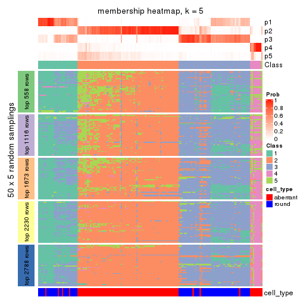</p>

</div>
<div id='tab-MAD-hclust-membership-heatmap-5'>
<pre><code class="r">membership_heatmap(res, k = 6)
</code></pre>

<p></p>

</div>
</div>

As soon as we have had the classes for columns, we can look for signatures
which are significantly different between classes which can be candidate marks
for certain classes. Following are the heatmaps for signatures.


Signature heatmaps where rows are scaled:


<script>
$( function() {
	$( '#tabs-MAD-hclust-get-signatures' ).tabs();
} );
</script>
<div id='tabs-MAD-hclust-get-signatures'>
<ul>
<li><a href='#tab-MAD-hclust-get-signatures-1'>k = 2</a></li>
<li><a href='#tab-MAD-hclust-get-signatures-2'>k = 3</a></li>
<li><a href='#tab-MAD-hclust-get-signatures-3'>k = 4</a></li>
<li><a href='#tab-MAD-hclust-get-signatures-4'>k = 5</a></li>
<li><a href='#tab-MAD-hclust-get-signatures-5'>k = 6</a></li>
</ul>
<div id='tab-MAD-hclust-get-signatures-1'>
<pre><code class="r">get_signatures(res, k = 2)
</code></pre>

<p></p>

</div>
<div id='tab-MAD-hclust-get-signatures-2'>
<pre><code class="r">get_signatures(res, k = 3)
</code></pre>

<p></p>

</div>
<div id='tab-MAD-hclust-get-signatures-3'>
<pre><code class="r">get_signatures(res, k = 4)
</code></pre>

<p></p>

</div>
<div id='tab-MAD-hclust-get-signatures-4'>
<pre><code class="r">get_signatures(res, k = 5)
</code></pre>

<p></p>

</div>
<div id='tab-MAD-hclust-get-signatures-5'>
<pre><code class="r">get_signatures(res, k = 6)
</code></pre>

<p></p>

</div>
</div>


Signature heatmaps where rows are not scaled:


<script>
$( function() {
	$( '#tabs-MAD-hclust-get-signatures-no-scale' ).tabs();
} );
</script>
<div id='tabs-MAD-hclust-get-signatures-no-scale'>
<ul>
<li><a href='#tab-MAD-hclust-get-signatures-no-scale-1'>k = 2</a></li>
<li><a href='#tab-MAD-hclust-get-signatures-no-scale-2'>k = 3</a></li>
<li><a href='#tab-MAD-hclust-get-signatures-no-scale-3'>k = 4</a></li>
<li><a href='#tab-MAD-hclust-get-signatures-no-scale-4'>k = 5</a></li>
<li><a href='#tab-MAD-hclust-get-signatures-no-scale-5'>k = 6</a></li>
</ul>
<div id='tab-MAD-hclust-get-signatures-no-scale-1'>
<pre><code class="r">get_signatures(res, k = 2, scale_rows = FALSE)
</code></pre>

<p></p>

</div>
<div id='tab-MAD-hclust-get-signatures-no-scale-2'>
<pre><code class="r">get_signatures(res, k = 3, scale_rows = FALSE)
</code></pre>

<p></p>

</div>
<div id='tab-MAD-hclust-get-signatures-no-scale-3'>
<pre><code class="r">get_signatures(res, k = 4, scale_rows = FALSE)
</code></pre>

<p>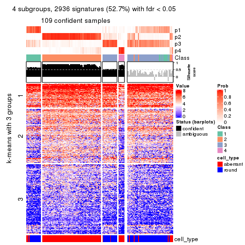</p>

</div>
<div id='tab-MAD-hclust-get-signatures-no-scale-4'>
<pre><code class="r">get_signatures(res, k = 5, scale_rows = FALSE)
</code></pre>

<p></p>

</div>
<div id='tab-MAD-hclust-get-signatures-no-scale-5'>
<pre><code class="r">get_signatures(res, k = 6, scale_rows = FALSE)
</code></pre>

<p></p>

</div>
</div>


Compare the overlap of signatures from different k:

```r
compare_signatures(res)
```


`get_signature()` returns a data frame invisibly. TO get the list of signatures, the function
call should be assigned to a variable explicitly. In following code, if `plot` argument is set
to `FALSE`, no heatmap is plotted while only the differential analysis is performed.

```r
# code only for demonstration
tb = get_signature(res, k = ..., plot = FALSE)
```

An example of the output of `tb` is:

```
#>   which_row         fdr    mean_1    mean_2 scaled_mean_1 scaled_mean_2 km
#> 1        38 0.042760348  8.373488  9.131774    -0.5533452     0.5164555  1
#> 2        40 0.018707592  7.106213  8.469186    -0.6173731     0.5762149  1
#> 3        55 0.019134737 10.221463 11.207825    -0.6159697     0.5749050  1
#> 4        59 0.006059896  5.921854  7.869574    -0.6899429     0.6439467  1
#> 5        60 0.018055526  8.928898 10.211722    -0.6204761     0.5791110  1
#> 6        98 0.009384629 15.714769 14.887706     0.6635654    -0.6193277  2
...
```

The columns in `tb` are:

1. `which_row`: row indices corresponding to the input matrix.
2. `fdr`: FDR for the differential test. 
3. `mean_x`: The mean value in group x.
4. `scaled_mean_x`: The mean value in group x after rows are scaled.
5. `km`: Row groups if k-means clustering is applied to rows.


UMAP plot which shows how samples are separated.


<script>
$( function() {
	$( '#tabs-MAD-hclust-dimension-reduction' ).tabs();
} );
</script>
<div id='tabs-MAD-hclust-dimension-reduction'>
<ul>
<li><a href='#tab-MAD-hclust-dimension-reduction-1'>k = 2</a></li>
<li><a href='#tab-MAD-hclust-dimension-reduction-2'>k = 3</a></li>
<li><a href='#tab-MAD-hclust-dimension-reduction-3'>k = 4</a></li>
<li><a href='#tab-MAD-hclust-dimension-reduction-4'>k = 5</a></li>
<li><a href='#tab-MAD-hclust-dimension-reduction-5'>k = 6</a></li>
</ul>
<div id='tab-MAD-hclust-dimension-reduction-1'>
<pre><code class="r">dimension_reduction(res, k = 2, method = &quot;UMAP&quot;)
</code></pre>

<p></p>

</div>
<div id='tab-MAD-hclust-dimension-reduction-2'>
<pre><code class="r">dimension_reduction(res, k = 3, method = &quot;UMAP&quot;)
</code></pre>

<p></p>

</div>
<div id='tab-MAD-hclust-dimension-reduction-3'>
<pre><code class="r">dimension_reduction(res, k = 4, method = &quot;UMAP&quot;)
</code></pre>

<p></p>

</div>
<div id='tab-MAD-hclust-dimension-reduction-4'>
<pre><code class="r">dimension_reduction(res, k = 5, method = &quot;UMAP&quot;)
</code></pre>

<p></p>

</div>
<div id='tab-MAD-hclust-dimension-reduction-5'>
<pre><code class="r">dimension_reduction(res, k = 6, method = &quot;UMAP&quot;)
</code></pre>

<p></p>

</div>
</div>


Following heatmap shows how subgroups are split when increasing `k`:

```r
collect_classes(res)
```


Test correlation between subgroups and known annotations. If the known
annotation is numeric, one-way ANOVA test is applied, and if the known
annotation is discrete, chi-squared contingency table test is applied.

```r
test_to_known_factors(res)
```

```
#>              n cell_type(p) k
#> MAD:hclust  99     7.49e-07 2
#> MAD:hclust 135     6.69e-26 3
#> MAD:hclust 109     8.28e-19 4
#> MAD:hclust  97     2.41e-17 5
#> MAD:hclust  97     1.78e-18 6
```


If matrix rows can be associated to genes, consider to use `GO_Enrichment(res,
...)` to perform function enrichment for the signature genes.


 

---------------------------------------------------


### MAD:kmeans


The object with results only for a single top-value method and a single partition method 
can be extracted as:

```r
res = res_list["MAD", "kmeans"]
# you can also extract it by
# res = res_list["MAD:kmeans"]
```

A summary of `res` and all the functions that can be applied to it:

```r
res
```

```
#> A 'ConsensusPartition' object with k = 2, 3, 4, 5, 6.
#>   On a matrix with 5576 rows and 160 columns.
#>   Top rows (558, 1116, 1673, 2230, 2788) are extracted by 'MAD' method.
#>   Subgroups are detected by 'kmeans' method.
#>   Performed in total 1250 partitions by row resampling.
#>   Best k for subgroups seems to be 2.
#> 
#> Following methods can be applied to this 'ConsensusPartition' object:
#>  [1] "cola_report"             "collect_classes"         "collect_plots"          
#>  [4] "collect_stats"           "colnames"                "compare_signatures"     
#>  [7] "consensus_heatmap"       "dimension_reduction"     "functional_enrichment"  
#> [10] "get_anno_col"            "get_anno"                "get_classes"            
#> [13] "get_consensus"           "get_matrix"              "get_membership"         
#> [16] "get_param"               "get_signatures"          "get_stats"              
#> [19] "is_best_k"               "is_stable_k"             "membership_heatmap"     
#> [22] "ncol"                    "nrow"                    "plot_ecdf"              
#> [25] "rownames"                "select_partition_number" "show"                   
#> [28] "suggest_best_k"          "test_to_known_factors"
```

`collect_plots()` function collects all the plots made from `res` for all `k` (number of partitions)
into one single page to provide an easy and fast comparison between different `k`.

```r
collect_plots(res)
```


The plots are:

- The first row: a plot of the ECDF (Empirical cumulative distribution
  function) curves of the consensus matrix for each `k` and the heatmap of
  predicted classes for each `k`.
- The second row: heatmaps of the consensus matrix for each `k`.
- The third row: heatmaps of the membership matrix for each `k`.
- The fouth row: heatmaps of the signatures for each `k`.

All the plots in panels can be made by individual functions and they are
plotted later in this section.

`select_partition_number()` produces several plots showing different
statistics for choosing "optimized" `k`. There are following statistics:

- ECDF curves of the consensus matrix for each `k`;
- 1-PAC. [The PAC
  score](https://en.wikipedia.org/wiki/Consensus_clustering#Over-interpretation_potential_of_consensus_clustering)
  measures the proportion of the ambiguous subgrouping.
- Mean silhouette score.
- Concordance. The mean probability of fiting the consensus class ids in all
  partitions.
- Area increased. Denote $A_k$ as the area under the ECDF curve for current
  `k`, the area increased is defined as $A_k - A_{k-1}$.
- Rand index. The percent of pairs of samples that are both in a same cluster
  or both are not in a same cluster in the partition of k and k-1.
- Jaccard index. The ratio of pairs of samples are both in a same cluster in
  the partition of k and k-1 and the pairs of samples are both in a same
  cluster in the partition k or k-1.

The detailed explanations of these statistics can be found in [the cola
vignette](http://bioconductor.org/packages/devel/bioc/vignettes/cola/inst/doc/cola.html#toc_13).

Generally speaking, lower PAC score, higher mean silhouette score or higher
concordance corresponds to better partition. Rand index and Jaccard index
measure how similar the current partition is compared to partition with `k-1`.
If they are too similar, we won't accept `k` is better than `k-1`.

```r
select_partition_number(res)
```


The numeric values for all these statistics can be obtained by `get_stats()`.

```r
get_stats(res)
```

```
#>   k 1-PAC mean_silhouette concordance area_increased  Rand Jaccard
#> 2 2 0.829           0.932       0.970         0.5013 0.500   0.500
#> 3 3 0.608           0.690       0.838         0.2554 0.804   0.635
#> 4 4 0.655           0.619       0.787         0.1249 0.855   0.634
#> 5 5 0.660           0.742       0.828         0.0748 0.892   0.643
#> 6 6 0.706           0.717       0.797         0.0433 0.917   0.673
```

`suggest_best_k()` suggests the best $k$ based on these statistics. The rules are as follows:

- All $k$ with Jaccard index larger than 0.95 are removed because the increase of
  the partition number does not provides enough extra information. If all $k$ are removed,
  the best $k$ is assigned by `NA`.
- For $k$ with 1-PAC larger than 0.9, the maximal $k$ is taken as the "best k". Other $k$ is called "optional k".
- If it does not fit the second rule. The $k$ with the highest vote of highest
  1-PAC, mean silhouette and concordance is taken as the "best k".

```r
suggest_best_k(res)
```

```
#> [1] 2
```


Following shows the table of the partitions (You need to click the **show/hide
code output** link to see it). The membership matrix (columns with name `p*`)
is inferred by
[`clue::cl_consensus()`](https://www.rdocumentation.org/link/cl_consensus?package=clue)
function with the `SE` method. Basically the value in the membership matrix
represents the probability to belong to a certain group. The finall class
label for an item is determined with the group with highest probability it
belongs to.

In `get_classes()` function, the entropy is calculated from the membership
matrix and the silhouette score is calculated from the consensus matrix.


<script>
$( function() {
	$( '#tabs-MAD-kmeans-get-classes' ).tabs();
} );
</script>
<div id='tabs-MAD-kmeans-get-classes'>
<ul>
<li><a href='#tab-MAD-kmeans-get-classes-1'>k = 2</a></li>
<li><a href='#tab-MAD-kmeans-get-classes-2'>k = 3</a></li>
<li><a href='#tab-MAD-kmeans-get-classes-3'>k = 4</a></li>
<li><a href='#tab-MAD-kmeans-get-classes-4'>k = 5</a></li>
<li><a href='#tab-MAD-kmeans-get-classes-5'>k = 6</a></li>
</ul>

<div id='tab-MAD-kmeans-get-classes-1'>
<p><a id='tab-MAD-kmeans-get-classes-1-a' style='color:#0366d6' href='#'>show/hide code output</a></p>
<pre><code class="r">cbind(get_classes(res, k = 2), get_membership(res, k = 2))
</code></pre>

<pre><code>#&gt;                     class entropy silhouette    p1    p2
#&gt; aberrant_ERR2585320     2  0.0000     0.9643 0.000 1.000
#&gt; aberrant_ERR2585338     2  0.0000     0.9643 0.000 1.000
#&gt; aberrant_ERR2585325     2  0.0000     0.9643 0.000 1.000
#&gt; aberrant_ERR2585283     1  0.5946     0.8345 0.856 0.144
#&gt; aberrant_ERR2585343     2  0.0000     0.9643 0.000 1.000
#&gt; aberrant_ERR2585329     2  0.0000     0.9643 0.000 1.000
#&gt; aberrant_ERR2585317     2  0.0000     0.9643 0.000 1.000
#&gt; aberrant_ERR2585339     2  0.0000     0.9643 0.000 1.000
#&gt; aberrant_ERR2585335     2  0.0000     0.9643 0.000 1.000
#&gt; aberrant_ERR2585287     2  0.7139     0.7474 0.196 0.804
#&gt; aberrant_ERR2585321     2  0.0000     0.9643 0.000 1.000
#&gt; aberrant_ERR2585297     1  0.0000     0.9730 1.000 0.000
#&gt; aberrant_ERR2585337     2  0.0000     0.9643 0.000 1.000
#&gt; aberrant_ERR2585319     2  0.0000     0.9643 0.000 1.000
#&gt; aberrant_ERR2585315     2  0.0000     0.9643 0.000 1.000
#&gt; aberrant_ERR2585336     2  0.0000     0.9643 0.000 1.000
#&gt; aberrant_ERR2585307     2  0.0000     0.9643 0.000 1.000
#&gt; aberrant_ERR2585301     2  0.0000     0.9643 0.000 1.000
#&gt; aberrant_ERR2585326     2  0.0000     0.9643 0.000 1.000
#&gt; aberrant_ERR2585331     2  0.0000     0.9643 0.000 1.000
#&gt; aberrant_ERR2585346     1  0.5737     0.8441 0.864 0.136
#&gt; aberrant_ERR2585314     2  0.0000     0.9643 0.000 1.000
#&gt; aberrant_ERR2585298     1  0.0000     0.9730 1.000 0.000
#&gt; aberrant_ERR2585345     2  0.0000     0.9643 0.000 1.000
#&gt; aberrant_ERR2585299     1  0.0000     0.9730 1.000 0.000
#&gt; aberrant_ERR2585309     1  0.0000     0.9730 1.000 0.000
#&gt; aberrant_ERR2585303     2  0.0000     0.9643 0.000 1.000
#&gt; aberrant_ERR2585313     2  0.0000     0.9643 0.000 1.000
#&gt; aberrant_ERR2585318     2  0.0000     0.9643 0.000 1.000
#&gt; aberrant_ERR2585328     2  0.0000     0.9643 0.000 1.000
#&gt; aberrant_ERR2585330     2  0.0000     0.9643 0.000 1.000
#&gt; aberrant_ERR2585293     1  0.5178     0.8667 0.884 0.116
#&gt; aberrant_ERR2585342     2  0.0000     0.9643 0.000 1.000
#&gt; aberrant_ERR2585348     2  0.0000     0.9643 0.000 1.000
#&gt; aberrant_ERR2585352     2  0.0000     0.9643 0.000 1.000
#&gt; aberrant_ERR2585308     1  0.0000     0.9730 1.000 0.000
#&gt; aberrant_ERR2585349     2  0.0000     0.9643 0.000 1.000
#&gt; aberrant_ERR2585316     2  0.9491     0.4079 0.368 0.632
#&gt; aberrant_ERR2585306     1  0.6438     0.8113 0.836 0.164
#&gt; aberrant_ERR2585324     2  0.0000     0.9643 0.000 1.000
#&gt; aberrant_ERR2585310     2  0.4939     0.8699 0.108 0.892
#&gt; aberrant_ERR2585296     2  0.9491     0.4618 0.368 0.632
#&gt; aberrant_ERR2585275     1  0.6148     0.8251 0.848 0.152
#&gt; aberrant_ERR2585311     2  0.0000     0.9643 0.000 1.000
#&gt; aberrant_ERR2585292     1  0.5178     0.8667 0.884 0.116
#&gt; aberrant_ERR2585282     2  0.0000     0.9643 0.000 1.000
#&gt; aberrant_ERR2585305     2  0.0000     0.9643 0.000 1.000
#&gt; aberrant_ERR2585278     2  0.0000     0.9643 0.000 1.000
#&gt; aberrant_ERR2585347     2  0.0000     0.9643 0.000 1.000
#&gt; aberrant_ERR2585332     2  0.0000     0.9643 0.000 1.000
#&gt; aberrant_ERR2585280     2  0.0000     0.9643 0.000 1.000
#&gt; aberrant_ERR2585304     2  0.0000     0.9643 0.000 1.000
#&gt; aberrant_ERR2585322     2  0.0000     0.9643 0.000 1.000
#&gt; aberrant_ERR2585279     2  0.0000     0.9643 0.000 1.000
#&gt; aberrant_ERR2585277     2  0.0000     0.9643 0.000 1.000
#&gt; aberrant_ERR2585295     2  0.0000     0.9643 0.000 1.000
#&gt; aberrant_ERR2585333     2  0.0000     0.9643 0.000 1.000
#&gt; aberrant_ERR2585285     2  0.0000     0.9643 0.000 1.000
#&gt; aberrant_ERR2585286     2  0.0000     0.9643 0.000 1.000
#&gt; aberrant_ERR2585294     2  0.0000     0.9643 0.000 1.000
#&gt; aberrant_ERR2585300     2  0.0000     0.9643 0.000 1.000
#&gt; aberrant_ERR2585334     2  0.0000     0.9643 0.000 1.000
#&gt; aberrant_ERR2585361     2  0.0000     0.9643 0.000 1.000
#&gt; aberrant_ERR2585372     2  0.0000     0.9643 0.000 1.000
#&gt; round_ERR2585217        2  0.9044     0.5663 0.320 0.680
#&gt; round_ERR2585205        1  0.0000     0.9730 1.000 0.000
#&gt; round_ERR2585214        2  0.7056     0.7715 0.192 0.808
#&gt; round_ERR2585202        2  0.1633     0.9452 0.024 0.976
#&gt; aberrant_ERR2585367     2  0.0000     0.9643 0.000 1.000
#&gt; round_ERR2585220        1  0.0000     0.9730 1.000 0.000
#&gt; round_ERR2585238        1  0.0000     0.9730 1.000 0.000
#&gt; aberrant_ERR2585276     2  0.0000     0.9643 0.000 1.000
#&gt; round_ERR2585218        1  0.0000     0.9730 1.000 0.000
#&gt; aberrant_ERR2585363     2  0.0000     0.9643 0.000 1.000
#&gt; round_ERR2585201        1  0.1633     0.9530 0.976 0.024
#&gt; round_ERR2585210        1  0.0000     0.9730 1.000 0.000
#&gt; aberrant_ERR2585362     2  0.0000     0.9643 0.000 1.000
#&gt; aberrant_ERR2585360     2  0.0000     0.9643 0.000 1.000
#&gt; round_ERR2585209        1  0.0000     0.9730 1.000 0.000
#&gt; round_ERR2585242        1  0.5946     0.8220 0.856 0.144
#&gt; round_ERR2585216        1  0.0000     0.9730 1.000 0.000
#&gt; round_ERR2585219        1  0.0000     0.9730 1.000 0.000
#&gt; round_ERR2585237        2  0.6148     0.8198 0.152 0.848
#&gt; round_ERR2585198        2  0.5842     0.8329 0.140 0.860
#&gt; round_ERR2585211        1  0.0000     0.9730 1.000 0.000
#&gt; round_ERR2585206        1  0.0000     0.9730 1.000 0.000
#&gt; aberrant_ERR2585281     2  0.0000     0.9643 0.000 1.000
#&gt; round_ERR2585212        1  0.0000     0.9730 1.000 0.000
#&gt; round_ERR2585221        1  0.0000     0.9730 1.000 0.000
#&gt; round_ERR2585243        1  0.0000     0.9730 1.000 0.000
#&gt; round_ERR2585204        2  0.4939     0.8672 0.108 0.892
#&gt; round_ERR2585213        2  0.0000     0.9643 0.000 1.000
#&gt; aberrant_ERR2585373     2  0.0000     0.9643 0.000 1.000
#&gt; aberrant_ERR2585358     2  0.0000     0.9643 0.000 1.000
#&gt; aberrant_ERR2585365     2  0.0000     0.9643 0.000 1.000
#&gt; aberrant_ERR2585359     2  0.0000     0.9643 0.000 1.000
#&gt; aberrant_ERR2585370     2  0.0000     0.9643 0.000 1.000
#&gt; round_ERR2585215        1  0.0000     0.9730 1.000 0.000
#&gt; round_ERR2585262        2  0.9087     0.5573 0.324 0.676
#&gt; round_ERR2585199        2  0.0376     0.9613 0.004 0.996
#&gt; aberrant_ERR2585369     2  0.0000     0.9643 0.000 1.000
#&gt; round_ERR2585208        1  0.0000     0.9730 1.000 0.000
#&gt; round_ERR2585252        1  0.0000     0.9730 1.000 0.000
#&gt; round_ERR2585236        1  0.0000     0.9730 1.000 0.000
#&gt; aberrant_ERR2585284     1  0.5408     0.8579 0.876 0.124
#&gt; round_ERR2585224        1  0.0000     0.9730 1.000 0.000
#&gt; round_ERR2585260        1  0.0000     0.9730 1.000 0.000
#&gt; round_ERR2585229        1  0.0000     0.9730 1.000 0.000
#&gt; aberrant_ERR2585364     1  0.8499     0.6363 0.724 0.276
#&gt; round_ERR2585253        1  0.0000     0.9730 1.000 0.000
#&gt; aberrant_ERR2585368     2  0.0000     0.9643 0.000 1.000
#&gt; aberrant_ERR2585371     2  0.0000     0.9643 0.000 1.000
#&gt; round_ERR2585239        1  0.0000     0.9730 1.000 0.000
#&gt; round_ERR2585273        1  0.0000     0.9730 1.000 0.000
#&gt; round_ERR2585256        1  0.0376     0.9699 0.996 0.004
#&gt; round_ERR2585272        1  0.0000     0.9730 1.000 0.000
#&gt; round_ERR2585246        1  0.0000     0.9730 1.000 0.000
#&gt; round_ERR2585261        1  0.9954     0.0859 0.540 0.460
#&gt; round_ERR2585254        2  0.9286     0.5163 0.344 0.656
#&gt; round_ERR2585225        1  0.0000     0.9730 1.000 0.000
#&gt; round_ERR2585235        1  0.0000     0.9730 1.000 0.000
#&gt; round_ERR2585271        1  0.0000     0.9730 1.000 0.000
#&gt; round_ERR2585251        1  0.0000     0.9730 1.000 0.000
#&gt; round_ERR2585255        1  0.0000     0.9730 1.000 0.000
#&gt; round_ERR2585257        1  0.0376     0.9699 0.996 0.004
#&gt; round_ERR2585226        1  0.0000     0.9730 1.000 0.000
#&gt; round_ERR2585265        1  0.0000     0.9730 1.000 0.000
#&gt; round_ERR2585259        1  0.0000     0.9730 1.000 0.000
#&gt; round_ERR2585247        1  0.0000     0.9730 1.000 0.000
#&gt; round_ERR2585241        1  0.0000     0.9730 1.000 0.000
#&gt; round_ERR2585263        1  0.0000     0.9730 1.000 0.000
#&gt; round_ERR2585264        1  0.0000     0.9730 1.000 0.000
#&gt; round_ERR2585233        1  0.0000     0.9730 1.000 0.000
#&gt; round_ERR2585223        1  0.0000     0.9730 1.000 0.000
#&gt; round_ERR2585234        2  0.8386     0.6609 0.268 0.732
#&gt; round_ERR2585222        1  0.0000     0.9730 1.000 0.000
#&gt; round_ERR2585228        1  0.0000     0.9730 1.000 0.000
#&gt; round_ERR2585248        1  0.0000     0.9730 1.000 0.000
#&gt; round_ERR2585240        1  0.0000     0.9730 1.000 0.000
#&gt; round_ERR2585270        1  0.0000     0.9730 1.000 0.000
#&gt; round_ERR2585232        1  0.0000     0.9730 1.000 0.000
#&gt; aberrant_ERR2585341     2  0.0000     0.9643 0.000 1.000
#&gt; aberrant_ERR2585355     2  0.0000     0.9643 0.000 1.000
#&gt; round_ERR2585227        1  0.0000     0.9730 1.000 0.000
#&gt; aberrant_ERR2585351     2  0.0000     0.9643 0.000 1.000
#&gt; round_ERR2585269        1  0.0000     0.9730 1.000 0.000
#&gt; aberrant_ERR2585357     2  0.0000     0.9643 0.000 1.000
#&gt; aberrant_ERR2585350     2  0.0000     0.9643 0.000 1.000
#&gt; round_ERR2585250        1  0.0000     0.9730 1.000 0.000
#&gt; round_ERR2585245        1  0.0000     0.9730 1.000 0.000
#&gt; aberrant_ERR2585353     2  0.0000     0.9643 0.000 1.000
#&gt; round_ERR2585258        1  0.0000     0.9730 1.000 0.000
#&gt; aberrant_ERR2585354     2  0.0000     0.9643 0.000 1.000
#&gt; round_ERR2585249        1  0.0000     0.9730 1.000 0.000
#&gt; round_ERR2585268        1  0.0000     0.9730 1.000 0.000
#&gt; aberrant_ERR2585356     2  0.1184     0.9515 0.016 0.984
#&gt; round_ERR2585266        1  0.0000     0.9730 1.000 0.000
#&gt; round_ERR2585231        1  0.0000     0.9730 1.000 0.000
#&gt; round_ERR2585230        1  0.0000     0.9730 1.000 0.000
#&gt; round_ERR2585267        1  0.0000     0.9730 1.000 0.000
</code></pre>

<script>
$('#tab-MAD-kmeans-get-classes-1-a').parent().next().next().hide();
$('#tab-MAD-kmeans-get-classes-1-a').click(function(){
  $('#tab-MAD-kmeans-get-classes-1-a').parent().next().next().toggle();
  return(false);
});
</script>
</div>

<div id='tab-MAD-kmeans-get-classes-2'>
<p><a id='tab-MAD-kmeans-get-classes-2-a' style='color:#0366d6' href='#'>show/hide code output</a></p>
<pre><code class="r">cbind(get_classes(res, k = 3), get_membership(res, k = 3))
</code></pre>

<pre><code>#&gt;                     class entropy silhouette    p1    p2    p3
#&gt; aberrant_ERR2585320     2  0.5621     0.3908 0.000 0.692 0.308
#&gt; aberrant_ERR2585338     2  0.0000     0.7828 0.000 1.000 0.000
#&gt; aberrant_ERR2585325     2  0.5621     0.3908 0.000 0.692 0.308
#&gt; aberrant_ERR2585283     3  0.0000     0.6236 0.000 0.000 1.000
#&gt; aberrant_ERR2585343     3  0.6045     0.6334 0.000 0.380 0.620
#&gt; aberrant_ERR2585329     2  0.0000     0.7828 0.000 1.000 0.000
#&gt; aberrant_ERR2585317     2  0.0000     0.7828 0.000 1.000 0.000
#&gt; aberrant_ERR2585339     2  0.0000     0.7828 0.000 1.000 0.000
#&gt; aberrant_ERR2585335     2  0.0747     0.7778 0.000 0.984 0.016
#&gt; aberrant_ERR2585287     3  0.3192     0.6453 0.000 0.112 0.888
#&gt; aberrant_ERR2585321     3  0.6215     0.5760 0.000 0.428 0.572
#&gt; aberrant_ERR2585297     1  0.4796     0.8403 0.780 0.000 0.220
#&gt; aberrant_ERR2585337     2  0.0000     0.7828 0.000 1.000 0.000
#&gt; aberrant_ERR2585319     2  0.2537     0.7427 0.000 0.920 0.080
#&gt; aberrant_ERR2585315     2  0.0000     0.7828 0.000 1.000 0.000
#&gt; aberrant_ERR2585336     2  0.0000     0.7828 0.000 1.000 0.000
#&gt; aberrant_ERR2585307     2  0.0000     0.7828 0.000 1.000 0.000
#&gt; aberrant_ERR2585301     2  0.3816     0.6807 0.000 0.852 0.148
#&gt; aberrant_ERR2585326     2  0.0000     0.7828 0.000 1.000 0.000
#&gt; aberrant_ERR2585331     2  0.0000     0.7828 0.000 1.000 0.000
#&gt; aberrant_ERR2585346     3  0.0000     0.6236 0.000 0.000 1.000
#&gt; aberrant_ERR2585314     2  0.0000     0.7828 0.000 1.000 0.000
#&gt; aberrant_ERR2585298     1  0.1163     0.8438 0.972 0.028 0.000
#&gt; aberrant_ERR2585345     2  0.0000     0.7828 0.000 1.000 0.000
#&gt; aberrant_ERR2585299     1  0.4555     0.8480 0.800 0.000 0.200
#&gt; aberrant_ERR2585309     1  0.4842     0.8383 0.776 0.000 0.224
#&gt; aberrant_ERR2585303     2  0.1643     0.7640 0.000 0.956 0.044
#&gt; aberrant_ERR2585313     2  0.0000     0.7828 0.000 1.000 0.000
#&gt; aberrant_ERR2585318     2  0.5138     0.5232 0.000 0.748 0.252
#&gt; aberrant_ERR2585328     2  0.6307    -0.3494 0.000 0.512 0.488
#&gt; aberrant_ERR2585330     2  0.4062     0.6614 0.000 0.836 0.164
#&gt; aberrant_ERR2585293     3  0.0000     0.6236 0.000 0.000 1.000
#&gt; aberrant_ERR2585342     2  0.5882     0.2725 0.000 0.652 0.348
#&gt; aberrant_ERR2585348     3  0.6192     0.5909 0.000 0.420 0.580
#&gt; aberrant_ERR2585352     2  0.0237     0.7817 0.000 0.996 0.004
#&gt; aberrant_ERR2585308     1  0.4842     0.8383 0.776 0.000 0.224
#&gt; aberrant_ERR2585349     2  0.0592     0.7752 0.012 0.988 0.000
#&gt; aberrant_ERR2585316     3  0.3267     0.6461 0.000 0.116 0.884
#&gt; aberrant_ERR2585306     3  0.5085     0.5993 0.072 0.092 0.836
#&gt; aberrant_ERR2585324     2  0.2537     0.7427 0.000 0.920 0.080
#&gt; aberrant_ERR2585310     2  0.5706     0.4256 0.320 0.680 0.000
#&gt; aberrant_ERR2585296     1  0.5497     0.5218 0.708 0.292 0.000
#&gt; aberrant_ERR2585275     3  0.0000     0.6236 0.000 0.000 1.000
#&gt; aberrant_ERR2585311     3  0.6309     0.3697 0.000 0.496 0.504
#&gt; aberrant_ERR2585292     3  0.0000     0.6236 0.000 0.000 1.000
#&gt; aberrant_ERR2585282     3  0.6180     0.5970 0.000 0.416 0.584
#&gt; aberrant_ERR2585305     2  0.4654     0.5994 0.000 0.792 0.208
#&gt; aberrant_ERR2585278     2  0.2625     0.7398 0.000 0.916 0.084
#&gt; aberrant_ERR2585347     3  0.6026     0.6352 0.000 0.376 0.624
#&gt; aberrant_ERR2585332     3  0.6111     0.6203 0.000 0.396 0.604
#&gt; aberrant_ERR2585280     2  0.5650     0.3852 0.000 0.688 0.312
#&gt; aberrant_ERR2585304     2  0.1753     0.7444 0.048 0.952 0.000
#&gt; aberrant_ERR2585322     2  0.0000     0.7828 0.000 1.000 0.000
#&gt; aberrant_ERR2585279     2  0.0424     0.7779 0.008 0.992 0.000
#&gt; aberrant_ERR2585277     2  0.0000     0.7828 0.000 1.000 0.000
#&gt; aberrant_ERR2585295     3  0.6235     0.5584 0.000 0.436 0.564
#&gt; aberrant_ERR2585333     3  0.6192     0.5910 0.000 0.420 0.580
#&gt; aberrant_ERR2585285     2  0.3941     0.6727 0.000 0.844 0.156
#&gt; aberrant_ERR2585286     2  0.0000     0.7828 0.000 1.000 0.000
#&gt; aberrant_ERR2585294     2  0.4654     0.6008 0.000 0.792 0.208
#&gt; aberrant_ERR2585300     3  0.6008     0.6369 0.000 0.372 0.628
#&gt; aberrant_ERR2585334     2  0.0000     0.7828 0.000 1.000 0.000
#&gt; aberrant_ERR2585361     2  0.6026     0.1507 0.000 0.624 0.376
#&gt; aberrant_ERR2585372     2  0.6274    -0.2169 0.000 0.544 0.456
#&gt; round_ERR2585217        1  0.6267     0.1020 0.548 0.452 0.000
#&gt; round_ERR2585205        1  0.4452     0.8505 0.808 0.000 0.192
#&gt; round_ERR2585214        2  0.4974     0.5376 0.236 0.764 0.000
#&gt; round_ERR2585202        2  0.4842     0.5531 0.224 0.776 0.000
#&gt; aberrant_ERR2585367     2  0.5733     0.3414 0.000 0.676 0.324
#&gt; round_ERR2585220        1  0.0000     0.8571 1.000 0.000 0.000
#&gt; round_ERR2585238        1  0.4504     0.8493 0.804 0.000 0.196
#&gt; aberrant_ERR2585276     2  0.5760     0.3393 0.000 0.672 0.328
#&gt; round_ERR2585218        1  0.4605     0.8465 0.796 0.000 0.204
#&gt; aberrant_ERR2585363     2  0.1163     0.7733 0.000 0.972 0.028
#&gt; round_ERR2585201        1  0.1860     0.8274 0.948 0.052 0.000
#&gt; round_ERR2585210        1  0.4235     0.8543 0.824 0.000 0.176
#&gt; aberrant_ERR2585362     2  0.5905     0.2485 0.000 0.648 0.352
#&gt; aberrant_ERR2585360     2  0.6008     0.1841 0.000 0.628 0.372
#&gt; round_ERR2585209        1  0.0000     0.8571 1.000 0.000 0.000
#&gt; round_ERR2585242        1  0.3551     0.7501 0.868 0.132 0.000
#&gt; round_ERR2585216        1  0.0000     0.8571 1.000 0.000 0.000
#&gt; round_ERR2585219        1  0.1529     0.8636 0.960 0.000 0.040
#&gt; round_ERR2585237        2  0.4931     0.5430 0.232 0.768 0.000
#&gt; round_ERR2585198        2  0.4931     0.5430 0.232 0.768 0.000
#&gt; round_ERR2585211        1  0.4842     0.8383 0.776 0.000 0.224
#&gt; round_ERR2585206        1  0.4702     0.8436 0.788 0.000 0.212
#&gt; aberrant_ERR2585281     2  0.3340     0.7012 0.000 0.880 0.120
#&gt; round_ERR2585212        1  0.0000     0.8571 1.000 0.000 0.000
#&gt; round_ERR2585221        1  0.4842     0.8383 0.776 0.000 0.224
#&gt; round_ERR2585243        1  0.4346     0.8527 0.816 0.000 0.184
#&gt; round_ERR2585204        2  0.4887     0.5482 0.228 0.772 0.000
#&gt; round_ERR2585213        2  0.4750     0.5623 0.216 0.784 0.000
#&gt; aberrant_ERR2585373     3  0.6235     0.5582 0.000 0.436 0.564
#&gt; aberrant_ERR2585358     3  0.6154     0.6073 0.000 0.408 0.592
#&gt; aberrant_ERR2585365     2  0.1163     0.7729 0.000 0.972 0.028
#&gt; aberrant_ERR2585359     3  0.6045     0.6334 0.000 0.380 0.620
#&gt; aberrant_ERR2585370     2  0.0000     0.7828 0.000 1.000 0.000
#&gt; round_ERR2585215        1  0.4842     0.8383 0.776 0.000 0.224
#&gt; round_ERR2585262        1  0.7075    -0.1509 0.492 0.488 0.020
#&gt; round_ERR2585199        2  0.4842     0.5531 0.224 0.776 0.000
#&gt; aberrant_ERR2585369     2  0.5785     0.3263 0.000 0.668 0.332
#&gt; round_ERR2585208        1  0.4750     0.8420 0.784 0.000 0.216
#&gt; round_ERR2585252        1  0.4796     0.8404 0.780 0.000 0.220
#&gt; round_ERR2585236        1  0.3116     0.8647 0.892 0.000 0.108
#&gt; aberrant_ERR2585284     3  0.0000     0.6236 0.000 0.000 1.000
#&gt; round_ERR2585224        1  0.4887     0.8361 0.772 0.000 0.228
#&gt; round_ERR2585260        1  0.1964     0.8646 0.944 0.000 0.056
#&gt; round_ERR2585229        1  0.4702     0.8436 0.788 0.000 0.212
#&gt; aberrant_ERR2585364     3  0.0000     0.6236 0.000 0.000 1.000
#&gt; round_ERR2585253        1  0.4842     0.8383 0.776 0.000 0.224
#&gt; aberrant_ERR2585368     2  0.0000     0.7828 0.000 1.000 0.000
#&gt; aberrant_ERR2585371     2  0.0000     0.7828 0.000 1.000 0.000
#&gt; round_ERR2585239        1  0.2537     0.8654 0.920 0.000 0.080
#&gt; round_ERR2585273        1  0.1860     0.8647 0.948 0.000 0.052
#&gt; round_ERR2585256        1  0.0237     0.8556 0.996 0.004 0.000
#&gt; round_ERR2585272        1  0.1529     0.8637 0.960 0.000 0.040
#&gt; round_ERR2585246        1  0.4702     0.8436 0.788 0.000 0.212
#&gt; round_ERR2585261        1  0.4974     0.6185 0.764 0.236 0.000
#&gt; round_ERR2585254        1  0.6008     0.3545 0.628 0.372 0.000
#&gt; round_ERR2585225        1  0.0747     0.8501 0.984 0.016 0.000
#&gt; round_ERR2585235        1  0.3879     0.8588 0.848 0.000 0.152
#&gt; round_ERR2585271        1  0.3038     0.8647 0.896 0.000 0.104
#&gt; round_ERR2585251        1  0.0000     0.8571 1.000 0.000 0.000
#&gt; round_ERR2585255        1  0.0747     0.8501 0.984 0.016 0.000
#&gt; round_ERR2585257        1  0.1163     0.8438 0.972 0.028 0.000
#&gt; round_ERR2585226        1  0.0000     0.8571 1.000 0.000 0.000
#&gt; round_ERR2585265        1  0.0000     0.8571 1.000 0.000 0.000
#&gt; round_ERR2585259        1  0.0237     0.8581 0.996 0.000 0.004
#&gt; round_ERR2585247        1  0.4235     0.8547 0.824 0.000 0.176
#&gt; round_ERR2585241        1  0.4555     0.8481 0.800 0.000 0.200
#&gt; round_ERR2585263        1  0.0000     0.8571 1.000 0.000 0.000
#&gt; round_ERR2585264        1  0.4931     0.8340 0.768 0.000 0.232
#&gt; round_ERR2585233        1  0.0000     0.8571 1.000 0.000 0.000
#&gt; round_ERR2585223        1  0.3267     0.8635 0.884 0.000 0.116
#&gt; round_ERR2585234        1  0.6307     0.0384 0.512 0.488 0.000
#&gt; round_ERR2585222        1  0.1289     0.8627 0.968 0.000 0.032
#&gt; round_ERR2585228        1  0.2878     0.8654 0.904 0.000 0.096
#&gt; round_ERR2585248        1  0.4931     0.8340 0.768 0.000 0.232
#&gt; round_ERR2585240        1  0.0000     0.8571 1.000 0.000 0.000
#&gt; round_ERR2585270        1  0.0237     0.8581 0.996 0.000 0.004
#&gt; round_ERR2585232        1  0.0000     0.8571 1.000 0.000 0.000
#&gt; aberrant_ERR2585341     2  0.2261     0.7504 0.000 0.932 0.068
#&gt; aberrant_ERR2585355     2  0.0000     0.7828 0.000 1.000 0.000
#&gt; round_ERR2585227        1  0.0000     0.8571 1.000 0.000 0.000
#&gt; aberrant_ERR2585351     2  0.3941     0.6716 0.000 0.844 0.156
#&gt; round_ERR2585269        1  0.4842     0.8383 0.776 0.000 0.224
#&gt; aberrant_ERR2585357     2  0.0000     0.7828 0.000 1.000 0.000
#&gt; aberrant_ERR2585350     2  0.0000     0.7828 0.000 1.000 0.000
#&gt; round_ERR2585250        1  0.0424     0.8588 0.992 0.000 0.008
#&gt; round_ERR2585245        1  0.4887     0.8361 0.772 0.000 0.228
#&gt; aberrant_ERR2585353     3  0.6244     0.5489 0.000 0.440 0.560
#&gt; round_ERR2585258        1  0.0000     0.8571 1.000 0.000 0.000
#&gt; aberrant_ERR2585354     2  0.6308    -0.3604 0.000 0.508 0.492
#&gt; round_ERR2585249        1  0.4842     0.8383 0.776 0.000 0.224
#&gt; round_ERR2585268        1  0.0000     0.8571 1.000 0.000 0.000
#&gt; aberrant_ERR2585356     3  0.5882     0.6418 0.000 0.348 0.652
#&gt; round_ERR2585266        1  0.0892     0.8481 0.980 0.020 0.000
#&gt; round_ERR2585231        1  0.4887     0.8361 0.772 0.000 0.228
#&gt; round_ERR2585230        1  0.2711     0.8659 0.912 0.000 0.088
#&gt; round_ERR2585267        1  0.4796     0.8404 0.780 0.000 0.220
</code></pre>

<script>
$('#tab-MAD-kmeans-get-classes-2-a').parent().next().next().hide();
$('#tab-MAD-kmeans-get-classes-2-a').click(function(){
  $('#tab-MAD-kmeans-get-classes-2-a').parent().next().next().toggle();
  return(false);
});
</script>
</div>

<div id='tab-MAD-kmeans-get-classes-3'>
<p><a id='tab-MAD-kmeans-get-classes-3-a' style='color:#0366d6' href='#'>show/hide code output</a></p>
<pre><code class="r">cbind(get_classes(res, k = 4), get_membership(res, k = 4))
</code></pre>

<pre><code>#&gt;                     class entropy silhouette    p1    p2    p3    p4
#&gt; aberrant_ERR2585320     2  0.7301     0.2568 0.000 0.484 0.356 0.160
#&gt; aberrant_ERR2585338     2  0.0000     0.6843 0.000 1.000 0.000 0.000
#&gt; aberrant_ERR2585325     2  0.7301     0.2568 0.000 0.484 0.356 0.160
#&gt; aberrant_ERR2585283     4  0.0188     0.5576 0.004 0.000 0.000 0.996
#&gt; aberrant_ERR2585343     4  0.7375     0.6069 0.000 0.172 0.348 0.480
#&gt; aberrant_ERR2585329     2  0.0000     0.6843 0.000 1.000 0.000 0.000
#&gt; aberrant_ERR2585317     2  0.0000     0.6843 0.000 1.000 0.000 0.000
#&gt; aberrant_ERR2585339     2  0.0469     0.6845 0.000 0.988 0.012 0.000
#&gt; aberrant_ERR2585335     2  0.2081     0.6733 0.000 0.916 0.084 0.000
#&gt; aberrant_ERR2585287     4  0.0657     0.5613 0.004 0.000 0.012 0.984
#&gt; aberrant_ERR2585321     4  0.7901     0.4102 0.000 0.296 0.348 0.356
#&gt; aberrant_ERR2585297     1  0.0188     0.9033 0.996 0.000 0.000 0.004
#&gt; aberrant_ERR2585337     2  0.0000     0.6843 0.000 1.000 0.000 0.000
#&gt; aberrant_ERR2585319     2  0.3853     0.6417 0.000 0.820 0.160 0.020
#&gt; aberrant_ERR2585315     2  0.1637     0.6786 0.000 0.940 0.060 0.000
#&gt; aberrant_ERR2585336     2  0.0000     0.6843 0.000 1.000 0.000 0.000
#&gt; aberrant_ERR2585307     2  0.0000     0.6843 0.000 1.000 0.000 0.000
#&gt; aberrant_ERR2585301     2  0.6627     0.4090 0.000 0.556 0.348 0.096
#&gt; aberrant_ERR2585326     2  0.0000     0.6843 0.000 1.000 0.000 0.000
#&gt; aberrant_ERR2585331     2  0.0336     0.6783 0.000 0.992 0.008 0.000
#&gt; aberrant_ERR2585346     4  0.0188     0.5576 0.004 0.000 0.000 0.996
#&gt; aberrant_ERR2585314     2  0.0000     0.6843 0.000 1.000 0.000 0.000
#&gt; aberrant_ERR2585298     3  0.5639     0.6611 0.324 0.040 0.636 0.000
#&gt; aberrant_ERR2585345     2  0.0000     0.6843 0.000 1.000 0.000 0.000
#&gt; aberrant_ERR2585299     1  0.0188     0.9035 0.996 0.000 0.004 0.000
#&gt; aberrant_ERR2585309     1  0.0469     0.9001 0.988 0.000 0.000 0.012
#&gt; aberrant_ERR2585303     2  0.4477     0.5538 0.000 0.688 0.312 0.000
#&gt; aberrant_ERR2585313     2  0.0188     0.6847 0.000 0.996 0.004 0.000
#&gt; aberrant_ERR2585318     2  0.7314     0.2674 0.000 0.488 0.348 0.164
#&gt; aberrant_ERR2585328     2  0.7836    -0.1137 0.000 0.388 0.348 0.264
#&gt; aberrant_ERR2585330     2  0.5973     0.4865 0.000 0.612 0.332 0.056
#&gt; aberrant_ERR2585293     4  0.0376     0.5561 0.004 0.000 0.004 0.992
#&gt; aberrant_ERR2585342     2  0.7108     0.3287 0.000 0.512 0.348 0.140
#&gt; aberrant_ERR2585348     4  0.7756     0.5392 0.000 0.240 0.348 0.412
#&gt; aberrant_ERR2585352     2  0.3074     0.6533 0.000 0.848 0.152 0.000
#&gt; aberrant_ERR2585308     1  0.0336     0.9020 0.992 0.000 0.000 0.008
#&gt; aberrant_ERR2585349     2  0.2011     0.6175 0.000 0.920 0.080 0.000
#&gt; aberrant_ERR2585316     4  0.4744     0.6058 0.000 0.012 0.284 0.704
#&gt; aberrant_ERR2585306     4  0.8540     0.5525 0.160 0.056 0.348 0.436
#&gt; aberrant_ERR2585324     2  0.3853     0.6417 0.000 0.820 0.160 0.020
#&gt; aberrant_ERR2585310     3  0.5708     0.5471 0.028 0.416 0.556 0.000
#&gt; aberrant_ERR2585296     3  0.6492     0.7021 0.144 0.220 0.636 0.000
#&gt; aberrant_ERR2585275     4  0.0524     0.5603 0.004 0.000 0.008 0.988
#&gt; aberrant_ERR2585311     2  0.7824    -0.0925 0.000 0.392 0.348 0.260
#&gt; aberrant_ERR2585292     4  0.0376     0.5561 0.004 0.000 0.004 0.992
#&gt; aberrant_ERR2585282     4  0.7785     0.5252 0.000 0.248 0.348 0.404
#&gt; aberrant_ERR2585305     2  0.7031     0.3446 0.000 0.520 0.348 0.132
#&gt; aberrant_ERR2585278     2  0.2676     0.6685 0.000 0.896 0.092 0.012
#&gt; aberrant_ERR2585347     4  0.7385     0.6073 0.000 0.176 0.340 0.484
#&gt; aberrant_ERR2585332     4  0.7628     0.5769 0.000 0.212 0.348 0.440
#&gt; aberrant_ERR2585280     2  0.7070     0.3357 0.000 0.516 0.348 0.136
#&gt; aberrant_ERR2585304     2  0.1637     0.6331 0.000 0.940 0.060 0.000
#&gt; aberrant_ERR2585322     2  0.0921     0.6833 0.000 0.972 0.028 0.000
#&gt; aberrant_ERR2585279     2  0.1302     0.6449 0.000 0.956 0.044 0.000
#&gt; aberrant_ERR2585277     2  0.0000     0.6843 0.000 1.000 0.000 0.000
#&gt; aberrant_ERR2585295     4  0.7889     0.4346 0.000 0.288 0.348 0.364
#&gt; aberrant_ERR2585333     4  0.7740     0.5447 0.000 0.236 0.348 0.416
#&gt; aberrant_ERR2585285     2  0.5823     0.4811 0.000 0.608 0.348 0.044
#&gt; aberrant_ERR2585286     2  0.0000     0.6843 0.000 1.000 0.000 0.000
#&gt; aberrant_ERR2585294     2  0.7031     0.3448 0.000 0.520 0.348 0.132
#&gt; aberrant_ERR2585300     4  0.7606     0.5810 0.000 0.208 0.348 0.444
#&gt; aberrant_ERR2585334     2  0.0336     0.6783 0.000 0.992 0.008 0.000
#&gt; aberrant_ERR2585361     2  0.6663     0.4008 0.000 0.556 0.344 0.100
#&gt; aberrant_ERR2585372     2  0.7740     0.0178 0.000 0.416 0.348 0.236
#&gt; round_ERR2585217        3  0.5698     0.6807 0.044 0.320 0.636 0.000
#&gt; round_ERR2585205        1  0.0188     0.9035 0.996 0.000 0.004 0.000
#&gt; round_ERR2585214        3  0.5007     0.6475 0.008 0.356 0.636 0.000
#&gt; round_ERR2585202        3  0.4889     0.6436 0.004 0.360 0.636 0.000
#&gt; aberrant_ERR2585367     2  0.5898     0.4749 0.000 0.604 0.348 0.048
#&gt; round_ERR2585220        1  0.4961    -0.1606 0.552 0.000 0.448 0.000
#&gt; round_ERR2585238        1  0.0000     0.9042 1.000 0.000 0.000 0.000
#&gt; aberrant_ERR2585276     2  0.7314     0.2695 0.000 0.488 0.348 0.164
#&gt; round_ERR2585218        1  0.0000     0.9042 1.000 0.000 0.000 0.000
#&gt; aberrant_ERR2585363     2  0.4008     0.6058 0.000 0.756 0.244 0.000
#&gt; round_ERR2585201        3  0.6350     0.6873 0.252 0.112 0.636 0.000
#&gt; round_ERR2585210        1  0.0000     0.9042 1.000 0.000 0.000 0.000
#&gt; aberrant_ERR2585362     2  0.7180     0.3058 0.000 0.504 0.348 0.148
#&gt; aberrant_ERR2585360     2  0.7432     0.2204 0.000 0.472 0.348 0.180
#&gt; round_ERR2585209        3  0.4889     0.6351 0.360 0.004 0.636 0.000
#&gt; round_ERR2585242        3  0.6523     0.6969 0.208 0.156 0.636 0.000
#&gt; round_ERR2585216        1  0.4679     0.2433 0.648 0.000 0.352 0.000
#&gt; round_ERR2585219        1  0.2704     0.7716 0.876 0.000 0.124 0.000
#&gt; round_ERR2585237        3  0.4889     0.6434 0.004 0.360 0.636 0.000
#&gt; round_ERR2585198        3  0.4730     0.6388 0.000 0.364 0.636 0.000
#&gt; round_ERR2585211        1  0.0000     0.9042 1.000 0.000 0.000 0.000
#&gt; round_ERR2585206        1  0.0000     0.9042 1.000 0.000 0.000 0.000
#&gt; aberrant_ERR2585281     2  0.4795     0.5575 0.000 0.696 0.292 0.012
#&gt; round_ERR2585212        3  0.4888     0.5550 0.412 0.000 0.588 0.000
#&gt; round_ERR2585221        1  0.0188     0.9033 0.996 0.000 0.000 0.004
#&gt; round_ERR2585243        1  0.0000     0.9042 1.000 0.000 0.000 0.000
#&gt; round_ERR2585204        3  0.4730     0.6388 0.000 0.364 0.636 0.000
#&gt; round_ERR2585213        3  0.4776     0.6252 0.000 0.376 0.624 0.000
#&gt; aberrant_ERR2585373     4  0.7836     0.4919 0.000 0.264 0.348 0.388
#&gt; aberrant_ERR2585358     4  0.7628     0.5771 0.000 0.212 0.348 0.440
#&gt; aberrant_ERR2585365     2  0.4477     0.5532 0.000 0.688 0.312 0.000
#&gt; aberrant_ERR2585359     4  0.7345     0.6094 0.000 0.172 0.336 0.492
#&gt; aberrant_ERR2585370     2  0.0000     0.6843 0.000 1.000 0.000 0.000
#&gt; round_ERR2585215        1  0.0188     0.9033 0.996 0.000 0.000 0.004
#&gt; round_ERR2585262        3  0.4417     0.5801 0.084 0.092 0.820 0.004
#&gt; round_ERR2585199        3  0.4843     0.6020 0.000 0.396 0.604 0.000
#&gt; aberrant_ERR2585369     2  0.6949     0.3599 0.000 0.528 0.348 0.124
#&gt; round_ERR2585208        1  0.0000     0.9042 1.000 0.000 0.000 0.000
#&gt; round_ERR2585252        1  0.0469     0.9001 0.988 0.000 0.000 0.012
#&gt; round_ERR2585236        1  0.2053     0.8381 0.924 0.000 0.072 0.004
#&gt; aberrant_ERR2585284     4  0.0188     0.5576 0.004 0.000 0.000 0.996
#&gt; round_ERR2585224        1  0.0469     0.9001 0.988 0.000 0.000 0.012
#&gt; round_ERR2585260        1  0.0336     0.9018 0.992 0.000 0.008 0.000
#&gt; round_ERR2585229        1  0.0000     0.9042 1.000 0.000 0.000 0.000
#&gt; aberrant_ERR2585364     4  0.2593     0.5795 0.004 0.000 0.104 0.892
#&gt; round_ERR2585253        1  0.0469     0.9001 0.988 0.000 0.000 0.012
#&gt; aberrant_ERR2585368     2  0.0336     0.6795 0.000 0.992 0.008 0.000
#&gt; aberrant_ERR2585371     2  0.0336     0.6795 0.000 0.992 0.008 0.000
#&gt; round_ERR2585239        1  0.0817     0.8913 0.976 0.000 0.024 0.000
#&gt; round_ERR2585273        1  0.1302     0.8723 0.956 0.000 0.044 0.000
#&gt; round_ERR2585256        3  0.4889     0.6354 0.360 0.004 0.636 0.000
#&gt; round_ERR2585272        1  0.1118     0.8818 0.964 0.000 0.036 0.000
#&gt; round_ERR2585246        1  0.0000     0.9042 1.000 0.000 0.000 0.000
#&gt; round_ERR2585261        3  0.6148     0.6997 0.084 0.280 0.636 0.000
#&gt; round_ERR2585254        3  0.5698     0.6813 0.044 0.320 0.636 0.000
#&gt; round_ERR2585225        3  0.5285     0.6442 0.352 0.012 0.632 0.004
#&gt; round_ERR2585235        1  0.0524     0.9005 0.988 0.000 0.008 0.004
#&gt; round_ERR2585271        1  0.0188     0.9035 0.996 0.000 0.004 0.000
#&gt; round_ERR2585251        3  0.4855     0.5767 0.400 0.000 0.600 0.000
#&gt; round_ERR2585255        3  0.5285     0.6442 0.352 0.012 0.632 0.004
#&gt; round_ERR2585257        3  0.5464     0.6506 0.344 0.020 0.632 0.004
#&gt; round_ERR2585226        1  0.4543     0.3417 0.676 0.000 0.324 0.000
#&gt; round_ERR2585265        1  0.4761     0.1693 0.628 0.000 0.372 0.000
#&gt; round_ERR2585259        3  0.5132     0.4751 0.448 0.000 0.548 0.004
#&gt; round_ERR2585247        1  0.0188     0.9035 0.996 0.000 0.004 0.000
#&gt; round_ERR2585241        1  0.0188     0.9035 0.996 0.000 0.004 0.000
#&gt; round_ERR2585263        1  0.4996    -0.3011 0.516 0.000 0.484 0.000
#&gt; round_ERR2585264        1  0.0469     0.9001 0.988 0.000 0.000 0.012
#&gt; round_ERR2585233        3  0.4964     0.6101 0.380 0.000 0.616 0.004
#&gt; round_ERR2585223        1  0.0188     0.9035 0.996 0.000 0.004 0.000
#&gt; round_ERR2585234        3  0.5203     0.6568 0.016 0.348 0.636 0.000
#&gt; round_ERR2585222        1  0.1118     0.8816 0.964 0.000 0.036 0.000
#&gt; round_ERR2585228        1  0.0188     0.9035 0.996 0.000 0.004 0.000
#&gt; round_ERR2585248        1  0.0469     0.9001 0.988 0.000 0.000 0.012
#&gt; round_ERR2585240        3  0.4889     0.6351 0.360 0.004 0.636 0.000
#&gt; round_ERR2585270        1  0.4916    -0.0621 0.576 0.000 0.424 0.000
#&gt; round_ERR2585232        3  0.4920     0.6255 0.368 0.004 0.628 0.000
#&gt; aberrant_ERR2585341     2  0.4454     0.5560 0.000 0.692 0.308 0.000
#&gt; aberrant_ERR2585355     2  0.0000     0.6843 0.000 1.000 0.000 0.000
#&gt; round_ERR2585227        3  0.4843     0.5848 0.396 0.000 0.604 0.000
#&gt; aberrant_ERR2585351     2  0.5970     0.4715 0.000 0.600 0.348 0.052
#&gt; round_ERR2585269        1  0.0469     0.9001 0.988 0.000 0.000 0.012
#&gt; aberrant_ERR2585357     2  0.0000     0.6843 0.000 1.000 0.000 0.000
#&gt; aberrant_ERR2585350     2  0.0188     0.6847 0.000 0.996 0.004 0.000
#&gt; round_ERR2585250        3  0.4998     0.3648 0.488 0.000 0.512 0.000
#&gt; round_ERR2585245        1  0.0469     0.9001 0.988 0.000 0.000 0.012
#&gt; aberrant_ERR2585353     4  0.7896     0.4203 0.000 0.292 0.348 0.360
#&gt; round_ERR2585258        1  0.3837     0.5948 0.776 0.000 0.224 0.000
#&gt; aberrant_ERR2585354     2  0.7866    -0.1569 0.000 0.376 0.348 0.276
#&gt; round_ERR2585249        1  0.0469     0.9001 0.988 0.000 0.000 0.012
#&gt; round_ERR2585268        3  0.4961     0.4763 0.448 0.000 0.552 0.000
#&gt; aberrant_ERR2585356     4  0.7314     0.6100 0.000 0.164 0.348 0.488
#&gt; round_ERR2585266        3  0.5464     0.6506 0.344 0.020 0.632 0.004
#&gt; round_ERR2585231        1  0.0469     0.9001 0.988 0.000 0.000 0.012
#&gt; round_ERR2585230        1  0.0592     0.8973 0.984 0.000 0.016 0.000
#&gt; round_ERR2585267        1  0.0469     0.9001 0.988 0.000 0.000 0.012
</code></pre>

<script>
$('#tab-MAD-kmeans-get-classes-3-a').parent().next().next().hide();
$('#tab-MAD-kmeans-get-classes-3-a').click(function(){
  $('#tab-MAD-kmeans-get-classes-3-a').parent().next().next().toggle();
  return(false);
});
</script>
</div>

<div id='tab-MAD-kmeans-get-classes-4'>
<p><a id='tab-MAD-kmeans-get-classes-4-a' style='color:#0366d6' href='#'>show/hide code output</a></p>
<pre><code class="r">cbind(get_classes(res, k = 5), get_membership(res, k = 5))
</code></pre>

<pre><code>#&gt;                     class entropy silhouette    p1    p2    p3    p4    p5
#&gt; aberrant_ERR2585320     5  0.5489    0.76481 0.000 0.276 0.072 0.012 0.640
#&gt; aberrant_ERR2585338     2  0.0290    0.86637 0.000 0.992 0.008 0.000 0.000
#&gt; aberrant_ERR2585325     5  0.5489    0.76481 0.000 0.276 0.072 0.012 0.640
#&gt; aberrant_ERR2585283     4  0.3010    0.94148 0.004 0.000 0.000 0.824 0.172
#&gt; aberrant_ERR2585343     5  0.3313    0.81068 0.000 0.088 0.028 0.024 0.860
#&gt; aberrant_ERR2585329     2  0.0510    0.86731 0.000 0.984 0.016 0.000 0.000
#&gt; aberrant_ERR2585317     2  0.0510    0.86731 0.000 0.984 0.016 0.000 0.000
#&gt; aberrant_ERR2585339     2  0.0162    0.86217 0.000 0.996 0.000 0.000 0.004
#&gt; aberrant_ERR2585335     2  0.2439    0.76808 0.000 0.876 0.004 0.000 0.120
#&gt; aberrant_ERR2585287     4  0.3388    0.92063 0.000 0.000 0.008 0.792 0.200
#&gt; aberrant_ERR2585321     5  0.2798    0.86261 0.000 0.140 0.008 0.000 0.852
#&gt; aberrant_ERR2585297     1  0.3494    0.81716 0.840 0.000 0.004 0.096 0.060
#&gt; aberrant_ERR2585337     2  0.0510    0.86731 0.000 0.984 0.016 0.000 0.000
#&gt; aberrant_ERR2585319     2  0.3639    0.65269 0.000 0.792 0.024 0.000 0.184
#&gt; aberrant_ERR2585315     2  0.1300    0.83907 0.000 0.956 0.016 0.000 0.028
#&gt; aberrant_ERR2585336     2  0.0404    0.86699 0.000 0.988 0.012 0.000 0.000
#&gt; aberrant_ERR2585307     2  0.0510    0.86731 0.000 0.984 0.016 0.000 0.000
#&gt; aberrant_ERR2585301     5  0.4106    0.82516 0.000 0.256 0.020 0.000 0.724
#&gt; aberrant_ERR2585326     2  0.0510    0.86731 0.000 0.984 0.016 0.000 0.000
#&gt; aberrant_ERR2585331     2  0.0880    0.85499 0.000 0.968 0.032 0.000 0.000
#&gt; aberrant_ERR2585346     4  0.3010    0.94148 0.004 0.000 0.000 0.824 0.172
#&gt; aberrant_ERR2585314     2  0.0510    0.86731 0.000 0.984 0.016 0.000 0.000
#&gt; aberrant_ERR2585298     3  0.2856    0.82215 0.104 0.016 0.872 0.008 0.000
#&gt; aberrant_ERR2585345     2  0.0510    0.86731 0.000 0.984 0.016 0.000 0.000
#&gt; aberrant_ERR2585299     1  0.0324    0.81984 0.992 0.000 0.004 0.004 0.000
#&gt; aberrant_ERR2585309     1  0.4254    0.78787 0.772 0.000 0.000 0.148 0.080
#&gt; aberrant_ERR2585303     2  0.4798   -0.19725 0.000 0.540 0.020 0.000 0.440
#&gt; aberrant_ERR2585313     2  0.0162    0.86217 0.000 0.996 0.000 0.000 0.004
#&gt; aberrant_ERR2585318     5  0.3612    0.85677 0.000 0.228 0.008 0.000 0.764
#&gt; aberrant_ERR2585328     5  0.3574    0.86933 0.000 0.168 0.028 0.000 0.804
#&gt; aberrant_ERR2585330     2  0.4653   -0.24697 0.000 0.516 0.012 0.000 0.472
#&gt; aberrant_ERR2585293     4  0.3651    0.93235 0.004 0.000 0.028 0.808 0.160
#&gt; aberrant_ERR2585342     5  0.3353    0.86663 0.000 0.196 0.008 0.000 0.796
#&gt; aberrant_ERR2585348     5  0.3134    0.85329 0.000 0.120 0.032 0.000 0.848
#&gt; aberrant_ERR2585352     2  0.1831    0.80867 0.000 0.920 0.004 0.000 0.076
#&gt; aberrant_ERR2585308     1  0.4155    0.79244 0.780 0.000 0.000 0.144 0.076
#&gt; aberrant_ERR2585349     2  0.3177    0.66022 0.000 0.792 0.208 0.000 0.000
#&gt; aberrant_ERR2585316     5  0.3807    0.41219 0.000 0.000 0.012 0.240 0.748
#&gt; aberrant_ERR2585306     5  0.3356    0.73879 0.028 0.048 0.020 0.028 0.876
#&gt; aberrant_ERR2585324     2  0.3639    0.65269 0.000 0.792 0.024 0.000 0.184
#&gt; aberrant_ERR2585310     3  0.3921    0.73057 0.044 0.172 0.784 0.000 0.000
#&gt; aberrant_ERR2585296     3  0.2729    0.81615 0.056 0.060 0.884 0.000 0.000
#&gt; aberrant_ERR2585275     4  0.2891    0.94007 0.000 0.000 0.000 0.824 0.176
#&gt; aberrant_ERR2585311     5  0.3132    0.86933 0.000 0.172 0.008 0.000 0.820
#&gt; aberrant_ERR2585292     4  0.3651    0.93235 0.004 0.000 0.028 0.808 0.160
#&gt; aberrant_ERR2585282     5  0.3012    0.85692 0.000 0.124 0.024 0.000 0.852
#&gt; aberrant_ERR2585305     5  0.3878    0.84574 0.000 0.236 0.016 0.000 0.748
#&gt; aberrant_ERR2585278     2  0.2864    0.74416 0.000 0.852 0.012 0.000 0.136
#&gt; aberrant_ERR2585347     5  0.3963    0.78869 0.000 0.084 0.036 0.052 0.828
#&gt; aberrant_ERR2585332     5  0.2972    0.84068 0.000 0.108 0.024 0.004 0.864
#&gt; aberrant_ERR2585280     5  0.4425    0.83922 0.000 0.244 0.040 0.000 0.716
#&gt; aberrant_ERR2585304     2  0.1892    0.80421 0.000 0.916 0.080 0.004 0.000
#&gt; aberrant_ERR2585322     2  0.0771    0.85215 0.000 0.976 0.004 0.000 0.020
#&gt; aberrant_ERR2585279     2  0.2286    0.75899 0.000 0.888 0.108 0.004 0.000
#&gt; aberrant_ERR2585277     2  0.0404    0.86699 0.000 0.988 0.012 0.000 0.000
#&gt; aberrant_ERR2585295     5  0.3880    0.86162 0.000 0.152 0.044 0.004 0.800
#&gt; aberrant_ERR2585333     5  0.3059    0.84546 0.000 0.108 0.028 0.004 0.860
#&gt; aberrant_ERR2585285     5  0.4446    0.58712 0.000 0.400 0.008 0.000 0.592
#&gt; aberrant_ERR2585286     2  0.0290    0.86639 0.000 0.992 0.008 0.000 0.000
#&gt; aberrant_ERR2585294     5  0.3819    0.85191 0.000 0.228 0.016 0.000 0.756
#&gt; aberrant_ERR2585300     5  0.2573    0.83975 0.000 0.104 0.016 0.000 0.880
#&gt; aberrant_ERR2585334     2  0.0880    0.85499 0.000 0.968 0.032 0.000 0.000
#&gt; aberrant_ERR2585361     5  0.4404    0.78857 0.000 0.292 0.024 0.000 0.684
#&gt; aberrant_ERR2585372     5  0.3456    0.86988 0.000 0.184 0.016 0.000 0.800
#&gt; round_ERR2585217        3  0.2505    0.79802 0.020 0.092 0.888 0.000 0.000
#&gt; round_ERR2585205        1  0.0854    0.82380 0.976 0.000 0.004 0.008 0.012
#&gt; round_ERR2585214        3  0.2462    0.78123 0.000 0.112 0.880 0.008 0.000
#&gt; round_ERR2585202        3  0.2439    0.77799 0.000 0.120 0.876 0.004 0.000
#&gt; aberrant_ERR2585367     5  0.4442    0.79508 0.000 0.284 0.028 0.000 0.688
#&gt; round_ERR2585220        3  0.4302    0.32864 0.480 0.000 0.520 0.000 0.000
#&gt; round_ERR2585238        1  0.0727    0.82320 0.980 0.000 0.004 0.012 0.004
#&gt; aberrant_ERR2585276     5  0.3663    0.86273 0.000 0.208 0.016 0.000 0.776
#&gt; round_ERR2585218        1  0.0854    0.82409 0.976 0.000 0.004 0.012 0.008
#&gt; aberrant_ERR2585363     2  0.3496    0.64693 0.000 0.788 0.012 0.000 0.200
#&gt; round_ERR2585201        3  0.3113    0.81873 0.068 0.048 0.872 0.012 0.000
#&gt; round_ERR2585210        1  0.0854    0.82186 0.976 0.000 0.008 0.004 0.012
#&gt; aberrant_ERR2585362     5  0.3690    0.86645 0.000 0.200 0.020 0.000 0.780
#&gt; aberrant_ERR2585360     5  0.3160    0.86795 0.000 0.188 0.004 0.000 0.808
#&gt; round_ERR2585209        3  0.2536    0.81744 0.128 0.004 0.868 0.000 0.000
#&gt; round_ERR2585242        3  0.3071    0.82099 0.080 0.036 0.872 0.012 0.000
#&gt; round_ERR2585216        1  0.4219    0.00936 0.584 0.000 0.416 0.000 0.000
#&gt; round_ERR2585219        1  0.3143    0.60705 0.796 0.000 0.204 0.000 0.000
#&gt; round_ERR2585237        3  0.2389    0.77818 0.000 0.116 0.880 0.004 0.000
#&gt; round_ERR2585198        3  0.2389    0.77818 0.000 0.116 0.880 0.004 0.000
#&gt; round_ERR2585211        1  0.2344    0.82532 0.904 0.000 0.000 0.064 0.032
#&gt; round_ERR2585206        1  0.2982    0.82101 0.860 0.000 0.004 0.116 0.020
#&gt; aberrant_ERR2585281     5  0.4977    0.40205 0.000 0.472 0.028 0.000 0.500
#&gt; round_ERR2585212        3  0.4074    0.61486 0.364 0.000 0.636 0.000 0.000
#&gt; round_ERR2585221        1  0.4113    0.79401 0.784 0.000 0.000 0.140 0.076
#&gt; round_ERR2585243        1  0.0613    0.82127 0.984 0.000 0.004 0.008 0.004
#&gt; round_ERR2585204        3  0.2488    0.77192 0.000 0.124 0.872 0.004 0.000
#&gt; round_ERR2585213        3  0.3579    0.64278 0.000 0.240 0.756 0.004 0.000
#&gt; aberrant_ERR2585373     5  0.2488    0.85539 0.000 0.124 0.004 0.000 0.872
#&gt; aberrant_ERR2585358     5  0.2731    0.83596 0.000 0.104 0.016 0.004 0.876
#&gt; aberrant_ERR2585365     2  0.4743   -0.30466 0.000 0.512 0.016 0.000 0.472
#&gt; aberrant_ERR2585359     5  0.3251    0.79701 0.000 0.080 0.016 0.040 0.864
#&gt; aberrant_ERR2585370     2  0.0510    0.86731 0.000 0.984 0.016 0.000 0.000
#&gt; round_ERR2585215        1  0.3906    0.80136 0.800 0.000 0.000 0.132 0.068
#&gt; round_ERR2585262        3  0.3292    0.79735 0.040 0.028 0.880 0.020 0.032
#&gt; round_ERR2585199        3  0.4288    0.40645 0.000 0.384 0.612 0.004 0.000
#&gt; aberrant_ERR2585369     5  0.3487    0.86108 0.000 0.212 0.008 0.000 0.780
#&gt; round_ERR2585208        1  0.3474    0.81529 0.836 0.000 0.004 0.116 0.044
#&gt; round_ERR2585252        1  0.4212    0.79010 0.776 0.000 0.000 0.144 0.080
#&gt; round_ERR2585236        1  0.3599    0.67062 0.812 0.000 0.160 0.020 0.008
#&gt; aberrant_ERR2585284     4  0.2970    0.93967 0.004 0.000 0.000 0.828 0.168
#&gt; round_ERR2585224        1  0.4390    0.78164 0.760 0.000 0.000 0.156 0.084
#&gt; round_ERR2585260        1  0.0880    0.80628 0.968 0.000 0.032 0.000 0.000
#&gt; round_ERR2585229        1  0.1412    0.82627 0.952 0.000 0.004 0.036 0.008
#&gt; aberrant_ERR2585364     4  0.4504    0.58091 0.000 0.000 0.008 0.564 0.428
#&gt; round_ERR2585253        1  0.4294    0.78562 0.768 0.000 0.000 0.152 0.080
#&gt; aberrant_ERR2585368     2  0.0510    0.86731 0.000 0.984 0.016 0.000 0.000
#&gt; aberrant_ERR2585371     2  0.0510    0.86731 0.000 0.984 0.016 0.000 0.000
#&gt; round_ERR2585239        1  0.1864    0.77669 0.924 0.000 0.068 0.004 0.004
#&gt; round_ERR2585273        1  0.3619    0.72997 0.828 0.000 0.124 0.040 0.008
#&gt; round_ERR2585256        3  0.2563    0.81994 0.120 0.008 0.872 0.000 0.000
#&gt; round_ERR2585272        1  0.2179    0.75893 0.896 0.000 0.100 0.004 0.000
#&gt; round_ERR2585246        1  0.2932    0.82219 0.864 0.000 0.004 0.112 0.020
#&gt; round_ERR2585261        3  0.2654    0.80512 0.032 0.084 0.884 0.000 0.000
#&gt; round_ERR2585254        3  0.2540    0.80069 0.024 0.088 0.888 0.000 0.000
#&gt; round_ERR2585225        3  0.3285    0.81611 0.128 0.004 0.844 0.020 0.004
#&gt; round_ERR2585235        1  0.1280    0.80946 0.960 0.000 0.024 0.008 0.008
#&gt; round_ERR2585271        1  0.0451    0.81888 0.988 0.000 0.008 0.004 0.000
#&gt; round_ERR2585251        3  0.3876    0.67536 0.316 0.000 0.684 0.000 0.000
#&gt; round_ERR2585255        3  0.3325    0.82115 0.112 0.012 0.852 0.020 0.004
#&gt; round_ERR2585257        3  0.3126    0.82149 0.112 0.012 0.860 0.012 0.004
#&gt; round_ERR2585226        1  0.4438    0.12399 0.608 0.000 0.384 0.004 0.004
#&gt; round_ERR2585265        1  0.4249   -0.05504 0.568 0.000 0.432 0.000 0.000
#&gt; round_ERR2585259        3  0.4389    0.60071 0.368 0.000 0.624 0.004 0.004
#&gt; round_ERR2585247        1  0.2102    0.82656 0.916 0.000 0.004 0.068 0.012
#&gt; round_ERR2585241        1  0.0671    0.82335 0.980 0.000 0.004 0.016 0.000
#&gt; round_ERR2585263        3  0.4249    0.47642 0.432 0.000 0.568 0.000 0.000
#&gt; round_ERR2585264        1  0.4334    0.78265 0.764 0.000 0.000 0.156 0.080
#&gt; round_ERR2585233        3  0.3538    0.79132 0.176 0.000 0.804 0.016 0.004
#&gt; round_ERR2585223        1  0.0162    0.81832 0.996 0.000 0.004 0.000 0.000
#&gt; round_ERR2585234        3  0.2445    0.78476 0.004 0.108 0.884 0.004 0.000
#&gt; round_ERR2585222        1  0.1908    0.76238 0.908 0.000 0.092 0.000 0.000
#&gt; round_ERR2585228        1  0.0290    0.81724 0.992 0.000 0.008 0.000 0.000
#&gt; round_ERR2585248        1  0.4428    0.77793 0.756 0.000 0.000 0.160 0.084
#&gt; round_ERR2585240        3  0.3061    0.81273 0.136 0.000 0.844 0.020 0.000
#&gt; round_ERR2585270        1  0.4305   -0.27586 0.512 0.000 0.488 0.000 0.000
#&gt; round_ERR2585232        3  0.3196    0.78418 0.192 0.000 0.804 0.004 0.000
#&gt; aberrant_ERR2585341     2  0.5171   -0.32431 0.000 0.504 0.040 0.000 0.456
#&gt; aberrant_ERR2585355     2  0.0162    0.86217 0.000 0.996 0.000 0.000 0.004
#&gt; round_ERR2585227        3  0.3861    0.70398 0.284 0.000 0.712 0.004 0.000
#&gt; aberrant_ERR2585351     5  0.4380    0.64515 0.000 0.376 0.008 0.000 0.616
#&gt; round_ERR2585269        1  0.4294    0.78562 0.768 0.000 0.000 0.152 0.080
#&gt; aberrant_ERR2585357     2  0.0510    0.86731 0.000 0.984 0.016 0.000 0.000
#&gt; aberrant_ERR2585350     2  0.0000    0.86379 0.000 1.000 0.000 0.000 0.000
#&gt; round_ERR2585250        3  0.4621    0.51608 0.412 0.000 0.576 0.008 0.004
#&gt; round_ERR2585245        1  0.4334    0.78265 0.764 0.000 0.000 0.156 0.080
#&gt; aberrant_ERR2585353     5  0.2771    0.85817 0.000 0.128 0.012 0.000 0.860
#&gt; round_ERR2585258        1  0.4280    0.35646 0.676 0.000 0.312 0.008 0.004
#&gt; aberrant_ERR2585354     5  0.3053    0.86901 0.000 0.164 0.008 0.000 0.828
#&gt; round_ERR2585249        1  0.4294    0.78562 0.768 0.000 0.000 0.152 0.080
#&gt; round_ERR2585268        3  0.4101    0.59817 0.372 0.000 0.628 0.000 0.000
#&gt; aberrant_ERR2585356     5  0.3018    0.80381 0.000 0.080 0.020 0.024 0.876
#&gt; round_ERR2585266        3  0.3374    0.82011 0.116 0.012 0.848 0.020 0.004
#&gt; round_ERR2585231        1  0.4334    0.78265 0.764 0.000 0.000 0.156 0.080
#&gt; round_ERR2585230        1  0.0609    0.81279 0.980 0.000 0.020 0.000 0.000
#&gt; round_ERR2585267        1  0.3946    0.79953 0.800 0.000 0.000 0.120 0.080
</code></pre>

<script>
$('#tab-MAD-kmeans-get-classes-4-a').parent().next().next().hide();
$('#tab-MAD-kmeans-get-classes-4-a').click(function(){
  $('#tab-MAD-kmeans-get-classes-4-a').parent().next().next().toggle();
  return(false);
});
</script>
</div>

<div id='tab-MAD-kmeans-get-classes-5'>
<p><a id='tab-MAD-kmeans-get-classes-5-a' style='color:#0366d6' href='#'>show/hide code output</a></p>
<pre><code class="r">cbind(get_classes(res, k = 6), get_membership(res, k = 6))
</code></pre>

<pre><code>#&gt;                     class entropy silhouette    p1    p2    p3    p4    p5    p6
#&gt; aberrant_ERR2585320     5  0.5781    0.69922 0.000 0.156 0.016 0.032 0.644 0.152
#&gt; aberrant_ERR2585338     2  0.1606    0.92236 0.000 0.932 0.004 0.000 0.056 0.008
#&gt; aberrant_ERR2585325     5  0.5781    0.69922 0.000 0.156 0.016 0.032 0.644 0.152
#&gt; aberrant_ERR2585283     4  0.1644    0.92453 0.000 0.000 0.000 0.920 0.076 0.004
#&gt; aberrant_ERR2585343     5  0.3096    0.76842 0.000 0.000 0.004 0.048 0.840 0.108
#&gt; aberrant_ERR2585329     2  0.1349    0.92416 0.000 0.940 0.004 0.000 0.056 0.000
#&gt; aberrant_ERR2585317     2  0.1349    0.92416 0.000 0.940 0.004 0.000 0.056 0.000
#&gt; aberrant_ERR2585339     2  0.1349    0.92196 0.000 0.940 0.000 0.000 0.056 0.004
#&gt; aberrant_ERR2585335     2  0.3345    0.75815 0.000 0.776 0.000 0.000 0.204 0.020
#&gt; aberrant_ERR2585287     4  0.2509    0.91209 0.000 0.000 0.000 0.876 0.088 0.036
#&gt; aberrant_ERR2585321     5  0.2213    0.82857 0.000 0.044 0.000 0.004 0.904 0.048
#&gt; aberrant_ERR2585297     1  0.4145   -0.49400 0.628 0.004 0.000 0.008 0.004 0.356
#&gt; aberrant_ERR2585337     2  0.1349    0.92416 0.000 0.940 0.004 0.000 0.056 0.000
#&gt; aberrant_ERR2585319     2  0.4612    0.51562 0.000 0.636 0.004 0.000 0.308 0.052
#&gt; aberrant_ERR2585315     2  0.2094    0.89584 0.000 0.900 0.000 0.000 0.080 0.020
#&gt; aberrant_ERR2585336     2  0.1349    0.92416 0.000 0.940 0.004 0.000 0.056 0.000
#&gt; aberrant_ERR2585307     2  0.1349    0.92416 0.000 0.940 0.004 0.000 0.056 0.000
#&gt; aberrant_ERR2585301     5  0.3325    0.81790 0.000 0.084 0.000 0.000 0.820 0.096
#&gt; aberrant_ERR2585326     2  0.1349    0.92416 0.000 0.940 0.004 0.000 0.056 0.000
#&gt; aberrant_ERR2585331     2  0.1636    0.90573 0.000 0.936 0.024 0.000 0.036 0.004
#&gt; aberrant_ERR2585346     4  0.1788    0.92476 0.000 0.004 0.000 0.916 0.076 0.004
#&gt; aberrant_ERR2585314     2  0.1462    0.92305 0.000 0.936 0.008 0.000 0.056 0.000
#&gt; aberrant_ERR2585298     3  0.1382    0.87294 0.036 0.008 0.948 0.000 0.000 0.008
#&gt; aberrant_ERR2585345     2  0.1349    0.92416 0.000 0.940 0.004 0.000 0.056 0.000
#&gt; aberrant_ERR2585299     1  0.1485    0.58875 0.944 0.004 0.000 0.024 0.000 0.028
#&gt; aberrant_ERR2585309     6  0.3828    0.97519 0.440 0.000 0.000 0.000 0.000 0.560
#&gt; aberrant_ERR2585303     5  0.4829    0.31823 0.000 0.424 0.000 0.000 0.520 0.056
#&gt; aberrant_ERR2585313     2  0.1204    0.92294 0.000 0.944 0.000 0.000 0.056 0.000
#&gt; aberrant_ERR2585318     5  0.2201    0.82786 0.000 0.076 0.000 0.000 0.896 0.028
#&gt; aberrant_ERR2585328     5  0.2563    0.82612 0.000 0.052 0.000 0.000 0.876 0.072
#&gt; aberrant_ERR2585330     5  0.4824    0.24356 0.000 0.420 0.000 0.000 0.524 0.056
#&gt; aberrant_ERR2585293     4  0.3777    0.89316 0.000 0.000 0.020 0.804 0.068 0.108
#&gt; aberrant_ERR2585342     5  0.2733    0.82427 0.000 0.056 0.000 0.000 0.864 0.080
#&gt; aberrant_ERR2585348     5  0.2264    0.80369 0.000 0.012 0.000 0.004 0.888 0.096
#&gt; aberrant_ERR2585352     2  0.2431    0.86040 0.000 0.860 0.000 0.000 0.132 0.008
#&gt; aberrant_ERR2585308     6  0.4111    0.96242 0.456 0.000 0.000 0.004 0.004 0.536
#&gt; aberrant_ERR2585349     2  0.3628    0.60991 0.000 0.720 0.268 0.000 0.008 0.004
#&gt; aberrant_ERR2585316     5  0.5015    0.37620 0.000 0.000 0.004 0.288 0.616 0.092
#&gt; aberrant_ERR2585306     5  0.3739    0.70428 0.020 0.004 0.000 0.012 0.772 0.192
#&gt; aberrant_ERR2585324     2  0.4612    0.51562 0.000 0.636 0.004 0.000 0.308 0.052
#&gt; aberrant_ERR2585310     3  0.5454    0.68207 0.112 0.112 0.708 0.004 0.032 0.032
#&gt; aberrant_ERR2585296     3  0.1478    0.87613 0.020 0.032 0.944 0.004 0.000 0.000
#&gt; aberrant_ERR2585275     4  0.2006    0.92143 0.000 0.000 0.000 0.904 0.080 0.016
#&gt; aberrant_ERR2585311     5  0.2776    0.82352 0.000 0.052 0.000 0.000 0.860 0.088
#&gt; aberrant_ERR2585292     4  0.3777    0.89316 0.000 0.000 0.020 0.804 0.068 0.108
#&gt; aberrant_ERR2585282     5  0.1982    0.81696 0.000 0.016 0.000 0.004 0.912 0.068
#&gt; aberrant_ERR2585305     5  0.3215    0.82012 0.000 0.072 0.000 0.000 0.828 0.100
#&gt; aberrant_ERR2585278     2  0.3791    0.70055 0.000 0.732 0.000 0.000 0.236 0.032
#&gt; aberrant_ERR2585347     5  0.3972    0.71711 0.000 0.000 0.004 0.104 0.772 0.120
#&gt; aberrant_ERR2585332     5  0.2011    0.79920 0.000 0.004 0.000 0.020 0.912 0.064
#&gt; aberrant_ERR2585280     5  0.3426    0.82274 0.000 0.068 0.000 0.000 0.808 0.124
#&gt; aberrant_ERR2585304     2  0.1983    0.85848 0.000 0.908 0.072 0.000 0.020 0.000
#&gt; aberrant_ERR2585322     2  0.1807    0.91201 0.000 0.920 0.000 0.000 0.060 0.020
#&gt; aberrant_ERR2585279     2  0.1753    0.83463 0.000 0.912 0.084 0.000 0.000 0.004
#&gt; aberrant_ERR2585277     2  0.1349    0.92416 0.000 0.940 0.004 0.000 0.056 0.000
#&gt; aberrant_ERR2585295     5  0.3627    0.80722 0.000 0.032 0.000 0.028 0.808 0.132
#&gt; aberrant_ERR2585333     5  0.2748    0.80688 0.000 0.016 0.000 0.008 0.856 0.120
#&gt; aberrant_ERR2585285     5  0.3979    0.67162 0.000 0.256 0.000 0.000 0.708 0.036
#&gt; aberrant_ERR2585286     2  0.1493    0.92333 0.000 0.936 0.004 0.000 0.056 0.004
#&gt; aberrant_ERR2585294     5  0.3215    0.81931 0.000 0.072 0.000 0.000 0.828 0.100
#&gt; aberrant_ERR2585300     5  0.2540    0.80755 0.000 0.020 0.000 0.004 0.872 0.104
#&gt; aberrant_ERR2585334     2  0.1636    0.90573 0.000 0.936 0.024 0.000 0.036 0.004
#&gt; aberrant_ERR2585361     5  0.3654    0.78921 0.000 0.144 0.000 0.004 0.792 0.060
#&gt; aberrant_ERR2585372     5  0.2471    0.82570 0.000 0.052 0.000 0.004 0.888 0.056
#&gt; round_ERR2585217        3  0.1382    0.87163 0.008 0.036 0.948 0.000 0.000 0.008
#&gt; round_ERR2585205        1  0.1785    0.57019 0.928 0.008 0.000 0.016 0.000 0.048
#&gt; round_ERR2585214        3  0.1297    0.86784 0.000 0.040 0.948 0.000 0.000 0.012
#&gt; round_ERR2585202        3  0.1410    0.86937 0.008 0.044 0.944 0.000 0.000 0.004
#&gt; aberrant_ERR2585367     5  0.3693    0.79902 0.000 0.116 0.000 0.004 0.796 0.084
#&gt; round_ERR2585220        1  0.4329    0.43733 0.624 0.004 0.352 0.008 0.000 0.012
#&gt; round_ERR2585238        1  0.1625    0.56506 0.928 0.000 0.000 0.012 0.000 0.060
#&gt; aberrant_ERR2585276     5  0.3103    0.82100 0.000 0.064 0.000 0.000 0.836 0.100
#&gt; round_ERR2585218        1  0.1668    0.55978 0.928 0.004 0.000 0.008 0.000 0.060
#&gt; aberrant_ERR2585363     2  0.4045    0.58110 0.000 0.664 0.000 0.000 0.312 0.024
#&gt; round_ERR2585201        3  0.1570    0.87588 0.016 0.028 0.944 0.004 0.000 0.008
#&gt; round_ERR2585210        1  0.1944    0.58969 0.924 0.024 0.000 0.016 0.000 0.036
#&gt; aberrant_ERR2585362     5  0.2631    0.82393 0.000 0.076 0.000 0.004 0.876 0.044
#&gt; aberrant_ERR2585360     5  0.2263    0.82881 0.000 0.056 0.000 0.000 0.896 0.048
#&gt; round_ERR2585209        3  0.1349    0.86725 0.056 0.000 0.940 0.000 0.000 0.004
#&gt; round_ERR2585242        3  0.1895    0.87572 0.024 0.020 0.932 0.012 0.000 0.012
#&gt; round_ERR2585216        1  0.3894    0.57572 0.732 0.004 0.240 0.008 0.000 0.016
#&gt; round_ERR2585219        1  0.2785    0.62114 0.852 0.004 0.128 0.008 0.000 0.008
#&gt; round_ERR2585237        3  0.1082    0.86826 0.000 0.040 0.956 0.000 0.000 0.004
#&gt; round_ERR2585198        3  0.1152    0.86654 0.000 0.044 0.952 0.000 0.000 0.004
#&gt; round_ERR2585211        1  0.3630    0.19429 0.772 0.012 0.000 0.020 0.000 0.196
#&gt; round_ERR2585206        1  0.3934    0.02292 0.728 0.012 0.000 0.020 0.000 0.240
#&gt; aberrant_ERR2585281     5  0.5422    0.51607 0.000 0.340 0.000 0.004 0.540 0.116
#&gt; round_ERR2585212        1  0.4454    0.29937 0.576 0.004 0.400 0.012 0.000 0.008
#&gt; round_ERR2585221        6  0.4111    0.96376 0.456 0.000 0.000 0.004 0.004 0.536
#&gt; round_ERR2585243        1  0.1592    0.59258 0.944 0.012 0.000 0.016 0.004 0.024
#&gt; round_ERR2585204        3  0.1219    0.86375 0.000 0.048 0.948 0.000 0.000 0.004
#&gt; round_ERR2585213        3  0.2772    0.72050 0.000 0.180 0.816 0.000 0.000 0.004
#&gt; aberrant_ERR2585373     5  0.2132    0.82339 0.000 0.028 0.004 0.004 0.912 0.052
#&gt; aberrant_ERR2585358     5  0.2339    0.80320 0.000 0.016 0.004 0.020 0.904 0.056
#&gt; aberrant_ERR2585365     5  0.4446    0.47758 0.000 0.368 0.000 0.004 0.600 0.028
#&gt; aberrant_ERR2585359     5  0.2631    0.77880 0.000 0.000 0.004 0.044 0.876 0.076
#&gt; aberrant_ERR2585370     2  0.1349    0.92416 0.000 0.940 0.004 0.000 0.056 0.000
#&gt; round_ERR2585215        1  0.4885   -0.69534 0.544 0.020 0.000 0.028 0.000 0.408
#&gt; round_ERR2585262        3  0.2928    0.85034 0.016 0.012 0.884 0.012 0.024 0.052
#&gt; round_ERR2585199        3  0.3742    0.47485 0.000 0.348 0.648 0.000 0.000 0.004
#&gt; aberrant_ERR2585369     5  0.1983    0.82623 0.000 0.072 0.000 0.000 0.908 0.020
#&gt; round_ERR2585208        1  0.3875   -0.16320 0.700 0.004 0.000 0.016 0.000 0.280
#&gt; round_ERR2585252        6  0.4062    0.97189 0.440 0.000 0.000 0.008 0.000 0.552
#&gt; round_ERR2585236        1  0.4272    0.60569 0.788 0.024 0.088 0.016 0.000 0.084
#&gt; aberrant_ERR2585284     4  0.1788    0.92476 0.000 0.004 0.000 0.916 0.076 0.004
#&gt; round_ERR2585224        6  0.4195    0.97275 0.440 0.008 0.000 0.000 0.004 0.548
#&gt; round_ERR2585260        1  0.1381    0.61538 0.952 0.004 0.020 0.004 0.000 0.020
#&gt; round_ERR2585229        1  0.2402    0.52357 0.888 0.008 0.000 0.020 0.000 0.084
#&gt; aberrant_ERR2585364     4  0.4756    0.58888 0.000 0.000 0.004 0.628 0.304 0.064
#&gt; round_ERR2585253        6  0.4195    0.96153 0.440 0.004 0.000 0.008 0.000 0.548
#&gt; aberrant_ERR2585368     2  0.1493    0.92365 0.000 0.936 0.004 0.000 0.056 0.004
#&gt; aberrant_ERR2585371     2  0.1493    0.92365 0.000 0.936 0.004 0.000 0.056 0.004
#&gt; round_ERR2585239        1  0.2402    0.62950 0.900 0.008 0.060 0.024 0.000 0.008
#&gt; round_ERR2585273        1  0.4364    0.55256 0.764 0.008 0.088 0.008 0.004 0.128
#&gt; round_ERR2585256        3  0.1542    0.86912 0.052 0.004 0.936 0.000 0.000 0.008
#&gt; round_ERR2585272        1  0.2596    0.62368 0.892 0.008 0.056 0.012 0.000 0.032
#&gt; round_ERR2585246        1  0.3681   -0.06561 0.716 0.004 0.000 0.004 0.004 0.272
#&gt; round_ERR2585261        3  0.1553    0.87534 0.012 0.032 0.944 0.008 0.000 0.004
#&gt; round_ERR2585254        3  0.1296    0.87419 0.012 0.032 0.952 0.000 0.000 0.004
#&gt; round_ERR2585225        3  0.2639    0.85938 0.044 0.008 0.892 0.016 0.000 0.040
#&gt; round_ERR2585235        1  0.3239    0.60185 0.860 0.024 0.020 0.028 0.000 0.068
#&gt; round_ERR2585271        1  0.1138    0.59451 0.960 0.004 0.000 0.012 0.000 0.024
#&gt; round_ERR2585251        3  0.4541   -0.00653 0.476 0.004 0.500 0.012 0.000 0.008
#&gt; round_ERR2585255        3  0.2579    0.86267 0.040 0.012 0.896 0.012 0.000 0.040
#&gt; round_ERR2585257        3  0.2838    0.85758 0.052 0.008 0.880 0.016 0.000 0.044
#&gt; round_ERR2585226        1  0.4495    0.55630 0.692 0.008 0.256 0.012 0.000 0.032
#&gt; round_ERR2585265        1  0.4013    0.56511 0.712 0.004 0.260 0.008 0.000 0.016
#&gt; round_ERR2585259        1  0.5565    0.28981 0.540 0.020 0.376 0.024 0.000 0.040
#&gt; round_ERR2585247        1  0.3538    0.17357 0.764 0.012 0.000 0.004 0.004 0.216
#&gt; round_ERR2585241        1  0.1666    0.58226 0.936 0.008 0.000 0.020 0.000 0.036
#&gt; round_ERR2585263        1  0.4285    0.39703 0.612 0.004 0.368 0.008 0.000 0.008
#&gt; round_ERR2585264        6  0.4098    0.96942 0.444 0.004 0.000 0.004 0.000 0.548
#&gt; round_ERR2585233        3  0.4069    0.78733 0.120 0.016 0.796 0.024 0.000 0.044
#&gt; round_ERR2585223        1  0.0951    0.59913 0.968 0.004 0.000 0.008 0.000 0.020
#&gt; round_ERR2585234        3  0.1010    0.87164 0.004 0.036 0.960 0.000 0.000 0.000
#&gt; round_ERR2585222        1  0.1655    0.63002 0.932 0.008 0.052 0.000 0.000 0.008
#&gt; round_ERR2585228        1  0.0767    0.60267 0.976 0.004 0.000 0.008 0.000 0.012
#&gt; round_ERR2585248        6  0.4555    0.95312 0.440 0.016 0.000 0.012 0.000 0.532
#&gt; round_ERR2585240        3  0.2271    0.86218 0.056 0.008 0.908 0.012 0.000 0.016
#&gt; round_ERR2585270        1  0.3693    0.55705 0.708 0.000 0.280 0.004 0.000 0.008
#&gt; round_ERR2585232        3  0.3269    0.74127 0.168 0.008 0.808 0.012 0.000 0.004
#&gt; aberrant_ERR2585341     5  0.5294    0.46599 0.000 0.356 0.000 0.000 0.532 0.112
#&gt; aberrant_ERR2585355     2  0.1349    0.92196 0.000 0.940 0.000 0.000 0.056 0.004
#&gt; round_ERR2585227        3  0.4881    0.22164 0.396 0.008 0.560 0.016 0.000 0.020
#&gt; aberrant_ERR2585351     5  0.3807    0.71089 0.000 0.228 0.000 0.004 0.740 0.028
#&gt; round_ERR2585269        6  0.3961    0.97443 0.440 0.000 0.000 0.000 0.004 0.556
#&gt; aberrant_ERR2585357     2  0.1349    0.92416 0.000 0.940 0.004 0.000 0.056 0.000
#&gt; aberrant_ERR2585350     2  0.1349    0.92416 0.000 0.940 0.004 0.000 0.056 0.000
#&gt; round_ERR2585250        1  0.4795    0.40611 0.612 0.012 0.340 0.008 0.000 0.028
#&gt; round_ERR2585245        6  0.4093    0.97482 0.440 0.004 0.000 0.004 0.000 0.552
#&gt; aberrant_ERR2585353     5  0.1938    0.82652 0.000 0.036 0.000 0.004 0.920 0.040
#&gt; round_ERR2585258        1  0.3756    0.59661 0.776 0.004 0.184 0.012 0.000 0.024
#&gt; aberrant_ERR2585354     5  0.1909    0.82873 0.000 0.052 0.000 0.004 0.920 0.024
#&gt; round_ERR2585249        6  0.4062    0.97518 0.440 0.000 0.000 0.008 0.000 0.552
#&gt; round_ERR2585268        1  0.4571    0.27849 0.564 0.008 0.408 0.012 0.000 0.008
#&gt; aberrant_ERR2585356     5  0.2622    0.78005 0.000 0.000 0.004 0.024 0.868 0.104
#&gt; round_ERR2585266        3  0.2547    0.86044 0.044 0.008 0.896 0.012 0.000 0.040
#&gt; round_ERR2585231        6  0.4195    0.97275 0.440 0.008 0.000 0.000 0.004 0.548
#&gt; round_ERR2585230        1  0.0798    0.61201 0.976 0.004 0.004 0.012 0.000 0.004
#&gt; round_ERR2585267        6  0.4217    0.95118 0.464 0.008 0.000 0.000 0.004 0.524
</code></pre>

<script>
$('#tab-MAD-kmeans-get-classes-5-a').parent().next().next().hide();
$('#tab-MAD-kmeans-get-classes-5-a').click(function(){
  $('#tab-MAD-kmeans-get-classes-5-a').parent().next().next().toggle();
  return(false);
});
</script>
</div>
</div>

Heatmaps for the consensus matrix. It visualizes the probability of two
samples to be in a same group.


<script>
$( function() {
	$( '#tabs-MAD-kmeans-consensus-heatmap' ).tabs();
} );
</script>
<div id='tabs-MAD-kmeans-consensus-heatmap'>
<ul>
<li><a href='#tab-MAD-kmeans-consensus-heatmap-1'>k = 2</a></li>
<li><a href='#tab-MAD-kmeans-consensus-heatmap-2'>k = 3</a></li>
<li><a href='#tab-MAD-kmeans-consensus-heatmap-3'>k = 4</a></li>
<li><a href='#tab-MAD-kmeans-consensus-heatmap-4'>k = 5</a></li>
<li><a href='#tab-MAD-kmeans-consensus-heatmap-5'>k = 6</a></li>
</ul>
<div id='tab-MAD-kmeans-consensus-heatmap-1'>
<pre><code class="r">consensus_heatmap(res, k = 2)
</code></pre>

<p>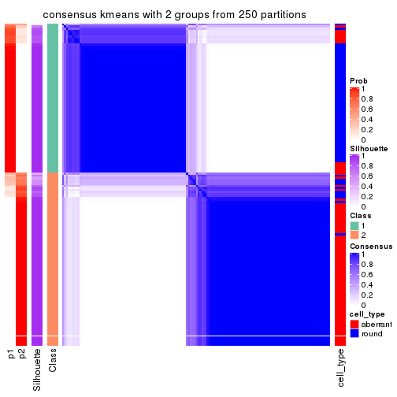</p>

</div>
<div id='tab-MAD-kmeans-consensus-heatmap-2'>
<pre><code class="r">consensus_heatmap(res, k = 3)
</code></pre>

<p></p>

</div>
<div id='tab-MAD-kmeans-consensus-heatmap-3'>
<pre><code class="r">consensus_heatmap(res, k = 4)
</code></pre>

<p></p>

</div>
<div id='tab-MAD-kmeans-consensus-heatmap-4'>
<pre><code class="r">consensus_heatmap(res, k = 5)
</code></pre>

<p></p>

</div>
<div id='tab-MAD-kmeans-consensus-heatmap-5'>
<pre><code class="r">consensus_heatmap(res, k = 6)
</code></pre>

<p></p>

</div>
</div>

Heatmaps for the membership of samples in all partitions to see how consistent they are:


<script>
$( function() {
	$( '#tabs-MAD-kmeans-membership-heatmap' ).tabs();
} );
</script>
<div id='tabs-MAD-kmeans-membership-heatmap'>
<ul>
<li><a href='#tab-MAD-kmeans-membership-heatmap-1'>k = 2</a></li>
<li><a href='#tab-MAD-kmeans-membership-heatmap-2'>k = 3</a></li>
<li><a href='#tab-MAD-kmeans-membership-heatmap-3'>k = 4</a></li>
<li><a href='#tab-MAD-kmeans-membership-heatmap-4'>k = 5</a></li>
<li><a href='#tab-MAD-kmeans-membership-heatmap-5'>k = 6</a></li>
</ul>
<div id='tab-MAD-kmeans-membership-heatmap-1'>
<pre><code class="r">membership_heatmap(res, k = 2)
</code></pre>

<p></p>

</div>
<div id='tab-MAD-kmeans-membership-heatmap-2'>
<pre><code class="r">membership_heatmap(res, k = 3)
</code></pre>

<p></p>

</div>
<div id='tab-MAD-kmeans-membership-heatmap-3'>
<pre><code class="r">membership_heatmap(res, k = 4)
</code></pre>

<p></p>

</div>
<div id='tab-MAD-kmeans-membership-heatmap-4'>
<pre><code class="r">membership_heatmap(res, k = 5)
</code></pre>

<p></p>

</div>
<div id='tab-MAD-kmeans-membership-heatmap-5'>
<pre><code class="r">membership_heatmap(res, k = 6)
</code></pre>

<p></p>

</div>
</div>

As soon as we have had the classes for columns, we can look for signatures
which are significantly different between classes which can be candidate marks
for certain classes. Following are the heatmaps for signatures.


Signature heatmaps where rows are scaled:


<script>
$( function() {
	$( '#tabs-MAD-kmeans-get-signatures' ).tabs();
} );
</script>
<div id='tabs-MAD-kmeans-get-signatures'>
<ul>
<li><a href='#tab-MAD-kmeans-get-signatures-1'>k = 2</a></li>
<li><a href='#tab-MAD-kmeans-get-signatures-2'>k = 3</a></li>
<li><a href='#tab-MAD-kmeans-get-signatures-3'>k = 4</a></li>
<li><a href='#tab-MAD-kmeans-get-signatures-4'>k = 5</a></li>
<li><a href='#tab-MAD-kmeans-get-signatures-5'>k = 6</a></li>
</ul>
<div id='tab-MAD-kmeans-get-signatures-1'>
<pre><code class="r">get_signatures(res, k = 2)
</code></pre>

<p></p>

</div>
<div id='tab-MAD-kmeans-get-signatures-2'>
<pre><code class="r">get_signatures(res, k = 3)
</code></pre>

<p></p>

</div>
<div id='tab-MAD-kmeans-get-signatures-3'>
<pre><code class="r">get_signatures(res, k = 4)
</code></pre>

<p></p>

</div>
<div id='tab-MAD-kmeans-get-signatures-4'>
<pre><code class="r">get_signatures(res, k = 5)
</code></pre>

<p>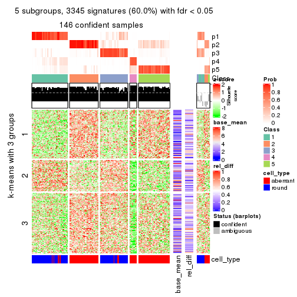</p>

</div>
<div id='tab-MAD-kmeans-get-signatures-5'>
<pre><code class="r">get_signatures(res, k = 6)
</code></pre>

<p></p>

</div>
</div>


Signature heatmaps where rows are not scaled:


<script>
$( function() {
	$( '#tabs-MAD-kmeans-get-signatures-no-scale' ).tabs();
} );
</script>
<div id='tabs-MAD-kmeans-get-signatures-no-scale'>
<ul>
<li><a href='#tab-MAD-kmeans-get-signatures-no-scale-1'>k = 2</a></li>
<li><a href='#tab-MAD-kmeans-get-signatures-no-scale-2'>k = 3</a></li>
<li><a href='#tab-MAD-kmeans-get-signatures-no-scale-3'>k = 4</a></li>
<li><a href='#tab-MAD-kmeans-get-signatures-no-scale-4'>k = 5</a></li>
<li><a href='#tab-MAD-kmeans-get-signatures-no-scale-5'>k = 6</a></li>
</ul>
<div id='tab-MAD-kmeans-get-signatures-no-scale-1'>
<pre><code class="r">get_signatures(res, k = 2, scale_rows = FALSE)
</code></pre>

<p></p>

</div>
<div id='tab-MAD-kmeans-get-signatures-no-scale-2'>
<pre><code class="r">get_signatures(res, k = 3, scale_rows = FALSE)
</code></pre>

<p></p>

</div>
<div id='tab-MAD-kmeans-get-signatures-no-scale-3'>
<pre><code class="r">get_signatures(res, k = 4, scale_rows = FALSE)
</code></pre>

<p></p>

</div>
<div id='tab-MAD-kmeans-get-signatures-no-scale-4'>
<pre><code class="r">get_signatures(res, k = 5, scale_rows = FALSE)
</code></pre>

<p></p>

</div>
<div id='tab-MAD-kmeans-get-signatures-no-scale-5'>
<pre><code class="r">get_signatures(res, k = 6, scale_rows = FALSE)
</code></pre>

<p></p>

</div>
</div>


Compare the overlap of signatures from different k:

```r
compare_signatures(res)
```


`get_signature()` returns a data frame invisibly. TO get the list of signatures, the function
call should be assigned to a variable explicitly. In following code, if `plot` argument is set
to `FALSE`, no heatmap is plotted while only the differential analysis is performed.

```r
# code only for demonstration
tb = get_signature(res, k = ..., plot = FALSE)
```

An example of the output of `tb` is:

```
#>   which_row         fdr    mean_1    mean_2 scaled_mean_1 scaled_mean_2 km
#> 1        38 0.042760348  8.373488  9.131774    -0.5533452     0.5164555  1
#> 2        40 0.018707592  7.106213  8.469186    -0.6173731     0.5762149  1
#> 3        55 0.019134737 10.221463 11.207825    -0.6159697     0.5749050  1
#> 4        59 0.006059896  5.921854  7.869574    -0.6899429     0.6439467  1
#> 5        60 0.018055526  8.928898 10.211722    -0.6204761     0.5791110  1
#> 6        98 0.009384629 15.714769 14.887706     0.6635654    -0.6193277  2
...
```

The columns in `tb` are:

1. `which_row`: row indices corresponding to the input matrix.
2. `fdr`: FDR for the differential test. 
3. `mean_x`: The mean value in group x.
4. `scaled_mean_x`: The mean value in group x after rows are scaled.
5. `km`: Row groups if k-means clustering is applied to rows.


UMAP plot which shows how samples are separated.


<script>
$( function() {
	$( '#tabs-MAD-kmeans-dimension-reduction' ).tabs();
} );
</script>
<div id='tabs-MAD-kmeans-dimension-reduction'>
<ul>
<li><a href='#tab-MAD-kmeans-dimension-reduction-1'>k = 2</a></li>
<li><a href='#tab-MAD-kmeans-dimension-reduction-2'>k = 3</a></li>
<li><a href='#tab-MAD-kmeans-dimension-reduction-3'>k = 4</a></li>
<li><a href='#tab-MAD-kmeans-dimension-reduction-4'>k = 5</a></li>
<li><a href='#tab-MAD-kmeans-dimension-reduction-5'>k = 6</a></li>
</ul>
<div id='tab-MAD-kmeans-dimension-reduction-1'>
<pre><code class="r">dimension_reduction(res, k = 2, method = &quot;UMAP&quot;)
</code></pre>

<p></p>

</div>
<div id='tab-MAD-kmeans-dimension-reduction-2'>
<pre><code class="r">dimension_reduction(res, k = 3, method = &quot;UMAP&quot;)
</code></pre>

<p></p>

</div>
<div id='tab-MAD-kmeans-dimension-reduction-3'>
<pre><code class="r">dimension_reduction(res, k = 4, method = &quot;UMAP&quot;)
</code></pre>

<p></p>

</div>
<div id='tab-MAD-kmeans-dimension-reduction-4'>
<pre><code class="r">dimension_reduction(res, k = 5, method = &quot;UMAP&quot;)
</code></pre>

<p></p>

</div>
<div id='tab-MAD-kmeans-dimension-reduction-5'>
<pre><code class="r">dimension_reduction(res, k = 6, method = &quot;UMAP&quot;)
</code></pre>

<p></p>

</div>
</div>


Following heatmap shows how subgroups are split when increasing `k`:

```r
collect_classes(res)
```


Test correlation between subgroups and known annotations. If the known
annotation is numeric, one-way ANOVA test is applied, and if the known
annotation is discrete, chi-squared contingency table test is applied.

```r
test_to_known_factors(res)
```

```
#>              n cell_type(p) k
#> MAD:kmeans 157     1.66e-17 2
#> MAD:kmeans 141     2.34e-21 3
#> MAD:kmeans 126     1.04e-21 4
#> MAD:kmeans 146     4.45e-25 5
#> MAD:kmeans 139     1.28e-23 6
```


If matrix rows can be associated to genes, consider to use `GO_Enrichment(res,
...)` to perform function enrichment for the signature genes.


 

---------------------------------------------------


### MAD:skmeans


The object with results only for a single top-value method and a single partition method 
can be extracted as:

```r
res = res_list["MAD", "skmeans"]
# you can also extract it by
# res = res_list["MAD:skmeans"]
```

A summary of `res` and all the functions that can be applied to it:

```r
res
```

```
#> A 'ConsensusPartition' object with k = 2, 3, 4, 5, 6.
#>   On a matrix with 5576 rows and 160 columns.
#>   Top rows (558, 1116, 1673, 2230, 2788) are extracted by 'MAD' method.
#>   Subgroups are detected by 'skmeans' method.
#>   Performed in total 1250 partitions by row resampling.
#>   Best k for subgroups seems to be 2.
#> 
#> Following methods can be applied to this 'ConsensusPartition' object:
#>  [1] "cola_report"             "collect_classes"         "collect_plots"          
#>  [4] "collect_stats"           "colnames"                "compare_signatures"     
#>  [7] "consensus_heatmap"       "dimension_reduction"     "functional_enrichment"  
#> [10] "get_anno_col"            "get_anno"                "get_classes"            
#> [13] "get_consensus"           "get_matrix"              "get_membership"         
#> [16] "get_param"               "get_signatures"          "get_stats"              
#> [19] "is_best_k"               "is_stable_k"             "membership_heatmap"     
#> [22] "ncol"                    "nrow"                    "plot_ecdf"              
#> [25] "rownames"                "select_partition_number" "show"                   
#> [28] "suggest_best_k"          "test_to_known_factors"
```

`collect_plots()` function collects all the plots made from `res` for all `k` (number of partitions)
into one single page to provide an easy and fast comparison between different `k`.

```r
collect_plots(res)
```


The plots are:

- The first row: a plot of the ECDF (Empirical cumulative distribution
  function) curves of the consensus matrix for each `k` and the heatmap of
  predicted classes for each `k`.
- The second row: heatmaps of the consensus matrix for each `k`.
- The third row: heatmaps of the membership matrix for each `k`.
- The fouth row: heatmaps of the signatures for each `k`.

All the plots in panels can be made by individual functions and they are
plotted later in this section.

`select_partition_number()` produces several plots showing different
statistics for choosing "optimized" `k`. There are following statistics:

- ECDF curves of the consensus matrix for each `k`;
- 1-PAC. [The PAC
  score](https://en.wikipedia.org/wiki/Consensus_clustering#Over-interpretation_potential_of_consensus_clustering)
  measures the proportion of the ambiguous subgrouping.
- Mean silhouette score.
- Concordance. The mean probability of fiting the consensus class ids in all
  partitions.
- Area increased. Denote $A_k$ as the area under the ECDF curve for current
  `k`, the area increased is defined as $A_k - A_{k-1}$.
- Rand index. The percent of pairs of samples that are both in a same cluster
  or both are not in a same cluster in the partition of k and k-1.
- Jaccard index. The ratio of pairs of samples are both in a same cluster in
  the partition of k and k-1 and the pairs of samples are both in a same
  cluster in the partition k or k-1.

The detailed explanations of these statistics can be found in [the cola
vignette](http://bioconductor.org/packages/devel/bioc/vignettes/cola/inst/doc/cola.html#toc_13).

Generally speaking, lower PAC score, higher mean silhouette score or higher
concordance corresponds to better partition. Rand index and Jaccard index
measure how similar the current partition is compared to partition with `k-1`.
If they are too similar, we won't accept `k` is better than `k-1`.

```r
select_partition_number(res)
```


The numeric values for all these statistics can be obtained by `get_stats()`.

```r
get_stats(res)
```

```
#>   k 1-PAC mean_silhouette concordance area_increased  Rand Jaccard
#> 2 2 0.877           0.926       0.970         0.5029 0.498   0.498
#> 3 3 0.871           0.883       0.949         0.3124 0.770   0.569
#> 4 4 0.828           0.830       0.923         0.1201 0.845   0.592
#> 5 5 0.725           0.665       0.817         0.0533 0.969   0.885
#> 6 6 0.669           0.617       0.753         0.0361 0.975   0.896
```

`suggest_best_k()` suggests the best $k$ based on these statistics. The rules are as follows:

- All $k$ with Jaccard index larger than 0.95 are removed because the increase of
  the partition number does not provides enough extra information. If all $k$ are removed,
  the best $k$ is assigned by `NA`.
- For $k$ with 1-PAC larger than 0.9, the maximal $k$ is taken as the "best k". Other $k$ is called "optional k".
- If it does not fit the second rule. The $k$ with the highest vote of highest
  1-PAC, mean silhouette and concordance is taken as the "best k".

```r
suggest_best_k(res)
```

```
#> [1] 2
```


Following shows the table of the partitions (You need to click the **show/hide
code output** link to see it). The membership matrix (columns with name `p*`)
is inferred by
[`clue::cl_consensus()`](https://www.rdocumentation.org/link/cl_consensus?package=clue)
function with the `SE` method. Basically the value in the membership matrix
represents the probability to belong to a certain group. The finall class
label for an item is determined with the group with highest probability it
belongs to.

In `get_classes()` function, the entropy is calculated from the membership
matrix and the silhouette score is calculated from the consensus matrix.


<script>
$( function() {
	$( '#tabs-MAD-skmeans-get-classes' ).tabs();
} );
</script>
<div id='tabs-MAD-skmeans-get-classes'>
<ul>
<li><a href='#tab-MAD-skmeans-get-classes-1'>k = 2</a></li>
<li><a href='#tab-MAD-skmeans-get-classes-2'>k = 3</a></li>
<li><a href='#tab-MAD-skmeans-get-classes-3'>k = 4</a></li>
<li><a href='#tab-MAD-skmeans-get-classes-4'>k = 5</a></li>
<li><a href='#tab-MAD-skmeans-get-classes-5'>k = 6</a></li>
</ul>

<div id='tab-MAD-skmeans-get-classes-1'>
<p><a id='tab-MAD-skmeans-get-classes-1-a' style='color:#0366d6' href='#'>show/hide code output</a></p>
<pre><code class="r">cbind(get_classes(res, k = 2), get_membership(res, k = 2))
</code></pre>

<pre><code>#&gt;                     class entropy silhouette    p1    p2
#&gt; aberrant_ERR2585320     2  0.0000      0.967 0.000 1.000
#&gt; aberrant_ERR2585338     2  0.0000      0.967 0.000 1.000
#&gt; aberrant_ERR2585325     2  0.0000      0.967 0.000 1.000
#&gt; aberrant_ERR2585283     1  0.5519      0.851 0.872 0.128
#&gt; aberrant_ERR2585343     2  0.0000      0.967 0.000 1.000
#&gt; aberrant_ERR2585329     2  0.0000      0.967 0.000 1.000
#&gt; aberrant_ERR2585317     2  0.0000      0.967 0.000 1.000
#&gt; aberrant_ERR2585339     2  0.0000      0.967 0.000 1.000
#&gt; aberrant_ERR2585335     2  0.0000      0.967 0.000 1.000
#&gt; aberrant_ERR2585287     2  0.8861      0.549 0.304 0.696
#&gt; aberrant_ERR2585321     2  0.0000      0.967 0.000 1.000
#&gt; aberrant_ERR2585297     1  0.0000      0.968 1.000 0.000
#&gt; aberrant_ERR2585337     2  0.0000      0.967 0.000 1.000
#&gt; aberrant_ERR2585319     2  0.0000      0.967 0.000 1.000
#&gt; aberrant_ERR2585315     2  0.0000      0.967 0.000 1.000
#&gt; aberrant_ERR2585336     2  0.0000      0.967 0.000 1.000
#&gt; aberrant_ERR2585307     2  0.0000      0.967 0.000 1.000
#&gt; aberrant_ERR2585301     2  0.0000      0.967 0.000 1.000
#&gt; aberrant_ERR2585326     2  0.0000      0.967 0.000 1.000
#&gt; aberrant_ERR2585331     2  0.0000      0.967 0.000 1.000
#&gt; aberrant_ERR2585346     1  0.5408      0.855 0.876 0.124
#&gt; aberrant_ERR2585314     2  0.0000      0.967 0.000 1.000
#&gt; aberrant_ERR2585298     1  0.0000      0.968 1.000 0.000
#&gt; aberrant_ERR2585345     2  0.0000      0.967 0.000 1.000
#&gt; aberrant_ERR2585299     1  0.0000      0.968 1.000 0.000
#&gt; aberrant_ERR2585309     1  0.0000      0.968 1.000 0.000
#&gt; aberrant_ERR2585303     2  0.0000      0.967 0.000 1.000
#&gt; aberrant_ERR2585313     2  0.0000      0.967 0.000 1.000
#&gt; aberrant_ERR2585318     2  0.0000      0.967 0.000 1.000
#&gt; aberrant_ERR2585328     2  0.0000      0.967 0.000 1.000
#&gt; aberrant_ERR2585330     2  0.0000      0.967 0.000 1.000
#&gt; aberrant_ERR2585293     1  0.4161      0.896 0.916 0.084
#&gt; aberrant_ERR2585342     2  0.0000      0.967 0.000 1.000
#&gt; aberrant_ERR2585348     2  0.0000      0.967 0.000 1.000
#&gt; aberrant_ERR2585352     2  0.0000      0.967 0.000 1.000
#&gt; aberrant_ERR2585308     1  0.0000      0.968 1.000 0.000
#&gt; aberrant_ERR2585349     2  0.0000      0.967 0.000 1.000
#&gt; aberrant_ERR2585316     2  0.9996      0.014 0.488 0.512
#&gt; aberrant_ERR2585306     1  0.5408      0.857 0.876 0.124
#&gt; aberrant_ERR2585324     2  0.0000      0.967 0.000 1.000
#&gt; aberrant_ERR2585310     2  0.6623      0.791 0.172 0.828
#&gt; aberrant_ERR2585296     1  0.8763      0.574 0.704 0.296
#&gt; aberrant_ERR2585275     1  0.5842      0.837 0.860 0.140
#&gt; aberrant_ERR2585311     2  0.0000      0.967 0.000 1.000
#&gt; aberrant_ERR2585292     1  0.4161      0.896 0.916 0.084
#&gt; aberrant_ERR2585282     2  0.0000      0.967 0.000 1.000
#&gt; aberrant_ERR2585305     2  0.0000      0.967 0.000 1.000
#&gt; aberrant_ERR2585278     2  0.0000      0.967 0.000 1.000
#&gt; aberrant_ERR2585347     2  0.0000      0.967 0.000 1.000
#&gt; aberrant_ERR2585332     2  0.0000      0.967 0.000 1.000
#&gt; aberrant_ERR2585280     2  0.0000      0.967 0.000 1.000
#&gt; aberrant_ERR2585304     2  0.0000      0.967 0.000 1.000
#&gt; aberrant_ERR2585322     2  0.0000      0.967 0.000 1.000
#&gt; aberrant_ERR2585279     2  0.0000      0.967 0.000 1.000
#&gt; aberrant_ERR2585277     2  0.0000      0.967 0.000 1.000
#&gt; aberrant_ERR2585295     2  0.0000      0.967 0.000 1.000
#&gt; aberrant_ERR2585333     2  0.0000      0.967 0.000 1.000
#&gt; aberrant_ERR2585285     2  0.0000      0.967 0.000 1.000
#&gt; aberrant_ERR2585286     2  0.0000      0.967 0.000 1.000
#&gt; aberrant_ERR2585294     2  0.0000      0.967 0.000 1.000
#&gt; aberrant_ERR2585300     2  0.0000      0.967 0.000 1.000
#&gt; aberrant_ERR2585334     2  0.0000      0.967 0.000 1.000
#&gt; aberrant_ERR2585361     2  0.0000      0.967 0.000 1.000
#&gt; aberrant_ERR2585372     2  0.0000      0.967 0.000 1.000
#&gt; round_ERR2585217        2  0.9970      0.139 0.468 0.532
#&gt; round_ERR2585205        1  0.0000      0.968 1.000 0.000
#&gt; round_ERR2585214        2  0.7299      0.746 0.204 0.796
#&gt; round_ERR2585202        2  0.3431      0.910 0.064 0.936
#&gt; aberrant_ERR2585367     2  0.0000      0.967 0.000 1.000
#&gt; round_ERR2585220        1  0.0000      0.968 1.000 0.000
#&gt; round_ERR2585238        1  0.0000      0.968 1.000 0.000
#&gt; aberrant_ERR2585276     2  0.0000      0.967 0.000 1.000
#&gt; round_ERR2585218        1  0.0000      0.968 1.000 0.000
#&gt; aberrant_ERR2585363     2  0.0000      0.967 0.000 1.000
#&gt; round_ERR2585201        1  0.0000      0.968 1.000 0.000
#&gt; round_ERR2585210        1  0.0000      0.968 1.000 0.000
#&gt; aberrant_ERR2585362     2  0.0000      0.967 0.000 1.000
#&gt; aberrant_ERR2585360     2  0.0000      0.967 0.000 1.000
#&gt; round_ERR2585209        1  0.0000      0.968 1.000 0.000
#&gt; round_ERR2585242        1  0.0938      0.959 0.988 0.012
#&gt; round_ERR2585216        1  0.0000      0.968 1.000 0.000
#&gt; round_ERR2585219        1  0.0000      0.968 1.000 0.000
#&gt; round_ERR2585237        2  0.5842      0.830 0.140 0.860
#&gt; round_ERR2585198        2  0.5842      0.829 0.140 0.860
#&gt; round_ERR2585211        1  0.0000      0.968 1.000 0.000
#&gt; round_ERR2585206        1  0.0000      0.968 1.000 0.000
#&gt; aberrant_ERR2585281     2  0.0000      0.967 0.000 1.000
#&gt; round_ERR2585212        1  0.0000      0.968 1.000 0.000
#&gt; round_ERR2585221        1  0.0000      0.968 1.000 0.000
#&gt; round_ERR2585243        1  0.0000      0.968 1.000 0.000
#&gt; round_ERR2585204        2  0.4562      0.878 0.096 0.904
#&gt; round_ERR2585213        2  0.1184      0.954 0.016 0.984
#&gt; aberrant_ERR2585373     2  0.0000      0.967 0.000 1.000
#&gt; aberrant_ERR2585358     2  0.0000      0.967 0.000 1.000
#&gt; aberrant_ERR2585365     2  0.0000      0.967 0.000 1.000
#&gt; aberrant_ERR2585359     2  0.0000      0.967 0.000 1.000
#&gt; aberrant_ERR2585370     2  0.0000      0.967 0.000 1.000
#&gt; round_ERR2585215        1  0.0000      0.968 1.000 0.000
#&gt; round_ERR2585262        2  0.9933      0.198 0.452 0.548
#&gt; round_ERR2585199        2  0.1633      0.947 0.024 0.976
#&gt; aberrant_ERR2585369     2  0.0000      0.967 0.000 1.000
#&gt; round_ERR2585208        1  0.0000      0.968 1.000 0.000
#&gt; round_ERR2585252        1  0.0000      0.968 1.000 0.000
#&gt; round_ERR2585236        1  0.0000      0.968 1.000 0.000
#&gt; aberrant_ERR2585284     1  0.5059      0.869 0.888 0.112
#&gt; round_ERR2585224        1  0.0000      0.968 1.000 0.000
#&gt; round_ERR2585260        1  0.0000      0.968 1.000 0.000
#&gt; round_ERR2585229        1  0.0000      0.968 1.000 0.000
#&gt; aberrant_ERR2585364     1  0.8443      0.640 0.728 0.272
#&gt; round_ERR2585253        1  0.0000      0.968 1.000 0.000
#&gt; aberrant_ERR2585368     2  0.0000      0.967 0.000 1.000
#&gt; aberrant_ERR2585371     2  0.0000      0.967 0.000 1.000
#&gt; round_ERR2585239        1  0.0000      0.968 1.000 0.000
#&gt; round_ERR2585273        1  0.0000      0.968 1.000 0.000
#&gt; round_ERR2585256        1  0.0000      0.968 1.000 0.000
#&gt; round_ERR2585272        1  0.0000      0.968 1.000 0.000
#&gt; round_ERR2585246        1  0.0000      0.968 1.000 0.000
#&gt; round_ERR2585261        1  0.4939      0.866 0.892 0.108
#&gt; round_ERR2585254        1  0.9815      0.256 0.580 0.420
#&gt; round_ERR2585225        1  0.0000      0.968 1.000 0.000
#&gt; round_ERR2585235        1  0.0000      0.968 1.000 0.000
#&gt; round_ERR2585271        1  0.0000      0.968 1.000 0.000
#&gt; round_ERR2585251        1  0.0000      0.968 1.000 0.000
#&gt; round_ERR2585255        1  0.0000      0.968 1.000 0.000
#&gt; round_ERR2585257        1  0.0000      0.968 1.000 0.000
#&gt; round_ERR2585226        1  0.0000      0.968 1.000 0.000
#&gt; round_ERR2585265        1  0.0000      0.968 1.000 0.000
#&gt; round_ERR2585259        1  0.0000      0.968 1.000 0.000
#&gt; round_ERR2585247        1  0.0000      0.968 1.000 0.000
#&gt; round_ERR2585241        1  0.0000      0.968 1.000 0.000
#&gt; round_ERR2585263        1  0.0000      0.968 1.000 0.000
#&gt; round_ERR2585264        1  0.0000      0.968 1.000 0.000
#&gt; round_ERR2585233        1  0.0000      0.968 1.000 0.000
#&gt; round_ERR2585223        1  0.0000      0.968 1.000 0.000
#&gt; round_ERR2585234        1  0.9580      0.374 0.620 0.380
#&gt; round_ERR2585222        1  0.0000      0.968 1.000 0.000
#&gt; round_ERR2585228        1  0.0000      0.968 1.000 0.000
#&gt; round_ERR2585248        1  0.0000      0.968 1.000 0.000
#&gt; round_ERR2585240        1  0.0000      0.968 1.000 0.000
#&gt; round_ERR2585270        1  0.0000      0.968 1.000 0.000
#&gt; round_ERR2585232        1  0.0000      0.968 1.000 0.000
#&gt; aberrant_ERR2585341     2  0.0000      0.967 0.000 1.000
#&gt; aberrant_ERR2585355     2  0.0000      0.967 0.000 1.000
#&gt; round_ERR2585227        1  0.0000      0.968 1.000 0.000
#&gt; aberrant_ERR2585351     2  0.0000      0.967 0.000 1.000
#&gt; round_ERR2585269        1  0.0000      0.968 1.000 0.000
#&gt; aberrant_ERR2585357     2  0.0000      0.967 0.000 1.000
#&gt; aberrant_ERR2585350     2  0.0000      0.967 0.000 1.000
#&gt; round_ERR2585250        1  0.0000      0.968 1.000 0.000
#&gt; round_ERR2585245        1  0.0000      0.968 1.000 0.000
#&gt; aberrant_ERR2585353     2  0.0000      0.967 0.000 1.000
#&gt; round_ERR2585258        1  0.0000      0.968 1.000 0.000
#&gt; aberrant_ERR2585354     2  0.0000      0.967 0.000 1.000
#&gt; round_ERR2585249        1  0.0000      0.968 1.000 0.000
#&gt; round_ERR2585268        1  0.0000      0.968 1.000 0.000
#&gt; aberrant_ERR2585356     2  0.1414      0.951 0.020 0.980
#&gt; round_ERR2585266        1  0.0000      0.968 1.000 0.000
#&gt; round_ERR2585231        1  0.0000      0.968 1.000 0.000
#&gt; round_ERR2585230        1  0.0000      0.968 1.000 0.000
#&gt; round_ERR2585267        1  0.0000      0.968 1.000 0.000
</code></pre>

<script>
$('#tab-MAD-skmeans-get-classes-1-a').parent().next().next().hide();
$('#tab-MAD-skmeans-get-classes-1-a').click(function(){
  $('#tab-MAD-skmeans-get-classes-1-a').parent().next().next().toggle();
  return(false);
});
</script>
</div>

<div id='tab-MAD-skmeans-get-classes-2'>
<p><a id='tab-MAD-skmeans-get-classes-2-a' style='color:#0366d6' href='#'>show/hide code output</a></p>
<pre><code class="r">cbind(get_classes(res, k = 3), get_membership(res, k = 3))
</code></pre>

<pre><code>#&gt;                     class entropy silhouette    p1    p2    p3
#&gt; aberrant_ERR2585320     3  0.0747     0.9394 0.000 0.016 0.984
#&gt; aberrant_ERR2585338     2  0.0424     0.8953 0.000 0.992 0.008
#&gt; aberrant_ERR2585325     3  0.0892     0.9373 0.000 0.020 0.980
#&gt; aberrant_ERR2585283     3  0.0424     0.9427 0.008 0.000 0.992
#&gt; aberrant_ERR2585343     3  0.0000     0.9450 0.000 0.000 1.000
#&gt; aberrant_ERR2585329     2  0.0424     0.8953 0.000 0.992 0.008
#&gt; aberrant_ERR2585317     2  0.0424     0.8953 0.000 0.992 0.008
#&gt; aberrant_ERR2585339     2  0.0424     0.8953 0.000 0.992 0.008
#&gt; aberrant_ERR2585335     2  0.1289     0.8827 0.000 0.968 0.032
#&gt; aberrant_ERR2585287     3  0.0424     0.9427 0.008 0.000 0.992
#&gt; aberrant_ERR2585321     3  0.0000     0.9450 0.000 0.000 1.000
#&gt; aberrant_ERR2585297     1  0.0000     0.9838 1.000 0.000 0.000
#&gt; aberrant_ERR2585337     2  0.0424     0.8953 0.000 0.992 0.008
#&gt; aberrant_ERR2585319     2  0.3879     0.7859 0.000 0.848 0.152
#&gt; aberrant_ERR2585315     2  0.0892     0.8900 0.000 0.980 0.020
#&gt; aberrant_ERR2585336     2  0.0424     0.8953 0.000 0.992 0.008
#&gt; aberrant_ERR2585307     2  0.0424     0.8953 0.000 0.992 0.008
#&gt; aberrant_ERR2585301     2  0.5098     0.6753 0.000 0.752 0.248
#&gt; aberrant_ERR2585326     2  0.0424     0.8953 0.000 0.992 0.008
#&gt; aberrant_ERR2585331     2  0.0424     0.8953 0.000 0.992 0.008
#&gt; aberrant_ERR2585346     3  0.0424     0.9427 0.008 0.000 0.992
#&gt; aberrant_ERR2585314     2  0.0424     0.8953 0.000 0.992 0.008
#&gt; aberrant_ERR2585298     1  0.2959     0.8941 0.900 0.100 0.000
#&gt; aberrant_ERR2585345     2  0.0424     0.8953 0.000 0.992 0.008
#&gt; aberrant_ERR2585299     1  0.0000     0.9838 1.000 0.000 0.000
#&gt; aberrant_ERR2585309     1  0.0000     0.9838 1.000 0.000 0.000
#&gt; aberrant_ERR2585303     2  0.5760     0.5208 0.000 0.672 0.328
#&gt; aberrant_ERR2585313     2  0.0424     0.8953 0.000 0.992 0.008
#&gt; aberrant_ERR2585318     3  0.5733     0.4795 0.000 0.324 0.676
#&gt; aberrant_ERR2585328     3  0.0592     0.9411 0.000 0.012 0.988
#&gt; aberrant_ERR2585330     2  0.6095     0.4038 0.000 0.608 0.392
#&gt; aberrant_ERR2585293     3  0.0424     0.9427 0.008 0.000 0.992
#&gt; aberrant_ERR2585342     3  0.1643     0.9196 0.000 0.044 0.956
#&gt; aberrant_ERR2585348     3  0.0000     0.9450 0.000 0.000 1.000
#&gt; aberrant_ERR2585352     2  0.0747     0.8918 0.000 0.984 0.016
#&gt; aberrant_ERR2585308     1  0.0000     0.9838 1.000 0.000 0.000
#&gt; aberrant_ERR2585349     2  0.0237     0.8939 0.000 0.996 0.004
#&gt; aberrant_ERR2585316     3  0.0424     0.9427 0.008 0.000 0.992
#&gt; aberrant_ERR2585306     3  0.0424     0.9427 0.008 0.000 0.992
#&gt; aberrant_ERR2585324     2  0.3879     0.7859 0.000 0.848 0.152
#&gt; aberrant_ERR2585310     2  0.1267     0.8810 0.024 0.972 0.004
#&gt; aberrant_ERR2585296     2  0.5560     0.5660 0.300 0.700 0.000
#&gt; aberrant_ERR2585275     3  0.0424     0.9427 0.008 0.000 0.992
#&gt; aberrant_ERR2585311     3  0.0000     0.9450 0.000 0.000 1.000
#&gt; aberrant_ERR2585292     3  0.0424     0.9427 0.008 0.000 0.992
#&gt; aberrant_ERR2585282     3  0.0000     0.9450 0.000 0.000 1.000
#&gt; aberrant_ERR2585305     3  0.6647     0.0818 0.008 0.452 0.540
#&gt; aberrant_ERR2585278     2  0.2959     0.8342 0.000 0.900 0.100
#&gt; aberrant_ERR2585347     3  0.0000     0.9450 0.000 0.000 1.000
#&gt; aberrant_ERR2585332     3  0.0000     0.9450 0.000 0.000 1.000
#&gt; aberrant_ERR2585280     3  0.2066     0.9068 0.000 0.060 0.940
#&gt; aberrant_ERR2585304     2  0.0424     0.8953 0.000 0.992 0.008
#&gt; aberrant_ERR2585322     2  0.0424     0.8953 0.000 0.992 0.008
#&gt; aberrant_ERR2585279     2  0.0424     0.8953 0.000 0.992 0.008
#&gt; aberrant_ERR2585277     2  0.0424     0.8953 0.000 0.992 0.008
#&gt; aberrant_ERR2585295     3  0.0424     0.9427 0.000 0.008 0.992
#&gt; aberrant_ERR2585333     3  0.0000     0.9450 0.000 0.000 1.000
#&gt; aberrant_ERR2585285     2  0.6252     0.2600 0.000 0.556 0.444
#&gt; aberrant_ERR2585286     2  0.0424     0.8953 0.000 0.992 0.008
#&gt; aberrant_ERR2585294     3  0.6260     0.1126 0.000 0.448 0.552
#&gt; aberrant_ERR2585300     3  0.0237     0.9441 0.004 0.000 0.996
#&gt; aberrant_ERR2585334     2  0.0424     0.8953 0.000 0.992 0.008
#&gt; aberrant_ERR2585361     3  0.1964     0.9092 0.000 0.056 0.944
#&gt; aberrant_ERR2585372     3  0.0000     0.9450 0.000 0.000 1.000
#&gt; round_ERR2585217        2  0.3551     0.7843 0.132 0.868 0.000
#&gt; round_ERR2585205        1  0.0000     0.9838 1.000 0.000 0.000
#&gt; round_ERR2585214        2  0.0000     0.8923 0.000 1.000 0.000
#&gt; round_ERR2585202        2  0.0000     0.8923 0.000 1.000 0.000
#&gt; aberrant_ERR2585367     3  0.2959     0.8679 0.000 0.100 0.900
#&gt; round_ERR2585220        1  0.0424     0.9812 0.992 0.008 0.000
#&gt; round_ERR2585238        1  0.0000     0.9838 1.000 0.000 0.000
#&gt; aberrant_ERR2585276     3  0.3038     0.8601 0.000 0.104 0.896
#&gt; round_ERR2585218        1  0.0000     0.9838 1.000 0.000 0.000
#&gt; aberrant_ERR2585363     2  0.1860     0.8697 0.000 0.948 0.052
#&gt; round_ERR2585201        1  0.4887     0.7130 0.772 0.228 0.000
#&gt; round_ERR2585210        1  0.0000     0.9838 1.000 0.000 0.000
#&gt; aberrant_ERR2585362     3  0.3340     0.8429 0.000 0.120 0.880
#&gt; aberrant_ERR2585360     3  0.1289     0.9292 0.000 0.032 0.968
#&gt; round_ERR2585209        1  0.0747     0.9762 0.984 0.016 0.000
#&gt; round_ERR2585242        1  0.6026     0.3968 0.624 0.376 0.000
#&gt; round_ERR2585216        1  0.0424     0.9812 0.992 0.008 0.000
#&gt; round_ERR2585219        1  0.0237     0.9827 0.996 0.004 0.000
#&gt; round_ERR2585237        2  0.0000     0.8923 0.000 1.000 0.000
#&gt; round_ERR2585198        2  0.0000     0.8923 0.000 1.000 0.000
#&gt; round_ERR2585211        1  0.0000     0.9838 1.000 0.000 0.000
#&gt; round_ERR2585206        1  0.0000     0.9838 1.000 0.000 0.000
#&gt; aberrant_ERR2585281     2  0.6295     0.1306 0.000 0.528 0.472
#&gt; round_ERR2585212        1  0.0424     0.9812 0.992 0.008 0.000
#&gt; round_ERR2585221        1  0.0000     0.9838 1.000 0.000 0.000
#&gt; round_ERR2585243        1  0.0000     0.9838 1.000 0.000 0.000
#&gt; round_ERR2585204        2  0.0000     0.8923 0.000 1.000 0.000
#&gt; round_ERR2585213        2  0.0000     0.8923 0.000 1.000 0.000
#&gt; aberrant_ERR2585373     3  0.0000     0.9450 0.000 0.000 1.000
#&gt; aberrant_ERR2585358     3  0.0000     0.9450 0.000 0.000 1.000
#&gt; aberrant_ERR2585365     2  0.5835     0.4970 0.000 0.660 0.340
#&gt; aberrant_ERR2585359     3  0.0000     0.9450 0.000 0.000 1.000
#&gt; aberrant_ERR2585370     2  0.0424     0.8953 0.000 0.992 0.008
#&gt; round_ERR2585215        1  0.0000     0.9838 1.000 0.000 0.000
#&gt; round_ERR2585262        2  0.8698     0.4517 0.300 0.564 0.136
#&gt; round_ERR2585199        2  0.0000     0.8923 0.000 1.000 0.000
#&gt; aberrant_ERR2585369     3  0.2165     0.9036 0.000 0.064 0.936
#&gt; round_ERR2585208        1  0.0000     0.9838 1.000 0.000 0.000
#&gt; round_ERR2585252        1  0.0000     0.9838 1.000 0.000 0.000
#&gt; round_ERR2585236        1  0.0000     0.9838 1.000 0.000 0.000
#&gt; aberrant_ERR2585284     3  0.0424     0.9427 0.008 0.000 0.992
#&gt; round_ERR2585224        1  0.0000     0.9838 1.000 0.000 0.000
#&gt; round_ERR2585260        1  0.0000     0.9838 1.000 0.000 0.000
#&gt; round_ERR2585229        1  0.0000     0.9838 1.000 0.000 0.000
#&gt; aberrant_ERR2585364     3  0.0424     0.9427 0.008 0.000 0.992
#&gt; round_ERR2585253        1  0.0000     0.9838 1.000 0.000 0.000
#&gt; aberrant_ERR2585368     2  0.0424     0.8953 0.000 0.992 0.008
#&gt; aberrant_ERR2585371     2  0.0424     0.8953 0.000 0.992 0.008
#&gt; round_ERR2585239        1  0.0000     0.9838 1.000 0.000 0.000
#&gt; round_ERR2585273        1  0.0237     0.9827 0.996 0.004 0.000
#&gt; round_ERR2585256        1  0.1031     0.9703 0.976 0.024 0.000
#&gt; round_ERR2585272        1  0.0000     0.9838 1.000 0.000 0.000
#&gt; round_ERR2585246        1  0.0000     0.9838 1.000 0.000 0.000
#&gt; round_ERR2585261        2  0.5988     0.4148 0.368 0.632 0.000
#&gt; round_ERR2585254        2  0.3412     0.7920 0.124 0.876 0.000
#&gt; round_ERR2585225        1  0.1163     0.9666 0.972 0.028 0.000
#&gt; round_ERR2585235        1  0.0000     0.9838 1.000 0.000 0.000
#&gt; round_ERR2585271        1  0.0000     0.9838 1.000 0.000 0.000
#&gt; round_ERR2585251        1  0.0424     0.9812 0.992 0.008 0.000
#&gt; round_ERR2585255        1  0.1163     0.9666 0.972 0.028 0.000
#&gt; round_ERR2585257        1  0.2711     0.9075 0.912 0.088 0.000
#&gt; round_ERR2585226        1  0.0424     0.9812 0.992 0.008 0.000
#&gt; round_ERR2585265        1  0.0424     0.9812 0.992 0.008 0.000
#&gt; round_ERR2585259        1  0.0237     0.9826 0.996 0.004 0.000
#&gt; round_ERR2585247        1  0.0000     0.9838 1.000 0.000 0.000
#&gt; round_ERR2585241        1  0.0000     0.9838 1.000 0.000 0.000
#&gt; round_ERR2585263        1  0.0424     0.9812 0.992 0.008 0.000
#&gt; round_ERR2585264        1  0.0000     0.9838 1.000 0.000 0.000
#&gt; round_ERR2585233        1  0.0237     0.9827 0.996 0.004 0.000
#&gt; round_ERR2585223        1  0.0000     0.9838 1.000 0.000 0.000
#&gt; round_ERR2585234        2  0.0892     0.8807 0.020 0.980 0.000
#&gt; round_ERR2585222        1  0.0000     0.9838 1.000 0.000 0.000
#&gt; round_ERR2585228        1  0.0000     0.9838 1.000 0.000 0.000
#&gt; round_ERR2585248        1  0.0000     0.9838 1.000 0.000 0.000
#&gt; round_ERR2585240        1  0.0424     0.9812 0.992 0.008 0.000
#&gt; round_ERR2585270        1  0.0424     0.9812 0.992 0.008 0.000
#&gt; round_ERR2585232        1  0.0424     0.9812 0.992 0.008 0.000
#&gt; aberrant_ERR2585341     2  0.6267     0.2002 0.000 0.548 0.452
#&gt; aberrant_ERR2585355     2  0.0424     0.8953 0.000 0.992 0.008
#&gt; round_ERR2585227        1  0.0424     0.9812 0.992 0.008 0.000
#&gt; aberrant_ERR2585351     2  0.6192     0.3341 0.000 0.580 0.420
#&gt; round_ERR2585269        1  0.0000     0.9838 1.000 0.000 0.000
#&gt; aberrant_ERR2585357     2  0.0424     0.8953 0.000 0.992 0.008
#&gt; aberrant_ERR2585350     2  0.0424     0.8953 0.000 0.992 0.008
#&gt; round_ERR2585250        1  0.0000     0.9838 1.000 0.000 0.000
#&gt; round_ERR2585245        1  0.0000     0.9838 1.000 0.000 0.000
#&gt; aberrant_ERR2585353     3  0.0000     0.9450 0.000 0.000 1.000
#&gt; round_ERR2585258        1  0.0424     0.9812 0.992 0.008 0.000
#&gt; aberrant_ERR2585354     3  0.0000     0.9450 0.000 0.000 1.000
#&gt; round_ERR2585249        1  0.0000     0.9838 1.000 0.000 0.000
#&gt; round_ERR2585268        1  0.0237     0.9826 0.996 0.004 0.000
#&gt; aberrant_ERR2585356     3  0.0237     0.9441 0.004 0.000 0.996
#&gt; round_ERR2585266        1  0.1753     0.9481 0.952 0.048 0.000
#&gt; round_ERR2585231        1  0.0000     0.9838 1.000 0.000 0.000
#&gt; round_ERR2585230        1  0.0000     0.9838 1.000 0.000 0.000
#&gt; round_ERR2585267        1  0.0000     0.9838 1.000 0.000 0.000
</code></pre>

<script>
$('#tab-MAD-skmeans-get-classes-2-a').parent().next().next().hide();
$('#tab-MAD-skmeans-get-classes-2-a').click(function(){
  $('#tab-MAD-skmeans-get-classes-2-a').parent().next().next().toggle();
  return(false);
});
</script>
</div>

<div id='tab-MAD-skmeans-get-classes-3'>
<p><a id='tab-MAD-skmeans-get-classes-3-a' style='color:#0366d6' href='#'>show/hide code output</a></p>
<pre><code class="r">cbind(get_classes(res, k = 4), get_membership(res, k = 4))
</code></pre>

<pre><code>#&gt;                     class entropy silhouette    p1    p2    p3    p4
#&gt; aberrant_ERR2585320     4  0.4483     0.6215 0.000 0.284 0.004 0.712
#&gt; aberrant_ERR2585338     2  0.0336     0.8921 0.000 0.992 0.008 0.000
#&gt; aberrant_ERR2585325     4  0.4483     0.6215 0.000 0.284 0.004 0.712
#&gt; aberrant_ERR2585283     4  0.0000     0.9065 0.000 0.000 0.000 1.000
#&gt; aberrant_ERR2585343     4  0.0000     0.9065 0.000 0.000 0.000 1.000
#&gt; aberrant_ERR2585329     2  0.0469     0.8921 0.000 0.988 0.012 0.000
#&gt; aberrant_ERR2585317     2  0.0469     0.8921 0.000 0.988 0.012 0.000
#&gt; aberrant_ERR2585339     2  0.0188     0.8916 0.000 0.996 0.004 0.000
#&gt; aberrant_ERR2585335     2  0.0188     0.8902 0.000 0.996 0.004 0.000
#&gt; aberrant_ERR2585287     4  0.0000     0.9065 0.000 0.000 0.000 1.000
#&gt; aberrant_ERR2585321     4  0.1743     0.8906 0.000 0.056 0.004 0.940
#&gt; aberrant_ERR2585297     1  0.0000     0.9456 1.000 0.000 0.000 0.000
#&gt; aberrant_ERR2585337     2  0.0336     0.8921 0.000 0.992 0.008 0.000
#&gt; aberrant_ERR2585319     2  0.0657     0.8881 0.000 0.984 0.004 0.012
#&gt; aberrant_ERR2585315     2  0.0000     0.8909 0.000 1.000 0.000 0.000
#&gt; aberrant_ERR2585336     2  0.0469     0.8921 0.000 0.988 0.012 0.000
#&gt; aberrant_ERR2585307     2  0.0469     0.8921 0.000 0.988 0.012 0.000
#&gt; aberrant_ERR2585301     2  0.1970     0.8640 0.000 0.932 0.008 0.060
#&gt; aberrant_ERR2585326     2  0.0469     0.8921 0.000 0.988 0.012 0.000
#&gt; aberrant_ERR2585331     2  0.0592     0.8909 0.000 0.984 0.016 0.000
#&gt; aberrant_ERR2585346     4  0.0000     0.9065 0.000 0.000 0.000 1.000
#&gt; aberrant_ERR2585314     2  0.0469     0.8921 0.000 0.988 0.012 0.000
#&gt; aberrant_ERR2585298     3  0.0592     0.9087 0.016 0.000 0.984 0.000
#&gt; aberrant_ERR2585345     2  0.0469     0.8921 0.000 0.988 0.012 0.000
#&gt; aberrant_ERR2585299     1  0.0000     0.9456 1.000 0.000 0.000 0.000
#&gt; aberrant_ERR2585309     1  0.0000     0.9456 1.000 0.000 0.000 0.000
#&gt; aberrant_ERR2585303     2  0.1767     0.8712 0.000 0.944 0.012 0.044
#&gt; aberrant_ERR2585313     2  0.0000     0.8909 0.000 1.000 0.000 0.000
#&gt; aberrant_ERR2585318     2  0.5038     0.4812 0.000 0.652 0.012 0.336
#&gt; aberrant_ERR2585328     4  0.2988     0.8449 0.000 0.112 0.012 0.876
#&gt; aberrant_ERR2585330     2  0.1970     0.8636 0.000 0.932 0.008 0.060
#&gt; aberrant_ERR2585293     4  0.0000     0.9065 0.000 0.000 0.000 1.000
#&gt; aberrant_ERR2585342     2  0.5406     0.0407 0.000 0.508 0.012 0.480
#&gt; aberrant_ERR2585348     4  0.0188     0.9062 0.000 0.000 0.004 0.996
#&gt; aberrant_ERR2585352     2  0.0376     0.8894 0.000 0.992 0.004 0.004
#&gt; aberrant_ERR2585308     1  0.0000     0.9456 1.000 0.000 0.000 0.000
#&gt; aberrant_ERR2585349     2  0.3444     0.7562 0.000 0.816 0.184 0.000
#&gt; aberrant_ERR2585316     4  0.0000     0.9065 0.000 0.000 0.000 1.000
#&gt; aberrant_ERR2585306     4  0.1489     0.8779 0.044 0.000 0.004 0.952
#&gt; aberrant_ERR2585324     2  0.0657     0.8881 0.000 0.984 0.004 0.012
#&gt; aberrant_ERR2585310     2  0.5906     0.1519 0.036 0.528 0.436 0.000
#&gt; aberrant_ERR2585296     3  0.1151     0.9073 0.008 0.024 0.968 0.000
#&gt; aberrant_ERR2585275     4  0.0000     0.9065 0.000 0.000 0.000 1.000
#&gt; aberrant_ERR2585311     4  0.3032     0.8380 0.000 0.124 0.008 0.868
#&gt; aberrant_ERR2585292     4  0.0000     0.9065 0.000 0.000 0.000 1.000
#&gt; aberrant_ERR2585282     4  0.0524     0.9064 0.000 0.008 0.004 0.988
#&gt; aberrant_ERR2585305     2  0.4333     0.7122 0.008 0.776 0.008 0.208
#&gt; aberrant_ERR2585278     2  0.0000     0.8909 0.000 1.000 0.000 0.000
#&gt; aberrant_ERR2585347     4  0.0000     0.9065 0.000 0.000 0.000 1.000
#&gt; aberrant_ERR2585332     4  0.0524     0.9062 0.000 0.004 0.008 0.988
#&gt; aberrant_ERR2585280     2  0.5105     0.2388 0.000 0.564 0.004 0.432
#&gt; aberrant_ERR2585304     2  0.2149     0.8484 0.000 0.912 0.088 0.000
#&gt; aberrant_ERR2585322     2  0.0469     0.8902 0.000 0.988 0.012 0.000
#&gt; aberrant_ERR2585279     2  0.2281     0.8417 0.000 0.904 0.096 0.000
#&gt; aberrant_ERR2585277     2  0.0469     0.8921 0.000 0.988 0.012 0.000
#&gt; aberrant_ERR2585295     4  0.2125     0.8771 0.000 0.076 0.004 0.920
#&gt; aberrant_ERR2585333     4  0.1545     0.8974 0.000 0.040 0.008 0.952
#&gt; aberrant_ERR2585285     2  0.2402     0.8512 0.000 0.912 0.012 0.076
#&gt; aberrant_ERR2585286     2  0.0336     0.8920 0.000 0.992 0.008 0.000
#&gt; aberrant_ERR2585294     2  0.4567     0.6125 0.000 0.716 0.008 0.276
#&gt; aberrant_ERR2585300     4  0.0672     0.9053 0.000 0.008 0.008 0.984
#&gt; aberrant_ERR2585334     2  0.0707     0.8896 0.000 0.980 0.020 0.000
#&gt; aberrant_ERR2585361     2  0.5366     0.1716 0.000 0.548 0.012 0.440
#&gt; aberrant_ERR2585372     4  0.3400     0.7817 0.000 0.180 0.000 0.820
#&gt; round_ERR2585217        3  0.0469     0.9098 0.000 0.012 0.988 0.000
#&gt; round_ERR2585205        1  0.0000     0.9456 1.000 0.000 0.000 0.000
#&gt; round_ERR2585214        3  0.0469     0.9098 0.000 0.012 0.988 0.000
#&gt; round_ERR2585202        3  0.2281     0.8563 0.000 0.096 0.904 0.000
#&gt; aberrant_ERR2585367     2  0.5300     0.2924 0.000 0.580 0.012 0.408
#&gt; round_ERR2585220        1  0.3123     0.8081 0.844 0.000 0.156 0.000
#&gt; round_ERR2585238        1  0.0000     0.9456 1.000 0.000 0.000 0.000
#&gt; aberrant_ERR2585276     4  0.5229     0.2234 0.000 0.428 0.008 0.564
#&gt; round_ERR2585218        1  0.0000     0.9456 1.000 0.000 0.000 0.000
#&gt; aberrant_ERR2585363     2  0.0469     0.8877 0.000 0.988 0.012 0.000
#&gt; round_ERR2585201        3  0.0524     0.9100 0.008 0.004 0.988 0.000
#&gt; round_ERR2585210        1  0.0000     0.9456 1.000 0.000 0.000 0.000
#&gt; aberrant_ERR2585362     4  0.5337     0.2657 0.000 0.424 0.012 0.564
#&gt; aberrant_ERR2585360     4  0.4978     0.5332 0.000 0.324 0.012 0.664
#&gt; round_ERR2585209        3  0.0817     0.9056 0.024 0.000 0.976 0.000
#&gt; round_ERR2585242        3  0.0524     0.9102 0.004 0.008 0.988 0.000
#&gt; round_ERR2585216        1  0.2345     0.8693 0.900 0.000 0.100 0.000
#&gt; round_ERR2585219        1  0.0592     0.9376 0.984 0.000 0.016 0.000
#&gt; round_ERR2585237        3  0.0592     0.9085 0.000 0.016 0.984 0.000
#&gt; round_ERR2585198        3  0.0469     0.9098 0.000 0.012 0.988 0.000
#&gt; round_ERR2585211        1  0.0000     0.9456 1.000 0.000 0.000 0.000
#&gt; round_ERR2585206        1  0.0000     0.9456 1.000 0.000 0.000 0.000
#&gt; aberrant_ERR2585281     2  0.4137     0.7124 0.000 0.780 0.012 0.208
#&gt; round_ERR2585212        1  0.4790     0.3886 0.620 0.000 0.380 0.000
#&gt; round_ERR2585221        1  0.0000     0.9456 1.000 0.000 0.000 0.000
#&gt; round_ERR2585243        1  0.0000     0.9456 1.000 0.000 0.000 0.000
#&gt; round_ERR2585204        3  0.0469     0.9098 0.000 0.012 0.988 0.000
#&gt; round_ERR2585213        3  0.3486     0.7423 0.000 0.188 0.812 0.000
#&gt; aberrant_ERR2585373     4  0.2412     0.8707 0.000 0.084 0.008 0.908
#&gt; aberrant_ERR2585358     4  0.0804     0.9058 0.000 0.012 0.008 0.980
#&gt; aberrant_ERR2585365     2  0.2480     0.8414 0.000 0.904 0.008 0.088
#&gt; aberrant_ERR2585359     4  0.0188     0.9062 0.000 0.000 0.004 0.996
#&gt; aberrant_ERR2585370     2  0.0469     0.8921 0.000 0.988 0.012 0.000
#&gt; round_ERR2585215        1  0.0000     0.9456 1.000 0.000 0.000 0.000
#&gt; round_ERR2585262        3  0.3091     0.8559 0.008 0.048 0.896 0.048
#&gt; round_ERR2585199        3  0.2408     0.8492 0.000 0.104 0.896 0.000
#&gt; aberrant_ERR2585369     2  0.4936     0.5335 0.000 0.672 0.012 0.316
#&gt; round_ERR2585208        1  0.0000     0.9456 1.000 0.000 0.000 0.000
#&gt; round_ERR2585252        1  0.0000     0.9456 1.000 0.000 0.000 0.000
#&gt; round_ERR2585236        1  0.1182     0.9275 0.968 0.000 0.016 0.016
#&gt; aberrant_ERR2585284     4  0.0000     0.9065 0.000 0.000 0.000 1.000
#&gt; round_ERR2585224        1  0.0000     0.9456 1.000 0.000 0.000 0.000
#&gt; round_ERR2585260        1  0.0000     0.9456 1.000 0.000 0.000 0.000
#&gt; round_ERR2585229        1  0.0000     0.9456 1.000 0.000 0.000 0.000
#&gt; aberrant_ERR2585364     4  0.0188     0.9062 0.000 0.000 0.004 0.996
#&gt; round_ERR2585253        1  0.0000     0.9456 1.000 0.000 0.000 0.000
#&gt; aberrant_ERR2585368     2  0.0469     0.8921 0.000 0.988 0.012 0.000
#&gt; aberrant_ERR2585371     2  0.0469     0.8921 0.000 0.988 0.012 0.000
#&gt; round_ERR2585239        1  0.0188     0.9437 0.996 0.000 0.004 0.000
#&gt; round_ERR2585273        1  0.0469     0.9399 0.988 0.000 0.012 0.000
#&gt; round_ERR2585256        3  0.0921     0.9044 0.028 0.000 0.972 0.000
#&gt; round_ERR2585272        1  0.1211     0.9221 0.960 0.000 0.040 0.000
#&gt; round_ERR2585246        1  0.0000     0.9456 1.000 0.000 0.000 0.000
#&gt; round_ERR2585261        3  0.0469     0.9098 0.000 0.012 0.988 0.000
#&gt; round_ERR2585254        3  0.0469     0.9098 0.000 0.012 0.988 0.000
#&gt; round_ERR2585225        3  0.2814     0.8271 0.132 0.000 0.868 0.000
#&gt; round_ERR2585235        1  0.0188     0.9437 0.996 0.000 0.004 0.000
#&gt; round_ERR2585271        1  0.0000     0.9456 1.000 0.000 0.000 0.000
#&gt; round_ERR2585251        3  0.4985     0.1093 0.468 0.000 0.532 0.000
#&gt; round_ERR2585255        3  0.0707     0.9077 0.020 0.000 0.980 0.000
#&gt; round_ERR2585257        3  0.0817     0.9079 0.024 0.000 0.976 0.000
#&gt; round_ERR2585226        1  0.1637     0.9070 0.940 0.000 0.060 0.000
#&gt; round_ERR2585265        1  0.1302     0.9195 0.956 0.000 0.044 0.000
#&gt; round_ERR2585259        1  0.4164     0.6462 0.736 0.000 0.264 0.000
#&gt; round_ERR2585247        1  0.0000     0.9456 1.000 0.000 0.000 0.000
#&gt; round_ERR2585241        1  0.0000     0.9456 1.000 0.000 0.000 0.000
#&gt; round_ERR2585263        1  0.4981     0.1320 0.536 0.000 0.464 0.000
#&gt; round_ERR2585264        1  0.0000     0.9456 1.000 0.000 0.000 0.000
#&gt; round_ERR2585233        3  0.4898     0.2975 0.416 0.000 0.584 0.000
#&gt; round_ERR2585223        1  0.0000     0.9456 1.000 0.000 0.000 0.000
#&gt; round_ERR2585234        3  0.0469     0.9098 0.000 0.012 0.988 0.000
#&gt; round_ERR2585222        1  0.0000     0.9456 1.000 0.000 0.000 0.000
#&gt; round_ERR2585228        1  0.0000     0.9456 1.000 0.000 0.000 0.000
#&gt; round_ERR2585248        1  0.0000     0.9456 1.000 0.000 0.000 0.000
#&gt; round_ERR2585240        3  0.1792     0.8818 0.068 0.000 0.932 0.000
#&gt; round_ERR2585270        1  0.2081     0.8853 0.916 0.000 0.084 0.000
#&gt; round_ERR2585232        3  0.4222     0.6334 0.272 0.000 0.728 0.000
#&gt; aberrant_ERR2585341     2  0.2401     0.8425 0.000 0.904 0.004 0.092
#&gt; aberrant_ERR2585355     2  0.0188     0.8916 0.000 0.996 0.004 0.000
#&gt; round_ERR2585227        1  0.4925     0.2334 0.572 0.000 0.428 0.000
#&gt; aberrant_ERR2585351     2  0.2021     0.8650 0.000 0.932 0.012 0.056
#&gt; round_ERR2585269        1  0.0000     0.9456 1.000 0.000 0.000 0.000
#&gt; aberrant_ERR2585357     2  0.0469     0.8921 0.000 0.988 0.012 0.000
#&gt; aberrant_ERR2585350     2  0.0336     0.8921 0.000 0.992 0.008 0.000
#&gt; round_ERR2585250        1  0.3649     0.7414 0.796 0.000 0.204 0.000
#&gt; round_ERR2585245        1  0.0000     0.9456 1.000 0.000 0.000 0.000
#&gt; aberrant_ERR2585353     4  0.0937     0.9051 0.000 0.012 0.012 0.976
#&gt; round_ERR2585258        1  0.1557     0.9103 0.944 0.000 0.056 0.000
#&gt; aberrant_ERR2585354     4  0.2799     0.8524 0.000 0.108 0.008 0.884
#&gt; round_ERR2585249        1  0.0000     0.9456 1.000 0.000 0.000 0.000
#&gt; round_ERR2585268        1  0.4008     0.6785 0.756 0.000 0.244 0.000
#&gt; aberrant_ERR2585356     4  0.0336     0.9058 0.000 0.000 0.008 0.992
#&gt; round_ERR2585266        3  0.0707     0.9084 0.020 0.000 0.980 0.000
#&gt; round_ERR2585231        1  0.0000     0.9456 1.000 0.000 0.000 0.000
#&gt; round_ERR2585230        1  0.0188     0.9437 0.996 0.000 0.004 0.000
#&gt; round_ERR2585267        1  0.0000     0.9456 1.000 0.000 0.000 0.000
</code></pre>

<script>
$('#tab-MAD-skmeans-get-classes-3-a').parent().next().next().hide();
$('#tab-MAD-skmeans-get-classes-3-a').click(function(){
  $('#tab-MAD-skmeans-get-classes-3-a').parent().next().next().toggle();
  return(false);
});
</script>
</div>

<div id='tab-MAD-skmeans-get-classes-4'>
<p><a id='tab-MAD-skmeans-get-classes-4-a' style='color:#0366d6' href='#'>show/hide code output</a></p>
<pre><code class="r">cbind(get_classes(res, k = 5), get_membership(res, k = 5))
</code></pre>

<pre><code>#&gt;                     class entropy silhouette    p1    p2    p3    p4    p5
#&gt; aberrant_ERR2585320     5  0.6047     0.3080 0.000 0.120 0.000 0.400 0.480
#&gt; aberrant_ERR2585338     2  0.0703     0.7818 0.000 0.976 0.000 0.000 0.024
#&gt; aberrant_ERR2585325     5  0.6047     0.3080 0.000 0.120 0.000 0.400 0.480
#&gt; aberrant_ERR2585283     4  0.0000     0.7073 0.000 0.000 0.000 1.000 0.000
#&gt; aberrant_ERR2585343     4  0.2516     0.6970 0.000 0.000 0.000 0.860 0.140
#&gt; aberrant_ERR2585329     2  0.0162     0.7803 0.000 0.996 0.000 0.000 0.004
#&gt; aberrant_ERR2585317     2  0.0290     0.7810 0.000 0.992 0.000 0.000 0.008
#&gt; aberrant_ERR2585339     2  0.1121     0.7793 0.000 0.956 0.000 0.000 0.044
#&gt; aberrant_ERR2585335     2  0.2732     0.7197 0.000 0.840 0.000 0.000 0.160
#&gt; aberrant_ERR2585287     4  0.0794     0.7063 0.000 0.000 0.000 0.972 0.028
#&gt; aberrant_ERR2585321     4  0.5137     0.2502 0.000 0.040 0.000 0.536 0.424
#&gt; aberrant_ERR2585297     1  0.0963     0.9040 0.964 0.000 0.000 0.000 0.036
#&gt; aberrant_ERR2585337     2  0.0000     0.7804 0.000 1.000 0.000 0.000 0.000
#&gt; aberrant_ERR2585319     2  0.4047     0.5063 0.000 0.676 0.000 0.004 0.320
#&gt; aberrant_ERR2585315     2  0.1965     0.7578 0.000 0.904 0.000 0.000 0.096
#&gt; aberrant_ERR2585336     2  0.0404     0.7809 0.000 0.988 0.000 0.000 0.012
#&gt; aberrant_ERR2585307     2  0.0609     0.7813 0.000 0.980 0.000 0.000 0.020
#&gt; aberrant_ERR2585301     2  0.5010     0.2652 0.000 0.572 0.000 0.036 0.392
#&gt; aberrant_ERR2585326     2  0.0609     0.7809 0.000 0.980 0.000 0.000 0.020
#&gt; aberrant_ERR2585331     2  0.0898     0.7775 0.000 0.972 0.008 0.000 0.020
#&gt; aberrant_ERR2585346     4  0.0162     0.7069 0.004 0.000 0.000 0.996 0.000
#&gt; aberrant_ERR2585314     2  0.0404     0.7816 0.000 0.988 0.000 0.000 0.012
#&gt; aberrant_ERR2585298     3  0.0703     0.8527 0.000 0.000 0.976 0.000 0.024
#&gt; aberrant_ERR2585345     2  0.0290     0.7810 0.000 0.992 0.000 0.000 0.008
#&gt; aberrant_ERR2585299     1  0.2017     0.8995 0.912 0.000 0.008 0.000 0.080
#&gt; aberrant_ERR2585309     1  0.0510     0.9019 0.984 0.000 0.000 0.000 0.016
#&gt; aberrant_ERR2585303     2  0.4302     0.6166 0.000 0.744 0.000 0.048 0.208
#&gt; aberrant_ERR2585313     2  0.0963     0.7807 0.000 0.964 0.000 0.000 0.036
#&gt; aberrant_ERR2585318     5  0.6539     0.4600 0.000 0.368 0.000 0.200 0.432
#&gt; aberrant_ERR2585328     4  0.5874     0.0661 0.000 0.108 0.000 0.528 0.364
#&gt; aberrant_ERR2585330     2  0.4206     0.5570 0.000 0.708 0.000 0.020 0.272
#&gt; aberrant_ERR2585293     4  0.0162     0.7069 0.004 0.000 0.000 0.996 0.000
#&gt; aberrant_ERR2585342     5  0.6641     0.4634 0.000 0.368 0.000 0.224 0.408
#&gt; aberrant_ERR2585348     4  0.3999     0.4963 0.000 0.000 0.000 0.656 0.344
#&gt; aberrant_ERR2585352     2  0.2690     0.7222 0.000 0.844 0.000 0.000 0.156
#&gt; aberrant_ERR2585308     1  0.0880     0.9027 0.968 0.000 0.000 0.000 0.032
#&gt; aberrant_ERR2585349     2  0.4335     0.5715 0.000 0.760 0.168 0.000 0.072
#&gt; aberrant_ERR2585316     4  0.1270     0.7119 0.000 0.000 0.000 0.948 0.052
#&gt; aberrant_ERR2585306     4  0.4455     0.5544 0.068 0.000 0.000 0.744 0.188
#&gt; aberrant_ERR2585324     2  0.4047     0.5063 0.000 0.676 0.000 0.004 0.320
#&gt; aberrant_ERR2585310     2  0.6799     0.1023 0.020 0.468 0.352 0.000 0.160
#&gt; aberrant_ERR2585296     3  0.3272     0.8217 0.012 0.032 0.856 0.000 0.100
#&gt; aberrant_ERR2585275     4  0.0162     0.7072 0.000 0.000 0.000 0.996 0.004
#&gt; aberrant_ERR2585311     5  0.5895     0.0737 0.000 0.100 0.000 0.444 0.456
#&gt; aberrant_ERR2585292     4  0.0162     0.7069 0.004 0.000 0.000 0.996 0.000
#&gt; aberrant_ERR2585282     4  0.3774     0.5949 0.000 0.000 0.000 0.704 0.296
#&gt; aberrant_ERR2585305     5  0.6451     0.3469 0.004 0.388 0.000 0.156 0.452
#&gt; aberrant_ERR2585278     2  0.2561     0.7285 0.000 0.856 0.000 0.000 0.144
#&gt; aberrant_ERR2585347     4  0.2471     0.6877 0.000 0.000 0.000 0.864 0.136
#&gt; aberrant_ERR2585332     4  0.3508     0.6342 0.000 0.000 0.000 0.748 0.252
#&gt; aberrant_ERR2585280     2  0.6718    -0.4476 0.000 0.384 0.000 0.248 0.368
#&gt; aberrant_ERR2585304     2  0.2144     0.7407 0.000 0.912 0.068 0.000 0.020
#&gt; aberrant_ERR2585322     2  0.1478     0.7738 0.000 0.936 0.000 0.000 0.064
#&gt; aberrant_ERR2585279     2  0.1981     0.7416 0.000 0.920 0.064 0.000 0.016
#&gt; aberrant_ERR2585277     2  0.0404     0.7809 0.000 0.988 0.000 0.000 0.012
#&gt; aberrant_ERR2585295     4  0.4168     0.5814 0.000 0.044 0.000 0.756 0.200
#&gt; aberrant_ERR2585333     4  0.4400     0.5412 0.000 0.020 0.000 0.672 0.308
#&gt; aberrant_ERR2585285     2  0.4400     0.4988 0.000 0.672 0.000 0.020 0.308
#&gt; aberrant_ERR2585286     2  0.0703     0.7818 0.000 0.976 0.000 0.000 0.024
#&gt; aberrant_ERR2585294     2  0.6452    -0.1826 0.000 0.476 0.000 0.196 0.328
#&gt; aberrant_ERR2585300     4  0.3612     0.6042 0.000 0.000 0.000 0.732 0.268
#&gt; aberrant_ERR2585334     2  0.0898     0.7781 0.000 0.972 0.008 0.000 0.020
#&gt; aberrant_ERR2585361     2  0.6610    -0.4018 0.000 0.428 0.000 0.220 0.352
#&gt; aberrant_ERR2585372     5  0.6132     0.2618 0.000 0.128 0.000 0.432 0.440
#&gt; round_ERR2585217        3  0.0693     0.8526 0.000 0.012 0.980 0.000 0.008
#&gt; round_ERR2585205        1  0.1341     0.9029 0.944 0.000 0.000 0.000 0.056
#&gt; round_ERR2585214        3  0.0798     0.8517 0.000 0.016 0.976 0.000 0.008
#&gt; round_ERR2585202        3  0.4402     0.6483 0.000 0.204 0.740 0.000 0.056
#&gt; aberrant_ERR2585367     2  0.6619    -0.4098 0.000 0.420 0.000 0.220 0.360
#&gt; round_ERR2585220        1  0.4767     0.7163 0.720 0.000 0.192 0.000 0.088
#&gt; round_ERR2585238        1  0.1121     0.9034 0.956 0.000 0.000 0.000 0.044
#&gt; aberrant_ERR2585276     4  0.6724    -0.4088 0.000 0.296 0.000 0.420 0.284
#&gt; round_ERR2585218        1  0.1197     0.9037 0.952 0.000 0.000 0.000 0.048
#&gt; aberrant_ERR2585363     2  0.3366     0.6564 0.000 0.768 0.000 0.000 0.232
#&gt; round_ERR2585201        3  0.0794     0.8525 0.000 0.000 0.972 0.000 0.028
#&gt; round_ERR2585210        1  0.1121     0.9030 0.956 0.000 0.000 0.000 0.044
#&gt; aberrant_ERR2585362     5  0.6772     0.4850 0.000 0.280 0.000 0.332 0.388
#&gt; aberrant_ERR2585360     5  0.6600     0.4402 0.000 0.212 0.000 0.380 0.408
#&gt; round_ERR2585209        3  0.0963     0.8534 0.000 0.000 0.964 0.000 0.036
#&gt; round_ERR2585242        3  0.1282     0.8519 0.000 0.004 0.952 0.000 0.044
#&gt; round_ERR2585216        1  0.4411     0.7930 0.764 0.000 0.120 0.000 0.116
#&gt; round_ERR2585219        1  0.2795     0.8804 0.872 0.000 0.028 0.000 0.100
#&gt; round_ERR2585237        3  0.0912     0.8508 0.000 0.016 0.972 0.000 0.012
#&gt; round_ERR2585198        3  0.0912     0.8509 0.000 0.016 0.972 0.000 0.012
#&gt; round_ERR2585211        1  0.1544     0.9005 0.932 0.000 0.000 0.000 0.068
#&gt; round_ERR2585206        1  0.0963     0.9037 0.964 0.000 0.000 0.000 0.036
#&gt; aberrant_ERR2585281     2  0.5755     0.2765 0.000 0.624 0.004 0.240 0.132
#&gt; round_ERR2585212        1  0.6158     0.2262 0.480 0.000 0.384 0.000 0.136
#&gt; round_ERR2585221        1  0.1121     0.9038 0.956 0.000 0.000 0.000 0.044
#&gt; round_ERR2585243        1  0.1341     0.9037 0.944 0.000 0.000 0.000 0.056
#&gt; round_ERR2585204        3  0.0898     0.8488 0.000 0.020 0.972 0.000 0.008
#&gt; round_ERR2585213        3  0.4268     0.4523 0.000 0.344 0.648 0.000 0.008
#&gt; aberrant_ERR2585373     4  0.5204     0.2877 0.000 0.052 0.000 0.580 0.368
#&gt; aberrant_ERR2585358     4  0.4165     0.5360 0.000 0.008 0.000 0.672 0.320
#&gt; aberrant_ERR2585365     2  0.4243     0.5417 0.000 0.712 0.000 0.024 0.264
#&gt; aberrant_ERR2585359     4  0.3336     0.6577 0.000 0.000 0.000 0.772 0.228
#&gt; aberrant_ERR2585370     2  0.0162     0.7806 0.000 0.996 0.000 0.000 0.004
#&gt; round_ERR2585215        1  0.0880     0.9027 0.968 0.000 0.000 0.000 0.032
#&gt; round_ERR2585262        3  0.5220     0.7150 0.004 0.056 0.744 0.056 0.140
#&gt; round_ERR2585199        3  0.4067     0.5321 0.000 0.300 0.692 0.000 0.008
#&gt; aberrant_ERR2585369     5  0.6235     0.4874 0.000 0.344 0.000 0.156 0.500
#&gt; round_ERR2585208        1  0.0404     0.9009 0.988 0.000 0.000 0.000 0.012
#&gt; round_ERR2585252        1  0.0510     0.9002 0.984 0.000 0.000 0.000 0.016
#&gt; round_ERR2585236        1  0.3724     0.8291 0.844 0.000 0.036 0.068 0.052
#&gt; aberrant_ERR2585284     4  0.0000     0.7073 0.000 0.000 0.000 1.000 0.000
#&gt; round_ERR2585224        1  0.0566     0.9016 0.984 0.000 0.000 0.004 0.012
#&gt; round_ERR2585260        1  0.1270     0.9039 0.948 0.000 0.000 0.000 0.052
#&gt; round_ERR2585229        1  0.1270     0.9041 0.948 0.000 0.000 0.000 0.052
#&gt; aberrant_ERR2585364     4  0.1121     0.7099 0.000 0.000 0.000 0.956 0.044
#&gt; round_ERR2585253        1  0.0609     0.9011 0.980 0.000 0.000 0.000 0.020
#&gt; aberrant_ERR2585368     2  0.0510     0.7793 0.000 0.984 0.000 0.000 0.016
#&gt; aberrant_ERR2585371     2  0.0510     0.7793 0.000 0.984 0.000 0.000 0.016
#&gt; round_ERR2585239        1  0.2305     0.8952 0.896 0.000 0.012 0.000 0.092
#&gt; round_ERR2585273        1  0.2351     0.8911 0.896 0.000 0.016 0.000 0.088
#&gt; round_ERR2585256        3  0.1357     0.8508 0.004 0.000 0.948 0.000 0.048
#&gt; round_ERR2585272        1  0.2520     0.8838 0.896 0.000 0.048 0.000 0.056
#&gt; round_ERR2585246        1  0.1478     0.9025 0.936 0.000 0.000 0.000 0.064
#&gt; round_ERR2585261        3  0.0880     0.8533 0.000 0.000 0.968 0.000 0.032
#&gt; round_ERR2585254        3  0.0693     0.8524 0.000 0.008 0.980 0.000 0.012
#&gt; round_ERR2585225        3  0.4429     0.6953 0.192 0.000 0.744 0.000 0.064
#&gt; round_ERR2585235        1  0.2236     0.8948 0.908 0.000 0.024 0.000 0.068
#&gt; round_ERR2585271        1  0.1410     0.9024 0.940 0.000 0.000 0.000 0.060
#&gt; round_ERR2585251        3  0.5519     0.3761 0.332 0.000 0.584 0.000 0.084
#&gt; round_ERR2585255        3  0.1571     0.8473 0.004 0.000 0.936 0.000 0.060
#&gt; round_ERR2585257        3  0.1697     0.8479 0.008 0.000 0.932 0.000 0.060
#&gt; round_ERR2585226        1  0.3861     0.8115 0.804 0.000 0.128 0.000 0.068
#&gt; round_ERR2585265        1  0.4593     0.7854 0.748 0.000 0.124 0.000 0.128
#&gt; round_ERR2585259        1  0.5927     0.3757 0.540 0.000 0.340 0.000 0.120
#&gt; round_ERR2585247        1  0.1410     0.9029 0.940 0.000 0.000 0.000 0.060
#&gt; round_ERR2585241        1  0.1410     0.9033 0.940 0.000 0.000 0.000 0.060
#&gt; round_ERR2585263        1  0.6248     0.2053 0.468 0.000 0.384 0.000 0.148
#&gt; round_ERR2585264        1  0.0404     0.8999 0.988 0.000 0.000 0.000 0.012
#&gt; round_ERR2585233        3  0.5843     0.2153 0.388 0.000 0.512 0.000 0.100
#&gt; round_ERR2585223        1  0.1121     0.9041 0.956 0.000 0.000 0.000 0.044
#&gt; round_ERR2585234        3  0.0404     0.8526 0.000 0.000 0.988 0.000 0.012
#&gt; round_ERR2585222        1  0.2561     0.8892 0.884 0.000 0.020 0.000 0.096
#&gt; round_ERR2585228        1  0.1851     0.8987 0.912 0.000 0.000 0.000 0.088
#&gt; round_ERR2585248        1  0.0671     0.9010 0.980 0.000 0.000 0.004 0.016
#&gt; round_ERR2585240        3  0.3180     0.8005 0.076 0.000 0.856 0.000 0.068
#&gt; round_ERR2585270        1  0.4545     0.7913 0.752 0.000 0.116 0.000 0.132
#&gt; round_ERR2585232        3  0.5112     0.5787 0.256 0.000 0.664 0.000 0.080
#&gt; aberrant_ERR2585341     2  0.4953     0.5285 0.000 0.712 0.000 0.124 0.164
#&gt; aberrant_ERR2585355     2  0.1341     0.7776 0.000 0.944 0.000 0.000 0.056
#&gt; round_ERR2585227        1  0.5887     0.1193 0.476 0.000 0.424 0.000 0.100
#&gt; aberrant_ERR2585351     2  0.4655     0.4420 0.000 0.644 0.000 0.028 0.328
#&gt; round_ERR2585269        1  0.0404     0.9011 0.988 0.000 0.000 0.000 0.012
#&gt; aberrant_ERR2585357     2  0.0404     0.7810 0.000 0.988 0.000 0.000 0.012
#&gt; aberrant_ERR2585350     2  0.0703     0.7810 0.000 0.976 0.000 0.000 0.024
#&gt; round_ERR2585250        1  0.5665     0.6270 0.648 0.000 0.220 0.008 0.124
#&gt; round_ERR2585245        1  0.0290     0.9006 0.992 0.000 0.000 0.000 0.008
#&gt; aberrant_ERR2585353     4  0.4505     0.4489 0.000 0.012 0.000 0.604 0.384
#&gt; round_ERR2585258        1  0.3812     0.8322 0.812 0.000 0.092 0.000 0.096
#&gt; aberrant_ERR2585354     5  0.5895     0.1539 0.000 0.100 0.000 0.440 0.460
#&gt; round_ERR2585249        1  0.0404     0.9004 0.988 0.000 0.000 0.000 0.012
#&gt; round_ERR2585268        1  0.5493     0.5692 0.628 0.000 0.264 0.000 0.108
#&gt; aberrant_ERR2585356     4  0.3274     0.6498 0.000 0.000 0.000 0.780 0.220
#&gt; round_ERR2585266        3  0.1697     0.8481 0.008 0.000 0.932 0.000 0.060
#&gt; round_ERR2585231        1  0.0609     0.9014 0.980 0.000 0.000 0.000 0.020
#&gt; round_ERR2585230        1  0.1851     0.9014 0.912 0.000 0.000 0.000 0.088
#&gt; round_ERR2585267        1  0.1357     0.9042 0.948 0.000 0.000 0.004 0.048
</code></pre>

<script>
$('#tab-MAD-skmeans-get-classes-4-a').parent().next().next().hide();
$('#tab-MAD-skmeans-get-classes-4-a').click(function(){
  $('#tab-MAD-skmeans-get-classes-4-a').parent().next().next().toggle();
  return(false);
});
</script>
</div>

<div id='tab-MAD-skmeans-get-classes-5'>
<p><a id='tab-MAD-skmeans-get-classes-5-a' style='color:#0366d6' href='#'>show/hide code output</a></p>
<pre><code class="r">cbind(get_classes(res, k = 6), get_membership(res, k = 6))
</code></pre>

<pre><code>#&gt;                     class entropy silhouette    p1    p2    p3    p4    p5 p6
#&gt; aberrant_ERR2585320     5  0.6719     0.2991 0.000 0.080 0.000 0.272 0.484 NA
#&gt; aberrant_ERR2585338     2  0.1745     0.7704 0.000 0.924 0.000 0.000 0.056 NA
#&gt; aberrant_ERR2585325     5  0.6743     0.2996 0.000 0.080 0.000 0.272 0.480 NA
#&gt; aberrant_ERR2585283     4  0.0146     0.6661 0.000 0.000 0.000 0.996 0.000 NA
#&gt; aberrant_ERR2585343     4  0.4085     0.6013 0.000 0.000 0.000 0.736 0.192 NA
#&gt; aberrant_ERR2585329     2  0.0820     0.7736 0.000 0.972 0.000 0.000 0.012 NA
#&gt; aberrant_ERR2585317     2  0.0725     0.7748 0.000 0.976 0.000 0.000 0.012 NA
#&gt; aberrant_ERR2585339     2  0.1745     0.7651 0.000 0.920 0.000 0.000 0.068 NA
#&gt; aberrant_ERR2585335     2  0.3991     0.6517 0.000 0.756 0.000 0.000 0.156 NA
#&gt; aberrant_ERR2585287     4  0.0820     0.6662 0.000 0.000 0.000 0.972 0.016 NA
#&gt; aberrant_ERR2585321     5  0.5423     0.0615 0.000 0.028 0.000 0.356 0.552 NA
#&gt; aberrant_ERR2585297     1  0.1841     0.8623 0.920 0.000 0.000 0.008 0.008 NA
#&gt; aberrant_ERR2585337     2  0.0820     0.7746 0.000 0.972 0.000 0.000 0.016 NA
#&gt; aberrant_ERR2585319     2  0.5988     0.0545 0.000 0.456 0.000 0.004 0.332 NA
#&gt; aberrant_ERR2585315     2  0.3221     0.7219 0.000 0.828 0.000 0.000 0.096 NA
#&gt; aberrant_ERR2585336     2  0.0603     0.7745 0.000 0.980 0.000 0.000 0.016 NA
#&gt; aberrant_ERR2585307     2  0.1088     0.7753 0.000 0.960 0.000 0.000 0.016 NA
#&gt; aberrant_ERR2585301     2  0.6490    -0.0575 0.000 0.440 0.000 0.040 0.344 NA
#&gt; aberrant_ERR2585326     2  0.0909     0.7742 0.000 0.968 0.000 0.000 0.012 NA
#&gt; aberrant_ERR2585331     2  0.0520     0.7731 0.000 0.984 0.008 0.000 0.000 NA
#&gt; aberrant_ERR2585346     4  0.0520     0.6668 0.000 0.000 0.000 0.984 0.008 NA
#&gt; aberrant_ERR2585314     2  0.1478     0.7734 0.000 0.944 0.004 0.000 0.020 NA
#&gt; aberrant_ERR2585298     3  0.1625     0.7847 0.000 0.000 0.928 0.000 0.012 NA
#&gt; aberrant_ERR2585345     2  0.0622     0.7731 0.000 0.980 0.000 0.000 0.008 NA
#&gt; aberrant_ERR2585299     1  0.2163     0.8634 0.892 0.000 0.004 0.000 0.008 NA
#&gt; aberrant_ERR2585309     1  0.1349     0.8600 0.940 0.000 0.000 0.004 0.000 NA
#&gt; aberrant_ERR2585303     2  0.4731     0.5604 0.000 0.684 0.000 0.020 0.236 NA
#&gt; aberrant_ERR2585313     2  0.1644     0.7718 0.000 0.932 0.000 0.000 0.040 NA
#&gt; aberrant_ERR2585318     5  0.6702     0.4982 0.000 0.304 0.000 0.108 0.476 NA
#&gt; aberrant_ERR2585328     5  0.6659     0.0928 0.000 0.108 0.008 0.400 0.416 NA
#&gt; aberrant_ERR2585330     2  0.5931     0.2878 0.000 0.544 0.000 0.036 0.304 NA
#&gt; aberrant_ERR2585293     4  0.0436     0.6663 0.004 0.000 0.000 0.988 0.004 NA
#&gt; aberrant_ERR2585342     5  0.7167     0.4866 0.000 0.296 0.000 0.168 0.412 NA
#&gt; aberrant_ERR2585348     4  0.5566     0.2465 0.000 0.016 0.000 0.508 0.384 NA
#&gt; aberrant_ERR2585352     2  0.3978     0.6587 0.000 0.756 0.000 0.000 0.160 NA
#&gt; aberrant_ERR2585308     1  0.1219     0.8591 0.948 0.000 0.000 0.000 0.004 NA
#&gt; aberrant_ERR2585349     2  0.4582     0.5666 0.000 0.736 0.164 0.000 0.056 NA
#&gt; aberrant_ERR2585316     4  0.1895     0.6667 0.000 0.000 0.000 0.912 0.072 NA
#&gt; aberrant_ERR2585306     4  0.6488     0.3462 0.092 0.000 0.000 0.540 0.232 NA
#&gt; aberrant_ERR2585324     2  0.5988     0.0545 0.000 0.456 0.000 0.004 0.332 NA
#&gt; aberrant_ERR2585310     2  0.7913    -0.0508 0.028 0.372 0.228 0.004 0.108 NA
#&gt; aberrant_ERR2585296     3  0.5382     0.7016 0.020 0.056 0.672 0.000 0.040 NA
#&gt; aberrant_ERR2585275     4  0.0508     0.6678 0.000 0.000 0.000 0.984 0.012 NA
#&gt; aberrant_ERR2585311     5  0.5805     0.3098 0.000 0.072 0.000 0.244 0.604 NA
#&gt; aberrant_ERR2585292     4  0.0436     0.6663 0.004 0.000 0.000 0.988 0.004 NA
#&gt; aberrant_ERR2585282     4  0.4968     0.3879 0.000 0.000 0.000 0.556 0.368 NA
#&gt; aberrant_ERR2585305     5  0.7752     0.4601 0.024 0.256 0.016 0.088 0.436 NA
#&gt; aberrant_ERR2585278     2  0.3927     0.6625 0.000 0.756 0.000 0.000 0.172 NA
#&gt; aberrant_ERR2585347     4  0.3370     0.6331 0.000 0.000 0.000 0.804 0.148 NA
#&gt; aberrant_ERR2585332     4  0.4655     0.5108 0.000 0.000 0.000 0.632 0.300 NA
#&gt; aberrant_ERR2585280     5  0.7581     0.4199 0.000 0.264 0.000 0.256 0.320 NA
#&gt; aberrant_ERR2585304     2  0.2879     0.7189 0.000 0.868 0.072 0.000 0.016 NA
#&gt; aberrant_ERR2585322     2  0.2712     0.7454 0.000 0.864 0.000 0.000 0.088 NA
#&gt; aberrant_ERR2585279     2  0.2320     0.7259 0.000 0.892 0.080 0.000 0.004 NA
#&gt; aberrant_ERR2585277     2  0.0603     0.7733 0.000 0.980 0.000 0.000 0.016 NA
#&gt; aberrant_ERR2585295     4  0.5240     0.4489 0.000 0.056 0.000 0.676 0.192 NA
#&gt; aberrant_ERR2585333     4  0.5760     0.3501 0.000 0.040 0.000 0.548 0.328 NA
#&gt; aberrant_ERR2585285     2  0.5532     0.2585 0.000 0.540 0.000 0.016 0.348 NA
#&gt; aberrant_ERR2585286     2  0.1492     0.7730 0.000 0.940 0.000 0.000 0.036 NA
#&gt; aberrant_ERR2585294     5  0.6982     0.3235 0.000 0.352 0.000 0.100 0.396 NA
#&gt; aberrant_ERR2585300     4  0.5166     0.3432 0.000 0.000 0.000 0.524 0.384 NA
#&gt; aberrant_ERR2585334     2  0.1944     0.7593 0.000 0.924 0.036 0.000 0.016 NA
#&gt; aberrant_ERR2585361     5  0.6997     0.4813 0.000 0.328 0.000 0.172 0.408 NA
#&gt; aberrant_ERR2585372     5  0.6561     0.2797 0.000 0.096 0.000 0.332 0.472 NA
#&gt; round_ERR2585217        3  0.2432     0.7811 0.000 0.024 0.876 0.000 0.000 NA
#&gt; round_ERR2585205        1  0.1644     0.8616 0.920 0.000 0.000 0.000 0.004 NA
#&gt; round_ERR2585214        3  0.1738     0.7824 0.000 0.016 0.928 0.000 0.004 NA
#&gt; round_ERR2585202        3  0.5495     0.4954 0.000 0.264 0.608 0.000 0.028 NA
#&gt; aberrant_ERR2585367     5  0.7022     0.4620 0.000 0.332 0.000 0.184 0.396 NA
#&gt; round_ERR2585220        1  0.5359     0.6451 0.620 0.000 0.176 0.000 0.008 NA
#&gt; round_ERR2585238        1  0.1700     0.8643 0.916 0.000 0.000 0.000 0.004 NA
#&gt; aberrant_ERR2585276     4  0.7541    -0.3616 0.000 0.224 0.000 0.312 0.308 NA
#&gt; round_ERR2585218        1  0.2147     0.8640 0.896 0.000 0.000 0.000 0.020 NA
#&gt; aberrant_ERR2585363     2  0.4749     0.5175 0.000 0.656 0.000 0.008 0.268 NA
#&gt; round_ERR2585201        3  0.1584     0.7842 0.000 0.000 0.928 0.000 0.008 NA
#&gt; round_ERR2585210        1  0.2100     0.8600 0.884 0.000 0.000 0.000 0.004 NA
#&gt; aberrant_ERR2585362     5  0.6797     0.4728 0.000 0.220 0.000 0.208 0.488 NA
#&gt; aberrant_ERR2585360     5  0.6783     0.4630 0.000 0.180 0.000 0.224 0.500 NA
#&gt; round_ERR2585209        3  0.2612     0.7804 0.016 0.000 0.868 0.000 0.008 NA
#&gt; round_ERR2585242        3  0.2404     0.7836 0.000 0.000 0.872 0.000 0.016 NA
#&gt; round_ERR2585216        1  0.4657     0.7504 0.684 0.000 0.092 0.000 0.004 NA
#&gt; round_ERR2585219        1  0.3395     0.8315 0.812 0.000 0.048 0.000 0.004 NA
#&gt; round_ERR2585237        3  0.2994     0.7645 0.000 0.064 0.852 0.000 0.004 NA
#&gt; round_ERR2585198        3  0.2237     0.7677 0.000 0.068 0.896 0.000 0.000 NA
#&gt; round_ERR2585211        1  0.1806     0.8605 0.908 0.000 0.000 0.000 0.004 NA
#&gt; round_ERR2585206        1  0.1434     0.8601 0.940 0.000 0.000 0.000 0.012 NA
#&gt; aberrant_ERR2585281     2  0.6895     0.1518 0.000 0.532 0.016 0.192 0.172 NA
#&gt; round_ERR2585212        1  0.6101     0.3007 0.464 0.000 0.300 0.000 0.008 NA
#&gt; round_ERR2585221        1  0.1387     0.8630 0.932 0.000 0.000 0.000 0.000 NA
#&gt; round_ERR2585243        1  0.2400     0.8597 0.872 0.000 0.000 0.004 0.008 NA
#&gt; round_ERR2585204        3  0.2519     0.7616 0.000 0.068 0.884 0.000 0.004 NA
#&gt; round_ERR2585213        3  0.4758     0.1289 0.000 0.460 0.500 0.000 0.008 NA
#&gt; aberrant_ERR2585373     5  0.5678    -0.0725 0.000 0.048 0.000 0.432 0.468 NA
#&gt; aberrant_ERR2585358     4  0.5303     0.3338 0.000 0.020 0.000 0.532 0.388 NA
#&gt; aberrant_ERR2585365     2  0.5092     0.3879 0.000 0.612 0.000 0.036 0.312 NA
#&gt; aberrant_ERR2585359     4  0.4445     0.5414 0.000 0.000 0.000 0.656 0.288 NA
#&gt; aberrant_ERR2585370     2  0.0291     0.7734 0.000 0.992 0.000 0.000 0.004 NA
#&gt; round_ERR2585215        1  0.1866     0.8648 0.908 0.000 0.000 0.000 0.008 NA
#&gt; round_ERR2585262        3  0.7247     0.5218 0.008 0.068 0.556 0.068 0.136 NA
#&gt; round_ERR2585199        3  0.4721     0.4190 0.000 0.356 0.592 0.000 0.004 NA
#&gt; aberrant_ERR2585369     5  0.5875     0.5252 0.000 0.208 0.000 0.092 0.616 NA
#&gt; round_ERR2585208        1  0.1285     0.8620 0.944 0.000 0.000 0.000 0.004 NA
#&gt; round_ERR2585252        1  0.1285     0.8621 0.944 0.000 0.000 0.000 0.004 NA
#&gt; round_ERR2585236        1  0.5923     0.6965 0.660 0.000 0.060 0.104 0.028 NA
#&gt; aberrant_ERR2585284     4  0.0520     0.6669 0.000 0.000 0.000 0.984 0.008 NA
#&gt; round_ERR2585224        1  0.1500     0.8573 0.936 0.000 0.000 0.012 0.000 NA
#&gt; round_ERR2585260        1  0.2544     0.8595 0.864 0.000 0.012 0.000 0.004 NA
#&gt; round_ERR2585229        1  0.1327     0.8643 0.936 0.000 0.000 0.000 0.000 NA
#&gt; aberrant_ERR2585364     4  0.2214     0.6599 0.000 0.000 0.000 0.888 0.096 NA
#&gt; round_ERR2585253        1  0.0547     0.8537 0.980 0.000 0.000 0.000 0.000 NA
#&gt; aberrant_ERR2585368     2  0.0767     0.7722 0.000 0.976 0.004 0.000 0.012 NA
#&gt; aberrant_ERR2585371     2  0.0767     0.7722 0.000 0.976 0.004 0.000 0.012 NA
#&gt; round_ERR2585239        1  0.3802     0.8155 0.772 0.000 0.036 0.000 0.012 NA
#&gt; round_ERR2585273        1  0.3172     0.8454 0.820 0.000 0.016 0.000 0.012 NA
#&gt; round_ERR2585256        3  0.2504     0.7808 0.004 0.000 0.856 0.000 0.004 NA
#&gt; round_ERR2585272        1  0.3898     0.8200 0.780 0.000 0.060 0.000 0.012 NA
#&gt; round_ERR2585246        1  0.2261     0.8612 0.884 0.000 0.000 0.004 0.008 NA
#&gt; round_ERR2585261        3  0.2504     0.7833 0.000 0.004 0.856 0.000 0.004 NA
#&gt; round_ERR2585254        3  0.2443     0.7837 0.000 0.020 0.880 0.000 0.004 NA
#&gt; round_ERR2585225        3  0.5542     0.6641 0.132 0.000 0.668 0.028 0.016 NA
#&gt; round_ERR2585235        1  0.3982     0.8181 0.788 0.000 0.048 0.008 0.016 NA
#&gt; round_ERR2585271        1  0.2631     0.8526 0.840 0.000 0.008 0.000 0.000 NA
#&gt; round_ERR2585251        3  0.6197     0.2935 0.272 0.000 0.440 0.000 0.008 NA
#&gt; round_ERR2585255        3  0.2121     0.7801 0.000 0.000 0.892 0.000 0.012 NA
#&gt; round_ERR2585257        3  0.3577     0.7638 0.020 0.000 0.792 0.000 0.020 NA
#&gt; round_ERR2585226        1  0.4861     0.7446 0.696 0.000 0.116 0.000 0.016 NA
#&gt; round_ERR2585265        1  0.5613     0.6283 0.572 0.000 0.144 0.000 0.012 NA
#&gt; round_ERR2585259        1  0.6181     0.4571 0.516 0.000 0.236 0.004 0.016 NA
#&gt; round_ERR2585247        1  0.2196     0.8620 0.884 0.000 0.000 0.004 0.004 NA
#&gt; round_ERR2585241        1  0.2020     0.8637 0.896 0.000 0.008 0.000 0.000 NA
#&gt; round_ERR2585263        1  0.6297     0.1093 0.384 0.000 0.328 0.000 0.008 NA
#&gt; round_ERR2585264        1  0.1524     0.8605 0.932 0.000 0.000 0.008 0.000 NA
#&gt; round_ERR2585233        3  0.6542     0.0901 0.360 0.000 0.404 0.004 0.024 NA
#&gt; round_ERR2585223        1  0.1908     0.8634 0.900 0.000 0.000 0.000 0.004 NA
#&gt; round_ERR2585234        3  0.1398     0.7842 0.000 0.008 0.940 0.000 0.000 NA
#&gt; round_ERR2585222        1  0.3636     0.8188 0.764 0.000 0.012 0.000 0.016 NA
#&gt; round_ERR2585228        1  0.2500     0.8584 0.868 0.000 0.004 0.000 0.012 NA
#&gt; round_ERR2585248        1  0.1124     0.8598 0.956 0.000 0.000 0.008 0.000 NA
#&gt; round_ERR2585240        3  0.4307     0.7327 0.068 0.000 0.744 0.000 0.016 NA
#&gt; round_ERR2585270        1  0.5432     0.6607 0.608 0.000 0.140 0.000 0.012 NA
#&gt; round_ERR2585232        3  0.5404     0.5718 0.216 0.000 0.600 0.000 0.004 NA
#&gt; aberrant_ERR2585341     2  0.5754     0.4263 0.000 0.624 0.000 0.068 0.212 NA
#&gt; aberrant_ERR2585355     2  0.1367     0.7706 0.000 0.944 0.000 0.000 0.044 NA
#&gt; round_ERR2585227        1  0.6353     0.2939 0.464 0.000 0.292 0.000 0.024 NA
#&gt; aberrant_ERR2585351     2  0.5895    -0.0310 0.000 0.480 0.000 0.056 0.400 NA
#&gt; round_ERR2585269        1  0.1219     0.8592 0.948 0.000 0.000 0.000 0.004 NA
#&gt; aberrant_ERR2585357     2  0.0520     0.7741 0.000 0.984 0.000 0.000 0.008 NA
#&gt; aberrant_ERR2585350     2  0.1408     0.7736 0.000 0.944 0.000 0.000 0.036 NA
#&gt; round_ERR2585250        1  0.6079     0.5636 0.548 0.000 0.156 0.008 0.020 NA
#&gt; round_ERR2585245        1  0.1003     0.8560 0.964 0.000 0.000 0.004 0.004 NA
#&gt; aberrant_ERR2585353     4  0.5173     0.2376 0.000 0.008 0.000 0.476 0.452 NA
#&gt; round_ERR2585258        1  0.5184     0.7160 0.644 0.000 0.108 0.000 0.016 NA
#&gt; aberrant_ERR2585354     5  0.5829     0.2004 0.000 0.064 0.000 0.320 0.552 NA
#&gt; round_ERR2585249        1  0.1155     0.8583 0.956 0.000 0.000 0.004 0.004 NA
#&gt; round_ERR2585268        1  0.6700     0.4346 0.492 0.000 0.196 0.012 0.040 NA
#&gt; aberrant_ERR2585356     4  0.4671     0.4981 0.000 0.000 0.000 0.628 0.304 NA
#&gt; round_ERR2585266        3  0.2804     0.7736 0.004 0.000 0.852 0.000 0.024 NA
#&gt; round_ERR2585231        1  0.1265     0.8552 0.948 0.000 0.000 0.008 0.000 NA
#&gt; round_ERR2585230        1  0.3199     0.8508 0.836 0.000 0.024 0.004 0.012 NA
#&gt; round_ERR2585267        1  0.2058     0.8611 0.908 0.000 0.000 0.012 0.008 NA
</code></pre>

<script>
$('#tab-MAD-skmeans-get-classes-5-a').parent().next().next().hide();
$('#tab-MAD-skmeans-get-classes-5-a').click(function(){
  $('#tab-MAD-skmeans-get-classes-5-a').parent().next().next().toggle();
  return(false);
});
</script>
</div>
</div>

Heatmaps for the consensus matrix. It visualizes the probability of two
samples to be in a same group.


<script>
$( function() {
	$( '#tabs-MAD-skmeans-consensus-heatmap' ).tabs();
} );
</script>
<div id='tabs-MAD-skmeans-consensus-heatmap'>
<ul>
<li><a href='#tab-MAD-skmeans-consensus-heatmap-1'>k = 2</a></li>
<li><a href='#tab-MAD-skmeans-consensus-heatmap-2'>k = 3</a></li>
<li><a href='#tab-MAD-skmeans-consensus-heatmap-3'>k = 4</a></li>
<li><a href='#tab-MAD-skmeans-consensus-heatmap-4'>k = 5</a></li>
<li><a href='#tab-MAD-skmeans-consensus-heatmap-5'>k = 6</a></li>
</ul>
<div id='tab-MAD-skmeans-consensus-heatmap-1'>
<pre><code class="r">consensus_heatmap(res, k = 2)
</code></pre>

<p></p>

</div>
<div id='tab-MAD-skmeans-consensus-heatmap-2'>
<pre><code class="r">consensus_heatmap(res, k = 3)
</code></pre>

<p></p>

</div>
<div id='tab-MAD-skmeans-consensus-heatmap-3'>
<pre><code class="r">consensus_heatmap(res, k = 4)
</code></pre>

<p>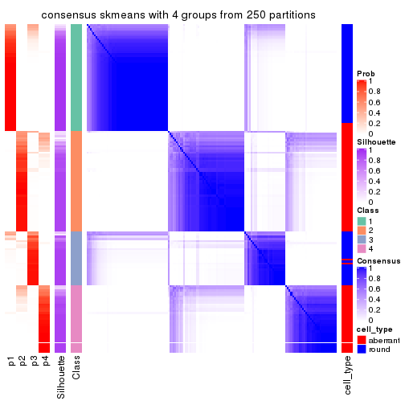</p>

</div>
<div id='tab-MAD-skmeans-consensus-heatmap-4'>
<pre><code class="r">consensus_heatmap(res, k = 5)
</code></pre>

<p></p>

</div>
<div id='tab-MAD-skmeans-consensus-heatmap-5'>
<pre><code class="r">consensus_heatmap(res, k = 6)
</code></pre>

<p></p>

</div>
</div>

Heatmaps for the membership of samples in all partitions to see how consistent they are:


<script>
$( function() {
	$( '#tabs-MAD-skmeans-membership-heatmap' ).tabs();
} );
</script>
<div id='tabs-MAD-skmeans-membership-heatmap'>
<ul>
<li><a href='#tab-MAD-skmeans-membership-heatmap-1'>k = 2</a></li>
<li><a href='#tab-MAD-skmeans-membership-heatmap-2'>k = 3</a></li>
<li><a href='#tab-MAD-skmeans-membership-heatmap-3'>k = 4</a></li>
<li><a href='#tab-MAD-skmeans-membership-heatmap-4'>k = 5</a></li>
<li><a href='#tab-MAD-skmeans-membership-heatmap-5'>k = 6</a></li>
</ul>
<div id='tab-MAD-skmeans-membership-heatmap-1'>
<pre><code class="r">membership_heatmap(res, k = 2)
</code></pre>

<p></p>

</div>
<div id='tab-MAD-skmeans-membership-heatmap-2'>
<pre><code class="r">membership_heatmap(res, k = 3)
</code></pre>

<p></p>

</div>
<div id='tab-MAD-skmeans-membership-heatmap-3'>
<pre><code class="r">membership_heatmap(res, k = 4)
</code></pre>

<p></p>

</div>
<div id='tab-MAD-skmeans-membership-heatmap-4'>
<pre><code class="r">membership_heatmap(res, k = 5)
</code></pre>

<p></p>

</div>
<div id='tab-MAD-skmeans-membership-heatmap-5'>
<pre><code class="r">membership_heatmap(res, k = 6)
</code></pre>

<p></p>

</div>
</div>

As soon as we have had the classes for columns, we can look for signatures
which are significantly different between classes which can be candidate marks
for certain classes. Following are the heatmaps for signatures.


Signature heatmaps where rows are scaled:


<script>
$( function() {
	$( '#tabs-MAD-skmeans-get-signatures' ).tabs();
} );
</script>
<div id='tabs-MAD-skmeans-get-signatures'>
<ul>
<li><a href='#tab-MAD-skmeans-get-signatures-1'>k = 2</a></li>
<li><a href='#tab-MAD-skmeans-get-signatures-2'>k = 3</a></li>
<li><a href='#tab-MAD-skmeans-get-signatures-3'>k = 4</a></li>
<li><a href='#tab-MAD-skmeans-get-signatures-4'>k = 5</a></li>
<li><a href='#tab-MAD-skmeans-get-signatures-5'>k = 6</a></li>
</ul>
<div id='tab-MAD-skmeans-get-signatures-1'>
<pre><code class="r">get_signatures(res, k = 2)
</code></pre>

<p></p>

</div>
<div id='tab-MAD-skmeans-get-signatures-2'>
<pre><code class="r">get_signatures(res, k = 3)
</code></pre>

<p></p>

</div>
<div id='tab-MAD-skmeans-get-signatures-3'>
<pre><code class="r">get_signatures(res, k = 4)
</code></pre>

<p>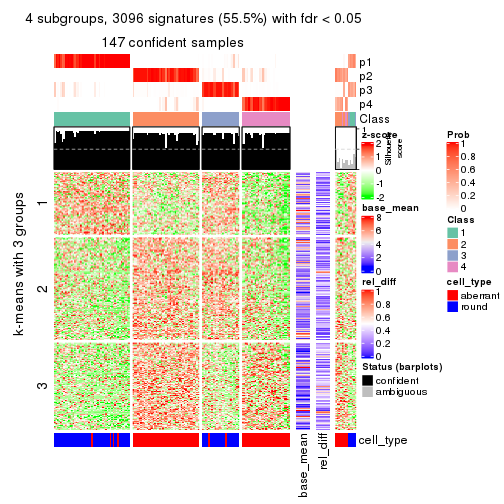</p>

</div>
<div id='tab-MAD-skmeans-get-signatures-4'>
<pre><code class="r">get_signatures(res, k = 5)
</code></pre>

<p></p>

</div>
<div id='tab-MAD-skmeans-get-signatures-5'>
<pre><code class="r">get_signatures(res, k = 6)
</code></pre>

<p></p>

</div>
</div>


Signature heatmaps where rows are not scaled:


<script>
$( function() {
	$( '#tabs-MAD-skmeans-get-signatures-no-scale' ).tabs();
} );
</script>
<div id='tabs-MAD-skmeans-get-signatures-no-scale'>
<ul>
<li><a href='#tab-MAD-skmeans-get-signatures-no-scale-1'>k = 2</a></li>
<li><a href='#tab-MAD-skmeans-get-signatures-no-scale-2'>k = 3</a></li>
<li><a href='#tab-MAD-skmeans-get-signatures-no-scale-3'>k = 4</a></li>
<li><a href='#tab-MAD-skmeans-get-signatures-no-scale-4'>k = 5</a></li>
<li><a href='#tab-MAD-skmeans-get-signatures-no-scale-5'>k = 6</a></li>
</ul>
<div id='tab-MAD-skmeans-get-signatures-no-scale-1'>
<pre><code class="r">get_signatures(res, k = 2, scale_rows = FALSE)
</code></pre>

<p></p>

</div>
<div id='tab-MAD-skmeans-get-signatures-no-scale-2'>
<pre><code class="r">get_signatures(res, k = 3, scale_rows = FALSE)
</code></pre>

<p></p>

</div>
<div id='tab-MAD-skmeans-get-signatures-no-scale-3'>
<pre><code class="r">get_signatures(res, k = 4, scale_rows = FALSE)
</code></pre>

<p></p>

</div>
<div id='tab-MAD-skmeans-get-signatures-no-scale-4'>
<pre><code class="r">get_signatures(res, k = 5, scale_rows = FALSE)
</code></pre>

<p></p>

</div>
<div id='tab-MAD-skmeans-get-signatures-no-scale-5'>
<pre><code class="r">get_signatures(res, k = 6, scale_rows = FALSE)
</code></pre>

<p></p>

</div>
</div>


Compare the overlap of signatures from different k:

```r
compare_signatures(res)
```


`get_signature()` returns a data frame invisibly. TO get the list of signatures, the function
call should be assigned to a variable explicitly. In following code, if `plot` argument is set
to `FALSE`, no heatmap is plotted while only the differential analysis is performed.

```r
# code only for demonstration
tb = get_signature(res, k = ..., plot = FALSE)
```

An example of the output of `tb` is:

```
#>   which_row         fdr    mean_1    mean_2 scaled_mean_1 scaled_mean_2 km
#> 1        38 0.042760348  8.373488  9.131774    -0.5533452     0.5164555  1
#> 2        40 0.018707592  7.106213  8.469186    -0.6173731     0.5762149  1
#> 3        55 0.019134737 10.221463 11.207825    -0.6159697     0.5749050  1
#> 4        59 0.006059896  5.921854  7.869574    -0.6899429     0.6439467  1
#> 5        60 0.018055526  8.928898 10.211722    -0.6204761     0.5791110  1
#> 6        98 0.009384629 15.714769 14.887706     0.6635654    -0.6193277  2
...
```

The columns in `tb` are:

1. `which_row`: row indices corresponding to the input matrix.
2. `fdr`: FDR for the differential test. 
3. `mean_x`: The mean value in group x.
4. `scaled_mean_x`: The mean value in group x after rows are scaled.
5. `km`: Row groups if k-means clustering is applied to rows.


UMAP plot which shows how samples are separated.


<script>
$( function() {
	$( '#tabs-MAD-skmeans-dimension-reduction' ).tabs();
} );
</script>
<div id='tabs-MAD-skmeans-dimension-reduction'>
<ul>
<li><a href='#tab-MAD-skmeans-dimension-reduction-1'>k = 2</a></li>
<li><a href='#tab-MAD-skmeans-dimension-reduction-2'>k = 3</a></li>
<li><a href='#tab-MAD-skmeans-dimension-reduction-3'>k = 4</a></li>
<li><a href='#tab-MAD-skmeans-dimension-reduction-4'>k = 5</a></li>
<li><a href='#tab-MAD-skmeans-dimension-reduction-5'>k = 6</a></li>
</ul>
<div id='tab-MAD-skmeans-dimension-reduction-1'>
<pre><code class="r">dimension_reduction(res, k = 2, method = &quot;UMAP&quot;)
</code></pre>

<p></p>

</div>
<div id='tab-MAD-skmeans-dimension-reduction-2'>
<pre><code class="r">dimension_reduction(res, k = 3, method = &quot;UMAP&quot;)
</code></pre>

<p></p>

</div>
<div id='tab-MAD-skmeans-dimension-reduction-3'>
<pre><code class="r">dimension_reduction(res, k = 4, method = &quot;UMAP&quot;)
</code></pre>

<p></p>

</div>
<div id='tab-MAD-skmeans-dimension-reduction-4'>
<pre><code class="r">dimension_reduction(res, k = 5, method = &quot;UMAP&quot;)
</code></pre>

<p></p>

</div>
<div id='tab-MAD-skmeans-dimension-reduction-5'>
<pre><code class="r">dimension_reduction(res, k = 6, method = &quot;UMAP&quot;)
</code></pre>

<p></p>

</div>
</div>


Following heatmap shows how subgroups are split when increasing `k`:

```r
collect_classes(res)
```


Test correlation between subgroups and known annotations. If the known
annotation is numeric, one-way ANOVA test is applied, and if the known
annotation is discrete, chi-squared contingency table test is applied.

```r
test_to_known_factors(res)
```

```
#>               n cell_type(p) k
#> MAD:skmeans 155     3.94e-19 2
#> MAD:skmeans 148     5.16e-22 3
#> MAD:skmeans 147     7.14e-27 4
#> MAD:skmeans 127     1.30e-22 5
#> MAD:skmeans 113     8.42e-19 6
```


If matrix rows can be associated to genes, consider to use `GO_Enrichment(res,
...)` to perform function enrichment for the signature genes.


 

---------------------------------------------------


### MAD:pam


The object with results only for a single top-value method and a single partition method 
can be extracted as:

```r
res = res_list["MAD", "pam"]
# you can also extract it by
# res = res_list["MAD:pam"]
```

A summary of `res` and all the functions that can be applied to it:

```r
res
```

```
#> A 'ConsensusPartition' object with k = 2, 3, 4, 5, 6.
#>   On a matrix with 5576 rows and 160 columns.
#>   Top rows (558, 1116, 1673, 2230, 2788) are extracted by 'MAD' method.
#>   Subgroups are detected by 'pam' method.
#>   Performed in total 1250 partitions by row resampling.
#>   Best k for subgroups seems to be 3.
#> 
#> Following methods can be applied to this 'ConsensusPartition' object:
#>  [1] "cola_report"             "collect_classes"         "collect_plots"          
#>  [4] "collect_stats"           "colnames"                "compare_signatures"     
#>  [7] "consensus_heatmap"       "dimension_reduction"     "functional_enrichment"  
#> [10] "get_anno_col"            "get_anno"                "get_classes"            
#> [13] "get_consensus"           "get_matrix"              "get_membership"         
#> [16] "get_param"               "get_signatures"          "get_stats"              
#> [19] "is_best_k"               "is_stable_k"             "membership_heatmap"     
#> [22] "ncol"                    "nrow"                    "plot_ecdf"              
#> [25] "rownames"                "select_partition_number" "show"                   
#> [28] "suggest_best_k"          "test_to_known_factors"
```

`collect_plots()` function collects all the plots made from `res` for all `k` (number of partitions)
into one single page to provide an easy and fast comparison between different `k`.

```r
collect_plots(res)
```


The plots are:

- The first row: a plot of the ECDF (Empirical cumulative distribution
  function) curves of the consensus matrix for each `k` and the heatmap of
  predicted classes for each `k`.
- The second row: heatmaps of the consensus matrix for each `k`.
- The third row: heatmaps of the membership matrix for each `k`.
- The fouth row: heatmaps of the signatures for each `k`.

All the plots in panels can be made by individual functions and they are
plotted later in this section.

`select_partition_number()` produces several plots showing different
statistics for choosing "optimized" `k`. There are following statistics:

- ECDF curves of the consensus matrix for each `k`;
- 1-PAC. [The PAC
  score](https://en.wikipedia.org/wiki/Consensus_clustering#Over-interpretation_potential_of_consensus_clustering)
  measures the proportion of the ambiguous subgrouping.
- Mean silhouette score.
- Concordance. The mean probability of fiting the consensus class ids in all
  partitions.
- Area increased. Denote $A_k$ as the area under the ECDF curve for current
  `k`, the area increased is defined as $A_k - A_{k-1}$.
- Rand index. The percent of pairs of samples that are both in a same cluster
  or both are not in a same cluster in the partition of k and k-1.
- Jaccard index. The ratio of pairs of samples are both in a same cluster in
  the partition of k and k-1 and the pairs of samples are both in a same
  cluster in the partition k or k-1.

The detailed explanations of these statistics can be found in [the cola
vignette](http://bioconductor.org/packages/devel/bioc/vignettes/cola/inst/doc/cola.html#toc_13).

Generally speaking, lower PAC score, higher mean silhouette score or higher
concordance corresponds to better partition. Rand index and Jaccard index
measure how similar the current partition is compared to partition with `k-1`.
If they are too similar, we won't accept `k` is better than `k-1`.

```r
select_partition_number(res)
```


The numeric values for all these statistics can be obtained by `get_stats()`.

```r
get_stats(res)
```

```
#>   k 1-PAC mean_silhouette concordance area_increased  Rand Jaccard
#> 2 2 0.703           0.911       0.945          0.148 0.904   0.904
#> 3 3 0.367           0.607       0.844          1.150 0.829   0.811
#> 4 4 0.308           0.659       0.815          0.201 0.950   0.934
#> 5 5 0.295           0.606       0.794          0.088 0.965   0.953
#> 6 6 0.415           0.646       0.831          0.366 0.691   0.586
```

`suggest_best_k()` suggests the best $k$ based on these statistics. The rules are as follows:

- All $k$ with Jaccard index larger than 0.95 are removed because the increase of
  the partition number does not provides enough extra information. If all $k$ are removed,
  the best $k$ is assigned by `NA`.
- For $k$ with 1-PAC larger than 0.9, the maximal $k$ is taken as the "best k". Other $k$ is called "optional k".
- If it does not fit the second rule. The $k$ with the highest vote of highest
  1-PAC, mean silhouette and concordance is taken as the "best k".

```r
suggest_best_k(res)
```

```
#> [1] 3
```


Following shows the table of the partitions (You need to click the **show/hide
code output** link to see it). The membership matrix (columns with name `p*`)
is inferred by
[`clue::cl_consensus()`](https://www.rdocumentation.org/link/cl_consensus?package=clue)
function with the `SE` method. Basically the value in the membership matrix
represents the probability to belong to a certain group. The finall class
label for an item is determined with the group with highest probability it
belongs to.

In `get_classes()` function, the entropy is calculated from the membership
matrix and the silhouette score is calculated from the consensus matrix.


<script>
$( function() {
	$( '#tabs-MAD-pam-get-classes' ).tabs();
} );
</script>
<div id='tabs-MAD-pam-get-classes'>
<ul>
<li><a href='#tab-MAD-pam-get-classes-1'>k = 2</a></li>
<li><a href='#tab-MAD-pam-get-classes-2'>k = 3</a></li>
<li><a href='#tab-MAD-pam-get-classes-3'>k = 4</a></li>
<li><a href='#tab-MAD-pam-get-classes-4'>k = 5</a></li>
<li><a href='#tab-MAD-pam-get-classes-5'>k = 6</a></li>
</ul>

<div id='tab-MAD-pam-get-classes-1'>
<p><a id='tab-MAD-pam-get-classes-1-a' style='color:#0366d6' href='#'>show/hide code output</a></p>
<pre><code class="r">cbind(get_classes(res, k = 2), get_membership(res, k = 2))
</code></pre>

<pre><code>#&gt;                     class entropy silhouette    p1    p2
#&gt; aberrant_ERR2585320     1  0.5737      0.879 0.864 0.136
#&gt; aberrant_ERR2585338     1  0.0000      0.946 1.000 0.000
#&gt; aberrant_ERR2585325     1  0.5519      0.881 0.872 0.128
#&gt; aberrant_ERR2585283     2  0.0000      0.861 0.000 1.000
#&gt; aberrant_ERR2585343     1  0.6531      0.843 0.832 0.168
#&gt; aberrant_ERR2585329     1  0.1843      0.942 0.972 0.028
#&gt; aberrant_ERR2585317     1  0.1633      0.943 0.976 0.024
#&gt; aberrant_ERR2585339     1  0.3114      0.931 0.944 0.056
#&gt; aberrant_ERR2585335     1  0.5059      0.894 0.888 0.112
#&gt; aberrant_ERR2585287     2  0.9170      0.556 0.332 0.668
#&gt; aberrant_ERR2585321     1  0.5737      0.874 0.864 0.136
#&gt; aberrant_ERR2585297     1  0.1184      0.943 0.984 0.016
#&gt; aberrant_ERR2585337     1  0.1414      0.944 0.980 0.020
#&gt; aberrant_ERR2585319     1  0.5519      0.881 0.872 0.128
#&gt; aberrant_ERR2585315     1  0.5178      0.891 0.884 0.116
#&gt; aberrant_ERR2585336     1  0.2603      0.936 0.956 0.044
#&gt; aberrant_ERR2585307     1  0.2043      0.941 0.968 0.032
#&gt; aberrant_ERR2585301     1  0.2236      0.940 0.964 0.036
#&gt; aberrant_ERR2585326     1  0.1633      0.943 0.976 0.024
#&gt; aberrant_ERR2585331     1  0.0000      0.946 1.000 0.000
#&gt; aberrant_ERR2585346     2  0.0376      0.862 0.004 0.996
#&gt; aberrant_ERR2585314     1  0.2423      0.937 0.960 0.040
#&gt; aberrant_ERR2585298     1  0.0376      0.946 0.996 0.004
#&gt; aberrant_ERR2585345     1  0.2423      0.937 0.960 0.040
#&gt; aberrant_ERR2585299     1  0.0672      0.947 0.992 0.008
#&gt; aberrant_ERR2585309     1  0.0938      0.944 0.988 0.012
#&gt; aberrant_ERR2585303     1  0.1843      0.942 0.972 0.028
#&gt; aberrant_ERR2585313     1  0.4815      0.901 0.896 0.104
#&gt; aberrant_ERR2585318     1  0.5178      0.892 0.884 0.116
#&gt; aberrant_ERR2585328     1  0.4161      0.915 0.916 0.084
#&gt; aberrant_ERR2585330     1  0.5737      0.874 0.864 0.136
#&gt; aberrant_ERR2585293     2  0.0376      0.861 0.004 0.996
#&gt; aberrant_ERR2585342     1  0.5737      0.874 0.864 0.136
#&gt; aberrant_ERR2585348     1  0.5629      0.877 0.868 0.132
#&gt; aberrant_ERR2585352     1  0.2603      0.936 0.956 0.044
#&gt; aberrant_ERR2585308     1  0.4161      0.920 0.916 0.084
#&gt; aberrant_ERR2585349     1  0.0938      0.945 0.988 0.012
#&gt; aberrant_ERR2585316     1  0.6712      0.824 0.824 0.176
#&gt; aberrant_ERR2585306     1  0.4298      0.912 0.912 0.088
#&gt; aberrant_ERR2585324     1  0.5294      0.888 0.880 0.120
#&gt; aberrant_ERR2585310     1  0.0938      0.946 0.988 0.012
#&gt; aberrant_ERR2585296     1  0.0000      0.946 1.000 0.000
#&gt; aberrant_ERR2585275     2  0.9170      0.555 0.332 0.668
#&gt; aberrant_ERR2585311     1  0.5519      0.882 0.872 0.128
#&gt; aberrant_ERR2585292     2  0.0376      0.861 0.004 0.996
#&gt; aberrant_ERR2585282     1  0.5842      0.875 0.860 0.140
#&gt; aberrant_ERR2585305     1  0.5408      0.886 0.876 0.124
#&gt; aberrant_ERR2585278     1  0.2423      0.937 0.960 0.040
#&gt; aberrant_ERR2585347     1  0.6247      0.857 0.844 0.156
#&gt; aberrant_ERR2585332     1  0.6148      0.860 0.848 0.152
#&gt; aberrant_ERR2585280     1  0.5737      0.874 0.864 0.136
#&gt; aberrant_ERR2585304     1  0.0376      0.946 0.996 0.004
#&gt; aberrant_ERR2585322     1  0.1843      0.942 0.972 0.028
#&gt; aberrant_ERR2585279     1  0.0376      0.946 0.996 0.004
#&gt; aberrant_ERR2585277     1  0.1184      0.945 0.984 0.016
#&gt; aberrant_ERR2585295     1  0.4690      0.903 0.900 0.100
#&gt; aberrant_ERR2585333     1  0.6148      0.860 0.848 0.152
#&gt; aberrant_ERR2585285     1  0.5408      0.885 0.876 0.124
#&gt; aberrant_ERR2585286     1  0.2236      0.939 0.964 0.036
#&gt; aberrant_ERR2585294     1  0.0672      0.946 0.992 0.008
#&gt; aberrant_ERR2585300     1  0.5294      0.892 0.880 0.120
#&gt; aberrant_ERR2585334     1  0.0000      0.946 1.000 0.000
#&gt; aberrant_ERR2585361     1  0.5178      0.891 0.884 0.116
#&gt; aberrant_ERR2585372     1  0.5842      0.871 0.860 0.140
#&gt; round_ERR2585217        1  0.0672      0.945 0.992 0.008
#&gt; round_ERR2585205        1  0.0938      0.944 0.988 0.012
#&gt; round_ERR2585214        1  0.0000      0.946 1.000 0.000
#&gt; round_ERR2585202        1  0.0000      0.946 1.000 0.000
#&gt; aberrant_ERR2585367     1  0.1633      0.944 0.976 0.024
#&gt; round_ERR2585220        1  0.0672      0.945 0.992 0.008
#&gt; round_ERR2585238        1  0.0938      0.944 0.988 0.012
#&gt; aberrant_ERR2585276     1  0.4815      0.902 0.896 0.104
#&gt; round_ERR2585218        1  0.0938      0.944 0.988 0.012
#&gt; aberrant_ERR2585363     1  0.4815      0.902 0.896 0.104
#&gt; round_ERR2585201        1  0.0376      0.946 0.996 0.004
#&gt; round_ERR2585210        1  0.0938      0.944 0.988 0.012
#&gt; aberrant_ERR2585362     1  0.3114      0.935 0.944 0.056
#&gt; aberrant_ERR2585360     1  0.5059      0.897 0.888 0.112
#&gt; round_ERR2585209        1  0.0376      0.946 0.996 0.004
#&gt; round_ERR2585242        1  0.0000      0.946 1.000 0.000
#&gt; round_ERR2585216        1  0.0938      0.944 0.988 0.012
#&gt; round_ERR2585219        1  0.0938      0.944 0.988 0.012
#&gt; round_ERR2585237        1  0.0376      0.946 0.996 0.004
#&gt; round_ERR2585198        1  0.0000      0.946 1.000 0.000
#&gt; round_ERR2585211        1  0.0938      0.944 0.988 0.012
#&gt; round_ERR2585206        1  0.1184      0.944 0.984 0.016
#&gt; aberrant_ERR2585281     1  0.1633      0.943 0.976 0.024
#&gt; round_ERR2585212        1  0.0938      0.944 0.988 0.012
#&gt; round_ERR2585221        1  0.0672      0.946 0.992 0.008
#&gt; round_ERR2585243        1  0.0938      0.944 0.988 0.012
#&gt; round_ERR2585204        1  0.0000      0.946 1.000 0.000
#&gt; round_ERR2585213        1  0.0000      0.946 1.000 0.000
#&gt; aberrant_ERR2585373     1  0.5519      0.883 0.872 0.128
#&gt; aberrant_ERR2585358     1  0.6801      0.829 0.820 0.180
#&gt; aberrant_ERR2585365     1  0.1843      0.942 0.972 0.028
#&gt; aberrant_ERR2585359     1  0.9661      0.379 0.608 0.392
#&gt; aberrant_ERR2585370     1  0.1414      0.944 0.980 0.020
#&gt; round_ERR2585215        1  0.1414      0.943 0.980 0.020
#&gt; round_ERR2585262        1  0.0376      0.946 0.996 0.004
#&gt; round_ERR2585199        1  0.0000      0.946 1.000 0.000
#&gt; aberrant_ERR2585369     1  0.3431      0.927 0.936 0.064
#&gt; round_ERR2585208        1  0.0938      0.944 0.988 0.012
#&gt; round_ERR2585252        1  0.0938      0.944 0.988 0.012
#&gt; round_ERR2585236        1  0.1633      0.946 0.976 0.024
#&gt; aberrant_ERR2585284     2  0.0376      0.862 0.004 0.996
#&gt; round_ERR2585224        1  0.7139      0.812 0.804 0.196
#&gt; round_ERR2585260        1  0.0938      0.946 0.988 0.012
#&gt; round_ERR2585229        1  0.1184      0.946 0.984 0.016
#&gt; aberrant_ERR2585364     2  0.7219      0.747 0.200 0.800
#&gt; round_ERR2585253        1  0.2603      0.931 0.956 0.044
#&gt; aberrant_ERR2585368     1  0.0000      0.946 1.000 0.000
#&gt; aberrant_ERR2585371     1  0.0000      0.946 1.000 0.000
#&gt; round_ERR2585239        1  0.0938      0.944 0.988 0.012
#&gt; round_ERR2585273        1  0.0938      0.944 0.988 0.012
#&gt; round_ERR2585256        1  0.0672      0.945 0.992 0.008
#&gt; round_ERR2585272        1  0.0938      0.944 0.988 0.012
#&gt; round_ERR2585246        1  0.1184      0.945 0.984 0.016
#&gt; round_ERR2585261        1  0.0376      0.946 0.996 0.004
#&gt; round_ERR2585254        1  0.0376      0.946 0.996 0.004
#&gt; round_ERR2585225        1  0.0672      0.946 0.992 0.008
#&gt; round_ERR2585235        1  0.0938      0.944 0.988 0.012
#&gt; round_ERR2585271        1  0.0938      0.944 0.988 0.012
#&gt; round_ERR2585251        1  0.0672      0.945 0.992 0.008
#&gt; round_ERR2585255        1  0.0376      0.946 0.996 0.004
#&gt; round_ERR2585257        1  0.0376      0.946 0.996 0.004
#&gt; round_ERR2585226        1  0.0376      0.946 0.996 0.004
#&gt; round_ERR2585265        1  0.0672      0.945 0.992 0.008
#&gt; round_ERR2585259        1  0.0938      0.944 0.988 0.012
#&gt; round_ERR2585247        1  0.0672      0.946 0.992 0.008
#&gt; round_ERR2585241        1  0.0938      0.944 0.988 0.012
#&gt; round_ERR2585263        1  0.0376      0.946 0.996 0.004
#&gt; round_ERR2585264        1  0.9522      0.281 0.628 0.372
#&gt; round_ERR2585233        1  0.0376      0.946 0.996 0.004
#&gt; round_ERR2585223        1  0.0938      0.944 0.988 0.012
#&gt; round_ERR2585234        1  0.0000      0.946 1.000 0.000
#&gt; round_ERR2585222        1  0.0000      0.946 1.000 0.000
#&gt; round_ERR2585228        1  0.0938      0.944 0.988 0.012
#&gt; round_ERR2585248        1  0.5842      0.829 0.860 0.140
#&gt; round_ERR2585240        1  0.0376      0.946 0.996 0.004
#&gt; round_ERR2585270        1  0.0672      0.945 0.992 0.008
#&gt; round_ERR2585232        1  0.0376      0.946 0.996 0.004
#&gt; aberrant_ERR2585341     1  0.2423      0.939 0.960 0.040
#&gt; aberrant_ERR2585355     1  0.1843      0.942 0.972 0.028
#&gt; round_ERR2585227        1  0.0672      0.946 0.992 0.008
#&gt; aberrant_ERR2585351     1  0.4298      0.914 0.912 0.088
#&gt; round_ERR2585269        1  0.2423      0.931 0.960 0.040
#&gt; aberrant_ERR2585357     1  0.1414      0.944 0.980 0.020
#&gt; aberrant_ERR2585350     1  0.1843      0.942 0.972 0.028
#&gt; round_ERR2585250        1  0.0938      0.946 0.988 0.012
#&gt; round_ERR2585245        1  0.3733      0.908 0.928 0.072
#&gt; aberrant_ERR2585353     1  0.5737      0.874 0.864 0.136
#&gt; round_ERR2585258        1  0.1184      0.946 0.984 0.016
#&gt; aberrant_ERR2585354     1  0.4298      0.914 0.912 0.088
#&gt; round_ERR2585249        1  0.2778      0.932 0.952 0.048
#&gt; round_ERR2585268        1  0.0376      0.946 0.996 0.004
#&gt; aberrant_ERR2585356     1  0.5519      0.881 0.872 0.128
#&gt; round_ERR2585266        1  0.0000      0.946 1.000 0.000
#&gt; round_ERR2585231        1  0.2778      0.927 0.952 0.048
#&gt; round_ERR2585230        1  0.0938      0.944 0.988 0.012
#&gt; round_ERR2585267        1  0.0938      0.944 0.988 0.012
</code></pre>

<script>
$('#tab-MAD-pam-get-classes-1-a').parent().next().next().hide();
$('#tab-MAD-pam-get-classes-1-a').click(function(){
  $('#tab-MAD-pam-get-classes-1-a').parent().next().next().toggle();
  return(false);
});
</script>
</div>

<div id='tab-MAD-pam-get-classes-2'>
<p><a id='tab-MAD-pam-get-classes-2-a' style='color:#0366d6' href='#'>show/hide code output</a></p>
<pre><code class="r">cbind(get_classes(res, k = 3), get_membership(res, k = 3))
</code></pre>

<pre><code>#&gt;                     class entropy silhouette    p1    p2    p3
#&gt; aberrant_ERR2585320     2  0.6079     0.5364 0.388 0.612 0.000
#&gt; aberrant_ERR2585338     1  0.1031     0.7801 0.976 0.024 0.000
#&gt; aberrant_ERR2585325     2  0.6215     0.4766 0.428 0.572 0.000
#&gt; aberrant_ERR2585283     3  0.0000     0.8124 0.000 0.000 1.000
#&gt; aberrant_ERR2585343     2  0.5327     0.7000 0.272 0.728 0.000
#&gt; aberrant_ERR2585329     1  0.5810     0.3037 0.664 0.336 0.000
#&gt; aberrant_ERR2585317     1  0.5810     0.3036 0.664 0.336 0.000
#&gt; aberrant_ERR2585339     1  0.4974     0.5422 0.764 0.236 0.000
#&gt; aberrant_ERR2585335     1  0.6026     0.1549 0.624 0.376 0.000
#&gt; aberrant_ERR2585287     3  0.8396     0.5392 0.180 0.196 0.624
#&gt; aberrant_ERR2585321     1  0.6225    -0.1489 0.568 0.432 0.000
#&gt; aberrant_ERR2585297     1  0.0424     0.7819 0.992 0.008 0.000
#&gt; aberrant_ERR2585337     1  0.5560     0.3990 0.700 0.300 0.000
#&gt; aberrant_ERR2585319     2  0.5650     0.7523 0.312 0.688 0.000
#&gt; aberrant_ERR2585315     1  0.5706     0.3587 0.680 0.320 0.000
#&gt; aberrant_ERR2585336     1  0.5810     0.3053 0.664 0.336 0.000
#&gt; aberrant_ERR2585307     1  0.4002     0.6654 0.840 0.160 0.000
#&gt; aberrant_ERR2585301     1  0.3619     0.6929 0.864 0.136 0.000
#&gt; aberrant_ERR2585326     1  0.5760     0.3287 0.672 0.328 0.000
#&gt; aberrant_ERR2585331     1  0.0747     0.7829 0.984 0.016 0.000
#&gt; aberrant_ERR2585346     3  0.0892     0.8049 0.000 0.020 0.980
#&gt; aberrant_ERR2585314     1  0.5785     0.3078 0.668 0.332 0.000
#&gt; aberrant_ERR2585298     1  0.0000     0.7845 1.000 0.000 0.000
#&gt; aberrant_ERR2585345     1  0.5810     0.3033 0.664 0.336 0.000
#&gt; aberrant_ERR2585299     1  0.1163     0.7821 0.972 0.028 0.000
#&gt; aberrant_ERR2585309     1  0.0424     0.7819 0.992 0.008 0.000
#&gt; aberrant_ERR2585303     1  0.4452     0.6204 0.808 0.192 0.000
#&gt; aberrant_ERR2585313     1  0.6008     0.1710 0.628 0.372 0.000
#&gt; aberrant_ERR2585318     2  0.6045     0.7361 0.380 0.620 0.000
#&gt; aberrant_ERR2585328     1  0.5431     0.4464 0.716 0.284 0.000
#&gt; aberrant_ERR2585330     1  0.6274    -0.2844 0.544 0.456 0.000
#&gt; aberrant_ERR2585293     3  0.0000     0.8124 0.000 0.000 1.000
#&gt; aberrant_ERR2585342     2  0.5882     0.7571 0.348 0.652 0.000
#&gt; aberrant_ERR2585348     1  0.6126    -0.1588 0.600 0.400 0.000
#&gt; aberrant_ERR2585352     1  0.6045     0.1155 0.620 0.380 0.000
#&gt; aberrant_ERR2585308     1  0.4399     0.7020 0.864 0.044 0.092
#&gt; aberrant_ERR2585349     1  0.3752     0.6700 0.856 0.144 0.000
#&gt; aberrant_ERR2585316     1  0.6586     0.4438 0.728 0.216 0.056
#&gt; aberrant_ERR2585306     1  0.4353     0.6660 0.836 0.156 0.008
#&gt; aberrant_ERR2585324     2  0.5905     0.7424 0.352 0.648 0.000
#&gt; aberrant_ERR2585310     1  0.2625     0.7412 0.916 0.084 0.000
#&gt; aberrant_ERR2585296     1  0.0237     0.7849 0.996 0.004 0.000
#&gt; aberrant_ERR2585275     3  0.5929     0.1061 0.320 0.004 0.676
#&gt; aberrant_ERR2585311     1  0.6180    -0.0436 0.584 0.416 0.000
#&gt; aberrant_ERR2585292     3  0.0000     0.8124 0.000 0.000 1.000
#&gt; aberrant_ERR2585282     1  0.5785     0.1837 0.668 0.332 0.000
#&gt; aberrant_ERR2585305     1  0.5988     0.1880 0.632 0.368 0.000
#&gt; aberrant_ERR2585278     1  0.5098     0.5053 0.752 0.248 0.000
#&gt; aberrant_ERR2585347     1  0.6148     0.1629 0.640 0.356 0.004
#&gt; aberrant_ERR2585332     2  0.5650     0.7552 0.312 0.688 0.000
#&gt; aberrant_ERR2585280     1  0.5678     0.3665 0.684 0.316 0.000
#&gt; aberrant_ERR2585304     1  0.3412     0.7018 0.876 0.124 0.000
#&gt; aberrant_ERR2585322     1  0.3879     0.6749 0.848 0.152 0.000
#&gt; aberrant_ERR2585279     1  0.2796     0.7340 0.908 0.092 0.000
#&gt; aberrant_ERR2585277     1  0.4654     0.5989 0.792 0.208 0.000
#&gt; aberrant_ERR2585295     1  0.4555     0.6155 0.800 0.200 0.000
#&gt; aberrant_ERR2585333     2  0.6280     0.5840 0.460 0.540 0.000
#&gt; aberrant_ERR2585285     2  0.6180     0.6792 0.416 0.584 0.000
#&gt; aberrant_ERR2585286     1  0.5363     0.4642 0.724 0.276 0.000
#&gt; aberrant_ERR2585294     1  0.4062     0.6615 0.836 0.164 0.000
#&gt; aberrant_ERR2585300     1  0.6667     0.1007 0.616 0.368 0.016
#&gt; aberrant_ERR2585334     1  0.0000     0.7845 1.000 0.000 0.000
#&gt; aberrant_ERR2585361     2  0.6309     0.4451 0.500 0.500 0.000
#&gt; aberrant_ERR2585372     2  0.5948     0.7524 0.360 0.640 0.000
#&gt; round_ERR2585217        1  0.0237     0.7834 0.996 0.004 0.000
#&gt; round_ERR2585205        1  0.0424     0.7819 0.992 0.008 0.000
#&gt; round_ERR2585214        1  0.0000     0.7845 1.000 0.000 0.000
#&gt; round_ERR2585202        1  0.0424     0.7847 0.992 0.008 0.000
#&gt; aberrant_ERR2585367     1  0.2711     0.7292 0.912 0.088 0.000
#&gt; round_ERR2585220        1  0.0237     0.7834 0.996 0.004 0.000
#&gt; round_ERR2585238        1  0.1643     0.7750 0.956 0.044 0.000
#&gt; aberrant_ERR2585276     1  0.5926     0.2376 0.644 0.356 0.000
#&gt; round_ERR2585218        1  0.0237     0.7834 0.996 0.004 0.000
#&gt; aberrant_ERR2585363     1  0.5948     0.1789 0.640 0.360 0.000
#&gt; round_ERR2585201        1  0.0000     0.7845 1.000 0.000 0.000
#&gt; round_ERR2585210        1  0.0424     0.7819 0.992 0.008 0.000
#&gt; aberrant_ERR2585362     1  0.5678     0.3638 0.684 0.316 0.000
#&gt; aberrant_ERR2585360     1  0.5948     0.2358 0.640 0.360 0.000
#&gt; round_ERR2585209        1  0.0000     0.7845 1.000 0.000 0.000
#&gt; round_ERR2585242        1  0.0237     0.7837 0.996 0.004 0.000
#&gt; round_ERR2585216        1  0.0237     0.7834 0.996 0.004 0.000
#&gt; round_ERR2585219        1  0.0424     0.7819 0.992 0.008 0.000
#&gt; round_ERR2585237        1  0.0000     0.7845 1.000 0.000 0.000
#&gt; round_ERR2585198        1  0.0000     0.7845 1.000 0.000 0.000
#&gt; round_ERR2585211        1  0.0424     0.7819 0.992 0.008 0.000
#&gt; round_ERR2585206        1  0.0592     0.7832 0.988 0.012 0.000
#&gt; aberrant_ERR2585281     1  0.2448     0.7503 0.924 0.076 0.000
#&gt; round_ERR2585212        1  0.0592     0.7851 0.988 0.012 0.000
#&gt; round_ERR2585221        1  0.0747     0.7839 0.984 0.016 0.000
#&gt; round_ERR2585243        1  0.0237     0.7834 0.996 0.004 0.000
#&gt; round_ERR2585204        1  0.0000     0.7845 1.000 0.000 0.000
#&gt; round_ERR2585213        1  0.0000     0.7845 1.000 0.000 0.000
#&gt; aberrant_ERR2585373     2  0.6008     0.7440 0.372 0.628 0.000
#&gt; aberrant_ERR2585358     2  0.4749     0.2454 0.116 0.844 0.040
#&gt; aberrant_ERR2585365     1  0.5835     0.2865 0.660 0.340 0.000
#&gt; aberrant_ERR2585359     2  0.8349     0.3854 0.220 0.624 0.156
#&gt; aberrant_ERR2585370     1  0.5733     0.3390 0.676 0.324 0.000
#&gt; round_ERR2585215        1  0.0848     0.7802 0.984 0.008 0.008
#&gt; round_ERR2585262        1  0.0000     0.7845 1.000 0.000 0.000
#&gt; round_ERR2585199        1  0.0000     0.7845 1.000 0.000 0.000
#&gt; aberrant_ERR2585369     1  0.5650     0.3638 0.688 0.312 0.000
#&gt; round_ERR2585208        1  0.0424     0.7819 0.992 0.008 0.000
#&gt; round_ERR2585252        1  0.0424     0.7819 0.992 0.008 0.000
#&gt; round_ERR2585236        1  0.0829     0.7824 0.984 0.012 0.004
#&gt; aberrant_ERR2585284     3  0.0000     0.8124 0.000 0.000 1.000
#&gt; round_ERR2585224        1  0.6678     0.4792 0.728 0.064 0.208
#&gt; round_ERR2585260        1  0.0892     0.7835 0.980 0.020 0.000
#&gt; round_ERR2585229        1  0.1031     0.7834 0.976 0.024 0.000
#&gt; aberrant_ERR2585364     3  0.8676     0.5246 0.116 0.352 0.532
#&gt; round_ERR2585253        1  0.1950     0.7632 0.952 0.008 0.040
#&gt; aberrant_ERR2585368     1  0.0424     0.7841 0.992 0.008 0.000
#&gt; aberrant_ERR2585371     1  0.0237     0.7846 0.996 0.004 0.000
#&gt; round_ERR2585239        1  0.0424     0.7819 0.992 0.008 0.000
#&gt; round_ERR2585273        1  0.0892     0.7840 0.980 0.020 0.000
#&gt; round_ERR2585256        1  0.0237     0.7834 0.996 0.004 0.000
#&gt; round_ERR2585272        1  0.0424     0.7819 0.992 0.008 0.000
#&gt; round_ERR2585246        1  0.1964     0.7689 0.944 0.056 0.000
#&gt; round_ERR2585261        1  0.0000     0.7845 1.000 0.000 0.000
#&gt; round_ERR2585254        1  0.0237     0.7847 0.996 0.004 0.000
#&gt; round_ERR2585225        1  0.0000     0.7845 1.000 0.000 0.000
#&gt; round_ERR2585235        1  0.1031     0.7835 0.976 0.024 0.000
#&gt; round_ERR2585271        1  0.0424     0.7819 0.992 0.008 0.000
#&gt; round_ERR2585251        1  0.0592     0.7834 0.988 0.012 0.000
#&gt; round_ERR2585255        1  0.0000     0.7845 1.000 0.000 0.000
#&gt; round_ERR2585257        1  0.0000     0.7845 1.000 0.000 0.000
#&gt; round_ERR2585226        1  0.2261     0.7503 0.932 0.068 0.000
#&gt; round_ERR2585265        1  0.1411     0.7774 0.964 0.036 0.000
#&gt; round_ERR2585259        1  0.0424     0.7819 0.992 0.008 0.000
#&gt; round_ERR2585247        1  0.0592     0.7834 0.988 0.012 0.000
#&gt; round_ERR2585241        1  0.0424     0.7819 0.992 0.008 0.000
#&gt; round_ERR2585263        1  0.0237     0.7848 0.996 0.004 0.000
#&gt; round_ERR2585264        1  0.6682    -0.2478 0.504 0.008 0.488
#&gt; round_ERR2585233        1  0.0000     0.7845 1.000 0.000 0.000
#&gt; round_ERR2585223        1  0.0424     0.7819 0.992 0.008 0.000
#&gt; round_ERR2585234        1  0.0237     0.7847 0.996 0.004 0.000
#&gt; round_ERR2585222        1  0.0000     0.7845 1.000 0.000 0.000
#&gt; round_ERR2585228        1  0.0424     0.7819 0.992 0.008 0.000
#&gt; round_ERR2585248        1  0.5443     0.4437 0.736 0.004 0.260
#&gt; round_ERR2585240        1  0.0000     0.7845 1.000 0.000 0.000
#&gt; round_ERR2585270        1  0.1411     0.7782 0.964 0.036 0.000
#&gt; round_ERR2585232        1  0.0000     0.7845 1.000 0.000 0.000
#&gt; aberrant_ERR2585341     1  0.3752     0.6736 0.856 0.144 0.000
#&gt; aberrant_ERR2585355     1  0.5529     0.4134 0.704 0.296 0.000
#&gt; round_ERR2585227        1  0.1031     0.7822 0.976 0.024 0.000
#&gt; aberrant_ERR2585351     1  0.5948     0.2199 0.640 0.360 0.000
#&gt; round_ERR2585269        1  0.2280     0.7533 0.940 0.008 0.052
#&gt; aberrant_ERR2585357     1  0.5810     0.3036 0.664 0.336 0.000
#&gt; aberrant_ERR2585350     1  0.5733     0.3401 0.676 0.324 0.000
#&gt; round_ERR2585250        1  0.0747     0.7846 0.984 0.016 0.000
#&gt; round_ERR2585245        1  0.4861     0.5790 0.800 0.008 0.192
#&gt; aberrant_ERR2585353     2  0.6309     0.4564 0.496 0.504 0.000
#&gt; round_ERR2585258        1  0.1163     0.7825 0.972 0.028 0.000
#&gt; aberrant_ERR2585354     1  0.5560     0.3962 0.700 0.300 0.000
#&gt; round_ERR2585249        1  0.2749     0.7444 0.924 0.012 0.064
#&gt; round_ERR2585268        1  0.3192     0.7143 0.888 0.112 0.000
#&gt; aberrant_ERR2585356     1  0.6495    -0.4050 0.536 0.460 0.004
#&gt; round_ERR2585266        1  0.0000     0.7845 1.000 0.000 0.000
#&gt; round_ERR2585231        1  0.2584     0.7425 0.928 0.008 0.064
#&gt; round_ERR2585230        1  0.0424     0.7819 0.992 0.008 0.000
#&gt; round_ERR2585267        1  0.0424     0.7819 0.992 0.008 0.000
</code></pre>

<script>
$('#tab-MAD-pam-get-classes-2-a').parent().next().next().hide();
$('#tab-MAD-pam-get-classes-2-a').click(function(){
  $('#tab-MAD-pam-get-classes-2-a').parent().next().next().toggle();
  return(false);
});
</script>
</div>

<div id='tab-MAD-pam-get-classes-3'>
<p><a id='tab-MAD-pam-get-classes-3-a' style='color:#0366d6' href='#'>show/hide code output</a></p>
<pre><code class="r">cbind(get_classes(res, k = 4), get_membership(res, k = 4))
</code></pre>

<pre><code>#&gt;                     class entropy silhouette    p1    p2    p3    p4
#&gt; aberrant_ERR2585320     3  0.3945    -0.0648 0.004 0.216 0.780 0.000
#&gt; aberrant_ERR2585338     1  0.0817     0.8159 0.976 0.000 0.024 0.000
#&gt; aberrant_ERR2585325     3  0.4123    -0.0664 0.008 0.220 0.772 0.000
#&gt; aberrant_ERR2585283     4  0.0000     0.7711 0.000 0.000 0.000 1.000
#&gt; aberrant_ERR2585343     2  0.4877     0.3613 0.044 0.752 0.204 0.000
#&gt; aberrant_ERR2585329     1  0.4585     0.6289 0.668 0.000 0.332 0.000
#&gt; aberrant_ERR2585317     1  0.4585     0.6274 0.668 0.000 0.332 0.000
#&gt; aberrant_ERR2585339     1  0.4088     0.7341 0.764 0.004 0.232 0.000
#&gt; aberrant_ERR2585335     1  0.4950     0.5765 0.620 0.004 0.376 0.000
#&gt; aberrant_ERR2585287     4  0.8463     0.3916 0.076 0.116 0.360 0.448
#&gt; aberrant_ERR2585321     1  0.6617     0.3937 0.532 0.088 0.380 0.000
#&gt; aberrant_ERR2585297     1  0.2011     0.8084 0.920 0.080 0.000 0.000
#&gt; aberrant_ERR2585337     1  0.4331     0.6763 0.712 0.000 0.288 0.000
#&gt; aberrant_ERR2585319     2  0.4877     0.3929 0.008 0.664 0.328 0.000
#&gt; aberrant_ERR2585315     1  0.5075     0.6175 0.644 0.012 0.344 0.000
#&gt; aberrant_ERR2585336     1  0.4605     0.6231 0.664 0.000 0.336 0.000
#&gt; aberrant_ERR2585307     1  0.3569     0.7471 0.804 0.000 0.196 0.000
#&gt; aberrant_ERR2585301     1  0.3681     0.7537 0.816 0.008 0.176 0.000
#&gt; aberrant_ERR2585326     1  0.4564     0.6325 0.672 0.000 0.328 0.000
#&gt; aberrant_ERR2585331     1  0.0592     0.8150 0.984 0.000 0.016 0.000
#&gt; aberrant_ERR2585346     4  0.1411     0.7421 0.000 0.020 0.020 0.960
#&gt; aberrant_ERR2585314     1  0.4522     0.6382 0.680 0.000 0.320 0.000
#&gt; aberrant_ERR2585298     1  0.0000     0.8130 1.000 0.000 0.000 0.000
#&gt; aberrant_ERR2585345     1  0.4585     0.6288 0.668 0.000 0.332 0.000
#&gt; aberrant_ERR2585299     1  0.2773     0.8149 0.900 0.072 0.028 0.000
#&gt; aberrant_ERR2585309     1  0.2281     0.8028 0.904 0.096 0.000 0.000
#&gt; aberrant_ERR2585303     1  0.3764     0.7303 0.784 0.000 0.216 0.000
#&gt; aberrant_ERR2585313     1  0.4936     0.5797 0.624 0.004 0.372 0.000
#&gt; aberrant_ERR2585318     3  0.7800    -0.2847 0.248 0.372 0.380 0.000
#&gt; aberrant_ERR2585328     1  0.4483     0.6885 0.712 0.004 0.284 0.000
#&gt; aberrant_ERR2585330     1  0.6972     0.3492 0.520 0.124 0.356 0.000
#&gt; aberrant_ERR2585293     4  0.0000     0.7711 0.000 0.000 0.000 1.000
#&gt; aberrant_ERR2585342     2  0.7136     0.3246 0.136 0.488 0.376 0.000
#&gt; aberrant_ERR2585348     1  0.7595    -0.1869 0.428 0.200 0.372 0.000
#&gt; aberrant_ERR2585352     1  0.6071     0.5331 0.612 0.064 0.324 0.000
#&gt; aberrant_ERR2585308     1  0.4802     0.7817 0.800 0.132 0.052 0.016
#&gt; aberrant_ERR2585349     1  0.2530     0.7973 0.888 0.000 0.112 0.000
#&gt; aberrant_ERR2585316     1  0.6667     0.6299 0.684 0.140 0.144 0.032
#&gt; aberrant_ERR2585306     1  0.5011     0.7280 0.748 0.040 0.208 0.004
#&gt; aberrant_ERR2585324     2  0.5489     0.4117 0.040 0.664 0.296 0.000
#&gt; aberrant_ERR2585310     1  0.2589     0.7901 0.884 0.000 0.116 0.000
#&gt; aberrant_ERR2585296     1  0.0188     0.8138 0.996 0.000 0.004 0.000
#&gt; aberrant_ERR2585275     4  0.4699    -0.0310 0.320 0.004 0.000 0.676
#&gt; aberrant_ERR2585311     1  0.6055     0.5037 0.576 0.052 0.372 0.000
#&gt; aberrant_ERR2585292     4  0.0000     0.7711 0.000 0.000 0.000 1.000
#&gt; aberrant_ERR2585282     1  0.6917     0.2951 0.568 0.288 0.144 0.000
#&gt; aberrant_ERR2585305     1  0.4920     0.5917 0.628 0.004 0.368 0.000
#&gt; aberrant_ERR2585278     1  0.3801     0.7384 0.780 0.000 0.220 0.000
#&gt; aberrant_ERR2585347     1  0.6675     0.5293 0.612 0.116 0.268 0.004
#&gt; aberrant_ERR2585332     2  0.7199     0.2636 0.232 0.552 0.216 0.000
#&gt; aberrant_ERR2585280     1  0.6370     0.5795 0.620 0.100 0.280 0.000
#&gt; aberrant_ERR2585304     1  0.3219     0.7615 0.836 0.000 0.164 0.000
#&gt; aberrant_ERR2585322     1  0.3528     0.7480 0.808 0.000 0.192 0.000
#&gt; aberrant_ERR2585279     1  0.2469     0.7935 0.892 0.000 0.108 0.000
#&gt; aberrant_ERR2585277     1  0.3837     0.7351 0.776 0.000 0.224 0.000
#&gt; aberrant_ERR2585295     1  0.4868     0.7277 0.748 0.040 0.212 0.000
#&gt; aberrant_ERR2585333     1  0.7723    -0.0805 0.420 0.232 0.348 0.000
#&gt; aberrant_ERR2585285     3  0.7883    -0.1684 0.328 0.292 0.380 0.000
#&gt; aberrant_ERR2585286     1  0.4304     0.6841 0.716 0.000 0.284 0.000
#&gt; aberrant_ERR2585294     1  0.3528     0.7522 0.808 0.000 0.192 0.000
#&gt; aberrant_ERR2585300     1  0.7275     0.4929 0.560 0.136 0.292 0.012
#&gt; aberrant_ERR2585334     1  0.0000     0.8130 1.000 0.000 0.000 0.000
#&gt; aberrant_ERR2585361     1  0.7740    -0.0732 0.432 0.248 0.320 0.000
#&gt; aberrant_ERR2585372     2  0.7415     0.2684 0.216 0.512 0.272 0.000
#&gt; round_ERR2585217        1  0.0336     0.8125 0.992 0.008 0.000 0.000
#&gt; round_ERR2585205        1  0.0817     0.8141 0.976 0.024 0.000 0.000
#&gt; round_ERR2585214        1  0.0000     0.8130 1.000 0.000 0.000 0.000
#&gt; round_ERR2585202        1  0.0336     0.8144 0.992 0.000 0.008 0.000
#&gt; aberrant_ERR2585367     1  0.2984     0.7996 0.888 0.028 0.084 0.000
#&gt; round_ERR2585220        1  0.1211     0.8132 0.960 0.040 0.000 0.000
#&gt; round_ERR2585238        1  0.3787     0.7958 0.840 0.124 0.036 0.000
#&gt; aberrant_ERR2585276     1  0.5577     0.6242 0.636 0.036 0.328 0.000
#&gt; round_ERR2585218        1  0.2469     0.8010 0.892 0.108 0.000 0.000
#&gt; aberrant_ERR2585363     1  0.6016     0.5791 0.632 0.068 0.300 0.000
#&gt; round_ERR2585201        1  0.0000     0.8130 1.000 0.000 0.000 0.000
#&gt; round_ERR2585210        1  0.0921     0.8130 0.972 0.028 0.000 0.000
#&gt; aberrant_ERR2585362     1  0.4677     0.6482 0.680 0.004 0.316 0.000
#&gt; aberrant_ERR2585360     1  0.5289     0.6165 0.636 0.020 0.344 0.000
#&gt; round_ERR2585209        1  0.0188     0.8131 0.996 0.004 0.000 0.000
#&gt; round_ERR2585242        1  0.0188     0.8131 0.996 0.004 0.000 0.000
#&gt; round_ERR2585216        1  0.0188     0.8126 0.996 0.004 0.000 0.000
#&gt; round_ERR2585219        1  0.1557     0.8116 0.944 0.056 0.000 0.000
#&gt; round_ERR2585237        1  0.0000     0.8130 1.000 0.000 0.000 0.000
#&gt; round_ERR2585198        1  0.0000     0.8130 1.000 0.000 0.000 0.000
#&gt; round_ERR2585211        1  0.1792     0.8100 0.932 0.068 0.000 0.000
#&gt; round_ERR2585206        1  0.2944     0.7914 0.868 0.128 0.004 0.000
#&gt; aberrant_ERR2585281     1  0.2011     0.8083 0.920 0.000 0.080 0.000
#&gt; round_ERR2585212        1  0.2125     0.8122 0.920 0.076 0.004 0.000
#&gt; round_ERR2585221        1  0.3032     0.7945 0.868 0.124 0.008 0.000
#&gt; round_ERR2585243        1  0.1022     0.8148 0.968 0.032 0.000 0.000
#&gt; round_ERR2585204        1  0.0000     0.8130 1.000 0.000 0.000 0.000
#&gt; round_ERR2585213        1  0.0000     0.8130 1.000 0.000 0.000 0.000
#&gt; aberrant_ERR2585373     2  0.7554     0.1979 0.192 0.432 0.376 0.000
#&gt; aberrant_ERR2585358     2  0.3863     0.3011 0.004 0.812 0.176 0.008
#&gt; aberrant_ERR2585365     1  0.5254     0.6359 0.672 0.028 0.300 0.000
#&gt; aberrant_ERR2585359     2  0.8869     0.3317 0.156 0.452 0.300 0.092
#&gt; aberrant_ERR2585370     1  0.4522     0.6421 0.680 0.000 0.320 0.000
#&gt; round_ERR2585215        1  0.2944     0.7899 0.868 0.128 0.000 0.004
#&gt; round_ERR2585262        1  0.0000     0.8130 1.000 0.000 0.000 0.000
#&gt; round_ERR2585199        1  0.0000     0.8130 1.000 0.000 0.000 0.000
#&gt; aberrant_ERR2585369     1  0.4356     0.6784 0.708 0.000 0.292 0.000
#&gt; round_ERR2585208        1  0.2469     0.8012 0.892 0.108 0.000 0.000
#&gt; round_ERR2585252        1  0.2760     0.7907 0.872 0.128 0.000 0.000
#&gt; round_ERR2585236        1  0.2831     0.7973 0.876 0.120 0.004 0.000
#&gt; aberrant_ERR2585284     4  0.0000     0.7711 0.000 0.000 0.000 1.000
#&gt; round_ERR2585224        1  0.6669     0.7188 0.704 0.132 0.084 0.080
#&gt; round_ERR2585260        1  0.2522     0.8138 0.908 0.076 0.016 0.000
#&gt; round_ERR2585229        1  0.2909     0.8096 0.888 0.092 0.020 0.000
#&gt; aberrant_ERR2585364     2  0.5856    -0.1951 0.000 0.556 0.036 0.408
#&gt; round_ERR2585253        1  0.3443     0.7838 0.848 0.136 0.000 0.016
#&gt; aberrant_ERR2585368     1  0.0524     0.8140 0.988 0.004 0.008 0.000
#&gt; aberrant_ERR2585371     1  0.0376     0.8134 0.992 0.004 0.004 0.000
#&gt; round_ERR2585239        1  0.2011     0.8094 0.920 0.080 0.000 0.000
#&gt; round_ERR2585273        1  0.2867     0.8037 0.884 0.104 0.012 0.000
#&gt; round_ERR2585256        1  0.0188     0.8126 0.996 0.004 0.000 0.000
#&gt; round_ERR2585272        1  0.1022     0.8130 0.968 0.032 0.000 0.000
#&gt; round_ERR2585246        1  0.4127     0.7930 0.824 0.124 0.052 0.000
#&gt; round_ERR2585261        1  0.0000     0.8130 1.000 0.000 0.000 0.000
#&gt; round_ERR2585254        1  0.0376     0.8142 0.992 0.004 0.004 0.000
#&gt; round_ERR2585225        1  0.0000     0.8130 1.000 0.000 0.000 0.000
#&gt; round_ERR2585235        1  0.2988     0.8004 0.876 0.112 0.012 0.000
#&gt; round_ERR2585271        1  0.1302     0.8138 0.956 0.044 0.000 0.000
#&gt; round_ERR2585251        1  0.0895     0.8149 0.976 0.020 0.004 0.000
#&gt; round_ERR2585255        1  0.0000     0.8130 1.000 0.000 0.000 0.000
#&gt; round_ERR2585257        1  0.0000     0.8130 1.000 0.000 0.000 0.000
#&gt; round_ERR2585226        1  0.2011     0.8015 0.920 0.000 0.080 0.000
#&gt; round_ERR2585265        1  0.2943     0.8128 0.892 0.076 0.032 0.000
#&gt; round_ERR2585259        1  0.1118     0.8145 0.964 0.036 0.000 0.000
#&gt; round_ERR2585247        1  0.2654     0.7998 0.888 0.108 0.004 0.000
#&gt; round_ERR2585241        1  0.2408     0.8022 0.896 0.104 0.000 0.000
#&gt; round_ERR2585263        1  0.0524     0.8151 0.988 0.008 0.004 0.000
#&gt; round_ERR2585264        1  0.7043     0.2589 0.504 0.128 0.000 0.368
#&gt; round_ERR2585233        1  0.0000     0.8130 1.000 0.000 0.000 0.000
#&gt; round_ERR2585223        1  0.2281     0.8033 0.904 0.096 0.000 0.000
#&gt; round_ERR2585234        1  0.0188     0.8136 0.996 0.000 0.004 0.000
#&gt; round_ERR2585222        1  0.0000     0.8130 1.000 0.000 0.000 0.000
#&gt; round_ERR2585228        1  0.2281     0.8022 0.904 0.096 0.000 0.000
#&gt; round_ERR2585248        1  0.5395     0.6951 0.736 0.092 0.000 0.172
#&gt; round_ERR2585240        1  0.0000     0.8130 1.000 0.000 0.000 0.000
#&gt; round_ERR2585270        1  0.2408     0.8184 0.920 0.044 0.036 0.000
#&gt; round_ERR2585232        1  0.0000     0.8130 1.000 0.000 0.000 0.000
#&gt; aberrant_ERR2585341     1  0.3443     0.7802 0.848 0.016 0.136 0.000
#&gt; aberrant_ERR2585355     1  0.4331     0.6768 0.712 0.000 0.288 0.000
#&gt; round_ERR2585227        1  0.1297     0.8183 0.964 0.016 0.020 0.000
#&gt; aberrant_ERR2585351     1  0.4746     0.5897 0.632 0.000 0.368 0.000
#&gt; round_ERR2585269        1  0.3271     0.7866 0.856 0.132 0.000 0.012
#&gt; aberrant_ERR2585357     1  0.4585     0.6274 0.668 0.000 0.332 0.000
#&gt; aberrant_ERR2585350     1  0.4454     0.6567 0.692 0.000 0.308 0.000
#&gt; round_ERR2585250        1  0.1510     0.8186 0.956 0.028 0.016 0.000
#&gt; round_ERR2585245        1  0.4552     0.7592 0.800 0.128 0.000 0.072
#&gt; aberrant_ERR2585353     1  0.7581     0.0529 0.440 0.200 0.360 0.000
#&gt; round_ERR2585258        1  0.3160     0.8031 0.872 0.108 0.020 0.000
#&gt; aberrant_ERR2585354     1  0.5664     0.6883 0.696 0.076 0.228 0.000
#&gt; round_ERR2585249        1  0.3606     0.7836 0.844 0.132 0.000 0.024
#&gt; round_ERR2585268        1  0.3157     0.7753 0.852 0.004 0.144 0.000
#&gt; aberrant_ERR2585356     2  0.7815     0.1105 0.328 0.444 0.224 0.004
#&gt; round_ERR2585266        1  0.0000     0.8130 1.000 0.000 0.000 0.000
#&gt; round_ERR2585231        1  0.3308     0.7958 0.872 0.092 0.000 0.036
#&gt; round_ERR2585230        1  0.1389     0.8133 0.952 0.048 0.000 0.000
#&gt; round_ERR2585267        1  0.2401     0.8072 0.904 0.092 0.004 0.000
</code></pre>

<script>
$('#tab-MAD-pam-get-classes-3-a').parent().next().next().hide();
$('#tab-MAD-pam-get-classes-3-a').click(function(){
  $('#tab-MAD-pam-get-classes-3-a').parent().next().next().toggle();
  return(false);
});
</script>
</div>

<div id='tab-MAD-pam-get-classes-4'>
<p><a id='tab-MAD-pam-get-classes-4-a' style='color:#0366d6' href='#'>show/hide code output</a></p>
<pre><code class="r">cbind(get_classes(res, k = 5), get_membership(res, k = 5))
</code></pre>

<pre><code>#&gt;                     class entropy silhouette    p1    p2    p3    p4    p5
#&gt; aberrant_ERR2585320     3  0.4171     0.7250 0.000 0.104 0.784 0.000 0.112
#&gt; aberrant_ERR2585338     1  0.0794     0.7665 0.972 0.028 0.000 0.000 0.000
#&gt; aberrant_ERR2585325     3  0.4149     0.7242 0.000 0.088 0.784 0.000 0.128
#&gt; aberrant_ERR2585283     4  0.0000     0.6850 0.000 0.000 0.000 1.000 0.000
#&gt; aberrant_ERR2585343     5  0.4612     0.1219 0.044 0.112 0.060 0.000 0.784
#&gt; aberrant_ERR2585329     1  0.4126     0.5574 0.620 0.380 0.000 0.000 0.000
#&gt; aberrant_ERR2585317     1  0.4138     0.5513 0.616 0.384 0.000 0.000 0.000
#&gt; aberrant_ERR2585339     1  0.3728     0.6950 0.748 0.244 0.000 0.000 0.008
#&gt; aberrant_ERR2585335     1  0.4517     0.5356 0.600 0.388 0.000 0.000 0.012
#&gt; aberrant_ERR2585287     3  0.6747     0.2275 0.076 0.008 0.452 0.424 0.040
#&gt; aberrant_ERR2585321     1  0.5778     0.3955 0.528 0.376 0.000 0.000 0.096
#&gt; aberrant_ERR2585297     1  0.1908     0.7603 0.908 0.000 0.092 0.000 0.000
#&gt; aberrant_ERR2585337     1  0.3949     0.6048 0.668 0.332 0.000 0.000 0.000
#&gt; aberrant_ERR2585319     5  0.1544     0.0533 0.000 0.068 0.000 0.000 0.932
#&gt; aberrant_ERR2585315     1  0.4437     0.6245 0.664 0.316 0.000 0.000 0.020
#&gt; aberrant_ERR2585336     1  0.4126     0.5586 0.620 0.380 0.000 0.000 0.000
#&gt; aberrant_ERR2585307     1  0.2966     0.7175 0.816 0.184 0.000 0.000 0.000
#&gt; aberrant_ERR2585301     1  0.3224     0.7241 0.824 0.160 0.000 0.000 0.016
#&gt; aberrant_ERR2585326     1  0.4074     0.5696 0.636 0.364 0.000 0.000 0.000
#&gt; aberrant_ERR2585331     1  0.0609     0.7637 0.980 0.020 0.000 0.000 0.000
#&gt; aberrant_ERR2585346     4  0.1270     0.6182 0.000 0.000 0.000 0.948 0.052
#&gt; aberrant_ERR2585314     1  0.4101     0.5610 0.628 0.372 0.000 0.000 0.000
#&gt; aberrant_ERR2585298     1  0.0000     0.7597 1.000 0.000 0.000 0.000 0.000
#&gt; aberrant_ERR2585345     1  0.4126     0.5578 0.620 0.380 0.000 0.000 0.000
#&gt; aberrant_ERR2585299     1  0.2773     0.7626 0.868 0.020 0.112 0.000 0.000
#&gt; aberrant_ERR2585309     1  0.2516     0.7484 0.860 0.000 0.140 0.000 0.000
#&gt; aberrant_ERR2585303     1  0.3210     0.6898 0.788 0.212 0.000 0.000 0.000
#&gt; aberrant_ERR2585313     1  0.4517     0.5355 0.600 0.388 0.000 0.000 0.012
#&gt; aberrant_ERR2585318     5  0.6647     0.1981 0.224 0.384 0.000 0.000 0.392
#&gt; aberrant_ERR2585328     1  0.3906     0.6541 0.704 0.292 0.000 0.000 0.004
#&gt; aberrant_ERR2585330     1  0.6540     0.1674 0.472 0.300 0.000 0.000 0.228
#&gt; aberrant_ERR2585293     4  0.0000     0.6850 0.000 0.000 0.000 1.000 0.000
#&gt; aberrant_ERR2585342     5  0.6077     0.3744 0.124 0.396 0.000 0.000 0.480
#&gt; aberrant_ERR2585348     1  0.8028    -0.2548 0.416 0.124 0.272 0.000 0.188
#&gt; aberrant_ERR2585352     1  0.5396     0.4406 0.560 0.376 0.000 0.000 0.064
#&gt; aberrant_ERR2585308     1  0.3829     0.7218 0.776 0.028 0.196 0.000 0.000
#&gt; aberrant_ERR2585349     1  0.2813     0.7300 0.832 0.168 0.000 0.000 0.000
#&gt; aberrant_ERR2585316     1  0.6131     0.5264 0.644 0.092 0.032 0.008 0.224
#&gt; aberrant_ERR2585306     1  0.4922     0.6804 0.732 0.156 0.008 0.000 0.104
#&gt; aberrant_ERR2585324     5  0.1638     0.0554 0.004 0.064 0.000 0.000 0.932
#&gt; aberrant_ERR2585310     1  0.2127     0.7508 0.892 0.108 0.000 0.000 0.000
#&gt; aberrant_ERR2585296     1  0.0162     0.7609 0.996 0.004 0.000 0.000 0.000
#&gt; aberrant_ERR2585275     4  0.4200    -0.1582 0.320 0.000 0.004 0.672 0.004
#&gt; aberrant_ERR2585311     1  0.5274     0.4885 0.572 0.372 0.000 0.000 0.056
#&gt; aberrant_ERR2585292     4  0.0000     0.6850 0.000 0.000 0.000 1.000 0.000
#&gt; aberrant_ERR2585282     5  0.5499    -0.1044 0.472 0.028 0.020 0.000 0.480
#&gt; aberrant_ERR2585305     1  0.4651     0.5515 0.608 0.372 0.000 0.000 0.020
#&gt; aberrant_ERR2585278     1  0.3684     0.6590 0.720 0.280 0.000 0.000 0.000
#&gt; aberrant_ERR2585347     1  0.6417     0.4727 0.588 0.268 0.044 0.000 0.100
#&gt; aberrant_ERR2585332     5  0.6826     0.3153 0.232 0.060 0.136 0.000 0.572
#&gt; aberrant_ERR2585280     1  0.6036     0.4374 0.576 0.140 0.004 0.000 0.280
#&gt; aberrant_ERR2585304     1  0.2561     0.7295 0.856 0.144 0.000 0.000 0.000
#&gt; aberrant_ERR2585322     1  0.2852     0.7227 0.828 0.172 0.000 0.000 0.000
#&gt; aberrant_ERR2585279     1  0.1965     0.7535 0.904 0.096 0.000 0.000 0.000
#&gt; aberrant_ERR2585277     1  0.3452     0.6945 0.756 0.244 0.000 0.000 0.000
#&gt; aberrant_ERR2585295     1  0.4840     0.6721 0.724 0.124 0.000 0.000 0.152
#&gt; aberrant_ERR2585333     1  0.6888    -0.1405 0.400 0.276 0.004 0.000 0.320
#&gt; aberrant_ERR2585285     2  0.6779    -0.3064 0.324 0.388 0.000 0.000 0.288
#&gt; aberrant_ERR2585286     1  0.3837     0.6400 0.692 0.308 0.000 0.000 0.000
#&gt; aberrant_ERR2585294     1  0.2966     0.7206 0.816 0.184 0.000 0.000 0.000
#&gt; aberrant_ERR2585300     1  0.6965     0.4527 0.552 0.272 0.048 0.008 0.120
#&gt; aberrant_ERR2585334     1  0.0000     0.7597 1.000 0.000 0.000 0.000 0.000
#&gt; aberrant_ERR2585361     1  0.7550    -0.0519 0.420 0.304 0.052 0.000 0.224
#&gt; aberrant_ERR2585372     5  0.6358     0.3681 0.212 0.176 0.020 0.000 0.592
#&gt; round_ERR2585217        1  0.0162     0.7602 0.996 0.004 0.000 0.000 0.000
#&gt; round_ERR2585205        1  0.0510     0.7623 0.984 0.000 0.016 0.000 0.000
#&gt; round_ERR2585214        1  0.0000     0.7597 1.000 0.000 0.000 0.000 0.000
#&gt; round_ERR2585202        1  0.0404     0.7631 0.988 0.012 0.000 0.000 0.000
#&gt; aberrant_ERR2585367     1  0.3216     0.7517 0.856 0.096 0.004 0.000 0.044
#&gt; round_ERR2585220        1  0.1638     0.7662 0.932 0.004 0.064 0.000 0.000
#&gt; round_ERR2585238        1  0.3612     0.7366 0.800 0.028 0.172 0.000 0.000
#&gt; aberrant_ERR2585276     1  0.4772     0.5766 0.624 0.352 0.012 0.000 0.012
#&gt; round_ERR2585218        1  0.2732     0.7414 0.840 0.000 0.160 0.000 0.000
#&gt; aberrant_ERR2585363     1  0.5640     0.4905 0.592 0.304 0.000 0.000 0.104
#&gt; round_ERR2585201        1  0.0000     0.7597 1.000 0.000 0.000 0.000 0.000
#&gt; round_ERR2585210        1  0.0609     0.7628 0.980 0.000 0.020 0.000 0.000
#&gt; aberrant_ERR2585362     1  0.4045     0.5822 0.644 0.356 0.000 0.000 0.000
#&gt; aberrant_ERR2585360     1  0.4701     0.5604 0.612 0.368 0.004 0.000 0.016
#&gt; round_ERR2585209        1  0.0162     0.7602 0.996 0.004 0.000 0.000 0.000
#&gt; round_ERR2585242        1  0.0162     0.7595 0.996 0.000 0.004 0.000 0.000
#&gt; round_ERR2585216        1  0.0000     0.7597 1.000 0.000 0.000 0.000 0.000
#&gt; round_ERR2585219        1  0.1478     0.7641 0.936 0.000 0.064 0.000 0.000
#&gt; round_ERR2585237        1  0.0000     0.7597 1.000 0.000 0.000 0.000 0.000
#&gt; round_ERR2585198        1  0.0000     0.7597 1.000 0.000 0.000 0.000 0.000
#&gt; round_ERR2585211        1  0.1732     0.7637 0.920 0.000 0.080 0.000 0.000
#&gt; round_ERR2585206        1  0.2966     0.7276 0.816 0.000 0.184 0.000 0.000
#&gt; aberrant_ERR2585281     1  0.1671     0.7641 0.924 0.076 0.000 0.000 0.000
#&gt; round_ERR2585212        1  0.2077     0.7652 0.908 0.008 0.084 0.000 0.000
#&gt; round_ERR2585221        1  0.3003     0.7259 0.812 0.000 0.188 0.000 0.000
#&gt; round_ERR2585243        1  0.0703     0.7632 0.976 0.000 0.024 0.000 0.000
#&gt; round_ERR2585204        1  0.0000     0.7597 1.000 0.000 0.000 0.000 0.000
#&gt; round_ERR2585213        1  0.0000     0.7597 1.000 0.000 0.000 0.000 0.000
#&gt; aberrant_ERR2585373     5  0.6428     0.3034 0.176 0.384 0.000 0.000 0.440
#&gt; aberrant_ERR2585358     5  0.3401    -0.0769 0.000 0.064 0.096 0.000 0.840
#&gt; aberrant_ERR2585365     1  0.4696     0.5457 0.616 0.360 0.000 0.000 0.024
#&gt; aberrant_ERR2585359     5  0.8811     0.3229 0.152 0.248 0.132 0.052 0.416
#&gt; aberrant_ERR2585370     1  0.4060     0.5770 0.640 0.360 0.000 0.000 0.000
#&gt; round_ERR2585215        1  0.3048     0.7308 0.820 0.000 0.176 0.004 0.000
#&gt; round_ERR2585262        1  0.0000     0.7597 1.000 0.000 0.000 0.000 0.000
#&gt; round_ERR2585199        1  0.0162     0.7602 0.996 0.004 0.000 0.000 0.000
#&gt; aberrant_ERR2585369     1  0.3913     0.6194 0.676 0.324 0.000 0.000 0.000
#&gt; round_ERR2585208        1  0.2280     0.7563 0.880 0.000 0.120 0.000 0.000
#&gt; round_ERR2585252        1  0.3039     0.7235 0.808 0.000 0.192 0.000 0.000
#&gt; round_ERR2585236        1  0.2648     0.7449 0.848 0.000 0.152 0.000 0.000
#&gt; aberrant_ERR2585284     4  0.0000     0.6850 0.000 0.000 0.000 1.000 0.000
#&gt; round_ERR2585224        1  0.5093     0.6939 0.716 0.068 0.196 0.020 0.000
#&gt; round_ERR2585260        1  0.2304     0.7634 0.892 0.008 0.100 0.000 0.000
#&gt; round_ERR2585229        1  0.2909     0.7537 0.848 0.012 0.140 0.000 0.000
#&gt; aberrant_ERR2585364     5  0.4482    -0.2537 0.000 0.012 0.000 0.376 0.612
#&gt; round_ERR2585253        1  0.3231     0.7193 0.800 0.000 0.196 0.004 0.000
#&gt; aberrant_ERR2585368     2  0.4801     0.2935 0.372 0.604 0.020 0.000 0.004
#&gt; aberrant_ERR2585371     2  0.4813     0.2966 0.376 0.600 0.020 0.000 0.004
#&gt; round_ERR2585239        1  0.2230     0.7578 0.884 0.000 0.116 0.000 0.000
#&gt; round_ERR2585273        1  0.2929     0.7451 0.840 0.008 0.152 0.000 0.000
#&gt; round_ERR2585256        1  0.0000     0.7597 1.000 0.000 0.000 0.000 0.000
#&gt; round_ERR2585272        1  0.1043     0.7655 0.960 0.000 0.040 0.000 0.000
#&gt; round_ERR2585246        1  0.3958     0.7259 0.776 0.040 0.184 0.000 0.000
#&gt; round_ERR2585261        1  0.0000     0.7597 1.000 0.000 0.000 0.000 0.000
#&gt; round_ERR2585254        1  0.0290     0.7615 0.992 0.008 0.000 0.000 0.000
#&gt; round_ERR2585225        1  0.0000     0.7597 1.000 0.000 0.000 0.000 0.000
#&gt; round_ERR2585235        1  0.3048     0.7343 0.820 0.004 0.176 0.000 0.000
#&gt; round_ERR2585271        1  0.1043     0.7646 0.960 0.000 0.040 0.000 0.000
#&gt; round_ERR2585251        1  0.0798     0.7647 0.976 0.008 0.016 0.000 0.000
#&gt; round_ERR2585255        1  0.0162     0.7602 0.996 0.004 0.000 0.000 0.000
#&gt; round_ERR2585257        1  0.0000     0.7597 1.000 0.000 0.000 0.000 0.000
#&gt; round_ERR2585226        1  0.1892     0.7536 0.916 0.080 0.004 0.000 0.000
#&gt; round_ERR2585265        1  0.3051     0.7594 0.852 0.028 0.120 0.000 0.000
#&gt; round_ERR2585259        1  0.1121     0.7652 0.956 0.000 0.044 0.000 0.000
#&gt; round_ERR2585247        1  0.2806     0.7436 0.844 0.004 0.152 0.000 0.000
#&gt; round_ERR2585241        1  0.2424     0.7533 0.868 0.000 0.132 0.000 0.000
#&gt; round_ERR2585263        1  0.0566     0.7645 0.984 0.012 0.004 0.000 0.000
#&gt; round_ERR2585264        1  0.6374     0.2035 0.504 0.000 0.196 0.300 0.000
#&gt; round_ERR2585233        1  0.0000     0.7597 1.000 0.000 0.000 0.000 0.000
#&gt; round_ERR2585223        1  0.2280     0.7554 0.880 0.000 0.120 0.000 0.000
#&gt; round_ERR2585234        1  0.0290     0.7615 0.992 0.008 0.000 0.000 0.000
#&gt; round_ERR2585222        1  0.0000     0.7597 1.000 0.000 0.000 0.000 0.000
#&gt; round_ERR2585228        1  0.2561     0.7456 0.856 0.000 0.144 0.000 0.000
#&gt; round_ERR2585248        1  0.4704     0.6679 0.736 0.000 0.152 0.112 0.000
#&gt; round_ERR2585240        1  0.0000     0.7597 1.000 0.000 0.000 0.000 0.000
#&gt; round_ERR2585270        1  0.2209     0.7720 0.912 0.032 0.056 0.000 0.000
#&gt; round_ERR2585232        1  0.0000     0.7597 1.000 0.000 0.000 0.000 0.000
#&gt; aberrant_ERR2585341     1  0.3299     0.7394 0.828 0.152 0.004 0.000 0.016
#&gt; aberrant_ERR2585355     1  0.3999     0.5941 0.656 0.344 0.000 0.000 0.000
#&gt; round_ERR2585227        1  0.1117     0.7689 0.964 0.020 0.016 0.000 0.000
#&gt; aberrant_ERR2585351     1  0.4192     0.5309 0.596 0.404 0.000 0.000 0.000
#&gt; round_ERR2585269        1  0.3231     0.7193 0.800 0.000 0.196 0.004 0.000
#&gt; aberrant_ERR2585357     1  0.4126     0.5561 0.620 0.380 0.000 0.000 0.000
#&gt; aberrant_ERR2585350     1  0.4060     0.5785 0.640 0.360 0.000 0.000 0.000
#&gt; round_ERR2585250        1  0.1300     0.7702 0.956 0.016 0.028 0.000 0.000
#&gt; round_ERR2585245        1  0.3318     0.7201 0.800 0.000 0.192 0.008 0.000
#&gt; aberrant_ERR2585353     1  0.6588     0.0544 0.436 0.348 0.000 0.000 0.216
#&gt; round_ERR2585258        1  0.2971     0.7436 0.836 0.008 0.156 0.000 0.000
#&gt; aberrant_ERR2585354     1  0.5340     0.5903 0.648 0.280 0.012 0.000 0.060
#&gt; round_ERR2585249        1  0.3074     0.7211 0.804 0.000 0.196 0.000 0.000
#&gt; round_ERR2585268        1  0.2424     0.7355 0.868 0.132 0.000 0.000 0.000
#&gt; aberrant_ERR2585356     5  0.5385     0.2020 0.288 0.088 0.000 0.000 0.624
#&gt; round_ERR2585266        1  0.0000     0.7597 1.000 0.000 0.000 0.000 0.000
#&gt; round_ERR2585231        1  0.3016     0.7466 0.848 0.000 0.132 0.020 0.000
#&gt; round_ERR2585230        1  0.1410     0.7650 0.940 0.000 0.060 0.000 0.000
#&gt; round_ERR2585267        1  0.2424     0.7520 0.868 0.000 0.132 0.000 0.000
</code></pre>

<script>
$('#tab-MAD-pam-get-classes-4-a').parent().next().next().hide();
$('#tab-MAD-pam-get-classes-4-a').click(function(){
  $('#tab-MAD-pam-get-classes-4-a').parent().next().next().toggle();
  return(false);
});
</script>
</div>

<div id='tab-MAD-pam-get-classes-5'>
<p><a id='tab-MAD-pam-get-classes-5-a' style='color:#0366d6' href='#'>show/hide code output</a></p>
<pre><code class="r">cbind(get_classes(res, k = 6), get_membership(res, k = 6))
</code></pre>

<pre><code>#&gt;                     class entropy silhouette    p1    p2    p3    p4    p5    p6
#&gt; aberrant_ERR2585320     6  0.0000    0.74357 0.000 0.000 0.000 0.000 0.000 1.000
#&gt; aberrant_ERR2585338     1  0.0547    0.84528 0.980 0.000 0.000 0.000 0.020 0.000
#&gt; aberrant_ERR2585325     6  0.0000    0.74357 0.000 0.000 0.000 0.000 0.000 1.000
#&gt; aberrant_ERR2585283     4  0.0000    0.72048 0.000 0.000 0.000 1.000 0.000 0.000
#&gt; aberrant_ERR2585343     5  0.5560   -0.15710 0.012 0.000 0.416 0.000 0.476 0.096
#&gt; aberrant_ERR2585329     5  0.0632    0.64705 0.024 0.000 0.000 0.000 0.976 0.000
#&gt; aberrant_ERR2585317     5  0.0713    0.65031 0.028 0.000 0.000 0.000 0.972 0.000
#&gt; aberrant_ERR2585339     1  0.3531    0.53973 0.672 0.000 0.000 0.000 0.328 0.000
#&gt; aberrant_ERR2585335     5  0.1910    0.65764 0.108 0.000 0.000 0.000 0.892 0.000
#&gt; aberrant_ERR2585287     6  0.5135    0.37562 0.060 0.000 0.000 0.348 0.016 0.576
#&gt; aberrant_ERR2585321     5  0.1794    0.64997 0.036 0.000 0.040 0.000 0.924 0.000
#&gt; aberrant_ERR2585297     1  0.1663    0.84304 0.912 0.088 0.000 0.000 0.000 0.000
#&gt; aberrant_ERR2585337     5  0.3823    0.29785 0.436 0.000 0.000 0.000 0.564 0.000
#&gt; aberrant_ERR2585319     3  0.0260    0.09598 0.000 0.000 0.992 0.000 0.008 0.000
#&gt; aberrant_ERR2585315     5  0.3690    0.44774 0.308 0.000 0.008 0.000 0.684 0.000
#&gt; aberrant_ERR2585336     5  0.1007    0.66059 0.044 0.000 0.000 0.000 0.956 0.000
#&gt; aberrant_ERR2585307     1  0.3288    0.59442 0.724 0.000 0.000 0.000 0.276 0.000
#&gt; aberrant_ERR2585301     1  0.4121    0.30292 0.604 0.000 0.016 0.000 0.380 0.000
#&gt; aberrant_ERR2585326     5  0.1075    0.65406 0.048 0.000 0.000 0.000 0.952 0.000
#&gt; aberrant_ERR2585331     1  0.0632    0.84351 0.976 0.000 0.000 0.000 0.024 0.000
#&gt; aberrant_ERR2585346     4  0.1327    0.65241 0.000 0.000 0.064 0.936 0.000 0.000
#&gt; aberrant_ERR2585314     5  0.2300    0.64634 0.144 0.000 0.000 0.000 0.856 0.000
#&gt; aberrant_ERR2585298     1  0.0000    0.84393 1.000 0.000 0.000 0.000 0.000 0.000
#&gt; aberrant_ERR2585345     5  0.2416    0.63372 0.156 0.000 0.000 0.000 0.844 0.000
#&gt; aberrant_ERR2585299     1  0.2752    0.83280 0.856 0.108 0.000 0.000 0.036 0.000
#&gt; aberrant_ERR2585309     1  0.2378    0.82288 0.848 0.152 0.000 0.000 0.000 0.000
#&gt; aberrant_ERR2585303     1  0.3998   -0.13363 0.504 0.000 0.004 0.000 0.492 0.000
#&gt; aberrant_ERR2585313     5  0.1285    0.66333 0.052 0.000 0.004 0.000 0.944 0.000
#&gt; aberrant_ERR2585318     5  0.2039    0.61661 0.020 0.000 0.076 0.000 0.904 0.000
#&gt; aberrant_ERR2585328     1  0.3636    0.54921 0.676 0.000 0.004 0.000 0.320 0.000
#&gt; aberrant_ERR2585330     5  0.3485    0.52364 0.028 0.004 0.184 0.000 0.784 0.000
#&gt; aberrant_ERR2585293     4  0.0000    0.72048 0.000 0.000 0.000 1.000 0.000 0.000
#&gt; aberrant_ERR2585342     5  0.0291    0.62732 0.004 0.000 0.004 0.000 0.992 0.000
#&gt; aberrant_ERR2585348     5  0.6588    0.01880 0.168 0.000 0.052 0.000 0.444 0.336
#&gt; aberrant_ERR2585352     5  0.1531    0.66666 0.068 0.000 0.004 0.000 0.928 0.000
#&gt; aberrant_ERR2585308     1  0.5708    0.40527 0.520 0.216 0.000 0.000 0.264 0.000
#&gt; aberrant_ERR2585349     1  0.2762    0.72959 0.804 0.000 0.000 0.000 0.196 0.000
#&gt; aberrant_ERR2585316     1  0.6497    0.39152 0.568 0.000 0.184 0.004 0.144 0.100
#&gt; aberrant_ERR2585306     1  0.5636   -0.08967 0.456 0.012 0.104 0.000 0.428 0.000
#&gt; aberrant_ERR2585324     3  0.0260    0.09598 0.000 0.000 0.992 0.000 0.008 0.000
#&gt; aberrant_ERR2585310     1  0.2003    0.79927 0.884 0.000 0.000 0.000 0.116 0.000
#&gt; aberrant_ERR2585296     1  0.0260    0.84410 0.992 0.000 0.000 0.000 0.008 0.000
#&gt; aberrant_ERR2585275     4  0.3636   -0.01209 0.320 0.000 0.000 0.676 0.000 0.004
#&gt; aberrant_ERR2585311     5  0.2669    0.62733 0.156 0.000 0.008 0.000 0.836 0.000
#&gt; aberrant_ERR2585292     4  0.0000    0.72048 0.000 0.000 0.000 1.000 0.000 0.000
#&gt; aberrant_ERR2585282     1  0.5303   -0.00286 0.464 0.000 0.456 0.000 0.012 0.068
#&gt; aberrant_ERR2585305     5  0.3707    0.44092 0.312 0.000 0.008 0.000 0.680 0.000
#&gt; aberrant_ERR2585278     5  0.3727    0.35871 0.388 0.000 0.000 0.000 0.612 0.000
#&gt; aberrant_ERR2585347     5  0.4452    0.55261 0.096 0.000 0.040 0.000 0.760 0.104
#&gt; aberrant_ERR2585332     3  0.6669    0.18059 0.060 0.000 0.432 0.000 0.344 0.164
#&gt; aberrant_ERR2585280     3  0.6313   -0.03881 0.344 0.000 0.364 0.000 0.284 0.008
#&gt; aberrant_ERR2585304     1  0.3797    0.17619 0.580 0.000 0.000 0.000 0.420 0.000
#&gt; aberrant_ERR2585322     1  0.3747    0.28369 0.604 0.000 0.000 0.000 0.396 0.000
#&gt; aberrant_ERR2585279     1  0.1814    0.80440 0.900 0.000 0.000 0.000 0.100 0.000
#&gt; aberrant_ERR2585277     1  0.3774    0.32168 0.592 0.000 0.000 0.000 0.408 0.000
#&gt; aberrant_ERR2585295     1  0.4996    0.55586 0.644 0.000 0.156 0.000 0.200 0.000
#&gt; aberrant_ERR2585333     5  0.5007    0.51729 0.076 0.000 0.092 0.000 0.720 0.112
#&gt; aberrant_ERR2585285     5  0.0363    0.63653 0.012 0.000 0.000 0.000 0.988 0.000
#&gt; aberrant_ERR2585286     1  0.3672    0.44299 0.632 0.000 0.000 0.000 0.368 0.000
#&gt; aberrant_ERR2585294     1  0.3828    0.15056 0.560 0.000 0.000 0.000 0.440 0.000
#&gt; aberrant_ERR2585300     5  0.4125    0.59575 0.080 0.044 0.076 0.004 0.796 0.000
#&gt; aberrant_ERR2585334     1  0.0000    0.84393 1.000 0.000 0.000 0.000 0.000 0.000
#&gt; aberrant_ERR2585361     5  0.4679    0.57450 0.100 0.000 0.084 0.000 0.748 0.068
#&gt; aberrant_ERR2585372     5  0.7185   -0.23235 0.104 0.000 0.308 0.000 0.388 0.200
#&gt; round_ERR2585217        1  0.0260    0.84405 0.992 0.000 0.000 0.000 0.008 0.000
#&gt; round_ERR2585205        1  0.0363    0.84617 0.988 0.012 0.000 0.000 0.000 0.000
#&gt; round_ERR2585214        1  0.0000    0.84393 1.000 0.000 0.000 0.000 0.000 0.000
#&gt; round_ERR2585202        1  0.0547    0.84542 0.980 0.000 0.000 0.000 0.020 0.000
#&gt; aberrant_ERR2585367     1  0.3240    0.78059 0.812 0.000 0.000 0.000 0.040 0.148
#&gt; round_ERR2585220        1  0.1643    0.84574 0.924 0.068 0.000 0.000 0.008 0.000
#&gt; round_ERR2585238        1  0.3418    0.79890 0.784 0.184 0.000 0.000 0.032 0.000
#&gt; aberrant_ERR2585276     5  0.3903    0.44318 0.304 0.012 0.004 0.000 0.680 0.000
#&gt; round_ERR2585218        1  0.2454    0.81993 0.840 0.160 0.000 0.000 0.000 0.000
#&gt; aberrant_ERR2585363     5  0.4075    0.50546 0.240 0.000 0.048 0.000 0.712 0.000
#&gt; round_ERR2585201        1  0.0000    0.84393 1.000 0.000 0.000 0.000 0.000 0.000
#&gt; round_ERR2585210        1  0.0458    0.84684 0.984 0.016 0.000 0.000 0.000 0.000
#&gt; aberrant_ERR2585362     5  0.3531    0.44709 0.328 0.000 0.000 0.000 0.672 0.000
#&gt; aberrant_ERR2585360     5  0.2772    0.60340 0.180 0.000 0.000 0.000 0.816 0.004
#&gt; round_ERR2585209        1  0.0260    0.84405 0.992 0.000 0.000 0.000 0.008 0.000
#&gt; round_ERR2585242        1  0.0000    0.84393 1.000 0.000 0.000 0.000 0.000 0.000
#&gt; round_ERR2585216        1  0.0000    0.84393 1.000 0.000 0.000 0.000 0.000 0.000
#&gt; round_ERR2585219        1  0.1327    0.84648 0.936 0.064 0.000 0.000 0.000 0.000
#&gt; round_ERR2585237        1  0.0000    0.84393 1.000 0.000 0.000 0.000 0.000 0.000
#&gt; round_ERR2585198        1  0.0000    0.84393 1.000 0.000 0.000 0.000 0.000 0.000
#&gt; round_ERR2585211        1  0.1610    0.84449 0.916 0.084 0.000 0.000 0.000 0.000
#&gt; round_ERR2585206        1  0.2730    0.80253 0.808 0.192 0.000 0.000 0.000 0.000
#&gt; aberrant_ERR2585281     1  0.1610    0.82273 0.916 0.000 0.000 0.000 0.084 0.000
#&gt; round_ERR2585212        1  0.2060    0.84408 0.900 0.084 0.000 0.000 0.016 0.000
#&gt; round_ERR2585221        1  0.2823    0.79403 0.796 0.204 0.000 0.000 0.000 0.000
#&gt; round_ERR2585243        1  0.0632    0.84649 0.976 0.024 0.000 0.000 0.000 0.000
#&gt; round_ERR2585204        1  0.0146    0.84405 0.996 0.000 0.000 0.000 0.004 0.000
#&gt; round_ERR2585213        1  0.0000    0.84393 1.000 0.000 0.000 0.000 0.000 0.000
#&gt; aberrant_ERR2585373     5  0.0767    0.62863 0.008 0.000 0.012 0.000 0.976 0.004
#&gt; aberrant_ERR2585358     3  0.5887    0.04432 0.000 0.004 0.484 0.000 0.320 0.192
#&gt; aberrant_ERR2585365     5  0.1327    0.66576 0.064 0.000 0.000 0.000 0.936 0.000
#&gt; aberrant_ERR2585359     5  0.4961    0.40240 0.008 0.000 0.080 0.048 0.728 0.136
#&gt; aberrant_ERR2585370     5  0.3747    0.37030 0.396 0.000 0.000 0.000 0.604 0.000
#&gt; round_ERR2585215        1  0.2772    0.80833 0.816 0.180 0.000 0.004 0.000 0.000
#&gt; round_ERR2585262        1  0.0000    0.84393 1.000 0.000 0.000 0.000 0.000 0.000
#&gt; round_ERR2585199        1  0.0260    0.84405 0.992 0.000 0.000 0.000 0.008 0.000
#&gt; aberrant_ERR2585369     5  0.2664    0.62430 0.184 0.000 0.000 0.000 0.816 0.000
#&gt; round_ERR2585208        1  0.2219    0.83020 0.864 0.136 0.000 0.000 0.000 0.000
#&gt; round_ERR2585252        1  0.2883    0.78824 0.788 0.212 0.000 0.000 0.000 0.000
#&gt; round_ERR2585236        1  0.2520    0.82428 0.844 0.152 0.000 0.000 0.000 0.004
#&gt; aberrant_ERR2585284     4  0.0260    0.71703 0.000 0.000 0.000 0.992 0.008 0.000
#&gt; round_ERR2585224        1  0.5708    0.57177 0.584 0.216 0.000 0.016 0.184 0.000
#&gt; round_ERR2585260        1  0.2070    0.84177 0.892 0.100 0.000 0.000 0.008 0.000
#&gt; round_ERR2585229        1  0.2821    0.82144 0.832 0.152 0.000 0.000 0.016 0.000
#&gt; aberrant_ERR2585364     3  0.4872   -0.15106 0.000 0.000 0.548 0.388 0.064 0.000
#&gt; round_ERR2585253        1  0.2912    0.78543 0.784 0.216 0.000 0.000 0.000 0.000
#&gt; aberrant_ERR2585368     2  0.3359    1.00000 0.196 0.784 0.008 0.000 0.012 0.000
#&gt; aberrant_ERR2585371     2  0.3359    1.00000 0.196 0.784 0.008 0.000 0.012 0.000
#&gt; round_ERR2585239        1  0.1957    0.83791 0.888 0.112 0.000 0.000 0.000 0.000
#&gt; round_ERR2585273        1  0.2631    0.82292 0.840 0.152 0.000 0.000 0.008 0.000
#&gt; round_ERR2585256        1  0.0000    0.84393 1.000 0.000 0.000 0.000 0.000 0.000
#&gt; round_ERR2585272        1  0.0865    0.84840 0.964 0.036 0.000 0.000 0.000 0.000
#&gt; round_ERR2585246        1  0.4474    0.73155 0.704 0.188 0.000 0.000 0.108 0.000
#&gt; round_ERR2585261        1  0.0000    0.84393 1.000 0.000 0.000 0.000 0.000 0.000
#&gt; round_ERR2585254        1  0.0363    0.84451 0.988 0.000 0.000 0.000 0.012 0.000
#&gt; round_ERR2585225        1  0.0000    0.84393 1.000 0.000 0.000 0.000 0.000 0.000
#&gt; round_ERR2585235        1  0.2772    0.81062 0.816 0.180 0.000 0.000 0.004 0.000
#&gt; round_ERR2585271        1  0.0865    0.84791 0.964 0.036 0.000 0.000 0.000 0.000
#&gt; round_ERR2585251        1  0.0622    0.84763 0.980 0.012 0.000 0.000 0.008 0.000
#&gt; round_ERR2585255        1  0.0146    0.84405 0.996 0.000 0.000 0.000 0.004 0.000
#&gt; round_ERR2585257        1  0.0000    0.84393 1.000 0.000 0.000 0.000 0.000 0.000
#&gt; round_ERR2585226        1  0.1806    0.80856 0.908 0.004 0.000 0.000 0.088 0.000
#&gt; round_ERR2585265        1  0.2843    0.82975 0.848 0.116 0.000 0.000 0.036 0.000
#&gt; round_ERR2585259        1  0.0937    0.84818 0.960 0.040 0.000 0.000 0.000 0.000
#&gt; round_ERR2585247        1  0.2520    0.82259 0.844 0.152 0.000 0.000 0.004 0.000
#&gt; round_ERR2585241        1  0.2178    0.83315 0.868 0.132 0.000 0.000 0.000 0.000
#&gt; round_ERR2585263        1  0.0603    0.84660 0.980 0.004 0.000 0.000 0.016 0.000
#&gt; round_ERR2585264        1  0.5783    0.33264 0.496 0.212 0.000 0.292 0.000 0.000
#&gt; round_ERR2585233        1  0.0000    0.84393 1.000 0.000 0.000 0.000 0.000 0.000
#&gt; round_ERR2585223        1  0.2178    0.83170 0.868 0.132 0.000 0.000 0.000 0.000
#&gt; round_ERR2585234        1  0.0363    0.84451 0.988 0.000 0.000 0.000 0.012 0.000
#&gt; round_ERR2585222        1  0.0000    0.84393 1.000 0.000 0.000 0.000 0.000 0.000
#&gt; round_ERR2585228        1  0.2260    0.82712 0.860 0.140 0.000 0.000 0.000 0.000
#&gt; round_ERR2585248        1  0.4351    0.72609 0.720 0.172 0.000 0.108 0.000 0.000
#&gt; round_ERR2585240        1  0.0000    0.84393 1.000 0.000 0.000 0.000 0.000 0.000
#&gt; round_ERR2585270        1  0.2058    0.84477 0.908 0.056 0.000 0.000 0.036 0.000
#&gt; round_ERR2585232        1  0.0000    0.84393 1.000 0.000 0.000 0.000 0.000 0.000
#&gt; aberrant_ERR2585341     1  0.3996    0.69693 0.752 0.000 0.000 0.000 0.168 0.080
#&gt; aberrant_ERR2585355     5  0.4199    0.37103 0.380 0.020 0.000 0.000 0.600 0.000
#&gt; round_ERR2585227        1  0.1088    0.84782 0.960 0.016 0.000 0.000 0.024 0.000
#&gt; aberrant_ERR2585351     5  0.0547    0.64382 0.020 0.000 0.000 0.000 0.980 0.000
#&gt; round_ERR2585269        1  0.2912    0.78543 0.784 0.216 0.000 0.000 0.000 0.000
#&gt; aberrant_ERR2585357     5  0.0790    0.65344 0.032 0.000 0.000 0.000 0.968 0.000
#&gt; aberrant_ERR2585350     5  0.2527    0.62743 0.168 0.000 0.000 0.000 0.832 0.000
#&gt; round_ERR2585250        1  0.1245    0.84967 0.952 0.032 0.000 0.000 0.016 0.000
#&gt; round_ERR2585245        1  0.3023    0.78594 0.784 0.212 0.000 0.004 0.000 0.000
#&gt; aberrant_ERR2585353     5  0.3758    0.58981 0.080 0.000 0.080 0.000 0.812 0.028
#&gt; round_ERR2585258        1  0.2631    0.82292 0.840 0.152 0.000 0.000 0.008 0.000
#&gt; aberrant_ERR2585354     5  0.5054    0.29879 0.392 0.004 0.032 0.000 0.552 0.020
#&gt; round_ERR2585249        1  0.2912    0.78543 0.784 0.216 0.000 0.000 0.000 0.000
#&gt; round_ERR2585268        1  0.2854    0.68336 0.792 0.000 0.000 0.000 0.208 0.000
#&gt; aberrant_ERR2585356     3  0.5534    0.13913 0.248 0.000 0.556 0.000 0.196 0.000
#&gt; round_ERR2585266        1  0.0000    0.84393 1.000 0.000 0.000 0.000 0.000 0.000
#&gt; round_ERR2585231        1  0.2907    0.81360 0.828 0.152 0.000 0.020 0.000 0.000
#&gt; round_ERR2585230        1  0.1204    0.84746 0.944 0.056 0.000 0.000 0.000 0.000
#&gt; round_ERR2585267        1  0.2219    0.83070 0.864 0.136 0.000 0.000 0.000 0.000
</code></pre>

<script>
$('#tab-MAD-pam-get-classes-5-a').parent().next().next().hide();
$('#tab-MAD-pam-get-classes-5-a').click(function(){
  $('#tab-MAD-pam-get-classes-5-a').parent().next().next().toggle();
  return(false);
});
</script>
</div>
</div>

Heatmaps for the consensus matrix. It visualizes the probability of two
samples to be in a same group.


<script>
$( function() {
	$( '#tabs-MAD-pam-consensus-heatmap' ).tabs();
} );
</script>
<div id='tabs-MAD-pam-consensus-heatmap'>
<ul>
<li><a href='#tab-MAD-pam-consensus-heatmap-1'>k = 2</a></li>
<li><a href='#tab-MAD-pam-consensus-heatmap-2'>k = 3</a></li>
<li><a href='#tab-MAD-pam-consensus-heatmap-3'>k = 4</a></li>
<li><a href='#tab-MAD-pam-consensus-heatmap-4'>k = 5</a></li>
<li><a href='#tab-MAD-pam-consensus-heatmap-5'>k = 6</a></li>
</ul>
<div id='tab-MAD-pam-consensus-heatmap-1'>
<pre><code class="r">consensus_heatmap(res, k = 2)
</code></pre>

<p></p>

</div>
<div id='tab-MAD-pam-consensus-heatmap-2'>
<pre><code class="r">consensus_heatmap(res, k = 3)
</code></pre>

<p></p>

</div>
<div id='tab-MAD-pam-consensus-heatmap-3'>
<pre><code class="r">consensus_heatmap(res, k = 4)
</code></pre>

<p></p>

</div>
<div id='tab-MAD-pam-consensus-heatmap-4'>
<pre><code class="r">consensus_heatmap(res, k = 5)
</code></pre>

<p></p>

</div>
<div id='tab-MAD-pam-consensus-heatmap-5'>
<pre><code class="r">consensus_heatmap(res, k = 6)
</code></pre>

<p></p>

</div>
</div>

Heatmaps for the membership of samples in all partitions to see how consistent they are:


<script>
$( function() {
	$( '#tabs-MAD-pam-membership-heatmap' ).tabs();
} );
</script>
<div id='tabs-MAD-pam-membership-heatmap'>
<ul>
<li><a href='#tab-MAD-pam-membership-heatmap-1'>k = 2</a></li>
<li><a href='#tab-MAD-pam-membership-heatmap-2'>k = 3</a></li>
<li><a href='#tab-MAD-pam-membership-heatmap-3'>k = 4</a></li>
<li><a href='#tab-MAD-pam-membership-heatmap-4'>k = 5</a></li>
<li><a href='#tab-MAD-pam-membership-heatmap-5'>k = 6</a></li>
</ul>
<div id='tab-MAD-pam-membership-heatmap-1'>
<pre><code class="r">membership_heatmap(res, k = 2)
</code></pre>

<p></p>

</div>
<div id='tab-MAD-pam-membership-heatmap-2'>
<pre><code class="r">membership_heatmap(res, k = 3)
</code></pre>

<p></p>

</div>
<div id='tab-MAD-pam-membership-heatmap-3'>
<pre><code class="r">membership_heatmap(res, k = 4)
</code></pre>

<p></p>

</div>
<div id='tab-MAD-pam-membership-heatmap-4'>
<pre><code class="r">membership_heatmap(res, k = 5)
</code></pre>

<p></p>

</div>
<div id='tab-MAD-pam-membership-heatmap-5'>
<pre><code class="r">membership_heatmap(res, k = 6)
</code></pre>

<p></p>

</div>
</div>

As soon as we have had the classes for columns, we can look for signatures
which are significantly different between classes which can be candidate marks
for certain classes. Following are the heatmaps for signatures.


Signature heatmaps where rows are scaled:


<script>
$( function() {
	$( '#tabs-MAD-pam-get-signatures' ).tabs();
} );
</script>
<div id='tabs-MAD-pam-get-signatures'>
<ul>
<li><a href='#tab-MAD-pam-get-signatures-1'>k = 2</a></li>
<li><a href='#tab-MAD-pam-get-signatures-2'>k = 3</a></li>
<li><a href='#tab-MAD-pam-get-signatures-3'>k = 4</a></li>
<li><a href='#tab-MAD-pam-get-signatures-4'>k = 5</a></li>
<li><a href='#tab-MAD-pam-get-signatures-5'>k = 6</a></li>
</ul>
<div id='tab-MAD-pam-get-signatures-1'>
<pre><code class="r">get_signatures(res, k = 2)
</code></pre>

<p></p>

</div>
<div id='tab-MAD-pam-get-signatures-2'>
<pre><code class="r">get_signatures(res, k = 3)
</code></pre>

<p></p>

</div>
<div id='tab-MAD-pam-get-signatures-3'>
<pre><code class="r">get_signatures(res, k = 4)
</code></pre>

<p>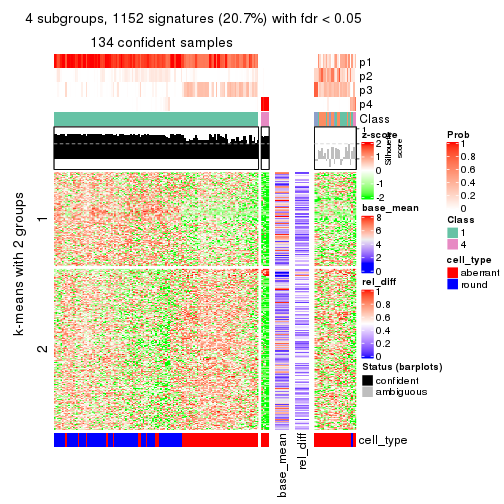</p>

</div>
<div id='tab-MAD-pam-get-signatures-4'>
<pre><code class="r">get_signatures(res, k = 5)
</code></pre>

<p></p>

</div>
<div id='tab-MAD-pam-get-signatures-5'>
<pre><code class="r">get_signatures(res, k = 6)
</code></pre>

<p></p>

</div>
</div>


Signature heatmaps where rows are not scaled:


<script>
$( function() {
	$( '#tabs-MAD-pam-get-signatures-no-scale' ).tabs();
} );
</script>
<div id='tabs-MAD-pam-get-signatures-no-scale'>
<ul>
<li><a href='#tab-MAD-pam-get-signatures-no-scale-1'>k = 2</a></li>
<li><a href='#tab-MAD-pam-get-signatures-no-scale-2'>k = 3</a></li>
<li><a href='#tab-MAD-pam-get-signatures-no-scale-3'>k = 4</a></li>
<li><a href='#tab-MAD-pam-get-signatures-no-scale-4'>k = 5</a></li>
<li><a href='#tab-MAD-pam-get-signatures-no-scale-5'>k = 6</a></li>
</ul>
<div id='tab-MAD-pam-get-signatures-no-scale-1'>
<pre><code class="r">get_signatures(res, k = 2, scale_rows = FALSE)
</code></pre>

<p></p>

</div>
<div id='tab-MAD-pam-get-signatures-no-scale-2'>
<pre><code class="r">get_signatures(res, k = 3, scale_rows = FALSE)
</code></pre>

<p></p>

</div>
<div id='tab-MAD-pam-get-signatures-no-scale-3'>
<pre><code class="r">get_signatures(res, k = 4, scale_rows = FALSE)
</code></pre>

<p></p>

</div>
<div id='tab-MAD-pam-get-signatures-no-scale-4'>
<pre><code class="r">get_signatures(res, k = 5, scale_rows = FALSE)
</code></pre>

<p></p>

</div>
<div id='tab-MAD-pam-get-signatures-no-scale-5'>
<pre><code class="r">get_signatures(res, k = 6, scale_rows = FALSE)
</code></pre>

<p></p>

</div>
</div>


Compare the overlap of signatures from different k:

```r
compare_signatures(res)
```


`get_signature()` returns a data frame invisibly. TO get the list of signatures, the function
call should be assigned to a variable explicitly. In following code, if `plot` argument is set
to `FALSE`, no heatmap is plotted while only the differential analysis is performed.

```r
# code only for demonstration
tb = get_signature(res, k = ..., plot = FALSE)
```

An example of the output of `tb` is:

```
#>   which_row         fdr    mean_1    mean_2 scaled_mean_1 scaled_mean_2 km
#> 1        38 0.042760348  8.373488  9.131774    -0.5533452     0.5164555  1
#> 2        40 0.018707592  7.106213  8.469186    -0.6173731     0.5762149  1
#> 3        55 0.019134737 10.221463 11.207825    -0.6159697     0.5749050  1
#> 4        59 0.006059896  5.921854  7.869574    -0.6899429     0.6439467  1
#> 5        60 0.018055526  8.928898 10.211722    -0.6204761     0.5791110  1
#> 6        98 0.009384629 15.714769 14.887706     0.6635654    -0.6193277  2
...
```

The columns in `tb` are:

1. `which_row`: row indices corresponding to the input matrix.
2. `fdr`: FDR for the differential test. 
3. `mean_x`: The mean value in group x.
4. `scaled_mean_x`: The mean value in group x after rows are scaled.
5. `km`: Row groups if k-means clustering is applied to rows.


UMAP plot which shows how samples are separated.


<script>
$( function() {
	$( '#tabs-MAD-pam-dimension-reduction' ).tabs();
} );
</script>
<div id='tabs-MAD-pam-dimension-reduction'>
<ul>
<li><a href='#tab-MAD-pam-dimension-reduction-1'>k = 2</a></li>
<li><a href='#tab-MAD-pam-dimension-reduction-2'>k = 3</a></li>
<li><a href='#tab-MAD-pam-dimension-reduction-3'>k = 4</a></li>
<li><a href='#tab-MAD-pam-dimension-reduction-4'>k = 5</a></li>
<li><a href='#tab-MAD-pam-dimension-reduction-5'>k = 6</a></li>
</ul>
<div id='tab-MAD-pam-dimension-reduction-1'>
<pre><code class="r">dimension_reduction(res, k = 2, method = &quot;UMAP&quot;)
</code></pre>

<p></p>

</div>
<div id='tab-MAD-pam-dimension-reduction-2'>
<pre><code class="r">dimension_reduction(res, k = 3, method = &quot;UMAP&quot;)
</code></pre>

<p></p>

</div>
<div id='tab-MAD-pam-dimension-reduction-3'>
<pre><code class="r">dimension_reduction(res, k = 4, method = &quot;UMAP&quot;)
</code></pre>

<p></p>

</div>
<div id='tab-MAD-pam-dimension-reduction-4'>
<pre><code class="r">dimension_reduction(res, k = 5, method = &quot;UMAP&quot;)
</code></pre>

<p></p>

</div>
<div id='tab-MAD-pam-dimension-reduction-5'>
<pre><code class="r">dimension_reduction(res, k = 6, method = &quot;UMAP&quot;)
</code></pre>

<p></p>

</div>
</div>


Following heatmap shows how subgroups are split when increasing `k`:

```r
collect_classes(res)
```


Test correlation between subgroups and known annotations. If the known
annotation is numeric, one-way ANOVA test is applied, and if the known
annotation is discrete, chi-squared contingency table test is applied.

```r
test_to_known_factors(res)
```

```
#>           n cell_type(p) k
#> MAD:pam 158     2.40e-02 2
#> MAD:pam 115     1.12e-07 3
#> MAD:pam 134     4.97e-02 4
#> MAD:pam 129     1.08e-02 5
#> MAD:pam 126     7.21e-14 6
```


If matrix rows can be associated to genes, consider to use `GO_Enrichment(res,
...)` to perform function enrichment for the signature genes.


 

---------------------------------------------------


### MAD:mclust**


The object with results only for a single top-value method and a single partition method 
can be extracted as:

```r
res = res_list["MAD", "mclust"]
# you can also extract it by
# res = res_list["MAD:mclust"]
```

A summary of `res` and all the functions that can be applied to it:

```r
res
```

```
#> A 'ConsensusPartition' object with k = 2, 3, 4, 5, 6.
#>   On a matrix with 5576 rows and 160 columns.
#>   Top rows (558, 1116, 1673, 2230, 2788) are extracted by 'MAD' method.
#>   Subgroups are detected by 'mclust' method.
#>   Performed in total 1250 partitions by row resampling.
#>   Best k for subgroups seems to be 2.
#> 
#> Following methods can be applied to this 'ConsensusPartition' object:
#>  [1] "cola_report"             "collect_classes"         "collect_plots"          
#>  [4] "collect_stats"           "colnames"                "compare_signatures"     
#>  [7] "consensus_heatmap"       "dimension_reduction"     "functional_enrichment"  
#> [10] "get_anno_col"            "get_anno"                "get_classes"            
#> [13] "get_consensus"           "get_matrix"              "get_membership"         
#> [16] "get_param"               "get_signatures"          "get_stats"              
#> [19] "is_best_k"               "is_stable_k"             "membership_heatmap"     
#> [22] "ncol"                    "nrow"                    "plot_ecdf"              
#> [25] "rownames"                "select_partition_number" "show"                   
#> [28] "suggest_best_k"          "test_to_known_factors"
```

`collect_plots()` function collects all the plots made from `res` for all `k` (number of partitions)
into one single page to provide an easy and fast comparison between different `k`.

```r
collect_plots(res)
```


The plots are:

- The first row: a plot of the ECDF (Empirical cumulative distribution
  function) curves of the consensus matrix for each `k` and the heatmap of
  predicted classes for each `k`.
- The second row: heatmaps of the consensus matrix for each `k`.
- The third row: heatmaps of the membership matrix for each `k`.
- The fouth row: heatmaps of the signatures for each `k`.

All the plots in panels can be made by individual functions and they are
plotted later in this section.

`select_partition_number()` produces several plots showing different
statistics for choosing "optimized" `k`. There are following statistics:

- ECDF curves of the consensus matrix for each `k`;
- 1-PAC. [The PAC
  score](https://en.wikipedia.org/wiki/Consensus_clustering#Over-interpretation_potential_of_consensus_clustering)
  measures the proportion of the ambiguous subgrouping.
- Mean silhouette score.
- Concordance. The mean probability of fiting the consensus class ids in all
  partitions.
- Area increased. Denote $A_k$ as the area under the ECDF curve for current
  `k`, the area increased is defined as $A_k - A_{k-1}$.
- Rand index. The percent of pairs of samples that are both in a same cluster
  or both are not in a same cluster in the partition of k and k-1.
- Jaccard index. The ratio of pairs of samples are both in a same cluster in
  the partition of k and k-1 and the pairs of samples are both in a same
  cluster in the partition k or k-1.

The detailed explanations of these statistics can be found in [the cola
vignette](http://bioconductor.org/packages/devel/bioc/vignettes/cola/inst/doc/cola.html#toc_13).

Generally speaking, lower PAC score, higher mean silhouette score or higher
concordance corresponds to better partition. Rand index and Jaccard index
measure how similar the current partition is compared to partition with `k-1`.
If they are too similar, we won't accept `k` is better than `k-1`.

```r
select_partition_number(res)
```


The numeric values for all these statistics can be obtained by `get_stats()`.

```r
get_stats(res)
```

```
#>   k 1-PAC mean_silhouette concordance area_increased  Rand Jaccard
#> 2 2 1.000           0.988       0.995         0.5035 0.497   0.497
#> 3 3 0.766           0.800       0.891         0.1714 0.941   0.881
#> 4 4 0.845           0.908       0.937         0.1116 0.886   0.747
#> 5 5 0.794           0.818       0.907         0.1256 0.909   0.738
#> 6 6 0.748           0.631       0.834         0.0623 0.950   0.817
```

`suggest_best_k()` suggests the best $k$ based on these statistics. The rules are as follows:

- All $k$ with Jaccard index larger than 0.95 are removed because the increase of
  the partition number does not provides enough extra information. If all $k$ are removed,
  the best $k$ is assigned by `NA`.
- For $k$ with 1-PAC larger than 0.9, the maximal $k$ is taken as the "best k". Other $k$ is called "optional k".
- If it does not fit the second rule. The $k$ with the highest vote of highest
  1-PAC, mean silhouette and concordance is taken as the "best k".

```r
suggest_best_k(res)
```

```
#> [1] 2
```


Following shows the table of the partitions (You need to click the **show/hide
code output** link to see it). The membership matrix (columns with name `p*`)
is inferred by
[`clue::cl_consensus()`](https://www.rdocumentation.org/link/cl_consensus?package=clue)
function with the `SE` method. Basically the value in the membership matrix
represents the probability to belong to a certain group. The finall class
label for an item is determined with the group with highest probability it
belongs to.

In `get_classes()` function, the entropy is calculated from the membership
matrix and the silhouette score is calculated from the consensus matrix.


<script>
$( function() {
	$( '#tabs-MAD-mclust-get-classes' ).tabs();
} );
</script>
<div id='tabs-MAD-mclust-get-classes'>
<ul>
<li><a href='#tab-MAD-mclust-get-classes-1'>k = 2</a></li>
<li><a href='#tab-MAD-mclust-get-classes-2'>k = 3</a></li>
<li><a href='#tab-MAD-mclust-get-classes-3'>k = 4</a></li>
<li><a href='#tab-MAD-mclust-get-classes-4'>k = 5</a></li>
<li><a href='#tab-MAD-mclust-get-classes-5'>k = 6</a></li>
</ul>

<div id='tab-MAD-mclust-get-classes-1'>
<p><a id='tab-MAD-mclust-get-classes-1-a' style='color:#0366d6' href='#'>show/hide code output</a></p>
<pre><code class="r">cbind(get_classes(res, k = 2), get_membership(res, k = 2))
</code></pre>

<pre><code>#&gt;                     class entropy silhouette    p1    p2
#&gt; aberrant_ERR2585320     2  0.0000      0.994 0.000 1.000
#&gt; aberrant_ERR2585338     2  0.0000      0.994 0.000 1.000
#&gt; aberrant_ERR2585325     2  0.0000      0.994 0.000 1.000
#&gt; aberrant_ERR2585283     2  0.0000      0.994 0.000 1.000
#&gt; aberrant_ERR2585343     2  0.0000      0.994 0.000 1.000
#&gt; aberrant_ERR2585329     2  0.0000      0.994 0.000 1.000
#&gt; aberrant_ERR2585317     2  0.0000      0.994 0.000 1.000
#&gt; aberrant_ERR2585339     2  0.0000      0.994 0.000 1.000
#&gt; aberrant_ERR2585335     2  0.0000      0.994 0.000 1.000
#&gt; aberrant_ERR2585287     2  0.0000      0.994 0.000 1.000
#&gt; aberrant_ERR2585321     2  0.0000      0.994 0.000 1.000
#&gt; aberrant_ERR2585297     1  0.0000      0.995 1.000 0.000
#&gt; aberrant_ERR2585337     2  0.0000      0.994 0.000 1.000
#&gt; aberrant_ERR2585319     2  0.0000      0.994 0.000 1.000
#&gt; aberrant_ERR2585315     2  0.0000      0.994 0.000 1.000
#&gt; aberrant_ERR2585336     2  0.0000      0.994 0.000 1.000
#&gt; aberrant_ERR2585307     2  0.0000      0.994 0.000 1.000
#&gt; aberrant_ERR2585301     2  0.0000      0.994 0.000 1.000
#&gt; aberrant_ERR2585326     2  0.0000      0.994 0.000 1.000
#&gt; aberrant_ERR2585331     2  0.0000      0.994 0.000 1.000
#&gt; aberrant_ERR2585346     2  0.0000      0.994 0.000 1.000
#&gt; aberrant_ERR2585314     2  0.0000      0.994 0.000 1.000
#&gt; aberrant_ERR2585298     1  0.0000      0.995 1.000 0.000
#&gt; aberrant_ERR2585345     2  0.0000      0.994 0.000 1.000
#&gt; aberrant_ERR2585299     1  0.0000      0.995 1.000 0.000
#&gt; aberrant_ERR2585309     1  0.0000      0.995 1.000 0.000
#&gt; aberrant_ERR2585303     2  0.0000      0.994 0.000 1.000
#&gt; aberrant_ERR2585313     2  0.0000      0.994 0.000 1.000
#&gt; aberrant_ERR2585318     2  0.0000      0.994 0.000 1.000
#&gt; aberrant_ERR2585328     2  0.0000      0.994 0.000 1.000
#&gt; aberrant_ERR2585330     2  0.0000      0.994 0.000 1.000
#&gt; aberrant_ERR2585293     2  0.0000      0.994 0.000 1.000
#&gt; aberrant_ERR2585342     2  0.0000      0.994 0.000 1.000
#&gt; aberrant_ERR2585348     2  0.0000      0.994 0.000 1.000
#&gt; aberrant_ERR2585352     2  0.0000      0.994 0.000 1.000
#&gt; aberrant_ERR2585308     1  0.0000      0.995 1.000 0.000
#&gt; aberrant_ERR2585349     2  0.3879      0.916 0.076 0.924
#&gt; aberrant_ERR2585316     2  0.0000      0.994 0.000 1.000
#&gt; aberrant_ERR2585306     2  0.0000      0.994 0.000 1.000
#&gt; aberrant_ERR2585324     2  0.0000      0.994 0.000 1.000
#&gt; aberrant_ERR2585310     1  0.7299      0.744 0.796 0.204
#&gt; aberrant_ERR2585296     1  0.0000      0.995 1.000 0.000
#&gt; aberrant_ERR2585275     2  0.0000      0.994 0.000 1.000
#&gt; aberrant_ERR2585311     2  0.0000      0.994 0.000 1.000
#&gt; aberrant_ERR2585292     2  0.0000      0.994 0.000 1.000
#&gt; aberrant_ERR2585282     2  0.0000      0.994 0.000 1.000
#&gt; aberrant_ERR2585305     2  0.0000      0.994 0.000 1.000
#&gt; aberrant_ERR2585278     2  0.0000      0.994 0.000 1.000
#&gt; aberrant_ERR2585347     2  0.0000      0.994 0.000 1.000
#&gt; aberrant_ERR2585332     2  0.0000      0.994 0.000 1.000
#&gt; aberrant_ERR2585280     2  0.0000      0.994 0.000 1.000
#&gt; aberrant_ERR2585304     2  0.8813      0.571 0.300 0.700
#&gt; aberrant_ERR2585322     2  0.0000      0.994 0.000 1.000
#&gt; aberrant_ERR2585279     2  0.5178      0.868 0.116 0.884
#&gt; aberrant_ERR2585277     2  0.0000      0.994 0.000 1.000
#&gt; aberrant_ERR2585295     2  0.0000      0.994 0.000 1.000
#&gt; aberrant_ERR2585333     2  0.0000      0.994 0.000 1.000
#&gt; aberrant_ERR2585285     2  0.0000      0.994 0.000 1.000
#&gt; aberrant_ERR2585286     2  0.0000      0.994 0.000 1.000
#&gt; aberrant_ERR2585294     2  0.0000      0.994 0.000 1.000
#&gt; aberrant_ERR2585300     2  0.0000      0.994 0.000 1.000
#&gt; aberrant_ERR2585334     2  0.0000      0.994 0.000 1.000
#&gt; aberrant_ERR2585361     2  0.0000      0.994 0.000 1.000
#&gt; aberrant_ERR2585372     2  0.0000      0.994 0.000 1.000
#&gt; round_ERR2585217        1  0.0000      0.995 1.000 0.000
#&gt; round_ERR2585205        1  0.0000      0.995 1.000 0.000
#&gt; round_ERR2585214        1  0.0000      0.995 1.000 0.000
#&gt; round_ERR2585202        1  0.0376      0.991 0.996 0.004
#&gt; aberrant_ERR2585367     2  0.0000      0.994 0.000 1.000
#&gt; round_ERR2585220        1  0.0000      0.995 1.000 0.000
#&gt; round_ERR2585238        1  0.0000      0.995 1.000 0.000
#&gt; aberrant_ERR2585276     2  0.0000      0.994 0.000 1.000
#&gt; round_ERR2585218        1  0.0000      0.995 1.000 0.000
#&gt; aberrant_ERR2585363     2  0.0000      0.994 0.000 1.000
#&gt; round_ERR2585201        1  0.0000      0.995 1.000 0.000
#&gt; round_ERR2585210        1  0.0000      0.995 1.000 0.000
#&gt; aberrant_ERR2585362     2  0.0000      0.994 0.000 1.000
#&gt; aberrant_ERR2585360     2  0.0000      0.994 0.000 1.000
#&gt; round_ERR2585209        1  0.0000      0.995 1.000 0.000
#&gt; round_ERR2585242        1  0.0000      0.995 1.000 0.000
#&gt; round_ERR2585216        1  0.0000      0.995 1.000 0.000
#&gt; round_ERR2585219        1  0.0000      0.995 1.000 0.000
#&gt; round_ERR2585237        1  0.0000      0.995 1.000 0.000
#&gt; round_ERR2585198        1  0.0000      0.995 1.000 0.000
#&gt; round_ERR2585211        1  0.0000      0.995 1.000 0.000
#&gt; round_ERR2585206        1  0.0000      0.995 1.000 0.000
#&gt; aberrant_ERR2585281     2  0.0000      0.994 0.000 1.000
#&gt; round_ERR2585212        1  0.0000      0.995 1.000 0.000
#&gt; round_ERR2585221        1  0.0000      0.995 1.000 0.000
#&gt; round_ERR2585243        1  0.0000      0.995 1.000 0.000
#&gt; round_ERR2585204        1  0.0000      0.995 1.000 0.000
#&gt; round_ERR2585213        1  0.0000      0.995 1.000 0.000
#&gt; aberrant_ERR2585373     2  0.0000      0.994 0.000 1.000
#&gt; aberrant_ERR2585358     2  0.0000      0.994 0.000 1.000
#&gt; aberrant_ERR2585365     2  0.0000      0.994 0.000 1.000
#&gt; aberrant_ERR2585359     2  0.0000      0.994 0.000 1.000
#&gt; aberrant_ERR2585370     2  0.0000      0.994 0.000 1.000
#&gt; round_ERR2585215        1  0.0000      0.995 1.000 0.000
#&gt; round_ERR2585262        1  0.6343      0.809 0.840 0.160
#&gt; round_ERR2585199        1  0.0000      0.995 1.000 0.000
#&gt; aberrant_ERR2585369     2  0.0000      0.994 0.000 1.000
#&gt; round_ERR2585208        1  0.0000      0.995 1.000 0.000
#&gt; round_ERR2585252        1  0.0000      0.995 1.000 0.000
#&gt; round_ERR2585236        1  0.0000      0.995 1.000 0.000
#&gt; aberrant_ERR2585284     2  0.0000      0.994 0.000 1.000
#&gt; round_ERR2585224        1  0.0000      0.995 1.000 0.000
#&gt; round_ERR2585260        1  0.0000      0.995 1.000 0.000
#&gt; round_ERR2585229        1  0.0000      0.995 1.000 0.000
#&gt; aberrant_ERR2585364     2  0.0000      0.994 0.000 1.000
#&gt; round_ERR2585253        1  0.0000      0.995 1.000 0.000
#&gt; aberrant_ERR2585368     2  0.0000      0.994 0.000 1.000
#&gt; aberrant_ERR2585371     2  0.0000      0.994 0.000 1.000
#&gt; round_ERR2585239        1  0.0000      0.995 1.000 0.000
#&gt; round_ERR2585273        1  0.0000      0.995 1.000 0.000
#&gt; round_ERR2585256        1  0.0000      0.995 1.000 0.000
#&gt; round_ERR2585272        1  0.0000      0.995 1.000 0.000
#&gt; round_ERR2585246        1  0.0000      0.995 1.000 0.000
#&gt; round_ERR2585261        1  0.0000      0.995 1.000 0.000
#&gt; round_ERR2585254        1  0.0000      0.995 1.000 0.000
#&gt; round_ERR2585225        1  0.0000      0.995 1.000 0.000
#&gt; round_ERR2585235        1  0.0000      0.995 1.000 0.000
#&gt; round_ERR2585271        1  0.0000      0.995 1.000 0.000
#&gt; round_ERR2585251        1  0.0000      0.995 1.000 0.000
#&gt; round_ERR2585255        1  0.0000      0.995 1.000 0.000
#&gt; round_ERR2585257        1  0.0000      0.995 1.000 0.000
#&gt; round_ERR2585226        1  0.0000      0.995 1.000 0.000
#&gt; round_ERR2585265        1  0.0000      0.995 1.000 0.000
#&gt; round_ERR2585259        1  0.0000      0.995 1.000 0.000
#&gt; round_ERR2585247        1  0.0000      0.995 1.000 0.000
#&gt; round_ERR2585241        1  0.0000      0.995 1.000 0.000
#&gt; round_ERR2585263        1  0.0000      0.995 1.000 0.000
#&gt; round_ERR2585264        1  0.0000      0.995 1.000 0.000
#&gt; round_ERR2585233        1  0.0000      0.995 1.000 0.000
#&gt; round_ERR2585223        1  0.0000      0.995 1.000 0.000
#&gt; round_ERR2585234        1  0.0000      0.995 1.000 0.000
#&gt; round_ERR2585222        1  0.0000      0.995 1.000 0.000
#&gt; round_ERR2585228        1  0.0000      0.995 1.000 0.000
#&gt; round_ERR2585248        1  0.0000      0.995 1.000 0.000
#&gt; round_ERR2585240        1  0.0000      0.995 1.000 0.000
#&gt; round_ERR2585270        1  0.0000      0.995 1.000 0.000
#&gt; round_ERR2585232        1  0.0000      0.995 1.000 0.000
#&gt; aberrant_ERR2585341     2  0.0000      0.994 0.000 1.000
#&gt; aberrant_ERR2585355     2  0.0000      0.994 0.000 1.000
#&gt; round_ERR2585227        1  0.0000      0.995 1.000 0.000
#&gt; aberrant_ERR2585351     2  0.0000      0.994 0.000 1.000
#&gt; round_ERR2585269        1  0.0000      0.995 1.000 0.000
#&gt; aberrant_ERR2585357     2  0.0000      0.994 0.000 1.000
#&gt; aberrant_ERR2585350     2  0.0000      0.994 0.000 1.000
#&gt; round_ERR2585250        1  0.0000      0.995 1.000 0.000
#&gt; round_ERR2585245        1  0.0000      0.995 1.000 0.000
#&gt; aberrant_ERR2585353     2  0.0000      0.994 0.000 1.000
#&gt; round_ERR2585258        1  0.0000      0.995 1.000 0.000
#&gt; aberrant_ERR2585354     2  0.0000      0.994 0.000 1.000
#&gt; round_ERR2585249        1  0.0000      0.995 1.000 0.000
#&gt; round_ERR2585268        1  0.0000      0.995 1.000 0.000
#&gt; aberrant_ERR2585356     2  0.0000      0.994 0.000 1.000
#&gt; round_ERR2585266        1  0.0000      0.995 1.000 0.000
#&gt; round_ERR2585231        1  0.0000      0.995 1.000 0.000
#&gt; round_ERR2585230        1  0.0000      0.995 1.000 0.000
#&gt; round_ERR2585267        1  0.0000      0.995 1.000 0.000
</code></pre>

<script>
$('#tab-MAD-mclust-get-classes-1-a').parent().next().next().hide();
$('#tab-MAD-mclust-get-classes-1-a').click(function(){
  $('#tab-MAD-mclust-get-classes-1-a').parent().next().next().toggle();
  return(false);
});
</script>
</div>

<div id='tab-MAD-mclust-get-classes-2'>
<p><a id='tab-MAD-mclust-get-classes-2-a' style='color:#0366d6' href='#'>show/hide code output</a></p>
<pre><code class="r">cbind(get_classes(res, k = 3), get_membership(res, k = 3))
</code></pre>

<pre><code>#&gt;                     class entropy silhouette    p1    p2    p3
#&gt; aberrant_ERR2585320     2  0.1163     0.8727 0.000 0.972 0.028
#&gt; aberrant_ERR2585338     2  0.0592     0.8784 0.000 0.988 0.012
#&gt; aberrant_ERR2585325     2  0.1163     0.8727 0.000 0.972 0.028
#&gt; aberrant_ERR2585283     3  0.6168     0.6458 0.000 0.412 0.588
#&gt; aberrant_ERR2585343     2  0.1163     0.8736 0.000 0.972 0.028
#&gt; aberrant_ERR2585329     2  0.1289     0.8706 0.000 0.968 0.032
#&gt; aberrant_ERR2585317     2  0.1163     0.8726 0.000 0.972 0.028
#&gt; aberrant_ERR2585339     2  0.0424     0.8799 0.000 0.992 0.008
#&gt; aberrant_ERR2585335     2  0.1031     0.8753 0.000 0.976 0.024
#&gt; aberrant_ERR2585287     3  0.6225     0.6172 0.000 0.432 0.568
#&gt; aberrant_ERR2585321     2  0.0747     0.8789 0.000 0.984 0.016
#&gt; aberrant_ERR2585297     1  0.0000     0.9083 1.000 0.000 0.000
#&gt; aberrant_ERR2585337     2  0.1163     0.8726 0.000 0.972 0.028
#&gt; aberrant_ERR2585319     2  0.0892     0.8767 0.000 0.980 0.020
#&gt; aberrant_ERR2585315     2  0.0592     0.8782 0.000 0.988 0.012
#&gt; aberrant_ERR2585336     2  0.1163     0.8726 0.000 0.972 0.028
#&gt; aberrant_ERR2585307     2  0.4750     0.6508 0.000 0.784 0.216
#&gt; aberrant_ERR2585301     2  0.2261     0.8544 0.000 0.932 0.068
#&gt; aberrant_ERR2585326     2  0.1163     0.8726 0.000 0.972 0.028
#&gt; aberrant_ERR2585331     2  0.4796     0.6372 0.000 0.780 0.220
#&gt; aberrant_ERR2585346     3  0.6225     0.6192 0.000 0.432 0.568
#&gt; aberrant_ERR2585314     2  0.6180     0.0633 0.000 0.584 0.416
#&gt; aberrant_ERR2585298     1  0.4974     0.8194 0.764 0.000 0.236
#&gt; aberrant_ERR2585345     2  0.1529     0.8665 0.000 0.960 0.040
#&gt; aberrant_ERR2585299     1  0.0237     0.9066 0.996 0.000 0.004
#&gt; aberrant_ERR2585309     1  0.0592     0.9029 0.988 0.000 0.012
#&gt; aberrant_ERR2585303     2  0.0747     0.8777 0.000 0.984 0.016
#&gt; aberrant_ERR2585313     2  0.1031     0.8790 0.000 0.976 0.024
#&gt; aberrant_ERR2585318     2  0.1163     0.8741 0.000 0.972 0.028
#&gt; aberrant_ERR2585328     2  0.5016     0.5716 0.000 0.760 0.240
#&gt; aberrant_ERR2585330     2  0.0892     0.8767 0.000 0.980 0.020
#&gt; aberrant_ERR2585293     3  0.6140     0.6503 0.000 0.404 0.596
#&gt; aberrant_ERR2585342     2  0.0592     0.8785 0.000 0.988 0.012
#&gt; aberrant_ERR2585348     2  0.4291     0.6911 0.000 0.820 0.180
#&gt; aberrant_ERR2585352     2  0.1031     0.8798 0.000 0.976 0.024
#&gt; aberrant_ERR2585308     1  0.0237     0.9066 0.996 0.000 0.004
#&gt; aberrant_ERR2585349     2  0.6654    -0.1165 0.008 0.536 0.456
#&gt; aberrant_ERR2585316     2  0.5397     0.4667 0.000 0.720 0.280
#&gt; aberrant_ERR2585306     2  0.5621     0.3969 0.000 0.692 0.308
#&gt; aberrant_ERR2585324     2  0.1031     0.8787 0.000 0.976 0.024
#&gt; aberrant_ERR2585310     3  0.7112     0.0711 0.308 0.044 0.648
#&gt; aberrant_ERR2585296     1  0.5678     0.7511 0.684 0.000 0.316
#&gt; aberrant_ERR2585275     3  0.6204     0.6330 0.000 0.424 0.576
#&gt; aberrant_ERR2585311     2  0.1031     0.8757 0.000 0.976 0.024
#&gt; aberrant_ERR2585292     3  0.6140     0.6503 0.000 0.404 0.596
#&gt; aberrant_ERR2585282     2  0.2959     0.8128 0.000 0.900 0.100
#&gt; aberrant_ERR2585305     2  0.6095     0.1409 0.000 0.608 0.392
#&gt; aberrant_ERR2585278     2  0.0747     0.8780 0.000 0.984 0.016
#&gt; aberrant_ERR2585347     2  0.5327     0.4810 0.000 0.728 0.272
#&gt; aberrant_ERR2585332     2  0.1031     0.8737 0.000 0.976 0.024
#&gt; aberrant_ERR2585280     2  0.0892     0.8759 0.000 0.980 0.020
#&gt; aberrant_ERR2585304     3  0.7389     0.2655 0.032 0.464 0.504
#&gt; aberrant_ERR2585322     2  0.0892     0.8776 0.000 0.980 0.020
#&gt; aberrant_ERR2585279     2  0.6460    -0.0365 0.004 0.556 0.440
#&gt; aberrant_ERR2585277     2  0.0592     0.8800 0.000 0.988 0.012
#&gt; aberrant_ERR2585295     2  0.4702     0.6207 0.000 0.788 0.212
#&gt; aberrant_ERR2585333     2  0.0892     0.8784 0.000 0.980 0.020
#&gt; aberrant_ERR2585285     2  0.0747     0.8778 0.000 0.984 0.016
#&gt; aberrant_ERR2585286     2  0.0592     0.8800 0.000 0.988 0.012
#&gt; aberrant_ERR2585294     2  0.1643     0.8693 0.000 0.956 0.044
#&gt; aberrant_ERR2585300     2  0.1163     0.8773 0.000 0.972 0.028
#&gt; aberrant_ERR2585334     2  0.6095     0.1765 0.000 0.608 0.392
#&gt; aberrant_ERR2585361     2  0.0892     0.8759 0.000 0.980 0.020
#&gt; aberrant_ERR2585372     2  0.0892     0.8772 0.000 0.980 0.020
#&gt; round_ERR2585217        1  0.4974     0.8194 0.764 0.000 0.236
#&gt; round_ERR2585205        1  0.0000     0.9083 1.000 0.000 0.000
#&gt; round_ERR2585214        1  0.4974     0.8194 0.764 0.000 0.236
#&gt; round_ERR2585202        1  0.6476     0.5502 0.548 0.004 0.448
#&gt; aberrant_ERR2585367     2  0.1163     0.8718 0.000 0.972 0.028
#&gt; round_ERR2585220        1  0.0000     0.9083 1.000 0.000 0.000
#&gt; round_ERR2585238        1  0.0000     0.9083 1.000 0.000 0.000
#&gt; aberrant_ERR2585276     2  0.3816     0.7533 0.000 0.852 0.148
#&gt; round_ERR2585218        1  0.0000     0.9083 1.000 0.000 0.000
#&gt; aberrant_ERR2585363     2  0.0592     0.8782 0.000 0.988 0.012
#&gt; round_ERR2585201        1  0.4974     0.8194 0.764 0.000 0.236
#&gt; round_ERR2585210        1  0.1031     0.9029 0.976 0.000 0.024
#&gt; aberrant_ERR2585362     2  0.4235     0.7025 0.000 0.824 0.176
#&gt; aberrant_ERR2585360     2  0.1860     0.8664 0.000 0.948 0.052
#&gt; round_ERR2585209        1  0.4555     0.8386 0.800 0.000 0.200
#&gt; round_ERR2585242        1  0.4974     0.8194 0.764 0.000 0.236
#&gt; round_ERR2585216        1  0.0000     0.9083 1.000 0.000 0.000
#&gt; round_ERR2585219        1  0.0000     0.9083 1.000 0.000 0.000
#&gt; round_ERR2585237        1  0.4974     0.8194 0.764 0.000 0.236
#&gt; round_ERR2585198        1  0.4974     0.8194 0.764 0.000 0.236
#&gt; round_ERR2585211        1  0.0000     0.9083 1.000 0.000 0.000
#&gt; round_ERR2585206        1  0.0000     0.9083 1.000 0.000 0.000
#&gt; aberrant_ERR2585281     2  0.4842     0.5962 0.000 0.776 0.224
#&gt; round_ERR2585212        1  0.0000     0.9083 1.000 0.000 0.000
#&gt; round_ERR2585221        1  0.0000     0.9083 1.000 0.000 0.000
#&gt; round_ERR2585243        1  0.1964     0.8762 0.944 0.000 0.056
#&gt; round_ERR2585204        1  0.4974     0.8194 0.764 0.000 0.236
#&gt; round_ERR2585213        1  0.6235     0.5804 0.564 0.000 0.436
#&gt; aberrant_ERR2585373     2  0.0892     0.8795 0.000 0.980 0.020
#&gt; aberrant_ERR2585358     2  0.0892     0.8784 0.000 0.980 0.020
#&gt; aberrant_ERR2585365     2  0.0747     0.8772 0.000 0.984 0.016
#&gt; aberrant_ERR2585359     2  0.1031     0.8757 0.000 0.976 0.024
#&gt; aberrant_ERR2585370     2  0.1289     0.8738 0.000 0.968 0.032
#&gt; round_ERR2585215        1  0.0000     0.9083 1.000 0.000 0.000
#&gt; round_ERR2585262        3  0.6917    -0.1232 0.368 0.024 0.608
#&gt; round_ERR2585199        1  0.5178     0.8059 0.744 0.000 0.256
#&gt; aberrant_ERR2585369     2  0.0747     0.8778 0.000 0.984 0.016
#&gt; round_ERR2585208        1  0.0000     0.9083 1.000 0.000 0.000
#&gt; round_ERR2585252        1  0.0000     0.9083 1.000 0.000 0.000
#&gt; round_ERR2585236        1  0.5327     0.7937 0.728 0.000 0.272
#&gt; aberrant_ERR2585284     3  0.6140     0.6503 0.000 0.404 0.596
#&gt; round_ERR2585224        1  0.0592     0.9029 0.988 0.000 0.012
#&gt; round_ERR2585260        1  0.0000     0.9083 1.000 0.000 0.000
#&gt; round_ERR2585229        1  0.0000     0.9083 1.000 0.000 0.000
#&gt; aberrant_ERR2585364     2  0.3686     0.7631 0.000 0.860 0.140
#&gt; round_ERR2585253        1  0.0000     0.9083 1.000 0.000 0.000
#&gt; aberrant_ERR2585368     2  0.1860     0.8554 0.000 0.948 0.052
#&gt; aberrant_ERR2585371     2  0.2066     0.8471 0.000 0.940 0.060
#&gt; round_ERR2585239        1  0.0000     0.9083 1.000 0.000 0.000
#&gt; round_ERR2585273        1  0.0000     0.9083 1.000 0.000 0.000
#&gt; round_ERR2585256        1  0.4750     0.8305 0.784 0.000 0.216
#&gt; round_ERR2585272        1  0.0000     0.9083 1.000 0.000 0.000
#&gt; round_ERR2585246        1  0.2261     0.8674 0.932 0.000 0.068
#&gt; round_ERR2585261        1  0.4931     0.8218 0.768 0.000 0.232
#&gt; round_ERR2585254        1  0.4974     0.8194 0.764 0.000 0.236
#&gt; round_ERR2585225        1  0.5216     0.8021 0.740 0.000 0.260
#&gt; round_ERR2585235        1  0.2878     0.8806 0.904 0.000 0.096
#&gt; round_ERR2585271        1  0.0000     0.9083 1.000 0.000 0.000
#&gt; round_ERR2585251        1  0.0000     0.9083 1.000 0.000 0.000
#&gt; round_ERR2585255        1  0.5058     0.8141 0.756 0.000 0.244
#&gt; round_ERR2585257        1  0.5098     0.8114 0.752 0.000 0.248
#&gt; round_ERR2585226        1  0.0000     0.9083 1.000 0.000 0.000
#&gt; round_ERR2585265        1  0.0000     0.9083 1.000 0.000 0.000
#&gt; round_ERR2585259        1  0.4121     0.8528 0.832 0.000 0.168
#&gt; round_ERR2585247        1  0.0000     0.9083 1.000 0.000 0.000
#&gt; round_ERR2585241        1  0.0000     0.9083 1.000 0.000 0.000
#&gt; round_ERR2585263        1  0.0424     0.9068 0.992 0.000 0.008
#&gt; round_ERR2585264        1  0.0000     0.9083 1.000 0.000 0.000
#&gt; round_ERR2585233        1  0.4974     0.8194 0.764 0.000 0.236
#&gt; round_ERR2585223        1  0.0000     0.9083 1.000 0.000 0.000
#&gt; round_ERR2585234        1  0.4974     0.8194 0.764 0.000 0.236
#&gt; round_ERR2585222        1  0.0000     0.9083 1.000 0.000 0.000
#&gt; round_ERR2585228        1  0.0000     0.9083 1.000 0.000 0.000
#&gt; round_ERR2585248        1  0.0000     0.9083 1.000 0.000 0.000
#&gt; round_ERR2585240        1  0.4178     0.8515 0.828 0.000 0.172
#&gt; round_ERR2585270        1  0.0000     0.9083 1.000 0.000 0.000
#&gt; round_ERR2585232        1  0.2711     0.8831 0.912 0.000 0.088
#&gt; aberrant_ERR2585341     2  0.1031     0.8750 0.000 0.976 0.024
#&gt; aberrant_ERR2585355     2  0.0892     0.8803 0.000 0.980 0.020
#&gt; round_ERR2585227        1  0.0000     0.9083 1.000 0.000 0.000
#&gt; aberrant_ERR2585351     2  0.0424     0.8795 0.000 0.992 0.008
#&gt; round_ERR2585269        1  0.0000     0.9083 1.000 0.000 0.000
#&gt; aberrant_ERR2585357     2  0.1753     0.8592 0.000 0.952 0.048
#&gt; aberrant_ERR2585350     2  0.1031     0.8747 0.000 0.976 0.024
#&gt; round_ERR2585250        1  0.4062     0.8552 0.836 0.000 0.164
#&gt; round_ERR2585245        1  0.0000     0.9083 1.000 0.000 0.000
#&gt; aberrant_ERR2585353     2  0.0747     0.8802 0.000 0.984 0.016
#&gt; round_ERR2585258        1  0.0000     0.9083 1.000 0.000 0.000
#&gt; aberrant_ERR2585354     2  0.1163     0.8773 0.000 0.972 0.028
#&gt; round_ERR2585249        1  0.0000     0.9083 1.000 0.000 0.000
#&gt; round_ERR2585268        1  0.5327     0.7942 0.728 0.000 0.272
#&gt; aberrant_ERR2585356     2  0.0892     0.8784 0.000 0.980 0.020
#&gt; round_ERR2585266        1  0.4974     0.8194 0.764 0.000 0.236
#&gt; round_ERR2585231        1  0.0000     0.9083 1.000 0.000 0.000
#&gt; round_ERR2585230        1  0.0000     0.9083 1.000 0.000 0.000
#&gt; round_ERR2585267        1  0.0000     0.9083 1.000 0.000 0.000
</code></pre>

<script>
$('#tab-MAD-mclust-get-classes-2-a').parent().next().next().hide();
$('#tab-MAD-mclust-get-classes-2-a').click(function(){
  $('#tab-MAD-mclust-get-classes-2-a').parent().next().next().toggle();
  return(false);
});
</script>
</div>

<div id='tab-MAD-mclust-get-classes-3'>
<p><a id='tab-MAD-mclust-get-classes-3-a' style='color:#0366d6' href='#'>show/hide code output</a></p>
<pre><code class="r">cbind(get_classes(res, k = 4), get_membership(res, k = 4))
</code></pre>

<pre><code>#&gt;                     class entropy silhouette    p1    p2    p3    p4
#&gt; aberrant_ERR2585320     2  0.1474     0.9366 0.000 0.948 0.000 0.052
#&gt; aberrant_ERR2585338     2  0.1940     0.9310 0.000 0.924 0.000 0.076
#&gt; aberrant_ERR2585325     2  0.1557     0.9368 0.000 0.944 0.000 0.056
#&gt; aberrant_ERR2585283     4  0.2647     0.8807 0.000 0.120 0.000 0.880
#&gt; aberrant_ERR2585343     2  0.0707     0.9472 0.000 0.980 0.000 0.020
#&gt; aberrant_ERR2585329     2  0.1929     0.9373 0.000 0.940 0.024 0.036
#&gt; aberrant_ERR2585317     2  0.1411     0.9437 0.000 0.960 0.020 0.020
#&gt; aberrant_ERR2585339     2  0.1474     0.9437 0.000 0.948 0.000 0.052
#&gt; aberrant_ERR2585335     2  0.0469     0.9471 0.000 0.988 0.000 0.012
#&gt; aberrant_ERR2585287     4  0.3486     0.8606 0.000 0.188 0.000 0.812
#&gt; aberrant_ERR2585321     2  0.0469     0.9468 0.000 0.988 0.000 0.012
#&gt; aberrant_ERR2585297     1  0.0188     0.9687 0.996 0.000 0.004 0.000
#&gt; aberrant_ERR2585337     2  0.1733     0.9405 0.000 0.948 0.024 0.028
#&gt; aberrant_ERR2585319     2  0.0336     0.9469 0.000 0.992 0.000 0.008
#&gt; aberrant_ERR2585315     2  0.0469     0.9482 0.000 0.988 0.000 0.012
#&gt; aberrant_ERR2585336     2  0.1488     0.9444 0.000 0.956 0.012 0.032
#&gt; aberrant_ERR2585307     2  0.2111     0.9334 0.000 0.932 0.024 0.044
#&gt; aberrant_ERR2585301     2  0.1256     0.9435 0.000 0.964 0.008 0.028
#&gt; aberrant_ERR2585326     2  0.1624     0.9420 0.000 0.952 0.020 0.028
#&gt; aberrant_ERR2585331     2  0.3400     0.9018 0.000 0.872 0.064 0.064
#&gt; aberrant_ERR2585346     4  0.3726     0.8466 0.000 0.212 0.000 0.788
#&gt; aberrant_ERR2585314     2  0.2840     0.9095 0.000 0.900 0.056 0.044
#&gt; aberrant_ERR2585298     3  0.2530     0.9028 0.112 0.000 0.888 0.000
#&gt; aberrant_ERR2585345     2  0.2111     0.9334 0.000 0.932 0.024 0.044
#&gt; aberrant_ERR2585299     1  0.0188     0.9687 0.996 0.000 0.004 0.000
#&gt; aberrant_ERR2585309     1  0.0188     0.9687 0.996 0.000 0.004 0.000
#&gt; aberrant_ERR2585303     2  0.1867     0.9332 0.000 0.928 0.000 0.072
#&gt; aberrant_ERR2585313     2  0.1118     0.9464 0.000 0.964 0.000 0.036
#&gt; aberrant_ERR2585318     2  0.1109     0.9440 0.000 0.968 0.004 0.028
#&gt; aberrant_ERR2585328     2  0.1637     0.9393 0.000 0.940 0.000 0.060
#&gt; aberrant_ERR2585330     2  0.0469     0.9468 0.000 0.988 0.000 0.012
#&gt; aberrant_ERR2585293     4  0.1557     0.8633 0.000 0.056 0.000 0.944
#&gt; aberrant_ERR2585342     2  0.0469     0.9468 0.000 0.988 0.000 0.012
#&gt; aberrant_ERR2585348     2  0.1716     0.9313 0.000 0.936 0.000 0.064
#&gt; aberrant_ERR2585352     2  0.0188     0.9482 0.000 0.996 0.000 0.004
#&gt; aberrant_ERR2585308     1  0.0188     0.9687 0.996 0.000 0.004 0.000
#&gt; aberrant_ERR2585349     2  0.4079     0.7751 0.000 0.800 0.180 0.020
#&gt; aberrant_ERR2585316     2  0.1792     0.9253 0.000 0.932 0.000 0.068
#&gt; aberrant_ERR2585306     2  0.1022     0.9449 0.000 0.968 0.000 0.032
#&gt; aberrant_ERR2585324     2  0.0469     0.9468 0.000 0.988 0.000 0.012
#&gt; aberrant_ERR2585310     3  0.2297     0.8037 0.032 0.012 0.932 0.024
#&gt; aberrant_ERR2585296     3  0.2345     0.8870 0.100 0.000 0.900 0.000
#&gt; aberrant_ERR2585275     4  0.3837     0.8229 0.000 0.224 0.000 0.776
#&gt; aberrant_ERR2585311     2  0.0707     0.9465 0.000 0.980 0.000 0.020
#&gt; aberrant_ERR2585292     4  0.1557     0.8633 0.000 0.056 0.000 0.944
#&gt; aberrant_ERR2585282     2  0.0469     0.9468 0.000 0.988 0.000 0.012
#&gt; aberrant_ERR2585305     2  0.1624     0.9386 0.000 0.952 0.020 0.028
#&gt; aberrant_ERR2585278     2  0.0469     0.9468 0.000 0.988 0.000 0.012
#&gt; aberrant_ERR2585347     2  0.1637     0.9347 0.000 0.940 0.000 0.060
#&gt; aberrant_ERR2585332     2  0.1474     0.9401 0.000 0.948 0.000 0.052
#&gt; aberrant_ERR2585280     2  0.1302     0.9402 0.000 0.956 0.000 0.044
#&gt; aberrant_ERR2585304     2  0.5937     0.0650 0.000 0.492 0.472 0.036
#&gt; aberrant_ERR2585322     2  0.1022     0.9469 0.000 0.968 0.000 0.032
#&gt; aberrant_ERR2585279     2  0.4206     0.8284 0.000 0.816 0.136 0.048
#&gt; aberrant_ERR2585277     2  0.2011     0.9301 0.000 0.920 0.000 0.080
#&gt; aberrant_ERR2585295     2  0.1637     0.9365 0.000 0.940 0.000 0.060
#&gt; aberrant_ERR2585333     2  0.1022     0.9449 0.000 0.968 0.000 0.032
#&gt; aberrant_ERR2585285     2  0.0592     0.9466 0.000 0.984 0.000 0.016
#&gt; aberrant_ERR2585286     2  0.2011     0.9291 0.000 0.920 0.000 0.080
#&gt; aberrant_ERR2585294     2  0.1004     0.9457 0.000 0.972 0.004 0.024
#&gt; aberrant_ERR2585300     2  0.0592     0.9473 0.000 0.984 0.000 0.016
#&gt; aberrant_ERR2585334     2  0.3542     0.8968 0.000 0.864 0.060 0.076
#&gt; aberrant_ERR2585361     2  0.1792     0.9317 0.000 0.932 0.000 0.068
#&gt; aberrant_ERR2585372     2  0.0469     0.9468 0.000 0.988 0.000 0.012
#&gt; round_ERR2585217        3  0.2704     0.8990 0.124 0.000 0.876 0.000
#&gt; round_ERR2585205        1  0.0000     0.9713 1.000 0.000 0.000 0.000
#&gt; round_ERR2585214        3  0.2469     0.9025 0.108 0.000 0.892 0.000
#&gt; round_ERR2585202        3  0.1114     0.7988 0.016 0.008 0.972 0.004
#&gt; aberrant_ERR2585367     2  0.2011     0.9291 0.000 0.920 0.000 0.080
#&gt; round_ERR2585220        1  0.0000     0.9713 1.000 0.000 0.000 0.000
#&gt; round_ERR2585238        1  0.0000     0.9713 1.000 0.000 0.000 0.000
#&gt; aberrant_ERR2585276     2  0.1109     0.9445 0.000 0.968 0.004 0.028
#&gt; round_ERR2585218        1  0.0000     0.9713 1.000 0.000 0.000 0.000
#&gt; aberrant_ERR2585363     2  0.0469     0.9468 0.000 0.988 0.000 0.012
#&gt; round_ERR2585201        3  0.2469     0.9025 0.108 0.000 0.892 0.000
#&gt; round_ERR2585210        1  0.0336     0.9647 0.992 0.000 0.008 0.000
#&gt; aberrant_ERR2585362     2  0.0336     0.9487 0.000 0.992 0.008 0.000
#&gt; aberrant_ERR2585360     2  0.0336     0.9475 0.000 0.992 0.000 0.008
#&gt; round_ERR2585209        1  0.4967    -0.0816 0.548 0.000 0.452 0.000
#&gt; round_ERR2585242        3  0.2589     0.9019 0.116 0.000 0.884 0.000
#&gt; round_ERR2585216        1  0.0000     0.9713 1.000 0.000 0.000 0.000
#&gt; round_ERR2585219        1  0.0000     0.9713 1.000 0.000 0.000 0.000
#&gt; round_ERR2585237        3  0.2469     0.9025 0.108 0.000 0.892 0.000
#&gt; round_ERR2585198        3  0.2530     0.9027 0.112 0.000 0.888 0.000
#&gt; round_ERR2585211        1  0.0000     0.9713 1.000 0.000 0.000 0.000
#&gt; round_ERR2585206        1  0.0000     0.9713 1.000 0.000 0.000 0.000
#&gt; aberrant_ERR2585281     2  0.1940     0.9310 0.000 0.924 0.000 0.076
#&gt; round_ERR2585212        1  0.0188     0.9683 0.996 0.000 0.004 0.000
#&gt; round_ERR2585221        1  0.0000     0.9713 1.000 0.000 0.000 0.000
#&gt; round_ERR2585243        1  0.0188     0.9687 0.996 0.000 0.004 0.000
#&gt; round_ERR2585204        3  0.2469     0.9025 0.108 0.000 0.892 0.000
#&gt; round_ERR2585213        3  0.0895     0.8097 0.020 0.000 0.976 0.004
#&gt; aberrant_ERR2585373     2  0.0921     0.9444 0.000 0.972 0.000 0.028
#&gt; aberrant_ERR2585358     2  0.1474     0.9454 0.000 0.948 0.000 0.052
#&gt; aberrant_ERR2585365     2  0.1940     0.9310 0.000 0.924 0.000 0.076
#&gt; aberrant_ERR2585359     2  0.0707     0.9465 0.000 0.980 0.000 0.020
#&gt; aberrant_ERR2585370     2  0.2021     0.9388 0.000 0.936 0.024 0.040
#&gt; round_ERR2585215        1  0.0188     0.9683 0.996 0.000 0.004 0.000
#&gt; round_ERR2585262        3  0.2207     0.8512 0.056 0.012 0.928 0.004
#&gt; round_ERR2585199        3  0.1902     0.8633 0.064 0.000 0.932 0.004
#&gt; aberrant_ERR2585369     2  0.0469     0.9468 0.000 0.988 0.000 0.012
#&gt; round_ERR2585208        1  0.0000     0.9713 1.000 0.000 0.000 0.000
#&gt; round_ERR2585252        1  0.0000     0.9713 1.000 0.000 0.000 0.000
#&gt; round_ERR2585236        3  0.2760     0.8879 0.128 0.000 0.872 0.000
#&gt; aberrant_ERR2585284     4  0.1557     0.8633 0.000 0.056 0.000 0.944
#&gt; round_ERR2585224        1  0.0188     0.9687 0.996 0.000 0.004 0.000
#&gt; round_ERR2585260        1  0.0000     0.9713 1.000 0.000 0.000 0.000
#&gt; round_ERR2585229        1  0.0000     0.9713 1.000 0.000 0.000 0.000
#&gt; aberrant_ERR2585364     2  0.1474     0.9313 0.000 0.948 0.000 0.052
#&gt; round_ERR2585253        1  0.0000     0.9713 1.000 0.000 0.000 0.000
#&gt; aberrant_ERR2585368     2  0.2021     0.9381 0.000 0.936 0.024 0.040
#&gt; aberrant_ERR2585371     2  0.2111     0.9370 0.000 0.932 0.024 0.044
#&gt; round_ERR2585239        1  0.0000     0.9713 1.000 0.000 0.000 0.000
#&gt; round_ERR2585273        1  0.0000     0.9713 1.000 0.000 0.000 0.000
#&gt; round_ERR2585256        3  0.3764     0.8187 0.216 0.000 0.784 0.000
#&gt; round_ERR2585272        1  0.0000     0.9713 1.000 0.000 0.000 0.000
#&gt; round_ERR2585246        1  0.0188     0.9687 0.996 0.000 0.004 0.000
#&gt; round_ERR2585261        3  0.3266     0.8679 0.168 0.000 0.832 0.000
#&gt; round_ERR2585254        3  0.3356     0.8603 0.176 0.000 0.824 0.000
#&gt; round_ERR2585225        3  0.2408     0.9009 0.104 0.000 0.896 0.000
#&gt; round_ERR2585235        1  0.4643     0.3272 0.656 0.000 0.344 0.000
#&gt; round_ERR2585271        1  0.0000     0.9713 1.000 0.000 0.000 0.000
#&gt; round_ERR2585251        1  0.0000     0.9713 1.000 0.000 0.000 0.000
#&gt; round_ERR2585255        3  0.2408     0.9009 0.104 0.000 0.896 0.000
#&gt; round_ERR2585257        3  0.2408     0.9009 0.104 0.000 0.896 0.000
#&gt; round_ERR2585226        1  0.0000     0.9713 1.000 0.000 0.000 0.000
#&gt; round_ERR2585265        1  0.0336     0.9645 0.992 0.000 0.008 0.000
#&gt; round_ERR2585259        3  0.4948     0.4451 0.440 0.000 0.560 0.000
#&gt; round_ERR2585247        1  0.0000     0.9713 1.000 0.000 0.000 0.000
#&gt; round_ERR2585241        1  0.0000     0.9713 1.000 0.000 0.000 0.000
#&gt; round_ERR2585263        1  0.1022     0.9386 0.968 0.000 0.032 0.000
#&gt; round_ERR2585264        1  0.0000     0.9713 1.000 0.000 0.000 0.000
#&gt; round_ERR2585233        3  0.4888     0.4949 0.412 0.000 0.588 0.000
#&gt; round_ERR2585223        1  0.0000     0.9713 1.000 0.000 0.000 0.000
#&gt; round_ERR2585234        3  0.2530     0.9027 0.112 0.000 0.888 0.000
#&gt; round_ERR2585222        1  0.0000     0.9713 1.000 0.000 0.000 0.000
#&gt; round_ERR2585228        1  0.0000     0.9713 1.000 0.000 0.000 0.000
#&gt; round_ERR2585248        1  0.0000     0.9713 1.000 0.000 0.000 0.000
#&gt; round_ERR2585240        1  0.3873     0.6515 0.772 0.000 0.228 0.000
#&gt; round_ERR2585270        1  0.0000     0.9713 1.000 0.000 0.000 0.000
#&gt; round_ERR2585232        1  0.2589     0.8381 0.884 0.000 0.116 0.000
#&gt; aberrant_ERR2585341     2  0.2011     0.9291 0.000 0.920 0.000 0.080
#&gt; aberrant_ERR2585355     2  0.2081     0.9283 0.000 0.916 0.000 0.084
#&gt; round_ERR2585227        1  0.0000     0.9713 1.000 0.000 0.000 0.000
#&gt; aberrant_ERR2585351     2  0.0469     0.9468 0.000 0.988 0.000 0.012
#&gt; round_ERR2585269        1  0.0000     0.9713 1.000 0.000 0.000 0.000
#&gt; aberrant_ERR2585357     2  0.2111     0.9352 0.000 0.932 0.024 0.044
#&gt; aberrant_ERR2585350     2  0.1489     0.9449 0.000 0.952 0.004 0.044
#&gt; round_ERR2585250        3  0.4730     0.6080 0.364 0.000 0.636 0.000
#&gt; round_ERR2585245        1  0.0000     0.9713 1.000 0.000 0.000 0.000
#&gt; aberrant_ERR2585353     2  0.0336     0.9469 0.000 0.992 0.000 0.008
#&gt; round_ERR2585258        1  0.0336     0.9645 0.992 0.000 0.008 0.000
#&gt; aberrant_ERR2585354     2  0.0376     0.9482 0.000 0.992 0.004 0.004
#&gt; round_ERR2585249        1  0.0000     0.9713 1.000 0.000 0.000 0.000
#&gt; round_ERR2585268        3  0.3123     0.8735 0.156 0.000 0.844 0.000
#&gt; aberrant_ERR2585356     2  0.0921     0.9444 0.000 0.972 0.000 0.028
#&gt; round_ERR2585266        3  0.2647     0.9006 0.120 0.000 0.880 0.000
#&gt; round_ERR2585231        1  0.0000     0.9713 1.000 0.000 0.000 0.000
#&gt; round_ERR2585230        1  0.0000     0.9713 1.000 0.000 0.000 0.000
#&gt; round_ERR2585267        1  0.0000     0.9713 1.000 0.000 0.000 0.000
</code></pre>

<script>
$('#tab-MAD-mclust-get-classes-3-a').parent().next().next().hide();
$('#tab-MAD-mclust-get-classes-3-a').click(function(){
  $('#tab-MAD-mclust-get-classes-3-a').parent().next().next().toggle();
  return(false);
});
</script>
</div>

<div id='tab-MAD-mclust-get-classes-4'>
<p><a id='tab-MAD-mclust-get-classes-4-a' style='color:#0366d6' href='#'>show/hide code output</a></p>
<pre><code class="r">cbind(get_classes(res, k = 5), get_membership(res, k = 5))
</code></pre>

<pre><code>#&gt;                     class entropy silhouette    p1    p2    p3    p4    p5
#&gt; aberrant_ERR2585320     5  0.2450      0.826 0.000 0.076 0.000 0.028 0.896
#&gt; aberrant_ERR2585338     5  0.4930      0.288 0.000 0.388 0.000 0.032 0.580
#&gt; aberrant_ERR2585325     5  0.2597      0.816 0.000 0.092 0.000 0.024 0.884
#&gt; aberrant_ERR2585283     4  0.0566      0.923 0.000 0.004 0.000 0.984 0.012
#&gt; aberrant_ERR2585343     5  0.0162      0.852 0.000 0.000 0.000 0.004 0.996
#&gt; aberrant_ERR2585329     2  0.2929      0.836 0.000 0.820 0.000 0.000 0.180
#&gt; aberrant_ERR2585317     2  0.2966      0.835 0.000 0.816 0.000 0.000 0.184
#&gt; aberrant_ERR2585339     5  0.4425      0.540 0.000 0.296 0.000 0.024 0.680
#&gt; aberrant_ERR2585335     5  0.3452      0.559 0.000 0.244 0.000 0.000 0.756
#&gt; aberrant_ERR2585287     4  0.0955      0.917 0.000 0.004 0.000 0.968 0.028
#&gt; aberrant_ERR2585321     5  0.0162      0.852 0.000 0.000 0.000 0.004 0.996
#&gt; aberrant_ERR2585297     1  0.0162      0.970 0.996 0.000 0.004 0.000 0.000
#&gt; aberrant_ERR2585337     2  0.3003      0.834 0.000 0.812 0.000 0.000 0.188
#&gt; aberrant_ERR2585319     5  0.0162      0.852 0.000 0.000 0.000 0.004 0.996
#&gt; aberrant_ERR2585315     5  0.2719      0.791 0.000 0.144 0.000 0.004 0.852
#&gt; aberrant_ERR2585336     2  0.3661      0.743 0.000 0.724 0.000 0.000 0.276
#&gt; aberrant_ERR2585307     2  0.2646      0.787 0.000 0.868 0.004 0.004 0.124
#&gt; aberrant_ERR2585301     5  0.3508      0.537 0.000 0.252 0.000 0.000 0.748
#&gt; aberrant_ERR2585326     2  0.3074      0.832 0.000 0.804 0.000 0.000 0.196
#&gt; aberrant_ERR2585331     2  0.3421      0.817 0.000 0.824 0.008 0.016 0.152
#&gt; aberrant_ERR2585346     4  0.1892      0.878 0.000 0.004 0.000 0.916 0.080
#&gt; aberrant_ERR2585314     2  0.2833      0.635 0.000 0.864 0.004 0.012 0.120
#&gt; aberrant_ERR2585298     3  0.0510      0.865 0.016 0.000 0.984 0.000 0.000
#&gt; aberrant_ERR2585345     2  0.3039      0.833 0.000 0.808 0.000 0.000 0.192
#&gt; aberrant_ERR2585299     1  0.0162      0.970 0.996 0.000 0.004 0.000 0.000
#&gt; aberrant_ERR2585309     1  0.0162      0.970 0.996 0.000 0.004 0.000 0.000
#&gt; aberrant_ERR2585303     5  0.3910      0.710 0.000 0.196 0.000 0.032 0.772
#&gt; aberrant_ERR2585313     5  0.3912      0.669 0.000 0.228 0.000 0.020 0.752
#&gt; aberrant_ERR2585318     5  0.0794      0.843 0.000 0.028 0.000 0.000 0.972
#&gt; aberrant_ERR2585328     5  0.3760      0.728 0.000 0.188 0.000 0.028 0.784
#&gt; aberrant_ERR2585330     5  0.0162      0.852 0.000 0.000 0.000 0.004 0.996
#&gt; aberrant_ERR2585293     4  0.0324      0.923 0.000 0.004 0.000 0.992 0.004
#&gt; aberrant_ERR2585342     5  0.0000      0.852 0.000 0.000 0.000 0.000 1.000
#&gt; aberrant_ERR2585348     5  0.2850      0.813 0.000 0.092 0.000 0.036 0.872
#&gt; aberrant_ERR2585352     5  0.1444      0.849 0.000 0.040 0.000 0.012 0.948
#&gt; aberrant_ERR2585308     1  0.0000      0.971 1.000 0.000 0.000 0.000 0.000
#&gt; aberrant_ERR2585349     2  0.1815      0.653 0.000 0.940 0.020 0.016 0.024
#&gt; aberrant_ERR2585316     5  0.0865      0.851 0.000 0.004 0.000 0.024 0.972
#&gt; aberrant_ERR2585306     5  0.3563      0.632 0.000 0.208 0.000 0.012 0.780
#&gt; aberrant_ERR2585324     5  0.0324      0.852 0.000 0.004 0.000 0.004 0.992
#&gt; aberrant_ERR2585310     3  0.6250      0.532 0.120 0.268 0.592 0.016 0.004
#&gt; aberrant_ERR2585296     3  0.2228      0.829 0.076 0.012 0.908 0.004 0.000
#&gt; aberrant_ERR2585275     4  0.3455      0.666 0.000 0.008 0.000 0.784 0.208
#&gt; aberrant_ERR2585311     5  0.0000      0.852 0.000 0.000 0.000 0.000 1.000
#&gt; aberrant_ERR2585292     4  0.0324      0.923 0.000 0.004 0.000 0.992 0.004
#&gt; aberrant_ERR2585282     5  0.0000      0.852 0.000 0.000 0.000 0.000 1.000
#&gt; aberrant_ERR2585305     2  0.4676      0.363 0.000 0.592 0.004 0.012 0.392
#&gt; aberrant_ERR2585278     5  0.2020      0.802 0.000 0.100 0.000 0.000 0.900
#&gt; aberrant_ERR2585347     5  0.1997      0.840 0.000 0.036 0.000 0.040 0.924
#&gt; aberrant_ERR2585332     5  0.0798      0.852 0.000 0.008 0.000 0.016 0.976
#&gt; aberrant_ERR2585280     5  0.1300      0.850 0.000 0.028 0.000 0.016 0.956
#&gt; aberrant_ERR2585304     2  0.3685      0.495 0.000 0.816 0.148 0.016 0.020
#&gt; aberrant_ERR2585322     5  0.4582      0.188 0.000 0.416 0.000 0.012 0.572
#&gt; aberrant_ERR2585279     2  0.1524      0.647 0.000 0.952 0.016 0.016 0.016
#&gt; aberrant_ERR2585277     2  0.5019      0.280 0.000 0.532 0.000 0.032 0.436
#&gt; aberrant_ERR2585295     5  0.3055      0.780 0.000 0.144 0.000 0.016 0.840
#&gt; aberrant_ERR2585333     5  0.0162      0.852 0.000 0.000 0.000 0.004 0.996
#&gt; aberrant_ERR2585285     5  0.0324      0.853 0.000 0.004 0.000 0.004 0.992
#&gt; aberrant_ERR2585286     5  0.4794      0.419 0.000 0.344 0.000 0.032 0.624
#&gt; aberrant_ERR2585294     5  0.2852      0.697 0.000 0.172 0.000 0.000 0.828
#&gt; aberrant_ERR2585300     5  0.0162      0.852 0.000 0.004 0.000 0.000 0.996
#&gt; aberrant_ERR2585334     2  0.3463      0.820 0.000 0.820 0.008 0.016 0.156
#&gt; aberrant_ERR2585361     5  0.3115      0.798 0.000 0.112 0.000 0.036 0.852
#&gt; aberrant_ERR2585372     5  0.0162      0.852 0.000 0.000 0.000 0.004 0.996
#&gt; round_ERR2585217        3  0.0609      0.865 0.020 0.000 0.980 0.000 0.000
#&gt; round_ERR2585205        1  0.0162      0.971 0.996 0.004 0.000 0.000 0.000
#&gt; round_ERR2585214        3  0.0162      0.860 0.004 0.000 0.996 0.000 0.000
#&gt; round_ERR2585202        3  0.2570      0.802 0.008 0.108 0.880 0.004 0.000
#&gt; aberrant_ERR2585367     5  0.4010      0.694 0.000 0.208 0.000 0.032 0.760
#&gt; round_ERR2585220        1  0.0162      0.970 0.996 0.000 0.000 0.004 0.000
#&gt; round_ERR2585238        1  0.0162      0.970 0.996 0.000 0.000 0.004 0.000
#&gt; aberrant_ERR2585276     5  0.2074      0.780 0.000 0.104 0.000 0.000 0.896
#&gt; round_ERR2585218        1  0.0162      0.971 0.996 0.004 0.000 0.000 0.000
#&gt; aberrant_ERR2585363     5  0.1205      0.849 0.000 0.040 0.000 0.004 0.956
#&gt; round_ERR2585201        3  0.0609      0.864 0.020 0.000 0.980 0.000 0.000
#&gt; round_ERR2585210        1  0.0000      0.971 1.000 0.000 0.000 0.000 0.000
#&gt; aberrant_ERR2585362     5  0.1792      0.836 0.000 0.084 0.000 0.000 0.916
#&gt; aberrant_ERR2585360     5  0.1197      0.829 0.000 0.048 0.000 0.000 0.952
#&gt; round_ERR2585209        3  0.3837      0.557 0.308 0.000 0.692 0.000 0.000
#&gt; round_ERR2585242        3  0.0510      0.865 0.016 0.000 0.984 0.000 0.000
#&gt; round_ERR2585216        1  0.0162      0.970 0.996 0.000 0.000 0.004 0.000
#&gt; round_ERR2585219        1  0.0162      0.970 0.996 0.000 0.000 0.004 0.000
#&gt; round_ERR2585237        3  0.0404      0.863 0.012 0.000 0.988 0.000 0.000
#&gt; round_ERR2585198        3  0.0510      0.865 0.016 0.000 0.984 0.000 0.000
#&gt; round_ERR2585211        1  0.0324      0.969 0.992 0.004 0.004 0.000 0.000
#&gt; round_ERR2585206        1  0.0162      0.971 0.996 0.004 0.000 0.000 0.000
#&gt; aberrant_ERR2585281     5  0.4428      0.593 0.000 0.268 0.000 0.032 0.700
#&gt; round_ERR2585212        1  0.1041      0.942 0.964 0.000 0.032 0.004 0.000
#&gt; round_ERR2585221        1  0.0000      0.971 1.000 0.000 0.000 0.000 0.000
#&gt; round_ERR2585243        1  0.0162      0.970 0.996 0.000 0.004 0.000 0.000
#&gt; round_ERR2585204        3  0.0162      0.860 0.004 0.000 0.996 0.000 0.000
#&gt; round_ERR2585213        3  0.2497      0.797 0.004 0.112 0.880 0.004 0.000
#&gt; aberrant_ERR2585373     5  0.0162      0.852 0.000 0.000 0.000 0.004 0.996
#&gt; aberrant_ERR2585358     5  0.0162      0.852 0.000 0.000 0.000 0.004 0.996
#&gt; aberrant_ERR2585365     5  0.3944      0.704 0.000 0.200 0.000 0.032 0.768
#&gt; aberrant_ERR2585359     5  0.0290      0.853 0.000 0.000 0.000 0.008 0.992
#&gt; aberrant_ERR2585370     2  0.3607      0.785 0.000 0.752 0.000 0.004 0.244
#&gt; round_ERR2585215        1  0.0324      0.969 0.992 0.004 0.004 0.000 0.000
#&gt; round_ERR2585262        3  0.3527      0.708 0.000 0.192 0.792 0.016 0.000
#&gt; round_ERR2585199        3  0.0613      0.860 0.008 0.004 0.984 0.004 0.000
#&gt; aberrant_ERR2585369     5  0.0324      0.853 0.000 0.004 0.000 0.004 0.992
#&gt; round_ERR2585208        1  0.0324      0.969 0.992 0.004 0.004 0.000 0.000
#&gt; round_ERR2585252        1  0.0162      0.971 0.996 0.004 0.000 0.000 0.000
#&gt; round_ERR2585236        3  0.3607      0.643 0.244 0.004 0.752 0.000 0.000
#&gt; aberrant_ERR2585284     4  0.0324      0.923 0.000 0.004 0.000 0.992 0.004
#&gt; round_ERR2585224        1  0.0162      0.970 0.996 0.000 0.004 0.000 0.000
#&gt; round_ERR2585260        1  0.0000      0.971 1.000 0.000 0.000 0.000 0.000
#&gt; round_ERR2585229        1  0.0000      0.971 1.000 0.000 0.000 0.000 0.000
#&gt; aberrant_ERR2585364     5  0.0794      0.849 0.000 0.000 0.000 0.028 0.972
#&gt; round_ERR2585253        1  0.0451      0.967 0.988 0.008 0.004 0.000 0.000
#&gt; aberrant_ERR2585368     2  0.2929      0.836 0.000 0.820 0.000 0.000 0.180
#&gt; aberrant_ERR2585371     2  0.2929      0.836 0.000 0.820 0.000 0.000 0.180
#&gt; round_ERR2585239        1  0.0000      0.971 1.000 0.000 0.000 0.000 0.000
#&gt; round_ERR2585273        1  0.0000      0.971 1.000 0.000 0.000 0.000 0.000
#&gt; round_ERR2585256        3  0.1410      0.850 0.060 0.000 0.940 0.000 0.000
#&gt; round_ERR2585272        1  0.0451      0.968 0.988 0.004 0.008 0.000 0.000
#&gt; round_ERR2585246        1  0.0162      0.970 0.996 0.000 0.004 0.000 0.000
#&gt; round_ERR2585261        3  0.0963      0.861 0.036 0.000 0.964 0.000 0.000
#&gt; round_ERR2585254        3  0.1197      0.856 0.048 0.000 0.952 0.000 0.000
#&gt; round_ERR2585225        3  0.0290      0.863 0.008 0.000 0.992 0.000 0.000
#&gt; round_ERR2585235        1  0.4192      0.221 0.596 0.000 0.404 0.000 0.000
#&gt; round_ERR2585271        1  0.0000      0.971 1.000 0.000 0.000 0.000 0.000
#&gt; round_ERR2585251        1  0.0162      0.970 0.996 0.000 0.000 0.004 0.000
#&gt; round_ERR2585255        3  0.0290      0.863 0.008 0.000 0.992 0.000 0.000
#&gt; round_ERR2585257        3  0.0290      0.863 0.008 0.000 0.992 0.000 0.000
#&gt; round_ERR2585226        1  0.0162      0.970 0.996 0.000 0.000 0.004 0.000
#&gt; round_ERR2585265        1  0.0162      0.970 0.996 0.000 0.000 0.004 0.000
#&gt; round_ERR2585259        3  0.4225      0.498 0.364 0.000 0.632 0.004 0.000
#&gt; round_ERR2585247        1  0.0000      0.971 1.000 0.000 0.000 0.000 0.000
#&gt; round_ERR2585241        1  0.0162      0.971 0.996 0.004 0.000 0.000 0.000
#&gt; round_ERR2585263        1  0.1502      0.917 0.940 0.000 0.056 0.004 0.000
#&gt; round_ERR2585264        1  0.0451      0.967 0.988 0.008 0.004 0.000 0.000
#&gt; round_ERR2585233        3  0.2813      0.742 0.168 0.000 0.832 0.000 0.000
#&gt; round_ERR2585223        1  0.0162      0.970 0.996 0.000 0.000 0.004 0.000
#&gt; round_ERR2585234        3  0.0290      0.863 0.008 0.000 0.992 0.000 0.000
#&gt; round_ERR2585222        1  0.0162      0.970 0.996 0.000 0.004 0.000 0.000
#&gt; round_ERR2585228        1  0.0162      0.970 0.996 0.000 0.000 0.004 0.000
#&gt; round_ERR2585248        1  0.0451      0.967 0.988 0.008 0.004 0.000 0.000
#&gt; round_ERR2585240        1  0.4088      0.377 0.632 0.000 0.368 0.000 0.000
#&gt; round_ERR2585270        1  0.0162      0.970 0.996 0.000 0.000 0.004 0.000
#&gt; round_ERR2585232        1  0.3586      0.615 0.736 0.000 0.264 0.000 0.000
#&gt; aberrant_ERR2585341     5  0.4380      0.608 0.000 0.260 0.000 0.032 0.708
#&gt; aberrant_ERR2585355     5  0.4774      0.380 0.000 0.360 0.000 0.028 0.612
#&gt; round_ERR2585227        1  0.0451      0.967 0.988 0.000 0.008 0.004 0.000
#&gt; aberrant_ERR2585351     5  0.0404      0.854 0.000 0.012 0.000 0.000 0.988
#&gt; round_ERR2585269        1  0.0162      0.971 0.996 0.004 0.000 0.000 0.000
#&gt; aberrant_ERR2585357     2  0.2929      0.836 0.000 0.820 0.000 0.000 0.180
#&gt; aberrant_ERR2585350     2  0.4201      0.635 0.000 0.664 0.000 0.008 0.328
#&gt; round_ERR2585250        3  0.4350      0.402 0.408 0.000 0.588 0.004 0.000
#&gt; round_ERR2585245        1  0.0290      0.969 0.992 0.008 0.000 0.000 0.000
#&gt; aberrant_ERR2585353     5  0.0404      0.853 0.000 0.012 0.000 0.000 0.988
#&gt; round_ERR2585258        1  0.0162      0.970 0.996 0.000 0.000 0.004 0.000
#&gt; aberrant_ERR2585354     5  0.0290      0.853 0.000 0.008 0.000 0.000 0.992
#&gt; round_ERR2585249        1  0.0162      0.971 0.996 0.004 0.000 0.000 0.000
#&gt; round_ERR2585268        3  0.2690      0.759 0.156 0.000 0.844 0.000 0.000
#&gt; aberrant_ERR2585356     5  0.0162      0.852 0.000 0.000 0.000 0.004 0.996
#&gt; round_ERR2585266        3  0.0510      0.865 0.016 0.000 0.984 0.000 0.000
#&gt; round_ERR2585231        1  0.0324      0.969 0.992 0.004 0.004 0.000 0.000
#&gt; round_ERR2585230        1  0.0162      0.970 0.996 0.000 0.000 0.004 0.000
#&gt; round_ERR2585267        1  0.0324      0.969 0.992 0.004 0.004 0.000 0.000
</code></pre>

<script>
$('#tab-MAD-mclust-get-classes-4-a').parent().next().next().hide();
$('#tab-MAD-mclust-get-classes-4-a').click(function(){
  $('#tab-MAD-mclust-get-classes-4-a').parent().next().next().toggle();
  return(false);
});
</script>
</div>

<div id='tab-MAD-mclust-get-classes-5'>
<p><a id='tab-MAD-mclust-get-classes-5-a' style='color:#0366d6' href='#'>show/hide code output</a></p>
<pre><code class="r">cbind(get_classes(res, k = 6), get_membership(res, k = 6))
</code></pre>

<pre><code>#&gt;                     class entropy silhouette    p1    p2    p3    p4    p5    p6
#&gt; aberrant_ERR2585320     5  0.4804     -0.458 0.000 0.032 0.000 0.012 0.540 0.416
#&gt; aberrant_ERR2585338     2  0.5679      0.254 0.000 0.580 0.000 0.012 0.204 0.204
#&gt; aberrant_ERR2585325     5  0.4935     -0.521 0.000 0.040 0.000 0.012 0.524 0.424
#&gt; aberrant_ERR2585283     4  0.0820      0.902 0.000 0.000 0.000 0.972 0.016 0.012
#&gt; aberrant_ERR2585343     5  0.2053      0.593 0.000 0.000 0.000 0.004 0.888 0.108
#&gt; aberrant_ERR2585329     2  0.0865      0.786 0.000 0.964 0.000 0.000 0.036 0.000
#&gt; aberrant_ERR2585317     2  0.0865      0.786 0.000 0.964 0.000 0.000 0.036 0.000
#&gt; aberrant_ERR2585339     5  0.6160     -0.460 0.000 0.340 0.000 0.008 0.428 0.224
#&gt; aberrant_ERR2585335     5  0.3052      0.506 0.000 0.216 0.000 0.000 0.780 0.004
#&gt; aberrant_ERR2585287     4  0.2826      0.853 0.000 0.000 0.000 0.856 0.052 0.092
#&gt; aberrant_ERR2585321     5  0.0547      0.652 0.000 0.020 0.000 0.000 0.980 0.000
#&gt; aberrant_ERR2585297     1  0.0865      0.915 0.964 0.000 0.000 0.000 0.000 0.036
#&gt; aberrant_ERR2585337     2  0.0865      0.786 0.000 0.964 0.000 0.000 0.036 0.000
#&gt; aberrant_ERR2585319     5  0.1442      0.649 0.000 0.040 0.000 0.004 0.944 0.012
#&gt; aberrant_ERR2585315     5  0.3712      0.471 0.000 0.204 0.000 0.004 0.760 0.032
#&gt; aberrant_ERR2585336     2  0.1779      0.775 0.000 0.920 0.000 0.000 0.064 0.016
#&gt; aberrant_ERR2585307     2  0.3752      0.754 0.000 0.808 0.004 0.012 0.072 0.104
#&gt; aberrant_ERR2585301     5  0.3102      0.559 0.000 0.156 0.000 0.000 0.816 0.028
#&gt; aberrant_ERR2585326     2  0.0790      0.786 0.000 0.968 0.000 0.000 0.032 0.000
#&gt; aberrant_ERR2585331     2  0.3539      0.763 0.000 0.832 0.004 0.024 0.056 0.084
#&gt; aberrant_ERR2585346     4  0.2309      0.866 0.000 0.000 0.000 0.888 0.084 0.028
#&gt; aberrant_ERR2585314     2  0.4871      0.652 0.000 0.708 0.004 0.024 0.084 0.180
#&gt; aberrant_ERR2585298     3  0.0146      0.821 0.004 0.000 0.996 0.000 0.000 0.000
#&gt; aberrant_ERR2585345     2  0.0790      0.786 0.000 0.968 0.000 0.000 0.032 0.000
#&gt; aberrant_ERR2585299     1  0.0547      0.914 0.980 0.000 0.000 0.000 0.000 0.020
#&gt; aberrant_ERR2585309     1  0.2135      0.887 0.872 0.000 0.000 0.000 0.000 0.128
#&gt; aberrant_ERR2585303     5  0.5893     -0.858 0.000 0.140 0.000 0.012 0.428 0.420
#&gt; aberrant_ERR2585313     5  0.6003     -0.413 0.000 0.368 0.000 0.008 0.444 0.180
#&gt; aberrant_ERR2585318     5  0.2019      0.623 0.000 0.088 0.000 0.000 0.900 0.012
#&gt; aberrant_ERR2585328     5  0.5674     -0.801 0.000 0.120 0.000 0.008 0.448 0.424
#&gt; aberrant_ERR2585330     5  0.1237      0.651 0.000 0.020 0.000 0.004 0.956 0.020
#&gt; aberrant_ERR2585293     4  0.0146      0.901 0.000 0.000 0.000 0.996 0.000 0.004
#&gt; aberrant_ERR2585342     5  0.0865      0.640 0.000 0.000 0.000 0.000 0.964 0.036
#&gt; aberrant_ERR2585348     5  0.5178     -0.567 0.000 0.052 0.000 0.016 0.508 0.424
#&gt; aberrant_ERR2585352     5  0.3086      0.616 0.000 0.080 0.000 0.012 0.852 0.056
#&gt; aberrant_ERR2585308     1  0.2631      0.861 0.820 0.000 0.000 0.000 0.000 0.180
#&gt; aberrant_ERR2585349     2  0.4453      0.651 0.000 0.720 0.008 0.028 0.024 0.220
#&gt; aberrant_ERR2585316     5  0.2376      0.605 0.000 0.000 0.000 0.044 0.888 0.068
#&gt; aberrant_ERR2585306     5  0.4187      0.495 0.000 0.080 0.000 0.024 0.772 0.124
#&gt; aberrant_ERR2585324     5  0.1829      0.639 0.000 0.064 0.000 0.004 0.920 0.012
#&gt; aberrant_ERR2585310     3  0.7573      0.330 0.124 0.160 0.444 0.028 0.000 0.244
#&gt; aberrant_ERR2585296     3  0.3213      0.762 0.076 0.000 0.836 0.004 0.000 0.084
#&gt; aberrant_ERR2585275     4  0.3960      0.672 0.000 0.000 0.000 0.752 0.176 0.072
#&gt; aberrant_ERR2585311     5  0.1074      0.650 0.000 0.028 0.000 0.000 0.960 0.012
#&gt; aberrant_ERR2585292     4  0.0146      0.901 0.000 0.000 0.000 0.996 0.000 0.004
#&gt; aberrant_ERR2585282     5  0.1714      0.612 0.000 0.000 0.000 0.000 0.908 0.092
#&gt; aberrant_ERR2585305     5  0.5690      0.265 0.000 0.192 0.000 0.024 0.604 0.180
#&gt; aberrant_ERR2585278     5  0.2814      0.558 0.000 0.172 0.000 0.000 0.820 0.008
#&gt; aberrant_ERR2585347     5  0.4334     -0.302 0.000 0.000 0.000 0.024 0.568 0.408
#&gt; aberrant_ERR2585332     5  0.3541      0.303 0.000 0.000 0.000 0.012 0.728 0.260
#&gt; aberrant_ERR2585280     5  0.2730      0.524 0.000 0.000 0.000 0.012 0.836 0.152
#&gt; aberrant_ERR2585304     2  0.5606      0.551 0.000 0.636 0.084 0.024 0.020 0.236
#&gt; aberrant_ERR2585322     2  0.4884      0.422 0.000 0.652 0.000 0.000 0.220 0.128
#&gt; aberrant_ERR2585279     2  0.4239      0.667 0.000 0.744 0.008 0.024 0.024 0.200
#&gt; aberrant_ERR2585277     2  0.5453      0.362 0.000 0.616 0.000 0.012 0.192 0.180
#&gt; aberrant_ERR2585295     5  0.5375     -0.707 0.000 0.096 0.000 0.004 0.484 0.416
#&gt; aberrant_ERR2585333     5  0.0767      0.652 0.000 0.008 0.000 0.004 0.976 0.012
#&gt; aberrant_ERR2585285     5  0.1116      0.645 0.000 0.008 0.000 0.004 0.960 0.028
#&gt; aberrant_ERR2585286     2  0.6345     -0.433 0.000 0.392 0.000 0.012 0.260 0.336
#&gt; aberrant_ERR2585294     5  0.2760      0.595 0.000 0.116 0.000 0.004 0.856 0.024
#&gt; aberrant_ERR2585300     5  0.0909      0.651 0.000 0.020 0.000 0.000 0.968 0.012
#&gt; aberrant_ERR2585334     2  0.3766      0.756 0.000 0.812 0.004 0.024 0.052 0.108
#&gt; aberrant_ERR2585361     5  0.5228     -0.588 0.000 0.056 0.000 0.016 0.504 0.424
#&gt; aberrant_ERR2585372     5  0.1700      0.618 0.000 0.000 0.000 0.004 0.916 0.080
#&gt; round_ERR2585217        3  0.0508      0.822 0.012 0.000 0.984 0.000 0.000 0.004
#&gt; round_ERR2585205        1  0.0790      0.915 0.968 0.000 0.000 0.000 0.000 0.032
#&gt; round_ERR2585214        3  0.0146      0.821 0.004 0.000 0.996 0.000 0.000 0.000
#&gt; round_ERR2585202        3  0.3596      0.720 0.004 0.040 0.796 0.004 0.000 0.156
#&gt; aberrant_ERR2585367     6  0.5731      0.761 0.000 0.116 0.000 0.012 0.432 0.440
#&gt; round_ERR2585220        1  0.1327      0.901 0.936 0.000 0.000 0.000 0.000 0.064
#&gt; round_ERR2585238        1  0.1007      0.914 0.956 0.000 0.000 0.000 0.000 0.044
#&gt; aberrant_ERR2585276     5  0.2679      0.604 0.000 0.096 0.000 0.004 0.868 0.032
#&gt; round_ERR2585218        1  0.0865      0.913 0.964 0.000 0.000 0.000 0.000 0.036
#&gt; aberrant_ERR2585363     5  0.2795      0.586 0.000 0.044 0.000 0.000 0.856 0.100
#&gt; round_ERR2585201        3  0.0405      0.821 0.008 0.000 0.988 0.000 0.000 0.004
#&gt; round_ERR2585210        1  0.0717      0.913 0.976 0.000 0.016 0.000 0.000 0.008
#&gt; aberrant_ERR2585362     5  0.4881     -0.129 0.000 0.068 0.000 0.004 0.604 0.324
#&gt; aberrant_ERR2585360     5  0.2250      0.617 0.000 0.092 0.000 0.000 0.888 0.020
#&gt; round_ERR2585209        3  0.3371      0.684 0.200 0.000 0.780 0.004 0.000 0.016
#&gt; round_ERR2585242        3  0.0260      0.822 0.008 0.000 0.992 0.000 0.000 0.000
#&gt; round_ERR2585216        1  0.1007      0.909 0.956 0.000 0.000 0.000 0.000 0.044
#&gt; round_ERR2585219        1  0.0937      0.909 0.960 0.000 0.000 0.000 0.000 0.040
#&gt; round_ERR2585237        3  0.0405      0.820 0.004 0.000 0.988 0.000 0.000 0.008
#&gt; round_ERR2585198        3  0.0405      0.821 0.008 0.000 0.988 0.000 0.000 0.004
#&gt; round_ERR2585211        1  0.2178      0.889 0.868 0.000 0.000 0.000 0.000 0.132
#&gt; round_ERR2585206        1  0.1663      0.903 0.912 0.000 0.000 0.000 0.000 0.088
#&gt; aberrant_ERR2585281     6  0.6368      0.844 0.000 0.196 0.000 0.024 0.360 0.420
#&gt; round_ERR2585212        1  0.2328      0.871 0.892 0.000 0.052 0.000 0.000 0.056
#&gt; round_ERR2585221        1  0.2003      0.892 0.884 0.000 0.000 0.000 0.000 0.116
#&gt; round_ERR2585243        1  0.0914      0.911 0.968 0.000 0.016 0.000 0.000 0.016
#&gt; round_ERR2585204        3  0.0146      0.821 0.004 0.000 0.996 0.000 0.000 0.000
#&gt; round_ERR2585213        3  0.2981      0.726 0.000 0.020 0.820 0.000 0.000 0.160
#&gt; aberrant_ERR2585373     5  0.1059      0.653 0.000 0.016 0.000 0.004 0.964 0.016
#&gt; aberrant_ERR2585358     5  0.1812      0.617 0.000 0.000 0.000 0.008 0.912 0.080
#&gt; aberrant_ERR2585365     5  0.5899     -0.800 0.000 0.144 0.000 0.012 0.460 0.384
#&gt; aberrant_ERR2585359     5  0.1471      0.626 0.000 0.000 0.000 0.004 0.932 0.064
#&gt; aberrant_ERR2585370     2  0.1812      0.767 0.000 0.912 0.000 0.000 0.080 0.008
#&gt; round_ERR2585215        1  0.2178      0.889 0.868 0.000 0.000 0.000 0.000 0.132
#&gt; round_ERR2585262        3  0.4417      0.638 0.000 0.044 0.736 0.024 0.004 0.192
#&gt; round_ERR2585199        3  0.1429      0.806 0.004 0.000 0.940 0.004 0.000 0.052
#&gt; aberrant_ERR2585369     5  0.1390      0.648 0.000 0.016 0.000 0.004 0.948 0.032
#&gt; round_ERR2585208        1  0.2092      0.890 0.876 0.000 0.000 0.000 0.000 0.124
#&gt; round_ERR2585252        1  0.2527      0.867 0.832 0.000 0.000 0.000 0.000 0.168
#&gt; round_ERR2585236        3  0.4449      0.607 0.272 0.000 0.672 0.004 0.000 0.052
#&gt; aberrant_ERR2585284     4  0.0146      0.901 0.000 0.000 0.000 0.996 0.000 0.004
#&gt; round_ERR2585224        1  0.2823      0.843 0.796 0.000 0.000 0.000 0.000 0.204
#&gt; round_ERR2585260        1  0.1007      0.910 0.956 0.000 0.000 0.000 0.000 0.044
#&gt; round_ERR2585229        1  0.1267      0.909 0.940 0.000 0.000 0.000 0.000 0.060
#&gt; aberrant_ERR2585364     5  0.3092      0.555 0.000 0.000 0.000 0.104 0.836 0.060
#&gt; round_ERR2585253        1  0.2941      0.833 0.780 0.000 0.000 0.000 0.000 0.220
#&gt; aberrant_ERR2585368     2  0.0935      0.786 0.000 0.964 0.000 0.000 0.032 0.004
#&gt; aberrant_ERR2585371     2  0.0935      0.786 0.000 0.964 0.000 0.000 0.032 0.004
#&gt; round_ERR2585239        1  0.1010      0.912 0.960 0.000 0.004 0.000 0.000 0.036
#&gt; round_ERR2585273        1  0.0790      0.913 0.968 0.000 0.000 0.000 0.000 0.032
#&gt; round_ERR2585256        3  0.1442      0.814 0.040 0.000 0.944 0.004 0.000 0.012
#&gt; round_ERR2585272        1  0.1245      0.909 0.952 0.000 0.016 0.000 0.000 0.032
#&gt; round_ERR2585246        1  0.0790      0.915 0.968 0.000 0.000 0.000 0.000 0.032
#&gt; round_ERR2585261        3  0.1036      0.820 0.024 0.000 0.964 0.004 0.000 0.008
#&gt; round_ERR2585254        3  0.0922      0.819 0.024 0.000 0.968 0.004 0.000 0.004
#&gt; round_ERR2585225        3  0.0260      0.821 0.008 0.000 0.992 0.000 0.000 0.000
#&gt; round_ERR2585235        3  0.4264      0.228 0.488 0.000 0.496 0.000 0.000 0.016
#&gt; round_ERR2585271        1  0.0865      0.914 0.964 0.000 0.000 0.000 0.000 0.036
#&gt; round_ERR2585251        1  0.1387      0.901 0.932 0.000 0.000 0.000 0.000 0.068
#&gt; round_ERR2585255        3  0.0146      0.821 0.004 0.000 0.996 0.000 0.000 0.000
#&gt; round_ERR2585257        3  0.0146      0.821 0.004 0.000 0.996 0.000 0.000 0.000
#&gt; round_ERR2585226        1  0.1267      0.903 0.940 0.000 0.000 0.000 0.000 0.060
#&gt; round_ERR2585265        1  0.1141      0.906 0.948 0.000 0.000 0.000 0.000 0.052
#&gt; round_ERR2585259        3  0.4118      0.538 0.352 0.000 0.628 0.000 0.000 0.020
#&gt; round_ERR2585247        1  0.0713      0.915 0.972 0.000 0.000 0.000 0.000 0.028
#&gt; round_ERR2585241        1  0.0713      0.914 0.972 0.000 0.000 0.000 0.000 0.028
#&gt; round_ERR2585263        1  0.3332      0.752 0.808 0.000 0.144 0.000 0.000 0.048
#&gt; round_ERR2585264        1  0.2941      0.833 0.780 0.000 0.000 0.000 0.000 0.220
#&gt; round_ERR2585233        3  0.1806      0.787 0.088 0.000 0.908 0.000 0.000 0.004
#&gt; round_ERR2585223        1  0.0632      0.914 0.976 0.000 0.000 0.000 0.000 0.024
#&gt; round_ERR2585234        3  0.0146      0.821 0.004 0.000 0.996 0.000 0.000 0.000
#&gt; round_ERR2585222        1  0.1082      0.909 0.956 0.000 0.004 0.000 0.000 0.040
#&gt; round_ERR2585228        1  0.0632      0.912 0.976 0.000 0.000 0.000 0.000 0.024
#&gt; round_ERR2585248        1  0.2912      0.835 0.784 0.000 0.000 0.000 0.000 0.216
#&gt; round_ERR2585240        3  0.4262      0.089 0.476 0.000 0.508 0.000 0.000 0.016
#&gt; round_ERR2585270        1  0.1204      0.904 0.944 0.000 0.000 0.000 0.000 0.056
#&gt; round_ERR2585232        1  0.3615      0.562 0.700 0.000 0.292 0.000 0.000 0.008
#&gt; aberrant_ERR2585341     6  0.6108      0.868 0.000 0.184 0.000 0.012 0.368 0.436
#&gt; aberrant_ERR2585355     2  0.6261     -0.300 0.000 0.436 0.000 0.012 0.244 0.308
#&gt; round_ERR2585227        1  0.1524      0.901 0.932 0.000 0.008 0.000 0.000 0.060
#&gt; aberrant_ERR2585351     5  0.2007      0.650 0.000 0.044 0.000 0.004 0.916 0.036
#&gt; round_ERR2585269        1  0.2730      0.852 0.808 0.000 0.000 0.000 0.000 0.192
#&gt; aberrant_ERR2585357     2  0.0790      0.786 0.000 0.968 0.000 0.000 0.032 0.000
#&gt; aberrant_ERR2585350     2  0.2839      0.736 0.000 0.860 0.000 0.004 0.092 0.044
#&gt; round_ERR2585250        3  0.4641      0.450 0.396 0.000 0.564 0.004 0.000 0.036
#&gt; round_ERR2585245        1  0.2912      0.835 0.784 0.000 0.000 0.000 0.000 0.216
#&gt; aberrant_ERR2585353     5  0.2823      0.452 0.000 0.000 0.000 0.000 0.796 0.204
#&gt; round_ERR2585258        1  0.0713      0.912 0.972 0.000 0.000 0.000 0.000 0.028
#&gt; aberrant_ERR2585354     5  0.0891      0.653 0.000 0.024 0.000 0.000 0.968 0.008
#&gt; round_ERR2585249        1  0.2883      0.838 0.788 0.000 0.000 0.000 0.000 0.212
#&gt; round_ERR2585268        3  0.3744      0.645 0.256 0.000 0.724 0.004 0.000 0.016
#&gt; aberrant_ERR2585356     5  0.1173      0.651 0.000 0.016 0.000 0.008 0.960 0.016
#&gt; round_ERR2585266        3  0.0260      0.822 0.008 0.000 0.992 0.000 0.000 0.000
#&gt; round_ERR2585231        1  0.2941      0.833 0.780 0.000 0.000 0.000 0.000 0.220
#&gt; round_ERR2585230        1  0.0937      0.909 0.960 0.000 0.000 0.000 0.000 0.040
#&gt; round_ERR2585267        1  0.1910      0.898 0.892 0.000 0.000 0.000 0.000 0.108
</code></pre>

<script>
$('#tab-MAD-mclust-get-classes-5-a').parent().next().next().hide();
$('#tab-MAD-mclust-get-classes-5-a').click(function(){
  $('#tab-MAD-mclust-get-classes-5-a').parent().next().next().toggle();
  return(false);
});
</script>
</div>
</div>

Heatmaps for the consensus matrix. It visualizes the probability of two
samples to be in a same group.


<script>
$( function() {
	$( '#tabs-MAD-mclust-consensus-heatmap' ).tabs();
} );
</script>
<div id='tabs-MAD-mclust-consensus-heatmap'>
<ul>
<li><a href='#tab-MAD-mclust-consensus-heatmap-1'>k = 2</a></li>
<li><a href='#tab-MAD-mclust-consensus-heatmap-2'>k = 3</a></li>
<li><a href='#tab-MAD-mclust-consensus-heatmap-3'>k = 4</a></li>
<li><a href='#tab-MAD-mclust-consensus-heatmap-4'>k = 5</a></li>
<li><a href='#tab-MAD-mclust-consensus-heatmap-5'>k = 6</a></li>
</ul>
<div id='tab-MAD-mclust-consensus-heatmap-1'>
<pre><code class="r">consensus_heatmap(res, k = 2)
</code></pre>

<p></p>

</div>
<div id='tab-MAD-mclust-consensus-heatmap-2'>
<pre><code class="r">consensus_heatmap(res, k = 3)
</code></pre>

<p></p>

</div>
<div id='tab-MAD-mclust-consensus-heatmap-3'>
<pre><code class="r">consensus_heatmap(res, k = 4)
</code></pre>

<p></p>

</div>
<div id='tab-MAD-mclust-consensus-heatmap-4'>
<pre><code class="r">consensus_heatmap(res, k = 5)
</code></pre>

<p></p>

</div>
<div id='tab-MAD-mclust-consensus-heatmap-5'>
<pre><code class="r">consensus_heatmap(res, k = 6)
</code></pre>

<p></p>

</div>
</div>

Heatmaps for the membership of samples in all partitions to see how consistent they are:


<script>
$( function() {
	$( '#tabs-MAD-mclust-membership-heatmap' ).tabs();
} );
</script>
<div id='tabs-MAD-mclust-membership-heatmap'>
<ul>
<li><a href='#tab-MAD-mclust-membership-heatmap-1'>k = 2</a></li>
<li><a href='#tab-MAD-mclust-membership-heatmap-2'>k = 3</a></li>
<li><a href='#tab-MAD-mclust-membership-heatmap-3'>k = 4</a></li>
<li><a href='#tab-MAD-mclust-membership-heatmap-4'>k = 5</a></li>
<li><a href='#tab-MAD-mclust-membership-heatmap-5'>k = 6</a></li>
</ul>
<div id='tab-MAD-mclust-membership-heatmap-1'>
<pre><code class="r">membership_heatmap(res, k = 2)
</code></pre>

<p></p>

</div>
<div id='tab-MAD-mclust-membership-heatmap-2'>
<pre><code class="r">membership_heatmap(res, k = 3)
</code></pre>

<p></p>

</div>
<div id='tab-MAD-mclust-membership-heatmap-3'>
<pre><code class="r">membership_heatmap(res, k = 4)
</code></pre>

<p></p>

</div>
<div id='tab-MAD-mclust-membership-heatmap-4'>
<pre><code class="r">membership_heatmap(res, k = 5)
</code></pre>

<p></p>

</div>
<div id='tab-MAD-mclust-membership-heatmap-5'>
<pre><code class="r">membership_heatmap(res, k = 6)
</code></pre>

<p></p>

</div>
</div>

As soon as we have had the classes for columns, we can look for signatures
which are significantly different between classes which can be candidate marks
for certain classes. Following are the heatmaps for signatures.


Signature heatmaps where rows are scaled:


<script>
$( function() {
	$( '#tabs-MAD-mclust-get-signatures' ).tabs();
} );
</script>
<div id='tabs-MAD-mclust-get-signatures'>
<ul>
<li><a href='#tab-MAD-mclust-get-signatures-1'>k = 2</a></li>
<li><a href='#tab-MAD-mclust-get-signatures-2'>k = 3</a></li>
<li><a href='#tab-MAD-mclust-get-signatures-3'>k = 4</a></li>
<li><a href='#tab-MAD-mclust-get-signatures-4'>k = 5</a></li>
<li><a href='#tab-MAD-mclust-get-signatures-5'>k = 6</a></li>
</ul>
<div id='tab-MAD-mclust-get-signatures-1'>
<pre><code class="r">get_signatures(res, k = 2)
</code></pre>

<p></p>

</div>
<div id='tab-MAD-mclust-get-signatures-2'>
<pre><code class="r">get_signatures(res, k = 3)
</code></pre>

<p></p>

</div>
<div id='tab-MAD-mclust-get-signatures-3'>
<pre><code class="r">get_signatures(res, k = 4)
</code></pre>

<p></p>

</div>
<div id='tab-MAD-mclust-get-signatures-4'>
<pre><code class="r">get_signatures(res, k = 5)
</code></pre>

<p></p>

</div>
<div id='tab-MAD-mclust-get-signatures-5'>
<pre><code class="r">get_signatures(res, k = 6)
</code></pre>

<p></p>

</div>
</div>


Signature heatmaps where rows are not scaled:


<script>
$( function() {
	$( '#tabs-MAD-mclust-get-signatures-no-scale' ).tabs();
} );
</script>
<div id='tabs-MAD-mclust-get-signatures-no-scale'>
<ul>
<li><a href='#tab-MAD-mclust-get-signatures-no-scale-1'>k = 2</a></li>
<li><a href='#tab-MAD-mclust-get-signatures-no-scale-2'>k = 3</a></li>
<li><a href='#tab-MAD-mclust-get-signatures-no-scale-3'>k = 4</a></li>
<li><a href='#tab-MAD-mclust-get-signatures-no-scale-4'>k = 5</a></li>
<li><a href='#tab-MAD-mclust-get-signatures-no-scale-5'>k = 6</a></li>
</ul>
<div id='tab-MAD-mclust-get-signatures-no-scale-1'>
<pre><code class="r">get_signatures(res, k = 2, scale_rows = FALSE)
</code></pre>

<p>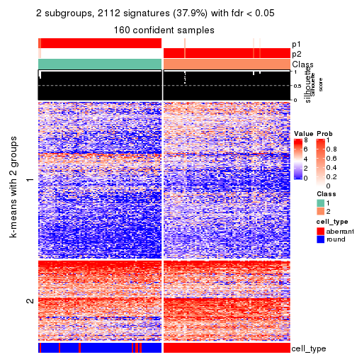</p>

</div>
<div id='tab-MAD-mclust-get-signatures-no-scale-2'>
<pre><code class="r">get_signatures(res, k = 3, scale_rows = FALSE)
</code></pre>

<p></p>

</div>
<div id='tab-MAD-mclust-get-signatures-no-scale-3'>
<pre><code class="r">get_signatures(res, k = 4, scale_rows = FALSE)
</code></pre>

<p></p>

</div>
<div id='tab-MAD-mclust-get-signatures-no-scale-4'>
<pre><code class="r">get_signatures(res, k = 5, scale_rows = FALSE)
</code></pre>

<p></p>

</div>
<div id='tab-MAD-mclust-get-signatures-no-scale-5'>
<pre><code class="r">get_signatures(res, k = 6, scale_rows = FALSE)
</code></pre>

<p></p>

</div>
</div>


Compare the overlap of signatures from different k:

```r
compare_signatures(res)
```


`get_signature()` returns a data frame invisibly. TO get the list of signatures, the function
call should be assigned to a variable explicitly. In following code, if `plot` argument is set
to `FALSE`, no heatmap is plotted while only the differential analysis is performed.

```r
# code only for demonstration
tb = get_signature(res, k = ..., plot = FALSE)
```

An example of the output of `tb` is:

```
#>   which_row         fdr    mean_1    mean_2 scaled_mean_1 scaled_mean_2 km
#> 1        38 0.042760348  8.373488  9.131774    -0.5533452     0.5164555  1
#> 2        40 0.018707592  7.106213  8.469186    -0.6173731     0.5762149  1
#> 3        55 0.019134737 10.221463 11.207825    -0.6159697     0.5749050  1
#> 4        59 0.006059896  5.921854  7.869574    -0.6899429     0.6439467  1
#> 5        60 0.018055526  8.928898 10.211722    -0.6204761     0.5791110  1
#> 6        98 0.009384629 15.714769 14.887706     0.6635654    -0.6193277  2
...
```

The columns in `tb` are:

1. `which_row`: row indices corresponding to the input matrix.
2. `fdr`: FDR for the differential test. 
3. `mean_x`: The mean value in group x.
4. `scaled_mean_x`: The mean value in group x after rows are scaled.
5. `km`: Row groups if k-means clustering is applied to rows.


UMAP plot which shows how samples are separated.


<script>
$( function() {
	$( '#tabs-MAD-mclust-dimension-reduction' ).tabs();
} );
</script>
<div id='tabs-MAD-mclust-dimension-reduction'>
<ul>
<li><a href='#tab-MAD-mclust-dimension-reduction-1'>k = 2</a></li>
<li><a href='#tab-MAD-mclust-dimension-reduction-2'>k = 3</a></li>
<li><a href='#tab-MAD-mclust-dimension-reduction-3'>k = 4</a></li>
<li><a href='#tab-MAD-mclust-dimension-reduction-4'>k = 5</a></li>
<li><a href='#tab-MAD-mclust-dimension-reduction-5'>k = 6</a></li>
</ul>
<div id='tab-MAD-mclust-dimension-reduction-1'>
<pre><code class="r">dimension_reduction(res, k = 2, method = &quot;UMAP&quot;)
</code></pre>

<p></p>

</div>
<div id='tab-MAD-mclust-dimension-reduction-2'>
<pre><code class="r">dimension_reduction(res, k = 3, method = &quot;UMAP&quot;)
</code></pre>

<p></p>

</div>
<div id='tab-MAD-mclust-dimension-reduction-3'>
<pre><code class="r">dimension_reduction(res, k = 4, method = &quot;UMAP&quot;)
</code></pre>

<p></p>

</div>
<div id='tab-MAD-mclust-dimension-reduction-4'>
<pre><code class="r">dimension_reduction(res, k = 5, method = &quot;UMAP&quot;)
</code></pre>

<p></p>

</div>
<div id='tab-MAD-mclust-dimension-reduction-5'>
<pre><code class="r">dimension_reduction(res, k = 6, method = &quot;UMAP&quot;)
</code></pre>

<p></p>

</div>
</div>


Following heatmap shows how subgroups are split when increasing `k`:

```r
collect_classes(res)
```


Test correlation between subgroups and known annotations. If the known
annotation is numeric, one-way ANOVA test is applied, and if the known
annotation is discrete, chi-squared contingency table test is applied.

```r
test_to_known_factors(res)
```

```
#>              n cell_type(p) k
#> MAD:mclust 160     3.08e-30 2
#> MAD:mclust 149     2.89e-28 3
#> MAD:mclust 155     7.53e-28 4
#> MAD:mclust 149     9.56e-26 5
#> MAD:mclust 134     1.62e-22 6
```


If matrix rows can be associated to genes, consider to use `GO_Enrichment(res,
...)` to perform function enrichment for the signature genes.


 

---------------------------------------------------


### MAD:NMF**


The object with results only for a single top-value method and a single partition method 
can be extracted as:

```r
res = res_list["MAD", "NMF"]
# you can also extract it by
# res = res_list["MAD:NMF"]
```

A summary of `res` and all the functions that can be applied to it:

```r
res
```

```
#> A 'ConsensusPartition' object with k = 2, 3, 4, 5, 6.
#>   On a matrix with 5576 rows and 160 columns.
#>   Top rows (558, 1116, 1673, 2230, 2788) are extracted by 'MAD' method.
#>   Subgroups are detected by 'NMF' method.
#>   Performed in total 1250 partitions by row resampling.
#>   Best k for subgroups seems to be 2.
#> 
#> Following methods can be applied to this 'ConsensusPartition' object:
#>  [1] "cola_report"             "collect_classes"         "collect_plots"          
#>  [4] "collect_stats"           "colnames"                "compare_signatures"     
#>  [7] "consensus_heatmap"       "dimension_reduction"     "functional_enrichment"  
#> [10] "get_anno_col"            "get_anno"                "get_classes"            
#> [13] "get_consensus"           "get_matrix"              "get_membership"         
#> [16] "get_param"               "get_signatures"          "get_stats"              
#> [19] "is_best_k"               "is_stable_k"             "membership_heatmap"     
#> [22] "ncol"                    "nrow"                    "plot_ecdf"              
#> [25] "rownames"                "select_partition_number" "show"                   
#> [28] "suggest_best_k"          "test_to_known_factors"
```

`collect_plots()` function collects all the plots made from `res` for all `k` (number of partitions)
into one single page to provide an easy and fast comparison between different `k`.

```r
collect_plots(res)
```


The plots are:

- The first row: a plot of the ECDF (Empirical cumulative distribution
  function) curves of the consensus matrix for each `k` and the heatmap of
  predicted classes for each `k`.
- The second row: heatmaps of the consensus matrix for each `k`.
- The third row: heatmaps of the membership matrix for each `k`.
- The fouth row: heatmaps of the signatures for each `k`.

All the plots in panels can be made by individual functions and they are
plotted later in this section.

`select_partition_number()` produces several plots showing different
statistics for choosing "optimized" `k`. There are following statistics:

- ECDF curves of the consensus matrix for each `k`;
- 1-PAC. [The PAC
  score](https://en.wikipedia.org/wiki/Consensus_clustering#Over-interpretation_potential_of_consensus_clustering)
  measures the proportion of the ambiguous subgrouping.
- Mean silhouette score.
- Concordance. The mean probability of fiting the consensus class ids in all
  partitions.
- Area increased. Denote $A_k$ as the area under the ECDF curve for current
  `k`, the area increased is defined as $A_k - A_{k-1}$.
- Rand index. The percent of pairs of samples that are both in a same cluster
  or both are not in a same cluster in the partition of k and k-1.
- Jaccard index. The ratio of pairs of samples are both in a same cluster in
  the partition of k and k-1 and the pairs of samples are both in a same
  cluster in the partition k or k-1.

The detailed explanations of these statistics can be found in [the cola
vignette](http://bioconductor.org/packages/devel/bioc/vignettes/cola/inst/doc/cola.html#toc_13).

Generally speaking, lower PAC score, higher mean silhouette score or higher
concordance corresponds to better partition. Rand index and Jaccard index
measure how similar the current partition is compared to partition with `k-1`.
If they are too similar, we won't accept `k` is better than `k-1`.

```r
select_partition_number(res)
```

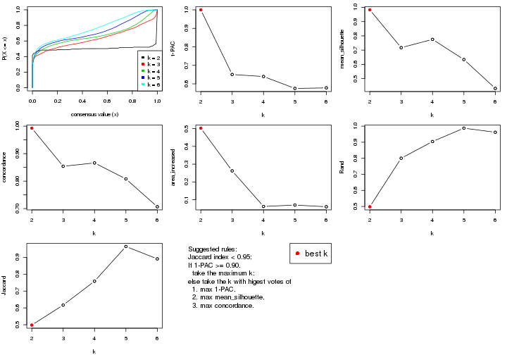

The numeric values for all these statistics can be obtained by `get_stats()`.

```r
get_stats(res)
```

```
#>   k 1-PAC mean_silhouette concordance area_increased  Rand Jaccard
#> 2 2 1.000           0.983       0.993         0.5026 0.498   0.498
#> 3 3 0.650           0.717       0.854         0.2623 0.800   0.617
#> 4 4 0.640           0.775       0.866         0.0621 0.904   0.759
#> 5 5 0.575           0.634       0.808         0.0700 0.987   0.964
#> 6 6 0.578           0.431       0.707         0.0604 0.962   0.891
```

`suggest_best_k()` suggests the best $k$ based on these statistics. The rules are as follows:

- All $k$ with Jaccard index larger than 0.95 are removed because the increase of
  the partition number does not provides enough extra information. If all $k$ are removed,
  the best $k$ is assigned by `NA`.
- For $k$ with 1-PAC larger than 0.9, the maximal $k$ is taken as the "best k". Other $k$ is called "optional k".
- If it does not fit the second rule. The $k$ with the highest vote of highest
  1-PAC, mean silhouette and concordance is taken as the "best k".

```r
suggest_best_k(res)
```

```
#> [1] 2
```


Following shows the table of the partitions (You need to click the **show/hide
code output** link to see it). The membership matrix (columns with name `p*`)
is inferred by
[`clue::cl_consensus()`](https://www.rdocumentation.org/link/cl_consensus?package=clue)
function with the `SE` method. Basically the value in the membership matrix
represents the probability to belong to a certain group. The finall class
label for an item is determined with the group with highest probability it
belongs to.

In `get_classes()` function, the entropy is calculated from the membership
matrix and the silhouette score is calculated from the consensus matrix.


<script>
$( function() {
	$( '#tabs-MAD-NMF-get-classes' ).tabs();
} );
</script>
<div id='tabs-MAD-NMF-get-classes'>
<ul>
<li><a href='#tab-MAD-NMF-get-classes-1'>k = 2</a></li>
<li><a href='#tab-MAD-NMF-get-classes-2'>k = 3</a></li>
<li><a href='#tab-MAD-NMF-get-classes-3'>k = 4</a></li>
<li><a href='#tab-MAD-NMF-get-classes-4'>k = 5</a></li>
<li><a href='#tab-MAD-NMF-get-classes-5'>k = 6</a></li>
</ul>

<div id='tab-MAD-NMF-get-classes-1'>
<p><a id='tab-MAD-NMF-get-classes-1-a' style='color:#0366d6' href='#'>show/hide code output</a></p>
<pre><code class="r">cbind(get_classes(res, k = 2), get_membership(res, k = 2))
</code></pre>

<pre><code>#&gt;                     class entropy silhouette    p1    p2
#&gt; aberrant_ERR2585320     2  0.0000      0.990 0.000 1.000
#&gt; aberrant_ERR2585338     2  0.0000      0.990 0.000 1.000
#&gt; aberrant_ERR2585325     2  0.0000      0.990 0.000 1.000
#&gt; aberrant_ERR2585283     2  0.0000      0.990 0.000 1.000
#&gt; aberrant_ERR2585343     2  0.0000      0.990 0.000 1.000
#&gt; aberrant_ERR2585329     2  0.0000      0.990 0.000 1.000
#&gt; aberrant_ERR2585317     2  0.0000      0.990 0.000 1.000
#&gt; aberrant_ERR2585339     2  0.0000      0.990 0.000 1.000
#&gt; aberrant_ERR2585335     2  0.0000      0.990 0.000 1.000
#&gt; aberrant_ERR2585287     2  0.0000      0.990 0.000 1.000
#&gt; aberrant_ERR2585321     2  0.0000      0.990 0.000 1.000
#&gt; aberrant_ERR2585297     1  0.0000      0.995 1.000 0.000
#&gt; aberrant_ERR2585337     2  0.0000      0.990 0.000 1.000
#&gt; aberrant_ERR2585319     2  0.0000      0.990 0.000 1.000
#&gt; aberrant_ERR2585315     2  0.0000      0.990 0.000 1.000
#&gt; aberrant_ERR2585336     2  0.0000      0.990 0.000 1.000
#&gt; aberrant_ERR2585307     2  0.0000      0.990 0.000 1.000
#&gt; aberrant_ERR2585301     2  0.0000      0.990 0.000 1.000
#&gt; aberrant_ERR2585326     2  0.0000      0.990 0.000 1.000
#&gt; aberrant_ERR2585331     2  0.0000      0.990 0.000 1.000
#&gt; aberrant_ERR2585346     2  0.0000      0.990 0.000 1.000
#&gt; aberrant_ERR2585314     2  0.0000      0.990 0.000 1.000
#&gt; aberrant_ERR2585298     1  0.0000      0.995 1.000 0.000
#&gt; aberrant_ERR2585345     2  0.0000      0.990 0.000 1.000
#&gt; aberrant_ERR2585299     1  0.0000      0.995 1.000 0.000
#&gt; aberrant_ERR2585309     1  0.0000      0.995 1.000 0.000
#&gt; aberrant_ERR2585303     2  0.0000      0.990 0.000 1.000
#&gt; aberrant_ERR2585313     2  0.0000      0.990 0.000 1.000
#&gt; aberrant_ERR2585318     2  0.0000      0.990 0.000 1.000
#&gt; aberrant_ERR2585328     2  0.0000      0.990 0.000 1.000
#&gt; aberrant_ERR2585330     2  0.0000      0.990 0.000 1.000
#&gt; aberrant_ERR2585293     2  0.0000      0.990 0.000 1.000
#&gt; aberrant_ERR2585342     2  0.0000      0.990 0.000 1.000
#&gt; aberrant_ERR2585348     2  0.0000      0.990 0.000 1.000
#&gt; aberrant_ERR2585352     2  0.0000      0.990 0.000 1.000
#&gt; aberrant_ERR2585308     1  0.0000      0.995 1.000 0.000
#&gt; aberrant_ERR2585349     2  0.0376      0.986 0.004 0.996
#&gt; aberrant_ERR2585316     2  0.0000      0.990 0.000 1.000
#&gt; aberrant_ERR2585306     2  0.0672      0.983 0.008 0.992
#&gt; aberrant_ERR2585324     2  0.0000      0.990 0.000 1.000
#&gt; aberrant_ERR2585310     1  0.2423      0.957 0.960 0.040
#&gt; aberrant_ERR2585296     1  0.0000      0.995 1.000 0.000
#&gt; aberrant_ERR2585275     2  0.0000      0.990 0.000 1.000
#&gt; aberrant_ERR2585311     2  0.0000      0.990 0.000 1.000
#&gt; aberrant_ERR2585292     2  0.0000      0.990 0.000 1.000
#&gt; aberrant_ERR2585282     2  0.0000      0.990 0.000 1.000
#&gt; aberrant_ERR2585305     2  0.2423      0.952 0.040 0.960
#&gt; aberrant_ERR2585278     2  0.0000      0.990 0.000 1.000
#&gt; aberrant_ERR2585347     2  0.0000      0.990 0.000 1.000
#&gt; aberrant_ERR2585332     2  0.0000      0.990 0.000 1.000
#&gt; aberrant_ERR2585280     2  0.0000      0.990 0.000 1.000
#&gt; aberrant_ERR2585304     2  0.1633      0.968 0.024 0.976
#&gt; aberrant_ERR2585322     2  0.0000      0.990 0.000 1.000
#&gt; aberrant_ERR2585279     2  0.0000      0.990 0.000 1.000
#&gt; aberrant_ERR2585277     2  0.0000      0.990 0.000 1.000
#&gt; aberrant_ERR2585295     2  0.0000      0.990 0.000 1.000
#&gt; aberrant_ERR2585333     2  0.0000      0.990 0.000 1.000
#&gt; aberrant_ERR2585285     2  0.0000      0.990 0.000 1.000
#&gt; aberrant_ERR2585286     2  0.0000      0.990 0.000 1.000
#&gt; aberrant_ERR2585294     2  0.0000      0.990 0.000 1.000
#&gt; aberrant_ERR2585300     2  0.0000      0.990 0.000 1.000
#&gt; aberrant_ERR2585334     2  0.0000      0.990 0.000 1.000
#&gt; aberrant_ERR2585361     2  0.0000      0.990 0.000 1.000
#&gt; aberrant_ERR2585372     2  0.0000      0.990 0.000 1.000
#&gt; round_ERR2585217        1  0.0000      0.995 1.000 0.000
#&gt; round_ERR2585205        1  0.0000      0.995 1.000 0.000
#&gt; round_ERR2585214        1  0.3274      0.936 0.940 0.060
#&gt; round_ERR2585202        2  0.9661      0.357 0.392 0.608
#&gt; aberrant_ERR2585367     2  0.0000      0.990 0.000 1.000
#&gt; round_ERR2585220        1  0.0000      0.995 1.000 0.000
#&gt; round_ERR2585238        1  0.0000      0.995 1.000 0.000
#&gt; aberrant_ERR2585276     2  0.0000      0.990 0.000 1.000
#&gt; round_ERR2585218        1  0.0000      0.995 1.000 0.000
#&gt; aberrant_ERR2585363     2  0.0000      0.990 0.000 1.000
#&gt; round_ERR2585201        1  0.0000      0.995 1.000 0.000
#&gt; round_ERR2585210        1  0.0000      0.995 1.000 0.000
#&gt; aberrant_ERR2585362     2  0.0000      0.990 0.000 1.000
#&gt; aberrant_ERR2585360     2  0.0000      0.990 0.000 1.000
#&gt; round_ERR2585209        1  0.0000      0.995 1.000 0.000
#&gt; round_ERR2585242        1  0.0000      0.995 1.000 0.000
#&gt; round_ERR2585216        1  0.0000      0.995 1.000 0.000
#&gt; round_ERR2585219        1  0.0000      0.995 1.000 0.000
#&gt; round_ERR2585237        1  0.0672      0.988 0.992 0.008
#&gt; round_ERR2585198        1  0.0000      0.995 1.000 0.000
#&gt; round_ERR2585211        1  0.0000      0.995 1.000 0.000
#&gt; round_ERR2585206        1  0.0000      0.995 1.000 0.000
#&gt; aberrant_ERR2585281     2  0.0000      0.990 0.000 1.000
#&gt; round_ERR2585212        1  0.0000      0.995 1.000 0.000
#&gt; round_ERR2585221        1  0.0000      0.995 1.000 0.000
#&gt; round_ERR2585243        1  0.0000      0.995 1.000 0.000
#&gt; round_ERR2585204        1  0.7139      0.756 0.804 0.196
#&gt; round_ERR2585213        2  0.2948      0.939 0.052 0.948
#&gt; aberrant_ERR2585373     2  0.0000      0.990 0.000 1.000
#&gt; aberrant_ERR2585358     2  0.0000      0.990 0.000 1.000
#&gt; aberrant_ERR2585365     2  0.0000      0.990 0.000 1.000
#&gt; aberrant_ERR2585359     2  0.0000      0.990 0.000 1.000
#&gt; aberrant_ERR2585370     2  0.0000      0.990 0.000 1.000
#&gt; round_ERR2585215        1  0.0000      0.995 1.000 0.000
#&gt; round_ERR2585262        2  0.8909      0.559 0.308 0.692
#&gt; round_ERR2585199        1  0.1843      0.970 0.972 0.028
#&gt; aberrant_ERR2585369     2  0.0000      0.990 0.000 1.000
#&gt; round_ERR2585208        1  0.0000      0.995 1.000 0.000
#&gt; round_ERR2585252        1  0.0000      0.995 1.000 0.000
#&gt; round_ERR2585236        1  0.0938      0.985 0.988 0.012
#&gt; aberrant_ERR2585284     2  0.0000      0.990 0.000 1.000
#&gt; round_ERR2585224        1  0.0000      0.995 1.000 0.000
#&gt; round_ERR2585260        1  0.0000      0.995 1.000 0.000
#&gt; round_ERR2585229        1  0.0000      0.995 1.000 0.000
#&gt; aberrant_ERR2585364     2  0.0000      0.990 0.000 1.000
#&gt; round_ERR2585253        1  0.0000      0.995 1.000 0.000
#&gt; aberrant_ERR2585368     2  0.0000      0.990 0.000 1.000
#&gt; aberrant_ERR2585371     2  0.0000      0.990 0.000 1.000
#&gt; round_ERR2585239        1  0.0000      0.995 1.000 0.000
#&gt; round_ERR2585273        1  0.0000      0.995 1.000 0.000
#&gt; round_ERR2585256        1  0.0000      0.995 1.000 0.000
#&gt; round_ERR2585272        1  0.0000      0.995 1.000 0.000
#&gt; round_ERR2585246        1  0.0000      0.995 1.000 0.000
#&gt; round_ERR2585261        1  0.0000      0.995 1.000 0.000
#&gt; round_ERR2585254        1  0.0000      0.995 1.000 0.000
#&gt; round_ERR2585225        1  0.0000      0.995 1.000 0.000
#&gt; round_ERR2585235        1  0.0000      0.995 1.000 0.000
#&gt; round_ERR2585271        1  0.0000      0.995 1.000 0.000
#&gt; round_ERR2585251        1  0.0000      0.995 1.000 0.000
#&gt; round_ERR2585255        1  0.0376      0.992 0.996 0.004
#&gt; round_ERR2585257        1  0.0000      0.995 1.000 0.000
#&gt; round_ERR2585226        1  0.0000      0.995 1.000 0.000
#&gt; round_ERR2585265        1  0.0000      0.995 1.000 0.000
#&gt; round_ERR2585259        1  0.0000      0.995 1.000 0.000
#&gt; round_ERR2585247        1  0.0000      0.995 1.000 0.000
#&gt; round_ERR2585241        1  0.0000      0.995 1.000 0.000
#&gt; round_ERR2585263        1  0.0000      0.995 1.000 0.000
#&gt; round_ERR2585264        1  0.0000      0.995 1.000 0.000
#&gt; round_ERR2585233        1  0.0000      0.995 1.000 0.000
#&gt; round_ERR2585223        1  0.0000      0.995 1.000 0.000
#&gt; round_ERR2585234        1  0.0000      0.995 1.000 0.000
#&gt; round_ERR2585222        1  0.0000      0.995 1.000 0.000
#&gt; round_ERR2585228        1  0.0000      0.995 1.000 0.000
#&gt; round_ERR2585248        1  0.0000      0.995 1.000 0.000
#&gt; round_ERR2585240        1  0.0000      0.995 1.000 0.000
#&gt; round_ERR2585270        1  0.0000      0.995 1.000 0.000
#&gt; round_ERR2585232        1  0.0000      0.995 1.000 0.000
#&gt; aberrant_ERR2585341     2  0.0000      0.990 0.000 1.000
#&gt; aberrant_ERR2585355     2  0.0000      0.990 0.000 1.000
#&gt; round_ERR2585227        1  0.0000      0.995 1.000 0.000
#&gt; aberrant_ERR2585351     2  0.0000      0.990 0.000 1.000
#&gt; round_ERR2585269        1  0.0000      0.995 1.000 0.000
#&gt; aberrant_ERR2585357     2  0.0000      0.990 0.000 1.000
#&gt; aberrant_ERR2585350     2  0.0000      0.990 0.000 1.000
#&gt; round_ERR2585250        1  0.0000      0.995 1.000 0.000
#&gt; round_ERR2585245        1  0.0000      0.995 1.000 0.000
#&gt; aberrant_ERR2585353     2  0.0000      0.990 0.000 1.000
#&gt; round_ERR2585258        1  0.0000      0.995 1.000 0.000
#&gt; aberrant_ERR2585354     2  0.0000      0.990 0.000 1.000
#&gt; round_ERR2585249        1  0.0000      0.995 1.000 0.000
#&gt; round_ERR2585268        1  0.0000      0.995 1.000 0.000
#&gt; aberrant_ERR2585356     2  0.0000      0.990 0.000 1.000
#&gt; round_ERR2585266        1  0.0000      0.995 1.000 0.000
#&gt; round_ERR2585231        1  0.0000      0.995 1.000 0.000
#&gt; round_ERR2585230        1  0.0000      0.995 1.000 0.000
#&gt; round_ERR2585267        1  0.0000      0.995 1.000 0.000
</code></pre>

<script>
$('#tab-MAD-NMF-get-classes-1-a').parent().next().next().hide();
$('#tab-MAD-NMF-get-classes-1-a').click(function(){
  $('#tab-MAD-NMF-get-classes-1-a').parent().next().next().toggle();
  return(false);
});
</script>
</div>

<div id='tab-MAD-NMF-get-classes-2'>
<p><a id='tab-MAD-NMF-get-classes-2-a' style='color:#0366d6' href='#'>show/hide code output</a></p>
<pre><code class="r">cbind(get_classes(res, k = 3), get_membership(res, k = 3))
</code></pre>

<pre><code>#&gt;                     class entropy silhouette    p1    p2    p3
#&gt; aberrant_ERR2585320     2  0.5905     0.5757 0.000 0.648 0.352
#&gt; aberrant_ERR2585338     3  0.5138     0.5411 0.000 0.252 0.748
#&gt; aberrant_ERR2585325     2  0.5785     0.6035 0.000 0.668 0.332
#&gt; aberrant_ERR2585283     2  0.0000     0.7107 0.000 1.000 0.000
#&gt; aberrant_ERR2585343     2  0.3619     0.7356 0.000 0.864 0.136
#&gt; aberrant_ERR2585329     3  0.6286    -0.0673 0.000 0.464 0.536
#&gt; aberrant_ERR2585317     2  0.6252     0.3831 0.000 0.556 0.444
#&gt; aberrant_ERR2585339     2  0.5926     0.5696 0.000 0.644 0.356
#&gt; aberrant_ERR2585335     2  0.4399     0.7179 0.000 0.812 0.188
#&gt; aberrant_ERR2585287     2  0.3340     0.7246 0.000 0.880 0.120
#&gt; aberrant_ERR2585321     2  0.3192     0.7380 0.000 0.888 0.112
#&gt; aberrant_ERR2585297     1  0.0000     0.9645 1.000 0.000 0.000
#&gt; aberrant_ERR2585337     2  0.6180     0.4577 0.000 0.584 0.416
#&gt; aberrant_ERR2585319     2  0.0892     0.7212 0.000 0.980 0.020
#&gt; aberrant_ERR2585315     2  0.2537     0.7380 0.000 0.920 0.080
#&gt; aberrant_ERR2585336     3  0.6235     0.0589 0.000 0.436 0.564
#&gt; aberrant_ERR2585307     2  0.6299     0.2804 0.000 0.524 0.476
#&gt; aberrant_ERR2585301     2  0.4002     0.7293 0.000 0.840 0.160
#&gt; aberrant_ERR2585326     2  0.6111     0.5003 0.000 0.604 0.396
#&gt; aberrant_ERR2585331     3  0.0892     0.7046 0.000 0.020 0.980
#&gt; aberrant_ERR2585346     2  0.0237     0.7083 0.000 0.996 0.004
#&gt; aberrant_ERR2585314     2  0.6215     0.4304 0.000 0.572 0.428
#&gt; aberrant_ERR2585298     3  0.4121     0.6415 0.168 0.000 0.832
#&gt; aberrant_ERR2585345     2  0.6280     0.3379 0.000 0.540 0.460
#&gt; aberrant_ERR2585299     1  0.0000     0.9645 1.000 0.000 0.000
#&gt; aberrant_ERR2585309     1  0.0237     0.9636 0.996 0.000 0.004
#&gt; aberrant_ERR2585303     2  0.6168     0.4697 0.000 0.588 0.412
#&gt; aberrant_ERR2585313     2  0.6192     0.4500 0.000 0.580 0.420
#&gt; aberrant_ERR2585318     2  0.2878     0.7382 0.000 0.904 0.096
#&gt; aberrant_ERR2585328     3  0.5926     0.3264 0.000 0.356 0.644
#&gt; aberrant_ERR2585330     2  0.2448     0.7373 0.000 0.924 0.076
#&gt; aberrant_ERR2585293     2  0.3412     0.6099 0.000 0.876 0.124
#&gt; aberrant_ERR2585342     2  0.2537     0.7379 0.000 0.920 0.080
#&gt; aberrant_ERR2585348     3  0.6244     0.0422 0.000 0.440 0.560
#&gt; aberrant_ERR2585352     2  0.5859     0.5853 0.000 0.656 0.344
#&gt; aberrant_ERR2585308     1  0.0237     0.9636 0.996 0.000 0.004
#&gt; aberrant_ERR2585349     3  0.1031     0.7056 0.000 0.024 0.976
#&gt; aberrant_ERR2585316     2  0.0892     0.7218 0.000 0.980 0.020
#&gt; aberrant_ERR2585306     2  0.0983     0.7009 0.016 0.980 0.004
#&gt; aberrant_ERR2585324     2  0.0747     0.7196 0.000 0.984 0.016
#&gt; aberrant_ERR2585310     1  0.0475     0.9618 0.992 0.004 0.004
#&gt; aberrant_ERR2585296     1  0.3752     0.8456 0.856 0.000 0.144
#&gt; aberrant_ERR2585275     2  0.0000     0.7107 0.000 1.000 0.000
#&gt; aberrant_ERR2585311     2  0.2537     0.7380 0.000 0.920 0.080
#&gt; aberrant_ERR2585292     2  0.3412     0.6099 0.000 0.876 0.124
#&gt; aberrant_ERR2585282     2  0.5497     0.6432 0.000 0.708 0.292
#&gt; aberrant_ERR2585305     2  0.4834     0.5387 0.204 0.792 0.004
#&gt; aberrant_ERR2585278     2  0.4178     0.7258 0.000 0.828 0.172
#&gt; aberrant_ERR2585347     2  0.6154     0.4791 0.000 0.592 0.408
#&gt; aberrant_ERR2585332     2  0.5058     0.6858 0.000 0.756 0.244
#&gt; aberrant_ERR2585280     2  0.0892     0.7208 0.000 0.980 0.020
#&gt; aberrant_ERR2585304     3  0.8934     0.4406 0.236 0.196 0.568
#&gt; aberrant_ERR2585322     2  0.6295     0.2945 0.000 0.528 0.472
#&gt; aberrant_ERR2585279     3  0.0424     0.7044 0.000 0.008 0.992
#&gt; aberrant_ERR2585277     3  0.5431     0.4811 0.000 0.284 0.716
#&gt; aberrant_ERR2585295     3  0.6267    -0.0206 0.000 0.452 0.548
#&gt; aberrant_ERR2585333     2  0.0000     0.7107 0.000 1.000 0.000
#&gt; aberrant_ERR2585285     2  0.4178     0.7257 0.000 0.828 0.172
#&gt; aberrant_ERR2585286     3  0.3551     0.6693 0.000 0.132 0.868
#&gt; aberrant_ERR2585294     2  0.0424     0.7159 0.000 0.992 0.008
#&gt; aberrant_ERR2585300     2  0.0237     0.7083 0.000 0.996 0.004
#&gt; aberrant_ERR2585334     3  0.0592     0.7044 0.000 0.012 0.988
#&gt; aberrant_ERR2585361     2  0.5926     0.5714 0.000 0.644 0.356
#&gt; aberrant_ERR2585372     2  0.4235     0.7244 0.000 0.824 0.176
#&gt; round_ERR2585217        3  0.4346     0.6369 0.184 0.000 0.816
#&gt; round_ERR2585205        1  0.0000     0.9645 1.000 0.000 0.000
#&gt; round_ERR2585214        3  0.1163     0.7087 0.028 0.000 0.972
#&gt; round_ERR2585202        3  0.2261     0.7088 0.068 0.000 0.932
#&gt; aberrant_ERR2585367     2  0.6215     0.4306 0.000 0.572 0.428
#&gt; round_ERR2585220        1  0.0000     0.9645 1.000 0.000 0.000
#&gt; round_ERR2585238        1  0.0000     0.9645 1.000 0.000 0.000
#&gt; aberrant_ERR2585276     2  0.0424     0.7158 0.000 0.992 0.008
#&gt; round_ERR2585218        1  0.0237     0.9640 0.996 0.000 0.004
#&gt; aberrant_ERR2585363     2  0.6225     0.4171 0.000 0.568 0.432
#&gt; round_ERR2585201        3  0.2959     0.6870 0.100 0.000 0.900
#&gt; round_ERR2585210        1  0.1163     0.9541 0.972 0.000 0.028
#&gt; aberrant_ERR2585362     3  0.6168     0.1546 0.000 0.412 0.588
#&gt; aberrant_ERR2585360     2  0.5327     0.6613 0.000 0.728 0.272
#&gt; round_ERR2585209        1  0.4062     0.8360 0.836 0.000 0.164
#&gt; round_ERR2585242        1  0.5397     0.6766 0.720 0.000 0.280
#&gt; round_ERR2585216        1  0.1031     0.9562 0.976 0.000 0.024
#&gt; round_ERR2585219        1  0.0000     0.9645 1.000 0.000 0.000
#&gt; round_ERR2585237        3  0.2796     0.6991 0.092 0.000 0.908
#&gt; round_ERR2585198        1  0.5968     0.5303 0.636 0.000 0.364
#&gt; round_ERR2585211        1  0.0237     0.9640 0.996 0.000 0.004
#&gt; round_ERR2585206        1  0.0237     0.9640 0.996 0.000 0.004
#&gt; aberrant_ERR2585281     3  0.4605     0.6089 0.000 0.204 0.796
#&gt; round_ERR2585212        1  0.1163     0.9541 0.972 0.000 0.028
#&gt; round_ERR2585221        1  0.0237     0.9636 0.996 0.000 0.004
#&gt; round_ERR2585243        1  0.0237     0.9636 0.996 0.000 0.004
#&gt; round_ERR2585204        3  0.1163     0.7095 0.028 0.000 0.972
#&gt; round_ERR2585213        3  0.0424     0.7051 0.008 0.000 0.992
#&gt; aberrant_ERR2585373     2  0.0424     0.7158 0.000 0.992 0.008
#&gt; aberrant_ERR2585358     2  0.2356     0.7367 0.000 0.928 0.072
#&gt; aberrant_ERR2585365     3  0.6309    -0.2053 0.000 0.496 0.504
#&gt; aberrant_ERR2585359     2  0.0747     0.7199 0.000 0.984 0.016
#&gt; aberrant_ERR2585370     3  0.6295    -0.1073 0.000 0.472 0.528
#&gt; round_ERR2585215        1  0.0592     0.9615 0.988 0.000 0.012
#&gt; round_ERR2585262        3  0.1129     0.7103 0.020 0.004 0.976
#&gt; round_ERR2585199        3  0.2959     0.6964 0.100 0.000 0.900
#&gt; aberrant_ERR2585369     2  0.5706     0.6135 0.000 0.680 0.320
#&gt; round_ERR2585208        1  0.0000     0.9645 1.000 0.000 0.000
#&gt; round_ERR2585252        1  0.0000     0.9645 1.000 0.000 0.000
#&gt; round_ERR2585236        1  0.5016     0.7235 0.760 0.000 0.240
#&gt; aberrant_ERR2585284     2  0.6307     0.2166 0.000 0.512 0.488
#&gt; round_ERR2585224        1  0.0661     0.9590 0.988 0.008 0.004
#&gt; round_ERR2585260        1  0.0000     0.9645 1.000 0.000 0.000
#&gt; round_ERR2585229        1  0.0000     0.9645 1.000 0.000 0.000
#&gt; aberrant_ERR2585364     2  0.0237     0.7083 0.000 0.996 0.004
#&gt; round_ERR2585253        1  0.0237     0.9636 0.996 0.000 0.004
#&gt; aberrant_ERR2585368     3  0.3941     0.6521 0.000 0.156 0.844
#&gt; aberrant_ERR2585371     3  0.3551     0.6702 0.000 0.132 0.868
#&gt; round_ERR2585239        1  0.0000     0.9645 1.000 0.000 0.000
#&gt; round_ERR2585273        1  0.0000     0.9645 1.000 0.000 0.000
#&gt; round_ERR2585256        1  0.1163     0.9541 0.972 0.000 0.028
#&gt; round_ERR2585272        1  0.0592     0.9615 0.988 0.000 0.012
#&gt; round_ERR2585246        1  0.0237     0.9636 0.996 0.000 0.004
#&gt; round_ERR2585261        1  0.4235     0.8193 0.824 0.000 0.176
#&gt; round_ERR2585254        1  0.1163     0.9542 0.972 0.000 0.028
#&gt; round_ERR2585225        3  0.2066     0.7016 0.060 0.000 0.940
#&gt; round_ERR2585235        1  0.1031     0.9562 0.976 0.000 0.024
#&gt; round_ERR2585271        1  0.0237     0.9640 0.996 0.000 0.004
#&gt; round_ERR2585251        1  0.0000     0.9645 1.000 0.000 0.000
#&gt; round_ERR2585255        3  0.1643     0.7091 0.044 0.000 0.956
#&gt; round_ERR2585257        3  0.2711     0.6982 0.088 0.000 0.912
#&gt; round_ERR2585226        1  0.0237     0.9636 0.996 0.000 0.004
#&gt; round_ERR2585265        1  0.0000     0.9645 1.000 0.000 0.000
#&gt; round_ERR2585259        1  0.3879     0.8443 0.848 0.000 0.152
#&gt; round_ERR2585247        1  0.0237     0.9636 0.996 0.000 0.004
#&gt; round_ERR2585241        1  0.0424     0.9629 0.992 0.000 0.008
#&gt; round_ERR2585263        1  0.1411     0.9495 0.964 0.000 0.036
#&gt; round_ERR2585264        1  0.0237     0.9636 0.996 0.000 0.004
#&gt; round_ERR2585233        3  0.5291     0.5507 0.268 0.000 0.732
#&gt; round_ERR2585223        1  0.0237     0.9636 0.996 0.000 0.004
#&gt; round_ERR2585234        3  0.3551     0.6658 0.132 0.000 0.868
#&gt; round_ERR2585222        1  0.0000     0.9645 1.000 0.000 0.000
#&gt; round_ERR2585228        1  0.0237     0.9640 0.996 0.000 0.004
#&gt; round_ERR2585248        1  0.0000     0.9645 1.000 0.000 0.000
#&gt; round_ERR2585240        1  0.1529     0.9474 0.960 0.000 0.040
#&gt; round_ERR2585270        1  0.0424     0.9629 0.992 0.000 0.008
#&gt; round_ERR2585232        1  0.0747     0.9597 0.984 0.000 0.016
#&gt; aberrant_ERR2585341     3  0.5650     0.4329 0.000 0.312 0.688
#&gt; aberrant_ERR2585355     3  0.3686     0.6662 0.000 0.140 0.860
#&gt; round_ERR2585227        1  0.0000     0.9645 1.000 0.000 0.000
#&gt; aberrant_ERR2585351     2  0.6111     0.4973 0.000 0.604 0.396
#&gt; round_ERR2585269        1  0.0237     0.9636 0.996 0.000 0.004
#&gt; aberrant_ERR2585357     3  0.6235     0.0538 0.000 0.436 0.564
#&gt; aberrant_ERR2585350     2  0.6026     0.5393 0.000 0.624 0.376
#&gt; round_ERR2585250        1  0.1964     0.9353 0.944 0.000 0.056
#&gt; round_ERR2585245        1  0.0237     0.9636 0.996 0.000 0.004
#&gt; aberrant_ERR2585353     2  0.4702     0.7045 0.000 0.788 0.212
#&gt; round_ERR2585258        1  0.0000     0.9645 1.000 0.000 0.000
#&gt; aberrant_ERR2585354     2  0.3619     0.7347 0.000 0.864 0.136
#&gt; round_ERR2585249        1  0.0237     0.9636 0.996 0.000 0.004
#&gt; round_ERR2585268        1  0.3038     0.8965 0.896 0.000 0.104
#&gt; aberrant_ERR2585356     2  0.0237     0.7083 0.000 0.996 0.004
#&gt; round_ERR2585266        1  0.5254     0.7080 0.736 0.000 0.264
#&gt; round_ERR2585231        1  0.0000     0.9645 1.000 0.000 0.000
#&gt; round_ERR2585230        1  0.0237     0.9640 0.996 0.000 0.004
#&gt; round_ERR2585267        1  0.0237     0.9640 0.996 0.000 0.004
</code></pre>

<script>
$('#tab-MAD-NMF-get-classes-2-a').parent().next().next().hide();
$('#tab-MAD-NMF-get-classes-2-a').click(function(){
  $('#tab-MAD-NMF-get-classes-2-a').parent().next().next().toggle();
  return(false);
});
</script>
</div>

<div id='tab-MAD-NMF-get-classes-3'>
<p><a id='tab-MAD-NMF-get-classes-3-a' style='color:#0366d6' href='#'>show/hide code output</a></p>
<pre><code class="r">cbind(get_classes(res, k = 4), get_membership(res, k = 4))
</code></pre>

<pre><code>#&gt;                     class entropy silhouette    p1    p2    p3    p4
#&gt; aberrant_ERR2585320     2  0.3899    0.81134 0.000 0.840 0.108 0.052
#&gt; aberrant_ERR2585338     3  0.4941    0.09716 0.000 0.436 0.564 0.000
#&gt; aberrant_ERR2585325     2  0.4114    0.80770 0.000 0.828 0.112 0.060
#&gt; aberrant_ERR2585283     2  0.5125    0.46049 0.000 0.604 0.008 0.388
#&gt; aberrant_ERR2585343     2  0.1118    0.82493 0.000 0.964 0.000 0.036
#&gt; aberrant_ERR2585329     2  0.3910    0.77646 0.000 0.820 0.156 0.024
#&gt; aberrant_ERR2585317     2  0.2546    0.82005 0.000 0.912 0.060 0.028
#&gt; aberrant_ERR2585339     2  0.4359    0.80928 0.000 0.816 0.100 0.084
#&gt; aberrant_ERR2585335     2  0.1256    0.82413 0.000 0.964 0.008 0.028
#&gt; aberrant_ERR2585287     2  0.7159    0.44900 0.000 0.548 0.180 0.272
#&gt; aberrant_ERR2585321     2  0.1771    0.81948 0.004 0.948 0.012 0.036
#&gt; aberrant_ERR2585297     1  0.1706    0.90873 0.948 0.000 0.016 0.036
#&gt; aberrant_ERR2585337     2  0.2222    0.82388 0.000 0.924 0.060 0.016
#&gt; aberrant_ERR2585319     2  0.1743    0.81899 0.000 0.940 0.004 0.056
#&gt; aberrant_ERR2585315     2  0.3764    0.73827 0.000 0.784 0.000 0.216
#&gt; aberrant_ERR2585336     2  0.4594    0.65906 0.000 0.712 0.280 0.008
#&gt; aberrant_ERR2585307     2  0.4458    0.80684 0.000 0.808 0.116 0.076
#&gt; aberrant_ERR2585301     2  0.2255    0.82086 0.000 0.920 0.012 0.068
#&gt; aberrant_ERR2585326     2  0.2596    0.82727 0.000 0.908 0.068 0.024
#&gt; aberrant_ERR2585331     3  0.1716    0.75483 0.000 0.064 0.936 0.000
#&gt; aberrant_ERR2585346     2  0.4647    0.64039 0.000 0.704 0.008 0.288
#&gt; aberrant_ERR2585314     2  0.1975    0.82626 0.000 0.936 0.048 0.016
#&gt; aberrant_ERR2585298     3  0.2197    0.74160 0.080 0.004 0.916 0.000
#&gt; aberrant_ERR2585345     2  0.3900    0.78860 0.000 0.816 0.164 0.020
#&gt; aberrant_ERR2585299     1  0.0336    0.91908 0.992 0.000 0.000 0.008
#&gt; aberrant_ERR2585309     1  0.2950    0.88315 0.900 0.012 0.020 0.068
#&gt; aberrant_ERR2585303     2  0.4642    0.71499 0.000 0.740 0.240 0.020
#&gt; aberrant_ERR2585313     2  0.3160    0.81199 0.000 0.872 0.108 0.020
#&gt; aberrant_ERR2585318     2  0.1938    0.81736 0.000 0.936 0.012 0.052
#&gt; aberrant_ERR2585328     2  0.4642    0.69494 0.000 0.740 0.240 0.020
#&gt; aberrant_ERR2585330     2  0.2704    0.80339 0.000 0.876 0.000 0.124
#&gt; aberrant_ERR2585293     4  0.2859    1.00000 0.000 0.112 0.008 0.880
#&gt; aberrant_ERR2585342     2  0.2125    0.82380 0.000 0.920 0.004 0.076
#&gt; aberrant_ERR2585348     2  0.3831    0.74671 0.000 0.792 0.204 0.004
#&gt; aberrant_ERR2585352     2  0.2021    0.82854 0.000 0.936 0.040 0.024
#&gt; aberrant_ERR2585308     1  0.2275    0.89802 0.928 0.004 0.020 0.048
#&gt; aberrant_ERR2585349     3  0.4139    0.66906 0.000 0.176 0.800 0.024
#&gt; aberrant_ERR2585316     2  0.2593    0.80445 0.000 0.892 0.004 0.104
#&gt; aberrant_ERR2585306     2  0.6511    0.49352 0.060 0.636 0.024 0.280
#&gt; aberrant_ERR2585324     2  0.2714    0.80573 0.000 0.884 0.004 0.112
#&gt; aberrant_ERR2585310     1  0.3746    0.84924 0.868 0.072 0.020 0.040
#&gt; aberrant_ERR2585296     1  0.4037    0.85872 0.848 0.040 0.096 0.016
#&gt; aberrant_ERR2585275     2  0.4914    0.59588 0.000 0.676 0.012 0.312
#&gt; aberrant_ERR2585311     2  0.1888    0.81723 0.000 0.940 0.016 0.044
#&gt; aberrant_ERR2585292     4  0.2859    1.00000 0.000 0.112 0.008 0.880
#&gt; aberrant_ERR2585282     2  0.1733    0.82887 0.000 0.948 0.024 0.028
#&gt; aberrant_ERR2585305     2  0.3396    0.78259 0.024 0.884 0.024 0.068
#&gt; aberrant_ERR2585278     2  0.1824    0.82377 0.000 0.936 0.004 0.060
#&gt; aberrant_ERR2585347     2  0.3919    0.81335 0.000 0.840 0.104 0.056
#&gt; aberrant_ERR2585332     2  0.1936    0.82869 0.000 0.940 0.028 0.032
#&gt; aberrant_ERR2585280     2  0.4567    0.68561 0.000 0.716 0.008 0.276
#&gt; aberrant_ERR2585304     2  0.7872   -0.10113 0.280 0.376 0.344 0.000
#&gt; aberrant_ERR2585322     2  0.4914    0.74095 0.000 0.748 0.208 0.044
#&gt; aberrant_ERR2585279     3  0.1118    0.76567 0.000 0.036 0.964 0.000
#&gt; aberrant_ERR2585277     3  0.4406    0.51034 0.000 0.300 0.700 0.000
#&gt; aberrant_ERR2585295     2  0.5663    0.31382 0.000 0.536 0.440 0.024
#&gt; aberrant_ERR2585333     2  0.4391    0.69545 0.000 0.740 0.008 0.252
#&gt; aberrant_ERR2585285     2  0.1042    0.82724 0.000 0.972 0.008 0.020
#&gt; aberrant_ERR2585286     3  0.3688    0.64046 0.000 0.208 0.792 0.000
#&gt; aberrant_ERR2585294     2  0.4248    0.71552 0.000 0.768 0.012 0.220
#&gt; aberrant_ERR2585300     2  0.4054    0.75497 0.000 0.796 0.016 0.188
#&gt; aberrant_ERR2585334     3  0.1389    0.76202 0.000 0.048 0.952 0.000
#&gt; aberrant_ERR2585361     2  0.3471    0.82437 0.000 0.868 0.072 0.060
#&gt; aberrant_ERR2585372     2  0.2256    0.83105 0.000 0.924 0.020 0.056
#&gt; round_ERR2585217        3  0.3470    0.69945 0.132 0.008 0.852 0.008
#&gt; round_ERR2585205        1  0.0895    0.91859 0.976 0.000 0.020 0.004
#&gt; round_ERR2585214        3  0.1509    0.76774 0.012 0.020 0.960 0.008
#&gt; round_ERR2585202        3  0.2297    0.76997 0.024 0.044 0.928 0.004
#&gt; aberrant_ERR2585367     2  0.4617    0.75198 0.000 0.764 0.204 0.032
#&gt; round_ERR2585220        1  0.1520    0.92082 0.956 0.000 0.024 0.020
#&gt; round_ERR2585238        1  0.0336    0.91772 0.992 0.000 0.000 0.008
#&gt; aberrant_ERR2585276     2  0.4019    0.73190 0.000 0.792 0.012 0.196
#&gt; round_ERR2585218        1  0.1406    0.91851 0.960 0.000 0.024 0.016
#&gt; aberrant_ERR2585363     2  0.2466    0.82150 0.000 0.916 0.056 0.028
#&gt; round_ERR2585201        3  0.2125    0.74489 0.076 0.000 0.920 0.004
#&gt; round_ERR2585210        1  0.3991    0.86515 0.860 0.044 0.064 0.032
#&gt; aberrant_ERR2585362     2  0.3910    0.77360 0.000 0.820 0.156 0.024
#&gt; aberrant_ERR2585360     2  0.1824    0.82863 0.000 0.936 0.004 0.060
#&gt; round_ERR2585209        1  0.5016    0.40845 0.600 0.000 0.396 0.004
#&gt; round_ERR2585242        3  0.4103    0.53213 0.256 0.000 0.744 0.000
#&gt; round_ERR2585216        1  0.2222    0.90618 0.924 0.000 0.060 0.016
#&gt; round_ERR2585219        1  0.1284    0.91877 0.964 0.000 0.024 0.012
#&gt; round_ERR2585237        3  0.2485    0.76035 0.064 0.016 0.916 0.004
#&gt; round_ERR2585198        3  0.3907    0.57008 0.232 0.000 0.768 0.000
#&gt; round_ERR2585211        1  0.1247    0.91973 0.968 0.004 0.016 0.012
#&gt; round_ERR2585206        1  0.0779    0.91966 0.980 0.000 0.016 0.004
#&gt; aberrant_ERR2585281     3  0.4313    0.56072 0.000 0.260 0.736 0.004
#&gt; round_ERR2585212        1  0.2124    0.90369 0.924 0.000 0.068 0.008
#&gt; round_ERR2585221        1  0.2667    0.89130 0.912 0.008 0.020 0.060
#&gt; round_ERR2585243        1  0.2131    0.90561 0.936 0.008 0.016 0.040
#&gt; round_ERR2585204        3  0.1369    0.76671 0.016 0.016 0.964 0.004
#&gt; round_ERR2585213        3  0.1118    0.76567 0.000 0.036 0.964 0.000
#&gt; aberrant_ERR2585373     2  0.1807    0.81433 0.000 0.940 0.008 0.052
#&gt; aberrant_ERR2585358     2  0.2124    0.82553 0.000 0.924 0.008 0.068
#&gt; aberrant_ERR2585365     2  0.3597    0.79114 0.000 0.836 0.148 0.016
#&gt; aberrant_ERR2585359     2  0.2125    0.81826 0.000 0.920 0.004 0.076
#&gt; aberrant_ERR2585370     2  0.4697    0.55547 0.000 0.644 0.356 0.000
#&gt; round_ERR2585215        1  0.2563    0.90634 0.916 0.012 0.060 0.012
#&gt; round_ERR2585262        3  0.2011    0.75570 0.000 0.080 0.920 0.000
#&gt; round_ERR2585199        3  0.2368    0.77082 0.032 0.032 0.928 0.008
#&gt; aberrant_ERR2585369     2  0.1297    0.82571 0.000 0.964 0.016 0.020
#&gt; round_ERR2585208        1  0.0672    0.91779 0.984 0.000 0.008 0.008
#&gt; round_ERR2585252        1  0.1042    0.91516 0.972 0.000 0.008 0.020
#&gt; round_ERR2585236        1  0.5306    0.57455 0.664 0.020 0.312 0.004
#&gt; aberrant_ERR2585284     2  0.6603    0.47951 0.000 0.572 0.328 0.100
#&gt; round_ERR2585224        1  0.3536    0.86316 0.876 0.028 0.020 0.076
#&gt; round_ERR2585260        1  0.1059    0.91928 0.972 0.000 0.016 0.012
#&gt; round_ERR2585229        1  0.0469    0.91922 0.988 0.000 0.000 0.012
#&gt; aberrant_ERR2585364     2  0.3901    0.76333 0.004 0.816 0.012 0.168
#&gt; round_ERR2585253        1  0.0672    0.91954 0.984 0.000 0.008 0.008
#&gt; aberrant_ERR2585368     3  0.3688    0.64534 0.000 0.208 0.792 0.000
#&gt; aberrant_ERR2585371     3  0.3266    0.68324 0.000 0.168 0.832 0.000
#&gt; round_ERR2585239        1  0.1209    0.91712 0.964 0.000 0.032 0.004
#&gt; round_ERR2585273        1  0.2021    0.90707 0.932 0.000 0.012 0.056
#&gt; round_ERR2585256        1  0.2334    0.89299 0.908 0.000 0.088 0.004
#&gt; round_ERR2585272        1  0.1576    0.91139 0.948 0.000 0.048 0.004
#&gt; round_ERR2585246        1  0.3250    0.87280 0.888 0.016 0.024 0.072
#&gt; round_ERR2585261        1  0.5028    0.39549 0.596 0.000 0.400 0.004
#&gt; round_ERR2585254        1  0.2197    0.89738 0.916 0.000 0.080 0.004
#&gt; round_ERR2585225        3  0.1209    0.76287 0.032 0.004 0.964 0.000
#&gt; round_ERR2585235        1  0.2198    0.90320 0.920 0.000 0.072 0.008
#&gt; round_ERR2585271        1  0.1209    0.91654 0.964 0.000 0.032 0.004
#&gt; round_ERR2585251        1  0.0921    0.91811 0.972 0.000 0.028 0.000
#&gt; round_ERR2585255        3  0.1339    0.76479 0.024 0.008 0.964 0.004
#&gt; round_ERR2585257        3  0.2586    0.73970 0.092 0.004 0.900 0.004
#&gt; round_ERR2585226        1  0.1488    0.91313 0.956 0.000 0.012 0.032
#&gt; round_ERR2585265        1  0.0804    0.91962 0.980 0.000 0.012 0.008
#&gt; round_ERR2585259        1  0.5125    0.41866 0.604 0.000 0.388 0.008
#&gt; round_ERR2585247        1  0.1722    0.90841 0.944 0.000 0.008 0.048
#&gt; round_ERR2585241        1  0.1677    0.91394 0.948 0.000 0.040 0.012
#&gt; round_ERR2585263        1  0.6019    0.72765 0.736 0.088 0.140 0.036
#&gt; round_ERR2585264        1  0.1109    0.91547 0.968 0.000 0.004 0.028
#&gt; round_ERR2585233        3  0.3032    0.70817 0.124 0.008 0.868 0.000
#&gt; round_ERR2585223        1  0.0895    0.91513 0.976 0.000 0.004 0.020
#&gt; round_ERR2585234        3  0.2088    0.75022 0.064 0.004 0.928 0.004
#&gt; round_ERR2585222        1  0.1151    0.91911 0.968 0.000 0.024 0.008
#&gt; round_ERR2585228        1  0.1059    0.91955 0.972 0.000 0.016 0.012
#&gt; round_ERR2585248        1  0.0804    0.91852 0.980 0.000 0.008 0.012
#&gt; round_ERR2585240        1  0.3157    0.85894 0.852 0.000 0.144 0.004
#&gt; round_ERR2585270        1  0.1545    0.91467 0.952 0.000 0.040 0.008
#&gt; round_ERR2585232        1  0.2198    0.90671 0.920 0.000 0.072 0.008
#&gt; aberrant_ERR2585341     3  0.5277   -0.00459 0.000 0.460 0.532 0.008
#&gt; aberrant_ERR2585355     3  0.3942    0.61162 0.000 0.236 0.764 0.000
#&gt; round_ERR2585227        1  0.1706    0.91713 0.948 0.000 0.016 0.036
#&gt; aberrant_ERR2585351     2  0.1610    0.82604 0.000 0.952 0.032 0.016
#&gt; round_ERR2585269        1  0.2335    0.89560 0.920 0.000 0.020 0.060
#&gt; aberrant_ERR2585357     2  0.4509    0.65522 0.000 0.708 0.288 0.004
#&gt; aberrant_ERR2585350     2  0.3372    0.82397 0.000 0.868 0.096 0.036
#&gt; round_ERR2585250        1  0.3366    0.87634 0.872 0.008 0.100 0.020
#&gt; round_ERR2585245        1  0.2363    0.89456 0.920 0.000 0.024 0.056
#&gt; aberrant_ERR2585353     2  0.2002    0.82978 0.000 0.936 0.020 0.044
#&gt; round_ERR2585258        1  0.1174    0.91805 0.968 0.000 0.012 0.020
#&gt; aberrant_ERR2585354     2  0.1356    0.82644 0.000 0.960 0.008 0.032
#&gt; round_ERR2585249        1  0.1820    0.90521 0.944 0.000 0.020 0.036
#&gt; round_ERR2585268        1  0.3105    0.85546 0.856 0.000 0.140 0.004
#&gt; aberrant_ERR2585356     2  0.2515    0.80492 0.004 0.912 0.012 0.072
#&gt; round_ERR2585266        3  0.4977    0.01684 0.460 0.000 0.540 0.000
#&gt; round_ERR2585231        1  0.2561    0.89247 0.912 0.004 0.016 0.068
#&gt; round_ERR2585230        1  0.1489    0.91642 0.952 0.000 0.044 0.004
#&gt; round_ERR2585267        1  0.2282    0.91212 0.924 0.000 0.024 0.052
</code></pre>

<script>
$('#tab-MAD-NMF-get-classes-3-a').parent().next().next().hide();
$('#tab-MAD-NMF-get-classes-3-a').click(function(){
  $('#tab-MAD-NMF-get-classes-3-a').parent().next().next().toggle();
  return(false);
});
</script>
</div>

<div id='tab-MAD-NMF-get-classes-4'>
<p><a id='tab-MAD-NMF-get-classes-4-a' style='color:#0366d6' href='#'>show/hide code output</a></p>
<pre><code class="r">cbind(get_classes(res, k = 5), get_membership(res, k = 5))
</code></pre>

<pre><code>#&gt;                     class entropy silhouette    p1    p2    p3    p4    p5
#&gt; aberrant_ERR2585320     2  0.5335     0.4291 0.000 0.668 0.040 0.032 0.260
#&gt; aberrant_ERR2585338     3  0.5009     0.0444 0.000 0.428 0.540 0.000 0.032
#&gt; aberrant_ERR2585325     2  0.5623     0.3963 0.000 0.656 0.056 0.036 0.252
#&gt; aberrant_ERR2585283     2  0.5733    -0.0532 0.000 0.608 0.000 0.256 0.136
#&gt; aberrant_ERR2585343     2  0.1630     0.6744 0.000 0.944 0.004 0.016 0.036
#&gt; aberrant_ERR2585329     2  0.3792     0.6512 0.000 0.832 0.100 0.024 0.044
#&gt; aberrant_ERR2585317     2  0.2786     0.6731 0.000 0.884 0.020 0.012 0.084
#&gt; aberrant_ERR2585339     2  0.3155     0.6461 0.000 0.864 0.096 0.020 0.020
#&gt; aberrant_ERR2585335     2  0.2416     0.6705 0.000 0.888 0.000 0.012 0.100
#&gt; aberrant_ERR2585287     2  0.7722    -0.1195 0.000 0.480 0.244 0.132 0.144
#&gt; aberrant_ERR2585321     2  0.2488     0.6627 0.000 0.872 0.000 0.004 0.124
#&gt; aberrant_ERR2585297     1  0.3636     0.7617 0.728 0.000 0.000 0.000 0.272
#&gt; aberrant_ERR2585337     2  0.1997     0.6753 0.000 0.932 0.028 0.016 0.024
#&gt; aberrant_ERR2585319     2  0.1809     0.6488 0.000 0.928 0.000 0.012 0.060
#&gt; aberrant_ERR2585315     2  0.4557     0.4607 0.000 0.764 0.008 0.088 0.140
#&gt; aberrant_ERR2585336     2  0.4468     0.5282 0.000 0.740 0.212 0.008 0.040
#&gt; aberrant_ERR2585307     2  0.4419     0.5751 0.000 0.780 0.140 0.016 0.064
#&gt; aberrant_ERR2585301     2  0.3013     0.6071 0.000 0.832 0.000 0.008 0.160
#&gt; aberrant_ERR2585326     2  0.2885     0.6652 0.000 0.880 0.064 0.004 0.052
#&gt; aberrant_ERR2585331     3  0.0912     0.7837 0.000 0.012 0.972 0.000 0.016
#&gt; aberrant_ERR2585346     2  0.5273     0.0554 0.000 0.652 0.008 0.064 0.276
#&gt; aberrant_ERR2585314     2  0.3843     0.6089 0.000 0.788 0.016 0.012 0.184
#&gt; aberrant_ERR2585298     3  0.1282     0.7884 0.044 0.000 0.952 0.000 0.004
#&gt; aberrant_ERR2585345     2  0.3243     0.6427 0.000 0.848 0.116 0.004 0.032
#&gt; aberrant_ERR2585299     1  0.1671     0.8264 0.924 0.000 0.000 0.000 0.076
#&gt; aberrant_ERR2585309     1  0.4009     0.7303 0.684 0.000 0.004 0.000 0.312
#&gt; aberrant_ERR2585303     2  0.4743     0.4017 0.000 0.700 0.248 0.004 0.048
#&gt; aberrant_ERR2585313     2  0.2499     0.6801 0.000 0.908 0.040 0.016 0.036
#&gt; aberrant_ERR2585318     2  0.2377     0.6621 0.000 0.872 0.000 0.000 0.128
#&gt; aberrant_ERR2585328     2  0.5699     0.4748 0.000 0.680 0.148 0.024 0.148
#&gt; aberrant_ERR2585330     2  0.2770     0.6265 0.000 0.880 0.000 0.044 0.076
#&gt; aberrant_ERR2585293     4  0.1205     1.0000 0.000 0.040 0.000 0.956 0.004
#&gt; aberrant_ERR2585342     2  0.2669     0.6318 0.000 0.876 0.000 0.020 0.104
#&gt; aberrant_ERR2585348     2  0.4604     0.6038 0.000 0.760 0.072 0.012 0.156
#&gt; aberrant_ERR2585352     2  0.2569     0.6750 0.000 0.896 0.016 0.012 0.076
#&gt; aberrant_ERR2585308     1  0.3300     0.7921 0.792 0.000 0.004 0.000 0.204
#&gt; aberrant_ERR2585349     3  0.5976     0.5343 0.008 0.164 0.660 0.016 0.152
#&gt; aberrant_ERR2585316     2  0.2491     0.6461 0.000 0.896 0.000 0.036 0.068
#&gt; aberrant_ERR2585306     5  0.5903     0.0000 0.028 0.460 0.000 0.044 0.468
#&gt; aberrant_ERR2585324     2  0.2669     0.6184 0.000 0.876 0.000 0.020 0.104
#&gt; aberrant_ERR2585310     1  0.5427     0.6263 0.596 0.052 0.004 0.004 0.344
#&gt; aberrant_ERR2585296     1  0.6062     0.6790 0.688 0.064 0.056 0.020 0.172
#&gt; aberrant_ERR2585275     2  0.5980    -0.2268 0.000 0.588 0.004 0.140 0.268
#&gt; aberrant_ERR2585311     2  0.2358     0.6528 0.000 0.888 0.000 0.008 0.104
#&gt; aberrant_ERR2585292     4  0.1205     1.0000 0.000 0.040 0.000 0.956 0.004
#&gt; aberrant_ERR2585282     2  0.3768     0.6403 0.000 0.808 0.016 0.020 0.156
#&gt; aberrant_ERR2585305     2  0.4518    -0.0413 0.004 0.660 0.000 0.016 0.320
#&gt; aberrant_ERR2585278     2  0.2482     0.6298 0.000 0.892 0.000 0.024 0.084
#&gt; aberrant_ERR2585347     2  0.4308     0.6344 0.000 0.804 0.068 0.032 0.096
#&gt; aberrant_ERR2585332     2  0.3197     0.6620 0.000 0.852 0.008 0.024 0.116
#&gt; aberrant_ERR2585280     2  0.5926     0.3077 0.000 0.684 0.060 0.116 0.140
#&gt; aberrant_ERR2585304     3  0.8027    -0.0971 0.144 0.276 0.420 0.000 0.160
#&gt; aberrant_ERR2585322     2  0.5246     0.4223 0.000 0.696 0.216 0.020 0.068
#&gt; aberrant_ERR2585279     3  0.0324     0.7875 0.000 0.004 0.992 0.000 0.004
#&gt; aberrant_ERR2585277     3  0.3171     0.6713 0.000 0.176 0.816 0.000 0.008
#&gt; aberrant_ERR2585295     2  0.6870    -0.0709 0.000 0.444 0.400 0.040 0.116
#&gt; aberrant_ERR2585333     2  0.3620     0.5554 0.000 0.824 0.000 0.068 0.108
#&gt; aberrant_ERR2585285     2  0.2352     0.6677 0.000 0.896 0.004 0.008 0.092
#&gt; aberrant_ERR2585286     3  0.2407     0.7539 0.000 0.088 0.896 0.004 0.012
#&gt; aberrant_ERR2585294     2  0.4668     0.2290 0.000 0.684 0.000 0.044 0.272
#&gt; aberrant_ERR2585300     2  0.4428     0.2678 0.000 0.700 0.000 0.032 0.268
#&gt; aberrant_ERR2585334     3  0.0579     0.7858 0.000 0.008 0.984 0.000 0.008
#&gt; aberrant_ERR2585361     2  0.2819     0.6851 0.000 0.884 0.024 0.012 0.080
#&gt; aberrant_ERR2585372     2  0.3174     0.6583 0.000 0.844 0.004 0.020 0.132
#&gt; round_ERR2585217        3  0.6082     0.4092 0.308 0.012 0.580 0.004 0.096
#&gt; round_ERR2585205        1  0.1202     0.8199 0.960 0.000 0.004 0.004 0.032
#&gt; round_ERR2585214        3  0.0609     0.7920 0.020 0.000 0.980 0.000 0.000
#&gt; round_ERR2585202        3  0.2187     0.7878 0.024 0.008 0.924 0.004 0.040
#&gt; aberrant_ERR2585367     2  0.4948     0.5528 0.000 0.736 0.164 0.016 0.084
#&gt; round_ERR2585220        1  0.1952     0.8296 0.912 0.000 0.004 0.000 0.084
#&gt; round_ERR2585238        1  0.1908     0.8254 0.908 0.000 0.000 0.000 0.092
#&gt; aberrant_ERR2585276     2  0.5030    -0.1728 0.000 0.604 0.000 0.044 0.352
#&gt; round_ERR2585218        1  0.2052     0.8149 0.912 0.000 0.004 0.004 0.080
#&gt; aberrant_ERR2585363     2  0.3849     0.6293 0.000 0.800 0.016 0.020 0.164
#&gt; round_ERR2585201        3  0.2920     0.7318 0.132 0.000 0.852 0.000 0.016
#&gt; round_ERR2585210        1  0.4663     0.7108 0.752 0.012 0.028 0.016 0.192
#&gt; aberrant_ERR2585362     2  0.4826     0.5730 0.000 0.744 0.056 0.024 0.176
#&gt; aberrant_ERR2585360     2  0.2982     0.6638 0.000 0.860 0.004 0.020 0.116
#&gt; round_ERR2585209        1  0.4818     0.5735 0.688 0.000 0.260 0.004 0.048
#&gt; round_ERR2585242        3  0.2389     0.7413 0.116 0.000 0.880 0.004 0.000
#&gt; round_ERR2585216        1  0.2554     0.8078 0.896 0.000 0.020 0.008 0.076
#&gt; round_ERR2585219        1  0.1798     0.8187 0.928 0.000 0.004 0.004 0.064
#&gt; round_ERR2585237        3  0.5022     0.6063 0.192 0.004 0.716 0.004 0.084
#&gt; round_ERR2585198        3  0.2929     0.6896 0.180 0.000 0.820 0.000 0.000
#&gt; round_ERR2585211        1  0.2362     0.8098 0.900 0.000 0.008 0.008 0.084
#&gt; round_ERR2585206        1  0.1124     0.8245 0.960 0.000 0.000 0.004 0.036
#&gt; aberrant_ERR2585281     3  0.4106     0.6512 0.000 0.136 0.792 0.004 0.068
#&gt; round_ERR2585212        1  0.3002     0.8018 0.876 0.000 0.048 0.008 0.068
#&gt; round_ERR2585221        1  0.3949     0.7148 0.668 0.000 0.000 0.000 0.332
#&gt; round_ERR2585243        1  0.4169     0.7640 0.720 0.008 0.004 0.004 0.264
#&gt; round_ERR2585204        3  0.0671     0.7911 0.016 0.000 0.980 0.000 0.004
#&gt; round_ERR2585213        3  0.0404     0.7902 0.012 0.000 0.988 0.000 0.000
#&gt; aberrant_ERR2585373     2  0.2172     0.6716 0.000 0.908 0.000 0.016 0.076
#&gt; aberrant_ERR2585358     2  0.2568     0.6768 0.000 0.888 0.004 0.016 0.092
#&gt; aberrant_ERR2585365     2  0.4427     0.6271 0.000 0.776 0.088 0.008 0.128
#&gt; aberrant_ERR2585359     2  0.2795     0.6729 0.000 0.872 0.000 0.028 0.100
#&gt; aberrant_ERR2585370     2  0.4668     0.2727 0.000 0.624 0.352 0.000 0.024
#&gt; round_ERR2585215        1  0.2967     0.7974 0.868 0.000 0.016 0.012 0.104
#&gt; round_ERR2585262        3  0.2153     0.7721 0.000 0.040 0.916 0.000 0.044
#&gt; round_ERR2585199        3  0.3342     0.7456 0.100 0.000 0.848 0.004 0.048
#&gt; aberrant_ERR2585369     2  0.2445     0.6681 0.000 0.884 0.004 0.004 0.108
#&gt; round_ERR2585208        1  0.1792     0.8273 0.916 0.000 0.000 0.000 0.084
#&gt; round_ERR2585252        1  0.1792     0.8253 0.916 0.000 0.000 0.000 0.084
#&gt; round_ERR2585236        1  0.5508     0.2300 0.528 0.008 0.416 0.000 0.048
#&gt; aberrant_ERR2585284     2  0.7139     0.0828 0.000 0.524 0.264 0.064 0.148
#&gt; round_ERR2585224        1  0.4791     0.5404 0.524 0.012 0.000 0.004 0.460
#&gt; round_ERR2585260        1  0.2280     0.8197 0.880 0.000 0.000 0.000 0.120
#&gt; round_ERR2585229        1  0.1704     0.8243 0.928 0.000 0.004 0.000 0.068
#&gt; aberrant_ERR2585364     2  0.3546     0.6335 0.000 0.832 0.004 0.048 0.116
#&gt; round_ERR2585253        1  0.1591     0.8268 0.940 0.000 0.004 0.004 0.052
#&gt; aberrant_ERR2585368     3  0.2358     0.7458 0.000 0.104 0.888 0.000 0.008
#&gt; aberrant_ERR2585371     3  0.1830     0.7679 0.000 0.068 0.924 0.000 0.008
#&gt; round_ERR2585239        1  0.1522     0.8263 0.944 0.000 0.012 0.000 0.044
#&gt; round_ERR2585273        1  0.3452     0.7787 0.756 0.000 0.000 0.000 0.244
#&gt; round_ERR2585256        1  0.2234     0.8150 0.916 0.000 0.036 0.004 0.044
#&gt; round_ERR2585272        1  0.1461     0.8264 0.952 0.000 0.016 0.004 0.028
#&gt; round_ERR2585246        1  0.4630     0.6280 0.588 0.016 0.000 0.000 0.396
#&gt; round_ERR2585261        1  0.4934     0.3886 0.600 0.000 0.364 0.000 0.036
#&gt; round_ERR2585254        1  0.1990     0.8151 0.928 0.000 0.040 0.004 0.028
#&gt; round_ERR2585225        3  0.0671     0.7910 0.016 0.000 0.980 0.000 0.004
#&gt; round_ERR2585235        1  0.2237     0.8307 0.916 0.000 0.040 0.004 0.040
#&gt; round_ERR2585271        1  0.2179     0.8291 0.912 0.000 0.008 0.008 0.072
#&gt; round_ERR2585251        1  0.1205     0.8279 0.956 0.000 0.004 0.000 0.040
#&gt; round_ERR2585255        3  0.0671     0.7914 0.016 0.000 0.980 0.004 0.000
#&gt; round_ERR2585257        3  0.2367     0.7760 0.072 0.004 0.904 0.000 0.020
#&gt; round_ERR2585226        1  0.3550     0.7758 0.760 0.000 0.004 0.000 0.236
#&gt; round_ERR2585265        1  0.1043     0.8272 0.960 0.000 0.000 0.000 0.040
#&gt; round_ERR2585259        1  0.5216     0.5669 0.668 0.000 0.248 0.004 0.080
#&gt; round_ERR2585247        1  0.3814     0.7580 0.720 0.000 0.004 0.000 0.276
#&gt; round_ERR2585241        1  0.2577     0.8057 0.892 0.000 0.016 0.008 0.084
#&gt; round_ERR2585263        1  0.6297     0.6118 0.664 0.028 0.076 0.040 0.192
#&gt; round_ERR2585264        1  0.2389     0.8260 0.880 0.000 0.004 0.000 0.116
#&gt; round_ERR2585233        3  0.1768     0.7791 0.072 0.000 0.924 0.000 0.004
#&gt; round_ERR2585223        1  0.2852     0.8073 0.828 0.000 0.000 0.000 0.172
#&gt; round_ERR2585234        3  0.1205     0.7887 0.040 0.000 0.956 0.000 0.004
#&gt; round_ERR2585222        1  0.2831     0.8281 0.868 0.004 0.008 0.004 0.116
#&gt; round_ERR2585228        1  0.1662     0.8200 0.936 0.000 0.004 0.004 0.056
#&gt; round_ERR2585248        1  0.2170     0.8295 0.904 0.000 0.004 0.004 0.088
#&gt; round_ERR2585240        1  0.5285     0.4920 0.584 0.000 0.356 0.000 0.060
#&gt; round_ERR2585270        1  0.2208     0.8133 0.908 0.000 0.020 0.000 0.072
#&gt; round_ERR2585232        1  0.2922     0.8231 0.872 0.000 0.072 0.000 0.056
#&gt; aberrant_ERR2585341     3  0.5324     0.1386 0.000 0.380 0.568 0.004 0.048
#&gt; aberrant_ERR2585355     3  0.2674     0.7283 0.000 0.120 0.868 0.000 0.012
#&gt; round_ERR2585227        1  0.3074     0.7959 0.804 0.000 0.000 0.000 0.196
#&gt; aberrant_ERR2585351     2  0.3441     0.6366 0.000 0.824 0.004 0.024 0.148
#&gt; round_ERR2585269        1  0.3661     0.7623 0.724 0.000 0.000 0.000 0.276
#&gt; aberrant_ERR2585357     2  0.5165     0.4514 0.000 0.684 0.240 0.012 0.064
#&gt; aberrant_ERR2585350     2  0.2005     0.6810 0.000 0.924 0.056 0.004 0.016
#&gt; round_ERR2585250        1  0.6007     0.6768 0.668 0.008 0.152 0.024 0.148
#&gt; round_ERR2585245        1  0.3990     0.7278 0.688 0.000 0.000 0.004 0.308
#&gt; aberrant_ERR2585353     2  0.2295     0.6768 0.000 0.900 0.004 0.008 0.088
#&gt; round_ERR2585258        1  0.3462     0.7991 0.792 0.000 0.012 0.000 0.196
#&gt; aberrant_ERR2585354     2  0.2920     0.6638 0.000 0.852 0.000 0.016 0.132
#&gt; round_ERR2585249        1  0.3752     0.7439 0.708 0.000 0.000 0.000 0.292
#&gt; round_ERR2585268        1  0.4219     0.7575 0.772 0.000 0.156 0.000 0.072
#&gt; aberrant_ERR2585356     2  0.3053     0.5986 0.000 0.828 0.000 0.008 0.164
#&gt; round_ERR2585266        3  0.4042     0.5769 0.212 0.000 0.756 0.000 0.032
#&gt; round_ERR2585231        1  0.4166     0.7000 0.648 0.000 0.004 0.000 0.348
#&gt; round_ERR2585230        1  0.3140     0.8237 0.856 0.004 0.020 0.004 0.116
#&gt; round_ERR2585267        1  0.3957     0.7576 0.712 0.000 0.008 0.000 0.280
</code></pre>

<script>
$('#tab-MAD-NMF-get-classes-4-a').parent().next().next().hide();
$('#tab-MAD-NMF-get-classes-4-a').click(function(){
  $('#tab-MAD-NMF-get-classes-4-a').parent().next().next().toggle();
  return(false);
});
</script>
</div>

<div id='tab-MAD-NMF-get-classes-5'>
<p><a id='tab-MAD-NMF-get-classes-5-a' style='color:#0366d6' href='#'>show/hide code output</a></p>
<pre><code class="r">cbind(get_classes(res, k = 6), get_membership(res, k = 6))
</code></pre>

<pre><code>#&gt;                     class entropy silhouette    p1    p2    p3    p4    p5    p6
#&gt; aberrant_ERR2585320     6  0.6153   0.929694 0.000 0.132 0.032 0.000 0.376 0.460
#&gt; aberrant_ERR2585338     3  0.4420   0.300426 0.000 0.000 0.644 0.000 0.308 0.048
#&gt; aberrant_ERR2585325     6  0.6271   0.929800 0.000 0.140 0.036 0.000 0.384 0.440
#&gt; aberrant_ERR2585283     5  0.6288   0.126522 0.000 0.060 0.000 0.128 0.528 0.284
#&gt; aberrant_ERR2585343     5  0.2482   0.535402 0.000 0.004 0.000 0.000 0.848 0.148
#&gt; aberrant_ERR2585329     5  0.4009   0.520365 0.000 0.024 0.076 0.000 0.788 0.112
#&gt; aberrant_ERR2585317     5  0.2595   0.497036 0.000 0.000 0.004 0.000 0.836 0.160
#&gt; aberrant_ERR2585339     5  0.3052   0.540054 0.000 0.000 0.064 0.008 0.852 0.076
#&gt; aberrant_ERR2585335     5  0.2703   0.497403 0.000 0.004 0.000 0.000 0.824 0.172
#&gt; aberrant_ERR2585287     5  0.7900  -0.342455 0.000 0.056 0.208 0.076 0.336 0.324
#&gt; aberrant_ERR2585321     5  0.3122   0.497276 0.000 0.020 0.000 0.000 0.804 0.176
#&gt; aberrant_ERR2585297     1  0.4024  -0.018333 0.592 0.400 0.000 0.004 0.000 0.004
#&gt; aberrant_ERR2585337     5  0.2100   0.561398 0.000 0.000 0.004 0.000 0.884 0.112
#&gt; aberrant_ERR2585319     5  0.3479   0.487592 0.000 0.012 0.000 0.008 0.768 0.212
#&gt; aberrant_ERR2585315     5  0.5016   0.404664 0.000 0.036 0.020 0.036 0.696 0.212
#&gt; aberrant_ERR2585336     5  0.4371   0.397159 0.000 0.004 0.168 0.000 0.728 0.100
#&gt; aberrant_ERR2585307     5  0.5572   0.218661 0.000 0.052 0.216 0.004 0.644 0.084
#&gt; aberrant_ERR2585301     5  0.3875   0.512974 0.000 0.092 0.000 0.004 0.780 0.124
#&gt; aberrant_ERR2585326     5  0.3138   0.542840 0.000 0.004 0.060 0.000 0.840 0.096
#&gt; aberrant_ERR2585331     3  0.0520   0.788221 0.000 0.008 0.984 0.000 0.000 0.008
#&gt; aberrant_ERR2585346     5  0.6129   0.052541 0.000 0.116 0.012 0.024 0.520 0.328
#&gt; aberrant_ERR2585314     5  0.4713   0.185672 0.000 0.072 0.004 0.000 0.652 0.272
#&gt; aberrant_ERR2585298     3  0.1628   0.788142 0.036 0.012 0.940 0.004 0.000 0.008
#&gt; aberrant_ERR2585345     5  0.3439   0.496079 0.000 0.000 0.120 0.000 0.808 0.072
#&gt; aberrant_ERR2585299     1  0.2954   0.611958 0.852 0.096 0.000 0.004 0.000 0.048
#&gt; aberrant_ERR2585309     1  0.3991  -0.254844 0.524 0.472 0.000 0.000 0.000 0.004
#&gt; aberrant_ERR2585303     5  0.4749   0.240145 0.000 0.000 0.260 0.000 0.648 0.092
#&gt; aberrant_ERR2585313     5  0.3155   0.515916 0.000 0.000 0.036 0.004 0.828 0.132
#&gt; aberrant_ERR2585318     5  0.2841   0.500296 0.000 0.012 0.000 0.000 0.824 0.164
#&gt; aberrant_ERR2585328     5  0.6007   0.045068 0.004 0.064 0.088 0.000 0.584 0.260
#&gt; aberrant_ERR2585330     5  0.2949   0.534792 0.000 0.008 0.000 0.028 0.848 0.116
#&gt; aberrant_ERR2585293     4  0.0405   1.000000 0.000 0.000 0.000 0.988 0.004 0.008
#&gt; aberrant_ERR2585342     5  0.2905   0.532109 0.000 0.012 0.000 0.008 0.836 0.144
#&gt; aberrant_ERR2585348     5  0.4414   0.282556 0.000 0.016 0.028 0.000 0.672 0.284
#&gt; aberrant_ERR2585352     5  0.2737   0.507573 0.000 0.004 0.004 0.000 0.832 0.160
#&gt; aberrant_ERR2585308     1  0.3728   0.235718 0.652 0.344 0.000 0.000 0.000 0.004
#&gt; aberrant_ERR2585349     3  0.7405   0.248012 0.040 0.104 0.468 0.000 0.120 0.268
#&gt; aberrant_ERR2585316     5  0.3568   0.493139 0.000 0.020 0.000 0.012 0.780 0.188
#&gt; aberrant_ERR2585306     2  0.6205  -0.312664 0.024 0.516 0.000 0.012 0.320 0.128
#&gt; aberrant_ERR2585324     5  0.4489   0.373448 0.000 0.044 0.000 0.012 0.680 0.264
#&gt; aberrant_ERR2585310     1  0.6524  -0.151856 0.464 0.340 0.000 0.000 0.068 0.128
#&gt; aberrant_ERR2585296     1  0.7109   0.283038 0.512 0.148 0.052 0.000 0.052 0.236
#&gt; aberrant_ERR2585275     5  0.6487   0.000433 0.000 0.124 0.008 0.048 0.480 0.340
#&gt; aberrant_ERR2585311     5  0.2793   0.559451 0.000 0.028 0.000 0.004 0.856 0.112
#&gt; aberrant_ERR2585292     4  0.0405   1.000000 0.000 0.000 0.000 0.988 0.004 0.008
#&gt; aberrant_ERR2585282     5  0.4177   0.266571 0.000 0.032 0.004 0.000 0.684 0.280
#&gt; aberrant_ERR2585305     5  0.5542   0.239930 0.004 0.212 0.000 0.004 0.596 0.184
#&gt; aberrant_ERR2585278     5  0.3109   0.514880 0.000 0.016 0.000 0.004 0.812 0.168
#&gt; aberrant_ERR2585347     5  0.5157   0.265542 0.000 0.056 0.028 0.008 0.656 0.252
#&gt; aberrant_ERR2585332     5  0.3314   0.425836 0.000 0.012 0.000 0.000 0.764 0.224
#&gt; aberrant_ERR2585280     5  0.5957   0.214621 0.000 0.040 0.028 0.060 0.588 0.284
#&gt; aberrant_ERR2585304     3  0.7880   0.099549 0.076 0.124 0.452 0.000 0.216 0.132
#&gt; aberrant_ERR2585322     5  0.5000   0.338527 0.000 0.000 0.144 0.008 0.668 0.180
#&gt; aberrant_ERR2585279     3  0.0291   0.790899 0.000 0.004 0.992 0.000 0.000 0.004
#&gt; aberrant_ERR2585277     3  0.3127   0.716941 0.000 0.000 0.840 0.004 0.100 0.056
#&gt; aberrant_ERR2585295     5  0.6993  -0.285670 0.000 0.028 0.292 0.016 0.372 0.292
#&gt; aberrant_ERR2585333     5  0.4332   0.485372 0.000 0.044 0.000 0.044 0.756 0.156
#&gt; aberrant_ERR2585285     5  0.3098   0.547583 0.000 0.024 0.000 0.000 0.812 0.164
#&gt; aberrant_ERR2585286     3  0.1864   0.775882 0.000 0.004 0.924 0.000 0.032 0.040
#&gt; aberrant_ERR2585294     5  0.5575   0.320685 0.000 0.116 0.000 0.036 0.624 0.224
#&gt; aberrant_ERR2585300     5  0.5252   0.368017 0.000 0.172 0.000 0.016 0.652 0.160
#&gt; aberrant_ERR2585334     3  0.0405   0.788009 0.000 0.004 0.988 0.000 0.000 0.008
#&gt; aberrant_ERR2585361     5  0.3037   0.539203 0.000 0.008 0.012 0.008 0.840 0.132
#&gt; aberrant_ERR2585372     5  0.3952   0.247857 0.000 0.020 0.000 0.000 0.672 0.308
#&gt; round_ERR2585217        3  0.6836   0.287431 0.316 0.080 0.480 0.000 0.016 0.108
#&gt; round_ERR2585205        1  0.2402   0.612506 0.900 0.060 0.008 0.008 0.000 0.024
#&gt; round_ERR2585214        3  0.0653   0.793047 0.012 0.004 0.980 0.000 0.000 0.004
#&gt; round_ERR2585202        3  0.3530   0.749882 0.032 0.064 0.840 0.000 0.008 0.056
#&gt; aberrant_ERR2585367     5  0.4902   0.310292 0.000 0.008 0.128 0.004 0.692 0.168
#&gt; round_ERR2585220        1  0.2615   0.575938 0.852 0.136 0.004 0.000 0.000 0.008
#&gt; round_ERR2585238        1  0.2669   0.545309 0.836 0.156 0.000 0.000 0.000 0.008
#&gt; aberrant_ERR2585276     5  0.6402   0.103350 0.008 0.172 0.004 0.024 0.520 0.272
#&gt; round_ERR2585218        1  0.2668   0.613473 0.872 0.096 0.004 0.004 0.000 0.024
#&gt; aberrant_ERR2585363     5  0.4165   0.311961 0.000 0.028 0.004 0.000 0.676 0.292
#&gt; round_ERR2585201        3  0.2538   0.736680 0.124 0.016 0.860 0.000 0.000 0.000
#&gt; round_ERR2585210        1  0.5337   0.472006 0.660 0.200 0.016 0.004 0.004 0.116
#&gt; aberrant_ERR2585362     5  0.4605   0.218797 0.000 0.024 0.024 0.000 0.644 0.308
#&gt; aberrant_ERR2585360     5  0.3819   0.461384 0.000 0.040 0.004 0.000 0.756 0.200
#&gt; round_ERR2585209        1  0.4507   0.510558 0.736 0.076 0.164 0.000 0.000 0.024
#&gt; round_ERR2585242        3  0.1312   0.793523 0.020 0.008 0.956 0.004 0.000 0.012
#&gt; round_ERR2585216        1  0.4230   0.582381 0.780 0.112 0.020 0.008 0.000 0.080
#&gt; round_ERR2585219        1  0.2238   0.612047 0.904 0.068 0.004 0.008 0.000 0.016
#&gt; round_ERR2585237        3  0.6376   0.387956 0.280 0.084 0.544 0.000 0.008 0.084
#&gt; round_ERR2585198        3  0.2466   0.744742 0.112 0.008 0.872 0.000 0.000 0.008
#&gt; round_ERR2585211        1  0.3366   0.596390 0.824 0.128 0.008 0.004 0.000 0.036
#&gt; round_ERR2585206        1  0.1411   0.610528 0.936 0.060 0.000 0.004 0.000 0.000
#&gt; aberrant_ERR2585281     3  0.3256   0.720196 0.000 0.016 0.840 0.000 0.048 0.096
#&gt; round_ERR2585212        1  0.3608   0.585255 0.816 0.124 0.032 0.004 0.000 0.024
#&gt; round_ERR2585221        1  0.4126  -0.312392 0.512 0.480 0.000 0.004 0.000 0.004
#&gt; round_ERR2585243        1  0.4371   0.042264 0.580 0.396 0.000 0.000 0.004 0.020
#&gt; round_ERR2585204        3  0.0405   0.791963 0.008 0.004 0.988 0.000 0.000 0.000
#&gt; round_ERR2585213        3  0.0665   0.793436 0.004 0.008 0.980 0.000 0.000 0.008
#&gt; aberrant_ERR2585373     5  0.1787   0.558961 0.000 0.008 0.000 0.004 0.920 0.068
#&gt; aberrant_ERR2585358     5  0.2346   0.536322 0.000 0.008 0.000 0.000 0.868 0.124
#&gt; aberrant_ERR2585365     5  0.4616   0.334834 0.000 0.004 0.084 0.000 0.684 0.228
#&gt; aberrant_ERR2585359     5  0.3261   0.487509 0.000 0.012 0.000 0.012 0.804 0.172
#&gt; aberrant_ERR2585370     3  0.5126  -0.213367 0.000 0.008 0.484 0.000 0.448 0.060
#&gt; round_ERR2585215        1  0.4595   0.560425 0.732 0.180 0.016 0.004 0.004 0.064
#&gt; round_ERR2585262        3  0.2698   0.760009 0.000 0.040 0.880 0.000 0.016 0.064
#&gt; round_ERR2585199        3  0.3827   0.713716 0.100 0.044 0.808 0.000 0.000 0.048
#&gt; aberrant_ERR2585369     5  0.2431   0.523815 0.000 0.008 0.000 0.000 0.860 0.132
#&gt; round_ERR2585208        1  0.2773   0.552189 0.836 0.152 0.000 0.008 0.000 0.004
#&gt; round_ERR2585252        1  0.3012   0.496309 0.796 0.196 0.000 0.000 0.000 0.008
#&gt; round_ERR2585236        1  0.7005   0.238332 0.476 0.148 0.276 0.004 0.004 0.092
#&gt; aberrant_ERR2585284     5  0.7639  -0.364756 0.000 0.044 0.196 0.076 0.420 0.264
#&gt; round_ERR2585224        2  0.4333   0.374242 0.380 0.596 0.000 0.000 0.004 0.020
#&gt; round_ERR2585260        1  0.3329   0.443658 0.756 0.236 0.000 0.004 0.000 0.004
#&gt; round_ERR2585229        1  0.2917   0.611772 0.852 0.104 0.000 0.004 0.000 0.040
#&gt; aberrant_ERR2585364     5  0.3633   0.539793 0.000 0.028 0.000 0.024 0.800 0.148
#&gt; round_ERR2585253        1  0.2876   0.600496 0.844 0.132 0.000 0.008 0.000 0.016
#&gt; aberrant_ERR2585368     3  0.1716   0.783986 0.000 0.004 0.932 0.000 0.036 0.028
#&gt; aberrant_ERR2585371     3  0.1321   0.788261 0.000 0.004 0.952 0.000 0.020 0.024
#&gt; round_ERR2585239        1  0.3381   0.617345 0.836 0.096 0.008 0.008 0.000 0.052
#&gt; round_ERR2585273        1  0.4010  -0.036164 0.584 0.408 0.000 0.000 0.000 0.008
#&gt; round_ERR2585256        1  0.2501   0.617563 0.896 0.040 0.048 0.004 0.000 0.012
#&gt; round_ERR2585272        1  0.2325   0.605336 0.900 0.068 0.020 0.004 0.000 0.008
#&gt; round_ERR2585246        2  0.4076   0.304905 0.452 0.540 0.000 0.000 0.000 0.008
#&gt; round_ERR2585261        1  0.5589   0.300923 0.552 0.060 0.344 0.000 0.000 0.044
#&gt; round_ERR2585254        1  0.2351   0.614787 0.900 0.036 0.052 0.000 0.000 0.012
#&gt; round_ERR2585225        3  0.0363   0.791482 0.000 0.000 0.988 0.000 0.000 0.012
#&gt; round_ERR2585235        1  0.3744   0.599251 0.800 0.140 0.040 0.004 0.000 0.016
#&gt; round_ERR2585271        1  0.2857   0.613473 0.856 0.112 0.004 0.004 0.000 0.024
#&gt; round_ERR2585251        1  0.2261   0.583712 0.884 0.104 0.004 0.000 0.000 0.008
#&gt; round_ERR2585255        3  0.0767   0.793391 0.012 0.000 0.976 0.008 0.000 0.004
#&gt; round_ERR2585257        3  0.2624   0.766069 0.080 0.016 0.880 0.000 0.000 0.024
#&gt; round_ERR2585226        1  0.3823  -0.114899 0.564 0.436 0.000 0.000 0.000 0.000
#&gt; round_ERR2585265        1  0.1812   0.592621 0.912 0.080 0.000 0.000 0.000 0.008
#&gt; round_ERR2585259        1  0.6202   0.419182 0.612 0.116 0.180 0.004 0.004 0.084
#&gt; round_ERR2585247        1  0.3866  -0.265805 0.516 0.484 0.000 0.000 0.000 0.000
#&gt; round_ERR2585241        1  0.3711   0.585134 0.796 0.152 0.008 0.008 0.000 0.036
#&gt; round_ERR2585263        1  0.6668   0.370816 0.552 0.216 0.048 0.000 0.028 0.156
#&gt; round_ERR2585264        1  0.3650   0.503374 0.756 0.216 0.000 0.004 0.000 0.024
#&gt; round_ERR2585233        3  0.1862   0.787708 0.044 0.008 0.928 0.004 0.000 0.016
#&gt; round_ERR2585223        1  0.3488   0.423312 0.744 0.244 0.000 0.004 0.000 0.008
#&gt; round_ERR2585234        3  0.0837   0.793717 0.020 0.004 0.972 0.000 0.000 0.004
#&gt; round_ERR2585222        1  0.4000   0.600098 0.792 0.124 0.012 0.004 0.004 0.064
#&gt; round_ERR2585228        1  0.2717   0.608667 0.868 0.100 0.004 0.004 0.000 0.024
#&gt; round_ERR2585248        1  0.3056   0.598443 0.832 0.140 0.000 0.012 0.000 0.016
#&gt; round_ERR2585240        3  0.5210   0.286768 0.324 0.068 0.592 0.004 0.000 0.012
#&gt; round_ERR2585270        1  0.3636   0.595614 0.812 0.108 0.016 0.000 0.000 0.064
#&gt; round_ERR2585232        1  0.4206   0.540893 0.756 0.108 0.128 0.000 0.000 0.008
#&gt; aberrant_ERR2585341     3  0.5524   0.357198 0.000 0.032 0.628 0.000 0.220 0.120
#&gt; aberrant_ERR2585355     3  0.1984   0.770351 0.000 0.000 0.912 0.000 0.056 0.032
#&gt; round_ERR2585227        1  0.3899   0.143774 0.628 0.364 0.008 0.000 0.000 0.000
#&gt; aberrant_ERR2585351     5  0.4023   0.335863 0.000 0.028 0.004 0.000 0.704 0.264
#&gt; round_ERR2585269        1  0.3961  -0.149216 0.556 0.440 0.000 0.000 0.000 0.004
#&gt; aberrant_ERR2585357     5  0.5926  -0.060389 0.000 0.016 0.244 0.008 0.572 0.160
#&gt; aberrant_ERR2585350     5  0.2095   0.553191 0.000 0.000 0.016 0.004 0.904 0.076
#&gt; round_ERR2585250        1  0.6657   0.373002 0.556 0.168 0.180 0.004 0.004 0.088
#&gt; round_ERR2585245        1  0.3982  -0.225765 0.536 0.460 0.000 0.000 0.000 0.004
#&gt; aberrant_ERR2585353     5  0.1918   0.549415 0.000 0.008 0.000 0.000 0.904 0.088
#&gt; round_ERR2585258        1  0.3707   0.282799 0.680 0.312 0.000 0.000 0.000 0.008
#&gt; aberrant_ERR2585354     5  0.3806   0.428888 0.004 0.008 0.000 0.012 0.736 0.240
#&gt; round_ERR2585249        1  0.4205  -0.110945 0.564 0.420 0.000 0.000 0.000 0.016
#&gt; round_ERR2585268        1  0.5915   0.466320 0.640 0.116 0.148 0.000 0.004 0.092
#&gt; aberrant_ERR2585356     5  0.3525   0.543670 0.000 0.068 0.000 0.004 0.808 0.120
#&gt; round_ERR2585266        3  0.2290   0.746722 0.084 0.020 0.892 0.000 0.000 0.004
#&gt; round_ERR2585231        2  0.3993   0.243677 0.476 0.520 0.000 0.000 0.000 0.004
#&gt; round_ERR2585230        1  0.4299   0.584850 0.748 0.164 0.008 0.004 0.000 0.076
#&gt; round_ERR2585267        1  0.4389  -0.248608 0.512 0.468 0.004 0.000 0.000 0.016
</code></pre>

<script>
$('#tab-MAD-NMF-get-classes-5-a').parent().next().next().hide();
$('#tab-MAD-NMF-get-classes-5-a').click(function(){
  $('#tab-MAD-NMF-get-classes-5-a').parent().next().next().toggle();
  return(false);
});
</script>
</div>
</div>

Heatmaps for the consensus matrix. It visualizes the probability of two
samples to be in a same group.


<script>
$( function() {
	$( '#tabs-MAD-NMF-consensus-heatmap' ).tabs();
} );
</script>
<div id='tabs-MAD-NMF-consensus-heatmap'>
<ul>
<li><a href='#tab-MAD-NMF-consensus-heatmap-1'>k = 2</a></li>
<li><a href='#tab-MAD-NMF-consensus-heatmap-2'>k = 3</a></li>
<li><a href='#tab-MAD-NMF-consensus-heatmap-3'>k = 4</a></li>
<li><a href='#tab-MAD-NMF-consensus-heatmap-4'>k = 5</a></li>
<li><a href='#tab-MAD-NMF-consensus-heatmap-5'>k = 6</a></li>
</ul>
<div id='tab-MAD-NMF-consensus-heatmap-1'>
<pre><code class="r">consensus_heatmap(res, k = 2)
</code></pre>

<p></p>

</div>
<div id='tab-MAD-NMF-consensus-heatmap-2'>
<pre><code class="r">consensus_heatmap(res, k = 3)
</code></pre>

<p></p>

</div>
<div id='tab-MAD-NMF-consensus-heatmap-3'>
<pre><code class="r">consensus_heatmap(res, k = 4)
</code></pre>

<p></p>

</div>
<div id='tab-MAD-NMF-consensus-heatmap-4'>
<pre><code class="r">consensus_heatmap(res, k = 5)
</code></pre>

<p></p>

</div>
<div id='tab-MAD-NMF-consensus-heatmap-5'>
<pre><code class="r">consensus_heatmap(res, k = 6)
</code></pre>

<p></p>

</div>
</div>

Heatmaps for the membership of samples in all partitions to see how consistent they are:


<script>
$( function() {
	$( '#tabs-MAD-NMF-membership-heatmap' ).tabs();
} );
</script>
<div id='tabs-MAD-NMF-membership-heatmap'>
<ul>
<li><a href='#tab-MAD-NMF-membership-heatmap-1'>k = 2</a></li>
<li><a href='#tab-MAD-NMF-membership-heatmap-2'>k = 3</a></li>
<li><a href='#tab-MAD-NMF-membership-heatmap-3'>k = 4</a></li>
<li><a href='#tab-MAD-NMF-membership-heatmap-4'>k = 5</a></li>
<li><a href='#tab-MAD-NMF-membership-heatmap-5'>k = 6</a></li>
</ul>
<div id='tab-MAD-NMF-membership-heatmap-1'>
<pre><code class="r">membership_heatmap(res, k = 2)
</code></pre>

<p></p>

</div>
<div id='tab-MAD-NMF-membership-heatmap-2'>
<pre><code class="r">membership_heatmap(res, k = 3)
</code></pre>

<p></p>

</div>
<div id='tab-MAD-NMF-membership-heatmap-3'>
<pre><code class="r">membership_heatmap(res, k = 4)
</code></pre>

<p></p>

</div>
<div id='tab-MAD-NMF-membership-heatmap-4'>
<pre><code class="r">membership_heatmap(res, k = 5)
</code></pre>

<p>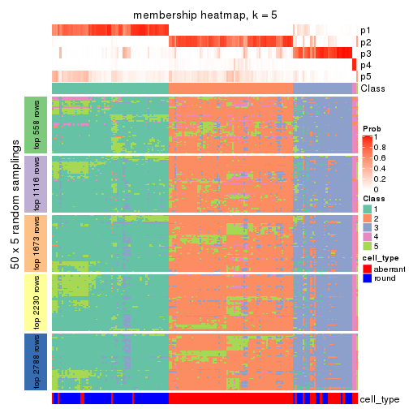</p>

</div>
<div id='tab-MAD-NMF-membership-heatmap-5'>
<pre><code class="r">membership_heatmap(res, k = 6)
</code></pre>

<p></p>

</div>
</div>

As soon as we have had the classes for columns, we can look for signatures
which are significantly different between classes which can be candidate marks
for certain classes. Following are the heatmaps for signatures.


Signature heatmaps where rows are scaled:


<script>
$( function() {
	$( '#tabs-MAD-NMF-get-signatures' ).tabs();
} );
</script>
<div id='tabs-MAD-NMF-get-signatures'>
<ul>
<li><a href='#tab-MAD-NMF-get-signatures-1'>k = 2</a></li>
<li><a href='#tab-MAD-NMF-get-signatures-2'>k = 3</a></li>
<li><a href='#tab-MAD-NMF-get-signatures-3'>k = 4</a></li>
<li><a href='#tab-MAD-NMF-get-signatures-4'>k = 5</a></li>
<li><a href='#tab-MAD-NMF-get-signatures-5'>k = 6</a></li>
</ul>
<div id='tab-MAD-NMF-get-signatures-1'>
<pre><code class="r">get_signatures(res, k = 2)
</code></pre>

<p></p>

</div>
<div id='tab-MAD-NMF-get-signatures-2'>
<pre><code class="r">get_signatures(res, k = 3)
</code></pre>

<p></p>

</div>
<div id='tab-MAD-NMF-get-signatures-3'>
<pre><code class="r">get_signatures(res, k = 4)
</code></pre>

<p></p>

</div>
<div id='tab-MAD-NMF-get-signatures-4'>
<pre><code class="r">get_signatures(res, k = 5)
</code></pre>

<p></p>

</div>
<div id='tab-MAD-NMF-get-signatures-5'>
<pre><code class="r">get_signatures(res, k = 6)
</code></pre>

<p></p>

</div>
</div>


Signature heatmaps where rows are not scaled:


<script>
$( function() {
	$( '#tabs-MAD-NMF-get-signatures-no-scale' ).tabs();
} );
</script>
<div id='tabs-MAD-NMF-get-signatures-no-scale'>
<ul>
<li><a href='#tab-MAD-NMF-get-signatures-no-scale-1'>k = 2</a></li>
<li><a href='#tab-MAD-NMF-get-signatures-no-scale-2'>k = 3</a></li>
<li><a href='#tab-MAD-NMF-get-signatures-no-scale-3'>k = 4</a></li>
<li><a href='#tab-MAD-NMF-get-signatures-no-scale-4'>k = 5</a></li>
<li><a href='#tab-MAD-NMF-get-signatures-no-scale-5'>k = 6</a></li>
</ul>
<div id='tab-MAD-NMF-get-signatures-no-scale-1'>
<pre><code class="r">get_signatures(res, k = 2, scale_rows = FALSE)
</code></pre>

<p></p>

</div>
<div id='tab-MAD-NMF-get-signatures-no-scale-2'>
<pre><code class="r">get_signatures(res, k = 3, scale_rows = FALSE)
</code></pre>

<p></p>

</div>
<div id='tab-MAD-NMF-get-signatures-no-scale-3'>
<pre><code class="r">get_signatures(res, k = 4, scale_rows = FALSE)
</code></pre>

<p></p>

</div>
<div id='tab-MAD-NMF-get-signatures-no-scale-4'>
<pre><code class="r">get_signatures(res, k = 5, scale_rows = FALSE)
</code></pre>

<p></p>

</div>
<div id='tab-MAD-NMF-get-signatures-no-scale-5'>
<pre><code class="r">get_signatures(res, k = 6, scale_rows = FALSE)
</code></pre>

<p></p>

</div>
</div>


Compare the overlap of signatures from different k:

```r
compare_signatures(res)
```


`get_signature()` returns a data frame invisibly. TO get the list of signatures, the function
call should be assigned to a variable explicitly. In following code, if `plot` argument is set
to `FALSE`, no heatmap is plotted while only the differential analysis is performed.

```r
# code only for demonstration
tb = get_signature(res, k = ..., plot = FALSE)
```

An example of the output of `tb` is:

```
#>   which_row         fdr    mean_1    mean_2 scaled_mean_1 scaled_mean_2 km
#> 1        38 0.042760348  8.373488  9.131774    -0.5533452     0.5164555  1
#> 2        40 0.018707592  7.106213  8.469186    -0.6173731     0.5762149  1
#> 3        55 0.019134737 10.221463 11.207825    -0.6159697     0.5749050  1
#> 4        59 0.006059896  5.921854  7.869574    -0.6899429     0.6439467  1
#> 5        60 0.018055526  8.928898 10.211722    -0.6204761     0.5791110  1
#> 6        98 0.009384629 15.714769 14.887706     0.6635654    -0.6193277  2
...
```

The columns in `tb` are:

1. `which_row`: row indices corresponding to the input matrix.
2. `fdr`: FDR for the differential test. 
3. `mean_x`: The mean value in group x.
4. `scaled_mean_x`: The mean value in group x after rows are scaled.
5. `km`: Row groups if k-means clustering is applied to rows.


UMAP plot which shows how samples are separated.


<script>
$( function() {
	$( '#tabs-MAD-NMF-dimension-reduction' ).tabs();
} );
</script>
<div id='tabs-MAD-NMF-dimension-reduction'>
<ul>
<li><a href='#tab-MAD-NMF-dimension-reduction-1'>k = 2</a></li>
<li><a href='#tab-MAD-NMF-dimension-reduction-2'>k = 3</a></li>
<li><a href='#tab-MAD-NMF-dimension-reduction-3'>k = 4</a></li>
<li><a href='#tab-MAD-NMF-dimension-reduction-4'>k = 5</a></li>
<li><a href='#tab-MAD-NMF-dimension-reduction-5'>k = 6</a></li>
</ul>
<div id='tab-MAD-NMF-dimension-reduction-1'>
<pre><code class="r">dimension_reduction(res, k = 2, method = &quot;UMAP&quot;)
</code></pre>

<p></p>

</div>
<div id='tab-MAD-NMF-dimension-reduction-2'>
<pre><code class="r">dimension_reduction(res, k = 3, method = &quot;UMAP&quot;)
</code></pre>

<p></p>

</div>
<div id='tab-MAD-NMF-dimension-reduction-3'>
<pre><code class="r">dimension_reduction(res, k = 4, method = &quot;UMAP&quot;)
</code></pre>

<p></p>

</div>
<div id='tab-MAD-NMF-dimension-reduction-4'>
<pre><code class="r">dimension_reduction(res, k = 5, method = &quot;UMAP&quot;)
</code></pre>

<p></p>

</div>
<div id='tab-MAD-NMF-dimension-reduction-5'>
<pre><code class="r">dimension_reduction(res, k = 6, method = &quot;UMAP&quot;)
</code></pre>

<p></p>

</div>
</div>


Following heatmap shows how subgroups are split when increasing `k`:

```r
collect_classes(res)
```


Test correlation between subgroups and known annotations. If the known
annotation is numeric, one-way ANOVA test is applied, and if the known
annotation is discrete, chi-squared contingency table test is applied.

```r
test_to_known_factors(res)
```

```
#>           n cell_type(p) k
#> MAD:NMF 159     2.51e-28 2
#> MAD:NMF 135     6.36e-20 3
#> MAD:NMF 148     1.48e-21 4
#> MAD:NMF 133     2.15e-18 5
#> MAD:NMF  82     5.63e-11 6
```


If matrix rows can be associated to genes, consider to use `GO_Enrichment(res,
...)` to perform function enrichment for the signature genes.


 

---------------------------------------------------


### ATC:hclust


The object with results only for a single top-value method and a single partition method 
can be extracted as:

```r
res = res_list["ATC", "hclust"]
# you can also extract it by
# res = res_list["ATC:hclust"]
```

A summary of `res` and all the functions that can be applied to it:

```r
res
```

```
#> A 'ConsensusPartition' object with k = 2, 3, 4, 5, 6.
#>   On a matrix with 5576 rows and 160 columns.
#>   Top rows (558, 1116, 1673, 2230, 2788) are extracted by 'ATC' method.
#>   Subgroups are detected by 'hclust' method.
#>   Performed in total 1250 partitions by row resampling.
#>   Best k for subgroups seems to be 5.
#> 
#> Following methods can be applied to this 'ConsensusPartition' object:
#>  [1] "cola_report"             "collect_classes"         "collect_plots"          
#>  [4] "collect_stats"           "colnames"                "compare_signatures"     
#>  [7] "consensus_heatmap"       "dimension_reduction"     "functional_enrichment"  
#> [10] "get_anno_col"            "get_anno"                "get_classes"            
#> [13] "get_consensus"           "get_matrix"              "get_membership"         
#> [16] "get_param"               "get_signatures"          "get_stats"              
#> [19] "is_best_k"               "is_stable_k"             "membership_heatmap"     
#> [22] "ncol"                    "nrow"                    "plot_ecdf"              
#> [25] "rownames"                "select_partition_number" "show"                   
#> [28] "suggest_best_k"          "test_to_known_factors"
```

`collect_plots()` function collects all the plots made from `res` for all `k` (number of partitions)
into one single page to provide an easy and fast comparison between different `k`.

```r
collect_plots(res)
```


The plots are:

- The first row: a plot of the ECDF (Empirical cumulative distribution
  function) curves of the consensus matrix for each `k` and the heatmap of
  predicted classes for each `k`.
- The second row: heatmaps of the consensus matrix for each `k`.
- The third row: heatmaps of the membership matrix for each `k`.
- The fouth row: heatmaps of the signatures for each `k`.

All the plots in panels can be made by individual functions and they are
plotted later in this section.

`select_partition_number()` produces several plots showing different
statistics for choosing "optimized" `k`. There are following statistics:

- ECDF curves of the consensus matrix for each `k`;
- 1-PAC. [The PAC
  score](https://en.wikipedia.org/wiki/Consensus_clustering#Over-interpretation_potential_of_consensus_clustering)
  measures the proportion of the ambiguous subgrouping.
- Mean silhouette score.
- Concordance. The mean probability of fiting the consensus class ids in all
  partitions.
- Area increased. Denote $A_k$ as the area under the ECDF curve for current
  `k`, the area increased is defined as $A_k - A_{k-1}$.
- Rand index. The percent of pairs of samples that are both in a same cluster
  or both are not in a same cluster in the partition of k and k-1.
- Jaccard index. The ratio of pairs of samples are both in a same cluster in
  the partition of k and k-1 and the pairs of samples are both in a same
  cluster in the partition k or k-1.

The detailed explanations of these statistics can be found in [the cola
vignette](http://bioconductor.org/packages/devel/bioc/vignettes/cola/inst/doc/cola.html#toc_13).

Generally speaking, lower PAC score, higher mean silhouette score or higher
concordance corresponds to better partition. Rand index and Jaccard index
measure how similar the current partition is compared to partition with `k-1`.
If they are too similar, we won't accept `k` is better than `k-1`.

```r
select_partition_number(res)
```


The numeric values for all these statistics can be obtained by `get_stats()`.

```r
get_stats(res)
```

```
#>   k 1-PAC mean_silhouette concordance area_increased  Rand Jaccard
#> 2 2 0.424           0.654       0.828         0.2769 0.916   0.916
#> 3 3 0.607           0.759       0.902         0.7498 0.583   0.545
#> 4 4 0.578           0.738       0.894         0.0159 1.000   0.999
#> 5 5 0.768           0.775       0.880         0.3077 0.777   0.577
#> 6 6 0.625           0.708       0.841         0.0680 0.972   0.916
```

`suggest_best_k()` suggests the best $k$ based on these statistics. The rules are as follows:

- All $k$ with Jaccard index larger than 0.95 are removed because the increase of
  the partition number does not provides enough extra information. If all $k$ are removed,
  the best $k$ is assigned by `NA`.
- For $k$ with 1-PAC larger than 0.9, the maximal $k$ is taken as the "best k". Other $k$ is called "optional k".
- If it does not fit the second rule. The $k$ with the highest vote of highest
  1-PAC, mean silhouette and concordance is taken as the "best k".

```r
suggest_best_k(res)
```

```
#> [1] 5
```


Following shows the table of the partitions (You need to click the **show/hide
code output** link to see it). The membership matrix (columns with name `p*`)
is inferred by
[`clue::cl_consensus()`](https://www.rdocumentation.org/link/cl_consensus?package=clue)
function with the `SE` method. Basically the value in the membership matrix
represents the probability to belong to a certain group. The finall class
label for an item is determined with the group with highest probability it
belongs to.

In `get_classes()` function, the entropy is calculated from the membership
matrix and the silhouette score is calculated from the consensus matrix.


<script>
$( function() {
	$( '#tabs-ATC-hclust-get-classes' ).tabs();
} );
</script>
<div id='tabs-ATC-hclust-get-classes'>
<ul>
<li><a href='#tab-ATC-hclust-get-classes-1'>k = 2</a></li>
<li><a href='#tab-ATC-hclust-get-classes-2'>k = 3</a></li>
<li><a href='#tab-ATC-hclust-get-classes-3'>k = 4</a></li>
<li><a href='#tab-ATC-hclust-get-classes-4'>k = 5</a></li>
<li><a href='#tab-ATC-hclust-get-classes-5'>k = 6</a></li>
</ul>

<div id='tab-ATC-hclust-get-classes-1'>
<p><a id='tab-ATC-hclust-get-classes-1-a' style='color:#0366d6' href='#'>show/hide code output</a></p>
<pre><code class="r">cbind(get_classes(res, k = 2), get_membership(res, k = 2))
</code></pre>

<pre><code>#&gt;                     class entropy silhouette    p1    p2
#&gt; aberrant_ERR2585320     1  1.0000      0.785 0.504 0.496
#&gt; aberrant_ERR2585338     1  1.0000      0.785 0.504 0.496
#&gt; aberrant_ERR2585325     1  1.0000      0.785 0.504 0.496
#&gt; aberrant_ERR2585283     2  0.9944      0.938 0.456 0.544
#&gt; aberrant_ERR2585343     1  1.0000      0.785 0.504 0.496
#&gt; aberrant_ERR2585329     1  1.0000      0.785 0.504 0.496
#&gt; aberrant_ERR2585317     1  1.0000      0.785 0.504 0.496
#&gt; aberrant_ERR2585339     1  1.0000      0.785 0.504 0.496
#&gt; aberrant_ERR2585335     1  1.0000      0.785 0.504 0.496
#&gt; aberrant_ERR2585287     2  0.9833      0.556 0.424 0.576
#&gt; aberrant_ERR2585321     1  1.0000      0.785 0.504 0.496
#&gt; aberrant_ERR2585297     1  0.1843      0.315 0.972 0.028
#&gt; aberrant_ERR2585337     1  1.0000      0.785 0.504 0.496
#&gt; aberrant_ERR2585319     1  1.0000      0.785 0.504 0.496
#&gt; aberrant_ERR2585315     1  1.0000      0.785 0.504 0.496
#&gt; aberrant_ERR2585336     1  1.0000      0.785 0.504 0.496
#&gt; aberrant_ERR2585307     1  1.0000      0.785 0.504 0.496
#&gt; aberrant_ERR2585301     1  1.0000      0.785 0.504 0.496
#&gt; aberrant_ERR2585326     1  1.0000      0.785 0.504 0.496
#&gt; aberrant_ERR2585331     1  1.0000      0.785 0.504 0.496
#&gt; aberrant_ERR2585346     2  0.9944      0.938 0.456 0.544
#&gt; aberrant_ERR2585314     1  1.0000      0.785 0.504 0.496
#&gt; aberrant_ERR2585298     1  0.9661      0.757 0.608 0.392
#&gt; aberrant_ERR2585345     1  1.0000      0.785 0.504 0.496
#&gt; aberrant_ERR2585299     1  0.2778      0.267 0.952 0.048
#&gt; aberrant_ERR2585309     1  0.2948      0.237 0.948 0.052
#&gt; aberrant_ERR2585303     1  1.0000      0.785 0.504 0.496
#&gt; aberrant_ERR2585313     1  1.0000      0.785 0.504 0.496
#&gt; aberrant_ERR2585318     1  1.0000      0.785 0.504 0.496
#&gt; aberrant_ERR2585328     1  1.0000      0.785 0.504 0.496
#&gt; aberrant_ERR2585330     1  1.0000      0.785 0.504 0.496
#&gt; aberrant_ERR2585293     2  0.9944      0.938 0.456 0.544
#&gt; aberrant_ERR2585342     1  1.0000      0.785 0.504 0.496
#&gt; aberrant_ERR2585348     1  1.0000      0.785 0.504 0.496
#&gt; aberrant_ERR2585352     1  1.0000      0.785 0.504 0.496
#&gt; aberrant_ERR2585308     1  0.2948      0.237 0.948 0.052
#&gt; aberrant_ERR2585349     1  1.0000      0.785 0.504 0.496
#&gt; aberrant_ERR2585316     1  1.0000      0.785 0.504 0.496
#&gt; aberrant_ERR2585306     1  1.0000      0.785 0.504 0.496
#&gt; aberrant_ERR2585324     1  1.0000      0.785 0.504 0.496
#&gt; aberrant_ERR2585310     1  0.9988      0.782 0.520 0.480
#&gt; aberrant_ERR2585296     1  0.8555      0.690 0.720 0.280
#&gt; aberrant_ERR2585275     2  0.9944      0.938 0.456 0.544
#&gt; aberrant_ERR2585311     1  1.0000      0.785 0.504 0.496
#&gt; aberrant_ERR2585292     2  0.9944      0.938 0.456 0.544
#&gt; aberrant_ERR2585282     1  1.0000      0.785 0.504 0.496
#&gt; aberrant_ERR2585305     1  1.0000      0.785 0.504 0.496
#&gt; aberrant_ERR2585278     1  1.0000      0.785 0.504 0.496
#&gt; aberrant_ERR2585347     1  1.0000      0.785 0.504 0.496
#&gt; aberrant_ERR2585332     1  1.0000      0.785 0.504 0.496
#&gt; aberrant_ERR2585280     1  1.0000      0.785 0.504 0.496
#&gt; aberrant_ERR2585304     1  0.9881      0.773 0.564 0.436
#&gt; aberrant_ERR2585322     1  1.0000      0.785 0.504 0.496
#&gt; aberrant_ERR2585279     1  1.0000      0.785 0.504 0.496
#&gt; aberrant_ERR2585277     1  1.0000      0.785 0.504 0.496
#&gt; aberrant_ERR2585295     1  1.0000      0.785 0.504 0.496
#&gt; aberrant_ERR2585333     1  1.0000      0.785 0.504 0.496
#&gt; aberrant_ERR2585285     1  1.0000      0.785 0.504 0.496
#&gt; aberrant_ERR2585286     1  1.0000      0.785 0.504 0.496
#&gt; aberrant_ERR2585294     1  1.0000      0.785 0.504 0.496
#&gt; aberrant_ERR2585300     1  1.0000      0.785 0.504 0.496
#&gt; aberrant_ERR2585334     1  1.0000      0.785 0.504 0.496
#&gt; aberrant_ERR2585361     1  1.0000      0.785 0.504 0.496
#&gt; aberrant_ERR2585372     1  1.0000      0.785 0.504 0.496
#&gt; round_ERR2585217        1  0.9933      0.776 0.548 0.452
#&gt; round_ERR2585205        1  0.0672      0.341 0.992 0.008
#&gt; round_ERR2585214        1  0.9881      0.772 0.564 0.436
#&gt; round_ERR2585202        1  0.9881      0.772 0.564 0.436
#&gt; aberrant_ERR2585367     1  1.0000      0.785 0.504 0.496
#&gt; round_ERR2585220        1  0.4022      0.482 0.920 0.080
#&gt; round_ERR2585238        1  0.2236      0.278 0.964 0.036
#&gt; aberrant_ERR2585276     1  1.0000      0.785 0.504 0.496
#&gt; round_ERR2585218        1  0.0672      0.341 0.992 0.008
#&gt; aberrant_ERR2585363     1  1.0000      0.785 0.504 0.496
#&gt; round_ERR2585201        1  0.9754      0.763 0.592 0.408
#&gt; round_ERR2585210        1  0.0376      0.365 0.996 0.004
#&gt; aberrant_ERR2585362     1  1.0000      0.785 0.504 0.496
#&gt; aberrant_ERR2585360     1  1.0000      0.785 0.504 0.496
#&gt; round_ERR2585209        1  0.9522      0.749 0.628 0.372
#&gt; round_ERR2585242        1  0.9580      0.752 0.620 0.380
#&gt; round_ERR2585216        1  0.5294      0.533 0.880 0.120
#&gt; round_ERR2585219        1  0.4939      0.519 0.892 0.108
#&gt; round_ERR2585237        1  0.9815      0.768 0.580 0.420
#&gt; round_ERR2585198        1  0.9850      0.770 0.572 0.428
#&gt; round_ERR2585211        1  0.0376      0.349 0.996 0.004
#&gt; round_ERR2585206        1  0.0672      0.341 0.992 0.008
#&gt; aberrant_ERR2585281     1  1.0000      0.785 0.504 0.496
#&gt; round_ERR2585212        1  0.5294      0.534 0.880 0.120
#&gt; round_ERR2585221        1  0.2043      0.288 0.968 0.032
#&gt; round_ERR2585243        1  0.0376      0.350 0.996 0.004
#&gt; round_ERR2585204        1  0.9881      0.772 0.564 0.436
#&gt; round_ERR2585213        1  0.9881      0.772 0.564 0.436
#&gt; aberrant_ERR2585373     1  1.0000      0.785 0.504 0.496
#&gt; aberrant_ERR2585358     1  1.0000      0.785 0.504 0.496
#&gt; aberrant_ERR2585365     1  1.0000      0.785 0.504 0.496
#&gt; aberrant_ERR2585359     1  1.0000      0.785 0.504 0.496
#&gt; aberrant_ERR2585370     1  1.0000      0.785 0.504 0.496
#&gt; round_ERR2585215        1  0.0000      0.357 1.000 0.000
#&gt; round_ERR2585262        1  0.9983      0.782 0.524 0.476
#&gt; round_ERR2585199        1  0.9850      0.770 0.572 0.428
#&gt; aberrant_ERR2585369     1  1.0000      0.785 0.504 0.496
#&gt; round_ERR2585208        1  0.0938      0.333 0.988 0.012
#&gt; round_ERR2585252        1  0.2948      0.237 0.948 0.052
#&gt; round_ERR2585236        1  0.9286      0.733 0.656 0.344
#&gt; aberrant_ERR2585284     2  0.9815      0.908 0.420 0.580
#&gt; round_ERR2585224        1  0.2948      0.237 0.948 0.052
#&gt; round_ERR2585260        1  0.1414      0.379 0.980 0.020
#&gt; round_ERR2585229        1  0.2778      0.267 0.952 0.048
#&gt; aberrant_ERR2585364     1  1.0000      0.785 0.504 0.496
#&gt; round_ERR2585253        1  0.2948      0.237 0.948 0.052
#&gt; aberrant_ERR2585368     1  1.0000      0.785 0.504 0.496
#&gt; aberrant_ERR2585371     1  1.0000      0.785 0.504 0.496
#&gt; round_ERR2585239        1  0.2778      0.437 0.952 0.048
#&gt; round_ERR2585273        1  0.3114      0.369 0.944 0.056
#&gt; round_ERR2585256        1  0.8955      0.713 0.688 0.312
#&gt; round_ERR2585272        1  0.0938      0.379 0.988 0.012
#&gt; round_ERR2585246        1  0.2236      0.278 0.964 0.036
#&gt; round_ERR2585261        1  0.9286      0.733 0.656 0.344
#&gt; round_ERR2585254        1  0.9460      0.745 0.636 0.364
#&gt; round_ERR2585225        1  0.9635      0.755 0.612 0.388
#&gt; round_ERR2585235        1  0.8861      0.708 0.696 0.304
#&gt; round_ERR2585271        1  0.1633      0.400 0.976 0.024
#&gt; round_ERR2585251        1  0.6048      0.566 0.852 0.148
#&gt; round_ERR2585255        1  0.9775      0.765 0.588 0.412
#&gt; round_ERR2585257        1  0.9795      0.766 0.584 0.416
#&gt; round_ERR2585226        1  0.5519      0.543 0.872 0.128
#&gt; round_ERR2585265        1  0.2236      0.419 0.964 0.036
#&gt; round_ERR2585259        1  0.9491      0.746 0.632 0.368
#&gt; round_ERR2585247        1  0.2043      0.339 0.968 0.032
#&gt; round_ERR2585241        1  0.1184      0.324 0.984 0.016
#&gt; round_ERR2585263        1  0.7299      0.624 0.796 0.204
#&gt; round_ERR2585264        1  0.2948      0.237 0.948 0.052
#&gt; round_ERR2585233        1  0.9635      0.755 0.612 0.388
#&gt; round_ERR2585223        1  0.1843      0.393 0.972 0.028
#&gt; round_ERR2585234        1  0.9850      0.770 0.572 0.428
#&gt; round_ERR2585222        1  0.2603      0.431 0.956 0.044
#&gt; round_ERR2585228        1  0.2236      0.393 0.964 0.036
#&gt; round_ERR2585248        1  0.2948      0.237 0.948 0.052
#&gt; round_ERR2585240        1  0.8713      0.699 0.708 0.292
#&gt; round_ERR2585270        1  0.5178      0.529 0.884 0.116
#&gt; round_ERR2585232        1  0.8207      0.671 0.744 0.256
#&gt; aberrant_ERR2585341     1  1.0000      0.785 0.504 0.496
#&gt; aberrant_ERR2585355     1  1.0000      0.785 0.504 0.496
#&gt; round_ERR2585227        1  0.5737      0.552 0.864 0.136
#&gt; aberrant_ERR2585351     1  1.0000      0.785 0.504 0.496
#&gt; round_ERR2585269        1  0.2948      0.237 0.948 0.052
#&gt; aberrant_ERR2585357     1  1.0000      0.785 0.504 0.496
#&gt; aberrant_ERR2585350     1  1.0000      0.785 0.504 0.496
#&gt; round_ERR2585250        1  0.8608      0.693 0.716 0.284
#&gt; round_ERR2585245        1  0.2948      0.237 0.948 0.052
#&gt; aberrant_ERR2585353     1  1.0000      0.785 0.504 0.496
#&gt; round_ERR2585258        1  0.1843      0.393 0.972 0.028
#&gt; aberrant_ERR2585354     1  1.0000      0.785 0.504 0.496
#&gt; round_ERR2585249        1  0.2948      0.237 0.948 0.052
#&gt; round_ERR2585268        1  0.8016      0.660 0.756 0.244
#&gt; aberrant_ERR2585356     1  1.0000      0.785 0.504 0.496
#&gt; round_ERR2585266        1  0.9393      0.741 0.644 0.356
#&gt; round_ERR2585231        1  0.2948      0.237 0.948 0.052
#&gt; round_ERR2585230        1  0.2423      0.425 0.960 0.040
#&gt; round_ERR2585267        1  0.2948      0.237 0.948 0.052
</code></pre>

<script>
$('#tab-ATC-hclust-get-classes-1-a').parent().next().next().hide();
$('#tab-ATC-hclust-get-classes-1-a').click(function(){
  $('#tab-ATC-hclust-get-classes-1-a').parent().next().next().toggle();
  return(false);
});
</script>
</div>

<div id='tab-ATC-hclust-get-classes-2'>
<p><a id='tab-ATC-hclust-get-classes-2-a' style='color:#0366d6' href='#'>show/hide code output</a></p>
<pre><code class="r">cbind(get_classes(res, k = 3), get_membership(res, k = 3))
</code></pre>

<pre><code>#&gt;                     class entropy silhouette    p1    p2    p3
#&gt; aberrant_ERR2585320     2  0.0000    0.87885 0.000 1.000 0.000
#&gt; aberrant_ERR2585338     2  0.0000    0.87885 0.000 1.000 0.000
#&gt; aberrant_ERR2585325     2  0.0000    0.87885 0.000 1.000 0.000
#&gt; aberrant_ERR2585283     3  0.0000    0.92330 0.000 0.000 1.000
#&gt; aberrant_ERR2585343     2  0.0000    0.87885 0.000 1.000 0.000
#&gt; aberrant_ERR2585329     2  0.0000    0.87885 0.000 1.000 0.000
#&gt; aberrant_ERR2585317     2  0.0000    0.87885 0.000 1.000 0.000
#&gt; aberrant_ERR2585339     2  0.0000    0.87885 0.000 1.000 0.000
#&gt; aberrant_ERR2585335     2  0.0000    0.87885 0.000 1.000 0.000
#&gt; aberrant_ERR2585287     3  0.5465    0.60190 0.000 0.288 0.712
#&gt; aberrant_ERR2585321     2  0.0000    0.87885 0.000 1.000 0.000
#&gt; aberrant_ERR2585297     1  0.1289    0.83245 0.968 0.032 0.000
#&gt; aberrant_ERR2585337     2  0.0000    0.87885 0.000 1.000 0.000
#&gt; aberrant_ERR2585319     2  0.0000    0.87885 0.000 1.000 0.000
#&gt; aberrant_ERR2585315     2  0.0000    0.87885 0.000 1.000 0.000
#&gt; aberrant_ERR2585336     2  0.0000    0.87885 0.000 1.000 0.000
#&gt; aberrant_ERR2585307     2  0.0000    0.87885 0.000 1.000 0.000
#&gt; aberrant_ERR2585301     2  0.0000    0.87885 0.000 1.000 0.000
#&gt; aberrant_ERR2585326     2  0.0000    0.87885 0.000 1.000 0.000
#&gt; aberrant_ERR2585331     2  0.0000    0.87885 0.000 1.000 0.000
#&gt; aberrant_ERR2585346     3  0.0000    0.92330 0.000 0.000 1.000
#&gt; aberrant_ERR2585314     2  0.0000    0.87885 0.000 1.000 0.000
#&gt; aberrant_ERR2585298     2  0.5968    0.42282 0.364 0.636 0.000
#&gt; aberrant_ERR2585345     2  0.0000    0.87885 0.000 1.000 0.000
#&gt; aberrant_ERR2585299     1  0.0592    0.82051 0.988 0.012 0.000
#&gt; aberrant_ERR2585309     1  0.0000    0.81106 1.000 0.000 0.000
#&gt; aberrant_ERR2585303     2  0.0000    0.87885 0.000 1.000 0.000
#&gt; aberrant_ERR2585313     2  0.0000    0.87885 0.000 1.000 0.000
#&gt; aberrant_ERR2585318     2  0.0000    0.87885 0.000 1.000 0.000
#&gt; aberrant_ERR2585328     2  0.0237    0.87614 0.004 0.996 0.000
#&gt; aberrant_ERR2585330     2  0.0000    0.87885 0.000 1.000 0.000
#&gt; aberrant_ERR2585293     3  0.0000    0.92330 0.000 0.000 1.000
#&gt; aberrant_ERR2585342     2  0.0000    0.87885 0.000 1.000 0.000
#&gt; aberrant_ERR2585348     2  0.0000    0.87885 0.000 1.000 0.000
#&gt; aberrant_ERR2585352     2  0.0000    0.87885 0.000 1.000 0.000
#&gt; aberrant_ERR2585308     1  0.0000    0.81106 1.000 0.000 0.000
#&gt; aberrant_ERR2585349     2  0.0000    0.87885 0.000 1.000 0.000
#&gt; aberrant_ERR2585316     2  0.0000    0.87885 0.000 1.000 0.000
#&gt; aberrant_ERR2585306     2  0.0000    0.87885 0.000 1.000 0.000
#&gt; aberrant_ERR2585324     2  0.0000    0.87885 0.000 1.000 0.000
#&gt; aberrant_ERR2585310     2  0.1643    0.84784 0.044 0.956 0.000
#&gt; aberrant_ERR2585296     1  0.6295    0.15512 0.528 0.472 0.000
#&gt; aberrant_ERR2585275     3  0.0000    0.92330 0.000 0.000 1.000
#&gt; aberrant_ERR2585311     2  0.0000    0.87885 0.000 1.000 0.000
#&gt; aberrant_ERR2585292     3  0.0000    0.92330 0.000 0.000 1.000
#&gt; aberrant_ERR2585282     2  0.0000    0.87885 0.000 1.000 0.000
#&gt; aberrant_ERR2585305     2  0.0000    0.87885 0.000 1.000 0.000
#&gt; aberrant_ERR2585278     2  0.0000    0.87885 0.000 1.000 0.000
#&gt; aberrant_ERR2585347     2  0.0000    0.87885 0.000 1.000 0.000
#&gt; aberrant_ERR2585332     2  0.0000    0.87885 0.000 1.000 0.000
#&gt; aberrant_ERR2585280     2  0.0000    0.87885 0.000 1.000 0.000
#&gt; aberrant_ERR2585304     2  0.5678    0.52385 0.316 0.684 0.000
#&gt; aberrant_ERR2585322     2  0.0000    0.87885 0.000 1.000 0.000
#&gt; aberrant_ERR2585279     2  0.0000    0.87885 0.000 1.000 0.000
#&gt; aberrant_ERR2585277     2  0.0000    0.87885 0.000 1.000 0.000
#&gt; aberrant_ERR2585295     2  0.0000    0.87885 0.000 1.000 0.000
#&gt; aberrant_ERR2585333     2  0.0000    0.87885 0.000 1.000 0.000
#&gt; aberrant_ERR2585285     2  0.0000    0.87885 0.000 1.000 0.000
#&gt; aberrant_ERR2585286     2  0.0000    0.87885 0.000 1.000 0.000
#&gt; aberrant_ERR2585294     2  0.0000    0.87885 0.000 1.000 0.000
#&gt; aberrant_ERR2585300     2  0.0000    0.87885 0.000 1.000 0.000
#&gt; aberrant_ERR2585334     2  0.0000    0.87885 0.000 1.000 0.000
#&gt; aberrant_ERR2585361     2  0.0000    0.87885 0.000 1.000 0.000
#&gt; aberrant_ERR2585372     2  0.0000    0.87885 0.000 1.000 0.000
#&gt; round_ERR2585217        2  0.4291    0.71598 0.180 0.820 0.000
#&gt; round_ERR2585205        1  0.1643    0.83707 0.956 0.044 0.000
#&gt; round_ERR2585214        2  0.5650    0.53060 0.312 0.688 0.000
#&gt; round_ERR2585202        2  0.5560    0.55041 0.300 0.700 0.000
#&gt; aberrant_ERR2585367     2  0.0000    0.87885 0.000 1.000 0.000
#&gt; round_ERR2585220        1  0.4291    0.77178 0.820 0.180 0.000
#&gt; round_ERR2585238        1  0.0747    0.82389 0.984 0.016 0.000
#&gt; aberrant_ERR2585276     2  0.0000    0.87885 0.000 1.000 0.000
#&gt; round_ERR2585218        1  0.1643    0.83707 0.956 0.044 0.000
#&gt; aberrant_ERR2585363     2  0.0000    0.87885 0.000 1.000 0.000
#&gt; round_ERR2585201        2  0.5835    0.47678 0.340 0.660 0.000
#&gt; round_ERR2585210        1  0.1964    0.83779 0.944 0.056 0.000
#&gt; aberrant_ERR2585362     2  0.0000    0.87885 0.000 1.000 0.000
#&gt; aberrant_ERR2585360     2  0.0000    0.87885 0.000 1.000 0.000
#&gt; round_ERR2585209        2  0.6095    0.35414 0.392 0.608 0.000
#&gt; round_ERR2585242        2  0.6026    0.39312 0.376 0.624 0.000
#&gt; round_ERR2585216        1  0.4399    0.76208 0.812 0.188 0.000
#&gt; round_ERR2585219        1  0.4796    0.73546 0.780 0.220 0.000
#&gt; round_ERR2585237        2  0.5859    0.46903 0.344 0.656 0.000
#&gt; round_ERR2585198        2  0.5733    0.50897 0.324 0.676 0.000
#&gt; round_ERR2585211        1  0.1753    0.83750 0.952 0.048 0.000
#&gt; round_ERR2585206        1  0.1643    0.83707 0.956 0.044 0.000
#&gt; aberrant_ERR2585281     2  0.0000    0.87885 0.000 1.000 0.000
#&gt; round_ERR2585212        1  0.5216    0.69336 0.740 0.260 0.000
#&gt; round_ERR2585221        1  0.0892    0.82639 0.980 0.020 0.000
#&gt; round_ERR2585243        1  0.1753    0.83774 0.952 0.048 0.000
#&gt; round_ERR2585204        2  0.5650    0.53060 0.312 0.688 0.000
#&gt; round_ERR2585213        2  0.5650    0.53060 0.312 0.688 0.000
#&gt; aberrant_ERR2585373     2  0.0000    0.87885 0.000 1.000 0.000
#&gt; aberrant_ERR2585358     2  0.0000    0.87885 0.000 1.000 0.000
#&gt; aberrant_ERR2585365     2  0.0000    0.87885 0.000 1.000 0.000
#&gt; aberrant_ERR2585359     2  0.0000    0.87885 0.000 1.000 0.000
#&gt; aberrant_ERR2585370     2  0.0000    0.87885 0.000 1.000 0.000
#&gt; round_ERR2585215        1  0.1860    0.83767 0.948 0.052 0.000
#&gt; round_ERR2585262        2  0.3941    0.74300 0.156 0.844 0.000
#&gt; round_ERR2585199        2  0.5733    0.50897 0.324 0.676 0.000
#&gt; aberrant_ERR2585369     2  0.0000    0.87885 0.000 1.000 0.000
#&gt; round_ERR2585208        1  0.1529    0.83585 0.960 0.040 0.000
#&gt; round_ERR2585252        1  0.0000    0.81106 1.000 0.000 0.000
#&gt; round_ERR2585236        2  0.6204    0.25243 0.424 0.576 0.000
#&gt; aberrant_ERR2585284     3  0.2165    0.87840 0.000 0.064 0.936
#&gt; round_ERR2585224        1  0.0000    0.81106 1.000 0.000 0.000
#&gt; round_ERR2585260        1  0.2356    0.83586 0.928 0.072 0.000
#&gt; round_ERR2585229        1  0.0592    0.82057 0.988 0.012 0.000
#&gt; aberrant_ERR2585364     2  0.0000    0.87885 0.000 1.000 0.000
#&gt; round_ERR2585253        1  0.0000    0.81106 1.000 0.000 0.000
#&gt; aberrant_ERR2585368     2  0.0000    0.87885 0.000 1.000 0.000
#&gt; aberrant_ERR2585371     2  0.0000    0.87885 0.000 1.000 0.000
#&gt; round_ERR2585239        1  0.3752    0.80040 0.856 0.144 0.000
#&gt; round_ERR2585273        1  0.2261    0.83351 0.932 0.068 0.000
#&gt; round_ERR2585256        2  0.6307   -0.00725 0.488 0.512 0.000
#&gt; round_ERR2585272        1  0.2537    0.83403 0.920 0.080 0.000
#&gt; round_ERR2585246        1  0.0747    0.82389 0.984 0.016 0.000
#&gt; round_ERR2585261        2  0.6215    0.23767 0.428 0.572 0.000
#&gt; round_ERR2585254        2  0.6095    0.35275 0.392 0.608 0.000
#&gt; round_ERR2585225        2  0.6008    0.40364 0.372 0.628 0.000
#&gt; round_ERR2585235        2  0.6280    0.11832 0.460 0.540 0.000
#&gt; round_ERR2585271        1  0.3038    0.82494 0.896 0.104 0.000
#&gt; round_ERR2585251        1  0.5098    0.70615 0.752 0.248 0.000
#&gt; round_ERR2585255        2  0.5810    0.48538 0.336 0.664 0.000
#&gt; round_ERR2585257        2  0.5810    0.48525 0.336 0.664 0.000
#&gt; round_ERR2585226        1  0.4974    0.71801 0.764 0.236 0.000
#&gt; round_ERR2585265        1  0.3267    0.81886 0.884 0.116 0.000
#&gt; round_ERR2585259        2  0.6111    0.33870 0.396 0.604 0.000
#&gt; round_ERR2585247        1  0.1643    0.83628 0.956 0.044 0.000
#&gt; round_ERR2585241        1  0.1411    0.83438 0.964 0.036 0.000
#&gt; round_ERR2585263        1  0.5968    0.48445 0.636 0.364 0.000
#&gt; round_ERR2585264        1  0.0000    0.81106 1.000 0.000 0.000
#&gt; round_ERR2585233        2  0.5988    0.41319 0.368 0.632 0.000
#&gt; round_ERR2585223        1  0.2796    0.82988 0.908 0.092 0.000
#&gt; round_ERR2585234        2  0.5706    0.51628 0.320 0.680 0.000
#&gt; round_ERR2585222        1  0.3619    0.80619 0.864 0.136 0.000
#&gt; round_ERR2585228        1  0.2796    0.82969 0.908 0.092 0.000
#&gt; round_ERR2585248        1  0.0000    0.81106 1.000 0.000 0.000
#&gt; round_ERR2585240        1  0.6299    0.13100 0.524 0.476 0.000
#&gt; round_ERR2585270        1  0.5363    0.66653 0.724 0.276 0.000
#&gt; round_ERR2585232        1  0.6225    0.29235 0.568 0.432 0.000
#&gt; aberrant_ERR2585341     2  0.0000    0.87885 0.000 1.000 0.000
#&gt; aberrant_ERR2585355     2  0.0000    0.87885 0.000 1.000 0.000
#&gt; round_ERR2585227        1  0.5138    0.70086 0.748 0.252 0.000
#&gt; aberrant_ERR2585351     2  0.0000    0.87885 0.000 1.000 0.000
#&gt; round_ERR2585269        1  0.0000    0.81106 1.000 0.000 0.000
#&gt; aberrant_ERR2585357     2  0.0000    0.87885 0.000 1.000 0.000
#&gt; aberrant_ERR2585350     2  0.0000    0.87885 0.000 1.000 0.000
#&gt; round_ERR2585250        1  0.6299    0.13951 0.524 0.476 0.000
#&gt; round_ERR2585245        1  0.0000    0.81106 1.000 0.000 0.000
#&gt; aberrant_ERR2585353     2  0.0000    0.87885 0.000 1.000 0.000
#&gt; round_ERR2585258        1  0.2796    0.82988 0.908 0.092 0.000
#&gt; aberrant_ERR2585354     2  0.0000    0.87885 0.000 1.000 0.000
#&gt; round_ERR2585249        1  0.0000    0.81106 1.000 0.000 0.000
#&gt; round_ERR2585268        1  0.6215    0.30975 0.572 0.428 0.000
#&gt; aberrant_ERR2585356     2  0.0000    0.87885 0.000 1.000 0.000
#&gt; round_ERR2585266        2  0.6252    0.18534 0.444 0.556 0.000
#&gt; round_ERR2585231        1  0.0000    0.81106 1.000 0.000 0.000
#&gt; round_ERR2585230        1  0.3619    0.80595 0.864 0.136 0.000
#&gt; round_ERR2585267        1  0.0000    0.81106 1.000 0.000 0.000
</code></pre>

<script>
$('#tab-ATC-hclust-get-classes-2-a').parent().next().next().hide();
$('#tab-ATC-hclust-get-classes-2-a').click(function(){
  $('#tab-ATC-hclust-get-classes-2-a').parent().next().next().toggle();
  return(false);
});
</script>
</div>

<div id='tab-ATC-hclust-get-classes-3'>
<p><a id='tab-ATC-hclust-get-classes-3-a' style='color:#0366d6' href='#'>show/hide code output</a></p>
<pre><code class="r">cbind(get_classes(res, k = 4), get_membership(res, k = 4))
</code></pre>

<pre><code>#&gt;                     class entropy silhouette    p1    p2    p3    p4
#&gt; aberrant_ERR2585320     2  0.0000    0.87910 0.000 1.000 0.000 0.000
#&gt; aberrant_ERR2585338     2  0.0000    0.87910 0.000 1.000 0.000 0.000
#&gt; aberrant_ERR2585325     2  0.0000    0.87910 0.000 1.000 0.000 0.000
#&gt; aberrant_ERR2585283     4  0.0000    0.77425 0.000 0.000 0.000 1.000
#&gt; aberrant_ERR2585343     2  0.0000    0.87910 0.000 1.000 0.000 0.000
#&gt; aberrant_ERR2585329     2  0.0000    0.87910 0.000 1.000 0.000 0.000
#&gt; aberrant_ERR2585317     2  0.0000    0.87910 0.000 1.000 0.000 0.000
#&gt; aberrant_ERR2585339     2  0.0000    0.87910 0.000 1.000 0.000 0.000
#&gt; aberrant_ERR2585335     2  0.0000    0.87910 0.000 1.000 0.000 0.000
#&gt; aberrant_ERR2585287     4  0.4331    0.14637 0.000 0.288 0.000 0.712
#&gt; aberrant_ERR2585321     2  0.0000    0.87910 0.000 1.000 0.000 0.000
#&gt; aberrant_ERR2585297     1  0.1724    0.80555 0.948 0.032 0.020 0.000
#&gt; aberrant_ERR2585337     2  0.0000    0.87910 0.000 1.000 0.000 0.000
#&gt; aberrant_ERR2585319     2  0.0000    0.87910 0.000 1.000 0.000 0.000
#&gt; aberrant_ERR2585315     2  0.0000    0.87910 0.000 1.000 0.000 0.000
#&gt; aberrant_ERR2585336     2  0.0000    0.87910 0.000 1.000 0.000 0.000
#&gt; aberrant_ERR2585307     2  0.0000    0.87910 0.000 1.000 0.000 0.000
#&gt; aberrant_ERR2585301     2  0.0000    0.87910 0.000 1.000 0.000 0.000
#&gt; aberrant_ERR2585326     2  0.0000    0.87910 0.000 1.000 0.000 0.000
#&gt; aberrant_ERR2585331     2  0.0000    0.87910 0.000 1.000 0.000 0.000
#&gt; aberrant_ERR2585346     4  0.0000    0.77425 0.000 0.000 0.000 1.000
#&gt; aberrant_ERR2585314     2  0.0000    0.87910 0.000 1.000 0.000 0.000
#&gt; aberrant_ERR2585298     2  0.5143    0.42747 0.360 0.628 0.012 0.000
#&gt; aberrant_ERR2585345     2  0.0000    0.87910 0.000 1.000 0.000 0.000
#&gt; aberrant_ERR2585299     1  0.1284    0.79109 0.964 0.012 0.024 0.000
#&gt; aberrant_ERR2585309     1  0.1211    0.77406 0.960 0.000 0.040 0.000
#&gt; aberrant_ERR2585303     2  0.0000    0.87910 0.000 1.000 0.000 0.000
#&gt; aberrant_ERR2585313     2  0.0000    0.87910 0.000 1.000 0.000 0.000
#&gt; aberrant_ERR2585318     2  0.0000    0.87910 0.000 1.000 0.000 0.000
#&gt; aberrant_ERR2585328     2  0.0188    0.87637 0.004 0.996 0.000 0.000
#&gt; aberrant_ERR2585330     2  0.0000    0.87910 0.000 1.000 0.000 0.000
#&gt; aberrant_ERR2585293     4  0.0000    0.77425 0.000 0.000 0.000 1.000
#&gt; aberrant_ERR2585342     2  0.0000    0.87910 0.000 1.000 0.000 0.000
#&gt; aberrant_ERR2585348     2  0.0000    0.87910 0.000 1.000 0.000 0.000
#&gt; aberrant_ERR2585352     2  0.0000    0.87910 0.000 1.000 0.000 0.000
#&gt; aberrant_ERR2585308     1  0.1302    0.77180 0.956 0.000 0.044 0.000
#&gt; aberrant_ERR2585349     2  0.0000    0.87910 0.000 1.000 0.000 0.000
#&gt; aberrant_ERR2585316     2  0.0000    0.87910 0.000 1.000 0.000 0.000
#&gt; aberrant_ERR2585306     2  0.0000    0.87910 0.000 1.000 0.000 0.000
#&gt; aberrant_ERR2585324     2  0.0000    0.87910 0.000 1.000 0.000 0.000
#&gt; aberrant_ERR2585310     2  0.1302    0.84894 0.044 0.956 0.000 0.000
#&gt; aberrant_ERR2585296     1  0.5396    0.14426 0.524 0.464 0.012 0.000
#&gt; aberrant_ERR2585275     4  0.0000    0.77425 0.000 0.000 0.000 1.000
#&gt; aberrant_ERR2585311     2  0.0000    0.87910 0.000 1.000 0.000 0.000
#&gt; aberrant_ERR2585292     4  0.0000    0.77425 0.000 0.000 0.000 1.000
#&gt; aberrant_ERR2585282     2  0.0000    0.87910 0.000 1.000 0.000 0.000
#&gt; aberrant_ERR2585305     2  0.0000    0.87910 0.000 1.000 0.000 0.000
#&gt; aberrant_ERR2585278     2  0.0000    0.87910 0.000 1.000 0.000 0.000
#&gt; aberrant_ERR2585347     2  0.0000    0.87910 0.000 1.000 0.000 0.000
#&gt; aberrant_ERR2585332     2  0.0000    0.87910 0.000 1.000 0.000 0.000
#&gt; aberrant_ERR2585280     2  0.0000    0.87910 0.000 1.000 0.000 0.000
#&gt; aberrant_ERR2585304     2  0.4792    0.52994 0.312 0.680 0.008 0.000
#&gt; aberrant_ERR2585322     2  0.0000    0.87910 0.000 1.000 0.000 0.000
#&gt; aberrant_ERR2585279     2  0.0000    0.87910 0.000 1.000 0.000 0.000
#&gt; aberrant_ERR2585277     2  0.0000    0.87910 0.000 1.000 0.000 0.000
#&gt; aberrant_ERR2585295     2  0.0000    0.87910 0.000 1.000 0.000 0.000
#&gt; aberrant_ERR2585333     2  0.0000    0.87910 0.000 1.000 0.000 0.000
#&gt; aberrant_ERR2585285     2  0.0000    0.87910 0.000 1.000 0.000 0.000
#&gt; aberrant_ERR2585286     2  0.0000    0.87910 0.000 1.000 0.000 0.000
#&gt; aberrant_ERR2585294     2  0.0000    0.87910 0.000 1.000 0.000 0.000
#&gt; aberrant_ERR2585300     2  0.0000    0.87910 0.000 1.000 0.000 0.000
#&gt; aberrant_ERR2585334     2  0.0000    0.87910 0.000 1.000 0.000 0.000
#&gt; aberrant_ERR2585361     2  0.0000    0.87910 0.000 1.000 0.000 0.000
#&gt; aberrant_ERR2585372     2  0.0000    0.87910 0.000 1.000 0.000 0.000
#&gt; round_ERR2585217        2  0.3808    0.71590 0.176 0.812 0.012 0.000
#&gt; round_ERR2585205        1  0.2111    0.81156 0.932 0.044 0.024 0.000
#&gt; round_ERR2585214        2  0.4891    0.53374 0.308 0.680 0.012 0.000
#&gt; round_ERR2585202        2  0.4820    0.55332 0.296 0.692 0.012 0.000
#&gt; aberrant_ERR2585367     2  0.0000    0.87910 0.000 1.000 0.000 0.000
#&gt; round_ERR2585220        1  0.3852    0.74922 0.808 0.180 0.012 0.000
#&gt; round_ERR2585238        1  0.1406    0.79473 0.960 0.016 0.024 0.000
#&gt; aberrant_ERR2585276     2  0.0000    0.87910 0.000 1.000 0.000 0.000
#&gt; round_ERR2585218        1  0.2002    0.81161 0.936 0.044 0.020 0.000
#&gt; aberrant_ERR2585363     2  0.0000    0.87910 0.000 1.000 0.000 0.000
#&gt; round_ERR2585201        2  0.5038    0.48065 0.336 0.652 0.012 0.000
#&gt; round_ERR2585210        1  0.1743    0.81206 0.940 0.056 0.004 0.000
#&gt; aberrant_ERR2585362     2  0.0000    0.87910 0.000 1.000 0.000 0.000
#&gt; aberrant_ERR2585360     2  0.0000    0.87910 0.000 1.000 0.000 0.000
#&gt; round_ERR2585209        2  0.5244    0.35979 0.388 0.600 0.012 0.000
#&gt; round_ERR2585242        2  0.5189    0.39821 0.372 0.616 0.012 0.000
#&gt; round_ERR2585216        1  0.3668    0.73492 0.808 0.188 0.004 0.000
#&gt; round_ERR2585219        1  0.4123    0.70836 0.772 0.220 0.008 0.000
#&gt; round_ERR2585237        2  0.5057    0.47304 0.340 0.648 0.012 0.000
#&gt; round_ERR2585198        2  0.4957    0.51238 0.320 0.668 0.012 0.000
#&gt; round_ERR2585211        1  0.1854    0.81211 0.940 0.048 0.012 0.000
#&gt; round_ERR2585206        1  0.2111    0.81154 0.932 0.044 0.024 0.000
#&gt; aberrant_ERR2585281     2  0.0000    0.87910 0.000 1.000 0.000 0.000
#&gt; round_ERR2585212        1  0.4313    0.66458 0.736 0.260 0.004 0.000
#&gt; round_ERR2585221        1  0.1724    0.79513 0.948 0.020 0.032 0.000
#&gt; round_ERR2585243        1  0.1722    0.81241 0.944 0.048 0.008 0.000
#&gt; round_ERR2585204        2  0.4891    0.53374 0.308 0.680 0.012 0.000
#&gt; round_ERR2585213        2  0.4891    0.53374 0.308 0.680 0.012 0.000
#&gt; aberrant_ERR2585373     2  0.0000    0.87910 0.000 1.000 0.000 0.000
#&gt; aberrant_ERR2585358     2  0.0000    0.87910 0.000 1.000 0.000 0.000
#&gt; aberrant_ERR2585365     2  0.0000    0.87910 0.000 1.000 0.000 0.000
#&gt; aberrant_ERR2585359     2  0.0000    0.87910 0.000 1.000 0.000 0.000
#&gt; aberrant_ERR2585370     2  0.0000    0.87910 0.000 1.000 0.000 0.000
#&gt; round_ERR2585215        1  0.1661    0.81172 0.944 0.052 0.004 0.000
#&gt; round_ERR2585262        2  0.3401    0.74216 0.152 0.840 0.008 0.000
#&gt; round_ERR2585199        2  0.4957    0.51238 0.320 0.668 0.012 0.000
#&gt; aberrant_ERR2585369     2  0.0000    0.87910 0.000 1.000 0.000 0.000
#&gt; round_ERR2585208        1  0.1913    0.81043 0.940 0.040 0.020 0.000
#&gt; round_ERR2585252        1  0.1474    0.76743 0.948 0.000 0.052 0.000
#&gt; round_ERR2585236        2  0.5329    0.25963 0.420 0.568 0.012 0.000
#&gt; aberrant_ERR2585284     3  0.1888    0.00000 0.000 0.016 0.940 0.044
#&gt; round_ERR2585224        1  0.1557    0.76454 0.944 0.000 0.056 0.000
#&gt; round_ERR2585260        1  0.2563    0.81328 0.908 0.072 0.020 0.000
#&gt; round_ERR2585229        1  0.1854    0.78486 0.940 0.012 0.048 0.000
#&gt; aberrant_ERR2585364     2  0.0000    0.87910 0.000 1.000 0.000 0.000
#&gt; round_ERR2585253        1  0.1557    0.76454 0.944 0.000 0.056 0.000
#&gt; aberrant_ERR2585368     2  0.0000    0.87910 0.000 1.000 0.000 0.000
#&gt; aberrant_ERR2585371     2  0.0000    0.87910 0.000 1.000 0.000 0.000
#&gt; round_ERR2585239        1  0.3377    0.77788 0.848 0.140 0.012 0.000
#&gt; round_ERR2585273        1  0.2596    0.80953 0.908 0.068 0.024 0.000
#&gt; round_ERR2585256        2  0.5407    0.00414 0.484 0.504 0.012 0.000
#&gt; round_ERR2585272        1  0.2197    0.80859 0.916 0.080 0.004 0.000
#&gt; round_ERR2585246        1  0.1706    0.79085 0.948 0.016 0.036 0.000
#&gt; round_ERR2585261        2  0.5337    0.24509 0.424 0.564 0.012 0.000
#&gt; round_ERR2585254        2  0.5244    0.35843 0.388 0.600 0.012 0.000
#&gt; round_ERR2585225        2  0.5174    0.40858 0.368 0.620 0.012 0.000
#&gt; round_ERR2585235        2  0.5388    0.12759 0.456 0.532 0.012 0.000
#&gt; round_ERR2585271        1  0.2408    0.79980 0.896 0.104 0.000 0.000
#&gt; round_ERR2585251        1  0.4295    0.68269 0.752 0.240 0.008 0.000
#&gt; round_ERR2585255        2  0.5018    0.48914 0.332 0.656 0.012 0.000
#&gt; round_ERR2585257        2  0.5018    0.48900 0.332 0.656 0.012 0.000
#&gt; round_ERR2585226        1  0.4194    0.69458 0.764 0.228 0.008 0.000
#&gt; round_ERR2585265        1  0.3047    0.79684 0.872 0.116 0.012 0.000
#&gt; round_ERR2585259        2  0.5256    0.34460 0.392 0.596 0.012 0.000
#&gt; round_ERR2585247        1  0.2002    0.80991 0.936 0.044 0.020 0.000
#&gt; round_ERR2585241        1  0.1584    0.80904 0.952 0.036 0.012 0.000
#&gt; round_ERR2585263        1  0.5024    0.46974 0.632 0.360 0.008 0.000
#&gt; round_ERR2585264        1  0.1557    0.76454 0.944 0.000 0.056 0.000
#&gt; round_ERR2585233        2  0.5159    0.41798 0.364 0.624 0.012 0.000
#&gt; round_ERR2585223        1  0.3015    0.80775 0.884 0.092 0.024 0.000
#&gt; round_ERR2585234        2  0.4936    0.51958 0.316 0.672 0.012 0.000
#&gt; round_ERR2585222        1  0.3271    0.78404 0.856 0.132 0.012 0.000
#&gt; round_ERR2585228        1  0.2949    0.80715 0.888 0.088 0.024 0.000
#&gt; round_ERR2585248        1  0.1557    0.76454 0.944 0.000 0.056 0.000
#&gt; round_ERR2585240        1  0.5399    0.12063 0.520 0.468 0.012 0.000
#&gt; round_ERR2585270        1  0.4428    0.64515 0.720 0.276 0.004 0.000
#&gt; round_ERR2585232        1  0.5337    0.28272 0.564 0.424 0.012 0.000
#&gt; aberrant_ERR2585341     2  0.0000    0.87910 0.000 1.000 0.000 0.000
#&gt; aberrant_ERR2585355     2  0.0000    0.87910 0.000 1.000 0.000 0.000
#&gt; round_ERR2585227        1  0.4328    0.67728 0.748 0.244 0.008 0.000
#&gt; aberrant_ERR2585351     2  0.0000    0.87910 0.000 1.000 0.000 0.000
#&gt; round_ERR2585269        1  0.1389    0.76970 0.952 0.000 0.048 0.000
#&gt; aberrant_ERR2585357     2  0.0000    0.87910 0.000 1.000 0.000 0.000
#&gt; aberrant_ERR2585350     2  0.0000    0.87910 0.000 1.000 0.000 0.000
#&gt; round_ERR2585250        1  0.5399    0.12867 0.520 0.468 0.012 0.000
#&gt; round_ERR2585245        1  0.1557    0.76454 0.944 0.000 0.056 0.000
#&gt; aberrant_ERR2585353     2  0.0000    0.87910 0.000 1.000 0.000 0.000
#&gt; round_ERR2585258        1  0.3015    0.80775 0.884 0.092 0.024 0.000
#&gt; aberrant_ERR2585354     2  0.0000    0.87910 0.000 1.000 0.000 0.000
#&gt; round_ERR2585249        1  0.1389    0.76979 0.952 0.000 0.048 0.000
#&gt; round_ERR2585268        1  0.5329    0.29980 0.568 0.420 0.012 0.000
#&gt; aberrant_ERR2585356     2  0.0000    0.87910 0.000 1.000 0.000 0.000
#&gt; round_ERR2585266        2  0.5366    0.19342 0.440 0.548 0.012 0.000
#&gt; round_ERR2585231        1  0.1389    0.76979 0.952 0.000 0.048 0.000
#&gt; round_ERR2585230        1  0.3390    0.78237 0.852 0.132 0.016 0.000
#&gt; round_ERR2585267        1  0.1389    0.76979 0.952 0.000 0.048 0.000
</code></pre>

<script>
$('#tab-ATC-hclust-get-classes-3-a').parent().next().next().hide();
$('#tab-ATC-hclust-get-classes-3-a').click(function(){
  $('#tab-ATC-hclust-get-classes-3-a').parent().next().next().toggle();
  return(false);
});
</script>
</div>

<div id='tab-ATC-hclust-get-classes-4'>
<p><a id='tab-ATC-hclust-get-classes-4-a' style='color:#0366d6' href='#'>show/hide code output</a></p>
<pre><code class="r">cbind(get_classes(res, k = 5), get_membership(res, k = 5))
</code></pre>

<pre><code>#&gt;                     class entropy silhouette    p1    p2    p3    p4 p5
#&gt; aberrant_ERR2585320     2  0.0794     0.9738 0.000 0.972 0.028 0.000  0
#&gt; aberrant_ERR2585338     2  0.0963     0.9690 0.000 0.964 0.036 0.000  0
#&gt; aberrant_ERR2585325     2  0.0794     0.9738 0.000 0.972 0.028 0.000  0
#&gt; aberrant_ERR2585283     4  0.0000     0.8007 0.000 0.000 0.000 1.000  0
#&gt; aberrant_ERR2585343     2  0.0162     0.9725 0.000 0.996 0.004 0.000  0
#&gt; aberrant_ERR2585329     2  0.0609     0.9759 0.000 0.980 0.020 0.000  0
#&gt; aberrant_ERR2585317     2  0.0609     0.9759 0.000 0.980 0.020 0.000  0
#&gt; aberrant_ERR2585339     2  0.0963     0.9690 0.000 0.964 0.036 0.000  0
#&gt; aberrant_ERR2585335     2  0.0162     0.9757 0.000 0.996 0.004 0.000  0
#&gt; aberrant_ERR2585287     4  0.3730     0.2155 0.000 0.288 0.000 0.712  0
#&gt; aberrant_ERR2585321     2  0.0162     0.9725 0.000 0.996 0.004 0.000  0
#&gt; aberrant_ERR2585297     1  0.3684     0.7612 0.720 0.000 0.280 0.000  0
#&gt; aberrant_ERR2585337     2  0.0510     0.9767 0.000 0.984 0.016 0.000  0
#&gt; aberrant_ERR2585319     2  0.0162     0.9757 0.000 0.996 0.004 0.000  0
#&gt; aberrant_ERR2585315     2  0.0290     0.9764 0.000 0.992 0.008 0.000  0
#&gt; aberrant_ERR2585336     2  0.0703     0.9744 0.000 0.976 0.024 0.000  0
#&gt; aberrant_ERR2585307     2  0.0510     0.9761 0.000 0.984 0.016 0.000  0
#&gt; aberrant_ERR2585301     2  0.0290     0.9727 0.000 0.992 0.008 0.000  0
#&gt; aberrant_ERR2585326     2  0.0609     0.9759 0.000 0.980 0.020 0.000  0
#&gt; aberrant_ERR2585331     2  0.0963     0.9690 0.000 0.964 0.036 0.000  0
#&gt; aberrant_ERR2585346     4  0.0000     0.8007 0.000 0.000 0.000 1.000  0
#&gt; aberrant_ERR2585314     2  0.0404     0.9755 0.000 0.988 0.012 0.000  0
#&gt; aberrant_ERR2585298     3  0.0451     0.7448 0.004 0.008 0.988 0.000  0
#&gt; aberrant_ERR2585345     2  0.0609     0.9759 0.000 0.980 0.020 0.000  0
#&gt; aberrant_ERR2585299     1  0.3039     0.7651 0.808 0.000 0.192 0.000  0
#&gt; aberrant_ERR2585309     1  0.2471     0.7506 0.864 0.000 0.136 0.000  0
#&gt; aberrant_ERR2585303     2  0.0880     0.9712 0.000 0.968 0.032 0.000  0
#&gt; aberrant_ERR2585313     2  0.0609     0.9757 0.000 0.980 0.020 0.000  0
#&gt; aberrant_ERR2585318     2  0.0162     0.9758 0.000 0.996 0.004 0.000  0
#&gt; aberrant_ERR2585328     2  0.2471     0.8597 0.000 0.864 0.136 0.000  0
#&gt; aberrant_ERR2585330     2  0.0000     0.9743 0.000 1.000 0.000 0.000  0
#&gt; aberrant_ERR2585293     4  0.0000     0.8007 0.000 0.000 0.000 1.000  0
#&gt; aberrant_ERR2585342     2  0.0000     0.9743 0.000 1.000 0.000 0.000  0
#&gt; aberrant_ERR2585348     2  0.0794     0.9734 0.000 0.972 0.028 0.000  0
#&gt; aberrant_ERR2585352     2  0.0162     0.9758 0.000 0.996 0.004 0.000  0
#&gt; aberrant_ERR2585308     1  0.2329     0.7456 0.876 0.000 0.124 0.000  0
#&gt; aberrant_ERR2585349     2  0.3003     0.7841 0.000 0.812 0.188 0.000  0
#&gt; aberrant_ERR2585316     2  0.0404     0.9745 0.000 0.988 0.012 0.000  0
#&gt; aberrant_ERR2585306     2  0.0510     0.9705 0.000 0.984 0.016 0.000  0
#&gt; aberrant_ERR2585324     2  0.0162     0.9757 0.000 0.996 0.004 0.000  0
#&gt; aberrant_ERR2585310     2  0.2424     0.8347 0.000 0.868 0.132 0.000  0
#&gt; aberrant_ERR2585296     3  0.2773     0.6474 0.164 0.000 0.836 0.000  0
#&gt; aberrant_ERR2585275     4  0.0000     0.8007 0.000 0.000 0.000 1.000  0
#&gt; aberrant_ERR2585311     2  0.0162     0.9725 0.000 0.996 0.004 0.000  0
#&gt; aberrant_ERR2585292     4  0.0000     0.8007 0.000 0.000 0.000 1.000  0
#&gt; aberrant_ERR2585282     2  0.0703     0.9748 0.000 0.976 0.024 0.000  0
#&gt; aberrant_ERR2585305     2  0.0290     0.9727 0.000 0.992 0.008 0.000  0
#&gt; aberrant_ERR2585278     2  0.0404     0.9768 0.000 0.988 0.012 0.000  0
#&gt; aberrant_ERR2585347     2  0.0703     0.9752 0.000 0.976 0.024 0.000  0
#&gt; aberrant_ERR2585332     2  0.0404     0.9745 0.000 0.988 0.012 0.000  0
#&gt; aberrant_ERR2585280     2  0.0794     0.9738 0.000 0.972 0.028 0.000  0
#&gt; aberrant_ERR2585304     3  0.1965     0.7030 0.000 0.096 0.904 0.000  0
#&gt; aberrant_ERR2585322     2  0.0510     0.9767 0.000 0.984 0.016 0.000  0
#&gt; aberrant_ERR2585279     2  0.1732     0.9306 0.000 0.920 0.080 0.000  0
#&gt; aberrant_ERR2585277     2  0.1270     0.9575 0.000 0.948 0.052 0.000  0
#&gt; aberrant_ERR2585295     2  0.0880     0.9718 0.000 0.968 0.032 0.000  0
#&gt; aberrant_ERR2585333     2  0.0404     0.9760 0.000 0.988 0.012 0.000  0
#&gt; aberrant_ERR2585285     2  0.0404     0.9768 0.000 0.988 0.012 0.000  0
#&gt; aberrant_ERR2585286     2  0.1270     0.9575 0.000 0.948 0.052 0.000  0
#&gt; aberrant_ERR2585294     2  0.0290     0.9727 0.000 0.992 0.008 0.000  0
#&gt; aberrant_ERR2585300     2  0.0404     0.9717 0.000 0.988 0.012 0.000  0
#&gt; aberrant_ERR2585334     2  0.1270     0.9575 0.000 0.948 0.052 0.000  0
#&gt; aberrant_ERR2585361     2  0.0290     0.9764 0.000 0.992 0.008 0.000  0
#&gt; aberrant_ERR2585372     2  0.0404     0.9765 0.000 0.988 0.012 0.000  0
#&gt; round_ERR2585217        3  0.3424     0.4526 0.000 0.240 0.760 0.000  0
#&gt; round_ERR2585205        1  0.3857     0.7480 0.688 0.000 0.312 0.000  0
#&gt; round_ERR2585214        3  0.1341     0.7315 0.000 0.056 0.944 0.000  0
#&gt; round_ERR2585202        3  0.1908     0.6982 0.000 0.092 0.908 0.000  0
#&gt; aberrant_ERR2585367     2  0.0794     0.9734 0.000 0.972 0.028 0.000  0
#&gt; round_ERR2585220        3  0.4306    -0.3638 0.492 0.000 0.508 0.000  0
#&gt; round_ERR2585238        1  0.3109     0.7681 0.800 0.000 0.200 0.000  0
#&gt; aberrant_ERR2585276     2  0.0290     0.9727 0.000 0.992 0.008 0.000  0
#&gt; round_ERR2585218        1  0.3837     0.7488 0.692 0.000 0.308 0.000  0
#&gt; aberrant_ERR2585363     2  0.0162     0.9758 0.000 0.996 0.004 0.000  0
#&gt; round_ERR2585201        3  0.0794     0.7452 0.000 0.028 0.972 0.000  0
#&gt; round_ERR2585210        1  0.4150     0.6706 0.612 0.000 0.388 0.000  0
#&gt; aberrant_ERR2585362     2  0.1851     0.9192 0.000 0.912 0.088 0.000  0
#&gt; aberrant_ERR2585360     2  0.0162     0.9725 0.000 0.996 0.004 0.000  0
#&gt; round_ERR2585209        3  0.1364     0.7472 0.036 0.012 0.952 0.000  0
#&gt; round_ERR2585242        3  0.0798     0.7466 0.016 0.008 0.976 0.000  0
#&gt; round_ERR2585216        3  0.4287    -0.2800 0.460 0.000 0.540 0.000  0
#&gt; round_ERR2585219        3  0.4262    -0.1647 0.440 0.000 0.560 0.000  0
#&gt; round_ERR2585237        3  0.1444     0.7463 0.012 0.040 0.948 0.000  0
#&gt; round_ERR2585198        3  0.1197     0.7391 0.000 0.048 0.952 0.000  0
#&gt; round_ERR2585211        1  0.3983     0.7242 0.660 0.000 0.340 0.000  0
#&gt; round_ERR2585206        1  0.3796     0.7528 0.700 0.000 0.300 0.000  0
#&gt; aberrant_ERR2585281     2  0.0880     0.9718 0.000 0.968 0.032 0.000  0
#&gt; round_ERR2585212        3  0.4150     0.0816 0.388 0.000 0.612 0.000  0
#&gt; round_ERR2585221        1  0.3003     0.7654 0.812 0.000 0.188 0.000  0
#&gt; round_ERR2585243        1  0.3999     0.7211 0.656 0.000 0.344 0.000  0
#&gt; round_ERR2585204        3  0.1341     0.7315 0.000 0.056 0.944 0.000  0
#&gt; round_ERR2585213        3  0.1341     0.7315 0.000 0.056 0.944 0.000  0
#&gt; aberrant_ERR2585373     2  0.0290     0.9762 0.000 0.992 0.008 0.000  0
#&gt; aberrant_ERR2585358     2  0.0162     0.9758 0.000 0.996 0.004 0.000  0
#&gt; aberrant_ERR2585365     2  0.0290     0.9764 0.000 0.992 0.008 0.000  0
#&gt; aberrant_ERR2585359     2  0.0162     0.9725 0.000 0.996 0.004 0.000  0
#&gt; aberrant_ERR2585370     2  0.0609     0.9759 0.000 0.980 0.020 0.000  0
#&gt; round_ERR2585215        1  0.4114     0.6824 0.624 0.000 0.376 0.000  0
#&gt; round_ERR2585262        3  0.3684     0.3753 0.000 0.280 0.720 0.000  0
#&gt; round_ERR2585199        3  0.1197     0.7391 0.000 0.048 0.952 0.000  0
#&gt; aberrant_ERR2585369     2  0.0000     0.9743 0.000 1.000 0.000 0.000  0
#&gt; round_ERR2585208        1  0.3796     0.7533 0.700 0.000 0.300 0.000  0
#&gt; round_ERR2585252        1  0.1732     0.7252 0.920 0.000 0.080 0.000  0
#&gt; round_ERR2585236        3  0.1571     0.7366 0.060 0.004 0.936 0.000  0
#&gt; aberrant_ERR2585284     5  0.0000     0.0000 0.000 0.000 0.000 0.000  1
#&gt; round_ERR2585224        1  0.0000     0.6407 1.000 0.000 0.000 0.000  0
#&gt; round_ERR2585260        1  0.3966     0.7286 0.664 0.000 0.336 0.000  0
#&gt; round_ERR2585229        1  0.2773     0.7584 0.836 0.000 0.164 0.000  0
#&gt; aberrant_ERR2585364     2  0.0510     0.9705 0.000 0.984 0.016 0.000  0
#&gt; round_ERR2585253        1  0.0162     0.6461 0.996 0.000 0.004 0.000  0
#&gt; aberrant_ERR2585368     2  0.0963     0.9690 0.000 0.964 0.036 0.000  0
#&gt; aberrant_ERR2585371     2  0.0963     0.9690 0.000 0.964 0.036 0.000  0
#&gt; round_ERR2585239        1  0.4291     0.4943 0.536 0.000 0.464 0.000  0
#&gt; round_ERR2585273        1  0.3816     0.7462 0.696 0.000 0.304 0.000  0
#&gt; round_ERR2585256        3  0.2488     0.6919 0.124 0.004 0.872 0.000  0
#&gt; round_ERR2585272        1  0.4201     0.6344 0.592 0.000 0.408 0.000  0
#&gt; round_ERR2585246        1  0.3039     0.7667 0.808 0.000 0.192 0.000  0
#&gt; round_ERR2585261        3  0.1830     0.7347 0.068 0.008 0.924 0.000  0
#&gt; round_ERR2585254        3  0.1648     0.7485 0.040 0.020 0.940 0.000  0
#&gt; round_ERR2585225        3  0.0451     0.7445 0.008 0.004 0.988 0.000  0
#&gt; round_ERR2585235        3  0.2124     0.7162 0.096 0.004 0.900 0.000  0
#&gt; round_ERR2585271        1  0.4249     0.5819 0.568 0.000 0.432 0.000  0
#&gt; round_ERR2585251        3  0.4227    -0.0538 0.420 0.000 0.580 0.000  0
#&gt; round_ERR2585255        3  0.0880     0.7444 0.000 0.032 0.968 0.000  0
#&gt; round_ERR2585257        3  0.1043     0.7447 0.000 0.040 0.960 0.000  0
#&gt; round_ERR2585226        3  0.4249    -0.1027 0.432 0.000 0.568 0.000  0
#&gt; round_ERR2585265        1  0.4227     0.6024 0.580 0.000 0.420 0.000  0
#&gt; round_ERR2585259        3  0.1041     0.7441 0.032 0.004 0.964 0.000  0
#&gt; round_ERR2585247        1  0.3612     0.7623 0.732 0.000 0.268 0.000  0
#&gt; round_ERR2585241        1  0.3837     0.7524 0.692 0.000 0.308 0.000  0
#&gt; round_ERR2585263        3  0.3661     0.4477 0.276 0.000 0.724 0.000  0
#&gt; round_ERR2585264        1  0.0000     0.6407 1.000 0.000 0.000 0.000  0
#&gt; round_ERR2585233        3  0.0324     0.7434 0.004 0.004 0.992 0.000  0
#&gt; round_ERR2585223        1  0.4074     0.6891 0.636 0.000 0.364 0.000  0
#&gt; round_ERR2585234        3  0.1197     0.7378 0.000 0.048 0.952 0.000  0
#&gt; round_ERR2585222        1  0.4287     0.5108 0.540 0.000 0.460 0.000  0
#&gt; round_ERR2585228        1  0.4101     0.6851 0.628 0.000 0.372 0.000  0
#&gt; round_ERR2585248        1  0.0000     0.6407 1.000 0.000 0.000 0.000  0
#&gt; round_ERR2585240        3  0.3010     0.6380 0.172 0.004 0.824 0.000  0
#&gt; round_ERR2585270        3  0.4088     0.1601 0.368 0.000 0.632 0.000  0
#&gt; round_ERR2585232        3  0.3461     0.5628 0.224 0.004 0.772 0.000  0
#&gt; aberrant_ERR2585341     2  0.0794     0.9738 0.000 0.972 0.028 0.000  0
#&gt; aberrant_ERR2585355     2  0.0963     0.9690 0.000 0.964 0.036 0.000  0
#&gt; round_ERR2585227        3  0.4219    -0.0311 0.416 0.000 0.584 0.000  0
#&gt; aberrant_ERR2585351     2  0.0162     0.9758 0.000 0.996 0.004 0.000  0
#&gt; round_ERR2585269        1  0.2074     0.7378 0.896 0.000 0.104 0.000  0
#&gt; aberrant_ERR2585357     2  0.0609     0.9759 0.000 0.980 0.020 0.000  0
#&gt; aberrant_ERR2585350     2  0.0963     0.9690 0.000 0.964 0.036 0.000  0
#&gt; round_ERR2585250        3  0.2890     0.6540 0.160 0.004 0.836 0.000  0
#&gt; round_ERR2585245        1  0.0000     0.6407 1.000 0.000 0.000 0.000  0
#&gt; aberrant_ERR2585353     2  0.0000     0.9743 0.000 1.000 0.000 0.000  0
#&gt; round_ERR2585258        1  0.4074     0.6891 0.636 0.000 0.364 0.000  0
#&gt; aberrant_ERR2585354     2  0.0162     0.9758 0.000 0.996 0.004 0.000  0
#&gt; round_ERR2585249        1  0.1478     0.7139 0.936 0.000 0.064 0.000  0
#&gt; round_ERR2585268        3  0.3177     0.5832 0.208 0.000 0.792 0.000  0
#&gt; aberrant_ERR2585356     2  0.0404     0.9717 0.000 0.988 0.012 0.000  0
#&gt; round_ERR2585266        3  0.2193     0.7183 0.092 0.008 0.900 0.000  0
#&gt; round_ERR2585231        1  0.1197     0.7016 0.952 0.000 0.048 0.000  0
#&gt; round_ERR2585230        1  0.4291     0.4982 0.536 0.000 0.464 0.000  0
#&gt; round_ERR2585267        1  0.1478     0.7133 0.936 0.000 0.064 0.000  0
</code></pre>

<script>
$('#tab-ATC-hclust-get-classes-4-a').parent().next().next().hide();
$('#tab-ATC-hclust-get-classes-4-a').click(function(){
  $('#tab-ATC-hclust-get-classes-4-a').parent().next().next().toggle();
  return(false);
});
</script>
</div>

<div id='tab-ATC-hclust-get-classes-5'>
<p><a id='tab-ATC-hclust-get-classes-5-a' style='color:#0366d6' href='#'>show/hide code output</a></p>
<pre><code class="r">cbind(get_classes(res, k = 6), get_membership(res, k = 6))
</code></pre>

<pre><code>#&gt;                     class entropy silhouette    p1    p2    p3    p4    p5 p6
#&gt; aberrant_ERR2585320     2  0.2446     0.7890 0.000 0.864 0.012 0.000 0.124  0
#&gt; aberrant_ERR2585338     2  0.1644     0.8398 0.000 0.932 0.028 0.000 0.040  0
#&gt; aberrant_ERR2585325     2  0.2446     0.7890 0.000 0.864 0.012 0.000 0.124  0
#&gt; aberrant_ERR2585283     4  0.0000     0.8935 0.000 0.000 0.000 1.000 0.000  0
#&gt; aberrant_ERR2585343     2  0.1765     0.8494 0.000 0.904 0.000 0.000 0.096  0
#&gt; aberrant_ERR2585329     2  0.1265     0.8606 0.000 0.948 0.008 0.000 0.044  0
#&gt; aberrant_ERR2585317     2  0.1124     0.8599 0.000 0.956 0.008 0.000 0.036  0
#&gt; aberrant_ERR2585339     2  0.1341     0.8510 0.000 0.948 0.024 0.000 0.028  0
#&gt; aberrant_ERR2585335     2  0.1610     0.8437 0.000 0.916 0.000 0.000 0.084  0
#&gt; aberrant_ERR2585287     4  0.4444     0.4825 0.000 0.108 0.000 0.708 0.184  0
#&gt; aberrant_ERR2585321     2  0.2454     0.7839 0.000 0.840 0.000 0.000 0.160  0
#&gt; aberrant_ERR2585297     1  0.3266     0.7564 0.728 0.000 0.272 0.000 0.000  0
#&gt; aberrant_ERR2585337     2  0.1686     0.8581 0.000 0.924 0.012 0.000 0.064  0
#&gt; aberrant_ERR2585319     2  0.1501     0.8465 0.000 0.924 0.000 0.000 0.076  0
#&gt; aberrant_ERR2585315     2  0.1411     0.8559 0.000 0.936 0.004 0.000 0.060  0
#&gt; aberrant_ERR2585336     2  0.1594     0.8607 0.000 0.932 0.016 0.000 0.052  0
#&gt; aberrant_ERR2585307     2  0.1462     0.8647 0.000 0.936 0.008 0.000 0.056  0
#&gt; aberrant_ERR2585301     2  0.2402     0.7930 0.000 0.856 0.004 0.000 0.140  0
#&gt; aberrant_ERR2585326     2  0.1049     0.8601 0.000 0.960 0.008 0.000 0.032  0
#&gt; aberrant_ERR2585331     2  0.1713     0.8378 0.000 0.928 0.028 0.000 0.044  0
#&gt; aberrant_ERR2585346     4  0.1204     0.8601 0.000 0.000 0.000 0.944 0.056  0
#&gt; aberrant_ERR2585314     2  0.1918     0.8421 0.000 0.904 0.008 0.000 0.088  0
#&gt; aberrant_ERR2585298     3  0.0520     0.7606 0.008 0.000 0.984 0.000 0.008  0
#&gt; aberrant_ERR2585345     2  0.0972     0.8601 0.000 0.964 0.008 0.000 0.028  0
#&gt; aberrant_ERR2585299     1  0.2664     0.7576 0.816 0.000 0.184 0.000 0.000  0
#&gt; aberrant_ERR2585309     1  0.2092     0.7415 0.876 0.000 0.124 0.000 0.000  0
#&gt; aberrant_ERR2585303     2  0.1334     0.8525 0.000 0.948 0.020 0.000 0.032  0
#&gt; aberrant_ERR2585313     2  0.1563     0.8596 0.000 0.932 0.012 0.000 0.056  0
#&gt; aberrant_ERR2585318     2  0.1814     0.8377 0.000 0.900 0.000 0.000 0.100  0
#&gt; aberrant_ERR2585328     2  0.2999     0.7260 0.000 0.836 0.124 0.000 0.040  0
#&gt; aberrant_ERR2585330     2  0.1714     0.8402 0.000 0.908 0.000 0.000 0.092  0
#&gt; aberrant_ERR2585293     4  0.0000     0.8935 0.000 0.000 0.000 1.000 0.000  0
#&gt; aberrant_ERR2585342     2  0.1957     0.8390 0.000 0.888 0.000 0.000 0.112  0
#&gt; aberrant_ERR2585348     2  0.1245     0.8547 0.000 0.952 0.016 0.000 0.032  0
#&gt; aberrant_ERR2585352     2  0.1444     0.8555 0.000 0.928 0.000 0.000 0.072  0
#&gt; aberrant_ERR2585308     1  0.1957     0.7363 0.888 0.000 0.112 0.000 0.000  0
#&gt; aberrant_ERR2585349     2  0.3618     0.6065 0.000 0.776 0.176 0.000 0.048  0
#&gt; aberrant_ERR2585316     2  0.3804    -0.1269 0.000 0.576 0.000 0.000 0.424  0
#&gt; aberrant_ERR2585306     5  0.3464     0.9492 0.000 0.312 0.000 0.000 0.688  0
#&gt; aberrant_ERR2585324     2  0.1501     0.8465 0.000 0.924 0.000 0.000 0.076  0
#&gt; aberrant_ERR2585310     2  0.4526     0.4810 0.000 0.704 0.132 0.000 0.164  0
#&gt; aberrant_ERR2585296     3  0.2562     0.6527 0.172 0.000 0.828 0.000 0.000  0
#&gt; aberrant_ERR2585275     4  0.0146     0.8924 0.000 0.000 0.000 0.996 0.004  0
#&gt; aberrant_ERR2585311     2  0.2697     0.7340 0.000 0.812 0.000 0.000 0.188  0
#&gt; aberrant_ERR2585292     4  0.0000     0.8935 0.000 0.000 0.000 1.000 0.000  0
#&gt; aberrant_ERR2585282     2  0.1643     0.8507 0.000 0.924 0.008 0.000 0.068  0
#&gt; aberrant_ERR2585305     2  0.3023     0.6457 0.000 0.768 0.000 0.000 0.232  0
#&gt; aberrant_ERR2585278     2  0.2070     0.8468 0.000 0.892 0.008 0.000 0.100  0
#&gt; aberrant_ERR2585347     2  0.2882     0.7025 0.000 0.812 0.008 0.000 0.180  0
#&gt; aberrant_ERR2585332     2  0.2854     0.7053 0.000 0.792 0.000 0.000 0.208  0
#&gt; aberrant_ERR2585280     2  0.2531     0.7681 0.000 0.856 0.012 0.000 0.132  0
#&gt; aberrant_ERR2585304     3  0.2039     0.7193 0.000 0.076 0.904 0.000 0.020  0
#&gt; aberrant_ERR2585322     2  0.1333     0.8627 0.000 0.944 0.008 0.000 0.048  0
#&gt; aberrant_ERR2585279     2  0.2442     0.8042 0.000 0.884 0.068 0.000 0.048  0
#&gt; aberrant_ERR2585277     2  0.2001     0.8281 0.000 0.912 0.040 0.000 0.048  0
#&gt; aberrant_ERR2585295     2  0.2859     0.7348 0.000 0.828 0.016 0.000 0.156  0
#&gt; aberrant_ERR2585333     2  0.2260     0.8135 0.000 0.860 0.000 0.000 0.140  0
#&gt; aberrant_ERR2585285     2  0.2118     0.8444 0.000 0.888 0.008 0.000 0.104  0
#&gt; aberrant_ERR2585286     2  0.2001     0.8281 0.000 0.912 0.040 0.000 0.048  0
#&gt; aberrant_ERR2585294     2  0.2996     0.6541 0.000 0.772 0.000 0.000 0.228  0
#&gt; aberrant_ERR2585300     5  0.3531     0.9395 0.000 0.328 0.000 0.000 0.672  0
#&gt; aberrant_ERR2585334     2  0.2001     0.8281 0.000 0.912 0.040 0.000 0.048  0
#&gt; aberrant_ERR2585361     2  0.0865     0.8586 0.000 0.964 0.000 0.000 0.036  0
#&gt; aberrant_ERR2585372     2  0.1411     0.8625 0.000 0.936 0.004 0.000 0.060  0
#&gt; round_ERR2585217        3  0.3806     0.4694 0.000 0.200 0.752 0.000 0.048  0
#&gt; round_ERR2585205        1  0.3428     0.7444 0.696 0.000 0.304 0.000 0.000  0
#&gt; round_ERR2585214        3  0.1334     0.7477 0.000 0.032 0.948 0.000 0.020  0
#&gt; round_ERR2585202        3  0.1895     0.7177 0.000 0.072 0.912 0.000 0.016  0
#&gt; aberrant_ERR2585367     2  0.1168     0.8533 0.000 0.956 0.016 0.000 0.028  0
#&gt; round_ERR2585220        1  0.3869     0.3591 0.500 0.000 0.500 0.000 0.000  0
#&gt; round_ERR2585238        1  0.2697     0.7603 0.812 0.000 0.188 0.000 0.000  0
#&gt; aberrant_ERR2585276     2  0.2996     0.6541 0.000 0.772 0.000 0.000 0.228  0
#&gt; round_ERR2585218        1  0.3409     0.7451 0.700 0.000 0.300 0.000 0.000  0
#&gt; aberrant_ERR2585363     2  0.0937     0.8587 0.000 0.960 0.000 0.000 0.040  0
#&gt; round_ERR2585201        3  0.0717     0.7592 0.000 0.008 0.976 0.000 0.016  0
#&gt; round_ERR2585210        1  0.3706     0.6726 0.620 0.000 0.380 0.000 0.000  0
#&gt; aberrant_ERR2585362     2  0.2433     0.8071 0.000 0.884 0.072 0.000 0.044  0
#&gt; aberrant_ERR2585360     2  0.1714     0.8467 0.000 0.908 0.000 0.000 0.092  0
#&gt; round_ERR2585209        3  0.1124     0.7608 0.036 0.000 0.956 0.000 0.008  0
#&gt; round_ERR2585242        3  0.0603     0.7617 0.016 0.000 0.980 0.000 0.004  0
#&gt; round_ERR2585216        3  0.3857    -0.3068 0.468 0.000 0.532 0.000 0.000  0
#&gt; round_ERR2585219        3  0.3838    -0.1957 0.448 0.000 0.552 0.000 0.000  0
#&gt; round_ERR2585237        3  0.1542     0.7607 0.016 0.024 0.944 0.000 0.016  0
#&gt; round_ERR2585198        3  0.1168     0.7545 0.000 0.028 0.956 0.000 0.016  0
#&gt; round_ERR2585211        1  0.3547     0.7224 0.668 0.000 0.332 0.000 0.000  0
#&gt; round_ERR2585206        1  0.3351     0.7499 0.712 0.000 0.288 0.000 0.000  0
#&gt; aberrant_ERR2585281     2  0.2664     0.7685 0.000 0.848 0.016 0.000 0.136  0
#&gt; round_ERR2585212        3  0.3747     0.0525 0.396 0.000 0.604 0.000 0.000  0
#&gt; round_ERR2585221        1  0.2772     0.7574 0.816 0.000 0.180 0.000 0.004  0
#&gt; round_ERR2585243        1  0.3563     0.7198 0.664 0.000 0.336 0.000 0.000  0
#&gt; round_ERR2585204        3  0.1334     0.7477 0.000 0.032 0.948 0.000 0.020  0
#&gt; round_ERR2585213        3  0.1334     0.7477 0.000 0.032 0.948 0.000 0.020  0
#&gt; aberrant_ERR2585373     2  0.2823     0.7081 0.000 0.796 0.000 0.000 0.204  0
#&gt; aberrant_ERR2585358     2  0.1814     0.8467 0.000 0.900 0.000 0.000 0.100  0
#&gt; aberrant_ERR2585365     2  0.1075     0.8602 0.000 0.952 0.000 0.000 0.048  0
#&gt; aberrant_ERR2585359     2  0.3175     0.6091 0.000 0.744 0.000 0.000 0.256  0
#&gt; aberrant_ERR2585370     2  0.0891     0.8580 0.000 0.968 0.008 0.000 0.024  0
#&gt; round_ERR2585215        1  0.3672     0.6837 0.632 0.000 0.368 0.000 0.000  0
#&gt; round_ERR2585262        3  0.4075     0.3711 0.000 0.240 0.712 0.000 0.048  0
#&gt; round_ERR2585199        3  0.1168     0.7545 0.000 0.028 0.956 0.000 0.016  0
#&gt; aberrant_ERR2585369     2  0.1814     0.8383 0.000 0.900 0.000 0.000 0.100  0
#&gt; round_ERR2585208        1  0.3371     0.7492 0.708 0.000 0.292 0.000 0.000  0
#&gt; round_ERR2585252        1  0.1701     0.7144 0.920 0.000 0.072 0.000 0.008  0
#&gt; round_ERR2585236        3  0.1387     0.7482 0.068 0.000 0.932 0.000 0.000  0
#&gt; aberrant_ERR2585284     6  0.0000     0.0000 0.000 0.000 0.000 0.000 0.000  1
#&gt; round_ERR2585224        1  0.0790     0.6061 0.968 0.000 0.000 0.000 0.032  0
#&gt; round_ERR2585260        1  0.3531     0.7270 0.672 0.000 0.328 0.000 0.000  0
#&gt; round_ERR2585229        1  0.2378     0.7498 0.848 0.000 0.152 0.000 0.000  0
#&gt; aberrant_ERR2585364     5  0.3390     0.9283 0.000 0.296 0.000 0.000 0.704  0
#&gt; round_ERR2585253        1  0.0777     0.6214 0.972 0.000 0.004 0.000 0.024  0
#&gt; aberrant_ERR2585368     2  0.1713     0.8378 0.000 0.928 0.028 0.000 0.044  0
#&gt; aberrant_ERR2585371     2  0.1713     0.8378 0.000 0.928 0.028 0.000 0.044  0
#&gt; round_ERR2585239        1  0.3847     0.5085 0.544 0.000 0.456 0.000 0.000  0
#&gt; round_ERR2585273        1  0.3390     0.7430 0.704 0.000 0.296 0.000 0.000  0
#&gt; round_ERR2585256        3  0.2178     0.6987 0.132 0.000 0.868 0.000 0.000  0
#&gt; round_ERR2585272        1  0.3756     0.6392 0.600 0.000 0.400 0.000 0.000  0
#&gt; round_ERR2585246        1  0.2631     0.7588 0.820 0.000 0.180 0.000 0.000  0
#&gt; round_ERR2585261        3  0.1588     0.7464 0.072 0.000 0.924 0.000 0.004  0
#&gt; round_ERR2585254        3  0.1442     0.7624 0.040 0.012 0.944 0.000 0.004  0
#&gt; round_ERR2585225        3  0.0603     0.7612 0.016 0.000 0.980 0.000 0.004  0
#&gt; round_ERR2585235        3  0.1863     0.7249 0.104 0.000 0.896 0.000 0.000  0
#&gt; round_ERR2585271        1  0.3804     0.5904 0.576 0.000 0.424 0.000 0.000  0
#&gt; round_ERR2585251        3  0.3810    -0.0823 0.428 0.000 0.572 0.000 0.000  0
#&gt; round_ERR2585255        3  0.0891     0.7565 0.000 0.008 0.968 0.000 0.024  0
#&gt; round_ERR2585257        3  0.0993     0.7594 0.000 0.024 0.964 0.000 0.012  0
#&gt; round_ERR2585226        3  0.3828    -0.1306 0.440 0.000 0.560 0.000 0.000  0
#&gt; round_ERR2585265        1  0.3782     0.6097 0.588 0.000 0.412 0.000 0.000  0
#&gt; round_ERR2585259        3  0.0937     0.7579 0.040 0.000 0.960 0.000 0.000  0
#&gt; round_ERR2585247        1  0.3198     0.7572 0.740 0.000 0.260 0.000 0.000  0
#&gt; round_ERR2585241        1  0.3409     0.7486 0.700 0.000 0.300 0.000 0.000  0
#&gt; round_ERR2585263        3  0.3330     0.4398 0.284 0.000 0.716 0.000 0.000  0
#&gt; round_ERR2585264        1  0.0790     0.6061 0.968 0.000 0.000 0.000 0.032  0
#&gt; round_ERR2585233        3  0.0520     0.7598 0.008 0.000 0.984 0.000 0.008  0
#&gt; round_ERR2585223        1  0.3620     0.6926 0.648 0.000 0.352 0.000 0.000  0
#&gt; round_ERR2585234        3  0.1176     0.7532 0.000 0.024 0.956 0.000 0.020  0
#&gt; round_ERR2585222        1  0.3843     0.5236 0.548 0.000 0.452 0.000 0.000  0
#&gt; round_ERR2585228        1  0.3659     0.6872 0.636 0.000 0.364 0.000 0.000  0
#&gt; round_ERR2585248        1  0.0790     0.6061 0.968 0.000 0.000 0.000 0.032  0
#&gt; round_ERR2585240        3  0.2562     0.6517 0.172 0.000 0.828 0.000 0.000  0
#&gt; round_ERR2585270        3  0.3695     0.1358 0.376 0.000 0.624 0.000 0.000  0
#&gt; round_ERR2585232        3  0.2969     0.5750 0.224 0.000 0.776 0.000 0.000  0
#&gt; aberrant_ERR2585341     2  0.2402     0.7821 0.000 0.868 0.012 0.000 0.120  0
#&gt; aberrant_ERR2585355     2  0.1644     0.8398 0.000 0.932 0.028 0.000 0.040  0
#&gt; round_ERR2585227        3  0.3804    -0.0592 0.424 0.000 0.576 0.000 0.000  0
#&gt; aberrant_ERR2585351     2  0.1204     0.8575 0.000 0.944 0.000 0.000 0.056  0
#&gt; round_ERR2585269        1  0.1858     0.7268 0.904 0.000 0.092 0.000 0.004  0
#&gt; aberrant_ERR2585357     2  0.1049     0.8593 0.000 0.960 0.008 0.000 0.032  0
#&gt; aberrant_ERR2585350     2  0.1644     0.8441 0.000 0.932 0.028 0.000 0.040  0
#&gt; round_ERR2585250        3  0.2527     0.6584 0.168 0.000 0.832 0.000 0.000  0
#&gt; round_ERR2585245        1  0.0790     0.6061 0.968 0.000 0.000 0.000 0.032  0
#&gt; aberrant_ERR2585353     2  0.1387     0.8583 0.000 0.932 0.000 0.000 0.068  0
#&gt; round_ERR2585258        1  0.3620     0.6926 0.648 0.000 0.352 0.000 0.000  0
#&gt; aberrant_ERR2585354     2  0.1765     0.8400 0.000 0.904 0.000 0.000 0.096  0
#&gt; round_ERR2585249        1  0.1625     0.7037 0.928 0.000 0.060 0.000 0.012  0
#&gt; round_ERR2585268        3  0.2912     0.5840 0.216 0.000 0.784 0.000 0.000  0
#&gt; aberrant_ERR2585356     5  0.3499     0.9453 0.000 0.320 0.000 0.000 0.680  0
#&gt; round_ERR2585266        3  0.1858     0.7337 0.092 0.000 0.904 0.000 0.004  0
#&gt; round_ERR2585231        1  0.1367     0.6868 0.944 0.000 0.044 0.000 0.012  0
#&gt; round_ERR2585230        1  0.3847     0.5122 0.544 0.000 0.456 0.000 0.000  0
#&gt; round_ERR2585267        1  0.1462     0.7024 0.936 0.000 0.056 0.000 0.008  0
</code></pre>

<script>
$('#tab-ATC-hclust-get-classes-5-a').parent().next().next().hide();
$('#tab-ATC-hclust-get-classes-5-a').click(function(){
  $('#tab-ATC-hclust-get-classes-5-a').parent().next().next().toggle();
  return(false);
});
</script>
</div>
</div>

Heatmaps for the consensus matrix. It visualizes the probability of two
samples to be in a same group.


<script>
$( function() {
	$( '#tabs-ATC-hclust-consensus-heatmap' ).tabs();
} );
</script>
<div id='tabs-ATC-hclust-consensus-heatmap'>
<ul>
<li><a href='#tab-ATC-hclust-consensus-heatmap-1'>k = 2</a></li>
<li><a href='#tab-ATC-hclust-consensus-heatmap-2'>k = 3</a></li>
<li><a href='#tab-ATC-hclust-consensus-heatmap-3'>k = 4</a></li>
<li><a href='#tab-ATC-hclust-consensus-heatmap-4'>k = 5</a></li>
<li><a href='#tab-ATC-hclust-consensus-heatmap-5'>k = 6</a></li>
</ul>
<div id='tab-ATC-hclust-consensus-heatmap-1'>
<pre><code class="r">consensus_heatmap(res, k = 2)
</code></pre>

<p></p>

</div>
<div id='tab-ATC-hclust-consensus-heatmap-2'>
<pre><code class="r">consensus_heatmap(res, k = 3)
</code></pre>

<p></p>

</div>
<div id='tab-ATC-hclust-consensus-heatmap-3'>
<pre><code class="r">consensus_heatmap(res, k = 4)
</code></pre>

<p></p>

</div>
<div id='tab-ATC-hclust-consensus-heatmap-4'>
<pre><code class="r">consensus_heatmap(res, k = 5)
</code></pre>

<p></p>

</div>
<div id='tab-ATC-hclust-consensus-heatmap-5'>
<pre><code class="r">consensus_heatmap(res, k = 6)
</code></pre>

<p></p>

</div>
</div>

Heatmaps for the membership of samples in all partitions to see how consistent they are:


<script>
$( function() {
	$( '#tabs-ATC-hclust-membership-heatmap' ).tabs();
} );
</script>
<div id='tabs-ATC-hclust-membership-heatmap'>
<ul>
<li><a href='#tab-ATC-hclust-membership-heatmap-1'>k = 2</a></li>
<li><a href='#tab-ATC-hclust-membership-heatmap-2'>k = 3</a></li>
<li><a href='#tab-ATC-hclust-membership-heatmap-3'>k = 4</a></li>
<li><a href='#tab-ATC-hclust-membership-heatmap-4'>k = 5</a></li>
<li><a href='#tab-ATC-hclust-membership-heatmap-5'>k = 6</a></li>
</ul>
<div id='tab-ATC-hclust-membership-heatmap-1'>
<pre><code class="r">membership_heatmap(res, k = 2)
</code></pre>

<p></p>

</div>
<div id='tab-ATC-hclust-membership-heatmap-2'>
<pre><code class="r">membership_heatmap(res, k = 3)
</code></pre>

<p></p>

</div>
<div id='tab-ATC-hclust-membership-heatmap-3'>
<pre><code class="r">membership_heatmap(res, k = 4)
</code></pre>

<p></p>

</div>
<div id='tab-ATC-hclust-membership-heatmap-4'>
<pre><code class="r">membership_heatmap(res, k = 5)
</code></pre>

<p></p>

</div>
<div id='tab-ATC-hclust-membership-heatmap-5'>
<pre><code class="r">membership_heatmap(res, k = 6)
</code></pre>

<p></p>

</div>
</div>

As soon as we have had the classes for columns, we can look for signatures
which are significantly different between classes which can be candidate marks
for certain classes. Following are the heatmaps for signatures.


Signature heatmaps where rows are scaled:


<script>
$( function() {
	$( '#tabs-ATC-hclust-get-signatures' ).tabs();
} );
</script>
<div id='tabs-ATC-hclust-get-signatures'>
<ul>
<li><a href='#tab-ATC-hclust-get-signatures-1'>k = 2</a></li>
<li><a href='#tab-ATC-hclust-get-signatures-2'>k = 3</a></li>
<li><a href='#tab-ATC-hclust-get-signatures-3'>k = 4</a></li>
<li><a href='#tab-ATC-hclust-get-signatures-4'>k = 5</a></li>
<li><a href='#tab-ATC-hclust-get-signatures-5'>k = 6</a></li>
</ul>
<div id='tab-ATC-hclust-get-signatures-1'>
<pre><code class="r">get_signatures(res, k = 2)
</code></pre>

<p></p>

</div>
<div id='tab-ATC-hclust-get-signatures-2'>
<pre><code class="r">get_signatures(res, k = 3)
</code></pre>

<p></p>

</div>
<div id='tab-ATC-hclust-get-signatures-3'>
<pre><code class="r">get_signatures(res, k = 4)
</code></pre>

<p></p>

</div>
<div id='tab-ATC-hclust-get-signatures-4'>
<pre><code class="r">get_signatures(res, k = 5)
</code></pre>

<p></p>

</div>
<div id='tab-ATC-hclust-get-signatures-5'>
<pre><code class="r">get_signatures(res, k = 6)
</code></pre>

<p></p>

</div>
</div>


Signature heatmaps where rows are not scaled:


<script>
$( function() {
	$( '#tabs-ATC-hclust-get-signatures-no-scale' ).tabs();
} );
</script>
<div id='tabs-ATC-hclust-get-signatures-no-scale'>
<ul>
<li><a href='#tab-ATC-hclust-get-signatures-no-scale-1'>k = 2</a></li>
<li><a href='#tab-ATC-hclust-get-signatures-no-scale-2'>k = 3</a></li>
<li><a href='#tab-ATC-hclust-get-signatures-no-scale-3'>k = 4</a></li>
<li><a href='#tab-ATC-hclust-get-signatures-no-scale-4'>k = 5</a></li>
<li><a href='#tab-ATC-hclust-get-signatures-no-scale-5'>k = 6</a></li>
</ul>
<div id='tab-ATC-hclust-get-signatures-no-scale-1'>
<pre><code class="r">get_signatures(res, k = 2, scale_rows = FALSE)
</code></pre>

<p></p>

</div>
<div id='tab-ATC-hclust-get-signatures-no-scale-2'>
<pre><code class="r">get_signatures(res, k = 3, scale_rows = FALSE)
</code></pre>

<p></p>

</div>
<div id='tab-ATC-hclust-get-signatures-no-scale-3'>
<pre><code class="r">get_signatures(res, k = 4, scale_rows = FALSE)
</code></pre>

<p></p>

</div>
<div id='tab-ATC-hclust-get-signatures-no-scale-4'>
<pre><code class="r">get_signatures(res, k = 5, scale_rows = FALSE)
</code></pre>

<p></p>

</div>
<div id='tab-ATC-hclust-get-signatures-no-scale-5'>
<pre><code class="r">get_signatures(res, k = 6, scale_rows = FALSE)
</code></pre>

<p></p>

</div>
</div>


Compare the overlap of signatures from different k:

```r
compare_signatures(res)
```


`get_signature()` returns a data frame invisibly. TO get the list of signatures, the function
call should be assigned to a variable explicitly. In following code, if `plot` argument is set
to `FALSE`, no heatmap is plotted while only the differential analysis is performed.

```r
# code only for demonstration
tb = get_signature(res, k = ..., plot = FALSE)
```

An example of the output of `tb` is:

```
#>   which_row         fdr    mean_1    mean_2 scaled_mean_1 scaled_mean_2 km
#> 1        38 0.042760348  8.373488  9.131774    -0.5533452     0.5164555  1
#> 2        40 0.018707592  7.106213  8.469186    -0.6173731     0.5762149  1
#> 3        55 0.019134737 10.221463 11.207825    -0.6159697     0.5749050  1
#> 4        59 0.006059896  5.921854  7.869574    -0.6899429     0.6439467  1
#> 5        60 0.018055526  8.928898 10.211722    -0.6204761     0.5791110  1
#> 6        98 0.009384629 15.714769 14.887706     0.6635654    -0.6193277  2
...
```

The columns in `tb` are:

1. `which_row`: row indices corresponding to the input matrix.
2. `fdr`: FDR for the differential test. 
3. `mean_x`: The mean value in group x.
4. `scaled_mean_x`: The mean value in group x after rows are scaled.
5. `km`: Row groups if k-means clustering is applied to rows.


UMAP plot which shows how samples are separated.


<script>
$( function() {
	$( '#tabs-ATC-hclust-dimension-reduction' ).tabs();
} );
</script>
<div id='tabs-ATC-hclust-dimension-reduction'>
<ul>
<li><a href='#tab-ATC-hclust-dimension-reduction-1'>k = 2</a></li>
<li><a href='#tab-ATC-hclust-dimension-reduction-2'>k = 3</a></li>
<li><a href='#tab-ATC-hclust-dimension-reduction-3'>k = 4</a></li>
<li><a href='#tab-ATC-hclust-dimension-reduction-4'>k = 5</a></li>
<li><a href='#tab-ATC-hclust-dimension-reduction-5'>k = 6</a></li>
</ul>
<div id='tab-ATC-hclust-dimension-reduction-1'>
<pre><code class="r">dimension_reduction(res, k = 2, method = &quot;UMAP&quot;)
</code></pre>

<p></p>

</div>
<div id='tab-ATC-hclust-dimension-reduction-2'>
<pre><code class="r">dimension_reduction(res, k = 3, method = &quot;UMAP&quot;)
</code></pre>

<p></p>

</div>
<div id='tab-ATC-hclust-dimension-reduction-3'>
<pre><code class="r">dimension_reduction(res, k = 4, method = &quot;UMAP&quot;)
</code></pre>

<p></p>

</div>
<div id='tab-ATC-hclust-dimension-reduction-4'>
<pre><code class="r">dimension_reduction(res, k = 5, method = &quot;UMAP&quot;)
</code></pre>

<p></p>

</div>
<div id='tab-ATC-hclust-dimension-reduction-5'>
<pre><code class="r">dimension_reduction(res, k = 6, method = &quot;UMAP&quot;)
</code></pre>

<p></p>

</div>
</div>


Following heatmap shows how subgroups are split when increasing `k`:

```r
collect_classes(res)
```


Test correlation between subgroups and known annotations. If the known
annotation is numeric, one-way ANOVA test is applied, and if the known
annotation is discrete, chi-squared contingency table test is applied.

```r
test_to_known_factors(res)
```

```
#>              n cell_type(p) k
#> ATC:hclust 120     1.74e-01 2
#> ATC:hclust 138     7.06e-20 3
#> ATC:hclust 136     1.67e-19 4
#> ATC:hclust 145     1.22e-25 5
#> ATC:hclust 145     7.78e-25 6
```


If matrix rows can be associated to genes, consider to use `GO_Enrichment(res,
...)` to perform function enrichment for the signature genes.


 

---------------------------------------------------


### ATC:kmeans**


The object with results only for a single top-value method and a single partition method 
can be extracted as:

```r
res = res_list["ATC", "kmeans"]
# you can also extract it by
# res = res_list["ATC:kmeans"]
```

A summary of `res` and all the functions that can be applied to it:

```r
res
```

```
#> A 'ConsensusPartition' object with k = 2, 3, 4, 5, 6.
#>   On a matrix with 5576 rows and 160 columns.
#>   Top rows (558, 1116, 1673, 2230, 2788) are extracted by 'ATC' method.
#>   Subgroups are detected by 'kmeans' method.
#>   Performed in total 1250 partitions by row resampling.
#>   Best k for subgroups seems to be 2.
#> 
#> Following methods can be applied to this 'ConsensusPartition' object:
#>  [1] "cola_report"             "collect_classes"         "collect_plots"          
#>  [4] "collect_stats"           "colnames"                "compare_signatures"     
#>  [7] "consensus_heatmap"       "dimension_reduction"     "functional_enrichment"  
#> [10] "get_anno_col"            "get_anno"                "get_classes"            
#> [13] "get_consensus"           "get_matrix"              "get_membership"         
#> [16] "get_param"               "get_signatures"          "get_stats"              
#> [19] "is_best_k"               "is_stable_k"             "membership_heatmap"     
#> [22] "ncol"                    "nrow"                    "plot_ecdf"              
#> [25] "rownames"                "select_partition_number" "show"                   
#> [28] "suggest_best_k"          "test_to_known_factors"
```

`collect_plots()` function collects all the plots made from `res` for all `k` (number of partitions)
into one single page to provide an easy and fast comparison between different `k`.

```r
collect_plots(res)
```


The plots are:

- The first row: a plot of the ECDF (Empirical cumulative distribution
  function) curves of the consensus matrix for each `k` and the heatmap of
  predicted classes for each `k`.
- The second row: heatmaps of the consensus matrix for each `k`.
- The third row: heatmaps of the membership matrix for each `k`.
- The fouth row: heatmaps of the signatures for each `k`.

All the plots in panels can be made by individual functions and they are
plotted later in this section.

`select_partition_number()` produces several plots showing different
statistics for choosing "optimized" `k`. There are following statistics:

- ECDF curves of the consensus matrix for each `k`;
- 1-PAC. [The PAC
  score](https://en.wikipedia.org/wiki/Consensus_clustering#Over-interpretation_potential_of_consensus_clustering)
  measures the proportion of the ambiguous subgrouping.
- Mean silhouette score.
- Concordance. The mean probability of fiting the consensus class ids in all
  partitions.
- Area increased. Denote $A_k$ as the area under the ECDF curve for current
  `k`, the area increased is defined as $A_k - A_{k-1}$.
- Rand index. The percent of pairs of samples that are both in a same cluster
  or both are not in a same cluster in the partition of k and k-1.
- Jaccard index. The ratio of pairs of samples are both in a same cluster in
  the partition of k and k-1 and the pairs of samples are both in a same
  cluster in the partition k or k-1.

The detailed explanations of these statistics can be found in [the cola
vignette](http://bioconductor.org/packages/devel/bioc/vignettes/cola/inst/doc/cola.html#toc_13).

Generally speaking, lower PAC score, higher mean silhouette score or higher
concordance corresponds to better partition. Rand index and Jaccard index
measure how similar the current partition is compared to partition with `k-1`.
If they are too similar, we won't accept `k` is better than `k-1`.

```r
select_partition_number(res)
```


The numeric values for all these statistics can be obtained by `get_stats()`.

```r
get_stats(res)
```

```
#>   k 1-PAC mean_silhouette concordance area_increased  Rand Jaccard
#> 2 2 1.000           0.987       0.982         0.4912 0.498   0.498
#> 3 3 0.834           0.840       0.905         0.1760 0.960   0.919
#> 4 4 0.718           0.847       0.882         0.1591 0.831   0.647
#> 5 5 0.752           0.750       0.816         0.1108 0.892   0.675
#> 6 6 0.702           0.619       0.775         0.0537 0.915   0.678
```

`suggest_best_k()` suggests the best $k$ based on these statistics. The rules are as follows:

- All $k$ with Jaccard index larger than 0.95 are removed because the increase of
  the partition number does not provides enough extra information. If all $k$ are removed,
  the best $k$ is assigned by `NA`.
- For $k$ with 1-PAC larger than 0.9, the maximal $k$ is taken as the "best k". Other $k$ is called "optional k".
- If it does not fit the second rule. The $k$ with the highest vote of highest
  1-PAC, mean silhouette and concordance is taken as the "best k".

```r
suggest_best_k(res)
```

```
#> [1] 2
```


Following shows the table of the partitions (You need to click the **show/hide
code output** link to see it). The membership matrix (columns with name `p*`)
is inferred by
[`clue::cl_consensus()`](https://www.rdocumentation.org/link/cl_consensus?package=clue)
function with the `SE` method. Basically the value in the membership matrix
represents the probability to belong to a certain group. The finall class
label for an item is determined with the group with highest probability it
belongs to.

In `get_classes()` function, the entropy is calculated from the membership
matrix and the silhouette score is calculated from the consensus matrix.


<script>
$( function() {
	$( '#tabs-ATC-kmeans-get-classes' ).tabs();
} );
</script>
<div id='tabs-ATC-kmeans-get-classes'>
<ul>
<li><a href='#tab-ATC-kmeans-get-classes-1'>k = 2</a></li>
<li><a href='#tab-ATC-kmeans-get-classes-2'>k = 3</a></li>
<li><a href='#tab-ATC-kmeans-get-classes-3'>k = 4</a></li>
<li><a href='#tab-ATC-kmeans-get-classes-4'>k = 5</a></li>
<li><a href='#tab-ATC-kmeans-get-classes-5'>k = 6</a></li>
</ul>

<div id='tab-ATC-kmeans-get-classes-1'>
<p><a id='tab-ATC-kmeans-get-classes-1-a' style='color:#0366d6' href='#'>show/hide code output</a></p>
<pre><code class="r">cbind(get_classes(res, k = 2), get_membership(res, k = 2))
</code></pre>

<pre><code>#&gt;                     class entropy silhouette    p1    p2
#&gt; aberrant_ERR2585320     2   0.000      0.997 0.000 1.000
#&gt; aberrant_ERR2585338     2   0.000      0.997 0.000 1.000
#&gt; aberrant_ERR2585325     2   0.000      0.997 0.000 1.000
#&gt; aberrant_ERR2585283     1   0.634      0.813 0.840 0.160
#&gt; aberrant_ERR2585343     2   0.000      0.997 0.000 1.000
#&gt; aberrant_ERR2585329     2   0.000      0.997 0.000 1.000
#&gt; aberrant_ERR2585317     2   0.000      0.997 0.000 1.000
#&gt; aberrant_ERR2585339     2   0.000      0.997 0.000 1.000
#&gt; aberrant_ERR2585335     2   0.000      0.997 0.000 1.000
#&gt; aberrant_ERR2585287     2   0.184      0.969 0.028 0.972
#&gt; aberrant_ERR2585321     2   0.000      0.997 0.000 1.000
#&gt; aberrant_ERR2585297     1   0.184      0.989 0.972 0.028
#&gt; aberrant_ERR2585337     2   0.000      0.997 0.000 1.000
#&gt; aberrant_ERR2585319     2   0.000      0.997 0.000 1.000
#&gt; aberrant_ERR2585315     2   0.000      0.997 0.000 1.000
#&gt; aberrant_ERR2585336     2   0.000      0.997 0.000 1.000
#&gt; aberrant_ERR2585307     2   0.000      0.997 0.000 1.000
#&gt; aberrant_ERR2585301     2   0.000      0.997 0.000 1.000
#&gt; aberrant_ERR2585326     2   0.000      0.997 0.000 1.000
#&gt; aberrant_ERR2585331     2   0.000      0.997 0.000 1.000
#&gt; aberrant_ERR2585346     1   0.184      0.954 0.972 0.028
#&gt; aberrant_ERR2585314     2   0.000      0.997 0.000 1.000
#&gt; aberrant_ERR2585298     1   0.184      0.989 0.972 0.028
#&gt; aberrant_ERR2585345     2   0.000      0.997 0.000 1.000
#&gt; aberrant_ERR2585299     1   0.184      0.989 0.972 0.028
#&gt; aberrant_ERR2585309     1   0.184      0.989 0.972 0.028
#&gt; aberrant_ERR2585303     2   0.000      0.997 0.000 1.000
#&gt; aberrant_ERR2585313     2   0.000      0.997 0.000 1.000
#&gt; aberrant_ERR2585318     2   0.000      0.997 0.000 1.000
#&gt; aberrant_ERR2585328     2   0.000      0.997 0.000 1.000
#&gt; aberrant_ERR2585330     2   0.000      0.997 0.000 1.000
#&gt; aberrant_ERR2585293     1   0.118      0.960 0.984 0.016
#&gt; aberrant_ERR2585342     2   0.000      0.997 0.000 1.000
#&gt; aberrant_ERR2585348     2   0.000      0.997 0.000 1.000
#&gt; aberrant_ERR2585352     2   0.000      0.997 0.000 1.000
#&gt; aberrant_ERR2585308     1   0.184      0.989 0.972 0.028
#&gt; aberrant_ERR2585349     2   0.000      0.997 0.000 1.000
#&gt; aberrant_ERR2585316     2   0.000      0.997 0.000 1.000
#&gt; aberrant_ERR2585306     1   0.416      0.937 0.916 0.084
#&gt; aberrant_ERR2585324     2   0.000      0.997 0.000 1.000
#&gt; aberrant_ERR2585310     2   0.000      0.997 0.000 1.000
#&gt; aberrant_ERR2585296     1   0.184      0.989 0.972 0.028
#&gt; aberrant_ERR2585275     1   0.563      0.849 0.868 0.132
#&gt; aberrant_ERR2585311     2   0.000      0.997 0.000 1.000
#&gt; aberrant_ERR2585292     1   0.118      0.960 0.984 0.016
#&gt; aberrant_ERR2585282     2   0.000      0.997 0.000 1.000
#&gt; aberrant_ERR2585305     2   0.000      0.997 0.000 1.000
#&gt; aberrant_ERR2585278     2   0.000      0.997 0.000 1.000
#&gt; aberrant_ERR2585347     2   0.000      0.997 0.000 1.000
#&gt; aberrant_ERR2585332     2   0.000      0.997 0.000 1.000
#&gt; aberrant_ERR2585280     2   0.000      0.997 0.000 1.000
#&gt; aberrant_ERR2585304     2   0.000      0.997 0.000 1.000
#&gt; aberrant_ERR2585322     2   0.000      0.997 0.000 1.000
#&gt; aberrant_ERR2585279     2   0.000      0.997 0.000 1.000
#&gt; aberrant_ERR2585277     2   0.000      0.997 0.000 1.000
#&gt; aberrant_ERR2585295     2   0.000      0.997 0.000 1.000
#&gt; aberrant_ERR2585333     2   0.000      0.997 0.000 1.000
#&gt; aberrant_ERR2585285     2   0.000      0.997 0.000 1.000
#&gt; aberrant_ERR2585286     2   0.000      0.997 0.000 1.000
#&gt; aberrant_ERR2585294     2   0.000      0.997 0.000 1.000
#&gt; aberrant_ERR2585300     2   0.000      0.997 0.000 1.000
#&gt; aberrant_ERR2585334     2   0.000      0.997 0.000 1.000
#&gt; aberrant_ERR2585361     2   0.000      0.997 0.000 1.000
#&gt; aberrant_ERR2585372     2   0.000      0.997 0.000 1.000
#&gt; round_ERR2585217        2   0.260      0.954 0.044 0.956
#&gt; round_ERR2585205        1   0.184      0.989 0.972 0.028
#&gt; round_ERR2585214        2   0.242      0.958 0.040 0.960
#&gt; round_ERR2585202        2   0.000      0.997 0.000 1.000
#&gt; aberrant_ERR2585367     2   0.000      0.997 0.000 1.000
#&gt; round_ERR2585220        1   0.184      0.989 0.972 0.028
#&gt; round_ERR2585238        1   0.184      0.989 0.972 0.028
#&gt; aberrant_ERR2585276     2   0.000      0.997 0.000 1.000
#&gt; round_ERR2585218        1   0.184      0.989 0.972 0.028
#&gt; aberrant_ERR2585363     2   0.000      0.997 0.000 1.000
#&gt; round_ERR2585201        1   0.184      0.989 0.972 0.028
#&gt; round_ERR2585210        1   0.184      0.989 0.972 0.028
#&gt; aberrant_ERR2585362     2   0.000      0.997 0.000 1.000
#&gt; aberrant_ERR2585360     2   0.000      0.997 0.000 1.000
#&gt; round_ERR2585209        1   0.184      0.989 0.972 0.028
#&gt; round_ERR2585242        1   0.184      0.989 0.972 0.028
#&gt; round_ERR2585216        1   0.184      0.989 0.972 0.028
#&gt; round_ERR2585219        1   0.184      0.989 0.972 0.028
#&gt; round_ERR2585237        2   0.311      0.941 0.056 0.944
#&gt; round_ERR2585198        1   0.738      0.777 0.792 0.208
#&gt; round_ERR2585211        1   0.184      0.989 0.972 0.028
#&gt; round_ERR2585206        1   0.184      0.989 0.972 0.028
#&gt; aberrant_ERR2585281     2   0.000      0.997 0.000 1.000
#&gt; round_ERR2585212        1   0.184      0.989 0.972 0.028
#&gt; round_ERR2585221        1   0.184      0.989 0.972 0.028
#&gt; round_ERR2585243        1   0.184      0.989 0.972 0.028
#&gt; round_ERR2585204        2   0.224      0.962 0.036 0.964
#&gt; round_ERR2585213        2   0.000      0.997 0.000 1.000
#&gt; aberrant_ERR2585373     2   0.000      0.997 0.000 1.000
#&gt; aberrant_ERR2585358     2   0.000      0.997 0.000 1.000
#&gt; aberrant_ERR2585365     2   0.000      0.997 0.000 1.000
#&gt; aberrant_ERR2585359     2   0.000      0.997 0.000 1.000
#&gt; aberrant_ERR2585370     2   0.000      0.997 0.000 1.000
#&gt; round_ERR2585215        1   0.184      0.989 0.972 0.028
#&gt; round_ERR2585262        2   0.000      0.997 0.000 1.000
#&gt; round_ERR2585199        2   0.000      0.997 0.000 1.000
#&gt; aberrant_ERR2585369     2   0.000      0.997 0.000 1.000
#&gt; round_ERR2585208        1   0.184      0.989 0.972 0.028
#&gt; round_ERR2585252        1   0.184      0.989 0.972 0.028
#&gt; round_ERR2585236        1   0.184      0.989 0.972 0.028
#&gt; aberrant_ERR2585284     1   0.680      0.785 0.820 0.180
#&gt; round_ERR2585224        1   0.184      0.989 0.972 0.028
#&gt; round_ERR2585260        1   0.184      0.989 0.972 0.028
#&gt; round_ERR2585229        1   0.184      0.989 0.972 0.028
#&gt; aberrant_ERR2585364     2   0.000      0.997 0.000 1.000
#&gt; round_ERR2585253        1   0.184      0.989 0.972 0.028
#&gt; aberrant_ERR2585368     2   0.000      0.997 0.000 1.000
#&gt; aberrant_ERR2585371     2   0.000      0.997 0.000 1.000
#&gt; round_ERR2585239        1   0.184      0.989 0.972 0.028
#&gt; round_ERR2585273        1   0.184      0.989 0.972 0.028
#&gt; round_ERR2585256        1   0.184      0.989 0.972 0.028
#&gt; round_ERR2585272        1   0.184      0.989 0.972 0.028
#&gt; round_ERR2585246        1   0.184      0.989 0.972 0.028
#&gt; round_ERR2585261        1   0.184      0.989 0.972 0.028
#&gt; round_ERR2585254        1   0.184      0.989 0.972 0.028
#&gt; round_ERR2585225        1   0.184      0.989 0.972 0.028
#&gt; round_ERR2585235        1   0.184      0.989 0.972 0.028
#&gt; round_ERR2585271        1   0.184      0.989 0.972 0.028
#&gt; round_ERR2585251        1   0.184      0.989 0.972 0.028
#&gt; round_ERR2585255        1   0.184      0.989 0.972 0.028
#&gt; round_ERR2585257        1   0.184      0.989 0.972 0.028
#&gt; round_ERR2585226        1   0.184      0.989 0.972 0.028
#&gt; round_ERR2585265        1   0.184      0.989 0.972 0.028
#&gt; round_ERR2585259        1   0.184      0.989 0.972 0.028
#&gt; round_ERR2585247        1   0.184      0.989 0.972 0.028
#&gt; round_ERR2585241        1   0.184      0.989 0.972 0.028
#&gt; round_ERR2585263        1   0.184      0.989 0.972 0.028
#&gt; round_ERR2585264        1   0.184      0.989 0.972 0.028
#&gt; round_ERR2585233        1   0.184      0.989 0.972 0.028
#&gt; round_ERR2585223        1   0.184      0.989 0.972 0.028
#&gt; round_ERR2585234        1   0.184      0.989 0.972 0.028
#&gt; round_ERR2585222        1   0.184      0.989 0.972 0.028
#&gt; round_ERR2585228        1   0.184      0.989 0.972 0.028
#&gt; round_ERR2585248        1   0.184      0.989 0.972 0.028
#&gt; round_ERR2585240        1   0.184      0.989 0.972 0.028
#&gt; round_ERR2585270        1   0.184      0.989 0.972 0.028
#&gt; round_ERR2585232        1   0.184      0.989 0.972 0.028
#&gt; aberrant_ERR2585341     2   0.000      0.997 0.000 1.000
#&gt; aberrant_ERR2585355     2   0.000      0.997 0.000 1.000
#&gt; round_ERR2585227        1   0.184      0.989 0.972 0.028
#&gt; aberrant_ERR2585351     2   0.000      0.997 0.000 1.000
#&gt; round_ERR2585269        1   0.184      0.989 0.972 0.028
#&gt; aberrant_ERR2585357     2   0.000      0.997 0.000 1.000
#&gt; aberrant_ERR2585350     2   0.000      0.997 0.000 1.000
#&gt; round_ERR2585250        1   0.184      0.989 0.972 0.028
#&gt; round_ERR2585245        1   0.184      0.989 0.972 0.028
#&gt; aberrant_ERR2585353     2   0.000      0.997 0.000 1.000
#&gt; round_ERR2585258        1   0.184      0.989 0.972 0.028
#&gt; aberrant_ERR2585354     2   0.000      0.997 0.000 1.000
#&gt; round_ERR2585249        1   0.184      0.989 0.972 0.028
#&gt; round_ERR2585268        1   0.184      0.989 0.972 0.028
#&gt; aberrant_ERR2585356     2   0.000      0.997 0.000 1.000
#&gt; round_ERR2585266        1   0.184      0.989 0.972 0.028
#&gt; round_ERR2585231        1   0.184      0.989 0.972 0.028
#&gt; round_ERR2585230        1   0.184      0.989 0.972 0.028
#&gt; round_ERR2585267        1   0.184      0.989 0.972 0.028
</code></pre>

<script>
$('#tab-ATC-kmeans-get-classes-1-a').parent().next().next().hide();
$('#tab-ATC-kmeans-get-classes-1-a').click(function(){
  $('#tab-ATC-kmeans-get-classes-1-a').parent().next().next().toggle();
  return(false);
});
</script>
</div>

<div id='tab-ATC-kmeans-get-classes-2'>
<p><a id='tab-ATC-kmeans-get-classes-2-a' style='color:#0366d6' href='#'>show/hide code output</a></p>
<pre><code class="r">cbind(get_classes(res, k = 3), get_membership(res, k = 3))
</code></pre>

<pre><code>#&gt;                     class entropy silhouette    p1    p2    p3
#&gt; aberrant_ERR2585320     2  0.0000      0.948 0.000 1.000 0.000
#&gt; aberrant_ERR2585338     2  0.0000      0.948 0.000 1.000 0.000
#&gt; aberrant_ERR2585325     2  0.0000      0.948 0.000 1.000 0.000
#&gt; aberrant_ERR2585283     3  0.1337      0.886 0.016 0.012 0.972
#&gt; aberrant_ERR2585343     2  0.0000      0.948 0.000 1.000 0.000
#&gt; aberrant_ERR2585329     2  0.0000      0.948 0.000 1.000 0.000
#&gt; aberrant_ERR2585317     2  0.0000      0.948 0.000 1.000 0.000
#&gt; aberrant_ERR2585339     2  0.0000      0.948 0.000 1.000 0.000
#&gt; aberrant_ERR2585335     2  0.0000      0.948 0.000 1.000 0.000
#&gt; aberrant_ERR2585287     3  0.5760      0.465 0.000 0.328 0.672
#&gt; aberrant_ERR2585321     2  0.0000      0.948 0.000 1.000 0.000
#&gt; aberrant_ERR2585297     1  0.5465      0.807 0.712 0.000 0.288
#&gt; aberrant_ERR2585337     2  0.0000      0.948 0.000 1.000 0.000
#&gt; aberrant_ERR2585319     2  0.0000      0.948 0.000 1.000 0.000
#&gt; aberrant_ERR2585315     2  0.0000      0.948 0.000 1.000 0.000
#&gt; aberrant_ERR2585336     2  0.0000      0.948 0.000 1.000 0.000
#&gt; aberrant_ERR2585307     2  0.0000      0.948 0.000 1.000 0.000
#&gt; aberrant_ERR2585301     2  0.0000      0.948 0.000 1.000 0.000
#&gt; aberrant_ERR2585326     2  0.0000      0.948 0.000 1.000 0.000
#&gt; aberrant_ERR2585331     2  0.0000      0.948 0.000 1.000 0.000
#&gt; aberrant_ERR2585346     3  0.0747      0.887 0.016 0.000 0.984
#&gt; aberrant_ERR2585314     2  0.0000      0.948 0.000 1.000 0.000
#&gt; aberrant_ERR2585298     1  0.0892      0.753 0.980 0.000 0.020
#&gt; aberrant_ERR2585345     2  0.0000      0.948 0.000 1.000 0.000
#&gt; aberrant_ERR2585299     1  0.5529      0.803 0.704 0.000 0.296
#&gt; aberrant_ERR2585309     1  0.5706      0.790 0.680 0.000 0.320
#&gt; aberrant_ERR2585303     2  0.0000      0.948 0.000 1.000 0.000
#&gt; aberrant_ERR2585313     2  0.0000      0.948 0.000 1.000 0.000
#&gt; aberrant_ERR2585318     2  0.0000      0.948 0.000 1.000 0.000
#&gt; aberrant_ERR2585328     2  0.0000      0.948 0.000 1.000 0.000
#&gt; aberrant_ERR2585330     2  0.0000      0.948 0.000 1.000 0.000
#&gt; aberrant_ERR2585293     3  0.0747      0.887 0.016 0.000 0.984
#&gt; aberrant_ERR2585342     2  0.0000      0.948 0.000 1.000 0.000
#&gt; aberrant_ERR2585348     2  0.0000      0.948 0.000 1.000 0.000
#&gt; aberrant_ERR2585352     2  0.0000      0.948 0.000 1.000 0.000
#&gt; aberrant_ERR2585308     1  0.5706      0.790 0.680 0.000 0.320
#&gt; aberrant_ERR2585349     2  0.0000      0.948 0.000 1.000 0.000
#&gt; aberrant_ERR2585316     2  0.0000      0.948 0.000 1.000 0.000
#&gt; aberrant_ERR2585306     1  0.6565      0.653 0.576 0.008 0.416
#&gt; aberrant_ERR2585324     2  0.0000      0.948 0.000 1.000 0.000
#&gt; aberrant_ERR2585310     2  0.6357      0.565 0.296 0.684 0.020
#&gt; aberrant_ERR2585296     1  0.0892      0.753 0.980 0.000 0.020
#&gt; aberrant_ERR2585275     3  0.0983      0.888 0.016 0.004 0.980
#&gt; aberrant_ERR2585311     2  0.0000      0.948 0.000 1.000 0.000
#&gt; aberrant_ERR2585292     3  0.0747      0.887 0.016 0.000 0.984
#&gt; aberrant_ERR2585282     2  0.0000      0.948 0.000 1.000 0.000
#&gt; aberrant_ERR2585305     2  0.1482      0.917 0.012 0.968 0.020
#&gt; aberrant_ERR2585278     2  0.0000      0.948 0.000 1.000 0.000
#&gt; aberrant_ERR2585347     2  0.0000      0.948 0.000 1.000 0.000
#&gt; aberrant_ERR2585332     2  0.0000      0.948 0.000 1.000 0.000
#&gt; aberrant_ERR2585280     2  0.0000      0.948 0.000 1.000 0.000
#&gt; aberrant_ERR2585304     2  0.6294      0.577 0.288 0.692 0.020
#&gt; aberrant_ERR2585322     2  0.0000      0.948 0.000 1.000 0.000
#&gt; aberrant_ERR2585279     2  0.0000      0.948 0.000 1.000 0.000
#&gt; aberrant_ERR2585277     2  0.0000      0.948 0.000 1.000 0.000
#&gt; aberrant_ERR2585295     2  0.0000      0.948 0.000 1.000 0.000
#&gt; aberrant_ERR2585333     2  0.0000      0.948 0.000 1.000 0.000
#&gt; aberrant_ERR2585285     2  0.0000      0.948 0.000 1.000 0.000
#&gt; aberrant_ERR2585286     2  0.0000      0.948 0.000 1.000 0.000
#&gt; aberrant_ERR2585294     2  0.0000      0.948 0.000 1.000 0.000
#&gt; aberrant_ERR2585300     2  0.1411      0.914 0.000 0.964 0.036
#&gt; aberrant_ERR2585334     2  0.0000      0.948 0.000 1.000 0.000
#&gt; aberrant_ERR2585361     2  0.0000      0.948 0.000 1.000 0.000
#&gt; aberrant_ERR2585372     2  0.0000      0.948 0.000 1.000 0.000
#&gt; round_ERR2585217        2  0.6758      0.452 0.360 0.620 0.020
#&gt; round_ERR2585205        1  0.5465      0.807 0.712 0.000 0.288
#&gt; round_ERR2585214        2  0.6758      0.452 0.360 0.620 0.020
#&gt; round_ERR2585202        2  0.6553      0.519 0.324 0.656 0.020
#&gt; aberrant_ERR2585367     2  0.0000      0.948 0.000 1.000 0.000
#&gt; round_ERR2585220        1  0.3192      0.787 0.888 0.000 0.112
#&gt; round_ERR2585238        1  0.5465      0.807 0.712 0.000 0.288
#&gt; aberrant_ERR2585276     2  0.0000      0.948 0.000 1.000 0.000
#&gt; round_ERR2585218        1  0.5465      0.807 0.712 0.000 0.288
#&gt; aberrant_ERR2585363     2  0.0000      0.948 0.000 1.000 0.000
#&gt; round_ERR2585201        1  0.0892      0.753 0.980 0.000 0.020
#&gt; round_ERR2585210        1  0.5465      0.807 0.712 0.000 0.288
#&gt; aberrant_ERR2585362     2  0.0000      0.948 0.000 1.000 0.000
#&gt; aberrant_ERR2585360     2  0.0000      0.948 0.000 1.000 0.000
#&gt; round_ERR2585209        1  0.0892      0.753 0.980 0.000 0.020
#&gt; round_ERR2585242        1  0.0892      0.753 0.980 0.000 0.020
#&gt; round_ERR2585216        1  0.0747      0.763 0.984 0.000 0.016
#&gt; round_ERR2585219        1  0.3267      0.788 0.884 0.000 0.116
#&gt; round_ERR2585237        2  0.6814      0.427 0.372 0.608 0.020
#&gt; round_ERR2585198        1  0.0892      0.753 0.980 0.000 0.020
#&gt; round_ERR2585211        1  0.5465      0.807 0.712 0.000 0.288
#&gt; round_ERR2585206        1  0.5465      0.807 0.712 0.000 0.288
#&gt; aberrant_ERR2585281     2  0.0000      0.948 0.000 1.000 0.000
#&gt; round_ERR2585212        1  0.0237      0.758 0.996 0.000 0.004
#&gt; round_ERR2585221        1  0.5706      0.790 0.680 0.000 0.320
#&gt; round_ERR2585243        1  0.5465      0.807 0.712 0.000 0.288
#&gt; round_ERR2585204        2  0.6717      0.467 0.352 0.628 0.020
#&gt; round_ERR2585213        2  0.6387      0.559 0.300 0.680 0.020
#&gt; aberrant_ERR2585373     2  0.0000      0.948 0.000 1.000 0.000
#&gt; aberrant_ERR2585358     2  0.0000      0.948 0.000 1.000 0.000
#&gt; aberrant_ERR2585365     2  0.0000      0.948 0.000 1.000 0.000
#&gt; aberrant_ERR2585359     2  0.0000      0.948 0.000 1.000 0.000
#&gt; aberrant_ERR2585370     2  0.0000      0.948 0.000 1.000 0.000
#&gt; round_ERR2585215        1  0.5465      0.807 0.712 0.000 0.288
#&gt; round_ERR2585262        2  0.6445      0.546 0.308 0.672 0.020
#&gt; round_ERR2585199        2  0.6416      0.553 0.304 0.676 0.020
#&gt; aberrant_ERR2585369     2  0.0000      0.948 0.000 1.000 0.000
#&gt; round_ERR2585208        1  0.5678      0.792 0.684 0.000 0.316
#&gt; round_ERR2585252        1  0.5706      0.790 0.680 0.000 0.320
#&gt; round_ERR2585236        1  0.0892      0.753 0.980 0.000 0.020
#&gt; aberrant_ERR2585284     3  0.3155      0.848 0.044 0.040 0.916
#&gt; round_ERR2585224        1  0.5706      0.790 0.680 0.000 0.320
#&gt; round_ERR2585260        1  0.5431      0.808 0.716 0.000 0.284
#&gt; round_ERR2585229        1  0.5706      0.790 0.680 0.000 0.320
#&gt; aberrant_ERR2585364     2  0.0000      0.948 0.000 1.000 0.000
#&gt; round_ERR2585253        1  0.5706      0.790 0.680 0.000 0.320
#&gt; aberrant_ERR2585368     2  0.0000      0.948 0.000 1.000 0.000
#&gt; aberrant_ERR2585371     2  0.0000      0.948 0.000 1.000 0.000
#&gt; round_ERR2585239        1  0.5465      0.807 0.712 0.000 0.288
#&gt; round_ERR2585273        1  0.5016      0.807 0.760 0.000 0.240
#&gt; round_ERR2585256        1  0.0892      0.753 0.980 0.000 0.020
#&gt; round_ERR2585272        1  0.5178      0.808 0.744 0.000 0.256
#&gt; round_ERR2585246        1  0.5706      0.790 0.680 0.000 0.320
#&gt; round_ERR2585261        1  0.0892      0.753 0.980 0.000 0.020
#&gt; round_ERR2585254        1  0.0892      0.753 0.980 0.000 0.020
#&gt; round_ERR2585225        1  0.0892      0.753 0.980 0.000 0.020
#&gt; round_ERR2585235        1  0.0892      0.753 0.980 0.000 0.020
#&gt; round_ERR2585271        1  0.5431      0.808 0.716 0.000 0.284
#&gt; round_ERR2585251        1  0.2448      0.779 0.924 0.000 0.076
#&gt; round_ERR2585255        1  0.0892      0.753 0.980 0.000 0.020
#&gt; round_ERR2585257        1  0.0892      0.753 0.980 0.000 0.020
#&gt; round_ERR2585226        1  0.2878      0.784 0.904 0.000 0.096
#&gt; round_ERR2585265        1  0.4887      0.806 0.772 0.000 0.228
#&gt; round_ERR2585259        1  0.0892      0.753 0.980 0.000 0.020
#&gt; round_ERR2585247        1  0.5465      0.807 0.712 0.000 0.288
#&gt; round_ERR2585241        1  0.5465      0.807 0.712 0.000 0.288
#&gt; round_ERR2585263        1  0.0892      0.753 0.980 0.000 0.020
#&gt; round_ERR2585264        1  0.5706      0.790 0.680 0.000 0.320
#&gt; round_ERR2585233        1  0.0892      0.753 0.980 0.000 0.020
#&gt; round_ERR2585223        1  0.5497      0.805 0.708 0.000 0.292
#&gt; round_ERR2585234        1  0.0892      0.753 0.980 0.000 0.020
#&gt; round_ERR2585222        1  0.5431      0.808 0.716 0.000 0.284
#&gt; round_ERR2585228        1  0.5431      0.808 0.716 0.000 0.284
#&gt; round_ERR2585248        1  0.5706      0.790 0.680 0.000 0.320
#&gt; round_ERR2585240        1  0.0892      0.753 0.980 0.000 0.020
#&gt; round_ERR2585270        1  0.0237      0.760 0.996 0.000 0.004
#&gt; round_ERR2585232        1  0.0892      0.753 0.980 0.000 0.020
#&gt; aberrant_ERR2585341     2  0.0000      0.948 0.000 1.000 0.000
#&gt; aberrant_ERR2585355     2  0.0000      0.948 0.000 1.000 0.000
#&gt; round_ERR2585227        1  0.0592      0.763 0.988 0.000 0.012
#&gt; aberrant_ERR2585351     2  0.0000      0.948 0.000 1.000 0.000
#&gt; round_ERR2585269        1  0.5706      0.790 0.680 0.000 0.320
#&gt; aberrant_ERR2585357     2  0.0000      0.948 0.000 1.000 0.000
#&gt; aberrant_ERR2585350     2  0.0000      0.948 0.000 1.000 0.000
#&gt; round_ERR2585250        1  0.0892      0.753 0.980 0.000 0.020
#&gt; round_ERR2585245        1  0.5706      0.790 0.680 0.000 0.320
#&gt; aberrant_ERR2585353     2  0.0000      0.948 0.000 1.000 0.000
#&gt; round_ERR2585258        1  0.5431      0.808 0.716 0.000 0.284
#&gt; aberrant_ERR2585354     2  0.0000      0.948 0.000 1.000 0.000
#&gt; round_ERR2585249        1  0.5706      0.790 0.680 0.000 0.320
#&gt; round_ERR2585268        1  0.0892      0.753 0.980 0.000 0.020
#&gt; aberrant_ERR2585356     2  0.0000      0.948 0.000 1.000 0.000
#&gt; round_ERR2585266        1  0.0892      0.753 0.980 0.000 0.020
#&gt; round_ERR2585231        1  0.5706      0.790 0.680 0.000 0.320
#&gt; round_ERR2585230        1  0.5465      0.807 0.712 0.000 0.288
#&gt; round_ERR2585267        1  0.5706      0.790 0.680 0.000 0.320
</code></pre>

<script>
$('#tab-ATC-kmeans-get-classes-2-a').parent().next().next().hide();
$('#tab-ATC-kmeans-get-classes-2-a').click(function(){
  $('#tab-ATC-kmeans-get-classes-2-a').parent().next().next().toggle();
  return(false);
});
</script>
</div>

<div id='tab-ATC-kmeans-get-classes-3'>
<p><a id='tab-ATC-kmeans-get-classes-3-a' style='color:#0366d6' href='#'>show/hide code output</a></p>
<pre><code class="r">cbind(get_classes(res, k = 4), get_membership(res, k = 4))
</code></pre>

<pre><code>#&gt;                     class entropy silhouette    p1    p2    p3    p4
#&gt; aberrant_ERR2585320     2  0.2973      0.879 0.000 0.856 0.144 0.000
#&gt; aberrant_ERR2585338     2  0.4193      0.850 0.000 0.732 0.268 0.000
#&gt; aberrant_ERR2585325     2  0.2973      0.879 0.000 0.856 0.144 0.000
#&gt; aberrant_ERR2585283     4  0.0000      0.995 0.000 0.000 0.000 1.000
#&gt; aberrant_ERR2585343     2  0.0000      0.864 0.000 1.000 0.000 0.000
#&gt; aberrant_ERR2585329     2  0.4193      0.850 0.000 0.732 0.268 0.000
#&gt; aberrant_ERR2585317     2  0.4193      0.850 0.000 0.732 0.268 0.000
#&gt; aberrant_ERR2585339     2  0.4164      0.851 0.000 0.736 0.264 0.000
#&gt; aberrant_ERR2585335     2  0.1867      0.877 0.000 0.928 0.072 0.000
#&gt; aberrant_ERR2585287     4  0.0188      0.993 0.000 0.004 0.000 0.996
#&gt; aberrant_ERR2585321     2  0.0000      0.864 0.000 1.000 0.000 0.000
#&gt; aberrant_ERR2585297     1  0.0000      0.951 1.000 0.000 0.000 0.000
#&gt; aberrant_ERR2585337     2  0.4193      0.850 0.000 0.732 0.268 0.000
#&gt; aberrant_ERR2585319     2  0.1792      0.876 0.000 0.932 0.068 0.000
#&gt; aberrant_ERR2585315     2  0.3569      0.871 0.000 0.804 0.196 0.000
#&gt; aberrant_ERR2585336     2  0.4193      0.850 0.000 0.732 0.268 0.000
#&gt; aberrant_ERR2585307     2  0.4193      0.850 0.000 0.732 0.268 0.000
#&gt; aberrant_ERR2585301     2  0.0000      0.864 0.000 1.000 0.000 0.000
#&gt; aberrant_ERR2585326     2  0.4193      0.850 0.000 0.732 0.268 0.000
#&gt; aberrant_ERR2585331     2  0.4193      0.850 0.000 0.732 0.268 0.000
#&gt; aberrant_ERR2585346     4  0.0000      0.995 0.000 0.000 0.000 1.000
#&gt; aberrant_ERR2585314     2  0.4193      0.850 0.000 0.732 0.268 0.000
#&gt; aberrant_ERR2585298     3  0.4431      0.821 0.304 0.000 0.696 0.000
#&gt; aberrant_ERR2585345     2  0.4193      0.850 0.000 0.732 0.268 0.000
#&gt; aberrant_ERR2585299     1  0.0188      0.951 0.996 0.000 0.000 0.004
#&gt; aberrant_ERR2585309     1  0.0188      0.951 0.996 0.000 0.000 0.004
#&gt; aberrant_ERR2585303     2  0.2647      0.880 0.000 0.880 0.120 0.000
#&gt; aberrant_ERR2585313     2  0.4193      0.850 0.000 0.732 0.268 0.000
#&gt; aberrant_ERR2585318     2  0.0188      0.865 0.000 0.996 0.004 0.000
#&gt; aberrant_ERR2585328     2  0.2760      0.879 0.000 0.872 0.128 0.000
#&gt; aberrant_ERR2585330     2  0.0336      0.867 0.000 0.992 0.008 0.000
#&gt; aberrant_ERR2585293     4  0.0707      0.992 0.000 0.000 0.020 0.980
#&gt; aberrant_ERR2585342     2  0.0000      0.864 0.000 1.000 0.000 0.000
#&gt; aberrant_ERR2585348     2  0.2760      0.879 0.000 0.872 0.128 0.000
#&gt; aberrant_ERR2585352     2  0.3172      0.877 0.000 0.840 0.160 0.000
#&gt; aberrant_ERR2585308     1  0.0188      0.951 0.996 0.000 0.000 0.004
#&gt; aberrant_ERR2585349     2  0.4193      0.850 0.000 0.732 0.268 0.000
#&gt; aberrant_ERR2585316     2  0.0707      0.853 0.000 0.980 0.000 0.020
#&gt; aberrant_ERR2585306     1  0.7037      0.216 0.564 0.268 0.000 0.168
#&gt; aberrant_ERR2585324     2  0.1792      0.876 0.000 0.932 0.068 0.000
#&gt; aberrant_ERR2585310     3  0.4483      0.474 0.004 0.284 0.712 0.000
#&gt; aberrant_ERR2585296     3  0.4431      0.821 0.304 0.000 0.696 0.000
#&gt; aberrant_ERR2585275     4  0.0000      0.995 0.000 0.000 0.000 1.000
#&gt; aberrant_ERR2585311     2  0.0000      0.864 0.000 1.000 0.000 0.000
#&gt; aberrant_ERR2585292     4  0.0707      0.992 0.000 0.000 0.020 0.980
#&gt; aberrant_ERR2585282     2  0.0000      0.864 0.000 1.000 0.000 0.000
#&gt; aberrant_ERR2585305     2  0.0469      0.858 0.000 0.988 0.000 0.012
#&gt; aberrant_ERR2585278     2  0.2081      0.877 0.000 0.916 0.084 0.000
#&gt; aberrant_ERR2585347     2  0.1022      0.872 0.000 0.968 0.032 0.000
#&gt; aberrant_ERR2585332     2  0.0000      0.864 0.000 1.000 0.000 0.000
#&gt; aberrant_ERR2585280     2  0.0188      0.865 0.000 0.996 0.004 0.000
#&gt; aberrant_ERR2585304     3  0.1118      0.610 0.000 0.036 0.964 0.000
#&gt; aberrant_ERR2585322     2  0.4193      0.850 0.000 0.732 0.268 0.000
#&gt; aberrant_ERR2585279     2  0.4193      0.850 0.000 0.732 0.268 0.000
#&gt; aberrant_ERR2585277     2  0.4193      0.850 0.000 0.732 0.268 0.000
#&gt; aberrant_ERR2585295     2  0.3444      0.873 0.000 0.816 0.184 0.000
#&gt; aberrant_ERR2585333     2  0.0000      0.864 0.000 1.000 0.000 0.000
#&gt; aberrant_ERR2585285     2  0.0188      0.865 0.000 0.996 0.004 0.000
#&gt; aberrant_ERR2585286     2  0.4193      0.850 0.000 0.732 0.268 0.000
#&gt; aberrant_ERR2585294     2  0.0469      0.858 0.000 0.988 0.000 0.012
#&gt; aberrant_ERR2585300     2  0.1389      0.832 0.000 0.952 0.000 0.048
#&gt; aberrant_ERR2585334     2  0.4193      0.850 0.000 0.732 0.268 0.000
#&gt; aberrant_ERR2585361     2  0.2469      0.880 0.000 0.892 0.108 0.000
#&gt; aberrant_ERR2585372     2  0.0000      0.864 0.000 1.000 0.000 0.000
#&gt; round_ERR2585217        3  0.1305      0.615 0.004 0.036 0.960 0.000
#&gt; round_ERR2585205        1  0.0000      0.951 1.000 0.000 0.000 0.000
#&gt; round_ERR2585214        3  0.1305      0.615 0.004 0.036 0.960 0.000
#&gt; round_ERR2585202        3  0.1305      0.615 0.004 0.036 0.960 0.000
#&gt; aberrant_ERR2585367     2  0.3123      0.877 0.000 0.844 0.156 0.000
#&gt; round_ERR2585220        1  0.1637      0.881 0.940 0.000 0.060 0.000
#&gt; round_ERR2585238        1  0.0000      0.951 1.000 0.000 0.000 0.000
#&gt; aberrant_ERR2585276     2  0.0469      0.858 0.000 0.988 0.000 0.012
#&gt; round_ERR2585218        1  0.0000      0.951 1.000 0.000 0.000 0.000
#&gt; aberrant_ERR2585363     2  0.3649      0.869 0.000 0.796 0.204 0.000
#&gt; round_ERR2585201        3  0.3486      0.777 0.188 0.000 0.812 0.000
#&gt; round_ERR2585210        1  0.0000      0.951 1.000 0.000 0.000 0.000
#&gt; aberrant_ERR2585362     2  0.2345      0.879 0.000 0.900 0.100 0.000
#&gt; aberrant_ERR2585360     2  0.0000      0.864 0.000 1.000 0.000 0.000
#&gt; round_ERR2585209        3  0.4431      0.821 0.304 0.000 0.696 0.000
#&gt; round_ERR2585242        3  0.4431      0.821 0.304 0.000 0.696 0.000
#&gt; round_ERR2585216        3  0.4477      0.812 0.312 0.000 0.688 0.000
#&gt; round_ERR2585219        1  0.1637      0.882 0.940 0.000 0.060 0.000
#&gt; round_ERR2585237        3  0.1305      0.615 0.004 0.036 0.960 0.000
#&gt; round_ERR2585198        3  0.2868      0.736 0.136 0.000 0.864 0.000
#&gt; round_ERR2585211        1  0.0000      0.951 1.000 0.000 0.000 0.000
#&gt; round_ERR2585206        1  0.0000      0.951 1.000 0.000 0.000 0.000
#&gt; aberrant_ERR2585281     2  0.3801      0.864 0.000 0.780 0.220 0.000
#&gt; round_ERR2585212        3  0.4477      0.812 0.312 0.000 0.688 0.000
#&gt; round_ERR2585221        1  0.0188      0.951 0.996 0.000 0.000 0.004
#&gt; round_ERR2585243        1  0.0000      0.951 1.000 0.000 0.000 0.000
#&gt; round_ERR2585204        3  0.1305      0.615 0.004 0.036 0.960 0.000
#&gt; round_ERR2585213        3  0.1118      0.610 0.000 0.036 0.964 0.000
#&gt; aberrant_ERR2585373     2  0.0000      0.864 0.000 1.000 0.000 0.000
#&gt; aberrant_ERR2585358     2  0.0000      0.864 0.000 1.000 0.000 0.000
#&gt; aberrant_ERR2585365     2  0.2704      0.879 0.000 0.876 0.124 0.000
#&gt; aberrant_ERR2585359     2  0.0000      0.864 0.000 1.000 0.000 0.000
#&gt; aberrant_ERR2585370     2  0.4193      0.850 0.000 0.732 0.268 0.000
#&gt; round_ERR2585215        1  0.0000      0.951 1.000 0.000 0.000 0.000
#&gt; round_ERR2585262        3  0.1305      0.615 0.004 0.036 0.960 0.000
#&gt; round_ERR2585199        3  0.1118      0.610 0.000 0.036 0.964 0.000
#&gt; aberrant_ERR2585369     2  0.0000      0.864 0.000 1.000 0.000 0.000
#&gt; round_ERR2585208        1  0.0188      0.951 0.996 0.000 0.000 0.004
#&gt; round_ERR2585252        1  0.0188      0.951 0.996 0.000 0.000 0.004
#&gt; round_ERR2585236        3  0.4431      0.821 0.304 0.000 0.696 0.000
#&gt; aberrant_ERR2585284     4  0.0469      0.993 0.000 0.000 0.012 0.988
#&gt; round_ERR2585224        1  0.0376      0.948 0.992 0.000 0.004 0.004
#&gt; round_ERR2585260        1  0.0000      0.951 1.000 0.000 0.000 0.000
#&gt; round_ERR2585229        1  0.0188      0.951 0.996 0.000 0.000 0.004
#&gt; aberrant_ERR2585364     2  0.0707      0.853 0.000 0.980 0.000 0.020
#&gt; round_ERR2585253        1  0.0188      0.951 0.996 0.000 0.000 0.004
#&gt; aberrant_ERR2585368     2  0.4193      0.850 0.000 0.732 0.268 0.000
#&gt; aberrant_ERR2585371     2  0.4193      0.850 0.000 0.732 0.268 0.000
#&gt; round_ERR2585239        1  0.0000      0.951 1.000 0.000 0.000 0.000
#&gt; round_ERR2585273        1  0.0000      0.951 1.000 0.000 0.000 0.000
#&gt; round_ERR2585256        3  0.4431      0.821 0.304 0.000 0.696 0.000
#&gt; round_ERR2585272        1  0.0000      0.951 1.000 0.000 0.000 0.000
#&gt; round_ERR2585246        1  0.0188      0.951 0.996 0.000 0.000 0.004
#&gt; round_ERR2585261        3  0.4431      0.821 0.304 0.000 0.696 0.000
#&gt; round_ERR2585254        3  0.4431      0.821 0.304 0.000 0.696 0.000
#&gt; round_ERR2585225        3  0.4431      0.821 0.304 0.000 0.696 0.000
#&gt; round_ERR2585235        3  0.4431      0.821 0.304 0.000 0.696 0.000
#&gt; round_ERR2585271        1  0.0000      0.951 1.000 0.000 0.000 0.000
#&gt; round_ERR2585251        1  0.4961     -0.257 0.552 0.000 0.448 0.000
#&gt; round_ERR2585255        3  0.3649      0.786 0.204 0.000 0.796 0.000
#&gt; round_ERR2585257        3  0.4406      0.820 0.300 0.000 0.700 0.000
#&gt; round_ERR2585226        1  0.2530      0.802 0.888 0.000 0.112 0.000
#&gt; round_ERR2585265        1  0.0000      0.951 1.000 0.000 0.000 0.000
#&gt; round_ERR2585259        3  0.4431      0.821 0.304 0.000 0.696 0.000
#&gt; round_ERR2585247        1  0.0000      0.951 1.000 0.000 0.000 0.000
#&gt; round_ERR2585241        1  0.0188      0.951 0.996 0.000 0.000 0.004
#&gt; round_ERR2585263        3  0.4431      0.821 0.304 0.000 0.696 0.000
#&gt; round_ERR2585264        1  0.0376      0.948 0.992 0.000 0.004 0.004
#&gt; round_ERR2585233        3  0.4431      0.821 0.304 0.000 0.696 0.000
#&gt; round_ERR2585223        1  0.0188      0.951 0.996 0.000 0.000 0.004
#&gt; round_ERR2585234        3  0.3356      0.768 0.176 0.000 0.824 0.000
#&gt; round_ERR2585222        1  0.0000      0.951 1.000 0.000 0.000 0.000
#&gt; round_ERR2585228        1  0.0000      0.951 1.000 0.000 0.000 0.000
#&gt; round_ERR2585248        1  0.0376      0.948 0.992 0.000 0.004 0.004
#&gt; round_ERR2585240        3  0.4431      0.821 0.304 0.000 0.696 0.000
#&gt; round_ERR2585270        3  0.4585      0.784 0.332 0.000 0.668 0.000
#&gt; round_ERR2585232        3  0.4431      0.821 0.304 0.000 0.696 0.000
#&gt; aberrant_ERR2585341     2  0.4008      0.858 0.000 0.756 0.244 0.000
#&gt; aberrant_ERR2585355     2  0.4193      0.850 0.000 0.732 0.268 0.000
#&gt; round_ERR2585227        1  0.4907     -0.144 0.580 0.000 0.420 0.000
#&gt; aberrant_ERR2585351     2  0.0188      0.865 0.000 0.996 0.004 0.000
#&gt; round_ERR2585269        1  0.0188      0.951 0.996 0.000 0.000 0.004
#&gt; aberrant_ERR2585357     2  0.4193      0.850 0.000 0.732 0.268 0.000
#&gt; aberrant_ERR2585350     2  0.4193      0.850 0.000 0.732 0.268 0.000
#&gt; round_ERR2585250        3  0.4431      0.821 0.304 0.000 0.696 0.000
#&gt; round_ERR2585245        1  0.0376      0.948 0.992 0.000 0.004 0.004
#&gt; aberrant_ERR2585353     2  0.0469      0.868 0.000 0.988 0.012 0.000
#&gt; round_ERR2585258        1  0.0000      0.951 1.000 0.000 0.000 0.000
#&gt; aberrant_ERR2585354     2  0.0000      0.864 0.000 1.000 0.000 0.000
#&gt; round_ERR2585249        1  0.0188      0.951 0.996 0.000 0.000 0.004
#&gt; round_ERR2585268        3  0.4500      0.807 0.316 0.000 0.684 0.000
#&gt; aberrant_ERR2585356     2  0.0707      0.853 0.000 0.980 0.000 0.020
#&gt; round_ERR2585266        3  0.4431      0.821 0.304 0.000 0.696 0.000
#&gt; round_ERR2585231        1  0.0188      0.951 0.996 0.000 0.000 0.004
#&gt; round_ERR2585230        1  0.0000      0.951 1.000 0.000 0.000 0.000
#&gt; round_ERR2585267        1  0.0188      0.951 0.996 0.000 0.000 0.004
</code></pre>

<script>
$('#tab-ATC-kmeans-get-classes-3-a').parent().next().next().hide();
$('#tab-ATC-kmeans-get-classes-3-a').click(function(){
  $('#tab-ATC-kmeans-get-classes-3-a').parent().next().next().toggle();
  return(false);
});
</script>
</div>

<div id='tab-ATC-kmeans-get-classes-4'>
<p><a id='tab-ATC-kmeans-get-classes-4-a' style='color:#0366d6' href='#'>show/hide code output</a></p>
<pre><code class="r">cbind(get_classes(res, k = 5), get_membership(res, k = 5))
</code></pre>

<pre><code>#&gt;                     class entropy silhouette    p1    p2    p3    p4    p5
#&gt; aberrant_ERR2585320     2  0.5188     0.6808 0.000 0.540 0.044 0.000 0.416
#&gt; aberrant_ERR2585338     2  0.3983     0.9380 0.000 0.660 0.000 0.000 0.340
#&gt; aberrant_ERR2585325     2  0.5188     0.6808 0.000 0.540 0.044 0.000 0.416
#&gt; aberrant_ERR2585283     4  0.0162     0.9879 0.000 0.000 0.000 0.996 0.004
#&gt; aberrant_ERR2585343     5  0.0703     0.7561 0.000 0.024 0.000 0.000 0.976
#&gt; aberrant_ERR2585329     2  0.3983     0.9380 0.000 0.660 0.000 0.000 0.340
#&gt; aberrant_ERR2585317     2  0.3983     0.9380 0.000 0.660 0.000 0.000 0.340
#&gt; aberrant_ERR2585339     2  0.3983     0.9380 0.000 0.660 0.000 0.000 0.340
#&gt; aberrant_ERR2585335     5  0.4294    -0.5187 0.000 0.468 0.000 0.000 0.532
#&gt; aberrant_ERR2585287     4  0.1710     0.9693 0.000 0.012 0.024 0.944 0.020
#&gt; aberrant_ERR2585321     5  0.0162     0.7587 0.000 0.004 0.000 0.000 0.996
#&gt; aberrant_ERR2585297     1  0.0703     0.8684 0.976 0.024 0.000 0.000 0.000
#&gt; aberrant_ERR2585337     2  0.3983     0.9380 0.000 0.660 0.000 0.000 0.340
#&gt; aberrant_ERR2585319     5  0.4597    -0.3638 0.000 0.424 0.012 0.000 0.564
#&gt; aberrant_ERR2585315     2  0.4252     0.9322 0.000 0.652 0.008 0.000 0.340
#&gt; aberrant_ERR2585336     2  0.3983     0.9380 0.000 0.660 0.000 0.000 0.340
#&gt; aberrant_ERR2585307     2  0.3983     0.9380 0.000 0.660 0.000 0.000 0.340
#&gt; aberrant_ERR2585301     5  0.0771     0.7572 0.000 0.004 0.020 0.000 0.976
#&gt; aberrant_ERR2585326     2  0.3983     0.9380 0.000 0.660 0.000 0.000 0.340
#&gt; aberrant_ERR2585331     2  0.3932     0.9253 0.000 0.672 0.000 0.000 0.328
#&gt; aberrant_ERR2585346     4  0.0162     0.9879 0.000 0.000 0.000 0.996 0.004
#&gt; aberrant_ERR2585314     2  0.3999     0.9346 0.000 0.656 0.000 0.000 0.344
#&gt; aberrant_ERR2585298     3  0.1942     0.8728 0.068 0.012 0.920 0.000 0.000
#&gt; aberrant_ERR2585345     2  0.3983     0.9380 0.000 0.660 0.000 0.000 0.340
#&gt; aberrant_ERR2585299     1  0.0794     0.8713 0.972 0.028 0.000 0.000 0.000
#&gt; aberrant_ERR2585309     1  0.2852     0.8283 0.828 0.172 0.000 0.000 0.000
#&gt; aberrant_ERR2585303     5  0.4403    -0.4152 0.000 0.436 0.004 0.000 0.560
#&gt; aberrant_ERR2585313     2  0.3983     0.9380 0.000 0.660 0.000 0.000 0.340
#&gt; aberrant_ERR2585318     5  0.2516     0.6188 0.000 0.140 0.000 0.000 0.860
#&gt; aberrant_ERR2585328     5  0.3838     0.3025 0.000 0.280 0.004 0.000 0.716
#&gt; aberrant_ERR2585330     2  0.4305     0.6543 0.000 0.512 0.000 0.000 0.488
#&gt; aberrant_ERR2585293     4  0.0451     0.9852 0.000 0.008 0.004 0.988 0.000
#&gt; aberrant_ERR2585342     5  0.0290     0.7575 0.000 0.008 0.000 0.000 0.992
#&gt; aberrant_ERR2585348     5  0.4410    -0.4280 0.000 0.440 0.004 0.000 0.556
#&gt; aberrant_ERR2585352     2  0.4101     0.9014 0.000 0.628 0.000 0.000 0.372
#&gt; aberrant_ERR2585308     1  0.3366     0.8072 0.784 0.212 0.000 0.004 0.000
#&gt; aberrant_ERR2585349     2  0.3949     0.9290 0.000 0.668 0.000 0.000 0.332
#&gt; aberrant_ERR2585316     5  0.0693     0.7544 0.000 0.000 0.008 0.012 0.980
#&gt; aberrant_ERR2585306     5  0.6719     0.1686 0.120 0.140 0.016 0.080 0.644
#&gt; aberrant_ERR2585324     5  0.4689    -0.3644 0.000 0.424 0.016 0.000 0.560
#&gt; aberrant_ERR2585310     3  0.3409     0.7287 0.000 0.032 0.824 0.000 0.144
#&gt; aberrant_ERR2585296     3  0.2946     0.8603 0.088 0.044 0.868 0.000 0.000
#&gt; aberrant_ERR2585275     4  0.0162     0.9879 0.000 0.000 0.000 0.996 0.004
#&gt; aberrant_ERR2585311     5  0.0290     0.7589 0.000 0.000 0.008 0.000 0.992
#&gt; aberrant_ERR2585292     4  0.0451     0.9852 0.000 0.008 0.004 0.988 0.000
#&gt; aberrant_ERR2585282     5  0.1106     0.7516 0.000 0.024 0.012 0.000 0.964
#&gt; aberrant_ERR2585305     5  0.0912     0.7532 0.000 0.000 0.016 0.012 0.972
#&gt; aberrant_ERR2585278     5  0.4450    -0.5786 0.000 0.488 0.004 0.000 0.508
#&gt; aberrant_ERR2585347     5  0.3710     0.6242 0.000 0.144 0.048 0.000 0.808
#&gt; aberrant_ERR2585332     5  0.0162     0.7592 0.000 0.000 0.004 0.000 0.996
#&gt; aberrant_ERR2585280     5  0.4394     0.4792 0.000 0.220 0.048 0.000 0.732
#&gt; aberrant_ERR2585304     3  0.2020     0.8282 0.000 0.100 0.900 0.000 0.000
#&gt; aberrant_ERR2585322     2  0.3983     0.9380 0.000 0.660 0.000 0.000 0.340
#&gt; aberrant_ERR2585279     2  0.5243     0.6444 0.000 0.680 0.132 0.000 0.188
#&gt; aberrant_ERR2585277     2  0.3966     0.9347 0.000 0.664 0.000 0.000 0.336
#&gt; aberrant_ERR2585295     5  0.5286    -0.4201 0.000 0.448 0.048 0.000 0.504
#&gt; aberrant_ERR2585333     5  0.0671     0.7568 0.000 0.004 0.016 0.000 0.980
#&gt; aberrant_ERR2585285     5  0.4030    -0.0192 0.000 0.352 0.000 0.000 0.648
#&gt; aberrant_ERR2585286     2  0.3966     0.9347 0.000 0.664 0.000 0.000 0.336
#&gt; aberrant_ERR2585294     5  0.0912     0.7532 0.000 0.000 0.016 0.012 0.972
#&gt; aberrant_ERR2585300     5  0.1082     0.7406 0.000 0.000 0.008 0.028 0.964
#&gt; aberrant_ERR2585334     2  0.3913     0.9192 0.000 0.676 0.000 0.000 0.324
#&gt; aberrant_ERR2585361     2  0.4201     0.8510 0.000 0.592 0.000 0.000 0.408
#&gt; aberrant_ERR2585372     5  0.0162     0.7587 0.000 0.004 0.000 0.000 0.996
#&gt; round_ERR2585217        3  0.1792     0.8437 0.000 0.084 0.916 0.000 0.000
#&gt; round_ERR2585205        1  0.0404     0.8700 0.988 0.012 0.000 0.000 0.000
#&gt; round_ERR2585214        3  0.1792     0.8437 0.000 0.084 0.916 0.000 0.000
#&gt; round_ERR2585202        3  0.1792     0.8437 0.000 0.084 0.916 0.000 0.000
#&gt; aberrant_ERR2585367     2  0.4264     0.8939 0.000 0.620 0.004 0.000 0.376
#&gt; round_ERR2585220        1  0.2946     0.7860 0.868 0.044 0.088 0.000 0.000
#&gt; round_ERR2585238        1  0.0703     0.8699 0.976 0.024 0.000 0.000 0.000
#&gt; aberrant_ERR2585276     5  0.0912     0.7532 0.000 0.000 0.016 0.012 0.972
#&gt; round_ERR2585218        1  0.0510     0.8702 0.984 0.016 0.000 0.000 0.000
#&gt; aberrant_ERR2585363     2  0.4074     0.9127 0.000 0.636 0.000 0.000 0.364
#&gt; round_ERR2585201        3  0.2067     0.8650 0.032 0.048 0.920 0.000 0.000
#&gt; round_ERR2585210        1  0.0794     0.8637 0.972 0.028 0.000 0.000 0.000
#&gt; aberrant_ERR2585362     5  0.3766     0.3417 0.000 0.268 0.004 0.000 0.728
#&gt; aberrant_ERR2585360     5  0.0162     0.7587 0.000 0.004 0.000 0.000 0.996
#&gt; round_ERR2585209        3  0.2325     0.8719 0.068 0.028 0.904 0.000 0.000
#&gt; round_ERR2585242        3  0.1830     0.8734 0.068 0.008 0.924 0.000 0.000
#&gt; round_ERR2585216        3  0.4908     0.6578 0.320 0.044 0.636 0.000 0.000
#&gt; round_ERR2585219        1  0.2946     0.7862 0.868 0.044 0.088 0.000 0.000
#&gt; round_ERR2585237        3  0.1792     0.8437 0.000 0.084 0.916 0.000 0.000
#&gt; round_ERR2585198        3  0.2036     0.8608 0.024 0.056 0.920 0.000 0.000
#&gt; round_ERR2585211        1  0.0404     0.8700 0.988 0.012 0.000 0.000 0.000
#&gt; round_ERR2585206        1  0.0404     0.8700 0.988 0.012 0.000 0.000 0.000
#&gt; aberrant_ERR2585281     2  0.4807     0.7087 0.000 0.532 0.020 0.000 0.448
#&gt; round_ERR2585212        3  0.4797     0.6964 0.296 0.044 0.660 0.000 0.000
#&gt; round_ERR2585221        1  0.2732     0.8350 0.840 0.160 0.000 0.000 0.000
#&gt; round_ERR2585243        1  0.1124     0.8612 0.960 0.036 0.004 0.000 0.000
#&gt; round_ERR2585204        3  0.1792     0.8437 0.000 0.084 0.916 0.000 0.000
#&gt; round_ERR2585213        3  0.1792     0.8437 0.000 0.084 0.916 0.000 0.000
#&gt; aberrant_ERR2585373     5  0.0162     0.7585 0.000 0.000 0.000 0.004 0.996
#&gt; aberrant_ERR2585358     5  0.0290     0.7575 0.000 0.008 0.000 0.000 0.992
#&gt; aberrant_ERR2585365     2  0.4235     0.8203 0.000 0.576 0.000 0.000 0.424
#&gt; aberrant_ERR2585359     5  0.0162     0.7585 0.000 0.000 0.000 0.004 0.996
#&gt; aberrant_ERR2585370     2  0.3983     0.9380 0.000 0.660 0.000 0.000 0.340
#&gt; round_ERR2585215        1  0.0880     0.8689 0.968 0.032 0.000 0.000 0.000
#&gt; round_ERR2585262        3  0.1732     0.8439 0.000 0.080 0.920 0.000 0.000
#&gt; round_ERR2585199        3  0.1792     0.8437 0.000 0.084 0.916 0.000 0.000
#&gt; aberrant_ERR2585369     5  0.0404     0.7553 0.000 0.012 0.000 0.000 0.988
#&gt; round_ERR2585208        1  0.2280     0.8493 0.880 0.120 0.000 0.000 0.000
#&gt; round_ERR2585252        1  0.3430     0.8029 0.776 0.220 0.000 0.004 0.000
#&gt; round_ERR2585236        3  0.4096     0.7943 0.200 0.040 0.760 0.000 0.000
#&gt; aberrant_ERR2585284     4  0.1612     0.9768 0.000 0.024 0.016 0.948 0.012
#&gt; round_ERR2585224        1  0.3461     0.8019 0.772 0.224 0.000 0.004 0.000
#&gt; round_ERR2585260        1  0.0404     0.8676 0.988 0.012 0.000 0.000 0.000
#&gt; round_ERR2585229        1  0.2471     0.8433 0.864 0.136 0.000 0.000 0.000
#&gt; aberrant_ERR2585364     5  0.0566     0.7550 0.000 0.000 0.004 0.012 0.984
#&gt; round_ERR2585253        1  0.3430     0.8029 0.776 0.220 0.000 0.004 0.000
#&gt; aberrant_ERR2585368     2  0.3983     0.9380 0.000 0.660 0.000 0.000 0.340
#&gt; aberrant_ERR2585371     2  0.3983     0.9380 0.000 0.660 0.000 0.000 0.340
#&gt; round_ERR2585239        1  0.1597     0.8507 0.940 0.048 0.012 0.000 0.000
#&gt; round_ERR2585273        1  0.1331     0.8590 0.952 0.040 0.008 0.000 0.000
#&gt; round_ERR2585256        3  0.2409     0.8711 0.068 0.032 0.900 0.000 0.000
#&gt; round_ERR2585272        1  0.1281     0.8568 0.956 0.032 0.012 0.000 0.000
#&gt; round_ERR2585246        1  0.2852     0.8297 0.828 0.172 0.000 0.000 0.000
#&gt; round_ERR2585261        3  0.1830     0.8743 0.068 0.008 0.924 0.000 0.000
#&gt; round_ERR2585254        3  0.2491     0.8721 0.068 0.036 0.896 0.000 0.000
#&gt; round_ERR2585225        3  0.1704     0.8745 0.068 0.004 0.928 0.000 0.000
#&gt; round_ERR2585235        3  0.4313     0.7705 0.228 0.040 0.732 0.000 0.000
#&gt; round_ERR2585271        1  0.1195     0.8590 0.960 0.028 0.012 0.000 0.000
#&gt; round_ERR2585251        1  0.5230    -0.1864 0.504 0.044 0.452 0.000 0.000
#&gt; round_ERR2585255        3  0.2077     0.8677 0.040 0.040 0.920 0.000 0.000
#&gt; round_ERR2585257        3  0.1981     0.8727 0.064 0.016 0.920 0.000 0.000
#&gt; round_ERR2585226        1  0.3804     0.6905 0.796 0.044 0.160 0.000 0.000
#&gt; round_ERR2585265        1  0.0992     0.8624 0.968 0.024 0.008 0.000 0.000
#&gt; round_ERR2585259        3  0.2569     0.8688 0.068 0.040 0.892 0.000 0.000
#&gt; round_ERR2585247        1  0.0566     0.8702 0.984 0.012 0.004 0.000 0.000
#&gt; round_ERR2585241        1  0.0510     0.8702 0.984 0.016 0.000 0.000 0.000
#&gt; round_ERR2585263        3  0.3958     0.8112 0.176 0.044 0.780 0.000 0.000
#&gt; round_ERR2585264        1  0.3461     0.8019 0.772 0.224 0.000 0.004 0.000
#&gt; round_ERR2585233        3  0.1830     0.8743 0.068 0.008 0.924 0.000 0.000
#&gt; round_ERR2585223        1  0.1121     0.8674 0.956 0.044 0.000 0.000 0.000
#&gt; round_ERR2585234        3  0.2067     0.8650 0.032 0.048 0.920 0.000 0.000
#&gt; round_ERR2585222        1  0.1597     0.8507 0.940 0.048 0.012 0.000 0.000
#&gt; round_ERR2585228        1  0.0579     0.8669 0.984 0.008 0.008 0.000 0.000
#&gt; round_ERR2585248        1  0.3461     0.8019 0.772 0.224 0.000 0.004 0.000
#&gt; round_ERR2585240        3  0.3771     0.8220 0.164 0.040 0.796 0.000 0.000
#&gt; round_ERR2585270        3  0.4957     0.6336 0.332 0.044 0.624 0.000 0.000
#&gt; round_ERR2585232        3  0.4284     0.7744 0.224 0.040 0.736 0.000 0.000
#&gt; aberrant_ERR2585341     2  0.4770     0.8838 0.000 0.644 0.036 0.000 0.320
#&gt; aberrant_ERR2585355     2  0.3983     0.9380 0.000 0.660 0.000 0.000 0.340
#&gt; round_ERR2585227        1  0.5113     0.1149 0.576 0.044 0.380 0.000 0.000
#&gt; aberrant_ERR2585351     5  0.3074     0.5216 0.000 0.196 0.000 0.000 0.804
#&gt; round_ERR2585269        1  0.3430     0.8029 0.776 0.220 0.000 0.004 0.000
#&gt; aberrant_ERR2585357     2  0.3983     0.9380 0.000 0.660 0.000 0.000 0.340
#&gt; aberrant_ERR2585350     2  0.3983     0.9380 0.000 0.660 0.000 0.000 0.340
#&gt; round_ERR2585250        3  0.3885     0.8126 0.176 0.040 0.784 0.000 0.000
#&gt; round_ERR2585245        1  0.3461     0.8019 0.772 0.224 0.000 0.004 0.000
#&gt; aberrant_ERR2585353     5  0.1908     0.6861 0.000 0.092 0.000 0.000 0.908
#&gt; round_ERR2585258        1  0.0992     0.8710 0.968 0.024 0.008 0.000 0.000
#&gt; aberrant_ERR2585354     5  0.0162     0.7587 0.000 0.004 0.000 0.000 0.996
#&gt; round_ERR2585249        1  0.3461     0.8019 0.772 0.224 0.000 0.004 0.000
#&gt; round_ERR2585268        3  0.4777     0.7001 0.292 0.044 0.664 0.000 0.000
#&gt; aberrant_ERR2585356     5  0.0566     0.7550 0.000 0.000 0.004 0.012 0.984
#&gt; round_ERR2585266        3  0.1704     0.8745 0.068 0.004 0.928 0.000 0.000
#&gt; round_ERR2585231        1  0.3461     0.8019 0.772 0.224 0.000 0.004 0.000
#&gt; round_ERR2585230        1  0.1597     0.8507 0.940 0.048 0.012 0.000 0.000
#&gt; round_ERR2585267        1  0.3430     0.8044 0.776 0.220 0.000 0.004 0.000
</code></pre>

<script>
$('#tab-ATC-kmeans-get-classes-4-a').parent().next().next().hide();
$('#tab-ATC-kmeans-get-classes-4-a').click(function(){
  $('#tab-ATC-kmeans-get-classes-4-a').parent().next().next().toggle();
  return(false);
});
</script>
</div>

<div id='tab-ATC-kmeans-get-classes-5'>
<p><a id='tab-ATC-kmeans-get-classes-5-a' style='color:#0366d6' href='#'>show/hide code output</a></p>
<pre><code class="r">cbind(get_classes(res, k = 6), get_membership(res, k = 6))
</code></pre>

<pre><code>#&gt;                     class entropy silhouette    p1    p2    p3    p4    p5    p6
#&gt; aberrant_ERR2585320     2  0.5388      0.494 0.000 0.604 0.004 0.000 0.196 0.196
#&gt; aberrant_ERR2585338     2  0.0260      0.854 0.000 0.992 0.000 0.000 0.000 0.008
#&gt; aberrant_ERR2585325     2  0.5337      0.502 0.000 0.612 0.004 0.000 0.192 0.192
#&gt; aberrant_ERR2585283     4  0.0000      0.971 0.000 0.000 0.000 1.000 0.000 0.000
#&gt; aberrant_ERR2585343     5  0.3213      0.840 0.000 0.160 0.000 0.000 0.808 0.032
#&gt; aberrant_ERR2585329     2  0.0000      0.855 0.000 1.000 0.000 0.000 0.000 0.000
#&gt; aberrant_ERR2585317     2  0.0000      0.855 0.000 1.000 0.000 0.000 0.000 0.000
#&gt; aberrant_ERR2585339     2  0.0146      0.854 0.000 0.996 0.000 0.000 0.000 0.004
#&gt; aberrant_ERR2585335     2  0.3360      0.613 0.000 0.732 0.000 0.000 0.264 0.004
#&gt; aberrant_ERR2585287     4  0.2112      0.936 0.000 0.000 0.000 0.896 0.016 0.088
#&gt; aberrant_ERR2585321     5  0.3717      0.858 0.000 0.148 0.000 0.000 0.780 0.072
#&gt; aberrant_ERR2585297     1  0.1794      0.508 0.924 0.000 0.000 0.000 0.036 0.040
#&gt; aberrant_ERR2585337     2  0.0000      0.855 0.000 1.000 0.000 0.000 0.000 0.000
#&gt; aberrant_ERR2585319     2  0.4533      0.484 0.000 0.652 0.000 0.000 0.284 0.064
#&gt; aberrant_ERR2585315     2  0.0806      0.849 0.000 0.972 0.000 0.000 0.008 0.020
#&gt; aberrant_ERR2585336     2  0.0000      0.855 0.000 1.000 0.000 0.000 0.000 0.000
#&gt; aberrant_ERR2585307     2  0.0000      0.855 0.000 1.000 0.000 0.000 0.000 0.000
#&gt; aberrant_ERR2585301     5  0.4059      0.848 0.000 0.148 0.000 0.000 0.752 0.100
#&gt; aberrant_ERR2585326     2  0.0000      0.855 0.000 1.000 0.000 0.000 0.000 0.000
#&gt; aberrant_ERR2585331     2  0.0508      0.846 0.000 0.984 0.004 0.000 0.012 0.000
#&gt; aberrant_ERR2585346     4  0.0000      0.971 0.000 0.000 0.000 1.000 0.000 0.000
#&gt; aberrant_ERR2585314     2  0.0713      0.847 0.000 0.972 0.000 0.000 0.028 0.000
#&gt; aberrant_ERR2585298     3  0.0692      0.868 0.020 0.000 0.976 0.000 0.004 0.000
#&gt; aberrant_ERR2585345     2  0.0000      0.855 0.000 1.000 0.000 0.000 0.000 0.000
#&gt; aberrant_ERR2585299     1  0.1908      0.486 0.916 0.000 0.000 0.000 0.028 0.056
#&gt; aberrant_ERR2585309     1  0.4228     -0.738 0.588 0.000 0.000 0.000 0.020 0.392
#&gt; aberrant_ERR2585303     2  0.4071      0.588 0.000 0.712 0.004 0.000 0.248 0.036
#&gt; aberrant_ERR2585313     2  0.0000      0.855 0.000 1.000 0.000 0.000 0.000 0.000
#&gt; aberrant_ERR2585318     5  0.3758      0.647 0.000 0.324 0.000 0.000 0.668 0.008
#&gt; aberrant_ERR2585328     2  0.4521     -0.122 0.000 0.524 0.004 0.000 0.448 0.024
#&gt; aberrant_ERR2585330     2  0.3012      0.717 0.000 0.796 0.000 0.000 0.196 0.008
#&gt; aberrant_ERR2585293     4  0.0837      0.968 0.000 0.000 0.004 0.972 0.004 0.020
#&gt; aberrant_ERR2585342     5  0.3210      0.840 0.000 0.168 0.000 0.000 0.804 0.028
#&gt; aberrant_ERR2585348     2  0.4235      0.505 0.000 0.672 0.004 0.000 0.292 0.032
#&gt; aberrant_ERR2585352     2  0.1913      0.817 0.000 0.908 0.000 0.000 0.080 0.012
#&gt; aberrant_ERR2585308     1  0.4184     -0.968 0.504 0.000 0.000 0.000 0.012 0.484
#&gt; aberrant_ERR2585349     2  0.0363      0.849 0.000 0.988 0.000 0.000 0.012 0.000
#&gt; aberrant_ERR2585316     5  0.4313      0.850 0.000 0.148 0.000 0.000 0.728 0.124
#&gt; aberrant_ERR2585306     5  0.4321      0.606 0.020 0.004 0.000 0.024 0.712 0.240
#&gt; aberrant_ERR2585324     2  0.4487      0.505 0.000 0.668 0.000 0.000 0.264 0.068
#&gt; aberrant_ERR2585310     3  0.4912      0.564 0.000 0.024 0.672 0.000 0.236 0.068
#&gt; aberrant_ERR2585296     3  0.3228      0.819 0.096 0.000 0.844 0.000 0.028 0.032
#&gt; aberrant_ERR2585275     4  0.0000      0.971 0.000 0.000 0.000 1.000 0.000 0.000
#&gt; aberrant_ERR2585311     5  0.4313      0.854 0.000 0.148 0.000 0.000 0.728 0.124
#&gt; aberrant_ERR2585292     4  0.0837      0.968 0.000 0.000 0.004 0.972 0.004 0.020
#&gt; aberrant_ERR2585282     5  0.4047      0.836 0.000 0.152 0.004 0.000 0.760 0.084
#&gt; aberrant_ERR2585305     5  0.4745      0.822 0.000 0.136 0.000 0.000 0.676 0.188
#&gt; aberrant_ERR2585278     2  0.3156      0.693 0.000 0.800 0.000 0.000 0.180 0.020
#&gt; aberrant_ERR2585347     5  0.5548      0.640 0.000 0.268 0.000 0.000 0.548 0.184
#&gt; aberrant_ERR2585332     5  0.3493      0.861 0.000 0.148 0.000 0.000 0.796 0.056
#&gt; aberrant_ERR2585280     5  0.5775      0.498 0.000 0.328 0.000 0.000 0.480 0.192
#&gt; aberrant_ERR2585304     3  0.1974      0.828 0.000 0.048 0.920 0.000 0.012 0.020
#&gt; aberrant_ERR2585322     2  0.0146      0.854 0.000 0.996 0.000 0.000 0.000 0.004
#&gt; aberrant_ERR2585279     2  0.2056      0.768 0.000 0.904 0.080 0.000 0.012 0.004
#&gt; aberrant_ERR2585277     2  0.0146      0.854 0.000 0.996 0.000 0.000 0.000 0.004
#&gt; aberrant_ERR2585295     2  0.5270      0.440 0.000 0.604 0.000 0.000 0.216 0.180
#&gt; aberrant_ERR2585333     5  0.4183      0.846 0.000 0.152 0.000 0.000 0.740 0.108
#&gt; aberrant_ERR2585285     2  0.3967      0.384 0.000 0.632 0.000 0.000 0.356 0.012
#&gt; aberrant_ERR2585286     2  0.0146      0.854 0.000 0.996 0.000 0.000 0.000 0.004
#&gt; aberrant_ERR2585294     5  0.4849      0.832 0.000 0.148 0.000 0.000 0.664 0.188
#&gt; aberrant_ERR2585300     5  0.4813      0.840 0.000 0.144 0.000 0.008 0.692 0.156
#&gt; aberrant_ERR2585334     2  0.0653      0.845 0.000 0.980 0.004 0.000 0.012 0.004
#&gt; aberrant_ERR2585361     2  0.3245      0.736 0.000 0.800 0.000 0.000 0.172 0.028
#&gt; aberrant_ERR2585372     5  0.3025      0.847 0.000 0.156 0.000 0.000 0.820 0.024
#&gt; round_ERR2585217        3  0.0909      0.866 0.000 0.020 0.968 0.000 0.012 0.000
#&gt; round_ERR2585205        1  0.1967      0.468 0.904 0.000 0.000 0.000 0.012 0.084
#&gt; round_ERR2585214        3  0.0909      0.866 0.000 0.020 0.968 0.000 0.012 0.000
#&gt; round_ERR2585202        3  0.0909      0.866 0.000 0.020 0.968 0.000 0.012 0.000
#&gt; aberrant_ERR2585367     2  0.2776      0.791 0.000 0.860 0.004 0.000 0.104 0.032
#&gt; round_ERR2585220        1  0.2177      0.501 0.908 0.000 0.052 0.000 0.008 0.032
#&gt; round_ERR2585238        1  0.2094      0.464 0.900 0.000 0.000 0.000 0.020 0.080
#&gt; aberrant_ERR2585276     5  0.4849      0.832 0.000 0.148 0.000 0.000 0.664 0.188
#&gt; round_ERR2585218        1  0.2070      0.456 0.896 0.000 0.000 0.000 0.012 0.092
#&gt; aberrant_ERR2585363     2  0.1434      0.833 0.000 0.940 0.000 0.000 0.048 0.012
#&gt; round_ERR2585201        3  0.0692      0.867 0.000 0.020 0.976 0.000 0.004 0.000
#&gt; round_ERR2585210        1  0.0820      0.533 0.972 0.000 0.000 0.000 0.012 0.016
#&gt; aberrant_ERR2585362     5  0.4657      0.252 0.000 0.456 0.004 0.000 0.508 0.032
#&gt; aberrant_ERR2585360     5  0.3307      0.856 0.000 0.148 0.000 0.000 0.808 0.044
#&gt; round_ERR2585209        3  0.2172      0.855 0.044 0.000 0.912 0.000 0.024 0.020
#&gt; round_ERR2585242        3  0.0806      0.868 0.020 0.000 0.972 0.000 0.000 0.008
#&gt; round_ERR2585216        1  0.5168     -0.105 0.516 0.000 0.420 0.000 0.032 0.032
#&gt; round_ERR2585219        1  0.2459      0.493 0.896 0.000 0.052 0.000 0.020 0.032
#&gt; round_ERR2585237        3  0.0909      0.866 0.000 0.020 0.968 0.000 0.012 0.000
#&gt; round_ERR2585198        3  0.0692      0.867 0.000 0.020 0.976 0.000 0.004 0.000
#&gt; round_ERR2585211        1  0.1967      0.468 0.904 0.000 0.000 0.000 0.012 0.084
#&gt; round_ERR2585206        1  0.1745      0.487 0.920 0.000 0.000 0.000 0.012 0.068
#&gt; aberrant_ERR2585281     2  0.4125      0.664 0.000 0.748 0.000 0.000 0.128 0.124
#&gt; round_ERR2585212        1  0.5058     -0.171 0.504 0.000 0.440 0.000 0.024 0.032
#&gt; round_ERR2585221        1  0.4332     -0.486 0.644 0.000 0.000 0.000 0.040 0.316
#&gt; round_ERR2585243        1  0.1633      0.530 0.932 0.000 0.000 0.000 0.044 0.024
#&gt; round_ERR2585204        3  0.0909      0.866 0.000 0.020 0.968 0.000 0.012 0.000
#&gt; round_ERR2585213        3  0.0909      0.866 0.000 0.020 0.968 0.000 0.012 0.000
#&gt; aberrant_ERR2585373     5  0.3608      0.861 0.000 0.148 0.000 0.000 0.788 0.064
#&gt; aberrant_ERR2585358     5  0.3284      0.839 0.000 0.168 0.000 0.000 0.800 0.032
#&gt; aberrant_ERR2585365     2  0.3253      0.719 0.000 0.788 0.000 0.000 0.192 0.020
#&gt; aberrant_ERR2585359     5  0.3871      0.857 0.000 0.148 0.000 0.000 0.768 0.084
#&gt; aberrant_ERR2585370     2  0.0146      0.854 0.000 0.996 0.000 0.000 0.000 0.004
#&gt; round_ERR2585215        1  0.1367      0.511 0.944 0.000 0.000 0.000 0.012 0.044
#&gt; round_ERR2585262        3  0.0964      0.865 0.000 0.016 0.968 0.000 0.012 0.004
#&gt; round_ERR2585199        3  0.0909      0.866 0.000 0.020 0.968 0.000 0.012 0.000
#&gt; aberrant_ERR2585369     5  0.2814      0.843 0.000 0.172 0.000 0.000 0.820 0.008
#&gt; round_ERR2585208        1  0.3641     -0.115 0.732 0.000 0.000 0.000 0.020 0.248
#&gt; round_ERR2585252        6  0.4098      0.987 0.496 0.000 0.000 0.000 0.008 0.496
#&gt; round_ERR2585236        3  0.5252      0.462 0.364 0.000 0.560 0.000 0.036 0.040
#&gt; aberrant_ERR2585284     4  0.3219      0.919 0.000 0.000 0.012 0.828 0.028 0.132
#&gt; round_ERR2585224        6  0.3999      0.993 0.496 0.000 0.000 0.000 0.004 0.500
#&gt; round_ERR2585260        1  0.0972      0.524 0.964 0.000 0.000 0.000 0.008 0.028
#&gt; round_ERR2585229        1  0.3865     -0.174 0.720 0.000 0.000 0.000 0.032 0.248
#&gt; aberrant_ERR2585364     5  0.4190      0.851 0.000 0.148 0.000 0.000 0.740 0.112
#&gt; round_ERR2585253        1  0.4185     -0.983 0.496 0.000 0.000 0.000 0.012 0.492
#&gt; aberrant_ERR2585368     2  0.0000      0.855 0.000 1.000 0.000 0.000 0.000 0.000
#&gt; aberrant_ERR2585371     2  0.0000      0.855 0.000 1.000 0.000 0.000 0.000 0.000
#&gt; round_ERR2585239        1  0.1492      0.531 0.940 0.000 0.000 0.000 0.036 0.024
#&gt; round_ERR2585273        1  0.1245      0.535 0.952 0.000 0.000 0.000 0.016 0.032
#&gt; round_ERR2585256        3  0.2604      0.845 0.056 0.000 0.888 0.000 0.024 0.032
#&gt; round_ERR2585272        1  0.1151      0.533 0.956 0.000 0.000 0.000 0.012 0.032
#&gt; round_ERR2585246        1  0.4316     -0.478 0.648 0.000 0.000 0.000 0.040 0.312
#&gt; round_ERR2585261        3  0.1622      0.864 0.028 0.000 0.940 0.000 0.016 0.016
#&gt; round_ERR2585254        3  0.2665      0.843 0.060 0.000 0.884 0.000 0.024 0.032
#&gt; round_ERR2585225        3  0.1232      0.868 0.024 0.000 0.956 0.000 0.004 0.016
#&gt; round_ERR2585235        3  0.5279      0.436 0.376 0.000 0.548 0.000 0.040 0.036
#&gt; round_ERR2585271        1  0.0717      0.535 0.976 0.000 0.000 0.000 0.008 0.016
#&gt; round_ERR2585251        1  0.4777      0.257 0.628 0.000 0.316 0.000 0.024 0.032
#&gt; round_ERR2585255        3  0.0837      0.866 0.000 0.020 0.972 0.000 0.004 0.004
#&gt; round_ERR2585257        3  0.0692      0.868 0.020 0.000 0.976 0.000 0.000 0.004
#&gt; round_ERR2585226        1  0.3255      0.466 0.848 0.000 0.076 0.000 0.044 0.032
#&gt; round_ERR2585265        1  0.0935      0.529 0.964 0.000 0.000 0.000 0.004 0.032
#&gt; round_ERR2585259        3  0.2854      0.838 0.068 0.000 0.872 0.000 0.024 0.036
#&gt; round_ERR2585247        1  0.2250      0.475 0.896 0.000 0.000 0.000 0.040 0.064
#&gt; round_ERR2585241        1  0.2019      0.462 0.900 0.000 0.000 0.000 0.012 0.088
#&gt; round_ERR2585263        3  0.4353      0.716 0.220 0.000 0.720 0.000 0.028 0.032
#&gt; round_ERR2585264        6  0.3868      0.991 0.496 0.000 0.000 0.000 0.000 0.504
#&gt; round_ERR2585233        3  0.1616      0.865 0.028 0.000 0.940 0.000 0.012 0.020
#&gt; round_ERR2585223        1  0.2333      0.447 0.884 0.000 0.000 0.000 0.024 0.092
#&gt; round_ERR2585234        3  0.0692      0.867 0.000 0.020 0.976 0.000 0.004 0.000
#&gt; round_ERR2585222        1  0.1575      0.529 0.936 0.000 0.000 0.000 0.032 0.032
#&gt; round_ERR2585228        1  0.1196      0.516 0.952 0.000 0.000 0.000 0.008 0.040
#&gt; round_ERR2585248        1  0.4098     -0.984 0.496 0.000 0.000 0.000 0.008 0.496
#&gt; round_ERR2585240        3  0.4608      0.695 0.228 0.000 0.700 0.000 0.032 0.040
#&gt; round_ERR2585270        1  0.5051     -0.144 0.512 0.000 0.432 0.000 0.024 0.032
#&gt; round_ERR2585232        3  0.5221      0.488 0.352 0.000 0.572 0.000 0.036 0.040
#&gt; aberrant_ERR2585341     2  0.2679      0.796 0.000 0.868 0.004 0.000 0.032 0.096
#&gt; aberrant_ERR2585355     2  0.0146      0.854 0.000 0.996 0.000 0.000 0.000 0.004
#&gt; round_ERR2585227        1  0.4856      0.325 0.656 0.000 0.272 0.000 0.036 0.036
#&gt; aberrant_ERR2585351     5  0.4076      0.472 0.000 0.396 0.000 0.000 0.592 0.012
#&gt; round_ERR2585269        6  0.3999      0.990 0.496 0.000 0.000 0.000 0.004 0.500
#&gt; aberrant_ERR2585357     2  0.0000      0.855 0.000 1.000 0.000 0.000 0.000 0.000
#&gt; aberrant_ERR2585350     2  0.0291      0.854 0.000 0.992 0.000 0.000 0.004 0.004
#&gt; round_ERR2585250        3  0.5152      0.559 0.312 0.000 0.608 0.000 0.044 0.036
#&gt; round_ERR2585245        6  0.3999      0.993 0.496 0.000 0.000 0.000 0.004 0.500
#&gt; aberrant_ERR2585353     5  0.3934      0.743 0.000 0.260 0.000 0.000 0.708 0.032
#&gt; round_ERR2585258        1  0.2046      0.498 0.908 0.000 0.000 0.000 0.032 0.060
#&gt; aberrant_ERR2585354     5  0.3101      0.855 0.000 0.148 0.000 0.000 0.820 0.032
#&gt; round_ERR2585249        6  0.3999      0.993 0.496 0.000 0.000 0.000 0.004 0.500
#&gt; round_ERR2585268        1  0.5364     -0.244 0.464 0.000 0.460 0.000 0.044 0.032
#&gt; aberrant_ERR2585356     5  0.4190      0.851 0.000 0.148 0.000 0.000 0.740 0.112
#&gt; round_ERR2585266        3  0.1346      0.867 0.024 0.000 0.952 0.000 0.008 0.016
#&gt; round_ERR2585231        1  0.4264     -0.976 0.496 0.000 0.000 0.000 0.016 0.488
#&gt; round_ERR2585230        1  0.1418      0.531 0.944 0.000 0.000 0.000 0.032 0.024
#&gt; round_ERR2585267        1  0.4260     -0.947 0.512 0.000 0.000 0.000 0.016 0.472
</code></pre>

<script>
$('#tab-ATC-kmeans-get-classes-5-a').parent().next().next().hide();
$('#tab-ATC-kmeans-get-classes-5-a').click(function(){
  $('#tab-ATC-kmeans-get-classes-5-a').parent().next().next().toggle();
  return(false);
});
</script>
</div>
</div>

Heatmaps for the consensus matrix. It visualizes the probability of two
samples to be in a same group.


<script>
$( function() {
	$( '#tabs-ATC-kmeans-consensus-heatmap' ).tabs();
} );
</script>
<div id='tabs-ATC-kmeans-consensus-heatmap'>
<ul>
<li><a href='#tab-ATC-kmeans-consensus-heatmap-1'>k = 2</a></li>
<li><a href='#tab-ATC-kmeans-consensus-heatmap-2'>k = 3</a></li>
<li><a href='#tab-ATC-kmeans-consensus-heatmap-3'>k = 4</a></li>
<li><a href='#tab-ATC-kmeans-consensus-heatmap-4'>k = 5</a></li>
<li><a href='#tab-ATC-kmeans-consensus-heatmap-5'>k = 6</a></li>
</ul>
<div id='tab-ATC-kmeans-consensus-heatmap-1'>
<pre><code class="r">consensus_heatmap(res, k = 2)
</code></pre>

<p></p>

</div>
<div id='tab-ATC-kmeans-consensus-heatmap-2'>
<pre><code class="r">consensus_heatmap(res, k = 3)
</code></pre>

<p></p>

</div>
<div id='tab-ATC-kmeans-consensus-heatmap-3'>
<pre><code class="r">consensus_heatmap(res, k = 4)
</code></pre>

<p></p>

</div>
<div id='tab-ATC-kmeans-consensus-heatmap-4'>
<pre><code class="r">consensus_heatmap(res, k = 5)
</code></pre>

<p></p>

</div>
<div id='tab-ATC-kmeans-consensus-heatmap-5'>
<pre><code class="r">consensus_heatmap(res, k = 6)
</code></pre>

<p></p>

</div>
</div>

Heatmaps for the membership of samples in all partitions to see how consistent they are:


<script>
$( function() {
	$( '#tabs-ATC-kmeans-membership-heatmap' ).tabs();
} );
</script>
<div id='tabs-ATC-kmeans-membership-heatmap'>
<ul>
<li><a href='#tab-ATC-kmeans-membership-heatmap-1'>k = 2</a></li>
<li><a href='#tab-ATC-kmeans-membership-heatmap-2'>k = 3</a></li>
<li><a href='#tab-ATC-kmeans-membership-heatmap-3'>k = 4</a></li>
<li><a href='#tab-ATC-kmeans-membership-heatmap-4'>k = 5</a></li>
<li><a href='#tab-ATC-kmeans-membership-heatmap-5'>k = 6</a></li>
</ul>
<div id='tab-ATC-kmeans-membership-heatmap-1'>
<pre><code class="r">membership_heatmap(res, k = 2)
</code></pre>

<p></p>

</div>
<div id='tab-ATC-kmeans-membership-heatmap-2'>
<pre><code class="r">membership_heatmap(res, k = 3)
</code></pre>

<p></p>

</div>
<div id='tab-ATC-kmeans-membership-heatmap-3'>
<pre><code class="r">membership_heatmap(res, k = 4)
</code></pre>

<p></p>

</div>
<div id='tab-ATC-kmeans-membership-heatmap-4'>
<pre><code class="r">membership_heatmap(res, k = 5)
</code></pre>

<p>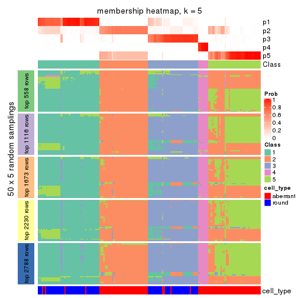</p>

</div>
<div id='tab-ATC-kmeans-membership-heatmap-5'>
<pre><code class="r">membership_heatmap(res, k = 6)
</code></pre>

<p></p>

</div>
</div>

As soon as we have had the classes for columns, we can look for signatures
which are significantly different between classes which can be candidate marks
for certain classes. Following are the heatmaps for signatures.


Signature heatmaps where rows are scaled:


<script>
$( function() {
	$( '#tabs-ATC-kmeans-get-signatures' ).tabs();
} );
</script>
<div id='tabs-ATC-kmeans-get-signatures'>
<ul>
<li><a href='#tab-ATC-kmeans-get-signatures-1'>k = 2</a></li>
<li><a href='#tab-ATC-kmeans-get-signatures-2'>k = 3</a></li>
<li><a href='#tab-ATC-kmeans-get-signatures-3'>k = 4</a></li>
<li><a href='#tab-ATC-kmeans-get-signatures-4'>k = 5</a></li>
<li><a href='#tab-ATC-kmeans-get-signatures-5'>k = 6</a></li>
</ul>
<div id='tab-ATC-kmeans-get-signatures-1'>
<pre><code class="r">get_signatures(res, k = 2)
</code></pre>

<p></p>

</div>
<div id='tab-ATC-kmeans-get-signatures-2'>
<pre><code class="r">get_signatures(res, k = 3)
</code></pre>

<p></p>

</div>
<div id='tab-ATC-kmeans-get-signatures-3'>
<pre><code class="r">get_signatures(res, k = 4)
</code></pre>

<p></p>

</div>
<div id='tab-ATC-kmeans-get-signatures-4'>
<pre><code class="r">get_signatures(res, k = 5)
</code></pre>

<p></p>

</div>
<div id='tab-ATC-kmeans-get-signatures-5'>
<pre><code class="r">get_signatures(res, k = 6)
</code></pre>

<p></p>

</div>
</div>


Signature heatmaps where rows are not scaled:


<script>
$( function() {
	$( '#tabs-ATC-kmeans-get-signatures-no-scale' ).tabs();
} );
</script>
<div id='tabs-ATC-kmeans-get-signatures-no-scale'>
<ul>
<li><a href='#tab-ATC-kmeans-get-signatures-no-scale-1'>k = 2</a></li>
<li><a href='#tab-ATC-kmeans-get-signatures-no-scale-2'>k = 3</a></li>
<li><a href='#tab-ATC-kmeans-get-signatures-no-scale-3'>k = 4</a></li>
<li><a href='#tab-ATC-kmeans-get-signatures-no-scale-4'>k = 5</a></li>
<li><a href='#tab-ATC-kmeans-get-signatures-no-scale-5'>k = 6</a></li>
</ul>
<div id='tab-ATC-kmeans-get-signatures-no-scale-1'>
<pre><code class="r">get_signatures(res, k = 2, scale_rows = FALSE)
</code></pre>

<p></p>

</div>
<div id='tab-ATC-kmeans-get-signatures-no-scale-2'>
<pre><code class="r">get_signatures(res, k = 3, scale_rows = FALSE)
</code></pre>

<p></p>

</div>
<div id='tab-ATC-kmeans-get-signatures-no-scale-3'>
<pre><code class="r">get_signatures(res, k = 4, scale_rows = FALSE)
</code></pre>

<p></p>

</div>
<div id='tab-ATC-kmeans-get-signatures-no-scale-4'>
<pre><code class="r">get_signatures(res, k = 5, scale_rows = FALSE)
</code></pre>

<p></p>

</div>
<div id='tab-ATC-kmeans-get-signatures-no-scale-5'>
<pre><code class="r">get_signatures(res, k = 6, scale_rows = FALSE)
</code></pre>

<p></p>

</div>
</div>


Compare the overlap of signatures from different k:

```r
compare_signatures(res)
```


`get_signature()` returns a data frame invisibly. TO get the list of signatures, the function
call should be assigned to a variable explicitly. In following code, if `plot` argument is set
to `FALSE`, no heatmap is plotted while only the differential analysis is performed.

```r
# code only for demonstration
tb = get_signature(res, k = ..., plot = FALSE)
```

An example of the output of `tb` is:

```
#>   which_row         fdr    mean_1    mean_2 scaled_mean_1 scaled_mean_2 km
#> 1        38 0.042760348  8.373488  9.131774    -0.5533452     0.5164555  1
#> 2        40 0.018707592  7.106213  8.469186    -0.6173731     0.5762149  1
#> 3        55 0.019134737 10.221463 11.207825    -0.6159697     0.5749050  1
#> 4        59 0.006059896  5.921854  7.869574    -0.6899429     0.6439467  1
#> 5        60 0.018055526  8.928898 10.211722    -0.6204761     0.5791110  1
#> 6        98 0.009384629 15.714769 14.887706     0.6635654    -0.6193277  2
...
```

The columns in `tb` are:

1. `which_row`: row indices corresponding to the input matrix.
2. `fdr`: FDR for the differential test. 
3. `mean_x`: The mean value in group x.
4. `scaled_mean_x`: The mean value in group x after rows are scaled.
5. `km`: Row groups if k-means clustering is applied to rows.


UMAP plot which shows how samples are separated.


<script>
$( function() {
	$( '#tabs-ATC-kmeans-dimension-reduction' ).tabs();
} );
</script>
<div id='tabs-ATC-kmeans-dimension-reduction'>
<ul>
<li><a href='#tab-ATC-kmeans-dimension-reduction-1'>k = 2</a></li>
<li><a href='#tab-ATC-kmeans-dimension-reduction-2'>k = 3</a></li>
<li><a href='#tab-ATC-kmeans-dimension-reduction-3'>k = 4</a></li>
<li><a href='#tab-ATC-kmeans-dimension-reduction-4'>k = 5</a></li>
<li><a href='#tab-ATC-kmeans-dimension-reduction-5'>k = 6</a></li>
</ul>
<div id='tab-ATC-kmeans-dimension-reduction-1'>
<pre><code class="r">dimension_reduction(res, k = 2, method = &quot;UMAP&quot;)
</code></pre>

<p></p>

</div>
<div id='tab-ATC-kmeans-dimension-reduction-2'>
<pre><code class="r">dimension_reduction(res, k = 3, method = &quot;UMAP&quot;)
</code></pre>

<p></p>

</div>
<div id='tab-ATC-kmeans-dimension-reduction-3'>
<pre><code class="r">dimension_reduction(res, k = 4, method = &quot;UMAP&quot;)
</code></pre>

<p></p>

</div>
<div id='tab-ATC-kmeans-dimension-reduction-4'>
<pre><code class="r">dimension_reduction(res, k = 5, method = &quot;UMAP&quot;)
</code></pre>

<p></p>

</div>
<div id='tab-ATC-kmeans-dimension-reduction-5'>
<pre><code class="r">dimension_reduction(res, k = 6, method = &quot;UMAP&quot;)
</code></pre>

<p></p>

</div>
</div>


Following heatmap shows how subgroups are split when increasing `k`:

```r
collect_classes(res)
```


Test correlation between subgroups and known annotations. If the known
annotation is numeric, one-way ANOVA test is applied, and if the known
annotation is discrete, chi-squared contingency table test is applied.

```r
test_to_known_factors(res)
```

```
#>              n cell_type(p) k
#> ATC:kmeans 160     4.49e-20 2
#> ATC:kmeans 155     1.79e-25 3
#> ATC:kmeans 156     4.70e-28 4
#> ATC:kmeans 146     2.06e-24 5
#> ATC:kmeans 121     1.92e-20 6
```


If matrix rows can be associated to genes, consider to use `GO_Enrichment(res,
...)` to perform function enrichment for the signature genes.


 

---------------------------------------------------


### ATC:skmeans*


The object with results only for a single top-value method and a single partition method 
can be extracted as:

```r
res = res_list["ATC", "skmeans"]
# you can also extract it by
# res = res_list["ATC:skmeans"]
```

A summary of `res` and all the functions that can be applied to it:

```r
res
```

```
#> A 'ConsensusPartition' object with k = 2, 3, 4, 5, 6.
#>   On a matrix with 5576 rows and 160 columns.
#>   Top rows (558, 1116, 1673, 2230, 2788) are extracted by 'ATC' method.
#>   Subgroups are detected by 'skmeans' method.
#>   Performed in total 1250 partitions by row resampling.
#>   Best k for subgroups seems to be 4.
#> 
#> Following methods can be applied to this 'ConsensusPartition' object:
#>  [1] "cola_report"             "collect_classes"         "collect_plots"          
#>  [4] "collect_stats"           "colnames"                "compare_signatures"     
#>  [7] "consensus_heatmap"       "dimension_reduction"     "functional_enrichment"  
#> [10] "get_anno_col"            "get_anno"                "get_classes"            
#> [13] "get_consensus"           "get_matrix"              "get_membership"         
#> [16] "get_param"               "get_signatures"          "get_stats"              
#> [19] "is_best_k"               "is_stable_k"             "membership_heatmap"     
#> [22] "ncol"                    "nrow"                    "plot_ecdf"              
#> [25] "rownames"                "select_partition_number" "show"                   
#> [28] "suggest_best_k"          "test_to_known_factors"
```

`collect_plots()` function collects all the plots made from `res` for all `k` (number of partitions)
into one single page to provide an easy and fast comparison between different `k`.

```r
collect_plots(res)
```


The plots are:

- The first row: a plot of the ECDF (Empirical cumulative distribution
  function) curves of the consensus matrix for each `k` and the heatmap of
  predicted classes for each `k`.
- The second row: heatmaps of the consensus matrix for each `k`.
- The third row: heatmaps of the membership matrix for each `k`.
- The fouth row: heatmaps of the signatures for each `k`.

All the plots in panels can be made by individual functions and they are
plotted later in this section.

`select_partition_number()` produces several plots showing different
statistics for choosing "optimized" `k`. There are following statistics:

- ECDF curves of the consensus matrix for each `k`;
- 1-PAC. [The PAC
  score](https://en.wikipedia.org/wiki/Consensus_clustering#Over-interpretation_potential_of_consensus_clustering)
  measures the proportion of the ambiguous subgrouping.
- Mean silhouette score.
- Concordance. The mean probability of fiting the consensus class ids in all
  partitions.
- Area increased. Denote $A_k$ as the area under the ECDF curve for current
  `k`, the area increased is defined as $A_k - A_{k-1}$.
- Rand index. The percent of pairs of samples that are both in a same cluster
  or both are not in a same cluster in the partition of k and k-1.
- Jaccard index. The ratio of pairs of samples are both in a same cluster in
  the partition of k and k-1 and the pairs of samples are both in a same
  cluster in the partition k or k-1.

The detailed explanations of these statistics can be found in [the cola
vignette](http://bioconductor.org/packages/devel/bioc/vignettes/cola/inst/doc/cola.html#toc_13).

Generally speaking, lower PAC score, higher mean silhouette score or higher
concordance corresponds to better partition. Rand index and Jaccard index
measure how similar the current partition is compared to partition with `k-1`.
If they are too similar, we won't accept `k` is better than `k-1`.

```r
select_partition_number(res)
```


The numeric values for all these statistics can be obtained by `get_stats()`.

```r
get_stats(res)
```

```
#>   k 1-PAC mean_silhouette concordance area_increased  Rand Jaccard
#> 2 2 1.000           0.983       0.992         0.5030 0.498   0.498
#> 3 3 0.957           0.943       0.967         0.2500 0.848   0.702
#> 4 4 0.927           0.895       0.958         0.1225 0.883   0.704
#> 5 5 0.804           0.790       0.893         0.0717 0.921   0.750
#> 6 6 0.765           0.675       0.834         0.0378 0.985   0.941
```

`suggest_best_k()` suggests the best $k$ based on these statistics. The rules are as follows:

- All $k$ with Jaccard index larger than 0.95 are removed because the increase of
  the partition number does not provides enough extra information. If all $k$ are removed,
  the best $k$ is assigned by `NA`.
- For $k$ with 1-PAC larger than 0.9, the maximal $k$ is taken as the "best k". Other $k$ is called "optional k".
- If it does not fit the second rule. The $k$ with the highest vote of highest
  1-PAC, mean silhouette and concordance is taken as the "best k".

```r
suggest_best_k(res)
```

```
#> [1] 4
#> attr(,"optional")
#> [1] 2 3
```

There is also optional best $k$ = 2 3 that is worth to check.

Following shows the table of the partitions (You need to click the **show/hide
code output** link to see it). The membership matrix (columns with name `p*`)
is inferred by
[`clue::cl_consensus()`](https://www.rdocumentation.org/link/cl_consensus?package=clue)
function with the `SE` method. Basically the value in the membership matrix
represents the probability to belong to a certain group. The finall class
label for an item is determined with the group with highest probability it
belongs to.

In `get_classes()` function, the entropy is calculated from the membership
matrix and the silhouette score is calculated from the consensus matrix.


<script>
$( function() {
	$( '#tabs-ATC-skmeans-get-classes' ).tabs();
} );
</script>
<div id='tabs-ATC-skmeans-get-classes'>
<ul>
<li><a href='#tab-ATC-skmeans-get-classes-1'>k = 2</a></li>
<li><a href='#tab-ATC-skmeans-get-classes-2'>k = 3</a></li>
<li><a href='#tab-ATC-skmeans-get-classes-3'>k = 4</a></li>
<li><a href='#tab-ATC-skmeans-get-classes-4'>k = 5</a></li>
<li><a href='#tab-ATC-skmeans-get-classes-5'>k = 6</a></li>
</ul>

<div id='tab-ATC-skmeans-get-classes-1'>
<p><a id='tab-ATC-skmeans-get-classes-1-a' style='color:#0366d6' href='#'>show/hide code output</a></p>
<pre><code class="r">cbind(get_classes(res, k = 2), get_membership(res, k = 2))
</code></pre>

<pre><code>#&gt;                     class entropy silhouette    p1    p2
#&gt; aberrant_ERR2585320     2  0.0000      0.991 0.000 1.000
#&gt; aberrant_ERR2585338     2  0.0000      0.991 0.000 1.000
#&gt; aberrant_ERR2585325     2  0.0000      0.991 0.000 1.000
#&gt; aberrant_ERR2585283     1  0.6531      0.805 0.832 0.168
#&gt; aberrant_ERR2585343     2  0.0000      0.991 0.000 1.000
#&gt; aberrant_ERR2585329     2  0.0000      0.991 0.000 1.000
#&gt; aberrant_ERR2585317     2  0.0000      0.991 0.000 1.000
#&gt; aberrant_ERR2585339     2  0.0000      0.991 0.000 1.000
#&gt; aberrant_ERR2585335     2  0.0000      0.991 0.000 1.000
#&gt; aberrant_ERR2585287     2  0.0000      0.991 0.000 1.000
#&gt; aberrant_ERR2585321     2  0.0000      0.991 0.000 1.000
#&gt; aberrant_ERR2585297     1  0.0000      0.993 1.000 0.000
#&gt; aberrant_ERR2585337     2  0.0000      0.991 0.000 1.000
#&gt; aberrant_ERR2585319     2  0.0000      0.991 0.000 1.000
#&gt; aberrant_ERR2585315     2  0.0000      0.991 0.000 1.000
#&gt; aberrant_ERR2585336     2  0.0000      0.991 0.000 1.000
#&gt; aberrant_ERR2585307     2  0.0000      0.991 0.000 1.000
#&gt; aberrant_ERR2585301     2  0.0000      0.991 0.000 1.000
#&gt; aberrant_ERR2585326     2  0.0000      0.991 0.000 1.000
#&gt; aberrant_ERR2585331     2  0.0000      0.991 0.000 1.000
#&gt; aberrant_ERR2585346     1  0.1414      0.974 0.980 0.020
#&gt; aberrant_ERR2585314     2  0.0000      0.991 0.000 1.000
#&gt; aberrant_ERR2585298     1  0.0000      0.993 1.000 0.000
#&gt; aberrant_ERR2585345     2  0.0000      0.991 0.000 1.000
#&gt; aberrant_ERR2585299     1  0.0000      0.993 1.000 0.000
#&gt; aberrant_ERR2585309     1  0.0000      0.993 1.000 0.000
#&gt; aberrant_ERR2585303     2  0.0000      0.991 0.000 1.000
#&gt; aberrant_ERR2585313     2  0.0000      0.991 0.000 1.000
#&gt; aberrant_ERR2585318     2  0.0000      0.991 0.000 1.000
#&gt; aberrant_ERR2585328     2  0.0000      0.991 0.000 1.000
#&gt; aberrant_ERR2585330     2  0.0000      0.991 0.000 1.000
#&gt; aberrant_ERR2585293     1  0.0000      0.993 1.000 0.000
#&gt; aberrant_ERR2585342     2  0.0000      0.991 0.000 1.000
#&gt; aberrant_ERR2585348     2  0.0000      0.991 0.000 1.000
#&gt; aberrant_ERR2585352     2  0.0000      0.991 0.000 1.000
#&gt; aberrant_ERR2585308     1  0.0000      0.993 1.000 0.000
#&gt; aberrant_ERR2585349     2  0.0000      0.991 0.000 1.000
#&gt; aberrant_ERR2585316     2  0.0000      0.991 0.000 1.000
#&gt; aberrant_ERR2585306     1  0.3431      0.930 0.936 0.064
#&gt; aberrant_ERR2585324     2  0.0000      0.991 0.000 1.000
#&gt; aberrant_ERR2585310     2  0.2236      0.958 0.036 0.964
#&gt; aberrant_ERR2585296     1  0.0000      0.993 1.000 0.000
#&gt; aberrant_ERR2585275     1  0.5408      0.861 0.876 0.124
#&gt; aberrant_ERR2585311     2  0.0000      0.991 0.000 1.000
#&gt; aberrant_ERR2585292     1  0.0000      0.993 1.000 0.000
#&gt; aberrant_ERR2585282     2  0.0000      0.991 0.000 1.000
#&gt; aberrant_ERR2585305     2  0.0000      0.991 0.000 1.000
#&gt; aberrant_ERR2585278     2  0.0000      0.991 0.000 1.000
#&gt; aberrant_ERR2585347     2  0.0000      0.991 0.000 1.000
#&gt; aberrant_ERR2585332     2  0.0000      0.991 0.000 1.000
#&gt; aberrant_ERR2585280     2  0.0000      0.991 0.000 1.000
#&gt; aberrant_ERR2585304     2  0.0000      0.991 0.000 1.000
#&gt; aberrant_ERR2585322     2  0.0000      0.991 0.000 1.000
#&gt; aberrant_ERR2585279     2  0.0000      0.991 0.000 1.000
#&gt; aberrant_ERR2585277     2  0.0000      0.991 0.000 1.000
#&gt; aberrant_ERR2585295     2  0.0000      0.991 0.000 1.000
#&gt; aberrant_ERR2585333     2  0.0000      0.991 0.000 1.000
#&gt; aberrant_ERR2585285     2  0.0000      0.991 0.000 1.000
#&gt; aberrant_ERR2585286     2  0.0000      0.991 0.000 1.000
#&gt; aberrant_ERR2585294     2  0.0000      0.991 0.000 1.000
#&gt; aberrant_ERR2585300     2  0.0000      0.991 0.000 1.000
#&gt; aberrant_ERR2585334     2  0.0000      0.991 0.000 1.000
#&gt; aberrant_ERR2585361     2  0.0000      0.991 0.000 1.000
#&gt; aberrant_ERR2585372     2  0.0000      0.991 0.000 1.000
#&gt; round_ERR2585217        2  0.6048      0.833 0.148 0.852
#&gt; round_ERR2585205        1  0.0000      0.993 1.000 0.000
#&gt; round_ERR2585214        2  0.6712      0.796 0.176 0.824
#&gt; round_ERR2585202        2  0.1414      0.973 0.020 0.980
#&gt; aberrant_ERR2585367     2  0.0000      0.991 0.000 1.000
#&gt; round_ERR2585220        1  0.0000      0.993 1.000 0.000
#&gt; round_ERR2585238        1  0.0000      0.993 1.000 0.000
#&gt; aberrant_ERR2585276     2  0.0000      0.991 0.000 1.000
#&gt; round_ERR2585218        1  0.0000      0.993 1.000 0.000
#&gt; aberrant_ERR2585363     2  0.0000      0.991 0.000 1.000
#&gt; round_ERR2585201        1  0.0000      0.993 1.000 0.000
#&gt; round_ERR2585210        1  0.0000      0.993 1.000 0.000
#&gt; aberrant_ERR2585362     2  0.0000      0.991 0.000 1.000
#&gt; aberrant_ERR2585360     2  0.0000      0.991 0.000 1.000
#&gt; round_ERR2585209        1  0.0000      0.993 1.000 0.000
#&gt; round_ERR2585242        1  0.0000      0.993 1.000 0.000
#&gt; round_ERR2585216        1  0.0000      0.993 1.000 0.000
#&gt; round_ERR2585219        1  0.0000      0.993 1.000 0.000
#&gt; round_ERR2585237        2  0.6887      0.784 0.184 0.816
#&gt; round_ERR2585198        1  0.0000      0.993 1.000 0.000
#&gt; round_ERR2585211        1  0.0000      0.993 1.000 0.000
#&gt; round_ERR2585206        1  0.0000      0.993 1.000 0.000
#&gt; aberrant_ERR2585281     2  0.0000      0.991 0.000 1.000
#&gt; round_ERR2585212        1  0.0000      0.993 1.000 0.000
#&gt; round_ERR2585221        1  0.0000      0.993 1.000 0.000
#&gt; round_ERR2585243        1  0.0000      0.993 1.000 0.000
#&gt; round_ERR2585204        2  0.6148      0.828 0.152 0.848
#&gt; round_ERR2585213        2  0.0376      0.988 0.004 0.996
#&gt; aberrant_ERR2585373     2  0.0000      0.991 0.000 1.000
#&gt; aberrant_ERR2585358     2  0.0000      0.991 0.000 1.000
#&gt; aberrant_ERR2585365     2  0.0000      0.991 0.000 1.000
#&gt; aberrant_ERR2585359     2  0.0000      0.991 0.000 1.000
#&gt; aberrant_ERR2585370     2  0.0000      0.991 0.000 1.000
#&gt; round_ERR2585215        1  0.0000      0.993 1.000 0.000
#&gt; round_ERR2585262        2  0.0000      0.991 0.000 1.000
#&gt; round_ERR2585199        2  0.0000      0.991 0.000 1.000
#&gt; aberrant_ERR2585369     2  0.0000      0.991 0.000 1.000
#&gt; round_ERR2585208        1  0.0000      0.993 1.000 0.000
#&gt; round_ERR2585252        1  0.0000      0.993 1.000 0.000
#&gt; round_ERR2585236        1  0.0000      0.993 1.000 0.000
#&gt; aberrant_ERR2585284     1  0.6531      0.805 0.832 0.168
#&gt; round_ERR2585224        1  0.0000      0.993 1.000 0.000
#&gt; round_ERR2585260        1  0.0000      0.993 1.000 0.000
#&gt; round_ERR2585229        1  0.0000      0.993 1.000 0.000
#&gt; aberrant_ERR2585364     2  0.0000      0.991 0.000 1.000
#&gt; round_ERR2585253        1  0.0000      0.993 1.000 0.000
#&gt; aberrant_ERR2585368     2  0.0000      0.991 0.000 1.000
#&gt; aberrant_ERR2585371     2  0.0000      0.991 0.000 1.000
#&gt; round_ERR2585239        1  0.0000      0.993 1.000 0.000
#&gt; round_ERR2585273        1  0.0000      0.993 1.000 0.000
#&gt; round_ERR2585256        1  0.0000      0.993 1.000 0.000
#&gt; round_ERR2585272        1  0.0000      0.993 1.000 0.000
#&gt; round_ERR2585246        1  0.0000      0.993 1.000 0.000
#&gt; round_ERR2585261        1  0.0000      0.993 1.000 0.000
#&gt; round_ERR2585254        1  0.0000      0.993 1.000 0.000
#&gt; round_ERR2585225        1  0.0000      0.993 1.000 0.000
#&gt; round_ERR2585235        1  0.0000      0.993 1.000 0.000
#&gt; round_ERR2585271        1  0.0000      0.993 1.000 0.000
#&gt; round_ERR2585251        1  0.0000      0.993 1.000 0.000
#&gt; round_ERR2585255        1  0.0000      0.993 1.000 0.000
#&gt; round_ERR2585257        1  0.0000      0.993 1.000 0.000
#&gt; round_ERR2585226        1  0.0000      0.993 1.000 0.000
#&gt; round_ERR2585265        1  0.0000      0.993 1.000 0.000
#&gt; round_ERR2585259        1  0.0000      0.993 1.000 0.000
#&gt; round_ERR2585247        1  0.0000      0.993 1.000 0.000
#&gt; round_ERR2585241        1  0.0000      0.993 1.000 0.000
#&gt; round_ERR2585263        1  0.0000      0.993 1.000 0.000
#&gt; round_ERR2585264        1  0.0000      0.993 1.000 0.000
#&gt; round_ERR2585233        1  0.0000      0.993 1.000 0.000
#&gt; round_ERR2585223        1  0.0000      0.993 1.000 0.000
#&gt; round_ERR2585234        1  0.0000      0.993 1.000 0.000
#&gt; round_ERR2585222        1  0.0000      0.993 1.000 0.000
#&gt; round_ERR2585228        1  0.0000      0.993 1.000 0.000
#&gt; round_ERR2585248        1  0.0000      0.993 1.000 0.000
#&gt; round_ERR2585240        1  0.0000      0.993 1.000 0.000
#&gt; round_ERR2585270        1  0.0000      0.993 1.000 0.000
#&gt; round_ERR2585232        1  0.0000      0.993 1.000 0.000
#&gt; aberrant_ERR2585341     2  0.0000      0.991 0.000 1.000
#&gt; aberrant_ERR2585355     2  0.0000      0.991 0.000 1.000
#&gt; round_ERR2585227        1  0.0000      0.993 1.000 0.000
#&gt; aberrant_ERR2585351     2  0.0000      0.991 0.000 1.000
#&gt; round_ERR2585269        1  0.0000      0.993 1.000 0.000
#&gt; aberrant_ERR2585357     2  0.0000      0.991 0.000 1.000
#&gt; aberrant_ERR2585350     2  0.0000      0.991 0.000 1.000
#&gt; round_ERR2585250        1  0.0000      0.993 1.000 0.000
#&gt; round_ERR2585245        1  0.0000      0.993 1.000 0.000
#&gt; aberrant_ERR2585353     2  0.0000      0.991 0.000 1.000
#&gt; round_ERR2585258        1  0.0000      0.993 1.000 0.000
#&gt; aberrant_ERR2585354     2  0.0000      0.991 0.000 1.000
#&gt; round_ERR2585249        1  0.0000      0.993 1.000 0.000
#&gt; round_ERR2585268        1  0.0000      0.993 1.000 0.000
#&gt; aberrant_ERR2585356     2  0.0000      0.991 0.000 1.000
#&gt; round_ERR2585266        1  0.0000      0.993 1.000 0.000
#&gt; round_ERR2585231        1  0.0000      0.993 1.000 0.000
#&gt; round_ERR2585230        1  0.0000      0.993 1.000 0.000
#&gt; round_ERR2585267        1  0.0000      0.993 1.000 0.000
</code></pre>

<script>
$('#tab-ATC-skmeans-get-classes-1-a').parent().next().next().hide();
$('#tab-ATC-skmeans-get-classes-1-a').click(function(){
  $('#tab-ATC-skmeans-get-classes-1-a').parent().next().next().toggle();
  return(false);
});
</script>
</div>

<div id='tab-ATC-skmeans-get-classes-2'>
<p><a id='tab-ATC-skmeans-get-classes-2-a' style='color:#0366d6' href='#'>show/hide code output</a></p>
<pre><code class="r">cbind(get_classes(res, k = 3), get_membership(res, k = 3))
</code></pre>

<pre><code>#&gt;                     class entropy silhouette    p1    p2    p3
#&gt; aberrant_ERR2585320     2  0.0237      0.980 0.000 0.996 0.004
#&gt; aberrant_ERR2585338     2  0.0000      0.981 0.000 1.000 0.000
#&gt; aberrant_ERR2585325     2  0.0237      0.980 0.000 0.996 0.004
#&gt; aberrant_ERR2585283     1  0.3263      0.889 0.912 0.048 0.040
#&gt; aberrant_ERR2585343     2  0.1411      0.968 0.000 0.964 0.036
#&gt; aberrant_ERR2585329     2  0.0000      0.981 0.000 1.000 0.000
#&gt; aberrant_ERR2585317     2  0.0000      0.981 0.000 1.000 0.000
#&gt; aberrant_ERR2585339     2  0.0000      0.981 0.000 1.000 0.000
#&gt; aberrant_ERR2585335     2  0.0000      0.981 0.000 1.000 0.000
#&gt; aberrant_ERR2585287     2  0.2681      0.942 0.028 0.932 0.040
#&gt; aberrant_ERR2585321     2  0.1411      0.968 0.000 0.964 0.036
#&gt; aberrant_ERR2585297     1  0.0000      0.972 1.000 0.000 0.000
#&gt; aberrant_ERR2585337     2  0.0000      0.981 0.000 1.000 0.000
#&gt; aberrant_ERR2585319     2  0.0000      0.981 0.000 1.000 0.000
#&gt; aberrant_ERR2585315     2  0.0000      0.981 0.000 1.000 0.000
#&gt; aberrant_ERR2585336     2  0.0000      0.981 0.000 1.000 0.000
#&gt; aberrant_ERR2585307     2  0.0000      0.981 0.000 1.000 0.000
#&gt; aberrant_ERR2585301     2  0.0000      0.981 0.000 1.000 0.000
#&gt; aberrant_ERR2585326     2  0.0000      0.981 0.000 1.000 0.000
#&gt; aberrant_ERR2585331     2  0.0000      0.981 0.000 1.000 0.000
#&gt; aberrant_ERR2585346     1  0.1529      0.940 0.960 0.000 0.040
#&gt; aberrant_ERR2585314     2  0.0000      0.981 0.000 1.000 0.000
#&gt; aberrant_ERR2585298     3  0.1529      0.931 0.040 0.000 0.960
#&gt; aberrant_ERR2585345     2  0.0000      0.981 0.000 1.000 0.000
#&gt; aberrant_ERR2585299     1  0.0000      0.972 1.000 0.000 0.000
#&gt; aberrant_ERR2585309     1  0.0000      0.972 1.000 0.000 0.000
#&gt; aberrant_ERR2585303     2  0.0000      0.981 0.000 1.000 0.000
#&gt; aberrant_ERR2585313     2  0.0000      0.981 0.000 1.000 0.000
#&gt; aberrant_ERR2585318     2  0.0000      0.981 0.000 1.000 0.000
#&gt; aberrant_ERR2585328     2  0.0000      0.981 0.000 1.000 0.000
#&gt; aberrant_ERR2585330     2  0.0000      0.981 0.000 1.000 0.000
#&gt; aberrant_ERR2585293     1  0.1529      0.940 0.960 0.000 0.040
#&gt; aberrant_ERR2585342     2  0.0424      0.979 0.000 0.992 0.008
#&gt; aberrant_ERR2585348     2  0.0000      0.981 0.000 1.000 0.000
#&gt; aberrant_ERR2585352     2  0.0000      0.981 0.000 1.000 0.000
#&gt; aberrant_ERR2585308     1  0.0000      0.972 1.000 0.000 0.000
#&gt; aberrant_ERR2585349     2  0.0000      0.981 0.000 1.000 0.000
#&gt; aberrant_ERR2585316     2  0.1529      0.966 0.000 0.960 0.040
#&gt; aberrant_ERR2585306     1  0.1529      0.940 0.960 0.000 0.040
#&gt; aberrant_ERR2585324     2  0.0000      0.981 0.000 1.000 0.000
#&gt; aberrant_ERR2585310     2  0.5730      0.753 0.060 0.796 0.144
#&gt; aberrant_ERR2585296     3  0.5016      0.728 0.240 0.000 0.760
#&gt; aberrant_ERR2585275     1  0.2269      0.926 0.944 0.016 0.040
#&gt; aberrant_ERR2585311     2  0.1411      0.968 0.000 0.964 0.036
#&gt; aberrant_ERR2585292     1  0.1529      0.940 0.960 0.000 0.040
#&gt; aberrant_ERR2585282     2  0.1411      0.968 0.000 0.964 0.036
#&gt; aberrant_ERR2585305     2  0.1950      0.960 0.008 0.952 0.040
#&gt; aberrant_ERR2585278     2  0.0000      0.981 0.000 1.000 0.000
#&gt; aberrant_ERR2585347     2  0.1289      0.970 0.000 0.968 0.032
#&gt; aberrant_ERR2585332     2  0.1411      0.968 0.000 0.964 0.036
#&gt; aberrant_ERR2585280     2  0.1411      0.968 0.000 0.964 0.036
#&gt; aberrant_ERR2585304     3  0.3816      0.820 0.000 0.148 0.852
#&gt; aberrant_ERR2585322     2  0.0000      0.981 0.000 1.000 0.000
#&gt; aberrant_ERR2585279     2  0.5810      0.477 0.000 0.664 0.336
#&gt; aberrant_ERR2585277     2  0.0000      0.981 0.000 1.000 0.000
#&gt; aberrant_ERR2585295     2  0.0747      0.976 0.000 0.984 0.016
#&gt; aberrant_ERR2585333     2  0.1411      0.968 0.000 0.964 0.036
#&gt; aberrant_ERR2585285     2  0.0000      0.981 0.000 1.000 0.000
#&gt; aberrant_ERR2585286     2  0.0000      0.981 0.000 1.000 0.000
#&gt; aberrant_ERR2585294     2  0.1529      0.966 0.000 0.960 0.040
#&gt; aberrant_ERR2585300     2  0.1529      0.966 0.000 0.960 0.040
#&gt; aberrant_ERR2585334     2  0.0000      0.981 0.000 1.000 0.000
#&gt; aberrant_ERR2585361     2  0.0000      0.981 0.000 1.000 0.000
#&gt; aberrant_ERR2585372     2  0.1411      0.968 0.000 0.964 0.036
#&gt; round_ERR2585217        3  0.1647      0.921 0.004 0.036 0.960
#&gt; round_ERR2585205        1  0.0000      0.972 1.000 0.000 0.000
#&gt; round_ERR2585214        3  0.1647      0.921 0.004 0.036 0.960
#&gt; round_ERR2585202        3  0.1529      0.918 0.000 0.040 0.960
#&gt; aberrant_ERR2585367     2  0.0000      0.981 0.000 1.000 0.000
#&gt; round_ERR2585220        1  0.0000      0.972 1.000 0.000 0.000
#&gt; round_ERR2585238        1  0.0000      0.972 1.000 0.000 0.000
#&gt; aberrant_ERR2585276     2  0.1529      0.966 0.000 0.960 0.040
#&gt; round_ERR2585218        1  0.0000      0.972 1.000 0.000 0.000
#&gt; aberrant_ERR2585363     2  0.0000      0.981 0.000 1.000 0.000
#&gt; round_ERR2585201        3  0.1529      0.931 0.040 0.000 0.960
#&gt; round_ERR2585210        1  0.0000      0.972 1.000 0.000 0.000
#&gt; aberrant_ERR2585362     2  0.0000      0.981 0.000 1.000 0.000
#&gt; aberrant_ERR2585360     2  0.0592      0.977 0.000 0.988 0.012
#&gt; round_ERR2585209        3  0.1529      0.931 0.040 0.000 0.960
#&gt; round_ERR2585242        3  0.1529      0.931 0.040 0.000 0.960
#&gt; round_ERR2585216        1  0.3686      0.837 0.860 0.000 0.140
#&gt; round_ERR2585219        1  0.0000      0.972 1.000 0.000 0.000
#&gt; round_ERR2585237        3  0.1647      0.921 0.004 0.036 0.960
#&gt; round_ERR2585198        3  0.1711      0.923 0.008 0.032 0.960
#&gt; round_ERR2585211        1  0.0000      0.972 1.000 0.000 0.000
#&gt; round_ERR2585206        1  0.0000      0.972 1.000 0.000 0.000
#&gt; aberrant_ERR2585281     2  0.0000      0.981 0.000 1.000 0.000
#&gt; round_ERR2585212        1  0.3482      0.850 0.872 0.000 0.128
#&gt; round_ERR2585221        1  0.0000      0.972 1.000 0.000 0.000
#&gt; round_ERR2585243        1  0.0000      0.972 1.000 0.000 0.000
#&gt; round_ERR2585204        3  0.1647      0.921 0.004 0.036 0.960
#&gt; round_ERR2585213        3  0.1529      0.918 0.000 0.040 0.960
#&gt; aberrant_ERR2585373     2  0.1529      0.966 0.000 0.960 0.040
#&gt; aberrant_ERR2585358     2  0.1289      0.970 0.000 0.968 0.032
#&gt; aberrant_ERR2585365     2  0.0000      0.981 0.000 1.000 0.000
#&gt; aberrant_ERR2585359     2  0.1529      0.966 0.000 0.960 0.040
#&gt; aberrant_ERR2585370     2  0.0000      0.981 0.000 1.000 0.000
#&gt; round_ERR2585215        1  0.0000      0.972 1.000 0.000 0.000
#&gt; round_ERR2585262        3  0.1529      0.918 0.000 0.040 0.960
#&gt; round_ERR2585199        3  0.1529      0.918 0.000 0.040 0.960
#&gt; aberrant_ERR2585369     2  0.0000      0.981 0.000 1.000 0.000
#&gt; round_ERR2585208        1  0.0000      0.972 1.000 0.000 0.000
#&gt; round_ERR2585252        1  0.0000      0.972 1.000 0.000 0.000
#&gt; round_ERR2585236        1  0.2066      0.924 0.940 0.000 0.060
#&gt; aberrant_ERR2585284     1  0.5222      0.750 0.816 0.144 0.040
#&gt; round_ERR2585224        1  0.0000      0.972 1.000 0.000 0.000
#&gt; round_ERR2585260        1  0.0000      0.972 1.000 0.000 0.000
#&gt; round_ERR2585229        1  0.0000      0.972 1.000 0.000 0.000
#&gt; aberrant_ERR2585364     2  0.1529      0.966 0.000 0.960 0.040
#&gt; round_ERR2585253        1  0.0000      0.972 1.000 0.000 0.000
#&gt; aberrant_ERR2585368     2  0.0000      0.981 0.000 1.000 0.000
#&gt; aberrant_ERR2585371     2  0.0000      0.981 0.000 1.000 0.000
#&gt; round_ERR2585239        1  0.0000      0.972 1.000 0.000 0.000
#&gt; round_ERR2585273        1  0.0000      0.972 1.000 0.000 0.000
#&gt; round_ERR2585256        3  0.1643      0.929 0.044 0.000 0.956
#&gt; round_ERR2585272        1  0.0000      0.972 1.000 0.000 0.000
#&gt; round_ERR2585246        1  0.0000      0.972 1.000 0.000 0.000
#&gt; round_ERR2585261        3  0.1529      0.931 0.040 0.000 0.960
#&gt; round_ERR2585254        3  0.1529      0.931 0.040 0.000 0.960
#&gt; round_ERR2585225        3  0.1529      0.931 0.040 0.000 0.960
#&gt; round_ERR2585235        1  0.3116      0.874 0.892 0.000 0.108
#&gt; round_ERR2585271        1  0.0000      0.972 1.000 0.000 0.000
#&gt; round_ERR2585251        1  0.3879      0.818 0.848 0.000 0.152
#&gt; round_ERR2585255        3  0.1529      0.931 0.040 0.000 0.960
#&gt; round_ERR2585257        3  0.1529      0.931 0.040 0.000 0.960
#&gt; round_ERR2585226        1  0.0000      0.972 1.000 0.000 0.000
#&gt; round_ERR2585265        1  0.0000      0.972 1.000 0.000 0.000
#&gt; round_ERR2585259        3  0.1753      0.927 0.048 0.000 0.952
#&gt; round_ERR2585247        1  0.0000      0.972 1.000 0.000 0.000
#&gt; round_ERR2585241        1  0.0000      0.972 1.000 0.000 0.000
#&gt; round_ERR2585263        3  0.5098      0.717 0.248 0.000 0.752
#&gt; round_ERR2585264        1  0.0000      0.972 1.000 0.000 0.000
#&gt; round_ERR2585233        3  0.1529      0.931 0.040 0.000 0.960
#&gt; round_ERR2585223        1  0.0000      0.972 1.000 0.000 0.000
#&gt; round_ERR2585234        3  0.1529      0.931 0.040 0.000 0.960
#&gt; round_ERR2585222        1  0.0000      0.972 1.000 0.000 0.000
#&gt; round_ERR2585228        1  0.0000      0.972 1.000 0.000 0.000
#&gt; round_ERR2585248        1  0.0000      0.972 1.000 0.000 0.000
#&gt; round_ERR2585240        3  0.6111      0.423 0.396 0.000 0.604
#&gt; round_ERR2585270        1  0.4002      0.807 0.840 0.000 0.160
#&gt; round_ERR2585232        3  0.6140      0.384 0.404 0.000 0.596
#&gt; aberrant_ERR2585341     2  0.0000      0.981 0.000 1.000 0.000
#&gt; aberrant_ERR2585355     2  0.0000      0.981 0.000 1.000 0.000
#&gt; round_ERR2585227        1  0.0424      0.966 0.992 0.000 0.008
#&gt; aberrant_ERR2585351     2  0.0000      0.981 0.000 1.000 0.000
#&gt; round_ERR2585269        1  0.0000      0.972 1.000 0.000 0.000
#&gt; aberrant_ERR2585357     2  0.0000      0.981 0.000 1.000 0.000
#&gt; aberrant_ERR2585350     2  0.0000      0.981 0.000 1.000 0.000
#&gt; round_ERR2585250        1  0.3879      0.820 0.848 0.000 0.152
#&gt; round_ERR2585245        1  0.0000      0.972 1.000 0.000 0.000
#&gt; aberrant_ERR2585353     2  0.1289      0.970 0.000 0.968 0.032
#&gt; round_ERR2585258        1  0.0000      0.972 1.000 0.000 0.000
#&gt; aberrant_ERR2585354     2  0.1031      0.973 0.000 0.976 0.024
#&gt; round_ERR2585249        1  0.0000      0.972 1.000 0.000 0.000
#&gt; round_ERR2585268        1  0.1411      0.945 0.964 0.000 0.036
#&gt; aberrant_ERR2585356     2  0.1529      0.966 0.000 0.960 0.040
#&gt; round_ERR2585266        3  0.1643      0.929 0.044 0.000 0.956
#&gt; round_ERR2585231        1  0.0000      0.972 1.000 0.000 0.000
#&gt; round_ERR2585230        1  0.0000      0.972 1.000 0.000 0.000
#&gt; round_ERR2585267        1  0.0000      0.972 1.000 0.000 0.000
</code></pre>

<script>
$('#tab-ATC-skmeans-get-classes-2-a').parent().next().next().hide();
$('#tab-ATC-skmeans-get-classes-2-a').click(function(){
  $('#tab-ATC-skmeans-get-classes-2-a').parent().next().next().toggle();
  return(false);
});
</script>
</div>

<div id='tab-ATC-skmeans-get-classes-3'>
<p><a id='tab-ATC-skmeans-get-classes-3-a' style='color:#0366d6' href='#'>show/hide code output</a></p>
<pre><code class="r">cbind(get_classes(res, k = 4), get_membership(res, k = 4))
</code></pre>

<pre><code>#&gt;                     class entropy silhouette    p1    p2    p3    p4
#&gt; aberrant_ERR2585320     2  0.0000     0.9432 0.000 1.000 0.000 0.000
#&gt; aberrant_ERR2585338     2  0.0000     0.9432 0.000 1.000 0.000 0.000
#&gt; aberrant_ERR2585325     2  0.0000     0.9432 0.000 1.000 0.000 0.000
#&gt; aberrant_ERR2585283     4  0.0188     0.8937 0.004 0.000 0.000 0.996
#&gt; aberrant_ERR2585343     2  0.4790     0.3797 0.000 0.620 0.000 0.380
#&gt; aberrant_ERR2585329     2  0.0000     0.9432 0.000 1.000 0.000 0.000
#&gt; aberrant_ERR2585317     2  0.0000     0.9432 0.000 1.000 0.000 0.000
#&gt; aberrant_ERR2585339     2  0.0000     0.9432 0.000 1.000 0.000 0.000
#&gt; aberrant_ERR2585335     2  0.0000     0.9432 0.000 1.000 0.000 0.000
#&gt; aberrant_ERR2585287     4  0.0188     0.8956 0.000 0.004 0.000 0.996
#&gt; aberrant_ERR2585321     4  0.4790     0.4098 0.000 0.380 0.000 0.620
#&gt; aberrant_ERR2585297     1  0.0000     0.9707 1.000 0.000 0.000 0.000
#&gt; aberrant_ERR2585337     2  0.0000     0.9432 0.000 1.000 0.000 0.000
#&gt; aberrant_ERR2585319     2  0.0000     0.9432 0.000 1.000 0.000 0.000
#&gt; aberrant_ERR2585315     2  0.0000     0.9432 0.000 1.000 0.000 0.000
#&gt; aberrant_ERR2585336     2  0.0000     0.9432 0.000 1.000 0.000 0.000
#&gt; aberrant_ERR2585307     2  0.0000     0.9432 0.000 1.000 0.000 0.000
#&gt; aberrant_ERR2585301     2  0.0000     0.9432 0.000 1.000 0.000 0.000
#&gt; aberrant_ERR2585326     2  0.0000     0.9432 0.000 1.000 0.000 0.000
#&gt; aberrant_ERR2585331     2  0.0000     0.9432 0.000 1.000 0.000 0.000
#&gt; aberrant_ERR2585346     4  0.0188     0.8937 0.004 0.000 0.000 0.996
#&gt; aberrant_ERR2585314     2  0.0000     0.9432 0.000 1.000 0.000 0.000
#&gt; aberrant_ERR2585298     3  0.0000     0.9633 0.000 0.000 1.000 0.000
#&gt; aberrant_ERR2585345     2  0.0000     0.9432 0.000 1.000 0.000 0.000
#&gt; aberrant_ERR2585299     1  0.0000     0.9707 1.000 0.000 0.000 0.000
#&gt; aberrant_ERR2585309     1  0.0000     0.9707 1.000 0.000 0.000 0.000
#&gt; aberrant_ERR2585303     2  0.0000     0.9432 0.000 1.000 0.000 0.000
#&gt; aberrant_ERR2585313     2  0.0000     0.9432 0.000 1.000 0.000 0.000
#&gt; aberrant_ERR2585318     2  0.0000     0.9432 0.000 1.000 0.000 0.000
#&gt; aberrant_ERR2585328     2  0.0188     0.9406 0.000 0.996 0.000 0.004
#&gt; aberrant_ERR2585330     2  0.0000     0.9432 0.000 1.000 0.000 0.000
#&gt; aberrant_ERR2585293     4  0.0188     0.8937 0.004 0.000 0.000 0.996
#&gt; aberrant_ERR2585342     2  0.0592     0.9327 0.000 0.984 0.000 0.016
#&gt; aberrant_ERR2585348     2  0.0000     0.9432 0.000 1.000 0.000 0.000
#&gt; aberrant_ERR2585352     2  0.0000     0.9432 0.000 1.000 0.000 0.000
#&gt; aberrant_ERR2585308     1  0.0000     0.9707 1.000 0.000 0.000 0.000
#&gt; aberrant_ERR2585349     2  0.0000     0.9432 0.000 1.000 0.000 0.000
#&gt; aberrant_ERR2585316     4  0.0469     0.8919 0.000 0.012 0.000 0.988
#&gt; aberrant_ERR2585306     4  0.0188     0.8937 0.004 0.000 0.000 0.996
#&gt; aberrant_ERR2585324     2  0.0000     0.9432 0.000 1.000 0.000 0.000
#&gt; aberrant_ERR2585310     2  0.6458     0.6050 0.048 0.712 0.108 0.132
#&gt; aberrant_ERR2585296     1  0.5158     0.1228 0.524 0.000 0.472 0.004
#&gt; aberrant_ERR2585275     4  0.0188     0.8937 0.004 0.000 0.000 0.996
#&gt; aberrant_ERR2585311     4  0.4877     0.3405 0.000 0.408 0.000 0.592
#&gt; aberrant_ERR2585292     4  0.0188     0.8937 0.004 0.000 0.000 0.996
#&gt; aberrant_ERR2585282     2  0.3486     0.7573 0.000 0.812 0.000 0.188
#&gt; aberrant_ERR2585305     4  0.0336     0.8943 0.000 0.008 0.000 0.992
#&gt; aberrant_ERR2585278     2  0.0000     0.9432 0.000 1.000 0.000 0.000
#&gt; aberrant_ERR2585347     2  0.4830     0.3580 0.000 0.608 0.000 0.392
#&gt; aberrant_ERR2585332     2  0.4304     0.5977 0.000 0.716 0.000 0.284
#&gt; aberrant_ERR2585280     2  0.4817     0.3645 0.000 0.612 0.000 0.388
#&gt; aberrant_ERR2585304     3  0.4543     0.4775 0.000 0.324 0.676 0.000
#&gt; aberrant_ERR2585322     2  0.0000     0.9432 0.000 1.000 0.000 0.000
#&gt; aberrant_ERR2585279     2  0.2469     0.8415 0.000 0.892 0.108 0.000
#&gt; aberrant_ERR2585277     2  0.0000     0.9432 0.000 1.000 0.000 0.000
#&gt; aberrant_ERR2585295     2  0.3486     0.7585 0.000 0.812 0.000 0.188
#&gt; aberrant_ERR2585333     2  0.4994     0.0397 0.000 0.520 0.000 0.480
#&gt; aberrant_ERR2585285     2  0.0000     0.9432 0.000 1.000 0.000 0.000
#&gt; aberrant_ERR2585286     2  0.0000     0.9432 0.000 1.000 0.000 0.000
#&gt; aberrant_ERR2585294     4  0.0188     0.8956 0.000 0.004 0.000 0.996
#&gt; aberrant_ERR2585300     4  0.0188     0.8956 0.000 0.004 0.000 0.996
#&gt; aberrant_ERR2585334     2  0.0000     0.9432 0.000 1.000 0.000 0.000
#&gt; aberrant_ERR2585361     2  0.0000     0.9432 0.000 1.000 0.000 0.000
#&gt; aberrant_ERR2585372     2  0.2704     0.8369 0.000 0.876 0.000 0.124
#&gt; round_ERR2585217        3  0.0000     0.9633 0.000 0.000 1.000 0.000
#&gt; round_ERR2585205        1  0.0000     0.9707 1.000 0.000 0.000 0.000
#&gt; round_ERR2585214        3  0.0000     0.9633 0.000 0.000 1.000 0.000
#&gt; round_ERR2585202        3  0.0000     0.9633 0.000 0.000 1.000 0.000
#&gt; aberrant_ERR2585367     2  0.0000     0.9432 0.000 1.000 0.000 0.000
#&gt; round_ERR2585220        1  0.0000     0.9707 1.000 0.000 0.000 0.000
#&gt; round_ERR2585238        1  0.0000     0.9707 1.000 0.000 0.000 0.000
#&gt; aberrant_ERR2585276     4  0.0336     0.8945 0.000 0.008 0.000 0.992
#&gt; round_ERR2585218        1  0.0000     0.9707 1.000 0.000 0.000 0.000
#&gt; aberrant_ERR2585363     2  0.0000     0.9432 0.000 1.000 0.000 0.000
#&gt; round_ERR2585201        3  0.0000     0.9633 0.000 0.000 1.000 0.000
#&gt; round_ERR2585210        1  0.0188     0.9686 0.996 0.000 0.000 0.004
#&gt; aberrant_ERR2585362     2  0.0000     0.9432 0.000 1.000 0.000 0.000
#&gt; aberrant_ERR2585360     2  0.1118     0.9190 0.000 0.964 0.000 0.036
#&gt; round_ERR2585209        3  0.0376     0.9600 0.004 0.000 0.992 0.004
#&gt; round_ERR2585242        3  0.0188     0.9619 0.000 0.000 0.996 0.004
#&gt; round_ERR2585216        1  0.0188     0.9686 0.996 0.000 0.000 0.004
#&gt; round_ERR2585219        1  0.0000     0.9707 1.000 0.000 0.000 0.000
#&gt; round_ERR2585237        3  0.0000     0.9633 0.000 0.000 1.000 0.000
#&gt; round_ERR2585198        3  0.0000     0.9633 0.000 0.000 1.000 0.000
#&gt; round_ERR2585211        1  0.0000     0.9707 1.000 0.000 0.000 0.000
#&gt; round_ERR2585206        1  0.0000     0.9707 1.000 0.000 0.000 0.000
#&gt; aberrant_ERR2585281     2  0.1867     0.8893 0.000 0.928 0.000 0.072
#&gt; round_ERR2585212        1  0.0657     0.9612 0.984 0.000 0.012 0.004
#&gt; round_ERR2585221        1  0.0000     0.9707 1.000 0.000 0.000 0.000
#&gt; round_ERR2585243        1  0.0000     0.9707 1.000 0.000 0.000 0.000
#&gt; round_ERR2585204        3  0.0000     0.9633 0.000 0.000 1.000 0.000
#&gt; round_ERR2585213        3  0.0000     0.9633 0.000 0.000 1.000 0.000
#&gt; aberrant_ERR2585373     4  0.4564     0.5369 0.000 0.328 0.000 0.672
#&gt; aberrant_ERR2585358     2  0.1792     0.8925 0.000 0.932 0.000 0.068
#&gt; aberrant_ERR2585365     2  0.0000     0.9432 0.000 1.000 0.000 0.000
#&gt; aberrant_ERR2585359     4  0.3942     0.6860 0.000 0.236 0.000 0.764
#&gt; aberrant_ERR2585370     2  0.0000     0.9432 0.000 1.000 0.000 0.000
#&gt; round_ERR2585215        1  0.0188     0.9686 0.996 0.000 0.000 0.004
#&gt; round_ERR2585262        3  0.0000     0.9633 0.000 0.000 1.000 0.000
#&gt; round_ERR2585199        3  0.0000     0.9633 0.000 0.000 1.000 0.000
#&gt; aberrant_ERR2585369     2  0.0000     0.9432 0.000 1.000 0.000 0.000
#&gt; round_ERR2585208        1  0.0000     0.9707 1.000 0.000 0.000 0.000
#&gt; round_ERR2585252        1  0.0000     0.9707 1.000 0.000 0.000 0.000
#&gt; round_ERR2585236        1  0.1305     0.9414 0.960 0.000 0.036 0.004
#&gt; aberrant_ERR2585284     4  0.0188     0.8956 0.000 0.004 0.000 0.996
#&gt; round_ERR2585224        1  0.0000     0.9707 1.000 0.000 0.000 0.000
#&gt; round_ERR2585260        1  0.0000     0.9707 1.000 0.000 0.000 0.000
#&gt; round_ERR2585229        1  0.0000     0.9707 1.000 0.000 0.000 0.000
#&gt; aberrant_ERR2585364     4  0.0188     0.8956 0.000 0.004 0.000 0.996
#&gt; round_ERR2585253        1  0.0000     0.9707 1.000 0.000 0.000 0.000
#&gt; aberrant_ERR2585368     2  0.0000     0.9432 0.000 1.000 0.000 0.000
#&gt; aberrant_ERR2585371     2  0.0000     0.9432 0.000 1.000 0.000 0.000
#&gt; round_ERR2585239        1  0.0000     0.9707 1.000 0.000 0.000 0.000
#&gt; round_ERR2585273        1  0.0000     0.9707 1.000 0.000 0.000 0.000
#&gt; round_ERR2585256        3  0.1978     0.8953 0.068 0.000 0.928 0.004
#&gt; round_ERR2585272        1  0.0188     0.9686 0.996 0.000 0.000 0.004
#&gt; round_ERR2585246        1  0.0000     0.9707 1.000 0.000 0.000 0.000
#&gt; round_ERR2585261        3  0.0188     0.9619 0.000 0.000 0.996 0.004
#&gt; round_ERR2585254        3  0.1004     0.9429 0.024 0.000 0.972 0.004
#&gt; round_ERR2585225        3  0.0188     0.9619 0.000 0.000 0.996 0.004
#&gt; round_ERR2585235        1  0.0779     0.9581 0.980 0.000 0.016 0.004
#&gt; round_ERR2585271        1  0.0000     0.9707 1.000 0.000 0.000 0.000
#&gt; round_ERR2585251        1  0.0707     0.9566 0.980 0.000 0.020 0.000
#&gt; round_ERR2585255        3  0.0000     0.9633 0.000 0.000 1.000 0.000
#&gt; round_ERR2585257        3  0.0000     0.9633 0.000 0.000 1.000 0.000
#&gt; round_ERR2585226        1  0.0000     0.9707 1.000 0.000 0.000 0.000
#&gt; round_ERR2585265        1  0.0000     0.9707 1.000 0.000 0.000 0.000
#&gt; round_ERR2585259        3  0.2401     0.8652 0.092 0.000 0.904 0.004
#&gt; round_ERR2585247        1  0.0000     0.9707 1.000 0.000 0.000 0.000
#&gt; round_ERR2585241        1  0.0000     0.9707 1.000 0.000 0.000 0.000
#&gt; round_ERR2585263        1  0.5143     0.1786 0.540 0.000 0.456 0.004
#&gt; round_ERR2585264        1  0.0000     0.9707 1.000 0.000 0.000 0.000
#&gt; round_ERR2585233        3  0.1978     0.8954 0.068 0.000 0.928 0.004
#&gt; round_ERR2585223        1  0.0000     0.9707 1.000 0.000 0.000 0.000
#&gt; round_ERR2585234        3  0.0000     0.9633 0.000 0.000 1.000 0.000
#&gt; round_ERR2585222        1  0.0000     0.9707 1.000 0.000 0.000 0.000
#&gt; round_ERR2585228        1  0.0000     0.9707 1.000 0.000 0.000 0.000
#&gt; round_ERR2585248        1  0.0000     0.9707 1.000 0.000 0.000 0.000
#&gt; round_ERR2585240        1  0.4252     0.6656 0.744 0.000 0.252 0.004
#&gt; round_ERR2585270        1  0.0524     0.9639 0.988 0.000 0.008 0.004
#&gt; round_ERR2585232        1  0.3355     0.8033 0.836 0.000 0.160 0.004
#&gt; aberrant_ERR2585341     2  0.0000     0.9432 0.000 1.000 0.000 0.000
#&gt; aberrant_ERR2585355     2  0.0000     0.9432 0.000 1.000 0.000 0.000
#&gt; round_ERR2585227        1  0.0188     0.9686 0.996 0.000 0.000 0.004
#&gt; aberrant_ERR2585351     2  0.0000     0.9432 0.000 1.000 0.000 0.000
#&gt; round_ERR2585269        1  0.0000     0.9707 1.000 0.000 0.000 0.000
#&gt; aberrant_ERR2585357     2  0.0000     0.9432 0.000 1.000 0.000 0.000
#&gt; aberrant_ERR2585350     2  0.0000     0.9432 0.000 1.000 0.000 0.000
#&gt; round_ERR2585250        1  0.1576     0.9298 0.948 0.000 0.048 0.004
#&gt; round_ERR2585245        1  0.0000     0.9707 1.000 0.000 0.000 0.000
#&gt; aberrant_ERR2585353     2  0.2011     0.8813 0.000 0.920 0.000 0.080
#&gt; round_ERR2585258        1  0.0000     0.9707 1.000 0.000 0.000 0.000
#&gt; aberrant_ERR2585354     2  0.1792     0.8928 0.000 0.932 0.000 0.068
#&gt; round_ERR2585249        1  0.0000     0.9707 1.000 0.000 0.000 0.000
#&gt; round_ERR2585268        1  0.0779     0.9581 0.980 0.000 0.016 0.004
#&gt; aberrant_ERR2585356     4  0.0336     0.8945 0.000 0.008 0.000 0.992
#&gt; round_ERR2585266        3  0.0779     0.9508 0.016 0.000 0.980 0.004
#&gt; round_ERR2585231        1  0.0000     0.9707 1.000 0.000 0.000 0.000
#&gt; round_ERR2585230        1  0.0000     0.9707 1.000 0.000 0.000 0.000
#&gt; round_ERR2585267        1  0.0000     0.9707 1.000 0.000 0.000 0.000
</code></pre>

<script>
$('#tab-ATC-skmeans-get-classes-3-a').parent().next().next().hide();
$('#tab-ATC-skmeans-get-classes-3-a').click(function(){
  $('#tab-ATC-skmeans-get-classes-3-a').parent().next().next().toggle();
  return(false);
});
</script>
</div>

<div id='tab-ATC-skmeans-get-classes-4'>
<p><a id='tab-ATC-skmeans-get-classes-4-a' style='color:#0366d6' href='#'>show/hide code output</a></p>
<pre><code class="r">cbind(get_classes(res, k = 5), get_membership(res, k = 5))
</code></pre>

<pre><code>#&gt;                     class entropy silhouette    p1    p2    p3    p4    p5
#&gt; aberrant_ERR2585320     2  0.3906   0.675625 0.000 0.744 0.000 0.016 0.240
#&gt; aberrant_ERR2585338     2  0.0510   0.835100 0.000 0.984 0.000 0.000 0.016
#&gt; aberrant_ERR2585325     2  0.3690   0.718133 0.000 0.780 0.000 0.020 0.200
#&gt; aberrant_ERR2585283     4  0.0162   0.893260 0.000 0.000 0.000 0.996 0.004
#&gt; aberrant_ERR2585343     5  0.3427   0.719742 0.000 0.108 0.000 0.056 0.836
#&gt; aberrant_ERR2585329     2  0.0000   0.839551 0.000 1.000 0.000 0.000 0.000
#&gt; aberrant_ERR2585317     2  0.0000   0.839551 0.000 1.000 0.000 0.000 0.000
#&gt; aberrant_ERR2585339     2  0.0000   0.839551 0.000 1.000 0.000 0.000 0.000
#&gt; aberrant_ERR2585335     2  0.4030   0.387330 0.000 0.648 0.000 0.000 0.352
#&gt; aberrant_ERR2585287     4  0.0404   0.888057 0.000 0.000 0.000 0.988 0.012
#&gt; aberrant_ERR2585321     5  0.2983   0.671356 0.000 0.040 0.000 0.096 0.864
#&gt; aberrant_ERR2585297     1  0.0162   0.956276 0.996 0.000 0.000 0.004 0.000
#&gt; aberrant_ERR2585337     2  0.0000   0.839551 0.000 1.000 0.000 0.000 0.000
#&gt; aberrant_ERR2585319     2  0.3966   0.472296 0.000 0.664 0.000 0.000 0.336
#&gt; aberrant_ERR2585315     2  0.0404   0.835714 0.000 0.988 0.000 0.000 0.012
#&gt; aberrant_ERR2585336     2  0.0000   0.839551 0.000 1.000 0.000 0.000 0.000
#&gt; aberrant_ERR2585307     2  0.0162   0.838609 0.000 0.996 0.000 0.004 0.000
#&gt; aberrant_ERR2585301     5  0.4283   0.253497 0.000 0.456 0.000 0.000 0.544
#&gt; aberrant_ERR2585326     2  0.0000   0.839551 0.000 1.000 0.000 0.000 0.000
#&gt; aberrant_ERR2585331     2  0.0000   0.839551 0.000 1.000 0.000 0.000 0.000
#&gt; aberrant_ERR2585346     4  0.0162   0.893260 0.000 0.000 0.000 0.996 0.004
#&gt; aberrant_ERR2585314     2  0.0000   0.839551 0.000 1.000 0.000 0.000 0.000
#&gt; aberrant_ERR2585298     3  0.0703   0.952297 0.000 0.000 0.976 0.000 0.024
#&gt; aberrant_ERR2585345     2  0.0000   0.839551 0.000 1.000 0.000 0.000 0.000
#&gt; aberrant_ERR2585299     1  0.0324   0.955924 0.992 0.000 0.000 0.004 0.004
#&gt; aberrant_ERR2585309     1  0.0162   0.956276 0.996 0.000 0.000 0.004 0.000
#&gt; aberrant_ERR2585303     2  0.2488   0.783651 0.000 0.872 0.000 0.004 0.124
#&gt; aberrant_ERR2585313     2  0.0000   0.839551 0.000 1.000 0.000 0.000 0.000
#&gt; aberrant_ERR2585318     5  0.4030   0.545161 0.000 0.352 0.000 0.000 0.648
#&gt; aberrant_ERR2585328     2  0.3519   0.695007 0.000 0.776 0.000 0.008 0.216
#&gt; aberrant_ERR2585330     2  0.3966   0.442461 0.000 0.664 0.000 0.000 0.336
#&gt; aberrant_ERR2585293     4  0.0162   0.893260 0.000 0.000 0.000 0.996 0.004
#&gt; aberrant_ERR2585342     5  0.3715   0.681820 0.000 0.260 0.000 0.004 0.736
#&gt; aberrant_ERR2585348     2  0.3928   0.571617 0.000 0.700 0.000 0.004 0.296
#&gt; aberrant_ERR2585352     2  0.2813   0.740858 0.000 0.832 0.000 0.000 0.168
#&gt; aberrant_ERR2585308     1  0.0000   0.956805 1.000 0.000 0.000 0.000 0.000
#&gt; aberrant_ERR2585349     2  0.0000   0.839551 0.000 1.000 0.000 0.000 0.000
#&gt; aberrant_ERR2585316     5  0.4273   0.040602 0.000 0.000 0.000 0.448 0.552
#&gt; aberrant_ERR2585306     4  0.1544   0.853449 0.000 0.000 0.000 0.932 0.068
#&gt; aberrant_ERR2585324     2  0.3366   0.649217 0.000 0.768 0.000 0.000 0.232
#&gt; aberrant_ERR2585310     5  0.6696   0.231029 0.020 0.428 0.060 0.032 0.460
#&gt; aberrant_ERR2585296     1  0.5574   0.162961 0.512 0.000 0.416 0.000 0.072
#&gt; aberrant_ERR2585275     4  0.0162   0.893260 0.000 0.000 0.000 0.996 0.004
#&gt; aberrant_ERR2585311     5  0.3058   0.670275 0.000 0.044 0.000 0.096 0.860
#&gt; aberrant_ERR2585292     4  0.0162   0.893260 0.000 0.000 0.000 0.996 0.004
#&gt; aberrant_ERR2585282     5  0.3764   0.723034 0.000 0.156 0.000 0.044 0.800
#&gt; aberrant_ERR2585305     5  0.4547   0.146984 0.000 0.012 0.000 0.400 0.588
#&gt; aberrant_ERR2585278     2  0.3143   0.654636 0.000 0.796 0.000 0.000 0.204
#&gt; aberrant_ERR2585347     2  0.6103   0.336573 0.000 0.548 0.000 0.292 0.160
#&gt; aberrant_ERR2585332     5  0.3051   0.725083 0.000 0.120 0.000 0.028 0.852
#&gt; aberrant_ERR2585280     2  0.6163   0.286806 0.000 0.536 0.000 0.300 0.164
#&gt; aberrant_ERR2585304     2  0.3659   0.607388 0.000 0.768 0.220 0.000 0.012
#&gt; aberrant_ERR2585322     2  0.0000   0.839551 0.000 1.000 0.000 0.000 0.000
#&gt; aberrant_ERR2585279     2  0.1628   0.796005 0.000 0.936 0.056 0.000 0.008
#&gt; aberrant_ERR2585277     2  0.0162   0.838160 0.000 0.996 0.000 0.000 0.004
#&gt; aberrant_ERR2585295     2  0.4732   0.609558 0.000 0.716 0.000 0.208 0.076
#&gt; aberrant_ERR2585333     5  0.3810   0.703847 0.000 0.100 0.000 0.088 0.812
#&gt; aberrant_ERR2585285     2  0.4227   0.161605 0.000 0.580 0.000 0.000 0.420
#&gt; aberrant_ERR2585286     2  0.0162   0.838160 0.000 0.996 0.000 0.000 0.004
#&gt; aberrant_ERR2585294     5  0.4957  -0.000927 0.000 0.028 0.000 0.444 0.528
#&gt; aberrant_ERR2585300     4  0.3913   0.513575 0.000 0.000 0.000 0.676 0.324
#&gt; aberrant_ERR2585334     2  0.0324   0.836595 0.000 0.992 0.004 0.000 0.004
#&gt; aberrant_ERR2585361     2  0.3837   0.540487 0.000 0.692 0.000 0.000 0.308
#&gt; aberrant_ERR2585372     5  0.3456   0.731787 0.000 0.184 0.000 0.016 0.800
#&gt; round_ERR2585217        3  0.0794   0.951115 0.000 0.000 0.972 0.000 0.028
#&gt; round_ERR2585205        1  0.0404   0.954458 0.988 0.000 0.000 0.000 0.012
#&gt; round_ERR2585214        3  0.0290   0.953180 0.000 0.000 0.992 0.000 0.008
#&gt; round_ERR2585202        3  0.0451   0.952828 0.000 0.000 0.988 0.004 0.008
#&gt; aberrant_ERR2585367     2  0.2648   0.760038 0.000 0.848 0.000 0.000 0.152
#&gt; round_ERR2585220        1  0.0880   0.945508 0.968 0.000 0.000 0.000 0.032
#&gt; round_ERR2585238        1  0.0000   0.956805 1.000 0.000 0.000 0.000 0.000
#&gt; aberrant_ERR2585276     4  0.4718   0.205386 0.000 0.016 0.000 0.540 0.444
#&gt; round_ERR2585218        1  0.0000   0.956805 1.000 0.000 0.000 0.000 0.000
#&gt; aberrant_ERR2585363     2  0.1608   0.810454 0.000 0.928 0.000 0.000 0.072
#&gt; round_ERR2585201        3  0.0290   0.953239 0.000 0.000 0.992 0.000 0.008
#&gt; round_ERR2585210        1  0.0510   0.953545 0.984 0.000 0.000 0.000 0.016
#&gt; aberrant_ERR2585362     2  0.4138   0.373716 0.000 0.616 0.000 0.000 0.384
#&gt; aberrant_ERR2585360     5  0.3582   0.720944 0.000 0.224 0.000 0.008 0.768
#&gt; round_ERR2585209        3  0.1478   0.935671 0.000 0.000 0.936 0.000 0.064
#&gt; round_ERR2585242        3  0.0703   0.950813 0.000 0.000 0.976 0.000 0.024
#&gt; round_ERR2585216        1  0.2446   0.898780 0.900 0.000 0.044 0.000 0.056
#&gt; round_ERR2585219        1  0.0794   0.948148 0.972 0.000 0.000 0.000 0.028
#&gt; round_ERR2585237        3  0.0880   0.950289 0.000 0.000 0.968 0.000 0.032
#&gt; round_ERR2585198        3  0.0162   0.953450 0.000 0.000 0.996 0.000 0.004
#&gt; round_ERR2585211        1  0.0404   0.954512 0.988 0.000 0.000 0.000 0.012
#&gt; round_ERR2585206        1  0.0290   0.955688 0.992 0.000 0.000 0.000 0.008
#&gt; aberrant_ERR2585281     2  0.2740   0.776177 0.000 0.876 0.000 0.096 0.028
#&gt; round_ERR2585212        1  0.2359   0.903089 0.904 0.000 0.036 0.000 0.060
#&gt; round_ERR2585221        1  0.0000   0.956805 1.000 0.000 0.000 0.000 0.000
#&gt; round_ERR2585243        1  0.0324   0.955725 0.992 0.000 0.000 0.004 0.004
#&gt; round_ERR2585204        3  0.0290   0.953180 0.000 0.000 0.992 0.000 0.008
#&gt; round_ERR2585213        3  0.0798   0.944922 0.000 0.016 0.976 0.000 0.008
#&gt; aberrant_ERR2585373     5  0.2922   0.687050 0.000 0.056 0.000 0.072 0.872
#&gt; aberrant_ERR2585358     5  0.3318   0.731469 0.000 0.180 0.000 0.012 0.808
#&gt; aberrant_ERR2585365     2  0.4045   0.431189 0.000 0.644 0.000 0.000 0.356
#&gt; aberrant_ERR2585359     5  0.2921   0.636397 0.000 0.020 0.000 0.124 0.856
#&gt; aberrant_ERR2585370     2  0.0000   0.839551 0.000 1.000 0.000 0.000 0.000
#&gt; round_ERR2585215        1  0.0162   0.956403 0.996 0.000 0.000 0.000 0.004
#&gt; round_ERR2585262        3  0.1124   0.952661 0.000 0.000 0.960 0.004 0.036
#&gt; round_ERR2585199        3  0.0451   0.952099 0.000 0.004 0.988 0.000 0.008
#&gt; aberrant_ERR2585369     5  0.3752   0.652020 0.000 0.292 0.000 0.000 0.708
#&gt; round_ERR2585208        1  0.0000   0.956805 1.000 0.000 0.000 0.000 0.000
#&gt; round_ERR2585252        1  0.0000   0.956805 1.000 0.000 0.000 0.000 0.000
#&gt; round_ERR2585236        1  0.1648   0.926126 0.940 0.000 0.040 0.000 0.020
#&gt; aberrant_ERR2585284     4  0.0162   0.893260 0.000 0.000 0.000 0.996 0.004
#&gt; round_ERR2585224        1  0.0162   0.956276 0.996 0.000 0.000 0.004 0.000
#&gt; round_ERR2585260        1  0.0162   0.956420 0.996 0.000 0.000 0.000 0.004
#&gt; round_ERR2585229        1  0.0162   0.956457 0.996 0.000 0.000 0.000 0.004
#&gt; aberrant_ERR2585364     5  0.4161   0.238778 0.000 0.000 0.000 0.392 0.608
#&gt; round_ERR2585253        1  0.0162   0.956276 0.996 0.000 0.000 0.004 0.000
#&gt; aberrant_ERR2585368     2  0.0000   0.839551 0.000 1.000 0.000 0.000 0.000
#&gt; aberrant_ERR2585371     2  0.0000   0.839551 0.000 1.000 0.000 0.000 0.000
#&gt; round_ERR2585239        1  0.0000   0.956805 1.000 0.000 0.000 0.000 0.000
#&gt; round_ERR2585273        1  0.0290   0.955527 0.992 0.000 0.000 0.000 0.008
#&gt; round_ERR2585256        3  0.3180   0.856972 0.076 0.000 0.856 0.000 0.068
#&gt; round_ERR2585272        1  0.0162   0.956420 0.996 0.000 0.000 0.000 0.004
#&gt; round_ERR2585246        1  0.0162   0.956276 0.996 0.000 0.000 0.004 0.000
#&gt; round_ERR2585261        3  0.1270   0.942042 0.000 0.000 0.948 0.000 0.052
#&gt; round_ERR2585254        3  0.2054   0.920176 0.028 0.000 0.920 0.000 0.052
#&gt; round_ERR2585225        3  0.0955   0.949379 0.004 0.000 0.968 0.000 0.028
#&gt; round_ERR2585235        1  0.2514   0.891566 0.896 0.000 0.060 0.000 0.044
#&gt; round_ERR2585271        1  0.0162   0.956506 0.996 0.000 0.000 0.000 0.004
#&gt; round_ERR2585251        1  0.1493   0.932879 0.948 0.000 0.028 0.000 0.024
#&gt; round_ERR2585255        3  0.0510   0.953162 0.000 0.000 0.984 0.000 0.016
#&gt; round_ERR2585257        3  0.0609   0.952593 0.000 0.000 0.980 0.000 0.020
#&gt; round_ERR2585226        1  0.0290   0.955527 0.992 0.000 0.000 0.000 0.008
#&gt; round_ERR2585265        1  0.0510   0.953085 0.984 0.000 0.000 0.000 0.016
#&gt; round_ERR2585259        3  0.3631   0.816372 0.104 0.000 0.824 0.000 0.072
#&gt; round_ERR2585247        1  0.0000   0.956805 1.000 0.000 0.000 0.000 0.000
#&gt; round_ERR2585241        1  0.0000   0.956805 1.000 0.000 0.000 0.000 0.000
#&gt; round_ERR2585263        1  0.5650  -0.019754 0.464 0.000 0.460 0.000 0.076
#&gt; round_ERR2585264        1  0.0162   0.956276 0.996 0.000 0.000 0.004 0.000
#&gt; round_ERR2585233        3  0.3532   0.793885 0.128 0.000 0.824 0.000 0.048
#&gt; round_ERR2585223        1  0.0000   0.956805 1.000 0.000 0.000 0.000 0.000
#&gt; round_ERR2585234        3  0.0162   0.953450 0.000 0.000 0.996 0.000 0.004
#&gt; round_ERR2585222        1  0.0000   0.956805 1.000 0.000 0.000 0.000 0.000
#&gt; round_ERR2585228        1  0.0000   0.956805 1.000 0.000 0.000 0.000 0.000
#&gt; round_ERR2585248        1  0.0162   0.956276 0.996 0.000 0.000 0.004 0.000
#&gt; round_ERR2585240        1  0.4264   0.694705 0.744 0.000 0.212 0.000 0.044
#&gt; round_ERR2585270        1  0.2291   0.906248 0.908 0.000 0.036 0.000 0.056
#&gt; round_ERR2585232        1  0.3595   0.800735 0.816 0.000 0.140 0.000 0.044
#&gt; aberrant_ERR2585341     2  0.1410   0.822053 0.000 0.940 0.000 0.000 0.060
#&gt; aberrant_ERR2585355     2  0.0000   0.839551 0.000 1.000 0.000 0.000 0.000
#&gt; round_ERR2585227        1  0.0609   0.951230 0.980 0.000 0.000 0.000 0.020
#&gt; aberrant_ERR2585351     5  0.4150   0.468088 0.000 0.388 0.000 0.000 0.612
#&gt; round_ERR2585269        1  0.0000   0.956805 1.000 0.000 0.000 0.000 0.000
#&gt; aberrant_ERR2585357     2  0.0000   0.839551 0.000 1.000 0.000 0.000 0.000
#&gt; aberrant_ERR2585350     2  0.0162   0.838557 0.000 0.996 0.000 0.000 0.004
#&gt; round_ERR2585250        1  0.2735   0.874822 0.880 0.000 0.084 0.000 0.036
#&gt; round_ERR2585245        1  0.0162   0.956276 0.996 0.000 0.000 0.004 0.000
#&gt; aberrant_ERR2585353     5  0.4275   0.635132 0.000 0.284 0.000 0.020 0.696
#&gt; round_ERR2585258        1  0.0000   0.956805 1.000 0.000 0.000 0.000 0.000
#&gt; aberrant_ERR2585354     5  0.3132   0.732512 0.000 0.172 0.000 0.008 0.820
#&gt; round_ERR2585249        1  0.0000   0.956805 1.000 0.000 0.000 0.000 0.000
#&gt; round_ERR2585268        1  0.1818   0.924315 0.932 0.000 0.024 0.000 0.044
#&gt; aberrant_ERR2585356     5  0.3177   0.544224 0.000 0.000 0.000 0.208 0.792
#&gt; round_ERR2585266        3  0.1818   0.916832 0.044 0.000 0.932 0.000 0.024
#&gt; round_ERR2585231        1  0.0000   0.956805 1.000 0.000 0.000 0.000 0.000
#&gt; round_ERR2585230        1  0.0162   0.956506 0.996 0.000 0.000 0.000 0.004
#&gt; round_ERR2585267        1  0.0162   0.956276 0.996 0.000 0.000 0.004 0.000
</code></pre>

<script>
$('#tab-ATC-skmeans-get-classes-4-a').parent().next().next().hide();
$('#tab-ATC-skmeans-get-classes-4-a').click(function(){
  $('#tab-ATC-skmeans-get-classes-4-a').parent().next().next().toggle();
  return(false);
});
</script>
</div>

<div id='tab-ATC-skmeans-get-classes-5'>
<p><a id='tab-ATC-skmeans-get-classes-5-a' style='color:#0366d6' href='#'>show/hide code output</a></p>
<pre><code class="r">cbind(get_classes(res, k = 6), get_membership(res, k = 6))
</code></pre>

<pre><code>#&gt;                     class entropy silhouette    p1    p2    p3    p4    p5    p6
#&gt; aberrant_ERR2585320     2  0.6147    0.31602 0.000 0.492 0.000 0.016 0.276 0.216
#&gt; aberrant_ERR2585338     2  0.1320    0.77892 0.000 0.948 0.000 0.000 0.036 0.016
#&gt; aberrant_ERR2585325     2  0.5935    0.40659 0.000 0.544 0.000 0.016 0.216 0.224
#&gt; aberrant_ERR2585283     4  0.0146    0.81901 0.000 0.000 0.000 0.996 0.004 0.000
#&gt; aberrant_ERR2585343     5  0.3238    0.55710 0.000 0.044 0.000 0.044 0.852 0.060
#&gt; aberrant_ERR2585329     2  0.0603    0.78056 0.000 0.980 0.000 0.000 0.016 0.004
#&gt; aberrant_ERR2585317     2  0.0692    0.78030 0.000 0.976 0.000 0.000 0.020 0.004
#&gt; aberrant_ERR2585339     2  0.1049    0.78037 0.000 0.960 0.000 0.000 0.032 0.008
#&gt; aberrant_ERR2585335     2  0.4419    0.33771 0.000 0.584 0.000 0.000 0.384 0.032
#&gt; aberrant_ERR2585287     4  0.0363    0.80508 0.000 0.000 0.000 0.988 0.000 0.012
#&gt; aberrant_ERR2585321     5  0.2159    0.52908 0.000 0.012 0.000 0.012 0.904 0.072
#&gt; aberrant_ERR2585297     1  0.0146    0.91236 0.996 0.000 0.000 0.000 0.000 0.004
#&gt; aberrant_ERR2585337     2  0.0405    0.78057 0.000 0.988 0.000 0.000 0.008 0.004
#&gt; aberrant_ERR2585319     2  0.5599    0.26387 0.000 0.520 0.000 0.000 0.312 0.168
#&gt; aberrant_ERR2585315     2  0.1984    0.76387 0.000 0.912 0.000 0.000 0.032 0.056
#&gt; aberrant_ERR2585336     2  0.0692    0.78083 0.000 0.976 0.000 0.000 0.020 0.004
#&gt; aberrant_ERR2585307     2  0.0909    0.78229 0.000 0.968 0.000 0.000 0.020 0.012
#&gt; aberrant_ERR2585301     5  0.6016    0.04967 0.000 0.320 0.000 0.004 0.456 0.220
#&gt; aberrant_ERR2585326     2  0.0520    0.78069 0.000 0.984 0.000 0.000 0.008 0.008
#&gt; aberrant_ERR2585331     2  0.0260    0.77805 0.000 0.992 0.000 0.000 0.000 0.008
#&gt; aberrant_ERR2585346     4  0.0146    0.81901 0.000 0.000 0.000 0.996 0.004 0.000
#&gt; aberrant_ERR2585314     2  0.0972    0.78063 0.000 0.964 0.000 0.000 0.028 0.008
#&gt; aberrant_ERR2585298     3  0.1765    0.84031 0.000 0.000 0.904 0.000 0.000 0.096
#&gt; aberrant_ERR2585345     2  0.0363    0.78031 0.000 0.988 0.000 0.000 0.012 0.000
#&gt; aberrant_ERR2585299     1  0.0260    0.91260 0.992 0.000 0.000 0.000 0.000 0.008
#&gt; aberrant_ERR2585309     1  0.0146    0.91236 0.996 0.000 0.000 0.000 0.000 0.004
#&gt; aberrant_ERR2585303     2  0.2913    0.73399 0.000 0.848 0.000 0.004 0.116 0.032
#&gt; aberrant_ERR2585313     2  0.0806    0.78016 0.000 0.972 0.000 0.000 0.020 0.008
#&gt; aberrant_ERR2585318     5  0.3859    0.39991 0.000 0.288 0.000 0.000 0.692 0.020
#&gt; aberrant_ERR2585328     2  0.3969    0.65155 0.000 0.740 0.000 0.004 0.212 0.044
#&gt; aberrant_ERR2585330     2  0.4319    0.33046 0.000 0.576 0.000 0.000 0.400 0.024
#&gt; aberrant_ERR2585293     4  0.0146    0.81901 0.000 0.000 0.000 0.996 0.004 0.000
#&gt; aberrant_ERR2585342     5  0.3091    0.54923 0.000 0.148 0.000 0.004 0.824 0.024
#&gt; aberrant_ERR2585348     2  0.4718    0.38671 0.000 0.572 0.000 0.008 0.384 0.036
#&gt; aberrant_ERR2585352     2  0.3799    0.60070 0.000 0.704 0.000 0.000 0.276 0.020
#&gt; aberrant_ERR2585308     1  0.0146    0.91236 0.996 0.000 0.000 0.000 0.000 0.004
#&gt; aberrant_ERR2585349     2  0.1418    0.77551 0.000 0.944 0.000 0.000 0.032 0.024
#&gt; aberrant_ERR2585316     5  0.5605   -0.20611 0.000 0.000 0.000 0.360 0.488 0.152
#&gt; aberrant_ERR2585306     4  0.3860    0.62007 0.000 0.000 0.000 0.764 0.072 0.164
#&gt; aberrant_ERR2585324     2  0.5278    0.42703 0.000 0.604 0.000 0.000 0.204 0.192
#&gt; aberrant_ERR2585310     6  0.7829    0.19874 0.004 0.264 0.128 0.012 0.248 0.344
#&gt; aberrant_ERR2585296     1  0.6129   -0.13703 0.348 0.000 0.324 0.000 0.000 0.328
#&gt; aberrant_ERR2585275     4  0.0146    0.81901 0.000 0.000 0.000 0.996 0.004 0.000
#&gt; aberrant_ERR2585311     5  0.3761    0.39373 0.000 0.008 0.000 0.032 0.764 0.196
#&gt; aberrant_ERR2585292     4  0.0146    0.81901 0.000 0.000 0.000 0.996 0.004 0.000
#&gt; aberrant_ERR2585282     5  0.4663    0.48441 0.000 0.080 0.000 0.040 0.736 0.144
#&gt; aberrant_ERR2585305     5  0.6405   -0.44351 0.000 0.020 0.000 0.224 0.400 0.356
#&gt; aberrant_ERR2585278     2  0.3746    0.62056 0.000 0.760 0.000 0.000 0.192 0.048
#&gt; aberrant_ERR2585347     2  0.7206    0.03496 0.000 0.436 0.000 0.220 0.132 0.212
#&gt; aberrant_ERR2585332     5  0.3256    0.53002 0.000 0.032 0.000 0.020 0.836 0.112
#&gt; aberrant_ERR2585280     2  0.6982    0.06227 0.000 0.460 0.000 0.196 0.100 0.244
#&gt; aberrant_ERR2585304     2  0.4710    0.41252 0.000 0.684 0.208 0.000 0.004 0.104
#&gt; aberrant_ERR2585322     2  0.0717    0.78135 0.000 0.976 0.000 0.000 0.008 0.016
#&gt; aberrant_ERR2585279     2  0.1643    0.73405 0.000 0.924 0.068 0.000 0.000 0.008
#&gt; aberrant_ERR2585277     2  0.0146    0.77800 0.000 0.996 0.000 0.000 0.000 0.004
#&gt; aberrant_ERR2585295     2  0.6133    0.30802 0.000 0.560 0.000 0.168 0.044 0.228
#&gt; aberrant_ERR2585333     5  0.4889    0.43770 0.000 0.056 0.000 0.056 0.708 0.180
#&gt; aberrant_ERR2585285     2  0.4737    0.32024 0.000 0.572 0.000 0.000 0.372 0.056
#&gt; aberrant_ERR2585286     2  0.0363    0.77815 0.000 0.988 0.000 0.000 0.000 0.012
#&gt; aberrant_ERR2585294     6  0.6796    0.06836 0.000 0.040 0.000 0.280 0.320 0.360
#&gt; aberrant_ERR2585300     4  0.5536    0.11697 0.000 0.000 0.000 0.540 0.292 0.168
#&gt; aberrant_ERR2585334     2  0.0363    0.77730 0.000 0.988 0.000 0.000 0.000 0.012
#&gt; aberrant_ERR2585361     2  0.4421    0.32670 0.000 0.552 0.000 0.004 0.424 0.020
#&gt; aberrant_ERR2585372     5  0.2937    0.57098 0.000 0.100 0.000 0.004 0.852 0.044
#&gt; round_ERR2585217        3  0.1327    0.83370 0.000 0.000 0.936 0.000 0.000 0.064
#&gt; round_ERR2585205        1  0.1267    0.90571 0.940 0.000 0.000 0.000 0.000 0.060
#&gt; round_ERR2585214        3  0.0713    0.83497 0.000 0.000 0.972 0.000 0.000 0.028
#&gt; round_ERR2585202        3  0.1010    0.83246 0.000 0.004 0.960 0.000 0.000 0.036
#&gt; aberrant_ERR2585367     2  0.3905    0.63048 0.000 0.716 0.000 0.004 0.256 0.024
#&gt; round_ERR2585220        1  0.2340    0.86444 0.852 0.000 0.000 0.000 0.000 0.148
#&gt; round_ERR2585238        1  0.0000    0.91242 1.000 0.000 0.000 0.000 0.000 0.000
#&gt; aberrant_ERR2585276     4  0.6418   -0.30426 0.000 0.016 0.000 0.404 0.280 0.300
#&gt; round_ERR2585218        1  0.0865    0.91083 0.964 0.000 0.000 0.000 0.000 0.036
#&gt; aberrant_ERR2585363     2  0.3003    0.70631 0.000 0.812 0.000 0.000 0.172 0.016
#&gt; round_ERR2585201        3  0.0865    0.84392 0.000 0.000 0.964 0.000 0.000 0.036
#&gt; round_ERR2585210        1  0.1765    0.89108 0.904 0.000 0.000 0.000 0.000 0.096
#&gt; aberrant_ERR2585362     5  0.5021   -0.00554 0.000 0.436 0.000 0.008 0.504 0.052
#&gt; aberrant_ERR2585360     5  0.2793    0.56865 0.000 0.112 0.000 0.004 0.856 0.028
#&gt; round_ERR2585209        3  0.2969    0.78706 0.000 0.000 0.776 0.000 0.000 0.224
#&gt; round_ERR2585242        3  0.2340    0.82634 0.000 0.000 0.852 0.000 0.000 0.148
#&gt; round_ERR2585216        1  0.4172    0.71827 0.680 0.000 0.040 0.000 0.000 0.280
#&gt; round_ERR2585219        1  0.2300    0.86766 0.856 0.000 0.000 0.000 0.000 0.144
#&gt; round_ERR2585237        3  0.1075    0.83723 0.000 0.000 0.952 0.000 0.000 0.048
#&gt; round_ERR2585198        3  0.0363    0.84154 0.000 0.000 0.988 0.000 0.000 0.012
#&gt; round_ERR2585211        1  0.1204    0.90598 0.944 0.000 0.000 0.000 0.000 0.056
#&gt; round_ERR2585206        1  0.1007    0.90908 0.956 0.000 0.000 0.000 0.000 0.044
#&gt; aberrant_ERR2585281     2  0.3832    0.67253 0.000 0.808 0.000 0.080 0.032 0.080
#&gt; round_ERR2585212        1  0.4291    0.71942 0.680 0.000 0.052 0.000 0.000 0.268
#&gt; round_ERR2585221        1  0.0146    0.91236 0.996 0.000 0.000 0.000 0.000 0.004
#&gt; round_ERR2585243        1  0.0632    0.91295 0.976 0.000 0.000 0.000 0.000 0.024
#&gt; round_ERR2585204        3  0.0632    0.83480 0.000 0.000 0.976 0.000 0.000 0.024
#&gt; round_ERR2585213        3  0.1713    0.80583 0.000 0.044 0.928 0.000 0.000 0.028
#&gt; aberrant_ERR2585373     5  0.3105    0.50729 0.000 0.012 0.000 0.036 0.844 0.108
#&gt; aberrant_ERR2585358     5  0.2094    0.57899 0.000 0.080 0.000 0.000 0.900 0.020
#&gt; aberrant_ERR2585365     2  0.4242    0.23652 0.000 0.536 0.000 0.000 0.448 0.016
#&gt; aberrant_ERR2585359     5  0.2658    0.50461 0.000 0.008 0.000 0.036 0.876 0.080
#&gt; aberrant_ERR2585370     2  0.0291    0.77904 0.000 0.992 0.000 0.000 0.004 0.004
#&gt; round_ERR2585215        1  0.0937    0.91069 0.960 0.000 0.000 0.000 0.000 0.040
#&gt; round_ERR2585262        3  0.2218    0.82500 0.000 0.012 0.884 0.000 0.000 0.104
#&gt; round_ERR2585199        3  0.0777    0.83373 0.000 0.004 0.972 0.000 0.000 0.024
#&gt; aberrant_ERR2585369     5  0.3956    0.43975 0.000 0.252 0.000 0.000 0.712 0.036
#&gt; round_ERR2585208        1  0.0260    0.91263 0.992 0.000 0.000 0.000 0.000 0.008
#&gt; round_ERR2585252        1  0.0146    0.91236 0.996 0.000 0.000 0.000 0.000 0.004
#&gt; round_ERR2585236        1  0.4229    0.74302 0.712 0.000 0.068 0.000 0.000 0.220
#&gt; aberrant_ERR2585284     4  0.0146    0.81901 0.000 0.000 0.000 0.996 0.004 0.000
#&gt; round_ERR2585224        1  0.0146    0.91236 0.996 0.000 0.000 0.000 0.000 0.004
#&gt; round_ERR2585260        1  0.0547    0.91321 0.980 0.000 0.000 0.000 0.000 0.020
#&gt; round_ERR2585229        1  0.0146    0.91275 0.996 0.000 0.000 0.000 0.000 0.004
#&gt; aberrant_ERR2585364     5  0.5003    0.05705 0.000 0.000 0.000 0.288 0.608 0.104
#&gt; round_ERR2585253        1  0.0146    0.91236 0.996 0.000 0.000 0.000 0.000 0.004
#&gt; aberrant_ERR2585368     2  0.0146    0.77800 0.000 0.996 0.000 0.000 0.000 0.004
#&gt; aberrant_ERR2585371     2  0.0146    0.77800 0.000 0.996 0.000 0.000 0.000 0.004
#&gt; round_ERR2585239        1  0.0632    0.91313 0.976 0.000 0.000 0.000 0.000 0.024
#&gt; round_ERR2585273        1  0.0937    0.90962 0.960 0.000 0.000 0.000 0.000 0.040
#&gt; round_ERR2585256        3  0.4386    0.69714 0.048 0.000 0.652 0.000 0.000 0.300
#&gt; round_ERR2585272        1  0.1910    0.88483 0.892 0.000 0.000 0.000 0.000 0.108
#&gt; round_ERR2585246        1  0.0146    0.91236 0.996 0.000 0.000 0.000 0.000 0.004
#&gt; round_ERR2585261        3  0.2941    0.80224 0.000 0.000 0.780 0.000 0.000 0.220
#&gt; round_ERR2585254        3  0.3665    0.75630 0.020 0.000 0.728 0.000 0.000 0.252
#&gt; round_ERR2585225        3  0.3078    0.80734 0.012 0.000 0.796 0.000 0.000 0.192
#&gt; round_ERR2585235        1  0.4616    0.66232 0.648 0.000 0.072 0.000 0.000 0.280
#&gt; round_ERR2585271        1  0.1204    0.90723 0.944 0.000 0.000 0.000 0.000 0.056
#&gt; round_ERR2585251        1  0.3221    0.82165 0.792 0.000 0.020 0.000 0.000 0.188
#&gt; round_ERR2585255        3  0.1267    0.84424 0.000 0.000 0.940 0.000 0.000 0.060
#&gt; round_ERR2585257        3  0.2178    0.83699 0.000 0.000 0.868 0.000 0.000 0.132
#&gt; round_ERR2585226        1  0.1556    0.89322 0.920 0.000 0.000 0.000 0.000 0.080
#&gt; round_ERR2585265        1  0.0713    0.91282 0.972 0.000 0.000 0.000 0.000 0.028
#&gt; round_ERR2585259        3  0.4847    0.63720 0.072 0.000 0.588 0.000 0.000 0.340
#&gt; round_ERR2585247        1  0.0000    0.91242 1.000 0.000 0.000 0.000 0.000 0.000
#&gt; round_ERR2585241        1  0.0790    0.91105 0.968 0.000 0.000 0.000 0.000 0.032
#&gt; round_ERR2585263        3  0.6119    0.19040 0.324 0.000 0.364 0.000 0.000 0.312
#&gt; round_ERR2585264        1  0.0146    0.91236 0.996 0.000 0.000 0.000 0.000 0.004
#&gt; round_ERR2585233        3  0.4479    0.72762 0.080 0.000 0.684 0.000 0.000 0.236
#&gt; round_ERR2585223        1  0.0260    0.91275 0.992 0.000 0.000 0.000 0.000 0.008
#&gt; round_ERR2585234        3  0.0937    0.84426 0.000 0.000 0.960 0.000 0.000 0.040
#&gt; round_ERR2585222        1  0.0713    0.91276 0.972 0.000 0.000 0.000 0.000 0.028
#&gt; round_ERR2585228        1  0.1141    0.90802 0.948 0.000 0.000 0.000 0.000 0.052
#&gt; round_ERR2585248        1  0.0146    0.91236 0.996 0.000 0.000 0.000 0.000 0.004
#&gt; round_ERR2585240        1  0.5486    0.44652 0.568 0.000 0.208 0.000 0.000 0.224
#&gt; round_ERR2585270        1  0.3920    0.77240 0.736 0.000 0.048 0.000 0.000 0.216
#&gt; round_ERR2585232        1  0.5539    0.46046 0.552 0.000 0.188 0.000 0.000 0.260
#&gt; aberrant_ERR2585341     2  0.3065    0.72484 0.000 0.844 0.000 0.004 0.052 0.100
#&gt; aberrant_ERR2585355     2  0.0520    0.77988 0.000 0.984 0.000 0.000 0.008 0.008
#&gt; round_ERR2585227        1  0.2697    0.83312 0.812 0.000 0.000 0.000 0.000 0.188
#&gt; aberrant_ERR2585351     5  0.4170    0.34046 0.000 0.328 0.000 0.004 0.648 0.020
#&gt; round_ERR2585269        1  0.0146    0.91236 0.996 0.000 0.000 0.000 0.000 0.004
#&gt; aberrant_ERR2585357     2  0.0363    0.78031 0.000 0.988 0.000 0.000 0.012 0.000
#&gt; aberrant_ERR2585350     2  0.0935    0.78080 0.000 0.964 0.000 0.000 0.032 0.004
#&gt; round_ERR2585250        1  0.3896    0.78206 0.748 0.000 0.056 0.000 0.000 0.196
#&gt; round_ERR2585245        1  0.0146    0.91236 0.996 0.000 0.000 0.000 0.000 0.004
#&gt; aberrant_ERR2585353     5  0.3187    0.49598 0.000 0.188 0.000 0.004 0.796 0.012
#&gt; round_ERR2585258        1  0.0363    0.91329 0.988 0.000 0.000 0.000 0.000 0.012
#&gt; aberrant_ERR2585354     5  0.1867    0.57502 0.000 0.064 0.000 0.000 0.916 0.020
#&gt; round_ERR2585249        1  0.0146    0.91236 0.996 0.000 0.000 0.000 0.000 0.004
#&gt; round_ERR2585268        1  0.3541    0.77163 0.728 0.000 0.012 0.000 0.000 0.260
#&gt; aberrant_ERR2585356     5  0.4336    0.25405 0.000 0.000 0.000 0.116 0.724 0.160
#&gt; round_ERR2585266        3  0.4032    0.76188 0.068 0.000 0.740 0.000 0.000 0.192
#&gt; round_ERR2585231        1  0.0146    0.91236 0.996 0.000 0.000 0.000 0.000 0.004
#&gt; round_ERR2585230        1  0.1075    0.90944 0.952 0.000 0.000 0.000 0.000 0.048
#&gt; round_ERR2585267        1  0.0146    0.91236 0.996 0.000 0.000 0.000 0.000 0.004
</code></pre>

<script>
$('#tab-ATC-skmeans-get-classes-5-a').parent().next().next().hide();
$('#tab-ATC-skmeans-get-classes-5-a').click(function(){
  $('#tab-ATC-skmeans-get-classes-5-a').parent().next().next().toggle();
  return(false);
});
</script>
</div>
</div>

Heatmaps for the consensus matrix. It visualizes the probability of two
samples to be in a same group.


<script>
$( function() {
	$( '#tabs-ATC-skmeans-consensus-heatmap' ).tabs();
} );
</script>
<div id='tabs-ATC-skmeans-consensus-heatmap'>
<ul>
<li><a href='#tab-ATC-skmeans-consensus-heatmap-1'>k = 2</a></li>
<li><a href='#tab-ATC-skmeans-consensus-heatmap-2'>k = 3</a></li>
<li><a href='#tab-ATC-skmeans-consensus-heatmap-3'>k = 4</a></li>
<li><a href='#tab-ATC-skmeans-consensus-heatmap-4'>k = 5</a></li>
<li><a href='#tab-ATC-skmeans-consensus-heatmap-5'>k = 6</a></li>
</ul>
<div id='tab-ATC-skmeans-consensus-heatmap-1'>
<pre><code class="r">consensus_heatmap(res, k = 2)
</code></pre>

<p></p>

</div>
<div id='tab-ATC-skmeans-consensus-heatmap-2'>
<pre><code class="r">consensus_heatmap(res, k = 3)
</code></pre>

<p></p>

</div>
<div id='tab-ATC-skmeans-consensus-heatmap-3'>
<pre><code class="r">consensus_heatmap(res, k = 4)
</code></pre>

<p></p>

</div>
<div id='tab-ATC-skmeans-consensus-heatmap-4'>
<pre><code class="r">consensus_heatmap(res, k = 5)
</code></pre>

<p></p>

</div>
<div id='tab-ATC-skmeans-consensus-heatmap-5'>
<pre><code class="r">consensus_heatmap(res, k = 6)
</code></pre>

<p></p>

</div>
</div>

Heatmaps for the membership of samples in all partitions to see how consistent they are:


<script>
$( function() {
	$( '#tabs-ATC-skmeans-membership-heatmap' ).tabs();
} );
</script>
<div id='tabs-ATC-skmeans-membership-heatmap'>
<ul>
<li><a href='#tab-ATC-skmeans-membership-heatmap-1'>k = 2</a></li>
<li><a href='#tab-ATC-skmeans-membership-heatmap-2'>k = 3</a></li>
<li><a href='#tab-ATC-skmeans-membership-heatmap-3'>k = 4</a></li>
<li><a href='#tab-ATC-skmeans-membership-heatmap-4'>k = 5</a></li>
<li><a href='#tab-ATC-skmeans-membership-heatmap-5'>k = 6</a></li>
</ul>
<div id='tab-ATC-skmeans-membership-heatmap-1'>
<pre><code class="r">membership_heatmap(res, k = 2)
</code></pre>

<p></p>

</div>
<div id='tab-ATC-skmeans-membership-heatmap-2'>
<pre><code class="r">membership_heatmap(res, k = 3)
</code></pre>

<p></p>

</div>
<div id='tab-ATC-skmeans-membership-heatmap-3'>
<pre><code class="r">membership_heatmap(res, k = 4)
</code></pre>

<p></p>

</div>
<div id='tab-ATC-skmeans-membership-heatmap-4'>
<pre><code class="r">membership_heatmap(res, k = 5)
</code></pre>

<p></p>

</div>
<div id='tab-ATC-skmeans-membership-heatmap-5'>
<pre><code class="r">membership_heatmap(res, k = 6)
</code></pre>

<p></p>

</div>
</div>

As soon as we have had the classes for columns, we can look for signatures
which are significantly different between classes which can be candidate marks
for certain classes. Following are the heatmaps for signatures.


Signature heatmaps where rows are scaled:


<script>
$( function() {
	$( '#tabs-ATC-skmeans-get-signatures' ).tabs();
} );
</script>
<div id='tabs-ATC-skmeans-get-signatures'>
<ul>
<li><a href='#tab-ATC-skmeans-get-signatures-1'>k = 2</a></li>
<li><a href='#tab-ATC-skmeans-get-signatures-2'>k = 3</a></li>
<li><a href='#tab-ATC-skmeans-get-signatures-3'>k = 4</a></li>
<li><a href='#tab-ATC-skmeans-get-signatures-4'>k = 5</a></li>
<li><a href='#tab-ATC-skmeans-get-signatures-5'>k = 6</a></li>
</ul>
<div id='tab-ATC-skmeans-get-signatures-1'>
<pre><code class="r">get_signatures(res, k = 2)
</code></pre>

<p></p>

</div>
<div id='tab-ATC-skmeans-get-signatures-2'>
<pre><code class="r">get_signatures(res, k = 3)
</code></pre>

<p></p>

</div>
<div id='tab-ATC-skmeans-get-signatures-3'>
<pre><code class="r">get_signatures(res, k = 4)
</code></pre>

<p></p>

</div>
<div id='tab-ATC-skmeans-get-signatures-4'>
<pre><code class="r">get_signatures(res, k = 5)
</code></pre>

<p></p>

</div>
<div id='tab-ATC-skmeans-get-signatures-5'>
<pre><code class="r">get_signatures(res, k = 6)
</code></pre>

<p></p>

</div>
</div>


Signature heatmaps where rows are not scaled:


<script>
$( function() {
	$( '#tabs-ATC-skmeans-get-signatures-no-scale' ).tabs();
} );
</script>
<div id='tabs-ATC-skmeans-get-signatures-no-scale'>
<ul>
<li><a href='#tab-ATC-skmeans-get-signatures-no-scale-1'>k = 2</a></li>
<li><a href='#tab-ATC-skmeans-get-signatures-no-scale-2'>k = 3</a></li>
<li><a href='#tab-ATC-skmeans-get-signatures-no-scale-3'>k = 4</a></li>
<li><a href='#tab-ATC-skmeans-get-signatures-no-scale-4'>k = 5</a></li>
<li><a href='#tab-ATC-skmeans-get-signatures-no-scale-5'>k = 6</a></li>
</ul>
<div id='tab-ATC-skmeans-get-signatures-no-scale-1'>
<pre><code class="r">get_signatures(res, k = 2, scale_rows = FALSE)
</code></pre>

<p></p>

</div>
<div id='tab-ATC-skmeans-get-signatures-no-scale-2'>
<pre><code class="r">get_signatures(res, k = 3, scale_rows = FALSE)
</code></pre>

<p></p>

</div>
<div id='tab-ATC-skmeans-get-signatures-no-scale-3'>
<pre><code class="r">get_signatures(res, k = 4, scale_rows = FALSE)
</code></pre>

<p></p>

</div>
<div id='tab-ATC-skmeans-get-signatures-no-scale-4'>
<pre><code class="r">get_signatures(res, k = 5, scale_rows = FALSE)
</code></pre>

<p></p>

</div>
<div id='tab-ATC-skmeans-get-signatures-no-scale-5'>
<pre><code class="r">get_signatures(res, k = 6, scale_rows = FALSE)
</code></pre>

<p></p>

</div>
</div>


Compare the overlap of signatures from different k:

```r
compare_signatures(res)
```


`get_signature()` returns a data frame invisibly. TO get the list of signatures, the function
call should be assigned to a variable explicitly. In following code, if `plot` argument is set
to `FALSE`, no heatmap is plotted while only the differential analysis is performed.

```r
# code only for demonstration
tb = get_signature(res, k = ..., plot = FALSE)
```

An example of the output of `tb` is:

```
#>   which_row         fdr    mean_1    mean_2 scaled_mean_1 scaled_mean_2 km
#> 1        38 0.042760348  8.373488  9.131774    -0.5533452     0.5164555  1
#> 2        40 0.018707592  7.106213  8.469186    -0.6173731     0.5762149  1
#> 3        55 0.019134737 10.221463 11.207825    -0.6159697     0.5749050  1
#> 4        59 0.006059896  5.921854  7.869574    -0.6899429     0.6439467  1
#> 5        60 0.018055526  8.928898 10.211722    -0.6204761     0.5791110  1
#> 6        98 0.009384629 15.714769 14.887706     0.6635654    -0.6193277  2
...
```

The columns in `tb` are:

1. `which_row`: row indices corresponding to the input matrix.
2. `fdr`: FDR for the differential test. 
3. `mean_x`: The mean value in group x.
4. `scaled_mean_x`: The mean value in group x after rows are scaled.
5. `km`: Row groups if k-means clustering is applied to rows.


UMAP plot which shows how samples are separated.


<script>
$( function() {
	$( '#tabs-ATC-skmeans-dimension-reduction' ).tabs();
} );
</script>
<div id='tabs-ATC-skmeans-dimension-reduction'>
<ul>
<li><a href='#tab-ATC-skmeans-dimension-reduction-1'>k = 2</a></li>
<li><a href='#tab-ATC-skmeans-dimension-reduction-2'>k = 3</a></li>
<li><a href='#tab-ATC-skmeans-dimension-reduction-3'>k = 4</a></li>
<li><a href='#tab-ATC-skmeans-dimension-reduction-4'>k = 5</a></li>
<li><a href='#tab-ATC-skmeans-dimension-reduction-5'>k = 6</a></li>
</ul>
<div id='tab-ATC-skmeans-dimension-reduction-1'>
<pre><code class="r">dimension_reduction(res, k = 2, method = &quot;UMAP&quot;)
</code></pre>

<p></p>

</div>
<div id='tab-ATC-skmeans-dimension-reduction-2'>
<pre><code class="r">dimension_reduction(res, k = 3, method = &quot;UMAP&quot;)
</code></pre>

<p>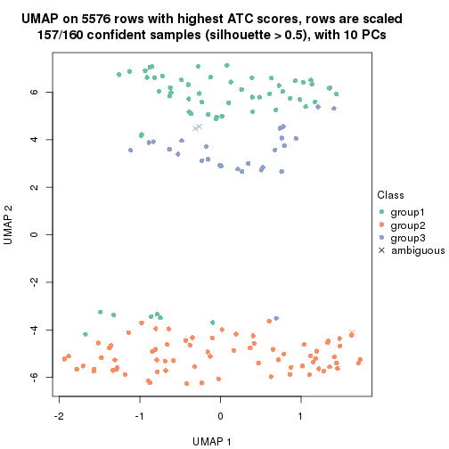</p>

</div>
<div id='tab-ATC-skmeans-dimension-reduction-3'>
<pre><code class="r">dimension_reduction(res, k = 4, method = &quot;UMAP&quot;)
</code></pre>

<p></p>

</div>
<div id='tab-ATC-skmeans-dimension-reduction-4'>
<pre><code class="r">dimension_reduction(res, k = 5, method = &quot;UMAP&quot;)
</code></pre>

<p></p>

</div>
<div id='tab-ATC-skmeans-dimension-reduction-5'>
<pre><code class="r">dimension_reduction(res, k = 6, method = &quot;UMAP&quot;)
</code></pre>

<p></p>

</div>
</div>


Following heatmap shows how subgroups are split when increasing `k`:

```r
collect_classes(res)
```


Test correlation between subgroups and known annotations. If the known
annotation is numeric, one-way ANOVA test is applied, and if the known
annotation is discrete, chi-squared contingency table test is applied.

```r
test_to_known_factors(res)
```

```
#>               n cell_type(p) k
#> ATC:skmeans 160     4.49e-20 2
#> ATC:skmeans 157     1.19e-24 3
#> ATC:skmeans 151     1.71e-28 4
#> ATC:skmeans 142     1.01e-25 5
#> ATC:skmeans 125     4.64e-22 6
```


If matrix rows can be associated to genes, consider to use `GO_Enrichment(res,
...)` to perform function enrichment for the signature genes.


 

---------------------------------------------------


### ATC:pam


The object with results only for a single top-value method and a single partition method 
can be extracted as:

```r
res = res_list["ATC", "pam"]
# you can also extract it by
# res = res_list["ATC:pam"]
```

A summary of `res` and all the functions that can be applied to it:

```r
res
```

```
#> A 'ConsensusPartition' object with k = 2, 3, 4, 5, 6.
#>   On a matrix with 5576 rows and 160 columns.
#>   Top rows (558, 1116, 1673, 2230, 2788) are extracted by 'ATC' method.
#>   Subgroups are detected by 'pam' method.
#>   Performed in total 1250 partitions by row resampling.
#>   Best k for subgroups seems to be 4.
#> 
#> Following methods can be applied to this 'ConsensusPartition' object:
#>  [1] "cola_report"             "collect_classes"         "collect_plots"          
#>  [4] "collect_stats"           "colnames"                "compare_signatures"     
#>  [7] "consensus_heatmap"       "dimension_reduction"     "functional_enrichment"  
#> [10] "get_anno_col"            "get_anno"                "get_classes"            
#> [13] "get_consensus"           "get_matrix"              "get_membership"         
#> [16] "get_param"               "get_signatures"          "get_stats"              
#> [19] "is_best_k"               "is_stable_k"             "membership_heatmap"     
#> [22] "ncol"                    "nrow"                    "plot_ecdf"              
#> [25] "rownames"                "select_partition_number" "show"                   
#> [28] "suggest_best_k"          "test_to_known_factors"
```

`collect_plots()` function collects all the plots made from `res` for all `k` (number of partitions)
into one single page to provide an easy and fast comparison between different `k`.

```r
collect_plots(res)
```


The plots are:

- The first row: a plot of the ECDF (Empirical cumulative distribution
  function) curves of the consensus matrix for each `k` and the heatmap of
  predicted classes for each `k`.
- The second row: heatmaps of the consensus matrix for each `k`.
- The third row: heatmaps of the membership matrix for each `k`.
- The fouth row: heatmaps of the signatures for each `k`.

All the plots in panels can be made by individual functions and they are
plotted later in this section.

`select_partition_number()` produces several plots showing different
statistics for choosing "optimized" `k`. There are following statistics:

- ECDF curves of the consensus matrix for each `k`;
- 1-PAC. [The PAC
  score](https://en.wikipedia.org/wiki/Consensus_clustering#Over-interpretation_potential_of_consensus_clustering)
  measures the proportion of the ambiguous subgrouping.
- Mean silhouette score.
- Concordance. The mean probability of fiting the consensus class ids in all
  partitions.
- Area increased. Denote $A_k$ as the area under the ECDF curve for current
  `k`, the area increased is defined as $A_k - A_{k-1}$.
- Rand index. The percent of pairs of samples that are both in a same cluster
  or both are not in a same cluster in the partition of k and k-1.
- Jaccard index. The ratio of pairs of samples are both in a same cluster in
  the partition of k and k-1 and the pairs of samples are both in a same
  cluster in the partition k or k-1.

The detailed explanations of these statistics can be found in [the cola
vignette](http://bioconductor.org/packages/devel/bioc/vignettes/cola/inst/doc/cola.html#toc_13).

Generally speaking, lower PAC score, higher mean silhouette score or higher
concordance corresponds to better partition. Rand index and Jaccard index
measure how similar the current partition is compared to partition with `k-1`.
If they are too similar, we won't accept `k` is better than `k-1`.

```r
select_partition_number(res)
```


The numeric values for all these statistics can be obtained by `get_stats()`.

```r
get_stats(res)
```

```
#>   k 1-PAC mean_silhouette concordance area_increased  Rand Jaccard
#> 2 2 0.556           0.869       0.927         0.4788 0.502   0.502
#> 3 3 0.734           0.765       0.829         0.2454 0.831   0.668
#> 4 4 0.869           0.869       0.949         0.1211 0.891   0.723
#> 5 5 0.800           0.784       0.914         0.0669 0.950   0.850
#> 6 6 0.769           0.729       0.889         0.0381 0.972   0.902
```

`suggest_best_k()` suggests the best $k$ based on these statistics. The rules are as follows:

- All $k$ with Jaccard index larger than 0.95 are removed because the increase of
  the partition number does not provides enough extra information. If all $k$ are removed,
  the best $k$ is assigned by `NA`.
- For $k$ with 1-PAC larger than 0.9, the maximal $k$ is taken as the "best k". Other $k$ is called "optional k".
- If it does not fit the second rule. The $k$ with the highest vote of highest
  1-PAC, mean silhouette and concordance is taken as the "best k".

```r
suggest_best_k(res)
```

```
#> [1] 4
```


Following shows the table of the partitions (You need to click the **show/hide
code output** link to see it). The membership matrix (columns with name `p*`)
is inferred by
[`clue::cl_consensus()`](https://www.rdocumentation.org/link/cl_consensus?package=clue)
function with the `SE` method. Basically the value in the membership matrix
represents the probability to belong to a certain group. The finall class
label for an item is determined with the group with highest probability it
belongs to.

In `get_classes()` function, the entropy is calculated from the membership
matrix and the silhouette score is calculated from the consensus matrix.


<script>
$( function() {
	$( '#tabs-ATC-pam-get-classes' ).tabs();
} );
</script>
<div id='tabs-ATC-pam-get-classes'>
<ul>
<li><a href='#tab-ATC-pam-get-classes-1'>k = 2</a></li>
<li><a href='#tab-ATC-pam-get-classes-2'>k = 3</a></li>
<li><a href='#tab-ATC-pam-get-classes-3'>k = 4</a></li>
<li><a href='#tab-ATC-pam-get-classes-4'>k = 5</a></li>
<li><a href='#tab-ATC-pam-get-classes-5'>k = 6</a></li>
</ul>

<div id='tab-ATC-pam-get-classes-1'>
<p><a id='tab-ATC-pam-get-classes-1-a' style='color:#0366d6' href='#'>show/hide code output</a></p>
<pre><code class="r">cbind(get_classes(res, k = 2), get_membership(res, k = 2))
</code></pre>

<pre><code>#&gt;                     class entropy silhouette    p1    p2
#&gt; aberrant_ERR2585320     2  0.0000      0.946 0.000 1.000
#&gt; aberrant_ERR2585338     2  0.0000      0.946 0.000 1.000
#&gt; aberrant_ERR2585325     2  0.0000      0.946 0.000 1.000
#&gt; aberrant_ERR2585283     1  0.9129      0.607 0.672 0.328
#&gt; aberrant_ERR2585343     2  0.0000      0.946 0.000 1.000
#&gt; aberrant_ERR2585329     2  0.0000      0.946 0.000 1.000
#&gt; aberrant_ERR2585317     2  0.0000      0.946 0.000 1.000
#&gt; aberrant_ERR2585339     2  0.0000      0.946 0.000 1.000
#&gt; aberrant_ERR2585335     2  0.0000      0.946 0.000 1.000
#&gt; aberrant_ERR2585287     2  0.9866      0.109 0.432 0.568
#&gt; aberrant_ERR2585321     2  0.0000      0.946 0.000 1.000
#&gt; aberrant_ERR2585297     1  0.0000      0.892 1.000 0.000
#&gt; aberrant_ERR2585337     2  0.0000      0.946 0.000 1.000
#&gt; aberrant_ERR2585319     2  0.0000      0.946 0.000 1.000
#&gt; aberrant_ERR2585315     2  0.0000      0.946 0.000 1.000
#&gt; aberrant_ERR2585336     2  0.0000      0.946 0.000 1.000
#&gt; aberrant_ERR2585307     2  0.4161      0.867 0.084 0.916
#&gt; aberrant_ERR2585301     2  0.2603      0.908 0.044 0.956
#&gt; aberrant_ERR2585326     2  0.0000      0.946 0.000 1.000
#&gt; aberrant_ERR2585331     2  0.0000      0.946 0.000 1.000
#&gt; aberrant_ERR2585346     1  0.4298      0.888 0.912 0.088
#&gt; aberrant_ERR2585314     2  0.0000      0.946 0.000 1.000
#&gt; aberrant_ERR2585298     1  0.6148      0.874 0.848 0.152
#&gt; aberrant_ERR2585345     2  0.0000      0.946 0.000 1.000
#&gt; aberrant_ERR2585299     1  0.0672      0.893 0.992 0.008
#&gt; aberrant_ERR2585309     1  0.0000      0.892 1.000 0.000
#&gt; aberrant_ERR2585303     2  0.0938      0.937 0.012 0.988
#&gt; aberrant_ERR2585313     2  0.0000      0.946 0.000 1.000
#&gt; aberrant_ERR2585318     2  0.0000      0.946 0.000 1.000
#&gt; aberrant_ERR2585328     2  0.7139      0.717 0.196 0.804
#&gt; aberrant_ERR2585330     2  0.0000      0.946 0.000 1.000
#&gt; aberrant_ERR2585293     1  0.0000      0.892 1.000 0.000
#&gt; aberrant_ERR2585342     2  0.0000      0.946 0.000 1.000
#&gt; aberrant_ERR2585348     2  0.0000      0.946 0.000 1.000
#&gt; aberrant_ERR2585352     2  0.0000      0.946 0.000 1.000
#&gt; aberrant_ERR2585308     1  0.0000      0.892 1.000 0.000
#&gt; aberrant_ERR2585349     2  0.0000      0.946 0.000 1.000
#&gt; aberrant_ERR2585316     2  0.5737      0.804 0.136 0.864
#&gt; aberrant_ERR2585306     1  0.6247      0.872 0.844 0.156
#&gt; aberrant_ERR2585324     2  0.0000      0.946 0.000 1.000
#&gt; aberrant_ERR2585310     1  0.7883      0.797 0.764 0.236
#&gt; aberrant_ERR2585296     1  0.6247      0.872 0.844 0.156
#&gt; aberrant_ERR2585275     1  0.9775      0.440 0.588 0.412
#&gt; aberrant_ERR2585311     2  0.0000      0.946 0.000 1.000
#&gt; aberrant_ERR2585292     1  0.0000      0.892 1.000 0.000
#&gt; aberrant_ERR2585282     2  0.0376      0.943 0.004 0.996
#&gt; aberrant_ERR2585305     1  0.9710      0.494 0.600 0.400
#&gt; aberrant_ERR2585278     2  0.0000      0.946 0.000 1.000
#&gt; aberrant_ERR2585347     2  0.0376      0.943 0.004 0.996
#&gt; aberrant_ERR2585332     2  0.0000      0.946 0.000 1.000
#&gt; aberrant_ERR2585280     2  0.7376      0.699 0.208 0.792
#&gt; aberrant_ERR2585304     1  0.8661      0.723 0.712 0.288
#&gt; aberrant_ERR2585322     2  0.0000      0.946 0.000 1.000
#&gt; aberrant_ERR2585279     2  0.9358      0.389 0.352 0.648
#&gt; aberrant_ERR2585277     2  0.0000      0.946 0.000 1.000
#&gt; aberrant_ERR2585295     2  0.9393      0.377 0.356 0.644
#&gt; aberrant_ERR2585333     2  0.0000      0.946 0.000 1.000
#&gt; aberrant_ERR2585285     2  0.0000      0.946 0.000 1.000
#&gt; aberrant_ERR2585286     2  0.0376      0.943 0.004 0.996
#&gt; aberrant_ERR2585294     2  0.8955      0.492 0.312 0.688
#&gt; aberrant_ERR2585300     2  0.0000      0.946 0.000 1.000
#&gt; aberrant_ERR2585334     2  0.9248      0.422 0.340 0.660
#&gt; aberrant_ERR2585361     2  0.0000      0.946 0.000 1.000
#&gt; aberrant_ERR2585372     2  0.0000      0.946 0.000 1.000
#&gt; round_ERR2585217        1  0.7883      0.797 0.764 0.236
#&gt; round_ERR2585205        1  0.0000      0.892 1.000 0.000
#&gt; round_ERR2585214        1  0.7883      0.797 0.764 0.236
#&gt; round_ERR2585202        1  0.7883      0.797 0.764 0.236
#&gt; aberrant_ERR2585367     2  0.0000      0.946 0.000 1.000
#&gt; round_ERR2585220        1  0.0672      0.893 0.992 0.008
#&gt; round_ERR2585238        1  0.0000      0.892 1.000 0.000
#&gt; aberrant_ERR2585276     2  0.8813      0.520 0.300 0.700
#&gt; round_ERR2585218        1  0.0000      0.892 1.000 0.000
#&gt; aberrant_ERR2585363     2  0.0000      0.946 0.000 1.000
#&gt; round_ERR2585201        1  0.6623      0.860 0.828 0.172
#&gt; round_ERR2585210        1  0.0000      0.892 1.000 0.000
#&gt; aberrant_ERR2585362     2  0.0000      0.946 0.000 1.000
#&gt; aberrant_ERR2585360     2  0.0000      0.946 0.000 1.000
#&gt; round_ERR2585209        1  0.6048      0.876 0.852 0.148
#&gt; round_ERR2585242        1  0.6148      0.874 0.848 0.152
#&gt; round_ERR2585216        1  0.0938      0.893 0.988 0.012
#&gt; round_ERR2585219        1  0.0938      0.893 0.988 0.012
#&gt; round_ERR2585237        1  0.7883      0.797 0.764 0.236
#&gt; round_ERR2585198        1  0.6712      0.857 0.824 0.176
#&gt; round_ERR2585211        1  0.0000      0.892 1.000 0.000
#&gt; round_ERR2585206        1  0.0000      0.892 1.000 0.000
#&gt; aberrant_ERR2585281     2  0.9393      0.377 0.356 0.644
#&gt; round_ERR2585212        1  0.3879      0.889 0.924 0.076
#&gt; round_ERR2585221        1  0.0000      0.892 1.000 0.000
#&gt; round_ERR2585243        1  0.0000      0.892 1.000 0.000
#&gt; round_ERR2585204        1  0.7883      0.797 0.764 0.236
#&gt; round_ERR2585213        1  0.8207      0.771 0.744 0.256
#&gt; aberrant_ERR2585373     2  0.0000      0.946 0.000 1.000
#&gt; aberrant_ERR2585358     2  0.0000      0.946 0.000 1.000
#&gt; aberrant_ERR2585365     2  0.0000      0.946 0.000 1.000
#&gt; aberrant_ERR2585359     2  0.0000      0.946 0.000 1.000
#&gt; aberrant_ERR2585370     2  0.0000      0.946 0.000 1.000
#&gt; round_ERR2585215        1  0.0000      0.892 1.000 0.000
#&gt; round_ERR2585262        1  0.8016      0.787 0.756 0.244
#&gt; round_ERR2585199        1  0.7883      0.797 0.764 0.236
#&gt; aberrant_ERR2585369     2  0.0000      0.946 0.000 1.000
#&gt; round_ERR2585208        1  0.0000      0.892 1.000 0.000
#&gt; round_ERR2585252        1  0.0000      0.892 1.000 0.000
#&gt; round_ERR2585236        1  0.5059      0.885 0.888 0.112
#&gt; aberrant_ERR2585284     1  0.8499      0.742 0.724 0.276
#&gt; round_ERR2585224        1  0.0000      0.892 1.000 0.000
#&gt; round_ERR2585260        1  0.0000      0.892 1.000 0.000
#&gt; round_ERR2585229        1  0.0000      0.892 1.000 0.000
#&gt; aberrant_ERR2585364     2  0.0000      0.946 0.000 1.000
#&gt; round_ERR2585253        1  0.0000      0.892 1.000 0.000
#&gt; aberrant_ERR2585368     2  0.0000      0.946 0.000 1.000
#&gt; aberrant_ERR2585371     2  0.0000      0.946 0.000 1.000
#&gt; round_ERR2585239        1  0.3274      0.891 0.940 0.060
#&gt; round_ERR2585273        1  0.0376      0.892 0.996 0.004
#&gt; round_ERR2585256        1  0.6148      0.874 0.848 0.152
#&gt; round_ERR2585272        1  0.0000      0.892 1.000 0.000
#&gt; round_ERR2585246        1  0.0000      0.892 1.000 0.000
#&gt; round_ERR2585261        1  0.6148      0.874 0.848 0.152
#&gt; round_ERR2585254        1  0.6148      0.874 0.848 0.152
#&gt; round_ERR2585225        1  0.6148      0.874 0.848 0.152
#&gt; round_ERR2585235        1  0.5946      0.877 0.856 0.144
#&gt; round_ERR2585271        1  0.0000      0.892 1.000 0.000
#&gt; round_ERR2585251        1  0.5059      0.885 0.888 0.112
#&gt; round_ERR2585255        1  0.7453      0.823 0.788 0.212
#&gt; round_ERR2585257        1  0.6531      0.863 0.832 0.168
#&gt; round_ERR2585226        1  0.6048      0.876 0.852 0.148
#&gt; round_ERR2585265        1  0.0000      0.892 1.000 0.000
#&gt; round_ERR2585259        1  0.5737      0.880 0.864 0.136
#&gt; round_ERR2585247        1  0.0000      0.892 1.000 0.000
#&gt; round_ERR2585241        1  0.0000      0.892 1.000 0.000
#&gt; round_ERR2585263        1  0.6148      0.874 0.848 0.152
#&gt; round_ERR2585264        1  0.0000      0.892 1.000 0.000
#&gt; round_ERR2585233        1  0.6148      0.874 0.848 0.152
#&gt; round_ERR2585223        1  0.0000      0.892 1.000 0.000
#&gt; round_ERR2585234        1  0.6438      0.866 0.836 0.164
#&gt; round_ERR2585222        1  0.6048      0.876 0.852 0.148
#&gt; round_ERR2585228        1  0.0000      0.892 1.000 0.000
#&gt; round_ERR2585248        1  0.0000      0.892 1.000 0.000
#&gt; round_ERR2585240        1  0.6148      0.874 0.848 0.152
#&gt; round_ERR2585270        1  0.5629      0.881 0.868 0.132
#&gt; round_ERR2585232        1  0.6148      0.874 0.848 0.152
#&gt; aberrant_ERR2585341     2  0.2948      0.900 0.052 0.948
#&gt; aberrant_ERR2585355     2  0.0000      0.946 0.000 1.000
#&gt; round_ERR2585227        1  0.5178      0.884 0.884 0.116
#&gt; aberrant_ERR2585351     2  0.0000      0.946 0.000 1.000
#&gt; round_ERR2585269        1  0.0000      0.892 1.000 0.000
#&gt; aberrant_ERR2585357     2  0.0000      0.946 0.000 1.000
#&gt; aberrant_ERR2585350     2  0.0000      0.946 0.000 1.000
#&gt; round_ERR2585250        1  0.6148      0.874 0.848 0.152
#&gt; round_ERR2585245        1  0.0000      0.892 1.000 0.000
#&gt; aberrant_ERR2585353     2  0.0000      0.946 0.000 1.000
#&gt; round_ERR2585258        1  0.0000      0.892 1.000 0.000
#&gt; aberrant_ERR2585354     2  0.0000      0.946 0.000 1.000
#&gt; round_ERR2585249        1  0.0000      0.892 1.000 0.000
#&gt; round_ERR2585268        1  0.6148      0.874 0.848 0.152
#&gt; aberrant_ERR2585356     2  0.0000      0.946 0.000 1.000
#&gt; round_ERR2585266        1  0.6148      0.874 0.848 0.152
#&gt; round_ERR2585231        1  0.0000      0.892 1.000 0.000
#&gt; round_ERR2585230        1  0.2948      0.891 0.948 0.052
#&gt; round_ERR2585267        1  0.0000      0.892 1.000 0.000
</code></pre>

<script>
$('#tab-ATC-pam-get-classes-1-a').parent().next().next().hide();
$('#tab-ATC-pam-get-classes-1-a').click(function(){
  $('#tab-ATC-pam-get-classes-1-a').parent().next().next().toggle();
  return(false);
});
</script>
</div>

<div id='tab-ATC-pam-get-classes-2'>
<p><a id='tab-ATC-pam-get-classes-2-a' style='color:#0366d6' href='#'>show/hide code output</a></p>
<pre><code class="r">cbind(get_classes(res, k = 3), get_membership(res, k = 3))
</code></pre>

<pre><code>#&gt;                     class entropy silhouette    p1    p2    p3
#&gt; aberrant_ERR2585320     2  0.0000      0.929 0.000 1.000 0.000
#&gt; aberrant_ERR2585338     2  0.0000      0.929 0.000 1.000 0.000
#&gt; aberrant_ERR2585325     2  0.0000      0.929 0.000 1.000 0.000
#&gt; aberrant_ERR2585283     1  0.7708      0.366 0.528 0.048 0.424
#&gt; aberrant_ERR2585343     2  0.0000      0.929 0.000 1.000 0.000
#&gt; aberrant_ERR2585329     2  0.0000      0.929 0.000 1.000 0.000
#&gt; aberrant_ERR2585317     2  0.0000      0.929 0.000 1.000 0.000
#&gt; aberrant_ERR2585339     2  0.0000      0.929 0.000 1.000 0.000
#&gt; aberrant_ERR2585335     2  0.0000      0.929 0.000 1.000 0.000
#&gt; aberrant_ERR2585287     2  0.9576     -0.310 0.396 0.408 0.196
#&gt; aberrant_ERR2585321     2  0.0000      0.929 0.000 1.000 0.000
#&gt; aberrant_ERR2585297     1  0.0000      0.806 1.000 0.000 0.000
#&gt; aberrant_ERR2585337     2  0.0000      0.929 0.000 1.000 0.000
#&gt; aberrant_ERR2585319     2  0.0000      0.929 0.000 1.000 0.000
#&gt; aberrant_ERR2585315     2  0.0000      0.929 0.000 1.000 0.000
#&gt; aberrant_ERR2585336     2  0.0000      0.929 0.000 1.000 0.000
#&gt; aberrant_ERR2585307     2  0.2711      0.843 0.088 0.912 0.000
#&gt; aberrant_ERR2585301     2  0.2173      0.881 0.048 0.944 0.008
#&gt; aberrant_ERR2585326     2  0.0000      0.929 0.000 1.000 0.000
#&gt; aberrant_ERR2585331     2  0.0000      0.929 0.000 1.000 0.000
#&gt; aberrant_ERR2585346     1  0.6516      0.362 0.516 0.004 0.480
#&gt; aberrant_ERR2585314     2  0.0000      0.929 0.000 1.000 0.000
#&gt; aberrant_ERR2585298     3  0.6688      0.942 0.408 0.012 0.580
#&gt; aberrant_ERR2585345     2  0.0000      0.929 0.000 1.000 0.000
#&gt; aberrant_ERR2585299     1  0.0000      0.806 1.000 0.000 0.000
#&gt; aberrant_ERR2585309     1  0.0000      0.806 1.000 0.000 0.000
#&gt; aberrant_ERR2585303     2  0.0592      0.919 0.012 0.988 0.000
#&gt; aberrant_ERR2585313     2  0.0000      0.929 0.000 1.000 0.000
#&gt; aberrant_ERR2585318     2  0.0000      0.929 0.000 1.000 0.000
#&gt; aberrant_ERR2585328     2  0.5318      0.669 0.204 0.780 0.016
#&gt; aberrant_ERR2585330     2  0.0000      0.929 0.000 1.000 0.000
#&gt; aberrant_ERR2585293     1  0.6192      0.396 0.580 0.000 0.420
#&gt; aberrant_ERR2585342     2  0.0000      0.929 0.000 1.000 0.000
#&gt; aberrant_ERR2585348     2  0.0000      0.929 0.000 1.000 0.000
#&gt; aberrant_ERR2585352     2  0.0000      0.929 0.000 1.000 0.000
#&gt; aberrant_ERR2585308     1  0.0000      0.806 1.000 0.000 0.000
#&gt; aberrant_ERR2585349     2  0.0000      0.929 0.000 1.000 0.000
#&gt; aberrant_ERR2585316     2  0.4485      0.766 0.136 0.844 0.020
#&gt; aberrant_ERR2585306     1  0.1337      0.774 0.972 0.016 0.012
#&gt; aberrant_ERR2585324     2  0.0000      0.929 0.000 1.000 0.000
#&gt; aberrant_ERR2585310     3  0.6950      0.930 0.408 0.020 0.572
#&gt; aberrant_ERR2585296     3  0.6688      0.942 0.408 0.012 0.580
#&gt; aberrant_ERR2585275     3  0.8646     -0.227 0.320 0.124 0.556
#&gt; aberrant_ERR2585311     2  0.0000      0.929 0.000 1.000 0.000
#&gt; aberrant_ERR2585292     1  0.6192      0.396 0.580 0.000 0.420
#&gt; aberrant_ERR2585282     2  0.0237      0.926 0.004 0.996 0.000
#&gt; aberrant_ERR2585305     2  0.9956     -0.427 0.352 0.360 0.288
#&gt; aberrant_ERR2585278     2  0.0000      0.929 0.000 1.000 0.000
#&gt; aberrant_ERR2585347     2  0.0424      0.922 0.008 0.992 0.000
#&gt; aberrant_ERR2585332     2  0.0000      0.929 0.000 1.000 0.000
#&gt; aberrant_ERR2585280     2  0.5461      0.650 0.216 0.768 0.016
#&gt; aberrant_ERR2585304     3  0.6811      0.935 0.404 0.016 0.580
#&gt; aberrant_ERR2585322     2  0.0000      0.929 0.000 1.000 0.000
#&gt; aberrant_ERR2585279     1  0.9967     -0.302 0.364 0.340 0.296
#&gt; aberrant_ERR2585277     2  0.0000      0.929 0.000 1.000 0.000
#&gt; aberrant_ERR2585295     2  0.9724     -0.292 0.364 0.412 0.224
#&gt; aberrant_ERR2585333     2  0.0000      0.929 0.000 1.000 0.000
#&gt; aberrant_ERR2585285     2  0.0000      0.929 0.000 1.000 0.000
#&gt; aberrant_ERR2585286     2  0.0237      0.926 0.004 0.996 0.000
#&gt; aberrant_ERR2585294     2  0.7918      0.287 0.328 0.596 0.076
#&gt; aberrant_ERR2585300     2  0.0000      0.929 0.000 1.000 0.000
#&gt; aberrant_ERR2585334     2  0.8533      0.104 0.360 0.536 0.104
#&gt; aberrant_ERR2585361     2  0.0000      0.929 0.000 1.000 0.000
#&gt; aberrant_ERR2585372     2  0.0000      0.929 0.000 1.000 0.000
#&gt; round_ERR2585217        3  0.6688      0.942 0.408 0.012 0.580
#&gt; round_ERR2585205        1  0.0000      0.806 1.000 0.000 0.000
#&gt; round_ERR2585214        3  0.6688      0.942 0.408 0.012 0.580
#&gt; round_ERR2585202        3  0.6688      0.942 0.408 0.012 0.580
#&gt; aberrant_ERR2585367     2  0.0000      0.929 0.000 1.000 0.000
#&gt; round_ERR2585220        1  0.4750      0.339 0.784 0.000 0.216
#&gt; round_ERR2585238        1  0.0000      0.806 1.000 0.000 0.000
#&gt; aberrant_ERR2585276     2  0.8125      0.229 0.340 0.576 0.084
#&gt; round_ERR2585218        1  0.0000      0.806 1.000 0.000 0.000
#&gt; aberrant_ERR2585363     2  0.0000      0.929 0.000 1.000 0.000
#&gt; round_ERR2585201        3  0.6688      0.942 0.408 0.012 0.580
#&gt; round_ERR2585210        1  0.1529      0.757 0.960 0.000 0.040
#&gt; aberrant_ERR2585362     2  0.0000      0.929 0.000 1.000 0.000
#&gt; aberrant_ERR2585360     2  0.0000      0.929 0.000 1.000 0.000
#&gt; round_ERR2585209        3  0.6553      0.936 0.412 0.008 0.580
#&gt; round_ERR2585242        3  0.6688      0.942 0.408 0.012 0.580
#&gt; round_ERR2585216        3  0.6280      0.861 0.460 0.000 0.540
#&gt; round_ERR2585219        1  0.5058      0.231 0.756 0.000 0.244
#&gt; round_ERR2585237        3  0.6688      0.942 0.408 0.012 0.580
#&gt; round_ERR2585198        3  0.6688      0.942 0.408 0.012 0.580
#&gt; round_ERR2585211        1  0.0000      0.806 1.000 0.000 0.000
#&gt; round_ERR2585206        1  0.0000      0.806 1.000 0.000 0.000
#&gt; aberrant_ERR2585281     2  0.9678     -0.270 0.364 0.420 0.216
#&gt; round_ERR2585212        1  0.6309     -0.774 0.504 0.000 0.496
#&gt; round_ERR2585221        1  0.0000      0.806 1.000 0.000 0.000
#&gt; round_ERR2585243        1  0.3116      0.646 0.892 0.000 0.108
#&gt; round_ERR2585204        3  0.6688      0.942 0.408 0.012 0.580
#&gt; round_ERR2585213        3  0.6688      0.942 0.408 0.012 0.580
#&gt; aberrant_ERR2585373     2  0.0000      0.929 0.000 1.000 0.000
#&gt; aberrant_ERR2585358     2  0.0000      0.929 0.000 1.000 0.000
#&gt; aberrant_ERR2585365     2  0.0000      0.929 0.000 1.000 0.000
#&gt; aberrant_ERR2585359     2  0.0000      0.929 0.000 1.000 0.000
#&gt; aberrant_ERR2585370     2  0.0000      0.929 0.000 1.000 0.000
#&gt; round_ERR2585215        1  0.0747      0.789 0.984 0.000 0.016
#&gt; round_ERR2585262        3  0.7389      0.902 0.408 0.036 0.556
#&gt; round_ERR2585199        3  0.6688      0.942 0.408 0.012 0.580
#&gt; aberrant_ERR2585369     2  0.0000      0.929 0.000 1.000 0.000
#&gt; round_ERR2585208        1  0.0000      0.806 1.000 0.000 0.000
#&gt; round_ERR2585252        1  0.0000      0.806 1.000 0.000 0.000
#&gt; round_ERR2585236        3  0.6398      0.928 0.416 0.004 0.580
#&gt; aberrant_ERR2585284     3  0.5536      0.612 0.236 0.012 0.752
#&gt; round_ERR2585224        1  0.0000      0.806 1.000 0.000 0.000
#&gt; round_ERR2585260        1  0.0892      0.784 0.980 0.000 0.020
#&gt; round_ERR2585229        1  0.0000      0.806 1.000 0.000 0.000
#&gt; aberrant_ERR2585364     2  0.0000      0.929 0.000 1.000 0.000
#&gt; round_ERR2585253        1  0.0000      0.806 1.000 0.000 0.000
#&gt; aberrant_ERR2585368     2  0.0000      0.929 0.000 1.000 0.000
#&gt; aberrant_ERR2585371     2  0.0000      0.929 0.000 1.000 0.000
#&gt; round_ERR2585239        1  0.6713     -0.565 0.572 0.012 0.416
#&gt; round_ERR2585273        1  0.2625      0.683 0.916 0.000 0.084
#&gt; round_ERR2585256        3  0.6688      0.942 0.408 0.012 0.580
#&gt; round_ERR2585272        1  0.6291     -0.697 0.532 0.000 0.468
#&gt; round_ERR2585246        1  0.0000      0.806 1.000 0.000 0.000
#&gt; round_ERR2585261        3  0.6688      0.942 0.408 0.012 0.580
#&gt; round_ERR2585254        3  0.6688      0.942 0.408 0.012 0.580
#&gt; round_ERR2585225        3  0.6688      0.942 0.408 0.012 0.580
#&gt; round_ERR2585235        3  0.6688      0.942 0.408 0.012 0.580
#&gt; round_ERR2585271        1  0.0237      0.802 0.996 0.000 0.004
#&gt; round_ERR2585251        3  0.6625      0.900 0.440 0.008 0.552
#&gt; round_ERR2585255        3  0.6688      0.942 0.408 0.012 0.580
#&gt; round_ERR2585257        3  0.6688      0.942 0.408 0.012 0.580
#&gt; round_ERR2585226        3  0.6813      0.847 0.468 0.012 0.520
#&gt; round_ERR2585265        1  0.0237      0.802 0.996 0.000 0.004
#&gt; round_ERR2585259        3  0.6688      0.942 0.408 0.012 0.580
#&gt; round_ERR2585247        1  0.0000      0.806 1.000 0.000 0.000
#&gt; round_ERR2585241        1  0.0000      0.806 1.000 0.000 0.000
#&gt; round_ERR2585263        3  0.6688      0.942 0.408 0.012 0.580
#&gt; round_ERR2585264        1  0.0000      0.806 1.000 0.000 0.000
#&gt; round_ERR2585233        3  0.6688      0.942 0.408 0.012 0.580
#&gt; round_ERR2585223        1  0.0000      0.806 1.000 0.000 0.000
#&gt; round_ERR2585234        3  0.6688      0.942 0.408 0.012 0.580
#&gt; round_ERR2585222        1  0.6675     -0.539 0.584 0.012 0.404
#&gt; round_ERR2585228        1  0.0000      0.806 1.000 0.000 0.000
#&gt; round_ERR2585248        1  0.0000      0.806 1.000 0.000 0.000
#&gt; round_ERR2585240        3  0.6688      0.942 0.408 0.012 0.580
#&gt; round_ERR2585270        3  0.6822      0.819 0.480 0.012 0.508
#&gt; round_ERR2585232        3  0.6688      0.942 0.408 0.012 0.580
#&gt; aberrant_ERR2585341     2  0.1860      0.881 0.052 0.948 0.000
#&gt; aberrant_ERR2585355     2  0.0000      0.929 0.000 1.000 0.000
#&gt; round_ERR2585227        3  0.6625      0.900 0.440 0.008 0.552
#&gt; aberrant_ERR2585351     2  0.0000      0.929 0.000 1.000 0.000
#&gt; round_ERR2585269        1  0.0000      0.806 1.000 0.000 0.000
#&gt; aberrant_ERR2585357     2  0.0000      0.929 0.000 1.000 0.000
#&gt; aberrant_ERR2585350     2  0.0000      0.929 0.000 1.000 0.000
#&gt; round_ERR2585250        3  0.6688      0.942 0.408 0.012 0.580
#&gt; round_ERR2585245        1  0.0000      0.806 1.000 0.000 0.000
#&gt; aberrant_ERR2585353     2  0.0000      0.929 0.000 1.000 0.000
#&gt; round_ERR2585258        1  0.0000      0.806 1.000 0.000 0.000
#&gt; aberrant_ERR2585354     2  0.0000      0.929 0.000 1.000 0.000
#&gt; round_ERR2585249        1  0.0000      0.806 1.000 0.000 0.000
#&gt; round_ERR2585268        3  0.6763      0.905 0.436 0.012 0.552
#&gt; aberrant_ERR2585356     2  0.0000      0.929 0.000 1.000 0.000
#&gt; round_ERR2585266        3  0.6688      0.942 0.408 0.012 0.580
#&gt; round_ERR2585231        1  0.0000      0.806 1.000 0.000 0.000
#&gt; round_ERR2585230        1  0.5659      0.195 0.740 0.012 0.248
#&gt; round_ERR2585267        1  0.0000      0.806 1.000 0.000 0.000
</code></pre>

<script>
$('#tab-ATC-pam-get-classes-2-a').parent().next().next().hide();
$('#tab-ATC-pam-get-classes-2-a').click(function(){
  $('#tab-ATC-pam-get-classes-2-a').parent().next().next().toggle();
  return(false);
});
</script>
</div>

<div id='tab-ATC-pam-get-classes-3'>
<p><a id='tab-ATC-pam-get-classes-3-a' style='color:#0366d6' href='#'>show/hide code output</a></p>
<pre><code class="r">cbind(get_classes(res, k = 4), get_membership(res, k = 4))
</code></pre>

<pre><code>#&gt;                     class entropy silhouette    p1    p2    p3    p4
#&gt; aberrant_ERR2585320     2  0.0000     0.9664 0.000 1.000 0.000 0.000
#&gt; aberrant_ERR2585338     2  0.0000     0.9664 0.000 1.000 0.000 0.000
#&gt; aberrant_ERR2585325     2  0.0000     0.9664 0.000 1.000 0.000 0.000
#&gt; aberrant_ERR2585283     4  0.0000     0.9385 0.000 0.000 0.000 1.000
#&gt; aberrant_ERR2585343     2  0.0000     0.9664 0.000 1.000 0.000 0.000
#&gt; aberrant_ERR2585329     2  0.0000     0.9664 0.000 1.000 0.000 0.000
#&gt; aberrant_ERR2585317     2  0.0000     0.9664 0.000 1.000 0.000 0.000
#&gt; aberrant_ERR2585339     2  0.0000     0.9664 0.000 1.000 0.000 0.000
#&gt; aberrant_ERR2585335     2  0.0000     0.9664 0.000 1.000 0.000 0.000
#&gt; aberrant_ERR2585287     3  0.4817     0.3980 0.000 0.388 0.612 0.000
#&gt; aberrant_ERR2585321     2  0.0000     0.9664 0.000 1.000 0.000 0.000
#&gt; aberrant_ERR2585297     1  0.0817     0.9266 0.976 0.000 0.024 0.000
#&gt; aberrant_ERR2585337     2  0.0000     0.9664 0.000 1.000 0.000 0.000
#&gt; aberrant_ERR2585319     2  0.0000     0.9664 0.000 1.000 0.000 0.000
#&gt; aberrant_ERR2585315     2  0.0000     0.9664 0.000 1.000 0.000 0.000
#&gt; aberrant_ERR2585336     2  0.0000     0.9664 0.000 1.000 0.000 0.000
#&gt; aberrant_ERR2585307     2  0.2149     0.8683 0.000 0.912 0.088 0.000
#&gt; aberrant_ERR2585301     2  0.1557     0.9082 0.000 0.944 0.056 0.000
#&gt; aberrant_ERR2585326     2  0.0000     0.9664 0.000 1.000 0.000 0.000
#&gt; aberrant_ERR2585331     2  0.0000     0.9664 0.000 1.000 0.000 0.000
#&gt; aberrant_ERR2585346     4  0.4040     0.6820 0.248 0.000 0.000 0.752
#&gt; aberrant_ERR2585314     2  0.0000     0.9664 0.000 1.000 0.000 0.000
#&gt; aberrant_ERR2585298     3  0.0000     0.8805 0.000 0.000 1.000 0.000
#&gt; aberrant_ERR2585345     2  0.0000     0.9664 0.000 1.000 0.000 0.000
#&gt; aberrant_ERR2585299     1  0.0921     0.9254 0.972 0.000 0.028 0.000
#&gt; aberrant_ERR2585309     1  0.0000     0.9307 1.000 0.000 0.000 0.000
#&gt; aberrant_ERR2585303     2  0.0469     0.9548 0.000 0.988 0.012 0.000
#&gt; aberrant_ERR2585313     2  0.0000     0.9664 0.000 1.000 0.000 0.000
#&gt; aberrant_ERR2585318     2  0.0000     0.9664 0.000 1.000 0.000 0.000
#&gt; aberrant_ERR2585328     2  0.3801     0.6811 0.000 0.780 0.220 0.000
#&gt; aberrant_ERR2585330     2  0.0000     0.9664 0.000 1.000 0.000 0.000
#&gt; aberrant_ERR2585293     4  0.0000     0.9385 0.000 0.000 0.000 1.000
#&gt; aberrant_ERR2585342     2  0.0000     0.9664 0.000 1.000 0.000 0.000
#&gt; aberrant_ERR2585348     2  0.0000     0.9664 0.000 1.000 0.000 0.000
#&gt; aberrant_ERR2585352     2  0.0000     0.9664 0.000 1.000 0.000 0.000
#&gt; aberrant_ERR2585308     1  0.0000     0.9307 1.000 0.000 0.000 0.000
#&gt; aberrant_ERR2585349     2  0.0000     0.9664 0.000 1.000 0.000 0.000
#&gt; aberrant_ERR2585316     2  0.3123     0.7777 0.000 0.844 0.156 0.000
#&gt; aberrant_ERR2585306     1  0.0779     0.9251 0.980 0.004 0.016 0.000
#&gt; aberrant_ERR2585324     2  0.0000     0.9664 0.000 1.000 0.000 0.000
#&gt; aberrant_ERR2585310     3  0.0336     0.8756 0.000 0.008 0.992 0.000
#&gt; aberrant_ERR2585296     3  0.0000     0.8805 0.000 0.000 1.000 0.000
#&gt; aberrant_ERR2585275     4  0.0000     0.9385 0.000 0.000 0.000 1.000
#&gt; aberrant_ERR2585311     2  0.0000     0.9664 0.000 1.000 0.000 0.000
#&gt; aberrant_ERR2585292     4  0.0000     0.9385 0.000 0.000 0.000 1.000
#&gt; aberrant_ERR2585282     2  0.0188     0.9627 0.000 0.996 0.004 0.000
#&gt; aberrant_ERR2585305     3  0.4730     0.4131 0.000 0.364 0.636 0.000
#&gt; aberrant_ERR2585278     2  0.0000     0.9664 0.000 1.000 0.000 0.000
#&gt; aberrant_ERR2585347     2  0.0336     0.9591 0.000 0.992 0.008 0.000
#&gt; aberrant_ERR2585332     2  0.0000     0.9664 0.000 1.000 0.000 0.000
#&gt; aberrant_ERR2585280     2  0.3975     0.6502 0.000 0.760 0.240 0.000
#&gt; aberrant_ERR2585304     3  0.0000     0.8805 0.000 0.000 1.000 0.000
#&gt; aberrant_ERR2585322     2  0.0000     0.9664 0.000 1.000 0.000 0.000
#&gt; aberrant_ERR2585279     3  0.4304     0.5437 0.000 0.284 0.716 0.000
#&gt; aberrant_ERR2585277     2  0.0000     0.9664 0.000 1.000 0.000 0.000
#&gt; aberrant_ERR2585295     3  0.4697     0.4442 0.000 0.356 0.644 0.000
#&gt; aberrant_ERR2585333     2  0.0000     0.9664 0.000 1.000 0.000 0.000
#&gt; aberrant_ERR2585285     2  0.0000     0.9664 0.000 1.000 0.000 0.000
#&gt; aberrant_ERR2585286     2  0.0188     0.9627 0.000 0.996 0.004 0.000
#&gt; aberrant_ERR2585294     2  0.4948     0.1576 0.000 0.560 0.440 0.000
#&gt; aberrant_ERR2585300     2  0.0000     0.9664 0.000 1.000 0.000 0.000
#&gt; aberrant_ERR2585334     3  0.4999     0.0766 0.000 0.492 0.508 0.000
#&gt; aberrant_ERR2585361     2  0.0000     0.9664 0.000 1.000 0.000 0.000
#&gt; aberrant_ERR2585372     2  0.0000     0.9664 0.000 1.000 0.000 0.000
#&gt; round_ERR2585217        3  0.0000     0.8805 0.000 0.000 1.000 0.000
#&gt; round_ERR2585205        1  0.2868     0.8199 0.864 0.000 0.136 0.000
#&gt; round_ERR2585214        3  0.0000     0.8805 0.000 0.000 1.000 0.000
#&gt; round_ERR2585202        3  0.0000     0.8805 0.000 0.000 1.000 0.000
#&gt; aberrant_ERR2585367     2  0.0000     0.9664 0.000 1.000 0.000 0.000
#&gt; round_ERR2585220        3  0.4888     0.2995 0.412 0.000 0.588 0.000
#&gt; round_ERR2585238        1  0.0000     0.9307 1.000 0.000 0.000 0.000
#&gt; aberrant_ERR2585276     2  0.4972     0.0977 0.000 0.544 0.456 0.000
#&gt; round_ERR2585218        1  0.0188     0.9310 0.996 0.000 0.004 0.000
#&gt; aberrant_ERR2585363     2  0.0000     0.9664 0.000 1.000 0.000 0.000
#&gt; round_ERR2585201        3  0.0000     0.8805 0.000 0.000 1.000 0.000
#&gt; round_ERR2585210        1  0.3123     0.7934 0.844 0.000 0.156 0.000
#&gt; aberrant_ERR2585362     2  0.0000     0.9664 0.000 1.000 0.000 0.000
#&gt; aberrant_ERR2585360     2  0.0000     0.9664 0.000 1.000 0.000 0.000
#&gt; round_ERR2585209        3  0.0000     0.8805 0.000 0.000 1.000 0.000
#&gt; round_ERR2585242        3  0.0000     0.8805 0.000 0.000 1.000 0.000
#&gt; round_ERR2585216        3  0.1022     0.8644 0.032 0.000 0.968 0.000
#&gt; round_ERR2585219        3  0.4933     0.2325 0.432 0.000 0.568 0.000
#&gt; round_ERR2585237        3  0.0000     0.8805 0.000 0.000 1.000 0.000
#&gt; round_ERR2585198        3  0.0000     0.8805 0.000 0.000 1.000 0.000
#&gt; round_ERR2585211        1  0.1022     0.9232 0.968 0.000 0.032 0.000
#&gt; round_ERR2585206        1  0.0469     0.9301 0.988 0.000 0.012 0.000
#&gt; aberrant_ERR2585281     3  0.4730     0.4331 0.000 0.364 0.636 0.000
#&gt; round_ERR2585212        3  0.1867     0.8352 0.072 0.000 0.928 0.000
#&gt; round_ERR2585221        1  0.3311     0.7420 0.828 0.000 0.172 0.000
#&gt; round_ERR2585243        1  0.4134     0.6138 0.740 0.000 0.260 0.000
#&gt; round_ERR2585204        3  0.0000     0.8805 0.000 0.000 1.000 0.000
#&gt; round_ERR2585213        3  0.0000     0.8805 0.000 0.000 1.000 0.000
#&gt; aberrant_ERR2585373     2  0.0000     0.9664 0.000 1.000 0.000 0.000
#&gt; aberrant_ERR2585358     2  0.0000     0.9664 0.000 1.000 0.000 0.000
#&gt; aberrant_ERR2585365     2  0.0000     0.9664 0.000 1.000 0.000 0.000
#&gt; aberrant_ERR2585359     2  0.0000     0.9664 0.000 1.000 0.000 0.000
#&gt; aberrant_ERR2585370     2  0.0000     0.9664 0.000 1.000 0.000 0.000
#&gt; round_ERR2585215        1  0.2345     0.8687 0.900 0.000 0.100 0.000
#&gt; round_ERR2585262        3  0.0817     0.8633 0.000 0.024 0.976 0.000
#&gt; round_ERR2585199        3  0.0000     0.8805 0.000 0.000 1.000 0.000
#&gt; aberrant_ERR2585369     2  0.0000     0.9664 0.000 1.000 0.000 0.000
#&gt; round_ERR2585208        1  0.0000     0.9307 1.000 0.000 0.000 0.000
#&gt; round_ERR2585252        1  0.0000     0.9307 1.000 0.000 0.000 0.000
#&gt; round_ERR2585236        3  0.0000     0.8805 0.000 0.000 1.000 0.000
#&gt; aberrant_ERR2585284     3  0.4511     0.6517 0.040 0.000 0.784 0.176
#&gt; round_ERR2585224        1  0.0000     0.9307 1.000 0.000 0.000 0.000
#&gt; round_ERR2585260        1  0.2647     0.8428 0.880 0.000 0.120 0.000
#&gt; round_ERR2585229        1  0.0000     0.9307 1.000 0.000 0.000 0.000
#&gt; aberrant_ERR2585364     2  0.0000     0.9664 0.000 1.000 0.000 0.000
#&gt; round_ERR2585253        1  0.0000     0.9307 1.000 0.000 0.000 0.000
#&gt; aberrant_ERR2585368     2  0.0000     0.9664 0.000 1.000 0.000 0.000
#&gt; aberrant_ERR2585371     2  0.0000     0.9664 0.000 1.000 0.000 0.000
#&gt; round_ERR2585239        3  0.2868     0.7688 0.136 0.000 0.864 0.000
#&gt; round_ERR2585273        1  0.3172     0.7874 0.840 0.000 0.160 0.000
#&gt; round_ERR2585256        3  0.0000     0.8805 0.000 0.000 1.000 0.000
#&gt; round_ERR2585272        3  0.2281     0.8121 0.096 0.000 0.904 0.000
#&gt; round_ERR2585246        1  0.0817     0.9252 0.976 0.000 0.024 0.000
#&gt; round_ERR2585261        3  0.0000     0.8805 0.000 0.000 1.000 0.000
#&gt; round_ERR2585254        3  0.0000     0.8805 0.000 0.000 1.000 0.000
#&gt; round_ERR2585225        3  0.0000     0.8805 0.000 0.000 1.000 0.000
#&gt; round_ERR2585235        3  0.0000     0.8805 0.000 0.000 1.000 0.000
#&gt; round_ERR2585271        1  0.1637     0.9058 0.940 0.000 0.060 0.000
#&gt; round_ERR2585251        3  0.0921     0.8669 0.028 0.000 0.972 0.000
#&gt; round_ERR2585255        3  0.0000     0.8805 0.000 0.000 1.000 0.000
#&gt; round_ERR2585257        3  0.0000     0.8805 0.000 0.000 1.000 0.000
#&gt; round_ERR2585226        3  0.1557     0.8473 0.056 0.000 0.944 0.000
#&gt; round_ERR2585265        1  0.2011     0.8878 0.920 0.000 0.080 0.000
#&gt; round_ERR2585259        3  0.0000     0.8805 0.000 0.000 1.000 0.000
#&gt; round_ERR2585247        1  0.1867     0.8948 0.928 0.000 0.072 0.000
#&gt; round_ERR2585241        1  0.1637     0.8950 0.940 0.000 0.060 0.000
#&gt; round_ERR2585263        3  0.0000     0.8805 0.000 0.000 1.000 0.000
#&gt; round_ERR2585264        1  0.0000     0.9307 1.000 0.000 0.000 0.000
#&gt; round_ERR2585233        3  0.0000     0.8805 0.000 0.000 1.000 0.000
#&gt; round_ERR2585223        1  0.0336     0.9301 0.992 0.000 0.008 0.000
#&gt; round_ERR2585234        3  0.0000     0.8805 0.000 0.000 1.000 0.000
#&gt; round_ERR2585222        3  0.3400     0.7214 0.180 0.000 0.820 0.000
#&gt; round_ERR2585228        1  0.1716     0.9011 0.936 0.000 0.064 0.000
#&gt; round_ERR2585248        1  0.0000     0.9307 1.000 0.000 0.000 0.000
#&gt; round_ERR2585240        3  0.0000     0.8805 0.000 0.000 1.000 0.000
#&gt; round_ERR2585270        3  0.2345     0.8057 0.100 0.000 0.900 0.000
#&gt; round_ERR2585232        3  0.0000     0.8805 0.000 0.000 1.000 0.000
#&gt; aberrant_ERR2585341     2  0.1557     0.9069 0.000 0.944 0.056 0.000
#&gt; aberrant_ERR2585355     2  0.0000     0.9664 0.000 1.000 0.000 0.000
#&gt; round_ERR2585227        3  0.1022     0.8647 0.032 0.000 0.968 0.000
#&gt; aberrant_ERR2585351     2  0.0000     0.9664 0.000 1.000 0.000 0.000
#&gt; round_ERR2585269        1  0.0000     0.9307 1.000 0.000 0.000 0.000
#&gt; aberrant_ERR2585357     2  0.0000     0.9664 0.000 1.000 0.000 0.000
#&gt; aberrant_ERR2585350     2  0.0000     0.9664 0.000 1.000 0.000 0.000
#&gt; round_ERR2585250        3  0.0000     0.8805 0.000 0.000 1.000 0.000
#&gt; round_ERR2585245        1  0.0000     0.9307 1.000 0.000 0.000 0.000
#&gt; aberrant_ERR2585353     2  0.0000     0.9664 0.000 1.000 0.000 0.000
#&gt; round_ERR2585258        1  0.0188     0.9310 0.996 0.000 0.004 0.000
#&gt; aberrant_ERR2585354     2  0.0000     0.9664 0.000 1.000 0.000 0.000
#&gt; round_ERR2585249        1  0.0000     0.9307 1.000 0.000 0.000 0.000
#&gt; round_ERR2585268        3  0.1302     0.8557 0.044 0.000 0.956 0.000
#&gt; aberrant_ERR2585356     2  0.0000     0.9664 0.000 1.000 0.000 0.000
#&gt; round_ERR2585266        3  0.0000     0.8805 0.000 0.000 1.000 0.000
#&gt; round_ERR2585231        1  0.0000     0.9307 1.000 0.000 0.000 0.000
#&gt; round_ERR2585230        3  0.4804     0.3844 0.384 0.000 0.616 0.000
#&gt; round_ERR2585267        1  0.0000     0.9307 1.000 0.000 0.000 0.000
</code></pre>

<script>
$('#tab-ATC-pam-get-classes-3-a').parent().next().next().hide();
$('#tab-ATC-pam-get-classes-3-a').click(function(){
  $('#tab-ATC-pam-get-classes-3-a').parent().next().next().toggle();
  return(false);
});
</script>
</div>

<div id='tab-ATC-pam-get-classes-4'>
<p><a id='tab-ATC-pam-get-classes-4-a' style='color:#0366d6' href='#'>show/hide code output</a></p>
<pre><code class="r">cbind(get_classes(res, k = 5), get_membership(res, k = 5))
</code></pre>

<pre><code>#&gt;                     class entropy silhouette    p1    p2    p3    p4    p5
#&gt; aberrant_ERR2585320     2  0.4242    0.23126 0.000 0.572 0.000 0.000 0.428
#&gt; aberrant_ERR2585338     2  0.0609    0.90239 0.000 0.980 0.000 0.000 0.020
#&gt; aberrant_ERR2585325     5  0.3305    0.12254 0.000 0.224 0.000 0.000 0.776
#&gt; aberrant_ERR2585283     4  0.0000    0.89197 0.000 0.000 0.000 1.000 0.000
#&gt; aberrant_ERR2585343     2  0.1792    0.84363 0.000 0.916 0.000 0.000 0.084
#&gt; aberrant_ERR2585329     2  0.0000    0.91197 0.000 1.000 0.000 0.000 0.000
#&gt; aberrant_ERR2585317     2  0.0000    0.91197 0.000 1.000 0.000 0.000 0.000
#&gt; aberrant_ERR2585339     2  0.0000    0.91197 0.000 1.000 0.000 0.000 0.000
#&gt; aberrant_ERR2585335     2  0.0000    0.91197 0.000 1.000 0.000 0.000 0.000
#&gt; aberrant_ERR2585287     5  0.0451    0.06076 0.000 0.008 0.004 0.000 0.988
#&gt; aberrant_ERR2585321     2  0.0162    0.91053 0.000 0.996 0.000 0.000 0.004
#&gt; aberrant_ERR2585297     1  0.0703    0.92581 0.976 0.000 0.024 0.000 0.000
#&gt; aberrant_ERR2585337     2  0.0000    0.91197 0.000 1.000 0.000 0.000 0.000
#&gt; aberrant_ERR2585319     5  0.4278    0.22324 0.000 0.452 0.000 0.000 0.548
#&gt; aberrant_ERR2585315     2  0.0404    0.90606 0.000 0.988 0.000 0.000 0.012
#&gt; aberrant_ERR2585336     2  0.0000    0.91197 0.000 1.000 0.000 0.000 0.000
#&gt; aberrant_ERR2585307     2  0.1671    0.82327 0.000 0.924 0.076 0.000 0.000
#&gt; aberrant_ERR2585301     2  0.4481    0.55554 0.000 0.720 0.048 0.000 0.232
#&gt; aberrant_ERR2585326     2  0.0000    0.91197 0.000 1.000 0.000 0.000 0.000
#&gt; aberrant_ERR2585331     2  0.0609    0.90251 0.000 0.980 0.000 0.000 0.020
#&gt; aberrant_ERR2585346     4  0.5900    0.55618 0.212 0.000 0.000 0.600 0.188
#&gt; aberrant_ERR2585314     2  0.0000    0.91197 0.000 1.000 0.000 0.000 0.000
#&gt; aberrant_ERR2585298     3  0.0000    0.89660 0.000 0.000 1.000 0.000 0.000
#&gt; aberrant_ERR2585345     2  0.0000    0.91197 0.000 1.000 0.000 0.000 0.000
#&gt; aberrant_ERR2585299     1  0.0794    0.92466 0.972 0.000 0.028 0.000 0.000
#&gt; aberrant_ERR2585309     1  0.0000    0.92995 1.000 0.000 0.000 0.000 0.000
#&gt; aberrant_ERR2585303     2  0.0404    0.90305 0.000 0.988 0.012 0.000 0.000
#&gt; aberrant_ERR2585313     2  0.0000    0.91197 0.000 1.000 0.000 0.000 0.000
#&gt; aberrant_ERR2585318     2  0.0000    0.91197 0.000 1.000 0.000 0.000 0.000
#&gt; aberrant_ERR2585328     2  0.3143    0.58634 0.000 0.796 0.204 0.000 0.000
#&gt; aberrant_ERR2585330     2  0.0162    0.91034 0.000 0.996 0.000 0.000 0.004
#&gt; aberrant_ERR2585293     4  0.0000    0.89197 0.000 0.000 0.000 1.000 0.000
#&gt; aberrant_ERR2585342     2  0.0000    0.91197 0.000 1.000 0.000 0.000 0.000
#&gt; aberrant_ERR2585348     2  0.0510    0.90485 0.000 0.984 0.000 0.000 0.016
#&gt; aberrant_ERR2585352     2  0.0000    0.91197 0.000 1.000 0.000 0.000 0.000
#&gt; aberrant_ERR2585308     1  0.0000    0.92995 1.000 0.000 0.000 0.000 0.000
#&gt; aberrant_ERR2585349     2  0.0000    0.91197 0.000 1.000 0.000 0.000 0.000
#&gt; aberrant_ERR2585316     2  0.5296    0.42467 0.000 0.676 0.144 0.000 0.180
#&gt; aberrant_ERR2585306     5  0.4440   -0.03980 0.468 0.000 0.004 0.000 0.528
#&gt; aberrant_ERR2585324     5  0.4278    0.22324 0.000 0.452 0.000 0.000 0.548
#&gt; aberrant_ERR2585310     3  0.0290    0.89032 0.000 0.008 0.992 0.000 0.000
#&gt; aberrant_ERR2585296     3  0.0000    0.89660 0.000 0.000 1.000 0.000 0.000
#&gt; aberrant_ERR2585275     4  0.1121    0.87201 0.000 0.000 0.000 0.956 0.044
#&gt; aberrant_ERR2585311     2  0.3796    0.49919 0.000 0.700 0.000 0.000 0.300
#&gt; aberrant_ERR2585292     4  0.0000    0.89197 0.000 0.000 0.000 1.000 0.000
#&gt; aberrant_ERR2585282     2  0.4449   -0.11616 0.000 0.512 0.004 0.000 0.484
#&gt; aberrant_ERR2585305     5  0.5773    0.43729 0.000 0.100 0.356 0.000 0.544
#&gt; aberrant_ERR2585278     2  0.0162    0.91034 0.000 0.996 0.000 0.000 0.004
#&gt; aberrant_ERR2585347     2  0.2077    0.83732 0.000 0.908 0.008 0.000 0.084
#&gt; aberrant_ERR2585332     2  0.2773    0.74498 0.000 0.836 0.000 0.000 0.164
#&gt; aberrant_ERR2585280     5  0.3991    0.31572 0.000 0.048 0.172 0.000 0.780
#&gt; aberrant_ERR2585304     3  0.0000    0.89660 0.000 0.000 1.000 0.000 0.000
#&gt; aberrant_ERR2585322     2  0.0000    0.91197 0.000 1.000 0.000 0.000 0.000
#&gt; aberrant_ERR2585279     3  0.3969    0.38103 0.000 0.304 0.692 0.000 0.004
#&gt; aberrant_ERR2585277     2  0.0609    0.90251 0.000 0.980 0.000 0.000 0.020
#&gt; aberrant_ERR2585295     5  0.4708    0.27187 0.000 0.016 0.436 0.000 0.548
#&gt; aberrant_ERR2585333     2  0.4304   -0.11304 0.000 0.516 0.000 0.000 0.484
#&gt; aberrant_ERR2585285     2  0.0000    0.91197 0.000 1.000 0.000 0.000 0.000
#&gt; aberrant_ERR2585286     2  0.0865    0.89723 0.000 0.972 0.004 0.000 0.024
#&gt; aberrant_ERR2585294     5  0.5663    0.43280 0.000 0.088 0.364 0.000 0.548
#&gt; aberrant_ERR2585300     5  0.4304    0.13568 0.000 0.484 0.000 0.000 0.516
#&gt; aberrant_ERR2585334     3  0.4894   -0.00408 0.000 0.456 0.520 0.000 0.024
#&gt; aberrant_ERR2585361     2  0.0000    0.91197 0.000 1.000 0.000 0.000 0.000
#&gt; aberrant_ERR2585372     2  0.0404    0.90650 0.000 0.988 0.000 0.000 0.012
#&gt; round_ERR2585217        3  0.0000    0.89660 0.000 0.000 1.000 0.000 0.000
#&gt; round_ERR2585205        1  0.2471    0.82039 0.864 0.000 0.136 0.000 0.000
#&gt; round_ERR2585214        3  0.0000    0.89660 0.000 0.000 1.000 0.000 0.000
#&gt; round_ERR2585202        3  0.0000    0.89660 0.000 0.000 1.000 0.000 0.000
#&gt; aberrant_ERR2585367     2  0.0290    0.90884 0.000 0.992 0.000 0.000 0.008
#&gt; round_ERR2585220        3  0.4227    0.28390 0.420 0.000 0.580 0.000 0.000
#&gt; round_ERR2585238        1  0.0000    0.92995 1.000 0.000 0.000 0.000 0.000
#&gt; aberrant_ERR2585276     5  0.5559    0.42028 0.000 0.076 0.380 0.000 0.544
#&gt; round_ERR2585218        1  0.0162    0.93018 0.996 0.000 0.004 0.000 0.000
#&gt; aberrant_ERR2585363     2  0.0510    0.90472 0.000 0.984 0.000 0.000 0.016
#&gt; round_ERR2585201        3  0.0000    0.89660 0.000 0.000 1.000 0.000 0.000
#&gt; round_ERR2585210        1  0.2648    0.80106 0.848 0.000 0.152 0.000 0.000
#&gt; aberrant_ERR2585362     2  0.0000    0.91197 0.000 1.000 0.000 0.000 0.000
#&gt; aberrant_ERR2585360     2  0.0000    0.91197 0.000 1.000 0.000 0.000 0.000
#&gt; round_ERR2585209        3  0.0000    0.89660 0.000 0.000 1.000 0.000 0.000
#&gt; round_ERR2585242        3  0.0000    0.89660 0.000 0.000 1.000 0.000 0.000
#&gt; round_ERR2585216        3  0.0880    0.87748 0.032 0.000 0.968 0.000 0.000
#&gt; round_ERR2585219        3  0.4262    0.21546 0.440 0.000 0.560 0.000 0.000
#&gt; round_ERR2585237        3  0.0000    0.89660 0.000 0.000 1.000 0.000 0.000
#&gt; round_ERR2585198        3  0.0000    0.89660 0.000 0.000 1.000 0.000 0.000
#&gt; round_ERR2585211        1  0.0880    0.92249 0.968 0.000 0.032 0.000 0.000
#&gt; round_ERR2585206        1  0.0404    0.92918 0.988 0.000 0.012 0.000 0.000
#&gt; aberrant_ERR2585281     3  0.6380   -0.04023 0.000 0.260 0.516 0.000 0.224
#&gt; round_ERR2585212        3  0.1608    0.84288 0.072 0.000 0.928 0.000 0.000
#&gt; round_ERR2585221        1  0.2852    0.74285 0.828 0.000 0.172 0.000 0.000
#&gt; round_ERR2585243        1  0.3586    0.60819 0.736 0.000 0.264 0.000 0.000
#&gt; round_ERR2585204        3  0.0000    0.89660 0.000 0.000 1.000 0.000 0.000
#&gt; round_ERR2585213        3  0.0000    0.89660 0.000 0.000 1.000 0.000 0.000
#&gt; aberrant_ERR2585373     2  0.3109    0.67798 0.000 0.800 0.000 0.000 0.200
#&gt; aberrant_ERR2585358     2  0.0000    0.91197 0.000 1.000 0.000 0.000 0.000
#&gt; aberrant_ERR2585365     2  0.0000    0.91197 0.000 1.000 0.000 0.000 0.000
#&gt; aberrant_ERR2585359     2  0.0000    0.91197 0.000 1.000 0.000 0.000 0.000
#&gt; aberrant_ERR2585370     2  0.0000    0.91197 0.000 1.000 0.000 0.000 0.000
#&gt; round_ERR2585215        1  0.2020    0.86951 0.900 0.000 0.100 0.000 0.000
#&gt; round_ERR2585262        3  0.0703    0.87526 0.000 0.024 0.976 0.000 0.000
#&gt; round_ERR2585199        3  0.0000    0.89660 0.000 0.000 1.000 0.000 0.000
#&gt; aberrant_ERR2585369     2  0.0000    0.91197 0.000 1.000 0.000 0.000 0.000
#&gt; round_ERR2585208        1  0.0000    0.92995 1.000 0.000 0.000 0.000 0.000
#&gt; round_ERR2585252        1  0.0000    0.92995 1.000 0.000 0.000 0.000 0.000
#&gt; round_ERR2585236        3  0.0000    0.89660 0.000 0.000 1.000 0.000 0.000
#&gt; aberrant_ERR2585284     3  0.5748    0.50340 0.032 0.000 0.680 0.172 0.116
#&gt; round_ERR2585224        1  0.0000    0.92995 1.000 0.000 0.000 0.000 0.000
#&gt; round_ERR2585260        1  0.2280    0.84435 0.880 0.000 0.120 0.000 0.000
#&gt; round_ERR2585229        1  0.0000    0.92995 1.000 0.000 0.000 0.000 0.000
#&gt; aberrant_ERR2585364     2  0.3366    0.63716 0.000 0.768 0.000 0.000 0.232
#&gt; round_ERR2585253        1  0.0000    0.92995 1.000 0.000 0.000 0.000 0.000
#&gt; aberrant_ERR2585368     2  0.0703    0.89965 0.000 0.976 0.000 0.000 0.024
#&gt; aberrant_ERR2585371     2  0.0703    0.89965 0.000 0.976 0.000 0.000 0.024
#&gt; round_ERR2585239        3  0.2377    0.77494 0.128 0.000 0.872 0.000 0.000
#&gt; round_ERR2585273        1  0.2690    0.79536 0.844 0.000 0.156 0.000 0.000
#&gt; round_ERR2585256        3  0.0000    0.89660 0.000 0.000 1.000 0.000 0.000
#&gt; round_ERR2585272        3  0.1908    0.82058 0.092 0.000 0.908 0.000 0.000
#&gt; round_ERR2585246        1  0.0703    0.92407 0.976 0.000 0.024 0.000 0.000
#&gt; round_ERR2585261        3  0.0000    0.89660 0.000 0.000 1.000 0.000 0.000
#&gt; round_ERR2585254        3  0.0000    0.89660 0.000 0.000 1.000 0.000 0.000
#&gt; round_ERR2585225        3  0.0000    0.89660 0.000 0.000 1.000 0.000 0.000
#&gt; round_ERR2585235        3  0.0000    0.89660 0.000 0.000 1.000 0.000 0.000
#&gt; round_ERR2585271        1  0.1410    0.90576 0.940 0.000 0.060 0.000 0.000
#&gt; round_ERR2585251        3  0.0794    0.88044 0.028 0.000 0.972 0.000 0.000
#&gt; round_ERR2585255        3  0.0000    0.89660 0.000 0.000 1.000 0.000 0.000
#&gt; round_ERR2585257        3  0.0000    0.89660 0.000 0.000 1.000 0.000 0.000
#&gt; round_ERR2585226        3  0.1341    0.85708 0.056 0.000 0.944 0.000 0.000
#&gt; round_ERR2585265        1  0.1732    0.88834 0.920 0.000 0.080 0.000 0.000
#&gt; round_ERR2585259        3  0.0000    0.89660 0.000 0.000 1.000 0.000 0.000
#&gt; round_ERR2585247        1  0.1608    0.89501 0.928 0.000 0.072 0.000 0.000
#&gt; round_ERR2585241        1  0.1410    0.89444 0.940 0.000 0.060 0.000 0.000
#&gt; round_ERR2585263        3  0.0000    0.89660 0.000 0.000 1.000 0.000 0.000
#&gt; round_ERR2585264        1  0.0000    0.92995 1.000 0.000 0.000 0.000 0.000
#&gt; round_ERR2585233        3  0.0000    0.89660 0.000 0.000 1.000 0.000 0.000
#&gt; round_ERR2585223        1  0.0290    0.92897 0.992 0.000 0.008 0.000 0.000
#&gt; round_ERR2585234        3  0.0000    0.89660 0.000 0.000 1.000 0.000 0.000
#&gt; round_ERR2585222        3  0.2891    0.71580 0.176 0.000 0.824 0.000 0.000
#&gt; round_ERR2585228        1  0.1478    0.90116 0.936 0.000 0.064 0.000 0.000
#&gt; round_ERR2585248        1  0.0000    0.92995 1.000 0.000 0.000 0.000 0.000
#&gt; round_ERR2585240        3  0.0000    0.89660 0.000 0.000 1.000 0.000 0.000
#&gt; round_ERR2585270        3  0.2074    0.80494 0.104 0.000 0.896 0.000 0.000
#&gt; round_ERR2585232        3  0.0000    0.89660 0.000 0.000 1.000 0.000 0.000
#&gt; aberrant_ERR2585341     2  0.2473    0.80645 0.000 0.896 0.072 0.000 0.032
#&gt; aberrant_ERR2585355     2  0.0703    0.89965 0.000 0.976 0.000 0.000 0.024
#&gt; round_ERR2585227        3  0.0880    0.87781 0.032 0.000 0.968 0.000 0.000
#&gt; aberrant_ERR2585351     2  0.0000    0.91197 0.000 1.000 0.000 0.000 0.000
#&gt; round_ERR2585269        1  0.0000    0.92995 1.000 0.000 0.000 0.000 0.000
#&gt; aberrant_ERR2585357     2  0.0000    0.91197 0.000 1.000 0.000 0.000 0.000
#&gt; aberrant_ERR2585350     2  0.0000    0.91197 0.000 1.000 0.000 0.000 0.000
#&gt; round_ERR2585250        3  0.0000    0.89660 0.000 0.000 1.000 0.000 0.000
#&gt; round_ERR2585245        1  0.0000    0.92995 1.000 0.000 0.000 0.000 0.000
#&gt; aberrant_ERR2585353     2  0.0000    0.91197 0.000 1.000 0.000 0.000 0.000
#&gt; round_ERR2585258        1  0.0162    0.93014 0.996 0.000 0.004 0.000 0.000
#&gt; aberrant_ERR2585354     2  0.0000    0.91197 0.000 1.000 0.000 0.000 0.000
#&gt; round_ERR2585249        1  0.0000    0.92995 1.000 0.000 0.000 0.000 0.000
#&gt; round_ERR2585268        3  0.1121    0.86715 0.044 0.000 0.956 0.000 0.000
#&gt; aberrant_ERR2585356     2  0.3983    0.39437 0.000 0.660 0.000 0.000 0.340
#&gt; round_ERR2585266        3  0.0000    0.89660 0.000 0.000 1.000 0.000 0.000
#&gt; round_ERR2585231        1  0.0000    0.92995 1.000 0.000 0.000 0.000 0.000
#&gt; round_ERR2585230        3  0.4088    0.40478 0.368 0.000 0.632 0.000 0.000
#&gt; round_ERR2585267        1  0.0000    0.92995 1.000 0.000 0.000 0.000 0.000
</code></pre>

<script>
$('#tab-ATC-pam-get-classes-4-a').parent().next().next().hide();
$('#tab-ATC-pam-get-classes-4-a').click(function(){
  $('#tab-ATC-pam-get-classes-4-a').parent().next().next().toggle();
  return(false);
});
</script>
</div>

<div id='tab-ATC-pam-get-classes-5'>
<p><a id='tab-ATC-pam-get-classes-5-a' style='color:#0366d6' href='#'>show/hide code output</a></p>
<pre><code class="r">cbind(get_classes(res, k = 6), get_membership(res, k = 6))
</code></pre>

<pre><code>#&gt;                     class entropy silhouette    p1    p2    p3    p4    p5    p6
#&gt; aberrant_ERR2585320     6  0.5919   1.05e-01 0.000 0.328 0.000 0.000 0.224 0.448
#&gt; aberrant_ERR2585338     2  0.3464   1.21e-01 0.000 0.688 0.000 0.000 0.000 0.312
#&gt; aberrant_ERR2585325     5  0.4986   6.94e-05 0.000 0.068 0.000 0.000 0.488 0.444
#&gt; aberrant_ERR2585283     4  0.0000   8.83e-01 0.000 0.000 0.000 1.000 0.000 0.000
#&gt; aberrant_ERR2585343     2  0.2793   5.37e-01 0.000 0.800 0.000 0.000 0.200 0.000
#&gt; aberrant_ERR2585329     2  0.0000   8.21e-01 0.000 1.000 0.000 0.000 0.000 0.000
#&gt; aberrant_ERR2585317     2  0.0000   8.21e-01 0.000 1.000 0.000 0.000 0.000 0.000
#&gt; aberrant_ERR2585339     2  0.0632   8.01e-01 0.000 0.976 0.000 0.000 0.000 0.024
#&gt; aberrant_ERR2585335     2  0.0000   8.21e-01 0.000 1.000 0.000 0.000 0.000 0.000
#&gt; aberrant_ERR2585287     5  0.3101   2.54e-01 0.000 0.000 0.000 0.000 0.756 0.244
#&gt; aberrant_ERR2585321     2  0.0547   8.05e-01 0.000 0.980 0.000 0.000 0.020 0.000
#&gt; aberrant_ERR2585297     1  0.0632   9.24e-01 0.976 0.000 0.024 0.000 0.000 0.000
#&gt; aberrant_ERR2585337     2  0.0000   8.21e-01 0.000 1.000 0.000 0.000 0.000 0.000
#&gt; aberrant_ERR2585319     5  0.2969   5.36e-01 0.000 0.224 0.000 0.000 0.776 0.000
#&gt; aberrant_ERR2585315     2  0.0363   8.12e-01 0.000 0.988 0.000 0.000 0.012 0.000
#&gt; aberrant_ERR2585336     2  0.0000   8.21e-01 0.000 1.000 0.000 0.000 0.000 0.000
#&gt; aberrant_ERR2585307     2  0.1951   6.84e-01 0.000 0.908 0.076 0.000 0.000 0.016
#&gt; aberrant_ERR2585301     2  0.4151   3.19e-01 0.000 0.692 0.044 0.000 0.264 0.000
#&gt; aberrant_ERR2585326     2  0.0000   8.21e-01 0.000 1.000 0.000 0.000 0.000 0.000
#&gt; aberrant_ERR2585331     2  0.3050   4.10e-01 0.000 0.764 0.000 0.000 0.000 0.236
#&gt; aberrant_ERR2585346     4  0.5276   5.10e-01 0.208 0.000 0.000 0.604 0.188 0.000
#&gt; aberrant_ERR2585314     2  0.0000   8.21e-01 0.000 1.000 0.000 0.000 0.000 0.000
#&gt; aberrant_ERR2585298     3  0.0363   9.01e-01 0.000 0.000 0.988 0.000 0.000 0.012
#&gt; aberrant_ERR2585345     2  0.0000   8.21e-01 0.000 1.000 0.000 0.000 0.000 0.000
#&gt; aberrant_ERR2585299     1  0.0713   9.23e-01 0.972 0.000 0.028 0.000 0.000 0.000
#&gt; aberrant_ERR2585309     1  0.0146   9.28e-01 0.996 0.000 0.004 0.000 0.000 0.000
#&gt; aberrant_ERR2585303     2  0.0622   8.04e-01 0.000 0.980 0.012 0.000 0.000 0.008
#&gt; aberrant_ERR2585313     2  0.0000   8.21e-01 0.000 1.000 0.000 0.000 0.000 0.000
#&gt; aberrant_ERR2585318     2  0.0000   8.21e-01 0.000 1.000 0.000 0.000 0.000 0.000
#&gt; aberrant_ERR2585328     2  0.3043   3.83e-01 0.000 0.792 0.200 0.000 0.000 0.008
#&gt; aberrant_ERR2585330     2  0.0146   8.19e-01 0.000 0.996 0.000 0.000 0.004 0.000
#&gt; aberrant_ERR2585293     4  0.0000   8.83e-01 0.000 0.000 0.000 1.000 0.000 0.000
#&gt; aberrant_ERR2585342     2  0.0000   8.21e-01 0.000 1.000 0.000 0.000 0.000 0.000
#&gt; aberrant_ERR2585348     2  0.2854   5.00e-01 0.000 0.792 0.000 0.000 0.000 0.208
#&gt; aberrant_ERR2585352     2  0.0000   8.21e-01 0.000 1.000 0.000 0.000 0.000 0.000
#&gt; aberrant_ERR2585308     1  0.0146   9.28e-01 0.996 0.000 0.004 0.000 0.000 0.000
#&gt; aberrant_ERR2585349     2  0.0260   8.15e-01 0.000 0.992 0.000 0.000 0.000 0.008
#&gt; aberrant_ERR2585316     2  0.4924   1.60e-01 0.000 0.652 0.144 0.000 0.204 0.000
#&gt; aberrant_ERR2585306     5  0.3288   2.80e-01 0.276 0.000 0.000 0.000 0.724 0.000
#&gt; aberrant_ERR2585324     5  0.2969   5.36e-01 0.000 0.224 0.000 0.000 0.776 0.000
#&gt; aberrant_ERR2585310     3  0.0260   8.97e-01 0.000 0.008 0.992 0.000 0.000 0.000
#&gt; aberrant_ERR2585296     3  0.0000   9.00e-01 0.000 0.000 1.000 0.000 0.000 0.000
#&gt; aberrant_ERR2585275     4  0.1007   8.60e-01 0.000 0.000 0.000 0.956 0.044 0.000
#&gt; aberrant_ERR2585311     2  0.3695   1.62e-01 0.000 0.624 0.000 0.000 0.376 0.000
#&gt; aberrant_ERR2585292     4  0.0000   8.83e-01 0.000 0.000 0.000 1.000 0.000 0.000
#&gt; aberrant_ERR2585282     5  0.3703   4.38e-01 0.000 0.304 0.004 0.000 0.688 0.004
#&gt; aberrant_ERR2585305     5  0.4149   5.41e-01 0.000 0.064 0.216 0.000 0.720 0.000
#&gt; aberrant_ERR2585278     2  0.0146   8.19e-01 0.000 0.996 0.000 0.000 0.004 0.000
#&gt; aberrant_ERR2585347     2  0.2473   6.43e-01 0.000 0.856 0.008 0.000 0.136 0.000
#&gt; aberrant_ERR2585332     2  0.2378   6.33e-01 0.000 0.848 0.000 0.000 0.152 0.000
#&gt; aberrant_ERR2585280     5  0.2615   4.95e-01 0.000 0.004 0.136 0.000 0.852 0.008
#&gt; aberrant_ERR2585304     3  0.0363   9.01e-01 0.000 0.000 0.988 0.000 0.000 0.012
#&gt; aberrant_ERR2585322     2  0.0000   8.21e-01 0.000 1.000 0.000 0.000 0.000 0.000
#&gt; aberrant_ERR2585279     3  0.4291   4.33e-01 0.000 0.292 0.664 0.000 0.000 0.044
#&gt; aberrant_ERR2585277     2  0.2996   4.42e-01 0.000 0.772 0.000 0.000 0.000 0.228
#&gt; aberrant_ERR2585295     5  0.3983   3.93e-01 0.000 0.008 0.348 0.000 0.640 0.004
#&gt; aberrant_ERR2585333     5  0.3515   3.96e-01 0.000 0.324 0.000 0.000 0.676 0.000
#&gt; aberrant_ERR2585285     2  0.0000   8.21e-01 0.000 1.000 0.000 0.000 0.000 0.000
#&gt; aberrant_ERR2585286     2  0.3508   2.00e-01 0.000 0.704 0.004 0.000 0.000 0.292
#&gt; aberrant_ERR2585294     5  0.3837   5.44e-01 0.000 0.052 0.196 0.000 0.752 0.000
#&gt; aberrant_ERR2585300     5  0.3672   2.89e-01 0.000 0.368 0.000 0.000 0.632 0.000
#&gt; aberrant_ERR2585334     3  0.5731   1.02e-01 0.000 0.288 0.508 0.000 0.000 0.204
#&gt; aberrant_ERR2585361     2  0.0000   8.21e-01 0.000 1.000 0.000 0.000 0.000 0.000
#&gt; aberrant_ERR2585372     2  0.0260   8.16e-01 0.000 0.992 0.000 0.000 0.008 0.000
#&gt; round_ERR2585217        3  0.0000   9.00e-01 0.000 0.000 1.000 0.000 0.000 0.000
#&gt; round_ERR2585205        1  0.2362   8.22e-01 0.860 0.000 0.136 0.000 0.000 0.004
#&gt; round_ERR2585214        3  0.0363   9.01e-01 0.000 0.000 0.988 0.000 0.000 0.012
#&gt; round_ERR2585202        3  0.0363   9.01e-01 0.000 0.000 0.988 0.000 0.000 0.012
#&gt; aberrant_ERR2585367     2  0.2854   4.96e-01 0.000 0.792 0.000 0.000 0.000 0.208
#&gt; round_ERR2585220        3  0.3782   2.99e-01 0.412 0.000 0.588 0.000 0.000 0.000
#&gt; round_ERR2585238        1  0.0000   9.27e-01 1.000 0.000 0.000 0.000 0.000 0.000
#&gt; aberrant_ERR2585276     5  0.4110   4.92e-01 0.000 0.040 0.268 0.000 0.692 0.000
#&gt; round_ERR2585218        1  0.0146   9.29e-01 0.996 0.000 0.004 0.000 0.000 0.000
#&gt; aberrant_ERR2585363     2  0.2730   5.37e-01 0.000 0.808 0.000 0.000 0.000 0.192
#&gt; round_ERR2585201        3  0.0363   9.01e-01 0.000 0.000 0.988 0.000 0.000 0.012
#&gt; round_ERR2585210        1  0.2378   8.05e-01 0.848 0.000 0.152 0.000 0.000 0.000
#&gt; aberrant_ERR2585362     2  0.0000   8.21e-01 0.000 1.000 0.000 0.000 0.000 0.000
#&gt; aberrant_ERR2585360     2  0.0000   8.21e-01 0.000 1.000 0.000 0.000 0.000 0.000
#&gt; round_ERR2585209        3  0.0260   9.01e-01 0.000 0.000 0.992 0.000 0.000 0.008
#&gt; round_ERR2585242        3  0.0363   9.01e-01 0.000 0.000 0.988 0.000 0.000 0.012
#&gt; round_ERR2585216        3  0.0790   8.85e-01 0.032 0.000 0.968 0.000 0.000 0.000
#&gt; round_ERR2585219        3  0.3823   2.23e-01 0.436 0.000 0.564 0.000 0.000 0.000
#&gt; round_ERR2585237        3  0.0000   9.00e-01 0.000 0.000 1.000 0.000 0.000 0.000
#&gt; round_ERR2585198        3  0.0363   9.01e-01 0.000 0.000 0.988 0.000 0.000 0.012
#&gt; round_ERR2585211        1  0.0937   9.18e-01 0.960 0.000 0.040 0.000 0.000 0.000
#&gt; round_ERR2585206        1  0.0363   9.28e-01 0.988 0.000 0.012 0.000 0.000 0.000
#&gt; aberrant_ERR2585281     3  0.6267  -3.04e-02 0.000 0.264 0.480 0.000 0.236 0.020
#&gt; round_ERR2585212        3  0.1444   8.54e-01 0.072 0.000 0.928 0.000 0.000 0.000
#&gt; round_ERR2585221        1  0.2703   7.44e-01 0.824 0.000 0.172 0.000 0.000 0.004
#&gt; round_ERR2585243        1  0.3244   6.06e-01 0.732 0.000 0.268 0.000 0.000 0.000
#&gt; round_ERR2585204        3  0.0363   9.01e-01 0.000 0.000 0.988 0.000 0.000 0.012
#&gt; round_ERR2585213        3  0.0363   9.01e-01 0.000 0.000 0.988 0.000 0.000 0.012
#&gt; aberrant_ERR2585373     2  0.2823   5.22e-01 0.000 0.796 0.000 0.000 0.204 0.000
#&gt; aberrant_ERR2585358     2  0.0000   8.21e-01 0.000 1.000 0.000 0.000 0.000 0.000
#&gt; aberrant_ERR2585365     2  0.0000   8.21e-01 0.000 1.000 0.000 0.000 0.000 0.000
#&gt; aberrant_ERR2585359     2  0.0260   8.15e-01 0.000 0.992 0.000 0.000 0.008 0.000
#&gt; aberrant_ERR2585370     2  0.0000   8.21e-01 0.000 1.000 0.000 0.000 0.000 0.000
#&gt; round_ERR2585215        1  0.1863   8.68e-01 0.896 0.000 0.104 0.000 0.000 0.000
#&gt; round_ERR2585262        3  0.0632   8.85e-01 0.000 0.024 0.976 0.000 0.000 0.000
#&gt; round_ERR2585199        3  0.0363   9.01e-01 0.000 0.000 0.988 0.000 0.000 0.012
#&gt; aberrant_ERR2585369     2  0.0000   8.21e-01 0.000 1.000 0.000 0.000 0.000 0.000
#&gt; round_ERR2585208        1  0.0146   9.27e-01 0.996 0.000 0.000 0.000 0.000 0.004
#&gt; round_ERR2585252        1  0.0000   9.27e-01 1.000 0.000 0.000 0.000 0.000 0.000
#&gt; round_ERR2585236        3  0.0000   9.00e-01 0.000 0.000 1.000 0.000 0.000 0.000
#&gt; aberrant_ERR2585284     3  0.5871   5.10e-01 0.032 0.000 0.656 0.172 0.096 0.044
#&gt; round_ERR2585224        1  0.0146   9.27e-01 0.996 0.000 0.000 0.000 0.000 0.004
#&gt; round_ERR2585260        1  0.2092   8.44e-01 0.876 0.000 0.124 0.000 0.000 0.000
#&gt; round_ERR2585229        1  0.0000   9.27e-01 1.000 0.000 0.000 0.000 0.000 0.000
#&gt; aberrant_ERR2585364     2  0.3659   1.73e-01 0.000 0.636 0.000 0.000 0.364 0.000
#&gt; round_ERR2585253        1  0.0146   9.27e-01 0.996 0.000 0.000 0.000 0.000 0.004
#&gt; aberrant_ERR2585368     6  0.3851   6.74e-01 0.000 0.460 0.000 0.000 0.000 0.540
#&gt; aberrant_ERR2585371     6  0.3851   6.74e-01 0.000 0.460 0.000 0.000 0.000 0.540
#&gt; round_ERR2585239        3  0.2346   7.95e-01 0.124 0.000 0.868 0.000 0.000 0.008
#&gt; round_ERR2585273        1  0.2454   7.96e-01 0.840 0.000 0.160 0.000 0.000 0.000
#&gt; round_ERR2585256        3  0.0000   9.00e-01 0.000 0.000 1.000 0.000 0.000 0.000
#&gt; round_ERR2585272        3  0.1714   8.32e-01 0.092 0.000 0.908 0.000 0.000 0.000
#&gt; round_ERR2585246        1  0.0713   9.23e-01 0.972 0.000 0.028 0.000 0.000 0.000
#&gt; round_ERR2585261        3  0.0000   9.00e-01 0.000 0.000 1.000 0.000 0.000 0.000
#&gt; round_ERR2585254        3  0.0000   9.00e-01 0.000 0.000 1.000 0.000 0.000 0.000
#&gt; round_ERR2585225        3  0.0363   9.01e-01 0.000 0.000 0.988 0.000 0.000 0.012
#&gt; round_ERR2585235        3  0.0000   9.00e-01 0.000 0.000 1.000 0.000 0.000 0.000
#&gt; round_ERR2585271        1  0.1387   9.01e-01 0.932 0.000 0.068 0.000 0.000 0.000
#&gt; round_ERR2585251        3  0.0713   8.88e-01 0.028 0.000 0.972 0.000 0.000 0.000
#&gt; round_ERR2585255        3  0.0363   9.01e-01 0.000 0.000 0.988 0.000 0.000 0.012
#&gt; round_ERR2585257        3  0.0363   9.01e-01 0.000 0.000 0.988 0.000 0.000 0.012
#&gt; round_ERR2585226        3  0.1204   8.67e-01 0.056 0.000 0.944 0.000 0.000 0.000
#&gt; round_ERR2585265        1  0.1610   8.86e-01 0.916 0.000 0.084 0.000 0.000 0.000
#&gt; round_ERR2585259        3  0.0260   9.01e-01 0.000 0.000 0.992 0.000 0.000 0.008
#&gt; round_ERR2585247        1  0.1556   8.90e-01 0.920 0.000 0.080 0.000 0.000 0.000
#&gt; round_ERR2585241        1  0.1411   8.94e-01 0.936 0.000 0.060 0.000 0.000 0.004
#&gt; round_ERR2585263        3  0.0000   9.00e-01 0.000 0.000 1.000 0.000 0.000 0.000
#&gt; round_ERR2585264        1  0.0146   9.27e-01 0.996 0.000 0.000 0.000 0.000 0.004
#&gt; round_ERR2585233        3  0.0363   9.01e-01 0.000 0.000 0.988 0.000 0.000 0.012
#&gt; round_ERR2585223        1  0.0405   9.27e-01 0.988 0.000 0.008 0.000 0.000 0.004
#&gt; round_ERR2585234        3  0.0363   9.01e-01 0.000 0.000 0.988 0.000 0.000 0.012
#&gt; round_ERR2585222        3  0.2668   7.40e-01 0.168 0.000 0.828 0.000 0.000 0.004
#&gt; round_ERR2585228        1  0.1531   8.99e-01 0.928 0.000 0.068 0.000 0.000 0.004
#&gt; round_ERR2585248        1  0.0146   9.27e-01 0.996 0.000 0.000 0.000 0.000 0.004
#&gt; round_ERR2585240        3  0.0363   9.01e-01 0.000 0.000 0.988 0.000 0.000 0.012
#&gt; round_ERR2585270        3  0.1863   8.18e-01 0.104 0.000 0.896 0.000 0.000 0.000
#&gt; round_ERR2585232        3  0.0363   9.01e-01 0.000 0.000 0.988 0.000 0.000 0.012
#&gt; aberrant_ERR2585341     6  0.4314   6.63e-01 0.000 0.444 0.020 0.000 0.000 0.536
#&gt; aberrant_ERR2585355     2  0.3866  -6.21e-01 0.000 0.516 0.000 0.000 0.000 0.484
#&gt; round_ERR2585227        3  0.0790   8.86e-01 0.032 0.000 0.968 0.000 0.000 0.000
#&gt; aberrant_ERR2585351     2  0.0000   8.21e-01 0.000 1.000 0.000 0.000 0.000 0.000
#&gt; round_ERR2585269        1  0.0146   9.27e-01 0.996 0.000 0.000 0.000 0.000 0.004
#&gt; aberrant_ERR2585357     2  0.0000   8.21e-01 0.000 1.000 0.000 0.000 0.000 0.000
#&gt; aberrant_ERR2585350     2  0.0000   8.21e-01 0.000 1.000 0.000 0.000 0.000 0.000
#&gt; round_ERR2585250        3  0.0000   9.00e-01 0.000 0.000 1.000 0.000 0.000 0.000
#&gt; round_ERR2585245        1  0.0146   9.27e-01 0.996 0.000 0.000 0.000 0.000 0.004
#&gt; aberrant_ERR2585353     2  0.0000   8.21e-01 0.000 1.000 0.000 0.000 0.000 0.000
#&gt; round_ERR2585258        1  0.0291   9.28e-01 0.992 0.000 0.004 0.000 0.000 0.004
#&gt; aberrant_ERR2585354     2  0.0000   8.21e-01 0.000 1.000 0.000 0.000 0.000 0.000
#&gt; round_ERR2585249        1  0.0146   9.27e-01 0.996 0.000 0.000 0.000 0.000 0.004
#&gt; round_ERR2585268        3  0.1082   8.77e-01 0.040 0.000 0.956 0.000 0.000 0.004
#&gt; aberrant_ERR2585356     2  0.3869  -1.43e-01 0.000 0.500 0.000 0.000 0.500 0.000
#&gt; round_ERR2585266        3  0.0363   9.01e-01 0.000 0.000 0.988 0.000 0.000 0.012
#&gt; round_ERR2585231        1  0.0146   9.27e-01 0.996 0.000 0.000 0.000 0.000 0.004
#&gt; round_ERR2585230        3  0.3795   4.46e-01 0.364 0.000 0.632 0.000 0.000 0.004
#&gt; round_ERR2585267        1  0.0000   9.27e-01 1.000 0.000 0.000 0.000 0.000 0.000
</code></pre>

<script>
$('#tab-ATC-pam-get-classes-5-a').parent().next().next().hide();
$('#tab-ATC-pam-get-classes-5-a').click(function(){
  $('#tab-ATC-pam-get-classes-5-a').parent().next().next().toggle();
  return(false);
});
</script>
</div>
</div>

Heatmaps for the consensus matrix. It visualizes the probability of two
samples to be in a same group.


<script>
$( function() {
	$( '#tabs-ATC-pam-consensus-heatmap' ).tabs();
} );
</script>
<div id='tabs-ATC-pam-consensus-heatmap'>
<ul>
<li><a href='#tab-ATC-pam-consensus-heatmap-1'>k = 2</a></li>
<li><a href='#tab-ATC-pam-consensus-heatmap-2'>k = 3</a></li>
<li><a href='#tab-ATC-pam-consensus-heatmap-3'>k = 4</a></li>
<li><a href='#tab-ATC-pam-consensus-heatmap-4'>k = 5</a></li>
<li><a href='#tab-ATC-pam-consensus-heatmap-5'>k = 6</a></li>
</ul>
<div id='tab-ATC-pam-consensus-heatmap-1'>
<pre><code class="r">consensus_heatmap(res, k = 2)
</code></pre>

<p></p>

</div>
<div id='tab-ATC-pam-consensus-heatmap-2'>
<pre><code class="r">consensus_heatmap(res, k = 3)
</code></pre>

<p></p>

</div>
<div id='tab-ATC-pam-consensus-heatmap-3'>
<pre><code class="r">consensus_heatmap(res, k = 4)
</code></pre>

<p></p>

</div>
<div id='tab-ATC-pam-consensus-heatmap-4'>
<pre><code class="r">consensus_heatmap(res, k = 5)
</code></pre>

<p></p>

</div>
<div id='tab-ATC-pam-consensus-heatmap-5'>
<pre><code class="r">consensus_heatmap(res, k = 6)
</code></pre>

<p></p>

</div>
</div>

Heatmaps for the membership of samples in all partitions to see how consistent they are:


<script>
$( function() {
	$( '#tabs-ATC-pam-membership-heatmap' ).tabs();
} );
</script>
<div id='tabs-ATC-pam-membership-heatmap'>
<ul>
<li><a href='#tab-ATC-pam-membership-heatmap-1'>k = 2</a></li>
<li><a href='#tab-ATC-pam-membership-heatmap-2'>k = 3</a></li>
<li><a href='#tab-ATC-pam-membership-heatmap-3'>k = 4</a></li>
<li><a href='#tab-ATC-pam-membership-heatmap-4'>k = 5</a></li>
<li><a href='#tab-ATC-pam-membership-heatmap-5'>k = 6</a></li>
</ul>
<div id='tab-ATC-pam-membership-heatmap-1'>
<pre><code class="r">membership_heatmap(res, k = 2)
</code></pre>

<p></p>

</div>
<div id='tab-ATC-pam-membership-heatmap-2'>
<pre><code class="r">membership_heatmap(res, k = 3)
</code></pre>

<p></p>

</div>
<div id='tab-ATC-pam-membership-heatmap-3'>
<pre><code class="r">membership_heatmap(res, k = 4)
</code></pre>

<p></p>

</div>
<div id='tab-ATC-pam-membership-heatmap-4'>
<pre><code class="r">membership_heatmap(res, k = 5)
</code></pre>

<p></p>

</div>
<div id='tab-ATC-pam-membership-heatmap-5'>
<pre><code class="r">membership_heatmap(res, k = 6)
</code></pre>

<p></p>

</div>
</div>

As soon as we have had the classes for columns, we can look for signatures
which are significantly different between classes which can be candidate marks
for certain classes. Following are the heatmaps for signatures.


Signature heatmaps where rows are scaled:


<script>
$( function() {
	$( '#tabs-ATC-pam-get-signatures' ).tabs();
} );
</script>
<div id='tabs-ATC-pam-get-signatures'>
<ul>
<li><a href='#tab-ATC-pam-get-signatures-1'>k = 2</a></li>
<li><a href='#tab-ATC-pam-get-signatures-2'>k = 3</a></li>
<li><a href='#tab-ATC-pam-get-signatures-3'>k = 4</a></li>
<li><a href='#tab-ATC-pam-get-signatures-4'>k = 5</a></li>
<li><a href='#tab-ATC-pam-get-signatures-5'>k = 6</a></li>
</ul>
<div id='tab-ATC-pam-get-signatures-1'>
<pre><code class="r">get_signatures(res, k = 2)
</code></pre>

<p></p>

</div>
<div id='tab-ATC-pam-get-signatures-2'>
<pre><code class="r">get_signatures(res, k = 3)
</code></pre>

<p></p>

</div>
<div id='tab-ATC-pam-get-signatures-3'>
<pre><code class="r">get_signatures(res, k = 4)
</code></pre>

<p></p>

</div>
<div id='tab-ATC-pam-get-signatures-4'>
<pre><code class="r">get_signatures(res, k = 5)
</code></pre>

<p></p>

</div>
<div id='tab-ATC-pam-get-signatures-5'>
<pre><code class="r">get_signatures(res, k = 6)
</code></pre>

<p></p>

</div>
</div>


Signature heatmaps where rows are not scaled:


<script>
$( function() {
	$( '#tabs-ATC-pam-get-signatures-no-scale' ).tabs();
} );
</script>
<div id='tabs-ATC-pam-get-signatures-no-scale'>
<ul>
<li><a href='#tab-ATC-pam-get-signatures-no-scale-1'>k = 2</a></li>
<li><a href='#tab-ATC-pam-get-signatures-no-scale-2'>k = 3</a></li>
<li><a href='#tab-ATC-pam-get-signatures-no-scale-3'>k = 4</a></li>
<li><a href='#tab-ATC-pam-get-signatures-no-scale-4'>k = 5</a></li>
<li><a href='#tab-ATC-pam-get-signatures-no-scale-5'>k = 6</a></li>
</ul>
<div id='tab-ATC-pam-get-signatures-no-scale-1'>
<pre><code class="r">get_signatures(res, k = 2, scale_rows = FALSE)
</code></pre>

<p></p>

</div>
<div id='tab-ATC-pam-get-signatures-no-scale-2'>
<pre><code class="r">get_signatures(res, k = 3, scale_rows = FALSE)
</code></pre>

<p></p>

</div>
<div id='tab-ATC-pam-get-signatures-no-scale-3'>
<pre><code class="r">get_signatures(res, k = 4, scale_rows = FALSE)
</code></pre>

<p></p>

</div>
<div id='tab-ATC-pam-get-signatures-no-scale-4'>
<pre><code class="r">get_signatures(res, k = 5, scale_rows = FALSE)
</code></pre>

<p></p>

</div>
<div id='tab-ATC-pam-get-signatures-no-scale-5'>
<pre><code class="r">get_signatures(res, k = 6, scale_rows = FALSE)
</code></pre>

<p></p>

</div>
</div>


Compare the overlap of signatures from different k:

```r
compare_signatures(res)
```


`get_signature()` returns a data frame invisibly. TO get the list of signatures, the function
call should be assigned to a variable explicitly. In following code, if `plot` argument is set
to `FALSE`, no heatmap is plotted while only the differential analysis is performed.

```r
# code only for demonstration
tb = get_signature(res, k = ..., plot = FALSE)
```

An example of the output of `tb` is:

```
#>   which_row         fdr    mean_1    mean_2 scaled_mean_1 scaled_mean_2 km
#> 1        38 0.042760348  8.373488  9.131774    -0.5533452     0.5164555  1
#> 2        40 0.018707592  7.106213  8.469186    -0.6173731     0.5762149  1
#> 3        55 0.019134737 10.221463 11.207825    -0.6159697     0.5749050  1
#> 4        59 0.006059896  5.921854  7.869574    -0.6899429     0.6439467  1
#> 5        60 0.018055526  8.928898 10.211722    -0.6204761     0.5791110  1
#> 6        98 0.009384629 15.714769 14.887706     0.6635654    -0.6193277  2
...
```

The columns in `tb` are:

1. `which_row`: row indices corresponding to the input matrix.
2. `fdr`: FDR for the differential test. 
3. `mean_x`: The mean value in group x.
4. `scaled_mean_x`: The mean value in group x after rows are scaled.
5. `km`: Row groups if k-means clustering is applied to rows.


UMAP plot which shows how samples are separated.


<script>
$( function() {
	$( '#tabs-ATC-pam-dimension-reduction' ).tabs();
} );
</script>
<div id='tabs-ATC-pam-dimension-reduction'>
<ul>
<li><a href='#tab-ATC-pam-dimension-reduction-1'>k = 2</a></li>
<li><a href='#tab-ATC-pam-dimension-reduction-2'>k = 3</a></li>
<li><a href='#tab-ATC-pam-dimension-reduction-3'>k = 4</a></li>
<li><a href='#tab-ATC-pam-dimension-reduction-4'>k = 5</a></li>
<li><a href='#tab-ATC-pam-dimension-reduction-5'>k = 6</a></li>
</ul>
<div id='tab-ATC-pam-dimension-reduction-1'>
<pre><code class="r">dimension_reduction(res, k = 2, method = &quot;UMAP&quot;)
</code></pre>

<p></p>

</div>
<div id='tab-ATC-pam-dimension-reduction-2'>
<pre><code class="r">dimension_reduction(res, k = 3, method = &quot;UMAP&quot;)
</code></pre>

<p></p>

</div>
<div id='tab-ATC-pam-dimension-reduction-3'>
<pre><code class="r">dimension_reduction(res, k = 4, method = &quot;UMAP&quot;)
</code></pre>

<p></p>

</div>
<div id='tab-ATC-pam-dimension-reduction-4'>
<pre><code class="r">dimension_reduction(res, k = 5, method = &quot;UMAP&quot;)
</code></pre>

<p></p>

</div>
<div id='tab-ATC-pam-dimension-reduction-5'>
<pre><code class="r">dimension_reduction(res, k = 6, method = &quot;UMAP&quot;)
</code></pre>

<p></p>

</div>
</div>


Following heatmap shows how subgroups are split when increasing `k`:

```r
collect_classes(res)
```


Test correlation between subgroups and known annotations. If the known
annotation is numeric, one-way ANOVA test is applied, and if the known
annotation is discrete, chi-squared contingency table test is applied.

```r
test_to_known_factors(res)
```

```
#>           n cell_type(p) k
#> ATC:pam 152     6.61e-24 2
#> ATC:pam 140     1.46e-23 3
#> ATC:pam 150     4.48e-24 4
#> ATC:pam 137     1.21e-22 5
#> ATC:pam 132     5.06e-20 6
```


If matrix rows can be associated to genes, consider to use `GO_Enrichment(res,
...)` to perform function enrichment for the signature genes.


 

---------------------------------------------------


### ATC:mclust*


The object with results only for a single top-value method and a single partition method 
can be extracted as:

```r
res = res_list["ATC", "mclust"]
# you can also extract it by
# res = res_list["ATC:mclust"]
```

A summary of `res` and all the functions that can be applied to it:

```r
res
```

```
#> A 'ConsensusPartition' object with k = 2, 3, 4, 5, 6.
#>   On a matrix with 5576 rows and 160 columns.
#>   Top rows (558, 1116, 1673, 2230, 2788) are extracted by 'ATC' method.
#>   Subgroups are detected by 'mclust' method.
#>   Performed in total 1250 partitions by row resampling.
#>   Best k for subgroups seems to be 3.
#> 
#> Following methods can be applied to this 'ConsensusPartition' object:
#>  [1] "cola_report"             "collect_classes"         "collect_plots"          
#>  [4] "collect_stats"           "colnames"                "compare_signatures"     
#>  [7] "consensus_heatmap"       "dimension_reduction"     "functional_enrichment"  
#> [10] "get_anno_col"            "get_anno"                "get_classes"            
#> [13] "get_consensus"           "get_matrix"              "get_membership"         
#> [16] "get_param"               "get_signatures"          "get_stats"              
#> [19] "is_best_k"               "is_stable_k"             "membership_heatmap"     
#> [22] "ncol"                    "nrow"                    "plot_ecdf"              
#> [25] "rownames"                "select_partition_number" "show"                   
#> [28] "suggest_best_k"          "test_to_known_factors"
```

`collect_plots()` function collects all the plots made from `res` for all `k` (number of partitions)
into one single page to provide an easy and fast comparison between different `k`.

```r
collect_plots(res)
```


The plots are:

- The first row: a plot of the ECDF (Empirical cumulative distribution
  function) curves of the consensus matrix for each `k` and the heatmap of
  predicted classes for each `k`.
- The second row: heatmaps of the consensus matrix for each `k`.
- The third row: heatmaps of the membership matrix for each `k`.
- The fouth row: heatmaps of the signatures for each `k`.

All the plots in panels can be made by individual functions and they are
plotted later in this section.

`select_partition_number()` produces several plots showing different
statistics for choosing "optimized" `k`. There are following statistics:

- ECDF curves of the consensus matrix for each `k`;
- 1-PAC. [The PAC
  score](https://en.wikipedia.org/wiki/Consensus_clustering#Over-interpretation_potential_of_consensus_clustering)
  measures the proportion of the ambiguous subgrouping.
- Mean silhouette score.
- Concordance. The mean probability of fiting the consensus class ids in all
  partitions.
- Area increased. Denote $A_k$ as the area under the ECDF curve for current
  `k`, the area increased is defined as $A_k - A_{k-1}$.
- Rand index. The percent of pairs of samples that are both in a same cluster
  or both are not in a same cluster in the partition of k and k-1.
- Jaccard index. The ratio of pairs of samples are both in a same cluster in
  the partition of k and k-1 and the pairs of samples are both in a same
  cluster in the partition k or k-1.

The detailed explanations of these statistics can be found in [the cola
vignette](http://bioconductor.org/packages/devel/bioc/vignettes/cola/inst/doc/cola.html#toc_13).

Generally speaking, lower PAC score, higher mean silhouette score or higher
concordance corresponds to better partition. Rand index and Jaccard index
measure how similar the current partition is compared to partition with `k-1`.
If they are too similar, we won't accept `k` is better than `k-1`.

```r
select_partition_number(res)
```


The numeric values for all these statistics can be obtained by `get_stats()`.

```r
get_stats(res)
```

```
#>   k 1-PAC mean_silhouette concordance area_increased  Rand Jaccard
#> 2 2 0.999           0.981       0.992         0.5030 0.497   0.497
#> 3 3 0.931           0.926       0.968         0.1361 0.939   0.878
#> 4 4 0.818           0.823       0.918         0.1237 0.880   0.738
#> 5 5 0.820           0.827       0.919         0.1691 0.846   0.590
#> 6 6 0.718           0.708       0.797         0.0425 0.954   0.825
```

`suggest_best_k()` suggests the best $k$ based on these statistics. The rules are as follows:

- All $k$ with Jaccard index larger than 0.95 are removed because the increase of
  the partition number does not provides enough extra information. If all $k$ are removed,
  the best $k$ is assigned by `NA`.
- For $k$ with 1-PAC larger than 0.9, the maximal $k$ is taken as the "best k". Other $k$ is called "optional k".
- If it does not fit the second rule. The $k$ with the highest vote of highest
  1-PAC, mean silhouette and concordance is taken as the "best k".

```r
suggest_best_k(res)
```

```
#> [1] 3
#> attr(,"optional")
#> [1] 2
```

There is also optional best $k$ = 2 that is worth to check.

Following shows the table of the partitions (You need to click the **show/hide
code output** link to see it). The membership matrix (columns with name `p*`)
is inferred by
[`clue::cl_consensus()`](https://www.rdocumentation.org/link/cl_consensus?package=clue)
function with the `SE` method. Basically the value in the membership matrix
represents the probability to belong to a certain group. The finall class
label for an item is determined with the group with highest probability it
belongs to.

In `get_classes()` function, the entropy is calculated from the membership
matrix and the silhouette score is calculated from the consensus matrix.


<script>
$( function() {
	$( '#tabs-ATC-mclust-get-classes' ).tabs();
} );
</script>
<div id='tabs-ATC-mclust-get-classes'>
<ul>
<li><a href='#tab-ATC-mclust-get-classes-1'>k = 2</a></li>
<li><a href='#tab-ATC-mclust-get-classes-2'>k = 3</a></li>
<li><a href='#tab-ATC-mclust-get-classes-3'>k = 4</a></li>
<li><a href='#tab-ATC-mclust-get-classes-4'>k = 5</a></li>
<li><a href='#tab-ATC-mclust-get-classes-5'>k = 6</a></li>
</ul>

<div id='tab-ATC-mclust-get-classes-1'>
<p><a id='tab-ATC-mclust-get-classes-1-a' style='color:#0366d6' href='#'>show/hide code output</a></p>
<pre><code class="r">cbind(get_classes(res, k = 2), get_membership(res, k = 2))
</code></pre>

<pre><code>#&gt;                     class entropy silhouette    p1    p2
#&gt; aberrant_ERR2585320     2   0.000     0.9840 0.000 1.000
#&gt; aberrant_ERR2585338     2   0.000     0.9840 0.000 1.000
#&gt; aberrant_ERR2585325     2   0.000     0.9840 0.000 1.000
#&gt; aberrant_ERR2585283     2   0.327     0.9396 0.060 0.940
#&gt; aberrant_ERR2585343     2   0.000     0.9840 0.000 1.000
#&gt; aberrant_ERR2585329     2   0.000     0.9840 0.000 1.000
#&gt; aberrant_ERR2585317     2   0.000     0.9840 0.000 1.000
#&gt; aberrant_ERR2585339     2   0.000     0.9840 0.000 1.000
#&gt; aberrant_ERR2585335     2   0.000     0.9840 0.000 1.000
#&gt; aberrant_ERR2585287     2   0.327     0.9396 0.060 0.940
#&gt; aberrant_ERR2585321     2   0.000     0.9840 0.000 1.000
#&gt; aberrant_ERR2585297     1   0.000     0.9992 1.000 0.000
#&gt; aberrant_ERR2585337     2   0.000     0.9840 0.000 1.000
#&gt; aberrant_ERR2585319     2   0.000     0.9840 0.000 1.000
#&gt; aberrant_ERR2585315     2   0.000     0.9840 0.000 1.000
#&gt; aberrant_ERR2585336     2   0.000     0.9840 0.000 1.000
#&gt; aberrant_ERR2585307     2   0.000     0.9840 0.000 1.000
#&gt; aberrant_ERR2585301     2   0.000     0.9840 0.000 1.000
#&gt; aberrant_ERR2585326     2   0.000     0.9840 0.000 1.000
#&gt; aberrant_ERR2585331     2   0.000     0.9840 0.000 1.000
#&gt; aberrant_ERR2585346     2   0.327     0.9396 0.060 0.940
#&gt; aberrant_ERR2585314     2   0.000     0.9840 0.000 1.000
#&gt; aberrant_ERR2585298     1   0.000     0.9992 1.000 0.000
#&gt; aberrant_ERR2585345     2   0.000     0.9840 0.000 1.000
#&gt; aberrant_ERR2585299     1   0.000     0.9992 1.000 0.000
#&gt; aberrant_ERR2585309     1   0.000     0.9992 1.000 0.000
#&gt; aberrant_ERR2585303     2   0.000     0.9840 0.000 1.000
#&gt; aberrant_ERR2585313     2   0.000     0.9840 0.000 1.000
#&gt; aberrant_ERR2585318     2   0.000     0.9840 0.000 1.000
#&gt; aberrant_ERR2585328     2   0.000     0.9840 0.000 1.000
#&gt; aberrant_ERR2585330     2   0.000     0.9840 0.000 1.000
#&gt; aberrant_ERR2585293     2   0.327     0.9396 0.060 0.940
#&gt; aberrant_ERR2585342     2   0.000     0.9840 0.000 1.000
#&gt; aberrant_ERR2585348     2   0.000     0.9840 0.000 1.000
#&gt; aberrant_ERR2585352     2   0.000     0.9840 0.000 1.000
#&gt; aberrant_ERR2585308     1   0.000     0.9992 1.000 0.000
#&gt; aberrant_ERR2585349     2   0.260     0.9507 0.044 0.956
#&gt; aberrant_ERR2585316     2   0.000     0.9840 0.000 1.000
#&gt; aberrant_ERR2585306     2   0.204     0.9622 0.032 0.968
#&gt; aberrant_ERR2585324     2   0.000     0.9840 0.000 1.000
#&gt; aberrant_ERR2585310     2   1.000     0.0324 0.500 0.500
#&gt; aberrant_ERR2585296     1   0.000     0.9992 1.000 0.000
#&gt; aberrant_ERR2585275     2   0.327     0.9396 0.060 0.940
#&gt; aberrant_ERR2585311     2   0.000     0.9840 0.000 1.000
#&gt; aberrant_ERR2585292     2   0.327     0.9396 0.060 0.940
#&gt; aberrant_ERR2585282     2   0.000     0.9840 0.000 1.000
#&gt; aberrant_ERR2585305     2   0.278     0.9501 0.048 0.952
#&gt; aberrant_ERR2585278     2   0.000     0.9840 0.000 1.000
#&gt; aberrant_ERR2585347     2   0.163     0.9682 0.024 0.976
#&gt; aberrant_ERR2585332     2   0.000     0.9840 0.000 1.000
#&gt; aberrant_ERR2585280     2   0.184     0.9654 0.028 0.972
#&gt; aberrant_ERR2585304     1   0.327     0.9344 0.940 0.060
#&gt; aberrant_ERR2585322     2   0.000     0.9840 0.000 1.000
#&gt; aberrant_ERR2585279     2   0.518     0.8783 0.116 0.884
#&gt; aberrant_ERR2585277     2   0.000     0.9840 0.000 1.000
#&gt; aberrant_ERR2585295     2   0.260     0.9532 0.044 0.956
#&gt; aberrant_ERR2585333     2   0.000     0.9840 0.000 1.000
#&gt; aberrant_ERR2585285     2   0.000     0.9840 0.000 1.000
#&gt; aberrant_ERR2585286     2   0.000     0.9840 0.000 1.000
#&gt; aberrant_ERR2585294     2   0.000     0.9840 0.000 1.000
#&gt; aberrant_ERR2585300     2   0.000     0.9840 0.000 1.000
#&gt; aberrant_ERR2585334     2   0.000     0.9840 0.000 1.000
#&gt; aberrant_ERR2585361     2   0.000     0.9840 0.000 1.000
#&gt; aberrant_ERR2585372     2   0.000     0.9840 0.000 1.000
#&gt; round_ERR2585217        1   0.000     0.9992 1.000 0.000
#&gt; round_ERR2585205        1   0.000     0.9992 1.000 0.000
#&gt; round_ERR2585214        1   0.000     0.9992 1.000 0.000
#&gt; round_ERR2585202        1   0.000     0.9992 1.000 0.000
#&gt; aberrant_ERR2585367     2   0.000     0.9840 0.000 1.000
#&gt; round_ERR2585220        1   0.000     0.9992 1.000 0.000
#&gt; round_ERR2585238        1   0.000     0.9992 1.000 0.000
#&gt; aberrant_ERR2585276     2   0.000     0.9840 0.000 1.000
#&gt; round_ERR2585218        1   0.000     0.9992 1.000 0.000
#&gt; aberrant_ERR2585363     2   0.000     0.9840 0.000 1.000
#&gt; round_ERR2585201        1   0.000     0.9992 1.000 0.000
#&gt; round_ERR2585210        1   0.000     0.9992 1.000 0.000
#&gt; aberrant_ERR2585362     2   0.000     0.9840 0.000 1.000
#&gt; aberrant_ERR2585360     2   0.000     0.9840 0.000 1.000
#&gt; round_ERR2585209        1   0.000     0.9992 1.000 0.000
#&gt; round_ERR2585242        1   0.000     0.9992 1.000 0.000
#&gt; round_ERR2585216        1   0.000     0.9992 1.000 0.000
#&gt; round_ERR2585219        1   0.000     0.9992 1.000 0.000
#&gt; round_ERR2585237        1   0.000     0.9992 1.000 0.000
#&gt; round_ERR2585198        1   0.000     0.9992 1.000 0.000
#&gt; round_ERR2585211        1   0.000     0.9992 1.000 0.000
#&gt; round_ERR2585206        1   0.000     0.9992 1.000 0.000
#&gt; aberrant_ERR2585281     2   0.184     0.9654 0.028 0.972
#&gt; round_ERR2585212        1   0.000     0.9992 1.000 0.000
#&gt; round_ERR2585221        1   0.000     0.9992 1.000 0.000
#&gt; round_ERR2585243        1   0.000     0.9992 1.000 0.000
#&gt; round_ERR2585204        1   0.000     0.9992 1.000 0.000
#&gt; round_ERR2585213        1   0.000     0.9992 1.000 0.000
#&gt; aberrant_ERR2585373     2   0.000     0.9840 0.000 1.000
#&gt; aberrant_ERR2585358     2   0.000     0.9840 0.000 1.000
#&gt; aberrant_ERR2585365     2   0.000     0.9840 0.000 1.000
#&gt; aberrant_ERR2585359     2   0.000     0.9840 0.000 1.000
#&gt; aberrant_ERR2585370     2   0.000     0.9840 0.000 1.000
#&gt; round_ERR2585215        1   0.000     0.9992 1.000 0.000
#&gt; round_ERR2585262        1   0.000     0.9992 1.000 0.000
#&gt; round_ERR2585199        1   0.000     0.9992 1.000 0.000
#&gt; aberrant_ERR2585369     2   0.000     0.9840 0.000 1.000
#&gt; round_ERR2585208        1   0.000     0.9992 1.000 0.000
#&gt; round_ERR2585252        1   0.000     0.9992 1.000 0.000
#&gt; round_ERR2585236        1   0.000     0.9992 1.000 0.000
#&gt; aberrant_ERR2585284     2   0.327     0.9396 0.060 0.940
#&gt; round_ERR2585224        1   0.000     0.9992 1.000 0.000
#&gt; round_ERR2585260        1   0.000     0.9992 1.000 0.000
#&gt; round_ERR2585229        1   0.000     0.9992 1.000 0.000
#&gt; aberrant_ERR2585364     2   0.000     0.9840 0.000 1.000
#&gt; round_ERR2585253        1   0.000     0.9992 1.000 0.000
#&gt; aberrant_ERR2585368     2   0.000     0.9840 0.000 1.000
#&gt; aberrant_ERR2585371     2   0.000     0.9840 0.000 1.000
#&gt; round_ERR2585239        1   0.000     0.9992 1.000 0.000
#&gt; round_ERR2585273        1   0.000     0.9992 1.000 0.000
#&gt; round_ERR2585256        1   0.000     0.9992 1.000 0.000
#&gt; round_ERR2585272        1   0.000     0.9992 1.000 0.000
#&gt; round_ERR2585246        1   0.000     0.9992 1.000 0.000
#&gt; round_ERR2585261        1   0.000     0.9992 1.000 0.000
#&gt; round_ERR2585254        1   0.000     0.9992 1.000 0.000
#&gt; round_ERR2585225        1   0.000     0.9992 1.000 0.000
#&gt; round_ERR2585235        1   0.000     0.9992 1.000 0.000
#&gt; round_ERR2585271        1   0.000     0.9992 1.000 0.000
#&gt; round_ERR2585251        1   0.000     0.9992 1.000 0.000
#&gt; round_ERR2585255        1   0.000     0.9992 1.000 0.000
#&gt; round_ERR2585257        1   0.000     0.9992 1.000 0.000
#&gt; round_ERR2585226        1   0.000     0.9992 1.000 0.000
#&gt; round_ERR2585265        1   0.000     0.9992 1.000 0.000
#&gt; round_ERR2585259        1   0.000     0.9992 1.000 0.000
#&gt; round_ERR2585247        1   0.000     0.9992 1.000 0.000
#&gt; round_ERR2585241        1   0.000     0.9992 1.000 0.000
#&gt; round_ERR2585263        1   0.000     0.9992 1.000 0.000
#&gt; round_ERR2585264        1   0.000     0.9992 1.000 0.000
#&gt; round_ERR2585233        1   0.000     0.9992 1.000 0.000
#&gt; round_ERR2585223        1   0.000     0.9992 1.000 0.000
#&gt; round_ERR2585234        1   0.000     0.9992 1.000 0.000
#&gt; round_ERR2585222        1   0.000     0.9992 1.000 0.000
#&gt; round_ERR2585228        1   0.000     0.9992 1.000 0.000
#&gt; round_ERR2585248        1   0.000     0.9992 1.000 0.000
#&gt; round_ERR2585240        1   0.000     0.9992 1.000 0.000
#&gt; round_ERR2585270        1   0.000     0.9992 1.000 0.000
#&gt; round_ERR2585232        1   0.000     0.9992 1.000 0.000
#&gt; aberrant_ERR2585341     2   0.000     0.9840 0.000 1.000
#&gt; aberrant_ERR2585355     2   0.000     0.9840 0.000 1.000
#&gt; round_ERR2585227        1   0.000     0.9992 1.000 0.000
#&gt; aberrant_ERR2585351     2   0.000     0.9840 0.000 1.000
#&gt; round_ERR2585269        1   0.000     0.9992 1.000 0.000
#&gt; aberrant_ERR2585357     2   0.000     0.9840 0.000 1.000
#&gt; aberrant_ERR2585350     2   0.000     0.9840 0.000 1.000
#&gt; round_ERR2585250        1   0.000     0.9992 1.000 0.000
#&gt; round_ERR2585245        1   0.000     0.9992 1.000 0.000
#&gt; aberrant_ERR2585353     2   0.000     0.9840 0.000 1.000
#&gt; round_ERR2585258        1   0.000     0.9992 1.000 0.000
#&gt; aberrant_ERR2585354     2   0.000     0.9840 0.000 1.000
#&gt; round_ERR2585249        1   0.000     0.9992 1.000 0.000
#&gt; round_ERR2585268        1   0.000     0.9992 1.000 0.000
#&gt; aberrant_ERR2585356     2   0.000     0.9840 0.000 1.000
#&gt; round_ERR2585266        1   0.000     0.9992 1.000 0.000
#&gt; round_ERR2585231        1   0.000     0.9992 1.000 0.000
#&gt; round_ERR2585230        1   0.000     0.9992 1.000 0.000
#&gt; round_ERR2585267        1   0.000     0.9992 1.000 0.000
</code></pre>

<script>
$('#tab-ATC-mclust-get-classes-1-a').parent().next().next().hide();
$('#tab-ATC-mclust-get-classes-1-a').click(function(){
  $('#tab-ATC-mclust-get-classes-1-a').parent().next().next().toggle();
  return(false);
});
</script>
</div>

<div id='tab-ATC-mclust-get-classes-2'>
<p><a id='tab-ATC-mclust-get-classes-2-a' style='color:#0366d6' href='#'>show/hide code output</a></p>
<pre><code class="r">cbind(get_classes(res, k = 3), get_membership(res, k = 3))
</code></pre>

<pre><code>#&gt;                     class entropy silhouette    p1    p2    p3
#&gt; aberrant_ERR2585320     2  0.0000      0.941 0.000 1.000 0.000
#&gt; aberrant_ERR2585338     2  0.0000      0.941 0.000 1.000 0.000
#&gt; aberrant_ERR2585325     2  0.2959      0.859 0.000 0.900 0.100
#&gt; aberrant_ERR2585283     3  0.0237      0.877 0.000 0.004 0.996
#&gt; aberrant_ERR2585343     2  0.0000      0.941 0.000 1.000 0.000
#&gt; aberrant_ERR2585329     2  0.0000      0.941 0.000 1.000 0.000
#&gt; aberrant_ERR2585317     2  0.0000      0.941 0.000 1.000 0.000
#&gt; aberrant_ERR2585339     2  0.0000      0.941 0.000 1.000 0.000
#&gt; aberrant_ERR2585335     2  0.0000      0.941 0.000 1.000 0.000
#&gt; aberrant_ERR2585287     3  0.0237      0.877 0.000 0.004 0.996
#&gt; aberrant_ERR2585321     2  0.0000      0.941 0.000 1.000 0.000
#&gt; aberrant_ERR2585297     1  0.0000      0.992 1.000 0.000 0.000
#&gt; aberrant_ERR2585337     2  0.0000      0.941 0.000 1.000 0.000
#&gt; aberrant_ERR2585319     2  0.0000      0.941 0.000 1.000 0.000
#&gt; aberrant_ERR2585315     2  0.0000      0.941 0.000 1.000 0.000
#&gt; aberrant_ERR2585336     2  0.0000      0.941 0.000 1.000 0.000
#&gt; aberrant_ERR2585307     2  0.4291      0.769 0.000 0.820 0.180
#&gt; aberrant_ERR2585301     2  0.1031      0.924 0.000 0.976 0.024
#&gt; aberrant_ERR2585326     2  0.0000      0.941 0.000 1.000 0.000
#&gt; aberrant_ERR2585331     2  0.2356      0.884 0.000 0.928 0.072
#&gt; aberrant_ERR2585346     3  0.0237      0.877 0.000 0.004 0.996
#&gt; aberrant_ERR2585314     2  0.4702      0.726 0.000 0.788 0.212
#&gt; aberrant_ERR2585298     1  0.0237      0.992 0.996 0.000 0.004
#&gt; aberrant_ERR2585345     2  0.0000      0.941 0.000 1.000 0.000
#&gt; aberrant_ERR2585299     1  0.0237      0.992 0.996 0.000 0.004
#&gt; aberrant_ERR2585309     1  0.0000      0.992 1.000 0.000 0.000
#&gt; aberrant_ERR2585303     2  0.0747      0.931 0.000 0.984 0.016
#&gt; aberrant_ERR2585313     2  0.0000      0.941 0.000 1.000 0.000
#&gt; aberrant_ERR2585318     2  0.0000      0.941 0.000 1.000 0.000
#&gt; aberrant_ERR2585328     2  0.4452      0.754 0.000 0.808 0.192
#&gt; aberrant_ERR2585330     2  0.0000      0.941 0.000 1.000 0.000
#&gt; aberrant_ERR2585293     3  0.0237      0.877 0.000 0.004 0.996
#&gt; aberrant_ERR2585342     2  0.0000      0.941 0.000 1.000 0.000
#&gt; aberrant_ERR2585348     2  0.0000      0.941 0.000 1.000 0.000
#&gt; aberrant_ERR2585352     2  0.0000      0.941 0.000 1.000 0.000
#&gt; aberrant_ERR2585308     1  0.0000      0.992 1.000 0.000 0.000
#&gt; aberrant_ERR2585349     2  0.4750      0.722 0.000 0.784 0.216
#&gt; aberrant_ERR2585316     2  0.3412      0.834 0.000 0.876 0.124
#&gt; aberrant_ERR2585306     2  0.4654      0.732 0.000 0.792 0.208
#&gt; aberrant_ERR2585324     2  0.0000      0.941 0.000 1.000 0.000
#&gt; aberrant_ERR2585310     2  0.9690     -0.118 0.376 0.408 0.216
#&gt; aberrant_ERR2585296     1  0.0237      0.992 0.996 0.000 0.004
#&gt; aberrant_ERR2585275     3  0.0237      0.877 0.000 0.004 0.996
#&gt; aberrant_ERR2585311     2  0.0000      0.941 0.000 1.000 0.000
#&gt; aberrant_ERR2585292     3  0.0237      0.877 0.000 0.004 0.996
#&gt; aberrant_ERR2585282     2  0.0000      0.941 0.000 1.000 0.000
#&gt; aberrant_ERR2585305     2  0.4702      0.726 0.000 0.788 0.212
#&gt; aberrant_ERR2585278     2  0.0000      0.941 0.000 1.000 0.000
#&gt; aberrant_ERR2585347     3  0.5810      0.566 0.000 0.336 0.664
#&gt; aberrant_ERR2585332     2  0.0000      0.941 0.000 1.000 0.000
#&gt; aberrant_ERR2585280     3  0.5216      0.711 0.000 0.260 0.740
#&gt; aberrant_ERR2585304     1  0.7960      0.452 0.656 0.136 0.208
#&gt; aberrant_ERR2585322     2  0.0000      0.941 0.000 1.000 0.000
#&gt; aberrant_ERR2585279     2  0.6483      0.313 0.008 0.600 0.392
#&gt; aberrant_ERR2585277     2  0.0000      0.941 0.000 1.000 0.000
#&gt; aberrant_ERR2585295     3  0.5138      0.721 0.000 0.252 0.748
#&gt; aberrant_ERR2585333     2  0.0000      0.941 0.000 1.000 0.000
#&gt; aberrant_ERR2585285     2  0.0000      0.941 0.000 1.000 0.000
#&gt; aberrant_ERR2585286     2  0.0000      0.941 0.000 1.000 0.000
#&gt; aberrant_ERR2585294     2  0.4605      0.737 0.000 0.796 0.204
#&gt; aberrant_ERR2585300     2  0.3412      0.834 0.000 0.876 0.124
#&gt; aberrant_ERR2585334     2  0.5882      0.445 0.000 0.652 0.348
#&gt; aberrant_ERR2585361     2  0.0000      0.941 0.000 1.000 0.000
#&gt; aberrant_ERR2585372     2  0.0000      0.941 0.000 1.000 0.000
#&gt; round_ERR2585217        1  0.0237      0.992 0.996 0.000 0.004
#&gt; round_ERR2585205        1  0.0000      0.992 1.000 0.000 0.000
#&gt; round_ERR2585214        1  0.0237      0.992 0.996 0.000 0.004
#&gt; round_ERR2585202        1  0.0237      0.992 0.996 0.000 0.004
#&gt; aberrant_ERR2585367     2  0.0000      0.941 0.000 1.000 0.000
#&gt; round_ERR2585220        1  0.0000      0.992 1.000 0.000 0.000
#&gt; round_ERR2585238        1  0.0000      0.992 1.000 0.000 0.000
#&gt; aberrant_ERR2585276     2  0.4654      0.732 0.000 0.792 0.208
#&gt; round_ERR2585218        1  0.0000      0.992 1.000 0.000 0.000
#&gt; aberrant_ERR2585363     2  0.0000      0.941 0.000 1.000 0.000
#&gt; round_ERR2585201        1  0.0237      0.992 0.996 0.000 0.004
#&gt; round_ERR2585210        1  0.0000      0.992 1.000 0.000 0.000
#&gt; aberrant_ERR2585362     2  0.1289      0.918 0.000 0.968 0.032
#&gt; aberrant_ERR2585360     2  0.0000      0.941 0.000 1.000 0.000
#&gt; round_ERR2585209        1  0.0237      0.992 0.996 0.000 0.004
#&gt; round_ERR2585242        1  0.0237      0.992 0.996 0.000 0.004
#&gt; round_ERR2585216        1  0.0000      0.992 1.000 0.000 0.000
#&gt; round_ERR2585219        1  0.0000      0.992 1.000 0.000 0.000
#&gt; round_ERR2585237        1  0.0237      0.992 0.996 0.000 0.004
#&gt; round_ERR2585198        1  0.0237      0.992 0.996 0.000 0.004
#&gt; round_ERR2585211        1  0.0000      0.992 1.000 0.000 0.000
#&gt; round_ERR2585206        1  0.0000      0.992 1.000 0.000 0.000
#&gt; aberrant_ERR2585281     3  0.5178      0.716 0.000 0.256 0.744
#&gt; round_ERR2585212        1  0.0000      0.992 1.000 0.000 0.000
#&gt; round_ERR2585221        1  0.0000      0.992 1.000 0.000 0.000
#&gt; round_ERR2585243        1  0.0000      0.992 1.000 0.000 0.000
#&gt; round_ERR2585204        1  0.0237      0.992 0.996 0.000 0.004
#&gt; round_ERR2585213        1  0.0237      0.992 0.996 0.000 0.004
#&gt; aberrant_ERR2585373     2  0.0000      0.941 0.000 1.000 0.000
#&gt; aberrant_ERR2585358     2  0.0000      0.941 0.000 1.000 0.000
#&gt; aberrant_ERR2585365     2  0.0000      0.941 0.000 1.000 0.000
#&gt; aberrant_ERR2585359     2  0.0000      0.941 0.000 1.000 0.000
#&gt; aberrant_ERR2585370     2  0.0000      0.941 0.000 1.000 0.000
#&gt; round_ERR2585215        1  0.0000      0.992 1.000 0.000 0.000
#&gt; round_ERR2585262        1  0.3192      0.869 0.888 0.000 0.112
#&gt; round_ERR2585199        1  0.0237      0.992 0.996 0.000 0.004
#&gt; aberrant_ERR2585369     2  0.0000      0.941 0.000 1.000 0.000
#&gt; round_ERR2585208        1  0.0000      0.992 1.000 0.000 0.000
#&gt; round_ERR2585252        1  0.0000      0.992 1.000 0.000 0.000
#&gt; round_ERR2585236        1  0.0237      0.992 0.996 0.000 0.004
#&gt; aberrant_ERR2585284     3  0.0237      0.877 0.000 0.004 0.996
#&gt; round_ERR2585224        1  0.0000      0.992 1.000 0.000 0.000
#&gt; round_ERR2585260        1  0.0000      0.992 1.000 0.000 0.000
#&gt; round_ERR2585229        1  0.0000      0.992 1.000 0.000 0.000
#&gt; aberrant_ERR2585364     2  0.0000      0.941 0.000 1.000 0.000
#&gt; round_ERR2585253        1  0.0000      0.992 1.000 0.000 0.000
#&gt; aberrant_ERR2585368     2  0.0000      0.941 0.000 1.000 0.000
#&gt; aberrant_ERR2585371     2  0.0000      0.941 0.000 1.000 0.000
#&gt; round_ERR2585239        1  0.0237      0.992 0.996 0.000 0.004
#&gt; round_ERR2585273        1  0.0000      0.992 1.000 0.000 0.000
#&gt; round_ERR2585256        1  0.0237      0.992 0.996 0.000 0.004
#&gt; round_ERR2585272        1  0.0237      0.992 0.996 0.000 0.004
#&gt; round_ERR2585246        1  0.0000      0.992 1.000 0.000 0.000
#&gt; round_ERR2585261        1  0.0237      0.992 0.996 0.000 0.004
#&gt; round_ERR2585254        1  0.0237      0.992 0.996 0.000 0.004
#&gt; round_ERR2585225        1  0.0237      0.992 0.996 0.000 0.004
#&gt; round_ERR2585235        1  0.0237      0.992 0.996 0.000 0.004
#&gt; round_ERR2585271        1  0.0000      0.992 1.000 0.000 0.000
#&gt; round_ERR2585251        1  0.0000      0.992 1.000 0.000 0.000
#&gt; round_ERR2585255        1  0.0237      0.992 0.996 0.000 0.004
#&gt; round_ERR2585257        1  0.0237      0.992 0.996 0.000 0.004
#&gt; round_ERR2585226        1  0.0000      0.992 1.000 0.000 0.000
#&gt; round_ERR2585265        1  0.0000      0.992 1.000 0.000 0.000
#&gt; round_ERR2585259        1  0.0237      0.992 0.996 0.000 0.004
#&gt; round_ERR2585247        1  0.0000      0.992 1.000 0.000 0.000
#&gt; round_ERR2585241        1  0.0000      0.992 1.000 0.000 0.000
#&gt; round_ERR2585263        1  0.0000      0.992 1.000 0.000 0.000
#&gt; round_ERR2585264        1  0.0000      0.992 1.000 0.000 0.000
#&gt; round_ERR2585233        1  0.0237      0.992 0.996 0.000 0.004
#&gt; round_ERR2585223        1  0.0000      0.992 1.000 0.000 0.000
#&gt; round_ERR2585234        1  0.0237      0.992 0.996 0.000 0.004
#&gt; round_ERR2585222        1  0.0237      0.992 0.996 0.000 0.004
#&gt; round_ERR2585228        1  0.0000      0.992 1.000 0.000 0.000
#&gt; round_ERR2585248        1  0.0000      0.992 1.000 0.000 0.000
#&gt; round_ERR2585240        1  0.0237      0.992 0.996 0.000 0.004
#&gt; round_ERR2585270        1  0.0000      0.992 1.000 0.000 0.000
#&gt; round_ERR2585232        1  0.0237      0.992 0.996 0.000 0.004
#&gt; aberrant_ERR2585341     2  0.0237      0.938 0.000 0.996 0.004
#&gt; aberrant_ERR2585355     2  0.0000      0.941 0.000 1.000 0.000
#&gt; round_ERR2585227        1  0.0000      0.992 1.000 0.000 0.000
#&gt; aberrant_ERR2585351     2  0.0000      0.941 0.000 1.000 0.000
#&gt; round_ERR2585269        1  0.0237      0.992 0.996 0.000 0.004
#&gt; aberrant_ERR2585357     2  0.0000      0.941 0.000 1.000 0.000
#&gt; aberrant_ERR2585350     2  0.0000      0.941 0.000 1.000 0.000
#&gt; round_ERR2585250        1  0.0237      0.992 0.996 0.000 0.004
#&gt; round_ERR2585245        1  0.0000      0.992 1.000 0.000 0.000
#&gt; aberrant_ERR2585353     2  0.0000      0.941 0.000 1.000 0.000
#&gt; round_ERR2585258        1  0.0000      0.992 1.000 0.000 0.000
#&gt; aberrant_ERR2585354     2  0.0000      0.941 0.000 1.000 0.000
#&gt; round_ERR2585249        1  0.0000      0.992 1.000 0.000 0.000
#&gt; round_ERR2585268        1  0.0237      0.992 0.996 0.000 0.004
#&gt; aberrant_ERR2585356     2  0.0000      0.941 0.000 1.000 0.000
#&gt; round_ERR2585266        1  0.0237      0.992 0.996 0.000 0.004
#&gt; round_ERR2585231        1  0.0000      0.992 1.000 0.000 0.000
#&gt; round_ERR2585230        1  0.0237      0.992 0.996 0.000 0.004
#&gt; round_ERR2585267        1  0.0000      0.992 1.000 0.000 0.000
</code></pre>

<script>
$('#tab-ATC-mclust-get-classes-2-a').parent().next().next().hide();
$('#tab-ATC-mclust-get-classes-2-a').click(function(){
  $('#tab-ATC-mclust-get-classes-2-a').parent().next().next().toggle();
  return(false);
});
</script>
</div>

<div id='tab-ATC-mclust-get-classes-3'>
<p><a id='tab-ATC-mclust-get-classes-3-a' style='color:#0366d6' href='#'>show/hide code output</a></p>
<pre><code class="r">cbind(get_classes(res, k = 4), get_membership(res, k = 4))
</code></pre>

<pre><code>#&gt;                     class entropy silhouette    p1    p2    p3    p4
#&gt; aberrant_ERR2585320     2  0.0000     0.9507 0.000 1.000 0.000 0.000
#&gt; aberrant_ERR2585338     2  0.0000     0.9507 0.000 1.000 0.000 0.000
#&gt; aberrant_ERR2585325     2  0.2593     0.8691 0.000 0.892 0.104 0.004
#&gt; aberrant_ERR2585283     4  0.0000     0.9995 0.000 0.000 0.000 1.000
#&gt; aberrant_ERR2585343     2  0.0000     0.9507 0.000 1.000 0.000 0.000
#&gt; aberrant_ERR2585329     2  0.0000     0.9507 0.000 1.000 0.000 0.000
#&gt; aberrant_ERR2585317     2  0.0000     0.9507 0.000 1.000 0.000 0.000
#&gt; aberrant_ERR2585339     2  0.0000     0.9507 0.000 1.000 0.000 0.000
#&gt; aberrant_ERR2585335     2  0.0000     0.9507 0.000 1.000 0.000 0.000
#&gt; aberrant_ERR2585287     4  0.0188     0.9972 0.000 0.000 0.004 0.996
#&gt; aberrant_ERR2585321     2  0.0000     0.9507 0.000 1.000 0.000 0.000
#&gt; aberrant_ERR2585297     1  0.0000     0.8990 1.000 0.000 0.000 0.000
#&gt; aberrant_ERR2585337     2  0.0000     0.9507 0.000 1.000 0.000 0.000
#&gt; aberrant_ERR2585319     2  0.0000     0.9507 0.000 1.000 0.000 0.000
#&gt; aberrant_ERR2585315     2  0.0000     0.9507 0.000 1.000 0.000 0.000
#&gt; aberrant_ERR2585336     2  0.0000     0.9507 0.000 1.000 0.000 0.000
#&gt; aberrant_ERR2585307     2  0.1474     0.9157 0.000 0.948 0.052 0.000
#&gt; aberrant_ERR2585301     2  0.0188     0.9486 0.000 0.996 0.004 0.000
#&gt; aberrant_ERR2585326     2  0.0000     0.9507 0.000 1.000 0.000 0.000
#&gt; aberrant_ERR2585331     2  0.2831     0.8542 0.000 0.876 0.120 0.004
#&gt; aberrant_ERR2585346     4  0.0000     0.9995 0.000 0.000 0.000 1.000
#&gt; aberrant_ERR2585314     2  0.4164     0.6890 0.000 0.736 0.264 0.000
#&gt; aberrant_ERR2585298     3  0.4331     0.8403 0.288 0.000 0.712 0.000
#&gt; aberrant_ERR2585345     2  0.0188     0.9484 0.000 0.996 0.004 0.000
#&gt; aberrant_ERR2585299     1  0.0000     0.8990 1.000 0.000 0.000 0.000
#&gt; aberrant_ERR2585309     1  0.0000     0.8990 1.000 0.000 0.000 0.000
#&gt; aberrant_ERR2585303     2  0.0000     0.9507 0.000 1.000 0.000 0.000
#&gt; aberrant_ERR2585313     2  0.0000     0.9507 0.000 1.000 0.000 0.000
#&gt; aberrant_ERR2585318     2  0.0000     0.9507 0.000 1.000 0.000 0.000
#&gt; aberrant_ERR2585328     2  0.1867     0.9002 0.000 0.928 0.072 0.000
#&gt; aberrant_ERR2585330     2  0.0000     0.9507 0.000 1.000 0.000 0.000
#&gt; aberrant_ERR2585293     4  0.0000     0.9995 0.000 0.000 0.000 1.000
#&gt; aberrant_ERR2585342     2  0.0000     0.9507 0.000 1.000 0.000 0.000
#&gt; aberrant_ERR2585348     2  0.0000     0.9507 0.000 1.000 0.000 0.000
#&gt; aberrant_ERR2585352     2  0.0000     0.9507 0.000 1.000 0.000 0.000
#&gt; aberrant_ERR2585308     1  0.0000     0.8990 1.000 0.000 0.000 0.000
#&gt; aberrant_ERR2585349     2  0.4907     0.4171 0.000 0.580 0.420 0.000
#&gt; aberrant_ERR2585316     2  0.0188     0.9486 0.000 0.996 0.004 0.000
#&gt; aberrant_ERR2585306     2  0.0817     0.9361 0.000 0.976 0.024 0.000
#&gt; aberrant_ERR2585324     2  0.0000     0.9507 0.000 1.000 0.000 0.000
#&gt; aberrant_ERR2585310     3  0.2530     0.5314 0.112 0.000 0.888 0.000
#&gt; aberrant_ERR2585296     1  0.4888    -0.1780 0.588 0.000 0.412 0.000
#&gt; aberrant_ERR2585275     4  0.0000     0.9995 0.000 0.000 0.000 1.000
#&gt; aberrant_ERR2585311     2  0.0000     0.9507 0.000 1.000 0.000 0.000
#&gt; aberrant_ERR2585292     4  0.0000     0.9995 0.000 0.000 0.000 1.000
#&gt; aberrant_ERR2585282     2  0.0000     0.9507 0.000 1.000 0.000 0.000
#&gt; aberrant_ERR2585305     2  0.4679     0.5721 0.000 0.648 0.352 0.000
#&gt; aberrant_ERR2585278     2  0.0000     0.9507 0.000 1.000 0.000 0.000
#&gt; aberrant_ERR2585347     2  0.6071     0.6210 0.000 0.684 0.172 0.144
#&gt; aberrant_ERR2585332     2  0.0000     0.9507 0.000 1.000 0.000 0.000
#&gt; aberrant_ERR2585280     2  0.6475     0.5527 0.000 0.644 0.172 0.184
#&gt; aberrant_ERR2585304     3  0.0921     0.5101 0.028 0.000 0.972 0.000
#&gt; aberrant_ERR2585322     2  0.0000     0.9507 0.000 1.000 0.000 0.000
#&gt; aberrant_ERR2585279     2  0.6522     0.4869 0.000 0.608 0.280 0.112
#&gt; aberrant_ERR2585277     2  0.0000     0.9507 0.000 1.000 0.000 0.000
#&gt; aberrant_ERR2585295     2  0.6475     0.5530 0.000 0.644 0.172 0.184
#&gt; aberrant_ERR2585333     2  0.0000     0.9507 0.000 1.000 0.000 0.000
#&gt; aberrant_ERR2585285     2  0.0000     0.9507 0.000 1.000 0.000 0.000
#&gt; aberrant_ERR2585286     2  0.0000     0.9507 0.000 1.000 0.000 0.000
#&gt; aberrant_ERR2585294     2  0.0336     0.9467 0.000 0.992 0.008 0.000
#&gt; aberrant_ERR2585300     2  0.0188     0.9486 0.000 0.996 0.004 0.000
#&gt; aberrant_ERR2585334     2  0.5226     0.7265 0.000 0.756 0.116 0.128
#&gt; aberrant_ERR2585361     2  0.0000     0.9507 0.000 1.000 0.000 0.000
#&gt; aberrant_ERR2585372     2  0.0000     0.9507 0.000 1.000 0.000 0.000
#&gt; round_ERR2585217        3  0.4994     0.5028 0.480 0.000 0.520 0.000
#&gt; round_ERR2585205        1  0.0000     0.8990 1.000 0.000 0.000 0.000
#&gt; round_ERR2585214        3  0.4072     0.8444 0.252 0.000 0.748 0.000
#&gt; round_ERR2585202        3  0.3726     0.8110 0.212 0.000 0.788 0.000
#&gt; aberrant_ERR2585367     2  0.0000     0.9507 0.000 1.000 0.000 0.000
#&gt; round_ERR2585220        1  0.0000     0.8990 1.000 0.000 0.000 0.000
#&gt; round_ERR2585238        1  0.0000     0.8990 1.000 0.000 0.000 0.000
#&gt; aberrant_ERR2585276     2  0.2760     0.8481 0.000 0.872 0.128 0.000
#&gt; round_ERR2585218        1  0.0000     0.8990 1.000 0.000 0.000 0.000
#&gt; aberrant_ERR2585363     2  0.0000     0.9507 0.000 1.000 0.000 0.000
#&gt; round_ERR2585201        3  0.4222     0.8460 0.272 0.000 0.728 0.000
#&gt; round_ERR2585210        1  0.0000     0.8990 1.000 0.000 0.000 0.000
#&gt; aberrant_ERR2585362     2  0.1022     0.9313 0.000 0.968 0.032 0.000
#&gt; aberrant_ERR2585360     2  0.0000     0.9507 0.000 1.000 0.000 0.000
#&gt; round_ERR2585209        1  0.0817     0.8750 0.976 0.000 0.024 0.000
#&gt; round_ERR2585242        3  0.4406     0.8313 0.300 0.000 0.700 0.000
#&gt; round_ERR2585216        1  0.0000     0.8990 1.000 0.000 0.000 0.000
#&gt; round_ERR2585219        1  0.0000     0.8990 1.000 0.000 0.000 0.000
#&gt; round_ERR2585237        3  0.4977     0.5634 0.460 0.000 0.540 0.000
#&gt; round_ERR2585198        3  0.4072     0.8444 0.252 0.000 0.748 0.000
#&gt; round_ERR2585211        1  0.0000     0.8990 1.000 0.000 0.000 0.000
#&gt; round_ERR2585206        1  0.0000     0.8990 1.000 0.000 0.000 0.000
#&gt; aberrant_ERR2585281     2  0.6475     0.5530 0.000 0.644 0.172 0.184
#&gt; round_ERR2585212        1  0.0000     0.8990 1.000 0.000 0.000 0.000
#&gt; round_ERR2585221        1  0.0000     0.8990 1.000 0.000 0.000 0.000
#&gt; round_ERR2585243        1  0.0000     0.8990 1.000 0.000 0.000 0.000
#&gt; round_ERR2585204        3  0.4072     0.8444 0.252 0.000 0.748 0.000
#&gt; round_ERR2585213        3  0.3688     0.8068 0.208 0.000 0.792 0.000
#&gt; aberrant_ERR2585373     2  0.0000     0.9507 0.000 1.000 0.000 0.000
#&gt; aberrant_ERR2585358     2  0.0000     0.9507 0.000 1.000 0.000 0.000
#&gt; aberrant_ERR2585365     2  0.0000     0.9507 0.000 1.000 0.000 0.000
#&gt; aberrant_ERR2585359     2  0.0000     0.9507 0.000 1.000 0.000 0.000
#&gt; aberrant_ERR2585370     2  0.0000     0.9507 0.000 1.000 0.000 0.000
#&gt; round_ERR2585215        1  0.0000     0.8990 1.000 0.000 0.000 0.000
#&gt; round_ERR2585262        3  0.1389     0.5513 0.048 0.000 0.952 0.000
#&gt; round_ERR2585199        3  0.4605     0.7918 0.336 0.000 0.664 0.000
#&gt; aberrant_ERR2585369     2  0.0000     0.9507 0.000 1.000 0.000 0.000
#&gt; round_ERR2585208        1  0.0000     0.8990 1.000 0.000 0.000 0.000
#&gt; round_ERR2585252        1  0.0000     0.8990 1.000 0.000 0.000 0.000
#&gt; round_ERR2585236        3  0.4961     0.5982 0.448 0.000 0.552 0.000
#&gt; aberrant_ERR2585284     4  0.0000     0.9995 0.000 0.000 0.000 1.000
#&gt; round_ERR2585224        1  0.0000     0.8990 1.000 0.000 0.000 0.000
#&gt; round_ERR2585260        1  0.0000     0.8990 1.000 0.000 0.000 0.000
#&gt; round_ERR2585229        1  0.0000     0.8990 1.000 0.000 0.000 0.000
#&gt; aberrant_ERR2585364     2  0.0000     0.9507 0.000 1.000 0.000 0.000
#&gt; round_ERR2585253        1  0.0000     0.8990 1.000 0.000 0.000 0.000
#&gt; aberrant_ERR2585368     2  0.0000     0.9507 0.000 1.000 0.000 0.000
#&gt; aberrant_ERR2585371     2  0.0000     0.9507 0.000 1.000 0.000 0.000
#&gt; round_ERR2585239        1  0.1867     0.8126 0.928 0.000 0.072 0.000
#&gt; round_ERR2585273        1  0.0000     0.8990 1.000 0.000 0.000 0.000
#&gt; round_ERR2585256        1  0.4888    -0.1780 0.588 0.000 0.412 0.000
#&gt; round_ERR2585272        1  0.0000     0.8990 1.000 0.000 0.000 0.000
#&gt; round_ERR2585246        1  0.0000     0.8990 1.000 0.000 0.000 0.000
#&gt; round_ERR2585261        1  0.4898    -0.1936 0.584 0.000 0.416 0.000
#&gt; round_ERR2585254        1  0.4817    -0.0747 0.612 0.000 0.388 0.000
#&gt; round_ERR2585225        3  0.4955     0.5896 0.444 0.000 0.556 0.000
#&gt; round_ERR2585235        1  0.1211     0.8558 0.960 0.000 0.040 0.000
#&gt; round_ERR2585271        1  0.0000     0.8990 1.000 0.000 0.000 0.000
#&gt; round_ERR2585251        1  0.0000     0.8990 1.000 0.000 0.000 0.000
#&gt; round_ERR2585255        3  0.4277     0.8442 0.280 0.000 0.720 0.000
#&gt; round_ERR2585257        3  0.4304     0.8426 0.284 0.000 0.716 0.000
#&gt; round_ERR2585226        1  0.0000     0.8990 1.000 0.000 0.000 0.000
#&gt; round_ERR2585265        1  0.0000     0.8990 1.000 0.000 0.000 0.000
#&gt; round_ERR2585259        1  0.4746     0.0337 0.632 0.000 0.368 0.000
#&gt; round_ERR2585247        1  0.0000     0.8990 1.000 0.000 0.000 0.000
#&gt; round_ERR2585241        1  0.0000     0.8990 1.000 0.000 0.000 0.000
#&gt; round_ERR2585263        1  0.0469     0.8871 0.988 0.000 0.012 0.000
#&gt; round_ERR2585264        1  0.0000     0.8990 1.000 0.000 0.000 0.000
#&gt; round_ERR2585233        1  0.5000    -0.4621 0.500 0.000 0.500 0.000
#&gt; round_ERR2585223        1  0.0000     0.8990 1.000 0.000 0.000 0.000
#&gt; round_ERR2585234        3  0.4193     0.8462 0.268 0.000 0.732 0.000
#&gt; round_ERR2585222        1  0.1792     0.8190 0.932 0.000 0.068 0.000
#&gt; round_ERR2585228        1  0.0000     0.8990 1.000 0.000 0.000 0.000
#&gt; round_ERR2585248        1  0.0000     0.8990 1.000 0.000 0.000 0.000
#&gt; round_ERR2585240        1  0.4250     0.4020 0.724 0.000 0.276 0.000
#&gt; round_ERR2585270        1  0.0000     0.8990 1.000 0.000 0.000 0.000
#&gt; round_ERR2585232        1  0.4277     0.3903 0.720 0.000 0.280 0.000
#&gt; aberrant_ERR2585341     2  0.0469     0.9439 0.000 0.988 0.012 0.000
#&gt; aberrant_ERR2585355     2  0.0000     0.9507 0.000 1.000 0.000 0.000
#&gt; round_ERR2585227        1  0.0000     0.8990 1.000 0.000 0.000 0.000
#&gt; aberrant_ERR2585351     2  0.0000     0.9507 0.000 1.000 0.000 0.000
#&gt; round_ERR2585269        1  0.0000     0.8990 1.000 0.000 0.000 0.000
#&gt; aberrant_ERR2585357     2  0.0000     0.9507 0.000 1.000 0.000 0.000
#&gt; aberrant_ERR2585350     2  0.0000     0.9507 0.000 1.000 0.000 0.000
#&gt; round_ERR2585250        1  0.4898    -0.1920 0.584 0.000 0.416 0.000
#&gt; round_ERR2585245        1  0.0000     0.8990 1.000 0.000 0.000 0.000
#&gt; aberrant_ERR2585353     2  0.0000     0.9507 0.000 1.000 0.000 0.000
#&gt; round_ERR2585258        1  0.0000     0.8990 1.000 0.000 0.000 0.000
#&gt; aberrant_ERR2585354     2  0.0000     0.9507 0.000 1.000 0.000 0.000
#&gt; round_ERR2585249        1  0.0000     0.8990 1.000 0.000 0.000 0.000
#&gt; round_ERR2585268        1  0.4500     0.2379 0.684 0.000 0.316 0.000
#&gt; aberrant_ERR2585356     2  0.0000     0.9507 0.000 1.000 0.000 0.000
#&gt; round_ERR2585266        3  0.4406     0.8313 0.300 0.000 0.700 0.000
#&gt; round_ERR2585231        1  0.0000     0.8990 1.000 0.000 0.000 0.000
#&gt; round_ERR2585230        1  0.0188     0.8951 0.996 0.000 0.004 0.000
#&gt; round_ERR2585267        1  0.0000     0.8990 1.000 0.000 0.000 0.000
</code></pre>

<script>
$('#tab-ATC-mclust-get-classes-3-a').parent().next().next().hide();
$('#tab-ATC-mclust-get-classes-3-a').click(function(){
  $('#tab-ATC-mclust-get-classes-3-a').parent().next().next().toggle();
  return(false);
});
</script>
</div>

<div id='tab-ATC-mclust-get-classes-4'>
<p><a id='tab-ATC-mclust-get-classes-4-a' style='color:#0366d6' href='#'>show/hide code output</a></p>
<pre><code class="r">cbind(get_classes(res, k = 5), get_membership(res, k = 5))
</code></pre>

<pre><code>#&gt;                     class entropy silhouette    p1    p2    p3 p4    p5
#&gt; aberrant_ERR2585320     2  0.4060      0.602 0.000 0.640 0.000  0 0.360
#&gt; aberrant_ERR2585338     2  0.3366      0.777 0.000 0.768 0.000  0 0.232
#&gt; aberrant_ERR2585325     2  0.0162      0.778 0.000 0.996 0.000  0 0.004
#&gt; aberrant_ERR2585283     4  0.0000      1.000 0.000 0.000 0.000  1 0.000
#&gt; aberrant_ERR2585343     5  0.0000      0.889 0.000 0.000 0.000  0 1.000
#&gt; aberrant_ERR2585329     2  0.4015      0.632 0.000 0.652 0.000  0 0.348
#&gt; aberrant_ERR2585317     5  0.3932      0.422 0.000 0.328 0.000  0 0.672
#&gt; aberrant_ERR2585339     2  0.3039      0.802 0.000 0.808 0.000  0 0.192
#&gt; aberrant_ERR2585335     5  0.0000      0.889 0.000 0.000 0.000  0 1.000
#&gt; aberrant_ERR2585287     4  0.0000      1.000 0.000 0.000 0.000  1 0.000
#&gt; aberrant_ERR2585321     5  0.0000      0.889 0.000 0.000 0.000  0 1.000
#&gt; aberrant_ERR2585297     1  0.0000      0.981 1.000 0.000 0.000  0 0.000
#&gt; aberrant_ERR2585337     2  0.3983      0.646 0.000 0.660 0.000  0 0.340
#&gt; aberrant_ERR2585319     5  0.0000      0.889 0.000 0.000 0.000  0 1.000
#&gt; aberrant_ERR2585315     2  0.2773      0.812 0.000 0.836 0.000  0 0.164
#&gt; aberrant_ERR2585336     2  0.3274      0.784 0.000 0.780 0.000  0 0.220
#&gt; aberrant_ERR2585307     2  0.4047      0.675 0.000 0.676 0.004  0 0.320
#&gt; aberrant_ERR2585301     5  0.3949      0.481 0.000 0.300 0.004  0 0.696
#&gt; aberrant_ERR2585326     2  0.3074      0.799 0.000 0.804 0.000  0 0.196
#&gt; aberrant_ERR2585331     2  0.1121      0.801 0.000 0.956 0.000  0 0.044
#&gt; aberrant_ERR2585346     4  0.0000      1.000 0.000 0.000 0.000  1 0.000
#&gt; aberrant_ERR2585314     5  0.4403      0.231 0.000 0.384 0.008  0 0.608
#&gt; aberrant_ERR2585298     3  0.0162      0.834 0.004 0.000 0.996  0 0.000
#&gt; aberrant_ERR2585345     2  0.3932      0.665 0.000 0.672 0.000  0 0.328
#&gt; aberrant_ERR2585299     1  0.0000      0.981 1.000 0.000 0.000  0 0.000
#&gt; aberrant_ERR2585309     1  0.0000      0.981 1.000 0.000 0.000  0 0.000
#&gt; aberrant_ERR2585303     2  0.1851      0.821 0.000 0.912 0.000  0 0.088
#&gt; aberrant_ERR2585313     2  0.2966      0.805 0.000 0.816 0.000  0 0.184
#&gt; aberrant_ERR2585318     5  0.0000      0.889 0.000 0.000 0.000  0 1.000
#&gt; aberrant_ERR2585328     2  0.3333      0.790 0.000 0.788 0.004  0 0.208
#&gt; aberrant_ERR2585330     5  0.1270      0.853 0.000 0.052 0.000  0 0.948
#&gt; aberrant_ERR2585293     4  0.0000      1.000 0.000 0.000 0.000  1 0.000
#&gt; aberrant_ERR2585342     5  0.0000      0.889 0.000 0.000 0.000  0 1.000
#&gt; aberrant_ERR2585348     5  0.4182      0.146 0.000 0.400 0.000  0 0.600
#&gt; aberrant_ERR2585352     5  0.0162      0.887 0.000 0.004 0.000  0 0.996
#&gt; aberrant_ERR2585308     1  0.0000      0.981 1.000 0.000 0.000  0 0.000
#&gt; aberrant_ERR2585349     2  0.4384      0.661 0.000 0.660 0.016  0 0.324
#&gt; aberrant_ERR2585316     5  0.0324      0.883 0.000 0.004 0.004  0 0.992
#&gt; aberrant_ERR2585306     5  0.0451      0.882 0.000 0.008 0.004  0 0.988
#&gt; aberrant_ERR2585324     2  0.4305      0.266 0.000 0.512 0.000  0 0.488
#&gt; aberrant_ERR2585310     3  0.3236      0.657 0.000 0.020 0.828  0 0.152
#&gt; aberrant_ERR2585296     3  0.4161      0.494 0.392 0.000 0.608  0 0.000
#&gt; aberrant_ERR2585275     4  0.0000      1.000 0.000 0.000 0.000  1 0.000
#&gt; aberrant_ERR2585311     5  0.0000      0.889 0.000 0.000 0.000  0 1.000
#&gt; aberrant_ERR2585292     4  0.0000      1.000 0.000 0.000 0.000  1 0.000
#&gt; aberrant_ERR2585282     5  0.3177      0.666 0.000 0.208 0.000  0 0.792
#&gt; aberrant_ERR2585305     5  0.3419      0.704 0.000 0.180 0.016  0 0.804
#&gt; aberrant_ERR2585278     5  0.4060      0.309 0.000 0.360 0.000  0 0.640
#&gt; aberrant_ERR2585347     2  0.0000      0.775 0.000 1.000 0.000  0 0.000
#&gt; aberrant_ERR2585332     5  0.0000      0.889 0.000 0.000 0.000  0 1.000
#&gt; aberrant_ERR2585280     2  0.0000      0.775 0.000 1.000 0.000  0 0.000
#&gt; aberrant_ERR2585304     3  0.0290      0.828 0.000 0.008 0.992  0 0.000
#&gt; aberrant_ERR2585322     2  0.1851      0.820 0.000 0.912 0.000  0 0.088
#&gt; aberrant_ERR2585279     2  0.0794      0.757 0.000 0.972 0.028  0 0.000
#&gt; aberrant_ERR2585277     2  0.0290      0.781 0.000 0.992 0.000  0 0.008
#&gt; aberrant_ERR2585295     2  0.0000      0.775 0.000 1.000 0.000  0 0.000
#&gt; aberrant_ERR2585333     5  0.0000      0.889 0.000 0.000 0.000  0 1.000
#&gt; aberrant_ERR2585285     5  0.0162      0.887 0.000 0.004 0.000  0 0.996
#&gt; aberrant_ERR2585286     2  0.0290      0.781 0.000 0.992 0.000  0 0.008
#&gt; aberrant_ERR2585294     5  0.4084      0.417 0.000 0.328 0.004  0 0.668
#&gt; aberrant_ERR2585300     5  0.0000      0.889 0.000 0.000 0.000  0 1.000
#&gt; aberrant_ERR2585334     2  0.0162      0.778 0.000 0.996 0.000  0 0.004
#&gt; aberrant_ERR2585361     5  0.1197      0.856 0.000 0.048 0.000  0 0.952
#&gt; aberrant_ERR2585372     5  0.0000      0.889 0.000 0.000 0.000  0 1.000
#&gt; round_ERR2585217        3  0.1121      0.818 0.044 0.000 0.956  0 0.000
#&gt; round_ERR2585205        1  0.0000      0.981 1.000 0.000 0.000  0 0.000
#&gt; round_ERR2585214        3  0.0162      0.834 0.004 0.000 0.996  0 0.000
#&gt; round_ERR2585202        3  0.0162      0.834 0.004 0.000 0.996  0 0.000
#&gt; aberrant_ERR2585367     2  0.4268      0.401 0.000 0.556 0.000  0 0.444
#&gt; round_ERR2585220        1  0.0000      0.981 1.000 0.000 0.000  0 0.000
#&gt; round_ERR2585238        1  0.0000      0.981 1.000 0.000 0.000  0 0.000
#&gt; aberrant_ERR2585276     2  0.4242      0.322 0.000 0.572 0.000  0 0.428
#&gt; round_ERR2585218        1  0.0000      0.981 1.000 0.000 0.000  0 0.000
#&gt; aberrant_ERR2585363     5  0.2377      0.773 0.000 0.128 0.000  0 0.872
#&gt; round_ERR2585201        3  0.0162      0.834 0.004 0.000 0.996  0 0.000
#&gt; round_ERR2585210        1  0.0000      0.981 1.000 0.000 0.000  0 0.000
#&gt; aberrant_ERR2585362     5  0.2280      0.791 0.000 0.120 0.000  0 0.880
#&gt; aberrant_ERR2585360     5  0.0000      0.889 0.000 0.000 0.000  0 1.000
#&gt; round_ERR2585209        1  0.3274      0.693 0.780 0.000 0.220  0 0.000
#&gt; round_ERR2585242        3  0.0162      0.834 0.004 0.000 0.996  0 0.000
#&gt; round_ERR2585216        1  0.0000      0.981 1.000 0.000 0.000  0 0.000
#&gt; round_ERR2585219        1  0.0000      0.981 1.000 0.000 0.000  0 0.000
#&gt; round_ERR2585237        3  0.1121      0.818 0.044 0.000 0.956  0 0.000
#&gt; round_ERR2585198        3  0.0162      0.834 0.004 0.000 0.996  0 0.000
#&gt; round_ERR2585211        1  0.0000      0.981 1.000 0.000 0.000  0 0.000
#&gt; round_ERR2585206        1  0.0000      0.981 1.000 0.000 0.000  0 0.000
#&gt; aberrant_ERR2585281     2  0.0000      0.775 0.000 1.000 0.000  0 0.000
#&gt; round_ERR2585212        1  0.0000      0.981 1.000 0.000 0.000  0 0.000
#&gt; round_ERR2585221        1  0.0000      0.981 1.000 0.000 0.000  0 0.000
#&gt; round_ERR2585243        1  0.0000      0.981 1.000 0.000 0.000  0 0.000
#&gt; round_ERR2585204        3  0.0162      0.834 0.004 0.000 0.996  0 0.000
#&gt; round_ERR2585213        3  0.0162      0.829 0.000 0.004 0.996  0 0.000
#&gt; aberrant_ERR2585373     5  0.0000      0.889 0.000 0.000 0.000  0 1.000
#&gt; aberrant_ERR2585358     5  0.0000      0.889 0.000 0.000 0.000  0 1.000
#&gt; aberrant_ERR2585365     5  0.0162      0.887 0.000 0.004 0.000  0 0.996
#&gt; aberrant_ERR2585359     5  0.0000      0.889 0.000 0.000 0.000  0 1.000
#&gt; aberrant_ERR2585370     2  0.2127      0.824 0.000 0.892 0.000  0 0.108
#&gt; round_ERR2585215        1  0.0000      0.981 1.000 0.000 0.000  0 0.000
#&gt; round_ERR2585262        3  0.0000      0.829 0.000 0.000 1.000  0 0.000
#&gt; round_ERR2585199        3  0.0162      0.834 0.004 0.000 0.996  0 0.000
#&gt; aberrant_ERR2585369     5  0.0000      0.889 0.000 0.000 0.000  0 1.000
#&gt; round_ERR2585208        1  0.0000      0.981 1.000 0.000 0.000  0 0.000
#&gt; round_ERR2585252        1  0.0000      0.981 1.000 0.000 0.000  0 0.000
#&gt; round_ERR2585236        3  0.2852      0.727 0.172 0.000 0.828  0 0.000
#&gt; aberrant_ERR2585284     4  0.0000      1.000 0.000 0.000 0.000  1 0.000
#&gt; round_ERR2585224        1  0.0000      0.981 1.000 0.000 0.000  0 0.000
#&gt; round_ERR2585260        1  0.0000      0.981 1.000 0.000 0.000  0 0.000
#&gt; round_ERR2585229        1  0.0000      0.981 1.000 0.000 0.000  0 0.000
#&gt; aberrant_ERR2585364     5  0.0000      0.889 0.000 0.000 0.000  0 1.000
#&gt; round_ERR2585253        1  0.0000      0.981 1.000 0.000 0.000  0 0.000
#&gt; aberrant_ERR2585368     2  0.2074      0.824 0.000 0.896 0.000  0 0.104
#&gt; aberrant_ERR2585371     2  0.1671      0.816 0.000 0.924 0.000  0 0.076
#&gt; round_ERR2585239        1  0.1544      0.911 0.932 0.000 0.068  0 0.000
#&gt; round_ERR2585273        1  0.0000      0.981 1.000 0.000 0.000  0 0.000
#&gt; round_ERR2585256        3  0.3895      0.593 0.320 0.000 0.680  0 0.000
#&gt; round_ERR2585272        1  0.0000      0.981 1.000 0.000 0.000  0 0.000
#&gt; round_ERR2585246        1  0.0000      0.981 1.000 0.000 0.000  0 0.000
#&gt; round_ERR2585261        3  0.3999      0.568 0.344 0.000 0.656  0 0.000
#&gt; round_ERR2585254        3  0.4161      0.494 0.392 0.000 0.608  0 0.000
#&gt; round_ERR2585225        3  0.0290      0.832 0.008 0.000 0.992  0 0.000
#&gt; round_ERR2585235        1  0.2929      0.755 0.820 0.000 0.180  0 0.000
#&gt; round_ERR2585271        1  0.0000      0.981 1.000 0.000 0.000  0 0.000
#&gt; round_ERR2585251        1  0.0000      0.981 1.000 0.000 0.000  0 0.000
#&gt; round_ERR2585255        3  0.0162      0.834 0.004 0.000 0.996  0 0.000
#&gt; round_ERR2585257        3  0.0162      0.834 0.004 0.000 0.996  0 0.000
#&gt; round_ERR2585226        1  0.0000      0.981 1.000 0.000 0.000  0 0.000
#&gt; round_ERR2585265        1  0.0000      0.981 1.000 0.000 0.000  0 0.000
#&gt; round_ERR2585259        3  0.2424      0.759 0.132 0.000 0.868  0 0.000
#&gt; round_ERR2585247        1  0.0000      0.981 1.000 0.000 0.000  0 0.000
#&gt; round_ERR2585241        1  0.0000      0.981 1.000 0.000 0.000  0 0.000
#&gt; round_ERR2585263        1  0.1121      0.938 0.956 0.000 0.044  0 0.000
#&gt; round_ERR2585264        1  0.0000      0.981 1.000 0.000 0.000  0 0.000
#&gt; round_ERR2585233        3  0.0510      0.829 0.016 0.000 0.984  0 0.000
#&gt; round_ERR2585223        1  0.0000      0.981 1.000 0.000 0.000  0 0.000
#&gt; round_ERR2585234        3  0.0162      0.834 0.004 0.000 0.996  0 0.000
#&gt; round_ERR2585222        1  0.1121      0.938 0.956 0.000 0.044  0 0.000
#&gt; round_ERR2585228        1  0.0000      0.981 1.000 0.000 0.000  0 0.000
#&gt; round_ERR2585248        1  0.0000      0.981 1.000 0.000 0.000  0 0.000
#&gt; round_ERR2585240        3  0.3932      0.481 0.328 0.000 0.672  0 0.000
#&gt; round_ERR2585270        1  0.0000      0.981 1.000 0.000 0.000  0 0.000
#&gt; round_ERR2585232        1  0.3612      0.602 0.732 0.000 0.268  0 0.000
#&gt; aberrant_ERR2585341     2  0.0290      0.781 0.000 0.992 0.000  0 0.008
#&gt; aberrant_ERR2585355     2  0.2074      0.823 0.000 0.896 0.000  0 0.104
#&gt; round_ERR2585227        1  0.0000      0.981 1.000 0.000 0.000  0 0.000
#&gt; aberrant_ERR2585351     5  0.0000      0.889 0.000 0.000 0.000  0 1.000
#&gt; round_ERR2585269        1  0.0000      0.981 1.000 0.000 0.000  0 0.000
#&gt; aberrant_ERR2585357     2  0.3366      0.774 0.000 0.768 0.000  0 0.232
#&gt; aberrant_ERR2585350     5  0.3932      0.391 0.000 0.328 0.000  0 0.672
#&gt; round_ERR2585250        3  0.3730      0.624 0.288 0.000 0.712  0 0.000
#&gt; round_ERR2585245        1  0.0000      0.981 1.000 0.000 0.000  0 0.000
#&gt; aberrant_ERR2585353     5  0.0162      0.887 0.000 0.004 0.000  0 0.996
#&gt; round_ERR2585258        1  0.0000      0.981 1.000 0.000 0.000  0 0.000
#&gt; aberrant_ERR2585354     5  0.0000      0.889 0.000 0.000 0.000  0 1.000
#&gt; round_ERR2585249        1  0.0000      0.981 1.000 0.000 0.000  0 0.000
#&gt; round_ERR2585268        3  0.4256      0.388 0.436 0.000 0.564  0 0.000
#&gt; aberrant_ERR2585356     5  0.0000      0.889 0.000 0.000 0.000  0 1.000
#&gt; round_ERR2585266        3  0.0162      0.834 0.004 0.000 0.996  0 0.000
#&gt; round_ERR2585231        1  0.0000      0.981 1.000 0.000 0.000  0 0.000
#&gt; round_ERR2585230        1  0.0000      0.981 1.000 0.000 0.000  0 0.000
#&gt; round_ERR2585267        1  0.0000      0.981 1.000 0.000 0.000  0 0.000
</code></pre>

<script>
$('#tab-ATC-mclust-get-classes-4-a').parent().next().next().hide();
$('#tab-ATC-mclust-get-classes-4-a').click(function(){
  $('#tab-ATC-mclust-get-classes-4-a').parent().next().next().toggle();
  return(false);
});
</script>
</div>

<div id='tab-ATC-mclust-get-classes-5'>
<p><a id='tab-ATC-mclust-get-classes-5-a' style='color:#0366d6' href='#'>show/hide code output</a></p>
<pre><code class="r">cbind(get_classes(res, k = 6), get_membership(res, k = 6))
</code></pre>

<pre><code>#&gt;                     class entropy silhouette    p1    p2    p3    p4    p5 p6
#&gt; aberrant_ERR2585320     2  0.3309      0.663 0.000 0.720 0.000 0.000 0.280 NA
#&gt; aberrant_ERR2585338     2  0.3023      0.738 0.000 0.784 0.000 0.000 0.212 NA
#&gt; aberrant_ERR2585325     2  0.2631      0.639 0.000 0.820 0.000 0.000 0.000 NA
#&gt; aberrant_ERR2585283     4  0.0000      0.990 0.000 0.000 0.000 1.000 0.000 NA
#&gt; aberrant_ERR2585343     5  0.0000      0.838 0.000 0.000 0.000 0.000 1.000 NA
#&gt; aberrant_ERR2585329     2  0.3266      0.673 0.000 0.728 0.000 0.000 0.272 NA
#&gt; aberrant_ERR2585317     5  0.3838      0.136 0.000 0.448 0.000 0.000 0.552 NA
#&gt; aberrant_ERR2585339     2  0.2664      0.751 0.000 0.816 0.000 0.000 0.184 NA
#&gt; aberrant_ERR2585335     5  0.0405      0.838 0.000 0.008 0.000 0.000 0.988 NA
#&gt; aberrant_ERR2585287     4  0.1531      0.941 0.000 0.068 0.000 0.928 0.000 NA
#&gt; aberrant_ERR2585321     5  0.0146      0.838 0.000 0.000 0.000 0.000 0.996 NA
#&gt; aberrant_ERR2585297     1  0.0520      0.823 0.984 0.000 0.008 0.000 0.000 NA
#&gt; aberrant_ERR2585337     2  0.3198      0.688 0.000 0.740 0.000 0.000 0.260 NA
#&gt; aberrant_ERR2585319     5  0.0547      0.836 0.000 0.020 0.000 0.000 0.980 NA
#&gt; aberrant_ERR2585315     2  0.2631      0.752 0.000 0.820 0.000 0.000 0.180 NA
#&gt; aberrant_ERR2585336     2  0.2793      0.741 0.000 0.800 0.000 0.000 0.200 NA
#&gt; aberrant_ERR2585307     2  0.3862      0.694 0.000 0.772 0.000 0.000 0.132 NA
#&gt; aberrant_ERR2585301     5  0.5134      0.337 0.000 0.388 0.000 0.000 0.524 NA
#&gt; aberrant_ERR2585326     2  0.2631      0.751 0.000 0.820 0.000 0.000 0.180 NA
#&gt; aberrant_ERR2585331     2  0.2457      0.721 0.000 0.880 0.000 0.000 0.036 NA
#&gt; aberrant_ERR2585346     4  0.0000      0.990 0.000 0.000 0.000 1.000 0.000 NA
#&gt; aberrant_ERR2585314     5  0.5697      0.250 0.000 0.392 0.004 0.000 0.464 NA
#&gt; aberrant_ERR2585298     3  0.0717      0.798 0.008 0.000 0.976 0.000 0.000 NA
#&gt; aberrant_ERR2585345     2  0.3337      0.685 0.000 0.736 0.000 0.000 0.260 NA
#&gt; aberrant_ERR2585299     1  0.2442      0.806 0.884 0.000 0.048 0.000 0.000 NA
#&gt; aberrant_ERR2585309     1  0.1757      0.817 0.916 0.000 0.008 0.000 0.000 NA
#&gt; aberrant_ERR2585303     2  0.3370      0.763 0.000 0.804 0.000 0.000 0.148 NA
#&gt; aberrant_ERR2585313     2  0.2730      0.747 0.000 0.808 0.000 0.000 0.192 NA
#&gt; aberrant_ERR2585318     5  0.0146      0.838 0.000 0.000 0.000 0.000 0.996 NA
#&gt; aberrant_ERR2585328     2  0.3419      0.730 0.000 0.812 0.000 0.000 0.084 NA
#&gt; aberrant_ERR2585330     5  0.2416      0.748 0.000 0.156 0.000 0.000 0.844 NA
#&gt; aberrant_ERR2585293     4  0.0000      0.990 0.000 0.000 0.000 1.000 0.000 NA
#&gt; aberrant_ERR2585342     5  0.0260      0.838 0.000 0.008 0.000 0.000 0.992 NA
#&gt; aberrant_ERR2585348     2  0.3817      0.359 0.000 0.568 0.000 0.000 0.432 NA
#&gt; aberrant_ERR2585352     5  0.1501      0.813 0.000 0.076 0.000 0.000 0.924 NA
#&gt; aberrant_ERR2585308     1  0.2513      0.796 0.852 0.000 0.008 0.000 0.000 NA
#&gt; aberrant_ERR2585349     2  0.4911      0.626 0.000 0.672 0.008 0.000 0.116 NA
#&gt; aberrant_ERR2585316     5  0.2277      0.765 0.000 0.032 0.000 0.000 0.892 NA
#&gt; aberrant_ERR2585306     5  0.2706      0.744 0.000 0.036 0.000 0.000 0.860 NA
#&gt; aberrant_ERR2585324     2  0.3810      0.330 0.000 0.572 0.000 0.000 0.428 NA
#&gt; aberrant_ERR2585310     3  0.6797      0.345 0.004 0.084 0.408 0.000 0.120 NA
#&gt; aberrant_ERR2585296     1  0.5941      0.158 0.448 0.000 0.236 0.000 0.000 NA
#&gt; aberrant_ERR2585275     4  0.0000      0.990 0.000 0.000 0.000 1.000 0.000 NA
#&gt; aberrant_ERR2585311     5  0.0000      0.838 0.000 0.000 0.000 0.000 1.000 NA
#&gt; aberrant_ERR2585292     4  0.0000      0.990 0.000 0.000 0.000 1.000 0.000 NA
#&gt; aberrant_ERR2585282     5  0.4736      0.435 0.000 0.352 0.000 0.000 0.588 NA
#&gt; aberrant_ERR2585305     5  0.4865      0.613 0.000 0.176 0.004 0.000 0.676 NA
#&gt; aberrant_ERR2585278     5  0.3833      0.157 0.000 0.444 0.000 0.000 0.556 NA
#&gt; aberrant_ERR2585347     2  0.2969      0.609 0.000 0.776 0.000 0.000 0.000 NA
#&gt; aberrant_ERR2585332     5  0.0937      0.830 0.000 0.040 0.000 0.000 0.960 NA
#&gt; aberrant_ERR2585280     2  0.2969      0.609 0.000 0.776 0.000 0.000 0.000 NA
#&gt; aberrant_ERR2585304     3  0.3290      0.722 0.000 0.004 0.744 0.000 0.000 NA
#&gt; aberrant_ERR2585322     2  0.3278      0.765 0.000 0.808 0.000 0.000 0.152 NA
#&gt; aberrant_ERR2585279     2  0.3512      0.554 0.000 0.720 0.008 0.000 0.000 NA
#&gt; aberrant_ERR2585277     2  0.4431      0.697 0.000 0.704 0.000 0.000 0.096 NA
#&gt; aberrant_ERR2585295     2  0.2969      0.609 0.000 0.776 0.000 0.000 0.000 NA
#&gt; aberrant_ERR2585333     5  0.0790      0.833 0.000 0.032 0.000 0.000 0.968 NA
#&gt; aberrant_ERR2585285     5  0.2854      0.691 0.000 0.208 0.000 0.000 0.792 NA
#&gt; aberrant_ERR2585286     2  0.4431      0.694 0.000 0.704 0.000 0.000 0.096 NA
#&gt; aberrant_ERR2585294     5  0.5166      0.339 0.000 0.384 0.000 0.000 0.524 NA
#&gt; aberrant_ERR2585300     5  0.0520      0.832 0.000 0.008 0.000 0.000 0.984 NA
#&gt; aberrant_ERR2585334     2  0.2969      0.605 0.000 0.776 0.000 0.000 0.000 NA
#&gt; aberrant_ERR2585361     5  0.3244      0.592 0.000 0.268 0.000 0.000 0.732 NA
#&gt; aberrant_ERR2585372     5  0.1007      0.828 0.000 0.044 0.000 0.000 0.956 NA
#&gt; round_ERR2585217        3  0.4525      0.684 0.088 0.000 0.684 0.000 0.000 NA
#&gt; round_ERR2585205        1  0.1204      0.818 0.944 0.000 0.000 0.000 0.000 NA
#&gt; round_ERR2585214        3  0.0458      0.799 0.000 0.000 0.984 0.000 0.000 NA
#&gt; round_ERR2585202        3  0.2823      0.748 0.000 0.000 0.796 0.000 0.000 NA
#&gt; aberrant_ERR2585367     2  0.3578      0.577 0.000 0.660 0.000 0.000 0.340 NA
#&gt; round_ERR2585220        1  0.1462      0.816 0.936 0.000 0.008 0.000 0.000 NA
#&gt; round_ERR2585238        1  0.1444      0.816 0.928 0.000 0.000 0.000 0.000 NA
#&gt; aberrant_ERR2585276     2  0.4957      0.260 0.000 0.584 0.000 0.000 0.332 NA
#&gt; round_ERR2585218        1  0.1141      0.819 0.948 0.000 0.000 0.000 0.000 NA
#&gt; aberrant_ERR2585363     5  0.3482      0.478 0.000 0.316 0.000 0.000 0.684 NA
#&gt; round_ERR2585201        3  0.0146      0.800 0.000 0.000 0.996 0.000 0.000 NA
#&gt; round_ERR2585210        1  0.0260      0.823 0.992 0.000 0.000 0.000 0.000 NA
#&gt; aberrant_ERR2585362     5  0.4414      0.610 0.000 0.260 0.000 0.000 0.676 NA
#&gt; aberrant_ERR2585360     5  0.0146      0.838 0.000 0.000 0.000 0.000 0.996 NA
#&gt; round_ERR2585209        1  0.5133      0.528 0.624 0.000 0.212 0.000 0.000 NA
#&gt; round_ERR2585242        3  0.0146      0.801 0.000 0.000 0.996 0.000 0.000 NA
#&gt; round_ERR2585216        1  0.1970      0.804 0.900 0.000 0.008 0.000 0.000 NA
#&gt; round_ERR2585219        1  0.2165      0.798 0.884 0.000 0.008 0.000 0.000 NA
#&gt; round_ERR2585237        3  0.4590      0.678 0.096 0.000 0.680 0.000 0.000 NA
#&gt; round_ERR2585198        3  0.0146      0.800 0.000 0.000 0.996 0.000 0.000 NA
#&gt; round_ERR2585211        1  0.1444      0.816 0.928 0.000 0.000 0.000 0.000 NA
#&gt; round_ERR2585206        1  0.1327      0.818 0.936 0.000 0.000 0.000 0.000 NA
#&gt; aberrant_ERR2585281     2  0.2969      0.609 0.000 0.776 0.000 0.000 0.000 NA
#&gt; round_ERR2585212        1  0.2859      0.769 0.828 0.000 0.016 0.000 0.000 NA
#&gt; round_ERR2585221        1  0.1713      0.820 0.928 0.000 0.028 0.000 0.000 NA
#&gt; round_ERR2585243        1  0.1802      0.812 0.916 0.000 0.012 0.000 0.000 NA
#&gt; round_ERR2585204        3  0.0146      0.799 0.000 0.000 0.996 0.000 0.000 NA
#&gt; round_ERR2585213        3  0.2092      0.776 0.000 0.000 0.876 0.000 0.000 NA
#&gt; aberrant_ERR2585373     5  0.0000      0.838 0.000 0.000 0.000 0.000 1.000 NA
#&gt; aberrant_ERR2585358     5  0.0000      0.838 0.000 0.000 0.000 0.000 1.000 NA
#&gt; aberrant_ERR2585365     5  0.1610      0.806 0.000 0.084 0.000 0.000 0.916 NA
#&gt; aberrant_ERR2585359     5  0.0146      0.838 0.000 0.000 0.000 0.000 0.996 NA
#&gt; aberrant_ERR2585370     2  0.3062      0.762 0.000 0.816 0.000 0.000 0.160 NA
#&gt; round_ERR2585215        1  0.0713      0.822 0.972 0.000 0.000 0.000 0.000 NA
#&gt; round_ERR2585262        3  0.3337      0.717 0.000 0.004 0.736 0.000 0.000 NA
#&gt; round_ERR2585199        3  0.2902      0.750 0.004 0.000 0.800 0.000 0.000 NA
#&gt; aberrant_ERR2585369     5  0.0146      0.838 0.000 0.004 0.000 0.000 0.996 NA
#&gt; round_ERR2585208        1  0.2416      0.786 0.844 0.000 0.000 0.000 0.000 NA
#&gt; round_ERR2585252        1  0.2883      0.752 0.788 0.000 0.000 0.000 0.000 NA
#&gt; round_ERR2585236        3  0.5252      0.601 0.144 0.000 0.592 0.000 0.000 NA
#&gt; aberrant_ERR2585284     4  0.0146      0.988 0.000 0.000 0.000 0.996 0.000 NA
#&gt; round_ERR2585224        1  0.3629      0.711 0.724 0.000 0.016 0.000 0.000 NA
#&gt; round_ERR2585260        1  0.0717      0.824 0.976 0.000 0.008 0.000 0.000 NA
#&gt; round_ERR2585229        1  0.2416      0.784 0.844 0.000 0.000 0.000 0.000 NA
#&gt; aberrant_ERR2585364     5  0.0291      0.836 0.000 0.004 0.000 0.000 0.992 NA
#&gt; round_ERR2585253        1  0.3175      0.721 0.744 0.000 0.000 0.000 0.000 NA
#&gt; aberrant_ERR2585368     2  0.3240      0.764 0.000 0.812 0.000 0.000 0.148 NA
#&gt; aberrant_ERR2585371     2  0.3627      0.756 0.000 0.792 0.000 0.000 0.128 NA
#&gt; round_ERR2585239        1  0.5301      0.463 0.584 0.000 0.268 0.000 0.000 NA
#&gt; round_ERR2585273        1  0.0972      0.822 0.964 0.000 0.008 0.000 0.000 NA
#&gt; round_ERR2585256        1  0.5984      0.138 0.444 0.000 0.284 0.000 0.000 NA
#&gt; round_ERR2585272        1  0.1812      0.812 0.912 0.000 0.008 0.000 0.000 NA
#&gt; round_ERR2585246        1  0.0520      0.823 0.984 0.000 0.008 0.000 0.000 NA
#&gt; round_ERR2585261        1  0.5549      0.418 0.556 0.000 0.232 0.000 0.000 NA
#&gt; round_ERR2585254        1  0.5783      0.297 0.500 0.000 0.280 0.000 0.000 NA
#&gt; round_ERR2585225        3  0.1575      0.784 0.032 0.000 0.936 0.000 0.000 NA
#&gt; round_ERR2585235        1  0.5466      0.404 0.556 0.000 0.280 0.000 0.000 NA
#&gt; round_ERR2585271        1  0.0972      0.821 0.964 0.000 0.008 0.000 0.000 NA
#&gt; round_ERR2585251        1  0.2346      0.790 0.868 0.000 0.008 0.000 0.000 NA
#&gt; round_ERR2585255        3  0.0146      0.799 0.000 0.000 0.996 0.000 0.000 NA
#&gt; round_ERR2585257        3  0.0000      0.800 0.000 0.000 1.000 0.000 0.000 NA
#&gt; round_ERR2585226        1  0.2431      0.785 0.860 0.000 0.008 0.000 0.000 NA
#&gt; round_ERR2585265        1  0.1124      0.820 0.956 0.000 0.008 0.000 0.000 NA
#&gt; round_ERR2585259        3  0.5383      0.500 0.248 0.000 0.580 0.000 0.000 NA
#&gt; round_ERR2585247        1  0.0891      0.821 0.968 0.000 0.008 0.000 0.000 NA
#&gt; round_ERR2585241        1  0.2070      0.808 0.892 0.000 0.008 0.000 0.000 NA
#&gt; round_ERR2585263        1  0.3417      0.746 0.796 0.000 0.044 0.000 0.000 NA
#&gt; round_ERR2585264        1  0.3652      0.709 0.720 0.000 0.016 0.000 0.000 NA
#&gt; round_ERR2585233        3  0.2263      0.765 0.048 0.000 0.896 0.000 0.000 NA
#&gt; round_ERR2585223        1  0.1418      0.822 0.944 0.000 0.024 0.000 0.000 NA
#&gt; round_ERR2585234        3  0.0146      0.800 0.000 0.000 0.996 0.000 0.000 NA
#&gt; round_ERR2585222        1  0.5143      0.515 0.612 0.000 0.248 0.000 0.000 NA
#&gt; round_ERR2585228        1  0.0363      0.823 0.988 0.000 0.000 0.000 0.000 NA
#&gt; round_ERR2585248        1  0.3652      0.709 0.720 0.000 0.016 0.000 0.000 NA
#&gt; round_ERR2585240        3  0.4319      0.627 0.168 0.000 0.724 0.000 0.000 NA
#&gt; round_ERR2585270        1  0.2513      0.781 0.852 0.000 0.008 0.000 0.000 NA
#&gt; round_ERR2585232        3  0.5143      0.524 0.248 0.000 0.612 0.000 0.000 NA
#&gt; aberrant_ERR2585341     2  0.3543      0.648 0.000 0.768 0.000 0.000 0.032 NA
#&gt; aberrant_ERR2585355     2  0.3139      0.762 0.000 0.812 0.000 0.000 0.160 NA
#&gt; round_ERR2585227        1  0.2431      0.785 0.860 0.000 0.008 0.000 0.000 NA
#&gt; aberrant_ERR2585351     5  0.0146      0.838 0.000 0.000 0.000 0.000 0.996 NA
#&gt; round_ERR2585269        1  0.2664      0.769 0.816 0.000 0.000 0.000 0.000 NA
#&gt; aberrant_ERR2585357     2  0.2823      0.739 0.000 0.796 0.000 0.000 0.204 NA
#&gt; aberrant_ERR2585350     2  0.3833      0.318 0.000 0.556 0.000 0.000 0.444 NA
#&gt; round_ERR2585250        3  0.5673      0.211 0.356 0.000 0.480 0.000 0.000 NA
#&gt; round_ERR2585245        1  0.3652      0.709 0.720 0.000 0.016 0.000 0.000 NA
#&gt; aberrant_ERR2585353     5  0.0713      0.833 0.000 0.028 0.000 0.000 0.972 NA
#&gt; round_ERR2585258        1  0.0632      0.824 0.976 0.000 0.000 0.000 0.000 NA
#&gt; aberrant_ERR2585354     5  0.0146      0.838 0.000 0.000 0.000 0.000 0.996 NA
#&gt; round_ERR2585249        1  0.3652      0.709 0.720 0.000 0.016 0.000 0.000 NA
#&gt; round_ERR2585268        1  0.5682      0.308 0.512 0.000 0.300 0.000 0.000 NA
#&gt; aberrant_ERR2585356     5  0.0146      0.838 0.000 0.000 0.000 0.000 0.996 NA
#&gt; round_ERR2585266        3  0.0458      0.799 0.000 0.000 0.984 0.000 0.000 NA
#&gt; round_ERR2585231        1  0.4814      0.648 0.644 0.000 0.100 0.000 0.000 NA
#&gt; round_ERR2585230        1  0.3520      0.750 0.804 0.000 0.100 0.000 0.000 NA
#&gt; round_ERR2585267        1  0.3532      0.769 0.796 0.000 0.064 0.000 0.000 NA
</code></pre>

<script>
$('#tab-ATC-mclust-get-classes-5-a').parent().next().next().hide();
$('#tab-ATC-mclust-get-classes-5-a').click(function(){
  $('#tab-ATC-mclust-get-classes-5-a').parent().next().next().toggle();
  return(false);
});
</script>
</div>
</div>

Heatmaps for the consensus matrix. It visualizes the probability of two
samples to be in a same group.


<script>
$( function() {
	$( '#tabs-ATC-mclust-consensus-heatmap' ).tabs();
} );
</script>
<div id='tabs-ATC-mclust-consensus-heatmap'>
<ul>
<li><a href='#tab-ATC-mclust-consensus-heatmap-1'>k = 2</a></li>
<li><a href='#tab-ATC-mclust-consensus-heatmap-2'>k = 3</a></li>
<li><a href='#tab-ATC-mclust-consensus-heatmap-3'>k = 4</a></li>
<li><a href='#tab-ATC-mclust-consensus-heatmap-4'>k = 5</a></li>
<li><a href='#tab-ATC-mclust-consensus-heatmap-5'>k = 6</a></li>
</ul>
<div id='tab-ATC-mclust-consensus-heatmap-1'>
<pre><code class="r">consensus_heatmap(res, k = 2)
</code></pre>

<p></p>

</div>
<div id='tab-ATC-mclust-consensus-heatmap-2'>
<pre><code class="r">consensus_heatmap(res, k = 3)
</code></pre>

<p></p>

</div>
<div id='tab-ATC-mclust-consensus-heatmap-3'>
<pre><code class="r">consensus_heatmap(res, k = 4)
</code></pre>

<p></p>

</div>
<div id='tab-ATC-mclust-consensus-heatmap-4'>
<pre><code class="r">consensus_heatmap(res, k = 5)
</code></pre>

<p></p>

</div>
<div id='tab-ATC-mclust-consensus-heatmap-5'>
<pre><code class="r">consensus_heatmap(res, k = 6)
</code></pre>

<p></p>

</div>
</div>

Heatmaps for the membership of samples in all partitions to see how consistent they are:


<script>
$( function() {
	$( '#tabs-ATC-mclust-membership-heatmap' ).tabs();
} );
</script>
<div id='tabs-ATC-mclust-membership-heatmap'>
<ul>
<li><a href='#tab-ATC-mclust-membership-heatmap-1'>k = 2</a></li>
<li><a href='#tab-ATC-mclust-membership-heatmap-2'>k = 3</a></li>
<li><a href='#tab-ATC-mclust-membership-heatmap-3'>k = 4</a></li>
<li><a href='#tab-ATC-mclust-membership-heatmap-4'>k = 5</a></li>
<li><a href='#tab-ATC-mclust-membership-heatmap-5'>k = 6</a></li>
</ul>
<div id='tab-ATC-mclust-membership-heatmap-1'>
<pre><code class="r">membership_heatmap(res, k = 2)
</code></pre>

<p></p>

</div>
<div id='tab-ATC-mclust-membership-heatmap-2'>
<pre><code class="r">membership_heatmap(res, k = 3)
</code></pre>

<p>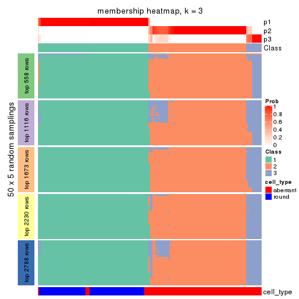</p>

</div>
<div id='tab-ATC-mclust-membership-heatmap-3'>
<pre><code class="r">membership_heatmap(res, k = 4)
</code></pre>

<p></p>

</div>
<div id='tab-ATC-mclust-membership-heatmap-4'>
<pre><code class="r">membership_heatmap(res, k = 5)
</code></pre>

<p></p>

</div>
<div id='tab-ATC-mclust-membership-heatmap-5'>
<pre><code class="r">membership_heatmap(res, k = 6)
</code></pre>

<p></p>

</div>
</div>

As soon as we have had the classes for columns, we can look for signatures
which are significantly different between classes which can be candidate marks
for certain classes. Following are the heatmaps for signatures.


Signature heatmaps where rows are scaled:


<script>
$( function() {
	$( '#tabs-ATC-mclust-get-signatures' ).tabs();
} );
</script>
<div id='tabs-ATC-mclust-get-signatures'>
<ul>
<li><a href='#tab-ATC-mclust-get-signatures-1'>k = 2</a></li>
<li><a href='#tab-ATC-mclust-get-signatures-2'>k = 3</a></li>
<li><a href='#tab-ATC-mclust-get-signatures-3'>k = 4</a></li>
<li><a href='#tab-ATC-mclust-get-signatures-4'>k = 5</a></li>
<li><a href='#tab-ATC-mclust-get-signatures-5'>k = 6</a></li>
</ul>
<div id='tab-ATC-mclust-get-signatures-1'>
<pre><code class="r">get_signatures(res, k = 2)
</code></pre>

<p></p>

</div>
<div id='tab-ATC-mclust-get-signatures-2'>
<pre><code class="r">get_signatures(res, k = 3)
</code></pre>

<p></p>

</div>
<div id='tab-ATC-mclust-get-signatures-3'>
<pre><code class="r">get_signatures(res, k = 4)
</code></pre>

<p></p>

</div>
<div id='tab-ATC-mclust-get-signatures-4'>
<pre><code class="r">get_signatures(res, k = 5)
</code></pre>

<p></p>

</div>
<div id='tab-ATC-mclust-get-signatures-5'>
<pre><code class="r">get_signatures(res, k = 6)
</code></pre>

<p></p>

</div>
</div>


Signature heatmaps where rows are not scaled:


<script>
$( function() {
	$( '#tabs-ATC-mclust-get-signatures-no-scale' ).tabs();
} );
</script>
<div id='tabs-ATC-mclust-get-signatures-no-scale'>
<ul>
<li><a href='#tab-ATC-mclust-get-signatures-no-scale-1'>k = 2</a></li>
<li><a href='#tab-ATC-mclust-get-signatures-no-scale-2'>k = 3</a></li>
<li><a href='#tab-ATC-mclust-get-signatures-no-scale-3'>k = 4</a></li>
<li><a href='#tab-ATC-mclust-get-signatures-no-scale-4'>k = 5</a></li>
<li><a href='#tab-ATC-mclust-get-signatures-no-scale-5'>k = 6</a></li>
</ul>
<div id='tab-ATC-mclust-get-signatures-no-scale-1'>
<pre><code class="r">get_signatures(res, k = 2, scale_rows = FALSE)
</code></pre>

<p></p>

</div>
<div id='tab-ATC-mclust-get-signatures-no-scale-2'>
<pre><code class="r">get_signatures(res, k = 3, scale_rows = FALSE)
</code></pre>

<p></p>

</div>
<div id='tab-ATC-mclust-get-signatures-no-scale-3'>
<pre><code class="r">get_signatures(res, k = 4, scale_rows = FALSE)
</code></pre>

<p></p>

</div>
<div id='tab-ATC-mclust-get-signatures-no-scale-4'>
<pre><code class="r">get_signatures(res, k = 5, scale_rows = FALSE)
</code></pre>

<p></p>

</div>
<div id='tab-ATC-mclust-get-signatures-no-scale-5'>
<pre><code class="r">get_signatures(res, k = 6, scale_rows = FALSE)
</code></pre>

<p></p>

</div>
</div>


Compare the overlap of signatures from different k:

```r
compare_signatures(res)
```


`get_signature()` returns a data frame invisibly. TO get the list of signatures, the function
call should be assigned to a variable explicitly. In following code, if `plot` argument is set
to `FALSE`, no heatmap is plotted while only the differential analysis is performed.

```r
# code only for demonstration
tb = get_signature(res, k = ..., plot = FALSE)
```

An example of the output of `tb` is:

```
#>   which_row         fdr    mean_1    mean_2 scaled_mean_1 scaled_mean_2 km
#> 1        38 0.042760348  8.373488  9.131774    -0.5533452     0.5164555  1
#> 2        40 0.018707592  7.106213  8.469186    -0.6173731     0.5762149  1
#> 3        55 0.019134737 10.221463 11.207825    -0.6159697     0.5749050  1
#> 4        59 0.006059896  5.921854  7.869574    -0.6899429     0.6439467  1
#> 5        60 0.018055526  8.928898 10.211722    -0.6204761     0.5791110  1
#> 6        98 0.009384629 15.714769 14.887706     0.6635654    -0.6193277  2
...
```

The columns in `tb` are:

1. `which_row`: row indices corresponding to the input matrix.
2. `fdr`: FDR for the differential test. 
3. `mean_x`: The mean value in group x.
4. `scaled_mean_x`: The mean value in group x after rows are scaled.
5. `km`: Row groups if k-means clustering is applied to rows.


UMAP plot which shows how samples are separated.


<script>
$( function() {
	$( '#tabs-ATC-mclust-dimension-reduction' ).tabs();
} );
</script>
<div id='tabs-ATC-mclust-dimension-reduction'>
<ul>
<li><a href='#tab-ATC-mclust-dimension-reduction-1'>k = 2</a></li>
<li><a href='#tab-ATC-mclust-dimension-reduction-2'>k = 3</a></li>
<li><a href='#tab-ATC-mclust-dimension-reduction-3'>k = 4</a></li>
<li><a href='#tab-ATC-mclust-dimension-reduction-4'>k = 5</a></li>
<li><a href='#tab-ATC-mclust-dimension-reduction-5'>k = 6</a></li>
</ul>
<div id='tab-ATC-mclust-dimension-reduction-1'>
<pre><code class="r">dimension_reduction(res, k = 2, method = &quot;UMAP&quot;)
</code></pre>

<p></p>

</div>
<div id='tab-ATC-mclust-dimension-reduction-2'>
<pre><code class="r">dimension_reduction(res, k = 3, method = &quot;UMAP&quot;)
</code></pre>

<p></p>

</div>
<div id='tab-ATC-mclust-dimension-reduction-3'>
<pre><code class="r">dimension_reduction(res, k = 4, method = &quot;UMAP&quot;)
</code></pre>

<p></p>

</div>
<div id='tab-ATC-mclust-dimension-reduction-4'>
<pre><code class="r">dimension_reduction(res, k = 5, method = &quot;UMAP&quot;)
</code></pre>

<p></p>

</div>
<div id='tab-ATC-mclust-dimension-reduction-5'>
<pre><code class="r">dimension_reduction(res, k = 6, method = &quot;UMAP&quot;)
</code></pre>

<p></p>

</div>
</div>


Following heatmap shows how subgroups are split when increasing `k`:

```r
collect_classes(res)
```


Test correlation between subgroups and known annotations. If the known
annotation is numeric, one-way ANOVA test is applied, and if the known
annotation is discrete, chi-squared contingency table test is applied.

```r
test_to_known_factors(res)
```

```
#>              n cell_type(p) k
#> ATC:mclust 159     5.02e-30 2
#> ATC:mclust 156     9.21e-30 3
#> ATC:mclust 148     2.21e-26 4
#> ATC:mclust 146     3.94e-25 5
#> ATC:mclust 139     2.43e-24 6
```


If matrix rows can be associated to genes, consider to use `GO_Enrichment(res,
...)` to perform function enrichment for the signature genes.


 

---------------------------------------------------


### ATC:NMF**


The object with results only for a single top-value method and a single partition method 
can be extracted as:

```r
res = res_list["ATC", "NMF"]
# you can also extract it by
# res = res_list["ATC:NMF"]
```

A summary of `res` and all the functions that can be applied to it:

```r
res
```

```
#> A 'ConsensusPartition' object with k = 2, 3, 4, 5, 6.
#>   On a matrix with 5576 rows and 160 columns.
#>   Top rows (558, 1116, 1673, 2230, 2788) are extracted by 'ATC' method.
#>   Subgroups are detected by 'NMF' method.
#>   Performed in total 1250 partitions by row resampling.
#>   Best k for subgroups seems to be 2.
#> 
#> Following methods can be applied to this 'ConsensusPartition' object:
#>  [1] "cola_report"             "collect_classes"         "collect_plots"          
#>  [4] "collect_stats"           "colnames"                "compare_signatures"     
#>  [7] "consensus_heatmap"       "dimension_reduction"     "functional_enrichment"  
#> [10] "get_anno_col"            "get_anno"                "get_classes"            
#> [13] "get_consensus"           "get_matrix"              "get_membership"         
#> [16] "get_param"               "get_signatures"          "get_stats"              
#> [19] "is_best_k"               "is_stable_k"             "membership_heatmap"     
#> [22] "ncol"                    "nrow"                    "plot_ecdf"              
#> [25] "rownames"                "select_partition_number" "show"                   
#> [28] "suggest_best_k"          "test_to_known_factors"
```

`collect_plots()` function collects all the plots made from `res` for all `k` (number of partitions)
into one single page to provide an easy and fast comparison between different `k`.

```r
collect_plots(res)
```


The plots are:

- The first row: a plot of the ECDF (Empirical cumulative distribution
  function) curves of the consensus matrix for each `k` and the heatmap of
  predicted classes for each `k`.
- The second row: heatmaps of the consensus matrix for each `k`.
- The third row: heatmaps of the membership matrix for each `k`.
- The fouth row: heatmaps of the signatures for each `k`.

All the plots in panels can be made by individual functions and they are
plotted later in this section.

`select_partition_number()` produces several plots showing different
statistics for choosing "optimized" `k`. There are following statistics:

- ECDF curves of the consensus matrix for each `k`;
- 1-PAC. [The PAC
  score](https://en.wikipedia.org/wiki/Consensus_clustering#Over-interpretation_potential_of_consensus_clustering)
  measures the proportion of the ambiguous subgrouping.
- Mean silhouette score.
- Concordance. The mean probability of fiting the consensus class ids in all
  partitions.
- Area increased. Denote $A_k$ as the area under the ECDF curve for current
  `k`, the area increased is defined as $A_k - A_{k-1}$.
- Rand index. The percent of pairs of samples that are both in a same cluster
  or both are not in a same cluster in the partition of k and k-1.
- Jaccard index. The ratio of pairs of samples are both in a same cluster in
  the partition of k and k-1 and the pairs of samples are both in a same
  cluster in the partition k or k-1.

The detailed explanations of these statistics can be found in [the cola
vignette](http://bioconductor.org/packages/devel/bioc/vignettes/cola/inst/doc/cola.html#toc_13).

Generally speaking, lower PAC score, higher mean silhouette score or higher
concordance corresponds to better partition. Rand index and Jaccard index
measure how similar the current partition is compared to partition with `k-1`.
If they are too similar, we won't accept `k` is better than `k-1`.

```r
select_partition_number(res)
```


The numeric values for all these statistics can be obtained by `get_stats()`.

```r
get_stats(res)
```

```
#>   k 1-PAC mean_silhouette concordance area_increased  Rand Jaccard
#> 2 2 1.000           0.976       0.990         0.5015 0.499   0.499
#> 3 3 0.806           0.828       0.921         0.2964 0.809   0.633
#> 4 4 0.765           0.791       0.889         0.0870 0.872   0.667
#> 5 5 0.699           0.707       0.832         0.0364 0.977   0.922
#> 6 6 0.652           0.548       0.766         0.0478 0.959   0.861
```

`suggest_best_k()` suggests the best $k$ based on these statistics. The rules are as follows:

- All $k$ with Jaccard index larger than 0.95 are removed because the increase of
  the partition number does not provides enough extra information. If all $k$ are removed,
  the best $k$ is assigned by `NA`.
- For $k$ with 1-PAC larger than 0.9, the maximal $k$ is taken as the "best k". Other $k$ is called "optional k".
- If it does not fit the second rule. The $k$ with the highest vote of highest
  1-PAC, mean silhouette and concordance is taken as the "best k".

```r
suggest_best_k(res)
```

```
#> [1] 2
```


Following shows the table of the partitions (You need to click the **show/hide
code output** link to see it). The membership matrix (columns with name `p*`)
is inferred by
[`clue::cl_consensus()`](https://www.rdocumentation.org/link/cl_consensus?package=clue)
function with the `SE` method. Basically the value in the membership matrix
represents the probability to belong to a certain group. The finall class
label for an item is determined with the group with highest probability it
belongs to.

In `get_classes()` function, the entropy is calculated from the membership
matrix and the silhouette score is calculated from the consensus matrix.


<script>
$( function() {
	$( '#tabs-ATC-NMF-get-classes' ).tabs();
} );
</script>
<div id='tabs-ATC-NMF-get-classes'>
<ul>
<li><a href='#tab-ATC-NMF-get-classes-1'>k = 2</a></li>
<li><a href='#tab-ATC-NMF-get-classes-2'>k = 3</a></li>
<li><a href='#tab-ATC-NMF-get-classes-3'>k = 4</a></li>
<li><a href='#tab-ATC-NMF-get-classes-4'>k = 5</a></li>
<li><a href='#tab-ATC-NMF-get-classes-5'>k = 6</a></li>
</ul>

<div id='tab-ATC-NMF-get-classes-1'>
<p><a id='tab-ATC-NMF-get-classes-1-a' style='color:#0366d6' href='#'>show/hide code output</a></p>
<pre><code class="r">cbind(get_classes(res, k = 2), get_membership(res, k = 2))
</code></pre>

<pre><code>#&gt;                     class entropy silhouette    p1    p2
#&gt; aberrant_ERR2585320     2  0.0000     0.9901 0.000 1.000
#&gt; aberrant_ERR2585338     2  0.0000     0.9901 0.000 1.000
#&gt; aberrant_ERR2585325     2  0.0000     0.9901 0.000 1.000
#&gt; aberrant_ERR2585283     2  0.0000     0.9901 0.000 1.000
#&gt; aberrant_ERR2585343     2  0.0000     0.9901 0.000 1.000
#&gt; aberrant_ERR2585329     2  0.0000     0.9901 0.000 1.000
#&gt; aberrant_ERR2585317     2  0.0000     0.9901 0.000 1.000
#&gt; aberrant_ERR2585339     2  0.0000     0.9901 0.000 1.000
#&gt; aberrant_ERR2585335     2  0.0000     0.9901 0.000 1.000
#&gt; aberrant_ERR2585287     2  0.0000     0.9901 0.000 1.000
#&gt; aberrant_ERR2585321     2  0.0000     0.9901 0.000 1.000
#&gt; aberrant_ERR2585297     1  0.0000     0.9896 1.000 0.000
#&gt; aberrant_ERR2585337     2  0.0000     0.9901 0.000 1.000
#&gt; aberrant_ERR2585319     2  0.0000     0.9901 0.000 1.000
#&gt; aberrant_ERR2585315     2  0.0000     0.9901 0.000 1.000
#&gt; aberrant_ERR2585336     2  0.0000     0.9901 0.000 1.000
#&gt; aberrant_ERR2585307     2  0.0000     0.9901 0.000 1.000
#&gt; aberrant_ERR2585301     2  0.0000     0.9901 0.000 1.000
#&gt; aberrant_ERR2585326     2  0.0000     0.9901 0.000 1.000
#&gt; aberrant_ERR2585331     2  0.0000     0.9901 0.000 1.000
#&gt; aberrant_ERR2585346     2  0.0000     0.9901 0.000 1.000
#&gt; aberrant_ERR2585314     2  0.0000     0.9901 0.000 1.000
#&gt; aberrant_ERR2585298     1  0.0000     0.9896 1.000 0.000
#&gt; aberrant_ERR2585345     2  0.0000     0.9901 0.000 1.000
#&gt; aberrant_ERR2585299     1  0.0000     0.9896 1.000 0.000
#&gt; aberrant_ERR2585309     1  0.0000     0.9896 1.000 0.000
#&gt; aberrant_ERR2585303     2  0.0000     0.9901 0.000 1.000
#&gt; aberrant_ERR2585313     2  0.0000     0.9901 0.000 1.000
#&gt; aberrant_ERR2585318     2  0.0000     0.9901 0.000 1.000
#&gt; aberrant_ERR2585328     2  0.0000     0.9901 0.000 1.000
#&gt; aberrant_ERR2585330     2  0.0000     0.9901 0.000 1.000
#&gt; aberrant_ERR2585293     2  0.0000     0.9901 0.000 1.000
#&gt; aberrant_ERR2585342     2  0.0000     0.9901 0.000 1.000
#&gt; aberrant_ERR2585348     2  0.0000     0.9901 0.000 1.000
#&gt; aberrant_ERR2585352     2  0.0000     0.9901 0.000 1.000
#&gt; aberrant_ERR2585308     1  0.0000     0.9896 1.000 0.000
#&gt; aberrant_ERR2585349     2  0.0000     0.9901 0.000 1.000
#&gt; aberrant_ERR2585316     2  0.0000     0.9901 0.000 1.000
#&gt; aberrant_ERR2585306     2  0.0000     0.9901 0.000 1.000
#&gt; aberrant_ERR2585324     2  0.0000     0.9901 0.000 1.000
#&gt; aberrant_ERR2585310     2  0.6048     0.8224 0.148 0.852
#&gt; aberrant_ERR2585296     1  0.0000     0.9896 1.000 0.000
#&gt; aberrant_ERR2585275     2  0.0000     0.9901 0.000 1.000
#&gt; aberrant_ERR2585311     2  0.0000     0.9901 0.000 1.000
#&gt; aberrant_ERR2585292     2  0.0000     0.9901 0.000 1.000
#&gt; aberrant_ERR2585282     2  0.0000     0.9901 0.000 1.000
#&gt; aberrant_ERR2585305     2  0.0000     0.9901 0.000 1.000
#&gt; aberrant_ERR2585278     2  0.0000     0.9901 0.000 1.000
#&gt; aberrant_ERR2585347     2  0.0000     0.9901 0.000 1.000
#&gt; aberrant_ERR2585332     2  0.0000     0.9901 0.000 1.000
#&gt; aberrant_ERR2585280     2  0.0000     0.9901 0.000 1.000
#&gt; aberrant_ERR2585304     2  0.0672     0.9824 0.008 0.992
#&gt; aberrant_ERR2585322     2  0.0000     0.9901 0.000 1.000
#&gt; aberrant_ERR2585279     2  0.0000     0.9901 0.000 1.000
#&gt; aberrant_ERR2585277     2  0.0000     0.9901 0.000 1.000
#&gt; aberrant_ERR2585295     2  0.0000     0.9901 0.000 1.000
#&gt; aberrant_ERR2585333     2  0.0000     0.9901 0.000 1.000
#&gt; aberrant_ERR2585285     2  0.0000     0.9901 0.000 1.000
#&gt; aberrant_ERR2585286     2  0.0000     0.9901 0.000 1.000
#&gt; aberrant_ERR2585294     2  0.0000     0.9901 0.000 1.000
#&gt; aberrant_ERR2585300     2  0.0000     0.9901 0.000 1.000
#&gt; aberrant_ERR2585334     2  0.0000     0.9901 0.000 1.000
#&gt; aberrant_ERR2585361     2  0.0000     0.9901 0.000 1.000
#&gt; aberrant_ERR2585372     2  0.0000     0.9901 0.000 1.000
#&gt; round_ERR2585217        1  0.0376     0.9859 0.996 0.004
#&gt; round_ERR2585205        1  0.0000     0.9896 1.000 0.000
#&gt; round_ERR2585214        1  0.7815     0.7001 0.768 0.232
#&gt; round_ERR2585202        1  0.8861     0.5651 0.696 0.304
#&gt; aberrant_ERR2585367     2  0.0000     0.9901 0.000 1.000
#&gt; round_ERR2585220        1  0.0000     0.9896 1.000 0.000
#&gt; round_ERR2585238        1  0.0000     0.9896 1.000 0.000
#&gt; aberrant_ERR2585276     2  0.0000     0.9901 0.000 1.000
#&gt; round_ERR2585218        1  0.0000     0.9896 1.000 0.000
#&gt; aberrant_ERR2585363     2  0.0000     0.9901 0.000 1.000
#&gt; round_ERR2585201        1  0.0000     0.9896 1.000 0.000
#&gt; round_ERR2585210        1  0.0000     0.9896 1.000 0.000
#&gt; aberrant_ERR2585362     2  0.0000     0.9901 0.000 1.000
#&gt; aberrant_ERR2585360     2  0.0000     0.9901 0.000 1.000
#&gt; round_ERR2585209        1  0.0000     0.9896 1.000 0.000
#&gt; round_ERR2585242        1  0.0000     0.9896 1.000 0.000
#&gt; round_ERR2585216        1  0.0000     0.9896 1.000 0.000
#&gt; round_ERR2585219        1  0.0000     0.9896 1.000 0.000
#&gt; round_ERR2585237        1  0.0000     0.9896 1.000 0.000
#&gt; round_ERR2585198        1  0.0000     0.9896 1.000 0.000
#&gt; round_ERR2585211        1  0.0000     0.9896 1.000 0.000
#&gt; round_ERR2585206        1  0.0000     0.9896 1.000 0.000
#&gt; aberrant_ERR2585281     2  0.0000     0.9901 0.000 1.000
#&gt; round_ERR2585212        1  0.0000     0.9896 1.000 0.000
#&gt; round_ERR2585221        1  0.0000     0.9896 1.000 0.000
#&gt; round_ERR2585243        1  0.0000     0.9896 1.000 0.000
#&gt; round_ERR2585204        1  0.7299     0.7447 0.796 0.204
#&gt; round_ERR2585213        2  0.0000     0.9901 0.000 1.000
#&gt; aberrant_ERR2585373     2  0.0000     0.9901 0.000 1.000
#&gt; aberrant_ERR2585358     2  0.0000     0.9901 0.000 1.000
#&gt; aberrant_ERR2585365     2  0.0000     0.9901 0.000 1.000
#&gt; aberrant_ERR2585359     2  0.0000     0.9901 0.000 1.000
#&gt; aberrant_ERR2585370     2  0.0000     0.9901 0.000 1.000
#&gt; round_ERR2585215        1  0.0000     0.9896 1.000 0.000
#&gt; round_ERR2585262        2  0.7056     0.7587 0.192 0.808
#&gt; round_ERR2585199        2  0.9977     0.0928 0.472 0.528
#&gt; aberrant_ERR2585369     2  0.0000     0.9901 0.000 1.000
#&gt; round_ERR2585208        1  0.0000     0.9896 1.000 0.000
#&gt; round_ERR2585252        1  0.0000     0.9896 1.000 0.000
#&gt; round_ERR2585236        1  0.0000     0.9896 1.000 0.000
#&gt; aberrant_ERR2585284     2  0.0000     0.9901 0.000 1.000
#&gt; round_ERR2585224        1  0.0000     0.9896 1.000 0.000
#&gt; round_ERR2585260        1  0.0000     0.9896 1.000 0.000
#&gt; round_ERR2585229        1  0.0000     0.9896 1.000 0.000
#&gt; aberrant_ERR2585364     2  0.0000     0.9901 0.000 1.000
#&gt; round_ERR2585253        1  0.0000     0.9896 1.000 0.000
#&gt; aberrant_ERR2585368     2  0.0000     0.9901 0.000 1.000
#&gt; aberrant_ERR2585371     2  0.0000     0.9901 0.000 1.000
#&gt; round_ERR2585239        1  0.0000     0.9896 1.000 0.000
#&gt; round_ERR2585273        1  0.0000     0.9896 1.000 0.000
#&gt; round_ERR2585256        1  0.0000     0.9896 1.000 0.000
#&gt; round_ERR2585272        1  0.0000     0.9896 1.000 0.000
#&gt; round_ERR2585246        1  0.0000     0.9896 1.000 0.000
#&gt; round_ERR2585261        1  0.0000     0.9896 1.000 0.000
#&gt; round_ERR2585254        1  0.0000     0.9896 1.000 0.000
#&gt; round_ERR2585225        1  0.0000     0.9896 1.000 0.000
#&gt; round_ERR2585235        1  0.0000     0.9896 1.000 0.000
#&gt; round_ERR2585271        1  0.0000     0.9896 1.000 0.000
#&gt; round_ERR2585251        1  0.0000     0.9896 1.000 0.000
#&gt; round_ERR2585255        1  0.1184     0.9745 0.984 0.016
#&gt; round_ERR2585257        1  0.0000     0.9896 1.000 0.000
#&gt; round_ERR2585226        1  0.0000     0.9896 1.000 0.000
#&gt; round_ERR2585265        1  0.0000     0.9896 1.000 0.000
#&gt; round_ERR2585259        1  0.0000     0.9896 1.000 0.000
#&gt; round_ERR2585247        1  0.0000     0.9896 1.000 0.000
#&gt; round_ERR2585241        1  0.0000     0.9896 1.000 0.000
#&gt; round_ERR2585263        1  0.0000     0.9896 1.000 0.000
#&gt; round_ERR2585264        1  0.0000     0.9896 1.000 0.000
#&gt; round_ERR2585233        1  0.0000     0.9896 1.000 0.000
#&gt; round_ERR2585223        1  0.0000     0.9896 1.000 0.000
#&gt; round_ERR2585234        1  0.0000     0.9896 1.000 0.000
#&gt; round_ERR2585222        1  0.0000     0.9896 1.000 0.000
#&gt; round_ERR2585228        1  0.0000     0.9896 1.000 0.000
#&gt; round_ERR2585248        1  0.0000     0.9896 1.000 0.000
#&gt; round_ERR2585240        1  0.0000     0.9896 1.000 0.000
#&gt; round_ERR2585270        1  0.0000     0.9896 1.000 0.000
#&gt; round_ERR2585232        1  0.0000     0.9896 1.000 0.000
#&gt; aberrant_ERR2585341     2  0.0000     0.9901 0.000 1.000
#&gt; aberrant_ERR2585355     2  0.0000     0.9901 0.000 1.000
#&gt; round_ERR2585227        1  0.0000     0.9896 1.000 0.000
#&gt; aberrant_ERR2585351     2  0.0000     0.9901 0.000 1.000
#&gt; round_ERR2585269        1  0.0000     0.9896 1.000 0.000
#&gt; aberrant_ERR2585357     2  0.0000     0.9901 0.000 1.000
#&gt; aberrant_ERR2585350     2  0.0000     0.9901 0.000 1.000
#&gt; round_ERR2585250        1  0.0000     0.9896 1.000 0.000
#&gt; round_ERR2585245        1  0.0000     0.9896 1.000 0.000
#&gt; aberrant_ERR2585353     2  0.0000     0.9901 0.000 1.000
#&gt; round_ERR2585258        1  0.0000     0.9896 1.000 0.000
#&gt; aberrant_ERR2585354     2  0.0000     0.9901 0.000 1.000
#&gt; round_ERR2585249        1  0.0000     0.9896 1.000 0.000
#&gt; round_ERR2585268        1  0.0000     0.9896 1.000 0.000
#&gt; aberrant_ERR2585356     2  0.0000     0.9901 0.000 1.000
#&gt; round_ERR2585266        1  0.0000     0.9896 1.000 0.000
#&gt; round_ERR2585231        1  0.0000     0.9896 1.000 0.000
#&gt; round_ERR2585230        1  0.0000     0.9896 1.000 0.000
#&gt; round_ERR2585267        1  0.0000     0.9896 1.000 0.000
</code></pre>

<script>
$('#tab-ATC-NMF-get-classes-1-a').parent().next().next().hide();
$('#tab-ATC-NMF-get-classes-1-a').click(function(){
  $('#tab-ATC-NMF-get-classes-1-a').parent().next().next().toggle();
  return(false);
});
</script>
</div>

<div id='tab-ATC-NMF-get-classes-2'>
<p><a id='tab-ATC-NMF-get-classes-2-a' style='color:#0366d6' href='#'>show/hide code output</a></p>
<pre><code class="r">cbind(get_classes(res, k = 3), get_membership(res, k = 3))
</code></pre>

<pre><code>#&gt;                     class entropy silhouette    p1    p2    p3
#&gt; aberrant_ERR2585320     2  0.3267     0.8021 0.000 0.884 0.116
#&gt; aberrant_ERR2585338     3  0.3879     0.7727 0.000 0.152 0.848
#&gt; aberrant_ERR2585325     2  0.3619     0.7896 0.000 0.864 0.136
#&gt; aberrant_ERR2585283     2  0.0000     0.8382 0.000 1.000 0.000
#&gt; aberrant_ERR2585343     2  0.0000     0.8382 0.000 1.000 0.000
#&gt; aberrant_ERR2585329     2  0.6045     0.5133 0.000 0.620 0.380
#&gt; aberrant_ERR2585317     2  0.4605     0.7367 0.000 0.796 0.204
#&gt; aberrant_ERR2585339     2  0.6095     0.4908 0.000 0.608 0.392
#&gt; aberrant_ERR2585335     2  0.1529     0.8362 0.000 0.960 0.040
#&gt; aberrant_ERR2585287     2  0.1163     0.8391 0.000 0.972 0.028
#&gt; aberrant_ERR2585321     2  0.0000     0.8382 0.000 1.000 0.000
#&gt; aberrant_ERR2585297     1  0.0000     0.9824 1.000 0.000 0.000
#&gt; aberrant_ERR2585337     2  0.5678     0.6147 0.000 0.684 0.316
#&gt; aberrant_ERR2585319     2  0.0237     0.8392 0.000 0.996 0.004
#&gt; aberrant_ERR2585315     2  0.0237     0.8392 0.000 0.996 0.004
#&gt; aberrant_ERR2585336     2  0.6302     0.2645 0.000 0.520 0.480
#&gt; aberrant_ERR2585307     2  0.6280     0.3260 0.000 0.540 0.460
#&gt; aberrant_ERR2585301     2  0.1529     0.8363 0.000 0.960 0.040
#&gt; aberrant_ERR2585326     2  0.5785     0.5943 0.000 0.668 0.332
#&gt; aberrant_ERR2585331     3  0.0000     0.9045 0.000 0.000 1.000
#&gt; aberrant_ERR2585346     2  0.0000     0.8382 0.000 1.000 0.000
#&gt; aberrant_ERR2585314     2  0.6244     0.3815 0.000 0.560 0.440
#&gt; aberrant_ERR2585298     3  0.0424     0.9058 0.008 0.000 0.992
#&gt; aberrant_ERR2585345     2  0.6252     0.3685 0.000 0.556 0.444
#&gt; aberrant_ERR2585299     1  0.0000     0.9824 1.000 0.000 0.000
#&gt; aberrant_ERR2585309     1  0.0000     0.9824 1.000 0.000 0.000
#&gt; aberrant_ERR2585303     2  0.6274     0.3333 0.000 0.544 0.456
#&gt; aberrant_ERR2585313     2  0.5216     0.6826 0.000 0.740 0.260
#&gt; aberrant_ERR2585318     2  0.0747     0.8402 0.000 0.984 0.016
#&gt; aberrant_ERR2585328     3  0.2537     0.8552 0.000 0.080 0.920
#&gt; aberrant_ERR2585330     2  0.0237     0.8392 0.000 0.996 0.004
#&gt; aberrant_ERR2585293     2  0.0424     0.8354 0.000 0.992 0.008
#&gt; aberrant_ERR2585342     2  0.0747     0.8402 0.000 0.984 0.016
#&gt; aberrant_ERR2585348     2  0.6260     0.3632 0.000 0.552 0.448
#&gt; aberrant_ERR2585352     2  0.2878     0.8144 0.000 0.904 0.096
#&gt; aberrant_ERR2585308     1  0.0000     0.9824 1.000 0.000 0.000
#&gt; aberrant_ERR2585349     3  0.0000     0.9045 0.000 0.000 1.000
#&gt; aberrant_ERR2585316     2  0.0000     0.8382 0.000 1.000 0.000
#&gt; aberrant_ERR2585306     2  0.0424     0.8366 0.008 0.992 0.000
#&gt; aberrant_ERR2585324     2  0.0237     0.8392 0.000 0.996 0.004
#&gt; aberrant_ERR2585310     2  0.6518     0.1348 0.484 0.512 0.004
#&gt; aberrant_ERR2585296     1  0.0000     0.9824 1.000 0.000 0.000
#&gt; aberrant_ERR2585275     2  0.0000     0.8382 0.000 1.000 0.000
#&gt; aberrant_ERR2585311     2  0.0237     0.8392 0.000 0.996 0.004
#&gt; aberrant_ERR2585292     2  0.0424     0.8354 0.000 0.992 0.008
#&gt; aberrant_ERR2585282     2  0.2878     0.8139 0.000 0.904 0.096
#&gt; aberrant_ERR2585305     2  0.2625     0.7887 0.084 0.916 0.000
#&gt; aberrant_ERR2585278     2  0.0892     0.8402 0.000 0.980 0.020
#&gt; aberrant_ERR2585347     2  0.5098     0.6971 0.000 0.752 0.248
#&gt; aberrant_ERR2585332     2  0.1964     0.8310 0.000 0.944 0.056
#&gt; aberrant_ERR2585280     2  0.1289     0.8387 0.000 0.968 0.032
#&gt; aberrant_ERR2585304     3  0.6062     0.7352 0.072 0.148 0.780
#&gt; aberrant_ERR2585322     2  0.6307     0.2332 0.000 0.512 0.488
#&gt; aberrant_ERR2585279     3  0.0000     0.9045 0.000 0.000 1.000
#&gt; aberrant_ERR2585277     3  0.0892     0.8970 0.000 0.020 0.980
#&gt; aberrant_ERR2585295     3  0.5882     0.3562 0.000 0.348 0.652
#&gt; aberrant_ERR2585333     2  0.0000     0.8382 0.000 1.000 0.000
#&gt; aberrant_ERR2585285     2  0.0892     0.8402 0.000 0.980 0.020
#&gt; aberrant_ERR2585286     3  0.2356     0.8618 0.000 0.072 0.928
#&gt; aberrant_ERR2585294     2  0.0000     0.8382 0.000 1.000 0.000
#&gt; aberrant_ERR2585300     2  0.0000     0.8382 0.000 1.000 0.000
#&gt; aberrant_ERR2585334     3  0.0000     0.9045 0.000 0.000 1.000
#&gt; aberrant_ERR2585361     2  0.2448     0.8233 0.000 0.924 0.076
#&gt; aberrant_ERR2585372     2  0.1163     0.8390 0.000 0.972 0.028
#&gt; round_ERR2585217        3  0.0424     0.9058 0.008 0.000 0.992
#&gt; round_ERR2585205        1  0.0000     0.9824 1.000 0.000 0.000
#&gt; round_ERR2585214        3  0.0237     0.9053 0.004 0.000 0.996
#&gt; round_ERR2585202        3  0.0747     0.9019 0.016 0.000 0.984
#&gt; aberrant_ERR2585367     2  0.5098     0.6956 0.000 0.752 0.248
#&gt; round_ERR2585220        1  0.0000     0.9824 1.000 0.000 0.000
#&gt; round_ERR2585238        1  0.0000     0.9824 1.000 0.000 0.000
#&gt; aberrant_ERR2585276     2  0.0000     0.8382 0.000 1.000 0.000
#&gt; round_ERR2585218        1  0.0000     0.9824 1.000 0.000 0.000
#&gt; aberrant_ERR2585363     2  0.5560     0.6393 0.000 0.700 0.300
#&gt; round_ERR2585201        3  0.0424     0.9058 0.008 0.000 0.992
#&gt; round_ERR2585210        1  0.0000     0.9824 1.000 0.000 0.000
#&gt; aberrant_ERR2585362     2  0.6225     0.4059 0.000 0.568 0.432
#&gt; aberrant_ERR2585360     2  0.0747     0.8404 0.000 0.984 0.016
#&gt; round_ERR2585209        1  0.3340     0.8597 0.880 0.000 0.120
#&gt; round_ERR2585242        3  0.2711     0.8410 0.088 0.000 0.912
#&gt; round_ERR2585216        1  0.0000     0.9824 1.000 0.000 0.000
#&gt; round_ERR2585219        1  0.0000     0.9824 1.000 0.000 0.000
#&gt; round_ERR2585237        3  0.0424     0.9058 0.008 0.000 0.992
#&gt; round_ERR2585198        3  0.0592     0.9038 0.012 0.000 0.988
#&gt; round_ERR2585211        1  0.0000     0.9824 1.000 0.000 0.000
#&gt; round_ERR2585206        1  0.0000     0.9824 1.000 0.000 0.000
#&gt; aberrant_ERR2585281     3  0.6308    -0.1708 0.000 0.492 0.508
#&gt; round_ERR2585212        1  0.0000     0.9824 1.000 0.000 0.000
#&gt; round_ERR2585221        1  0.0000     0.9824 1.000 0.000 0.000
#&gt; round_ERR2585243        1  0.0000     0.9824 1.000 0.000 0.000
#&gt; round_ERR2585204        3  0.0000     0.9045 0.000 0.000 1.000
#&gt; round_ERR2585213        3  0.0000     0.9045 0.000 0.000 1.000
#&gt; aberrant_ERR2585373     2  0.0000     0.8382 0.000 1.000 0.000
#&gt; aberrant_ERR2585358     2  0.0424     0.8399 0.000 0.992 0.008
#&gt; aberrant_ERR2585365     2  0.5733     0.6031 0.000 0.676 0.324
#&gt; aberrant_ERR2585359     2  0.0000     0.8382 0.000 1.000 0.000
#&gt; aberrant_ERR2585370     3  0.4504     0.7033 0.000 0.196 0.804
#&gt; round_ERR2585215        1  0.0000     0.9824 1.000 0.000 0.000
#&gt; round_ERR2585262        3  0.0424     0.9058 0.008 0.000 0.992
#&gt; round_ERR2585199        3  0.0424     0.9058 0.008 0.000 0.992
#&gt; aberrant_ERR2585369     2  0.1411     0.8372 0.000 0.964 0.036
#&gt; round_ERR2585208        1  0.0000     0.9824 1.000 0.000 0.000
#&gt; round_ERR2585252        1  0.0000     0.9824 1.000 0.000 0.000
#&gt; round_ERR2585236        1  0.0000     0.9824 1.000 0.000 0.000
#&gt; aberrant_ERR2585284     3  0.6235     0.0475 0.000 0.436 0.564
#&gt; round_ERR2585224        1  0.0000     0.9824 1.000 0.000 0.000
#&gt; round_ERR2585260        1  0.0000     0.9824 1.000 0.000 0.000
#&gt; round_ERR2585229        1  0.0000     0.9824 1.000 0.000 0.000
#&gt; aberrant_ERR2585364     2  0.0000     0.8382 0.000 1.000 0.000
#&gt; round_ERR2585253        1  0.0000     0.9824 1.000 0.000 0.000
#&gt; aberrant_ERR2585368     3  0.0237     0.9038 0.000 0.004 0.996
#&gt; aberrant_ERR2585371     3  0.0000     0.9045 0.000 0.000 1.000
#&gt; round_ERR2585239        1  0.0000     0.9824 1.000 0.000 0.000
#&gt; round_ERR2585273        1  0.0000     0.9824 1.000 0.000 0.000
#&gt; round_ERR2585256        1  0.0000     0.9824 1.000 0.000 0.000
#&gt; round_ERR2585272        1  0.0000     0.9824 1.000 0.000 0.000
#&gt; round_ERR2585246        1  0.0000     0.9824 1.000 0.000 0.000
#&gt; round_ERR2585261        1  0.4605     0.7355 0.796 0.000 0.204
#&gt; round_ERR2585254        1  0.0237     0.9790 0.996 0.000 0.004
#&gt; round_ERR2585225        3  0.0592     0.9035 0.012 0.000 0.988
#&gt; round_ERR2585235        1  0.0000     0.9824 1.000 0.000 0.000
#&gt; round_ERR2585271        1  0.0000     0.9824 1.000 0.000 0.000
#&gt; round_ERR2585251        1  0.0000     0.9824 1.000 0.000 0.000
#&gt; round_ERR2585255        3  0.0424     0.9058 0.008 0.000 0.992
#&gt; round_ERR2585257        3  0.0424     0.9058 0.008 0.000 0.992
#&gt; round_ERR2585226        1  0.0000     0.9824 1.000 0.000 0.000
#&gt; round_ERR2585265        1  0.0000     0.9824 1.000 0.000 0.000
#&gt; round_ERR2585259        1  0.6008     0.3856 0.628 0.000 0.372
#&gt; round_ERR2585247        1  0.0000     0.9824 1.000 0.000 0.000
#&gt; round_ERR2585241        1  0.0000     0.9824 1.000 0.000 0.000
#&gt; round_ERR2585263        1  0.0237     0.9790 0.996 0.000 0.004
#&gt; round_ERR2585264        1  0.0000     0.9824 1.000 0.000 0.000
#&gt; round_ERR2585233        3  0.3551     0.7902 0.132 0.000 0.868
#&gt; round_ERR2585223        1  0.0000     0.9824 1.000 0.000 0.000
#&gt; round_ERR2585234        3  0.0424     0.9058 0.008 0.000 0.992
#&gt; round_ERR2585222        1  0.0000     0.9824 1.000 0.000 0.000
#&gt; round_ERR2585228        1  0.0000     0.9824 1.000 0.000 0.000
#&gt; round_ERR2585248        1  0.0000     0.9824 1.000 0.000 0.000
#&gt; round_ERR2585240        1  0.0000     0.9824 1.000 0.000 0.000
#&gt; round_ERR2585270        1  0.0000     0.9824 1.000 0.000 0.000
#&gt; round_ERR2585232        1  0.0000     0.9824 1.000 0.000 0.000
#&gt; aberrant_ERR2585341     3  0.3412     0.8081 0.000 0.124 0.876
#&gt; aberrant_ERR2585355     3  0.2537     0.8557 0.000 0.080 0.920
#&gt; round_ERR2585227        1  0.0000     0.9824 1.000 0.000 0.000
#&gt; aberrant_ERR2585351     2  0.2625     0.8203 0.000 0.916 0.084
#&gt; round_ERR2585269        1  0.0000     0.9824 1.000 0.000 0.000
#&gt; aberrant_ERR2585357     2  0.6291     0.3052 0.000 0.532 0.468
#&gt; aberrant_ERR2585350     2  0.5968     0.5401 0.000 0.636 0.364
#&gt; round_ERR2585250        1  0.0000     0.9824 1.000 0.000 0.000
#&gt; round_ERR2585245        1  0.0000     0.9824 1.000 0.000 0.000
#&gt; aberrant_ERR2585353     2  0.0892     0.8405 0.000 0.980 0.020
#&gt; round_ERR2585258        1  0.0000     0.9824 1.000 0.000 0.000
#&gt; aberrant_ERR2585354     2  0.0237     0.8392 0.000 0.996 0.004
#&gt; round_ERR2585249        1  0.0000     0.9824 1.000 0.000 0.000
#&gt; round_ERR2585268        1  0.0000     0.9824 1.000 0.000 0.000
#&gt; aberrant_ERR2585356     2  0.0000     0.8382 0.000 1.000 0.000
#&gt; round_ERR2585266        1  0.5733     0.5430 0.676 0.000 0.324
#&gt; round_ERR2585231        1  0.0000     0.9824 1.000 0.000 0.000
#&gt; round_ERR2585230        1  0.0000     0.9824 1.000 0.000 0.000
#&gt; round_ERR2585267        1  0.0000     0.9824 1.000 0.000 0.000
</code></pre>

<script>
$('#tab-ATC-NMF-get-classes-2-a').parent().next().next().hide();
$('#tab-ATC-NMF-get-classes-2-a').click(function(){
  $('#tab-ATC-NMF-get-classes-2-a').parent().next().next().toggle();
  return(false);
});
</script>
</div>

<div id='tab-ATC-NMF-get-classes-3'>
<p><a id='tab-ATC-NMF-get-classes-3-a' style='color:#0366d6' href='#'>show/hide code output</a></p>
<pre><code class="r">cbind(get_classes(res, k = 4), get_membership(res, k = 4))
</code></pre>

<pre><code>#&gt;                     class entropy silhouette    p1    p2    p3    p4
#&gt; aberrant_ERR2585320     2  0.5464    0.56711 0.000 0.708 0.064 0.228
#&gt; aberrant_ERR2585338     3  0.4356    0.58237 0.000 0.292 0.708 0.000
#&gt; aberrant_ERR2585325     4  0.7714    0.39621 0.000 0.244 0.316 0.440
#&gt; aberrant_ERR2585283     4  0.2704    0.77179 0.000 0.124 0.000 0.876
#&gt; aberrant_ERR2585343     2  0.1302    0.78064 0.000 0.956 0.000 0.044
#&gt; aberrant_ERR2585329     2  0.5128    0.65579 0.000 0.760 0.148 0.092
#&gt; aberrant_ERR2585317     2  0.3081    0.77367 0.000 0.888 0.048 0.064
#&gt; aberrant_ERR2585339     3  0.6634    0.38240 0.000 0.312 0.580 0.108
#&gt; aberrant_ERR2585335     2  0.0779    0.78720 0.000 0.980 0.004 0.016
#&gt; aberrant_ERR2585287     3  0.6570    0.38376 0.000 0.100 0.580 0.320
#&gt; aberrant_ERR2585321     2  0.1211    0.78575 0.000 0.960 0.000 0.040
#&gt; aberrant_ERR2585297     1  0.0336    0.96748 0.992 0.000 0.000 0.008
#&gt; aberrant_ERR2585337     2  0.7666    0.00373 0.000 0.396 0.392 0.212
#&gt; aberrant_ERR2585319     2  0.3486    0.68978 0.000 0.812 0.000 0.188
#&gt; aberrant_ERR2585315     4  0.4103    0.78415 0.000 0.256 0.000 0.744
#&gt; aberrant_ERR2585336     2  0.7081    0.21077 0.000 0.484 0.388 0.128
#&gt; aberrant_ERR2585307     3  0.7083    0.26633 0.000 0.328 0.528 0.144
#&gt; aberrant_ERR2585301     2  0.3052    0.74985 0.000 0.860 0.004 0.136
#&gt; aberrant_ERR2585326     3  0.6393    0.44259 0.000 0.284 0.616 0.100
#&gt; aberrant_ERR2585331     3  0.0707    0.84993 0.000 0.020 0.980 0.000
#&gt; aberrant_ERR2585346     4  0.3401    0.78328 0.000 0.152 0.008 0.840
#&gt; aberrant_ERR2585314     2  0.2796    0.74778 0.000 0.892 0.092 0.016
#&gt; aberrant_ERR2585298     3  0.0000    0.84881 0.000 0.000 1.000 0.000
#&gt; aberrant_ERR2585345     2  0.7108    0.22593 0.000 0.512 0.348 0.140
#&gt; aberrant_ERR2585299     1  0.0524    0.96829 0.988 0.000 0.008 0.004
#&gt; aberrant_ERR2585309     1  0.0779    0.96271 0.980 0.016 0.000 0.004
#&gt; aberrant_ERR2585303     3  0.4453    0.64180 0.000 0.244 0.744 0.012
#&gt; aberrant_ERR2585313     3  0.7893   -0.20441 0.000 0.324 0.376 0.300
#&gt; aberrant_ERR2585318     2  0.0817    0.78393 0.000 0.976 0.000 0.024
#&gt; aberrant_ERR2585328     3  0.4961    0.16638 0.000 0.448 0.552 0.000
#&gt; aberrant_ERR2585330     2  0.3649    0.66762 0.000 0.796 0.000 0.204
#&gt; aberrant_ERR2585293     4  0.2081    0.73008 0.000 0.084 0.000 0.916
#&gt; aberrant_ERR2585342     2  0.0592    0.79178 0.000 0.984 0.000 0.016
#&gt; aberrant_ERR2585348     2  0.3787    0.72863 0.000 0.840 0.124 0.036
#&gt; aberrant_ERR2585352     2  0.1059    0.79414 0.000 0.972 0.012 0.016
#&gt; aberrant_ERR2585308     1  0.0336    0.96742 0.992 0.000 0.000 0.008
#&gt; aberrant_ERR2585349     3  0.4635    0.62362 0.000 0.268 0.720 0.012
#&gt; aberrant_ERR2585316     2  0.1474    0.78588 0.000 0.948 0.000 0.052
#&gt; aberrant_ERR2585306     4  0.4744    0.76473 0.012 0.284 0.000 0.704
#&gt; aberrant_ERR2585324     4  0.4222    0.77517 0.000 0.272 0.000 0.728
#&gt; aberrant_ERR2585310     1  0.4839    0.66270 0.756 0.200 0.000 0.044
#&gt; aberrant_ERR2585296     1  0.4631    0.75789 0.784 0.180 0.012 0.024
#&gt; aberrant_ERR2585275     4  0.2589    0.76742 0.000 0.116 0.000 0.884
#&gt; aberrant_ERR2585311     2  0.2704    0.74896 0.000 0.876 0.000 0.124
#&gt; aberrant_ERR2585292     4  0.2081    0.73008 0.000 0.084 0.000 0.916
#&gt; aberrant_ERR2585282     2  0.2089    0.79370 0.000 0.932 0.020 0.048
#&gt; aberrant_ERR2585305     2  0.2924    0.75845 0.016 0.884 0.000 0.100
#&gt; aberrant_ERR2585278     4  0.4998    0.33898 0.000 0.488 0.000 0.512
#&gt; aberrant_ERR2585347     2  0.7914   -0.29097 0.000 0.348 0.308 0.344
#&gt; aberrant_ERR2585332     2  0.0779    0.79090 0.000 0.980 0.004 0.016
#&gt; aberrant_ERR2585280     4  0.5719    0.71183 0.000 0.152 0.132 0.716
#&gt; aberrant_ERR2585304     3  0.1878    0.83440 0.008 0.008 0.944 0.040
#&gt; aberrant_ERR2585322     3  0.6401    0.50917 0.000 0.172 0.652 0.176
#&gt; aberrant_ERR2585279     3  0.0188    0.84741 0.000 0.000 0.996 0.004
#&gt; aberrant_ERR2585277     3  0.0707    0.84981 0.000 0.020 0.980 0.000
#&gt; aberrant_ERR2585295     3  0.1833    0.83780 0.000 0.032 0.944 0.024
#&gt; aberrant_ERR2585333     4  0.4605    0.70889 0.000 0.336 0.000 0.664
#&gt; aberrant_ERR2585285     2  0.3942    0.61690 0.000 0.764 0.000 0.236
#&gt; aberrant_ERR2585286     3  0.0817    0.84906 0.000 0.024 0.976 0.000
#&gt; aberrant_ERR2585294     4  0.4356    0.75681 0.000 0.292 0.000 0.708
#&gt; aberrant_ERR2585300     4  0.4585    0.70756 0.000 0.332 0.000 0.668
#&gt; aberrant_ERR2585334     3  0.0336    0.84972 0.000 0.008 0.992 0.000
#&gt; aberrant_ERR2585361     2  0.2730    0.77668 0.000 0.896 0.016 0.088
#&gt; aberrant_ERR2585372     2  0.2647    0.75366 0.000 0.880 0.000 0.120
#&gt; round_ERR2585217        3  0.1853    0.84391 0.012 0.028 0.948 0.012
#&gt; round_ERR2585205        1  0.0804    0.96656 0.980 0.000 0.008 0.012
#&gt; round_ERR2585214        3  0.0000    0.84881 0.000 0.000 1.000 0.000
#&gt; round_ERR2585202        3  0.1174    0.84400 0.020 0.012 0.968 0.000
#&gt; aberrant_ERR2585367     2  0.5432    0.64777 0.000 0.740 0.124 0.136
#&gt; round_ERR2585220        1  0.0336    0.96850 0.992 0.000 0.008 0.000
#&gt; round_ERR2585238        1  0.0188    0.96879 0.996 0.000 0.004 0.000
#&gt; aberrant_ERR2585276     4  0.4088    0.79055 0.000 0.232 0.004 0.764
#&gt; round_ERR2585218        1  0.0336    0.96850 0.992 0.000 0.008 0.000
#&gt; aberrant_ERR2585363     2  0.2222    0.77727 0.000 0.924 0.060 0.016
#&gt; round_ERR2585201        3  0.0000    0.84881 0.000 0.000 1.000 0.000
#&gt; round_ERR2585210        1  0.0927    0.96499 0.976 0.000 0.008 0.016
#&gt; aberrant_ERR2585362     2  0.2466    0.76265 0.000 0.916 0.056 0.028
#&gt; aberrant_ERR2585360     2  0.0592    0.78788 0.000 0.984 0.000 0.016
#&gt; round_ERR2585209        1  0.2868    0.84913 0.864 0.000 0.136 0.000
#&gt; round_ERR2585242        3  0.0895    0.83880 0.020 0.000 0.976 0.004
#&gt; round_ERR2585216        1  0.1762    0.95129 0.952 0.016 0.012 0.020
#&gt; round_ERR2585219        1  0.0804    0.96653 0.980 0.000 0.008 0.012
#&gt; round_ERR2585237        3  0.1406    0.84607 0.016 0.024 0.960 0.000
#&gt; round_ERR2585198        3  0.0376    0.84668 0.004 0.000 0.992 0.004
#&gt; round_ERR2585211        1  0.0524    0.96823 0.988 0.000 0.008 0.004
#&gt; round_ERR2585206        1  0.0524    0.96823 0.988 0.000 0.008 0.004
#&gt; aberrant_ERR2585281     3  0.2739    0.81162 0.000 0.060 0.904 0.036
#&gt; round_ERR2585212        1  0.0927    0.96499 0.976 0.000 0.008 0.016
#&gt; round_ERR2585221        1  0.0707    0.96379 0.980 0.000 0.000 0.020
#&gt; round_ERR2585243        1  0.0469    0.96756 0.988 0.000 0.000 0.012
#&gt; round_ERR2585204        3  0.0000    0.84881 0.000 0.000 1.000 0.000
#&gt; round_ERR2585213        3  0.0000    0.84881 0.000 0.000 1.000 0.000
#&gt; aberrant_ERR2585373     2  0.2345    0.76621 0.000 0.900 0.000 0.100
#&gt; aberrant_ERR2585358     2  0.1211    0.79232 0.000 0.960 0.000 0.040
#&gt; aberrant_ERR2585365     2  0.2089    0.77808 0.000 0.932 0.048 0.020
#&gt; aberrant_ERR2585359     2  0.0817    0.78778 0.000 0.976 0.000 0.024
#&gt; aberrant_ERR2585370     3  0.1661    0.83646 0.000 0.052 0.944 0.004
#&gt; round_ERR2585215        1  0.0672    0.96747 0.984 0.000 0.008 0.008
#&gt; round_ERR2585262        3  0.1302    0.84349 0.000 0.044 0.956 0.000
#&gt; round_ERR2585199        3  0.0336    0.84972 0.000 0.008 0.992 0.000
#&gt; aberrant_ERR2585369     2  0.0469    0.79053 0.000 0.988 0.000 0.012
#&gt; round_ERR2585208        1  0.0188    0.96793 0.996 0.000 0.000 0.004
#&gt; round_ERR2585252        1  0.0336    0.96742 0.992 0.000 0.000 0.008
#&gt; round_ERR2585236        1  0.0804    0.96653 0.980 0.000 0.008 0.012
#&gt; aberrant_ERR2585284     2  0.5993    0.43806 0.000 0.628 0.308 0.064
#&gt; round_ERR2585224        1  0.0817    0.96201 0.976 0.000 0.000 0.024
#&gt; round_ERR2585260        1  0.0188    0.96879 0.996 0.000 0.004 0.000
#&gt; round_ERR2585229        1  0.0188    0.96855 0.996 0.000 0.000 0.004
#&gt; aberrant_ERR2585364     2  0.3837    0.63490 0.000 0.776 0.000 0.224
#&gt; round_ERR2585253        1  0.0188    0.96855 0.996 0.000 0.000 0.004
#&gt; aberrant_ERR2585368     3  0.0707    0.84993 0.000 0.020 0.980 0.000
#&gt; aberrant_ERR2585371     3  0.0707    0.84993 0.000 0.020 0.980 0.000
#&gt; round_ERR2585239        1  0.0672    0.96826 0.984 0.000 0.008 0.008
#&gt; round_ERR2585273        1  0.0804    0.96906 0.980 0.000 0.008 0.012
#&gt; round_ERR2585256        1  0.0469    0.96793 0.988 0.000 0.012 0.000
#&gt; round_ERR2585272        1  0.0336    0.96850 0.992 0.000 0.008 0.000
#&gt; round_ERR2585246        1  0.0592    0.96535 0.984 0.000 0.000 0.016
#&gt; round_ERR2585261        1  0.3172    0.81519 0.840 0.000 0.160 0.000
#&gt; round_ERR2585254        1  0.0817    0.96220 0.976 0.000 0.024 0.000
#&gt; round_ERR2585225        3  0.0657    0.84386 0.012 0.000 0.984 0.004
#&gt; round_ERR2585235        1  0.0657    0.96838 0.984 0.000 0.012 0.004
#&gt; round_ERR2585271        1  0.0672    0.96747 0.984 0.000 0.008 0.008
#&gt; round_ERR2585251        1  0.0336    0.96850 0.992 0.000 0.008 0.000
#&gt; round_ERR2585255        3  0.0188    0.84947 0.000 0.004 0.996 0.000
#&gt; round_ERR2585257        3  0.0376    0.84668 0.004 0.000 0.992 0.004
#&gt; round_ERR2585226        1  0.0469    0.96652 0.988 0.000 0.000 0.012
#&gt; round_ERR2585265        1  0.0336    0.96850 0.992 0.000 0.008 0.000
#&gt; round_ERR2585259        1  0.4492    0.65438 0.732 0.004 0.260 0.004
#&gt; round_ERR2585247        1  0.0000    0.96829 1.000 0.000 0.000 0.000
#&gt; round_ERR2585241        1  0.0336    0.96850 0.992 0.000 0.008 0.000
#&gt; round_ERR2585263        1  0.3874    0.85831 0.856 0.096 0.024 0.024
#&gt; round_ERR2585264        1  0.0336    0.96742 0.992 0.000 0.000 0.008
#&gt; round_ERR2585233        3  0.1489    0.81870 0.044 0.000 0.952 0.004
#&gt; round_ERR2585223        1  0.0336    0.96748 0.992 0.000 0.000 0.008
#&gt; round_ERR2585234        3  0.0188    0.84741 0.000 0.000 0.996 0.004
#&gt; round_ERR2585222        1  0.0524    0.96893 0.988 0.000 0.008 0.004
#&gt; round_ERR2585228        1  0.0188    0.96879 0.996 0.000 0.004 0.000
#&gt; round_ERR2585248        1  0.0188    0.96793 0.996 0.000 0.000 0.004
#&gt; round_ERR2585240        1  0.2924    0.88464 0.884 0.000 0.100 0.016
#&gt; round_ERR2585270        1  0.0804    0.96643 0.980 0.000 0.012 0.008
#&gt; round_ERR2585232        1  0.1004    0.96347 0.972 0.000 0.024 0.004
#&gt; aberrant_ERR2585341     3  0.1389    0.84084 0.000 0.048 0.952 0.000
#&gt; aberrant_ERR2585355     3  0.1557    0.83706 0.000 0.056 0.944 0.000
#&gt; round_ERR2585227        1  0.0672    0.96879 0.984 0.000 0.008 0.008
#&gt; aberrant_ERR2585351     2  0.0895    0.78506 0.000 0.976 0.004 0.020
#&gt; round_ERR2585269        1  0.0524    0.96710 0.988 0.004 0.000 0.008
#&gt; aberrant_ERR2585357     3  0.5397    0.61337 0.000 0.212 0.720 0.068
#&gt; aberrant_ERR2585350     2  0.6195    0.48773 0.000 0.648 0.252 0.100
#&gt; round_ERR2585250        1  0.0336    0.96850 0.992 0.000 0.008 0.000
#&gt; round_ERR2585245        1  0.0707    0.96379 0.980 0.000 0.000 0.020
#&gt; aberrant_ERR2585353     2  0.0469    0.78879 0.000 0.988 0.000 0.012
#&gt; round_ERR2585258        1  0.0592    0.96535 0.984 0.000 0.000 0.016
#&gt; aberrant_ERR2585354     2  0.0817    0.78393 0.000 0.976 0.000 0.024
#&gt; round_ERR2585249        1  0.0707    0.96379 0.980 0.000 0.000 0.020
#&gt; round_ERR2585268        1  0.0859    0.96663 0.980 0.004 0.008 0.008
#&gt; aberrant_ERR2585356     2  0.1637    0.78421 0.000 0.940 0.000 0.060
#&gt; round_ERR2585266        3  0.4328    0.55274 0.244 0.000 0.748 0.008
#&gt; round_ERR2585231        1  0.0707    0.96379 0.980 0.000 0.000 0.020
#&gt; round_ERR2585230        1  0.0524    0.96893 0.988 0.000 0.008 0.004
#&gt; round_ERR2585267        1  0.0469    0.96652 0.988 0.000 0.000 0.012
</code></pre>

<script>
$('#tab-ATC-NMF-get-classes-3-a').parent().next().next().hide();
$('#tab-ATC-NMF-get-classes-3-a').click(function(){
  $('#tab-ATC-NMF-get-classes-3-a').parent().next().next().toggle();
  return(false);
});
</script>
</div>

<div id='tab-ATC-NMF-get-classes-4'>
<p><a id='tab-ATC-NMF-get-classes-4-a' style='color:#0366d6' href='#'>show/hide code output</a></p>
<pre><code class="r">cbind(get_classes(res, k = 5), get_membership(res, k = 5))
</code></pre>

<pre><code>#&gt;                     class entropy silhouette    p1    p2    p3    p4    p5
#&gt; aberrant_ERR2585320     2  0.6485     0.3404 0.000 0.568 0.036 0.112 0.284
#&gt; aberrant_ERR2585338     3  0.4435     0.4847 0.000 0.320 0.664 0.008 0.008
#&gt; aberrant_ERR2585325     5  0.7853     0.4650 0.000 0.208 0.208 0.120 0.464
#&gt; aberrant_ERR2585283     5  0.4558     0.2583 0.000 0.060 0.000 0.216 0.724
#&gt; aberrant_ERR2585343     2  0.1952     0.6931 0.000 0.912 0.000 0.004 0.084
#&gt; aberrant_ERR2585329     2  0.5105     0.5856 0.000 0.712 0.104 0.008 0.176
#&gt; aberrant_ERR2585317     2  0.3880     0.6283 0.000 0.772 0.004 0.020 0.204
#&gt; aberrant_ERR2585339     3  0.6011     0.1503 0.000 0.344 0.528 0.000 0.128
#&gt; aberrant_ERR2585335     2  0.1557     0.6928 0.000 0.940 0.000 0.008 0.052
#&gt; aberrant_ERR2585287     3  0.5808     0.4602 0.000 0.020 0.624 0.084 0.272
#&gt; aberrant_ERR2585321     2  0.2389     0.6840 0.000 0.880 0.000 0.004 0.116
#&gt; aberrant_ERR2585297     1  0.2249     0.9015 0.896 0.000 0.000 0.096 0.008
#&gt; aberrant_ERR2585337     2  0.6913     0.1049 0.000 0.436 0.356 0.016 0.192
#&gt; aberrant_ERR2585319     2  0.4668     0.3930 0.000 0.624 0.000 0.024 0.352
#&gt; aberrant_ERR2585315     5  0.5498     0.6819 0.000 0.216 0.024 0.080 0.680
#&gt; aberrant_ERR2585336     2  0.5929     0.3841 0.000 0.608 0.276 0.016 0.100
#&gt; aberrant_ERR2585307     3  0.6150     0.1649 0.000 0.364 0.524 0.012 0.100
#&gt; aberrant_ERR2585301     2  0.4722     0.3517 0.000 0.608 0.000 0.024 0.368
#&gt; aberrant_ERR2585326     3  0.7063    -0.2544 0.000 0.288 0.408 0.012 0.292
#&gt; aberrant_ERR2585331     3  0.0613     0.8336 0.000 0.008 0.984 0.004 0.004
#&gt; aberrant_ERR2585346     5  0.3648     0.5066 0.000 0.084 0.000 0.092 0.824
#&gt; aberrant_ERR2585314     2  0.2734     0.6288 0.000 0.892 0.008 0.052 0.048
#&gt; aberrant_ERR2585298     3  0.0451     0.8325 0.000 0.000 0.988 0.008 0.004
#&gt; aberrant_ERR2585345     2  0.6415     0.2813 0.000 0.540 0.296 0.012 0.152
#&gt; aberrant_ERR2585299     1  0.1026     0.9107 0.968 0.000 0.004 0.024 0.004
#&gt; aberrant_ERR2585309     1  0.1892     0.9068 0.916 0.000 0.000 0.080 0.004
#&gt; aberrant_ERR2585303     3  0.6110     0.4085 0.000 0.212 0.616 0.016 0.156
#&gt; aberrant_ERR2585313     2  0.7763    -0.1338 0.000 0.376 0.264 0.060 0.300
#&gt; aberrant_ERR2585318     2  0.1195     0.6726 0.000 0.960 0.000 0.012 0.028
#&gt; aberrant_ERR2585328     2  0.5490     0.0789 0.000 0.484 0.464 0.008 0.044
#&gt; aberrant_ERR2585330     2  0.4734     0.4498 0.000 0.652 0.000 0.036 0.312
#&gt; aberrant_ERR2585293     4  0.3913     1.0000 0.000 0.000 0.000 0.676 0.324
#&gt; aberrant_ERR2585342     2  0.2690     0.6681 0.000 0.844 0.000 0.000 0.156
#&gt; aberrant_ERR2585348     2  0.2795     0.6687 0.000 0.884 0.080 0.008 0.028
#&gt; aberrant_ERR2585352     2  0.0693     0.6800 0.000 0.980 0.008 0.000 0.012
#&gt; aberrant_ERR2585308     1  0.2249     0.8998 0.896 0.000 0.000 0.096 0.008
#&gt; aberrant_ERR2585349     3  0.5579     0.3100 0.008 0.400 0.548 0.012 0.032
#&gt; aberrant_ERR2585316     2  0.3809     0.5801 0.000 0.736 0.000 0.008 0.256
#&gt; aberrant_ERR2585306     5  0.6021     0.5447 0.000 0.188 0.000 0.232 0.580
#&gt; aberrant_ERR2585324     5  0.4129     0.6878 0.000 0.204 0.000 0.040 0.756
#&gt; aberrant_ERR2585310     1  0.7218     0.1522 0.508 0.196 0.004 0.040 0.252
#&gt; aberrant_ERR2585296     1  0.4714     0.7285 0.768 0.152 0.004 0.044 0.032
#&gt; aberrant_ERR2585275     5  0.3234     0.4282 0.000 0.064 0.000 0.084 0.852
#&gt; aberrant_ERR2585311     2  0.4066     0.4614 0.000 0.672 0.000 0.004 0.324
#&gt; aberrant_ERR2585292     4  0.3913     1.0000 0.000 0.000 0.000 0.676 0.324
#&gt; aberrant_ERR2585282     2  0.3586     0.6451 0.000 0.828 0.000 0.076 0.096
#&gt; aberrant_ERR2585305     5  0.5009     0.3050 0.000 0.428 0.000 0.032 0.540
#&gt; aberrant_ERR2585278     5  0.5250     0.3389 0.000 0.416 0.000 0.048 0.536
#&gt; aberrant_ERR2585347     5  0.7216     0.5756 0.000 0.252 0.092 0.124 0.532
#&gt; aberrant_ERR2585332     2  0.4425     0.5843 0.000 0.716 0.000 0.040 0.244
#&gt; aberrant_ERR2585280     5  0.4844     0.5740 0.000 0.116 0.088 0.032 0.764
#&gt; aberrant_ERR2585304     3  0.3890     0.6942 0.004 0.000 0.792 0.036 0.168
#&gt; aberrant_ERR2585322     3  0.6985     0.2995 0.000 0.168 0.552 0.056 0.224
#&gt; aberrant_ERR2585279     3  0.0162     0.8335 0.000 0.000 0.996 0.000 0.004
#&gt; aberrant_ERR2585277     3  0.0579     0.8335 0.000 0.008 0.984 0.000 0.008
#&gt; aberrant_ERR2585295     3  0.2708     0.7965 0.000 0.016 0.892 0.020 0.072
#&gt; aberrant_ERR2585333     5  0.5803     0.4761 0.000 0.368 0.000 0.100 0.532
#&gt; aberrant_ERR2585285     2  0.4849     0.3501 0.000 0.608 0.000 0.032 0.360
#&gt; aberrant_ERR2585286     3  0.1095     0.8322 0.000 0.012 0.968 0.012 0.008
#&gt; aberrant_ERR2585294     5  0.4384     0.6933 0.000 0.228 0.000 0.044 0.728
#&gt; aberrant_ERR2585300     5  0.5439     0.4914 0.000 0.372 0.000 0.068 0.560
#&gt; aberrant_ERR2585334     3  0.0162     0.8333 0.000 0.000 0.996 0.004 0.000
#&gt; aberrant_ERR2585361     2  0.2574     0.6869 0.000 0.876 0.000 0.012 0.112
#&gt; aberrant_ERR2585372     2  0.2629     0.6810 0.000 0.860 0.000 0.004 0.136
#&gt; round_ERR2585217        3  0.5919     0.5919 0.152 0.064 0.708 0.048 0.028
#&gt; round_ERR2585205        1  0.0963     0.9067 0.964 0.000 0.000 0.036 0.000
#&gt; round_ERR2585214        3  0.0000     0.8332 0.000 0.000 1.000 0.000 0.000
#&gt; round_ERR2585202        3  0.1314     0.8282 0.004 0.008 0.960 0.024 0.004
#&gt; aberrant_ERR2585367     2  0.4898     0.5958 0.000 0.748 0.144 0.020 0.088
#&gt; round_ERR2585220        1  0.0162     0.9119 0.996 0.000 0.000 0.004 0.000
#&gt; round_ERR2585238        1  0.0703     0.9142 0.976 0.000 0.000 0.024 0.000
#&gt; aberrant_ERR2585276     5  0.3991     0.6656 0.000 0.172 0.000 0.048 0.780
#&gt; round_ERR2585218        1  0.0609     0.9123 0.980 0.000 0.000 0.020 0.000
#&gt; aberrant_ERR2585363     2  0.1243     0.6708 0.000 0.960 0.008 0.004 0.028
#&gt; round_ERR2585201        3  0.0162     0.8330 0.004 0.000 0.996 0.000 0.000
#&gt; round_ERR2585210        1  0.1701     0.8985 0.936 0.000 0.000 0.048 0.016
#&gt; aberrant_ERR2585362     2  0.2339     0.6309 0.000 0.912 0.008 0.028 0.052
#&gt; aberrant_ERR2585360     2  0.1282     0.6896 0.000 0.952 0.000 0.004 0.044
#&gt; round_ERR2585209        1  0.3365     0.8036 0.836 0.000 0.120 0.044 0.000
#&gt; round_ERR2585242        3  0.0671     0.8316 0.004 0.000 0.980 0.016 0.000
#&gt; round_ERR2585216        1  0.3605     0.8357 0.852 0.044 0.000 0.060 0.044
#&gt; round_ERR2585219        1  0.0880     0.9082 0.968 0.000 0.000 0.032 0.000
#&gt; round_ERR2585237        3  0.5046     0.6376 0.152 0.060 0.752 0.012 0.024
#&gt; round_ERR2585198        3  0.0451     0.8327 0.004 0.000 0.988 0.000 0.008
#&gt; round_ERR2585211        1  0.0771     0.9104 0.976 0.000 0.000 0.020 0.004
#&gt; round_ERR2585206        1  0.0324     0.9128 0.992 0.000 0.000 0.004 0.004
#&gt; aberrant_ERR2585281     3  0.2284     0.7914 0.000 0.004 0.896 0.004 0.096
#&gt; round_ERR2585212        1  0.0865     0.9102 0.972 0.000 0.000 0.024 0.004
#&gt; round_ERR2585221        1  0.2864     0.8791 0.852 0.000 0.000 0.136 0.012
#&gt; round_ERR2585243        1  0.2653     0.8931 0.880 0.000 0.000 0.096 0.024
#&gt; round_ERR2585204        3  0.0162     0.8335 0.000 0.000 0.996 0.000 0.004
#&gt; round_ERR2585213        3  0.0162     0.8335 0.000 0.000 0.996 0.000 0.004
#&gt; aberrant_ERR2585373     2  0.4229     0.5475 0.000 0.704 0.000 0.020 0.276
#&gt; aberrant_ERR2585358     2  0.1357     0.6919 0.000 0.948 0.000 0.004 0.048
#&gt; aberrant_ERR2585365     2  0.1195     0.6674 0.000 0.960 0.012 0.000 0.028
#&gt; aberrant_ERR2585359     2  0.1704     0.6923 0.000 0.928 0.000 0.004 0.068
#&gt; aberrant_ERR2585370     3  0.1365     0.8227 0.000 0.040 0.952 0.004 0.004
#&gt; round_ERR2585215        1  0.0162     0.9119 0.996 0.000 0.000 0.004 0.000
#&gt; round_ERR2585262        3  0.2395     0.8114 0.000 0.040 0.912 0.036 0.012
#&gt; round_ERR2585199        3  0.0324     0.8341 0.000 0.004 0.992 0.000 0.004
#&gt; aberrant_ERR2585369     2  0.3551     0.6183 0.000 0.772 0.000 0.008 0.220
#&gt; round_ERR2585208        1  0.1124     0.9148 0.960 0.000 0.000 0.036 0.004
#&gt; round_ERR2585252        1  0.1270     0.9129 0.948 0.000 0.000 0.052 0.000
#&gt; round_ERR2585236        1  0.0771     0.9153 0.976 0.000 0.004 0.020 0.000
#&gt; aberrant_ERR2585284     2  0.7287     0.2534 0.000 0.536 0.180 0.084 0.200
#&gt; round_ERR2585224        1  0.4268     0.8143 0.772 0.000 0.000 0.144 0.084
#&gt; round_ERR2585260        1  0.0963     0.9145 0.964 0.000 0.000 0.036 0.000
#&gt; round_ERR2585229        1  0.0451     0.9123 0.988 0.000 0.000 0.008 0.004
#&gt; aberrant_ERR2585364     2  0.3013     0.6680 0.000 0.832 0.000 0.008 0.160
#&gt; round_ERR2585253        1  0.0510     0.9140 0.984 0.000 0.000 0.016 0.000
#&gt; aberrant_ERR2585368     3  0.0451     0.8339 0.000 0.008 0.988 0.004 0.000
#&gt; aberrant_ERR2585371     3  0.0162     0.8340 0.000 0.004 0.996 0.000 0.000
#&gt; round_ERR2585239        1  0.2300     0.9052 0.908 0.000 0.000 0.052 0.040
#&gt; round_ERR2585273        1  0.1608     0.9091 0.928 0.000 0.000 0.072 0.000
#&gt; round_ERR2585256        1  0.0162     0.9119 0.996 0.000 0.000 0.004 0.000
#&gt; round_ERR2585272        1  0.0510     0.9141 0.984 0.000 0.000 0.016 0.000
#&gt; round_ERR2585246        1  0.3151     0.8682 0.836 0.000 0.000 0.144 0.020
#&gt; round_ERR2585261        1  0.3044     0.7881 0.840 0.000 0.148 0.008 0.004
#&gt; round_ERR2585254        1  0.0807     0.9111 0.976 0.000 0.012 0.012 0.000
#&gt; round_ERR2585225        3  0.0451     0.8322 0.008 0.000 0.988 0.004 0.000
#&gt; round_ERR2585235        1  0.1830     0.9103 0.924 0.000 0.008 0.068 0.000
#&gt; round_ERR2585271        1  0.0609     0.9106 0.980 0.000 0.000 0.020 0.000
#&gt; round_ERR2585251        1  0.0162     0.9126 0.996 0.000 0.000 0.004 0.000
#&gt; round_ERR2585255        3  0.0510     0.8329 0.000 0.000 0.984 0.016 0.000
#&gt; round_ERR2585257        3  0.0162     0.8334 0.000 0.000 0.996 0.000 0.004
#&gt; round_ERR2585226        1  0.2723     0.8854 0.864 0.000 0.000 0.124 0.012
#&gt; round_ERR2585265        1  0.0000     0.9120 1.000 0.000 0.000 0.000 0.000
#&gt; round_ERR2585259        1  0.3183     0.7666 0.828 0.000 0.156 0.016 0.000
#&gt; round_ERR2585247        1  0.2389     0.8939 0.880 0.000 0.000 0.116 0.004
#&gt; round_ERR2585241        1  0.1484     0.9026 0.944 0.000 0.000 0.048 0.008
#&gt; round_ERR2585263        1  0.5054     0.7506 0.776 0.088 0.016 0.068 0.052
#&gt; round_ERR2585264        1  0.2358     0.8972 0.888 0.000 0.000 0.104 0.008
#&gt; round_ERR2585233        3  0.1202     0.8175 0.032 0.000 0.960 0.004 0.004
#&gt; round_ERR2585223        1  0.2390     0.9034 0.896 0.000 0.000 0.084 0.020
#&gt; round_ERR2585234        3  0.0451     0.8319 0.008 0.000 0.988 0.000 0.004
#&gt; round_ERR2585222        1  0.3033     0.8643 0.864 0.000 0.000 0.052 0.084
#&gt; round_ERR2585228        1  0.0671     0.9111 0.980 0.000 0.000 0.016 0.004
#&gt; round_ERR2585248        1  0.1357     0.9137 0.948 0.000 0.000 0.048 0.004
#&gt; round_ERR2585240        1  0.4973     0.7171 0.724 0.000 0.184 0.080 0.012
#&gt; round_ERR2585270        1  0.1522     0.9024 0.944 0.000 0.000 0.044 0.012
#&gt; round_ERR2585232        1  0.1442     0.9157 0.952 0.000 0.012 0.032 0.004
#&gt; aberrant_ERR2585341     3  0.1588     0.8262 0.000 0.028 0.948 0.016 0.008
#&gt; aberrant_ERR2585355     3  0.1522     0.8213 0.000 0.044 0.944 0.012 0.000
#&gt; round_ERR2585227        1  0.2074     0.9009 0.896 0.000 0.000 0.104 0.000
#&gt; aberrant_ERR2585351     2  0.1026     0.6723 0.000 0.968 0.004 0.004 0.024
#&gt; round_ERR2585269        1  0.2179     0.8996 0.896 0.000 0.000 0.100 0.004
#&gt; aberrant_ERR2585357     3  0.5124     0.5001 0.000 0.260 0.668 0.004 0.068
#&gt; aberrant_ERR2585350     2  0.5257     0.4451 0.000 0.656 0.264 0.004 0.076
#&gt; round_ERR2585250        1  0.1549     0.9102 0.944 0.000 0.000 0.040 0.016
#&gt; round_ERR2585245        1  0.3241     0.8656 0.832 0.000 0.000 0.144 0.024
#&gt; aberrant_ERR2585353     2  0.0833     0.6758 0.000 0.976 0.004 0.004 0.016
#&gt; round_ERR2585258        1  0.3106     0.8742 0.844 0.000 0.000 0.132 0.024
#&gt; aberrant_ERR2585354     2  0.0898     0.6779 0.000 0.972 0.000 0.008 0.020
#&gt; round_ERR2585249        1  0.3106     0.8707 0.840 0.000 0.000 0.140 0.020
#&gt; round_ERR2585268        1  0.1547     0.9028 0.948 0.016 0.000 0.032 0.004
#&gt; aberrant_ERR2585356     2  0.3086     0.6534 0.000 0.816 0.000 0.004 0.180
#&gt; round_ERR2585266        3  0.2900     0.7384 0.092 0.000 0.876 0.020 0.012
#&gt; round_ERR2585231        1  0.3489     0.8583 0.820 0.000 0.000 0.144 0.036
#&gt; round_ERR2585230        1  0.2446     0.8906 0.900 0.000 0.000 0.044 0.056
#&gt; round_ERR2585267        1  0.2674     0.8886 0.868 0.000 0.000 0.120 0.012
</code></pre>

<script>
$('#tab-ATC-NMF-get-classes-4-a').parent().next().next().hide();
$('#tab-ATC-NMF-get-classes-4-a').click(function(){
  $('#tab-ATC-NMF-get-classes-4-a').parent().next().next().toggle();
  return(false);
});
</script>
</div>

<div id='tab-ATC-NMF-get-classes-5'>
<p><a id='tab-ATC-NMF-get-classes-5-a' style='color:#0366d6' href='#'>show/hide code output</a></p>
<pre><code class="r">cbind(get_classes(res, k = 6), get_membership(res, k = 6))
</code></pre>

<pre><code>#&gt;                     class entropy silhouette    p1    p2    p3    p4    p5    p6
#&gt; aberrant_ERR2585320     6  0.6825    0.00000 0.000 0.292 0.032 0.004 0.312 0.360
#&gt; aberrant_ERR2585338     3  0.3672    0.52666 0.000 0.004 0.712 0.000 0.276 0.008
#&gt; aberrant_ERR2585325     2  0.6084   -0.23698 0.000 0.508 0.068 0.000 0.076 0.348
#&gt; aberrant_ERR2585283     2  0.4041    0.32482 0.000 0.788 0.000 0.108 0.028 0.076
#&gt; aberrant_ERR2585343     5  0.3544    0.52767 0.000 0.120 0.000 0.000 0.800 0.080
#&gt; aberrant_ERR2585329     5  0.5490    0.23835 0.000 0.312 0.044 0.000 0.584 0.060
#&gt; aberrant_ERR2585317     5  0.4674    0.28109 0.000 0.332 0.000 0.000 0.608 0.060
#&gt; aberrant_ERR2585339     3  0.5688    0.12255 0.000 0.156 0.544 0.000 0.292 0.008
#&gt; aberrant_ERR2585335     5  0.3790    0.47223 0.000 0.104 0.000 0.000 0.780 0.116
#&gt; aberrant_ERR2585287     2  0.6981   -0.03200 0.000 0.472 0.288 0.080 0.012 0.148
#&gt; aberrant_ERR2585321     5  0.2491    0.55782 0.000 0.112 0.000 0.000 0.868 0.020
#&gt; aberrant_ERR2585297     1  0.3288    0.77202 0.724 0.000 0.000 0.276 0.000 0.000
#&gt; aberrant_ERR2585337     5  0.6678   -0.10228 0.000 0.264 0.292 0.000 0.408 0.036
#&gt; aberrant_ERR2585319     5  0.5129   -0.03345 0.000 0.464 0.000 0.008 0.468 0.060
#&gt; aberrant_ERR2585315     2  0.3369    0.32586 0.000 0.800 0.004 0.004 0.172 0.020
#&gt; aberrant_ERR2585336     5  0.6322    0.07026 0.000 0.180 0.240 0.000 0.532 0.048
#&gt; aberrant_ERR2585307     3  0.6414   -0.08639 0.000 0.180 0.472 0.004 0.316 0.028
#&gt; aberrant_ERR2585301     2  0.4920   -0.07464 0.000 0.544 0.000 0.004 0.396 0.056
#&gt; aberrant_ERR2585326     2  0.5941    0.10424 0.000 0.556 0.248 0.000 0.172 0.024
#&gt; aberrant_ERR2585331     3  0.0405    0.82621 0.000 0.000 0.988 0.000 0.004 0.008
#&gt; aberrant_ERR2585346     2  0.2711    0.36047 0.000 0.880 0.000 0.056 0.016 0.048
#&gt; aberrant_ERR2585314     5  0.3892    0.29648 0.004 0.028 0.004 0.000 0.744 0.220
#&gt; aberrant_ERR2585298     3  0.0520    0.82463 0.008 0.000 0.984 0.000 0.000 0.008
#&gt; aberrant_ERR2585345     5  0.6230   -0.03782 0.000 0.288 0.248 0.000 0.452 0.012
#&gt; aberrant_ERR2585299     1  0.2149    0.80038 0.900 0.000 0.000 0.016 0.004 0.080
#&gt; aberrant_ERR2585309     1  0.3499    0.77328 0.728 0.000 0.000 0.264 0.004 0.004
#&gt; aberrant_ERR2585303     3  0.5040    0.52318 0.000 0.104 0.692 0.000 0.172 0.032
#&gt; aberrant_ERR2585313     2  0.7008   -0.11744 0.000 0.456 0.184 0.016 0.288 0.056
#&gt; aberrant_ERR2585318     5  0.2618    0.53723 0.000 0.052 0.000 0.000 0.872 0.076
#&gt; aberrant_ERR2585328     3  0.4999    0.00657 0.000 0.020 0.488 0.000 0.460 0.032
#&gt; aberrant_ERR2585330     5  0.4172    0.23058 0.000 0.424 0.000 0.004 0.564 0.008
#&gt; aberrant_ERR2585293     4  0.4859    1.00000 0.000 0.084 0.000 0.612 0.000 0.304
#&gt; aberrant_ERR2585342     5  0.2896    0.54284 0.000 0.160 0.000 0.000 0.824 0.016
#&gt; aberrant_ERR2585348     5  0.3827    0.48219 0.000 0.036 0.064 0.004 0.816 0.080
#&gt; aberrant_ERR2585352     5  0.1124    0.53830 0.000 0.008 0.000 0.000 0.956 0.036
#&gt; aberrant_ERR2585308     1  0.3398    0.78063 0.740 0.000 0.000 0.252 0.000 0.008
#&gt; aberrant_ERR2585349     3  0.5305    0.11461 0.000 0.000 0.492 0.000 0.404 0.104
#&gt; aberrant_ERR2585316     5  0.4168    0.24960 0.000 0.400 0.000 0.000 0.584 0.016
#&gt; aberrant_ERR2585306     2  0.5877    0.13969 0.000 0.548 0.000 0.276 0.156 0.020
#&gt; aberrant_ERR2585324     2  0.3355    0.34079 0.000 0.836 0.000 0.016 0.072 0.076
#&gt; aberrant_ERR2585310     2  0.7526   -0.02871 0.364 0.388 0.000 0.060 0.096 0.092
#&gt; aberrant_ERR2585296     1  0.5196    0.57139 0.660 0.004 0.004 0.008 0.112 0.212
#&gt; aberrant_ERR2585275     2  0.2796    0.34062 0.000 0.872 0.000 0.048 0.012 0.068
#&gt; aberrant_ERR2585311     5  0.4394    0.11109 0.000 0.484 0.000 0.004 0.496 0.016
#&gt; aberrant_ERR2585292     4  0.4859    1.00000 0.000 0.084 0.000 0.612 0.000 0.304
#&gt; aberrant_ERR2585282     5  0.5631   -0.39037 0.000 0.168 0.000 0.000 0.508 0.324
#&gt; aberrant_ERR2585305     2  0.4886    0.29946 0.004 0.692 0.000 0.084 0.204 0.016
#&gt; aberrant_ERR2585278     2  0.4216    0.26349 0.000 0.720 0.000 0.012 0.228 0.040
#&gt; aberrant_ERR2585347     2  0.5761   -0.11583 0.000 0.540 0.024 0.012 0.072 0.352
#&gt; aberrant_ERR2585332     5  0.5946   -0.29417 0.000 0.352 0.000 0.004 0.452 0.192
#&gt; aberrant_ERR2585280     2  0.3276    0.30613 0.000 0.840 0.032 0.000 0.028 0.100
#&gt; aberrant_ERR2585304     3  0.5775    0.22771 0.000 0.380 0.504 0.036 0.000 0.080
#&gt; aberrant_ERR2585322     2  0.6857   -0.00735 0.000 0.436 0.356 0.008 0.096 0.104
#&gt; aberrant_ERR2585279     3  0.0146    0.82562 0.000 0.000 0.996 0.000 0.000 0.004
#&gt; aberrant_ERR2585277     3  0.0964    0.82202 0.000 0.012 0.968 0.000 0.004 0.016
#&gt; aberrant_ERR2585295     3  0.4545    0.55479 0.000 0.224 0.684 0.000 0.000 0.092
#&gt; aberrant_ERR2585333     2  0.4962    0.13023 0.000 0.632 0.000 0.020 0.292 0.056
#&gt; aberrant_ERR2585285     2  0.4262   -0.14080 0.000 0.508 0.000 0.000 0.476 0.016
#&gt; aberrant_ERR2585286     3  0.0837    0.82549 0.000 0.004 0.972 0.000 0.004 0.020
#&gt; aberrant_ERR2585294     2  0.3883    0.36299 0.000 0.788 0.000 0.040 0.144 0.028
#&gt; aberrant_ERR2585300     2  0.4537    0.18323 0.000 0.640 0.000 0.012 0.316 0.032
#&gt; aberrant_ERR2585334     3  0.0405    0.82573 0.000 0.000 0.988 0.000 0.004 0.008
#&gt; aberrant_ERR2585361     5  0.2709    0.55273 0.000 0.132 0.000 0.000 0.848 0.020
#&gt; aberrant_ERR2585372     5  0.4086    0.43232 0.000 0.244 0.000 0.008 0.716 0.032
#&gt; round_ERR2585217        3  0.6210    0.31431 0.260 0.000 0.548 0.000 0.056 0.136
#&gt; round_ERR2585205        1  0.1663    0.79436 0.912 0.000 0.000 0.000 0.000 0.088
#&gt; round_ERR2585214        3  0.0000    0.82548 0.000 0.000 1.000 0.000 0.000 0.000
#&gt; round_ERR2585202        3  0.2901    0.76925 0.008 0.016 0.868 0.000 0.020 0.088
#&gt; aberrant_ERR2585367     5  0.4600    0.43727 0.000 0.076 0.128 0.004 0.752 0.040
#&gt; round_ERR2585220        1  0.0777    0.81429 0.972 0.000 0.000 0.004 0.000 0.024
#&gt; round_ERR2585238        1  0.1700    0.82466 0.916 0.000 0.000 0.080 0.000 0.004
#&gt; aberrant_ERR2585276     2  0.3371    0.36505 0.000 0.844 0.000 0.056 0.048 0.052
#&gt; round_ERR2585218        1  0.1226    0.81109 0.952 0.004 0.000 0.004 0.000 0.040
#&gt; aberrant_ERR2585363     5  0.1700    0.51094 0.000 0.004 0.000 0.000 0.916 0.080
#&gt; round_ERR2585201        3  0.0363    0.82495 0.012 0.000 0.988 0.000 0.000 0.000
#&gt; round_ERR2585210        1  0.2558    0.75776 0.840 0.000 0.000 0.004 0.000 0.156
#&gt; aberrant_ERR2585362     5  0.2100    0.45702 0.000 0.004 0.000 0.000 0.884 0.112
#&gt; aberrant_ERR2585360     5  0.1572    0.55544 0.000 0.036 0.000 0.000 0.936 0.028
#&gt; round_ERR2585209        1  0.2956    0.75549 0.840 0.000 0.040 0.000 0.000 0.120
#&gt; round_ERR2585242        3  0.1078    0.81894 0.016 0.000 0.964 0.008 0.000 0.012
#&gt; round_ERR2585216        1  0.3590    0.69819 0.776 0.000 0.000 0.004 0.032 0.188
#&gt; round_ERR2585219        1  0.2001    0.79353 0.900 0.004 0.000 0.004 0.000 0.092
#&gt; round_ERR2585237        3  0.5308    0.43545 0.256 0.000 0.632 0.000 0.032 0.080
#&gt; round_ERR2585198        3  0.0146    0.82562 0.000 0.000 0.996 0.000 0.000 0.004
#&gt; round_ERR2585211        1  0.1524    0.80545 0.932 0.000 0.000 0.008 0.000 0.060
#&gt; round_ERR2585206        1  0.0622    0.81624 0.980 0.000 0.000 0.008 0.000 0.012
#&gt; aberrant_ERR2585281     3  0.2308    0.77121 0.000 0.108 0.880 0.000 0.004 0.008
#&gt; round_ERR2585212        1  0.1932    0.79631 0.912 0.000 0.004 0.004 0.004 0.076
#&gt; round_ERR2585221        1  0.4019    0.72964 0.652 0.012 0.000 0.332 0.000 0.004
#&gt; round_ERR2585243        1  0.4391    0.72557 0.644 0.028 0.000 0.320 0.000 0.008
#&gt; round_ERR2585204        3  0.0146    0.82605 0.000 0.000 0.996 0.000 0.000 0.004
#&gt; round_ERR2585213        3  0.0146    0.82562 0.000 0.000 0.996 0.000 0.000 0.004
#&gt; aberrant_ERR2585373     5  0.4555    0.15553 0.000 0.440 0.000 0.012 0.532 0.016
#&gt; aberrant_ERR2585358     5  0.1668    0.55872 0.000 0.060 0.000 0.004 0.928 0.008
#&gt; aberrant_ERR2585365     5  0.1138    0.53725 0.000 0.012 0.004 0.000 0.960 0.024
#&gt; aberrant_ERR2585359     5  0.2088    0.56023 0.000 0.068 0.000 0.000 0.904 0.028
#&gt; aberrant_ERR2585370     3  0.1116    0.81772 0.000 0.028 0.960 0.000 0.008 0.004
#&gt; round_ERR2585215        1  0.1194    0.81643 0.956 0.000 0.000 0.008 0.004 0.032
#&gt; round_ERR2585262        3  0.2228    0.80312 0.000 0.004 0.912 0.024 0.016 0.044
#&gt; round_ERR2585199        3  0.0405    0.82596 0.000 0.000 0.988 0.000 0.004 0.008
#&gt; aberrant_ERR2585369     5  0.3905    0.37138 0.000 0.316 0.000 0.000 0.668 0.016
#&gt; round_ERR2585208        1  0.2006    0.82295 0.892 0.004 0.000 0.104 0.000 0.000
#&gt; round_ERR2585252        1  0.2838    0.80233 0.808 0.000 0.000 0.188 0.000 0.004
#&gt; round_ERR2585236        1  0.2668    0.82623 0.872 0.000 0.004 0.096 0.004 0.024
#&gt; aberrant_ERR2585284     5  0.7398   -0.48656 0.000 0.232 0.108 0.004 0.376 0.280
#&gt; round_ERR2585224        1  0.4890    0.65524 0.580 0.052 0.000 0.360 0.000 0.008
#&gt; round_ERR2585260        1  0.1765    0.82323 0.904 0.000 0.000 0.096 0.000 0.000
#&gt; round_ERR2585229        1  0.1049    0.81628 0.960 0.000 0.000 0.008 0.000 0.032
#&gt; aberrant_ERR2585364     5  0.3224    0.54085 0.000 0.128 0.000 0.008 0.828 0.036
#&gt; round_ERR2585253        1  0.1333    0.82309 0.944 0.000 0.000 0.048 0.000 0.008
#&gt; aberrant_ERR2585368     3  0.0508    0.82608 0.000 0.000 0.984 0.000 0.004 0.012
#&gt; aberrant_ERR2585371     3  0.0508    0.82608 0.000 0.000 0.984 0.000 0.004 0.012
#&gt; round_ERR2585239        1  0.3579    0.79591 0.828 0.036 0.000 0.064 0.000 0.072
#&gt; round_ERR2585273        1  0.3050    0.78760 0.764 0.000 0.000 0.236 0.000 0.000
#&gt; round_ERR2585256        1  0.1003    0.82152 0.964 0.000 0.004 0.028 0.000 0.004
#&gt; round_ERR2585272        1  0.0935    0.82153 0.964 0.000 0.000 0.032 0.000 0.004
#&gt; round_ERR2585246        1  0.3592    0.72657 0.656 0.000 0.000 0.344 0.000 0.000
#&gt; round_ERR2585261        1  0.3503    0.69458 0.788 0.000 0.180 0.012 0.000 0.020
#&gt; round_ERR2585254        1  0.1340    0.81440 0.948 0.000 0.004 0.008 0.000 0.040
#&gt; round_ERR2585225        3  0.0717    0.82282 0.016 0.000 0.976 0.000 0.000 0.008
#&gt; round_ERR2585235        1  0.3404    0.78917 0.760 0.000 0.016 0.224 0.000 0.000
#&gt; round_ERR2585271        1  0.1462    0.80989 0.936 0.000 0.000 0.008 0.000 0.056
#&gt; round_ERR2585251        1  0.1387    0.82375 0.932 0.000 0.000 0.068 0.000 0.000
#&gt; round_ERR2585255        3  0.0458    0.82518 0.000 0.000 0.984 0.000 0.000 0.016
#&gt; round_ERR2585257        3  0.0291    0.82555 0.004 0.000 0.992 0.000 0.000 0.004
#&gt; round_ERR2585226        1  0.3499    0.74482 0.680 0.000 0.000 0.320 0.000 0.000
#&gt; round_ERR2585265        1  0.0790    0.82190 0.968 0.000 0.000 0.032 0.000 0.000
#&gt; round_ERR2585259        1  0.3190    0.75492 0.844 0.000 0.100 0.008 0.004 0.044
#&gt; round_ERR2585247        1  0.3371    0.76234 0.708 0.000 0.000 0.292 0.000 0.000
#&gt; round_ERR2585241        1  0.2975    0.76473 0.840 0.012 0.000 0.016 0.000 0.132
#&gt; round_ERR2585263        1  0.4830    0.51970 0.652 0.008 0.008 0.004 0.040 0.288
#&gt; round_ERR2585264        1  0.3360    0.77406 0.732 0.000 0.000 0.264 0.000 0.004
#&gt; round_ERR2585233        3  0.0862    0.81844 0.016 0.000 0.972 0.008 0.000 0.004
#&gt; round_ERR2585223        1  0.3201    0.79762 0.780 0.012 0.000 0.208 0.000 0.000
#&gt; round_ERR2585234        3  0.0291    0.82550 0.004 0.000 0.992 0.000 0.000 0.004
#&gt; round_ERR2585222        1  0.5138    0.69549 0.712 0.076 0.004 0.072 0.000 0.136
#&gt; round_ERR2585228        1  0.1007    0.80873 0.956 0.000 0.000 0.000 0.000 0.044
#&gt; round_ERR2585248        1  0.2357    0.82071 0.872 0.000 0.000 0.116 0.000 0.012
#&gt; round_ERR2585240        1  0.5982    0.38936 0.468 0.004 0.312 0.216 0.000 0.000
#&gt; round_ERR2585270        1  0.2165    0.78327 0.884 0.000 0.008 0.000 0.000 0.108
#&gt; round_ERR2585232        1  0.2894    0.81988 0.860 0.004 0.036 0.096 0.000 0.004
#&gt; aberrant_ERR2585341     3  0.2039    0.80580 0.000 0.020 0.916 0.000 0.012 0.052
#&gt; aberrant_ERR2585355     3  0.0951    0.82333 0.000 0.004 0.968 0.000 0.020 0.008
#&gt; round_ERR2585227        1  0.3309    0.76831 0.720 0.000 0.000 0.280 0.000 0.000
#&gt; aberrant_ERR2585351     5  0.1444    0.51408 0.000 0.000 0.000 0.000 0.928 0.072
#&gt; round_ERR2585269        1  0.3547    0.75566 0.696 0.000 0.000 0.300 0.000 0.004
#&gt; aberrant_ERR2585357     3  0.5901    0.21513 0.000 0.184 0.568 0.000 0.224 0.024
#&gt; aberrant_ERR2585350     5  0.4684    0.26509 0.000 0.088 0.256 0.000 0.656 0.000
#&gt; round_ERR2585250        1  0.3192    0.80685 0.856 0.012 0.004 0.048 0.004 0.076
#&gt; round_ERR2585245        1  0.3756    0.71734 0.644 0.004 0.000 0.352 0.000 0.000
#&gt; aberrant_ERR2585353     5  0.1268    0.53742 0.000 0.008 0.000 0.004 0.952 0.036
#&gt; round_ERR2585258        1  0.3619    0.74750 0.680 0.004 0.000 0.316 0.000 0.000
#&gt; aberrant_ERR2585354     5  0.1225    0.53698 0.000 0.012 0.000 0.000 0.952 0.036
#&gt; round_ERR2585249        1  0.3515    0.74256 0.676 0.000 0.000 0.324 0.000 0.000
#&gt; round_ERR2585268        1  0.3875    0.73208 0.776 0.012 0.008 0.028 0.000 0.176
#&gt; aberrant_ERR2585356     5  0.3210    0.52932 0.000 0.168 0.000 0.000 0.804 0.028
#&gt; round_ERR2585266        3  0.2635    0.75419 0.036 0.004 0.884 0.068 0.000 0.008
#&gt; round_ERR2585231        1  0.4399    0.69824 0.616 0.028 0.000 0.352 0.000 0.004
#&gt; round_ERR2585230        1  0.3804    0.78049 0.800 0.008 0.004 0.080 0.000 0.108
#&gt; round_ERR2585267        1  0.3578    0.73178 0.660 0.000 0.000 0.340 0.000 0.000
</code></pre>

<script>
$('#tab-ATC-NMF-get-classes-5-a').parent().next().next().hide();
$('#tab-ATC-NMF-get-classes-5-a').click(function(){
  $('#tab-ATC-NMF-get-classes-5-a').parent().next().next().toggle();
  return(false);
});
</script>
</div>
</div>

Heatmaps for the consensus matrix. It visualizes the probability of two
samples to be in a same group.


<script>
$( function() {
	$( '#tabs-ATC-NMF-consensus-heatmap' ).tabs();
} );
</script>
<div id='tabs-ATC-NMF-consensus-heatmap'>
<ul>
<li><a href='#tab-ATC-NMF-consensus-heatmap-1'>k = 2</a></li>
<li><a href='#tab-ATC-NMF-consensus-heatmap-2'>k = 3</a></li>
<li><a href='#tab-ATC-NMF-consensus-heatmap-3'>k = 4</a></li>
<li><a href='#tab-ATC-NMF-consensus-heatmap-4'>k = 5</a></li>
<li><a href='#tab-ATC-NMF-consensus-heatmap-5'>k = 6</a></li>
</ul>
<div id='tab-ATC-NMF-consensus-heatmap-1'>
<pre><code class="r">consensus_heatmap(res, k = 2)
</code></pre>

<p></p>

</div>
<div id='tab-ATC-NMF-consensus-heatmap-2'>
<pre><code class="r">consensus_heatmap(res, k = 3)
</code></pre>

<p></p>

</div>
<div id='tab-ATC-NMF-consensus-heatmap-3'>
<pre><code class="r">consensus_heatmap(res, k = 4)
</code></pre>

<p></p>

</div>
<div id='tab-ATC-NMF-consensus-heatmap-4'>
<pre><code class="r">consensus_heatmap(res, k = 5)
</code></pre>

<p></p>

</div>
<div id='tab-ATC-NMF-consensus-heatmap-5'>
<pre><code class="r">consensus_heatmap(res, k = 6)
</code></pre>

<p></p>

</div>
</div>

Heatmaps for the membership of samples in all partitions to see how consistent they are:


<script>
$( function() {
	$( '#tabs-ATC-NMF-membership-heatmap' ).tabs();
} );
</script>
<div id='tabs-ATC-NMF-membership-heatmap'>
<ul>
<li><a href='#tab-ATC-NMF-membership-heatmap-1'>k = 2</a></li>
<li><a href='#tab-ATC-NMF-membership-heatmap-2'>k = 3</a></li>
<li><a href='#tab-ATC-NMF-membership-heatmap-3'>k = 4</a></li>
<li><a href='#tab-ATC-NMF-membership-heatmap-4'>k = 5</a></li>
<li><a href='#tab-ATC-NMF-membership-heatmap-5'>k = 6</a></li>
</ul>
<div id='tab-ATC-NMF-membership-heatmap-1'>
<pre><code class="r">membership_heatmap(res, k = 2)
</code></pre>

<p></p>

</div>
<div id='tab-ATC-NMF-membership-heatmap-2'>
<pre><code class="r">membership_heatmap(res, k = 3)
</code></pre>

<p></p>

</div>
<div id='tab-ATC-NMF-membership-heatmap-3'>
<pre><code class="r">membership_heatmap(res, k = 4)
</code></pre>

<p></p>

</div>
<div id='tab-ATC-NMF-membership-heatmap-4'>
<pre><code class="r">membership_heatmap(res, k = 5)
</code></pre>

<p></p>

</div>
<div id='tab-ATC-NMF-membership-heatmap-5'>
<pre><code class="r">membership_heatmap(res, k = 6)
</code></pre>

<p></p>

</div>
</div>

As soon as we have had the classes for columns, we can look for signatures
which are significantly different between classes which can be candidate marks
for certain classes. Following are the heatmaps for signatures.


Signature heatmaps where rows are scaled:


<script>
$( function() {
	$( '#tabs-ATC-NMF-get-signatures' ).tabs();
} );
</script>
<div id='tabs-ATC-NMF-get-signatures'>
<ul>
<li><a href='#tab-ATC-NMF-get-signatures-1'>k = 2</a></li>
<li><a href='#tab-ATC-NMF-get-signatures-2'>k = 3</a></li>
<li><a href='#tab-ATC-NMF-get-signatures-3'>k = 4</a></li>
<li><a href='#tab-ATC-NMF-get-signatures-4'>k = 5</a></li>
<li><a href='#tab-ATC-NMF-get-signatures-5'>k = 6</a></li>
</ul>
<div id='tab-ATC-NMF-get-signatures-1'>
<pre><code class="r">get_signatures(res, k = 2)
</code></pre>

<p></p>

</div>
<div id='tab-ATC-NMF-get-signatures-2'>
<pre><code class="r">get_signatures(res, k = 3)
</code></pre>

<p></p>

</div>
<div id='tab-ATC-NMF-get-signatures-3'>
<pre><code class="r">get_signatures(res, k = 4)
</code></pre>

<p></p>

</div>
<div id='tab-ATC-NMF-get-signatures-4'>
<pre><code class="r">get_signatures(res, k = 5)
</code></pre>

<p></p>

</div>
<div id='tab-ATC-NMF-get-signatures-5'>
<pre><code class="r">get_signatures(res, k = 6)
</code></pre>

<p></p>

</div>
</div>


Signature heatmaps where rows are not scaled:


<script>
$( function() {
	$( '#tabs-ATC-NMF-get-signatures-no-scale' ).tabs();
} );
</script>
<div id='tabs-ATC-NMF-get-signatures-no-scale'>
<ul>
<li><a href='#tab-ATC-NMF-get-signatures-no-scale-1'>k = 2</a></li>
<li><a href='#tab-ATC-NMF-get-signatures-no-scale-2'>k = 3</a></li>
<li><a href='#tab-ATC-NMF-get-signatures-no-scale-3'>k = 4</a></li>
<li><a href='#tab-ATC-NMF-get-signatures-no-scale-4'>k = 5</a></li>
<li><a href='#tab-ATC-NMF-get-signatures-no-scale-5'>k = 6</a></li>
</ul>
<div id='tab-ATC-NMF-get-signatures-no-scale-1'>
<pre><code class="r">get_signatures(res, k = 2, scale_rows = FALSE)
</code></pre>

<p></p>

</div>
<div id='tab-ATC-NMF-get-signatures-no-scale-2'>
<pre><code class="r">get_signatures(res, k = 3, scale_rows = FALSE)
</code></pre>

<p></p>

</div>
<div id='tab-ATC-NMF-get-signatures-no-scale-3'>
<pre><code class="r">get_signatures(res, k = 4, scale_rows = FALSE)
</code></pre>

<p></p>

</div>
<div id='tab-ATC-NMF-get-signatures-no-scale-4'>
<pre><code class="r">get_signatures(res, k = 5, scale_rows = FALSE)
</code></pre>

<p></p>

</div>
<div id='tab-ATC-NMF-get-signatures-no-scale-5'>
<pre><code class="r">get_signatures(res, k = 6, scale_rows = FALSE)
</code></pre>

<p></p>

</div>
</div>


Compare the overlap of signatures from different k:

```r
compare_signatures(res)
```


`get_signature()` returns a data frame invisibly. TO get the list of signatures, the function
call should be assigned to a variable explicitly. In following code, if `plot` argument is set
to `FALSE`, no heatmap is plotted while only the differential analysis is performed.

```r
# code only for demonstration
tb = get_signature(res, k = ..., plot = FALSE)
```

An example of the output of `tb` is:

```
#>   which_row         fdr    mean_1    mean_2 scaled_mean_1 scaled_mean_2 km
#> 1        38 0.042760348  8.373488  9.131774    -0.5533452     0.5164555  1
#> 2        40 0.018707592  7.106213  8.469186    -0.6173731     0.5762149  1
#> 3        55 0.019134737 10.221463 11.207825    -0.6159697     0.5749050  1
#> 4        59 0.006059896  5.921854  7.869574    -0.6899429     0.6439467  1
#> 5        60 0.018055526  8.928898 10.211722    -0.6204761     0.5791110  1
#> 6        98 0.009384629 15.714769 14.887706     0.6635654    -0.6193277  2
...
```

The columns in `tb` are:

1. `which_row`: row indices corresponding to the input matrix.
2. `fdr`: FDR for the differential test. 
3. `mean_x`: The mean value in group x.
4. `scaled_mean_x`: The mean value in group x after rows are scaled.
5. `km`: Row groups if k-means clustering is applied to rows.


UMAP plot which shows how samples are separated.


<script>
$( function() {
	$( '#tabs-ATC-NMF-dimension-reduction' ).tabs();
} );
</script>
<div id='tabs-ATC-NMF-dimension-reduction'>
<ul>
<li><a href='#tab-ATC-NMF-dimension-reduction-1'>k = 2</a></li>
<li><a href='#tab-ATC-NMF-dimension-reduction-2'>k = 3</a></li>
<li><a href='#tab-ATC-NMF-dimension-reduction-3'>k = 4</a></li>
<li><a href='#tab-ATC-NMF-dimension-reduction-4'>k = 5</a></li>
<li><a href='#tab-ATC-NMF-dimension-reduction-5'>k = 6</a></li>
</ul>
<div id='tab-ATC-NMF-dimension-reduction-1'>
<pre><code class="r">dimension_reduction(res, k = 2, method = &quot;UMAP&quot;)
</code></pre>

<p></p>

</div>
<div id='tab-ATC-NMF-dimension-reduction-2'>
<pre><code class="r">dimension_reduction(res, k = 3, method = &quot;UMAP&quot;)
</code></pre>

<p></p>

</div>
<div id='tab-ATC-NMF-dimension-reduction-3'>
<pre><code class="r">dimension_reduction(res, k = 4, method = &quot;UMAP&quot;)
</code></pre>

<p></p>

</div>
<div id='tab-ATC-NMF-dimension-reduction-4'>
<pre><code class="r">dimension_reduction(res, k = 5, method = &quot;UMAP&quot;)
</code></pre>

<p></p>

</div>
<div id='tab-ATC-NMF-dimension-reduction-5'>
<pre><code class="r">dimension_reduction(res, k = 6, method = &quot;UMAP&quot;)
</code></pre>

<p></p>

</div>
</div>


Following heatmap shows how subgroups are split when increasing `k`:

```r
collect_classes(res)
```


Test correlation between subgroups and known annotations. If the known
annotation is numeric, one-way ANOVA test is applied, and if the known
annotation is discrete, chi-squared contingency table test is applied.

```r
test_to_known_factors(res)
```

```
#>           n cell_type(p) k
#> ATC:NMF 159     4.69e-29 2
#> ATC:NMF 145     1.67e-21 3
#> ATC:NMF 146     4.69e-19 4
#> ATC:NMF 131     1.51e-16 5
#> ATC:NMF 107     9.83e-12 6
```


If matrix rows can be associated to genes, consider to use `GO_Enrichment(res,
...)` to perform function enrichment for the signature genes.


 

## Session info


```r
sessionInfo()
```

```
#> R version 3.6.0 (2019-04-26)
#> Platform: x86_64-pc-linux-gnu (64-bit)
#> Running under: CentOS Linux 7 (Core)
#> 
#> Matrix products: default
#> BLAS:   /usr/lib64/libblas.so.3.4.2
#> LAPACK: /usr/lib64/liblapack.so.3.4.2
#> 
#> locale:
#>  [1] LC_CTYPE=en_US.UTF-8       LC_NUMERIC=C               LC_TIME=en_US.UTF-8       
#>  [4] LC_COLLATE=en_US.UTF-8     LC_MONETARY=en_US.UTF-8    LC_MESSAGES=en_US.UTF-8   
#>  [7] LC_PAPER=en_US.UTF-8       LC_NAME=C                  LC_ADDRESS=C              
#> [10] LC_TELEPHONE=C             LC_MEASUREMENT=en_US.UTF-8 LC_IDENTIFICATION=C       
#> 
#> attached base packages:
#> [1] grid      parallel  stats     graphics  grDevices utils     datasets  methods   base     
#> 
#> other attached packages:
#> [1] genefilter_1.66.0    ComplexHeatmap_2.1.1 markdown_1.1         knitr_1.26          
#> [5] Biobase_2.44.0       BiocGenerics_0.30.0  cola_1.3.2          
#> 
#> loaded via a namespace (and not attached):
#>  [1] bitops_1.0-6         matrixStats_0.55.0   bit64_0.9-7          doParallel_1.0.15   
#>  [5] RColorBrewer_1.1-2   httr_1.4.1           tools_3.6.0          backports_1.1.5     
#>  [9] R6_2.4.1             DBI_1.0.0            lazyeval_0.2.2       colorspace_1.4-1    
#> [13] GetoptLong_0.1.7     withr_2.1.2          tidyselect_0.2.5     gridExtra_2.3       
#> [17] bit_1.1-14           compiler_3.6.0       xml2_1.2.2           microbenchmark_1.4-7
#> [21] pkgmaker_0.28        slam_0.1-46          scales_1.1.0         NMF_0.23.6          
#> [25] stringr_1.4.0        digest_0.6.23        pkgconfig_2.0.3      bibtex_0.4.2        
#> [29] highr_0.8            rlang_0.4.2          GlobalOptions_0.1.1  RSQLite_2.1.2       
#> [33] impute_1.58.0        shape_1.4.4          mclust_5.4.5         dendextend_1.12.0   
#> [37] dplyr_0.8.3          RCurl_1.95-4.12      magrittr_1.5         Matrix_1.2-17       
#> [41] Rcpp_1.0.3           munsell_0.5.0        S4Vectors_0.22.1     viridis_0.5.1       
#> [45] lifecycle_0.1.0      stringi_1.4.3        plyr_1.8.4           blob_1.2.0          
#> [49] crayon_1.3.4         lattice_0.20-38      splines_3.6.0        annotate_1.62.0     
#> [53] circlize_0.4.9       zeallot_0.1.0        pillar_1.4.2         rjson_0.2.20        
#> [57] rngtools_1.4         reshape2_1.4.3       codetools_0.2-16     stats4_3.6.0        
#> [61] XML_3.98-1.20        glue_1.3.1           evaluate_0.14        png_0.1-7           
#> [65] vctrs_0.2.0          foreach_1.4.7        gtable_0.3.0         purrr_0.3.3         
#> [69] polyclip_1.10-0      clue_0.3-57          assertthat_0.2.1     ggplot2_3.2.1       
#> [73] xfun_0.11            gridBase_0.4-7       eulerr_6.0.0         xtable_1.8-4        
#> [77] skmeans_0.2-11       survival_2.44-1.1    viridisLite_0.3.0    tibble_2.1.3        
#> [81] iterators_1.0.12     AnnotationDbi_1.46.1 registry_0.5-1       memoise_1.1.0       
#> [85] IRanges_2.18.3       cluster_2.1.0        brew_1.0-6
```


